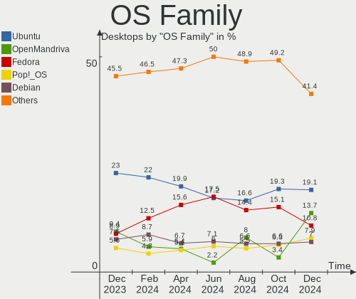
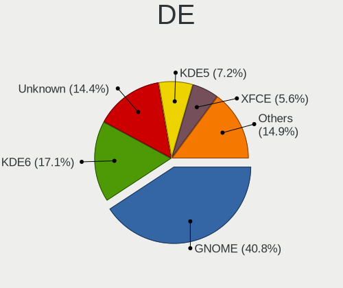
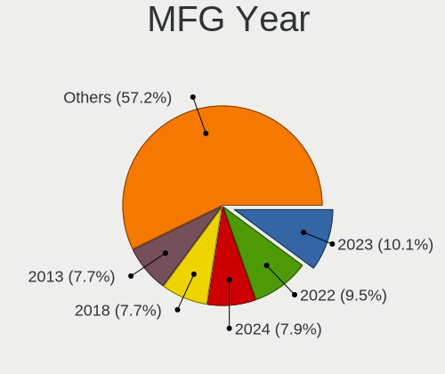
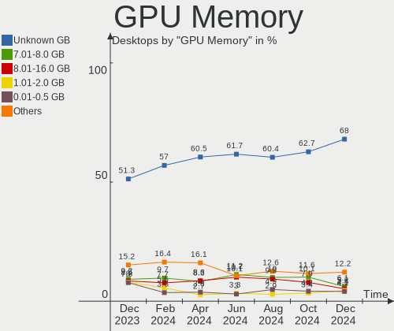
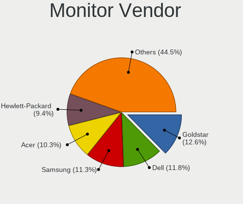
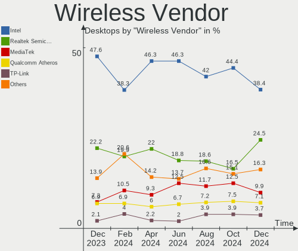
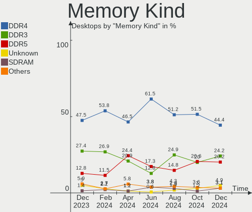
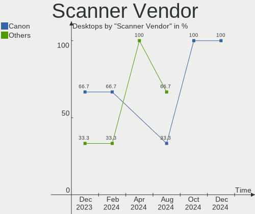
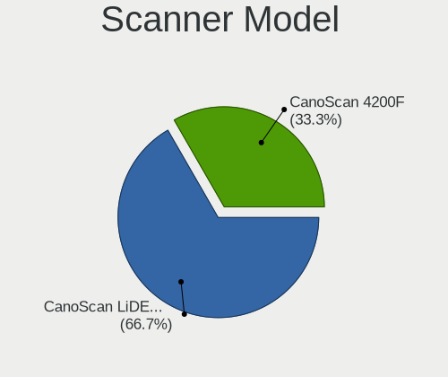

Linux in USA - Hardware Trends (Desktops)
-----------------------------------------

A project to identify most popular hardware characteristics and track their change
over time based on data collected by Linux users at https://Linux-Hardware.org.

Anyone can contribute to this report by the [hw-probe](https://github.com/linuxhw/hw-probe) tool:

    sudo -E hw-probe -all -upload

Period: Jul, 2022.

Contents
--------

* [ System ](#system)
  - [ OS                       ](#os)
  - [ OS Family                ](#os-family)
  - [ Kernel                   ](#kernel)
  - [ Kernel Family            ](#kernel-family)
  - [ Kernel Major Ver.        ](#kernel-major-ver)
  - [ Arch                     ](#arch)
  - [ DE                       ](#de)
  - [ Display Server           ](#display-server)
  - [ Display Manager          ](#display-manager)
  - [ OS Lang                  ](#os-lang)
  - [ Boot Mode                ](#boot-mode)
  - [ Filesystem               ](#filesystem)
  - [ Part. scheme             ](#part-scheme)
  - [ Dual Boot with Linux/BSD ](#dual-boot-with-linuxbsd)
  - [ Dual Boot (Win)          ](#dual-boot-win)

* [ Board ](#board)
  - [ Vendor                   ](#vendor)
  - [ Model                    ](#model)
  - [ Model Family             ](#model-family)
  - [ MFG Year                 ](#mfg-year)
  - [ Form Factor              ](#form-factor)
  - [ Secure Boot              ](#secure-boot)
  - [ Coreboot                 ](#coreboot)
  - [ RAM Size                 ](#ram-size)
  - [ RAM Used                 ](#ram-used)
  - [ Total Drives             ](#total-drives)
  - [ Has CD-ROM               ](#has-cd-rom)
  - [ Has Ethernet             ](#has-ethernet)
  - [ Has WiFi                 ](#has-wifi)
  - [ Has Bluetooth            ](#has-bluetooth)

* [ Location ](#location)
  - [ Country                  ](#country)
  - [ City                     ](#city)

* [ Drives ](#drives)
  - [ Drive Vendor             ](#drive-vendor)
  - [ Drive Model              ](#drive-model)
  - [ HDD Vendor               ](#hdd-vendor)
  - [ SSD Vendor               ](#ssd-vendor)
  - [ Drive Kind               ](#drive-kind)
  - [ Drive Connector          ](#drive-connector)
  - [ Drive Size               ](#drive-size)
  - [ Space Total              ](#space-total)
  - [ Space Used               ](#space-used)
  - [ Malfunc. Drives          ](#malfunc-drives)
  - [ Malfunc. Drive Vendor    ](#malfunc-drive-vendor)
  - [ Malfunc. HDD Vendor      ](#malfunc-hdd-vendor)
  - [ Malfunc. Drive Kind      ](#malfunc-drive-kind)
  - [ Failed Drives            ](#failed-drives)
  - [ Failed Drive Vendor      ](#failed-drive-vendor)
  - [ Drive Status             ](#drive-status)

* [ Storage controller ](#storage-controller)
  - [ Storage Vendor           ](#storage-vendor)
  - [ Storage Model            ](#storage-model)
  - [ Storage Kind             ](#storage-kind)

* [ Processor ](#processor)
  - [ CPU Vendor               ](#cpu-vendor)
  - [ CPU Model                ](#cpu-model)
  - [ CPU Model Family         ](#cpu-model-family)
  - [ CPU Cores                ](#cpu-cores)
  - [ CPU Sockets              ](#cpu-sockets)
  - [ CPU Threads              ](#cpu-threads)
  - [ CPU Op-Modes             ](#cpu-op-modes)
  - [ CPU Microcode            ](#cpu-microcode)
  - [ CPU Microarch            ](#cpu-microarch)

* [ Graphics ](#graphics)
  - [ GPU Vendor               ](#gpu-vendor)
  - [ GPU Model                ](#gpu-model)
  - [ GPU Combo                ](#gpu-combo)
  - [ GPU Driver               ](#gpu-driver)
  - [ GPU Memory               ](#gpu-memory)

* [ Monitor ](#monitor)
  - [ Monitor Vendor           ](#monitor-vendor)
  - [ Monitor Model            ](#monitor-model)
  - [ Monitor Resolution       ](#monitor-resolution)
  - [ Monitor Diagonal         ](#monitor-diagonal)
  - [ Monitor Width            ](#monitor-width)
  - [ Aspect Ratio             ](#aspect-ratio)
  - [ Monitor Area             ](#monitor-area)
  - [ Pixel Density            ](#pixel-density)
  - [ Multiple Monitors        ](#multiple-monitors)

* [ Network ](#network)
  - [ Net Controller Vendor    ](#net-controller-vendor)
  - [ Net Controller Model     ](#net-controller-model)
  - [ Wireless Vendor          ](#wireless-vendor)
  - [ Wireless Model           ](#wireless-model)
  - [ Ethernet Vendor          ](#ethernet-vendor)
  - [ Ethernet Model           ](#ethernet-model)
  - [ Net Controller Kind      ](#net-controller-kind)
  - [ Used Controller          ](#used-controller)
  - [ NICs                     ](#nics)
  - [ IPv6                     ](#ipv6)

* [ Bluetooth ](#bluetooth)
  - [ Bluetooth Vendor         ](#bluetooth-vendor)
  - [ Bluetooth Model          ](#bluetooth-model)

* [ Sound ](#sound)
  - [ Sound Vendor             ](#sound-vendor)
  - [ Sound Model              ](#sound-model)

* [ Memory ](#memory)
  - [ Memory Vendor            ](#memory-vendor)
  - [ Memory Model             ](#memory-model)
  - [ Memory Kind              ](#memory-kind)
  - [ Memory Form Factor       ](#memory-form-factor)
  - [ Memory Size              ](#memory-size)
  - [ Memory Speed             ](#memory-speed)

* [ Printers & scanners ](#printers--scanners)
  - [ Printer Vendor           ](#printer-vendor)
  - [ Printer Model            ](#printer-model)
  - [ Scanner Vendor           ](#scanner-vendor)
  - [ Scanner Model            ](#scanner-model)

* [ Camera ](#camera)
  - [ Camera Vendor            ](#camera-vendor)
  - [ Camera Model             ](#camera-model)

* [ Security ](#security)
  - [ Fingerprint Vendor       ](#fingerprint-vendor)
  - [ Fingerprint Model        ](#fingerprint-model)
  - [ Chipcard Vendor          ](#chipcard-vendor)
  - [ Chipcard Model           ](#chipcard-model)

* [ Unsupported ](#unsupported)
  - [ Unsupported Devices      ](#unsupported-devices)
  - [ Unsupported Device Types ](#unsupported-device-types)

System
------

OS
--

Installed operating systems

| Name                         | Desktops | Percent |
|------------------------------|----------|---------|
| Ubuntu 22.04                 | 48       | 12.8%   |
| Ubuntu 20.04                 | 38       | 10.13%  |
| OpenMandriva 4.3             | 32       | 8.53%   |
| Linux Mint 20.3              | 30       | 8%      |
| Pop!_OS 22.04                | 29       | 7.73%   |
| Fedora 36                    | 26       | 6.93%   |
| KDE neon 20.04               | 18       | 4.8%    |
| OpenMandriva 4.90            | 17       | 4.53%   |
| Debian 11                    | 12       | 3.2%    |
| Zorin 16                     | 11       | 2.93%   |
| Gentoo 2.8                   | 8        | 2.13%   |
| Arch                         | 6        | 1.6%    |
| Xubuntu 20.04                | 5        | 1.33%   |
| Kubuntu 22.04                | 5        | 1.33%   |
| Ubuntu 21.10                 | 4        | 1.07%   |
| Manjaro                      | 4        | 1.07%   |
| Debian Testing               | 4        | 1.07%   |
| Arch Rolling                 | 4        | 1.07%   |
| Pop!_OS 20.04                | 3        | 0.8%    |
| openSUSE Tumbleweed-XXXXXXXX | 3        | 0.8%    |
| Lubuntu 22.04                | 3        | 0.8%    |
| Linux Mint 20.2              | 3        | 0.8%    |
| Kubuntu 20.04                | 3        | 0.8%    |
| Fedora 35                    | 3        | 0.8%    |
| Elementary 6.1               | 3        | 0.8%    |
| ArcoLinux Rolling            | 3        | 0.8%    |
| Ubuntu MATE 22.04            | 2        | 0.53%   |
| Parrot 5.0                   | 2        | 0.53%   |
| OpenMandriva 4.2             | 2        | 0.53%   |
| Nobara 36                    | 2        | 0.53%   |
| Manjaro 21.3.3               | 2        | 0.53%   |
| Linux Mint 20.1              | 2        | 0.53%   |
| Endless 4.0.7                | 2        | 0.53%   |
| EndeavourOS                  | 2        | 0.53%   |
| Zorin 15                     | 1        | 0.27%   |
| Void Linux Rolling           | 1        | 0.27%   |
| Ubuntu MATE 20.10            | 1        | 0.27%   |
| Ubuntu 20.10                 | 1        | 0.27%   |
| Ubuntu 18.04                 | 1        | 0.27%   |
| SLES 15.3                    | 1        | 0.27%   |
| Reborn OS                    | 1        | 0.27%   |
| Pop!_OS 21.10                | 1        | 0.27%   |
| Pop!_OS 21.04                | 1        | 0.27%   |
| PCLinuxOS 2022               | 1        | 0.27%   |
| Oracle Linux 8.6             | 1        | 0.27%   |
| openSUSE Leap-15.4           | 1        | 0.27%   |
| MX 21                        | 1        | 0.27%   |
| MassOS 2022.04.2             | 1        | 0.27%   |
| Lubuntu 20.04                | 1        | 0.27%   |
| LMDE 5                       | 1        | 0.27%   |
| Linux Mint 21                | 1        | 0.27%   |
| Linux Mint 20                | 1        | 0.27%   |
| Linux Mint 19.3              | 1        | 0.27%   |
| Kubuntu 18.04                | 1        | 0.27%   |
| KaOS                         | 1        | 0.27%   |
| Kali 2022.1                  | 1        | 0.27%   |
| Garuda Linux Soaring         | 1        | 0.27%   |
| Garuda Linux                 | 1        | 0.27%   |
| Fedora 34                    | 1        | 0.27%   |
| Endless 4.0.6                | 1        | 0.27%   |

OS Family
---------

OS without a version

| Name         | Desktops | Percent |
|--------------|----------|---------|
| Ubuntu       | 92       | 24.53%  |
| OpenMandriva | 51       | 13.6%   |
| Linux Mint   | 38       | 10.13%  |
| Pop!_OS      | 34       | 9.07%   |
| Fedora       | 30       | 8%      |
| KDE neon     | 18       | 4.8%    |
| Debian       | 16       | 4.27%   |
| Zorin        | 12       | 3.2%    |
| Arch         | 10       | 2.67%   |
| Kubuntu      | 9        | 2.4%    |
| Gentoo       | 8        | 2.13%   |
| Manjaro      | 6        | 1.6%    |
| Xubuntu      | 5        | 1.33%   |
| openSUSE     | 4        | 1.07%   |
| Lubuntu      | 4        | 1.07%   |
| ArcoLinux    | 4        | 1.07%   |
| Ubuntu MATE  | 3        | 0.8%    |
| Endless      | 3        | 0.8%    |
| EndeavourOS  | 3        | 0.8%    |
| Elementary   | 3        | 0.8%    |
| Parrot       | 2        | 0.53%   |
| Nobara       | 2        | 0.53%   |
| Garuda Linux | 2        | 0.53%   |
| Void Linux   | 1        | 0.27%   |
| SLES         | 1        | 0.27%   |
| Reborn OS    | 1        | 0.27%   |
| PCLinuxOS    | 1        | 0.27%   |
| Oracle Linux | 1        | 0.27%   |
| MX           | 1        | 0.27%   |
| MassOS       | 1        | 0.27%   |
| LMDE         | 1        | 0.27%   |
| KaOS         | 1        | 0.27%   |
| Kali         | 1        | 0.27%   |
| Drauger OS   | 1        | 0.27%   |
| Devuan       | 1        | 0.27%   |
| Deepin       | 1        | 0.27%   |
| Clear Linux  | 1        | 0.27%   |
| Bottlerocket | 1        | 0.27%   |
| antiX        | 1        | 0.27%   |

Kernel
------

Version of the Linux kernel

| Version                      | Desktops | Percent |
|------------------------------|----------|---------|
| 5.15.0-41-generic            | 60       | 16%     |
| 5.16.7-desktop-1omv4003      | 31       | 8.27%   |
| 5.17.15-76051715-generic     | 23       | 6.13%   |
| 5.15.0-40-generic            | 23       | 6.13%   |
| 5.13.0-52-generic            | 22       | 5.87%   |
| 5.4.0-121-generic            | 18       | 4.8%    |
| 5.18.12-desktop-3omv4090     | 17       | 4.53%   |
| 5.4.0-122-generic            | 13       | 3.47%   |
| 5.18.11-200.fc36.x86_64      | 8        | 2.13%   |
| 5.13.0-51-generic            | 8        | 2.13%   |
| 5.18.0-2-amd64               | 6        | 1.6%    |
| 5.18.7-200.fc36.x86_64       | 5        | 1.33%   |
| 5.18.13-200.fc36.x86_64      | 5        | 1.33%   |
| 5.18.10-76051810-generic     | 5        | 1.33%   |
| 5.18.10-200.fc36.x86_64      | 5        | 1.33%   |
| 5.15.0-43-generic            | 4        | 1.07%   |
| 5.4.0-91-generic             | 3        | 0.8%    |
| 5.18.9-arch1-1               | 3        | 0.8%    |
| 5.18.10-1-MANJARO            | 3        | 0.8%    |
| 5.17.5-76051705-generic      | 3        | 0.8%    |
| 5.15.0-39-generic            | 3        | 0.8%    |
| 5.15.0-25-generic            | 3        | 0.8%    |
| 5.11.0-35-generic            | 3        | 0.8%    |
| 5.4.0-117-generic            | 2        | 0.53%   |
| 5.4.0-107-generic            | 2        | 0.53%   |
| 5.18.9-200.fc36.x86_64       | 2        | 0.53%   |
| 5.18.3-arch1-1               | 2        | 0.53%   |
| 5.18.12-zen1-1-zen           | 2        | 0.53%   |
| 5.18.12-arch1-1              | 2        | 0.53%   |
| 5.18.11-zen1-1-zen           | 2        | 0.53%   |
| 5.18.11-1-default            | 2        | 0.53%   |
| 5.18.10-arch1-1              | 2        | 0.53%   |
| 5.16.0-6mx-amd64             | 2        | 0.53%   |
| 5.13.0-44-generic            | 2        | 0.53%   |
| 5.10.14-desktop-1omv4002     | 2        | 0.53%   |
| 5.10.0-16-amd64              | 2        | 0.53%   |
| 5.10.0-15-amd64              | 2        | 0.53%   |
| 5.8.0-63-generic             | 1        | 0.27%   |
| 5.8.0-53-generic             | 1        | 0.27%   |
| 5.8.0-43-generic             | 1        | 0.27%   |
| 5.8.0-25-generic             | 1        | 0.27%   |
| 5.5.0-0.bpo.2-amd64          | 1        | 0.27%   |
| 5.4.0-60-lowlatency          | 1        | 0.27%   |
| 5.4.0-45-generic             | 1        | 0.27%   |
| 5.4.0-122-lowlatency         | 1        | 0.27%   |
| 5.4.0-121-lowlatency         | 1        | 0.27%   |
| 5.4.0-1132206031516-generic  | 1        | 0.27%   |
| 5.3.18-57-default            | 1        | 0.27%   |
| 5.18.9_1                     | 1        | 0.27%   |
| 5.18.9-gentoo-x86_64         | 1        | 0.27%   |
| 5.18.9-201.fsync.fc36.x86_64 | 1        | 0.27%   |
| 5.18.8-051808-generic        | 1        | 0.27%   |
| 5.18.7-arch1-1               | 1        | 0.27%   |
| 5.18.6-200.fc36.x86_64       | 1        | 0.27%   |
| 5.18.6-1-default             | 1        | 0.27%   |
| 5.18.4-101.fc35.x86_64       | 1        | 0.27%   |
| 5.18.3-zen1-1-zen            | 1        | 0.27%   |
| 5.18.15-arch1-1              | 1        | 0.27%   |
| 5.18.14-gentoo-x86_64        | 1        | 0.27%   |
| 5.18.14-gentoo               | 1        | 0.27%   |

Kernel Family
-------------

Linux kernel without a distro release

| Version  | Desktops | Percent |
|----------|----------|---------|
| 5.15.0   | 95       | 25.33%  |
| 5.4.0    | 43       | 11.47%  |
| 5.13.0   | 35       | 9.33%   |
| 5.16.7   | 31       | 8.27%   |
| 5.17.15  | 25       | 6.67%   |
| 5.18.12  | 23       | 6.13%   |
| 5.18.10  | 20       | 5.33%   |
| 5.18.11  | 15       | 4%      |
| 5.18.0   | 9        | 2.4%    |
| 5.18.9   | 8        | 2.13%   |
| 5.18.13  | 7        | 1.87%   |
| 5.11.0   | 7        | 1.87%   |
| 5.10.0   | 7        | 1.87%   |
| 5.18.7   | 6        | 1.6%    |
| 5.8.0    | 4        | 1.07%   |
| 5.18.14  | 4        | 1.07%   |
| 5.16.0   | 4        | 1.07%   |
| 5.15.52  | 4        | 1.07%   |
| 5.18.3   | 3        | 0.8%    |
| 5.17.5   | 3        | 0.8%    |
| 5.18.6   | 2        | 0.53%   |
| 5.10.14  | 2        | 0.53%   |
| 5.5.0    | 1        | 0.27%   |
| 5.3.18   | 1        | 0.27%   |
| 5.18.8   | 1        | 0.27%   |
| 5.18.4   | 1        | 0.27%   |
| 5.18.15  | 1        | 0.27%   |
| 5.17.7   | 1        | 0.27%   |
| 5.17.3   | 1        | 0.27%   |
| 5.17.12  | 1        | 0.27%   |
| 5.16.13  | 1        | 0.27%   |
| 5.15.50  | 1        | 0.27%   |
| 5.15.46  | 1        | 0.27%   |
| 5.15.43  | 1        | 0.27%   |
| 5.14.21  | 1        | 0.27%   |
| 5.13.19  | 1        | 0.27%   |
| 5.10.57  | 1        | 0.27%   |
| 5.10.101 | 1        | 0.27%   |
| 4.18.0   | 1        | 0.27%   |
| 4.15.0   | 1        | 0.27%   |

Kernel Major Ver.
-----------------

Linux kernel major version

| Version | Desktops | Percent |
|---------|----------|---------|
| 5.15    | 102      | 27.2%   |
| 5.18    | 100      | 26.67%  |
| 5.4     | 43       | 11.47%  |
| 5.16    | 36       | 9.6%    |
| 5.13    | 36       | 9.6%    |
| 5.17    | 31       | 8.27%   |
| 5.10    | 11       | 2.93%   |
| 5.11    | 7        | 1.87%   |
| 5.8     | 4        | 1.07%   |
| 5.5     | 1        | 0.27%   |
| 5.3     | 1        | 0.27%   |
| 5.14    | 1        | 0.27%   |
| 4.18    | 1        | 0.27%   |
| 4.15    | 1        | 0.27%   |

Arch
----

OS architecture (x86_64, i586, etc.)

| Name   | Desktops | Percent |
|--------|----------|---------|
| x86_64 | 374      | 99.73%  |
| i686   | 1        | 0.27%   |

DE
--

Desktop Environment

| Name            | Desktops | Percent |
|-----------------|----------|---------|
| GNOME           | 163      | 43.47%  |
| KDE5            | 114      | 30.4%   |
| X-Cinnamon      | 34       | 9.07%   |
| XFCE            | 20       | 5.33%   |
| Unknown         | 16       | 4.27%   |
| MATE            | 12       | 3.2%    |
| Pantheon        | 3        | 0.8%    |
| LXQt            | 3        | 0.8%    |
| i3              | 2        | 0.53%   |
| Cinnamon        | 2        | 0.53%   |
| bspwm           | 2        | 0.53%   |
| sway            | 1        | 0.27%   |
| LXDE            | 1        | 0.27%   |
| GNOME Flashback | 1        | 0.27%   |
| Deepin          | 1        | 0.27%   |

Display Server
--------------

X11 or Wayland

| Name    | Desktops | Percent |
|---------|----------|---------|
| X11     | 303      | 80.8%   |
| Wayland | 58       | 15.47%  |
| Tty     | 8        | 2.13%   |
| Unknown | 6        | 1.6%    |

Display Manager
---------------

SDDM, LightDM, etc.

| Name    | Desktops | Percent |
|---------|----------|---------|
| Unknown | 154      | 41.07%  |
| GDM3    | 80       | 21.33%  |
| SDDM    | 74       | 19.73%  |
| LightDM | 43       | 11.47%  |
| GDM     | 22       | 5.87%   |
| XDM     | 1        | 0.27%   |
| LXDM    | 1        | 0.27%   |

OS Lang
-------

Language

| Lang    | Desktops | Percent |
|---------|----------|---------|
| en_US   | 357      | 95.2%   |
| C       | 6        | 1.6%    |
| Unknown | 4        | 1.07%   |
| zh_CN   | 2        | 0.53%   |
| en_CA   | 2        | 0.53%   |
| en_AU   | 2        | 0.53%   |
| pt_BR   | 1        | 0.27%   |
| en_NZ   | 1        | 0.27%   |

Boot Mode
---------

EFI or BIOS

| Mode | Desktops | Percent |
|------|----------|---------|
| BIOS | 201      | 53.6%   |
| EFI  | 174      | 46.4%   |

Filesystem
----------

Type of filesystem

| Type    | Desktops | Percent |
|---------|----------|---------|
| Ext4    | 263      | 70.13%  |
| Overlay | 52       | 13.87%  |
| Btrfs   | 43       | 11.47%  |
| Zfs     | 8        | 2.13%   |
| Xfs     | 6        | 1.6%    |
| F2fs    | 1        | 0.27%   |
| Ext3    | 1        | 0.27%   |
| Ext2    | 1        | 0.27%   |

Part. scheme
------------

Scheme of partitioning

| Type    | Desktops | Percent |
|---------|----------|---------|
| Unknown | 213      | 56.8%   |
| GPT     | 128      | 34.13%  |
| MBR     | 34       | 9.07%   |

Dual Boot with Linux/BSD
------------------------

Hosting more than one Linux/BSD

| Dual boot | Desktops | Percent |
|-----------|----------|---------|
| No        | 291      | 77.6%   |
| Yes       | 84       | 22.4%   |

Dual Boot (Win)
---------------

Hosting Linux and Windows

| Dual boot | Desktops | Percent |
|-----------|----------|---------|
| No        | 277      | 73.87%  |
| Yes       | 98       | 26.13%  |

Board
-----

Vendor
------

Motherboard manufacturer

| Name                | Desktops | Percent |
|---------------------|----------|---------|
| ASUSTek Computer    | 96       | 25.6%   |
| MSI                 | 54       | 14.4%   |
| Dell                | 53       | 14.13%  |
| Gigabyte Technology | 39       | 10.4%   |
| Hewlett-Packard     | 33       | 8.8%    |
| ASRock              | 25       | 6.67%   |
| Lenovo              | 18       | 4.8%    |
| Pegatron            | 8        | 2.13%   |
| Acer                | 7        | 1.87%   |
| Supermicro          | 4        | 1.07%   |
| Intel               | 4        | 1.07%   |
| AZW                 | 4        | 1.07%   |
| Alienware           | 4        | 1.07%   |
| Unknown             | 4        | 1.07%   |
| Gateway             | 3        | 0.8%    |
| Foxconn             | 3        | 0.8%    |
| Biostar             | 3        | 0.8%    |
| ECS                 | 2        | 0.53%   |
| Apple               | 2        | 0.53%   |
| System76            | 1        | 0.27%   |
| Shuttle             | 1        | 0.27%   |
| Seeed Studio        | 1        | 0.27%   |
| NCR                 | 1        | 0.27%   |
| GMKtec              | 1        | 0.27%   |
| eMachines           | 1        | 0.27%   |
| Compaq              | 1        | 0.27%   |
| BESSTAR Tech        | 1        | 0.27%   |
| ASRockRack          | 1        | 0.27%   |

Model
-----

Motherboard model

| Name                               | Desktops | Percent |
|------------------------------------|----------|---------|
| MSI MS-7C37                        | 6        | 1.6%    |
| ASUS TUF Gaming X570-PLUS          | 6        | 1.6%    |
| MSI MS-7C91                        | 4        | 1.07%   |
| Gigabyte X570 AORUS MASTER         | 4        | 1.07%   |
| ASUS ROG STRIX B550-F GAMING       | 4        | 1.07%   |
| ASUS ROG STRIX B450-F GAMING       | 4        | 1.07%   |
| ASUS All Series                    | 4        | 1.07%   |
| Unknown                            | 4        | 1.07%   |
| MSI MS-7C35                        | 3        | 0.8%    |
| Dell OptiPlex 9020                 | 3        | 0.8%    |
| Dell OptiPlex 790                  | 3        | 0.8%    |
| Dell OptiPlex 7020                 | 3        | 0.8%    |
| Dell OptiPlex 7010                 | 3        | 0.8%    |
| Dell OptiPlex 3010                 | 3        | 0.8%    |
| MSI MS-7D25                        | 2        | 0.53%   |
| MSI MS-7D09                        | 2        | 0.53%   |
| MSI MS-7C75                        | 2        | 0.53%   |
| MSI MS-7C02                        | 2        | 0.53%   |
| MSI MS-7917                        | 2        | 0.53%   |
| MSI MS-7693                        | 2        | 0.53%   |
| HP ProDesk 600 G1 SFF              | 2        | 0.53%   |
| HP Pavilion Desktop 590-p0xxx      | 2        | 0.53%   |
| HP Compaq Pro 6300 SFF             | 2        | 0.53%   |
| Gigabyte X570 I AORUS PRO WIFI     | 2        | 0.53%   |
| Gigabyte H97M-D3H                  | 2        | 0.53%   |
| Gigabyte EP45-UD3P                 | 2        | 0.53%   |
| Dell XPS 8930                      | 2        | 0.53%   |
| Dell OptiPlex 780                  | 2        | 0.53%   |
| Dell OptiPlex 7090                 | 2        | 0.53%   |
| Dell OptiPlex 7050                 | 2        | 0.53%   |
| Dell OptiPlex 390                  | 2        | 0.53%   |
| Dell OptiPlex 3020                 | 2        | 0.53%   |
| Dell Inspiron 3668                 | 2        | 0.53%   |
| Dell Dimension 9100                | 2        | 0.53%   |
| AZW Green G2                       | 2        | 0.53%   |
| ASUS TUF Gaming B550-PLUS          | 2        | 0.53%   |
| ASUS SABERTOOTH Z77                | 2        | 0.53%   |
| ASUS ROG STRIX B550-I GAMING       | 2        | 0.53%   |
| ASUS ROG STRIX B350-F GAMING       | 2        | 0.53%   |
| ASUS ROG Maximus XI HERO           | 2        | 0.53%   |
| ASUS ROG CROSSHAIR VII HERO        | 2        | 0.53%   |
| ASUS PRIME Z390-A                  | 2        | 0.53%   |
| ASUS PRIME X570-P                  | 2        | 0.53%   |
| ASUS PRIME X370-PRO                | 2        | 0.53%   |
| ASUS PRIME B450-PLUS               | 2        | 0.53%   |
| ASUS M5A99X EVO R2.0               | 2        | 0.53%   |
| ASUS M5A97 R2.0                    | 2        | 0.53%   |
| ASUS A88X-PRO                      | 2        | 0.53%   |
| ASRock Z270 Professional Gaming i7 | 2        | 0.53%   |
| ASRock A300M-STX                   | 2        | 0.53%   |
| Apple MacPro5,1                    | 2        | 0.53%   |
| Acer Aspire XC-830                 | 2        | 0.53%   |
| System76 Thelio                    | 1        | 0.27%   |
| Supermicro SYS-E100-9AP            | 1        | 0.27%   |
| Supermicro SSG-6028R-E1CR12T       | 1        | 0.27%   |
| Supermicro Mediasite Recorder      | 1        | 0.27%   |
| Supermicro AS -4124GS-TNR          | 1        | 0.27%   |
| Shuttle DS61                       | 1        | 0.27%   |
| Seeed Studio ODYSSEY-X86J4125      | 1        | 0.27%   |
| Pegatron p7-1154                   | 1        | 0.27%   |

Model Family
------------

Motherboard model prefix

| Name                          | Desktops | Percent |
|-------------------------------|----------|---------|
| Dell OptiPlex                 | 29       | 7.73%   |
| ASUS ROG                      | 28       | 7.47%   |
| ASUS PRIME                    | 17       | 4.53%   |
| ASUS TUF                      | 13       | 3.47%   |
| Lenovo ThinkCentre            | 12       | 3.2%    |
| HP Compaq                     | 10       | 2.67%   |
| Gigabyte X570                 | 7        | 1.87%   |
| Dell XPS                      | 7        | 1.87%   |
| Dell Inspiron                 | 7        | 1.87%   |
| Acer Aspire                   | 7        | 1.87%   |
| MSI MS-7C37                   | 6        | 1.6%    |
| HP Pavilion                   | 5        | 1.33%   |
| MSI MS-7C91                   | 4        | 1.07%   |
| HP ProDesk                    | 4        | 1.07%   |
| HP EliteDesk                  | 4        | 1.07%   |
| Dell Precision                | 4        | 1.07%   |
| ASUS SABERTOOTH               | 4        | 1.07%   |
| ASUS All                      | 4        | 1.07%   |
| Unknown                       | 4        | 1.07%   |
| MSI MS-7C35                   | 3        | 0.8%    |
| Dell Dimension                | 3        | 0.8%    |
| ASUS M5A99X                   | 3        | 0.8%    |
| ASUS M5A97                    | 3        | 0.8%    |
| ASRock Z270                   | 3        | 0.8%    |
| Alienware Aurora              | 3        | 0.8%    |
| MSI MS-7D25                   | 2        | 0.53%   |
| MSI MS-7D09                   | 2        | 0.53%   |
| MSI MS-7C75                   | 2        | 0.53%   |
| MSI MS-7C02                   | 2        | 0.53%   |
| MSI MS-7917                   | 2        | 0.53%   |
| MSI MS-7693                   | 2        | 0.53%   |
| Lenovo Legion                 | 2        | 0.53%   |
| Gigabyte Z590                 | 2        | 0.53%   |
| Gigabyte X399                 | 2        | 0.53%   |
| Gigabyte H97M-D3H             | 2        | 0.53%   |
| Gigabyte EP45-UD3P            | 2        | 0.53%   |
| AZW Green                     | 2        | 0.53%   |
| ASUS Maximus                  | 2        | 0.53%   |
| ASUS A88X-PRO                 | 2        | 0.53%   |
| ASRock X470                   | 2        | 0.53%   |
| ASRock B550                   | 2        | 0.53%   |
| ASRock B450M                  | 2        | 0.53%   |
| ASRock A300M-STX              | 2        | 0.53%   |
| Apple MacPro5                 | 2        | 0.53%   |
| System76 Thelio               | 1        | 0.27%   |
| Supermicro SYS-E100-9AP       | 1        | 0.27%   |
| Supermicro SSG-6028R-E1CR12T  | 1        | 0.27%   |
| Supermicro Mediasite          | 1        | 0.27%   |
| Supermicro AS                 | 1        | 0.27%   |
| Shuttle DS61                  | 1        | 0.27%   |
| Seeed Studio ODYSSEY-X86J4125 | 1        | 0.27%   |
| Pegatron p7-1154              | 1        | 0.27%   |
| Pegatron p2-1394              | 1        | 0.27%   |
| Pegatron NY799AA-ABA          | 1        | 0.27%   |
| Pegatron NY550AA-ABA          | 1        | 0.27%   |
| Pegatron NE502AV-ABA          | 1        | 0.27%   |
| Pegatron FK821AA-ABA          | 1        | 0.27%   |
| Pegatron 2ACE                 | 1        | 0.27%   |
| Pegatron 220-1125             | 1        | 0.27%   |
| NCR 7606-1007-8801            | 1        | 0.27%   |

MFG Year
--------

Motherboard manufacture year

| Year | Desktops | Percent |
|------|----------|---------|
| 2021 | 44       | 11.73%  |
| 2020 | 40       | 10.67%  |
| 2019 | 40       | 10.67%  |
| 2018 | 37       | 9.87%   |
| 2013 | 31       | 8.27%   |
| 2012 | 30       | 8%      |
| 2014 | 26       | 6.93%   |
| 2017 | 25       | 6.67%   |
| 2011 | 20       | 5.33%   |
| 2022 | 15       | 4%      |
| 2015 | 15       | 4%      |
| 2009 | 14       | 3.73%   |
| 2010 | 10       | 2.67%   |
| 2008 | 7        | 1.87%   |
| 2007 | 7        | 1.87%   |
| 2016 | 6        | 1.6%    |
| 2006 | 5        | 1.33%   |
| 2005 | 2        | 0.53%   |
| 2001 | 1        | 0.27%   |

Form Factor
-----------

Physical design of the computer

| Name    | Desktops | Percent |
|---------|----------|---------|
| Desktop | 375      | 100%    |

Secure Boot
-----------

Enabled or disabled

| State    | Desktops | Percent |
|----------|----------|---------|
| Disabled | 361      | 96.27%  |
| Enabled  | 14       | 3.73%   |

Coreboot
--------

Have coreboot on board

| Used | Desktops | Percent |
|------|----------|---------|
| No   | 375      | 100%    |

RAM Size
--------

Total RAM memory

| Size in GB      | Desktops | Percent |
|-----------------|----------|---------|
| 16.01-24.0      | 114      | 30.4%   |
| 32.01-64.0      | 93       | 24.8%   |
| 4.01-8.0        | 48       | 12.8%   |
| 64.01-256.0     | 34       | 9.07%   |
| 3.01-4.0        | 31       | 8.27%   |
| 8.01-16.0       | 30       | 8%      |
| 24.01-32.0      | 14       | 3.73%   |
| 2.01-3.0        | 3        | 0.8%    |
| 1.01-2.0        | 3        | 0.8%    |
| More than 256.0 | 2        | 0.53%   |
| 0.51-1.0        | 2        | 0.53%   |
| 0.01-0.5        | 1        | 0.27%   |

RAM Used
--------

Used RAM memory

| Used GB         | Desktops | Percent |
|-----------------|----------|---------|
| 1.01-2.0        | 135      | 36%     |
| 2.01-3.0        | 80       | 21.33%  |
| 4.01-8.0        | 69       | 18.4%   |
| 3.01-4.0        | 45       | 12%     |
| 0.51-1.0        | 19       | 5.07%   |
| 8.01-16.0       | 17       | 4.53%   |
| 16.01-24.0      | 6        | 1.6%    |
| 0.01-0.5        | 3        | 0.8%    |
| More than 256.0 | 1        | 0.27%   |

Total Drives
------------

Number of drives on board

| Drives | Desktops | Percent |
|--------|----------|---------|
| 1      | 140      | 37.33%  |
| 2      | 85       | 22.67%  |
| 3      | 58       | 15.47%  |
| 4      | 46       | 12.27%  |
| 5      | 21       | 5.6%    |
| 7      | 10       | 2.67%   |
| 6      | 6        | 1.6%    |
| 0      | 3        | 0.8%    |
| 11     | 2        | 0.53%   |
| 16     | 1        | 0.27%   |
| 12     | 1        | 0.27%   |
| 10     | 1        | 0.27%   |
| 8      | 1        | 0.27%   |

Has CD-ROM
----------

Has CD-ROM on board

| Presented | Desktops | Percent |
|-----------|----------|---------|
| No        | 205      | 54.67%  |
| Yes       | 170      | 45.33%  |

Has Ethernet
------------

Has Ethernet on board

| Presented | Desktops | Percent |
|-----------|----------|---------|
| Yes       | 371      | 98.93%  |
| No        | 4        | 1.07%   |

Has WiFi
--------

Has WiFi module

| Presented | Desktops | Percent |
|-----------|----------|---------|
| Yes       | 225      | 60%     |
| No        | 150      | 40%     |

Has Bluetooth
-------------

Has Bluetooth module

| Presented | Desktops | Percent |
|-----------|----------|---------|
| No        | 208      | 55.47%  |
| Yes       | 167      | 44.53%  |

Location
--------

Country
-------

Geographic location (country)

| Country | Desktops | Percent |
|---------|----------|---------|
| USA     | 375      | 100%    |

City
----

Geographic location (city)

| City            | Desktops | Percent |
|-----------------|----------|---------|
| Chicago         | 9        | 2.4%    |
| Seattle         | 7        | 1.87%   |
| Miami           | 6        | 1.6%    |
| San Jose        | 5        | 1.33%   |
| New York        | 5        | 1.33%   |
| Los Angeles     | 5        | 1.33%   |
| Jacksonville    | 5        | 1.33%   |
| Houston         | 5        | 1.33%   |
| San Antonio     | 4        | 1.07%   |
| Milwaukee       | 4        | 1.07%   |
| Kansas City     | 4        | 1.07%   |
| Denver          | 4        | 1.07%   |
| Atlanta         | 4        | 1.07%   |
| Santa Clara     | 3        | 0.8%    |
| San Francisco   | 3        | 0.8%    |
| Salt Lake City  | 3        | 0.8%    |
| Saint Paul      | 3        | 0.8%    |
| Pittsburgh      | 3        | 0.8%    |
| Phoenix         | 3        | 0.8%    |
| Largo           | 3        | 0.8%    |
| Wichita         | 2        | 0.53%   |
| Tucson          | 2        | 0.53%   |
| The Colony      | 2        | 0.53%   |
| The Bronx       | 2        | 0.53%   |
| Stevens Point   | 2        | 0.53%   |
| St Louis        | 2        | 0.53%   |
| Springfield     | 2        | 0.53%   |
| Shawnee         | 2        | 0.53%   |
| Santee          | 2        | 0.53%   |
| Saint Augustine | 2        | 0.53%   |
| Raleigh         | 2        | 0.53%   |
| Portland        | 2        | 0.53%   |
| Philadelphia    | 2        | 0.53%   |
| Peoria          | 2        | 0.53%   |
| Pasco           | 2        | 0.53%   |
| Orlando         | 2        | 0.53%   |
| Naperville      | 2        | 0.53%   |
| Minneapolis     | 2        | 0.53%   |
| Middletown      | 2        | 0.53%   |
| Merced          | 2        | 0.53%   |
| Marion          | 2        | 0.53%   |
| Manchester      | 2        | 0.53%   |
| Louisville      | 2        | 0.53%   |
| Lincoln         | 2        | 0.53%   |
| Jasper          | 2        | 0.53%   |
| Greenfield      | 2        | 0.53%   |
| Fresno          | 2        | 0.53%   |
| Dallas          | 2        | 0.53%   |
| Cleveland       | 2        | 0.53%   |
| Cincinnati      | 2        | 0.53%   |
| Cedar Rapids    | 2        | 0.53%   |
| Broomfield      | 2        | 0.53%   |
| Baton Rouge     | 2        | 0.53%   |
| Austin          | 2        | 0.53%   |
| Arlington       | 2        | 0.53%   |
| Anaheim         | 2        | 0.53%   |
| Zephyrhills     | 1        | 0.27%   |
| Ypsilanti       | 1        | 0.27%   |
| York            | 1        | 0.27%   |
| Wynantskill     | 1        | 0.27%   |

Drives
------

Drive Vendor
------------

Hard drive vendors

| Vendor                    | Desktops | Drives | Percent |
|---------------------------|----------|--------|---------|
| Seagate                   | 143      | 215    | 19.75%  |
| WDC                       | 125      | 183    | 17.27%  |
| Samsung Electronics       | 105      | 161    | 14.5%   |
| SanDisk                   | 45       | 57     | 6.22%   |
| Toshiba                   | 34       | 36     | 4.7%    |
| Kingston                  | 25       | 29     | 3.45%   |
| Hitachi                   | 25       | 26     | 3.45%   |
| Crucial                   | 25       | 28     | 3.45%   |
| PNY                       | 15       | 15     | 2.07%   |
| SK hynix                  | 13       | 13     | 1.8%    |
| Intel                     | 13       | 14     | 1.8%    |
| HGST                      | 12       | 12     | 1.66%   |
| A-DATA Technology         | 11       | 12     | 1.52%   |
| Phison                    | 10       | 18     | 1.38%   |
| China                     | 10       | 13     | 1.38%   |
| Unknown                   | 7        | 9      | 0.97%   |
| SPCC                      | 7        | 8      | 0.97%   |
| Realtek Semiconductor     | 7        | 7      | 0.97%   |
| Micron/Crucial Technology | 6        | 6      | 0.83%   |
| SABRENT                   | 5        | 7      | 0.69%   |
| Team                      | 4        | 4      | 0.55%   |
| OCZ                       | 4        | 4      | 0.55%   |
| Mushkin                   | 4        | 5      | 0.55%   |
| Unknown                   | 4        | 4      | 0.55%   |
| TO Exter                  | 3        | 3      | 0.41%   |
| Silicon Motion            | 3        | 3      | 0.41%   |
| NGFF                      | 3        | 3      | 0.41%   |
| Micron Technology         | 3        | 4      | 0.41%   |
| KIOXIA                    | 3        | 3      | 0.41%   |
| KingFast                  | 3        | 3      | 0.41%   |
| JMicron Technology        | 3        | 3      | 0.41%   |
| Hewlett-Packard           | 3        | 3      | 0.41%   |
| WD MediaMax               | 2        | 2      | 0.28%   |
| Phison Electronics        | 2        | 2      | 0.28%   |
| Lexar                     | 2        | 2      | 0.28%   |
| Gigabyte Technology       | 2        | 4      | 0.28%   |
| Corsair                   | 2        | 2      | 0.28%   |
| ASMT                      | 2        | 2      | 0.28%   |
| Zheino                    | 1        | 1      | 0.14%   |
| XPG                       | 1        | 1      | 0.14%   |
| UD0401                    | 1        | 1      | 0.14%   |
| Timetec                   | 1        | 1      | 0.14%   |
| T-FORCE                   | 1        | 1      | 0.14%   |
| T-CREATE                  | 1        | 1      | 0.14%   |
| SSK                       | 1        | 1      | 0.14%   |
| SPCC M.2                  | 1        | 1      | 0.14%   |
| SATADOM-ML                | 1        | 1      | 0.14%   |
| Realtek                   | 1        | 1      | 0.14%   |
| PNY USB                   | 1        | 1      | 0.14%   |
| Plextor                   | 1        | 1      | 0.14%   |
| Pioneer                   | 1        | 1      | 0.14%   |
| Patriot                   | 1        | 1      | 0.14%   |
| OCZ-VERTEX3               | 1        | 1      | 0.14%   |
| MyDigitalSSD              | 1        | 1      | 0.14%   |
| Maxtor                    | 1        | 1      | 0.14%   |
| LITEONIT                  | 1        | 1      | 0.14%   |
| Innodisk                  | 1        | 1      | 0.14%   |
| HPE                       | 1        | 1      | 0.14%   |
| HGST HTS                  | 1        | 1      | 0.14%   |
| Emtec                     | 1        | 1      | 0.14%   |

Drive Model
-----------

Hard drive models

| Model                             | Desktops | Percent |
|-----------------------------------|----------|---------|
| Samsung NVMe SSD Drive 1TB        | 20       | 2.32%   |
| Seagate ST2000DM008-2FR102 2TB    | 14       | 1.63%   |
| Toshiba DT01ACA100 1TB            | 12       | 1.39%   |
| Samsung SSD 860 EVO 1TB           | 11       | 1.28%   |
| WDC WD10EZEX-08WN4A0 1TB          | 10       | 1.16%   |
| Seagate ST2000DM001-1ER164 2TB    | 9        | 1.05%   |
| SanDisk NVMe SSD Drive 500GB      | 9        | 1.05%   |
| SanDisk NVMe SSD Drive 1TB        | 9        | 1.05%   |
| Samsung SSD 850 EVO 500GB         | 9        | 1.05%   |
| Seagate ST1000DM010-2EP102 1TB    | 8        | 0.93%   |
| Samsung SSD 850 EVO 250GB         | 8        | 0.93%   |
| Samsung NVMe SSD Drive 500GB      | 8        | 0.93%   |
| Seagate ST4000DM004-2CV104 4TB    | 7        | 0.81%   |
| Samsung SSD 860 EVO 500GB         | 6        | 0.7%    |
| WDC WDS500G2B0A-00SM50 500GB SSD  | 5        | 0.58%   |
| Seagate ST2000DM006-2DM164 2TB    | 5        | 0.58%   |
| Seagate Backup+ Hub BK 4TB        | 5        | 0.58%   |
| Kingston SV300S37A240G 240GB SSD  | 5        | 0.58%   |
| Kingston SA400S37240G 240GB SSD   | 5        | 0.58%   |
| HGST HTS721010A9E630 1TB          | 5        | 0.58%   |
| China SATA SSD 240GB              | 5        | 0.58%   |
| WDC WDS100T2B0A-00SM50 1TB SSD    | 4        | 0.46%   |
| SPCC Solid State Disk 256GB       | 4        | 0.46%   |
| Seagate ST500DM002-1BD142 500GB   | 4        | 0.46%   |
| Seagate Expansion Desk 4TB        | 4        | 0.46%   |
| Samsung SSD 980 PRO 1TB           | 4        | 0.46%   |
| Samsung SSD 980 1TB               | 4        | 0.46%   |
| Samsung SSD 970 EVO Plus 1TB      | 4        | 0.46%   |
| Samsung SSD 870 QVO 2TB           | 4        | 0.46%   |
| Samsung SSD 870 EVO 1TB           | 4        | 0.46%   |
| Samsung SSD 860 EVO 250GB         | 4        | 0.46%   |
| Samsung NVMe SSD Drive 2TB        | 4        | 0.46%   |
| PNY CS900 500GB SSD               | 4        | 0.46%   |
| Unknown                           | 4        | 0.46%   |
| WDC WDS100T2B0C-00PXH0 1TB        | 3        | 0.35%   |
| WDC WD10EZEX-60ZF5A0 1TB          | 3        | 0.35%   |
| WDC WD10EZEX-00BN5A0 1TB          | 3        | 0.35%   |
| WDC WD10EADX-22TDHB0 1TB          | 3        | 0.35%   |
| TO Exter nal USB 3.0 1TB          | 3        | 0.35%   |
| Seagate ST31000528AS 1TB          | 3        | 0.35%   |
| Seagate ST2000LM007-1R8174 2TB    | 3        | 0.35%   |
| Seagate ST12000VN0007-2GS116 12TB | 3        | 0.35%   |
| Seagate ST1000DM003-1SB102 1TB    | 3        | 0.35%   |
| Seagate ST1000DM003-1ER162 1TB    | 3        | 0.35%   |
| Seagate ST1000DM003-1CH162 1TB    | 3        | 0.35%   |
| SanDisk SSD PLUS 1000GB           | 3        | 0.35%   |
| SanDisk SDSSDH3512G 512GB         | 3        | 0.35%   |
| SanDisk Extreme 55AE 2TB SSD      | 3        | 0.35%   |
| Samsung SSD 970 EVO Plus 500GB    | 3        | 0.35%   |
| Samsung SSD 970 EVO Plus 2TB      | 3        | 0.35%   |
| Samsung SSD 960 EVO 250GB         | 3        | 0.35%   |
| Samsung SSD 860 QVO 1TB           | 3        | 0.35%   |
| Samsung SSD 850 PRO 256GB         | 3        | 0.35%   |
| Samsung SSD 850 EVO M.2 500GB     | 3        | 0.35%   |
| SABRENT Disk 1TB                  | 3        | 0.35%   |
| PNY CS900 240GB SSD               | 3        | 0.35%   |
| Phison NVMe SSD Drive 2TB         | 3        | 0.35%   |
| Phison NVMe SSD Drive 1024GB      | 3        | 0.35%   |
| Intel NVMe SSD Drive 1024GB       | 3        | 0.35%   |
| Hitachi HDS721010CLA332 1TB       | 3        | 0.35%   |

HDD Vendor
----------

Hard disk drive vendors

| Vendor              | Desktops | Drives | Percent |
|---------------------|----------|--------|---------|
| Seagate             | 140      | 205    | 42.42%  |
| WDC                 | 100      | 145    | 30.3%   |
| Toshiba             | 31       | 33     | 9.39%   |
| Hitachi             | 25       | 26     | 7.58%   |
| HGST                | 12       | 12     | 3.64%   |
| Samsung Electronics | 6        | 7      | 1.82%   |
| SABRENT             | 5        | 7      | 1.52%   |
| Unknown             | 3        | 3      | 0.91%   |
| WD MediaMax         | 2        | 2      | 0.61%   |
| UD0401              | 1        | 1      | 0.3%    |
| HPE                 | 1        | 1      | 0.3%    |
| Hewlett-Packard     | 1        | 1      | 0.3%    |
| ASMT                | 1        | 1      | 0.3%    |
| ASMedia             | 1        | 1      | 0.3%    |
| Apricorn            | 1        | 1      | 0.3%    |

SSD Vendor
----------

Solid state drive vendors

| Vendor              | Desktops | Drives | Percent |
|---------------------|----------|--------|---------|
| Samsung Electronics | 61       | 77     | 26.29%  |
| SanDisk             | 22       | 30     | 9.48%   |
| Kingston            | 19       | 22     | 8.19%   |
| Crucial             | 19       | 22     | 8.19%   |
| WDC                 | 17       | 21     | 7.33%   |
| PNY                 | 14       | 14     | 6.03%   |
| China               | 10       | 13     | 4.31%   |
| A-DATA Technology   | 9        | 10     | 3.88%   |
| SPCC                | 7        | 8      | 3.02%   |
| Intel               | 6        | 7      | 2.59%   |
| Team                | 4        | 4      | 1.72%   |
| SK hynix            | 4        | 4      | 1.72%   |
| OCZ                 | 4        | 4      | 1.72%   |
| Mushkin             | 4        | 5      | 1.72%   |
| TO Exter            | 3        | 3      | 1.29%   |
| NGFF                | 3        | 3      | 1.29%   |
| Lexar               | 2        | 2      | 0.86%   |
| Hewlett-Packard     | 2        | 2      | 0.86%   |
| Unknown             | 2        | 2      | 0.86%   |
| Toshiba             | 1        | 1      | 0.43%   |
| Timetec             | 1        | 1      | 0.43%   |
| SPCC M.2            | 1        | 1      | 0.43%   |
| Seagate             | 1        | 2      | 0.43%   |
| PNY USB             | 1        | 1      | 0.43%   |
| Plextor             | 1        | 1      | 0.43%   |
| Pioneer             | 1        | 1      | 0.43%   |
| Patriot             | 1        | 1      | 0.43%   |
| OCZ-VERTEX3         | 1        | 1      | 0.43%   |
| MyDigitalSSD        | 1        | 1      | 0.43%   |
| Maxtor              | 1        | 1      | 0.43%   |
| LITEONIT            | 1        | 1      | 0.43%   |
| KingFast            | 1        | 1      | 0.43%   |
| JMicron Technology  | 1        | 1      | 0.43%   |
| Innodisk            | 1        | 1      | 0.43%   |
| Dogfish             | 1        | 1      | 0.43%   |
| Corsair             | 1        | 1      | 0.43%   |
| ASMT                | 1        | 1      | 0.43%   |
| Apacer              | 1        | 1      | 0.43%   |
| 2.5''               | 1        | 1      | 0.43%   |

Drive Kind
----------

HDD or SSD

| Kind    | Desktops | Drives | Percent |
|---------|----------|--------|---------|
| HDD     | 252      | 446    | 42.93%  |
| SSD     | 183      | 274    | 31.18%  |
| NVMe    | 136      | 216    | 23.17%  |
| Unknown | 16       | 19     | 2.73%   |

Drive Connector
---------------

SATA, SAS, NVMe, etc.

| Type | Desktops | Drives | Percent |
|------|----------|--------|---------|
| SATA | 328      | 673    | 64.06%  |
| NVMe | 136      | 213    | 26.56%  |
| SAS  | 48       | 69     | 9.38%   |

Drive Size
----------

Size of hard drive

| Size in TB | Desktops | Drives | Percent |
|------------|----------|--------|---------|
| 0.01-0.5   | 189      | 273    | 37.35%  |
| 0.51-1.0   | 149      | 204    | 29.45%  |
| 1.01-2.0   | 89       | 105    | 17.59%  |
| 3.01-4.0   | 30       | 39     | 5.93%   |
| 4.01-10.0  | 23       | 35     | 4.55%   |
| 2.01-3.0   | 16       | 22     | 3.16%   |
| 10.01-20.0 | 10       | 42     | 1.98%   |

Space Total
-----------

Amount of disk space available on the file system

| Size in GB     | Desktops | Percent |
|----------------|----------|---------|
| 501-1000       | 78       | 20.8%   |
| More than 3000 | 63       | 16.8%   |
| 101-250        | 54       | 14.4%   |
| 251-500        | 49       | 13.07%  |
| 1-20           | 42       | 11.2%   |
| 1001-2000      | 36       | 9.6%    |
| 2001-3000      | 25       | 6.67%   |
| Unknown        | 15       | 4%      |
| 51-100         | 7        | 1.87%   |
| 21-50          | 6        | 1.6%    |

Space Used
----------

Amount of used disk space

| Used GB        | Desktops | Percent |
|----------------|----------|---------|
| 1-20           | 117      | 31.2%   |
| 21-50          | 50       | 13.33%  |
| 51-100         | 43       | 11.47%  |
| 101-250        | 39       | 10.4%   |
| 251-500        | 29       | 7.73%   |
| More than 3000 | 28       | 7.47%   |
| 501-1000       | 24       | 6.4%    |
| 1001-2000      | 21       | 5.6%    |
| Unknown        | 15       | 4%      |
| 2001-3000      | 9        | 2.4%    |

Malfunc. Drives
---------------

Drive models with a malfunction

| Model                                          | Desktops | Drives | Percent |
|------------------------------------------------|----------|--------|---------|
| Hitachi HDS721010CLA630 1TB                    | 2        | 2      | 5%      |
| WDC WDS200T2B0A-00SM50 2TB SSD                 | 1        | 1      | 2.5%    |
| WDC WD6400AAKS-22A7B2 640GB                    | 1        | 1      | 2.5%    |
| WDC WD5000AVDS-61U7B1 500GB                    | 1        | 1      | 2.5%    |
| WDC WD3200AAJS-40VWA1 320GB                    | 1        | 1      | 2.5%    |
| WDC WD20SPZX-60UA7T0 2TB                       | 1        | 1      | 2.5%    |
| WDC WD1600AAJS-22L7A0 160GB                    | 1        | 1      | 2.5%    |
| WDC WD10JPVX-22JC3T0 1TB                       | 1        | 1      | 2.5%    |
| WDC WD10EZEX-60ZF5A0 1TB                       | 1        | 1      | 2.5%    |
| WDC WD1003FBYX-01Y7B1 752GB                    | 1        | 1      | 2.5%    |
| WDC WD1001FALS-00J7B1 1TB                      | 1        | 1      | 2.5%    |
| WDC WD1001FALS-00J7B0 1TB                      | 1        | 1      | 2.5%    |
| Toshiba MQ01ABD100 1TB                         | 1        | 1      | 2.5%    |
| Toshiba MQ01ABD050 500GB                       | 1        | 1      | 2.5%    |
| Toshiba MK3275GSX 320GB                        | 1        | 1      | 2.5%    |
| SPCC Solid State Disk 1TB                      | 1        | 2      | 2.5%    |
| SK hynix SH920 2.5 7MM 256GB SSD               | 1        | 1      | 2.5%    |
| SK hynix BC501 HFM256GDJTNG-8310A 256GB        | 1        | 1      | 2.5%    |
| Seagate ST5000LM000-2AN170 5TB                 | 1        | 1      | 2.5%    |
| Seagate ST340810A 40GB                         | 1        | 1      | 2.5%    |
| Seagate ST33000651NS 3TB                       | 1        | 3      | 2.5%    |
| Seagate ST33000651AS 3TB                       | 1        | 1      | 2.5%    |
| Seagate ST31000520AS 1TB                       | 1        | 1      | 2.5%    |
| Seagate ST2000DX002-2DV164 2TB                 | 1        | 1      | 2.5%    |
| Seagate ST2000DX 002-2DV164 2TB                | 1        | 1      | 2.5%    |
| Seagate ST1000DX001-1NS162 1TB                 | 1        | 1      | 2.5%    |
| Seagate ST1000DM010-2EP102 1TB                 | 1        | 1      | 2.5%    |
| Samsung Electronics SSD PM800 Series 2.5 256GB | 1        | 1      | 2.5%    |
| Samsung Electronics SSD 870 EVO 500GB          | 1        | 1      | 2.5%    |
| Samsung Electronics SSD 870 EVO 1TB            | 1        | 1      | 2.5%    |
| Samsung Electronics HD322GJ 320GB              | 1        | 1      | 2.5%    |
| Kingston SV300S37A240G 240GB SSD               | 1        | 2      | 2.5%    |
| Intel SSDSA2CW120G3 120GB                      | 1        | 1      | 2.5%    |
| Hitachi HTS545050B9A300 500GB                  | 1        | 1      | 2.5%    |
| Hitachi HDS722020ALA330 2TB                    | 1        | 1      | 2.5%    |
| Hitachi HDS721616PLA380 160GB                  | 1        | 1      | 2.5%    |
| Hitachi HDP725050GLA360 500GB                  | 1        | 1      | 2.5%    |
| Hewlett-Packard MB2000EBUCF 2TB                | 1        | 1      | 2.5%    |
| Unknown                                        | 1        | 1      | 2.5%    |

Malfunc. Drive Vendor
---------------------

Vendors of faulty drives

| Vendor              | Desktops | Drives | Percent |
|---------------------|----------|--------|---------|
| WDC                 | 10       | 11     | 25.64%  |
| Seagate             | 9        | 11     | 23.08%  |
| Hitachi             | 6        | 6      | 15.38%  |
| Samsung Electronics | 4        | 4      | 10.26%  |
| Toshiba             | 3        | 3      | 7.69%   |
| SK hynix            | 2        | 2      | 5.13%   |
| SPCC                | 1        | 2      | 2.56%   |
| Kingston            | 1        | 2      | 2.56%   |
| Intel               | 1        | 1      | 2.56%   |
| Hewlett-Packard     | 1        | 1      | 2.56%   |
| Unknown             | 1        | 1      | 2.56%   |

Malfunc. HDD Vendor
-------------------

Vendors of faulty HDD drives

| Vendor              | Desktops | Drives | Percent |
|---------------------|----------|--------|---------|
| WDC                 | 9        | 10     | 31.03%  |
| Seagate             | 9        | 11     | 31.03%  |
| Hitachi             | 6        | 6      | 20.69%  |
| Toshiba             | 3        | 3      | 10.34%  |
| Samsung Electronics | 1        | 1      | 3.45%   |
| Hewlett-Packard     | 1        | 1      | 3.45%   |

Malfunc. Drive Kind
-------------------

Kinds of faulty drives

| Kind | Desktops | Drives | Percent |
|------|----------|--------|---------|
| HDD  | 29       | 32     | 74.36%  |
| SSD  | 9        | 11     | 23.08%  |
| NVMe | 1        | 1      | 2.56%   |

Failed Drives
-------------

Failed drive models

| Model                      | Desktops | Drives | Percent |
|----------------------------|----------|--------|---------|
| WDC WD4001FFSX-68JNUN0 4TB | 1        | 1      | 100%    |

Failed Drive Vendor
-------------------

Failed drive vendors

| Vendor | Desktops | Drives | Percent |
|--------|----------|--------|---------|
| WDC    | 1        | 1      | 100%    |

Drive Status
------------

Number of failed and malfunc. drives

| Status   | Desktops | Drives | Percent |
|----------|----------|--------|---------|
| Detected | 238      | 547    | 56.4%   |
| Works    | 146      | 363    | 34.6%   |
| Malfunc  | 37       | 44     | 8.77%   |
| Failed   | 1        | 1      | 0.24%   |

Storage controller
------------------

Storage Vendor
--------------

Storage controller vendors

| Vendor                       | Desktops | Percent |
|------------------------------|----------|---------|
| Intel                        | 227      | 38.8%   |
| AMD                          | 142      | 24.27%  |
| Samsung Electronics          | 55       | 9.4%    |
| SanDisk                      | 33       | 5.64%   |
| ASMedia Technology           | 30       | 5.13%   |
| Phison Electronics           | 16       | 2.74%   |
| Marvell Technology Group     | 12       | 2.05%   |
| Micron/Crucial Technology    | 10       | 1.71%   |
| SK hynix                     | 9        | 1.54%   |
| Realtek Semiconductor        | 8        | 1.37%   |
| Nvidia                       | 7        | 1.2%    |
| Kingston Technology Company  | 6        | 1.03%   |
| JMicron Technology           | 6        | 1.03%   |
| Micron Technology            | 5        | 0.85%   |
| Silicon Motion               | 4        | 0.68%   |
| Seagate Technology           | 3        | 0.51%   |
| KIOXIA                       | 3        | 0.51%   |
| Toshiba America Info Systems | 2        | 0.34%   |
| LSI Logic / Symbios Logic    | 2        | 0.34%   |
| ADATA Technology             | 2        | 0.34%   |
| VIA Technologies             | 1        | 0.17%   |
| Unknown                      | 1        | 0.17%   |
| Adaptec                      | 1        | 0.17%   |

Storage Model
-------------

Storage controller models

| Model                                                                                   | Desktops | Percent |
|-----------------------------------------------------------------------------------------|----------|---------|
| AMD FCH SATA Controller [AHCI mode]                                                     | 90       | 12.91%  |
| Samsung NVMe SSD Controller SM981/PM981/PM983                                           | 30       | 4.3%    |
| ASMedia ASM1062 Serial ATA Controller                                                   | 27       | 3.87%   |
| AMD 500 Series Chipset SATA Controller                                                  | 25       | 3.59%   |
| Intel 8 Series/C220 Series Chipset Family 6-port SATA Controller 1 [AHCI mode]          | 23       | 3.3%    |
| AMD 400 Series Chipset SATA Controller                                                  | 21       | 3.01%   |
| Intel 500 Series Chipset Family SATA AHCI Controller                                    | 18       | 2.58%   |
| Intel 200 Series PCH SATA controller [AHCI mode]                                        | 18       | 2.58%   |
| Intel 6 Series/C200 Series Chipset Family 6 port Desktop SATA AHCI Controller           | 17       | 2.44%   |
| Intel 7 Series/C210 Series Chipset Family 6-port SATA Controller [AHCI mode]            | 16       | 2.3%    |
| AMD SB7x0/SB8x0/SB9x0 SATA Controller [AHCI mode]                                       | 16       | 2.3%    |
| Intel Q170/Q150/B150/H170/H110/Z170/CM236 Chipset SATA Controller [AHCI Mode]           | 15       | 2.15%   |
| Intel SATA Controller [RAID mode]                                                       | 14       | 2.01%   |
| AMD SB7x0/SB8x0/SB9x0 IDE Controller                                                    | 12       | 1.72%   |
| Samsung NVMe SSD Controller PM9A1/PM9A3/980PRO                                          | 11       | 1.58%   |
| Samsung NVMe SSD Controller 980                                                         | 11       | 1.58%   |
| Intel 9 Series Chipset Family SATA Controller [AHCI Mode]                               | 11       | 1.58%   |
| SanDisk Non-Volatile memory controller                                                  | 9        | 1.29%   |
| Phison E12 NVMe Controller                                                              | 9        | 1.29%   |
| AMD 300 Series Chipset SATA Controller                                                  | 9        | 1.29%   |
| Intel Cannon Lake PCH SATA AHCI Controller                                              | 8        | 1.15%   |
| SanDisk WD PC SN810 / Black SN850 NVMe SSD                                              | 7        | 1%      |
| SanDisk WD Black SN750 / PC SN730 NVMe SSD                                              | 7        | 1%      |
| Intel Comet Lake SATA AHCI Controller                                                   | 7        | 1%      |
| Intel Alder Lake-S PCH SATA Controller [AHCI Mode]                                      | 7        | 1%      |
| Intel 82801JI (ICH10 Family) 4 port SATA IDE Controller #1                              | 7        | 1%      |
| AMD SB7x0/SB8x0/SB9x0 SATA Controller [IDE mode]                                        | 7        | 1%      |
| SanDisk WD Blue SN550 NVMe SSD                                                          | 6        | 0.86%   |
| Samsung NVMe SSD Controller SM961/PM961/SM963                                           | 6        | 0.86%   |
| Micron/Crucial P2 NVMe PCIe SSD                                                         | 6        | 0.86%   |
| Intel Celeron/Pentium Silver Processor SATA Controller                                  | 6        | 0.86%   |
| Intel 82801JI (ICH10 Family) 2 port SATA IDE Controller #2                              | 6        | 0.86%   |
| Intel 82801G (ICH7 Family) IDE Controller                                               | 6        | 0.86%   |
| AMD X370 Series Chipset SATA Controller                                                 | 6        | 0.86%   |
| Intel 6 Series/C200 Series Chipset Family Desktop SATA Controller (IDE mode, ports 4-5) | 5        | 0.72%   |
| Intel 6 Series/C200 Series Chipset Family Desktop SATA Controller (IDE mode, ports 0-3) | 5        | 0.72%   |
| Intel 4 Series Chipset PT IDER Controller                                               | 5        | 0.72%   |
| SK hynix Gold P31 SSD                                                                   | 4        | 0.57%   |
| Realtek RTS5763DL NVMe SSD Controller                                                   | 4        | 0.57%   |
| Realtek Realtek Non-Volatile memory controller                                          | 4        | 0.57%   |
| Phison E16 PCIe4 NVMe Controller                                                        | 4        | 0.57%   |
| Micron Non-Volatile memory controller                                                   | 4        | 0.57%   |
| Intel NM10/ICH7 Family SATA Controller [IDE mode]                                       | 4        | 0.57%   |
| Intel C600/X79 series chipset SATA RAID Controller                                      | 4        | 0.57%   |
| Intel 82801JI (ICH10 Family) SATA AHCI Controller                                       | 4        | 0.57%   |
| Intel 82801JD/DO (ICH10 Family) SATA AHCI Controller                                    | 4        | 0.57%   |
| Intel 7 Series/C210 Series Chipset Family 4-port SATA Controller [IDE mode]             | 4        | 0.57%   |
| Intel 7 Series/C210 Series Chipset Family 2-port SATA Controller [IDE mode]             | 4        | 0.57%   |
| Silicon Motion SM2263EN/SM2263XT SSD Controller                                         | 3        | 0.43%   |
| SanDisk WD Black 2018/SN750 / PC SN720 NVMe SSD                                         | 3        | 0.43%   |
| Nvidia MCP61 SATA Controller                                                            | 3        | 0.43%   |
| Micron/Crucial P1 NVMe PCIe SSD                                                         | 3        | 0.43%   |
| Marvell Group 88SE9215 PCIe 2.0 x1 4-port SATA 6 Gb/s Controller                        | 3        | 0.43%   |
| KIOXIA NVMe SSD Controller BG4                                                          | 3        | 0.43%   |
| JMicron JMB363 SATA/IDE Controller                                                      | 3        | 0.43%   |
| Intel Volume Management Device NVMe RAID Controller                                     | 3        | 0.43%   |
| Intel SSD 660P Series                                                                   | 3        | 0.43%   |
| Intel Non-Volatile memory controller                                                    | 3        | 0.43%   |
| Intel NM10/ICH7 Family SATA Controller [AHCI mode]                                      | 3        | 0.43%   |
| Intel Jasper Lake SATA AHCI Controller                                                  | 3        | 0.43%   |

Storage Kind
------------

Kind of storage controller (IDE, SATA, NVMe, SAS, ...)

| Kind | Desktops | Percent |
|------|----------|---------|
| SATA | 323      | 59.27%  |
| NVMe | 136      | 24.95%  |
| IDE  | 58       | 10.64%  |
| RAID | 25       | 4.59%   |
| SCSI | 2        | 0.37%   |
| SAS  | 1        | 0.18%   |

Processor
---------

CPU Vendor
----------

Processor vendors

| Vendor | Desktops | Percent |
|--------|----------|---------|
| Intel  | 225      | 60%     |
| AMD    | 150      | 40%     |

CPU Model
---------

Processor models

| Model                                          | Desktops | Percent |
|------------------------------------------------|----------|---------|
| AMD Ryzen 5 5600X 6-Core Processor             | 11       | 2.93%   |
| AMD Ryzen 9 5900X 12-Core Processor            | 9        | 2.4%    |
| Intel Core i5-3470 CPU @ 3.20GHz               | 8        | 2.13%   |
| AMD Ryzen 7 5800X 8-Core Processor             | 8        | 2.13%   |
| Intel Core i7-4790K CPU @ 4.00GHz              | 7        | 1.87%   |
| AMD Ryzen 7 3700X 8-Core Processor             | 7        | 1.87%   |
| Intel Core i5-4570 CPU @ 3.20GHz               | 6        | 1.6%    |
| AMD Ryzen 9 5950X 16-Core Processor            | 6        | 1.6%    |
| AMD Ryzen 7 5700G with Radeon Graphics         | 6        | 1.6%    |
| AMD Ryzen 5 3600 6-Core Processor              | 6        | 1.6%    |
| AMD FX-8350 Eight-Core Processor               | 6        | 1.6%    |
| Intel Core i7-4790 CPU @ 3.60GHz               | 5        | 1.33%   |
| Intel Core i7-4770 CPU @ 3.40GHz               | 5        | 1.33%   |
| Intel Core i7-3770 CPU @ 3.40GHz               | 5        | 1.33%   |
| Intel Core i7-2600 CPU @ 3.40GHz               | 5        | 1.33%   |
| Intel Celeron J4125 CPU @ 2.00GHz              | 5        | 1.33%   |
| AMD Ryzen 5 5600G with Radeon Graphics         | 5        | 1.33%   |
| AMD Ryzen 3 2200G with Radeon Vega Graphics    | 5        | 1.33%   |
| Intel Core i7-8700K CPU @ 3.70GHz              | 4        | 1.07%   |
| Intel 11th Gen Core i5-11400 @ 2.60GHz         | 4        | 1.07%   |
| AMD Ryzen 5 2600 Six-Core Processor            | 4        | 1.07%   |
| Intel Core i7-8700 CPU @ 3.20GHz               | 3        | 0.8%    |
| Intel Core i7-7700 CPU @ 3.60GHz               | 3        | 0.8%    |
| Intel Core i7-6700K CPU @ 4.00GHz              | 3        | 0.8%    |
| Intel Core i5-7400 CPU @ 3.00GHz               | 3        | 0.8%    |
| Intel Core i5-2400 CPU @ 3.10GHz               | 3        | 0.8%    |
| Intel Core i3-2120 CPU @ 3.30GHz               | 3        | 0.8%    |
| Intel Core 2 Duo CPU E8400 @ 3.00GHz           | 3        | 0.8%    |
| Intel Celeron N5095 @ 2.00GHz                  | 3        | 0.8%    |
| AMD Ryzen 9 3900X 12-Core Processor            | 3        | 0.8%    |
| AMD Ryzen 7 2700X Eight-Core Processor         | 3        | 0.8%    |
| AMD Ryzen 7 2700 Eight-Core Processor          | 3        | 0.8%    |
| AMD Ryzen 5 3400G with Radeon Vega Graphics    | 3        | 0.8%    |
| AMD FX-6300 Six-Core Processor                 | 3        | 0.8%    |
| Intel Pentium D CPU 2.80GHz                    | 2        | 0.53%   |
| Intel Core i7-9700K CPU @ 3.60GHz              | 2        | 0.53%   |
| Intel Core i7-7700K CPU @ 4.20GHz              | 2        | 0.53%   |
| Intel Core i7-6700 CPU @ 3.40GHz               | 2        | 0.53%   |
| Intel Core i7-3820 CPU @ 3.60GHz               | 2        | 0.53%   |
| Intel Core i7-3770K CPU @ 3.50GHz              | 2        | 0.53%   |
| Intel Core i5-9600K CPU @ 3.70GHz              | 2        | 0.53%   |
| Intel Core i5-9400F CPU @ 2.90GHz              | 2        | 0.53%   |
| Intel Core i5-8600K CPU @ 3.60GHz              | 2        | 0.53%   |
| Intel Core i5-4590 CPU @ 3.30GHz               | 2        | 0.53%   |
| Intel Core i5-3470T CPU @ 2.90GHz              | 2        | 0.53%   |
| Intel Core i5-10400 CPU @ 2.90GHz              | 2        | 0.53%   |
| Intel Core i3-9100F CPU @ 3.60GHz              | 2        | 0.53%   |
| Intel Core i3-7100 CPU @ 3.90GHz               | 2        | 0.53%   |
| Intel Core i3-6100T CPU @ 3.20GHz              | 2        | 0.53%   |
| Intel Core i3-4160 CPU @ 3.60GHz               | 2        | 0.53%   |
| Intel Core i3-3220 CPU @ 3.30GHz               | 2        | 0.53%   |
| Intel Core 2 Quad CPU Q6600 @ 2.40GHz          | 2        | 0.53%   |
| Intel Core 2 Duo CPU E8500 @ 3.16GHz           | 2        | 0.53%   |
| Intel Celeron G5905 CPU @ 3.50GHz              | 2        | 0.53%   |
| Intel 12th Gen Core i9-12900K                  | 2        | 0.53%   |
| Intel 12th Gen Core i5-12600K                  | 2        | 0.53%   |
| Intel 11th Gen Core i9-11900K @ 3.50GHz        | 2        | 0.53%   |
| Intel 11th Gen Core i5-11600K @ 3.90GHz        | 2        | 0.53%   |
| Intel 11th Gen Core i5-11400F @ 2.60GHz        | 2        | 0.53%   |
| AMD Ryzen Threadripper 3970X 32-Core Processor | 2        | 0.53%   |

CPU Model Family
----------------

Processor model prefix

| Model                   | Desktops | Percent |
|-------------------------|----------|---------|
| Intel Core i7           | 60       | 16%     |
| Intel Core i5           | 59       | 15.73%  |
| AMD Ryzen 5             | 37       | 9.87%   |
| AMD Ryzen 7             | 32       | 8.53%   |
| AMD Ryzen 9             | 21       | 5.6%    |
| Other                   | 20       | 5.33%   |
| Intel Core i3           | 19       | 5.07%   |
| AMD FX                  | 16       | 4.27%   |
| Intel Celeron           | 15       | 4%      |
| Intel Xeon              | 14       | 3.73%   |
| Intel Core 2 Duo        | 9        | 2.4%    |
| AMD Ryzen 3             | 8        | 2.13%   |
| Intel Core i9           | 6        | 1.6%    |
| Intel Core 2 Quad       | 5        | 1.33%   |
| AMD Ryzen Threadripper  | 5        | 1.33%   |
| AMD A6                  | 5        | 1.33%   |
| Intel Pentium Dual-Core | 4        | 1.07%   |
| Intel Pentium           | 4        | 1.07%   |
| Intel Core 2            | 3        | 0.8%    |
| AMD Phenom II X4        | 3        | 0.8%    |
| AMD Athlon II X4        | 3        | 0.8%    |
| AMD A10                 | 3        | 0.8%    |
| Intel Pentium D         | 2        | 0.53%   |
| Intel Atom              | 2        | 0.53%   |
| AMD Sempron             | 2        | 0.53%   |
| AMD Phenom              | 2        | 0.53%   |
| AMD EPYC                | 2        | 0.53%   |
| AMD Athlon X4           | 2        | 0.53%   |
| AMD Athlon 64           | 2        | 0.53%   |
| Intel Pentium Gold      | 1        | 0.27%   |
| Intel Pentium Dual      | 1        | 0.27%   |
| Intel Pentium 4         | 1        | 0.27%   |
| AMD Ryzen 5 PRO         | 1        | 0.27%   |
| AMD Phenom II X6        | 1        | 0.27%   |
| AMD E                   | 1        | 0.27%   |
| AMD Athlon II X2        | 1        | 0.27%   |
| AMD Athlon Dual Core    | 1        | 0.27%   |
| AMD Athlon              | 1        | 0.27%   |
| AMD A12                 | 1        | 0.27%   |

CPU Cores
---------

Number of processor cores

| Number | Desktops | Percent |
|--------|----------|---------|
| 4      | 150      | 40%     |
| 6      | 64       | 17.07%  |
| 2      | 59       | 15.73%  |
| 8      | 49       | 13.07%  |
| 12     | 18       | 4.8%    |
| 16     | 12       | 3.2%    |
| 1      | 10       | 2.67%   |
| 10     | 6        | 1.6%    |
| 3      | 4        | 1.07%   |
| 32     | 2        | 0.53%   |
| 48     | 1        | 0.27%   |

CPU Sockets
-----------

Number of sockets

| Number | Desktops | Percent |
|--------|----------|---------|
| 1      | 368      | 98.13%  |
| 2      | 7        | 1.87%   |

CPU Threads
-----------

Threads per core (Hyper-Threading)

| Number | Desktops | Percent |
|--------|----------|---------|
| 2      | 243      | 64.8%   |
| 1      | 132      | 35.2%   |

CPU Op-Modes
------------

CPU Operation Modes (32-bit, 64-bit)

| Op mode        | Desktops | Percent |
|----------------|----------|---------|
| 32-bit, 64-bit | 374      | 99.73%  |
| 32-bit         | 1        | 0.27%   |

CPU Microcode
-------------

Microcode number

| Number     | Desktops | Percent |
|------------|----------|---------|
| Unknown    | 115      | 30.67%  |
| 0x306c3    | 25       | 6.67%   |
| 0x306a9    | 18       | 4.8%    |
| 0x206a7    | 16       | 4.27%   |
| 0x0a201016 | 14       | 3.73%   |
| 0x906ea    | 11       | 2.93%   |
| 0x08701021 | 11       | 2.93%   |
| 0x1067a    | 9        | 2.4%    |
| 0x0800820d | 9        | 2.4%    |
| 0xa0671    | 8        | 2.13%   |
| 0xa0653    | 8        | 2.13%   |
| 0x906e9    | 7        | 1.87%   |
| 0x506e3    | 6        | 1.6%    |
| 0x0a50000c | 5        | 1.33%   |
| 0x0a201009 | 5        | 1.33%   |
| 0x06000852 | 5        | 1.33%   |
| 0x90672    | 4        | 1.07%   |
| 0x706a8    | 4        | 1.07%   |
| 0x08101016 | 4        | 1.07%   |
| 0x06001119 | 4        | 1.07%   |
| 0xa0655    | 3        | 0.8%    |
| 0x906c0    | 3        | 0.8%    |
| 0x6fd      | 3        | 0.8%    |
| 0x6fb      | 3        | 0.8%    |
| 0x6f6      | 3        | 0.8%    |
| 0x306e4    | 3        | 0.8%    |
| 0x206d7    | 3        | 0.8%    |
| 0x206c2    | 3        | 0.8%    |
| 0x0810100b | 3        | 0.8%    |
| 0x08001126 | 3        | 0.8%    |
| 0x906ed    | 2        | 0.53%   |
| 0x906ec    | 2        | 0.53%   |
| 0x30678    | 2        | 0.53%   |
| 0x0a50000d | 2        | 0.53%   |
| 0x0a20120a | 2        | 0.53%   |
| 0x0a201205 | 2        | 0.53%   |
| 0x0a201204 | 2        | 0.53%   |
| 0x08108102 | 2        | 0.53%   |
| 0x0800820b | 2        | 0.53%   |
| 0x08001129 | 2        | 0.53%   |
| 0x06003106 | 2        | 0.53%   |
| 0x06000822 | 2        | 0.53%   |
| 0x010000c8 | 2        | 0.53%   |
| 0x806ec    | 1        | 0.27%   |
| 0x806ea    | 1        | 0.27%   |
| 0x6b1      | 1        | 0.27%   |
| 0x506ca    | 1        | 0.27%   |
| 0x506c9    | 1        | 0.27%   |
| 0x40671    | 1        | 0.27%   |
| 0x306f2    | 1        | 0.27%   |
| 0x106c2    | 1        | 0.27%   |
| 0x106a5    | 1        | 0.27%   |
| 0x10676    | 1        | 0.27%   |
| 0x0a201006 | 1        | 0.27%   |
| 0x0a00111d | 1        | 0.27%   |
| 0x08301039 | 1        | 0.27%   |
| 0x08301034 | 1        | 0.27%   |
| 0x08108109 | 1        | 0.27%   |
| 0x08001138 | 1        | 0.27%   |
| 0x08001137 | 1        | 0.27%   |

CPU Microarch
-------------

Microarchitecture

| Name             | Desktops | Percent |
|------------------|----------|---------|
| Zen 3            | 48       | 12.8%   |
| Haswell          | 40       | 10.67%  |
| KabyLake         | 36       | 9.6%    |
| IvyBridge        | 30       | 8%      |
| Zen 2            | 23       | 6.13%   |
| SandyBridge      | 22       | 5.87%   |
| Zen+             | 17       | 4.53%   |
| Zen              | 17       | 4.53%   |
| Piledriver       | 17       | 4.53%   |
| Penryn           | 14       | 3.73%   |
| CometLake        | 14       | 3.73%   |
| Skylake          | 13       | 3.47%   |
| Unknown          | 11       | 2.93%   |
| K10              | 10       | 2.67%   |
| Core             | 9        | 2.4%    |
| Icelake          | 7        | 1.87%   |
| Westmere         | 6        | 1.6%    |
| Goldmont plus    | 6        | 1.6%    |
| Steamroller      | 5        | 1.33%   |
| K8 Hammer        | 5        | 1.33%   |
| Alderlake Hybrid | 4        | 1.07%   |
| NetBurst         | 3        | 0.8%    |
| Tremont          | 2        | 0.53%   |
| Silvermont       | 2        | 0.53%   |
| Goldmont         | 2        | 0.53%   |
| Excavator        | 2        | 0.53%   |
| Bulldozer        | 2        | 0.53%   |
| Broadwell        | 2        | 0.53%   |
| P6               | 1        | 0.27%   |
| Nehalem          | 1        | 0.27%   |
| K10 Llano        | 1        | 0.27%   |
| Jaguar           | 1        | 0.27%   |
| Bonnell          | 1        | 0.27%   |
| Bobcat           | 1        | 0.27%   |

Graphics
--------

GPU Vendor
----------

Vendors of graphics cards

| Vendor            | Desktops | Percent |
|-------------------|----------|---------|
| Nvidia            | 155      | 38.37%  |
| AMD               | 135      | 33.42%  |
| Intel             | 112      | 27.72%  |
| ASPEED Technology | 2        | 0.5%    |

GPU Model
---------

Graphics card models

| Model                                                                       | Desktops | Percent |
|-----------------------------------------------------------------------------|----------|---------|
| AMD Ellesmere [Radeon RX 470/480/570/570X/580/580X/590]                     | 20       | 4.81%   |
| Intel Xeon E3-1200 v3/4th Gen Core Processor Integrated Graphics Controller | 18       | 4.33%   |
| Nvidia GP107 [GeForce GTX 1050 Ti]                                          | 17       | 4.09%   |
| Intel Xeon E3-1200 v2/3rd Gen Core processor Graphics Controller            | 13       | 3.13%   |
| Intel 2nd Generation Core Processor Family Integrated Graphics Controller   | 13       | 3.13%   |
| AMD Navi 10 [Radeon RX 5600 OEM/5600 XT / 5700/5700 XT]                     | 10       | 2.4%    |
| Intel 4 Series Chipset Integrated Graphics Controller                       | 9        | 2.16%   |
| Nvidia GP108 [GeForce GT 1030]                                              | 8        | 1.92%   |
| Intel HD Graphics 630                                                       | 8        | 1.92%   |
| Intel CoffeeLake-S GT2 [UHD Graphics 630]                                   | 8        | 1.92%   |
| AMD Cezanne                                                                 | 8        | 1.92%   |
| AMD Navi 22 [Radeon RX 6700/6700 XT/6750 XT / 6800M]                        | 7        | 1.68%   |
| AMD Navi 21 [Radeon RX 6800/6800 XT / 6900 XT]                              | 7        | 1.68%   |
| Nvidia GK208B [GeForce GT 710]                                              | 6        | 1.44%   |
| Intel GeminiLake [UHD Graphics 600]                                         | 6        | 1.44%   |
| AMD Navi 14 [Radeon RX 5500/5500M / Pro 5500M]                              | 6        | 1.44%   |
| Nvidia GP104 [GeForce GTX 1070 Ti]                                          | 5        | 1.2%    |
| AMD Raven Ridge [Radeon Vega Series / Radeon Vega Mobile Series]            | 5        | 1.2%    |
| Nvidia TU117 [GeForce GTX 1650]                                             | 4        | 0.96%   |
| Nvidia TU116 [GeForce GTX 1660 SUPER]                                       | 4        | 0.96%   |
| Nvidia GP104 [GeForce GTX 1080]                                             | 4        | 0.96%   |
| Nvidia GA102 [GeForce RTX 3080 Lite Hash Rate]                              | 4        | 0.96%   |
| Intel HD Graphics 530                                                       | 4        | 0.96%   |
| Intel CometLake-S GT2 [UHD Graphics 630]                                    | 4        | 0.96%   |
| AMD RS880 [Radeon HD 4200]                                                  | 4        | 0.96%   |
| AMD Picasso/Raven 2 [Radeon Vega Series / Radeon Vega Mobile Series]        | 4        | 0.96%   |
| Nvidia GT218 [GeForce 8400 GS Rev. 3]                                       | 3        | 0.72%   |
| Nvidia GP107 [GeForce GTX 1050]                                             | 3        | 0.72%   |
| Nvidia GK208B [GeForce GT 730]                                              | 3        | 0.72%   |
| Nvidia GA106 [GeForce RTX 3060]                                             | 3        | 0.72%   |
| Nvidia GA106 [GeForce RTX 3060 Lite Hash Rate]                              | 3        | 0.72%   |
| Nvidia GA104 [GeForce RTX 3060 Ti]                                          | 3        | 0.72%   |
| Nvidia GA104 [GeForce RTX 3060 Ti Lite Hash Rate]                           | 3        | 0.72%   |
| Nvidia GA102 [GeForce RTX 3090]                                             | 3        | 0.72%   |
| Nvidia GA102 [GeForce RTX 3080 Ti]                                          | 3        | 0.72%   |
| Intel JasperLake [UHD Graphics]                                             | 3        | 0.72%   |
| Intel IvyBridge GT2 [HD Graphics 4000]                                      | 3        | 0.72%   |
| Intel CometLake-S GT1 [UHD Graphics 610]                                    | 3        | 0.72%   |
| Intel AlderLake-S GT1                                                       | 3        | 0.72%   |
| AMD Turks XT [Radeon HD 6670/7670]                                          | 3        | 0.72%   |
| AMD RV730 PRO [Radeon HD 4650]                                              | 3        | 0.72%   |
| AMD RV710 [Radeon HD 4350/4550]                                             | 3        | 0.72%   |
| AMD Navi 23 [Radeon RX 6600/6600 XT/6600M]                                  | 3        | 0.72%   |
| AMD Baffin [Radeon RX 460/560D / Pro 450/455/460/555/555X/560/560X]         | 3        | 0.72%   |
| Nvidia TU116 [GeForce GTX 1660]                                             | 2        | 0.48%   |
| Nvidia TU116 [GeForce GTX 1660 Ti]                                          | 2        | 0.48%   |
| Nvidia TU106 [GeForce RTX 2070]                                             | 2        | 0.48%   |
| Nvidia TU106 [GeForce RTX 2070 Rev. A]                                      | 2        | 0.48%   |
| Nvidia TU104 [GeForce RTX 2070 SUPER]                                       | 2        | 0.48%   |
| Nvidia GP106 [GeForce GTX 1060 6GB]                                         | 2        | 0.48%   |
| Nvidia GP104 [GeForce GTX 1070]                                             | 2        | 0.48%   |
| Nvidia GP102 [GeForce GTX 1080 Ti]                                          | 2        | 0.48%   |
| Nvidia GM206 [GeForce GTX 960]                                              | 2        | 0.48%   |
| Nvidia GM206 [GeForce GTX 950]                                              | 2        | 0.48%   |
| Nvidia GM200 [GeForce GTX 980 Ti]                                           | 2        | 0.48%   |
| Nvidia GM107 [GeForce GTX 750]                                              | 2        | 0.48%   |
| Nvidia GK104 [GeForce GTX 770]                                              | 2        | 0.48%   |
| Nvidia GK104 [GeForce GTX 760]                                              | 2        | 0.48%   |
| Nvidia GF119 [GeForce GT 610]                                               | 2        | 0.48%   |
| Nvidia GF108 [GeForce GT 420]                                               | 2        | 0.48%   |

GPU Combo
---------

Combinations of graphics cards

| Name                    | Desktops | Percent |
|-------------------------|----------|---------|
| 1 x Nvidia              | 141      | 37.6%   |
| 1 x AMD                 | 118      | 31.47%  |
| 1 x Intel               | 90       | 24%     |
| 2 x AMD                 | 9        | 2.4%    |
| Intel + Nvidia          | 5        | 1.33%   |
| Intel + AMD             | 4        | 1.07%   |
| 2 x Nvidia              | 3        | 0.8%    |
| AMD + Nvidia            | 3        | 0.8%    |
| 2 x Nvidia + 1 x ASPEED | 1        | 0.27%   |
| 1 x ASPEED              | 1        | 0.27%   |

GPU Driver
----------

Free vs proprietary

| Driver      | Desktops | Percent |
|-------------|----------|---------|
| Free        | 276      | 73.6%   |
| Proprietary | 86       | 22.93%  |
| Unknown     | 13       | 3.47%   |

GPU Memory
----------

Total video memory

| Size in GB | Desktops | Percent |
|------------|----------|---------|
| Unknown    | 180      | 48%     |
| 7.01-8.0   | 46       | 12.27%  |
| 1.01-2.0   | 40       | 10.67%  |
| 3.01-4.0   | 28       | 7.47%   |
| 0.51-1.0   | 26       | 6.93%   |
| 8.01-16.0  | 24       | 6.4%    |
| 0.01-0.5   | 19       | 5.07%   |
| 5.01-6.0   | 9        | 2.4%    |
| 2.01-3.0   | 2        | 0.53%   |
| 16.01-24.0 | 1        | 0.27%   |

Monitor
-------

Monitor Vendor
--------------

Monitor vendors

| Vendor                  | Desktops | Percent |
|-------------------------|----------|---------|
| Dell                    | 58       | 14.61%  |
| Samsung Electronics     | 45       | 11.34%  |
| Hewlett-Packard         | 39       | 9.82%   |
| Goldstar                | 37       | 9.32%   |
| Acer                    | 31       | 7.81%   |
| Ancor Communications    | 30       | 7.56%   |
| ViewSonic               | 16       | 4.03%   |
| Sceptre Tech            | 15       | 3.78%   |
| AOC                     | 10       | 2.52%   |
| BenQ                    | 9        | 2.27%   |
| Vizio                   | 8        | 2.02%   |
| Gigabyte Technology     | 7        | 1.76%   |
| ASUSTek Computer        | 7        | 1.76%   |
| MSI                     | 6        | 1.51%   |
| Lenovo                  | 5        | 1.26%   |
| Unknown                 | 5        | 1.26%   |
| Sony                    | 4        | 1.01%   |
| Philips                 | 4        | 1.01%   |
| LG Electronics          | 4        | 1.01%   |
| Unknown                 | 3        | 0.76%   |
| Toshiba                 | 3        | 0.76%   |
| ONN                     | 3        | 0.76%   |
| Element                 | 3        | 0.76%   |
| Westinghouse            | 2        | 0.5%    |
| VIZ                     | 2        | 0.5%    |
| Seiki                   | 2        | 0.5%    |
| NEC Computers           | 2        | 0.5%    |
| Insignia                | 2        | 0.5%    |
| HannStar                | 2        | 0.5%    |
| Zoran                   | 1        | 0.25%   |
| YCT                     | 1        | 0.25%   |
| Viotek                  | 1        | 0.25%   |
| Unknown (XXX)           | 1        | 0.25%   |
| Unknown (AAA)           | 1        | 0.25%   |
| TVL                     | 1        | 0.25%   |
| SKY                     | 1        | 0.25%   |
| SHD                     | 1        | 0.25%   |
| Sharp                   | 1        | 0.25%   |
| SGT                     | 1        | 0.25%   |
| Sceptre                 | 1        | 0.25%   |
| Planar                  | 1        | 0.25%   |
| Plain Tree Systems      | 1        | 0.25%   |
| Pixio                   | 1        | 0.25%   |
| Panasonic               | 1        | 0.25%   |
| MStar                   | 1        | 0.25%   |
| MiTAC                   | 1        | 0.25%   |
| LKM                     | 1        | 0.25%   |
| JRY                     | 1        | 0.25%   |
| ITE                     | 1        | 0.25%   |
| INS                     | 1        | 0.25%   |
| InnoLux Display         | 1        | 0.25%   |
| HKC                     | 1        | 0.25%   |
| Hitachi                 | 1        | 0.25%   |
| Gateway                 | 1        | 0.25%   |
| G-Story                 | 1        | 0.25%   |
| EIA                     | 1        | 0.25%   |
| Denver                  | 1        | 0.25%   |
| Compaq Computer         | 1        | 0.25%   |
| Chi Mei Optoelectronics | 1        | 0.25%   |
| CHI                     | 1        | 0.25%   |

Monitor Model
-------------

Monitor models

| Model                                                                 | Desktops | Percent |
|-----------------------------------------------------------------------|----------|---------|
| Unknown                                                               | 5        | 1.2%    |
| Sceptre Tech E248W-1920 SPT099D 1920x1080 443x249mm 20.0-inch         | 4        | 0.96%   |
| Sceptre Tech E32 SPT0CB8 1366x768 575x323mm 26.0-inch                 | 3        | 0.72%   |
| Samsung Electronics C27F390 SAM0D32 1920x1080 598x336mm 27.0-inch     | 3        | 0.72%   |
| Goldstar ULTRAGEAR GSM5B7F 2560x1440 597x336mm 27.0-inch              | 3        | 0.72%   |
| Goldstar LG Ultra HD GSM5B08 3840x2160 600x340mm 27.2-inch            | 3        | 0.72%   |
| Vizio VO320E VIZ0035 1280x720 700x390mm 31.5-inch                     | 2        | 0.48%   |
| Vizio V705-H3 VIZ1039 3840x2160 1538x865mm 69.5-inch                  | 2        | 0.48%   |
| Vizio D32x-D1 VIZ1005 1920x1080 700x390mm 31.5-inch                   | 2        | 0.48%   |
| Sceptre Tech C32 SPT0CB3 1920x1080 598x336mm 27.0-inch                | 2        | 0.48%   |
| Samsung Electronics C32F391 SAM0D34 1920x1080 698x393mm 31.5-inch     | 2        | 0.48%   |
| Philips PHL 252B9 PHL092C 1920x1200 535x339mm 24.9-inch               | 2        | 0.48%   |
| MSI Optix MAG27CQ MSI1462 2560x1440 597x336mm 27.0-inch               | 2        | 0.48%   |
| Hewlett-Packard E233 HPN3460 1920x1080 510x290mm 23.1-inch            | 2        | 0.48%   |
| Goldstar ULTRAWIDE GSM76F9 2560x1080 531x298mm 24.0-inch              | 2        | 0.48%   |
| Goldstar Ultra HD GSM5B09 3840x2160 600x340mm 27.2-inch               | 2        | 0.48%   |
| Goldstar L227W GSM566F 1680x1050 474x296mm 22.0-inch                  | 2        | 0.48%   |
| Goldstar HDR 4K GSM7707 3840x2160 600x340mm 27.2-inch                 | 2        | 0.48%   |
| Gigabyte Technology M27Q GBT270D 2560x1440 596x335mm 26.9-inch        | 2        | 0.48%   |
| Gigabyte Technology G32QC GBT3200 2560x1440 697x392mm 31.5-inch       | 2        | 0.48%   |
| Dell S3222HN DELD11D 1920x1080 698x393mm 31.5-inch                    | 2        | 0.48%   |
| Dell P2715Q DEL40BD 3840x2160 597x336mm 27.0-inch                     | 2        | 0.48%   |
| Dell E2414H DEL4091 1920x1080 530x300mm 24.0-inch                     | 2        | 0.48%   |
| BenQ GW2480 BNQ78E7 1920x1080 527x296mm 23.8-inch                     | 2        | 0.48%   |
| ASUSTek Computer VG27VQ AUS2787 1920x1080 598x336mm 27.0-inch         | 2        | 0.48%   |
| Ancor Communications VX238 ACI23C1 1920x1080 510x290mm 23.1-inch      | 2        | 0.48%   |
| Ancor Communications VE247 ACI2493 1920x1080 531x299mm 24.0-inch      | 2        | 0.48%   |
| Ancor Communications MX279 ACI27C3 1920x1080 598x336mm 27.0-inch      | 2        | 0.48%   |
| Ancor Communications LCD Monitor VG248 1920x1080                      | 2        | 0.48%   |
| Ancor Communications ASUS VE278 ACI27F6 1920x1080 598x336mm 27.0-inch | 2        | 0.48%   |
| Acer P166HQL ACR0280 1366x768 344x194mm 15.5-inch                     | 2        | 0.48%   |
| Zoran ZORAN ZRN02E9 1280x720 440x250mm 19.9-inch                      | 1        | 0.24%   |
| YCT 156LR YCT1567 1920x1080 345x194mm 15.6-inch                       | 1        | 0.24%   |
| Westinghouse WD32HB1120-C WET0029 1366x768 700x390mm 31.5-inch        | 1        | 0.24%   |
| Westinghouse DWM40F1D1 WDT7811 1920x1080 890x500mm 40.2-inch          | 1        | 0.24%   |
| Vizio E320-A0 VIZ0095 1366x768 697x392mm 31.5-inch                    | 1        | 0.24%   |
| Vizio E240AR VIZ0089 1360x768 477x268mm 21.5-inch                     | 1        | 0.24%   |
| VIZ LCD Monitor D650i-B2                                              | 1        | 0.24%   |
| VIZ LCD Monitor D39hn-E0 1366x768                                     | 1        | 0.24%   |
| Viotek GFV22CB VTK0236 1920x1080 476x267mm 21.5-inch                  | 1        | 0.24%   |
| ViewSonic XG2401 SERIES VSCBB31 1920x1080 531x299mm 24.0-inch         | 1        | 0.24%   |
| ViewSonic VX2778 Series VSC8432 2560x1440 597x336mm 27.0-inch         | 1        | 0.24%   |
| ViewSonic VX2770 SERIES VSC3A2C 1920x1080 597x336mm 27.0-inch         | 1        | 0.24%   |
| ViewSonic VX2250 SERIES VSCCB25 1920x1080 477x268mm 21.5-inch         | 1        | 0.24%   |
| ViewSonic VP2468 Series VSCB032 1920x1080 527x296mm 23.8-inch         | 1        | 0.24%   |
| ViewSonic VG2732 SERIES VSC2A29 1920x1080 598x336mm 27.0-inch         | 1        | 0.24%   |
| ViewSonic VG2030wm VSCA51E 1680x1050 433x270mm 20.1-inch              | 1        | 0.24%   |
| ViewSonic VG2021m VSCE11D 1400x1050 408x306mm 20.1-inch               | 1        | 0.24%   |
| ViewSonic VG1655 VSCD239 1920x1080 340x190mm 15.3-inch                | 1        | 0.24%   |
| ViewSonic VE155b VSC260A 1024x768 304x228mm 15.0-inch                 | 1        | 0.24%   |
| ViewSonic VA2446 Series VSC732E 1920x1080 521x293mm 23.5-inch         | 1        | 0.24%   |
| ViewSonic VA2231 Series VSC5C26 1920x1080 477x268mm 21.5-inch         | 1        | 0.24%   |
| ViewSonic VA1917 SERIES VSCAD30 1366x768 410x230mm 18.5-inch          | 1        | 0.24%   |
| ViewSonic LCD Monitor VA2746 SERIES 3840x1080                         | 1        | 0.24%   |
| ViewSonic LCD Monitor VA2746 SERIES                                   | 1        | 0.24%   |
| ViewSonic LCD Monitor VA2212 Series                                   | 1        | 0.24%   |
| ViewSonic EP3220T VSC33F3 1920x1080 700x390mm 31.5-inch               | 1        | 0.24%   |
| Unknown LCD Monitor SAMSUNG 1920x1080                                 | 1        | 0.24%   |
| Unknown LCD Monitor RTK                                               | 1        | 0.24%   |
| Unknown LCD Monitor HRX 32H4030 1920x1080                             | 1        | 0.24%   |

Monitor Resolution
------------------

Monitor screen resolution

| Resolution         | Desktops | Percent |
|--------------------|----------|---------|
| 1920x1080 (FHD)    | 183      | 50%     |
| 3840x2160 (4K)     | 38       | 10.38%  |
| 2560x1440 (QHD)    | 33       | 9.02%   |
| 1600x900 (HD+)     | 15       | 4.1%    |
| 1366x768 (WXGA)    | 14       | 3.83%   |
| 1280x1024 (SXGA)   | 12       | 3.28%   |
| Unknown            | 9        | 2.46%   |
| 1920x1200 (WUXGA)  | 8        | 2.19%   |
| 1440x900 (WXGA+)   | 8        | 2.19%   |
| 3440x1440          | 7        | 1.91%   |
| 1680x1050 (WSXGA+) | 7        | 1.91%   |
| 2560x1080          | 5        | 1.37%   |
| 1920x540           | 4        | 1.09%   |
| 1024x768 (XGA)     | 4        | 1.09%   |
| 3840x1080          | 3        | 0.82%   |
| 1360x768           | 3        | 0.82%   |
| 3840x1200          | 2        | 0.55%   |
| 1280x720 (HD)      | 2        | 0.55%   |
| 5760x2160          | 1        | 0.27%   |
| 5504x1440          | 1        | 0.27%   |
| 5440x1080          | 1        | 0.27%   |
| 4480x1440          | 1        | 0.27%   |
| 3520x1080          | 1        | 0.27%   |
| 3200x1024          | 1        | 0.27%   |
| 2560x1600          | 1        | 0.27%   |
| 1600x1200          | 1        | 0.27%   |
| 1400x1050          | 1        | 0.27%   |

Monitor Diagonal
----------------

Diagonal size in inches

| Inches  | Desktops | Percent |
|---------|----------|---------|
| 27      | 66       | 17.28%  |
| 24      | 51       | 13.35%  |
| 23      | 46       | 12.04%  |
| 31      | 43       | 11.26%  |
| Unknown | 31       | 8.12%   |
| 21      | 27       | 7.07%   |
| 20      | 14       | 3.66%   |
| 19      | 12       | 3.14%   |
| 34      | 11       | 2.88%   |
| 18      | 11       | 2.88%   |
| 17      | 9        | 2.36%   |
| 32      | 6        | 1.57%   |
| 22      | 6        | 1.57%   |
| 15      | 6        | 1.57%   |
| 84      | 5        | 1.31%   |
| 72      | 5        | 1.31%   |
| 36      | 5        | 1.31%   |
| 26      | 4        | 1.05%   |
| 25      | 4        | 1.05%   |
| 54      | 3        | 0.79%   |
| 40      | 3        | 0.79%   |
| 69      | 2        | 0.52%   |
| 74      | 1        | 0.26%   |
| 65      | 1        | 0.26%   |
| 52      | 1        | 0.26%   |
| 50      | 1        | 0.26%   |
| 48      | 1        | 0.26%   |
| 46      | 1        | 0.26%   |
| 43      | 1        | 0.26%   |
| 38      | 1        | 0.26%   |
| 37      | 1        | 0.26%   |
| 29      | 1        | 0.26%   |
| 28      | 1        | 0.26%   |
| 5       | 1        | 0.26%   |

Monitor Width
-------------

Physical width

| Width in mm | Desktops | Percent |
|-------------|----------|---------|
| 501-600     | 151      | 41.26%  |
| 401-500     | 65       | 17.76%  |
| 601-700     | 50       | 13.66%  |
| Unknown     | 31       | 8.47%   |
| 701-800     | 22       | 6.01%   |
| 301-350     | 13       | 3.55%   |
| 1501-2000   | 13       | 3.55%   |
| 1001-1500   | 9        | 2.46%   |
| 351-400     | 6        | 1.64%   |
| 801-900     | 5        | 1.37%   |
| 101-200     | 1        | 0.27%   |

Aspect Ratio
------------

Proportional relationship between the width and the height

| Ratio   | Desktops | Percent |
|---------|----------|---------|
| 16/9    | 253      | 73.76%  |
| Unknown | 27       | 7.87%   |
| 16/10   | 26       | 7.58%   |
| 5/4     | 11       | 3.21%   |
| 21/9    | 11       | 3.21%   |
| 4/3     | 7        | 2.04%   |
| 3/2     | 4        | 1.17%   |
| 32/9    | 2        | 0.58%   |
| 3.20    | 1        | 0.29%   |
| 1.98    | 1        | 0.29%   |

Monitor Area
------------

Area in inch

| Area in inch | Desktops | Percent |
|----------------|----------|---------|
| 201-250        | 101      | 26.93%  |
| 301-350        | 67       | 17.87%  |
| 351-500        | 60       | 16%     |
| 151-200        | 46       | 12.27%  |
| Unknown        | 31       | 8.27%   |
| More than 1000 | 19       | 5.07%   |
| 251-300        | 18       | 4.8%    |
| 501-1000       | 13       | 3.47%   |
| 141-150        | 11       | 2.93%   |
| 101-110        | 6        | 1.6%    |
| 131-140        | 2        | 0.53%   |
| 1-40           | 1        | 0.27%   |

Pixel Density
-------------

Pixels per inch

| Density       | Desktops | Percent |
|---------------|----------|---------|
| 51-100        | 228      | 63.33%  |
| 101-120       | 52       | 14.44%  |
| Unknown       | 31       | 8.61%   |
| 1-50          | 21       | 5.83%   |
| 121-160       | 16       | 4.44%   |
| 161-240       | 11       | 3.06%   |
| More than 240 | 1        | 0.28%   |

Multiple Monitors
-----------------

Total monitors connected

| Total | Desktops | Percent |
|-------|----------|---------|
| 1     | 287      | 76.53%  |
| 2     | 56       | 14.93%  |
| 0     | 17       | 4.53%   |
| 3     | 12       | 3.2%    |
| 4     | 2        | 0.53%   |
| 7     | 1        | 0.27%   |

Network
-------

Net Controller Vendor
---------------------

Controller vendors

| Vendor                          | Desktops | Percent |
|---------------------------------|----------|---------|
| Intel                           | 216      | 37.5%   |
| Realtek Semiconductor           | 207      | 35.94%  |
| Qualcomm Atheros                | 33       | 5.73%   |
| Broadcom                        | 22       | 3.82%   |
| Ralink Technology               | 12       | 2.08%   |
| MediaTek                        | 8        | 1.39%   |
| Aquantia                        | 7        | 1.22%   |
| TP-Link                         | 6        | 1.04%   |
| Samsung Electronics             | 6        | 1.04%   |
| Nvidia                          | 6        | 1.04%   |
| ASUSTek Computer                | 6        | 1.04%   |
| Ralink                          | 5        | 0.87%   |
| Microsoft                       | 4        | 0.69%   |
| Linksys                         | 4        | 0.69%   |
| Broadcom Limited                | 3        | 0.52%   |
| Qualcomm Atheros Communications | 2        | 0.35%   |
| NetGear                         | 2        | 0.35%   |
| Belkin Components               | 2        | 0.35%   |
| ASIX Electronics                | 2        | 0.35%   |
| ZyXEL Communications            | 1        | 0.17%   |
| T & A Mobile Phones             | 1        | 0.17%   |
| Seeed Technology                | 1        | 0.17%   |
| ROCCAT                          | 1        | 0.17%   |
| QLogic                          | 1        | 0.17%   |
| PCTel                           | 1        | 0.17%   |
| OnePlus Technology (Shenzhen)   | 1        | 0.17%   |
| Motorola PCS                    | 1        | 0.17%   |
| Microchip Technology            | 1        | 0.17%   |
| Micro Star International        | 1        | 0.17%   |
| Mellanox Technologies           | 1        | 0.17%   |
| Marvell Technology Group        | 1        | 0.17%   |
| InterBiometrics                 | 1        | 0.17%   |
| Insyde Software                 | 1        | 0.17%   |
| Hyperkin                        | 1        | 0.17%   |
| Google                          | 1        | 0.17%   |
| Gemtek                          | 1        | 0.17%   |
| Edimax Technology               | 1        | 0.17%   |
| D-Link System                   | 1        | 0.17%   |
| Conexant Systems                | 1        | 0.17%   |
| Beceem Communications           | 1        | 0.17%   |
| Apple                           | 1        | 0.17%   |
| Accton Technology               | 1        | 0.17%   |

Net Controller Model
--------------------

Controller models

| Model                                                             | Desktops | Percent |
|-------------------------------------------------------------------|----------|---------|
| Realtek RTL8111/8168/8411 PCI Express Gigabit Ethernet Controller | 146      | 21.16%  |
| Intel Wi-Fi 6 AX200                                               | 35       | 5.07%   |
| Intel I211 Gigabit Network Connection                             | 33       | 4.78%   |
| Realtek RTL8125 2.5GbE Controller                                 | 32       | 4.64%   |
| Intel 82579LM Gigabit Network Connection (Lewisville)             | 23       | 3.33%   |
| Intel Ethernet Controller I225-V                                  | 21       | 3.04%   |
| Intel Ethernet Connection (2) I219-V                              | 17       | 2.46%   |
| Intel Ethernet Connection I217-LM                                 | 11       | 1.59%   |
| Realtek RTL88x2bu [AC1200 Techkey]                                | 10       | 1.45%   |
| Realtek RTL8821CE 802.11ac PCIe Wireless Network Adapter          | 10       | 1.45%   |
| Intel Dual Band Wireless-AC 3168NGW [Stone Peak]                  | 10       | 1.45%   |
| Intel Wireless-AC 9260                                            | 8        | 1.16%   |
| Intel Wi-Fi 6 AX210/AX211/AX411 160MHz                            | 8        | 1.16%   |
| Intel Ethernet Connection (7) I219-V                              | 8        | 1.16%   |
| Realtek 802.11ac NIC                                              | 7        | 1.01%   |
| Intel 82574L Gigabit Network Connection                           | 7        | 1.01%   |
| Realtek RTL810xE PCI Express Fast Ethernet controller             | 6        | 0.87%   |
| Intel Wireless 3165                                               | 6        | 0.87%   |
| Intel Tiger Lake PCH CNVi WiFi                                    | 6        | 0.87%   |
| Intel I210 Gigabit Network Connection                             | 6        | 0.87%   |
| Intel 82579V Gigabit Network Connection                           | 6        | 0.87%   |
| Intel 82567LM-3 Gigabit Network Connection                        | 6        | 0.87%   |
| Qualcomm Atheros Killer E220x Gigabit Ethernet Controller         | 5        | 0.72%   |
| Intel Wireless 7265                                               | 5        | 0.72%   |
| Intel Ethernet Connection I217-V                                  | 5        | 0.72%   |
| Broadcom BCM4360 802.11ac Wireless Network Adapter                | 5        | 0.72%   |
| Samsung Galaxy series, misc. (tethering mode)                     | 4        | 0.58%   |
| Realtek RTL8153 Gigabit Ethernet Adapter                          | 4        | 0.58%   |
| Ralink MT7601U Wireless Adapter                                   | 4        | 0.58%   |
| Qualcomm Atheros Killer E2400 Gigabit Ethernet Controller         | 4        | 0.58%   |
| Qualcomm Atheros AR93xx Wireless Network Adapter                  | 4        | 0.58%   |
| Intel Wireless 8265 / 8275                                        | 4        | 0.58%   |
| Intel Cannon Lake PCH CNVi WiFi                                   | 4        | 0.58%   |
| ASUS 802.11ac NIC                                                 | 4        | 0.58%   |
| Realtek RTL8812AE 802.11ac PCIe Wireless Network Adapter          | 3        | 0.43%   |
| Realtek RTL8188EUS 802.11n Wireless Network Adapter               | 3        | 0.43%   |
| Qualcomm Atheros QCA9565 / AR9565 Wireless Network Adapter        | 3        | 0.43%   |
| Qualcomm Atheros QCA9377 802.11ac Wireless Network Adapter        | 3        | 0.43%   |
| Qualcomm Atheros QCA6174 802.11ac Wireless Network Adapter        | 3        | 0.43%   |
| Qualcomm Atheros Killer E2500 Gigabit Ethernet Controller         | 3        | 0.43%   |
| Qualcomm Atheros AR9485 Wireless Network Adapter                  | 3        | 0.43%   |
| Nvidia MCP61 Ethernet                                             | 3        | 0.43%   |
| Intel Wireless 7260                                               | 3        | 0.43%   |
| Intel Ethernet Connection (2) I218-V                              | 3        | 0.43%   |
| Intel Ethernet Connection (14) I219-V                             | 3        | 0.43%   |
| Intel Comet Lake PCH CNVi WiFi                                    | 3        | 0.43%   |
| Aquantia AQC107 NBase-T/IEEE 802.3bz Ethernet Controller [AQtion] | 3        | 0.43%   |
| TP-Link 802.11ac NIC                                              | 2        | 0.29%   |
| Samsung GT-I9070 (network tethering, USB debugging enabled)       | 2        | 0.29%   |
| Realtek RTL8822BE 802.11a/b/g/n/ac WiFi adapter                   | 2        | 0.29%   |
| Realtek RTL8821AE 802.11ac PCIe Wireless Network Adapter          | 2        | 0.29%   |
| Realtek RTL8814AU 802.11a/b/g/n/ac Wireless Adapter               | 2        | 0.29%   |
| Realtek RTL8192CU 802.11n WLAN Adapter                            | 2        | 0.29%   |
| Realtek RTL8188FTV 802.11b/g/n 1T1R 2.4G WLAN Adapter             | 2        | 0.29%   |
| Realtek RTL8188CE 802.11b/g/n WiFi Adapter                        | 2        | 0.29%   |
| Realtek Killer E3000 2.5GbE Controller                            | 2        | 0.29%   |
| Ralink RT5572 Wireless Adapter                                    | 2        | 0.29%   |
| Ralink RT5372 Wireless Adapter                                    | 2        | 0.29%   |
| Ralink RT5370 Wireless Adapter                                    | 2        | 0.29%   |
| Qualcomm Atheros AR9271 802.11n                                   | 2        | 0.29%   |

Wireless Vendor
---------------

Wireless vendors

| Vendor                          | Desktops | Percent |
|---------------------------------|----------|---------|
| Intel                           | 101      | 41.39%  |
| Realtek Semiconductor           | 50       | 20.49%  |
| Qualcomm Atheros                | 21       | 8.61%   |
| Broadcom                        | 15       | 6.15%   |
| Ralink Technology               | 12       | 4.92%   |
| MediaTek                        | 8        | 3.28%   |
| TP-Link                         | 6        | 2.46%   |
| ASUSTek Computer                | 6        | 2.46%   |
| Ralink                          | 5        | 2.05%   |
| Microsoft                       | 4        | 1.64%   |
| Linksys                         | 4        | 1.64%   |
| Qualcomm Atheros Communications | 2        | 0.82%   |
| NetGear                         | 2        | 0.82%   |
| Belkin Components               | 2        | 0.82%   |
| ZyXEL Communications            | 1        | 0.41%   |
| Micro Star International        | 1        | 0.41%   |
| Gemtek                          | 1        | 0.41%   |
| Edimax Technology               | 1        | 0.41%   |
| D-Link System                   | 1        | 0.41%   |
| Broadcom Limited                | 1        | 0.41%   |

Wireless Model
--------------

Wireless models

| Model                                                               | Desktops | Percent |
|---------------------------------------------------------------------|----------|---------|
| Intel Wi-Fi 6 AX200                                                 | 35       | 14.23%  |
| Realtek RTL88x2bu [AC1200 Techkey]                                  | 10       | 4.07%   |
| Realtek RTL8821CE 802.11ac PCIe Wireless Network Adapter            | 10       | 4.07%   |
| Intel Dual Band Wireless-AC 3168NGW [Stone Peak]                    | 10       | 4.07%   |
| Intel Wireless-AC 9260                                              | 8        | 3.25%   |
| Intel Wi-Fi 6 AX210/AX211/AX411 160MHz                              | 8        | 3.25%   |
| Realtek 802.11ac NIC                                                | 7        | 2.85%   |
| Intel Wireless 3165                                                 | 6        | 2.44%   |
| Intel Tiger Lake PCH CNVi WiFi                                      | 6        | 2.44%   |
| Intel Wireless 7265                                                 | 5        | 2.03%   |
| Broadcom BCM4360 802.11ac Wireless Network Adapter                  | 5        | 2.03%   |
| Ralink MT7601U Wireless Adapter                                     | 4        | 1.63%   |
| Qualcomm Atheros AR93xx Wireless Network Adapter                    | 4        | 1.63%   |
| Intel Wireless 8265 / 8275                                          | 4        | 1.63%   |
| Intel Cannon Lake PCH CNVi WiFi                                     | 4        | 1.63%   |
| ASUS 802.11ac NIC                                                   | 4        | 1.63%   |
| Realtek RTL8812AE 802.11ac PCIe Wireless Network Adapter            | 3        | 1.22%   |
| Realtek RTL8188EUS 802.11n Wireless Network Adapter                 | 3        | 1.22%   |
| Qualcomm Atheros QCA9565 / AR9565 Wireless Network Adapter          | 3        | 1.22%   |
| Qualcomm Atheros QCA9377 802.11ac Wireless Network Adapter          | 3        | 1.22%   |
| Qualcomm Atheros QCA6174 802.11ac Wireless Network Adapter          | 3        | 1.22%   |
| Qualcomm Atheros AR9485 Wireless Network Adapter                    | 3        | 1.22%   |
| Intel Wireless 7260                                                 | 3        | 1.22%   |
| Intel Comet Lake PCH CNVi WiFi                                      | 3        | 1.22%   |
| TP-Link 802.11ac NIC                                                | 2        | 0.81%   |
| Realtek RTL8822BE 802.11a/b/g/n/ac WiFi adapter                     | 2        | 0.81%   |
| Realtek RTL8821AE 802.11ac PCIe Wireless Network Adapter            | 2        | 0.81%   |
| Realtek RTL8814AU 802.11a/b/g/n/ac Wireless Adapter                 | 2        | 0.81%   |
| Realtek RTL8192CU 802.11n WLAN Adapter                              | 2        | 0.81%   |
| Realtek RTL8188FTV 802.11b/g/n 1T1R 2.4G WLAN Adapter               | 2        | 0.81%   |
| Realtek RTL8188CE 802.11b/g/n WiFi Adapter                          | 2        | 0.81%   |
| Ralink RT5572 Wireless Adapter                                      | 2        | 0.81%   |
| Ralink RT5372 Wireless Adapter                                      | 2        | 0.81%   |
| Ralink RT5370 Wireless Adapter                                      | 2        | 0.81%   |
| Qualcomm Atheros AR9271 802.11n                                     | 2        | 0.81%   |
| Qualcomm Atheros AR928X Wireless Network Adapter (PCI-Express)      | 2        | 0.81%   |
| NetGear A6100 AC600 DB Wireless Adapter [Realtek RTL8811AU]         | 2        | 0.81%   |
| Microsoft XBOX ACC                                                  | 2        | 0.81%   |
| MediaTek WiFi                                                       | 2        | 0.81%   |
| MediaTek MT7921K (RZ608) Wi-Fi 6E 80MHz                             | 2        | 0.81%   |
| MediaTek MT7612U 802.11a/b/g/n/ac Wireless Adapter                  | 2        | 0.81%   |
| Linksys AE6000 802.11a/b/g/n/ac Wireless Adapter [MediaTek MT7610U] | 2        | 0.81%   |
| Intel Wireless 8260                                                 | 2        | 0.81%   |
| Intel Wireless 3160                                                 | 2        | 0.81%   |
| Intel Gemini Lake PCH CNVi WiFi                                     | 2        | 0.81%   |
| Intel Alder Lake-S PCH CNVi WiFi                                    | 2        | 0.81%   |
| Broadcom BCM4318 [AirForce One 54g] 802.11g Wireless LAN Controller | 2        | 0.81%   |
| Broadcom BCM43142 802.11b/g/n                                       | 2        | 0.81%   |
| ZyXEL ZyAIR G-220 802.11bg                                          | 1        | 0.41%   |
| TP-Link TL-WN823N v2/v3 [Realtek RTL8192EU]                         | 1        | 0.41%   |
| TP-Link TL-WN722N v2/v3 [Realtek RTL8188EUS]                        | 1        | 0.41%   |
| TP-Link Archer T2U PLUS [RTL8821AU]                                 | 1        | 0.41%   |
| TP-Link AC600 wireless Realtek RTL8811AU [Archer T2U Nano]          | 1        | 0.41%   |
| Realtek RTL8822CE 802.11ac PCIe Wireless Network Adapter            | 1        | 0.41%   |
| Realtek RTL8723BU 802.11b/g/n WLAN Adapter                          | 1        | 0.41%   |
| Realtek RTL8723BE PCIe Wireless Network Adapter                     | 1        | 0.41%   |
| Realtek RTL8192EU 802.11b/g/n WLAN Adapter                          | 1        | 0.41%   |
| Realtek RTL8191SU 802.11n WLAN Adapter                              | 1        | 0.41%   |
| Realtek RTL8188EE Wireless Network Adapter                          | 1        | 0.41%   |
| Realtek RTL8188CUS 802.11n WLAN Adapter                             | 1        | 0.41%   |

Ethernet Vendor
---------------

Ethernet vendors

| Vendor                   | Desktops | Percent |
|--------------------------|----------|---------|
| Realtek Semiconductor    | 186      | 45.48%  |
| Intel                    | 166      | 40.59%  |
| Qualcomm Atheros         | 17       | 4.16%   |
| Broadcom                 | 8        | 1.96%   |
| Aquantia                 | 7        | 1.71%   |
| Samsung Electronics      | 6        | 1.47%   |
| Nvidia                   | 6        | 1.47%   |
| Broadcom Limited         | 2        | 0.49%   |
| ASIX Electronics         | 2        | 0.49%   |
| T & A Mobile Phones      | 1        | 0.24%   |
| QLogic                   | 1        | 0.24%   |
| Motorola PCS             | 1        | 0.24%   |
| Marvell Technology Group | 1        | 0.24%   |
| Insyde Software          | 1        | 0.24%   |
| Google                   | 1        | 0.24%   |
| Beceem Communications    | 1        | 0.24%   |
| Apple                    | 1        | 0.24%   |
| Accton Technology        | 1        | 0.24%   |

Ethernet Model
--------------

Ethernet models

| Model                                                               | Desktops | Percent |
|---------------------------------------------------------------------|----------|---------|
| Realtek RTL8111/8168/8411 PCI Express Gigabit Ethernet Controller   | 146      | 33.56%  |
| Intel I211 Gigabit Network Connection                               | 33       | 7.59%   |
| Realtek RTL8125 2.5GbE Controller                                   | 32       | 7.36%   |
| Intel 82579LM Gigabit Network Connection (Lewisville)               | 23       | 5.29%   |
| Intel Ethernet Controller I225-V                                    | 21       | 4.83%   |
| Intel Ethernet Connection (2) I219-V                                | 17       | 3.91%   |
| Intel Ethernet Connection I217-LM                                   | 11       | 2.53%   |
| Intel Ethernet Connection (7) I219-V                                | 8        | 1.84%   |
| Intel 82574L Gigabit Network Connection                             | 7        | 1.61%   |
| Realtek RTL810xE PCI Express Fast Ethernet controller               | 6        | 1.38%   |
| Intel I210 Gigabit Network Connection                               | 6        | 1.38%   |
| Intel 82579V Gigabit Network Connection                             | 6        | 1.38%   |
| Intel 82567LM-3 Gigabit Network Connection                          | 6        | 1.38%   |
| Qualcomm Atheros Killer E220x Gigabit Ethernet Controller           | 5        | 1.15%   |
| Intel Ethernet Connection I217-V                                    | 5        | 1.15%   |
| Samsung Galaxy series, misc. (tethering mode)                       | 4        | 0.92%   |
| Realtek RTL8153 Gigabit Ethernet Adapter                            | 4        | 0.92%   |
| Qualcomm Atheros Killer E2400 Gigabit Ethernet Controller           | 4        | 0.92%   |
| Qualcomm Atheros Killer E2500 Gigabit Ethernet Controller           | 3        | 0.69%   |
| Nvidia MCP61 Ethernet                                               | 3        | 0.69%   |
| Intel Ethernet Connection (2) I218-V                                | 3        | 0.69%   |
| Intel Ethernet Connection (14) I219-V                               | 3        | 0.69%   |
| Aquantia AQC107 NBase-T/IEEE 802.3bz Ethernet Controller [AQtion]   | 3        | 0.69%   |
| Samsung GT-I9070 (network tethering, USB debugging enabled)         | 2        | 0.46%   |
| Realtek Killer E3000 2.5GbE Controller                              | 2        | 0.46%   |
| Intel NM10/ICH7 Family LAN Controller                               | 2        | 0.46%   |
| Intel I350 Gigabit Network Connection                               | 2        | 0.46%   |
| Intel Ethernet Connection (7) I219-LM                               | 2        | 0.46%   |
| Intel Ethernet Connection (5) I219-LM                               | 2        | 0.46%   |
| Intel Ethernet Connection (2) I219-LM                               | 2        | 0.46%   |
| Intel Ethernet Connection (14) I219-LM                              | 2        | 0.46%   |
| Intel Ethernet Connection (10) I219-V                               | 2        | 0.46%   |
| Intel 82599ES 10-Gigabit SFI/SFP+ Network Connection                | 2        | 0.46%   |
| Broadcom NetXtreme BCM5754 Gigabit Ethernet PCI Express             | 2        | 0.46%   |
| Broadcom NetLink BCM57788 Gigabit Ethernet PCIe                     | 2        | 0.46%   |
| ASIX AX88179 Gigabit Ethernet                                       | 2        | 0.46%   |
| Aquantia AQC113CS NBase-T/IEEE 802.3bz Ethernet Controller [AQtion] | 2        | 0.46%   |
| Aquantia AQC108 NBase-T/IEEE 802.3bz Ethernet Controller [AQtion]   | 2        | 0.46%   |
| T & A Mobile Phones TCL 30                                          | 1        | 0.23%   |
| Realtek RTL8169 PCI Gigabit Ethernet Controller                     | 1        | 0.23%   |
| Realtek RTL8152 Fast Ethernet Adapter                               | 1        | 0.23%   |
| Realtek RTL-8110SC/8169SC Gigabit Ethernet                          | 1        | 0.23%   |
| Realtek Killer E2600 Gigabit Ethernet Controller                    | 1        | 0.23%   |
| Qualcomm Atheros QCA8171 Gigabit Ethernet                           | 1        | 0.23%   |
| Qualcomm Atheros Attansic L2 Fast Ethernet                          | 1        | 0.23%   |
| Qualcomm Atheros AR8161 Gigabit Ethernet                            | 1        | 0.23%   |
| Qualcomm Atheros AR8152 v2.0 Fast Ethernet                          | 1        | 0.23%   |
| Qualcomm Atheros AR8151 v2.0 Gigabit Ethernet                       | 1        | 0.23%   |
| QLogic FastLinQ QL41000 Series 10/25/40/50GbE Controller            | 1        | 0.23%   |
| Nvidia MCP79 Ethernet                                               | 1        | 0.23%   |
| Nvidia MCP77 Ethernet                                               | 1        | 0.23%   |
| Nvidia MCP51 Ethernet Controller                                    | 1        | 0.23%   |
| Motorola PCS moto g(9) play                                         | 1        | 0.23%   |
| Marvell Group 88E8053 PCI-E Gigabit Ethernet Controller             | 1        | 0.23%   |
| Intel Ethernet Controller X550                                      | 1        | 0.23%   |
| Intel Ethernet Controller I225-LM                                   | 1        | 0.23%   |
| Intel Ethernet Controller 10-Gigabit X540-AT2                       | 1        | 0.23%   |
| Intel Ethernet Connection I218-V                                    | 1        | 0.23%   |
| Intel Ethernet Connection (2) I218-LM                               | 1        | 0.23%   |
| Intel Ethernet Connection (11) I219-LM                              | 1        | 0.23%   |

Net Controller Kind
-------------------

Ethernet, WiFi or modem

| Kind     | Desktops | Percent |
|----------|----------|---------|
| Ethernet | 371      | 61.32%  |
| WiFi     | 225      | 37.19%  |
| Modem    | 5        | 0.83%   |
| Unknown  | 4        | 0.66%   |

Used Controller
---------------

Currently used network controller

| Kind     | Desktops | Percent |
|----------|----------|---------|
| Ethernet | 276      | 69.17%  |
| WiFi     | 122      | 30.58%  |
| Unknown  | 1        | 0.25%   |

NICs
----

Total network controllers on board

| Total | Desktops | Percent |
|-------|----------|---------|
| 1     | 190      | 50.67%  |
| 2     | 149      | 39.73%  |
| 3     | 24       | 6.4%    |
| 4     | 11       | 2.93%   |
| 7     | 1        | 0.27%   |

IPv6
----

IPv6 vs IPv4

| Used | Desktops | Percent |
|------|----------|---------|
| No   | 244      | 65.07%  |
| Yes  | 131      | 34.93%  |

Bluetooth
---------

Bluetooth Vendor
----------------

Controller vendors

| Vendor                          | Desktops | Percent |
|---------------------------------|----------|---------|
| Intel                           | 91       | 53.53%  |
| Realtek Semiconductor           | 16       | 9.41%   |
| Cambridge Silicon Radio         | 14       | 8.24%   |
| Broadcom                        | 11       | 6.47%   |
| ASUSTek Computer                | 8        | 4.71%   |
| Qualcomm Atheros Communications | 7        | 4.12%   |
| Apple                           | 4        | 2.35%   |
| MediaTek                        | 3        | 1.76%   |
| IMC Networks                    | 3        | 1.76%   |
| Lite-On Technology              | 2        | 1.18%   |
| Edimax Technology               | 2        | 1.18%   |
| TP-Link                         | 1        | 0.59%   |
| Ralink                          | 1        | 0.59%   |
| Primax Electronics              | 1        | 0.59%   |
| Micro Star International        | 1        | 0.59%   |
| Kensington                      | 1        | 0.59%   |
| Integrated System Solution      | 1        | 0.59%   |
| Foxconn / Hon Hai               | 1        | 0.59%   |
| Dynex                           | 1        | 0.59%   |
| Dell                            | 1        | 0.59%   |

Bluetooth Model
---------------

Controller models

| Model                                                    | Desktops | Percent |
|----------------------------------------------------------|----------|---------|
| Intel AX200 Bluetooth                                    | 34       | 20%     |
| Intel Bluetooth wireless interface                       | 19       | 11.18%  |
| Cambridge Silicon Radio Bluetooth Dongle (HCI mode)      | 14       | 8.24%   |
| Intel Bluetooth Device                                   | 9        | 5.29%   |
| Realtek Bluetooth Radio                                  | 8        | 4.71%   |
| Intel AX201 Bluetooth                                    | 8        | 4.71%   |
| Intel Wireless-AC 3168 Bluetooth                         | 7        | 4.12%   |
| Intel Bluetooth 9460/9560 Jefferson Peak (JfP)           | 7        | 4.12%   |
| Intel AX210 Bluetooth                                    | 7        | 4.12%   |
| Realtek  Bluetooth 4.2 Adapter                           | 6        | 3.53%   |
| Broadcom BCM20702A0 Bluetooth 4.0                        | 6        | 3.53%   |
| Qualcomm Atheros  Bluetooth Device                       | 5        | 2.94%   |
| ASUS ASUS USB-BT500                                      | 5        | 2.94%   |
| IMC Networks Bluetooth Radio                             | 3        | 1.76%   |
| Apple Bluetooth USB Host Controller                      | 3        | 1.76%   |
| MediaTek Wireless_Device                                 | 2        | 1.18%   |
| Lite-On Qualcomm Atheros QCA9377 Bluetooth               | 2        | 1.18%   |
| Edimax Bluetooth Adapter                                 | 2        | 1.18%   |
| TP-Link TP-hink UB500 Adapter                            | 1        | 0.59%   |
| Realtek RTL8821A Bluetooth                               | 1        | 0.59%   |
| Realtek Bluetooth 5.1 Radio                              | 1        | 0.59%   |
| Ralink RT3290 Bluetooth                                  | 1        | 0.59%   |
| Qualcomm Atheros AR9462 Bluetooth                        | 1        | 0.59%   |
| Qualcomm Atheros AR3011 Bluetooth                        | 1        | 0.59%   |
| Primax Rocketfish RF-FLBTAD Bluetooth Adapter            | 1        | 0.59%   |
| Micro Star International Bluetooth Device                | 1        | 0.59%   |
| MediaTek BT                                              | 1        | 0.59%   |
| Kensington Bluetooth EDR Dongle                          | 1        | 0.59%   |
| Integrated System Solution KY-BT100 Bluetooth Adapter    | 1        | 0.59%   |
| Foxconn / Hon Hai Wireless_Device                        | 1        | 0.59%   |
| Dynex Bluetooth 4.0 Adapter [Broadcom, 1.12, BCM20702A0] | 1        | 0.59%   |
| Dell Broadcom BCM20702A0 Bluetooth                       | 1        | 0.59%   |
| Broadcom HP Portable Valentine                           | 1        | 0.59%   |
| Broadcom Bluetooth 3.0 Device                            | 1        | 0.59%   |
| Broadcom BCM92046DG-CL1ROM Bluetooth 2.1 Adapter         | 1        | 0.59%   |
| Broadcom BCM43142A0 Bluetooth Device                     | 1        | 0.59%   |
| Broadcom BCM43142 Bluetooth 4.0                          | 1        | 0.59%   |
| ASUS Qualcomm Bluetooth 4.1                              | 1        | 0.59%   |
| ASUS Bluetooth Radio                                     | 1        | 0.59%   |
| ASUS BCM20702A0                                          | 1        | 0.59%   |
| Apple Built-in Bluetooth 2.0+EDR HCI                     | 1        | 0.59%   |

Sound
-----

Sound Vendor
------------

Sound card vendors

| Vendor                                       | Desktops | Percent |
|----------------------------------------------|----------|---------|
| Intel                                        | 220      | 32.54%  |
| AMD                                          | 189      | 27.96%  |
| Nvidia                                       | 150      | 22.19%  |
| C-Media Electronics                          | 22       | 3.25%   |
| Creative Labs                                | 8        | 1.18%   |
| Logitech                                     | 7        | 1.04%   |
| JMTek                                        | 7        | 1.04%   |
| Blue Microphones                             | 6        | 0.89%   |
| Razer USA                                    | 5        | 0.74%   |
| SteelSeries ApS                              | 4        | 0.59%   |
| Kingston Technology                          | 4        | 0.59%   |
| Corsair                                      | 4        | 0.59%   |
| Texas Instruments                            | 3        | 0.44%   |
| Realtek Semiconductor                        | 3        | 0.44%   |
| Plantronics                                  | 3        | 0.44%   |
| Micro Star International                     | 3        | 0.44%   |
| KTMicro                                      | 3        | 0.44%   |
| Astro Gaming                                 | 3        | 0.44%   |
| Zoran Co. Personal Media Division (Nogatech) | 2        | 0.3%    |
| Sony                                         | 2        | 0.3%    |
| Schiit Audio                                 | 2        | 0.3%    |
| ASUSTek Computer                             | 2        | 0.3%    |
| XMOS                                         | 1        | 0.15%   |
| Tenx Technology                              | 1        | 0.15%   |
| SAVITECH                                     | 1        | 0.15%   |
| Samsung Electronics                          | 1        | 0.15%   |
| Samson Technologies                          | 1        | 0.15%   |
| PreSonus Audio Electronics                   | 1        | 0.15%   |
| Mackie Designs                               | 1        | 0.15%   |
| Lenovo                                       | 1        | 0.15%   |
| JOUNIVO                                      | 1        | 0.15%   |
| iRiver                                       | 1        | 0.15%   |
| INSIGNIA                                     | 1        | 0.15%   |
| GYROCOM C&C                                  | 1        | 0.15%   |
| GN Netcom                                    | 1        | 0.15%   |
| Generalplus Technology                       | 1        | 0.15%   |
| Fry's Electronics                            | 1        | 0.15%   |
| FiiO Electronics Technology                  | 1        | 0.15%   |
| FIFINE Microphones                           | 1        | 0.15%   |
| EGO SYStems                                  | 1        | 0.15%   |
| Dell                                         | 1        | 0.15%   |
| Creative Technology                          | 1        | 0.15%   |
| BEHRINGER International                      | 1        | 0.15%   |
| AVerMedia Technologies                       | 1        | 0.15%   |
| Audio-Technica                               | 1        | 0.15%   |
| Unknown                                      | 1        | 0.15%   |

Sound Model
-----------

Sound card models

| Model                                                                      | Desktops | Percent |
|----------------------------------------------------------------------------|----------|---------|
| AMD Starship/Matisse HD Audio Controller                                   | 55       | 6.96%   |
| Intel 8 Series/C220 Series Chipset High Definition Audio Controller        | 27       | 3.42%   |
| AMD SBx00 Azalia (Intel HDA)                                               | 25       | 3.16%   |
| Intel 7 Series/C216 Chipset Family High Definition Audio Controller        | 23       | 2.91%   |
| AMD Family 17h/19h HD Audio Controller                                     | 23       | 2.91%   |
| Intel 6 Series/C200 Series Chipset Family High Definition Audio Controller | 22       | 2.78%   |
| AMD Family 17h (Models 00h-0fh) HD Audio Controller                        | 22       | 2.78%   |
| Intel 200 Series PCH HD Audio                                              | 21       | 2.66%   |
| AMD Ellesmere HDMI Audio [Radeon RX 470/480 / 570/580/590]                 | 20       | 2.53%   |
| Nvidia GP107GL High Definition Audio Controller                            | 19       | 2.41%   |
| Intel Xeon E3-1200 v3/4th Gen Core Processor HD Audio Controller           | 19       | 2.41%   |
| AMD Navi 21/23 HDMI/DP Audio Controller                                    | 19       | 2.41%   |
| Intel 100 Series/C230 Series Chipset Family HD Audio Controller            | 16       | 2.03%   |
| AMD Navi 10 HDMI Audio                                                     | 16       | 2.03%   |
| Intel Tiger Lake-H HD Audio Controller                                     | 13       | 1.65%   |
| AMD Renoir Radeon High Definition Audio Controller                         | 13       | 1.65%   |
| Nvidia GA102 High Definition Audio Controller                              | 12       | 1.52%   |
| Nvidia GP104 High Definition Audio Controller                              | 11       | 1.39%   |
| Intel 9 Series Chipset Family HD Audio Controller                          | 11       | 1.39%   |
| Intel 82801JI (ICH10 Family) HD Audio Controller                           | 11       | 1.39%   |
| AMD FCH Azalia Controller                                                  | 11       | 1.39%   |
| Intel Cannon Lake PCH cAVS                                                 | 10       | 1.27%   |
| Nvidia GK208 HDMI/DP Audio Controller                                      | 9        | 1.14%   |
| Nvidia GA104 High Definition Audio Controller                              | 9        | 1.14%   |
| AMD Turks HDMI Audio [Radeon HD 6500/6600 / 6700M Series]                  | 9        | 1.14%   |
| AMD Raven/Raven2/Fenghuang HDMI/DP Audio Controller                        | 9        | 1.14%   |
| AMD Oland/Hainan/Cape Verde/Pitcairn HDMI Audio [Radeon HD 7000 Series]    | 9        | 1.14%   |
| Nvidia TU116 High Definition Audio Controller                              | 8        | 1.01%   |
| Nvidia GP108 High Definition Audio Controller                              | 8        | 1.01%   |
| Nvidia GA106 High Definition Audio Controller                              | 8        | 1.01%   |
| Intel Comet Lake PCH cAVS                                                  | 7        | 0.89%   |
| Intel Alder Lake-S HD Audio Controller                                     | 7        | 0.89%   |
| AMD RV710/730 HDMI Audio [Radeon HD 4000 series]                           | 7        | 0.89%   |
| AMD Baffin HDMI/DP Audio [Radeon RX 550 640SP / RX 560/560X]               | 7        | 0.89%   |
| Intel NM10/ICH7 Family High Definition Audio Controller                    | 6        | 0.76%   |
| Intel Celeron/Pentium Silver Processor High Definition Audio               | 6        | 0.76%   |
| Intel C600/X79 series chipset High Definition Audio Controller             | 6        | 0.76%   |
| Intel 82801JD/DO (ICH10 Family) HD Audio Controller                        | 6        | 0.76%   |
| C-Media Electronics Blue Snowball                                          | 6        | 0.76%   |
| Nvidia TU107 GeForce GTX 1650 High Definition Audio Controller             | 5        | 0.63%   |
| Nvidia TU106 High Definition Audio Controller                              | 5        | 0.63%   |
| Nvidia GM206 High Definition Audio Controller                              | 5        | 0.63%   |
| Nvidia GM107 High Definition Audio Controller [GeForce 940MX]              | 5        | 0.63%   |
| Nvidia GK107 HDMI Audio Controller                                         | 5        | 0.63%   |
| Nvidia GK104 HDMI Audio Controller                                         | 5        | 0.63%   |
| JMTek USB PnP Audio Device                                                 | 5        | 0.63%   |
| Blue Microphones Yeti Stereo Microphone                                    | 5        | 0.63%   |
| Nvidia TU104 HD Audio Controller                                           | 4        | 0.51%   |
| Nvidia High Definition Audio Controller                                    | 4        | 0.51%   |
| Intel Audio device                                                         | 4        | 0.51%   |
| Intel 82801I (ICH9 Family) HD Audio Controller                             | 4        | 0.51%   |
| Creative Labs Sound Core3D [Sound Blaster Recon3D / Z-Series]              | 4        | 0.51%   |
| C-Media Electronics Audio Adapter (Unitek Y-247A)                          | 4        | 0.51%   |
| Nvidia MCP61 High Definition Audio                                         | 3        | 0.38%   |
| Nvidia GP106 High Definition Audio Controller                              | 3        | 0.38%   |
| Nvidia GM200 High Definition Audio                                         | 3        | 0.38%   |
| Nvidia GF119 HDMI Audio Controller                                         | 3        | 0.38%   |
| Nvidia GF108 High Definition Audio Controller                              | 3        | 0.38%   |
| Micro Star International USB Audio                                         | 3        | 0.38%   |
| KTMicro KT USB Audio                                                       | 3        | 0.38%   |

Memory
------

Memory Vendor
-------------

Memory module vendors

| Vendor                     | Desktops | Percent |
|----------------------------|----------|---------|
| Corsair                    | 33       | 15.94%  |
| G.Skill                    | 30       | 14.49%  |
| Samsung Electronics        | 29       | 14.01%  |
| Crucial                    | 24       | 11.59%  |
| SK hynix                   | 21       | 10.14%  |
| Micron Technology          | 13       | 6.28%   |
| Kingston                   | 12       | 5.8%    |
| Unknown                    | 7        | 3.38%   |
| Team                       | 6        | 2.9%    |
| Unknown                    | 6        | 2.9%    |
| Unknown (ABCD)             | 3        | 1.45%   |
| PNY                        | 3        | 1.45%   |
| Patriot                    | 3        | 1.45%   |
| Nanya Technology           | 3        | 1.45%   |
| Unifosa                    | 2        | 0.97%   |
| Unknown (0x5846)           | 1        | 0.48%   |
| Unknown (08C8)             | 1        | 0.48%   |
| Timetec                    | 1        | 0.48%   |
| Silicon Power              | 1        | 0.48%   |
| Ramaxel Technology         | 1        | 0.48%   |
| Multilaser                 | 1        | 0.48%   |
| Innodisk                   | 1        | 0.48%   |
| Infineon                   | 1        | 0.48%   |
| Chun Well                  | 1        | 0.48%   |
| Anucell Technology Holding | 1        | 0.48%   |
| A-DATA Technology          | 1        | 0.48%   |
| 7F40FFFFFFFFFFFF           | 1        | 0.48%   |

Memory Model
------------

Memory module models

| Model                                                          | Desktops | Percent |
|----------------------------------------------------------------|----------|---------|
| Unknown                                                        | 6        | 2.7%    |
| G.Skill RAM F4-3200C16-8GVKB 8GB DIMM DDR4 3200MT/s            | 4        | 1.8%    |
| Unknown (ABCD) RAM 123456789012345678 4GB DIMM LPDDR4 2400MT/s | 3        | 1.35%   |
| Team RAM TEAMGROUP-UD4-3200 16GB DIMM DDR4 3200MT/s            | 3        | 1.35%   |
| Micron RAM 8JTF51264AZ-1G6E1 4096MB DIMM DDR3 1600MT/s         | 3        | 1.35%   |
| Corsair RAM CMK16GX4M2B3200C16 8GB DIMM DDR4 3600MT/s          | 3        | 1.35%   |
| Unifosa RAM Module 2GB DIMM DDR3 1333MT/s                      | 2        | 0.9%    |
| SK hynix RAM HMT351U6EFR8C-PB 4GB DIMM DDR3 1800MT/s           | 2        | 0.9%    |
| SK hynix RAM HMA81GU6CJR8N-VK 8GB DIMM DDR4 2666MT/s           | 2        | 0.9%    |
| Samsung RAM M378B5273CH0-CK0 4GB DIMM DDR3 2000MT/s            | 2        | 0.9%    |
| Samsung RAM M378B5273CH0-CH9 4GB DIMM DDR3 1867MT/s            | 2        | 0.9%    |
| Nanya RAM NT2GT64U8HD0BY-AD 2GB DIMM DDR2 2048MT/s             | 2        | 0.9%    |
| Micron RAM 8ATF1G64AZ-2G3B1 8GB DIMM DDR4 2400MT/s             | 2        | 0.9%    |
| Kingston RAM KHX1866C10D3/8G 8GB DIMM DDR3 1867MT/s            | 2        | 0.9%    |
| G.Skill RAM F4-3600C18-32GVK 32GB DIMM DDR4 3600MT/s           | 2        | 0.9%    |
| G.Skill RAM F4-3200C16-16GVK 16GB DIMM DDR4 3600MT/s           | 2        | 0.9%    |
| G.Skill RAM F4-3000C16-8GISB 8GB DIMM DDR4 3200MT/s            | 2        | 0.9%    |
| G.Skill RAM F3-12800CL9-4GBXL 4GB DIMM DDR3 1867MT/s           | 2        | 0.9%    |
| Crucial RAM CT102464BD160B.M16 8GB DIMM DDR3 1600MT/s          | 2        | 0.9%    |
| Crucial RAM BLS8G4D30AESEK.M8FE 8GB DIMM DDR4 3600MT/s         | 2        | 0.9%    |
| Crucial RAM BL8G36C16U4B.M8FE1 8GB DIMM DDR4 3733MT/s          | 2        | 0.9%    |
| Corsair RAM CMY32GX3M4A1600C9 8GB DIMM DDR3 1600MT/s           | 2        | 0.9%    |
| Corsair RAM CMK32GX4M4A2666C16 8GB DIMM DDR4 2667MT/s          | 2        | 0.9%    |
| Corsair RAM CMK32GX4M2A2666C16 16GB DIMM DDR4 3100MT/s         | 2        | 0.9%    |
| Corsair RAM CMK16GX4M2D3600C18 8GB DIMM DDR4 3600MT/s          | 2        | 0.9%    |
| Corsair RAM CMK16GX4M2A2400C16 8GB DIMM DDR4 2933MT/s          | 2        | 0.9%    |
| Unknown RAM Module 8GB DIMM DDR3 1333MT/s                      | 1        | 0.45%   |
| Unknown RAM Module 4GB DIMM DDR3 1333MT/s                      | 1        | 0.45%   |
| Unknown RAM Module 4GB DIMM 667MT/s                            | 1        | 0.45%   |
| Unknown RAM Module 4GB DIMM 1333MT/s                           | 1        | 0.45%   |
| Unknown RAM Module 4GB DIMM 1066MT/s                           | 1        | 0.45%   |
| Unknown RAM Module 1GB DIMM DDR2 667MT/s                       | 1        | 0.45%   |
| Unknown RAM Module 1GB DIMM DDR 333MT/s                        | 1        | 0.45%   |
| Unknown (0x5846) RAM DDR4 NB 8G 2666 8GB SODIMM DDR4 2667MT/s  | 1        | 0.45%   |
| Unknown (08C8) RAM LMKU8G68AHFHD-32A 8GB DIMM DDR4 3200MT/s    | 1        | 0.45%   |
| Timetec RAM UD3-1600 8GB DIMM DDR3 1600MT/s                    | 1        | 0.45%   |
| Team RAM TEAMGROUP-UD4-3600 8GB DIMM DDR4 3600MT/s             | 1        | 0.45%   |
| Team RAM TEAMGROUP-UD4-3200 8GB DIMM DDR4 3733MT/s             | 1        | 0.45%   |
| Team RAM TEAMGROUP-UD4-2666 8GB DIMM DDR4 2667MT/s             | 1        | 0.45%   |
| SK hynix RAM Module 4GB DIMM DDR3 1333MT/s                     | 1        | 0.45%   |
| SK hynix RAM HYMP112U64CP8-S6 1024MB DIMM DDR 800MT/s          | 1        | 0.45%   |
| SK hynix RAM HMT451S6BFR8A-PB 4GB SODIMM DDR3 1600MT/s         | 1        | 0.45%   |
| SK hynix RAM HMT451S6AFR8A-PB 4GB SODIMM DDR3 1600MT/s         | 1        | 0.45%   |
| SK hynix RAM HMT42GR7BMR4C 16384MB DIMM DDR3 1066MT/s          | 1        | 0.45%   |
| SK hynix RAM HMT41GU6MFR8C-PB 8GB DIMM DDR3 1600MT/s           | 1        | 0.45%   |
| SK hynix RAM HMT351U6EFR8C-PB 4GB DIMM DDR3 1600MT/s           | 1        | 0.45%   |
| SK hynix RAM HMT351U6CFR8C-PB 4096MB DIMM DDR3 1800MT/s        | 1        | 0.45%   |
| SK hynix RAM HMT351U6BFR8C-H9 4GB DIMM DDR3 1333MT/s           | 1        | 0.45%   |
| SK hynix RAM HMT325U6EFR8C-PB 2GB DIMM DDR3 1600MT/s           | 1        | 0.45%   |
| SK hynix RAM HMT325S6CFR8C-PB 2048MB SODIMM DDR3 1600MT/s      | 1        | 0.45%   |
| SK hynix RAM HMT325S6BFR8C-H9 2GB DIMM DDR3 1067MT/s           | 1        | 0.45%   |
| SK hynix RAM HMT151R7BFR4C-H9 4096MB DIMM DDR3 1333MT/s        | 1        | 0.45%   |
| SK hynix RAM HMAA8GR7AJR4N-XN 64GB DIMM DDR4 3200MT/s          | 1        | 0.45%   |
| SK hynix RAM HMAA2GU6CJR8N-XN 16GB DIMM DDR4 3200MT/s          | 1        | 0.45%   |
| SK hynix RAM HMAA2GU6AJR8N-XN 16384MB DIMM DDR4 3200MT/s       | 1        | 0.45%   |
| SK hynix RAM HMAA1GU6CJR6N-XN 8GB DIMM DDR4 3200MT/s           | 1        | 0.45%   |
| SK hynix RAM HMA851U6AFR6N-UH 4GB DIMM DDR4 2400MT/s           | 1        | 0.45%   |
| SK hynix RAM HMA81GU7DJR8N-VK 8GB DIMM DDR4 2666MT/s           | 1        | 0.45%   |
| SK hynix RAM HMA81GU6AFR8N-UH 8GB DIMM DDR4 2400MT/s           | 1        | 0.45%   |
| SK hynix RAM HMA41GU6AFR8N-TF 8192MB DIMM DDR4 2465MT/s        | 1        | 0.45%   |

Memory Kind
-----------

Memory module kinds

| Kind    | Desktops | Percent |
|---------|----------|---------|
| DDR4    | 98       | 55.06%  |
| DDR3    | 58       | 32.58%  |
| DDR2    | 7        | 3.93%   |
| Unknown | 6        | 3.37%   |
| SDRAM   | 5        | 2.81%   |
| LPDDR4  | 3        | 1.69%   |
| DDR     | 1        | 0.56%   |

Memory Form Factor
------------------

Physical design of the memory module

| Name   | Desktops | Percent |
|--------|----------|---------|
| DIMM   | 156      | 88.64%  |
| SODIMM | 20       | 11.36%  |

Memory Size
-----------

Memory module size

| Size  | Desktops | Percent |
|-------|----------|---------|
| 8192  | 72       | 38.1%   |
| 4096  | 43       | 22.75%  |
| 16384 | 35       | 18.52%  |
| 2048  | 16       | 8.47%   |
| 32768 | 14       | 7.41%   |
| 1024  | 6        | 3.17%   |
| 65536 | 2        | 1.06%   |
| 256   | 1        | 0.53%   |

Memory Speed
------------

Memory module speed

| Speed | Desktops | Percent |
|-------|----------|---------|
| 1600  | 31       | 15.82%  |
| 3200  | 27       | 13.78%  |
| 1333  | 19       | 9.69%   |
| 2667  | 18       | 9.18%   |
| 3600  | 17       | 8.67%   |
| 2400  | 12       | 6.12%   |
| 2133  | 10       | 5.1%    |
| 3466  | 5        | 2.55%   |
| 2666  | 5        | 2.55%   |
| 1867  | 5        | 2.55%   |
| 800   | 5        | 2.55%   |
| 3000  | 4        | 2.04%   |
| 3733  | 3        | 1.53%   |
| 2933  | 3        | 1.53%   |
| 2048  | 3        | 1.53%   |
| 1800  | 3        | 1.53%   |
| 1066  | 3        | 1.53%   |
| 667   | 3        | 1.53%   |
| 4800  | 2        | 1.02%   |
| 3100  | 2        | 1.02%   |
| 2000  | 2        | 1.02%   |
| 1866  | 2        | 1.02%   |
| 4333  | 1        | 0.51%   |
| 3866  | 1        | 0.51%   |
| 3400  | 1        | 0.51%   |
| 3334  | 1        | 0.51%   |
| 3266  | 1        | 0.51%   |
| 2800  | 1        | 0.51%   |
| 2465  | 1        | 0.51%   |
| 1400  | 1        | 0.51%   |
| 1067  | 1        | 0.51%   |
| 533   | 1        | 0.51%   |
| 333   | 1        | 0.51%   |
| 133   | 1        | 0.51%   |

Printers & scanners
-------------------

Printer Vendor
--------------

Printer device vendors

| Vendor              | Desktops | Percent |
|---------------------|----------|---------|
| Hewlett-Packard     | 9        | 42.86%  |
| Brother Industries  | 5        | 23.81%  |
| Canon               | 3        | 14.29%  |
| Xerox               | 1        | 4.76%   |
| Seiko Epson         | 1        | 4.76%   |
| QinHeng Electronics | 1        | 4.76%   |
| Prolific Technology | 1        | 4.76%   |

Printer Model
-------------

Printer device models

| Model                           | Desktops | Percent |
|---------------------------------|----------|---------|
| Xerox Phaser 6022               | 1        | 4.76%   |
| Seiko Epson WF-4830 Series      | 1        | 4.76%   |
| QinHeng CH340S                  | 1        | 4.76%   |
| Prolific PL2305 Parallel Port   | 1        | 4.76%   |
| HP PhotoSmart P1000             | 1        | 4.76%   |
| HP Officejet Pro 8100           | 1        | 4.76%   |
| HP OfficeJet 5200 series        | 1        | 4.76%   |
| HP Officejet 4500 G510n-z       | 1        | 4.76%   |
| HP LaserJet Professional P1102w | 1        | 4.76%   |
| HP LaserJet M14-M17             | 1        | 4.76%   |
| HP LaserJet 400 M401dne         | 1        | 4.76%   |
| HP LaserJet 1320                | 1        | 4.76%   |
| HP LaserJet 1012                | 1        | 4.76%   |
| Canon TR4500 series             | 1        | 4.76%   |
| Canon PIXMA MX920 Series        | 1        | 4.76%   |
| Canon PIXMA MG2500 Series       | 1        | 4.76%   |
| Brother MFC-J485DW              | 1        | 4.76%   |
| Brother MFC-J475DW              | 1        | 4.76%   |
| Brother HL-3140CW series        | 1        | 4.76%   |
| Brother HL-2220 series          | 1        | 4.76%   |
| Brother HL-1440 Laser Printer   | 1        | 4.76%   |

Scanner Vendor
--------------

Scanner device vendors

| Vendor      | Desktops | Percent |
|-------------|----------|---------|
| Seiko Epson | 2        | 100%    |

Scanner Model
-------------

Scanner device models

| Model                                         | Desktops | Percent |
|-----------------------------------------------|----------|---------|
| Seiko Epson GT-X770 [Perfection V500]         | 1        | 50%     |
| Seiko Epson GT-9300UF [Perfection 2400 PHOTO] | 1        | 50%     |

Camera
------

Camera Vendor
-------------

Camera device vendors

| Vendor                        | Desktops | Percent |
|-------------------------------|----------|---------|
| Logitech                      | 25       | 37.31%  |
| Microdia                      | 5        | 7.46%   |
| ARC International             | 5        | 7.46%   |
| Apple                         | 4        | 5.97%   |
| Sunplus Innovation Technology | 3        | 4.48%   |
| Samsung Electronics           | 3        | 4.48%   |
| Microsoft                     | 3        | 4.48%   |
| AVerMedia Technologies        | 3        | 4.48%   |
| 2M UVC CAMERA                 | 3        | 4.48%   |
| KYE Systems (Mouse Systems)   | 2        | 2.99%   |
| eMeet                         | 2        | 2.99%   |
| XHT-210518                    | 1        | 1.49%   |
| Unknown                       | 1        | 1.49%   |
| Sonix Technology              | 1        | 1.49%   |
| Razer USA                     | 1        | 1.49%   |
| Linux Foundation              | 1        | 1.49%   |
| Lenovo                        | 1        | 1.49%   |
| IMC Networks                  | 1        | 1.49%   |
| Generalplus Technology        | 1        | 1.49%   |
| Chicony Electronics           | 1        | 1.49%   |

Camera Model
------------

Camera device models

| Model                                            | Desktops | Percent |
|--------------------------------------------------|----------|---------|
| Logitech HD Pro Webcam C920                      | 6        | 8.96%   |
| Logitech Webcam C270                             | 5        | 7.46%   |
| ARC International Camera                         | 5        | 7.46%   |
| Logitech BRIO Ultra HD Webcam                    | 4        | 5.97%   |
| Apple iPhone 5/5C/5S/6/SE                        | 4        | 5.97%   |
| Samsung Galaxy A5 (MTP)                          | 3        | 4.48%   |
| Microdia Amcrest AWC2198 USB Webcam              | 3        | 4.48%   |
| Logitech C922 Pro Stream Webcam                  | 3        | 4.48%   |
| 2M UVC CAMERA NexiGo N660 FHD Webcam             | 3        | 4.48%   |
| Microdia HDP Webcam USB                          | 2        | 2.99%   |
| Logitech HD Webcam C615                          | 2        | 2.99%   |
| Logitech HD Webcam C525                          | 2        | 2.99%   |
| Logitech C920 PRO HD Webcam                      | 2        | 2.99%   |
| KYE Systems (Mouse Systems) AUKEY PC-LM1E Camera | 2        | 2.99%   |
| eMeet HD Webcam C960                             | 2        | 2.99%   |
| XHT-210518 EC500X                                | 1        | 1.49%   |
| Unknown Integrated RGB Camera                    | 1        | 1.49%   |
| Sunplus USB2.0 Camera                            | 1        | 1.49%   |
| Sunplus NexiGo N940 2K Webcam                    | 1        | 1.49%   |
| Sunplus Full HD webcam                           | 1        | 1.49%   |
| Sonix USB 2.0 Camera                             | 1        | 1.49%   |
| Razer USA Gaming Webcam [Kiyo]                   | 1        | 1.49%   |
| Microsoft Xbox NUI Camera                        | 1        | 1.49%   |
| Microsoft LifeCam HD-5000                        | 1        | 1.49%   |
| Microsoft LifeCam HD-3000                        | 1        | 1.49%   |
| Logitech Webcam C210                             | 1        | 1.49%   |
| Linux Foundation EEM Gadget                      | 1        | 1.49%   |
| Lenovo FULL HD 1080P Webcam                      | 1        | 1.49%   |
| IMC Networks USB2.0 UVC HD Webcam                | 1        | 1.49%   |
| Generalplus WEB CAM                              | 1        | 1.49%   |
| Chicony HP 1.0MP High Definition Webcam          | 1        | 1.49%   |
| AVerMedia Live Streamer CAM 315                  | 1        | 1.49%   |
| AVerMedia Live Streamer CAM 313                  | 1        | 1.49%   |
| AVerMedia Live Gamer Portable 2 Plus             | 1        | 1.49%   |

Security
--------

Fingerprint Vendor
------------------

Fingerprint sensor vendors

| Vendor         | Desktops | Percent |
|----------------|----------|---------|
| DigitalPersona | 1        | 100%    |

Fingerprint Model
-----------------

Fingerprint sensor models

| Model                             | Desktops | Percent |
|-----------------------------------|----------|---------|
| DigitalPersona Fingerprint Reader | 1        | 100%    |

Chipcard Vendor
---------------

Chipcard module vendors

| Vendor     | Desktops | Percent |
|------------|----------|---------|
| Yubico.com | 1        | 100%    |

Chipcard Model
--------------

Chipcard module models

| Model                           | Desktops | Percent |
|---------------------------------|----------|---------|
| Yubico.com Yubikey 4/5 U2F+CCID | 1        | 100%    |

Unsupported
-----------

Unsupported Devices
-------------------

Total unsupported devices on board

| Total | Desktops | Percent |
|-------|----------|---------|
| 0     | 305      | 81.33%  |
| 1     | 60       | 16%     |
| 2     | 5        | 1.33%   |
| 3     | 3        | 0.8%    |
| 4     | 2        | 0.53%   |

Unsupported Device Types
------------------------

Types of unsupported devices

| Type                     | Desktops | Percent |
|--------------------------|----------|---------|
| Net/wireless             | 33       | 39.29%  |
| Graphics card            | 24       | 28.57%  |
| Communication controller | 8        | 9.52%   |
| Bluetooth                | 5        | 5.95%   |
| Unassigned class         | 3        | 3.57%   |
| Multimedia controller    | 3        | 3.57%   |
| Sound                    | 2        | 2.38%   |
| Network                  | 1        | 1.19%   |
| Net/ethernet             | 1        | 1.19%   |
| Modem                    | 1        | 1.19%   |
| Firewire controller      | 1        | 1.19%   |
| Fingerprint reader       | 1        | 1.19%   |
| Dvb card                 | 1        | 1.19%   |

