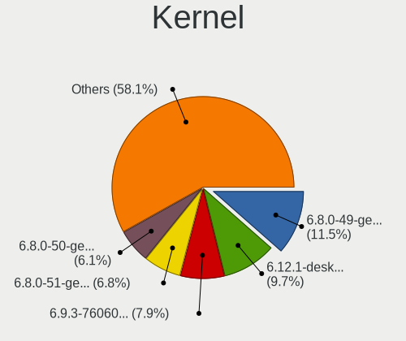
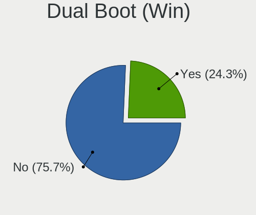
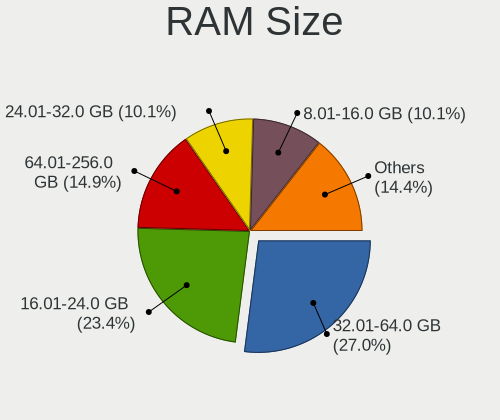
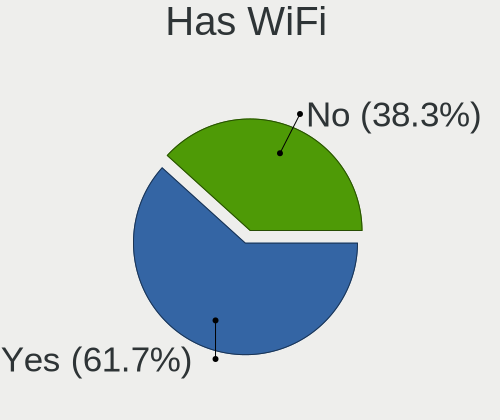
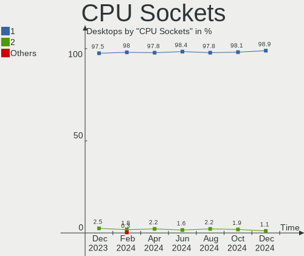
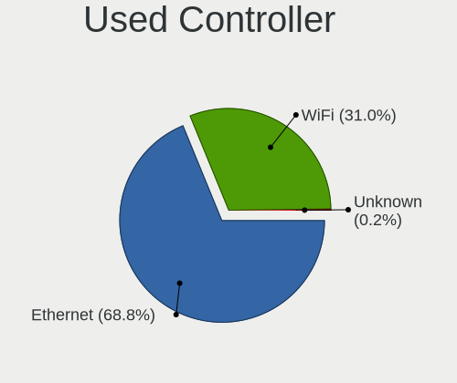
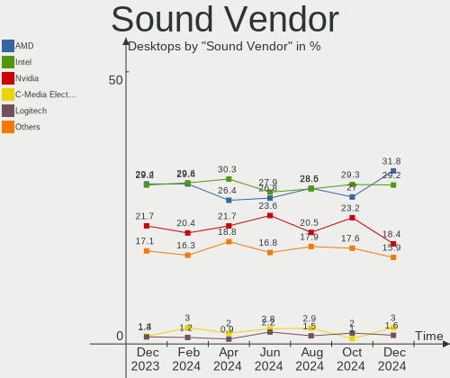

Linux in USA - Hardware Trends (Desktops)
-----------------------------------------

A project to identify most popular hardware characteristics and track their change
over time based on data collected by Linux users at https://Linux-Hardware.org.

Anyone can contribute to this report by the [hw-probe](https://github.com/linuxhw/hw-probe) tool:

    sudo -E hw-probe -all -upload

Period: Sep, 2023.

Contents
--------

* [ System ](#system)
  - [ OS                       ](#os)
  - [ OS Family                ](#os-family)
  - [ Kernel                   ](#kernel)
  - [ Kernel Family            ](#kernel-family)
  - [ Kernel Major Ver.        ](#kernel-major-ver)
  - [ Arch                     ](#arch)
  - [ DE                       ](#de)
  - [ Display Server           ](#display-server)
  - [ Display Manager          ](#display-manager)
  - [ OS Lang                  ](#os-lang)
  - [ Boot Mode                ](#boot-mode)
  - [ Filesystem               ](#filesystem)
  - [ Part. scheme             ](#part-scheme)
  - [ Dual Boot with Linux/BSD ](#dual-boot-with-linuxbsd)
  - [ Dual Boot (Win)          ](#dual-boot-win)

* [ Board ](#board)
  - [ Vendor                   ](#vendor)
  - [ Model                    ](#model)
  - [ Model Family             ](#model-family)
  - [ MFG Year                 ](#mfg-year)
  - [ Form Factor              ](#form-factor)
  - [ Secure Boot              ](#secure-boot)
  - [ Coreboot                 ](#coreboot)
  - [ RAM Size                 ](#ram-size)
  - [ RAM Used                 ](#ram-used)
  - [ Total Drives             ](#total-drives)
  - [ Has CD-ROM               ](#has-cd-rom)
  - [ Has Ethernet             ](#has-ethernet)
  - [ Has WiFi                 ](#has-wifi)
  - [ Has Bluetooth            ](#has-bluetooth)

* [ Location ](#location)
  - [ Country                  ](#country)
  - [ City                     ](#city)

* [ Drives ](#drives)
  - [ Drive Vendor             ](#drive-vendor)
  - [ Drive Model              ](#drive-model)
  - [ HDD Vendor               ](#hdd-vendor)
  - [ SSD Vendor               ](#ssd-vendor)
  - [ Drive Kind               ](#drive-kind)
  - [ Drive Connector          ](#drive-connector)
  - [ Drive Size               ](#drive-size)
  - [ Space Total              ](#space-total)
  - [ Space Used               ](#space-used)
  - [ Malfunc. Drives          ](#malfunc-drives)
  - [ Malfunc. Drive Vendor    ](#malfunc-drive-vendor)
  - [ Malfunc. HDD Vendor      ](#malfunc-hdd-vendor)
  - [ Malfunc. Drive Kind      ](#malfunc-drive-kind)
  - [ Failed Drives            ](#failed-drives)
  - [ Failed Drive Vendor      ](#failed-drive-vendor)
  - [ Drive Status             ](#drive-status)

* [ Storage controller ](#storage-controller)
  - [ Storage Vendor           ](#storage-vendor)
  - [ Storage Model            ](#storage-model)
  - [ Storage Kind             ](#storage-kind)

* [ Processor ](#processor)
  - [ CPU Vendor               ](#cpu-vendor)
  - [ CPU Model                ](#cpu-model)
  - [ CPU Model Family         ](#cpu-model-family)
  - [ CPU Cores                ](#cpu-cores)
  - [ CPU Sockets              ](#cpu-sockets)
  - [ CPU Threads              ](#cpu-threads)
  - [ CPU Op-Modes             ](#cpu-op-modes)
  - [ CPU Microcode            ](#cpu-microcode)
  - [ CPU Microarch            ](#cpu-microarch)

* [ Graphics ](#graphics)
  - [ GPU Vendor               ](#gpu-vendor)
  - [ GPU Model                ](#gpu-model)
  - [ GPU Combo                ](#gpu-combo)
  - [ GPU Driver               ](#gpu-driver)
  - [ GPU Memory               ](#gpu-memory)

* [ Monitor ](#monitor)
  - [ Monitor Vendor           ](#monitor-vendor)
  - [ Monitor Model            ](#monitor-model)
  - [ Monitor Resolution       ](#monitor-resolution)
  - [ Monitor Diagonal         ](#monitor-diagonal)
  - [ Monitor Width            ](#monitor-width)
  - [ Aspect Ratio             ](#aspect-ratio)
  - [ Monitor Area             ](#monitor-area)
  - [ Pixel Density            ](#pixel-density)
  - [ Multiple Monitors        ](#multiple-monitors)

* [ Network ](#network)
  - [ Net Controller Vendor    ](#net-controller-vendor)
  - [ Net Controller Model     ](#net-controller-model)
  - [ Wireless Vendor          ](#wireless-vendor)
  - [ Wireless Model           ](#wireless-model)
  - [ Ethernet Vendor          ](#ethernet-vendor)
  - [ Ethernet Model           ](#ethernet-model)
  - [ Net Controller Kind      ](#net-controller-kind)
  - [ Used Controller          ](#used-controller)
  - [ NICs                     ](#nics)
  - [ IPv6                     ](#ipv6)

* [ Bluetooth ](#bluetooth)
  - [ Bluetooth Vendor         ](#bluetooth-vendor)
  - [ Bluetooth Model          ](#bluetooth-model)

* [ Sound ](#sound)
  - [ Sound Vendor             ](#sound-vendor)
  - [ Sound Model              ](#sound-model)

* [ Memory ](#memory)
  - [ Memory Vendor            ](#memory-vendor)
  - [ Memory Model             ](#memory-model)
  - [ Memory Kind              ](#memory-kind)
  - [ Memory Form Factor       ](#memory-form-factor)
  - [ Memory Size              ](#memory-size)
  - [ Memory Speed             ](#memory-speed)

* [ Printers & scanners ](#printers--scanners)
  - [ Printer Vendor           ](#printer-vendor)
  - [ Printer Model            ](#printer-model)
  - [ Scanner Vendor           ](#scanner-vendor)
  - [ Scanner Model            ](#scanner-model)

* [ Camera ](#camera)
  - [ Camera Vendor            ](#camera-vendor)
  - [ Camera Model             ](#camera-model)

* [ Security ](#security)
  - [ Fingerprint Vendor       ](#fingerprint-vendor)
  - [ Fingerprint Model        ](#fingerprint-model)
  - [ Chipcard Vendor          ](#chipcard-vendor)
  - [ Chipcard Model           ](#chipcard-model)

* [ Unsupported ](#unsupported)
  - [ Unsupported Devices      ](#unsupported-devices)
  - [ Unsupported Device Types ](#unsupported-device-types)

System
------

OS
--

Installed operating systems

| Name                         | Desktops | Percent |
|------------------------------|----------|---------|
| Ubuntu 22.04                 | 59       | 15.25%  |
| Fedora 38                    | 42       | 10.85%  |
| OpenMandriva 23.08           | 24       | 6.2%    |
| Pop!_OS 22.04                | 23       | 5.94%   |
| Linux Mint 21.2              | 22       | 5.68%   |
| Arch Rolling                 | 22       | 5.68%   |
| Zorin 16                     | 15       | 3.88%   |
| Debian 12                    | 14       | 3.62%   |
| Ubuntu 23.04                 | 13       | 3.36%   |
| OpenMandriva 23.09           | 13       | 3.36%   |
| EndeavourOS Rolling          | 9        | 2.33%   |
| ArcoLinux Rolling            | 9        | 2.33%   |
| Ubuntu 20.04                 | 6        | 1.55%   |
| Kubuntu 22.04                | 6        | 1.55%   |
| KDE neon 22.04               | 6        | 1.55%   |
| Nobara 38                    | 5        | 1.29%   |
| Manjaro                      | 5        | 1.29%   |
| Linux Mint 21.1              | 5        | 1.29%   |
| Linux Mint 20.3              | 5        | 1.29%   |
| Debian 11                    | 5        | 1.29%   |
| Xero Rolling                 | 4        | 1.03%   |
| Kubuntu 23.04                | 4        | 1.03%   |
| Xubuntu 22.04                | 3        | 0.78%   |
| Ubuntu 18.04                 | 3        | 0.78%   |
| Parrot 5.3                   | 3        | 0.78%   |
| openSUSE Leap-15.5           | 3        | 0.78%   |
| OpenMandriva 23.01           | 3        | 0.78%   |
| MX 23                        | 3        | 0.78%   |
| ChimeraOS 43-1               | 3        | 0.78%   |
| blendOS                      | 3        | 0.78%   |
| openSUSE Tumbleweed-XXXXXXXX | 2        | 0.52%   |
| OpenMandriva 23.90           | 2        | 0.52%   |
| OpenMandriva 23.03           | 2        | 0.52%   |
| Lubuntu 23.04                | 2        | 0.52%   |
| Lubuntu 22.04                | 2        | 0.52%   |
| Linux Mint 21                | 2        | 0.52%   |
| Kali 2023.3                  | 2        | 0.52%   |
| Fedora 37                    | 2        | 0.52%   |
| Debian                       | 2        | 0.52%   |
| Clear Linux 39900            | 2        | 0.52%   |

OS Family
---------

OS without a version

| Name          | Desktops | Percent |
|---------------|----------|---------|
| Ubuntu        | 82       | 21.19%  |
| Fedora        | 46       | 11.89%  |
| OpenMandriva  | 45       | 11.63%  |
| Linux Mint    | 35       | 9.04%   |
| Pop!_OS       | 23       | 5.94%   |
| Arch          | 22       | 5.68%   |
| Debian        | 21       | 5.43%   |
| Zorin         | 15       | 3.88%   |
| Kubuntu       | 11       | 2.84%   |
| ArcoLinux     | 10       | 2.58%   |
| EndeavourOS   | 9        | 2.33%   |
| Manjaro       | 8        | 2.07%   |
| Xubuntu       | 6        | 1.55%   |
| Nobara        | 6        | 1.55%   |
| KDE neon      | 6        | 1.55%   |
| openSUSE      | 5        | 1.29%   |
| Lubuntu       | 5        | 1.29%   |
| Xero          | 4        | 1.03%   |
| MX            | 4        | 1.03%   |
| Parrot        | 3        | 0.78%   |
| Clear Linux   | 3        | 0.78%   |
| ChimeraOS     | 3        | 0.78%   |
| blendOS       | 3        | 0.78%   |
| Kali          | 2        | 0.52%   |
| CachyOS       | 2        | 0.52%   |
| SteamOS       | 1        | 0.26%   |
| Siduction     | 1        | 0.26%   |
| NixOS         | 1        | 0.26%   |
| Gentoo        | 1        | 0.26%   |
| Garuda Linux  | 1        | 0.26%   |
| Crystal Linux | 1        | 0.26%   |
| Artix         | 1        | 0.26%   |
| Alpine        | 1        | 0.26%   |

Kernel
------

Version of the Linux kernel

| Version                      | Desktops | Percent |
|------------------------------|----------|---------|
| 6.2.0-32-generic             | 42       | 10.85%  |
| 6.4.11-desktop-1omv2390      | 24       | 6.2%    |
| 5.15.0-83-generic            | 24       | 6.2%    |
| 6.4.12-arch1-1               | 21       | 5.43%   |
| 6.2.0-33-generic             | 20       | 5.17%   |
| 6.4.6-76060406-generic       | 19       | 4.91%   |
| 6.4.15-200.fc38.x86_64       | 13       | 3.36%   |
| 5.15.0-84-generic            | 13       | 3.36%   |
| 5.15.0-82-generic            | 12       | 3.1%    |
| 6.4.14-200.fc38.x86_64       | 9        | 2.33%   |
| 6.5.3-arch1-1                | 7        | 1.81%   |
| 6.1.0-12-amd64               | 7        | 1.81%   |
| 6.4.13-200.fc38.x86_64       | 6        | 1.55%   |
| 6.2.0-31-generic             | 6        | 1.55%   |
| 6.5.1-desktop-1omv2390       | 5        | 1.29%   |
| 6.4.12-200.fc38.x86_64       | 5        | 1.29%   |
| 6.5.3-desktop-1omv2390       | 4        | 1.03%   |
| 6.2.9-300.fc38.x86_64        | 4        | 1.03%   |
| 6.2.0-26-generic             | 4        | 1.03%   |
| 6.1.49-1-MANJARO             | 4        | 1.03%   |
| 6.5.3-zen1-1-zen             | 3        | 0.78%   |
| 6.4.8-desktop-2omv2390       | 3        | 0.78%   |
| 6.4.12-zen1-1-zen            | 3        | 0.78%   |
| 6.4.10-202.fsync.fc38.x86_64 | 3        | 0.78%   |
| 6.3.9-chimeraos-1            | 3        | 0.78%   |
| 6.1.0-1parrot1-amd64         | 3        | 0.78%   |
| 6.1.0-11-amd64               | 3        | 0.78%   |
| 6.1.0-10-amd64               | 3        | 0.78%   |
| 5.4.0-162-generic            | 3        | 0.78%   |
| 5.15.0-76-generic            | 3        | 0.78%   |
| 5.14.21-150500.55.19-default | 3        | 0.78%   |
| 5.10.0-25-amd64              | 3        | 0.78%   |
| 6.5.5-200.fc38.x86_64        | 2        | 0.52%   |
| 6.5.4-arch2-1                | 2        | 0.52%   |
| 6.5.2-desktop-1omv2390       | 2        | 0.52%   |
| 6.4.13-1351.native           | 2        | 0.52%   |
| 6.4.11-200.fc38.x86_64       | 2        | 0.52%   |
| 6.3.9-zen1-1-zen             | 2        | 0.52%   |
| 6.3.1-1-cachyos-eevdf-bore   | 2        | 0.52%   |
| 6.2.6-desktop-1omv2390       | 2        | 0.52%   |

Kernel Family
-------------

Linux kernel without a distro release

| Version | Desktops | Percent |
|---------|----------|---------|
| 6.2.0   | 77       | 19.9%   |
| 5.15.0  | 58       | 14.99%  |
| 6.4.12  | 30       | 7.75%   |
| 6.4.11  | 26       | 6.72%   |
| 6.4.6   | 20       | 5.17%   |
| 6.5.3   | 19       | 4.91%   |
| 6.1.0   | 17       | 4.39%   |
| 6.4.15  | 14       | 3.62%   |
| 6.4.14  | 9        | 2.33%   |
| 6.4.13  | 9        | 2.33%   |
| 5.4.0   | 8        | 2.07%   |
| 6.5.1   | 6        | 1.55%   |
| 6.5.5   | 5        | 1.29%   |
| 6.5.4   | 5        | 1.29%   |
| 6.5.0   | 5        | 1.29%   |
| 6.4.10  | 5        | 1.29%   |
| 6.3.9   | 5        | 1.29%   |
| 5.19.0  | 5        | 1.29%   |
| 6.5.2   | 4        | 1.03%   |
| 6.2.9   | 4        | 1.03%   |
| 6.2.6   | 4        | 1.03%   |
| 6.1.49  | 4        | 1.03%   |
| 4.15.0  | 4        | 1.03%   |
| 6.4.8   | 3        | 0.78%   |
| 6.4.0   | 3        | 0.78%   |
| 6.1.51  | 3        | 0.78%   |
| 5.14.21 | 3        | 0.78%   |
| 5.10.0  | 3        | 0.78%   |
| 6.3.5   | 2        | 0.52%   |
| 6.3.1   | 2        | 0.52%   |
| 6.2.11  | 2        | 0.52%   |
| 6.1.1   | 2        | 0.52%   |
| 6.6.0   | 1        | 0.26%   |
| 6.4.7   | 1        | 0.26%   |
| 6.4.3   | 1        | 0.26%   |
| 6.4.2   | 1        | 0.26%   |
| 6.3.8   | 1        | 0.26%   |
| 6.3.10  | 1        | 0.26%   |
| 6.3.0   | 1        | 0.26%   |
| 6.2.13  | 1        | 0.26%   |

Kernel Major Ver.
-----------------

Linux kernel major version

| Version | Desktops | Percent |
|---------|----------|---------|
| 6.4     | 122      | 31.52%  |
| 6.2     | 88       | 22.74%  |
| 5.15    | 60       | 15.5%   |
| 6.5     | 44       | 11.37%  |
| 6.1     | 30       | 7.75%   |
| 6.3     | 12       | 3.1%    |
| 5.4     | 8        | 2.07%   |
| 5.19    | 5        | 1.29%   |
| 5.10    | 4        | 1.03%   |
| 4.15    | 4        | 1.03%   |
| 5.14    | 3        | 0.78%   |
| 5.16    | 2        | 0.52%   |
| 5.13    | 2        | 0.52%   |
| 6.6     | 1        | 0.26%   |
| 6.0     | 1        | 0.26%   |
| 5.11    | 1        | 0.26%   |

Arch
----

OS architecture (x86_64, i586, etc.)

| Name   | Desktops | Percent |
|--------|----------|---------|
| x86_64 | 386      | 99.74%  |
| armv7l | 1        | 0.26%   |

DE
--

Desktop Environment

| Name            | Desktops | Percent |
|-----------------|----------|---------|
| GNOME           | 163      | 42.12%  |
| KDE5            | 110      | 28.42%  |
| X-Cinnamon      | 36       | 9.3%    |
| XFCE            | 25       | 6.46%   |
| Unknown         | 16       | 4.13%   |
| LXQt            | 12       | 3.1%    |
| Budgie          | 5        | 1.29%   |
| MATE            | 3        | 0.78%   |
| LXDE            | 3        | 0.78%   |
| i3              | 3        | 0.78%   |
| GNOME Classic   | 3        | 0.78%   |
| Unicorn:XFCE    | 1        | 0.26%   |
| UKUI            | 1        | 0.26%   |
| sway            | 1        | 0.26%   |
| openbox         | 1        | 0.26%   |
| KDE             | 1        | 0.26%   |
| GNOME Flashback | 1        | 0.26%   |
| Enlightenment   | 1        | 0.26%   |
| Cinnamon        | 1        | 0.26%   |

Display Server
--------------

X11 or Wayland

| Name    | Desktops | Percent |
|---------|----------|---------|
| X11     | 224      | 57.88%  |
| Wayland | 138      | 35.66%  |
| Tty     | 13       | 3.36%   |
| Unknown | 12       | 3.1%    |

Display Manager
---------------

SDDM, LightDM, etc.

| Name    | Desktops | Percent |
|---------|----------|---------|
| Unknown | 159      | 41.09%  |
| SDDM    | 93       | 24.03%  |
| GDM3    | 89       | 23%     |
| LightDM | 33       | 8.53%   |
| GDM     | 11       | 2.84%   |
| LXDM    | 1        | 0.26%   |
| GREETD  | 1        | 0.26%   |

OS Lang
-------

Language

| Lang            | Desktops | Percent |
|-----------------|----------|---------|
| en_US           | 353      | 91.21%  |
| C               | 13       | 3.36%   |
| Unknown         | 9        | 2.33%   |
| en_CA           | 3        | 0.78%   |
| fr_FR           | 2        | 0.52%   |
| zh_CN           | 1        | 0.26%   |
| pt_BR           | 1        | 0.26%   |
| POSIX           | 1        | 0.26%   |
| es_US           | 1        | 0.26%   |
| es_CO           | 1        | 0.26%   |
| en_US.ISO8859-1 | 1        | 0.26%   |
| en_GB           | 1        | 0.26%   |

Boot Mode
---------

EFI or BIOS

| Mode | Desktops | Percent |
|------|----------|---------|
| BIOS | 200      | 51.68%  |
| EFI  | 187      | 48.32%  |

Filesystem
----------

Type of filesystem

| Type    | Desktops | Percent |
|---------|----------|---------|
| Ext4    | 201      | 51.94%  |
| Tmpfs   | 75       | 19.38%  |
| Btrfs   | 75       | 19.38%  |
| Overlay | 23       | 5.94%   |
| Xfs     | 6        | 1.55%   |
| Zfs     | 3        | 0.78%   |
| F2fs    | 2        | 0.52%   |
| Nilfs2  | 1        | 0.26%   |
| Jfs     | 1        | 0.26%   |

Part. scheme
------------

Scheme of partitioning

| Type    | Desktops | Percent |
|---------|----------|---------|
| GPT     | 203      | 52.45%  |
| Unknown | 148      | 38.24%  |
| MBR     | 36       | 9.3%    |

Dual Boot with Linux/BSD
------------------------

Hosting more than one Linux/BSD

| Dual boot | Desktops | Percent |
|-----------|----------|---------|
| No        | 302      | 78.04%  |
| Yes       | 85       | 21.96%  |

Dual Boot (Win)
---------------

Hosting Linux and Windows

| Dual boot | Desktops | Percent |
|-----------|----------|---------|
| No        | 306      | 79.07%  |
| Yes       | 81       | 20.93%  |

Board
-----

Vendor
------

Motherboard manufacturer

| Name                                 | Desktops | Percent |
|--------------------------------------|----------|---------|
| ASUSTek Computer                     | 101      | 26.1%   |
| Dell                                 | 60       | 15.5%   |
| MSI                                  | 44       | 11.37%  |
| Gigabyte Technology                  | 42       | 10.85%  |
| Hewlett-Packard                      | 32       | 8.27%   |
| ASRock                               | 31       | 8.01%   |
| Lenovo                               | 12       | 3.1%    |
| AZW                                  | 8        | 2.07%   |
| Pegatron                             | 7        | 1.81%   |
| Foxconn                              | 6        | 1.55%   |
| Intel                                | 5        | 1.29%   |
| Acer                                 | 5        | 1.29%   |
| Gateway                              | 4        | 1.03%   |
| Shenzhen Meigao Electronic Equipment | 3        | 0.78%   |
| Unknown                              | 3        | 0.78%   |
| NZXT                                 | 2        | 0.52%   |
| Hardkernel                           | 2        | 0.52%   |
| Google                               | 2        | 0.52%   |
| BESSTAR Tech                         | 2        | 0.52%   |
| Apple                                | 2        | 0.52%   |
| System76                             | 1        | 0.26%   |
| Supermicro                           | 1        | 0.26%   |
| Seeed Studio                         | 1        | 0.26%   |
| NetGear                              | 1        | 0.26%   |
| MACHINIST                            | 1        | 0.26%   |
| Inventec                             | 1        | 0.26%   |
| IceWhale Technology                  | 1        | 0.26%   |
| HC Technology.                       | 1        | 0.26%   |
| Fujitsu                              | 1        | 0.26%   |
| EVGA                                 | 1        | 0.26%   |
| ECS                                  | 1        | 0.26%   |
| Biostar                              | 1        | 0.26%   |
| ASRockRack                           | 1        | 0.26%   |
| AOpen                                | 1        | 0.26%   |

Model
-----

Motherboard model

| Name                               | Desktops | Percent |
|------------------------------------|----------|---------|
| Dell OptiPlex 7010                 | 7        | 1.81%   |
| MSI MS-7C37                        | 6        | 1.55%   |
| ASUS TUF Gaming X570-PLUS          | 5        | 1.29%   |
| ASUS ROG CROSSHAIR VIII HERO       | 4        | 1.03%   |
| ASUS All Series                    | 4        | 1.03%   |
| MSI MS-7D25                        | 3        | 0.78%   |
| Gigabyte 970A-DS3P                 | 3        | 0.78%   |
| Dell OptiPlex 9020                 | 3        | 0.78%   |
| AZW MINI S                         | 3        | 0.78%   |
| ASUS TUF Gaming X570-PRO           | 3        | 0.78%   |
| ASUS ROG STRIX Z790-E GAMING WIFI  | 3        | 0.78%   |
| ASUS ROG STRIX B650E-I GAMING WIFI | 3        | 0.78%   |
| ASUS ROG STRIX B450-F GAMING       | 3        | 0.78%   |
| ASRock B550M Pro4                  | 3        | 0.78%   |
| Unknown                            | 3        | 0.78%   |
| MSI MS-7C95                        | 2        | 0.52%   |
| MSI MS-7C94                        | 2        | 0.52%   |
| MSI MS-7B79                        | 2        | 0.52%   |
| MSI MS-7B24                        | 2        | 0.52%   |
| MSI MS-7B09                        | 2        | 0.52%   |
| MSI MS-7A38                        | 2        | 0.52%   |
| HP Z600 Workstation                | 2        | 0.52%   |
| HP Z400 Workstation                | 2        | 0.52%   |
| HP OMEN by Desktop PC 870-2XX      | 2        | 0.52%   |
| HP EliteDesk 800 G1 USDT           | 2        | 0.52%   |
| Hardkernel ODROID-H3               | 2        | 0.52%   |
| Gigabyte X570 AORUS ELITE          | 2        | 0.52%   |
| Gigabyte F2A68HM-H                 | 2        | 0.52%   |
| Gigabyte B450M DS3H                | 2        | 0.52%   |
| Gigabyte 970A-DS3P FX              | 2        | 0.52%   |
| Dell Precision 3630 Tower          | 2        | 0.52%   |
| Dell OptiPlex 990                  | 2        | 0.52%   |
| Dell OptiPlex 9010                 | 2        | 0.52%   |
| Dell OptiPlex 790                  | 2        | 0.52%   |
| Dell OptiPlex 7050                 | 2        | 0.52%   |
| Dell OptiPlex 7020                 | 2        | 0.52%   |
| Dell OptiPlex 3050                 | 2        | 0.52%   |
| Dell OptiPlex 3020                 | 2        | 0.52%   |
| Dell Inspiron 3847                 | 2        | 0.52%   |
| Dell G5 5000                       | 2        | 0.52%   |

Model Family
------------

Motherboard model prefix

| Name                 | Desktops | Percent |
|----------------------|----------|---------|
| Dell OptiPlex        | 36       | 9.3%    |
| ASUS ROG             | 28       | 7.24%   |
| ASUS PRIME           | 22       | 5.68%   |
| ASUS TUF             | 17       | 4.39%   |
| Dell Precision       | 9        | 2.33%   |
| Lenovo ThinkCentre   | 7        | 1.81%   |
| HP EliteDesk         | 7        | 1.81%   |
| Dell Inspiron        | 7        | 1.81%   |
| MSI MS-7C37          | 6        | 1.55%   |
| HP Pavilion          | 5        | 1.29%   |
| Gigabyte 970A-DS3P   | 5        | 1.29%   |
| Gigabyte X570        | 4        | 1.03%   |
| Gigabyte B450M       | 4        | 1.03%   |
| Dell XPS             | 4        | 1.03%   |
| ASUS M5A97           | 4        | 1.03%   |
| ASUS All             | 4        | 1.03%   |
| ASRock B450M         | 4        | 1.03%   |
| MSI MS-7D25          | 3        | 0.78%   |
| HP OMEN              | 3        | 0.78%   |
| HP Compaq            | 3        | 0.78%   |
| AZW MINI             | 3        | 0.78%   |
| ASRock B550M         | 3        | 0.78%   |
| ASRock B450          | 3        | 0.78%   |
| Acer Aspire          | 3        | 0.78%   |
| Unknown              | 3        | 0.78%   |
| NZXT N7              | 2        | 0.52%   |
| MSI MS-7C95          | 2        | 0.52%   |
| MSI MS-7C94          | 2        | 0.52%   |
| MSI MS-7B79          | 2        | 0.52%   |
| MSI MS-7B24          | 2        | 0.52%   |
| MSI MS-7B09          | 2        | 0.52%   |
| MSI MS-7A38          | 2        | 0.52%   |
| Lenovo Legion        | 2        | 0.52%   |
| Lenovo IdeaCentre    | 2        | 0.52%   |
| HP Z600              | 2        | 0.52%   |
| HP Z400              | 2        | 0.52%   |
| HP ProDesk           | 2        | 0.52%   |
| Hardkernel ODROID-H3 | 2        | 0.52%   |
| Gigabyte F2A68HM-H   | 2        | 0.52%   |
| Gigabyte B650M       | 2        | 0.52%   |

MFG Year
--------

Motherboard manufacture year

| Year    | Desktops | Percent |
|---------|----------|---------|
| 2022    | 46       | 11.89%  |
| 2020    | 40       | 10.34%  |
| 2018    | 38       | 9.82%   |
| 2019    | 34       | 8.79%   |
| 2012    | 30       | 7.75%   |
| 2021    | 26       | 6.72%   |
| 2013    | 25       | 6.46%   |
| 2017    | 24       | 6.2%    |
| 2011    | 23       | 5.94%   |
| 2014    | 18       | 4.65%   |
| 2010    | 18       | 4.65%   |
| 2023    | 16       | 4.13%   |
| 2016    | 14       | 3.62%   |
| 2015    | 12       | 3.1%    |
| 2009    | 10       | 2.58%   |
| 2008    | 6        | 1.55%   |
| 2007    | 4        | 1.03%   |
| 2006    | 2        | 0.52%   |
| Unknown | 1        | 0.26%   |

Form Factor
-----------

Physical design of the computer

| Name    | Desktops | Percent |
|---------|----------|---------|
| Desktop | 387      | 100%    |

Secure Boot
-----------

Enabled or disabled

| State    | Desktops | Percent |
|----------|----------|---------|
| Disabled | 373      | 96.38%  |
| Enabled  | 14       | 3.62%   |

Coreboot
--------

Have coreboot on board

| Used | Desktops | Percent |
|------|----------|---------|
| No   | 386      | 99.74%  |
| Yes  | 1        | 0.26%   |

RAM Size
--------

Total RAM memory

| Size in GB  | Desktops | Percent |
|-------------|----------|---------|
| 32.01-64.0  | 103      | 26.61%  |
| 16.01-24.0  | 94       | 24.29%  |
| 64.01-256.0 | 53       | 13.7%   |
| 4.01-8.0    | 46       | 11.89%  |
| 8.01-16.0   | 39       | 10.08%  |
| 24.01-32.0  | 28       | 7.24%   |
| 3.01-4.0    | 20       | 5.17%   |
| 2.01-3.0    | 2        | 0.52%   |
| 1.01-2.0    | 2        | 0.52%   |

RAM Used
--------

Used RAM memory

| Used GB    | Desktops | Percent |
|------------|----------|---------|
| 2.01-3.0   | 93       | 24.03%  |
| 1.01-2.0   | 83       | 21.45%  |
| 4.01-8.0   | 81       | 20.93%  |
| 3.01-4.0   | 59       | 15.25%  |
| 8.01-16.0  | 41       | 10.59%  |
| 0.51-1.0   | 14       | 3.62%   |
| 16.01-24.0 | 10       | 2.58%   |
| 0.01-0.5   | 3        | 0.78%   |
| 32.01-64.0 | 2        | 0.52%   |
| 24.01-32.0 | 1        | 0.26%   |

Total Drives
------------

Number of drives on board

| Drives | Desktops | Percent |
|--------|----------|---------|
| 1      | 125      | 32.3%   |
| 2      | 123      | 31.78%  |
| 3      | 61       | 15.76%  |
| 4      | 36       | 9.3%    |
| 5      | 19       | 4.91%   |
| 6      | 9        | 2.33%   |
| 8      | 4        | 1.03%   |
| 7      | 4        | 1.03%   |
| 10     | 2        | 0.52%   |
| 19     | 1        | 0.26%   |
| 11     | 1        | 0.26%   |
| 9      | 1        | 0.26%   |
| 0      | 1        | 0.26%   |

Has CD-ROM
----------

Has CD-ROM on board

| Presented | Desktops | Percent |
|-----------|----------|---------|
| No        | 226      | 58.4%   |
| Yes       | 161      | 41.6%   |

Has Ethernet
------------

Has Ethernet on board

| Presented | Desktops | Percent |
|-----------|----------|---------|
| Yes       | 382      | 98.71%  |
| No        | 5        | 1.29%   |

Has WiFi
--------

Has WiFi module

| Presented | Desktops | Percent |
|-----------|----------|---------|
| Yes       | 225      | 58.14%  |
| No        | 162      | 41.86%  |

Has Bluetooth
-------------

Has Bluetooth module

| Presented | Desktops | Percent |
|-----------|----------|---------|
| No        | 198      | 51.16%  |
| Yes       | 189      | 48.84%  |

Location
--------

Country
-------

Geographic location (country)

| Country | Desktops | Percent |
|---------|----------|---------|
| USA     | 387      | 100%    |

City
----

Geographic location (city)

| City           | Desktops | Percent |
|----------------|----------|---------|
| Seattle        | 6        | 1.55%   |
| Los Angeles    | 6        | 1.55%   |
| Chicago        | 6        | 1.55%   |
| Miami          | 5        | 1.29%   |
| Dallas         | 5        | 1.29%   |
| Tucson         | 4        | 1.03%   |
| Springfield    | 4        | 1.03%   |
| San Antonio    | 4        | 1.03%   |
| Portland       | 4        | 1.03%   |
| Phoenix        | 4        | 1.03%   |
| New York       | 4        | 1.03%   |
| Houston        | 4        | 1.03%   |
| Cumming        | 4        | 1.03%   |
| San Francisco  | 3        | 0.78%   |
| Rochester      | 3        | 0.78%   |
| Pittsburgh     | 3        | 0.78%   |
| Pine Island    | 3        | 0.78%   |
| Minneapolis    | 3        | 0.78%   |
| Cincinnati     | 3        | 0.78%   |
| Warner Robins  | 2        | 0.52%   |
| Virginia Beach | 2        | 0.52%   |
| Sheboygan      | 2        | 0.52%   |
| Salt Lake City | 2        | 0.52%   |
| Rancho Cordova | 2        | 0.52%   |
| Philadelphia   | 2        | 0.52%   |
| Pasadena       | 2        | 0.52%   |
| Orlando        | 2        | 0.52%   |
| Nevis          | 2        | 0.52%   |
| Madison        | 2        | 0.52%   |
| Louisville     | 2        | 0.52%   |
| Logan          | 2        | 0.52%   |
| Lafayette      | 2        | 0.52%   |
| Knoxville      | 2        | 0.52%   |
| Kingston       | 2        | 0.52%   |
| Everett        | 2        | 0.52%   |
| Evansville     | 2        | 0.52%   |
| Denver         | 2        | 0.52%   |
| Covington      | 2        | 0.52%   |
| Charlotte      | 2        | 0.52%   |
| Cedar Park     | 2        | 0.52%   |

Drives
------

Drive Vendor
------------

Hard drive vendors

| Vendor                      | Desktops | Drives | Percent |
|-----------------------------|----------|--------|---------|
| Samsung Electronics         | 129      | 197    | 17.53%  |
| WDC                         | 115      | 168    | 15.63%  |
| Seagate                     | 112      | 159    | 15.22%  |
| SanDisk                     | 69       | 82     | 9.38%   |
| Toshiba                     | 32       | 32     | 4.35%   |
| Crucial                     | 29       | 35     | 3.94%   |
| Hitachi                     | 23       | 25     | 3.13%   |
| Micron/Crucial Technology   | 18       | 20     | 2.45%   |
| SK hynix                    | 17       | 21     | 2.31%   |
| Kingston                    | 17       | 18     | 2.31%   |
| PNY                         | 16       | 18     | 2.17%   |
| Unknown                     | 15       | 18     | 2.04%   |
| China                       | 14       | 15     | 1.9%    |
| Intel                       | 13       | 20     | 1.77%   |
| Phison Electronics          | 10       | 15     | 1.36%   |
| HGST                        | 9        | 16     | 1.22%   |
| SPCC                        | 7        | 9      | 0.95%   |
| Silicon Motion              | 6        | 6      | 0.82%   |
| Team                        | 5        | 6      | 0.68%   |
| SABRENT                     | 5        | 8      | 0.68%   |
| Hewlett-Packard             | 5        | 5      | 0.68%   |
| A-DATA Technology           | 5        | 5      | 0.68%   |
| Patriot                     | 4        | 4      | 0.54%   |
| Kingston Technology Company | 4        | 4      | 0.54%   |
| T-FORCE                     | 3        | 3      | 0.41%   |
| KIOXIA                      | 3        | 3      | 0.41%   |
| ASMT                        | 3        | 4      | 0.41%   |
| Apple                       | 3        | 3      | 0.41%   |
| Super Talent                | 2        | 2      | 0.27%   |
| Phison                      | 2        | 2      | 0.27%   |
| Netac                       | 2        | 2      | 0.27%   |
| Micron Technology           | 2        | 2      | 0.27%   |
| Maxtor                      | 2        | 2      | 0.27%   |
| KingFast                    | 2        | 2      | 0.27%   |
| JMicron Technology          | 2        | 2      | 0.27%   |
| Unknown                     | 2        | 6      | 0.27%   |
| XPG                         | 1        | 1      | 0.14%   |
| Vecto                       | 1        | 1      | 0.14%   |
| Vaseky                      | 1        | 1      | 0.14%   |
| Transcend                   | 1        | 1      | 0.14%   |

Drive Model
-----------

Hard drive models

| Model                                               | Desktops | Percent |
|-----------------------------------------------------|----------|---------|
| Samsung NVMe SSD Controller SM981/PM981/PM983 256GB | 25       | 2.88%   |
| Samsung NVMe SSD Controller PM9A1/PM9A3/980PRO 1TB  | 21       | 2.42%   |
| Seagate ST2000DM008-2FR102 2TB                      | 13       | 1.5%    |
| Micron/Crucial P2 NVMe PCIe SSD 1TB                 | 12       | 1.38%   |
| Toshiba DT01ACA100 1TB                              | 11       | 1.27%   |
| Samsung SSD 980 1TB                                 | 9        | 1.04%   |
| Samsung SSD 860 EVO 1TB                             | 9        | 1.04%   |
| Crucial CT1000MX500SSD1 1TB                         | 9        | 1.04%   |
| Samsung SSD 850 EVO 250GB                           | 8        | 0.92%   |
| WDC WD10EZEX-08WN4A0 1TB                            | 7        | 0.81%   |
| Seagate ST1000DM003-1ER162 1TB                      | 7        | 0.81%   |
| SK hynix SHPP41-2000GM 2TB                          | 6        | 0.69%   |
| Samsung SSD 870 EVO 500GB                           | 6        | 0.69%   |
| Samsung SSD 860 EVO 500GB                           | 6        | 0.69%   |
| WDC WD10EZEX-00BN5A0 1TB                            | 5        | 0.58%   |
| WDC WD1003FZEX-00MK2A0 1TB                          | 5        | 0.58%   |
| Unknown SD/MMC/MS PRO 128GB                         | 5        | 0.58%   |
| Seagate ST1000DM003-1SB102 1TB                      | 5        | 0.58%   |
| Sandisk WD Blue SN570 500GB                         | 5        | 0.58%   |
| Sandisk WD Black SN850 1TB                          | 5        | 0.58%   |
| Sandisk WD Black 2018/SN750 / PC SN720 NVMe SSD 1TB | 5        | 0.58%   |
| SanDisk SSD PLUS 1000GB                             | 5        | 0.58%   |
| Samsung SSD 970 EVO Plus 1TB                        | 5        | 0.58%   |
| Samsung SSD 870 EVO 1TB                             | 5        | 0.58%   |
| Samsung SSD 850 EVO 500GB                           | 5        | 0.58%   |
| WDC WDS100T2B0A-00SM50 1TB SSD                      | 4        | 0.46%   |
| Seagate ST4000DM004-2CV104 4TB                      | 4        | 0.46%   |
| Seagate ST31000528AS 1TB                            | 4        | 0.46%   |
| Seagate ST1000DM003-1CH162 1TB                      | 4        | 0.46%   |
| Seagate Backup+ Hub BK 8TB                          | 4        | 0.46%   |
| Sandisk WD_BLACK SN770 500GB                        | 4        | 0.46%   |
| Samsung SSD 990 PRO 2TB                             | 4        | 0.46%   |
| Samsung SSD 870 QVO 2TB                             | 4        | 0.46%   |
| Samsung NVMe SSD Controller SM961/PM961/SM963 500GB | 4        | 0.46%   |
| PNY CS900 500GB SSD                                 | 4        | 0.46%   |
| Phison PCIe SSD 1TB                                 | 4        | 0.46%   |
| Intel SSD 660P Series 1024GB                        | 4        | 0.46%   |
| WDC WDBNCE0010PNC 1TB SSD                           | 3        | 0.35%   |
| WDC WD30EZRX-00DC0B0 3TB                            | 3        | 0.35%   |
| WDC WD2003FZEX-00SRLA0 2TB                          | 3        | 0.35%   |

HDD Vendor
----------

Hard disk drive vendors

| Vendor              | Desktops | Drives | Percent |
|---------------------|----------|--------|---------|
| Seagate             | 108      | 149    | 37.89%  |
| WDC                 | 96       | 139    | 33.68%  |
| Toshiba             | 28       | 28     | 9.82%   |
| Hitachi             | 23       | 25     | 8.07%   |
| HGST                | 9        | 16     | 3.16%   |
| Unknown             | 5        | 5      | 1.75%   |
| SABRENT             | 5        | 8      | 1.75%   |
| Hewlett-Packard     | 3        | 3      | 1.05%   |
| Maxtor              | 2        | 2      | 0.7%    |
| Apple               | 2        | 2      | 0.7%    |
| Synology            | 1        | 1      | 0.35%   |
| SSK                 | 1        | 1      | 0.35%   |
| Samsung Electronics | 1        | 2      | 0.35%   |
| Fujitsu             | 1        | 1      | 0.35%   |

SSD Vendor
----------

Solid state drive vendors

| Vendor              | Desktops | Drives | Percent |
|---------------------|----------|--------|---------|
| Samsung Electronics | 68       | 85     | 27.76%  |
| SanDisk             | 31       | 34     | 12.65%  |
| WDC                 | 25       | 26     | 10.2%   |
| Crucial             | 25       | 29     | 10.2%   |
| PNY                 | 16       | 18     | 6.53%   |
| China               | 14       | 15     | 5.71%   |
| Kingston            | 13       | 14     | 5.31%   |
| SPCC                | 6        | 7      | 2.45%   |
| SK hynix            | 5        | 5      | 2.04%   |
| A-DATA Technology   | 5        | 5      | 2.04%   |
| Team                | 4        | 5      | 1.63%   |
| Patriot             | 4        | 4      | 1.63%   |
| Intel               | 4        | 7      | 1.63%   |
| Toshiba             | 3        | 3      | 1.22%   |
| ASMT                | 3        | 4      | 1.22%   |
| Super Talent        | 2        | 2      | 0.82%   |
| Netac               | 2        | 2      | 0.82%   |
| Micron Technology   | 2        | 2      | 0.82%   |
| Hewlett-Packard     | 2        | 2      | 0.82%   |
| Vaseky              | 1        | 1      | 0.41%   |
| Transcend           | 1        | 1      | 0.41%   |
| SSSTC               | 1        | 1      | 0.41%   |
| SOLIDIGM            | 1        | 1      | 0.41%   |
| NGFF                | 1        | 1      | 0.41%   |
| LITEON              | 1        | 1      | 0.41%   |
| Lexar               | 1        | 1      | 0.41%   |
| Gigastone           | 1        | 1      | 0.41%   |
| FIKWOT              | 1        | 4      | 0.41%   |
| Fanxiang            | 1        | 1      | 0.41%   |
| Corsair             | 1        | 1      | 0.41%   |

Drive Kind
----------

HDD or SSD

| Kind    | Desktops | Drives | Percent |
|---------|----------|--------|---------|
| HDD     | 215      | 382    | 35.6%   |
| SSD     | 193      | 283    | 31.95%  |
| NVMe    | 168      | 268    | 27.81%  |
| Unknown | 21       | 32     | 3.48%   |
| MMC     | 7        | 8      | 1.16%   |

Drive Connector
---------------

SATA, SAS, NVMe, etc.

| Type | Desktops | Drives | Percent |
|------|----------|--------|---------|
| SATA | 313      | 624    | 59.17%  |
| NVMe | 168      | 268    | 31.76%  |
| SAS  | 41       | 73     | 7.75%   |
| MMC  | 7        | 8      | 1.32%   |

Drive Size
----------

Size of hard drive

| Size in TB | Desktops | Drives | Percent |
|------------|----------|--------|---------|
| 0.01-0.5   | 180      | 245    | 37.27%  |
| 0.51-1.0   | 158      | 213    | 32.71%  |
| 1.01-2.0   | 79       | 98     | 16.36%  |
| 3.01-4.0   | 25       | 38     | 5.18%   |
| 4.01-10.0  | 22       | 37     | 4.55%   |
| 2.01-3.0   | 13       | 22     | 2.69%   |
| 10.01-20.0 | 6        | 12     | 1.24%   |

Space Total
-----------

Amount of disk space available on the file system

| Size in GB     | Desktops | Percent |
|----------------|----------|---------|
| 501-1000       | 75       | 19.38%  |
| More than 3000 | 65       | 16.8%   |
| 1001-2000      | 59       | 15.25%  |
| 101-250        | 57       | 14.73%  |
| 251-500        | 56       | 14.47%  |
| 2001-3000      | 26       | 6.72%   |
| 1-20           | 25       | 6.46%   |
| Unknown        | 13       | 3.36%   |
| 51-100         | 7        | 1.81%   |
| 21-50          | 4        | 1.03%   |

Space Used
----------

Amount of used disk space

| Used GB        | Desktops | Percent |
|----------------|----------|---------|
| 1-20           | 103      | 26.61%  |
| 21-50          | 59       | 15.25%  |
| 101-250        | 53       | 13.7%   |
| 251-500        | 41       | 10.59%  |
| 51-100         | 34       | 8.79%   |
| More than 3000 | 31       | 8.01%   |
| 501-1000       | 24       | 6.2%    |
| 1001-2000      | 17       | 4.39%   |
| Unknown        | 13       | 3.36%   |
| 2001-3000      | 12       | 3.1%    |

Malfunc. Drives
---------------

Drive models with a malfunction

| Model                                                           | Desktops | Drives | Percent |
|-----------------------------------------------------------------|----------|--------|---------|
| WDC WD40EZRX-00SPEB0 4TB                                        | 2        | 2      | 4.26%   |
| Seagate ST2000DM001-9YN164 2TB                                  | 2        | 2      | 4.26%   |
| WDC WD7502ABYS-02A6B0 752GB                                     | 1        | 1      | 2.13%   |
| WDC WD6400AAKS-22A7B2 640GB                                     | 1        | 1      | 2.13%   |
| WDC WD5000AVCS-632DY1 500GB                                     | 1        | 1      | 2.13%   |
| WDC WD30EZRX-00MMMB0 3TB                                        | 1        | 1      | 2.13%   |
| WDC WD30EZRX-00DC0B0 3TB                                        | 1        | 1      | 2.13%   |
| WDC WD2500AAJS-00B4A0 250GB                                     | 1        | 1      | 2.13%   |
| WDC WD20EZRZ-22Z5HB0 2TB                                        | 1        | 1      | 2.13%   |
| WDC WD20EADS-00S2B0 2TB                                         | 1        | 1      | 2.13%   |
| WDC WD1600JD-75HBB0 160GB                                       | 1        | 1      | 2.13%   |
| WDC WD10EZEX-75M2NA0 1TB                                        | 1        | 1      | 2.13%   |
| Toshiba DT01ACA100 1TB                                          | 1        | 1      | 2.13%   |
| Toshiba DT01ABA200V 2TB                                         | 1        | 1      | 2.13%   |
| Super Talent FTM48N325H 480GB SSD                               | 1        | 1      | 2.13%   |
| SK hynix SHGS31-1000GS-2 1TB SSD                                | 1        | 1      | 2.13%   |
| SK hynix SC401 SATA 512GB SSD                                   | 1        | 1      | 2.13%   |
| Seagate ST9500325AS 500GB                                       | 1        | 1      | 2.13%   |
| Seagate ST6000VN0033-2EE110 6TB                                 | 1        | 1      | 2.13%   |
| Seagate ST3640623AS 640GB                                       | 1        | 1      | 2.13%   |
| Seagate ST3500630AS 500GB                                       | 1        | 1      | 2.13%   |
| Seagate ST3500418AS 500GB                                       | 1        | 1      | 2.13%   |
| Seagate ST33000651NS 3TB                                        | 1        | 1      | 2.13%   |
| Seagate ST320LT012-9WS14C 320GB                                 | 1        | 1      | 2.13%   |
| Seagate ST3120811AS 120GB                                       | 1        | 1      | 2.13%   |
| Seagate ST31000528AS 1TB                                        | 1        | 1      | 2.13%   |
| Seagate ST2000DM001-1CH164 2TB                                  | 1        | 1      | 2.13%   |
| Seagate ST1000LM035-1RK172 1TB                                  | 1        | 1      | 2.13%   |
| Seagate ST1000DX001-1NS162-SSHD 1TB                             | 1        | 1      | 2.13%   |
| Seagate ST1000DM003-1CH162 1TB                                  | 1        | 2      | 2.13%   |
| Samsung Electronics SSD PM81 128GB                              | 1        | 1      | 2.13%   |
| Samsung Electronics SSD 970 PRO 512GB S463NF0M206667V           | 1        | 1      | 2.13%   |
| Samsung Electronics SSD 870 EVO 500GB                           | 1        | 1      | 2.13%   |
| Samsung Electronics SSD 840 EVO 500GB                           | 1        | 1      | 2.13%   |
| Samsung Electronics NVMe SSD Controller SM981/PM981/PM983 256GB | 1        | 1      | 2.13%   |
| Samsung Electronics HD320KJ 320GB                               | 1        | 2      | 2.13%   |
| Maxtor STM3160215AS 160GB                                       | 1        | 1      | 2.13%   |
| Maxtor 7Y250M0 256GB                                            | 1        | 1      | 2.13%   |
| Intel SSDPEKNW512G8 512GB                                       | 1        | 1      | 2.13%   |
| Hitachi HTS723232L9A360 320GB                                   | 1        | 1      | 2.13%   |

Malfunc. Drive Vendor
---------------------

Vendors of faulty drives

| Vendor              | Desktops | Drives | Percent |
|---------------------|----------|--------|---------|
| Seagate             | 15       | 16     | 31.91%  |
| WDC                 | 12       | 12     | 25.53%  |
| Samsung Electronics | 6        | 7      | 12.77%  |
| Toshiba             | 2        | 2      | 4.26%   |
| SK hynix            | 2        | 2      | 4.26%   |
| Maxtor              | 2        | 2      | 4.26%   |
| Hitachi             | 2        | 2      | 4.26%   |
| Crucial             | 2        | 2      | 4.26%   |
| Super Talent        | 1        | 1      | 2.13%   |
| Intel               | 1        | 1      | 2.13%   |
| HGST                | 1        | 1      | 2.13%   |
| Hewlett-Packard     | 1        | 1      | 2.13%   |

Malfunc. HDD Vendor
-------------------

Vendors of faulty HDD drives

| Vendor              | Desktops | Drives | Percent |
|---------------------|----------|--------|---------|
| Seagate             | 15       | 16     | 42.86%  |
| WDC                 | 12       | 12     | 34.29%  |
| Toshiba             | 2        | 2      | 5.71%   |
| Maxtor              | 2        | 2      | 5.71%   |
| Hitachi             | 2        | 2      | 5.71%   |
| Samsung Electronics | 1        | 2      | 2.86%   |
| HGST                | 1        | 1      | 2.86%   |

Malfunc. Drive Kind
-------------------

Kinds of faulty drives

| Kind | Desktops | Drives | Percent |
|------|----------|--------|---------|
| HDD  | 32       | 37     | 74.42%  |
| SSD  | 8        | 9      | 18.6%   |
| NVMe | 3        | 3      | 6.98%   |

Failed Drives
-------------

Failed drive models

| Model                    | Desktops | Drives | Percent |
|--------------------------|----------|--------|---------|
| WDC WD10EZEX-00BN5A0 1TB | 1        | 1      | 100%    |

Failed Drive Vendor
-------------------

Failed drive vendors

| Vendor | Desktops | Drives | Percent |
|--------|----------|--------|---------|
| WDC    | 1        | 1      | 100%    |

Drive Status
------------

Number of failed and malfunc. drives

| Status   | Desktops | Drives | Percent |
|----------|----------|--------|---------|
| Detected | 241      | 568    | 54.9%   |
| Works    | 155      | 355    | 35.31%  |
| Malfunc  | 42       | 49     | 9.57%   |
| Failed   | 1        | 1      | 0.23%   |

Storage controller
------------------

Storage Vendor
--------------

Storage controller vendors

| Vendor                         | Desktops | Percent |
|--------------------------------|----------|---------|
| Intel                          | 212      | 33.44%  |
| AMD                            | 164      | 25.87%  |
| Samsung Electronics            | 76       | 11.99%  |
| SanDisk                        | 45       | 7.1%    |
| ASMedia Technology             | 37       | 5.84%   |
| Micron/Crucial Technology      | 22       | 3.47%   |
| Phison Electronics             | 13       | 2.05%   |
| SK hynix                       | 11       | 1.74%   |
| Silicon Motion                 | 8        | 1.26%   |
| Kingston Technology Company    | 8        | 1.26%   |
| JMicron Technology             | 7        | 1.1%    |
| Marvell Technology Group       | 5        | 0.79%   |
| Broadcom / LSI                 | 4        | 0.63%   |
| Nvidia                         | 3        | 0.47%   |
| Toshiba America Info Systems   | 2        | 0.32%   |
| Solidigm                       | 2        | 0.32%   |
| Seagate Technology             | 2        | 0.32%   |
| Realtek Semiconductor          | 2        | 0.32%   |
| MAXIO Technology (Hangzhou)    | 2        | 0.32%   |
| KIOXIA                         | 2        | 0.32%   |
| Solid State Storage Technology | 1        | 0.16%   |
| LSI Logic / Symbios Logic      | 1        | 0.16%   |
| INNOGRIT                       | 1        | 0.16%   |
| Biwin Storage Technology       | 1        | 0.16%   |
| Apple                          | 1        | 0.16%   |
| ADATA Technology               | 1        | 0.16%   |
| Adaptec                        | 1        | 0.16%   |

Storage Model
-------------

Storage controller models

| Model                                                                                   | Desktops | Percent |
|-----------------------------------------------------------------------------------------|----------|---------|
| AMD FCH SATA Controller [AHCI mode]                                                     | 91       | 12.31%  |
| Samsung NVMe SSD Controller SM981/PM981/PM983                                           | 36       | 4.87%   |
| ASMedia ASM1062 Serial ATA Controller                                                   | 33       | 4.47%   |
| AMD 500 Series Chipset SATA Controller                                                  | 28       | 3.79%   |
| AMD 400 Series Chipset SATA Controller                                                  | 28       | 3.79%   |
| Samsung NVMe SSD Controller PM9A1/PM9A3/980PRO                                          | 26       | 3.52%   |
| Intel 200 Series PCH SATA controller [AHCI mode]                                        | 22       | 2.98%   |
| AMD SB7x0/SB8x0/SB9x0 SATA Controller [AHCI mode]                                       | 21       | 2.84%   |
| Intel 8 Series/C220 Series Chipset Family 6-port SATA Controller 1 [AHCI mode]          | 19       | 2.57%   |
| Intel SATA Controller [RAID mode]                                                       | 18       | 2.44%   |
| Intel 6 Series/C200 Series Chipset Family 6 port Desktop SATA AHCI Controller           | 16       | 2.17%   |
| Intel Cannon Lake PCH SATA AHCI Controller                                              | 15       | 2.03%   |
| Intel 7 Series/C210 Series Chipset Family 6-port SATA Controller [AHCI mode]            | 15       | 2.03%   |
| Micron/Crucial P2 [Nick P2] / P3 / P3 Plus NVMe PCIe SSD (DRAM-less)                    | 14       | 1.89%   |
| Intel Q170/Q150/B150/H170/H110/Z170/CM236 Chipset SATA Controller [AHCI Mode]           | 12       | 1.62%   |
| Intel Alder Lake-S PCH SATA Controller [AHCI Mode]                                      | 12       | 1.62%   |
| Sandisk Western Digital WD Black SN850X NVMe SSD                                        | 10       | 1.35%   |
| AMD SB7x0/SB8x0/SB9x0 IDE Controller                                                    | 10       | 1.35%   |
| Samsung NVMe SSD Controller 980                                                         | 9        | 1.22%   |
| AMD SB7x0/SB8x0/SB9x0 SATA Controller [IDE mode]                                        | 8        | 1.08%   |
| SK hynix Platinum P41/PC801 NVMe Solid State Drive                                      | 7        | 0.95%   |
| SanDisk WD Blue SN570 NVMe SSD 1TB                                                      | 7        | 0.95%   |
| SanDisk WD Black SN770 / PC SN740 256GB / PC SN560 (DRAM-less) NVMe SSD                 | 7        | 0.95%   |
| Intel Comet Lake SATA AHCI Controller                                                   | 7        | 0.95%   |
| Intel 700 Series Chipset Family SATA AHCI Controller                                    | 7        | 0.95%   |
| Samsung NVMe SSD Controller SM961/PM961/SM963                                           | 6        | 0.81%   |
| Samsung NVMe SSD Controller S4LV008[Pascal]                                             | 6        | 0.81%   |
| Intel SSD 660P Series                                                                   | 6        | 0.81%   |
| Intel 5 Series/3400 Series Chipset 6 port SATA AHCI Controller                          | 6        | 0.81%   |
| AMD 300 Series Chipset SATA Controller                                                  | 6        | 0.81%   |
| Silicon Motion SM2263EN/SM2263XT (DRAM-less) NVMe SSD Controllers                       | 5        | 0.68%   |
| SanDisk WD PC SN810 / Black SN850 NVMe SSD                                              | 5        | 0.68%   |
| SanDisk WD Blue SN550 NVMe SSD                                                          | 5        | 0.68%   |
| SanDisk WD Black 2018/SN750 / PC SN720 NVMe SSD                                         | 5        | 0.68%   |
| Intel Volume Management Device NVMe RAID Controller                                     | 5        | 0.68%   |
| Intel Jasper Lake SATA AHCI Controller                                                  | 5        | 0.68%   |
| Intel 6 Series/C200 Series Chipset Family Desktop SATA Controller (IDE mode, ports 4-5) | 5        | 0.68%   |
| Intel 6 Series/C200 Series Chipset Family Desktop SATA Controller (IDE mode, ports 0-3) | 5        | 0.68%   |
| Intel 500 Series Chipset Family SATA AHCI Controller                                    | 5        | 0.68%   |
| Phison E16 PCIe4 NVMe Controller                                                        | 4        | 0.54%   |

Storage Kind
------------

Kind of storage controller (IDE, SATA, NVMe, SAS, ...)

| Kind | Desktops | Percent |
|------|----------|---------|
| SATA | 336      | 57.14%  |
| NVMe | 168      | 28.57%  |
| IDE  | 47       | 7.99%   |
| RAID | 32       | 5.44%   |
| SAS  | 4        | 0.68%   |
| SCSI | 1        | 0.17%   |

Processor
---------

CPU Vendor
----------

Processor vendors

| Vendor | Desktops | Percent |
|--------|----------|---------|
| Intel  | 215      | 55.56%  |
| AMD    | 171      | 44.19%  |
| ARM    | 1        | 0.26%   |

CPU Model
---------

Processor models

| Model                                  | Desktops | Percent |
|----------------------------------------|----------|---------|
| AMD Ryzen 5 3600 6-Core Processor      | 13       | 3.36%   |
| Intel Core i7-2600 CPU @ 3.40GHz       | 9        | 2.33%   |
| AMD Ryzen 5 5600X 6-Core Processor     | 8        | 2.07%   |
| AMD Ryzen 5 2600 Six-Core Processor    | 8        | 2.07%   |
| Intel Core i7-3770 CPU @ 3.40GHz       | 7        | 1.81%   |
| Intel Core i7-8700K CPU @ 3.70GHz      | 6        | 1.55%   |
| Intel 13th Gen Core i9-13900K          | 6        | 1.55%   |
| AMD Ryzen 9 5900X 12-Core Processor    | 6        | 1.55%   |
| AMD Ryzen 9 3900X 12-Core Processor    | 6        | 1.55%   |
| AMD Ryzen 7 5700G with Radeon Graphics | 6        | 1.55%   |
| AMD FX-8350 Eight-Core Processor       | 6        | 1.55%   |
| Intel Core i5-6500 CPU @ 3.20GHz       | 5        | 1.29%   |
| Intel Core i5-3470 CPU @ 3.20GHz       | 5        | 1.29%   |
| Intel Core i5-10400 CPU @ 2.90GHz      | 5        | 1.29%   |
| AMD Ryzen 7 5800X 8-Core Processor     | 5        | 1.29%   |
| AMD FX-6300 Six-Core Processor         | 5        | 1.29%   |
| Intel Core i7-9700K CPU @ 3.60GHz      | 4        | 1.03%   |
| Intel Core i5-7400 CPU @ 3.00GHz       | 4        | 1.03%   |
| AMD Ryzen 9 5950X 16-Core Processor    | 4        | 1.03%   |
| AMD Ryzen 5 5600G with Radeon Graphics | 4        | 1.03%   |
| Intel Core i7-7700 CPU @ 3.60GHz       | 3        | 0.78%   |
| Intel Core i7-6700 CPU @ 3.40GHz       | 3        | 0.78%   |
| Intel Core i7-4790 CPU @ 3.60GHz       | 3        | 0.78%   |
| Intel Core i5-9400F CPU @ 2.90GHz      | 3        | 0.78%   |
| Intel Core i5-8400 CPU @ 2.80GHz       | 3        | 0.78%   |
| Intel Core i5-4590S CPU @ 3.00GHz      | 3        | 0.78%   |
| Intel Core i5-4590 CPU @ 3.30GHz       | 3        | 0.78%   |
| Intel Core i5-3330 CPU @ 3.00GHz       | 3        | 0.78%   |
| Intel Core 2 Quad CPU Q6600 @ 2.40GHz  | 3        | 0.78%   |
| Intel 12th Gen Core i9-12900K          | 3        | 0.78%   |
| Intel 12th Gen Core i5-12600K          | 3        | 0.78%   |
| AMD Ryzen 7 7700X 8-Core Processor     | 3        | 0.78%   |
| AMD Ryzen 7 5800X3D 8-Core Processor   | 3        | 0.78%   |
| AMD Ryzen 7 3700X 8-Core Processor     | 3        | 0.78%   |
| AMD Ryzen 5 5500                       | 3        | 0.78%   |
| Intel Xeon CPU E5430 @ 2.66GHz         | 2        | 0.52%   |
| Intel Core i9-10850K CPU @ 3.60GHz     | 2        | 0.52%   |
| Intel Core i7-8700 CPU @ 3.20GHz       | 2        | 0.52%   |
| Intel Core i7-7700K CPU @ 4.20GHz      | 2        | 0.52%   |
| Intel Core i7-6700K CPU @ 4.00GHz      | 2        | 0.52%   |

CPU Model Family
----------------

Processor model prefix

| Model                   | Desktops | Percent |
|-------------------------|----------|---------|
| Intel Core i7           | 67       | 17.31%  |
| Intel Core i5           | 60       | 15.5%   |
| AMD Ryzen 5             | 50       | 12.92%  |
| AMD Ryzen 7             | 39       | 10.08%  |
| Other                   | 29       | 7.49%   |
| AMD Ryzen 9             | 25       | 6.46%   |
| AMD FX                  | 19       | 4.91%   |
| Intel Xeon              | 18       | 4.65%   |
| Intel Core i3           | 11       | 2.84%   |
| Intel Celeron           | 11       | 2.84%   |
| AMD A6                  | 7        | 1.81%   |
| Intel Core i9           | 5        | 1.29%   |
| Intel Core 2 Quad       | 5        | 1.29%   |
| AMD Ryzen Threadripper  | 4        | 1.03%   |
| AMD A10                 | 4        | 1.03%   |
| Intel Core 2 Duo        | 3        | 0.78%   |
| AMD Ryzen 3             | 3        | 0.78%   |
| AMD Athlon II X2        | 3        | 0.78%   |
| AMD A8                  | 3        | 0.78%   |
| AMD A4                  | 3        | 0.78%   |
| Intel Pentium           | 2        | 0.52%   |
| Intel Core 2            | 2        | 0.52%   |
| AMD Phenom II X4        | 2        | 0.52%   |
| AMD Athlon 64 X2        | 2        | 0.52%   |
| Intel Pentium Silver    | 1        | 0.26%   |
| Intel Pentium Dual-Core | 1        | 0.26%   |
| Intel Pentium D         | 1        | 0.26%   |
| Intel Atom              | 1        | 0.26%   |
| AMD Phenom II X6        | 1        | 0.26%   |
| AMD Phenom              | 1        | 0.26%   |
| AMD G                   | 1        | 0.26%   |
| AMD E                   | 1        | 0.26%   |
| AMD Athlon II X4        | 1        | 0.26%   |
| AMD Athlon              | 1        | 0.26%   |

CPU Cores
---------

Number of processor cores

| Number | Desktops | Percent |
|--------|----------|---------|
| 4      | 134      | 34.63%  |
| 6      | 79       | 20.41%  |
| 8      | 61       | 15.76%  |
| 2      | 43       | 11.11%  |
| 12     | 20       | 5.17%   |
| 16     | 17       | 4.39%   |
| 10     | 10       | 2.58%   |
| 3      | 8        | 2.07%   |
| 24     | 7        | 1.81%   |
| 1      | 6        | 1.55%   |
| 36     | 1        | 0.26%   |
| 14     | 1        | 0.26%   |

CPU Sockets
-----------

Number of sockets

| Number | Desktops | Percent |
|--------|----------|---------|
| 1      | 378      | 97.67%  |
| 2      | 9        | 2.33%   |

CPU Threads
-----------

Threads per core (Hyper-Threading)

| Number | Desktops | Percent |
|--------|----------|---------|
| 2      | 268      | 69.25%  |
| 1      | 119      | 30.75%  |

CPU Op-Modes
------------

CPU Operation Modes (32-bit, 64-bit)

| Op mode        | Desktops | Percent |
|----------------|----------|---------|
| 32-bit, 64-bit | 385      | 99.48%  |
| Unknown        | 2        | 0.52%   |

CPU Microcode
-------------

Microcode number

| Number     | Desktops | Percent |
|------------|----------|---------|
| Unknown    | 227      | 58.66%  |
| 0x0a601203 | 11       | 2.84%   |
| 0x08701021 | 11       | 2.84%   |
| 0x0a50000d | 9        | 2.33%   |
| 0x0a20120a | 9        | 2.33%   |
| 0x306a9    | 7        | 1.81%   |
| 0x06000852 | 7        | 1.81%   |
| 0x306c3    | 6        | 1.55%   |
| 0x0800820d | 6        | 1.55%   |
| 0x206a7    | 5        | 1.29%   |
| 0x0a201016 | 4        | 1.03%   |
| 0x08701030 | 4        | 1.03%   |
| 0x08108109 | 4        | 1.03%   |
| 0x906ea    | 3        | 0.78%   |
| 0x906c0    | 3        | 0.78%   |
| 0x0a50000c | 3        | 0.78%   |
| 0x0a201025 | 3        | 0.78%   |
| 0x0a201009 | 3        | 0.78%   |
| 0xa0653    | 2        | 0.52%   |
| 0x906e9    | 2        | 0.52%   |
| 0x90672    | 2        | 0.52%   |
| 0x506e3    | 2        | 0.52%   |
| 0x206c2    | 2        | 0.52%   |
| 0x1067a    | 2        | 0.52%   |
| 0x0a201205 | 2        | 0.52%   |
| 0x08701013 | 2        | 0.52%   |
| 0x08001138 | 2        | 0.52%   |
| 0x08001137 | 2        | 0.52%   |
| 0x0700010f | 2        | 0.52%   |
| 0x06003106 | 2        | 0.52%   |
| 0x010000c8 | 2        | 0.52%   |
| 0xf62      | 1        | 0.26%   |
| 0xb06e0    | 1        | 0.26%   |
| 0xa0671    | 1        | 0.26%   |
| 0x906ed    | 1        | 0.26%   |
| 0x906ec    | 1        | 0.26%   |
| 0x706a1    | 1        | 0.26%   |
| 0x6fb      | 1        | 0.26%   |
| 0x6f6      | 1        | 0.26%   |
| 0x6f2      | 1        | 0.26%   |

CPU Microarch
-------------

Microarchitecture

| Name             | Desktops | Percent |
|------------------|----------|---------|
| Zen 3            | 45       | 11.63%  |
| KabyLake         | 37       | 9.56%   |
| Unknown          | 31       | 8.01%   |
| Haswell          | 30       | 7.75%   |
| Zen 2            | 27       | 6.98%   |
| Piledriver       | 24       | 6.2%    |
| SandyBridge      | 23       | 5.94%   |
| IvyBridge        | 23       | 5.94%   |
| Skylake          | 19       | 4.91%   |
| Zen+             | 17       | 4.39%   |
| Alderlake Hybrid | 15       | 3.88%   |
| CometLake        | 14       | 3.62%   |
| Zen              | 10       | 2.58%   |
| Nehalem          | 9        | 2.33%   |
| Penryn           | 8        | 2.07%   |
| K10              | 8        | 2.07%   |
| Westmere         | 6        | 1.55%   |
| Core             | 6        | 1.55%   |
| Tremont          | 5        | 1.29%   |
| Steamroller      | 5        | 1.29%   |
| Icelake          | 4        | 1.03%   |
| K10 Llano        | 3        | 0.78%   |
| Goldmont         | 3        | 0.78%   |
| K8 Hammer        | 2        | 0.52%   |
| Jaguar           | 2        | 0.52%   |
| Goldmont plus    | 2        | 0.52%   |
| Excavator        | 2        | 0.52%   |
| Bobcat           | 2        | 0.52%   |
| Silvermont       | 1        | 0.26%   |
| Puma             | 1        | 0.26%   |
| NetBurst         | 1        | 0.26%   |
| Bulldozer        | 1        | 0.26%   |
| Broadwell        | 1        | 0.26%   |

Graphics
--------

GPU Vendor
----------

Vendors of graphics cards

| Vendor                     | Desktops | Percent |
|----------------------------|----------|---------|
| Nvidia                     | 156      | 37.77%  |
| AMD                        | 150      | 36.32%  |
| Intel                      | 104      | 25.18%  |
| Matrox Electronics Systems | 2        | 0.48%   |
| ASPEED Technology          | 1        | 0.24%   |

GPU Model
---------

Graphics card models

| Model                                                                       | Desktops | Percent |
|-----------------------------------------------------------------------------|----------|---------|
| AMD Ellesmere [Radeon RX 470/480/570/570X/580/580X/590]                     | 22       | 5.07%   |
| Intel Xeon E3-1200 v3/4th Gen Core Processor Integrated Graphics Controller | 13       | 3%      |
| Intel CoffeeLake-S GT2 [UHD Graphics 630]                                   | 13       | 3%      |
| AMD Raphael                                                                 | 13       | 3%      |
| Intel HD Graphics 530                                                       | 12       | 2.76%   |
| AMD Navi 22 [Radeon RX 6700/6700 XT/6750 XT / 6800M/6850M XT]               | 10       | 2.3%    |
| Intel Xeon E3-1200 v2/3rd Gen Core processor Graphics Controller            | 9        | 2.07%   |
| Intel 2nd Generation Core Processor Family Integrated Graphics Controller   | 9        | 2.07%   |
| Nvidia GA106 [GeForce RTX 3060 Lite Hash Rate]                              | 8        | 1.84%   |
| AMD Navi 23 [Radeon RX 6600/6600 XT/6600M]                                  | 8        | 1.84%   |
| AMD Cezanne [Radeon Vega Series / Radeon Vega Mobile Series]                | 8        | 1.84%   |
| Nvidia GP106 [GeForce GTX 1060 6GB]                                         | 7        | 1.61%   |
| Nvidia GP106 [GeForce GTX 1060 3GB]                                         | 7        | 1.61%   |
| Nvidia GA104 [GeForce RTX 3060 Ti Lite Hash Rate]                           | 7        | 1.61%   |
| Nvidia GP108 [GeForce GT 1030]                                              | 6        | 1.38%   |
| Nvidia GK208B [GeForce GT 710]                                              | 6        | 1.38%   |
| AMD Navi 31 [Radeon RX 7900 XT/7900 XTX]                                    | 6        | 1.38%   |
| AMD Navi 21 [Radeon RX 6800/6800 XT / 6900 XT]                              | 6        | 1.38%   |
| AMD Caicos [Radeon HD 6450/7450/8450 / R5 230 OEM]                          | 6        | 1.38%   |
| Nvidia GP107 [GeForce GTX 1050 Ti]                                          | 5        | 1.15%   |
| Nvidia GK208B [GeForce GT 730]                                              | 5        | 1.15%   |
| Intel JasperLake [UHD Graphics]                                             | 5        | 1.15%   |
| AMD Navi 23 [Radeon RX 6650 XT / 6700S / 6800S]                             | 5        | 1.15%   |
| AMD Navi 10 [Radeon RX 5600 OEM/5600 XT / 5700/5700 XT]                     | 5        | 1.15%   |
| AMD Cedar [Radeon HD 5000/6000/7350/8350 Series]                            | 5        | 1.15%   |
| Nvidia TU106 [GeForce RTX 2060 Rev. A]                                      | 4        | 0.92%   |
| Nvidia GP104 [GeForce GTX 1070]                                             | 4        | 0.92%   |
| Nvidia GA104 [GeForce RTX 3070]                                             | 4        | 0.92%   |
| Nvidia GA104 [GeForce RTX 3060 Ti]                                          | 4        | 0.92%   |
| Intel IvyBridge GT2 [HD Graphics 4000]                                      | 4        | 0.92%   |
| Intel CometLake-S GT2 [UHD Graphics 630]                                    | 4        | 0.92%   |
| Intel 4th Generation Core Processor Family Integrated Graphics Controller   | 4        | 0.92%   |
| AMD Kaveri [Radeon R7 Graphics]                                             | 4        | 0.92%   |
| Nvidia TU116 [GeForce GTX 1660 Ti]                                          | 3        | 0.69%   |
| Nvidia TU104 [GeForce RTX 2070 SUPER]                                       | 3        | 0.69%   |
| Nvidia GP104 [GeForce GTX 1080]                                             | 3        | 0.69%   |
| Nvidia GP102 [GeForce GTX 1080 Ti]                                          | 3        | 0.69%   |
| Nvidia GM107 [GeForce GTX 750 Ti]                                           | 3        | 0.69%   |
| Nvidia GA106 [Geforce RTX 3050]                                             | 3        | 0.69%   |
| Nvidia AD102 [GeForce RTX 4090]                                             | 3        | 0.69%   |

GPU Combo
---------

Combinations of graphics cards

| Name            | Desktops | Percent |
|-----------------|----------|---------|
| 1 x Nvidia      | 138      | 35.66%  |
| 1 x AMD         | 129      | 33.33%  |
| 1 x Intel       | 85       | 21.96%  |
| 2 x AMD         | 11       | 2.84%   |
| Intel + Nvidia  | 6        | 1.55%   |
| AMD + Nvidia    | 5        | 1.29%   |
| 2 x Nvidia      | 4        | 1.03%   |
| Intel + AMD     | 4        | 1.03%   |
| Other           | 1        | 0.26%   |
| 2 x Intel       | 1        | 0.26%   |
| Nvidia + Matrox | 1        | 0.26%   |
| Nvidia + ASPEED | 1        | 0.26%   |
| 1 x Matrox      | 1        | 0.26%   |

GPU Driver
----------

Free vs proprietary

| Driver      | Desktops | Percent |
|-------------|----------|---------|
| Free        | 267      | 68.99%  |
| Proprietary | 105      | 27.13%  |
| Unknown     | 15       | 3.88%   |

GPU Memory
----------

Total video memory

| Size in GB | Desktops | Percent |
|------------|----------|---------|
| Unknown    | 187      | 48.32%  |
| 7.01-8.0   | 53       | 13.7%   |
| 1.01-2.0   | 30       | 7.75%   |
| 3.01-4.0   | 26       | 6.72%   |
| 0.51-1.0   | 25       | 6.46%   |
| 8.01-16.0  | 22       | 5.68%   |
| 0.01-0.5   | 16       | 4.13%   |
| 5.01-6.0   | 15       | 3.88%   |
| 16.01-24.0 | 7        | 1.81%   |
| 2.01-3.0   | 6        | 1.55%   |

Monitor
-------

Monitor Vendor
--------------

Monitor vendors

| Vendor               | Desktops | Percent |
|----------------------|----------|---------|
| Samsung Electronics  | 61       | 14.45%  |
| Dell                 | 57       | 13.51%  |
| Goldstar             | 46       | 10.9%   |
| Hewlett-Packard      | 42       | 9.95%   |
| Acer                 | 42       | 9.95%   |
| Ancor Communications | 21       | 4.98%   |
| ASUSTek Computer     | 18       | 4.27%   |
| ViewSonic            | 17       | 4.03%   |
| Sceptre Tech         | 12       | 2.84%   |
| AOC                  | 10       | 2.37%   |
| Vizio                | 8        | 1.9%    |
| Sony                 | 6        | 1.42%   |
| Lenovo               | 6        | 1.42%   |
| BenQ                 | 5        | 1.18%   |
| NEC Computers        | 4        | 0.95%   |
| MSI                  | 4        | 0.95%   |
| Insignia             | 4        | 0.95%   |
| Gigabyte Technology  | 4        | 0.95%   |
| Unknown              | 3        | 0.71%   |
| Philips              | 3        | 0.71%   |
| HKC                  | 3        | 0.71%   |
| HannStar             | 3        | 0.71%   |
| Toshiba              | 2        | 0.47%   |
| Sceptre              | 2        | 0.47%   |
| Hitachi              | 2        | 0.47%   |
| Apple                | 2        | 0.47%   |
| Zoran                | 1        | 0.24%   |
| Xiaomi               | 1        | 0.24%   |
| Westinghouse         | 1        | 0.24%   |
| Videoseven           | 1        | 0.24%   |
| Valve                | 1        | 0.24%   |
| UpStar               | 1        | 0.24%   |
| Unknown (XXX)        | 1        | 0.24%   |
| TCT                  | 1        | 0.24%   |
| Sharp                | 1        | 0.24%   |
| Seiko/Epson          | 1        | 0.24%   |
| Sangyo               | 1        | 0.24%   |
| RTK                  | 1        | 0.24%   |
| Roku                 | 1        | 0.24%   |
| RGT                  | 1        | 0.24%   |

Monitor Model
-------------

Monitor models

| Model                                                                   | Desktops | Percent |
|-------------------------------------------------------------------------|----------|---------|
| Dell S3221QS DELD107 3840x2160 697x392mm 31.5-inch                      | 4        | 0.88%   |
| ViewSonic VA2012wSERIES VSC6A1C 1680x1050 433x271mm 20.1-inch           | 3        | 0.66%   |
| Sceptre Tech Sceptre F24 SPT09AB 1920x1080 530x290mm 23.8-inch          | 3        | 0.66%   |
| Samsung Electronics C27F390 SAM0D32 1920x1080 598x336mm 27.0-inch       | 3        | 0.66%   |
| Goldstar ULTRAWIDE GSM59F1 2560x1080 673x284mm 28.8-inch                | 3        | 0.66%   |
| Goldstar ULTRAGEAR GSM7766 2560x1440 697x392mm 31.5-inch                | 3        | 0.66%   |
| Goldstar Ultra HD GSM5B09 3840x2160 600x340mm 27.2-inch                 | 3        | 0.66%   |
| ASUSTek Computer VG245 AUS24A1 1920x1080 530x300mm 24.0-inch            | 3        | 0.66%   |
| Ancor Communications ASUS VH236H ACI23F2 1920x1080 521x293mm 23.5-inch  | 3        | 0.66%   |
| Acer X223W ACR000D 1680x1050 474x296mm 22.0-inch                        | 3        | 0.66%   |
| ViewSonic VX2452 Series VSCDE2E 1920x1080 521x293mm 23.5-inch           | 2        | 0.44%   |
| Unknown LCD Monitor FFFF 2288x1287 2550x2550mm 142.0-inch               | 2        | 0.44%   |
| Sony TV SNY3102 1920x1080 708x398mm 32.0-inch                           | 2        | 0.44%   |
| Samsung Electronics SMB2430H SAM064E 1920x1080                          | 2        | 0.44%   |
| Samsung Electronics LS28AG700N SAM7177 3840x2160 632x360mm 28.6-inch    | 2        | 0.44%   |
| Samsung Electronics LCD Monitor SAM7016 3840x2160 950x540mm 43.0-inch   | 2        | 0.44%   |
| Samsung Electronics LCD Monitor SAM0D3B 3840x2160 1872x1053mm 84.6-inch | 2        | 0.44%   |
| Samsung Electronics C32F391 SAM0D34 1920x1080 698x393mm 31.5-inch       | 2        | 0.44%   |
| MSI Optix MAG27C MSI1462 1920x1080 598x336mm 27.0-inch                  | 2        | 0.44%   |
| Hewlett-Packard X34 HPN3728 3440x1440 800x335mm 34.1-inch               | 2        | 0.44%   |
| Goldstar ULTRAWIDE GSM76F9 2560x1080 798x334mm 34.1-inch                | 2        | 0.44%   |
| Goldstar LG TV SSCR2 GSMC0C8 3840x2160                                  | 2        | 0.44%   |
| Goldstar HDR 4K GSM7707 3840x2160 600x340mm 27.2-inch                   | 2        | 0.44%   |
| Goldstar FULL HD GSM5B55 1920x1080 480x270mm 21.7-inch                  | 2        | 0.44%   |
| Dell S3221QS DELD106 3840x2160 697x392mm 31.5-inch                      | 2        | 0.44%   |
| Dell S2716DG DELA0D1 2560x1440 598x336mm 27.0-inch                      | 2        | 0.44%   |
| Dell P2419H DELD0D9 1920x1080 527x296mm 23.8-inch                       | 2        | 0.44%   |
| Dell P2414H DELA09A 1920x1080 527x297mm 23.8-inch                       | 2        | 0.44%   |
| Dell P2213 DELF043 1680x1050 473x296mm 22.0-inch                        | 2        | 0.44%   |
| Dell P1913S DELA084 1280x1024 376x301mm 19.0-inch                       | 2        | 0.44%   |
| ASUSTek Computer XG349C AUS346A 3440x1440 800x335mm 34.1-inch           | 2        | 0.44%   |
| ASUSTek Computer XG27AQMR AUS2741 2560x1440 597x336mm 27.0-inch         | 2        | 0.44%   |
| Ancor Communications VG248 ACI24E1 1920x1080 530x300mm 24.0-inch        | 2        | 0.44%   |
| Ancor Communications ASUS VS247 ACI249A 1920x1080 521x293mm 23.5-inch   | 2        | 0.44%   |
| Acer SA241Y ACR0923 1920x1080 527x296mm 23.8-inch                       | 2        | 0.44%   |
| Acer G236HL ACR02EB 1920x1080 510x290mm 23.1-inch                       | 2        | 0.44%   |
| Zoran MATRIX ZRN0302 1360x768 500x281mm 22.6-inch                       | 1        | 0.22%   |
| Xiaomi Mi TV XMD009A 3440x1440 480x270mm 21.7-inch                      | 1        | 0.22%   |
| Westinghouse UW32S3PW WDT1B4E 1366x768 430x250mm 19.6-inch              | 1        | 0.22%   |
| Vizio E422VLE VIZ0092 1920x1080 930x520mm 41.9-inch                     | 1        | 0.22%   |

Monitor Resolution
------------------

Monitor screen resolution

| Resolution         | Desktops | Percent |
|--------------------|----------|---------|
| 1920x1080 (FHD)    | 177      | 42.96%  |
| 3840x2160 (4K)     | 53       | 12.86%  |
| 2560x1440 (QHD)    | 38       | 9.22%   |
| 3440x1440          | 23       | 5.58%   |
| 1680x1050 (WSXGA+) | 21       | 5.1%    |
| 1280x1024 (SXGA)   | 15       | 3.64%   |
| 1440x900 (WXGA+)   | 14       | 3.4%    |
| 1366x768 (WXGA)    | 10       | 2.43%   |
| 3840x1080          | 8        | 1.94%   |
| 2560x1080          | 8        | 1.94%   |
| 1920x1200 (WUXGA)  | 8        | 1.94%   |
| 1600x900 (HD+)     | 8        | 1.94%   |
| Unknown            | 8        | 1.94%   |
| 1920x540           | 3        | 0.73%   |
| 1600x1200          | 3        | 0.73%   |
| 1360x768           | 3        | 0.73%   |
| 3840x1600          | 2        | 0.49%   |
| 2288x1287          | 2        | 0.49%   |
| 1024x768 (XGA)     | 2        | 0.49%   |
| 5200x1080          | 1        | 0.24%   |
| 5120x1440          | 1        | 0.24%   |
| 3520x1080          | 1        | 0.24%   |
| 3280x1050          | 1        | 0.24%   |
| 2560x1600          | 1        | 0.24%   |
| 1280x720 (HD)      | 1        | 0.24%   |

Monitor Diagonal
----------------

Diagonal size in inches

| Inches  | Desktops | Percent |
|---------|----------|---------|
| 27      | 71       | 16.71%  |
| 24      | 52       | 12.24%  |
| 23      | 49       | 11.53%  |
| 31      | 43       | 10.12%  |
| 21      | 32       | 7.53%   |
| 34      | 27       | 6.35%   |
| Unknown | 27       | 6.35%   |
| 19      | 19       | 4.47%   |
| 20      | 13       | 3.06%   |
| 22      | 12       | 2.82%   |
| 17      | 9        | 2.12%   |
| 84      | 8        | 1.88%   |
| 32      | 7        | 1.65%   |
| 49      | 5        | 1.18%   |
| 18      | 5        | 1.18%   |
| 72      | 4        | 0.94%   |
| 28      | 4        | 0.94%   |
| 15      | 4        | 0.94%   |
| 54      | 3        | 0.71%   |
| 48      | 3        | 0.71%   |
| 46      | 3        | 0.71%   |
| 40      | 3        | 0.71%   |
| 26      | 3        | 0.71%   |
| 142     | 2        | 0.47%   |
| 52      | 2        | 0.47%   |
| 42      | 2        | 0.47%   |
| 35      | 2        | 0.47%   |
| 25      | 2        | 0.47%   |
| 74      | 1        | 0.24%   |
| 65      | 1        | 0.24%   |
| 61      | 1        | 0.24%   |
| 60      | 1        | 0.24%   |
| 38      | 1        | 0.24%   |
| 37      | 1        | 0.24%   |
| 36      | 1        | 0.24%   |
| 29      | 1        | 0.24%   |
| 11      | 1        | 0.24%   |

Monitor Width
-------------

Physical width

| Width in mm    | Desktops | Percent |
|----------------|----------|---------|
| 501-600        | 155      | 37.71%  |
| 401-500        | 71       | 17.27%  |
| 601-700        | 58       | 14.11%  |
| 701-800        | 34       | 8.27%   |
| Unknown        | 27       | 6.57%   |
| 1001-1500      | 19       | 4.62%   |
| 1501-2000      | 13       | 3.16%   |
| 351-400        | 12       | 2.92%   |
| 301-350        | 9        | 2.19%   |
| 801-900        | 8        | 1.95%   |
| More than 2000 | 2        | 0.49%   |
| 901-1000       | 2        | 0.49%   |
| 201-300        | 1        | 0.24%   |

Aspect Ratio
------------

Proportional relationship between the width and the height

| Ratio   | Desktops | Percent |
|---------|----------|---------|
| 16/9    | 261      | 67.44%  |
| 16/10   | 46       | 11.89%  |
| 21/9    | 31       | 8.01%   |
| Unknown | 20       | 5.17%   |
| 5/4     | 13       | 3.36%   |
| 4/3     | 7        | 1.81%   |
| 32/9    | 6        | 1.55%   |
| 1.00    | 2        | 0.52%   |
| 3/2     | 1        | 0.26%   |

Monitor Area
------------

Area in inch

| Area in inch | Desktops | Percent |
|----------------|----------|---------|
| 201-250        | 116      | 27.82%  |
| 351-500        | 83       | 19.9%   |
| 301-350        | 70       | 16.79%  |
| 151-200        | 42       | 10.07%  |
| Unknown        | 27       | 6.47%   |
| More than 1000 | 25       | 6%      |
| 251-300        | 22       | 5.28%   |
| 501-1000       | 15       | 3.6%    |
| 141-150        | 8        | 1.92%   |
| 131-140        | 3        | 0.72%   |
| 101-110        | 2        | 0.48%   |
| 51-60          | 1        | 0.24%   |
| 121-130        | 1        | 0.24%   |
| 111-120        | 1        | 0.24%   |
| 91-100         | 1        | 0.24%   |

Pixel Density
-------------

Pixels per inch

| Density | Desktops | Percent |
|---------|----------|---------|
| 51-100  | 233      | 59.9%   |
| 101-120 | 72       | 18.51%  |
| Unknown | 27       | 6.94%   |
| 121-160 | 26       | 6.68%   |
| 1-50    | 23       | 5.91%   |
| 161-240 | 8        | 2.06%   |

Multiple Monitors
-----------------

Total monitors connected

| Total | Desktops | Percent |
|-------|----------|---------|
| 1     | 282      | 72.87%  |
| 2     | 76       | 19.64%  |
| 0     | 14       | 3.62%   |
| 3     | 13       | 3.36%   |
| 4     | 2        | 0.52%   |

Network
-------

Net Controller Vendor
---------------------

Controller vendors

| Vendor                                | Desktops | Percent |
|---------------------------------------|----------|---------|
| Intel                                 | 224      | 38.69%  |
| Realtek Semiconductor                 | 210      | 36.27%  |
| Qualcomm Atheros                      | 27       | 4.66%   |
| Broadcom                              | 25       | 4.32%   |
| MediaTek                              | 24       | 4.15%   |
| Ralink Technology                     | 10       | 1.73%   |
| Ralink                                | 10       | 1.73%   |
| Aquantia                              | 7        | 1.21%   |
| TP-Link                               | 5        | 0.86%   |
| NetGear                               | 4        | 0.69%   |
| Linksys                               | 4        | 0.69%   |
| Nvidia                                | 3        | 0.52%   |
| Microsoft                             | 3        | 0.52%   |
| Qualcomm Atheros Communications       | 2        | 0.35%   |
| QinHeng Electronics                   | 2        | 0.35%   |
| Motorola PCS                          | 2        | 0.35%   |
| D-Link                                | 2        | 0.35%   |
| ASUSTek Computer                      | 2        | 0.35%   |
| ZyXEL Communications                  | 1        | 0.17%   |
| SEGGER                                | 1        | 0.17%   |
| Seeed Technology                      | 1        | 0.17%   |
| Samsung Electronics                   | 1        | 0.17%   |
| Mellanox Technologies                 | 1        | 0.17%   |
| Marvell Technology Group              | 1        | 0.17%   |
| InterBiometrics                       | 1        | 0.17%   |
| Hyperkin                              | 1        | 0.17%   |
| D-Link System                         | 1        | 0.17%   |
| Belkin Components                     | 1        | 0.17%   |
| Arduino SA                            | 1        | 0.17%   |
| Apple                                 | 1        | 0.17%   |
| 802.11g Adapter [Linksys WUSB54GC v3] | 1        | 0.17%   |

Net Controller Model
--------------------

Controller models

| Model                                                             | Desktops | Percent |
|-------------------------------------------------------------------|----------|---------|
| Realtek RTL8111/8168/8411 PCI Express Gigabit Ethernet Controller | 158      | 23.44%  |
| Intel Wi-Fi 6 AX200                                               | 33       | 4.9%    |
| Intel Ethernet Controller I225-V                                  | 31       | 4.6%    |
| Realtek RTL8125 2.5GbE Controller                                 | 28       | 4.15%   |
| Intel I211 Gigabit Network Connection                             | 27       | 4.01%   |
| Intel 82579LM Gigabit Network Connection (Lewisville)             | 21       | 3.12%   |
| Intel Dual Band Wireless-AC 3168NGW [Stone Peak]                  | 16       | 2.37%   |
| Intel Ethernet Connection I217-LM                                 | 15       | 2.23%   |
| Intel Ethernet Connection (2) I219-V                              | 15       | 2.23%   |
| Intel Wi-Fi 6 AX210/AX211/AX411 160MHz                            | 13       | 1.93%   |
| MediaTek MT7922 802.11ax PCI Express Wireless Network Adapter     | 12       | 1.78%   |
| Intel Ethernet Controller I226-V                                  | 10       | 1.48%   |
| Intel 82579V Gigabit Network Connection                           | 8        | 1.19%   |
| Realtek RTL8821CE 802.11ac PCIe Wireless Network Adapter          | 7        | 1.04%   |
| MediaTek MT7921K (RZ608) Wi-Fi 6E 80MHz                           | 7        | 1.04%   |
| Intel Alder Lake-S PCH CNVi WiFi                                  | 7        | 1.04%   |
| Intel Wireless-AC 9260                                            | 6        | 0.89%   |
| Intel Wireless 7265                                               | 6        | 0.89%   |
| Intel Wireless 3165                                               | 6        | 0.89%   |
| Intel Ethernet Connection (7) I219-V                              | 6        | 0.89%   |
| Intel Ethernet Connection (2) I219-LM                             | 6        | 0.89%   |
| Broadcom BCM4360 802.11ac Wireless Network Adapter                | 6        | 0.89%   |
| Realtek RTL88x2bu [AC1200 Techkey]                                | 5        | 0.74%   |
| Realtek RTL810xE PCI Express Fast Ethernet controller             | 5        | 0.74%   |
| Intel Cannon Lake PCH CNVi WiFi                                   | 5        | 0.74%   |
| Intel 700 Series Chipset Family Wi-Fi                             | 5        | 0.74%   |
| Realtek RTL8153 Gigabit Ethernet Adapter                          | 4        | 0.59%   |
| Ralink RT5390 Wireless 802.11n 1T/1R PCIe                         | 4        | 0.59%   |
| Qualcomm Atheros QCA9377 802.11ac Wireless Network Adapter        | 4        | 0.59%   |
| Intel Ethernet Connection (5) I219-LM                             | 4        | 0.59%   |
| Intel 82574L Gigabit Network Connection                           | 4        | 0.59%   |
| Broadcom NetXtreme BCM5764M Gigabit Ethernet PCIe                 | 4        | 0.59%   |
| Ralink RT2870/RT3070 Wireless Adapter                             | 3        | 0.45%   |
| Qualcomm Atheros QCA9565 / AR9565 Wireless Network Adapter        | 3        | 0.45%   |
| Qualcomm Atheros AR9485 Wireless Network Adapter                  | 3        | 0.45%   |
| Qualcomm Atheros AR8161 Gigabit Ethernet                          | 3        | 0.45%   |
| MediaTek WiFi                                                     | 3        | 0.45%   |
| Intel Wireless 8265 / 8275                                        | 3        | 0.45%   |
| Intel Ethernet Connection (7) I219-LM                             | 3        | 0.45%   |
| Intel Ethernet Connection (2) I218-V                              | 3        | 0.45%   |

Wireless Vendor
---------------

Wireless vendors

| Vendor                                | Desktops | Percent |
|---------------------------------------|----------|---------|
| Intel                                 | 110      | 45.45%  |
| Realtek Semiconductor                 | 31       | 12.81%  |
| MediaTek                              | 24       | 9.92%   |
| Qualcomm Atheros                      | 20       | 8.26%   |
| Broadcom                              | 11       | 4.55%   |
| Ralink Technology                     | 10       | 4.13%   |
| Ralink                                | 10       | 4.13%   |
| TP-Link                               | 5        | 2.07%   |
| NetGear                               | 4        | 1.65%   |
| Linksys                               | 4        | 1.65%   |
| Microsoft                             | 3        | 1.24%   |
| Qualcomm Atheros Communications       | 2        | 0.83%   |
| D-Link                                | 2        | 0.83%   |
| ASUSTek Computer                      | 2        | 0.83%   |
| ZyXEL Communications                  | 1        | 0.41%   |
| D-Link System                         | 1        | 0.41%   |
| Belkin Components                     | 1        | 0.41%   |
| 802.11g Adapter [Linksys WUSB54GC v3] | 1        | 0.41%   |

Wireless Model
--------------

Wireless models

| Model                                                                                         | Desktops | Percent |
|-----------------------------------------------------------------------------------------------|----------|---------|
| Intel Wi-Fi 6 AX200                                                                           | 33       | 13.41%  |
| Intel Dual Band Wireless-AC 3168NGW [Stone Peak]                                              | 16       | 6.5%    |
| Intel Wi-Fi 6 AX210/AX211/AX411 160MHz                                                        | 13       | 5.28%   |
| MediaTek MT7922 802.11ax PCI Express Wireless Network Adapter                                 | 12       | 4.88%   |
| Realtek RTL8821CE 802.11ac PCIe Wireless Network Adapter                                      | 7        | 2.85%   |
| MediaTek MT7921K (RZ608) Wi-Fi 6E 80MHz                                                       | 7        | 2.85%   |
| Intel Alder Lake-S PCH CNVi WiFi                                                              | 7        | 2.85%   |
| Intel Wireless-AC 9260                                                                        | 6        | 2.44%   |
| Intel Wireless 7265                                                                           | 6        | 2.44%   |
| Intel Wireless 3165                                                                           | 6        | 2.44%   |
| Broadcom BCM4360 802.11ac Wireless Network Adapter                                            | 6        | 2.44%   |
| Realtek RTL88x2bu [AC1200 Techkey]                                                            | 5        | 2.03%   |
| Intel Cannon Lake PCH CNVi WiFi                                                               | 5        | 2.03%   |
| Intel 700 Series Chipset Family Wi-Fi                                                         | 5        | 2.03%   |
| Ralink RT5390 Wireless 802.11n 1T/1R PCIe                                                     | 4        | 1.63%   |
| Qualcomm Atheros QCA9377 802.11ac Wireless Network Adapter                                    | 4        | 1.63%   |
| Ralink RT2870/RT3070 Wireless Adapter                                                         | 3        | 1.22%   |
| Qualcomm Atheros QCA9565 / AR9565 Wireless Network Adapter                                    | 3        | 1.22%   |
| Qualcomm Atheros AR9485 Wireless Network Adapter                                              | 3        | 1.22%   |
| MediaTek WiFi                                                                                 | 3        | 1.22%   |
| Intel Wireless 8265 / 8275                                                                    | 3        | 1.22%   |
| TP-Link TL-WN823N v2/v3 [Realtek RTL8192EU]                                                   | 2        | 0.81%   |
| Realtek RTL8822BE 802.11a/b/g/n/ac WiFi adapter                                               | 2        | 0.81%   |
| Realtek RTL8188EUS 802.11n Wireless Network Adapter                                           | 2        | 0.81%   |
| Realtek Realtek 8812AU/8821AU 802.11ac WLAN Adapter [USB Wireless Dual-Band Adapter 2.4/5Ghz] | 2        | 0.81%   |
| Realtek 802.11ax WLAN Adapter                                                                 | 2        | 0.81%   |
| Realtek 802.11ac NIC                                                                          | 2        | 0.81%   |
| Ralink MT7610U ("Archer T2U" 2.4G+5G WLAN Adapter                                             | 2        | 0.81%   |
| Ralink MT7601U Wireless Adapter                                                               | 2        | 0.81%   |
| Ralink RT5592 PCIe Wireless Network Adapter                                                   | 2        | 0.81%   |
| Qualcomm Atheros AR9271 802.11n                                                               | 2        | 0.81%   |
| Qualcomm Atheros AR9462 Wireless Network Adapter                                              | 2        | 0.81%   |
| Qualcomm Atheros AR9287 Wireless Network Adapter (PCI-Express)                                | 2        | 0.81%   |
| Qualcomm Atheros AR9285 Wireless Network Adapter (PCI-Express)                                | 2        | 0.81%   |
| Qualcomm Atheros AR2413/AR2414 Wireless Network Adapter [AR5005G(S) 802.11bg]                 | 2        | 0.81%   |
| NetGear A6210                                                                                 | 2        | 0.81%   |
| Microsoft Xbox Wireless Adapter for Windows                                                   | 2        | 0.81%   |
| MediaTek MT7921 802.11ax PCI Express Wireless Network Adapter                                 | 2        | 0.81%   |
| Intel Wireless 8260                                                                           | 2        | 0.81%   |
| Intel Wireless 7260                                                                           | 2        | 0.81%   |

Ethernet Vendor
---------------

Ethernet vendors

| Vendor                   | Desktops | Percent |
|--------------------------|----------|---------|
| Realtek Semiconductor    | 200      | 48.43%  |
| Intel                    | 176      | 42.62%  |
| Broadcom                 | 15       | 3.63%   |
| Qualcomm Atheros         | 7        | 1.69%   |
| Aquantia                 | 7        | 1.69%   |
| Nvidia                   | 3        | 0.73%   |
| Motorola PCS             | 2        | 0.48%   |
| Samsung Electronics      | 1        | 0.24%   |
| Marvell Technology Group | 1        | 0.24%   |
| Apple                    | 1        | 0.24%   |

Ethernet Model
--------------

Ethernet models

| Model                                                               | Desktops | Percent |
|---------------------------------------------------------------------|----------|---------|
| Realtek RTL8111/8168/8411 PCI Express Gigabit Ethernet Controller   | 158      | 37.62%  |
| Intel Ethernet Controller I225-V                                    | 31       | 7.38%   |
| Realtek RTL8125 2.5GbE Controller                                   | 28       | 6.67%   |
| Intel I211 Gigabit Network Connection                               | 27       | 6.43%   |
| Intel 82579LM Gigabit Network Connection (Lewisville)               | 21       | 5%      |
| Intel Ethernet Connection I217-LM                                   | 15       | 3.57%   |
| Intel Ethernet Connection (2) I219-V                                | 15       | 3.57%   |
| Intel Ethernet Controller I226-V                                    | 10       | 2.38%   |
| Intel 82579V Gigabit Network Connection                             | 8        | 1.9%    |
| Intel Ethernet Connection (7) I219-V                                | 6        | 1.43%   |
| Intel Ethernet Connection (2) I219-LM                               | 6        | 1.43%   |
| Realtek RTL810xE PCI Express Fast Ethernet controller               | 5        | 1.19%   |
| Realtek RTL8153 Gigabit Ethernet Adapter                            | 4        | 0.95%   |
| Intel Ethernet Connection (5) I219-LM                               | 4        | 0.95%   |
| Intel 82574L Gigabit Network Connection                             | 4        | 0.95%   |
| Broadcom NetXtreme BCM5764M Gigabit Ethernet PCIe                   | 4        | 0.95%   |
| Qualcomm Atheros AR8161 Gigabit Ethernet                            | 3        | 0.71%   |
| Intel Ethernet Connection (7) I219-LM                               | 3        | 0.71%   |
| Intel Ethernet Connection (2) I218-V                                | 3        | 0.71%   |
| Broadcom NetLink BCM57788 Gigabit Ethernet PCIe                     | 3        | 0.71%   |
| Aquantia AQC107 NBase-T/IEEE 802.3bz Ethernet Controller [AQtion]   | 3        | 0.71%   |
| Realtek Killer E2600 Gigabit Ethernet Controller                    | 2        | 0.48%   |
| Motorola PCS moto g51 5G                                            | 2        | 0.48%   |
| Intel I210 Gigabit Network Connection                               | 2        | 0.48%   |
| Intel Ethernet Controller X550                                      | 2        | 0.48%   |
| Intel Ethernet Connection I217-V                                    | 2        | 0.48%   |
| Intel Ethernet Connection (17) I219-V                               | 2        | 0.48%   |
| Intel Ethernet Connection (14) I219-V                               | 2        | 0.48%   |
| Intel 82567LM-3 Gigabit Network Connection                          | 2        | 0.48%   |
| Intel 82562V-2 10/100 Network Connection                            | 2        | 0.48%   |
| Broadcom NetXtreme BCM5754 Gigabit Ethernet PCI Express             | 2        | 0.48%   |
| Broadcom NetLink BCM57780 Gigabit Ethernet PCIe                     | 2        | 0.48%   |
| Aquantia AQC113CS NBase-T/IEEE 802.3bz Ethernet Controller [AQtion] | 2        | 0.48%   |
| Aquantia AQC111 NBase-T/IEEE 802.3bz Ethernet Controller [AQtion]   | 2        | 0.48%   |
| Samsung Galaxy series, misc. (tethering mode)                       | 1        | 0.24%   |
| Realtek RTL8169 PCI Gigabit Ethernet Controller                     | 1        | 0.24%   |
| Realtek RTL-8110SC/8169SC Gigabit Ethernet                          | 1        | 0.24%   |
| Realtek Killer E3000 2.5GbE Controller                              | 1        | 0.24%   |
| Qualcomm Atheros Killer E2500 Gigabit Ethernet Controller           | 1        | 0.24%   |
| Qualcomm Atheros Killer E220x Gigabit Ethernet Controller           | 1        | 0.24%   |

Net Controller Kind
-------------------

Ethernet, WiFi or modem

| Kind     | Desktops | Percent |
|----------|----------|---------|
| Ethernet | 382      | 62.21%  |
| WiFi     | 224      | 36.48%  |
| Modem    | 6        | 0.98%   |
| Unknown  | 2        | 0.33%   |

Used Controller
---------------

Currently used network controller

| Kind     | Desktops | Percent |
|----------|----------|---------|
| Ethernet | 285      | 70.2%   |
| WiFi     | 121      | 29.8%   |

NICs
----

Total network controllers on board

| Total | Desktops | Percent |
|-------|----------|---------|
| 2     | 179      | 46.25%  |
| 1     | 174      | 44.96%  |
| 3     | 27       | 6.98%   |
| 0     | 3        | 0.78%   |
| 5     | 2        | 0.52%   |
| 4     | 2        | 0.52%   |

IPv6
----

IPv6 vs IPv4

| Used | Desktops | Percent |
|------|----------|---------|
| No   | 240      | 62.02%  |
| Yes  | 147      | 37.98%  |

Bluetooth
---------

Bluetooth Vendor
----------------

Controller vendors

| Vendor                          | Desktops | Percent |
|---------------------------------|----------|---------|
| Intel                           | 101      | 51.53%  |
| Realtek Semiconductor           | 16       | 8.16%   |
| MediaTek                        | 14       | 7.14%   |
| Cambridge Silicon Radio         | 14       | 7.14%   |
| ASUSTek Computer                | 12       | 6.12%   |
| Qualcomm Atheros Communications | 9        | 4.59%   |
| Broadcom                        | 7        | 3.57%   |
| Foxconn / Hon Hai               | 5        | 2.55%   |
| TP-Link                         | 4        | 2.04%   |
| IMC Networks                    | 3        | 1.53%   |
| Apple                           | 3        | 1.53%   |
| Lite-On Technology              | 2        | 1.02%   |
| Edimax Technology               | 2        | 1.02%   |
| Dynex                           | 2        | 1.02%   |
| Realtek                         | 1        | 0.51%   |
| Logitech                        | 1        | 0.51%   |

Bluetooth Model
---------------

Controller models

| Model                                                    | Desktops | Percent |
|----------------------------------------------------------|----------|---------|
| Intel AX200 Bluetooth                                    | 31       | 15.74%  |
| Intel Bluetooth wireless interface                       | 16       | 8.12%   |
| Intel Wireless-AC 3168 Bluetooth                         | 15       | 7.61%   |
| MediaTek Wireless_Device                                 | 14       | 7.11%   |
| Cambridge Silicon Radio Bluetooth Dongle (HCI mode)      | 14       | 7.11%   |
| Intel AX210 Bluetooth                                    | 12       | 6.09%   |
| Realtek Bluetooth Radio                                  | 10       | 5.08%   |
| Intel Bluetooth Device                                   | 8        | 4.06%   |
| Intel Bluetooth 9460/9560 Jefferson Peak (JfP)           | 8        | 4.06%   |
| Realtek  Bluetooth 4.2 Adapter                           | 6        | 3.05%   |
| Intel Wireless-AC 9260 Bluetooth Adapter                 | 6        | 3.05%   |
| Intel AX201 Bluetooth                                    | 6        | 3.05%   |
| Foxconn / Hon Hai Wireless_Device                        | 5        | 2.54%   |
| Broadcom BCM20702A0 Bluetooth 4.0                        | 5        | 2.54%   |
| TP-Link UB5A Adapter                                     | 4        | 2.03%   |
| Qualcomm Atheros  Bluetooth Device                       | 4        | 2.03%   |
| ASUS Bluetooth Radio                                     | 4        | 2.03%   |
| ASUS ASUS USB-BT500                                      | 4        | 2.03%   |
| Qualcomm Atheros AR9462 Bluetooth                        | 3        | 1.52%   |
| ASUS Broadcom BCM20702 Single-Chip Bluetooth 4.0 + LE    | 3        | 1.52%   |
| Qualcomm Atheros Bluetooth USB Host Controller           | 2        | 1.02%   |
| Lite-On Bluetooth Device                                 | 2        | 1.02%   |
| IMC Networks Wireless_Device                             | 2        | 1.02%   |
| Dynex Bluetooth 4.0 Adapter [Broadcom, 1.12, BCM20702A0] | 2        | 1.02%   |
| Apple Bluetooth Host Controller                          | 2        | 1.02%   |
| Realtek Bluetooth Radio                                  | 1        | 0.51%   |
| Logitech BT Mini-Receiver (HCI mode)                     | 1        | 0.51%   |
| IMC Networks Bluetooth Radio                             | 1        | 0.51%   |
| Edimax EW-7611ULB 802.11b/g/n and Bluetooth 4.0 Adapter  | 1        | 0.51%   |
| Edimax Bluetooth Adapter                                 | 1        | 0.51%   |
| Broadcom HP Bluethunder                                  | 1        | 0.51%   |
| Broadcom BCM92046DG-CL1ROM Bluetooth 2.1 Adapter         | 1        | 0.51%   |
| ASUS Broadcom BCM20702A0 Bluetooth                       | 1        | 0.51%   |
| Apple Bluetooth HCI                                      | 1        | 0.51%   |

Sound
-----

Sound Vendor
------------

Sound card vendors

| Vendor                      | Desktops | Percent |
|-----------------------------|----------|---------|
| Intel                       | 208      | 29.3%   |
| AMD                         | 204      | 28.73%  |
| Nvidia                      | 152      | 21.41%  |
| C-Media Electronics         | 16       | 2.25%   |
| ASUSTek Computer            | 14       | 1.97%   |
| Logitech                    | 11       | 1.55%   |
| Kingston Technology         | 11       | 1.55%   |
| Razer USA                   | 9        | 1.27%   |
| SteelSeries ApS             | 7        | 0.99%   |
| Micro Star International    | 7        | 0.99%   |
| JMTek                       | 6        | 0.85%   |
| Focusrite-Novation          | 6        | 0.85%   |
| Creative Labs               | 5        | 0.7%    |
| Texas Instruments           | 4        | 0.56%   |
| Turtle Beach                | 3        | 0.42%   |
| Schiit Audio                | 3        | 0.42%   |
| KTMicro                     | 3        | 0.42%   |
| Corsair                     | 3        | 0.42%   |
| Blue Microphones            | 3        | 0.42%   |
| Sony                        | 2        | 0.28%   |
| Realtek Semiconductor       | 2        | 0.28%   |
| PreSonus Audio Electronics  | 2        | 0.28%   |
| Microsoft                   | 2        | 0.28%   |
| GN Netcom                   | 2        | 0.28%   |
| Generalplus Technology      | 2        | 0.28%   |
| Creative Technology         | 2        | 0.28%   |
| Valve Software              | 1        | 0.14%   |
| Universal Audio             | 1        | 0.14%   |
| Tenx Technology             | 1        | 0.14%   |
| SAVITECH                    | 1        | 0.14%   |
| Samson Technologies         | 1        | 0.14%   |
| Plantronics                 | 1        | 0.14%   |
| Lenovo                      | 1        | 0.14%   |
| KORG                        | 1        | 0.14%   |
| JOUNIVO JV603               | 1        | 0.14%   |
| Hewlett-Packard             | 1        | 0.14%   |
| HECATE G4 TE GAMING HEADSET | 1        | 0.14%   |
| GYROCOM C&C                 | 1        | 0.14%   |
| Giga-Byte Technology        | 1        | 0.14%   |
| DSEA A/S                    | 1        | 0.14%   |

Sound Model
-----------

Sound card models

| Model                                                                             | Desktops | Percent |
|-----------------------------------------------------------------------------------|----------|---------|
| AMD Starship/Matisse HD Audio Controller                                          | 54       | 6.34%   |
| AMD Family 17h/19h HD Audio Controller                                            | 37       | 4.34%   |
| AMD Navi 21/23 HDMI/DP Audio Controller                                           | 32       | 3.76%   |
| AMD SBx00 Azalia (Intel HDA)                                                      | 28       | 3.29%   |
| AMD Ellesmere HDMI Audio [Radeon RX 470/480 / 570/580/590]                        | 25       | 2.93%   |
| Intel 6 Series/C200 Series Chipset Family High Definition Audio Controller        | 24       | 2.82%   |
| Intel 200 Series PCH HD Audio                                                     | 24       | 2.82%   |
| Intel 8 Series/C220 Series Chipset High Definition Audio Controller               | 21       | 2.46%   |
| AMD Family 17h (Models 00h-0fh) HD Audio Controller                               | 21       | 2.46%   |
| Nvidia GA104 High Definition Audio Controller                                     | 19       | 2.23%   |
| Intel Cannon Lake PCH cAVS                                                        | 18       | 2.11%   |
| Intel 7 Series/C216 Chipset Family High Definition Audio Controller               | 18       | 2.11%   |
| Intel Xeon E3-1200 v3/4th Gen Core Processor HD Audio Controller                  | 17       | 2%      |
| AMD Renoir Radeon High Definition Audio Controller                                | 17       | 2%      |
| AMD Rembrandt Radeon High Definition Audio Controller                             | 17       | 2%      |
| AMD FCH Azalia Controller                                                         | 16       | 1.88%   |
| Nvidia GP106 High Definition Audio Controller                                     | 15       | 1.76%   |
| Intel Alder Lake-S HD Audio Controller                                            | 13       | 1.53%   |
| Intel 100 Series/C230 Series Chipset Family HD Audio Controller                   | 12       | 1.41%   |
| Nvidia GK208 HDMI/DP Audio Controller                                             | 11       | 1.29%   |
| Nvidia GA106 High Definition Audio Controller                                     | 11       | 1.29%   |
| ASUSTek Computer USB Audio                                                        | 11       | 1.29%   |
| Nvidia GA102 High Definition Audio Controller                                     | 10       | 1.17%   |
| Intel Comet Lake PCH cAVS                                                         | 9        | 1.06%   |
| Intel 82801JI (ICH10 Family) HD Audio Controller                                  | 8        | 0.94%   |
| AMD Oland/Hainan/Cape Verde/Pitcairn HDMI Audio [Radeon HD 7000 Series]           | 8        | 0.94%   |
| AMD Baffin HDMI/DP Audio [Radeon RX 550 640SP / RX 560/560X]                      | 8        | 0.94%   |
| Nvidia TU116 High Definition Audio Controller                                     | 7        | 0.82%   |
| Nvidia TU106 High Definition Audio Controller                                     | 7        | 0.82%   |
| Nvidia GP107GL High Definition Audio Controller                                   | 7        | 0.82%   |
| Nvidia GP104 High Definition Audio Controller                                     | 7        | 0.82%   |
| Micro Star International USB Audio                                                | 7        | 0.82%   |
| Intel 700 Series Chipset Family Precise Touch and Stylus Port #1                  | 7        | 0.82%   |
| AMD Caicos HDMI Audio [Radeon HD 6450 / 7450/8450/8490 OEM / R5 230/235/235X OEM] | 7        | 0.82%   |
| Nvidia High Definition Audio Controller                                           | 6        | 0.7%    |
| Nvidia GP108 High Definition Audio Controller                                     | 6        | 0.7%    |
| Intel C610/X99 series chipset HD Audio Controller                                 | 6        | 0.7%    |
| Intel 5 Series/3400 Series Chipset High Definition Audio                          | 6        | 0.7%    |
| AMD Navi 31 HDMI/DP Audio                                                         | 6        | 0.7%    |
| AMD Navi 10 HDMI Audio                                                            | 6        | 0.7%    |

Memory
------

Memory Vendor
-------------

Memory module vendors

| Vendor                       | Desktops | Percent |
|------------------------------|----------|---------|
| Corsair                      | 37       | 18.69%  |
| G.Skill                      | 34       | 17.17%  |
| Kingston                     | 19       | 9.6%    |
| SK hynix                     | 18       | 9.09%   |
| Samsung Electronics          | 16       | 8.08%   |
| Unknown                      | 13       | 6.57%   |
| Micron Technology            | 10       | 5.05%   |
| Crucial                      | 9        | 4.55%   |
| Patriot                      | 6        | 3.03%   |
| Team                         | 5        | 2.53%   |
| A-DATA Technology            | 5        | 2.53%   |
| Unknown                      | 5        | 2.53%   |
| Unknown (ABCD)               | 2        | 1.01%   |
| Unknown (0x0DD5)             | 2        | 1.01%   |
| Ramaxel Technology           | 2        | 1.01%   |
| PNY                          | 2        | 1.01%   |
| Unknown (AB)                 | 1        | 0.51%   |
| Unknown (8AF1)               | 1        | 0.51%   |
| Unknown (0x7FFF)             | 1        | 0.51%   |
| Unknown (0x5846)             | 1        | 0.51%   |
| Unknown (0x4000000000000000) | 1        | 0.51%   |
| Silicon Power                | 1        | 0.51%   |
| OLOY                         | 1        | 0.51%   |
| Neo Forza                    | 1        | 0.51%   |
| Mushkin                      | 1        | 0.51%   |
| Lexar                        | 1        | 0.51%   |
| Goldkey                      | 1        | 0.51%   |
| Elpida                       | 1        | 0.51%   |
| Apacer                       | 1        | 0.51%   |

Memory Model
------------

Memory module models

| Model                                                            | Desktops | Percent |
|------------------------------------------------------------------|----------|---------|
| Corsair RAM CMK16GX4M2B3200C16 8GB DIMM DDR4 3600MT/s            | 5        | 2.31%   |
| Unknown                                                          | 5        | 2.31%   |
| Corsair RAM CMK16GX4M2B3000C15 8GB DIMM DDR4 3533MT/s            | 4        | 1.85%   |
| Team RAM TEAMGROUP-UD4-3200 8GB DIMM DDR4 3733MT/s               | 3        | 1.39%   |
| SK hynix RAM HMT451U6AFR8C-PB 4GB DIMM DDR3 1600MT/s             | 3        | 1.39%   |
| Samsung RAM M378B5173DB0-CK0 4GB DIMM DDR3 1600MT/s              | 3        | 1.39%   |
| G.Skill RAM F5-6400J3239G16G 16GB DIMM DDR5 7000MT/s             | 3        | 1.39%   |
| G.Skill RAM F4-3600C16-16GVKC 16GB DIMM DDR4 3866MT/s            | 3        | 1.39%   |
| G.Skill RAM F4-3200C16-16GVK 16GB DIMM DDR4 3600MT/s             | 3        | 1.39%   |
| Corsair RAM CMK32GX4M2D3600C18 16GB DIMM DDR4 3800MT/s           | 3        | 1.39%   |
| Unknown RAM Module 8GB DIMM DDR3 1600MT/s                        | 2        | 0.93%   |
| Unknown (ABCD) RAM 123456789012345678 4GB DIMM LPDDR4 2400MT/s   | 2        | 0.93%   |
| Unknown (0x0DD5) RAM AZ8G4SW266-8G 8GB SODIMM DDR4 2667MT/s      | 2        | 0.93%   |
| SK hynix RAM HMT351U6CFR8C-PB 4GB DIMM DDR3 1800MT/s             | 2        | 0.93%   |
| Samsung RAM M378B5273DH0-CH9 4GB DIMM DDR3 2133MT/s              | 2        | 0.93%   |
| Kingston RAM CBD32D4S2S8MF-16 16GB SODIMM DDR4 3200MT/s          | 2        | 0.93%   |
| G.Skill RAM F5-6000J3636F16G 16GB DIMM DDR5 6400MT/s             | 2        | 0.93%   |
| G.Skill RAM F3-12800CL9-4GBRL 4GB DIMM DDR3 1866MT/s             | 2        | 0.93%   |
| Corsair RAM CMW32GX4M2D3600C18 16GB DIMM DDR4 3600MT/s           | 2        | 0.93%   |
| Corsair RAM CMK32GX4M2E3200C16 16GB DIMM DDR4 3534MT/s           | 2        | 0.93%   |
| Corsair RAM CMH32GX4M2D3600C18 16GB DIMM DDR4 3600MT/s           | 2        | 0.93%   |
| A-DATA RAM DDR4 2400 2OZ 8GB DIMM DDR4 3000MT/s                  | 2        | 0.93%   |
| Unknown RAM Module 8GB DIMM 1600MT/s                             | 1        | 0.46%   |
| Unknown RAM Module 8192MB DIMM DDR4 2666MT/s                     | 1        | 0.46%   |
| Unknown RAM Module 4GB DIMM 1600MT/s                             | 1        | 0.46%   |
| Unknown RAM Module 2GB DIMM SDRAM 667MT/s                        | 1        | 0.46%   |
| Unknown RAM Module 2GB DIMM DDR2                                 | 1        | 0.46%   |
| Unknown RAM Module 2GB DIMM 667MT/s                              | 1        | 0.46%   |
| Unknown RAM Module 1GB DIMM 667MT/s                              | 1        | 0.46%   |
| Unknown RAM Module 16GB DIMM DDR4 3200MT/s                       | 1        | 0.46%   |
| Unknown RAM CL22-22-22 D4-3200 16384MB SODIMM DDR4 3200MT/s      | 1        | 0.46%   |
| Unknown RAM CL19-19-19 D4-2666 8192MB DIMM DDR4 2400MT/s         | 1        | 0.46%   |
| Unknown RAM 3600 C20 Series 32GB DIMM DDR4 3666MT/s              | 1        | 0.46%   |
| Unknown RAM 2400 C15 Series 16384MB DIMM DDR4 2133MT/s           | 1        | 0.46%   |
| Unknown (AB) RAM Module 1GB DIMM LPDDR4 1600MT/s                 | 1        | 0.46%   |
| Unknown (8AF1) RAM TSD3/8GB 8GB DIMM DDR3 1600MT/s               | 1        | 0.46%   |
| Unknown (0x7FFF) RAM 3600 C20 Series 16GB DIMM DDR4 2667MT/s     | 1        | 0.46%   |
| Unknown (0x5846) RAM DDR4 NB 8G 2400 8GB SODIMM DDR4 2133MT/s    | 1        | 0.46%   |
| Unknown (0x4000000000000000) RAM Module 1024MB DIMM DDR2 667MT/s | 1        | 0.46%   |
| Team RAM TEAMGROUP-UD4-3200 8GB DIMM DDR4 3800MT/s               | 1        | 0.46%   |

Memory Kind
-----------

Memory module kinds

| Kind    | Desktops | Percent |
|---------|----------|---------|
| DDR4    | 97       | 53.59%  |
| DDR3    | 55       | 30.39%  |
| DDR5    | 16       | 8.84%   |
| DDR2    | 4        | 2.21%   |
| Unknown | 4        | 2.21%   |
| SDRAM   | 3        | 1.66%   |
| LPDDR4  | 2        | 1.1%    |

Memory Form Factor
------------------

Physical design of the memory module

| Name   | Desktops | Percent |
|--------|----------|---------|
| DIMM   | 156      | 87.15%  |
| SODIMM | 23       | 12.85%  |

Memory Size
-----------

Memory module size

| Size  | Desktops | Percent |
|-------|----------|---------|
| 8192  | 63       | 32.98%  |
| 16384 | 57       | 29.84%  |
| 4096  | 37       | 19.37%  |
| 32768 | 14       | 7.33%   |
| 2048  | 14       | 7.33%   |
| 1024  | 4        | 2.09%   |
| 49152 | 2        | 1.05%   |

Memory Speed
------------

Memory module speed

| Speed | Desktops | Percent |
|-------|----------|---------|
| 1600  | 30       | 15.08%  |
| 3600  | 22       | 11.06%  |
| 3200  | 18       | 9.05%   |
| 1333  | 13       | 6.53%   |
| 2667  | 10       | 5.03%   |
| 2400  | 10       | 5.03%   |
| 3000  | 7        | 3.52%   |
| 4800  | 6        | 3.02%   |
| 3733  | 6        | 3.02%   |
| 2133  | 6        | 3.02%   |
| 3800  | 5        | 2.51%   |
| 2666  | 5        | 2.51%   |
| 667   | 5        | 2.51%   |
| 3866  | 4        | 2.01%   |
| 3533  | 4        | 2.01%   |
| 1866  | 4        | 2.01%   |
| 7000  | 3        | 1.51%   |
| 5200  | 3        | 1.51%   |
| 1867  | 3        | 1.51%   |
| 1800  | 3        | 1.51%   |
| 800   | 3        | 1.51%   |
| 6400  | 2        | 1.01%   |
| 5600  | 2        | 1.01%   |
| 3666  | 2        | 1.01%   |
| 3534  | 2        | 1.01%   |
| 3400  | 2        | 1.01%   |
| 3266  | 2        | 1.01%   |
| 2933  | 2        | 1.01%   |
| 2733  | 2        | 1.01%   |
| 1066  | 2        | 1.01%   |
| 5800  | 1        | 0.5%    |
| 3100  | 1        | 0.5%    |
| 3066  | 1        | 0.5%    |
| 3007  | 1        | 0.5%    |
| 2800  | 1        | 0.5%    |
| 2134  | 1        | 0.5%    |
| 2000  | 1        | 0.5%    |
| 1648  | 1        | 0.5%    |
| 1334  | 1        | 0.5%    |
| 1331  | 1        | 0.5%    |

Printers & scanners
-------------------

Printer Vendor
--------------

Printer device vendors

| Vendor              | Desktops | Percent |
|---------------------|----------|---------|
| Hewlett-Packard     | 6        | 26.09%  |
| Brother Industries  | 6        | 26.09%  |
| Dymo-CoStar         | 4        | 17.39%  |
| Canon               | 4        | 17.39%  |
| Seiko Epson         | 1        | 4.35%   |
| Samsung Electronics | 1        | 4.35%   |
| Prolific Technology | 1        | 4.35%   |

Printer Model
-------------

Printer device models

| Model                                  | Desktops | Percent |
|----------------------------------------|----------|---------|
| Dymo-CoStar DYMO LabelWriter 450 Turbo | 3        | 13.04%  |
| Seiko Epson ET-2850 Series             | 1        | 4.35%   |
| Samsung ML-2250 Series                 | 1        | 4.35%   |
| Prolific PL2305 Parallel Port          | 1        | 4.35%   |
| HP LaserJet M203-M206                  | 1        | 4.35%   |
| HP ENVY 6400 series                    | 1        | 4.35%   |
| HP ENVY 4520 series                    | 1        | 4.35%   |
| HP DeskJet 5440                        | 1        | 4.35%   |
| HP DeskJet 2700 series                 | 1        | 4.35%   |
| HP Color LaserJet CP1215               | 1        | 4.35%   |
| Dymo-CoStar LabelWriter 400            | 1        | 4.35%   |
| Canon TS5300 series                    | 1        | 4.35%   |
| Canon TS3100 series                    | 1        | 4.35%   |
| Canon TR4500 series                    | 1        | 4.35%   |
| Canon PIXMA MP250                      | 1        | 4.35%   |
| Brother HL-L5000D series               | 1        | 4.35%   |
| Brother HL-L2390DW                     | 1        | 4.35%   |
| Brother HL-L2360D series               | 1        | 4.35%   |
| Brother HL-L2300D series               | 1        | 4.35%   |
| Brother HL-2270DW Laser Printer        | 1        | 4.35%   |
| Brother HL-1440 Laser Printer          | 1        | 4.35%   |

Scanner Vendor
--------------

Scanner device vendors

| Vendor      | Desktops | Percent |
|-------------|----------|---------|
| Seiko Epson | 1        | 50%     |
| Canon       | 1        | 50%     |

Scanner Model
-------------

Scanner device models

| Model                                   | Desktops | Percent |
|-----------------------------------------|----------|---------|
| Seiko Epson GT-7700U [Perfection 1240U] | 1        | 50%     |
| Canon CanoScan LiDE 210                 | 1        | 50%     |

Camera
------

Camera Vendor
-------------

Camera device vendors

| Vendor                        | Desktops | Percent |
|-------------------------------|----------|---------|
| Logitech                      | 33       | 42.31%  |
| Microsoft                     | 7        | 8.97%   |
| Microdia                      | 5        | 6.41%   |
| Apple                         | 5        | 6.41%   |
| Samsung Electronics           | 4        | 5.13%   |
| webcamvendor                  | 3        | 3.85%   |
| Hewlett-Packard               | 3        | 3.85%   |
| Sunplus Innovation Technology | 2        | 2.56%   |
| MacroSilicon                  | 2        | 2.56%   |
| Generalplus Technology        | 2        | 2.56%   |
| Cubeternet                    | 2        | 2.56%   |
| Z-Star Microelectronics       | 1        | 1.28%   |
| WaveRider Communications      | 1        | 1.28%   |
| Valve Software                | 1        | 1.28%   |
| Trust                         | 1        | 1.28%   |
| SunplusIT                     | 1        | 1.28%   |
| Realtek Semiconductor         | 1        | 1.28%   |
| Razer USA                     | 1        | 1.28%   |
| Pyle                          | 1        | 1.28%   |
| Jieli Technology              | 1        | 1.28%   |
| Chicony Electronics           | 1        | 1.28%   |

Camera Model
------------

Camera device models

| Model                                   | Desktops | Percent |
|-----------------------------------------|----------|---------|
| Logitech HD Pro Webcam C920             | 10       | 12.82%  |
| Samsung Galaxy series, misc. (MTP mode) | 4        | 5.13%   |
| Logitech Webcam C270                    | 4        | 5.13%   |
| Logitech C922 Pro Stream Webcam         | 4        | 5.13%   |
| Apple iPhone 5/5C/5S/6/SE/7/8/X/XR      | 4        | 5.13%   |
| webcamvendor webcamproduct              | 3        | 3.85%   |
| Microdia Webcam Vitade AF               | 3        | 3.85%   |
| Microsoft Xbox NUI Camera               | 2        | 2.56%   |
| Microsoft LifeCam Cinema                | 2        | 2.56%   |
| MacroSilicon USB3. 0 capture            | 2        | 2.56%   |
| Logitech Webcam C260                    | 2        | 2.56%   |
| Logitech HD Webcam C615                 | 2        | 2.56%   |
| Generalplus CAMERA - UVC                | 2        | 2.56%   |
| Z-Star Vimicro USB2.0 Camera            | 1        | 1.28%   |
| WaveRider USB Live camera               | 1        | 1.28%   |
| Valve Software 3D Camera                | 1        | 1.28%   |
| Trust NexiGo N690 UHD Webcam Audio      | 1        | 1.28%   |
| SunplusIT L01 HD Webcam                 | 1        | 1.28%   |
| Sunplus USB 2.0 Camera                  | 1        | 1.28%   |
| Sunplus NexiGo N930AF FHD Webcam        | 1        | 1.28%   |
| Realtek Full HD webcam                  | 1        | 1.28%   |
| Razer USA Razer Kiyo Pro                | 1        | 1.28%   |
| Pyle LiveGamer PLINK4                   | 1        | 1.28%   |
| Microsoft Microsoft LifeCam Studio    | 1        | 1.28%   |
| Microsoft LifeCam VX-5000               | 1        | 1.28%   |
| Microsoft LifeCam HD-5000               | 1        | 1.28%   |
| Microdia USB Live camera                | 1        | 1.28%   |
| Microdia USB 2.0 Camera                 | 1        | 1.28%   |
| Logitech Webcam Pro 9000                | 1        | 1.28%   |
| Logitech Webcam C310                    | 1        | 1.28%   |
| Logitech Webcam C210                    | 1        | 1.28%   |
| Logitech Webcam C110                    | 1        | 1.28%   |
| Logitech QuickCam Pro 9000              | 1        | 1.28%   |
| Logitech HD Webcam C910                 | 1        | 1.28%   |
| Logitech HD Webcam C510                 | 1        | 1.28%   |
| Logitech CrystalCam                     | 1        | 1.28%   |
| Logitech ConferenceCam CC3000e Camera   | 1        | 1.28%   |
| Logitech BCC950 ConferenceCam           | 1        | 1.28%   |
| Jieli USB PHY 2.0                       | 1        | 1.28%   |
| HP Webcam 3110                          | 1        | 1.28%   |

Security
--------

Fingerprint Vendor
------------------

Fingerprint sensor vendors

| Vendor                | Desktops | Percent |
|-----------------------|----------|---------|
| LighTuning Technology | 2        | 66.67%  |
| Microsoft             | 1        | 33.33%  |

Fingerprint Model
-----------------

Fingerprint sensor models

| Model                         | Desktops | Percent |
|-------------------------------|----------|---------|
| LighTuning Fingerprint Sensor | 2        | 66.67%  |
| Microsoft Fingerprint Reader  | 1        | 33.33%  |

Chipcard Vendor
---------------

Chipcard module vendors

| Vendor                | Desktops | Percent |
|-----------------------|----------|---------|
| Cherry                | 1        | 50%     |
| Advanced Card Systems | 1        | 50%     |

Chipcard Model
--------------

Chipcard module models

| Model                                        | Desktops | Percent |
|----------------------------------------------|----------|---------|
| Cherry SmartCard Reader Keyboard KC 1000 SC  | 1        | 50%     |
| Advanced Card Systems ACR38 SmartCard Reader | 1        | 50%     |

Unsupported
-----------

Unsupported Devices
-------------------

Total unsupported devices on board

| Total | Desktops | Percent |
|-------|----------|---------|
| 0     | 323      | 83.46%  |
| 1     | 54       | 13.95%  |
| 2     | 8        | 2.07%   |
| 6     | 1        | 0.26%   |
| 3     | 1        | 0.26%   |

Unsupported Device Types
------------------------

Types of unsupported devices

| Type                     | Desktops | Percent |
|--------------------------|----------|---------|
| Graphics card            | 23       | 30.67%  |
| Net/wireless             | 19       | 25.33%  |
| Unassigned class         | 8        | 10.67%  |
| Communication controller | 7        | 9.33%   |
| Sound                    | 4        | 5.33%   |
| Multimedia controller    | 3        | 4%      |
| Fingerprint reader       | 3        | 4%      |
| Bluetooth                | 3        | 4%      |
| Net/ethernet             | 2        | 2.67%   |
| Storage/raid             | 1        | 1.33%   |
| Modem                    | 1        | 1.33%   |
| Dvb card                 | 1        | 1.33%   |

