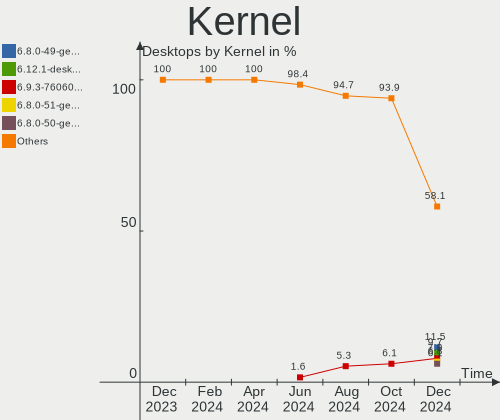
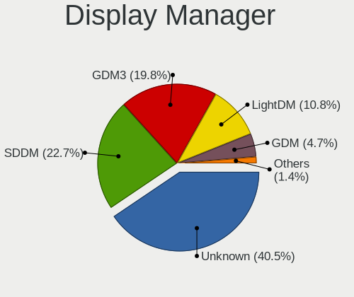
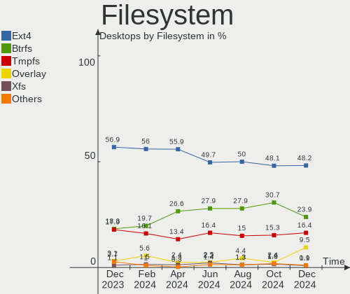
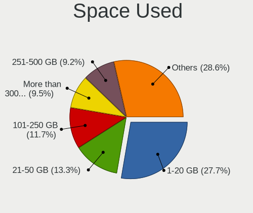
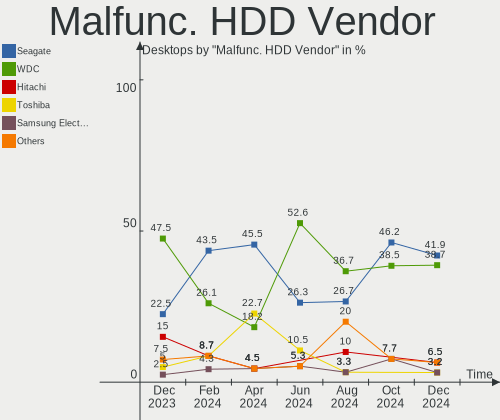
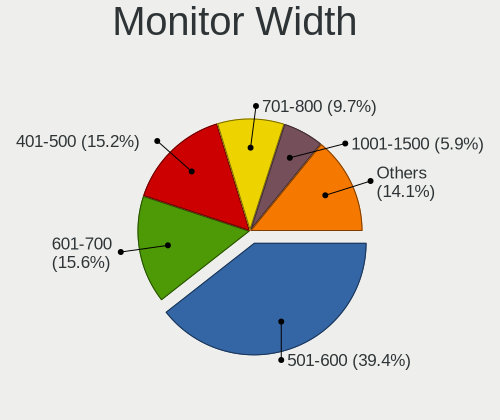
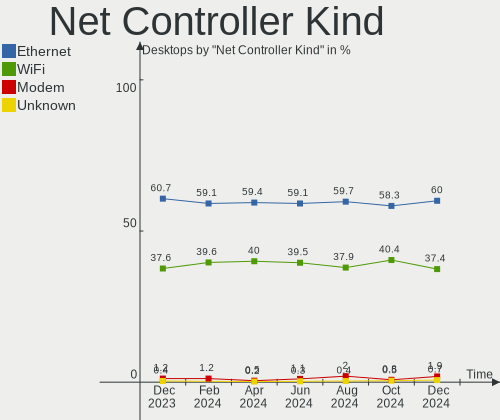

Linux in USA - Hardware Trends (Desktops)
-----------------------------------------

A project to identify most popular hardware characteristics and track their change
over time based on data collected by Linux users at https://Linux-Hardware.org.

Anyone can contribute to this report by the [hw-probe](https://github.com/linuxhw/hw-probe) tool:

    sudo -E hw-probe -all -upload

Period: May, 2023.

Contents
--------

* [ System ](#system)
  - [ OS                       ](#os)
  - [ OS Family                ](#os-family)
  - [ Kernel                   ](#kernel)
  - [ Kernel Family            ](#kernel-family)
  - [ Kernel Major Ver.        ](#kernel-major-ver)
  - [ Arch                     ](#arch)
  - [ DE                       ](#de)
  - [ Display Server           ](#display-server)
  - [ Display Manager          ](#display-manager)
  - [ OS Lang                  ](#os-lang)
  - [ Boot Mode                ](#boot-mode)
  - [ Filesystem               ](#filesystem)
  - [ Part. scheme             ](#part-scheme)
  - [ Dual Boot with Linux/BSD ](#dual-boot-with-linuxbsd)
  - [ Dual Boot (Win)          ](#dual-boot-win)

* [ Board ](#board)
  - [ Vendor                   ](#vendor)
  - [ Model                    ](#model)
  - [ Model Family             ](#model-family)
  - [ MFG Year                 ](#mfg-year)
  - [ Form Factor              ](#form-factor)
  - [ Secure Boot              ](#secure-boot)
  - [ Coreboot                 ](#coreboot)
  - [ RAM Size                 ](#ram-size)
  - [ RAM Used                 ](#ram-used)
  - [ Total Drives             ](#total-drives)
  - [ Has CD-ROM               ](#has-cd-rom)
  - [ Has Ethernet             ](#has-ethernet)
  - [ Has WiFi                 ](#has-wifi)
  - [ Has Bluetooth            ](#has-bluetooth)

* [ Location ](#location)
  - [ Country                  ](#country)
  - [ City                     ](#city)

* [ Drives ](#drives)
  - [ Drive Vendor             ](#drive-vendor)
  - [ Drive Model              ](#drive-model)
  - [ HDD Vendor               ](#hdd-vendor)
  - [ SSD Vendor               ](#ssd-vendor)
  - [ Drive Kind               ](#drive-kind)
  - [ Drive Connector          ](#drive-connector)
  - [ Drive Size               ](#drive-size)
  - [ Space Total              ](#space-total)
  - [ Space Used               ](#space-used)
  - [ Malfunc. Drives          ](#malfunc-drives)
  - [ Malfunc. Drive Vendor    ](#malfunc-drive-vendor)
  - [ Malfunc. HDD Vendor      ](#malfunc-hdd-vendor)
  - [ Malfunc. Drive Kind      ](#malfunc-drive-kind)
  - [ Failed Drives            ](#failed-drives)
  - [ Failed Drive Vendor      ](#failed-drive-vendor)
  - [ Drive Status             ](#drive-status)

* [ Storage controller ](#storage-controller)
  - [ Storage Vendor           ](#storage-vendor)
  - [ Storage Model            ](#storage-model)
  - [ Storage Kind             ](#storage-kind)

* [ Processor ](#processor)
  - [ CPU Vendor               ](#cpu-vendor)
  - [ CPU Model                ](#cpu-model)
  - [ CPU Model Family         ](#cpu-model-family)
  - [ CPU Cores                ](#cpu-cores)
  - [ CPU Sockets              ](#cpu-sockets)
  - [ CPU Threads              ](#cpu-threads)
  - [ CPU Op-Modes             ](#cpu-op-modes)
  - [ CPU Microcode            ](#cpu-microcode)
  - [ CPU Microarch            ](#cpu-microarch)

* [ Graphics ](#graphics)
  - [ GPU Vendor               ](#gpu-vendor)
  - [ GPU Model                ](#gpu-model)
  - [ GPU Combo                ](#gpu-combo)
  - [ GPU Driver               ](#gpu-driver)
  - [ GPU Memory               ](#gpu-memory)

* [ Monitor ](#monitor)
  - [ Monitor Vendor           ](#monitor-vendor)
  - [ Monitor Model            ](#monitor-model)
  - [ Monitor Resolution       ](#monitor-resolution)
  - [ Monitor Diagonal         ](#monitor-diagonal)
  - [ Monitor Width            ](#monitor-width)
  - [ Aspect Ratio             ](#aspect-ratio)
  - [ Monitor Area             ](#monitor-area)
  - [ Pixel Density            ](#pixel-density)
  - [ Multiple Monitors        ](#multiple-monitors)

* [ Network ](#network)
  - [ Net Controller Vendor    ](#net-controller-vendor)
  - [ Net Controller Model     ](#net-controller-model)
  - [ Wireless Vendor          ](#wireless-vendor)
  - [ Wireless Model           ](#wireless-model)
  - [ Ethernet Vendor          ](#ethernet-vendor)
  - [ Ethernet Model           ](#ethernet-model)
  - [ Net Controller Kind      ](#net-controller-kind)
  - [ Used Controller          ](#used-controller)
  - [ NICs                     ](#nics)
  - [ IPv6                     ](#ipv6)

* [ Bluetooth ](#bluetooth)
  - [ Bluetooth Vendor         ](#bluetooth-vendor)
  - [ Bluetooth Model          ](#bluetooth-model)

* [ Sound ](#sound)
  - [ Sound Vendor             ](#sound-vendor)
  - [ Sound Model              ](#sound-model)

* [ Memory ](#memory)
  - [ Memory Vendor            ](#memory-vendor)
  - [ Memory Model             ](#memory-model)
  - [ Memory Kind              ](#memory-kind)
  - [ Memory Form Factor       ](#memory-form-factor)
  - [ Memory Size              ](#memory-size)
  - [ Memory Speed             ](#memory-speed)

* [ Printers & scanners ](#printers--scanners)
  - [ Printer Vendor           ](#printer-vendor)
  - [ Printer Model            ](#printer-model)
  - [ Scanner Vendor           ](#scanner-vendor)
  - [ Scanner Model            ](#scanner-model)

* [ Camera ](#camera)
  - [ Camera Vendor            ](#camera-vendor)
  - [ Camera Model             ](#camera-model)

* [ Security ](#security)
  - [ Fingerprint Vendor       ](#fingerprint-vendor)
  - [ Fingerprint Model        ](#fingerprint-model)
  - [ Chipcard Vendor          ](#chipcard-vendor)
  - [ Chipcard Model           ](#chipcard-model)

* [ Unsupported ](#unsupported)
  - [ Unsupported Devices      ](#unsupported-devices)
  - [ Unsupported Device Types ](#unsupported-device-types)

System
------

OS
--

Installed operating systems

| Name                         | Desktops | Percent |
|------------------------------|----------|---------|
| Ubuntu 22.04                 | 62       | 15.46%  |
| Linux Mint 21.1              | 34       | 8.48%   |
| Pop!_OS 22.04                | 33       | 8.23%   |
| Fedora 38                    | 25       | 6.23%   |
| Debian 11                    | 25       | 6.23%   |
| Ubuntu 23.04                 | 20       | 4.99%   |
| Arch Rolling                 | 17       | 4.24%   |
| Zorin 16                     | 16       | 3.99%   |
| OpenMandriva 23.03           | 16       | 3.99%   |
| Ubuntu 20.04                 | 14       | 3.49%   |
| ArcoLinux Rolling            | 14       | 3.49%   |
| Gentoo 2.13                  | 12       | 2.99%   |
| Nobara 37                    | 10       | 2.49%   |
| Manjaro                      | 9        | 2.24%   |
| openSUSE Tumbleweed-XXXXXXXX | 7        | 1.75%   |
| Kubuntu 22.04                | 7        | 1.75%   |
| Ubuntu 22.10                 | 6        | 1.5%    |
| Linux Mint 21                | 6        | 1.5%    |
| Linux Mint 20.3              | 4        | 1%      |
| Fedora 37                    | 4        | 1%      |
| Xubuntu 22.04                | 3        | 0.75%   |
| OpenMandriva 4.3             | 3        | 0.75%   |
| Kubuntu 23.04                | 3        | 0.75%   |
| Xubuntu 20.04                | 2        | 0.5%    |
| Ubuntu 18.04                 | 2        | 0.5%    |
| Rocky Linux 9.1              | 2        | 0.5%    |
| Parrot 5.3                   | 2        | 0.5%    |
| MX 21                        | 2        | 0.5%    |
| Manjaro 22.1.1               | 2        | 0.5%    |
| Manjaro 22.1.0               | 2        | 0.5%    |
| KDE neon 22.04               | 2        | 0.5%    |
| Fedora 36                    | 2        | 0.5%    |
| Debian 12                    | 2        | 0.5%    |
| ChimeraOS 41                 | 2        | 0.5%    |
| Xero Rolling                 | 1        | 0.25%   |
| Ubuntu Studio 22.04          | 1        | 0.25%   |
| Ubuntu MATE 22.04            | 1        | 0.25%   |
| Ubuntu 9.5                   | 1        | 0.25%   |
| Ubuntu 23.10                 | 1        | 0.25%   |
| Tsurugi 2023.1               | 1        | 0.25%   |

OS Family
---------

OS without a version

| Name          | Desktops | Percent |
|---------------|----------|---------|
| Ubuntu        | 106      | 26.43%  |
| Linux Mint    | 47       | 11.72%  |
| Pop!_OS       | 33       | 8.23%   |
| Fedora        | 31       | 7.73%   |
| Debian        | 28       | 6.98%   |
| OpenMandriva  | 22       | 5.49%   |
| Arch          | 17       | 4.24%   |
| Zorin         | 16       | 3.99%   |
| Manjaro       | 14       | 3.49%   |
| ArcoLinux     | 14       | 3.49%   |
| Gentoo        | 12       | 2.99%   |
| Nobara        | 10       | 2.49%   |
| Kubuntu       | 10       | 2.49%   |
| openSUSE      | 9        | 2.24%   |
| Xubuntu       | 5        | 1.25%   |
| SteamOS       | 2        | 0.5%    |
| ROSA          | 2        | 0.5%    |
| Rocky Linux   | 2        | 0.5%    |
| Parrot        | 2        | 0.5%    |
| MX            | 2        | 0.5%    |
| KDE neon      | 2        | 0.5%    |
| ChimeraOS     | 2        | 0.5%    |
| Xero          | 1        | 0.25%   |
| Ubuntu Studio | 1        | 0.25%   |
| Ubuntu MATE   | 1        | 0.25%   |
| Tsurugi       | 1        | 0.25%   |
| Peppermint    | 1        | 0.25%   |
| LMDE          | 1        | 0.25%   |
| Gnoppix       | 1        | 0.25%   |
| Endless       | 1        | 0.25%   |
| EndeavourOS   | 1        | 0.25%   |
| Crystal Linux | 1        | 0.25%   |
| blendOS       | 1        | 0.25%   |
| ArchLabsX     | 1        | 0.25%   |
| Archcraft     | 1        | 0.25%   |

Kernel
------

Version of the Linux kernel

| Version                      | Desktops | Percent |
|------------------------------|----------|---------|
| 5.19.0-41-generic            | 41       | 10.22%  |
| 5.15.0-71-generic            | 36       | 8.98%   |
| 6.2.6-76060206-generic       | 31       | 7.73%   |
| 5.15.0-72-generic            | 25       | 6.23%   |
| 6.2.0-20-generic             | 22       | 5.49%   |
| 6.2.6-desktop-1omv2390       | 16       | 3.99%   |
| 5.19.0-42-generic            | 14       | 3.49%   |
| 5.10.0-23-amd64              | 13       | 3.24%   |
| 6.3.1-arch1-1                | 10       | 2.49%   |
| 6.2.15-300.fc38.x86_64       | 10       | 2.49%   |
| 6.2.14-300.fsync.fc37.x86_64 | 7        | 1.75%   |
| 6.2.14-300.fc38.x86_64       | 7        | 1.75%   |
| 5.4.0-148-generic            | 7        | 1.75%   |
| 5.10.0-22-amd64              | 7        | 1.75%   |
| 6.2.9-300.fc38.x86_64        | 4        | 1%      |
| 5.15.0-71-lowlatency         | 4        | 1%      |
| 6.3.4-arch1-1                | 3        | 0.75%   |
| 6.3.2-arch1-1                | 3        | 0.75%   |
| 6.3.0-1-MANJARO              | 3        | 0.75%   |
| 6.2.12-200.fsync.fc37.x86_64 | 3        | 0.75%   |
| 6.1.27-gentoo-r1-x86_64      | 3        | 0.75%   |
| 6.1.26-1-MANJARO             | 3        | 0.75%   |
| 6.1.25-1-MANJARO             | 3        | 0.75%   |
| 5.15.0-56-generic            | 3        | 0.75%   |
| 5.15.0-25-generic            | 3        | 0.75%   |
| 6.3.4-gentoo                 | 2        | 0.5%    |
| 6.3.3-gentoo                 | 2        | 0.5%    |
| 6.3.3-arch1-1                | 2        | 0.5%    |
| 6.3.2-zen1-1-zen             | 2        | 0.5%    |
| 6.3.2-1-default              | 2        | 0.5%    |
| 6.3.1-arch2-1                | 2        | 0.5%    |
| 6.3.1-1-default              | 2        | 0.5%    |
| 6.2.14-200.fc37.x86_64       | 2        | 0.5%    |
| 6.2.12-arch1-1               | 2        | 0.5%    |
| 6.2.12-1-MANJARO             | 2        | 0.5%    |
| 6.1.29-1-lts                 | 2        | 0.5%    |
| 6.1.21-1-lts                 | 2        | 0.5%    |
| 6.1.0-1010-oem               | 2        | 0.5%    |
| 6.0.2-76060002-generic       | 2        | 0.5%    |
| 5.4.0-149-generic            | 2        | 0.5%    |

Kernel Family
-------------

Linux kernel without a distro release

| Version  | Desktops | Percent |
|----------|----------|---------|
| 5.15.0   | 84       | 20.95%  |
| 5.19.0   | 62       | 15.46%  |
| 6.2.6    | 47       | 11.72%  |
| 6.2.0    | 23       | 5.74%   |
| 5.10.0   | 23       | 5.74%   |
| 6.3.1    | 18       | 4.49%   |
| 6.2.14   | 17       | 4.24%   |
| 5.4.0    | 13       | 3.24%   |
| 6.2.15   | 12       | 2.99%   |
| 6.2.12   | 10       | 2.49%   |
| 6.3.2    | 9        | 2.24%   |
| 6.3.4    | 7        | 1.75%   |
| 6.1.0    | 7        | 1.75%   |
| 6.3.3    | 6        | 1.5%    |
| 6.3.0    | 4        | 1%      |
| 6.2.9    | 4        | 1%      |
| 6.1.27   | 4        | 1%      |
| 6.1.26   | 4        | 1%      |
| 6.2.13   | 3        | 0.75%   |
| 6.1.29   | 3        | 0.75%   |
| 6.1.25   | 3        | 0.75%   |
| 6.1.21   | 3        | 0.75%   |
| 6.0.2    | 3        | 0.75%   |
| 6.2.11   | 2        | 0.5%    |
| 5.16.13  | 2        | 0.5%    |
| 5.15.108 | 2        | 0.5%    |
| 5.14.21  | 2        | 0.5%    |
| 5.14.0   | 2        | 0.5%    |
| 5.13.0   | 2        | 0.5%    |
| 6.4.0    | 1        | 0.25%   |
| 6.2.8    | 1        | 0.25%   |
| 6.2.2    | 1        | 0.25%   |
| 6.2.10   | 1        | 0.25%   |
| 6.2.0.3  | 1        | 0.25%   |
| 6.1.8    | 1        | 0.25%   |
| 6.1.28   | 1        | 0.25%   |
| 6.1.22   | 1        | 0.25%   |
| 6.1.19   | 1        | 0.25%   |
| 6.1.1    | 1        | 0.25%   |
| 6.0.12   | 1        | 0.25%   |

Kernel Major Ver.
-----------------

Linux kernel major version

| Version | Desktops | Percent |
|---------|----------|---------|
| 6.2     | 121      | 30.17%  |
| 5.15    | 88       | 21.95%  |
| 5.19    | 62       | 15.46%  |
| 6.3     | 44       | 10.97%  |
| 6.1     | 29       | 7.23%   |
| 5.10    | 24       | 5.99%   |
| 5.4     | 13       | 3.24%   |
| 6.0     | 6        | 1.5%    |
| 5.14    | 4        | 1%      |
| 5.16    | 3        | 0.75%   |
| 5.13    | 2        | 0.5%    |
| 6.4     | 1        | 0.25%   |
| 6.2.0   | 1        | 0.25%   |
| 5.18    | 1        | 0.25%   |
| 4.19    | 1        | 0.25%   |
| 4.15    | 1        | 0.25%   |

Arch
----

OS architecture (x86_64, i586, etc.)

| Name   | Desktops | Percent |
|--------|----------|---------|
| x86_64 | 401      | 100%    |

DE
--

Desktop Environment

| Name            | Desktops | Percent |
|-----------------|----------|---------|
| GNOME           | 195      | 48.63%  |
| KDE5            | 85       | 21.2%   |
| X-Cinnamon      | 42       | 10.47%  |
| XFCE            | 36       | 8.98%   |
| Unknown         | 18       | 4.49%   |
| MATE            | 8        | 2%      |
| LXQt            | 3        | 0.75%   |
| LXDE            | 3        | 0.75%   |
| Cinnamon        | 3        | 0.75%   |
| bspwm           | 3        | 0.75%   |
| sway            | 1        | 0.25%   |
| openbox         | 1        | 0.25%   |
| i3              | 1        | 0.25%   |
| Hyprland        | 1        | 0.25%   |
| GNOME Flashback | 1        | 0.25%   |

Display Server
--------------

X11 or Wayland

| Name    | Desktops | Percent |
|---------|----------|---------|
| X11     | 269      | 67.08%  |
| Wayland | 110      | 27.43%  |
| Tty     | 16       | 3.99%   |
| Unknown | 6        | 1.5%    |

Display Manager
---------------

SDDM, LightDM, etc.

| Name    | Desktops | Percent |
|---------|----------|---------|
| Unknown | 172      | 42.89%  |
| GDM3    | 85       | 21.2%   |
| SDDM    | 66       | 16.46%  |
| LightDM | 48       | 11.97%  |
| GDM     | 29       | 7.23%   |
| SLiM    | 1        | 0.25%   |

OS Lang
-------

Language

| Lang    | Desktops | Percent |
|---------|----------|---------|
| en_US   | 373      | 93.02%  |
| C       | 10       | 2.49%   |
| Unknown | 5        | 1.25%   |
| en_GB   | 2        | 0.5%    |
| en_CA   | 2        | 0.5%    |
| C.UTF8  | 2        | 0.5%    |
| uk_UA   | 1        | 0.25%   |
| POSIX   | 1        | 0.25%   |
| ga_IE   | 1        | 0.25%   |
| fr_CA   | 1        | 0.25%   |
| es_ES   | 1        | 0.25%   |
| en_ZW   | 1        | 0.25%   |
| de_DE   | 1        | 0.25%   |

Boot Mode
---------

EFI or BIOS

| Mode | Desktops | Percent |
|------|----------|---------|
| BIOS | 226      | 56.36%  |
| EFI  | 175      | 43.64%  |

Filesystem
----------

Type of filesystem

| Type     | Desktops | Percent |
|----------|----------|---------|
| Ext4     | 230      | 57.36%  |
| Btrfs    | 71       | 17.71%  |
| Tmpfs    | 68       | 16.96%  |
| Overlay  | 17       | 4.24%   |
| Xfs      | 6        | 1.5%    |
| Zfs      | 3        | 0.75%   |
| Reiserfs | 2        | 0.5%    |
| F2fs     | 2        | 0.5%    |
| Jfs      | 1        | 0.25%   |
| Ext3     | 1        | 0.25%   |

Part. scheme
------------

Scheme of partitioning

| Type    | Desktops | Percent |
|---------|----------|---------|
| GPT     | 205      | 51.12%  |
| Unknown | 151      | 37.66%  |
| MBR     | 45       | 11.22%  |

Dual Boot with Linux/BSD
------------------------

Hosting more than one Linux/BSD

| Dual boot | Desktops | Percent |
|-----------|----------|---------|
| No        | 315      | 78.55%  |
| Yes       | 86       | 21.45%  |

Dual Boot (Win)
---------------

Hosting Linux and Windows

| Dual boot | Desktops | Percent |
|-----------|----------|---------|
| No        | 293      | 73.07%  |
| Yes       | 108      | 26.93%  |

Board
-----

Vendor
------

Motherboard manufacturer

| Name                                 | Desktops | Percent |
|--------------------------------------|----------|---------|
| ASUSTek Computer                     | 107      | 26.68%  |
| Gigabyte Technology                  | 58       | 14.46%  |
| Dell                                 | 56       | 13.97%  |
| MSI                                  | 47       | 11.72%  |
| ASRock                               | 35       | 8.73%   |
| Hewlett-Packard                      | 28       | 6.98%   |
| Lenovo                               | 19       | 4.74%   |
| Intel                                | 9        | 2.24%   |
| Pegatron                             | 8        | 2%      |
| Unknown                              | 5        | 1.25%   |
| Foxconn                              | 3        | 0.75%   |
| Gateway                              | 2        | 0.5%    |
| eMachines                            | 2        | 0.5%    |
| Biostar                              | 2        | 0.5%    |
| BESSTAR Tech                         | 2        | 0.5%    |
| AZW                                  | 2        | 0.5%    |
| Avalue                               | 2        | 0.5%    |
| Apple                                | 2        | 0.5%    |
| Alienware                            | 2        | 0.5%    |
| Acer                                 | 2        | 0.5%    |
| System76                             | 1        | 0.25%   |
| Shenzhen Meigao Electronic Equipment | 1        | 0.25%   |
| SHANGZHAOYUAN                        | 1        | 0.25%   |
| PS                                   | 1        | 0.25%   |
| Google                               | 1        | 0.25%   |
| ECS                                  | 1        | 0.25%   |
| ASRockRack                           | 1        | 0.25%   |
| AOpen                                | 1        | 0.25%   |

Model
-----

Motherboard model

| Name                                  | Desktops | Percent |
|---------------------------------------|----------|---------|
| Dell OptiPlex 9020                    | 10       | 2.49%   |
| ASUS All Series                       | 8        | 2%      |
| Unknown                               | 5        | 1.25%   |
| Dell OptiPlex 7010                    | 4        | 1%      |
| ASUS TUF Gaming X570-PLUS             | 4        | 1%      |
| MSI MS-7C91                           | 3        | 0.75%   |
| MSI MS-7C56                           | 3        | 0.75%   |
| MSI MS-7C02                           | 3        | 0.75%   |
| MSI MS-7693                           | 3        | 0.75%   |
| Gigabyte X570S AORUS ELITE AX         | 3        | 0.75%   |
| Dell OptiPlex 990                     | 3        | 0.75%   |
| ASUS ROG STRIX B550-F GAMING          | 3        | 0.75%   |
| ASUS ROG STRIX B450-F GAMING          | 3        | 0.75%   |
| ASUS PRIME X370-PRO                   | 3        | 0.75%   |
| MSI MS-7C84                           | 2        | 0.5%    |
| MSI MS-7B98                           | 2        | 0.5%    |
| MSI MS-7B86                           | 2        | 0.5%    |
| MSI MS-7721                           | 2        | 0.5%    |
| Lenovo IdeaCentre 5 14IOB6 90RJ009GUS | 2        | 0.5%    |
| HP ProDesk 600 G1 DM                  | 2        | 0.5%    |
| HP EliteDesk 800 G1 SFF               | 2        | 0.5%    |
| HP Compaq Elite 8300 USDT             | 2        | 0.5%    |
| HP Compaq Elite 8300 SFF              | 2        | 0.5%    |
| HP Compaq 8000 Elite CMT PC           | 2        | 0.5%    |
| Gigabyte X570 GAMING X                | 2        | 0.5%    |
| Gigabyte X570 AORUS MASTER            | 2        | 0.5%    |
| Gigabyte GA-78LMT-USB3 6.0            | 2        | 0.5%    |
| Gigabyte GA-78LMT-USB3                | 2        | 0.5%    |
| Gigabyte GA-78LMT-S2                  | 2        | 0.5%    |
| Gigabyte B85M-DS3H-A                  | 2        | 0.5%    |
| Gigabyte B550M DS3H                   | 2        | 0.5%    |
| Gigabyte B450M DS3H                   | 2        | 0.5%    |
| Gigabyte B365M DS3H                   | 2        | 0.5%    |
| Dell XPS 8700                         | 2        | 0.5%    |
| Dell Precision WorkStation T3500      | 2        | 0.5%    |
| Dell OptiPlex 790                     | 2        | 0.5%    |
| Dell OptiPlex 780                     | 2        | 0.5%    |
| Dell OptiPlex 760                     | 2        | 0.5%    |
| Dell OptiPlex 7060                    | 2        | 0.5%    |
| Dell OptiPlex 3060                    | 2        | 0.5%    |

Model Family
------------

Motherboard model prefix

| Name                   | Desktops | Percent |
|------------------------|----------|---------|
| Dell OptiPlex          | 36       | 8.98%   |
| ASUS ROG               | 32       | 7.98%   |
| ASUS PRIME             | 24       | 5.99%   |
| ASUS TUF               | 11       | 2.74%   |
| HP Compaq              | 10       | 2.49%   |
| ASUS All               | 8        | 2%      |
| Lenovo ThinkCentre     | 7        | 1.75%   |
| Gigabyte X570          | 7        | 1.75%   |
| Dell Inspiron          | 7        | 1.75%   |
| Gigabyte X570S         | 6        | 1.5%    |
| Dell Precision         | 6        | 1.5%    |
| Lenovo IdeaCentre      | 5        | 1.25%   |
| Gigabyte GA-78LMT-USB3 | 5        | 1.25%   |
| Dell XPS               | 5        | 1.25%   |
| Unknown                | 5        | 1.25%   |
| HP ProDesk             | 4        | 1%      |
| Gigabyte B550          | 4        | 1%      |
| MSI MS-7C91            | 3        | 0.75%   |
| MSI MS-7C56            | 3        | 0.75%   |
| MSI MS-7C02            | 3        | 0.75%   |
| MSI MS-7693            | 3        | 0.75%   |
| Lenovo ThinkStation    | 3        | 0.75%   |
| HP EliteDesk           | 3        | 0.75%   |
| Gigabyte B450M         | 3        | 0.75%   |
| ASUS M5A78L-M          | 3        | 0.75%   |
| MSI MS-7C84            | 2        | 0.5%    |
| MSI MS-7B98            | 2        | 0.5%    |
| MSI MS-7B86            | 2        | 0.5%    |
| MSI MS-7721            | 2        | 0.5%    |
| HP OMEN                | 2        | 0.5%    |
| Gigabyte Z690          | 2        | 0.5%    |
| Gigabyte Z590          | 2        | 0.5%    |
| Gigabyte GA-78LMT-S2   | 2        | 0.5%    |
| Gigabyte B85M-DS3H-A   | 2        | 0.5%    |
| Gigabyte B560M         | 2        | 0.5%    |
| Gigabyte B550M         | 2        | 0.5%    |
| Gigabyte B365M         | 2        | 0.5%    |
| Gigabyte 990FXA-UD3    | 2        | 0.5%    |
| BESSTAR Tech HM90      | 2        | 0.5%    |
| Avalue NUC-TGU         | 2        | 0.5%    |

MFG Year
--------

Motherboard manufacture year

| Year | Desktops | Percent |
|------|----------|---------|
| 2020 | 42       | 10.47%  |
| 2021 | 40       | 9.98%   |
| 2018 | 40       | 9.98%   |
| 2019 | 35       | 8.73%   |
| 2022 | 30       | 7.48%   |
| 2013 | 30       | 7.48%   |
| 2012 | 25       | 6.23%   |
| 2011 | 25       | 6.23%   |
| 2017 | 22       | 5.49%   |
| 2014 | 22       | 5.49%   |
| 2015 | 21       | 5.24%   |
| 2009 | 18       | 4.49%   |
| 2016 | 14       | 3.49%   |
| 2010 | 14       | 3.49%   |
| 2023 | 10       | 2.49%   |
| 2008 | 6        | 1.5%    |
| 2007 | 6        | 1.5%    |
| 2006 | 1        | 0.25%   |

Form Factor
-----------

Physical design of the computer

| Name    | Desktops | Percent |
|---------|----------|---------|
| Desktop | 401      | 100%    |

Secure Boot
-----------

Enabled or disabled

| State    | Desktops | Percent |
|----------|----------|---------|
| Disabled | 388      | 96.76%  |
| Enabled  | 13       | 3.24%   |

Coreboot
--------

Have coreboot on board

| Used | Desktops | Percent |
|------|----------|---------|
| No   | 400      | 99.75%  |
| Yes  | 1        | 0.25%   |

RAM Size
--------

Total RAM memory

| Size in GB      | Desktops | Percent |
|-----------------|----------|---------|
| 32.01-64.0      | 110      | 27.43%  |
| 16.01-24.0      | 95       | 23.69%  |
| 4.01-8.0        | 54       | 13.47%  |
| 8.01-16.0       | 50       | 12.47%  |
| 64.01-256.0     | 46       | 11.47%  |
| 3.01-4.0        | 28       | 6.98%   |
| 24.01-32.0      | 16       | 3.99%   |
| More than 256.0 | 1        | 0.25%   |
| 2.01-3.0        | 1        | 0.25%   |

RAM Used
--------

Used RAM memory

| Used GB    | Desktops | Percent |
|------------|----------|---------|
| 2.01-3.0   | 92       | 22.94%  |
| 4.01-8.0   | 91       | 22.69%  |
| 1.01-2.0   | 83       | 20.7%   |
| 3.01-4.0   | 72       | 17.96%  |
| 8.01-16.0  | 33       | 8.23%   |
| 0.51-1.0   | 14       | 3.49%   |
| 16.01-24.0 | 8        | 2%      |
| 24.01-32.0 | 4        | 1%      |
| 32.01-64.0 | 2        | 0.5%    |
| 0.01-0.5   | 2        | 0.5%    |

Total Drives
------------

Number of drives on board

| Drives | Desktops | Percent |
|--------|----------|---------|
| 1      | 124      | 30.92%  |
| 2      | 118      | 29.43%  |
| 3      | 74       | 18.45%  |
| 4      | 34       | 8.48%   |
| 5      | 27       | 6.73%   |
| 6      | 10       | 2.49%   |
| 7      | 7        | 1.75%   |
| 12     | 2        | 0.5%    |
| 9      | 2        | 0.5%    |
| 8      | 2        | 0.5%    |
| 10     | 1        | 0.25%   |

Has CD-ROM
----------

Has CD-ROM on board

| Presented | Desktops | Percent |
|-----------|----------|---------|
| No        | 239      | 59.6%   |
| Yes       | 162      | 40.4%   |

Has Ethernet
------------

Has Ethernet on board

| Presented | Desktops | Percent |
|-----------|----------|---------|
| Yes       | 399      | 99.5%   |
| No        | 2        | 0.5%    |

Has WiFi
--------

Has WiFi module

| Presented | Desktops | Percent |
|-----------|----------|---------|
| Yes       | 254      | 63.34%  |
| No        | 147      | 36.66%  |

Has Bluetooth
-------------

Has Bluetooth module

| Presented | Desktops | Percent |
|-----------|----------|---------|
| No        | 202      | 50.37%  |
| Yes       | 199      | 49.63%  |

Location
--------

Country
-------

Geographic location (country)

| Country | Desktops | Percent |
|---------|----------|---------|
| USA     | 401      | 100%    |

City
----

Geographic location (city)

| City           | Desktops | Percent |
|----------------|----------|---------|
| Seattle        | 8        | 2%      |
| Houston        | 5        | 1.25%   |
| Pittsburg      | 4        | 1%      |
| New York       | 4        | 1%      |
| Dudley         | 4        | 1%      |
| Denver         | 4        | 1%      |
| Chicago        | 4        | 1%      |
| Atlanta        | 4        | 1%      |
| Tampa          | 3        | 0.75%   |
| Sterling       | 3        | 0.75%   |
| Springdale     | 3        | 0.75%   |
| San Jose       | 3        | 0.75%   |
| Philadelphia   | 3        | 0.75%   |
| Los Angeles    | 3        | 0.75%   |
| Geneseo        | 3        | 0.75%   |
| Flushing       | 3        | 0.75%   |
| Bangor         | 3        | 0.75%   |
| Baltimore      | 3        | 0.75%   |
| Winston-Salem  | 2        | 0.5%    |
| Washington     | 2        | 0.5%    |
| Waltham        | 2        | 0.5%    |
| Wakefield      | 2        | 0.5%    |
| Wake Forest    | 2        | 0.5%    |
| Vancouver      | 2        | 0.5%    |
| Tecumseh       | 2        | 0.5%    |
| Tacoma         | 2        | 0.5%    |
| Summerville    | 2        | 0.5%    |
| Stockton       | 2        | 0.5%    |
| St Louis       | 2        | 0.5%    |
| Springfield    | 2        | 0.5%    |
| Spokane        | 2        | 0.5%    |
| Silver Spring  | 2        | 0.5%    |
| San Tan Valley | 2        | 0.5%    |
| San Francisco  | 2        | 0.5%    |
| San Antonio    | 2        | 0.5%    |
| Salt Lake City | 2        | 0.5%    |
| Saint Paul     | 2        | 0.5%    |
| Rockville      | 2        | 0.5%    |
| Riverside      | 2        | 0.5%    |
| Pittsburgh     | 2        | 0.5%    |

Drives
------

Drive Vendor
------------

Hard drive vendors

| Vendor                      | Desktops | Drives | Percent |
|-----------------------------|----------|--------|---------|
| Samsung Electronics         | 142      | 195    | 17.93%  |
| WDC                         | 141      | 212    | 17.8%   |
| Seagate                     | 120      | 153    | 15.15%  |
| SanDisk                     | 61       | 71     | 7.7%    |
| Crucial                     | 37       | 59     | 4.67%   |
| Hitachi                     | 30       | 39     | 3.79%   |
| Kingston                    | 23       | 27     | 2.9%    |
| Toshiba                     | 22       | 31     | 2.78%   |
| PNY                         | 21       | 25     | 2.65%   |
| Phison Electronics          | 20       | 26     | 2.53%   |
| China                       | 19       | 21     | 2.4%    |
| Micron/Crucial Technology   | 17       | 18     | 2.15%   |
| Intel                       | 13       | 13     | 1.64%   |
| HGST                        | 11       | 11     | 1.39%   |
| A-DATA Technology           | 11       | 11     | 1.39%   |
| SK hynix                    | 10       | 12     | 1.26%   |
| Unknown                     | 7        | 9      | 0.88%   |
| Micron Technology           | 7        | 8      | 0.88%   |
| Unknown                     | 6        | 6      | 0.76%   |
| Team                        | 5        | 8      | 0.63%   |
| WD MediaMax                 | 4        | 10     | 0.51%   |
| SPCC                        | 4        | 4      | 0.51%   |
| SABRENT                     | 4        | 7      | 0.51%   |
| Realtek Semiconductor       | 4        | 4      | 0.51%   |
| Phison                      | 4        | 4      | 0.51%   |
| ASMT                        | 4        | 10     | 0.51%   |
| MAXIO Technology (Hangzhou) | 3        | 3      | 0.38%   |
| Hewlett-Packard             | 3        | 4      | 0.38%   |
| Transcend                   | 2        | 2      | 0.25%   |
| SSK                         | 2        | 2      | 0.25%   |
| Silicon Motion              | 2        | 2      | 0.25%   |
| Patriot                     | 2        | 3      | 0.25%   |
| Mushkin                     | 2        | 2      | 0.25%   |
| Kingston Technology Company | 2        | 2      | 0.25%   |
| KingFast                    | 2        | 2      | 0.25%   |
| Fanxiang                    | 2        | 2      | 0.25%   |
| Corsair                     | 2        | 2      | 0.25%   |
| ADATA Technology            | 2        | 2      | 0.25%   |
| USB                         | 1        | 1      | 0.13%   |
| Super Talent                | 1        | 1      | 0.13%   |

Drive Model
-----------

Hard drive models

| Model                                               | Desktops | Percent |
|-----------------------------------------------------|----------|---------|
| Samsung NVMe SSD Controller SM981/PM981/PM983 256GB | 27       | 2.91%   |
| Samsung NVMe SSD Controller PM9A1/PM9A3/980PRO 1TB  | 20       | 2.16%   |
| Seagate ST2000DM008-2FR102 2TB                      | 15       | 1.62%   |
| Samsung SSD 860 EVO 1TB                             | 14       | 1.51%   |
| Micron/Crucial P2 NVMe PCIe SSD 1TB                 | 11       | 1.19%   |
| WDC WD10EZEX-08WN4A0 1TB                            | 9        | 0.97%   |
| Samsung SSD 870 EVO 1TB                             | 9        | 0.97%   |
| Phison E12 NVMe Controller 256GB                    | 9        | 0.97%   |
| WDC WDS500G2B0A-00SM50 500GB SSD                    | 8        | 0.86%   |
| Seagate ST1000DM003-1SB102 1TB                      | 8        | 0.86%   |
| Seagate ST500DM002-1BD142 500GB                     | 7        | 0.75%   |
| Sandisk WD Blue SN550 NVMe SSD 512GB                | 7        | 0.75%   |
| PNY CS900 500GB SSD                                 | 7        | 0.75%   |
| Seagate ST4000DM004-2CV104 4TB                      | 6        | 0.65%   |
| Samsung SSD 980 1TB                                 | 6        | 0.65%   |
| Samsung SSD 870 EVO 2TB                             | 6        | 0.65%   |
| Samsung SSD 860 EVO 500GB                           | 6        | 0.65%   |
| Samsung SSD 850 EVO 250GB                           | 6        | 0.65%   |
| Crucial CT1000MX500SSD1 1TB                         | 6        | 0.65%   |
| Unknown                                             | 6        | 0.65%   |
| WDC WD10EZEX-00BN5A0 1TB                            | 5        | 0.54%   |
| Toshiba DT01ACA100 1TB                              | 5        | 0.54%   |
| Seagate ST31000528AS 1TB                            | 5        | 0.54%   |
| Seagate ST1000DM010-2EP102 1TB                      | 5        | 0.54%   |
| Seagate ST1000DM003-1CH162 1TB                      | 5        | 0.54%   |
| Samsung SSD 870 EVO 500GB                           | 5        | 0.54%   |
| Crucial CT500MX500SSD1 500GB                        | 5        | 0.54%   |
| Crucial CT1000BX500SSD1 1TB                         | 5        | 0.54%   |
| WDC WD20EARX-00PASB0 2TB                            | 4        | 0.43%   |
| WDC WD1003FZEX-00MK2A0 1TB                          | 4        | 0.43%   |
| WDC WD1002FAEX-00Z3A0 1TB                           | 4        | 0.43%   |
| Seagate ST3500418AS 500GB                           | 4        | 0.43%   |
| Samsung SSD 970 EVO Plus 1TB                        | 4        | 0.43%   |
| Phison PCIe SSD 512GB                               | 4        | 0.43%   |
| Micron/Crucial CT2000P5PSSD8 2TB                    | 4        | 0.43%   |
| Kingston SA400S37240G 240GB SSD                     | 4        | 0.43%   |
| China SATA SSD 256GB                                | 4        | 0.43%   |
| China SATA SSD 120GB                                | 4        | 0.43%   |
| WDC WDS100T2G0A-00JH30 1TB SSD                      | 3        | 0.32%   |
| WDC WD4005FZBX-00K5WB0 4TB                          | 3        | 0.32%   |

HDD Vendor
----------

Hard disk drive vendors

| Vendor              | Desktops | Drives | Percent |
|---------------------|----------|--------|---------|
| WDC                 | 123      | 181    | 38.8%   |
| Seagate             | 114      | 143    | 35.96%  |
| Hitachi             | 30       | 39     | 9.46%   |
| Toshiba             | 22       | 31     | 6.94%   |
| HGST                | 11       | 11     | 3.47%   |
| Samsung Electronics | 5        | 5      | 1.58%   |
| Unknown             | 3        | 3      | 0.95%   |
| WD MediaMax         | 2        | 7      | 0.63%   |
| SSK                 | 2        | 2      | 0.63%   |
| USB                 | 1        | 1      | 0.32%   |
| SABRENT             | 1        | 1      | 0.32%   |
| Maxtor              | 1        | 1      | 0.32%   |
| ASMT                | 1        | 1      | 0.32%   |
| Apple               | 1        | 1      | 0.32%   |

SSD Vendor
----------

Solid state drive vendors

| Vendor              | Desktops | Drives | Percent |
|---------------------|----------|--------|---------|
| Samsung Electronics | 76       | 94     | 27.14%  |
| Crucial             | 33       | 53     | 11.79%  |
| SanDisk             | 25       | 26     | 8.93%   |
| WDC                 | 24       | 26     | 8.57%   |
| PNY                 | 20       | 24     | 7.14%   |
| Kingston            | 20       | 21     | 7.14%   |
| China               | 19       | 21     | 6.79%   |
| A-DATA Technology   | 11       | 11     | 3.93%   |
| Intel               | 8        | 8      | 2.86%   |
| Micron Technology   | 5        | 6      | 1.79%   |
| Team                | 4        | 5      | 1.43%   |
| SPCC                | 4        | 4      | 1.43%   |
| SK hynix            | 3        | 3      | 1.07%   |
| SABRENT             | 3        | 6      | 1.07%   |
| ASMT                | 3        | 9      | 1.07%   |
| Transcend           | 2        | 2      | 0.71%   |
| Patriot             | 2        | 3      | 0.71%   |
| Mushkin             | 2        | 2      | 0.71%   |
| Hewlett-Packard     | 2        | 3      | 0.71%   |
| Super Talent        | 1        | 1      | 0.36%   |
| SUNEAST             | 1        | 1      | 0.36%   |
| Seagate             | 1        | 1      | 0.36%   |
| SD                  | 1        | 1      | 0.36%   |
| MicroFrom           | 1        | 1      | 0.36%   |
| LITEON              | 1        | 1      | 0.36%   |
| Lexar               | 1        | 1      | 0.36%   |
| Leven               | 1        | 1      | 0.36%   |
| KingFast            | 1        | 1      | 0.36%   |
| Gigabyte Technology | 1        | 1      | 0.36%   |
| Fanxiang            | 1        | 1      | 0.36%   |
| Dogfish             | 1        | 1      | 0.36%   |
| 1TBE                | 1        | 1      | 0.36%   |
| Unknown             | 1        | 1      | 0.36%   |

Drive Kind
----------

HDD or SSD

| Kind    | Desktops | Drives | Percent |
|---------|----------|--------|---------|
| HDD     | 238      | 427    | 36.62%  |
| SSD     | 221      | 341    | 34%     |
| NVMe    | 173      | 251    | 26.62%  |
| Unknown | 15       | 18     | 2.31%   |
| MMC     | 3        | 4      | 0.46%   |

Drive Connector
---------------

SATA, SAS, NVMe, etc.

| Type | Desktops | Drives | Percent |
|------|----------|--------|---------|
| SATA | 345      | 719    | 60.95%  |
| NVMe | 173      | 251    | 30.57%  |
| SAS  | 45       | 67     | 7.95%   |
| MMC  | 3        | 4      | 0.53%   |

Drive Size
----------

Size of hard drive

| Size in TB | Desktops | Drives | Percent |
|------------|----------|--------|---------|
| 0.01-0.5   | 204      | 297    | 38.27%  |
| 0.51-1.0   | 157      | 219    | 29.46%  |
| 1.01-2.0   | 87       | 113    | 16.32%  |
| 3.01-4.0   | 38       | 63     | 7.13%   |
| 4.01-10.0  | 26       | 37     | 4.88%   |
| 10.01-20.0 | 11       | 22     | 2.06%   |
| 2.01-3.0   | 10       | 17     | 1.88%   |

Space Total
-----------

Amount of disk space available on the file system

| Size in GB     | Desktops | Percent |
|----------------|----------|---------|
| More than 3000 | 86       | 21.45%  |
| 251-500        | 73       | 18.2%   |
| 501-1000       | 70       | 17.46%  |
| 101-250        | 63       | 15.71%  |
| 1001-2000      | 48       | 11.97%  |
| 2001-3000      | 26       | 6.48%   |
| 1-20           | 12       | 2.99%   |
| 21-50          | 9        | 2.24%   |
| 51-100         | 7        | 1.75%   |
| Unknown        | 7        | 1.75%   |

Space Used
----------

Amount of used disk space

| Used GB        | Desktops | Percent |
|----------------|----------|---------|
| 1-20           | 87       | 21.7%   |
| 21-50          | 68       | 16.96%  |
| 51-100         | 52       | 12.97%  |
| 101-250        | 47       | 11.72%  |
| 501-1000       | 37       | 9.23%   |
| 251-500        | 31       | 7.73%   |
| More than 3000 | 27       | 6.73%   |
| 1001-2000      | 27       | 6.73%   |
| 2001-3000      | 18       | 4.49%   |
| Unknown        | 7        | 1.75%   |

Malfunc. Drives
---------------

Drive models with a malfunction

| Model                                                          | Desktops | Drives | Percent |
|----------------------------------------------------------------|----------|--------|---------|
| Seagate ST500DM002-1BD142 500GB                                | 2        | 2      | 4.26%   |
| Samsung Electronics SSD 870 EVO 1TB                            | 2        | 2      | 4.26%   |
| WDC WDS100T2G0A-00JH30 1TB SSD                                 | 1        | 1      | 2.13%   |
| WDC WD3200BEKT-60PVMT0 320GB                                   | 1        | 1      | 2.13%   |
| WDC WD20SPZX-22CRAT0 2TB                                       | 1        | 1      | 2.13%   |
| WDC WD20EFRX-68AX9N0 2TB                                       | 1        | 1      | 2.13%   |
| WDC WD20EARS-00J2GB0 2TB                                       | 1        | 1      | 2.13%   |
| WDC WD10EZEX-75WN4A0 1TB                                       | 1        | 1      | 2.13%   |
| WDC WD10EZEX-75M2NA0 1TB                                       | 1        | 1      | 2.13%   |
| WDC WD10EZEX-60WN4A0 1TB                                       | 1        | 1      | 2.13%   |
| WDC WD10EZEX-08WN4A0 1TB                                       | 1        | 1      | 2.13%   |
| WDC WD10EARS-00MVWB0 1TB                                       | 1        | 1      | 2.13%   |
| WDC WD Blue SA510 2.5 1TB SSD                                  | 1        | 1      | 2.13%   |
| Toshiba HDWD110 1TB                                            | 1        | 1      | 2.13%   |
| Seagate ST8000NM0055-1RM112 8TB                                | 1        | 1      | 2.13%   |
| Seagate ST8000DM004-2CX188 8TB                                 | 1        | 1      | 2.13%   |
| Seagate ST3500418AS 500GB                                      | 1        | 2      | 2.13%   |
| Seagate ST3500413AS 500GB                                      | 1        | 1      | 2.13%   |
| Seagate ST33000651AS 3TB                                       | 1        | 1      | 2.13%   |
| Seagate ST320LT020-9YG142 320GB                                | 1        | 1      | 2.13%   |
| Seagate ST2000DL003-9VT166 2TB                                 | 1        | 1      | 2.13%   |
| SanDisk SSD PLUS 240GB                                         | 1        | 1      | 2.13%   |
| Samsung Electronics SSD 980 1TB                                | 1        | 1      | 2.13%   |
| Samsung Electronics SSD 970 EVO 1TB                            | 1        | 1      | 2.13%   |
| Samsung Electronics SSD 870 EVO 500GB                          | 1        | 1      | 2.13%   |
| Samsung Electronics SSD 850 EVO 250GB                          | 1        | 1      | 2.13%   |
| Samsung Electronics SSD 840 EVO 250GB                          | 1        | 1      | 2.13%   |
| Samsung Electronics SSD 840 EVO 120GB                          | 1        | 1      | 2.13%   |
| Samsung Electronics NVMe SSD Controller PM9A1/PM9A3/980PRO 1TB | 1        | 2      | 2.13%   |
| Samsung Electronics MZ7TE256HMHP-000L7 256GB SSD               | 1        | 1      | 2.13%   |
| PNY SSD2SC120G1LC763C121S459P 120GB                            | 1        | 1      | 2.13%   |
| Kingston SV300S37A120G 120GB SSD                               | 1        | 1      | 2.13%   |
| Intel SSDSC2KW480H6 480GB                                      | 1        | 1      | 2.13%   |
| Hitachi HTS545050B9A300 500GB                                  | 1        | 1      | 2.13%   |
| Hitachi HDS721050CLA362 500GB                                  | 1        | 1      | 2.13%   |
| Hitachi HDS721010CLA630 1TB                                    | 1        | 1      | 2.13%   |
| Hitachi HDS721010CLA332 1TB                                    | 1        | 1      | 2.13%   |
| Hitachi HDP725050GLA360 500GB                                  | 1        | 1      | 2.13%   |
| Hewlett-Packard SSD S700 500GB                                 | 1        | 1      | 2.13%   |
| Crucial CT525MX300SSD1 528GB                                   | 1        | 1      | 2.13%   |

Malfunc. Drive Vendor
---------------------

Vendors of faulty drives

| Vendor              | Desktops | Drives | Percent |
|---------------------|----------|--------|---------|
| WDC                 | 11       | 11     | 26.19%  |
| Seagate             | 8        | 10     | 19.05%  |
| Samsung Electronics | 6        | 11     | 14.29%  |
| Hitachi             | 5        | 5      | 11.9%   |
| Crucial             | 3        | 3      | 7.14%   |
| A-DATA Technology   | 2        | 2      | 4.76%   |
| Toshiba             | 1        | 1      | 2.38%   |
| SanDisk             | 1        | 1      | 2.38%   |
| PNY                 | 1        | 1      | 2.38%   |
| Kingston            | 1        | 1      | 2.38%   |
| Intel               | 1        | 1      | 2.38%   |
| Hewlett-Packard     | 1        | 1      | 2.38%   |
| China               | 1        | 1      | 2.38%   |

Malfunc. HDD Vendor
-------------------

Vendors of faulty HDD drives

| Vendor  | Desktops | Drives | Percent |
|---------|----------|--------|---------|
| WDC     | 9        | 9      | 39.13%  |
| Seagate | 8        | 10     | 34.78%  |
| Hitachi | 5        | 5      | 21.74%  |
| Toshiba | 1        | 1      | 4.35%   |

Malfunc. Drive Kind
-------------------

Kinds of faulty drives

| Kind | Desktops | Drives | Percent |
|------|----------|--------|---------|
| HDD  | 22       | 25     | 53.66%  |
| SSD  | 17       | 20     | 41.46%  |
| NVMe | 2        | 4      | 4.88%   |

Failed Drives
-------------

Failed drive models

Zero info for selected period =(

Failed Drive Vendor
-------------------

Failed drive vendors

Zero info for selected period =(

Drive Status
------------

Number of failed and malfunc. drives

| Status   | Desktops | Drives | Percent |
|----------|----------|--------|---------|
| Detected | 256      | 621    | 56.64%  |
| Works    | 159      | 371    | 35.18%  |
| Malfunc  | 37       | 49     | 8.19%   |

Storage controller
------------------

Storage Vendor
--------------

Storage controller vendors

| Vendor                      | Desktops | Percent |
|-----------------------------|----------|---------|
| Intel                       | 212      | 33.13%  |
| AMD                         | 176      | 27.5%   |
| Samsung Electronics         | 73       | 11.41%  |
| SanDisk                     | 46       | 7.19%   |
| Phison Electronics          | 27       | 4.22%   |
| ASMedia Technology          | 22       | 3.44%   |
| Micron/Crucial Technology   | 21       | 3.28%   |
| Marvell Technology Group    | 9        | 1.41%   |
| SK hynix                    | 7        | 1.09%   |
| Realtek Semiconductor       | 6        | 0.94%   |
| Nvidia                      | 6        | 0.94%   |
| Kingston Technology Company | 5        | 0.78%   |
| Broadcom / LSI              | 4        | 0.63%   |
| Silicon Motion              | 3        | 0.47%   |
| Silicon Image               | 3        | 0.47%   |
| Seagate Technology          | 3        | 0.47%   |
| MAXIO Technology (Hangzhou) | 3        | 0.47%   |
| Micron Technology           | 2        | 0.31%   |
| JMicron Technology          | 2        | 0.31%   |
| Innodisk                    | 2        | 0.31%   |
| ADATA Technology            | 2        | 0.31%   |
| VIA Technologies            | 1        | 0.16%   |
| Lite-On Technology          | 1        | 0.16%   |
| KIOXIA                      | 1        | 0.16%   |
| Biwin Storage Technology    | 1        | 0.16%   |
| Adaptec                     | 1        | 0.16%   |
| Unknown                     | 1        | 0.16%   |

Storage Model
-------------

Storage controller models

| Model                                                                          | Desktops | Percent |
|--------------------------------------------------------------------------------|----------|---------|
| AMD FCH SATA Controller [AHCI mode]                                            | 96       | 12.61%  |
| Samsung NVMe SSD Controller SM981/PM981/PM983                                  | 36       | 4.73%   |
| AMD 500 Series Chipset SATA Controller                                         | 35       | 4.6%    |
| Intel 8 Series/C220 Series Chipset Family 6-port SATA Controller 1 [AHCI mode] | 31       | 4.07%   |
| Samsung NVMe SSD Controller PM9A1/PM9A3/980PRO                                 | 26       | 3.42%   |
| Intel SATA Controller [RAID mode]                                              | 25       | 3.29%   |
| AMD SB7x0/SB8x0/SB9x0 IDE Controller                                           | 25       | 3.29%   |
| AMD 400 Series Chipset SATA Controller                                         | 24       | 3.15%   |
| ASMedia ASM1062 Serial ATA Controller                                          | 19       | 2.5%    |
| Intel 200 Series PCH SATA controller [AHCI mode]                               | 18       | 2.37%   |
| AMD SB7x0/SB8x0/SB9x0 SATA Controller [IDE mode]                               | 17       | 2.23%   |
| Intel 7 Series/C210 Series Chipset Family 6-port SATA Controller [AHCI mode]   | 15       | 1.97%   |
| Intel 6 Series/C200 Series Chipset Family 6 port Desktop SATA AHCI Controller  | 14       | 1.84%   |
| Phison E12 NVMe Controller                                                     | 13       | 1.71%   |
| Micron/Crucial P2 NVMe PCIe SSD                                                | 13       | 1.71%   |
| Intel Cannon Lake PCH SATA AHCI Controller                                     | 13       | 1.71%   |
| Intel Alder Lake-S PCH SATA Controller [AHCI Mode]                             | 13       | 1.71%   |
| AMD SB7x0/SB8x0/SB9x0 SATA Controller [AHCI mode]                              | 13       | 1.71%   |
| Intel Q170/Q150/B150/H170/H110/Z170/CM236 Chipset SATA Controller [AHCI Mode]  | 12       | 1.58%   |
| SanDisk WD Black SN770 NVMe SSD                                                | 10       | 1.31%   |
| Samsung NVMe SSD Controller 980                                                | 9        | 1.18%   |
| Intel 500 Series Chipset Family SATA AHCI Controller                           | 9        | 1.18%   |
| SanDisk WD Blue SN550 NVMe SSD                                                 | 8        | 1.05%   |
| AMD X370 Series Chipset SATA Controller                                        | 8        | 1.05%   |
| Sandisk Western Digital WD Black SN850X NVMe SSD                               | 7        | 0.92%   |
| Micron/Crucial P5 Plus NVMe PCIe SSD                                           | 7        | 0.92%   |
| Intel Volume Management Device NVMe RAID Controller                            | 7        | 0.92%   |
| SanDisk WD Blue SN570 NVMe SSD 1TB                                             | 6        | 0.79%   |
| Phison E18 PCIe4 NVMe Controller                                               | 6        | 0.79%   |
| SK hynix Gold P31/PC711 NVMe Solid State Drive                                 | 5        | 0.66%   |
| Intel 82801JI (ICH10 Family) SATA AHCI Controller                              | 5        | 0.66%   |
| Intel 82801JI (ICH10 Family) 4 port SATA IDE Controller #1                     | 5        | 0.66%   |
| Intel 82801JI (ICH10 Family) 2 port SATA IDE Controller #2                     | 5        | 0.66%   |
| Intel 700 Series Chipset Family SATA AHCI Controller                           | 5        | 0.66%   |
| SanDisk WD Black SN750 / PC SN730 NVMe SSD                                     | 4        | 0.53%   |
| SanDisk WD Black 2018/SN750 / PC SN720 NVMe SSD                                | 4        | 0.53%   |
| SanDisk Non-Volatile memory controller                                         | 4        | 0.53%   |
| Samsung NVMe SSD Controller SM961/PM961/SM963                                  | 4        | 0.53%   |
| Realtek NVMe Controller                                                        | 4        | 0.53%   |
| Phison Electronics Non-Volatile memory controller                              | 4        | 0.53%   |

Storage Kind
------------

Kind of storage controller (IDE, SATA, NVMe, SAS, ...)

| Kind | Desktops | Percent |
|------|----------|---------|
| SATA | 344      | 55.04%  |
| NVMe | 173      | 27.68%  |
| IDE  | 60       | 9.6%    |
| RAID | 44       | 7.04%   |
| SAS  | 4        | 0.64%   |

Processor
---------

CPU Vendor
----------

Processor vendors

| Vendor | Desktops | Percent |
|--------|----------|---------|
| Intel  | 218      | 54.36%  |
| AMD    | 183      | 45.64%  |

CPU Model
---------

Processor models

| Model                                     | Desktops | Percent |
|-------------------------------------------|----------|---------|
| AMD Ryzen 9 5900X 12-Core Processor       | 14       | 3.49%   |
| AMD Ryzen 7 5800X 8-Core Processor        | 12       | 2.99%   |
| AMD Ryzen 5 3600 6-Core Processor         | 11       | 2.74%   |
| Intel Core i7-4790 CPU @ 3.60GHz          | 10       | 2.49%   |
| AMD Ryzen 7 3700X 8-Core Processor        | 9        | 2.24%   |
| AMD Ryzen 9 5950X 16-Core Processor       | 8        | 2%      |
| AMD Ryzen 5 1600 Six-Core Processor       | 7        | 1.75%   |
| Intel Core i5-3470 CPU @ 3.20GHz          | 6        | 1.5%    |
| AMD Ryzen 5 5600X 6-Core Processor        | 6        | 1.5%    |
| Intel Core i7-3770 CPU @ 3.40GHz          | 5        | 1.25%   |
| Intel Core i5-4590 CPU @ 3.30GHz          | 5        | 1.25%   |
| AMD Ryzen 9 7950X 16-Core Processor       | 5        | 1.25%   |
| AMD Ryzen 7 5800X3D 8-Core Processor      | 5        | 1.25%   |
| Intel Core i5-9600K CPU @ 3.70GHz         | 4        | 1%      |
| Intel Core i5-2400 CPU @ 3.10GHz          | 4        | 1%      |
| Intel 12th Gen Core i9-12900K             | 4        | 1%      |
| Intel 12th Gen Core i5-12600K             | 4        | 1%      |
| AMD Ryzen 9 7900X 12-Core Processor       | 4        | 1%      |
| AMD Ryzen 7 5700G with Radeon Graphics    | 4        | 1%      |
| AMD Ryzen 7 1700 Eight-Core Processor     | 4        | 1%      |
| AMD Ryzen 5 5600G with Radeon Graphics    | 4        | 1%      |
| AMD FX-8350 Eight-Core Processor          | 4        | 1%      |
| AMD FX-6300 Six-Core Processor            | 4        | 1%      |
| Intel Core i7-9700 CPU @ 3.00GHz          | 3        | 0.75%   |
| Intel Core i7-8700K CPU @ 3.70GHz         | 3        | 0.75%   |
| Intel Core i7-8700 CPU @ 3.20GHz          | 3        | 0.75%   |
| Intel Core i7-6700K CPU @ 4.00GHz         | 3        | 0.75%   |
| Intel Core i7-6700 CPU @ 3.40GHz          | 3        | 0.75%   |
| Intel Core i7-4790K CPU @ 4.00GHz         | 3        | 0.75%   |
| Intel Core i7-4770S CPU @ 3.10GHz         | 3        | 0.75%   |
| Intel Core i7-4770 CPU @ 3.40GHz          | 3        | 0.75%   |
| Intel Core i7-2600 CPU @ 3.40GHz          | 3        | 0.75%   |
| Intel Core i7-10700K CPU @ 3.80GHz        | 3        | 0.75%   |
| Intel Core i5-9400 CPU @ 2.90GHz          | 3        | 0.75%   |
| Intel 13th Gen Core i9-13900K             | 3        | 0.75%   |
| AMD Ryzen 5 2600 Six-Core Processor       | 3        | 0.75%   |
| AMD FX-8320 Eight-Core Processor          | 3        | 0.75%   |
| AMD FX-8300 Eight-Core Processor          | 3        | 0.75%   |
| AMD FX-4300 Quad-Core Processor           | 3        | 0.75%   |
| AMD A10-5800K APU with Radeon HD Graphics | 3        | 0.75%   |

CPU Model Family
----------------

Processor model prefix

| Model                   | Desktops | Percent |
|-------------------------|----------|---------|
| Intel Core i7           | 74       | 18.45%  |
| Intel Core i5           | 56       | 13.97%  |
| AMD Ryzen 7             | 42       | 10.47%  |
| AMD Ryzen 5             | 40       | 9.98%   |
| AMD Ryzen 9             | 38       | 9.48%   |
| Other                   | 27       | 6.73%   |
| AMD FX                  | 20       | 4.99%   |
| Intel Core i3           | 18       | 4.49%   |
| Intel Xeon              | 13       | 3.24%   |
| Intel Core 2 Duo        | 9        | 2.24%   |
| AMD A10                 | 7        | 1.75%   |
| Intel Celeron           | 6        | 1.5%    |
| Intel Core 2 Quad       | 5        | 1.25%   |
| AMD Phenom II X4        | 5        | 1.25%   |
| AMD Athlon              | 5        | 1.25%   |
| Intel Pentium Dual-Core | 3        | 0.75%   |
| AMD Ryzen Threadripper  | 3        | 0.75%   |
| AMD Athlon II X2        | 3        | 0.75%   |
| AMD A6                  | 3        | 0.75%   |
| Intel Pentium Dual      | 2        | 0.5%    |
| Intel Pentium           | 2        | 0.5%    |
| AMD Ryzen 3             | 2        | 0.5%    |
| AMD Athlon 64 X2        | 2        | 0.5%    |
| AMD A12                 | 2        | 0.5%    |
| Intel Core m3           | 1        | 0.25%   |
| Intel Core i9           | 1        | 0.25%   |
| Intel Core 2            | 1        | 0.25%   |
| AMD Phenom              | 1        | 0.25%   |
| AMD Opteron             | 1        | 0.25%   |
| AMD GX                  | 1        | 0.25%   |
| AMD EPYC                | 1        | 0.25%   |
| AMD E2                  | 1        | 0.25%   |
| AMD E                   | 1        | 0.25%   |
| AMD Dual Core Opteron   | 1        | 0.25%   |
| AMD Athlon II X4        | 1        | 0.25%   |
| AMD Athlon II X3        | 1        | 0.25%   |
| AMD A8                  | 1        | 0.25%   |
| AMD A4                  | 1        | 0.25%   |

CPU Cores
---------

Number of processor cores

| Number | Desktops | Percent |
|--------|----------|---------|
| 4      | 129      | 32.17%  |
| 6      | 72       | 17.96%  |
| 2      | 66       | 16.46%  |
| 8      | 64       | 15.96%  |
| 12     | 24       | 5.99%   |
| 16     | 21       | 5.24%   |
| 24     | 8        | 2%      |
| 10     | 5        | 1.25%   |
| 3      | 5        | 1.25%   |
| 1      | 4        | 1%      |
| 128    | 1        | 0.25%   |
| 28     | 1        | 0.25%   |
| 18     | 1        | 0.25%   |

CPU Sockets
-----------

Number of sockets

| Number | Desktops | Percent |
|--------|----------|---------|
| 1      | 393      | 98%     |
| 2      | 8        | 2%      |

CPU Threads
-----------

Threads per core (Hyper-Threading)

| Number | Desktops | Percent |
|--------|----------|---------|
| 2      | 285      | 71.07%  |
| 1      | 115      | 28.68%  |
| 4      | 1        | 0.25%   |

CPU Op-Modes
------------

CPU Operation Modes (32-bit, 64-bit)

| Op mode        | Desktops | Percent |
|----------------|----------|---------|
| 32-bit, 64-bit | 401      | 100%    |

CPU Microcode
-------------

Microcode number

| Number     | Desktops | Percent |
|------------|----------|---------|
| Unknown    | 202      | 50.37%  |
| 0x08701021 | 18       | 4.49%   |
| 0x306c3    | 16       | 3.99%   |
| 0x0a601203 | 10       | 2.49%   |
| 0x0a201016 | 9        | 2.24%   |
| 0x306a9    | 8        | 2%      |
| 0x0a20120a | 8        | 2%      |
| 0x0800820d | 8        | 2%      |
| 0x06000852 | 7        | 1.75%   |
| 0x90672    | 6        | 1.5%    |
| 0x0a201205 | 6        | 1.5%    |
| 0x06000822 | 5        | 1.25%   |
| 0x906ed    | 4        | 1%      |
| 0x906ea    | 4        | 1%      |
| 0x506e3    | 4        | 1%      |
| 0x1067a    | 4        | 1%      |
| 0x0a50000d | 4        | 1%      |
| 0x0a50000c | 4        | 1%      |
| 0x010000c8 | 4        | 1%      |
| 0x206a7    | 3        | 0.75%   |
| 0x0a201025 | 3        | 0.75%   |
| 0x08108109 | 3        | 0.75%   |
| 0xa0653    | 2        | 0.5%    |
| 0x806c1    | 2        | 0.5%    |
| 0x6fd      | 2        | 0.5%    |
| 0x306f2    | 2        | 0.5%    |
| 0x206c2    | 2        | 0.5%    |
| 0x10676    | 2        | 0.5%    |
| 0x0a201204 | 2        | 0.5%    |
| 0x0a201009 | 2        | 0.5%    |
| 0x08101016 | 2        | 0.5%    |
| 0x08001138 | 2        | 0.5%    |
| 0x0700010f | 2        | 0.5%    |
| 0x06003106 | 2        | 0.5%    |
| 0x00000000 | 2        | 0.5%    |
| 0xb0671    | 1        | 0.25%   |
| 0xa0671    | 1        | 0.25%   |
| 0xa0655    | 1        | 0.25%   |
| 0x906e9    | 1        | 0.25%   |
| 0x906c0    | 1        | 0.25%   |

CPU Microarch
-------------

Microarchitecture

| Name             | Desktops | Percent |
|------------------|----------|---------|
| Zen 3            | 58       | 14.46%  |
| Haswell          | 43       | 10.72%  |
| KabyLake         | 40       | 9.98%   |
| Zen 2            | 30       | 7.48%   |
| Piledriver       | 26       | 6.48%   |
| Unknown          | 26       | 6.48%   |
| IvyBridge        | 21       | 5.24%   |
| Skylake          | 18       | 4.49%   |
| SandyBridge      | 18       | 4.49%   |
| Zen+             | 15       | 3.74%   |
| Penryn           | 15       | 3.74%   |
| Zen              | 12       | 2.99%   |
| K10              | 12       | 2.99%   |
| Alderlake Hybrid | 10       | 2.49%   |
| CometLake        | 9        | 2.24%   |
| Nehalem          | 8        | 2%      |
| Westmere         | 6        | 1.5%    |
| Core             | 6        | 1.5%    |
| Broadwell        | 5        | 1.25%   |
| Steamroller      | 3        | 0.75%   |
| K8 Hammer        | 3        | 0.75%   |
| Icelake          | 3        | 0.75%   |
| TigerLake        | 2        | 0.5%    |
| Jaguar           | 2        | 0.5%    |
| Excavator        | 2        | 0.5%    |
| Bulldozer        | 2        | 0.5%    |
| Bobcat           | 2        | 0.5%    |
| Tremont          | 1        | 0.25%   |
| Silvermont       | 1        | 0.25%   |
| Puma             | 1        | 0.25%   |
| K10 Llano        | 1        | 0.25%   |

Graphics
--------

GPU Vendor
----------

Vendors of graphics cards

| Vendor            | Desktops | Percent |
|-------------------|----------|---------|
| Nvidia            | 161      | 37.44%  |
| AMD               | 157      | 36.51%  |
| Intel             | 110      | 25.58%  |
| ASPEED Technology | 2        | 0.47%   |

GPU Model
---------

Graphics card models

| Model                                                                       | Desktops | Percent |
|-----------------------------------------------------------------------------|----------|---------|
| AMD Ellesmere [Radeon RX 470/480/570/570X/580/580X/590]                     | 26       | 5.84%   |
| Intel Xeon E3-1200 v3/4th Gen Core Processor Integrated Graphics Controller | 19       | 4.27%   |
| Intel CoffeeLake-S GT2 [UHD Graphics 630]                                   | 18       | 4.04%   |
| AMD Raphael                                                                 | 12       | 2.7%    |
| AMD Navi 23 [Radeon RX 6600/6600 XT/6600M]                                  | 12       | 2.7%    |
| Intel HD Graphics 530                                                       | 11       | 2.47%   |
| Intel Xeon E3-1200 v2/3rd Gen Core processor Graphics Controller            | 9        | 2.02%   |
| AMD Navi 10 [Radeon RX 5600 OEM/5600 XT / 5700/5700 XT]                     | 9        | 2.02%   |
| Intel 2nd Generation Core Processor Family Integrated Graphics Controller   | 8        | 1.8%    |
| AMD Cezanne [Radeon Vega Series / Radeon Vega Mobile Series]                | 8        | 1.8%    |
| Nvidia GP106 [GeForce GTX 1060 6GB]                                         | 7        | 1.57%   |
| Nvidia GP104 [GeForce GTX 1080]                                             | 7        | 1.57%   |
| Nvidia GA104 [GeForce RTX 3070]                                             | 7        | 1.57%   |
| AMD Navi 22 [Radeon RX 6700/6700 XT/6750 XT / 6800M/6850M XT]               | 7        | 1.57%   |
| AMD Navi 21 [Radeon RX 6800/6800 XT / 6900 XT]                              | 7        | 1.57%   |
| AMD Caicos [Radeon HD 6450/7450/8450 / R5 230 OEM]                          | 6        | 1.35%   |
| Nvidia GP108 [GeForce GT 1030]                                              | 5        | 1.12%   |
| Nvidia GP106 [GeForce GTX 1060 3GB]                                         | 5        | 1.12%   |
| Nvidia GK208B [GeForce GT 730]                                              | 5        | 1.12%   |
| Nvidia GA102 [GeForce RTX 3090]                                             | 5        | 1.12%   |
| Nvidia TU116 [GeForce GTX 1650 SUPER]                                       | 4        | 0.9%    |
| Nvidia TU104 [GeForce RTX 2070 SUPER]                                       | 4        | 0.9%    |
| Nvidia TU104 [GeForce RTX 2060]                                             | 4        | 0.9%    |
| Nvidia GP107 [GeForce GTX 1050 Ti]                                          | 4        | 0.9%    |
| Nvidia GP104 [GeForce GTX 1070]                                             | 4        | 0.9%    |
| Nvidia GM204 [GeForce GTX 970]                                              | 4        | 0.9%    |
| Nvidia GM107 [GeForce GTX 750 Ti]                                           | 4        | 0.9%    |
| Nvidia GF108 [GeForce GT 730]                                               | 4        | 0.9%    |
| Nvidia GA102 [GeForce RTX 3080 Ti]                                          | 4        | 0.9%    |
| Nvidia AD102 [GeForce RTX 4090]                                             | 4        | 0.9%    |
| Intel 4th Generation Core Processor Family Integrated Graphics Controller   | 4        | 0.9%    |
| Intel 4 Series Chipset Integrated Graphics Controller                       | 4        | 0.9%    |
| AMD RS780L [Radeon 3000]                                                    | 4        | 0.9%    |
| AMD Oland XT [Radeon HD 8670 / R5 340X OEM / R7 250/350/350X OEM]           | 4        | 0.9%    |
| AMD Navi 31 [Radeon RX 7900 XT/7900 XTX]                                    | 4        | 0.9%    |
| AMD Navi 24 [Radeon RX 6400/6500 XT/6500M]                                  | 4        | 0.9%    |
| Nvidia TU116 [GeForce GTX 1660 SUPER]                                       | 3        | 0.67%   |
| Nvidia GP102 [GeForce GTX 1080 Ti]                                          | 3        | 0.67%   |
| Nvidia GM204 [GeForce GTX 980]                                              | 3        | 0.67%   |
| Nvidia GK208B [GeForce GT 710]                                              | 3        | 0.67%   |

GPU Combo
---------

Combinations of graphics cards

| Name            | Desktops | Percent |
|-----------------|----------|---------|
| 1 x Nvidia      | 136      | 33.92%  |
| 1 x AMD         | 135      | 33.67%  |
| 1 x Intel       | 94       | 23.44%  |
| 2 x AMD         | 11       | 2.74%   |
| AMD + Nvidia    | 10       | 2.49%   |
| Intel + Nvidia  | 8        | 2%      |
| 2 x Nvidia      | 2        | 0.5%    |
| Other           | 1        | 0.25%   |
| 2 x Intel       | 1        | 0.25%   |
| Nvidia + ASPEED | 1        | 0.25%   |
| Intel + AMD     | 1        | 0.25%   |
| 1 x ASPEED      | 1        | 0.25%   |

GPU Driver
----------

Free vs proprietary

| Driver      | Desktops | Percent |
|-------------|----------|---------|
| Free        | 275      | 68.58%  |
| Proprietary | 114      | 28.43%  |
| Unknown     | 12       | 2.99%   |

GPU Memory
----------

Total video memory

| Size in GB | Desktops | Percent |
|------------|----------|---------|
| Unknown    | 202      | 50.37%  |
| 7.01-8.0   | 46       | 11.47%  |
| 1.01-2.0   | 31       | 7.73%   |
| 3.01-4.0   | 30       | 7.48%   |
| 8.01-16.0  | 22       | 5.49%   |
| 5.01-6.0   | 20       | 4.99%   |
| 0.51-1.0   | 19       | 4.74%   |
| 0.01-0.5   | 19       | 4.74%   |
| 16.01-24.0 | 8        | 2%      |
| 2.01-3.0   | 4        | 1%      |

Monitor
-------

Monitor Vendor
--------------

Monitor vendors

| Vendor               | Desktops | Percent |
|----------------------|----------|---------|
| Dell                 | 75       | 17.61%  |
| Samsung Electronics  | 48       | 11.27%  |
| Hewlett-Packard      | 43       | 10.09%  |
| Goldstar             | 42       | 9.86%   |
| Acer                 | 38       | 8.92%   |
| Ancor Communications | 25       | 5.87%   |
| ViewSonic            | 16       | 3.76%   |
| ASUSTek Computer     | 16       | 3.76%   |
| AOC                  | 11       | 2.58%   |
| Vizio                | 10       | 2.35%   |
| Sceptre Tech         | 10       | 2.35%   |
| Toshiba              | 6        | 1.41%   |
| Sony                 | 6        | 1.41%   |
| Gigabyte Technology  | 6        | 1.41%   |
| MSI                  | 5        | 1.17%   |
| Lenovo               | 4        | 0.94%   |
| Philips              | 3        | 0.7%    |
| ONN                  | 3        | 0.7%    |
| NEC Computers        | 3        | 0.7%    |
| Eizo                 | 3        | 0.7%    |
| VIZ                  | 2        | 0.47%   |
| Unknown (XXX)        | 2        | 0.47%   |
| SAC                  | 2        | 0.47%   |
| LG Electronics       | 2        | 0.47%   |
| Insignia             | 2        | 0.47%   |
| HannStar             | 2        | 0.47%   |
| Element              | 2        | 0.47%   |
| BBY                  | 2        | 0.47%   |
| Unknown              | 2        | 0.47%   |
| Yeyian               | 1        | 0.23%   |
| Xiaomi               | 1        | 0.23%   |
| Westinghouse         | 1        | 0.23%   |
| Wacom                | 1        | 0.23%   |
| Viotek               | 1        | 0.23%   |
| Valve                | 1        | 0.23%   |
| UpStar               | 1        | 0.23%   |
| Unknown (AAA)        | 1        | 0.23%   |
| Unknown              | 1        | 0.23%   |
| Tech Concepts        | 1        | 0.23%   |
| Seiki                | 1        | 0.23%   |

Monitor Model
-------------

Monitor models

| Model                                                               | Desktops | Percent |
|---------------------------------------------------------------------|----------|---------|
| Goldstar FULL HD GSM5B55 1920x1080 480x270mm 21.7-inch              | 5        | 1.09%   |
| Goldstar Ultra HD GSM5B09 3840x2160 600x340mm 27.2-inch             | 4        | 0.87%   |
| Ancor Communications VE247 ACI2493 1920x1080 531x299mm 24.0-inch    | 4        | 0.87%   |
| ONN ONA18HO015 ONN0101 1920x1080 698x393mm 31.5-inch                | 3        | 0.65%   |
| Hewlett-Packard w2338h HWP281C 1920x1080 509x286mm 23.0-inch        | 3        | 0.65%   |
| Dell SE198WFP DELF003 1440x900 408x255mm 18.9-inch                  | 3        | 0.65%   |
| Dell P2715Q DEL40BD 3840x2160 597x336mm 27.0-inch                   | 3        | 0.65%   |
| Vizio V655-G9 VIZ1033 3840x2160 1096x616mm 49.5-inch                | 2        | 0.43%   |
| Vizio E231-B1 VIZ0095 1360x768 534x311mm 24.3-inch                  | 2        | 0.43%   |
| ViewSonic VX2770 SERIES VSC3A2C 1920x1080 597x336mm 27.0-inch       | 2        | 0.43%   |
| ViewSonic VG730m VSC951E 1280x1024 338x270mm 17.0-inch              | 2        | 0.43%   |
| ViewSonic VG2239 Series VSCC42B 1920x1080 477x268mm 21.5-inch       | 2        | 0.43%   |
| ViewSonic VA2246 SERIES VSC6F2E 1920x1080 477x268mm 21.5-inch       | 2        | 0.43%   |
| Toshiba TV TSB0206 1920x1080 1600x1000mm 74.3-inch                  | 2        | 0.43%   |
| Sony TV SNY3102 1920x1080 708x398mm 32.0-inch                       | 2        | 0.43%   |
| Sceptre Tech Sceptre Z27 SPT6B0B 3840x2160 597x336mm 27.0-inch      | 2        | 0.43%   |
| Samsung Electronics U28D590 SAM0B80 3840x2160 607x345mm 27.5-inch   | 2        | 0.43%   |
| Samsung Electronics S34J55x SAM0F70 3440x1440 797x333mm 34.0-inch   | 2        | 0.43%   |
| Samsung Electronics S22B310 SAM0915 1920x1080 477x268mm 21.5-inch   | 2        | 0.43%   |
| Samsung Electronics S20B350 SAM0916 1600x900 443x249mm 20.0-inch    | 2        | 0.43%   |
| Samsung Electronics LS24AG30x SAM7179 1920x1080 527x296mm 23.8-inch | 2        | 0.43%   |
| Samsung Electronics LCD Monitor C27F390 1920x1080                   | 2        | 0.43%   |
| Samsung Electronics LC49G95T SAM7053 3840x1080 1193x336mm 48.8-inch | 2        | 0.43%   |
| Samsung Electronics LC32G5xT SAM7080 2560x1440 700x400mm 31.7-inch  | 2        | 0.43%   |
| MSI G32C4 MSI3DA6 1920x1080 698x393mm 31.5-inch                     | 2        | 0.43%   |
| Lenovo H61 LEN520B 1600x900 410x230mm 18.5-inch                     | 2        | 0.43%   |
| Hewlett-Packard w1907 HWP26A2 1440x900 408x255mm 18.9-inch          | 2        | 0.43%   |
| Hewlett-Packard 27h HPN3929 1920x1080 597x336mm 27.0-inch           | 2        | 0.43%   |
| Hewlett-Packard 22cwa HWP3183 1920x1080 480x270mm 21.7-inch         | 2        | 0.43%   |
| Goldstar LG TV SSCR2 GSMC0C8 3840x2160                              | 2        | 0.43%   |
| Goldstar HDR 4K GSM7707 3840x2160 600x340mm 27.2-inch               | 2        | 0.43%   |
| Gigabyte Technology M27Q GBT270D 2560x1440 596x335mm 26.9-inch      | 2        | 0.43%   |
| Dell SE2417HG DELD08D 1920x1080 521x293mm 23.5-inch                 | 2        | 0.43%   |
| Dell P2314H DEL4099 1920x1080 509x286mm 23.0-inch                   | 2        | 0.43%   |
| Dell E2414H DEL4091 1920x1080 531x299mm 24.0-inch                   | 2        | 0.43%   |
| Dell E151FPb DELA005 1024x768 304x228mm 15.0-inch                   | 2        | 0.43%   |
| ASUSTek Computer VG27AQL1A AUS2705 2560x1440 597x336mm 27.0-inch    | 2        | 0.43%   |
| AOC LCD Monitor U2879G6 3840x2160                                   | 2        | 0.43%   |
| Ancor Communications VG248 ACI24E1 1920x1080 531x299mm 24.0-inch    | 2        | 0.43%   |
| Acer SB220Q ACR06AB 1920x1080 476x268mm 21.5-inch                   | 2        | 0.43%   |

Monitor Resolution
------------------

Monitor screen resolution

| Resolution         | Desktops | Percent |
|--------------------|----------|---------|
| 1920x1080 (FHD)    | 195      | 47.1%   |
| 3840x2160 (4K)     | 50       | 12.08%  |
| 2560x1440 (QHD)    | 35       | 8.45%   |
| 1600x900 (HD+)     | 16       | 3.86%   |
| 3440x1440          | 12       | 2.9%    |
| 1280x1024 (SXGA)   | 11       | 2.66%   |
| Unknown            | 11       | 2.66%   |
| 1920x1200 (WUXGA)  | 10       | 2.42%   |
| 1680x1050 (WSXGA+) | 10       | 2.42%   |
| 1366x768 (WXGA)    | 10       | 2.42%   |
| 2560x1080          | 9        | 2.17%   |
| 1440x900 (WXGA+)   | 9        | 2.17%   |
| 3840x1600          | 5        | 1.21%   |
| 3840x1080          | 5        | 1.21%   |
| 1360x768           | 5        | 1.21%   |
| 1600x1200          | 4        | 0.97%   |
| 1024x768 (XGA)     | 4        | 0.97%   |
| 1280x768           | 2        | 0.48%   |
| 9600x2160          | 1        | 0.24%   |
| 7680x1080          | 1        | 0.24%   |
| 7120x2160          | 1        | 0.24%   |
| 5120x1440          | 1        | 0.24%   |
| 3840x1440          | 1        | 0.24%   |
| 3840x1200          | 1        | 0.24%   |
| 3360x1050          | 1        | 0.24%   |
| 2560x1600          | 1        | 0.24%   |
| 2048x1280          | 1        | 0.24%   |
| 1280x960           | 1        | 0.24%   |
| 1280x720 (HD)      | 1        | 0.24%   |

Monitor Diagonal
----------------

Diagonal size in inches

| Inches  | Desktops | Percent |
|---------|----------|---------|
| 27      | 81       | 19.01%  |
| 24      | 51       | 11.97%  |
| 23      | 50       | 11.74%  |
| 21      | 38       | 8.92%   |
| 31      | 33       | 7.75%   |
| Unknown | 32       | 7.51%   |
| 34      | 18       | 4.23%   |
| 19      | 16       | 3.76%   |
| 20      | 13       | 3.05%   |
| 22      | 10       | 2.35%   |
| 72      | 8        | 1.88%   |
| 18      | 7        | 1.64%   |
| 84      | 6        | 1.41%   |
| 32      | 6        | 1.41%   |
| 26      | 6        | 1.41%   |
| 17      | 6        | 1.41%   |
| 37      | 5        | 1.17%   |
| 15      | 5        | 1.17%   |
| 54      | 4        | 0.94%   |
| 48      | 4        | 0.94%   |
| 40      | 4        | 0.94%   |
| 29      | 4        | 0.94%   |
| 74      | 2        | 0.47%   |
| 69      | 2        | 0.47%   |
| 52      | 2        | 0.47%   |
| 46      | 2        | 0.47%   |
| 43      | 2        | 0.47%   |
| 60      | 1        | 0.23%   |
| 49      | 1        | 0.23%   |
| 38      | 1        | 0.23%   |
| 36      | 1        | 0.23%   |
| 35      | 1        | 0.23%   |
| 28      | 1        | 0.23%   |
| 16      | 1        | 0.23%   |
| 13      | 1        | 0.23%   |
| 12      | 1        | 0.23%   |

Monitor Width
-------------

Physical width

| Width in mm | Desktops | Percent |
|-------------|----------|---------|
| 501-600     | 165      | 39.95%  |
| 401-500     | 80       | 19.37%  |
| 601-700     | 47       | 11.38%  |
| Unknown     | 32       | 7.75%   |
| 701-800     | 25       | 6.05%   |
| 1501-2000   | 18       | 4.36%   |
| 1001-1500   | 14       | 3.39%   |
| 301-350     | 12       | 2.91%   |
| 801-900     | 11       | 2.66%   |
| 351-400     | 5        | 1.21%   |
| 201-300     | 2        | 0.48%   |
| 901-1000    | 2        | 0.48%   |

Aspect Ratio
------------

Proportional relationship between the width and the height

| Ratio   | Desktops | Percent |
|---------|----------|---------|
| 16/9    | 265      | 68.83%  |
| 16/10   | 40       | 10.39%  |
| Unknown | 30       | 7.79%   |
| 21/9    | 23       | 5.97%   |
| 5/4     | 11       | 2.86%   |
| 4/3     | 10       | 2.6%    |
| 32/9    | 3        | 0.78%   |
| 2.12    | 2        | 0.52%   |
| 3/2     | 1        | 0.26%   |

Monitor Area
------------

Area in inch

| Area in inch | Desktops | Percent |
|----------------|----------|---------|
| 201-250        | 112      | 26.99%  |
| 301-350        | 81       | 19.52%  |
| 351-500        | 63       | 15.18%  |
| 151-200        | 40       | 9.64%   |
| Unknown        | 32       | 7.71%   |
| More than 1000 | 27       | 6.51%   |
| 251-300        | 24       | 5.78%   |
| 501-1000       | 17       | 4.1%    |
| 141-150        | 11       | 2.65%   |
| 101-110        | 3        | 0.72%   |
| 71-80          | 2        | 0.48%   |
| 111-120        | 2        | 0.48%   |
| 131-140        | 1        | 0.24%   |

Pixel Density
-------------

Pixels per inch

| Density | Desktops | Percent |
|---------|----------|---------|
| 51-100  | 238      | 59.2%   |
| 101-120 | 75       | 18.66%  |
| Unknown | 32       | 7.96%   |
| 1-50    | 27       | 6.72%   |
| 161-240 | 17       | 4.23%   |
| 121-160 | 13       | 3.23%   |

Multiple Monitors
-----------------

Total monitors connected

| Total | Desktops | Percent |
|-------|----------|---------|
| 1     | 302      | 75.31%  |
| 2     | 69       | 17.21%  |
| 0     | 17       | 4.24%   |
| 3     | 11       | 2.74%   |
| 4     | 2        | 0.5%    |

Network
-------

Net Controller Vendor
---------------------

Controller vendors

| Vendor                          | Desktops | Percent |
|---------------------------------|----------|---------|
| Intel                           | 251      | 39.47%  |
| Realtek Semiconductor           | 222      | 34.91%  |
| Qualcomm Atheros                | 33       | 5.19%   |
| MediaTek                        | 25       | 3.93%   |
| Broadcom                        | 22       | 3.46%   |
| Ralink Technology               | 9        | 1.42%   |
| Aquantia                        | 9        | 1.42%   |
| TP-Link                         | 7        | 1.1%    |
| NetGear                         | 6        | 0.94%   |
| ASIX Electronics                | 6        | 0.94%   |
| ASUSTek Computer                | 5        | 0.79%   |
| Ralink                          | 4        | 0.63%   |
| Microsoft                       | 4        | 0.63%   |
| Nvidia                          | 3        | 0.47%   |
| Mellanox Technologies           | 3        | 0.47%   |
| Linksys                         | 3        | 0.47%   |
| Broadcom Limited                | 3        | 0.47%   |
| Samsung Electronics             | 2        | 0.31%   |
| Microchip Technology            | 2        | 0.31%   |
| Edimax Technology               | 2        | 0.31%   |
| Wistron NeWeb                   | 1        | 0.16%   |
| Wilocity                        | 1        | 0.16%   |
| Sigma Designs                   | 1        | 0.16%   |
| Qualcomm Atheros Communications | 1        | 0.16%   |
| Qualcomm                        | 1        | 0.16%   |
| Oculus VR                       | 1        | 0.16%   |
| National Semiconductor          | 1        | 0.16%   |
| Marvell Technology Group        | 1        | 0.16%   |
| Google                          | 1        | 0.16%   |
| Emulex                          | 1        | 0.16%   |
| DisplayLink                     | 1        | 0.16%   |
| D-Link System                   | 1        | 0.16%   |
| D-Link                          | 1        | 0.16%   |
| Belkin Components               | 1        | 0.16%   |
| American Megatrends             | 1        | 0.16%   |

Net Controller Model
--------------------

Controller models

| Model                                                             | Desktops | Percent |
|-------------------------------------------------------------------|----------|---------|
| Realtek RTL8111/8168/8411 PCI Express Gigabit Ethernet Controller | 161      | 21.35%  |
| Intel I211 Gigabit Network Connection                             | 40       | 5.31%   |
| Realtek RTL8125 2.5GbE Controller                                 | 36       | 4.77%   |
| Intel Wi-Fi 6 AX200                                               | 34       | 4.51%   |
| Intel Ethernet Controller I225-V                                  | 31       | 4.11%   |
| Intel Wi-Fi 6 AX210/AX211/AX411 160MHz                            | 23       | 3.05%   |
| Intel Ethernet Connection I217-LM                                 | 20       | 2.65%   |
| Intel 82579LM Gigabit Network Connection (Lewisville)             | 20       | 2.65%   |
| MediaTek MT7921K (RZ608) Wi-Fi 6E 80MHz                           | 16       | 2.12%   |
| Intel Ethernet Connection (2) I219-V                              | 13       | 1.72%   |
| Intel Dual Band Wireless-AC 3168NGW [Stone Peak]                  | 13       | 1.72%   |
| Realtek RTL88x2bu [AC1200 Techkey]                                | 11       | 1.46%   |
| Intel Ethernet Connection (7) I219-V                              | 9        | 1.19%   |
| Intel Alder Lake-S PCH CNVi WiFi                                  | 9        | 1.19%   |
| Realtek 802.11ac NIC                                              | 7        | 0.93%   |
| MediaTek MT7922 802.11ax PCI Express Wireless Network Adapter     | 7        | 0.93%   |
| Intel Cannon Lake PCH CNVi WiFi                                   | 7        | 0.93%   |
| Aquantia AQC107 NBase-T/IEEE 802.3bz Ethernet Controller [AQtion] | 7        | 0.93%   |
| Intel Wireless 7260                                               | 6        | 0.8%    |
| Intel Ethernet Connection I217-V                                  | 6        | 0.8%    |
| Intel 82574L Gigabit Network Connection                           | 6        | 0.8%    |
| Intel 82567LM-3 Gigabit Network Connection                        | 6        | 0.8%    |
| Realtek RTL8812AU 802.11a/b/g/n/ac 2T2R DB WLAN Adapter           | 5        | 0.66%   |
| Qualcomm Atheros QCA9565 / AR9565 Wireless Network Adapter        | 5        | 0.66%   |
| Qualcomm Atheros AR93xx Wireless Network Adapter                  | 5        | 0.66%   |
| Intel Wireless-AC 9260                                            | 5        | 0.66%   |
| ASIX AX88179 Gigabit Ethernet                                     | 5        | 0.66%   |
| Realtek RTL8822CE 802.11ac PCIe Wireless Network Adapter          | 4        | 0.53%   |
| Realtek RTL8812AE 802.11ac PCIe Wireless Network Adapter          | 4        | 0.53%   |
| Realtek RTL8153 Gigabit Ethernet Adapter                          | 4        | 0.53%   |
| Realtek RTL810xE PCI Express Fast Ethernet controller             | 4        | 0.53%   |
| Qualcomm Atheros AR9462 Wireless Network Adapter                  | 4        | 0.53%   |
| Intel Wireless 8260                                               | 4        | 0.53%   |
| Intel Wireless 7265                                               | 4        | 0.53%   |
| Intel Ethernet Connection (7) I219-LM                             | 4        | 0.53%   |
| Intel Ethernet Connection (2) I218-V                              | 4        | 0.53%   |
| Intel 82579V Gigabit Network Connection                           | 4        | 0.53%   |
| TP-Link 802.11ac NIC                                              | 3        | 0.4%    |
| Realtek RTL8821CE 802.11ac PCIe Wireless Network Adapter          | 3        | 0.4%    |
| Realtek RTL8188EUS 802.11n Wireless Network Adapter               | 3        | 0.4%    |

Wireless Vendor
---------------

Wireless vendors

| Vendor                          | Desktops | Percent |
|---------------------------------|----------|---------|
| Intel                           | 122      | 43.88%  |
| Realtek Semiconductor           | 49       | 17.63%  |
| Qualcomm Atheros                | 25       | 8.99%   |
| MediaTek                        | 25       | 8.99%   |
| Broadcom                        | 10       | 3.6%    |
| Ralink Technology               | 9        | 3.24%   |
| TP-Link                         | 6        | 2.16%   |
| NetGear                         | 6        | 2.16%   |
| ASUSTek Computer                | 5        | 1.8%    |
| Ralink                          | 4        | 1.44%   |
| Microsoft                       | 4        | 1.44%   |
| Linksys                         | 3        | 1.08%   |
| Edimax Technology               | 2        | 0.72%   |
| Broadcom Limited                | 2        | 0.72%   |
| Wistron NeWeb                   | 1        | 0.36%   |
| Wilocity                        | 1        | 0.36%   |
| Samsung Electronics             | 1        | 0.36%   |
| Qualcomm Atheros Communications | 1        | 0.36%   |
| D-Link                          | 1        | 0.36%   |
| Belkin Components               | 1        | 0.36%   |

Wireless Model
--------------

Wireless models

| Model                                                                         | Desktops | Percent |
|-------------------------------------------------------------------------------|----------|---------|
| Intel Wi-Fi 6 AX200                                                           | 34       | 12.1%   |
| Intel Wi-Fi 6 AX210/AX211/AX411 160MHz                                        | 23       | 8.19%   |
| MediaTek MT7921K (RZ608) Wi-Fi 6E 80MHz                                       | 16       | 5.69%   |
| Intel Dual Band Wireless-AC 3168NGW [Stone Peak]                              | 13       | 4.63%   |
| Realtek RTL88x2bu [AC1200 Techkey]                                            | 11       | 3.91%   |
| Intel Alder Lake-S PCH CNVi WiFi                                              | 9        | 3.2%    |
| Realtek 802.11ac NIC                                                          | 7        | 2.49%   |
| MediaTek MT7922 802.11ax PCI Express Wireless Network Adapter                 | 7        | 2.49%   |
| Intel Cannon Lake PCH CNVi WiFi                                               | 7        | 2.49%   |
| Intel Wireless 7260                                                           | 6        | 2.14%   |
| Realtek RTL8812AU 802.11a/b/g/n/ac 2T2R DB WLAN Adapter                       | 5        | 1.78%   |
| Qualcomm Atheros QCA9565 / AR9565 Wireless Network Adapter                    | 5        | 1.78%   |
| Qualcomm Atheros AR93xx Wireless Network Adapter                              | 5        | 1.78%   |
| Intel Wireless-AC 9260                                                        | 5        | 1.78%   |
| Realtek RTL8822CE 802.11ac PCIe Wireless Network Adapter                      | 4        | 1.42%   |
| Realtek RTL8812AE 802.11ac PCIe Wireless Network Adapter                      | 4        | 1.42%   |
| Qualcomm Atheros AR9462 Wireless Network Adapter                              | 4        | 1.42%   |
| Intel Wireless 8260                                                           | 4        | 1.42%   |
| Intel Wireless 7265                                                           | 4        | 1.42%   |
| TP-Link 802.11ac NIC                                                          | 3        | 1.07%   |
| Realtek RTL8821CE 802.11ac PCIe Wireless Network Adapter                      | 3        | 1.07%   |
| Realtek RTL8188EUS 802.11n Wireless Network Adapter                           | 3        | 1.07%   |
| Ralink RT2870/RT3070 Wireless Adapter                                         | 3        | 1.07%   |
| Qualcomm Atheros AR928X Wireless Network Adapter (PCI-Express)                | 3        | 1.07%   |
| Qualcomm Atheros AR2413/AR2414 Wireless Network Adapter [AR5005G(S) 802.11bg] | 3        | 1.07%   |
| Microsoft Wireless XBox Controller Dongle                                     | 3        | 1.07%   |
| Intel 700 Series Chipset Family Wi-Fi                                         | 3        | 1.07%   |
| Broadcom BCM4360 802.11ac Wireless Network Adapter                            | 3        | 1.07%   |
| ASUS 802.11ac NIC                                                             | 3        | 1.07%   |
| Realtek RTL8822BE 802.11a/b/g/n/ac WiFi adapter                               | 2        | 0.71%   |
| Realtek RTL8723BE PCIe Wireless Network Adapter                               | 2        | 0.71%   |
| Realtek RTL8188FTV 802.11b/g/n 1T1R 2.4G WLAN Adapter                         | 2        | 0.71%   |
| Ralink MT7601U Wireless Adapter                                               | 2        | 0.71%   |
| Ralink RT5390 Wireless 802.11n 1T/1R PCIe                                     | 2        | 0.71%   |
| Qualcomm Atheros QCA6174 802.11ac Wireless Network Adapter                    | 2        | 0.71%   |
| Qualcomm Atheros AR9485 Wireless Network Adapter                              | 2        | 0.71%   |
| NetGear A6100 AC600 DB Wireless Adapter [Realtek RTL8811AU]                   | 2        | 0.71%   |
| Intel Wireless 8265 / 8275                                                    | 2        | 0.71%   |
| Intel Wireless 3165                                                           | 2        | 0.71%   |
| Intel Comet Lake PCH CNVi WiFi                                                | 2        | 0.71%   |

Ethernet Vendor
---------------

Ethernet vendors

| Vendor                   | Desktops | Percent |
|--------------------------|----------|---------|
| Realtek Semiconductor    | 205      | 45.76%  |
| Intel                    | 191      | 42.63%  |
| Broadcom                 | 12       | 2.68%   |
| Qualcomm Atheros         | 9        | 2.01%   |
| Aquantia                 | 9        | 2.01%   |
| ASIX Electronics         | 6        | 1.34%   |
| Nvidia                   | 3        | 0.67%   |
| Mellanox Technologies    | 2        | 0.45%   |
| TP-Link                  | 1        | 0.22%   |
| Qualcomm                 | 1        | 0.22%   |
| National Semiconductor   | 1        | 0.22%   |
| MediaTek                 | 1        | 0.22%   |
| Marvell Technology Group | 1        | 0.22%   |
| Google                   | 1        | 0.22%   |
| Emulex                   | 1        | 0.22%   |
| DisplayLink              | 1        | 0.22%   |
| D-Link System            | 1        | 0.22%   |
| Broadcom Limited         | 1        | 0.22%   |
| American Megatrends      | 1        | 0.22%   |

Ethernet Model
--------------

Ethernet models

| Model                                                             | Desktops | Percent |
|-------------------------------------------------------------------|----------|---------|
| Realtek RTL8111/8168/8411 PCI Express Gigabit Ethernet Controller | 161      | 34.55%  |
| Intel I211 Gigabit Network Connection                             | 40       | 8.58%   |
| Realtek RTL8125 2.5GbE Controller                                 | 36       | 7.73%   |
| Intel Ethernet Controller I225-V                                  | 31       | 6.65%   |
| Intel Ethernet Connection I217-LM                                 | 20       | 4.29%   |
| Intel 82579LM Gigabit Network Connection (Lewisville)             | 20       | 4.29%   |
| Intel Ethernet Connection (2) I219-V                              | 13       | 2.79%   |
| Intel Ethernet Connection (7) I219-V                              | 9        | 1.93%   |
| Aquantia AQC107 NBase-T/IEEE 802.3bz Ethernet Controller [AQtion] | 7        | 1.5%    |
| Intel Ethernet Connection I217-V                                  | 6        | 1.29%   |
| Intel 82574L Gigabit Network Connection                           | 6        | 1.29%   |
| Intel 82567LM-3 Gigabit Network Connection                        | 6        | 1.29%   |
| ASIX AX88179 Gigabit Ethernet                                     | 5        | 1.07%   |
| Realtek RTL8153 Gigabit Ethernet Adapter                          | 4        | 0.86%   |
| Realtek RTL810xE PCI Express Fast Ethernet controller             | 4        | 0.86%   |
| Intel Ethernet Connection (7) I219-LM                             | 4        | 0.86%   |
| Intel Ethernet Connection (2) I218-V                              | 4        | 0.86%   |
| Intel 82579V Gigabit Network Connection                           | 4        | 0.86%   |
| Qualcomm Atheros Killer E2400 Gigabit Ethernet Controller         | 3        | 0.64%   |
| Intel Ethernet Controller I226-V                                  | 3        | 0.64%   |
| Intel Ethernet Connection (2) I219-LM                             | 3        | 0.64%   |
| Broadcom NetXtreme BCM5761 Gigabit Ethernet PCIe                  | 3        | 0.64%   |
| Realtek Killer E3000 2.5GbE Controller                            | 2        | 0.43%   |
| Realtek Killer E2600 Gigabit Ethernet Controller                  | 2        | 0.43%   |
| Intel I210 Gigabit Network Connection                             | 2        | 0.43%   |
| Intel Ethernet Controller X550                                    | 2        | 0.43%   |
| Intel Ethernet Controller I225-LM                                 | 2        | 0.43%   |
| Intel Ethernet Connection (2) I218-LM                             | 2        | 0.43%   |
| Intel Ethernet Connection (17) I219-V                             | 2        | 0.43%   |
| Intel Ethernet Connection (13) I219-LM                            | 2        | 0.43%   |
| Intel 82578DC Gigabit Network Connection                          | 2        | 0.43%   |
| Intel 82566DM-2 Gigabit Network Connection                        | 2        | 0.43%   |
| Intel 82562V-2 10/100 Network Connection                          | 2        | 0.43%   |
| Broadcom NetLink BCM5784M Gigabit Ethernet PCIe                   | 2        | 0.43%   |
| TP-Link Archer T2U PLUS [RTL8821AU]                               | 1        | 0.21%   |
| Realtek USB 10/100/1G/2.5G LAN                                    | 1        | 0.21%   |
| Realtek RTL8169 PCI Gigabit Ethernet Controller                   | 1        | 0.21%   |
| Realtek RTL-8100/8101L/8139 PCI Fast Ethernet Adapter             | 1        | 0.21%   |
| Qualcomm Redmi Note 9 Pro                                         | 1        | 0.21%   |
| Qualcomm Atheros QCA8171 Gigabit Ethernet                         | 1        | 0.21%   |

Net Controller Kind
-------------------

Ethernet, WiFi or modem

| Kind     | Desktops | Percent |
|----------|----------|---------|
| Ethernet | 399      | 60.55%  |
| WiFi     | 253      | 38.39%  |
| Modem    | 5        | 0.76%   |
| Unknown  | 2        | 0.3%    |

Used Controller
---------------

Currently used network controller

| Kind     | Desktops | Percent |
|----------|----------|---------|
| Ethernet | 281      | 65.96%  |
| WiFi     | 145      | 34.04%  |

NICs
----

Total network controllers on board

| Total | Desktops | Percent |
|-------|----------|---------|
| 2     | 184      | 45.89%  |
| 1     | 175      | 43.64%  |
| 3     | 33       | 8.23%   |
| 4     | 5        | 1.25%   |
| 5     | 2        | 0.5%    |
| 13    | 1        | 0.25%   |
| 7     | 1        | 0.25%   |

IPv6
----

IPv6 vs IPv4

| Used | Desktops | Percent |
|------|----------|---------|
| No   | 237      | 59.1%   |
| Yes  | 164      | 40.9%   |

Bluetooth
---------

Bluetooth Vendor
----------------

Controller vendors

| Vendor                          | Desktops | Percent |
|---------------------------------|----------|---------|
| Intel                           | 109      | 53.69%  |
| MediaTek                        | 17       | 8.37%   |
| Cambridge Silicon Radio         | 15       | 7.39%   |
| ASUSTek Computer                | 14       | 6.9%    |
| Broadcom                        | 12       | 5.91%   |
| Realtek Semiconductor           | 9        | 4.43%   |
| Qualcomm Atheros Communications | 8        | 3.94%   |
| Foxconn / Hon Hai               | 4        | 1.97%   |
| TP-Link                         | 3        | 1.48%   |
| Lite-On Technology              | 3        | 1.48%   |
| IMC Networks                    | 3        | 1.48%   |
| Apple                           | 2        | 0.99%   |
| Micro Star International        | 1        | 0.49%   |
| Kensington                      | 1        | 0.49%   |
| Edimax Technology               | 1        | 0.49%   |
| Dynex                           | 1        | 0.49%   |

Bluetooth Model
---------------

Controller models

| Model                                                    | Desktops | Percent |
|----------------------------------------------------------|----------|---------|
| Intel AX200 Bluetooth                                    | 31       | 15.27%  |
| Intel AX210 Bluetooth                                    | 19       | 9.36%   |
| MediaTek Wireless_Device                                 | 17       | 8.37%   |
| Intel Bluetooth wireless interface                       | 16       | 7.88%   |
| Cambridge Silicon Radio Bluetooth Dongle (HCI mode)      | 15       | 7.39%   |
| Intel Wireless-AC 3168 Bluetooth                         | 13       | 6.4%    |
| Intel AX201 Bluetooth                                    | 10       | 4.93%   |
| Intel Bluetooth 9460/9560 Jefferson Peak (JfP)           | 8        | 3.94%   |
| Realtek Bluetooth Radio                                  | 6        | 2.96%   |
| Qualcomm Atheros  Bluetooth Device                       | 5        | 2.46%   |
| Intel Wireless-AC 9260 Bluetooth Adapter                 | 5        | 2.46%   |
| Intel Bluetooth Device                                   | 5        | 2.46%   |
| Broadcom BCM20702A0 Bluetooth 4.0                        | 5        | 2.46%   |
| ASUS Bluetooth Radio                                     | 4        | 1.97%   |
| TP-Link UB500 Adapter                                    | 3        | 1.48%   |
| Foxconn / Hon Hai Wireless_Device                        | 3        | 1.48%   |
| ASUS Broadcom BCM20702 Single-Chip Bluetooth 4.0 + LE    | 3        | 1.48%   |
| ASUS ASUS USB-BT500                                      | 3        | 1.48%   |
| Lite-On Bluetooth Radio                                  | 2        | 0.99%   |
| Intel Centrino Bluetooth Wireless Transceiver            | 2        | 0.99%   |
| IMC Networks Bluetooth Radio                             | 2        | 0.99%   |
| Broadcom BCM20702A0                                      | 2        | 0.99%   |
| ASUS Broadcom BCM20702A0 Bluetooth                       | 2        | 0.99%   |
| Realtek RTL8821A Bluetooth                               | 1        | 0.49%   |
| Realtek  Bluetooth 4.2 Adapter                           | 1        | 0.49%   |
| Realtek Bluetooth 5.1 Radio                              | 1        | 0.49%   |
| Qualcomm Atheros QCA61x4 Bluetooth 4.0                   | 1        | 0.49%   |
| Qualcomm Atheros Bluetooth USB Host Controller           | 1        | 0.49%   |
| Qualcomm Atheros AR3012 Bluetooth 4.0                    | 1        | 0.49%   |
| Micro Star International Bluetooth Dongle                | 1        | 0.49%   |
| Lite-On Bluetooth Device                                 | 1        | 0.49%   |
| Kensington Bluetooth EDR Dongle                          | 1        | 0.49%   |
| IMC Networks Wireless_Device                             | 1        | 0.49%   |
| Foxconn / Hon Hai Bluetooth Device                       | 1        | 0.49%   |
| Edimax Bluetooth Adapter                                 | 1        | 0.49%   |
| Dynex Bluetooth 4.0 Adapter [Broadcom, 1.12, BCM20702A0] | 1        | 0.49%   |
| Broadcom HP Bluethunder                                  | 1        | 0.49%   |
| Broadcom Bluetooth Device                                | 1        | 0.49%   |
| Broadcom BCM43142A0 Bluetooth 4.0                        | 1        | 0.49%   |
| Broadcom BCM43142 Bluetooth 4.0                          | 1        | 0.49%   |

Sound
-----

Sound Vendor
------------

Sound card vendors

| Vendor                   | Desktops | Percent |
|--------------------------|----------|---------|
| AMD                      | 216      | 30.04%  |
| Intel                    | 214      | 29.76%  |
| Nvidia                   | 153      | 21.28%  |
| C-Media Electronics      | 25       | 3.48%   |
| Logitech                 | 12       | 1.67%   |
| ASUSTek Computer         | 10       | 1.39%   |
| Creative Labs            | 9        | 1.25%   |
| Kingston Technology      | 8        | 1.11%   |
| SteelSeries ApS          | 6        | 0.83%   |
| Razer USA                | 6        | 0.83%   |
| Texas Instruments        | 4        | 0.56%   |
| Tenx Technology          | 4        | 0.56%   |
| JMTek                    | 3        | 0.42%   |
| Corsair                  | 3        | 0.42%   |
| Blue Microphones         | 3        | 0.42%   |
| Schiit Audio             | 2        | 0.28%   |
| Realtek Semiconductor    | 2        | 0.28%   |
| Micro Star International | 2        | 0.28%   |
| GYROCOM C&C              | 2        | 0.28%   |
| Generalplus Technology   | 2        | 0.28%   |
| Cambridge Silicon Radio  | 2        | 0.28%   |
| XMOS                     | 1        | 0.14%   |
| VIA Technologies         | 1        | 0.14%   |
| Valve Software           | 1        | 0.14%   |
| Unknown                  | 1        | 0.14%   |
| Universal Audio          | 1        | 0.14%   |
| Turtle Beach             | 1        | 0.14%   |
| Sony                     | 1        | 0.14%   |
| Samson Technologies      | 1        | 0.14%   |
| Positive Grid            | 1        | 0.14%   |
| NZXT                     | 1        | 0.14%   |
| Nordic Semiconductor ASA | 1        | 0.14%   |
| No brand                 | 1        | 0.14%   |
| M-Audio                  | 1        | 0.14%   |
| KTMicro                  | 1        | 0.14%   |
| Jieli Technology         | 1        | 0.14%   |
| Insignia (Best Buy)      | 1        | 0.14%   |
| Harman International     | 1        | 0.14%   |
| Harman                   | 1        | 0.14%   |
| Giga-Byte Technology     | 1        | 0.14%   |

Sound Model
-----------

Sound card models

| Model                                                                             | Desktops | Percent |
|-----------------------------------------------------------------------------------|----------|---------|
| AMD Starship/Matisse HD Audio Controller                                          | 72       | 8.32%   |
| Intel 8 Series/C220 Series Chipset High Definition Audio Controller               | 33       | 3.82%   |
| AMD Navi 21/23 HDMI/DP Audio Controller                                           | 31       | 3.58%   |
| AMD SBx00 Azalia (Intel HDA)                                                      | 30       | 3.47%   |
| AMD Ellesmere HDMI Audio [Radeon RX 470/480 / 570/580/590]                        | 27       | 3.12%   |
| AMD Family 17h/19h HD Audio Controller                                            | 25       | 2.89%   |
| Intel Xeon E3-1200 v3/4th Gen Core Processor HD Audio Controller                  | 22       | 2.54%   |
| AMD Family 17h (Models 00h-0fh) HD Audio Controller                               | 21       | 2.43%   |
| Intel Cannon Lake PCH cAVS                                                        | 20       | 2.31%   |
| Intel 7 Series/C216 Chipset Family High Definition Audio Controller               | 18       | 2.08%   |
| Intel 6 Series/C200 Series Chipset Family High Definition Audio Controller        | 18       | 2.08%   |
| Intel 200 Series PCH HD Audio                                                     | 18       | 2.08%   |
| Nvidia GA104 High Definition Audio Controller                                     | 16       | 1.85%   |
| Nvidia GA102 High Definition Audio Controller                                     | 16       | 1.85%   |
| AMD FCH Azalia Controller                                                         | 15       | 1.73%   |
| Intel 100 Series/C230 Series Chipset Family HD Audio Controller                   | 14       | 1.62%   |
| Nvidia GP104 High Definition Audio Controller                                     | 13       | 1.5%    |
| Intel Alder Lake-S HD Audio Controller                                            | 13       | 1.5%    |
| AMD Renoir Radeon High Definition Audio Controller                                | 13       | 1.5%    |
| AMD Rembrandt Radeon High Definition Audio Controller                             | 13       | 1.5%    |
| Nvidia GP106 High Definition Audio Controller                                     | 12       | 1.39%   |
| Nvidia TU116 High Definition Audio Controller                                     | 11       | 1.27%   |
| Nvidia TU104 HD Audio Controller                                                  | 11       | 1.27%   |
| Intel 82801JI (ICH10 Family) HD Audio Controller                                  | 11       | 1.27%   |
| AMD Oland/Hainan/Cape Verde/Pitcairn HDMI Audio [Radeon HD 7000 Series]           | 11       | 1.27%   |
| AMD Navi 10 HDMI Audio                                                            | 11       | 1.27%   |
| ASUSTek Computer USB Audio                                                        | 9        | 1.04%   |
| AMD Baffin HDMI/DP Audio [Radeon RX 550 640SP / RX 560/560X]                      | 9        | 1.04%   |
| Nvidia GM107 High Definition Audio Controller [GeForce 940MX]                     | 8        | 0.92%   |
| Nvidia GK208 HDMI/DP Audio Controller                                             | 8        | 0.92%   |
| Nvidia GM204 High Definition Audio Controller                                     | 7        | 0.81%   |
| Intel C610/X99 series chipset HD Audio Controller                                 | 7        | 0.81%   |
| Intel 82801I (ICH9 Family) HD Audio Controller                                    | 7        | 0.81%   |
| C-Media Electronics Audio Adapter (Unitek Y-247A)                                 | 7        | 0.81%   |
| AMD Caicos HDMI Audio [Radeon HD 6450 / 7450/8450/8490 OEM / R5 230/235/235X OEM] | 7        | 0.81%   |
| Intel 82801JD/DO (ICH10 Family) HD Audio Controller                               | 6        | 0.69%   |
| Intel 700 Series Chipset Family Precise Touch and Stylus Port #1                  | 6        | 0.69%   |
| AMD Trinity HDMI Audio Controller                                                 | 6        | 0.69%   |
| Nvidia GP108 High Definition Audio Controller                                     | 5        | 0.58%   |
| Nvidia GK104 HDMI Audio Controller                                                | 5        | 0.58%   |

Memory
------

Memory Vendor
-------------

Memory module vendors

| Vendor              | Desktops | Percent |
|---------------------|----------|---------|
| Corsair             | 46       | 21.1%   |
| G.Skill             | 38       | 17.43%  |
| SK hynix            | 23       | 10.55%  |
| Samsung Electronics | 20       | 9.17%   |
| Unknown             | 18       | 8.26%   |
| Crucial             | 18       | 8.26%   |
| Kingston            | 17       | 7.8%    |
| Team                | 10       | 4.59%   |
| Micron Technology   | 7        | 3.21%   |
| A-DATA Technology   | 7        | 3.21%   |
| Patriot             | 3        | 1.38%   |
| Elpida              | 3        | 1.38%   |
| Unknown             | 2        | 0.92%   |
| Unknown (0x9801)    | 1        | 0.46%   |
| Unifosa             | 1        | 0.46%   |
| Ramaxel Technology  | 1        | 0.46%   |
| PNY                 | 1        | 0.46%   |
| OCZ                 | 1        | 0.46%   |
| Nanya Technology    | 1        | 0.46%   |

Memory Model
------------

Memory module models

| Model                                                    | Desktops | Percent |
|----------------------------------------------------------|----------|---------|
| Corsair RAM CMK32GX4M2B3200C16 16GB DIMM DDR4 3400MT/s   | 6        | 2.58%   |
| G.Skill RAM F4-3200C16-16GVK 16384MB DIMM DDR4 3600MT/s  | 5        | 2.15%   |
| Corsair RAM CMK32GX4M2E3200C16 16GB DIMM DDR4 3534MT/s   | 4        | 1.72%   |
| Team RAM TEAMGROUP-UD3-1600 4GB DIMM DDR3 1600MT/s       | 3        | 1.29%   |
| SK hynix RAM HMA81GU6DJR8N-XN 8GB DIMM DDR4 3200MT/s     | 3        | 1.29%   |
| Samsung RAM M378B5173DB0-CK0 4GB DIMM DDR3 1600MT/s      | 3        | 1.29%   |
| Corsair RAM CMZ16GX3M2A1600C10 8GB DIMM DDR3 1600MT/s    | 3        | 1.29%   |
| Corsair RAM CMW32GX4M2E3200C16 16GB DIMM DDR4 3200MT/s   | 3        | 1.29%   |
| Corsair RAM CMK16GX4M2B3200C16 8GB DIMM DDR4 3600MT/s    | 3        | 1.29%   |
| Unknown RAM Module 8GB DIMM DDR3 1600MT/s                | 2        | 0.86%   |
| Unknown RAM Module 4GB DIMM 1333MT/s                     | 2        | 0.86%   |
| Unknown RAM Module 1GB DIMM DDR2 667MT/s                 | 2        | 0.86%   |
| Unknown RAM 1866 CL10 Series 8192MB DIMM DDR3 933MT/s    | 2        | 0.86%   |
| Team RAM TEAMGROUP-UD4-3600 8GB DIMM DDR4 3600MT/s       | 2        | 0.86%   |
| Team RAM TEAMGROUP-UD4-3600 16GB DIMM DDR4 3733MT/s      | 2        | 0.86%   |
| SK hynix RAM HMA451U6AFR8N-TF 4GB DIMM DDR4 2133MT/s     | 2        | 0.86%   |
| Samsung RAM M378B5273DH0-CH9 4GB DIMM DDR3 2133MT/s      | 2        | 0.86%   |
| Samsung RAM M378B5173QH0-CK0 4GB DIMM DDR3 1600MT/s      | 2        | 0.86%   |
| Samsung RAM M378A2K43DB1-CTD 16GB DIMM DDR4 2667MT/s     | 2        | 0.86%   |
| Samsung RAM M3 78T5663QZ3-CF7 2048MB DIMM DDR2 800MT/s   | 2        | 0.86%   |
| Micron RAM 16HTF25664AY-800J1 2048MB DIMM DDR2 800MT/s   | 2        | 0.86%   |
| Kingston RAM CL16-18-18 D4-3000 8GB DIMM DDR4 3000MT/s   | 2        | 0.86%   |
| Kingston RAM CBD32D4S2S8MR-8 8192MB SODIMM DDR4 3200MT/s | 2        | 0.86%   |
| G.Skill RAM F4-3600C16-8GTZNC 8GB DIMM DDR4 3800MT/s     | 2        | 0.86%   |
| G.Skill RAM F4-3600C16-16GTZNC 16GB DIMM DDR4 3600MT/s   | 2        | 0.86%   |
| G.Skill RAM F3-1600C9-8GXM 8GB DIMM DDR3 1867MT/s        | 2        | 0.86%   |
| Crucial RAM BLS8G3D1609DS1S00. 8GB DIMM DDR3 1800MT/s    | 2        | 0.86%   |
| Corsair RAM CMW32GX4M2D3600C18 16GB DIMM DDR4 3600MT/s   | 2        | 0.86%   |
| Corsair RAM CMK16GX4M2D3600C18 8GB DIMM DDR4 3600MT/s    | 2        | 0.86%   |
| Corsair RAM CMK16GX4M2B3000C15 8GB DIMM DDR4 3533MT/s    | 2        | 0.86%   |
| Corsair RAM CMK16GX4M2A2666C16 8GB DIMM DDR4 3400MT/s    | 2        | 0.86%   |
| A-DATA RAM DDR4 3000 8GB DIMM DDR4 3600MT/s              | 2        | 0.86%   |
| Unknown                                                  | 2        | 0.86%   |
| Unknown RAM Module 8GB DIMM DDR3 1333MT/s                | 1        | 0.43%   |
| Unknown RAM Module 4GB DIMM DDR3 1600MT/s                | 1        | 0.43%   |
| Unknown RAM Module 4GB DIMM DDR2 800MT/s                 | 1        | 0.43%   |
| Unknown RAM Module 4GB DIMM 1600MT/s                     | 1        | 0.43%   |
| Unknown RAM Module 4096MB DIMM 1333MT/s                  | 1        | 0.43%   |
| Unknown RAM Module 2GB DIMM DDR2 667MT/s                 | 1        | 0.43%   |
| Unknown RAM Module 2GB DIMM 800MT/s                      | 1        | 0.43%   |

Memory Kind
-----------

Memory module kinds

| Kind    | Desktops | Percent |
|---------|----------|---------|
| DDR4    | 110      | 57.29%  |
| DDR3    | 44       | 22.92%  |
| DDR5    | 14       | 7.29%   |
| DDR2    | 12       | 6.25%   |
| Unknown | 6        | 3.13%   |
| SDRAM   | 4        | 2.08%   |
| LPDDR3  | 1        | 0.52%   |
| DDR     | 1        | 0.52%   |

Memory Form Factor
------------------

Physical design of the memory module

| Name   | Desktops | Percent |
|--------|----------|---------|
| DIMM   | 172      | 91.49%  |
| SODIMM | 16       | 8.51%   |

Memory Size
-----------

Memory module size

| Size  | Desktops | Percent |
|-------|----------|---------|
| 8192  | 70       | 34.31%  |
| 16384 | 54       | 26.47%  |
| 4096  | 37       | 18.14%  |
| 32768 | 21       | 10.29%  |
| 2048  | 16       | 7.84%   |
| 1024  | 6        | 2.94%   |

Memory Speed
------------

Memory module speed

| Speed | Desktops | Percent |
|-------|----------|---------|
| 1600  | 26       | 11.98%  |
| 3600  | 24       | 11.06%  |
| 3200  | 22       | 10.14%  |
| 2133  | 14       | 6.45%   |
| 2667  | 13       | 5.99%   |
| 1333  | 11       | 5.07%   |
| 2400  | 9        | 4.15%   |
| 800   | 9        | 4.15%   |
| 3400  | 8        | 3.69%   |
| 3733  | 7        | 3.23%   |
| 4800  | 6        | 2.76%   |
| 1866  | 6        | 2.76%   |
| 1800  | 6        | 2.76%   |
| 3800  | 4        | 1.84%   |
| 3534  | 4        | 1.84%   |
| 1867  | 4        | 1.84%   |
| 667   | 4        | 1.84%   |
| 3666  | 3        | 1.38%   |
| 3000  | 3        | 1.38%   |
| 2666  | 3        | 1.38%   |
| 1639  | 3        | 1.38%   |
| 49926 | 2        | 0.92%   |
| 6400  | 2        | 0.92%   |
| 5600  | 2        | 0.92%   |
| 5200  | 2        | 0.92%   |
| 3866  | 2        | 0.92%   |
| 3533  | 2        | 0.92%   |
| 2933  | 2        | 0.92%   |
| 6000  | 1        | 0.46%   |
| 5800  | 1        | 0.46%   |
| 4133  | 1        | 0.46%   |
| 3466  | 1        | 0.46%   |
| 3334  | 1        | 0.46%   |
| 2733  | 1        | 0.46%   |
| 2600  | 1        | 0.46%   |
| 2000  | 1        | 0.46%   |
| 1648  | 1        | 0.46%   |
| 1400  | 1        | 0.46%   |
| 1334  | 1        | 0.46%   |
| 1066  | 1        | 0.46%   |

Printers & scanners
-------------------

Printer Vendor
--------------

Printer device vendors

| Vendor                | Desktops | Percent |
|-----------------------|----------|---------|
| Brother Industries    | 9        | 39.13%  |
| Hewlett-Packard       | 8        | 34.78%  |
| Dymo-CoStar           | 2        | 8.7%    |
| Star Micronics        | 1        | 4.35%   |
| Samsung Electronics   | 1        | 4.35%   |
| Lexmark International | 1        | 4.35%   |
| Canon                 | 1        | 4.35%   |

Printer Model
-------------

Printer device models

| Model                                  | Desktops | Percent |
|----------------------------------------|----------|---------|
| Brother HL-L2390DW                     | 2        | 8.7%    |
| Star Micronics TSP100ECO/TSP100II      | 1        | 4.35%   |
| Samsung M2070 Series                   | 1        | 4.35%   |
| Lexmark International B2338dw          | 1        | 4.35%   |
| HP Officejet 4620 series               | 1        | 4.35%   |
| HP Officejet 4500 G510n-z              | 1        | 4.35%   |
| HP OfficeJet 3830 series               | 1        | 4.35%   |
| HP LaserJet Professional P 1102w       | 1        | 4.35%   |
| HP LaserJet 2420                       | 1        | 4.35%   |
| HP LaserJet 1200                       | 1        | 4.35%   |
| HP LaserJet 1012                       | 1        | 4.35%   |
| HP ENVY Photo 7800 series              | 1        | 4.35%   |
| Dymo-CoStar DYMO LabelWriter 4XL       | 1        | 4.35%   |
| Dymo-CoStar DYMO LabelWriter 450 Turbo | 1        | 4.35%   |
| Canon TR4500 series                    | 1        | 4.35%   |
| Brother QL-500 label printer           | 1        | 4.35%   |
| Brother MFC-J480DW                     | 1        | 4.35%   |
| Brother MFC-7340                       | 1        | 4.35%   |
| Brother HL-5140 series                 | 1        | 4.35%   |
| Brother HL-2270DW Laser Printer        | 1        | 4.35%   |
| Brother DCP-L2550DW series             | 1        | 4.35%   |
| Brother DCP-8085DN                     | 1        | 4.35%   |

Scanner Vendor
--------------

Scanner device vendors

| Vendor | Desktops | Percent |
|--------|----------|---------|
| Canon  | 5        | 100%    |

Scanner Model
-------------

Scanner device models

| Model                   | Desktops | Percent |
|-------------------------|----------|---------|
| Canon CanoScan LiDE 220 | 1        | 20%     |
| Canon CanoScan LiDE 210 | 1        | 20%     |
| Canon CanoScan LiDE 110 | 1        | 20%     |
| Canon CanoScan 4400F    | 1        | 20%     |
| Canon CanoScan 1220U    | 1        | 20%     |

Camera
------

Camera Vendor
-------------

Camera device vendors

| Vendor                        | Desktops | Percent |
|-------------------------------|----------|---------|
| Logitech                      | 28       | 37.33%  |
| Microdia                      | 8        | 10.67%  |
| Samsung Electronics           | 5        | 6.67%   |
| Chicony Electronics           | 5        | 6.67%   |
| Sunplus Innovation Technology | 3        | 4%      |
| Microsoft                     | 2        | 2.67%   |
| MacroSilicon                  | 2        | 2.67%   |
| Creative Technology           | 2        | 2.67%   |
| AVerMedia Technologies        | 2        | 2.67%   |
| Z-Star Microelectronics       | 1        | 1.33%   |
| WN-5693-210726                | 1        | 1.33%   |
| webcam                        | 1        | 1.33%   |
| Valve Software                | 1        | 1.33%   |
| Sonix Technology              | 1        | 1.33%   |
| Realtek Semiconductor         | 1        | 1.33%   |
| Linux Foundation              | 1        | 1.33%   |
| KYE Systems (Mouse Systems)   | 1        | 1.33%   |
| Jieli Technology              | 1        | 1.33%   |
| Huawei Technologies           | 1        | 1.33%   |
| Google                        | 1        | 1.33%   |
| eMeet                         | 1        | 1.33%   |
| Elgato Systems                | 1        | 1.33%   |
| DC474C00_P050300_SN0002       | 1        | 1.33%   |
| Canon                         | 1        | 1.33%   |
| ARC International             | 1        | 1.33%   |
| Apple                         | 1        | 1.33%   |
| Unknown                       | 1        | 1.33%   |

Camera Model
------------

Camera device models

| Model                                         | Desktops | Percent |
|-----------------------------------------------|----------|---------|
| Logitech HD Pro Webcam C920                   | 7        | 9.09%   |
| Samsung Galaxy series, misc. (MTP mode)       | 5        | 6.49%   |
| Logitech Webcam C270                          | 5        | 6.49%   |
| Microdia Webcam Vitade AF                     | 4        | 5.19%   |
| Logitech BRIO Ultra HD Webcam                 | 4        | 5.19%   |
| Microdia CameraA                              | 3        | 3.9%    |
| Chicony HP High Definition 1MP Webcam         | 3        | 3.9%    |
| Microsoft LifeCam Cinema                      | 2        | 2.6%    |
| Logitech HD Webcam C525                       | 2        | 2.6%    |
| Z-Star Integrated Camera                      | 1        | 1.3%    |
| WN-5693-210726 BBA USB CAMERA                 | 1        | 1.3%    |
| webcam webcam                                 | 1        | 1.3%    |
| Valve Software 3D Camera                      | 1        | 1.3%    |
| Sunplus Webcam                                | 1        | 1.3%    |
| Sunplus FHD Camera Microphone                 | 1        | 1.3%    |
| Sunplus Aoni FHD Camera                       | 1        | 1.3%    |
| Sonix FHD Webcam                              | 1        | 1.3%    |
| Realtek FULL HD WEB CAM                       | 1        | 1.3%    |
| Microdia USB 2.0 Camera                       | 1        | 1.3%    |
| MacroSilicon usb video                        | 1        | 1.3%    |
| MacroSilicon MS210x Video Grabber [EasierCAP] | 1        | 1.3%    |
| Logitech Webcam C925e                         | 1        | 1.3%    |
| Logitech Webcam C600                          | 1        | 1.3%    |
| Logitech Webcam C310                          | 1        | 1.3%    |
| Logitech Webcam C170                          | 1        | 1.3%    |
| Logitech Webcam C110                          | 1        | 1.3%    |
| Logitech QuickCam Communicate MP/S5500        | 1        | 1.3%    |
| Logitech Logi Webcam C920e                    | 1        | 1.3%    |
| Logitech HD Webcam C510                       | 1        | 1.3%    |
| Logitech CrystalCam                           | 1        | 1.3%    |
| Logitech C922 Pro Stream Webcam               | 1        | 1.3%    |
| Logitech C505e HD Webcam                      | 1        | 1.3%    |
| Linux Foundation EEM Gadget                   | 1        | 1.3%    |
| KYE Systems (Mouse Systems) PC-W3 Camera      | 1        | 1.3%    |
| Jieli USB PHY 2.0                             | 1        | 1.3%    |
| Huawei UVC Camera                             | 1        | 1.3%    |
| Google HD USB Camera                          | 1        | 1.3%    |
| eMeet HD Webcam C950                          | 1        | 1.3%    |
| Elgato Systems Game Capture HD60 X            | 1        | 1.3%    |
| Elgato Systems Elgato Facecam                 | 1        | 1.3%    |

Security
--------

Fingerprint Vendor
------------------

Fingerprint sensor vendors

Zero info for selected period =(

Fingerprint Model
-----------------

Fingerprint sensor models

Zero info for selected period =(

Chipcard Vendor
---------------

Chipcard module vendors

| Vendor           | Desktops | Percent |
|------------------|----------|---------|
| SCM Microsystems | 1        | 100%    |

Chipcard Model
--------------

Chipcard module models

| Model                                    | Desktops | Percent |
|------------------------------------------|----------|---------|
| SCM Microsystems SCR331 SmartCard Reader | 1        | 100%    |

Unsupported
-----------

Unsupported Devices
-------------------

Total unsupported devices on board

| Total | Desktops | Percent |
|-------|----------|---------|
| 0     | 312      | 77.81%  |
| 1     | 74       | 18.45%  |
| 2     | 11       | 2.74%   |
| 3     | 3        | 0.75%   |
| 4     | 1        | 0.25%   |

Unsupported Device Types
------------------------

Types of unsupported devices

| Type                     | Desktops | Percent |
|--------------------------|----------|---------|
| Net/wireless             | 47       | 45.19%  |
| Graphics card            | 23       | 22.12%  |
| Communication controller | 10       | 9.62%   |
| Unassigned class         | 7        | 6.73%   |
| Multimedia controller    | 4        | 3.85%   |
| Camera                   | 3        | 2.88%   |
| Sound                    | 2        | 1.92%   |
| Storage/raid             | 1        | 0.96%   |
| Storage/nvme             | 1        | 0.96%   |
| Storage/ide              | 1        | 0.96%   |
| Storage                  | 1        | 0.96%   |
| Net/ethernet             | 1        | 0.96%   |
| Firewire controller      | 1        | 0.96%   |
| Chipcard                 | 1        | 0.96%   |
| Bluetooth                | 1        | 0.96%   |

