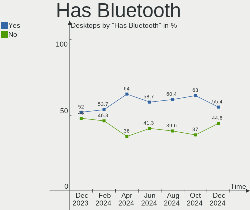
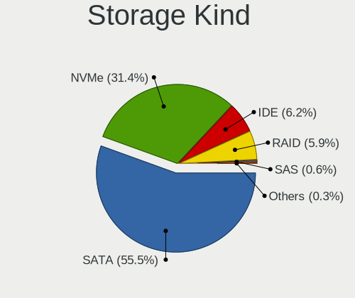
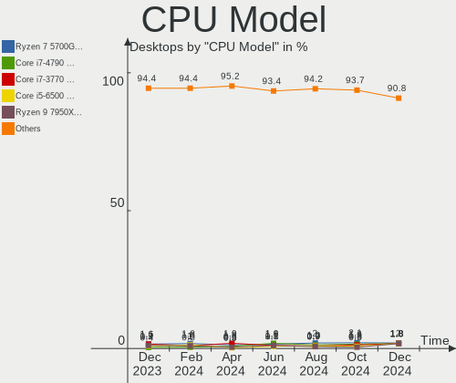
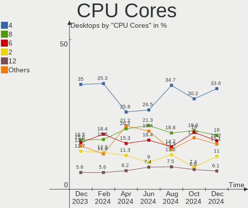
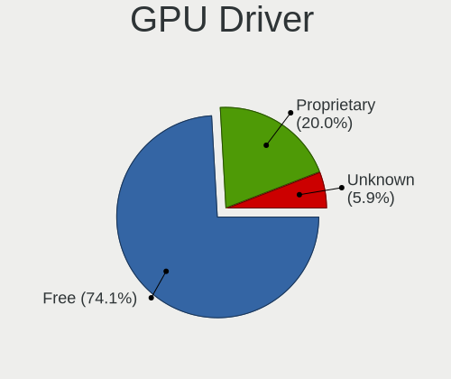
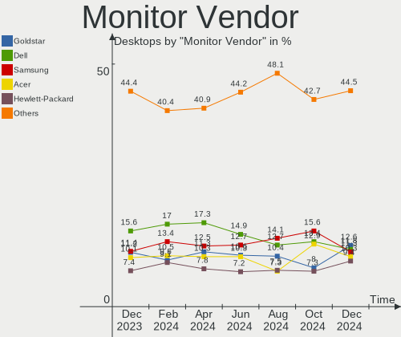
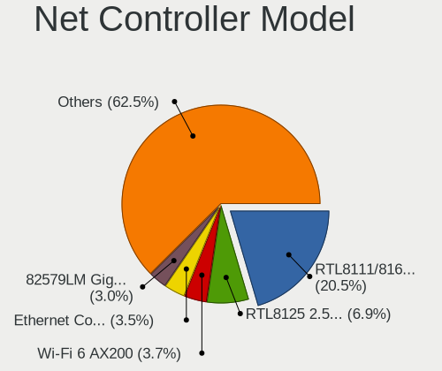
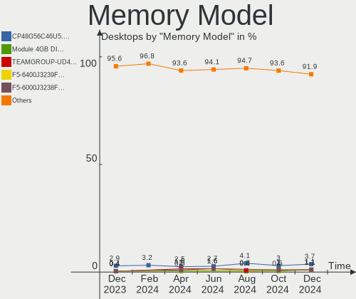

Linux in USA - Hardware Trends (Desktops)
-----------------------------------------

A project to identify most popular hardware characteristics and track their change
over time based on data collected by Linux users at https://Linux-Hardware.org.

Anyone can contribute to this report by the [hw-probe](https://github.com/linuxhw/hw-probe) tool:

    sudo -E hw-probe -all -upload

Period: Sep, 2022.

Contents
--------

* [ System ](#system)
  - [ OS                       ](#os)
  - [ OS Family                ](#os-family)
  - [ Kernel                   ](#kernel)
  - [ Kernel Family            ](#kernel-family)
  - [ Kernel Major Ver.        ](#kernel-major-ver)
  - [ Arch                     ](#arch)
  - [ DE                       ](#de)
  - [ Display Server           ](#display-server)
  - [ Display Manager          ](#display-manager)
  - [ OS Lang                  ](#os-lang)
  - [ Boot Mode                ](#boot-mode)
  - [ Filesystem               ](#filesystem)
  - [ Part. scheme             ](#part-scheme)
  - [ Dual Boot with Linux/BSD ](#dual-boot-with-linuxbsd)
  - [ Dual Boot (Win)          ](#dual-boot-win)

* [ Board ](#board)
  - [ Vendor                   ](#vendor)
  - [ Model                    ](#model)
  - [ Model Family             ](#model-family)
  - [ MFG Year                 ](#mfg-year)
  - [ Form Factor              ](#form-factor)
  - [ Secure Boot              ](#secure-boot)
  - [ Coreboot                 ](#coreboot)
  - [ RAM Size                 ](#ram-size)
  - [ RAM Used                 ](#ram-used)
  - [ Total Drives             ](#total-drives)
  - [ Has CD-ROM               ](#has-cd-rom)
  - [ Has Ethernet             ](#has-ethernet)
  - [ Has WiFi                 ](#has-wifi)
  - [ Has Bluetooth            ](#has-bluetooth)

* [ Location ](#location)
  - [ Country                  ](#country)
  - [ City                     ](#city)

* [ Drives ](#drives)
  - [ Drive Vendor             ](#drive-vendor)
  - [ Drive Model              ](#drive-model)
  - [ HDD Vendor               ](#hdd-vendor)
  - [ SSD Vendor               ](#ssd-vendor)
  - [ Drive Kind               ](#drive-kind)
  - [ Drive Connector          ](#drive-connector)
  - [ Drive Size               ](#drive-size)
  - [ Space Total              ](#space-total)
  - [ Space Used               ](#space-used)
  - [ Malfunc. Drives          ](#malfunc-drives)
  - [ Malfunc. Drive Vendor    ](#malfunc-drive-vendor)
  - [ Malfunc. HDD Vendor      ](#malfunc-hdd-vendor)
  - [ Malfunc. Drive Kind      ](#malfunc-drive-kind)
  - [ Failed Drives            ](#failed-drives)
  - [ Failed Drive Vendor      ](#failed-drive-vendor)
  - [ Drive Status             ](#drive-status)

* [ Storage controller ](#storage-controller)
  - [ Storage Vendor           ](#storage-vendor)
  - [ Storage Model            ](#storage-model)
  - [ Storage Kind             ](#storage-kind)

* [ Processor ](#processor)
  - [ CPU Vendor               ](#cpu-vendor)
  - [ CPU Model                ](#cpu-model)
  - [ CPU Model Family         ](#cpu-model-family)
  - [ CPU Cores                ](#cpu-cores)
  - [ CPU Sockets              ](#cpu-sockets)
  - [ CPU Threads              ](#cpu-threads)
  - [ CPU Op-Modes             ](#cpu-op-modes)
  - [ CPU Microcode            ](#cpu-microcode)
  - [ CPU Microarch            ](#cpu-microarch)

* [ Graphics ](#graphics)
  - [ GPU Vendor               ](#gpu-vendor)
  - [ GPU Model                ](#gpu-model)
  - [ GPU Combo                ](#gpu-combo)
  - [ GPU Driver               ](#gpu-driver)
  - [ GPU Memory               ](#gpu-memory)

* [ Monitor ](#monitor)
  - [ Monitor Vendor           ](#monitor-vendor)
  - [ Monitor Model            ](#monitor-model)
  - [ Monitor Resolution       ](#monitor-resolution)
  - [ Monitor Diagonal         ](#monitor-diagonal)
  - [ Monitor Width            ](#monitor-width)
  - [ Aspect Ratio             ](#aspect-ratio)
  - [ Monitor Area             ](#monitor-area)
  - [ Pixel Density            ](#pixel-density)
  - [ Multiple Monitors        ](#multiple-monitors)

* [ Network ](#network)
  - [ Net Controller Vendor    ](#net-controller-vendor)
  - [ Net Controller Model     ](#net-controller-model)
  - [ Wireless Vendor          ](#wireless-vendor)
  - [ Wireless Model           ](#wireless-model)
  - [ Ethernet Vendor          ](#ethernet-vendor)
  - [ Ethernet Model           ](#ethernet-model)
  - [ Net Controller Kind      ](#net-controller-kind)
  - [ Used Controller          ](#used-controller)
  - [ NICs                     ](#nics)
  - [ IPv6                     ](#ipv6)

* [ Bluetooth ](#bluetooth)
  - [ Bluetooth Vendor         ](#bluetooth-vendor)
  - [ Bluetooth Model          ](#bluetooth-model)

* [ Sound ](#sound)
  - [ Sound Vendor             ](#sound-vendor)
  - [ Sound Model              ](#sound-model)

* [ Memory ](#memory)
  - [ Memory Vendor            ](#memory-vendor)
  - [ Memory Model             ](#memory-model)
  - [ Memory Kind              ](#memory-kind)
  - [ Memory Form Factor       ](#memory-form-factor)
  - [ Memory Size              ](#memory-size)
  - [ Memory Speed             ](#memory-speed)

* [ Printers & scanners ](#printers--scanners)
  - [ Printer Vendor           ](#printer-vendor)
  - [ Printer Model            ](#printer-model)
  - [ Scanner Vendor           ](#scanner-vendor)
  - [ Scanner Model            ](#scanner-model)

* [ Camera ](#camera)
  - [ Camera Vendor            ](#camera-vendor)
  - [ Camera Model             ](#camera-model)

* [ Security ](#security)
  - [ Fingerprint Vendor       ](#fingerprint-vendor)
  - [ Fingerprint Model        ](#fingerprint-model)
  - [ Chipcard Vendor          ](#chipcard-vendor)
  - [ Chipcard Model           ](#chipcard-model)

* [ Unsupported ](#unsupported)
  - [ Unsupported Devices      ](#unsupported-devices)
  - [ Unsupported Device Types ](#unsupported-device-types)

System
------

OS
--

Installed operating systems

| Name                      | Desktops | Percent |
|---------------------------|----------|---------|
| Ubuntu 22.04              | 63       | 19.38%  |
| Pop!_OS 22.04             | 36       | 11.08%  |
| Linux Mint 21             | 20       | 6.15%   |
| Fedora 36                 | 18       | 5.54%   |
| Zorin 16                  | 15       | 4.62%   |
| OpenMandriva 4.3          | 13       | 4%      |
| Debian 11                 | 13       | 4%      |
| Ubuntu 20.04              | 12       | 3.69%   |
| Arch                      | 10       | 3.08%   |
| Linux Mint 20.3           | 8        | 2.46%   |
| KDE neon 20.04            | 8        | 2.46%   |
| OpenMandriva 4.50         | 6        | 1.85%   |
| Kubuntu 22.04             | 6        | 1.85%   |
| Nobara 36                 | 5        | 1.54%   |
| LMDE 5                    | 5        | 1.54%   |
| Elementary 6.1            | 5        | 1.54%   |
| ArcoLinux Rolling         | 5        | 1.54%   |
| SteamOS 3.3               | 4        | 1.23%   |
| Kali 2022.3               | 4        | 1.23%   |
| Arch Rolling              | 4        | 1.23%   |
| Manjaro 22.0.0            | 3        | 0.92%   |
| Manjaro                   | 3        | 0.92%   |
| Lubuntu 22.04             | 3        | 0.92%   |
| Linux Mint 20.1           | 3        | 0.92%   |
| Gentoo 2.8                | 3        | 0.92%   |
| Fedora 37                 | 3        | 0.92%   |
| Xubuntu 20.04             | 2        | 0.62%   |
| Ubuntu Studio 20.04       | 2        | 0.62%   |
| Ubuntu 18.04              | 2        | 0.62%   |
| OpenMandriva 4.90         | 2        | 0.62%   |
| Lubuntu 20.04             | 2        | 0.62%   |
| Linux Mint 20             | 2        | 0.62%   |
| Fedora 35                 | 2        | 0.62%   |
| EndeavourOS Rolling       | 2        | 0.62%   |
| Alpine 3.17_alpha20220809 | 2        | 0.62%   |
| Zorin 15                  | 1        | 0.31%   |
| Zorin 12                  | 1        | 0.31%   |
| Xubuntu 22.04             | 1        | 0.31%   |
| Ultramarine Linux 36      | 1        | 0.31%   |
| Ubuntu Unity 14.04        | 1        | 0.31%   |

OS Family
---------

OS without a version

| Name              | Desktops | Percent |
|-------------------|----------|---------|
| Ubuntu            | 79       | 24.31%  |
| Pop!_OS           | 36       | 11.08%  |
| Linux Mint        | 35       | 10.77%  |
| Fedora            | 25       | 7.69%   |
| OpenMandriva      | 21       | 6.46%   |
| Zorin             | 17       | 5.23%   |
| Debian            | 17       | 5.23%   |
| Arch              | 14       | 4.31%   |
| KDE neon          | 9        | 2.77%   |
| Manjaro           | 7        | 2.15%   |
| Lubuntu           | 6        | 1.85%   |
| Kubuntu           | 6        | 1.85%   |
| Nobara            | 5        | 1.54%   |
| LMDE              | 5        | 1.54%   |
| Elementary        | 5        | 1.54%   |
| ArcoLinux         | 5        | 1.54%   |
| SteamOS           | 4        | 1.23%   |
| Kali              | 4        | 1.23%   |
| Xubuntu           | 3        | 0.92%   |
| Gentoo            | 3        | 0.92%   |
| EndeavourOS       | 3        | 0.92%   |
| Ubuntu Studio     | 2        | 0.62%   |
| Ubuntu Budgie     | 2        | 0.62%   |
| Alpine            | 2        | 0.62%   |
| Ultramarine Linux | 1        | 0.31%   |
| Ubuntu Unity      | 1        | 0.31%   |
| Ubuntu MATE       | 1        | 0.31%   |
| Slackware         | 1        | 0.31%   |
| Reborn OS         | 1        | 0.31%   |
| openSUSE          | 1        | 0.31%   |
| Linux Lite        | 1        | 0.31%   |
| Lilidog           | 1        | 0.31%   |
| EuroLinux         | 1        | 0.31%   |
| Clear Linux       | 1        | 0.31%   |

Kernel
------

Version of the Linux kernel

| Version                                      | Desktops | Percent |
|----------------------------------------------|----------|---------|
| 5.15.0-48-generic                            | 46       | 14.15%  |
| 5.15.0-47-generic                            | 42       | 12.92%  |
| 5.19.0-76051900-generic                      | 33       | 10.15%  |
| 5.15.0-46-generic                            | 31       | 9.54%   |
| 5.16.7-desktop-1omv4003                      | 12       | 3.69%   |
| 5.4.0-125-generic                            | 9        | 2.77%   |
| 5.10.0-17-amd64                              | 6        | 1.85%   |
| 5.19.9-200.fc36.x86_64                       | 5        | 1.54%   |
| 5.19.5-desktop-1omv4090                      | 5        | 1.54%   |
| 5.15.0-43-generic                            | 5        | 1.54%   |
| 5.10.0-18-amd64                              | 5        | 1.54%   |
| 5.15.65-1-MANJARO                            | 4        | 1.23%   |
| 5.13.0-valve24-1-neptune-02226-g5b8545e4c5a1 | 4        | 1.23%   |
| 5.19.9-arch1-1                               | 3        | 0.92%   |
| 5.19.6-200.fc36.x86_64                       | 3        | 0.92%   |
| 5.4.0-126-generic                            | 2        | 0.62%   |
| 5.4.0-122-generic                            | 2        | 0.62%   |
| 5.19.9-300.fc37.x86_64                       | 2        | 0.62%   |
| 5.19.9-201.fsync.fc36.x86_64                 | 2        | 0.62%   |
| 5.19.8-arch1-1                               | 2        | 0.62%   |
| 5.19.8-200.fc36.x86_64                       | 2        | 0.62%   |
| 5.19.7-zen2-1-zen                            | 2        | 0.62%   |
| 5.19.7-arch1-1                               | 2        | 0.62%   |
| 5.19.7-200.fc36.x86_64                       | 2        | 0.62%   |
| 5.19.7-1-MANJARO                             | 2        | 0.62%   |
| 5.19.6-arch1-1                               | 2        | 0.62%   |
| 5.19.6-100.fc35.x86_64                       | 2        | 0.62%   |
| 5.19.4-200.fc36.x86_64                       | 2        | 0.62%   |
| 5.19.11-arch1-1                              | 2        | 0.62%   |
| 5.19.10-arch1-1                              | 2        | 0.62%   |
| 5.19.0-1-amd64                               | 2        | 0.62%   |
| 5.18.10-76051810-generic                     | 2        | 0.62%   |
| 5.18.0-kali7-amd64                           | 2        | 0.62%   |
| 5.17.5-300.fc36.x86_64                       | 2        | 0.62%   |
| 5.15.53-1-pve                                | 2        | 0.62%   |
| 5.15.0-41-generic                            | 2        | 0.62%   |
| 5.13.0-52-generic                            | 2        | 0.62%   |
| 5.10.0-12-amd64                              | 2        | 0.62%   |
| 6.0.0-060000rc5daily20220913-generic         | 1        | 0.31%   |
| 5.9.1-050901-lowlatency                      | 1        | 0.31%   |

Kernel Family
-------------

Linux kernel without a distro release

| Version | Desktops | Percent |
|---------|----------|---------|
| 5.15.0  | 129      | 39.69%  |
| 5.19.0  | 37       | 11.38%  |
| 5.4.0   | 23       | 7.08%   |
| 5.19.9  | 15       | 4.62%   |
| 5.10.0  | 13       | 4%      |
| 5.19.7  | 12       | 3.69%   |
| 5.16.7  | 12       | 3.69%   |
| 5.19.6  | 8        | 2.46%   |
| 5.13.0  | 8        | 2.46%   |
| 5.19.5  | 7        | 2.15%   |
| 5.18.0  | 6        | 1.85%   |
| 5.19.8  | 5        | 1.54%   |
| 5.19.4  | 4        | 1.23%   |
| 5.19.10 | 4        | 1.23%   |
| 5.15.65 | 4        | 1.23%   |
| 5.19.11 | 2        | 0.62%   |
| 5.19.1  | 2        | 0.62%   |
| 5.18.10 | 2        | 0.62%   |
| 5.17.5  | 2        | 0.62%   |
| 5.17.0  | 2        | 0.62%   |
| 5.16.13 | 2        | 0.62%   |
| 5.15.59 | 2        | 0.62%   |
| 5.15.53 | 2        | 0.62%   |
| 4.15.0  | 2        | 0.62%   |
| 6.0.0   | 1        | 0.31%   |
| 5.9.1   | 1        | 0.31%   |
| 5.5.0   | 1        | 0.31%   |
| 5.4.210 | 1        | 0.31%   |
| 5.18.8  | 1        | 0.31%   |
| 5.18.17 | 1        | 0.31%   |
| 5.18.12 | 1        | 0.31%   |
| 5.18.11 | 1        | 0.31%   |
| 5.16.0  | 1        | 0.31%   |
| 5.15.70 | 1        | 0.31%   |
| 5.15.64 | 1        | 0.31%   |
| 5.15.63 | 1        | 0.31%   |
| 5.15.60 | 1        | 0.31%   |
| 5.15.39 | 1        | 0.31%   |
| 5.14.21 | 1        | 0.31%   |
| 5.14.0  | 1        | 0.31%   |

Kernel Major Ver.
-----------------

Linux kernel major version

| Version | Desktops | Percent |
|---------|----------|---------|
| 5.15    | 142      | 43.69%  |
| 5.19    | 96       | 29.54%  |
| 5.4     | 24       | 7.38%   |
| 5.16    | 15       | 4.62%   |
| 5.10    | 13       | 4%      |
| 5.18    | 12       | 3.69%   |
| 5.13    | 8        | 2.46%   |
| 5.17    | 4        | 1.23%   |
| 5.14    | 2        | 0.62%   |
| 5.11    | 2        | 0.62%   |
| 4.15    | 2        | 0.62%   |
| 6.0     | 1        | 0.31%   |
| 5.9     | 1        | 0.31%   |
| 5.5     | 1        | 0.31%   |
| 4.19    | 1        | 0.31%   |
| 3.13    | 1        | 0.31%   |

Arch
----

OS architecture (x86_64, i586, etc.)

| Name   | Desktops | Percent |
|--------|----------|---------|
| x86_64 | 324      | 99.69%  |
| s390x  | 1        | 0.31%   |

DE
--

Desktop Environment

| Name             | Desktops | Percent |
|------------------|----------|---------|
| GNOME            | 144      | 44.31%  |
| KDE5             | 69       | 21.23%  |
| X-Cinnamon       | 37       | 11.38%  |
| XFCE             | 21       | 6.46%   |
| Unknown          | 19       | 5.85%   |
| Pantheon         | 6        | 1.85%   |
| MATE             | 6        | 1.85%   |
| LXQt             | 5        | 1.54%   |
| Cinnamon         | 4        | 1.23%   |
| LXDE             | 3        | 0.92%   |
| Budgie           | 3        | 0.92%   |
| xmonad           | 1        | 0.31%   |
| Unity            | 1        | 0.31%   |
| sway             | 1        | 0.31%   |
| lightdm-xsession | 1        | 0.31%   |
| LeftWM           | 1        | 0.31%   |
| i3               | 1        | 0.31%   |
| GNOME Classic    | 1        | 0.31%   |
| awesome          | 1        | 0.31%   |

Display Server
--------------

X11 or Wayland

| Name    | Desktops | Percent |
|---------|----------|---------|
| X11     | 240      | 73.85%  |
| Wayland | 63       | 19.38%  |
| Tty     | 18       | 5.54%   |
| Unknown | 4        | 1.23%   |

Display Manager
---------------

SDDM, LightDM, etc.

| Name    | Desktops | Percent |
|---------|----------|---------|
| Unknown | 151      | 46.46%  |
| GDM3    | 67       | 20.62%  |
| LightDM | 52       | 16%     |
| SDDM    | 42       | 12.92%  |
| GDM     | 11       | 3.38%   |
| XDM     | 1        | 0.31%   |
| LXDM    | 1        | 0.31%   |

OS Lang
-------

Language

| Lang    | Desktops | Percent |
|---------|----------|---------|
| en_US   | 312      | 96%     |
| C       | 6        | 1.85%   |
| Unknown | 2        | 0.62%   |
| nb_NO   | 1        | 0.31%   |
| fr_CA   | 1        | 0.31%   |
| en_GB   | 1        | 0.31%   |
| en_CA   | 1        | 0.31%   |
| en_AG   | 1        | 0.31%   |

Boot Mode
---------

EFI or BIOS

| Mode | Desktops | Percent |
|------|----------|---------|
| BIOS | 178      | 54.77%  |
| EFI  | 147      | 45.23%  |

Filesystem
----------

Type of filesystem

| Type    | Desktops | Percent |
|---------|----------|---------|
| Ext4    | 267      | 82.15%  |
| Btrfs   | 31       | 9.54%   |
| Overlay | 16       | 4.92%   |
| Zfs     | 4        | 1.23%   |
| Xfs     | 4        | 1.23%   |
| Ext2    | 2        | 0.62%   |
| Ext3    | 1        | 0.31%   |

Part. scheme
------------

Scheme of partitioning

| Type    | Desktops | Percent |
|---------|----------|---------|
| Unknown | 197      | 60.62%  |
| GPT     | 107      | 32.92%  |
| MBR     | 21       | 6.46%   |

Dual Boot with Linux/BSD
------------------------

Hosting more than one Linux/BSD

| Dual boot | Desktops | Percent |
|-----------|----------|---------|
| No        | 263      | 80.92%  |
| Yes       | 62       | 19.08%  |

Dual Boot (Win)
---------------

Hosting Linux and Windows

| Dual boot | Desktops | Percent |
|-----------|----------|---------|
| No        | 246      | 75.69%  |
| Yes       | 79       | 24.31%  |

Board
-----

Vendor
------

Motherboard manufacturer

| Name                | Desktops | Percent |
|---------------------|----------|---------|
| ASUSTek Computer    | 73       | 22.46%  |
| Dell                | 48       | 14.77%  |
| Gigabyte Technology | 40       | 12.31%  |
| MSI                 | 38       | 11.69%  |
| Hewlett-Packard     | 33       | 10.15%  |
| ASRock              | 25       | 7.69%   |
| Lenovo              | 14       | 4.31%   |
| Acer                | 7        | 2.15%   |
| BESSTAR Tech        | 5        | 1.54%   |
| Pegatron            | 4        | 1.23%   |
| Gateway             | 4        | 1.23%   |
| Foxconn             | 4        | 1.23%   |
| System76            | 3        | 0.92%   |
| ECS                 | 3        | 0.92%   |
| AZW                 | 3        | 0.92%   |
| Unknown             | 3        | 0.92%   |
| Supermicro          | 2        | 0.62%   |
| Intel               | 2        | 0.62%   |
| Apple               | 2        | 0.62%   |
| Alienware           | 2        | 0.62%   |
| Protectli           | 1        | 0.31%   |
| NZXT                | 1        | 0.31%   |
| MiTAC               | 1        | 0.31%   |
| Minix               | 1        | 0.31%   |
| IceWhale Technology | 1        | 0.31%   |
| Google              | 1        | 0.31%   |
| eMachines           | 1        | 0.31%   |
| Biostar             | 1        | 0.31%   |
| Avalue              | 1        | 0.31%   |
| AMI                 | 1        | 0.31%   |

Model
-----

Motherboard model

| Name                                 | Desktops | Percent |
|--------------------------------------|----------|---------|
| MSI MS-7C91                          | 4        | 1.23%   |
| Dell OptiPlex 755                    | 4        | 1.23%   |
| ASUS TUF Gaming X570-PLUS            | 4        | 1.23%   |
| ASUS Pro WS WRX80E-SAGE SE WIFI      | 4        | 1.23%   |
| MSI MS-7C37                          | 3        | 0.92%   |
| MSI MS-7721                          | 3        | 0.92%   |
| Dell XPS 8700                        | 3        | 0.92%   |
| Dell OptiPlex 9020                   | 3        | 0.92%   |
| ASUS TUF Gaming B550-PLUS            | 3        | 0.92%   |
| ASUS ROG CROSSHAIR VIII HERO         | 3        | 0.92%   |
| ASUS PRIME B550M-A                   | 3        | 0.92%   |
| ASUS All Series                      | 3        | 0.92%   |
| Unknown                              | 3        | 0.92%   |
| System76 Thelio Mira                 | 2        | 0.62%   |
| MSI MS-7B79                          | 2        | 0.62%   |
| MSI MS-7A34                          | 2        | 0.62%   |
| MSI MS-7693                          | 2        | 0.62%   |
| HP EliteDesk 800 G2 DM 35W           | 2        | 0.62%   |
| HP EliteDesk 705 G4 DM 35W (TAA)     | 2        | 0.62%   |
| HP Compaq Elite 8300 USDT            | 2        | 0.62%   |
| Gigabyte Z97X-UD3H-BK                | 2        | 0.62%   |
| Gigabyte Z590 UD AC                  | 2        | 0.62%   |
| Gigabyte Z270P-D3                    | 2        | 0.62%   |
| Gigabyte X570 I AORUS PRO WIFI       | 2        | 0.62%   |
| Dell Precision Tower 5810            | 2        | 0.62%   |
| Dell Precision T3610                 | 2        | 0.62%   |
| Dell OptiPlex 990                    | 2        | 0.62%   |
| Dell OptiPlex 7020                   | 2        | 0.62%   |
| Dell OptiPlex 390                    | 2        | 0.62%   |
| Dell OptiPlex 380                    | 2        | 0.62%   |
| Dell OptiPlex 3050                   | 2        | 0.62%   |
| BESSTAR Tech TH50                    | 2        | 0.62%   |
| ASUS TUF Gaming X570-PRO             | 2        | 0.62%   |
| ASUS TUF Gaming B550M-PLUS           | 2        | 0.62%   |
| ASUS ROG STRIX Z390-E GAMING         | 2        | 0.62%   |
| ASUS ROG STRIX X570-E GAMING WIFI II | 2        | 0.62%   |
| ASUS PRIME B450M-A                   | 2        | 0.62%   |
| ASRock X570M Pro4                    | 2        | 0.62%   |
| ASRock B450M Pro4                    | 2        | 0.62%   |
| System76 Thelio                      | 1        | 0.31%   |

Model Family
------------

Motherboard model prefix

| Name                         | Desktops | Percent |
|------------------------------|----------|---------|
| Dell OptiPlex                | 23       | 7.08%   |
| ASUS ROG                     | 16       | 4.92%   |
| ASUS TUF                     | 14       | 4.31%   |
| HP Compaq                    | 10       | 3.08%   |
| Dell Precision               | 10       | 3.08%   |
| ASUS PRIME                   | 9        | 2.77%   |
| Lenovo ThinkCentre           | 7        | 2.15%   |
| Gigabyte X570                | 6        | 1.85%   |
| Acer Aspire                  | 6        | 1.85%   |
| HP EliteDesk                 | 5        | 1.54%   |
| Dell XPS                     | 5        | 1.54%   |
| Dell Inspiron                | 5        | 1.54%   |
| MSI MS-7C91                  | 4        | 1.23%   |
| Lenovo IdeaCentre            | 4        | 1.23%   |
| HP Pavilion                  | 4        | 1.23%   |
| ASUS Pro                     | 4        | 1.23%   |
| System76 Thelio              | 3        | 0.92%   |
| MSI MS-7C37                  | 3        | 0.92%   |
| MSI MS-7721                  | 3        | 0.92%   |
| Gigabyte Z590                | 3        | 0.92%   |
| Dell Studio                  | 3        | 0.92%   |
| ASUS All                     | 3        | 0.92%   |
| ASRock B450M                 | 3        | 0.92%   |
| Unknown                      | 3        | 0.92%   |
| MSI MS-7B79                  | 2        | 0.62%   |
| MSI MS-7A34                  | 2        | 0.62%   |
| MSI MS-7693                  | 2        | 0.62%   |
| HP Desktop                   | 2        | 0.62%   |
| Gigabyte Z97X-UD3H-BK        | 2        | 0.62%   |
| Gigabyte Z270P-D3            | 2        | 0.62%   |
| Gigabyte B550                | 2        | 0.62%   |
| Gigabyte B450                | 2        | 0.62%   |
| BESSTAR Tech TH50            | 2        | 0.62%   |
| ASUS P8P67                   | 2        | 0.62%   |
| ASUS Maximus                 | 2        | 0.62%   |
| ASRock X570M                 | 2        | 0.62%   |
| ASRock X399                  | 2        | 0.62%   |
| Supermicro X9DR3-F           | 1        | 0.31%   |
| Supermicro SSG-6048R-E1CR36N | 1        | 0.31%   |
| Protectli FW2B               | 1        | 0.31%   |

MFG Year
--------

Motherboard manufacture year

| Year    | Desktops | Percent |
|---------|----------|---------|
| 2020    | 40       | 12.31%  |
| 2019    | 29       | 8.92%   |
| 2021    | 27       | 8.31%   |
| 2018    | 27       | 8.31%   |
| 2014    | 24       | 7.38%   |
| 2013    | 23       | 7.08%   |
| 2011    | 20       | 6.15%   |
| 2017    | 19       | 5.85%   |
| 2022    | 17       | 5.23%   |
| 2016    | 17       | 5.23%   |
| 2015    | 17       | 5.23%   |
| 2012    | 17       | 5.23%   |
| 2010    | 16       | 4.92%   |
| 2008    | 13       | 4%      |
| 2009    | 7        | 2.15%   |
| 2006    | 6        | 1.85%   |
| 2007    | 5        | 1.54%   |
| Unknown | 1        | 0.31%   |

Form Factor
-----------

Physical design of the computer

| Name    | Desktops | Percent |
|---------|----------|---------|
| Desktop | 325      | 100%    |

Secure Boot
-----------

Enabled or disabled

| State    | Desktops | Percent |
|----------|----------|---------|
| Disabled | 312      | 96%     |
| Enabled  | 13       | 4%      |

Coreboot
--------

Have coreboot on board

| Used | Desktops | Percent |
|------|----------|---------|
| No   | 323      | 99.38%  |
| Yes  | 2        | 0.62%   |

RAM Size
--------

Total RAM memory

| Size in GB      | Desktops | Percent |
|-----------------|----------|---------|
| 16.01-24.0      | 89       | 27.38%  |
| 32.01-64.0      | 59       | 18.15%  |
| 8.01-16.0       | 52       | 16%     |
| 3.01-4.0        | 36       | 11.08%  |
| 4.01-8.0        | 33       | 10.15%  |
| 64.01-256.0     | 30       | 9.23%   |
| 1.01-2.0        | 10       | 3.08%   |
| 24.01-32.0      | 8        | 2.46%   |
| More than 256.0 | 5        | 1.54%   |
| 2.01-3.0        | 3        | 0.92%   |

RAM Used
--------

Used RAM memory

| Used GB     | Desktops | Percent |
|-------------|----------|---------|
| 1.01-2.0    | 93       | 28.62%  |
| 4.01-8.0    | 65       | 20%     |
| 2.01-3.0    | 64       | 19.69%  |
| 3.01-4.0    | 52       | 16%     |
| 8.01-16.0   | 22       | 6.77%   |
| 0.51-1.0    | 15       | 4.62%   |
| 0.01-0.5    | 5        | 1.54%   |
| 24.01-32.0  | 3        | 0.92%   |
| 64.01-256.0 | 3        | 0.92%   |
| 16.01-24.0  | 2        | 0.62%   |
| Unknown     | 1        | 0.31%   |

Total Drives
------------

Number of drives on board

| Drives | Desktops | Percent |
|--------|----------|---------|
| 1      | 109      | 33.54%  |
| 2      | 95       | 29.23%  |
| 3      | 46       | 14.15%  |
| 4      | 27       | 8.31%   |
| 5      | 24       | 7.38%   |
| 6      | 7        | 2.15%   |
| 9      | 4        | 1.23%   |
| 7      | 4        | 1.23%   |
| 10     | 3        | 0.92%   |
| 0      | 3        | 0.92%   |
| 11     | 2        | 0.62%   |
| 8      | 1        | 0.31%   |

Has CD-ROM
----------

Has CD-ROM on board

| Presented | Desktops | Percent |
|-----------|----------|---------|
| No        | 172      | 52.92%  |
| Yes       | 153      | 47.08%  |

Has Ethernet
------------

Has Ethernet on board

| Presented | Desktops | Percent |
|-----------|----------|---------|
| Yes       | 321      | 98.77%  |
| No        | 4        | 1.23%   |

Has WiFi
--------

Has WiFi module

| Presented | Desktops | Percent |
|-----------|----------|---------|
| Yes       | 199      | 61.23%  |
| No        | 126      | 38.77%  |

Has Bluetooth
-------------

Has Bluetooth module

| Presented | Desktops | Percent |
|-----------|----------|---------|
| No        | 164      | 50.46%  |
| Yes       | 161      | 49.54%  |

Location
--------

Country
-------

Geographic location (country)

| Country | Desktops | Percent |
|---------|----------|---------|
| USA     | 325      | 100%    |

City
----

Geographic location (city)

| City             | Desktops | Percent |
|------------------|----------|---------|
| Seattle          | 6        | 1.85%   |
| Los Angeles      | 6        | 1.85%   |
| Chicago          | 5        | 1.54%   |
| San Francisco    | 4        | 1.23%   |
| San Diego        | 4        | 1.23%   |
| Phoenix          | 4        | 1.23%   |
| Peoria           | 4        | 1.23%   |
| Denver           | 4        | 1.23%   |
| Dallas           | 4        | 1.23%   |
| Cincinnati       | 4        | 1.23%   |
| Washington       | 3        | 0.92%   |
| Springfield      | 3        | 0.92%   |
| New York         | 3        | 0.92%   |
| Las Vegas        | 3        | 0.92%   |
| Kansas City      | 3        | 0.92%   |
| Columbus         | 3        | 0.92%   |
| Austin           | 3        | 0.92%   |
| Walled Lake      | 2        | 0.62%   |
| Vancouver        | 2        | 0.62%   |
| Tyler            | 2        | 0.62%   |
| St Louis         | 2        | 0.62%   |
| San Antonio      | 2        | 0.62%   |
| Redding          | 2        | 0.62%   |
| Portland         | 2        | 0.62%   |
| Philadelphia     | 2        | 0.62%   |
| Orange           | 2        | 0.62%   |
| Ooltewah         | 2        | 0.62%   |
| Ocala            | 2        | 0.62%   |
| Nampa            | 2        | 0.62%   |
| Milwaukee        | 2        | 0.62%   |
| Miami            | 2        | 0.62%   |
| Indianapolis     | 2        | 0.62%   |
| Grand Rapids     | 2        | 0.62%   |
| Fremont          | 2        | 0.62%   |
| Frankfort        | 2        | 0.62%   |
| Fort Worth       | 2        | 0.62%   |
| Farmington       | 2        | 0.62%   |
| Dayton           | 2        | 0.62%   |
| Clinton Township | 2        | 0.62%   |
| Cleburne         | 2        | 0.62%   |

Drives
------

Drive Vendor
------------

Hard drive vendors

| Vendor                    | Desktops | Drives | Percent |
|---------------------------|----------|--------|---------|
| WDC                       | 117      | 148    | 18.43%  |
| Seagate                   | 111      | 158    | 17.48%  |
| Samsung Electronics       | 98       | 161    | 15.43%  |
| SanDisk                   | 35       | 41     | 5.51%   |
| Hitachi                   | 25       | 28     | 3.94%   |
| Toshiba                   | 22       | 24     | 3.46%   |
| Kingston                  | 21       | 26     | 3.31%   |
| Crucial                   | 20       | 23     | 3.15%   |
| Unknown                   | 15       | 21     | 2.36%   |
| SK hynix                  | 13       | 13     | 2.05%   |
| China                     | 12       | 17     | 1.89%   |
| PNY                       | 10       | 10     | 1.57%   |
| Intel                     | 10       | 10     | 1.57%   |
| Phison Electronics        | 9        | 9      | 1.42%   |
| SPCC                      | 8        | 9      | 1.26%   |
| Silicon Motion            | 7        | 7      | 1.1%    |
| Phison                    | 7        | 14     | 1.1%    |
| HGST                      | 7        | 8      | 1.1%    |
| Team                      | 6        | 10     | 0.94%   |
| A-DATA Technology         | 6        | 8      | 0.94%   |
| Patriot                   | 5        | 5      | 0.79%   |
| OCZ                       | 4        | 4      | 0.63%   |
| Micron/Crucial Technology | 3        | 3      | 0.47%   |
| KIOXIA                    | 3        | 4      | 0.47%   |
| KingFast                  | 3        | 3      | 0.47%   |
| Apple                     | 3        | 3      | 0.47%   |
| Transcend                 | 2        | 2      | 0.31%   |
| T-FORCE                   | 2        | 2      | 0.31%   |
| SABRENT                   | 2        | 2      | 0.31%   |
| RSH-319                   | 2        | 2      | 0.31%   |
| OWC                       | 2        | 2      | 0.31%   |
| MyDigitalSSD              | 2        | 2      | 0.31%   |
| Mushkin                   | 2        | 2      | 0.31%   |
| Micron Technology         | 2        | 2      | 0.31%   |
| JMicron Technology        | 2        | 2      | 0.31%   |
| ADATA Technology          | 2        | 2      | 0.31%   |
| WD MediaMax               | 1        | 1      | 0.16%   |
| V300                      | 1        | 1      | 0.16%   |
| TO Exter                  | 1        | 1      | 0.16%   |
| Timetec                   | 1        | 1      | 0.16%   |

Drive Model
-----------

Hard drive models

| Model                                                 | Desktops | Percent |
|-------------------------------------------------------|----------|---------|
| Samsung SSD 860 EVO 1TB                               | 15       | 1.97%   |
| Seagate ST2000DM008-2FR102 2TB                        | 13       | 1.71%   |
| Seagate ST1000DM003-1ER162 1TB                        | 8        | 1.05%   |
| Samsung SSD 860 EVO 500GB                             | 8        | 1.05%   |
| Samsung NVMe SSD Controller SM981/PM981/PM983 256GB   | 8        | 1.05%   |
| Seagate ST500DM002-1BD142 500GB                       | 7        | 0.92%   |
| Seagate ST1000DM003-1SB102 1TB                        | 7        | 0.92%   |
| Samsung SSD 850 EVO 500GB                             | 7        | 0.92%   |
| Samsung SSD 850 EVO 250GB                             | 7        | 0.92%   |
| Samsung NVMe SSD Controller PM9A1/PM9A3/980PRO 1024GB | 7        | 0.92%   |
| China SATA SSD 240GB                                  | 7        | 0.92%   |
| SanDisk NVMe SSD Drive 1TB                            | 6        | 0.79%   |
| Samsung NVMe SSD Drive 500GB                          | 6        | 0.79%   |
| WDC WD40EZAZ-00SF3B0 4TB                              | 5        | 0.66%   |
| Unknown SD/MMC 16GB                                   | 5        | 0.66%   |
| Unknown M.S./M.S.Pro/HG 16GB                          | 5        | 0.66%   |
| Samsung SSD 980 PRO 1TB                               | 5        | 0.66%   |
| Samsung SSD 870 EVO 1TB                               | 5        | 0.66%   |
| Samsung NVMe SSD Drive 1TB                            | 5        | 0.66%   |
| Phison E12 NVMe Controller 1024GB                     | 5        | 0.66%   |
| Crucial CT500MX500SSD1 500GB                          | 5        | 0.66%   |
| WDC WD10EZEX-08WN4A0 1TB                              | 4        | 0.53%   |
| WDC WD10EZEX-00BN5A0 1TB                              | 4        | 0.53%   |
| Unknown SD/MMC/MS PRO 2GB                             | 4        | 0.53%   |
| Toshiba DT01ACA200 2TB                                | 4        | 0.53%   |
| Seagate ST2000DM006-2DM164 2TB                        | 4        | 0.53%   |
| Seagate Backup+ Hub BK 8TB                            | 4        | 0.53%   |
| SanDisk SSD PLUS 1000GB                               | 4        | 0.53%   |
| SanDisk NVMe SSD Drive 500GB                          | 4        | 0.53%   |
| Samsung SSD 850 PRO 256GB                             | 4        | 0.53%   |
| Samsung NVMe SSD Drive 250GB                          | 4        | 0.53%   |
| Samsung NVMe SSD Controller SM961/PM961/SM963 256GB   | 4        | 0.53%   |
| PNY CS900 500GB SSD                                   | 4        | 0.53%   |
| Hitachi HDP725050GLA360 500GB                         | 4        | 0.53%   |
| WDC WDS100T2B0A-00SM50 1TB SSD                        | 3        | 0.39%   |
| WDC WD6400AAKS-65A7B2 640GB                           | 3        | 0.39%   |
| WDC WD4005FZBX-00K5WB0 4TB                            | 3        | 0.39%   |
| WDC WD10EZEX-60M2NA0 1TB                              | 3        | 0.39%   |
| Toshiba HDWE140 4TB                                   | 3        | 0.39%   |
| Toshiba DT01ACA100 1TB                                | 3        | 0.39%   |

HDD Vendor
----------

Hard disk drive vendors

| Vendor              | Desktops | Drives | Percent |
|---------------------|----------|--------|---------|
| Seagate             | 108      | 154    | 38.71%  |
| WDC                 | 99       | 122    | 35.48%  |
| Hitachi             | 25       | 28     | 8.96%   |
| Toshiba             | 21       | 23     | 7.53%   |
| HGST                | 7        | 8      | 2.51%   |
| Unknown             | 5        | 5      | 1.79%   |
| Samsung Electronics | 3        | 3      | 1.08%   |
| RSH-319             | 2        | 2      | 0.72%   |
| Apple               | 2        | 2      | 0.72%   |
| WD MediaMax         | 1        | 1      | 0.36%   |
| SAGE                | 1        | 1      | 0.36%   |
| Maxtor              | 1        | 1      | 0.36%   |
| MARVELL             | 1        | 1      | 0.36%   |
| JMicron Technology  | 1        | 1      | 0.36%   |
| Fujitsu             | 1        | 1      | 0.36%   |
| External            | 1        | 1      | 0.36%   |

SSD Vendor
----------

Solid state drive vendors

| Vendor              | Desktops | Drives | Percent |
|---------------------|----------|--------|---------|
| Samsung Electronics | 64       | 83     | 28.83%  |
| Crucial             | 19       | 22     | 8.56%   |
| SanDisk             | 18       | 19     | 8.11%   |
| Kingston            | 18       | 22     | 8.11%   |
| WDC                 | 17       | 18     | 7.66%   |
| China               | 12       | 17     | 5.41%   |
| PNY                 | 10       | 10     | 4.5%    |
| SPCC                | 8        | 9      | 3.6%    |
| SK hynix            | 6        | 6      | 2.7%    |
| A-DATA Technology   | 6        | 8      | 2.7%    |
| Team                | 5        | 8      | 2.25%   |
| Patriot             | 5        | 5      | 2.25%   |
| OCZ                 | 4        | 4      | 1.8%    |
| KingFast            | 3        | 3      | 1.35%   |
| OWC                 | 2        | 2      | 0.9%    |
| MyDigitalSSD        | 2        | 2      | 0.9%    |
| Mushkin             | 2        | 2      | 0.9%    |
| Intel               | 2        | 2      | 0.9%    |
| Transcend           | 1        | 1      | 0.45%   |
| TO Exter            | 1        | 1      | 0.45%   |
| Supermicro          | 1        | 1      | 0.45%   |
| SPCC M.2            | 1        | 1      | 0.45%   |
| Protectli           | 1        | 1      | 0.45%   |
| NGFF                | 1        | 1      | 0.45%   |
| Netac               | 1        | 1      | 0.45%   |
| Micron Technology   | 1        | 1      | 0.45%   |
| LITEONIT            | 1        | 1      | 0.45%   |
| Lexar               | 1        | 2      | 0.45%   |
| INDMEM              | 1        | 1      | 0.45%   |
| Hewlett-Packard     | 1        | 1      | 0.45%   |
| Digital             | 1        | 1      | 0.45%   |
| Corsair             | 1        | 1      | 0.45%   |
| Avant               | 1        | 1      | 0.45%   |
| ASMT                | 1        | 1      | 0.45%   |
| Apotop              | 1        | 1      | 0.45%   |
| Aireye              | 1        | 1      | 0.45%   |
| 1TBE                | 1        | 1      | 0.45%   |

Drive Kind
----------

HDD or SSD

| Kind    | Desktops | Drives | Percent |
|---------|----------|--------|---------|
| HDD     | 207      | 354    | 38.91%  |
| SSD     | 179      | 262    | 33.65%  |
| NVMe    | 128      | 183    | 24.06%  |
| Unknown | 14       | 22     | 2.63%   |
| MMC     | 4        | 4      | 0.75%   |

Drive Connector
---------------

SATA, SAS, NVMe, etc.

| Type | Desktops | Drives | Percent |
|------|----------|--------|---------|
| SATA | 287      | 581    | 62.39%  |
| NVMe | 127      | 180    | 27.61%  |
| SAS  | 42       | 60     | 9.13%   |
| MMC  | 4        | 4      | 0.87%   |

Drive Size
----------

Size of hard drive

| Size in TB | Desktops | Drives | Percent |
|------------|----------|--------|---------|
| 0.01-0.5   | 180      | 267    | 40.18%  |
| 0.51-1.0   | 145      | 190    | 32.37%  |
| 1.01-2.0   | 55       | 69     | 12.28%  |
| 3.01-4.0   | 33       | 41     | 7.37%   |
| 4.01-10.0  | 19       | 29     | 4.24%   |
| 2.01-3.0   | 10       | 13     | 2.23%   |
| 10.01-20.0 | 6        | 7      | 1.34%   |

Space Total
-----------

Amount of disk space available on the file system

| Size in GB     | Desktops | Percent |
|----------------|----------|---------|
| 101-250        | 60       | 18.46%  |
| 501-1000       | 58       | 17.85%  |
| More than 3000 | 54       | 16.62%  |
| 251-500        | 52       | 16%     |
| 1001-2000      | 35       | 10.77%  |
| 2001-3000      | 17       | 5.23%   |
| 1-20           | 17       | 5.23%   |
| 51-100         | 12       | 3.69%   |
| Unknown        | 12       | 3.69%   |
| 21-50          | 8        | 2.46%   |

Space Used
----------

Amount of used disk space

| Used GB        | Desktops | Percent |
|----------------|----------|---------|
| 1-20           | 93       | 28.62%  |
| 21-50          | 62       | 19.08%  |
| 101-250        | 32       | 9.85%   |
| 251-500        | 28       | 8.62%   |
| More than 3000 | 26       | 8%      |
| 501-1000       | 26       | 8%      |
| 51-100         | 26       | 8%      |
| 1001-2000      | 15       | 4.62%   |
| Unknown        | 12       | 3.69%   |
| 2001-3000      | 5        | 1.54%   |

Malfunc. Drives
---------------

Drive models with a malfunction

| Model                                 | Desktops | Drives | Percent |
|---------------------------------------|----------|--------|---------|
| Seagate ST2000DM008-2FR102 2TB        | 2        | 2      | 6.06%   |
| WDC WD6400AAKS-00A7B2 640GB           | 1        | 1      | 3.03%   |
| WDC WD4005FZBX-00K5WB0 4TB            | 1        | 1      | 3.03%   |
| WDC WD3200AAJS-61B4A0 320GB           | 1        | 1      | 3.03%   |
| WDC WD2500JB-00REA0 250GB             | 1        | 1      | 3.03%   |
| WDC WD10EZEX-21M2NA0 1TB              | 1        | 1      | 3.03%   |
| Toshiba MQ01ABF050 500GB              | 1        | 1      | 3.03%   |
| Toshiba HDWE140 4TB                   | 1        | 1      | 3.03%   |
| SK hynix SH920 2.5 7MM 256GB SSD      | 1        | 1      | 3.03%   |
| Seagate ST9500325AS 500GB             | 1        | 1      | 3.03%   |
| Seagate ST500LT012-9WS142 500GB       | 1        | 1      | 3.03%   |
| Seagate ST500DM002-1BD142 500GB       | 1        | 1      | 3.03%   |
| Seagate ST3500418AS 500GB             | 1        | 1      | 3.03%   |
| Seagate ST31000528AS 1TB              | 1        | 1      | 3.03%   |
| Seagate ST2000DM006-2DM164 2TB        | 1        | 1      | 3.03%   |
| Seagate ST1000DM003-1SB102 1TB        | 1        | 1      | 3.03%   |
| Seagate Expansion Desk 2TB            | 1        | 1      | 3.03%   |
| SanDisk SSD PLUS 240GB                | 1        | 1      | 3.03%   |
| Samsung Electronics SSD 870 EVO 500GB | 1        | 1      | 3.03%   |
| Samsung Electronics SSD 870 EVO 1TB   | 1        | 1      | 3.03%   |
| Samsung Electronics HD103SJ 1TB       | 1        | 1      | 3.03%   |
| SABRENT Disk 1TB                      | 1        | 1      | 3.03%   |
| OWC Mercury EXTREME Pro 6G SSD        | 1        | 1      | 3.03%   |
| Kingston SV300S37A240G 240GB SSD      | 1        | 2      | 3.03%   |
| Kingston SA400S37240G 240GB SSD       | 1        | 1      | 3.03%   |
| Intel SSDSC2BW480A4 480GB             | 1        | 1      | 3.03%   |
| Hitachi HUA721010KLA330 1TB           | 1        | 1      | 3.03%   |
| Hitachi HTS545050B9A300 500GB         | 1        | 1      | 3.03%   |
| Hitachi HDS725050KLA360 500GB         | 1        | 1      | 3.03%   |
| Hitachi HDP725050GLA360 500GB         | 1        | 1      | 3.03%   |
| HGST HTS725050A7E630 500GB            | 1        | 1      | 3.03%   |
| Avant 60GB Client SSD                 | 1        | 1      | 3.03%   |

Malfunc. Drive Vendor
---------------------

Vendors of faulty drives

| Vendor              | Desktops | Drives | Percent |
|---------------------|----------|--------|---------|
| Seagate             | 10       | 10     | 31.25%  |
| WDC                 | 5        | 5      | 15.63%  |
| Hitachi             | 4        | 4      | 12.5%   |
| Toshiba             | 2        | 2      | 6.25%   |
| Samsung Electronics | 2        | 3      | 6.25%   |
| Kingston            | 2        | 3      | 6.25%   |
| SK hynix            | 1        | 1      | 3.13%   |
| SanDisk             | 1        | 1      | 3.13%   |
| SABRENT             | 1        | 1      | 3.13%   |
| OWC                 | 1        | 1      | 3.13%   |
| Intel               | 1        | 1      | 3.13%   |
| HGST                | 1        | 1      | 3.13%   |
| Avant               | 1        | 1      | 3.13%   |

Malfunc. HDD Vendor
-------------------

Vendors of faulty HDD drives

| Vendor              | Desktops | Drives | Percent |
|---------------------|----------|--------|---------|
| Seagate             | 10       | 10     | 43.48%  |
| WDC                 | 5        | 5      | 21.74%  |
| Hitachi             | 4        | 4      | 17.39%  |
| Toshiba             | 2        | 2      | 8.7%    |
| Samsung Electronics | 1        | 1      | 4.35%   |
| HGST                | 1        | 1      | 4.35%   |

Malfunc. Drive Kind
-------------------

Kinds of faulty drives

| Kind | Desktops | Drives | Percent |
|------|----------|--------|---------|
| HDD  | 21       | 23     | 70%     |
| SSD  | 8        | 10     | 26.67%  |
| NVMe | 1        | 1      | 3.33%   |

Failed Drives
-------------

Failed drive models

Zero info for selected period =(

Failed Drive Vendor
-------------------

Failed drive vendors

Zero info for selected period =(

Drive Status
------------

Number of failed and malfunc. drives

| Status   | Desktops | Drives | Percent |
|----------|----------|--------|---------|
| Detected | 213      | 502    | 58.2%   |
| Works    | 125      | 289    | 34.15%  |
| Malfunc  | 28       | 34     | 7.65%   |

Storage controller
------------------

Storage Vendor
--------------

Storage controller vendors

| Vendor                       | Desktops | Percent |
|------------------------------|----------|---------|
| Intel                        | 191      | 37.9%   |
| AMD                          | 120      | 23.81%  |
| Samsung Electronics          | 53       | 10.52%  |
| SanDisk                      | 26       | 5.16%   |
| ASMedia Technology           | 22       | 4.37%   |
| Phison Electronics           | 17       | 3.37%   |
| Nvidia                       | 11       | 2.18%   |
| Silicon Motion               | 8        | 1.59%   |
| SK hynix                     | 7        | 1.39%   |
| Marvell Technology Group     | 7        | 1.39%   |
| JMicron Technology           | 6        | 1.19%   |
| Kingston Technology Company  | 5        | 0.99%   |
| Micron/Crucial Technology    | 4        | 0.79%   |
| Broadcom / LSI               | 4        | 0.79%   |
| Unknown                      | 3        | 0.6%    |
| Silicon Image                | 3        | 0.6%    |
| Seagate Technology           | 3        | 0.6%    |
| LSI Logic / Symbios Logic    | 3        | 0.6%    |
| Toshiba America Info Systems | 2        | 0.4%    |
| KIOXIA                       | 2        | 0.4%    |
| ADATA Technology             | 2        | 0.4%    |
| Realtek Semiconductor        | 1        | 0.2%    |
| Micron Technology            | 1        | 0.2%    |
| Lite-On Technology           | 1        | 0.2%    |
| Biwin Storage Technology     | 1        | 0.2%    |
| Apple                        | 1        | 0.2%    |

Storage Model
-------------

Storage controller models

| Model                                                                          | Desktops | Percent |
|--------------------------------------------------------------------------------|----------|---------|
| AMD FCH SATA Controller [AHCI mode]                                            | 79       | 13.23%  |
| Samsung NVMe SSD Controller SM981/PM981/PM983                                  | 29       | 4.86%   |
| AMD 400 Series Chipset SATA Controller                                         | 22       | 3.69%   |
| ASMedia ASM1062 Serial ATA Controller                                          | 21       | 3.52%   |
| AMD 500 Series Chipset SATA Controller                                         | 21       | 3.52%   |
| Intel 8 Series/C220 Series Chipset Family 6-port SATA Controller 1 [AHCI mode] | 20       | 3.35%   |
| Samsung NVMe SSD Controller PM9A1/PM9A3/980PRO                                 | 18       | 3.02%   |
| Intel SATA Controller [RAID mode]                                              | 18       | 3.02%   |
| Intel 6 Series/C200 Series Chipset Family 6 port Desktop SATA AHCI Controller  | 15       | 2.51%   |
| Intel 7 Series/C210 Series Chipset Family 6-port SATA Controller [AHCI mode]   | 14       | 2.35%   |
| Intel Q170/Q150/B150/H170/H110/Z170/CM236 Chipset SATA Controller [AHCI Mode]  | 13       | 2.18%   |
| Intel Cannon Lake PCH SATA AHCI Controller                                     | 11       | 1.84%   |
| Intel 200 Series PCH SATA controller [AHCI mode]                               | 10       | 1.68%   |
| Intel 9 Series Chipset Family SATA Controller [AHCI Mode]                      | 9        | 1.51%   |
| Phison E12 NVMe Controller                                                     | 8        | 1.34%   |
| Intel 500 Series Chipset Family SATA AHCI Controller                           | 8        | 1.34%   |
| AMD SB7x0/SB8x0/SB9x0 SATA Controller [AHCI mode]                              | 8        | 1.34%   |
| Samsung NVMe SSD Controller SM961/PM961/SM963                                  | 7        | 1.17%   |
| Intel Alder Lake-S PCH SATA Controller [AHCI Mode]                             | 7        | 1.17%   |
| AMD SB7x0/SB8x0/SB9x0 IDE Controller                                           | 7        | 1.17%   |
| AMD 300 Series Chipset SATA Controller                                         | 7        | 1.17%   |
| Silicon Motion SM2263EN/SM2263XT SSD Controller                                | 6        | 1.01%   |
| SanDisk WD Black SN750 / PC SN730 NVMe SSD                                     | 6        | 1.01%   |
| SanDisk Non-Volatile memory controller                                         | 6        | 1.01%   |
| Intel SSD 660P Series                                                          | 6        | 1.01%   |
| Intel 82801JI (ICH10 Family) SATA AHCI Controller                              | 6        | 1.01%   |
| SanDisk WD Blue SN550 NVMe SSD                                                 | 5        | 0.84%   |
| Nvidia MCP61 SATA Controller                                                   | 5        | 0.84%   |
| SanDisk WD Blue SN570 NVMe SSD                                                 | 4        | 0.67%   |
| SanDisk WD Black 2018/SN750 / PC SN720 NVMe SSD                                | 4        | 0.67%   |
| Phison E16 PCIe4 NVMe Controller                                               | 4        | 0.67%   |
| Intel NM10/ICH7 Family SATA Controller [IDE mode]                              | 4        | 0.67%   |
| Intel C610/X99 series chipset 6-Port SATA Controller [AHCI mode]               | 4        | 0.67%   |
| Intel C600/X79 series chipset 6-Port SATA AHCI Controller                      | 4        | 0.67%   |
| Intel 82Q35 Express PT IDER Controller                                         | 4        | 0.67%   |
| Intel 82801JI (ICH10 Family) 4 port SATA IDE Controller #1                     | 4        | 0.67%   |
| Intel 82801IR/IO/IH (ICH9R/DO/DH) 6 port SATA Controller [AHCI mode]           | 4        | 0.67%   |
| Intel 82801G (ICH7 Family) IDE Controller                                      | 4        | 0.67%   |
| AMD X399 Series Chipset SATA Controller                                        | 4        | 0.67%   |
| AMD SB7x0/SB8x0/SB9x0 SATA Controller [IDE mode]                               | 4        | 0.67%   |

Storage Kind
------------

Kind of storage controller (IDE, SATA, NVMe, SAS, ...)

| Kind | Desktops | Percent |
|------|----------|---------|
| SATA | 270      | 55.67%  |
| NVMe | 127      | 26.19%  |
| IDE  | 52       | 10.72%  |
| RAID | 27       | 5.57%   |
| SAS  | 9        | 1.86%   |

Processor
---------

CPU Vendor
----------

Processor vendors

| Vendor   | Desktops | Percent |
|----------|----------|---------|
| Intel    | 193      | 59.38%  |
| AMD      | 131      | 40.31%  |
| IBM/S390 | 1        | 0.31%   |

CPU Model
---------

Processor models

| Model                                  | Desktops | Percent |
|----------------------------------------|----------|---------|
| AMD Ryzen 9 5900X 12-Core Processor    | 8        | 2.46%   |
| Intel Core i7-4790 CPU @ 3.60GHz       | 7        | 2.15%   |
| AMD Ryzen 7 5800X 8-Core Processor     | 7        | 2.15%   |
| AMD Ryzen 7 3700X 8-Core Processor     | 7        | 2.15%   |
| AMD Ryzen 5 5600X 6-Core Processor     | 7        | 2.15%   |
| AMD Ryzen 5 5600G with Radeon Graphics | 7        | 2.15%   |
| AMD Ryzen 9 3900X 12-Core Processor    | 6        | 1.85%   |
| AMD Ryzen 5 2600 Six-Core Processor    | 6        | 1.85%   |
| Intel Core i7-4770 CPU @ 3.40GHz       | 5        | 1.54%   |
| Intel Core i5-4590 CPU @ 3.30GHz       | 5        | 1.54%   |
| Intel Core 2 Duo CPU E8400 @ 3.00GHz   | 5        | 1.54%   |
| AMD Ryzen 7 2700X Eight-Core Processor | 5        | 1.54%   |
| AMD Ryzen 5 3600 6-Core Processor      | 5        | 1.54%   |
| Intel Core i3-3220 CPU @ 3.30GHz       | 4        | 1.23%   |
| Intel Core i7-6700K CPU @ 4.00GHz      | 3        | 0.92%   |
| Intel Core i7-3770 CPU @ 3.40GHz       | 3        | 0.92%   |
| Intel Core i3-7100 CPU @ 3.90GHz       | 3        | 0.92%   |
| Intel 11th Gen Core i7-11700 @ 2.50GHz | 3        | 0.92%   |
| AMD Ryzen 7 5700G with Radeon Graphics | 3        | 0.92%   |
| Intel Xeon CPU E5-2670 0 @ 2.60GHz     | 2        | 0.62%   |
| Intel Pentium Dual CPU E2200 @ 2.20GHz | 2        | 0.62%   |
| Intel Core i9-9900K CPU @ 3.60GHz      | 2        | 0.62%   |
| Intel Core i9-10850K CPU @ 3.60GHz     | 2        | 0.62%   |
| Intel Core i7-8700K CPU @ 3.70GHz      | 2        | 0.62%   |
| Intel Core i7-8700 CPU @ 3.20GHz       | 2        | 0.62%   |
| Intel Core i7-4790S CPU @ 3.20GHz      | 2        | 0.62%   |
| Intel Core i7-4790K CPU @ 4.00GHz      | 2        | 0.62%   |
| Intel Core i7-3770K CPU @ 3.50GHz      | 2        | 0.62%   |
| Intel Core i7 CPU 920 @ 2.67GHz        | 2        | 0.62%   |
| Intel Core i5-8600K CPU @ 3.60GHz      | 2        | 0.62%   |
| Intel Core i5-7500 CPU @ 3.40GHz       | 2        | 0.62%   |
| Intel Core i5-6500T CPU @ 2.50GHz      | 2        | 0.62%   |
| Intel Core i5-6400 CPU @ 2.70GHz       | 2        | 0.62%   |
| Intel Core i5-4690K CPU @ 3.50GHz      | 2        | 0.62%   |
| Intel Core i5-4690 CPU @ 3.50GHz       | 2        | 0.62%   |
| Intel Core i5-4590T CPU @ 2.00GHz      | 2        | 0.62%   |
| Intel Core i5-4460 CPU @ 3.20GHz       | 2        | 0.62%   |
| Intel Core i5-3570K CPU @ 3.40GHz      | 2        | 0.62%   |
| Intel Core i5-3470S CPU @ 2.90GHz      | 2        | 0.62%   |
| Intel Core i5-3470 CPU @ 3.20GHz       | 2        | 0.62%   |

CPU Model Family
----------------

Processor model prefix

| Model                   | Desktops | Percent |
|-------------------------|----------|---------|
| Intel Core i5           | 48       | 14.77%  |
| Intel Core i7           | 38       | 11.69%  |
| AMD Ryzen 5             | 38       | 11.69%  |
| AMD Ryzen 7             | 25       | 7.69%   |
| Intel Xeon              | 20       | 6.15%   |
| Intel Core i3           | 20       | 6.15%   |
| Other                   | 18       | 5.54%   |
| AMD Ryzen 9             | 17       | 5.23%   |
| Intel Core 2 Duo        | 10       | 3.08%   |
| Intel Celeron           | 10       | 3.08%   |
| Intel Core i9           | 8        | 2.46%   |
| AMD Ryzen Threadripper  | 8        | 2.46%   |
| AMD FX                  | 6        | 1.85%   |
| Intel Pentium           | 5        | 1.54%   |
| Intel Pentium Dual      | 4        | 1.23%   |
| AMD Athlon II X2        | 4        | 1.23%   |
| AMD A8                  | 4        | 1.23%   |
| AMD A6                  | 4        | 1.23%   |
| Intel Pentium Dual-Core | 3        | 0.92%   |
| Intel Core 2 Quad       | 3        | 0.92%   |
| AMD Ryzen 3             | 3        | 0.92%   |
| AMD Athlon II X4        | 3        | 0.92%   |
| AMD Athlon              | 3        | 0.92%   |
| AMD A10                 | 3        | 0.92%   |
| Intel Pentium Gold      | 2        | 0.62%   |
| Intel Pentium D         | 2        | 0.62%   |
| Intel Core 2            | 2        | 0.62%   |
| Intel Atom              | 2        | 0.62%   |
| AMD Phenom II X4        | 2        | 0.62%   |
| AMD Athlon 64 X2        | 2        | 0.62%   |
| AMD Turion 64 X2 Mobile | 1        | 0.31%   |
| AMD Sempron             | 1        | 0.31%   |
| AMD Ryzen Embedded      | 1        | 0.31%   |
| AMD Ryzen 5 PRO         | 1        | 0.31%   |
| AMD PRO A10             | 1        | 0.31%   |
| AMD Phenom II X6        | 1        | 0.31%   |
| AMD Phenom II X2        | 1        | 0.31%   |
| AMD E1                  | 1        | 0.31%   |

CPU Cores
---------

Number of processor cores

| Number  | Desktops | Percent |
|---------|----------|---------|
| 4       | 119      | 36.62%  |
| 2       | 68       | 20.92%  |
| 6       | 52       | 16%     |
| 8       | 39       | 12%     |
| 12      | 18       | 5.54%   |
| 16      | 11       | 3.38%   |
| 1       | 5        | 1.54%   |
| 32      | 4        | 1.23%   |
| 10      | 4        | 1.23%   |
| 44      | 1        | 0.31%   |
| 24      | 1        | 0.31%   |
| 18      | 1        | 0.31%   |
| 3       | 1        | 0.31%   |
| Unknown | 1        | 0.31%   |

CPU Sockets
-----------

Number of sockets

| Number  | Desktops | Percent |
|---------|----------|---------|
| 1       | 317      | 97.54%  |
| 2       | 7        | 2.15%   |
| Unknown | 1        | 0.31%   |

CPU Threads
-----------

Threads per core (Hyper-Threading)

| Number  | Desktops | Percent |
|---------|----------|---------|
| 2       | 207      | 63.69%  |
| 1       | 117      | 36%     |
| Unknown | 1        | 0.31%   |

CPU Op-Modes
------------

CPU Operation Modes (32-bit, 64-bit)

| Op mode        | Desktops | Percent |
|----------------|----------|---------|
| 32-bit, 64-bit | 323      | 99.38%  |
| Unknown        | 2        | 0.62%   |

CPU Microcode
-------------

Microcode number

| Number     | Desktops | Percent |
|------------|----------|---------|
| Unknown    | 115      | 35.38%  |
| 0x306c3    | 21       | 6.46%   |
| 0x306a9    | 13       | 4%      |
| 0x08701021 | 12       | 3.69%   |
| 0x506e3    | 11       | 3.38%   |
| 0x0800820d | 11       | 3.38%   |
| 0x906ea    | 9        | 2.77%   |
| 0x1067a    | 9        | 2.77%   |
| 0x206a7    | 8        | 2.46%   |
| 0xa0671    | 6        | 1.85%   |
| 0x906e9    | 6        | 1.85%   |
| 0x0a201016 | 6        | 1.85%   |
| 0x06003106 | 5        | 1.54%   |
| 0xa0655    | 3        | 0.92%   |
| 0x906eb    | 3        | 0.92%   |
| 0x90672    | 3        | 0.92%   |
| 0x6fd      | 3        | 0.92%   |
| 0x6fb      | 3        | 0.92%   |
| 0x306e4    | 3        | 0.92%   |
| 0x206d7    | 3        | 0.92%   |
| 0x0a50000d | 3        | 0.92%   |
| 0x0a201204 | 3        | 0.92%   |
| 0x08108109 | 3        | 0.92%   |
| 0x08001137 | 3        | 0.92%   |
| 0x00000000 | 3        | 0.92%   |
| 0x906ed    | 2        | 0.62%   |
| 0x806c2    | 2        | 0.62%   |
| 0x6f6      | 2        | 0.62%   |
| 0x50654    | 2        | 0.62%   |
| 0x406c4    | 2        | 0.62%   |
| 0x306f2    | 2        | 0.62%   |
| 0x106a5    | 2        | 0.62%   |
| 0x0a50000c | 2        | 0.62%   |
| 0x0a20120a | 2        | 0.62%   |
| 0x0a201009 | 2        | 0.62%   |
| 0x08701013 | 2        | 0.62%   |
| 0x06001119 | 2        | 0.62%   |
| 0x06000852 | 2        | 0.62%   |
| 0x010000c8 | 2        | 0.62%   |
| 0x010000b6 | 2        | 0.62%   |

CPU Microarch
-------------

Microarchitecture

| Name             | Desktops | Percent |
|------------------|----------|---------|
| Haswell          | 37       | 11.38%  |
| Zen 3            | 36       | 11.08%  |
| Zen 2            | 28       | 8.62%   |
| KabyLake         | 26       | 8%      |
| IvyBridge        | 24       | 7.38%   |
| SandyBridge      | 19       | 5.85%   |
| Zen+             | 18       | 5.54%   |
| Skylake          | 18       | 5.54%   |
| Penryn           | 14       | 4.31%   |
| Unknown          | 13       | 4%      |
| K10              | 12       | 3.69%   |
| Piledriver       | 10       | 3.08%   |
| Core             | 9        | 2.77%   |
| Zen              | 8        | 2.46%   |
| Nehalem          | 7        | 2.15%   |
| Silvermont       | 6        | 1.85%   |
| Steamroller      | 5        | 1.54%   |
| CometLake        | 5        | 1.54%   |
| K8 Hammer        | 4        | 1.23%   |
| Icelake          | 4        | 1.23%   |
| TigerLake        | 3        | 0.92%   |
| Jaguar           | 3        | 0.92%   |
| Goldmont         | 3        | 0.92%   |
| Westmere         | 2        | 0.62%   |
| NetBurst         | 2        | 0.62%   |
| K10 Llano        | 2        | 0.62%   |
| Broadwell        | 2        | 0.62%   |
| Alderlake Hybrid | 2        | 0.62%   |
| Tremont          | 1        | 0.31%   |
| Goldmont plus    | 1        | 0.31%   |
| Excavator        | 1        | 0.31%   |

Graphics
--------

GPU Vendor
----------

Vendors of graphics cards

| Vendor                     | Desktops | Percent |
|----------------------------|----------|---------|
| Nvidia                     | 122      | 35.16%  |
| AMD                        | 117      | 33.72%  |
| Intel                      | 103      | 29.68%  |
| ASPEED Technology          | 3        | 0.86%   |
| Matrox Electronics Systems | 2        | 0.58%   |

GPU Model
---------

Graphics card models

| Model                                                                                    | Desktops | Percent |
|------------------------------------------------------------------------------------------|----------|---------|
| AMD Ellesmere [Radeon RX 470/480/570/570X/580/580X/590]                                  | 21       | 5.93%   |
| Intel Xeon E3-1200 v3/4th Gen Core Processor Integrated Graphics Controller              | 17       | 4.8%    |
| Intel 2nd Generation Core Processor Family Integrated Graphics Controller                | 10       | 2.82%   |
| Intel Xeon E3-1200 v2/3rd Gen Core processor Graphics Controller                         | 9        | 2.54%   |
| Intel HD Graphics 530                                                                    | 9        | 2.54%   |
| Intel 4 Series Chipset Integrated Graphics Controller                                    | 9        | 2.54%   |
| AMD Cezanne                                                                              | 8        | 2.26%   |
| Nvidia GP108 [GeForce GT 1030]                                                           | 7        | 1.98%   |
| Intel CoffeeLake-S GT2 [UHD Graphics 630]                                                | 7        | 1.98%   |
| AMD Navi 22 [Radeon RX 6700/6700 XT/6750 XT / 6800M]                                     | 6        | 1.69%   |
| AMD Navi 10 [Radeon RX 5600 OEM/5600 XT / 5700/5700 XT]                                  | 6        | 1.69%   |
| Nvidia TU104 [GeForce RTX 2080 SUPER]                                                    | 5        | 1.41%   |
| Nvidia GP107 [GeForce GTX 1050 Ti]                                                       | 5        | 1.41%   |
| Intel IvyBridge GT2 [HD Graphics 4000]                                                   | 5        | 1.41%   |
| Intel Atom/Celeron/Pentium Processor x5-E8000/J3xxx/N3xxx Integrated Graphics Controller | 5        | 1.41%   |
| AMD Navi 23 [Radeon RX 6600/6600 XT/6600M]                                               | 5        | 1.41%   |
| Nvidia TU117 [GeForce GTX 1650]                                                          | 4        | 1.13%   |
| Nvidia GM204 [GeForce GTX 970]                                                           | 4        | 1.13%   |
| Nvidia GA102 [GeForce RTX 3080 Lite Hash Rate]                                           | 4        | 1.13%   |
| AMD Navi 21 [Radeon RX 6800/6800 XT / 6900 XT]                                           | 4        | 1.13%   |
| AMD Kaveri [Radeon R7 Graphics]                                                          | 4        | 1.13%   |
| Nvidia TU116 [GeForce GTX 1660 Ti]                                                       | 3        | 0.85%   |
| Nvidia TU116 [GeForce GTX 1660 SUPER]                                                    | 3        | 0.85%   |
| Nvidia GT218 [GeForce 210]                                                               | 3        | 0.85%   |
| Nvidia GP104 [GeForce GTX 1080]                                                          | 3        | 0.85%   |
| Nvidia GP104 [GeForce GTX 1070]                                                          | 3        | 0.85%   |
| Nvidia GP104 [GeForce GTX 1070 Ti]                                                       | 3        | 0.85%   |
| Nvidia GM200 [GeForce GTX 980 Ti]                                                        | 3        | 0.85%   |
| Nvidia GK106 [GeForce GTX 660]                                                           | 3        | 0.85%   |
| Nvidia GA102 [GeForce RTX 3080 Ti]                                                       | 3        | 0.85%   |
| Intel TigerLake-LP GT2 [Iris Xe Graphics]                                                | 3        | 0.85%   |
| Intel RocketLake-S GT1 [UHD Graphics 750]                                                | 3        | 0.85%   |
| Intel AlderLake-S GT1                                                                    | 3        | 0.85%   |
| Intel 82Q35 Express Integrated Graphics Controller                                       | 3        | 0.85%   |
| ASPEED Technology ASPEED Graphics Family                                                 | 3        | 0.85%   |
| AMD Renoir                                                                               | 3        | 0.85%   |
| AMD Picasso/Raven 2 [Radeon Vega Series / Radeon Vega Mobile Series]                     | 3        | 0.85%   |
| AMD Cedar [Radeon HD 5000/6000/7350/8350 Series]                                         | 3        | 0.85%   |
| AMD Baffin [Radeon RX 550 640SP / RX 560/560X]                                           | 3        | 0.85%   |
| Nvidia TU104 [GeForce RTX 2070 SUPER]                                                    | 2        | 0.56%   |

GPU Combo
---------

Combinations of graphics cards

| Name                    | Desktops | Percent |
|-------------------------|----------|---------|
| 1 x AMD                 | 107      | 32.92%  |
| 1 x Nvidia              | 105      | 32.31%  |
| 1 x Intel               | 86       | 26.46%  |
| Intel + Nvidia          | 6        | 1.85%   |
| 2 x Nvidia              | 4        | 1.23%   |
| 2 x AMD                 | 4        | 1.23%   |
| AMD + Nvidia            | 4        | 1.23%   |
| 2 x Intel               | 2        | 0.62%   |
| Nvidia + ASPEED         | 2        | 0.62%   |
| Other                   | 1        | 0.31%   |
| 2 x Nvidia + 1 x ASPEED | 1        | 0.31%   |
| 1 x Matrox              | 1        | 0.31%   |
| Intel + AMD             | 1        | 0.31%   |
| AMD + Matrox            | 1        | 0.31%   |

GPU Driver
----------

Free vs proprietary

| Driver      | Desktops | Percent |
|-------------|----------|---------|
| Free        | 232      | 71.38%  |
| Proprietary | 82       | 25.23%  |
| Unknown     | 11       | 3.38%   |

GPU Memory
----------

Total video memory

| Size in GB | Desktops | Percent |
|------------|----------|---------|
| Unknown    | 167      | 51.38%  |
| 7.01-8.0   | 36       | 11.08%  |
| 3.01-4.0   | 26       | 8%      |
| 0.01-0.5   | 25       | 7.69%   |
| 1.01-2.0   | 22       | 6.77%   |
| 8.01-16.0  | 20       | 6.15%   |
| 0.51-1.0   | 16       | 4.92%   |
| 5.01-6.0   | 9        | 2.77%   |
| 16.01-24.0 | 3        | 0.92%   |
| 2.01-3.0   | 1        | 0.31%   |

Monitor
-------

Monitor Vendor
--------------

Monitor vendors

| Vendor               | Desktops | Percent |
|----------------------|----------|---------|
| Dell                 | 46       | 14.2%   |
| Samsung Electronics  | 41       | 12.65%  |
| Goldstar             | 33       | 10.19%  |
| Acer                 | 31       | 9.57%   |
| Hewlett-Packard      | 29       | 8.95%   |
| Ancor Communications | 19       | 5.86%   |
| AOC                  | 13       | 4.01%   |
| Vizio                | 12       | 3.7%    |
| ViewSonic            | 9        | 2.78%   |
| BenQ                 | 9        | 2.78%   |
| Sceptre Tech         | 8        | 2.47%   |
| ASUSTek Computer     | 8        | 2.47%   |
| MSI                  | 6        | 1.85%   |
| Lenovo               | 6        | 1.85%   |
| Philips              | 4        | 1.23%   |
| Hitachi              | 3        | 0.93%   |
| Gateway              | 3        | 0.93%   |
| Unknown              | 3        | 0.93%   |
| Toshiba              | 2        | 0.62%   |
| Sony                 | 2        | 0.62%   |
| SANYO                | 2        | 0.62%   |
| Roku                 | 2        | 0.62%   |
| ONN                  | 2        | 0.62%   |
| Microsoft            | 2        | 0.62%   |
| LG Electronics       | 2        | 0.62%   |
| Insignia             | 2        | 0.62%   |
| HPN                  | 2        | 0.62%   |
| Viotek               | 1        | 0.31%   |
| Unknown              | 1        | 0.31%   |
| TVL                  | 1        | 0.31%   |
| Sceptre              | 1        | 0.31%   |
| RTK                  | 1        | 0.31%   |
| RAR                  | 1        | 0.31%   |
| PLN                  | 1        | 0.31%   |
| Planar               | 1        | 0.31%   |
| Plain Tree Systems   | 1        | 0.31%   |
| Onkyo                | 1        | 0.31%   |
| MiTAC                | 1        | 0.31%   |
| Microstep            | 1        | 0.31%   |
| KDI                  | 1        | 0.31%   |

Monitor Model
-------------

Monitor models

| Model                                                                  | Desktops | Percent |
|------------------------------------------------------------------------|----------|---------|
| Goldstar FULL HD GSM5B55 1920x1080 480x270mm 21.7-inch                 | 4        | 1.15%   |
| Vizio M322i-B1 VIZ1005 1920x1080 698x392mm 31.5-inch                   | 3        | 0.86%   |
| MSI G273 MSI3CA7 1920x1080 597x336mm 27.0-inch                         | 3        | 0.86%   |
| Ancor Communications ASUS VB175 ACI17B8 1280x1024 340x270mm 17.1-inch  | 3        | 0.86%   |
| Acer R240HY ACR046F 1920x1080 527x296mm 23.8-inch                      | 3        | 0.86%   |
| Unknown                                                                | 3        | 0.86%   |
| Sceptre Tech Sceptre F27 SPT0AD7 1920x1080 600x330mm 27.0-inch         | 2        | 0.58%   |
| Sceptre Tech Sceptre F24 SPT09AB 1920x1080 521x293mm 23.5-inch         | 2        | 0.58%   |
| Sceptre Tech E20 SPT080D 1600x900 410x280mm 19.5-inch                  | 2        | 0.58%   |
| Samsung Electronics U28E590 SAM0C4D 3840x2160 607x345mm 27.5-inch      | 2        | 0.58%   |
| Samsung Electronics LCD Monitor SAM0C39 1920x1080 885x498mm 40.0-inch  | 2        | 0.58%   |
| Samsung Electronics LCD Monitor SAM094E 1920x1080 1020x570mm 46.0-inch | 2        | 0.58%   |
| Roku TV RKU7824 3840x2160 800x450mm 36.1-inch                          | 2        | 0.58%   |
| Microsoft Xbox One MSH0001 1920x1080 520x290mm 23.4-inch               | 2        | 0.58%   |
| Hitachi HISENSE HEC002F 3840x2160 1872x1053mm 84.6-inch                | 2        | 0.58%   |
| Hewlett-Packard 25f HPN3547 1920x1080 553x309mm 24.9-inch              | 2        | 0.58%   |
| Hewlett-Packard 2009 HWP2827 1600x900 443x250mm 20.0-inch              | 2        | 0.58%   |
| Goldstar ULTRAWIDE GSM59F1 2560x1080 673x284mm 28.8-inch               | 2        | 0.58%   |
| Goldstar Ultra HD GSM5B08 3840x2160 600x340mm 27.2-inch                | 2        | 0.58%   |
| Goldstar 2D HD TV GSM59CA 1366x768 509x286mm 23.0-inch                 | 2        | 0.58%   |
| Dell ST2220L DELA065 1920x1080 477x268mm 21.5-inch                     | 2        | 0.58%   |
| Dell P2217H DELA0D9 1920x1080 476x267mm 21.5-inch                      | 2        | 0.58%   |
| Dell P190S DEL405A 1280x1024 376x301mm 19.0-inch                       | 2        | 0.58%   |
| Dell 2009W DEL4041 1680x1050 433x270mm 20.1-inch                       | 2        | 0.58%   |
| BenQ GW2480 BNQ78E7 1920x1080 527x296mm 23.8-inch                      | 2        | 0.58%   |
| ASUSTek Computer VG245 AUS24A1 1920x1080 531x299mm 24.0-inch           | 2        | 0.58%   |
| AOC Q32G1WG4 AOC3201 2560x1440 697x393mm 31.5-inch                     | 2        | 0.58%   |
| Ancor Communications ASUS VS228 ACI22FD 1920x1080 476x268mm 21.5-inch  | 2        | 0.58%   |
| Acer XB273K GP ACR071C 3840x2160 597x336mm 27.0-inch                   | 2        | 0.58%   |
| Vizio VO320E VIZ0035 1280x720 700x390mm 31.5-inch                      | 1        | 0.29%   |
| Vizio M551d-A2R VIZ1006 1920x1080 1430x800mm 64.5-inch                 | 1        | 0.29%   |
| Vizio E500i-B1 VIZ1004 1920x1080 1095x616mm 49.5-inch                  | 1        | 0.29%   |
| Vizio E40-D0 VIZ2001 1920x1080 885x498mm 40.0-inch                     | 1        | 0.29%   |
| Vizio E3D420VX VIZ0092 1920x1080 930x523mm 42.0-inch                   | 1        | 0.29%   |
| Vizio E320-B0 VIZ1007 1366x768 697x392mm 31.5-inch                     | 1        | 0.29%   |
| Vizio E32-D1 VIZ1022 1920x1080 698x392mm 31.5-inch                     | 1        | 0.29%   |
| Vizio E28h-C1 VIZ1002 1360x768 610x350mm 27.7-inch                     | 1        | 0.29%   |
| Vizio D50x-G9 VIZ1033 3840x2160 1096x616mm 49.5-inch                   | 1        | 0.29%   |
| Viotek GNV27DB VTK2700 2560x1440 597x336mm 27.0-inch                   | 1        | 0.29%   |
| ViewSonic VX2703 SERIES VSCF62B 1920x1080 597x336mm 27.0-inch          | 1        | 0.29%   |

Monitor Resolution
------------------

Monitor screen resolution

| Resolution         | Desktops | Percent |
|--------------------|----------|---------|
| 1920x1080 (FHD)    | 148      | 46.54%  |
| 3840x2160 (4K)     | 47       | 14.78%  |
| 2560x1440 (QHD)    | 24       | 7.55%   |
| 1680x1050 (WSXGA+) | 12       | 3.77%   |
| 1600x900 (HD+)     | 12       | 3.77%   |
| 1280x1024 (SXGA)   | 9        | 2.83%   |
| 1440x900 (WXGA+)   | 8        | 2.52%   |
| 3440x1440          | 7        | 2.2%    |
| 2560x1080          | 6        | 1.89%   |
| 1920x1200 (WUXGA)  | 6        | 1.89%   |
| 1920x540           | 5        | 1.57%   |
| 1366x768 (WXGA)    | 5        | 1.57%   |
| 1360x768           | 5        | 1.57%   |
| 1600x1200          | 4        | 1.26%   |
| Unknown            | 4        | 1.26%   |
| 2288x1287          | 3        | 0.94%   |
| 1280x720 (HD)      | 3        | 0.94%   |
| 8320x1440          | 1        | 0.31%   |
| 800x480            | 1        | 0.31%   |
| 6400x1080          | 1        | 0.31%   |
| 5760x2160          | 1        | 0.31%   |
| 5760x1080          | 1        | 0.31%   |
| 3840x1080          | 1        | 0.31%   |
| 3280x1080          | 1        | 0.31%   |
| 2560x1600          | 1        | 0.31%   |
| 1640x2048          | 1        | 0.31%   |
| 1024x768 (XGA)     | 1        | 0.31%   |

Monitor Diagonal
----------------

Diagonal size in inches

| Inches  | Desktops | Percent |
|---------|----------|---------|
| 27      | 52       | 16.1%   |
| 24      | 44       | 13.62%  |
| 21      | 33       | 10.22%  |
| 23      | 31       | 9.6%    |
| 31      | 27       | 8.36%   |
| Unknown | 27       | 8.36%   |
| 19      | 14       | 4.33%   |
| 20      | 13       | 4.02%   |
| 34      | 12       | 3.72%   |
| 84      | 8        | 2.48%   |
| 22      | 8        | 2.48%   |
| 17      | 7        | 2.17%   |
| 18      | 5        | 1.55%   |
| 54      | 4        | 1.24%   |
| 32      | 4        | 1.24%   |
| 72      | 3        | 0.93%   |
| 64      | 3        | 0.93%   |
| 36      | 3        | 0.93%   |
| 28      | 3        | 0.93%   |
| 48      | 2        | 0.62%   |
| 47      | 2        | 0.62%   |
| 29      | 2        | 0.62%   |
| 26      | 2        | 0.62%   |
| 25      | 2        | 0.62%   |
| 142     | 1        | 0.31%   |
| 69      | 1        | 0.31%   |
| 65      | 1        | 0.31%   |
| 60      | 1        | 0.31%   |
| 49      | 1        | 0.31%   |
| 46      | 1        | 0.31%   |
| 42      | 1        | 0.31%   |
| 40      | 1        | 0.31%   |
| 39      | 1        | 0.31%   |
| 38      | 1        | 0.31%   |
| 33      | 1        | 0.31%   |
| 15      | 1        | 0.31%   |

Monitor Width
-------------

Physical width

| Width in mm    | Desktops | Percent |
|----------------|----------|---------|
| 501-600        | 115      | 36.16%  |
| 401-500        | 66       | 20.75%  |
| 601-700        | 43       | 13.52%  |
| Unknown        | 27       | 8.49%   |
| 701-800        | 19       | 5.97%   |
| 1001-1500      | 15       | 4.72%   |
| 1501-2000      | 12       | 3.77%   |
| 351-400        | 8        | 2.52%   |
| 301-350        | 8        | 2.52%   |
| 801-900        | 3        | 0.94%   |
| More than 2000 | 1        | 0.31%   |
| 901-1000       | 1        | 0.31%   |

Aspect Ratio
------------

Proportional relationship between the width and the height

| Ratio   | Desktops | Percent |
|---------|----------|---------|
| 16/9    | 209      | 70.37%  |
| 16/10   | 31       | 10.44%  |
| Unknown | 19       | 6.4%    |
| 5/4     | 12       | 4.04%   |
| 21/9    | 12       | 4.04%   |
| 4/3     | 4        | 1.35%   |
| 32/9    | 4        | 1.35%   |
| 6/5     | 1        | 0.34%   |
| 3/2     | 1        | 0.34%   |
| 1.98    | 1        | 0.34%   |
| 1.96    | 1        | 0.34%   |
| 1.00    | 1        | 0.34%   |
| 0.80    | 1        | 0.34%   |

Monitor Area
------------

Area in inch

| Area in inch | Desktops | Percent |
|----------------|----------|---------|
| 201-250        | 87       | 27.8%   |
| 301-350        | 53       | 16.93%  |
| 351-500        | 47       | 15.02%  |
| 151-200        | 40       | 12.78%  |
| Unknown        | 27       | 8.63%   |
| More than 1000 | 23       | 7.35%   |
| 251-300        | 15       | 4.79%   |
| 501-1000       | 11       | 3.51%   |
| 141-150        | 8        | 2.56%   |
| 131-140        | 1        | 0.32%   |
| 101-110        | 1        | 0.32%   |

Pixel Density
-------------

Pixels per inch

| Density | Desktops | Percent |
|---------|----------|---------|
| 51-100  | 180      | 58.82%  |
| 101-120 | 49       | 16.01%  |
| Unknown | 27       | 8.82%   |
| 1-50    | 22       | 7.19%   |
| 121-160 | 18       | 5.88%   |
| 161-240 | 10       | 3.27%   |

Multiple Monitors
-----------------

Total monitors connected

| Total | Desktops | Percent |
|-------|----------|---------|
| 1     | 245      | 75.38%  |
| 2     | 52       | 16%     |
| 0     | 19       | 5.85%   |
| 3     | 7        | 2.15%   |
| 4     | 2        | 0.62%   |

Network
-------

Net Controller Vendor
---------------------

Controller vendors

| Vendor                   | Desktops | Percent |
|--------------------------|----------|---------|
| Realtek Semiconductor    | 196      | 39.12%  |
| Intel                    | 188      | 37.52%  |
| Qualcomm Atheros         | 22       | 4.39%   |
| Ralink Technology        | 15       | 2.99%   |
| Broadcom                 | 14       | 2.79%   |
| MediaTek                 | 12       | 2.4%    |
| Nvidia                   | 9        | 1.8%    |
| Ralink                   | 6        | 1.2%    |
| NetGear                  | 6        | 1.2%    |
| InterBiometrics          | 4        | 0.8%    |
| TP-Link                  | 3        | 0.6%    |
| Broadcom Limited         | 3        | 0.6%    |
| ASIX Electronics         | 3        | 0.6%    |
| Aquantia                 | 3        | 0.6%    |
| U-Blox                   | 2        | 0.4%    |
| Samsung Electronics      | 2        | 0.4%    |
| Microsoft                | 2        | 0.4%    |
| Linksys                  | 2        | 0.4%    |
| ZyDAS                    | 1        | 0.2%    |
| Wilocity                 | 1        | 0.2%    |
| VIA Technologies         | 1        | 0.2%    |
| Prolific Technology      | 1        | 0.2%    |
| Microchip Technology     | 1        | 0.2%    |
| Mellanox Technologies    | 1        | 0.2%    |
| Marvell Technology Group | 1        | 0.2%    |
| Belkin Components        | 1        | 0.2%    |
| ASUSTek Computer         | 1        | 0.2%    |

Net Controller Model
--------------------

Controller models

| Model                                                             | Desktops | Percent |
|-------------------------------------------------------------------|----------|---------|
| Realtek RTL8111/8168/8411 PCI Express Gigabit Ethernet Controller | 141      | 23.74%  |
| Intel Wi-Fi 6 AX200                                               | 34       | 5.72%   |
| Realtek RTL8125 2.5GbE Controller                                 | 32       | 5.39%   |
| Intel I211 Gigabit Network Connection                             | 30       | 5.05%   |
| Intel 82579LM Gigabit Network Connection (Lewisville)             | 18       | 3.03%   |
| Intel Ethernet Connection I217-LM                                 | 15       | 2.53%   |
| Intel Ethernet Controller I225-V                                  | 14       | 2.36%   |
| Intel Ethernet Connection (2) I219-V                              | 13       | 2.19%   |
| Realtek 802.11ac NIC                                              | 12       | 2.02%   |
| Intel Dual Band Wireless-AC 3168NGW [Stone Peak]                  | 11       | 1.85%   |
| MediaTek MT7921K (RZ608) Wi-Fi 6E 80MHz                           | 8        | 1.35%   |
| Intel Wireless-AC 9260                                            | 8        | 1.35%   |
| Intel Wi-Fi 6 AX210/AX211/AX411 160MHz                            | 6        | 1.01%   |
| Intel Cannon Lake PCH CNVi WiFi                                   | 6        | 1.01%   |
| Intel 82574L Gigabit Network Connection                           | 6        | 1.01%   |
| Realtek RTL8153 Gigabit Ethernet Adapter                          | 5        | 0.84%   |
| Intel Wireless 7265                                               | 5        | 0.84%   |
| Intel Tiger Lake PCH CNVi WiFi                                    | 5        | 0.84%   |
| Intel Ethernet Controller X550                                    | 5        | 0.84%   |
| Intel Ethernet Connection (2) I219-LM                             | 5        | 0.84%   |
| Intel Ethernet Connection (2) I218-V                              | 5        | 0.84%   |
| Realtek RTL8821CE 802.11ac PCIe Wireless Network Adapter          | 4        | 0.67%   |
| Ralink RT5370 Wireless Adapter                                    | 4        | 0.67%   |
| Ralink MT7601U Wireless Adapter                                   | 4        | 0.67%   |
| Qualcomm Atheros AR9485 Wireless Network Adapter                  | 4        | 0.67%   |
| Nvidia MCP61 Ethernet                                             | 4        | 0.67%   |
| InterBiometrics Io                                                | 4        | 0.67%   |
| Intel Wireless 8260                                               | 4        | 0.67%   |
| Intel Wireless 3165                                               | 4        | 0.67%   |
| Intel Ethernet Connection I217-V                                  | 4        | 0.67%   |
| Intel Ethernet Connection (7) I219-V                              | 4        | 0.67%   |
| Intel 82579V Gigabit Network Connection                           | 4        | 0.67%   |
| Intel 82566DM-2 Gigabit Network Connection                        | 4        | 0.67%   |
| Broadcom BCM4360 802.11ac Wireless Network Adapter                | 4        | 0.67%   |
| Realtek RTL8812AE 802.11ac PCIe Wireless Network Adapter          | 3        | 0.51%   |
| Realtek RTL8811AU 802.11a/b/g/n/ac WLAN Adapter                   | 3        | 0.51%   |
| Realtek RTL8188EUS 802.11n Wireless Network Adapter               | 3        | 0.51%   |
| Realtek Killer E2600 Gigabit Ethernet Controller                  | 3        | 0.51%   |
| Qualcomm Atheros QCA9377 802.11ac Wireless Network Adapter        | 3        | 0.51%   |
| Intel Alder Lake-S PCH CNVi WiFi                                  | 3        | 0.51%   |

Wireless Vendor
---------------

Wireless vendors

| Vendor                | Desktops | Percent |
|-----------------------|----------|---------|
| Intel                 | 93       | 44.29%  |
| Realtek Semiconductor | 42       | 20%     |
| Qualcomm Atheros      | 16       | 7.62%   |
| Ralink Technology     | 15       | 7.14%   |
| MediaTek              | 11       | 5.24%   |
| Broadcom              | 8        | 3.81%   |
| Ralink                | 6        | 2.86%   |
| NetGear               | 6        | 2.86%   |
| TP-Link               | 3        | 1.43%   |
| Microsoft             | 2        | 0.95%   |
| Linksys               | 2        | 0.95%   |
| Broadcom Limited      | 2        | 0.95%   |
| ZyDAS                 | 1        | 0.48%   |
| Wilocity              | 1        | 0.48%   |
| Belkin Components     | 1        | 0.48%   |
| ASUSTek Computer      | 1        | 0.48%   |

Wireless Model
--------------

Wireless models

| Model                                                            | Desktops | Percent |
|------------------------------------------------------------------|----------|---------|
| Intel Wi-Fi 6 AX200                                              | 34       | 16.04%  |
| Realtek 802.11ac NIC                                             | 12       | 5.66%   |
| Intel Dual Band Wireless-AC 3168NGW [Stone Peak]                 | 11       | 5.19%   |
| MediaTek MT7921K (RZ608) Wi-Fi 6E 80MHz                          | 8        | 3.77%   |
| Intel Wireless-AC 9260                                           | 8        | 3.77%   |
| Intel Wi-Fi 6 AX210/AX211/AX411 160MHz                           | 6        | 2.83%   |
| Intel Cannon Lake PCH CNVi WiFi                                  | 6        | 2.83%   |
| Intel Wireless 7265                                              | 5        | 2.36%   |
| Intel Tiger Lake PCH CNVi WiFi                                   | 5        | 2.36%   |
| Realtek RTL8821CE 802.11ac PCIe Wireless Network Adapter         | 4        | 1.89%   |
| Ralink RT5370 Wireless Adapter                                   | 4        | 1.89%   |
| Ralink MT7601U Wireless Adapter                                  | 4        | 1.89%   |
| Qualcomm Atheros AR9485 Wireless Network Adapter                 | 4        | 1.89%   |
| Intel Wireless 8260                                              | 4        | 1.89%   |
| Intel Wireless 3165                                              | 4        | 1.89%   |
| Broadcom BCM4360 802.11ac Wireless Network Adapter               | 4        | 1.89%   |
| Realtek RTL8812AE 802.11ac PCIe Wireless Network Adapter         | 3        | 1.42%   |
| Realtek RTL8811AU 802.11a/b/g/n/ac WLAN Adapter                  | 3        | 1.42%   |
| Realtek RTL8188EUS 802.11n Wireless Network Adapter              | 3        | 1.42%   |
| Qualcomm Atheros QCA9377 802.11ac Wireless Network Adapter       | 3        | 1.42%   |
| Intel Alder Lake-S PCH CNVi WiFi                                 | 3        | 1.42%   |
| TP-Link Archer T2U PLUS [RTL8821AU]                              | 2        | 0.94%   |
| Realtek RTL8822BE 802.11a/b/g/n/ac WiFi adapter                  | 2        | 0.94%   |
| Realtek RTL8821AE 802.11ac PCIe Wireless Network Adapter         | 2        | 0.94%   |
| Realtek RTL8723BE PCIe Wireless Network Adapter                  | 2        | 0.94%   |
| Realtek RTL8192EU 802.11b/g/n WLAN Adapter                       | 2        | 0.94%   |
| Realtek RTL8190 802.11n PCI Wireless Network Adapter             | 2        | 0.94%   |
| Realtek RTL8188FTV 802.11b/g/n 1T1R 2.4G WLAN Adapter            | 2        | 0.94%   |
| Ralink RT5572 Wireless Adapter                                   | 2        | 0.94%   |
| Qualcomm Atheros QCA9565 / AR9565 Wireless Network Adapter       | 2        | 0.94%   |
| Qualcomm Atheros QCA6174 802.11ac Wireless Network Adapter       | 2        | 0.94%   |
| Qualcomm Atheros AR9462 Wireless Network Adapter                 | 2        | 0.94%   |
| Qualcomm Atheros AR93xx Wireless Network Adapter                 | 2        | 0.94%   |
| NetGear WN111(v2) RangeMax Next Wireless [Atheros AR9170+AR9101] | 2        | 0.94%   |
| NetGear A6100 AC600 DB Wireless Adapter [Realtek RTL8811AU]      | 2        | 0.94%   |
| MediaTek MT7921 802.11ax PCI Express Wireless Network Adapter    | 2        | 0.94%   |
| Intel Wireless 3160                                              | 2        | 0.94%   |
| Intel Dual Band Wireless-AC 3165 Plus Bluetooth                  | 2        | 0.94%   |
| Intel Comet Lake PCH CNVi WiFi                                   | 2        | 0.94%   |
| ZyDAS 802.11bg                                                   | 1        | 0.47%   |

Ethernet Vendor
---------------

Ethernet vendors

| Vendor                   | Desktops | Percent |
|--------------------------|----------|---------|
| Realtek Semiconductor    | 178      | 49.86%  |
| Intel                    | 144      | 40.34%  |
| Nvidia                   | 9        | 2.52%   |
| Qualcomm Atheros         | 8        | 2.24%   |
| Broadcom                 | 6        | 1.68%   |
| ASIX Electronics         | 3        | 0.84%   |
| Aquantia                 | 3        | 0.84%   |
| Samsung Electronics      | 2        | 0.56%   |
| VIA Technologies         | 1        | 0.28%   |
| Mellanox Technologies    | 1        | 0.28%   |
| Marvell Technology Group | 1        | 0.28%   |
| Broadcom Limited         | 1        | 0.28%   |

Ethernet Model
--------------

Ethernet models

| Model                                                             | Desktops | Percent |
|-------------------------------------------------------------------|----------|---------|
| Realtek RTL8111/8168/8411 PCI Express Gigabit Ethernet Controller | 141      | 37.8%   |
| Realtek RTL8125 2.5GbE Controller                                 | 32       | 8.58%   |
| Intel I211 Gigabit Network Connection                             | 30       | 8.04%   |
| Intel 82579LM Gigabit Network Connection (Lewisville)             | 18       | 4.83%   |
| Intel Ethernet Connection I217-LM                                 | 15       | 4.02%   |
| Intel Ethernet Controller I225-V                                  | 14       | 3.75%   |
| Intel Ethernet Connection (2) I219-V                              | 13       | 3.49%   |
| Intel 82574L Gigabit Network Connection                           | 6        | 1.61%   |
| Realtek RTL8153 Gigabit Ethernet Adapter                          | 5        | 1.34%   |
| Intel Ethernet Controller X550                                    | 5        | 1.34%   |
| Intel Ethernet Connection (2) I219-LM                             | 5        | 1.34%   |
| Intel Ethernet Connection (2) I218-V                              | 5        | 1.34%   |
| Nvidia MCP61 Ethernet                                             | 4        | 1.07%   |
| Intel Ethernet Connection I217-V                                  | 4        | 1.07%   |
| Intel Ethernet Connection (7) I219-V                              | 4        | 1.07%   |
| Intel 82579V Gigabit Network Connection                           | 4        | 1.07%   |
| Intel 82566DM-2 Gigabit Network Connection                        | 4        | 1.07%   |
| Realtek Killer E2600 Gigabit Ethernet Controller                  | 3        | 0.8%    |
| Intel 82567LM-3 Gigabit Network Connection                        | 3        | 0.8%    |
| Broadcom NetLink BCM57780 Gigabit Ethernet PCIe                   | 3        | 0.8%    |
| ASIX AX88179 Gigabit Ethernet                                     | 3        | 0.8%    |
| Aquantia AQC107 NBase-T/IEEE 802.3bz Ethernet Controller [AQtion] | 3        | 0.8%    |
| Samsung Galaxy series, misc. (tethering mode)                     | 2        | 0.54%   |
| Realtek RTL8169 PCI Gigabit Ethernet Controller                   | 2        | 0.54%   |
| Qualcomm Atheros Killer E2500 Gigabit Ethernet Controller         | 2        | 0.54%   |
| Qualcomm Atheros Killer E2400 Gigabit Ethernet Controller         | 2        | 0.54%   |
| Qualcomm Atheros AR8151 v2.0 Gigabit Ethernet                     | 2        | 0.54%   |
| Nvidia MCP55 Ethernet                                             | 2        | 0.54%   |
| Intel I350 Gigabit Network Connection                             | 2        | 0.54%   |
| Intel I210 Gigabit Network Connection                             | 2        | 0.54%   |
| Intel Ethernet Connection (14) I219-V                             | 2        | 0.54%   |
| Intel 82583V Gigabit Network Connection                           | 2        | 0.54%   |
| Intel 82572EI Gigabit Ethernet Controller (Copper)                | 2        | 0.54%   |
| VIA VT6105/VT6106S [Rhine-III]                                    | 1        | 0.27%   |
| Realtek RTL8152 Fast Ethernet Adapter                             | 1        | 0.27%   |
| Realtek RTL810xE PCI Express Fast Ethernet controller             | 1        | 0.27%   |
| Realtek RTL-8100/8101L/8139 PCI Fast Ethernet Adapter             | 1        | 0.27%   |
| Qualcomm Atheros Killer E220x Gigabit Ethernet Controller         | 1        | 0.27%   |
| Qualcomm Atheros AR8161 Gigabit Ethernet                          | 1        | 0.27%   |
| Nvidia MCP79 Ethernet                                             | 1        | 0.27%   |

Net Controller Kind
-------------------

Ethernet, WiFi or modem

| Kind     | Desktops | Percent |
|----------|----------|---------|
| Ethernet | 321      | 60.68%  |
| WiFi     | 199      | 37.62%  |
| Modem    | 9        | 1.7%    |

Used Controller
---------------

Currently used network controller

| Kind     | Desktops | Percent |
|----------|----------|---------|
| Ethernet | 229      | 67.55%  |
| WiFi     | 110      | 32.45%  |

NICs
----

Total network controllers on board

| Total | Desktops | Percent |
|-------|----------|---------|
| 2     | 156      | 48%     |
| 1     | 134      | 41.23%  |
| 3     | 29       | 8.92%   |
| 0     | 3        | 0.92%   |
| 8     | 1        | 0.31%   |
| 6     | 1        | 0.31%   |
| 4     | 1        | 0.31%   |

IPv6
----

IPv6 vs IPv4

| Used | Desktops | Percent |
|------|----------|---------|
| No   | 225      | 69.23%  |
| Yes  | 100      | 30.77%  |

Bluetooth
---------

Bluetooth Vendor
----------------

Controller vendors

| Vendor                          | Desktops | Percent |
|---------------------------------|----------|---------|
| Intel                           | 85       | 50.3%   |
| Cambridge Silicon Radio         | 23       | 13.61%  |
| Realtek Semiconductor           | 11       | 6.51%   |
| ASUSTek Computer                | 10       | 5.92%   |
| MediaTek                        | 8        | 4.73%   |
| Broadcom                        | 8        | 4.73%   |
| Qualcomm Atheros Communications | 6        | 3.55%   |
| Apple                           | 5        | 2.96%   |
| IMC Networks                    | 3        | 1.78%   |
| Lite-On Technology              | 2        | 1.18%   |
| Foxconn / Hon Hai               | 2        | 1.18%   |
| Realtek                         | 1        | 0.59%   |
| Logitech                        | 1        | 0.59%   |
| Integrated System Solution      | 1        | 0.59%   |
| HTC (High Tech Computer)        | 1        | 0.59%   |
| Hewlett-Packard                 | 1        | 0.59%   |
| Edimax Technology               | 1        | 0.59%   |

Bluetooth Model
---------------

Controller models

| Model                                                                | Desktops | Percent |
|----------------------------------------------------------------------|----------|---------|
| Intel AX200 Bluetooth                                                | 32       | 18.93%  |
| Cambridge Silicon Radio Bluetooth Dongle (HCI mode)                  | 23       | 13.61%  |
| Intel Bluetooth wireless interface                                   | 15       | 8.88%   |
| Intel Wireless-AC 3168 Bluetooth                                     | 9        | 5.33%   |
| Intel Bluetooth 9460/9560 Jefferson Peak (JfP)                       | 9        | 5.33%   |
| MediaTek Wireless_Device                                             | 8        | 4.73%   |
| Intel Wireless-AC 9260 Bluetooth Adapter                             | 8        | 4.73%   |
| Intel AX210 Bluetooth                                                | 6        | 3.55%   |
| Intel AX201 Bluetooth                                                | 6        | 3.55%   |
| Broadcom BCM20702A0 Bluetooth 4.0                                    | 6        | 3.55%   |
| Realtek  Bluetooth 4.2 Adapter                                       | 5        | 2.96%   |
| Realtek Bluetooth Radio                                              | 5        | 2.96%   |
| ASUS ASUS USB-BT500                                                  | 4        | 2.37%   |
| Qualcomm Atheros  Bluetooth Device                                   | 2        | 1.18%   |
| Qualcomm Atheros AR9462 Bluetooth                                    | 2        | 1.18%   |
| Foxconn / Hon Hai Bluetooth Device                                   | 2        | 1.18%   |
| ASUS Broadcom BCM20702A0 Bluetooth                                   | 2        | 1.18%   |
| ASUS Bluetooth Radio                                                 | 2        | 1.18%   |
| Apple Built-in Bluetooth 2.0+EDR HCI                                 | 2        | 1.18%   |
| Apple Bluetooth USB Host Controller                                  | 2        | 1.18%   |
| Realtek RTL8723B Bluetooth                                           | 1        | 0.59%   |
| Realtek Bluetooth Radio                                              | 1        | 0.59%   |
| Qualcomm Atheros QCA61x4 Bluetooth 4.0                               | 1        | 0.59%   |
| Qualcomm Atheros Bluetooth USB Host Controller                       | 1        | 0.59%   |
| Logitech BT Mini-Receiver (HCI mode)                                 | 1        | 0.59%   |
| Lite-On Qualcomm Atheros QCA9377 Bluetooth                           | 1        | 0.59%   |
| Lite-On Bluetooth Device                                             | 1        | 0.59%   |
| Integrated System Solution KY-BT100 Bluetooth Adapter                | 1        | 0.59%   |
| IMC Networks Wireless_Device                                         | 1        | 0.59%   |
| IMC Networks Bluetooth USB Host Controller                           | 1        | 0.59%   |
| IMC Networks Bluetooth Radio                                         | 1        | 0.59%   |
| HTC (High Tech Computer) Vive Hub Bluetooth 4.1 (Broadcom BCM920703) | 1        | 0.59%   |
| HP Bluetooth 2.0 Interface [Broadcom BCM2045]                        | 1        | 0.59%   |
| Edimax Bluetooth Adapter                                             | 1        | 0.59%   |
| Broadcom BCM43142 Bluetooth 4.0                                      | 1        | 0.59%   |
| Broadcom BCM2045 Bluetooth                                           | 1        | 0.59%   |
| ASUS Bluetooth Device                                                | 1        | 0.59%   |
| ASUS BCM20702A0                                                      | 1        | 0.59%   |
| Apple Bluetooth Host Controller                                      | 1        | 0.59%   |

Sound
-----

Sound Vendor
------------

Sound card vendors

| Vendor                    | Desktops | Percent |
|---------------------------|----------|---------|
| Intel                     | 182      | 32.21%  |
| AMD                       | 158      | 27.96%  |
| Nvidia                    | 119      | 21.06%  |
| C-Media Electronics       | 19       | 3.36%   |
| Logitech                  | 10       | 1.77%   |
| Razer USA                 | 8        | 1.42%   |
| Texas Instruments         | 7        | 1.24%   |
| Creative Labs             | 5        | 0.88%   |
| Blue Microphones          | 5        | 0.88%   |
| SteelSeries ApS           | 4        | 0.71%   |
| Samson Technologies       | 3        | 0.53%   |
| Generalplus Technology    | 3        | 0.53%   |
| Focusrite-Novation        | 3        | 0.53%   |
| Creative Technology       | 3        | 0.53%   |
| Corsair                   | 3        | 0.53%   |
| ASUSTek Computer          | 3        | 0.53%   |
| Realtek Semiconductor     | 2        | 0.35%   |
| JMTek                     | 2        | 0.35%   |
| GHW Micro                 | 2        | 0.35%   |
| ZOOM                      | 1        | 0.18%   |
| Solid State Logic         | 1        | 0.18%   |
| Shure                     | 1        | 0.18%   |
| Sennheiser Communications | 1        | 0.18%   |
| SAVITECH                  | 1        | 0.18%   |
| Plantronics               | 1        | 0.18%   |
| Nordic Semiconductor ASA  | 1        | 0.18%   |
| Nektar                    | 1        | 0.18%   |
| miniDSP                   | 1        | 0.18%   |
| Micro Star International  | 1        | 0.18%   |
| Mackie Designs            | 1        | 0.18%   |
| M-Audio                   | 1        | 0.18%   |
| Lenovo                    | 1        | 0.18%   |
| Kingston Technology       | 1        | 0.18%   |
| Hewlett-Packard           | 1        | 0.18%   |
| Hangzhou Worlde           | 1        | 0.18%   |
| Elgato Systems            | 1        | 0.18%   |
| DS4                       | 1        | 0.18%   |
| Cambridge Silicon Radio   | 1        | 0.18%   |
| Best Buy                  | 1        | 0.18%   |
| AudioQuest                | 1        | 0.18%   |

Sound Model
-----------

Sound card models

| Model                                                                      | Desktops | Percent |
|----------------------------------------------------------------------------|----------|---------|
| AMD Starship/Matisse HD Audio Controller                                   | 51       | 7.68%   |
| Intel 8 Series/C220 Series Chipset High Definition Audio Controller        | 25       | 3.77%   |
| AMD Family 17h/19h HD Audio Controller                                     | 21       | 3.16%   |
| AMD Ellesmere HDMI Audio [Radeon RX 470/480 / 570/580/590]                 | 21       | 3.16%   |
| Intel Xeon E3-1200 v3/4th Gen Core Processor HD Audio Controller           | 18       | 2.71%   |
| Intel 7 Series/C216 Chipset Family High Definition Audio Controller        | 18       | 2.71%   |
| AMD Navi 21/23 HDMI/DP Audio Controller                                    | 18       | 2.71%   |
| AMD Family 17h (Models 00h-0fh) HD Audio Controller                        | 18       | 2.71%   |
| Intel 6 Series/C200 Series Chipset Family High Definition Audio Controller | 17       | 2.56%   |
| Intel 100 Series/C230 Series Chipset Family HD Audio Controller            | 15       | 2.26%   |
| AMD Renoir Radeon High Definition Audio Controller                         | 15       | 2.26%   |
| AMD FCH Azalia Controller                                                  | 14       | 2.11%   |
| Intel Cannon Lake PCH cAVS                                                 | 13       | 1.96%   |
| Intel 200 Series PCH HD Audio                                              | 13       | 1.96%   |
| Nvidia GA102 High Definition Audio Controller                              | 12       | 1.81%   |
| AMD SBx00 Azalia (Intel HDA)                                               | 12       | 1.81%   |
| Intel 82801JI (ICH10 Family) HD Audio Controller                           | 10       | 1.51%   |
| Nvidia GP107GL High Definition Audio Controller                            | 9        | 1.36%   |
| Nvidia GP104 High Definition Audio Controller                              | 9        | 1.36%   |
| Intel 9 Series Chipset Family HD Audio Controller                          | 9        | 1.36%   |
| AMD Oland/Hainan/Cape Verde/Pitcairn HDMI Audio [Radeon HD 7000 Series]    | 9        | 1.36%   |
| AMD Navi 10 HDMI Audio                                                     | 9        | 1.36%   |
| Nvidia TU116 High Definition Audio Controller                              | 7        | 1.05%   |
| Nvidia TU104 HD Audio Controller                                           | 7        | 1.05%   |
| Nvidia High Definition Audio Controller                                    | 7        | 1.05%   |
| Nvidia GP108 High Definition Audio Controller                              | 7        | 1.05%   |
| Nvidia GA104 High Definition Audio Controller                              | 7        | 1.05%   |
| Intel Alder Lake-S HD Audio Controller                                     | 7        | 1.05%   |
| Intel 82801I (ICH9 Family) HD Audio Controller                             | 7        | 1.05%   |
| C-Media Electronics Blue Snowball                                          | 7        | 1.05%   |
| Intel Tiger Lake-H HD Audio Controller                                     | 6        | 0.9%    |
| Nvidia MCP61 High Definition Audio                                         | 5        | 0.75%   |
| Nvidia GM206 High Definition Audio Controller                              | 5        | 0.75%   |
| Nvidia GK106 HDMI Audio Controller                                         | 5        | 0.75%   |
| Intel NM10/ICH7 Family High Definition Audio Controller                    | 5        | 0.75%   |
| Intel C600/X79 series chipset High Definition Audio Controller             | 5        | 0.75%   |
| C-Media Electronics Audio Adapter (Unitek Y-247A)                          | 5        | 0.75%   |
| AMD Raven/Raven2/Fenghuang HDMI/DP Audio Controller                        | 5        | 0.75%   |
| AMD Baffin HDMI/DP Audio [Radeon RX 550 640SP / RX 560/560X]               | 5        | 0.75%   |
| Texas Instruments PCM2902 Audio Codec                                      | 4        | 0.6%    |

Memory
------

Memory Vendor
-------------

Memory module vendors

| Vendor                                  | Desktops | Percent |
|-----------------------------------------|----------|---------|
| Corsair                                 | 27       | 15.61%  |
| SK hynix                                | 23       | 13.29%  |
| Samsung Electronics                     | 22       | 12.72%  |
| Crucial                                 | 19       | 10.98%  |
| Micron Technology                       | 16       | 9.25%   |
| G.Skill                                 | 16       | 9.25%   |
| Kingston                                | 14       | 8.09%   |
| Team                                    | 6        | 3.47%   |
| Unknown                                 | 5        | 2.89%   |
| Unknown                                 | 5        | 2.89%   |
| PNY                                     | 4        | 2.31%   |
| Nanya Technology                        | 3        | 1.73%   |
| Patriot                                 | 2        | 1.16%   |
| Elpida                                  | 2        | 1.16%   |
| A-DATA Technology                       | 2        | 1.16%   |
| Unknown (ABCD)                          | 1        | 0.58%   |
| Unknown (0000EF0010C8)                  | 1        | 0.58%   |
| Silicon Power Computer & Communications | 1        | 0.58%   |
| Ramaxel Technology                      | 1        | 0.58%   |
| Neo Forza                               | 1        | 0.58%   |
| Innodisk                                | 1        | 0.58%   |
| Chun Well                               | 1        | 0.58%   |

Memory Model
------------

Memory module models

| Model                                                                 | Desktops | Percent |
|-----------------------------------------------------------------------|----------|---------|
| Unknown                                                               | 5        | 2.65%   |
| G.Skill RAM F4-3200C16-16GVK 16GB DIMM DDR4 3600MT/s                  | 4        | 2.12%   |
| Corsair RAM CMK16GX4M2B3000C15 8GB DIMM DDR4 3200MT/s                 | 3        | 1.59%   |
| Team RAM TEAMGROUP-UD4-3200 8GB DIMM DDR4 3200MT/s                    | 2        | 1.06%   |
| SK hynix RAM HMT451U6BFR8C-PB 4GB DIMM DDR3 1600MT/s                  | 2        | 1.06%   |
| SK hynix RAM HMT451U6AFR8C-PB 4GB DIMM DDR3 1600MT/s                  | 2        | 1.06%   |
| SK hynix RAM HKNNNFBMAVAR-NEH 2GB Row Of Chips LPDDR4 3200MT/s        | 2        | 1.06%   |
| Samsung RAM M378B5273DH0-CK0 4GB DIMM DDR3 2200MT/s                   | 2        | 1.06%   |
| Samsung RAM M378B5173QH0-CK0 4GB DIMM DDR3 1866MT/s                   | 2        | 1.06%   |
| Samsung RAM M378B1G73EB0-CK0 8GB DIMM DDR3 1600MT/s                   | 2        | 1.06%   |
| Patriot RAM 3200 C16 Series 8GB DIMM DDR4 3200MT/s                    | 2        | 1.06%   |
| Micron RAM 8JTF51264AZ-1G6E1 4GB DIMM DDR3 1600MT/s                   | 2        | 1.06%   |
| Micron RAM 16JTF1G64AZ-1G6E1 8GB DIMM DDR3 1600MT/s                   | 2        | 1.06%   |
| G.Skill RAM F4-3000C16-8GTZR 8GB DIMM DDR4 3200MT/s                   | 2        | 1.06%   |
| Crucial RAM CT51264BD160B.C16F 4GB DIMM DDR3 1600MT/s                 | 2        | 1.06%   |
| Crucial RAM CT102464BA160B.C16 8GB DIMM DDR3 1600MT/s                 | 2        | 1.06%   |
| Corsair RAM CMV8GX3M2A1333C9 4GB DIMM DDR3 1333MT/s                   | 2        | 1.06%   |
| Corsair RAM CMK32GX4M2E3200C16 16GB DIMM DDR4 3200MT/s                | 2        | 1.06%   |
| Corsair RAM CMK16GX4M2D3600C18 8GB DIMM DDR4 3600MT/s                 | 2        | 1.06%   |
| Corsair RAM CMK16GX4M2A2400C16 8GB DIMM DDR4 2933MT/s                 | 2        | 1.06%   |
| Unknown RAM Module 4GB DIMM DDR3 1600MT/s                             | 1        | 0.53%   |
| Unknown RAM Module 2GB DIMM DDR3 800MT/s                              | 1        | 0.53%   |
| Unknown RAM Module 2GB DIMM 533MT/s                                   | 1        | 0.53%   |
| Unknown RAM Module 1GB DIMM DDR2 266MT/s                              | 1        | 0.53%   |
| Unknown RAM Module 1GB DIMM DDR2                                      | 1        | 0.53%   |
| Unknown (ABCD) RAM 123456789012345678 2048MB DIMM DDR3 2133MT/s       | 1        | 0.53%   |
| Unknown (0000EF0010C8) RAM TEAMGROUP-UD4-3200 16GB DIMM DDR4 2400MT/s | 1        | 0.53%   |
| Team RAM TEAMGROUP-UD4-3600 32GB DIMM DDR4 3600MT/s                   | 1        | 0.53%   |
| Team RAM TEAMGROUP-UD4-3200 8GB DIMM DDR4 3733MT/s                    | 1        | 0.53%   |
| Team RAM TEAMGROUP-UD4-3000 8GB DIMM DDR4 3000MT/s                    | 1        | 0.53%   |
| Team RAM TEAMGROUP-UD3-1600 8GB DIMM DDR3 1600MT/s                    | 1        | 0.53%   |
| SK hynix RAM Module 4GB SODIMM DDR3 1333MT/s                          | 1        | 0.53%   |
| SK hynix RAM Module 4GB DIMM DDR3 1066MT/s                            | 1        | 0.53%   |
| SK hynix RAM Module 2GB DIMM DDR3 1600MT/s                            | 1        | 0.53%   |
| SK hynix RAM HMT41GU6AFR8A-PB 8192MB DIMM DDR3 1600MT/s               | 1        | 0.53%   |
| SK hynix RAM HMT41GS6BFR8A-PB 8GB SODIMM DDR3 1600MT/s                | 1        | 0.53%   |
| SK hynix RAM HMT351U6EFR8C-PB 4GB DIMM DDR3 1800MT/s                  | 1        | 0.53%   |
| SK hynix RAM HMT351U6CFR8C-PB 4GB DIMM DDR3 1800MT/s                  | 1        | 0.53%   |
| SK hynix RAM HMT351U6BFR8C-H9 4GB DIMM DDR3 1333MT/s                  | 1        | 0.53%   |
| SK hynix RAM HMT325U6CFR8C-H9 2GB DIMM DDR3 1333MT/s                  | 1        | 0.53%   |

Memory Kind
-----------

Memory module kinds

| Kind    | Desktops | Percent |
|---------|----------|---------|
| DDR4    | 78       | 51.32%  |
| DDR3    | 52       | 34.21%  |
| DDR2    | 8        | 5.26%   |
| SDRAM   | 6        | 3.95%   |
| LPDDR4  | 5        | 3.29%   |
| Unknown | 3        | 1.97%   |

Memory Form Factor
------------------

Physical design of the memory module

| Name         | Desktops | Percent |
|--------------|----------|---------|
| DIMM         | 127      | 86.39%  |
| SODIMM       | 17       | 11.56%  |
| Row Of Chips | 2        | 1.36%   |
| Unknown      | 1        | 0.68%   |

Memory Size
-----------

Memory module size

| Size  | Desktops | Percent |
|-------|----------|---------|
| 8192  | 53       | 33.33%  |
| 4096  | 42       | 26.42%  |
| 16384 | 22       | 13.84%  |
| 2048  | 19       | 11.95%  |
| 32768 | 15       | 9.43%   |
| 1024  | 6        | 3.77%   |
| 65536 | 2        | 1.26%   |

Memory Speed
------------

Memory module speed

| Speed   | Desktops | Percent |
|---------|----------|---------|
| 1600    | 33       | 19.64%  |
| 3200    | 32       | 19.05%  |
| 2400    | 14       | 8.33%   |
| 1333    | 14       | 8.33%   |
| 3600    | 12       | 7.14%   |
| 2667    | 9        | 5.36%   |
| 2133    | 6        | 3.57%   |
| 667     | 4        | 2.38%   |
| 3466    | 3        | 1.79%   |
| 3000    | 3        | 1.79%   |
| 2933    | 3        | 1.79%   |
| 2666    | 3        | 1.79%   |
| 1800    | 3        | 1.79%   |
| 1066    | 3        | 1.79%   |
| 800     | 3        | 1.79%   |
| 3266    | 2        | 1.19%   |
| 2200    | 2        | 1.19%   |
| 1867    | 2        | 1.19%   |
| 1866    | 2        | 1.19%   |
| 1334    | 2        | 1.19%   |
| 1067    | 2        | 1.19%   |
| 533     | 2        | 1.19%   |
| 3866    | 1        | 0.6%    |
| 3800    | 1        | 0.6%    |
| 3733    | 1        | 0.6%    |
| 2800    | 1        | 0.6%    |
| 2472    | 1        | 0.6%    |
| 2048    | 1        | 0.6%    |
| 333     | 1        | 0.6%    |
| 266     | 1        | 0.6%    |
| Unknown | 1        | 0.6%    |

Printers & scanners
-------------------

Printer Vendor
--------------

Printer device vendors

| Vendor                | Desktops | Percent |
|-----------------------|----------|---------|
| Hewlett-Packard       | 6        | 30%     |
| Brother Industries    | 6        | 30%     |
| Seiko Epson           | 2        | 10%     |
| Canon                 | 2        | 10%     |
| Samsung Electronics   | 1        | 5%      |
| QinHeng Electronics   | 1        | 5%      |
| Lexmark International | 1        | 5%      |
| Dymo-CoStar           | 1        | 5%      |

Printer Model
-------------

Printer device models

| Model                                 | Desktops | Percent |
|---------------------------------------|----------|---------|
| Seiko Epson XP-7100 Series            | 1        | 5%      |
| Seiko Epson WF-7310 Series            | 1        | 5%      |
| Samsung ML-191x/ML-252x Laser Printer | 1        | 5%      |
| QinHeng CH340S                        | 1        | 5%      |
| Lexmark International MS710           | 1        | 5%      |
| HP OfficeJet Pro 8020 series          | 1        | 5%      |
| HP OfficeJet Pro 7740 series          | 1        | 5%      |
| HP OfficeJet 5200 series              | 1        | 5%      |
| HP OfficeJet 3830 series              | 1        | 5%      |
| HP LaserJet M14-M17                   | 1        | 5%      |
| HP LaserJet 1012                      | 1        | 5%      |
| Dymo-CoStar DYMO LabelWriter 450 DUO  | 1        | 5%      |
| Canon TS3500 series                   | 1        | 5%      |
| Canon TS3100 series                   | 1        | 5%      |
| Brother HL-L2360D series              | 1        | 5%      |
| Brother HL-L2315D series              | 1        | 5%      |
| Brother HL-4040CN                     | 1        | 5%      |
| Brother HL-3140CW series              | 1        | 5%      |
| Brother HL-2270DW Laser Printer       | 1        | 5%      |
| Brother HL-1440 Laser Printer         | 1        | 5%      |

Scanner Vendor
--------------

Scanner device vendors

Zero info for selected period =(

Scanner Model
-------------

Scanner device models

Zero info for selected period =(

Camera
------

Camera Vendor
-------------

Camera device vendors

| Vendor                        | Desktops | Percent |
|-------------------------------|----------|---------|
| Logitech                      | 30       | 42.25%  |
| Microdia                      | 11       | 15.49%  |
| Microsoft                     | 4        | 5.63%   |
| Samsung Electronics           | 3        | 4.23%   |
| Sunplus Innovation Technology | 2        | 2.82%   |
| MacroSilicon                  | 2        | 2.82%   |
| Chicony Electronics           | 2        | 2.82%   |
| Apple                         | 2        | 2.82%   |
| 2M UVC CAMERA                 | 2        | 2.82%   |
| WaveRider Communications      | 1        | 1.41%   |
| Tobii Technology AB           | 1        | 1.41%   |
| Sonix Technology              | 1        | 1.41%   |
| SHENZHEN AONI ELECTRONIC      | 1        | 1.41%   |
| Realtek Semiconductor         | 1        | 1.41%   |
| Novatek Microelectronics      | 1        | 1.41%   |
| Motorola PCS                  | 1        | 1.41%   |
| Linux Foundation              | 1        | 1.41%   |
| Intel                         | 1        | 1.41%   |
| IMC Networks                  | 1        | 1.41%   |
| Generalplus Technology        | 1        | 1.41%   |
| Creative Technology           | 1        | 1.41%   |
| AVerMedia Technologies        | 1        | 1.41%   |

Camera Model
------------

Camera device models

| Model                                          | Desktops | Percent |
|------------------------------------------------|----------|---------|
| Logitech BRIO Ultra HD Webcam                  | 5        | 6.94%   |
| Microdia Webcam Vitade AF                      | 4        | 5.56%   |
| Microdia CameraA                               | 4        | 5.56%   |
| Logitech HD Webcam C615                        | 4        | 5.56%   |
| Logitech HD Pro Webcam C920                    | 4        | 5.56%   |
| Logitech C922 Pro Stream Webcam                | 4        | 5.56%   |
| Samsung Galaxy A5 (MTP)                        | 3        | 4.17%   |
| Microsoft LifeCam HD-3000                      | 3        | 4.17%   |
| MacroSilicon USB Video                         | 2        | 2.78%   |
| Logitech Webcam C270                           | 2        | 2.78%   |
| Logitech C920 PRO HD Webcam                    | 2        | 2.78%   |
| Apple iPhone5/5C/5S/6                          | 2        | 2.78%   |
| 2M UVC CAMERA NexiGo N60 FHD Webcam            | 2        | 2.78%   |
| WaveRider USB Live camera                      | 1        | 1.39%   |
| Tobii AB EyeChip                               | 1        | 1.39%   |
| Sunplus HK 1080P K20Pro                        | 1        | 1.39%   |
| Sunplus ezcap U3 capture                       | 1        | 1.39%   |
| Sonix USB 2.0 Camera                           | 1        | 1.39%   |
| SHENZHEN AONI ELECTRONIC NexiGo N990 4K Camera | 1        | 1.39%   |
| Realtek HP 2.0MP High Definition Webcam        | 1        | 1.39%   |
| Novatek T2S Webcam                             | 1        | 1.39%   |
| Motorola PCS XT1033 [Moto G], PTP mode         | 1        | 1.39%   |
| Microsoft LifeCam Cinema                       | 1        | 1.39%   |
| Microdia USB 2.0 Camera                        | 1        | 1.39%   |
| Microdia Sonix USB 2.0 Camera                  | 1        | 1.39%   |
| Microdia Integrated Camera                     | 1        | 1.39%   |
| Logitech Webcam Pro 9000                       | 1        | 1.39%   |
| Logitech Webcam C925e                          | 1        | 1.39%   |
| Logitech Webcam C920-C                         | 1        | 1.39%   |
| Logitech Webcam C110                           | 1        | 1.39%   |
| Logitech Logi Webcam C920e                     | 1        | 1.39%   |
| Logitech HD Webcam C525                        | 1        | 1.39%   |
| Logitech CrystalCam                            | 1        | 1.39%   |
| Logitech ConferenceCam CC3000e Camera          | 1        | 1.39%   |
| Logitech 1080p Pro Stream Webcam               | 1        | 1.39%   |
| Linux Foundation EEM Gadget                    | 1        | 1.39%   |
| Intel RealSense Depth Camera 435               | 1        | 1.39%   |
| Intel RealSense 515                            | 1        | 1.39%   |
| IMC Networks XHC Camera                        | 1        | 1.39%   |
| Generalplus 808 Camera #9 (web-cam mode)       | 1        | 1.39%   |

Security
--------

Fingerprint Vendor
------------------

Fingerprint sensor vendors

| Vendor         | Desktops | Percent |
|----------------|----------|---------|
| Upek           | 1        | 33.33%  |
| DigitalPersona | 1        | 33.33%  |
| Dell           | 1        | 33.33%  |

Fingerprint Model
-----------------

Fingerprint sensor models

| Model                                                  | Desktops | Percent |
|--------------------------------------------------------|----------|---------|
| Upek Biometric Touchchip/Touchstrip Fingerprint Sensor | 1        | 33.33%  |
| DigitalPersona Fingerprint Reader                      | 1        | 33.33%  |
| Dell MS819 Wired Mouse With Fingerprint Reader         | 1        | 33.33%  |

Chipcard Vendor
---------------

Chipcard module vendors

| Vendor                | Desktops | Percent |
|-----------------------|----------|---------|
| SCM Microsystems      | 2        | 50%     |
| Realtek Semiconductor | 1        | 25%     |
| Alcor Micro           | 1        | 25%     |

Chipcard Model
--------------

Chipcard module models

| Model                                                  | Desktops | Percent |
|--------------------------------------------------------|----------|---------|
| SCM Microsystems SCR331-LC1 / SCR3310 SmartCard Reader | 1        | 20%     |
| SCM Microsystems Elektra331-USB SmartCard Reader       | 1        | 20%     |
| SCM Microsystems CLOUD 2700 F Smart Card Reader        | 1        | 20%     |
| Realtek Semiconductor Smart Card Reader Interface      | 1        | 20%     |
| Alcor Micro Watchdata W 1981                           | 1        | 20%     |

Unsupported
-----------

Unsupported Devices
-------------------

Total unsupported devices on board

| Total | Desktops | Percent |
|-------|----------|---------|
| 0     | 264      | 81.23%  |
| 1     | 48       | 14.77%  |
| 2     | 8        | 2.46%   |
| 3     | 4        | 1.23%   |
| 7     | 1        | 0.31%   |

Unsupported Device Types
------------------------

Types of unsupported devices

| Type                     | Desktops | Percent |
|--------------------------|----------|---------|
| Net/wireless             | 21       | 28.38%  |
| Graphics card            | 19       | 25.68%  |
| Communication controller | 6        | 8.11%   |
| Unassigned class         | 5        | 6.76%   |
| Sound                    | 5        | 6.76%   |
| Net/ethernet             | 4        | 5.41%   |
| Multimedia controller    | 3        | 4.05%   |
| Chipcard                 | 3        | 4.05%   |
| Fingerprint reader       | 2        | 2.7%    |
| Bluetooth                | 2        | 2.7%    |
| Modem                    | 1        | 1.35%   |
| Dvb card                 | 1        | 1.35%   |
| Card reader              | 1        | 1.35%   |
| Camera                   | 1        | 1.35%   |

