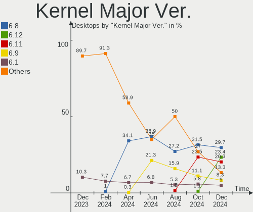
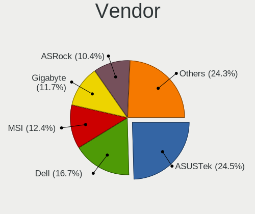
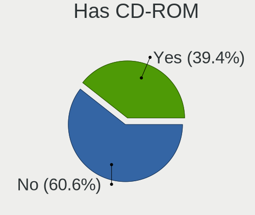
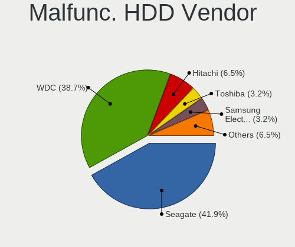
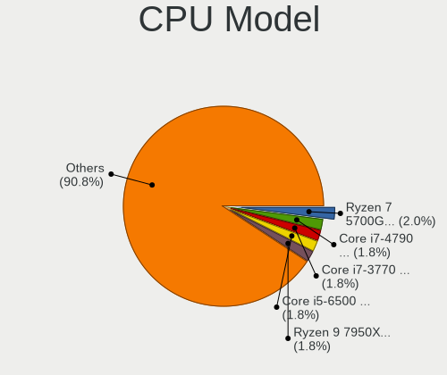
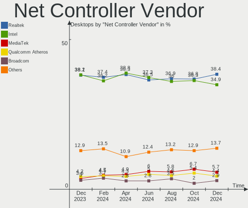
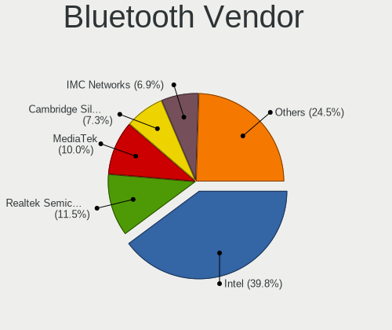
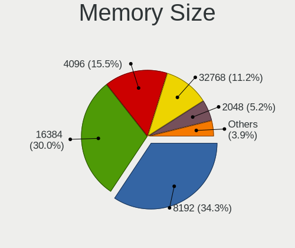
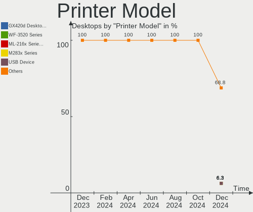

Linux in USA - Hardware Trends (Desktops)
-----------------------------------------

A project to identify most popular hardware characteristics and track their change
over time based on data collected by Linux users at https://Linux-Hardware.org.

Anyone can contribute to this report by the [hw-probe](https://github.com/linuxhw/hw-probe) tool:

    sudo -E hw-probe -all -upload

Period: Nov, 2022.

Contents
--------

* [ System ](#system)
  - [ OS                       ](#os)
  - [ OS Family                ](#os-family)
  - [ Kernel                   ](#kernel)
  - [ Kernel Family            ](#kernel-family)
  - [ Kernel Major Ver.        ](#kernel-major-ver)
  - [ Arch                     ](#arch)
  - [ DE                       ](#de)
  - [ Display Server           ](#display-server)
  - [ Display Manager          ](#display-manager)
  - [ OS Lang                  ](#os-lang)
  - [ Boot Mode                ](#boot-mode)
  - [ Filesystem               ](#filesystem)
  - [ Part. scheme             ](#part-scheme)
  - [ Dual Boot with Linux/BSD ](#dual-boot-with-linuxbsd)
  - [ Dual Boot (Win)          ](#dual-boot-win)

* [ Board ](#board)
  - [ Vendor                   ](#vendor)
  - [ Model                    ](#model)
  - [ Model Family             ](#model-family)
  - [ MFG Year                 ](#mfg-year)
  - [ Form Factor              ](#form-factor)
  - [ Secure Boot              ](#secure-boot)
  - [ Coreboot                 ](#coreboot)
  - [ RAM Size                 ](#ram-size)
  - [ RAM Used                 ](#ram-used)
  - [ Total Drives             ](#total-drives)
  - [ Has CD-ROM               ](#has-cd-rom)
  - [ Has Ethernet             ](#has-ethernet)
  - [ Has WiFi                 ](#has-wifi)
  - [ Has Bluetooth            ](#has-bluetooth)

* [ Location ](#location)
  - [ Country                  ](#country)
  - [ City                     ](#city)

* [ Drives ](#drives)
  - [ Drive Vendor             ](#drive-vendor)
  - [ Drive Model              ](#drive-model)
  - [ HDD Vendor               ](#hdd-vendor)
  - [ SSD Vendor               ](#ssd-vendor)
  - [ Drive Kind               ](#drive-kind)
  - [ Drive Connector          ](#drive-connector)
  - [ Drive Size               ](#drive-size)
  - [ Space Total              ](#space-total)
  - [ Space Used               ](#space-used)
  - [ Malfunc. Drives          ](#malfunc-drives)
  - [ Malfunc. Drive Vendor    ](#malfunc-drive-vendor)
  - [ Malfunc. HDD Vendor      ](#malfunc-hdd-vendor)
  - [ Malfunc. Drive Kind      ](#malfunc-drive-kind)
  - [ Failed Drives            ](#failed-drives)
  - [ Failed Drive Vendor      ](#failed-drive-vendor)
  - [ Drive Status             ](#drive-status)

* [ Storage controller ](#storage-controller)
  - [ Storage Vendor           ](#storage-vendor)
  - [ Storage Model            ](#storage-model)
  - [ Storage Kind             ](#storage-kind)

* [ Processor ](#processor)
  - [ CPU Vendor               ](#cpu-vendor)
  - [ CPU Model                ](#cpu-model)
  - [ CPU Model Family         ](#cpu-model-family)
  - [ CPU Cores                ](#cpu-cores)
  - [ CPU Sockets              ](#cpu-sockets)
  - [ CPU Threads              ](#cpu-threads)
  - [ CPU Op-Modes             ](#cpu-op-modes)
  - [ CPU Microcode            ](#cpu-microcode)
  - [ CPU Microarch            ](#cpu-microarch)

* [ Graphics ](#graphics)
  - [ GPU Vendor               ](#gpu-vendor)
  - [ GPU Model                ](#gpu-model)
  - [ GPU Combo                ](#gpu-combo)
  - [ GPU Driver               ](#gpu-driver)
  - [ GPU Memory               ](#gpu-memory)

* [ Monitor ](#monitor)
  - [ Monitor Vendor           ](#monitor-vendor)
  - [ Monitor Model            ](#monitor-model)
  - [ Monitor Resolution       ](#monitor-resolution)
  - [ Monitor Diagonal         ](#monitor-diagonal)
  - [ Monitor Width            ](#monitor-width)
  - [ Aspect Ratio             ](#aspect-ratio)
  - [ Monitor Area             ](#monitor-area)
  - [ Pixel Density            ](#pixel-density)
  - [ Multiple Monitors        ](#multiple-monitors)

* [ Network ](#network)
  - [ Net Controller Vendor    ](#net-controller-vendor)
  - [ Net Controller Model     ](#net-controller-model)
  - [ Wireless Vendor          ](#wireless-vendor)
  - [ Wireless Model           ](#wireless-model)
  - [ Ethernet Vendor          ](#ethernet-vendor)
  - [ Ethernet Model           ](#ethernet-model)
  - [ Net Controller Kind      ](#net-controller-kind)
  - [ Used Controller          ](#used-controller)
  - [ NICs                     ](#nics)
  - [ IPv6                     ](#ipv6)

* [ Bluetooth ](#bluetooth)
  - [ Bluetooth Vendor         ](#bluetooth-vendor)
  - [ Bluetooth Model          ](#bluetooth-model)

* [ Sound ](#sound)
  - [ Sound Vendor             ](#sound-vendor)
  - [ Sound Model              ](#sound-model)

* [ Memory ](#memory)
  - [ Memory Vendor            ](#memory-vendor)
  - [ Memory Model             ](#memory-model)
  - [ Memory Kind              ](#memory-kind)
  - [ Memory Form Factor       ](#memory-form-factor)
  - [ Memory Size              ](#memory-size)
  - [ Memory Speed             ](#memory-speed)

* [ Printers & scanners ](#printers--scanners)
  - [ Printer Vendor           ](#printer-vendor)
  - [ Printer Model            ](#printer-model)
  - [ Scanner Vendor           ](#scanner-vendor)
  - [ Scanner Model            ](#scanner-model)

* [ Camera ](#camera)
  - [ Camera Vendor            ](#camera-vendor)
  - [ Camera Model             ](#camera-model)

* [ Security ](#security)
  - [ Fingerprint Vendor       ](#fingerprint-vendor)
  - [ Fingerprint Model        ](#fingerprint-model)
  - [ Chipcard Vendor          ](#chipcard-vendor)
  - [ Chipcard Model           ](#chipcard-model)

* [ Unsupported ](#unsupported)
  - [ Unsupported Devices      ](#unsupported-devices)
  - [ Unsupported Device Types ](#unsupported-device-types)

System
------

OS
--

Installed operating systems

| Name                         | Desktops | Percent |
|------------------------------|----------|---------|
| Ubuntu 22.04                 | 63       | 18.31%  |
| Pop!_OS 22.04                | 20       | 5.81%   |
| Linux Mint 21                | 19       | 5.52%   |
| Fedora 37                    | 19       | 5.52%   |
| Debian 11                    | 18       | 5.23%   |
| Ubuntu 22.10                 | 17       | 4.94%   |
| Arch Rolling                 | 17       | 4.94%   |
| Zorin 16                     | 13       | 3.78%   |
| Linux Mint 20.3              | 13       | 3.78%   |
| Ubuntu 20.04                 | 12       | 3.49%   |
| OpenMandriva 4.3             | 12       | 3.49%   |
| KDE neon 22.04               | 10       | 2.91%   |
| Kubuntu 22.10                | 9        | 2.62%   |
| Nobara 36                    | 8        | 2.33%   |
| Manjaro                      | 8        | 2.33%   |
| Fedora 36                    | 8        | 2.33%   |
| Kubuntu 22.04                | 7        | 2.03%   |
| openSUSE Tumbleweed-XXXXXXXX | 6        | 1.74%   |
| Xubuntu 20.04                | 4        | 1.16%   |
| SteamOS 3.4                  | 4        | 1.16%   |
| ArcoLinux Rolling            | 4        | 1.16%   |
| Xubuntu 22.04                | 3        | 0.87%   |
| LMDE 5                       | 3        | 0.87%   |
| Gentoo 2.9                   | 3        | 0.87%   |
| EndeavourOS Rolling          | 3        | 0.87%   |
| Ubuntu Budgie 22.04          | 2        | 0.58%   |
| Ubuntu 18.04                 | 2        | 0.58%   |
| Parrot 5.1                   | 2        | 0.58%   |
| Kubuntu 20.04                | 2        | 0.58%   |
| Kali 2022.3                  | 2        | 0.58%   |
| Gentoo 2.8                   | 2        | 0.58%   |
| Elementary 6.1               | 2        | 0.58%   |
| Ubuntu Unity 16.04           | 1        | 0.29%   |
| Ubuntu Studio 22.10          | 1        | 0.29%   |
| Ubuntu Studio 22.04          | 1        | 0.29%   |
| Ubuntu 21.10                 | 1        | 0.29%   |
| SteamOS Rolling              | 1        | 0.29%   |
| Rocky Linux 9.0              | 1        | 0.29%   |
| Pop!_OS 21.10                | 1        | 0.29%   |
| Oracle Linux 8.7             | 1        | 0.29%   |

OS Family
---------

OS without a version

| Name          | Desktops | Percent |
|---------------|----------|---------|
| Ubuntu        | 95       | 27.62%  |
| Linux Mint    | 34       | 9.88%   |
| Fedora        | 27       | 7.85%   |
| Pop!_OS       | 21       | 6.1%    |
| Kubuntu       | 20       | 5.81%   |
| Debian        | 19       | 5.52%   |
| Arch          | 17       | 4.94%   |
| OpenMandriva  | 14       | 4.07%   |
| Zorin         | 13       | 3.78%   |
| KDE neon      | 11       | 3.2%    |
| Nobara        | 8        | 2.33%   |
| Manjaro       | 8        | 2.33%   |
| Xubuntu       | 7        | 2.03%   |
| openSUSE      | 6        | 1.74%   |
| SteamOS       | 5        | 1.45%   |
| Gentoo        | 5        | 1.45%   |
| ArcoLinux     | 5        | 1.45%   |
| LMDE          | 3        | 0.87%   |
| Kali          | 3        | 0.87%   |
| EndeavourOS   | 3        | 0.87%   |
| Ubuntu Studio | 2        | 0.58%   |
| Ubuntu Budgie | 2        | 0.58%   |
| Parrot        | 2        | 0.58%   |
| Elementary    | 2        | 0.58%   |
| Clear Linux   | 2        | 0.58%   |
| CentOS        | 2        | 0.58%   |
| Ubuntu Unity  | 1        | 0.29%   |
| Rocky Linux   | 1        | 0.29%   |
| Oracle Linux  | 1        | 0.29%   |
| Lubuntu       | 1        | 0.29%   |
| Lilidog       | 1        | 0.29%   |
| Artix         | 1        | 0.29%   |
| Alpine        | 1        | 0.29%   |
| Adk           | 1        | 0.29%   |

Kernel
------

Version of the Linux kernel

| Version                     | Desktops | Percent |
|-----------------------------|----------|---------|
| 5.15.0-52-generic           | 74       | 21.51%  |
| 5.15.0-53-generic           | 47       | 13.66%  |
| 5.19.0-23-generic           | 21       | 6.1%    |
| 5.4.0-131-generic           | 15       | 4.36%   |
| 5.16.7-desktop-1omv4003     | 10       | 2.91%   |
| 6.0.6-76060006-generic      | 9        | 2.62%   |
| 6.0.8-300.fc37.x86_64       | 7        | 2.03%   |
| 5.10.0-19-amd64             | 7        | 2.03%   |
| 6.0.9-300.fc37.x86_64       | 6        | 1.74%   |
| 5.4.0-132-generic           | 5        | 1.45%   |
| 5.19.16-301.fc37.x86_64     | 4        | 1.16%   |
| 6.0.9-arch1-1               | 3        | 0.87%   |
| 6.0.8-arch1-1               | 3        | 0.87%   |
| 6.0.8-1-default             | 3        | 0.87%   |
| 6.0.7-201.fsync.fc36.x86_64 | 3        | 0.87%   |
| 6.0.5-200.fc36.x86_64       | 3        | 0.87%   |
| 6.0.3-76060003-generic      | 3        | 0.87%   |
| 6.0.2-76060002-generic      | 3        | 0.87%   |
| 5.19.0-0.deb11.2-amd64      | 3        | 0.87%   |
| 5.15.78-1-MANJARO           | 3        | 0.87%   |
| 5.15.0-48-generic           | 3        | 0.87%   |
| 5.13.0-valve21.3-1-neptune  | 3        | 0.87%   |
| 5.10.0-18-amd64             | 3        | 0.87%   |
| 6.0.9-201.fc36.x86_64       | 2        | 0.58%   |
| 6.0.8-200.fc36.x86_64       | 2        | 0.58%   |
| 6.0.7-arch1-1               | 2        | 0.58%   |
| 6.0.6-arch1-1               | 2        | 0.58%   |
| 6.0.6-060006-generic        | 2        | 0.58%   |
| 6.0.10-arch2-1              | 2        | 0.58%   |
| 6.0.0-2parrot1-amd64        | 2        | 0.58%   |
| 5.19.0-76051900-generic     | 2        | 0.58%   |
| 5.19.0-1009-lowlatency      | 2        | 0.58%   |
| 5.16.13-desktop-1omv4003    | 2        | 0.58%   |
| 5.15.77-1-lts               | 2        | 0.58%   |
| 5.15.74-3-MANJARO           | 2        | 0.58%   |
| 5.15.0-54-generic           | 2        | 0.58%   |
| 5.15.0-43-generic           | 2        | 0.58%   |
| 6.0.9-zen1-1-zen            | 1        | 0.29%   |
| 6.0.9-desktop-gcc-1omv22090 | 1        | 0.29%   |
| 6.0.9-1-ck                  | 1        | 0.29%   |

Kernel Family
-------------

Linux kernel without a distro release

| Version | Desktops | Percent |
|---------|----------|---------|
| 5.15.0  | 131      | 38.08%  |
| 5.19.0  | 32       | 9.3%    |
| 5.4.0   | 22       | 6.4%    |
| 6.0.8   | 21       | 6.1%    |
| 6.0.6   | 17       | 4.94%   |
| 6.0.9   | 14       | 4.07%   |
| 5.10.0  | 14       | 4.07%   |
| 6.0.7   | 13       | 3.78%   |
| 5.16.7  | 10       | 2.91%   |
| 6.0.0   | 7        | 2.03%   |
| 5.19.16 | 6        | 1.74%   |
| 5.13.0  | 6        | 1.74%   |
| 6.0.3   | 5        | 1.45%   |
| 6.0.2   | 5        | 1.45%   |
| 6.0.5   | 4        | 1.16%   |
| 5.15.78 | 3        | 0.87%   |
| 5.15.74 | 3        | 0.87%   |
| 6.0.10  | 2        | 0.58%   |
| 5.16.13 | 2        | 0.58%   |
| 5.15.79 | 2        | 0.58%   |
| 5.15.77 | 2        | 0.58%   |
| 5.15.75 | 2        | 0.58%   |
| 5.14.0  | 2        | 0.58%   |
| 5.11.0  | 2        | 0.58%   |
| 5.7.1   | 1        | 0.29%   |
| 5.4.17  | 1        | 0.29%   |
| 5.19.8  | 1        | 0.29%   |
| 5.19.17 | 1        | 0.29%   |
| 5.19.15 | 1        | 0.29%   |
| 5.19.14 | 1        | 0.29%   |
| 5.19.12 | 1        | 0.29%   |
| 5.18.8  | 1        | 0.29%   |
| 5.18.10 | 1        | 0.29%   |
| 5.18.1  | 1        | 0.29%   |
| 5.18.0  | 1        | 0.29%   |
| 5.17.15 | 1        | 0.29%   |
| 5.15.69 | 1        | 0.29%   |
| 5.15.30 | 1        | 0.29%   |
| 4.4.0   | 1        | 0.29%   |
| 4.15.18 | 1        | 0.29%   |

Kernel Major Ver.
-----------------

Linux kernel major version

| Version | Desktops | Percent |
|---------|----------|---------|
| 5.15    | 145      | 42.15%  |
| 6.0     | 88       | 25.58%  |
| 5.19    | 43       | 12.5%   |
| 5.4     | 23       | 6.69%   |
| 5.10    | 14       | 4.07%   |
| 5.16    | 12       | 3.49%   |
| 5.13    | 6        | 1.74%   |
| 5.18    | 4        | 1.16%   |
| 5.14    | 2        | 0.58%   |
| 5.11    | 2        | 0.58%   |
| 5.7     | 1        | 0.29%   |
| 5.17    | 1        | 0.29%   |
| 4.4     | 1        | 0.29%   |
| 4.15    | 1        | 0.29%   |
| 3.10    | 1        | 0.29%   |

Arch
----

OS architecture (x86_64, i586, etc.)

| Name   | Desktops | Percent |
|--------|----------|---------|
| x86_64 | 343      | 99.71%  |
| i686   | 1        | 0.29%   |

DE
--

Desktop Environment

| Name                         | Desktops | Percent |
|------------------------------|----------|---------|
| GNOME                        | 161      | 46.8%   |
| KDE5                         | 86       | 25%     |
| X-Cinnamon                   | 28       | 8.14%   |
| XFCE                         | 27       | 7.85%   |
| Unknown                      | 15       | 4.36%   |
| MATE                         | 9        | 2.62%   |
| LXQt                         | 3        | 0.87%   |
| Pantheon                     | 2        | 0.58%   |
| KDE                          | 2        | 0.58%   |
| Budgie                       | 2        | 0.58%   |
| Unity                        | 1        | 0.29%   |
| sway                         | 1        | 0.29%   |
| lightdm-xsession             | 1        | 0.29%   |
| i3                           | 1        | 0.29%   |
| GNOME Flashback              | 1        | 0.29%   |
| GNOME Classic                | 1        | 0.29%   |
| e16-session                  | 1        | 0.29%   |
| Cinnamon                     | 1        | 0.29%   |
| ${XDG_CURRENT_DESKTOP:-sway} | 1        | 0.29%   |

Display Server
--------------

X11 or Wayland

| Name    | Desktops | Percent |
|---------|----------|---------|
| X11     | 237      | 68.9%   |
| Wayland | 90       | 26.16%  |
| Tty     | 14       | 4.07%   |
| Unknown | 2        | 0.58%   |
| Web     | 1        | 0.29%   |

Display Manager
---------------

SDDM, LightDM, etc.

| Name    | Desktops | Percent |
|---------|----------|---------|
| Unknown | 154      | 44.77%  |
| GDM3    | 80       | 23.26%  |
| SDDM    | 50       | 14.53%  |
| LightDM | 40       | 11.63%  |
| GDM     | 17       | 4.94%   |
| XDM     | 1        | 0.29%   |
| Ly      | 1        | 0.29%   |
| GREETD  | 1        | 0.29%   |

OS Lang
-------

Language

| Lang    | Desktops | Percent |
|---------|----------|---------|
| en_US   | 322      | 93.6%   |
| C       | 6        | 1.74%   |
| en_CA   | 5        | 1.45%   |
| Unknown | 3        | 0.87%   |
| C.UTF8  | 2        | 0.58%   |
| POSIX   | 1        | 0.29%   |
| it_IT   | 1        | 0.29%   |
| es_VE   | 1        | 0.29%   |
| es_MX   | 1        | 0.29%   |
| es_ES   | 1        | 0.29%   |
| de_DE   | 1        | 0.29%   |

Boot Mode
---------

EFI or BIOS

| Mode | Desktops | Percent |
|------|----------|---------|
| BIOS | 212      | 61.63%  |
| EFI  | 132      | 38.37%  |

Filesystem
----------

Type of filesystem

| Type    | Desktops | Percent |
|---------|----------|---------|
| Ext4    | 257      | 74.71%  |
| Btrfs   | 60       | 17.44%  |
| Overlay | 13       | 3.78%   |
| Zfs     | 6        | 1.74%   |
| Xfs     | 6        | 1.74%   |
| XXXXXXX | 1        | 0.29%   |
| Ext2    | 1        | 0.29%   |

Part. scheme
------------

Scheme of partitioning

| Type    | Desktops | Percent |
|---------|----------|---------|
| GPT     | 166      | 48.26%  |
| Unknown | 142      | 41.28%  |
| MBR     | 36       | 10.47%  |

Dual Boot with Linux/BSD
------------------------

Hosting more than one Linux/BSD

| Dual boot | Desktops | Percent |
|-----------|----------|---------|
| No        | 287      | 83.43%  |
| Yes       | 57       | 16.57%  |

Dual Boot (Win)
---------------

Hosting Linux and Windows

| Dual boot | Desktops | Percent |
|-----------|----------|---------|
| No        | 254      | 73.84%  |
| Yes       | 90       | 26.16%  |

Board
-----

Vendor
------

Motherboard manufacturer

| Name                | Desktops | Percent |
|---------------------|----------|---------|
| ASUSTek Computer    | 78       | 22.67%  |
| Dell                | 61       | 17.73%  |
| MSI                 | 42       | 12.21%  |
| Gigabyte Technology | 39       | 11.34%  |
| Hewlett-Packard     | 31       | 9.01%   |
| ASRock              | 30       | 8.72%   |
| Lenovo              | 10       | 2.91%   |
| Foxconn             | 7        | 2.03%   |
| Pegatron            | 5        | 1.45%   |
| Intel               | 5        | 1.45%   |
| Gateway             | 5        | 1.45%   |
| AZW                 | 4        | 1.16%   |
| Apple               | 4        | 1.16%   |
| Acer                | 4        | 1.16%   |
| BESSTAR Tech        | 3        | 0.87%   |
| LattePanda          | 2        | 0.58%   |
| Alienware           | 2        | 0.58%   |
| Unknown             | 2        | 0.58%   |
| System76            | 1        | 0.29%   |
| Supermicro          | 1        | 0.29%   |
| Shuttle             | 1        | 0.29%   |
| Minix               | 1        | 0.29%   |
| Fujitsu             | 1        | 0.29%   |
| EVGA                | 1        | 0.29%   |
| eMachines           | 1        | 0.29%   |
| Biostar             | 1        | 0.29%   |
| BCM                 | 1        | 0.29%   |
| AAEON               | 1        | 0.29%   |

Model
-----

Motherboard model

| Name                           | Desktops | Percent |
|--------------------------------|----------|---------|
| Gigabyte GA-78LMT-USB3         | 6        | 1.74%   |
| Dell OptiPlex 990              | 5        | 1.45%   |
| ASUS All Series                | 5        | 1.45%   |
| Dell OptiPlex 3050             | 4        | 1.16%   |
| ASUS TUF Gaming X570-PLUS      | 4        | 1.16%   |
| MSI MS-7C56                    | 3        | 0.87%   |
| HP Compaq Elite 8300 SFF       | 3        | 0.87%   |
| Dell OptiPlex 3020             | 3        | 0.87%   |
| ASUS ROG STRIX B550-F GAMING   | 3        | 0.87%   |
| ASUS ROG STRIX B450-F GAMING   | 3        | 0.87%   |
| ASUS PRIME X570-PRO            | 3        | 0.87%   |
| Pegatron AY028AA-ABA CQ5300Y   | 2        | 0.58%   |
| MSI MS-7D54                    | 2        | 0.58%   |
| MSI MS-7D31                    | 2        | 0.58%   |
| MSI MS-7C95                    | 2        | 0.58%   |
| MSI MS-7C91                    | 2        | 0.58%   |
| MSI MS-7C37                    | 2        | 0.58%   |
| MSI MS-7721                    | 2        | 0.58%   |
| MSI MS-7693                    | 2        | 0.58%   |
| HP EliteDesk 800 G2 DM 35W     | 2        | 0.58%   |
| HP EliteDesk 800 G1 DM         | 2        | 0.58%   |
| Gigabyte X570 GAMING X         | 2        | 0.58%   |
| Gigabyte X570 AORUS MASTER     | 2        | 0.58%   |
| Gigabyte X570 AORUS ELITE WIFI | 2        | 0.58%   |
| Gigabyte B550I AORUS PRO AX    | 2        | 0.58%   |
| Gigabyte B450M DS3H            | 2        | 0.58%   |
| Gigabyte B450 AORUS ELITE      | 2        | 0.58%   |
| Gigabyte 990FXA-UD3            | 2        | 0.58%   |
| Dell XPS 8910                  | 2        | 0.58%   |
| Dell OptiPlex 9020             | 2        | 0.58%   |
| Dell OptiPlex 790              | 2        | 0.58%   |
| Dell OptiPlex 760              | 2        | 0.58%   |
| Dell OptiPlex 7020             | 2        | 0.58%   |
| Dell OptiPlex 7010             | 2        | 0.58%   |
| Dell OptiPlex 3010             | 2        | 0.58%   |
| AZW SEi                        | 2        | 0.58%   |
| ASUS ROG STRIX X570-I GAMING   | 2        | 0.58%   |
| ASUS ROG STRIX X570-E GAMING   | 2        | 0.58%   |
| ASUS ROG Maximus XI HERO       | 2        | 0.58%   |
| ASUS M5A99FX PRO R2.0          | 2        | 0.58%   |

Model Family
------------

Motherboard model prefix

| Name                   | Desktops | Percent |
|------------------------|----------|---------|
| Dell OptiPlex          | 33       | 9.59%   |
| ASUS ROG               | 17       | 4.94%   |
| ASUS PRIME             | 17       | 4.94%   |
| ASUS TUF               | 11       | 3.2%    |
| Dell Precision         | 10       | 2.91%   |
| Dell Inspiron          | 10       | 2.91%   |
| HP EliteDesk           | 8        | 2.33%   |
| HP Compaq              | 7        | 2.03%   |
| Gigabyte X570          | 7        | 2.03%   |
| Gigabyte GA-78LMT-USB3 | 7        | 2.03%   |
| Lenovo ThinkCentre     | 5        | 1.45%   |
| HP ProDesk             | 5        | 1.45%   |
| Dell XPS               | 5        | 1.45%   |
| ASUS All               | 5        | 1.45%   |
| Gigabyte B450          | 4        | 1.16%   |
| ASRock X570            | 4        | 1.16%   |
| MSI MS-7C56            | 3        | 0.87%   |
| Gigabyte B550          | 3        | 0.87%   |
| ASRock B450M           | 3        | 0.87%   |
| Pegatron AY028AA-ABA   | 2        | 0.58%   |
| MSI MS-7D54            | 2        | 0.58%   |
| MSI MS-7D31            | 2        | 0.58%   |
| MSI MS-7C95            | 2        | 0.58%   |
| MSI MS-7C91            | 2        | 0.58%   |
| MSI MS-7C37            | 2        | 0.58%   |
| MSI MS-7721            | 2        | 0.58%   |
| MSI MS-7693            | 2        | 0.58%   |
| Lenovo Legion          | 2        | 0.58%   |
| Lenovo IdeaCentre      | 2        | 0.58%   |
| HP Pavilion            | 2        | 0.58%   |
| HP OMEN                | 2        | 0.58%   |
| HP Desktop             | 2        | 0.58%   |
| Gigabyte B550I         | 2        | 0.58%   |
| Gigabyte B450M         | 2        | 0.58%   |
| Gigabyte 990FXA-UD3    | 2        | 0.58%   |
| AZW SEi                | 2        | 0.58%   |
| AZW Green              | 2        | 0.58%   |
| ASUS M5A99FX           | 2        | 0.58%   |
| ASUS M5A78L-M          | 2        | 0.58%   |
| ASUS M4A89GTD-PRO      | 2        | 0.58%   |

MFG Year
--------

Motherboard manufacture year

| Year | Desktops | Percent |
|------|----------|---------|
| 2020 | 39       | 11.34%  |
| 2019 | 38       | 11.05%  |
| 2021 | 32       | 9.3%    |
| 2012 | 31       | 9.01%   |
| 2018 | 29       | 8.43%   |
| 2017 | 23       | 6.69%   |
| 2014 | 22       | 6.4%    |
| 2022 | 20       | 5.81%   |
| 2013 | 20       | 5.81%   |
| 2010 | 20       | 5.81%   |
| 2011 | 18       | 5.23%   |
| 2016 | 14       | 4.07%   |
| 2015 | 12       | 3.49%   |
| 2009 | 11       | 3.2%    |
| 2008 | 7        | 2.03%   |
| 2007 | 7        | 2.03%   |
| 2005 | 1        | 0.29%   |

Form Factor
-----------

Physical design of the computer

| Name    | Desktops | Percent |
|---------|----------|---------|
| Desktop | 344      | 100%    |

Secure Boot
-----------

Enabled or disabled

| State    | Desktops | Percent |
|----------|----------|---------|
| Disabled | 334      | 97.09%  |
| Enabled  | 10       | 2.91%   |

Coreboot
--------

Have coreboot on board

| Used | Desktops | Percent |
|------|----------|---------|
| No   | 344      | 100%    |

RAM Size
--------

Total RAM memory

| Size in GB      | Desktops | Percent |
|-----------------|----------|---------|
| 16.01-24.0      | 104      | 30.23%  |
| 32.01-64.0      | 83       | 24.13%  |
| 4.01-8.0        | 49       | 14.24%  |
| 8.01-16.0       | 33       | 9.59%   |
| 64.01-256.0     | 32       | 9.3%    |
| 3.01-4.0        | 24       | 6.98%   |
| 24.01-32.0      | 11       | 3.2%    |
| 1.01-2.0        | 5        | 1.45%   |
| 2.01-3.0        | 2        | 0.58%   |
| More than 256.0 | 1        | 0.29%   |

RAM Used
--------

Used RAM memory

| Used GB    | Desktops | Percent |
|------------|----------|---------|
| 1.01-2.0   | 80       | 23.26%  |
| 4.01-8.0   | 79       | 22.97%  |
| 3.01-4.0   | 69       | 20.06%  |
| 2.01-3.0   | 68       | 19.77%  |
| 8.01-16.0  | 24       | 6.98%   |
| 0.51-1.0   | 13       | 3.78%   |
| 16.01-24.0 | 5        | 1.45%   |
| 0.01-0.5   | 3        | 0.87%   |
| 32.01-64.0 | 2        | 0.58%   |
| 24.01-32.0 | 1        | 0.29%   |

Total Drives
------------

Number of drives on board

| Drives | Desktops | Percent |
|--------|----------|---------|
| 2      | 110      | 31.98%  |
| 1      | 108      | 31.4%   |
| 3      | 59       | 17.15%  |
| 4      | 25       | 7.27%   |
| 5      | 16       | 4.65%   |
| 7      | 8        | 2.33%   |
| 6      | 8        | 2.33%   |
| 8      | 4        | 1.16%   |
| 0      | 3        | 0.87%   |
| 10     | 2        | 0.58%   |
| 16     | 1        | 0.29%   |

Has CD-ROM
----------

Has CD-ROM on board

| Presented | Desktops | Percent |
|-----------|----------|---------|
| No        | 203      | 59.01%  |
| Yes       | 141      | 40.99%  |

Has Ethernet
------------

Has Ethernet on board

| Presented | Desktops | Percent |
|-----------|----------|---------|
| Yes       | 335      | 97.38%  |
| No        | 9        | 2.62%   |

Has WiFi
--------

Has WiFi module

| Presented | Desktops | Percent |
|-----------|----------|---------|
| Yes       | 212      | 61.63%  |
| No        | 132      | 38.37%  |

Has Bluetooth
-------------

Has Bluetooth module

| Presented | Desktops | Percent |
|-----------|----------|---------|
| No        | 173      | 50.29%  |
| Yes       | 171      | 49.71%  |

Location
--------

Country
-------

Geographic location (country)

| Country | Desktops | Percent |
|---------|----------|---------|
| USA     | 344      | 100%    |

City
----

Geographic location (city)

| City              | Desktops | Percent |
|-------------------|----------|---------|
| Seattle           | 7        | 2.03%   |
| Miami             | 6        | 1.74%   |
| Dallas            | 5        | 1.45%   |
| Chicago           | 5        | 1.45%   |
| Springfield       | 4        | 1.16%   |
| New York          | 4        | 1.16%   |
| Los Angeles       | 4        | 1.16%   |
| Portland          | 3        | 0.87%   |
| Phoenix           | 3        | 0.87%   |
| Philadelphia      | 3        | 0.87%   |
| Oklahoma City     | 3        | 0.87%   |
| Hurricane         | 3        | 0.87%   |
| Fort Lauderdale   | 3        | 0.87%   |
| Fayetteville      | 3        | 0.87%   |
| Eugene            | 3        | 0.87%   |
| Atlanta           | 3        | 0.87%   |
| Ashburn           | 3        | 0.87%   |
| Wyandotte         | 2        | 0.58%   |
| Washington        | 2        | 0.58%   |
| Tulsa             | 2        | 0.58%   |
| Tacoma            | 2        | 0.58%   |
| St Louis          | 2        | 0.58%   |
| Santa Clara       | 2        | 0.58%   |
| San Diego         | 2        | 0.58%   |
| Pittsburgh        | 2        | 0.58%   |
| Pensacola         | 2        | 0.58%   |
| Omaha             | 2        | 0.58%   |
| North Little Rock | 2        | 0.58%   |
| Nederland         | 2        | 0.58%   |
| Naples            | 2        | 0.58%   |
| Naperville        | 2        | 0.58%   |
| Minneapolis       | 2        | 0.58%   |
| Milwaukee         | 2        | 0.58%   |
| Memphis           | 2        | 0.58%   |
| Mansfield         | 2        | 0.58%   |
| Kent              | 2        | 0.58%   |
| Jasper            | 2        | 0.58%   |
| Jacksonville      | 2        | 0.58%   |
| Houston           | 2        | 0.58%   |
| Grand Junction    | 2        | 0.58%   |

Drives
------

Drive Vendor
------------

Hard drive vendors

| Vendor                    | Desktops | Drives | Percent |
|---------------------------|----------|--------|---------|
| WDC                       | 122      | 164    | 18.24%  |
| Seagate                   | 104      | 148    | 15.55%  |
| Samsung Electronics       | 97       | 135    | 14.5%   |
| SanDisk                   | 50       | 57     | 7.47%   |
| Toshiba                   | 34       | 39     | 5.08%   |
| Kingston                  | 22       | 29     | 3.29%   |
| Hitachi                   | 21       | 25     | 3.14%   |
| Crucial                   | 20       | 22     | 2.99%   |
| Phison Electronics        | 19       | 21     | 2.84%   |
| PNY                       | 14       | 14     | 2.09%   |
| China                     | 14       | 19     | 2.09%   |
| Unknown                   | 11       | 13     | 1.64%   |
| SK hynix                  | 11       | 13     | 1.64%   |
| SPCC                      | 9        | 12     | 1.35%   |
| Phison                    | 8        | 9      | 1.2%    |
| A-DATA Technology         | 8        | 9      | 1.2%    |
| Intel                     | 7        | 7      | 1.05%   |
| HGST                      | 6        | 10     | 0.9%    |
| Team                      | 5        | 5      | 0.75%   |
| Micron Technology         | 5        | 6      | 0.75%   |
| Hewlett-Packard           | 5        | 5      | 0.75%   |
| T-FORCE                   | 4        | 9      | 0.6%    |
| Micron/Crucial Technology | 4        | 4      | 0.6%    |
| Apple                     | 4        | 4      | 0.6%    |
| Mushkin                   | 3        | 4      | 0.45%   |
| Maxtor                    | 3        | 3      | 0.45%   |
| KIOXIA                    | 3        | 3      | 0.45%   |
| KingFast                  | 3        | 3      | 0.45%   |
| Corsair                   | 3        | 3      | 0.45%   |
| ADATA Technology          | 3        | 4      | 0.45%   |
| Unknown                   | 3        | 3      | 0.45%   |
| Transcend                 | 2        | 2      | 0.3%    |
| Silicon Motion            | 2        | 2      | 0.3%    |
| LITEONIT                  | 2        | 2      | 0.3%    |
| LITEON                    | 2        | 2      | 0.3%    |
| Lexar                     | 2        | 3      | 0.3%    |
| Fanxiang                  | 2        | 2      | 0.3%    |
| ASMT                      | 2        | 5      | 0.3%    |
| Zheino                    | 1        | 1      | 0.15%   |
| W800SH                    | 1        | 1      | 0.15%   |

Drive Model
-----------

Hard drive models

| Model                                                | Desktops | Percent |
|------------------------------------------------------|----------|---------|
| Samsung NVMe SSD Controller SM981/PM981/PM983 1TB    | 20       | 2.58%   |
| Phison E12 NVMe Controller 2TB                       | 13       | 1.68%   |
| Seagate ST2000DM008-2FR102 2TB                       | 12       | 1.55%   |
| Samsung NVMe SSD Controller PM9A1/PM9A3/980PRO 250GB | 12       | 1.55%   |
| Kingston SA400S37240G 240GB SSD                      | 11       | 1.42%   |
| Toshiba DT01ACA100 1TB                               | 9        | 1.16%   |
| Samsung SSD 860 EVO 1TB                              | 9        | 1.16%   |
| Sandisk WD Blue SN550 NVMe SSD 1TB                   | 8        | 1.03%   |
| WDC WD10EZEX-08WN4A0 1TB                             | 7        | 0.9%    |
| Seagate Portable 5TB                                 | 5        | 0.65%   |
| Sandisk WD Black SN850 256GB                         | 5        | 0.65%   |
| Crucial CT1000MX500SSD1 1TB                          | 5        | 0.65%   |
| China SATA SSD 240GB                                 | 5        | 0.65%   |
| WDC WD10EZEX-00BN5A0 1TB                             | 4        | 0.52%   |
| Seagate ST500LM012 HN-M500MBB 500GB                  | 4        | 0.52%   |
| Seagate ST500DM002-1BD142 500GB                      | 4        | 0.52%   |
| Seagate ST3500414CS 500GB                            | 4        | 0.52%   |
| Seagate ST2000DM001-1ER164 2TB                       | 4        | 0.52%   |
| Seagate ST1000DM003-1SB102 1TB                       | 4        | 0.52%   |
| Seagate ST1000DM003-1CH162 1TB                       | 4        | 0.52%   |
| Seagate Expansion Desk 8TB                           | 4        | 0.52%   |
| Sandisk WD_BLACK SN770 500GB                         | 4        | 0.52%   |
| Samsung SSD 970 EVO Plus 1TB                         | 4        | 0.52%   |
| Samsung NVMe SSD Controller SM961/PM961/SM963 250GB  | 4        | 0.52%   |
| WDC WDBNCE0010PNC 1TB SSD                            | 3        | 0.39%   |
| WDC WD1003FZEX-00K3CA0 1TB                           | 3        | 0.39%   |
| Unknown SD/MMC/MS PRO 8GB                            | 3        | 0.39%   |
| Toshiba MQ01ABF050 500GB                             | 3        | 0.39%   |
| Toshiba DT01ACA200 2TB                               | 3        | 0.39%   |
| T-FORCE SSD 1TB                                      | 3        | 0.39%   |
| SPCC Solid State Disk 1TB                            | 3        | 0.39%   |
| SPCC Solid State Disk 1024GB                         | 3        | 0.39%   |
| SK hynix SHGP31-1000GM-2 1TB                         | 3        | 0.39%   |
| Seagate ST8000DM004-2CX188 8TB                       | 3        | 0.39%   |
| Seagate ST3320418AS 320GB                            | 3        | 0.39%   |
| Seagate ST31000528AS 1TB                             | 3        | 0.39%   |
| Seagate ST1000DM003-1ER162 1TB                       | 3        | 0.39%   |
| Sandisk WD Blue SN570 1TB                            | 3        | 0.39%   |
| Sandisk WD Black SN750 / PC SN730 NVMe SSD 1024GB    | 3        | 0.39%   |
| SanDisk SSD PLUS 1000GB                              | 3        | 0.39%   |

HDD Vendor
----------

Hard disk drive vendors

| Vendor              | Desktops | Drives | Percent |
|---------------------|----------|--------|---------|
| WDC                 | 104      | 137    | 36.88%  |
| Seagate             | 99       | 138    | 35.11%  |
| Toshiba             | 29       | 34     | 10.28%  |
| Hitachi             | 21       | 25     | 7.45%   |
| HGST                | 6        | 10     | 2.13%   |
| Unknown             | 4        | 5      | 1.42%   |
| Samsung Electronics | 4        | 4      | 1.42%   |
| Maxtor              | 3        | 3      | 1.06%   |
| Apple               | 3        | 3      | 1.06%   |
| Hewlett-Packard     | 2        | 2      | 0.71%   |
| ASMT                | 2        | 5      | 0.71%   |
| USB3.0              | 1        | 2      | 0.35%   |
| HPE                 | 1        | 2      | 0.35%   |
| Fujitsu             | 1        | 1      | 0.35%   |
| External            | 1        | 1      | 0.35%   |
| Dyconn H            | 1        | 1      | 0.35%   |

SSD Vendor
----------

Solid state drive vendors

| Vendor              | Desktops | Drives | Percent |
|---------------------|----------|--------|---------|
| Samsung Electronics | 49       | 67     | 22.37%  |
| SanDisk             | 21       | 24     | 9.59%   |
| Kingston            | 19       | 25     | 8.68%   |
| Crucial             | 17       | 19     | 7.76%   |
| WDC                 | 16       | 17     | 7.31%   |
| PNY                 | 14       | 14     | 6.39%   |
| China               | 14       | 19     | 6.39%   |
| SPCC                | 8        | 11     | 3.65%   |
| A-DATA Technology   | 8        | 9      | 3.65%   |
| Team                | 4        | 4      | 1.83%   |
| Intel               | 4        | 4      | 1.83%   |
| T-FORCE             | 3        | 8      | 1.37%   |
| Mushkin             | 3        | 4      | 1.37%   |
| Hewlett-Packard     | 3        | 3      | 1.37%   |
| Transcend           | 2        | 2      | 0.91%   |
| Toshiba             | 2        | 2      | 0.91%   |
| SK hynix            | 2        | 2      | 0.91%   |
| Seagate             | 2        | 2      | 0.91%   |
| Micron Technology   | 2        | 3      | 0.91%   |
| LITEONIT            | 2        | 2      | 0.91%   |
| LITEON              | 2        | 2      | 0.91%   |
| Lexar               | 2        | 3      | 0.91%   |
| KingFast            | 2        | 2      | 0.91%   |
| Zheino              | 1        | 1      | 0.46%   |
| W800SH              | 1        | 1      | 0.46%   |
| Vaseky              | 1        | 1      | 0.46%   |
| TO Exter            | 1        | 1      | 0.46%   |
| SCCTS-603-128G      | 1        | 1      | 0.46%   |
| Patriot             | 1        | 1      | 0.46%   |
| NGFF                | 1        | 1      | 0.46%   |
| Neo                 | 1        | 1      | 0.46%   |
| MyDigitalSSD        | 1        | 1      | 0.46%   |
| Kingchuxing         | 1        | 1      | 0.46%   |
| Inland S            | 1        | 1      | 0.46%   |
| Fanxiang            | 1        | 1      | 0.46%   |
| CT2000P2            | 1        | 1      | 0.46%   |
| Corsair             | 1        | 1      | 0.46%   |
| BUFFALO             | 1        | 1      | 0.46%   |
| ASMedia             | 1        | 1      | 0.46%   |
| Acer                | 1        | 1      | 0.46%   |

Drive Kind
----------

HDD or SSD

| Kind    | Desktops | Drives | Percent |
|---------|----------|--------|---------|
| HDD     | 213      | 373    | 38.31%  |
| SSD     | 176      | 266    | 31.65%  |
| NVMe    | 143      | 189    | 25.72%  |
| Unknown | 18       | 19     | 3.24%   |
| MMC     | 6        | 6      | 1.08%   |

Drive Connector
---------------

SATA, SAS, NVMe, etc.

| Type | Desktops | Drives | Percent |
|------|----------|--------|---------|
| SATA | 296      | 604    | 61.67%  |
| NVMe | 142      | 188    | 29.58%  |
| SAS  | 36       | 55     | 7.5%    |
| MMC  | 6        | 6      | 1.25%   |

Drive Size
----------

Size of hard drive

| Size in TB | Desktops | Drives | Percent |
|------------|----------|--------|---------|
| 0.01-0.5   | 188      | 272    | 42.44%  |
| 0.51-1.0   | 131      | 187    | 29.57%  |
| 1.01-2.0   | 63       | 81     | 14.22%  |
| 3.01-4.0   | 23       | 29     | 5.19%   |
| 4.01-10.0  | 23       | 46     | 5.19%   |
| 2.01-3.0   | 12       | 20     | 2.71%   |
| 10.01-20.0 | 3        | 4      | 0.68%   |

Space Total
-----------

Amount of disk space available on the file system

| Size in GB     | Desktops | Percent |
|----------------|----------|---------|
| More than 3000 | 68       | 19.77%  |
| 101-250        | 59       | 17.15%  |
| 501-1000       | 55       | 15.99%  |
| 1001-2000      | 50       | 14.53%  |
| 251-500        | 43       | 12.5%   |
| 2001-3000      | 25       | 7.27%   |
| 51-100         | 17       | 4.94%   |
| 1-20           | 12       | 3.49%   |
| Unknown        | 11       | 3.2%    |
| 21-50          | 4        | 1.16%   |

Space Used
----------

Amount of used disk space

| Used GB        | Desktops | Percent |
|----------------|----------|---------|
| 1-20           | 79       | 22.97%  |
| 21-50          | 51       | 14.83%  |
| 51-100         | 45       | 13.08%  |
| 101-250        | 36       | 10.47%  |
| 501-1000       | 35       | 10.17%  |
| 1001-2000      | 27       | 7.85%   |
| 251-500        | 26       | 7.56%   |
| More than 3000 | 24       | 6.98%   |
| Unknown        | 11       | 3.2%    |
| 2001-3000      | 10       | 2.91%   |

Malfunc. Drives
---------------

Drive models with a malfunction

| Model                             | Desktops | Drives | Percent |
|-----------------------------------|----------|--------|---------|
| Seagate ST3320418AS 320GB         | 3        | 3      | 10.71%  |
| WDC WD7500BPKT-75PK4T0 752GB      | 1        | 1      | 3.57%   |
| WDC WD5000AADS-00S9B0 500GB       | 1        | 1      | 3.57%   |
| WDC WD3200BEVT-75ZCT2 320GB       | 1        | 1      | 3.57%   |
| WDC WD30 EFRX-68EUZN0 3TB         | 1        | 1      | 3.57%   |
| WDC WD20EARX-00PASB0 2TB          | 1        | 1      | 3.57%   |
| WDC WD10JPVX-60JC3T0 1TB          | 1        | 1      | 3.57%   |
| Toshiba DT01ACA050 500GB          | 1        | 1      | 3.57%   |
| SPCC SPCCSolidStateDisk 128GB SSD | 1        | 1      | 3.57%   |
| SPCC Solid State Disk 1TB         | 1        | 1      | 3.57%   |
| Seagate ST9500325AS 500GB         | 1        | 1      | 3.57%   |
| Seagate ST8000DM004-2CX1 8TB      | 1        | 6      | 3.57%   |
| Seagate ST3750528AS 752GB         | 1        | 1      | 3.57%   |
| Seagate ST3250820AS 250GB         | 1        | 1      | 3.57%   |
| Seagate ST3200822AS 200GB         | 1        | 1      | 3.57%   |
| Seagate ST32000641AS 2TB          | 1        | 1      | 3.57%   |
| Seagate ST2000DM008-2FR102 2TB    | 1        | 1      | 3.57%   |
| Seagate ST2000DM001-1ER164 2TB    | 1        | 1      | 3.57%   |
| Kingston SH103S3240G 240GB SSD    | 1        | 1      | 3.57%   |
| Intel SSDSC2BW120A4 120GB         | 1        | 1      | 3.57%   |
| Hitachi HTS722080K9A300 80GB      | 1        | 1      | 3.57%   |
| Hitachi HDS725050KLA360 500GB     | 1        | 2      | 3.57%   |
| HGST HUH728080ALE600 8TB          | 1        | 1      | 3.57%   |
| Crucial CT525MX300SSD1 528GB      | 1        | 1      | 3.57%   |
| Crucial CT120M500SSD1 120GB       | 1        | 1      | 3.57%   |
| ASMT ASMT105x 3TB                 | 1        | 4      | 3.57%   |

Malfunc. Drive Vendor
---------------------

Vendors of faulty drives

| Vendor   | Desktops | Drives | Percent |
|----------|----------|--------|---------|
| Seagate  | 11       | 16     | 39.29%  |
| WDC      | 6        | 6      | 21.43%  |
| SPCC     | 2        | 2      | 7.14%   |
| Hitachi  | 2        | 3      | 7.14%   |
| Crucial  | 2        | 2      | 7.14%   |
| Toshiba  | 1        | 1      | 3.57%   |
| Kingston | 1        | 1      | 3.57%   |
| Intel    | 1        | 1      | 3.57%   |
| HGST     | 1        | 1      | 3.57%   |
| ASMT     | 1        | 4      | 3.57%   |

Malfunc. HDD Vendor
-------------------

Vendors of faulty HDD drives

| Vendor  | Desktops | Drives | Percent |
|---------|----------|--------|---------|
| Seagate | 11       | 16     | 50%     |
| WDC     | 6        | 6      | 27.27%  |
| Hitachi | 2        | 3      | 9.09%   |
| Toshiba | 1        | 1      | 4.55%   |
| HGST    | 1        | 1      | 4.55%   |
| ASMT    | 1        | 4      | 4.55%   |

Malfunc. Drive Kind
-------------------

Kinds of faulty drives

| Kind | Desktops | Drives | Percent |
|------|----------|--------|---------|
| HDD  | 22       | 31     | 78.57%  |
| SSD  | 6        | 6      | 21.43%  |

Failed Drives
-------------

Failed drive models

| Model                                 | Desktops | Drives | Percent |
|---------------------------------------|----------|--------|---------|
| Samsung Electronics SSD 960 EVO 250GB | 1        | 1      | 100%    |

Failed Drive Vendor
-------------------

Failed drive vendors

| Vendor              | Desktops | Drives | Percent |
|---------------------|----------|--------|---------|
| Samsung Electronics | 1        | 1      | 100%    |

Drive Status
------------

Number of failed and malfunc. drives

| Status   | Desktops | Drives | Percent |
|----------|----------|--------|---------|
| Detected | 237      | 528    | 62.04%  |
| Works    | 117      | 287    | 30.63%  |
| Malfunc  | 27       | 37     | 7.07%   |
| Failed   | 1        | 1      | 0.26%   |

Storage controller
------------------

Storage Vendor
--------------

Storage controller vendors

| Vendor                       | Desktops | Percent |
|------------------------------|----------|---------|
| Intel                        | 185      | 33.88%  |
| AMD                          | 143      | 26.19%  |
| Samsung Electronics          | 55       | 10.07%  |
| SanDisk                      | 36       | 6.59%   |
| Phison Electronics           | 31       | 5.68%   |
| ASMedia Technology           | 26       | 4.76%   |
| Marvell Technology Group     | 11       | 2.01%   |
| SK hynix                     | 9        | 1.65%   |
| Nvidia                       | 7        | 1.28%   |
| Micron/Crucial Technology    | 7        | 1.28%   |
| LSI Logic / Symbios Logic    | 5        | 0.92%   |
| Toshiba America Info Systems | 3        | 0.55%   |
| Micron Technology            | 3        | 0.55%   |
| KIOXIA                       | 3        | 0.55%   |
| Kingston Technology Company  | 3        | 0.55%   |
| JMicron Technology           | 3        | 0.55%   |
| Broadcom / LSI               | 3        | 0.55%   |
| ADATA Technology             | 3        | 0.55%   |
| Silicon Motion               | 2        | 0.37%   |
| MAXIO Technology (Hangzhou)  | 2        | 0.37%   |
| VIA Technologies             | 1        | 0.18%   |
| Union Memory (Shenzhen)      | 1        | 0.18%   |
| Seagate Technology           | 1        | 0.18%   |
| O2 Micro                     | 1        | 0.18%   |
| Lite-On Technology           | 1        | 0.18%   |
| Apple                        | 1        | 0.18%   |

Storage Model
-------------

Storage controller models

| Model                                                                          | Desktops | Percent |
|--------------------------------------------------------------------------------|----------|---------|
| AMD FCH SATA Controller [AHCI mode]                                            | 75       | 11.76%  |
| Samsung NVMe SSD Controller SM981/PM981/PM983                                  | 28       | 4.39%   |
| AMD 400 Series Chipset SATA Controller                                         | 27       | 4.23%   |
| ASMedia ASM1062 Serial ATA Controller                                          | 24       | 3.76%   |
| AMD 500 Series Chipset SATA Controller                                         | 24       | 3.76%   |
| Intel SATA Controller [RAID mode]                                              | 23       | 3.61%   |
| Intel 8 Series/C220 Series Chipset Family 6-port SATA Controller 1 [AHCI mode] | 20       | 3.13%   |
| AMD SB7x0/SB8x0/SB9x0 IDE Controller                                           | 18       | 2.82%   |
| Intel Q170/Q150/B150/H170/H110/Z170/CM236 Chipset SATA Controller [AHCI Mode]  | 17       | 2.66%   |
| Samsung NVMe SSD Controller PM9A1/PM9A3/980PRO                                 | 16       | 2.51%   |
| Phison E12 NVMe Controller                                                     | 16       | 2.51%   |
| AMD SB7x0/SB8x0/SB9x0 SATA Controller [AHCI mode]                              | 16       | 2.51%   |
| Intel Cannon Lake PCH SATA AHCI Controller                                     | 13       | 2.04%   |
| AMD SB7x0/SB8x0/SB9x0 SATA Controller [IDE mode]                               | 12       | 1.88%   |
| Intel 7 Series/C210 Series Chipset Family 6-port SATA Controller [AHCI mode]   | 11       | 1.72%   |
| Intel 6 Series/C200 Series Chipset Family 6 port Desktop SATA AHCI Controller  | 11       | 1.72%   |
| Intel 500 Series Chipset Family SATA AHCI Controller                           | 11       | 1.72%   |
| Intel Alder Lake-S PCH SATA Controller [AHCI Mode]                             | 10       | 1.57%   |
| SanDisk WD Blue SN550 NVMe SSD                                                 | 9        | 1.41%   |
| SanDisk Non-Volatile memory controller                                         | 9        | 1.41%   |
| SanDisk WD PC SN810 / Black SN850 NVMe SSD                                     | 7        | 1.1%    |
| Samsung NVMe SSD Controller SM961/PM961/SM963                                  | 7        | 1.1%    |
| Intel 82801JI (ICH10 Family) SATA AHCI Controller                              | 7        | 1.1%    |
| Intel 200 Series PCH SATA controller [AHCI mode]                               | 7        | 1.1%    |
| SanDisk WD Blue SN570 NVMe SSD                                                 | 5        | 0.78%   |
| Samsung NVMe SSD Controller 980                                                | 5        | 0.78%   |
| Phison E16 PCIe4 NVMe Controller                                               | 5        | 0.78%   |
| Intel C610/X99 series chipset 6-Port SATA Controller [AHCI mode]               | 5        | 0.78%   |
| SK hynix Gold P31/PC711 NVMe Solid State Drive                                 | 4        | 0.63%   |
| SanDisk WD Black 2018/SN750 / PC SN720 NVMe SSD                                | 4        | 0.63%   |
| Phison PS5013 E13 NVMe Controller                                              | 4        | 0.63%   |
| Nvidia MCP61 SATA Controller                                                   | 4        | 0.63%   |
| Micron/Crucial P2 NVMe PCIe SSD                                                | 4        | 0.63%   |
| Intel NM10/ICH7 Family SATA Controller [IDE mode]                              | 4        | 0.63%   |
| Intel C600/X79 series chipset 6-Port SATA AHCI Controller                      | 4        | 0.63%   |
| Intel 82801JD/DO (ICH10 Family) SATA AHCI Controller                           | 4        | 0.63%   |
| Intel 82801G (ICH7 Family) IDE Controller                                      | 4        | 0.63%   |
| Intel 400 Series Chipset Family SATA AHCI Controller                           | 4        | 0.63%   |
| AMD X370 Series Chipset SATA Controller                                        | 4        | 0.63%   |
| AMD 300 Series Chipset SATA Controller                                         | 4        | 0.63%   |

Storage Kind
------------

Kind of storage controller (IDE, SATA, NVMe, SAS, ...)

| Kind | Desktops | Percent |
|------|----------|---------|
| SATA | 283      | 54.21%  |
| NVMe | 142      | 27.2%   |
| IDE  | 53       | 10.15%  |
| RAID | 39       | 7.47%   |
| SCSI | 3        | 0.57%   |
| SAS  | 2        | 0.38%   |

Processor
---------

CPU Vendor
----------

Processor vendors

| Vendor | Desktops | Percent |
|--------|----------|---------|
| Intel  | 194      | 56.4%   |
| AMD    | 150      | 43.6%   |

CPU Model
---------

Processor models

| Model                                       | Desktops | Percent |
|---------------------------------------------|----------|---------|
| AMD Ryzen 9 5950X 16-Core Processor         | 11       | 3.2%    |
| AMD Ryzen 5 5600X 6-Core Processor          | 9        | 2.62%   |
| AMD Ryzen 5 5600G with Radeon Graphics      | 9        | 2.62%   |
| AMD Ryzen 9 5900X 12-Core Processor         | 8        | 2.33%   |
| Intel Core i5-2400 CPU @ 3.10GHz            | 7        | 2.03%   |
| AMD Ryzen 7 5800X 8-Core Processor          | 7        | 2.03%   |
| AMD Ryzen 7 3700X 8-Core Processor          | 7        | 2.03%   |
| Intel Core i7-8700 CPU @ 3.20GHz            | 5        | 1.45%   |
| Intel Core i5-6500 CPU @ 3.20GHz            | 5        | 1.45%   |
| AMD FX-8350 Eight-Core Processor            | 5        | 1.45%   |
| AMD FX-6300 Six-Core Processor              | 5        | 1.45%   |
| Intel Core i5-3470 CPU @ 3.20GHz            | 4        | 1.16%   |
| Intel Atom x5-Z8350 CPU @ 1.44GHz           | 4        | 1.16%   |
| AMD Ryzen 9 3900X 12-Core Processor         | 4        | 1.16%   |
| AMD Ryzen 7 2700X Eight-Core Processor      | 4        | 1.16%   |
| Intel Core i7-6700K CPU @ 4.00GHz           | 3        | 0.87%   |
| Intel Core i7-4790 CPU @ 3.60GHz            | 3        | 0.87%   |
| Intel Core i7-4770 CPU @ 3.40GHz            | 3        | 0.87%   |
| Intel Core i7-3770K CPU @ 3.50GHz           | 3        | 0.87%   |
| Intel Core i5-6400 CPU @ 2.70GHz            | 3        | 0.87%   |
| Intel Core i5-10400 CPU @ 2.90GHz           | 3        | 0.87%   |
| Intel Core 2 Duo CPU E8400 @ 3.00GHz        | 3        | 0.87%   |
| AMD Ryzen 9 7950X 16-Core Processor         | 3        | 0.87%   |
| AMD Ryzen 7 5700G with Radeon Graphics      | 3        | 0.87%   |
| AMD Ryzen 5 3600X 6-Core Processor          | 3        | 0.87%   |
| AMD Ryzen 5 3600 6-Core Processor           | 3        | 0.87%   |
| AMD Ryzen 5 3400G with Radeon Vega Graphics | 3        | 0.87%   |
| AMD Ryzen 5 2600 Six-Core Processor         | 3        | 0.87%   |
| AMD Phenom II X6 1055T Processor            | 3        | 0.87%   |
| AMD Athlon II X4 630 Processor              | 3        | 0.87%   |
| Intel Pentium CPU N3700 @ 1.60GHz           | 2        | 0.58%   |
| Intel Core i7-9700K CPU @ 3.60GHz           | 2        | 0.58%   |
| Intel Core i7-9700 CPU @ 3.00GHz            | 2        | 0.58%   |
| Intel Core i7-7700K CPU @ 4.20GHz           | 2        | 0.58%   |
| Intel Core i7-6700 CPU @ 3.40GHz            | 2        | 0.58%   |
| Intel Core i7-4790K CPU @ 4.00GHz           | 2        | 0.58%   |
| Intel Core i7-3770 CPU @ 3.40GHz            | 2        | 0.58%   |
| Intel Core i7-2600K CPU @ 3.40GHz           | 2        | 0.58%   |
| Intel Core i7-2600 CPU @ 3.40GHz            | 2        | 0.58%   |
| Intel Core i5-9600K CPU @ 3.70GHz           | 2        | 0.58%   |

CPU Model Family
----------------

Processor model prefix

| Model                   | Desktops | Percent |
|-------------------------|----------|---------|
| Intel Core i5           | 56       | 16.28%  |
| Intel Core i7           | 48       | 13.95%  |
| AMD Ryzen 5             | 38       | 11.05%  |
| AMD Ryzen 9             | 30       | 8.72%   |
| AMD Ryzen 7             | 28       | 8.14%   |
| Intel Xeon              | 22       | 6.4%    |
| Other                   | 18       | 5.23%   |
| Intel Core i3           | 17       | 4.94%   |
| AMD FX                  | 17       | 4.94%   |
| Intel Core 2 Duo        | 7        | 2.03%   |
| Intel Pentium           | 6        | 1.74%   |
| Intel Core 2 Quad       | 5        | 1.45%   |
| AMD Athlon II X4        | 5        | 1.45%   |
| Intel Celeron           | 4        | 1.16%   |
| Intel Atom              | 4        | 1.16%   |
| AMD Phenom II X6        | 4        | 1.16%   |
| Intel Pentium Dual-Core | 2        | 0.58%   |
| Intel Pentium Dual      | 2        | 0.58%   |
| AMD Sempron             | 2        | 0.58%   |
| AMD Ryzen Threadripper  | 2        | 0.58%   |
| AMD Phenom II X4        | 2        | 0.58%   |
| AMD E1                  | 2        | 0.58%   |
| AMD Athlon II X2        | 2        | 0.58%   |
| AMD Athlon 64 X2        | 2        | 0.58%   |
| AMD A8                  | 2        | 0.58%   |
| AMD A10                 | 2        | 0.58%   |
| Intel Pentium D         | 1        | 0.29%   |
| Intel Core m3           | 1        | 0.29%   |
| Intel Core i9           | 1        | 0.29%   |
| AMD Turion 64 X2 Mobile | 1        | 0.29%   |
| AMD Ryzen 5 PRO         | 1        | 0.29%   |
| AMD Ryzen 3 PRO         | 1        | 0.29%   |
| AMD Ryzen 3             | 1        | 0.29%   |
| AMD PRO A10             | 1        | 0.29%   |
| AMD Opteron             | 1        | 0.29%   |
| AMD E2                  | 1        | 0.29%   |
| AMD Athlon 64           | 1        | 0.29%   |
| AMD Athlon              | 1        | 0.29%   |
| AMD A6                  | 1        | 0.29%   |
| AMD A4                  | 1        | 0.29%   |

CPU Cores
---------

Number of processor cores

| Number | Desktops | Percent |
|--------|----------|---------|
| 4      | 126      | 36.63%  |
| 6      | 64       | 18.6%   |
| 2      | 50       | 14.53%  |
| 8      | 44       | 12.79%  |
| 12     | 23       | 6.69%   |
| 16     | 22       | 6.4%    |
| 3      | 5        | 1.45%   |
| 1      | 5        | 1.45%   |
| 10     | 3        | 0.87%   |
| 32     | 1        | 0.29%   |
| 14     | 1        | 0.29%   |

CPU Sockets
-----------

Number of sockets

| Number | Desktops | Percent |
|--------|----------|---------|
| 1      | 335      | 97.38%  |
| 2      | 9        | 2.62%   |

CPU Threads
-----------

Threads per core (Hyper-Threading)

| Number | Desktops | Percent |
|--------|----------|---------|
| 2      | 217      | 63.08%  |
| 1      | 127      | 36.92%  |

CPU Op-Modes
------------

CPU Operation Modes (32-bit, 64-bit)

| Op mode        | Desktops | Percent |
|----------------|----------|---------|
| 32-bit, 64-bit | 344      | 100%    |

CPU Microcode
-------------

Microcode number

| Number     | Desktops | Percent |
|------------|----------|---------|
| Unknown    | 153      | 44.48%  |
| 0x306c3    | 18       | 5.23%   |
| 0x506e3    | 11       | 3.2%    |
| 0x0a201016 | 11       | 3.2%    |
| 0x08701021 | 9        | 2.62%   |
| 0x306a9    | 8        | 2.33%   |
| 0x1067a    | 8        | 2.33%   |
| 0x206a7    | 7        | 2.03%   |
| 0x906ea    | 6        | 1.74%   |
| 0x906e9    | 6        | 1.74%   |
| 0x0a20120a | 6        | 1.74%   |
| 0xa0671    | 4        | 1.16%   |
| 0xa0655    | 4        | 1.16%   |
| 0x90672    | 4        | 1.16%   |
| 0x0a201205 | 4        | 1.16%   |
| 0x06000852 | 4        | 1.16%   |
| 0x906ed    | 3        | 0.87%   |
| 0x406c4    | 3        | 0.87%   |
| 0x306f2    | 3        | 0.87%   |
| 0x106a5    | 3        | 0.87%   |
| 0x0a50000d | 3        | 0.87%   |
| 0x08701013 | 3        | 0.87%   |
| 0x0800820d | 3        | 0.87%   |
| 0x06000822 | 3        | 0.87%   |
| 0xa0653    | 2        | 0.58%   |
| 0x906c0    | 2        | 0.58%   |
| 0x806ea    | 2        | 0.58%   |
| 0x6fd      | 2        | 0.58%   |
| 0x306e4    | 2        | 0.58%   |
| 0x206d7    | 2        | 0.58%   |
| 0x206c2    | 2        | 0.58%   |
| 0x0a601203 | 2        | 0.58%   |
| 0x0a50000b | 2        | 0.58%   |
| 0x0a201204 | 2        | 0.58%   |
| 0x0a201009 | 2        | 0.58%   |
| 0x08108109 | 2        | 0.58%   |
| 0x0600611a | 2        | 0.58%   |
| 0x0600063e | 2        | 0.58%   |
| 0x010000dc | 2        | 0.58%   |
| 0x010000c8 | 2        | 0.58%   |

CPU Microarch
-------------

Microarchitecture

| Name             | Desktops | Percent |
|------------------|----------|---------|
| Zen 3            | 53       | 15.41%  |
| Haswell          | 31       | 9.01%   |
| KabyLake         | 28       | 8.14%   |
| Zen 2            | 23       | 6.69%   |
| IvyBridge        | 23       | 6.69%   |
| Skylake          | 22       | 6.4%    |
| SandyBridge      | 20       | 5.81%   |
| Piledriver       | 19       | 5.52%   |
| Unknown          | 17       | 4.94%   |
| K10              | 14       | 4.07%   |
| Zen+             | 13       | 3.78%   |
| Penryn           | 12       | 3.49%   |
| CometLake        | 11       | 3.2%    |
| Zen              | 9        | 2.62%   |
| Westmere         | 6        | 1.74%   |
| Silvermont       | 6        | 1.74%   |
| K8 Hammer        | 6        | 1.74%   |
| Core             | 6        | 1.74%   |
| Nehalem          | 4        | 1.16%   |
| Bulldozer        | 3        | 0.87%   |
| Alderlake Hybrid | 3        | 0.87%   |
| Tremont          | 2        | 0.58%   |
| Icelake          | 2        | 0.58%   |
| Excavator        | 2        | 0.58%   |
| Broadwell        | 2        | 0.58%   |
| Bobcat           | 2        | 0.58%   |
| Steamroller      | 1        | 0.29%   |
| NetBurst         | 1        | 0.29%   |
| K10 Llano        | 1        | 0.29%   |
| Goldmont plus    | 1        | 0.29%   |
| Goldmont         | 1        | 0.29%   |

Graphics
--------

GPU Vendor
----------

Vendors of graphics cards

| Vendor                     | Desktops | Percent |
|----------------------------|----------|---------|
| Nvidia                     | 146      | 38.93%  |
| AMD                        | 119      | 31.73%  |
| Intel                      | 107      | 28.53%  |
| ASPEED Technology          | 2        | 0.53%   |
| Matrox Electronics Systems | 1        | 0.27%   |

GPU Model
---------

Graphics card models

| Model                                                                                    | Desktops | Percent |
|------------------------------------------------------------------------------------------|----------|---------|
| AMD Ellesmere [Radeon RX 470/480/570/570X/580/580X/590]                                  | 19       | 4.96%   |
| Intel HD Graphics 530                                                                    | 16       | 4.18%   |
| Intel Xeon E3-1200 v3/4th Gen Core Processor Integrated Graphics Controller              | 12       | 3.13%   |
| Intel Xeon E3-1200 v2/3rd Gen Core processor Graphics Controller                         | 11       | 2.87%   |
| AMD Navi 23 [Radeon RX 6600/6600 XT/6600M]                                               | 9        | 2.35%   |
| Nvidia GP107 [GeForce GTX 1050 Ti]                                                       | 8        | 2.09%   |
| Nvidia GP104 [GeForce GTX 1070]                                                          | 8        | 2.09%   |
| Intel 4 Series Chipset Integrated Graphics Controller                                    | 8        | 2.09%   |
| Intel 2nd Generation Core Processor Family Integrated Graphics Controller                | 8        | 2.09%   |
| AMD Cezanne [Radeon Vega Series / Radeon Vega Mobile Series]                             | 8        | 2.09%   |
| Intel CometLake-S GT2 [UHD Graphics 630]                                                 | 7        | 1.83%   |
| Intel CoffeeLake-S GT2 [UHD Graphics 630]                                                | 7        | 1.83%   |
| Nvidia TU116 [GeForce GTX 1650 SUPER]                                                    | 6        | 1.57%   |
| Nvidia GP104 [GeForce GTX 1080]                                                          | 6        | 1.57%   |
| Nvidia GA102 [GeForce RTX 3090]                                                          | 6        | 1.57%   |
| Intel Atom/Celeron/Pentium Processor x5-E8000/J3xxx/N3xxx Integrated Graphics Controller | 6        | 1.57%   |
| AMD Navi 10 [Radeon RX 5600 OEM/5600 XT / 5700/5700 XT]                                  | 6        | 1.57%   |
| AMD Navi 22 [Radeon RX 6700/6700 XT/6750 XT / 6800M]                                     | 5        | 1.31%   |
| Nvidia TU117 [GeForce GTX 1650]                                                          | 4        | 1.04%   |
| Nvidia GP108 [GeForce GT 1030]                                                           | 4        | 1.04%   |
| Nvidia GP106 [GeForce GTX 1060 6GB]                                                      | 4        | 1.04%   |
| Nvidia GA104 [GeForce RTX 3060 Ti Lite Hash Rate]                                        | 4        | 1.04%   |
| Nvidia GA102 [GeForce RTX 3080 Ti]                                                       | 4        | 1.04%   |
| Intel AlderLake-S GT1                                                                    | 4        | 1.04%   |
| AMD RS780L [Radeon 3000]                                                                 | 4        | 1.04%   |
| AMD Picasso/Raven 2 [Radeon Vega Series / Radeon Vega Mobile Series]                     | 4        | 1.04%   |
| AMD Cedar [Radeon HD 5000/6000/7350/8350 Series]                                         | 4        | 1.04%   |
| Nvidia TU116 [GeForce GTX 1660]                                                          | 3        | 0.78%   |
| Nvidia TU116 [GeForce GTX 1660 Ti]                                                       | 3        | 0.78%   |
| Nvidia TU106 [GeForce RTX 2060 SUPER]                                                    | 3        | 0.78%   |
| Nvidia TU106 [GeForce RTX 2060 Rev. A]                                                   | 3        | 0.78%   |
| Nvidia GM107 [GeForce GTX 750]                                                           | 3        | 0.78%   |
| Nvidia GK208B [GeForce GT 730]                                                           | 3        | 0.78%   |
| Nvidia GK208B [GeForce GT 710]                                                           | 3        | 0.78%   |
| Nvidia GK107 [GeForce GT 740]                                                            | 3        | 0.78%   |
| Nvidia GA104 [GeForce RTX 3070 Ti]                                                       | 3        | 0.78%   |
| Nvidia GA104 [GeForce RTX 3070 Lite Hash Rate]                                           | 3        | 0.78%   |
| Nvidia GA102 [GeForce RTX 3080 12GB]                                                     | 3        | 0.78%   |
| Nvidia C61 [GeForce 6150SE nForce 430]                                                   | 3        | 0.78%   |
| Intel RocketLake-S GT1 [UHD Graphics 750]                                                | 3        | 0.78%   |

GPU Combo
---------

Combinations of graphics cards

| Name            | Desktops | Percent |
|-----------------|----------|---------|
| 1 x Nvidia      | 120      | 34.88%  |
| 1 x AMD         | 98       | 28.49%  |
| 1 x Intel       | 89       | 25.87%  |
| AMD + Nvidia    | 12       | 3.49%   |
| Intel + Nvidia  | 6        | 1.74%   |
| 2 x Nvidia      | 5        | 1.45%   |
| 2 x AMD         | 5        | 1.45%   |
| Intel + AMD     | 4        | 1.16%   |
| 3 x Nvidia      | 1        | 0.29%   |
| 2 x Intel       | 1        | 0.29%   |
| Nvidia + ASPEED | 1        | 0.29%   |
| 1 x Matrox      | 1        | 0.29%   |
| 1 x ASPEED      | 1        | 0.29%   |

GPU Driver
----------

Free vs proprietary

| Driver      | Desktops | Percent |
|-------------|----------|---------|
| Free        | 233      | 67.73%  |
| Proprietary | 100      | 29.07%  |
| Unknown     | 11       | 3.2%    |

GPU Memory
----------

Total video memory

| Size in GB | Desktops | Percent |
|------------|----------|---------|
| Unknown    | 197      | 57.27%  |
| 7.01-8.0   | 40       | 11.63%  |
| 1.01-2.0   | 22       | 6.4%    |
| 3.01-4.0   | 21       | 6.1%    |
| 0.51-1.0   | 17       | 4.94%   |
| 0.01-0.5   | 16       | 4.65%   |
| 8.01-16.0  | 12       | 3.49%   |
| 5.01-6.0   | 10       | 2.91%   |
| 16.01-24.0 | 6        | 1.74%   |
| 2.01-3.0   | 2        | 0.58%   |
| 4.01-5.0   | 1        | 0.29%   |

Monitor
-------

Monitor Vendor
--------------

Monitor vendors

| Vendor               | Desktops | Percent |
|----------------------|----------|---------|
| Dell                 | 58       | 15.59%  |
| Acer                 | 40       | 10.75%  |
| Hewlett-Packard      | 32       | 8.6%    |
| Samsung Electronics  | 31       | 8.33%   |
| Goldstar             | 30       | 8.06%   |
| Ancor Communications | 21       | 5.65%   |
| ASUSTek Computer     | 19       | 5.11%   |
| Sceptre Tech         | 18       | 4.84%   |
| AOC                  | 14       | 3.76%   |
| ViewSonic            | 10       | 2.69%   |
| Vizio                | 7        | 1.88%   |
| LG Electronics       | 6        | 1.61%   |
| Philips              | 5        | 1.34%   |
| MSI                  | 5        | 1.34%   |
| Toshiba              | 4        | 1.08%   |
| ONN                  | 4        | 1.08%   |
| BenQ                 | 4        | 1.08%   |
| Sharp                | 3        | 0.81%   |
| eMachines            | 3        | 0.81%   |
| Apple                | 3        | 0.81%   |
| Viotek               | 2        | 0.54%   |
| Unknown              | 2        | 0.54%   |
| Sony                 | 2        | 0.54%   |
| Plain Tree Systems   | 2        | 0.54%   |
| Pixio                | 2        | 0.54%   |
| Pioneer              | 2        | 0.54%   |
| Panasonic            | 2        | 0.54%   |
| Insignia             | 2        | 0.54%   |
| Gigabyte Technology  | 2        | 0.54%   |
| Gateway              | 2        | 0.54%   |
| Envision             | 2        | 0.54%   |
| Compaq Computer      | 2        | 0.54%   |
| AGO                  | 2        | 0.54%   |
| Unknown              | 2        | 0.54%   |
| ___                  | 1        | 0.27%   |
| Westinghouse         | 1        | 0.27%   |
| SANYO                | 1        | 0.27%   |
| PVT                  | 1        | 0.27%   |
| Orion                | 1        | 0.27%   |
| NEC Computers        | 1        | 0.27%   |

Monitor Model
-------------

Monitor models

| Model                                                                 | Desktops | Percent |
|-----------------------------------------------------------------------|----------|---------|
| Goldstar FULL HD GSM5B55 1920x1080 480x270mm 21.7-inch                | 5        | 1.26%   |
| Sceptre Tech Sceptre E24 SPT099D 1920x1080 521x293mm 23.5-inch        | 4        | 1.01%   |
| Samsung Electronics C24F390 SAM0D2C 1920x1080 520x290mm 23.4-inch     | 4        | 1.01%   |
| Sceptre Tech E20 SPT080D 1600x900 434x236mm 19.4-inch                 | 3        | 0.76%   |
| Philips PHL 276E8V PHLC18F 3840x2160 597x336mm 27.0-inch              | 3        | 0.76%   |
| ASUSTek Computer VG245 AUS24A1 1920x1080 530x300mm 24.0-inch          | 3        | 0.76%   |
| Vizio E241i-B1 VIZ1005 1920x1080 521x293mm 23.5-inch                  | 2        | 0.5%    |
| Sceptre Tech Sceptre M27 SPT0ACD 1920x1080 598x336mm 27.0-inch        | 2        | 0.5%    |
| Sceptre Tech Sceptre M25 SPT0A05 1920x1080 597x336mm 27.0-inch        | 2        | 0.5%    |
| Sceptre Tech Sceptre F24 SPT09AB 1920x1080 530x290mm 23.8-inch        | 2        | 0.5%    |
| Sceptre Tech E27 SPT0ABF 1920x1080 521x293mm 23.5-inch                | 2        | 0.5%    |
| Samsung Electronics T27B350 SAM0945 1920x1080 598x336mm 27.0-inch     | 2        | 0.5%    |
| Samsung Electronics LCD Monitor SAM065F 1360x768                      | 2        | 0.5%    |
| Samsung Electronics C27F390 SAM0D32 1920x1080 598x336mm 27.0-inch     | 2        | 0.5%    |
| ONN 100002480 ONN0101 1920x1080 474x296mm 22.0-inch                   | 2        | 0.5%    |
| Hewlett-Packard LA2206 HWP2947 1920x1080 477x268mm 21.5-inch          | 2        | 0.5%    |
| Hewlett-Packard 27f HPN354B 1920x1080 598x336mm 27.0-inch             | 2        | 0.5%    |
| Goldstar ULTRAWIDE GSM5AFB 2560x1080 798x334mm 34.1-inch              | 2        | 0.5%    |
| Goldstar ULTRAGEAR GSM5B80 2560x1440 597x336mm 27.0-inch              | 2        | 0.5%    |
| Goldstar Ultra HD GSM5B09 3840x2160 600x340mm 27.2-inch               | 2        | 0.5%    |
| Dell LCD Monitor DELA1E4 3440x1440 810x350mm 34.7-inch                | 2        | 0.5%    |
| Dell AW3821DW DELA17F 3840x1600 880x367mm 37.5-inch                   | 2        | 0.5%    |
| Dell 2208WFP DEL403C 1680x1050 473x296mm 22.0-inch                    | 2        | 0.5%    |
| Dell 20 DELF112 1600x900 440x250mm 19.9-inch                          | 2        | 0.5%    |
| Compaq Computer Q1859 CPQ2826 1366x768 410x230mm 18.5-inch            | 2        | 0.5%    |
| Apple Cinema HD APP9223 1920x1200 495x310mm 23.0-inch                 | 2        | 0.5%    |
| AOC AG241QG4 AOC2410 2560x1440 527x396mm 26.0-inch                    | 2        | 0.5%    |
| AOC 24P1X AOC2401 1920x1200 518x324mm 24.1-inch                       | 2        | 0.5%    |
| Ancor Communications VW246 ACI24F2 1920x1080 531x299mm 24.0-inch      | 2        | 0.5%    |
| Ancor Communications ASUS VN248 ACI24C4 1920x1080 527x296mm 23.8-inch | 2        | 0.5%    |
| Acer R251 ACR0505 1920x1080 553x309mm 24.9-inch                       | 2        | 0.5%    |
| Acer EB243YU ACR0676 2560x1440 527x296mm 23.8-inch                    | 2        | 0.5%    |
| Unknown                                                               | 2        | 0.5%    |
| ___ LCDTV16 ___0101 1360x768                                          | 1        | 0.25%   |
| Westinghouse LD-4080 WDT18C4 1920x1080 890x500mm 40.2-inch            | 1        | 0.25%   |
| Vizio VX32L HDTV10A VIZ0021 1366x768 700x390mm 31.5-inch              | 1        | 0.25%   |
| Vizio VO320E VIZ0035 1366x768 700x390mm 31.5-inch                     | 1        | 0.25%   |
| Vizio V585x-H1 VIZ1039 3840x2160 941x529mm 42.5-inch                  | 1        | 0.25%   |
| Vizio E500i-A0 VIZ0092 1920x1080 1096x616mm 49.5-inch                 | 1        | 0.25%   |
| Vizio E40-D0 VIZ2001 1920x1080 885x498mm 40.0-inch                    | 1        | 0.25%   |

Monitor Resolution
------------------

Monitor screen resolution

| Resolution         | Desktops | Percent |
|--------------------|----------|---------|
| 1920x1080 (FHD)    | 168      | 47.19%  |
| 3840x2160 (4K)     | 38       | 10.67%  |
| 2560x1440 (QHD)    | 35       | 9.83%   |
| 1280x1024 (SXGA)   | 15       | 4.21%   |
| 1600x900 (HD+)     | 14       | 3.93%   |
| 1680x1050 (WSXGA+) | 12       | 3.37%   |
| 1920x1200 (WUXGA)  | 9        | 2.53%   |
| 3440x1440          | 8        | 2.25%   |
| 1440x900 (WXGA+)   | 8        | 2.25%   |
| 1366x768 (WXGA)    | 7        | 1.97%   |
| 1360x768           | 7        | 1.97%   |
| Unknown            | 7        | 1.97%   |
| 2560x1080          | 4        | 1.12%   |
| 1920x540           | 4        | 1.12%   |
| 1600x1200          | 3        | 0.84%   |
| 1024x768 (XGA)     | 3        | 0.84%   |
| 3840x1600          | 2        | 0.56%   |
| 3840x1080          | 2        | 0.56%   |
| 1280x720 (HD)      | 2        | 0.56%   |
| 7680x4320          | 1        | 0.28%   |
| 7280x2160          | 1        | 0.28%   |
| 5760x2160          | 1        | 0.28%   |
| 3840x1200          | 1        | 0.28%   |
| 2944x1080          | 1        | 0.28%   |
| 2880x1600          | 1        | 0.28%   |
| 1400x1050          | 1        | 0.28%   |
| 1280x960           | 1        | 0.28%   |

Monitor Diagonal
----------------

Diagonal size in inches

| Inches  | Desktops | Percent |
|---------|----------|---------|
| 27      | 61       | 16.4%   |
| 24      | 55       | 14.78%  |
| 23      | 44       | 11.83%  |
| 21      | 33       | 8.87%   |
| 31      | 31       | 8.33%   |
| Unknown | 29       | 7.8%    |
| 19      | 24       | 6.45%   |
| 34      | 11       | 2.96%   |
| 22      | 11       | 2.96%   |
| 20      | 9        | 2.42%   |
| 32      | 7        | 1.88%   |
| 18      | 7        | 1.88%   |
| 17      | 7        | 1.88%   |
| 26      | 5        | 1.34%   |
| 15      | 5        | 1.34%   |
| 84      | 4        | 1.08%   |
| 72      | 4        | 1.08%   |
| 25      | 4        | 1.08%   |
| 40      | 3        | 0.81%   |
| 43      | 2        | 0.54%   |
| 37      | 2        | 0.54%   |
| 129     | 1        | 0.27%   |
| 74      | 1        | 0.27%   |
| 69      | 1        | 0.27%   |
| 65      | 1        | 0.27%   |
| 60      | 1        | 0.27%   |
| 48      | 1        | 0.27%   |
| 46      | 1        | 0.27%   |
| 44      | 1        | 0.27%   |
| 42      | 1        | 0.27%   |
| 39      | 1        | 0.27%   |
| 36      | 1        | 0.27%   |
| 35      | 1        | 0.27%   |
| 29      | 1        | 0.27%   |
| 12      | 1        | 0.27%   |

Monitor Width
-------------

Physical width

| Width in mm    | Desktops | Percent |
|----------------|----------|---------|
| 501-600        | 148      | 41.46%  |
| 401-500        | 75       | 21.01%  |
| 601-700        | 37       | 10.36%  |
| Unknown        | 29       | 8.12%   |
| 701-800        | 17       | 4.76%   |
| 301-350        | 12       | 3.36%   |
| 351-400        | 10       | 2.8%    |
| 1501-2000      | 10       | 2.8%    |
| 801-900        | 9        | 2.52%   |
| 1001-1500      | 4        | 1.12%   |
| 901-1000       | 4        | 1.12%   |
| More than 2000 | 1        | 0.28%   |
| 201-300        | 1        | 0.28%   |

Aspect Ratio
------------

Proportional relationship between the width and the height

| Ratio   | Desktops | Percent |
|---------|----------|---------|
| 16/9    | 232      | 70.73%  |
| 16/10   | 34       | 10.37%  |
| Unknown | 20       | 6.1%    |
| 5/4     | 17       | 5.18%   |
| 21/9    | 14       | 4.27%   |
| 4/3     | 9        | 2.74%   |
| 32/9    | 1        | 0.3%    |
| 3/2     | 1        | 0.3%    |

Monitor Area
------------

Area in inch

| Area in inch | Desktops | Percent |
|----------------|----------|---------|
| 201-250        | 111      | 30.41%  |
| 301-350        | 64       | 17.53%  |
| 351-500        | 51       | 13.97%  |
| 151-200        | 44       | 12.05%  |
| Unknown        | 29       | 7.95%   |
| 251-300        | 21       | 5.75%   |
| More than 1000 | 13       | 3.56%   |
| 141-150        | 13       | 3.56%   |
| 501-1000       | 13       | 3.56%   |
| 101-110        | 4        | 1.1%    |
| 71-80          | 1        | 0.27%   |
| 111-120        | 1        | 0.27%   |

Pixel Density
-------------

Pixels per inch

| Density | Desktops | Percent |
|---------|----------|---------|
| 51-100  | 211      | 63.55%  |
| 101-120 | 57       | 17.17%  |
| Unknown | 29       | 8.73%   |
| 121-160 | 14       | 4.22%   |
| 1-50    | 11       | 3.31%   |
| 161-240 | 10       | 3.01%   |

Multiple Monitors
-----------------

Total monitors connected

| Total | Desktops | Percent |
|-------|----------|---------|
| 1     | 250      | 72.67%  |
| 2     | 70       | 20.35%  |
| 0     | 14       | 4.07%   |
| 3     | 8        | 2.33%   |
| 4     | 2        | 0.58%   |

Network
-------

Net Controller Vendor
---------------------

Controller vendors

| Vendor                   | Desktops | Percent |
|--------------------------|----------|---------|
| Intel                    | 205      | 38.61%  |
| Realtek Semiconductor    | 197      | 37.1%   |
| Qualcomm Atheros         | 26       | 4.9%    |
| Broadcom                 | 21       | 3.95%   |
| Ralink Technology        | 9        | 1.69%   |
| NetGear                  | 8        | 1.51%   |
| Ralink                   | 6        | 1.13%   |
| MediaTek                 | 6        | 1.13%   |
| TP-Link                  | 5        | 0.94%   |
| Nvidia                   | 5        | 0.94%   |
| Microsoft                | 4        | 0.75%   |
| Linksys                  | 4        | 0.75%   |
| Broadcom Limited         | 4        | 0.75%   |
| ASIX Electronics         | 4        | 0.75%   |
| Aquantia                 | 4        | 0.75%   |
| Arduino SA               | 3        | 0.56%   |
| Samsung Electronics      | 2        | 0.38%   |
| Qualcomm                 | 2        | 0.38%   |
| Marvell Technology Group | 2        | 0.38%   |
| LG Electronics           | 2        | 0.38%   |
| ZyDAS                    | 1        | 0.19%   |
| Wacom                    | 1        | 0.19%   |
| U-Blox                   | 1        | 0.19%   |
| T & A Mobile Phones      | 1        | 0.19%   |
| STMicroelectronics       | 1        | 0.19%   |
| Motorola                 | 1        | 0.19%   |
| InterBiometrics          | 1        | 0.19%   |
| Exar                     | 1        | 0.19%   |
| DisplayLink              | 1        | 0.19%   |
| Ceton Technologies       | 1        | 0.19%   |
| Belkin Components        | 1        | 0.19%   |
| Unknown                  | 1        | 0.19%   |

Net Controller Model
--------------------

Controller models

| Model                                                                                         | Desktops | Percent |
|-----------------------------------------------------------------------------------------------|----------|---------|
| Realtek RTL8111/8168/8411 PCI Express Gigabit Ethernet Controller                             | 145      | 23.5%   |
| Intel Wi-Fi 6 AX200                                                                           | 41       | 6.65%   |
| Intel I211 Gigabit Network Connection                                                         | 33       | 5.35%   |
| Realtek RTL8125 2.5GbE Controller                                                             | 25       | 4.05%   |
| Intel 82579LM Gigabit Network Connection (Lewisville)                                         | 21       | 3.4%    |
| Intel Ethernet Controller I225-V                                                              | 15       | 2.43%   |
| Intel Wi-Fi 6 AX210/AX211/AX411 160MHz                                                        | 13       | 2.11%   |
| Intel Dual Band Wireless-AC 3168NGW [Stone Peak]                                              | 12       | 1.94%   |
| Realtek 802.11ac NIC                                                                          | 11       | 1.78%   |
| Intel Ethernet Connection I217-LM                                                             | 11       | 1.78%   |
| Intel Wireless-AC 9260                                                                        | 9        | 1.46%   |
| Intel Ethernet Connection (2) I219-V                                                          | 9        | 1.46%   |
| Realtek RTL8821CE 802.11ac PCIe Wireless Network Adapter                                      | 8        | 1.3%    |
| Intel 82574L Gigabit Network Connection                                                       | 7        | 1.13%   |
| Intel Wireless 3165                                                                           | 6        | 0.97%   |
| Intel Ethernet Connection (7) I219-V                                                          | 6        | 0.97%   |
| Intel Ethernet Connection (2) I219-LM                                                         | 6        | 0.97%   |
| Intel Alder Lake-S PCH CNVi WiFi                                                              | 6        | 0.97%   |
| Qualcomm Atheros QCA9565 / AR9565 Wireless Network Adapter                                    | 5        | 0.81%   |
| NetGear A6100 AC600 DB Wireless Adapter [Realtek RTL8811AU]                                   | 5        | 0.81%   |
| Broadcom BCM4360 802.11ac Wireless Network Adapter                                            | 5        | 0.81%   |
| Ralink RT3090 Wireless 802.11n 1T/1R PCIe                                                     | 4        | 0.65%   |
| Qualcomm Atheros AR93xx Wireless Network Adapter                                              | 4        | 0.65%   |
| MediaTek MT7921K (RZ608) Wi-Fi 6E 80MHz                                                       | 4        | 0.65%   |
| Intel Tiger Lake PCH CNVi WiFi                                                                | 4        | 0.65%   |
| Intel Ethernet Connection (7) I219-LM                                                         | 4        | 0.65%   |
| Intel Ethernet Connection (14) I219-V                                                         | 4        | 0.65%   |
| Intel 82579V Gigabit Network Connection                                                       | 4        | 0.65%   |
| Intel 82567LM-3 Gigabit Network Connection                                                    | 4        | 0.65%   |
| TP-Link TL-WN823N v2/v3 [Realtek RTL8192EU]                                                   | 3        | 0.49%   |
| Realtek RTL8188EUS 802.11n Wireless Network Adapter                                           | 3        | 0.49%   |
| Realtek Realtek 8812AU/8821AU 802.11ac WLAN Adapter [USB Wireless Dual-Band Adapter 2.4/5Ghz] | 3        | 0.49%   |
| Realtek Killer E3000 2.5GbE Controller                                                        | 3        | 0.49%   |
| Realtek Killer E2600 Gigabit Ethernet Controller                                              | 3        | 0.49%   |
| Ralink RT5572 Wireless Adapter                                                                | 3        | 0.49%   |
| Ralink MT7601U Wireless Adapter                                                               | 3        | 0.49%   |
| Qualcomm Atheros QCA8171 Gigabit Ethernet                                                     | 3        | 0.49%   |
| Nvidia MCP61 Ethernet                                                                         | 3        | 0.49%   |
| Intel Wireless 8260                                                                           | 3        | 0.49%   |
| Intel Wireless 7265                                                                           | 3        | 0.49%   |

Wireless Vendor
---------------

Wireless vendors

| Vendor                | Desktops | Percent |
|-----------------------|----------|---------|
| Intel                 | 108      | 47.79%  |
| Realtek Semiconductor | 42       | 18.58%  |
| Qualcomm Atheros      | 17       | 7.52%   |
| Broadcom              | 12       | 5.31%   |
| Ralink Technology     | 9        | 3.98%   |
| NetGear               | 8        | 3.54%   |
| Ralink                | 6        | 2.65%   |
| MediaTek              | 6        | 2.65%   |
| TP-Link               | 5        | 2.21%   |
| Microsoft             | 4        | 1.77%   |
| Linksys               | 3        | 1.33%   |
| Broadcom Limited      | 2        | 0.88%   |
| ZyDAS                 | 1        | 0.44%   |
| Wacom                 | 1        | 0.44%   |
| LG Electronics        | 1        | 0.44%   |
| Belkin Components     | 1        | 0.44%   |

Wireless Model
--------------

Wireless models

| Model                                                                                         | Desktops | Percent |
|-----------------------------------------------------------------------------------------------|----------|---------|
| Intel Wi-Fi 6 AX200                                                                           | 41       | 18.06%  |
| Intel Wi-Fi 6 AX210/AX211/AX411 160MHz                                                        | 13       | 5.73%   |
| Intel Dual Band Wireless-AC 3168NGW [Stone Peak]                                              | 12       | 5.29%   |
| Realtek 802.11ac NIC                                                                          | 11       | 4.85%   |
| Intel Wireless-AC 9260                                                                        | 9        | 3.96%   |
| Realtek RTL8821CE 802.11ac PCIe Wireless Network Adapter                                      | 8        | 3.52%   |
| Intel Wireless 3165                                                                           | 6        | 2.64%   |
| Intel Alder Lake-S PCH CNVi WiFi                                                              | 6        | 2.64%   |
| Qualcomm Atheros QCA9565 / AR9565 Wireless Network Adapter                                    | 5        | 2.2%    |
| NetGear A6100 AC600 DB Wireless Adapter [Realtek RTL8811AU]                                   | 5        | 2.2%    |
| Broadcom BCM4360 802.11ac Wireless Network Adapter                                            | 5        | 2.2%    |
| Ralink RT3090 Wireless 802.11n 1T/1R PCIe                                                     | 4        | 1.76%   |
| Qualcomm Atheros AR93xx Wireless Network Adapter                                              | 4        | 1.76%   |
| MediaTek MT7921K (RZ608) Wi-Fi 6E 80MHz                                                       | 4        | 1.76%   |
| Intel Tiger Lake PCH CNVi WiFi                                                                | 4        | 1.76%   |
| TP-Link TL-WN823N v2/v3 [Realtek RTL8192EU]                                                   | 3        | 1.32%   |
| Realtek RTL8188EUS 802.11n Wireless Network Adapter                                           | 3        | 1.32%   |
| Realtek Realtek 8812AU/8821AU 802.11ac WLAN Adapter [USB Wireless Dual-Band Adapter 2.4/5Ghz] | 3        | 1.32%   |
| Ralink RT5572 Wireless Adapter                                                                | 3        | 1.32%   |
| Ralink MT7601U Wireless Adapter                                                               | 3        | 1.32%   |
| Intel Wireless 8260                                                                           | 3        | 1.32%   |
| Intel Wireless 7265                                                                           | 3        | 1.32%   |
| Intel Cannon Lake PCH CNVi WiFi                                                               | 3        | 1.32%   |
| Realtek RTL8822BE 802.11a/b/g/n/ac WiFi adapter                                               | 2        | 0.88%   |
| Realtek RTL8821AE 802.11ac PCIe Wireless Network Adapter                                      | 2        | 0.88%   |
| Realtek RTL8811AU 802.11a/b/g/n/ac WLAN Adapter                                               | 2        | 0.88%   |
| Realtek RTL8187 Wireless Adapter                                                              | 2        | 0.88%   |
| Qualcomm Atheros AR9485 Wireless Network Adapter                                              | 2        | 0.88%   |
| Qualcomm Atheros AR922X Wireless Network Adapter                                              | 2        | 0.88%   |
| Intel Wireless 3160                                                                           | 2        | 0.88%   |
| Broadcom BCM43225 802.11b/g/n                                                                 | 2        | 0.88%   |
| ZyDAS 802.11bg                                                                                | 1        | 0.44%   |
| Wacom ACK-40401 [Wireless Accessory Kit]                                                      | 1        | 0.44%   |
| TP-Link TL-WN722N v2/v3 [Realtek RTL8188EUS]                                                  | 1        | 0.44%   |
| TP-Link Archer T2U PLUS [RTL8821AU]                                                           | 1        | 0.44%   |
| Realtek RTL8822CE 802.11ac PCIe Wireless Network Adapter                                      | 1        | 0.44%   |
| Realtek RTL8814AU 802.11a/b/g/n/ac Wireless Adapter                                           | 1        | 0.44%   |
| Realtek RTL8812AE 802.11ac PCIe Wireless Network Adapter                                      | 1        | 0.44%   |
| Realtek RTL8723BU 802.11b/g/n WLAN Adapter                                                    | 1        | 0.44%   |
| Realtek RTL8192EE PCIe Wireless Network Adapter                                               | 1        | 0.44%   |

Ethernet Vendor
---------------

Ethernet vendors

| Vendor                   | Desktops | Percent |
|--------------------------|----------|---------|
| Realtek Semiconductor    | 178      | 48.63%  |
| Intel                    | 143      | 39.07%  |
| Qualcomm Atheros         | 10       | 2.73%   |
| Broadcom                 | 10       | 2.73%   |
| Nvidia                   | 5        | 1.37%   |
| ASIX Electronics         | 4        | 1.09%   |
| Aquantia                 | 4        | 1.09%   |
| Samsung Electronics      | 2        | 0.55%   |
| Qualcomm                 | 2        | 0.55%   |
| Marvell Technology Group | 2        | 0.55%   |
| Broadcom Limited         | 2        | 0.55%   |
| Linksys                  | 1        | 0.27%   |
| LG Electronics           | 1        | 0.27%   |
| DisplayLink              | 1        | 0.27%   |
| Ceton Technologies       | 1        | 0.27%   |

Ethernet Model
--------------

Ethernet models

| Model                                                             | Desktops | Percent |
|-------------------------------------------------------------------|----------|---------|
| Realtek RTL8111/8168/8411 PCI Express Gigabit Ethernet Controller | 145      | 38.16%  |
| Intel I211 Gigabit Network Connection                             | 33       | 8.68%   |
| Realtek RTL8125 2.5GbE Controller                                 | 25       | 6.58%   |
| Intel 82579LM Gigabit Network Connection (Lewisville)             | 21       | 5.53%   |
| Intel Ethernet Controller I225-V                                  | 15       | 3.95%   |
| Intel Ethernet Connection I217-LM                                 | 11       | 2.89%   |
| Intel Ethernet Connection (2) I219-V                              | 9        | 2.37%   |
| Intel 82574L Gigabit Network Connection                           | 7        | 1.84%   |
| Intel Ethernet Connection (7) I219-V                              | 6        | 1.58%   |
| Intel Ethernet Connection (2) I219-LM                             | 6        | 1.58%   |
| Intel Ethernet Connection (7) I219-LM                             | 4        | 1.05%   |
| Intel Ethernet Connection (14) I219-V                             | 4        | 1.05%   |
| Intel 82579V Gigabit Network Connection                           | 4        | 1.05%   |
| Intel 82567LM-3 Gigabit Network Connection                        | 4        | 1.05%   |
| Realtek Killer E3000 2.5GbE Controller                            | 3        | 0.79%   |
| Realtek Killer E2600 Gigabit Ethernet Controller                  | 3        | 0.79%   |
| Qualcomm Atheros QCA8171 Gigabit Ethernet                         | 3        | 0.79%   |
| Nvidia MCP61 Ethernet                                             | 3        | 0.79%   |
| Intel Ethernet Connection (2) I218-V                              | 3        | 0.79%   |
| Realtek RTL8169 PCI Gigabit Ethernet Controller                   | 2        | 0.53%   |
| Realtek RTL810xE PCI Express Fast Ethernet controller             | 2        | 0.53%   |
| Realtek RTL-8100/8101L/8139 PCI Fast Ethernet Adapter             | 2        | 0.53%   |
| Qualcomm Atheros Killer E2400 Gigabit Ethernet Controller         | 2        | 0.53%   |
| Qualcomm Atheros AR8161 Gigabit Ethernet                          | 2        | 0.53%   |
| Qualcomm Android                                                  | 2        | 0.53%   |
| Intel I210 Gigabit Network Connection                             | 2        | 0.53%   |
| Intel Ethernet Connection I217-V                                  | 2        | 0.53%   |
| Intel Ethernet Connection (5) I219-LM                             | 2        | 0.53%   |
| Intel Ethernet Connection (2) I218-LM                             | 2        | 0.53%   |
| Broadcom NetXtreme BCM5762 Gigabit Ethernet PCIe                  | 2        | 0.53%   |
| ASIX AX88772                                                      | 2        | 0.53%   |
| Aquantia AQC107 NBase-T/IEEE 802.3bz Ethernet Controller [AQtion] | 2        | 0.53%   |
| Samsung GT-I9070 (network tethering, USB debugging enabled)       | 1        | 0.26%   |
| Samsung Galaxy series, misc. (tethering mode)                     | 1        | 0.26%   |
| Realtek RTL8153 Gigabit Ethernet Adapter                          | 1        | 0.26%   |
| Qualcomm Atheros Killer E2500 Gigabit Ethernet Controller         | 1        | 0.26%   |
| Qualcomm Atheros Killer E220x Gigabit Ethernet Controller         | 1        | 0.26%   |
| Qualcomm Atheros AR8152 v2.0 Fast Ethernet                        | 1        | 0.26%   |
| Nvidia MCP73 Ethernet                                             | 1        | 0.26%   |
| Nvidia MCP51 Ethernet Controller                                  | 1        | 0.26%   |

Net Controller Kind
-------------------

Ethernet, WiFi or modem

| Kind     | Desktops | Percent |
|----------|----------|---------|
| Ethernet | 335      | 60.14%  |
| WiFi     | 212      | 38.06%  |
| Modem    | 9        | 1.62%   |
| Unknown  | 1        | 0.18%   |

Used Controller
---------------

Currently used network controller

| Kind     | Desktops | Percent |
|----------|----------|---------|
| Ethernet | 256      | 68.82%  |
| WiFi     | 116      | 31.18%  |

NICs
----

Total network controllers on board

| Total | Desktops | Percent |
|-------|----------|---------|
| 1     | 157      | 45.64%  |
| 2     | 155      | 45.06%  |
| 3     | 24       | 6.98%   |
| 4     | 3        | 0.87%   |
| 0     | 3        | 0.87%   |
| 5     | 2        | 0.58%   |

IPv6
----

IPv6 vs IPv4

| Used | Desktops | Percent |
|------|----------|---------|
| No   | 225      | 65.41%  |
| Yes  | 119      | 34.59%  |

Bluetooth
---------

Bluetooth Vendor
----------------

Controller vendors

| Vendor                          | Desktops | Percent |
|---------------------------------|----------|---------|
| Intel                           | 97       | 55.11%  |
| Cambridge Silicon Radio         | 19       | 10.8%   |
| Realtek Semiconductor           | 16       | 9.09%   |
| Broadcom                        | 10       | 5.68%   |
| ASUSTek Computer                | 8        | 4.55%   |
| Qualcomm Atheros Communications | 7        | 3.98%   |
| TP-Link                         | 4        | 2.27%   |
| IMC Networks                    | 4        | 2.27%   |
| Apple                           | 4        | 2.27%   |
| MediaTek                        | 3        | 1.7%    |
| Logitech                        | 1        | 0.57%   |
| Hewlett-Packard                 | 1        | 0.57%   |
| Foxconn / Hon Hai               | 1        | 0.57%   |
| Dell                            | 1        | 0.57%   |

Bluetooth Model
---------------

Controller models

| Model                                                 | Desktops | Percent |
|-------------------------------------------------------|----------|---------|
| Intel AX200 Bluetooth                                 | 33       | 18.64%  |
| Cambridge Silicon Radio Bluetooth Dongle (HCI mode)   | 19       | 10.73%  |
| Intel Bluetooth wireless interface                    | 15       | 8.47%   |
| Intel Wireless-AC 3168 Bluetooth                      | 13       | 7.34%   |
| Intel AX210 Bluetooth                                 | 13       | 7.34%   |
| Realtek Bluetooth Radio                               | 9        | 5.08%   |
| Intel AX201 Bluetooth                                 | 9        | 5.08%   |
| Intel Wireless-AC 9260 Bluetooth Adapter              | 8        | 4.52%   |
| Realtek  Bluetooth 4.2 Adapter                        | 6        | 3.39%   |
| Broadcom BCM20702A0 Bluetooth 4.0                     | 6        | 3.39%   |
| Intel Bluetooth 9460/9560 Jefferson Peak (JfP)        | 5        | 2.82%   |
| TP-Link UB500 Adapter                                 | 4        | 2.26%   |
| Qualcomm Atheros AR9462 Bluetooth                     | 3        | 1.69%   |
| MediaTek Wireless_Device                              | 3        | 1.69%   |
| IMC Networks Bluetooth Radio                          | 3        | 1.69%   |
| ASUS ASUS USB-BT500                                   | 3        | 1.69%   |
| Qualcomm Atheros  Bluetooth Device                    | 2        | 1.13%   |
| Intel Bluetooth Device                                | 2        | 1.13%   |
| ASUS Broadcom BCM20702 Single-Chip Bluetooth 4.0 + LE | 2        | 1.13%   |
| Apple Built-in Bluetooth 2.0+EDR HCI                  | 2        | 1.13%   |
| Apple Bluetooth USB Host Controller                   | 2        | 1.13%   |
| Realtek Bluetooth 5.1 Radio                           | 1        | 0.56%   |
| Qualcomm Atheros Bluetooth USB Host Controller        | 1        | 0.56%   |
| Qualcomm Atheros AR3011 Bluetooth                     | 1        | 0.56%   |
| Logitech BT Mini-Receiver (HCI mode)                  | 1        | 0.56%   |
| IMC Networks Wireless_Device                          | 1        | 0.56%   |
| HP Bluetooth 2.0 Interface [Broadcom BCM2045]         | 1        | 0.56%   |
| Foxconn / Hon Hai Wireless_Device                     | 1        | 0.56%   |
| Dell Broadcom BCM20702A0 Bluetooth                    | 1        | 0.56%   |
| Broadcom HP Bluethunder                               | 1        | 0.56%   |
| Broadcom Bluetooth 3.0 Device                         | 1        | 0.56%   |
| Broadcom BCM92046DG-CL1ROM Bluetooth 2.1 Adapter      | 1        | 0.56%   |
| Broadcom BCM43142 Bluetooth 4.0                       | 1        | 0.56%   |
| ASUS Qualcomm Bluetooth 4.1                           | 1        | 0.56%   |
| ASUS Broadcom BCM20702A0 Bluetooth                    | 1        | 0.56%   |
| ASUS BCM20702A0                                       | 1        | 0.56%   |

Sound
-----

Sound Vendor
------------

Sound card vendors

| Vendor                       | Desktops | Percent |
|------------------------------|----------|---------|
| Intel                        | 182      | 29.79%  |
| AMD                          | 180      | 29.46%  |
| Nvidia                       | 141      | 23.08%  |
| C-Media Electronics          | 13       | 2.13%   |
| Logitech                     | 10       | 1.64%   |
| Creative Labs                | 8        | 1.31%   |
| Micro Star International     | 6        | 0.98%   |
| Samson Technologies          | 4        | 0.65%   |
| Razer USA                    | 4        | 0.65%   |
| KTMicro                      | 3        | 0.49%   |
| Kingston Technology          | 3        | 0.49%   |
| JMTek                        | 3        | 0.49%   |
| GN Netcom                    | 3        | 0.49%   |
| Focusrite-Novation           | 3        | 0.49%   |
| Blue Microphones             | 3        | 0.49%   |
| Valve Software               | 2        | 0.33%   |
| SteelSeries ApS              | 2        | 0.33%   |
| Samsung Electronics          | 2        | 0.33%   |
| Generalplus Technology       | 2        | 0.33%   |
| ASUSTek Computer             | 2        | 0.33%   |
| Astro Gaming                 | 2        | 0.33%   |
| XMOS                         | 1        | 0.16%   |
| Unknown                      | 1        | 0.16%   |
| Texas Instruments            | 1        | 0.16%   |
| Tenx Technology              | 1        | 0.16%   |
| Sony                         | 1        | 0.16%   |
| Shure                        | 1        | 0.16%   |
| Schiit Audio                 | 1        | 0.16%   |
| SAVITECH                     | 1        | 0.16%   |
| ROCCAT                       | 1        | 0.16%   |
| Realtek Semiconductor        | 1        | 0.16%   |
| PreSonus Audio Electronics   | 1        | 0.16%   |
| Positive Grid                | 1        | 0.16%   |
| Plantronics                  | 1        | 0.16%   |
| Philips Speech Processing    | 1        | 0.16%   |
| Nintendo                     | 1        | 0.16%   |
| KORG                         | 1        | 0.16%   |
| Harman                       | 1        | 0.16%   |
| GYROCOM C&C                  | 1        | 0.16%   |
| Formosa Industrial Computing | 1        | 0.16%   |

Sound Model
-----------

Sound card models

| Model                                                                      | Desktops | Percent |
|----------------------------------------------------------------------------|----------|---------|
| AMD Starship/Matisse HD Audio Controller                                   | 63       | 8.89%   |
| AMD SBx00 Azalia (Intel HDA)                                               | 31       | 4.37%   |
| AMD Family 17h/19h HD Audio Controller                                     | 24       | 3.39%   |
| Intel 8 Series/C220 Series Chipset High Definition Audio Controller        | 23       | 3.24%   |
| Nvidia GA102 High Definition Audio Controller                              | 19       | 2.68%   |
| Intel 6 Series/C200 Series Chipset Family High Definition Audio Controller | 19       | 2.68%   |
| AMD Ellesmere HDMI Audio [Radeon RX 470/480 / 570/580/590]                 | 19       | 2.68%   |
| Intel 100 Series/C230 Series Chipset Family HD Audio Controller            | 18       | 2.54%   |
| Intel 7 Series/C216 Chipset Family High Definition Audio Controller        | 17       | 2.4%    |
| AMD Navi 21/23 HDMI/DP Audio Controller                                    | 17       | 2.4%    |
| Nvidia GP104 High Definition Audio Controller                              | 16       | 2.26%   |
| Nvidia TU116 High Definition Audio Controller                              | 15       | 2.12%   |
| Intel Cannon Lake PCH cAVS                                                 | 15       | 2.12%   |
| Intel Xeon E3-1200 v3/4th Gen Core Processor HD Audio Controller           | 14       | 1.97%   |
| AMD Renoir Radeon High Definition Audio Controller                         | 14       | 1.97%   |
| AMD Family 17h (Models 00h-0fh) HD Audio Controller                        | 14       | 1.97%   |
| Nvidia GA104 High Definition Audio Controller                              | 13       | 1.83%   |
| Intel 200 Series PCH HD Audio                                              | 13       | 1.83%   |
| Nvidia GP107GL High Definition Audio Controller                            | 11       | 1.55%   |
| Intel 82801JI (ICH10 Family) HD Audio Controller                           | 11       | 1.55%   |
| AMD Navi 10 HDMI Audio                                                     | 10       | 1.41%   |
| Intel Alder Lake-S HD Audio Controller                                     | 9        | 1.27%   |
| Nvidia TU106 High Definition Audio Controller                              | 8        | 1.13%   |
| AMD Baffin HDMI/DP Audio [Radeon RX 550 640SP / RX 560/560X]               | 8        | 1.13%   |
| Intel Audio device                                                         | 7        | 0.99%   |
| Nvidia GP106 High Definition Audio Controller                              | 6        | 0.85%   |
| Nvidia GK208 HDMI/DP Audio Controller                                      | 6        | 0.85%   |
| Micro Star International USB Audio                                         | 6        | 0.85%   |
| Intel Tiger Lake-H HD Audio Controller                                     | 6        | 0.85%   |
| Intel C600/X79 series chipset High Definition Audio Controller             | 6        | 0.85%   |
| AMD Raven/Raven2/Fenghuang HDMI/DP Audio Controller                        | 6        | 0.85%   |
| AMD FCH Azalia Controller                                                  | 6        | 0.85%   |
| Nvidia TU107 GeForce GTX 1650 High Definition Audio Controller             | 5        | 0.71%   |
| Intel NM10/ICH7 Family High Definition Audio Controller                    | 5        | 0.71%   |
| Intel C610/X99 series chipset HD Audio Controller                          | 5        | 0.71%   |
| AMD Oland/Hainan/Cape Verde/Pitcairn HDMI Audio [Radeon HD 7000 Series]    | 5        | 0.71%   |
| Nvidia TU104 HD Audio Controller                                           | 4        | 0.56%   |
| Nvidia MCP61 High Definition Audio                                         | 4        | 0.56%   |
| Nvidia GP108 High Definition Audio Controller                              | 4        | 0.56%   |
| Nvidia GK107 HDMI Audio Controller                                         | 4        | 0.56%   |

Memory
------

Memory Vendor
-------------

Memory module vendors

| Vendor                       | Desktops | Percent |
|------------------------------|----------|---------|
| Samsung Electronics          | 25       | 15.34%  |
| SK hynix                     | 23       | 14.11%  |
| G.Skill                      | 23       | 14.11%  |
| Corsair                      | 21       | 12.88%  |
| Kingston                     | 17       | 10.43%  |
| Unknown                      | 11       | 6.75%   |
| Micron Technology            | 11       | 6.75%   |
| Crucial                      | 9        | 5.52%   |
| Team                         | 4        | 2.45%   |
| Unknown                      | 3        | 1.84%   |
| Patriot                      | 2        | 1.23%   |
| Nanya Technology             | 2        | 1.23%   |
| Elpida                       | 2        | 1.23%   |
| A-DATA Technology            | 2        | 1.23%   |
| Unknown (ABCD)               | 1        | 0.61%   |
| Silicon Power                | 1        | 0.61%   |
| PNY                          | 1        | 0.61%   |
| Patriot Memory (PDP Systems) | 1        | 0.61%   |
| OLOY                         | 1        | 0.61%   |
| Neo Forza                    | 1        | 0.61%   |
| Golden Empire                | 1        | 0.61%   |
| AMD                          | 1        | 0.61%   |

Memory Model
------------

Memory module models

| Model                                                        | Desktops | Percent |
|--------------------------------------------------------------|----------|---------|
| G.Skill RAM F4-3200C16-16GVK 16GB DIMM DDR4 3600MT/s         | 4        | 2.35%   |
| Unknown                                                      | 3        | 1.76%   |
| Unknown RAM Module 2GB DIMM DDR2 800MT/s                     | 2        | 1.18%   |
| Team RAM TEAMGROUP-UD4-3600 16GB DIMM DDR4 3600MT/s          | 2        | 1.18%   |
| SK hynix RAM HMA81GU6DJR8N-XN 8GB DIMM DDR4 3200MT/s         | 2        | 1.18%   |
| Samsung RAM M378B5273DH0-CH9 4GB DIMM DDR3 2133MT/s          | 2        | 1.18%   |
| Samsung RAM M3 78T5663EH3-CF7 2GB DIMM DDR2 800MT/s          | 2        | 1.18%   |
| Micron RAM 8JTF51264AZ-1G6E1 4GB DIMM DDR3 1600MT/s          | 2        | 1.18%   |
| G.Skill RAM F4-3200C16-8GVKB 8GB DIMM DDR4 3866MT/s          | 2        | 1.18%   |
| G.Skill RAM F3-12800CL10-8GBXL 8GB DIMM DDR3 1600MT/s        | 2        | 1.18%   |
| Corsair RAM CMK32GX4M2B3200C16 16GB DIMM DDR4 3400MT/s       | 2        | 1.18%   |
| Corsair RAM CMK16GX4M2B3000C15 8GB DIMM DDR4 3200MT/s        | 2        | 1.18%   |
| A-DATA RAM DDR4 3000 8GB DIMM DDR4 3600MT/s                  | 2        | 1.18%   |
| Unknown RAM Module 8GB DIMM DDR4 3200MT/s                    | 1        | 0.59%   |
| Unknown RAM Module 8GB DIMM DDR4 2133MT/s                    | 1        | 0.59%   |
| Unknown RAM Module 8GB DIMM DDR3 1333MT/s                    | 1        | 0.59%   |
| Unknown RAM Module 8GB DIMM 1600MT/s                         | 1        | 0.59%   |
| Unknown RAM Module 8GB DIMM 1333MT/s                         | 1        | 0.59%   |
| Unknown RAM Module 4GB DIMM DDR3 1333MT/s                    | 1        | 0.59%   |
| Unknown RAM Module 4GB DIMM 1333MT/s                         | 1        | 0.59%   |
| Unknown RAM Module 2GB DIMM DDR3 1066MT/s                    | 1        | 0.59%   |
| Unknown RAM Module 2GB DIMM DDR2 667MT/s                     | 1        | 0.59%   |
| Unknown RAM CL18-22-22 D4-3600 16384MB DIMM DDR4 3600MT/s    | 1        | 0.59%   |
| Unknown (ABCD) RAM 123456789012345678 4GB DIMM DDR4 2400MT/s | 1        | 0.59%   |
| Team RAM TEAMGROUP-UD4-3200 16GB DIMM DDR4 3733MT/s          | 1        | 0.59%   |
| Team RAM Dark-1600 4GB DIMM DDR3 1600MT/s                    | 1        | 0.59%   |
| SK hynix RAM Module 8GB SODIMM DDR4 2666MT/s                 | 1        | 0.59%   |
| SK hynix RAM Module 4096MB DIMM DDR3 1066MT/s                | 1        | 0.59%   |
| SK hynix RAM Module 2048MB DIMM DDR3 1600MT/s                | 1        | 0.59%   |
| SK hynix RAM Module 16GB DIMM DDR3 800MT/s                   | 1        | 0.59%   |
| SK hynix RAM HYMP151F72CP4D3-Y5 4096MB FB-DIMM DDR2 667MT/s  | 1        | 0.59%   |
| SK hynix RAM HYMP125U64CP8-S6 2GB DIMM DDR2 49926MT/s        | 1        | 0.59%   |
| SK hynix RAM HMT451U6AFR8C-PB 4GB DIMM DDR3 1600MT/s         | 1        | 0.59%   |
| SK hynix RAM HMT41GU7BFR8C-RD 8GB DIMM DDR3 1866MT/s         | 1        | 0.59%   |
| SK hynix RAM HMT41GU6AFR8A-PB 8192MB DIMM DDR3 1600MT/s      | 1        | 0.59%   |
| SK hynix RAM HMT41GS6BFR8A-PB 8GB SODIMM DDR3 1600MT/s       | 1        | 0.59%   |
| SK hynix RAM HMT351U6CFR8C-PB 4096MB DIMM DDR3 1800MT/s      | 1        | 0.59%   |
| SK hynix RAM HMT351S6CFR8C-PB 4GB DIMM DDR3 1600MT/s         | 1        | 0.59%   |
| SK hynix RAM HMT325U6CFR8C-H9 2GB DIMM DDR3 1600MT/s         | 1        | 0.59%   |
| SK hynix RAM HMAA2GU6CJR8N-XN 16GB DIMM DDR4 3200MT/s        | 1        | 0.59%   |

Memory Kind
-----------

Memory module kinds

| Kind    | Desktops | Percent |
|---------|----------|---------|
| DDR4    | 78       | 55.71%  |
| DDR3    | 39       | 27.86%  |
| DDR2    | 8        | 5.71%   |
| SDRAM   | 5        | 3.57%   |
| Unknown | 4        | 2.86%   |
| LPDDR4  | 3        | 2.14%   |
| DDR5    | 3        | 2.14%   |

Memory Form Factor
------------------

Physical design of the memory module

| Name         | Desktops | Percent |
|--------------|----------|---------|
| DIMM         | 127      | 92.03%  |
| SODIMM       | 8        | 5.8%    |
| Row Of Chips | 1        | 0.72%   |
| RIMM         | 1        | 0.72%   |
| FB-DIMM      | 1        | 0.72%   |

Memory Size
-----------

Memory module size

| Size  | Desktops | Percent |
|-------|----------|---------|
| 8192  | 55       | 35.71%  |
| 16384 | 33       | 21.43%  |
| 4096  | 32       | 20.78%  |
| 2048  | 14       | 9.09%   |
| 32768 | 12       | 7.79%   |
| 1024  | 7        | 4.55%   |
| 65536 | 1        | 0.65%   |

Memory Speed
------------

Memory module speed

| Speed | Desktops | Percent |
|-------|----------|---------|
| 3200  | 21       | 13.64%  |
| 1600  | 20       | 12.99%  |
| 3600  | 19       | 12.34%  |
| 1333  | 13       | 8.44%   |
| 2133  | 11       | 7.14%   |
| 2667  | 10       | 6.49%   |
| 2400  | 8        | 5.19%   |
| 1066  | 5        | 3.25%   |
| 4800  | 4        | 2.6%    |
| 800   | 4        | 2.6%    |
| 2666  | 3        | 1.95%   |
| 2048  | 3        | 1.95%   |
| 1867  | 3        | 1.95%   |
| 667   | 3        | 1.95%   |
| 49926 | 2        | 1.3%    |
| 3866  | 2        | 1.3%    |
| 3733  | 2        | 1.3%    |
| 3466  | 2        | 1.3%    |
| 3400  | 2        | 1.3%    |
| 2933  | 2        | 1.3%    |
| 1800  | 2        | 1.3%    |
| 533   | 2        | 1.3%    |
| 4333  | 1        | 0.65%   |
| 3666  | 1        | 0.65%   |
| 3533  | 1        | 0.65%   |
| 3500  | 1        | 0.65%   |
| 3333  | 1        | 0.65%   |
| 3151  | 1        | 0.65%   |
| 3100  | 1        | 0.65%   |
| 3000  | 1        | 0.65%   |
| 2733  | 1        | 0.65%   |
| 2200  | 1        | 0.65%   |
| 1866  | 1        | 0.65%   |

Printers & scanners
-------------------

Printer Vendor
--------------

Printer device vendors

| Vendor                | Desktops | Percent |
|-----------------------|----------|---------|
| Brother Industries    | 9        | 34.62%  |
| Canon                 | 6        | 23.08%  |
| Hewlett-Packard       | 4        | 15.38%  |
| Seiko Epson           | 2        | 7.69%   |
| Prolific Technology   | 2        | 7.69%   |
| Samsung Electronics   | 1        | 3.85%   |
| Lexmark International | 1        | 3.85%   |
| Gprinter              | 1        | 3.85%   |

Printer Model
-------------

Printer device models

| Model                               | Desktops | Percent |
|-------------------------------------|----------|---------|
| Prolific PL2305 Parallel Port       | 2        | 7.69%   |
| Canon TR4500 series                 | 2        | 7.69%   |
| Brother Printer                     | 2        | 7.69%   |
| Brother HL-L2320D series            | 2        | 7.69%   |
| Seiko Epson XP-200 Series           | 1        | 3.85%   |
| Seiko Epson WF-3520 Series          | 1        | 3.85%   |
| Samsung CLP-310 Color Laser Printer | 1        | 3.85%   |
| Lexmark International C3224dw       | 1        | 3.85%   |
| HP OfficeJet 4650 series            | 1        | 3.85%   |
| HP LaserJet P1006                   | 1        | 3.85%   |
| HP LaserJet M14-M17                 | 1        | 3.85%   |
| HP Color LaserJet CP1215            | 1        | 3.85%   |
| Gprinter GP-58                      | 1        | 3.85%   |
| Canon PIXMA MX490 Series            | 1        | 3.85%   |
| Canon PIXMA MG2500 Series           | 1        | 3.85%   |
| Canon imageCLASS D300               | 1        | 3.85%   |
| Canon D400-450                      | 1        | 3.85%   |
| Brother HL-L2390DW                  | 1        | 3.85%   |
| Brother HL-L2350DW series           | 1        | 3.85%   |
| Brother HL-3180CDW                  | 1        | 3.85%   |
| Brother HL-2270DW Laser Printer     | 1        | 3.85%   |
| Brother DCP-7040                    | 1        | 3.85%   |

Scanner Vendor
--------------

Scanner device vendors

| Vendor      | Desktops | Percent |
|-------------|----------|---------|
| Seiko Epson | 1        | 50%     |
| Canon       | 1        | 50%     |

Scanner Model
-------------

Scanner device models

| Model                                   | Desktops | Percent |
|-----------------------------------------|----------|---------|
| Seiko Epson GT-7700U [Perfection 1240U] | 1        | 50%     |
| Canon CanoScan LiDE 60                  | 1        | 50%     |

Camera
------

Camera Vendor
-------------

Camera device vendors

| Vendor                        | Desktops | Percent |
|-------------------------------|----------|---------|
| Logitech                      | 29       | 38.16%  |
| Microdia                      | 9        | 11.84%  |
| Microsoft                     | 7        | 9.21%   |
| Z-Star Microelectronics       | 4        | 5.26%   |
| Apple                         | 4        | 5.26%   |
| Valve Software                | 2        | 2.63%   |
| Sonix Technology              | 2        | 2.63%   |
| Samsung Electronics           | 2        | 2.63%   |
| Generalplus Technology        | 2        | 2.63%   |
| Elgato Systems                | 2        | 2.63%   |
| 2M UVC CAMERA                 | 2        | 2.63%   |
| WCM_USB                       | 1        | 1.32%   |
| Unknown                       | 1        | 1.32%   |
| Sunplus Innovation Technology | 1        | 1.32%   |
| Realtek Semiconductor         | 1        | 1.32%   |
| Razer USA                     | 1        | 1.32%   |
| KYE Systems (Mouse Systems)   | 1        | 1.32%   |
| Guillemot                     | 1        | 1.32%   |
| Cubeternet                    | 1        | 1.32%   |
| Chicony Electronics           | 1        | 1.32%   |
| AVerMedia Technologies        | 1        | 1.32%   |
| Anchor Chips                  | 1        | 1.32%   |

Camera Model
------------

Camera device models

| Model                                      | Desktops | Percent |
|--------------------------------------------|----------|---------|
| Logitech HD Pro Webcam C920                | 7        | 9.21%   |
| Logitech Webcam C270                       | 6        | 7.89%   |
| Apple iPhone 5/5C/5S/6/SE                  | 4        | 5.26%   |
| Microdia Webcam Vitade AF                  | 3        | 3.95%   |
| Microdia Hy-HD-Camera                      | 3        | 3.95%   |
| Z-Star Vega USB 2.0 Camera.                | 2        | 2.63%   |
| Valve Software 3D Camera                   | 2        | 2.63%   |
| Sonix USB 2.0 Camera                       | 2        | 2.63%   |
| Samsung Galaxy series, misc. (MTP mode)    | 2        | 2.63%   |
| Microsoft LifeCam HD-3000                  | 2        | 2.63%   |
| Logitech Webcam Pro 9000                   | 2        | 2.63%   |
| Logitech Logi Webcam C920e                 | 2        | 2.63%   |
| Logitech HD Webcam C910                    | 2        | 2.63%   |
| Logitech HD Webcam C615                    | 2        | 2.63%   |
| Logitech B525 HD Webcam                    | 2        | 2.63%   |
| Elgato Systems Elgato Facecam              | 2        | 2.63%   |
| 2M UVC CAMERA NexiGo N60 FHD Webcam        | 2        | 2.63%   |
| Z-Star Vimicro USB2.0 Camera               | 1        | 1.32%   |
| Z-Star Venus USB2.0 Camera                 | 1        | 1.32%   |
| WCM_USB WEB CAM                            | 1        | 1.32%   |
| Unknown Konftel Cam20                      | 1        | 1.32%   |
| Sunplus Full HD webcam                     | 1        | 1.32%   |
| Realtek Webcam                             | 1        | 1.32%   |
| Razer USA Gaming Webcam [Kiyo]             | 1        | 1.32%   |
| Microsoft Xbox NUI Camera                  | 1        | 1.32%   |
| Microsoft Microsoft LifeCam HD-5001      | 1        | 1.32%   |
| Microsoft LifeCam VX-5000                  | 1        | 1.32%   |
| Microsoft LifeCam Studio                   | 1        | 1.32%   |
| Microsoft LifeCam HD-5000                  | 1        | 1.32%   |
| Microdia USB Live camera                   | 1        | 1.32%   |
| Microdia Sonix USB 2.0 Camera              | 1        | 1.32%   |
| Microdia Integrated Camera                 | 1        | 1.32%   |
| Logitech Webcam C925e                      | 1        | 1.32%   |
| Logitech Webcam C110                       | 1        | 1.32%   |
| Logitech Webcam B500                       | 1        | 1.32%   |
| Logitech HD Webcam C510                    | 1        | 1.32%   |
| Logitech CrystalCam                        | 1        | 1.32%   |
| Logitech C920 PRO HD Webcam                | 1        | 1.32%   |
| KYE Systems (Mouse Systems) PC-LM1E Camera | 1        | 1.32%   |
| Guillemot USB Camera                       | 1        | 1.32%   |

Security
--------

Fingerprint Vendor
------------------

Fingerprint sensor vendors

Zero info for selected period =(

Fingerprint Model
-----------------

Fingerprint sensor models

Zero info for selected period =(

Chipcard Vendor
---------------

Chipcard module vendors

| Vendor                | Desktops | Percent |
|-----------------------|----------|---------|
| SCM Microsystems      | 2        | 66.67%  |
| Realtek Semiconductor | 1        | 33.33%  |

Chipcard Model
--------------

Chipcard module models

| Model                                                  | Desktops | Percent |
|--------------------------------------------------------|----------|---------|
| SCM Microsystems SCR331-LC1 / SCR3310 SmartCard Reader | 1        | 33.33%  |
| SCM Microsystems SCR331 SmartCard Reader               | 1        | 33.33%  |
| Realtek Semiconductor Smart Card Reader Interface      | 1        | 33.33%  |

Unsupported
-----------

Unsupported Devices
-------------------

Total unsupported devices on board

| Total | Desktops | Percent |
|-------|----------|---------|
| 0     | 277      | 80.52%  |
| 1     | 52       | 15.12%  |
| 2     | 11       | 3.2%    |
| 4     | 4        | 1.16%   |

Unsupported Device Types
------------------------

Types of unsupported devices

| Type                     | Desktops | Percent |
|--------------------------|----------|---------|
| Net/wireless             | 23       | 27.38%  |
| Graphics card            | 22       | 26.19%  |
| Communication controller | 9        | 10.71%  |
| Unassigned class         | 6        | 7.14%   |
| Multimedia controller    | 5        | 5.95%   |
| Sound                    | 4        | 4.76%   |
| Camera                   | 4        | 4.76%   |
| Bluetooth                | 3        | 3.57%   |
| Net/ethernet             | 2        | 2.38%   |
| Modem                    | 2        | 2.38%   |
| Storage/raid             | 1        | 1.19%   |
| Storage/ata              | 1        | 1.19%   |
| Firewire controller      | 1        | 1.19%   |
| Chipcard                 | 1        | 1.19%   |

