Linux in USA - Hardware Trends (Desktops)
-----------------------------------------

A project to identify most popular hardware characteristics and track their change
over time based on data collected by Linux users at https://Linux-Hardware.org.

Anyone can contribute to this report by the [hw-probe](https://github.com/linuxhw/hw-probe) tool:

    sudo -E hw-probe -all -upload

Period: Jul, 2023.

Contents
--------

* [ System ](#system)
  - [ OS                       ](#os)
  - [ OS Family                ](#os-family)
  - [ Kernel                   ](#kernel)
  - [ Kernel Family            ](#kernel-family)
  - [ Kernel Major Ver.        ](#kernel-major-ver)
  - [ Arch                     ](#arch)
  - [ DE                       ](#de)
  - [ Display Server           ](#display-server)
  - [ Display Manager          ](#display-manager)
  - [ OS Lang                  ](#os-lang)
  - [ Boot Mode                ](#boot-mode)
  - [ Filesystem               ](#filesystem)
  - [ Part. scheme             ](#part-scheme)
  - [ Dual Boot with Linux/BSD ](#dual-boot-with-linuxbsd)
  - [ Dual Boot (Win)          ](#dual-boot-win)

* [ Board ](#board)
  - [ Vendor                   ](#vendor)
  - [ Model                    ](#model)
  - [ Model Family             ](#model-family)
  - [ MFG Year                 ](#mfg-year)
  - [ Form Factor              ](#form-factor)
  - [ Secure Boot              ](#secure-boot)
  - [ Coreboot                 ](#coreboot)
  - [ RAM Size                 ](#ram-size)
  - [ RAM Used                 ](#ram-used)
  - [ Total Drives             ](#total-drives)
  - [ Has CD-ROM               ](#has-cd-rom)
  - [ Has Ethernet             ](#has-ethernet)
  - [ Has WiFi                 ](#has-wifi)
  - [ Has Bluetooth            ](#has-bluetooth)

* [ Location ](#location)
  - [ Country                  ](#country)
  - [ City                     ](#city)

* [ Drives ](#drives)
  - [ Drive Vendor             ](#drive-vendor)
  - [ Drive Model              ](#drive-model)
  - [ HDD Vendor               ](#hdd-vendor)
  - [ SSD Vendor               ](#ssd-vendor)
  - [ Drive Kind               ](#drive-kind)
  - [ Drive Connector          ](#drive-connector)
  - [ Drive Size               ](#drive-size)
  - [ Space Total              ](#space-total)
  - [ Space Used               ](#space-used)
  - [ Malfunc. Drives          ](#malfunc-drives)
  - [ Malfunc. Drive Vendor    ](#malfunc-drive-vendor)
  - [ Malfunc. HDD Vendor      ](#malfunc-hdd-vendor)
  - [ Malfunc. Drive Kind      ](#malfunc-drive-kind)
  - [ Failed Drives            ](#failed-drives)
  - [ Failed Drive Vendor      ](#failed-drive-vendor)
  - [ Drive Status             ](#drive-status)

* [ Storage controller ](#storage-controller)
  - [ Storage Vendor           ](#storage-vendor)
  - [ Storage Model            ](#storage-model)
  - [ Storage Kind             ](#storage-kind)

* [ Processor ](#processor)
  - [ CPU Vendor               ](#cpu-vendor)
  - [ CPU Model                ](#cpu-model)
  - [ CPU Model Family         ](#cpu-model-family)
  - [ CPU Cores                ](#cpu-cores)
  - [ CPU Sockets              ](#cpu-sockets)
  - [ CPU Threads              ](#cpu-threads)
  - [ CPU Op-Modes             ](#cpu-op-modes)
  - [ CPU Microcode            ](#cpu-microcode)
  - [ CPU Microarch            ](#cpu-microarch)

* [ Graphics ](#graphics)
  - [ GPU Vendor               ](#gpu-vendor)
  - [ GPU Model                ](#gpu-model)
  - [ GPU Combo                ](#gpu-combo)
  - [ GPU Driver               ](#gpu-driver)
  - [ GPU Memory               ](#gpu-memory)

* [ Monitor ](#monitor)
  - [ Monitor Vendor           ](#monitor-vendor)
  - [ Monitor Model            ](#monitor-model)
  - [ Monitor Resolution       ](#monitor-resolution)
  - [ Monitor Diagonal         ](#monitor-diagonal)
  - [ Monitor Width            ](#monitor-width)
  - [ Aspect Ratio             ](#aspect-ratio)
  - [ Monitor Area             ](#monitor-area)
  - [ Pixel Density            ](#pixel-density)
  - [ Multiple Monitors        ](#multiple-monitors)

* [ Network ](#network)
  - [ Net Controller Vendor    ](#net-controller-vendor)
  - [ Net Controller Model     ](#net-controller-model)
  - [ Wireless Vendor          ](#wireless-vendor)
  - [ Wireless Model           ](#wireless-model)
  - [ Ethernet Vendor          ](#ethernet-vendor)
  - [ Ethernet Model           ](#ethernet-model)
  - [ Net Controller Kind      ](#net-controller-kind)
  - [ Used Controller          ](#used-controller)
  - [ NICs                     ](#nics)
  - [ IPv6                     ](#ipv6)

* [ Bluetooth ](#bluetooth)
  - [ Bluetooth Vendor         ](#bluetooth-vendor)
  - [ Bluetooth Model          ](#bluetooth-model)

* [ Sound ](#sound)
  - [ Sound Vendor             ](#sound-vendor)
  - [ Sound Model              ](#sound-model)

* [ Memory ](#memory)
  - [ Memory Vendor            ](#memory-vendor)
  - [ Memory Model             ](#memory-model)
  - [ Memory Kind              ](#memory-kind)
  - [ Memory Form Factor       ](#memory-form-factor)
  - [ Memory Size              ](#memory-size)
  - [ Memory Speed             ](#memory-speed)

* [ Printers & scanners ](#printers--scanners)
  - [ Printer Vendor           ](#printer-vendor)
  - [ Printer Model            ](#printer-model)
  - [ Scanner Vendor           ](#scanner-vendor)
  - [ Scanner Model            ](#scanner-model)

* [ Camera ](#camera)
  - [ Camera Vendor            ](#camera-vendor)
  - [ Camera Model             ](#camera-model)

* [ Security ](#security)
  - [ Fingerprint Vendor       ](#fingerprint-vendor)
  - [ Fingerprint Model        ](#fingerprint-model)
  - [ Chipcard Vendor          ](#chipcard-vendor)
  - [ Chipcard Model           ](#chipcard-model)

* [ Unsupported ](#unsupported)
  - [ Unsupported Devices      ](#unsupported-devices)
  - [ Unsupported Device Types ](#unsupported-device-types)

System
------

OS
--

Installed operating systems

| Name                         | Desktops | Percent |
|------------------------------|----------|---------|
| Ubuntu 22.04                 | 61       | 15.68%  |
| Pop!_OS 22.04                | 26       | 6.68%   |
| Linux Mint 21.1              | 26       | 6.68%   |
| Fedora 38                    | 26       | 6.68%   |
| Arch Rolling                 | 18       | 4.63%   |
| Zorin 16                     | 17       | 4.37%   |
| ArcoLinux Rolling            | 16       | 4.11%   |
| Debian 12                    | 15       | 3.86%   |
| Linux Mint 21.2              | 13       | 3.34%   |
| OpenMandriva 23.03           | 11       | 2.83%   |
| Debian 11                    | 11       | 2.83%   |
| Ubuntu 23.04                 | 9        | 2.31%   |
| Nobara 38                    | 9        | 2.31%   |
| Ubuntu 20.04                 | 8        | 2.06%   |
| OpenMandriva 23.07           | 8        | 2.06%   |
| Manjaro                      | 7        | 1.8%    |
| Kubuntu 23.04                | 7        | 1.8%    |
| Gentoo 2.13                  | 7        | 1.8%    |
| Kubuntu 22.04                | 6        | 1.54%   |
| EndeavourOS Rolling          | 6        | 1.54%   |
| Xero Rolling                 | 4        | 1.03%   |
| Ubuntu 18.04                 | 4        | 1.03%   |
| openSUSE Tumbleweed-XXXXXXXX | 4        | 1.03%   |
| OpenMandriva 4.3             | 4        | 1.03%   |
| Manjaro 23.0.0               | 4        | 1.03%   |
| Linux Mint 20.3              | 4        | 1.03%   |
| Kali 2023.2                  | 4        | 1.03%   |
| Ubuntu 22.10                 | 3        | 0.77%   |
| KDE neon 22.04               | 3        | 0.77%   |
| Gentoo 2.14                  | 3        | 0.77%   |
| Debian                       | 3        | 0.77%   |
| Xubuntu 20.04                | 2        | 0.51%   |
| org.kde.Platform 5.15-21.08  | 2        | 0.51%   |
| openSUSE Leap-15.5           | 2        | 0.51%   |
| OpenMandriva 23.06           | 2        | 0.51%   |
| Lubuntu 23.04                | 2        | 0.51%   |
| Linux Lite 6.4               | 2        | 0.51%   |
| Garuda Linux Rolling         | 2        | 0.51%   |
| Fedora 37                    | 2        | 0.51%   |
| Elementary 7                 | 2        | 0.51%   |

OS Family
---------

OS without a version

| Name             | Desktops | Percent |
|------------------|----------|---------|
| Ubuntu           | 85       | 21.85%  |
| Linux Mint       | 45       | 11.57%  |
| Fedora           | 29       | 7.46%   |
| Debian           | 29       | 7.46%   |
| OpenMandriva     | 28       | 7.2%    |
| Pop!_OS          | 26       | 6.68%   |
| Arch             | 18       | 4.63%   |
| Zorin            | 17       | 4.37%   |
| ArcoLinux        | 16       | 4.11%   |
| Kubuntu          | 14       | 3.6%    |
| Manjaro          | 12       | 3.08%   |
| Gentoo           | 10       | 2.57%   |
| Nobara           | 9        | 2.31%   |
| openSUSE         | 7        | 1.8%    |
| EndeavourOS      | 6        | 1.54%   |
| Xero             | 4        | 1.03%   |
| Kali             | 4        | 1.03%   |
| Lubuntu          | 3        | 0.77%   |
| KDE neon         | 3        | 0.77%   |
| Garuda Linux     | 3        | 0.77%   |
| Xubuntu          | 2        | 0.51%   |
| Rocky Linux      | 2        | 0.51%   |
| org.kde.Platform | 2        | 0.51%   |
| Linux Lite       | 2        | 0.51%   |
| Elementary       | 2        | 0.51%   |
| ChimeraOS        | 2        | 0.51%   |
| UbuntuDDE        | 1        | 0.26%   |
| SteamOS          | 1        | 0.26%   |
| RHEL             | 1        | 0.26%   |
| Redcore          | 1        | 0.26%   |
| LMDE             | 1        | 0.26%   |
| Clear Linux      | 1        | 0.26%   |
| CachyOS          | 1        | 0.26%   |
| blendOS          | 1        | 0.26%   |
| Archcraft        | 1        | 0.26%   |

Kernel
------

Version of the Linux kernel

| Version                      | Desktops | Percent |
|------------------------------|----------|---------|
| 5.15.0-76-generic            | 54       | 13.88%  |
| 5.19.0-46-generic            | 45       | 11.57%  |
| 6.2.6-76060206-generic       | 25       | 6.43%   |
| 6.2.6-desktop-1omv2390       | 11       | 2.83%   |
| 6.3.5-desktop-3omv2390       | 10       | 2.57%   |
| 6.1.0-10-amd64               | 10       | 2.57%   |
| 5.15.0-78-generic            | 10       | 2.57%   |
| 6.3.9-arch1-1                | 8        | 2.06%   |
| 6.2.0-25-generic             | 8        | 2.06%   |
| 6.4.3-arch1-2                | 7        | 1.8%    |
| 6.3.8-200.fc38.x86_64        | 7        | 1.8%    |
| 6.3.12-204.fsync.fc38.x86_64 | 6        | 1.54%   |
| 5.19.0-50-generic            | 6        | 1.54%   |
| 5.4.0-153-generic            | 5        | 1.29%   |
| 6.4.1-arch1-1                | 4        | 1.03%   |
| 6.3.12-200.fc38.x86_64       | 4        | 1.03%   |
| 6.3.11-200.fc38.x86_64       | 4        | 1.03%   |
| 6.1.0-9-amd64                | 4        | 1.03%   |
| 5.19.0-32-generic            | 4        | 1.03%   |
| 5.15.0-56-generic            | 4        | 1.03%   |
| 6.4.6-arch1-1                | 3        | 0.77%   |
| 6.4.3-arch1-1                | 3        | 0.77%   |
| 6.4.2-zen1-1-zen             | 3        | 0.77%   |
| 6.2.9-300.fc38.x86_64        | 3        | 0.77%   |
| 6.2.0-26-generic             | 3        | 0.77%   |
| 6.2.0-24-generic             | 3        | 0.77%   |
| 6.1.31-2-MANJARO             | 3        | 0.77%   |
| 5.16.7-desktop-1omv4003      | 3        | 0.77%   |
| 5.15.0-75-generic            | 3        | 0.77%   |
| 6.4.7-gentoo                 | 2        | 0.51%   |
| 6.4.7-arch1-1                | 2        | 0.51%   |
| 6.4.6-gentoo                 | 2        | 0.51%   |
| 6.4.6-200.fc38.x86_64        | 2        | 0.51%   |
| 6.4.4-arch1-1                | 2        | 0.51%   |
| 6.4.3-zen1-2-zen             | 2        | 0.51%   |
| 6.4.3-1-liquorix-amd64       | 2        | 0.51%   |
| 6.4.2-1-default              | 2        | 0.51%   |
| 6.3.9-zen1-1-zen             | 2        | 0.51%   |
| 6.3.9-chimeraos-1            | 2        | 0.51%   |
| 6.3.5-2-MANJARO              | 2        | 0.51%   |

Kernel Family
-------------

Linux kernel without a distro release

| Version  | Desktops | Percent |
|----------|----------|---------|
| 5.15.0   | 79       | 20.31%  |
| 5.19.0   | 58       | 14.91%  |
| 6.2.6    | 36       | 9.25%   |
| 6.1.0    | 18       | 4.63%   |
| 6.2.0    | 17       | 4.37%   |
| 6.4.3    | 16       | 4.11%   |
| 6.3.9    | 14       | 3.6%    |
| 6.3.12   | 13       | 3.34%   |
| 6.3.5    | 12       | 3.08%   |
| 6.4.6    | 9        | 2.31%   |
| 6.4.2    | 9        | 2.31%   |
| 6.4.1    | 9        | 2.31%   |
| 5.4.0    | 9        | 2.31%   |
| 6.4.4    | 8        | 2.06%   |
| 6.3.8    | 8        | 2.06%   |
| 6.1.31   | 6        | 1.54%   |
| 5.10.0   | 6        | 1.54%   |
| 6.4.7    | 5        | 1.29%   |
| 6.3.11   | 4        | 1.03%   |
| 6.3.0    | 4        | 1.03%   |
| 6.3.10   | 3        | 0.77%   |
| 6.2.9    | 3        | 0.77%   |
| 6.2.11   | 3        | 0.77%   |
| 6.1.38   | 3        | 0.77%   |
| 5.16.7   | 3        | 0.77%   |
| 5.14.21  | 3        | 0.77%   |
| 6.3.6    | 2        | 0.51%   |
| 6.2.16   | 2        | 0.51%   |
| 6.2.15   | 2        | 0.51%   |
| 5.15.107 | 2        | 0.51%   |
| 5.14.0   | 2        | 0.51%   |
| 6.5.0    | 1        | 0.26%   |
| 6.4.0    | 1        | 0.26%   |
| 6.3.4    | 1        | 0.26%   |
| 6.3.1    | 1        | 0.26%   |
| 6.2.10   | 1        | 0.26%   |
| 6.1.41   | 1        | 0.26%   |
| 6.1.35   | 1        | 0.26%   |
| 6.1.30   | 1        | 0.26%   |
| 6.1.12   | 1        | 0.26%   |

Kernel Major Ver.
-----------------

Linux kernel major version

| Version | Desktops | Percent |
|---------|----------|---------|
| 5.15    | 82       | 21.08%  |
| 6.2     | 64       | 16.45%  |
| 6.3     | 62       | 15.94%  |
| 5.19    | 58       | 14.91%  |
| 6.4     | 57       | 14.65%  |
| 6.1     | 32       | 8.23%   |
| 5.4     | 9        | 2.31%   |
| 5.10    | 8        | 2.06%   |
| 5.16    | 5        | 1.29%   |
| 5.14    | 5        | 1.29%   |
| 6.0     | 2        | 0.51%   |
| 6.5     | 1        | 0.26%   |
| 5.8     | 1        | 0.26%   |
| 4.4     | 1        | 0.26%   |
| 4.18    | 1        | 0.26%   |
| 4.15    | 1        | 0.26%   |

Arch
----

OS architecture (x86_64, i586, etc.)

| Name   | Desktops | Percent |
|--------|----------|---------|
| x86_64 | 385      | 98.97%  |
| i686   | 4        | 1.03%   |

DE
--

Desktop Environment

| Name            | Desktops | Percent |
|-----------------|----------|---------|
| GNOME           | 164      | 42.16%  |
| KDE5            | 107      | 27.51%  |
| X-Cinnamon      | 47       | 12.08%  |
| XFCE            | 22       | 5.66%   |
| Unknown         | 18       | 4.63%   |
| MATE            | 8        | 2.06%   |
| GNOME Classic   | 5        | 1.29%   |
| Hyprland        | 3        | 0.77%   |
| Pantheon        | 2        | 0.51%   |
| LXQt            | 2        | 0.51%   |
| LXDE            | 2        | 0.51%   |
| Cinnamon        | 2        | 0.51%   |
| Lubuntu         | 1        | 0.26%   |
| KDE             | 1        | 0.26%   |
| GNOME-Classic   | 1        | 0.26%   |
| GNOME Flashback | 1        | 0.26%   |
| dwm             | 1        | 0.26%   |
| Deepin          | 1        | 0.26%   |
| Budgie          | 1        | 0.26%   |

Display Server
--------------

X11 or Wayland

| Name    | Desktops | Percent |
|---------|----------|---------|
| X11     | 255      | 65.55%  |
| Wayland | 110      | 28.28%  |
| Unknown | 14       | 3.6%    |
| Tty     | 10       | 2.57%   |

Display Manager
---------------

SDDM, LightDM, etc.

| Name    | Desktops | Percent |
|---------|----------|---------|
| Unknown | 180      | 46.27%  |
| SDDM    | 80       | 20.57%  |
| GDM3    | 67       | 17.22%  |
| LightDM | 41       | 10.54%  |
| GDM     | 20       | 5.14%   |
| LY-DM   | 1        | 0.26%   |

OS Lang
-------

Language

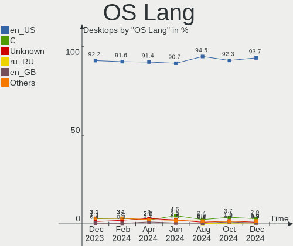

| Lang    | Desktops | Percent |
|---------|----------|---------|
| en_US   | 370      | 95.12%  |
| C       | 11       | 2.83%   |
| en_GB   | 3        | 0.77%   |
| nl_NL   | 2        | 0.51%   |
| Unknown | 2        | 0.51%   |
| it_IT   | 1        | 0.26%   |

Boot Mode
---------

EFI or BIOS

| Mode | Desktops | Percent |
|------|----------|---------|
| BIOS | 206      | 52.96%  |
| EFI  | 183      | 47.04%  |

Filesystem
----------

Type of filesystem

| Type    | Desktops | Percent |
|---------|----------|---------|
| Ext4    | 226      | 58.1%   |
| Btrfs   | 65       | 16.71%  |
| Tmpfs   | 63       | 16.2%   |
| Overlay | 16       | 4.11%   |
| Xfs     | 12       | 3.08%   |
| Zfs     | 7        | 1.8%    |

Part. scheme
------------

Scheme of partitioning

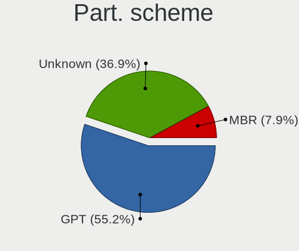

| Type    | Desktops | Percent |
|---------|----------|---------|
| GPT     | 197      | 50.64%  |
| Unknown | 168      | 43.19%  |
| MBR     | 24       | 6.17%   |

Dual Boot with Linux/BSD
------------------------

Hosting more than one Linux/BSD

| Dual boot | Desktops | Percent |
|-----------|----------|---------|
| No        | 328      | 84.32%  |
| Yes       | 61       | 15.68%  |

Dual Boot (Win)
---------------

Hosting Linux and Windows

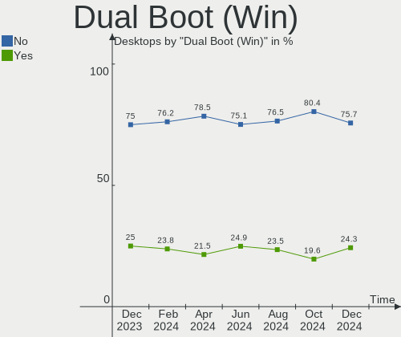

| Dual boot | Desktops | Percent |
|-----------|----------|---------|
| No        | 313      | 80.46%  |
| Yes       | 76       | 19.54%  |

Board
-----

Vendor
------

Motherboard manufacturer

| Name                | Desktops | Percent |
|---------------------|----------|---------|
| ASUSTek Computer    | 87       | 22.37%  |
| MSI                 | 59       | 15.17%  |
| Dell                | 58       | 14.91%  |
| Gigabyte Technology | 50       | 12.85%  |
| Hewlett-Packard     | 40       | 10.28%  |
| ASRock              | 31       | 7.97%   |
| Lenovo              | 15       | 3.86%   |
| Apple               | 8        | 2.06%   |
| Unknown             | 8        | 2.06%   |
| Alienware           | 5        | 1.29%   |
| Pegatron            | 3        | 0.77%   |
| Gateway             | 3        | 0.77%   |
| System76            | 2        | 0.51%   |
| Intel               | 2        | 0.51%   |
| Huanan              | 2        | 0.51%   |
| Google              | 2        | 0.51%   |
| Biostar             | 2        | 0.51%   |
| AZW                 | 2        | 0.51%   |
| ASRockRack          | 2        | 0.51%   |
| Supermicro          | 1        | 0.26%   |
| NZXT                | 1        | 0.26%   |
| NetGear             | 1        | 0.26%   |
| IceWhale Technology | 1        | 0.26%   |
| Fujitsu             | 1        | 0.26%   |
| Foxconn             | 1        | 0.26%   |
| ASRock Industrial   | 1        | 0.26%   |
| ABIT                | 1        | 0.26%   |

Model
-----

Motherboard model

| Name                                | Desktops | Percent |
|-------------------------------------|----------|---------|
| Unknown                             | 8        | 2.06%   |
| ASUS All Series                     | 7        | 1.8%    |
| Dell OptiPlex 9020                  | 6        | 1.54%   |
| Dell OptiPlex 7010                  | 6        | 1.54%   |
| ASRock B450M Pro4                   | 6        | 1.54%   |
| MSI MS-7C56                         | 4        | 1.03%   |
| HP Z800 Workstation                 | 4        | 1.03%   |
| Dell OptiPlex 7020                  | 4        | 1.03%   |
| ASUS TUF Gaming X570-PLUS           | 4        | 1.03%   |
| HP Z640 Workstation                 | 3        | 0.77%   |
| Dell OptiPlex 780                   | 3        | 0.77%   |
| Dell OptiPlex 7050                  | 3        | 0.77%   |
| Dell OptiPlex 5050                  | 3        | 0.77%   |
| ASUS Z170-A                         | 3        | 0.77%   |
| ASUS ROG STRIX B550-F GAMING        | 3        | 0.77%   |
| Apple MacPro6,1                     | 3        | 0.77%   |
| Apple MacPro5,1                     | 3        | 0.77%   |
| System76 Thelio Mira                | 2        | 0.51%   |
| MSI MS-7D78                         | 2        | 0.51%   |
| MSI MS-7D75                         | 2        | 0.51%   |
| MSI MS-7D67                         | 2        | 0.51%   |
| MSI MS-7D25                         | 2        | 0.51%   |
| MSI MS-7C91                         | 2        | 0.51%   |
| MSI MS-7C37                         | 2        | 0.51%   |
| MSI MS-7C02                         | 2        | 0.51%   |
| MSI MS-7B24                         | 2        | 0.51%   |
| MSI MS-7592                         | 2        | 0.51%   |
| Lenovo ThinkCentre M710q 10MQS31W00 | 2        | 0.51%   |
| HP Z420 Workstation                 | 2        | 0.51%   |
| HP ProOne 600 G1 AiO                | 2        | 0.51%   |
| HP Compaq 8000 Elite SFF PC         | 2        | 0.51%   |
| Gigabyte Z77X-D3H                   | 2        | 0.51%   |
| Gigabyte X570 AORUS MASTER          | 2        | 0.51%   |
| Gigabyte B550 VISION D-P            | 2        | 0.51%   |
| Dell Precision T3600                | 2        | 0.51%   |
| Dell OptiPlex 9010                  | 2        | 0.51%   |
| Dell OptiPlex 760                   | 2        | 0.51%   |
| Dell OptiPlex 380                   | 2        | 0.51%   |
| Dell OptiPlex 3050                  | 2        | 0.51%   |
| Dell OptiPlex 3020                  | 2        | 0.51%   |

Model Family
------------

Motherboard model prefix

| Name                | Desktops | Percent |
|---------------------|----------|---------|
| Dell OptiPlex       | 39       | 10.03%  |
| ASUS ROG            | 25       | 6.43%   |
| ASUS PRIME          | 20       | 5.14%   |
| Dell Inspiron       | 12       | 3.08%   |
| ASUS TUF            | 12       | 3.08%   |
| HP Compaq           | 9        | 2.31%   |
| ASRock B450M        | 8        | 2.06%   |
| Unknown             | 8        | 2.06%   |
| Lenovo ThinkCentre  | 7        | 1.8%    |
| ASUS All            | 7        | 1.8%    |
| Dell Precision      | 6        | 1.54%   |
| HP EliteDesk        | 5        | 1.29%   |
| Gigabyte B550       | 5        | 1.29%   |
| ASRock X570         | 5        | 1.29%   |
| MSI MS-7C56         | 4        | 1.03%   |
| HP Z800             | 4        | 1.03%   |
| Gigabyte X570       | 4        | 1.03%   |
| Alienware Aurora    | 4        | 1.03%   |
| Lenovo ThinkStation | 3        | 0.77%   |
| Lenovo IdeaCentre   | 3        | 0.77%   |
| HP Z640             | 3        | 0.77%   |
| HP Pavilion         | 3        | 0.77%   |
| Gigabyte B550M      | 3        | 0.77%   |
| ASUS Z170-A         | 3        | 0.77%   |
| ASUS M5A78L-M       | 3        | 0.77%   |
| Apple MacPro6       | 3        | 0.77%   |
| Apple MacPro5       | 3        | 0.77%   |
| System76 Thelio     | 2        | 0.51%   |
| MSI MS-7D78         | 2        | 0.51%   |
| MSI MS-7D75         | 2        | 0.51%   |
| MSI MS-7D67         | 2        | 0.51%   |
| MSI MS-7D25         | 2        | 0.51%   |
| MSI MS-7C91         | 2        | 0.51%   |
| MSI MS-7C37         | 2        | 0.51%   |
| MSI MS-7C02         | 2        | 0.51%   |
| MSI MS-7B24         | 2        | 0.51%   |
| MSI MS-7592         | 2        | 0.51%   |
| HP Z420             | 2        | 0.51%   |
| HP ProOne           | 2        | 0.51%   |
| Gigabyte Z77X-D3H   | 2        | 0.51%   |

MFG Year
--------

Motherboard manufacture year

| Year | Desktops | Percent |
|------|----------|---------|
| 2022 | 43       | 11.05%  |
| 2018 | 41       | 10.54%  |
| 2020 | 40       | 10.28%  |
| 2021 | 35       | 9%      |
| 2013 | 31       | 7.97%   |
| 2019 | 29       | 7.46%   |
| 2015 | 24       | 6.17%   |
| 2017 | 22       | 5.66%   |
| 2012 | 20       | 5.14%   |
| 2014 | 19       | 4.88%   |
| 2011 | 19       | 4.88%   |
| 2010 | 17       | 4.37%   |
| 2009 | 16       | 4.11%   |
| 2023 | 11       | 2.83%   |
| 2016 | 11       | 2.83%   |
| 2007 | 5        | 1.29%   |
| 2008 | 4        | 1.03%   |
| 2004 | 2        | 0.51%   |

Form Factor
-----------

Physical design of the computer

| Name    | Desktops | Percent |
|---------|----------|---------|
| Desktop | 389      | 100%    |

Secure Boot
-----------

Enabled or disabled

| State    | Desktops | Percent |
|----------|----------|---------|
| Disabled | 373      | 95.89%  |
| Enabled  | 16       | 4.11%   |

Coreboot
--------

Have coreboot on board

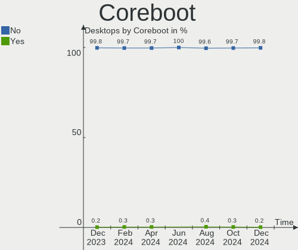

| Used | Desktops | Percent |
|------|----------|---------|
| No   | 387      | 99.49%  |
| Yes  | 2        | 0.51%   |

RAM Size
--------

Total RAM memory

| Size in GB      | Desktops | Percent |
|-----------------|----------|---------|
| 16.01-24.0      | 110      | 28.28%  |
| 32.01-64.0      | 88       | 22.62%  |
| 64.01-256.0     | 59       | 15.17%  |
| 4.01-8.0        | 46       | 11.83%  |
| 8.01-16.0       | 39       | 10.03%  |
| 3.01-4.0        | 20       | 5.14%   |
| 24.01-32.0      | 19       | 4.88%   |
| 2.01-3.0        | 4        | 1.03%   |
| More than 256.0 | 2        | 0.51%   |
| 1.01-2.0        | 1        | 0.26%   |
| 0.51-1.0        | 1        | 0.26%   |

RAM Used
--------

Used RAM memory

| Used GB     | Desktops | Percent |
|-------------|----------|---------|
| 2.01-3.0    | 95       | 24.42%  |
| 1.01-2.0    | 92       | 23.65%  |
| 4.01-8.0    | 89       | 22.88%  |
| 3.01-4.0    | 57       | 14.65%  |
| 8.01-16.0   | 30       | 7.71%   |
| 0.51-1.0    | 11       | 2.83%   |
| 16.01-24.0  | 6        | 1.54%   |
| 32.01-64.0  | 5        | 1.29%   |
| 24.01-32.0  | 2        | 0.51%   |
| 64.01-256.0 | 1        | 0.26%   |
| 0.01-0.5    | 1        | 0.26%   |

Total Drives
------------

Number of drives on board

| Drives | Desktops | Percent |
|--------|----------|---------|
| 1      | 128      | 32.9%   |
| 2      | 114      | 29.31%  |
| 3      | 68       | 17.48%  |
| 4      | 36       | 9.25%   |
| 5      | 20       | 5.14%   |
| 6      | 8        | 2.06%   |
| 7      | 7        | 1.8%    |
| 8      | 2        | 0.51%   |
| 27     | 1        | 0.26%   |
| 19     | 1        | 0.26%   |
| 12     | 1        | 0.26%   |
| 11     | 1        | 0.26%   |
| 10     | 1        | 0.26%   |
| 9      | 1        | 0.26%   |

Has CD-ROM
----------

Has CD-ROM on board

| Presented | Desktops | Percent |
|-----------|----------|---------|
| No        | 222      | 57.07%  |
| Yes       | 167      | 42.93%  |

Has Ethernet
------------

Has Ethernet on board

| Presented | Desktops | Percent |
|-----------|----------|---------|
| Yes       | 387      | 99.49%  |
| No        | 2        | 0.51%   |

Has WiFi
--------

Has WiFi module

| Presented | Desktops | Percent |
|-----------|----------|---------|
| Yes       | 241      | 61.95%  |
| No        | 148      | 38.05%  |

Has Bluetooth
-------------

Has Bluetooth module

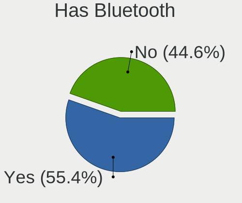

| Presented | Desktops | Percent |
|-----------|----------|---------|
| Yes       | 208      | 53.47%  |
| No        | 181      | 46.53%  |

Location
--------

Country
-------

Geographic location (country)

| Country | Desktops | Percent |
|---------|----------|---------|
| USA     | 389      | 100%    |

City
----

Geographic location (city)

| City            | Desktops | Percent |
|-----------------|----------|---------|
| Seattle         | 9        | 2.31%   |
| Chicago         | 7        | 1.8%    |
| San Francisco   | 6        | 1.54%   |
| Atlanta         | 6        | 1.54%   |
| Phoenix         | 5        | 1.29%   |
| Los Angeles     | 5        | 1.29%   |
| St Louis        | 4        | 1.03%   |
| Pittsburgh      | 4        | 1.03%   |
| New York        | 4        | 1.03%   |
| Miami           | 4        | 1.03%   |
| Springfield     | 3        | 0.77%   |
| San Jose        | 3        | 0.77%   |
| Manassas        | 3        | 0.77%   |
| Lexington       | 3        | 0.77%   |
| Las Vegas       | 3        | 0.77%   |
| Lancaster       | 3        | 0.77%   |
| Hemet           | 3        | 0.77%   |
| Beverly Hills   | 3        | 0.77%   |
| Athens          | 3        | 0.77%   |
| Wichita         | 2        | 0.51%   |
| Wheaton         | 2        | 0.51%   |
| Westminster     | 2        | 0.51%   |
| Virginia Beach  | 2        | 0.51%   |
| Toledo          | 2        | 0.51%   |
| Tampa           | 2        | 0.51%   |
| Spokane         | 2        | 0.51%   |
| San Antonio     | 2        | 0.51%   |
| Saint Paul      | 2        | 0.51%   |
| Sacramento      | 2        | 0.51%   |
| Rockville       | 2        | 0.51%   |
| Roanoke         | 2        | 0.51%   |
| Portland        | 2        | 0.51%   |
| Pompano Beach   | 2        | 0.51%   |
| Peoria          | 2        | 0.51%   |
| North Hollywood | 2        | 0.51%   |
| Murfreesboro    | 2        | 0.51%   |
| Muncie          | 2        | 0.51%   |
| Manchester      | 2        | 0.51%   |
| Madison         | 2        | 0.51%   |
| Kennewick       | 2        | 0.51%   |

Drives
------

Drive Vendor
------------

Hard drive vendors

| Vendor                      | Desktops | Drives | Percent |
|-----------------------------|----------|--------|---------|
| Seagate                     | 129      | 169    | 16.95%  |
| Samsung Electronics         | 118      | 180    | 15.51%  |
| WDC                         | 117      | 202    | 15.37%  |
| Sandisk                     | 59       | 67     | 7.75%   |
| Crucial                     | 28       | 34     | 3.68%   |
| Hitachi                     | 25       | 30     | 3.29%   |
| Intel                       | 22       | 29     | 2.89%   |
| Toshiba                     | 21       | 25     | 2.76%   |
| Micron/Crucial Technology   | 20       | 21     | 2.63%   |
| Phison Electronics          | 19       | 23     | 2.5%    |
| Kingston                    | 16       | 19     | 2.1%    |
| PNY                         | 15       | 16     | 1.97%   |
| SK hynix                    | 11       | 14     | 1.45%   |
| Team                        | 10       | 11     | 1.31%   |
| China                       | 10       | 10     | 1.31%   |
| Micron Technology           | 9        | 9      | 1.18%   |
| Unknown                     | 8        | 11     | 1.05%   |
| SPCC                        | 8        | 9      | 1.05%   |
| A-DATA Technology           | 8        | 9      | 1.05%   |
| HGST                        | 7        | 11     | 0.92%   |
| ASMT                        | 7        | 8      | 0.92%   |
| Phison                      | 6        | 6      | 0.79%   |
| Apple                       | 6        | 6      | 0.79%   |
| Silicon Motion              | 5        | 5      | 0.66%   |
| JMicron Technology          | 5        | 5      | 0.66%   |
| ADATA Technology            | 5        | 5      | 0.66%   |
| Unknown                     | 5        | 6      | 0.66%   |
| Realtek Semiconductor       | 4        | 5      | 0.53%   |
| Hewlett-Packard             | 4        | 4      | 0.53%   |
| Transcend                   | 3        | 3      | 0.39%   |
| T-FORCE                     | 3        | 3      | 0.39%   |
| SABRENT                     | 3        | 3      | 0.39%   |
| MaxDigital                  | 3        | 3      | 0.39%   |
| Seagate Technology          | 2        | 2      | 0.26%   |
| PHD 3.0                     | 2        | 2      | 0.26%   |
| Patriot                     | 2        | 2      | 0.26%   |
| MAXIO Technology (Hangzhou) | 2        | 2      | 0.26%   |
| LITEONIT                    | 2        | 2      | 0.26%   |
| Leven                       | 2        | 2      | 0.26%   |
| Fanxiang                    | 2        | 2      | 0.26%   |

Drive Model
-----------

Hard drive models

| Model                                               | Desktops | Percent |
|-----------------------------------------------------|----------|---------|
| Samsung NVMe SSD Controller SM981/PM981/PM983 500GB | 25       | 2.78%   |
| Samsung NVMe SSD Controller PM9A1/PM9A3/980PRO 1TB  | 20       | 2.22%   |
| Seagate ST2000DM008-2FR102 2TB                      | 12       | 1.33%   |
| Micron/Crucial P2 NVMe PCIe SSD 1TB                 | 12       | 1.33%   |
| Samsung SSD 860 EVO 500GB                           | 9        | 1%      |
| Sandisk WD_BLACK SN770 1TB                          | 8        | 0.89%   |
| Samsung SSD 860 EVO 1TB                             | 8        | 0.89%   |
| Phison E12 NVMe Controller 2TB                      | 8        | 0.89%   |
| Crucial CT1000MX500SSD1 1TB                         | 8        | 0.89%   |
| WDC WD10EZEX-08WN4A0 1TB                            | 7        | 0.78%   |
| Toshiba DT01ACA100 1TB                              | 6        | 0.67%   |
| Seagate ST500DM002-1BD142 500GB                     | 6        | 0.67%   |
| Seagate ST2000DM006-2DM164 2TB                      | 6        | 0.67%   |
| Samsung SSD 990 PRO 2TB                             | 6        | 0.67%   |
| Samsung SSD 980 1TB                                 | 6        | 0.67%   |
| Samsung SSD 870 EVO 1TB                             | 6        | 0.67%   |
| Samsung SSD 850 EVO 500GB                           | 6        | 0.67%   |
| Samsung NVMe SSD Controller SM961/PM961/SM963 256GB | 6        | 0.67%   |
| PNY CS900 240GB SSD                                 | 6        | 0.67%   |
| Kingston SA400S37240G 240GB SSD                     | 6        | 0.67%   |
| Crucial CT2000MX500SSD1 2TB                         | 6        | 0.67%   |
| WDC WDS100T2B0A-00SM50 1TB SSD                      | 5        | 0.56%   |
| WDC WD1003FZEX-00MK2A0 1TB                          | 5        | 0.56%   |
| SK hynix SHPP41-2000GM 2TB                          | 5        | 0.56%   |
| Seagate ST1000LM035-1RK172 1TB                      | 5        | 0.56%   |
| Seagate ST1000DM010-2EP102 1TB                      | 5        | 0.56%   |
| Sandisk WD Blue SN550 NVMe SSD 250GB                | 5        | 0.56%   |
| SanDisk NVMe SSD Drive 1TB                          | 5        | 0.56%   |
| Samsung SSD 870 EVO 2TB                             | 5        | 0.56%   |
| Phison E16 PCIe4 NVMe Controller 1TB                | 5        | 0.56%   |
| Micron/Crucial P1 NVMe PCIe SSD 1TB                 | 5        | 0.56%   |
| Intel SSD 660P Series 1024GB                        | 5        | 0.56%   |
| Unknown                                             | 5        | 0.56%   |
| WDC WD10EZEX-00BN5A0 1TB                            | 4        | 0.44%   |
| WDC WD100EMAZ-00WJTA0 10TB                          | 4        | 0.44%   |
| Seagate ST4000DM004-2CV104 4TB                      | 4        | 0.44%   |
| Seagate ST2000DX002-2DV164 2TB                      | 4        | 0.44%   |
| Seagate ST1000DM003-1CH162 1TB                      | 4        | 0.44%   |
| Seagate Expansion Desk 8TB                          | 4        | 0.44%   |
| Sandisk WD Black SN750 / PC SN730 NVMe SSD 1024GB   | 4        | 0.44%   |

HDD Vendor
----------

Hard disk drive vendors

| Vendor              | Desktops | Drives | Percent |
|---------------------|----------|--------|---------|
| Seagate             | 125      | 160    | 40.98%  |
| WDC                 | 98       | 178    | 32.13%  |
| Hitachi             | 25       | 30     | 8.2%    |
| Toshiba             | 20       | 23     | 6.56%   |
| HGST                | 7        | 11     | 2.3%    |
| ASMT                | 6        | 7      | 1.97%   |
| Samsung Electronics | 5        | 5      | 1.64%   |
| Unknown             | 3        | 3      | 0.98%   |
| MaxDigital          | 3        | 3      | 0.98%   |
| Apple               | 3        | 3      | 0.98%   |
| PHD 3.0             | 2        | 2      | 0.66%   |
| Hewlett-Packard     | 2        | 2      | 0.66%   |
| Unknown             | 2        | 2      | 0.66%   |
| SSK                 | 1        | 1      | 0.33%   |
| SABRENT             | 1        | 1      | 0.33%   |
| LaCie               | 1        | 1      | 0.33%   |
| JMicron Technology  | 1        | 1      | 0.33%   |

SSD Vendor
----------

Solid state drive vendors

| Vendor              | Desktops | Drives | Percent |
|---------------------|----------|--------|---------|
| Samsung Electronics | 63       | 77     | 26.69%  |
| Crucial             | 26       | 32     | 11.02%  |
| WDC                 | 20       | 21     | 8.47%   |
| SanDisk             | 16       | 16     | 6.78%   |
| PNY                 | 15       | 16     | 6.36%   |
| Kingston            | 14       | 17     | 5.93%   |
| Team                | 10       | 10     | 4.24%   |
| China               | 10       | 10     | 4.24%   |
| A-DATA Technology   | 8        | 9      | 3.39%   |
| Micron Technology   | 7        | 7      | 2.97%   |
| Intel               | 6        | 9      | 2.54%   |
| SPCC                | 4        | 5      | 1.69%   |
| Transcend           | 3        | 3      | 1.27%   |
| T-FORCE             | 3        | 3      | 1.27%   |
| SK hynix            | 3        | 3      | 1.27%   |
| Apple               | 3        | 3      | 1.27%   |
| LITEONIT            | 2        | 2      | 0.85%   |
| Leven               | 2        | 2      | 0.85%   |
| Hewlett-Packard     | 2        | 2      | 0.85%   |
| Acer                | 2        | 2      | 0.85%   |
| ZOTAC               | 1        | 1      | 0.42%   |
| Unknown (CF)        | 1        | 1      | 0.42%   |
| Toshiba             | 1        | 1      | 0.42%   |
| Timetec             | 1        | 2      | 0.42%   |
| Seagate             | 1        | 1      | 0.42%   |
| Patriot             | 1        | 1      | 0.42%   |
| NGFF                | 1        | 1      | 0.42%   |
| Netac               | 1        | 1      | 0.42%   |
| Mushkin             | 1        | 1      | 0.42%   |
| LITEON              | 1        | 1      | 0.42%   |
| Lexar               | 1        | 1      | 0.42%   |
| KingFast            | 1        | 1      | 0.42%   |
| Kimtigo             | 1        | 1      | 0.42%   |
| Fanxiang            | 1        | 1      | 0.42%   |
| Dogfish             | 1        | 1      | 0.42%   |
| ASMT                | 1        | 1      | 0.42%   |
| Unknown             | 1        | 1      | 0.42%   |

Drive Kind
----------

HDD or SSD

| Kind    | Desktops | Drives | Percent |
|---------|----------|--------|---------|
| HDD     | 234      | 433    | 37.2%   |
| SSD     | 197      | 267    | 31.32%  |
| NVMe    | 176      | 276    | 27.98%  |
| Unknown | 18       | 25     | 2.86%   |
| MMC     | 4        | 4      | 0.64%   |

Drive Connector
---------------

SATA, SAS, NVMe, etc.

| Type | Desktops | Drives | Percent |
|------|----------|--------|---------|
| SATA | 334      | 660    | 59.96%  |
| NVMe | 175      | 274    | 31.42%  |
| SAS  | 44       | 67     | 7.9%    |
| MMC  | 4        | 4      | 0.72%   |

Drive Size
----------

Size of hard drive

| Size in TB | Desktops | Drives | Percent |
|------------|----------|--------|---------|
| 0.01-0.5   | 176      | 226    | 34.38%  |
| 0.51-1.0   | 168      | 214    | 32.81%  |
| 1.01-2.0   | 75       | 103    | 14.65%  |
| 3.01-4.0   | 40       | 47     | 7.81%   |
| 4.01-10.0  | 29       | 73     | 5.66%   |
| 2.01-3.0   | 12       | 20     | 2.34%   |
| 10.01-20.0 | 11       | 16     | 2.15%   |
| 20.01-50.0 | 1        | 1      | 0.2%    |

Space Total
-----------

Amount of disk space available on the file system

| Size in GB     | Desktops | Percent |
|----------------|----------|---------|
| 501-1000       | 78       | 20.05%  |
| More than 3000 | 77       | 19.79%  |
| 251-500        | 62       | 15.94%  |
| 101-250        | 62       | 15.94%  |
| 1001-2000      | 50       | 12.85%  |
| 2001-3000      | 21       | 5.4%    |
| 1-20           | 16       | 4.11%   |
| Unknown        | 12       | 3.08%   |
| 51-100         | 8        | 2.06%   |
| 21-50          | 3        | 0.77%   |

Space Used
----------

Amount of used disk space

| Used GB        | Desktops | Percent |
|----------------|----------|---------|
| 1-20           | 99       | 25.45%  |
| 21-50          | 64       | 16.45%  |
| 101-250        | 49       | 12.6%   |
| 251-500        | 40       | 10.28%  |
| 1001-2000      | 34       | 8.74%   |
| 51-100         | 33       | 8.48%   |
| More than 3000 | 26       | 6.68%   |
| 501-1000       | 23       | 5.91%   |
| Unknown        | 12       | 3.08%   |
| 2001-3000      | 9        | 2.31%   |

Malfunc. Drives
---------------

Drive models with a malfunction

| Model                                                                         | Desktops | Drives | Percent |
|-------------------------------------------------------------------------------|----------|--------|---------|
| Seagate ST500DM002-1BD142 500GB                                               | 2        | 2      | 4.88%   |
| Samsung Electronics NVMe SSD Controller SM981/PM981/PM983 500GB               | 2        | 3      | 4.88%   |
| WDC WD80EMAZ-00WJTA0 8TB                                                      | 1        | 11     | 2.44%   |
| WDC WD6400AAKS-00E4A0 640GB                                                   | 1        | 1      | 2.44%   |
| WDC WD5000LPLX-75ZNTT0 500GB                                                  | 1        | 1      | 2.44%   |
| WDC WD5000AAKX-08ERMA0 500GB                                                  | 1        | 1      | 2.44%   |
| WDC WD5000AAKS-00V1A0 500GB                                                   | 1        | 1      | 2.44%   |
| WDC WD20EARS-00MVWB0 2TB                                                      | 1        | 1      | 2.44%   |
| WDC WD2003FYYS-02W0B0 2TB                                                     | 1        | 2      | 2.44%   |
| WDC WD2002FAEX-007BA0 2TB                                                     | 1        | 1      | 2.44%   |
| WDC WD10EARS-00MVWB0 1TB                                                      | 1        | 1      | 2.44%   |
| WDC WD10EADS-65M2B0 1TB                                                       | 1        | 1      | 2.44%   |
| Toshiba DT01ACA300 3TB                                                        | 1        | 1      | 2.44%   |
| SK hynix HFS256G3AMNB-2200A 256GB SSD                                         | 1        | 1      | 2.44%   |
| Seagate ST9750420AS 752GB                                                     | 1        | 1      | 2.44%   |
| Seagate ST9500325AS 500GB                                                     | 1        | 1      | 2.44%   |
| Seagate ST8000DM004-2CX188 8TB                                                | 1        | 2      | 2.44%   |
| Seagate ST4000LM024-2AN17V 4TB                                                | 1        | 1      | 2.44%   |
| Seagate ST4000DM004-2CV104 4TB                                                | 1        | 1      | 2.44%   |
| Seagate ST33000651NS 3TB                                                      | 1        | 1      | 2.44%   |
| Seagate ST31000340NS 1TB                                                      | 1        | 1      | 2.44%   |
| Seagate ST2000DX001-1CM164 2TB                                                | 1        | 1      | 2.44%   |
| Seagate ST1000LM035-1RK172 1TB                                                | 1        | 1      | 2.44%   |
| Samsung Electronics SSD 980 1TB                                               | 1        | 1      | 2.44%   |
| Samsung Electronics SSD 970 EVO 500GB                                         | 1        | 1      | 2.44%   |
| Samsung Electronics SSD 870 EVO 1TB                                           | 1        | 1      | 2.44%   |
| Samsung Electronics SP0802N 80GB                                              | 1        | 1      | 2.44%   |
| Samsung Electronics MZ7WD480HCGM-00003 480GB SSD                              | 1        | 1      | 2.44%   |
| Realtek Semiconductor RTS5763DL NVMe SSD Controller 1TB                       | 1        | 1      | 2.44%   |
| PNY CS1311 240GB SSD                                                          | 1        | 1      | 2.44%   |
| Micron Technology MTFDDAV256TBN-1AR15ABHA 256GB SSD                           | 1        | 1      | 2.44%   |
| LITEON CV8-CE256-HP 256GB SSD                                                 | 1        | 1      | 2.44%   |
| Intel SSDPEKNW512G8 512GB                                                     | 1        | 1      | 2.44%   |
| Intel SSDPED1D960GAY 960GB                                                    | 1        | 1      | 2.44%   |
| Hitachi HDT721010SLA360 1TB                                                   | 1        | 1      | 2.44%   |
| Hitachi HDS722020ALA330 2TB                                                   | 1        | 1      | 2.44%   |
| HGST HTS541010A9E680 1TB                                                      | 1        | 1      | 2.44%   |
| Crucial CT500MX500SSD1 500GB                                                  | 1        | 1      | 2.44%   |
| ADATA Technology XPG SX8200 Pro PCIe Gen3x4 M.2 2280 Solid State Drive 1024GB | 1        | 1      | 2.44%   |

Malfunc. Drive Vendor
---------------------

Vendors of faulty drives

| Vendor                | Desktops | Drives | Percent |
|-----------------------|----------|--------|---------|
| Seagate               | 11       | 12     | 27.5%   |
| WDC                   | 9        | 21     | 22.5%   |
| Samsung Electronics   | 7        | 8      | 17.5%   |
| Intel                 | 2        | 2      | 5%      |
| Hitachi               | 2        | 2      | 5%      |
| Toshiba               | 1        | 1      | 2.5%    |
| SK hynix              | 1        | 1      | 2.5%    |
| Realtek Semiconductor | 1        | 1      | 2.5%    |
| PNY                   | 1        | 1      | 2.5%    |
| Micron Technology     | 1        | 1      | 2.5%    |
| LITEON                | 1        | 1      | 2.5%    |
| HGST                  | 1        | 1      | 2.5%    |
| Crucial               | 1        | 1      | 2.5%    |
| ADATA Technology      | 1        | 1      | 2.5%    |

Malfunc. HDD Vendor
-------------------

Vendors of faulty HDD drives

| Vendor              | Desktops | Drives | Percent |
|---------------------|----------|--------|---------|
| Seagate             | 11       | 12     | 44%     |
| WDC                 | 9        | 21     | 36%     |
| Hitachi             | 2        | 2      | 8%      |
| Toshiba             | 1        | 1      | 4%      |
| Samsung Electronics | 1        | 1      | 4%      |
| HGST                | 1        | 1      | 4%      |

Malfunc. Drive Kind
-------------------

Kinds of faulty drives

| Kind | Desktops | Drives | Percent |
|------|----------|--------|---------|
| HDD  | 23       | 38     | 60.53%  |
| NVMe | 8        | 9      | 21.05%  |
| SSD  | 7        | 7      | 18.42%  |

Failed Drives
-------------

Failed drive models

Zero info for selected period =(

Failed Drive Vendor
-------------------

Failed drive vendors

Zero info for selected period =(

Drive Status
------------

Number of failed and malfunc. drives

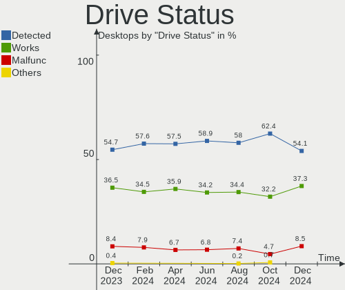

| Status   | Desktops | Drives | Percent |
|----------|----------|--------|---------|
| Detected | 255      | 578    | 57.43%  |
| Works    | 151      | 373    | 34.01%  |
| Malfunc  | 38       | 54     | 8.56%   |

Storage controller
------------------

Storage Vendor
--------------

Storage controller vendors

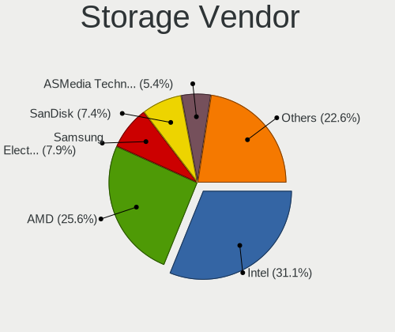

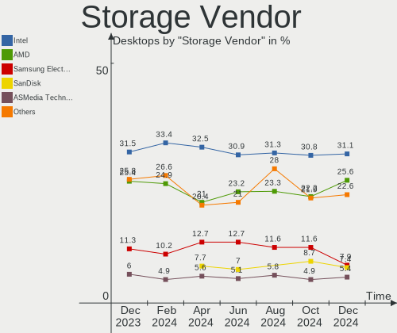

| Vendor                       | Desktops | Percent |
|------------------------------|----------|---------|
| Intel                        | 239      | 36.16%  |
| AMD                          | 151      | 22.84%  |
| Samsung Electronics          | 71       | 10.74%  |
| SanDisk                      | 47       | 7.11%   |
| ASMedia Technology           | 30       | 4.54%   |
| Phison Electronics           | 25       | 3.78%   |
| Micron/Crucial Technology    | 22       | 3.33%   |
| Marvell Technology Group     | 9        | 1.36%   |
| SK hynix                     | 8        | 1.21%   |
| LSI Logic / Symbios Logic    | 7        | 1.06%   |
| Silicon Motion               | 6        | 0.91%   |
| Realtek Semiconductor        | 6        | 0.91%   |
| MAXIO Technology (Hangzhou)  | 5        | 0.76%   |
| JMicron Technology           | 5        | 0.76%   |
| ADATA Technology             | 5        | 0.76%   |
| Nvidia                       | 4        | 0.61%   |
| Silicon Image                | 3        | 0.45%   |
| Seagate Technology           | 3        | 0.45%   |
| Kingston Technology Company  | 3        | 0.45%   |
| Broadcom / LSI               | 3        | 0.45%   |
| Micron Technology            | 2        | 0.3%    |
| Toshiba America Info Systems | 1        | 0.15%   |
| Shenzhen Longsys Electronics | 1        | 0.15%   |
| Radian Memory Systems        | 1        | 0.15%   |
| KIOXIA                       | 1        | 0.15%   |
| INNOGRIT                     | 1        | 0.15%   |
| Chelsio Communications       | 1        | 0.15%   |
| Biwin Storage Technology     | 1        | 0.15%   |

Storage Model
-------------

Storage controller models

| Model                                                                          | Desktops | Percent |
|--------------------------------------------------------------------------------|----------|---------|
| AMD FCH SATA Controller [AHCI mode]                                            | 93       | 11.8%   |
| Samsung NVMe SSD Controller SM981/PM981/PM983                                  | 33       | 4.19%   |
| AMD 400 Series Chipset SATA Controller                                         | 33       | 4.19%   |
| AMD 500 Series Chipset SATA Controller                                         | 30       | 3.81%   |
| ASMedia ASM1062 Serial ATA Controller                                          | 27       | 3.43%   |
| Intel SATA Controller [RAID mode]                                              | 26       | 3.3%    |
| Samsung NVMe SSD Controller PM9A1/PM9A3/980PRO                                 | 25       | 3.17%   |
| Intel 8 Series/C220 Series Chipset Family 6-port SATA Controller 1 [AHCI mode] | 25       | 3.17%   |
| Intel 200 Series PCH SATA controller [AHCI mode]                               | 19       | 2.41%   |
| Intel Q170/Q150/B150/H170/H110/Z170/CM236 Chipset SATA Controller [AHCI Mode]  | 16       | 2.03%   |
| AMD SB7x0/SB8x0/SB9x0 IDE Controller                                           | 15       | 1.9%    |
| SanDisk WD Black SN770 / PC SN740 256GB / PC SN560 (DRAM-less) NVMe SSD        | 14       | 1.78%   |
| Intel 7 Series/C210 Series Chipset Family 6-port SATA Controller [AHCI mode]   | 14       | 1.78%   |
| Micron/Crucial P2 [Nick P2] / P3 / P3 Plus NVMe PCIe SSD (DRAM-less)           | 13       | 1.65%   |
| Phison E12 NVMe Controller                                                     | 11       | 1.4%    |
| Intel 500 Series Chipset Family SATA AHCI Controller                           | 11       | 1.4%    |
| Intel Alder Lake-S PCH SATA Controller [AHCI Mode]                             | 10       | 1.27%   |
| AMD SB7x0/SB8x0/SB9x0 SATA Controller [AHCI mode]                              | 10       | 1.27%   |
| Sandisk Western Digital WD Black SN850X NVMe SSD                               | 9        | 1.14%   |
| Intel 6 Series/C200 Series Chipset Family 6 port Desktop SATA AHCI Controller  | 9        | 1.14%   |
| SanDisk WD Blue SN550 NVMe SSD                                                 | 8        | 1.02%   |
| Samsung NVMe SSD Controller S4LV008[Pascal]                                    | 8        | 1.02%   |
| Phison E16 PCIe4 NVMe Controller                                               | 8        | 1.02%   |
| Intel Cannon Lake PCH SATA AHCI Controller                                     | 8        | 1.02%   |
| Intel 82801JI (ICH10 Family) SATA AHCI Controller                              | 8        | 1.02%   |
| AMD SB7x0/SB8x0/SB9x0 SATA Controller [IDE mode]                               | 8        | 1.02%   |
| Samsung NVMe SSD Controller SM961/PM961/SM963                                  | 7        | 0.89%   |
| Intel SSD 660P Series                                                          | 7        | 0.89%   |
| Intel Comet Lake SATA AHCI Controller                                          | 7        | 0.89%   |
| Intel 700 Series Chipset Family SATA AHCI Controller                           | 7        | 0.89%   |
| Intel 4 Series Chipset PT IDER Controller                                      | 7        | 0.89%   |
| Samsung NVMe SSD Controller 980                                                | 6        | 0.76%   |
| Intel C610/X99 series chipset sSATA Controller [AHCI mode]                     | 6        | 0.76%   |
| SK hynix Platinum P41/PC801 NVMe Solid State Drive                             | 5        | 0.63%   |
| Silicon Motion SM2263EN/SM2263XT (DRAM-less) NVMe SSD Controllers              | 5        | 0.63%   |
| SanDisk WD Black SN750 / PC SN730 NVMe SSD                                     | 5        | 0.63%   |
| Micron/Crucial P1 NVMe PCIe SSD[Frampton]                                      | 5        | 0.63%   |
| LSI Logic / Symbios Logic SAS1068E PCI-Express Fusion-MPT SAS                  | 5        | 0.63%   |
| Intel NM10/ICH7 Family SATA Controller [IDE mode]                              | 5        | 0.63%   |
| SanDisk WD Blue SN570 NVMe SSD 1TB                                             | 4        | 0.51%   |

Storage Kind
------------

Kind of storage controller (IDE, SATA, NVMe, SAS, ...)

| Kind | Desktops | Percent |
|------|----------|---------|
| SATA | 329      | 53.5%   |
| NVMe | 175      | 28.46%  |
| IDE  | 53       | 8.62%   |
| RAID | 43       | 6.99%   |
| SAS  | 9        | 1.46%   |
| SCSI | 6        | 0.98%   |

Processor
---------

CPU Vendor
----------

Processor vendors

| Vendor | Desktops | Percent |
|--------|----------|---------|
| Intel  | 234      | 60.15%  |
| AMD    | 155      | 39.85%  |

CPU Model
---------

Processor models

| Model                                       | Desktops | Percent |
|---------------------------------------------|----------|---------|
| AMD Ryzen 5 5600X 6-Core Processor          | 9        | 2.31%   |
| AMD Ryzen 5 3600 6-Core Processor           | 9        | 2.31%   |
| AMD Ryzen 7 7700X 8-Core Processor          | 8        | 2.06%   |
| AMD Ryzen 7 5800X 8-Core Processor          | 7        | 1.8%    |
| AMD Ryzen 5 5600G with Radeon Graphics      | 7        | 1.8%    |
| Intel Core i7-6700K CPU @ 4.00GHz           | 6        | 1.54%   |
| Intel Core i7-4770 CPU @ 3.40GHz            | 6        | 1.54%   |
| AMD Ryzen 9 5950X 16-Core Processor         | 6        | 1.54%   |
| AMD Ryzen 9 5900X 12-Core Processor         | 6        | 1.54%   |
| Intel Core i7-4790 CPU @ 3.60GHz            | 5        | 1.29%   |
| Intel 11th Gen Core i7-11700K @ 3.60GHz     | 5        | 1.29%   |
| AMD Ryzen 9 3900X 12-Core Processor         | 5        | 1.29%   |
| AMD Ryzen 7 3700X 8-Core Processor          | 5        | 1.29%   |
| Intel Core i7-7700 CPU @ 3.60GHz            | 4        | 1.03%   |
| Intel Core i5-4590 CPU @ 3.30GHz            | 4        | 1.03%   |
| Intel Core i5-3470 CPU @ 3.20GHz            | 4        | 1.03%   |
| Intel Core 2 Duo CPU E8400 @ 3.00GHz        | 4        | 1.03%   |
| Intel Core 2 Duo CPU E7500 @ 2.93GHz        | 4        | 1.03%   |
| AMD Ryzen 9 7900X 12-Core Processor         | 4        | 1.03%   |
| AMD Ryzen 7 5700G with Radeon Graphics      | 4        | 1.03%   |
| AMD Ryzen 3 2200G with Radeon Vega Graphics | 4        | 1.03%   |
| AMD FX-6300 Six-Core Processor              | 4        | 1.03%   |
| Intel Core i7-7700K CPU @ 4.20GHz           | 3        | 0.77%   |
| Intel Core i7-6700 CPU @ 3.40GHz            | 3        | 0.77%   |
| Intel Core i5-9400 CPU @ 2.90GHz            | 3        | 0.77%   |
| Intel Core i5-6500 CPU @ 3.20GHz            | 3        | 0.77%   |
| Intel Core i5-6400 CPU @ 2.70GHz            | 3        | 0.77%   |
| Intel Core i5-3570K CPU @ 3.40GHz           | 3        | 0.77%   |
| Intel Core i5-10400F CPU @ 2.90GHz          | 3        | 0.77%   |
| Intel Core i5-10400 CPU @ 2.90GHz           | 3        | 0.77%   |
| Intel Core i5 CPU 650 @ 3.20GHz             | 3        | 0.77%   |
| Intel Core i3-2100 CPU @ 3.10GHz            | 3        | 0.77%   |
| Intel 13th Gen Core i9-13900K               | 3        | 0.77%   |
| Intel 13th Gen Core i7-13700K               | 3        | 0.77%   |
| Intel 12th Gen Core i9-12900K               | 3        | 0.77%   |
| AMD Ryzen 9 7950X 16-Core Processor         | 3        | 0.77%   |
| AMD Ryzen 7 5800X3D 8-Core Processor        | 3        | 0.77%   |
| AMD Ryzen 7 5700X 8-Core Processor          | 3        | 0.77%   |
| AMD Ryzen 7 2700X Eight-Core Processor      | 3        | 0.77%   |
| AMD Ryzen 5 5500                            | 3        | 0.77%   |

CPU Model Family
----------------

Processor model prefix

| Model                   | Desktops | Percent |
|-------------------------|----------|---------|
| Intel Core i5           | 58       | 14.91%  |
| Intel Core i7           | 55       | 14.14%  |
| AMD Ryzen 7             | 43       | 11.05%  |
| AMD Ryzen 5             | 35       | 9%      |
| Other                   | 34       | 8.74%   |
| Intel Xeon              | 34       | 8.74%   |
| AMD Ryzen 9             | 29       | 7.46%   |
| AMD FX                  | 13       | 3.34%   |
| Intel Core i3           | 12       | 3.08%   |
| Intel Core 2 Duo        | 10       | 2.57%   |
| Intel Celeron           | 10       | 2.57%   |
| Intel Core i9           | 7        | 1.8%    |
| Intel Pentium           | 6        | 1.54%   |
| AMD Ryzen 3             | 5        | 1.29%   |
| AMD A10                 | 5        | 1.29%   |
| Intel Core 2 Quad       | 4        | 1.03%   |
| AMD Ryzen Threadripper  | 4        | 1.03%   |
| AMD A6                  | 4        | 1.03%   |
| Intel Pentium Dual-Core | 3        | 0.77%   |
| AMD Ryzen 5 PRO         | 3        | 0.77%   |
| AMD Phenom II X4        | 2        | 0.51%   |
| AMD Athlon 64 X2        | 2        | 0.51%   |
| AMD Athlon              | 2        | 0.51%   |
| AMD A8                  | 2        | 0.51%   |
| Intel Atom              | 1        | 0.26%   |
| AMD Turion 64 X2 Mobile | 1        | 0.26%   |
| AMD E1                  | 1        | 0.26%   |
| AMD E                   | 1        | 0.26%   |
| AMD Athlon X4           | 1        | 0.26%   |
| AMD Athlon II X4        | 1        | 0.26%   |
| AMD A4                  | 1        | 0.26%   |

CPU Cores
---------

Number of processor cores

| Number | Desktops | Percent |
|--------|----------|---------|
| 4      | 125      | 32.13%  |
| 8      | 67       | 17.22%  |
| 6      | 62       | 15.94%  |
| 2      | 60       | 15.42%  |
| 12     | 23       | 5.91%   |
| 16     | 21       | 5.4%    |
| 10     | 10       | 2.57%   |
| 14     | 5        | 1.29%   |
| 24     | 4        | 1.03%   |
| 3      | 4        | 1.03%   |
| 1      | 4        | 1.03%   |
| 28     | 2        | 0.51%   |
| 32     | 1        | 0.26%   |
| 18     | 1        | 0.26%   |

CPU Sockets
-----------

Number of sockets

| Number | Desktops | Percent |
|--------|----------|---------|
| 1      | 378      | 97.17%  |
| 2      | 11       | 2.83%   |

CPU Threads
-----------

Threads per core (Hyper-Threading)

| Number | Desktops | Percent |
|--------|----------|---------|
| 2      | 276      | 70.95%  |
| 1      | 113      | 29.05%  |

CPU Op-Modes
------------

CPU Operation Modes (32-bit, 64-bit)

| Op mode        | Desktops | Percent |
|----------------|----------|---------|
| 32-bit, 64-bit | 387      | 99.49%  |
| 32-bit         | 2        | 0.51%   |

CPU Microcode
-------------

Microcode number

| Number     | Desktops | Percent |
|------------|----------|---------|
| Unknown    | 198      | 50.9%   |
| 0x08701021 | 17       | 4.37%   |
| 0x306c3    | 15       | 3.86%   |
| 0x0a601203 | 13       | 3.34%   |
| 0x506e3    | 10       | 2.57%   |
| 0x0a20120a | 9        | 2.31%   |
| 0x306a9    | 8        | 2.06%   |
| 0x0a50000d | 8        | 2.06%   |
| 0x906e9    | 7        | 1.8%    |
| 0x1067a    | 7        | 1.8%    |
| 0x0800820d | 7        | 1.8%    |
| 0x206a7    | 6        | 1.54%   |
| 0xa0655    | 5        | 1.29%   |
| 0x06000852 | 5        | 1.29%   |
| 0x106a5    | 4        | 1.03%   |
| 0xa0653    | 3        | 0.77%   |
| 0x0a201025 | 3        | 0.77%   |
| 0x08101016 | 3        | 0.77%   |
| 0x08001138 | 3        | 0.77%   |
| 0x0700010f | 3        | 0.77%   |
| 0x06003106 | 3        | 0.77%   |
| 0x06001119 | 3        | 0.77%   |
| 0x906ec    | 2        | 0.51%   |
| 0x906ea    | 2        | 0.51%   |
| 0x6fb      | 2        | 0.51%   |
| 0x506c9    | 2        | 0.51%   |
| 0x406f1    | 2        | 0.51%   |
| 0x10676    | 2        | 0.51%   |
| 0x0a201205 | 2        | 0.51%   |
| 0x0a201016 | 2        | 0.51%   |
| 0x0a201009 | 2        | 0.51%   |
| 0x08108109 | 2        | 0.51%   |
| 0x06000822 | 2        | 0.51%   |
| 0x0600063e | 2        | 0.51%   |
| 0xb06f2    | 1        | 0.26%   |
| 0xb06e0    | 1        | 0.26%   |
| 0xb0671    | 1        | 0.26%   |
| 0x906ed    | 1        | 0.26%   |
| 0x906c0    | 1        | 0.26%   |
| 0x906a4    | 1        | 0.26%   |

CPU Microarch
-------------

Microarchitecture

| Name             | Desktops | Percent |
|------------------|----------|---------|
| Zen 3            | 49       | 12.6%   |
| Haswell          | 40       | 10.28%  |
| Unknown          | 38       | 9.77%   |
| KabyLake         | 30       | 7.71%   |
| Zen 2            | 25       | 6.43%   |
| Skylake          | 22       | 5.66%   |
| IvyBridge        | 21       | 5.4%    |
| SandyBridge      | 16       | 4.11%   |
| Penryn           | 15       | 3.86%   |
| CometLake        | 15       | 3.86%   |
| Zen+             | 14       | 3.6%    |
| Piledriver       | 14       | 3.6%    |
| Zen              | 12       | 3.08%   |
| Westmere         | 12       | 3.08%   |
| Alderlake Hybrid | 10       | 2.57%   |
| Nehalem          | 9        | 2.31%   |
| Broadwell        | 7        | 1.8%    |
| Steamroller      | 6        | 1.54%   |
| Core             | 4        | 1.03%   |
| Silvermont       | 3        | 0.77%   |
| K8 Hammer        | 3        | 0.77%   |
| K10              | 3        | 0.77%   |
| Jaguar           | 3        | 0.77%   |
| Icelake          | 3        | 0.77%   |
| Goldmont         | 3        | 0.77%   |
| Bulldozer        | 3        | 0.77%   |
| Bobcat           | 2        | 0.51%   |
| Tremont          | 1        | 0.26%   |
| TigerLake        | 1        | 0.26%   |
| P6               | 1        | 0.26%   |
| K6               | 1        | 0.26%   |
| K10 Llano        | 1        | 0.26%   |
| Gracemont        | 1        | 0.26%   |
| Goldmont plus    | 1        | 0.26%   |

Graphics
--------

GPU Vendor
----------

Vendors of graphics cards

| Vendor                               | Desktops | Percent |
|--------------------------------------|----------|---------|
| AMD                                  | 161      | 37.62%  |
| Nvidia                               | 159      | 37.15%  |
| Intel                                | 105      | 24.53%  |
| NVidia / SGS Thomson (Joint Venture) | 1        | 0.23%   |
| Matrox Electronics Systems           | 1        | 0.23%   |
| ASPEED Technology                    | 1        | 0.23%   |

GPU Model
---------

Graphics card models

| Model                                                                       | Desktops | Percent |
|-----------------------------------------------------------------------------|----------|---------|
| AMD Ellesmere [Radeon RX 470/480/570/570X/580/580X/590]                     | 23       | 5.16%   |
| Intel Xeon E3-1200 v3/4th Gen Core Processor Integrated Graphics Controller | 16       | 3.59%   |
| AMD Raphael                                                                 | 16       | 3.59%   |
| Intel HD Graphics 630                                                       | 12       | 2.69%   |
| AMD Navi 23 [Radeon RX 6600/6600 XT/6600M]                                  | 12       | 2.69%   |
| Nvidia GA106 [GeForce RTX 3060 Lite Hash Rate]                              | 10       | 2.24%   |
| Intel Xeon E3-1200 v2/3rd Gen Core processor Graphics Controller            | 10       | 2.24%   |
| AMD Cezanne [Radeon Vega Series / Radeon Vega Mobile Series]                | 10       | 2.24%   |
| Nvidia GP107 [GeForce GTX 1050 Ti]                                          | 8        | 1.79%   |
| Nvidia GP104 [GeForce GTX 1070]                                             | 8        | 1.79%   |
| AMD Navi 22 [Radeon RX 6700/6700 XT/6750 XT / 6800M/6850M XT]               | 8        | 1.79%   |
| Nvidia AD102 [GeForce RTX 4090]                                             | 7        | 1.57%   |
| Intel 4 Series Chipset Integrated Graphics Controller                       | 7        | 1.57%   |
| AMD Navi 31 [Radeon RX 7900 XT/7900 XTX]                                    | 7        | 1.57%   |
| Intel CoffeeLake-S GT2 [UHD Graphics 630]                                   | 6        | 1.35%   |
| Intel AlderLake-S GT1                                                       | 6        | 1.35%   |
| Intel 2nd Generation Core Processor Family Integrated Graphics Controller   | 6        | 1.35%   |
| AMD Navi 21 [Radeon RX 6800/6800 XT / 6900 XT]                              | 6        | 1.35%   |
| Nvidia GP104 [GeForce GTX 1080]                                             | 5        | 1.12%   |
| Nvidia GA104 [GeForce RTX 3060 Ti Lite Hash Rate]                           | 5        | 1.12%   |
| Nvidia GA102 [GeForce RTX 3080 Ti]                                          | 5        | 1.12%   |
| Intel Raptor Lake-S GT1 [UHD Graphics 770]                                  | 5        | 1.12%   |
| Intel HD Graphics 530                                                       | 5        | 1.12%   |
| AMD Raven Ridge [Radeon Vega Series / Radeon Vega Mobile Series]            | 5        | 1.12%   |
| AMD Navi 10 [Radeon RX 5600 OEM/5600 XT / 5700/5700 XT]                     | 5        | 1.12%   |
| AMD Kaveri [Radeon R7 Graphics]                                             | 5        | 1.12%   |
| AMD Juniper XT [Radeon HD 5770]                                             | 5        | 1.12%   |
| Nvidia GM107 [GeForce GTX 750 Ti]                                           | 4        | 0.9%    |
| Intel CometLake-S GT2 [UHD Graphics 630]                                    | 4        | 0.9%    |
| AMD Lexa PRO [Radeon 540/540X/550/550X / RX 540X/550/550X]                  | 4        | 0.9%    |
| Nvidia TU117 [GeForce GTX 1650]                                             | 3        | 0.67%   |
| Nvidia TU116 [GeForce GTX 1660 SUPER]                                       | 3        | 0.67%   |
| Nvidia GP106 [GeForce GTX 1060 3GB]                                         | 3        | 0.67%   |
| Nvidia GM204 [GeForce GTX 970]                                              | 3        | 0.67%   |
| Nvidia GM107GL [Quadro K620]                                                | 3        | 0.67%   |
| Nvidia GK208B [GeForce GT 730]                                              | 3        | 0.67%   |
| Nvidia GK208B [GeForce GT 710]                                              | 3        | 0.67%   |
| Nvidia GA106 [Geforce RTX 3050]                                             | 3        | 0.67%   |
| Nvidia GA104 [GeForce RTX 3070 Ti]                                          | 3        | 0.67%   |
| Nvidia GA104 [GeForce RTX 3070 Lite Hash Rate]                              | 3        | 0.67%   |

GPU Combo
---------

Combinations of graphics cards

| Name                                     | Desktops | Percent |
|------------------------------------------|----------|---------|
| 1 x Nvidia                               | 133      | 34.19%  |
| 1 x AMD                                  | 124      | 31.88%  |
| 1 x Intel                                | 83       | 21.34%  |
| 2 x AMD                                  | 16       | 4.11%   |
| AMD + Nvidia                             | 12       | 3.08%   |
| Intel + AMD                              | 6        | 1.54%   |
| Intel + Nvidia                           | 5        | 1.29%   |
| 2 x Nvidia                               | 4        | 1.03%   |
| Other                                    | 1        | 0.26%   |
| 1 x NVidia / SGS Thomson (Joint Venture) | 1        | 0.26%   |
| 1 x Matrox                               | 1        | 0.26%   |
| Intel + AMD + 1 x Nvidia                 | 1        | 0.26%   |
| 1 x ASPEED                               | 1        | 0.26%   |
| AMD + 2 x Nvidia                         | 1        | 0.26%   |

GPU Driver
----------

Free vs proprietary

| Driver      | Desktops | Percent |
|-------------|----------|---------|
| Free        | 280      | 71.98%  |
| Proprietary | 96       | 24.68%  |
| Unknown     | 13       | 3.34%   |

GPU Memory
----------

Total video memory

| Size in GB | Desktops | Percent |
|------------|----------|---------|
| Unknown    | 190      | 48.84%  |
| 7.01-8.0   | 57       | 14.65%  |
| 3.01-4.0   | 30       | 7.71%   |
| 8.01-16.0  | 24       | 6.17%   |
| 0.51-1.0   | 21       | 5.4%    |
| 1.01-2.0   | 20       | 5.14%   |
| 0.01-0.5   | 20       | 5.14%   |
| 5.01-6.0   | 12       | 3.08%   |
| 16.01-24.0 | 9        | 2.31%   |
| 2.01-3.0   | 6        | 1.54%   |

Monitor
-------

Monitor Vendor
--------------

Monitor vendors

| Vendor               | Desktops | Percent |
|----------------------|----------|---------|
| Dell                 | 70       | 16.55%  |
| Acer                 | 48       | 11.35%  |
| Hewlett-Packard      | 47       | 11.11%  |
| Samsung Electronics  | 46       | 10.87%  |
| Goldstar             | 38       | 8.98%   |
| Ancor Communications | 20       | 4.73%   |
| Sceptre Tech         | 16       | 3.78%   |
| ASUSTek Computer     | 11       | 2.6%    |
| ViewSonic            | 10       | 2.36%   |
| AOC                  | 10       | 2.36%   |
| Vizio                | 8        | 1.89%   |
| BenQ                 | 8        | 1.89%   |
| Lenovo               | 7        | 1.65%   |
| Sony                 | 6        | 1.42%   |
| MSI                  | 4        | 0.95%   |
| HannStar             | 4        | 0.95%   |
| Gigabyte Technology  | 4        | 0.95%   |
| Unknown              | 4        | 0.95%   |
| Unknown              | 3        | 0.71%   |
| Toshiba              | 3        | 0.71%   |
| Philips              | 3        | 0.71%   |
| VIZ                  | 2        | 0.47%   |
| STD                  | 2        | 0.47%   |
| Sharp                | 2        | 0.47%   |
| Planar               | 2        | 0.47%   |
| Pixio                | 2        | 0.47%   |
| Hitachi              | 2        | 0.47%   |
| DENON                | 2        | 0.47%   |
| Chimei Innolux       | 2        | 0.47%   |
| Apple                | 2        | 0.47%   |
| AOpen                | 2        | 0.47%   |
| ___                  | 1        | 0.24%   |
| Yamaha               | 1        | 0.24%   |
| XTH                  | 1        | 0.24%   |
| Viotek               | 1        | 0.24%   |
| Valve                | 1        | 0.24%   |
| UGD                  | 1        | 0.24%   |
| SANYO                | 1        | 0.24%   |
| Roku                 | 1        | 0.24%   |
| Princeton            | 1        | 0.24%   |

Monitor Model
-------------

Monitor models

| Model                                                                 | Desktops | Percent |
|-----------------------------------------------------------------------|----------|---------|
| Goldstar FULL HD GSM5B55 1920x1080 480x270mm 21.7-inch                | 5        | 1.11%   |
| Unknown                                                               | 4        | 0.89%   |
| Sony TV SNY3102 1920x1080 708x398mm 32.0-inch                         | 3        | 0.67%   |
| Sceptre Tech Sceptre Y32 SPT0CAD 2560x1440 697x392mm 31.5-inch        | 3        | 0.67%   |
| Samsung Electronics C27F390 SAM0D32 1920x1080 598x336mm 27.0-inch     | 3        | 0.67%   |
| Goldstar HDR 4K GSM7707 3840x2160 600x340mm 27.2-inch                 | 3        | 0.67%   |
| Dell S3220DGF DELD0F4 2560x1440 697x392mm 31.5-inch                   | 3        | 0.67%   |
| ViewSonic VX2450 SERIES VSCE226 1920x1080 525x297mm 23.7-inch         | 2        | 0.45%   |
| Sceptre Tech Sceptre F27 SPT0AD7 1920x1080 600x330mm 27.0-inch        | 2        | 0.45%   |
| Sceptre Tech E225W-1920 SPT08D5 1920x1080 443x249mm 20.0-inch         | 2        | 0.45%   |
| Samsung Electronics S24R65x SAM1023 1920x1080 530x300mm 24.0-inch     | 2        | 0.45%   |
| Samsung Electronics LCD Monitor SAM0C3C 1366x768 609x347mm 27.6-inch  | 2        | 0.45%   |
| Samsung Electronics LCD Monitor SAM0C39 1920x1080 885x498mm 40.0-inch | 2        | 0.45%   |
| Samsung Electronics LCD Monitor SAM08FE 1920x1080                     | 2        | 0.45%   |
| MSI G273 MSI3CA7 1920x1080 597x336mm 27.0-inch                        | 2        | 0.45%   |
| Hewlett-Packard w2207 HWP26A9 1680x1050 473x296mm 22.0-inch           | 2        | 0.45%   |
| Hewlett-Packard W2072a HWP299F 1600x900 440x250mm 19.9-inch           | 2        | 0.45%   |
| Hewlett-Packard HPQ 600 AIO HWP108B 1920x1080 477x268mm 21.5-inch     | 2        | 0.45%   |
| Hewlett-Packard E243 HPN3469 1920x1080 527x296mm 23.8-inch            | 2        | 0.45%   |
| Hewlett-Packard 24m HPN3577 1920x1080 527x297mm 23.8-inch             | 2        | 0.45%   |
| Goldstar ULTRAWIDE GSM76F9 2560x1080 531x298mm 24.0-inch              | 2        | 0.45%   |
| Goldstar ULTRAWIDE GSM59F1 2560x1080 673x284mm 28.8-inch              | 2        | 0.45%   |
| Goldstar 32 FHD GSM7700 1920x1080 698x392mm 31.5-inch                 | 2        | 0.45%   |
| Gigabyte Technology M27Q GBT270D 2560x1440 596x335mm 26.9-inch        | 2        | 0.45%   |
| Dell U2412M DELA07B 1920x1200 518x324mm 24.1-inch                     | 2        | 0.45%   |
| Dell SE2717H/HX DELD0A1 1920x1080 598x336mm 27.0-inch                 | 2        | 0.45%   |
| Dell S3221QS DELD107 3840x2160 697x392mm 31.5-inch                    | 2        | 0.45%   |
| Dell P2419H DELD0DA 1920x1080 527x296mm 23.8-inch                     | 2        | 0.45%   |
| Dell IN1910N DELA04C 1366x768 410x230mm 18.5-inch                     | 2        | 0.45%   |
| Dell 20 DELF112 1600x900 443x249mm 20.0-inch                          | 2        | 0.45%   |
| Chimei Innolux LCD Monitor CMN1747 1920x1080 381x214mm 17.2-inch      | 2        | 0.45%   |
| ASUSTek Computer VG245 AUS24A1 1920x1080 530x300mm 24.0-inch          | 2        | 0.45%   |
| Ancor Communications VG248 ACI24A5 1920x1080 531x299mm 24.0-inch      | 2        | 0.45%   |
| Acer XB271HU ACR0490 2560x1440 598x336mm 27.0-inch                    | 2        | 0.45%   |
| Acer S241HL ACR0312 1920x1080 530x300mm 24.0-inch                     | 2        | 0.45%   |
| Acer K202HQL ACR03E0 1366x768 434x236mm 19.4-inch                     | 2        | 0.45%   |
| Acer EB321HQU ACR0507 2560x1440 699x393mm 31.6-inch                   | 2        | 0.45%   |
| ___ LCDTV16 ___0101 1920x1080                                         | 1        | 0.22%   |
| Yamaha ATS-1080 YMH3322 1280x720 1150x650mm 52.0-inch                 | 1        | 0.22%   |
| XTH XtendTouch XTH1920 1920x1080 344x195mm 15.6-inch                  | 1        | 0.22%   |

Monitor Resolution
------------------

Monitor screen resolution

| Resolution         | Desktops | Percent |
|--------------------|----------|---------|
| 1920x1080 (FHD)    | 184      | 45.21%  |
| 2560x1440 (QHD)    | 49       | 12.04%  |
| 3840x2160 (4K)     | 48       | 11.79%  |
| 1600x900 (HD+)     | 16       | 3.93%   |
| 1920x1200 (WUXGA)  | 15       | 3.69%   |
| 1680x1050 (WSXGA+) | 13       | 3.19%   |
| 1280x1024 (SXGA)   | 13       | 3.19%   |
| 1440x900 (WXGA+)   | 11       | 2.7%    |
| 1366x768 (WXGA)    | 11       | 2.7%    |
| 3440x1440          | 9        | 2.21%   |
| Unknown            | 9        | 2.21%   |
| 3840x1080          | 6        | 1.47%   |
| 2560x1080          | 6        | 1.47%   |
| 3840x1600          | 3        | 0.74%   |
| 1920x540           | 3        | 0.74%   |
| 1600x1200          | 2        | 0.49%   |
| 1024x768 (XGA)     | 2        | 0.49%   |
| 800x480            | 1        | 0.25%   |
| 7120x2160          | 1        | 0.25%   |
| 6000x1440          | 1        | 0.25%   |
| 4480x1440          | 1        | 0.25%   |
| 3840x1200          | 1        | 0.25%   |
| 1280x960           | 1        | 0.25%   |
| 1280x720 (HD)      | 1        | 0.25%   |

Monitor Diagonal
----------------

Diagonal size in inches

| Inches  | Desktops | Percent |
|---------|----------|---------|
| 24      | 70       | 16.71%  |
| 27      | 65       | 15.51%  |
| 31      | 40       | 9.55%   |
| 23      | 37       | 8.83%   |
| Unknown | 31       | 7.4%    |
| 21      | 30       | 7.16%   |
| 19      | 18       | 4.3%    |
| 34      | 16       | 3.82%   |
| 20      | 16       | 3.82%   |
| 17      | 10       | 2.39%   |
| 22      | 9        | 2.15%   |
| 18      | 8        | 1.91%   |
| 15      | 8        | 1.91%   |
| 84      | 6        | 1.43%   |
| 54      | 5        | 1.19%   |
| 32      | 5        | 1.19%   |
| 72      | 4        | 0.95%   |
| 40      | 4        | 0.95%   |
| 47      | 3        | 0.72%   |
| 46      | 3        | 0.72%   |
| 43      | 3        | 0.72%   |
| 37      | 3        | 0.72%   |
| 49      | 2        | 0.48%   |
| 42      | 2        | 0.48%   |
| 39      | 2        | 0.48%   |
| 38      | 2        | 0.48%   |
| 29      | 2        | 0.48%   |
| 26      | 2        | 0.48%   |
| 25      | 2        | 0.48%   |
| 85      | 1        | 0.24%   |
| 74      | 1        | 0.24%   |
| 69      | 1        | 0.24%   |
| 65      | 1        | 0.24%   |
| 60      | 1        | 0.24%   |
| 52      | 1        | 0.24%   |
| 48      | 1        | 0.24%   |
| 28      | 1        | 0.24%   |
| 14      | 1        | 0.24%   |
| 13      | 1        | 0.24%   |
| 12      | 1        | 0.24%   |

Monitor Width
-------------

Physical width

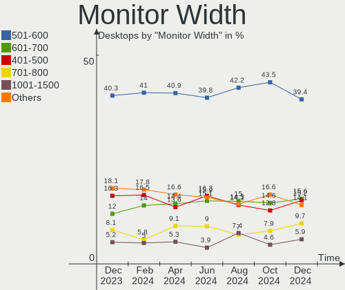

| Width in mm | Desktops | Percent |
|-------------|----------|---------|
| 501-600     | 156      | 38.9%   |
| 401-500     | 75       | 18.7%   |
| 601-700     | 47       | 11.72%  |
| Unknown     | 31       | 7.73%   |
| 701-800     | 21       | 5.24%   |
| 1001-1500   | 19       | 4.74%   |
| 301-350     | 15       | 3.74%   |
| 1501-2000   | 13       | 3.24%   |
| 801-900     | 11       | 2.74%   |
| 351-400     | 8        | 2%      |
| 901-1000    | 3        | 0.75%   |
| 201-300     | 2        | 0.5%    |

Aspect Ratio
------------

Proportional relationship between the width and the height

| Ratio   | Desktops | Percent |
|---------|----------|---------|
| 16/9    | 264      | 70.59%  |
| 16/10   | 42       | 11.23%  |
| Unknown | 25       | 6.68%   |
| 21/9    | 18       | 4.81%   |
| 5/4     | 12       | 3.21%   |
| 4/3     | 6        | 1.6%    |
| 32/9    | 4        | 1.07%   |
| 3.20    | 1        | 0.27%   |
| 2.12    | 1        | 0.27%   |
| 1.00    | 1        | 0.27%   |

Monitor Area
------------

Area in inch

| Area in inch | Desktops | Percent |
|----------------|----------|---------|
| 201-250        | 118      | 28.43%  |
| 301-350        | 65       | 15.66%  |
| 351-500        | 63       | 15.18%  |
| 151-200        | 43       | 10.36%  |
| Unknown        | 31       | 7.47%   |
| 251-300        | 24       | 5.78%   |
| More than 1000 | 23       | 5.54%   |
| 501-1000       | 23       | 5.54%   |
| 141-150        | 11       | 2.65%   |
| 101-110        | 8        | 1.93%   |
| 121-130        | 2        | 0.48%   |
| 81-90          | 1        | 0.24%   |
| 71-80          | 1        | 0.24%   |
| 131-140        | 1        | 0.24%   |
| 111-120        | 1        | 0.24%   |

Pixel Density
-------------

Pixels per inch

| Density       | Desktops | Percent |
|---------------|----------|---------|
| 51-100        | 239      | 60.81%  |
| 101-120       | 64       | 16.28%  |
| Unknown       | 31       | 7.89%   |
| 1-50          | 25       | 6.36%   |
| 121-160       | 20       | 5.09%   |
| 161-240       | 13       | 3.31%   |
| More than 240 | 1        | 0.25%   |

Multiple Monitors
-----------------

Total monitors connected

| Total | Desktops | Percent |
|-------|----------|---------|
| 1     | 276      | 70.95%  |
| 2     | 79       | 20.31%  |
| 0     | 18       | 4.63%   |
| 3     | 13       | 3.34%   |
| 4     | 3        | 0.77%   |

Network
-------

Net Controller Vendor
---------------------

Controller vendors

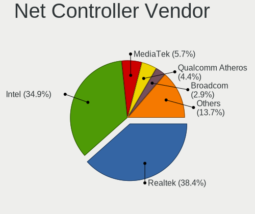

| Vendor                   | Desktops | Percent |
|--------------------------|----------|---------|
| Intel                    | 231      | 37.93%  |
| Realtek Semiconductor    | 217      | 35.63%  |
| Qualcomm Atheros         | 31       | 5.09%   |
| MediaTek                 | 28       | 4.6%    |
| Broadcom                 | 26       | 4.27%   |
| TP-Link                  | 9        | 1.48%   |
| NetGear                  | 9        | 1.48%   |
| Aquantia                 | 9        | 1.48%   |
| Samsung Electronics      | 8        | 1.31%   |
| Mellanox Technologies    | 4        | 0.66%   |
| Ralink Technology        | 3        | 0.49%   |
| Nvidia                   | 3        | 0.49%   |
| ASUSTek Computer         | 3        | 0.49%   |
| Motorola PCS             | 2        | 0.33%   |
| Linksys                  | 2        | 0.33%   |
| InterBiometrics          | 2        | 0.33%   |
| D-Link System            | 2        | 0.33%   |
| Belkin Components        | 2        | 0.33%   |
| ASIX Electronics         | 2        | 0.33%   |
| ZyDAS                    | 1        | 0.16%   |
| Wilocity                 | 1        | 0.16%   |
| U-Blox                   | 1        | 0.16%   |
| Ralink                   | 1        | 0.16%   |
| Qualcomm                 | 1        | 0.16%   |
| QinHeng Electronics      | 1        | 0.16%   |
| OPPO Electronics         | 1        | 0.16%   |
| Microsoft                | 1        | 0.16%   |
| Micro Star International | 1        | 0.16%   |
| Magic Control Technology | 1        | 0.16%   |
| DisplayLink              | 1        | 0.16%   |
| D-Link                   | 1        | 0.16%   |
| Chelsio Communications   | 1        | 0.16%   |
| American Megatrends      | 1        | 0.16%   |
| Adafruit                 | 1        | 0.16%   |
| 3Com                     | 1        | 0.16%   |

Net Controller Model
--------------------

Controller models

| Model                                                             | Desktops | Percent |
|-------------------------------------------------------------------|----------|---------|
| Realtek RTL8111/8168/8411 PCI Express Gigabit Ethernet Controller | 140      | 19.55%  |
| Realtek RTL8125 2.5GbE Controller                                 | 42       | 5.87%   |
| Intel Wi-Fi 6 AX200                                               | 31       | 4.33%   |
| Intel I211 Gigabit Network Connection                             | 28       | 3.91%   |
| Intel Ethernet Controller I225-V                                  | 28       | 3.91%   |
| Intel 82579LM Gigabit Network Connection (Lewisville)             | 19       | 2.65%   |
| Intel Wi-Fi 6 AX210/AX211/AX411 160MHz                            | 16       | 2.23%   |
| Intel Dual Band Wireless-AC 3168NGW [Stone Peak]                  | 15       | 2.09%   |
| Intel Ethernet Connection I217-LM                                 | 14       | 1.96%   |
| Intel Ethernet Connection (2) I219-V                              | 14       | 1.96%   |
| MediaTek MT7922 802.11ax PCI Express Wireless Network Adapter     | 13       | 1.82%   |
| MediaTek MT7921K (RZ608) Wi-Fi 6E 80MHz                           | 11       | 1.54%   |
| Realtek RTL8821CE 802.11ac PCIe Wireless Network Adapter          | 8        | 1.12%   |
| Intel 82574L Gigabit Network Connection                           | 8        | 1.12%   |
| Intel 82567LM-3 Gigabit Network Connection                        | 8        | 1.12%   |
| Realtek RTL88x2bu [AC1200 Techkey]                                | 7        | 0.98%   |
| Intel Wireless-AC 9260                                            | 7        | 0.98%   |
| Intel Wireless 7260                                               | 7        | 0.98%   |
| Broadcom BCM4360 802.11ac Wireless Network Adapter                | 7        | 0.98%   |
| Aquantia AQC107 NBase-T/IEEE 802.3bz Ethernet Controller [AQtion] | 7        | 0.98%   |
| Samsung Galaxy series, misc. (tethering mode)                     | 6        | 0.84%   |
| Realtek 802.11ac NIC                                              | 6        | 0.84%   |
| Intel I210 Gigabit Network Connection                             | 6        | 0.84%   |
| Intel Ethernet Connection (7) I219-V                              | 6        | 0.84%   |
| Intel Comet Lake PCH CNVi WiFi                                    | 6        | 0.84%   |
| Intel 700 Series Chipset Family Wi-Fi                             | 6        | 0.84%   |
| Qualcomm Atheros QCA9565 / AR9565 Wireless Network Adapter        | 5        | 0.7%    |
| Qualcomm Atheros AR9485 Wireless Network Adapter                  | 5        | 0.7%    |
| Intel Ethernet Connection (2) I219-LM                             | 5        | 0.7%    |
| Intel Ethernet Connection (2) I218-V                              | 5        | 0.7%    |
| Intel Ethernet Connection (2) I218-LM                             | 5        | 0.7%    |
| Intel Ethernet Connection (11) I219-V                             | 5        | 0.7%    |
| Intel 82579V Gigabit Network Connection                           | 5        | 0.7%    |
| Broadcom NetXtreme BCM5764M Gigabit Ethernet PCIe                 | 5        | 0.7%    |
| Realtek RTL8188EUS 802.11n Wireless Network Adapter               | 4        | 0.56%   |
| Realtek RTL8169 PCI Gigabit Ethernet Controller                   | 4        | 0.56%   |
| Realtek RTL8153 Gigabit Ethernet Adapter                          | 4        | 0.56%   |
| Intel Wireless 8265 / 8275                                        | 4        | 0.56%   |
| Intel Tiger Lake PCH CNVi WiFi                                    | 4        | 0.56%   |
| Intel Ethernet Controller I226-V                                  | 4        | 0.56%   |

Wireless Vendor
---------------

Wireless vendors

| Vendor                   | Desktops | Percent |
|--------------------------|----------|---------|
| Intel                    | 110      | 43.14%  |
| Realtek Semiconductor    | 47       | 18.43%  |
| MediaTek                 | 28       | 10.98%  |
| Qualcomm Atheros         | 19       | 7.45%   |
| Broadcom                 | 15       | 5.88%   |
| TP-Link                  | 9        | 3.53%   |
| NetGear                  | 9        | 3.53%   |
| Ralink Technology        | 3        | 1.18%   |
| ASUSTek Computer         | 3        | 1.18%   |
| Linksys                  | 2        | 0.78%   |
| Belkin Components        | 2        | 0.78%   |
| ZyDAS                    | 1        | 0.39%   |
| Wilocity                 | 1        | 0.39%   |
| Samsung Electronics      | 1        | 0.39%   |
| Ralink                   | 1        | 0.39%   |
| Microsoft                | 1        | 0.39%   |
| Micro Star International | 1        | 0.39%   |
| D-Link System            | 1        | 0.39%   |
| D-Link                   | 1        | 0.39%   |

Wireless Model
--------------

Wireless models

| Model                                                                   | Desktops | Percent |
|-------------------------------------------------------------------------|----------|---------|
| Intel Wi-Fi 6 AX200                                                     | 31       | 11.92%  |
| Intel Wi-Fi 6 AX210/AX211/AX411 160MHz                                  | 16       | 6.15%   |
| Intel Dual Band Wireless-AC 3168NGW [Stone Peak]                        | 15       | 5.77%   |
| MediaTek MT7922 802.11ax PCI Express Wireless Network Adapter           | 13       | 5%      |
| MediaTek MT7921K (RZ608) Wi-Fi 6E 80MHz                                 | 11       | 4.23%   |
| Realtek RTL8821CE 802.11ac PCIe Wireless Network Adapter                | 8        | 3.08%   |
| Realtek RTL88x2bu [AC1200 Techkey]                                      | 7        | 2.69%   |
| Intel Wireless-AC 9260                                                  | 7        | 2.69%   |
| Intel Wireless 7260                                                     | 7        | 2.69%   |
| Broadcom BCM4360 802.11ac Wireless Network Adapter                      | 7        | 2.69%   |
| Realtek 802.11ac NIC                                                    | 6        | 2.31%   |
| Intel Comet Lake PCH CNVi WiFi                                          | 6        | 2.31%   |
| Intel 700 Series Chipset Family Wi-Fi                                   | 6        | 2.31%   |
| Qualcomm Atheros QCA9565 / AR9565 Wireless Network Adapter              | 5        | 1.92%   |
| Qualcomm Atheros AR9485 Wireless Network Adapter                        | 5        | 1.92%   |
| Realtek RTL8188EUS 802.11n Wireless Network Adapter                     | 4        | 1.54%   |
| Intel Wireless 8265 / 8275                                              | 4        | 1.54%   |
| Intel Tiger Lake PCH CNVi WiFi                                          | 4        | 1.54%   |
| Intel Alder Lake-S PCH CNVi WiFi                                        | 4        | 1.54%   |
| TP-Link Archer T2U PLUS [RTL8821AU]                                     | 3        | 1.15%   |
| Qualcomm Atheros AR9462 Wireless Network Adapter                        | 3        | 1.15%   |
| NetGear A6210                                                           | 3        | 1.15%   |
| Broadcom BCM4322 802.11a/b/g/n Wireless LAN Controller                  | 3        | 1.15%   |
| ASUS 802.11ac NIC                                                       | 3        | 1.15%   |
| TP-Link TL-WN823N v2/v3 [Realtek RTL8192EU]                             | 2        | 0.77%   |
| TP-Link Archer T4U ver.3                                                | 2        | 0.77%   |
| Realtek RTL8822CE 802.11ac PCIe Wireless Network Adapter                | 2        | 0.77%   |
| Realtek RTL8821AE 802.11ac PCIe Wireless Network Adapter                | 2        | 0.77%   |
| Realtek RTL8814AU 802.11a/b/g/n/ac Wireless Adapter                     | 2        | 0.77%   |
| Realtek RTL8723BU 802.11b/g/n WLAN Adapter                              | 2        | 0.77%   |
| Realtek RTL8723BE PCIe Wireless Network Adapter                         | 2        | 0.77%   |
| Realtek RTL8188CUS 802.11n WLAN Adapter                                 | 2        | 0.77%   |
| MediaTek MT7921 802.11ax PCI Express Wireless Network Adapter           | 2        | 0.77%   |
| Intel Wireless 7265                                                     | 2        | 0.77%   |
| Intel Wireless 3165                                                     | 2        | 0.77%   |
| Intel Cannon Lake PCH CNVi WiFi                                         | 2        | 0.77%   |
| Broadcom BCM4352 802.11ac Wireless Network Adapter                      | 2        | 0.77%   |
| Belkin Components F7D1101 v1 Basic Wireless Adapter [Realtek RTL8188SU] | 2        | 0.77%   |
| ZyDAS 802.11bg                                                          | 1        | 0.38%   |
| Wilocity Wil6200 802.11ad Wireless Network Adapter                      | 1        | 0.38%   |

Ethernet Vendor
---------------

Ethernet vendors

| Vendor                   | Desktops | Percent |
|--------------------------|----------|---------|
| Realtek Semiconductor    | 192      | 44.55%  |
| Intel                    | 177      | 41.07%  |
| Broadcom                 | 15       | 3.48%   |
| Qualcomm Atheros         | 14       | 3.25%   |
| Aquantia                 | 9        | 2.09%   |
| Samsung Electronics      | 6        | 1.39%   |
| Mellanox Technologies    | 4        | 0.93%   |
| Nvidia                   | 3        | 0.7%    |
| ASIX Electronics         | 2        | 0.46%   |
| Qualcomm                 | 1        | 0.23%   |
| OPPO Electronics         | 1        | 0.23%   |
| Motorola PCS             | 1        | 0.23%   |
| Magic Control Technology | 1        | 0.23%   |
| DisplayLink              | 1        | 0.23%   |
| D-Link System            | 1        | 0.23%   |
| Chelsio Communications   | 1        | 0.23%   |
| American Megatrends      | 1        | 0.23%   |
| 3Com                     | 1        | 0.23%   |

Ethernet Model
--------------

Ethernet models

| Model                                                             | Desktops | Percent |
|-------------------------------------------------------------------|----------|---------|
| Realtek RTL8111/8168/8411 PCI Express Gigabit Ethernet Controller | 140      | 31.18%  |
| Realtek RTL8125 2.5GbE Controller                                 | 42       | 9.35%   |
| Intel I211 Gigabit Network Connection                             | 28       | 6.24%   |
| Intel Ethernet Controller I225-V                                  | 28       | 6.24%   |
| Intel 82579LM Gigabit Network Connection (Lewisville)             | 19       | 4.23%   |
| Intel Ethernet Connection I217-LM                                 | 14       | 3.12%   |
| Intel Ethernet Connection (2) I219-V                              | 14       | 3.12%   |
| Intel 82574L Gigabit Network Connection                           | 8        | 1.78%   |
| Intel 82567LM-3 Gigabit Network Connection                        | 8        | 1.78%   |
| Aquantia AQC107 NBase-T/IEEE 802.3bz Ethernet Controller [AQtion] | 7        | 1.56%   |
| Samsung Galaxy series, misc. (tethering mode)                     | 6        | 1.34%   |
| Intel I210 Gigabit Network Connection                             | 6        | 1.34%   |
| Intel Ethernet Connection (7) I219-V                              | 6        | 1.34%   |
| Intel Ethernet Connection (2) I219-LM                             | 5        | 1.11%   |
| Intel Ethernet Connection (2) I218-V                              | 5        | 1.11%   |
| Intel Ethernet Connection (2) I218-LM                             | 5        | 1.11%   |
| Intel Ethernet Connection (11) I219-V                             | 5        | 1.11%   |
| Intel 82579V Gigabit Network Connection                           | 5        | 1.11%   |
| Broadcom NetXtreme BCM5764M Gigabit Ethernet PCIe                 | 5        | 1.11%   |
| Realtek RTL8169 PCI Gigabit Ethernet Controller                   | 4        | 0.89%   |
| Realtek RTL8153 Gigabit Ethernet Adapter                          | 4        | 0.89%   |
| Intel Ethernet Controller I226-V                                  | 4        | 0.89%   |
| Intel Ethernet Connection (5) I219-LM                             | 4        | 0.89%   |
| Realtek RTL810xE PCI Express Fast Ethernet controller             | 3        | 0.67%   |
| Realtek Killer E3000 2.5GbE Controller                            | 3        | 0.67%   |
| Qualcomm Atheros Killer E2500 Gigabit Ethernet Controller         | 3        | 0.67%   |
| Qualcomm Atheros Killer E220x Gigabit Ethernet Controller         | 3        | 0.67%   |
| Qualcomm Atheros AR8161 Gigabit Ethernet                          | 3        | 0.67%   |
| Intel Ethernet Connection I217-V                                  | 3        | 0.67%   |
| Intel Ethernet Connection (5) I219-V                              | 3        | 0.67%   |
| Intel 82578DM Gigabit Network Connection                          | 3        | 0.67%   |
| Broadcom NetXtreme BCM57762 Gigabit Ethernet PCIe                 | 3        | 0.67%   |
| Qualcomm Atheros Killer E2400 Gigabit Ethernet Controller         | 2        | 0.45%   |
| Nvidia MCP61 Ethernet                                             | 2        | 0.45%   |
| Intel Ethernet Controller I225-LM                                 | 2        | 0.45%   |
| Intel Ethernet Connection (12) I219-V                             | 2        | 0.45%   |
| Intel 82566DM-2 Gigabit Network Connection                        | 2        | 0.45%   |
| Broadcom NetXtreme BCM5761 Gigabit Ethernet PCIe                  | 2        | 0.45%   |
| Broadcom NetXtreme BCM5754 Gigabit Ethernet PCI Express           | 2        | 0.45%   |
| Broadcom NetLink BCM57780 Gigabit Ethernet PCIe                   | 2        | 0.45%   |

Net Controller Kind
-------------------

Ethernet, WiFi or modem

| Kind     | Desktops | Percent |
|----------|----------|---------|
| Ethernet | 387      | 61.14%  |
| WiFi     | 239      | 37.76%  |
| Modem    | 6        | 0.95%   |
| Unknown  | 1        | 0.16%   |

Used Controller
---------------

Currently used network controller

| Kind     | Desktops | Percent |
|----------|----------|---------|
| Ethernet | 292      | 70.19%  |
| WiFi     | 124      | 29.81%  |

NICs
----

Total network controllers on board

| Total | Desktops | Percent |
|-------|----------|---------|
| 2     | 177      | 45.5%   |
| 1     | 170      | 43.7%   |
| 3     | 33       | 8.48%   |
| 4     | 3        | 0.77%   |
| 5     | 2        | 0.51%   |
| 0     | 2        | 0.51%   |
| 9     | 1        | 0.26%   |
| 8     | 1        | 0.26%   |

IPv6
----

IPv6 vs IPv4

| Used | Desktops | Percent |
|------|----------|---------|
| No   | 264      | 67.87%  |
| Yes  | 125      | 32.13%  |

Bluetooth
---------

Bluetooth Vendor
----------------

Controller vendors

| Vendor                          | Desktops | Percent |
|---------------------------------|----------|---------|
| Intel                           | 107      | 49.77%  |
| Cambridge Silicon Radio         | 20       | 9.3%    |
| MediaTek                        | 19       | 8.84%   |
| Realtek Semiconductor           | 14       | 6.51%   |
| Broadcom                        | 10       | 4.65%   |
| Qualcomm Atheros Communications | 9        | 4.19%   |
| ASUSTek Computer                | 8        | 3.72%   |
| Apple                           | 8        | 3.72%   |
| IMC Networks                    | 4        | 1.86%   |
| TP-Link                         | 3        | 1.4%    |
| Dynex                           | 3        | 1.4%    |
| Primax Electronics              | 2        | 0.93%   |
| Foxconn / Hon Hai               | 2        | 0.93%   |
| Realtek                         | 1        | 0.47%   |
| Micro Star International        | 1        | 0.47%   |
| Lite-On Technology              | 1        | 0.47%   |
| Hewlett-Packard                 | 1        | 0.47%   |
| Fujitsu                         | 1        | 0.47%   |
| Edimax Technology               | 1        | 0.47%   |

Bluetooth Model
---------------

Controller models

| Model                                                    | Desktops | Percent |
|----------------------------------------------------------|----------|---------|
| Intel AX200 Bluetooth                                    | 31       | 14.42%  |
| Cambridge Silicon Radio Bluetooth Dongle (HCI mode)      | 20       | 9.3%    |
| MediaTek Wireless_Device                                 | 19       | 8.84%   |
| Intel AX210 Bluetooth                                    | 17       | 7.91%   |
| Intel Wireless-AC 3168 Bluetooth                         | 15       | 6.98%   |
| Intel Bluetooth wireless interface                       | 14       | 6.51%   |
| Intel AX201 Bluetooth                                    | 12       | 5.58%   |
| Realtek Bluetooth Radio                                  | 11       | 5.12%   |
| Intel Bluetooth Device                                   | 10       | 4.65%   |
| Broadcom BCM20702A0 Bluetooth 4.0                        | 7        | 3.26%   |
| Intel Wireless-AC 9260 Bluetooth Adapter                 | 6        | 2.79%   |
| Qualcomm Atheros AR9462 Bluetooth                        | 4        | 1.86%   |
| Apple Built-in Bluetooth 2.0+EDR HCI                     | 4        | 1.86%   |
| TP-Link UB500 Adapter                                    | 3        | 1.4%    |
| Qualcomm Atheros  Bluetooth Device                       | 3        | 1.4%    |
| Dynex Bluetooth 4.0 Adapter [Broadcom, 1.12, BCM20702A0] | 3        | 1.4%    |
| Apple Bluetooth USB Host Controller                      | 3        | 1.4%    |
| Qualcomm Atheros Bluetooth USB Host Controller           | 2        | 0.93%   |
| Primax Rocketfish RF-FLBTAD Bluetooth Adapter            | 2        | 0.93%   |
| Intel Bluetooth 9460/9560 Jefferson Peak (JfP)           | 2        | 0.93%   |
| IMC Networks Wireless_Device                             | 2        | 0.93%   |
| IMC Networks Bluetooth Radio                             | 2        | 0.93%   |
| Foxconn / Hon Hai Wireless_Device                        | 2        | 0.93%   |
| ASUS Bluetooth Radio                                     | 2        | 0.93%   |
| ASUS ASUS USB-BT500                                      | 2        | 0.93%   |
| Realtek  Bluetooth 4.2 Adapter                           | 1        | 0.47%   |
| Realtek Bluetooth 5.3 Radio                              | 1        | 0.47%   |
| Realtek Bluetooth 5.1 Radio                              | 1        | 0.47%   |
| Realtek Bluetooth Radio                                  | 1        | 0.47%   |
| Micro Star International Bluetooth Device                | 1        | 0.47%   |
| Lite-On Bluetooth Device                                 | 1        | 0.47%   |
| HP Bluetooth 2.0 Interface [Broadcom BCM2045]            | 1        | 0.47%   |
| Fujitsu Bluetooth Device                                 | 1        | 0.47%   |
| Edimax Bluetooth Adapter                                 | 1        | 0.47%   |
| Broadcom HP Portable Bumble Bee                          | 1        | 0.47%   |
| Broadcom BCM43142A0 Bluetooth 4.0                        | 1        | 0.47%   |
| Broadcom BCM2035 Bluetooth dongle                        | 1        | 0.47%   |
| ASUS Broadcom BCM20702A0 Bluetooth                       | 1        | 0.47%   |
| ASUS Broadcom BCM20702 Single-Chip Bluetooth 4.0 + LE    | 1        | 0.47%   |
| ASUS Bluetooth Device                                    | 1        | 0.47%   |

Sound
-----

Sound Vendor
------------

Sound card vendors

| Vendor                                       | Desktops | Percent |
|----------------------------------------------|----------|---------|
| Intel                                        | 226      | 30.71%  |
| AMD                                          | 204      | 27.72%  |
| Nvidia                                       | 156      | 21.2%   |
| Logitech                                     | 15       | 2.04%   |
| C-Media Electronics                          | 15       | 2.04%   |
| ASUSTek Computer                             | 11       | 1.49%   |
| Micro Star International                     | 10       | 1.36%   |
| Texas Instruments                            | 8        | 1.09%   |
| Kingston Technology                          | 7        | 0.95%   |
| SteelSeries ApS                              | 6        | 0.82%   |
| Razer USA                                    | 6        | 0.82%   |
| Creative Labs                                | 6        | 0.82%   |
| JMTek                                        | 4        | 0.54%   |
| Focusrite-Novation                           | 4        | 0.54%   |
| Corsair                                      | 4        | 0.54%   |
| Plantronics                                  | 3        | 0.41%   |
| Generalplus Technology                       | 3        | 0.41%   |
| SAVITECH                                     | 2        | 0.27%   |
| ROCCAT                                       | 2        | 0.27%   |
| Native Instruments                           | 2        | 0.27%   |
| Medeli Electronics                           | 2        | 0.27%   |
| Giga-Byte Technology                         | 2        | 0.27%   |
| DSEA A/S                                     | 2        | 0.27%   |
| Creative Technology                          | 2        | 0.27%   |
| Blue Microphones                             | 2        | 0.27%   |
| Audio-Technica                               | 2        | 0.27%   |
| AKAI Professional M.I.                       | 2        | 0.27%   |
| Zoran Co. Personal Media Division (Nogatech) | 1        | 0.14%   |
| Yamaha                                       | 1        | 0.14%   |
| Valve Software                               | 1        | 0.14%   |
| USB MICROPHONE                               | 1        | 0.14%   |
| Universal Audio                              | 1        | 0.14%   |
| Turtle Beach                                 | 1        | 0.14%   |
| Tenx Technology                              | 1        | 0.14%   |
| TC Electronic                                | 1        | 0.14%   |
| Syntek                                       | 1        | 0.14%   |
| Sony                                         | 1        | 0.14%   |
| Solid State Logic                            | 1        | 0.14%   |
| Samsung Electronics                          | 1        | 0.14%   |
| Samson Technologies                          | 1        | 0.14%   |

Sound Model
-----------

Sound card models

| Model                                                                      | Desktops | Percent |
|----------------------------------------------------------------------------|----------|---------|
| AMD Starship/Matisse HD Audio Controller                                   | 58       | 6.64%   |
| AMD Family 17h/19h HD Audio Controller                                     | 39       | 4.47%   |
| AMD Navi 21/23 HDMI/DP Audio Controller                                    | 31       | 3.55%   |
| Intel 8 Series/C220 Series Chipset High Definition Audio Controller        | 30       | 3.44%   |
| AMD Ellesmere HDMI Audio [Radeon RX 470/480 / 570/580/590]                 | 26       | 2.98%   |
| Intel 200 Series PCH HD Audio                                              | 24       | 2.75%   |
| Intel Xeon E3-1200 v3/4th Gen Core Processor HD Audio Controller           | 18       | 2.06%   |
| AMD SBx00 Azalia (Intel HDA)                                               | 18       | 2.06%   |
| Intel 7 Series/C216 Chipset Family High Definition Audio Controller        | 17       | 1.95%   |
| Intel 100 Series/C230 Series Chipset Family HD Audio Controller            | 16       | 1.83%   |
| AMD Rembrandt Radeon High Definition Audio Controller                      | 16       | 1.83%   |
| AMD Family 17h (Models 00h-0fh) HD Audio Controller                        | 16       | 1.83%   |
| Intel 82801JI (ICH10 Family) HD Audio Controller                           | 15       | 1.72%   |
| AMD Renoir Radeon High Definition Audio Controller                         | 15       | 1.72%   |
| Nvidia GP104 High Definition Audio Controller                              | 14       | 1.6%    |
| Nvidia GA102 High Definition Audio Controller                              | 14       | 1.6%    |
| AMD FCH Azalia Controller                                                  | 14       | 1.6%    |
| Nvidia GA106 High Definition Audio Controller                              | 13       | 1.49%   |
| Nvidia GA104 High Definition Audio Controller                              | 13       | 1.49%   |
| Nvidia GP107GL High Definition Audio Controller                            | 11       | 1.26%   |
| Intel 6 Series/C200 Series Chipset Family High Definition Audio Controller | 11       | 1.26%   |
| Nvidia GM107 High Definition Audio Controller [GeForce 940MX]              | 10       | 1.15%   |
| Micro Star International USB Audio                                         | 10       | 1.15%   |
| AMD Oland/Hainan/Cape Verde/Pitcairn HDMI Audio [Radeon HD 7000 Series]    | 10       | 1.15%   |
| Intel Tiger Lake-H HD Audio Controller                                     | 9        | 1.03%   |
| Intel Cannon Lake PCH cAVS                                                 | 9        | 1.03%   |
| Intel C610/X99 series chipset HD Audio Controller                          | 9        | 1.03%   |
| Intel Alder Lake-S HD Audio Controller                                     | 9        | 1.03%   |
| AMD Navi 10 HDMI Audio                                                     | 9        | 1.03%   |
| Intel Comet Lake PCH cAVS                                                  | 8        | 0.92%   |
| Intel C600/X79 series chipset High Definition Audio Controller             | 8        | 0.92%   |
| Intel 82801JD/DO (ICH10 Family) HD Audio Controller                        | 8        | 0.92%   |
| Intel 700 Series Chipset Family Precise Touch and Stylus Port #1           | 8        | 0.92%   |
| ASUSTek Computer USB Audio                                                 | 8        | 0.92%   |
| AMD Raven/Raven2/Fenghuang HDMI/DP Audio Controller                        | 8        | 0.92%   |
| Nvidia TU116 High Definition Audio Controller                              | 7        | 0.8%    |
| Nvidia TU104 HD Audio Controller                                           | 7        | 0.8%    |
| Nvidia AD102 High Definition Audio Controller                              | 7        | 0.8%    |
| AMD Navi 31 HDMI/DP Audio                                                  | 7        | 0.8%    |
| AMD Juniper HDMI Audio [Radeon HD 5700 Series]                             | 7        | 0.8%    |

Memory
------

Memory Vendor
-------------

Memory module vendors

| Vendor                       | Desktops | Percent |
|------------------------------|----------|---------|
| G.Skill                      | 34       | 16.92%  |
| Corsair                      | 34       | 16.92%  |
| SK hynix                     | 25       | 12.44%  |
| Samsung Electronics          | 22       | 10.95%  |
| Micron Technology            | 15       | 7.46%   |
| Kingston                     | 13       | 6.47%   |
| Crucial                      | 12       | 5.97%   |
| Unknown                      | 9        | 4.48%   |
| Team                         | 7        | 3.48%   |
| Nanya Technology             | 5        | 2.49%   |
| Unknown                      | 5        | 2.49%   |
| Unknown (ABCD)               | 2        | 1%      |
| Unknown (AB)                 | 2        | 1%      |
| Ramaxel Technology           | 2        | 1%      |
| PNY                          | 2        | 1%      |
| Mushkin                      | 2        | 1%      |
| Avant                        | 2        | 1%      |
| A-DATA Technology            | 2        | 1%      |
| Unknown (0x7FFF)             | 1        | 0.5%    |
| Silicon Power                | 1        | 0.5%    |
| Patriot Memory (PDP Systems) | 1        | 0.5%    |
| Patriot                      | 1        | 0.5%    |
| Gold Key                     | 1        | 0.5%    |
| EVGA                         | 1        | 0.5%    |

Memory Model
------------

Memory module models

| Model                                                             | Desktops | Percent |
|-------------------------------------------------------------------|----------|---------|
| G.Skill RAM F5-6000J3636F16G 16GB DIMM DDR5 6400MT/s              | 5        | 2.28%   |
| Unknown                                                           | 5        | 2.28%   |
| Team RAM TEAMGROUP-UD4-3200 16GB DIMM DDR4 3733MT/s               | 3        | 1.37%   |
| Samsung RAM M378B1G73EB0-CK0 8GB DIMM DDR3 1600MT/s               | 3        | 1.37%   |
| Corsair RAM CMW32GX4M2D3600C18 16GB DIMM DDR4 3600MT/s            | 3        | 1.37%   |
| Corsair RAM CMK16GX4M2B3200C16 8GB DIMM DDR4 3600MT/s             | 3        | 1.37%   |
| Corsair RAM CMK16GX4M2B3000C15 8GB DIMM DDR4 3533MT/s             | 3        | 1.37%   |
| Unknown RAM Module 8GB DIMM 667MT/s                               | 2        | 0.91%   |
| Unknown (ABCD) RAM 123456789012345678 1536MB DIMM LPDDR4 2400MT/s | 2        | 0.91%   |
| Team RAM TEAMGROUP-UD3-1600 8GB DIMM DDR3 1600MT/s                | 2        | 0.91%   |
| SK hynix RAM HMT41GS6BFR8A-PB 8GB SODIMM DDR3 1600MT/s            | 2        | 0.91%   |
| SK hynix RAM HMT351U6CFR8C-H9 4GB DIMM DDR3 1600MT/s              | 2        | 0.91%   |
| SK hynix RAM HMA81GU6DJR8N-XN 8GB DIMM DDR4 3200MT/s              | 2        | 0.91%   |
| Samsung RAM M378B5173QH0-CK0 4GB DIMM DDR3 1600MT/s               | 2        | 0.91%   |
| Nanya RAM NT4GC64B8HG0NF-DI 4GB DIMM DDR3 1600MT/s                | 2        | 0.91%   |
| Micron RAM 8JTF51264AZ-1G6E1 4GB DIMM DDR3 1600MT/s               | 2        | 0.91%   |
| G.Skill RAM F5-6400J3239G16G 16GB DIMM DDR5 6400MT/s              | 2        | 0.91%   |
| G.Skill RAM F4-3200C16-8GTZR 8GB DIMM DDR4 3200MT/s               | 2        | 0.91%   |
| G.Skill RAM F4-3200C16-16GVK 16GB DIMM DDR4 3600MT/s              | 2        | 0.91%   |
| G.Skill RAM F3-12800CL9-4GBXL 4GB DIMM DDR3 1867MT/s              | 2        | 0.91%   |
| Corsair RAM CMZ8GX3M2A1600C9 4GB DIMM DDR3 1800MT/s               | 2        | 0.91%   |
| Corsair RAM CMK32GX4M2E3200C16 16GB DIMM DDR4 3534MT/s            | 2        | 0.91%   |
| Unknown RAM Module 8GB DIMM DDR3 800MT/s                          | 1        | 0.46%   |
| Unknown RAM Module 8GB DIMM DDR3 1600MT/s                         | 1        | 0.46%   |
| Unknown RAM Module 512MB DIMM SDRAM                               | 1        | 0.46%   |
| Unknown RAM Module 512MB DIMM DDR2 533MT/s                        | 1        | 0.46%   |
| Unknown RAM Module 2GB DIMM SDRAM 800MT/s                         | 1        | 0.46%   |
| Unknown RAM Module 1GB DIMM DDR2 533MT/s                          | 1        | 0.46%   |
| Unknown RAM Module 1GB DIMM                                       | 1        | 0.46%   |
| Unknown RAM Module 16GB DIMM DDR3 1866MT/s                        | 1        | 0.46%   |
| Unknown (AB) RAM Module 2GB DIMM LPDDR4 1600MT/s                  | 1        | 0.46%   |
| Unknown (AB) RAM Module 2GB DIMM LPDDR3 1333MT/s                  | 1        | 0.46%   |
| Unknown (0x7FFF) RAM Module 16GB DIMM DDR4 2667MT/s               | 1        | 0.46%   |
| Team RAM TEAMGROUP-UD4-3200 8GB DIMM DDR4 3800MT/s                | 1        | 0.46%   |
| Team RAM TEAMGROUP-UD4-3000 8GB DIMM DDR4 3000MT/s                | 1        | 0.46%   |
| SK hynix RAM Module 16GB DIMM DDR4 2133MT/s                       | 1        | 0.46%   |
| SK hynix RAM HMT451U6BFR8C-PB 4GB DIMM DDR3 1600MT/s              | 1        | 0.46%   |
| SK hynix RAM HMT451S6AFR8A-PB 4GB SODIMM DDR3 1600MT/s            | 1        | 0.46%   |
| SK hynix RAM HMT41GU6MFR8C-PB 8GB DIMM DDR3 1600MT/s              | 1        | 0.46%   |
| SK hynix RAM HMT41GS6AFR8A-PB 8192MB SODIMM DDR3 1600MT/s         | 1        | 0.46%   |

Memory Kind
-----------

Memory module kinds

| Kind    | Desktops | Percent |
|---------|----------|---------|
| DDR4    | 90       | 50.85%  |
| DDR3    | 52       | 29.38%  |
| DDR5    | 16       | 9.04%   |
| DDR2    | 6        | 3.39%   |
| Unknown | 6        | 3.39%   |
| SDRAM   | 4        | 2.26%   |
| LPDDR4  | 2        | 1.13%   |
| LPDDR3  | 1        | 0.56%   |

Memory Form Factor
------------------

Physical design of the memory module

| Name   | Desktops | Percent |
|--------|----------|---------|
| DIMM   | 159      | 90.86%  |
| SODIMM | 15       | 8.57%   |
| RIMM   | 1        | 0.57%   |

Memory Size
-----------

Memory module size

| Size  | Desktops | Percent |
|-------|----------|---------|
| 8192  | 66       | 34.38%  |
| 16384 | 49       | 25.52%  |
| 4096  | 34       | 17.71%  |
| 32768 | 19       | 9.9%    |
| 2048  | 15       | 7.81%   |
| 1024  | 4        | 2.08%   |
| 512   | 3        | 1.56%   |
| 65536 | 1        | 0.52%   |
| 49152 | 1        | 0.52%   |

Memory Speed
------------

Memory module speed

| Speed   | Desktops | Percent |
|---------|----------|---------|
| 1600    | 31       | 15.82%  |
| 3200    | 21       | 10.71%  |
| 3600    | 17       | 8.67%   |
| 2400    | 16       | 8.16%   |
| 1333    | 14       | 7.14%   |
| 2667    | 8        | 4.08%   |
| 2133    | 8        | 4.08%   |
| 6400    | 7        | 3.57%   |
| 800     | 7        | 3.57%   |
| 4800    | 6        | 3.06%   |
| 3733    | 6        | 3.06%   |
| 1800    | 6        | 3.06%   |
| 667     | 5        | 2.55%   |
| 3800    | 3        | 1.53%   |
| 3533    | 3        | 1.53%   |
| 3400    | 3        | 1.53%   |
| 1867    | 3        | 1.53%   |
| 1866    | 3        | 1.53%   |
| 6000    | 2        | 1.02%   |
| 3866    | 2        | 1.02%   |
| 3534    | 2        | 1.02%   |
| 3000    | 2        | 1.02%   |
| 2933    | 2        | 1.02%   |
| 2666    | 2        | 1.02%   |
| 2134    | 2        | 1.02%   |
| Unknown | 2        | 1.02%   |
| 5200    | 1        | 0.51%   |
| 4000    | 1        | 0.51%   |
| 3333    | 1        | 0.51%   |
| 3266    | 1        | 0.51%   |
| 3100    | 1        | 0.51%   |
| 3066    | 1        | 0.51%   |
| 2465    | 1        | 0.51%   |
| 2197    | 1        | 0.51%   |
| 1639    | 1        | 0.51%   |
| 1334    | 1        | 0.51%   |
| 1280    | 1        | 0.51%   |
| 1066    | 1        | 0.51%   |
| 533     | 1        | 0.51%   |

Printers & scanners
-------------------

Printer Vendor
--------------

Printer device vendors

| Vendor              | Desktops | Percent |
|---------------------|----------|---------|
| Hewlett-Packard     | 8        | 32%     |
| Brother Industries  | 5        | 20%     |
| Canon               | 3        | 12%     |
| Seiko Epson         | 2        | 8%      |
| Samsung Electronics | 2        | 8%      |
| Zebra               | 1        | 4%      |
| Xerox               | 1        | 4%      |
| Prolific Technology | 1        | 4%      |
| Dymo-CoStar         | 1        | 4%      |
| Dell                | 1        | 4%      |

Printer Model
-------------

Printer device models

| Model                                  | Desktops | Percent |
|----------------------------------------|----------|---------|
| HP DeskJet 3700 series                 | 2        | 7.69%   |
| Zebra ZTC GX430t                       | 1        | 3.85%   |
| Xerox Phaser 3260                      | 1        | 3.85%   |
| Seiko Epson XP-4200 Series             | 1        | 3.85%   |
| Seiko Epson Stylus NX230/SX235W Series | 1        | 3.85%   |
| Samsung ML-371x Series                 | 1        | 3.85%   |
| Samsung M2070 Series                   | 1        | 3.85%   |
| Prolific PL2305 Parallel Port          | 1        | 3.85%   |
| HP OfficeJet Pro 8020 series           | 1        | 3.85%   |
| HP Officejet 4500 G510n-z              | 1        | 3.85%   |
| HP LaserJet Pro M201dw                 | 1        | 3.85%   |
| HP ENVY Photo 7800 series              | 1        | 3.85%   |
| HP ENVY 6400 series                    | 1        | 3.85%   |
| HP DeskJet 3630 series                 | 1        | 3.85%   |
| Dymo-CoStar LabelWriter 400 Turbo      | 1        | 3.85%   |
| Dell 1130 Laser Printer                | 1        | 3.85%   |
| Canon PIXMA MG2500 Series              | 1        | 3.85%   |
| Canon MF260 II Series                  | 1        | 3.85%   |
| Canon D400-450                         | 1        | 3.85%   |
| Brother QL-500 label printer           | 1        | 3.85%   |
| Brother MFC-L2700DW                    | 1        | 3.85%   |
| Brother MFC-J460DW                     | 1        | 3.85%   |
| Brother HL-L2390DW                     | 1        | 3.85%   |
| Brother HL-L2315D series               | 1        | 3.85%   |
| Brother HL-3140CW series               | 1        | 3.85%   |

Scanner Vendor
--------------

Scanner device vendors

| Vendor          | Desktops | Percent |
|-----------------|----------|---------|
| Seiko Epson     | 1        | 33.33%  |
| Plustek         | 1        | 33.33%  |
| Hewlett-Packard | 1        | 33.33%  |

Scanner Model
-------------

Scanner device models

| Model                                             | Desktops | Percent |
|---------------------------------------------------|----------|---------|
| Seiko Epson GT-7200U [Perfection 1250/1250 PHOTO] | 1        | 33.33%  |
| Plustek 600dpi USB Scanner                        | 1        | 33.33%  |
| HP ScanJet 82x0C                                  | 1        | 33.33%  |

Camera
------

Camera Vendor
-------------

Camera device vendors

| Vendor                                 | Desktops | Percent |
|----------------------------------------|----------|---------|
| Logitech                               | 32       | 40%     |
| Microdia                               | 11       | 13.75%  |
| Microsoft                              | 5        | 6.25%   |
| Sunplus Innovation Technology          | 3        | 3.75%   |
| Samsung Electronics                    | 3        | 3.75%   |
| Chicony Electronics                    | 3        | 3.75%   |
| Razer USA                              | 2        | 2.5%    |
| MacroSilicon                           | 2        | 2.5%    |
| Cheng Uei Precision Industry (Foxlink) | 2        | 2.5%    |
| Apple                                  | 2        | 2.5%    |
| Z-Star Microelectronics                | 1        | 1.25%   |
| YT-221117-J                            | 1        | 1.25%   |
| Y Media                                | 1        | 1.25%   |
| Suyin                                  | 1        | 1.25%   |
| Sonix Technology                       | 1        | 1.25%   |
| SHENZHEN AONI ELECTRONIC               | 1        | 1.25%   |
| Ruision                                | 1        | 1.25%   |
| KYE Systems (Mouse Systems)            | 1        | 1.25%   |
| Jieli Technology                       | 1        | 1.25%   |
| Hewlett-Packard                        | 1        | 1.25%   |
| eMeet                                  | 1        | 1.25%   |
| Cubeternet                             | 1        | 1.25%   |
| Cisco Systems                          | 1        | 1.25%   |
| ARC International                      | 1        | 1.25%   |
| 2M UVC CAMERA                          | 1        | 1.25%   |

Camera Model
------------

Camera device models

| Model                                          | Desktops | Percent |
|------------------------------------------------|----------|---------|
| Logitech HD Pro Webcam C920                    | 9        | 11.11%  |
| Logitech Webcam C270                           | 6        | 7.41%   |
| Microdia USB 2.0 Camera                        | 4        | 4.94%   |
| Samsung Galaxy series, misc. (MTP mode)        | 3        | 3.7%    |
| Microdia Webcam Vitade AF                      | 3        | 3.7%    |
| Logitech C920 PRO HD Webcam                    | 3        | 3.7%    |
| Logitech BRIO Ultra HD Webcam                  | 3        | 3.7%    |
| Microsoft Xbox NUI Camera                      | 2        | 2.47%   |
| MacroSilicon USB Video                         | 2        | 2.47%   |
| Logitech Webcam Pro 9000                       | 2        | 2.47%   |
| Logitech HD Webcam C615                        | 2        | 2.47%   |
| Logitech HD Webcam C525                        | 2        | 2.47%   |
| Z-Star Vimicro USB2.0 Camera                   | 1        | 1.23%   |
| YT-221117-J USB2.0 Camera                      | 1        | 1.23%   |
| Y Media USB Camera                             | 1        | 1.23%   |
| Suyin HP High Definition 1MP Webcam            | 1        | 1.23%   |
| Sunplus video capture device                   | 1        | 1.23%   |
| Sunplus USB 2.0 Camera                         | 1        | 1.23%   |
| Sunplus FULL HD webcam                         | 1        | 1.23%   |
| Sonix USB Camera                               | 1        | 1.23%   |
| SHENZHEN AONI ELECTRONIC NexiGo N990 4K Camera | 1        | 1.23%   |
| Ruision UVC Camera                             | 1        | 1.23%   |
| Razer USA Razer Kiyo X                         | 1        | 1.23%   |
| Razer USA Razer Kiyo Pro                       | 1        | 1.23%   |
| Microsoft LifeCam Studio                       | 1        | 1.23%   |
| Microsoft LifeCam HD-5000                      | 1        | 1.23%   |
| Microsoft LifeCam Cinema                       | 1        | 1.23%   |
| Microdia Sonix USB 2.0 Camera                  | 1        | 1.23%   |
| Microdia Laptop_Integrated_Webcam_HD           | 1        | 1.23%   |
| Microdia HP Integrated Webcam                  | 1        | 1.23%   |
| Microdia Front camera                          | 1        | 1.23%   |
| Logitech Webcam C925e                          | 1        | 1.23%   |
| Logitech StreamCam                             | 1        | 1.23%   |
| Logitech QuickCam Orbit/Sphere AF              | 1        | 1.23%   |
| Logitech Logi Webcam C920e                     | 1        | 1.23%   |
| Logitech HD Webcam C510                        | 1        | 1.23%   |
| Logitech CrystalCam                            | 1        | 1.23%   |
| KYE Systems (Mouse Systems) PC-LM1E Camera     | 1        | 1.23%   |
| Jieli USB PHY 2.0                              | 1        | 1.23%   |
| HP Webcam                                      | 1        | 1.23%   |

Security
--------

Fingerprint Vendor
------------------

Fingerprint sensor vendors

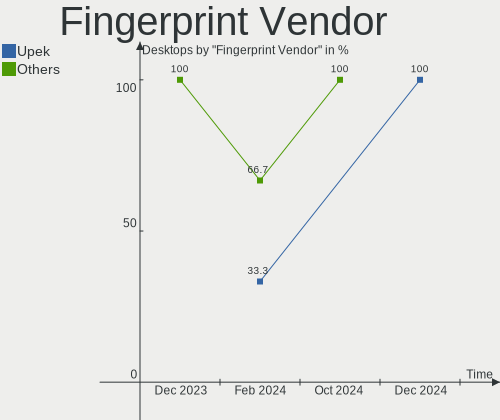

| Vendor         | Desktops | Percent |
|----------------|----------|---------|
| Upek           | 1        | 33.33%  |
| Microsoft      | 1        | 33.33%  |
| DigitalPersona | 1        | 33.33%  |

Fingerprint Model
-----------------

Fingerprint sensor models

| Model                                   | Desktops | Percent |
|-----------------------------------------|----------|---------|
| Upek TCS1C EIM/STM32 Fingerprint sensor | 1        | 33.33%  |
| Microsoft Fingerprint Reader            | 1        | 33.33%  |
| DigitalPersona Fingerprint Reader       | 1        | 33.33%  |

Chipcard Vendor
---------------

Chipcard module vendors

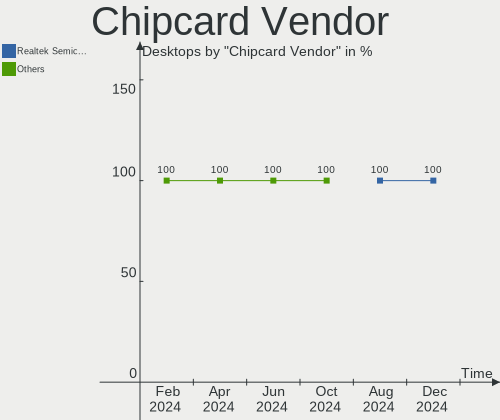

| Vendor           | Desktops | Percent |
|------------------|----------|---------|
| SCM Microsystems | 1        | 100%    |

Chipcard Model
--------------

Chipcard module models

| Model                                                  | Desktops | Percent |
|--------------------------------------------------------|----------|---------|
| SCM Microsystems SCR331-LC1 / SCR3310 SmartCard Reader | 1        | 100%    |

Unsupported
-----------

Unsupported Devices
-------------------

Total unsupported devices on board

| Total | Desktops | Percent |
|-------|----------|---------|
| 0     | 321      | 82.52%  |
| 1     | 51       | 13.11%  |
| 2     | 14       | 3.6%    |
| 4     | 2        | 0.51%   |
| 3     | 1        | 0.26%   |

Unsupported Device Types
------------------------

Types of unsupported devices

| Type                     | Desktops | Percent |
|--------------------------|----------|---------|
| Net/wireless             | 29       | 34.94%  |
| Graphics card            | 19       | 22.89%  |
| Unassigned class         | 9        | 10.84%  |
| Communication controller | 8        | 9.64%   |
| Sound                    | 4        | 4.82%   |
| Bluetooth                | 4        | 4.82%   |
| Fingerprint reader       | 3        | 3.61%   |
| Multimedia controller    | 2        | 2.41%   |
| Storage/nvme             | 1        | 1.2%    |
| Storage/ata              | 1        | 1.2%    |
| Modem                    | 1        | 1.2%    |
| Firewire controller      | 1        | 1.2%    |
| Card reader              | 1        | 1.2%    |

