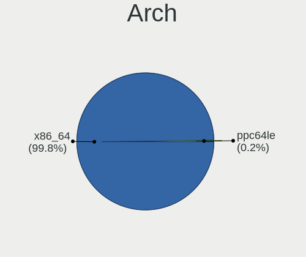
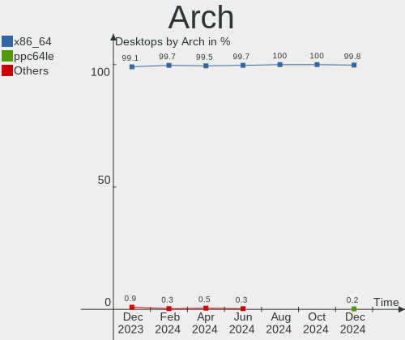
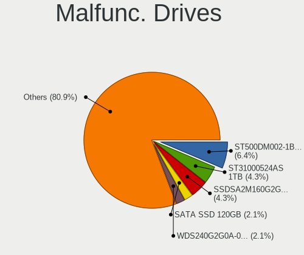
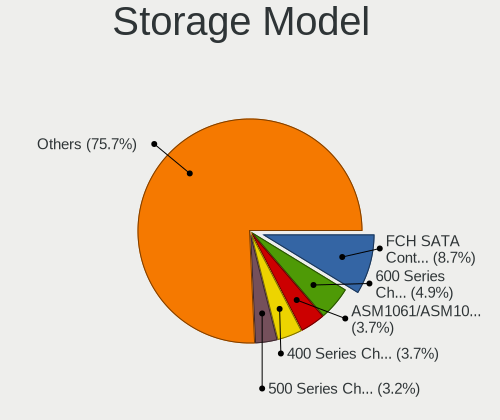
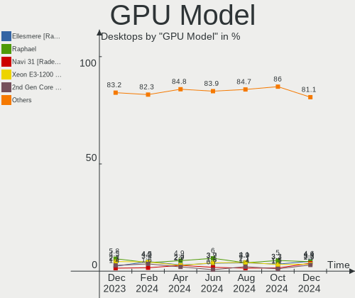
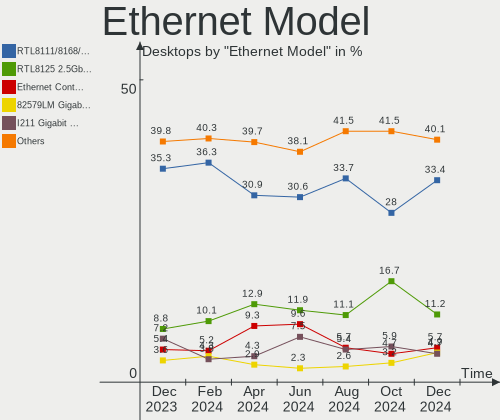
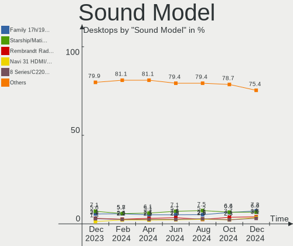

Linux in USA - Hardware Trends (Desktops)
-----------------------------------------

A project to identify most popular hardware characteristics and track their change
over time based on data collected by Linux users at https://Linux-Hardware.org.

Anyone can contribute to this report by the [hw-probe](https://github.com/linuxhw/hw-probe) tool:

    sudo -E hw-probe -all -upload

Period: Aug, 2022.

Contents
--------

* [ System ](#system)
  - [ OS                       ](#os)
  - [ OS Family                ](#os-family)
  - [ Kernel                   ](#kernel)
  - [ Kernel Family            ](#kernel-family)
  - [ Kernel Major Ver.        ](#kernel-major-ver)
  - [ Arch                     ](#arch)
  - [ DE                       ](#de)
  - [ Display Server           ](#display-server)
  - [ Display Manager          ](#display-manager)
  - [ OS Lang                  ](#os-lang)
  - [ Boot Mode                ](#boot-mode)
  - [ Filesystem               ](#filesystem)
  - [ Part. scheme             ](#part-scheme)
  - [ Dual Boot with Linux/BSD ](#dual-boot-with-linuxbsd)
  - [ Dual Boot (Win)          ](#dual-boot-win)

* [ Board ](#board)
  - [ Vendor                   ](#vendor)
  - [ Model                    ](#model)
  - [ Model Family             ](#model-family)
  - [ MFG Year                 ](#mfg-year)
  - [ Form Factor              ](#form-factor)
  - [ Secure Boot              ](#secure-boot)
  - [ Coreboot                 ](#coreboot)
  - [ RAM Size                 ](#ram-size)
  - [ RAM Used                 ](#ram-used)
  - [ Total Drives             ](#total-drives)
  - [ Has CD-ROM               ](#has-cd-rom)
  - [ Has Ethernet             ](#has-ethernet)
  - [ Has WiFi                 ](#has-wifi)
  - [ Has Bluetooth            ](#has-bluetooth)

* [ Location ](#location)
  - [ Country                  ](#country)
  - [ City                     ](#city)

* [ Drives ](#drives)
  - [ Drive Vendor             ](#drive-vendor)
  - [ Drive Model              ](#drive-model)
  - [ HDD Vendor               ](#hdd-vendor)
  - [ SSD Vendor               ](#ssd-vendor)
  - [ Drive Kind               ](#drive-kind)
  - [ Drive Connector          ](#drive-connector)
  - [ Drive Size               ](#drive-size)
  - [ Space Total              ](#space-total)
  - [ Space Used               ](#space-used)
  - [ Malfunc. Drives          ](#malfunc-drives)
  - [ Malfunc. Drive Vendor    ](#malfunc-drive-vendor)
  - [ Malfunc. HDD Vendor      ](#malfunc-hdd-vendor)
  - [ Malfunc. Drive Kind      ](#malfunc-drive-kind)
  - [ Failed Drives            ](#failed-drives)
  - [ Failed Drive Vendor      ](#failed-drive-vendor)
  - [ Drive Status             ](#drive-status)

* [ Storage controller ](#storage-controller)
  - [ Storage Vendor           ](#storage-vendor)
  - [ Storage Model            ](#storage-model)
  - [ Storage Kind             ](#storage-kind)

* [ Processor ](#processor)
  - [ CPU Vendor               ](#cpu-vendor)
  - [ CPU Model                ](#cpu-model)
  - [ CPU Model Family         ](#cpu-model-family)
  - [ CPU Cores                ](#cpu-cores)
  - [ CPU Sockets              ](#cpu-sockets)
  - [ CPU Threads              ](#cpu-threads)
  - [ CPU Op-Modes             ](#cpu-op-modes)
  - [ CPU Microcode            ](#cpu-microcode)
  - [ CPU Microarch            ](#cpu-microarch)

* [ Graphics ](#graphics)
  - [ GPU Vendor               ](#gpu-vendor)
  - [ GPU Model                ](#gpu-model)
  - [ GPU Combo                ](#gpu-combo)
  - [ GPU Driver               ](#gpu-driver)
  - [ GPU Memory               ](#gpu-memory)

* [ Monitor ](#monitor)
  - [ Monitor Vendor           ](#monitor-vendor)
  - [ Monitor Model            ](#monitor-model)
  - [ Monitor Resolution       ](#monitor-resolution)
  - [ Monitor Diagonal         ](#monitor-diagonal)
  - [ Monitor Width            ](#monitor-width)
  - [ Aspect Ratio             ](#aspect-ratio)
  - [ Monitor Area             ](#monitor-area)
  - [ Pixel Density            ](#pixel-density)
  - [ Multiple Monitors        ](#multiple-monitors)

* [ Network ](#network)
  - [ Net Controller Vendor    ](#net-controller-vendor)
  - [ Net Controller Model     ](#net-controller-model)
  - [ Wireless Vendor          ](#wireless-vendor)
  - [ Wireless Model           ](#wireless-model)
  - [ Ethernet Vendor          ](#ethernet-vendor)
  - [ Ethernet Model           ](#ethernet-model)
  - [ Net Controller Kind      ](#net-controller-kind)
  - [ Used Controller          ](#used-controller)
  - [ NICs                     ](#nics)
  - [ IPv6                     ](#ipv6)

* [ Bluetooth ](#bluetooth)
  - [ Bluetooth Vendor         ](#bluetooth-vendor)
  - [ Bluetooth Model          ](#bluetooth-model)

* [ Sound ](#sound)
  - [ Sound Vendor             ](#sound-vendor)
  - [ Sound Model              ](#sound-model)

* [ Memory ](#memory)
  - [ Memory Vendor            ](#memory-vendor)
  - [ Memory Model             ](#memory-model)
  - [ Memory Kind              ](#memory-kind)
  - [ Memory Form Factor       ](#memory-form-factor)
  - [ Memory Size              ](#memory-size)
  - [ Memory Speed             ](#memory-speed)

* [ Printers & scanners ](#printers--scanners)
  - [ Printer Vendor           ](#printer-vendor)
  - [ Printer Model            ](#printer-model)
  - [ Scanner Vendor           ](#scanner-vendor)
  - [ Scanner Model            ](#scanner-model)

* [ Camera ](#camera)
  - [ Camera Vendor            ](#camera-vendor)
  - [ Camera Model             ](#camera-model)

* [ Security ](#security)
  - [ Fingerprint Vendor       ](#fingerprint-vendor)
  - [ Fingerprint Model        ](#fingerprint-model)
  - [ Chipcard Vendor          ](#chipcard-vendor)
  - [ Chipcard Model           ](#chipcard-model)

* [ Unsupported ](#unsupported)
  - [ Unsupported Devices      ](#unsupported-devices)
  - [ Unsupported Device Types ](#unsupported-device-types)

System
------

OS
--

Installed operating systems

| Name                         | Desktops | Percent |
|------------------------------|----------|---------|
| Ubuntu 22.04                 | 48       | 13.83%  |
| Ubuntu 20.04                 | 30       | 8.65%   |
| Pop!_OS 22.04                | 30       | 8.65%   |
| Fedora 36                    | 25       | 7.2%    |
| OpenMandriva 4.3             | 16       | 4.61%   |
| Linux Mint 20.3              | 14       | 4.03%   |
| Debian 11                    | 13       | 3.75%   |
| KDE neon 20.04               | 11       | 3.17%   |
| Zorin 16                     | 10       | 2.88%   |
| Nobara 36                    | 10       | 2.88%   |
| Manjaro                      | 10       | 2.88%   |
| Kubuntu 22.04                | 9        | 2.59%   |
| Arch                         | 9        | 2.59%   |
| OpenMandriva 4.90            | 7        | 2.02%   |
| Linux Mint 21                | 7        | 2.02%   |
| ArcoLinux Rolling            | 7        | 2.02%   |
| Arch Rolling                 | 6        | 1.73%   |
| Ubuntu 18.04                 | 5        | 1.44%   |
| Manjaro 21.3.6               | 5        | 1.44%   |
| openSUSE Tumbleweed-XXXXXXXX | 4        | 1.15%   |
| Gentoo 2.8                   | 4        | 1.15%   |
| Xubuntu 20.04                | 3        | 0.86%   |
| Elementary 6.1               | 3        | 0.86%   |
| Xubuntu 22.04                | 2        | 0.58%   |
| Ubuntu MATE 22.04            | 2        | 0.58%   |
| Ubuntu Budgie 22.04          | 2        | 0.58%   |
| SteamOS 3.3                  | 2        | 0.58%   |
| Lubuntu 22.04                | 2        | 0.58%   |
| LMDE 5                       | 2        | 0.58%   |
| Linux Mint 20.2              | 2        | 0.58%   |
| Linux Mint 20.1              | 2        | 0.58%   |
| Kali 2022.3                  | 2        | 0.58%   |
| Garuda Linux Soaring         | 2        | 0.58%   |
| Fedora 35                    | 2        | 0.58%   |
| Debian Unstable              | 2        | 0.58%   |
| Clear Linux 36750            | 2        | 0.58%   |
| Xubuntu 18.04                | 1        | 0.29%   |
| Xero Rolling                 | 1        | 0.29%   |
| Xero                         | 1        | 0.29%   |
| Ubuntu 22.10                 | 1        | 0.29%   |
| Ubuntu 21.10                 | 1        | 0.29%   |
| Ubuntu 20.10                 | 1        | 0.29%   |
| SteamOS 3.2                  | 1        | 0.29%   |
| SteamOS                      | 1        | 0.29%   |
| Slackware 15.0               | 1        | 0.29%   |
| Pop!_OS 21.10                | 1        | 0.29%   |
| Pop!_OS 20.04                | 1        | 0.29%   |
| openSUSE Leap-15.4           | 1        | 0.29%   |
| openSUSE Leap-15.3           | 1        | 0.29%   |
| NixOS 22.05                  | 1        | 0.29%   |
| Manjaro 21.3.7               | 1        | 0.29%   |
| LinuxFX 11                   | 1        | 0.29%   |
| Linux Mint 19.3              | 1        | 0.29%   |
| Lilidog 22                   | 1        | 0.29%   |
| Kubuntu 11.1                 | 1        | 0.29%   |
| Kubuntu 11                   | 1        | 0.29%   |
| KDE neon 22.04               | 1        | 0.29%   |
| Kali 2022.1                  | 1        | 0.29%   |
| Garuda Linux                 | 1        | 0.29%   |
| Fedora 34                    | 1        | 0.29%   |

OS Family
---------

OS without a version

| Name          | Desktops | Percent |
|---------------|----------|---------|
| Ubuntu        | 86       | 24.78%  |
| Pop!_OS       | 32       | 9.22%   |
| Fedora        | 29       | 8.36%   |
| Linux Mint    | 26       | 7.49%   |
| OpenMandriva  | 23       | 6.63%   |
| Debian        | 18       | 5.19%   |
| Manjaro       | 16       | 4.61%   |
| Arch          | 15       | 4.32%   |
| KDE neon      | 12       | 3.46%   |
| Kubuntu       | 11       | 3.17%   |
| Zorin         | 10       | 2.88%   |
| Nobara        | 10       | 2.88%   |
| ArcoLinux     | 8        | 2.31%   |
| Xubuntu       | 6        | 1.73%   |
| openSUSE      | 6        | 1.73%   |
| SteamOS       | 4        | 1.15%   |
| Gentoo        | 4        | 1.15%   |
| Kali          | 3        | 0.86%   |
| Garuda Linux  | 3        | 0.86%   |
| Elementary    | 3        | 0.86%   |
| Clear Linux   | 3        | 0.86%   |
| Xero          | 2        | 0.58%   |
| Ubuntu MATE   | 2        | 0.58%   |
| Ubuntu Budgie | 2        | 0.58%   |
| Lubuntu       | 2        | 0.58%   |
| LMDE          | 2        | 0.58%   |
| EndeavourOS   | 2        | 0.58%   |
| Slackware     | 1        | 0.29%   |
| NixOS         | 1        | 0.29%   |
| LinuxFX       | 1        | 0.29%   |
| Lilidog       | 1        | 0.29%   |
| Endless       | 1        | 0.29%   |
| Bottlerocket  | 1        | 0.29%   |
| Archcraft     | 1        | 0.29%   |

Kernel
------

Version of the Linux kernel

| Version                       | Desktops | Percent |
|-------------------------------|----------|---------|
| 5.15.0-46-generic             | 72       | 20.75%  |
| 5.15.0-43-generic             | 34       | 9.8%    |
| 5.18.10-76051810-generic      | 21       | 6.05%   |
| 5.16.7-desktop-1omv4003       | 16       | 4.61%   |
| 5.4.0-124-generic             | 11       | 3.17%   |
| 5.19.0-76051900-generic       | 10       | 2.88%   |
| 5.15.0-41-generic             | 10       | 2.88%   |
| 5.18.16-200.fc36.x86_64       | 9        | 2.59%   |
| 5.10.0-16-amd64               | 8        | 2.31%   |
| 5.18.12-desktop-3omv4090      | 7        | 2.02%   |
| 5.4.0-122-generic             | 6        | 1.73%   |
| 5.18.16-arch1-1               | 5        | 1.44%   |
| 5.18.13-200.fc36.x86_64       | 5        | 1.44%   |
| 5.19.3-arch1-1                | 4        | 1.15%   |
| 5.19.2-arch1-1                | 4        | 1.15%   |
| 5.18.18-200.fc36.x86_64       | 4        | 1.15%   |
| 5.10.0-17-amd64               | 4        | 1.15%   |
| 5.4.0-125-generic             | 3        | 0.86%   |
| 5.18.17-201.fsync.fc36.x86_64 | 3        | 0.86%   |
| 5.18.13-201.fsync.fc36.x86_64 | 3        | 0.86%   |
| 5.15.60-1-MANJARO             | 3        | 0.86%   |
| 5.15.59-2-lts                 | 3        | 0.86%   |
| 5.15.0-47-generic             | 3        | 0.86%   |
| 5.4.0-91-generic              | 2        | 0.58%   |
| 5.19.1-arch2-1                | 2        | 0.58%   |
| 5.19.1-1-default              | 2        | 0.58%   |
| 5.18.19-200.fc36.x86_64       | 2        | 0.58%   |
| 5.18.17-200.fc36.x86_64       | 2        | 0.58%   |
| 5.18.17-1-MANJARO             | 2        | 0.58%   |
| 5.18.16-zen1-1-zen            | 2        | 0.58%   |
| 5.18.16-201.fsync.fc36.x86_64 | 2        | 0.58%   |
| 5.18.16-1165.native           | 2        | 0.58%   |
| 5.18.15-1-default             | 2        | 0.58%   |
| 5.18.0-kali5-amd64            | 2        | 0.58%   |
| 5.18.0-0.bpo.1-amd64          | 2        | 0.58%   |
| 5.15.60-1-lts                 | 2        | 0.58%   |
| 5.15.59-1-MANJARO             | 2        | 0.58%   |
| 5.15.0-46-lowlatency          | 2        | 0.58%   |
| 5.15.0-39-generic             | 2        | 0.58%   |
| 5.8.0-34-generic              | 1        | 0.29%   |
| 5.6.13-100.fc30.x86_64        | 1        | 0.29%   |
| 5.4.0-87-generic              | 1        | 0.29%   |
| 5.4.0-42-generic              | 1        | 0.29%   |
| 5.3.18-150300.59.87-default   | 1        | 0.29%   |
| 5.19.5-zen1-1-zen             | 1        | 0.29%   |
| 5.19.4-arch1-1                | 1        | 0.29%   |
| 5.19.4-1-MANJARO              | 1        | 0.29%   |
| 5.19.3-zen1-1-zen             | 1        | 0.29%   |
| 5.19.2-zen1-2-zen             | 1        | 0.29%   |
| 5.19.2-zen1-1-zen             | 1        | 0.29%   |
| 5.19.2-300.fc36.x86_64        | 1        | 0.29%   |
| 5.19.1-zen1-1-zen             | 1        | 0.29%   |
| 5.19.1-3-MANJARO              | 1        | 0.29%   |
| 5.19.0-xanmod2-2-x64v2        | 1        | 0.29%   |
| 5.19.0-xanmod1-x86_64         | 1        | 0.29%   |
| 5.19.0-gentoo-x86_64          | 1        | 0.29%   |
| 5.19.0-gentoo                 | 1        | 0.29%   |
| 5.19.0-268-tkg-pds-llvm       | 1        | 0.29%   |
| 5.19.0-2-MANJARO              | 1        | 0.29%   |
| 5.19.0-1-MANJARO              | 1        | 0.29%   |

Kernel Family
-------------

Linux kernel without a distro release

| Version | Desktops | Percent |
|---------|----------|---------|
| 5.15.0  | 127      | 36.6%   |
| 5.4.0   | 24       | 6.92%   |
| 5.18.10 | 22       | 6.34%   |
| 5.18.16 | 21       | 6.05%   |
| 5.19.0  | 18       | 5.19%   |
| 5.16.7  | 16       | 4.61%   |
| 5.10.0  | 14       | 4.03%   |
| 5.18.13 | 8        | 2.31%   |
| 5.19.2  | 7        | 2.02%   |
| 5.18.17 | 7        | 2.02%   |
| 5.18.12 | 7        | 2.02%   |
| 5.18.0  | 7        | 2.02%   |
| 5.13.0  | 7        | 2.02%   |
| 5.19.1  | 6        | 1.73%   |
| 5.19.3  | 5        | 1.44%   |
| 5.18.18 | 5        | 1.44%   |
| 5.15.60 | 5        | 1.44%   |
| 5.15.59 | 5        | 1.44%   |
| 5.18.15 | 4        | 1.15%   |
| 5.18.19 | 3        | 0.86%   |
| 5.11.0  | 3        | 0.86%   |
| 5.19.4  | 2        | 0.58%   |
| 5.18.14 | 2        | 0.58%   |
| 5.17.5  | 2        | 0.58%   |
| 4.19.0  | 2        | 0.58%   |
| 4.15.0  | 2        | 0.58%   |
| 5.8.0   | 1        | 0.29%   |
| 5.6.13  | 1        | 0.29%   |
| 5.3.18  | 1        | 0.29%   |
| 5.19.5  | 1        | 0.29%   |
| 5.18.9  | 1        | 0.29%   |
| 5.18.8  | 1        | 0.29%   |
| 5.17.12 | 1        | 0.29%   |
| 5.17.0  | 1        | 0.29%   |
| 5.16.13 | 1        | 0.29%   |
| 5.15.55 | 1        | 0.29%   |
| 5.15.53 | 1        | 0.29%   |
| 5.15.52 | 1        | 0.29%   |
| 5.15.50 | 1        | 0.29%   |
| 5.15.43 | 1        | 0.29%   |
| 5.15.19 | 1        | 0.29%   |
| 5.14.21 | 1        | 0.29%   |

Kernel Major Ver.
-----------------

Linux kernel major version

| Version | Desktops | Percent |
|---------|----------|---------|
| 5.15    | 143      | 41.21%  |
| 5.18    | 88       | 25.36%  |
| 5.19    | 39       | 11.24%  |
| 5.4     | 24       | 6.92%   |
| 5.16    | 17       | 4.9%    |
| 5.10    | 14       | 4.03%   |
| 5.13    | 7        | 2.02%   |
| 5.17    | 4        | 1.15%   |
| 5.11    | 3        | 0.86%   |
| 4.19    | 2        | 0.58%   |
| 4.15    | 2        | 0.58%   |
| 5.8     | 1        | 0.29%   |
| 5.6     | 1        | 0.29%   |
| 5.3     | 1        | 0.29%   |
| 5.14    | 1        | 0.29%   |

Arch
----

OS architecture (x86_64, i586, etc.)

| Name   | Desktops | Percent |
|--------|----------|---------|
| x86_64 | 347      | 100%    |

DE
--

Desktop Environment

| Name             | Desktops | Percent |
|------------------|----------|---------|
| GNOME            | 155      | 44.67%  |
| KDE5             | 101      | 29.11%  |
| X-Cinnamon       | 29       | 8.36%   |
| XFCE             | 22       | 6.34%   |
| Unknown          | 11       | 3.17%   |
| MATE             | 5        | 1.44%   |
| LXQt             | 3        | 0.86%   |
| i3               | 3        | 0.86%   |
| Pantheon         | 2        | 0.58%   |
| Cinnamon         | 2        | 0.58%   |
| Budgie           | 2        | 0.58%   |
| awesome          | 2        | 0.58%   |
| Unity            | 1        | 0.29%   |
| sway             | 1        | 0.29%   |
| LXDE             | 1        | 0.29%   |
| lightdm-xsession | 1        | 0.29%   |
| KDE              | 1        | 0.29%   |
| i3-with-shmlog   | 1        | 0.29%   |
| GNOME Classic    | 1        | 0.29%   |
| Enlightenment    | 1        | 0.29%   |
| Deepin           | 1        | 0.29%   |
| bspwm            | 1        | 0.29%   |

Display Server
--------------

X11 or Wayland

| Name    | Desktops | Percent |
|---------|----------|---------|
| X11     | 262      | 75.5%   |
| Wayland | 65       | 18.73%  |
| Tty     | 13       | 3.75%   |
| Unknown | 7        | 2.02%   |

Display Manager
---------------

SDDM, LightDM, etc.

| Name    | Desktops | Percent |
|---------|----------|---------|
| Unknown | 154      | 44.38%  |
| GDM3    | 73       | 21.04%  |
| SDDM    | 58       | 16.71%  |
| LightDM | 40       | 11.53%  |
| GDM     | 22       | 6.34%   |

OS Lang
-------

Language

| Lang    | Desktops | Percent |
|---------|----------|---------|
| en_US   | 334      | 96.25%  |
| C       | 7        | 2.02%   |
| Unknown | 3        | 0.86%   |
| es_US   | 2        | 0.58%   |
| en_CA   | 1        | 0.29%   |

Boot Mode
---------

EFI or BIOS

| Mode | Desktops | Percent |
|------|----------|---------|
| BIOS | 196      | 56.48%  |
| EFI  | 151      | 43.52%  |

Filesystem
----------

Type of filesystem

| Type    | Desktops | Percent |
|---------|----------|---------|
| Ext4    | 254      | 73.2%   |
| Btrfs   | 53       | 15.27%  |
| Overlay | 30       | 8.65%   |
| Xfs     | 6        | 1.73%   |
| Zfs     | 2        | 0.58%   |
| Ext2    | 2        | 0.58%   |

Part. scheme
------------

Scheme of partitioning

| Type    | Desktops | Percent |
|---------|----------|---------|
| Unknown | 216      | 62.25%  |
| GPT     | 112      | 32.28%  |
| MBR     | 19       | 5.48%   |

Dual Boot with Linux/BSD
------------------------

Hosting more than one Linux/BSD

| Dual boot | Desktops | Percent |
|-----------|----------|---------|
| No        | 283      | 81.56%  |
| Yes       | 64       | 18.44%  |

Dual Boot (Win)
---------------

Hosting Linux and Windows

| Dual boot | Desktops | Percent |
|-----------|----------|---------|
| No        | 265      | 76.37%  |
| Yes       | 82       | 23.63%  |

Board
-----

Vendor
------

Motherboard manufacturer

| Name                | Desktops | Percent |
|---------------------|----------|---------|
| ASUSTek Computer    | 88       | 25.36%  |
| MSI                 | 61       | 17.58%  |
| Dell                | 49       | 14.12%  |
| Gigabyte Technology | 39       | 11.24%  |
| Hewlett-Packard     | 32       | 9.22%   |
| ASRock              | 27       | 7.78%   |
| Lenovo              | 11       | 3.17%   |
| Pegatron            | 4        | 1.15%   |
| Intel               | 4        | 1.15%   |
| Foxconn             | 4        | 1.15%   |
| Acer                | 4        | 1.15%   |
| Protectli           | 3        | 0.86%   |
| Alienware           | 3        | 0.86%   |
| Supermicro          | 2        | 0.58%   |
| LattePanda          | 2        | 0.58%   |
| AZW                 | 2        | 0.58%   |
| System76            | 1        | 0.29%   |
| NCR                 | 1        | 0.29%   |
| MAXSUN              | 1        | 0.29%   |
| GMKtec              | 1        | 0.29%   |
| eMachines           | 1        | 0.29%   |
| ECS                 | 1        | 0.29%   |
| Biostar             | 1        | 0.29%   |
| BESSTAR Tech        | 1        | 0.29%   |
| ASRockRack          | 1        | 0.29%   |
| Apple               | 1        | 0.29%   |
| 16512-2316-22801    | 1        | 0.29%   |
| Unknown             | 1        | 0.29%   |

Model
-----

Motherboard model

| Name                         | Desktops | Percent |
|------------------------------|----------|---------|
| MSI MS-7C37                  | 7        | 2.02%   |
| ASUS TUF Gaming X570-PLUS    | 6        | 1.73%   |
| ASUS All Series              | 6        | 1.73%   |
| Dell OptiPlex 7010           | 5        | 1.44%   |
| MSI MS-7C02                  | 4        | 1.15%   |
| MSI MS-7C91                  | 3        | 0.86%   |
| MSI MS-7B86                  | 3        | 0.86%   |
| MSI MS-7693                  | 3        | 0.86%   |
| HP EliteDesk 800 G1 SFF      | 3        | 0.86%   |
| Gigabyte B450M DS3H          | 3        | 0.86%   |
| Dell XPS 8700                | 3        | 0.86%   |
| Dell OptiPlex 790            | 3        | 0.86%   |
| ASUS TUF Gaming X570-PRO     | 3        | 0.86%   |
| ASUS ROG STRIX B550-F GAMING | 3        | 0.86%   |
| ASUS ROG STRIX B450-F GAMING | 3        | 0.86%   |
| ASUS PRIME X570-P            | 3        | 0.86%   |
| ASRock B450M Pro4            | 3        | 0.86%   |
| Protectli FW4B               | 2        | 0.58%   |
| MSI MS-7C95                  | 2        | 0.58%   |
| MSI MS-7C84                  | 2        | 0.58%   |
| MSI MS-7B85                  | 2        | 0.58%   |
| MSI MS-7758                  | 2        | 0.58%   |
| MSI MS-7751                  | 2        | 0.58%   |
| HP ProDesk 400 G4 SFF        | 2        | 0.58%   |
| Gigabyte B550M DS3H          | 2        | 0.58%   |
| Gigabyte B450 AORUS M        | 2        | 0.58%   |
| Dell XPS 8940                | 2        | 0.58%   |
| Dell Precision T3610         | 2        | 0.58%   |
| Dell OptiPlex 780            | 2        | 0.58%   |
| Dell OptiPlex 390            | 2        | 0.58%   |
| Dell OptiPlex 3040           | 2        | 0.58%   |
| ASUS TUF Gaming B550-PLUS    | 2        | 0.58%   |
| ASUS SABERTOOTH X79          | 2        | 0.58%   |
| ASUS ROG STRIX X570-I GAMING | 2        | 0.58%   |
| ASUS ROG STRIX X570-E GAMING | 2        | 0.58%   |
| ASUS ROG STRIX B550-A GAMING | 2        | 0.58%   |
| ASUS PRIME B550M-A           | 2        | 0.58%   |
| ASRock B550M Pro4            | 2        | 0.58%   |
| ASRock AB350 Pro4            | 2        | 0.58%   |
| System76 Thelio              | 1        | 0.29%   |
| Supermicro SYS-5018D-MF      | 1        | 0.29%   |
| Supermicro SYS-2028TP-HC1TR  | 1        | 0.29%   |
| Protectli VP2410             | 1        | 0.29%   |
| Pegatron NE502AV-ABA a6750t  | 1        | 0.29%   |
| Pegatron h8-1090t            | 1        | 0.29%   |
| Pegatron 505B Microtower PC  | 1        | 0.29%   |
| Pegatron 23-1015             | 1        | 0.29%   |
| NCR xxxx-xxxx-xxxx           | 1        | 0.29%   |
| MSI MS-7D54                  | 1        | 0.29%   |
| MSI MS-7D30                  | 1        | 0.29%   |
| MSI MS-7D25                  | 1        | 0.29%   |
| MSI MS-7D09                  | 1        | 0.29%   |
| MSI MS-7C94                  | 1        | 0.29%   |
| MSI MS-7C87                  | 1        | 0.29%   |
| MSI MS-7C82                  | 1        | 0.29%   |
| MSI MS-7C80                  | 1        | 0.29%   |
| MSI MS-7C70                  | 1        | 0.29%   |
| MSI MS-7C56                  | 1        | 0.29%   |
| MSI MS-7C09                  | 1        | 0.29%   |
| MSI MS-7C04                  | 1        | 0.29%   |

Model Family
------------

Motherboard model prefix

| Name                        | Desktops | Percent |
|-----------------------------|----------|---------|
| Dell OptiPlex               | 24       | 6.92%   |
| ASUS ROG                    | 24       | 6.92%   |
| ASUS TUF                    | 16       | 4.61%   |
| ASUS PRIME                  | 12       | 3.46%   |
| Dell Inspiron               | 9        | 2.59%   |
| HP EliteDesk                | 8        | 2.31%   |
| MSI MS-7C37                 | 7        | 2.02%   |
| Lenovo ThinkCentre          | 6        | 1.73%   |
| Dell XPS                    | 6        | 1.73%   |
| Dell Precision              | 6        | 1.73%   |
| ASUS All                    | 6        | 1.73%   |
| HP Compaq                   | 5        | 1.44%   |
| MSI MS-7C02                 | 4        | 1.15%   |
| Gigabyte B450M              | 4        | 1.15%   |
| Gigabyte B450               | 4        | 1.15%   |
| ASRock B450M                | 4        | 1.15%   |
| Acer Aspire                 | 4        | 1.15%   |
| MSI MS-7C91                 | 3        | 0.86%   |
| MSI MS-7B86                 | 3        | 0.86%   |
| MSI MS-7693                 | 3        | 0.86%   |
| HP ProDesk                  | 3        | 0.86%   |
| Gigabyte X570               | 3        | 0.86%   |
| Gigabyte B550M              | 3        | 0.86%   |
| Gigabyte B550               | 3        | 0.86%   |
| ASUS SABERTOOTH             | 3        | 0.86%   |
| ASRock AB350                | 3        | 0.86%   |
| Alienware Aurora            | 3        | 0.86%   |
| Protectli FW4B              | 2        | 0.58%   |
| MSI MS-7C95                 | 2        | 0.58%   |
| MSI MS-7C84                 | 2        | 0.58%   |
| MSI MS-7B85                 | 2        | 0.58%   |
| MSI MS-7758                 | 2        | 0.58%   |
| MSI MS-7751                 | 2        | 0.58%   |
| HP Slim                     | 2        | 0.58%   |
| HP Pavilion                 | 2        | 0.58%   |
| ASRock X570                 | 2        | 0.58%   |
| ASRock X470                 | 2        | 0.58%   |
| ASRock B550M                | 2        | 0.58%   |
| ASRock 990FX                | 2        | 0.58%   |
| System76 Thelio             | 1        | 0.29%   |
| Supermicro SYS-5018D-MF     | 1        | 0.29%   |
| Supermicro SYS-2028TP-HC1TR | 1        | 0.29%   |
| Protectli VP2410            | 1        | 0.29%   |
| Pegatron NE502AV-ABA        | 1        | 0.29%   |
| Pegatron h8-1090t           | 1        | 0.29%   |
| Pegatron 505B               | 1        | 0.29%   |
| Pegatron 23-1015            | 1        | 0.29%   |
| NCR xxxx-xxxx-xxxx          | 1        | 0.29%   |
| MSI MS-7D54                 | 1        | 0.29%   |
| MSI MS-7D30                 | 1        | 0.29%   |
| MSI MS-7D25                 | 1        | 0.29%   |
| MSI MS-7D09                 | 1        | 0.29%   |
| MSI MS-7C94                 | 1        | 0.29%   |
| MSI MS-7C87                 | 1        | 0.29%   |
| MSI MS-7C82                 | 1        | 0.29%   |
| MSI MS-7C80                 | 1        | 0.29%   |
| MSI MS-7C70                 | 1        | 0.29%   |
| MSI MS-7C56                 | 1        | 0.29%   |
| MSI MS-7C09                 | 1        | 0.29%   |
| MSI MS-7C04                 | 1        | 0.29%   |

MFG Year
--------

Motherboard manufacture year

| Year | Desktops | Percent |
|------|----------|---------|
| 2020 | 57       | 16.43%  |
| 2018 | 46       | 13.26%  |
| 2019 | 40       | 11.53%  |
| 2013 | 25       | 7.2%    |
| 2021 | 23       | 6.63%   |
| 2014 | 22       | 6.34%   |
| 2017 | 21       | 6.05%   |
| 2012 | 20       | 5.76%   |
| 2015 | 19       | 5.48%   |
| 2011 | 17       | 4.9%    |
| 2016 | 14       | 4.03%   |
| 2010 | 10       | 2.88%   |
| 2009 | 10       | 2.88%   |
| 2022 | 8        | 2.31%   |
| 2008 | 8        | 2.31%   |
| 2007 | 6        | 1.73%   |
| 2006 | 1        | 0.29%   |

Form Factor
-----------

Physical design of the computer

| Name    | Desktops | Percent |
|---------|----------|---------|
| Desktop | 347      | 100%    |

Secure Boot
-----------

Enabled or disabled

| State    | Desktops | Percent |
|----------|----------|---------|
| Disabled | 335      | 96.54%  |
| Enabled  | 12       | 3.46%   |

Coreboot
--------

Have coreboot on board

| Used | Desktops | Percent |
|------|----------|---------|
| No   | 346      | 99.71%  |
| Yes  | 1        | 0.29%   |

RAM Size
--------

Total RAM memory

| Size in GB      | Desktops | Percent |
|-----------------|----------|---------|
| 16.01-24.0      | 115      | 33.14%  |
| 32.01-64.0      | 71       | 20.46%  |
| 8.01-16.0       | 57       | 16.43%  |
| 64.01-256.0     | 34       | 9.8%    |
| 4.01-8.0        | 30       | 8.65%   |
| 3.01-4.0        | 19       | 5.48%   |
| 24.01-32.0      | 13       | 3.75%   |
| 2.01-3.0        | 4        | 1.15%   |
| More than 256.0 | 2        | 0.58%   |
| 1.01-2.0        | 2        | 0.58%   |

RAM Used
--------

Used RAM memory

| Used GB    | Desktops | Percent |
|------------|----------|---------|
| 2.01-3.0   | 83       | 23.92%  |
| 4.01-8.0   | 78       | 22.48%  |
| 1.01-2.0   | 78       | 22.48%  |
| 3.01-4.0   | 58       | 16.71%  |
| 8.01-16.0  | 28       | 8.07%   |
| 0.51-1.0   | 16       | 4.61%   |
| 16.01-24.0 | 3        | 0.86%   |
| 0.01-0.5   | 2        | 0.58%   |
| 32.01-64.0 | 1        | 0.29%   |

Total Drives
------------

Number of drives on board

| Drives | Desktops | Percent |
|--------|----------|---------|
| 2      | 113      | 32.56%  |
| 1      | 109      | 31.41%  |
| 3      | 49       | 14.12%  |
| 4      | 34       | 9.8%    |
| 6      | 17       | 4.9%    |
| 5      | 17       | 4.9%    |
| 7      | 5        | 1.44%   |
| 0      | 2        | 0.58%   |
| 8      | 1        | 0.29%   |

Has CD-ROM
----------

Has CD-ROM on board

| Presented | Desktops | Percent |
|-----------|----------|---------|
| No        | 179      | 51.59%  |
| Yes       | 168      | 48.41%  |

Has Ethernet
------------

Has Ethernet on board

| Presented | Desktops | Percent |
|-----------|----------|---------|
| Yes       | 345      | 99.42%  |
| No        | 2        | 0.58%   |

Has WiFi
--------

Has WiFi module

| Presented | Desktops | Percent |
|-----------|----------|---------|
| Yes       | 206      | 59.37%  |
| No        | 141      | 40.63%  |

Has Bluetooth
-------------

Has Bluetooth module

| Presented | Desktops | Percent |
|-----------|----------|---------|
| No        | 178      | 51.3%   |
| Yes       | 169      | 48.7%   |

Location
--------

Country
-------

Geographic location (country)

| Country | Desktops | Percent |
|---------|----------|---------|
| USA     | 347      | 100%    |

City
----

Geographic location (city)

| City             | Desktops | Percent |
|------------------|----------|---------|
| Dallas           | 9        | 2.59%   |
| Portland         | 6        | 1.73%   |
| Miami            | 5        | 1.44%   |
| Chicago          | 5        | 1.44%   |
| Atlanta          | 5        | 1.44%   |
| Seattle          | 4        | 1.15%   |
| San Jose         | 4        | 1.15%   |
| San Antonio      | 4        | 1.15%   |
| Kansas City      | 4        | 1.15%   |
| San Diego        | 3        | 0.86%   |
| Raleigh          | 3        | 0.86%   |
| Minneapolis      | 3        | 0.86%   |
| Lancaster        | 3        | 0.86%   |
| Houston          | 3        | 0.86%   |
| Denver           | 3        | 0.86%   |
| Cypress          | 3        | 0.86%   |
| Cincinnati       | 3        | 0.86%   |
| Bangor           | 3        | 0.86%   |
| Alpharetta       | 3        | 0.86%   |
| Wooster          | 2        | 0.58%   |
| Winston-Salem    | 2        | 0.58%   |
| Washington       | 2        | 0.58%   |
| Victor           | 2        | 0.58%   |
| Tucson           | 2        | 0.58%   |
| Salt Lake City   | 2        | 0.58%   |
| Redwood City     | 2        | 0.58%   |
| Queens           | 2        | 0.58%   |
| New York         | 2        | 0.58%   |
| Muncie           | 2        | 0.58%   |
| Mount Pleasant   | 2        | 0.58%   |
| Malden           | 2        | 0.58%   |
| Lexington        | 2        | 0.58%   |
| Leavenworth      | 2        | 0.58%   |
| Las Vegas        | 2        | 0.58%   |
| Jacksonville     | 2        | 0.58%   |
| Hurst            | 2        | 0.58%   |
| Huntsville       | 2        | 0.58%   |
| Garland          | 2        | 0.58%   |
| Fresno           | 2        | 0.58%   |
| Florence         | 2        | 0.58%   |
| Farmington       | 2        | 0.58%   |
| Erie             | 2        | 0.58%   |
| Del Valle        | 2        | 0.58%   |
| Davenport        | 2        | 0.58%   |
| Colorado Springs | 2        | 0.58%   |
| Charlestown      | 2        | 0.58%   |
| Bothell          | 2        | 0.58%   |
| Bixby            | 2        | 0.58%   |
| Aurora           | 2        | 0.58%   |
| Albuquerque      | 2        | 0.58%   |
| Wyandotte        | 1        | 0.29%   |
| Woodbine         | 1        | 0.29%   |
| Winterport       | 1        | 0.29%   |
| Wichita          | 1        | 0.29%   |
| Whittier         | 1        | 0.29%   |
| Weslaco          | 1        | 0.29%   |
| Wentzville       | 1        | 0.29%   |
| Watsonville      | 1        | 0.29%   |
| Watertown        | 1        | 0.29%   |
| Walnut Creek     | 1        | 0.29%   |

Drives
------

Drive Vendor
------------

Hard drive vendors

| Vendor                      | Desktops | Drives | Percent |
|-----------------------------|----------|--------|---------|
| WDC                         | 121      | 161    | 18.22%  |
| Seagate                     | 111      | 149    | 16.72%  |
| Samsung Electronics         | 101      | 140    | 15.21%  |
| SanDisk                     | 45       | 51     | 6.78%   |
| Toshiba                     | 38       | 46     | 5.72%   |
| Crucial                     | 28       | 34     | 4.22%   |
| Hitachi                     | 22       | 24     | 3.31%   |
| PNY                         | 19       | 22     | 2.86%   |
| Unknown                     | 14       | 24     | 2.11%   |
| Kingston                    | 14       | 15     | 2.11%   |
| Phison                      | 13       | 15     | 1.96%   |
| China                       | 12       | 17     | 1.81%   |
| SK hynix                    | 11       | 11     | 1.66%   |
| Intel                       | 11       | 11     | 1.66%   |
| A-DATA Technology           | 10       | 11     | 1.51%   |
| HGST                        | 9        | 14     | 1.36%   |
| Team                        | 6        | 7      | 0.9%    |
| Micron/Crucial Technology   | 6        | 6      | 0.9%    |
| Micron Technology           | 6        | 6      | 0.9%    |
| JMicron Technology          | 5        | 5      | 0.75%   |
| OCZ                         | 4        | 4      | 0.6%    |
| Unknown                     | 4        | 4      | 0.6%    |
| Silicon Motion              | 3        | 3      | 0.45%   |
| Phison Electronics          | 3        | 3      | 0.45%   |
| KIOXIA                      | 3        | 3      | 0.45%   |
| SPCC                        | 2        | 3      | 0.3%    |
| SABRENT                     | 2        | 2      | 0.3%    |
| Realtek Semiconductor       | 2        | 2      | 0.3%    |
| Protectli                   | 2        | 2      | 0.3%    |
| NGFF                        | 2        | 2      | 0.3%    |
| Corsair                     | 2        | 2      | 0.3%    |
| ADATA SU                    | 2        | 2      | 0.3%    |
| Zheino                      | 1        | 1      | 0.15%   |
| XPG                         | 1        | 1      | 0.15%   |
| WDC WDBN                    | 1        | 1      | 0.15%   |
| WD MediaMax                 | 1        | 1      | 0.15%   |
| Verbatim                    | 1        | 1      | 0.15%   |
| USB3.0                      | 1        | 1      | 0.15%   |
| Transcend                   | 1        | 1      | 0.15%   |
| T-FORCE                     | 1        | 1      | 0.15%   |
| RSH-339                     | 1        | 1      | 0.15%   |
| RSH-319                     | 1        | 1      | 0.15%   |
| ORTIAL                      | 1        | 1      | 0.15%   |
| OCZ-VERTEX3                 | 1        | 1      | 0.15%   |
| MyDigitalSSD                | 1        | 1      | 0.15%   |
| Mushkin                     | 1        | 1      | 0.15%   |
| MAXIO Technology (Hangzhou) | 1        | 1      | 0.15%   |
| LITEON                      | 1        | 1      | 0.15%   |
| Leven                       | 1        | 1      | 0.15%   |
| LaCie                       | 1        | 1      | 0.15%   |
| KXG60ZNV                    | 1        | 1      | 0.15%   |
| KingFast                    | 1        | 1      | 0.15%   |
| Kingchuxing                 | 1        | 1      | 0.15%   |
| HP Phison                   | 1        | 1      | 0.15%   |
| Hoodisk                     | 1        | 1      | 0.15%   |
| G-DRIVE                     | 1        | 1      | 0.15%   |
| Emtec                       | 1        | 1      | 0.15%   |
| DUEX                        | 1        | 1      | 0.15%   |
| ASMT                        | 1        | 1      | 0.15%   |
| Apple                       | 1        | 1      | 0.15%   |

Drive Model
-----------

Hard drive models

| Model                                              | Desktops | Percent |
|----------------------------------------------------|----------|---------|
| Seagate ST2000DM008-2FR102 2TB                     | 12       | 1.56%   |
| Samsung SSD 860 EVO 500GB                          | 12       | 1.56%   |
| Samsung SSD 860 EVO 1TB                            | 12       | 1.56%   |
| Samsung NVMe SSD Drive 1TB                         | 12       | 1.56%   |
| WDC WD10EZEX-08WN4A0 1TB                           | 11       | 1.43%   |
| Seagate ST1000DM003-1SB102 1TB                     | 8        | 1.04%   |
| SanDisk NVMe SSD Drive 1TB                         | 8        | 1.04%   |
| Toshiba DT01ACA200 2TB                             | 7        | 0.91%   |
| Seagate ST500DM002-1BD142 500GB                    | 7        | 0.91%   |
| SanDisk NVMe SSD Drive 500GB                       | 7        | 0.91%   |
| Samsung SSD 850 EVO 250GB                          | 7        | 0.91%   |
| PNY CS900 500GB SSD                                | 7        | 0.91%   |
| Seagate ST2000DM001-1ER164 2TB                     | 6        | 0.78%   |
| Seagate ST1000DM010-2EP102 1TB                     | 6        | 0.78%   |
| Samsung NVMe SSD Drive 500GB                       | 6        | 0.78%   |
| Samsung NVMe SSD Controller SM981/PM981/PM983 1TB  | 6        | 0.78%   |
| Phison NVMe SSD Drive 2TB                          | 6        | 0.78%   |
| WDC WDBNCE5000PNC 500GB SSD                        | 5        | 0.65%   |
| Unknown SD/MMC 16GB                                | 5        | 0.65%   |
| Unknown M.S./M.S.Pro/HG 16GB                       | 5        | 0.65%   |
| SanDisk SSD PLUS 240GB                             | 5        | 0.65%   |
| Samsung SSD 870 EVO 500GB                          | 5        | 0.65%   |
| Crucial CT1000MX500SSD1 1TB                        | 5        | 0.65%   |
| WDC WDS500G2B0A-00SM50 500GB SSD                   | 4        | 0.52%   |
| Seagate ST3500418AS 500GB                          | 4        | 0.52%   |
| Samsung SSD 970 EVO Plus 500GB                     | 4        | 0.52%   |
| Samsung SSD 970 EVO 500GB                          | 4        | 0.52%   |
| Samsung SSD 870 EVO 1TB                            | 4        | 0.52%   |
| Samsung SSD 850 EVO 500GB                          | 4        | 0.52%   |
| Samsung NVMe SSD Drive 2TB                         | 4        | 0.52%   |
| Kingston SA400S37120G 120GB SSD                    | 4        | 0.52%   |
| JMicron Tech 250GB                                 | 4        | 0.52%   |
| Unknown                                            | 4        | 0.52%   |
| WDC WDS250G2B0B-00YS70 250GB SSD                   | 3        | 0.39%   |
| WDC WD5000LPLX-08ZNTT0 500GB                       | 3        | 0.39%   |
| WDC WD20EZAZ-00L9GB0 2TB                           | 3        | 0.39%   |
| WDC WD10EZEX-08M2NA0 1TB                           | 3        | 0.39%   |
| Unknown SD/MMC/MS PRO 128GB                        | 3        | 0.39%   |
| Toshiba HDWE140 4TB                                | 3        | 0.39%   |
| Toshiba DT01ACA100 1TB                             | 3        | 0.39%   |
| Toshiba DT01ACA050 500GB                           | 3        | 0.39%   |
| Seagate ST8000DM004-2CX188 8TB                     | 3        | 0.39%   |
| Seagate ST4000DM004-2CV104 4TB                     | 3        | 0.39%   |
| Seagate ST4000DM000-1F2168 4TB                     | 3        | 0.39%   |
| Seagate ST2000DX002-2DV164 2TB                     | 3        | 0.39%   |
| Seagate ST2000DM006-2DM164 2TB                     | 3        | 0.39%   |
| Seagate ST1000DM003-1ER162 1TB                     | 3        | 0.39%   |
| Seagate ST1000DM003-1CH162 1TB                     | 3        | 0.39%   |
| Seagate Portable 4TB                               | 3        | 0.39%   |
| Sandisk WD Blue SN550 NVMe SSD 256GB               | 3        | 0.39%   |
| SanDisk SD8SBAT128G1122 128GB SSD                  | 3        | 0.39%   |
| Samsung SSD 980 PRO 1TB                            | 3        | 0.39%   |
| Samsung SSD 970 EVO Plus 2TB                       | 3        | 0.39%   |
| Samsung SSD 850 EVO 1TB                            | 3        | 0.39%   |
| Samsung NVMe SSD Controller PM9A1/PM9A3/980PRO 1TB | 3        | 0.39%   |
| PNY CS900 240GB SSD                                | 3        | 0.39%   |
| PNY CS1311 240GB SSD                               | 3        | 0.39%   |
| Phison NVMe SSD Drive 1TB                          | 3        | 0.39%   |
| Crucial CT500MX500SSD1 500GB                       | 3        | 0.39%   |
| Crucial CT1000BX500SSD1 1TB                        | 3        | 0.39%   |

HDD Vendor
----------

Hard disk drive vendors

| Vendor              | Desktops | Drives | Percent |
|---------------------|----------|--------|---------|
| Seagate             | 107      | 142    | 38.21%  |
| WDC                 | 97       | 129    | 34.64%  |
| Toshiba             | 30       | 37     | 10.71%  |
| Hitachi             | 22       | 24     | 7.86%   |
| HGST                | 9        | 14     | 3.21%   |
| Unknown             | 4        | 7      | 1.43%   |
| Samsung Electronics | 3        | 3      | 1.07%   |
| SABRENT             | 2        | 2      | 0.71%   |
| WD MediaMax         | 1        | 1      | 0.36%   |
| USB3.0              | 1        | 1      | 0.36%   |
| RSH-339             | 1        | 1      | 0.36%   |
| RSH-319             | 1        | 1      | 0.36%   |
| ASMT                | 1        | 1      | 0.36%   |
| Apple               | 1        | 1      | 0.36%   |

SSD Vendor
----------

Solid state drive vendors

| Vendor              | Desktops | Drives | Percent |
|---------------------|----------|--------|---------|
| Samsung Electronics | 61       | 74     | 25.63%  |
| WDC                 | 24       | 25     | 10.08%  |
| Crucial             | 24       | 30     | 10.08%  |
| SanDisk             | 23       | 25     | 9.66%   |
| PNY                 | 19       | 22     | 7.98%   |
| Kingston            | 12       | 13     | 5.04%   |
| China               | 12       | 17     | 5.04%   |
| A-DATA Technology   | 9        | 9      | 3.78%   |
| Team                | 5        | 6      | 2.1%    |
| Toshiba             | 4        | 4      | 1.68%   |
| SK hynix            | 4        | 4      | 1.68%   |
| OCZ                 | 4        | 4      | 1.68%   |
| Micron Technology   | 4        | 4      | 1.68%   |
| Intel               | 4        | 4      | 1.68%   |
| Unknown             | 3        | 3      | 1.26%   |
| SPCC                | 2        | 3      | 0.84%   |
| NGFF                | 2        | 2      | 0.84%   |
| Corsair             | 2        | 2      | 0.84%   |
| ADATA SU            | 2        | 2      | 0.84%   |
| WDC WDBN            | 1        | 1      | 0.42%   |
| Verbatim            | 1        | 1      | 0.42%   |
| Transcend           | 1        | 1      | 0.42%   |
| T-FORCE             | 1        | 1      | 0.42%   |
| Seagate             | 1        | 1      | 0.42%   |
| ORTIAL              | 1        | 1      | 0.42%   |
| OCZ-VERTEX3         | 1        | 1      | 0.42%   |
| MyDigitalSSD        | 1        | 1      | 0.42%   |
| Mushkin             | 1        | 1      | 0.42%   |
| LITEON              | 1        | 1      | 0.42%   |
| Leven               | 1        | 1      | 0.42%   |
| KingFast            | 1        | 1      | 0.42%   |
| Kingchuxing         | 1        | 1      | 0.42%   |
| JMicron Technology  | 1        | 1      | 0.42%   |
| HP Phison           | 1        | 1      | 0.42%   |
| Hoodisk             | 1        | 1      | 0.42%   |
| DUEX                | 1        | 1      | 0.42%   |
| Acer                | 1        | 1      | 0.42%   |

Drive Kind
----------

HDD or SSD

| Kind    | Desktops | Drives | Percent |
|---------|----------|--------|---------|
| HDD     | 216      | 364    | 38.5%   |
| SSD     | 196      | 271    | 34.94%  |
| NVMe    | 124      | 162    | 22.1%   |
| Unknown | 21       | 29     | 3.74%   |
| MMC     | 4        | 6      | 0.71%   |

Drive Connector
---------------

SATA, SAS, NVMe, etc.

| Type | Desktops | Drives | Percent |
|------|----------|--------|---------|
| SATA | 300      | 605    | 63.16%  |
| NVMe | 124      | 162    | 26.11%  |
| SAS  | 47       | 59     | 9.89%   |
| MMC  | 4        | 6      | 0.84%   |

Drive Size
----------

Size of hard drive

| Size in TB | Desktops | Drives | Percent |
|------------|----------|--------|---------|
| 0.01-0.5   | 193      | 279    | 40.8%   |
| 0.51-1.0   | 137      | 176    | 28.96%  |
| 1.01-2.0   | 68       | 76     | 14.38%  |
| 3.01-4.0   | 31       | 37     | 6.55%   |
| 4.01-10.0  | 24       | 35     | 5.07%   |
| 2.01-3.0   | 16       | 22     | 3.38%   |
| 10.01-20.0 | 4        | 10     | 0.85%   |

Space Total
-----------

Amount of disk space available on the file system

| Size in GB     | Desktops | Percent |
|----------------|----------|---------|
| More than 3000 | 70       | 20.17%  |
| 501-1000       | 70       | 20.17%  |
| 251-500        | 48       | 13.83%  |
| 101-250        | 48       | 13.83%  |
| 1001-2000      | 40       | 11.53%  |
| 1-20           | 23       | 6.63%   |
| 2001-3000      | 15       | 4.32%   |
| 51-100         | 14       | 4.03%   |
| Unknown        | 11       | 3.17%   |
| 21-50          | 8        | 2.31%   |

Space Used
----------

Amount of used disk space

| Used GB        | Desktops | Percent |
|----------------|----------|---------|
| 1-20           | 97       | 27.95%  |
| 21-50          | 47       | 13.54%  |
| 251-500        | 37       | 10.66%  |
| 101-250        | 32       | 9.22%   |
| 51-100         | 32       | 9.22%   |
| 501-1000       | 29       | 8.36%   |
| More than 3000 | 25       | 7.2%    |
| 1001-2000      | 24       | 6.92%   |
| 2001-3000      | 13       | 3.75%   |
| Unknown        | 11       | 3.17%   |

Malfunc. Drives
---------------

Drive models with a malfunction

| Model                                 | Desktops | Drives | Percent |
|---------------------------------------|----------|--------|---------|
| Samsung Electronics SSD 870 EVO 1TB   | 2        | 2      | 8%      |
| Hitachi HDT725032VLA360 320GB         | 2        | 2      | 8%      |
| WDC WD40EFRX-68WT0N0 4TB              | 1        | 1      | 4%      |
| WDC WD4000FYYZ-01UL1B2 4TB            | 1        | 2      | 4%      |
| WDC WD10EZEX-75M2NA0 1TB              | 1        | 1      | 4%      |
| WDC WD1003FBYX-01Y7B1 1TB             | 1        | 1      | 4%      |
| Toshiba DT01ACA200 2TB                | 1        | 1      | 4%      |
| Seagate ST500LT012-9WS142 500GB       | 1        | 1      | 4%      |
| Seagate ST3500418AS 500GB             | 1        | 1      | 4%      |
| Seagate ST2000DX002-2DV164 2TB        | 1        | 1      | 4%      |
| Seagate ST1000DM003-9YN162 1TB        | 1        | 1      | 4%      |
| Seagate ST10000NM0086-2AA101 10TB     | 1        | 1      | 4%      |
| Samsung Electronics SSD 980 1TB       | 1        | 1      | 4%      |
| Samsung Electronics SSD 870 EVO 500GB | 1        | 1      | 4%      |
| NGFF 2280 256GB SSD                   | 1        | 1      | 4%      |
| HP Phison PSSBN016GA27MC0 16GB SSD    | 1        | 1      | 4%      |
| Hitachi HTS725050A9A360 500GB         | 1        | 1      | 4%      |
| Hitachi HDT721064SLA360 640GB         | 1        | 1      | 4%      |
| Hitachi HDS721010DLE630 1TB           | 1        | 1      | 4%      |
| DUEX DX300256A5xnEMLC 256GB SSD       | 1        | 1      | 4%      |
| Crucial CT1050MX300SSD1 1050GB        | 1        | 1      | 4%      |
| Corsair Force LS SSD 64GB             | 1        | 1      | 4%      |
| Unknown                               | 1        | 1      | 4%      |

Malfunc. Drive Vendor
---------------------

Vendors of faulty drives

| Vendor              | Desktops | Drives | Percent |
|---------------------|----------|--------|---------|
| Seagate             | 5        | 5      | 20%     |
| Hitachi             | 5        | 5      | 20%     |
| WDC                 | 4        | 5      | 16%     |
| Samsung Electronics | 4        | 4      | 16%     |
| Toshiba             | 1        | 1      | 4%      |
| NGFF                | 1        | 1      | 4%      |
| HP Phison           | 1        | 1      | 4%      |
| DUEX                | 1        | 1      | 4%      |
| Crucial             | 1        | 1      | 4%      |
| Corsair             | 1        | 1      | 4%      |
| Unknown             | 1        | 1      | 4%      |

Malfunc. HDD Vendor
-------------------

Vendors of faulty HDD drives

| Vendor  | Desktops | Drives | Percent |
|---------|----------|--------|---------|
| Seagate | 5        | 5      | 33.33%  |
| Hitachi | 5        | 5      | 33.33%  |
| WDC     | 4        | 5      | 26.67%  |
| Toshiba | 1        | 1      | 6.67%   |

Malfunc. Drive Kind
-------------------

Kinds of faulty drives

| Kind | Desktops | Drives | Percent |
|------|----------|--------|---------|
| HDD  | 14       | 16     | 58.33%  |
| SSD  | 9        | 9      | 37.5%   |
| NVMe | 1        | 1      | 4.17%   |

Failed Drives
-------------

Failed drive models

Zero info for selected period =(

Failed Drive Vendor
-------------------

Failed drive vendors

Zero info for selected period =(

Drive Status
------------

Number of failed and malfunc. drives

| Status   | Desktops | Drives | Percent |
|----------|----------|--------|---------|
| Detected | 231      | 549    | 61.11%  |
| Works    | 124      | 257    | 32.8%   |
| Malfunc  | 23       | 26     | 6.08%   |

Storage controller
------------------

Storage Vendor
--------------

Storage controller vendors

| Vendor                       | Desktops | Percent |
|------------------------------|----------|---------|
| Intel                        | 180      | 33.27%  |
| AMD                          | 162      | 29.94%  |
| Samsung Electronics          | 51       | 9.43%   |
| ASMedia Technology           | 35       | 6.47%   |
| SanDisk                      | 28       | 5.18%   |
| Phison Electronics           | 17       | 3.14%   |
| Micron/Crucial Technology    | 10       | 1.85%   |
| Marvell Technology Group     | 9        | 1.66%   |
| SK hynix                     | 7        | 1.29%   |
| Toshiba America Info Systems | 5        | 0.92%   |
| Nvidia                       | 5        | 0.92%   |
| JMicron Technology           | 5        | 0.92%   |
| Silicon Image                | 4        | 0.74%   |
| LSI Logic / Symbios Logic    | 4        | 0.74%   |
| Silicon Motion               | 3        | 0.55%   |
| Realtek Semiconductor        | 3        | 0.55%   |
| Micron Technology            | 2        | 0.37%   |
| KIOXIA                       | 2        | 0.37%   |
| Kingston Technology Company  | 2        | 0.37%   |
| Broadcom / LSI               | 2        | 0.37%   |
| Unknown                      | 1        | 0.18%   |
| Seagate Technology           | 1        | 0.18%   |
| MAXIO Technology (Hangzhou)  | 1        | 0.18%   |
| ADATA Technology             | 1        | 0.18%   |
| Adaptec                      | 1        | 0.18%   |

Storage Model
-------------

Storage controller models

| Model                                                                                   | Desktops | Percent |
|-----------------------------------------------------------------------------------------|----------|---------|
| AMD FCH SATA Controller [AHCI mode]                                                     | 92       | 14.33%  |
| ASMedia ASM1062 Serial ATA Controller                                                   | 35       | 5.45%   |
| AMD 400 Series Chipset SATA Controller                                                  | 35       | 5.45%   |
| Samsung NVMe SSD Controller SM981/PM981/PM983                                           | 33       | 5.14%   |
| AMD 500 Series Chipset SATA Controller                                                  | 32       | 4.98%   |
| Intel 8 Series/C220 Series Chipset Family 6-port SATA Controller 1 [AHCI mode]          | 21       | 3.27%   |
| Intel SATA Controller [RAID mode]                                                       | 17       | 2.65%   |
| Intel Q170/Q150/B150/H170/H110/Z170/CM236 Chipset SATA Controller [AHCI Mode]           | 17       | 2.65%   |
| Samsung NVMe SSD Controller PM9A1/PM9A3/980PRO                                          | 15       | 2.34%   |
| AMD SB7x0/SB8x0/SB9x0 SATA Controller [AHCI mode]                                       | 14       | 2.18%   |
| AMD SB7x0/SB8x0/SB9x0 IDE Controller                                                    | 14       | 2.18%   |
| Intel Cannon Lake PCH SATA AHCI Controller                                              | 13       | 2.02%   |
| Intel 7 Series/C210 Series Chipset Family 6-port SATA Controller [AHCI mode]            | 13       | 2.02%   |
| SanDisk WD Blue SN550 NVMe SSD                                                          | 11       | 1.71%   |
| Intel 200 Series PCH SATA controller [AHCI mode]                                        | 11       | 1.71%   |
| Intel 6 Series/C200 Series Chipset Family 6 port Desktop SATA AHCI Controller           | 9        | 1.4%    |
| AMD 300 Series Chipset SATA Controller                                                  | 9        | 1.4%    |
| AMD SB7x0/SB8x0/SB9x0 SATA Controller [IDE mode]                                        | 8        | 1.25%   |
| SK hynix Gold P31 SSD                                                                   | 6        | 0.93%   |
| Phison E16 PCIe4 NVMe Controller                                                        | 6        | 0.93%   |
| Phison E12 NVMe Controller                                                              | 6        | 0.93%   |
| Intel Celeron/Pentium Silver Processor SATA Controller                                  | 6        | 0.93%   |
| Intel 9 Series Chipset Family SATA Controller [AHCI Mode]                               | 6        | 0.93%   |
| Intel 6 Series/C200 Series Chipset Family Desktop SATA Controller (IDE mode, ports 4-5) | 6        | 0.93%   |
| Intel 6 Series/C200 Series Chipset Family Desktop SATA Controller (IDE mode, ports 0-3) | 6        | 0.93%   |
| SanDisk WD Black SN750 / PC SN730 NVMe SSD                                              | 5        | 0.78%   |
| SanDisk Non-Volatile memory controller                                                  | 5        | 0.78%   |
| Samsung NVMe SSD Controller 980                                                         | 5        | 0.78%   |
| Intel SSD 660P Series                                                                   | 5        | 0.78%   |
| Intel C610/X99 series chipset 6-Port SATA Controller [AHCI mode]                        | 5        | 0.78%   |
| Nvidia MCP61 SATA Controller                                                            | 4        | 0.62%   |
| Micron/Crucial P2 NVMe PCIe SSD                                                         | 4        | 0.62%   |
| JMicron JMB363 SATA/IDE Controller                                                      | 4        | 0.62%   |
| Intel Comet Lake SATA AHCI Controller                                                   | 4        | 0.62%   |
| Intel C610/X99 series chipset sSATA Controller [AHCI mode]                              | 4        | 0.62%   |
| Intel Alder Lake-S PCH SATA Controller [AHCI Mode]                                      | 4        | 0.62%   |
| Intel 82801JI (ICH10 Family) SATA AHCI Controller                                       | 4        | 0.62%   |
| Intel 500 Series Chipset Family SATA AHCI Controller                                    | 4        | 0.62%   |
| AMD X370 Series Chipset SATA Controller                                                 | 4        | 0.62%   |
| Toshiba America Info Systems XG6 NVMe SSD Controller                                    | 3        | 0.47%   |
| SanDisk WD PC SN810 / Black SN850 NVMe SSD                                              | 3        | 0.47%   |
| SanDisk WD Black 2018/SN750 / PC SN720 NVMe SSD                                         | 3        | 0.47%   |
| Marvell Group 88SE6111/6121 SATA II / PATA Controller                                   | 3        | 0.47%   |
| Intel NM10/ICH7 Family SATA Controller [IDE mode]                                       | 3        | 0.47%   |
| Intel C600/X79 series chipset SATA RAID Controller                                      | 3        | 0.47%   |
| Intel C600/X79 series chipset 6-Port SATA AHCI Controller                               | 3        | 0.47%   |
| Intel Atom/Celeron/Pentium Processor x5-E8000/J3xxx/N3xxx Series SATA Controller        | 3        | 0.47%   |
| Intel 82801G (ICH7 Family) IDE Controller                                               | 3        | 0.47%   |
| Intel 400 Series Chipset Family SATA AHCI Controller                                    | 3        | 0.47%   |
| AMD FCH SATA Controller D                                                               | 3        | 0.47%   |
| Silicon Motion SM2262/SM2262EN SSD Controller                                           | 2        | 0.31%   |
| Silicon Image SiI 3114 [SATALink/SATARaid] Serial ATA Controller                        | 2        | 0.31%   |
| SanDisk WD Blue SN570 NVMe SSD                                                          | 2        | 0.31%   |
| Samsung NVMe SSD Controller SM961/PM961/SM963                                           | 2        | 0.31%   |
| Realtek RTS5763DL NVMe SSD Controller                                                   | 2        | 0.31%   |
| Phison E18 PCIe4 NVMe Controller                                                        | 2        | 0.31%   |
| Nvidia MCP61 IDE                                                                        | 2        | 0.31%   |
| Micron/Crucial P1 NVMe PCIe SSD                                                         | 2        | 0.31%   |
| Micron/Crucial NVMe Controller                                                          | 2        | 0.31%   |
| Micron/Crucial Non-Volatile memory controller                                           | 2        | 0.31%   |

Storage Kind
------------

Kind of storage controller (IDE, SATA, NVMe, SAS, ...)

| Kind | Desktops | Percent |
|------|----------|---------|
| SATA | 300      | 59.06%  |
| NVMe | 124      | 24.41%  |
| IDE  | 48       | 9.45%   |
| RAID | 31       | 6.1%    |
| SCSI | 3        | 0.59%   |
| SAS  | 2        | 0.39%   |

Processor
---------

CPU Vendor
----------

Processor vendors

| Vendor | Desktops | Percent |
|--------|----------|---------|
| Intel  | 180      | 51.87%  |
| AMD    | 167      | 48.13%  |

CPU Model
---------

Processor models

| Model                                           | Desktops | Percent |
|-------------------------------------------------|----------|---------|
| AMD Ryzen 5 3600 6-Core Processor               | 12       | 3.46%   |
| AMD Ryzen 9 5900X 12-Core Processor             | 11       | 3.17%   |
| AMD Ryzen 5 5600X 6-Core Processor              | 11       | 3.17%   |
| AMD Ryzen 7 5800X 8-Core Processor              | 9        | 2.59%   |
| AMD Ryzen 7 3700X 8-Core Processor              | 9        | 2.59%   |
| AMD Ryzen 9 5950X 16-Core Processor             | 8        | 2.31%   |
| AMD Ryzen 9 3900X 12-Core Processor             | 7        | 2.02%   |
| Intel Core i7-4790 CPU @ 3.60GHz                | 6        | 1.73%   |
| AMD Ryzen 5 5600G with Radeon Graphics          | 6        | 1.73%   |
| Intel Core i7-9700K CPU @ 3.60GHz               | 5        | 1.44%   |
| Intel Core i5-6500 CPU @ 3.20GHz                | 5        | 1.44%   |
| Intel Celeron J4125 CPU @ 2.00GHz               | 5        | 1.44%   |
| AMD Ryzen 5 2600 Six-Core Processor             | 5        | 1.44%   |
| Intel Core i7-8700 CPU @ 3.20GHz                | 4        | 1.15%   |
| Intel Core i7-4790K CPU @ 4.00GHz               | 4        | 1.15%   |
| Intel Core i7-3770 CPU @ 3.40GHz                | 4        | 1.15%   |
| Intel Core i5-4460 CPU @ 3.20GHz                | 4        | 1.15%   |
| Intel Core i5-2400 CPU @ 3.10GHz                | 4        | 1.15%   |
| AMD Ryzen 7 3800X 8-Core Processor              | 4        | 1.15%   |
| AMD A10-7850K Radeon R7, 12 Compute Cores 4C+8G | 4        | 1.15%   |
| Intel Core i7-4770 CPU @ 3.40GHz                | 3        | 0.86%   |
| Intel Core i7-2600 CPU @ 3.40GHz                | 3        | 0.86%   |
| Intel Core i7-10700 CPU @ 2.90GHz               | 3        | 0.86%   |
| Intel Core i5-7500 CPU @ 3.40GHz                | 3        | 0.86%   |
| Intel Core i5-4590 CPU @ 3.30GHz                | 3        | 0.86%   |
| Intel Core i5-3570K CPU @ 3.40GHz               | 3        | 0.86%   |
| Intel Core i5-10400F CPU @ 2.90GHz              | 3        | 0.86%   |
| Intel 12th Gen Core i9-12900K                   | 3        | 0.86%   |
| AMD Ryzen 7 5700G with Radeon Graphics          | 3        | 0.86%   |
| AMD Ryzen 7 2700X Eight-Core Processor          | 3        | 0.86%   |
| AMD Ryzen 7 2700 Eight-Core Processor           | 3        | 0.86%   |
| AMD Ryzen 5 2600X Six-Core Processor            | 3        | 0.86%   |
| AMD Ryzen 5 1600 Six-Core Processor             | 3        | 0.86%   |
| AMD Ryzen 3 3200G with Radeon Vega Graphics     | 3        | 0.86%   |
| AMD FX-6300 Six-Core Processor                  | 3        | 0.86%   |
| Intel Xeon CPU E3-1241 v3 @ 3.50GHz             | 2        | 0.58%   |
| Intel Pentium Dual-Core CPU E5200 @ 2.50GHz     | 2        | 0.58%   |
| Intel Core i9-9900K CPU @ 3.60GHz               | 2        | 0.58%   |
| Intel Core i9-10900K CPU @ 3.70GHz              | 2        | 0.58%   |
| Intel Core i7-8700K CPU @ 3.70GHz               | 2        | 0.58%   |
| Intel Core i7-7700 CPU @ 3.60GHz                | 2        | 0.58%   |
| Intel Core i7-6700 CPU @ 3.40GHz                | 2        | 0.58%   |
| Intel Core i5-9400F CPU @ 2.90GHz               | 2        | 0.58%   |
| Intel Core i5-7400 CPU @ 3.00GHz                | 2        | 0.58%   |
| Intel Core i5-6500T CPU @ 2.50GHz               | 2        | 0.58%   |
| Intel Core i5-6400 CPU @ 2.70GHz                | 2        | 0.58%   |
| Intel Core i5-4690K CPU @ 3.50GHz               | 2        | 0.58%   |
| Intel Core i5-4570 CPU @ 3.20GHz                | 2        | 0.58%   |
| Intel Core i5-3470 CPU @ 3.20GHz                | 2        | 0.58%   |
| Intel Core i5-2500K CPU @ 3.30GHz               | 2        | 0.58%   |
| Intel Core i5-10400 CPU @ 2.90GHz               | 2        | 0.58%   |
| Intel Core i5 CPU 650 @ 3.20GHz                 | 2        | 0.58%   |
| Intel Core i3-2100 CPU @ 3.10GHz                | 2        | 0.58%   |
| Intel Core 2 Duo CPU E8400 @ 3.00GHz            | 2        | 0.58%   |
| Intel Celeron CPU J3160 @ 1.60GHz               | 2        | 0.58%   |
| Intel 11th Gen Core i7-11700K @ 3.60GHz         | 2        | 0.58%   |
| AMD Ryzen 9 3950X 16-Core Processor             | 2        | 0.58%   |
| AMD Ryzen 3 2200G with Radeon Vega Graphics     | 2        | 0.58%   |
| AMD Ryzen 3 1200 Quad-Core Processor            | 2        | 0.58%   |
| AMD FX-8350 Eight-Core Processor                | 2        | 0.58%   |

CPU Model Family
----------------

Processor model prefix

| Model                   | Desktops | Percent |
|-------------------------|----------|---------|
| Intel Core i5           | 56       | 16.14%  |
| Intel Core i7           | 54       | 15.56%  |
| AMD Ryzen 5             | 46       | 13.26%  |
| AMD Ryzen 7             | 35       | 10.09%  |
| AMD Ryzen 9             | 28       | 8.07%   |
| Intel Xeon              | 16       | 4.61%   |
| Intel Celeron           | 12       | 3.46%   |
| AMD FX                  | 11       | 3.17%   |
| Intel Core i9           | 8        | 2.31%   |
| Intel Core i3           | 8        | 2.31%   |
| Other                   | 7        | 2.02%   |
| AMD Ryzen 3             | 7        | 2.02%   |
| AMD Phenom II X4        | 7        | 2.02%   |
| AMD A10                 | 7        | 2.02%   |
| Intel Core 2 Duo        | 6        | 1.73%   |
| Intel Pentium Dual-Core | 4        | 1.15%   |
| Intel Pentium           | 4        | 1.15%   |
| AMD Ryzen Threadripper  | 3        | 0.86%   |
| AMD Phenom II X6        | 3        | 0.86%   |
| Intel Core 2 Quad       | 2        | 0.58%   |
| AMD PRO A10             | 2        | 0.58%   |
| AMD Athlon II X2        | 2        | 0.58%   |
| AMD Athlon              | 2        | 0.58%   |
| AMD A8                  | 2        | 0.58%   |
| AMD A6                  | 2        | 0.58%   |
| Intel Pentium Dual      | 1        | 0.29%   |
| Intel Pentium D         | 1        | 0.29%   |
| Intel Core m3           | 1        | 0.29%   |
| AMD Phenom II X3        | 1        | 0.29%   |
| AMD Phenom II X2        | 1        | 0.29%   |
| AMD Phenom              | 1        | 0.29%   |
| AMD GX                  | 1        | 0.29%   |
| AMD EPYC                | 1        | 0.29%   |
| AMD Athlon X4           | 1        | 0.29%   |
| AMD Athlon II X4        | 1        | 0.29%   |
| AMD Athlon 64 X2        | 1        | 0.29%   |
| AMD Athlon 64           | 1        | 0.29%   |
| AMD A4                  | 1        | 0.29%   |

CPU Cores
---------

Number of processor cores

| Number | Desktops | Percent |
|--------|----------|---------|
| 4      | 128      | 36.89%  |
| 6      | 70       | 20.17%  |
| 8      | 49       | 14.12%  |
| 2      | 48       | 13.83%  |
| 12     | 20       | 5.76%   |
| 16     | 14       | 4.03%   |
| 10     | 5        | 1.44%   |
| 3      | 4        | 1.15%   |
| 32     | 3        | 0.86%   |
| 1      | 3        | 0.86%   |
| 28     | 1        | 0.29%   |
| 24     | 1        | 0.29%   |
| 20     | 1        | 0.29%   |

CPU Sockets
-----------

Number of sockets

| Number | Desktops | Percent |
|--------|----------|---------|
| 1      | 343      | 98.85%  |
| 2      | 4        | 1.15%   |

CPU Threads
-----------

Threads per core (Hyper-Threading)

| Number | Desktops | Percent |
|--------|----------|---------|
| 2      | 225      | 64.84%  |
| 1      | 122      | 35.16%  |

CPU Op-Modes
------------

CPU Operation Modes (32-bit, 64-bit)

| Op mode        | Desktops | Percent |
|----------------|----------|---------|
| 32-bit, 64-bit | 347      | 100%    |

CPU Microcode
-------------

Microcode number

| Number     | Desktops | Percent |
|------------|----------|---------|
| Unknown    | 121      | 34.87%  |
| 0x306c3    | 18       | 5.19%   |
| 0x08701021 | 18       | 5.19%   |
| 0x306a9    | 12       | 3.46%   |
| 0x0a201016 | 12       | 3.46%   |
| 0x506e3    | 11       | 3.17%   |
| 0x206a7    | 10       | 2.88%   |
| 0x906ea    | 8        | 2.31%   |
| 0x0800820d | 8        | 2.31%   |
| 0xa0655    | 7        | 2.02%   |
| 0x06000852 | 7        | 2.02%   |
| 0x906e9    | 6        | 1.73%   |
| 0x1067a    | 6        | 1.73%   |
| 0x08701013 | 6        | 1.73%   |
| 0x0a50000c | 5        | 1.44%   |
| 0x0a201009 | 5        | 1.44%   |
| 0x0a20120a | 4        | 1.15%   |
| 0x0a201204 | 4        | 1.15%   |
| 0x08108109 | 4        | 1.15%   |
| 0x06003106 | 4        | 1.15%   |
| 0xa0653    | 3        | 0.86%   |
| 0x906ed    | 3        | 0.86%   |
| 0x706a8    | 3        | 0.86%   |
| 0x406c4    | 3        | 0.86%   |
| 0x08001138 | 3        | 0.86%   |
| 0x010000db | 3        | 0.86%   |
| 0x010000c8 | 3        | 0.86%   |
| 0xa0671    | 2        | 0.58%   |
| 0x90672    | 2        | 0.58%   |
| 0x406f1    | 2        | 0.58%   |
| 0x306f2    | 2        | 0.58%   |
| 0x106a5    | 2        | 0.58%   |
| 0x08101016 | 2        | 0.58%   |
| 0x08001137 | 2        | 0.58%   |
| 0x0600611a | 2        | 0.58%   |
| 0x06001119 | 2        | 0.58%   |
| 0x010000bf | 2        | 0.58%   |
| 0x010000b6 | 2        | 0.58%   |
| 0x906ec    | 1        | 0.29%   |
| 0x906eb    | 1        | 0.29%   |
| 0x906c0    | 1        | 0.29%   |
| 0x806e9    | 1        | 0.29%   |
| 0x6fd      | 1        | 0.29%   |
| 0x6fb      | 1        | 0.29%   |
| 0x50654    | 1        | 0.29%   |
| 0x306e4    | 1        | 0.29%   |
| 0x30673    | 1        | 0.29%   |
| 0x206d7    | 1        | 0.29%   |
| 0x206c2    | 1        | 0.29%   |
| 0x106e5    | 1        | 0.29%   |
| 0x106a4    | 1        | 0.29%   |
| 0x10676    | 1        | 0.29%   |
| 0x0a50000d | 1        | 0.29%   |
| 0x0a201205 | 1        | 0.29%   |
| 0x0a008203 | 1        | 0.29%   |
| 0x08600106 | 1        | 0.29%   |
| 0x0830104d | 1        | 0.29%   |
| 0x0800820b | 1        | 0.29%   |
| 0x08001136 | 1        | 0.29%   |
| 0x07030105 | 1        | 0.29%   |

CPU Microarch
-------------

Microarchitecture

| Name             | Desktops | Percent |
|------------------|----------|---------|
| Zen 3            | 49       | 14.12%  |
| Zen 2            | 39       | 11.24%  |
| Haswell          | 34       | 9.8%    |
| KabyLake         | 29       | 8.36%   |
| Zen+             | 21       | 6.05%   |
| Skylake          | 20       | 5.76%   |
| IvyBridge        | 20       | 5.76%   |
| SandyBridge      | 16       | 4.61%   |
| K10              | 16       | 4.61%   |
| Piledriver       | 13       | 3.75%   |
| CometLake        | 13       | 3.75%   |
| Zen              | 12       | 3.46%   |
| Penryn           | 10       | 2.88%   |
| Steamroller      | 7        | 2.02%   |
| Nehalem          | 6        | 1.73%   |
| Goldmont plus    | 6        | 1.73%   |
| Silvermont       | 5        | 1.44%   |
| Core             | 5        | 1.44%   |
| Westmere         | 4        | 1.15%   |
| Excavator        | 4        | 1.15%   |
| Unknown          | 4        | 1.15%   |
| Broadwell        | 3        | 0.86%   |
| K8 Hammer        | 2        | 0.58%   |
| Icelake          | 2        | 0.58%   |
| Alderlake Hybrid | 2        | 0.58%   |
| Tremont          | 1        | 0.29%   |
| Puma             | 1        | 0.29%   |
| NetBurst         | 1        | 0.29%   |
| Jaguar           | 1        | 0.29%   |
| Bulldozer        | 1        | 0.29%   |

Graphics
--------

GPU Vendor
----------

Vendors of graphics cards

| Vendor            | Desktops | Percent |
|-------------------|----------|---------|
| Nvidia            | 144      | 38.61%  |
| AMD               | 133      | 35.66%  |
| Intel             | 93       | 24.93%  |
| ASPEED Technology | 3        | 0.8%    |

GPU Model
---------

Graphics card models

| Model                                                                                    | Desktops | Percent |
|------------------------------------------------------------------------------------------|----------|---------|
| AMD Ellesmere [Radeon RX 470/480/570/570X/580/580X/590]                                  | 28       | 7.31%   |
| Intel Xeon E3-1200 v3/4th Gen Core Processor Integrated Graphics Controller              | 15       | 3.92%   |
| Intel HD Graphics 530                                                                    | 12       | 3.13%   |
| Intel CoffeeLake-S GT2 [UHD Graphics 630]                                                | 11       | 2.87%   |
| Nvidia GP107 [GeForce GTX 1050 Ti]                                                       | 9        | 2.35%   |
| AMD Navi 22 [Radeon RX 6700/6700 XT/6750 XT / 6800M]                                     | 8        | 2.09%   |
| AMD Navi 10 [Radeon RX 5600 OEM/5600 XT / 5700/5700 XT]                                  | 8        | 2.09%   |
| Intel 2nd Generation Core Processor Family Integrated Graphics Controller                | 7        | 1.83%   |
| AMD Navi 23 [Radeon RX 6600/6600 XT/6600M]                                               | 7        | 1.83%   |
| AMD Navi 21 [Radeon RX 6800/6800 XT / 6900 XT]                                           | 7        | 1.83%   |
| Nvidia GP108 [GeForce GT 1030]                                                           | 6        | 1.57%   |
| Nvidia GM204 [GeForce GTX 970]                                                           | 6        | 1.57%   |
| Intel Xeon E3-1200 v2/3rd Gen Core processor Graphics Controller                         | 6        | 1.57%   |
| Intel GeminiLake [UHD Graphics 600]                                                      | 6        | 1.57%   |
| AMD Cezanne                                                                              | 6        | 1.57%   |
| Nvidia GP106 [GeForce GTX 1060 6GB]                                                      | 5        | 1.31%   |
| Nvidia GM206 [GeForce GTX 960]                                                           | 5        | 1.31%   |
| Nvidia GM107 [GeForce GTX 750 Ti]                                                        | 5        | 1.31%   |
| Intel IvyBridge GT2 [HD Graphics 4000]                                                   | 5        | 1.31%   |
| Intel HD Graphics 630                                                                    | 5        | 1.31%   |
| Intel CometLake-S GT2 [UHD Graphics 630]                                                 | 5        | 1.31%   |
| AMD Kaveri [Radeon R7 Graphics]                                                          | 5        | 1.31%   |
| Nvidia TU116 [GeForce GTX 1650 SUPER]                                                    | 4        | 1.04%   |
| Nvidia GP106 [GeForce GTX 1060 3GB]                                                      | 4        | 1.04%   |
| Nvidia GP102 [GeForce GTX 1080 Ti]                                                       | 4        | 1.04%   |
| Nvidia GA106 [GeForce RTX 3060 Lite Hash Rate]                                           | 4        | 1.04%   |
| Nvidia GA102 [GeForce RTX 3080 Ti]                                                       | 4        | 1.04%   |
| AMD Picasso/Raven 2 [Radeon Vega Series / Radeon Vega Mobile Series]                     | 4        | 1.04%   |
| AMD Navi 24 [Radeon RX 6400 / 6500 XT]                                                   | 4        | 1.04%   |
| AMD Caicos [Radeon HD 6450/7450/8450 / R5 230 OEM]                                       | 4        | 1.04%   |
| AMD Baffin [Radeon RX 460/560D / Pro 450/455/460/555/555X/560/560X]                      | 4        | 1.04%   |
| Nvidia TU116 [GeForce GTX 1660]                                                          | 3        | 0.78%   |
| Nvidia TU116 [GeForce GTX 1660 Ti]                                                       | 3        | 0.78%   |
| Nvidia GT218 [GeForce 210]                                                               | 3        | 0.78%   |
| Nvidia GP104 [GeForce GTX 1080]                                                          | 3        | 0.78%   |
| Nvidia GK104 [GeForce GTX 770]                                                           | 3        | 0.78%   |
| Nvidia GK104 [GeForce GTX 670]                                                           | 3        | 0.78%   |
| Nvidia GA106 [GeForce RTX 3060]                                                          | 3        | 0.78%   |
| Intel Atom/Celeron/Pentium Processor x5-E8000/J3xxx/N3xxx Integrated Graphics Controller | 3        | 0.78%   |
| Intel AlderLake-S GT1                                                                    | 3        | 0.78%   |
| Intel 82G33/G31 Express Integrated Graphics Controller                                   | 3        | 0.78%   |
| ASPEED Technology ASPEED Graphics Family                                                 | 3        | 0.78%   |
| AMD Navi 14 [Radeon RX 5500/5500M / Pro 5500M]                                           | 3        | 0.78%   |
| Nvidia TU117 [GeForce GTX 1650]                                                          | 2        | 0.52%   |
| Nvidia TU116 [GeForce GTX 1660 SUPER]                                                    | 2        | 0.52%   |
| Nvidia TU104 [GeForce RTX 2070 SUPER]                                                    | 2        | 0.52%   |
| Nvidia GM206GL [Quadro M2000]                                                            | 2        | 0.52%   |
| Nvidia GK208B [GeForce GT 730]                                                           | 2        | 0.52%   |
| Nvidia GK104 [GeForce GTX 760]                                                           | 2        | 0.52%   |
| Nvidia GF116 [GeForce GTX 550 Ti]                                                        | 2        | 0.52%   |
| Nvidia GA104 [GeForce RTX 3070]                                                          | 2        | 0.52%   |
| Nvidia GA102 [GeForce RTX 3090]                                                          | 2        | 0.52%   |
| Nvidia GA102 [GeForce RTX 3090 Ti]                                                       | 2        | 0.52%   |
| Nvidia C61 [GeForce 6150SE nForce 430]                                                   | 2        | 0.52%   |
| Intel Atom Processor Z36xxx/Z37xxx Series Graphics & Display                             | 2        | 0.52%   |
| Intel 4 Series Chipset Integrated Graphics Controller                                    | 2        | 0.52%   |
| AMD Wani [Radeon R5/R6/R7 Graphics]                                                      | 2        | 0.52%   |
| AMD Turks PRO [Radeon HD 7570]                                                           | 2        | 0.52%   |
| AMD Tonga PRO [Radeon R9 285/380]                                                        | 2        | 0.52%   |
| AMD RV620 LE [Radeon HD 3450]                                                            | 2        | 0.52%   |

GPU Combo
---------

Combinations of graphics cards

| Name                     | Desktops | Percent |
|--------------------------|----------|---------|
| 1 x Nvidia               | 132      | 38.04%  |
| 1 x AMD                  | 120      | 34.58%  |
| 1 x Intel                | 72       | 20.75%  |
| 2 x AMD                  | 7        | 2.02%   |
| Intel + Nvidia           | 7        | 2.02%   |
| Intel + AMD              | 2        | 0.58%   |
| 1 x ASPEED               | 2        | 0.58%   |
| AMD + Nvidia             | 2        | 0.58%   |
| 2 x Nvidia               | 1        | 0.29%   |
| Nvidia + ASPEED          | 1        | 0.29%   |
| Intel + AMD + 1 x Nvidia | 1        | 0.29%   |

GPU Driver
----------

Free vs proprietary

| Driver      | Desktops | Percent |
|-------------|----------|---------|
| Free        | 241      | 69.45%  |
| Proprietary | 93       | 26.8%   |
| Unknown     | 13       | 3.75%   |

GPU Memory
----------

Total video memory

| Size in GB | Desktops | Percent |
|------------|----------|---------|
| Unknown    | 162      | 46.69%  |
| 3.01-4.0   | 37       | 10.66%  |
| 1.01-2.0   | 33       | 9.51%   |
| 7.01-8.0   | 31       | 8.93%   |
| 0.51-1.0   | 25       | 7.2%    |
| 8.01-16.0  | 19       | 5.48%   |
| 0.01-0.5   | 18       | 5.19%   |
| 5.01-6.0   | 15       | 4.32%   |
| 2.01-3.0   | 3        | 0.86%   |
| 16.01-24.0 | 3        | 0.86%   |
| 32.01-64.0 | 1        | 0.29%   |

Monitor
-------

Monitor Vendor
--------------

Monitor vendors

| Vendor                  | Desktops | Percent |
|-------------------------|----------|---------|
| Dell                    | 68       | 17.62%  |
| Hewlett-Packard         | 45       | 11.66%  |
| Samsung Electronics     | 38       | 9.84%   |
| Goldstar                | 31       | 8.03%   |
| Acer                    | 22       | 5.7%    |
| Ancor Communications    | 20       | 5.18%   |
| AOC                     | 18       | 4.66%   |
| ViewSonic               | 15       | 3.89%   |
| Sceptre Tech            | 12       | 3.11%   |
| ASUSTek Computer        | 12       | 3.11%   |
| Vizio                   | 9        | 2.33%   |
| BenQ                    | 9        | 2.33%   |
| Lenovo                  | 7        | 1.81%   |
| LG Electronics          | 5        | 1.3%    |
| Gigabyte Technology     | 5        | 1.3%    |
| Gateway                 | 5        | 1.3%    |
| MSI                     | 4        | 1.04%   |
| Sharp                   | 3        | 0.78%   |
| Microstep               | 3        | 0.78%   |
| Elgato                  | 3        | 0.78%   |
| Unknown                 | 3        | 0.78%   |
| VIZ                     | 2        | 0.52%   |
| Unknown                 | 2        | 0.52%   |
| Toshiba                 | 2        | 0.52%   |
| Sony                    | 2        | 0.52%   |
| RTK                     | 2        | 0.52%   |
| Planar                  | 2        | 0.52%   |
| Pixio                   | 2        | 0.52%   |
| Philips                 | 2        | 0.52%   |
| HannStar                | 2        | 0.52%   |
| AUS                     | 2        | 0.52%   |
| ___                     | 1        | 0.26%   |
| Westinghouse            | 1        | 0.26%   |
| Vita                    | 1        | 0.26%   |
| Viotek                  | 1        | 0.26%   |
| UpStar                  | 1        | 0.26%   |
| STD                     | 1        | 0.26%   |
| SKK                     | 1        | 0.26%   |
| Sceptre                 | 1        | 0.26%   |
| PRI                     | 1        | 0.26%   |
| NEC Computers           | 1        | 0.26%   |
| NCS                     | 1        | 0.26%   |
| LTM                     | 1        | 0.26%   |
| LLL                     | 1        | 0.26%   |
| Lenovo Group Limited    | 1        | 0.26%   |
| Insignia                | 1        | 0.26%   |
| HPN                     | 1        | 0.26%   |
| HKC                     | 1        | 0.26%   |
| Hitachi                 | 1        | 0.26%   |
| Hisense                 | 1        | 0.26%   |
| EQD                     | 1        | 0.26%   |
| Envision                | 1        | 0.26%   |
| eMachines               | 1        | 0.26%   |
| Element                 | 1        | 0.26%   |
| DZX                     | 1        | 0.26%   |
| Chi Mei Optoelectronics | 1        | 0.26%   |
| AVO                     | 1        | 0.26%   |
| AU Optronics            | 1        | 0.26%   |
| Arnos Instruments       | 1        | 0.26%   |
| Apple                   | 1        | 0.26%   |

Monitor Model
-------------

Monitor models

| Model                                                                   | Desktops | Percent |
|-------------------------------------------------------------------------|----------|---------|
| Goldstar FULL HD GSM5B55 1920x1080 480x270mm 21.7-inch                  | 4        | 0.96%   |
| Hewlett-Packard 2009 HWP2828 1600x900 443x250mm 20.0-inch               | 3        | 0.72%   |
| Goldstar 27GL850 GSM5B7F 2560x1440 597x336mm 27.0-inch                  | 3        | 0.72%   |
| Elgato HD60 S+ EGA006A 1920x1080 708x398mm 32.0-inch                    | 3        | 0.72%   |
| Unknown                                                                 | 3        | 0.72%   |
| Sony TV SNY8200 1920x1080 560x420mm 27.6-inch                           | 2        | 0.48%   |
| Sceptre Tech H32 SPT0CB8 1920x1080 575x323mm 26.0-inch                  | 2        | 0.48%   |
| Samsung Electronics S34J55x SAM0F72 1720x1440                           | 2        | 0.48%   |
| Samsung Electronics LCD Monitor SAM0F14 3840x2160 1872x1053mm 84.6-inch | 2        | 0.48%   |
| Samsung Electronics LCD Monitor SAM0667 1920x1080                       | 2        | 0.48%   |
| Samsung Electronics LC27G5xT SAM707A 2560x1440 698x393mm 31.5-inch      | 2        | 0.48%   |
| Microstep LCD Monitor MSI G27C4 1920x1080                               | 2        | 0.48%   |
| Hewlett-Packard W2072a HWP3000 1600x900 443x249mm 20.0-inch             | 2        | 0.48%   |
| Hewlett-Packard 27f HPN354A 1920x1080 598x336mm 27.0-inch               | 2        | 0.48%   |
| Hewlett-Packard 24f HPN3545 1920x1080 527x296mm 23.8-inch               | 2        | 0.48%   |
| Hewlett-Packard 2310 HWP288F 1920x1080 510x287mm 23.0-inch              | 2        | 0.48%   |
| Goldstar ULTRAGEAR GSM7766 2560x1440 697x392mm 31.5-inch                | 2        | 0.48%   |
| Goldstar LG ULTRAGEAR GSM774B 3440x1440 800x330mm 34.1-inch             | 2        | 0.48%   |
| Dell U2415 DELA0BA 1920x1200 520x320mm 24.0-inch                        | 2        | 0.48%   |
| Dell U2412M DELA07B 1920x1200 518x324mm 24.1-inch                       | 2        | 0.48%   |
| Dell P2419H DELD0DA 1920x1080 527x296mm 23.8-inch                       | 2        | 0.48%   |
| Dell D3218HN DEL200B 1920x1080 698x393mm 31.5-inch                      | 2        | 0.48%   |
| BenQ ZOWIE XL LCD BNQ7F33 1920x1080 531x298mm 24.0-inch                 | 2        | 0.48%   |
| AOC Q32G2WG3 AOC3202 2560x1440 697x392mm 31.5-inch                      | 2        | 0.48%   |
| Ancor Communications VS248 ACI2498 1920x1080 531x299mm 24.0-inch        | 2        | 0.48%   |
| Ancor Communications ASUS VH236H ACI23F2 1920x1080 521x293mm 23.5-inch  | 2        | 0.48%   |
| Ancor Communications ASUS MG28U ACI28A7 3840x2160 621x341mm 27.9-inch   | 2        | 0.48%   |
| Acer SB220Q ACR06AB 1920x1080 476x268mm 21.5-inch                       | 2        | 0.48%   |
| ___ LCDTV16 ___9000 1360x768                                            | 1        | 0.24%   |
| Westinghouse EW32S5KW WDT1B8B 1366x768 1150x650mm 52.0-inch             | 1        | 0.24%   |
| Vizio VW32L HDTV20A VIZ0027 1280x720 700x390mm 31.5-inch                | 1        | 0.24%   |
| Vizio M55Q7-H1 VIZ1039 3840x2160 941x529mm 42.5-inch                    | 1        | 0.24%   |
| Vizio E60-E3 VIZ1018 3840x2160 1330x748mm 60.1-inch                     | 1        | 0.24%   |
| Vizio E422VLE VIZ0092 1920x1080 930x523mm 42.0-inch                     | 1        | 0.24%   |
| Vizio E400i-C2 VIZ1004 1920x1080 477x268mm 21.5-inch                    | 1        | 0.24%   |
| Vizio E40-D0 VIZ2001 1920x1080 885x498mm 40.0-inch                      | 1        | 0.24%   |
| Vizio E321VL VIZ0067 1920x1080 698x393mm 31.5-inch                      | 1        | 0.24%   |
| Vizio D32hn-E0 VIZ1031 1366x768 698x392mm 31.5-inch                     | 1        | 0.24%   |
| Vizio D24h-G9 VIZ1028 1366x768 521x293mm 23.5-inch                      | 1        | 0.24%   |
| VIZ LCD Monitor E600i-B3                                                | 1        | 0.24%   |
| VIZ LCD Monitor D43n-E4 1920x1080                                       | 1        | 0.24%   |
| Vita VT988 VIT03DC 1280x1024 376x301mm 19.0-inch                        | 1        | 0.24%   |
| Viotek VIOTEKNB32C VTK3200 1920x1080 698x393mm 31.5-inch                | 1        | 0.24%   |
| ViewSonic XG270QC VSCC438 2560x1440 597x336mm 27.0-inch                 | 1        | 0.24%   |
| ViewSonic VX3276-QHD VSCE635 2560x1440 698x393mm 31.5-inch              | 1        | 0.24%   |
| ViewSonic VX3268-PC-mhd VSC0A3A 1920x1080 698x393mm 31.5-inch           | 1        | 0.24%   |
| ViewSonic VX2770 SERIES VSC3A2C 1920x1080 597x336mm 27.0-inch           | 1        | 0.24%   |
| ViewSonic VP2768-4k VSC9636 3840x2160 597x336mm 27.0-inch               | 1        | 0.24%   |
| ViewSonic VG1655 VSCD239 1920x1080 340x190mm 15.3-inch                  | 1        | 0.24%   |
| ViewSonic VA2456 Series VSC3236 1920x1080 527x296mm 23.8-inch           | 1        | 0.24%   |
| ViewSonic VA2446 SERIES VSC732E 1920x1080 521x293mm 23.5-inch           | 1        | 0.24%   |
| ViewSonic VA2246 SERIES VSC6F2E 1920x1080 477x268mm 21.5-inch           | 1        | 0.24%   |
| ViewSonic LCD Monitor VX2703 SERIES 1920x1080                           | 1        | 0.24%   |
| ViewSonic LCD Monitor VSCDE2E 1920x1080 520x290mm 23.4-inch             | 1        | 0.24%   |
| ViewSonic LCD Monitor VSCC132 1920x1080 600x340mm 27.2-inch             | 1        | 0.24%   |
| ViewSonic LCD Monitor VA2855 SERIES 1920x1080                           | 1        | 0.24%   |
| ViewSonic LCD Monitor VA2746 SERIES 3840x1080                           | 1        | 0.24%   |
| ViewSonic LCD Monitor VA2746 SERIES                                     | 1        | 0.24%   |
| ViewSonic LCD Monitor VA2212 Series                                     | 1        | 0.24%   |
| UpStar M27A1 UPS2700 1920x1080 597x336mm 27.0-inch                      | 1        | 0.24%   |

Monitor Resolution
------------------

Monitor screen resolution

| Resolution         | Desktops | Percent |
|--------------------|----------|---------|
| 1920x1080 (FHD)    | 168      | 44.09%  |
| 3840x2160 (4K)     | 38       | 9.97%   |
| 2560x1440 (QHD)    | 35       | 9.19%   |
| 1280x1024 (SXGA)   | 23       | 6.04%   |
| 1680x1050 (WSXGA+) | 16       | 4.2%    |
| 1600x900 (HD+)     | 15       | 3.94%   |
| 3440x1440          | 12       | 3.15%   |
| Unknown            | 12       | 3.15%   |
| 1920x1200 (WUXGA)  | 11       | 2.89%   |
| 1440x900 (WXGA+)   | 9        | 2.36%   |
| 1366x768 (WXGA)    | 8        | 2.1%    |
| 3840x1080          | 5        | 1.31%   |
| 2560x1080          | 5        | 1.31%   |
| 1360x768           | 4        | 1.05%   |
| 3840x1600          | 3        | 0.79%   |
| 1024x768 (XGA)     | 3        | 0.79%   |
| 1280x720 (HD)      | 2        | 0.52%   |
| 7120x1080          | 1        | 0.26%   |
| 6400x1440          | 1        | 0.26%   |
| 6400x1080          | 1        | 0.26%   |
| 5760x2160          | 1        | 0.26%   |
| 5760x1080          | 1        | 0.26%   |
| 4240x1080          | 1        | 0.26%   |
| 2944x1080          | 1        | 0.26%   |
| 2880x1620          | 1        | 0.26%   |
| 2048x1152          | 1        | 0.26%   |
| 1920x540           | 1        | 0.26%   |
| 1400x1050          | 1        | 0.26%   |
| 1280x960           | 1        | 0.26%   |

Monitor Diagonal
----------------

Diagonal size in inches

| Inches  | Desktops | Percent |
|---------|----------|---------|
| 27      | 56       | 14.7%   |
| 31      | 46       | 12.07%  |
| 23      | 45       | 11.81%  |
| 24      | 43       | 11.29%  |
| Unknown | 36       | 9.45%   |
| 21      | 28       | 7.35%   |
| 19      | 21       | 5.51%   |
| 20      | 15       | 3.94%   |
| 34      | 12       | 3.15%   |
| 22      | 11       | 2.89%   |
| 17      | 11       | 2.89%   |
| 32      | 8        | 2.1%    |
| 15      | 7        | 1.84%   |
| 18      | 6        | 1.57%   |
| 40      | 4        | 1.05%   |
| 84      | 3        | 0.79%   |
| 37      | 3        | 0.79%   |
| 74      | 2        | 0.52%   |
| 72      | 2        | 0.52%   |
| 52      | 2        | 0.52%   |
| 49      | 2        | 0.52%   |
| 46      | 2        | 0.52%   |
| 42      | 2        | 0.52%   |
| 38      | 2        | 0.52%   |
| 26      | 2        | 0.52%   |
| 69      | 1        | 0.26%   |
| 60      | 1        | 0.26%   |
| 47      | 1        | 0.26%   |
| 44      | 1        | 0.26%   |
| 43      | 1        | 0.26%   |
| 30      | 1        | 0.26%   |
| 28      | 1        | 0.26%   |
| 25      | 1        | 0.26%   |
| 13      | 1        | 0.26%   |
| 12      | 1        | 0.26%   |

Monitor Width
-------------

Physical width

| Width in mm | Desktops | Percent |
|-------------|----------|---------|
| 501-600     | 125      | 34.25%  |
| 401-500     | 64       | 17.53%  |
| 601-700     | 58       | 15.89%  |
| Unknown     | 36       | 9.86%   |
| 701-800     | 20       | 5.48%   |
| 301-350     | 19       | 5.21%   |
| 351-400     | 13       | 3.56%   |
| 801-900     | 9        | 2.47%   |
| 1501-2000   | 8        | 2.19%   |
| 1001-1500   | 8        | 2.19%   |
| 901-1000    | 4        | 1.1%    |
| 201-300     | 1        | 0.27%   |

Aspect Ratio
------------

Proportional relationship between the width and the height

| Ratio   | Desktops | Percent |
|---------|----------|---------|
| 16/9    | 230      | 67.25%  |
| 16/10   | 35       | 10.23%  |
| Unknown | 30       | 8.77%   |
| 5/4     | 22       | 6.43%   |
| 21/9    | 16       | 4.68%   |
| 4/3     | 5        | 1.46%   |
| 6/5     | 1        | 0.29%   |
| 32/9    | 1        | 0.29%   |
| 3/2     | 1        | 0.29%   |
| 11/10   | 1        | 0.29%   |

Monitor Area
------------

Area in inch

| Area in inch | Desktops | Percent |
|----------------|----------|---------|
| 201-250        | 95       | 25.75%  |
| 351-500        | 64       | 17.34%  |
| 301-350        | 58       | 15.72%  |
| 151-200        | 46       | 12.47%  |
| Unknown        | 36       | 9.76%   |
| 251-300        | 19       | 5.15%   |
| 501-1000       | 15       | 4.07%   |
| 141-150        | 14       | 3.79%   |
| More than 1000 | 13       | 3.52%   |
| 101-110        | 6        | 1.63%   |
| 81-90          | 1        | 0.27%   |
| 71-80          | 1        | 0.27%   |
| 91-100         | 1        | 0.27%   |

Pixel Density
-------------

Pixels per inch

| Density | Desktops | Percent |
|---------|----------|---------|
| 51-100  | 225      | 63.56%  |
| 101-120 | 54       | 15.25%  |
| Unknown | 36       | 10.17%  |
| 1-50    | 17       | 4.8%    |
| 121-160 | 16       | 4.52%   |
| 161-240 | 6        | 1.69%   |

Multiple Monitors
-----------------

Total monitors connected

| Total | Desktops | Percent |
|-------|----------|---------|
| 1     | 245      | 70.61%  |
| 2     | 66       | 19.02%  |
| 3     | 19       | 5.48%   |
| 0     | 14       | 4.03%   |
| 4     | 3        | 0.86%   |

Network
-------

Net Controller Vendor
---------------------

Controller vendors

| Vendor                          | Desktops | Percent |
|---------------------------------|----------|---------|
| Realtek Semiconductor           | 211      | 39.51%  |
| Intel                           | 192      | 35.96%  |
| Qualcomm Atheros                | 26       | 4.87%   |
| Broadcom                        | 20       | 3.75%   |
| Ralink Technology               | 11       | 2.06%   |
| NetGear                         | 10       | 1.87%   |
| TP-Link                         | 5        | 0.94%   |
| Ralink                          | 5        | 0.94%   |
| Samsung Electronics             | 4        | 0.75%   |
| Qualcomm Atheros Communications | 4        | 0.75%   |
| Nvidia                          | 4        | 0.75%   |
| MediaTek                        | 4        | 0.75%   |
| Aquantia                        | 4        | 0.75%   |
| Microsoft                       | 3        | 0.56%   |
| ASIX Electronics                | 3        | 0.56%   |
| Marvell Technology Group        | 2        | 0.37%   |
| Linksys                         | 2        | 0.37%   |
| InterBiometrics                 | 2        | 0.37%   |
| IMC Networks                    | 2        | 0.37%   |
| Exar                            | 2        | 0.37%   |
| Broadcom Limited                | 2        | 0.37%   |
| U-Blox                          | 1        | 0.19%   |
| Spreadtrum Communications       | 1        | 0.19%   |
| Provo Craft & Novelty           | 1        | 0.19%   |
| Motorola PCS                    | 1        | 0.19%   |
| Microchip Technology            | 1        | 0.19%   |
| LeafLabs                        | 1        | 0.19%   |
| ICS Advent                      | 1        | 0.19%   |
| Google                          | 1        | 0.19%   |
| Edimax Technology               | 1        | 0.19%   |
| DisplayLink                     | 1        | 0.19%   |
| D-Link System                   | 1        | 0.19%   |
| D-Link                          | 1        | 0.19%   |
| Cypress Semiconductor           | 1        | 0.19%   |
| Belkin Components               | 1        | 0.19%   |
| ASUSTek Computer                | 1        | 0.19%   |
| Unknown                         | 1        | 0.19%   |

Net Controller Model
--------------------

Controller models

| Model                                                                                         | Desktops | Percent |
|-----------------------------------------------------------------------------------------------|----------|---------|
| Realtek RTL8111/8168/8411 PCI Express Gigabit Ethernet Controller                             | 159      | 25.48%  |
| Intel Wi-Fi 6 AX200                                                                           | 34       | 5.45%   |
| Intel I211 Gigabit Network Connection                                                         | 28       | 4.49%   |
| Realtek RTL8125 2.5GbE Controller                                                             | 23       | 3.69%   |
| Intel Ethernet Controller I225-V                                                              | 18       | 2.88%   |
| Intel 82579LM Gigabit Network Connection (Lewisville)                                         | 17       | 2.72%   |
| Intel Dual Band Wireless-AC 3168NGW [Stone Peak]                                              | 16       | 2.56%   |
| Intel Wireless-AC 9260                                                                        | 11       | 1.76%   |
| Intel Ethernet Connection (7) I219-V                                                          | 10       | 1.6%    |
| Intel Ethernet Connection (2) I219-V                                                          | 10       | 1.6%    |
| Realtek RTL88x2bu [AC1200 Techkey]                                                            | 8        | 1.28%   |
| Realtek RTL8821CE 802.11ac PCIe Wireless Network Adapter                                      | 7        | 1.12%   |
| Intel Wi-Fi 6 AX210/AX211/AX411 160MHz                                                        | 7        | 1.12%   |
| Intel Ethernet Connection I217-LM                                                             | 7        | 1.12%   |
| Intel Cannon Lake PCH CNVi WiFi                                                               | 7        | 1.12%   |
| Intel Wireless 7265                                                                           | 6        | 0.96%   |
| Intel Wireless 3165                                                                           | 6        | 0.96%   |
| Realtek RTL8821AE 802.11ac PCIe Wireless Network Adapter                                      | 5        | 0.8%    |
| Realtek RTL810xE PCI Express Fast Ethernet controller                                         | 5        | 0.8%    |
| Ralink MT7601U Wireless Adapter                                                               | 5        | 0.8%    |
| Qualcomm Atheros Killer E220x Gigabit Ethernet Controller                                     | 5        | 0.8%    |
| Intel Ethernet Connection (2) I219-LM                                                         | 5        | 0.8%    |
| Intel Ethernet Connection (2) I218-V                                                          | 5        | 0.8%    |
| Intel 82579V Gigabit Network Connection                                                       | 5        | 0.8%    |
| Broadcom BCM4360 802.11ac Wireless Network Adapter                                            | 5        | 0.8%    |
| Realtek RTL8153 Gigabit Ethernet Adapter                                                      | 4        | 0.64%   |
| Realtek Killer E2600 Gigabit Ethernet Controller                                              | 4        | 0.64%   |
| Realtek 802.11ac NIC                                                                          | 4        | 0.64%   |
| NetGear A6210                                                                                 | 4        | 0.64%   |
| Intel I210 Gigabit Network Connection                                                         | 4        | 0.64%   |
| Intel Comet Lake PCH CNVi WiFi                                                                | 4        | 0.64%   |
| Samsung Galaxy series, misc. (tethering mode)                                                 | 3        | 0.48%   |
| Realtek RTL8812AE 802.11ac PCIe Wireless Network Adapter                                      | 3        | 0.48%   |
| Realtek RTL8192EU 802.11b/g/n WLAN Adapter                                                    | 3        | 0.48%   |
| Realtek RTL8188FTV 802.11b/g/n 1T1R 2.4G WLAN Adapter                                         | 3        | 0.48%   |
| Realtek Realtek 8812AU/8821AU 802.11ac WLAN Adapter [USB Wireless Dual-Band Adapter 2.4/5Ghz] | 3        | 0.48%   |
| Ralink RT5370 Wireless Adapter                                                                | 3        | 0.48%   |
| Qualcomm Atheros QCA9565 / AR9565 Wireless Network Adapter                                    | 3        | 0.48%   |
| Qualcomm Atheros QCA9377 802.11ac Wireless Network Adapter                                    | 3        | 0.48%   |
| Qualcomm Atheros AR9271 802.11n                                                               | 3        | 0.48%   |
| Qualcomm Atheros AR9485 Wireless Network Adapter                                              | 3        | 0.48%   |
| Qualcomm Atheros AR928X Wireless Network Adapter (PCI-Express)                                | 3        | 0.48%   |
| Nvidia MCP61 Ethernet                                                                         | 3        | 0.48%   |
| NetGear A6150                                                                                 | 3        | 0.48%   |
| Intel Ethernet Connection I217-V                                                              | 3        | 0.48%   |
| Intel Ethernet Connection (5) I219-LM                                                         | 3        | 0.48%   |
| Broadcom NetXtreme BCM5761 Gigabit Ethernet PCIe                                              | 3        | 0.48%   |
| Broadcom BCM43142 802.11b/g/n                                                                 | 3        | 0.48%   |
| ASIX AX88179 Gigabit Ethernet                                                                 | 3        | 0.48%   |
| Aquantia AQC107 NBase-T/IEEE 802.3bz Ethernet Controller [AQtion]                             | 3        | 0.48%   |
| Realtek RTL8822CE 802.11ac PCIe Wireless Network Adapter                                      | 2        | 0.32%   |
| Realtek RTL8822BE 802.11a/b/g/n/ac WiFi adapter                                               | 2        | 0.32%   |
| Realtek RTL8814AU 802.11a/b/g/n/ac Wireless Adapter                                           | 2        | 0.32%   |
| Realtek RTL8188EUS 802.11n Wireless Network Adapter                                           | 2        | 0.32%   |
| Realtek RTL8188EE Wireless Network Adapter                                                    | 2        | 0.32%   |
| Realtek RTL8188CUS 802.11n WLAN Adapter                                                       | 2        | 0.32%   |
| Qualcomm Atheros Killer E2500 Gigabit Ethernet Controller                                     | 2        | 0.32%   |
| Microsoft XBOX ACC                                                                            | 2        | 0.32%   |
| MediaTek MT7921K (RZ608) Wi-Fi 6E 80MHz                                                       | 2        | 0.32%   |
| Marvell Group 88E8056 PCI-E Gigabit Ethernet Controller                                       | 2        | 0.32%   |

Wireless Vendor
---------------

Wireless vendors

| Vendor                          | Desktops | Percent |
|---------------------------------|----------|---------|
| Intel                           | 102      | 44.93%  |
| Realtek Semiconductor           | 50       | 22.03%  |
| Qualcomm Atheros                | 16       | 7.05%   |
| Ralink Technology               | 11       | 4.85%   |
| NetGear                         | 10       | 4.41%   |
| Broadcom                        | 10       | 4.41%   |
| Ralink                          | 5        | 2.2%    |
| TP-Link                         | 4        | 1.76%   |
| Qualcomm Atheros Communications | 4        | 1.76%   |
| Microsoft                       | 3        | 1.32%   |
| MediaTek                        | 3        | 1.32%   |
| Linksys                         | 2        | 0.88%   |
| IMC Networks                    | 2        | 0.88%   |
| Edimax Technology               | 1        | 0.44%   |
| D-Link                          | 1        | 0.44%   |
| Broadcom Limited                | 1        | 0.44%   |
| Belkin Components               | 1        | 0.44%   |
| ASUSTek Computer                | 1        | 0.44%   |

Wireless Model
--------------

Wireless models

| Model                                                                                         | Desktops | Percent |
|-----------------------------------------------------------------------------------------------|----------|---------|
| Intel Wi-Fi 6 AX200                                                                           | 34       | 14.72%  |
| Intel Dual Band Wireless-AC 3168NGW [Stone Peak]                                              | 16       | 6.93%   |
| Intel Wireless-AC 9260                                                                        | 11       | 4.76%   |
| Realtek RTL88x2bu [AC1200 Techkey]                                                            | 8        | 3.46%   |
| Realtek RTL8821CE 802.11ac PCIe Wireless Network Adapter                                      | 7        | 3.03%   |
| Intel Wi-Fi 6 AX210/AX211/AX411 160MHz                                                        | 7        | 3.03%   |
| Intel Cannon Lake PCH CNVi WiFi                                                               | 7        | 3.03%   |
| Intel Wireless 7265                                                                           | 6        | 2.6%    |
| Intel Wireless 3165                                                                           | 6        | 2.6%    |
| Realtek RTL8821AE 802.11ac PCIe Wireless Network Adapter                                      | 5        | 2.16%   |
| Ralink MT7601U Wireless Adapter                                                               | 5        | 2.16%   |
| Broadcom BCM4360 802.11ac Wireless Network Adapter                                            | 5        | 2.16%   |
| Realtek 802.11ac NIC                                                                          | 4        | 1.73%   |
| NetGear A6210                                                                                 | 4        | 1.73%   |
| Intel Comet Lake PCH CNVi WiFi                                                                | 4        | 1.73%   |
| Realtek RTL8812AE 802.11ac PCIe Wireless Network Adapter                                      | 3        | 1.3%    |
| Realtek RTL8192EU 802.11b/g/n WLAN Adapter                                                    | 3        | 1.3%    |
| Realtek RTL8188FTV 802.11b/g/n 1T1R 2.4G WLAN Adapter                                         | 3        | 1.3%    |
| Realtek Realtek 8812AU/8821AU 802.11ac WLAN Adapter [USB Wireless Dual-Band Adapter 2.4/5Ghz] | 3        | 1.3%    |
| Ralink RT5370 Wireless Adapter                                                                | 3        | 1.3%    |
| Qualcomm Atheros QCA9565 / AR9565 Wireless Network Adapter                                    | 3        | 1.3%    |
| Qualcomm Atheros QCA9377 802.11ac Wireless Network Adapter                                    | 3        | 1.3%    |
| Qualcomm Atheros AR9271 802.11n                                                               | 3        | 1.3%    |
| Qualcomm Atheros AR9485 Wireless Network Adapter                                              | 3        | 1.3%    |
| Qualcomm Atheros AR928X Wireless Network Adapter (PCI-Express)                                | 3        | 1.3%    |
| NetGear A6150                                                                                 | 3        | 1.3%    |
| Broadcom BCM43142 802.11b/g/n                                                                 | 3        | 1.3%    |
| Realtek RTL8822CE 802.11ac PCIe Wireless Network Adapter                                      | 2        | 0.87%   |
| Realtek RTL8822BE 802.11a/b/g/n/ac WiFi adapter                                               | 2        | 0.87%   |
| Realtek RTL8814AU 802.11a/b/g/n/ac Wireless Adapter                                           | 2        | 0.87%   |
| Realtek RTL8188EUS 802.11n Wireless Network Adapter                                           | 2        | 0.87%   |
| Realtek RTL8188EE Wireless Network Adapter                                                    | 2        | 0.87%   |
| Realtek RTL8188CUS 802.11n WLAN Adapter                                                       | 2        | 0.87%   |
| Microsoft XBOX ACC                                                                            | 2        | 0.87%   |
| MediaTek MT7921K (RZ608) Wi-Fi 6E 80MHz                                                       | 2        | 0.87%   |
| Linksys WUSB6300 V2                                                                           | 2        | 0.87%   |
| Intel Wireless 8265 / 8275                                                                    | 2        | 0.87%   |
| Intel Wireless 8260                                                                           | 2        | 0.87%   |
| Intel Wireless 7260                                                                           | 2        | 0.87%   |
| Intel Tiger Lake PCH CNVi WiFi                                                                | 2        | 0.87%   |
| Intel Gemini Lake PCH CNVi WiFi                                                               | 2        | 0.87%   |
| Intel Alder Lake-S PCH CNVi WiFi                                                              | 2        | 0.87%   |
| IMC Networks 802.11 n/g/b Wireless LAN USB Mini-Card                                          | 2        | 0.87%   |
| TP-Link TL-WN722N v2                                                                          | 1        | 0.43%   |
| TP-Link Archer T4U ver.3                                                                      | 1        | 0.43%   |
| TP-Link Archer T3U [Realtek RTL8812BU]                                                        | 1        | 0.43%   |
| TP-Link Archer T2U PLUS [RTL8821AU]                                                           | 1        | 0.43%   |
| Realtek RTL8812AU 802.11a/b/g/n/ac 2T2R DB WLAN Adapter                                       | 1        | 0.43%   |
| Realtek RTL8723BU 802.11b/g/n WLAN Adapter                                                    | 1        | 0.43%   |
| Realtek RTL8723BE PCIe Wireless Network Adapter                                               | 1        | 0.43%   |
| Realtek RTL8192CE PCIe Wireless Network Adapter                                               | 1        | 0.43%   |
| Realtek RTL8188SU 802.11n WLAN Adapter                                                        | 1        | 0.43%   |
| Ralink RT5572 Wireless Adapter                                                                | 1        | 0.43%   |
| Ralink RT3572 Wireless Adapter                                                                | 1        | 0.43%   |
| Ralink MT7610U ("Archer T2U" 2.4G+5G WLAN Adapter                                             | 1        | 0.43%   |
| Ralink RT5392 PCIe Wireless Network Adapter                                                   | 1        | 0.43%   |
| Ralink RT5390R 802.11bgn PCIe Wireless Network Adapter                                        | 1        | 0.43%   |
| Ralink RT5390 Wireless 802.11n 1T/1R PCIe                                                     | 1        | 0.43%   |
| Ralink RT3290 Wireless 802.11n 1T/1R PCIe                                                     | 1        | 0.43%   |
| Ralink RT3090 Wireless 802.11n 1T/1R PCIe                                                     | 1        | 0.43%   |

Ethernet Vendor
---------------

Ethernet vendors

| Vendor                    | Desktops | Percent |
|---------------------------|----------|---------|
| Realtek Semiconductor     | 190      | 50.8%   |
| Intel                     | 137      | 36.63%  |
| Qualcomm Atheros          | 11       | 2.94%   |
| Broadcom                  | 10       | 2.67%   |
| Samsung Electronics       | 4        | 1.07%   |
| Nvidia                    | 4        | 1.07%   |
| Aquantia                  | 4        | 1.07%   |
| ASIX Electronics          | 3        | 0.8%    |
| Marvell Technology Group  | 2        | 0.53%   |
| TP-Link                   | 1        | 0.27%   |
| Spreadtrum Communications | 1        | 0.27%   |
| Motorola PCS              | 1        | 0.27%   |
| MediaTek                  | 1        | 0.27%   |
| ICS Advent                | 1        | 0.27%   |
| Google                    | 1        | 0.27%   |
| DisplayLink               | 1        | 0.27%   |
| D-Link System             | 1        | 0.27%   |
| Broadcom Limited          | 1        | 0.27%   |

Ethernet Model
--------------

Ethernet models

| Model                                                             | Desktops | Percent |
|-------------------------------------------------------------------|----------|---------|
| Realtek RTL8111/8168/8411 PCI Express Gigabit Ethernet Controller | 159      | 41.51%  |
| Intel I211 Gigabit Network Connection                             | 28       | 7.31%   |
| Realtek RTL8125 2.5GbE Controller                                 | 23       | 6.01%   |
| Intel Ethernet Controller I225-V                                  | 18       | 4.7%    |
| Intel 82579LM Gigabit Network Connection (Lewisville)             | 17       | 4.44%   |
| Intel Ethernet Connection (7) I219-V                              | 10       | 2.61%   |
| Intel Ethernet Connection (2) I219-V                              | 10       | 2.61%   |
| Intel Ethernet Connection I217-LM                                 | 7        | 1.83%   |
| Realtek RTL810xE PCI Express Fast Ethernet controller             | 5        | 1.31%   |
| Qualcomm Atheros Killer E220x Gigabit Ethernet Controller         | 5        | 1.31%   |
| Intel Ethernet Connection (2) I219-LM                             | 5        | 1.31%   |
| Intel Ethernet Connection (2) I218-V                              | 5        | 1.31%   |
| Intel 82579V Gigabit Network Connection                           | 5        | 1.31%   |
| Realtek RTL8153 Gigabit Ethernet Adapter                          | 4        | 1.04%   |
| Realtek Killer E2600 Gigabit Ethernet Controller                  | 4        | 1.04%   |
| Intel I210 Gigabit Network Connection                             | 4        | 1.04%   |
| Samsung Galaxy series, misc. (tethering mode)                     | 3        | 0.78%   |
| Nvidia MCP61 Ethernet                                             | 3        | 0.78%   |
| Intel Ethernet Connection I217-V                                  | 3        | 0.78%   |
| Intel Ethernet Connection (5) I219-LM                             | 3        | 0.78%   |
| Broadcom NetXtreme BCM5761 Gigabit Ethernet PCIe                  | 3        | 0.78%   |
| ASIX AX88179 Gigabit Ethernet                                     | 3        | 0.78%   |
| Aquantia AQC107 NBase-T/IEEE 802.3bz Ethernet Controller [AQtion] | 3        | 0.78%   |
| Qualcomm Atheros Killer E2500 Gigabit Ethernet Controller         | 2        | 0.52%   |
| Marvell Group 88E8056 PCI-E Gigabit Ethernet Controller           | 2        | 0.52%   |
| Intel Ethernet Controller X550                                    | 2        | 0.52%   |
| Intel Ethernet Connection (7) I219-LM                             | 2        | 0.52%   |
| Intel Ethernet Connection (12) I219-V                             | 2        | 0.52%   |
| Intel 82583V Gigabit Network Connection                           | 2        | 0.52%   |
| Intel 82574L Gigabit Network Connection                           | 2        | 0.52%   |
| Intel 82567LM-3 Gigabit Network Connection                        | 2        | 0.52%   |
| Intel 82566DM-2 Gigabit Network Connection                        | 2        | 0.52%   |
| Broadcom NetXtreme BCM5762 Gigabit Ethernet PCIe                  | 2        | 0.52%   |
| Broadcom NetLink BCM5784M Gigabit Ethernet PCIe                   | 2        | 0.52%   |
| TP-Link UE300 10/100/1000 LAN (ethernet mode) [Realtek RTL8153]   | 1        | 0.26%   |
| Spreadtrum Note 6                                                 | 1        | 0.26%   |
| Samsung GT-I9070 (network tethering, USB debugging enabled)       | 1        | 0.26%   |
| Realtek RTL8169 PCI Gigabit Ethernet Controller                   | 1        | 0.26%   |
| Qualcomm Atheros QCA8171 Gigabit Ethernet                         | 1        | 0.26%   |
| Qualcomm Atheros Killer E2400 Gigabit Ethernet Controller         | 1        | 0.26%   |
| Qualcomm Atheros AR8161 Gigabit Ethernet                          | 1        | 0.26%   |
| Qualcomm Atheros AR8121/AR8113/AR8114 Gigabit or Fast Ethernet    | 1        | 0.26%   |
| Nvidia MCP51 Ethernet Controller                                  | 1        | 0.26%   |
| Motorola PCS Moto E (4) Plus                                      | 1        | 0.26%   |
| MediaTek Infinix HOT 9                                            | 1        | 0.26%   |
| Intel Ethernet Controller 10-Gigabit X540-AT2                     | 1        | 0.26%   |
| Intel Ethernet Connection (2) I218-LM                             | 1        | 0.26%   |
| Intel Ethernet Connection (14) I219-LM                            | 1        | 0.26%   |
| Intel 82599ES 10-Gigabit SFI/SFP+ Network Connection              | 1        | 0.26%   |
| Intel 82580 Gigabit Network Connection                            | 1        | 0.26%   |
| Intel 82578DM Gigabit Network Connection                          | 1        | 0.26%   |
| Intel 82578DC Gigabit Network Connection                          | 1        | 0.26%   |
| Intel 82573L Gigabit Ethernet Controller                          | 1        | 0.26%   |
| Intel 82567V-2 Gigabit Network Connection                         | 1        | 0.26%   |
| Intel 82562V-2 10/100 Network Connection                          | 1        | 0.26%   |
| Intel 82562V 10/100 Network Connection                            | 1        | 0.26%   |
| ICS Advent DM9601 Fast Ethernet Adapter                           | 1        | 0.26%   |
| Google Pixel 6                                                    | 1        | 0.26%   |
| DisplayLink Plugable UD-3900                                      | 1        | 0.26%   |
| D-Link System Gigabit Ethernet Adapter                            | 1        | 0.26%   |

Net Controller Kind
-------------------

Ethernet, WiFi or modem

| Kind     | Desktops | Percent |
|----------|----------|---------|
| Ethernet | 345      | 61.72%  |
| WiFi     | 206      | 36.85%  |
| Modem    | 8        | 1.43%   |

Used Controller
---------------

Currently used network controller

| Kind     | Desktops | Percent |
|----------|----------|---------|
| Ethernet | 253      | 70.67%  |
| WiFi     | 105      | 29.33%  |

NICs
----

Total network controllers on board

| Total | Desktops | Percent |
|-------|----------|---------|
| 1     | 174      | 50.14%  |
| 2     | 150      | 43.23%  |
| 3     | 15       | 4.32%   |
| 4     | 5        | 1.44%   |
| 5     | 2        | 0.58%   |
| 0     | 1        | 0.29%   |

IPv6
----

IPv6 vs IPv4

| Used | Desktops | Percent |
|------|----------|---------|
| No   | 234      | 67.44%  |
| Yes  | 113      | 32.56%  |

Bluetooth
---------

Bluetooth Vendor
----------------

Controller vendors

| Vendor                          | Desktops | Percent |
|---------------------------------|----------|---------|
| Intel                           | 98       | 56.65%  |
| Cambridge Silicon Radio         | 20       | 11.56%  |
| Broadcom                        | 13       | 7.51%   |
| Realtek Semiconductor           | 9        | 5.2%    |
| Qualcomm Atheros Communications | 9        | 5.2%    |
| ASUSTek Computer                | 9        | 5.2%    |
| IMC Networks                    | 5        | 2.89%   |
| MediaTek                        | 2        | 1.16%   |
| Apple                           | 2        | 1.16%   |
| SINO WEALTH                     | 1        | 0.58%   |
| Ralink                          | 1        | 0.58%   |
| Lite-On Technology              | 1        | 0.58%   |
| Kensington                      | 1        | 0.58%   |
| Edimax Technology               | 1        | 0.58%   |
| Dynex                           | 1        | 0.58%   |

Bluetooth Model
---------------

Controller models

| Model                                                    | Desktops | Percent |
|----------------------------------------------------------|----------|---------|
| Intel AX200 Bluetooth                                    | 34       | 19.54%  |
| Cambridge Silicon Radio Bluetooth Dongle (HCI mode)      | 20       | 11.49%  |
| Intel Bluetooth wireless interface                       | 17       | 9.77%   |
| Intel Wireless-AC 3168 Bluetooth                         | 16       | 9.2%    |
| Intel Wireless-AC 9260 Bluetooth Adapter                 | 11       | 6.32%   |
| Intel Bluetooth 9460/9560 Jefferson Peak (JfP)           | 9        | 5.17%   |
| Broadcom BCM20702A0 Bluetooth 4.0                        | 8        | 4.6%    |
| Intel AX201 Bluetooth                                    | 6        | 3.45%   |
| Intel AX210 Bluetooth                                    | 5        | 2.87%   |
| IMC Networks Bluetooth Radio                             | 5        | 2.87%   |
| ASUS Broadcom BCM20702A0 Bluetooth                       | 5        | 2.87%   |
| Realtek  Bluetooth 4.2 Adapter                           | 4        | 2.3%    |
| Qualcomm Atheros  Bluetooth Device                       | 4        | 2.3%    |
| Realtek Bluetooth Radio                                  | 3        | 1.72%   |
| ASUS Bluetooth Radio                                     | 3        | 1.72%   |
| Realtek RTL8821A Bluetooth                               | 2        | 1.15%   |
| Qualcomm Atheros AR3011 Bluetooth                        | 2        | 1.15%   |
| MediaTek Wireless_Device                                 | 2        | 1.15%   |
| SINO WEALTH RK Bluetooth Keyboar                         | 1        | 0.57%   |
| Ralink RT3290 Bluetooth                                  | 1        | 0.57%   |
| Qualcomm Atheros Bluetooth USB Host Controller           | 1        | 0.57%   |
| Qualcomm Atheros AR9462 Bluetooth                        | 1        | 0.57%   |
| Qualcomm Atheros AR3012 Bluetooth 4.0                    | 1        | 0.57%   |
| Lite-On Qualcomm Atheros QCA9377 Bluetooth               | 1        | 0.57%   |
| Kensington Bluetooth EDR Dongle                          | 1        | 0.57%   |
| Intel Bluetooth Device                                   | 1        | 0.57%   |
| Edimax Bluetooth Adapter                                 | 1        | 0.57%   |
| Dynex Bluetooth 4.0 Adapter [Broadcom, 1.12, BCM20702A0] | 1        | 0.57%   |
| Broadcom HP Bluetooth Module                             | 1        | 0.57%   |
| Broadcom BCM92046DG-CL1ROM Bluetooth 2.1 Adapter         | 1        | 0.57%   |
| Broadcom BCM43142A0 Bluetooth Device                     | 1        | 0.57%   |
| Broadcom BCM43142A0 Bluetooth 4.0                        | 1        | 0.57%   |
| Broadcom BCM43142 Bluetooth 4.0                          | 1        | 0.57%   |
| ASUS ASUS USB-BT500                                      | 1        | 0.57%   |
| Apple Built-in Bluetooth 2.0+EDR HCI                     | 1        | 0.57%   |
| Apple Bluetooth USB Host Controller                      | 1        | 0.57%   |

Sound
-----

Sound Vendor
------------

Sound card vendors

| Vendor                     | Desktops | Percent |
|----------------------------|----------|---------|
| AMD                        | 188      | 31.39%  |
| Intel                      | 175      | 29.22%  |
| Nvidia                     | 136      | 22.7%   |
| C-Media Electronics        | 14       | 2.34%   |
| Creative Labs              | 11       | 1.84%   |
| Logitech                   | 9        | 1.5%    |
| Blue Microphones           | 7        | 1.17%   |
| Razer USA                  | 4        | 0.67%   |
| Corsair                    | 4        | 0.67%   |
| ASUSTek Computer           | 4        | 0.67%   |
| Valve Software             | 3        | 0.5%    |
| SteelSeries ApS            | 3        | 0.5%    |
| Plantronics                | 3        | 0.5%    |
| GN Netcom                  | 3        | 0.5%    |
| Focusrite-Novation         | 3        | 0.5%    |
| Texas Instruments          | 2        | 0.33%   |
| Realtek Semiconductor      | 2        | 0.33%   |
| ONN                        | 2        | 0.33%   |
| Micro Star International   | 2        | 0.33%   |
| JMTek                      | 2        | 0.33%   |
| Cambridge Silicon Radio    | 2        | 0.33%   |
| Unknown                    | 1        | 0.17%   |
| Sony                       | 1        | 0.17%   |
| Shure                      | 1        | 0.17%   |
| Sennheiser Communications  | 1        | 0.17%   |
| Schiit Audio               | 1        | 0.17%   |
| SAVITECH                   | 1        | 0.17%   |
| RODE Microphones           | 1        | 0.17%   |
| ROCCAT                     | 1        | 0.17%   |
| PreSonus Audio Electronics | 1        | 0.17%   |
| M-Audio                    | 1        | 0.17%   |
| Lenovo                     | 1        | 0.17%   |
| KTMicro                    | 1        | 0.17%   |
| Kingston Technology        | 1        | 0.17%   |
| Giga-Byte Technology       | 1        | 0.17%   |
| Generalplus Technology     | 1        | 0.17%   |
| Elgato Systems             | 1        | 0.17%   |
| Cisco Systems              | 1        | 0.17%   |
| BY EDIFIER                 | 1        | 0.17%   |
| Bose                       | 1        | 0.17%   |
| Ableton                    | 1        | 0.17%   |

Sound Model
-----------

Sound card models

| Model                                                                                             | Desktops | Percent |
|---------------------------------------------------------------------------------------------------|----------|---------|
| AMD Starship/Matisse HD Audio Controller                                                          | 73       | 10.12%  |
| AMD Ellesmere HDMI Audio [Radeon RX 470/480 / 570/580/590]                                        | 28       | 3.88%   |
| AMD Navi 21/23 HDMI/DP Audio Controller                                                           | 27       | 3.74%   |
| AMD Family 17h (Models 00h-0fh) HD Audio Controller                                               | 24       | 3.33%   |
| Intel 8 Series/C220 Series Chipset High Definition Audio Controller                               | 22       | 3.05%   |
| AMD SBx00 Azalia (Intel HDA)                                                                      | 20       | 2.77%   |
| AMD Family 17h/19h HD Audio Controller                                                            | 20       | 2.77%   |
| Intel 100 Series/C230 Series Chipset Family HD Audio Controller                                   | 17       | 2.36%   |
| Intel 6 Series/C200 Series Chipset Family High Definition Audio Controller                        | 16       | 2.22%   |
| Intel Cannon Lake PCH cAVS                                                                        | 15       | 2.08%   |
| Intel 7 Series/C216 Chipset Family High Definition Audio Controller                               | 15       | 2.08%   |
| Intel Xeon E3-1200 v3/4th Gen Core Processor HD Audio Controller                                  | 14       | 1.94%   |
| Intel 200 Series PCH HD Audio                                                                     | 14       | 1.94%   |
| AMD FCH Azalia Controller                                                                         | 13       | 1.8%    |
| Nvidia TU116 High Definition Audio Controller                                                     | 12       | 1.66%   |
| AMD Renoir Radeon High Definition Audio Controller                                                | 11       | 1.53%   |
| AMD Navi 10 HDMI Audio                                                                            | 11       | 1.53%   |
| Nvidia GP107GL High Definition Audio Controller                                                   | 10       | 1.39%   |
| Nvidia GP106 High Definition Audio Controller                                                     | 9        | 1.25%   |
| Nvidia GA102 High Definition Audio Controller                                                     | 9        | 1.25%   |
| Intel 82801JI (ICH10 Family) HD Audio Controller                                                  | 9        | 1.25%   |
| AMD Oland/Hainan/Cape Verde/Pitcairn HDMI Audio [Radeon HD 7000 Series]                           | 9        | 1.25%   |
| AMD Baffin HDMI/DP Audio [Radeon RX 550 640SP / RX 560/560X]                                      | 9        | 1.25%   |
| Nvidia GK104 HDMI Audio Controller                                                                | 8        | 1.11%   |
| Nvidia GM206 High Definition Audio Controller                                                     | 7        | 0.97%   |
| Nvidia GM204 High Definition Audio Controller                                                     | 7        | 0.97%   |
| Nvidia GA106 High Definition Audio Controller                                                     | 7        | 0.97%   |
| Intel 9 Series Chipset Family HD Audio Controller                                                 | 7        | 0.97%   |
| Creative Labs Sound Core3D [Sound Blaster Recon3D / Z-Series]                                     | 7        | 0.97%   |
| Nvidia GP108 High Definition Audio Controller                                                     | 6        | 0.83%   |
| Nvidia GP104 High Definition Audio Controller                                                     | 6        | 0.83%   |
| Nvidia GM107 High Definition Audio Controller [GeForce 940MX]                                     | 6        | 0.83%   |
| Intel Comet Lake PCH cAVS                                                                         | 6        | 0.83%   |
| Intel Celeron/Pentium Silver Processor High Definition Audio                                      | 6        | 0.83%   |
| C-Media Electronics Blue Snowball                                                                 | 6        | 0.83%   |
| Blue Microphones Yeti Stereo Microphone                                                           | 6        | 0.83%   |
| AMD Raven/Raven2/Fenghuang HDMI/DP Audio Controller                                               | 6        | 0.83%   |
| AMD Kaveri HDMI/DP Audio Controller                                                               | 6        | 0.83%   |
| Nvidia TU106 High Definition Audio Controller                                                     | 5        | 0.69%   |
| Nvidia TU104 HD Audio Controller                                                                  | 5        | 0.69%   |
| Nvidia GA104 High Definition Audio Controller                                                     | 5        | 0.69%   |
| Intel C600/X79 series chipset High Definition Audio Controller                                    | 5        | 0.69%   |
| Intel Alder Lake-S HD Audio Controller                                                            | 5        | 0.69%   |
| AMD Caicos HDMI Audio [Radeon HD 6450 / 7450/8450/8490 OEM / R5 230/235/235X OEM]                 | 5        | 0.69%   |
| Nvidia MCP61 High Definition Audio                                                                | 4        | 0.55%   |
| Nvidia High Definition Audio Controller                                                           | 4        | 0.55%   |
| Nvidia GP102 HDMI Audio Controller                                                                | 4        | 0.55%   |
| Intel NM10/ICH7 Family High Definition Audio Controller                                           | 4        | 0.55%   |
| Intel Comet Lake PCH-V cAVS                                                                       | 4        | 0.55%   |
| Intel C610/X99 series chipset HD Audio Controller                                                 | 4        | 0.55%   |
| Intel 82801I (ICH9 Family) HD Audio Controller                                                    | 4        | 0.55%   |
| ASUSTek Computer USB Audio                                                                        | 4        | 0.55%   |
| AMD Kabini HDMI/DP Audio                                                                          | 4        | 0.55%   |
| AMD Family 15h (Models 60h-6fh) Audio Controller                                                  | 4        | 0.55%   |
| Valve Software Valve VR Radio & HMD Mic                                                           | 3        | 0.42%   |
| Nvidia TU102 High Definition Audio Controller                                                     | 3        | 0.42%   |
| Nvidia GK208 HDMI/DP Audio Controller                                                             | 3        | 0.42%   |
| Nvidia GK107 HDMI Audio Controller                                                                | 3        | 0.42%   |
| Intel Audio device                                                                                | 3        | 0.42%   |
| Intel Atom/Celeron/Pentium Processor x5-E8000/J3xxx/N3xxx Series High Definition Audio Controller | 3        | 0.42%   |

Memory
------

Memory Vendor
-------------

Memory module vendors

| Vendor              | Desktops | Percent |
|---------------------|----------|---------|
| G.Skill             | 30       | 17.96%  |
| Corsair             | 29       | 17.37%  |
| Samsung Electronics | 20       | 11.98%  |
| Unknown             | 12       | 7.19%   |
| SK hynix            | 12       | 7.19%   |
| Micron Technology   | 12       | 7.19%   |
| Crucial             | 12       | 7.19%   |
| Kingston            | 11       | 6.59%   |
| Team                | 8        | 4.79%   |
| A-DATA Technology   | 8        | 4.79%   |
| Unknown (ABCD)      | 2        | 1.2%    |
| PNY                 | 2        | 1.2%    |
| Patriot             | 2        | 1.2%    |
| Apacer              | 2        | 1.2%    |
| Unknown (0x038A)    | 1        | 0.6%    |
| Elpida              | 1        | 0.6%    |
| CSX                 | 1        | 0.6%    |
| Avant               | 1        | 0.6%    |
| 09490000802C        | 1        | 0.6%    |

Memory Model
------------

Memory module models

| Model                                                        | Desktops | Percent |
|--------------------------------------------------------------|----------|---------|
| Corsair RAM CMK32GX4M2B3200C16 16GB DIMM DDR4 3400MT/s       | 5        | 2.79%   |
| Corsair RAM CMK16GX4M2B3200C16 8GB DIMM DDR4 3600MT/s        | 5        | 2.79%   |
| Corsair RAM CMK16GX4M2B3000C15 8GB DIMM DDR4 3000MT/s        | 4        | 2.23%   |
| G.Skill RAM F4-3200C16-16GVK 16GB DIMM DDR4 3600MT/s         | 3        | 1.68%   |
| Corsair RAM CMK16GX4M2D3600C18 8GB DIMM DDR4 3600MT/s        | 3        | 1.68%   |
| Unknown RAM Module 2GB DIMM DDR2 800MT/s                     | 2        | 1.12%   |
| Unknown (ABCD) RAM 123456789012345678 1GB DIMM DDR3 2400MT/s | 2        | 1.12%   |
| Team RAM TEAMGROUP-UD4-3200 16GB DIMM DDR4 3733MT/s          | 2        | 1.12%   |
| Team RAM TEAMGROUP-UD3-1600 8GB DIMM DDR3 1600MT/s           | 2        | 1.12%   |
| Samsung RAM Module 8GB DIMM DDR4 2400MT/s                    | 2        | 1.12%   |
| Samsung RAM M378B5273DH0-CK0 4GB DIMM DDR3 2200MT/s          | 2        | 1.12%   |
| Samsung RAM M378B5173EB0-CK0 4GB DIMM DDR3 1600MT/s          | 2        | 1.12%   |
| PNY RAM 16GF2X16QFHH36-135-K 16GB DIMM DDR4 3200MT/s         | 2        | 1.12%   |
| Micron RAM 8JTF51264AZ-1G6E1 4096MB DIMM DDR3 1600MT/s       | 2        | 1.12%   |
| Micron RAM 16KTF1G64AZ-1G6E1 8GB DIMM DDR3 1600MT/s          | 2        | 1.12%   |
| G.Skill RAM F4-3600C16-16GTZNC 16GB DIMM DDR4 3600MT/s       | 2        | 1.12%   |
| G.Skill RAM F3-2133C9-8GXH 8192MB DIMM DDR3 2133MT/s         | 2        | 1.12%   |
| G.Skill RAM F3-1600C11-8GNT 8GB DIMM DDR3 1600MT/s           | 2        | 1.12%   |
| Crucial RAM CT102464BD160B.M16 8GB DIMM DDR3 1600MT/s        | 2        | 1.12%   |
| Corsair RAM CMZ8GX3M2A1600C9 4096MB DIMM DDR3 1600MT/s       | 2        | 1.12%   |
| Corsair RAM CMK32GX4M2E3200C16 16GB DIMM DDR4 3200MT/s       | 2        | 1.12%   |
| A-DATA RAM DDR4 3000 8GB DIMM DDR4 3600MT/s                  | 2        | 1.12%   |
| A-DATA RAM DDR4 2400 2OZ 8GB DIMM DDR4 3000MT/s              | 2        | 1.12%   |
| Unknown RAM Module 8GB DIMM DDR3 1066MT/s                    | 1        | 0.56%   |
| Unknown RAM Module 4GB DIMM DDR3 1066MT/s                    | 1        | 0.56%   |
| Unknown RAM Module 4GB DIMM 1600MT/s                         | 1        | 0.56%   |
| Unknown RAM Module 2GB DIMM DDR 1333MT/s                     | 1        | 0.56%   |
| Unknown RAM Module 2GB DIMM 533MT/s                          | 1        | 0.56%   |
| Unknown RAM Module 2GB DIMM 400MT/s                          | 1        | 0.56%   |
| Unknown RAM Module 2048MB DIMM DDR2 800MT/s                  | 1        | 0.56%   |
| Unknown RAM Module 2048MB DIMM 1066MT/s                      | 1        | 0.56%   |
| Unknown RAM DDR4 NB 8G 2400 8192MB SODIMM DDR4 2667MT/s      | 1        | 0.56%   |
| Unknown RAM CL18-22-22 D4-3600 16384MB DIMM DDR4 3600MT/s    | 1        | 0.56%   |
| Unknown RAM 3400 C16 Series 8GB DIMM DDR4 2133MT/s           | 1        | 0.56%   |
| Unknown (0x038A) RAM Module 4GB DIMM DDR3 1066MT/s           | 1        | 0.56%   |
| Team RAM TEAMGROUP-UD4-4000 16GB DIMM DDR4 4040MT/s          | 1        | 0.56%   |
| Team RAM TEAMGROUP-UD4-3600 16GB DIMM DDR4 3600MT/s          | 1        | 0.56%   |
| Team RAM TEAMGROUP-UD4-3200 32GB DIMM DDR4 3200MT/s          | 1        | 0.56%   |
| Team RAM TEAMGROUP-UD4-3000 8GB DIMM DDR4 3067MT/s           | 1        | 0.56%   |
| SK hynix RAM Module 8GB DIMM DDR4 2400MT/s                   | 1        | 0.56%   |
| SK hynix RAM Module 8192MB Row Of Chips LPDDR3 1600MT/s      | 1        | 0.56%   |
| SK hynix RAM Module 4GB DIMM DDR3 1600MT/s                   | 1        | 0.56%   |
| SK hynix RAM HMT451U6BFR8A-PB 4GB DIMM DDR3 1600MT/s         | 1        | 0.56%   |
| SK hynix RAM HMT451U6AFR8C-PB 4GB DIMM DDR3 1600MT/s         | 1        | 0.56%   |
| SK hynix RAM HMT41GU6AFR8A-PB 8192MB DIMM DDR3 1600MT/s      | 1        | 0.56%   |
| SK hynix RAM HMT41GS6BFR8A-PB 8GB SODIMM DDR3 1600MT/s       | 1        | 0.56%   |
| SK hynix RAM HMT351U6CFR8C-PB 4GB DIMM DDR3 1800MT/s         | 1        | 0.56%   |
| SK hynix RAM HMT351U6CFR8C-PB 4GB DIMM DDR3 1600MT/s         | 1        | 0.56%   |
| SK hynix RAM HMA82GU6DJR8N-XN 16GB DIMM DDR4 3200MT/s        | 1        | 0.56%   |
| SK hynix RAM HMA81GU7AFR8N-UH 8192MB DIMM DDR4 2400MT/s      | 1        | 0.56%   |
| SK hynix RAM HMA81GU6AFR8N-UH 8GB DIMM DDR4 2400MT/s         | 1        | 0.56%   |
| SK hynix RAM HMA42GR7MFR4N-TF 16GB DIMM DDR4 2133MT/s        | 1        | 0.56%   |
| Samsung RAM Module 2GB DIMM DDR3 1066MT/s                    | 1        | 0.56%   |
| Samsung RAM M471B5273DH0-CK0 4GB SODIMM DDR3 1600MT/s        | 1        | 0.56%   |
| Samsung RAM M471B5173QH0-YK0 4GB SODIMM DDR3 1600MT/s        | 1        | 0.56%   |
| Samsung RAM M471B1G73QH0-YK0 8GB SODIMM DDR3 1600MT/s        | 1        | 0.56%   |
| Samsung RAM M471B1G73DB0-YK0 8GB SODIMM DDR3 1600MT/s        | 1        | 0.56%   |
| Samsung RAM M471A5244CB0-CTD 4096MB SODIMM DDR4 3266MT/s     | 1        | 0.56%   |
| Samsung RAM M471A1K43CB1-CRC 8GB SODIMM DDR4 2667MT/s        | 1        | 0.56%   |
| Samsung RAM M378B5773DH0-CH9 2GB DIMM DDR3 1333MT/s          | 1        | 0.56%   |

Memory Kind
-----------

Memory module kinds

| Kind    | Desktops | Percent |
|---------|----------|---------|
| DDR4    | 85       | 56.67%  |
| DDR3    | 47       | 31.33%  |
| Unknown | 5        | 3.33%   |
| SDRAM   | 4        | 2.67%   |
| DDR2    | 3        | 2%      |
| LPDDR4  | 2        | 1.33%   |
| LPDDR3  | 1        | 0.67%   |
| DRAM    | 1        | 0.67%   |
| DDR5    | 1        | 0.67%   |
| DDR     | 1        | 0.67%   |

Memory Form Factor
------------------

Physical design of the memory module

| Name         | Desktops | Percent |
|--------------|----------|---------|
| DIMM         | 137      | 93.2%   |
| SODIMM       | 9        | 6.12%   |
| Row Of Chips | 1        | 0.68%   |

Memory Size
-----------

Memory module size

| Size  | Desktops | Percent |
|-------|----------|---------|
| 8192  | 69       | 43.13%  |
| 16384 | 39       | 24.38%  |
| 4096  | 26       | 16.25%  |
| 2048  | 14       | 8.75%   |
| 32768 | 10       | 6.25%   |
| 65536 | 1        | 0.63%   |
| 1024  | 1        | 0.63%   |

Memory Speed
------------

Memory module speed

| Speed | Desktops | Percent |
|-------|----------|---------|
| 1600  | 32       | 19.75%  |
| 3600  | 24       | 14.81%  |
| 3200  | 19       | 11.73%  |
| 1333  | 12       | 7.41%   |
| 2400  | 10       | 6.17%   |
| 2667  | 7        | 4.32%   |
| 3466  | 6        | 3.7%    |
| 3400  | 6        | 3.7%    |
| 2133  | 5        | 3.09%   |
| 2933  | 4        | 2.47%   |
| 1800  | 4        | 2.47%   |
| 3733  | 3        | 1.85%   |
| 3000  | 3        | 1.85%   |
| 2666  | 3        | 1.85%   |
| 1066  | 3        | 1.85%   |
| 800   | 3        | 1.85%   |
| 2200  | 2        | 1.23%   |
| 1867  | 2        | 1.23%   |
| 6000  | 1        | 0.62%   |
| 4800  | 1        | 0.62%   |
| 4040  | 1        | 0.62%   |
| 3800  | 1        | 0.62%   |
| 3666  | 1        | 0.62%   |
| 3333  | 1        | 0.62%   |
| 3266  | 1        | 0.62%   |
| 3067  | 1        | 0.62%   |
| 2800  | 1        | 0.62%   |
| 2134  | 1        | 0.62%   |
| 2000  | 1        | 0.62%   |
| 1866  | 1        | 0.62%   |
| 533   | 1        | 0.62%   |
| 400   | 1        | 0.62%   |

Printers & scanners
-------------------

Printer Vendor
--------------

Printer device vendors

| Vendor              | Desktops | Percent |
|---------------------|----------|---------|
| Hewlett-Packard     | 9        | 47.37%  |
| Canon               | 3        | 15.79%  |
| Brother Industries  | 3        | 15.79%  |
| Xerox               | 1        | 5.26%   |
| Seiko Epson         | 1        | 5.26%   |
| Prolific Technology | 1        | 5.26%   |
| Pantum              | 1        | 5.26%   |

Printer Model
-------------

Printer device models

| Model                         | Desktops | Percent |
|-------------------------------|----------|---------|
| HP ENVY 4500 series           | 2        | 10.53%  |
| Xerox Phaser 6022             | 1        | 5.26%   |
| Seiko Epson ET-2800 Series    | 1        | 5.26%   |
| Prolific PL2305 Parallel Port | 1        | 5.26%   |
| Pantum P2500W-series          | 1        | 5.26%   |
| HP Officejet Pro 8630         | 1        | 5.26%   |
| HP OfficeJet 5600 (USBHUB)    | 1        | 5.26%   |
| HP OfficeJet 5500 series      | 1        | 5.26%   |
| HP LaserJet M14-M17           | 1        | 5.26%   |
| HP LaserJet 1320              | 1        | 5.26%   |
| HP DeskJet 3700 series        | 1        | 5.26%   |
| HP DeskJet 2130 series        | 1        | 5.26%   |
| Canon TR4500 series           | 1        | 5.26%   |
| Canon imageCLASS D300         | 1        | 5.26%   |
| Canon G3000 series            | 1        | 5.26%   |
| Brother MFC-J460DW            | 1        | 5.26%   |
| Brother MFC-9330CDW           | 1        | 5.26%   |
| Brother HL-L2360D series      | 1        | 5.26%   |

Scanner Vendor
--------------

Scanner device vendors

| Vendor      | Desktops | Percent |
|-------------|----------|---------|
| Seiko Epson | 1        | 50%     |
| Canon       | 1        | 50%     |

Scanner Model
-------------

Scanner device models

| Model                                                   | Desktops | Percent |
|---------------------------------------------------------|----------|---------|
| Seiko Epson GT-F720 [GT-S620/Perfection V30/V300 Photo] | 1        | 50%     |
| Canon CanoScan LiDE 210                                 | 1        | 50%     |

Camera
------

Camera Vendor
-------------

Camera device vendors

| Vendor                        | Desktops | Percent |
|-------------------------------|----------|---------|
| Logitech                      | 41       | 46.59%  |
| Microsoft                     | 7        | 7.95%   |
| Microdia                      | 5        | 5.68%   |
| Samsung Electronics           | 4        | 4.55%   |
| webcam                        | 3        | 3.41%   |
| Valve Software                | 3        | 3.41%   |
| GEMBIRD                       | 3        | 3.41%   |
| Sunplus Innovation Technology | 2        | 2.27%   |
| Cubeternet                    | 2        | 2.27%   |
| ARC International             | 2        | 2.27%   |
| Z-Star Microelectronics       | 1        | 1.14%   |
| Trust                         | 1        | 1.14%   |
| Sonix Technology              | 1        | 1.14%   |
| SHENZHEN EMEET TECHNOLOGY     | 1        | 1.14%   |
| Realtek Semiconductor         | 1        | 1.14%   |
| Magic Control Technology      | 1        | 1.14%   |
| MacroSilicon                  | 1        | 1.14%   |
| KYE Systems (Mouse Systems)   | 1        | 1.14%   |
| Huawei Technologies           | 1        | 1.14%   |
| Hewlett-Packard               | 1        | 1.14%   |
| Generalplus Technology        | 1        | 1.14%   |
| Dynex                         | 1        | 1.14%   |
| Chicony Electronics           | 1        | 1.14%   |
| AVerMedia Technologies        | 1        | 1.14%   |
| Arkmicro Technologies         | 1        | 1.14%   |
| Apple                         | 1        | 1.14%   |

Camera Model
------------

Camera device models

| Model                                                               | Desktops | Percent |
|---------------------------------------------------------------------|----------|---------|
| Logitech Webcam C270                                                | 12       | 13.64%  |
| Logitech HD Pro Webcam C920                                         | 8        | 9.09%   |
| Samsung Galaxy series, misc. (MTP mode)                             | 4        | 4.55%   |
| Logitech C922 Pro Stream Webcam                                     | 4        | 4.55%   |
| webcam webcam                                                       | 3        | 3.41%   |
| Valve Software 3D Camera                                            | 3        | 3.41%   |
| Logitech HD Webcam C615                                             | 3        | 3.41%   |
| Microsoft LifeCam HD-3000                                           | 2        | 2.27%   |
| Microsoft LifeCam Cinema                                            | 2        | 2.27%   |
| Microdia Webcam Vitade AF                                           | 2        | 2.27%   |
| Microdia Integrated Camera                                          | 2        | 2.27%   |
| Logitech CrystalCam                                                 | 2        | 2.27%   |
| Logitech C920 PRO HD Webcam                                         | 2        | 2.27%   |
| Logitech BRIO Ultra HD Webcam                                       | 2        | 2.27%   |
| GEMBIRD USB2.0 PC CAMERA                                            | 2        | 2.27%   |
| ARC International Camera                                            | 2        | 2.27%   |
| Z-Star Vega USB 2.0 Camera.                                         | 1        | 1.14%   |
| Trust Full HD Webcam                                                | 1        | 1.14%   |
| Sunplus USB 2.0 Camera                                              | 1        | 1.14%   |
| Sunplus Full HD webcam                                              | 1        | 1.14%   |
| Sonix USB 2.0 Camera                                                | 1        | 1.14%   |
| SHENZHEN EMEET TECHNOLOGY HD Webcam eMeet C960                      | 1        | 1.14%   |
| Realtek Streaming Webcam                                            | 1        | 1.14%   |
| Microsoft Xbox NUI Camera                                           | 1        | 1.14%   |
| Microsoft Microsoft LifeCam HD-5001                               | 1        | 1.14%   |
| Microsoft LifeCam VX-5000                                           | 1        | 1.14%   |
| Microdia USB 2.0 Camera                                             | 1        | 1.14%   |
| Magic Control j5 WebCam JVCU100                                     | 1        | 1.14%   |
| MacroSilicon USB Video                                              | 1        | 1.14%   |
| Logitech Webcam C925e                                               | 1        | 1.14%   |
| Logitech Webcam C310                                                | 1        | 1.14%   |
| Logitech Webcam C210                                                | 1        | 1.14%   |
| Logitech Webcam C170                                                | 1        | 1.14%   |
| Logitech Webcam B500                                                | 1        | 1.14%   |
| Logitech QuickCam Pro 9000                                          | 1        | 1.14%   |
| Logitech Logi Webcam C920e                                          | 1        | 1.14%   |
| Logitech ConferenceCam CC3000e Camera                               | 1        | 1.14%   |
| KYE Systems (Mouse Systems) PC-LM1E Camera                          | 1        | 1.14%   |
| Huawei UVC Camera                                                   | 1        | 1.14%   |
| HP Webcam HD-2200                                                   | 1        | 1.14%   |
| Generalplus 808 Camera #9 (web-cam mode)                            | 1        | 1.14%   |
| GEMBIRD Generic UVC 1.00 camera [AppoTech AX2311]                   | 1        | 1.14%   |
| Dynex Rocketfish HD Webcam Pro                                      | 1        | 1.14%   |
| Cubeternet Live Streaming USB Device                                | 1        | 1.14%   |
| Cubeternet EtronTech CMOS based eSP570 WebCam [Onyx Titanium TC101] | 1        | 1.14%   |
| Chicony HP High Definition 1MP Webcam                               | 1        | 1.14%   |
| AVerMedia Live Streamer CAM 313                                     | 1        | 1.14%   |
| Arkmicro USB2.0 PC CAMERA                                           | 1        | 1.14%   |
| Apple iPhone 5/5C/5S/6/SE                                           | 1        | 1.14%   |

Security
--------

Fingerprint Vendor
------------------

Fingerprint sensor vendors

Zero info for selected period =(

Fingerprint Model
-----------------

Fingerprint sensor models

Zero info for selected period =(

Chipcard Vendor
---------------

Chipcard module vendors

| Vendor           | Desktops | Percent |
|------------------|----------|---------|
| SCM Microsystems | 1        | 100%    |

Chipcard Model
--------------

Chipcard module models

| Model                                                  | Desktops | Percent |
|--------------------------------------------------------|----------|---------|
| SCM Microsystems SCR331-LC1 / SCR3310 SmartCard Reader | 1        | 100%    |

Unsupported
-----------

Unsupported Devices
-------------------

Total unsupported devices on board

| Total | Desktops | Percent |
|-------|----------|---------|
| 0     | 285      | 82.13%  |
| 1     | 50       | 14.41%  |
| 2     | 8        | 2.31%   |
| 4     | 2        | 0.58%   |
| 5     | 1        | 0.29%   |
| 3     | 1        | 0.29%   |

Unsupported Device Types
------------------------

Types of unsupported devices

| Type                     | Desktops | Percent |
|--------------------------|----------|---------|
| Net/wireless             | 28       | 36.84%  |
| Graphics card            | 17       | 22.37%  |
| Unassigned class         | 6        | 7.89%   |
| Communication controller | 6        | 7.89%   |
| Bluetooth                | 5        | 6.58%   |
| Sound                    | 4        | 5.26%   |
| Storage/raid             | 2        | 2.63%   |
| Multimedia controller    | 2        | 2.63%   |
| Dvb card                 | 2        | 2.63%   |
| Camera                   | 2        | 2.63%   |
| Net/ethernet             | 1        | 1.32%   |
| Firewire controller      | 1        | 1.32%   |

