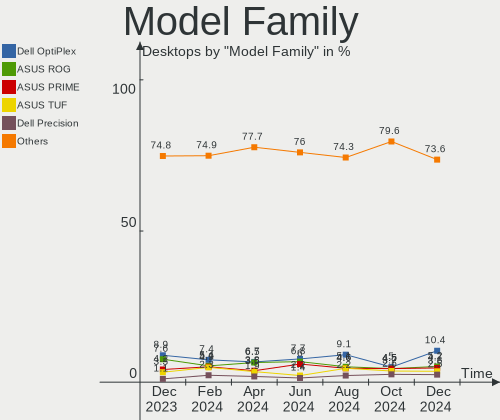
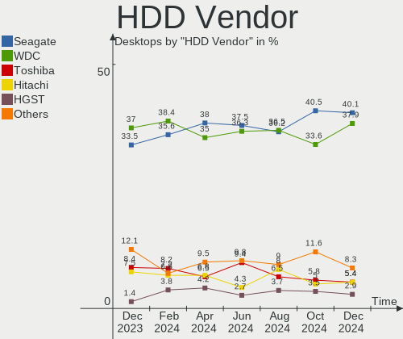
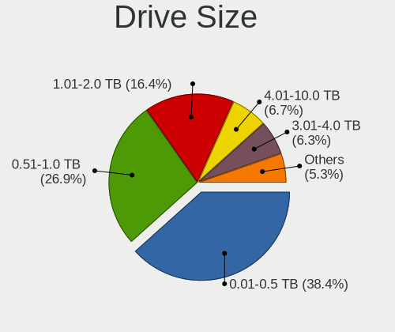
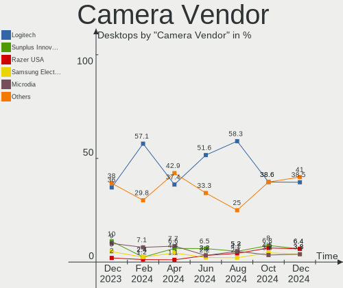

Linux in USA - Hardware Trends (Desktops)
-----------------------------------------

A project to identify most popular hardware characteristics and track their change
over time based on data collected by Linux users at https://Linux-Hardware.org.

Anyone can contribute to this report by the [hw-probe](https://github.com/linuxhw/hw-probe) tool:

    sudo -E hw-probe -all -upload

Period: Oct, 2022.

Contents
--------

* [ System ](#system)
  - [ OS                       ](#os)
  - [ OS Family                ](#os-family)
  - [ Kernel                   ](#kernel)
  - [ Kernel Family            ](#kernel-family)
  - [ Kernel Major Ver.        ](#kernel-major-ver)
  - [ Arch                     ](#arch)
  - [ DE                       ](#de)
  - [ Display Server           ](#display-server)
  - [ Display Manager          ](#display-manager)
  - [ OS Lang                  ](#os-lang)
  - [ Boot Mode                ](#boot-mode)
  - [ Filesystem               ](#filesystem)
  - [ Part. scheme             ](#part-scheme)
  - [ Dual Boot with Linux/BSD ](#dual-boot-with-linuxbsd)
  - [ Dual Boot (Win)          ](#dual-boot-win)

* [ Board ](#board)
  - [ Vendor                   ](#vendor)
  - [ Model                    ](#model)
  - [ Model Family             ](#model-family)
  - [ MFG Year                 ](#mfg-year)
  - [ Form Factor              ](#form-factor)
  - [ Secure Boot              ](#secure-boot)
  - [ Coreboot                 ](#coreboot)
  - [ RAM Size                 ](#ram-size)
  - [ RAM Used                 ](#ram-used)
  - [ Total Drives             ](#total-drives)
  - [ Has CD-ROM               ](#has-cd-rom)
  - [ Has Ethernet             ](#has-ethernet)
  - [ Has WiFi                 ](#has-wifi)
  - [ Has Bluetooth            ](#has-bluetooth)

* [ Location ](#location)
  - [ Country                  ](#country)
  - [ City                     ](#city)

* [ Drives ](#drives)
  - [ Drive Vendor             ](#drive-vendor)
  - [ Drive Model              ](#drive-model)
  - [ HDD Vendor               ](#hdd-vendor)
  - [ SSD Vendor               ](#ssd-vendor)
  - [ Drive Kind               ](#drive-kind)
  - [ Drive Connector          ](#drive-connector)
  - [ Drive Size               ](#drive-size)
  - [ Space Total              ](#space-total)
  - [ Space Used               ](#space-used)
  - [ Malfunc. Drives          ](#malfunc-drives)
  - [ Malfunc. Drive Vendor    ](#malfunc-drive-vendor)
  - [ Malfunc. HDD Vendor      ](#malfunc-hdd-vendor)
  - [ Malfunc. Drive Kind      ](#malfunc-drive-kind)
  - [ Failed Drives            ](#failed-drives)
  - [ Failed Drive Vendor      ](#failed-drive-vendor)
  - [ Drive Status             ](#drive-status)

* [ Storage controller ](#storage-controller)
  - [ Storage Vendor           ](#storage-vendor)
  - [ Storage Model            ](#storage-model)
  - [ Storage Kind             ](#storage-kind)

* [ Processor ](#processor)
  - [ CPU Vendor               ](#cpu-vendor)
  - [ CPU Model                ](#cpu-model)
  - [ CPU Model Family         ](#cpu-model-family)
  - [ CPU Cores                ](#cpu-cores)
  - [ CPU Sockets              ](#cpu-sockets)
  - [ CPU Threads              ](#cpu-threads)
  - [ CPU Op-Modes             ](#cpu-op-modes)
  - [ CPU Microcode            ](#cpu-microcode)
  - [ CPU Microarch            ](#cpu-microarch)

* [ Graphics ](#graphics)
  - [ GPU Vendor               ](#gpu-vendor)
  - [ GPU Model                ](#gpu-model)
  - [ GPU Combo                ](#gpu-combo)
  - [ GPU Driver               ](#gpu-driver)
  - [ GPU Memory               ](#gpu-memory)

* [ Monitor ](#monitor)
  - [ Monitor Vendor           ](#monitor-vendor)
  - [ Monitor Model            ](#monitor-model)
  - [ Monitor Resolution       ](#monitor-resolution)
  - [ Monitor Diagonal         ](#monitor-diagonal)
  - [ Monitor Width            ](#monitor-width)
  - [ Aspect Ratio             ](#aspect-ratio)
  - [ Monitor Area             ](#monitor-area)
  - [ Pixel Density            ](#pixel-density)
  - [ Multiple Monitors        ](#multiple-monitors)

* [ Network ](#network)
  - [ Net Controller Vendor    ](#net-controller-vendor)
  - [ Net Controller Model     ](#net-controller-model)
  - [ Wireless Vendor          ](#wireless-vendor)
  - [ Wireless Model           ](#wireless-model)
  - [ Ethernet Vendor          ](#ethernet-vendor)
  - [ Ethernet Model           ](#ethernet-model)
  - [ Net Controller Kind      ](#net-controller-kind)
  - [ Used Controller          ](#used-controller)
  - [ NICs                     ](#nics)
  - [ IPv6                     ](#ipv6)

* [ Bluetooth ](#bluetooth)
  - [ Bluetooth Vendor         ](#bluetooth-vendor)
  - [ Bluetooth Model          ](#bluetooth-model)

* [ Sound ](#sound)
  - [ Sound Vendor             ](#sound-vendor)
  - [ Sound Model              ](#sound-model)

* [ Memory ](#memory)
  - [ Memory Vendor            ](#memory-vendor)
  - [ Memory Model             ](#memory-model)
  - [ Memory Kind              ](#memory-kind)
  - [ Memory Form Factor       ](#memory-form-factor)
  - [ Memory Size              ](#memory-size)
  - [ Memory Speed             ](#memory-speed)

* [ Printers & scanners ](#printers--scanners)
  - [ Printer Vendor           ](#printer-vendor)
  - [ Printer Model            ](#printer-model)
  - [ Scanner Vendor           ](#scanner-vendor)
  - [ Scanner Model            ](#scanner-model)

* [ Camera ](#camera)
  - [ Camera Vendor            ](#camera-vendor)
  - [ Camera Model             ](#camera-model)

* [ Security ](#security)
  - [ Fingerprint Vendor       ](#fingerprint-vendor)
  - [ Fingerprint Model        ](#fingerprint-model)
  - [ Chipcard Vendor          ](#chipcard-vendor)
  - [ Chipcard Model           ](#chipcard-model)

* [ Unsupported ](#unsupported)
  - [ Unsupported Devices      ](#unsupported-devices)
  - [ Unsupported Device Types ](#unsupported-device-types)

System
------

OS
--

Installed operating systems

| Name                         | Desktops | Percent |
|------------------------------|----------|---------|
| Ubuntu 22.04                 | 64       | 18.03%  |
| Fedora 36                    | 28       | 7.89%   |
| Pop!_OS 22.04                | 20       | 5.63%   |
| Debian 11                    | 20       | 5.63%   |
| Linux Mint 21                | 18       | 5.07%   |
| Arch Rolling                 | 17       | 4.79%   |
| Zorin 16                     | 12       | 3.38%   |
| OpenMandriva 4.3             | 12       | 3.38%   |
| Linux Mint 20.3              | 12       | 3.38%   |
| Ubuntu 20.04                 | 10       | 2.82%   |
| Nobara 36                    | 10       | 2.82%   |
| OpenMandriva 4.50            | 9        | 2.54%   |
| Manjaro                      | 9        | 2.54%   |
| ArcoLinux Rolling            | 8        | 2.25%   |
| Manjaro 22.0.0               | 6        | 1.69%   |
| Ubuntu 22.10                 | 5        | 1.41%   |
| KDE neon 22.04               | 5        | 1.41%   |
| KDE neon 20.04               | 5        | 1.41%   |
| Fedora 37                    | 5        | 1.41%   |
| OpenMandriva 4.90            | 4        | 1.13%   |
| Kubuntu 22.04                | 4        | 1.13%   |
| Kali 2022.3                  | 4        | 1.13%   |
| Gentoo 2.8                   | 4        | 1.13%   |
| LMDE 5                       | 3        | 0.85%   |
| Kubuntu 11                   | 3        | 0.85%   |
| EndeavourOS Rolling          | 3        | 0.85%   |
| Elementary 6.1               | 3        | 0.85%   |
| Ubuntu MATE 22.04            | 2        | 0.56%   |
| Ubuntu Core 18               | 2        | 0.56%   |
| SteamOS 3.3                  | 2        | 0.56%   |
| openSUSE Tumbleweed-XXXXXXXX | 2        | 0.56%   |
| Linux Mint 20.2              | 2        | 0.56%   |
| Kubuntu 22.10                | 2        | 0.56%   |
| Clear Linux 37390            | 2        | 0.56%   |
| Xubuntu 22.04                | 1        | 0.28%   |
| Xubuntu 20.04                | 1        | 0.28%   |
| Ubuntu Unity 16.04           | 1        | 0.28%   |
| Ubuntu MATE 22.10            | 1        | 0.28%   |
| Ubuntu Budgie 22.04          | 1        | 0.28%   |
| Ubuntu Budgie 20.04          | 1        | 0.28%   |

OS Family
---------

OS without a version

| Name          | Desktops | Percent |
|---------------|----------|---------|
| Ubuntu        | 83       | 23.38%  |
| Linux Mint    | 35       | 9.86%   |
| Fedora        | 33       | 9.3%    |
| OpenMandriva  | 26       | 7.32%   |
| Pop!_OS       | 20       | 5.63%   |
| Debian        | 20       | 5.63%   |
| Arch          | 17       | 4.79%   |
| Manjaro       | 15       | 4.23%   |
| Zorin         | 12       | 3.38%   |
| Nobara        | 10       | 2.82%   |
| Kubuntu       | 10       | 2.82%   |
| KDE neon      | 10       | 2.82%   |
| ArcoLinux     | 8        | 2.25%   |
| Gentoo        | 6        | 1.69%   |
| Clear Linux   | 6        | 1.69%   |
| SteamOS       | 4        | 1.13%   |
| Kali          | 4        | 1.13%   |
| Ubuntu MATE   | 3        | 0.85%   |
| LMDE          | 3        | 0.85%   |
| EndeavourOS   | 3        | 0.85%   |
| Elementary    | 3        | 0.85%   |
| Xubuntu       | 2        | 0.56%   |
| Ubuntu Budgie | 2        | 0.56%   |
| openSUSE      | 2        | 0.56%   |
| Garuda Linux  | 2        | 0.56%   |
| Endless       | 2        | 0.56%   |
| Ubuntu Unity  | 1        | 0.28%   |
| SystemRescue  | 1        | 0.28%   |
| Solus         | 1        | 0.28%   |
| Siduction     | 1        | 0.28%   |
| ROSA          | 1        | 0.28%   |
| Rocky Linux   | 1        | 0.28%   |
| Peppermint    | 1        | 0.28%   |
| Parrot        | 1        | 0.28%   |
| MX            | 1        | 0.28%   |
| Lilidog       | 1        | 0.28%   |
| Ezarcher      | 1        | 0.28%   |
| BlackPanther  | 1        | 0.28%   |
| Artix         | 1        | 0.28%   |
| Alpine        | 1        | 0.28%   |

Kernel
------

Version of the Linux kernel

| Version                       | Desktops | Percent |
|-------------------------------|----------|---------|
| 5.15.0-52-generic             | 45       | 12.68%  |
| 5.15.0-48-generic             | 38       | 10.7%   |
| 5.15.0-50-generic             | 30       | 8.45%   |
| 5.19.0-76051900-generic       | 13       | 3.66%   |
| 5.10.0-18-amd64               | 12       | 3.38%   |
| 5.19.16-200.fc36.x86_64       | 11       | 3.1%    |
| 5.16.7-desktop-1omv4003       | 10       | 2.82%   |
| 5.4.0-126-generic             | 9        | 2.54%   |
| 5.19.5-desktop-1omv4090       | 7        | 1.97%   |
| 6.0.2-arch1-1                 | 5        | 1.41%   |
| 6.0.1-arch2-1                 | 5        | 1.41%   |
| 5.4.0-128-generic             | 5        | 1.41%   |
| 5.19.13-arch1-1               | 5        | 1.41%   |
| 5.19.12-200.fc36.x86_64       | 5        | 1.41%   |
| 5.19.7-1-MANJARO              | 4        | 1.13%   |
| 5.19.16-76051916-generic      | 4        | 1.13%   |
| 5.19.14-200.fc36.x86_64       | 4        | 1.13%   |
| 5.19.0-23-generic             | 4        | 1.13%   |
| 6.0.2-zen1-1-zen              | 3        | 0.85%   |
| 5.19.13-200.fc36.x86_64       | 3        | 0.85%   |
| 5.18.12-desktop-3omv4090      | 3        | 0.85%   |
| 5.18.0-0.deb11.4-amd64        | 3        | 0.85%   |
| 5.15.71-1-MANJARO             | 3        | 0.85%   |
| 5.15.65-1-MANJARO             | 3        | 0.85%   |
| 5.15.0-46-generic             | 3        | 0.85%   |
| 5.10.0-19-amd64               | 3        | 0.85%   |
| 5.10.0-16-amd64               | 3        | 0.85%   |
| 6.0.5-arch1-1                 | 2        | 0.56%   |
| 6.0.2-76060002-generic        | 2        | 0.56%   |
| 6.0.2-1201.native             | 2        | 0.56%   |
| 5.19.7-204.fsync.fc36.x86_64  | 2        | 0.56%   |
| 5.19.16-301.fc37.x86_64       | 2        | 0.56%   |
| 5.19.16-201.fsync.fc36.x86_64 | 2        | 0.56%   |
| 5.19.15-202.fsync.fc36.x86_64 | 2        | 0.56%   |
| 5.19.14-201.fsync.fc36.x86_64 | 2        | 0.56%   |
| 5.19.12-desktop-2omv4090      | 2        | 0.56%   |
| 5.19.12-arch1-1               | 2        | 0.56%   |
| 5.19.10-1-default             | 2        | 0.56%   |
| 5.19.0-15-generic             | 2        | 0.56%   |
| 5.18.0-kali7-amd64            | 2        | 0.56%   |

Kernel Family
-------------

Linux kernel without a distro release

| Version | Desktops | Percent |
|---------|----------|---------|
| 5.15.0  | 125      | 35.21%  |
| 5.19.0  | 23       | 6.48%   |
| 5.19.16 | 22       | 6.2%    |
| 5.4.0   | 19       | 5.35%   |
| 5.10.0  | 18       | 5.07%   |
| 6.0.2   | 12       | 3.38%   |
| 5.19.12 | 11       | 3.1%    |
| 5.19.13 | 10       | 2.82%   |
| 5.16.7  | 10       | 2.82%   |
| 6.0.1   | 8        | 2.25%   |
| 5.19.14 | 8        | 2.25%   |
| 5.18.0  | 8        | 2.25%   |
| 5.19.5  | 7        | 1.97%   |
| 5.19.7  | 6        | 1.69%   |
| 5.11.0  | 5        | 1.41%   |
| 5.15.72 | 4        | 1.13%   |
| 5.15.71 | 4        | 1.13%   |
| 5.13.0  | 4        | 1.13%   |
| 6.0.5   | 3        | 0.85%   |
| 5.19.15 | 3        | 0.85%   |
| 5.19.11 | 3        | 0.85%   |
| 5.19.10 | 3        | 0.85%   |
| 5.18.12 | 3        | 0.85%   |
| 5.16.13 | 3        | 0.85%   |
| 5.15.65 | 3        | 0.85%   |
| 6.0.0   | 2        | 0.56%   |
| 5.19.8  | 2        | 0.56%   |
| 5.17.5  | 2        | 0.56%   |
| 5.15.74 | 2        | 0.56%   |
| 5.15.60 | 2        | 0.56%   |
| 5.6.14  | 1        | 0.28%   |
| 5.5.0   | 1        | 0.28%   |
| 5.4.83  | 1        | 0.28%   |
| 5.18.8  | 1        | 0.28%   |
| 5.18.5  | 1        | 0.28%   |
| 5.18.14 | 1        | 0.28%   |
| 5.18.10 | 1        | 0.28%   |
| 5.17.0  | 1        | 0.28%   |
| 5.16.0  | 1        | 0.28%   |
| 5.15.68 | 1        | 0.28%   |

Kernel Major Ver.
-----------------

Linux kernel major version

| Version | Desktops | Percent |
|---------|----------|---------|
| 5.15    | 145      | 40.85%  |
| 5.19    | 98       | 27.61%  |
| 6.0     | 25       | 7.04%   |
| 5.4     | 20       | 5.63%   |
| 5.10    | 20       | 5.63%   |
| 5.18    | 15       | 4.23%   |
| 5.16    | 14       | 3.94%   |
| 5.11    | 5        | 1.41%   |
| 5.13    | 4        | 1.13%   |
| 5.17    | 3        | 0.85%   |
| 5.6     | 1        | 0.28%   |
| 5.5     | 1        | 0.28%   |
| 5.14    | 1        | 0.28%   |
| 4.4     | 1        | 0.28%   |
| 4.18    | 1        | 0.28%   |
| 4.15    | 1        | 0.28%   |

Arch
----

OS architecture (x86_64, i586, etc.)

| Name   | Desktops | Percent |
|--------|----------|---------|
| x86_64 | 355      | 100%    |

DE
--

Desktop Environment

| Name             | Desktops | Percent |
|------------------|----------|---------|
| GNOME            | 159      | 44.79%  |
| KDE5             | 95       | 26.76%  |
| X-Cinnamon       | 35       | 9.86%   |
| Unknown          | 21       | 5.92%   |
| XFCE             | 15       | 4.23%   |
| MATE             | 7        | 1.97%   |
| Pantheon         | 3        | 0.85%   |
| Cinnamon         | 3        | 0.85%   |
| Budgie           | 3        | 0.85%   |
| LXQt             | 2        | 0.56%   |
| i3               | 2        | 0.56%   |
| Unity            | 1        | 0.28%   |
| openbox          | 1        | 0.28%   |
| LXDE             | 1        | 0.28%   |
| lightdm-xsession | 1        | 0.28%   |
| LeftWM           | 1        | 0.28%   |
| KDE4             | 1        | 0.28%   |
| GNOME Classic    | 1        | 0.28%   |
| Deepin           | 1        | 0.28%   |
| bspwm            | 1        | 0.28%   |
| awesome          | 1        | 0.28%   |

Display Server
--------------

X11 or Wayland

| Name    | Desktops | Percent |
|---------|----------|---------|
| X11     | 249      | 70.14%  |
| Wayland | 82       | 23.1%   |
| Unknown | 16       | 4.51%   |
| Tty     | 8        | 2.25%   |

Display Manager
---------------

SDDM, LightDM, etc.

| Name    | Desktops | Percent |
|---------|----------|---------|
| Unknown | 168      | 47.32%  |
| GDM3    | 75       | 21.13%  |
| SDDM    | 57       | 16.06%  |
| LightDM | 37       | 10.42%  |
| GDM     | 15       | 4.23%   |
| XDM     | 1        | 0.28%   |
| NODM    | 1        | 0.28%   |
| KDM     | 1        | 0.28%   |

OS Lang
-------

Language

| Lang       | Desktops | Percent |
|------------|----------|---------|
| en_US      | 331      | 93.24%  |
| C          | 8        | 2.25%   |
| Unknown    | 6        | 1.69%   |
| en_GB      | 3        | 0.85%   |
| en_US.UTF8 | 2        | 0.56%   |
| zh_CN      | 1        | 0.28%   |
| it_IT      | 1        | 0.28%   |
| en_AG      | 1        | 0.28%   |
| Default    | 1        | 0.28%   |
| C.UTF8     | 1        | 0.28%   |

Boot Mode
---------

EFI or BIOS

| Mode | Desktops | Percent |
|------|----------|---------|
| BIOS | 219      | 61.69%  |
| EFI  | 136      | 38.31%  |

Filesystem
----------

Type of filesystem

| Type    | Desktops | Percent |
|---------|----------|---------|
| Ext4    | 250      | 70.42%  |
| Btrfs   | 63       | 17.75%  |
| Overlay | 29       | 8.17%   |
| Zfs     | 6        | 1.69%   |
| Xfs     | 6        | 1.69%   |
| Ext3    | 1        | 0.28%   |

Part. scheme
------------

Scheme of partitioning

| Type    | Desktops | Percent |
|---------|----------|---------|
| GPT     | 169      | 47.61%  |
| Unknown | 146      | 41.13%  |
| MBR     | 40       | 11.27%  |

Dual Boot with Linux/BSD
------------------------

Hosting more than one Linux/BSD

| Dual boot | Desktops | Percent |
|-----------|----------|---------|
| No        | 291      | 81.97%  |
| Yes       | 64       | 18.03%  |

Dual Boot (Win)
---------------

Hosting Linux and Windows

| Dual boot | Desktops | Percent |
|-----------|----------|---------|
| No        | 273      | 76.9%   |
| Yes       | 82       | 23.1%   |

Board
-----

Vendor
------

Motherboard manufacturer

| Name                | Desktops | Percent |
|---------------------|----------|---------|
| ASUSTek Computer    | 96       | 27.04%  |
| Dell                | 58       | 16.34%  |
| Gigabyte Technology | 43       | 12.11%  |
| MSI                 | 40       | 11.27%  |
| Hewlett-Packard     | 40       | 11.27%  |
| ASRock              | 28       | 7.89%   |
| Lenovo              | 15       | 4.23%   |
| Intel               | 7        | 1.97%   |
| Apple               | 4        | 1.13%   |
| Google              | 2        | 0.56%   |
| Gateway             | 2        | 0.56%   |
| Foxconn             | 2        | 0.56%   |
| AZW                 | 2        | 0.56%   |
| Unknown             | 2        | 0.56%   |
| Techvision          | 1        | 0.28%   |
| Soyo                | 1        | 0.28%   |
| Shuttle             | 1        | 0.28%   |
| Pegatron            | 1        | 0.28%   |
| NZXT                | 1        | 0.28%   |
| LattePanda          | 1        | 0.28%   |
| EVGA                | 1        | 0.28%   |
| ECS                 | 1        | 0.28%   |
| Biostar             | 1        | 0.28%   |
| BESSTAR Tech        | 1        | 0.28%   |
| ASRockRack          | 1        | 0.28%   |
| AOpen               | 1        | 0.28%   |
| Alienware           | 1        | 0.28%   |
| Acer                | 1        | 0.28%   |

Model
-----

Motherboard model

| Name                                | Desktops | Percent |
|-------------------------------------|----------|---------|
| MSI MS-7B86                         | 6        | 1.69%   |
| ASUS TUF Gaming X570-PLUS           | 6        | 1.69%   |
| ASUS All Series                     | 6        | 1.69%   |
| MSI MS-7C56                         | 4        | 1.13%   |
| Dell OptiPlex 9020                  | 4        | 1.13%   |
| Dell OptiPlex 790                   | 4        | 1.13%   |
| Dell OptiPlex 7010                  | 4        | 1.13%   |
| ASUS M5A99FX PRO R2.0               | 4        | 1.13%   |
| MSI MS-7B79                         | 3        | 0.85%   |
| HP Compaq 8000 Elite USDT PC        | 3        | 0.85%   |
| Gigabyte B450M DS3H V2              | 3        | 0.85%   |
| Dell OptiPlex 3020                  | 3        | 0.85%   |
| Dell OptiPlex 3010                  | 3        | 0.85%   |
| ASUS TUF Gaming B550M-PLUS          | 3        | 0.85%   |
| ASUS SABERTOOTH 990FX R2.0          | 3        | 0.85%   |
| ASUS ROG STRIX B550-F GAMING        | 3        | 0.85%   |
| ASRock B450M Pro4                   | 3        | 0.85%   |
| ASRock 970M Pro3                    | 3        | 0.85%   |
| MSI MS-7C95                         | 2        | 0.56%   |
| MSI MS-7C84                         | 2        | 0.56%   |
| MSI MS-7C37                         | 2        | 0.56%   |
| MSI MS-7B85                         | 2        | 0.56%   |
| HP Pavilion Gaming Desktop 690-00xx | 2        | 0.56%   |
| HP EliteDesk 800 G1 SFF             | 2        | 0.56%   |
| HP Compaq Pro 6300 SFF              | 2        | 0.56%   |
| HP Compaq 6005 Pro MT PC            | 2        | 0.56%   |
| Gigabyte X570 AORUS ELITE           | 2        | 0.56%   |
| Gigabyte GA-970A-D3                 | 2        | 0.56%   |
| Gigabyte B550M DS3H                 | 2        | 0.56%   |
| Gigabyte B450M DS3H                 | 2        | 0.56%   |
| Gigabyte B450 AORUS ELITE           | 2        | 0.56%   |
| Gigabyte A320M-S2H                  | 2        | 0.56%   |
| Dell XPS 8700                       | 2        | 0.56%   |
| Dell XPS 8500                       | 2        | 0.56%   |
| Dell Precision Tower 5810           | 2        | 0.56%   |
| Dell Precision T3600                | 2        | 0.56%   |
| Dell OptiPlex 990                   | 2        | 0.56%   |
| Dell OptiPlex 780                   | 2        | 0.56%   |
| Dell OptiPlex 5040                  | 2        | 0.56%   |
| Dell OptiPlex 390                   | 2        | 0.56%   |

Model Family
------------

Motherboard model prefix

| Name                | Desktops | Percent |
|---------------------|----------|---------|
| Dell OptiPlex       | 35       | 9.86%   |
| ASUS ROG            | 21       | 5.92%   |
| ASUS TUF            | 18       | 5.07%   |
| HP Compaq           | 14       | 3.94%   |
| ASUS PRIME          | 12       | 3.38%   |
| Lenovo ThinkCentre  | 9        | 2.54%   |
| Dell Precision      | 8        | 2.25%   |
| MSI MS-7B86         | 6        | 1.69%   |
| Dell XPS            | 6        | 1.69%   |
| ASUS All            | 6        | 1.69%   |
| HP Pavilion         | 5        | 1.41%   |
| HP EliteDesk        | 5        | 1.41%   |
| Gigabyte B450M      | 5        | 1.41%   |
| MSI MS-7C56         | 4        | 1.13%   |
| Gigabyte B550M      | 4        | 1.13%   |
| Dell Inspiron       | 4        | 1.13%   |
| ASUS M5A99FX        | 4        | 1.13%   |
| ASRock B450M        | 4        | 1.13%   |
| MSI MS-7B79         | 3        | 0.85%   |
| Gigabyte Z390       | 3        | 0.85%   |
| Gigabyte X570       | 3        | 0.85%   |
| Gigabyte B450       | 3        | 0.85%   |
| ASUS SABERTOOTH     | 3        | 0.85%   |
| ASUS PRO            | 3        | 0.85%   |
| ASRock 970M         | 3        | 0.85%   |
| MSI MS-7C95         | 2        | 0.56%   |
| MSI MS-7C84         | 2        | 0.56%   |
| MSI MS-7C37         | 2        | 0.56%   |
| MSI MS-7B85         | 2        | 0.56%   |
| Lenovo IdeaCentre   | 2        | 0.56%   |
| HP ProLiant         | 2        | 0.56%   |
| HP ProDesk          | 2        | 0.56%   |
| Gigabyte GA-970A-D3 | 2        | 0.56%   |
| Gigabyte B550       | 2        | 0.56%   |
| Gigabyte A320M-S2H  | 2        | 0.56%   |
| ASUS P9X79          | 2        | 0.56%   |
| ASUS P8P67          | 2        | 0.56%   |
| ASUS M5A78L-M       | 2        | 0.56%   |
| ASRock X570         | 2        | 0.56%   |
| ASRock B450         | 2        | 0.56%   |

MFG Year
--------

Motherboard manufacture year

| Year    | Desktops | Percent |
|---------|----------|---------|
| 2020    | 51       | 14.37%  |
| 2018    | 44       | 12.39%  |
| 2012    | 35       | 9.86%   |
| 2019    | 26       | 7.32%   |
| 2011    | 25       | 7.04%   |
| 2013    | 23       | 6.48%   |
| 2015    | 20       | 5.63%   |
| 2010    | 20       | 5.63%   |
| 2021    | 19       | 5.35%   |
| 2017    | 17       | 4.79%   |
| 2014    | 17       | 4.79%   |
| 2009    | 14       | 3.94%   |
| 2022    | 13       | 3.66%   |
| 2016    | 11       | 3.1%    |
| 2008    | 11       | 3.1%    |
| 2007    | 7        | 1.97%   |
| 2005    | 1        | 0.28%   |
| Unknown | 1        | 0.28%   |

Form Factor
-----------

Physical design of the computer

| Name    | Desktops | Percent |
|---------|----------|---------|
| Desktop | 355      | 100%    |

Secure Boot
-----------

Enabled or disabled

| State    | Desktops | Percent |
|----------|----------|---------|
| Disabled | 346      | 97.46%  |
| Enabled  | 9        | 2.54%   |

Coreboot
--------

Have coreboot on board

| Used | Desktops | Percent |
|------|----------|---------|
| No   | 353      | 99.44%  |
| Yes  | 2        | 0.56%   |

RAM Size
--------

Total RAM memory

| Size in GB      | Desktops | Percent |
|-----------------|----------|---------|
| 16.01-24.0      | 104      | 29.3%   |
| 32.01-64.0      | 78       | 21.97%  |
| 8.01-16.0       | 56       | 15.77%  |
| 4.01-8.0        | 40       | 11.27%  |
| 64.01-256.0     | 29       | 8.17%   |
| 3.01-4.0        | 26       | 7.32%   |
| 24.01-32.0      | 14       | 3.94%   |
| 1.01-2.0        | 6        | 1.69%   |
| More than 256.0 | 1        | 0.28%   |
| 2.01-3.0        | 1        | 0.28%   |

RAM Used
--------

Used RAM memory

| Used GB    | Desktops | Percent |
|------------|----------|---------|
| 1.01-2.0   | 97       | 27.32%  |
| 2.01-3.0   | 94       | 26.48%  |
| 4.01-8.0   | 79       | 22.25%  |
| 3.01-4.0   | 42       | 11.83%  |
| 8.01-16.0  | 23       | 6.48%   |
| 0.51-1.0   | 15       | 4.23%   |
| 16.01-24.0 | 2        | 0.56%   |
| 0.01-0.5   | 2        | 0.56%   |
| 24.01-32.0 | 1        | 0.28%   |

Total Drives
------------

Number of drives on board

| Drives | Desktops | Percent |
|--------|----------|---------|
| 1      | 112      | 31.55%  |
| 2      | 95       | 26.76%  |
| 3      | 67       | 18.87%  |
| 4      | 34       | 9.58%   |
| 5      | 25       | 7.04%   |
| 6      | 9        | 2.54%   |
| 7      | 6        | 1.69%   |
| 11     | 2        | 0.56%   |
| 9      | 2        | 0.56%   |
| 0      | 2        | 0.56%   |
| 19     | 1        | 0.28%   |

Has CD-ROM
----------

Has CD-ROM on board

| Presented | Desktops | Percent |
|-----------|----------|---------|
| No        | 182      | 51.27%  |
| Yes       | 173      | 48.73%  |

Has Ethernet
------------

Has Ethernet on board

| Presented | Desktops | Percent |
|-----------|----------|---------|
| Yes       | 354      | 99.72%  |
| No        | 1        | 0.28%   |

Has WiFi
--------

Has WiFi module

| Presented | Desktops | Percent |
|-----------|----------|---------|
| Yes       | 190      | 53.52%  |
| No        | 165      | 46.48%  |

Has Bluetooth
-------------

Has Bluetooth module

| Presented | Desktops | Percent |
|-----------|----------|---------|
| No        | 198      | 55.77%  |
| Yes       | 157      | 44.23%  |

Location
--------

Country
-------

Geographic location (country)

| Country | Desktops | Percent |
|---------|----------|---------|
| USA     | 355      | 100%    |

City
----

Geographic location (city)

| City          | Desktops | Percent |
|---------------|----------|---------|
| Seattle       | 10       | 2.82%   |
| Miami         | 7        | 1.97%   |
| Portland      | 5        | 1.41%   |
| St Louis      | 4        | 1.13%   |
| Los Angeles   | 4        | 1.13%   |
| Lincoln       | 4        | 1.13%   |
| Washington    | 3        | 0.85%   |
| Tulsa         | 3        | 0.85%   |
| Tucson        | 3        | 0.85%   |
| San Jose      | 3        | 0.85%   |
| San Francisco | 3        | 0.85%   |
| Rio Rancho    | 3        | 0.85%   |
| Philadelphia  | 3        | 0.85%   |
| New York      | 3        | 0.85%   |
| Minneapolis   | 3        | 0.85%   |
| Dallas        | 3        | 0.85%   |
| Bothell       | 3        | 0.85%   |
| Austin        | 3        | 0.85%   |
| Arlington     | 3        | 0.85%   |
| Albuquerque   | 3        | 0.85%   |
| Springfield   | 2        | 0.56%   |
| Southlake     | 2        | 0.56%   |
| San Marcos    | 2        | 0.56%   |
| San Antonio   | 2        | 0.56%   |
| Rainsville    | 2        | 0.56%   |
| Racine        | 2        | 0.56%   |
| Oklahoma City | 2        | 0.56%   |
| Naples        | 2        | 0.56%   |
| Memphis       | 2        | 0.56%   |
| Las Vegas     | 2        | 0.56%   |
| Knoxville     | 2        | 0.56%   |
| Jacksonville  | 2        | 0.56%   |
| Jackson       | 2        | 0.56%   |
| Henderson     | 2        | 0.56%   |
| Grand Rapids  | 2        | 0.56%   |
| Georgetown    | 2        | 0.56%   |
| Gainesville   | 2        | 0.56%   |
| Florence      | 2        | 0.56%   |
| Fayetteville  | 2        | 0.56%   |
| Chicago       | 2        | 0.56%   |

Drives
------

Drive Vendor
------------

Hard drive vendors

| Vendor                    | Desktops | Drives | Percent |
|---------------------------|----------|--------|---------|
| Seagate                   | 130      | 175    | 18.31%  |
| WDC                       | 120      | 177    | 16.9%   |
| Samsung Electronics       | 110      | 151    | 15.49%  |
| Toshiba                   | 41       | 47     | 5.77%   |
| Sandisk                   | 41       | 45     | 5.77%   |
| Crucial                   | 30       | 33     | 4.23%   |
| PNY                       | 22       | 22     | 3.1%    |
| Phison Electronics        | 22       | 28     | 3.1%    |
| Hitachi                   | 22       | 24     | 3.1%    |
| Kingston                  | 16       | 19     | 2.25%   |
| Unknown                   | 14       | 22     | 1.97%   |
| Intel                     | 13       | 13     | 1.83%   |
| SK hynix                  | 12       | 14     | 1.69%   |
| China                     | 11       | 15     | 1.55%   |
| Silicon Motion            | 10       | 11     | 1.41%   |
| Micron/Crucial Technology | 8        | 8      | 1.13%   |
| OCZ                       | 6        | 7      | 0.85%   |
| A-DATA Technology         | 6        | 6      | 0.85%   |
| Team                      | 5        | 5      | 0.7%    |
| SABRENT                   | 4        | 5      | 0.56%   |
| ASMT                      | 4        | 6      | 0.56%   |
| SPCC                      | 3        | 4      | 0.42%   |
| Realtek Semiconductor     | 3        | 3      | 0.42%   |
| OWC                       | 3        | 3      | 0.42%   |
| Lexar                     | 3        | 3      | 0.42%   |
| KingFast                  | 3        | 3      | 0.42%   |
| HGST                      | 3        | 6      | 0.42%   |
| Hewlett-Packard           | 3        | 4      | 0.42%   |
| Corsair                   | 3        | 3      | 0.42%   |
| Phison                    | 2        | 2      | 0.28%   |
| Patriot                   | 2        | 2      | 0.28%   |
| NGFF                      | 2        | 2      | 0.28%   |
| Micron Technology         | 2        | 2      | 0.28%   |
| BUFFALO                   | 2        | 2      | 0.28%   |
| Apple                     | 2        | 2      | 0.28%   |
| Yangtze Memory            | 1        | 1      | 0.14%   |
| WD MediaMax               | 1        | 1      | 0.14%   |
| TRUSTED                   | 1        | 1      | 0.14%   |
| Transcend                 | 1        | 1      | 0.14%   |
| TEAM TM8                  | 1        | 1      | 0.14%   |

Drive Model
-----------

Hard drive models

| Model                                                 | Desktops | Percent |
|-------------------------------------------------------|----------|---------|
| Samsung NVMe SSD Controller SM981/PM981/PM983 500GB   | 21       | 2.53%   |
| Seagate ST2000DM008-2FR102 2TB                        | 15       | 1.81%   |
| Phison E12 NVMe Controller 2TB                        | 15       | 1.81%   |
| Samsung SSD 980 1TB                                   | 13       | 1.56%   |
| Samsung SSD 860 EVO 1TB                               | 13       | 1.56%   |
| Samsung NVMe SSD Controller PM9A1/PM9A3/980PRO 250GB  | 9        | 1.08%   |
| Seagate ST31000528AS 1TB                              | 8        | 0.96%   |
| Toshiba DT01ACA100 1TB                                | 7        | 0.84%   |
| PNY CS900 500GB SSD                                   | 7        | 0.84%   |
| Crucial CT500MX500SSD1 500GB                          | 7        | 0.84%   |
| WDC WD10EZEX-08WN4A0 1TB                              | 6        | 0.72%   |
| Sandisk WD Black SN750 / PC SN730 NVMe SSD 1TB        | 6        | 0.72%   |
| Samsung SSD 870 QVO 2TB                               | 6        | 0.72%   |
| Samsung SSD 860 EVO 500GB                             | 6        | 0.72%   |
| Samsung SSD 850 EVO 250GB                             | 6        | 0.72%   |
| Kingston SA400S37240G 240GB SSD                       | 6        | 0.72%   |
| Intel SSD 660P Series 1024GB                          | 6        | 0.72%   |
| WDC WD10EZEX-60M2NA0 1TB                              | 5        | 0.6%    |
| Unknown SD/MMC/MS PRO 1TB                             | 5        | 0.6%    |
| Silicon Motion SM2263EN/SM2263XT SSD Controller 256GB | 5        | 0.6%    |
| Seagate ST500DM002-1BD142 500GB                       | 5        | 0.6%    |
| Seagate ST1000DM003-1CH162 1TB                        | 5        | 0.6%    |
| Crucial CT1000MX500SSD1 1TB                           | 5        | 0.6%    |
| Toshiba HDWD110 1TB                                   | 4        | 0.48%   |
| Silicon Motion SM2262/SM2262EN SSD Controller 1024GB  | 4        | 0.48%   |
| Seagate ST3500418AS 500GB                             | 4        | 0.48%   |
| Seagate ST1000DM010-2EP102 1TB                        | 4        | 0.48%   |
| Sandisk WD Blue SN550 NVMe SSD 1TB                    | 4        | 0.48%   |
| Samsung SSD 970 EVO Plus 1TB                          | 4        | 0.48%   |
| Samsung SSD 860 EVO 250GB                             | 4        | 0.48%   |
| Samsung SSD 850 EVO 500GB                             | 4        | 0.48%   |
| PNY CS900 240GB SSD                                   | 4        | 0.48%   |
| Phison E16 PCIe4 NVMe Controller 1TB                  | 4        | 0.48%   |
| WDC WDS500G2B0A-00SM50 500GB SSD                      | 3        | 0.36%   |
| WDC WD6400AAKS-22A7B2 640GB                           | 3        | 0.36%   |
| WDC WD1002FAEX-00Z3A0 1TB                             | 3        | 0.36%   |
| Unknown SD/MMC 2GB                                    | 3        | 0.36%   |
| Unknown M.S./M.S.Pro/HG 16GB                          | 3        | 0.36%   |
| Toshiba DT01ACA050 500GB                              | 3        | 0.36%   |
| Seagate ST9250315AS 250GB                             | 3        | 0.36%   |

HDD Vendor
----------

Hard disk drive vendors

| Vendor              | Desktops | Drives | Percent |
|---------------------|----------|--------|---------|
| Seagate             | 130      | 174    | 40.12%  |
| WDC                 | 108      | 154    | 33.33%  |
| Toshiba             | 37       | 43     | 11.42%  |
| Hitachi             | 22       | 24     | 6.79%   |
| Unknown             | 7        | 11     | 2.16%   |
| SABRENT             | 4        | 5      | 1.23%   |
| HGST                | 3        | 6      | 0.93%   |
| ASMT                | 3        | 5      | 0.93%   |
| Samsung Electronics | 1        | 1      | 0.31%   |
| SAGE                | 1        | 1      | 0.31%   |
| RSH-319             | 1        | 1      | 0.31%   |
| QUANTUM             | 1        | 1      | 0.31%   |
| Maxtor              | 1        | 1      | 0.31%   |
| Maxone              | 1        | 1      | 0.31%   |
| JMicron Technology  | 1        | 6      | 0.31%   |
| HPE                 | 1        | 2      | 0.31%   |
| Hewlett-Packard     | 1        | 2      | 0.31%   |
| Apple               | 1        | 1      | 0.31%   |

SSD Vendor
----------

Solid state drive vendors

| Vendor              | Desktops | Drives | Percent |
|---------------------|----------|--------|---------|
| Samsung Electronics | 65       | 78     | 27.43%  |
| Crucial             | 30       | 33     | 12.66%  |
| SanDisk             | 22       | 23     | 9.28%   |
| PNY                 | 22       | 22     | 9.28%   |
| WDC                 | 15       | 19     | 6.33%   |
| Kingston            | 14       | 17     | 5.91%   |
| China               | 11       | 15     | 4.64%   |
| OCZ                 | 6        | 7      | 2.53%   |
| A-DATA Technology   | 6        | 6      | 2.53%   |
| Team                | 5        | 5      | 2.11%   |
| Toshiba             | 3        | 3      | 1.27%   |
| SK hynix            | 3        | 4      | 1.27%   |
| OWC                 | 3        | 3      | 1.27%   |
| Lexar               | 3        | 3      | 1.27%   |
| Intel               | 3        | 3      | 1.27%   |
| Unknown             | 2        | 2      | 0.84%   |
| SPCC                | 2        | 3      | 0.84%   |
| Patriot             | 2        | 2      | 0.84%   |
| NGFF                | 2        | 2      | 0.84%   |
| Hewlett-Packard     | 2        | 2      | 0.84%   |
| BUFFALO             | 2        | 2      | 0.84%   |
| Transcend           | 1        | 1      | 0.42%   |
| T-FORCE             | 1        | 1      | 0.42%   |
| Seagate             | 1        | 1      | 0.42%   |
| PNY USB             | 1        | 1      | 0.42%   |
| Pioneer             | 1        | 1      | 0.42%   |
| MyDigitalSSD        | 1        | 1      | 0.42%   |
| Micron Technology   | 1        | 1      | 0.42%   |
| KingSpec            | 1        | 1      | 0.42%   |
| KingFast            | 1        | 1      | 0.42%   |
| Hoodisk             | 1        | 1      | 0.42%   |
| CT2000P2            | 1        | 1      | 0.42%   |
| Corsair             | 1        | 1      | 0.42%   |
| ASMT                | 1        | 1      | 0.42%   |
| 1TB                 | 1        | 1      | 0.42%   |

Drive Kind
----------

HDD or SSD

| Kind    | Desktops | Drives | Percent |
|---------|----------|--------|---------|
| HDD     | 238      | 439    | 42.5%   |
| SSD     | 181      | 268    | 32.32%  |
| NVMe    | 126      | 182    | 22.5%   |
| Unknown | 13       | 21     | 2.32%   |
| MMC     | 2        | 3      | 0.36%   |

Drive Connector
---------------

SATA, SAS, NVMe, etc.

| Type | Desktops | Drives | Percent |
|------|----------|--------|---------|
| SATA | 312      | 651    | 63.67%  |
| NVMe | 126      | 181    | 25.71%  |
| SAS  | 50       | 78     | 10.2%   |
| MMC  | 2        | 3      | 0.41%   |

Drive Size
----------

Size of hard drive

| Size in TB | Desktops | Drives | Percent |
|------------|----------|--------|---------|
| 0.01-0.5   | 202      | 296    | 40.16%  |
| 0.51-1.0   | 162      | 215    | 32.21%  |
| 1.01-2.0   | 69       | 88     | 13.72%  |
| 3.01-4.0   | 28       | 39     | 5.57%   |
| 4.01-10.0  | 20       | 31     | 3.98%   |
| 2.01-3.0   | 17       | 20     | 3.38%   |
| 10.01-20.0 | 5        | 18     | 0.99%   |

Space Total
-----------

Amount of disk space available on the file system

| Size in GB     | Desktops | Percent |
|----------------|----------|---------|
| 501-1000       | 73       | 20.56%  |
| More than 3000 | 61       | 17.18%  |
| 251-500        | 56       | 15.77%  |
| 101-250        | 53       | 14.93%  |
| 1001-2000      | 42       | 11.83%  |
| 2001-3000      | 23       | 6.48%   |
| 1-20           | 21       | 5.92%   |
| Unknown        | 10       | 2.82%   |
| 21-50          | 8        | 2.25%   |
| 51-100         | 8        | 2.25%   |

Space Used
----------

Amount of used disk space

| Used GB        | Desktops | Percent |
|----------------|----------|---------|
| 1-20           | 101      | 28.45%  |
| 21-50          | 50       | 14.08%  |
| 251-500        | 41       | 11.55%  |
| 101-250        | 41       | 11.55%  |
| 51-100         | 35       | 9.86%   |
| More than 3000 | 27       | 7.61%   |
| 1001-2000      | 23       | 6.48%   |
| 501-1000       | 18       | 5.07%   |
| Unknown        | 10       | 2.82%   |
| 2001-3000      | 9        | 2.54%   |

Malfunc. Drives
---------------

Drive models with a malfunction

| Model                                 | Desktops | Drives | Percent |
|---------------------------------------|----------|--------|---------|
| WDC WD5000BEVT-75ZAT0 500GB           | 2        | 2      | 6.67%   |
| WDC WD5000BPVT-22HXZT3 500GB          | 1        | 1      | 3.33%   |
| WDC WD5000AAKS-00H2B0 500GB           | 1        | 1      | 3.33%   |
| WDC WD40EFRX-68WT0N0 4TB              | 1        | 1      | 3.33%   |
| WDC WD3200AAJS-60Z0A0 320GB           | 1        | 1      | 3.33%   |
| WDC WD10EARS-00MVWB0 1TB              | 1        | 1      | 3.33%   |
| WDC WD1002FBYS-05A6B0 1TB             | 1        | 1      | 3.33%   |
| Toshiba MK6475GSX 640GB               | 1        | 1      | 3.33%   |
| Toshiba HDWE140 4TB                   | 1        | 1      | 3.33%   |
| Toshiba DT01ACA100 1TB                | 1        | 1      | 3.33%   |
| Seagate ST9640320AS 640GB             | 1        | 1      | 3.33%   |
| Seagate ST500DM002-1BD142 500GB       | 1        | 1      | 3.33%   |
| Seagate ST3750528AS 752GB             | 1        | 1      | 3.33%   |
| Seagate ST3320620AS 320GB             | 1        | 1      | 3.33%   |
| Seagate ST32000641AS 2TB              | 1        | 1      | 3.33%   |
| Seagate ST31500341AS 1TB              | 1        | 1      | 3.33%   |
| Seagate ST31000528AS 1TB              | 1        | 1      | 3.33%   |
| Seagate ST31000524AS 1TB              | 1        | 1      | 3.33%   |
| Seagate ST2000DM008-2FR102 2TB        | 1        | 1      | 3.33%   |
| Seagate ST1000NM0011 1TB              | 1        | 1      | 3.33%   |
| Seagate ST1000DM003-1CH162 1TB        | 1        | 1      | 3.33%   |
| Samsung Electronics SSD 980 1TB       | 1        | 1      | 3.33%   |
| Samsung Electronics SSD 970 EVO 500GB | 1        | 1      | 3.33%   |
| Samsung Electronics HD320KJ 320GB     | 1        | 1      | 3.33%   |
| Kingston SV300S37A240G 240GB SSD      | 1        | 2      | 3.33%   |
| Kingston SA400S37240G 240GB SSD       | 1        | 1      | 3.33%   |
| Hitachi HTS725025A9A364 250GB         | 1        | 1      | 3.33%   |
| Hitachi HTS547564A9E384 640GB         | 1        | 1      | 3.33%   |
| Crucial CT120M500SSD1 120GB           | 1        | 1      | 3.33%   |

Malfunc. Drive Vendor
---------------------

Vendors of faulty drives

| Vendor              | Desktops | Drives | Percent |
|---------------------|----------|--------|---------|
| Seagate             | 11       | 11     | 36.67%  |
| WDC                 | 8        | 8      | 26.67%  |
| Toshiba             | 3        | 3      | 10%     |
| Samsung Electronics | 3        | 3      | 10%     |
| Kingston            | 2        | 3      | 6.67%   |
| Hitachi             | 2        | 2      | 6.67%   |
| Crucial             | 1        | 1      | 3.33%   |

Malfunc. HDD Vendor
-------------------

Vendors of faulty HDD drives

| Vendor              | Desktops | Drives | Percent |
|---------------------|----------|--------|---------|
| Seagate             | 11       | 11     | 44%     |
| WDC                 | 8        | 8      | 32%     |
| Toshiba             | 3        | 3      | 12%     |
| Hitachi             | 2        | 2      | 8%      |
| Samsung Electronics | 1        | 1      | 4%      |

Malfunc. Drive Kind
-------------------

Kinds of faulty drives

| Kind | Desktops | Drives | Percent |
|------|----------|--------|---------|
| HDD  | 24       | 25     | 82.76%  |
| SSD  | 3        | 4      | 10.34%  |
| NVMe | 2        | 2      | 6.9%    |

Failed Drives
-------------

Failed drive models

| Model                         | Desktops | Drives | Percent |
|-------------------------------|----------|--------|---------|
| Hitachi HDS721050CLA362 500GB | 1        | 1      | 100%    |

Failed Drive Vendor
-------------------

Failed drive vendors

| Vendor  | Desktops | Drives | Percent |
|---------|----------|--------|---------|
| Hitachi | 1        | 1      | 100%    |

Drive Status
------------

Number of failed and malfunc. drives

| Status   | Desktops | Drives | Percent |
|----------|----------|--------|---------|
| Detected | 229      | 585    | 59.64%  |
| Works    | 125      | 296    | 32.55%  |
| Malfunc  | 29       | 31     | 7.55%   |
| Failed   | 1        | 1      | 0.26%   |

Storage controller
------------------

Storage Vendor
--------------

Storage controller vendors

| Vendor                       | Desktops | Percent |
|------------------------------|----------|---------|
| Intel                        | 193      | 33.86%  |
| AMD                          | 158      | 27.72%  |
| Samsung Electronics          | 56       | 9.82%   |
| ASMedia Technology           | 29       | 5.09%   |
| Phison Electronics           | 27       | 4.74%   |
| SanDisk                      | 23       | 4.04%   |
| Marvell Technology Group     | 17       | 2.98%   |
| Silicon Motion               | 10       | 1.75%   |
| SK hynix                     | 9        | 1.58%   |
| Nvidia                       | 9        | 1.58%   |
| Micron/Crucial Technology    | 8        | 1.4%    |
| LSI Logic / Symbios Logic    | 6        | 1.05%   |
| JMicron Technology           | 5        | 0.88%   |
| Realtek Semiconductor        | 3        | 0.53%   |
| Silicon Image                | 2        | 0.35%   |
| Kingston Technology Company  | 2        | 0.35%   |
| Broadcom / LSI               | 2        | 0.35%   |
| Adaptec                      | 2        | 0.35%   |
| Yangtze Memory Technologies  | 1        | 0.18%   |
| Toshiba America Info Systems | 1        | 0.18%   |
| OCZ Technology Group         | 1        | 0.18%   |
| Micron Technology            | 1        | 0.18%   |
| KIOXIA                       | 1        | 0.18%   |
| Hewlett-Packard              | 1        | 0.18%   |
| Biwin Storage Technology     | 1        | 0.18%   |
| Apple                        | 1        | 0.18%   |
| Unknown                      | 1        | 0.18%   |

Storage Model
-------------

Storage controller models

| Model                                                                          | Desktops | Percent |
|--------------------------------------------------------------------------------|----------|---------|
| AMD FCH SATA Controller [AHCI mode]                                            | 82       | 11.66%  |
| AMD 400 Series Chipset SATA Controller                                         | 41       | 5.83%   |
| Samsung NVMe SSD Controller SM981/PM981/PM983                                  | 29       | 4.13%   |
| ASMedia ASM1062 Serial ATA Controller                                          | 28       | 3.98%   |
| Intel 8 Series/C220 Series Chipset Family 6-port SATA Controller 1 [AHCI mode] | 24       | 3.41%   |
| AMD 500 Series Chipset SATA Controller                                         | 24       | 3.41%   |
| AMD SB7x0/SB8x0/SB9x0 SATA Controller [AHCI mode]                              | 22       | 3.13%   |
| AMD SB7x0/SB8x0/SB9x0 IDE Controller                                           | 21       | 2.99%   |
| Phison E12 NVMe Controller                                                     | 17       | 2.42%   |
| Intel SATA Controller [RAID mode]                                              | 17       | 2.42%   |
| Intel 7 Series/C210 Series Chipset Family 6-port SATA Controller [AHCI mode]   | 17       | 2.42%   |
| Intel 6 Series/C200 Series Chipset Family 6 port Desktop SATA AHCI Controller  | 16       | 2.28%   |
| Samsung NVMe SSD Controller 980                                                | 13       | 1.85%   |
| AMD SB7x0/SB8x0/SB9x0 SATA Controller [IDE mode]                               | 13       | 1.85%   |
| Intel 200 Series PCH SATA controller [AHCI mode]                               | 12       | 1.71%   |
| Samsung NVMe SSD Controller PM9A1/PM9A3/980PRO                                 | 11       | 1.56%   |
| Intel Q170/Q150/B150/H170/H110/Z170/CM236 Chipset SATA Controller [AHCI Mode]  | 11       | 1.56%   |
| SanDisk WD Black SN750 / PC SN730 NVMe SSD                                     | 8        | 1.14%   |
| Intel Cannon Lake PCH SATA AHCI Controller                                     | 8        | 1.14%   |
| Phison E16 PCIe4 NVMe Controller                                               | 7        | 1%      |
| Intel SSD 660P Series                                                          | 7        | 1%      |
| Intel C610/X99 series chipset sSATA Controller [AHCI mode]                     | 7        | 1%      |
| Silicon Motion SM2263EN/SM2263XT SSD Controller                                | 6        | 0.85%   |
| Intel C610/X99 series chipset 6-Port SATA Controller [AHCI mode]               | 6        | 0.85%   |
| Intel Alder Lake-S PCH SATA Controller [AHCI Mode]                             | 6        | 0.85%   |
| Intel 5 Series/3400 Series Chipset 6 port SATA AHCI Controller                 | 6        | 0.85%   |
| Intel 4 Series Chipset PT IDER Controller                                      | 6        | 0.85%   |
| SanDisk WD Blue SN550 NVMe SSD                                                 | 5        | 0.71%   |
| Samsung NVMe SSD Controller SM961/PM961/SM963                                  | 5        | 0.71%   |
| Intel NM10/ICH7 Family SATA Controller [IDE mode]                              | 5        | 0.71%   |
| Intel 82801JD/DO (ICH10 Family) SATA AHCI Controller                           | 5        | 0.71%   |
| Intel 500 Series Chipset Family SATA AHCI Controller                           | 5        | 0.71%   |
| AMD SATA controller                                                            | 5        | 0.71%   |
| AMD 300 Series Chipset SATA Controller                                         | 5        | 0.71%   |
| SK hynix Gold P31 SSD                                                          | 4        | 0.57%   |
| Silicon Motion SM2262/SM2262EN SSD Controller                                  | 4        | 0.57%   |
| SanDisk Non-Volatile memory controller                                         | 4        | 0.57%   |
| Marvell Group 88SE9172 SATA 6Gb/s Controller                                   | 4        | 0.57%   |
| Intel Volume Management Device NVMe RAID Controller                            | 4        | 0.57%   |
| Intel Jasper Lake SATA AHCI Controller                                         | 4        | 0.57%   |

Storage Kind
------------

Kind of storage controller (IDE, SATA, NVMe, SAS, ...)

| Kind | Desktops | Percent |
|------|----------|---------|
| SATA | 303      | 56.11%  |
| NVMe | 126      | 23.33%  |
| IDE  | 67       | 12.41%  |
| RAID | 34       | 6.3%    |
| SAS  | 7        | 1.3%    |
| SCSI | 3        | 0.56%   |

Processor
---------

CPU Vendor
----------

Processor vendors

| Vendor | Desktops | Percent |
|--------|----------|---------|
| Intel  | 190      | 53.52%  |
| AMD    | 165      | 46.48%  |

CPU Model
---------

Processor models

| Model                                          | Desktops | Percent |
|------------------------------------------------|----------|---------|
| AMD Ryzen 5 5600X 6-Core Processor             | 10       | 2.82%   |
| AMD Ryzen 5 3600 6-Core Processor              | 10       | 2.82%   |
| Intel Core i5-2400 CPU @ 3.10GHz               | 8        | 2.25%   |
| AMD Ryzen 5 5600G with Radeon Graphics         | 8        | 2.25%   |
| Intel Core i7-3770 CPU @ 3.40GHz               | 7        | 1.97%   |
| AMD Ryzen 7 5800X 8-Core Processor             | 7        | 1.97%   |
| AMD Ryzen 7 3700X 8-Core Processor             | 7        | 1.97%   |
| AMD Ryzen 7 2700X Eight-Core Processor         | 7        | 1.97%   |
| AMD FX-8350 Eight-Core Processor               | 7        | 1.97%   |
| Intel Core i7-4770 CPU @ 3.40GHz               | 6        | 1.69%   |
| AMD Ryzen 5 2600 Six-Core Processor            | 6        | 1.69%   |
| AMD FX-6300 Six-Core Processor                 | 6        | 1.69%   |
| Intel Core i5-3470 CPU @ 3.20GHz               | 5        | 1.41%   |
| AMD Ryzen 9 5950X 16-Core Processor            | 5        | 1.41%   |
| AMD Ryzen 7 5700G with Radeon Graphics         | 5        | 1.41%   |
| Intel Core i7-4790 CPU @ 3.60GHz               | 4        | 1.13%   |
| Intel Core i5-6500 CPU @ 3.20GHz               | 4        | 1.13%   |
| Intel Core 2 Duo CPU E8400 @ 3.00GHz           | 4        | 1.13%   |
| AMD Ryzen 9 3900X 12-Core Processor            | 4        | 1.13%   |
| AMD Ryzen 5 3600X 6-Core Processor             | 4        | 1.13%   |
| Intel Core i7-9700K CPU @ 3.60GHz              | 3        | 0.85%   |
| Intel Core i7-4790K CPU @ 4.00GHz              | 3        | 0.85%   |
| Intel Core i7-3770K CPU @ 3.50GHz              | 3        | 0.85%   |
| Intel Core i5 CPU 650 @ 3.20GHz                | 3        | 0.85%   |
| Intel Core i3-2120 CPU @ 3.30GHz               | 3        | 0.85%   |
| Intel Core 2 Duo CPU E7500 @ 2.93GHz           | 3        | 0.85%   |
| Intel Celeron N5105 @ 2.00GHz                  | 3        | 0.85%   |
| Intel 12th Gen Core i9-12900K                  | 3        | 0.85%   |
| AMD Ryzen Threadripper 1950X 16-Core Processor | 3        | 0.85%   |
| AMD Ryzen 9 7950X 16-Core Processor            | 3        | 0.85%   |
| AMD Ryzen 9 5900X 12-Core Processor            | 3        | 0.85%   |
| AMD Ryzen 5 3400G with Radeon Vega Graphics    | 3        | 0.85%   |
| AMD Ryzen 5 1600 Six-Core Processor            | 3        | 0.85%   |
| Intel Xeon CPU X5650 @ 2.67GHz                 | 2        | 0.56%   |
| Intel Xeon CPU E5-2697 v2 @ 2.70GHz            | 2        | 0.56%   |
| Intel Core i9-9900K CPU @ 3.60GHz              | 2        | 0.56%   |
| Intel Core i7-7700 CPU @ 3.60GHz               | 2        | 0.56%   |
| Intel Core i7-6700K CPU @ 4.00GHz              | 2        | 0.56%   |
| Intel Core i7-6700 CPU @ 3.40GHz               | 2        | 0.56%   |
| Intel Core i7-5820K CPU @ 3.30GHz              | 2        | 0.56%   |

CPU Model Family
----------------

Processor model prefix

| Model                   | Desktops | Percent |
|-------------------------|----------|---------|
| AMD Ryzen 5             | 52       | 14.65%  |
| Intel Core i5           | 51       | 14.37%  |
| Intel Core i7           | 49       | 13.8%   |
| AMD Ryzen 7             | 31       | 8.73%   |
| Intel Xeon              | 24       | 6.76%   |
| AMD FX                  | 22       | 6.2%    |
| AMD Ryzen 9             | 17       | 4.79%   |
| Intel Core i3           | 16       | 4.51%   |
| Other                   | 12       | 3.38%   |
| Intel Core 2 Duo        | 9        | 2.54%   |
| Intel Celeron           | 9        | 2.54%   |
| Intel Core 2 Quad       | 7        | 1.97%   |
| Intel Core i9           | 5        | 1.41%   |
| AMD Ryzen Threadripper  | 5        | 1.41%   |
| AMD Ryzen 3             | 4        | 1.13%   |
| AMD Phenom II X4        | 4        | 1.13%   |
| AMD A8                  | 4        | 1.13%   |
| Intel Pentium           | 3        | 0.85%   |
| AMD Athlon II X4        | 3        | 0.85%   |
| AMD Athlon 64 X2        | 3        | 0.85%   |
| Intel Pentium Dual      | 2        | 0.56%   |
| AMD Phenom II X3        | 2        | 0.56%   |
| AMD A12                 | 2        | 0.56%   |
| AMD A10                 | 2        | 0.56%   |
| Intel Pentium Dual-Core | 1        | 0.28%   |
| Intel Pentium D         | 1        | 0.28%   |
| Intel Pentium 4         | 1        | 0.28%   |
| AMD Turion II Neo       | 1        | 0.28%   |
| AMD Turion 64 X2 Mobile | 1        | 0.28%   |
| AMD Ryzen Embedded      | 1        | 0.28%   |
| AMD Ryzen 7 PRO         | 1        | 0.28%   |
| AMD PRO A10             | 1        | 0.28%   |
| AMD Phenom II X6        | 1        | 0.28%   |
| AMD Phenom              | 1        | 0.28%   |
| AMD GX                  | 1        | 0.28%   |
| AMD E                   | 1        | 0.28%   |
| AMD Athlon II X2        | 1        | 0.28%   |
| AMD Athlon Dual Core    | 1        | 0.28%   |
| AMD Athlon              | 1        | 0.28%   |
| AMD A6                  | 1        | 0.28%   |

CPU Cores
---------

Number of processor cores

| Number | Desktops | Percent |
|--------|----------|---------|
| 4      | 128      | 36.06%  |
| 6      | 62       | 17.46%  |
| 2      | 62       | 17.46%  |
| 8      | 52       | 14.65%  |
| 12     | 15       | 4.23%   |
| 16     | 14       | 3.94%   |
| 3      | 12       | 3.38%   |
| 1      | 4        | 1.13%   |
| 20     | 2        | 0.56%   |
| 10     | 2        | 0.56%   |
| 32     | 1        | 0.28%   |
| 24     | 1        | 0.28%   |

CPU Sockets
-----------

Number of sockets

| Number | Desktops | Percent |
|--------|----------|---------|
| 1      | 347      | 97.75%  |
| 2      | 8        | 2.25%   |

CPU Threads
-----------

Threads per core (Hyper-Threading)

| Number | Desktops | Percent |
|--------|----------|---------|
| 2      | 240      | 67.61%  |
| 1      | 115      | 32.39%  |

CPU Op-Modes
------------

CPU Operation Modes (32-bit, 64-bit)

| Op mode        | Desktops | Percent |
|----------------|----------|---------|
| 32-bit, 64-bit | 354      | 99.72%  |
| Unknown        | 1        | 0.28%   |

CPU Microcode
-------------

Microcode number

| Number     | Desktops | Percent |
|------------|----------|---------|
| Unknown    | 140      | 39.44%  |
| 0x306a9    | 17       | 4.79%   |
| 0x306c3    | 16       | 4.51%   |
| 0x206a7    | 12       | 3.38%   |
| 0x0800820d | 12       | 3.38%   |
| 0x08701021 | 10       | 2.82%   |
| 0x506e3    | 8        | 2.25%   |
| 0x1067a    | 8        | 2.25%   |
| 0x906e9    | 7        | 1.97%   |
| 0x06000852 | 6        | 1.69%   |
| 0x06000822 | 6        | 1.69%   |
| 0x906ea    | 5        | 1.41%   |
| 0x0a50000d | 5        | 1.41%   |
| 0x08001137 | 5        | 1.41%   |
| 0x010000c8 | 5        | 1.41%   |
| 0xa0655    | 4        | 1.13%   |
| 0x306f2    | 4        | 1.13%   |
| 0x0a20120a | 4        | 1.13%   |
| 0x0a201016 | 4        | 1.13%   |
| 0x08701013 | 4        | 1.13%   |
| 0x06001119 | 4        | 1.13%   |
| 0x906ed    | 3        | 0.85%   |
| 0x906c0    | 3        | 0.85%   |
| 0x206c2    | 3        | 0.85%   |
| 0x0a201204 | 3        | 0.85%   |
| 0x0a201009 | 3        | 0.85%   |
| 0xa0671    | 2        | 0.56%   |
| 0x906ec    | 2        | 0.56%   |
| 0x90672    | 2        | 0.56%   |
| 0x6fd      | 2        | 0.56%   |
| 0x6fb      | 2        | 0.56%   |
| 0x306e4    | 2        | 0.56%   |
| 0x20655    | 2        | 0.56%   |
| 0x106e5    | 2        | 0.56%   |
| 0x0a601203 | 2        | 0.56%   |
| 0x0a201205 | 2        | 0.56%   |
| 0x08108109 | 2        | 0.56%   |
| 0x08001138 | 2        | 0.56%   |
| 0x0600611a | 2        | 0.56%   |
| 0x010000dc | 2        | 0.56%   |

CPU Microarch
-------------

Microarchitecture

| Name             | Desktops | Percent |
|------------------|----------|---------|
| Zen 3            | 43       | 12.11%  |
| Haswell          | 37       | 10.42%  |
| Zen 2            | 28       | 7.89%   |
| KabyLake         | 26       | 7.32%   |
| IvyBridge        | 26       | 7.32%   |
| Piledriver       | 25       | 7.04%   |
| SandyBridge      | 23       | 6.48%   |
| Zen+             | 22       | 6.2%    |
| Unknown          | 16       | 4.51%   |
| Penryn           | 15       | 4.23%   |
| Skylake          | 14       | 3.94%   |
| K10              | 13       | 3.66%   |
| Zen              | 12       | 3.38%   |
| Westmere         | 10       | 2.82%   |
| CometLake        | 7        | 1.97%   |
| Core             | 6        | 1.69%   |
| K8 Hammer        | 5        | 1.41%   |
| Nehalem          | 4        | 1.13%   |
| Tremont          | 3        | 0.85%   |
| Excavator        | 3        | 0.85%   |
| Alderlake Hybrid | 3        | 0.85%   |
| Steamroller      | 2        | 0.56%   |
| NetBurst         | 2        | 0.56%   |
| Jaguar           | 2        | 0.56%   |
| Bulldozer        | 2        | 0.56%   |
| Broadwell        | 2        | 0.56%   |
| Silvermont       | 1        | 0.28%   |
| K10 Llano        | 1        | 0.28%   |
| Goldmont plus    | 1        | 0.28%   |
| Bobcat           | 1        | 0.28%   |

Graphics
--------

GPU Vendor
----------

Vendors of graphics cards

| Vendor            | Desktops | Percent |
|-------------------|----------|---------|
| Nvidia            | 155      | 40.47%  |
| AMD               | 132      | 34.46%  |
| Intel             | 95       | 24.8%   |
| ASPEED Technology | 1        | 0.26%   |

GPU Model
---------

Graphics card models

| Model                                                                       | Desktops | Percent |
|-----------------------------------------------------------------------------|----------|---------|
| Intel Xeon E3-1200 v3/4th Gen Core Processor Integrated Graphics Controller | 18       | 4.6%    |
| Nvidia GP107 [GeForce GTX 1050 Ti]                                          | 12       | 3.07%   |
| AMD Ellesmere [Radeon RX 470/480/570/570X/580/580X/590]                     | 12       | 3.07%   |
| AMD Navi 23 [Radeon RX 6600/6600 XT/6600M]                                  | 11       | 2.81%   |
| Nvidia GP108 [GeForce GT 1030]                                              | 10       | 2.56%   |
| Intel Xeon E3-1200 v2/3rd Gen Core processor Graphics Controller            | 9        | 2.3%    |
| AMD Navi 22 [Radeon RX 6700/6700 XT/6750 XT / 6800M]                        | 9        | 2.3%    |
| Nvidia GP104 [GeForce GTX 1070]                                             | 8        | 2.05%   |
| AMD Navi 10 [Radeon RX 5600 OEM/5600 XT / 5700/5700 XT]                     | 8        | 2.05%   |
| Intel HD Graphics 630                                                       | 7        | 1.79%   |
| Intel HD Graphics 530                                                       | 7        | 1.79%   |
| Intel 4 Series Chipset Integrated Graphics Controller                       | 7        | 1.79%   |
| Intel 2nd Generation Core Processor Family Integrated Graphics Controller   | 7        | 1.79%   |
| AMD Cezanne                                                                 | 7        | 1.79%   |
| Nvidia GP106 [GeForce GTX 1060 6GB]                                         | 6        | 1.53%   |
| Nvidia GA106 [GeForce RTX 3060 Lite Hash Rate]                              | 6        | 1.53%   |
| Nvidia GK208B [GeForce GT 710]                                              | 5        | 1.28%   |
| Intel IvyBridge GT2 [HD Graphics 4000]                                      | 5        | 1.28%   |
| Intel Core Processor Integrated Graphics Controller                         | 5        | 1.28%   |
| Nvidia GM206 [GeForce GTX 960]                                              | 4        | 1.02%   |
| Intel JasperLake [UHD Graphics]                                             | 4        | 1.02%   |
| Intel CoffeeLake-S GT2 [UHD Graphics 630]                                   | 4        | 1.02%   |
| Intel 4th Generation Core Processor Family Integrated Graphics Controller   | 4        | 1.02%   |
| AMD RS880 [Radeon HD 4200]                                                  | 4        | 1.02%   |
| AMD Picasso/Raven 2 [Radeon Vega Series / Radeon Vega Mobile Series]        | 4        | 1.02%   |
| AMD Baffin [Radeon RX 460/560D / Pro 450/455/460/555/555X/560/560X]         | 4        | 1.02%   |
| Nvidia TU116 [GeForce GTX 1660 SUPER]                                       | 3        | 0.77%   |
| Nvidia TU106 [GeForce RTX 2060 Rev. A]                                      | 3        | 0.77%   |
| Nvidia TU104 [GeForce RTX 2070 SUPER]                                       | 3        | 0.77%   |
| Nvidia GT218 [GeForce 8400 GS Rev. 3]                                       | 3        | 0.77%   |
| Nvidia GT218 [GeForce 210]                                                  | 3        | 0.77%   |
| Nvidia GP107 [GeForce GTX 1050]                                             | 3        | 0.77%   |
| Nvidia GM204 [GeForce GTX 970]                                              | 3        | 0.77%   |
| Nvidia GF119 [GeForce GT 610]                                               | 3        | 0.77%   |
| Nvidia GA104 [GeForce RTX 3070]                                             | 3        | 0.77%   |
| Nvidia GA104 [GeForce RTX 3070 Ti]                                          | 3        | 0.77%   |
| Nvidia GA102 [GeForce RTX 3080 Lite Hash Rate]                              | 3        | 0.77%   |
| AMD Wani [Radeon R5/R6/R7 Graphics]                                         | 3        | 0.77%   |
| AMD Raven Ridge [Radeon Vega Series / Radeon Vega Mobile Series]            | 3        | 0.77%   |
| AMD Raphael                                                                 | 3        | 0.77%   |

GPU Combo
---------

Combinations of graphics cards

| Name            | Desktops | Percent |
|-----------------|----------|---------|
| 1 x Nvidia      | 139      | 39.15%  |
| 1 x AMD         | 120      | 33.8%   |
| 1 x Intel       | 75       | 21.13%  |
| Intel + Nvidia  | 6        | 1.69%   |
| AMD + Nvidia    | 6        | 1.69%   |
| 2 x Nvidia      | 2        | 0.56%   |
| 2 x Intel       | 2        | 0.56%   |
| 2 x AMD         | 2        | 0.56%   |
| 3 x AMD         | 1        | 0.28%   |
| Nvidia + ASPEED | 1        | 0.28%   |
| Intel + AMD     | 1        | 0.28%   |

GPU Driver
----------

Free vs proprietary

| Driver      | Desktops | Percent |
|-------------|----------|---------|
| Free        | 252      | 70.99%  |
| Proprietary | 89       | 25.07%  |
| Unknown     | 14       | 3.94%   |

GPU Memory
----------

Total video memory

| Size in GB | Desktops | Percent |
|------------|----------|---------|
| Unknown    | 187      | 52.68%  |
| 7.01-8.0   | 42       | 11.83%  |
| 3.01-4.0   | 26       | 7.32%   |
| 0.51-1.0   | 25       | 7.04%   |
| 1.01-2.0   | 24       | 6.76%   |
| 0.01-0.5   | 22       | 6.2%    |
| 8.01-16.0  | 14       | 3.94%   |
| 5.01-6.0   | 11       | 3.1%    |
| 2.01-3.0   | 2        | 0.56%   |
| 4.01-5.0   | 1        | 0.28%   |
| 16.01-24.0 | 1        | 0.28%   |

Monitor
-------

Monitor Vendor
--------------

Monitor vendors

| Vendor               | Desktops | Percent |
|----------------------|----------|---------|
| Dell                 | 55       | 14.21%  |
| Acer                 | 55       | 14.21%  |
| Goldstar             | 42       | 10.85%  |
| Samsung Electronics  | 39       | 10.08%  |
| Hewlett-Packard      | 35       | 9.04%   |
| Ancor Communications | 21       | 5.43%   |
| ViewSonic            | 12       | 3.1%    |
| Vizio                | 11       | 2.84%   |
| AOC                  | 10       | 2.58%   |
| ASUSTek Computer     | 9        | 2.33%   |
| Philips              | 7        | 1.81%   |
| MSI                  | 7        | 1.81%   |
| BenQ                 | 7        | 1.81%   |
| Unknown              | 5        | 1.29%   |
| Panasonic            | 4        | 1.03%   |
| Sony                 | 3        | 0.78%   |
| Sceptre Tech         | 3        | 0.78%   |
| LG Electronics       | 3        | 0.78%   |
| Lenovo               | 3        | 0.78%   |
| Gigabyte Technology  | 3        | 0.78%   |
| Toshiba              | 2        | 0.52%   |
| STD                  | 2        | 0.52%   |
| Sharp                | 2        | 0.52%   |
| Seiki                | 2        | 0.52%   |
| Huion                | 2        | 0.52%   |
| Hitachi              | 2        | 0.52%   |
| HannStar             | 2        | 0.52%   |
| VMO                  | 1        | 0.26%   |
| Viotek               | 1        | 0.26%   |
| Unknown (XXX)        | 1        | 0.26%   |
| Unknown (ADA)        | 1        | 0.26%   |
| UGD                  | 1        | 0.26%   |
| TCT                  | 1        | 0.26%   |
| Sun                  | 1        | 0.26%   |
| SFX                  | 1        | 0.26%   |
| SANYO                | 1        | 0.26%   |
| RTK                  | 1        | 0.26%   |
| Roku                 | 1        | 0.26%   |
| PLN                  | 1        | 0.26%   |
| Plain Tree Systems   | 1        | 0.26%   |

Monitor Model
-------------

Monitor models

| Model                                                                 | Desktops | Percent |
|-----------------------------------------------------------------------|----------|---------|
| Samsung Electronics C27F390 SAM0D32 1920x1080 598x336mm 27.0-inch     | 3        | 0.73%   |
| Goldstar TV SSCR2 GSMC0C8 3840x2160                                   | 3        | 0.73%   |
| Goldstar FULL HD GSM5B55 1920x1080 480x270mm 21.7-inch                | 3        | 0.73%   |
| Goldstar 27GL850 GSM5B7F 2560x1440 597x336mm 27.0-inch                | 3        | 0.73%   |
| Ancor Communications VG248 ACI24E1 1920x1080 531x299mm 24.0-inch      | 3        | 0.73%   |
| Ancor Communications ASUS VS228 ACI22FD 1920x1080 476x268mm 21.5-inch | 3        | 0.73%   |
| Vizio E370VL VIZ0070 1920x1080 820x461mm 37.0-inch                    | 2        | 0.49%   |
| Vizio E280i-B1 VIZ1002 1360x768 607x345mm 27.5-inch                   | 2        | 0.49%   |
| Vizio D55x-G1 VIZ1033 3840x2160                                       | 2        | 0.49%   |
| ViewSonic VA2246 SERIES VSC6F2E 1920x1080 477x268mm 21.5-inch         | 2        | 0.49%   |
| STD HDMI TV STD00C7 1680x1050 698x392mm 31.5-inch                     | 2        | 0.49%   |
| Sceptre Tech Sceptre M27 SPT0ACD 1920x1080 598x336mm 27.0-inch        | 2        | 0.49%   |
| Samsung Electronics U32J59x SAM0F35 3840x2160 700x390mm 31.5-inch     | 2        | 0.49%   |
| Samsung Electronics SyncMaster SAM0304 1680x1050 494x320mm 23.2-inch  | 2        | 0.49%   |
| Samsung Electronics LCD Monitor SAM0C39 1920x1080 885x498mm 40.0-inch | 2        | 0.49%   |
| Samsung Electronics LC32G7xT SAM7058 2560x1440 698x393mm 31.5-inch    | 2        | 0.49%   |
| Philips PHL 328E9Q PHLC180 1920x1080 698x393mm 31.5-inch              | 2        | 0.49%   |
| Panasonic TH-37P**8 MEIA03A 1600x1200 820x460mm 37.0-inch             | 2        | 0.49%   |
| MSI G32C4 MSI3DA6 1920x1080 698x393mm 31.5-inch                       | 2        | 0.49%   |
| Hewlett-Packard 2009 HWP2827 1600x900 442x249mm 20.0-inch             | 2        | 0.49%   |
| Goldstar ULTRAWIDE GSM59F1 2560x1080 798x334mm 34.1-inch              | 2        | 0.49%   |
| Goldstar ULTRAGEAR GSM5BD3 2560x1440 697x392mm 31.5-inch              | 2        | 0.49%   |
| Goldstar ULTRAGEAR GSM5BD2 2560x1440 697x392mm 31.5-inch              | 2        | 0.49%   |
| Goldstar Ultra HD GSM5B09 3840x2160 600x340mm 27.2-inch               | 2        | 0.49%   |
| Goldstar QHD GSM771E 2560x1440 698x392mm 31.5-inch                    | 2        | 0.49%   |
| Goldstar LG HDR 4K GSM7707 3840x2160 600x340mm 27.2-inch              | 2        | 0.49%   |
| Goldstar IPS QHD GSM5BC4 2560x1440 527x296mm 23.8-inch                | 2        | 0.49%   |
| Goldstar IPS FULLHD GSM5AB8 1920x1080 480x270mm 21.7-inch             | 2        | 0.49%   |
| Dell SE2717H/HX DELD0A1 1920x1080 598x336mm 27.0-inch                 | 2        | 0.49%   |
| Dell S2716DG DELA0D1 2560x1440 598x336mm 27.0-inch                    | 2        | 0.49%   |
| Dell P2210 DEL404E 1680x1050 474x296mm 22.0-inch                      | 2        | 0.49%   |
| Dell 1908FP DEL4025 1280x1024 376x301mm 19.0-inch                     | 2        | 0.49%   |
| BenQ GL2460 BNQ78CE 1920x1080 531x299mm 24.0-inch                     | 2        | 0.49%   |
| Ancor Communications MX279 ACI27C3 1920x1080 598x336mm 27.0-inch      | 2        | 0.49%   |
| Ancor Communications ASUS VS247 ACI249A 1920x1080 521x293mm 23.5-inch | 2        | 0.49%   |
| Acer R240HY ACR046F 1920x1080 527x296mm 23.8-inch                     | 2        | 0.49%   |
| Acer K242HL ACR040E 1920x1080 531x299mm 24.0-inch                     | 2        | 0.49%   |
| Acer H236HL ACR0318 1920x1080 509x286mm 23.0-inch                     | 2        | 0.49%   |
| Acer ET322QU ACR0687 2560x1440 698x393mm 31.5-inch                    | 2        | 0.49%   |
| VMO LCD WQXGA HDM VMO1506 2560x1600 1600x1000mm 74.3-inch             | 1        | 0.24%   |

Monitor Resolution
------------------

Monitor screen resolution

| Resolution         | Desktops | Percent |
|--------------------|----------|---------|
| 1920x1080 (FHD)    | 177      | 47.58%  |
| 3840x2160 (4K)     | 42       | 11.29%  |
| 2560x1440 (QHD)    | 36       | 9.68%   |
| 1680x1050 (WSXGA+) | 18       | 4.84%   |
| 1280x1024 (SXGA)   | 15       | 4.03%   |
| 1600x900 (HD+)     | 14       | 3.76%   |
| 3440x1440          | 10       | 2.69%   |
| 1366x768 (WXGA)    | 10       | 2.69%   |
| 1920x1200 (WUXGA)  | 8        | 2.15%   |
| Unknown            | 7        | 1.88%   |
| 1440x900 (WXGA+)   | 6        | 1.61%   |
| 2560x1080          | 5        | 1.34%   |
| 1920x540           | 4        | 1.08%   |
| 3840x1080          | 3        | 0.81%   |
| 1360x768           | 3        | 0.81%   |
| 2560x1600          | 2        | 0.54%   |
| 2048x1152          | 2        | 0.54%   |
| 1600x1200          | 2        | 0.54%   |
| 6400x1440          | 1        | 0.27%   |
| 5760x2160          | 1        | 0.27%   |
| 5504x1440          | 1        | 0.27%   |
| 5120x1440          | 1        | 0.27%   |
| 4480x1440          | 1        | 0.27%   |
| 2288x1287          | 1        | 0.27%   |
| 1280x800 (WXGA)    | 1        | 0.27%   |
| 1280x720 (HD)      | 1        | 0.27%   |

Monitor Diagonal
----------------

Diagonal size in inches

| Inches  | Desktops | Percent |
|---------|----------|---------|
| 27      | 62       | 16.36%  |
| 24      | 55       | 14.51%  |
| 23      | 45       | 11.87%  |
| 31      | 40       | 10.55%  |
| 21      | 32       | 8.44%   |
| Unknown | 28       | 7.39%   |
| 19      | 19       | 5.01%   |
| 22      | 13       | 3.43%   |
| 34      | 12       | 3.17%   |
| 20      | 12       | 3.17%   |
| 17      | 8        | 2.11%   |
| 72      | 5        | 1.32%   |
| 42      | 5        | 1.32%   |
| 18      | 5        | 1.32%   |
| 84      | 3        | 0.79%   |
| 74      | 3        | 0.79%   |
| 47      | 3        | 0.79%   |
| 32      | 3        | 0.79%   |
| 29      | 3        | 0.79%   |
| 69      | 2        | 0.53%   |
| 54      | 2        | 0.53%   |
| 38      | 2        | 0.53%   |
| 37      | 2        | 0.53%   |
| 36      | 2        | 0.53%   |
| 15      | 2        | 0.53%   |
| 75      | 1        | 0.26%   |
| 57      | 1        | 0.26%   |
| 52      | 1        | 0.26%   |
| 49      | 1        | 0.26%   |
| 44      | 1        | 0.26%   |
| 43      | 1        | 0.26%   |
| 40      | 1        | 0.26%   |
| 39      | 1        | 0.26%   |
| 35      | 1        | 0.26%   |
| 11      | 1        | 0.26%   |
| 7       | 1        | 0.26%   |

Monitor Width
-------------

Physical width

| Width in mm | Desktops | Percent |
|-------------|----------|---------|
| 501-600     | 144      | 39.34%  |
| 401-500     | 71       | 19.4%   |
| 601-700     | 50       | 13.66%  |
| Unknown     | 28       | 7.65%   |
| 701-800     | 17       | 4.64%   |
| 1501-2000   | 14       | 3.83%   |
| 351-400     | 10       | 2.73%   |
| 301-350     | 8        | 2.19%   |
| 1001-1500   | 8        | 2.19%   |
| 801-900     | 7        | 1.91%   |
| 901-1000    | 7        | 1.91%   |
| 201-300     | 1        | 0.27%   |
| 101-200     | 1        | 0.27%   |

Aspect Ratio
------------

Proportional relationship between the width and the height

| Ratio   | Desktops | Percent |
|---------|----------|---------|
| 16/9    | 248      | 72.51%  |
| 16/10   | 35       | 10.23%  |
| Unknown | 23       | 6.73%   |
| 5/4     | 15       | 4.39%   |
| 21/9    | 14       | 4.09%   |
| 3/2     | 4        | 1.17%   |
| 32/9    | 2        | 0.58%   |
| 6/5     | 1        | 0.29%   |

Monitor Area
------------

Area in inch

| Area in inch | Desktops | Percent |
|----------------|----------|---------|
| 201-250        | 107      | 28.76%  |
| 301-350        | 62       | 16.67%  |
| 351-500        | 58       | 15.59%  |
| 151-200        | 47       | 12.63%  |
| Unknown        | 28       | 7.53%   |
| More than 1000 | 19       | 5.11%   |
| 251-300        | 19       | 5.11%   |
| 501-1000       | 18       | 4.84%   |
| 141-150        | 9        | 2.42%   |
| 101-110        | 2        | 0.54%   |
| 51-60          | 1        | 0.27%   |
| 1-40           | 1        | 0.27%   |
| 131-140        | 1        | 0.27%   |

Pixel Density
-------------

Pixels per inch

| Density | Desktops | Percent |
|---------|----------|---------|
| 51-100  | 209      | 60.4%   |
| 101-120 | 58       | 16.76%  |
| Unknown | 28       | 8.09%   |
| 1-50    | 21       | 6.07%   |
| 121-160 | 19       | 5.49%   |
| 161-240 | 11       | 3.18%   |

Multiple Monitors
-----------------

Total monitors connected

| Total | Desktops | Percent |
|-------|----------|---------|
| 1     | 256      | 72.11%  |
| 2     | 72       | 20.28%  |
| 0     | 16       | 4.51%   |
| 3     | 9        | 2.54%   |
| 4     | 2        | 0.56%   |

Network
-------

Net Controller Vendor
---------------------

Controller vendors

| Vendor                          | Desktops | Percent |
|---------------------------------|----------|---------|
| Intel                           | 202      | 37.9%   |
| Realtek Semiconductor           | 198      | 37.15%  |
| Qualcomm Atheros                | 21       | 3.94%   |
| Broadcom                        | 20       | 3.75%   |
| Ralink Technology               | 14       | 2.63%   |
| TP-Link                         | 8        | 1.5%    |
| Nvidia                          | 7        | 1.31%   |
| NetGear                         | 7        | 1.31%   |
| Microsoft                       | 7        | 1.31%   |
| Aquantia                        | 7        | 1.31%   |
| Ralink                          | 5        | 0.94%   |
| Samsung Electronics             | 4        | 0.75%   |
| MediaTek                        | 4        | 0.75%   |
| Broadcom Limited                | 4        | 0.75%   |
| Qualcomm Atheros Communications | 3        | 0.56%   |
| Mellanox Technologies           | 3        | 0.56%   |
| Linksys                         | 3        | 0.56%   |
| Marvell Technology Group        | 2        | 0.38%   |
| ASIX Electronics                | 2        | 0.38%   |
| ZyDAS                           | 1        | 0.19%   |
| Wilocity                        | 1        | 0.19%   |
| Tehuti Networks                 | 1        | 0.19%   |
| STMicroelectronics              | 1        | 0.19%   |
| Qualcomm                        | 1        | 0.19%   |
| InterBiometrics                 | 1        | 0.19%   |
| Dresden Elektronik              | 1        | 0.19%   |
| D-Link System                   | 1        | 0.19%   |
| Belkin Components               | 1        | 0.19%   |
| ASUSTek Computer                | 1        | 0.19%   |
| Apple                           | 1        | 0.19%   |
| Unknown                         | 1        | 0.19%   |

Net Controller Model
--------------------

Controller models

| Model                                                             | Desktops | Percent |
|-------------------------------------------------------------------|----------|---------|
| Realtek RTL8111/8168/8411 PCI Express Gigabit Ethernet Controller | 156      | 25.28%  |
| Intel Wi-Fi 6 AX200                                               | 31       | 5.02%   |
| Intel I211 Gigabit Network Connection                             | 26       | 4.21%   |
| Intel 82579LM Gigabit Network Connection (Lewisville)             | 22       | 3.57%   |
| Realtek RTL8125 2.5GbE Controller                                 | 21       | 3.4%    |
| Intel Ethernet Controller I225-V                                  | 20       | 3.24%   |
| Intel Ethernet Connection I217-LM                                 | 15       | 2.43%   |
| Intel Ethernet Connection (2) I219-V                              | 14       | 2.27%   |
| Intel Wi-Fi 6 AX210/AX211/AX411 160MHz                            | 11       | 1.78%   |
| Intel Wireless-AC 9260                                            | 10       | 1.62%   |
| Intel Dual Band Wireless-AC 3168NGW [Stone Peak]                  | 9        | 1.46%   |
| Realtek 802.11ac NIC                                              | 7        | 1.13%   |
| Intel 82579V Gigabit Network Connection                           | 7        | 1.13%   |
| Intel 82567LM-3 Gigabit Network Connection                        | 7        | 1.13%   |
| Intel Wireless 3165                                               | 6        | 0.97%   |
| Intel Ethernet Connection (7) I219-V                              | 6        | 0.97%   |
| Realtek RTL8812AE 802.11ac PCIe Wireless Network Adapter          | 5        | 0.81%   |
| Ralink MT7601U Wireless Adapter                                   | 5        | 0.81%   |
| Intel Cannon Lake PCH CNVi WiFi                                   | 5        | 0.81%   |
| Intel 82578DM Gigabit Network Connection                          | 5        | 0.81%   |
| Intel 82574L Gigabit Network Connection                           | 5        | 0.81%   |
| Realtek RTL88x2bu [AC1200 Techkey]                                | 4        | 0.65%   |
| Realtek RTL8821AE 802.11ac PCIe Wireless Network Adapter          | 4        | 0.65%   |
| Realtek RTL8188EUS 802.11n Wireless Network Adapter               | 4        | 0.65%   |
| Qualcomm Atheros AR9485 Wireless Network Adapter                  | 4        | 0.65%   |
| Intel Wireless 8260                                               | 4        | 0.65%   |
| TP-Link AC600 wireless Realtek RTL8811AU [Archer T2U Nano]        | 3        | 0.49%   |
| Realtek RTL8821CE 802.11ac PCIe Wireless Network Adapter          | 3        | 0.49%   |
| Realtek RTL8153 Gigabit Ethernet Adapter                          | 3        | 0.49%   |
| Realtek Killer E3000 2.5GbE Controller                            | 3        | 0.49%   |
| Qualcomm Atheros AR9271 802.11n                                   | 3        | 0.49%   |
| Qualcomm Atheros AR93xx Wireless Network Adapter                  | 3        | 0.49%   |
| NetGear A6100 AC600 DB Wireless Adapter [Realtek RTL8811AU]       | 3        | 0.49%   |
| Microsoft XBOX ACC                                                | 3        | 0.49%   |
| Microsoft Xbox 360 Wireless Adapter                               | 3        | 0.49%   |
| Intel Ethernet Connection (2) I219-LM                             | 3        | 0.49%   |
| Intel Ethernet Connection (2) I218-V                              | 3        | 0.49%   |
| Aquantia AQC107 NBase-T/IEEE 802.3bz Ethernet Controller [AQtion] | 3        | 0.49%   |
| Samsung GT-I9070 (network tethering, USB debugging enabled)       | 2        | 0.32%   |
| Samsung Galaxy series, misc. (tethering mode)                     | 2        | 0.32%   |

Wireless Vendor
---------------

Wireless vendors

| Vendor                          | Desktops | Percent |
|---------------------------------|----------|---------|
| Intel                           | 89       | 43.2%   |
| Realtek Semiconductor           | 36       | 17.48%  |
| Qualcomm Atheros                | 18       | 8.74%   |
| Ralink Technology               | 14       | 6.8%    |
| Broadcom                        | 8        | 3.88%   |
| TP-Link                         | 7        | 3.4%    |
| NetGear                         | 7        | 3.4%    |
| Microsoft                       | 7        | 3.4%    |
| Ralink                          | 5        | 2.43%   |
| MediaTek                        | 4        | 1.94%   |
| Qualcomm Atheros Communications | 3        | 1.46%   |
| Linksys                         | 3        | 1.46%   |
| ZyDAS                           | 1        | 0.49%   |
| Wilocity                        | 1        | 0.49%   |
| Broadcom Limited                | 1        | 0.49%   |
| Belkin Components               | 1        | 0.49%   |
| ASUSTek Computer                | 1        | 0.49%   |

Wireless Model
--------------

Wireless models

| Model                                                          | Desktops | Percent |
|----------------------------------------------------------------|----------|---------|
| Intel Wi-Fi 6 AX200                                            | 31       | 14.83%  |
| Intel Wi-Fi 6 AX210/AX211/AX411 160MHz                         | 11       | 5.26%   |
| Intel Wireless-AC 9260                                         | 10       | 4.78%   |
| Intel Dual Band Wireless-AC 3168NGW [Stone Peak]               | 9        | 4.31%   |
| Realtek 802.11ac NIC                                           | 7        | 3.35%   |
| Intel Wireless 3165                                            | 6        | 2.87%   |
| Realtek RTL8812AE 802.11ac PCIe Wireless Network Adapter       | 5        | 2.39%   |
| Ralink MT7601U Wireless Adapter                                | 5        | 2.39%   |
| Intel Cannon Lake PCH CNVi WiFi                                | 5        | 2.39%   |
| Realtek RTL88x2bu [AC1200 Techkey]                             | 4        | 1.91%   |
| Realtek RTL8821AE 802.11ac PCIe Wireless Network Adapter       | 4        | 1.91%   |
| Realtek RTL8188EUS 802.11n Wireless Network Adapter            | 4        | 1.91%   |
| Qualcomm Atheros AR9485 Wireless Network Adapter               | 4        | 1.91%   |
| Intel Wireless 8260                                            | 4        | 1.91%   |
| TP-Link AC600 wireless Realtek RTL8811AU [Archer T2U Nano]     | 3        | 1.44%   |
| Realtek RTL8821CE 802.11ac PCIe Wireless Network Adapter       | 3        | 1.44%   |
| Qualcomm Atheros AR9271 802.11n                                | 3        | 1.44%   |
| Qualcomm Atheros AR93xx Wireless Network Adapter               | 3        | 1.44%   |
| NetGear A6100 AC600 DB Wireless Adapter [Realtek RTL8811AU]    | 3        | 1.44%   |
| Microsoft XBOX ACC                                             | 3        | 1.44%   |
| Microsoft Xbox 360 Wireless Adapter                            | 3        | 1.44%   |
| Realtek RTL8822BE 802.11a/b/g/n/ac WiFi adapter                | 2        | 0.96%   |
| Realtek 802.11n WLAN Adapter                                   | 2        | 0.96%   |
| Ralink RT5572 Wireless Adapter                                 | 2        | 0.96%   |
| Ralink RT5370 Wireless Adapter                                 | 2        | 0.96%   |
| Ralink RT3572 Wireless Adapter                                 | 2        | 0.96%   |
| Ralink RT3090 Wireless 802.11n 1T/1R PCIe                      | 2        | 0.96%   |
| Ralink RT2790 Wireless 802.11n 1T/2R PCIe                      | 2        | 0.96%   |
| Qualcomm Atheros QCA9565 / AR9565 Wireless Network Adapter     | 2        | 0.96%   |
| Qualcomm Atheros AR928X Wireless Network Adapter (PCI-Express) | 2        | 0.96%   |
| NetGear WNDA4100 802.11abgn 3x3:3 [Ralink RT3573]              | 2        | 0.96%   |
| MediaTek MT7922 802.11ax PCI Express Wireless Network Adapter  | 2        | 0.96%   |
| MediaTek MT7921K (RZ608) Wi-Fi 6E 80MHz                        | 2        | 0.96%   |
| Linksys AE2500 802.11abgn Wireless Adapter [Broadcom BCM43236] | 2        | 0.96%   |
| Intel Wireless 7260                                            | 2        | 0.96%   |
| Intel Ultimate N WiFi Link 5300                                | 2        | 0.96%   |
| Intel Comet Lake PCH CNVi WiFi                                 | 2        | 0.96%   |
| Broadcom BCM43228 802.11a/b/g/n                                | 2        | 0.96%   |
| Broadcom BCM4322 802.11a/b/g/n Wireless LAN Controller         | 2        | 0.96%   |
| Broadcom BCM43142 802.11b/g/n                                  | 2        | 0.96%   |

Ethernet Vendor
---------------

Ethernet vendors

| Vendor                   | Desktops | Percent |
|--------------------------|----------|---------|
| Realtek Semiconductor    | 186      | 47.69%  |
| Intel                    | 157      | 40.26%  |
| Broadcom                 | 12       | 3.08%   |
| Nvidia                   | 7        | 1.79%   |
| Aquantia                 | 7        | 1.79%   |
| Samsung Electronics      | 4        | 1.03%   |
| Qualcomm Atheros         | 3        | 0.77%   |
| Mellanox Technologies    | 3        | 0.77%   |
| Broadcom Limited         | 3        | 0.77%   |
| Marvell Technology Group | 2        | 0.51%   |
| ASIX Electronics         | 2        | 0.51%   |
| TP-Link                  | 1        | 0.26%   |
| Tehuti Networks          | 1        | 0.26%   |
| Qualcomm                 | 1        | 0.26%   |
| D-Link System            | 1        | 0.26%   |

Ethernet Model
--------------

Ethernet models

| Model                                                               | Desktops | Percent |
|---------------------------------------------------------------------|----------|---------|
| Realtek RTL8111/8168/8411 PCI Express Gigabit Ethernet Controller   | 156      | 38.71%  |
| Intel I211 Gigabit Network Connection                               | 26       | 6.45%   |
| Intel 82579LM Gigabit Network Connection (Lewisville)               | 22       | 5.46%   |
| Realtek RTL8125 2.5GbE Controller                                   | 21       | 5.21%   |
| Intel Ethernet Controller I225-V                                    | 20       | 4.96%   |
| Intel Ethernet Connection I217-LM                                   | 15       | 3.72%   |
| Intel Ethernet Connection (2) I219-V                                | 14       | 3.47%   |
| Intel 82579V Gigabit Network Connection                             | 7        | 1.74%   |
| Intel 82567LM-3 Gigabit Network Connection                          | 7        | 1.74%   |
| Intel Ethernet Connection (7) I219-V                                | 6        | 1.49%   |
| Intel 82578DM Gigabit Network Connection                            | 5        | 1.24%   |
| Intel 82574L Gigabit Network Connection                             | 5        | 1.24%   |
| Realtek RTL8153 Gigabit Ethernet Adapter                            | 3        | 0.74%   |
| Realtek Killer E3000 2.5GbE Controller                              | 3        | 0.74%   |
| Intel Ethernet Connection (2) I219-LM                               | 3        | 0.74%   |
| Intel Ethernet Connection (2) I218-V                                | 3        | 0.74%   |
| Aquantia AQC107 NBase-T/IEEE 802.3bz Ethernet Controller [AQtion]   | 3        | 0.74%   |
| Samsung GT-I9070 (network tethering, USB debugging enabled)         | 2        | 0.5%    |
| Samsung Galaxy series, misc. (tethering mode)                       | 2        | 0.5%    |
| Realtek RTL810xE PCI Express Fast Ethernet controller               | 2        | 0.5%    |
| Qualcomm Atheros Killer E2400 Gigabit Ethernet Controller           | 2        | 0.5%    |
| Nvidia MCP61 Ethernet                                               | 2        | 0.5%    |
| Nvidia MCP55 Ethernet                                               | 2        | 0.5%    |
| Nvidia MCP51 Ethernet Controller                                    | 2        | 0.5%    |
| Mellanox MT27500 Family [ConnectX-3]                                | 2        | 0.5%    |
| Marvell Group 88E8056 PCI-E Gigabit Ethernet Controller             | 2        | 0.5%    |
| Intel I210 Gigabit Network Connection                               | 2        | 0.5%    |
| Intel Ethernet Controller X550                                      | 2        | 0.5%    |
| Intel Ethernet Controller 10-Gigabit X540-AT2                       | 2        | 0.5%    |
| Intel Ethernet Connection I217-V                                    | 2        | 0.5%    |
| Intel Ethernet Connection (5) I219-LM                               | 2        | 0.5%    |
| Intel Ethernet Connection (2) I218-LM                               | 2        | 0.5%    |
| Intel Ethernet Connection (11) I219-V                               | 2        | 0.5%    |
| Intel 82576 Gigabit Network Connection                              | 2        | 0.5%    |
| Broadcom NetXtreme BCM5761 Gigabit Ethernet PCIe                    | 2        | 0.5%    |
| Broadcom NetLink BCM57780 Gigabit Ethernet PCIe                     | 2        | 0.5%    |
| Aquantia AQC113CS NBase-T/IEEE 802.3bz Ethernet Controller [AQtion] | 2        | 0.5%    |
| TP-Link UE300 10/100/1000 LAN (ethernet mode) [Realtek RTL8153]     | 1        | 0.25%   |
| Tehuti Networks TN9710P 10GBase-T/NBASE-T Ethernet Adapter          | 1        | 0.25%   |
| Realtek USB 10/100/1G/2.5G LAN                                      | 1        | 0.25%   |

Net Controller Kind
-------------------

Ethernet, WiFi or modem

| Kind     | Desktops | Percent |
|----------|----------|---------|
| Ethernet | 354      | 64.48%  |
| WiFi     | 190      | 34.61%  |
| Modem    | 5        | 0.91%   |

Used Controller
---------------

Currently used network controller

| Kind     | Desktops | Percent |
|----------|----------|---------|
| Ethernet | 259      | 70.57%  |
| WiFi     | 108      | 29.43%  |

NICs
----

Total network controllers on board

| Total | Desktops | Percent |
|-------|----------|---------|
| 1     | 188      | 52.96%  |
| 2     | 130      | 36.62%  |
| 3     | 26       | 7.32%   |
| 4     | 6        | 1.69%   |
| 5     | 2        | 0.56%   |
| 7     | 1        | 0.28%   |
| 6     | 1        | 0.28%   |
| 0     | 1        | 0.28%   |

IPv6
----

IPv6 vs IPv4

| Used | Desktops | Percent |
|------|----------|---------|
| No   | 228      | 64.23%  |
| Yes  | 127      | 35.77%  |

Bluetooth
---------

Bluetooth Vendor
----------------

Controller vendors

| Vendor                          | Desktops | Percent |
|---------------------------------|----------|---------|
| Intel                           | 82       | 50.93%  |
| Cambridge Silicon Radio         | 21       | 13.04%  |
| Realtek Semiconductor           | 17       | 10.56%  |
| Broadcom                        | 10       | 6.21%   |
| ASUSTek Computer                | 8        | 4.97%   |
| Qualcomm Atheros Communications | 6        | 3.73%   |
| Foxconn / Hon Hai               | 3        | 1.86%   |
| Apple                           | 3        | 1.86%   |
| TP-Link                         | 2        | 1.24%   |
| MediaTek                        | 2        | 1.24%   |
| Edimax Technology               | 2        | 1.24%   |
| Dynex                           | 2        | 1.24%   |
| Realtek                         | 1        | 0.62%   |
| IMC Networks                    | 1        | 0.62%   |
| Hewlett-Packard                 | 1        | 0.62%   |

Bluetooth Model
---------------

Controller models

| Model                                                    | Desktops | Percent |
|----------------------------------------------------------|----------|---------|
| Intel AX200 Bluetooth                                    | 27       | 16.77%  |
| Cambridge Silicon Radio Bluetooth Dongle (HCI mode)      | 21       | 13.04%  |
| Intel Bluetooth wireless interface                       | 15       | 9.32%   |
| Intel AX210 Bluetooth                                    | 13       | 8.07%   |
| Intel Wireless-AC 9260 Bluetooth Adapter                 | 11       | 6.83%   |
| Realtek Bluetooth Radio                                  | 10       | 6.21%   |
| Intel Wireless-AC 3168 Bluetooth                         | 7        | 4.35%   |
| Broadcom BCM20702A0 Bluetooth 4.0                        | 6        | 3.73%   |
| Realtek  Bluetooth 4.2 Adapter                           | 5        | 3.11%   |
| Intel Bluetooth 9460/9560 Jefferson Peak (JfP)           | 5        | 3.11%   |
| Intel AX201 Bluetooth                                    | 3        | 1.86%   |
| ASUS ASUS USB-BT500                                      | 3        | 1.86%   |
| TP-Link TPuLink UB500 Adapter                            | 2        | 1.24%   |
| Realtek RTL8821A Bluetooth                               | 2        | 1.24%   |
| Qualcomm Atheros Bluetooth USB Host Controller           | 2        | 1.24%   |
| Qualcomm Atheros AR9462 Bluetooth                        | 2        | 1.24%   |
| Qualcomm Atheros AR3011 Bluetooth                        | 2        | 1.24%   |
| MediaTek Wireless_Device                                 | 2        | 1.24%   |
| Foxconn / Hon Hai Wireless_Device                        | 2        | 1.24%   |
| Dynex Bluetooth 4.0 Adapter [Broadcom, 1.12, BCM20702A0] | 2        | 1.24%   |
| Apple Built-in Bluetooth 2.0+EDR HCI                     | 2        | 1.24%   |
| Realtek Bluetooth Radio                                  | 1        | 0.62%   |
| Intel Bluetooth Device                                   | 1        | 0.62%   |
| IMC Networks Bluetooth Radio                             | 1        | 0.62%   |
| HP Bluetooth 2.0 Interface [Broadcom BCM2045]            | 1        | 0.62%   |
| Foxconn / Hon Hai Bluetooth Device                       | 1        | 0.62%   |
| Edimax EW-7611ULB 802.11b/g/n and Bluetooth 4.0 Adapter  | 1        | 0.62%   |
| Edimax Bluetooth Adapter                                 | 1        | 0.62%   |
| Broadcom HP Portable Bumble Bee                          | 1        | 0.62%   |
| Broadcom Bluetooth Device                                | 1        | 0.62%   |
| Broadcom BCM43142A0 Bluetooth Device                     | 1        | 0.62%   |
| Broadcom BCM43142 Bluetooth 4.0                          | 1        | 0.62%   |
| ASUS Broadcom BCM20702A0 Bluetooth                       | 1        | 0.62%   |
| ASUS Bluetooth Radio                                     | 1        | 0.62%   |
| ASUS Bluetooth Device                                    | 1        | 0.62%   |
| ASUS Bluetooth Adapter                                   | 1        | 0.62%   |
| ASUS BCM20702A0                                          | 1        | 0.62%   |
| Apple Bluetooth HCI                                      | 1        | 0.62%   |

Sound
-----

Sound Vendor
------------

Sound card vendors

| Vendor                      | Desktops | Percent |
|-----------------------------|----------|---------|
| AMD                         | 188      | 29.7%   |
| Intel                       | 180      | 28.44%  |
| Nvidia                      | 148      | 23.38%  |
| C-Media Electronics         | 14       | 2.21%   |
| Creative Labs               | 10       | 1.58%   |
| Texas Instruments           | 8        | 1.26%   |
| ASUSTek Computer            | 8        | 1.26%   |
| Razer USA                   | 6        | 0.95%   |
| Focusrite-Novation          | 6        | 0.95%   |
| Tenx Technology             | 4        | 0.63%   |
| Logitech                    | 4        | 0.63%   |
| Kingston Technology         | 4        | 0.63%   |
| JMTek                       | 4        | 0.63%   |
| Corsair                     | 4        | 0.63%   |
| Blue Microphones            | 4        | 0.63%   |
| Samson Technologies         | 3        | 0.47%   |
| Plantronics                 | 2        | 0.32%   |
| Micro Star International    | 2        | 0.32%   |
| KTMicro                     | 2        | 0.32%   |
| Generalplus Technology      | 2        | 0.32%   |
| Creative Technology         | 2        | 0.32%   |
| ZOOM                        | 1        | 0.16%   |
| XMOS                        | 1        | 0.16%   |
| SteelSeries ApS             | 1        | 0.16%   |
| Sony                        | 1        | 0.16%   |
| Schiit Audio                | 1        | 0.16%   |
| SAVITECH                    | 1        | 0.16%   |
| miniDSP                     | 1        | 0.16%   |
| Lenovo                      | 1        | 0.16%   |
| JOUNIVO                     | 1        | 0.16%   |
| Hangzhou Worlde             | 1        | 0.16%   |
| GYROCOM C&C                 | 1        | 0.16%   |
| GN Netcom                   | 1        | 0.16%   |
| Giga-Byte Technology        | 1        | 0.16%   |
| FiiO Electronics Technology | 1        | 0.16%   |
| Elgato Systems              | 1        | 0.16%   |
| EasyPass Industrial         | 1        | 0.16%   |
| DSEA A/S                    | 1        | 0.16%   |
| Drop                        | 1        | 0.16%   |
| DCMT Technology             | 1        | 0.16%   |

Sound Model
-----------

Sound card models

| Model                                                                             | Desktops | Percent |
|-----------------------------------------------------------------------------------|----------|---------|
| AMD Starship/Matisse HD Audio Controller                                          | 53       | 6.97%   |
| AMD SBx00 Azalia (Intel HDA)                                                      | 33       | 4.34%   |
| Intel 8 Series/C220 Series Chipset High Definition Audio Controller               | 27       | 3.55%   |
| AMD Navi 21/23 HDMI/DP Audio Controller                                           | 27       | 3.55%   |
| AMD Family 17h/19h HD Audio Controller                                            | 26       | 3.42%   |
| AMD Family 17h (Models 00h-0fh) HD Audio Controller                               | 26       | 3.42%   |
| Intel 6 Series/C200 Series Chipset Family High Definition Audio Controller        | 24       | 3.16%   |
| Intel Xeon E3-1200 v3/4th Gen Core Processor HD Audio Controller                  | 22       | 2.89%   |
| Intel 7 Series/C216 Chipset Family High Definition Audio Controller               | 19       | 2.5%    |
| AMD Renoir Radeon High Definition Audio Controller                                | 16       | 2.11%   |
| Nvidia GP107GL High Definition Audio Controller                                   | 15       | 1.97%   |
| Intel 200 Series PCH HD Audio                                                     | 13       | 1.71%   |
| Intel 100 Series/C230 Series Chipset Family HD Audio Controller                   | 13       | 1.71%   |
| Intel Cannon Lake PCH cAVS                                                        | 12       | 1.58%   |
| AMD Oland/Hainan/Cape Verde/Pitcairn HDMI Audio [Radeon HD 7000 Series]           | 12       | 1.58%   |
| AMD Ellesmere HDMI Audio [Radeon RX 470/480 / 570/580/590]                        | 12       | 1.58%   |
| Nvidia GP104 High Definition Audio Controller                                     | 10       | 1.32%   |
| AMD FCH Azalia Controller                                                         | 10       | 1.32%   |
| Nvidia GP108 High Definition Audio Controller                                     | 9        | 1.18%   |
| Nvidia GA104 High Definition Audio Controller                                     | 9        | 1.18%   |
| AMD Navi 10 HDMI Audio                                                            | 9        | 1.18%   |
| Nvidia TU116 High Definition Audio Controller                                     | 8        | 1.05%   |
| Nvidia TU106 High Definition Audio Controller                                     | 8        | 1.05%   |
| Nvidia GP106 High Definition Audio Controller                                     | 8        | 1.05%   |
| Nvidia GA102 High Definition Audio Controller                                     | 8        | 1.05%   |
| Intel 5 Series/3400 Series Chipset High Definition Audio                          | 8        | 1.05%   |
| Creative Labs Sound Core3D [Sound Blaster Recon3D / Z-Series]                     | 8        | 1.05%   |
| AMD Baffin HDMI/DP Audio [Radeon RX 550 640SP / RX 560/560X]                      | 8        | 1.05%   |
| Nvidia GK208 HDMI/DP Audio Controller                                             | 7        | 0.92%   |
| Nvidia GA106 High Definition Audio Controller                                     | 7        | 0.92%   |
| Intel C610/X99 series chipset HD Audio Controller                                 | 7        | 0.92%   |
| Intel 82801JI (ICH10 Family) HD Audio Controller                                  | 7        | 0.92%   |
| Intel 82801JD/DO (ICH10 Family) HD Audio Controller                               | 7        | 0.92%   |
| ASUSTek Computer USB Audio                                                        | 7        | 0.92%   |
| AMD Raven/Raven2/Fenghuang HDMI/DP Audio Controller                               | 7        | 0.92%   |
| Nvidia TU104 HD Audio Controller                                                  | 6        | 0.79%   |
| Intel Alder Lake-S HD Audio Controller                                            | 6        | 0.79%   |
| AMD Caicos HDMI Audio [Radeon HD 6450 / 7450/8450/8490 OEM / R5 230/235/235X OEM] | 6        | 0.79%   |
| Texas Instruments PCM2902 Audio Codec                                             | 5        | 0.66%   |
| Nvidia High Definition Audio Controller                                           | 5        | 0.66%   |

Memory
------

Memory Vendor
-------------

Memory module vendors

| Vendor              | Desktops | Percent |
|---------------------|----------|---------|
| Corsair             | 29       | 16.38%  |
| Crucial             | 23       | 12.99%  |
| Samsung Electronics | 18       | 10.17%  |
| G.Skill             | 17       | 9.6%    |
| Unknown             | 16       | 9.04%   |
| Micron Technology   | 15       | 8.47%   |
| Kingston            | 15       | 8.47%   |
| SK hynix            | 12       | 6.78%   |
| Team                | 5        | 2.82%   |
| Ramaxel Technology  | 4        | 2.26%   |
| Nanya Technology    | 4        | 2.26%   |
| Elpida              | 4        | 2.26%   |
| Unknown             | 3        | 1.69%   |
| Timetec             | 2        | 1.13%   |
| A-DATA Technology   | 2        | 1.13%   |
| Unknown (ABCD)      | 1        | 0.56%   |
| Unknown (0x0DD5)    | 1        | 0.56%   |
| Qimonda             | 1        | 0.56%   |
| Patriot Memory      | 1        | 0.56%   |
| GeIL                | 1        | 0.56%   |
| CSX                 | 1        | 0.56%   |
| Avant               | 1        | 0.56%   |
| Apacer              | 1        | 0.56%   |

Memory Model
------------

Memory module models

| Model                                                        | Desktops | Percent |
|--------------------------------------------------------------|----------|---------|
| Corsair RAM CMK16GX4M2B3200C16 8192MB DIMM DDR4 3600MT/s     | 4        | 2.06%   |
| Corsair RAM CMK16GX4M2B3000C15 8GB DIMM DDR4 3200MT/s        | 4        | 2.06%   |
| Unknown                                                      | 3        | 1.55%   |
| Unknown RAM Module 8GB DIMM DDR3 1333MT/s                    | 2        | 1.03%   |
| Unknown RAM Module 2GB DIMM DDR2 800MT/s                     | 2        | 1.03%   |
| Timetec RAM UD3-1600 8GB DIMM DDR3 1600MT/s                  | 2        | 1.03%   |
| Samsung RAM M378B5773DH0-CH9 2GB DIMM DDR3 1333MT/s          | 2        | 1.03%   |
| Samsung RAM M3 78T2863QZS-CF7 1GB DIMM DDR2 800MT/s          | 2        | 1.03%   |
| Micron RAM 8JTF51264AZ-1G6E1 4GB DIMM DDR3 1600MT/s          | 2        | 1.03%   |
| Corsair RAM CMW32GX4M2E3200C16 16GB DIMM DDR4 3200MT/s       | 2        | 1.03%   |
| Corsair RAM CMW16GX4M2C3200C16 8GB DIMM DDR4 3266MT/s        | 2        | 1.03%   |
| Corsair RAM CMK32GX4M2D3600C18 16GB DIMM DDR4 3600MT/s       | 2        | 1.03%   |
| Unknown RAM Module 8GB DIMM DDR3 1600MT/s                    | 1        | 0.52%   |
| Unknown RAM Module 8GB DIMM DDR 1333MT/s                     | 1        | 0.52%   |
| Unknown RAM Module 8GB DIMM 667MT/s                          | 1        | 0.52%   |
| Unknown RAM Module 8GB DIMM 1600MT/s                         | 1        | 0.52%   |
| Unknown RAM Module 8GB DIMM 1333MT/s                         | 1        | 0.52%   |
| Unknown RAM Module 4GB DIMM DDR3 1600MT/s                    | 1        | 0.52%   |
| Unknown RAM Module 4GB DIMM DDR3 1333MT/s                    | 1        | 0.52%   |
| Unknown RAM Module 4GB DIMM 1600MT/s                         | 1        | 0.52%   |
| Unknown RAM Module 4GB DIMM 1066MT/s                         | 1        | 0.52%   |
| Unknown RAM Module 1GB DIMM DDR2 800MT/s                     | 1        | 0.52%   |
| Unknown RAM Module 16GB DIMM DDR3 1333MT/s                   | 1        | 0.52%   |
| Unknown RAM Module 1024MB DIMM DDR2 800MT/s                  | 1        | 0.52%   |
| Unknown RAM CL18-22-22 D4-3600 16384MB DIMM DDR4 3600MT/s    | 1        | 0.52%   |
| Unknown (ABCD) RAM 123456789012345678 8GB DIMM DDR4 2400MT/s | 1        | 0.52%   |
| Unknown (0x0DD5) RAM AZ8G4SW266-8G 8GB SODIMM DDR4 2667MT/s  | 1        | 0.52%   |
| Team RAM TEAMGROUP-UD4-3600 16GB DIMM DDR4 3600MT/s          | 1        | 0.52%   |
| Team RAM TEAMGROUP-UD4-3200 8GB DIMM DDR4 3800MT/s           | 1        | 0.52%   |
| Team RAM TEAMGROUP-UD4-3200 16GB DIMM DDR4 3733MT/s          | 1        | 0.52%   |
| Team RAM TEAMGROUP-UD4-3000 8192MB DIMM DDR4 3067MT/s        | 1        | 0.52%   |
| Team RAM TEAMGROUP-UD3 8GB DIMM DDR3 1600MT/s                | 1        | 0.52%   |
| SK hynix RAM HYMP112U64CP8-S6 1GB DIMM DDR2 800MT/s          | 1        | 0.52%   |
| SK hynix RAM HMT451U6BFR8A-PB 4GB DIMM DDR3 1600MT/s         | 1        | 0.52%   |
| SK hynix RAM HMT42GR7AFR4A-H9 16GB DIMM DDR3 1333MT/s        | 1        | 0.52%   |
| SK hynix RAM HMT351U6EFR8C-PB 4GB DIMM DDR3 1800MT/s         | 1        | 0.52%   |
| SK hynix RAM HMT351U6CFR8C-PB 4096MB DIMM DDR3 1800MT/s      | 1        | 0.52%   |
| SK hynix RAM HMT351S6CFR8C-PB 4GB SODIMM DDR3 1600MT/s       | 1        | 0.52%   |
| SK hynix RAM HMT325U6CFR8C-H9 2GB DIMM DDR3 1600MT/s         | 1        | 0.52%   |
| SK hynix RAM HMA81GU6DJR8N-XN 8GB DIMM DDR4 3200MT/s         | 1        | 0.52%   |

Memory Kind
-----------

Memory module kinds

| Kind    | Desktops | Percent |
|---------|----------|---------|
| DDR4    | 74       | 48.05%  |
| DDR3    | 53       | 34.42%  |
| SDRAM   | 7        | 4.55%   |
| DDR2    | 7        | 4.55%   |
| Unknown | 7        | 4.55%   |
| DDR5    | 4        | 2.6%    |
| LPDDR4  | 1        | 0.65%   |
| DDR     | 1        | 0.65%   |

Memory Form Factor
------------------

Physical design of the memory module

| Name   | Desktops | Percent |
|--------|----------|---------|
| DIMM   | 140      | 92.72%  |
| SODIMM | 9        | 5.96%   |
| RIMM   | 2        | 1.32%   |

Memory Size
-----------

Memory module size

| Size  | Desktops | Percent |
|-------|----------|---------|
| 8192  | 69       | 42.86%  |
| 4096  | 31       | 19.25%  |
| 16384 | 23       | 14.29%  |
| 2048  | 17       | 10.56%  |
| 32768 | 12       | 7.45%   |
| 1024  | 8        | 4.97%   |
| 65536 | 1        | 0.62%   |

Memory Speed
------------

Memory module speed

| Speed | Desktops | Percent |
|-------|----------|---------|
| 1600  | 36       | 21.56%  |
| 1333  | 22       | 13.17%  |
| 3600  | 15       | 8.98%   |
| 3200  | 15       | 8.98%   |
| 2400  | 11       | 6.59%   |
| 2667  | 9        | 5.39%   |
| 2133  | 9        | 5.39%   |
| 800   | 7        | 4.19%   |
| 667   | 5        | 2.99%   |
| 4800  | 4        | 2.4%    |
| 3466  | 4        | 2.4%    |
| 3000  | 4        | 2.4%    |
| 3800  | 3        | 1.8%    |
| 2666  | 3        | 1.8%    |
| 1066  | 3        | 1.8%    |
| 3733  | 2        | 1.2%    |
| 3400  | 2        | 1.2%    |
| 3266  | 2        | 1.2%    |
| 1867  | 2        | 1.2%    |
| 1800  | 2        | 1.2%    |
| 3100  | 1        | 0.6%    |
| 3067  | 1        | 0.6%    |
| 2933  | 1        | 0.6%    |
| 2800  | 1        | 0.6%    |
| 2733  | 1        | 0.6%    |
| 1866  | 1        | 0.6%    |
| 533   | 1        | 0.6%    |

Printers & scanners
-------------------

Printer Vendor
--------------

Printer device vendors

| Vendor              | Desktops | Percent |
|---------------------|----------|---------|
| Brother Industries  | 8        | 36.36%  |
| Canon               | 5        | 22.73%  |
| Hewlett-Packard     | 4        | 18.18%  |
| Dymo-CoStar         | 3        | 13.64%  |
| Star Micronics      | 1        | 4.55%   |
| Samsung Electronics | 1        | 4.55%   |

Printer Model
-------------

Printer device models

| Model                             | Desktops | Percent |
|-----------------------------------|----------|---------|
| Dymo-CoStar LabelWriter 450       | 2        | 9.09%   |
| Star Micronics TSP100ECO/TSP100II | 1        | 4.55%   |
| Samsung ML-1740 Printer           | 1        | 4.55%   |
| HP OfficeJet Pro 9010 series      | 1        | 4.55%   |
| HP Officejet 6600                 | 1        | 4.55%   |
| HP ENVY Photo 7800 series         | 1        | 4.55%   |
| HP DeskJet 4100 series            | 1        | 4.55%   |
| Dymo-CoStar LabelWriter 330       | 1        | 4.55%   |
| Canon TS3500 series               | 1        | 4.55%   |
| Canon MF642C/643C/644C            | 1        | 4.55%   |
| Canon MF4800 Series               | 1        | 4.55%   |
| Canon MF3010                      | 1        | 4.55%   |
| Canon D400-450                    | 1        | 4.55%   |
| Brother MFC-L2710DW series        | 1        | 4.55%   |
| Brother MFC-J1010DW               | 1        | 4.55%   |
| Brother MFC-7460DN                | 1        | 4.55%   |
| Brother HL-L2350DW series         | 1        | 4.55%   |
| Brother HL-L2300D series          | 1        | 4.55%   |
| Brother HL-2230 series            | 1        | 4.55%   |
| Brother DCP-8085DN                | 1        | 4.55%   |
| Brother DCP-7040                  | 1        | 4.55%   |

Scanner Vendor
--------------

Scanner device vendors

| Vendor      | Desktops | Percent |
|-------------|----------|---------|
| Seiko Epson | 1        | 50%     |
| Canon       | 1        | 50%     |

Scanner Model
-------------

Scanner device models

| Model                                       | Desktops | Percent |
|---------------------------------------------|----------|---------|
| Seiko Epson GT-X820 [Perfection V600 Photo] | 1        | 50%     |
| Canon CanoScan LiDE 120                     | 1        | 50%     |

Camera
------

Camera Vendor
-------------

Camera device vendors

| Vendor                        | Desktops | Percent |
|-------------------------------|----------|---------|
| Logitech                      | 33       | 41.25%  |
| Sunplus Innovation Technology | 6        | 7.5%    |
| Microdia                      | 6        | 7.5%    |
| Apple                         | 5        | 6.25%   |
| Microsoft                     | 4        | 5%      |
| Razer USA                     | 3        | 3.75%   |
| AVerMedia Technologies        | 3        | 3.75%   |
| 2M UVC CAMERA                 | 3        | 3.75%   |
| Sonix Technology              | 2        | 2.5%    |
| WCM_USB                       | 1        | 1.25%   |
| SHENZHEN EMEET TECHNOLOGY     | 1        | 1.25%   |
| Realtek Semiconductor         | 1        | 1.25%   |
| Philips (or NXP)              | 1        | 1.25%   |
| Oculus VR                     | 1        | 1.25%   |
| MacroSilicon                  | 1        | 1.25%   |
| Lenovo                        | 1        | 1.25%   |
| Huawei Technologies           | 1        | 1.25%   |
| Hewlett-Packard               | 1        | 1.25%   |
| Cubeternet                    | 1        | 1.25%   |
| Chicony Electronics           | 1        | 1.25%   |
| Celestron                     | 1        | 1.25%   |
| Aveo Technology               | 1        | 1.25%   |
| ARC International             | 1        | 1.25%   |
| Anchor Chips                  | 1        | 1.25%   |

Camera Model
------------

Camera device models

| Model                                                               | Desktops | Percent |
|---------------------------------------------------------------------|----------|---------|
| Logitech Webcam C270                                                | 10       | 12.5%   |
| Logitech HD Pro Webcam C920                                         | 8        | 10%     |
| Microdia Webcam Vitade AF                                           | 4        | 5%      |
| Apple iPhone 5/5C/5S/6/SE                                           | 4        | 5%      |
| Razer USA Gaming Webcam [Kiyo]                                      | 3        | 3.75%   |
| Logitech C922 Pro Stream Webcam                                     | 3        | 3.75%   |
| AVerMedia Live Streamer CAM 313                                     | 3        | 3.75%   |
| 2M UVC CAMERA NexiGo N60 FHD Webcam                                 | 3        | 3.75%   |
| Sunplus Full HD webcam                                              | 2        | 2.5%    |
| Microsoft LifeCam HD-3000                                           | 2        | 2.5%    |
| Logitech HD Webcam C615                                             | 2        | 2.5%    |
| Logitech HD Webcam C525                                             | 2        | 2.5%    |
| WCM_USB WEB CAM                                                     | 1        | 1.25%   |
| Sunplus USB 2.0 Camera                                              | 1        | 1.25%   |
| Sunplus FHD Camera Microphone                                       | 1        | 1.25%   |
| Sunplus ezcap U3 capture                                            | 1        | 1.25%   |
| Sunplus EKACOM-K30                                                  | 1        | 1.25%   |
| Sonix USB Camera                                                    | 1        | 1.25%   |
| Sonix USB 2.0 Camera                                                | 1        | 1.25%   |
| SHENZHEN EMEET TECHNOLOGY HD Webcam eMeet C960                      | 1        | 1.25%   |
| Realtek DELL S2340T Webcam                                          | 1        | 1.25%   |
| Philips (or NXP) SPC 1300NC PC Camera                               | 1        | 1.25%   |
| Oculus VR Quest 2                                                   | 1        | 1.25%   |
| Microsoft LifeCam HD-5000                                           | 1        | 1.25%   |
| Microsoft LifeCam Cinema                                            | 1        | 1.25%   |
| Microdia USB 2.0 Camera                                             | 1        | 1.25%   |
| Microdia Sonix USB 2.0 Camera                                       | 1        | 1.25%   |
| MacroSilicon USB Video                                              | 1        | 1.25%   |
| Logitech Webcam Pro 9000                                            | 1        | 1.25%   |
| Logitech Webcam C930e                                               | 1        | 1.25%   |
| Logitech Webcam C310                                                | 1        | 1.25%   |
| Logitech QuickCam Pro for Notebooks                                 | 1        | 1.25%   |
| Logitech QuickCam Pro 9000                                          | 1        | 1.25%   |
| Logitech Logi Webcam C920e                                          | 1        | 1.25%   |
| Logitech Logi 4K Pro                                                | 1        | 1.25%   |
| Logitech BRIO Ultra HD Webcam                                       | 1        | 1.25%   |
| Lenovo 510 Camera                                                   | 1        | 1.25%   |
| Huawei HiCamera                                                     | 1        | 1.25%   |
| HP Webcam 3110                                                      | 1        | 1.25%   |
| Cubeternet EtronTech CMOS based eSP570 WebCam [Onyx Titanium TC101] | 1        | 1.25%   |

Security
--------

Fingerprint Vendor
------------------

Fingerprint sensor vendors

| Vendor                | Desktops | Percent |
|-----------------------|----------|---------|
| Microsoft             | 1        | 33.33%  |
| Elan Microelectronics | 1        | 33.33%  |
| DigitalPersona        | 1        | 33.33%  |

Fingerprint Model
-----------------

Fingerprint sensor models

| Model                                       | Desktops | Percent |
|---------------------------------------------|----------|---------|
| Microsoft Fingerprint Reader                | 1        | 33.33%  |
| Elan fingerprint sensor [FeinTech FPS00200] | 1        | 33.33%  |
| DigitalPersona Fingerprint Reader           | 1        | 33.33%  |

Chipcard Vendor
---------------

Chipcard module vendors

| Vendor                | Desktops | Percent |
|-----------------------|----------|---------|
| SCM Microsystems      | 2        | 66.67%  |
| Gemalto (was Gemplus) | 1        | 33.33%  |

Chipcard Model
--------------

Chipcard module models

| Model                                                  | Desktops | Percent |
|--------------------------------------------------------|----------|---------|
| SCM Microsystems SCR331-LC1 / SCR3310 SmartCard Reader | 2        | 66.67%  |
| Gemalto (was Gemplus) GemPC Key SmartCard Reader       | 1        | 33.33%  |

Unsupported
-----------

Unsupported Devices
-------------------

Total unsupported devices on board

| Total | Desktops | Percent |
|-------|----------|---------|
| 0     | 290      | 81.69%  |
| 1     | 51       | 14.37%  |
| 2     | 11       | 3.1%    |
| 4     | 2        | 0.56%   |
| 6     | 1        | 0.28%   |

Unsupported Device Types
------------------------

Types of unsupported devices

| Type                     | Desktops | Percent |
|--------------------------|----------|---------|
| Graphics card            | 21       | 25.93%  |
| Net/wireless             | 18       | 22.22%  |
| Unassigned class         | 10       | 12.35%  |
| Sound                    | 5        | 6.17%   |
| Communication controller | 4        | 4.94%   |
| Fingerprint reader       | 3        | 3.7%    |
| Chipcard                 | 3        | 3.7%    |
| Camera                   | 3        | 3.7%    |
| Storage/raid             | 2        | 2.47%   |
| Net/ethernet             | 2        | 2.47%   |
| Multimedia controller    | 2        | 2.47%   |
| Firewire controller      | 2        | 2.47%   |
| Dvb card                 | 2        | 2.47%   |
| Bluetooth                | 2        | 2.47%   |
| Storage/ide              | 1        | 1.23%   |
| Modem                    | 1        | 1.23%   |

