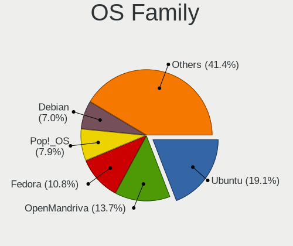
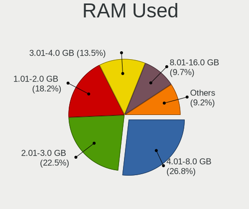
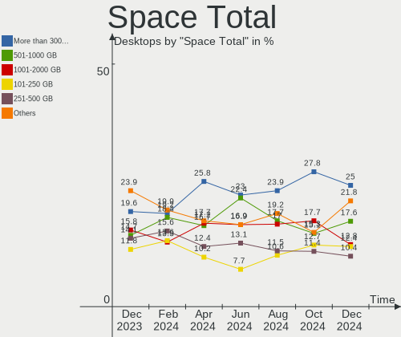
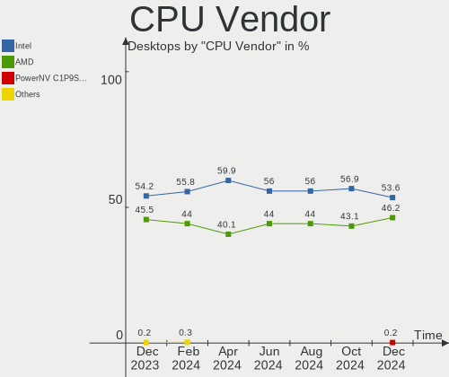
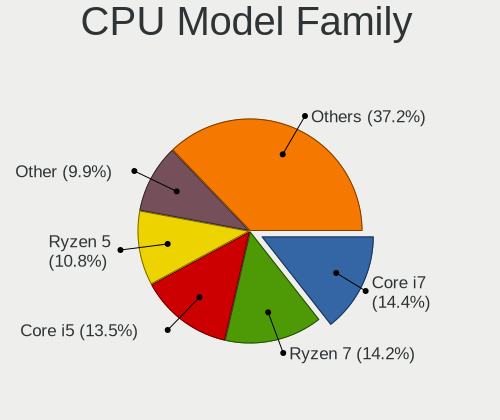
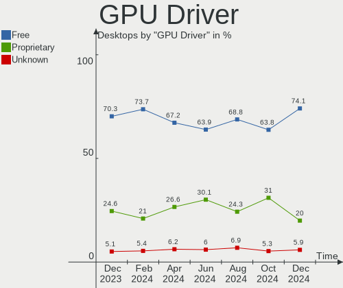

Linux in USA - Hardware Trends (Desktops)
-----------------------------------------

A project to identify most popular hardware characteristics and track their change
over time based on data collected by Linux users at https://Linux-Hardware.org.

Anyone can contribute to this report by the [hw-probe](https://github.com/linuxhw/hw-probe) tool:

    sudo -E hw-probe -all -upload

Period: Jun, 2022.

Contents
--------

* [ System ](#system)
  - [ OS                       ](#os)
  - [ OS Family                ](#os-family)
  - [ Kernel                   ](#kernel)
  - [ Kernel Family            ](#kernel-family)
  - [ Kernel Major Ver.        ](#kernel-major-ver)
  - [ Arch                     ](#arch)
  - [ DE                       ](#de)
  - [ Display Server           ](#display-server)
  - [ Display Manager          ](#display-manager)
  - [ OS Lang                  ](#os-lang)
  - [ Boot Mode                ](#boot-mode)
  - [ Filesystem               ](#filesystem)
  - [ Part. scheme             ](#part-scheme)
  - [ Dual Boot with Linux/BSD ](#dual-boot-with-linuxbsd)
  - [ Dual Boot (Win)          ](#dual-boot-win)

* [ Board ](#board)
  - [ Vendor                   ](#vendor)
  - [ Model                    ](#model)
  - [ Model Family             ](#model-family)
  - [ MFG Year                 ](#mfg-year)
  - [ Form Factor              ](#form-factor)
  - [ Secure Boot              ](#secure-boot)
  - [ Coreboot                 ](#coreboot)
  - [ RAM Size                 ](#ram-size)
  - [ RAM Used                 ](#ram-used)
  - [ Total Drives             ](#total-drives)
  - [ Has CD-ROM               ](#has-cd-rom)
  - [ Has Ethernet             ](#has-ethernet)
  - [ Has WiFi                 ](#has-wifi)
  - [ Has Bluetooth            ](#has-bluetooth)

* [ Location ](#location)
  - [ Country                  ](#country)
  - [ City                     ](#city)

* [ Drives ](#drives)
  - [ Drive Vendor             ](#drive-vendor)
  - [ Drive Model              ](#drive-model)
  - [ HDD Vendor               ](#hdd-vendor)
  - [ SSD Vendor               ](#ssd-vendor)
  - [ Drive Kind               ](#drive-kind)
  - [ Drive Connector          ](#drive-connector)
  - [ Drive Size               ](#drive-size)
  - [ Space Total              ](#space-total)
  - [ Space Used               ](#space-used)
  - [ Malfunc. Drives          ](#malfunc-drives)
  - [ Malfunc. Drive Vendor    ](#malfunc-drive-vendor)
  - [ Malfunc. HDD Vendor      ](#malfunc-hdd-vendor)
  - [ Malfunc. Drive Kind      ](#malfunc-drive-kind)
  - [ Failed Drives            ](#failed-drives)
  - [ Failed Drive Vendor      ](#failed-drive-vendor)
  - [ Drive Status             ](#drive-status)

* [ Storage controller ](#storage-controller)
  - [ Storage Vendor           ](#storage-vendor)
  - [ Storage Model            ](#storage-model)
  - [ Storage Kind             ](#storage-kind)

* [ Processor ](#processor)
  - [ CPU Vendor               ](#cpu-vendor)
  - [ CPU Model                ](#cpu-model)
  - [ CPU Model Family         ](#cpu-model-family)
  - [ CPU Cores                ](#cpu-cores)
  - [ CPU Sockets              ](#cpu-sockets)
  - [ CPU Threads              ](#cpu-threads)
  - [ CPU Op-Modes             ](#cpu-op-modes)
  - [ CPU Microcode            ](#cpu-microcode)
  - [ CPU Microarch            ](#cpu-microarch)

* [ Graphics ](#graphics)
  - [ GPU Vendor               ](#gpu-vendor)
  - [ GPU Model                ](#gpu-model)
  - [ GPU Combo                ](#gpu-combo)
  - [ GPU Driver               ](#gpu-driver)
  - [ GPU Memory               ](#gpu-memory)

* [ Monitor ](#monitor)
  - [ Monitor Vendor           ](#monitor-vendor)
  - [ Monitor Model            ](#monitor-model)
  - [ Monitor Resolution       ](#monitor-resolution)
  - [ Monitor Diagonal         ](#monitor-diagonal)
  - [ Monitor Width            ](#monitor-width)
  - [ Aspect Ratio             ](#aspect-ratio)
  - [ Monitor Area             ](#monitor-area)
  - [ Pixel Density            ](#pixel-density)
  - [ Multiple Monitors        ](#multiple-monitors)

* [ Network ](#network)
  - [ Net Controller Vendor    ](#net-controller-vendor)
  - [ Net Controller Model     ](#net-controller-model)
  - [ Wireless Vendor          ](#wireless-vendor)
  - [ Wireless Model           ](#wireless-model)
  - [ Ethernet Vendor          ](#ethernet-vendor)
  - [ Ethernet Model           ](#ethernet-model)
  - [ Net Controller Kind      ](#net-controller-kind)
  - [ Used Controller          ](#used-controller)
  - [ NICs                     ](#nics)
  - [ IPv6                     ](#ipv6)

* [ Bluetooth ](#bluetooth)
  - [ Bluetooth Vendor         ](#bluetooth-vendor)
  - [ Bluetooth Model          ](#bluetooth-model)

* [ Sound ](#sound)
  - [ Sound Vendor             ](#sound-vendor)
  - [ Sound Model              ](#sound-model)

* [ Memory ](#memory)
  - [ Memory Vendor            ](#memory-vendor)
  - [ Memory Model             ](#memory-model)
  - [ Memory Kind              ](#memory-kind)
  - [ Memory Form Factor       ](#memory-form-factor)
  - [ Memory Size              ](#memory-size)
  - [ Memory Speed             ](#memory-speed)

* [ Printers & scanners ](#printers--scanners)
  - [ Printer Vendor           ](#printer-vendor)
  - [ Printer Model            ](#printer-model)
  - [ Scanner Vendor           ](#scanner-vendor)
  - [ Scanner Model            ](#scanner-model)

* [ Camera ](#camera)
  - [ Camera Vendor            ](#camera-vendor)
  - [ Camera Model             ](#camera-model)

* [ Security ](#security)
  - [ Fingerprint Vendor       ](#fingerprint-vendor)
  - [ Fingerprint Model        ](#fingerprint-model)
  - [ Chipcard Vendor          ](#chipcard-vendor)
  - [ Chipcard Model           ](#chipcard-model)

* [ Unsupported ](#unsupported)
  - [ Unsupported Devices      ](#unsupported-devices)
  - [ Unsupported Device Types ](#unsupported-device-types)

System
------

OS
--

Installed operating systems

| Name                         | Desktops | Percent |
|------------------------------|----------|---------|
| Ubuntu 22.04                 | 44       | 13.79%  |
| Ubuntu 20.04                 | 32       | 10.03%  |
| Pop!_OS 22.04                | 32       | 10.03%  |
| Linux Mint 20.3              | 29       | 9.09%   |
| Fedora 36                    | 23       | 7.21%   |
| OpenMandriva 4.3             | 15       | 4.7%    |
| KDE neon 20.04               | 14       | 4.39%   |
| Debian 11                    | 12       | 3.76%   |
| Zorin 16                     | 11       | 3.45%   |
| ArcoLinux Rolling            | 8        | 2.51%   |
| Manjaro                      | 7        | 2.19%   |
| Arch                         | 6        | 1.88%   |
| Fedora 35                    | 5        | 1.57%   |
| Elementary 6.1               | 5        | 1.57%   |
| Ubuntu 18.04                 | 4        | 1.25%   |
| openSUSE Tumbleweed-XXXXXXXX | 4        | 1.25%   |
| Kubuntu 22.04                | 4        | 1.25%   |
| Kubuntu 20.04                | 4        | 1.25%   |
| Gentoo 2.8                   | 3        | 0.94%   |
| EndeavourOS Rolling          | 3        | 0.94%   |
| Xubuntu 20.04                | 2        | 0.63%   |
| SteamOS 3.2 (steamdeck-main) | 2        | 0.63%   |
| NixOS 22.05                  | 2        | 0.63%   |
| MX 21                        | 2        | 0.63%   |
| Linux Mint 20.2              | 2        | 0.63%   |
| Linux Mint 20                | 2        | 0.63%   |
| Kaisen 2.1                   | 2        | 0.63%   |
| Debian 10                    | 2        | 0.63%   |
| Arch Rolling                 | 2        | 0.63%   |
| Zorin 15                     | 1        | 0.31%   |
| Xero Rolling                 | 1        | 0.31%   |
| Void Linux Rolling           | 1        | 0.31%   |
| Ubuntu Studio 22.04          | 1        | 0.31%   |
| Ubuntu MATE 22.04            | 1        | 0.31%   |
| Ubuntu Budgie 22.04          | 1        | 0.31%   |
| Ubuntu 22.10                 | 1        | 0.31%   |
| Ubuntu 16.04                 | 1        | 0.31%   |
| Pop!_OS 21.04                | 1        | 0.31%   |
| org.kde.Platform 5.15-21.08  | 1        | 0.31%   |
| openSUSE Leap-15.4           | 1        | 0.31%   |
| OpenMandriva 4.2             | 1        | 0.31%   |
| Manjaro 21.3.1               | 1        | 0.31%   |
| Manjaro 21.3.0               | 1        | 0.31%   |
| Lubuntu 22.04                | 1        | 0.31%   |
| LinuxFX 11                   | 1        | 0.31%   |
| Linux Mint 19.3              | 1        | 0.31%   |
| Linux Mint 19.1              | 1        | 0.31%   |
| Kali 2022.2                  | 1        | 0.31%   |
| Garuda Linux Soaring         | 1        | 0.31%   |
| Fedora 37                    | 1        | 0.31%   |
| Fedora 34                    | 1        | 0.31%   |
| Fedora 33                    | 1        | 0.31%   |
| Endless 3.9.7                | 1        | 0.31%   |
| Devuan 5                     | 1        | 0.31%   |
| Debian Unstable              | 1        | 0.31%   |
| Debian Testing               | 1        | 0.31%   |
| Debian 11-updates            | 1        | 0.31%   |
| Clear Linux 36480            | 1        | 0.31%   |
| Clear Linux 36470            | 1        | 0.31%   |
| CentOS 9                     | 1        | 0.31%   |

OS Family
---------

OS without a version

| Name             | Desktops | Percent |
|------------------|----------|---------|
| Ubuntu           | 82       | 25.71%  |
| Linux Mint       | 35       | 10.97%  |
| Pop!_OS          | 33       | 10.34%  |
| Fedora           | 31       | 9.72%   |
| Debian           | 17       | 5.33%   |
| OpenMandriva     | 16       | 5.02%   |
| KDE neon         | 14       | 4.39%   |
| Zorin            | 12       | 3.76%   |
| Manjaro          | 9        | 2.82%   |
| Kubuntu          | 8        | 2.51%   |
| ArcoLinux        | 8        | 2.51%   |
| Arch             | 8        | 2.51%   |
| openSUSE         | 5        | 1.57%   |
| Elementary       | 5        | 1.57%   |
| Gentoo           | 3        | 0.94%   |
| EndeavourOS      | 3        | 0.94%   |
| CentOS           | 3        | 0.94%   |
| Xubuntu          | 2        | 0.63%   |
| SteamOS          | 2        | 0.63%   |
| NixOS            | 2        | 0.63%   |
| MX               | 2        | 0.63%   |
| Kaisen           | 2        | 0.63%   |
| Clear Linux      | 2        | 0.63%   |
| Xero             | 1        | 0.31%   |
| Void Linux       | 1        | 0.31%   |
| Ubuntu Studio    | 1        | 0.31%   |
| Ubuntu MATE      | 1        | 0.31%   |
| Ubuntu Budgie    | 1        | 0.31%   |
| org.kde.Platform | 1        | 0.31%   |
| Lubuntu          | 1        | 0.31%   |
| LinuxFX          | 1        | 0.31%   |
| Kali             | 1        | 0.31%   |
| Garuda Linux     | 1        | 0.31%   |
| Endless          | 1        | 0.31%   |
| Devuan           | 1        | 0.31%   |
| Calculate        | 1        | 0.31%   |
| antiX            | 1        | 0.31%   |
| Alpine           | 1        | 0.31%   |

Kernel
------

Version of the Linux kernel

| Version                                             | Desktops | Percent |
|-----------------------------------------------------|----------|---------|
| 5.17.5-76051705-generic                             | 32       | 10.03%  |
| 5.13.0-51-generic                                   | 24       | 7.52%   |
| 5.13.0-44-generic                                   | 22       | 6.9%    |
| 5.16.7-desktop-1omv4003                             | 15       | 4.7%    |
| 5.15.0-39-generic                                   | 13       | 4.08%   |
| 5.15.0-40-generic                                   | 10       | 3.13%   |
| 5.4.0-113-generic                                   | 9        | 2.82%   |
| 5.15.0-35-generic                                   | 9        | 2.82%   |
| 5.4.0-121-generic                                   | 8        | 2.51%   |
| 5.4.0-120-generic                                   | 8        | 2.51%   |
| 5.15.0-33-generic                                   | 8        | 2.51%   |
| 5.4.0-117-generic                                   | 6        | 1.88%   |
| 5.18.3-arch1-1                                      | 6        | 1.88%   |
| 5.13.0-48-generic                                   | 6        | 1.88%   |
| 5.10.0-15-amd64                                     | 6        | 1.88%   |
| 5.18.5-arch1-1                                      | 5        | 1.57%   |
| 5.18.5-200.fc36.x86_64                              | 5        | 1.57%   |
| 5.18.1-arch1-1                                      | 5        | 1.57%   |
| 5.15.0-37-generic                                   | 5        | 1.57%   |
| 5.17.13-300.fc36.x86_64                             | 4        | 1.25%   |
| 5.17.11-300.fc36.x86_64                             | 4        | 1.25%   |
| 5.10.0-13-amd64                                     | 4        | 1.25%   |
| 5.4.0-110-generic                                   | 3        | 0.94%   |
| 5.15.0-25-generic                                   | 3        | 0.94%   |
| 5.10.0-14-amd64                                     | 3        | 0.94%   |
| 5.18.5-zen1-1-zen                                   | 2        | 0.63%   |
| 5.18.1-200.fc36.x86_64                              | 2        | 0.63%   |
| 5.18.0-1-amd64                                      | 2        | 0.63%   |
| 5.17.9-1-default                                    | 2        | 0.63%   |
| 5.17.12-300.fc36.x86_64                             | 2        | 0.63%   |
| 5.17.0-kaisen1-amd64                                | 2        | 0.63%   |
| 5.15.48-1-MANJARO                                   | 2        | 0.63%   |
| 5.13.0-valve10.1-2-neptune-dri-02144-g7fffaf925dfb  | 2        | 0.63%   |
| 5.11.0-43-generic                                   | 2        | 0.63%   |
| 4.15.0-188-generic                                  | 2        | 0.63%   |
| 5.8.0-43-generic                                    | 1        | 0.31%   |
| 5.8.0-14-generic                                    | 1        | 0.31%   |
| 5.4.0-91-generic                                    | 1        | 0.31%   |
| 5.4.0-89-generic                                    | 1        | 0.31%   |
| 5.4.0-58-generic                                    | 1        | 0.31%   |
| 5.4.0-120-lowlatency                                | 1        | 0.31%   |
| 5.4.0-104-generic                                   | 1        | 0.31%   |
| 5.19.0-0.rc1.20220610git874c8ca1e60b.18.fc37.x86_64 | 1        | 0.31%   |
| 5.18.7-200.fc36.x86_64                              | 1        | 0.31%   |
| 5.18.6-gentoo-x86_64                                | 1        | 0.31%   |
| 5.18.6-200.fc36.x86_64                              | 1        | 0.31%   |
| 5.18.6-1-default                                    | 1        | 0.31%   |
| 5.18.5-201.fsync.fc36.x86_64                        | 1        | 0.31%   |
| 5.18.5-100.fc35.x86_64                              | 1        | 0.31%   |
| 5.18.2-zen1-1-zen                                   | 1        | 0.31%   |
| 5.18.2-lp153.4.g6d13af9-default                     | 1        | 0.31%   |
| 5.18.2-1157.native                                  | 1        | 0.31%   |
| 5.18.1_1                                            | 1        | 0.31%   |
| 5.18.1-tkg-pds                                      | 1        | 0.31%   |
| 5.18.1-gentoo-r2                                    | 1        | 0.31%   |
| 5.18.1-602.inttf.fc36.x86_64                        | 1        | 0.31%   |
| 5.18.0-starfive-5.18                                | 1        | 0.31%   |
| 5.18.0-1-rt-amd64                                   | 1        | 0.31%   |
| 5.17.9-1-MANJARO                                    | 1        | 0.31%   |
| 5.17.7-200.fc35.x86_64                              | 1        | 0.31%   |

Kernel Family
-------------

Linux kernel without a distro release

| Version  | Desktops | Percent |
|----------|----------|---------|
| 5.13.0   | 59       | 18.5%   |
| 5.15.0   | 52       | 16.3%   |
| 5.4.0    | 39       | 12.23%  |
| 5.17.5   | 33       | 10.34%  |
| 5.16.7   | 15       | 4.7%    |
| 5.18.5   | 14       | 4.39%   |
| 5.10.0   | 13       | 4.08%   |
| 5.18.1   | 11       | 3.45%   |
| 5.18.3   | 6        | 1.88%   |
| 5.17.0   | 6        | 1.88%   |
| 5.11.0   | 6        | 1.88%   |
| 5.17.13  | 5        | 1.57%   |
| 5.17.11  | 5        | 1.57%   |
| 4.15.0   | 5        | 1.57%   |
| 5.18.0   | 4        | 1.25%   |
| 5.18.6   | 3        | 0.94%   |
| 5.18.2   | 3        | 0.94%   |
| 5.17.9   | 3        | 0.94%   |
| 5.17.12  | 3        | 0.94%   |
| 5.15.46  | 3        | 0.94%   |
| 5.8.0    | 2        | 0.63%   |
| 5.15.48  | 2        | 0.63%   |
| 5.15.41  | 2        | 0.63%   |
| 5.19.0   | 1        | 0.31%   |
| 5.18.7   | 1        | 0.31%   |
| 5.17.7   | 1        | 0.31%   |
| 5.17.6   | 1        | 0.31%   |
| 5.17.4   | 1        | 0.31%   |
| 5.17.14  | 1        | 0.31%   |
| 5.17.1   | 1        | 0.31%   |
| 5.16.13  | 1        | 0.31%   |
| 5.16.0   | 1        | 0.31%   |
| 5.15.49  | 1        | 0.31%   |
| 5.15.47  | 1        | 0.31%   |
| 5.15.44  | 1        | 0.31%   |
| 5.15.43  | 1        | 0.31%   |
| 5.15.29  | 1        | 0.31%   |
| 5.14.18  | 1        | 0.31%   |
| 5.14.0   | 1        | 0.31%   |
| 5.13.19  | 1        | 0.31%   |
| 5.12.8   | 1        | 0.31%   |
| 5.10.14  | 1        | 0.31%   |
| 5.10.124 | 1        | 0.31%   |
| 5.10.123 | 1        | 0.31%   |
| 4.9.0    | 1        | 0.31%   |
| 4.19.0   | 1        | 0.31%   |
| 4.18.0   | 1        | 0.31%   |
| 3.10.0   | 1        | 0.31%   |

Kernel Major Ver.
-----------------

Linux kernel major version

| Version | Desktops | Percent |
|---------|----------|---------|
| 5.15    | 64       | 20.06%  |
| 5.17    | 60       | 18.81%  |
| 5.13    | 60       | 18.81%  |
| 5.18    | 42       | 13.17%  |
| 5.4     | 39       | 12.23%  |
| 5.16    | 17       | 5.33%   |
| 5.10    | 16       | 5.02%   |
| 5.11    | 6        | 1.88%   |
| 4.15    | 5        | 1.57%   |
| 5.8     | 2        | 0.63%   |
| 5.14    | 2        | 0.63%   |
| 5.19    | 1        | 0.31%   |
| 5.12    | 1        | 0.31%   |
| 4.9     | 1        | 0.31%   |
| 4.19    | 1        | 0.31%   |
| 4.18    | 1        | 0.31%   |
| 3.10    | 1        | 0.31%   |

Arch
----

OS architecture (x86_64, i586, etc.)

| Name    | Desktops | Percent |
|---------|----------|---------|
| x86_64  | 317      | 99.37%  |
| riscv64 | 1        | 0.31%   |
| i686    | 1        | 0.31%   |

DE
--

Desktop Environment

| Name             | Desktops | Percent |
|------------------|----------|---------|
| GNOME            | 148      | 46.39%  |
| KDE5             | 72       | 22.57%  |
| Unknown          | 25       | 7.84%   |
| X-Cinnamon       | 24       | 7.52%   |
| XFCE             | 15       | 4.7%    |
| MATE             | 8        | 2.51%   |
| Cinnamon         | 7        | 2.19%   |
| Pantheon         | 5        | 1.57%   |
| LXQt             | 3        | 0.94%   |
| GNOME Classic    | 3        | 0.94%   |
| Budgie           | 3        | 0.94%   |
| KDE              | 2        | 0.63%   |
| Openbox          | 1        | 0.31%   |
| lightdm-xsession | 1        | 0.31%   |
| icewm            | 1        | 0.31%   |
| GNOME Flashback  | 1        | 0.31%   |

Display Server
--------------

X11 or Wayland

| Name    | Desktops | Percent |
|---------|----------|---------|
| X11     | 247      | 77.43%  |
| Wayland | 45       | 14.11%  |
| Tty     | 18       | 5.64%   |
| Unknown | 9        | 2.82%   |

Display Manager
---------------

SDDM, LightDM, etc.

| Name    | Desktops | Percent |
|---------|----------|---------|
| Unknown | 143      | 44.83%  |
| GDM3    | 75       | 23.51%  |
| SDDM    | 48       | 15.05%  |
| LightDM | 38       | 11.91%  |
| GDM     | 14       | 4.39%   |
| SLiM    | 1        | 0.31%   |

OS Lang
-------

Language

| Lang        | Desktops | Percent |
|-------------|----------|---------|
| en_US       | 304      | 95.3%   |
| C           | 8        | 2.51%   |
| POSIX       | 2        | 0.63%   |
| es_UY       | 1        | 0.31%   |
| en_US.UTF.8 | 1        | 0.31%   |
| en_GB       | 1        | 0.31%   |
| de_DE       | 1        | 0.31%   |
| C.UTF8      | 1        | 0.31%   |

Boot Mode
---------

EFI or BIOS

| Mode | Desktops | Percent |
|------|----------|---------|
| BIOS | 173      | 54.23%  |
| EFI  | 146      | 45.77%  |

Filesystem
----------

Type of filesystem

| Type    | Desktops | Percent |
|---------|----------|---------|
| Ext4    | 230      | 72.1%   |
| Btrfs   | 45       | 14.11%  |
| Overlay | 26       | 8.15%   |
| Xfs     | 11       | 3.45%   |
| Zfs     | 4        | 1.25%   |
| XXXXXXX | 1        | 0.31%   |
| Ext3    | 1        | 0.31%   |
| Ext2    | 1        | 0.31%   |

Part. scheme
------------

Scheme of partitioning

| Type    | Desktops | Percent |
|---------|----------|---------|
| Unknown | 190      | 59.56%  |
| GPT     | 105      | 32.92%  |
| MBR     | 24       | 7.52%   |

Dual Boot with Linux/BSD
------------------------

Hosting more than one Linux/BSD

| Dual boot | Desktops | Percent |
|-----------|----------|---------|
| No        | 259      | 81.19%  |
| Yes       | 60       | 18.81%  |

Dual Boot (Win)
---------------

Hosting Linux and Windows

| Dual boot | Desktops | Percent |
|-----------|----------|---------|
| No        | 240      | 75.24%  |
| Yes       | 79       | 24.76%  |

Board
-----

Vendor
------

Motherboard manufacturer

| Name                | Desktops | Percent |
|---------------------|----------|---------|
| ASUSTek Computer    | 89       | 27.9%   |
| Dell                | 56       | 17.55%  |
| Gigabyte Technology | 44       | 13.79%  |
| MSI                 | 37       | 11.6%   |
| Hewlett-Packard     | 26       | 8.15%   |
| ASRock              | 19       | 5.96%   |
| Lenovo              | 16       | 5.02%   |
| Alienware           | 4        | 1.25%   |
| Unknown             | 4        | 1.25%   |
| Pegatron            | 3        | 0.94%   |
| Intel               | 3        | 0.94%   |
| Foxconn             | 3        | 0.94%   |
| EVGA                | 3        | 0.94%   |
| Apple               | 3        | 0.94%   |
| System76            | 2        | 0.63%   |
| Supermicro          | 1        | 0.31%   |
| Shuttle             | 1        | 0.31%   |
| Protectli           | 1        | 0.31%   |
| Hardkernel          | 1        | 0.31%   |
| Cincoze             | 1        | 0.31%   |
| Biostar             | 1        | 0.31%   |
| Acer                | 1        | 0.31%   |

Model
-----

Motherboard model

| Name                         | Desktops | Percent |
|------------------------------|----------|---------|
| ASUS All Series              | 7        | 2.19%   |
| Dell OptiPlex 3020           | 4        | 1.25%   |
| Unknown                      | 4        | 1.25%   |
| MSI MS-7C35                  | 3        | 0.94%   |
| Dell OptiPlex 9020           | 3        | 0.94%   |
| Dell Inspiron 660            | 3        | 0.94%   |
| ASUS TUF Gaming X570-PLUS    | 3        | 0.94%   |
| ASUS ROG STRIX X570-E GAMING | 3        | 0.94%   |
| ASUS ROG STRIX B550-F GAMING | 3        | 0.94%   |
| ASUS CROSSHAIR V FORMULA-Z   | 3        | 0.94%   |
| MSI MS-7D16                  | 2        | 0.63%   |
| MSI MS-7C56                  | 2        | 0.63%   |
| MSI MS-7B86                  | 2        | 0.63%   |
| MSI MS-7B85                  | 2        | 0.63%   |
| HP Compaq Pro 6300 MT        | 2        | 0.63%   |
| Gigabyte Z97X-SLI            | 2        | 0.63%   |
| Gigabyte GA-78LMT-USB3 6.0   | 2        | 0.63%   |
| Dell Precision Tower 5810    | 2        | 0.63%   |
| Dell Precision T5610         | 2        | 0.63%   |
| Dell Precision T3610         | 2        | 0.63%   |
| Dell OptiPlex 7070           | 2        | 0.63%   |
| Dell OptiPlex 7040           | 2        | 0.63%   |
| Dell OptiPlex 7010           | 2        | 0.63%   |
| ASUS TUF Gaming X570-PRO     | 2        | 0.63%   |
| ASUS TUF Gaming B550M-PLUS   | 2        | 0.63%   |
| ASUS SABERTOOTH 990FX R2.0   | 2        | 0.63%   |
| ASUS ROG STRIX B450-F GAMING | 2        | 0.63%   |
| ASUS ROG CROSSHAIR VIII HERO | 2        | 0.63%   |
| ASUS ROG CROSSHAIR VII HERO  | 2        | 0.63%   |
| ASUS PRIME Z690-P WIFI       | 2        | 0.63%   |
| ASUS PRIME B550M-A           | 2        | 0.63%   |
| ASUS P8Z68-V LX              | 2        | 0.63%   |
| ASUS P6X58D PREMIUM          | 2        | 0.63%   |
| Apple MacPro3,1              | 2        | 0.63%   |
| System76 Thelio Mira         | 1        | 0.31%   |
| System76 Thelio              | 1        | 0.31%   |
| Supermicro SSG-2027B-DE2R24L | 1        | 0.31%   |
| Shuttle DS61                 | 1        | 0.31%   |
| Protectli FW6                | 1        | 0.31%   |
| Pegatron p7-1174             | 1        | 0.31%   |
| Pegatron AY627AA-ABA a4313w  | 1        | 0.31%   |
| Pegatron 810-170st           | 1        | 0.31%   |
| MSI US Desktop               | 1        | 0.31%   |
| MSI MS-7D43                  | 1        | 0.31%   |
| MSI MS-7D28                  | 1        | 0.31%   |
| MSI MS-7D25                  | 1        | 0.31%   |
| MSI MS-7D15                  | 1        | 0.31%   |
| MSI MS-7C95                  | 1        | 0.31%   |
| MSI MS-7C94                  | 1        | 0.31%   |
| MSI MS-7C92                  | 1        | 0.31%   |
| MSI MS-7C84                  | 1        | 0.31%   |
| MSI MS-7C82                  | 1        | 0.31%   |
| MSI MS-7C75                  | 1        | 0.31%   |
| MSI MS-7C71                  | 1        | 0.31%   |
| MSI MS-7C37                  | 1        | 0.31%   |
| MSI MS-7C02                  | 1        | 0.31%   |
| MSI MS-7B98                  | 1        | 0.31%   |
| MSI MS-7B84                  | 1        | 0.31%   |
| MSI MS-7B79                  | 1        | 0.31%   |
| MSI MS-7B51                  | 1        | 0.31%   |

Model Family
------------

Motherboard model prefix

| Name                         | Desktops | Percent |
|------------------------------|----------|---------|
| Dell OptiPlex                | 25       | 7.84%   |
| ASUS ROG                     | 22       | 6.9%    |
| ASUS PRIME                   | 16       | 5.02%   |
| Dell Precision               | 14       | 4.39%   |
| ASUS TUF                     | 13       | 4.08%   |
| Lenovo ThinkCentre           | 11       | 3.45%   |
| Dell Inspiron                | 10       | 3.13%   |
| ASUS All                     | 7        | 2.19%   |
| HP Compaq                    | 6        | 1.88%   |
| HP EliteDesk                 | 4        | 1.25%   |
| Gigabyte X570                | 4        | 1.25%   |
| ASUS CROSSHAIR               | 4        | 1.25%   |
| Alienware Aurora             | 4        | 1.25%   |
| Unknown                      | 4        | 1.25%   |
| MSI MS-7C35                  | 3        | 0.94%   |
| HP ProDesk                   | 3        | 0.94%   |
| Gigabyte B450M               | 3        | 0.94%   |
| System76 Thelio              | 2        | 0.63%   |
| MSI MS-7D16                  | 2        | 0.63%   |
| MSI MS-7C56                  | 2        | 0.63%   |
| MSI MS-7B86                  | 2        | 0.63%   |
| MSI MS-7B85                  | 2        | 0.63%   |
| Gigabyte Z97X-SLI            | 2        | 0.63%   |
| Gigabyte GA-78LMT-USB3       | 2        | 0.63%   |
| Gigabyte B550                | 2        | 0.63%   |
| Gigabyte 970A-DS3P           | 2        | 0.63%   |
| EVGA X299                    | 2        | 0.63%   |
| Dell XPS                     | 2        | 0.63%   |
| ASUS SABERTOOTH              | 2        | 0.63%   |
| ASUS P8Z68-V                 | 2        | 0.63%   |
| ASUS P6X58D                  | 2        | 0.63%   |
| ASUS M5A97                   | 2        | 0.63%   |
| ASRock X470                  | 2        | 0.63%   |
| ASRock B450M                 | 2        | 0.63%   |
| Apple MacPro3                | 2        | 0.63%   |
| Supermicro SSG-2027B-DE2R24L | 1        | 0.31%   |
| Shuttle DS61                 | 1        | 0.31%   |
| Protectli FW6                | 1        | 0.31%   |
| Pegatron p7-1174             | 1        | 0.31%   |
| Pegatron AY627AA-ABA         | 1        | 0.31%   |
| Pegatron 810-170st           | 1        | 0.31%   |
| MSI US                       | 1        | 0.31%   |
| MSI MS-7D43                  | 1        | 0.31%   |
| MSI MS-7D28                  | 1        | 0.31%   |
| MSI MS-7D25                  | 1        | 0.31%   |
| MSI MS-7D15                  | 1        | 0.31%   |
| MSI MS-7C95                  | 1        | 0.31%   |
| MSI MS-7C94                  | 1        | 0.31%   |
| MSI MS-7C92                  | 1        | 0.31%   |
| MSI MS-7C84                  | 1        | 0.31%   |
| MSI MS-7C82                  | 1        | 0.31%   |
| MSI MS-7C75                  | 1        | 0.31%   |
| MSI MS-7C71                  | 1        | 0.31%   |
| MSI MS-7C37                  | 1        | 0.31%   |
| MSI MS-7C02                  | 1        | 0.31%   |
| MSI MS-7B98                  | 1        | 0.31%   |
| MSI MS-7B84                  | 1        | 0.31%   |
| MSI MS-7B79                  | 1        | 0.31%   |
| MSI MS-7B51                  | 1        | 0.31%   |
| MSI MS-7A70                  | 1        | 0.31%   |

MFG Year
--------

Motherboard manufacture year

| Year    | Desktops | Percent |
|---------|----------|---------|
| 2020    | 41       | 12.85%  |
| 2019    | 35       | 10.97%  |
| 2021    | 34       | 10.66%  |
| 2014    | 26       | 8.15%   |
| 2018    | 24       | 7.52%   |
| 2013    | 23       | 7.21%   |
| 2012    | 21       | 6.58%   |
| 2016    | 17       | 5.33%   |
| 2017    | 16       | 5.02%   |
| 2015    | 15       | 4.7%    |
| 2011    | 13       | 4.08%   |
| 2010    | 13       | 4.08%   |
| 2009    | 10       | 3.13%   |
| 2008    | 10       | 3.13%   |
| 2022    | 9        | 2.82%   |
| 2007    | 5        | 1.57%   |
| 2006    | 4        | 1.25%   |
| 2005    | 2        | 0.63%   |
| Unknown | 1        | 0.31%   |

Form Factor
-----------

Physical design of the computer

| Name    | Desktops | Percent |
|---------|----------|---------|
| Desktop | 319      | 100%    |

Secure Boot
-----------

Enabled or disabled

| State    | Desktops | Percent |
|----------|----------|---------|
| Disabled | 309      | 96.87%  |
| Enabled  | 10       | 3.13%   |

Coreboot
--------

Have coreboot on board

| Used | Desktops | Percent |
|------|----------|---------|
| No   | 318      | 99.69%  |
| Yes  | 1        | 0.31%   |

RAM Size
--------

Total RAM memory

| Size in GB      | Desktops | Percent |
|-----------------|----------|---------|
| 16.01-24.0      | 92       | 28.84%  |
| 32.01-64.0      | 86       | 26.96%  |
| 8.01-16.0       | 40       | 12.54%  |
| 4.01-8.0        | 35       | 10.97%  |
| 64.01-256.0     | 32       | 10.03%  |
| 3.01-4.0        | 18       | 5.64%   |
| 24.01-32.0      | 8        | 2.51%   |
| 1.01-2.0        | 4        | 1.25%   |
| 2.01-3.0        | 2        | 0.63%   |
| More than 256.0 | 1        | 0.31%   |
| 0.51-1.0        | 1        | 0.31%   |

RAM Used
--------

Used RAM memory

| Used GB    | Desktops | Percent |
|------------|----------|---------|
| 1.01-2.0   | 86       | 26.96%  |
| 2.01-3.0   | 81       | 25.39%  |
| 4.01-8.0   | 55       | 17.24%  |
| 3.01-4.0   | 46       | 14.42%  |
| 8.01-16.0  | 27       | 8.46%   |
| 0.51-1.0   | 14       | 4.39%   |
| 16.01-24.0 | 5        | 1.57%   |
| 0.01-0.5   | 4        | 1.25%   |
| 32.01-64.0 | 1        | 0.31%   |

Total Drives
------------

Number of drives on board

| Drives | Desktops | Percent |
|--------|----------|---------|
| 1      | 112      | 35.11%  |
| 2      | 80       | 25.08%  |
| 3      | 55       | 17.24%  |
| 4      | 29       | 9.09%   |
| 5      | 15       | 4.7%    |
| 6      | 9        | 2.82%   |
| 7      | 8        | 2.51%   |
| 8      | 4        | 1.25%   |
| 10     | 2        | 0.63%   |
| 0      | 2        | 0.63%   |
| 12     | 1        | 0.31%   |
| 11     | 1        | 0.31%   |
| 9      | 1        | 0.31%   |

Has CD-ROM
----------

Has CD-ROM on board

| Presented | Desktops | Percent |
|-----------|----------|---------|
| No        | 170      | 53.29%  |
| Yes       | 149      | 46.71%  |

Has Ethernet
------------

Has Ethernet on board

| Presented | Desktops | Percent |
|-----------|----------|---------|
| Yes       | 312      | 97.81%  |
| No        | 7        | 2.19%   |

Has WiFi
--------

Has WiFi module

| Presented | Desktops | Percent |
|-----------|----------|---------|
| Yes       | 191      | 59.87%  |
| No        | 128      | 40.13%  |

Has Bluetooth
-------------

Has Bluetooth module

| Presented | Desktops | Percent |
|-----------|----------|---------|
| No        | 160      | 50.16%  |
| Yes       | 159      | 49.84%  |

Location
--------

Country
-------

Geographic location (country)

| Country | Desktops | Percent |
|---------|----------|---------|
| USA     | 319      | 100%    |

City
----

Geographic location (city)

| City                 | Desktops | Percent |
|----------------------|----------|---------|
| Chicago              | 6        | 1.88%   |
| Seattle              | 5        | 1.57%   |
| New York             | 5        | 1.57%   |
| Miami                | 5        | 1.57%   |
| Tucson               | 4        | 1.25%   |
| Springfield          | 4        | 1.25%   |
| San Jose             | 4        | 1.25%   |
| Orlando              | 4        | 1.25%   |
| Marietta             | 4        | 1.25%   |
| Jacksonville         | 4        | 1.25%   |
| Dallas               | 4        | 1.25%   |
| Atlanta              | 4        | 1.25%   |
| Washington           | 3        | 0.94%   |
| San Diego            | 3        | 0.94%   |
| San Antonio          | 3        | 0.94%   |
| Phoenix              | 3        | 0.94%   |
| Ogden                | 3        | 0.94%   |
| Nashville            | 3        | 0.94%   |
| Houston              | 3        | 0.94%   |
| Chandler             | 3        | 0.94%   |
| Arlington            | 3        | 0.94%   |
| Albuquerque          | 3        | 0.94%   |
| Virginia Beach       | 2        | 0.63%   |
| The Bronx            | 2        | 0.63%   |
| St Louis             | 2        | 0.63%   |
| San Francisco        | 2        | 0.63%   |
| Saint Paul           | 2        | 0.63%   |
| Richmond             | 2        | 0.63%   |
| Redwood City         | 2        | 0.63%   |
| Portland             | 2        | 0.63%   |
| Plymouth             | 2        | 0.63%   |
| Parker               | 2        | 0.63%   |
| Orange               | 2        | 0.63%   |
| Norwalk              | 2        | 0.63%   |
| North Richland Hills | 2        | 0.63%   |
| Las Vegas            | 2        | 0.63%   |
| Independence         | 2        | 0.63%   |
| Huntington Beach     | 2        | 0.63%   |
| Eugene               | 2        | 0.63%   |
| Duncan               | 2        | 0.63%   |
| Duluth               | 2        | 0.63%   |
| Cleveland            | 2        | 0.63%   |
| Charlotte            | 2        | 0.63%   |
| Buda                 | 2        | 0.63%   |
| Bristow              | 2        | 0.63%   |
| Bedford              | 2        | 0.63%   |
| Austin               | 2        | 0.63%   |
| Yucca Valley         | 1        | 0.31%   |
| Worcester            | 1        | 0.31%   |
| Woburn               | 1        | 0.31%   |
| Winter Garden        | 1        | 0.31%   |
| Wimauma              | 1        | 0.31%   |
| Wilmington           | 1        | 0.31%   |
| Willingboro          | 1        | 0.31%   |
| Wichita              | 1        | 0.31%   |
| Westland             | 1        | 0.31%   |
| Westlake             | 1        | 0.31%   |
| West Monroe          | 1        | 0.31%   |
| Waverly              | 1        | 0.31%   |
| Waukee               | 1        | 0.31%   |

Drives
------

Drive Vendor
------------

Hard drive vendors

| Vendor                      | Desktops | Drives | Percent |
|-----------------------------|----------|--------|---------|
| Seagate                     | 121      | 163    | 20.2%   |
| WDC                         | 118      | 205    | 19.7%   |
| Samsung Electronics         | 102      | 149    | 17.03%  |
| SanDisk                     | 37       | 47     | 6.18%   |
| Crucial                     | 28       | 33     | 4.67%   |
| Hitachi                     | 23       | 25     | 3.84%   |
| Toshiba                     | 21       | 31     | 3.51%   |
| Kingston                    | 18       | 20     | 3.01%   |
| PNY                         | 13       | 14     | 2.17%   |
| Phison                      | 9        | 10     | 1.5%    |
| Intel                       | 9        | 15     | 1.5%    |
| SK hynix                    | 8        | 8      | 1.34%   |
| Unknown                     | 6        | 8      | 1%      |
| Micron Technology           | 6        | 9      | 1%      |
| A-DATA Technology           | 6        | 6      | 1%      |
| China                       | 5        | 6      | 0.83%   |
| Team                        | 4        | 7      | 0.67%   |
| SPCC                        | 4        | 5      | 0.67%   |
| Realtek Semiconductor       | 4        | 4      | 0.67%   |
| Micron/Crucial Technology   | 4        | 5      | 0.67%   |
| Hewlett-Packard             | 4        | 4      | 0.67%   |
| Unknown                     | 4        | 4      | 0.67%   |
| HGST                        | 3        | 4      | 0.5%    |
| WD MediaMax                 | 2        | 2      | 0.33%   |
| T-FORCE                     | 2        | 2      | 0.33%   |
| SABRENT                     | 2        | 3      | 0.33%   |
| Patriot                     | 2        | 2      | 0.33%   |
| OCZ                         | 2        | 2      | 0.33%   |
| Lexar                       | 2        | 2      | 0.33%   |
| LaCie                       | 2        | 2      | 0.33%   |
| KIOXIA                      | 2        | 2      | 0.33%   |
| XINTOR                      | 1        | 1      | 0.17%   |
| WDC WDS1                    | 1        | 1      | 0.17%   |
| USB3.0                      | 1        | 1      | 0.17%   |
| SSK                         | 1        | 1      | 0.17%   |
| Realtek                     | 1        | 1      | 0.17%   |
| Protectli                   | 1        | 1      | 0.17%   |
| Plextor                     | 1        | 1      | 0.17%   |
| NV-2242A                    | 1        | 1      | 0.17%   |
| Netac                       | 1        | 1      | 0.17%   |
| Mushkin                     | 1        | 2      | 0.17%   |
| Maxtor                      | 1        | 1      | 0.17%   |
| MAXIO Technology (Hangzhou) | 1        | 1      | 0.17%   |
| MaxDigital                  | 1        | 1      | 0.17%   |
| LITEONIT                    | 1        | 1      | 0.17%   |
| Leven                       | 1        | 1      | 0.17%   |
| KingSpec                    | 1        | 1      | 0.17%   |
| KingDian                    | 1        | 1      | 0.17%   |
| JMicron Technology          | 1        | 1      | 0.17%   |
| Innodisk                    | 1        | 1      | 0.17%   |
| IBM/Hitachi                 | 1        | 1      | 0.17%   |
| Gigabyte Technology         | 1        | 1      | 0.17%   |
| External                    | 1        | 1      | 0.17%   |
| EDGE                        | 1        | 1      | 0.17%   |
| Corsair                     | 1        | 1      | 0.17%   |
| BIWIN                       | 1        | 1      | 0.17%   |
| ANYOYO                      | 1        | 1      | 0.17%   |

Drive Model
-----------

Hard drive models

| Model                             | Desktops | Percent |
|-----------------------------------|----------|---------|
| Samsung NVMe SSD Drive 1TB        | 17       | 2.3%    |
| Seagate ST2000DM008-2FR102 2TB    | 13       | 1.76%   |
| Samsung SSD 860 EVO 1TB           | 9        | 1.22%   |
| WDC WD10EZEX-08WN4A0 1TB          | 8        | 1.08%   |
| SanDisk NVMe SSD Drive 500GB      | 8        | 1.08%   |
| Samsung SSD 970 EVO 500GB         | 8        | 1.08%   |
| Crucial CT1000MX500SSD1 1TB       | 8        | 1.08%   |
| Seagate ST3500413AS 500GB         | 7        | 0.95%   |
| SanDisk NVMe SSD Drive 1TB        | 7        | 0.95%   |
| Samsung SSD 850 EVO 500GB         | 7        | 0.95%   |
| Samsung SSD 850 EVO 250GB         | 7        | 0.95%   |
| Seagate ST500DM002-1BD142 500GB   | 6        | 0.81%   |
| Seagate ST4000DM004-2CV104 4TB    | 5        | 0.68%   |
| Seagate ST1000DM003-1SB102 1TB    | 5        | 0.68%   |
| Seagate ST1000DM003-1CH162 1TB    | 5        | 0.68%   |
| Samsung SSD 970 EVO Plus 1TB      | 5        | 0.68%   |
| PNY CS900 500GB SSD               | 5        | 0.68%   |
| Kingston SA400S37240G 240GB SSD   | 5        | 0.68%   |
| Crucial CT500MX500SSD1 500GB      | 5        | 0.68%   |
| WDC WDS100T2B0A-00SM50 1TB SSD    | 4        | 0.54%   |
| WDC WD20EZRZ-00Z5HB0 2TB          | 4        | 0.54%   |
| WDC WD2003FZEX-00Z4SA0 2TB        | 4        | 0.54%   |
| Seagate ST3500418AS 500GB         | 4        | 0.54%   |
| Seagate ST2000DM001-1ER164 2TB    | 4        | 0.54%   |
| Seagate ST2000DM001-1CH164 2TB    | 4        | 0.54%   |
| Samsung SSD 980 PRO 1TB           | 4        | 0.54%   |
| Samsung SSD 860 EVO 500GB         | 4        | 0.54%   |
| Samsung SSD 850 EVO 1TB           | 4        | 0.54%   |
| Samsung NVMe SSD Drive 2TB        | 4        | 0.54%   |
| PNY CS900 240GB SSD               | 4        | 0.54%   |
| Unknown                           | 4        | 0.54%   |
| WDC WDS500G2B0B-00YS70 500GB SSD  | 3        | 0.41%   |
| WDC WDS500G2B0A-00SM50 500GB SSD  | 3        | 0.41%   |
| WDC WDBNCE5000PNC 500GB SSD       | 3        | 0.41%   |
| WDC WD5000AAKS-00UU3A0 500GB      | 3        | 0.41%   |
| WDC WD40EZRZ-22GXCB0 4TB          | 3        | 0.41%   |
| WDC WD40EZRZ-00GXCB0 4TB          | 3        | 0.41%   |
| WDC WD2002FAEX-007BA0 2TB         | 3        | 0.41%   |
| WDC WD10EZEX-00BN5A0 1TB          | 3        | 0.41%   |
| Unknown SD/MMC/MS PRO 128GB       | 3        | 0.41%   |
| Toshiba DT01ACA200 2TB            | 3        | 0.41%   |
| Seagate ST31000528AS 1TB          | 3        | 0.41%   |
| Seagate ST1000DM003-1ER162 1TB    | 3        | 0.41%   |
| Seagate Expansion+ Desk 4TB       | 3        | 0.41%   |
| Seagate Expansion 1TB             | 3        | 0.41%   |
| Seagate BUP Slim 2TB              | 3        | 0.41%   |
| Seagate Backup+ Hub BK 8TB        | 3        | 0.41%   |
| SanDisk SDSSDA120G 120GB          | 3        | 0.41%   |
| Samsung SSD 970 PRO 1TB           | 3        | 0.41%   |
| Samsung SSD 970 EVO Plus 500GB    | 3        | 0.41%   |
| Samsung SSD 870 EVO 500GB         | 3        | 0.41%   |
| Samsung SSD 870 EVO 1TB           | 3        | 0.41%   |
| Samsung SSD 860 QVO 1TB           | 3        | 0.41%   |
| Samsung NVMe SSD Drive 512GB      | 3        | 0.41%   |
| Micron/Crucial NVMe SSD Drive 1TB | 3        | 0.41%   |
| Kingston SV300S37A240G 240GB SSD  | 3        | 0.41%   |
| Crucial CT2000MX500SSD1 2TB       | 3        | 0.41%   |
| WDC WDS250G2B0A-00SM50 250GB SSD  | 2        | 0.27%   |
| WDC WDS100T2B0C-00PXH0 1TB        | 2        | 0.27%   |
| WDC WD8004FRYZ-01VAEB0 8TB        | 2        | 0.27%   |

HDD Vendor
----------

Hard disk drive vendors

| Vendor              | Desktops | Drives | Percent |
|---------------------|----------|--------|---------|
| Seagate             | 119      | 160    | 43.27%  |
| WDC                 | 96       | 172    | 34.91%  |
| Hitachi             | 23       | 25     | 8.36%   |
| Toshiba             | 19       | 29     | 6.91%   |
| Samsung Electronics | 6        | 7      | 2.18%   |
| Unknown             | 4        | 4      | 1.45%   |
| HGST                | 3        | 4      | 1.09%   |
| Hewlett-Packard     | 2        | 2      | 0.73%   |
| WD MediaMax         | 1        | 1      | 0.36%   |
| Maxtor              | 1        | 1      | 0.36%   |
| IBM/Hitachi         | 1        | 1      | 0.36%   |

SSD Vendor
----------

Solid state drive vendors

| Vendor              | Desktops | Drives | Percent |
|---------------------|----------|--------|---------|
| Samsung Electronics | 53       | 70     | 25.85%  |
| Crucial             | 25       | 29     | 12.2%   |
| SanDisk             | 21       | 28     | 10.24%  |
| WDC                 | 20       | 21     | 9.76%   |
| Kingston            | 16       | 18     | 7.8%    |
| PNY                 | 13       | 14     | 6.34%   |
| A-DATA Technology   | 6        | 6      | 2.93%   |
| China               | 5        | 6      | 2.44%   |
| Team                | 4        | 7      | 1.95%   |
| SPCC                | 3        | 4      | 1.46%   |
| SK hynix            | 3        | 3      | 1.46%   |
| Micron Technology   | 3        | 4      | 1.46%   |
| Intel               | 3        | 3      | 1.46%   |
| Seagate             | 2        | 2      | 0.98%   |
| Patriot             | 2        | 2      | 0.98%   |
| OCZ                 | 2        | 2      | 0.98%   |
| Lexar               | 2        | 2      | 0.98%   |
| Hewlett-Packard     | 2        | 2      | 0.98%   |
| Unknown             | 2        | 2      | 0.98%   |
| XINTOR              | 1        | 1      | 0.49%   |
| WDC WDS1            | 1        | 1      | 0.49%   |
| USB3.0              | 1        | 1      | 0.49%   |
| Toshiba             | 1        | 1      | 0.49%   |
| T-FORCE             | 1        | 1      | 0.49%   |
| Protectli           | 1        | 1      | 0.49%   |
| Plextor             | 1        | 1      | 0.49%   |
| Phison              | 1        | 1      | 0.49%   |
| Netac               | 1        | 1      | 0.49%   |
| Mushkin             | 1        | 2      | 0.49%   |
| LITEONIT            | 1        | 1      | 0.49%   |
| Leven               | 1        | 1      | 0.49%   |
| KingSpec            | 1        | 1      | 0.49%   |
| KingDian            | 1        | 1      | 0.49%   |
| JMicron Technology  | 1        | 1      | 0.49%   |
| Innodisk            | 1        | 1      | 0.49%   |
| Gigabyte Technology | 1        | 1      | 0.49%   |
| EDGE                | 1        | 1      | 0.49%   |

Drive Kind
----------

HDD or SSD

| Kind    | Desktops | Drives | Percent |
|---------|----------|--------|---------|
| HDD     | 210      | 406    | 41.18%  |
| SSD     | 172      | 244    | 33.73%  |
| NVMe    | 116      | 162    | 22.75%  |
| Unknown | 11       | 13     | 2.16%   |
| MMC     | 1        | 1      | 0.2%    |

Drive Connector
---------------

SATA, SAS, NVMe, etc.

| Type | Desktops | Drives | Percent |
|------|----------|--------|---------|
| SATA | 282      | 623    | 65.43%  |
| NVMe | 113      | 156    | 26.22%  |
| SAS  | 35       | 46     | 8.12%   |
| MMC  | 1        | 1      | 0.23%   |

Drive Size
----------

Size of hard drive

| Size in TB | Desktops | Drives | Percent |
|------------|----------|--------|---------|
| 0.01-0.5   | 183      | 267    | 40.4%   |
| 0.51-1.0   | 129      | 178    | 28.48%  |
| 1.01-2.0   | 72       | 97     | 15.89%  |
| 3.01-4.0   | 28       | 37     | 6.18%   |
| 4.01-10.0  | 25       | 50     | 5.52%   |
| 2.01-3.0   | 12       | 13     | 2.65%   |
| 10.01-20.0 | 4        | 8      | 0.88%   |

Space Total
-----------

Amount of disk space available on the file system

| Size in GB     | Desktops | Percent |
|----------------|----------|---------|
| More than 3000 | 64       | 20.06%  |
| 501-1000       | 62       | 19.44%  |
| 251-500        | 42       | 13.17%  |
| 101-250        | 42       | 13.17%  |
| 1001-2000      | 40       | 12.54%  |
| 1-20           | 22       | 6.9%    |
| 2001-3000      | 18       | 5.64%   |
| 51-100         | 14       | 4.39%   |
| Unknown        | 10       | 3.13%   |
| 21-50          | 5        | 1.57%   |

Space Used
----------

Amount of used disk space

| Used GB        | Desktops | Percent |
|----------------|----------|---------|
| 1-20           | 85       | 26.65%  |
| 21-50          | 42       | 13.17%  |
| 101-250        | 38       | 11.91%  |
| 51-100         | 36       | 11.29%  |
| 501-1000       | 29       | 9.09%   |
| 251-500        | 27       | 8.46%   |
| More than 3000 | 18       | 5.64%   |
| 1001-2000      | 18       | 5.64%   |
| 2001-3000      | 15       | 4.7%    |
| Unknown        | 10       | 3.13%   |
| 0              | 1        | 0.31%   |

Malfunc. Drives
---------------

Drive models with a malfunction

| Model                                    | Desktops | Drives | Percent |
|------------------------------------------|----------|--------|---------|
| WDC WD6002FZWX-00GBGB0 6TB               | 1        | 1      | 2.94%   |
| WDC WD5000AAKS-00UU3A0 500GB             | 1        | 1      | 2.94%   |
| WDC WD5000AAKB-00H8A0 500GB              | 1        | 1      | 2.94%   |
| WDC WD40EFRX-68WT0N0 4TB                 | 1        | 2      | 2.94%   |
| WDC WD3200AAKS-75B3A0 320GB              | 1        | 1      | 2.94%   |
| WDC WD2500AAJS-00B4A0 250GB              | 1        | 1      | 2.94%   |
| WDC WD10EZEX-22BN5A0 1TB                 | 1        | 1      | 2.94%   |
| Toshiba MQ01ABD050 500GB                 | 1        | 1      | 2.94%   |
| Toshiba DT01ACA300 3TB                   | 1        | 1      | 2.94%   |
| SPCC M.2 PCIe SSD 512GB                  | 1        | 1      | 2.94%   |
| Seagate ST8000DM004-2CX188 8TB           | 1        | 2      | 2.94%   |
| Seagate ST500DM002-1BD142 500GB          | 1        | 1      | 2.94%   |
| Seagate ST3500841A 500GB                 | 1        | 1      | 2.94%   |
| Seagate ST250DM000-1BD141 250GB          | 1        | 1      | 2.94%   |
| Seagate ST2000DM006-2DM164 2TB           | 1        | 1      | 2.94%   |
| Seagate ST2000DM001-9YN164 2TB           | 1        | 1      | 2.94%   |
| Seagate ST2000DM001-1ER164 2TB           | 1        | 1      | 2.94%   |
| Seagate ST2000DM001-1CH164 2TB           | 1        | 1      | 2.94%   |
| SanDisk SDSSDXPS240G 240GB               | 1        | 4      | 2.94%   |
| SanDisk SDSSDXP240G 240GB                | 1        | 1      | 2.94%   |
| Samsung Electronics SSD 980 PRO 2TB      | 1        | 2      | 2.94%   |
| Samsung Electronics SSD 970 PRO 1TB      | 1        | 1      | 2.94%   |
| Samsung Electronics SSD 970 EVO Plus 1TB | 1        | 1      | 2.94%   |
| Samsung Electronics SSD 970 EVO 500GB    | 1        | 1      | 2.94%   |
| Samsung Electronics SSD 870 EVO 1TB      | 1        | 1      | 2.94%   |
| Samsung Electronics SSD 850 EVO 1TB      | 1        | 1      | 2.94%   |
| LITEONIT LCT-256M3S 2.5 7mm 256GB SSD    | 1        | 1      | 2.94%   |
| Kingston SH103S3240G 240GB SSD           | 1        | 1      | 2.94%   |
| Innodisk DES25-64GM41BW1DC-27 64GB SSD   | 1        | 1      | 2.94%   |
| IBM/Hitachi IC35L060AVV207-0 64GB        | 1        | 1      | 2.94%   |
| Hitachi HUA723020ALA641 2TB              | 1        | 1      | 2.94%   |
| Hitachi HDS721050CLA362 500GB            | 1        | 1      | 2.94%   |
| Hitachi HDE721010SLA330 1TB              | 1        | 1      | 2.94%   |
| Crucial M4-CT128M4SSD2 128GB             | 1        | 1      | 2.94%   |

Malfunc. Drive Vendor
---------------------

Vendors of faulty drives

| Vendor              | Desktops | Drives | Percent |
|---------------------|----------|--------|---------|
| Seagate             | 8        | 9      | 23.53%  |
| WDC                 | 7        | 8      | 20.59%  |
| Samsung Electronics | 6        | 7      | 17.65%  |
| Hitachi             | 3        | 3      | 8.82%   |
| Toshiba             | 2        | 2      | 5.88%   |
| SanDisk             | 2        | 5      | 5.88%   |
| SPCC                | 1        | 1      | 2.94%   |
| LITEONIT            | 1        | 1      | 2.94%   |
| Kingston            | 1        | 1      | 2.94%   |
| Innodisk            | 1        | 1      | 2.94%   |
| IBM/Hitachi         | 1        | 1      | 2.94%   |
| Crucial             | 1        | 1      | 2.94%   |

Malfunc. HDD Vendor
-------------------

Vendors of faulty HDD drives

| Vendor      | Desktops | Drives | Percent |
|-------------|----------|--------|---------|
| Seagate     | 8        | 9      | 38.1%   |
| WDC         | 7        | 8      | 33.33%  |
| Hitachi     | 3        | 3      | 14.29%  |
| Toshiba     | 2        | 2      | 9.52%   |
| IBM/Hitachi | 1        | 1      | 4.76%   |

Malfunc. Drive Kind
-------------------

Kinds of faulty drives

| Kind | Desktops | Drives | Percent |
|------|----------|--------|---------|
| HDD  | 18       | 23     | 58.06%  |
| SSD  | 8        | 11     | 25.81%  |
| NVMe | 5        | 6      | 16.13%  |

Failed Drives
-------------

Failed drive models

Zero info for selected period =(

Failed Drive Vendor
-------------------

Failed drive vendors

Zero info for selected period =(

Drive Status
------------

Number of failed and malfunc. drives

| Status   | Desktops | Drives | Percent |
|----------|----------|--------|---------|
| Detected | 200      | 489    | 56.18%  |
| Works    | 127      | 297    | 35.67%  |
| Malfunc  | 29       | 40     | 8.15%   |

Storage controller
------------------

Storage Vendor
--------------

Storage controller vendors

| Vendor                        | Desktops | Percent |
|-------------------------------|----------|---------|
| Intel                         | 196      | 40.41%  |
| AMD                           | 122      | 25.15%  |
| Samsung Electronics           | 57       | 11.75%  |
| SanDisk                       | 27       | 5.57%   |
| ASMedia Technology            | 18       | 3.71%   |
| Marvell Technology Group      | 11       | 2.27%   |
| Phison Electronics            | 9        | 1.86%   |
| Micron/Crucial Technology     | 7        | 1.44%   |
| JMicron Technology            | 7        | 1.44%   |
| SK hynix                      | 5        | 1.03%   |
| Broadcom / LSI                | 5        | 1.03%   |
| Realtek Semiconductor         | 4        | 0.82%   |
| Micron Technology             | 4        | 0.82%   |
| Toshiba America Info Systems  | 3        | 0.62%   |
| Nvidia                        | 2        | 0.41%   |
| MAXIO Technology (Hangzhou)   | 2        | 0.41%   |
| Kingston Technology Company   | 2        | 0.41%   |
| VIA Technologies              | 1        | 0.21%   |
| Silicon Image                 | 1        | 0.21%   |
| Integrated Technology Express | 1        | 0.21%   |
| Biwin Storage Technology      | 1        | 0.21%   |

Storage Model
-------------

Storage controller models

| Model                                                                                   | Desktops | Percent |
|-----------------------------------------------------------------------------------------|----------|---------|
| AMD FCH SATA Controller [AHCI mode]                                                     | 69       | 11.82%  |
| Samsung NVMe SSD Controller SM981/PM981/PM983                                           | 33       | 5.65%   |
| AMD 400 Series Chipset SATA Controller                                                  | 28       | 4.79%   |
| AMD SB7x0/SB8x0/SB9x0 SATA Controller [AHCI mode]                                       | 22       | 3.77%   |
| Intel 8 Series/C220 Series Chipset Family 6-port SATA Controller 1 [AHCI mode]          | 21       | 3.6%    |
| AMD 500 Series Chipset SATA Controller                                                  | 20       | 3.42%   |
| Intel SATA Controller [RAID mode]                                                       | 19       | 3.25%   |
| Samsung NVMe SSD Controller PM9A1/PM9A3/980PRO                                          | 16       | 2.74%   |
| ASMedia ASM1062 Serial ATA Controller                                                   | 16       | 2.74%   |
| AMD SB7x0/SB8x0/SB9x0 IDE Controller                                                    | 14       | 2.4%    |
| Intel 7 Series/C210 Series Chipset Family 6-port SATA Controller [AHCI mode]            | 13       | 2.23%   |
| Intel Alder Lake-S PCH SATA Controller [AHCI Mode]                                      | 12       | 2.05%   |
| Intel Q170/Q150/B150/H170/H110/Z170/CM236 Chipset SATA Controller [AHCI Mode]           | 11       | 1.88%   |
| Intel 200 Series PCH SATA controller [AHCI mode]                                        | 11       | 1.88%   |
| Intel 6 Series/C200 Series Chipset Family 6 port Desktop SATA AHCI Controller           | 10       | 1.71%   |
| Intel 500 Series Chipset Family SATA AHCI Controller                                    | 10       | 1.71%   |
| SanDisk WD PC SN810 / Black SN850 NVMe SSD                                              | 9        | 1.54%   |
| Samsung NVMe SSD Controller 980                                                         | 9        | 1.54%   |
| Intel Volume Management Device NVMe RAID Controller                                     | 9        | 1.54%   |
| Intel NM10/ICH7 Family SATA Controller [IDE mode]                                       | 9        | 1.54%   |
| Intel Cannon Lake PCH SATA AHCI Controller                                              | 8        | 1.37%   |
| Intel Comet Lake SATA AHCI Controller                                                   | 7        | 1.2%    |
| Intel C610/X99 series chipset sSATA Controller [AHCI mode]                              | 7        | 1.2%    |
| Intel 9 Series Chipset Family SATA Controller [AHCI Mode]                               | 7        | 1.2%    |
| Intel 82801JI (ICH10 Family) SATA AHCI Controller                                       | 7        | 1.2%    |
| AMD SB7x0/SB8x0/SB9x0 SATA Controller [IDE mode]                                        | 7        | 1.2%    |
| Intel C610/X99 series chipset 6-Port SATA Controller [AHCI mode]                        | 6        | 1.03%   |
| Intel C600/X79 series chipset SATA RAID Controller                                      | 6        | 1.03%   |
| SanDisk WD Blue SN550 NVMe SSD                                                          | 5        | 0.86%   |
| SanDisk Non-Volatile memory controller                                                  | 5        | 0.86%   |
| JMicron JMB363 SATA/IDE Controller                                                      | 5        | 0.86%   |
| SanDisk WD Blue SN570 NVMe SSD                                                          | 4        | 0.68%   |
| SanDisk WD Black SN750 / PC SN730 NVMe SSD                                              | 4        | 0.68%   |
| Micron/Crucial Non-Volatile memory controller                                           | 4        | 0.68%   |
| Micron Non-Volatile memory controller                                                   | 4        | 0.68%   |
| Intel C600/X79 series chipset 6-Port SATA AHCI Controller                               | 4        | 0.68%   |
| Intel 82801G (ICH7 Family) IDE Controller                                               | 4        | 0.68%   |
| AMD 300 Series Chipset SATA Controller                                                  | 4        | 0.68%   |
| SK hynix Gold P31 SSD                                                                   | 3        | 0.51%   |
| Samsung NVMe SSD Controller SM951/PM951                                                 | 3        | 0.51%   |
| Phison E16 PCIe4 NVMe Controller                                                        | 3        | 0.51%   |
| Phison E12 NVMe Controller                                                              | 3        | 0.51%   |
| Micron/Crucial P2 NVMe PCIe SSD                                                         | 3        | 0.51%   |
| Intel SSD 660P Series                                                                   | 3        | 0.51%   |
| Intel 631xESB/632xESB IDE Controller                                                    | 3        | 0.51%   |
| Intel 6 Series/C200 Series Chipset Family Desktop SATA Controller (IDE mode, ports 4-5) | 3        | 0.51%   |
| Intel 6 Series/C200 Series Chipset Family Desktop SATA Controller (IDE mode, ports 0-3) | 3        | 0.51%   |
| Intel 500 Series Chipset Family SATA RAID Controller                                    | 3        | 0.51%   |
| Intel 5 Series/3400 Series Chipset 6 port SATA AHCI Controller                          | 3        | 0.51%   |
| Toshiba America Info Systems XG6 NVMe SSD Controller                                    | 2        | 0.34%   |
| SK hynix Non-Volatile memory controller                                                 | 2        | 0.34%   |
| Realtek RTS5763DL NVMe SSD Controller                                                   | 2        | 0.34%   |
| Realtek Realtek Non-Volatile memory controller                                          | 2        | 0.34%   |
| MAXIO (Hangzhou) NVMe SSD Controller MAP1202                                            | 2        | 0.34%   |
| Marvell Group 88SE9230 PCIe 2.0 x2 4-port SATA 6 Gb/s RAID Controller                   | 2        | 0.34%   |
| Marvell Group 88SE9215 PCIe 2.0 x1 4-port SATA 6 Gb/s Controller                        | 2        | 0.34%   |
| Marvell Group 88SE9172 SATA 6Gb/s Controller                                            | 2        | 0.34%   |
| Marvell Group 88SE9123 PCIe SATA 6.0 Gb/s controller                                    | 2        | 0.34%   |
| Intel Non-Volatile memory controller                                                    | 2        | 0.34%   |
| Intel Celeron N3350/Pentium N4200/Atom E3900 Series SATA AHCI Controller                | 2        | 0.34%   |

Storage Kind
------------

Kind of storage controller (IDE, SATA, NVMe, SAS, ...)

| Kind | Desktops | Percent |
|------|----------|---------|
| SATA | 268      | 56.3%   |
| NVMe | 114      | 23.95%  |
| IDE  | 49       | 10.29%  |
| RAID | 39       | 8.19%   |
| SAS  | 5        | 1.05%   |
| SCSI | 1        | 0.21%   |

Processor
---------

CPU Vendor
----------

Processor vendors

| Vendor        | Desktops | Percent |
|---------------|----------|---------|
| Intel         | 193      | 60.5%   |
| AMD           | 125      | 39.18%  |
| sifive,u74-mc | 1        | 0.31%   |

CPU Model
---------

Processor models

| Model                                       | Desktops | Percent |
|---------------------------------------------|----------|---------|
| AMD Ryzen 9 3900X 12-Core Processor         | 8        | 2.51%   |
| AMD Ryzen 7 5800X 8-Core Processor          | 8        | 2.51%   |
| AMD Ryzen 5 5600G with Radeon Graphics      | 7        | 2.19%   |
| AMD FX-8350 Eight-Core Processor            | 7        | 2.19%   |
| AMD Ryzen 7 3700X 8-Core Processor          | 6        | 1.88%   |
| AMD Ryzen 7 2700X Eight-Core Processor      | 6        | 1.88%   |
| Intel Core i7-4790 CPU @ 3.60GHz            | 5        | 1.57%   |
| Intel 12th Gen Core i7-12700K               | 5        | 1.57%   |
| AMD Ryzen 9 5950X 16-Core Processor         | 5        | 1.57%   |
| AMD Ryzen 5 3600 6-Core Processor           | 5        | 1.57%   |
| Intel Core i7-6700 CPU @ 3.40GHz            | 4        | 1.25%   |
| Intel Core i7-4770 CPU @ 3.40GHz            | 4        | 1.25%   |
| Intel Core i5-4590 CPU @ 3.30GHz            | 4        | 1.25%   |
| Intel Core i5-4570 CPU @ 3.20GHz            | 4        | 1.25%   |
| Intel Core i5-3330 CPU @ 3.00GHz            | 4        | 1.25%   |
| Intel Core i5-10400 CPU @ 2.90GHz           | 4        | 1.25%   |
| Intel Core i3-3220 CPU @ 3.30GHz            | 4        | 1.25%   |
| Intel 12th Gen Core i9-12900K               | 4        | 1.25%   |
| Intel 11th Gen Core i5-11400 @ 2.60GHz      | 4        | 1.25%   |
| AMD Ryzen 9 5900X 12-Core Processor         | 4        | 1.25%   |
| AMD Ryzen 5 5600X 6-Core Processor          | 4        | 1.25%   |
| AMD Ryzen 5 2600 Six-Core Processor         | 4        | 1.25%   |
| Intel Core i7-5820K CPU @ 3.30GHz           | 3        | 0.94%   |
| Intel Core i7-3770 CPU @ 3.40GHz            | 3        | 0.94%   |
| Intel Core i7 CPU 920 @ 2.67GHz             | 3        | 0.94%   |
| Intel Core i5-4590T CPU @ 2.00GHz           | 3        | 0.94%   |
| Intel Core i5-3470 CPU @ 3.20GHz            | 3        | 0.94%   |
| Intel Core i3-4130 CPU @ 3.40GHz            | 3        | 0.94%   |
| Intel 11th Gen Core i7-11700K @ 3.60GHz     | 3        | 0.94%   |
| AMD Ryzen 9 3950X 16-Core Processor         | 3        | 0.94%   |
| AMD Ryzen 7 5700G with Radeon Graphics      | 3        | 0.94%   |
| Intel Xeon CPU X5690 @ 3.47GHz              | 2        | 0.63%   |
| Intel Pentium Dual-Core CPU E5400 @ 2.70GHz | 2        | 0.63%   |
| Intel Pentium Dual CPU E2140 @ 1.60GHz      | 2        | 0.63%   |
| Intel Pentium CPU N4200 @ 1.10GHz           | 2        | 0.63%   |
| Intel Core i9-9900K CPU @ 3.60GHz           | 2        | 0.63%   |
| Intel Core i7-8700K CPU @ 3.70GHz           | 2        | 0.63%   |
| Intel Core i7-8700 CPU @ 3.20GHz            | 2        | 0.63%   |
| Intel Core i7-7700 CPU @ 3.60GHz            | 2        | 0.63%   |
| Intel Core i7-4790K CPU @ 4.00GHz           | 2        | 0.63%   |
| Intel Core i7 CPU 950 @ 3.07GHz             | 2        | 0.63%   |
| Intel Core i5-9400F CPU @ 2.90GHz           | 2        | 0.63%   |
| Intel Core i5-9400 CPU @ 2.90GHz            | 2        | 0.63%   |
| Intel Core i5-7500 CPU @ 3.40GHz            | 2        | 0.63%   |
| Intel Core i5-4690K CPU @ 3.50GHz           | 2        | 0.63%   |
| Intel Core i5-2400 CPU @ 3.10GHz            | 2        | 0.63%   |
| Intel Core i5-2320 CPU @ 3.00GHz            | 2        | 0.63%   |
| Intel Core i5-10400F CPU @ 2.90GHz          | 2        | 0.63%   |
| Intel Core i3-6100 CPU @ 3.70GHz            | 2        | 0.63%   |
| Intel Core i3-2120 CPU @ 3.30GHz            | 2        | 0.63%   |
| Intel Core 2 Quad CPU Q6600 @ 2.40GHz       | 2        | 0.63%   |
| Intel Core 2 Duo CPU E8400 @ 3.00GHz        | 2        | 0.63%   |
| Intel 11th Gen Core i7-11700 @ 2.50GHz      | 2        | 0.63%   |
| AMD Ryzen 7 2700 Eight-Core Processor       | 2        | 0.63%   |
| AMD Ryzen 7 1700 Eight-Core Processor       | 2        | 0.63%   |
| AMD Ryzen 5 3400G with Radeon Vega Graphics | 2        | 0.63%   |
| AMD Ryzen 3 2200G with Radeon Vega Graphics | 2        | 0.63%   |
| AMD FX-9590 Eight-Core Processor            | 2        | 0.63%   |
| AMD FX-8320 Eight-Core Processor            | 2        | 0.63%   |
| AMD FX-8120 Eight-Core Processor            | 2        | 0.63%   |

CPU Model Family
----------------

Processor model prefix

| Model                   | Desktops | Percent |
|-------------------------|----------|---------|
| Intel Core i5           | 52       | 16.3%   |
| Intel Core i7           | 45       | 14.11%  |
| AMD Ryzen 7             | 30       | 9.4%    |
| Other                   | 26       | 8.15%   |
| AMD Ryzen 5             | 24       | 7.52%   |
| AMD Ryzen 9             | 21       | 6.58%   |
| Intel Xeon              | 20       | 6.27%   |
| AMD FX                  | 20       | 6.27%   |
| Intel Core i3           | 16       | 5.02%   |
| Intel Core i9           | 8        | 2.51%   |
| Intel Core 2 Duo        | 6        | 1.88%   |
| Intel Pentium           | 4        | 1.25%   |
| Intel Core 2 Quad       | 4        | 1.25%   |
| AMD Ryzen Threadripper  | 4        | 1.25%   |
| AMD Ryzen 3             | 4        | 1.25%   |
| AMD A8                  | 4        | 1.25%   |
| Intel Pentium Dual-Core | 3        | 0.94%   |
| AMD Phenom II X4        | 3        | 0.94%   |
| Intel Pentium Dual      | 2        | 0.63%   |
| Intel Pentium 4         | 2        | 0.63%   |
| Intel Celeron           | 2        | 0.63%   |
| Intel Atom              | 2        | 0.63%   |
| AMD Phenom II X2        | 2        | 0.63%   |
| AMD A6                  | 2        | 0.63%   |
| AMD A4                  | 2        | 0.63%   |
| AMD A10                 | 2        | 0.63%   |
| Intel Pentium D         | 1        | 0.31%   |
| Intel Core 2            | 1        | 0.31%   |
| AMD Sempron             | 1        | 0.31%   |
| AMD Ryzen 5 PRO         | 1        | 0.31%   |
| AMD Phenom II X6        | 1        | 0.31%   |
| AMD Phenom              | 1        | 0.31%   |
| AMD Opteron             | 1        | 0.31%   |
| AMD Athlon II X4        | 1        | 0.31%   |
| AMD Athlon II X2        | 1        | 0.31%   |

CPU Cores
---------

Number of processor cores

| Number  | Desktops | Percent |
|---------|----------|---------|
| 4       | 116      | 36.36%  |
| 6       | 53       | 16.61%  |
| 8       | 50       | 15.67%  |
| 2       | 41       | 12.85%  |
| 12      | 21       | 6.58%   |
| 16      | 18       | 5.64%   |
| 1       | 8        | 2.51%   |
| 10      | 3        | 0.94%   |
| 3       | 3        | 0.94%   |
| 14      | 2        | 0.63%   |
| 32      | 1        | 0.31%   |
| 24      | 1        | 0.31%   |
| 20      | 1        | 0.31%   |
| Unknown | 1        | 0.31%   |

CPU Sockets
-----------

Number of sockets

| Number  | Desktops | Percent |
|---------|----------|---------|
| 1       | 309      | 96.87%  |
| 2       | 9        | 2.82%   |
| Unknown | 1        | 0.31%   |

CPU Threads
-----------

Threads per core (Hyper-Threading)

| Number  | Desktops | Percent |
|---------|----------|---------|
| 2       | 218      | 68.34%  |
| 1       | 100      | 31.35%  |
| Unknown | 1        | 0.31%   |

CPU Op-Modes
------------

CPU Operation Modes (32-bit, 64-bit)

| Op mode        | Desktops | Percent |
|----------------|----------|---------|
| 32-bit, 64-bit | 317      | 99.37%  |
| Unknown        | 2        | 0.63%   |

CPU Microcode
-------------

Microcode number

| Number     | Desktops | Percent |
|------------|----------|---------|
| Unknown    | 100      | 31.35%  |
| 0x306c3    | 24       | 7.52%   |
| 0x08701021 | 16       | 5.02%   |
| 0x306a9    | 11       | 3.45%   |
| 0x90672    | 9        | 2.82%   |
| 0x1067a    | 9        | 2.82%   |
| 0x0800820d | 9        | 2.82%   |
| 0xa0671    | 7        | 2.19%   |
| 0x906ea    | 7        | 2.19%   |
| 0x0a50000c | 7        | 2.19%   |
| 0x906e9    | 6        | 1.88%   |
| 0x506e3    | 6        | 1.88%   |
| 0x306e4    | 6        | 1.88%   |
| 0xa0653    | 5        | 1.57%   |
| 0x206a7    | 5        | 1.57%   |
| 0x0a201016 | 5        | 1.57%   |
| 0x06000852 | 5        | 1.57%   |
| 0x06000822 | 5        | 1.57%   |
| 0x10676    | 4        | 1.25%   |
| 0x08701013 | 4        | 1.25%   |
| 0x306f2    | 3        | 0.94%   |
| 0x0a201009 | 3        | 0.94%   |
| 0x00000000 | 3        | 0.94%   |
| 0xa0655    | 2        | 0.63%   |
| 0x906ed    | 2        | 0.63%   |
| 0x906ec    | 2        | 0.63%   |
| 0x6fd      | 2        | 0.63%   |
| 0x6fb      | 2        | 0.63%   |
| 0x50657    | 2        | 0.63%   |
| 0x50654    | 2        | 0.63%   |
| 0x106e5    | 2        | 0.63%   |
| 0x0830104d | 2        | 0.63%   |
| 0x08108109 | 2        | 0.63%   |
| 0x08101016 | 2        | 0.63%   |
| 0x06003106 | 2        | 0.63%   |
| 0x06000626 | 2        | 0.63%   |
| 0x03000027 | 2        | 0.63%   |
| 0x010000c8 | 2        | 0.63%   |
| 0xf43      | 1        | 0.31%   |
| 0x806ea    | 1        | 0.31%   |
| 0x806c1    | 1        | 0.31%   |
| 0x706a1    | 1        | 0.31%   |
| 0x6f6      | 1        | 0.31%   |
| 0x506ca    | 1        | 0.31%   |
| 0x506c9    | 1        | 0.31%   |
| 0x406f1    | 1        | 0.31%   |
| 0x30661    | 1        | 0.31%   |
| 0x206d7    | 1        | 0.31%   |
| 0x206c2    | 1        | 0.31%   |
| 0x20652    | 1        | 0.31%   |
| 0x106ca    | 1        | 0.31%   |
| 0x106a5    | 1        | 0.31%   |
| 0x106a4    | 1        | 0.31%   |
| 0x0a201204 | 1        | 0.31%   |
| 0x08301025 | 1        | 0.31%   |
| 0x0800820b | 1        | 0.31%   |
| 0x08001138 | 1        | 0.31%   |
| 0x08001137 | 1        | 0.31%   |
| 0x08001105 | 1        | 0.31%   |
| 0x07030105 | 1        | 0.31%   |

CPU Microarch
-------------

Microarchitecture

| Name             | Desktops | Percent |
|------------------|----------|---------|
| Haswell          | 41       | 12.85%  |
| Zen 3            | 32       | 10.03%  |
| Zen 2            | 28       | 8.78%   |
| IvyBridge        | 24       | 7.52%   |
| KabyLake         | 22       | 6.9%    |
| Piledriver       | 20       | 6.27%   |
| Zen+             | 16       | 5.02%   |
| Skylake          | 16       | 5.02%   |
| Penryn           | 14       | 4.39%   |
| SandyBridge      | 13       | 4.08%   |
| Unknown          | 12       | 3.76%   |
| CometLake        | 10       | 3.13%   |
| K10              | 9        | 2.82%   |
| Zen              | 8        | 2.51%   |
| Nehalem          | 8        | 2.51%   |
| Alderlake Hybrid | 8        | 2.51%   |
| Core             | 6        | 1.88%   |
| Icelake          | 5        | 1.57%   |
| Bulldozer        | 5        | 1.57%   |
| Westmere         | 4        | 1.25%   |
| NetBurst         | 3        | 0.94%   |
| Steamroller      | 2        | 0.63%   |
| K10 Llano        | 2        | 0.63%   |
| Goldmont         | 2        | 0.63%   |
| Broadwell        | 2        | 0.63%   |
| Bonnell          | 2        | 0.63%   |
| TigerLake        | 1        | 0.31%   |
| Puma             | 1        | 0.31%   |
| K8 Hammer        | 1        | 0.31%   |
| Goldmont plus    | 1        | 0.31%   |
| Excavator        | 1        | 0.31%   |

Graphics
--------

GPU Vendor
----------

Vendors of graphics cards

| Vendor                     | Desktops | Percent |
|----------------------------|----------|---------|
| Nvidia                     | 142      | 41.16%  |
| AMD                        | 114      | 33.04%  |
| Intel                      | 86       | 24.93%  |
| Matrox Electronics Systems | 1        | 0.29%   |
| ATI Technologies           | 1        | 0.29%   |
| ASPEED Technology          | 1        | 0.29%   |

GPU Model
---------

Graphics card models

| Model                                                                              | Desktops | Percent |
|------------------------------------------------------------------------------------|----------|---------|
| Intel Xeon E3-1200 v3/4th Gen Core Processor Integrated Graphics Controller        | 14       | 3.88%   |
| AMD Ellesmere [Radeon RX 470/480/570/570X/580/580X/590]                            | 13       | 3.6%    |
| Intel Xeon E3-1200 v2/3rd Gen Core processor Graphics Controller                   | 11       | 3.05%   |
| Nvidia GP108 [GeForce GT 1030]                                                     | 8        | 2.22%   |
| Nvidia GK208B [GeForce GT 710]                                                     | 8        | 2.22%   |
| AMD Cezanne                                                                        | 8        | 2.22%   |
| Intel HD Graphics 530                                                              | 7        | 1.94%   |
| Intel CoffeeLake-S GT2 [UHD Graphics 630]                                          | 7        | 1.94%   |
| Intel AlderLake-S GT1                                                              | 7        | 1.94%   |
| AMD Navi 22 [Radeon RX 6700/6700 XT/6750 XT / 6800M]                               | 7        | 1.94%   |
| Nvidia GM204 [GeForce GTX 970]                                                     | 6        | 1.66%   |
| Nvidia GA106 [GeForce RTX 3060 Lite Hash Rate]                                     | 6        | 1.66%   |
| Intel 4 Series Chipset Integrated Graphics Controller                              | 6        | 1.66%   |
| AMD Navi 10 [Radeon RX 5600 OEM/5600 XT / 5700/5700 XT]                            | 6        | 1.66%   |
| Nvidia GP104 [GeForce GTX 1080]                                                    | 5        | 1.39%   |
| Nvidia GM206 [GeForce GTX 960]                                                     | 5        | 1.39%   |
| Intel HD Graphics 630                                                              | 5        | 1.39%   |
| Intel 2nd Generation Core Processor Family Integrated Graphics Controller          | 5        | 1.39%   |
| AMD Navi 21 [Radeon RX 6800/6800 XT / 6900 XT]                                     | 5        | 1.39%   |
| AMD Cedar [Radeon HD 5000/6000/7350/8350 Series]                                   | 5        | 1.39%   |
| Nvidia TU116 [GeForce GTX 1660 SUPER]                                              | 4        | 1.11%   |
| Nvidia TU116 [GeForce GTX 1650 SUPER]                                              | 4        | 1.11%   |
| Nvidia GP107 [GeForce GTX 1050 Ti]                                                 | 4        | 1.11%   |
| Nvidia GP102 [GeForce GTX 1080 Ti]                                                 | 4        | 1.11%   |
| Nvidia GA104 [GeForce RTX 3070 Ti]                                                 | 4        | 1.11%   |
| Nvidia GA102 [GeForce RTX 3080 Lite Hash Rate]                                     | 4        | 1.11%   |
| Intel RocketLake-S GT1 [UHD Graphics 750]                                          | 4        | 1.11%   |
| Intel 4th Generation Core Processor Family Integrated Graphics Controller          | 4        | 1.11%   |
| AMD RV710 [Radeon HD 4350/4550]                                                    | 4        | 1.11%   |
| AMD Cape Verde XT [Radeon HD 7770/8760 / R7 250X]                                  | 4        | 1.11%   |
| Nvidia TU117 [GeForce GTX 1650]                                                    | 3        | 0.83%   |
| Nvidia TU102 [GeForce RTX 2080 Ti Rev. A]                                          | 3        | 0.83%   |
| Nvidia GP106 [GeForce GTX 1060 6GB]                                                | 3        | 0.83%   |
| Nvidia GP106 [GeForce GTX 1060 3GB]                                                | 3        | 0.83%   |
| Nvidia GP104 [GeForce GTX 1070]                                                    | 3        | 0.83%   |
| Nvidia GM107 [GeForce GTX 750 Ti]                                                  | 3        | 0.83%   |
| Nvidia GK106 [GeForce GTX 660]                                                     | 3        | 0.83%   |
| Nvidia GA106 [GeForce RTX 3060]                                                    | 3        | 0.83%   |
| Intel 82945G/GZ Integrated Graphics Controller                                     | 3        | 0.83%   |
| AMD Oland [Radeon HD 8570 / R5 430 OEM / R7 240/340 / Radeon 520 OEM]              | 3        | 0.83%   |
| AMD Oland PRO [Radeon R7 240/340 / Radeon 520]                                     | 3        | 0.83%   |
| AMD Navi 24 [Radeon RX 6400 / 6500 XT]                                             | 3        | 0.83%   |
| AMD Navi 23 [Radeon RX 6600/6600 XT/6600M]                                         | 3        | 0.83%   |
| AMD Lexa PRO [Radeon 540/540X/550/550X / RX 540X/550/550X]                         | 3        | 0.83%   |
| Nvidia TU104 [GeForce RTX 2080 SUPER]                                              | 2        | 0.55%   |
| Nvidia GP107 [GeForce GTX 1050]                                                    | 2        | 0.55%   |
| Nvidia GM206 [GeForce GTX 950]                                                     | 2        | 0.55%   |
| Nvidia GM107 [GeForce GTX 750]                                                     | 2        | 0.55%   |
| Nvidia GK107 [GeForce GT 740]                                                      | 2        | 0.55%   |
| Nvidia GF106GL [Quadro 2000]                                                       | 2        | 0.55%   |
| Nvidia GA102 [GeForce RTX 3090]                                                    | 2        | 0.55%   |
| Nvidia GA102 [GeForce RTX 3080 Ti]                                                 | 2        | 0.55%   |
| Intel RocketLake-S GT1 [UHD Graphics 730]                                          | 2        | 0.55%   |
| Intel CometLake-S GT2 [UHD Graphics 630]                                           | 2        | 0.55%   |
| Intel Celeron N3350/Pentium N4200/Atom E3900 Series Integrated Graphics Controller | 2        | 0.55%   |
| AMD Turks XT [Radeon HD 6670/7670]                                                 | 2        | 0.55%   |
| AMD RS880 [Radeon HD 4200]                                                         | 2        | 0.55%   |
| AMD Picasso/Raven 2 [Radeon Vega Series / Radeon Vega Mobile Series]               | 2        | 0.55%   |
| AMD Oland XT [Radeon HD 8670 / R5 340X OEM / R7 250/350/350X OEM]                  | 2        | 0.55%   |
| AMD Juniper XT [Radeon HD 5770]                                                    | 2        | 0.55%   |

GPU Combo
---------

Combinations of graphics cards

| Name            | Desktops | Percent |
|-----------------|----------|---------|
| 1 x Nvidia      | 133      | 41.69%  |
| 1 x AMD         | 97       | 30.41%  |
| 1 x Intel       | 60       | 18.81%  |
| 2 x AMD         | 10       | 3.13%   |
| Intel + Nvidia  | 7        | 2.19%   |
| Intel + AMD     | 6        | 1.88%   |
| Other           | 2        | 0.63%   |
| 2 x Nvidia      | 1        | 0.31%   |
| Nvidia + ASPEED | 1        | 0.31%   |
| 1 x Matrox      | 1        | 0.31%   |
| Intel + 2 x AMD | 1        | 0.31%   |

GPU Driver
----------

Free vs proprietary

| Driver      | Desktops | Percent |
|-------------|----------|---------|
| Free        | 209      | 65.52%  |
| Proprietary | 88       | 27.59%  |
| Unknown     | 22       | 6.9%    |

GPU Memory
----------

Total video memory

| Size in GB | Desktops | Percent |
|------------|----------|---------|
| Unknown    | 138      | 43.26%  |
| 1.01-2.0   | 41       | 12.85%  |
| 3.01-4.0   | 29       | 9.09%   |
| 8.01-16.0  | 29       | 9.09%   |
| 0.01-0.5   | 25       | 7.84%   |
| 7.01-8.0   | 22       | 6.9%    |
| 0.51-1.0   | 20       | 6.27%   |
| 5.01-6.0   | 8        | 2.51%   |
| 2.01-3.0   | 5        | 1.57%   |
| 4.01-5.0   | 1        | 0.31%   |
| 16.01-24.0 | 1        | 0.31%   |

Monitor
-------

Monitor Vendor
--------------

Monitor vendors

| Vendor               | Desktops | Percent |
|----------------------|----------|---------|
| Dell                 | 61       | 17.28%  |
| Samsung Electronics  | 53       | 15.01%  |
| Hewlett-Packard      | 24       | 6.8%    |
| Ancor Communications | 24       | 6.8%    |
| Goldstar             | 22       | 6.23%   |
| Acer                 | 22       | 6.23%   |
| ASUSTek Computer     | 21       | 5.95%   |
| ViewSonic            | 12       | 3.4%    |
| Sceptre Tech         | 11       | 3.12%   |
| AOC                  | 11       | 3.12%   |
| Vizio                | 8        | 2.27%   |
| BenQ                 | 8        | 2.27%   |
| Sony                 | 7        | 1.98%   |
| Philips              | 5        | 1.42%   |
| Unknown              | 4        | 1.13%   |
| MSI                  | 4        | 1.13%   |
| Gigabyte Technology  | 4        | 1.13%   |
| Lenovo               | 3        | 0.85%   |
| ___                  | 2        | 0.57%   |
| Westinghouse         | 2        | 0.57%   |
| Viotek               | 2        | 0.57%   |
| Seiki                | 2        | 0.57%   |
| Planar               | 2        | 0.57%   |
| ONN                  | 2        | 0.57%   |
| Onkyo                | 2        | 0.57%   |
| Insignia             | 2        | 0.57%   |
| INS                  | 2        | 0.57%   |
| Hitachi              | 2        | 0.57%   |
| FHD                  | 2        | 0.57%   |
| AUS                  | 2        | 0.57%   |
| Unknown              | 2        | 0.57%   |
| YHI                  | 1        | 0.28%   |
| Valve                | 1        | 0.28%   |
| Unknown (XXX)        | 1        | 0.28%   |
| Toshiba              | 1        | 0.28%   |
| Tech Concepts        | 1        | 0.28%   |
| Skyworth             | 1        | 0.28%   |
| SGT                  | 1        | 0.28%   |
| Sceptre              | 1        | 0.28%   |
| SANYO                | 1        | 0.28%   |
| SAC                  | 1        | 0.28%   |
| Pixio                | 1        | 0.28%   |
| Panasonic            | 1        | 0.28%   |
| Orion                | 1        | 0.28%   |
| MIT                  | 1        | 0.28%   |
| JVC                  | 1        | 0.28%   |
| HannStar             | 1        | 0.28%   |
| Haier                | 1        | 0.28%   |
| GVE                  | 1        | 0.28%   |
| Element              | 1        | 0.28%   |
| Daewoo               | 1        | 0.28%   |
| CTL                  | 1        | 0.28%   |
| Compaq Computer      | 1        | 0.28%   |
| Apple                | 1        | 0.28%   |

Monitor Model
-------------

Monitor models

| Model                                                                 | Desktops | Percent |
|-----------------------------------------------------------------------|----------|---------|
| Sceptre Tech F27 SPT0ABF 1920x1080 409x230mm 18.5-inch                | 3        | 0.79%   |
| ASUSTek Computer VG245 AUS24A1 1920x1080 531x299mm 24.0-inch          | 3        | 0.79%   |
| Ancor Communications PA248 ACI24B1 1920x1200 546x352mm 25.6-inch      | 3        | 0.79%   |
| Ancor Communications ASUS VS239 ACI23D2 1920x1080 509x286mm 23.0-inch | 3        | 0.79%   |
| Vizio E320-A1 VIZ0095 1360x768 697x392mm 31.5-inch                    | 2        | 0.53%   |
| Sceptre Tech Sceptre C27 SPT0AD7 1920x1080 598x336mm 27.0-inch        | 2        | 0.53%   |
| Samsung Electronics LCD Monitor SAM094E 1920x1080 700x390mm 31.5-inch | 2        | 0.53%   |
| MSI Optix MAG27C MSI1462 1920x1080 598x336mm 27.0-inch                | 2        | 0.53%   |
| Goldstar ULTRAGEAR GSM5B7F 2560x1440 597x336mm 27.0-inch              | 2        | 0.53%   |
| Dell SE198WFP DELF004 1440x900 408x255mm 18.9-inch                    | 2        | 0.53%   |
| Dell S2440L DELA08B 1920x1080 531x299mm 24.0-inch                     | 2        | 0.53%   |
| Dell P2219H DELA114 1920x1080 476x267mm 21.5-inch                     | 2        | 0.53%   |
| Dell P2217H DELA0D9 1920x1080 476x267mm 21.5-inch                     | 2        | 0.53%   |
| Dell E2720H DELA15B 1920x1080 600x340mm 27.2-inch                     | 2        | 0.53%   |
| Dell E172FP DELA00A 1280x1024 338x270mm 17.0-inch                     | 2        | 0.53%   |
| Dell 2407WFP DELA017 1920x1200 520x330mm 24.2-inch                    | 2        | 0.53%   |
| ASUSTek Computer VG279 AUS2782 1920x1080 598x336mm 27.0-inch          | 2        | 0.53%   |
| ASUSTek Computer VG278 AUS27AD 1920x1080 598x336mm 27.0-inch          | 2        | 0.53%   |
| ASUSTek Computer VG249 AUS2421 1920x1080 527x296mm 23.8-inch          | 2        | 0.53%   |
| Ancor Communications VS278 ACI27A1 1920x1080 598x336mm 27.0-inch      | 2        | 0.53%   |
| Ancor Communications VG248 ACI24A4 1920x1080 531x299mm 24.0-inch      | 2        | 0.53%   |
| Ancor Communications VE248 ACI2494 1920x1080 530x300mm 24.0-inch      | 2        | 0.53%   |
| Acer SB220Q ACR06AB 1920x1080 476x268mm 21.5-inch                     | 2        | 0.53%   |
| Acer S271HL ACR02CA 1920x1080 598x336mm 27.0-inch                     | 2        | 0.53%   |
| Unknown                                                               | 2        | 0.53%   |
| ___ LCDTV16 ___9000 1360x768                                          | 1        | 0.26%   |
| ___ LCDTV16 ___3393 1366x768                                          | 1        | 0.26%   |
| YHI 37MAH-L6A YHI4C54 1368x769 820x461mm 37.0-inch                    | 1        | 0.26%   |
| Westinghouse WD43UB4530 WET6488 1920x1080 940x530mm 42.5-inch         | 1        | 0.26%   |
| Westinghouse WD32HB1120-C WET0029 1366x768 700x390mm 31.5-inch        | 1        | 0.26%   |
| Vizio VW32L HDTV40A VIZ0035 1280x720 700x390mm 31.5-inch              | 1        | 0.26%   |
| Vizio M3D470KD VIZ0078 1920x1080 1039x584mm 46.9-inch                 | 1        | 0.26%   |
| Vizio E60-E3 VIZ1018 3840x2160 1330x748mm 60.1-inch                   | 1        | 0.26%   |
| Vizio E400i-C2 VIZ1004 1920x1080 477x268mm 21.5-inch                  | 1        | 0.26%   |
| Vizio E220VA VIZ0070 1920x1080 476x268mm 21.5-inch                    | 1        | 0.26%   |
| Vizio D50u-D1 VIZ1011 3840x2160 941x529mm 42.5-inch                   | 1        | 0.26%   |
| Viotek VIOTEKNB24CB VTK0024 1920x1080 530x300mm 24.0-inch             | 1        | 0.26%   |
| Viotek SUW49DA VTK0490 2560x1440 1194x336mm 48.8-inch                 | 1        | 0.26%   |
| Viotek GNV29CB VTK2900 2560x1080 680x288mm 29.1-inch                  | 1        | 0.26%   |
| ViewSonic XG2401 SERIES VSCBB31 1920x1080 531x299mm 24.0-inch         | 1        | 0.26%   |
| ViewSonic VX3276-QHD VSCE635 2560x1440 698x393mm 31.5-inch            | 1        | 0.26%   |
| ViewSonic VX2270 SERIES VSCE02C 1920x1080 476x267mm 21.5-inch         | 1        | 0.26%   |
| ViewSonic VG2239 Series VSCC42B 1920x1080 477x268mm 21.5-inch         | 1        | 0.26%   |
| ViewSonic VA2452 Series VSC7931 1920x1080 521x293mm 23.5-inch         | 1        | 0.26%   |
| ViewSonic VA2448 SERIES VSC3828 1920x1080 521x293mm 23.5-inch         | 1        | 0.26%   |
| ViewSonic LCD Monitor VX2452 Series 1920x1080                         | 1        | 0.26%   |
| ViewSonic LCD Monitor VSCCB25 1920x1080 480x270mm 21.7-inch           | 1        | 0.26%   |
| ViewSonic LCD Monitor VG2228 SERIES                                   | 1        | 0.26%   |
| ViewSonic LCD Monitor VA2465 SERIES 3840x1080                         | 1        | 0.26%   |
| ViewSonic LCD Monitor VA2406M-LED 1920x1080                           | 1        | 0.26%   |
| ViewSonic LCD Monitor VA2226w-11 1680x1050                            | 1        | 0.26%   |
| Valve Index HMD VLV91A8                                               | 1        | 0.26%   |
| Unknown LCDTV16 9000 1360x768 1600x900mm 72.3-inch                    | 1        | 0.26%   |
| Unknown LCDTV16 3393 1920x1080 1600x900mm 72.3-inch                   | 1        | 0.26%   |
| Unknown LCD Monitor STD HDMI TV 1920x1080                             | 1        | 0.26%   |
| Unknown LCD Monitor HRX 32H4030 1920x1080                             | 1        | 0.26%   |
| Unknown (XXX) LED TV XXX3553 1920x1080 530x290mm 23.8-inch            | 1        | 0.26%   |
| Toshiba TV TSB0200 1360x768 409x230mm 18.5-inch                       | 1        | 0.26%   |
| Tech Concepts LCD Monitor 32S331 7680x2160                            | 1        | 0.26%   |
| Sony TV SNYD703 1360x768                                              | 1        | 0.26%   |

Monitor Resolution
------------------

Monitor screen resolution

| Resolution         | Desktops | Percent |
|--------------------|----------|---------|
| 1920x1080 (FHD)    | 165      | 48.1%   |
| 3840x2160 (4K)     | 35       | 10.2%   |
| 2560x1440 (QHD)    | 32       | 9.33%   |
| Unknown            | 13       | 3.79%   |
| 1680x1050 (WSXGA+) | 11       | 3.21%   |
| 1920x1200 (WUXGA)  | 10       | 2.92%   |
| 1280x1024 (SXGA)   | 10       | 2.92%   |
| 1600x900 (HD+)     | 9        | 2.62%   |
| 1440x900 (WXGA+)   | 8        | 2.33%   |
| 1366x768 (WXGA)    | 8        | 2.33%   |
| 1360x768           | 8        | 2.33%   |
| 3840x1080          | 7        | 2.04%   |
| 3440x1440          | 7        | 2.04%   |
| 2560x1080          | 5        | 1.46%   |
| 1920x540           | 4        | 1.17%   |
| 4480x1440          | 2        | 0.58%   |
| 1400x1050          | 2        | 0.58%   |
| 7680x2160          | 1        | 0.29%   |
| 5760x2160          | 1        | 0.29%   |
| 5120x1440          | 1        | 0.29%   |
| 3840x1200          | 1        | 0.29%   |
| 2048x1152          | 1        | 0.29%   |
| 1368x769           | 1        | 0.29%   |
| 1280x720 (HD)      | 1        | 0.29%   |

Monitor Diagonal
----------------

Diagonal size in inches

| Inches  | Desktops | Percent |
|---------|----------|---------|
| 27      | 60       | 17.49%  |
| 24      | 50       | 14.58%  |
| Unknown | 40       | 11.66%  |
| 23      | 36       | 10.5%   |
| 31      | 29       | 8.45%   |
| 21      | 26       | 7.58%   |
| 19      | 10       | 2.92%   |
| 84      | 8        | 2.33%   |
| 34      | 8        | 2.33%   |
| 17      | 8        | 2.33%   |
| 32      | 7        | 2.04%   |
| 20      | 7        | 2.04%   |
| 25      | 6        | 1.75%   |
| 72      | 5        | 1.46%   |
| 18      | 5        | 1.46%   |
| 54      | 4        | 1.17%   |
| 22      | 4        | 1.17%   |
| 48      | 3        | 0.87%   |
| 40      | 3        | 0.87%   |
| 39      | 3        | 0.87%   |
| 65      | 2        | 0.58%   |
| 49      | 2        | 0.58%   |
| 46      | 2        | 0.58%   |
| 42      | 2        | 0.58%   |
| 36      | 2        | 0.58%   |
| 26      | 2        | 0.58%   |
| 100     | 1        | 0.29%   |
| 74      | 1        | 0.29%   |
| 57      | 1        | 0.29%   |
| 52      | 1        | 0.29%   |
| 43      | 1        | 0.29%   |
| 37      | 1        | 0.29%   |
| 29      | 1        | 0.29%   |
| 28      | 1        | 0.29%   |
| 13      | 1        | 0.29%   |

Monitor Width
-------------

Physical width

| Width in mm    | Desktops | Percent |
|----------------|----------|---------|
| 501-600        | 136      | 40.96%  |
| 401-500        | 48       | 14.46%  |
| Unknown        | 40       | 12.05%  |
| 601-700        | 39       | 11.75%  |
| 701-800        | 17       | 5.12%   |
| 1001-1500      | 15       | 4.52%   |
| 1501-2000      | 14       | 4.22%   |
| 301-350        | 7        | 2.11%   |
| 801-900        | 6        | 1.81%   |
| 351-400        | 4        | 1.2%    |
| 901-1000       | 4        | 1.2%    |
| More than 2000 | 1        | 0.3%    |
| 201-300        | 1        | 0.3%    |

Aspect Ratio
------------

Proportional relationship between the width and the height

| Ratio   | Desktops | Percent |
|---------|----------|---------|
| 16/9    | 219      | 70.19%  |
| Unknown | 34       | 10.9%   |
| 16/10   | 32       | 10.26%  |
| 21/9    | 11       | 3.53%   |
| 5/4     | 10       | 3.21%   |
| 32/9    | 4        | 1.28%   |
| 3/2     | 1        | 0.32%   |
| 1.96    | 1        | 0.32%   |

Monitor Area
------------

Area in inch

| Area in inch | Desktops | Percent |
|----------------|----------|---------|
| 201-250        | 95       | 27.94%  |
| 301-350        | 62       | 18.24%  |
| 351-500        | 44       | 12.94%  |
| Unknown        | 40       | 11.76%  |
| 151-200        | 29       | 8.53%   |
| More than 1000 | 23       | 6.76%   |
| 251-300        | 18       | 5.29%   |
| 501-1000       | 18       | 5.29%   |
| 141-150        | 9        | 2.65%   |
| 71-80          | 1        | 0.29%   |
| 131-140        | 1        | 0.29%   |

Pixel Density
-------------

Pixels per inch

| Density | Desktops | Percent |
|---------|----------|---------|
| 51-100  | 183      | 57.37%  |
| 101-120 | 47       | 14.73%  |
| Unknown | 40       | 12.54%  |
| 1-50    | 28       | 8.78%   |
| 121-160 | 14       | 4.39%   |
| 161-240 | 7        | 2.19%   |

Multiple Monitors
-----------------

Total monitors connected

| Total | Desktops | Percent |
|-------|----------|---------|
| 1     | 221      | 69.28%  |
| 2     | 66       | 20.69%  |
| 0     | 21       | 6.58%   |
| 3     | 10       | 3.13%   |
| 4     | 1        | 0.31%   |

Network
-------

Net Controller Vendor
---------------------

Controller vendors

| Vendor                          | Desktops | Percent |
|---------------------------------|----------|---------|
| Intel                           | 197      | 40.29%  |
| Realtek Semiconductor           | 189      | 38.65%  |
| Broadcom                        | 21       | 4.29%   |
| Qualcomm Atheros                | 20       | 4.09%   |
| Ralink Technology               | 9        | 1.84%   |
| NetGear                         | 5        | 1.02%   |
| Broadcom Limited                | 5        | 1.02%   |
| Marvell Technology Group        | 3        | 0.61%   |
| ASIX Electronics                | 3        | 0.61%   |
| Aquantia                        | 3        | 0.61%   |
| Qualcomm Atheros Communications | 2        | 0.41%   |
| Nvidia                          | 2        | 0.41%   |
| Motorola PCS                    | 2        | 0.41%   |
| MediaTek                        | 2        | 0.41%   |
| InterBiometrics                 | 2        | 0.41%   |
| D-Link System                   | 2        | 0.41%   |
| Wilocity                        | 1        | 0.2%    |
| VIA Technologies                | 1        | 0.2%    |
| U-Blox                          | 1        | 0.2%    |
| TRENDnet                        | 1        | 0.2%    |
| TP-Link                         | 1        | 0.2%    |
| T & A Mobile Phones             | 1        | 0.2%    |
| Sierra Wireless                 | 1        | 0.2%    |
| Samsung Electronics             | 1        | 0.2%    |
| Ralink                          | 1        | 0.2%    |
| QinHeng Electronics             | 1        | 0.2%    |
| Microsoft                       | 1        | 0.2%    |
| Microchip Technology            | 1        | 0.2%    |
| Micro Star International        | 1        | 0.2%    |
| Mellanox Technologies           | 1        | 0.2%    |
| LSI                             | 1        | 0.2%    |
| Linksys                         | 1        | 0.2%    |
| Google                          | 1        | 0.2%    |
| DisplayLink                     | 1        | 0.2%    |
| D-Link                          | 1        | 0.2%    |
| ASUSTek Computer                | 1        | 0.2%    |
| Arduino SA                      | 1        | 0.2%    |
| Apple                           | 1        | 0.2%    |

Net Controller Model
--------------------

Controller models

| Model                                                             | Desktops | Percent |
|-------------------------------------------------------------------|----------|---------|
| Realtek RTL8111/8168/8411 PCI Express Gigabit Ethernet Controller | 120      | 20.73%  |
| Intel Wi-Fi 6 AX200                                               | 43       | 7.43%   |
| Realtek RTL8125 2.5GbE Controller                                 | 36       | 6.22%   |
| Intel I211 Gigabit Network Connection                             | 30       | 5.18%   |
| Intel Ethernet Controller I225-V                                  | 17       | 2.94%   |
| Intel Ethernet Connection I217-LM                                 | 17       | 2.94%   |
| Intel 82579LM Gigabit Network Connection (Lewisville)             | 14       | 2.42%   |
| Intel Ethernet Connection (2) I219-V                              | 10       | 1.73%   |
| Intel Wireless-AC 9260                                            | 9        | 1.55%   |
| Intel Wi-Fi 6 AX210/AX211/AX411 160MHz                            | 8        | 1.38%   |
| Broadcom BCM4360 802.11ac Wireless Network Adapter                | 7        | 1.21%   |
| Realtek RTL810xE PCI Express Fast Ethernet controller             | 6        | 1.04%   |
| Intel Ethernet Connection (2) I218-V                              | 6        | 1.04%   |
| Intel Dual Band Wireless-AC 3168NGW [Stone Peak]                  | 6        | 1.04%   |
| Intel Alder Lake-S PCH CNVi WiFi                                  | 6        | 1.04%   |
| Intel 82574L Gigabit Network Connection                           | 6        | 1.04%   |
| Realtek 802.11ac NIC                                              | 5        | 0.86%   |
| Intel Tiger Lake PCH CNVi WiFi                                    | 5        | 0.86%   |
| Intel I210 Gigabit Network Connection                             | 5        | 0.86%   |
| Realtek RTL8192CU 802.11n WLAN Adapter                            | 4        | 0.69%   |
| Realtek RTL8153 Gigabit Ethernet Adapter                          | 4        | 0.69%   |
| Intel Wireless 7265                                               | 4        | 0.69%   |
| Intel Wireless 7260                                               | 4        | 0.69%   |
| Intel Ethernet Connection (7) I219-V                              | 4        | 0.69%   |
| Intel Ethernet Connection (2) I219-LM                             | 4        | 0.69%   |
| Intel Comet Lake PCH CNVi WiFi                                    | 4        | 0.69%   |
| Realtek RTL8822BE 802.11a/b/g/n/ac WiFi adapter                   | 3        | 0.52%   |
| Realtek RTL8821CE 802.11ac PCIe Wireless Network Adapter          | 3        | 0.52%   |
| Realtek RTL8192EU 802.11b/g/n WLAN Adapter                        | 3        | 0.52%   |
| Realtek RTL8188EE Wireless Network Adapter                        | 3        | 0.52%   |
| Realtek RTL8188CUS 802.11n WLAN Adapter                           | 3        | 0.52%   |
| Realtek Killer E3000 2.5GbE Controller                            | 3        | 0.52%   |
| Ralink RT5572 Wireless Adapter                                    | 3        | 0.52%   |
| Qualcomm Atheros AR9485 Wireless Network Adapter                  | 3        | 0.52%   |
| Qualcomm Atheros AR9462 Wireless Network Adapter                  | 3        | 0.52%   |
| Qualcomm Atheros AR93xx Wireless Network Adapter                  | 3        | 0.52%   |
| NetGear A6210                                                     | 3        | 0.52%   |
| Intel Wireless 8265 / 8275                                        | 3        | 0.52%   |
| Intel Ethernet Connection I217-V                                  | 3        | 0.52%   |
| Intel Ethernet Connection (7) I219-LM                             | 3        | 0.52%   |
| Intel Cannon Lake PCH CNVi WiFi                                   | 3        | 0.52%   |
| Intel 82583V Gigabit Network Connection                           | 3        | 0.52%   |
| Intel 82576 Gigabit Network Connection                            | 3        | 0.52%   |
| ASIX AX88179 Gigabit Ethernet                                     | 3        | 0.52%   |
| Realtek RTL88x2bu [AC1200 Techkey]                                | 2        | 0.35%   |
| Realtek RTL8822CE 802.11ac PCIe Wireless Network Adapter          | 2        | 0.35%   |
| Realtek RTL8821AE 802.11ac PCIe Wireless Network Adapter          | 2        | 0.35%   |
| Realtek RTL8814AU 802.11a/b/g/n/ac Wireless Adapter               | 2        | 0.35%   |
| Realtek RTL8812AU 802.11a/b/g/n/ac 2T2R DB WLAN Adapter           | 2        | 0.35%   |
| Realtek RTL8812AE 802.11ac PCIe Wireless Network Adapter          | 2        | 0.35%   |
| Realtek RTL8811AU 802.11a/b/g/n/ac WLAN Adapter                   | 2        | 0.35%   |
| Realtek RTL8191SU 802.11n WLAN Adapter                            | 2        | 0.35%   |
| Ralink MT7610U ("Archer T2U" 2.4G+5G WLAN Adapter                 | 2        | 0.35%   |
| Ralink MT7601U Wireless Adapter                                   | 2        | 0.35%   |
| Qualcomm Atheros QCA9377 802.11ac Wireless Network Adapter        | 2        | 0.35%   |
| Qualcomm Atheros QCA6174 802.11ac Wireless Network Adapter        | 2        | 0.35%   |
| Qualcomm Atheros Killer E2500 Gigabit Ethernet Controller         | 2        | 0.35%   |
| Qualcomm Atheros AR9271 802.11n                                   | 2        | 0.35%   |
| Qualcomm Atheros AR928X Wireless Network Adapter (PCI-Express)    | 2        | 0.35%   |
| Motorola PCS moto g stylus                                        | 2        | 0.35%   |

Wireless Vendor
---------------

Wireless vendors

| Vendor                          | Desktops | Percent |
|---------------------------------|----------|---------|
| Intel                           | 100      | 48.08%  |
| Realtek Semiconductor           | 45       | 21.63%  |
| Qualcomm Atheros                | 17       | 8.17%   |
| Broadcom                        | 12       | 5.77%   |
| Ralink Technology               | 9        | 4.33%   |
| NetGear                         | 5        | 2.4%    |
| Broadcom Limited                | 3        | 1.44%   |
| Qualcomm Atheros Communications | 2        | 0.96%   |
| MediaTek                        | 2        | 0.96%   |
| D-Link System                   | 2        | 0.96%   |
| Wilocity                        | 1        | 0.48%   |
| TRENDnet                        | 1        | 0.48%   |
| TP-Link                         | 1        | 0.48%   |
| Sierra Wireless                 | 1        | 0.48%   |
| Ralink                          | 1        | 0.48%   |
| Microsoft                       | 1        | 0.48%   |
| Micro Star International        | 1        | 0.48%   |
| Marvell Technology Group        | 1        | 0.48%   |
| Linksys                         | 1        | 0.48%   |
| D-Link                          | 1        | 0.48%   |
| ASUSTek Computer                | 1        | 0.48%   |

Wireless Model
--------------

Wireless models

| Model                                                                                         | Desktops | Percent |
|-----------------------------------------------------------------------------------------------|----------|---------|
| Intel Wi-Fi 6 AX200                                                                           | 43       | 20.28%  |
| Intel Wireless-AC 9260                                                                        | 9        | 4.25%   |
| Intel Wi-Fi 6 AX210/AX211/AX411 160MHz                                                        | 8        | 3.77%   |
| Broadcom BCM4360 802.11ac Wireless Network Adapter                                            | 7        | 3.3%    |
| Intel Dual Band Wireless-AC 3168NGW [Stone Peak]                                              | 6        | 2.83%   |
| Intel Alder Lake-S PCH CNVi WiFi                                                              | 6        | 2.83%   |
| Realtek 802.11ac NIC                                                                          | 5        | 2.36%   |
| Intel Tiger Lake PCH CNVi WiFi                                                                | 5        | 2.36%   |
| Realtek RTL8192CU 802.11n WLAN Adapter                                                        | 4        | 1.89%   |
| Intel Wireless 7265                                                                           | 4        | 1.89%   |
| Intel Wireless 7260                                                                           | 4        | 1.89%   |
| Intel Comet Lake PCH CNVi WiFi                                                                | 4        | 1.89%   |
| Realtek RTL8822BE 802.11a/b/g/n/ac WiFi adapter                                               | 3        | 1.42%   |
| Realtek RTL8821CE 802.11ac PCIe Wireless Network Adapter                                      | 3        | 1.42%   |
| Realtek RTL8192EU 802.11b/g/n WLAN Adapter                                                    | 3        | 1.42%   |
| Realtek RTL8188EE Wireless Network Adapter                                                    | 3        | 1.42%   |
| Realtek RTL8188CUS 802.11n WLAN Adapter                                                       | 3        | 1.42%   |
| Ralink RT5572 Wireless Adapter                                                                | 3        | 1.42%   |
| Qualcomm Atheros AR9485 Wireless Network Adapter                                              | 3        | 1.42%   |
| Qualcomm Atheros AR9462 Wireless Network Adapter                                              | 3        | 1.42%   |
| Qualcomm Atheros AR93xx Wireless Network Adapter                                              | 3        | 1.42%   |
| NetGear A6210                                                                                 | 3        | 1.42%   |
| Intel Wireless 8265 / 8275                                                                    | 3        | 1.42%   |
| Intel Cannon Lake PCH CNVi WiFi                                                               | 3        | 1.42%   |
| Realtek RTL88x2bu [AC1200 Techkey]                                                            | 2        | 0.94%   |
| Realtek RTL8822CE 802.11ac PCIe Wireless Network Adapter                                      | 2        | 0.94%   |
| Realtek RTL8821AE 802.11ac PCIe Wireless Network Adapter                                      | 2        | 0.94%   |
| Realtek RTL8814AU 802.11a/b/g/n/ac Wireless Adapter                                           | 2        | 0.94%   |
| Realtek RTL8812AU 802.11a/b/g/n/ac 2T2R DB WLAN Adapter                                       | 2        | 0.94%   |
| Realtek RTL8812AE 802.11ac PCIe Wireless Network Adapter                                      | 2        | 0.94%   |
| Realtek RTL8811AU 802.11a/b/g/n/ac WLAN Adapter                                               | 2        | 0.94%   |
| Realtek RTL8191SU 802.11n WLAN Adapter                                                        | 2        | 0.94%   |
| Ralink MT7610U ("Archer T2U" 2.4G+5G WLAN Adapter                                             | 2        | 0.94%   |
| Ralink MT7601U Wireless Adapter                                                               | 2        | 0.94%   |
| Qualcomm Atheros QCA9377 802.11ac Wireless Network Adapter                                    | 2        | 0.94%   |
| Qualcomm Atheros QCA6174 802.11ac Wireless Network Adapter                                    | 2        | 0.94%   |
| Qualcomm Atheros AR9271 802.11n                                                               | 2        | 0.94%   |
| Qualcomm Atheros AR928X Wireless Network Adapter (PCI-Express)                                | 2        | 0.94%   |
| Intel Wireless 3165                                                                           | 2        | 0.94%   |
| Wilocity Wil6200 802.11ad Wireless Network Adapter                                            | 1        | 0.47%   |
| TRENDnet 802.11ac NIC                                                                         | 1        | 0.47%   |
| TP-Link Archer T4U ver.3                                                                      | 1        | 0.47%   |
| Sierra Wireless AirPrime MC7455 3G/4G LTE Modem                                               | 1        | 0.47%   |
| Realtek RTL8852AE 802.11ax PCIe Wireless Network Adapter                                      | 1        | 0.47%   |
| Realtek RTL8723BU 802.11b/g/n WLAN Adapter                                                    | 1        | 0.47%   |
| Realtek RTL8191SEvB Wireless LAN Controller                                                   | 1        | 0.47%   |
| Realtek RTL8190 802.11n PCI Wireless Network Adapter                                          | 1        | 0.47%   |
| Realtek RTL8188EUS 802.11n Wireless Network Adapter                                           | 1        | 0.47%   |
| Realtek Realtek 8812AU/8821AU 802.11ac WLAN Adapter [USB Wireless Dual-Band Adapter 2.4/5Ghz] | 1        | 0.47%   |
| Realtek 802.11n WLAN Adapter                                                                  | 1        | 0.47%   |
| Ralink RT5370 Wireless Adapter                                                                | 1        | 0.47%   |
| Ralink RT2870/RT3070 Wireless Adapter                                                         | 1        | 0.47%   |
| Ralink RT5390 Wireless 802.11n 1T/1R PCIe                                                     | 1        | 0.47%   |
| Qualcomm Atheros QCA9565 / AR9565 Wireless Network Adapter                                    | 1        | 0.47%   |
| Qualcomm Atheros AR9285 Wireless Network Adapter (PCI-Express)                                | 1        | 0.47%   |
| NetGear WNA3100(v1) Wireless-N 300 [Broadcom BCM43231]                                        | 1        | 0.47%   |
| NetGear A6100 AC600 DB Wireless Adapter [Realtek RTL8811AU]                                   | 1        | 0.47%   |
| Microsoft Wireless XBox Controller Dongle                                                     | 1        | 0.47%   |
| Micro Star International MS-3871 802.11bgn Wireless Module [Ralink RT8070]                    | 1        | 0.47%   |
| MediaTek WiFi                                                                                 | 1        | 0.47%   |

Ethernet Vendor
---------------

Ethernet vendors

| Vendor                   | Desktops | Percent |
|--------------------------|----------|---------|
| Realtek Semiconductor    | 168      | 48.14%  |
| Intel                    | 146      | 41.83%  |
| Broadcom                 | 11       | 3.15%   |
| Qualcomm Atheros         | 4        | 1.15%   |
| ASIX Electronics         | 3        | 0.86%   |
| Aquantia                 | 3        | 0.86%   |
| Nvidia                   | 2        | 0.57%   |
| Motorola PCS             | 2        | 0.57%   |
| Marvell Technology Group | 2        | 0.57%   |
| Broadcom Limited         | 2        | 0.57%   |
| VIA Technologies         | 1        | 0.29%   |
| Samsung Electronics      | 1        | 0.29%   |
| Mellanox Technologies    | 1        | 0.29%   |
| Google                   | 1        | 0.29%   |
| DisplayLink              | 1        | 0.29%   |
| Apple                    | 1        | 0.29%   |

Ethernet Model
--------------

Ethernet models

| Model                                                                         | Desktops | Percent |
|-------------------------------------------------------------------------------|----------|---------|
| Realtek RTL8111/8168/8411 PCI Express Gigabit Ethernet Controller             | 120      | 33.43%  |
| Realtek RTL8125 2.5GbE Controller                                             | 36       | 10.03%  |
| Intel I211 Gigabit Network Connection                                         | 30       | 8.36%   |
| Intel Ethernet Controller I225-V                                              | 17       | 4.74%   |
| Intel Ethernet Connection I217-LM                                             | 17       | 4.74%   |
| Intel 82579LM Gigabit Network Connection (Lewisville)                         | 14       | 3.9%    |
| Intel Ethernet Connection (2) I219-V                                          | 10       | 2.79%   |
| Realtek RTL810xE PCI Express Fast Ethernet controller                         | 6        | 1.67%   |
| Intel Ethernet Connection (2) I218-V                                          | 6        | 1.67%   |
| Intel 82574L Gigabit Network Connection                                       | 6        | 1.67%   |
| Intel I210 Gigabit Network Connection                                         | 5        | 1.39%   |
| Realtek RTL8153 Gigabit Ethernet Adapter                                      | 4        | 1.11%   |
| Intel Ethernet Connection (7) I219-V                                          | 4        | 1.11%   |
| Intel Ethernet Connection (2) I219-LM                                         | 4        | 1.11%   |
| Realtek Killer E3000 2.5GbE Controller                                        | 3        | 0.84%   |
| Intel Ethernet Connection I217-V                                              | 3        | 0.84%   |
| Intel Ethernet Connection (7) I219-LM                                         | 3        | 0.84%   |
| Intel 82583V Gigabit Network Connection                                       | 3        | 0.84%   |
| Intel 82576 Gigabit Network Connection                                        | 3        | 0.84%   |
| ASIX AX88179 Gigabit Ethernet                                                 | 3        | 0.84%   |
| Qualcomm Atheros Killer E2500 Gigabit Ethernet Controller                     | 2        | 0.56%   |
| Motorola PCS moto g stylus                                                    | 2        | 0.56%   |
| Intel 82579V Gigabit Network Connection                                       | 2        | 0.56%   |
| Intel 82567LM-3 Gigabit Network Connection                                    | 2        | 0.56%   |
| Intel 82566DM-2 Gigabit Network Connection                                    | 2        | 0.56%   |
| Intel 80003ES2LAN Gigabit Ethernet Controller (Copper)                        | 2        | 0.56%   |
| Broadcom NetXtreme BCM5761 Gigabit Ethernet PCIe                              | 2        | 0.56%   |
| Broadcom NetLink BCM57788 Gigabit Ethernet PCIe                               | 2        | 0.56%   |
| Aquantia AQC107 NBase-T/IEEE 802.3bz Ethernet Controller [AQtion]             | 2        | 0.56%   |
| VIA VT6120/VT6121/VT6122 Gigabit Ethernet Adapter                             | 1        | 0.28%   |
| Samsung Galaxy series, misc. (tethering mode)                                 | 1        | 0.28%   |
| Realtek RTL8169 PCI Gigabit Ethernet Controller                               | 1        | 0.28%   |
| Realtek Killer E2600 Gigabit Ethernet Controller                              | 1        | 0.28%   |
| Qualcomm Atheros Killer E220x Gigabit Ethernet Controller                     | 1        | 0.28%   |
| Qualcomm Atheros Attansic L2 Fast Ethernet                                    | 1        | 0.28%   |
| Nvidia MCP77 Ethernet                                                         | 1        | 0.28%   |
| Nvidia MCP61 Ethernet                                                         | 1        | 0.28%   |
| Mellanox MT26448 [ConnectX EN 10GigE, PCIe 2.0 5GT/s]                         | 1        | 0.28%   |
| Marvell Group 88E8056 PCI-E Gigabit Ethernet Controller                       | 1        | 0.28%   |
| Marvell Group 88E8053 PCI-E Gigabit Ethernet Controller                       | 1        | 0.28%   |
| Intel NM10/ICH7 Family LAN Controller                                         | 1        | 0.28%   |
| Intel I350 Gigabit Network Connection                                         | 1        | 0.28%   |
| Intel Ethernet Controller X550                                                | 1        | 0.28%   |
| Intel Ethernet Controller 10-Gigabit X540-AT2                                 | 1        | 0.28%   |
| Intel Ethernet Connection (5) I219-LM                                         | 1        | 0.28%   |
| Intel Ethernet Connection (2) I218-LM                                         | 1        | 0.28%   |
| Intel Ethernet Connection (17) I219-V                                         | 1        | 0.28%   |
| Intel Ethernet Connection (14) I219-V                                         | 1        | 0.28%   |
| Intel Ethernet Connection (14) I219-LM                                        | 1        | 0.28%   |
| Intel Ethernet Connection (13) I219-V                                         | 1        | 0.28%   |
| Intel Ethernet Connection (11) I219-V                                         | 1        | 0.28%   |
| Intel Ethernet Connection (11) I219-LM                                        | 1        | 0.28%   |
| Intel Ethernet Connection (10) I219-V                                         | 1        | 0.28%   |
| Intel 82578DM Gigabit Network Connection                                      | 1        | 0.28%   |
| Intel 82575EB Gigabit Network Connection                                      | 1        | 0.28%   |
| Intel 82572EI Gigabit Ethernet Controller (Copper)                            | 1        | 0.28%   |
| Intel 82571EB/82571GB Gigabit Ethernet Controller D0/D1 (copper applications) | 1        | 0.28%   |
| Intel 82566DC-2 Gigabit Network Connection                                    | 1        | 0.28%   |
| Intel 82566DC Gigabit Network Connection                                      | 1        | 0.28%   |
| Intel 82541PI Gigabit Ethernet Controller                                     | 1        | 0.28%   |

Net Controller Kind
-------------------

Ethernet, WiFi or modem

| Kind     | Desktops | Percent |
|----------|----------|---------|
| Ethernet | 312      | 61.06%  |
| WiFi     | 191      | 37.38%  |
| Modem    | 7        | 1.37%   |
| Unknown  | 1        | 0.2%    |

Used Controller
---------------

Currently used network controller

| Kind     | Desktops | Percent |
|----------|----------|---------|
| Ethernet | 225      | 67.57%  |
| WiFi     | 108      | 32.43%  |

NICs
----

Total network controllers on board

| Total | Desktops | Percent |
|-------|----------|---------|
| 2     | 147      | 46.08%  |
| 1     | 134      | 42.01%  |
| 3     | 23       | 7.21%   |
| 0     | 6        | 1.88%   |
| 4     | 5        | 1.57%   |
| 6     | 2        | 0.63%   |
| 9     | 1        | 0.31%   |
| 7     | 1        | 0.31%   |

IPv6
----

IPv6 vs IPv4

| Used | Desktops | Percent |
|------|----------|---------|
| No   | 216      | 67.71%  |
| Yes  | 103      | 32.29%  |

Bluetooth
---------

Bluetooth Vendor
----------------

Controller vendors

| Vendor                          | Desktops | Percent |
|---------------------------------|----------|---------|
| Intel                           | 90       | 55.21%  |
| Cambridge Silicon Radio         | 16       | 9.82%   |
| Realtek Semiconductor           | 14       | 8.59%   |
| Broadcom                        | 13       | 7.98%   |
| ASUSTek Computer                | 8        | 4.91%   |
| Qualcomm Atheros Communications | 5        | 3.07%   |
| IMC Networks                    | 3        | 1.84%   |
| Apple                           | 3        | 1.84%   |
| MediaTek                        | 2        | 1.23%   |
| Logitech                        | 2        | 1.23%   |
| Edimax Technology               | 2        | 1.23%   |
| Dynex                           | 2        | 1.23%   |
| Mobile Action Technology        | 1        | 0.61%   |
| Micro Star International        | 1        | 0.61%   |
| Foxconn / Hon Hai               | 1        | 0.61%   |

Bluetooth Model
---------------

Controller models

| Model                                                 | Desktops | Percent |
|-------------------------------------------------------|----------|---------|
| Intel AX200 Bluetooth                                 | 37       | 22.7%   |
| Intel Bluetooth Device                                | 16       | 9.82%   |
| Cambridge Silicon Radio Bluetooth Dongle (HCI mode)   | 16       | 9.82%   |
| Intel Bluetooth wireless interface                    | 12       | 7.36%   |
| Realtek Bluetooth Radio                               | 11       | 6.75%   |
| Broadcom BCM20702A0 Bluetooth 4.0                     | 11       | 6.75%   |
| Intel Wireless-AC 9260 Bluetooth Adapter              | 9        | 5.52%   |
| Intel Wireless-AC 3168 Bluetooth                      | 7        | 4.29%   |
| Intel AX210 Bluetooth                                 | 5        | 3.07%   |
| Qualcomm Atheros  Bluetooth Device                    | 4        | 2.45%   |
| ASUS Bluetooth Radio                                  | 4        | 2.45%   |
| Intel Bluetooth 9460/9560 Jefferson Peak (JfP)        | 3        | 1.84%   |
| IMC Networks Bluetooth Radio                          | 3        | 1.84%   |
| Realtek Bluetooth 5.1 Radio                           | 2        | 1.23%   |
| MediaTek Wireless_Device                              | 2        | 1.23%   |
| Logitech BT Mini-Receiver (HCI mode)                  | 2        | 1.23%   |
| Edimax Bluetooth Device                               | 2        | 1.23%   |
| Dynex BCM20702A0                                      | 2        | 1.23%   |
| ASUS ASUS USB-BT500                                   | 2        | 1.23%   |
| Realtek  Bluetooth 4.2 Adapter                        | 1        | 0.61%   |
| Qualcomm Atheros AR3012 Bluetooth 4.0                 | 1        | 0.61%   |
| Mobile Action MA-700 Bluetooth Adapter                | 1        | 0.61%   |
| Micro Star International Bluetooth Device             | 1        | 0.61%   |
| Intel Centrino Bluetooth Wireless Transceiver         | 1        | 0.61%   |
| Foxconn / Hon Hai Bluetooth Device                    | 1        | 0.61%   |
| Broadcom BCM43142A0 Bluetooth Device                  | 1        | 0.61%   |
| Broadcom BCM20702A0                                   | 1        | 0.61%   |
| ASUS Broadcom BCM20702 Single-Chip Bluetooth 4.0 + LE | 1        | 0.61%   |
| ASUS Bluetooth Device                                 | 1        | 0.61%   |
| Apple Built-in Bluetooth 2.0+EDR HCI                  | 1        | 0.61%   |
| Apple Bluetooth USB Host Controller                   | 1        | 0.61%   |
| Apple Bluetooth HCI                                   | 1        | 0.61%   |

Sound
-----

Sound Vendor
------------

Sound card vendors

| Vendor                     | Desktops | Percent |
|----------------------------|----------|---------|
| Intel                      | 184      | 31.29%  |
| AMD                        | 162      | 27.55%  |
| Nvidia                     | 133      | 22.62%  |
| C-Media Electronics        | 23       | 3.91%   |
| Logitech                   | 10       | 1.7%    |
| ASUSTek Computer           | 7        | 1.19%   |
| Kingston Technology        | 6        | 1.02%   |
| Texas Instruments          | 5        | 0.85%   |
| Dell                       | 5        | 0.85%   |
| JMTek                      | 4        | 0.68%   |
| Creative Labs              | 4        | 0.68%   |
| Blue Microphones           | 4        | 0.68%   |
| SteelSeries ApS            | 3        | 0.51%   |
| Sennheiser Communications  | 3        | 0.51%   |
| Samson Technologies        | 3        | 0.51%   |
| Razer USA                  | 3        | 0.51%   |
| GN Netcom                  | 3        | 0.51%   |
| Focusrite-Novation         | 3        | 0.51%   |
| Audio-Technica             | 3        | 0.51%   |
| Creative Technology        | 2        | 0.34%   |
| Corsair                    | 2        | 0.34%   |
| XMOS                       | 1        | 0.17%   |
| Valve Software             | 1        | 0.17%   |
| Unknown                    | 1        | 0.17%   |
| Tenx Technology            | 1        | 0.17%   |
| Sony                       | 1        | 0.17%   |
| Schiit Audio               | 1        | 0.17%   |
| Realtek Semiconductor      | 1        | 0.17%   |
| PreSonus Audio Electronics | 1        | 0.17%   |
| Micro Star International   | 1        | 0.17%   |
| Medeli Electronics         | 1        | 0.17%   |
| Generalplus Technology     | 1        | 0.17%   |
| GEMBIRD                    | 1        | 0.17%   |
| FIFINE Microphones         | 1        | 0.17%   |
| ATI Technologies           | 1        | 0.17%   |
| Astro Gaming               | 1        | 0.17%   |
| AlfaPlus Semiconductor     | 1        | 0.17%   |

Sound Model
-----------

Sound card models

| Model                                                                      | Desktops | Percent |
|----------------------------------------------------------------------------|----------|---------|
| AMD Starship/Matisse HD Audio Controller                                   | 46       | 6.77%   |
| AMD SBx00 Azalia (Intel HDA)                                               | 29       | 4.27%   |
| Intel 8 Series/C220 Series Chipset High Definition Audio Controller        | 27       | 3.98%   |
| AMD Oland/Hainan/Cape Verde/Pitcairn HDMI Audio [Radeon HD 7000 Series]    | 18       | 2.65%   |
| AMD Navi 21/23 HDMI/DP Audio Controller                                    | 18       | 2.65%   |
| AMD Family 17h (Models 00h-0fh) HD Audio Controller                        | 18       | 2.65%   |
| Intel Xeon E3-1200 v3/4th Gen Core Processor HD Audio Controller           | 16       | 2.36%   |
| Intel 7 Series/C216 Chipset Family High Definition Audio Controller        | 16       | 2.36%   |
| AMD Family 17h/19h HD Audio Controller                                     | 16       | 2.36%   |
| Intel 200 Series PCH HD Audio                                              | 14       | 2.06%   |
| AMD Ellesmere HDMI Audio [Radeon RX 470/480 / 570/580/590]                 | 14       | 2.06%   |
| Intel 6 Series/C200 Series Chipset Family High Definition Audio Controller | 13       | 1.91%   |
| Intel Alder Lake-S HD Audio Controller                                     | 12       | 1.77%   |
| Intel 100 Series/C230 Series Chipset Family HD Audio Controller            | 11       | 1.62%   |
| AMD Renoir Radeon High Definition Audio Controller                         | 11       | 1.62%   |
| Nvidia TU116 High Definition Audio Controller                              | 10       | 1.47%   |
| Nvidia Audio device                                                        | 10       | 1.47%   |
| Intel Tiger Lake-H HD Audio Controller                                     | 10       | 1.47%   |
| Intel Cannon Lake PCH cAVS                                                 | 10       | 1.47%   |
| Intel 82801JI (ICH10 Family) HD Audio Controller                           | 10       | 1.47%   |
| Nvidia GK208 HDMI/DP Audio Controller                                      | 9        | 1.33%   |
| Nvidia GA102 High Definition Audio Controller                              | 9        | 1.33%   |
| Intel NM10/ICH7 Family High Definition Audio Controller                    | 9        | 1.33%   |
| Nvidia GP108 High Definition Audio Controller                              | 8        | 1.18%   |
| Nvidia GP107GL High Definition Audio Controller                            | 8        | 1.18%   |
| Nvidia GP104 High Definition Audio Controller                              | 8        | 1.18%   |
| Nvidia GM206 High Definition Audio Controller                              | 8        | 1.18%   |
| Intel C610/X99 series chipset HD Audio Controller                          | 8        | 1.18%   |
| Intel 9 Series Chipset Family HD Audio Controller                          | 8        | 1.18%   |
| AMD FCH Azalia Controller                                                  | 8        | 1.18%   |
| AMD Baffin HDMI/DP Audio [Radeon RX 550 640SP / RX 560/560X]               | 8        | 1.18%   |
| Nvidia GP106 High Definition Audio Controller                              | 7        | 1.03%   |
| AMD Navi 10 HDMI Audio                                                     | 7        | 1.03%   |
| Nvidia GM204 High Definition Audio Controller                              | 6        | 0.88%   |
| Nvidia GA104 High Definition Audio Controller                              | 6        | 0.88%   |
| Kingston Technology HyperX 7.1 Audio                                       | 6        | 0.88%   |
| C-Media Electronics Audio Adapter (Unitek Y-247A)                          | 6        | 0.88%   |
| Nvidia GM107 High Definition Audio Controller [GeForce 940MX]              | 5        | 0.74%   |
| Intel Comet Lake PCH cAVS                                                  | 5        | 0.74%   |
| Intel C600/X79 series chipset High Definition Audio Controller             | 5        | 0.74%   |
| Intel Audio device                                                         | 5        | 0.74%   |
| Intel 82801I (ICH9 Family) HD Audio Controller                             | 5        | 0.74%   |
| Dell AC511 USB SoundBar                                                    | 5        | 0.74%   |
| AMD RV710/730 HDMI Audio [Radeon HD 4000 series]                           | 5        | 0.74%   |
| Texas Instruments PCM2902 Audio CODEC                                      | 4        | 0.59%   |
| Nvidia GP102 HDMI Audio Controller                                         | 4        | 0.59%   |
| Nvidia GK107 HDMI Audio Controller                                         | 4        | 0.59%   |
| Nvidia GK106 HDMI Audio Controller                                         | 4        | 0.59%   |
| Intel 5 Series/3400 Series Chipset High Definition Audio                   | 4        | 0.59%   |
| C-Media Electronics USB Advanced Audio Device                              | 4        | 0.59%   |
| ASUSTek Computer USB Audio                                                 | 4        | 0.59%   |
| AMD Turks HDMI Audio [Radeon HD 6500/6600 / 6700M Series]                  | 4        | 0.59%   |
| AMD Juniper HDMI Audio [Radeon HD 5700 Series]                             | 4        | 0.59%   |
| AMD Cedar HDMI Audio [Radeon HD 5400/6300/7300 Series]                     | 4        | 0.59%   |
| Nvidia TU107 GeForce GTX 1650 High Definition Audio Controller             | 3        | 0.44%   |
| Nvidia TU104 HD Audio Controller                                           | 3        | 0.44%   |
| Nvidia TU102 High Definition Audio Controller                              | 3        | 0.44%   |
| Nvidia GF119 HDMI Audio Controller                                         | 3        | 0.44%   |
| JMTek USB PnP Audio Device                                                 | 3        | 0.44%   |
| Intel 631xESB/632xESB High Definition Audio Controller                     | 3        | 0.44%   |

Memory
------

Memory Vendor
-------------

Memory module vendors

| Vendor                                  | Desktops | Percent |
|-----------------------------------------|----------|---------|
| Corsair                                 | 28       | 16.18%  |
| G.Skill                                 | 26       | 15.03%  |
| SK hynix                                | 16       | 9.25%   |
| Kingston                                | 16       | 9.25%   |
| Crucial                                 | 16       | 9.25%   |
| Unknown                                 | 14       | 8.09%   |
| Samsung Electronics                     | 14       | 8.09%   |
| Micron Technology                       | 12       | 6.94%   |
| Unknown                                 | 5        | 2.89%   |
| Team                                    | 4        | 2.31%   |
| Nanya Technology                        | 3        | 1.73%   |
| Elpida                                  | 3        | 1.73%   |
| Silicon Power                           | 2        | 1.16%   |
| A-DATA Technology                       | 2        | 1.16%   |
| Unknown (ABCD)                          | 1        | 0.58%   |
| Unifosa                                 | 1        | 0.58%   |
| Timetec                                 | 1        | 0.58%   |
| Silicon Power Computer & Communications | 1        | 0.58%   |
| Ramaxel Technology                      | 1        | 0.58%   |
| PNY                                     | 1        | 0.58%   |
| Patriot                                 | 1        | 0.58%   |
| OCZ                                     | 1        | 0.58%   |
| GIGA-BYTE                               | 1        | 0.58%   |
| EVGA                                    | 1        | 0.58%   |
| CSX                                     | 1        | 0.58%   |
| AMD                                     | 1        | 0.58%   |

Memory Model
------------

Memory module models

| Model                                                          | Desktops | Percent |
|----------------------------------------------------------------|----------|---------|
| G.Skill RAM F4-3200C16-16GVK 16GB DIMM DDR4 3600MT/s           | 5        | 2.67%   |
| Unknown                                                        | 5        | 2.67%   |
| Micron RAM 8JTF51264AZ-1G6E1 4GB DIMM DDR3 1600MT/s            | 3        | 1.6%    |
| Corsair RAM CMK32GX4M2B3200C16 16GB DIMM DDR4 3400MT/s         | 3        | 1.6%    |
| Corsair RAM CMK16GX4M2B3200C16 8GB DIMM DDR4 3600MT/s          | 3        | 1.6%    |
| Unknown RAM Module 4096MB DIMM 1333MT/s                        | 2        | 1.07%   |
| Team RAM TEAMGROUP-UD4-3000 8GB DIMM DDR4 3067MT/s             | 2        | 1.07%   |
| SK hynix RAM HMT351U6CFR8C-PB 4GB DIMM DDR3 1800MT/s           | 2        | 1.07%   |
| SK hynix RAM HMT125U6TFR8C-H9 2GB DIMM DDR3 1333MT/s           | 2        | 1.07%   |
| Nanya RAM NT2GT64U8HD0BY-AD 2GB DIMM DDR 2048MT/s              | 2        | 1.07%   |
| Micron RAM 8ATF1G64AZ-2G6E1 8GB DIMM DDR4 2667MT/s             | 2        | 1.07%   |
| G.Skill RAM F4-3600C16-16GTZNC 16GB DIMM DDR4 3600MT/s         | 2        | 1.07%   |
| Crucial RAM BLS8G3D1609DS1S00. 8192MB DIMM DDR3 1600MT/s       | 2        | 1.07%   |
| Corsair RAM CMK16GX4M2E3200C16 8GB DIMM DDR4 3200MT/s          | 2        | 1.07%   |
| Corsair RAM CMK16GX4M2B3000C15 8192MB DIMM DDR4 3000MT/s       | 2        | 1.07%   |
| Corsair RAM CMK16GX4M2A2400C16 8GB DIMM DDR4 2933MT/s          | 2        | 1.07%   |
| Corsair RAM CMK16GX4M2A2400C14 8GB DIMM DDR4 2800MT/s          | 2        | 1.07%   |
| Unknown RAM Module 8GB DIMM 1600MT/s                           | 1        | 0.53%   |
| Unknown RAM Module 8192MB DIMM DDR3 800MT/s                    | 1        | 0.53%   |
| Unknown RAM Module 8192MB DIMM DDR3 1600MT/s                   | 1        | 0.53%   |
| Unknown RAM Module 8192MB DIMM 1333MT/s                        | 1        | 0.53%   |
| Unknown RAM Module 512MB DIMM DDR2 266MT/s                     | 1        | 0.53%   |
| Unknown RAM Module 4GB DIMM DDR2 667MT/s                       | 1        | 0.53%   |
| Unknown RAM Module 4GB DIMM 1333MT/s                           | 1        | 0.53%   |
| Unknown RAM Module 2GB DIMM DDR2 1067MT/s                      | 1        | 0.53%   |
| Unknown RAM Module 2GB DIMM DDR 533MT/s                        | 1        | 0.53%   |
| Unknown RAM Module 2GB DIMM 800MT/s                            | 1        | 0.53%   |
| Unknown RAM Module 2048MB DIMM 1258MT/s                        | 1        | 0.53%   |
| Unknown RAM Module 1GB DIMM DDR2 266MT/s                       | 1        | 0.53%   |
| Unknown RAM Module 16GB DIMM DDR4 3600MT/s                     | 1        | 0.53%   |
| Unknown RAM Module 16GB DIMM DDR4 3200MT/s                     | 1        | 0.53%   |
| Unknown (ABCD) RAM 123456789012345678 2GB DIMM LPDDR4 2400MT/s | 1        | 0.53%   |
| Unifosa RAM GU512303EP0202 2GB DIMM DDR3 1333MT/s              | 1        | 0.53%   |
| Timetec RAM SD3-1600 8192MB SODIMM DDR3 1600MT/s               | 1        | 0.53%   |
| Team RAM TEAMGROUP-UD4-3200 32GB DIMM DDR4 3200MT/s            | 1        | 0.53%   |
| Team RAM TEAMGROUP-UD3-1600 8GB DIMM DDR3 1600MT/s             | 1        | 0.53%   |
| Team RAM Elite-1600 8GB DIMM DDR3 1600MT/s                     | 1        | 0.53%   |
| SK hynix RAM HYMP151F72CP4N3-Y5 4096MB FB-DIMM DDR2 667MT/s    | 1        | 0.53%   |
| SK hynix RAM HMT451U6BFR8A-PB 4GB DIMM DDR3 1600MT/s           | 1        | 0.53%   |
| SK hynix RAM HMT451U6AFR8C-PB 4GB DIMM DDR3 1600MT/s           | 1        | 0.53%   |
| SK hynix RAM HMT41GU6DFR8A-PB 8GB DIMM DDR3 1600MT/s           | 1        | 0.53%   |
| SK hynix RAM HMT351U6CFR8C-H9 4GB DIMM DDR3 1600MT/s           | 1        | 0.53%   |
| SK hynix RAM HMT351U6BFR8C-H9 4GB DIMM DDR3 1333MT/s           | 1        | 0.53%   |
| SK hynix RAM HMT351S6CFR8C-PB 4GB SODIMM DDR3 1600MT/s         | 1        | 0.53%   |
| SK hynix RAM HMT125U6DFR8C-H9 2GB DIMM DDR3 1066MT/s           | 1        | 0.53%   |
| SK hynix RAM HMT112U6DFR8C-H9 1GB DIMM DDR3 1333MT/s           | 1        | 0.53%   |
| SK hynix RAM HMP31GF7EMR4C-Y5D5 8192MB FB-DIMM DDR2 667MT/s    | 1        | 0.53%   |
| SK hynix RAM HMP31GF7AFR4C-Y5D5 8192MB FB-DIMM DDR2 667MT/s    | 1        | 0.53%   |
| SK hynix RAM HMA82GR7DJR8N-XN 16GB DIMM DDR4 3200MT/s          | 1        | 0.53%   |
| SK hynix RAM HMA81GU6DJR8N-XN 8GB DIMM DDR4 3200MT/s           | 1        | 0.53%   |
| SK hynix RAM HMA81GU6CJR8N-VK 8192MB DIMM DDR4 2667MT/s        | 1        | 0.53%   |
| SK hynix RAM HMA81GR7CJR8N-WM 8GB DIMM DDR4 2933MT/s           | 1        | 0.53%   |
| SK hynix RAM HMA41GU6AFR8N-TF 8192MB DIMM DDR4 2465MT/s        | 1        | 0.53%   |
| Silicon Power RAM SP008GLLTU160 8GB DIMM DDR3 1600MT/s         | 1        | 0.53%   |
| Silicon Power RAM SP008GBLFU240B02 8GB DIMM DDR4 2400MT/s      | 1        | 0.53%   |
| Silicon Power & RAM Module 16GB DIMM DDR4 3200MT/s             | 1        | 0.53%   |
| Samsung RAM Module 8192MB DIMM DDR3 1333MT/s                   | 1        | 0.53%   |
| Samsung RAM Module 16384MB DIMM DDR4 3200MT/s                  | 1        | 0.53%   |
| Samsung RAM Module 16384MB DIMM DDR3 1333MT/s                  | 1        | 0.53%   |
| Samsung RAM M471B5673FH0-CH9 2GB SODIMM DDR3 1334MT/s          | 1        | 0.53%   |

Memory Kind
-----------

Memory module kinds

| Kind    | Desktops | Percent |
|---------|----------|---------|
| DDR4    | 80       | 52.98%  |
| DDR3    | 48       | 31.79%  |
| Unknown | 11       | 7.28%   |
| DDR2    | 8        | 5.3%    |
| SDRAM   | 2        | 1.32%   |
| LPDDR4  | 1        | 0.66%   |
| DDR     | 1        | 0.66%   |

Memory Form Factor
------------------

Physical design of the memory module

| Name    | Desktops | Percent |
|---------|----------|---------|
| DIMM    | 142      | 95.3%   |
| SODIMM  | 6        | 4.03%   |
| FB-DIMM | 1        | 0.67%   |

Memory Size
-----------

Memory module size

| Size  | Desktops | Percent |
|-------|----------|---------|
| 8192  | 65       | 40.12%  |
| 16384 | 44       | 27.16%  |
| 4096  | 28       | 17.28%  |
| 2048  | 15       | 9.26%   |
| 32768 | 5        | 3.09%   |
| 1024  | 4        | 2.47%   |
| 512   | 1        | 0.62%   |

Memory Speed
------------

Memory module speed

| Speed | Desktops | Percent |
|-------|----------|---------|
| 1600  | 30       | 17.75%  |
| 3200  | 20       | 11.83%  |
| 1333  | 18       | 10.65%  |
| 3600  | 16       | 9.47%   |
| 2667  | 9        | 5.33%   |
| 2400  | 8        | 4.73%   |
| 2933  | 7        | 4.14%   |
| 2133  | 7        | 4.14%   |
| 4800  | 4        | 2.37%   |
| 1866  | 4        | 2.37%   |
| 800   | 4        | 2.37%   |
| 3800  | 3        | 1.78%   |
| 3466  | 3        | 1.78%   |
| 3400  | 3        | 1.78%   |
| 1800  | 3        | 1.78%   |
| 667   | 3        | 1.78%   |
| 3733  | 2        | 1.18%   |
| 3067  | 2        | 1.18%   |
| 3000  | 2        | 1.18%   |
| 2800  | 2        | 1.18%   |
| 2048  | 2        | 1.18%   |
| 1867  | 2        | 1.18%   |
| 533   | 2        | 1.18%   |
| 5600  | 1        | 0.59%   |
| 4333  | 1        | 0.59%   |
| 4000  | 1        | 0.59%   |
| 3866  | 1        | 0.59%   |
| 3266  | 1        | 0.59%   |
| 2465  | 1        | 0.59%   |
| 2267  | 1        | 0.59%   |
| 2132  | 1        | 0.59%   |
| 1334  | 1        | 0.59%   |
| 1258  | 1        | 0.59%   |
| 1067  | 1        | 0.59%   |
| 1066  | 1        | 0.59%   |
| 266   | 1        | 0.59%   |

Printers & scanners
-------------------

Printer Vendor
--------------

Printer device vendors

| Vendor              | Desktops | Percent |
|---------------------|----------|---------|
| Brother Industries  | 7        | 41.18%  |
| Samsung Electronics | 3        | 17.65%  |
| Hewlett-Packard     | 3        | 17.65%  |
| Canon               | 2        | 11.76%  |
| STMicroelectronics  | 1        | 5.88%   |
| Seiko Epson         | 1        | 5.88%   |

Printer Model
-------------

Printer device models

| Model                                                     | Desktops | Percent |
|-----------------------------------------------------------|----------|---------|
| Samsung ML-191x/ML-252x Laser Printer                     | 2        | 11.76%  |
| STMicroelectronics LED badge -- mini LED display -- 11x44 | 1        | 5.88%   |
| Seiko Epson WF-4830 Series                                | 1        | 5.88%   |
| Samsung SCX-3400 Series                                   | 1        | 5.88%   |
| HP OfficeJet 5500 series                                  | 1        | 5.88%   |
| HP LaserJet M14-M17                                       | 1        | 5.88%   |
| HP ENVY 6400 series                                       | 1        | 5.88%   |
| Canon TR7500 series                                       | 1        | 5.88%   |
| Canon Pro9000II series                                    | 1        | 5.88%   |
| Brother Printer                                           | 1        | 5.88%   |
| Brother MFC-L2700DW                                       | 1        | 5.88%   |
| Brother MFC-7360N                                         | 1        | 5.88%   |
| Brother HL-L2340D series                                  | 1        | 5.88%   |
| Brother HL-5340 series                                    | 1        | 5.88%   |
| Brother HL-3140CW series                                  | 1        | 5.88%   |
| Brother DCP-L2540DW                                       | 1        | 5.88%   |

Scanner Vendor
--------------

Scanner device vendors

| Vendor      | Desktops | Percent |
|-------------|----------|---------|
| Seiko Epson | 1        | 100%    |

Scanner Model
-------------

Scanner device models

| Model                                       | Desktops | Percent |
|---------------------------------------------|----------|---------|
| Seiko Epson GT-X820 [Perfection V600 Photo] | 1        | 100%    |

Camera
------

Camera Vendor
-------------

Camera device vendors

| Vendor                        | Desktops | Percent |
|-------------------------------|----------|---------|
| Logitech                      | 26       | 37.68%  |
| MacroSilicon                  | 5        | 7.25%   |
| Sunplus Innovation Technology | 4        | 5.8%    |
| Microdia                      | 4        | 5.8%    |
| Z-Star Microelectronics       | 3        | 4.35%   |
| Microsoft                     | 3        | 4.35%   |
| Hewlett-Packard               | 3        | 4.35%   |
| Apple                         | 3        | 4.35%   |
| Samsung Electronics           | 2        | 2.9%    |
| Generalplus Technology        | 2        | 2.9%    |
| ARC International             | 2        | 2.9%    |
| XHT-210518                    | 1        | 1.45%   |
| Valve Software                | 1        | 1.45%   |
| Tobii Technology AB           | 1        | 1.45%   |
| Sonix Technology              | 1        | 1.45%   |
| Magic Control Technology      | 1        | 1.45%   |
| KYE Systems (Mouse Systems)   | 1        | 1.45%   |
| Huawei Technologies           | 1        | 1.45%   |
| FPL-2053-191010               | 1        | 1.45%   |
| EVGA                          | 1        | 1.45%   |
| eMeet                         | 1        | 1.45%   |
| Cubeternet                    | 1        | 1.45%   |
| Creative Technology           | 1        | 1.45%   |

Camera Model
------------

Camera device models

| Model                                                               | Desktops | Percent |
|---------------------------------------------------------------------|----------|---------|
| Logitech HD Pro Webcam C920                                         | 8        | 11.59%  |
| MacroSilicon MiraBox Capture                                        | 4        | 5.8%    |
| Logitech Webcam C270                                                | 4        | 5.8%    |
| Logitech HD Webcam C525                                             | 3        | 4.35%   |
| Apple iPhone 5/5C/5S/6/SE                                           | 3        | 4.35%   |
| Samsung Galaxy series, misc. (MTP mode)                             | 2        | 2.9%    |
| Microsoft LifeCam HD-3000                                           | 2        | 2.9%    |
| Microdia Webcam Vitade AF                                           | 2        | 2.9%    |
| Logitech Webcam C925e                                               | 2        | 2.9%    |
| Logitech C920 PRO HD Webcam                                         | 2        | 2.9%    |
| Logitech BRIO Ultra HD Webcam                                       | 2        | 2.9%    |
| ARC International Camera                                            | 2        | 2.9%    |
| Z-Star Venus USB2.0 Camera                                          | 1        | 1.45%   |
| Z-Star Integrated Camera                                            | 1        | 1.45%   |
| Z-Star A4 tech USB2.0 Camera                                        | 1        | 1.45%   |
| XHT-210518 EC500X                                                   | 1        | 1.45%   |
| Valve Software 3D Camera                                            | 1        | 1.45%   |
| Tobii AB EyeChip                                                    | 1        | 1.45%   |
| Sunplus USB 2.0 Camera                                              | 1        | 1.45%   |
| Sunplus Lihappe8 Webcam L0485A2SP                                   | 1        | 1.45%   |
| Sunplus Full HD webcam                                              | 1        | 1.45%   |
| Sunplus FHD Camera Microphone                                       | 1        | 1.45%   |
| Sonix USB 2.0 Camera                                                | 1        | 1.45%   |
| Microsoft LifeCam VX-5000                                           | 1        | 1.45%   |
| Microdia USB Microscope                                             | 1        | 1.45%   |
| Microdia NEXIGO HD Webcam                                           | 1        | 1.45%   |
| Magic Control j5 WebCam JVCU100                                     | 1        | 1.45%   |
| MacroSilicon ShadowCast                                             | 1        | 1.45%   |
| Logitech Webcam Pro 9000                                            | 1        | 1.45%   |
| Logitech Webcam C600                                                | 1        | 1.45%   |
| Logitech Webcam C310                                                | 1        | 1.45%   |
| Logitech QuickCam Pro 9000                                          | 1        | 1.45%   |
| Logitech QuickCam Express                                           | 1        | 1.45%   |
| KYE Systems (Mouse Systems) PC-LM1E Camera                          | 1        | 1.45%   |
| Huawei UVC Camera                                                   | 1        | 1.45%   |
| HP Webcam HD-2200                                                   | 1        | 1.45%   |
| HP Webcam 3110                                                      | 1        | 1.45%   |
| HP USB Webcam                                                       | 1        | 1.45%   |
| Generalplus GENERAL WEBCAM                                          | 1        | 1.45%   |
| Generalplus 808 Camera                                              | 1        | 1.45%   |
| FPL-2053-191010 T2 Webcam                                           | 1        | 1.45%   |
| EVGA XR1 Lite Capture Box Video                                     | 1        | 1.45%   |
| eMeet HD Webcam C960                                                | 1        | 1.45%   |
| Cubeternet EtronTech CMOS based eSP570 WebCam [Onyx Titanium TC101] | 1        | 1.45%   |
| Creative Live! Cam Chat HD [VF0700]                                 | 1        | 1.45%   |

Security
--------

Fingerprint Vendor
------------------

Fingerprint sensor vendors

Zero info for selected period =(

Fingerprint Model
-----------------

Fingerprint sensor models

Zero info for selected period =(

Chipcard Vendor
---------------

Chipcard module vendors

| Vendor           | Desktops | Percent |
|------------------|----------|---------|
| SCM Microsystems | 1        | 100%    |

Chipcard Model
--------------

Chipcard module models

| Model                                                  | Desktops | Percent |
|--------------------------------------------------------|----------|---------|
| SCM Microsystems SCR331-LC1 / SCR3310 SmartCard Reader | 1        | 100%    |

Unsupported
-----------

Unsupported Devices
-------------------

Total unsupported devices on board

| Total | Desktops | Percent |
|-------|----------|---------|
| 0     | 254      | 79.62%  |
| 1     | 52       | 16.3%   |
| 2     | 10       | 3.13%   |
| 3     | 2        | 0.63%   |
| 4     | 1        | 0.31%   |

Unsupported Device Types
------------------------

Types of unsupported devices

| Type                     | Desktops | Percent |
|--------------------------|----------|---------|
| Graphics card            | 28       | 35.9%   |
| Net/wireless             | 15       | 19.23%  |
| Unassigned class         | 8        | 10.26%  |
| Communication controller | 8        | 10.26%  |
| Sound                    | 5        | 6.41%   |
| Net/ethernet             | 4        | 5.13%   |
| Multimedia controller    | 3        | 3.85%   |
| Modem                    | 3        | 3.85%   |
| Storage/ide              | 1        | 1.28%   |
| Storage/ata              | 1        | 1.28%   |
| Network                  | 1        | 1.28%   |
| Bluetooth                | 1        | 1.28%   |

