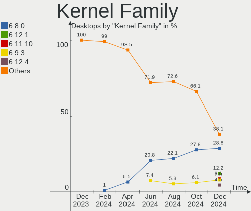
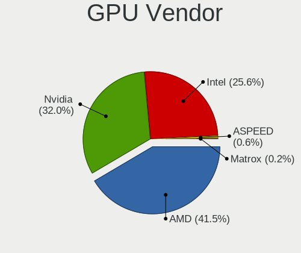
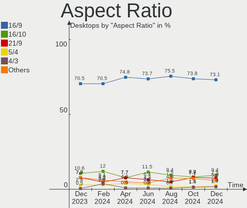
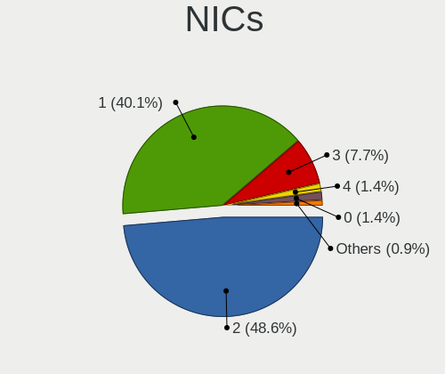

Linux in USA - Hardware Trends (Desktops)
-----------------------------------------

A project to identify most popular hardware characteristics and track their change
over time based on data collected by Linux users at https://Linux-Hardware.org.

Anyone can contribute to this report by the [hw-probe](https://github.com/linuxhw/hw-probe) tool:

    sudo -E hw-probe -all -upload

Period: Feb, 2023.

Contents
--------

* [ System ](#system)
  - [ OS                       ](#os)
  - [ OS Family                ](#os-family)
  - [ Kernel                   ](#kernel)
  - [ Kernel Family            ](#kernel-family)
  - [ Kernel Major Ver.        ](#kernel-major-ver)
  - [ Arch                     ](#arch)
  - [ DE                       ](#de)
  - [ Display Server           ](#display-server)
  - [ Display Manager          ](#display-manager)
  - [ OS Lang                  ](#os-lang)
  - [ Boot Mode                ](#boot-mode)
  - [ Filesystem               ](#filesystem)
  - [ Part. scheme             ](#part-scheme)
  - [ Dual Boot with Linux/BSD ](#dual-boot-with-linuxbsd)
  - [ Dual Boot (Win)          ](#dual-boot-win)

* [ Board ](#board)
  - [ Vendor                   ](#vendor)
  - [ Model                    ](#model)
  - [ Model Family             ](#model-family)
  - [ MFG Year                 ](#mfg-year)
  - [ Form Factor              ](#form-factor)
  - [ Secure Boot              ](#secure-boot)
  - [ Coreboot                 ](#coreboot)
  - [ RAM Size                 ](#ram-size)
  - [ RAM Used                 ](#ram-used)
  - [ Total Drives             ](#total-drives)
  - [ Has CD-ROM               ](#has-cd-rom)
  - [ Has Ethernet             ](#has-ethernet)
  - [ Has WiFi                 ](#has-wifi)
  - [ Has Bluetooth            ](#has-bluetooth)

* [ Location ](#location)
  - [ Country                  ](#country)
  - [ City                     ](#city)

* [ Drives ](#drives)
  - [ Drive Vendor             ](#drive-vendor)
  - [ Drive Model              ](#drive-model)
  - [ HDD Vendor               ](#hdd-vendor)
  - [ SSD Vendor               ](#ssd-vendor)
  - [ Drive Kind               ](#drive-kind)
  - [ Drive Connector          ](#drive-connector)
  - [ Drive Size               ](#drive-size)
  - [ Space Total              ](#space-total)
  - [ Space Used               ](#space-used)
  - [ Malfunc. Drives          ](#malfunc-drives)
  - [ Malfunc. Drive Vendor    ](#malfunc-drive-vendor)
  - [ Malfunc. HDD Vendor      ](#malfunc-hdd-vendor)
  - [ Malfunc. Drive Kind      ](#malfunc-drive-kind)
  - [ Failed Drives            ](#failed-drives)
  - [ Failed Drive Vendor      ](#failed-drive-vendor)
  - [ Drive Status             ](#drive-status)

* [ Storage controller ](#storage-controller)
  - [ Storage Vendor           ](#storage-vendor)
  - [ Storage Model            ](#storage-model)
  - [ Storage Kind             ](#storage-kind)

* [ Processor ](#processor)
  - [ CPU Vendor               ](#cpu-vendor)
  - [ CPU Model                ](#cpu-model)
  - [ CPU Model Family         ](#cpu-model-family)
  - [ CPU Cores                ](#cpu-cores)
  - [ CPU Sockets              ](#cpu-sockets)
  - [ CPU Threads              ](#cpu-threads)
  - [ CPU Op-Modes             ](#cpu-op-modes)
  - [ CPU Microcode            ](#cpu-microcode)
  - [ CPU Microarch            ](#cpu-microarch)

* [ Graphics ](#graphics)
  - [ GPU Vendor               ](#gpu-vendor)
  - [ GPU Model                ](#gpu-model)
  - [ GPU Combo                ](#gpu-combo)
  - [ GPU Driver               ](#gpu-driver)
  - [ GPU Memory               ](#gpu-memory)

* [ Monitor ](#monitor)
  - [ Monitor Vendor           ](#monitor-vendor)
  - [ Monitor Model            ](#monitor-model)
  - [ Monitor Resolution       ](#monitor-resolution)
  - [ Monitor Diagonal         ](#monitor-diagonal)
  - [ Monitor Width            ](#monitor-width)
  - [ Aspect Ratio             ](#aspect-ratio)
  - [ Monitor Area             ](#monitor-area)
  - [ Pixel Density            ](#pixel-density)
  - [ Multiple Monitors        ](#multiple-monitors)

* [ Network ](#network)
  - [ Net Controller Vendor    ](#net-controller-vendor)
  - [ Net Controller Model     ](#net-controller-model)
  - [ Wireless Vendor          ](#wireless-vendor)
  - [ Wireless Model           ](#wireless-model)
  - [ Ethernet Vendor          ](#ethernet-vendor)
  - [ Ethernet Model           ](#ethernet-model)
  - [ Net Controller Kind      ](#net-controller-kind)
  - [ Used Controller          ](#used-controller)
  - [ NICs                     ](#nics)
  - [ IPv6                     ](#ipv6)

* [ Bluetooth ](#bluetooth)
  - [ Bluetooth Vendor         ](#bluetooth-vendor)
  - [ Bluetooth Model          ](#bluetooth-model)

* [ Sound ](#sound)
  - [ Sound Vendor             ](#sound-vendor)
  - [ Sound Model              ](#sound-model)

* [ Memory ](#memory)
  - [ Memory Vendor            ](#memory-vendor)
  - [ Memory Model             ](#memory-model)
  - [ Memory Kind              ](#memory-kind)
  - [ Memory Form Factor       ](#memory-form-factor)
  - [ Memory Size              ](#memory-size)
  - [ Memory Speed             ](#memory-speed)

* [ Printers & scanners ](#printers--scanners)
  - [ Printer Vendor           ](#printer-vendor)
  - [ Printer Model            ](#printer-model)
  - [ Scanner Vendor           ](#scanner-vendor)
  - [ Scanner Model            ](#scanner-model)

* [ Camera ](#camera)
  - [ Camera Vendor            ](#camera-vendor)
  - [ Camera Model             ](#camera-model)

* [ Security ](#security)
  - [ Fingerprint Vendor       ](#fingerprint-vendor)
  - [ Fingerprint Model        ](#fingerprint-model)
  - [ Chipcard Vendor          ](#chipcard-vendor)
  - [ Chipcard Model           ](#chipcard-model)

* [ Unsupported ](#unsupported)
  - [ Unsupported Devices      ](#unsupported-devices)
  - [ Unsupported Device Types ](#unsupported-device-types)

System
------

OS
--

Installed operating systems

| Name                         | Desktops | Percent |
|------------------------------|----------|---------|
| Ubuntu 22.04                 | 106      | 23.98%  |
| Pop!_OS 22.04                | 30       | 6.79%   |
| Linux Mint 21.1              | 29       | 6.56%   |
| Fedora 37                    | 23       | 5.2%    |
| Zorin 16                     | 21       | 4.75%   |
| Debian 11                    | 21       | 4.75%   |
| Arch Rolling                 | 21       | 4.75%   |
| OpenMandriva 23.01           | 20       | 4.52%   |
| Ubuntu 22.10                 | 19       | 4.3%    |
| OpenMandriva 4.3             | 10       | 2.26%   |
| Ubuntu 20.04                 | 9        | 2.04%   |
| Nobara 37                    | 9        | 2.04%   |
| KDE neon 22.04               | 9        | 2.04%   |
| Manjaro                      | 7        | 1.58%   |
| Linux Mint 21                | 7        | 1.58%   |
| Linux Mint 20.3              | 7        | 1.58%   |
| Fedora 36                    | 6        | 1.36%   |
| Kubuntu 22.04                | 5        | 1.13%   |
| EndeavourOS Rolling          | 5        | 1.13%   |
| ArcoLinux Rolling            | 5        | 1.13%   |
| MX 21                        | 4        | 0.9%    |
| Kubuntu 22.10                | 4        | 0.9%    |
| Ubuntu 18.04                 | 3        | 0.68%   |
| SteamOS 3.4                  | 3        | 0.68%   |
| Manjaro 22.0.3               | 3        | 0.68%   |
| Gentoo 2.13                  | 3        | 0.68%   |
| Xubuntu 20.04                | 2        | 0.45%   |
| Rocky Linux 9.1              | 2        | 0.45%   |
| Parrot 5.2                   | 2        | 0.45%   |
| openSUSE Tumbleweed-XXXXXXXX | 2        | 0.45%   |
| openSUSE Leap-15.4           | 2        | 0.45%   |
| OpenMandriva 23.90           | 2        | 0.45%   |
| Nobara 36                    | 2        | 0.45%   |
| Lubuntu 22.10                | 2        | 0.45%   |
| LMDE 5                       | 2        | 0.45%   |
| Kaisen 2.2                   | 2        | 0.45%   |
| Gentoo 2.9                   | 2        | 0.45%   |
| Elementary 7                 | 2        | 0.45%   |
| Devuan 4                     | 2        | 0.45%   |
| Debian                       | 2        | 0.45%   |

OS Family
---------

OS without a version

| Name             | Desktops | Percent |
|------------------|----------|---------|
| Ubuntu           | 139      | 31.45%  |
| Linux Mint       | 44       | 9.95%   |
| OpenMandriva     | 32       | 7.24%   |
| Pop!_OS          | 30       | 6.79%   |
| Fedora           | 29       | 6.56%   |
| Debian           | 24       | 5.43%   |
| Zorin            | 21       | 4.75%   |
| Arch             | 21       | 4.75%   |
| Manjaro          | 12       | 2.71%   |
| Nobara           | 11       | 2.49%   |
| Kubuntu          | 9        | 2.04%   |
| KDE neon         | 9        | 2.04%   |
| ArcoLinux        | 7        | 1.58%   |
| openSUSE         | 5        | 1.13%   |
| Gentoo           | 5        | 1.13%   |
| EndeavourOS      | 5        | 1.13%   |
| SteamOS          | 4        | 0.9%    |
| MX               | 4        | 0.9%    |
| Parrot           | 3        | 0.68%   |
| Lubuntu          | 3        | 0.68%   |
| Xubuntu          | 2        | 0.45%   |
| Rocky Linux      | 2        | 0.45%   |
| LMDE             | 2        | 0.45%   |
| Kaisen           | 2        | 0.45%   |
| Elementary       | 2        | 0.45%   |
| Devuan           | 2        | 0.45%   |
| Ubuntu MATE      | 1        | 0.23%   |
| Ubuntu Budgie    | 1        | 0.23%   |
| SLED             | 1        | 0.23%   |
| org.kde.Platform | 1        | 0.23%   |
| MX Respin        | 1        | 0.23%   |
| Kali             | 1        | 0.23%   |
| Endless          | 1        | 0.23%   |
| Deepin           | 1        | 0.23%   |
| Clear Linux      | 1        | 0.23%   |
| ChimeraOS        | 1        | 0.23%   |
| BlackArch        | 1        | 0.23%   |
| BigLinux         | 1        | 0.23%   |
| AlmaLinux        | 1        | 0.23%   |

Kernel
------

Version of the Linux kernel

| Version                      | Desktops | Percent |
|------------------------------|----------|---------|
| 5.15.0-60-generic            | 69       | 15.61%  |
| 5.15.0-58-generic            | 53       | 11.99%  |
| 5.19.0-32-generic            | 43       | 9.73%   |
| 6.0.12-76060006-generic      | 26       | 5.88%   |
| 5.19.0-31-generic            | 17       | 3.85%   |
| 6.1.1-desktop-1omv2290       | 14       | 3.17%   |
| 5.10.0-21-amd64              | 13       | 2.94%   |
| 5.16.13-desktop-1omv4003     | 7        | 1.58%   |
| 6.1.8-200.fc37.x86_64        | 6        | 1.36%   |
| 6.1.11-arch1-1               | 6        | 1.36%   |
| 5.15.0-43-generic            | 6        | 1.36%   |
| 6.1.9-200.fsync.fc37.x86_64  | 5        | 1.13%   |
| 6.1.4-desktop-1omv2301       | 5        | 1.13%   |
| 6.1.12-arch1-1               | 5        | 1.13%   |
| 6.1.9-200.fc37.x86_64        | 4        | 0.9%    |
| 6.1.11-200.fc37.x86_64       | 4        | 0.9%    |
| 6.1.10-200.fc37.x86_64       | 4        | 0.9%    |
| 5.4.0-139-generic            | 4        | 0.9%    |
| 5.19.0-29-generic            | 4        | 0.9%    |
| 5.15.0-56-generic            | 4        | 0.9%    |
| 6.1.9-arch1-1                | 3        | 0.68%   |
| 6.1.12-zen1-1-zen            | 3        | 0.68%   |
| 6.1.11-76060111-generic      | 3        | 0.68%   |
| 6.1.11-1-MANJARO             | 3        | 0.68%   |
| 6.0.0-12parrot1-amd64        | 3        | 0.68%   |
| 6.0.0-0.deb11.6-amd64        | 3        | 0.68%   |
| 5.4.0-137-generic            | 3        | 0.68%   |
| 5.19.0-21-generic            | 3        | 0.68%   |
| 5.16.7-desktop-1omv4003      | 3        | 0.68%   |
| 5.13.0-valve21.3-1-neptune   | 3        | 0.68%   |
| 6.2.1-desktop-1omv2390       | 2        | 0.45%   |
| 6.1.9-100.fc36.x86_64        | 2        | 0.45%   |
| 6.1.8-arch1-1                | 2        | 0.45%   |
| 6.1.7-200.fc37.x86_64        | 2        | 0.45%   |
| 6.1.11-zen1-1-zen            | 2        | 0.45%   |
| 6.1.11-201.fsync.fc37.x86_64 | 2        | 0.45%   |
| 6.1.1-arch1-1                | 2        | 0.45%   |
| 6.0.14-201.fsync.fc36.x86_64 | 2        | 0.45%   |
| 6.0.0-1kaisen-amd64          | 2        | 0.45%   |
| 6.0.0-1010-oem               | 2        | 0.45%   |

Kernel Family
-------------

Linux kernel without a distro release

| Version | Desktops | Percent |
|---------|----------|---------|
| 5.15.0  | 141      | 31.9%   |
| 5.19.0  | 69       | 15.61%  |
| 6.0.12  | 27       | 6.11%   |
| 6.1.11  | 21       | 4.75%   |
| 6.1.9   | 18       | 4.07%   |
| 5.10.0  | 18       | 4.07%   |
| 6.1.1   | 16       | 3.62%   |
| 6.0.0   | 15       | 3.39%   |
| 6.1.8   | 13       | 2.94%   |
| 5.4.0   | 11       | 2.49%   |
| 6.1.12  | 10       | 2.26%   |
| 6.2.0   | 7        | 1.58%   |
| 6.1.10  | 7        | 1.58%   |
| 5.16.13 | 7        | 1.58%   |
| 6.1.4   | 6        | 1.36%   |
| 5.13.0  | 4        | 0.9%    |
| 6.2.1   | 3        | 0.68%   |
| 6.1.7   | 3        | 0.68%   |
| 5.16.7  | 3        | 0.68%   |
| 5.15.94 | 3        | 0.68%   |
| 5.15.93 | 3        | 0.68%   |
| 5.15.91 | 3        | 0.68%   |
| 5.15.74 | 3        | 0.68%   |
| 5.14.21 | 3        | 0.68%   |
| 5.14.0  | 3        | 0.68%   |
| 6.1.6   | 2        | 0.45%   |
| 6.1.13  | 2        | 0.45%   |
| 6.0.6   | 2        | 0.45%   |
| 6.0.14  | 2        | 0.45%   |
| 4.15.0  | 2        | 0.45%   |
| 6.1.0   | 1        | 0.23%   |
| 6.0.7   | 1        | 0.23%   |
| 6.0.15  | 1        | 0.23%   |
| 5.19.5  | 1        | 0.23%   |
| 5.19.3  | 1        | 0.23%   |
| 5.19.11 | 1        | 0.23%   |
| 5.18.0  | 1        | 0.23%   |
| 5.17.0  | 1        | 0.23%   |
| 5.15.90 | 1        | 0.23%   |
| 5.15.89 | 1        | 0.23%   |

Kernel Major Ver.
-----------------

Linux kernel major version

| Version | Desktops | Percent |
|---------|----------|---------|
| 5.15    | 157      | 35.52%  |
| 6.1     | 99       | 22.4%   |
| 5.19    | 72       | 16.29%  |
| 6.0     | 48       | 10.86%  |
| 5.10    | 19       | 4.3%    |
| 5.4     | 11       | 2.49%   |
| 6.2     | 10       | 2.26%   |
| 5.16    | 10       | 2.26%   |
| 5.14    | 6        | 1.36%   |
| 5.13    | 4        | 0.9%    |
| 4.15    | 2        | 0.45%   |
| 5.18    | 1        | 0.23%   |
| 5.17    | 1        | 0.23%   |
| 4.19    | 1        | 0.23%   |
| 4.18    | 1        | 0.23%   |

Arch
----

OS architecture (x86_64, i586, etc.)

| Name   | Desktops | Percent |
|--------|----------|---------|
| x86_64 | 440      | 99.55%  |
| i686   | 1        | 0.23%   |
| i586   | 1        | 0.23%   |

DE
--

Desktop Environment

| Name             | Desktops | Percent |
|------------------|----------|---------|
| GNOME            | 234      | 52.94%  |
| KDE5             | 94       | 21.27%  |
| X-Cinnamon       | 41       | 9.28%   |
| XFCE             | 25       | 5.66%   |
| Unknown          | 14       | 3.17%   |
| MATE             | 10       | 2.26%   |
| GNOME Classic    | 4        | 0.9%    |
| sway             | 3        | 0.68%   |
| LXQt             | 3        | 0.68%   |
| Hyprland         | 3        | 0.68%   |
| Pantheon         | 2        | 0.45%   |
| i3               | 2        | 0.45%   |
| Deepin           | 2        | 0.45%   |
| Cinnamon         | 2        | 0.45%   |
| lightdm-xsession | 1        | 0.23%   |
| LeftWM           | 1        | 0.23%   |
| awesome          | 1        | 0.23%   |

Display Server
--------------

X11 or Wayland

| Name    | Desktops | Percent |
|---------|----------|---------|
| X11     | 307      | 69.46%  |
| Wayland | 113      | 25.57%  |
| Tty     | 16       | 3.62%   |
| Unknown | 6        | 1.36%   |

Display Manager
---------------

SDDM, LightDM, etc.

| Name    | Desktops | Percent |
|---------|----------|---------|
| Unknown | 184      | 41.63%  |
| GDM3    | 123      | 27.83%  |
| SDDM    | 56       | 12.67%  |
| LightDM | 45       | 10.18%  |
| GDM     | 30       | 6.79%   |
| SLiM    | 2        | 0.45%   |
| Ly      | 1        | 0.23%   |
| GREETD  | 1        | 0.23%   |

OS Lang
-------

Language

| Lang       | Desktops | Percent |
|------------|----------|---------|
| en_US      | 430      | 97.29%  |
| C          | 4        | 0.9%    |
| Unknown    | 4        | 0.9%    |
| en_CA      | 2        | 0.45%   |
| en_GB      | 1        | 0.23%   |
| en-US.UTF8 | 1        | 0.23%   |

Boot Mode
---------

EFI or BIOS

| Mode | Desktops | Percent |
|------|----------|---------|
| BIOS | 257      | 58.14%  |
| EFI  | 185      | 41.86%  |

Filesystem
----------

Type of filesystem

| Type    | Desktops | Percent |
|---------|----------|---------|
| Ext4    | 336      | 76.02%  |
| Btrfs   | 65       | 14.71%  |
| Overlay | 20       | 4.52%   |
| Xfs     | 11       | 2.49%   |
| Zfs     | 8        | 1.81%   |
| Tmpfs   | 1        | 0.23%   |
| Ext3    | 1        | 0.23%   |

Part. scheme
------------

Scheme of partitioning

| Type    | Desktops | Percent |
|---------|----------|---------|
| GPT     | 239      | 54.07%  |
| Unknown | 166      | 37.56%  |
| MBR     | 37       | 8.37%   |

Dual Boot with Linux/BSD
------------------------

Hosting more than one Linux/BSD

| Dual boot | Desktops | Percent |
|-----------|----------|---------|
| No        | 363      | 82.13%  |
| Yes       | 79       | 17.87%  |

Dual Boot (Win)
---------------

Hosting Linux and Windows

| Dual boot | Desktops | Percent |
|-----------|----------|---------|
| No        | 333      | 75.34%  |
| Yes       | 109      | 24.66%  |

Board
-----

Vendor
------

Motherboard manufacturer

| Name                | Desktops | Percent |
|---------------------|----------|---------|
| ASUSTek Computer    | 107      | 24.21%  |
| Dell                | 68       | 15.38%  |
| Gigabyte Technology | 58       | 13.12%  |
| MSI                 | 49       | 11.09%  |
| Hewlett-Packard     | 47       | 10.63%  |
| ASRock              | 42       | 9.5%    |
| Lenovo              | 20       | 4.52%   |
| Unknown             | 6        | 1.36%   |
| Foxconn             | 5        | 1.13%   |
| AZW                 | 5        | 1.13%   |
| Alienware           | 4        | 0.9%    |
| Pegatron            | 3        | 0.68%   |
| Intel               | 3        | 0.68%   |
| Apple               | 3        | 0.68%   |
| Acer                | 3        | 0.68%   |
| Supermicro          | 2        | 0.45%   |
| Google              | 2        | 0.45%   |
| Gateway             | 2        | 0.45%   |
| eMachines           | 2        | 0.45%   |
| AMD                 | 2        | 0.45%   |
| System76            | 1        | 0.23%   |
| SiS Technology      | 1        | 0.23%   |
| Quanta              | 1        | 0.23%   |
| IceWhale Technology | 1        | 0.23%   |
| EVGA                | 1        | 0.23%   |
| CWWK                | 1        | 0.23%   |
| Cisco Systems       | 1        | 0.23%   |
| BESSTAR Tech        | 1        | 0.23%   |
| AWOW                | 1        | 0.23%   |

Model
-----

Motherboard model

| Name                                | Desktops | Percent |
|-------------------------------------|----------|---------|
| ASUS All Series                     | 9        | 2.04%   |
| ASUS TUF Gaming X570-PLUS           | 8        | 1.81%   |
| Unknown                             | 6        | 1.36%   |
| Dell OptiPlex 7010                  | 5        | 1.13%   |
| Dell XPS 8700                       | 4        | 0.9%    |
| Dell OptiPlex 3020                  | 4        | 0.9%    |
| ASUS ROG STRIX X570-E GAMING        | 4        | 0.9%    |
| ASUS PRIME B550M-A                  | 4        | 0.9%    |
| MSI MS-7C75                         | 3        | 0.68%   |
| MSI MS-7C02                         | 3        | 0.68%   |
| HP Compaq Pro 6300 SFF              | 3        | 0.68%   |
| Dell OptiPlex 9010                  | 3        | 0.68%   |
| Dell OptiPlex 7050                  | 3        | 0.68%   |
| Dell OptiPlex 7040                  | 3        | 0.68%   |
| Dell OptiPlex 7020                  | 3        | 0.68%   |
| ASUS TUF Gaming B550-PLUS           | 3        | 0.68%   |
| ASUS ROG STRIX B550-F GAMING        | 3        | 0.68%   |
| ASUS ROG STRIX B450-F GAMING        | 3        | 0.68%   |
| MSI MS-7D31                         | 2        | 0.45%   |
| MSI MS-7D30                         | 2        | 0.45%   |
| MSI MS-7C56                         | 2        | 0.45%   |
| MSI MS-7C37                         | 2        | 0.45%   |
| MSI MS-7B17                         | 2        | 0.45%   |
| MSI MS-7693                         | 2        | 0.45%   |
| MSI MS-7641                         | 2        | 0.45%   |
| Lenovo 70A4000HUX ThinkServer TS140 | 2        | 0.45%   |
| HP ProDesk 600 G1 SFF               | 2        | 0.45%   |
| HP EliteDesk 800 G3 SFF             | 2        | 0.45%   |
| Gigabyte Z390 AORUS PRO WIFI        | 2        | 0.45%   |
| Gigabyte Z370 AORUS Gaming 5        | 2        | 0.45%   |
| Gigabyte X570 I AORUS PRO WIFI      | 2        | 0.45%   |
| Gigabyte X570 GAMING X              | 2        | 0.45%   |
| Gigabyte B550M DS3H                 | 2        | 0.45%   |
| Gigabyte B550 GAMING X V2           | 2        | 0.45%   |
| Gigabyte B450M DS3H                 | 2        | 0.45%   |
| Gigabyte B365M DS3H                 | 2        | 0.45%   |
| eMachines ET1331G                   | 2        | 0.45%   |
| Dell OptiPlex 780                   | 2        | 0.45%   |
| Dell OptiPlex 390                   | 2        | 0.45%   |
| Dell Inspiron 660                   | 2        | 0.45%   |

Model Family
------------

Motherboard model prefix

| Name                | Desktops | Percent |
|---------------------|----------|---------|
| Dell OptiPlex       | 37       | 8.37%   |
| ASUS ROG            | 29       | 6.56%   |
| ASUS TUF            | 20       | 4.52%   |
| ASUS PRIME          | 20       | 4.52%   |
| Lenovo ThinkCentre  | 10       | 2.26%   |
| Dell XPS            | 9        | 2.04%   |
| Dell Inspiron       | 9        | 2.04%   |
| ASUS All            | 9        | 2.04%   |
| HP EliteDesk        | 8        | 1.81%   |
| HP Compaq           | 8        | 1.81%   |
| Gigabyte X570       | 6        | 1.36%   |
| Dell Precision      | 6        | 1.36%   |
| Unknown             | 6        | 1.36%   |
| HP ProDesk          | 5        | 1.13%   |
| Lenovo ThinkStation | 4        | 0.9%    |
| Gigabyte B550M      | 4        | 0.9%    |
| Gigabyte B450M      | 4        | 0.9%    |
| MSI MS-7C75         | 3        | 0.68%   |
| MSI MS-7C02         | 3        | 0.68%   |
| HP Pavilion         | 3        | 0.68%   |
| Gigabyte Z390       | 3        | 0.68%   |
| Gigabyte B550       | 3        | 0.68%   |
| ASUS SABERTOOTH     | 3        | 0.68%   |
| ASUS ProArt         | 3        | 0.68%   |
| Alienware Aurora    | 3        | 0.68%   |
| MSI MS-7D31         | 2        | 0.45%   |
| MSI MS-7D30         | 2        | 0.45%   |
| MSI MS-7C56         | 2        | 0.45%   |
| MSI MS-7C37         | 2        | 0.45%   |
| MSI MS-7B17         | 2        | 0.45%   |
| MSI MS-7693         | 2        | 0.45%   |
| MSI MS-7641         | 2        | 0.45%   |
| Lenovo IdeaCentre   | 2        | 0.45%   |
| Lenovo 70A4000HUX   | 2        | 0.45%   |
| HP OMEN             | 2        | 0.45%   |
| Gigabyte Z690       | 2        | 0.45%   |
| Gigabyte Z370       | 2        | 0.45%   |
| Gigabyte X399       | 2        | 0.45%   |
| Gigabyte B365M      | 2        | 0.45%   |
| eMachines ET1331G   | 2        | 0.45%   |

MFG Year
--------

Motherboard manufacture year

| Year | Desktops | Percent |
|------|----------|---------|
| 2020 | 50       | 11.31%  |
| 2018 | 43       | 9.73%   |
| 2021 | 40       | 9.05%   |
| 2019 | 40       | 9.05%   |
| 2013 | 38       | 8.6%    |
| 2022 | 36       | 8.14%   |
| 2012 | 35       | 7.92%   |
| 2017 | 28       | 6.33%   |
| 2014 | 28       | 6.33%   |
| 2011 | 25       | 5.66%   |
| 2015 | 20       | 4.52%   |
| 2016 | 14       | 3.17%   |
| 2009 | 14       | 3.17%   |
| 2010 | 11       | 2.49%   |
| 2023 | 6        | 1.36%   |
| 2007 | 5        | 1.13%   |
| 2008 | 4        | 0.9%    |
| 2006 | 4        | 0.9%    |
| 2004 | 1        | 0.23%   |

Form Factor
-----------

Physical design of the computer

| Name    | Desktops | Percent |
|---------|----------|---------|
| Desktop | 442      | 100%    |

Secure Boot
-----------

Enabled or disabled

| State    | Desktops | Percent |
|----------|----------|---------|
| Disabled | 426      | 96.38%  |
| Enabled  | 16       | 3.62%   |

Coreboot
--------

Have coreboot on board

| Used | Desktops | Percent |
|------|----------|---------|
| No   | 440      | 99.55%  |
| Yes  | 2        | 0.45%   |

RAM Size
--------

Total RAM memory

| Size in GB      | Desktops | Percent |
|-----------------|----------|---------|
| 16.01-24.0      | 129      | 29.19%  |
| 32.01-64.0      | 110      | 24.89%  |
| 4.01-8.0        | 61       | 13.8%   |
| 8.01-16.0       | 57       | 12.9%   |
| 64.01-256.0     | 49       | 11.09%  |
| 3.01-4.0        | 16       | 3.62%   |
| 24.01-32.0      | 13       | 2.94%   |
| More than 256.0 | 3        | 0.68%   |
| 1.01-2.0        | 2        | 0.45%   |
| 2.01-3.0        | 1        | 0.23%   |
| 0.01-0.5        | 1        | 0.23%   |

RAM Used
--------

Used RAM memory

| Used GB     | Desktops | Percent |
|-------------|----------|---------|
| 4.01-8.0    | 114      | 25.79%  |
| 2.01-3.0    | 113      | 25.57%  |
| 1.01-2.0    | 105      | 23.76%  |
| 3.01-4.0    | 63       | 14.25%  |
| 8.01-16.0   | 23       | 5.2%    |
| 0.51-1.0    | 9        | 2.04%   |
| 16.01-24.0  | 8        | 1.81%   |
| 32.01-64.0  | 3        | 0.68%   |
| 0.01-0.5    | 3        | 0.68%   |
| 64.01-256.0 | 1        | 0.23%   |

Total Drives
------------

Number of drives on board

| Drives | Desktops | Percent |
|--------|----------|---------|
| 1      | 168      | 38.01%  |
| 2      | 104      | 23.53%  |
| 3      | 74       | 16.74%  |
| 4      | 43       | 9.73%   |
| 5      | 29       | 6.56%   |
| 6      | 8        | 1.81%   |
| 7      | 6        | 1.36%   |
| 9      | 3        | 0.68%   |
| 8      | 3        | 0.68%   |
| 11     | 2        | 0.45%   |
| 38     | 1        | 0.23%   |
| 0      | 1        | 0.23%   |

Has CD-ROM
----------

Has CD-ROM on board

| Presented | Desktops | Percent |
|-----------|----------|---------|
| No        | 240      | 54.3%   |
| Yes       | 202      | 45.7%   |

Has Ethernet
------------

Has Ethernet on board

| Presented | Desktops | Percent |
|-----------|----------|---------|
| Yes       | 439      | 99.32%  |
| No        | 3        | 0.68%   |

Has WiFi
--------

Has WiFi module

| Presented | Desktops | Percent |
|-----------|----------|---------|
| Yes       | 267      | 60.41%  |
| No        | 175      | 39.59%  |

Has Bluetooth
-------------

Has Bluetooth module

| Presented | Desktops | Percent |
|-----------|----------|---------|
| Yes       | 224      | 50.68%  |
| No        | 218      | 49.32%  |

Location
--------

Country
-------

Geographic location (country)

| Country | Desktops | Percent |
|---------|----------|---------|
| USA     | 442      | 100%    |

City
----

Geographic location (city)

| City          | Desktops | Percent |
|---------------|----------|---------|
| Denver        | 9        | 2.04%   |
| Seattle       | 8        | 1.81%   |
| Los Angeles   | 7        | 1.58%   |
| New York      | 5        | 1.13%   |
| Miami         | 5        | 1.13%   |
| Houston       | 5        | 1.13%   |
| Dallas        | 5        | 1.13%   |
| Chicago       | 5        | 1.13%   |
| St Louis      | 4        | 0.9%    |
| San Jose      | 4        | 0.9%    |
| Kansas City   | 4        | 0.9%    |
| Springfield   | 3        | 0.68%   |
| San Antonio   | 3        | 0.68%   |
| Richmond      | 3        | 0.68%   |
| Portland      | 3        | 0.68%   |
| Pittsburgh    | 3        | 0.68%   |
| Omaha         | 3        | 0.68%   |
| Lexington     | 3        | 0.68%   |
| Lansing       | 3        | 0.68%   |
| Hillsboro     | 3        | 0.68%   |
| Aurora        | 3        | 0.68%   |
| Atlanta       | 3        | 0.68%   |
| Wilmington    | 2        | 0.45%   |
| Washington    | 2        | 0.45%   |
| Tucson        | 2        | 0.45%   |
| The Bronx     | 2        | 0.45%   |
| Sterling      | 2        | 0.45%   |
| Springview    | 2        | 0.45%   |
| Somerville    | 2        | 0.45%   |
| Severna Park  | 2        | 0.45%   |
| San Pedro     | 2        | 0.45%   |
| San Marcos    | 2        | 0.45%   |
| Phoenix       | 2        | 0.45%   |
| Ogden         | 2        | 0.45%   |
| Ocala         | 2        | 0.45%   |
| National City | 2        | 0.45%   |
| Muncie        | 2        | 0.45%   |
| Madison       | 2        | 0.45%   |
| Longmont      | 2        | 0.45%   |
| Kenosha       | 2        | 0.45%   |

Drives
------

Drive Vendor
------------

Hard drive vendors

| Vendor                      | Desktops | Drives | Percent |
|-----------------------------|----------|--------|---------|
| WDC                         | 157      | 250    | 18.6%   |
| Seagate                     | 140      | 207    | 16.59%  |
| Samsung Electronics         | 128      | 176    | 15.17%  |
| Sandisk                     | 72       | 88     | 8.53%   |
| Toshiba                     | 35       | 38     | 4.15%   |
| Crucial                     | 32       | 39     | 3.79%   |
| Kingston                    | 25       | 26     | 2.96%   |
| Hitachi                     | 25       | 28     | 2.96%   |
| China                       | 20       | 22     | 2.37%   |
| Phison Electronics          | 19       | 21     | 2.25%   |
| Intel                       | 16       | 20     | 1.9%    |
| PNY                         | 15       | 16     | 1.78%   |
| Unknown                     | 13       | 17     | 1.54%   |
| SPCC                        | 12       | 12     | 1.42%   |
| SK hynix                    | 12       | 17     | 1.42%   |
| HGST                        | 9        | 12     | 1.07%   |
| A-DATA Technology           | 9        | 10     | 1.07%   |
| Team                        | 7        | 8      | 0.83%   |
| Silicon Motion              | 6        | 6      | 0.71%   |
| Micron/Crucial Technology   | 6        | 6      | 0.71%   |
| KingFast                    | 5        | 5      | 0.59%   |
| ASMT                        | 5        | 8      | 0.59%   |
| Phison                      | 4        | 4      | 0.47%   |
| Mushkin                     | 4        | 4      | 0.47%   |
| JMicron Technology          | 4        | 4      | 0.47%   |
| Realtek Semiconductor       | 3        | 3      | 0.36%   |
| OCZ                         | 3        | 3      | 0.36%   |
| Micron Technology           | 3        | 3      | 0.36%   |
| Lexar                       | 3        | 3      | 0.36%   |
| Corsair                     | 3        | 4      | 0.36%   |
| Western Digital             | 2        | 2      | 0.24%   |
| Timetec                     | 2        | 2      | 0.24%   |
| SABRENT                     | 2        | 2      | 0.24%   |
| LITEON                      | 2        | 2      | 0.24%   |
| Kingston Technology Company | 2        | 2      | 0.24%   |
| Gigabyte Technology         | 2        | 2      | 0.24%   |
| ADATA Technology            | 2        | 3      | 0.24%   |
| Acer                        | 2        | 2      | 0.24%   |
| XPG                         | 1        | 1      | 0.12%   |
| WD MediaMax                 | 1        | 1      | 0.12%   |

Drive Model
-----------

Hard drive models

| Model                                                | Desktops | Percent |
|------------------------------------------------------|----------|---------|
| Samsung NVMe SSD Controller SM981/PM981/PM983 250GB  | 23       | 2.3%    |
| Seagate ST2000DM008-2FR102 2TB                       | 16       | 1.6%    |
| Samsung SSD 850 EVO 500GB                            | 16       | 1.6%    |
| Samsung NVMe SSD Controller PM9A1/PM9A3/980PRO 960GB | 15       | 1.5%    |
| Samsung SSD 860 EVO 500GB                            | 12       | 1.2%    |
| Sandisk WD Blue SN550 NVMe SSD 1TB                   | 11       | 1.1%    |
| Samsung SSD 980 1TB                                  | 11       | 1.1%    |
| WDC WD10EZEX-08WN4A0 1TB                             | 10       | 1%      |
| Crucial CT1000MX500SSD1 1TB                          | 10       | 1%      |
| Samsung SSD 860 EVO 1TB                              | 9        | 0.9%    |
| Unknown SD/MMC/MS PRO 16GB                           | 7        | 0.7%    |
| Seagate ST500DM002-1BD142 500GB                      | 7        | 0.7%    |
| Sandisk WD_BLACK SN770 1TB                           | 7        | 0.7%    |
| Sandisk WD Blue SN570 1TB                            | 7        | 0.7%    |
| Phison E12 NVMe Controller 1024GB                    | 7        | 0.7%    |
| Kingston SA400S37240G 240GB SSD                      | 7        | 0.7%    |
| WDC WD10EZEX-00WN4A0 1TB                             | 6        | 0.6%    |
| Toshiba DT01ACA200 2TB                               | 6        | 0.6%    |
| Seagate ST4000DM004-2CV104 4TB                       | 6        | 0.6%    |
| Samsung SSD 970 EVO Plus 500GB                       | 6        | 0.6%    |
| Samsung SSD 850 EVO 250GB                            | 6        | 0.6%    |
| WDC WD20EZRZ-00Z5HB0 2TB                             | 5        | 0.5%    |
| WDC WD Blue SA510 2.5 1000GB                         | 5        | 0.5%    |
| Toshiba DT01ACA100 1TB                               | 5        | 0.5%    |
| SPCC Solid State Disk 256GB                          | 5        | 0.5%    |
| Seagate ST2000DM001-1ER164 2TB                       | 5        | 0.5%    |
| Seagate ST1000DM003-1ER162 1TB                       | 5        | 0.5%    |
| Sandisk WD Black SN750 / PC SN730 NVMe SSD 512GB     | 5        | 0.5%    |
| Samsung SSD 980 PRO 1TB                              | 5        | 0.5%    |
| Samsung SSD 970 EVO Plus 2TB                         | 5        | 0.5%    |
| Samsung NVMe SSD Controller SM961/PM961/SM963 512GB  | 5        | 0.5%    |
| WDC WDS500G2B0A-00SM50 500GB SSD                     | 4        | 0.4%    |
| WDC WD6003FZBX-00K5WB0 6TB                           | 4        | 0.4%    |
| WDC WD4005FZBX-00K5WB0 4TB                           | 4        | 0.4%    |
| WDC WD1003FZEX-00MK2A0 1TB                           | 4        | 0.4%    |
| Unknown SD/MMC 2GB                                   | 4        | 0.4%    |
| Unknown M.S./M.S.Pro/HG 16GB                         | 4        | 0.4%    |
| Seagate ST1000DM010-2EP102 1TB                       | 4        | 0.4%    |
| Seagate ST1000DM003-1SB102 1TB                       | 4        | 0.4%    |
| Seagate Expansion Desk 5TB                           | 4        | 0.4%    |

HDD Vendor
----------

Hard disk drive vendors

| Vendor              | Desktops | Drives | Percent |
|---------------------|----------|--------|---------|
| Seagate             | 137      | 202    | 39.03%  |
| WDC                 | 131      | 207    | 37.32%  |
| Toshiba             | 25       | 28     | 7.12%   |
| Hitachi             | 25       | 28     | 7.12%   |
| HGST                | 9        | 12     | 2.56%   |
| Unknown             | 7        | 7      | 1.99%   |
| JMicron Technology  | 4        | 4      | 1.14%   |
| Samsung Electronics | 3        | 3      | 0.85%   |
| ASMT                | 3        | 6      | 0.85%   |
| SABRENT             | 2        | 2      | 0.57%   |
| WD MediaMax         | 1        | 1      | 0.28%   |
| Synology            | 1        | 2      | 0.28%   |
| PHD 3.0             | 1        | 1      | 0.28%   |
| Fujitsu             | 1        | 1      | 0.28%   |
| Apple               | 1        | 1      | 0.28%   |

SSD Vendor
----------

Solid state drive vendors

| Vendor              | Desktops | Drives | Percent |
|---------------------|----------|--------|---------|
| Samsung Electronics | 73       | 86     | 25.52%  |
| WDC                 | 31       | 32     | 10.84%  |
| Crucial             | 27       | 33     | 9.44%   |
| Kingston            | 24       | 25     | 8.39%   |
| SanDisk             | 22       | 23     | 7.69%   |
| China               | 20       | 22     | 6.99%   |
| PNY                 | 15       | 16     | 5.24%   |
| SPCC                | 11       | 11     | 3.85%   |
| A-DATA Technology   | 9        | 9      | 3.15%   |
| Team                | 7        | 8      | 2.45%   |
| Toshiba             | 4        | 4      | 1.4%    |
| SK hynix            | 4        | 6      | 1.4%    |
| OCZ                 | 3        | 3      | 1.05%   |
| Micron Technology   | 3        | 3      | 1.05%   |
| Intel               | 3        | 6      | 1.05%   |
| LITEON              | 2        | 2      | 0.7%    |
| Lexar               | 2        | 2      | 0.7%    |
| KingFast            | 2        | 2      | 0.7%    |
| Corsair             | 2        | 2      | 0.7%    |
| Acer                | 2        | 2      | 0.7%    |
| Vaseky              | 1        | 1      | 0.35%   |
| TO Exter            | 1        | 1      | 0.35%   |
| Timetec             | 1        | 1      | 0.35%   |
| T-FORCE             | 1        | 1      | 0.35%   |
| Seagate             | 1        | 1      | 0.35%   |
| SD                  | 1        | 1      | 0.35%   |
| Plextor             | 1        | 1      | 0.35%   |
| Patriot             | 1        | 1      | 0.35%   |
| OWC                 | 1        | 1      | 0.35%   |
| Neo                 | 1        | 1      | 0.35%   |
| Mushkin             | 1        | 1      | 0.35%   |
| MicroFrom           | 1        | 1      | 0.35%   |
| Leven               | 1        | 1      | 0.35%   |
| Hoodisk             | 1        | 1      | 0.35%   |
| Hewlett-Packard     | 1        | 1      | 0.35%   |
| Fanxiang            | 1        | 1      | 0.35%   |
| Eluktro             | 1        | 1      | 0.35%   |
| Dogfish             | 1        | 1      | 0.35%   |
| ASMT                | 1        | 1      | 0.35%   |
| Unknown             | 1        | 1      | 0.35%   |

Drive Kind
----------

HDD or SSD

| Kind    | Desktops | Drives | Percent |
|---------|----------|--------|---------|
| HDD     | 276      | 505    | 38.82%  |
| SSD     | 232      | 317    | 32.63%  |
| NVMe    | 182      | 263    | 25.6%   |
| Unknown | 19       | 24     | 2.67%   |
| MMC     | 2        | 2      | 0.28%   |

Drive Connector
---------------

SATA, SAS, NVMe, etc.

| Type | Desktops | Drives | Percent |
|------|----------|--------|---------|
| SATA | 379      | 780    | 61.63%  |
| NVMe | 182      | 263    | 29.59%  |
| SAS  | 52       | 66     | 8.46%   |
| MMC  | 2        | 2      | 0.33%   |

Drive Size
----------

Size of hard drive

| Size in TB | Desktops | Drives | Percent |
|------------|----------|--------|---------|
| 0.01-0.5   | 220      | 287    | 37.87%  |
| 0.51-1.0   | 165      | 228    | 28.4%   |
| 1.01-2.0   | 94       | 119    | 16.18%  |
| 3.01-4.0   | 39       | 61     | 6.71%   |
| 4.01-10.0  | 38       | 78     | 6.54%   |
| 2.01-3.0   | 16       | 17     | 2.75%   |
| 10.01-20.0 | 9        | 32     | 1.55%   |

Space Total
-----------

Amount of disk space available on the file system

| Size in GB     | Desktops | Percent |
|----------------|----------|---------|
| 501-1000       | 100      | 22.62%  |
| More than 3000 | 89       | 20.14%  |
| 251-500        | 71       | 16.06%  |
| 101-250        | 59       | 13.35%  |
| 1001-2000      | 49       | 11.09%  |
| 2001-3000      | 26       | 5.88%   |
| 1-20           | 18       | 4.07%   |
| Unknown        | 15       | 3.39%   |
| 51-100         | 8        | 1.81%   |
| 21-50          | 7        | 1.58%   |

Space Used
----------

Amount of used disk space

| Used GB        | Desktops | Percent |
|----------------|----------|---------|
| 1-20           | 107      | 24.21%  |
| 21-50          | 69       | 15.61%  |
| 51-100         | 51       | 11.54%  |
| 251-500        | 47       | 10.63%  |
| 101-250        | 42       | 9.5%    |
| 501-1000       | 37       | 8.37%   |
| 1001-2000      | 35       | 7.92%   |
| More than 3000 | 27       | 6.11%   |
| Unknown        | 15       | 3.39%   |
| 2001-3000      | 11       | 2.49%   |
| 0              | 1        | 0.23%   |

Malfunc. Drives
---------------

Drive models with a malfunction

| Model                                                            | Desktops | Drives | Percent |
|------------------------------------------------------------------|----------|--------|---------|
| WDC WD30EFRX-68EUZN0 3TB                                         | 2        | 2      | 5%      |
| WDC WD60EZRX-00MVLB1 6TB                                         | 1        | 1      | 2.5%    |
| WDC WD5001FZWX-00ZHUA0 5TB                                       | 1        | 1      | 2.5%    |
| WDC WD40EFRX-68WT0N0 4TB                                         | 1        | 2      | 2.5%    |
| WDC WD40EFRX-68N32N0 4TB                                         | 1        | 3      | 2.5%    |
| WDC WD3200BEKT-60PVMT0 320GB                                     | 1        | 1      | 2.5%    |
| WDC WD3200AAKS-00UU3A0 320GB                                     | 1        | 1      | 2.5%    |
| WDC WD2500AAJS-00B4A0 250GB                                      | 1        | 1      | 2.5%    |
| WDC WD20NPVZ-82WFZT0 2TB                                         | 1        | 1      | 2.5%    |
| WDC WD20EZRZ-00Z5HB0 2TB                                         | 1        | 1      | 2.5%    |
| WDC WD2003FYYS-02W0B1 2TB                                        | 1        | 1      | 2.5%    |
| WDC WD15EARS-60MVWB0 1TB                                         | 1        | 1      | 2.5%    |
| WDC WD15EARS-00MVWB0 1TB                                         | 1        | 1      | 2.5%    |
| WDC WD10EZEX-60ZF5A0 1TB                                         | 1        | 1      | 2.5%    |
| WDC WD10EZEX-00WN4A0 1TB                                         | 1        | 1      | 2.5%    |
| WDC WD10EADX-22TDHB0 1TB                                         | 1        | 1      | 2.5%    |
| Toshiba THNSNK256GVN8 M.2 2280 256GB SSD                         | 1        | 1      | 2.5%    |
| Toshiba MQ04ABF100 1TB                                           | 1        | 1      | 2.5%    |
| Toshiba DT01ACA100 1TB                                           | 1        | 1      | 2.5%    |
| Seagate ST500LM021-1KJ152 500GB                                  | 1        | 1      | 2.5%    |
| Seagate ST500DM002-1BD142 500GB                                  | 1        | 1      | 2.5%    |
| Seagate ST5000VN0001-1SF17X 5TB                                  | 1        | 1      | 2.5%    |
| Seagate ST5000NM0024-1HT170 5TB                                  | 1        | 1      | 2.5%    |
| Seagate ST32000641AS 2TB                                         | 1        | 1      | 2.5%    |
| Seagate ST3000DM008-2DM166 3TB                                   | 1        | 1      | 2.5%    |
| Seagate ST2000DX002-2DV164 2TB                                   | 1        | 1      | 2.5%    |
| Seagate ST2000DX001-1NS164 2TB                                   | 1        | 1      | 2.5%    |
| Seagate ST2000DM001-1ER164 2TB                                   | 1        | 1      | 2.5%    |
| Seagate ST2000DL003-9VT166 2TB                                   | 1        | 1      | 2.5%    |
| Seagate ST1000DX001-1NS162 1TB                                   | 1        | 1      | 2.5%    |
| SanDisk SSD PLUS 240 GB                                          | 1        | 1      | 2.5%    |
| Samsung Electronics NVMe SSD Controller PM9A1/PM9A3/980PRO 960GB | 1        | 1      | 2.5%    |
| Realtek Semiconductor RTS5763DL NVMe SSD Controller 4TB          | 1        | 1      | 2.5%    |
| Kingston SA400S37240G 240GB SSD                                  | 1        | 1      | 2.5%    |
| Intel SSDSC2KW010X6 1TB                                          | 1        | 4      | 2.5%    |
| Hitachi HTS543232L9A300 320GB                                    | 1        | 1      | 2.5%    |
| Crucial CT500BX100SSD1 500GB                                     | 1        | 1      | 2.5%    |
| A-DATA Technology SU650 480GB SSD                                | 1        | 1      | 2.5%    |
| A-DATA Technology SU635 240GB SSD                                | 1        | 1      | 2.5%    |

Malfunc. Drive Vendor
---------------------

Vendors of faulty drives

| Vendor                | Desktops | Drives | Percent |
|-----------------------|----------|--------|---------|
| WDC                   | 16       | 20     | 43.24%  |
| Seagate               | 9        | 11     | 24.32%  |
| Toshiba               | 3        | 3      | 8.11%   |
| A-DATA Technology     | 2        | 2      | 5.41%   |
| SanDisk               | 1        | 1      | 2.7%    |
| Samsung Electronics   | 1        | 1      | 2.7%    |
| Realtek Semiconductor | 1        | 1      | 2.7%    |
| Kingston              | 1        | 1      | 2.7%    |
| Intel                 | 1        | 4      | 2.7%    |
| Hitachi               | 1        | 1      | 2.7%    |
| Crucial               | 1        | 1      | 2.7%    |

Malfunc. HDD Vendor
-------------------

Vendors of faulty HDD drives

| Vendor  | Desktops | Drives | Percent |
|---------|----------|--------|---------|
| WDC     | 16       | 20     | 57.14%  |
| Seagate | 9        | 11     | 32.14%  |
| Toshiba | 2        | 2      | 7.14%   |
| Hitachi | 1        | 1      | 3.57%   |

Malfunc. Drive Kind
-------------------

Kinds of faulty drives

| Kind | Desktops | Drives | Percent |
|------|----------|--------|---------|
| HDD  | 27       | 34     | 75%     |
| SSD  | 7        | 10     | 19.44%  |
| NVMe | 2        | 2      | 5.56%   |

Failed Drives
-------------

Failed drive models

Zero info for selected period =(

Failed Drive Vendor
-------------------

Failed drive vendors

Zero info for selected period =(

Drive Status
------------

Number of failed and malfunc. drives

| Status   | Desktops | Drives | Percent |
|----------|----------|--------|---------|
| Detected | 300      | 676    | 61.22%  |
| Works    | 155      | 389    | 31.63%  |
| Malfunc  | 35       | 46     | 7.14%   |

Storage controller
------------------

Storage Vendor
--------------

Storage controller vendors

| Vendor                           | Desktops | Percent |
|----------------------------------|----------|---------|
| Intel                            | 274      | 38.7%   |
| AMD                              | 159      | 22.46%  |
| Samsung Electronics              | 68       | 9.6%    |
| SanDisk                          | 61       | 8.62%   |
| ASMedia Technology               | 37       | 5.23%   |
| Phison Electronics               | 24       | 3.39%   |
| Marvell Technology Group         | 12       | 1.69%   |
| Micron/Crucial Technology        | 11       | 1.55%   |
| SK hynix                         | 9        | 1.27%   |
| Silicon Motion                   | 8        | 1.13%   |
| Nvidia                           | 6        | 0.85%   |
| Toshiba America Info Systems     | 5        | 0.71%   |
| Broadcom / LSI                   | 5        | 0.71%   |
| Realtek Semiconductor            | 4        | 0.56%   |
| LSI Logic / Symbios Logic        | 3        | 0.42%   |
| Kingston Technology Company      | 3        | 0.42%   |
| JMicron Technology               | 3        | 0.42%   |
| ADATA Technology                 | 3        | 0.42%   |
| Silicon Image                    | 2        | 0.28%   |
| Shenzhen Longsys Electronics     | 2        | 0.28%   |
| Western Digital                  | 1        | 0.14%   |
| VIA Technologies                 | 1        | 0.14%   |
| Silicon Integrated Systems [SiS] | 1        | 0.14%   |
| OCZ Technology Group             | 1        | 0.14%   |
| MAXIO Technology (Hangzhou)      | 1        | 0.14%   |
| KIOXIA                           | 1        | 0.14%   |
| Integrated Technology Express    | 1        | 0.14%   |
| INNOGRIT                         | 1        | 0.14%   |
| Biwin Storage Technology         | 1        | 0.14%   |

Storage Model
-------------

Storage controller models

| Model                                                                          | Desktops | Percent |
|--------------------------------------------------------------------------------|----------|---------|
| AMD FCH SATA Controller [AHCI mode]                                            | 81       | 9.62%   |
| Intel 8 Series/C220 Series Chipset Family 6-port SATA Controller 1 [AHCI mode] | 39       | 4.63%   |
| Samsung NVMe SSD Controller SM981/PM981/PM983                                  | 35       | 4.16%   |
| ASMedia ASM1062 Serial ATA Controller                                          | 32       | 3.8%    |
| AMD 500 Series Chipset SATA Controller                                         | 28       | 3.33%   |
| AMD 400 Series Chipset SATA Controller                                         | 28       | 3.33%   |
| Intel SATA Controller [RAID mode]                                              | 25       | 2.97%   |
| SanDisk Non-Volatile memory controller                                         | 23       | 2.73%   |
| AMD SB7x0/SB8x0/SB9x0 IDE Controller                                           | 23       | 2.73%   |
| Samsung NVMe SSD Controller PM9A1/PM9A3/980PRO                                 | 21       | 2.49%   |
| Intel Alder Lake-S PCH SATA Controller [AHCI Mode]                             | 19       | 2.26%   |
| Intel 200 Series PCH SATA controller [AHCI mode]                               | 19       | 2.26%   |
| Intel Cannon Lake PCH SATA AHCI Controller                                     | 18       | 2.14%   |
| AMD SB7x0/SB8x0/SB9x0 SATA Controller [AHCI mode]                              | 17       | 2.02%   |
| Intel 6 Series/C200 Series Chipset Family 6 port Desktop SATA AHCI Controller  | 16       | 1.9%    |
| Intel Q170/Q150/B150/H170/H110/Z170/CM236 Chipset SATA Controller [AHCI Mode]  | 15       | 1.78%   |
| Intel 7 Series/C210 Series Chipset Family 6-port SATA Controller [AHCI mode]   | 14       | 1.66%   |
| AMD SB7x0/SB8x0/SB9x0 SATA Controller [IDE mode]                               | 14       | 1.66%   |
| SanDisk WD Blue SN550 NVMe SSD                                                 | 13       | 1.54%   |
| Samsung NVMe SSD Controller 980                                                | 13       | 1.54%   |
| SanDisk WD Blue SN570 NVMe SSD                                                 | 12       | 1.43%   |
| Intel Comet Lake SATA AHCI Controller                                          | 12       | 1.43%   |
| Intel 500 Series Chipset Family SATA AHCI Controller                           | 10       | 1.19%   |
| Phison E12 NVMe Controller                                                     | 9        | 1.07%   |
| Intel C610/X99 series chipset 6-Port SATA Controller [AHCI mode]               | 9        | 1.07%   |
| SanDisk WD Black SN750 / PC SN730 NVMe SSD                                     | 8        | 0.95%   |
| Intel 9 Series Chipset Family SATA Controller [AHCI Mode]                      | 8        | 0.95%   |
| Phison E16 PCIe4 NVMe Controller                                               | 7        | 0.83%   |
| Intel SATA controller                                                          | 7        | 0.83%   |
| Intel C610/X99 series chipset sSATA Controller [AHCI mode]                     | 7        | 0.83%   |
| AMD SATA controller                                                            | 7        | 0.83%   |
| SK hynix Gold P31/PC711 NVMe Solid State Drive                                 | 6        | 0.71%   |
| SanDisk WD PC SN810 / Black SN850 NVMe SSD                                     | 6        | 0.71%   |
| Micron/Crucial P2 NVMe PCIe SSD                                                | 6        | 0.71%   |
| Intel SSD 660P Series                                                          | 6        | 0.71%   |
| SanDisk WD Black 2018/SN750 / PC SN720 NVMe SSD                                | 5        | 0.59%   |
| Samsung NVMe SSD Controller SM961/PM961/SM963                                  | 5        | 0.59%   |
| Phison E18 PCIe4 NVMe Controller                                               | 5        | 0.59%   |
| Intel Volume Management Device NVMe RAID Controller                            | 5        | 0.59%   |
| Intel C600/X79 series chipset 6-Port SATA AHCI Controller                      | 5        | 0.59%   |

Storage Kind
------------

Kind of storage controller (IDE, SATA, NVMe, SAS, ...)

| Kind | Desktops | Percent |
|------|----------|---------|
| SATA | 381      | 55.87%  |
| NVMe | 182      | 26.69%  |
| IDE  | 67       | 9.82%   |
| RAID | 43       | 6.3%    |
| SAS  | 8        | 1.17%   |
| SCSI | 1        | 0.15%   |

Processor
---------

CPU Vendor
----------

Processor vendors

| Vendor | Desktops | Percent |
|--------|----------|---------|
| Intel  | 276      | 62.44%  |
| AMD    | 166      | 37.56%  |

CPU Model
---------

Processor models

| Model                                  | Desktops | Percent |
|----------------------------------------|----------|---------|
| AMD Ryzen 5 3600 6-Core Processor      | 11       | 2.49%   |
| AMD Ryzen 7 3700X 8-Core Processor     | 10       | 2.26%   |
| Intel Core i5-3470 CPU @ 3.20GHz       | 9        | 2.04%   |
| Intel Core i5-6500 CPU @ 3.20GHz       | 8        | 1.81%   |
| AMD Ryzen 5 5600G with Radeon Graphics | 8        | 1.81%   |
| AMD Ryzen 9 5950X 16-Core Processor    | 7        | 1.58%   |
| AMD Ryzen 9 5900X 12-Core Processor    | 7        | 1.58%   |
| AMD Ryzen 5 2600 Six-Core Processor    | 7        | 1.58%   |
| Intel Core i7-6700 CPU @ 3.40GHz       | 6        | 1.36%   |
| AMD Ryzen 9 3900X 12-Core Processor    | 6        | 1.36%   |
| Intel Core i7-8700K CPU @ 3.70GHz      | 5        | 1.13%   |
| Intel Core i7-4770 CPU @ 3.40GHz       | 5        | 1.13%   |
| Intel Core i7-3770 CPU @ 3.40GHz       | 5        | 1.13%   |
| Intel Core i5-4590 CPU @ 3.30GHz       | 5        | 1.13%   |
| AMD Ryzen 7 5800X 8-Core Processor     | 5        | 1.13%   |
| AMD Ryzen 5 5600X 6-Core Processor     | 5        | 1.13%   |
| AMD FX-8350 Eight-Core Processor       | 5        | 1.13%   |
| Intel Core i7-8700 CPU @ 3.20GHz       | 4        | 0.9%    |
| Intel Core i7-4790K CPU @ 4.00GHz      | 4        | 0.9%    |
| Intel Core i7-4790 CPU @ 3.60GHz       | 4        | 0.9%    |
| Intel Core i7-2600 CPU @ 3.40GHz       | 4        | 0.9%    |
| Intel Core i5-9600K CPU @ 3.70GHz      | 4        | 0.9%    |
| Intel Core i5-4690K CPU @ 3.50GHz      | 4        | 0.9%    |
| Intel Core i5 CPU 650 @ 3.20GHz        | 4        | 0.9%    |
| Intel 13th Gen Core i7-13700K          | 4        | 0.9%    |
| AMD Ryzen 7 5700X 8-Core Processor     | 4        | 0.9%    |
| AMD FX-8320 Eight-Core Processor       | 4        | 0.9%    |
| AMD FX-6300 Six-Core Processor         | 4        | 0.9%    |
| Intel Core i9-9900K CPU @ 3.60GHz      | 3        | 0.68%   |
| Intel Core i5-4670K CPU @ 3.40GHz      | 3        | 0.68%   |
| Intel Core i5-4570 CPU @ 3.20GHz       | 3        | 0.68%   |
| Intel Core i5-4460 CPU @ 3.20GHz       | 3        | 0.68%   |
| Intel Core 2 Duo CPU E8400 @ 3.00GHz   | 3        | 0.68%   |
| Intel 12th Gen Core i7-12700K          | 3        | 0.68%   |
| Intel 12th Gen Core i7-12700           | 3        | 0.68%   |
| AMD Ryzen 7 2700X Eight-Core Processor | 3        | 0.68%   |
| AMD Ryzen 7 2700 Eight-Core Processor  | 3        | 0.68%   |
| AMD Ryzen 5 1600 Six-Core Processor    | 3        | 0.68%   |
| Intel Xeon CPU E5-2680 v4 @ 2.40GHz    | 2        | 0.45%   |
| Intel Core i9-9900KF CPU @ 3.60GHz     | 2        | 0.45%   |

CPU Model Family
----------------

Processor model prefix

| Model                   | Desktops | Percent |
|-------------------------|----------|---------|
| Intel Core i5           | 78       | 17.65%  |
| Intel Core i7           | 69       | 15.61%  |
| AMD Ryzen 5             | 47       | 10.63%  |
| Other                   | 38       | 8.6%    |
| AMD Ryzen 7             | 33       | 7.47%   |
| AMD Ryzen 9             | 26       | 5.88%   |
| Intel Xeon              | 25       | 5.66%   |
| AMD FX                  | 20       | 4.52%   |
| Intel Core i3           | 19       | 4.3%    |
| Intel Core i9           | 11       | 2.49%   |
| Intel Celeron           | 11       | 2.49%   |
| Intel Pentium           | 8        | 1.81%   |
| Intel Core 2 Duo        | 7        | 1.58%   |
| Intel Core 2 Quad       | 6        | 1.36%   |
| AMD Ryzen Threadripper  | 6        | 1.36%   |
| AMD Ryzen 3             | 5        | 1.13%   |
| AMD A10                 | 5        | 1.13%   |
| AMD Athlon II X2        | 4        | 0.9%    |
| AMD Athlon II X4        | 3        | 0.68%   |
| Intel Pentium Dual-Core | 2        | 0.45%   |
| Intel Core 2            | 2        | 0.45%   |
| AMD Phenom II X6        | 2        | 0.45%   |
| AMD Phenom II X4        | 2        | 0.45%   |
| AMD Athlon X4           | 2        | 0.45%   |
| AMD A8                  | 2        | 0.45%   |
| AMD A4                  | 2        | 0.45%   |
| AMD Sempron             | 1        | 0.23%   |
| AMD Phenom II X3        | 1        | 0.23%   |
| AMD Phenom              | 1        | 0.23%   |
| AMD Geode Integrated    | 1        | 0.23%   |
| AMD E1                  | 1        | 0.23%   |
| AMD Athlon XP           | 1        | 0.23%   |
| AMD A6                  | 1        | 0.23%   |

CPU Cores
---------

Number of processor cores

| Number | Desktops | Percent |
|--------|----------|---------|
| 4      | 162      | 36.65%  |
| 6      | 84       | 19%     |
| 8      | 60       | 13.57%  |
| 2      | 59       | 13.35%  |
| 12     | 24       | 5.43%   |
| 16     | 22       | 4.98%   |
| 10     | 9        | 2.04%   |
| 3      | 8        | 1.81%   |
| 1      | 5        | 1.13%   |
| 28     | 3        | 0.68%   |
| 24     | 3        | 0.68%   |
| 14     | 2        | 0.45%   |
| 36     | 1        | 0.23%   |

CPU Sockets
-----------

Number of sockets

| Number | Desktops | Percent |
|--------|----------|---------|
| 1      | 433      | 97.96%  |
| 2      | 9        | 2.04%   |

CPU Threads
-----------

Threads per core (Hyper-Threading)

| Number | Desktops | Percent |
|--------|----------|---------|
| 2      | 291      | 65.84%  |
| 1      | 151      | 34.16%  |

CPU Op-Modes
------------

CPU Operation Modes (32-bit, 64-bit)

| Op mode        | Desktops | Percent |
|----------------|----------|---------|
| 32-bit, 64-bit | 440      | 99.55%  |
| 32-bit         | 2        | 0.45%   |

CPU Microcode
-------------

Microcode number

| Number     | Desktops | Percent |
|------------|----------|---------|
| Unknown    | 191      | 43.21%  |
| 0x306c3    | 27       | 6.11%   |
| 0x08701021 | 18       | 4.07%   |
| 0x206a7    | 13       | 2.94%   |
| 0x506e3    | 12       | 2.71%   |
| 0x306a9    | 10       | 2.26%   |
| 0x906ea    | 9        | 2.04%   |
| 0x90672    | 9        | 2.04%   |
| 0x0a201016 | 9        | 2.04%   |
| 0x0800820d | 9        | 2.04%   |
| 0x0a20120a | 7        | 1.58%   |
| 0x06000852 | 7        | 1.58%   |
| 0xa0655    | 6        | 1.36%   |
| 0x1067a    | 6        | 1.36%   |
| 0x906e9    | 5        | 1.13%   |
| 0x0a50000d | 5        | 1.13%   |
| 0xb0671    | 4        | 0.9%    |
| 0x906ed    | 4        | 0.9%    |
| 0x306e4    | 4        | 0.9%    |
| 0x0a601203 | 4        | 0.9%    |
| 0x08701013 | 4        | 0.9%    |
| 0xa0671    | 3        | 0.68%   |
| 0xa0653    | 3        | 0.68%   |
| 0x906ec    | 3        | 0.68%   |
| 0x906c0    | 3        | 0.68%   |
| 0x6fb      | 3        | 0.68%   |
| 0x406f1    | 3        | 0.68%   |
| 0x306f2    | 3        | 0.68%   |
| 0x20655    | 3        | 0.68%   |
| 0x0a201204 | 3        | 0.68%   |
| 0x08001138 | 3        | 0.68%   |
| 0x010000db | 3        | 0.68%   |
| 0x0a50000c | 2        | 0.45%   |
| 0x08108109 | 2        | 0.45%   |
| 0x08101016 | 2        | 0.45%   |
| 0x08001137 | 2        | 0.45%   |
| 0x06001119 | 2        | 0.45%   |
| 0x0600081c | 2        | 0.45%   |
| 0x03000027 | 2        | 0.45%   |
| 0x010000c8 | 2        | 0.45%   |

CPU Microarch
-------------

Microarchitecture

| Name             | Desktops | Percent |
|------------------|----------|---------|
| Haswell          | 59       | 13.35%  |
| KabyLake         | 43       | 9.73%   |
| Zen 3            | 41       | 9.28%   |
| Zen 2            | 36       | 8.14%   |
| IvyBridge        | 30       | 6.79%   |
| Unknown          | 30       | 6.79%   |
| Skylake          | 25       | 5.66%   |
| Piledriver       | 23       | 5.2%    |
| SandyBridge      | 22       | 4.98%   |
| Zen+             | 20       | 4.52%   |
| CometLake        | 16       | 3.62%   |
| K10              | 14       | 3.17%   |
| Zen              | 12       | 2.71%   |
| Penryn           | 12       | 2.71%   |
| Alderlake Hybrid | 12       | 2.71%   |
| Core             | 8        | 1.81%   |
| Westmere         | 7        | 1.58%   |
| Broadwell        | 5        | 1.13%   |
| Tremont          | 4        | 0.9%    |
| Icelake          | 4        | 0.9%    |
| Steamroller      | 3        | 0.68%   |
| Bulldozer        | 3        | 0.68%   |
| Nehalem          | 2        | 0.45%   |
| K10 Llano        | 2        | 0.45%   |
| Goldmont         | 2        | 0.45%   |
| TigerLake        | 1        | 0.23%   |
| Silvermont       | 1        | 0.23%   |
| K6               | 1        | 0.23%   |
| Goldmont plus    | 1        | 0.23%   |
| Geode            | 1        | 0.23%   |
| Excavator        | 1        | 0.23%   |
| Bobcat           | 1        | 0.23%   |

Graphics
--------

GPU Vendor
----------

Vendors of graphics cards

| Vendor                           | Desktops | Percent |
|----------------------------------|----------|---------|
| Nvidia                           | 188      | 38.76%  |
| AMD                              | 147      | 30.31%  |
| Intel                            | 144      | 29.69%  |
| ASPEED Technology                | 3        | 0.62%   |
| Matrox Electronics Systems       | 2        | 0.41%   |
| Silicon Integrated Systems [SiS] | 1        | 0.21%   |

GPU Model
---------

Graphics card models

| Model                                                                       | Desktops | Percent |
|-----------------------------------------------------------------------------|----------|---------|
| Intel Xeon E3-1200 v3/4th Gen Core Processor Integrated Graphics Controller | 28       | 5.61%   |
| AMD Ellesmere [Radeon RX 470/480/570/570X/580/580X/590]                     | 24       | 4.81%   |
| Intel HD Graphics 530                                                       | 16       | 3.21%   |
| Nvidia GP106 [GeForce GTX 1060 6GB]                                         | 12       | 2.4%    |
| Intel Xeon E3-1200 v2/3rd Gen Core processor Graphics Controller            | 12       | 2.4%    |
| Intel CoffeeLake-S GT2 [UHD Graphics 630]                                   | 11       | 2.2%    |
| AMD Navi 22 [Radeon RX 6700/6700 XT/6750 XT / 6800M/6850M XT]               | 11       | 2.2%    |
| AMD Navi 10 [Radeon RX 5600 OEM/5600 XT / 5700/5700 XT]                     | 10       | 2%      |
| Nvidia GP107 [GeForce GTX 1050 Ti]                                          | 9        | 1.8%    |
| Nvidia GP104 [GeForce GTX 1070]                                             | 9        | 1.8%    |
| Intel 2nd Generation Core Processor Family Integrated Graphics Controller   | 9        | 1.8%    |
| AMD Cezanne [Radeon Vega Series / Radeon Vega Mobile Series]                | 9        | 1.8%    |
| Nvidia GM206 [GeForce GTX 960]                                              | 8        | 1.6%    |
| Nvidia GK208B [GeForce GT 710]                                              | 7        | 1.4%    |
| Intel Raptor Lake-S GT1 [UHD Graphics 770]                                  | 7        | 1.4%    |
| AMD Raphael                                                                 | 7        | 1.4%    |
| Nvidia TU116 [GeForce GTX 1660 SUPER]                                       | 6        | 1.2%    |
| Intel 4 Series Chipset Integrated Graphics Controller                       | 6        | 1.2%    |
| AMD Navi 24 [Radeon RX 6400/6500 XT/6500M]                                  | 6        | 1.2%    |
| AMD Navi 23 [Radeon RX 6600/6600 XT/6600M]                                  | 6        | 1.2%    |
| AMD Navi 21 [Radeon RX 6800/6800 XT / 6900 XT]                              | 6        | 1.2%    |
| Nvidia GP104 [GeForce GTX 1080]                                             | 5        | 1%      |
| Nvidia GK208B [GeForce GT 730]                                              | 5        | 1%      |
| Nvidia GA104 [GeForce RTX 3070 Lite Hash Rate]                              | 5        | 1%      |
| Nvidia GA104 [GeForce RTX 3060 Ti Lite Hash Rate]                           | 5        | 1%      |
| Intel IvyBridge GT2 [HD Graphics 4000]                                      | 5        | 1%      |
| Intel CometLake-S GT2 [UHD Graphics 630]                                    | 5        | 1%      |
| Intel AlderLake-S GT1                                                       | 5        | 1%      |
| AMD Navi 31 [Radeon RX 7900 XT/7900 XTX]                                    | 5        | 1%      |
| AMD Baffin [Radeon RX 460/560D / Pro 450/455/460/555/555X/560/560X]         | 5        | 1%      |
| Nvidia TU116 [GeForce GTX 1650 SUPER]                                       | 4        | 0.8%    |
| Nvidia GP104 [GeForce GTX 1070 Ti]                                          | 4        | 0.8%    |
| Nvidia GA104 [GeForce RTX 3070]                                             | 4        | 0.8%    |
| Nvidia GA104 [GeForce RTX 3070 Ti]                                          | 4        | 0.8%    |
| Intel JasperLake [UHD Graphics]                                             | 4        | 0.8%    |
| AMD Cedar [Radeon HD 5000/6000/7350/8350 Series]                            | 4        | 0.8%    |
| Nvidia TU106 [GeForce RTX 2070 Rev. A]                                      | 3        | 0.6%    |
| Nvidia TU104 [GeForce RTX 2070 SUPER]                                       | 3        | 0.6%    |
| Nvidia GP107 [GeForce GTX 1050]                                             | 3        | 0.6%    |
| Nvidia GK107GL [Quadro K600]                                                | 3        | 0.6%    |

GPU Combo
---------

Combinations of graphics cards

| Name            | Desktops | Percent |
|-----------------|----------|---------|
| 1 x Nvidia      | 161      | 36.43%  |
| 1 x AMD         | 119      | 26.92%  |
| 1 x Intel       | 112      | 25.34%  |
| Intel + Nvidia  | 13       | 2.94%   |
| Intel + AMD     | 10       | 2.26%   |
| 2 x AMD         | 9        | 2.04%   |
| AMD + Nvidia    | 8        | 1.81%   |
| 2 x Nvidia      | 3        | 0.68%   |
| 2 x Intel       | 1        | 0.23%   |
| 1 x SiS         | 1        | 0.23%   |
| Nvidia + Matrox | 1        | 0.23%   |
| Nvidia + ASPEED | 1        | 0.23%   |
| 1 x Matrox      | 1        | 0.23%   |
| 1 x ASPEED      | 1        | 0.23%   |
| AMD + ASPEED    | 1        | 0.23%   |

GPU Driver
----------

Free vs proprietary

| Driver      | Desktops | Percent |
|-------------|----------|---------|
| Free        | 302      | 68.33%  |
| Proprietary | 116      | 26.24%  |
| Unknown     | 24       | 5.43%   |

GPU Memory
----------

Total video memory

| Size in GB | Desktops | Percent |
|------------|----------|---------|
| Unknown    | 259      | 58.6%   |
| 7.01-8.0   | 41       | 9.28%   |
| 3.01-4.0   | 36       | 8.14%   |
| 1.01-2.0   | 25       | 5.66%   |
| 0.51-1.0   | 21       | 4.75%   |
| 0.01-0.5   | 20       | 4.52%   |
| 8.01-16.0  | 17       | 3.85%   |
| 5.01-6.0   | 16       | 3.62%   |
| 16.01-24.0 | 5        | 1.13%   |
| 24.01-32.0 | 1        | 0.23%   |
| 2.01-3.0   | 1        | 0.23%   |

Monitor
-------

Monitor Vendor
--------------

Monitor vendors

| Vendor               | Desktops | Percent |
|----------------------|----------|---------|
| Dell                 | 71       | 15.85%  |
| Samsung Electronics  | 53       | 11.83%  |
| Goldstar             | 47       | 10.49%  |
| Hewlett-Packard      | 41       | 9.15%   |
| Acer                 | 38       | 8.48%   |
| Ancor Communications | 20       | 4.46%   |
| ViewSonic            | 18       | 4.02%   |
| ASUSTek Computer     | 18       | 4.02%   |
| Sceptre Tech         | 14       | 3.13%   |
| Vizio                | 11       | 2.46%   |
| AOC                  | 10       | 2.23%   |
| MSI                  | 7        | 1.56%   |
| Unknown              | 6        | 1.34%   |
| Lenovo               | 6        | 1.34%   |
| Insignia             | 6        | 1.34%   |
| Unknown              | 6        | 1.34%   |
| HannStar             | 5        | 1.12%   |
| Gigabyte Technology  | 5        | 1.12%   |
| BenQ                 | 5        | 1.12%   |
| Philips              | 4        | 0.89%   |
| Westinghouse         | 3        | 0.67%   |
| Sony                 | 3        | 0.67%   |
| Roku                 | 3        | 0.67%   |
| Pixio                | 3        | 0.67%   |
| Element              | 3        | 0.67%   |
| Wacom                | 2        | 0.45%   |
| RTK                  | 2        | 0.45%   |
| Planar               | 2        | 0.45%   |
| NEC Computers        | 2        | 0.45%   |
| LG Electronics       | 2        | 0.45%   |
| ITE                  | 2        | 0.45%   |
| HPN                  | 2        | 0.45%   |
| HJW                  | 2        | 0.45%   |
| WIT                  | 1        | 0.22%   |
| Valve                | 1        | 0.22%   |
| Unknown (XXX)        | 1        | 0.22%   |
| Toshiba              | 1        | 0.22%   |
| TCT                  | 1        | 0.22%   |
| Skyworth             | 1        | 0.22%   |
| Seiki                | 1        | 0.22%   |

Monitor Model
-------------

Monitor models

| Model                                                                 | Desktops | Percent |
|-----------------------------------------------------------------------|----------|---------|
| Goldstar Ultra HD GSM5B09 3840x2160 600x340mm 27.2-inch               | 7        | 1.47%   |
| Ancor Communications VG248 ACI24A4 1920x1080 531x299mm 24.0-inch      | 7        | 1.47%   |
| Unknown                                                               | 6        | 1.26%   |
| Goldstar ULTRAWIDE GSM59F1 2560x1080 798x334mm 34.1-inch              | 4        | 0.84%   |
| Unknown LCD Monitor FFFF 2288x1287 2550x2550mm 142.0-inch             | 3        | 0.63%   |
| Samsung Electronics C27F390 SAM0D32 1920x1080 598x336mm 27.0-inch     | 3        | 0.63%   |
| Goldstar IPS FULLHD GSM5AB8 1920x1080 480x270mm 21.7-inch             | 3        | 0.63%   |
| Unknown LCD Monitor SAMSUNG 1920x1080                                 | 2        | 0.42%   |
| Sceptre Tech Sceptre M24 SPT098C 1920x1080 544x303mm 24.5-inch        | 2        | 0.42%   |
| Sceptre Tech E24 SPT099D 1920x1080 521x293mm 23.5-inch                | 2        | 0.42%   |
| Samsung Electronics SyncMaster SAM0226 1440x900 410x257mm 19.1-inch   | 2        | 0.42%   |
| Samsung Electronics LCD Monitor SAM7103 3840x2160 950x540mm 43.0-inch | 2        | 0.42%   |
| Samsung Electronics C32R50x SAM7000 1920x1080 698x393mm 31.5-inch     | 2        | 0.42%   |
| Roku TV RKU7824 3840x2160 800x450mm 36.1-inch                         | 2        | 0.42%   |
| MSI G27C5 MSI3CA9 1920x1080 598x336mm 27.0-inch                       | 2        | 0.42%   |
| MSI G272 MSI4CB5 1920x1080 598x336mm 27.0-inch                        | 2        | 0.42%   |
| Insignia NS-32D220NA18 BBY0050 1360x768 708x398mm 32.0-inch           | 2        | 0.42%   |
| Hewlett-Packard w2207 HWP26A8 1680x1050 473x296mm 22.0-inch           | 2        | 0.42%   |
| Hewlett-Packard 25x HPN357F 1920x1080 544x303mm 24.5-inch             | 2        | 0.42%   |
| Goldstar ULTRAGEAR GSM5B80 2560x1440 597x336mm 27.0-inch              | 2        | 0.42%   |
| Goldstar ULTRAGEAR GSM5B7F 2560x1440 597x336mm 27.0-inch              | 2        | 0.42%   |
| Goldstar HDR 4K GSM7750 3840x2160 697x392mm 31.5-inch                 | 2        | 0.42%   |
| Dell U2717D DEL40EB 2560x1440 597x336mm 27.0-inch                     | 2        | 0.42%   |
| Dell U2412M DELA07B 1920x1200 518x324mm 24.1-inch                     | 2        | 0.42%   |
| Dell U2410 DELF015 1920x1200 518x324mm 24.1-inch                      | 2        | 0.42%   |
| Dell S3220DGF DELD0F2 2560x1440 697x392mm 31.5-inch                   | 2        | 0.42%   |
| Dell 1708FP DEL4023 1280x1024 338x270mm 17.0-inch                     | 2        | 0.42%   |
| ASUSTek Computer VP247 AUS24CA 1920x1080 521x293mm 23.5-inch          | 2        | 0.42%   |
| ASUSTek Computer VG248 AUS24C2 1920x1080 531x299mm 24.0-inch          | 2        | 0.42%   |
| Acer XG270HU ACR0414 2560x1440 598x336mm 27.0-inch                    | 2        | 0.42%   |
| Acer XF243Y P ACR0852 1920x1080 527x296mm 23.8-inch                   | 2        | 0.42%   |
| Acer SB220Q ACR06AB 1920x1080 476x268mm 21.5-inch                     | 2        | 0.42%   |
| WIT RGB WIT1500 1920x1440                                             | 1        | 0.21%   |
| Westinghouse WD50FB1200 WETA307 1920x1080 930x530mm 42.1-inch         | 1        | 0.21%   |
| Westinghouse TX-42F810G WDE5960 1920x1080 710x400mm 32.1-inch         | 1        | 0.21%   |
| Westinghouse EWM24F1Y1 WDT1E6E 1920x1080 530x300mm 24.0-inch          | 1        | 0.21%   |
| Wacom CintiqPro24P WAC1063 3840x2160 522x293mm 23.6-inch              | 1        | 0.21%   |
| Wacom Cintiq 22HD WAC1031 1920x1080 476x268mm 21.5-inch               | 1        | 0.21%   |
| Vizio VW22LHDTV10T VZO2210 1680x1050 474x296mm 22.0-inch              | 1        | 0.21%   |
| Vizio VA19L HDTV10T VIZ0019 1920x540 640x360mm 28.9-inch              | 1        | 0.21%   |

Monitor Resolution
------------------

Monitor screen resolution

| Resolution         | Desktops | Percent |
|--------------------|----------|---------|
| 1920x1080 (FHD)    | 193      | 44.57%  |
| 3840x2160 (4K)     | 56       | 12.93%  |
| 2560x1440 (QHD)    | 50       | 11.55%  |
| 3440x1440          | 17       | 3.93%   |
| 1280x1024 (SXGA)   | 15       | 3.46%   |
| 1600x900 (HD+)     | 14       | 3.23%   |
| 1680x1050 (WSXGA+) | 13       | 3%      |
| Unknown            | 11       | 2.54%   |
| 1440x900 (WXGA+)   | 10       | 2.31%   |
| 1920x1200 (WUXGA)  | 9        | 2.08%   |
| 2560x1080          | 8        | 1.85%   |
| 1366x768 (WXGA)    | 8        | 1.85%   |
| 3840x1080          | 6        | 1.39%   |
| 3840x1600          | 4        | 0.92%   |
| 1600x1200          | 4        | 0.92%   |
| 1360x768           | 4        | 0.92%   |
| 2288x1287          | 3        | 0.69%   |
| 5760x1080          | 2        | 0.46%   |
| 1920x540           | 2        | 0.46%   |
| 4480x1440          | 1        | 0.23%   |
| 3520x1080          | 1        | 0.23%   |
| 3200x900           | 1        | 0.23%   |
| 1400x1050          | 1        | 0.23%   |

Monitor Diagonal
----------------

Diagonal size in inches

| Inches  | Desktops | Percent |
|---------|----------|---------|
| 27      | 85       | 19.41%  |
| 24      | 57       | 13.01%  |
| 31      | 41       | 9.36%   |
| 23      | 40       | 9.13%   |
| Unknown | 38       | 8.68%   |
| 21      | 32       | 7.31%   |
| 34      | 23       | 5.25%   |
| 19      | 20       | 4.57%   |
| 20      | 14       | 3.2%    |
| 22      | 11       | 2.51%   |
| 32      | 10       | 2.28%   |
| 37      | 5        | 1.14%   |
| 18      | 5        | 1.14%   |
| 17      | 5        | 1.14%   |
| 54      | 4        | 0.91%   |
| 40      | 4        | 0.91%   |
| 36      | 4        | 0.91%   |
| 15      | 4        | 0.91%   |
| 142     | 3        | 0.68%   |
| 48      | 3        | 0.68%   |
| 43      | 3        | 0.68%   |
| 25      | 3        | 0.68%   |
| 72      | 2        | 0.46%   |
| 49      | 2        | 0.46%   |
| 46      | 2        | 0.46%   |
| 42      | 2        | 0.46%   |
| 29      | 2        | 0.46%   |
| 28      | 2        | 0.46%   |
| 26      | 2        | 0.46%   |
| 84      | 1        | 0.23%   |
| 74      | 1        | 0.23%   |
| 69      | 1        | 0.23%   |
| 61      | 1        | 0.23%   |
| 60      | 1        | 0.23%   |
| 57      | 1        | 0.23%   |
| 52      | 1        | 0.23%   |
| 47      | 1        | 0.23%   |
| 39      | 1        | 0.23%   |
| 38      | 1        | 0.23%   |

Monitor Width
-------------

Physical width

| Width in mm    | Desktops | Percent |
|----------------|----------|---------|
| 501-600        | 162      | 38.57%  |
| 401-500        | 70       | 16.67%  |
| 601-700        | 55       | 13.1%   |
| Unknown        | 38       | 9.05%   |
| 701-800        | 35       | 8.33%   |
| 1001-1500      | 15       | 3.57%   |
| 801-900        | 12       | 2.86%   |
| 351-400        | 12       | 2.86%   |
| 301-350        | 8        | 1.9%    |
| 1501-2000      | 5        | 1.19%   |
| 901-1000       | 5        | 1.19%   |
| More than 2000 | 3        | 0.71%   |

Aspect Ratio
------------

Proportional relationship between the width and the height

| Ratio   | Desktops | Percent |
|---------|----------|---------|
| 16/9    | 273      | 68.08%  |
| 16/10   | 45       | 11.22%  |
| Unknown | 31       | 7.73%   |
| 21/9    | 27       | 6.73%   |
| 5/4     | 15       | 3.74%   |
| 4/3     | 3        | 0.75%   |
| 1.00    | 3        | 0.75%   |
| 32/9    | 2        | 0.5%    |
| 3/2     | 1        | 0.25%   |
| 1.96    | 1        | 0.25%   |

Monitor Area
------------

Area in inch

| Area in inch | Desktops | Percent |
|----------------|----------|---------|
| 201-250        | 102      | 23.67%  |
| 301-350        | 89       | 20.65%  |
| 351-500        | 74       | 17.17%  |
| 151-200        | 49       | 11.37%  |
| Unknown        | 38       | 8.82%   |
| 501-1000       | 25       | 5.8%    |
| 251-300        | 24       | 5.57%   |
| More than 1000 | 18       | 4.18%   |
| 141-150        | 7        | 1.62%   |
| 101-110        | 4        | 0.93%   |
| 131-140        | 1        | 0.23%   |

Pixel Density
-------------

Pixels per inch

| Density | Desktops | Percent |
|---------|----------|---------|
| 51-100  | 227      | 55.37%  |
| 101-120 | 74       | 18.05%  |
| Unknown | 38       | 9.27%   |
| 121-160 | 33       | 8.05%   |
| 1-50    | 27       | 6.59%   |
| 161-240 | 11       | 2.68%   |

Multiple Monitors
-----------------

Total monitors connected

| Total | Desktops | Percent |
|-------|----------|---------|
| 1     | 325      | 73.53%  |
| 2     | 73       | 16.52%  |
| 0     | 28       | 6.33%   |
| 3     | 16       | 3.62%   |

Network
-------

Net Controller Vendor
---------------------

Controller vendors

| Vendor                                | Desktops | Percent |
|---------------------------------------|----------|---------|
| Intel                                 | 276      | 40.71%  |
| Realtek Semiconductor                 | 241      | 35.55%  |
| Qualcomm Atheros                      | 41       | 6.05%   |
| Broadcom                              | 19       | 2.8%    |
| MediaTek                              | 15       | 2.21%   |
| TP-Link                               | 9        | 1.33%   |
| Ralink Technology                     | 9        | 1.33%   |
| NetGear                               | 9        | 1.33%   |
| Ralink                                | 6        | 0.88%   |
| Nvidia                                | 4        | 0.59%   |
| Microsoft                             | 4        | 0.59%   |
| ASUSTek Computer                      | 4        | 0.59%   |
| Marvell Technology Group              | 3        | 0.44%   |
| Linksys                               | 3        | 0.44%   |
| Broadcom Limited                      | 3        | 0.44%   |
| Aquantia                              | 3        | 0.44%   |
| Samsung Electronics                   | 2        | 0.29%   |
| Qualcomm Atheros Communications       | 2        | 0.29%   |
| Motorola PCS                          | 2        | 0.29%   |
| D-Link System                         | 2        | 0.29%   |
| Belkin Components                     | 2        | 0.29%   |
| ASIX Electronics                      | 2        | 0.29%   |
| ZyDAS                                 | 1        | 0.15%   |
| U.S. Robotics                         | 1        | 0.15%   |
| U-Blox                                | 1        | 0.15%   |
| T & A Mobile Phones                   | 1        | 0.15%   |
| Silicon Integrated Systems [SiS]      | 1        | 0.15%   |
| ROCCAT                                | 1        | 0.15%   |
| Raspberry Pi                          | 1        | 0.15%   |
| Prolific Technology                   | 1        | 0.15%   |
| Microchip Technology                  | 1        | 0.15%   |
| Micro Star International              | 1        | 0.15%   |
| LSI                                   | 1        | 0.15%   |
| InterBiometrics                       | 1        | 0.15%   |
| Holtek Semiconductor                  | 1        | 0.15%   |
| Edimax Technology                     | 1        | 0.15%   |
| D-Link                                | 1        | 0.15%   |
| ADMtek                                | 1        | 0.15%   |
| 802.11g Adapter [Linksys WUSB54GC v3] | 1        | 0.15%   |

Net Controller Model
--------------------

Controller models

| Model                                                             | Desktops | Percent |
|-------------------------------------------------------------------|----------|---------|
| Realtek RTL8111/8168/8411 PCI Express Gigabit Ethernet Controller | 166      | 20.78%  |
| Intel Wi-Fi 6 AX200                                               | 38       | 4.76%   |
| Realtek RTL8125 2.5GbE Controller                                 | 37       | 4.63%   |
| Intel I211 Gigabit Network Connection                             | 34       | 4.26%   |
| Intel Ethernet Controller I225-V                                  | 34       | 4.26%   |
| Intel 82579LM Gigabit Network Connection (Lewisville)             | 24       | 3%      |
| Intel Ethernet Connection I217-LM                                 | 22       | 2.75%   |
| Intel Wi-Fi 6 AX210/AX211/AX411 160MHz                            | 16       | 2%      |
| Intel Dual Band Wireless-AC 3168NGW [Stone Peak]                  | 15       | 1.88%   |
| Intel Ethernet Connection (2) I219-V                              | 14       | 1.75%   |
| Realtek RTL88x2bu [AC1200 Techkey]                                | 13       | 1.63%   |
| Intel Alder Lake-S PCH CNVi WiFi                                  | 12       | 1.5%    |
| Intel Ethernet Connection (7) I219-V                              | 10       | 1.25%   |
| Intel Wireless-AC 9260                                            | 9        | 1.13%   |
| Intel Ethernet Connection (2) I219-LM                             | 9        | 1.13%   |
| Intel Cannon Lake PCH CNVi WiFi                                   | 9        | 1.13%   |
| Realtek 802.11ac NIC                                              | 8        | 1%      |
| Intel Wireless 3165                                               | 8        | 1%      |
| MediaTek MT7922 802.11ax PCI Express Wireless Network Adapter     | 7        | 0.88%   |
| Intel Ethernet Connection (2) I218-V                              | 7        | 0.88%   |
| Qualcomm Atheros QCA9565 / AR9565 Wireless Network Adapter        | 6        | 0.75%   |
| Qualcomm Atheros AR9485 Wireless Network Adapter                  | 6        | 0.75%   |
| Intel WLAN controller                                             | 6        | 0.75%   |
| Intel Wireless 7265                                               | 6        | 0.75%   |
| Realtek RTL8188FTV 802.11b/g/n 1T1R 2.4G WLAN Adapter             | 5        | 0.63%   |
| Intel Ethernet Connection (5) I219-LM                             | 5        | 0.63%   |
| Intel 82579V Gigabit Network Connection                           | 5        | 0.63%   |
| Intel 82574L Gigabit Network Connection                           | 5        | 0.63%   |
| Realtek RTL8822BE 802.11a/b/g/n/ac WiFi adapter                   | 4        | 0.5%    |
| Realtek RTL8821CE 802.11ac PCIe Wireless Network Adapter          | 4        | 0.5%    |
| Realtek RTL8812AU 802.11a/b/g/n/ac 2T2R DB WLAN Adapter           | 4        | 0.5%    |
| Realtek RTL810xE PCI Express Fast Ethernet controller             | 4        | 0.5%    |
| Qualcomm Atheros Killer E2500 Gigabit Ethernet Controller         | 4        | 0.5%    |
| Qualcomm Atheros Killer E220x Gigabit Ethernet Controller         | 4        | 0.5%    |
| Intel I210 Gigabit Network Connection                             | 4        | 0.5%    |
| Intel Ethernet Controller I226-V                                  | 4        | 0.5%    |
| Intel Ethernet Connection (7) I219-LM                             | 4        | 0.5%    |
| Intel Ethernet Connection (2) I218-LM                             | 4        | 0.5%    |
| TP-Link Archer T2U PLUS [RTL8821AU]                               | 3        | 0.38%   |
| Realtek RTL8821AE 802.11ac PCIe Wireless Network Adapter          | 3        | 0.38%   |

Wireless Vendor
---------------

Wireless vendors

| Vendor                                | Desktops | Percent |
|---------------------------------------|----------|---------|
| Intel                                 | 136      | 46.26%  |
| Realtek Semiconductor                 | 51       | 17.35%  |
| Qualcomm Atheros                      | 29       | 9.86%   |
| MediaTek                              | 15       | 5.1%    |
| TP-Link                               | 9        | 3.06%   |
| Ralink Technology                     | 9        | 3.06%   |
| NetGear                               | 9        | 3.06%   |
| Broadcom                              | 7        | 2.38%   |
| Ralink                                | 6        | 2.04%   |
| Microsoft                             | 4        | 1.36%   |
| ASUSTek Computer                      | 4        | 1.36%   |
| Linksys                               | 3        | 1.02%   |
| Qualcomm Atheros Communications       | 2        | 0.68%   |
| D-Link System                         | 2        | 0.68%   |
| Belkin Components                     | 2        | 0.68%   |
| ZyDAS                                 | 1        | 0.34%   |
| Micro Star International              | 1        | 0.34%   |
| Edimax Technology                     | 1        | 0.34%   |
| D-Link                                | 1        | 0.34%   |
| Broadcom Limited                      | 1        | 0.34%   |
| 802.11g Adapter [Linksys WUSB54GC v3] | 1        | 0.34%   |

Wireless Model
--------------

Wireless models

| Model                                                                                         | Desktops | Percent |
|-----------------------------------------------------------------------------------------------|----------|---------|
| Intel Wi-Fi 6 AX200                                                                           | 38       | 12.58%  |
| Intel Wi-Fi 6 AX210/AX211/AX411 160MHz                                                        | 16       | 5.3%    |
| Intel Dual Band Wireless-AC 3168NGW [Stone Peak]                                              | 15       | 4.97%   |
| Realtek RTL88x2bu [AC1200 Techkey]                                                            | 13       | 4.3%    |
| Intel Alder Lake-S PCH CNVi WiFi                                                              | 12       | 3.97%   |
| Intel Wireless-AC 9260                                                                        | 9        | 2.98%   |
| Intel Cannon Lake PCH CNVi WiFi                                                               | 9        | 2.98%   |
| Realtek 802.11ac NIC                                                                          | 8        | 2.65%   |
| Intel Wireless 3165                                                                           | 8        | 2.65%   |
| MediaTek MT7922 802.11ax PCI Express Wireless Network Adapter                                 | 7        | 2.32%   |
| Qualcomm Atheros QCA9565 / AR9565 Wireless Network Adapter                                    | 6        | 1.99%   |
| Qualcomm Atheros AR9485 Wireless Network Adapter                                              | 6        | 1.99%   |
| Intel WLAN controller                                                                         | 6        | 1.99%   |
| Intel Wireless 7265                                                                           | 6        | 1.99%   |
| Realtek RTL8188FTV 802.11b/g/n 1T1R 2.4G WLAN Adapter                                         | 5        | 1.66%   |
| Realtek RTL8822BE 802.11a/b/g/n/ac WiFi adapter                                               | 4        | 1.32%   |
| Realtek RTL8821CE 802.11ac PCIe Wireless Network Adapter                                      | 4        | 1.32%   |
| Realtek RTL8812AU 802.11a/b/g/n/ac 2T2R DB WLAN Adapter                                       | 4        | 1.32%   |
| TP-Link Archer T2U PLUS [RTL8821AU]                                                           | 3        | 0.99%   |
| Realtek RTL8821AE 802.11ac PCIe Wireless Network Adapter                                      | 3        | 0.99%   |
| Realtek RTL8188EUS 802.11n Wireless Network Adapter                                           | 3        | 0.99%   |
| Ralink MT7601U Wireless Adapter                                                               | 3        | 0.99%   |
| Qualcomm Atheros QCA9377 802.11ac Wireless Network Adapter                                    | 3        | 0.99%   |
| Qualcomm Atheros AR9462 Wireless Network Adapter                                              | 3        | 0.99%   |
| Qualcomm Atheros AR9287 Wireless Network Adapter (PCI-Express)                                | 3        | 0.99%   |
| MediaTek MT7921K (RZ608) Wi-Fi 6E 80MHz                                                       | 3        | 0.99%   |
| MediaTek MT7921 802.11ax PCI Express Wireless Network Adapter                                 | 3        | 0.99%   |
| Intel Wireless 7260                                                                           | 3        | 0.99%   |
| Intel Comet Lake PCH CNVi WiFi                                                                | 3        | 0.99%   |
| Broadcom BCM4360 802.11ac Wireless Network Adapter                                            | 3        | 0.99%   |
| ASUS 802.11ac NIC                                                                             | 3        | 0.99%   |
| TP-Link 802.11ac NIC                                                                          | 2        | 0.66%   |
| Realtek RTL8723BE PCIe Wireless Network Adapter                                               | 2        | 0.66%   |
| Realtek RTL8188CUS 802.11n WLAN Adapter                                                       | 2        | 0.66%   |
| Realtek Realtek 8812AU/8821AU 802.11ac WLAN Adapter [USB Wireless Dual-Band Adapter 2.4/5Ghz] | 2        | 0.66%   |
| Ralink RT2790 Wireless 802.11n 1T/2R PCIe                                                     | 2        | 0.66%   |
| Qualcomm Atheros AR9271 802.11n                                                               | 2        | 0.66%   |
| Qualcomm Atheros AR928X Wireless Network Adapter (PCI-Express)                                | 2        | 0.66%   |
| NetGear WN111(v2) RangeMax Next Wireless [Atheros AR9170+AR9101]                              | 2        | 0.66%   |
| NetGear Nighthawk A7000 802.11ac Wireless Adapter AC1900 [Realtek 8814AU]                     | 2        | 0.66%   |

Ethernet Vendor
---------------

Ethernet vendors

| Vendor                           | Desktops | Percent |
|----------------------------------|----------|---------|
| Realtek Semiconductor            | 215      | 45.55%  |
| Intel                            | 210      | 44.49%  |
| Qualcomm Atheros                 | 14       | 2.97%   |
| Broadcom                         | 13       | 2.75%   |
| Nvidia                           | 4        | 0.85%   |
| Marvell Technology Group         | 3        | 0.64%   |
| Aquantia                         | 3        | 0.64%   |
| Samsung Electronics              | 2        | 0.42%   |
| Broadcom Limited                 | 2        | 0.42%   |
| ASIX Electronics                 | 2        | 0.42%   |
| T & A Mobile Phones              | 1        | 0.21%   |
| Silicon Integrated Systems [SiS] | 1        | 0.21%   |
| Prolific Technology              | 1        | 0.21%   |
| ADMtek                           | 1        | 0.21%   |

Ethernet Model
--------------

Ethernet models

| Model                                                             | Desktops | Percent |
|-------------------------------------------------------------------|----------|---------|
| Realtek RTL8111/8168/8411 PCI Express Gigabit Ethernet Controller | 166      | 34.16%  |
| Realtek RTL8125 2.5GbE Controller                                 | 37       | 7.61%   |
| Intel I211 Gigabit Network Connection                             | 34       | 7%      |
| Intel Ethernet Controller I225-V                                  | 34       | 7%      |
| Intel 82579LM Gigabit Network Connection (Lewisville)             | 24       | 4.94%   |
| Intel Ethernet Connection I217-LM                                 | 22       | 4.53%   |
| Intel Ethernet Connection (2) I219-V                              | 14       | 2.88%   |
| Intel Ethernet Connection (7) I219-V                              | 10       | 2.06%   |
| Intel Ethernet Connection (2) I219-LM                             | 9        | 1.85%   |
| Intel Ethernet Connection (2) I218-V                              | 7        | 1.44%   |
| Intel Ethernet Connection (5) I219-LM                             | 5        | 1.03%   |
| Intel 82579V Gigabit Network Connection                           | 5        | 1.03%   |
| Intel 82574L Gigabit Network Connection                           | 5        | 1.03%   |
| Realtek RTL810xE PCI Express Fast Ethernet controller             | 4        | 0.82%   |
| Qualcomm Atheros Killer E2500 Gigabit Ethernet Controller         | 4        | 0.82%   |
| Qualcomm Atheros Killer E220x Gigabit Ethernet Controller         | 4        | 0.82%   |
| Intel I210 Gigabit Network Connection                             | 4        | 0.82%   |
| Intel Ethernet Controller I226-V                                  | 4        | 0.82%   |
| Intel Ethernet Connection (7) I219-LM                             | 4        | 0.82%   |
| Intel Ethernet Connection (2) I218-LM                             | 4        | 0.82%   |
| Realtek Killer E2600 Gigabit Ethernet Controller                  | 3        | 0.62%   |
| Nvidia MCP61 Ethernet                                             | 3        | 0.62%   |
| Intel Ethernet Controller 10-Gigabit X540-AT2                     | 3        | 0.62%   |
| Intel Ethernet Connection I217-V                                  | 3        | 0.62%   |
| Intel Ethernet Connection (17) I219-V                             | 3        | 0.62%   |
| Intel Ethernet Connection (14) I219-V                             | 3        | 0.62%   |
| Intel 82567LM-3 Gigabit Network Connection                        | 3        | 0.62%   |
| Samsung GT-I9070 (network tethering, USB debugging enabled)       | 2        | 0.41%   |
| Realtek RTL8153 Gigabit Ethernet Adapter                          | 2        | 0.41%   |
| Realtek Killer E3000 2.5GbE Controller                            | 2        | 0.41%   |
| Qualcomm Atheros Killer E2400 Gigabit Ethernet Controller         | 2        | 0.41%   |
| Qualcomm Atheros AR8161 Gigabit Ethernet                          | 2        | 0.41%   |
| Marvell Group 88E8056 PCI-E Gigabit Ethernet Controller           | 2        | 0.41%   |
| Intel I350 Gigabit Network Connection                             | 2        | 0.41%   |
| Intel Ethernet Connection (11) I219-LM                            | 2        | 0.41%   |
| Intel 82578DM Gigabit Network Connection                          | 2        | 0.41%   |
| Intel 80003ES2LAN Gigabit Ethernet Controller (Copper)            | 2        | 0.41%   |
| Broadcom NetXtreme BCM5761 Gigabit Ethernet PCIe                  | 2        | 0.41%   |
| Broadcom NetXtreme BCM5754 Gigabit Ethernet PCI Express           | 2        | 0.41%   |
| Broadcom NetLink BCM57781 Gigabit Ethernet PCIe                   | 2        | 0.41%   |

Net Controller Kind
-------------------

Ethernet, WiFi or modem

| Kind     | Desktops | Percent |
|----------|----------|---------|
| Ethernet | 439      | 61.23%  |
| WiFi     | 267      | 37.24%  |
| Modem    | 7        | 0.98%   |
| Unknown  | 4        | 0.56%   |

Used Controller
---------------

Currently used network controller

| Kind     | Desktops | Percent |
|----------|----------|---------|
| Ethernet | 335      | 71.28%  |
| WiFi     | 135      | 28.72%  |

NICs
----

Total network controllers on board

| Total | Desktops | Percent |
|-------|----------|---------|
| 1     | 212      | 47.96%  |
| 2     | 185      | 41.86%  |
| 3     | 35       | 7.92%   |
| 4     | 4        | 0.9%    |
| 6     | 2        | 0.45%   |
| 5     | 2        | 0.45%   |
| 7     | 1        | 0.23%   |
| 0     | 1        | 0.23%   |

IPv6
----

IPv6 vs IPv4

| Used | Desktops | Percent |
|------|----------|---------|
| No   | 280      | 63.35%  |
| Yes  | 162      | 36.65%  |

Bluetooth
---------

Bluetooth Vendor
----------------

Controller vendors

| Vendor                          | Desktops | Percent |
|---------------------------------|----------|---------|
| Intel                           | 130      | 55.56%  |
| Cambridge Silicon Radio         | 23       | 9.83%   |
| ASUSTek Computer                | 17       | 7.26%   |
| Qualcomm Atheros Communications | 12       | 5.13%   |
| Realtek Semiconductor           | 11       | 4.7%    |
| Broadcom                        | 10       | 4.27%   |
| TP-Link                         | 5        | 2.14%   |
| MediaTek                        | 5        | 2.14%   |
| Foxconn / Hon Hai               | 4        | 1.71%   |
| IMC Networks                    | 3        | 1.28%   |
| Dynex                           | 3        | 1.28%   |
| Apple                           | 3        | 1.28%   |
| Lite-On Technology              | 2        | 0.85%   |
| SINO WEALTH                     | 1        | 0.43%   |
| Micro Star International        | 1        | 0.43%   |
| HTC (High Tech Computer)        | 1        | 0.43%   |
| Hewlett-Packard                 | 1        | 0.43%   |
| Edimax Technology               | 1        | 0.43%   |
| Cypress Semiconductor           | 1        | 0.43%   |

Bluetooth Model
---------------

Controller models

| Model                                                                | Desktops | Percent |
|----------------------------------------------------------------------|----------|---------|
| Intel AX200 Bluetooth                                                | 38       | 16.17%  |
| Cambridge Silicon Radio Bluetooth Dongle (HCI mode)                  | 23       | 9.79%   |
| Intel Bluetooth wireless interface                                   | 20       | 8.51%   |
| Intel AX201 Bluetooth                                                | 16       | 6.81%   |
| Intel Wireless-AC 3168 Bluetooth                                     | 15       | 6.38%   |
| Intel AX210 Bluetooth                                                | 15       | 6.38%   |
| Intel Bluetooth 9460/9560 Jefferson Peak (JfP)                       | 10       | 4.26%   |
| ASUS ASUS USB-BT500                                                  | 10       | 4.26%   |
| Intel Wireless-AC 9260 Bluetooth Adapter                             | 8        | 3.4%    |
| Intel Bluetooth Device                                               | 8        | 3.4%    |
| Qualcomm Atheros  Bluetooth Device                                   | 7        | 2.98%   |
| Broadcom BCM20702A0 Bluetooth 4.0                                    | 7        | 2.98%   |
| TP-Link TPuLink UB500 Adapter                                        | 5        | 2.13%   |
| Realtek  Bluetooth 4.2 Adapter                                       | 5        | 2.13%   |
| Realtek Bluetooth Radio                                              | 5        | 2.13%   |
| MediaTek Wireless_Device                                             | 5        | 2.13%   |
| Qualcomm Atheros Bluetooth USB Host Controller                       | 4        | 1.7%    |
| ASUS Bluetooth Radio                                                 | 4        | 1.7%    |
| IMC Networks Wireless_Device                                         | 3        | 1.28%   |
| Foxconn / Hon Hai Wireless_Device                                    | 3        | 1.28%   |
| Dynex Bluetooth 4.0 Adapter [Broadcom, 1.12, BCM20702A0]             | 3        | 1.28%   |
| Lite-On Bluetooth Device                                             | 2        | 0.85%   |
| SINO WEALTH RK Bluetooth Keyboar                                     | 1        | 0.43%   |
| Realtek RTL8821A Bluetooth                                           | 1        | 0.43%   |
| Qualcomm Atheros AR9462 Bluetooth                                    | 1        | 0.43%   |
| Micro Star International Bluetooth Device                            | 1        | 0.43%   |
| Intel Centrino Bluetooth Wireless Transceiver                        | 1        | 0.43%   |
| HTC (High Tech Computer) Vive Hub Bluetooth 4.1 (Broadcom BCM920703) | 1        | 0.43%   |
| HP Bluetooth 2.0 Interface [Broadcom BCM2045]                        | 1        | 0.43%   |
| Foxconn / Hon Hai Bluetooth Device                                   | 1        | 0.43%   |
| Edimax Bluetooth Adapter                                             | 1        | 0.43%   |
| Cypress CYW20704A2                                                   | 1        | 0.43%   |
| Broadcom Bluetooth Controller                                        | 1        | 0.43%   |
| Broadcom BCM43142A0 Bluetooth Device                                 | 1        | 0.43%   |
| Broadcom BCM2045 Bluetooth                                           | 1        | 0.43%   |
| ASUS Qualcomm Bluetooth 4.1                                          | 1        | 0.43%   |
| ASUS Broadcom BCM20702A0 Bluetooth                                   | 1        | 0.43%   |
| ASUS BCM20702A0                                                      | 1        | 0.43%   |
| Apple Bluetooth USB Host Controller                                  | 1        | 0.43%   |
| Apple Bluetooth HCI MacBookPro (HID mode)                            | 1        | 0.43%   |

Sound
-----

Sound Vendor
------------

Sound card vendors

| Vendor                                       | Desktops | Percent |
|----------------------------------------------|----------|---------|
| Intel                                        | 268      | 33.97%  |
| AMD                                          | 204      | 25.86%  |
| Nvidia                                       | 177      | 22.43%  |
| C-Media Electronics                          | 21       | 2.66%   |
| Logitech                                     | 13       | 1.65%   |
| Creative Labs                                | 7        | 0.89%   |
| ASUSTek Computer                             | 7        | 0.89%   |
| Razer USA                                    | 6        | 0.76%   |
| Micro Star International                     | 6        | 0.76%   |
| Kingston Technology                          | 6        | 0.76%   |
| SteelSeries ApS                              | 5        | 0.63%   |
| Samson Technologies                          | 5        | 0.63%   |
| Audio-Technica                               | 5        | 0.63%   |
| Tenx Technology                              | 4        | 0.51%   |
| Realtek Semiconductor                        | 4        | 0.51%   |
| KTMicro                                      | 4        | 0.51%   |
| Blue Microphones                             | 4        | 0.51%   |
| Schiit Audio                                 | 3        | 0.38%   |
| Texas Instruments                            | 2        | 0.25%   |
| Solid State Logic                            | 2        | 0.25%   |
| SAVITECH                                     | 2        | 0.25%   |
| Plantronics                                  | 2        | 0.25%   |
| Mark of the Unicorn                          | 2        | 0.25%   |
| Giga-Byte Technology                         | 2        | 0.25%   |
| FDUCE PRO AUDIO MADE                         | 2        | 0.25%   |
| Astro Gaming                                 | 2        | 0.25%   |
| Zoran Co. Personal Media Division (Nogatech) | 1        | 0.13%   |
| Valve Software                               | 1        | 0.13%   |
| Universal Audio                              | 1        | 0.13%   |
| Thesycon Systemsoftware & Consulting         | 1        | 0.13%   |
| TEAC                                         | 1        | 0.13%   |
| Sterling                                     | 1        | 0.13%   |
| Sony                                         | 1        | 0.13%   |
| Silicon Integrated Systems [SiS]             | 1        | 0.13%   |
| Pioneer                                      | 1        | 0.13%   |
| Marshall Electronics                         | 1        | 0.13%   |
| Hewlett-Packard                              | 1        | 0.13%   |
| Harman                                       | 1        | 0.13%   |
| Generalplus Technology                       | 1        | 0.13%   |
| Focusrite-Novation                           | 1        | 0.13%   |

Sound Model
-----------

Sound card models

| Model                                                                      | Desktops | Percent |
|----------------------------------------------------------------------------|----------|---------|
| AMD Starship/Matisse HD Audio Controller                                   | 64       | 6.89%   |
| Intel 8 Series/C220 Series Chipset High Definition Audio Controller        | 41       | 4.41%   |
| AMD Navi 21/23 HDMI/DP Audio Controller                                    | 33       | 3.55%   |
| Intel Xeon E3-1200 v3/4th Gen Core Processor HD Audio Controller           | 31       | 3.34%   |
| AMD SBx00 Azalia (Intel HDA)                                               | 30       | 3.23%   |
| AMD Ellesmere HDMI Audio [Radeon RX 470/480 / 570/580/590]                 | 27       | 2.91%   |
| Intel 200 Series PCH HD Audio                                              | 26       | 2.8%    |
| AMD Family 17h (Models 00h-0fh) HD Audio Controller                        | 26       | 2.8%    |
| AMD Family 17h/19h HD Audio Controller                                     | 24       | 2.58%   |
| Intel Cannon Lake PCH cAVS                                                 | 22       | 2.37%   |
| Intel 7 Series/C216 Chipset Family High Definition Audio Controller        | 22       | 2.37%   |
| Intel 6 Series/C200 Series Chipset Family High Definition Audio Controller | 21       | 2.26%   |
| Intel Alder Lake-S HD Audio Controller                                     | 20       | 2.15%   |
| Nvidia GP104 High Definition Audio Controller                              | 18       | 1.94%   |
| Nvidia GA104 High Definition Audio Controller                              | 18       | 1.94%   |
| Intel 100 Series/C230 Series Chipset Family HD Audio Controller            | 18       | 1.94%   |
| Nvidia GP107GL High Definition Audio Controller                            | 14       | 1.51%   |
| Nvidia GP106 High Definition Audio Controller                              | 14       | 1.51%   |
| AMD Navi 10 HDMI Audio                                                     | 14       | 1.51%   |
| AMD Renoir Radeon High Definition Audio Controller                         | 13       | 1.4%    |
| Nvidia TU116 High Definition Audio Controller                              | 12       | 1.29%   |
| Nvidia GK208 HDMI/DP Audio Controller                                      | 12       | 1.29%   |
| Intel Audio device                                                         | 12       | 1.29%   |
| AMD FCH Azalia Controller                                                  | 12       | 1.29%   |
| Nvidia GA102 High Definition Audio Controller                              | 10       | 1.08%   |
| AMD Baffin HDMI/DP Audio [Radeon RX 550 640SP / RX 560/560X]               | 10       | 1.08%   |
| Nvidia GM206 High Definition Audio Controller                              | 9        | 0.97%   |
| Intel Comet Lake PCH cAVS                                                  | 9        | 0.97%   |
| Intel 9 Series Chipset Family HD Audio Controller                          | 9        | 0.97%   |
| Nvidia TU104 HD Audio Controller                                           | 8        | 0.86%   |
| Intel C610/X99 series chipset HD Audio Controller                          | 8        | 0.86%   |
| Intel 82801JI (ICH10 Family) HD Audio Controller                           | 8        | 0.86%   |
| AMD Rembrandt Radeon High Definition Audio Controller                      | 8        | 0.86%   |
| AMD Oland/Hainan/Cape Verde/Pitcairn HDMI Audio [Radeon HD 7000 Series]    | 8        | 0.86%   |
| Nvidia GK107 HDMI Audio Controller                                         | 7        | 0.75%   |
| Intel Tiger Lake-H HD Audio Controller                                     | 7        | 0.75%   |
| Intel C600/X79 series chipset High Definition Audio Controller             | 7        | 0.75%   |
| ASUSTek Computer USB Audio                                                 | 7        | 0.75%   |
| Nvidia TU106 High Definition Audio Controller                              | 6        | 0.65%   |
| Nvidia GF119 HDMI Audio Controller                                         | 6        | 0.65%   |

Memory
------

Memory Vendor
-------------

Memory module vendors

| Vendor                       | Desktops | Percent |
|------------------------------|----------|---------|
| G.Skill                      | 33       | 14.6%   |
| Corsair                      | 30       | 13.27%  |
| Samsung Electronics          | 24       | 10.62%  |
| Crucial                      | 23       | 10.18%  |
| Kingston                     | 22       | 9.73%   |
| Micron Technology            | 21       | 9.29%   |
| SK hynix                     | 17       | 7.52%   |
| Unknown                      | 15       | 6.64%   |
| Patriot                      | 7        | 3.1%    |
| A-DATA Technology            | 6        | 2.65%   |
| Team                         | 5        | 2.21%   |
| Ramaxel Technology           | 5        | 2.21%   |
| Unknown                      | 5        | 2.21%   |
| Nanya Technology             | 2        | 0.88%   |
| V-Color                      | 1        | 0.44%   |
| Unknown (ABCD)               | 1        | 0.44%   |
| Unknown (0x02BA)             | 1        | 0.44%   |
| Unknown (0B38)               | 1        | 0.44%   |
| Unifosa                      | 1        | 0.44%   |
| Silicon Power                | 1        | 0.44%   |
| Qimonda                      | 1        | 0.44%   |
| PNY                          | 1        | 0.44%   |
| Patriot Memory (PDP Systems) | 1        | 0.44%   |
| Neo Forza                    | 1        | 0.44%   |
| Avant                        | 1        | 0.44%   |

Memory Model
------------

Memory module models

| Model                                                    | Desktops | Percent |
|----------------------------------------------------------|----------|---------|
| Corsair RAM CMK32GX4M2D3600C18 16GB DIMM DDR4 3800MT/s   | 5        | 2.04%   |
| Unknown                                                  | 5        | 2.04%   |
| Team RAM TEAMGROUP-UD4-3200 8GB DIMM DDR4 3800MT/s       | 3        | 1.22%   |
| Samsung RAM M378B5173DB0-CK0 4096MB DIMM DDR3 1600MT/s   | 3        | 1.22%   |
| G.Skill RAM F4-3600C16-16GVKC 16GB DIMM DDR4 3866MT/s    | 3        | 1.22%   |
| G.Skill RAM F4-3200C16-16GVK 16GB DIMM DDR4 3600MT/s     | 3        | 1.22%   |
| Corsair RAM CMW16GX4M2C3200C16 8GB DIMM DDR4 3733MT/s    | 3        | 1.22%   |
| A-DATA RAM DDR4 3200 8GB DIMM DDR4 3400MT/s              | 3        | 1.22%   |
| Unknown RAM Module 4GB DIMM 1333MT/s                     | 2        | 0.82%   |
| Unknown RAM Module 2GB DIMM 1333MT/s                     | 2        | 0.82%   |
| Unknown RAM DDR4 NB 8G 2666 8GB SODIMM DDR4 2667MT/s     | 2        | 0.82%   |
| SK hynix RAM HMT351U6CFR8C-PB 4GB DIMM DDR3 1800MT/s     | 2        | 0.82%   |
| Ramaxel RAM RMR5030EF68F9W1600 4GB DIMM DDR3 1600MT/s    | 2        | 0.82%   |
| Micron RAM 8JTF51264AZ-1G6E1 4GB DIMM DDR3 1600MT/s      | 2        | 0.82%   |
| Micron RAM 8ATF1G64AZ-2G6E1 8GB DIMM DDR4 2667MT/s       | 2        | 0.82%   |
| Micron RAM 16ATF2G64AZ-2G6E1 16GB DIMM DDR4 2667MT/s     | 2        | 0.82%   |
| G.Skill RAM F4-3600C16-8GTZNC 8GB DIMM DDR4 3800MT/s     | 2        | 0.82%   |
| G.Skill RAM F4-3600C16-16GTZNC 16GB DIMM DDR4 3600MT/s   | 2        | 0.82%   |
| G.Skill RAM F4-3200C16-8GVKB 8GB DIMM DDR4 3866MT/s      | 2        | 0.82%   |
| G.Skill RAM F4-2400C15-4GVR 4GB DIMM DDR4 2134MT/s       | 2        | 0.82%   |
| Crucial RAM CT102464BD160B.M16 8GB DIMM DDR3 1600MT/s    | 2        | 0.82%   |
| Crucial RAM BLS8G4D26BFSC.16FD2 8GB DIMM DDR4 3000MT/s   | 2        | 0.82%   |
| Crucial RAM BLS8G3D1609DS1S00. 8GB DIMM DDR3 1600MT/s    | 2        | 0.82%   |
| Crucial RAM BL32G32C16U4B.M16FB1 32GB DIMM DDR4 3200MT/s | 2        | 0.82%   |
| Corsair RAM CMK64GX4M2E3200C16 32GB DIMM DDR4 3200MT/s   | 2        | 0.82%   |
| Corsair RAM CMK64GX4M2D3600C18 32GB DIMM DDR4 3600MT/s   | 2        | 0.82%   |
| Corsair RAM CMK16GX4M2D3600C18 8GB DIMM DDR4             | 2        | 0.82%   |
| Corsair RAM CMK16GX4M2B3000C15 8GB DIMM DDR4 3200MT/s    | 2        | 0.82%   |
| V-Color RAM TD48G26S819-VC 8GB DIMM DDR4 2400MT/s        | 1        | 0.41%   |
| Unknown RAM Module 8GB DIMM DDR4 3200MT/s                | 1        | 0.41%   |
| Unknown RAM Module 8GB DIMM 1600MT/s                     | 1        | 0.41%   |
| Unknown RAM Module 8GB DIMM 1333MT/s                     | 1        | 0.41%   |
| Unknown RAM Module 4GB DIMM SDRAM                        | 1        | 0.41%   |
| Unknown RAM Module 4GB DIMM DDR3 1600MT/s                | 1        | 0.41%   |
| Unknown RAM Module 4GB DIMM 800MT/s                      | 1        | 0.41%   |
| Unknown RAM Module 2GB DIMM DDR2 333MT/s                 | 1        | 0.41%   |
| Unknown RAM Module 2GB DIMM 667MT/s                      | 1        | 0.41%   |
| Unknown RAM Module 16GB DIMM DDR4 2666MT/s               | 1        | 0.41%   |
| Unknown RAM Module                                       | 1        | 0.41%   |
| Unknown RAM 3600 C20 Series 32GB DIMM DDR4 3666MT/s      | 1        | 0.41%   |

Memory Kind
-----------

Memory module kinds

| Kind    | Desktops | Percent |
|---------|----------|---------|
| DDR4    | 110      | 58.2%   |
| DDR3    | 52       | 27.51%  |
| DDR5    | 8        | 4.23%   |
| Unknown | 8        | 4.23%   |
| DDR2    | 6        | 3.17%   |
| SDRAM   | 4        | 2.12%   |
| LPDDR4  | 1        | 0.53%   |

Memory Form Factor
------------------

Physical design of the memory module

| Name    | Desktops | Percent |
|---------|----------|---------|
| DIMM    | 171      | 90.96%  |
| SODIMM  | 14       | 7.45%   |
| RIMM    | 1        | 0.53%   |
| FB-DIMM | 1        | 0.53%   |
| Unknown | 1        | 0.53%   |

Memory Size
-----------

Memory module size

| Size    | Desktops | Percent |
|---------|----------|---------|
| 8192    | 66       | 30.7%   |
| 16384   | 51       | 23.72%  |
| 4096    | 48       | 22.33%  |
| 2048    | 26       | 12.09%  |
| 32768   | 22       | 10.23%  |
| 1024    | 1        | 0.47%   |
| Unknown | 1        | 0.47%   |

Memory Speed
------------

Memory module speed

| Speed   | Desktops | Percent |
|---------|----------|---------|
| 1600    | 40       | 18.6%   |
| 3200    | 25       | 11.63%  |
| 2667    | 19       | 8.84%   |
| 1333    | 18       | 8.37%   |
| 3600    | 16       | 7.44%   |
| 2400    | 15       | 6.98%   |
| 3800    | 10       | 4.65%   |
| 2133    | 7        | 3.26%   |
| 3866    | 5        | 2.33%   |
| 3733    | 5        | 2.33%   |
| 3666    | 4        | 1.86%   |
| 4800    | 3        | 1.4%    |
| 3466    | 3        | 1.4%    |
| 3400    | 3        | 1.4%    |
| 3000    | 3        | 1.4%    |
| 2933    | 3        | 1.4%    |
| 2666    | 3        | 1.4%    |
| 667     | 3        | 1.4%    |
| 6400    | 2        | 0.93%   |
| 6000    | 2        | 0.93%   |
| 1867    | 2        | 0.93%   |
| 1866    | 2        | 0.93%   |
| 1800    | 2        | 0.93%   |
| 1648    | 2        | 0.93%   |
| 1066    | 2        | 0.93%   |
| 800     | 2        | 0.93%   |
| Unknown | 2        | 0.93%   |
| 49926   | 1        | 0.47%   |
| 5800    | 1        | 0.47%   |
| 3534    | 1        | 0.47%   |
| 3333    | 1        | 0.47%   |
| 3266    | 1        | 0.47%   |
| 2800    | 1        | 0.47%   |
| 2465    | 1        | 0.47%   |
| 2134    | 1        | 0.47%   |
| 2048    | 1        | 0.47%   |
| 1067    | 1        | 0.47%   |
| 400     | 1        | 0.47%   |
| 333     | 1        | 0.47%   |

Printers & scanners
-------------------

Printer Vendor
--------------

Printer device vendors

| Vendor             | Desktops | Percent |
|--------------------|----------|---------|
| Brother Industries | 8        | 42.11%  |
| Canon              | 5        | 26.32%  |
| Hewlett-Packard    | 4        | 21.05%  |
| Seiko Epson        | 1        | 5.26%   |
| BESTEASY           | 1        | 5.26%   |

Printer Model
-------------

Printer device models

| Model                           | Desktops | Percent |
|---------------------------------|----------|---------|
| Brother HL-L2305 series         | 2        | 10.53%  |
| Seiko Epson ET-2720 Series      | 1        | 5.26%   |
| HP OfficeJet Pro 9020 series    | 1        | 5.26%   |
| HP OfficeJet 6960               | 1        | 5.26%   |
| HP ENVY Inspire 7900 series     | 1        | 5.26%   |
| HP Color LaserJet CP1215        | 1        | 5.26%   |
| Canon TR4500 series             | 1        | 5.26%   |
| Canon PIXMA MX920 Series        | 1        | 5.26%   |
| Canon PIXMA MG3200 Series       | 1        | 5.26%   |
| Canon PIXMA MG2500 Series       | 1        | 5.26%   |
| Canon MF240 Series UFRII LT     | 1        | 5.26%   |
| Brother PT-9500PC               | 1        | 5.26%   |
| Brother Printer                 | 1        | 5.26%   |
| Brother MFC-J480DW              | 1        | 5.26%   |
| Brother MFC-J4535DW             | 1        | 5.26%   |
| Brother HL-2270DW Laser Printer | 1        | 5.26%   |
| Brother DCP-L2540DW             | 1        | 5.26%   |
| BESTEASY BE-G42S                | 1        | 5.26%   |

Scanner Vendor
--------------

Scanner device vendors

| Vendor      | Desktops | Percent |
|-------------|----------|---------|
| Seiko Epson | 2        | 66.67%  |
| Canon       | 1        | 33.33%  |

Scanner Model
-------------

Scanner device models

| Model                                         | Desktops | Percent |
|-----------------------------------------------|----------|---------|
| Seiko Epson GT-X770 [Perfection V500]         | 1        | 33.33%  |
| Seiko Epson GT-9300UF [Perfection 2400 PHOTO] | 1        | 33.33%  |
| Canon CanoScan LiDE 120                       | 1        | 33.33%  |

Camera
------

Camera Vendor
-------------

Camera device vendors

| Vendor                                 | Desktops | Percent |
|----------------------------------------|----------|---------|
| Logitech                               | 35       | 35%     |
| Microdia                               | 9        | 9%      |
| Sunplus Innovation Technology          | 7        | 7%      |
| Microsoft                              | 5        | 5%      |
| Samsung Electronics                    | 4        | 4%      |
| Realtek Semiconductor                  | 4        | 4%      |
| Apple                                  | 4        | 4%      |
| Chicony Electronics                    | 3        | 3%      |
| Sonix Technology                       | 2        | 2%      |
| Huawei Technologies                    | 2        | 2%      |
| Generalplus Technology                 | 2        | 2%      |
| 2M UVC CAMERA                          | 2        | 2%      |
| Z-Star Microelectronics                | 1        | 1%      |
| WaveRider Communications               | 1        | 1%      |
| Valve Software                         | 1        | 1%      |
| USB3.0 HD Audio Capture                | 1        | 1%      |
| Suyin                                  | 1        | 1%      |
| Sony Ericsson Mobile Communications AB | 1        | 1%      |
| Sony                                   | 1        | 1%      |
| SMaL Camera Technologies               | 1        | 1%      |
| SJ-180517-N                            | 1        | 1%      |
| Ruision                                | 1        | 1%      |
| OPPO Electronics                       | 1        | 1%      |
| Magic Control Technology               | 1        | 1%      |
| MacroSilicon                           | 1        | 1%      |
| LG Electronics                         | 1        | 1%      |
| Lenovo                                 | 1        | 1%      |
| Hewlett-Packard                        | 1        | 1%      |
| Google                                 | 1        | 1%      |
| GEMBIRD                                | 1        | 1%      |
| AVerMedia Technologies                 | 1        | 1%      |
| ARC International                      | 1        | 1%      |
| Unknown                                | 1        | 1%      |

Camera Model
------------

Camera device models

| Model                                           | Desktops | Percent |
|-------------------------------------------------|----------|---------|
| Logitech HD Pro Webcam C920                     | 6        | 5.94%   |
| Logitech HD Webcam C615                         | 5        | 4.95%   |
| Samsung Galaxy A5 (MTP)                         | 4        | 3.96%   |
| Microdia Webcam Vitade AF                       | 4        | 3.96%   |
| Logitech Webcam C270                            | 4        | 3.96%   |
| Logitech HD Webcam C525                         | 4        | 3.96%   |
| Logitech C920 PRO HD Webcam                     | 4        | 3.96%   |
| Apple iPhone 5/5C/5S/6/SE                       | 4        | 3.96%   |
| Logitech C922 Pro Stream Webcam                 | 3        | 2.97%   |
| Microsoft LifeCam HD-5000                       | 2        | 1.98%   |
| Microdia CameraA                                | 2        | 1.98%   |
| Huawei HD Webcam                                | 2        | 1.98%   |
| Generalplus WEB CAM                             | 2        | 1.98%   |
| 2M UVC CAMERA NexiGo N660 FHD Webcam            | 2        | 1.98%   |
| Z-Star Vega USB 2.0 Camera.                     | 1        | 0.99%   |
| WaveRider USB 2.0 Camera                        | 1        | 0.99%   |
| Valve Software 3D Camera                        | 1        | 0.99%   |
| USB3.0 HD Audio Capture USB3.0 HD Video Capture | 1        | 0.99%   |
| Suyin HD WebCam                                 | 1        | 0.99%   |
| Sunplus UHD Capture                             | 1        | 0.99%   |
| Sunplus SunplusIT PC Camera                     | 1        | 0.99%   |
| Sunplus Hy HD Camera                            | 1        | 0.99%   |
| Sunplus Full HD webcam                          | 1        | 0.99%   |
| Sunplus FHD Camera Microphone                   | 1        | 0.99%   |
| Sunplus ezcap U3 capture-04                     | 1        | 0.99%   |
| Sunplus Aluratek UHD 4K Camera                  | 1        | 0.99%   |
| Sony SRG-120DU Series                           | 1        | 0.99%   |
| Sony Ericsson Mobile AB XQ-BC72                 | 1        | 0.99%   |
| Sonix USB 2.0 Camera                            | 1        | 0.99%   |
| Sonix FHD Webcam                                | 1        | 0.99%   |
| SMaL Camera Digital Camera                      | 1        | 0.99%   |
| SJ-180517-N 1080P Webcam                        | 1        | 0.99%   |
| Ruision UVC Camera                              | 1        | 0.99%   |
| Realtek NexiGo N960E FHD Webcam                 | 1        | 0.99%   |
| Realtek HP 2.0MP High Definition Webcam         | 1        | 0.99%   |
| Realtek FULL HD 1080P Webcam                    | 1        | 0.99%   |
| Realtek BRI-S90AF                               | 1        | 0.99%   |
| OPPO 8T TMO                                     | 1        | 0.99%   |
| Microsoft Microsoft LifeCam Cinema            | 1        | 0.99%   |
| Microsoft LifeCam VX-5000                       | 1        | 0.99%   |

Security
--------

Fingerprint Vendor
------------------

Fingerprint sensor vendors

| Vendor                | Desktops | Percent |
|-----------------------|----------|---------|
| Microsoft             | 1        | 50%     |
| LighTuning Technology | 1        | 50%     |

Fingerprint Model
-----------------

Fingerprint sensor models

| Model                         | Desktops | Percent |
|-------------------------------|----------|---------|
| Microsoft Fingerprint Reader  | 1        | 50%     |
| LighTuning Fingerprint Sensor | 1        | 50%     |

Chipcard Vendor
---------------

Chipcard module vendors

| Vendor                    | Desktops | Percent |
|---------------------------|----------|---------|
| SCM Microsystems          | 3        | 60%     |
| OmniKey                   | 1        | 20%     |
| Aladdin Knowledge Systems | 1        | 20%     |

Chipcard Model
--------------

Chipcard module models

| Model                                                  | Desktops | Percent |
|--------------------------------------------------------|----------|---------|
| SCM Microsystems SCR331-LC1 / SCR3310 SmartCard Reader | 3        | 60%     |
| OmniKey CardMan 3021 / 3121                            | 1        | 20%     |
| Aladdin Knowledge Systems Token JC                     | 1        | 20%     |

Unsupported
-----------

Unsupported Devices
-------------------

Total unsupported devices on board

| Total | Desktops | Percent |
|-------|----------|---------|
| 0     | 345      | 78.05%  |
| 1     | 77       | 17.42%  |
| 2     | 14       | 3.17%   |
| 4     | 3        | 0.68%   |
| 3     | 3        | 0.68%   |

Unsupported Device Types
------------------------

Types of unsupported devices

| Type                     | Desktops | Percent |
|--------------------------|----------|---------|
| Graphics card            | 39       | 33.62%  |
| Net/wireless             | 36       | 31.03%  |
| Unassigned class         | 11       | 9.48%   |
| Communication controller | 8        | 6.9%    |
| Sound                    | 5        | 4.31%   |
| Multimedia controller    | 4        | 3.45%   |
| Chipcard                 | 3        | 2.59%   |
| Camera                   | 3        | 2.59%   |
| Storage/raid             | 2        | 1.72%   |
| Fingerprint reader       | 2        | 1.72%   |
| Storage/nvme             | 1        | 0.86%   |
| Storage/ata              | 1        | 0.86%   |
| Modem                    | 1        | 0.86%   |

