Linux in USA - Hardware Trends (Notebooks)
------------------------------------------

A project to identify most popular hardware characteristics and track their change
over time based on data collected by Linux users at https://Linux-Hardware.org.

Anyone can contribute to this report by the [hw-probe](https://github.com/linuxhw/hw-probe) tool:

    sudo -E hw-probe -all -upload

Period: Dec, 2025.

Contents
--------

* [ System ](#system)
  - [ OS                       ](#os)
  - [ OS Family                ](#os-family)
  - [ Kernel                   ](#kernel)
  - [ Kernel Family            ](#kernel-family)
  - [ Kernel Major Ver.        ](#kernel-major-ver)
  - [ Arch                     ](#arch)
  - [ DE                       ](#de)
  - [ Display Server           ](#display-server)
  - [ Display Manager          ](#display-manager)
  - [ OS Lang                  ](#os-lang)
  - [ Boot Mode                ](#boot-mode)
  - [ Filesystem               ](#filesystem)
  - [ Part. scheme             ](#part-scheme)
  - [ Dual Boot with Linux/BSD ](#dual-boot-with-linuxbsd)
  - [ Dual Boot (Win)          ](#dual-boot-win)

* [ Board ](#board)
  - [ Vendor                   ](#vendor)
  - [ Model                    ](#model)
  - [ Model Family             ](#model-family)
  - [ MFG Year                 ](#mfg-year)
  - [ Form Factor              ](#form-factor)
  - [ Secure Boot              ](#secure-boot)
  - [ Coreboot                 ](#coreboot)
  - [ RAM Size                 ](#ram-size)
  - [ RAM Used                 ](#ram-used)
  - [ Total Drives             ](#total-drives)
  - [ Has CD-ROM               ](#has-cd-rom)
  - [ Has Ethernet             ](#has-ethernet)
  - [ Has WiFi                 ](#has-wifi)
  - [ Has Bluetooth            ](#has-bluetooth)

* [ Location ](#location)
  - [ Country                  ](#country)
  - [ City                     ](#city)

* [ Drives ](#drives)
  - [ Drive Vendor             ](#drive-vendor)
  - [ Drive Model              ](#drive-model)
  - [ HDD Vendor               ](#hdd-vendor)
  - [ SSD Vendor               ](#ssd-vendor)
  - [ Drive Kind               ](#drive-kind)
  - [ Drive Connector          ](#drive-connector)
  - [ Drive Size               ](#drive-size)
  - [ Space Total              ](#space-total)
  - [ Space Used               ](#space-used)
  - [ Malfunc. Drives          ](#malfunc-drives)
  - [ Malfunc. Drive Vendor    ](#malfunc-drive-vendor)
  - [ Malfunc. HDD Vendor      ](#malfunc-hdd-vendor)
  - [ Malfunc. Drive Kind      ](#malfunc-drive-kind)
  - [ Failed Drives            ](#failed-drives)
  - [ Failed Drive Vendor      ](#failed-drive-vendor)
  - [ Drive Status             ](#drive-status)

* [ Storage controller ](#storage-controller)
  - [ Storage Vendor           ](#storage-vendor)
  - [ Storage Model            ](#storage-model)
  - [ Storage Kind             ](#storage-kind)

* [ Processor ](#processor)
  - [ CPU Vendor               ](#cpu-vendor)
  - [ CPU Model                ](#cpu-model)
  - [ CPU Model Family         ](#cpu-model-family)
  - [ CPU Cores                ](#cpu-cores)
  - [ CPU Sockets              ](#cpu-sockets)
  - [ CPU Threads              ](#cpu-threads)
  - [ CPU Op-Modes             ](#cpu-op-modes)
  - [ CPU Microcode            ](#cpu-microcode)
  - [ CPU Microarch            ](#cpu-microarch)

* [ Graphics ](#graphics)
  - [ GPU Vendor               ](#gpu-vendor)
  - [ GPU Model                ](#gpu-model)
  - [ GPU Combo                ](#gpu-combo)
  - [ GPU Driver               ](#gpu-driver)
  - [ GPU Memory               ](#gpu-memory)

* [ Monitor ](#monitor)
  - [ Monitor Vendor           ](#monitor-vendor)
  - [ Monitor Model            ](#monitor-model)
  - [ Monitor Resolution       ](#monitor-resolution)
  - [ Monitor Diagonal         ](#monitor-diagonal)
  - [ Monitor Width            ](#monitor-width)
  - [ Aspect Ratio             ](#aspect-ratio)
  - [ Monitor Area             ](#monitor-area)
  - [ Pixel Density            ](#pixel-density)
  - [ Multiple Monitors        ](#multiple-monitors)

* [ Network ](#network)
  - [ Net Controller Vendor    ](#net-controller-vendor)
  - [ Net Controller Model     ](#net-controller-model)
  - [ Wireless Vendor          ](#wireless-vendor)
  - [ Wireless Model           ](#wireless-model)
  - [ Ethernet Vendor          ](#ethernet-vendor)
  - [ Ethernet Model           ](#ethernet-model)
  - [ Net Controller Kind      ](#net-controller-kind)
  - [ Used Controller          ](#used-controller)
  - [ NICs                     ](#nics)
  - [ IPv6                     ](#ipv6)

* [ Bluetooth ](#bluetooth)
  - [ Bluetooth Vendor         ](#bluetooth-vendor)
  - [ Bluetooth Model          ](#bluetooth-model)

* [ Sound ](#sound)
  - [ Sound Vendor             ](#sound-vendor)
  - [ Sound Model              ](#sound-model)

* [ Memory ](#memory)
  - [ Memory Vendor            ](#memory-vendor)
  - [ Memory Model             ](#memory-model)
  - [ Memory Kind              ](#memory-kind)
  - [ Memory Form Factor       ](#memory-form-factor)
  - [ Memory Size              ](#memory-size)
  - [ Memory Speed             ](#memory-speed)

* [ Printers & scanners ](#printers--scanners)
  - [ Printer Vendor           ](#printer-vendor)
  - [ Printer Model            ](#printer-model)
  - [ Scanner Vendor           ](#scanner-vendor)
  - [ Scanner Model            ](#scanner-model)

* [ Camera ](#camera)
  - [ Camera Vendor            ](#camera-vendor)
  - [ Camera Model             ](#camera-model)

* [ Security ](#security)
  - [ Fingerprint Vendor       ](#fingerprint-vendor)
  - [ Fingerprint Model        ](#fingerprint-model)
  - [ Chipcard Vendor          ](#chipcard-vendor)
  - [ Chipcard Model           ](#chipcard-model)

* [ Unsupported ](#unsupported)
  - [ Unsupported Devices      ](#unsupported-devices)
  - [ Unsupported Device Types ](#unsupported-device-types)

System
------

OS
--

Installed operating systems

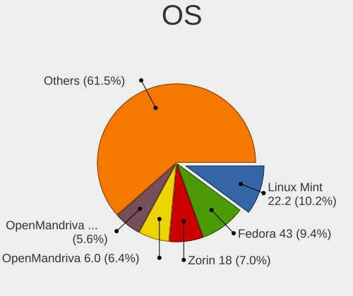

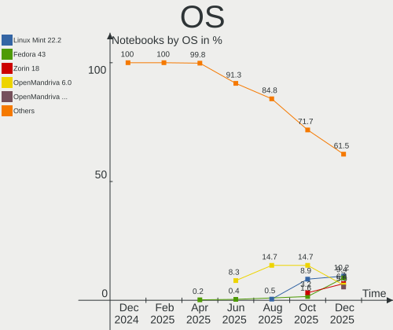

| Name                         | Notebooks | Percent |
|------------------------------|-----------|---------|
| Linux Mint 22.2              | 67        | 10.15%  |
| Fedora 43                    | 62        | 9.39%   |
| Zorin 18                     | 46        | 6.97%   |
| OpenMandriva 6.0             | 42        | 6.36%   |
| OpenMandriva 25.11           | 37        | 5.61%   |
| Ubuntu 24.04                 | 32        | 4.85%   |
| Arch Rolling                 | 27        | 4.09%   |
| Bazzite 43                   | 25        | 3.79%   |
| Debian 13                    | 23        | 3.48%   |
| OpenMandriva 25.90           | 22        | 3.33%   |
| Pop!_OS 24.04                | 21        | 3.18%   |
| Ubuntu 25.10                 | 20        | 3.03%   |
| OpenMandriva 25.06           | 16        | 2.42%   |
| OpenMandriva 24.12           | 13        | 1.97%   |
| CachyOS Rolling              | 13        | 1.97%   |
| SteamOS 3.7.17               | 12        | 1.82%   |
| Kubuntu 25.10                | 12        | 1.82%   |
| Zorin 17                     | 10        | 1.52%   |
| Fedora 42                    | 10        | 1.52%   |
| Pop!_OS 22.04                | 9         | 1.36%   |
| Kubuntu 24.04                | 9         | 1.36%   |
| Linux Mint 22.1              | 7         | 1.06%   |
| Bazzite 42                   | 7         | 1.06%   |
| KDE neon 24.04               | 6         | 0.91%   |
| Kali 2025.4                  | 6         | 0.91%   |
| Ubuntu 22.04                 | 5         | 0.76%   |
| openSUSE Tumbleweed-XXXXXXXX | 5         | 0.76%   |
| Elementary 8                 | 5         | 0.76%   |
| Manjaro                      | 4         | 0.61%   |
| CachyOS                      | 4         | 0.61%   |
| SteamOS 3.7.19               | 3         | 0.45%   |
| OpenMandriva 5.0             | 3         | 0.45%   |
| NixOS 26.05                  | 3         | 0.45%   |
| Garuda Linux Rolling         | 3         | 0.45%   |
| Zorin 16                     | 2         | 0.3%    |
| Xubuntu 24.04                | 2         | 0.3%    |
| Ubuntu MATE 24.04            | 2         | 0.3%    |
| ROSA 13.1                    | 2         | 0.3%    |
| Q4OS 6                       | 2         | 0.3%    |
| openSUSE Leap-16.0           | 2         | 0.3%    |

OS Family
---------

OS without a version

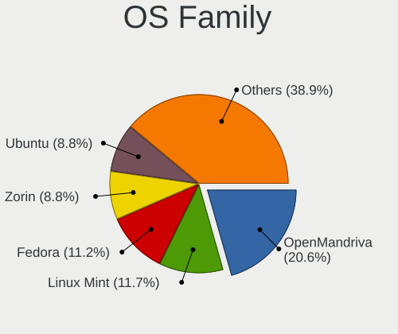

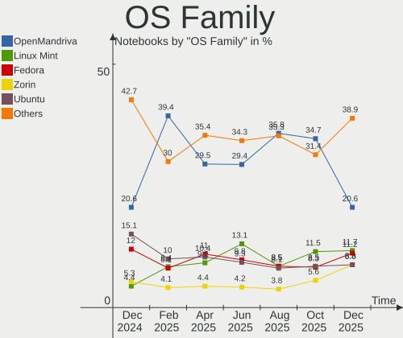

| Name             | Notebooks | Percent |
|------------------|-----------|---------|
| OpenMandriva     | 136       | 20.61%  |
| Linux Mint       | 77        | 11.67%  |
| Fedora           | 74        | 11.21%  |
| Zorin            | 58        | 8.79%   |
| Ubuntu           | 58        | 8.79%   |
| Bazzite          | 32        | 4.85%   |
| Pop!_OS          | 30        | 4.55%   |
| Arch             | 27        | 4.09%   |
| Debian           | 24        | 3.64%   |
| Kubuntu          | 22        | 3.33%   |
| SteamOS          | 17        | 2.58%   |
| CachyOS          | 17        | 2.58%   |
| openSUSE         | 8         | 1.21%   |
| Manjaro          | 7         | 1.06%   |
| KDE neon         | 6         | 0.91%   |
| Kali             | 6         | 0.91%   |
| Xubuntu          | 5         | 0.76%   |
| NixOS            | 5         | 0.76%   |
| Lubuntu          | 5         | 0.76%   |
| Elementary       | 5         | 0.76%   |
| Ubuntu MATE      | 3         | 0.45%   |
| Nobara           | 3         | 0.45%   |
| LMDE             | 3         | 0.45%   |
| Gentoo           | 3         | 0.45%   |
| Garuda Linux     | 3         | 0.45%   |
| ROSA             | 2         | 0.3%    |
| Q4OS             | 2         | 0.3%    |
| EndeavourOS      | 2         | 0.3%    |
| Athenaos         | 2         | 0.3%    |
| Artix            | 2         | 0.3%    |
| Anduinos         | 2         | 0.3%    |
| Ultramarine      | 1         | 0.15%   |
| TUXEDO OS        | 1         | 0.15%   |
| Trisquel         | 1         | 0.15%   |
| Solus            | 1         | 0.15%   |
| Secureblue       | 1         | 0.15%   |
| Pikaos           | 1         | 0.15%   |
| Peppermint       | 1         | 0.15%   |
| Pear OS          | 1         | 0.15%   |
| org.kde.Platform | 1         | 0.15%   |

Kernel
------

Version of the Linux kernel

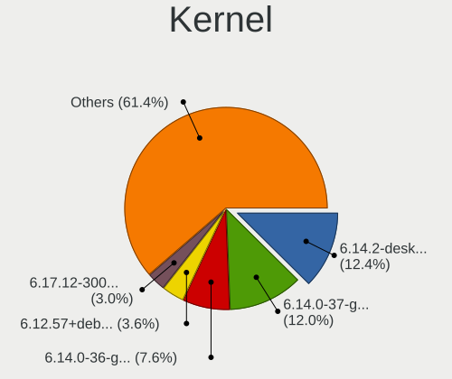

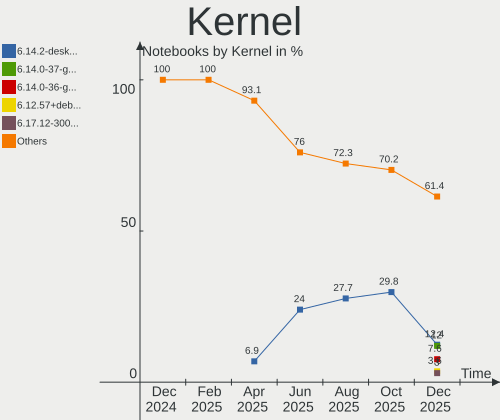

| Version                                     | Notebooks | Percent |
|---------------------------------------------|-----------|---------|
| 6.14.2-desktop-3omv2590                     | 82        | 12.42%  |
| 6.14.0-37-generic                           | 79        | 11.97%  |
| 6.14.0-36-generic                           | 50        | 7.58%   |
| 6.12.57+deb13-amd64                         | 24        | 3.64%   |
| 6.17.12-300.fc43.x86_64                     | 20        | 3.03%   |
| 6.17.9-300.fc43.x86_64                      | 17        | 2.58%   |
| 6.17.0-8-generic                            | 17        | 2.58%   |
| 6.18.0-desktop-1omv2590                     | 16        | 2.42%   |
| 6.17.9-76061709-generic                     | 16        | 2.42%   |
| 6.17.7-ba20.fc43.x86_64                     | 16        | 2.42%   |
| 6.8.0-90-generic                            | 15        | 2.27%   |
| 6.17.9-arch1-1                              | 15        | 2.27%   |
| 6.17.7-desktop-1omv2590                     | 14        | 2.12%   |
| 6.17.4-76061704-generic                     | 13        | 1.97%   |
| 6.17.0-7-generic                            | 13        | 1.97%   |
| 6.12.1-desktop-1omv2490                     | 13        | 1.97%   |
| 6.8.0-88-generic                            | 11        | 1.67%   |
| 6.11.11-valve24-2-neptune-611-gfd0dd251480d | 11        | 1.67%   |
| 6.14.0-29-generic                           | 10        | 1.52%   |
| 6.17.7-ba19.fc43.x86_64                     | 9         | 1.36%   |
| 6.8.0-87-generic                            | 8         | 1.21%   |
| 6.17.8-300.fc43.x86_64                      | 8         | 1.21%   |
| 6.17.1-300.fc43.x86_64                      | 8         | 1.21%   |
| 6.16.4-116.bazzite.fc42.x86_64              | 7         | 1.06%   |
| 6.17.9-2-cachyos                            | 6         | 0.91%   |
| 6.17.9-zen1-1-zen                           | 5         | 0.76%   |
| 6.17.11-300.fc43.x86_64                     | 5         | 0.76%   |
| 6.17.10-300.fc43.x86_64                     | 5         | 0.76%   |
| 6.11.11-valve26-1-neptune-611-gb3afa9aa9ae7 | 5         | 0.76%   |
| 6.17.10+kali-amd64                          | 4         | 0.61%   |
| 6.17.0-5-generic                            | 4         | 0.61%   |
| 6.14.0-27-generic                           | 4         | 0.61%   |
| 6.6.2-desktop-1omv2390                      | 3         | 0.45%   |
| 6.18.2-arch2-1                              | 3         | 0.45%   |
| 6.18.1-arch1-2                              | 3         | 0.45%   |
| 6.18.0-3-cachyos                            | 3         | 0.45%   |
| 6.17.10-200.fc42.x86_64                     | 3         | 0.45%   |
| 6.17.1-0-MANJARO                            | 3         | 0.45%   |
| 6.8.0-88-lowlatency                         | 2         | 0.3%    |
| 6.18.2-1-default                            | 2         | 0.3%    |

Kernel Family
-------------

Linux kernel without a distro release

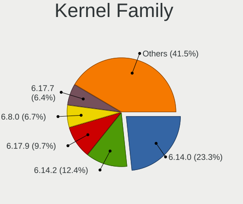

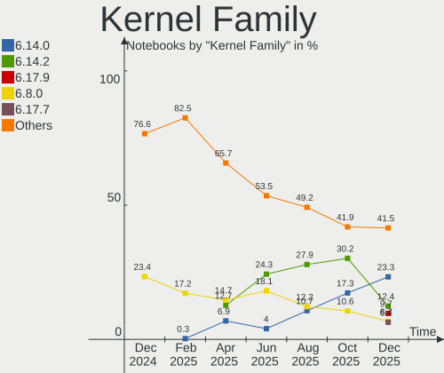

| Version | Notebooks | Percent |
|---------|-----------|---------|
| 6.14.0  | 154       | 23.33%  |
| 6.14.2  | 82        | 12.42%  |
| 6.17.9  | 64        | 9.7%    |
| 6.8.0   | 44        | 6.67%   |
| 6.17.7  | 42        | 6.36%   |
| 6.17.0  | 37        | 5.61%   |
| 6.18.0  | 29        | 4.39%   |
| 6.12.57 | 24        | 3.64%   |
| 6.17.12 | 20        | 3.03%   |
| 6.11.11 | 16        | 2.42%   |
| 6.17.8  | 14        | 2.12%   |
| 6.17.4  | 14        | 2.12%   |
| 6.17.10 | 13        | 1.97%   |
| 6.12.1  | 13        | 1.97%   |
| 6.18.1  | 12        | 1.82%   |
| 6.17.1  | 11        | 1.67%   |
| 6.18.2  | 8         | 1.21%   |
| 6.17.11 | 8         | 1.21%   |
| 6.16.4  | 7         | 1.06%   |
| 5.15.0  | 4         | 0.61%   |
| 6.6.2   | 3         | 0.45%   |
| 6.12.63 | 3         | 0.45%   |
| 6.12.61 | 3         | 0.45%   |
| 6.12.48 | 3         | 0.45%   |
| 6.16.9  | 2         | 0.3%    |
| 6.16.8  | 2         | 0.3%    |
| 6.15.0  | 2         | 0.3%    |
| 6.12.47 | 2         | 0.3%    |
| 6.12.0  | 2         | 0.3%    |
| 6.1.0   | 2         | 0.3%    |
| 6.8.11  | 1         | 0.15%   |
| 6.6.47  | 1         | 0.15%   |
| 6.6.107 | 1         | 0.15%   |
| 6.5.0   | 1         | 0.15%   |
| 6.4.0   | 1         | 0.15%   |
| 6.17.5  | 1         | 0.15%   |
| 6.16.12 | 1         | 0.15%   |
| 6.15.9  | 1         | 0.15%   |
| 6.13.10 | 1         | 0.15%   |
| 6.12.9  | 1         | 0.15%   |

Kernel Major Ver.
-----------------

Linux kernel major version

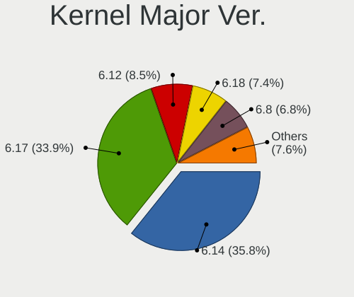

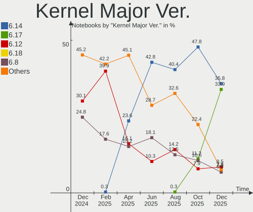

| Version | Notebooks | Percent |
|---------|-----------|---------|
| 6.14    | 236       | 35.76%  |
| 6.17    | 224       | 33.94%  |
| 6.12    | 56        | 8.48%   |
| 6.18    | 49        | 7.42%   |
| 6.8     | 45        | 6.82%   |
| 6.11    | 17        | 2.58%   |
| 6.16    | 12        | 1.82%   |
| 6.6     | 5         | 0.76%   |
| 5.15    | 4         | 0.61%   |
| 6.15    | 3         | 0.45%   |
| 6.1     | 2         | 0.3%    |
| 6.5     | 1         | 0.15%   |
| 6.4     | 1         | 0.15%   |
| 6.13    | 1         | 0.15%   |
| 5.19    | 1         | 0.15%   |
| 5.14    | 1         | 0.15%   |
| 5.10    | 1         | 0.15%   |
| 4.18    | 1         | 0.15%   |

Arch
----

OS architecture (x86_64, i586, etc.)

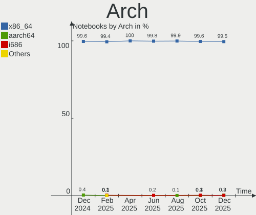

| Name    | Notebooks | Percent |
|---------|-----------|---------|
| x86_64  | 657       | 99.55%  |
| aarch64 | 2         | 0.3%    |
| i686    | 1         | 0.15%   |

DE
--

Desktop Environment

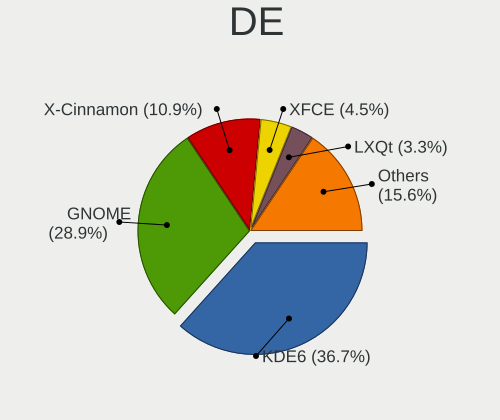

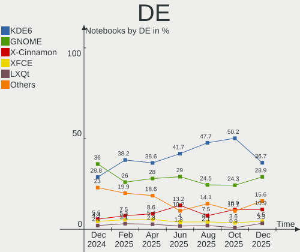

| Name          | Notebooks | Percent |
|---------------|-----------|---------|
| KDE6          | 242       | 36.67%  |
| GNOME         | 191       | 28.94%  |
| X-Cinnamon    | 72        | 10.91%  |
| XFCE          | 30        | 4.55%   |
| LXQt          | 22        | 3.33%   |
| COSMIC        | 21        | 3.18%   |
| Unknown       | 16        | 2.42%   |
| KDE5          | 14        | 2.12%   |
| KDE           | 10        | 1.52%   |
| MATE          | 9         | 1.36%   |
| Hyprland      | 8         | 1.21%   |
| Pantheon      | 5         | 0.76%   |
| niri          | 4         | 0.61%   |
| i3            | 3         | 0.45%   |
| Trinity       | 2         | 0.3%    |
| sway:wlroots  | 2         | 0.3%    |
| sway          | 2         | 0.3%    |
| Cinnamon      | 2         | 0.3%    |
| Budgie        | 2         | 0.3%    |
| LXDE          | 1         | 0.15%   |
| KDE4          | 1         | 0.15%   |
| Enlightenment | 1         | 0.15%   |

Display Server
--------------

X11 or Wayland

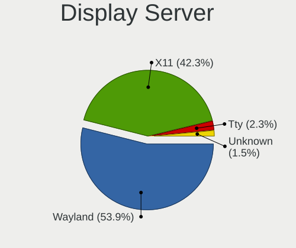

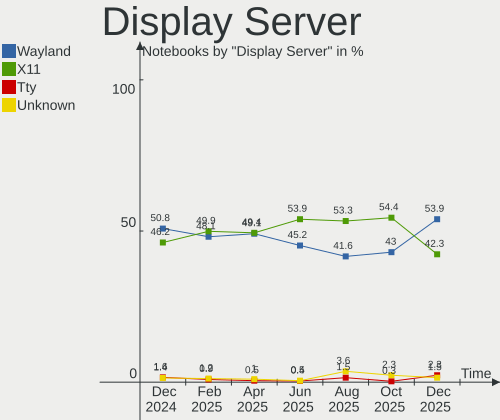

| Name    | Notebooks | Percent |
|---------|-----------|---------|
| Wayland | 356       | 53.94%  |
| X11     | 279       | 42.27%  |
| Tty     | 15        | 2.27%   |
| Unknown | 10        | 1.52%   |

Display Manager
---------------

SDDM, LightDM, etc.

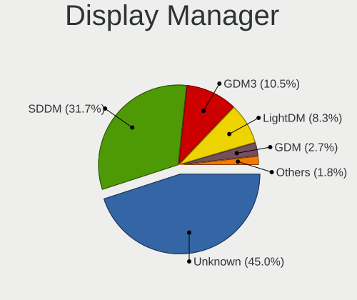

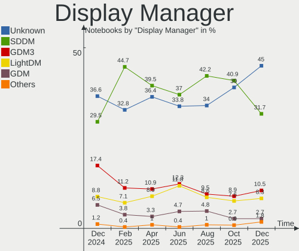

| Name                  | Notebooks | Percent |
|-----------------------|-----------|---------|
| Unknown               | 297       | 45%     |
| SDDM                  | 209       | 31.67%  |
| GDM3                  | 69        | 10.45%  |
| LightDM               | 55        | 8.33%   |
| GDM                   | 18        | 2.73%   |
| GREETD                | 4         | 0.61%   |
| TDM                   | 2         | 0.3%    |
| LY-DM                 | 2         | 0.3%    |
| COSMIC-GREETER        | 2         | 0.3%    |
| XDM                   | 1         | 0.15%   |
| DISPLAY-MANAGER-START | 1         | 0.15%   |

OS Lang
-------

Language

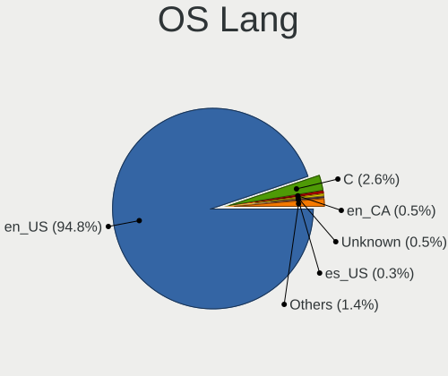

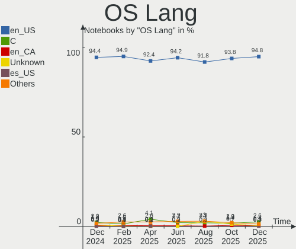

| Lang    | Notebooks | Percent |
|---------|-----------|---------|
| en_US   | 626       | 94.85%  |
| C       | 17        | 2.58%   |
| en_CA   | 3         | 0.45%   |
| Unknown | 3         | 0.45%   |
| es_US   | 2         | 0.3%    |
| uk_UA   | 1         | 0.15%   |
| ru_RU   | 1         | 0.15%   |
| nl_NL   | 1         | 0.15%   |
| fr_FR   | 1         | 0.15%   |
| es_ES   | 1         | 0.15%   |
| en_GB   | 1         | 0.15%   |
| de_DE   | 1         | 0.15%   |
| de_AT   | 1         | 0.15%   |
| da_DK   | 1         | 0.15%   |

Boot Mode
---------

EFI or BIOS

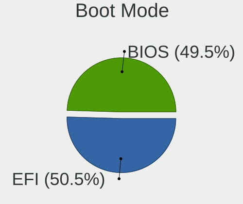

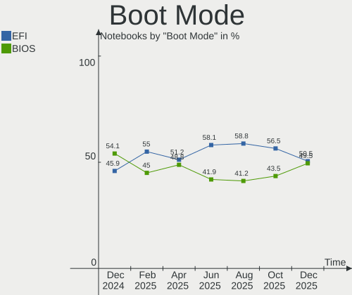

| Mode | Notebooks | Percent |
|------|-----------|---------|
| EFI  | 333       | 50.45%  |
| BIOS | 327       | 49.55%  |

Filesystem
----------

Type of filesystem

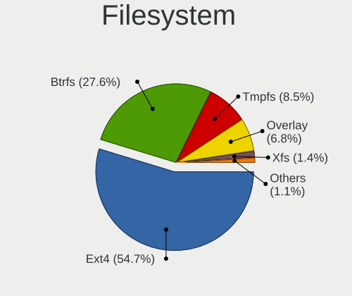

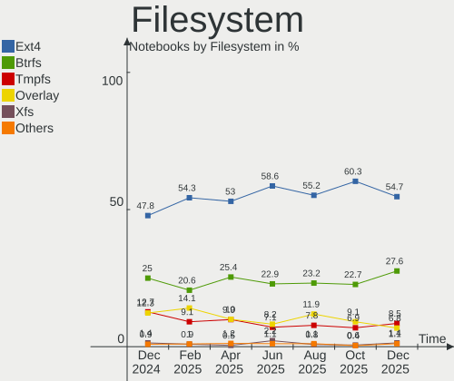

| Type    | Notebooks | Percent |
|---------|-----------|---------|
| Ext4    | 361       | 54.7%   |
| Btrfs   | 182       | 27.58%  |
| Tmpfs   | 56        | 8.48%   |
| Overlay | 45        | 6.82%   |
| Xfs     | 9         | 1.36%   |
| Zfs     | 4         | 0.61%   |
| Ext2    | 2         | 0.3%    |
| F2fs    | 1         | 0.15%   |

Part. scheme
------------

Scheme of partitioning

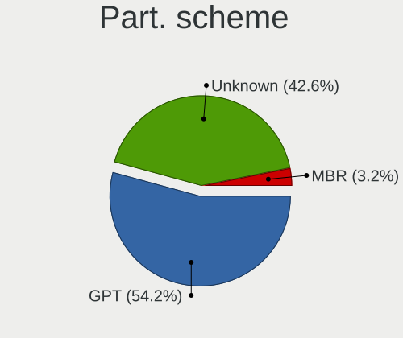

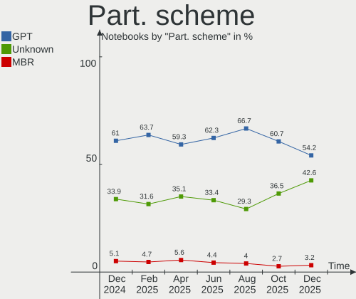

| Type    | Notebooks | Percent |
|---------|-----------|---------|
| GPT     | 358       | 54.24%  |
| Unknown | 281       | 42.58%  |
| MBR     | 21        | 3.18%   |

Dual Boot with Linux/BSD
------------------------

Hosting more than one Linux/BSD

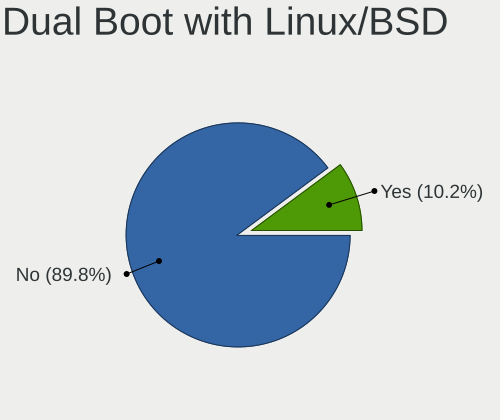

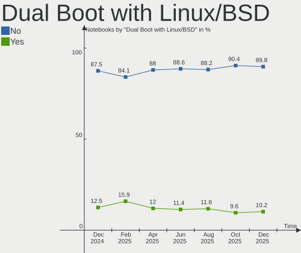

| Dual boot | Notebooks | Percent |
|-----------|-----------|---------|
| No        | 593       | 89.85%  |
| Yes       | 67        | 10.15%  |

Dual Boot (Win)
---------------

Hosting Linux and Windows

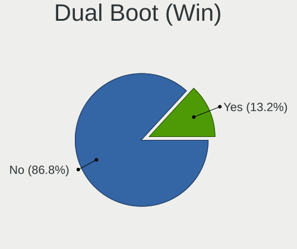

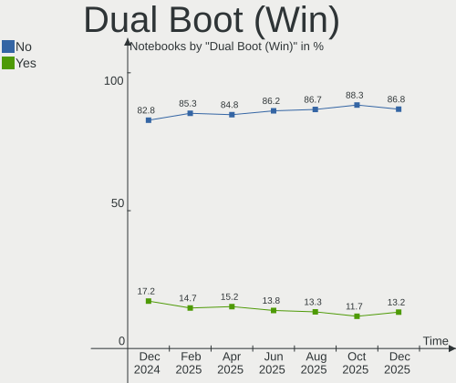

| Dual boot | Notebooks | Percent |
|-----------|-----------|---------|
| No        | 573       | 86.82%  |
| Yes       | 87        | 13.18%  |

Board
-----

Vendor
------

Motherboard manufacturer

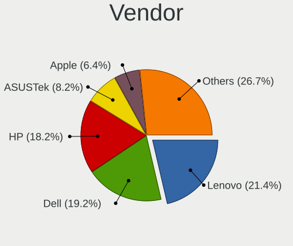

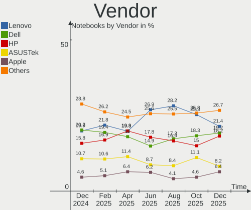

| Name                | Notebooks | Percent |
|---------------------|-----------|---------|
| Lenovo              | 141       | 21.36%  |
| Dell                | 127       | 19.24%  |
| Hewlett-Packard     | 120       | 18.18%  |
| ASUSTek Computer    | 54        | 8.18%   |
| Apple               | 42        | 6.36%   |
| Acer                | 29        | 4.39%   |
| Framework           | 22        | 3.33%   |
| MSI                 | 18        | 2.73%   |
| Valve               | 17        | 2.58%   |
| Google              | 14        | 2.12%   |
| Toshiba             | 13        | 1.97%   |
| Alienware           | 9         | 1.36%   |
| System76            | 7         | 1.06%   |
| Sony                | 4         | 0.61%   |
| Razer               | 3         | 0.45%   |
| Gigabyte Technology | 3         | 0.45%   |
| Core Innovations    | 3         | 0.45%   |
| American Megatrends | 3         | 0.45%   |
| Samsung Electronics | 2         | 0.3%    |
| Notebook            | 2         | 0.3%    |
| GPU Company         | 2         | 0.3%    |
| Gateway             | 2         | 0.3%    |
| Chuwi               | 2         | 0.3%    |
| Unknown             | 2         | 0.3%    |
| Vizio               | 1         | 0.15%   |
| TongFang            | 1         | 0.15%   |
| Panasonic           | 1         | 0.15%   |
| LG Electronics      | 1         | 0.15%   |
| IPASON              | 1         | 0.15%   |
| Intel               | 1         | 0.15%   |
| IDN228              | 1         | 0.15%   |
| IBM                 | 1         | 0.15%   |
| HUAWEI              | 1         | 0.15%   |
| GPD                 | 1         | 0.15%   |
| GMKtec              | 1         | 0.15%   |
| Fujitsu             | 1         | 0.15%   |
| Eluktronics         | 1         | 0.15%   |
| Dynabook            | 1         | 0.15%   |
| DEXP                | 1         | 0.15%   |
| Carbon Systems      | 1         | 0.15%   |

Model
-----

Motherboard model

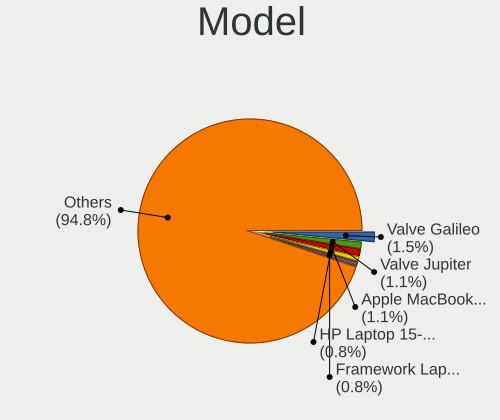

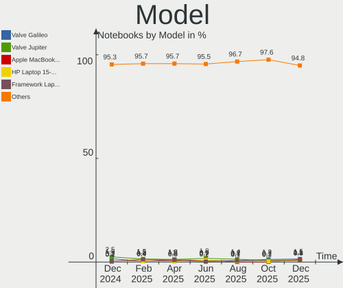

| Name                                          | Notebooks | Percent |
|-----------------------------------------------|-----------|---------|
| Valve Galileo                                 | 10        | 1.52%   |
| Valve Jupiter                                 | 7         | 1.06%   |
| Apple MacBookAir7,2                           | 7         | 1.06%   |
| HP Laptop 15-fd0xxx                           | 5         | 0.76%   |
| Framework Laptop 16 (AMD Ryzen 7040 Series)   | 5         | 0.76%   |
| Framework Laptop 13 (AMD Ryzen AI 300 Series) | 5         | 0.76%   |
| Framework Laptop 13 (AMD Ryzen 7040Series)    | 5         | 0.76%   |
| Dell Latitude E6430                           | 5         | 0.76%   |
| HP Notebook                                   | 4         | 0.61%   |
| HP Laptop 15-dy2xxx                           | 4         | 0.61%   |
| Apple MacBookPro9,2                           | 4         | 0.61%   |
| Unknown                                       | 4         | 0.61%   |
| Toshiba Satellite C55-C                       | 3         | 0.45%   |
| Lenovo ThinkPad P14s Gen 6 AMD 21QL0020US     | 3         | 0.45%   |
| Lenovo Legion Pro 7 16IAX10H 83F5             | 3         | 0.45%   |
| Lenovo Legion 5 16IAX10 83NX                  | 3         | 0.45%   |
| HP Victus by Gaming Laptop 15-fa0xxx          | 3         | 0.45%   |
| HP Pavilion 15                                | 3         | 0.45%   |
| HP Laptop 14-cf2xxx                           | 3         | 0.45%   |
| HP EliteBook 840 G6                           | 3         | 0.45%   |
| HP 15                                         | 3         | 0.45%   |
| Dell Precision 7530                           | 3         | 0.45%   |
| Dell Latitude 5410                            | 3         | 0.45%   |
| Dell Inspiron 3793                            | 3         | 0.45%   |
| Core Innovations CLC14364                     | 3         | 0.45%   |
| ASUS VivoBook_ASUSLaptop X712EA_K712EA        | 3         | 0.45%   |
| ASUS VivoBook_ASUSLaptop M1605YA_M1605YA      | 3         | 0.45%   |
| ASUS ROG Zephyrus G14 GA403WR_GA403WR         | 3         | 0.45%   |
| ASUS ASUS TUF Gaming A16 FA617NT_FA617NT      | 3         | 0.45%   |
| Apple MacBookPro8,1                           | 3         | 0.45%   |
| Apple MacBookPro11,5                          | 3         | 0.45%   |
| System76 Pangolin                             | 2         | 0.3%    |
| System76 Lemur Pro                            | 2         | 0.3%    |
| Lenovo V330-15IKB 81AX                        | 2         | 0.3%    |
| Lenovo ThinkPad T540p 20BE004EUS              | 2         | 0.3%    |
| Lenovo IdeaPad Slim 3 15ABR8 82XM             | 2         | 0.3%    |
| Lenovo IdeaPad 310-15IKB 80TV                 | 2         | 0.3%    |
| Lenovo IdeaPad 3 15ITL6 82H8                  | 2         | 0.3%    |
| Lenovo IdeaPad 1 15AMN7 82VG                  | 2         | 0.3%    |
| HP ZBook 15 G5                                | 2         | 0.3%    |

Model Family
------------

Motherboard model prefix

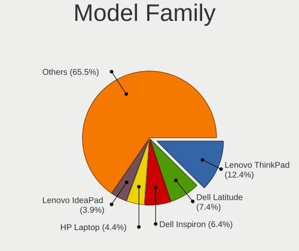

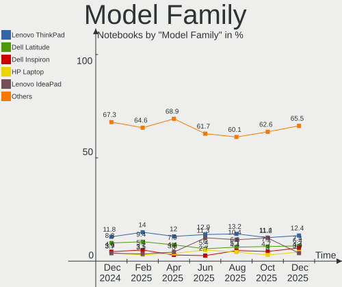

| Name                      | Notebooks | Percent |
|---------------------------|-----------|---------|
| Lenovo ThinkPad           | 82        | 12.42%  |
| Dell Latitude             | 49        | 7.42%   |
| Dell Inspiron             | 42        | 6.36%   |
| HP Laptop                 | 29        | 4.39%   |
| Lenovo IdeaPad            | 26        | 3.94%   |
| Framework Laptop          | 22        | 3.33%   |
| HP EliteBook              | 19        | 2.88%   |
| Lenovo Legion             | 16        | 2.42%   |
| Dell Precision            | 16        | 2.42%   |
| Acer Aspire               | 16        | 2.42%   |
| HP Pavilion               | 15        | 2.27%   |
| ASUS VivoBook             | 14        | 2.12%   |
| Dell XPS                  | 12        | 1.82%   |
| ASUS ROG                  | 12        | 1.82%   |
| ASUS ASUS                 | 12        | 1.82%   |
| HP ProBook                | 11        | 1.67%   |
| Valve Galileo             | 10        | 1.52%   |
| Toshiba Satellite         | 10        | 1.52%   |
| HP Victus                 | 9         | 1.36%   |
| Apple MacBookAir7         | 9         | 1.36%   |
| Valve Jupiter             | 7         | 1.06%   |
| HP ENVY                   | 7         | 1.06%   |
| Apple MacBookPro11        | 7         | 1.06%   |
| HP OMEN                   | 5         | 0.76%   |
| Apple MacBookPro9         | 5         | 0.76%   |
| Apple MacBookPro8         | 5         | 0.76%   |
| HP ZBook                  | 4         | 0.61%   |
| HP Stream                 | 4         | 0.61%   |
| HP Notebook               | 4         | 0.61%   |
| HP 15                     | 4         | 0.61%   |
| ASUS Zenbook              | 4         | 0.61%   |
| Acer Predator             | 4         | 0.61%   |
| Acer Nitro                | 4         | 0.61%   |
| Unknown                   | 4         | 0.61%   |
| Razer Blade               | 3         | 0.45%   |
| Lenovo V15                | 3         | 0.45%   |
| Lenovo ThinkBook          | 3         | 0.45%   |
| Core Innovations CLC14364 | 3         | 0.45%   |
| ASUS TUF                  | 3         | 0.45%   |
| Apple MacBookPro6         | 3         | 0.45%   |

MFG Year
--------

Motherboard manufacture year

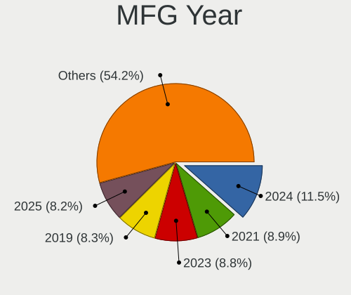

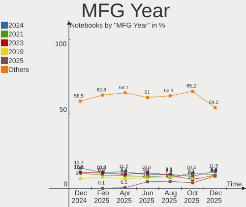

| Year    | Notebooks | Percent |
|---------|-----------|---------|
| 2024    | 76        | 11.52%  |
| 2021    | 59        | 8.94%   |
| 2023    | 58        | 8.79%   |
| 2019    | 55        | 8.33%   |
| 2025    | 54        | 8.18%   |
| 2020    | 43        | 6.52%   |
| 2022    | 40        | 6.06%   |
| 2012    | 36        | 5.45%   |
| 2017    | 33        | 5%      |
| 2018    | 32        | 4.85%   |
| 2013    | 31        | 4.7%    |
| 2015    | 30        | 4.55%   |
| 2016    | 29        | 4.39%   |
| 2011    | 28        | 4.24%   |
| 2014    | 21        | 3.18%   |
| 2010    | 10        | 1.52%   |
| 2009    | 7         | 1.06%   |
| 2006    | 7         | 1.06%   |
| 2008    | 6         | 0.91%   |
| 2007    | 3         | 0.45%   |
| 2003    | 1         | 0.15%   |
| Unknown | 1         | 0.15%   |

Form Factor
-----------

Physical design of the computer

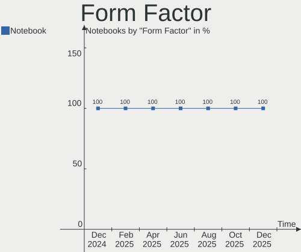

| Name     | Notebooks | Percent |
|----------|-----------|---------|
| Notebook | 660       | 100%    |

Secure Boot
-----------

Enabled or disabled

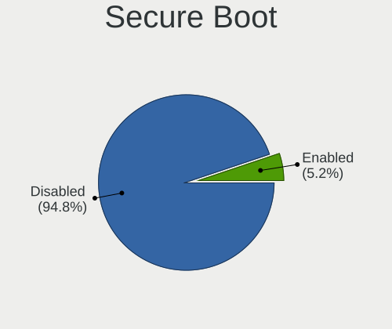

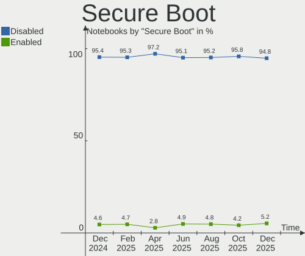

| State    | Notebooks | Percent |
|----------|-----------|---------|
| Disabled | 626       | 94.85%  |
| Enabled  | 34        | 5.15%   |

Coreboot
--------

Have coreboot on board

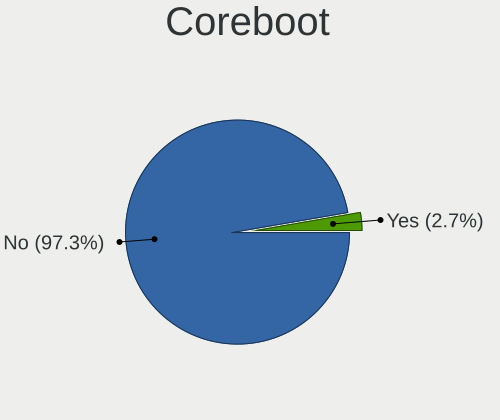

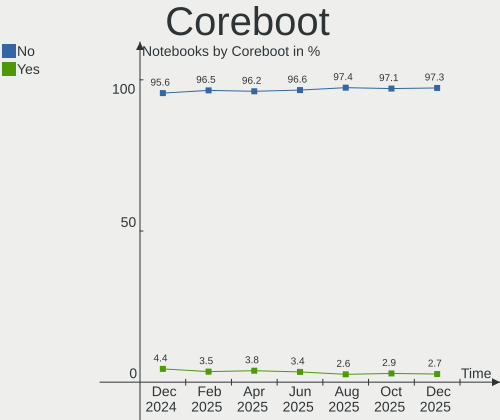

| Used | Notebooks | Percent |
|------|-----------|---------|
| No   | 642       | 97.27%  |
| Yes  | 18        | 2.73%   |

RAM Size
--------

Total RAM memory

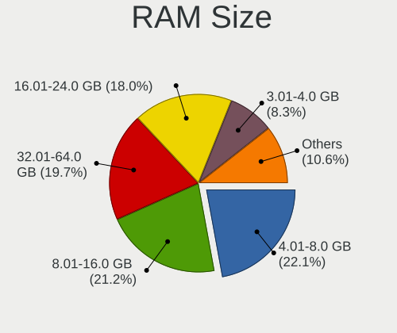

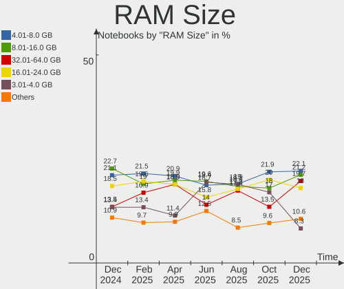

| Size in GB  | Notebooks | Percent |
|-------------|-----------|---------|
| 4.01-8.0    | 146       | 22.12%  |
| 8.01-16.0   | 140       | 21.21%  |
| 32.01-64.0  | 130       | 19.7%   |
| 16.01-24.0  | 119       | 18.03%  |
| 3.01-4.0    | 55        | 8.33%   |
| 64.01-256.0 | 35        | 5.3%    |
| 24.01-32.0  | 25        | 3.79%   |
| 2.01-3.0    | 5         | 0.76%   |
| 1.01-2.0    | 5         | 0.76%   |

RAM Used
--------

Used RAM memory

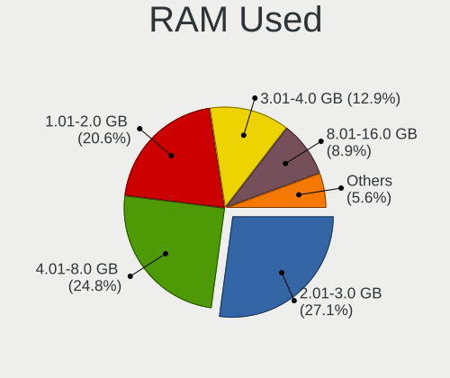

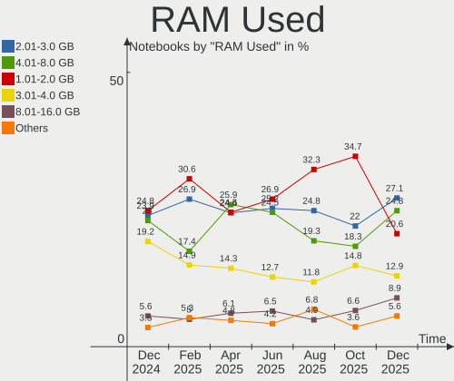

| Used GB    | Notebooks | Percent |
|------------|-----------|---------|
| 2.01-3.0   | 179       | 27.12%  |
| 4.01-8.0   | 164       | 24.85%  |
| 1.01-2.0   | 136       | 20.61%  |
| 3.01-4.0   | 85        | 12.88%  |
| 8.01-16.0  | 59        | 8.94%   |
| 0.51-1.0   | 26        | 3.94%   |
| 16.01-24.0 | 5         | 0.76%   |
| 24.01-32.0 | 3         | 0.45%   |
| 32.01-64.0 | 2         | 0.3%    |
| 0.01-0.5   | 1         | 0.15%   |

Total Drives
------------

Number of drives on board

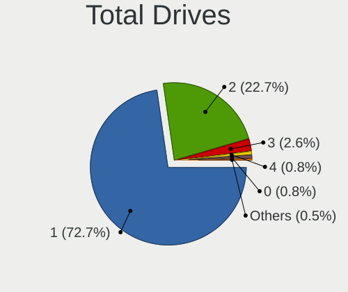

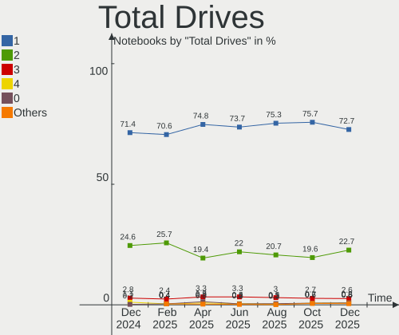

| Drives | Notebooks | Percent |
|--------|-----------|---------|
| 1      | 480       | 72.73%  |
| 2      | 150       | 22.73%  |
| 3      | 17        | 2.58%   |
| 4      | 5         | 0.76%   |
| 0      | 5         | 0.76%   |
| 5      | 2         | 0.3%    |
| 6      | 1         | 0.15%   |

Has CD-ROM
----------

Has CD-ROM on board

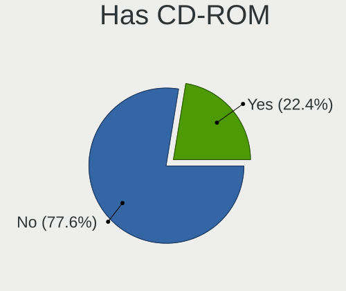

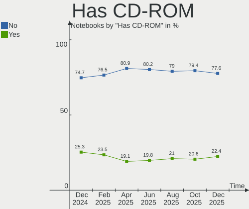

| Presented | Notebooks | Percent |
|-----------|-----------|---------|
| No        | 512       | 77.58%  |
| Yes       | 148       | 22.42%  |

Has Ethernet
------------

Has Ethernet on board

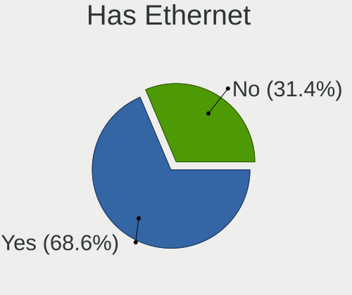

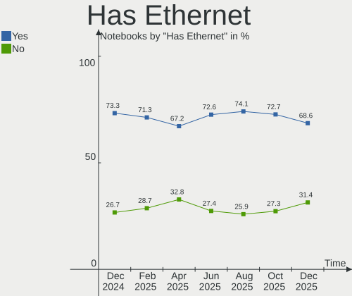

| Presented | Notebooks | Percent |
|-----------|-----------|---------|
| Yes       | 453       | 68.64%  |
| No        | 207       | 31.36%  |

Has WiFi
--------

Has WiFi module

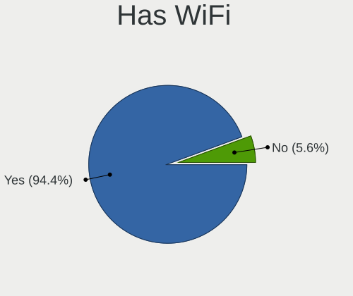

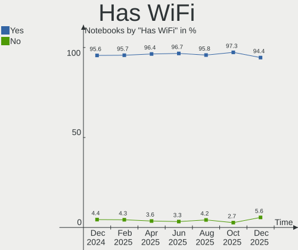

| Presented | Notebooks | Percent |
|-----------|-----------|---------|
| Yes       | 623       | 94.39%  |
| No        | 37        | 5.61%   |

Has Bluetooth
-------------

Has Bluetooth module

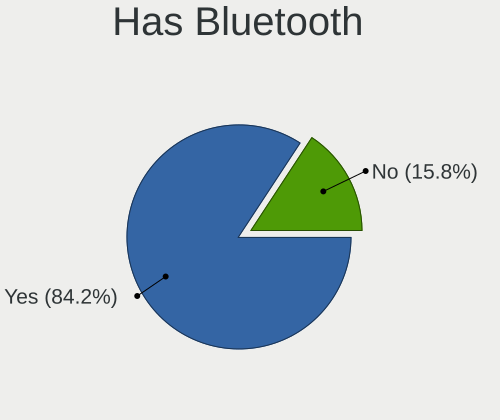

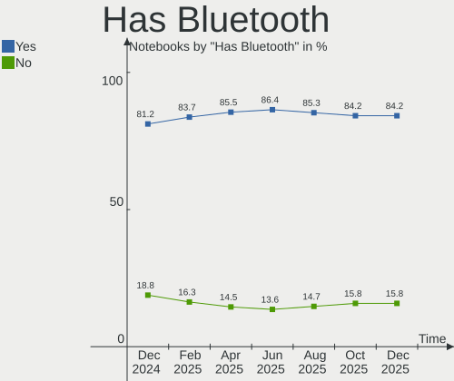

| Presented | Notebooks | Percent |
|-----------|-----------|---------|
| Yes       | 556       | 84.24%  |
| No        | 104       | 15.76%  |

Location
--------

Country
-------

Geographic location (country)

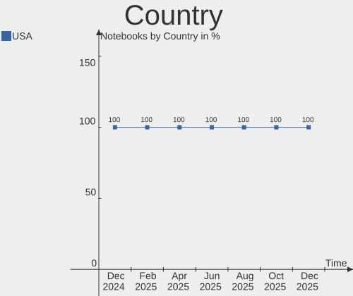

| Country | Notebooks | Percent |
|---------|-----------|---------|
| USA     | 660       | 100%    |

City
----

Geographic location (city)

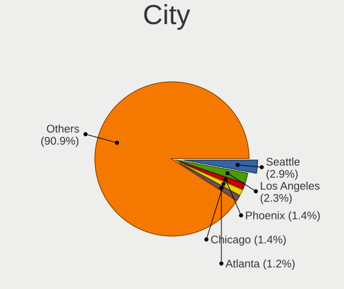

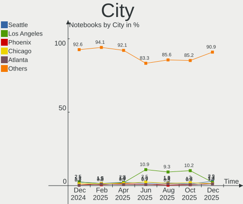

| City           | Notebooks | Percent |
|----------------|-----------|---------|
| Seattle        | 19        | 2.88%   |
| Los Angeles    | 15        | 2.27%   |
| Phoenix        | 9         | 1.36%   |
| Chicago        | 9         | 1.36%   |
| Atlanta        | 8         | 1.21%   |
| New York       | 7         | 1.06%   |
| Indianapolis   | 7         | 1.06%   |
| San Francisco  | 6         | 0.91%   |
| Salt Lake City | 6         | 0.91%   |
| Denver         | 6         | 0.91%   |
| Brooklyn       | 6         | 0.91%   |
| Gresham        | 5         | 0.76%   |
| Warminster     | 4         | 0.61%   |
| Virginia Beach | 4         | 0.61%   |
| St Louis       | 4         | 0.61%   |
| Sacramento     | 4         | 0.61%   |
| Orange         | 4         | 0.61%   |
| Minneapolis    | 4         | 0.61%   |
| Louisville     | 4         | 0.61%   |
| Knoxville      | 4         | 0.61%   |
| Kansas City    | 4         | 0.61%   |
| Jacksonville   | 4         | 0.61%   |
| Dayton         | 4         | 0.61%   |
| Dallas         | 4         | 0.61%   |
| Austin         | 4         | 0.61%   |
| Waukegan       | 3         | 0.45%   |
| Topeka         | 3         | 0.45%   |
| Springfield    | 3         | 0.45%   |
| Sarasota       | 3         | 0.45%   |
| San Antonio    | 3         | 0.45%   |
| Saint Joseph   | 3         | 0.45%   |
| Portland       | 3         | 0.45%   |
| Pasadena       | 3         | 0.45%   |
| Olympia        | 3         | 0.45%   |
| Miami          | 3         | 0.45%   |
| Las Vegas      | 3         | 0.45%   |
| Holley         | 3         | 0.45%   |
| Everett        | 3         | 0.45%   |
| Decatur        | 3         | 0.45%   |
| Columbus       | 3         | 0.45%   |

Drives
------

Drive Vendor
------------

Hard drive vendors

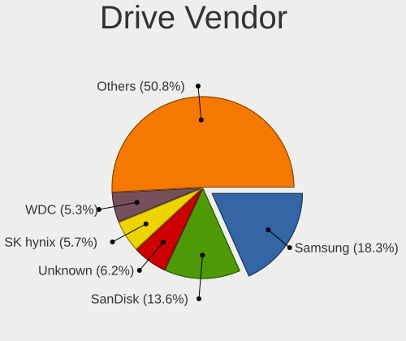

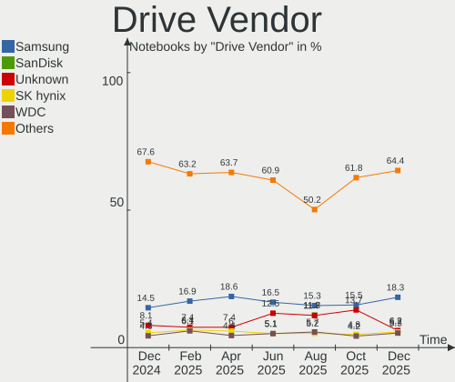

| Vendor                       | Notebooks | Drives | Percent |
|------------------------------|-----------|--------|---------|
| Samsung Electronics          | 151       | 170    | 18.33%  |
| SanDisk                      | 112       | 117    | 13.59%  |
| Unknown                      | 51        | 53     | 6.19%   |
| SK hynix                     | 47        | 50     | 5.7%    |
| WDC                          | 44        | 45     | 5.34%   |
| Seagate                      | 42        | 45     | 5.1%    |
| Micron Technology            | 38        | 38     | 4.61%   |
| Toshiba                      | 35        | 35     | 4.25%   |
| KIOXIA                       | 24        | 28     | 2.91%   |
| Crucial                      | 24        | 24     | 2.91%   |
| Apple                        | 23        | 32     | 2.79%   |
| Intel                        | 18        | 22     | 2.18%   |
| China                        | 17        | 17     | 2.06%   |
| Phison Electronics           | 15        | 15     | 1.82%   |
| Kingston                     | 15        | 15     | 1.82%   |
| Micron/Crucial Technology    | 14        | 16     | 1.7%    |
| Unknown                      | 11        | 11     | 1.33%   |
| PNY                          | 10        | 10     | 1.21%   |
| HGST                         | 10        | 10     | 1.21%   |
| MAXIO Technology (Hangzhou)  | 9         | 9      | 1.09%   |
| Kingston Technology Company  | 9         | 9      | 1.09%   |
| Hitachi                      | 9         | 9      | 1.09%   |
| SPCC                         | 8         | 10     | 0.97%   |
| SABRENT                      | 8         | 8      | 0.97%   |
| Silicon Motion               | 6         | 6      | 0.73%   |
| Shenzhen Longsys Electronics | 4         | 4      | 0.49%   |
| KingSpec                     | 4         | 4      | 0.49%   |
| USB                          | 3         | 3      | 0.36%   |
| Team                         | 3         | 3      | 0.36%   |
| A-DATA Technology            | 3         | 3      | 0.36%   |
| Wibtek                       | 2         | 2      | 0.24%   |
| UMIS                         | 2         | 2      | 0.24%   |
| Timetec                      | 2         | 2      | 0.24%   |
| SSK                          | 2         | 3      | 0.24%   |
| Seagate Technology           | 2         | 2      | 0.24%   |
| Realtek Semiconductor        | 2         | 2      | 0.24%   |
| Phison                       | 2         | 2      | 0.24%   |
| Patriot                      | 2         | 2      | 0.24%   |
| Lexar                        | 2         | 2      | 0.24%   |
| HGST HTS                     | 2         | 2      | 0.24%   |

Drive Model
-----------

Hard drive models

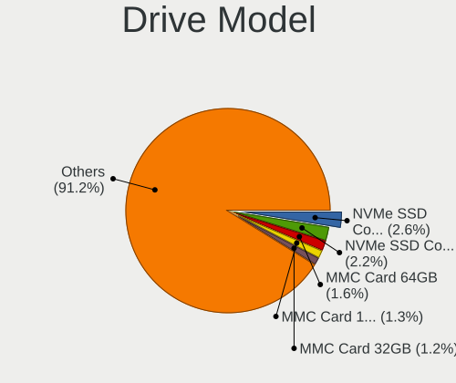

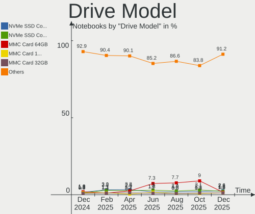

| Model                                                                   | Notebooks | Percent |
|-------------------------------------------------------------------------|-----------|---------|
| Samsung NVMe SSD Controller PM9A1/PM9A3/980PRO 1TB                      | 22        | 2.55%   |
| Samsung NVMe SSD Controller SM981/PM981/PM983 1TB                       | 19        | 2.2%    |
| Unknown MMC Card  64GB                                                  | 14        | 1.62%   |
| Unknown                                                                 | 11        | 1.28%   |
| Unknown MMC Card  32GB                                                  | 10        | 1.16%   |
| SanDisk NVMe SSD Drive 1TB                                              | 10        | 1.16%   |
| Sandisk WD Black SN770 / PC SN740 256GB / PC SN560 (DRAM-less) NVMe SSD | 9         | 1.04%   |
| Seagate ST1000LM035-1RK172 1TB                                          | 7         | 0.81%   |
| Samsung SSD 990 PRO 2TB                                                 | 7         | 0.81%   |
| SABRENT Disk 4TB                                                        | 7         | 0.81%   |
| MAXIO (Hangzhou) NVMe SSD Controller MAP1202 2TB                        | 6         | 0.7%    |
| Unknown MMC Card  128GB                                                 | 5         | 0.58%   |
| Toshiba MQ01ABD100 1TB                                                  | 5         | 0.58%   |
| Samsung NVMe SSD Controller S4LV008[Pascal] 4TB                         | 5         | 0.58%   |
| Kingston Company OM3PDP3 NVMe SSD 256GB                                 | 5         | 0.58%   |
| Unknown SD/MMC/MS PRO 2GB                                               | 4         | 0.46%   |
| Toshiba XG6 NVMe SSD Controller 1024GB                                  | 4         | 0.46%   |
| Silicon Motion SM2263EN/SM2263XT SSD Controller 512GB                   | 4         | 0.46%   |
| Sandisk WD_BLACK SN770 2TB                                              | 4         | 0.46%   |
| Sandisk WD_BLACK SN770 1TB                                              | 4         | 0.46%   |
| Sandisk PC SN530 NVMe WDC 512GB                                         | 4         | 0.46%   |
| Samsung SSD 990 EVO Plus 1TB                                            | 4         | 0.46%   |
| Samsung SSD 850 EVO 500GB                                               | 4         | 0.46%   |
| Samsung NVMe SSD Controller SM961/PM961/SM963 1024GB                    | 4         | 0.46%   |
| Samsung NVMe SSD Controller PM9C1a (DRAM-less) 1TB                      | 4         | 0.46%   |
| KIOXIA KBG40ZNS512G NVMe 512GB                                          | 4         | 0.46%   |
| USB SanDisk 3.2Gen1 496GB                                               | 3         | 0.35%   |
| Unknown MMC Card  16GB                                                  | 3         | 0.35%   |
| Toshiba XG4 NVMe SSD Controller 256GB                                   | 3         | 0.35%   |
| Toshiba MQ04ABF100 1TB                                                  | 3         | 0.35%   |
| SK hynix SKHynix_HFS001TEJ9X162N 1024GB                                 | 3         | 0.35%   |
| SK hynix BC901 NVMe Solid State Drive (DRAM-less) 512GB                 | 3         | 0.35%   |
| SK hynix BC501 NVMe Solid State Drive 512GB                             | 3         | 0.35%   |
| Sandisk WD_BLACK SN850X 2000GB                                          | 3         | 0.35%   |
| Sandisk WD PC SN7100S SDFPMSL-1T00-1101 1024GB                          | 3         | 0.35%   |
| Sandisk WD Green SN350 2TB                                              | 3         | 0.35%   |
| Sandisk WD Blue SN550 NVMe SSD 1024GB                                   | 3         | 0.35%   |
| Sandisk WD Black SN750 / PC SN730 NVMe SSD 500GB                        | 3         | 0.35%   |
| SanDisk NVMe SSD Drive 2TB                                              | 3         | 0.35%   |
| Samsung SSD 870 EVO 1TB                                                 | 3         | 0.35%   |

HDD Vendor
----------

Hard disk drive vendors

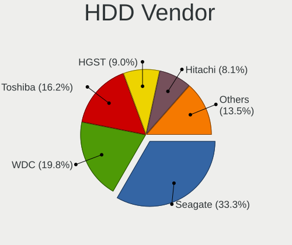

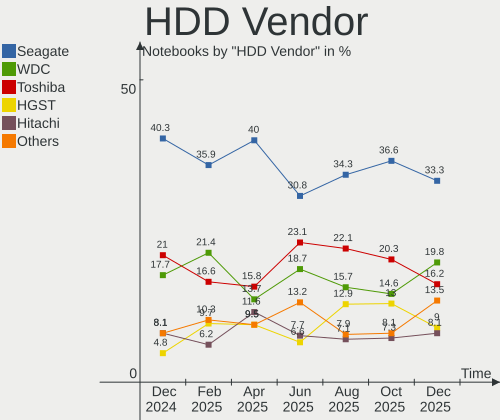

| Vendor              | Notebooks | Drives | Percent |
|---------------------|-----------|--------|---------|
| Seagate             | 37        | 38     | 33.33%  |
| WDC                 | 22        | 23     | 19.82%  |
| Toshiba             | 18        | 18     | 16.22%  |
| HGST                | 10        | 10     | 9.01%   |
| Hitachi             | 9         | 9      | 8.11%   |
| Unknown             | 4         | 4      | 3.6%    |
| HGST HTS            | 2         | 2      | 1.8%    |
| Fujitsu             | 2         | 2      | 1.8%    |
| Apple               | 2         | 2      | 1.8%    |
| SSK                 | 1         | 1      | 0.9%    |
| Samsung Electronics | 1         | 1      | 0.9%    |
| JMicron Technology  | 1         | 1      | 0.9%    |
| External            | 1         | 1      | 0.9%    |
| Apricorn            | 1         | 1      | 0.9%    |

SSD Vendor
----------

Solid state drive vendors

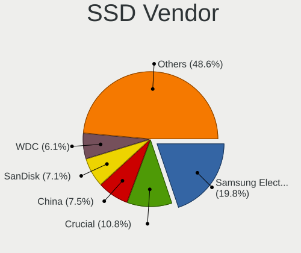

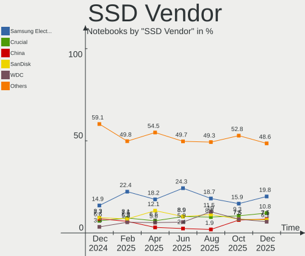

| Vendor              | Notebooks | Drives | Percent |
|---------------------|-----------|--------|---------|
| Samsung Electronics | 42        | 45     | 19.81%  |
| Crucial             | 23        | 23     | 10.85%  |
| China               | 16        | 16     | 7.55%   |
| SanDisk             | 15        | 15     | 7.08%   |
| WDC                 | 13        | 13     | 6.13%   |
| Apple               | 12        | 12     | 5.66%   |
| Kingston            | 10        | 10     | 4.72%   |
| PNY                 | 9         | 9      | 4.25%   |
| SABRENT             | 8         | 8      | 3.77%   |
| Toshiba             | 7         | 7      | 3.3%    |
| SPCC                | 7         | 8      | 3.3%    |
| Intel               | 6         | 6      | 2.83%   |
| SK hynix            | 4         | 4      | 1.89%   |
| Micron Technology   | 4         | 4      | 1.89%   |
| KingSpec            | 4         | 4      | 1.89%   |
| Team                | 3         | 3      | 1.42%   |
| A-DATA Technology   | 3         | 3      | 1.42%   |
| Wibtek              | 2         | 2      | 0.94%   |
| Timetec             | 2         | 2      | 0.94%   |
| Seagate             | 2         | 2      | 0.94%   |
| Vaseky              | 1         | 1      | 0.47%   |
| Transcend           | 1         | 1      | 0.47%   |
| ThinkPlus           | 1         | 2      | 0.47%   |
| tecmiyo             | 1         | 1      | 0.47%   |
| SATADOM-SH          | 1         | 1      | 0.47%   |
| Safety              | 1         | 1      | 0.47%   |
| PNY USB             | 1         | 1      | 0.47%   |
| Patriot             | 1         | 1      | 0.47%   |
| OWC                 | 1         | 1      | 0.47%   |
| OCZ                 | 1         | 1      | 0.47%   |
| Mushkin             | 1         | 1      | 0.47%   |
| Mercury             | 1         | 1      | 0.47%   |
| Lexar               | 1         | 1      | 0.47%   |
| KOOTION             | 1         | 1      | 0.47%   |
| KingFast            | 1         | 1      | 0.47%   |
| FIKWOT              | 1         | 1      | 0.47%   |
| EDGE                | 1         | 1      | 0.47%   |
| BIWIN               | 1         | 1      | 0.47%   |
| ASMT                | 1         | 1      | 0.47%   |
| Unknown             | 1         | 1      | 0.47%   |

Drive Kind
----------

HDD or SSD

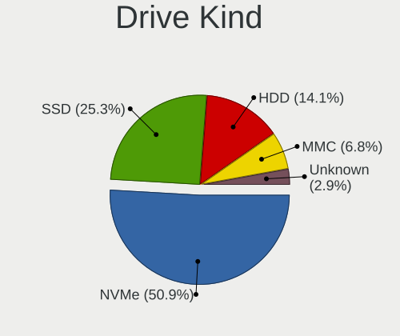

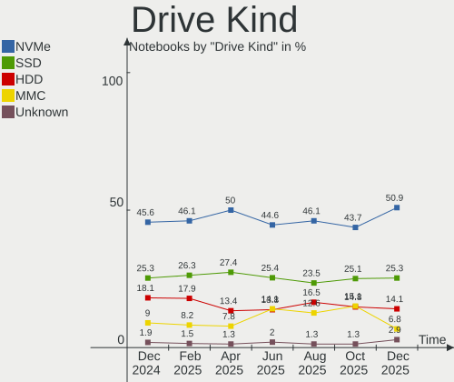

| Kind    | Notebooks | Drives | Percent |
|---------|-----------|--------|---------|
| NVMe    | 390       | 473    | 50.91%  |
| SSD     | 194       | 217    | 25.33%  |
| HDD     | 108       | 113    | 14.1%   |
| MMC     | 52        | 55     | 6.79%   |
| Unknown | 22        | 21     | 2.87%   |

Drive Connector
---------------

SATA, SAS, NVMe, etc.

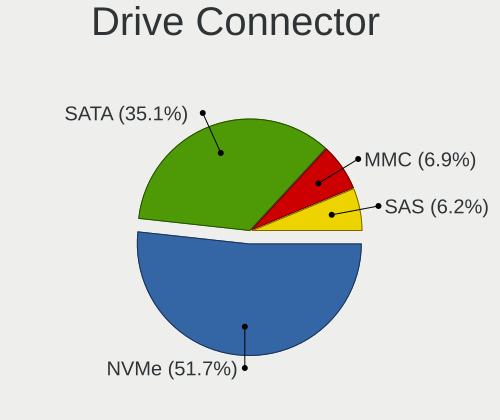

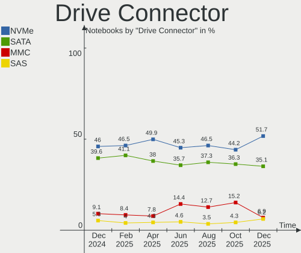

| Type | Notebooks | Drives | Percent |
|------|-----------|--------|---------|
| NVMe | 390       | 470    | 51.72%  |
| SATA | 265       | 296    | 35.15%  |
| MMC  | 52        | 55     | 6.9%    |
| SAS  | 47        | 58     | 6.23%   |

Drive Size
----------

Size of hard drive

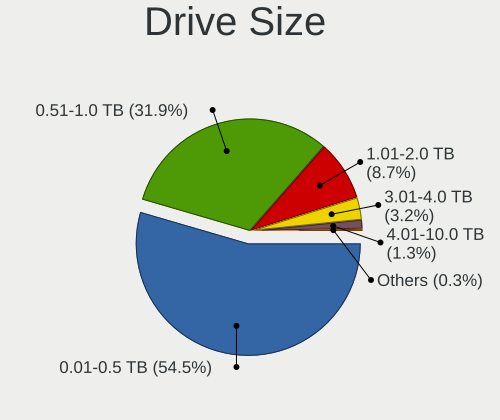

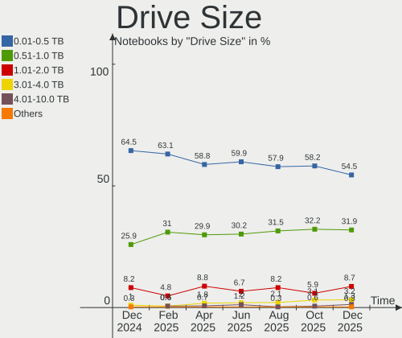

| Size in TB | Notebooks | Drives | Percent |
|------------|-----------|--------|---------|
| 0.01-0.5   | 169       | 181    | 54.52%  |
| 0.51-1.0   | 99        | 102    | 31.94%  |
| 1.01-2.0   | 27        | 32     | 8.71%   |
| 3.01-4.0   | 10        | 10     | 3.23%   |
| 4.01-10.0  | 4         | 4      | 1.29%   |
| 2.01-3.0   | 1         | 1      | 0.32%   |

Space Total
-----------

Amount of disk space available on the file system

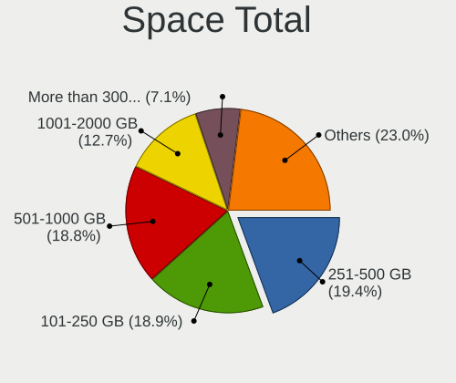

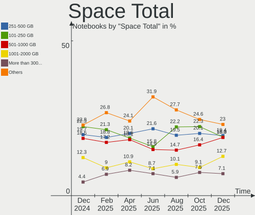

| Size in GB     | Notebooks | Percent |
|----------------|-----------|---------|
| 251-500        | 128       | 19.39%  |
| 101-250        | 125       | 18.94%  |
| 501-1000       | 124       | 18.79%  |
| 1001-2000      | 84        | 12.73%  |
| More than 3000 | 47        | 7.12%   |
| 1-20           | 47        | 7.12%   |
| Unknown        | 41        | 6.21%   |
| 2001-3000      | 27        | 4.09%   |
| 51-100         | 22        | 3.33%   |
| 21-50          | 15        | 2.27%   |

Space Used
----------

Amount of used disk space

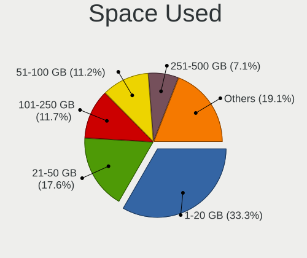

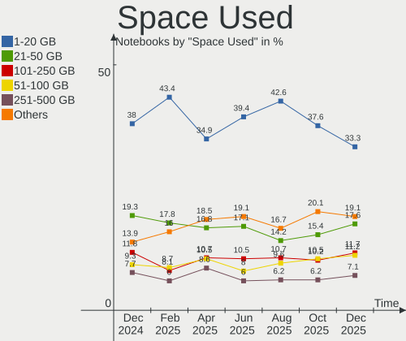

| Used GB        | Notebooks | Percent |
|----------------|-----------|---------|
| 1-20           | 220       | 33.33%  |
| 21-50          | 116       | 17.58%  |
| 101-250        | 77        | 11.67%  |
| 51-100         | 74        | 11.21%  |
| 251-500        | 47        | 7.12%   |
| Unknown        | 41        | 6.21%   |
| 501-1000       | 32        | 4.85%   |
| 1001-2000      | 25        | 3.79%   |
| More than 3000 | 12        | 1.82%   |
| 2001-3000      | 10        | 1.52%   |
| 0              | 6         | 0.91%   |

Malfunc. Drives
---------------

Drive models with a malfunction

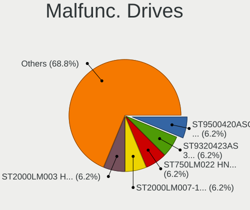

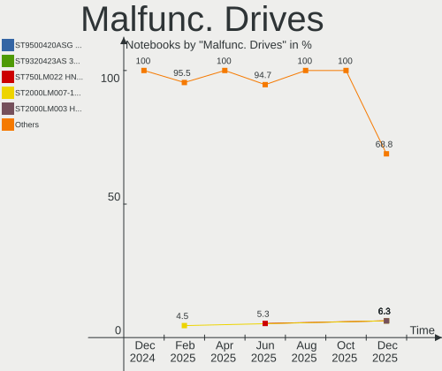

| Model                               | Notebooks | Drives | Percent |
|-------------------------------------|-----------|--------|---------|
| Seagate ST9500420ASG 500GB          | 1         | 1      | 6.25%   |
| Seagate ST9320423AS 320GB           | 1         | 1      | 6.25%   |
| Seagate ST750LM022 HN-M750MBB 752GB | 1         | 1      | 6.25%   |
| Seagate ST2000LM007-1R8174 2TB      | 1         | 1      | 6.25%   |
| Seagate ST2000LM003 HN-M201RAD 2TB  | 1         | 2      | 6.25%   |
| Samsung Electronics SSD 980 1TB     | 1         | 1      | 6.25%   |
| Intel SSDSC2BX200G4R 200GB          | 1         | 1      | 6.25%   |
| Intel SSDSC2BF180A4L 180GB          | 1         | 1      | 6.25%   |
| Hitachi HTS727575A9E364 752GB       | 1         | 1      | 6.25%   |
| Hitachi HTS722012K9A300 120GB       | 1         | 1      | 6.25%   |
| HGST HTS541075A9E680 752GB          | 1         | 1      | 6.25%   |
| HGST HTS541010A9E680 1TB            | 1         | 1      | 6.25%   |
| Crucial CT525MX300SSD1 528GB        | 1         | 1      | 6.25%   |
| Crucial CT256M550SSD1 256GB         | 1         | 1      | 6.25%   |
| Apple HDD HTS545050A7E362 500GB     | 1         | 1      | 6.25%   |
| A-DATA Technology SU800 128GB SSD   | 1         | 1      | 6.25%   |

Malfunc. Drive Vendor
---------------------

Vendors of faulty drives

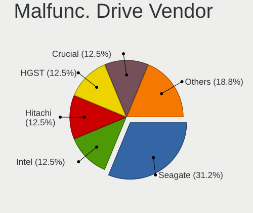

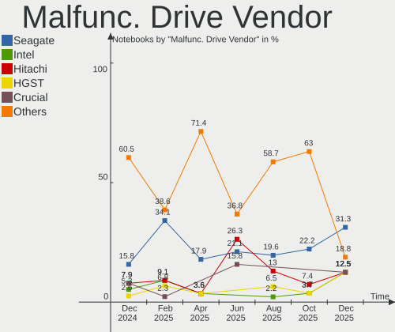

| Vendor              | Notebooks | Drives | Percent |
|---------------------|-----------|--------|---------|
| Seagate             | 5         | 6      | 31.25%  |
| Intel               | 2         | 2      | 12.5%   |
| Hitachi             | 2         | 2      | 12.5%   |
| HGST                | 2         | 2      | 12.5%   |
| Crucial             | 2         | 2      | 12.5%   |
| Samsung Electronics | 1         | 1      | 6.25%   |
| Apple               | 1         | 1      | 6.25%   |
| A-DATA Technology   | 1         | 1      | 6.25%   |

Malfunc. HDD Vendor
-------------------

Vendors of faulty HDD drives

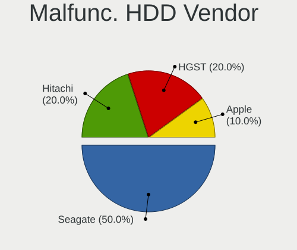

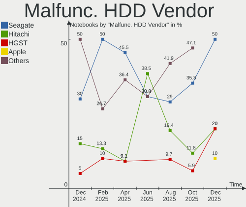

| Vendor  | Notebooks | Drives | Percent |
|---------|-----------|--------|---------|
| Seagate | 5         | 6      | 50%     |
| Hitachi | 2         | 2      | 20%     |
| HGST    | 2         | 2      | 20%     |
| Apple   | 1         | 1      | 10%     |

Malfunc. Drive Kind
-------------------

Kinds of faulty drives

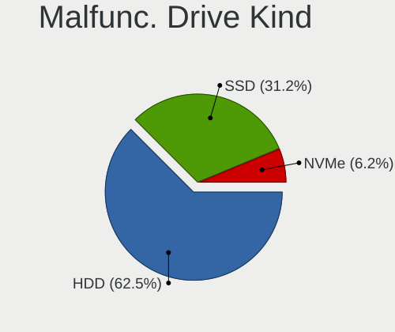

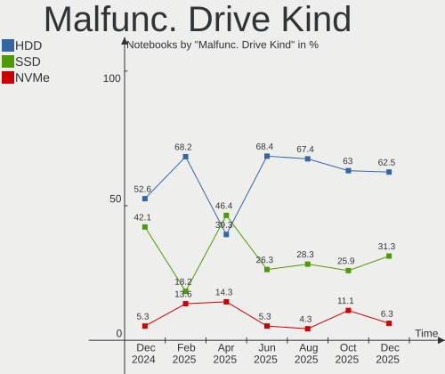

| Kind | Notebooks | Drives | Percent |
|------|-----------|--------|---------|
| HDD  | 10        | 11     | 62.5%   |
| SSD  | 5         | 5      | 31.25%  |
| NVMe | 1         | 1      | 6.25%   |

Failed Drives
-------------

Failed drive models

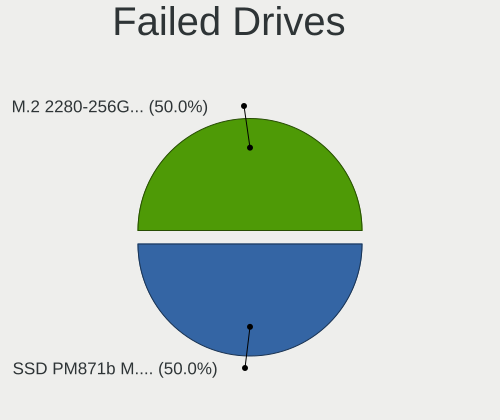

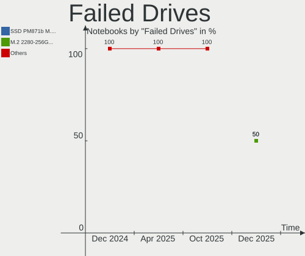

| Model                                         | Notebooks | Drives | Percent |
|-----------------------------------------------|-----------|--------|---------|
| Samsung Electronics SSD PM871b M.2 2280 128GB | 1         | 1      | 50%     |
| Unknown                                       | 1         | 1      | 50%     |

Failed Drive Vendor
-------------------

Failed drive vendors

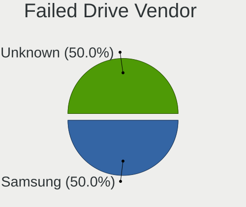

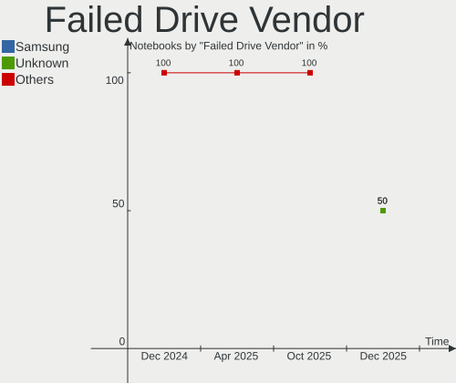

| Vendor              | Notebooks | Drives | Percent |
|---------------------|-----------|--------|---------|
| Samsung Electronics | 1         | 1      | 50%     |
| Unknown             | 1         | 1      | 50%     |

Drive Status
------------

Number of failed and malfunc. drives

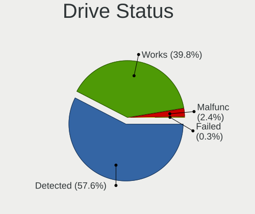

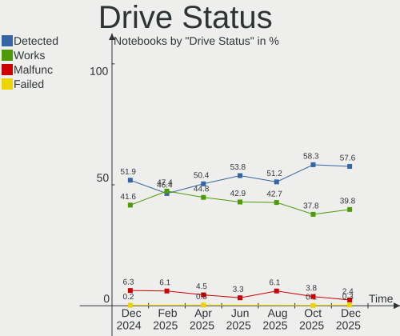

| Status   | Notebooks | Drives | Percent |
|----------|-----------|--------|---------|
| Detected | 391       | 535    | 57.58%  |
| Works    | 270       | 325    | 39.76%  |
| Malfunc  | 16        | 17     | 2.36%   |
| Failed   | 2         | 2      | 0.29%   |

Storage controller
------------------

Storage Vendor
--------------

Storage controller vendors

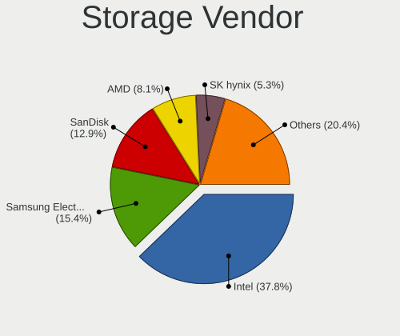

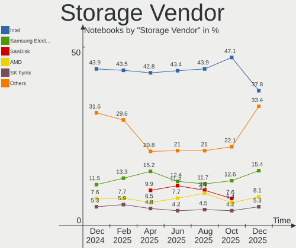

| Vendor                                  | Notebooks | Percent |
|-----------------------------------------|-----------|---------|
| Intel                                   | 307       | 37.81%  |
| Samsung Electronics                     | 125       | 15.39%  |
| SanDisk                                 | 105       | 12.93%  |
| AMD                                     | 66        | 8.13%   |
| SK hynix                                | 43        | 5.3%    |
| Micron Technology                       | 34        | 4.19%   |
| KIOXIA                                  | 25        | 3.08%   |
| Phison Electronics                      | 18        | 2.22%   |
| Micron/Crucial Technology               | 15        | 1.85%   |
| Kingston Technology Company             | 14        | 1.72%   |
| MAXIO Technology (Hangzhou)             | 10        | 1.23%   |
| Toshiba America Info Systems            | 9         | 1.11%   |
| Apple                                   | 8         | 0.99%   |
| Silicon Motion                          | 7         | 0.86%   |
| Shenzhen Longsys Electronics            | 6         | 0.74%   |
| Nvidia                                  | 5         | 0.62%   |
| Realtek Semiconductor                   | 3         | 0.37%   |
| ASMedia Technology                      | 3         | 0.37%   |
| Union Memory (Shenzhen)                 | 2         | 0.25%   |
| Seagate Technology                      | 2         | 0.25%   |
| ADATA Technology                        | 2         | 0.25%   |
| Shenzhen Unionmemory Information System | 1         | 0.12%   |
| Shenzhen Shichuangyi Electronics        | 1         | 0.12%   |
| Lenovo                                  | 1         | 0.12%   |

Storage Model
-------------

Storage controller models

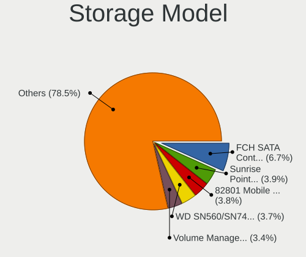

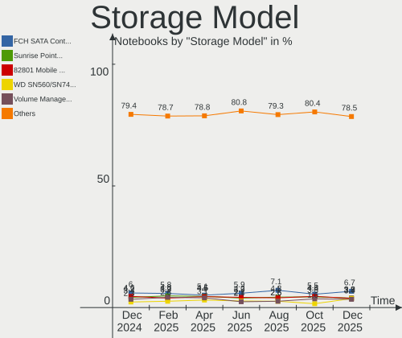

| Model                                                                          | Notebooks | Percent |
|--------------------------------------------------------------------------------|-----------|---------|
| AMD FCH SATA Controller [AHCI mode]                                            | 57        | 6.72%   |
| Intel Sunrise Point-LP SATA Controller [AHCI mode]                             | 33        | 3.89%   |
| Intel 82801 Mobile SATA Controller [RAID mode]                                 | 32        | 3.77%   |
| SanDisk WD SN560/SN740/SN770/SN5000 NVMe SSD                                   | 31        | 3.66%   |
| Intel Volume Management Device NVMe RAID Controller                            | 29        | 3.42%   |
| Samsung NVMe SSD Controller PM9A1/PM9A3/980PRO                                 | 27        | 3.18%   |
| Intel 7 Series Chipset Family 6-port SATA Controller [AHCI mode]               | 27        | 3.18%   |
| Samsung NVMe SSD Controller SM981/PM981/PM983                                  | 24        | 2.83%   |
| Samsung NVMe SSD Controller PM9C1a (DRAM-less)                                 | 21        | 2.48%   |
| Intel 6 Series/C200 Series Chipset Family 6 port Mobile SATA AHCI Controller   | 21        | 2.48%   |
| Intel Wildcat Point-LP SATA Controller [AHCI Mode]                             | 19        | 2.24%   |
| Intel Cannon Lake Mobile PCH SATA AHCI Controller                              | 19        | 2.24%   |
| Samsung NVMe SSD Controller S4LV008[Pascal]                                    | 15        | 1.77%   |
| SK hynix Platinum P41/PC801 NVMe Solid State Drive                             | 13        | 1.53%   |
| Intel 8 Series/C220 Series Chipset Family 6-port SATA Controller 1 [AHCI mode] | 13        | 1.53%   |
| Samsung NVMe SSD Controller 980 (DRAM-less)                                    | 12        | 1.42%   |
| Intel 8 Series SATA Controller 1 [AHCI mode]                                   | 12        | 1.42%   |
| Intel Tiger Lake-LP SATA Controller                                            | 11        | 1.3%    |
| SK hynix Gold P31/BC711/PC711 NVMe Solid State Drive                           | 10        | 1.18%   |
| Sandisk WD PC SN5000S M.2 2280 NVMe SSD (DRAM-less)                            | 10        | 1.18%   |
| Sandisk WD Black SN850X NVMe SSD                                               | 9         | 1.06%   |
| Samsung S4LN058A01[SSUBX] AHCI SSD Controller (Apple slot)                     | 9         | 1.06%   |
| Micron 2400 NVMe SSD (DRAM-less)                                               | 9         | 1.06%   |
| KIOXIA NVMe SSD Controller BG4 (DRAM-less)                                     | 9         | 1.06%   |
| Intel Volume Management Device NVMe RAID Controller Intel Corporation          | 9         | 1.06%   |
| Intel HM170/QM170 Chipset SATA Controller [AHCI Mode]                          | 9         | 1.06%   |
| Intel Alder Lake-P SATA AHCI Controller                                        | 9         | 1.06%   |
| SanDisk Extreme Pro / WD Black SN750 / PC SN730 / Red SN700 NVMe SSD           | 8         | 0.94%   |
| Samsung NVMe SSD Controller SM961/PM961/SM963                                  | 8         | 0.94%   |
| Micron 2500 NVMe SSD (DRAM-less)                                               | 8         | 0.94%   |
| MAXIO (Hangzhou) NVMe SSD Controller MAP1202 (DRAM-less)                       | 8         | 0.94%   |
| Intel Tiger Lake SATA AHCI Controller                                          | 8         | 0.94%   |
| SanDisk IX SN530 NVMe SSD / microSD Express Card (DRAM-less)                   | 7         | 0.83%   |
| KIOXIA NVMe SSD Controller XG8                                                 | 7         | 0.83%   |
| SK hynix BC901 NVMe Solid State Drive (DRAM-less)                              | 6         | 0.71%   |
| Sandisk WD_BLACK SN7100/WD PC SN7100S M.2 2280 NVMe SSD (DRAM-less)            | 6         | 0.71%   |
| Samsung NVMe SSD Controller PM9B1 (DRAM-less)                                  | 6         | 0.71%   |
| Micron/Crucial P310 NVMe PCIe SSD (DRAM-less)                                  | 6         | 0.71%   |
| Intel RST Volume Management Device Controller                                  | 6         | 0.71%   |
| Silicon Motion SM2263EN/SM2263XT (DRAM-less) NVMe SSD Controllers              | 5         | 0.59%   |

Storage Kind
------------

Kind of storage controller (IDE, SATA, NVMe, SAS, ...)

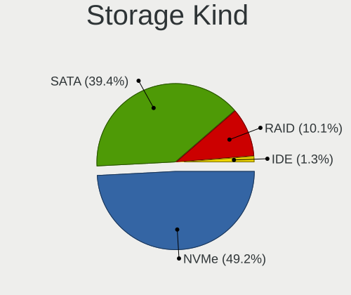

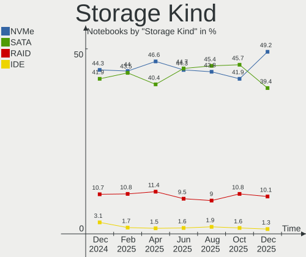

| Kind | Notebooks | Percent |
|------|-----------|---------|
| NVMe | 389       | 49.18%  |
| SATA | 312       | 39.44%  |
| RAID | 80        | 10.11%  |
| IDE  | 10        | 1.26%   |

Processor
---------

CPU Vendor
----------

Processor vendors

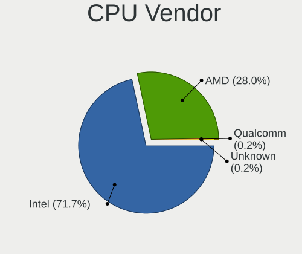

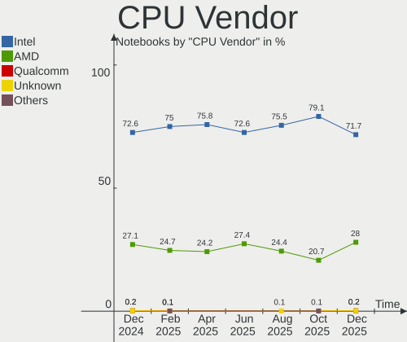

| Vendor   | Notebooks | Percent |
|----------|-----------|---------|
| Intel    | 473       | 71.67%  |
| AMD      | 185       | 28.03%  |
| Qualcomm | 1         | 0.15%   |
| Unknown  | 1         | 0.15%   |

CPU Model
---------

Processor models

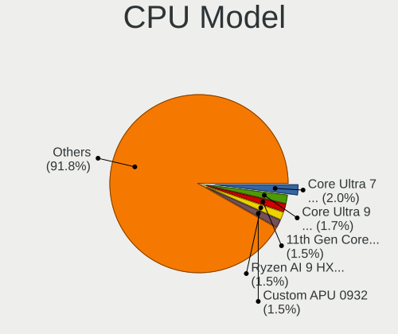

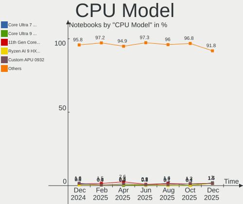

| Model                                       | Notebooks | Percent |
|---------------------------------------------|-----------|---------|
| Intel Core Ultra 7 155H                     | 13        | 1.97%   |
| Intel Core Ultra 9 275HX                    | 11        | 1.67%   |
| Intel 11th Gen Core i5-1135G7 @ 2.40GHz     | 10        | 1.52%   |
| AMD Ryzen AI 9 HX 370 w/ Radeon 890M        | 10        | 1.52%   |
| AMD Custom APU 0932                         | 10        | 1.52%   |
| Intel Core i7-10750H CPU @ 2.60GHz          | 8         | 1.21%   |
| Intel Core i5-6200U CPU @ 2.30GHz           | 8         | 1.21%   |
| AMD Ryzen 7 7730U with Radeon Graphics      | 8         | 1.21%   |
| Intel 11th Gen Core i7-1165G7 @ 2.80GHz     | 7         | 1.06%   |
| AMD Custom APU 0405                         | 7         | 1.06%   |
| Intel Core i7-9750H CPU @ 2.60GHz           | 6         | 0.91%   |
| Intel Core i7-7700HQ CPU @ 2.80GHz          | 6         | 0.91%   |
| Intel Core i5-5200U CPU @ 2.20GHz           | 6         | 0.91%   |
| Intel Core i5-2520M CPU @ 2.50GHz           | 6         | 0.91%   |
| Intel 11th Gen Core i7-11800H @ 2.30GHz     | 6         | 0.91%   |
| Intel 11th Gen Core i5-1145G7 @ 2.60GHz     | 6         | 0.91%   |
| Intel Core Ultra 9 185H                     | 5         | 0.76%   |
| Intel Core Ultra 7 258V                     | 5         | 0.76%   |
| Intel Core i7-8850H CPU @ 2.60GHz           | 5         | 0.76%   |
| Intel Core i7-6700HQ CPU @ 2.60GHz          | 5         | 0.76%   |
| Intel Core i7-3520M CPU @ 2.90GHz           | 5         | 0.76%   |
| Intel Core i7-1065G7 CPU @ 1.30GHz          | 5         | 0.76%   |
| Intel Core i5-7200U CPU @ 2.50GHz           | 5         | 0.76%   |
| Intel Core i5-5350U CPU @ 1.80GHz           | 5         | 0.76%   |
| Intel Core i5-3210M CPU @ 2.50GHz           | 5         | 0.76%   |
| Intel Core i5-10210U CPU @ 1.60GHz          | 5         | 0.76%   |
| Intel Celeron N4120 CPU @ 1.10GHz           | 5         | 0.76%   |
| AMD Ryzen 5 7640U w/ Radeon 760M Graphics   | 5         | 0.76%   |
| AMD A8-7410 APU with AMD Radeon R5 Graphics | 5         | 0.76%   |
| Intel Core i7-8750H CPU @ 2.20GHz           | 4         | 0.61%   |
| Intel Core i7-6820HQ CPU @ 2.70GHz          | 4         | 0.61%   |
| Intel Core i7-6600U CPU @ 2.60GHz           | 4         | 0.61%   |
| Intel Core i7-6500U CPU @ 2.50GHz           | 4         | 0.61%   |
| Intel Core i7-4700MQ CPU @ 2.40GHz          | 4         | 0.61%   |
| Intel Core i5-8365U CPU @ 1.60GHz           | 4         | 0.61%   |
| Intel Core i5-5250U CPU @ 1.60GHz           | 4         | 0.61%   |
| Intel Core i5-4210U CPU @ 1.70GHz           | 4         | 0.61%   |
| Intel Core i5-3320M CPU @ 2.60GHz           | 4         | 0.61%   |
| Intel 12th Gen Core i5-12450H               | 4         | 0.61%   |
| Intel 12th Gen Core i5-1240P                | 4         | 0.61%   |

CPU Model Family
----------------

Processor model prefix

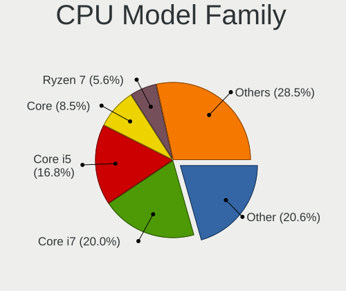

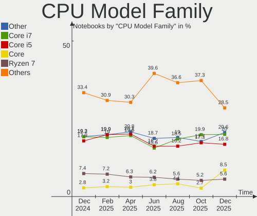

| Model                | Notebooks | Percent |
|----------------------|-----------|---------|
| Other                | 136       | 20.61%  |
| Intel Core i7        | 132       | 20%     |
| Intel Core i5        | 111       | 16.82%  |
| Intel Core           | 56        | 8.48%   |
| AMD Ryzen 7          | 37        | 5.61%   |
| AMD Ryzen 5          | 30        | 4.55%   |
| Intel Celeron        | 24        | 3.64%   |
| Intel Core i3        | 21        | 3.18%   |
| AMD Ryzen 9          | 16        | 2.42%   |
| AMD Ryzen 3          | 11        | 1.67%   |
| Intel Core 2 Duo     | 10        | 1.52%   |
| AMD Ryzen 7 PRO      | 8         | 1.21%   |
| AMD Ryzen 5 PRO      | 8         | 1.21%   |
| AMD A8               | 8         | 1.21%   |
| AMD A6               | 7         | 1.06%   |
| Intel Pentium        | 6         | 0.91%   |
| Intel Core m3        | 6         | 0.91%   |
| AMD A10              | 4         | 0.61%   |
| Intel Xeon           | 3         | 0.45%   |
| Intel Core i9        | 3         | 0.45%   |
| Intel Atom           | 3         | 0.45%   |
| AMD E                | 3         | 0.45%   |
| AMD Athlon           | 3         | 0.45%   |
| AMD A4               | 3         | 0.45%   |
| Intel Pentium M      | 1         | 0.15%   |
| Intel Pentium Dual   | 1         | 0.15%   |
| Intel Core m7        | 1         | 0.15%   |
| Intel Core M         | 1         | 0.15%   |
| Intel Core 2 Extreme | 1         | 0.15%   |
| AMD Ryzen Embedded   | 1         | 0.15%   |
| AMD Phenom II        | 1         | 0.15%   |
| AMD GX               | 1         | 0.15%   |
| AMD C-60             | 1         | 0.15%   |
| AMD Athlon II        | 1         | 0.15%   |
| AMD A12              | 1         | 0.15%   |

CPU Cores
---------

Number of processor cores

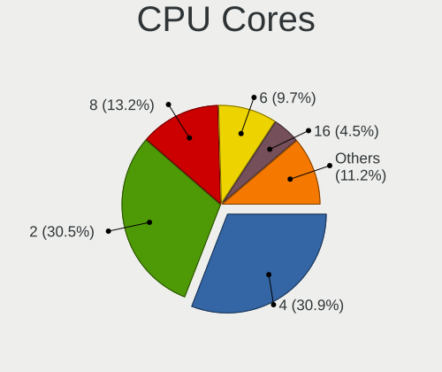

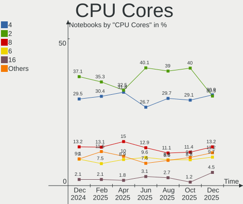

| Number | Notebooks | Percent |
|--------|-----------|---------|
| 4      | 204       | 30.91%  |
| 2      | 201       | 30.45%  |
| 8      | 87        | 13.18%  |
| 6      | 64        | 9.7%    |
| 16     | 30        | 4.55%   |
| 12     | 28        | 4.24%   |
| 10     | 17        | 2.58%   |
| 24     | 15        | 2.27%   |
| 14     | 11        | 1.67%   |
| 1      | 3         | 0.45%   |

CPU Sockets
-----------

Number of sockets

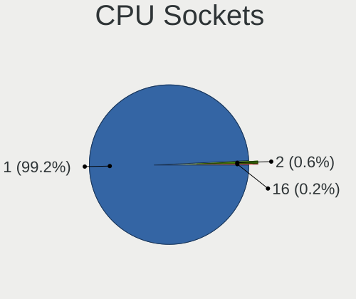

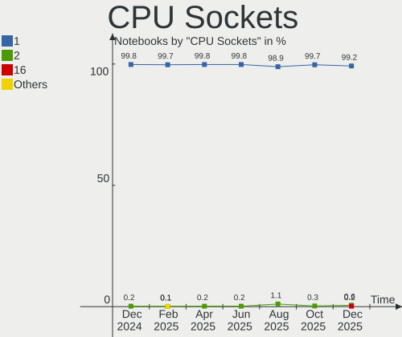

| Number | Notebooks | Percent |
|--------|-----------|---------|
| 1      | 655       | 99.24%  |
| 2      | 4         | 0.61%   |
| 16     | 1         | 0.15%   |

CPU Threads
-----------

Threads per core (Hyper-Threading)

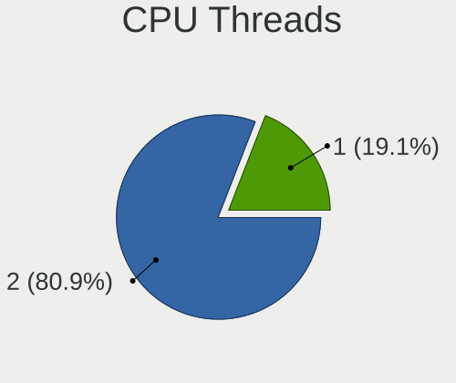

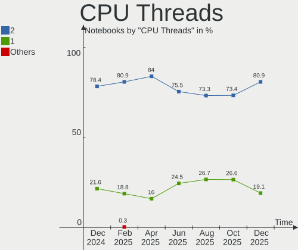

| Number | Notebooks | Percent |
|--------|-----------|---------|
| 2      | 534       | 80.91%  |
| 1      | 126       | 19.09%  |

CPU Op-Modes
------------

CPU Operation Modes (32-bit, 64-bit)

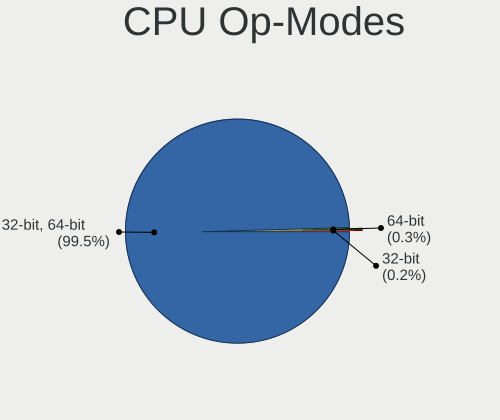

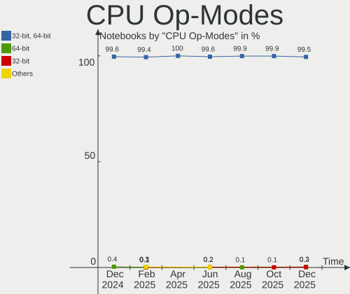

| Op mode        | Notebooks | Percent |
|----------------|-----------|---------|
| 32-bit, 64-bit | 657       | 99.55%  |
| 64-bit         | 2         | 0.3%    |
| 32-bit         | 1         | 0.15%   |

CPU Microcode
-------------

Microcode number

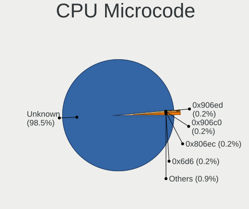

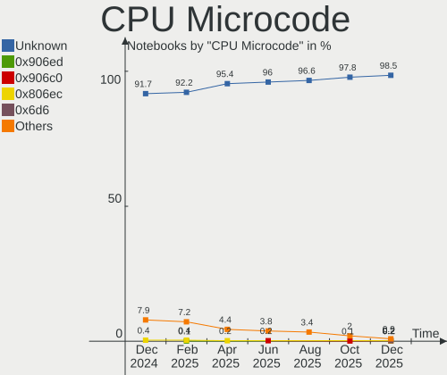

| Number     | Notebooks | Percent |
|------------|-----------|---------|
| Unknown    | 650       | 98.48%  |
| 0x906ed    | 1         | 0.15%   |
| 0x906c0    | 1         | 0.15%   |
| 0x806ec    | 1         | 0.15%   |
| 0x6d6      | 1         | 0.15%   |
| 0x40651    | 1         | 0.15%   |
| 0x306a9    | 1         | 0.15%   |
| 0x206a7    | 1         | 0.15%   |
| 0x0b204037 | 1         | 0.15%   |
| 0x0a500014 | 1         | 0.15%   |
| 0x05000119 | 1         | 0.15%   |

CPU Microarch
-------------

Microarchitecture

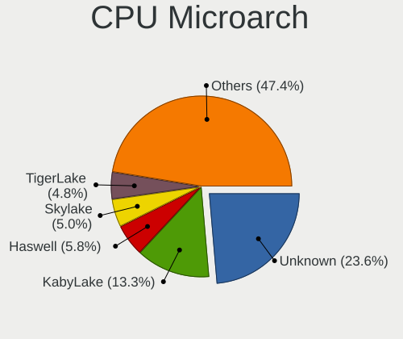

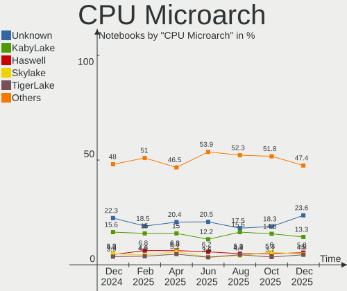

| Name               | Notebooks | Percent |
|--------------------|-----------|---------|
| Unknown            | 156       | 23.64%  |
| KabyLake           | 88        | 13.33%  |
| Haswell            | 38        | 5.76%   |
| Skylake            | 33        | 5%      |
| TigerLake          | 32        | 4.85%   |
| IvyBridge          | 31        | 4.7%    |
| Broadwell          | 30        | 4.55%   |
| SandyBridge        | 27        | 4.09%   |
| Zen 3              | 26        | 3.94%   |
| Alderlake Hybrid   | 24        | 3.64%   |
| Zen+               | 22        | 3.33%   |
| CometLake          | 16        | 2.42%   |
| Meteorlake Hybrid  | 13        | 1.97%   |
| Icelake            | 13        | 1.97%   |
| Lunarlake Hybrid   | 11        | 1.67%   |
| Silvermont         | 10        | 1.52%   |
| Puma               | 10        | 1.52%   |
| Penryn             | 9         | 1.36%   |
| Goldmont plus      | 9         | 1.36%   |
| Zen 2              | 8         | 1.21%   |
| Piledriver         | 7         | 1.06%   |
| Westmere           | 6         | 0.91%   |
| Gracemont          | 6         | 0.91%   |
| Zen                | 5         | 0.76%   |
| Goldmont           | 5         | 0.76%   |
| Excavator          | 5         | 0.76%   |
| Core               | 4         | 0.61%   |
| Bobcat             | 4         | 0.61%   |
| ArrowLake-H Hybrid | 3         | 0.45%   |
| K10                | 2         | 0.3%    |
| Jaguar             | 2         | 0.3%    |
| Tremont            | 1         | 0.15%   |
| P6                 | 1         | 0.15%   |
| K8 & K10 hybrid    | 1         | 0.15%   |
| K10 Llano          | 1         | 0.15%   |
| Bonnell            | 1         | 0.15%   |

Graphics
--------

GPU Vendor
----------

Vendors of graphics cards

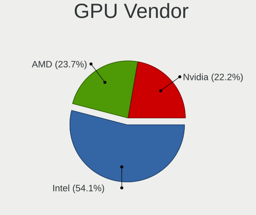

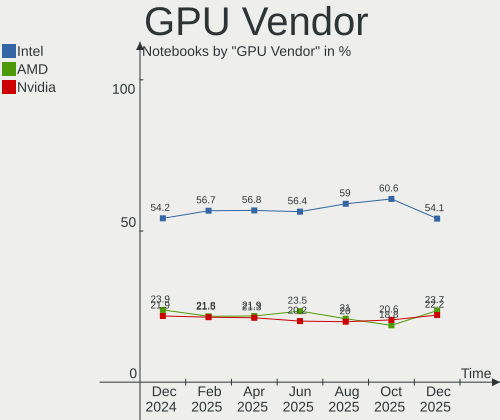

| Vendor | Notebooks | Percent |
|--------|-----------|---------|
| Intel  | 447       | 54.05%  |
| AMD    | 196       | 23.7%   |
| Nvidia | 184       | 22.25%  |

GPU Model
---------

Graphics card models

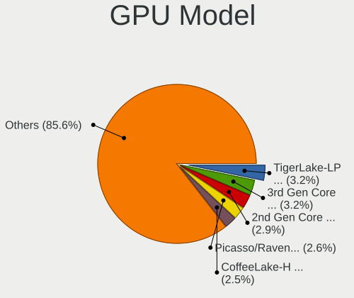

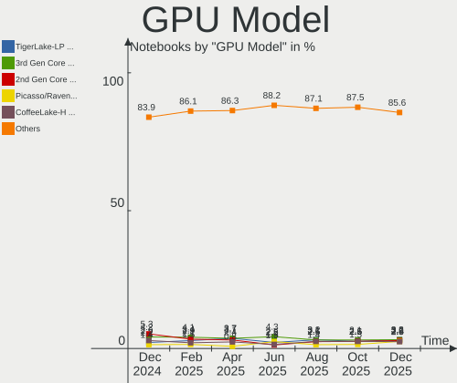

| Model                                                                     | Notebooks | Percent |
|---------------------------------------------------------------------------|-----------|---------|
| Intel TigerLake-LP GT2 [Iris Xe Graphics]                                 | 27        | 3.22%   |
| Intel 3rd Gen Core processor Graphics Controller                          | 27        | 3.22%   |
| Intel 2nd Generation Core Processor Family Integrated Graphics Controller | 24        | 2.86%   |
| AMD Picasso/Raven 2 [Radeon Vega Series / Radeon Vega Mobile Series]      | 22        | 2.62%   |
| Intel CoffeeLake-H GT2 [UHD Graphics 630]                                 | 21        | 2.5%    |
| Intel Meteor Lake-P [Intel Arc Graphics]                                  | 20        | 2.38%   |
| Intel Skylake-U GT2 [HD Graphics 520]                                     | 18        | 2.15%   |
| Intel Broadwell-U GT2 [HD Graphics 5500]                                  | 18        | 2.15%   |
| Intel 4th Gen Core Processor Integrated Graphics Controller               | 16        | 1.91%   |
| AMD Phoenix1                                                              | 16        | 1.91%   |
| Intel Haswell-ULT Integrated Graphics Controller                          | 15        | 1.79%   |
| AMD Strix [Radeon 880M / 890M]                                            | 14        | 1.67%   |
| AMD Barcelo                                                               | 14        | 1.67%   |
| Intel Kaby Lake-U GT2 [HD Graphics 620]                                   | 13        | 1.55%   |
| Intel Kaby Lake-R GT2 [UHD Graphics 620]                                  | 13        | 1.55%   |
| Intel CometLake-H GT2 [UHD Graphics]                                      | 13        | 1.55%   |
| Nvidia AD107M [GeForce RTX 4060 Max-Q / Mobile]                           | 12        | 1.43%   |
| Intel TigerLake-H GT1 [UHD Graphics]                                      | 11        | 1.31%   |
| Intel Arrow Lake-S [Intel Graphics]                                       | 11        | 1.31%   |
| Nvidia AD107M [GeForce RTX 4050 Max-Q / Mobile]                           | 10        | 1.19%   |
| Intel Lunar Lake [Intel Arc Graphics 130V / 140V]                         | 10        | 1.19%   |
| Intel Broadwell-U GT3 [HD Graphics 6000]                                  | 10        | 1.19%   |
| AMD Sephiroth [AMD Custom GPU 0405]                                       | 10        | 1.19%   |
| Nvidia TU117M [GeForce GTX 1650 Mobile / Max-Q]                           | 9         | 1.07%   |
| Intel WhiskeyLake-U GT2 [UHD Graphics 620]                                | 9         | 1.07%   |
| Intel Kaby Lake-H GT2 [HD Graphics 630]                                   | 9         | 1.07%   |
| Intel GeminiLake [UHD Graphics 600]                                       | 9         | 1.07%   |
| Intel Alder Lake-P GT2 [Iris Xe Graphics]                                 | 9         | 1.07%   |
| AMD Rembrandt [Radeon 680M]                                               | 9         | 1.07%   |
| Intel Skylake-H GT2 [HD Graphics 530]                                     | 8         | 0.95%   |
| Intel Raptor Lake-P [Iris Xe Graphics]                                    | 8         | 0.95%   |
| Intel CometLake-U GT2 [UHD Graphics]                                      | 8         | 0.95%   |
| Intel Alder Lake-N [UHD Graphics]                                         | 8         | 0.95%   |
| AMD Renoir [Radeon Vega Series / Radeon Vega Mobile Series]               | 8         | 0.95%   |
| AMD Mullins [Radeon R4/R5 Graphics]                                       | 8         | 0.95%   |
| AMD Krackan [Radeon 840M / 860M Graphics]                                 | 8         | 0.95%   |
| AMD Cezanne [Radeon Vega Series / Radeon Vega Mobile Series]              | 8         | 0.95%   |
| Intel Raptor Lake-P [UHD Graphics]                                        | 7         | 0.83%   |
| AMD VanGogh [AMD Custom GPU 0405]                                         | 7         | 0.83%   |
| AMD HawkPoint1                                                            | 7         | 0.83%   |

GPU Combo
---------

Combinations of graphics cards

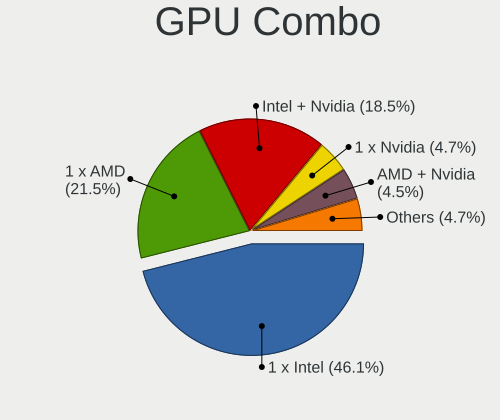

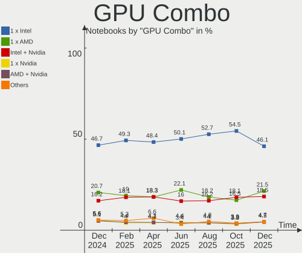

| Name           | Notebooks | Percent |
|----------------|-----------|---------|
| 1 x Intel      | 304       | 46.06%  |
| 1 x AMD        | 142       | 21.52%  |
| Intel + Nvidia | 122       | 18.48%  |
| 1 x Nvidia     | 31        | 4.7%    |
| AMD + Nvidia   | 30        | 4.55%   |
| Intel + AMD    | 13        | 1.97%   |
| 2 x AMD        | 10        | 1.52%   |
| Other          | 5         | 0.76%   |
| 2 x Intel      | 3         | 0.45%   |

GPU Driver
----------

Free vs proprietary

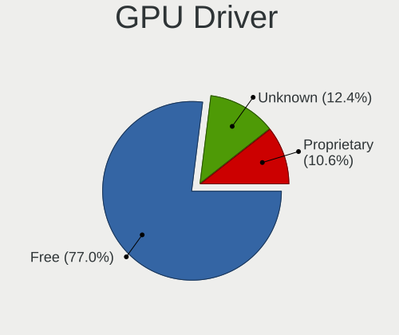

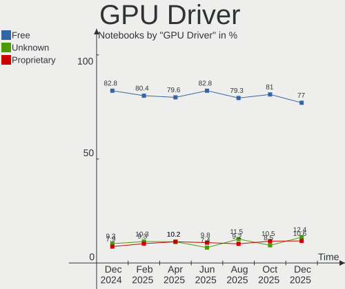

| Driver      | Notebooks | Percent |
|-------------|-----------|---------|
| Free        | 508       | 76.97%  |
| Unknown     | 82        | 12.42%  |
| Proprietary | 70        | 10.61%  |

GPU Memory
----------

Total video memory

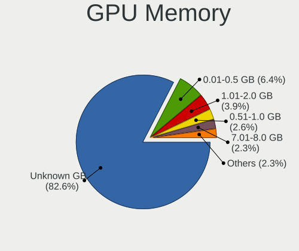

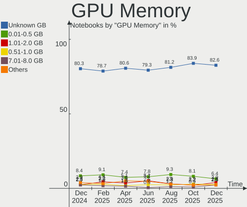

| Size in GB | Notebooks | Percent |
|------------|-----------|---------|
| Unknown    | 545       | 82.58%  |
| 0.01-0.5   | 42        | 6.36%   |
| 1.01-2.0   | 26        | 3.94%   |
| 0.51-1.0   | 17        | 2.58%   |
| 7.01-8.0   | 15        | 2.27%   |
| 5.01-6.0   | 5         | 0.76%   |
| 3.01-4.0   | 5         | 0.76%   |
| 2.01-3.0   | 2         | 0.3%    |
| 8.01-16.0  | 2         | 0.3%    |
| 24.01-32.0 | 1         | 0.15%   |

Monitor
-------

Monitor Vendor
--------------

Monitor vendors

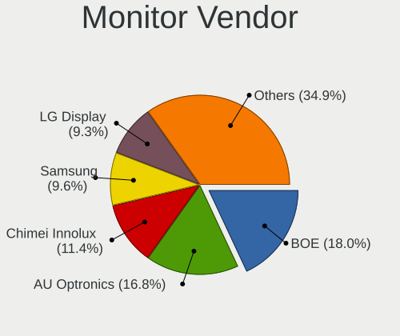

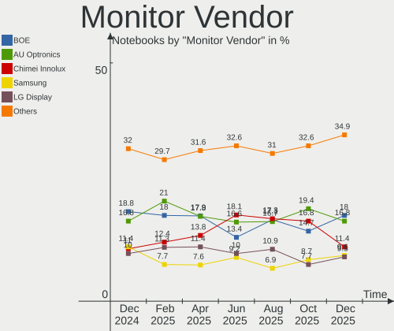

| Vendor                  | Notebooks | Percent |
|-------------------------|-----------|---------|
| BOE                     | 134       | 18.03%  |
| AU Optronics            | 125       | 16.82%  |
| Chimei Innolux          | 85        | 11.44%  |
| Samsung Electronics     | 71        | 9.56%   |
| LG Display              | 69        | 9.29%   |
| Apple                   | 40        | 5.38%   |
| Lenovo                  | 32        | 4.31%   |
| Sharp                   | 19        | 2.56%   |
| Goldstar                | 19        | 2.56%   |
| Valve                   | 17        | 2.29%   |
| Dell                    | 16        | 2.15%   |
| PANDA                   | 12        | 1.62%   |
| CSW                     | 9         | 1.21%   |
| Chi Mei Optoelectronics | 9         | 1.21%   |
| ASUSTek Computer        | 8         | 1.08%   |
| InfoVision              | 7         | 0.94%   |
| Hewlett-Packard         | 7         | 0.94%   |
| CSOT                    | 6         | 0.81%   |
| Vizio                   | 5         | 0.67%   |
| Toshiba                 | 3         | 0.4%    |
| RGT                     | 3         | 0.4%    |
| Ancor Communications    | 3         | 0.4%    |
| ViewSonic               | 2         | 0.27%   |
| Unknown                 | 2         | 0.27%   |
| TMA                     | 2         | 0.27%   |
| Sceptre Tech            | 2         | 0.27%   |
| MSI                     | 2         | 0.27%   |
| LG Philips              | 2         | 0.27%   |
| HKC                     | 2         | 0.27%   |
| EDO                     | 2         | 0.27%   |
| AOC                     | 2         | 0.27%   |
| Acer                    | 2         | 0.27%   |
| Vestel Elektronik       | 1         | 0.13%   |
| TMX                     | 1         | 0.13%   |
| TCL                     | 1         | 0.13%   |
| SKG                     | 1         | 0.13%   |
| SANSUI                  | 1         | 0.13%   |
| RTK                     | 1         | 0.13%   |
| Roku                    | 1         | 0.13%   |
| RCA                     | 1         | 0.13%   |

Monitor Model
-------------

Monitor models

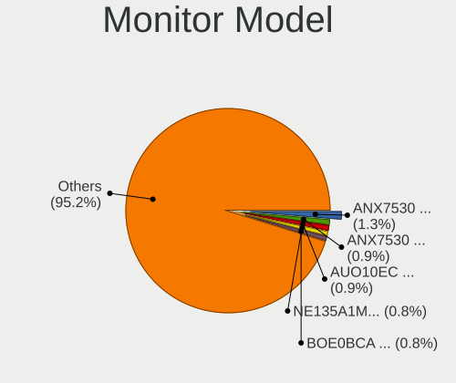

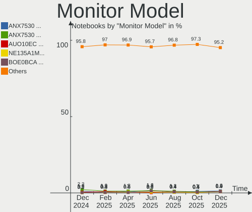

| Model                                                                  | Notebooks | Percent |
|------------------------------------------------------------------------|-----------|---------|
| Valve ANX7530 U VLV3003 800x1280 100x160mm 7.4-inch                    | 10        | 1.34%   |
| Valve ANX7530 U VLV3001 800x1280 100x150mm 7.1-inch                    | 7         | 0.93%   |
| AU Optronics LCD Monitor AUO10EC 1366x768 344x193mm 15.5-inch          | 7         | 0.93%   |
| BOE NE135A1M-NY1 BOE0CB4 2880x1920 285x190mm 13.5-inch                 | 6         | 0.8%    |
| BOE LCD Monitor BOE0BCA 2256x1504 285x190mm 13.5-inch                  | 6         | 0.8%    |
| Lenovo LCD Monitor LEN40A9 1920x1080 309x173mm 13.9-inch               | 5         | 0.67%   |
| BOE LCD Monitor BOE0BC9 2560x1600 345x215mm 16.0-inch                  | 5         | 0.67%   |
| BOE LCD Monitor BOE084E 1920x1080 382x215mm 17.3-inch                  | 5         | 0.67%   |
| Samsung Electronics ATNA60HU01-0  SDC420B                              | 4         | 0.53%   |
| Samsung Electronics ATNA40CU05-0 SDC419C 2880x1800 302x189mm 14.0-inch | 4         | 0.53%   |
| Goldstar FULL HD GSM5B55 1920x1080 480x270mm 21.7-inch                 | 4         | 0.53%   |
| AU Optronics LCD Monitor AUO10ED 1920x1080 344x193mm 15.5-inch         | 4         | 0.53%   |
| Apple Color LCD APPA01B 1440x900 286x179mm 13.3-inch                   | 4         | 0.53%   |
| Apple Color LCD APP9CC7 1280x800 286x179mm 13.3-inch                   | 4         | 0.53%   |
| Sharp LCD Monitor SHP149A 1920x1080 344x194mm 15.5-inch                | 3         | 0.4%    |
| Samsung Electronics LCD Monitor SDC5441 1366x768 344x193mm 15.5-inch   | 3         | 0.4%    |
| RGT LCD Monitor RGT5211 1366x768 518x333mm 24.2-inch                   | 3         | 0.4%    |
| LG Display LCD Monitor LGD053F 1920x1080 344x194mm 15.5-inch           | 3         | 0.4%    |
| LG Display LCD Monitor LGD033E 1366x768 309x174mm 14.0-inch            | 3         | 0.4%    |
| Lenovo ATNA40HQ02-0  LEN414D                                           | 3         | 0.4%    |
| Chimei Innolux LCD Monitor CMN1738 1920x1080 381x214mm 17.2-inch       | 3         | 0.4%    |
| Chimei Innolux LCD Monitor CMN1728 1600x900 382x215mm 17.3-inch        | 3         | 0.4%    |
| Chimei Innolux LCD Monitor CMN1618 1920x1200 344x215mm 16.0-inch       | 3         | 0.4%    |
| Chimei Innolux LCD Monitor CMN15F5 1920x1080 344x193mm 15.5-inch       | 3         | 0.4%    |
| Chimei Innolux LCD Monitor CMN15E7 1920x1080 344x193mm 15.5-inch       | 3         | 0.4%    |
| Chimei Innolux LCD Monitor CMN15AB 1366x768 344x193mm 15.5-inch        | 3         | 0.4%    |
| Chimei Innolux LCD Monitor CMN1521 1920x1080 344x193mm 15.5-inch       | 3         | 0.4%    |
| Chimei Innolux LCD Monitor CMN14D4 1920x1080 309x173mm 13.9-inch       | 3         | 0.4%    |
| BOE LCD Monitor BOE0CFD 1920x1080 344x194mm 15.5-inch                  | 3         | 0.4%    |
| BOE LCD Monitor BOE09E6 1920x1080 344x193mm 15.5-inch                  | 3         | 0.4%    |
| BOE LCD Monitor BOE095F 2256x1504 285x190mm 13.5-inch                  | 3         | 0.4%    |
| BOE LCD Monitor BOE08D5 1920x1080 344x194mm 15.5-inch                  | 3         | 0.4%    |
| BOE LCD Monitor BOE07F7 1920x1080 309x174mm 14.0-inch                  | 3         | 0.4%    |
| AU Optronics LCD Monitor AUO403D 1920x1080 309x174mm 14.0-inch         | 3         | 0.4%    |
| AU Optronics LCD Monitor AUO34ED 1920x1080 344x193mm 15.5-inch         | 3         | 0.4%    |
| AU Optronics LCD Monitor AUO213D 1920x1080 309x173mm 13.9-inch         | 3         | 0.4%    |
| AU Optronics LCD Monitor AUO11EC 1366x768 344x193mm 15.5-inch          | 3         | 0.4%    |
| Apple LCD Monitor APP9CC5 1280x800 286x179mm 13.3-inch                 | 3         | 0.4%    |
| Apple Color LCD APPA02F 2880x1800 331x207mm 15.4-inch                  | 3         | 0.4%    |
| Unknown LCD Monitor FFFF 2288x1287 2550x2550mm 142.0-inch              | 2         | 0.27%   |

Monitor Resolution
------------------

Monitor screen resolution

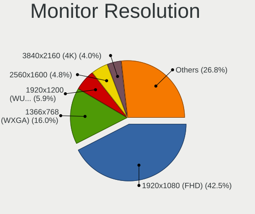

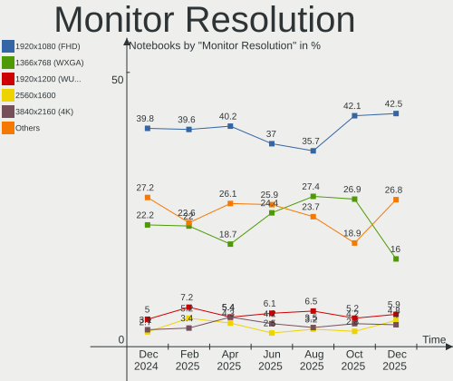

| Resolution         | Notebooks | Percent |
|--------------------|-----------|---------|
| 1920x1080 (FHD)    | 308       | 42.48%  |
| 1366x768 (WXGA)    | 116       | 16%     |
| 1920x1200 (WUXGA)  | 43        | 5.93%   |
| 2560x1600          | 35        | 4.83%   |
| 3840x2160 (4K)     | 29        | 4%      |
| 2880x1800          | 27        | 3.72%   |
| 1600x900 (HD+)     | 23        | 3.17%   |
| 2560x1440 (QHD)    | 21        | 2.9%    |
| 1280x800 (WXGA)    | 18        | 2.48%   |
| 800x1280           | 17        | 2.34%   |
| Unknown            | 15        | 2.07%   |
| 1440x900 (WXGA+)   | 14        | 1.93%   |
| 2256x1504          | 10        | 1.38%   |
| 2880x1920          | 7         | 0.97%   |
| 2560x1080          | 6         | 0.83%   |
| 3840x2400          | 4         | 0.55%   |
| 3440x1440          | 4         | 0.55%   |
| 3200x1800 (QHD+)   | 3         | 0.41%   |
| 2400x1600          | 3         | 0.41%   |
| 3840x1600          | 2         | 0.28%   |
| 3840x1080          | 2         | 0.28%   |
| 3456x2160          | 2         | 0.28%   |
| 2304x1440          | 2         | 0.28%   |
| 2288x1287          | 2         | 0.28%   |
| 2160x1350          | 2         | 0.28%   |
| 1680x1050 (WSXGA+) | 2         | 0.28%   |
| 1024x768 (XGA)     | 2         | 0.28%   |
| 3200x2000          | 1         | 0.14%   |
| 2560x2880          | 1         | 0.14%   |
| 2240x1400          | 1         | 0.14%   |
| 1280x720 (HD)      | 1         | 0.14%   |
| 1080x1920          | 1         | 0.14%   |
| 1024x600           | 1         | 0.14%   |

Monitor Diagonal
----------------

Diagonal size in inches

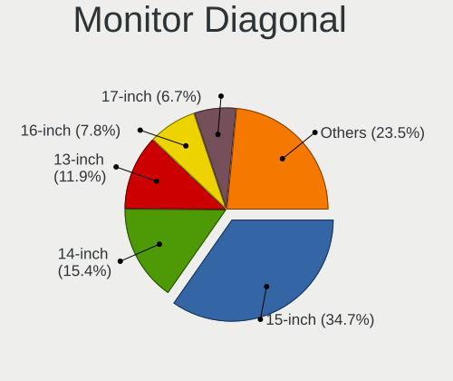

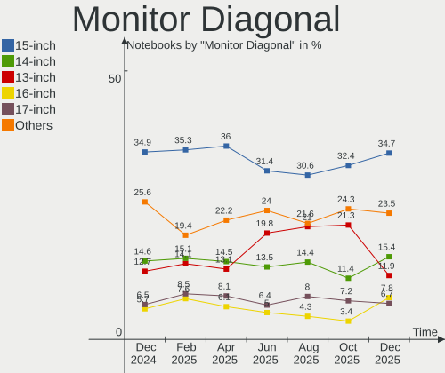

| Inches  | Notebooks | Percent |
|---------|-----------|---------|
| 15      | 259       | 34.72%  |
| 14      | 115       | 15.42%  |
| 13      | 89        | 11.93%  |
| 16      | 58        | 7.77%   |
| 17      | 50        | 6.7%    |
| 31      | 22        | 2.95%   |
| 27      | 22        | 2.95%   |
| 24      | 18        | 2.41%   |
| 7       | 17        | 2.28%   |
| Unknown | 16        | 2.14%   |
| 11      | 12        | 1.61%   |
| 12      | 11        | 1.47%   |
| 34      | 8         | 1.07%   |
| 21      | 6         | 0.8%    |
| 23      | 5         | 0.67%   |
| 18      | 5         | 0.67%   |
| 84      | 3         | 0.4%    |
| 54      | 3         | 0.4%    |
| 142     | 2         | 0.27%   |
| 86      | 2         | 0.27%   |
| 74      | 2         | 0.27%   |
| 57      | 2         | 0.27%   |
| 40      | 2         | 0.27%   |
| 37      | 2         | 0.27%   |
| 32      | 2         | 0.27%   |
| 28      | 2         | 0.27%   |
| 69      | 1         | 0.13%   |
| 60      | 1         | 0.13%   |
| 49      | 1         | 0.13%   |
| 42      | 1         | 0.13%   |
| 39      | 1         | 0.13%   |
| 36      | 1         | 0.13%   |
| 29      | 1         | 0.13%   |
| 26      | 1         | 0.13%   |
| 20      | 1         | 0.13%   |
| 19      | 1         | 0.13%   |
| 10      | 1         | 0.13%   |

Monitor Width
-------------

Physical width

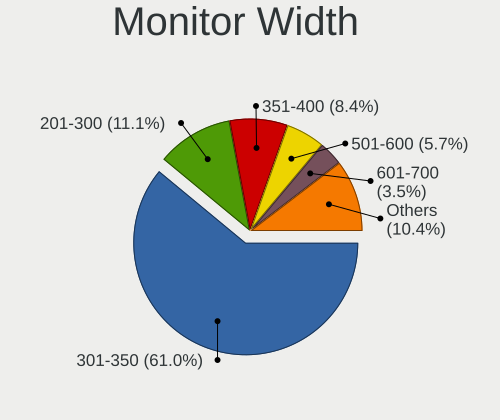

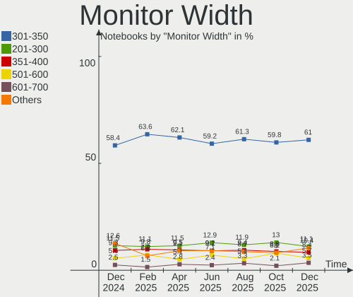

| Width in mm    | Notebooks | Percent |
|----------------|-----------|---------|
| 301-350        | 452       | 61%     |
| 201-300        | 82        | 11.07%  |
| 351-400        | 62        | 8.37%   |
| 501-600        | 42        | 5.67%   |
| 601-700        | 26        | 3.51%   |
| 1-100          | 17        | 2.29%   |
| Unknown        | 16        | 2.16%   |
| 701-800        | 11        | 1.48%   |
| 401-500        | 10        | 1.35%   |
| 1001-1500      | 9         | 1.21%   |
| 1501-2000      | 6         | 0.81%   |
| 801-900        | 4         | 0.54%   |
| More than 2000 | 2         | 0.27%   |
| 901-1000       | 2         | 0.27%   |

Aspect Ratio
------------

Proportional relationship between the width and the height

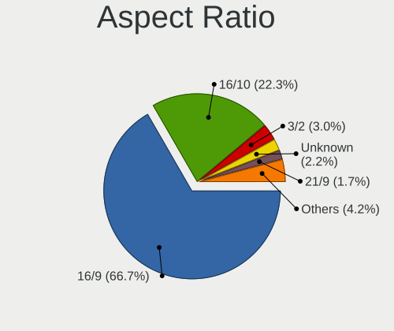

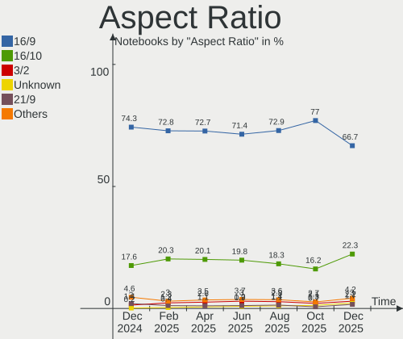

| Ratio   | Notebooks | Percent |
|---------|-----------|---------|
| 16/9    | 464       | 66.67%  |
| 16/10   | 155       | 22.27%  |
| 3/2     | 21        | 3.02%   |
| Unknown | 15        | 2.16%   |
| 21/9    | 12        | 1.72%   |
| 0.62    | 10        | 1.44%   |
| 0.67    | 7         | 1.01%   |
| 4/3     | 3         | 0.43%   |
| 32/9    | 3         | 0.43%   |
| 0.56    | 3         | 0.43%   |
| 1.00    | 2         | 0.29%   |
| 0.89    | 1         | 0.14%   |

Monitor Area
------------

Area in inch²

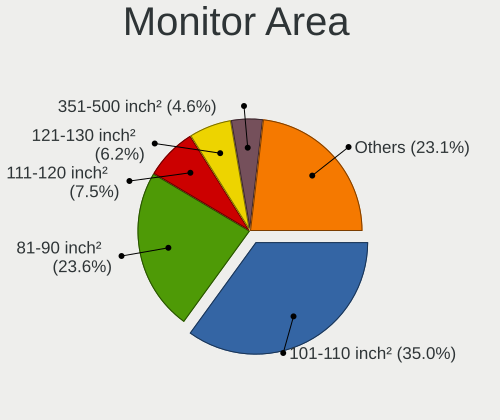

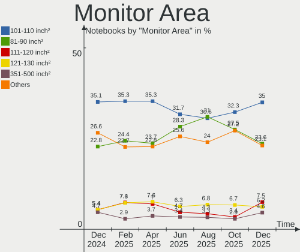

| Area in inch² | Notebooks | Percent |
|----------------|-----------|---------|
| 101-110        | 260       | 34.99%  |
| 81-90          | 175       | 23.55%  |
| 111-120        | 56        | 7.54%   |
| 121-130        | 46        | 6.19%   |
| 351-500        | 34        | 4.58%   |
| 71-80          | 25        | 3.36%   |
| 301-350        | 22        | 2.96%   |
| 201-250        | 20        | 2.69%   |
| 1-40           | 17        | 2.29%   |
| Unknown        | 16        | 2.15%   |
| More than 1000 | 14        | 1.88%   |
| 61-70          | 12        | 1.62%   |
| 51-60          | 11        | 1.48%   |
| 501-1000       | 10        | 1.35%   |
| 251-300        | 6         | 0.81%   |
| 141-150        | 5         | 0.67%   |
| 131-140        | 5         | 0.67%   |
| 151-200        | 4         | 0.54%   |
| 91-100         | 4         | 0.54%   |
| 41-50          | 1         | 0.13%   |

Pixel Density
-------------

Pixels per inch

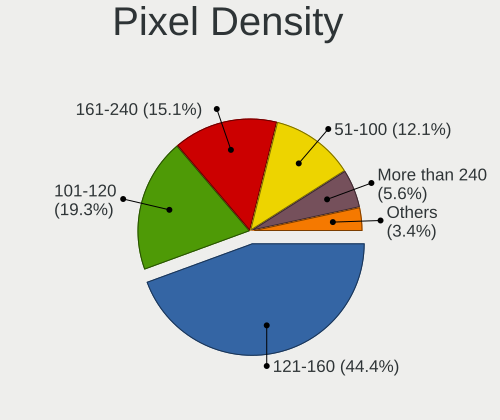

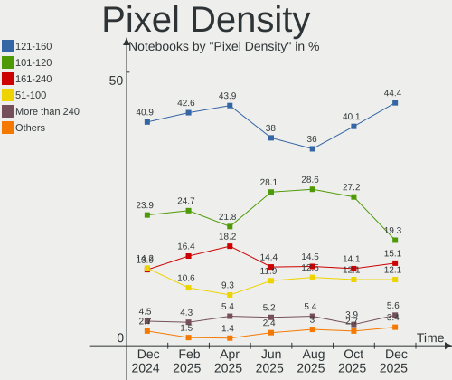

| Density       | Notebooks | Percent |
|---------------|-----------|---------|
| 121-160       | 326       | 44.41%  |
| 101-120       | 142       | 19.35%  |
| 161-240       | 111       | 15.12%  |
| 51-100        | 89        | 12.13%  |
| More than 240 | 41        | 5.59%   |
| Unknown       | 16        | 2.18%   |
| 1-50          | 9         | 1.23%   |

Multiple Monitors
-----------------

Total monitors connected

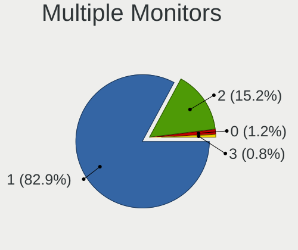

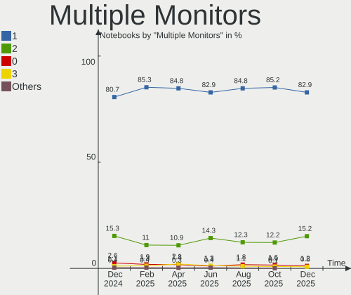

| Total | Notebooks | Percent |
|-------|-----------|---------|
| 1     | 547       | 82.88%  |
| 2     | 100       | 15.15%  |
| 0     | 8         | 1.21%   |
| 3     | 5         | 0.76%   |

Network
-------

Net Controller Vendor
---------------------

Controller vendors

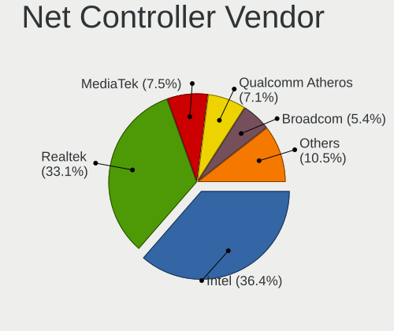

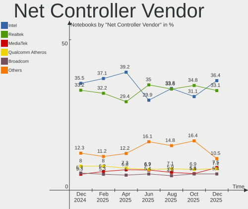

| Vendor                                 | Notebooks | Percent |
|----------------------------------------|-----------|---------|
| Intel                                  | 345       | 36.39%  |
| Realtek Semiconductor                  | 314       | 33.12%  |
| MediaTek                               | 71        | 7.49%   |
| Qualcomm Atheros                       | 67        | 7.07%   |
| Broadcom                               | 51        | 5.38%   |
| Broadcom Limited                       | 18        | 1.9%    |
| Qualcomm                               | 16        | 1.69%   |
| ASIX Electronics                       | 16        | 1.69%   |
| Shenzhen Goodix Technology             | 6         | 0.63%   |
| Nvidia                                 | 4         | 0.42%   |
| ASUSTek Computer                       | 4         | 0.42%   |
| TP-Link                                | 3         | 0.32%   |
| Samsung Electronics                    | 3         | 0.32%   |
| Ralink                                 | 3         | 0.32%   |
| Qualcomm Technologies                  | 3         | 0.32%   |
| NetGear                                | 3         | 0.32%   |
| Microsoft                              | 2         | 0.21%   |
| Google                                 | 2         | 0.21%   |
| Framework Computer                     | 2         | 0.21%   |
| Suzhou Motorcomm Electronic Technology | 1         | 0.11%   |
| Sierra Wireless                        | 1         | 0.11%   |
| Realtek                                | 1         | 0.11%   |
| Motorcomm Microelectronics.            | 1         | 0.11%   |
| Marvell Technology Group               | 1         | 0.11%   |
| Lenovo                                 | 1         | 0.11%   |
| Hewlett-Packard                        | 1         | 0.11%   |
| Flipper Devices                        | 1         | 0.11%   |
| DisplayLink                            | 1         | 0.11%   |
| Dell                                   | 1         | 0.11%   |
| Belkin Components                      | 1         | 0.11%   |
| Arduino SA                             | 1         | 0.11%   |
| Aquantia                               | 1         | 0.11%   |
| Apple                                  | 1         | 0.11%   |
| 3Com                                   | 1         | 0.11%   |

Net Controller Model
--------------------

Controller models

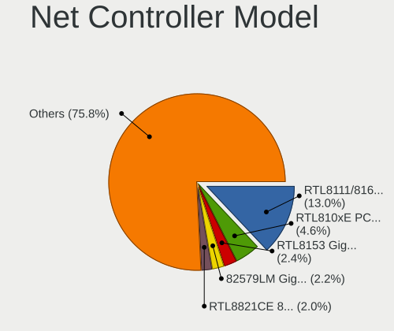

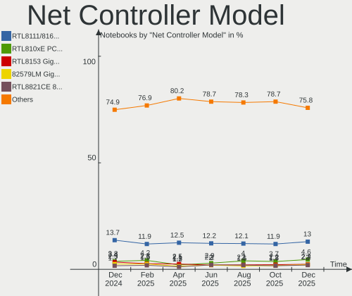

| Model                                                                           | Notebooks | Percent |
|---------------------------------------------------------------------------------|-----------|---------|
| Realtek RTL8111/8168/8211/8411 PCI Express Gigabit Ethernet Controller          | 151       | 12.97%  |
| Realtek RTL810xE PCI Express Fast Ethernet controller                           | 54        | 4.64%   |
| Realtek RTL8153 Gigabit Ethernet Adapter                                        | 28        | 2.41%   |
| Intel 82579LM Gigabit Network Connection (Lewisville)                           | 26        | 2.23%   |
| Realtek RTL8821CE 802.11ac PCIe Wireless Network Adapter                        | 23        | 1.98%   |
| MediaTek MT7922 802.11ax PCI Express Wireless Network Adapter                   | 22        | 1.89%   |
| Intel Wi-Fi 6 AX200                                                             | 22        | 1.89%   |
| Realtek RTL8822CE 802.11ac PCIe Wireless Network Adapter                        | 21        | 1.8%    |
| Intel Wi-Fi 6E(802.11ax) AX210/AX1675* 2x2 [Typhoon Peak]                       | 21        | 1.8%    |
| Intel Wi-Fi 6 AX201                                                             | 21        | 1.8%    |
| MediaTek MT7925 802.11be 160MHz 2x2 PCIe Wireless Network Adapter [Filogic 360] | 19        | 1.63%   |
| Intel Wireless 8265 / 8275                                                      | 19        | 1.63%   |
| Intel Wireless 7265                                                             | 19        | 1.63%   |
| Realtek RTL8852BE PCIe 802.11ax Wireless Network Controller                     | 18        | 1.55%   |
| MediaTek MT7921 802.11ax PCIe Wireless Network Adapter [Filogic 330]            | 17        | 1.46%   |
| Intel Wireless 7260                                                             | 17        | 1.46%   |
| Intel Centrino Advanced-N 6205 [Taylor Peak]                                    | 17        | 1.46%   |
| Qualcomm QCNFA765 Wireless Network Adapter                                      | 16        | 1.37%   |
| Qualcomm Atheros QCA6174 802.11ac Wireless Network Adapter                      | 16        | 1.37%   |
| Intel Wireless 8260                                                             | 16        | 1.37%   |
| Intel Alder Lake-P PCH CNVi WiFi                                                | 16        | 1.37%   |
| Qualcomm Atheros QCA9377 802.11ac Wireless Network Adapter                      | 15        | 1.29%   |
| Intel Wi-Fi 7(802.11be) AX1775*/AX1790*/BE20*/BE401/BE1750* 2x2                 | 15        | 1.29%   |
| Intel Comet Lake PCH CNVi WiFi                                                  | 14        | 1.2%    |
| ASIX AX88179 Gigabit Ethernet                                                   | 14        | 1.2%    |
| Qualcomm Atheros QCA9565 / AR9565 Wireless Network Adapter                      | 13        | 1.12%   |
| Intel Meteor Lake PCH CNVi WiFi                                                 | 12        | 1.03%   |
| Realtek RTL8188EE Wireless Network Adapter                                      | 11        | 0.95%   |
| Intel Ethernet Connection (4) I219-LM                                           | 11        | 0.95%   |
| Realtek RTL8125 2.5GbE Controller                                               | 10        | 0.86%   |
| Intel Wi-Fi 5(802.11ac) Wireless-AC 9x6x [Thunder Peak]                         | 10        | 0.86%   |
| Intel BE201 320MHz                                                              | 10        | 0.86%   |
| Broadcom NetXtreme BCM57765 Gigabit Ethernet PCIe                               | 10        | 0.86%   |
| Broadcom Limited BCM4360 802.11ac Dual Band Wireless Network Adapter            | 10        | 0.86%   |
| Broadcom BCM4331 802.11a/b/g/n                                                  | 10        | 0.86%   |
| Intel Wireless 3165                                                             | 9         | 0.77%   |
| Intel Tiger Lake PCH CNVi WiFi                                                  | 9         | 0.77%   |
| Intel Ethernet Connection (7) I219-LM                                           | 9         | 0.77%   |
| Intel Wireless 3160                                                             | 8         | 0.69%   |
| Intel Ethernet Connection I217-LM                                               | 8         | 0.69%   |

Wireless Vendor
---------------

Wireless vendors

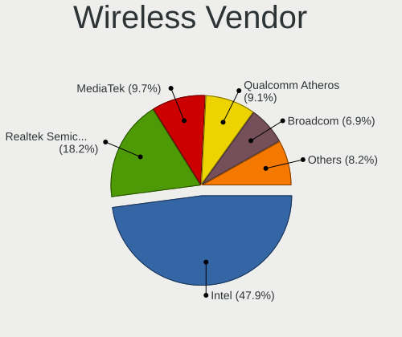

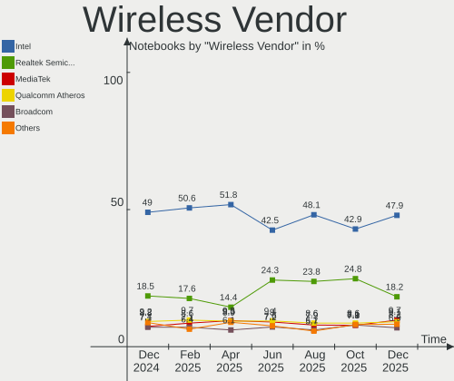

| Vendor                | Notebooks | Percent |
|-----------------------|-----------|---------|
| Intel                 | 311       | 47.92%  |
| Realtek Semiconductor | 118       | 18.18%  |
| MediaTek              | 63        | 9.71%   |
| Qualcomm Atheros      | 59        | 9.09%   |
| Broadcom              | 45        | 6.93%   |
| Qualcomm              | 16        | 2.47%   |
| Broadcom Limited      | 16        | 2.47%   |
| ASUSTek Computer      | 4         | 0.62%   |
| TP-Link               | 3         | 0.46%   |
| Ralink                | 3         | 0.46%   |
| NetGear               | 3         | 0.46%   |
| Qualcomm Technologies | 2         | 0.31%   |
| Sierra Wireless       | 1         | 0.15%   |
| Realtek               | 1         | 0.15%   |
| Microsoft             | 1         | 0.15%   |
| Dell                  | 1         | 0.15%   |
| Belkin Components     | 1         | 0.15%   |
| 3Com                  | 1         | 0.15%   |

Wireless Model
--------------

Wireless models

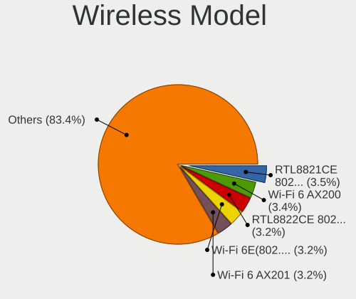

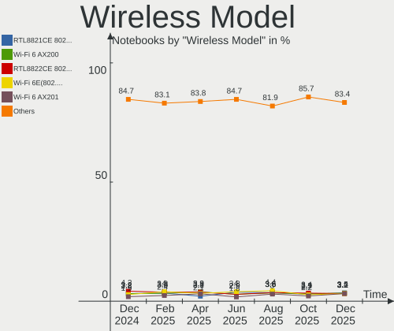

| Model                                                                           | Notebooks | Percent |
|---------------------------------------------------------------------------------|-----------|---------|
| Realtek RTL8821CE 802.11ac PCIe Wireless Network Adapter                        | 23        | 3.53%   |
| Intel Wi-Fi 6 AX200                                                             | 22        | 3.37%   |
| Realtek RTL8822CE 802.11ac PCIe Wireless Network Adapter                        | 21        | 3.22%   |
| Intel Wi-Fi 6E(802.11ax) AX210/AX1675* 2x2 [Typhoon Peak]                       | 21        | 3.22%   |
| Intel Wi-Fi 6 AX201                                                             | 21        | 3.22%   |
| MediaTek MT7922 802.11ax PCI Express Wireless Network Adapter                   | 20        | 3.07%   |
| Intel Wireless 8265 / 8275                                                      | 19        | 2.91%   |
| Intel Wireless 7265                                                             | 19        | 2.91%   |
| Realtek RTL8852BE PCIe 802.11ax Wireless Network Controller                     | 18        | 2.76%   |
| MediaTek MT7921 802.11ax PCIe Wireless Network Adapter [Filogic 330]            | 17        | 2.61%   |
| Intel Wireless 7260                                                             | 17        | 2.61%   |
| Intel Centrino Advanced-N 6205 [Taylor Peak]                                    | 17        | 2.61%   |
| Qualcomm QCNFA765 Wireless Network Adapter                                      | 16        | 2.45%   |
| Qualcomm Atheros QCA6174 802.11ac Wireless Network Adapter                      | 16        | 2.45%   |
| Intel Wireless 8260                                                             | 16        | 2.45%   |
| Qualcomm Atheros QCA9377 802.11ac Wireless Network Adapter                      | 15        | 2.3%    |
| Intel Comet Lake PCH CNVi WiFi                                                  | 14        | 2.15%   |
| Qualcomm Atheros QCA9565 / AR9565 Wireless Network Adapter                      | 13        | 1.99%   |
| MediaTek MT7925 802.11be 160MHz 2x2 PCIe Wireless Network Adapter [Filogic 360] | 13        | 1.99%   |
| Intel Wi-Fi 7(802.11be) AX1775*/AX1790*/BE20*/BE401/BE1750* 2x2                 | 12        | 1.84%   |
| Intel Meteor Lake PCH CNVi WiFi                                                 | 12        | 1.84%   |
| Realtek RTL8188EE Wireless Network Adapter                                      | 11        | 1.69%   |
| Intel Wi-Fi 5(802.11ac) Wireless-AC 9x6x [Thunder Peak]                         | 10        | 1.53%   |
| Intel Alder Lake-P PCH CNVi WiFi                                                | 10        | 1.53%   |
| Broadcom Limited BCM4360 802.11ac Dual Band Wireless Network Adapter            | 10        | 1.53%   |
| Broadcom BCM4331 802.11a/b/g/n                                                  | 10        | 1.53%   |
| Intel Wireless 3165                                                             | 9         | 1.38%   |
| Intel Tiger Lake PCH CNVi WiFi                                                  | 9         | 1.38%   |
| Intel Wireless 3160                                                             | 8         | 1.23%   |
| Broadcom BCM43602 802.11ac Wireless LAN SoC                                     | 8         | 1.23%   |
| Qualcomm Atheros AR9485 Wireless Network Adapter                                | 7         | 1.07%   |
| Intel Comet Lake PCH-LP CNVi WiFi                                               | 7         | 1.07%   |
| Intel Centrino Ultimate-N 6300                                                  | 7         | 1.07%   |
| Intel BE201 320MHz                                                              | 7         | 1.07%   |
| Realtek RTL8852BE-VT PCIe 802.11ax Wireless Network Controller                  | 6         | 0.92%   |
| Realtek 802.11ac NIC                                                            | 6         | 0.92%   |
| MediaTek MT7925 (RZ717) Wi-Fi 7 160MHz                                          | 6         | 0.92%   |
| MediaTek MT7902 802.11ax PCIe Wireless Network Adapter [Filogic 310]            | 6         | 0.92%   |
| Intel Raptor Lake PCH CNVi WiFi                                                 | 6         | 0.92%   |
| Intel Cannon Point-LP CNVi [Wireless-AC]                                        | 6         | 0.92%   |

Ethernet Vendor
---------------

Ethernet vendors

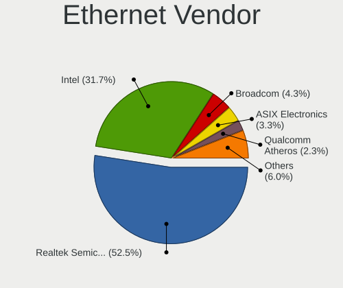

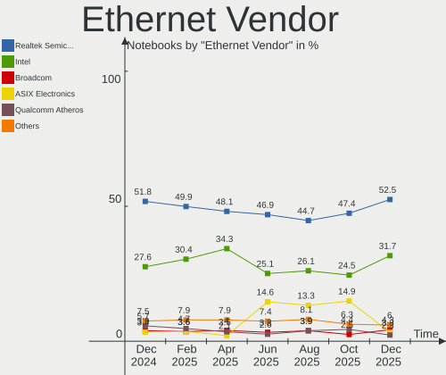

| Vendor                                 | Notebooks | Percent |
|----------------------------------------|-----------|---------|
| Realtek Semiconductor                  | 255       | 52.47%  |
| Intel                                  | 154       | 31.69%  |
| Broadcom                               | 21        | 4.32%   |
| ASIX Electronics                       | 16        | 3.29%   |
| Qualcomm Atheros                       | 11        | 2.26%   |
| MediaTek                               | 8         | 1.65%   |
| Nvidia                                 | 4         | 0.82%   |
| Samsung Electronics                    | 3         | 0.62%   |
| Google                                 | 2         | 0.41%   |
| Broadcom Limited                       | 2         | 0.41%   |
| Suzhou Motorcomm Electronic Technology | 1         | 0.21%   |
| Qualcomm Technologies                  | 1         | 0.21%   |
| Motorcomm Microelectronics.            | 1         | 0.21%   |
| Microsoft                              | 1         | 0.21%   |
| Marvell Technology Group               | 1         | 0.21%   |
| Lenovo                                 | 1         | 0.21%   |
| Hewlett-Packard                        | 1         | 0.21%   |
| DisplayLink                            | 1         | 0.21%   |
| Aquantia                               | 1         | 0.21%   |
| Apple                                  | 1         | 0.21%   |

Ethernet Model
--------------

Ethernet models

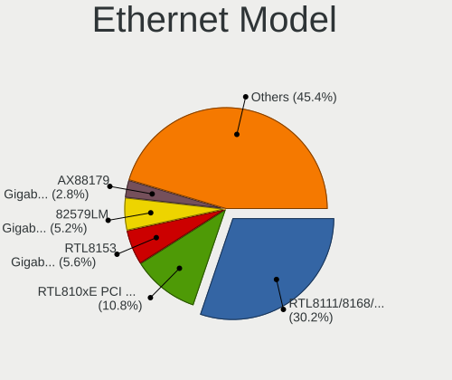

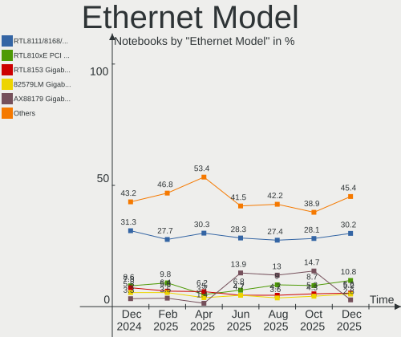

| Model                                                                           | Notebooks | Percent |
|---------------------------------------------------------------------------------|-----------|---------|
| Realtek RTL8111/8168/8211/8411 PCI Express Gigabit Ethernet Controller          | 151       | 30.2%   |
| Realtek RTL810xE PCI Express Fast Ethernet controller                           | 54        | 10.8%   |
| Realtek RTL8153 Gigabit Ethernet Adapter                                        | 28        | 5.6%    |
| Intel 82579LM Gigabit Network Connection (Lewisville)                           | 26        | 5.2%    |
| ASIX AX88179 Gigabit Ethernet                                                   | 14        | 2.8%    |
| Intel Ethernet Connection (4) I219-LM                                           | 11        | 2.2%    |
| Realtek RTL8125 2.5GbE Controller                                               | 10        | 2%      |
| Broadcom NetXtreme BCM57765 Gigabit Ethernet PCIe                               | 10        | 2%      |
| Intel Ethernet Connection (7) I219-LM                                           | 9         | 1.8%    |
| Intel Ethernet Connection I217-LM                                               | 8         | 1.6%    |
| Intel Ethernet Connection I219-LM                                               | 7         | 1.4%    |
| Realtek Killer E2600 GbE Controller                                             | 6         | 1.2%    |
| MediaTek MT7925 802.11be 160MHz 2x2 PCIe Wireless Network Adapter [Filogic 360] | 6         | 1.2%    |
| Intel Ethernet Connection (18) I219-LM                                          | 6         | 1.2%    |
| Intel Alder Lake-P PCH CNVi WiFi                                                | 6         | 1.2%    |
| Intel Ethernet Controller I226-V                                                | 5         | 1%      |
| Intel Ethernet Connection (6) I219-LM                                           | 5         | 1%      |
| Intel Ethernet Connection (3) I218-LM                                           | 5         | 1%      |
| Intel Ethernet Connection (2) I219-LM                                           | 5         | 1%      |
| Intel Arrow Lake CNVi WiFi                                                      | 5         | 1%      |
| Realtek RTL8152 Fast Ethernet Adapter                                           | 4         | 0.8%    |
| Realtek Killer E3000 2.5GbE Controller                                          | 4         | 0.8%    |
| Intel Ethernet Connection I218-LM                                               | 4         | 0.8%    |
| Intel Ethernet Connection (13) I219-V                                           | 4         | 0.8%    |
| Broadcom NetXtreme BCM5764M Gigabit Ethernet PCIe                               | 4         | 0.8%    |
| Samsung Galaxy series, misc. (tethering mode)                                   | 3         | 0.6%    |
| Realtek USB 10/100/1G/2.5 LAN                                                   | 3         | 0.6%    |
| Qualcomm Atheros AR8161 Gigabit Ethernet                                        | 3         | 0.6%    |
| Nvidia MCP79 Ethernet                                                           | 3         | 0.6%    |
| Intel Wi-Fi 7(802.11be) AX1775*/AX1790*/BE20*/BE401/BE1750* 2x2                 | 3         | 0.6%    |
| Intel Ethernet Connection I219-V                                                | 3         | 0.6%    |
| Intel Ethernet Connection (16) I219-LM                                          | 3         | 0.6%    |
| Intel Ethernet Connection (11) I219-LM                                          | 3         | 0.6%    |
| Intel Ethernet Connection (10) I219-V                                           | 3         | 0.6%    |
| Intel BE201 320MHz                                                              | 3         | 0.6%    |
| Realtek RTL8852CE PCIe 802.11ax Wireless Network Controller                     | 2         | 0.4%    |
| Realtek Killer E2500 Gigabit Ethernet Controller                                | 2         | 0.4%    |
| Qualcomm Atheros QCA8171 Gigabit Ethernet                                       | 2         | 0.4%    |
| Qualcomm Atheros Killer E2500 Gigabit Ethernet Controller                       | 2         | 0.4%    |
| MediaTek MT7922 802.11ax PCI Express Wireless Network Adapter                   | 2         | 0.4%    |

Net Controller Kind
-------------------

Ethernet, WiFi or modem

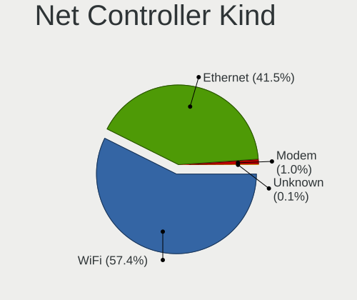

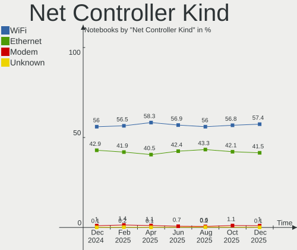

| Kind     | Notebooks | Percent |
|----------|-----------|---------|
| WiFi     | 623       | 57.37%  |
| Ethernet | 451       | 41.53%  |
| Modem    | 11        | 1.01%   |
| Unknown  | 1         | 0.09%   |

Used Controller
---------------

Currently used network controller

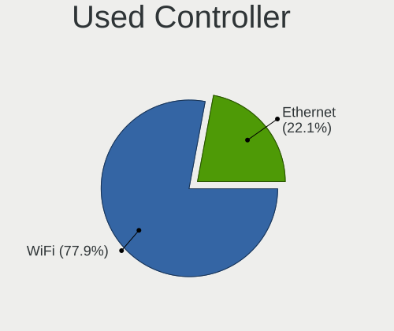

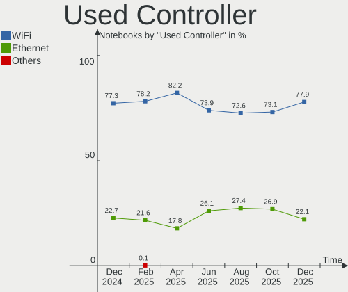

| Kind     | Notebooks | Percent |
|----------|-----------|---------|
| WiFi     | 526       | 77.93%  |
| Ethernet | 149       | 22.07%  |

NICs
----

Total network controllers on board

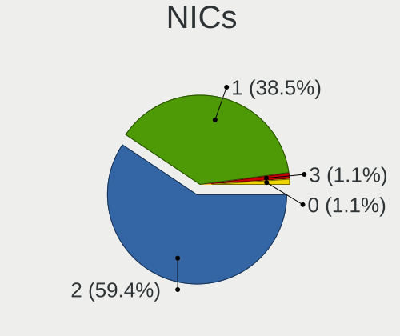

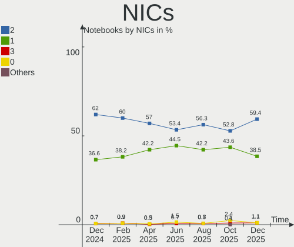

| Total | Notebooks | Percent |
|-------|-----------|---------|
| 2     | 392       | 59.39%  |
| 1     | 254       | 38.48%  |
| 3     | 7         | 1.06%   |
| 0     | 7         | 1.06%   |

IPv6
----

IPv6 vs IPv4

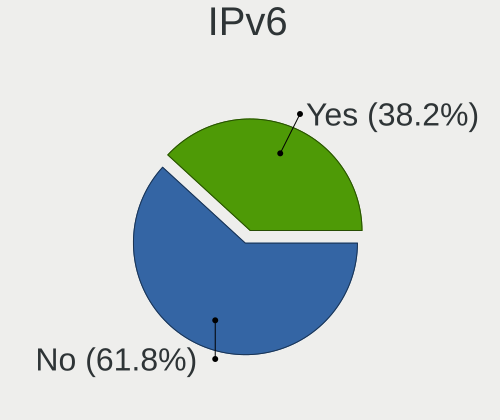

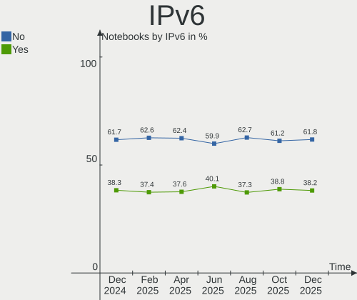

| Used | Notebooks | Percent |
|------|-----------|---------|
| No   | 408       | 61.82%  |
| Yes  | 252       | 38.18%  |

Bluetooth
---------

Bluetooth Vendor
----------------

Controller vendors

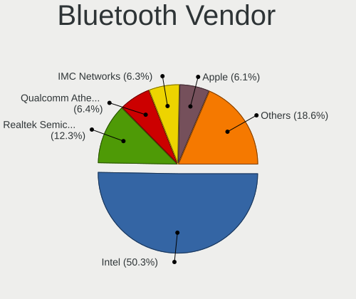

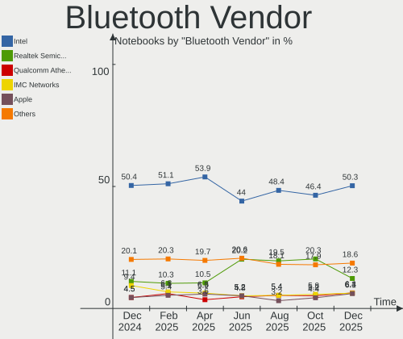

| Vendor                          | Notebooks | Percent |
|---------------------------------|-----------|---------|
| Intel                           | 281       | 50.27%  |
| Realtek Semiconductor           | 69        | 12.34%  |
| Qualcomm Atheros Communications | 36        | 6.44%   |
| IMC Networks                    | 35        | 6.26%   |
| Apple                           | 34        | 6.08%   |
| Foxconn / Hon Hai               | 32        | 5.72%   |
| MediaTek                        | 28        | 5.01%   |
| Broadcom                        | 13        | 2.33%   |
| Lite-On Technology              | 10        | 1.79%   |
| Toshiba                         | 6         | 1.07%   |
| Dell                            | 6         | 1.07%   |
| USI                             | 2         | 0.36%   |
| Hewlett-Packard                 | 2         | 0.36%   |
| Cambridge Silicon Radio         | 2         | 0.36%   |
| TP-Link                         | 1         | 0.18%   |
| ASUSTek Computer                | 1         | 0.18%   |
| Actions                         | 1         | 0.18%   |

Bluetooth Model
---------------

Controller models

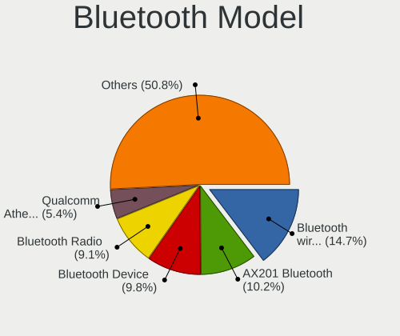

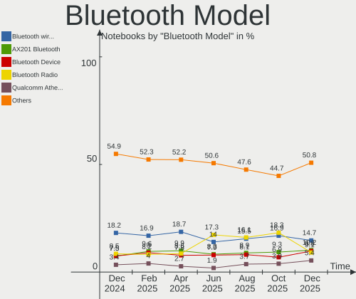

| Model                                               | Notebooks | Percent |
|-----------------------------------------------------|-----------|---------|
| Intel Bluetooth wireless interface                  | 82        | 14.67%  |
| Intel AX201 Bluetooth                               | 57        | 10.2%   |
| Intel Bluetooth Device                              | 55        | 9.84%   |
| Realtek Bluetooth Radio                             | 51        | 9.12%   |
| Qualcomm Atheros  Bluetooth Device                  | 30        | 5.37%   |
| MediaTek Wireless_Device                            | 28        | 5.01%   |
| Intel AX200 Bluetooth                               | 22        | 3.94%   |
| Intel Bluetooth 9460/9560 Jefferson Peak (JfP)      | 21        | 3.76%   |
| Intel AX210 Bluetooth                               | 19        | 3.4%    |
| IMC Networks Wireless_Device                        | 19        | 3.4%    |
| Apple Bluetooth Host Controller                     | 18        | 3.22%   |
| Foxconn / Hon Hai Wireless_Device                   | 15        | 2.68%   |
| Apple Bluetooth USB Host Controller                 | 14        | 2.5%    |
| IMC Networks Bluetooth Radio                        | 13        | 2.33%   |
| Realtek  Bluetooth 4.2 Adapter                      | 11        | 1.97%   |
| Intel Wireless-AC 9260 Bluetooth Adapter            | 10        | 1.79%   |
| Foxconn / Hon Hai Bluetooth Device                  | 7         | 1.25%   |
| Intel Centrino Bluetooth Wireless Transceiver       | 5         | 0.89%   |
| Intel Bluetooth                                     | 5         | 0.89%   |
| Toshiba BCM43142A0                                  | 4         | 0.72%   |
| Qualcomm Atheros AR9462 Bluetooth                   | 4         | 0.72%   |
| Foxconn / Hon Hai MediaTek Bluetooth Adapter        | 4         | 0.72%   |
| Realtek 802.11ac WLAN Adapter                       | 3         | 0.54%   |
| Lite-On Wireless_Device                             | 3         | 0.54%   |
| Intel Wireless-AC 3168 Bluetooth                    | 3         | 0.54%   |
| Broadcom HP Portable SoftSailing                    | 3         | 0.54%   |
| USI Bluetooth Device                                | 2         | 0.36%   |
| Toshiba Bluetooth Device                            | 2         | 0.36%   |
| Realtek RTL8723B Bluetooth                          | 2         | 0.36%   |
| Lite-On Bluetooth Radio                             | 2         | 0.36%   |
| Lite-On Atheros AR3012 Bluetooth                    | 2         | 0.36%   |
| Intel Centrino Advanced-N 6230 Bluetooth adapter    | 2         | 0.36%   |
| IMC Networks BCM20702A0                             | 2         | 0.36%   |
| HP Broadcom 2070 Bluetooth Combo                    | 2         | 0.36%   |
| Foxconn / Hon Hai MediaTek MT7921 Bluetooth         | 2         | 0.36%   |
| Dell Wireless 370 Bluetooth Mini-card               | 2         | 0.36%   |
| Dell BCM20702A0 Bluetooth Module                    | 2         | 0.36%   |
| Cambridge Silicon Radio Bluetooth Dongle (HCI mode) | 2         | 0.36%   |
| Broadcom BCM20702A0                                 | 2         | 0.36%   |
| Broadcom BCM20702 Bluetooth 4.0 [ThinkPad]          | 2         | 0.36%   |

Sound
-----

Sound Vendor
------------

Sound card vendors

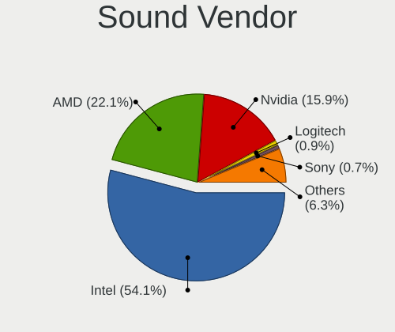

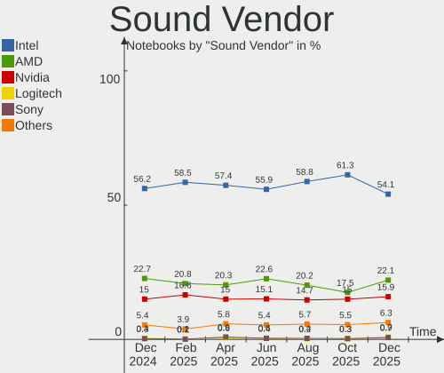

| Vendor                                       | Notebooks | Percent |
|----------------------------------------------|-----------|---------|
| Intel                                        | 466       | 54.12%  |
| AMD                                          | 190       | 22.07%  |
| Nvidia                                       | 137       | 15.91%  |
| Logitech                                     | 8         | 0.93%   |
| Sony                                         | 6         | 0.7%    |
| Texas Instruments                            | 5         | 0.58%   |
| SteelSeries ApS                              | 4         | 0.46%   |
| Hewlett-Packard                              | 4         | 0.46%   |
| C-Media Electronics                          | 4         | 0.46%   |
| Realtek Semiconductor                        | 3         | 0.35%   |
| ASUSTek Computer                             | 3         | 0.35%   |
| Lenovo                                       | 2         | 0.23%   |
| Generalplus Technology                       | 2         | 0.23%   |
| DisplayLink                                  | 2         | 0.23%   |
| Corsair                                      | 2         | 0.23%   |
| Apple                                        | 2         | 0.23%   |
| Zoran Co. Personal Media Division (Nogatech) | 1         | 0.12%   |
| Walmart                                      | 1         | 0.12%   |
| Turtle Beach                                 | 1         | 0.12%   |
| THI Headphone                                | 1         | 0.12%   |
| Shure                                        | 1         | 0.12%   |
| ShenZhen Maono Technology                    | 1         | 0.12%   |
| Samson Technologies                          | 1         | 0.12%   |
| Razer USA                                    | 1         | 0.12%   |
| PreSonus Audio Electronics                   | 1         | 0.12%   |
| Nacon                                        | 1         | 0.12%   |
| Micro Star International                     | 1         | 0.12%   |
| Maono                                        | 1         | 0.12%   |
| KTMicro                                      | 1         | 0.12%   |
| Huawei Technologies                          | 1         | 0.12%   |
| FIFINE Microphones                           | 1         | 0.12%   |
| Drop                                         | 1         | 0.12%   |
| Dell                                         | 1         | 0.12%   |
| Cooler Master                                | 1         | 0.12%   |
| BEHRINGER International                      | 1         | 0.12%   |
| Audio-Technica                               | 1         | 0.12%   |
| Audeze                                       | 1         | 0.12%   |

Sound Model
-----------

Sound card models

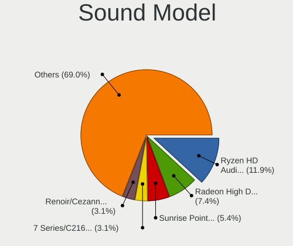

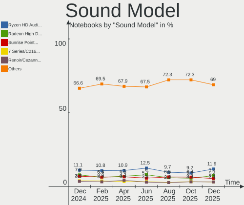

| Model                                                                      | Notebooks | Percent |
|----------------------------------------------------------------------------|-----------|---------|
| AMD Ryzen HD Audio Controller                                              | 129       | 11.86%  |
| AMD Radeon High Definition Audio Controller                                | 81        | 7.44%   |
| Intel Sunrise Point-LP HD Audio                                            | 59        | 5.42%   |
| Intel 7 Series/C216 Chipset Family High Definition Audio Controller        | 34        | 3.13%   |
| AMD Renoir/Cezanne HDMI/DP Audio Controller                                | 34        | 3.13%   |
| Intel Tiger Lake-LP Smart Sound Technology Audio Controller                | 31        | 2.85%   |
| Intel Wildcat Point-LP High Definition Audio Controller                    | 30        | 2.76%   |
| Intel Broadwell-U Audio Controller                                         | 30        | 2.76%   |
| Intel Meteor Lake-P HD Audio Controller                                    | 25        | 2.3%    |
| AMD Raven/Raven2/Fenghuang HDMI/DP Audio Controller                        | 25        | 2.3%    |
| Intel Cannon Lake PCH cAVS                                                 | 24        | 2.21%   |
| Intel 6 Series/C200 Series Chipset Family High Definition Audio Controller | 24        | 2.21%   |
| Intel 8 Series/C220 Series Chipset High Definition Audio Controller        | 23        | 2.11%   |
| AMD FCH Azalia Controller                                                  | 21        | 1.93%   |
| Intel Alder Lake PCH-P High Definition Audio Controller                    | 20        | 1.84%   |
| Nvidia AD107 High Definition Audio Controller                              | 19        | 1.75%   |
| Intel Xeon E3-1200 v3/4th Gen Core Processor HD Audio Controller           | 16        | 1.47%   |
| Intel Raptor Lake-P/U/H cAVS                                               | 16        | 1.47%   |
| Intel Haswell-ULT HD Audio Controller                                      | 15        | 1.38%   |
| Intel Comet Lake PCH cAVS                                                  | 15        | 1.38%   |
| Intel 8 Series HD Audio Controller                                         | 15        | 1.38%   |
| AMD Kabini HDMI/DP Audio                                                   | 14        | 1.29%   |
| Intel Tiger Lake-H HD Audio Controller                                     | 12        | 1.1%    |
| Intel Cannon Point-LP High Definition Audio Controller                     | 11        | 1.01%   |
| Intel Alder Lake-N PCH High Definition Audio Controller                    | 11        | 1.01%   |
| Intel 800 Series ACE (Audio Context Engine)                                | 11        | 1.01%   |
| Intel 100 Series/C230 Series Chipset Family HD Audio Controller            | 11        | 1.01%   |
| Nvidia TU107 GeForce GTX 1650 High Definition Audio Controller             | 10        | 0.92%   |
| Nvidia GB206 High Definition Audio Controller                              | 10        | 0.92%   |
| Nvidia GA104 High Definition Audio Controller                              | 10        | 0.92%   |
| Intel Lunar Lake-M HD Audio Controller                                     | 10        | 0.92%   |
| Intel Comet Lake PCH-LP cAVS                                               | 9         | 0.83%   |
| Intel Celeron/Pentium Silver Processor High Definition Audio               | 9         | 0.83%   |
| Nvidia GP107GL High Definition Audio Controller                            | 8         | 0.74%   |
| Nvidia GA107 High Definition Audio Controller                              | 8         | 0.74%   |
| Intel Arrow Lake cAVS                                                      | 8         | 0.74%   |
| Intel Raptor Lake High Definition Audio Controller                         | 7         | 0.64%   |
| Intel Ice Lake-LP Smart Sound Technology Audio Controller                  | 7         | 0.64%   |
| Intel CM238 HD Audio Controller                                            | 7         | 0.64%   |
| AMD Trinity HDMI Audio Controller                                          | 7         | 0.64%   |

Memory
------

Memory Vendor
-------------

Memory module vendors

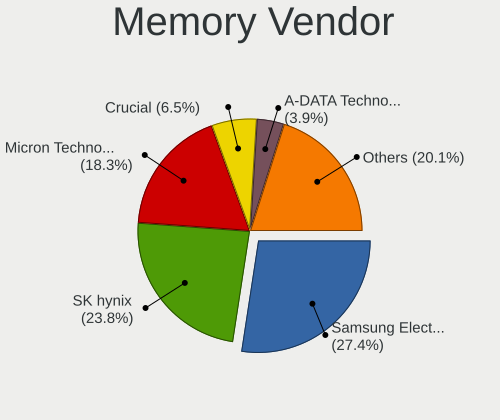

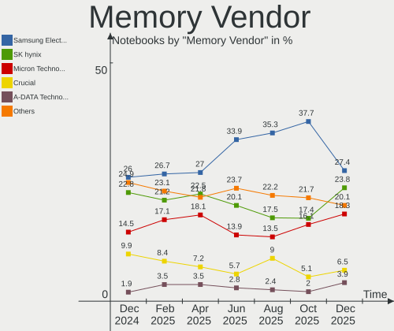

| Vendor                               | Notebooks | Percent |
|--------------------------------------|-----------|---------|
| Samsung Electronics                  | 105       | 27.42%  |
| SK hynix                             | 91        | 23.76%  |
| Micron Technology                    | 70        | 18.28%  |
| Crucial                              | 25        | 6.53%   |
| A-DATA Technology                    | 15        | 3.92%   |
| Unknown                              | 14        | 3.66%   |
| Ramaxel Technology                   | 13        | 3.39%   |
| Kingston                             | 11        | 2.87%   |
| Unknown                              | 6         | 1.57%   |
| Unknown (ABCD)                       | 3         | 0.78%   |
| Nanya Technology                     | 3         | 0.78%   |
| Corsair                              | 3         | 0.78%   |
| Timetec                              | 2         | 0.52%   |
| Team                                 | 2         | 0.52%   |
| Silicon Power                        | 2         | 0.52%   |
| Patriot                              | 2         | 0.52%   |
| G.Skill                              | 2         | 0.52%   |
| Elpida                               | 2         | 0.52%   |
| Unknown (0x0E9D)                     | 1         | 0.26%   |
| Unknown (0x0BEC)                     | 1         | 0.26%   |
| PNY                                  | 1         | 0.26%   |
| Neo Forza                            | 1         | 0.26%   |
| KingFast                             | 1         | 0.26%   |
| GOODRAM                              | 1         | 0.26%   |
| ff                                   | 1         | 0.26%   |
| Chun Well Technology Holding Limited | 1         | 0.26%   |
| ASint Technology                     | 1         | 0.26%   |
| AMD                                  | 1         | 0.26%   |
| 4ea5                                 | 1         | 0.26%   |
| 2B0B00000000                         | 1         | 0.26%   |

Memory Model
------------

Memory module models

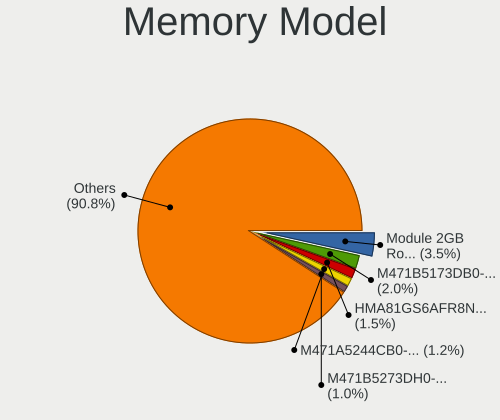

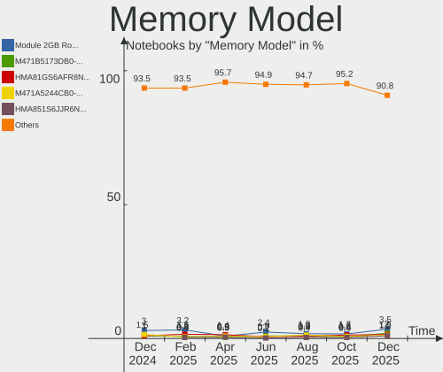

| Model                                                            | Notebooks | Percent |
|------------------------------------------------------------------|-----------|---------|
| Unknown                                                          | 14        | 3.47%   |
| Samsung RAM M471B5173DB0-YK0 4GB SODIMM DDR3 1600MT/s            | 8         | 1.98%   |
| SK hynix RAM HMA81GS6AFR8N-UH 8GB SODIMM DDR4 2667MT/s           | 6         | 1.49%   |
| Samsung RAM M471A5244CB0-CWE 4GB SODIMM DDR4 3200MT/s            | 5         | 1.24%   |
| SK hynix RAM HMA851S6JJR6N-VK 4GB SODIMM DDR4 2667MT/s           | 4         | 0.99%   |
| SK hynix RAM HMA81GS6CJR8N-VK 8GB SODIMM DDR4 2667MT/s           | 4         | 0.99%   |
| Samsung RAM M471B5273DH0-CH9 4GB SODIMM DDR3 1600MT/s            | 4         | 0.99%   |
| Samsung RAM M471A1K43BB1-CRC 8GB SODIMM DDR4 2667MT/s            | 4         | 0.99%   |
| Samsung RAM M471A1G44AB0-CWE 8GiB SODIMM DDR4 3200MT/s           | 4         | 0.99%   |
| Micron RAM 4ATF1G64HZ-3G2F1 8GB SODIMM DDR4 3200MT/s             | 4         | 0.99%   |
| Crucial RAM CT32G4SFD832A.M16FF 32GB SODIMM DDR4 3200MT/s        | 4         | 0.99%   |
| A-DATA RAM AD5S560032G-SFW 32GB SODIMM DDR5 5600MT/s             | 4         | 0.99%   |
| Unknown (ABCD) RAM 123456789012345678 2GB SODIMM LPDDR4 2400MT/s | 3         | 0.74%   |
| SK hynix RAM HMCG78AGBSA095N 16GB SODIMM DDR5 5600MT/s           | 3         | 0.74%   |
| SK hynix RAM HMA82GS6AFR8N-UH 16GB SODIMM DDR4 2667MT/s          | 3         | 0.74%   |
| SK hynix RAM HMA41GS6AFR8N-TF 8GB SODIMM DDR4 2667MT/s           | 3         | 0.74%   |
| Samsung RAM K4E8E324EB-EGCF 2GB LPDDR3 1867MT/s                  | 3         | 0.74%   |
| Micron RAM MTC4C10163S1SC56BD1 8GB SODIMM DDR5 5600MT/s          | 3         | 0.74%   |
| Micron RAM Module 4GB Row Of Chips LPDDR5 8533MT/s               | 3         | 0.74%   |
| Unknown RAM Module 8GB SODIMM DDR3 1600MT/s                      | 2         | 0.5%    |
| SK hynix RAM Module 4GB SODIMM DDR3 1600MT/s                     | 2         | 0.5%    |
| SK hynix RAM HMT451S6BFR8A-PB 4GB SODIMM DDR3 1600MT/s           | 2         | 0.5%    |
| SK hynix RAM HMT451S6AFR8A-PB 4GB SODIMM DDR3 1600MT/s           | 2         | 0.5%    |
| SK hynix RAM HMT425S6AFR6A-PB 2GB SODIMM DDR3 3200MT/s           | 2         | 0.5%    |
| SK hynix RAM HMT41GS6BFR8A-PB 8GB SODIMM DDR3 1600MT/s           | 2         | 0.5%    |
| SK hynix RAM HMT351S6EFR8A-PB 4GB SODIMM DDR3 1600MT/s           | 2         | 0.5%    |
| SK hynix RAM HMCG88AGBSA095N 32GB SODIMM DDR5 5600MT/s           | 2         | 0.5%    |
| SK hynix RAM HMAG68EXNSA051N 8GB SODIMM DDR4 3200MT/s            | 2         | 0.5%    |
| SK hynix RAM HMA81GS6MFR8N-UH 8GB SODIMM DDR4 2400MT/s           | 2         | 0.5%    |
| SK hynix RAM H9JCNNNCP3MLYR-N6E 4GB SODIMM LPDDR5 6400MT/s       | 2         | 0.5%    |
| SK hynix RAM H9JCNNNBK3MLYR-N6E 1GB Row Of Chips LPDDR5 6400MT/s | 2         | 0.5%    |
| Samsung RAM Module 8GB Row Of Chips LPDDR3 2133MT/s              | 2         | 0.5%    |
| Samsung RAM Module 4GB Row Of Chips LPDDR5 8533MT/s              | 2         | 0.5%    |
| Samsung RAM M471B5273CH0-CH9 4GB SODIMM DDR3 1334MT/s            | 2         | 0.5%    |
| Samsung RAM M471B5173QH0-YK0 4GB SODIMM DDR3 1600MT/s            | 2         | 0.5%    |
| Samsung RAM M471B1G73EB0-YK0 8192MB SODIMM DDR3 1600MT/s         | 2         | 0.5%    |
| Samsung RAM M471B1G73DB0-YK0 8GB SODIMM DDR3 1600MT/s            | 2         | 0.5%    |
| Samsung RAM M471A5244CB0-CTD 4GB SODIMM DDR4 3266MT/s            | 2         | 0.5%    |
| Samsung RAM M471A2K43DB1-CTD 16GB SODIMM DDR4 2667MT/s           | 2         | 0.5%    |
| Samsung RAM M471A2K43CB1-CTD 16GB SODIMM DDR4 8400MT/s           | 2         | 0.5%    |

Memory Kind
-----------

Memory module kinds

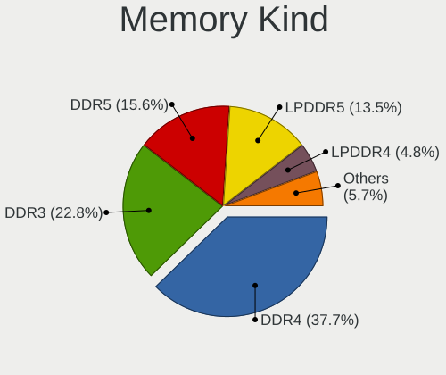

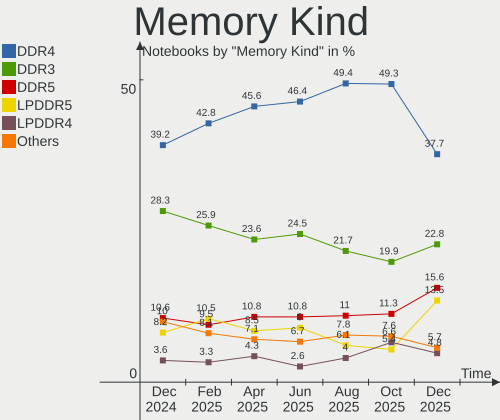

| Kind   | Notebooks | Percent |
|--------|-----------|---------|
| DDR4   | 126       | 37.72%  |
| DDR3   | 76        | 22.75%  |
| DDR5   | 52        | 15.57%  |
| LPDDR5 | 45        | 13.47%  |
| LPDDR4 | 16        | 4.79%   |
| LPDDR3 | 14        | 4.19%   |
| DDR2   | 2         | 0.6%    |
| SDRAM  | 1         | 0.3%    |
| DRAM   | 1         | 0.3%    |
| DDR    | 1         | 0.3%    |

Memory Form Factor
------------------

Physical design of the memory module

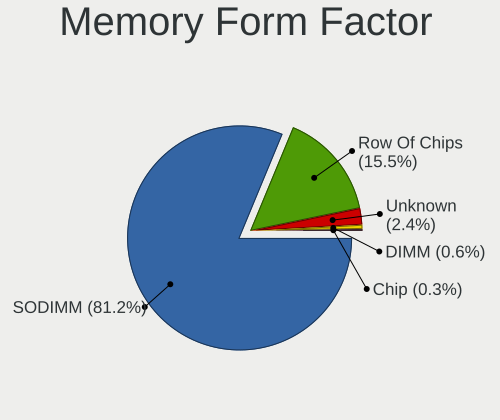

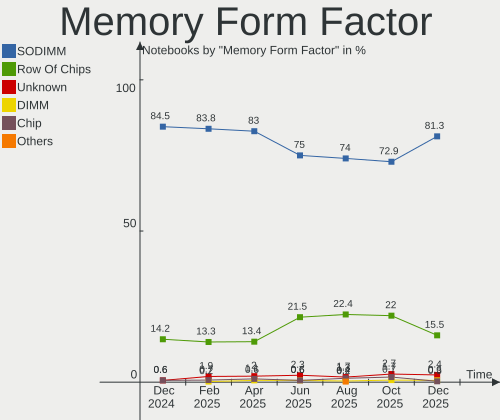

| Name         | Notebooks | Percent |
|--------------|-----------|---------|
| SODIMM       | 273       | 81.25%  |
| Row Of Chips | 52        | 15.48%  |
| Unknown      | 8         | 2.38%   |
| DIMM         | 2         | 0.6%    |
| Chip         | 1         | 0.3%    |

Memory Size
-----------

Memory module size

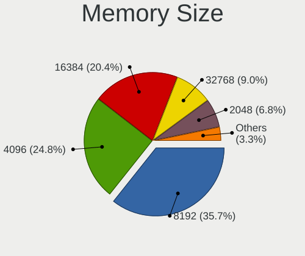

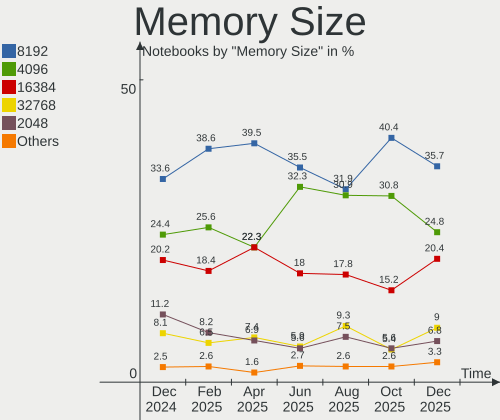

| Size  | Notebooks | Percent |
|-------|-----------|---------|
| 8192  | 131       | 35.69%  |
| 4096  | 91        | 24.8%   |
| 16384 | 75        | 20.44%  |
| 32768 | 33        | 8.99%   |
| 2048  | 25        | 6.81%   |
| 49152 | 5         | 1.36%   |
| 1024  | 4         | 1.09%   |
| 65536 | 2         | 0.54%   |
| 3072  | 1         | 0.27%   |

Memory Speed
------------

Memory module speed

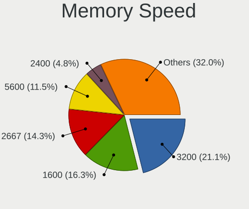

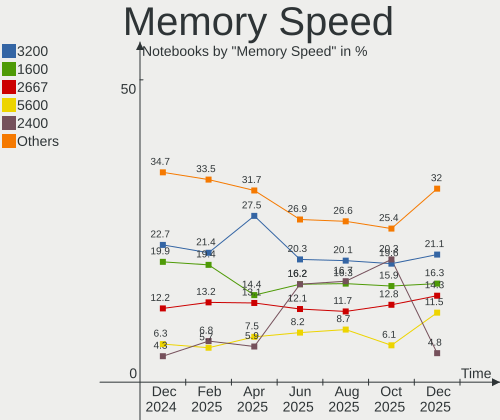

| Speed   | Notebooks | Percent |
|---------|-----------|---------|
| 3200    | 75        | 21.07%  |
| 1600    | 58        | 16.29%  |
| 2667    | 51        | 14.33%  |
| 5600    | 41        | 11.52%  |
| 2400    | 17        | 4.78%   |
| 6400    | 15        | 4.21%   |
| 7500    | 14        | 3.93%   |
| 8533    | 11        | 3.09%   |
| 2133    | 11        | 3.09%   |
| 1334    | 9         | 2.53%   |
| 4267    | 7         | 1.97%   |
| 1867    | 6         | 1.69%   |
| 1333    | 6         | 1.69%   |
| 4800    | 5         | 1.4%    |
| 4266    | 5         | 1.4%    |
| 1067    | 4         | 1.12%   |
| 8400    | 3         | 0.84%   |
| 7467    | 3         | 0.84%   |
| 5200    | 2         | 0.56%   |
| 3266    | 2         | 0.56%   |
| 800     | 2         | 0.56%   |
| Unknown | 2         | 0.56%   |
| 8448    | 1         | 0.28%   |
| 8000    | 1         | 0.28%   |
| 7400    | 1         | 0.28%   |
| 6000    | 1         | 0.28%   |
| 4199    | 1         | 0.28%   |
| 975     | 1         | 0.28%   |
| 667     | 1         | 0.28%   |

Printers & scanners
-------------------

Printer Vendor
--------------

Printer device vendors

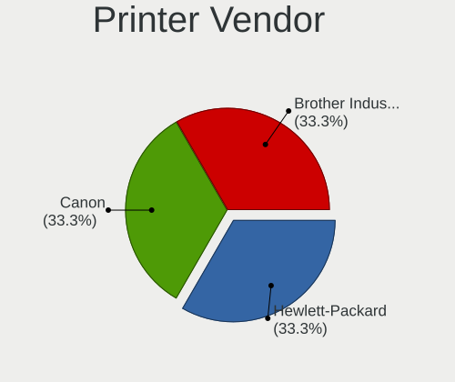

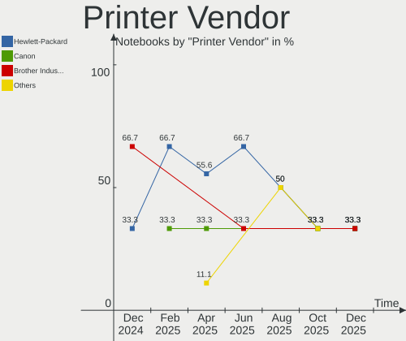

| Vendor             | Notebooks | Percent |
|--------------------|-----------|---------|
| Hewlett-Packard    | 2         | 33.33%  |
| Canon              | 2         | 33.33%  |
| Brother Industries | 2         | 33.33%  |

Printer Model
-------------

Printer device models

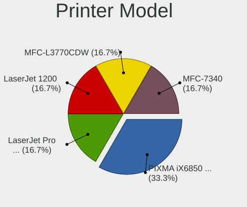

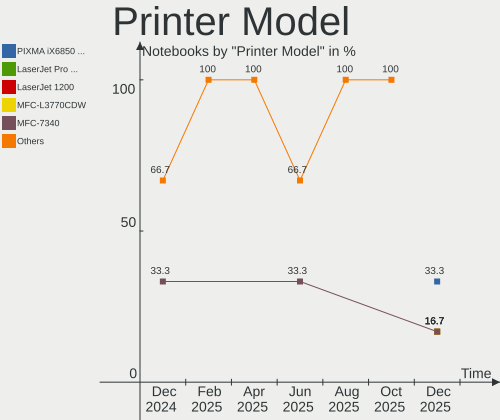

| Model                      | Notebooks | Percent |
|----------------------------|-----------|---------|
| Canon PIXMA iX6850 Printer | 2         | 33.33%  |
| HP LaserJet Pro 4001       | 1         | 16.67%  |
| HP LaserJet 1200           | 1         | 16.67%  |
| Brother MFC-L3770CDW       | 1         | 16.67%  |
| Brother MFC-7340           | 1         | 16.67%  |

Scanner Vendor
--------------

Scanner device vendors

Zero info for selected period =(

Scanner Model
-------------

Scanner device models

Zero info for selected period =(

Camera
------

Camera Vendor
-------------

Camera device vendors

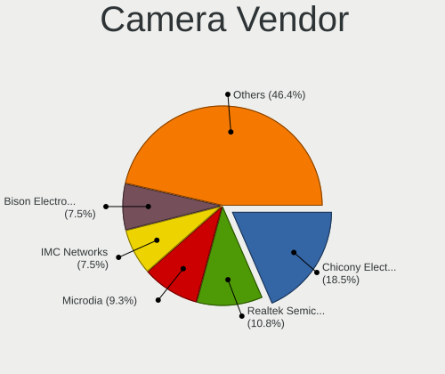

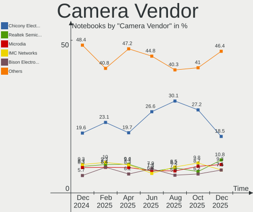

| Vendor                                 | Notebooks | Percent |
|----------------------------------------|-----------|---------|
| Chicony Electronics                    | 103       | 18.46%  |
| Realtek Semiconductor                  | 60        | 10.75%  |
| Microdia                               | 52        | 9.32%   |
| IMC Networks                           | 42        | 7.53%   |
| Bison Electronics                      | 42        | 7.53%   |
| Quanta                                 | 40        | 7.17%   |
| Luxvisions Innotech Limited            | 32        | 5.73%   |
| Sunplus Innovation Technology          | 31        | 5.56%   |
| Apple                                  | 22        | 3.94%   |
| Syntek                                 | 21        | 3.76%   |
| Suyin                                  | 16        | 2.87%   |
| Cheng Uei Precision Industry (Foxlink) | 15        | 2.69%   |
| Shinetech                              | 11        | 1.97%   |
| Sonix Technology                       | 9         | 1.61%   |
| Lite-On Technology                     | 8         | 1.43%   |
| Framework                              | 8         | 1.43%   |
| Logitech                               | 7         | 1.25%   |
| Silicon Motion                         | 3         | 0.54%   |
| Samsung Electronics                    | 3         | 0.54%   |
| kingcome                               | 3         | 0.54%   |
| icSpring                               | 3         | 0.54%   |
| Tobii Technology AB                    | 2         | 0.36%   |
| Ricoh                                  | 2         | 0.36%   |
| Primax Electronics                     | 2         | 0.36%   |
| Microsoft                              | 2         | 0.36%   |
| Alcor Micro                            | 2         | 0.36%   |
| Acer                                   | 2         | 0.36%   |
| SunplusIT                              | 1         | 0.18%   |
| Shine-optics                           | 1         | 0.18%   |
| Razer USA                              | 1         | 0.18%   |
| Lenovo                                 | 1         | 0.18%   |
| Jiangxi Shinetech Optical              | 1         | 0.18%   |
| Intel                                  | 1         | 0.18%   |
| Insta360                               | 1         | 0.18%   |
| Importek                               | 1         | 0.18%   |
| HYGD-220831-A                          | 1         | 0.18%   |
| HY UXGA Camera                         | 1         | 0.18%   |
| HRY                                    | 1         | 0.18%   |
| Generalplus Technology                 | 1         | 0.18%   |
| DigiTech                               | 1         | 0.18%   |

Camera Model
------------

Camera device models

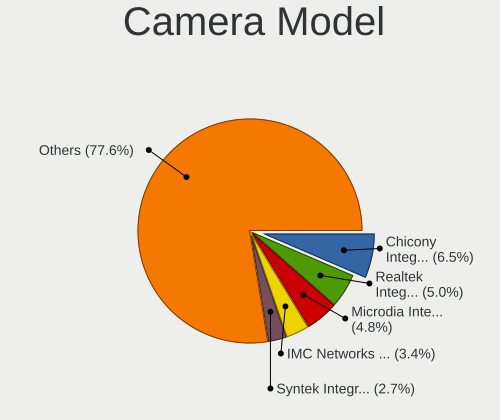

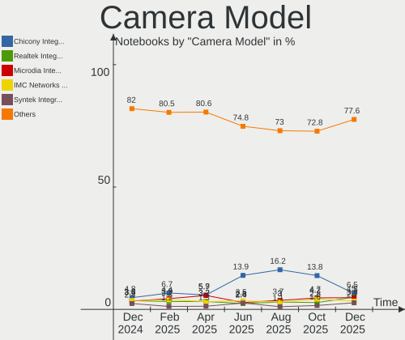

| Model                                                | Notebooks | Percent |
|------------------------------------------------------|-----------|---------|
| Chicony Integrated Camera                            | 36        | 6.45%   |
| Realtek Integrated_Webcam_HD                         | 28        | 5.02%   |
| Microdia Integrated_Webcam_HD                        | 27        | 4.84%   |
| IMC Networks USB2.0 HD UVC WebCam                    | 19        | 3.41%   |
| Syntek Integrated Camera                             | 15        | 2.69%   |
| IMC Networks Integrated Camera                       | 15        | 2.69%   |
| Bison Integrated Camera                              | 15        | 2.69%   |
| Sunplus Integrated_Webcam_HD                         | 11        | 1.97%   |
| Luxvisions Innotech Limited Integrated Camera        | 11        | 1.97%   |
| Realtek Integrated_Webcam_FHD                        | 10        | 1.79%   |
| Apple FaceTime HD Camera                             | 10        | 1.79%   |
| Framework Laptop Webcam Module (2nd Gen)             | 8         | 1.43%   |
| Quanta HP TrueVision HD Camera                       | 7         | 1.25%   |
| Chicony TOSHIBA Web Camera - HD                      | 7         | 1.25%   |
| Suyin HP Truevision HD                               | 6         | 1.08%   |
| Quanta HP HD Camera                                  | 6         | 1.08%   |
| Bison FHD Camera                                     | 6         | 1.08%   |
| Sunplus Integrated_Webcam_FHD                        | 5         | 0.9%    |
| Sonix USB2.0 HD UVC WebCam                           | 5         | 0.9%    |
| Quanta HD User Facing                                | 5         | 0.9%    |
| Quanta Acer FHD User Facing                          | 5         | 0.9%    |
| Luxvisions Innotech Limited HP TrueVision HD Camera  | 5         | 0.9%    |
| Chicony HP Truevision HD camera                      | 5         | 0.9%    |
| Chicony Chicony USB2.0 Camera                        | 5         | 0.9%    |
| Apple Built-in iSight                                | 5         | 0.9%    |
| Suyin Integrated_Webcam_HD                           | 4         | 0.72%   |
| Shinetech USB2.0 FHD UVC WebCam                      | 4         | 0.72%   |
| Quanta HP Wide Vision HD Camera                      | 4         | 0.72%   |
| Quanta ACER HD User Facing                           | 4         | 0.72%   |
| Microdia Integrated Webcam HD                        | 4         | 0.72%   |
| Microdia Integrated Webcam                           | 4         | 0.72%   |
| Luxvisions Innotech Limited HP Wide Vision HD Camera | 4         | 0.72%   |
| Luxvisions Innotech Limited HP True Vision HD Camera | 4         | 0.72%   |
| Lite-On Integrated Camera                            | 4         | 0.72%   |
| Chicony HP HD Camera                                 | 4         | 0.72%   |
| Chicony HD WebCam                                    | 4         | 0.72%   |
| Bison SunplusIT Integrated Camera                    | 4         | 0.72%   |
| Bison HD Webcam                                      | 4         | 0.72%   |
| Apple iPhone 5/5C/5S/6/SE/7/8/X                      | 4         | 0.72%   |
| Sunplus HD WebCam                                    | 3         | 0.54%   |

Security
--------

Fingerprint Vendor
------------------

Fingerprint sensor vendors

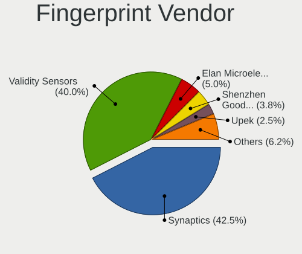

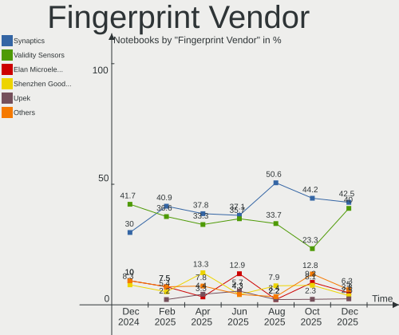

| Vendor                     | Notebooks | Percent |
|----------------------------|-----------|---------|
| Synaptics                  | 34        | 42.5%   |
| Validity Sensors           | 32        | 40%     |
| Elan Microelectronics      | 4         | 5%      |
| Shenzhen Goodix Technology | 3         | 3.75%   |
| Upek                       | 2         | 2.5%    |
| Focal-systems.Corp         | 2         | 2.5%    |
| AuthenTec                  | 2         | 2.5%    |
| LighTuning Technology      | 1         | 1.25%   |

Fingerprint Model
-----------------

Fingerprint sensor models

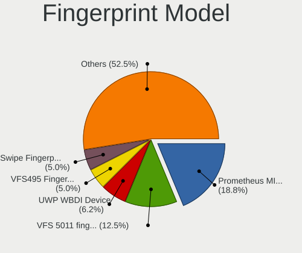

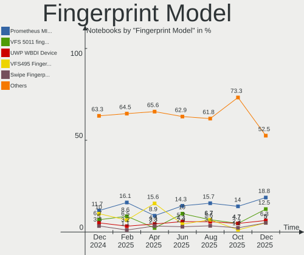

| Model                                                                      | Notebooks | Percent |
|----------------------------------------------------------------------------|-----------|---------|
| Synaptics Prometheus MIS Touch Fingerprint Reader                          | 15        | 18.75%  |
| Validity Sensors VFS 5011 fingerprint sensor                               | 10        | 12.5%   |
| Synaptics UWP WBDI Device                                                  | 5         | 6.25%   |
| Validity Sensors VFS495 Fingerprint Reader                                 | 4         | 5%      |
| Validity Sensors Swipe Fingerprint Sensor                                  | 4         | 5%      |
| Synaptics Prometheus Fingerprint Reader                                    | 4         | 5%      |
| Synaptics FS7604 Touch Fingerprint Sensor with PurePrint                   | 4         | 5%      |
| Validity Sensors VFS491                                                    | 3         | 3.75%   |
| Validity Sensors Synaptics WBDI                                            | 3         | 3.75%   |
| Synaptics Metallica MIS Touch Fingerprint Reader                           | 3         | 3.75%   |
| Validity Sensors VFS7552 Touch Fingerprint Sensor                          | 2         | 2.5%    |
| Validity Sensors VFS7500 Touch Fingerprint Sensor                          | 2         | 2.5%    |
| Validity Sensors Fingerprint scanner                                       | 2         | 2.5%    |
| Upek Biometric Touchchip/Touchstrip Fingerprint Sensor                     | 2         | 2.5%    |
| Synaptics Fingerprint reader [HP G6]                                       | 2         | 2.5%    |
| Shenzhen Goodix  FingerPrint Device                                        | 2         | 2.5%    |
| Focal-systems.Corp FT9201Fingerprint.                                      | 2         | 2.5%    |
| Elan ELAN:Fingerprint                                                      | 2         | 2.5%    |
| Elan ELAN:ARM-M4                                                           | 2         | 2.5%    |
| AuthenTec Fingerprint Sensor                                               | 2         | 2.5%    |
| Validity Sensors VFS471 Fingerprint Reader                                 | 1         | 1.25%   |
| Validity Sensors Synaptics VFS7552 Touch Fingerprint Sensor with PurePrint | 1         | 1.25%   |
| Synaptics  WBDI                                                            | 1         | 1.25%   |
| Shenzhen Goodix FingerPrint                                                | 1         | 1.25%   |
| LighTuning EgisTec Touch Fingerprint Sensor                                | 1         | 1.25%   |

Chipcard Vendor
---------------

Chipcard module vendors

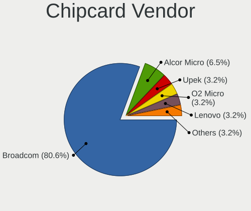

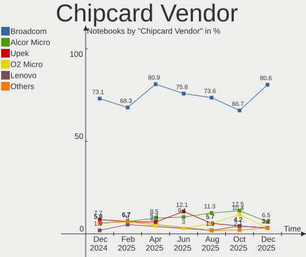

| Vendor                | Notebooks | Percent |
|-----------------------|-----------|---------|
| Broadcom              | 25        | 80.65%  |
| Alcor Micro           | 2         | 6.45%   |
| Upek                  | 1         | 3.23%   |
| O2 Micro              | 1         | 3.23%   |
| Lenovo                | 1         | 3.23%   |
| Gemalto (was Gemplus) | 1         | 3.23%   |

Chipcard Model
--------------

Chipcard module models

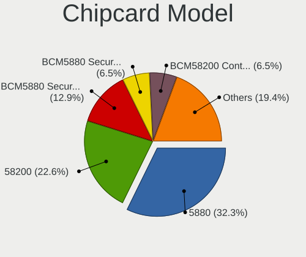

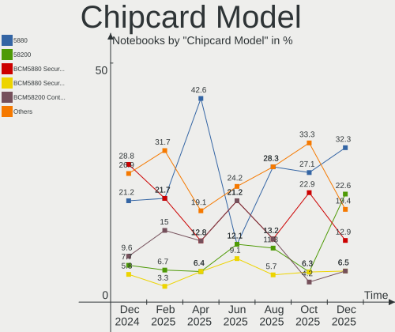

| Model                                                                        | Notebooks | Percent |
|------------------------------------------------------------------------------|-----------|---------|
| Broadcom 5880                                                                | 10        | 32.26%  |
| Broadcom 58200                                                               | 7         | 22.58%  |
| Broadcom BCM5880 Secure Applications Processor                               | 4         | 12.9%   |
| Broadcom BCM5880 Secure Applications Processor with fingerprint swipe sensor | 2         | 6.45%   |
| Broadcom BCM58200 ControlVault 3 (FingerPrint sensor + Contacted SmartCard)  | 2         | 6.45%   |
| Alcor Micro AU9540 Smartcard Reader                                          | 2         | 6.45%   |
| Upek TouchChip Fingerprint Coprocessor (WBF advanced mode)                   | 1         | 3.23%   |
| O2 Micro OZ776 CCID Smartcard Reader                                         | 1         | 3.23%   |
| Lenovo Integrated Smart Card Reader                                          | 1         | 3.23%   |
| Gemalto (was Gemplus) GemPC Twin SmartCard Reader                            | 1         | 3.23%   |

Unsupported
-----------

Unsupported Devices
-------------------

Total unsupported devices on board

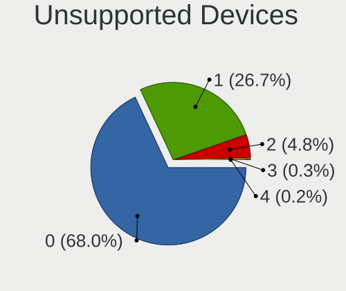

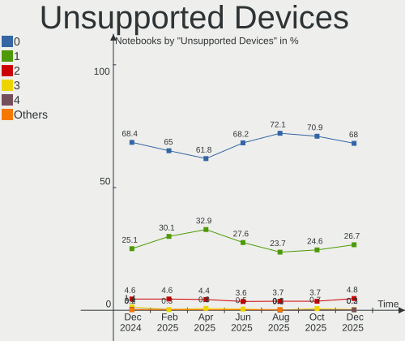

| Total | Notebooks | Percent |
|-------|-----------|---------|
| 0     | 449       | 68.03%  |
| 1     | 176       | 26.67%  |
| 2     | 32        | 4.85%   |
| 3     | 2         | 0.3%    |
| 4     | 1         | 0.15%   |

Unsupported Device Types
------------------------

Types of unsupported devices

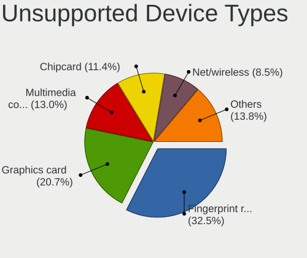

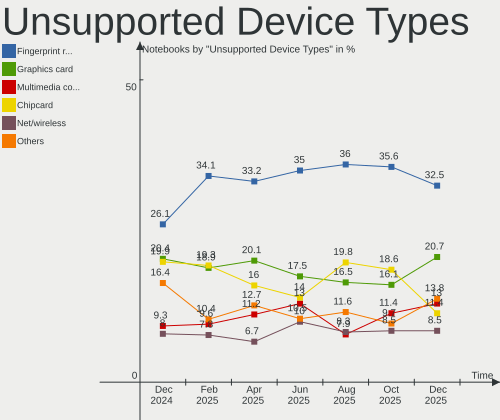

| Type                     | Notebooks | Percent |
|--------------------------|-----------|---------|
| Fingerprint reader       | 80        | 32.52%  |
| Graphics card            | 51        | 20.73%  |
| Multimedia controller    | 32        | 13.01%  |
| Chipcard                 | 28        | 11.38%  |
| Net/wireless             | 21        | 8.54%   |
| Communication controller | 11        | 4.47%   |
| Camera                   | 8         | 3.25%   |
| Storage                  | 5         | 2.03%   |
| Net/ethernet             | 3         | 1.22%   |
| Sound                    | 2         | 0.81%   |
| Bluetooth                | 2         | 0.81%   |
| Unassigned class         | 1         | 0.41%   |
| Modem                    | 1         | 0.41%   |
| Card reader              | 1         | 0.41%   |

