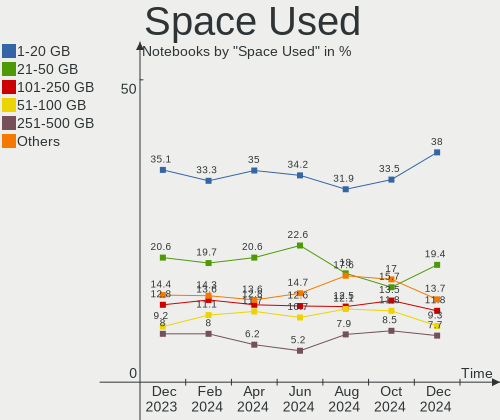
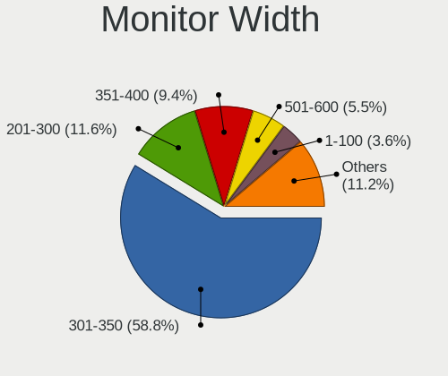
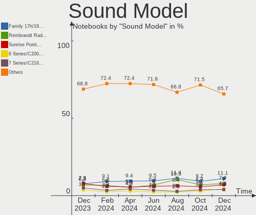
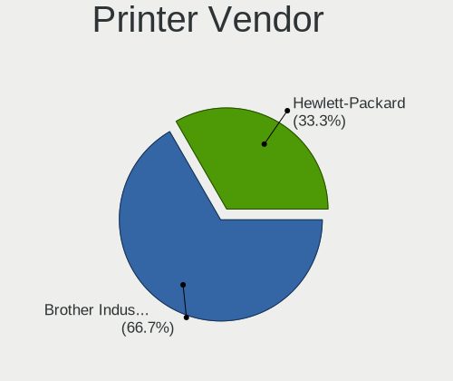

Linux in USA - Hardware Trends (Notebooks)
------------------------------------------

A project to identify most popular hardware characteristics and track their change
over time based on data collected by Linux users at https://Linux-Hardware.org.

Anyone can contribute to this report by the [hw-probe](https://github.com/linuxhw/hw-probe) tool:

    sudo -E hw-probe -all -upload

Contents
--------

* [ System ](#system)
  - [ OS                       ](#os)
  - [ OS Family                ](#os-family)
  - [ Kernel                   ](#kernel)
  - [ Kernel Family            ](#kernel-family)
  - [ Kernel Major Ver.        ](#kernel-major-ver)
  - [ Arch                     ](#arch)
  - [ DE                       ](#de)
  - [ Display Server           ](#display-server)
  - [ Display Manager          ](#display-manager)
  - [ OS Lang                  ](#os-lang)
  - [ Boot Mode                ](#boot-mode)
  - [ Filesystem               ](#filesystem)
  - [ Part. scheme             ](#part-scheme)
  - [ Dual Boot with Linux/BSD ](#dual-boot-with-linuxbsd)
  - [ Dual Boot (Win)          ](#dual-boot-win)

* [ Board ](#board)
  - [ Vendor                   ](#vendor)
  - [ Model                    ](#model)
  - [ Model Family             ](#model-family)
  - [ MFG Year                 ](#mfg-year)
  - [ Form Factor              ](#form-factor)
  - [ Secure Boot              ](#secure-boot)
  - [ Coreboot                 ](#coreboot)
  - [ RAM Size                 ](#ram-size)
  - [ RAM Used                 ](#ram-used)
  - [ Total Drives             ](#total-drives)
  - [ Has CD-ROM               ](#has-cd-rom)
  - [ Has Ethernet             ](#has-ethernet)
  - [ Has WiFi                 ](#has-wifi)
  - [ Has Bluetooth            ](#has-bluetooth)

* [ Location ](#location)
  - [ Country                  ](#country)
  - [ City                     ](#city)

* [ Drives ](#drives)
  - [ Drive Vendor             ](#drive-vendor)
  - [ Drive Model              ](#drive-model)
  - [ HDD Vendor               ](#hdd-vendor)
  - [ SSD Vendor               ](#ssd-vendor)
  - [ Drive Kind               ](#drive-kind)
  - [ Drive Connector          ](#drive-connector)
  - [ Drive Size               ](#drive-size)
  - [ Space Total              ](#space-total)
  - [ Space Used               ](#space-used)
  - [ Malfunc. Drives          ](#malfunc-drives)
  - [ Malfunc. Drive Vendor    ](#malfunc-drive-vendor)
  - [ Malfunc. HDD Vendor      ](#malfunc-hdd-vendor)
  - [ Malfunc. Drive Kind      ](#malfunc-drive-kind)
  - [ Failed Drives            ](#failed-drives)
  - [ Failed Drive Vendor      ](#failed-drive-vendor)
  - [ Drive Status             ](#drive-status)

* [ Storage controller ](#storage-controller)
  - [ Storage Vendor           ](#storage-vendor)
  - [ Storage Model            ](#storage-model)
  - [ Storage Kind             ](#storage-kind)

* [ Processor ](#processor)
  - [ CPU Vendor               ](#cpu-vendor)
  - [ CPU Model                ](#cpu-model)
  - [ CPU Model Family         ](#cpu-model-family)
  - [ CPU Cores                ](#cpu-cores)
  - [ CPU Sockets              ](#cpu-sockets)
  - [ CPU Threads              ](#cpu-threads)
  - [ CPU Op-Modes             ](#cpu-op-modes)
  - [ CPU Microcode            ](#cpu-microcode)
  - [ CPU Microarch            ](#cpu-microarch)

* [ Graphics ](#graphics)
  - [ GPU Vendor               ](#gpu-vendor)
  - [ GPU Model                ](#gpu-model)
  - [ GPU Combo                ](#gpu-combo)
  - [ GPU Driver               ](#gpu-driver)
  - [ GPU Memory               ](#gpu-memory)

* [ Monitor ](#monitor)
  - [ Monitor Vendor           ](#monitor-vendor)
  - [ Monitor Model            ](#monitor-model)
  - [ Monitor Resolution       ](#monitor-resolution)
  - [ Monitor Diagonal         ](#monitor-diagonal)
  - [ Monitor Width            ](#monitor-width)
  - [ Aspect Ratio             ](#aspect-ratio)
  - [ Monitor Area             ](#monitor-area)
  - [ Pixel Density            ](#pixel-density)
  - [ Multiple Monitors        ](#multiple-monitors)

* [ Network ](#network)
  - [ Net Controller Vendor    ](#net-controller-vendor)
  - [ Net Controller Model     ](#net-controller-model)
  - [ Wireless Vendor          ](#wireless-vendor)
  - [ Wireless Model           ](#wireless-model)
  - [ Ethernet Vendor          ](#ethernet-vendor)
  - [ Ethernet Model           ](#ethernet-model)
  - [ Net Controller Kind      ](#net-controller-kind)
  - [ Used Controller          ](#used-controller)
  - [ NICs                     ](#nics)
  - [ IPv6                     ](#ipv6)

* [ Bluetooth ](#bluetooth)
  - [ Bluetooth Vendor         ](#bluetooth-vendor)
  - [ Bluetooth Model          ](#bluetooth-model)

* [ Sound ](#sound)
  - [ Sound Vendor             ](#sound-vendor)
  - [ Sound Model              ](#sound-model)

* [ Memory ](#memory)
  - [ Memory Vendor            ](#memory-vendor)
  - [ Memory Model             ](#memory-model)
  - [ Memory Kind              ](#memory-kind)
  - [ Memory Form Factor       ](#memory-form-factor)
  - [ Memory Size              ](#memory-size)
  - [ Memory Speed             ](#memory-speed)

* [ Printers & scanners ](#printers--scanners)
  - [ Printer Vendor           ](#printer-vendor)
  - [ Printer Model            ](#printer-model)
  - [ Scanner Vendor           ](#scanner-vendor)
  - [ Scanner Model            ](#scanner-model)

* [ Camera ](#camera)
  - [ Camera Vendor            ](#camera-vendor)
  - [ Camera Model             ](#camera-model)

* [ Security ](#security)
  - [ Fingerprint Vendor       ](#fingerprint-vendor)
  - [ Fingerprint Model        ](#fingerprint-model)
  - [ Chipcard Vendor          ](#chipcard-vendor)
  - [ Chipcard Model           ](#chipcard-model)

* [ Unsupported ](#unsupported)
  - [ Unsupported Devices      ](#unsupported-devices)
  - [ Unsupported Device Types ](#unsupported-device-types)

System
------

OS
--

Installed operating systems

| Name                 | Notebooks | Percent |
|----------------------|-----------|---------|
| Debian 11            | 72        | 13.77%  |
| Ubuntu 20.04         | 63        | 12.05%  |
| Fedora 35            | 40        | 7.65%   |
| Pop!_OS 21.10        | 36        | 6.88%   |
| Ubuntu 22.04         | 27        | 5.16%   |
| Linux Mint 20.3      | 27        | 5.16%   |
| KDE neon 20.04       | 20        | 3.82%   |
| Ubuntu 21.10         | 19        | 3.63%   |
| Zorin 16             | 17        | 3.25%   |
| Manjaro              | 14        | 2.68%   |
| OpenMandriva 4.3     | 13        | 2.49%   |
| Arch                 | 11        | 2.1%    |
| Pop!_OS 22.04        | 10        | 1.91%   |
| Fedora 36            | 8         | 1.53%   |
| Xubuntu 20.04        | 7         | 1.34%   |
| LMDE 5               | 7         | 1.34%   |
| Parrot 5.0           | 6         | 1.15%   |
| Arch Rolling         | 6         | 1.15%   |
| Manjaro 21.2.6       | 5         | 0.96%   |
| Manjaro 21.2.5       | 5         | 0.96%   |
| Kubuntu 21.10        | 5         | 0.96%   |
| Fedora 34            | 5         | 0.96%   |
| SteamOS Snapshot     | 4         | 0.76%   |
| Linux Mint 20.2      | 4         | 0.76%   |
| Kubuntu 20.04        | 4         | 0.76%   |
| Elementary 6.1       | 4         | 0.76%   |
| Oracle Linux 8.5     | 3         | 0.57%   |
| Lubuntu 20.04        | 3         | 0.57%   |
| Gentoo 2.6           | 3         | 0.57%   |
| EndeavourOS Rolling  | 3         | 0.57%   |
| EndeavourOS          | 3         | 0.57%   |
| Zorin 15             | 2         | 0.38%   |
| Xero                 | 2         | 0.38%   |
| Ubuntu MATE 21.10    | 2         | 0.38%   |
| Ubuntu 18.04         | 2         | 0.38%   |
| Slackware 15.0       | 2         | 0.38%   |
| Pop!_OS 20.04        | 2         | 0.38%   |
| openSUSE Leap-15.3   | 2         | 0.38%   |
| Lubuntu 21.10        | 2         | 0.38%   |
| Linux Mint 20        | 2         | 0.38%   |
| Linux Mint 19.3      | 2         | 0.38%   |
| Kubuntu 22.04        | 2         | 0.38%   |
| Kali 2022.1          | 2         | 0.38%   |
| Gentoo 2.8           | 2         | 0.38%   |
| Garuda Linux Soaring | 2         | 0.38%   |
| Garuda Linux         | 2         | 0.38%   |
| Debian Unstable      | 2         | 0.38%   |
| Debian Testing       | 2         | 0.38%   |
| Xubuntu 22.04        | 1         | 0.19%   |
| Xubuntu 21.10        | 1         | 0.19%   |
| Ubuntu MATE 20.04    | 1         | 0.19%   |
| Ubuntu Core 18       | 1         | 0.19%   |
| Ubuntu Budgie 22.04  | 1         | 0.19%   |
| Ubuntu Budgie 21.10  | 1         | 0.19%   |
| Ubuntu 16.04         | 1         | 0.19%   |
| Trisquel 10.0.1      | 1         | 0.19%   |
| Trisquel 10.0        | 1         | 0.19%   |
| Storm OS 20.7        | 1         | 0.19%   |
| ROSA 12.2            | 1         | 0.19%   |
| RHEL 9               | 1         | 0.19%   |

OS Family
---------

OS without a version

| Name             | Notebooks | Percent |
|------------------|-----------|---------|
| Ubuntu           | 113       | 21.61%  |
| Debian           | 76        | 14.53%  |
| Fedora           | 54        | 10.33%  |
| Pop!_OS          | 48        | 9.18%   |
| Linux Mint       | 36        | 6.88%   |
| Manjaro          | 24        | 4.59%   |
| KDE neon         | 20        | 3.82%   |
| Zorin            | 19        | 3.63%   |
| Arch             | 17        | 3.25%   |
| OpenMandriva     | 14        | 2.68%   |
| Kubuntu          | 12        | 2.29%   |
| Xubuntu          | 9         | 1.72%   |
| LMDE             | 7         | 1.34%   |
| Parrot           | 6         | 1.15%   |
| Gentoo           | 6         | 1.15%   |
| EndeavourOS      | 6         | 1.15%   |
| Lubuntu          | 5         | 0.96%   |
| SteamOS          | 4         | 0.76%   |
| Garuda Linux     | 4         | 0.76%   |
| Elementary       | 4         | 0.76%   |
| Ubuntu MATE      | 3         | 0.57%   |
| Oracle Linux     | 3         | 0.57%   |
| openSUSE         | 3         | 0.57%   |
| Kali             | 3         | 0.57%   |
| Xero             | 2         | 0.38%   |
| Ubuntu Budgie    | 2         | 0.38%   |
| Trisquel         | 2         | 0.38%   |
| Slackware        | 2         | 0.38%   |
| RHEL             | 2         | 0.38%   |
| Endless          | 2         | 0.38%   |
| Storm OS         | 1         | 0.19%   |
| ROSA             | 1         | 0.19%   |
| Redcore          | 1         | 0.19%   |
| PureOS           | 1         | 0.19%   |
| Peppermint       | 1         | 0.19%   |
| org.kde.Platform | 1         | 0.19%   |
| NixOS            | 1         | 0.19%   |
| MX               | 1         | 0.19%   |
| LinuxFX          | 1         | 0.19%   |
| Lilidog          | 1         | 0.19%   |
| Devuan           | 1         | 0.19%   |
| CentOS           | 1         | 0.19%   |
| BlackPanther     | 1         | 0.19%   |
| Artix            | 1         | 0.19%   |
| ArcoLinux        | 1         | 0.19%   |

Kernel
------

Version of the Linux kernel

| Version                                                      | Notebooks | Percent |
|--------------------------------------------------------------|-----------|---------|
| 5.13.0-39-generic                                            | 84        | 16.06%  |
| 5.10.0-13-amd64                                              | 39        | 7.46%   |
| 5.4.0-107-generic                                            | 32        | 6.12%   |
| 5.16.15-76051615-generic                                     | 30        | 5.74%   |
| 5.10.0-10-amd64                                              | 25        | 4.78%   |
| 5.13.0-40-generic                                            | 23        | 4.4%    |
| 5.15.0-25-generic                                            | 14        | 2.68%   |
| 5.16.19-76051619-generic                                     | 13        | 2.49%   |
| 5.16.7-desktop-1omv4003                                      | 12        | 2.29%   |
| 5.16.18-200.fc35.x86_64                                      | 12        | 2.29%   |
| 5.16.19-200.fc35.x86_64                                      | 11        | 2.1%    |
| 5.10.0-13-686-pae                                            | 11        | 2.1%    |
| 5.15.28-1-MANJARO                                            | 9         | 1.72%   |
| 5.13.0-30-generic                                            | 9         | 1.72%   |
| 5.17.1-arch1-1                                               | 8         | 1.53%   |
| 5.15.0-27-generic                                            | 8         | 1.53%   |
| 5.4.0-109-generic                                            | 7         | 1.34%   |
| 5.4.0-91-generic                                             | 6         | 1.15%   |
| 5.16.0-12parrot1-amd64                                       | 6         | 1.15%   |
| 5.17.3-arch1-1                                               | 5         | 0.96%   |
| 5.17.1-zen1-1-zen                                            | 5         | 0.96%   |
| 5.16.20-200.fc35.x86_64                                      | 5         | 0.96%   |
| 5.15.32-1-MANJARO                                            | 5         | 0.96%   |
| 5.15.0-23-generic                                            | 5         | 0.96%   |
| 5.17.1-3-MANJARO                                             | 4         | 0.76%   |
| 5.13.0-valve10.1-1-neptune-02144-g7fffaf925dfb               | 4         | 0.76%   |
| 5.4.0-96-generic                                             | 3         | 0.57%   |
| 5.17.2-300.fc36.x86_64                                       | 3         | 0.57%   |
| 5.17.2-051702-generic                                        | 3         | 0.57%   |
| 5.16.16-200.fc35.x86_64                                      | 3         | 0.57%   |
| 5.16.11-76051611-generic                                     | 3         | 0.57%   |
| 5.14.10-300.fc35.x86_64                                      | 3         | 0.57%   |
| 5.13.0-35-generic                                            | 3         | 0.57%   |
| 5.13.0-28-generic                                            | 3         | 0.57%   |
| 5.4.0-26-generic                                             | 2         | 0.38%   |
| 5.4.0-105-generic                                            | 2         | 0.38%   |
| 5.17.4-200.fc35.x86_64                                       | 2         | 0.38%   |
| 5.17.2-arch3-1                                               | 2         | 0.38%   |
| 5.16.16-arch1-1                                              | 2         | 0.38%   |
| 5.16.0-6-amd64                                               | 2         | 0.38%   |
| 5.15.32-gentoo-r1-x86_64                                     | 2         | 0.38%   |
| 5.15.32-gentoo-r1                                            | 2         | 0.38%   |
| 5.13.0-41-generic                                            | 2         | 0.38%   |
| 5.11.0-35-generic                                            | 2         | 0.38%   |
| 5.10.0-12-amd64                                              | 2         | 0.38%   |
| 5.8.0-63-generic                                             | 1         | 0.19%   |
| 5.6.14-desktop-2bP                                           | 1         | 0.19%   |
| 5.4.187                                                      | 1         | 0.19%   |
| 5.4.17-2136.306.1.3.el8uek.x86_64                            | 1         | 0.19%   |
| 5.4.17-2136.305.5.4.el8uek.x86_64                            | 1         | 0.19%   |
| 5.4.17-2136.305.5.3.el8uek.x86_64                            | 1         | 0.19%   |
| 5.4.0-99-generic                                             | 1         | 0.19%   |
| 5.4.0-74-generic                                             | 1         | 0.19%   |
| 5.4.0-72-generic                                             | 1         | 0.19%   |
| 5.4.0-107-lowlatency                                         | 1         | 0.19%   |
| 5.4.0-1047-fips                                              | 1         | 0.19%   |
| 5.4.0-100-generic                                            | 1         | 0.19%   |
| 5.3.18-150300.59.60-default                                  | 1         | 0.19%   |
| 5.18.0-0.rc3.220422.d569e86915b7f2f.31.vanilla.1.fc36.x86_64 | 1         | 0.19%   |
| 5.18.0-0.rc2.23.fc37.x86_64                                  | 1         | 0.19%   |

Kernel Family
-------------

Linux kernel without a distro release

| Version  | Notebooks | Percent |
|----------|-----------|---------|
| 5.13.0   | 131       | 25.05%  |
| 5.10.0   | 79        | 15.11%  |
| 5.4.0    | 58        | 11.09%  |
| 5.16.15  | 30        | 5.74%   |
| 5.15.0   | 29        | 5.54%   |
| 5.17.1   | 24        | 4.59%   |
| 5.16.19  | 24        | 4.59%   |
| 5.16.18  | 15        | 2.87%   |
| 5.17.2   | 12        | 2.29%   |
| 5.16.7   | 12        | 2.29%   |
| 5.16.0   | 11        | 2.1%    |
| 5.15.32  | 10        | 1.91%   |
| 5.15.28  | 9         | 1.72%   |
| 5.17.3   | 7         | 1.34%   |
| 5.16.20  | 6         | 1.15%   |
| 5.11.0   | 6         | 1.15%   |
| 5.16.16  | 5         | 0.96%   |
| 5.17.4   | 4         | 0.76%   |
| 5.17.0   | 4         | 0.76%   |
| 5.14.0   | 4         | 0.76%   |
| 5.4.17   | 3         | 0.57%   |
| 5.16.11  | 3         | 0.57%   |
| 5.15.5   | 3         | 0.57%   |
| 5.15.33  | 3         | 0.57%   |
| 5.14.10  | 3         | 0.57%   |
| 5.18.0   | 2         | 0.38%   |
| 5.16.13  | 2         | 0.38%   |
| 5.15.15  | 2         | 0.38%   |
| 5.15.11  | 2         | 0.38%   |
| 5.8.0    | 1         | 0.19%   |
| 5.6.14   | 1         | 0.19%   |
| 5.4.187  | 1         | 0.19%   |
| 5.3.18   | 1         | 0.19%   |
| 5.17.5   | 1         | 0.19%   |
| 5.16.8   | 1         | 0.19%   |
| 5.16.5   | 1         | 0.19%   |
| 5.16.14  | 1         | 0.19%   |
| 5.15.7   | 1         | 0.19%   |
| 5.15.35  | 1         | 0.19%   |
| 5.15.16  | 1         | 0.19%   |
| 5.14.21  | 1         | 0.19%   |
| 5.14.14  | 1         | 0.19%   |
| 5.11.22  | 1         | 0.19%   |
| 5.10.74  | 1         | 0.19%   |
| 5.10.57  | 1         | 0.19%   |
| 5.10.14  | 1         | 0.19%   |
| 5.10.105 | 1         | 0.19%   |
| 4.4.0    | 1         | 0.19%   |
| 4.18.0   | 1         | 0.19%   |

Kernel Major Ver.
-----------------

Linux kernel major version

| Version | Notebooks | Percent |
|---------|-----------|---------|
| 5.13    | 131       | 25.05%  |
| 5.16    | 111       | 21.22%  |
| 5.10    | 83        | 15.87%  |
| 5.4     | 62        | 11.85%  |
| 5.15    | 61        | 11.66%  |
| 5.17    | 52        | 9.94%   |
| 5.14    | 9         | 1.72%   |
| 5.11    | 7         | 1.34%   |
| 5.18    | 2         | 0.38%   |
| 5.8     | 1         | 0.19%   |
| 5.6     | 1         | 0.19%   |
| 5.3     | 1         | 0.19%   |
| 4.4     | 1         | 0.19%   |
| 4.18    | 1         | 0.19%   |

Arch
----

OS architecture (x86_64, i586, etc.)

| Name    | Notebooks | Percent |
|---------|-----------|---------|
| x86_64  | 509       | 97.32%  |
| i686    | 13        | 2.49%   |
| aarch64 | 1         | 0.19%   |

DE
--

Desktop Environment

| Name            | Notebooks | Percent |
|-----------------|-----------|---------|
| GNOME           | 230       | 43.98%  |
| KDE5            | 95        | 18.16%  |
| Unknown         | 73        | 13.96%  |
| X-Cinnamon      | 36        | 6.88%   |
| XFCE            | 27        | 5.16%   |
| MATE            | 19        | 3.63%   |
| i3              | 9         | 1.72%   |
| Pantheon        | 4         | 0.76%   |
| LXQt            | 4         | 0.76%   |
| GNOME Flashback | 4         | 0.76%   |
| Cinnamon        | 3         | 0.57%   |
| Budgie          | 3         | 0.57%   |
| Unity           | 2         | 0.38%   |
| Sway            | 2         | 0.38%   |
| ICEWM           | 2         | 0.38%   |
| GNOME Classic   | 2         | 0.38%   |
| xwmconfig       | 1         | 0.19%   |
| plasma5         | 1         | 0.19%   |
| openbox         | 1         | 0.19%   |
| none+xmonad     | 1         | 0.19%   |
| none+i3         | 1         | 0.19%   |
| LXDE            | 1         | 0.19%   |
| KDE             | 1         | 0.19%   |
| Enlightenment   | 1         | 0.19%   |

Display Server
--------------

X11 or Wayland

| Name    | Notebooks | Percent |
|---------|-----------|---------|
| X11     | 345       | 65.97%  |
| Wayland | 100       | 19.12%  |
| Unknown | 69        | 13.19%  |
| Tty     | 9         | 1.72%   |

Display Manager
---------------

SDDM, LightDM, etc.

| Name    | Notebooks | Percent |
|---------|-----------|---------|
| Unknown | 231       | 44.17%  |
| GDM3    | 84        | 16.06%  |
| GDM     | 84        | 16.06%  |
| LightDM | 64        | 12.24%  |
| SDDM    | 59        | 11.28%  |
| EMPTTY  | 1         | 0.19%   |

OS Lang
-------

Language

| Lang    | Notebooks | Percent |
|---------|-----------|---------|
| en_US   | 442       | 84.51%  |
| Unknown | 53        | 10.13%  |
| C       | 9         | 1.72%   |
| en_CA   | 5         | 0.96%   |
| es_US   | 3         | 0.57%   |
| en_GB   | 3         | 0.57%   |
| zh_CN   | 2         | 0.38%   |
| es_CL   | 1         | 0.19%   |
| eo_US   | 1         | 0.19%   |
| en_IN   | 1         | 0.19%   |
| en_IL   | 1         | 0.19%   |
| en_AU   | 1         | 0.19%   |
| C.UTF8  | 1         | 0.19%   |

Boot Mode
---------

EFI or BIOS

| Mode | Notebooks | Percent |
|------|-----------|---------|
| EFI  | 293       | 56.02%  |
| BIOS | 230       | 43.98%  |

Filesystem
----------

Type of filesystem

| Type    | Notebooks | Percent |
|---------|-----------|---------|
| Ext4    | 348       | 66.54%  |
| Btrfs   | 82        | 15.68%  |
| Overlay | 80        | 15.3%   |
| Xfs     | 8         | 1.53%   |
| Zfs     | 2         | 0.38%   |
| Unknown | 2         | 0.38%   |
| Ext3    | 1         | 0.19%   |

Part. scheme
------------

Scheme of partitioning

| Type    | Notebooks | Percent |
|---------|-----------|---------|
| Unknown | 245       | 46.85%  |
| GPT     | 240       | 45.89%  |
| MBR     | 38        | 7.27%   |

Dual Boot with Linux/BSD
------------------------

Hosting more than one Linux/BSD

| Dual boot | Notebooks | Percent |
|-----------|-----------|---------|
| No        | 457       | 87.38%  |
| Yes       | 66        | 12.62%  |

Dual Boot (Win)
---------------

Hosting Linux and Windows

| Dual boot | Notebooks | Percent |
|-----------|-----------|---------|
| No        | 442       | 84.51%  |
| Yes       | 81        | 15.49%  |

Board
-----

Vendor
------

Motherboard manufacturer

| Name                | Notebooks | Percent |
|---------------------|-----------|---------|
| Dell                | 117       | 22.37%  |
| Lenovo              | 99        | 18.93%  |
| Hewlett-Packard     | 83        | 15.87%  |
| Apple               | 47        | 8.99%   |
| ASUSTek Computer    | 37        | 7.07%   |
| Google              | 35        | 6.69%   |
| Toshiba             | 16        | 3.06%   |
| MSI                 | 16        | 3.06%   |
| Acer                | 15        | 2.87%   |
| Framework           | 10        | 1.91%   |
| Alienware           | 7         | 1.34%   |
| System76            | 6         | 1.15%   |
| Valve               | 4         | 0.76%   |
| Sony                | 4         | 0.76%   |
| TUXEDO              | 3         | 0.57%   |
| Razer               | 3         | 0.57%   |
| Unknown             | 3         | 0.57%   |
| GPU Company         | 2         | 0.38%   |
| Gigabyte Technology | 2         | 0.38%   |
| Gateway             | 2         | 0.38%   |
| Wiltronic           | 1         | 0.19%   |
| Timi                | 1         | 0.19%   |
| Samsung Electronics | 1         | 0.19%   |
| Purism              | 1         | 0.19%   |
| Pine Microsystems   | 1         | 0.19%   |
| Notebook            | 1         | 0.19%   |
| MOTILE              | 1         | 0.19%   |
| Intel               | 1         | 0.19%   |
| Howard Computers    | 1         | 0.19%   |
| Getac               | 1         | 0.19%   |
| AWOW                | 1         | 0.19%   |
| A-DATA Technology   | 1         | 0.19%   |

Model
-----

Motherboard model

| Name                                  | Notebooks | Percent |
|---------------------------------------|-----------|---------|
| Google Enguarde                       | 27        | 5.16%   |
| Apple MacBook5,2                      | 18        | 3.44%   |
| ASUS 1005HA                           | 11        | 2.1%    |
| Framework Laptop                      | 10        | 1.91%   |
| HP Pavilion Notebook                  | 5         | 0.96%   |
| Valve Jupiter                         | 4         | 0.76%   |
| Dell XPS 13 9300                      | 4         | 0.76%   |
| Dell Latitude E6540                   | 4         | 0.76%   |
| Dell Latitude E6430                   | 4         | 0.76%   |
| Unknown                               | 4         | 0.76%   |
| System76 Oryx Pro                     | 3         | 0.57%   |
| HP Laptop 15-db0xxx                   | 3         | 0.57%   |
| HP 15                                 | 3         | 0.57%   |
| Dell XPS 15 9560                      | 3         | 0.57%   |
| Dell XPS 13 9360                      | 3         | 0.57%   |
| Dell Latitude E5440                   | 3         | 0.57%   |
| ASUS ROG Zephyrus G14 GA402RJ_GA402RJ | 3         | 0.57%   |
| Apple MacBookPro9,2                   | 3         | 0.57%   |
| Apple MacBookPro14,1                  | 3         | 0.57%   |
| Apple MacBookPro10,2                  | 3         | 0.57%   |
| Apple MacBook2,1                      | 3         | 0.57%   |
| Lenovo ThinkPad X220 42875TU          | 2         | 0.38%   |
| Lenovo ThinkPad W541 20EFCTO1WW       | 2         | 0.38%   |
| Lenovo ThinkPad 13 2nd Gen 20J10046US | 2         | 0.38%   |
| Lenovo ThinkBook 14 G2 ARE 20VF       | 2         | 0.38%   |
| Lenovo IdeaPad 3 15ITL6 82H8          | 2         | 0.38%   |
| HP ZBook 15 G5                        | 2         | 0.38%   |
| HP ZBook 15 G3                        | 2         | 0.38%   |
| HP Stream Laptop 14-ax0XX             | 2         | 0.38%   |
| HP Notebook                           | 2         | 0.38%   |
| HP EliteBook 840 G3                   | 2         | 0.38%   |
| HP EliteBook 840 G1                   | 2         | 0.38%   |
| HP 15 Notebook PC                     | 2         | 0.38%   |
| Google Candy                          | 2         | 0.38%   |
| Dell XPS 15 9510                      | 2         | 0.38%   |
| Dell XPS 15 9500                      | 2         | 0.38%   |
| Dell XPS 13 9370                      | 2         | 0.38%   |
| Dell XPS 13 9343                      | 2         | 0.38%   |
| Dell Precision M4600                  | 2         | 0.38%   |
| Dell Precision M3800                  | 2         | 0.38%   |
| Dell Precision 7550                   | 2         | 0.38%   |
| Dell Precision 5550                   | 2         | 0.38%   |
| Dell Latitude E7270                   | 2         | 0.38%   |
| Dell Latitude E7250                   | 2         | 0.38%   |
| Dell Latitude E6510                   | 2         | 0.38%   |
| Dell Latitude E6410                   | 2         | 0.38%   |
| Dell Latitude E5470                   | 2         | 0.38%   |
| Dell Inspiron N4010                   | 2         | 0.38%   |
| Dell Inspiron 3793                    | 2         | 0.38%   |
| Dell Inspiron 1764                    | 2         | 0.38%   |
| Dell Inspiron 1545                    | 2         | 0.38%   |
| Dell G5 5505                          | 2         | 0.38%   |
| ASUS X550VX                           | 2         | 0.38%   |
| Apple MacBookPro8,2                   | 2         | 0.38%   |
| Apple MacBookPro8,1                   | 2         | 0.38%   |
| Apple MacBookPro15,1                  | 2         | 0.38%   |
| Apple MacBookPro11,1                  | 2         | 0.38%   |
| Wiltronic iVIEW i896QW                | 1         | 0.19%   |
| TUXEDO Polaris AMD Gen2 (REN)         | 1         | 0.19%   |
| TUXEDO Book_XA1510                    | 1         | 0.19%   |

Model Family
------------

Motherboard model prefix

| Name               | Notebooks | Percent |
|--------------------|-----------|---------|
| Lenovo ThinkPad    | 66        | 12.62%  |
| Dell Latitude      | 33        | 6.31%   |
| Dell Inspiron      | 31        | 5.93%   |
| Google Enguarde    | 27        | 5.16%   |
| Dell XPS           | 24        | 4.59%   |
| HP Pavilion        | 21        | 4.02%   |
| Dell Precision     | 19        | 3.63%   |
| Lenovo IdeaPad     | 18        | 3.44%   |
| Apple MacBook5     | 18        | 3.44%   |
| Toshiba Satellite  | 14        | 2.68%   |
| HP Laptop          | 14        | 2.68%   |
| ASUS 1005HA        | 11        | 2.1%    |
| Framework Laptop   | 10        | 1.91%   |
| HP EliteBook       | 7         | 1.34%   |
| Acer Aspire        | 7         | 1.34%   |
| HP ZBook           | 6         | 1.15%   |
| HP 15              | 6         | 1.15%   |
| ASUS ROG           | 6         | 1.15%   |
| HP Stream          | 5         | 0.96%   |
| HP ProBook         | 5         | 0.96%   |
| Valve Jupiter      | 4         | 0.76%   |
| Lenovo ThinkBook   | 4         | 0.76%   |
| HP ENVY            | 4         | 0.76%   |
| Apple MacBookPro8  | 4         | 0.76%   |
| Apple MacBookPro11 | 4         | 0.76%   |
| Unknown            | 4         | 0.76%   |
| System76 Oryx      | 3         | 0.57%   |
| Razer Blade        | 3         | 0.57%   |
| HP Presario        | 3         | 0.57%   |
| HP OMEN            | 3         | 0.57%   |
| ASUS VivoBook      | 3         | 0.57%   |
| ASUS ASUS          | 3         | 0.57%   |
| Apple MacBookPro9  | 3         | 0.57%   |
| Apple MacBookPro14 | 3         | 0.57%   |
| Apple MacBookPro10 | 3         | 0.57%   |
| Apple MacBook2     | 3         | 0.57%   |
| Acer Nitro         | 3         | 0.57%   |
| TUXEDO Book        | 2         | 0.38%   |
| MSI Modern         | 2         | 0.38%   |
| MSI GS66           | 2         | 0.38%   |
| MSI GF63           | 2         | 0.38%   |
| HP Notebook        | 2         | 0.38%   |
| Google Candy       | 2         | 0.38%   |
| Dell Studio        | 2         | 0.38%   |
| Dell G7            | 2         | 0.38%   |
| Dell G5            | 2         | 0.38%   |
| ASUS X550VX        | 2         | 0.38%   |
| Apple MacBookPro15 | 2         | 0.38%   |
| Apple MacBookAir6  | 2         | 0.38%   |
| Apple MacBookAir5  | 2         | 0.38%   |
| Alienware x17      | 2         | 0.38%   |
| Acer Swift         | 2         | 0.38%   |
| Wiltronic iVIEW    | 1         | 0.19%   |
| TUXEDO Polaris     | 1         | 0.19%   |
| Toshiba Dakar10FW8 | 1         | 0.19%   |
| Toshiba BDB        | 1         | 0.19%   |
| Timi A7S           | 1         | 0.19%   |
| System76 Serval    | 1         | 0.19%   |
| System76 Pangolin  | 1         | 0.19%   |
| System76 Darter    | 1         | 0.19%   |

MFG Year
--------

Motherboard manufacture year

| Year    | Notebooks | Percent |
|---------|-----------|---------|
| 2021    | 66        | 12.62%  |
| 2020    | 50        | 9.56%   |
| 2019    | 42        | 8.03%   |
| 2022    | 40        | 7.65%   |
| 2018    | 36        | 6.88%   |
| 2009    | 35        | 6.69%   |
| 2013    | 34        | 6.5%    |
| 2011    | 33        | 6.31%   |
| 2017    | 32        | 6.12%   |
| 2016    | 32        | 6.12%   |
| 2012    | 29        | 5.54%   |
| 2014    | 27        | 5.16%   |
| 2015    | 25        | 4.78%   |
| 2010    | 18        | 3.44%   |
| 2008    | 9         | 1.72%   |
| 2007    | 7         | 1.34%   |
| Unknown | 4         | 0.76%   |
| 2006    | 2         | 0.38%   |
| 2005    | 2         | 0.38%   |

Form Factor
-----------

Physical design of the computer

| Name     | Notebooks | Percent |
|----------|-----------|---------|
| Notebook | 523       | 100%    |

Secure Boot
-----------

Enabled or disabled

| State    | Notebooks | Percent |
|----------|-----------|---------|
| Disabled | 487       | 93.12%  |
| Enabled  | 36        | 6.88%   |

Coreboot
--------

Have coreboot on board

| Used | Notebooks | Percent |
|------|-----------|---------|
| No   | 481       | 91.97%  |
| Yes  | 42        | 8.03%   |

RAM Size
--------

Total RAM memory

| Size in GB  | Notebooks | Percent |
|-------------|-----------|---------|
| 4.01-8.0    | 133       | 25.43%  |
| 16.01-24.0  | 97        | 18.55%  |
| 3.01-4.0    | 94        | 17.97%  |
| 8.01-16.0   | 73        | 13.96%  |
| 32.01-64.0  | 49        | 9.37%   |
| 1.01-2.0    | 27        | 5.16%   |
| 64.01-256.0 | 22        | 4.21%   |
| 0.51-1.0    | 15        | 2.87%   |
| 2.01-3.0    | 7         | 1.34%   |
| 24.01-32.0  | 5         | 0.96%   |
| 0.01-0.5    | 1         | 0.19%   |

RAM Used
--------

Used RAM memory

| Used GB    | Notebooks | Percent |
|------------|-----------|---------|
| 1.01-2.0   | 191       | 36.52%  |
| 2.01-3.0   | 116       | 22.18%  |
| 4.01-8.0   | 76        | 14.53%  |
| 3.01-4.0   | 68        | 13%     |
| 8.01-16.0  | 32        | 6.12%   |
| 0.51-1.0   | 27        | 5.16%   |
| 0.01-0.5   | 6         | 1.15%   |
| 16.01-24.0 | 4         | 0.76%   |
| 32.01-64.0 | 2         | 0.38%   |
| 24.01-32.0 | 1         | 0.19%   |

Total Drives
------------

Number of drives on board

| Drives | Notebooks | Percent |
|--------|-----------|---------|
| 1      | 402       | 76.86%  |
| 2      | 96        | 18.36%  |
| 3      | 15        | 2.87%   |
| 4      | 8         | 1.53%   |
| 0      | 2         | 0.38%   |

Has CD-ROM
----------

Has CD-ROM on board

| Presented | Notebooks | Percent |
|-----------|-----------|---------|
| No        | 349       | 66.73%  |
| Yes       | 174       | 33.27%  |

Has Ethernet
------------

Has Ethernet on board

| Presented | Notebooks | Percent |
|-----------|-----------|---------|
| Yes       | 376       | 71.89%  |
| No        | 147       | 28.11%  |

Has WiFi
--------

Has WiFi module

| Presented | Notebooks | Percent |
|-----------|-----------|---------|
| Yes       | 514       | 98.28%  |
| No        | 9         | 1.72%   |

Has Bluetooth
-------------

Has Bluetooth module

| Presented | Notebooks | Percent |
|-----------|-----------|---------|
| Yes       | 414       | 79.16%  |
| No        | 109       | 20.84%  |

Location
--------

Country
-------

Geographic location (country)

| Country | Notebooks | Percent |
|---------|-----------|---------|
| USA     | 523       | 100%    |

City
----

Geographic location (city)

| City            | Notebooks | Percent |
|-----------------|-----------|---------|
| Bangor          | 64        | 12.24%  |
| Dallas          | 9         | 1.72%   |
| Chicago         | 9         | 1.72%   |
| Hudson          | 8         | 1.53%   |
| Portland        | 7         | 1.34%   |
| New York        | 6         | 1.15%   |
| Brooklyn        | 6         | 1.15%   |
| San Diego       | 5         | 0.96%   |
| San Jose        | 4         | 0.76%   |
| Salt Lake City  | 4         | 0.76%   |
| Minneapolis     | 4         | 0.76%   |
| Miami           | 4         | 0.76%   |
| Los Angeles     | 4         | 0.76%   |
| Inman           | 4         | 0.76%   |
| Buffalo         | 4         | 0.76%   |
| Washington      | 3         | 0.57%   |
| St Louis        | 3         | 0.57%   |
| Scottsdale      | 3         | 0.57%   |
| Saint Paul      | 3         | 0.57%   |
| Richmond        | 3         | 0.57%   |
| Pittsburgh      | 3         | 0.57%   |
| Longmont        | 3         | 0.57%   |
| Lincoln         | 3         | 0.57%   |
| Lebanon         | 3         | 0.57%   |
| Lawrenceville   | 3         | 0.57%   |
| Las Vegas       | 3         | 0.57%   |
| Kansas City     | 3         | 0.57%   |
| Houston         | 3         | 0.57%   |
| Decatur         | 3         | 0.57%   |
| Dayton          | 3         | 0.57%   |
| Boise           | 3         | 0.57%   |
| Atlanta         | 3         | 0.57%   |
| Youngstown      | 2         | 0.38%   |
| Wylie           | 2         | 0.38%   |
| Wichita         | 2         | 0.38%   |
| Walled Lake     | 2         | 0.38%   |
| Schenectady     | 2         | 0.38%   |
| Santa Fe        | 2         | 0.38%   |
| San Leandro     | 2         | 0.38%   |
| San Francisco   | 2         | 0.38%   |
| Rockville       | 2         | 0.38%   |
| Rochester       | 2         | 0.38%   |
| Redding         | 2         | 0.38%   |
| Queens          | 2         | 0.38%   |
| Petaluma        | 2         | 0.38%   |
| Orlando         | 2         | 0.38%   |
| North Bend      | 2         | 0.38%   |
| New Port Richey | 2         | 0.38%   |
| Moses Lake      | 2         | 0.38%   |
| Midlothian      | 2         | 0.38%   |
| Mesa            | 2         | 0.38%   |
| Medford         | 2         | 0.38%   |
| Knoxville       | 2         | 0.38%   |
| Johnson City    | 2         | 0.38%   |
| Jacksonville    | 2         | 0.38%   |
| Iowa City       | 2         | 0.38%   |
| Indianapolis    | 2         | 0.38%   |
| Greenville      | 2         | 0.38%   |
| Fayetteville    | 2         | 0.38%   |
| Everett         | 2         | 0.38%   |

Drives
------

Drive Vendor
------------

Hard drive vendors

| Vendor                         | Notebooks | Drives | Percent |
|--------------------------------|-----------|--------|---------|
| Samsung Electronics            | 106       | 124    | 16.91%  |
| Unknown                        | 74        | 85     | 11.8%   |
| Seagate                        | 70        | 72     | 11.16%  |
| Toshiba                        | 48        | 49     | 7.66%   |
| WDC                            | 46        | 48     | 7.34%   |
| SK Hynix                       | 34        | 36     | 5.42%   |
| SanDisk                        | 32        | 33     | 5.1%    |
| Crucial                        | 22        | 23     | 3.51%   |
| HGST                           | 17        | 18     | 2.71%   |
| Fujitsu                        | 17        | 17     | 2.71%   |
| Apple                          | 17        | 19     | 2.71%   |
| Micron Technology              | 16        | 16     | 2.55%   |
| Kingston                       | 15        | 15     | 2.39%   |
| Intel                          | 13        | 14     | 2.07%   |
| Hitachi                        | 10        | 10     | 1.59%   |
| PNY                            | 8         | 8      | 1.28%   |
| Phison                         | 7         | 8      | 1.12%   |
| China                          | 7         | 7      | 1.12%   |
| A-DATA Technology              | 6         | 6      | 0.96%   |
| KIOXIA                         | 5         | 5      | 0.8%    |
| LITEON                         | 4         | 4      | 0.64%   |
| OCZ                            | 3         | 3      | 0.48%   |
| Micron/Crucial Technology      | 3         | 3      | 0.48%   |
| LITEONIT                       | 3         | 3      | 0.48%   |
| Union Memory (Shenzhen)        | 2         | 2      | 0.32%   |
| Solid State Storage Technology | 2         | 2      | 0.32%   |
| Silicon Motion                 | 2         | 2      | 0.32%   |
| Mushkin                        | 2         | 2      | 0.32%   |
| JMicron                        | 2         | 2      | 0.32%   |
| Goldkey                        | 2         | 2      | 0.32%   |
| Dell                           | 2         | 2      | 0.32%   |
| BIWIN                          | 2         | 2      | 0.32%   |
| Unknown                        | 2         | 2      | 0.32%   |
| ZTC-SM20                       | 1         | 1      | 0.16%   |
| Zozt                           | 1         | 1      | 0.16%   |
| XPG                            | 1         | 1      | 0.16%   |
| W800S                          | 1         | 1      | 0.16%   |
| UMIS                           | 1         | 1      | 0.16%   |
| Transcend                      | 1         | 1      | 0.16%   |
| Timetec                        | 1         | 1      | 0.16%   |
| TEAM L3                        | 1         | 1      | 0.16%   |
| Team                           | 1         | 1      | 0.16%   |
| T-FORCE                        | 1         | 1      | 0.16%   |
| SPCC                           | 1         | 1      | 0.16%   |
| OWC                            | 1         | 1      | 0.16%   |
| OSCOO                          | 1         | 1      | 0.16%   |
| Netac                          | 1         | 1      | 0.16%   |
| MAXIO Technology (Hangzhou)    | 1         | 1      | 0.16%   |
| Lite-On                        | 1         | 1      | 0.16%   |
| Lenovo                         | 1         | 1      | 0.16%   |
| KingSpec                       | 1         | 1      | 0.16%   |
| INDMEM                         | 1         | 1      | 0.16%   |
| Hewlett-Packard                | 1         | 1      | 0.16%   |
| FORESEE                        | 1         | 1      | 0.16%   |
| Dogfish                        | 1         | 1      | 0.16%   |
| BHT                            | 1         | 1      | 0.16%   |
| Apricorn                       | 1         | 1      | 0.16%   |
| AMD                            | 1         | 2      | 0.16%   |
| Acer                           | 1         | 1      | 0.16%   |

Drive Model
-----------

Hard drive models

| Model                              | Notebooks | Percent |
|------------------------------------|-----------|---------|
| Fujitsu MHZ2160BH FFS G1 160GB     | 15        | 2.28%   |
| Unknown AGND3R  16GB               | 14        | 2.13%   |
| Unknown HAG2e  16GB                | 11        | 1.67%   |
| Seagate ST1000LM035-1RK172 1TB     | 9         | 1.37%   |
| Unknown MMC Card  32GB             | 8         | 1.22%   |
| Unknown SD/MMC/MS PRO 128GB        | 6         | 0.91%   |
| Toshiba MQ04ABF100 1TB             | 6         | 0.91%   |
| Samsung NVMe SSD Drive 1024GB      | 6         | 0.91%   |
| Unknown MMC Card  64GB             | 5         | 0.76%   |
| Unknown MMC Card  16GB             | 5         | 0.76%   |
| Toshiba MQ01ABD100 1TB             | 5         | 0.76%   |
| Seagate ST9160301AS 160GB          | 5         | 0.76%   |
| Samsung SSD 980 1TB                | 5         | 0.76%   |
| Crucial CT500MX500SSD1 500GB       | 5         | 0.76%   |
| Unknown MMC Card  128GB            | 4         | 0.61%   |
| Seagate ST9500325AS 500GB          | 4         | 0.61%   |
| Seagate ST9160310AS 160GB          | 4         | 0.61%   |
| Seagate ST1000LM024 HN-M101MBB 1TB | 4         | 0.61%   |
| Sandisk NVMe SSD Drive 512GB       | 4         | 0.61%   |
| Sandisk NVMe SSD Drive 1TB         | 4         | 0.61%   |
| Samsung SSD 850 EVO 500GB          | 4         | 0.61%   |
| Samsung NVMe SSD Drive 512GB       | 4         | 0.61%   |
| Samsung NVMe SSD Drive 2TB         | 4         | 0.61%   |
| Samsung NVMe SSD Drive 256GB       | 4         | 0.61%   |
| Kingston NVMe SSD Drive 512GB      | 4         | 0.61%   |
| HGST HTS721010A9E630 1TB           | 4         | 0.61%   |
| WDC WDS100T2B0C-00PXH0 1TB         | 3         | 0.46%   |
| WDC WDBNCE0010PNC 1TB SSD          | 3         | 0.46%   |
| WDC WD5000LPCX-60VHAT0 500GB       | 3         | 0.46%   |
| Unknown MMC Card  256GB            | 3         | 0.46%   |
| Toshiba MQ01ACF050 500GB           | 3         | 0.46%   |
| Toshiba MQ01ABD075 752GB           | 3         | 0.46%   |
| Toshiba MK1655GSXF 160GB           | 3         | 0.46%   |
| SK Hynix PC611 NVMe 512GB          | 3         | 0.46%   |
| SK Hynix NVMe SSD Drive 512GB      | 3         | 0.46%   |
| SK Hynix NVMe SSD Drive 256GB      | 3         | 0.46%   |
| Seagate ST9250315AS 250GB          | 3         | 0.46%   |
| Seagate ST500LT012-1DG142 500GB    | 3         | 0.46%   |
| Seagate ST500LM000-1EJ162 500GB    | 3         | 0.46%   |
| Seagate ST1000LX015-1U7172 1TB     | 3         | 0.46%   |
| Samsung SSD 850 EVO 250GB          | 3         | 0.46%   |
| Samsung NVMe SSD Drive 500GB       | 3         | 0.46%   |
| Samsung NVMe SSD Drive 1TB         | 3         | 0.46%   |
| Samsung MZALQ256HAJD-000L2 256GB   | 3         | 0.46%   |
| Micron NVMe SSD Drive 512GB        | 3         | 0.46%   |
| Kingston SA400S37120G 120GB SSD    | 3         | 0.46%   |
| Kingston NVMe SSD Drive 256GB      | 3         | 0.46%   |
| HGST HTS541075A9E680 752GB         | 3         | 0.46%   |
| HGST HTS541010A9E680 1TB           | 3         | 0.46%   |
| Crucial CT1000MX500SSD1 1TB        | 3         | 0.46%   |
| Apple SSD SM512E 500GB             | 3         | 0.46%   |
| Apple SSD SD0128F 121GB            | 3         | 0.46%   |
| WDC WDS100T2B0A-00SM50 1TB SSD     | 2         | 0.3%    |
| WDC WDS100T1X0E-00AFY0 1TB         | 2         | 0.3%    |
| WDC WD3200BPVT-22JJ5T0 320GB       | 2         | 0.3%    |
| Unknown MMC64G  64GB               | 2         | 0.3%    |
| Unknown MMC Card  512GB            | 2         | 0.3%    |
| Unknown DA4064  64GB               | 2         | 0.3%    |
| Unknown BJNB4R  32GB               | 2         | 0.3%    |
| Toshiba NVMe SSD Drive 512GB       | 2         | 0.3%    |

HDD Vendor
----------

Hard disk drive vendors

| Vendor              | Notebooks | Drives | Percent |
|---------------------|-----------|--------|---------|
| Seagate             | 67        | 69     | 38.07%  |
| Toshiba             | 37        | 37     | 21.02%  |
| WDC                 | 20        | 20     | 11.36%  |
| HGST                | 17        | 18     | 9.66%   |
| Fujitsu             | 17        | 17     | 9.66%   |
| Hitachi             | 10        | 10     | 5.68%   |
| Unknown             | 6         | 6      | 3.41%   |
| Samsung Electronics | 1         | 1      | 0.57%   |
| Apricorn            | 1         | 1      | 0.57%   |

SSD Vendor
----------

Solid state drive vendors

| Vendor              | Notebooks | Drives | Percent |
|---------------------|-----------|--------|---------|
| Samsung Electronics | 42        | 44     | 22.95%  |
| SanDisk             | 20        | 21     | 10.93%  |
| Crucial             | 17        | 18     | 9.29%   |
| Apple               | 13        | 13     | 7.1%    |
| WDC                 | 11        | 11     | 6.01%   |
| PNY                 | 7         | 7      | 3.83%   |
| China               | 7         | 7      | 3.83%   |
| SK Hynix            | 6         | 6      | 3.28%   |
| Micron Technology   | 6         | 6      | 3.28%   |
| Kingston            | 6         | 6      | 3.28%   |
| A-DATA Technology   | 5         | 5      | 2.73%   |
| LITEON              | 4         | 4      | 2.19%   |
| Intel               | 4         | 4      | 2.19%   |
| Seagate             | 3         | 3      | 1.64%   |
| OCZ                 | 3         | 3      | 1.64%   |
| LITEONIT            | 3         | 3      | 1.64%   |
| Mushkin             | 2         | 2      | 1.09%   |
| Goldkey             | 2         | 2      | 1.09%   |
| Dell                | 2         | 2      | 1.09%   |
| BIWIN               | 2         | 2      | 1.09%   |
| Zozt                | 1         | 1      | 0.55%   |
| Unknown             | 1         | 1      | 0.55%   |
| Transcend           | 1         | 1      | 0.55%   |
| Toshiba             | 1         | 1      | 0.55%   |
| TEAM L3             | 1         | 1      | 0.55%   |
| Team                | 1         | 1      | 0.55%   |
| T-FORCE             | 1         | 1      | 0.55%   |
| SPCC                | 1         | 1      | 0.55%   |
| OWC                 | 1         | 1      | 0.55%   |
| Netac               | 1         | 1      | 0.55%   |
| KingSpec            | 1         | 1      | 0.55%   |
| JMicron             | 1         | 1      | 0.55%   |
| Hewlett-Packard     | 1         | 1      | 0.55%   |
| FORESEE             | 1         | 1      | 0.55%   |
| Dogfish             | 1         | 1      | 0.55%   |
| BHT                 | 1         | 1      | 0.55%   |
| Acer                | 1         | 1      | 0.55%   |
| Unknown             | 1         | 1      | 0.55%   |

Drive Kind
----------

HDD or SSD

| Kind    | Notebooks | Drives | Percent |
|---------|-----------|--------|---------|
| NVMe    | 189       | 218    | 31.29%  |
| HDD     | 170       | 179    | 28.15%  |
| SSD     | 169       | 187    | 27.98%  |
| MMC     | 69        | 80     | 11.42%  |
| Unknown | 7         | 7      | 1.16%   |

Drive Connector
---------------

SATA, SAS, NVMe, etc.

| Type | Notebooks | Drives | Percent |
|------|-----------|--------|---------|
| SATA | 310       | 345    | 52.36%  |
| NVMe | 189       | 218    | 31.93%  |
| MMC  | 69        | 80     | 11.66%  |
| SAS  | 24        | 28     | 4.05%   |

Drive Size
----------

Size of hard drive

| Size in TB | Notebooks | Drives | Percent |
|------------|-----------|--------|---------|
| 0.01-0.5   | 235       | 255    | 69.73%  |
| 0.51-1.0   | 84        | 92     | 24.93%  |
| 1.01-2.0   | 14        | 15     | 4.15%   |
| 4.01-10.0  | 4         | 4      | 1.19%   |

Space Total
-----------

Amount of disk space available on the file system

| Size in GB     | Notebooks | Percent |
|----------------|-----------|---------|
| 101-250        | 118       | 22.56%  |
| 251-500        | 116       | 22.18%  |
| 501-1000       | 76        | 14.53%  |
| 1-20           | 62        | 11.85%  |
| Unknown        | 52        | 9.94%   |
| 1001-2000      | 43        | 8.22%   |
| More than 3000 | 16        | 3.06%   |
| 51-100         | 15        | 2.87%   |
| 21-50          | 13        | 2.49%   |
| 2001-3000      | 12        | 2.29%   |

Space Used
----------

Amount of used disk space

| Used GB        | Notebooks | Percent |
|----------------|-----------|---------|
| 1-20           | 197       | 37.67%  |
| 21-50          | 87        | 16.63%  |
| 101-250        | 61        | 11.66%  |
| Unknown        | 52        | 9.94%   |
| 51-100         | 50        | 9.56%   |
| 251-500        | 44        | 8.41%   |
| 501-1000       | 15        | 2.87%   |
| 1001-2000      | 11        | 2.1%    |
| 2001-3000      | 4         | 0.76%   |
| More than 3000 | 2         | 0.38%   |

Malfunc. Drives
---------------

Drive models with a malfunction

| Model                                               | Notebooks | Drives | Percent |
|-----------------------------------------------------|-----------|--------|---------|
| Toshiba MQ01ABD075 752GB                            | 2         | 2      | 5.71%   |
| Seagate ST9500420AS 500GB                           | 2         | 2      | 5.71%   |
| HGST HTS541010A9E680 1TB                            | 2         | 2      | 5.71%   |
| Toshiba MQ04ABF100 1TB                              | 1         | 1      | 2.86%   |
| Toshiba MQ01ABD100 1TB                              | 1         | 1      | 2.86%   |
| Toshiba MK5061GSYN 500GB                            | 1         | 1      | 2.86%   |
| Toshiba MK1655GSXF 160GB                            | 1         | 1      | 2.86%   |
| SK Hynix SC308 SATA 128GB SSD                       | 1         | 1      | 2.86%   |
| SK Hynix BC711 HFM512GD3JX013N 512GB                | 1         | 1      | 2.86%   |
| Seagate ST9750420AS 752GB                           | 1         | 1      | 2.86%   |
| Seagate ST960822A 64GB                              | 1         | 1      | 2.86%   |
| Seagate ST9500325AS 500GB                           | 1         | 1      | 2.86%   |
| Seagate ST500LM012 HN-M500MBB 500GB                 | 1         | 1      | 2.86%   |
| Seagate ST1000LX015-1U7172 1TB                      | 1         | 1      | 2.86%   |
| Seagate ST1000LM035-1RK172 1TB                      | 1         | 1      | 2.86%   |
| Seagate ST1000LM024 HN-M101MBB 1TB                  | 1         | 1      | 2.86%   |
| SanDisk SSD PLUS 1000GB                             | 1         | 1      | 2.86%   |
| Samsung Electronics SSD 980 1TB                     | 1         | 1      | 2.86%   |
| Samsung Electronics SSD 830 Series 128GB            | 1         | 1      | 2.86%   |
| Micron Technology MTFDDAV512TBN-1AR15ABHA 512GB SSD | 1         | 1      | 2.86%   |
| LITEONIT LMT-32L3M mSATA 32GB SSD                   | 1         | 1      | 2.86%   |
| KingSpec MT-1TB SSD                                 | 1         | 1      | 2.86%   |
| Intel SSDSC2KW512G8 512GB                           | 1         | 1      | 2.86%   |
| Intel SSDSC2CT240A3 240GB                           | 1         | 1      | 2.86%   |
| Intel SSDSA2M160G2HP 160GB                          | 1         | 1      | 2.86%   |
| HGST HTS541010A7E630 1TB                            | 1         | 2      | 2.86%   |
| Fujitsu MHZ2160BH FFS G1 160GB                      | 1         | 1      | 2.86%   |
| Crucial M4-CT512M4SSD2 512GB                        | 1         | 1      | 2.86%   |
| Crucial CT256M550SSD4 256GB                         | 1         | 1      | 2.86%   |
| Crucial CT240BX200SSD1 240GB                        | 1         | 1      | 2.86%   |
| Crucial CT1050MX300SSD1 1TB                         | 1         | 1      | 2.86%   |
| Apricorn SATAWire 6G                                | 1         | 1      | 2.86%   |

Malfunc. Drive Vendor
---------------------

Vendors of faulty drives

| Vendor              | Notebooks | Drives | Percent |
|---------------------|-----------|--------|---------|
| Seagate             | 9         | 9      | 25.71%  |
| Toshiba             | 6         | 6      | 17.14%  |
| Crucial             | 4         | 4      | 11.43%  |
| Intel               | 3         | 3      | 8.57%   |
| HGST                | 3         | 4      | 8.57%   |
| SK Hynix            | 2         | 2      | 5.71%   |
| Samsung Electronics | 2         | 2      | 5.71%   |
| SanDisk             | 1         | 1      | 2.86%   |
| Micron Technology   | 1         | 1      | 2.86%   |
| LITEONIT            | 1         | 1      | 2.86%   |
| KingSpec            | 1         | 1      | 2.86%   |
| Fujitsu             | 1         | 1      | 2.86%   |
| Apricorn            | 1         | 1      | 2.86%   |

Malfunc. HDD Vendor
-------------------

Vendors of faulty HDD drives

| Vendor   | Notebooks | Drives | Percent |
|----------|-----------|--------|---------|
| Seagate  | 9         | 9      | 45%     |
| Toshiba  | 6         | 6      | 30%     |
| HGST     | 3         | 4      | 15%     |
| Fujitsu  | 1         | 1      | 5%      |
| Apricorn | 1         | 1      | 5%      |

Malfunc. Drive Kind
-------------------

Kinds of faulty drives

| Kind | Notebooks | Drives | Percent |
|------|-----------|--------|---------|
| HDD  | 20        | 21     | 58.82%  |
| SSD  | 12        | 13     | 35.29%  |
| NVMe | 2         | 2      | 5.88%   |

Failed Drives
-------------

Failed drive models

| Model                       | Notebooks | Drives | Percent |
|-----------------------------|-----------|--------|---------|
| Toshiba THNSN5512GPU7 512GB | 1         | 1      | 100%    |

Failed Drive Vendor
-------------------

Failed drive vendors

| Vendor  | Notebooks | Drives | Percent |
|---------|-----------|--------|---------|
| Toshiba | 1         | 1      | 100%    |

Drive Status
------------

Number of failed and malfunc. drives

| Status   | Notebooks | Drives | Percent |
|----------|-----------|--------|---------|
| Detected | 304       | 384    | 55.17%  |
| Works    | 213       | 250    | 38.66%  |
| Malfunc  | 33        | 36     | 5.99%   |
| Failed   | 1         | 1      | 0.18%   |

Storage controller
------------------

Storage Vendor
--------------

Storage controller vendors

| Vendor                         | Notebooks | Percent |
|--------------------------------|-----------|---------|
| Intel                          | 283       | 50.09%  |
| Samsung Electronics            | 71        | 12.57%  |
| AMD                            | 64        | 11.33%  |
| SK Hynix                       | 28        | 4.96%   |
| Sandisk                        | 28        | 4.96%   |
| Nvidia                         | 21        | 3.72%   |
| Toshiba America Info Systems   | 12        | 2.12%   |
| Micron Technology              | 10        | 1.77%   |
| Kingston Technology Company    | 9         | 1.59%   |
| Phison Electronics             | 8         | 1.42%   |
| Micron/Crucial Technology      | 8         | 1.42%   |
| Apple                          | 4         | 0.71%   |
| Union Memory (Shenzhen)        | 3         | 0.53%   |
| Marvell Technology Group       | 3         | 0.53%   |
| KIOXIA                         | 3         | 0.53%   |
| Solid State Storage Technology | 2         | 0.35%   |
| Silicon Motion                 | 2         | 0.35%   |
| Realtek Semiconductor          | 1         | 0.18%   |
| MAXIO Technology (Hangzhou)    | 1         | 0.18%   |
| Lite-On Technology             | 1         | 0.18%   |
| Lenovo                         | 1         | 0.18%   |
| ASMedia Technology             | 1         | 0.18%   |
| ADATA Technology               | 1         | 0.18%   |

Storage Model
-------------

Storage controller models

| Model                                                                            | Notebooks | Percent |
|----------------------------------------------------------------------------------|-----------|---------|
| AMD FCH SATA Controller [AHCI mode]                                              | 56        | 9.32%   |
| Intel 82801 Mobile SATA Controller [RAID mode]                                   | 43        | 7.15%   |
| Samsung NVMe SSD Controller SM981/PM981/PM983                                    | 29        | 4.83%   |
| Intel Sunrise Point-LP SATA Controller [AHCI mode]                               | 29        | 4.83%   |
| Intel 6 Series/C200 Series Chipset Family 6 port Mobile SATA AHCI Controller     | 23        | 3.83%   |
| Intel 7 Series Chipset Family 6-port SATA Controller [AHCI mode]                 | 22        | 3.66%   |
| Samsung NVMe SSD Controller 980                                                  | 20        | 3.33%   |
| Intel 8 Series/C220 Series Chipset Family 6-port SATA Controller 1 [AHCI mode]   | 19        | 3.16%   |
| Nvidia MCP79 AHCI Controller                                                     | 18        | 3%      |
| Intel Volume Management Device NVMe RAID Controller                              | 16        | 2.66%   |
| SK Hynix Gold P31 SSD                                                            | 15        | 2.5%    |
| Intel 82801GBM/GHM (ICH7-M Family) SATA Controller [AHCI mode]                   | 15        | 2.5%    |
| Samsung NVMe SSD Controller PM9A1/PM9A3/980PRO                                   | 13        | 2.16%   |
| Intel Cannon Lake Mobile PCH SATA AHCI Controller                                | 12        | 2%      |
| Intel 8 Series SATA Controller 1 [AHCI mode]                                     | 12        | 2%      |
| Sandisk WD Black SN750 / PC SN730 NVMe SSD                                       | 11        | 1.83%   |
| Intel 82801IBM/IEM (ICH9M/ICH9M-E) 4 port SATA Controller [AHCI mode]            | 11        | 1.83%   |
| Micron Non-Volatile memory controller                                            | 10        | 1.66%   |
| Intel Wildcat Point-LP SATA Controller [AHCI Mode]                               | 9         | 1.5%    |
| Intel Q170/Q150/B150/H170/H110/Z170/CM236 Chipset SATA Controller [AHCI Mode]    | 9         | 1.5%    |
| Sandisk WD Blue SN550 NVMe SSD                                                   | 7         | 1.16%   |
| Samsung NVMe SSD Controller SM961/PM961/SM963                                    | 7         | 1.16%   |
| Intel Tiger Lake-LP SATA Controller [AHCI mode]                                  | 7         | 1.16%   |
| Intel HM170/QM170 Chipset SATA Controller [AHCI Mode]                            | 7         | 1.16%   |
| Intel 5 Series/3400 Series Chipset 4 port SATA AHCI Controller                   | 7         | 1.16%   |
| SK Hynix Non-Volatile memory controller                                          | 5         | 0.83%   |
| Intel SSD 660P Series                                                            | 5         | 0.83%   |
| Intel Ice Lake-LP SATA Controller [AHCI mode]                                    | 5         | 0.83%   |
| Intel Atom Processor E3800 Series SATA AHCI Controller                           | 5         | 0.83%   |
| Intel 82801HM/HEM (ICH8M/ICH8M-E) IDE Controller                                 | 5         | 0.83%   |
| Intel 82801G (ICH7 Family) IDE Controller                                        | 5         | 0.83%   |
| AMD SB7x0/SB8x0/SB9x0 SATA Controller [AHCI mode]                                | 5         | 0.83%   |
| Toshiba America Info Systems XG6 NVMe SSD Controller                             | 4         | 0.67%   |
| Sandisk WD PC SN810 / Black SN850 NVMe SSD                                       | 4         | 0.67%   |
| Micron/Crucial P1 NVMe PCIe SSD                                                  | 4         | 0.67%   |
| Kingston Company Company Non-Volatile memory controller                          | 4         | 0.67%   |
| Kingston Company OM3PDP3 NVMe SSD                                                | 4         | 0.67%   |
| Intel 82801HM/HEM (ICH8M/ICH8M-E) SATA Controller [AHCI mode]                    | 4         | 0.67%   |
| Intel 5 Series/3400 Series Chipset 6 port SATA AHCI Controller                   | 4         | 0.67%   |
| Union Memory (Shenzhen) Non-Volatile memory controller                           | 3         | 0.5%    |
| Toshiba America Info Systems BG3 NVMe SSD Controller                             | 3         | 0.5%    |
| SK Hynix BC511                                                                   | 3         | 0.5%    |
| SK Hynix BC501 NVMe Solid State Drive                                            | 3         | 0.5%    |
| Sandisk Non-Volatile memory controller                                           | 3         | 0.5%    |
| Phison E16 PCIe4 NVMe Controller                                                 | 3         | 0.5%    |
| Phison E12 NVMe Controller                                                       | 3         | 0.5%    |
| Micron/Crucial P2 NVMe PCIe SSD                                                  | 3         | 0.5%    |
| Marvell Group 88SS9183 PCIe SSD Controller                                       | 3         | 0.5%    |
| KIOXIA Non-Volatile memory controller                                            | 3         | 0.5%    |
| Intel Comet Lake SATA AHCI Controller                                            | 3         | 0.5%    |
| Intel 82801GBM/GHM (ICH7-M Family) SATA Controller [IDE mode]                    | 3         | 0.5%    |
| Intel 7 Series Chipset Family 4-port SATA Controller [IDE mode]                  | 3         | 0.5%    |
| Intel 7 Series Chipset Family 2-port SATA Controller [IDE mode]                  | 3         | 0.5%    |
| Intel 500 Series Chipset Family SATA AHCI Controller                             | 3         | 0.5%    |
| Intel 400 Series Chipset Family SATA AHCI Controller                             | 3         | 0.5%    |
| AMD 400 Series Chipset SATA Controller                                           | 3         | 0.5%    |
| Toshiba America Info Systems XG4 NVMe SSD Controller                             | 2         | 0.33%   |
| Toshiba America Info Systems Toshiba America Info Non-Volatile memory controller | 2         | 0.33%   |
| Solid State Storage Non-Volatile memory controller                               | 2         | 0.33%   |
| SK Hynix PC401 NVMe Solid State Drive 256GB                                      | 2         | 0.33%   |

Storage Kind
------------

Kind of storage controller (IDE, SATA, NVMe, SAS, ...)

| Kind | Notebooks | Percent |
|------|-----------|---------|
| SATA | 306       | 53.03%  |
| NVMe | 190       | 32.93%  |
| RAID | 60        | 10.4%   |
| IDE  | 21        | 3.64%   |

Processor
---------

CPU Vendor
----------

Processor vendors

| Vendor | Notebooks | Percent |
|--------|-----------|---------|
| Intel  | 433       | 82.79%  |
| AMD    | 89        | 17.02%  |
| ARM    | 1         | 0.19%   |

CPU Model
---------

Processor models

| Model                                         | Notebooks | Percent |
|-----------------------------------------------|-----------|---------|
| Intel Celeron CPU N2840 @ 2.16GHz             | 29        | 5.54%   |
| Intel Core 2 Duo CPU P7450 @ 2.13GHz          | 18        | 3.44%   |
| Intel 11th Gen Core i5-1135G7 @ 2.40GHz       | 14        | 2.68%   |
| Intel 11th Gen Core i7-1165G7 @ 2.80GHz       | 13        | 2.49%   |
| Intel Atom CPU N270 @ 1.60GHz                 | 11        | 2.1%    |
| Intel Core i7-9750H CPU @ 2.60GHz             | 8         | 1.53%   |
| Intel Core i7-1065G7 CPU @ 1.30GHz            | 8         | 1.53%   |
| Intel Core i7-8550U CPU @ 1.80GHz             | 7         | 1.34%   |
| Intel Core i7-4700MQ CPU @ 2.40GHz            | 7         | 1.34%   |
| Intel 11th Gen Core i7-11800H @ 2.30GHz       | 7         | 1.34%   |
| Intel Core i7-7700HQ CPU @ 2.80GHz            | 6         | 1.15%   |
| Intel Core i5-6300U CPU @ 2.40GHz             | 6         | 1.15%   |
| Intel Celeron CPU N3060 @ 1.60GHz             | 6         | 1.15%   |
| Intel Core i7-7500U CPU @ 2.70GHz             | 5         | 0.96%   |
| Intel Core i7-6600U CPU @ 2.60GHz             | 5         | 0.96%   |
| Intel Core i5-6200U CPU @ 2.30GHz             | 5         | 0.96%   |
| Intel Core i5-3210M CPU @ 2.50GHz             | 5         | 0.96%   |
| AMD Ryzen 7 5800H with Radeon Graphics        | 5         | 0.96%   |
| Intel Core i9-9880H CPU @ 2.30GHz             | 4         | 0.76%   |
| Intel Core i7-8750H CPU @ 2.20GHz             | 4         | 0.76%   |
| Intel Core i7-6700HQ CPU @ 2.60GHz            | 4         | 0.76%   |
| Intel Core i7-6500U CPU @ 2.50GHz             | 4         | 0.76%   |
| Intel Core i5-8265U CPU @ 1.60GHz             | 4         | 0.76%   |
| Intel Core i5-8250U CPU @ 1.60GHz             | 4         | 0.76%   |
| Intel Core i5-5300U CPU @ 2.30GHz             | 4         | 0.76%   |
| Intel Core i5-4210U CPU @ 1.70GHz             | 4         | 0.76%   |
| Intel Core i5-3320M CPU @ 2.60GHz             | 4         | 0.76%   |
| Intel Core i5-2450M CPU @ 2.50GHz             | 4         | 0.76%   |
| Intel Core i5-2410M CPU @ 2.30GHz             | 4         | 0.76%   |
| Intel Core 2 CPU T7200 @ 2.00GHz              | 4         | 0.76%   |
| AMD Ryzen 7 4800H with Radeon Graphics        | 4         | 0.76%   |
| AMD Custom APU 0405                           | 4         | 0.76%   |
| Intel Core i7-8665U CPU @ 1.90GHz             | 3         | 0.57%   |
| Intel Core i7-6820HQ CPU @ 2.70GHz            | 3         | 0.57%   |
| Intel Core i7-4810MQ CPU @ 2.80GHz            | 3         | 0.57%   |
| Intel Core i7-3540M CPU @ 3.00GHz             | 3         | 0.57%   |
| Intel Core i7-10850H CPU @ 2.70GHz            | 3         | 0.57%   |
| Intel Core i7-10750H CPU @ 2.60GHz            | 3         | 0.57%   |
| Intel Core i7-10510U CPU @ 1.80GHz            | 3         | 0.57%   |
| Intel Core i5-7360U CPU @ 2.30GHz             | 3         | 0.57%   |
| Intel Core i5-4300U CPU @ 1.90GHz             | 3         | 0.57%   |
| Intel Core i5-1035G1 CPU @ 1.00GHz            | 3         | 0.57%   |
| Intel Core i3 CPU M 380 @ 2.53GHz             | 3         | 0.57%   |
| Intel Core 2 Duo CPU T6600 @ 2.20GHz          | 3         | 0.57%   |
| Intel Celeron N4020 CPU @ 1.10GHz             | 3         | 0.57%   |
| Intel 11th Gen Core i9-11900H @ 2.50GHz       | 3         | 0.57%   |
| AMD Ryzen 9 6900HS with Radeon Graphics       | 3         | 0.57%   |
| AMD Ryzen 7 4700U with Radeon Graphics        | 3         | 0.57%   |
| AMD A6-9220e RADEON R4, 5 COMPUTE CORES 2C+3G | 3         | 0.57%   |
| AMD A6-5200 APU with Radeon HD Graphics       | 3         | 0.57%   |
| Intel Pentium CPU N3540 @ 2.16GHz             | 2         | 0.38%   |
| Intel Pentium CPU N3530 @ 2.16GHz             | 2         | 0.38%   |
| Intel Core i7-8850H CPU @ 2.60GHz             | 2         | 0.38%   |
| Intel Core i7-8650U CPU @ 1.90GHz             | 2         | 0.38%   |
| Intel Core i7-5600U CPU @ 2.60GHz             | 2         | 0.38%   |
| Intel Core i7-4910MQ CPU @ 2.90GHz            | 2         | 0.38%   |
| Intel Core i7-4870HQ CPU @ 2.50GHz            | 2         | 0.38%   |
| Intel Core i7-4800MQ CPU @ 2.70GHz            | 2         | 0.38%   |
| Intel Core i7-4710HQ CPU @ 2.50GHz            | 2         | 0.38%   |
| Intel Core i7-4702HQ CPU @ 2.20GHz            | 2         | 0.38%   |

CPU Model Family
----------------

Processor model prefix

| Model                   | Notebooks | Percent |
|-------------------------|-----------|---------|
| Intel Core i7           | 133       | 25.43%  |
| Intel Core i5           | 95        | 18.16%  |
| Other                   | 59        | 11.28%  |
| Intel Celeron           | 47        | 8.99%   |
| Intel Core 2 Duo        | 34        | 6.5%    |
| Intel Core i3           | 25        | 4.78%   |
| AMD Ryzen 7             | 20        | 3.82%   |
| Intel Atom              | 15        | 2.87%   |
| AMD Ryzen 5             | 13        | 2.49%   |
| AMD A6                  | 12        | 2.29%   |
| Intel Pentium           | 10        | 1.91%   |
| Intel Core i9           | 6         | 1.15%   |
| AMD A8                  | 6         | 1.15%   |
| Intel Core 2            | 5         | 0.96%   |
| AMD Ryzen 9             | 5         | 0.96%   |
| Intel Xeon              | 4         | 0.76%   |
| AMD Ryzen 3             | 4         | 0.76%   |
| AMD A10                 | 4         | 0.76%   |
| Intel Genuine           | 3         | 0.57%   |
| AMD Ryzen 7 PRO         | 2         | 0.38%   |
| AMD E                   | 2         | 0.38%   |
| AMD C-50                | 2         | 0.38%   |
| AMD Athlon II           | 2         | 0.38%   |
| AMD Athlon              | 2         | 0.38%   |
| AMD A4                  | 2         | 0.38%   |
| Intel Pentium Silver    | 1         | 0.19%   |
| Intel Pentium Gold      | 1         | 0.19%   |
| Intel Pentium Dual      | 1         | 0.19%   |
| Intel Celeron M         | 1         | 0.19%   |
| AMD Turion 64 X2 Mobile | 1         | 0.19%   |
| AMD Turion 64 Mobile    | 1         | 0.19%   |
| AMD Ryzen 3 PRO         | 1         | 0.19%   |
| AMD FX                  | 1         | 0.19%   |
| AMD E2                  | 1         | 0.19%   |
| AMD Athlon 64           | 1         | 0.19%   |
| AMD A12                 | 1         | 0.19%   |

CPU Cores
---------

Number of processor cores

| Number | Notebooks | Percent |
|--------|-----------|---------|
| 2      | 251       | 47.99%  |
| 4      | 168       | 32.12%  |
| 8      | 47        | 8.99%   |
| 6      | 37        | 7.07%   |
| 1      | 16        | 3.06%   |
| 14     | 3         | 0.57%   |
| 10     | 1         | 0.19%   |

CPU Sockets
-----------

Number of sockets

| Number | Notebooks | Percent |
|--------|-----------|---------|
| 1      | 522       | 99.81%  |
| 2      | 1         | 0.19%   |

CPU Threads
-----------

Threads per core (Hyper-Threading)

| Number | Notebooks | Percent |
|--------|-----------|---------|
| 2      | 378       | 72.28%  |
| 1      | 145       | 27.72%  |

CPU Op-Modes
------------

CPU Operation Modes (32-bit, 64-bit)

| Op mode        | Notebooks | Percent |
|----------------|-----------|---------|
| 32-bit, 64-bit | 510       | 97.51%  |
| 32-bit         | 13        | 2.49%   |

CPU Microcode
-------------

Microcode number

| Number     | Notebooks | Percent |
|------------|-----------|---------|
| Unknown    | 143       | 27.34%  |
| 0x30678    | 33        | 6.31%   |
| 0x1067a    | 26        | 4.97%   |
| 0x806c1    | 21        | 4.02%   |
| 0x306a9    | 21        | 4.02%   |
| 0x206a7    | 18        | 3.44%   |
| 0x406e3    | 15        | 2.87%   |
| 0x306c3    | 15        | 2.87%   |
| 0x906ea    | 13        | 2.49%   |
| 0x806ec    | 13        | 2.49%   |
| 0x806e9    | 13        | 2.49%   |
| 0x40651    | 13        | 2.49%   |
| 0x806d1    | 11        | 2.1%    |
| 0x106c2    | 11        | 2.1%    |
| 0xa0652    | 10        | 1.91%   |
| 0x806ea    | 10        | 1.91%   |
| 0x20655    | 10        | 1.91%   |
| 0x08600106 | 9         | 1.72%   |
| 0x706e5    | 8         | 1.53%   |
| 0x506e3    | 7         | 1.34%   |
| 0x0a50000c | 7         | 1.34%   |
| 0x6f6      | 6         | 1.15%   |
| 0x306d4    | 6         | 1.15%   |
| 0x06006705 | 6         | 1.15%   |
| 0x406c4    | 5         | 0.96%   |
| 0x906ed    | 4         | 0.76%   |
| 0x6fd      | 4         | 0.76%   |
| 0x10676    | 4         | 0.76%   |
| 0x08108109 | 4         | 0.76%   |
| 0x06006704 | 4         | 0.76%   |
| 0x906e9    | 3         | 0.57%   |
| 0x906a3    | 3         | 0.57%   |
| 0x706a8    | 3         | 0.57%   |
| 0x0a404101 | 3         | 0.57%   |
| 0x806eb    | 2         | 0.38%   |
| 0x30661    | 2         | 0.38%   |
| 0x20652    | 2         | 0.38%   |
| 0x08701013 | 2         | 0.38%   |
| 0x0810100b | 2         | 0.38%   |
| 0x07030105 | 2         | 0.38%   |
| 0x06006118 | 2         | 0.38%   |
| 0x06001119 | 2         | 0.38%   |
| 0xa0671    | 1         | 0.19%   |
| 0xa0660    | 1         | 0.19%   |
| 0xa0655    | 1         | 0.19%   |
| 0x806c2    | 1         | 0.19%   |
| 0x706a1    | 1         | 0.19%   |
| 0x6e8      | 1         | 0.19%   |
| 0x506c9    | 1         | 0.19%   |
| 0x406c3    | 1         | 0.19%   |
| 0x40661    | 1         | 0.19%   |
| 0x08608102 | 1         | 0.19%   |
| 0x08600104 | 1         | 0.19%   |
| 0x08600103 | 1         | 0.19%   |
| 0x08600102 | 1         | 0.19%   |
| 0x08108102 | 1         | 0.19%   |
| 0x08101007 | 1         | 0.19%   |
| 0x0800820d | 1         | 0.19%   |
| 0x0700010f | 1         | 0.19%   |
| 0x0700010b | 1         | 0.19%   |

CPU Microarch
-------------

Microarchitecture

| Name             | Notebooks | Percent |
|------------------|-----------|---------|
| KabyLake         | 82        | 15.68%  |
| Haswell          | 46        | 8.8%    |
| Silvermont       | 44        | 8.41%   |
| TigerLake        | 33        | 6.31%   |
| Skylake          | 33        | 6.31%   |
| Penryn           | 32        | 6.12%   |
| IvyBridge        | 30        | 5.74%   |
| SandyBridge      | 27        | 5.16%   |
| Icelake          | 22        | 4.21%   |
| Unknown          | 18        | 3.44%   |
| Zen 2            | 17        | 3.25%   |
| Excavator        | 15        | 2.87%   |
| CometLake        | 15        | 2.87%   |
| Westmere         | 14        | 2.68%   |
| Bonnell          | 13        | 2.49%   |
| Broadwell        | 12        | 2.29%   |
| Zen+             | 11        | 2.1%    |
| Core             | 11        | 2.1%    |
| Zen 3            | 10        | 1.91%   |
| Goldmont plus    | 6         | 1.15%   |
| Jaguar           | 5         | 0.96%   |
| Puma             | 4         | 0.76%   |
| Bobcat           | 4         | 0.76%   |
| Zen              | 3         | 0.57%   |
| Piledriver       | 3         | 0.57%   |
| K8 Hammer        | 3         | 0.57%   |
| K10              | 2         | 0.38%   |
| Goldmont         | 2         | 0.38%   |
| Alderlake Hybrid | 2         | 0.38%   |
| Steamroller      | 1         | 0.19%   |
| P6               | 1         | 0.19%   |
| Nehalem          | 1         | 0.19%   |
| K10 Llano        | 1         | 0.19%   |

Graphics
--------

GPU Vendor
----------

Vendors of graphics cards

| Vendor | Notebooks | Percent |
|--------|-----------|---------|
| Intel  | 385       | 60.92%  |
| Nvidia | 148       | 23.42%  |
| AMD    | 99        | 15.66%  |

GPU Model
---------

Graphics card models

| Model                                                                                    | Notebooks | Percent |
|------------------------------------------------------------------------------------------|-----------|---------|
| Intel Atom Processor Z36xxx/Z37xxx Series Graphics & Display                             | 36        | 5.47%   |
| Intel TigerLake-LP GT2 [Iris Xe Graphics]                                                | 31        | 4.71%   |
| Intel 3rd Gen Core processor Graphics Controller                                         | 30        | 4.56%   |
| Intel 4th Gen Core Processor Integrated Graphics Controller                              | 24        | 3.65%   |
| Intel 2nd Generation Core Processor Family Integrated Graphics Controller                | 24        | 3.65%   |
| Intel Skylake GT2 [HD Graphics 520]                                                      | 21        | 3.19%   |
| Intel Haswell-ULT Integrated Graphics Controller                                         | 20        | 3.04%   |
| Nvidia C79 [GeForce 9400M G]                                                             | 18        | 2.74%   |
| Intel CoffeeLake-H GT2 [UHD Graphics 630]                                                | 18        | 2.74%   |
| Intel Mobile 945GM/GMS/GME, 943/940GML Express Integrated Graphics Controller            | 16        | 2.43%   |
| Intel UHD Graphics 620                                                                   | 15        | 2.28%   |
| AMD Renoir                                                                               | 15        | 2.28%   |
| Intel TigerLake-H GT1 [UHD Graphics]                                                     | 14        | 2.13%   |
| Intel Core Processor Integrated Graphics Controller                                      | 12        | 1.82%   |
| Intel Mobile 945GSE Express Integrated Graphics Controller                               | 11        | 1.67%   |
| Intel HD Graphics 620                                                                    | 11        | 1.67%   |
| Intel HD Graphics 5500                                                                   | 11        | 1.67%   |
| Intel CometLake-H GT2 [UHD Graphics]                                                     | 11        | 1.67%   |
| AMD Stoney [Radeon R2/R3/R4/R5 Graphics]                                                 | 11        | 1.67%   |
| Intel WhiskeyLake-U GT2 [UHD Graphics 620]                                               | 10        | 1.52%   |
| AMD Picasso/Raven 2 [Radeon Vega Series / Radeon Vega Mobile Series]                     | 10        | 1.52%   |
| AMD Cezanne                                                                              | 9         | 1.37%   |
| Intel Mobile 4 Series Chipset Integrated Graphics Controller                             | 8         | 1.22%   |
| Intel Iris Plus Graphics G7                                                              | 8         | 1.22%   |
| Intel CometLake-U GT2 [UHD Graphics]                                                     | 8         | 1.22%   |
| Intel Atom/Celeron/Pentium Processor x5-E8000/J3xxx/N3xxx Integrated Graphics Controller | 8         | 1.22%   |
| Nvidia TU106M [GeForce RTX 2060 Mobile]                                                  | 7         | 1.06%   |
| Nvidia GA104M [GeForce RTX 3070 Mobile / Max-Q]                                          | 7         | 1.06%   |
| Intel HD Graphics 630                                                                    | 7         | 1.06%   |
| Intel HD Graphics 530                                                                    | 7         | 1.06%   |
| Nvidia TU117M [GeForce GTX 1650 Mobile / Max-Q]                                          | 6         | 0.91%   |
| Nvidia GA107M [GeForce RTX 3050 Ti Mobile]                                               | 6         | 0.91%   |
| Nvidia GA106M [GeForce RTX 3060 Mobile / Max-Q]                                          | 5         | 0.76%   |
| Intel Mobile 945GM/GMS, 943/940GML Express Integrated Graphics Controller                | 5         | 0.76%   |
| Intel GeminiLake [UHD Graphics 600]                                                      | 5         | 0.76%   |
| Nvidia TU117M                                                                            | 4         | 0.61%   |
| AMD Wani [Radeon R5/R6/R7 Graphics]                                                      | 4         | 0.61%   |
| AMD VanGogh [AMD Custom GPU 0405]                                                        | 4         | 0.61%   |
| AMD Mullins [Radeon R4/R5 Graphics]                                                      | 4         | 0.61%   |
| Nvidia TU106M [GeForce RTX 2070 Mobile / Max-Q Refresh]                                  | 3         | 0.46%   |
| Nvidia GP107M [GeForce GTX 1050 Ti Mobile]                                               | 3         | 0.46%   |
| Nvidia GP107M [GeForce GTX 1050 Mobile]                                                  | 3         | 0.46%   |
| Nvidia GP106M [GeForce GTX 1060 Mobile]                                                  | 3         | 0.46%   |
| Nvidia GK107GLM [Quadro K1100M]                                                          | 3         | 0.46%   |
| Nvidia GA107M [GeForce RTX 3050 Mobile]                                                  | 3         | 0.46%   |
| Nvidia GA104M [GeForce RTX 3080 Mobile / Max-Q 8GB/16GB]                                 | 3         | 0.46%   |
| Intel Mobile GM965/GL960 Integrated Graphics Controller (secondary)                      | 3         | 0.46%   |
| Intel Mobile GM965/GL960 Integrated Graphics Controller (primary)                        | 3         | 0.46%   |
| Intel Iris Plus Graphics G1 (Ice Lake)                                                   | 3         | 0.46%   |
| Intel Iris Plus Graphics 640                                                             | 3         | 0.46%   |
| Intel Alder Lake-P Integrated Graphics Controller                                        | 3         | 0.46%   |
| AMD Rembrandt [Radeon 680M]                                                              | 3         | 0.46%   |
| AMD Raven Ridge [Radeon Vega Series / Radeon Vega Mobile Series]                         | 3         | 0.46%   |
| AMD Navi 23 [Radeon RX 6650 XT]                                                          | 3         | 0.46%   |
| AMD Mars XTX [Radeon HD 8790M]                                                           | 3         | 0.46%   |
| AMD Lucienne                                                                             | 3         | 0.46%   |
| AMD Kabini [Radeon HD 8400 / R3 Series]                                                  | 3         | 0.46%   |
| AMD Baffin [Radeon RX 460/560D / Pro 450/455/460/555/555X/560/560X]                      | 3         | 0.46%   |
| Nvidia TU117GLM [Quadro T2000 Mobile / Max-Q]                                            | 2         | 0.3%    |
| Nvidia TU117GLM [Quadro T1000 Mobile]                                                    | 2         | 0.3%    |

GPU Combo
---------

Combinations of graphics cards

| Name           | Notebooks | Percent |
|----------------|-----------|---------|
| 1 x Intel      | 282       | 53.92%  |
| Intel + Nvidia | 89        | 17.02%  |
| 1 x AMD        | 74        | 14.15%  |
| 1 x Nvidia     | 49        | 9.37%   |
| AMD + Nvidia   | 10        | 1.91%   |
| Intel + AMD    | 8         | 1.53%   |
| 2 x AMD        | 7         | 1.34%   |
| Other          | 4         | 0.76%   |

GPU Driver
----------

Free vs proprietary

| Driver      | Notebooks | Percent |
|-------------|-----------|---------|
| Free        | 450       | 86.04%  |
| Proprietary | 65        | 12.43%  |
| Unknown     | 8         | 1.53%   |

GPU Memory
----------

Total video memory

| Size in GB | Notebooks | Percent |
|------------|-----------|---------|
| Unknown    | 364       | 69.6%   |
| 0.01-0.5   | 62        | 11.85%  |
| 1.01-2.0   | 31        | 5.93%   |
| 3.01-4.0   | 23        | 4.4%    |
| 7.01-8.0   | 17        | 3.25%   |
| 0.51-1.0   | 13        | 2.49%   |
| 5.01-6.0   | 10        | 1.91%   |
| 2.01-3.0   | 2         | 0.38%   |
| 8.01-16.0  | 1         | 0.19%   |

Monitor
-------

Monitor Vendor
--------------

Monitor vendors

| Vendor                  | Notebooks | Percent |
|-------------------------|-----------|---------|
| BOE                     | 96        | 16.19%  |
| AU Optronics            | 90        | 15.18%  |
| LG Display              | 78        | 13.15%  |
| Chimei Innolux          | 64        | 10.79%  |
| Apple                   | 47        | 7.93%   |
| Samsung Electronics     | 44        | 7.42%   |
| Sharp                   | 34        | 5.73%   |
| Dell                    | 18        | 3.04%   |
| Chi Mei Optoelectronics | 12        | 2.02%   |
| HannStar                | 11        | 1.85%   |
| Goldstar                | 10        | 1.69%   |
| Hewlett-Packard         | 8         | 1.35%   |
| ViewSonic               | 7         | 1.18%   |
| InfoVision              | 7         | 1.18%   |
| PANDA                   | 6         | 1.01%   |
| Lenovo                  | 6         | 1.01%   |
| Acer                    | 6         | 1.01%   |
| Ancor Communications    | 5         | 0.84%   |
| CPT                     | 4         | 0.67%   |
| ANX                     | 4         | 0.67%   |
| Vizio                   | 3         | 0.51%   |
| Sceptre Tech            | 3         | 0.51%   |
| InnoLux Display         | 3         | 0.51%   |
| CSO                     | 3         | 0.51%   |
| LG Philips              | 2         | 0.34%   |
| Insignia                | 2         | 0.34%   |
| BenQ                    | 2         | 0.34%   |
| Unknown                 | 1         | 0.17%   |
| Toshiba                 | 1         | 0.17%   |
| TMX                     | 1         | 0.17%   |
| Sony                    | 1         | 0.17%   |
| SDC                     | 1         | 0.17%   |
| Planar                  | 1         | 0.17%   |
| Panasonic               | 1         | 0.17%   |
| ONN                     | 1         | 0.17%   |
| MiTAC                   | 1         | 0.17%   |
| LGD                     | 1         | 0.17%   |
| KDC                     | 1         | 0.17%   |
| HKC                     | 1         | 0.17%   |
| Envision                | 1         | 0.17%   |
| Element                 | 1         | 0.17%   |
| EIA                     | 1         | 0.17%   |
| DPL                     | 1         | 0.17%   |
| Aosiman                 | 1         | 0.17%   |
| AOC                     | 1         | 0.17%   |

Monitor Model
-------------

Monitor models

| Model                                                                     | Notebooks | Percent |
|---------------------------------------------------------------------------|-----------|---------|
| BOE LCD Monitor BOE0609 1366x768 256x144mm 11.6-inch                      | 19        | 3.18%   |
| HannStar HSD100IFW1 HSD03E9 1024x600 220x129mm 10.0-inch                  | 11        | 1.84%   |
| Apple Color LCD APP9C5B 1280x800 286x179mm 13.3-inch                      | 11        | 1.84%   |
| BOE LCD Monitor BOE095F 2256x1504 285x190mm 13.5-inch                     | 10        | 1.68%   |
| Apple LCD Monitor APP9C5F 1280x800 286x179mm 13.3-inch                    | 7         | 1.17%   |
| Samsung Electronics LCD Monitor SEC5441 1366x768 309x174mm 14.0-inch      | 6         | 1.01%   |
| Chimei Innolux LCD Monitor CMN1132 1366x768 256x144mm 11.6-inch           | 5         | 0.84%   |
| AU Optronics LCD Monitor AUO235C 1366x768 256x144mm 11.6-inch             | 5         | 0.84%   |
| AU Optronics LCD Monitor AUO21ED 1920x1080 344x193mm 15.5-inch            | 5         | 0.84%   |
| Chimei Innolux LCD Monitor CMN14D4 1920x1080 309x173mm 13.9-inch          | 4         | 0.67%   |
| Chimei Innolux LCD Monitor CMN1482 1600x900 309x174mm 14.0-inch           | 4         | 0.67%   |
| BOE LCD Monitor BOE05F4 1366x768 277x156mm 12.5-inch                      | 4         | 0.67%   |
| ANX ANX7530 U ANX7539 800x1280                                            | 4         | 0.67%   |
| Sharp LCD Monitor SHP14D1 1920x1200 336x210mm 15.6-inch                   | 3         | 0.5%    |
| Sharp LCD Monitor SHP14CB 1920x1200 288x180mm 13.4-inch                   | 3         | 0.5%    |
| LG Display LCD Monitor LGD0493 1366x768 344x194mm 15.5-inch               | 3         | 0.5%    |
| LG Display LCD Monitor LGD046F 1920x1080 344x194mm 15.5-inch              | 3         | 0.5%    |
| Chimei Innolux LCD Monitor CMN14C9 1920x1080 309x173mm 13.9-inch          | 3         | 0.5%    |
| Chimei Innolux LCD Monitor CMN1490 1366x768 309x173mm 13.9-inch           | 3         | 0.5%    |
| BOE LCD Monitor BOE0A1D 2560x1600 302x189mm 14.0-inch                     | 3         | 0.5%    |
| AU Optronics LCD Monitor AUO22EC 1366x768 344x193mm 15.5-inch             | 3         | 0.5%    |
| Apple Color LCD APPA014 2560x1600 286x179mm 13.3-inch                     | 3         | 0.5%    |
| Apple Color LCD APP9CC7 1280x800 286x179mm 13.3-inch                      | 3         | 0.5%    |
| Vizio M260VA VIZ0067 1360x768 575x323mm 26.0-inch                         | 2         | 0.34%   |
| Sharp LQ156M1JW01 SHP14C3 1920x1080 344x194mm 15.5-inch                   | 2         | 0.34%   |
| Sharp LCD Monitor SHP14B9 3840x2160 344x194mm 15.5-inch                   | 2         | 0.34%   |
| Sharp LCD Monitor SHP1453 1920x1080 346x194mm 15.6-inch                   | 2         | 0.34%   |
| Sharp LCD Monitor SHP144A 3200x1800 294x165mm 13.3-inch                   | 2         | 0.34%   |
| Sharp LCD Monitor SHP1420 1920x1080 294x165mm 13.3-inch                   | 2         | 0.34%   |
| Samsung Electronics LCD Monitor SDC4C48 1920x1080 239x134mm 10.8-inch     | 2         | 0.34%   |
| Samsung Electronics LCD Monitor SDC4651 1366x768 344x194mm 15.5-inch      | 2         | 0.34%   |
| Samsung Electronics LCD Monitor SAM0F14 3840x2160 1872x1053mm 84.6-inch   | 2         | 0.34%   |
| Samsung Electronics C32F391 SAM0D34 1920x1080 698x393mm 31.5-inch         | 2         | 0.34%   |
| Samsung Electronics C27F390 SAM0D32 1920x1080 600x340mm 27.2-inch         | 2         | 0.34%   |
| PANDA LCD Monitor NCP0057 1920x1080 344x194mm 15.5-inch                   | 2         | 0.34%   |
| LG Display LCD Monitor LGD0625 1920x1080 344x194mm 15.5-inch              | 2         | 0.34%   |
| LG Display LCD Monitor LGD05E5 1920x1080 344x194mm 15.5-inch              | 2         | 0.34%   |
| LG Display LCD Monitor LGD05D8 1920x1080 344x194mm 15.5-inch              | 2         | 0.34%   |
| LG Display LCD Monitor LGD04B3 1920x1080 345x194mm 15.6-inch              | 2         | 0.34%   |
| LG Display LCD Monitor LGD045C 1366x768 345x194mm 15.6-inch               | 2         | 0.34%   |
| LG Display LCD Monitor LGD033E 1366x768 309x174mm 14.0-inch               | 2         | 0.34%   |
| LG Display LCD Monitor LGD02DC 1366x768 344x194mm 15.5-inch               | 2         | 0.34%   |
| LG Display LCD Monitor LGD02D9 1920x1080 344x194mm 15.5-inch              | 2         | 0.34%   |
| LG Display LCD Monitor LGD02D3 1366x768 277x156mm 12.5-inch               | 2         | 0.34%   |
| Lenovo LCD Monitor LEN40B2 1920x1080 344x193mm 15.5-inch                  | 2         | 0.34%   |
| InnoLux Display LCD Monitor INL000A 1366x768 344x194mm 15.5-inch          | 2         | 0.34%   |
| InfoVision LCD Monitor IVO057D 1920x1080 309x174mm 14.0-inch              | 2         | 0.34%   |
| Goldstar LG ULTRAWIDE GSM59F1 2560x1080 800x340mm 34.2-inch               | 2         | 0.34%   |
| Goldstar FULL HD GSM5ABB 1920x1080 480x270mm 21.7-inch                    | 2         | 0.34%   |
| Dell U2415 DELA0BA 1920x1200 518x324mm 24.1-inch                          | 2         | 0.34%   |
| Chimei Innolux LCD Monitor CMN1738 1920x1080 381x214mm 17.2-inch          | 2         | 0.34%   |
| Chimei Innolux LCD Monitor CMN15E8 1920x1080 344x193mm 15.5-inch          | 2         | 0.34%   |
| Chimei Innolux LCD Monitor CMN15DC 1366x768 344x193mm 15.5-inch           | 2         | 0.34%   |
| Chimei Innolux LCD Monitor CMN15C4 1920x1080 344x193mm 15.5-inch          | 2         | 0.34%   |
| Chimei Innolux LCD Monitor CMN14FF 1920x1080 309x173mm 13.9-inch          | 2         | 0.34%   |
| Chimei Innolux LCD Monitor CMN1489 1366x768 309x173mm 13.9-inch           | 2         | 0.34%   |
| Chi Mei Optoelectronics LCD Monitor CMO1720 1920x1080 382x215mm 17.3-inch | 2         | 0.34%   |
| Chi Mei Optoelectronics LCD Monitor CMO1592 1366x768 344x193mm 15.5-inch  | 2         | 0.34%   |
| Chi Mei Optoelectronics LCD Monitor CMO1469 1366x768 309x174mm 14.0-inch  | 2         | 0.34%   |
| BOE LCD Monitor BOE08DF 1920x1080 344x194mm 15.5-inch                     | 2         | 0.34%   |

Monitor Resolution
------------------

Monitor screen resolution

| Resolution        | Notebooks | Percent |
|-------------------|-----------|---------|
| 1920x1080 (FHD)   | 197       | 35.05%  |
| 1366x768 (WXGA)   | 169       | 30.07%  |
| 1280x800 (WXGA)   | 37        | 6.58%   |
| 3840x2160 (4K)    | 29        | 5.16%   |
| 1600x900 (HD+)    | 26        | 4.63%   |
| 2560x1440 (QHD)   | 15        | 2.67%   |
| 1024x600          | 13        | 2.31%   |
| 1920x1200 (WUXGA) | 11        | 1.96%   |
| 2560x1600         | 10        | 1.78%   |
| 2256x1504         | 10        | 1.78%   |
| 1440x900 (WXGA+)  | 10        | 1.78%   |
| 2880x1800         | 7         | 1.25%   |
| 800x1280          | 4         | 0.71%   |
| 3840x2400         | 4         | 0.71%   |
| 2560x1080         | 4         | 0.71%   |
| 3200x1800 (QHD+)  | 3         | 0.53%   |
| 3440x1440         | 2         | 0.36%   |
| 1360x768          | 2         | 0.36%   |
| 1280x1024 (SXGA)  | 2         | 0.36%   |
| 5760x2160         | 1         | 0.18%   |
| 3840x1600         | 1         | 0.18%   |
| 3456x2160         | 1         | 0.18%   |
| 2240x1400         | 1         | 0.18%   |
| 1920x540          | 1         | 0.18%   |
| 1024x768 (XGA)    | 1         | 0.18%   |
| Unknown           | 1         | 0.18%   |

Monitor Diagonal
----------------

Diagonal size in inches

| Inches  | Notebooks | Percent |
|---------|-----------|---------|
| 15      | 196       | 33.05%  |
| 13      | 113       | 19.06%  |
| 14      | 65        | 10.96%  |
| 17      | 50        | 8.43%   |
| 11      | 44        | 7.42%   |
| 27      | 22        | 3.71%   |
| 23      | 14        | 2.36%   |
| 10      | 13        | 2.19%   |
| 24      | 12        | 2.02%   |
| 12      | 11        | 1.85%   |
| 34      | 7         | 1.18%   |
| 31      | 7         | 1.18%   |
| Unknown | 7         | 1.18%   |
| 21      | 6         | 1.01%   |
| 18      | 5         | 0.84%   |
| 19      | 4         | 0.67%   |
| 16      | 4         | 0.67%   |
| 84      | 3         | 0.51%   |
| 72      | 1         | 0.17%   |
| 52      | 1         | 0.17%   |
| 49      | 1         | 0.17%   |
| 43      | 1         | 0.17%   |
| 42      | 1         | 0.17%   |
| 40      | 1         | 0.17%   |
| 37      | 1         | 0.17%   |
| 32      | 1         | 0.17%   |
| 26      | 1         | 0.17%   |
| 20      | 1         | 0.17%   |

Monitor Width
-------------

Physical width

| Width in mm | Notebooks | Percent |
|-------------|-----------|---------|
| 301-350     | 293       | 49.83%  |
| 201-300     | 145       | 24.66%  |
| 351-400     | 56        | 9.52%   |
| 501-600     | 43        | 7.31%   |
| 401-500     | 16        | 2.72%   |
| 601-700     | 10        | 1.7%    |
| 701-800     | 8         | 1.36%   |
| Unknown     | 7         | 1.19%   |
| 1501-2000   | 4         | 0.68%   |
| 801-900     | 2         | 0.34%   |
| 1001-1500   | 2         | 0.34%   |
| 901-1000    | 2         | 0.34%   |

Aspect Ratio
------------

Proportional relationship between the width and the height

| Ratio   | Notebooks | Percent |
|---------|-----------|---------|
| 16/9    | 420       | 79.4%   |
| 16/10   | 82        | 15.5%   |
| 3/2     | 10        | 1.89%   |
| 21/9    | 7         | 1.32%   |
| 0.62    | 4         | 0.76%   |
| 5/4     | 2         | 0.38%   |
| Unknown | 2         | 0.38%   |
| 4/3     | 1         | 0.19%   |
| 32/9    | 1         | 0.19%   |

Monitor Area
------------

Area in inch

| Area in inch | Notebooks | Percent |
|----------------|-----------|---------|
| 101-110        | 197       | 33.22%  |
| 81-90          | 137       | 23.1%   |
| 121-130        | 46        | 7.76%   |
| 51-60          | 44        | 7.42%   |
| 71-80          | 41        | 6.91%   |
| 201-250        | 29        | 4.89%   |
| 301-350        | 22        | 3.71%   |
| 351-500        | 14        | 2.36%   |
| 41-50          | 13        | 2.19%   |
| 61-70          | 11        | 1.85%   |
| Unknown        | 7         | 1.18%   |
| More than 1000 | 6         | 1.01%   |
| 141-150        | 6         | 1.01%   |
| 151-200        | 5         | 0.84%   |
| 501-1000       | 5         | 0.84%   |
| 111-120        | 4         | 0.67%   |
| 251-300        | 3         | 0.51%   |
| 131-140        | 3         | 0.51%   |

Pixel Density
-------------

Pixels per inch

| Density       | Notebooks | Percent |
|---------------|-----------|---------|
| 121-160       | 233       | 40.17%  |
| 101-120       | 176       | 30.34%  |
| 51-100        | 79        | 13.62%  |
| 161-240       | 53        | 9.14%   |
| More than 240 | 28        | 4.83%   |
| Unknown       | 7         | 1.21%   |
| 1-50          | 4         | 0.69%   |

Multiple Monitors
-----------------

Total monitors connected

| Total | Notebooks | Percent |
|-------|-----------|---------|
| 1     | 435       | 83.17%  |
| 2     | 68        | 13%     |
| 3     | 10        | 1.91%   |
| 0     | 9         | 1.72%   |
| 5     | 1         | 0.19%   |

Network
-------

Net Controller Vendor
---------------------

Controller vendors

| Vendor                          | Notebooks | Percent |
|---------------------------------|-----------|---------|
| Intel                           | 314       | 40.78%  |
| Realtek Semiconductor           | 200       | 25.97%  |
| Qualcomm Atheros                | 90        | 11.69%  |
| Broadcom                        | 72        | 9.35%   |
| Nvidia                          | 19        | 2.47%   |
| Broadcom Limited                | 13        | 1.69%   |
| Marvell Technology Group        | 10        | 1.3%    |
| ASIX Electronics                | 8         | 1.04%   |
| MediaTek                        | 7         | 0.91%   |
| TP-Link                         | 3         | 0.39%   |
| Sierra Wireless                 | 3         | 0.39%   |
| Samsung Electronics             | 3         | 0.39%   |
| Ralink Technology               | 3         | 0.39%   |
| Lenovo                          | 3         | 0.39%   |
| Ralink                          | 2         | 0.26%   |
| Motorola PCS                    | 2         | 0.26%   |
| Google                          | 2         | 0.26%   |
| DisplayLink                     | 2         | 0.26%   |
| Apple                           | 2         | 0.26%   |
| ZyDAS                           | 1         | 0.13%   |
| Qualcomm Atheros Communications | 1         | 0.13%   |
| Qualcomm                        | 1         | 0.13%   |
| OnePlus                         | 1         | 0.13%   |
| NetGear                         | 1         | 0.13%   |
| Microsoft                       | 1         | 0.13%   |
| Linksys                         | 1         | 0.13%   |
| Huawei Technologies             | 1         | 0.13%   |
| Dell                            | 1         | 0.13%   |
| ASUSTek Computer                | 1         | 0.13%   |
| Arduino SA                      | 1         | 0.13%   |
| AMD                             | 1         | 0.13%   |

Net Controller Model
--------------------

Controller models

| Model                                                             | Notebooks | Percent |
|-------------------------------------------------------------------|-----------|---------|
| Realtek RTL8111/8168/8411 PCI Express Gigabit Ethernet Controller | 96        | 10.08%  |
| Intel Wireless 7260                                               | 51        | 5.36%   |
| Realtek RTL810xE PCI Express Fast Ethernet controller             | 47        | 4.94%   |
| Intel Wi-Fi 6 AX200                                               | 31        | 3.26%   |
| Intel 82579LM Gigabit Network Connection (Lewisville)             | 22        | 2.31%   |
| Realtek RTL8153 Gigabit Ethernet Adapter                          | 21        | 2.21%   |
| Intel Wi-Fi 6 AX210/AX211/AX411 160MHz                            | 20        | 2.1%    |
| Intel Wi-Fi 6 AX201                                               | 20        | 2.1%    |
| Broadcom BCM4322 802.11a/b/g/n Wireless LAN Controller            | 19        | 2%      |
| Nvidia MCP79 Ethernet                                             | 18        | 1.89%   |
| Intel Wireless 8260                                               | 18        | 1.89%   |
| Intel Wireless 8265 / 8275                                        | 16        | 1.68%   |
| Qualcomm Atheros QCA6174 802.11ac Wireless Network Adapter        | 15        | 1.58%   |
| Qualcomm Atheros AR9285 Wireless Network Adapter (PCI-Express)    | 15        | 1.58%   |
| Realtek RTL8822CE 802.11ac PCIe Wireless Network Adapter          | 14        | 1.47%   |
| Qualcomm Atheros QCA9565 / AR9565 Wireless Network Adapter        | 13        | 1.37%   |
| Intel Wireless 7265                                               | 13        | 1.37%   |
| Intel Ethernet Connection I217-LM                                 | 13        | 1.37%   |
| Qualcomm Atheros AR8132 Fast Ethernet                             | 12        | 1.26%   |
| Intel Comet Lake PCH CNVi WiFi                                    | 12        | 1.26%   |
| Intel Centrino Advanced-N 6205 [Taylor Peak]                      | 12        | 1.26%   |
| Intel Ethernet Connection I219-LM                                 | 11        | 1.16%   |
| Intel Cannon Lake PCH CNVi WiFi                                   | 11        | 1.16%   |
| Qualcomm Atheros QCA9377 802.11ac Wireless Network Adapter        | 10        | 1.05%   |
| Broadcom BCM4331 802.11a/b/g/n                                    | 10        | 1.05%   |
| Qualcomm Atheros AR9485 Wireless Network Adapter                  | 9         | 0.95%   |
| Intel Tiger Lake PCH CNVi WiFi                                    | 9         | 0.95%   |
| Intel Ethernet Connection I218-LM                                 | 9         | 0.95%   |
| Broadcom BCM4313 802.11bgn Wireless Network Adapter               | 9         | 0.95%   |
| Realtek RTL8821CE 802.11ac PCIe Wireless Network Adapter          | 8         | 0.84%   |
| Realtek RTL8188CE 802.11b/g/n WiFi Adapter                        | 8         | 0.84%   |
| Intel Wireless 3165                                               | 8         | 0.84%   |
| Intel Comet Lake PCH-LP CNVi WiFi                                 | 8         | 0.84%   |
| Realtek RTL8188EE Wireless Network Adapter                        | 7         | 0.74%   |
| Realtek Killer E3000 2.5GbE Controller                            | 7         | 0.74%   |
| Intel Dual Band Wireless-AC 3168NGW [Stone Peak]                  | 7         | 0.74%   |
| Broadcom NetXtreme BCM57765 Gigabit Ethernet PCIe                 | 7         | 0.74%   |
| Broadcom BCM43224 802.11a/b/g/n                                   | 7         | 0.74%   |
| Realtek 802.11ac NIC                                              | 6         | 0.63%   |
| Intel Ice Lake-LP PCH CNVi WiFi                                   | 6         | 0.63%   |
| Intel Ethernet Connection (7) I219-LM                             | 6         | 0.63%   |
| Intel Ethernet Connection (4) I219-LM                             | 6         | 0.63%   |
| Intel Ethernet Connection (2) I219-LM                             | 6         | 0.63%   |
| Intel Cannon Point-LP CNVi [Wireless-AC]                          | 6         | 0.63%   |
| ASIX AX88179 Gigabit Ethernet                                     | 6         | 0.63%   |
| Realtek RTL8822BE 802.11a/b/g/n/ac WiFi adapter                   | 5         | 0.53%   |
| Intel Ethernet Connection (3) I218-LM                             | 5         | 0.53%   |
| Intel Centrino Wireless-N 2230                                    | 5         | 0.53%   |
| Intel Centrino Wireless-N 1000 [Condor Peak]                      | 5         | 0.53%   |
| Broadcom Limited BCM4360 802.11ac Wireless Network Adapter        | 5         | 0.53%   |
| Broadcom BCM4350 802.11ac Wireless Network Adapter                | 5         | 0.53%   |
| Realtek RTL8852AE 802.11ax PCIe Wireless Network Adapter          | 4         | 0.42%   |
| Realtek RTL8821AE 802.11ac PCIe Wireless Network Adapter          | 4         | 0.42%   |
| Qualcomm Atheros AR8151 v2.0 Gigabit Ethernet                     | 4         | 0.42%   |
| Intel Wireless 3160                                               | 4         | 0.42%   |
| Intel WiMAX Connection 2400m                                      | 4         | 0.42%   |
| Intel Ethernet Connection (4) I219-V                              | 4         | 0.42%   |
| Intel Centrino Advanced-N + WiMAX 6250 [Kilmer Peak]              | 4         | 0.42%   |
| Intel 82577LM Gigabit Network Connection                          | 4         | 0.42%   |
| Broadcom BCM43228 802.11a/b/g/n                                   | 4         | 0.42%   |

Wireless Vendor
---------------

Wireless vendors

| Vendor                          | Notebooks | Percent |
|---------------------------------|-----------|---------|
| Intel                           | 295       | 54.93%  |
| Qualcomm Atheros                | 72        | 13.41%  |
| Realtek Semiconductor           | 70        | 13.04%  |
| Broadcom                        | 66        | 12.29%  |
| Broadcom Limited                | 11        | 2.05%   |
| MEDIATEK                        | 5         | 0.93%   |
| TP-Link                         | 3         | 0.56%   |
| Sierra Wireless                 | 3         | 0.56%   |
| Ralink Technology               | 3         | 0.56%   |
| Ralink                          | 2         | 0.37%   |
| ZyDAS                           | 1         | 0.19%   |
| Qualcomm Atheros Communications | 1         | 0.19%   |
| Qualcomm                        | 1         | 0.19%   |
| NetGear                         | 1         | 0.19%   |
| Linksys                         | 1         | 0.19%   |
| Dell                            | 1         | 0.19%   |
| ASUSTek Computer                | 1         | 0.19%   |

Wireless Model
--------------

Wireless models

| Model                                                                                 | Notebooks | Percent |
|---------------------------------------------------------------------------------------|-----------|---------|
| Intel Wireless 7260                                                                   | 51        | 9.39%   |
| Intel Wi-Fi 6 AX200                                                                   | 31        | 5.71%   |
| Intel Wi-Fi 6 AX210/AX211/AX411 160MHz                                                | 20        | 3.68%   |
| Intel Wi-Fi 6 AX201                                                                   | 20        | 3.68%   |
| Broadcom BCM4322 802.11a/b/g/n Wireless LAN Controller                                | 19        | 3.5%    |
| Intel Wireless 8260                                                                   | 18        | 3.31%   |
| Intel Wireless 8265 / 8275                                                            | 16        | 2.95%   |
| Qualcomm Atheros QCA6174 802.11ac Wireless Network Adapter                            | 15        | 2.76%   |
| Qualcomm Atheros AR9285 Wireless Network Adapter (PCI-Express)                        | 15        | 2.76%   |
| Realtek RTL8822CE 802.11ac PCIe Wireless Network Adapter                              | 14        | 2.58%   |
| Qualcomm Atheros QCA9565 / AR9565 Wireless Network Adapter                            | 13        | 2.39%   |
| Intel Wireless 7265                                                                   | 13        | 2.39%   |
| Intel Comet Lake PCH CNVi WiFi                                                        | 12        | 2.21%   |
| Intel Centrino Advanced-N 6205 [Taylor Peak]                                          | 12        | 2.21%   |
| Intel Cannon Lake PCH CNVi WiFi                                                       | 11        | 2.03%   |
| Qualcomm Atheros QCA9377 802.11ac Wireless Network Adapter                            | 10        | 1.84%   |
| Broadcom BCM4331 802.11a/b/g/n                                                        | 10        | 1.84%   |
| Qualcomm Atheros AR9485 Wireless Network Adapter                                      | 9         | 1.66%   |
| Intel Tiger Lake PCH CNVi WiFi                                                        | 9         | 1.66%   |
| Broadcom BCM4313 802.11bgn Wireless Network Adapter                                   | 9         | 1.66%   |
| Realtek RTL8821CE 802.11ac PCIe Wireless Network Adapter                              | 8         | 1.47%   |
| Realtek RTL8188CE 802.11b/g/n WiFi Adapter                                            | 8         | 1.47%   |
| Intel Wireless 3165                                                                   | 8         | 1.47%   |
| Intel Comet Lake PCH-LP CNVi WiFi                                                     | 8         | 1.47%   |
| Realtek RTL8188EE Wireless Network Adapter                                            | 7         | 1.29%   |
| Intel Dual Band Wireless-AC 3168NGW [Stone Peak]                                      | 7         | 1.29%   |
| Broadcom BCM43224 802.11a/b/g/n                                                       | 7         | 1.29%   |
| Realtek 802.11ac NIC                                                                  | 6         | 1.1%    |
| Intel Ice Lake-LP PCH CNVi WiFi                                                       | 6         | 1.1%    |
| Intel Cannon Point-LP CNVi [Wireless-AC]                                              | 6         | 1.1%    |
| Realtek RTL8822BE 802.11a/b/g/n/ac WiFi adapter                                       | 5         | 0.92%   |
| Intel Centrino Wireless-N 2230                                                        | 5         | 0.92%   |
| Intel Centrino Wireless-N 1000 [Condor Peak]                                          | 5         | 0.92%   |
| Broadcom Limited BCM4360 802.11ac Wireless Network Adapter                            | 5         | 0.92%   |
| Broadcom BCM4350 802.11ac Wireless Network Adapter                                    | 5         | 0.92%   |
| Realtek RTL8852AE 802.11ax PCIe Wireless Network Adapter                              | 4         | 0.74%   |
| Realtek RTL8821AE 802.11ac PCIe Wireless Network Adapter                              | 4         | 0.74%   |
| Intel Wireless 3160                                                                   | 4         | 0.74%   |
| Intel Centrino Advanced-N + WiMAX 6250 [Kilmer Peak]                                  | 4         | 0.74%   |
| Broadcom BCM43228 802.11a/b/g/n                                                       | 4         | 0.74%   |
| Realtek RTL8723DE Wireless Network Adapter                                            | 3         | 0.55%   |
| Realtek RTL8723BE PCIe Wireless Network Adapter                                       | 3         | 0.55%   |
| Qualcomm Atheros AR9462 Wireless Network Adapter                                      | 3         | 0.55%   |
| Qualcomm Atheros AR5418 Wireless Network Adapter [AR5008E 802.11(a)bgn] (PCI-Express) | 3         | 0.55%   |
| Intel Wireless-AC 9260                                                                | 3         | 0.55%   |
| Intel WiFi Link 5100                                                                  | 3         | 0.55%   |
| Intel Gemini Lake PCH CNVi WiFi                                                       | 3         | 0.55%   |
| Intel Centrino Wireless-N 1030 [Rainbow Peak]                                         | 3         | 0.55%   |
| Intel Centrino Advanced-N 6235                                                        | 3         | 0.55%   |
| Intel Centrino Advanced-N 6200                                                        | 3         | 0.55%   |
| Intel Alder Lake-P PCH CNVi WiFi                                                      | 3         | 0.55%   |
| Broadcom Limited BCM4312 802.11b/g LP-PHY                                             | 3         | 0.55%   |
| Broadcom BCM43142 802.11b/g/n                                                         | 3         | 0.55%   |
| Broadcom BCM4311 802.11b/g WLAN                                                       | 3         | 0.55%   |
| TP-Link Archer T9UH v1 [Realtek RTL8814AU]                                            | 2         | 0.37%   |
| Realtek RTL88x2bu [AC1200 Techkey]                                                    | 2         | 0.37%   |
| Realtek RTL8191SEvB Wireless LAN Controller                                           | 2         | 0.37%   |
| Ralink RT3290 Wireless 802.11n 1T/1R PCIe                                             | 2         | 0.37%   |
| Qualcomm Atheros AR242x / AR542x Wireless Network Adapter (PCI-Express)               | 2         | 0.37%   |
| MEDIATEK WLAN controller                                                              | 2         | 0.37%   |

Ethernet Vendor
---------------

Ethernet vendors

| Vendor                   | Notebooks | Percent |
|--------------------------|-----------|---------|
| Realtek Semiconductor    | 172       | 43.54%  |
| Intel                    | 114       | 28.86%  |
| Qualcomm Atheros         | 34        | 8.61%   |
| Broadcom                 | 20        | 5.06%   |
| Nvidia                   | 19        | 4.81%   |
| Marvell Technology Group | 10        | 2.53%   |
| ASIX Electronics         | 8         | 2.03%   |
| Samsung Electronics      | 3         | 0.76%   |
| Lenovo                   | 3         | 0.76%   |
| Broadcom Limited         | 3         | 0.76%   |
| Google                   | 2         | 0.51%   |
| DisplayLink              | 2         | 0.51%   |
| Apple                    | 2         | 0.51%   |
| Motorola PCS             | 1         | 0.25%   |
| Microsoft                | 1         | 0.25%   |
| MediaTek                 | 1         | 0.25%   |

Ethernet Model
--------------

Ethernet models

| Model                                                                          | Notebooks | Percent |
|--------------------------------------------------------------------------------|-----------|---------|
| Realtek RTL8111/8168/8411 PCI Express Gigabit Ethernet Controller              | 96        | 23.82%  |
| Realtek RTL810xE PCI Express Fast Ethernet controller                          | 47        | 11.66%  |
| Intel 82579LM Gigabit Network Connection (Lewisville)                          | 22        | 5.46%   |
| Realtek RTL8153 Gigabit Ethernet Adapter                                       | 21        | 5.21%   |
| Nvidia MCP79 Ethernet                                                          | 18        | 4.47%   |
| Intel Ethernet Connection I217-LM                                              | 13        | 3.23%   |
| Qualcomm Atheros AR8132 Fast Ethernet                                          | 12        | 2.98%   |
| Intel Ethernet Connection I219-LM                                              | 11        | 2.73%   |
| Intel Ethernet Connection I218-LM                                              | 9         | 2.23%   |
| Realtek Killer E3000 2.5GbE Controller                                         | 7         | 1.74%   |
| Broadcom NetXtreme BCM57765 Gigabit Ethernet PCIe                              | 7         | 1.74%   |
| Intel Ethernet Connection (7) I219-LM                                          | 6         | 1.49%   |
| Intel Ethernet Connection (4) I219-LM                                          | 6         | 1.49%   |
| Intel Ethernet Connection (2) I219-LM                                          | 6         | 1.49%   |
| ASIX AX88179 Gigabit Ethernet                                                  | 6         | 1.49%   |
| Intel Ethernet Connection (3) I218-LM                                          | 5         | 1.24%   |
| Qualcomm Atheros AR8151 v2.0 Gigabit Ethernet                                  | 4         | 0.99%   |
| Intel WiMAX Connection 2400m                                                   | 4         | 0.99%   |
| Intel Ethernet Connection (4) I219-V                                           | 4         | 0.99%   |
| Intel 82577LM Gigabit Network Connection                                       | 4         | 0.99%   |
| Realtek RTL-8100/8101L/8139 PCI Fast Ethernet Adapter                          | 3         | 0.74%   |
| Qualcomm Atheros Killer E2500 Gigabit Ethernet Controller                      | 3         | 0.74%   |
| Qualcomm Atheros Killer E220x Gigabit Ethernet Controller                      | 3         | 0.74%   |
| Qualcomm Atheros AR8161 Gigabit Ethernet                                       | 3         | 0.74%   |
| Qualcomm Atheros AR8152 v1.1 Fast Ethernet                                     | 3         | 0.74%   |
| Marvell Group 88E8053 PCI-E Gigabit Ethernet Controller                        | 3         | 0.74%   |
| Marvell Group 88E8040 PCI-E Fast Ethernet Controller                           | 3         | 0.74%   |
| Intel Ethernet Connection (6) I219-LM                                          | 3         | 0.74%   |
| Intel Ethernet Connection (10) I219-V                                          | 3         | 0.74%   |
| Broadcom NetXtreme BCM57786 Gigabit Ethernet PCIe                              | 3         | 0.74%   |
| Samsung Galaxy series, misc. (tethering mode)                                  | 2         | 0.5%    |
| Realtek RTL8125 2.5GbE Controller                                              | 2         | 0.5%    |
| Realtek Realtek Ethernet controller                                            | 2         | 0.5%    |
| Qualcomm Atheros Killer E2400 Gigabit Ethernet Controller                      | 2         | 0.5%    |
| Qualcomm Atheros AR8162 Fast Ethernet                                          | 2         | 0.5%    |
| Qualcomm Atheros AR8152 v2.0 Fast Ethernet                                     | 2         | 0.5%    |
| Lenovo USB-C Dock Ethernet                                                     | 2         | 0.5%    |
| Intel Ethernet Connection I219-V                                               | 2         | 0.5%    |
| Intel Ethernet Connection (6) I219-V                                           | 2         | 0.5%    |
| Intel Ethernet Connection (13) I219-V                                          | 2         | 0.5%    |
| Intel Ethernet Connection (11) I219-LM                                         | 2         | 0.5%    |
| Intel 82567LM Gigabit Network Connection                                       | 2         | 0.5%    |
| Broadcom NetXtreme BCM57762 Gigabit Ethernet PCIe                              | 2         | 0.5%    |
| Samsung GT-I9070 (network tethering, USB debugging enabled)                    | 1         | 0.25%   |
| Realtek Killer E2600 Gigabit Ethernet Controller                               | 1         | 0.25%   |
| Realtek Killer E2500 Gigabit Ethernet Controller                               | 1         | 0.25%   |
| Nvidia MCP51 Ethernet Controller                                               | 1         | 0.25%   |
| Motorola PCS moto g(30)                                                        | 1         | 0.25%   |
| Microsoft RTL8153 GigE [Surface Dock Ethernet]                                 | 1         | 0.25%   |
| MediaTek NOA N2                                                                | 1         | 0.25%   |
| Marvell Group Yukon Optima 88E8059 [PCIe Gigabit Ethernet Controller with AVB] | 1         | 0.25%   |
| Marvell Group 88E8058 PCI-E Gigabit Ethernet Controller                        | 1         | 0.25%   |
| Marvell Group 88E8057 PCI-E Gigabit Ethernet Controller                        | 1         | 0.25%   |
| Marvell Group 88E8036 PCI-E Fast Ethernet Controller                           | 1         | 0.25%   |
| Lenovo ThinkPad TBT 3 Dock                                                     | 1         | 0.25%   |
| Intel I211 Gigabit Network Connection                                          | 1         | 0.25%   |
| Intel Ethernet Controller I225-LM                                              | 1         | 0.25%   |
| Intel Ethernet controller                                                      | 1         | 0.25%   |
| Intel Ethernet Connection (7) I219-V                                           | 1         | 0.25%   |
| Intel Ethernet Connection (5) I219-V                                           | 1         | 0.25%   |

Net Controller Kind
-------------------

Ethernet, WiFi or modem

| Kind     | Notebooks | Percent |
|----------|-----------|---------|
| WiFi     | 514       | 57.37%  |
| Ethernet | 376       | 41.96%  |
| Modem    | 4         | 0.45%   |
| Unknown  | 2         | 0.22%   |

Used Controller
---------------

Currently used network controller

| Kind     | Notebooks | Percent |
|----------|-----------|---------|
| WiFi     | 452       | 82.03%  |
| Ethernet | 99        | 17.97%  |

NICs
----

Total network controllers on board

| Total | Notebooks | Percent |
|-------|-----------|---------|
| 2     | 347       | 66.35%  |
| 1     | 166       | 31.74%  |
| 0     | 7         | 1.34%   |
| 3     | 3         | 0.57%   |

IPv6
----

IPv6 vs IPv4

| Used | Notebooks | Percent |
|------|-----------|---------|
| No   | 380       | 72.66%  |
| Yes  | 143       | 27.34%  |

Bluetooth
---------

Bluetooth Vendor
----------------

Controller vendors

| Vendor                          | Notebooks | Percent |
|---------------------------------|-----------|---------|
| Intel                           | 242       | 58.31%  |
| Apple                           | 42        | 10.12%  |
| Realtek Semiconductor           | 33        | 7.95%   |
| Qualcomm Atheros Communications | 31        | 7.47%   |
| Broadcom                        | 20        | 4.82%   |
| IMC Networks                    | 16        | 3.86%   |
| Foxconn / Hon Hai               | 7         | 1.69%   |
| Dell                            | 7         | 1.69%   |
| Lite-On Technology              | 5         | 1.2%    |
| Cambridge Silicon Radio         | 3         | 0.72%   |
| Ralink                          | 2         | 0.48%   |
| Toshiba                         | 1         | 0.24%   |
| Opticis                         | 1         | 0.24%   |
| MediaTek                        | 1         | 0.24%   |
| Hewlett-Packard                 | 1         | 0.24%   |
| Dynex                           | 1         | 0.24%   |
| ASUSTek Computer                | 1         | 0.24%   |
| Alps Electric                   | 1         | 0.24%   |

Bluetooth Model
---------------

Controller models

| Model                                                                               | Notebooks | Percent |
|-------------------------------------------------------------------------------------|-----------|---------|
| Intel Bluetooth wireless interface                                                  | 96        | 23.13%  |
| Intel AX201 Bluetooth                                                               | 48        | 11.57%  |
| Intel AX200 Bluetooth                                                               | 31        | 7.47%   |
| Intel Bluetooth 9460/9560 Jefferson Peak (JfP)                                      | 26        | 6.27%   |
| Qualcomm Atheros  Bluetooth Device                                                  | 20        | 4.82%   |
| Apple Built-in Bluetooth 2.0+EDR HCI                                                | 20        | 4.82%   |
| Intel AX210 Bluetooth                                                               | 19        | 4.58%   |
| Realtek Bluetooth Radio                                                             | 17        | 4.1%    |
| Apple Bluetooth Host Controller                                                     | 11        | 2.65%   |
| Realtek  Bluetooth 4.2 Adapter                                                      | 9         | 2.17%   |
| Intel Wireless-AC 3168 Bluetooth                                                    | 7         | 1.69%   |
| Intel Centrino Bluetooth Wireless Transceiver                                       | 7         | 1.69%   |
| IMC Networks Bluetooth Radio                                                        | 7         | 1.69%   |
| Broadcom BCM2045B (BDC-2.1)                                                         | 7         | 1.69%   |
| Apple Bluetooth USB Host Controller                                                 | 7         | 1.69%   |
| Intel Bluetooth Device                                                              | 5         | 1.2%    |
| IMC Networks Wireless_Device                                                        | 5         | 1.2%    |
| Foxconn / Hon Hai Bluetooth Device                                                  | 5         | 1.2%    |
| Qualcomm Atheros QCA61x4 Bluetooth 4.0                                              | 4         | 0.96%   |
| Realtek 802.11n WLAN Adapter                                                        | 3         | 0.72%   |
| Qualcomm Atheros AR9462 Bluetooth                                                   | 3         | 0.72%   |
| Intel Wireless-AC 9260 Bluetooth Adapter                                            | 3         | 0.72%   |
| Dell DW375 Bluetooth Module                                                         | 3         | 0.72%   |
| Cambridge Silicon Radio Bluetooth Dongle (HCI mode)                                 | 3         | 0.72%   |
| Apple Bluetooth HCI MacBookPro (HID mode)                                           | 3         | 0.72%   |
| Realtek RTL8821A Bluetooth                                                          | 2         | 0.48%   |
| Realtek RTL8723B Bluetooth                                                          | 2         | 0.48%   |
| Ralink RT3290 Bluetooth                                                             | 2         | 0.48%   |
| Qualcomm Atheros AR3012 Bluetooth 4.0                                               | 2         | 0.48%   |
| Lite-On Qualcomm Atheros QCA9377 Bluetooth                                          | 2         | 0.48%   |
| Lite-On Bluetooth Device                                                            | 2         | 0.48%   |
| IMC Networks Bluetooth Device                                                       | 2         | 0.48%   |
| IMC Networks Atheros AR3012 Bluetooth 4.0 Adapter                                   | 2         | 0.48%   |
| Dell Wireless 370 Bluetooth Mini-card                                               | 2         | 0.48%   |
| Broadcom BCM20702A0 Bluetooth                                                       | 2         | 0.48%   |
| Broadcom BCM20702 Bluetooth 4.0 [ThinkPad]                                          | 2         | 0.48%   |
| Toshiba BCM43142A0                                                                  | 1         | 0.24%   |
| Qualcomm Atheros Bluetooth USB Host Controller                                      | 1         | 0.24%   |
| Qualcomm Atheros AR3011 Bluetooth                                                   | 1         | 0.24%   |
| Opticis Bluetooth Radio                                                             | 1         | 0.24%   |
| MediaTek Wireless_Device                                                            | 1         | 0.24%   |
| Lite-On Bluetooth Radio                                                             | 1         | 0.24%   |
| HP Broadcom 2070 Bluetooth Combo                                                    | 1         | 0.24%   |
| Foxconn / Hon Hai Foxconn T77H114 BCM2070 [Single-Chip Bluetooth 2.1 + EDR Adapter] | 1         | 0.24%   |
| Foxconn / Hon Hai Broadcom Bluetooth 2.1 Device                                     | 1         | 0.24%   |
| Dynex Bluetooth 4.0 Adapter [Broadcom, 1.12, BCM20702A0]                            | 1         | 0.24%   |
| Dell Wireless 365 Bluetooth                                                         | 1         | 0.24%   |
| Dell BCM20702A0 Bluetooth Module                                                    | 1         | 0.24%   |
| Broadcom HP Portable Bumble Bee                                                     | 1         | 0.24%   |
| Broadcom BCM43142A0 Bluetooth 4.0                                                   | 1         | 0.24%   |
| Broadcom BCM43142 Bluetooth 4.0                                                     | 1         | 0.24%   |
| Broadcom BCM20702A0 Bluetooth 4.0                                                   | 1         | 0.24%   |
| Broadcom BCM20702A0                                                                 | 1         | 0.24%   |
| Broadcom BCM2070 Bluetooth 2.1 + EDR                                                | 1         | 0.24%   |
| Broadcom BCM2045B (BDC-2.1) [Bluetooth Controller]                                  | 1         | 0.24%   |
| Broadcom BCM2045A0                                                                  | 1         | 0.24%   |
| Broadcom BCM2045 Bluetooth                                                          | 1         | 0.24%   |
| ASUS ASUS USB-BT500                                                                 | 1         | 0.24%   |
| Apple Bluetooth HCI                                                                 | 1         | 0.24%   |
| Alps Electric Bluetooth Controller (ALPS/UGPZ6)                                     | 1         | 0.24%   |

Sound
-----

Sound Vendor
------------

Sound card vendors

| Vendor                   | Notebooks | Percent |
|--------------------------|-----------|---------|
| Intel                    | 407       | 62.81%  |
| Nvidia                   | 113       | 17.44%  |
| AMD                      | 96        | 14.81%  |
| Realtek Semiconductor    | 5         | 0.77%   |
| SteelSeries ApS          | 3         | 0.46%   |
| Lenovo                   | 3         | 0.46%   |
| C-Media Electronics      | 3         | 0.46%   |
| GN Netcom                | 2         | 0.31%   |
| Corsair                  | 2         | 0.31%   |
| Blue Microphones         | 2         | 0.31%   |
| Apple                    | 2         | 0.31%   |
| XMOS                     | 1         | 0.15%   |
| Syntek                   | 1         | 0.15%   |
| Sony                     | 1         | 0.15%   |
| Shure                    | 1         | 0.15%   |
| No brand                 | 1         | 0.15%   |
| Micro Star International | 1         | 0.15%   |
| Meridian                 | 1         | 0.15%   |
| Generalplus Technology   | 1         | 0.15%   |
| Bose                     | 1         | 0.15%   |
| Audio-Technica           | 1         | 0.15%   |

Sound Model
-----------

Sound card models

| Model                                                                                             | Notebooks | Percent |
|---------------------------------------------------------------------------------------------------|-----------|---------|
| Intel Sunrise Point-LP HD Audio                                                                   | 52        | 6.69%   |
| AMD Family 17h/19h HD Audio Controller                                                            | 44        | 5.66%   |
| Intel Atom Processor Z36xxx/Z37xxx Series High Definition Audio Controller                        | 34        | 4.38%   |
| Intel Tiger Lake-LP Smart Sound Technology Audio Controller                                       | 33        | 4.25%   |
| Intel 7 Series/C216 Chipset Family High Definition Audio Controller                               | 31        | 3.99%   |
| Intel 8 Series/C220 Series Chipset High Definition Audio Controller                               | 26        | 3.35%   |
| Intel 6 Series/C200 Series Chipset Family High Definition Audio Controller                        | 26        | 3.35%   |
| AMD Renoir Radeon High Definition Audio Controller                                                | 25        | 3.22%   |
| Intel Cannon Lake PCH cAVS                                                                        | 23        | 2.96%   |
| Intel Xeon E3-1200 v3/4th Gen Core Processor HD Audio Controller                                  | 22        | 2.83%   |
| Intel NM10/ICH7 Family High Definition Audio Controller                                           | 20        | 2.57%   |
| Intel Haswell-ULT HD Audio Controller                                                             | 20        | 2.57%   |
| Intel 8 Series HD Audio Controller                                                                | 20        | 2.57%   |
| Nvidia MCP79 High Definition Audio                                                                | 18        | 2.32%   |
| Intel Tiger Lake-H HD Audio Controller                                                            | 17        | 2.19%   |
| Intel 5 Series/3400 Series Chipset High Definition Audio                                          | 15        | 1.93%   |
| AMD FCH Azalia Controller                                                                         | 15        | 1.93%   |
| Intel Comet Lake PCH cAVS                                                                         | 14        | 1.8%    |
| AMD Family 15h (Models 60h-6fh) Audio Controller                                                  | 14        | 1.8%    |
| AMD Kabini HDMI/DP Audio                                                                          | 13        | 1.67%   |
| Intel Wildcat Point-LP High Definition Audio Controller                                           | 12        | 1.54%   |
| Intel Broadwell-U Audio Controller                                                                | 12        | 1.54%   |
| Intel 82801I (ICH9 Family) HD Audio Controller                                                    | 12        | 1.54%   |
| Nvidia TU106 High Definition Audio Controller                                                     | 11        | 1.42%   |
| Nvidia GA104 High Definition Audio Controller                                                     | 11        | 1.42%   |
| Intel Ice Lake-LP Smart Sound Technology Audio Controller                                         | 11        | 1.42%   |
| AMD Raven/Raven2/Fenghuang HDMI/DP Audio Controller                                               | 11        | 1.42%   |
| AMD High Definition Audio Controller                                                              | 11        | 1.42%   |
| Nvidia Audio device                                                                               | 10        | 1.29%   |
| Intel Comet Lake PCH-LP cAVS                                                                      | 10        | 1.29%   |
| Intel Cannon Point-LP High Definition Audio Controller                                            | 10        | 1.29%   |
| Intel 100 Series/C230 Series Chipset Family HD Audio Controller                                   | 10        | 1.29%   |
| Nvidia GM107 High Definition Audio Controller [GeForce 940MX]                                     | 8         | 1.03%   |
| Intel Atom/Celeron/Pentium Processor x5-E8000/J3xxx/N3xxx Series High Definition Audio Controller | 8         | 1.03%   |
| Nvidia TU107 GeForce GTX 1650 High Definition Audio Controller                                    | 7         | 0.9%    |
| Nvidia GP107GL High Definition Audio Controller                                                   | 7         | 0.9%    |
| Intel CM238 HD Audio Controller                                                                   | 7         | 0.9%    |
| AMD Rembrandt Radeon High Definition Audio Controller                                             | 7         | 0.9%    |
| Intel Celeron/Pentium Silver Processor High Definition Audio                                      | 6         | 0.77%   |
| AMD SBx00 Azalia (Intel HDA)                                                                      | 6         | 0.77%   |
| Nvidia GM204 High Definition Audio Controller                                                     | 5         | 0.64%   |
| Nvidia GK107 HDMI Audio Controller                                                                | 5         | 0.64%   |
| Nvidia GF108 High Definition Audio Controller                                                     | 5         | 0.64%   |
| Intel 82801H (ICH8 Family) HD Audio Controller                                                    | 5         | 0.64%   |
| Realtek Semiconductor USB Audio                                                                   | 4         | 0.51%   |
| Nvidia GP106 High Definition Audio Controller                                                     | 4         | 0.51%   |
| Nvidia TU104 HD Audio Controller                                                                  | 3         | 0.39%   |
| Nvidia High Definition Audio Controller                                                           | 3         | 0.39%   |
| Nvidia GK106 HDMI Audio Controller                                                                | 3         | 0.39%   |
| Intel Alder Lake PCH-P High Definition Audio Controller                                           | 3         | 0.39%   |
| AMD Trinity HDMI Audio Controller                                                                 | 3         | 0.39%   |
| AMD Oland/Hainan/Cape Verde/Pitcairn HDMI Audio [Radeon HD 7000 Series]                           | 3         | 0.39%   |
| AMD Navi 21/23 HDMI/DP Audio Controller                                                           | 3         | 0.39%   |
| AMD Baffin HDMI/DP Audio [Radeon RX 550 640SP / RX 560/560X]                                      | 3         | 0.39%   |
| SteelSeries ApS SteelSeries Arctis 7                                                              | 2         | 0.26%   |
| Nvidia MCP89 High Definition Audio                                                                | 2         | 0.26%   |
| Nvidia GP104 High Definition Audio Controller                                                     | 2         | 0.26%   |
| Nvidia GF119 HDMI Audio Controller                                                                | 2         | 0.26%   |
| Lenovo ThinkPad USB-C Dock Gen2 USB Audio                                                         | 2         | 0.26%   |
| Intel Celeron N3350/Pentium N4200/Atom E3900 Series Audio Cluster                                 | 2         | 0.26%   |

Memory
------

Memory Vendor
-------------

Memory module vendors

| Vendor              | Notebooks | Percent |
|---------------------|-----------|---------|
| Samsung Electronics | 99        | 28.7%   |
| SK Hynix            | 78        | 22.61%  |
| Micron Technology   | 57        | 16.52%  |
| Crucial             | 33        | 9.57%   |
| Unknown             | 26        | 7.54%   |
| Kingston            | 12        | 3.48%   |
| G.Skill             | 6         | 1.74%   |
| Ramaxel Technology  | 5         | 1.45%   |
| A-DATA Technology   | 5         | 1.45%   |
| Corsair             | 4         | 1.16%   |
| Nanya Technology    | 3         | 0.87%   |
| Elpida              | 3         | 0.87%   |
| Neo Forza           | 2         | 0.58%   |
| Goldkey             | 2         | 0.58%   |
| Unknown             | 2         | 0.58%   |
| Unknown (ABCD)      | 1         | 0.29%   |
| Transcend           | 1         | 0.29%   |
| Team                | 1         | 0.29%   |
| Patriot             | 1         | 0.29%   |
| GSkill              | 1         | 0.29%   |
| Essencore           | 1         | 0.29%   |
| Avant               | 1         | 0.29%   |
| Apacer              | 1         | 0.29%   |

Memory Model
------------

Memory module models

| Model                                                               | Notebooks | Percent |
|---------------------------------------------------------------------|-----------|---------|
| Samsung RAM M471B5674QH0-YK0 2GB SODIMM DDR3 1600MT/s               | 21        | 5.87%   |
| SK Hynix RAM Module 1GB SODIMM DDR2 800MT/s                         | 17        | 4.75%   |
| Unknown RAM Module 1GB SODIMM SDRAM                                 | 11        | 3.07%   |
| Micron RAM 4KTF25664HZ-1G6E 2GB SODIMM DDR3 1333MT/s                | 6         | 1.68%   |
| Samsung RAM M471B5173DB0-YK0 4096MB SODIMM DDR3 1600MT/s            | 5         | 1.4%    |
| Samsung RAM M471B1G73DB0-YK0 8GB SODIMM DDR3 1600MT/s               | 4         | 1.12%   |
| Samsung RAM M471A5244CB0-CWE 4GB SODIMM DDR4 3200MT/s               | 4         | 1.12%   |
| Samsung RAM M471A1K43CB1-CRC 8GB SODIMM DDR4 2667MT/s               | 4         | 1.12%   |
| Micron RAM 4ATF1G64HZ-3G2E1 8GB SODIMM DDR4 3200MT/s                | 4         | 1.12%   |
| Crucial RAM CT32G4SFD832A.C16FE 32GB SODIMM DDR4 3200MT/s           | 4         | 1.12%   |
| Unknown RAM Module 8GB SODIMM DDR3 1600MT/s                         | 3         | 0.84%   |
| Unknown RAM Module 8192MB Row Of Chips LPDDR4 4267MT/s              | 3         | 0.84%   |
| SK Hynix RAM HMT41GS6BFR8A-PB 8GB SODIMM DDR3 1600MT/s              | 3         | 0.84%   |
| SK Hynix RAM HMT351S6EFR8A-PB 4GB SODIMM DDR3 1600MT/s              | 3         | 0.84%   |
| SK Hynix RAM HMA81GS6DJR8N-VK 8GB SODIMM DDR4 2667MT/s              | 3         | 0.84%   |
| SK Hynix RAM HMA81GS6AFR8N-UH 8GB SODIMM DDR4 2667MT/s              | 3         | 0.84%   |
| SK Hynix RAM H9CCNNNCLGALAR-NVD 8192MB Row Of Chips LPDDR3 2133MT/s | 3         | 0.84%   |
| Samsung RAM Module 8GB Row Of Chips LPDDR3 2133MT/s                 | 3         | 0.84%   |
| Samsung RAM M471B5773DH0-CH9 2GB SODIMM DDR3 1600MT/s               | 3         | 0.84%   |
| Samsung RAM M471B5273DH0-CH9 4GB SODIMM DDR3 1334MT/s               | 3         | 0.84%   |
| Samsung RAM M471B5273CH0-CH9 4096MB SODIMM DDR3 1334MT/s            | 3         | 0.84%   |
| Samsung RAM M471B5173QH0-YK0 4GB SODIMM DDR3 1600MT/s               | 3         | 0.84%   |
| Samsung RAM M471B5173EB0-YK0 4GB SODIMM DDR3 1600MT/s               | 3         | 0.84%   |
| Samsung RAM M471A2K43DB1-CWE 16GB SODIMM DDR4 3200MT/s              | 3         | 0.84%   |
| Samsung RAM M471A1K43DB1-CWE 8GB SODIMM DDR4 3200MT/s               | 3         | 0.84%   |
| Samsung RAM M471A1K43BB1-CRC 8GB SODIMM DDR4 2667MT/s               | 3         | 0.84%   |
| Micron RAM 8ATF2G64HZ-3G2E2 16GB SODIMM DDR4 3200MT/s               | 3         | 0.84%   |
| Micron RAM 8ATF1G64HZ-3G2J1 8192MB SODIMM DDR4 3200MT/s             | 3         | 0.84%   |
| G.Skill RAM F3-1600C9-8GRSL 8GB SODIMM DDR3 1600MT/s                | 3         | 0.84%   |
| SK Hynix RAM Module 8GB Row Of Chips LPDDR3 2133MT/s                | 2         | 0.56%   |
| SK Hynix RAM Module 1GB SODIMM DDR2 667MT/s                         | 2         | 0.56%   |
| SK Hynix RAM HMT451S6BFR8A-PB 4GB SODIMM DDR3 1600MT/s              | 2         | 0.56%   |
| SK Hynix RAM HMAA1GS6CJR6N-XN 8GB SODIMM DDR4 3200MT/s              | 2         | 0.56%   |
| SK Hynix RAM HMA851S6DJR6N-XN 4GB SODIMM DDR4 3200MT/s              | 2         | 0.56%   |
| SK Hynix RAM HMA851S6AFR6N-UH 4GB SODIMM DDR4 2400MT/s              | 2         | 0.56%   |
| SK Hynix RAM HMA82GS6JJR8N-VK 16GB SODIMM DDR4 2667MT/s             | 2         | 0.56%   |
| SK Hynix RAM HMA82GS6DJR8N-XN 16384MB SODIMM DDR4 3200MT/s          | 2         | 0.56%   |
| Samsung RAM M471B1G73QH0-YK0 8GB SODIMM DDR3 1600MT/s               | 2         | 0.56%   |
| Samsung RAM M471A5244CB0-CWE 4GB Row Of Chips DDR4 3200MT/s         | 2         | 0.56%   |
| Samsung RAM M471A5244CB0-CTD 4GB SODIMM DDR4 3266MT/s               | 2         | 0.56%   |
| Samsung RAM M471A5244BB0-CRC 4GB SODIMM DDR4 2667MT/s               | 2         | 0.56%   |
| Samsung RAM M471A2K43DB1-CTD 16GB SODIMM DDR4 2667MT/s              | 2         | 0.56%   |
| Samsung RAM M471A1K43DB1-CTD 8GB SODIMM DDR4 2667MT/s               | 2         | 0.56%   |
| Samsung RAM M471A1K43CB1-CTD 8GB SODIMM DDR4 2667MT/s               | 2         | 0.56%   |
| Samsung RAM M425R1GB4BB0-CQKOD 8GB SODIMM 4800MT/s                  | 2         | 0.56%   |
| Neo Forza RAM NMSO416E82-3200E 16GB SODIMM DDR4 3200MT/s            | 2         | 0.56%   |
| Micron RAM 8KTF51264HZ-1G6N1 4096MB SODIMM DDR3 1600MT/s            | 2         | 0.56%   |
| Micron RAM 8ATF1G64HZ-2G6E1 8192MB SODIMM DDR4 2667MT/s             | 2         | 0.56%   |
| Micron RAM 53E1G32D2NP-046 2GB Row Of Chips LPDDR4 4267MT/s         | 2         | 0.56%   |
| Micron RAM 4ATF51264HZ-3G2J1 4GB Row Of Chips DDR4 3200MT/s         | 2         | 0.56%   |
| Micron RAM 4ATF1G64HZ-3G2E1 8GB Row Of Chips DDR4 3200MT/s          | 2         | 0.56%   |
| Micron RAM 16ATF1G64HZ-2G1B1 8GB SODIMM DDR4 2133MT/s               | 2         | 0.56%   |
| Kingston RAM KN2M64-ETB 8GB SODIMM DDR3 1600MT/s                    | 2         | 0.56%   |
| Crucial RAM CT8G4SFS824A.M8FE 8192MB SODIMM DDR4 2667MT/s           | 2         | 0.56%   |
| Crucial RAM CT51264BC1067.M16F 4GB SODIMM DDR3 1067MT/s             | 2         | 0.56%   |
| Crucial RAM CT32G4SFD832A.C16FB 32GB SODIMM DDR4 3200MT/s           | 2         | 0.56%   |
| Crucial RAM CT16G4SFD8266.C16FD1 16GB SODIMM DDR4 2667MT/s          | 2         | 0.56%   |
| Crucial RAM CT102464BF160B.C16 8GB SODIMM DDR3 1600MT/s             | 2         | 0.56%   |
| Unknown                                                             | 2         | 0.56%   |
| Unknown RAM Module 8GB SODIMM DDR3 1333MT/s                         | 1         | 0.28%   |

Memory Kind
-----------

Memory module kinds

| Kind    | Notebooks | Percent |
|---------|-----------|---------|
| DDR4    | 129       | 42.3%   |
| DDR3    | 103       | 33.77%  |
| DDR2    | 24        | 7.87%   |
| LPDDR4  | 16        | 5.25%   |
| LPDDR3  | 16        | 5.25%   |
| SDRAM   | 12        | 3.93%   |
| Unknown | 4         | 1.31%   |
| DRAM    | 1         | 0.33%   |

Memory Form Factor
------------------

Physical design of the memory module

| Name         | Notebooks | Percent |
|--------------|-----------|---------|
| SODIMM       | 271       | 87.99%  |
| Row Of Chips | 32        | 10.39%  |
| Chip         | 2         | 0.65%   |
| Unknown      | 2         | 0.65%   |
| DIMM         | 1         | 0.32%   |

Memory Size
-----------

Memory module size

| Size  | Notebooks | Percent |
|-------|-----------|---------|
| 8192  | 120       | 36.92%  |
| 4096  | 68        | 20.92%  |
| 2048  | 44        | 13.54%  |
| 16384 | 41        | 12.62%  |
| 1024  | 34        | 10.46%  |
| 32768 | 16        | 4.92%   |
| 512   | 2         | 0.62%   |

Memory Speed
------------

Memory module speed

| Speed   | Notebooks | Percent |
|---------|-----------|---------|
| 1600    | 76        | 23.82%  |
| 3200    | 59        | 18.5%   |
| 2667    | 54        | 16.93%  |
| 2133    | 22        | 6.9%    |
| 800     | 20        | 6.27%   |
| 2400    | 15        | 4.7%    |
| 1333    | 14        | 4.39%   |
| Unknown | 13        | 4.08%   |
| 4267    | 11        | 3.45%   |
| 1334    | 8         | 2.51%   |
| 1067    | 6         | 1.88%   |
| 4800    | 4         | 1.25%   |
| 1867    | 4         | 1.25%   |
| 667     | 4         | 1.25%   |
| 3266    | 2         | 0.63%   |
| 4266    | 1         | 0.31%   |
| 4199    | 1         | 0.31%   |
| 3733    | 1         | 0.31%   |
| 2933    | 1         | 0.31%   |
| 1866    | 1         | 0.31%   |
| 975     | 1         | 0.31%   |
| 666     | 1         | 0.31%   |

Printers & scanners
-------------------

Printer Vendor
--------------

Printer device vendors

| Vendor             | Notebooks | Percent |
|--------------------|-----------|---------|
| Hewlett-Packard    | 2         | 50%     |
| Canon              | 1         | 25%     |
| Brother Industries | 1         | 25%     |

Printer Model
-------------

Printer device models

| Model                    | Notebooks | Percent |
|--------------------------|-----------|---------|
| HP LaserJet 1320         | 1         | 25%     |
| HP ENVY 6000 series      | 1         | 25%     |
| Canon TR8500 series      | 1         | 25%     |
| Brother HL-L2300D series | 1         | 25%     |

Scanner Vendor
--------------

Scanner device vendors

Zero info for selected period =(

Scanner Model
-------------

Scanner device models

Zero info for selected period =(

Camera
------

Camera Vendor
-------------

Camera device vendors

| Vendor                                 | Notebooks | Percent |
|----------------------------------------|-----------|---------|
| Chicony Electronics                    | 91        | 20.63%  |
| Microdia                               | 59        | 13.38%  |
| Realtek Semiconductor                  | 48        | 10.88%  |
| IMC Networks                           | 40        | 9.07%   |
| Acer                                   | 39        | 8.84%   |
| Quanta                                 | 37        | 8.39%   |
| Sunplus Innovation Technology          | 21        | 4.76%   |
| Apple                                  | 20        | 4.54%   |
| Suyin                                  | 16        | 3.63%   |
| Cheng Uei Precision Industry (Foxlink) | 15        | 3.4%    |
| Lite-On Technology                     | 10        | 2.27%   |
| Logitech                               | 6         | 1.36%   |
| Samsung Electronics                    | 5         | 1.13%   |
| Luxvisions Innotech Limited            | 5         | 1.13%   |
| Syntek                                 | 4         | 0.91%   |
| Ricoh                                  | 4         | 0.91%   |
| Importek                               | 4         | 0.91%   |
| Silicon Motion                         | 3         | 0.68%   |
| Alcor Micro                            | 3         | 0.68%   |
| Sonix Technology                       | 2         | 0.45%   |
| Lenovo                                 | 2         | 0.45%   |
| Tobii Technology AB                    | 1         | 0.23%   |
| OmniVision Technologies                | 1         | 0.23%   |
| Hewlett-Packard                        | 1         | 0.23%   |
| Goertek Electronics                    | 1         | 0.23%   |
| EMEET                                  | 1         | 0.23%   |
| DJJHFA1BIF5CB0                         | 1         | 0.23%   |
| ALi                                    | 1         | 0.23%   |

Camera Model
------------

Camera device models

| Model                                                          | Notebooks | Percent |
|----------------------------------------------------------------|-----------|---------|
| Microdia Integrated_Webcam_HD                                  | 27        | 6.12%   |
| Realtek Integrated_Webcam_HD                                   | 26        | 5.9%    |
| Chicony integrated camera                                      | 25        | 5.67%   |
| Quanta Chromebook HD Camera                                    | 21        | 4.76%   |
| Acer Integrated Camera                                         | 16        | 3.63%   |
| IMC Networks USB 2.0 Camera                                    | 11        | 2.49%   |
| IMC Networks Integrated Camera                                 | 10        | 2.27%   |
| Sunplus Integrated_Webcam_HD                                   | 9         | 2.04%   |
| Chicony HP HD Camera                                           | 9         | 2.04%   |
| IMC Networks USB2.0 HD UVC WebCam                              | 7         | 1.59%   |
| Apple FaceTime HD Camera                                       | 7         | 1.59%   |
| Suyin HP Truevision HD                                         | 6         | 1.36%   |
| Lite-On Integrated Camera                                      | 6         | 1.36%   |
| Cheng Uei Precision Industry (Foxlink) HP Webcam               | 6         | 1.36%   |
| Apple FaceTime HD Camera (Built-in)                            | 6         | 1.36%   |
| Acer HD Webcam                                                 | 6         | 1.36%   |
| Acer BisonCam,NB Pro                                           | 6         | 1.36%   |
| Realtek Laptop Camera                                          | 5         | 1.13%   |
| Microdia Laptop_Integrated_Webcam_HD                           | 5         | 1.13%   |
| Microdia Integrated Webcam HD                                  | 5         | 1.13%   |
| Chicony HP Truevision HD camera                                | 5         | 1.13%   |
| Chicony HD WebCam                                              | 5         | 1.13%   |
| Chicony Chromebook HD Camera                                   | 5         | 1.13%   |
| Samsung Galaxy A5 (MTP)                                        | 4         | 0.91%   |
| Quanta HP TrueVision HD Camera                                 | 4         | 0.91%   |
| Microdia Integrated Webcam                                     | 4         | 0.91%   |
| IMC Networks EasyCamera                                        | 4         | 0.91%   |
| Chicony USB2.0 Camera                                          | 4         | 0.91%   |
| Chicony HP TrueVision HD                                       | 4         | 0.91%   |
| Apple iPhone 5/5C/5S/6/SE                                      | 4         | 0.91%   |
| Microdia Dell Integrated HD Webcam                             | 3         | 0.68%   |
| Microdia 1.3 MPixel Integrated Webcam                          | 3         | 0.68%   |
| Chicony USB2.0 HD UVC WebCam                                   | 3         | 0.68%   |
| Chicony TOSHIBA Web Camera - HD                                | 3         | 0.68%   |
| Chicony HP Webcam                                              | 3         | 0.68%   |
| Chicony HP HD Webcam                                           | 3         | 0.68%   |
| Chicony EasyCamera                                             | 3         | 0.68%   |
| Cheng Uei Precision Industry (Foxlink) HP TrueVision HD Camera | 3         | 0.68%   |
| Syntek Lenovo EasyCamera                                       | 2         | 0.45%   |
| Syntek Integrated Camera                                       | 2         | 0.45%   |
| Sunplus Laptop_Integrated_Webcam_FHD                           | 2         | 0.45%   |
| Sunplus HD WebCam                                              | 2         | 0.45%   |
| Sonix USB2.0 HD UVC WebCam                                     | 2         | 0.45%   |
| Ricoh Integrated Webcam                                        | 2         | 0.45%   |
| Realtek USB2.0 VGA UVC WebCam                                  | 2         | 0.45%   |
| Realtek USB Camera                                             | 2         | 0.45%   |
| Realtek Integrated Webcam HD                                   | 2         | 0.45%   |
| Realtek HP Wide Vision HD Camera                               | 2         | 0.45%   |
| Realtek HP Truevision HD                                       | 2         | 0.45%   |
| Quanta HP Wide Vision HD Camera                                | 2         | 0.45%   |
| Quanta HP HD Camera                                            | 2         | 0.45%   |
| Quanta HD Webcam                                               | 2         | 0.45%   |
| Quanta HD User Facing                                          | 2         | 0.45%   |
| Microdia Webcam Vitade AF                                      | 2         | 0.45%   |
| Microdia Laptop_Integrated_Webcam_2M                           | 2         | 0.45%   |
| Microdia Laptop_Integrated_Webcam_1.3M                         | 2         | 0.45%   |
| Microdia Dell Laptop Integrated Webcam HD                      | 2         | 0.45%   |
| Luxvisions Innotech Limited HP Wide Vision HD Camera           | 2         | 0.45%   |
| Luxvisions Innotech Limited EasyCamera 1M                      | 2         | 0.45%   |
| Logitech C922 Pro Stream Webcam                                | 2         | 0.45%   |

Security
--------

Fingerprint Vendor
------------------

Fingerprint sensor vendors

| Vendor                     | Notebooks | Percent |
|----------------------------|-----------|---------|
| Validity Sensors           | 37        | 44.05%  |
| Synaptics                  | 22        | 26.19%  |
| Shenzhen Goodix Technology | 13        | 15.48%  |
| Upek                       | 5         | 5.95%   |
| Elan Microelectronics      | 3         | 3.57%   |
| STMicroelectronics         | 2         | 2.38%   |
| LighTuning Technology      | 1         | 1.19%   |
| AuthenTec                  | 1         | 1.19%   |

Fingerprint Model
-----------------

Fingerprint sensor models

| Model                                                                      | Notebooks | Percent |
|----------------------------------------------------------------------------|-----------|---------|
| Synaptics Prometheus MIS Touch Fingerprint Reader                          | 14        | 16.67%  |
| Validity Sensors VFS 5011 fingerprint sensor                               | 9         | 10.71%  |
| Validity Sensors VFS495 Fingerprint Reader                                 | 8         | 9.52%   |
| Shenzhen Goodix FingerPrint                                                | 8         | 9.52%   |
| Validity Sensors Synaptics WBDI                                            | 5         | 5.95%   |
| Upek Biometric Touchchip/Touchstrip Fingerprint Sensor                     | 5         | 5.95%   |
| Shenzhen Goodix  FingerPrint Device                                        | 4         | 4.76%   |
| Unknown                                                                    | 4         | 4.76%   |
| Validity Sensors VFS5011 Fingerprint Reader                                | 3         | 3.57%   |
| Validity Sensors Synaptics VFS7552 Touch Fingerprint Sensor with PurePrint | 3         | 3.57%   |
| Validity Sensors VFS7552 Touch Fingerprint Sensor                          | 2         | 2.38%   |
| Validity Sensors VFS7500 Touch Fingerprint Sensor                          | 2         | 2.38%   |
| Validity Sensors Swipe Fingerprint Sensor                                  | 2         | 2.38%   |
| Synaptics Metallica MIS Touch Fingerprint Reader                           | 2         | 2.38%   |
| STMicroelectronics Fingerprint Reader                                      | 2         | 2.38%   |
| Elan ELAN:ARM-M4                                                           | 2         | 2.38%   |
| Validity Sensors VFS491                                                    | 1         | 1.19%   |
| Validity Sensors VFS301 Fingerprint Reader                                 | 1         | 1.19%   |
| Validity Sensors Fingerprint scanner                                       | 1         | 1.19%   |
| Synaptics  VFS7552 Touch Fingerprint Sensor with PurePrint                 | 1         | 1.19%   |
| Synaptics  FS7604 Touch Fingerprint Sensor with PurePrint                  | 1         | 1.19%   |
| Shenzhen Goodix Fingerprint Reader                                         | 1         | 1.19%   |
| LighTuning EgisTec Touch Fingerprint Sensor                                | 1         | 1.19%   |
| Elan ELAN:Fingerprint                                                      | 1         | 1.19%   |
| AuthenTec AES2810                                                          | 1         | 1.19%   |

Chipcard Vendor
---------------

Chipcard module vendors

| Vendor      | Notebooks | Percent |
|-------------|-----------|---------|
| Broadcom    | 30        | 71.43%  |
| Alcor Micro | 6         | 14.29%  |
| Upek        | 3         | 7.14%   |
| Lenovo      | 3         | 7.14%   |

Chipcard Model
--------------

Chipcard module models

| Model                                                                        | Notebooks | Percent |
|------------------------------------------------------------------------------|-----------|---------|
| Broadcom BCM5880 Secure Applications Processor                               | 14        | 33.33%  |
| Broadcom 5880                                                                | 6         | 14.29%  |
| Alcor Micro AU9540 Smartcard Reader                                          | 6         | 14.29%  |
| Broadcom 58200                                                               | 5         | 11.9%   |
| Broadcom BCM5880 Secure Applications Processor with fingerprint swipe sensor | 4         | 9.52%   |
| Upek TouchChip Fingerprint Coprocessor (WBF advanced mode)                   | 3         | 7.14%   |
| Lenovo Integrated Smart Card Reader                                          | 3         | 7.14%   |
| Broadcom BCM5880 Secure Applications Processor with fingerprint touch sensor | 1         | 2.38%   |

Unsupported
-----------

Unsupported Devices
-------------------

Total unsupported devices on board

| Total | Notebooks | Percent |
|-------|-----------|---------|
| 0     | 337       | 64.44%  |
| 1     | 149       | 28.49%  |
| 2     | 31        | 5.93%   |
| 3     | 5         | 0.96%   |
| 4     | 1         | 0.19%   |

Unsupported Device Types
------------------------

Types of unsupported devices

| Type                     | Notebooks | Percent |
|--------------------------|-----------|---------|
| Fingerprint reader       | 82        | 36.94%  |
| Chipcard                 | 38        | 17.12%  |
| Graphics card            | 29        | 13.06%  |
| Net/wireless             | 19        | 8.56%   |
| Multimedia controller    | 16        | 7.21%   |
| Communication controller | 9         | 4.05%   |
| Bluetooth                | 8         | 3.6%    |
| Camera                   | 7         | 3.15%   |
| Storage                  | 5         | 2.25%   |
| Net/ethernet             | 4         | 1.8%    |
| Card reader              | 3         | 1.35%   |
| Sound                    | 2         | 0.9%    |

