Linux in USA - Hardware Trends (Notebooks)
------------------------------------------

A project to identify most popular hardware characteristics and track their change
over time based on data collected by Linux users at https://Linux-Hardware.org.

Anyone can contribute to this report by the [hw-probe](https://github.com/linuxhw/hw-probe) tool:

    sudo -E hw-probe -all -upload

Period: Jan, 2023.

Contents
--------

* [ System ](#system)
  - [ OS                       ](#os)
  - [ OS Family                ](#os-family)
  - [ Kernel                   ](#kernel)
  - [ Kernel Family            ](#kernel-family)
  - [ Kernel Major Ver.        ](#kernel-major-ver)
  - [ Arch                     ](#arch)
  - [ DE                       ](#de)
  - [ Display Server           ](#display-server)
  - [ Display Manager          ](#display-manager)
  - [ OS Lang                  ](#os-lang)
  - [ Boot Mode                ](#boot-mode)
  - [ Filesystem               ](#filesystem)
  - [ Part. scheme             ](#part-scheme)
  - [ Dual Boot with Linux/BSD ](#dual-boot-with-linuxbsd)
  - [ Dual Boot (Win)          ](#dual-boot-win)

* [ Board ](#board)
  - [ Vendor                   ](#vendor)
  - [ Model                    ](#model)
  - [ Model Family             ](#model-family)
  - [ MFG Year                 ](#mfg-year)
  - [ Form Factor              ](#form-factor)
  - [ Secure Boot              ](#secure-boot)
  - [ Coreboot                 ](#coreboot)
  - [ RAM Size                 ](#ram-size)
  - [ RAM Used                 ](#ram-used)
  - [ Total Drives             ](#total-drives)
  - [ Has CD-ROM               ](#has-cd-rom)
  - [ Has Ethernet             ](#has-ethernet)
  - [ Has WiFi                 ](#has-wifi)
  - [ Has Bluetooth            ](#has-bluetooth)

* [ Location ](#location)
  - [ Country                  ](#country)
  - [ City                     ](#city)

* [ Drives ](#drives)
  - [ Drive Vendor             ](#drive-vendor)
  - [ Drive Model              ](#drive-model)
  - [ HDD Vendor               ](#hdd-vendor)
  - [ SSD Vendor               ](#ssd-vendor)
  - [ Drive Kind               ](#drive-kind)
  - [ Drive Connector          ](#drive-connector)
  - [ Drive Size               ](#drive-size)
  - [ Space Total              ](#space-total)
  - [ Space Used               ](#space-used)
  - [ Malfunc. Drives          ](#malfunc-drives)
  - [ Malfunc. Drive Vendor    ](#malfunc-drive-vendor)
  - [ Malfunc. HDD Vendor      ](#malfunc-hdd-vendor)
  - [ Malfunc. Drive Kind      ](#malfunc-drive-kind)
  - [ Failed Drives            ](#failed-drives)
  - [ Failed Drive Vendor      ](#failed-drive-vendor)
  - [ Drive Status             ](#drive-status)

* [ Storage controller ](#storage-controller)
  - [ Storage Vendor           ](#storage-vendor)
  - [ Storage Model            ](#storage-model)
  - [ Storage Kind             ](#storage-kind)

* [ Processor ](#processor)
  - [ CPU Vendor               ](#cpu-vendor)
  - [ CPU Model                ](#cpu-model)
  - [ CPU Model Family         ](#cpu-model-family)
  - [ CPU Cores                ](#cpu-cores)
  - [ CPU Sockets              ](#cpu-sockets)
  - [ CPU Threads              ](#cpu-threads)
  - [ CPU Op-Modes             ](#cpu-op-modes)
  - [ CPU Microcode            ](#cpu-microcode)
  - [ CPU Microarch            ](#cpu-microarch)

* [ Graphics ](#graphics)
  - [ GPU Vendor               ](#gpu-vendor)
  - [ GPU Model                ](#gpu-model)
  - [ GPU Combo                ](#gpu-combo)
  - [ GPU Driver               ](#gpu-driver)
  - [ GPU Memory               ](#gpu-memory)

* [ Monitor ](#monitor)
  - [ Monitor Vendor           ](#monitor-vendor)
  - [ Monitor Model            ](#monitor-model)
  - [ Monitor Resolution       ](#monitor-resolution)
  - [ Monitor Diagonal         ](#monitor-diagonal)
  - [ Monitor Width            ](#monitor-width)
  - [ Aspect Ratio             ](#aspect-ratio)
  - [ Monitor Area             ](#monitor-area)
  - [ Pixel Density            ](#pixel-density)
  - [ Multiple Monitors        ](#multiple-monitors)

* [ Network ](#network)
  - [ Net Controller Vendor    ](#net-controller-vendor)
  - [ Net Controller Model     ](#net-controller-model)
  - [ Wireless Vendor          ](#wireless-vendor)
  - [ Wireless Model           ](#wireless-model)
  - [ Ethernet Vendor          ](#ethernet-vendor)
  - [ Ethernet Model           ](#ethernet-model)
  - [ Net Controller Kind      ](#net-controller-kind)
  - [ Used Controller          ](#used-controller)
  - [ NICs                     ](#nics)
  - [ IPv6                     ](#ipv6)

* [ Bluetooth ](#bluetooth)
  - [ Bluetooth Vendor         ](#bluetooth-vendor)
  - [ Bluetooth Model          ](#bluetooth-model)

* [ Sound ](#sound)
  - [ Sound Vendor             ](#sound-vendor)
  - [ Sound Model              ](#sound-model)

* [ Memory ](#memory)
  - [ Memory Vendor            ](#memory-vendor)
  - [ Memory Model             ](#memory-model)
  - [ Memory Kind              ](#memory-kind)
  - [ Memory Form Factor       ](#memory-form-factor)
  - [ Memory Size              ](#memory-size)
  - [ Memory Speed             ](#memory-speed)

* [ Printers & scanners ](#printers--scanners)
  - [ Printer Vendor           ](#printer-vendor)
  - [ Printer Model            ](#printer-model)
  - [ Scanner Vendor           ](#scanner-vendor)
  - [ Scanner Model            ](#scanner-model)

* [ Camera ](#camera)
  - [ Camera Vendor            ](#camera-vendor)
  - [ Camera Model             ](#camera-model)

* [ Security ](#security)
  - [ Fingerprint Vendor       ](#fingerprint-vendor)
  - [ Fingerprint Model        ](#fingerprint-model)
  - [ Chipcard Vendor          ](#chipcard-vendor)
  - [ Chipcard Model           ](#chipcard-model)

* [ Unsupported ](#unsupported)
  - [ Unsupported Devices      ](#unsupported-devices)
  - [ Unsupported Device Types ](#unsupported-device-types)

System
------

OS
--

Installed operating systems

| Name                         | Notebooks | Percent |
|------------------------------|-----------|---------|
| Ubuntu 22.04                 | 75        | 13.25%  |
| OpenMandriva 23.01           | 70        | 12.37%  |
| Linux Mint 21.1              | 44        | 7.77%   |
| Pop!_OS 22.04                | 36        | 6.36%   |
| Ubuntu 22.10                 | 33        | 5.83%   |
| SteamOS 3.4.4                | 30        | 5.3%    |
| Fedora 37                    | 29        | 5.12%   |
| Zorin 16                     | 27        | 4.77%   |
| Arch Rolling                 | 20        | 3.53%   |
| Ubuntu 20.04                 | 16        | 2.83%   |
| Debian 11                    | 16        | 2.83%   |
| Kubuntu 22.04                | 11        | 1.94%   |
| Gentoo 2.9                   | 10        | 1.77%   |
| Kubuntu 22.10                | 9         | 1.59%   |
| ArcoLinux Rolling            | 7         | 1.24%   |
| openSUSE Tumbleweed-XXXXXXXX | 6         | 1.06%   |
| OpenMandriva 4.3             | 6         | 1.06%   |
| Manjaro 22.0.0               | 6         | 1.06%   |
| KDE neon 22.04               | 6         | 1.06%   |
| Nobara 37                    | 5         | 0.88%   |
| Manjaro                      | 5         | 0.88%   |
| EndeavourOS Rolling          | 5         | 0.88%   |
| SteamOS 3.4.5                | 4         | 0.71%   |
| LMDE 5                       | 4         | 0.71%   |
| Linux Mint 21                | 4         | 0.71%   |
| Linux Mint 20.3              | 4         | 0.71%   |
| Kali 2022.4                  | 4         | 0.71%   |
| Rocky Linux 9.1              | 3         | 0.53%   |
| Elementary 6.1               | 3         | 0.53%   |
| Xubuntu 22.10                | 2         | 0.35%   |
| Void Linux Rolling           | 2         | 0.35%   |
| Ubuntu Unity 22.10           | 2         | 0.35%   |
| Ubuntu Unity 16.04           | 2         | 0.35%   |
| Ubuntu MATE 22.10            | 2         | 0.35%   |
| Ubuntu MATE 22.04            | 2         | 0.35%   |
| Ubuntu 18.04                 | 2         | 0.35%   |
| SteamOS 3.4                  | 2         | 0.35%   |
| Slackware 15.0               | 2         | 0.35%   |
| openSUSE Leap-15.4           | 2         | 0.35%   |
| MX 21                        | 2         | 0.35%   |

OS Family
---------

OS without a version

| Name             | Notebooks | Percent |
|------------------|-----------|---------|
| Ubuntu           | 128       | 22.61%  |
| OpenMandriva     | 77        | 13.6%   |
| Linux Mint       | 54        | 9.54%   |
| SteamOS          | 37        | 6.54%   |
| Pop!_OS          | 37        | 6.54%   |
| Fedora           | 30        | 5.3%    |
| Zorin            | 28        | 4.95%   |
| Kubuntu          | 21        | 3.71%   |
| Arch             | 20        | 3.53%   |
| Debian           | 18        | 3.18%   |
| Manjaro          | 13        | 2.3%    |
| Gentoo           | 10        | 1.77%   |
| openSUSE         | 8         | 1.41%   |
| ArcoLinux        | 7         | 1.24%   |
| Nobara           | 6         | 1.06%   |
| KDE neon         | 6         | 1.06%   |
| Xubuntu          | 5         | 0.88%   |
| Ubuntu Unity     | 5         | 0.88%   |
| Kali             | 5         | 0.88%   |
| EndeavourOS      | 5         | 0.88%   |
| Ubuntu MATE      | 4         | 0.71%   |
| LMDE             | 4         | 0.71%   |
| Rocky Linux      | 3         | 0.53%   |
| Garuda Linux     | 3         | 0.53%   |
| Elementary       | 3         | 0.53%   |
| Void Linux       | 2         | 0.35%   |
| Slackware        | 2         | 0.35%   |
| MX               | 2         | 0.35%   |
| LinuxFX          | 2         | 0.35%   |
| Artix            | 2         | 0.35%   |
| Ubuntu Budgie    | 1         | 0.18%   |
| TUXEDO OS        | 1         | 0.18%   |
| Solus            | 1         | 0.18%   |
| ROSA             | 1         | 0.18%   |
| Redcore          | 1         | 0.18%   |
| PureOS           | 1         | 0.18%   |
| org.kde.Platform | 1         | 0.18%   |
| Oracle Linux     | 1         | 0.18%   |
| Lubuntu          | 1         | 0.18%   |
| Lilidog          | 1         | 0.18%   |

Kernel
------

Version of the Linux kernel

| Version                     | Notebooks | Percent |
|-----------------------------|-----------|---------|
| 5.15.0-58-generic           | 88        | 15.55%  |
| 6.1.1-desktop-1omv2290      | 69        | 12.19%  |
| 5.15.0-56-generic           | 45        | 7.95%   |
| 6.0.12-76060006-generic     | 34        | 6.01%   |
| 5.13.0-valve36-1-neptune    | 34        | 6.01%   |
| 5.15.0-57-generic           | 25        | 4.42%   |
| 5.19.0-29-generic           | 18        | 3.18%   |
| 5.10.0-20-amd64             | 15        | 2.65%   |
| 5.19.0-28-generic           | 13        | 2.3%    |
| 6.0.18-300.fc37.x86_64      | 6         | 1.06%   |
| 5.16.7-desktop-1omv4003     | 6         | 1.06%   |
| 5.15.85-1-MANJARO           | 6         | 1.06%   |
| 6.1.8-arch1-1               | 5         | 0.88%   |
| 5.4.0-137-generic           | 5         | 0.88%   |
| 5.19.0-26-generic           | 5         | 0.88%   |
| 5.19.0-21-generic           | 5         | 0.88%   |
| 5.15.0-43-generic           | 5         | 0.88%   |
| 6.1.7-200.fc37.x86_64       | 4         | 0.71%   |
| 6.1.6-200.fc37.x86_64       | 4         | 0.71%   |
| 6.1.4-arch1-1               | 4         | 0.71%   |
| 6.0.16-300.fc37.x86_64      | 4         | 0.71%   |
| 5.4.0-135-generic           | 4         | 0.71%   |
| 6.1.6-arch1-3               | 3         | 0.53%   |
| 6.1.3-arch1-1               | 3         | 0.53%   |
| 6.1.2-arch1-1               | 3         | 0.53%   |
| 6.1.1-1-MANJARO             | 3         | 0.53%   |
| 6.0.7-301.fc37.x86_64       | 3         | 0.53%   |
| 6.0.15-300.fc37.x86_64      | 3         | 0.53%   |
| 5.19.0-30-generic           | 3         | 0.53%   |
| 5.15.0-52-generic           | 3         | 0.53%   |
| 5.15.0-41-generic           | 3         | 0.53%   |
| 5.10.0-21-amd64             | 3         | 0.53%   |
| 4.15.0-142-generic          | 3         | 0.53%   |
| 6.1.7-gentoo                | 2         | 0.35%   |
| 6.1.7-arch1-1               | 2         | 0.35%   |
| 6.1.6-arch1-1               | 2         | 0.35%   |
| 6.1.5-arch2-1               | 2         | 0.35%   |
| 6.1.5-200.fc37.x86_64       | 2         | 0.35%   |
| 6.1.4_1                     | 2         | 0.35%   |
| 6.1.4-203.fsync.fc37.x86_64 | 2         | 0.35%   |

Kernel Family
-------------

Linux kernel without a distro release

| Version | Notebooks | Percent |
|---------|-----------|---------|
| 5.15.0  | 180       | 31.8%   |
| 6.1.1   | 74        | 13.07%  |
| 5.19.0  | 48        | 8.48%   |
| 6.0.12  | 37        | 6.54%   |
| 5.13.0  | 36        | 6.36%   |
| 5.10.0  | 21        | 3.71%   |
| 5.4.0   | 14        | 2.47%   |
| 6.1.7   | 13        | 2.3%    |
| 6.1.4   | 13        | 2.3%    |
| 6.1.6   | 12        | 2.12%   |
| 6.1.2   | 9         | 1.59%   |
| 6.1.8   | 7         | 1.24%   |
| 6.1.5   | 7         | 1.24%   |
| 5.15.85 | 7         | 1.24%   |
| 6.0.18  | 6         | 1.06%   |
| 6.0.0   | 6         | 1.06%   |
| 5.16.7  | 6         | 1.06%   |
| 6.1.3   | 5         | 0.88%   |
| 6.0.15  | 5         | 0.88%   |
| 5.14.0  | 5         | 0.88%   |
| 6.0.16  | 4         | 0.71%   |
| 4.15.0  | 4         | 0.71%   |
| 6.0.7   | 3         | 0.53%   |
| 5.18.10 | 3         | 0.53%   |
| 5.17.0  | 3         | 0.53%   |
| 6.0.6   | 2         | 0.35%   |
| 5.15.89 | 2         | 0.35%   |
| 5.15.86 | 2         | 0.35%   |
| 5.15.19 | 2         | 0.35%   |
| 5.14.21 | 2         | 0.35%   |
| 4.19.0  | 2         | 0.35%   |
| 6.2.0   | 1         | 0.18%   |
| 6.1.0   | 1         | 0.18%   |
| 6.0.9   | 1         | 0.18%   |
| 6.0.5   | 1         | 0.18%   |
| 6.0.17  | 1         | 0.18%   |
| 6.0.14  | 1         | 0.18%   |
| 6.0.13  | 1         | 0.18%   |
| 6.0.10  | 1         | 0.18%   |
| 5.8.0   | 1         | 0.18%   |

Kernel Major Ver.
-----------------

Linux kernel major version

| Version | Notebooks | Percent |
|---------|-----------|---------|
| 5.15    | 197       | 34.81%  |
| 6.1     | 141       | 24.91%  |
| 6.0     | 69        | 12.19%  |
| 5.19    | 49        | 8.66%   |
| 5.13    | 36        | 6.36%   |
| 5.10    | 23        | 4.06%   |
| 5.4     | 14        | 2.47%   |
| 5.16    | 8         | 1.41%   |
| 5.14    | 7         | 1.24%   |
| 5.18    | 5         | 0.88%   |
| 5.17    | 5         | 0.88%   |
| 4.15    | 4         | 0.71%   |
| 5.11    | 2         | 0.35%   |
| 4.19    | 2         | 0.35%   |
| 6.2     | 1         | 0.18%   |
| 5.8     | 1         | 0.18%   |
| 4.4     | 1         | 0.18%   |
| 4.16    | 1         | 0.18%   |

Arch
----

OS architecture (x86_64, i586, etc.)

| Name   | Notebooks | Percent |
|--------|-----------|---------|
| x86_64 | 563       | 99.47%  |
| i686   | 3         | 0.53%   |

DE
--

Desktop Environment

| Name             | Notebooks | Percent |
|------------------|-----------|---------|
| GNOME            | 229       | 40.46%  |
| KDE5             | 184       | 32.51%  |
| X-Cinnamon       | 57        | 10.07%  |
| XFCE             | 39        | 6.89%   |
| MATE             | 16        | 2.83%   |
| Unknown          | 8         | 1.41%   |
| Unity            | 5         | 0.88%   |
| i3               | 4         | 0.71%   |
| Pantheon         | 3         | 0.53%   |
| Cinnamon         | 3         | 0.53%   |
| LXDE             | 2         | 0.35%   |
| KDE              | 2         | 0.35%   |
| GNOME Classic    | 2         | 0.35%   |
| xmonad           | 1         | 0.18%   |
| wayfire-session  | 1         | 0.18%   |
| Trinity          | 1         | 0.18%   |
| qtile            | 1         | 0.18%   |
| Lubuntu          | 1         | 0.18%   |
| lightdm-xsession | 1         | 0.18%   |
| fluxbox          | 1         | 0.18%   |
| dwm              | 1         | 0.18%   |
| BunsenLabs       | 1         | 0.18%   |
| Budgie           | 1         | 0.18%   |
| awesome          | 1         | 0.18%   |
| 2bwm             | 1         | 0.18%   |

Display Server
--------------

X11 or Wayland

| Name        | Notebooks | Percent |
|-------------|-----------|---------|
| X11         | 415       | 73.32%  |
| Wayland     | 138       | 24.38%  |
| Tty         | 7         | 1.24%   |
| Unknown     | 5         | 0.88%   |
| Unspecified | 1         | 0.18%   |

Display Manager
---------------

SDDM, LightDM, etc.

| Name    | Notebooks | Percent |
|---------|-----------|---------|
| Unknown | 196       | 34.63%  |
| GDM3    | 126       | 22.26%  |
| SDDM    | 119       | 21.02%  |
| LightDM | 80        | 14.13%  |
| GDM     | 41        | 7.24%   |
| XDM     | 2         | 0.35%   |
| SLiM    | 1         | 0.18%   |
| LXDM    | 1         | 0.18%   |

OS Lang
-------

Language

| Lang    | Notebooks | Percent |
|---------|-----------|---------|
| en_US   | 537       | 94.88%  |
| C       | 11        | 1.94%   |
| fr_FR   | 3         | 0.53%   |
| en_CA   | 3         | 0.53%   |
| Unknown | 3         | 0.53%   |
| ru_RU   | 2         | 0.35%   |
| en_GB   | 2         | 0.35%   |
| C.UTF8  | 2         | 0.35%   |
| fr_CA   | 1         | 0.18%   |
| es_US   | 1         | 0.18%   |
| cs_CZ   | 1         | 0.18%   |

Boot Mode
---------

EFI or BIOS

| Mode | Notebooks | Percent |
|------|-----------|---------|
| EFI  | 302       | 53.36%  |
| BIOS | 264       | 46.64%  |

Filesystem
----------

Type of filesystem

| Type    | Notebooks | Percent |
|---------|-----------|---------|
| Ext4    | 359       | 63.43%  |
| Btrfs   | 109       | 19.26%  |
| Overlay | 74        | 13.07%  |
| Zfs     | 12        | 2.12%   |
| Xfs     | 7         | 1.24%   |
| Ext2    | 2         | 0.35%   |
| Tmpfs   | 1         | 0.18%   |
| Ext3    | 1         | 0.18%   |
| Aufs    | 1         | 0.18%   |

Part. scheme
------------

Scheme of partitioning

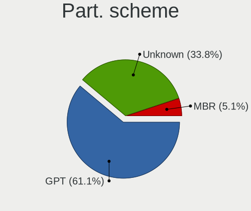

| Type    | Notebooks | Percent |
|---------|-----------|---------|
| GPT     | 329       | 58.13%  |
| Unknown | 188       | 33.22%  |
| MBR     | 49        | 8.66%   |

Dual Boot with Linux/BSD
------------------------

Hosting more than one Linux/BSD

| Dual boot | Notebooks | Percent |
|-----------|-----------|---------|
| No        | 488       | 86.22%  |
| Yes       | 78        | 13.78%  |

Dual Boot (Win)
---------------

Hosting Linux and Windows

| Dual boot | Notebooks | Percent |
|-----------|-----------|---------|
| No        | 458       | 80.92%  |
| Yes       | 108       | 19.08%  |

Board
-----

Vendor
------

Motherboard manufacturer

| Name                | Notebooks | Percent |
|---------------------|-----------|---------|
| Dell                | 116       | 20.49%  |
| Hewlett-Packard     | 111       | 19.61%  |
| Lenovo              | 94        | 16.61%  |
| ASUSTek Computer    | 45        | 7.95%   |
| Valve               | 35        | 6.18%   |
| Acer                | 31        | 5.48%   |
| Google              | 23        | 4.06%   |
| Apple               | 22        | 3.89%   |
| Toshiba             | 16        | 2.83%   |
| MSI                 | 15        | 2.65%   |
| System76            | 13        | 2.3%    |
| GPU Company         | 6         | 1.06%   |
| Alienware           | 5         | 0.88%   |
| Notebook            | 4         | 0.71%   |
| LG Electronics      | 3         | 0.53%   |
| Framework           | 3         | 0.53%   |
| Unknown             | 3         | 0.53%   |
| Razer               | 2         | 0.35%   |
| Gateway             | 2         | 0.35%   |
| Sony                | 1         | 0.18%   |
| Panasonic           | 1         | 0.18%   |
| Motion Computing    | 1         | 0.18%   |
| MicroByte           | 1         | 0.18%   |
| Jumper              | 1         | 0.18%   |
| IPASON              | 1         | 0.18%   |
| GMKtec              | 1         | 0.18%   |
| Gigabyte Technology | 1         | 0.18%   |
| Fujitsu             | 1         | 0.18%   |
| EVOO                | 1         | 0.18%   |
| Eluktronics         | 1         | 0.18%   |
| Dynabook            | 1         | 0.18%   |
| Compal              | 1         | 0.18%   |
| Clevo               | 1         | 0.18%   |
| Carbon Systems      | 1         | 0.18%   |
| AZW                 | 1         | 0.18%   |
| ASRock              | 1         | 0.18%   |

Model
-----

Motherboard model

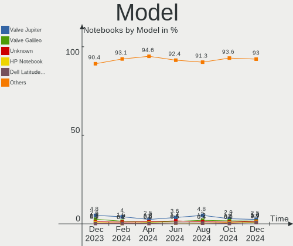

| Name                                 | Notebooks | Percent |
|--------------------------------------|-----------|---------|
| Valve Jupiter                        | 35        | 6.18%   |
| HP Pavilion Notebook                 | 4         | 0.71%   |
| HP Notebook                          | 4         | 0.71%   |
| Dell XPS 15 9570                     | 4         | 0.71%   |
| System76 Oryx Pro                    | 3         | 0.53%   |
| HP ZBook 15                          | 3         | 0.53%   |
| HP Stream Laptop 14-cb1xxx           | 3         | 0.53%   |
| HP Laptop 17-cp0xxx                  | 3         | 0.53%   |
| HP EliteBook 840 G5                  | 3         | 0.53%   |
| Dell XPS 13 9360                     | 3         | 0.53%   |
| Dell Latitude E6510                  | 3         | 0.53%   |
| ASUS Zephyrus G GU502DU_GA502DU      | 3         | 0.53%   |
| Apple MacBookPro12,1                 | 3         | 0.53%   |
| Unknown                              | 3         | 0.53%   |
| Toshiba Satellite C55Dt-A            | 2         | 0.35%   |
| System76 Lemur Pro                   | 2         | 0.35%   |
| System76 Darter Pro                  | 2         | 0.35%   |
| System76 Bonobo WS                   | 2         | 0.35%   |
| MSI Raider GE76 12UE                 | 2         | 0.35%   |
| Lenovo ThinkPad E560 20EV002FUS      | 2         | 0.35%   |
| Lenovo ThinkPad E14 Gen 3 20Y7CTO1WW | 2         | 0.35%   |
| Lenovo Legion 5 17ACH6H 82JY         | 2         | 0.35%   |
| Lenovo IdeaPad Slim 7 14ITL05 82A6   | 2         | 0.35%   |
| HP ZBook 15 G3                       | 2         | 0.35%   |
| HP Pavilion Laptop 15-cc5xx          | 2         | 0.35%   |
| HP Pavilion g7                       | 2         | 0.35%   |
| HP Pavilion dv7                      | 2         | 0.35%   |
| HP Pavilion dv6                      | 2         | 0.35%   |
| HP Laptop 15-dy2xxx                  | 2         | 0.35%   |
| HP Laptop 15-da0xxx                  | 2         | 0.35%   |
| HP Laptop 15-bw0xx                   | 2         | 0.35%   |
| HP Laptop 14-dk1xxx                  | 2         | 0.35%   |
| HP EliteBook Folio 9470m             | 2         | 0.35%   |
| HP EliteBook 8470p                   | 2         | 0.35%   |
| HP EliteBook 840 G8 Notebook PC      | 2         | 0.35%   |
| HP Dev One Notebook PC               | 2         | 0.35%   |
| GPU Company GWTN156-11               | 2         | 0.35%   |
| Google Celes                         | 2         | 0.35%   |
| Framework Laptop                     | 2         | 0.35%   |
| Dell XPS 17 9720                     | 2         | 0.35%   |

Model Family
------------

Motherboard model prefix

| Name               | Notebooks | Percent |
|--------------------|-----------|---------|
| Lenovo ThinkPad    | 56        | 9.89%   |
| Dell Latitude      | 41        | 7.24%   |
| Valve Jupiter      | 35        | 6.18%   |
| Dell Inspiron      | 34        | 6.01%   |
| HP Pavilion        | 26        | 4.59%   |
| Lenovo IdeaPad     | 22        | 3.89%   |
| HP Laptop          | 22        | 3.89%   |
| HP EliteBook       | 22        | 3.89%   |
| Dell XPS           | 20        | 3.53%   |
| Acer Aspire        | 18        | 3.18%   |
| Toshiba Satellite  | 14        | 2.47%   |
| Dell Precision     | 13        | 2.3%    |
| ASUS VivoBook      | 10        | 1.77%   |
| HP ZBook           | 8         | 1.41%   |
| ASUS ROG           | 8         | 1.41%   |
| Lenovo Legion      | 7         | 1.24%   |
| HP Stream          | 6         | 1.06%   |
| HP ProBook         | 5         | 0.88%   |
| ASUS TUF           | 5         | 0.88%   |
| Acer Nitro         | 5         | 0.88%   |
| HP Notebook        | 4         | 0.71%   |
| HP Compaq          | 4         | 0.71%   |
| ASUS ASUS          | 4         | 0.71%   |
| Apple MacBookPro8  | 4         | 0.71%   |
| Acer Swift         | 4         | 0.71%   |
| Acer Predator      | 4         | 0.71%   |
| System76 Oryx      | 3         | 0.53%   |
| System76 Lemur     | 3         | 0.53%   |
| System76 Bonobo    | 3         | 0.53%   |
| HP OMEN            | 3         | 0.53%   |
| HP ENVY            | 3         | 0.53%   |
| HP 15              | 3         | 0.53%   |
| Framework Laptop   | 3         | 0.53%   |
| Dell Vostro        | 3         | 0.53%   |
| ASUS Zephyrus      | 3         | 0.53%   |
| Apple MacBookPro12 | 3         | 0.53%   |
| Apple MacBookPro11 | 3         | 0.53%   |
| Unknown            | 3         | 0.53%   |
| System76 Darter    | 2         | 0.35%   |
| Razer Blade        | 2         | 0.35%   |

MFG Year
--------

Motherboard manufacture year

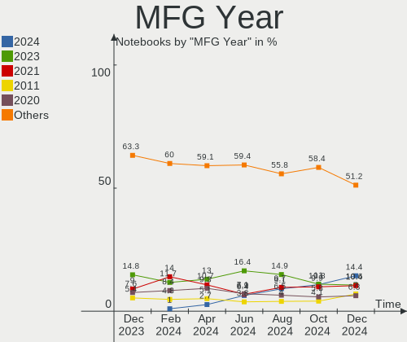

| Year    | Notebooks | Percent |
|---------|-----------|---------|
| 2022    | 105       | 18.55%  |
| 2021    | 77        | 13.6%   |
| 2020    | 48        | 8.48%   |
| 2019    | 46        | 8.13%   |
| 2018    | 33        | 5.83%   |
| 2011    | 33        | 5.83%   |
| 2017    | 32        | 5.65%   |
| 2012    | 30        | 5.3%    |
| 2016    | 27        | 4.77%   |
| 2015    | 26        | 4.59%   |
| 2014    | 26        | 4.59%   |
| 2013    | 25        | 4.42%   |
| 2010    | 20        | 3.53%   |
| 2008    | 16        | 2.83%   |
| 2009    | 9         | 1.59%   |
| 2007    | 9         | 1.59%   |
| 2023    | 1         | 0.18%   |
| 2006    | 1         | 0.18%   |
| 2003    | 1         | 0.18%   |
| Unknown | 1         | 0.18%   |

Form Factor
-----------

Physical design of the computer

| Name     | Notebooks | Percent |
|----------|-----------|---------|
| Notebook | 566       | 100%    |

Secure Boot
-----------

Enabled or disabled

| State    | Notebooks | Percent |
|----------|-----------|---------|
| Disabled | 520       | 91.87%  |
| Enabled  | 46        | 8.13%   |

Coreboot
--------

Have coreboot on board

| Used | Notebooks | Percent |
|------|-----------|---------|
| No   | 536       | 94.7%   |
| Yes  | 30        | 5.3%    |

RAM Size
--------

Total RAM memory

| Size in GB  | Notebooks | Percent |
|-------------|-----------|---------|
| 4.01-8.0    | 145       | 25.62%  |
| 8.01-16.0   | 140       | 24.73%  |
| 16.01-24.0  | 99        | 17.49%  |
| 3.01-4.0    | 78        | 13.78%  |
| 32.01-64.0  | 56        | 9.89%   |
| 64.01-256.0 | 19        | 3.36%   |
| 1.01-2.0    | 17        | 3%      |
| 24.01-32.0  | 9         | 1.59%   |
| 2.01-3.0    | 1         | 0.18%   |
| 0.51-1.0    | 1         | 0.18%   |
| 0.01-0.5    | 1         | 0.18%   |

RAM Used
--------

Used RAM memory

| Used GB    | Notebooks | Percent |
|------------|-----------|---------|
| 1.01-2.0   | 178       | 31.45%  |
| 2.01-3.0   | 158       | 27.92%  |
| 4.01-8.0   | 103       | 18.2%   |
| 3.01-4.0   | 87        | 15.37%  |
| 8.01-16.0  | 19        | 3.36%   |
| 0.51-1.0   | 16        | 2.83%   |
| 0.01-0.5   | 3         | 0.53%   |
| 24.01-32.0 | 1         | 0.18%   |
| 16.01-24.0 | 1         | 0.18%   |

Total Drives
------------

Number of drives on board

| Drives | Notebooks | Percent |
|--------|-----------|---------|
| 1      | 416       | 73.5%   |
| 2      | 126       | 22.26%  |
| 3      | 16        | 2.83%   |
| 4      | 6         | 1.06%   |
| 0      | 2         | 0.35%   |

Has CD-ROM
----------

Has CD-ROM on board

| Presented | Notebooks | Percent |
|-----------|-----------|---------|
| No        | 406       | 71.73%  |
| Yes       | 160       | 28.27%  |

Has Ethernet
------------

Has Ethernet on board

| Presented | Notebooks | Percent |
|-----------|-----------|---------|
| Yes       | 399       | 70.49%  |
| No        | 167       | 29.51%  |

Has WiFi
--------

Has WiFi module

| Presented | Notebooks | Percent |
|-----------|-----------|---------|
| Yes       | 562       | 99.29%  |
| No        | 4         | 0.71%   |

Has Bluetooth
-------------

Has Bluetooth module

| Presented | Notebooks | Percent |
|-----------|-----------|---------|
| Yes       | 468       | 82.69%  |
| No        | 98        | 17.31%  |

Location
--------

Country
-------

Geographic location (country)

| Country | Notebooks | Percent |
|---------|-----------|---------|
| USA     | 566       | 100%    |

City
----

Geographic location (city)

| City             | Notebooks | Percent |
|------------------|-----------|---------|
| New York         | 11        | 1.94%   |
| Denver           | 10        | 1.77%   |
| Seattle          | 9         | 1.59%   |
| Chicago          | 7         | 1.24%   |
| Saint Paul       | 6         | 1.06%   |
| Brooklyn         | 6         | 1.06%   |
| Austin           | 6         | 1.06%   |
| Atlanta          | 6         | 1.06%   |
| Albuquerque      | 6         | 1.06%   |
| Tucson           | 5         | 0.88%   |
| Minneapolis      | 5         | 0.88%   |
| Los Angeles      | 5         | 0.88%   |
| Dallas           | 5         | 0.88%   |
| Cleveland        | 5         | 0.88%   |
| Tacoma           | 4         | 0.71%   |
| San Jose         | 4         | 0.71%   |
| San Antonio      | 4         | 0.71%   |
| Philadelphia     | 4         | 0.71%   |
| Houston          | 4         | 0.71%   |
| Bangor           | 4         | 0.71%   |
| West Stockbridge | 3         | 0.53%   |
| Washington       | 3         | 0.53%   |
| St Louis         | 3         | 0.53%   |
| San Francisco    | 3         | 0.53%   |
| San Diego        | 3         | 0.53%   |
| Portland         | 3         | 0.53%   |
| Orlando          | 3         | 0.53%   |
| Olympia          | 3         | 0.53%   |
| Oceanside        | 3         | 0.53%   |
| Lexington        | 3         | 0.53%   |
| Las Vegas        | 3         | 0.53%   |
| Jacksonville     | 3         | 0.53%   |
| Indianapolis     | 3         | 0.53%   |
| Hammond          | 3         | 0.53%   |
| Greenville       | 3         | 0.53%   |
| El Cajon         | 3         | 0.53%   |
| Charlotte        | 3         | 0.53%   |
| Cambridge        | 3         | 0.53%   |
| Ypsilanti        | 2         | 0.35%   |
| Woodbridge       | 2         | 0.35%   |

Drives
------

Drive Vendor
------------

Hard drive vendors

| Vendor                      | Notebooks | Drives | Percent |
|-----------------------------|-----------|--------|---------|
| Samsung Electronics         | 119       | 129    | 16.78%  |
| Unknown                     | 67        | 78     | 9.45%   |
| WDC                         | 60        | 61     | 8.46%   |
| Seagate                     | 54        | 55     | 7.62%   |
| SanDisk                     | 53        | 55     | 7.48%   |
| Toshiba                     | 35        | 35     | 4.94%   |
| SK hynix                    | 34        | 34     | 4.8%    |
| Crucial                     | 26        | 27     | 3.67%   |
| Micron Technology           | 24        | 24     | 3.39%   |
| Intel                       | 24        | 25     | 3.39%   |
| Kingston                    | 21        | 21     | 2.96%   |
| Unknown                     | 19        | 19     | 2.68%   |
| Phison Electronics          | 18        | 18     | 2.54%   |
| HGST                        | 18        | 18     | 2.54%   |
| Kingston Technology Company | 12        | 12     | 1.69%   |
| Hitachi                     | 10        | 10     | 1.41%   |
| Apple                       | 10        | 10     | 1.41%   |
| KIOXIA                      | 9         | 9      | 1.27%   |
| PNY                         | 8         | 8      | 1.13%   |
| O2 Micro                    | 8         | 8      | 1.13%   |
| Silicon Motion              | 6         | 6      | 0.85%   |
| SPCC                        | 5         | 6      | 0.71%   |
| LITEONIT                    | 5         | 5      | 0.71%   |
| A-DATA Technology           | 5         | 5      | 0.71%   |
| China                       | 4         | 4      | 0.56%   |
| Team                        | 3         | 3      | 0.42%   |
| OCZ                         | 3         | 3      | 0.42%   |
| Netac                       | 3         | 3      | 0.42%   |
| Mushkin                     | 3         | 3      | 0.42%   |
| Micron/Crucial Technology   | 3         | 3      | 0.42%   |
| Hewlett-Packard             | 3         | 3      | 0.42%   |
| SABRENT                     | 2         | 2      | 0.28%   |
| JMicron Technology          | 2         | 2      | 0.28%   |
| Fujitsu                     | 2         | 2      | 0.28%   |
| ASMT                        | 2         | 3      | 0.28%   |
| Wibtek                      | 1         | 1      | 0.14%   |
| W800S                       | 1         | 1      | 0.14%   |
| Union Memory (Shenzhen)     | 1         | 1      | 0.14%   |
| Union Memory                | 1         | 1      | 0.14%   |
| Transcend                   | 1         | 1      | 0.14%   |

Drive Model
-----------

Hard drive models

| Model                                                 | Notebooks | Percent |
|-------------------------------------------------------|-----------|---------|
| Samsung NVMe SSD Controller SM981/PM981/PM983 500GB   | 21        | 2.88%   |
| Unknown                                               | 19        | 2.61%   |
| Unknown MMC Card  64GB                                | 13        | 1.79%   |
| Samsung NVMe SSD Controller PM9A1/PM9A3/980PRO 512GB  | 11        | 1.51%   |
| Kingston Company OM3PDP3 NVMe SSD 512GB               | 11        | 1.51%   |
| Intel SSD 660P Series 512GB                           | 11        | 1.51%   |
| Unknown MMC Card  32GB                                | 9         | 1.24%   |
| Phison PS5013 E13 NVMe Controller 256GB               | 9         | 1.24%   |
| Unknown MMC Card  512GB                               | 8         | 1.1%    |
| Sandisk WD Black SN750 / PC SN730 NVMe SSD 1TB        | 8         | 1.1%    |
| O2 Micro E2M2 64GB                                    | 8         | 1.1%    |
| Unknown MMC Card  16GB                                | 6         | 0.82%   |
| Unknown MMC Card  128GB                               | 6         | 0.82%   |
| Seagate ST500LM021-1KJ152 500GB                       | 5         | 0.69%   |
| Seagate ST1000LM035-1RK172 1TB                        | 5         | 0.69%   |
| Seagate ST1000LM024 HN-M101MBB 1TB                    | 5         | 0.69%   |
| Sandisk WD Blue SN550 NVMe SSD 1TB                    | 5         | 0.69%   |
| HGST HTS725050A7E630 500GB                            | 5         | 0.69%   |
| Crucial CT1000MX500SSD1 1TB                           | 5         | 0.69%   |
| Unknown TA2964  64GB                                  | 4         | 0.55%   |
| Unknown SD/MMC/MS PRO 2GB                             | 4         | 0.55%   |
| Unknown MMC Card  256GB                               | 4         | 0.55%   |
| Toshiba MQ04ABF100 1TB                                | 4         | 0.55%   |
| Silicon Motion SM2263EN/SM2263XT SSD Controller 512GB | 4         | 0.55%   |
| SanDisk Extreme 55AE 1TB SSD                          | 4         | 0.55%   |
| Samsung SSD 860 EVO 500GB                             | 4         | 0.55%   |
| Kingston SA400S37240G 240GB SSD                       | 4         | 0.55%   |
| Toshiba XG4 NVMe SSD Controller 256GB                 | 3         | 0.41%   |
| Toshiba MQ01ABF050 500GB                              | 3         | 0.41%   |
| Toshiba MQ01ABD100 1TB                                | 3         | 0.41%   |
| SK hynix PC711 NVMe 1TB                               | 3         | 0.41%   |
| Seagate ST750LM022 HN-M750MBB 752GB                   | 3         | 0.41%   |
| Seagate ST2000LX001-1RG174 2TB                        | 3         | 0.41%   |
| Samsung SSD 970 EVO Plus 1TB                          | 3         | 0.41%   |
| Samsung SSD 850 EVO 500GB                             | 3         | 0.41%   |
| Samsung MZVLQ512HBLU-00B00 512GB                      | 3         | 0.41%   |
| Samsung MZVLB1T0HBLR-000L2 1TB                        | 3         | 0.41%   |
| Samsung MZVL2512HCJQ-00B00 512GB                      | 3         | 0.41%   |
| Samsung MZ9LQ256HBJD-00BVL 256GB                      | 3         | 0.41%   |
| PNY CS900 500GB SSD                                   | 3         | 0.41%   |

HDD Vendor
----------

Hard disk drive vendors

| Vendor              | Notebooks | Drives | Percent |
|---------------------|-----------|--------|---------|
| Seagate             | 51        | 52     | 34%     |
| WDC                 | 32        | 32     | 21.33%  |
| Toshiba             | 24        | 24     | 16%     |
| HGST                | 18        | 18     | 12%     |
| Hitachi             | 10        | 10     | 6.67%   |
| Unknown             | 4         | 4      | 2.67%   |
| Samsung Electronics | 2         | 2      | 1.33%   |
| SABRENT             | 2         | 2      | 1.33%   |
| Fujitsu             | 2         | 2      | 1.33%   |
| ASMT                | 2         | 3      | 1.33%   |
| Maxone              | 1         | 1      | 0.67%   |
| IBM/Hitachi         | 1         | 1      | 0.67%   |
| Apple               | 1         | 1      | 0.67%   |

SSD Vendor
----------

Solid state drive vendors

| Vendor              | Notebooks | Drives | Percent |
|---------------------|-----------|--------|---------|
| Samsung Electronics | 40        | 40     | 21.28%  |
| SanDisk             | 22        | 23     | 11.7%   |
| Crucial             | 22        | 23     | 11.7%   |
| WDC                 | 14        | 14     | 7.45%   |
| Kingston            | 11        | 11     | 5.85%   |
| PNY                 | 8         | 8      | 4.26%   |
| Apple               | 8         | 8      | 4.26%   |
| SK hynix            | 5         | 5      | 2.66%   |
| LITEONIT            | 5         | 5      | 2.66%   |
| SPCC                | 4         | 4      | 2.13%   |
| China               | 4         | 4      | 2.13%   |
| A-DATA Technology   | 4         | 4      | 2.13%   |
| Toshiba             | 3         | 3      | 1.6%    |
| OCZ                 | 3         | 3      | 1.6%    |
| Netac               | 3         | 3      | 1.6%    |
| Mushkin             | 3         | 3      | 1.6%    |
| Micron Technology   | 3         | 3      | 1.6%    |
| Intel               | 3         | 3      | 1.6%    |
| Hewlett-Packard     | 3         | 3      | 1.6%    |
| Unknown             | 3         | 3      | 1.6%    |
| Transcend           | 1         | 1      | 0.53%   |
| Team                | 1         | 1      | 0.53%   |
| Seagate             | 1         | 1      | 0.53%   |
| PNY CS90            | 1         | 1      | 0.53%   |
| OWC                 | 1         | 1      | 0.53%   |
| ORTIAL              | 1         | 1      | 0.53%   |
| Micron_5            | 1         | 1      | 0.53%   |
| LITEON              | 1         | 1      | 0.53%   |
| Lexar               | 1         | 1      | 0.53%   |
| LEQIXIANG           | 1         | 1      | 0.53%   |
| KingDian            | 1         | 1      | 0.53%   |
| Jumper              | 1         | 1      | 0.53%   |
| Inland              | 1         | 1      | 0.53%   |
| INDMEM              | 1         | 1      | 0.53%   |
| Gigabyte Technology | 1         | 1      | 0.53%   |
| Emtec               | 1         | 1      | 0.53%   |
| Dogfish             | 1         | 1      | 0.53%   |

Drive Kind
----------

HDD or SSD

| Kind    | Notebooks | Drives | Percent |
|---------|-----------|--------|---------|
| NVMe    | 265       | 298    | 38.97%  |
| SSD     | 175       | 190    | 25.74%  |
| HDD     | 148       | 152    | 21.76%  |
| MMC     | 83        | 91     | 12.21%  |
| Unknown | 9         | 9      | 1.32%   |

Drive Connector
---------------

SATA, SAS, NVMe, etc.

| Type | Notebooks | Drives | Percent |
|------|-----------|--------|---------|
| SATA | 293       | 315    | 43.54%  |
| NVMe | 265       | 298    | 39.38%  |
| MMC  | 83        | 91     | 12.33%  |
| SAS  | 32        | 36     | 4.75%   |

Drive Size
----------

Size of hard drive

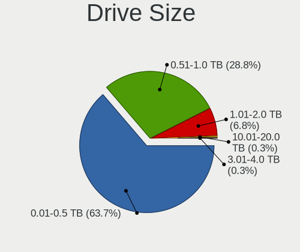

| Size in TB | Notebooks | Drives | Percent |
|------------|-----------|--------|---------|
| 0.01-0.5   | 205       | 213    | 63.47%  |
| 0.51-1.0   | 93        | 104    | 28.79%  |
| 1.01-2.0   | 15        | 15     | 4.64%   |
| 3.01-4.0   | 5         | 5      | 1.55%   |
| 4.01-10.0  | 5         | 5      | 1.55%   |

Space Total
-----------

Amount of disk space available on the file system

| Size in GB     | Notebooks | Percent |
|----------------|-----------|---------|
| 101-250        | 139       | 24.56%  |
| 251-500        | 126       | 22.26%  |
| 501-1000       | 88        | 15.55%  |
| 1-20           | 66        | 11.66%  |
| 51-100         | 40        | 7.07%   |
| 1001-2000      | 37        | 6.54%   |
| More than 3000 | 22        | 3.89%   |
| 2001-3000      | 18        | 3.18%   |
| Unknown        | 17        | 3%      |
| 21-50          | 13        | 2.3%    |

Space Used
----------

Amount of used disk space

| Used GB        | Notebooks | Percent |
|----------------|-----------|---------|
| 1-20           | 231       | 40.81%  |
| 21-50          | 105       | 18.55%  |
| 101-250        | 63        | 11.13%  |
| 51-100         | 61        | 10.78%  |
| 251-500        | 46        | 8.13%   |
| 501-1000       | 22        | 3.89%   |
| Unknown        | 17        | 3%      |
| 1001-2000      | 9         | 1.59%   |
| More than 3000 | 8         | 1.41%   |
| 2001-3000      | 3         | 0.53%   |
| 0              | 1         | 0.18%   |

Malfunc. Drives
---------------

Drive models with a malfunction

| Model                                       | Notebooks | Drives | Percent |
|---------------------------------------------|-----------|--------|---------|
| Samsung Electronics PM9A1 NVMe 2048GB       | 2         | 2      | 7.41%   |
| WDC WD7500BPKX-00HPJT0 752GB                | 1         | 1      | 3.7%    |
| WDC WD5000BPVT-80HXZT3 500GB                | 1         | 1      | 3.7%    |
| WDC PC SN520 SDAPMUW-128G-1001 128GB        | 1         | 1      | 3.7%    |
| Toshiba MK3261GSYN 320GB                    | 1         | 1      | 3.7%    |
| SPCC Solid State Disk 512GB                 | 1         | 1      | 3.7%    |
| SK hynix SC210 mSATA 256GB SSD              | 1         | 1      | 3.7%    |
| SK hynix BC711 HFM512GD3JX013N 512GB        | 1         | 1      | 3.7%    |
| Seagate ST9160314AS 160GB                   | 1         | 1      | 3.7%    |
| Seagate ST1000LM 035-1RK172 1TB             | 1         | 1      | 3.7%    |
| SanDisk SSD PLUS 1000GB                     | 1         | 1      | 3.7%    |
| Samsung Electronics SSD PM830 2.5 7mm 256GB | 1         | 1      | 3.7%    |
| Samsung Electronics SSD 970 EVO Plus 500GB  | 1         | 1      | 3.7%    |
| OCZ AGILITY3 120GB SSD                      | 1         | 1      | 3.7%    |
| Netac SSD 256GB                             | 1         | 1      | 3.7%    |
| Mushkin MKNSSDCR120GB                       | 1         | 1      | 3.7%    |
| LITEONIT LMT-256M6M-HP 256GB SSD            | 1         | 1      | 3.7%    |
| IBM/Hitachi IC25N040ATMR04-0 40GB           | 1         | 1      | 3.7%    |
| Hitachi HTS727575A9E364 752GB               | 1         | 1      | 3.7%    |
| HGST HTS725050A7E630 500GB                  | 1         | 1      | 3.7%    |
| HGST HTS541010A9E680 1TB                    | 1         | 1      | 3.7%    |
| Fujitsu MHY2250BH 250GB                     | 1         | 1      | 3.7%    |
| Crucial CT240M500SSD1 240GB                 | 1         | 1      | 3.7%    |
| Crucial CT1050MX300SSD1 1TB                 | 1         | 1      | 3.7%    |
| ASMT 2105 120GB                             | 1         | 1      | 3.7%    |
| Unknown                                     | 1         | 1      | 3.7%    |

Malfunc. Drive Vendor
---------------------

Vendors of faulty drives

| Vendor              | Notebooks | Drives | Percent |
|---------------------|-----------|--------|---------|
| Samsung Electronics | 4         | 4      | 14.81%  |
| WDC                 | 3         | 3      | 11.11%  |
| SK hynix            | 2         | 2      | 7.41%   |
| Seagate             | 2         | 2      | 7.41%   |
| HGST                | 2         | 2      | 7.41%   |
| Crucial             | 2         | 2      | 7.41%   |
| Toshiba             | 1         | 1      | 3.7%    |
| SPCC                | 1         | 1      | 3.7%    |
| SanDisk             | 1         | 1      | 3.7%    |
| OCZ                 | 1         | 1      | 3.7%    |
| Netac               | 1         | 1      | 3.7%    |
| Mushkin             | 1         | 1      | 3.7%    |
| LITEONIT            | 1         | 1      | 3.7%    |
| IBM/Hitachi         | 1         | 1      | 3.7%    |
| Hitachi             | 1         | 1      | 3.7%    |
| Fujitsu             | 1         | 1      | 3.7%    |
| ASMT                | 1         | 1      | 3.7%    |
| Unknown             | 1         | 1      | 3.7%    |

Malfunc. HDD Vendor
-------------------

Vendors of faulty HDD drives

| Vendor      | Notebooks | Drives | Percent |
|-------------|-----------|--------|---------|
| WDC         | 2         | 2      | 18.18%  |
| Seagate     | 2         | 2      | 18.18%  |
| HGST        | 2         | 2      | 18.18%  |
| Toshiba     | 1         | 1      | 9.09%   |
| IBM/Hitachi | 1         | 1      | 9.09%   |
| Hitachi     | 1         | 1      | 9.09%   |
| Fujitsu     | 1         | 1      | 9.09%   |
| ASMT        | 1         | 1      | 9.09%   |

Malfunc. Drive Kind
-------------------

Kinds of faulty drives

| Kind | Notebooks | Drives | Percent |
|------|-----------|--------|---------|
| SSD  | 11        | 11     | 40.74%  |
| HDD  | 11        | 11     | 40.74%  |
| NVMe | 5         | 5      | 18.52%  |

Failed Drives
-------------

Failed drive models

Zero info for selected period =(

Failed Drive Vendor
-------------------

Failed drive vendors

Zero info for selected period =(

Drive Status
------------

Number of failed and malfunc. drives

| Status   | Notebooks | Drives | Percent |
|----------|-----------|--------|---------|
| Detected | 344       | 441    | 58.21%  |
| Works    | 220       | 272    | 37.23%  |
| Malfunc  | 27        | 27     | 4.57%   |

Storage controller
------------------

Storage Vendor
--------------

Storage controller vendors

| Vendor                           | Notebooks | Percent |
|----------------------------------|-----------|---------|
| Intel                            | 316       | 47.16%  |
| Samsung Electronics              | 85        | 12.69%  |
| AMD                              | 77        | 11.49%  |
| SanDisk                          | 44        | 6.57%   |
| SK hynix                         | 29        | 4.33%   |
| Kingston Technology Company      | 22        | 3.28%   |
| Phison Electronics               | 21        | 3.13%   |
| Micron Technology                | 21        | 3.13%   |
| Toshiba America Info Systems     | 9         | 1.34%   |
| O2 Micro                         | 8         | 1.19%   |
| Silicon Motion                   | 7         | 1.04%   |
| Nvidia                           | 7         | 1.04%   |
| Micron/Crucial Technology        | 7         | 1.04%   |
| KIOXIA                           | 7         | 1.04%   |
| Realtek Semiconductor            | 3         | 0.45%   |
| Union Memory (Shenzhen)          | 2         | 0.3%    |
| Solid State Storage Technology   | 1         | 0.15%   |
| Silicon Integrated Systems [SiS] | 1         | 0.15%   |
| MAXIO Technology (Hangzhou)      | 1         | 0.15%   |
| ASMedia Technology               | 1         | 0.15%   |
| Apple                            | 1         | 0.15%   |

Storage Model
-------------

Storage controller models

| Model                                                                          | Notebooks | Percent |
|--------------------------------------------------------------------------------|-----------|---------|
| AMD FCH SATA Controller [AHCI mode]                                            | 69        | 9.8%    |
| Intel 82801 Mobile SATA Controller [RAID mode]                                 | 36        | 5.11%   |
| Samsung NVMe SSD Controller SM981/PM981/PM983                                  | 35        | 4.97%   |
| Intel Sunrise Point-LP SATA Controller [AHCI mode]                             | 35        | 4.97%   |
| Intel Volume Management Device NVMe RAID Controller                            | 30        | 4.26%   |
| Intel 7 Series Chipset Family 6-port SATA Controller [AHCI mode]               | 26        | 3.69%   |
| Samsung NVMe SSD Controller PM9A1/PM9A3/980PRO                                 | 23        | 3.27%   |
| Intel 6 Series/C200 Series Chipset Family 6 port Mobile SATA AHCI Controller   | 23        | 3.27%   |
| Micron Non-Volatile memory controller                                          | 21        | 2.98%   |
| Intel 8 Series/C220 Series Chipset Family 6-port SATA Controller 1 [AHCI mode] | 20        | 2.84%   |
| SK hynix Gold P31/PC711 NVMe Solid State Drive                                 | 19        | 2.7%    |
| Samsung NVMe SSD Controller 980                                                | 19        | 2.7%    |
| Sandisk Non-Volatile memory controller                                         | 15        | 2.13%   |
| Kingston Company OM3PDP3 NVMe SSD                                              | 13        | 1.85%   |
| Intel Celeron/Pentium Silver Processor SATA Controller                         | 13        | 1.85%   |
| Intel Wildcat Point-LP SATA Controller [AHCI Mode]                             | 12        | 1.7%    |
| Intel SSD 660P Series                                                          | 12        | 1.7%    |
| Intel Cannon Lake Mobile PCH SATA AHCI Controller                              | 12        | 1.7%    |
| SanDisk WD Black SN750 / PC SN730 NVMe SSD                                     | 10        | 1.42%   |
| Phison PS5013 E13 NVMe Controller                                              | 10        | 1.42%   |
| SanDisk WD Blue SN550 NVMe SSD                                                 | 9         | 1.28%   |
| Intel Q170/Q150/B150/H170/H110/Z170/CM236 Chipset SATA Controller [AHCI Mode]  | 9         | 1.28%   |
| Intel 8 Series SATA Controller 1 [AHCI mode]                                   | 9         | 1.28%   |
| Intel 5 Series/3400 Series Chipset 6 port SATA AHCI Controller                 | 9         | 1.28%   |
| O2 Micro Non-Volatile memory controller                                        | 8         | 1.14%   |
| Intel Tiger Lake-LP SATA Controller                                            | 8         | 1.14%   |
| Intel 82801IBM/IEM (ICH9M/ICH9M-E) 4 port SATA Controller [AHCI mode]          | 7         | 0.99%   |
| Intel 82801HM/HEM (ICH8M/ICH8M-E) IDE Controller                               | 7         | 0.99%   |
| Intel 5 Series/3400 Series Chipset 4 port SATA AHCI Controller                 | 7         | 0.99%   |
| Silicon Motion SM2263EN/SM2263XT SSD Controller                                | 6         | 0.85%   |
| Phison E12 NVMe Controller                                                     | 6         | 0.85%   |
| Kingston Company Company Non-Volatile memory controller                        | 6         | 0.85%   |
| Intel Non-Volatile memory controller                                           | 6         | 0.85%   |
| Intel HM170/QM170 Chipset SATA Controller [AHCI Mode]                          | 6         | 0.85%   |
| Intel 82801HM/HEM (ICH8M/ICH8M-E) SATA Controller [AHCI mode]                  | 6         | 0.85%   |
| SanDisk WD Blue SN500 / PC SN520 NVMe SSD                                      | 5         | 0.71%   |
| Nvidia MCP79 AHCI Controller                                                   | 5         | 0.71%   |
| Micron/Crucial P2 NVMe PCIe SSD                                                | 5         | 0.71%   |
| KIOXIA NVMe SSD Controller BG4                                                 | 5         | 0.71%   |
| Intel Comet Lake SATA AHCI Controller                                          | 5         | 0.71%   |

Storage Kind
------------

Kind of storage controller (IDE, SATA, NVMe, SAS, ...)

| Kind | Notebooks | Percent |
|------|-----------|---------|
| SATA | 321       | 47.63%  |
| NVMe | 265       | 39.32%  |
| RAID | 65        | 9.64%   |
| IDE  | 23        | 3.41%   |

Processor
---------

CPU Vendor
----------

Processor vendors

| Vendor | Notebooks | Percent |
|--------|-----------|---------|
| Intel  | 415       | 73.32%  |
| AMD    | 151       | 26.68%  |

CPU Model
---------

Processor models

| Model                                         | Notebooks | Percent |
|-----------------------------------------------|-----------|---------|
| AMD Custom APU 0405                           | 35        | 6.18%   |
| Intel 11th Gen Core i5-1135G7 @ 2.40GHz       | 11        | 1.94%   |
| Intel Celeron N4020 CPU @ 1.10GHz             | 10        | 1.77%   |
| Intel 12th Gen Core i7-12700H                 | 10        | 1.77%   |
| Intel 11th Gen Core i7-1165G7 @ 2.80GHz       | 10        | 1.77%   |
| Intel 11th Gen Core i7-11800H @ 2.30GHz       | 9         | 1.59%   |
| AMD Ryzen 7 3750H with Radeon Vega Mobile Gfx | 9         | 1.59%   |
| Intel Core i7-10750H CPU @ 2.60GHz            | 7         | 1.24%   |
| Intel Core i5-7200U CPU @ 2.50GHz             | 7         | 1.24%   |
| Intel Core i5-6300U CPU @ 2.40GHz             | 7         | 1.24%   |
| AMD Ryzen 5 5500U with Radeon Graphics        | 7         | 1.24%   |
| Intel Core i7-9750H CPU @ 2.60GHz             | 6         | 1.06%   |
| Intel Core i7-8750H CPU @ 2.20GHz             | 6         | 1.06%   |
| Intel Core i7-7700HQ CPU @ 2.80GHz            | 6         | 1.06%   |
| Intel Core i3-7100U CPU @ 2.40GHz             | 6         | 1.06%   |
| Intel Core i3 CPU M 370 @ 2.40GHz             | 6         | 1.06%   |
| Intel Celeron CPU N3060 @ 1.60GHz             | 6         | 1.06%   |
| Intel Core i7-8650U CPU @ 1.90GHz             | 5         | 0.88%   |
| Intel Core i7-4810MQ CPU @ 2.80GHz            | 5         | 0.88%   |
| Intel Core i7-2670QM CPU @ 2.20GHz            | 5         | 0.88%   |
| Intel Core i5-8250U CPU @ 1.60GHz             | 5         | 0.88%   |
| Intel Core i5-6200U CPU @ 2.30GHz             | 5         | 0.88%   |
| Intel 11th Gen Core i7-1185G7 @ 3.00GHz       | 5         | 0.88%   |
| Intel 11th Gen Core i3-1115G4 @ 3.00GHz       | 5         | 0.88%   |
| AMD Ryzen 7 5800H with Radeon Graphics        | 5         | 0.88%   |
| Intel Core i7-8550U CPU @ 1.80GHz             | 4         | 0.71%   |
| Intel Core i7-6500U CPU @ 2.50GHz             | 4         | 0.71%   |
| Intel Core i7-4800MQ CPU @ 2.70GHz            | 4         | 0.71%   |
| Intel Core i5-3320M CPU @ 2.60GHz             | 4         | 0.71%   |
| Intel Celeron N4500 @ 1.10GHz                 | 4         | 0.71%   |
| Intel 12th Gen Core i7-1260P                  | 4         | 0.71%   |
| AMD Ryzen 7 5700U with Radeon Graphics        | 4         | 0.71%   |
| AMD Ryzen 5 5625U with Radeon Graphics        | 4         | 0.71%   |
| AMD Ryzen 3 3250U with Radeon Graphics        | 4         | 0.71%   |
| AMD A6-5200 APU with Radeon HD Graphics       | 4         | 0.71%   |
| Intel Pentium Silver N5030 CPU @ 1.10GHz      | 3         | 0.53%   |
| Intel Core m3-8100Y CPU @ 1.10GHz             | 3         | 0.53%   |
| Intel Core i9-10885H CPU @ 2.40GHz            | 3         | 0.53%   |
| Intel Core i7-6820HQ CPU @ 2.70GHz            | 3         | 0.53%   |
| Intel Core i7-6700HQ CPU @ 2.60GHz            | 3         | 0.53%   |

CPU Model Family
----------------

Processor model prefix

| Model                   | Notebooks | Percent |
|-------------------------|-----------|---------|
| Intel Core i7           | 115       | 20.32%  |
| Other                   | 113       | 19.96%  |
| Intel Core i5           | 95        | 16.78%  |
| Intel Celeron           | 41        | 7.24%   |
| AMD Ryzen 7             | 31        | 5.48%   |
| Intel Core i3           | 29        | 5.12%   |
| AMD Ryzen 5             | 26        | 4.59%   |
| Intel Core 2 Duo        | 23        | 4.06%   |
| Intel Pentium           | 10        | 1.77%   |
| AMD A6                  | 10        | 1.77%   |
| AMD Ryzen 3             | 8         | 1.41%   |
| Intel Core i9           | 7         | 1.24%   |
| AMD Ryzen 9             | 7         | 1.24%   |
| AMD A8                  | 7         | 1.24%   |
| Intel Pentium Silver    | 5         | 0.88%   |
| AMD Ryzen 7 PRO         | 4         | 0.71%   |
| Intel Core m3           | 3         | 0.53%   |
| AMD Athlon              | 3         | 0.53%   |
| AMD A12                 | 3         | 0.53%   |
| Intel Pentium Dual      | 2         | 0.35%   |
| Intel Core M            | 2         | 0.35%   |
| Intel Atom              | 2         | 0.35%   |
| AMD E1                  | 2         | 0.35%   |
| AMD Athlon II           | 2         | 0.35%   |
| AMD Athlon 64 X2        | 2         | 0.35%   |
| AMD A4                  | 2         | 0.35%   |
| AMD A10                 | 2         | 0.35%   |
| Intel Xeon              | 1         | 0.18%   |
| Intel Pentium Dual-Core | 1         | 0.18%   |
| Intel Pentium 4         | 1         | 0.18%   |
| Intel Core 2            | 1         | 0.18%   |
| AMD Turion 64 X2 Mobile | 1         | 0.18%   |
| AMD Turion              | 1         | 0.18%   |
| AMD Ryzen 5 PRO         | 1         | 0.18%   |
| AMD Ryzen 3 PRO         | 1         | 0.18%   |
| AMD PRO A10             | 1         | 0.18%   |
| AMD E                   | 1         | 0.18%   |

CPU Cores
---------

Number of processor cores

| Number | Notebooks | Percent |
|--------|-----------|---------|
| 2      | 230       | 40.64%  |
| 4      | 207       | 36.57%  |
| 8      | 46        | 8.13%   |
| 6      | 44        | 7.77%   |
| 14     | 19        | 3.36%   |
| 10     | 8         | 1.41%   |
| 1      | 6         | 1.06%   |
| 12     | 5         | 0.88%   |
| 16     | 1         | 0.18%   |

CPU Sockets
-----------

Number of sockets

| Number | Notebooks | Percent |
|--------|-----------|---------|
| 1      | 566       | 100%    |

CPU Threads
-----------

Threads per core (Hyper-Threading)

| Number | Notebooks | Percent |
|--------|-----------|---------|
| 2      | 443       | 78.27%  |
| 1      | 121       | 21.38%  |
| 4      | 2         | 0.35%   |

CPU Op-Modes
------------

CPU Operation Modes (32-bit, 64-bit)

| Op mode        | Notebooks | Percent |
|----------------|-----------|---------|
| 32-bit, 64-bit | 563       | 99.47%  |
| 32-bit         | 2         | 0.35%   |
| Unknown        | 1         | 0.18%   |

CPU Microcode
-------------

Microcode number

| Number     | Notebooks | Percent |
|------------|-----------|---------|
| Unknown    | 197       | 34.81%  |
| 0x806c1    | 21        | 3.71%   |
| 0x306a9    | 21        | 3.71%   |
| 0x206a7    | 20        | 3.53%   |
| 0x906a3    | 17        | 3%      |
| 0x306c3    | 15        | 2.65%   |
| 0x1067a    | 14        | 2.47%   |
| 0x906ea    | 13        | 2.3%    |
| 0x806e9    | 13        | 2.3%    |
| 0x0a50000c | 13        | 2.3%    |
| 0x20655    | 12        | 2.12%   |
| 0x706a8    | 11        | 1.94%   |
| 0x406e3    | 11        | 1.94%   |
| 0x806ea    | 10        | 1.77%   |
| 0x806d1    | 10        | 1.77%   |
| 0x40651    | 10        | 1.77%   |
| 0x306d4    | 9         | 1.59%   |
| 0x08608103 | 9         | 1.59%   |
| 0x08108109 | 9         | 1.59%   |
| 0xa0652    | 7         | 1.24%   |
| 0x506e3    | 7         | 1.24%   |
| 0x906e9    | 6         | 1.06%   |
| 0x806ec    | 6         | 1.06%   |
| 0x6fd      | 6         | 1.06%   |
| 0x906a4    | 5         | 0.88%   |
| 0x506c9    | 5         | 0.88%   |
| 0x406c4    | 5         | 0.88%   |
| 0x0810100b | 5         | 0.88%   |
| 0x906c0    | 4         | 0.71%   |
| 0x706a1    | 4         | 0.71%   |
| 0x30678    | 4         | 0.71%   |
| 0x0a50000d | 4         | 0.71%   |
| 0x03000027 | 4         | 0.71%   |
| 0x806eb    | 3         | 0.53%   |
| 0x0a404102 | 3         | 0.53%   |
| 0x08108102 | 3         | 0.53%   |
| 0x07030105 | 3         | 0.53%   |
| 0x0700010f | 3         | 0.53%   |
| 0x06006705 | 3         | 0.53%   |
| 0x906ed    | 2         | 0.35%   |

CPU Microarch
-------------

Microarchitecture

| Name             | Notebooks | Percent |
|------------------|-----------|---------|
| KabyLake         | 81        | 14.31%  |
| Unknown          | 70        | 12.37%  |
| Haswell          | 39        | 6.89%   |
| TigerLake        | 32        | 5.65%   |
| SandyBridge      | 30        | 5.3%    |
| IvyBridge        | 29        | 5.12%   |
| Skylake          | 26        | 4.59%   |
| Zen+             | 25        | 4.42%   |
| Zen 3            | 23        | 4.06%   |
| Alderlake Hybrid | 22        | 3.89%   |
| Goldmont plus    | 20        | 3.53%   |
| Westmere         | 18        | 3.18%   |
| Penryn           | 17        | 3%      |
| Broadwell        | 17        | 3%      |
| Silvermont       | 16        | 2.83%   |
| CometLake        | 15        | 2.65%   |
| IceLake          | 14        | 2.47%   |
| Core             | 10        | 1.77%   |
| Excavator        | 9         | 1.59%   |
| Zen 2            | 8         | 1.41%   |
| Jaguar           | 7         | 1.24%   |
| Goldmont         | 6         | 1.06%   |
| Zen              | 5         | 0.88%   |
| Puma             | 5         | 0.88%   |
| Tremont          | 4         | 0.71%   |
| K10 Llano        | 4         | 0.71%   |
| Piledriver       | 3         | 0.53%   |
| K8 Hammer        | 3         | 0.53%   |
| K10              | 2         | 0.35%   |
| Bonnell          | 2         | 0.35%   |
| NetBurst         | 1         | 0.18%   |
| Nehalem          | 1         | 0.18%   |
| K8 & K10 hybrid  | 1         | 0.18%   |
| Bobcat           | 1         | 0.18%   |

Graphics
--------

GPU Vendor
----------

Vendors of graphics cards

| Vendor | Notebooks | Percent |
|--------|-----------|---------|
| Intel  | 377       | 53.86%  |
| AMD    | 162       | 23.14%  |
| Nvidia | 161       | 23%     |

GPU Model
---------

Graphics card models

| Model                                                                                    | Notebooks | Percent |
|------------------------------------------------------------------------------------------|-----------|---------|
| AMD VanGogh [AMD Custom GPU 0405]                                                        | 35        | 4.88%   |
| Intel TigerLake-LP GT2 [Iris Xe Graphics]                                                | 27        | 3.77%   |
| Intel 2nd Generation Core Processor Family Integrated Graphics Controller                | 26        | 3.63%   |
| AMD Picasso/Raven 2 [Radeon Vega Series / Radeon Vega Mobile Series]                     | 25        | 3.49%   |
| Intel Alder Lake-P Integrated Graphics Controller                                        | 24        | 3.35%   |
| Intel 3rd Gen Core processor Graphics Controller                                         | 23        | 3.21%   |
| Intel 4th Gen Core Processor Integrated Graphics Controller                              | 21        | 2.93%   |
| Intel HD Graphics 620                                                                    | 20        | 2.79%   |
| Intel CoffeeLake-H GT2 [UHD Graphics 630]                                                | 18        | 2.51%   |
| Intel UHD Graphics 620                                                                   | 17        | 2.37%   |
| Intel Skylake GT2 [HD Graphics 520]                                                      | 17        | 2.37%   |
| Intel GeminiLake [UHD Graphics 600]                                                      | 15        | 2.09%   |
| Intel Core Processor Integrated Graphics Controller                                      | 15        | 2.09%   |
| AMD Cezanne [Radeon Vega Series / Radeon Vega Mobile Series]                             | 15        | 2.09%   |
| Nvidia GA106M [GeForce RTX 3060 Mobile / Max-Q]                                          | 14        | 1.95%   |
| Intel Haswell-ULT Integrated Graphics Controller                                         | 14        | 1.95%   |
| Intel TigerLake-H GT1 [UHD Graphics]                                                     | 12        | 1.67%   |
| Intel HD Graphics 5500                                                                   | 12        | 1.67%   |
| Intel CometLake-H GT2 [UHD Graphics]                                                     | 12        | 1.67%   |
| AMD Lucienne                                                                             | 12        | 1.67%   |
| Intel Atom/Celeron/Pentium Processor x5-E8000/J3xxx/N3xxx Integrated Graphics Controller | 10        | 1.39%   |
| Intel Mobile 4 Series Chipset Integrated Graphics Controller                             | 9         | 1.26%   |
| AMD Renoir                                                                               | 8         | 1.12%   |
| Nvidia TU117M [GeForce GTX 1650 Mobile / Max-Q]                                          | 7         | 0.98%   |
| Nvidia TU116M [GeForce GTX 1660 Ti Mobile]                                               | 7         | 0.98%   |
| Intel WhiskeyLake-U GT2 [UHD Graphics 620]                                               | 7         | 0.98%   |
| Intel HD Graphics 530                                                                    | 7         | 0.98%   |
| AMD Rembrandt [Radeon 680M]                                                              | 7         | 0.98%   |
| Nvidia GP107M [GeForce GTX 1050 Ti Mobile]                                               | 6         | 0.84%   |
| Intel JasperLake [UHD Graphics]                                                          | 6         | 0.84%   |
| Intel HD Graphics 630                                                                    | 6         | 0.84%   |
| Intel CometLake-U GT2 [UHD Graphics]                                                     | 6         | 0.84%   |
| Intel Atom Processor Z36xxx/Z37xxx Series Graphics & Display                             | 6         | 0.84%   |
| AMD Wani [Radeon R5/R6/R7 Graphics]                                                      | 6         | 0.84%   |
| AMD Barcelo                                                                              | 6         | 0.84%   |
| Nvidia TU106M [GeForce RTX 2060 Max-Q]                                                   | 5         | 0.7%    |
| Intel Tiger Lake-LP GT2 [UHD Graphics G4]                                                | 5         | 0.7%    |
| Intel HD Graphics 500                                                                    | 5         | 0.7%    |
| Intel GeminiLake [UHD Graphics 605]                                                      | 5         | 0.7%    |
| Intel Alder Lake-UP3 GT2 [Iris Xe Graphics]                                              | 5         | 0.7%    |

GPU Combo
---------

Combinations of graphics cards

| Name           | Notebooks | Percent |
|----------------|-----------|---------|
| 1 x Intel      | 259       | 45.76%  |
| 1 x AMD        | 123       | 21.73%  |
| Intel + Nvidia | 101       | 17.84%  |
| 1 x Nvidia     | 33        | 5.83%   |
| AMD + Nvidia   | 24        | 4.24%   |
| Intel + AMD    | 8         | 1.41%   |
| 2 x Intel      | 7         | 1.24%   |
| 2 x AMD        | 7         | 1.24%   |
| Other          | 2         | 0.35%   |
| 2 x Nvidia     | 2         | 0.35%   |

GPU Driver
----------

Free vs proprietary

| Driver      | Notebooks | Percent |
|-------------|-----------|---------|
| Free        | 473       | 83.57%  |
| Proprietary | 88        | 15.55%  |
| Unknown     | 5         | 0.88%   |

GPU Memory
----------

Total video memory

| Size in GB | Notebooks | Percent |
|------------|-----------|---------|
| Unknown    | 413       | 72.97%  |
| 0.01-0.5   | 62        | 10.95%  |
| 3.01-4.0   | 24        | 4.24%   |
| 1.01-2.0   | 22        | 3.89%   |
| 0.51-1.0   | 21        | 3.71%   |
| 5.01-6.0   | 13        | 2.3%    |
| 7.01-8.0   | 8         | 1.41%   |
| 8.01-16.0  | 2         | 0.35%   |
| 2.01-3.0   | 1         | 0.18%   |

Monitor
-------

Monitor Vendor
--------------

Monitor vendors

| Vendor                  | Notebooks | Percent |
|-------------------------|-----------|---------|
| AU Optronics            | 123       | 18.5%   |
| BOE                     | 82        | 12.33%  |
| LG Display              | 79        | 11.88%  |
| Chimei Innolux          | 73        | 10.98%  |
| Samsung Electronics     | 47        | 7.07%   |
| Valve                   | 33        | 4.96%   |
| Sharp                   | 27        | 4.06%   |
| Dell                    | 21        | 3.16%   |
| Apple                   | 18        | 2.71%   |
| PANDA                   | 16        | 2.41%   |
| Goldstar                | 16        | 2.41%   |
| InfoVision              | 15        | 2.26%   |
| Chi Mei Optoelectronics | 15        | 2.26%   |
| Lenovo                  | 12        | 1.8%    |
| Hewlett-Packard         | 11        | 1.65%   |
| Acer                    | 10        | 1.5%    |
| Ancor Communications    | 6         | 0.9%    |
| Vizio                   | 4         | 0.6%    |
| ViewSonic               | 4         | 0.6%    |
| LG Philips              | 4         | 0.6%    |
| Sony                    | 3         | 0.45%   |
| CSO                     | 3         | 0.45%   |
| ASUSTek Computer        | 3         | 0.45%   |
| TMX                     | 2         | 0.3%    |
| STA                     | 2         | 0.3%    |
| Sceptre Tech            | 2         | 0.3%    |
| Pixio                   | 2         | 0.3%    |
| CPT                     | 2         | 0.3%    |
| BenQ                    | 2         | 0.3%    |
| AOC                     | 2         | 0.3%    |
| Analogix                | 2         | 0.3%    |
| Yamaha                  | 1         | 0.15%   |
| Westinghouse            | 1         | 0.15%   |
| Viotek                  | 1         | 0.15%   |
| Toshiba                 | 1         | 0.15%   |
| Seiko/Epson             | 1         | 0.15%   |
| Sceptre                 | 1         | 0.15%   |
| SANYO                   | 1         | 0.15%   |
| Quanta Display          | 1         | 0.15%   |
| Philips                 | 1         | 0.15%   |

Monitor Model
-------------

Monitor models

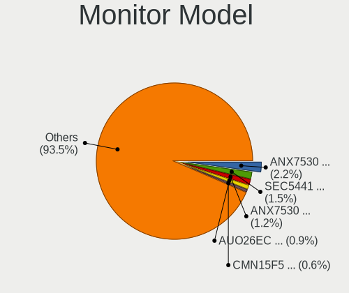

| Model                                                                    | Notebooks | Percent |
|--------------------------------------------------------------------------|-----------|---------|
| Valve ANX7530 U VLV3001 800x1280 100x150mm 7.1-inch                      | 33        | 4.91%   |
| Lenovo LCD Monitor LEN40B0 1366x768 344x194mm 15.5-inch                  | 5         | 0.74%   |
| Chimei Innolux LCD Monitor CMN15DB 1366x768 344x193mm 15.5-inch          | 5         | 0.74%   |
| AU Optronics LCD Monitor AUO978F 1920x1080 382x215mm 17.3-inch           | 5         | 0.74%   |
| Samsung Electronics LCD Monitor SEC5441 1366x768 344x194mm 15.5-inch     | 4         | 0.6%    |
| PANDA LCD Monitor NCP0036 1920x1080 344x194mm 15.5-inch                  | 4         | 0.6%    |
| LG Display LCD Monitor LGD046F 1920x1080 344x194mm 15.5-inch             | 4         | 0.6%    |
| LG Display LCD Monitor LGD02DC 1366x768 344x194mm 15.5-inch              | 4         | 0.6%    |
| Sharp LCD Monitor SHP148D 3840x2160 344x194mm 15.5-inch                  | 3         | 0.45%   |
| Samsung Electronics LCD Monitor SEC544B 1600x900 310x174mm 14.0-inch     | 3         | 0.45%   |
| PANDA LCD Monitor NCP002D 1920x1080 344x194mm 15.5-inch                  | 3         | 0.45%   |
| InfoVision LCD Monitor IVO8C78 1920x1080 309x174mm 14.0-inch             | 3         | 0.45%   |
| InfoVision LCD Monitor IVO057D 1920x1080 309x174mm 14.0-inch             | 3         | 0.45%   |
| Chimei Innolux LCD Monitor CMN15E7 1920x1080 344x193mm 15.5-inch         | 3         | 0.45%   |
| Chimei Innolux LCD Monitor CMN1408 1920x1080 309x173mm 13.9-inch         | 3         | 0.45%   |
| Chimei Innolux LCD Monitor CMN1132 1366x768 256x144mm 11.6-inch          | 3         | 0.45%   |
| Chi Mei Optoelectronics LCD Monitor CMO1719 1600x900 382x215mm 17.3-inch | 3         | 0.45%   |
| BOE LCD Monitor BOE095F 2256x1504 285x190mm 13.5-inch                    | 3         | 0.45%   |
| BOE LCD Monitor BOE084E 1920x1080 382x215mm 17.3-inch                    | 3         | 0.45%   |
| AU Optronics LCD Monitor AUO463D 1920x1080 309x174mm 14.0-inch           | 3         | 0.45%   |
| AU Optronics LCD Monitor AUO2D3C 1366x768 309x173mm 13.9-inch            | 3         | 0.45%   |
| AU Optronics LCD Monitor AUO235C 1366x768 256x144mm 11.6-inch            | 3         | 0.45%   |
| AU Optronics LCD Monitor AUO223E 1600x900 309x174mm 14.0-inch            | 3         | 0.45%   |
| AU Optronics LCD Monitor AUO20EC 1366x768 344x193mm 15.5-inch            | 3         | 0.45%   |
| AU Optronics LCD Monitor AUO12EC 1366x768 344x193mm 15.5-inch            | 3         | 0.45%   |
| AU Optronics LCD Monitor AUO11ED 1920x1080 344x193mm 15.5-inch           | 3         | 0.45%   |
| AU Optronics LCD Monitor AUO10EC 1366x768 344x193mm 15.5-inch            | 3         | 0.45%   |
| Vizio E320VT VIZ0067 1920x1080 698x392mm 31.5-inch                       | 2         | 0.3%    |
| STA LCD Monitor STAAFC9 1920x1080 344x194mm 15.5-inch                    | 2         | 0.3%    |
| Sharp LCD Monitor SHP1517 3840x2400 366x229mm 17.0-inch                  | 2         | 0.3%    |
| Sharp LCD Monitor SHP1515 1920x1200 336x210mm 15.6-inch                  | 2         | 0.3%    |
| Sharp LCD Monitor SHP14D6 3840x2400 366x229mm 17.0-inch                  | 2         | 0.3%    |
| Sharp LCD Monitor SHP14AD 3840x2160 294x165mm 13.3-inch                  | 2         | 0.3%    |
| Sharp LCD Monitor SHP1476 3840x2160 346x194mm 15.6-inch                  | 2         | 0.3%    |
| Sharp LCD Monitor SHP1449 1920x1080 294x165mm 13.3-inch                  | 2         | 0.3%    |
| Samsung Electronics LCD Monitor SEC3152 1366x768 344x194mm 15.5-inch     | 2         | 0.3%    |
| Samsung Electronics LCD Monitor SDC416D 2880x1800 312x195mm 14.5-inch    | 2         | 0.3%    |
| Samsung Electronics LCD Monitor SDC416B 3840x2400 344x215mm 16.0-inch    | 2         | 0.3%    |
| PANDA LCD Monitor NCP004D 1920x1080 344x194mm 15.5-inch                  | 2         | 0.3%    |
| LG Display LCD Monitor LGD06AA 3840x2400 344x215mm 16.0-inch             | 2         | 0.3%    |

Monitor Resolution
------------------

Monitor screen resolution

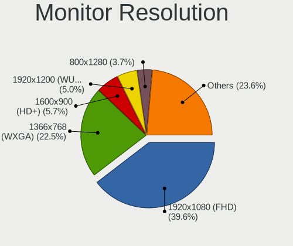

| Resolution         | Notebooks | Percent |
|--------------------|-----------|---------|
| 1920x1080 (FHD)    | 263       | 41.68%  |
| 1366x768 (WXGA)    | 141       | 22.35%  |
| 3840x2160 (4K)     | 36        | 5.71%   |
| 1600x900 (HD+)     | 36        | 5.71%   |
| 800x1280           | 35        | 5.55%   |
| 1280x800 (WXGA)    | 20        | 3.17%   |
| 2560x1440 (QHD)    | 15        | 2.38%   |
| 1920x1200 (WUXGA)  | 14        | 2.22%   |
| 2560x1600          | 12        | 1.9%    |
| 3840x2400          | 10        | 1.58%   |
| 3440x1440          | 7         | 1.11%   |
| 1440x900 (WXGA+)   | 7         | 1.11%   |
| 2880x1800          | 5         | 0.79%   |
| 3200x1800 (QHD+)   | 4         | 0.63%   |
| 2560x1080          | 4         | 0.63%   |
| 2256x1504          | 3         | 0.48%   |
| 1280x1024 (SXGA)   | 3         | 0.48%   |
| 1680x1050 (WSXGA+) | 2         | 0.32%   |
| 1360x768           | 2         | 0.32%   |
| 1024x768 (XGA)     | 2         | 0.32%   |
| 1024x600           | 2         | 0.32%   |
| 3840x1600          | 1         | 0.16%   |
| 3360x1080          | 1         | 0.16%   |
| 3200x2000          | 1         | 0.16%   |
| 2560x2880          | 1         | 0.16%   |
| 2304x1440          | 1         | 0.16%   |
| 1920x540           | 1         | 0.16%   |
| 1792x768           | 1         | 0.16%   |
| Unknown            | 1         | 0.16%   |

Monitor Diagonal
----------------

Diagonal size in inches

| Inches  | Notebooks | Percent |
|---------|-----------|---------|
| 15      | 239       | 35.94%  |
| 14      | 89        | 13.38%  |
| 17      | 71        | 10.68%  |
| 13      | 71        | 10.68%  |
| 7       | 33        | 4.96%   |
| 11      | 21        | 3.16%   |
| 27      | 20        | 3.01%   |
| 24      | 20        | 3.01%   |
| 23      | 16        | 2.41%   |
| 21      | 12        | 1.8%    |
| 16      | 10        | 1.5%    |
| 34      | 8         | 1.2%    |
| 31      | 7         | 1.05%   |
| 12      | 7         | 1.05%   |
| Unknown | 7         | 1.05%   |
| 72      | 5         | 0.75%   |
| 84      | 4         | 0.6%    |
| 19      | 3         | 0.45%   |
| 10      | 3         | 0.45%   |
| 54      | 2         | 0.3%    |
| 40      | 2         | 0.3%    |
| 35      | 2         | 0.3%    |
| 32      | 2         | 0.3%    |
| 20      | 2         | 0.3%    |
| 64      | 1         | 0.15%   |
| 39      | 1         | 0.15%   |
| 37      | 1         | 0.15%   |
| 36      | 1         | 0.15%   |
| 29      | 1         | 0.15%   |
| 26      | 1         | 0.15%   |
| 25      | 1         | 0.15%   |
| 22      | 1         | 0.15%   |
| 18      | 1         | 0.15%   |

Monitor Width
-------------

Physical width

| Width in mm | Notebooks | Percent |
|-------------|-----------|---------|
| 301-350     | 365       | 55.22%  |
| 351-400     | 79        | 11.95%  |
| 201-300     | 68        | 10.29%  |
| 501-600     | 52        | 7.87%   |
| 1-100       | 33        | 4.99%   |
| 401-500     | 19        | 2.87%   |
| 701-800     | 11        | 1.66%   |
| 601-700     | 9         | 1.36%   |
| 1501-2000   | 9         | 1.36%   |
| Unknown     | 7         | 1.06%   |
| 801-900     | 5         | 0.76%   |
| 1001-1500   | 3         | 0.45%   |
| 901-1000    | 1         | 0.15%   |

Aspect Ratio
------------

Proportional relationship between the width and the height

| Ratio   | Notebooks | Percent |
|---------|-----------|---------|
| 16/9    | 455       | 77.12%  |
| 16/10   | 73        | 12.37%  |
| 0.67    | 33        | 5.59%   |
| 21/9    | 13        | 2.2%    |
| 5/4     | 3         | 0.51%   |
| 3/2     | 3         | 0.51%   |
| Unknown | 3         | 0.51%   |
| 4/3     | 2         | 0.34%   |
| 0.62    | 2         | 0.34%   |
| 32/9    | 1         | 0.17%   |
| 2.65    | 1         | 0.17%   |
| 0.89    | 1         | 0.17%   |

Monitor Area
------------

Area in inch

| Area in inch | Notebooks | Percent |
|----------------|-----------|---------|
| 101-110        | 239       | 35.94%  |
| 81-90          | 129       | 19.4%   |
| 121-130        | 65        | 9.77%   |
| 201-250        | 45        | 6.77%   |
| 1-40           | 33        | 4.96%   |
| 71-80          | 29        | 4.36%   |
| 51-60          | 22        | 3.31%   |
| 351-500        | 20        | 3.01%   |
| 301-350        | 19        | 2.86%   |
| More than 1000 | 12        | 1.8%    |
| 111-120        | 10        | 1.5%    |
| 61-70          | 7         | 1.05%   |
| 151-200        | 7         | 1.05%   |
| Unknown        | 7         | 1.05%   |
| 131-140        | 5         | 0.75%   |
| 501-1000       | 5         | 0.75%   |
| 251-300        | 4         | 0.6%    |
| 91-100         | 3         | 0.45%   |
| 41-50          | 2         | 0.3%    |
| 141-150        | 2         | 0.3%    |

Pixel Density
-------------

Pixels per inch

| Density       | Notebooks | Percent |
|---------------|-----------|---------|
| 121-160       | 265       | 40.58%  |
| 101-120       | 169       | 25.88%  |
| 51-100        | 88        | 13.48%  |
| 161-240       | 86        | 13.17%  |
| More than 240 | 31        | 4.75%   |
| 1-50          | 7         | 1.07%   |
| Unknown       | 7         | 1.07%   |

Multiple Monitors
-----------------

Total monitors connected

| Total | Notebooks | Percent |
|-------|-----------|---------|
| 1     | 448       | 79.15%  |
| 2     | 94        | 16.61%  |
| 3     | 14        | 2.47%   |
| 0     | 9         | 1.59%   |
| 4     | 1         | 0.18%   |

Network
-------

Net Controller Vendor
---------------------

Controller vendors

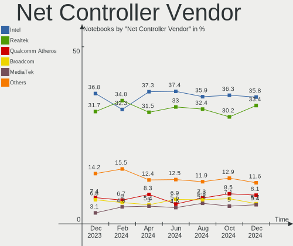

| Vendor                           | Notebooks | Percent |
|----------------------------------|-----------|---------|
| Intel                            | 310       | 37.08%  |
| Realtek Semiconductor            | 293       | 35.05%  |
| Qualcomm Atheros                 | 77        | 9.21%   |
| Broadcom                         | 47        | 5.62%   |
| Broadcom Limited                 | 21        | 2.51%   |
| ASIX Electronics                 | 13        | 1.56%   |
| MediaTek                         | 11        | 1.32%   |
| Qualcomm                         | 5         | 0.6%    |
| Nvidia                           | 5         | 0.6%    |
| Marvell Technology Group         | 5         | 0.6%    |
| TP-Link                          | 4         | 0.48%   |
| Ralink Technology                | 4         | 0.48%   |
| Motorola PCS                     | 4         | 0.48%   |
| Lenovo                           | 4         | 0.48%   |
| Samsung Electronics              | 3         | 0.36%   |
| Ralink                           | 3         | 0.36%   |
| DisplayLink                      | 3         | 0.36%   |
| Dell                             | 3         | 0.36%   |
| U-Blox                           | 2         | 0.24%   |
| Sierra Wireless                  | 2         | 0.24%   |
| NetGear                          | 2         | 0.24%   |
| Xiaomi                           | 1         | 0.12%   |
| Silicon Integrated Systems [SiS] | 1         | 0.12%   |
| OPPO Electronics                 | 1         | 0.12%   |
| OnePlus Technology (Shenzhen)    | 1         | 0.12%   |
| Microsoft                        | 1         | 0.12%   |
| Linksys                          | 1         | 0.12%   |
| JMicron Technology               | 1         | 0.12%   |
| Hewlett-Packard                  | 1         | 0.12%   |
| Google                           | 1         | 0.12%   |
| Fibocom                          | 1         | 0.12%   |
| Edimax Technology                | 1         | 0.12%   |
| D-Link                           | 1         | 0.12%   |
| Cypress Semiconductor            | 1         | 0.12%   |
| Belkin Components                | 1         | 0.12%   |
| ASUSTek Computer                 | 1         | 0.12%   |

Net Controller Model
--------------------

Controller models

| Model                                                             | Notebooks | Percent |
|-------------------------------------------------------------------|-----------|---------|
| Realtek RTL8111/8168/8411 PCI Express Gigabit Ethernet Controller | 131       | 12.97%  |
| Realtek RTL8822CE 802.11ac PCIe Wireless Network Adapter          | 50        | 4.95%   |
| Realtek RTL810xE PCI Express Fast Ethernet controller             | 45        | 4.46%   |
| Intel Wi-Fi 6 AX200                                               | 30        | 2.97%   |
| Intel Wireless 7260                                               | 28        | 2.77%   |
| Intel Alder Lake-P PCH CNVi WiFi                                  | 28        | 2.77%   |
| Realtek RTL8821CE 802.11ac PCIe Wireless Network Adapter          | 25        | 2.48%   |
| Realtek RTL8153 Gigabit Ethernet Adapter                          | 24        | 2.38%   |
| Intel Wireless 8265 / 8275                                        | 22        | 2.18%   |
| Intel Wi-Fi 6 AX201                                               | 22        | 2.18%   |
| Intel 82579LM Gigabit Network Connection (Lewisville)             | 21        | 2.08%   |
| Qualcomm Atheros QCA6174 802.11ac Wireless Network Adapter        | 20        | 1.98%   |
| Intel Wireless 7265                                               | 19        | 1.88%   |
| Intel Wireless 8260                                               | 16        | 1.58%   |
| Intel Wi-Fi 6 AX210/AX211/AX411 160MHz                            | 15        | 1.49%   |
| Intel Ethernet Connection (4) I219-LM                             | 14        | 1.39%   |
| Broadcom BCM4313 802.11bgn Wireless Network Adapter               | 14        | 1.39%   |
| Qualcomm Atheros QCA9377 802.11ac Wireless Network Adapter        | 13        | 1.29%   |
| ASIX AX88179 Gigabit Ethernet                                     | 12        | 1.19%   |
| Qualcomm Atheros AR9485 Wireless Network Adapter                  | 11        | 1.09%   |
| Intel Comet Lake PCH CNVi WiFi                                    | 10        | 0.99%   |
| Realtek RTL8852AE 802.11ax PCIe Wireless Network Adapter          | 9         | 0.89%   |
| Intel Ethernet Connection I217-LM                                 | 9         | 0.89%   |
| Intel Centrino Advanced-N 6205 [Taylor Peak]                      | 9         | 0.89%   |
| Realtek RTL8188EE Wireless Network Adapter                        | 8         | 0.79%   |
| Realtek RTL8125 2.5GbE Controller                                 | 8         | 0.79%   |
| Realtek Killer E3000 2.5GbE Controller                            | 8         | 0.79%   |
| Qualcomm Atheros QCA9565 / AR9565 Wireless Network Adapter        | 8         | 0.79%   |
| Intel Cannon Lake PCH CNVi WiFi                                   | 8         | 0.79%   |
| Intel 82577LM Gigabit Network Connection                          | 8         | 0.79%   |
| Realtek RTL8822BE 802.11a/b/g/n/ac WiFi adapter                   | 7         | 0.69%   |
| Intel Dual Band Wireless-AC 3168NGW [Stone Peak]                  | 7         | 0.69%   |
| Realtek RTL8188CE 802.11b/g/n WiFi Adapter                        | 6         | 0.59%   |
| Qualcomm Atheros AR9285 Wireless Network Adapter (PCI-Express)    | 6         | 0.59%   |
| MediaTek MT7921 802.11ax PCI Express Wireless Network Adapter     | 6         | 0.59%   |
| Intel Wireless 3165                                               | 6         | 0.59%   |
| Intel Wireless 3160                                               | 6         | 0.59%   |
| Intel Ethernet Connection I219-LM                                 | 6         | 0.59%   |
| Intel Ethernet Connection I218-LM                                 | 6         | 0.59%   |
| Intel Ethernet Connection (2) I219-LM                             | 6         | 0.59%   |

Wireless Vendor
---------------

Wireless vendors

| Vendor                | Notebooks | Percent |
|-----------------------|-----------|---------|
| Intel                 | 296       | 50.34%  |
| Realtek Semiconductor | 130       | 22.11%  |
| Qualcomm Atheros      | 68        | 11.56%  |
| Broadcom              | 42        | 7.14%   |
| Broadcom Limited      | 13        | 2.21%   |
| MediaTek              | 11        | 1.87%   |
| Qualcomm              | 5         | 0.85%   |
| Ralink Technology     | 4         | 0.68%   |
| TP-Link               | 3         | 0.51%   |
| Ralink                | 3         | 0.51%   |
| Dell                  | 3         | 0.51%   |
| Sierra Wireless       | 2         | 0.34%   |
| NetGear               | 2         | 0.34%   |
| Microsoft             | 1         | 0.17%   |
| Fibocom               | 1         | 0.17%   |
| Edimax Technology     | 1         | 0.17%   |
| D-Link                | 1         | 0.17%   |
| Belkin Components     | 1         | 0.17%   |
| ASUSTek Computer      | 1         | 0.17%   |

Wireless Model
--------------

Wireless models

| Model                                                          | Notebooks | Percent |
|----------------------------------------------------------------|-----------|---------|
| Realtek RTL8822CE 802.11ac PCIe Wireless Network Adapter       | 50        | 8.47%   |
| Intel Wi-Fi 6 AX200                                            | 30        | 5.08%   |
| Intel Wireless 7260                                            | 28        | 4.75%   |
| Intel Alder Lake-P PCH CNVi WiFi                               | 28        | 4.75%   |
| Realtek RTL8821CE 802.11ac PCIe Wireless Network Adapter       | 25        | 4.24%   |
| Intel Wireless 8265 / 8275                                     | 22        | 3.73%   |
| Intel Wi-Fi 6 AX201                                            | 22        | 3.73%   |
| Qualcomm Atheros QCA6174 802.11ac Wireless Network Adapter     | 20        | 3.39%   |
| Intel Wireless 7265                                            | 19        | 3.22%   |
| Intel Wireless 8260                                            | 16        | 2.71%   |
| Intel Wi-Fi 6 AX210/AX211/AX411 160MHz                         | 15        | 2.54%   |
| Broadcom BCM4313 802.11bgn Wireless Network Adapter            | 14        | 2.37%   |
| Qualcomm Atheros QCA9377 802.11ac Wireless Network Adapter     | 13        | 2.2%    |
| Qualcomm Atheros AR9485 Wireless Network Adapter               | 11        | 1.86%   |
| Intel Comet Lake PCH CNVi WiFi                                 | 10        | 1.69%   |
| Realtek RTL8852AE 802.11ax PCIe Wireless Network Adapter       | 9         | 1.53%   |
| Intel Centrino Advanced-N 6205 [Taylor Peak]                   | 9         | 1.53%   |
| Realtek RTL8188EE Wireless Network Adapter                     | 8         | 1.36%   |
| Qualcomm Atheros QCA9565 / AR9565 Wireless Network Adapter     | 8         | 1.36%   |
| Intel Cannon Lake PCH CNVi WiFi                                | 8         | 1.36%   |
| Realtek RTL8822BE 802.11a/b/g/n/ac WiFi adapter                | 7         | 1.19%   |
| Intel Dual Band Wireless-AC 3168NGW [Stone Peak]               | 7         | 1.19%   |
| Realtek RTL8188CE 802.11b/g/n WiFi Adapter                     | 6         | 1.02%   |
| Qualcomm Atheros AR9285 Wireless Network Adapter (PCI-Express) | 6         | 1.02%   |
| MediaTek MT7921 802.11ax PCI Express Wireless Network Adapter  | 6         | 1.02%   |
| Intel Wireless 3165                                            | 6         | 1.02%   |
| Intel Wireless 3160                                            | 6         | 1.02%   |
| Intel Centrino Advanced-N 6235                                 | 6         | 1.02%   |
| Intel Cannon Point-LP CNVi [Wireless-AC]                       | 6         | 1.02%   |
| Broadcom BCM4331 802.11a/b/g/n                                 | 6         | 1.02%   |
| Realtek 802.11n WLAN Adapter                                   | 5         | 0.85%   |
| Qualcomm Atheros AR9462 Wireless Network Adapter               | 5         | 0.85%   |
| Intel Gemini Lake PCH CNVi WiFi                                | 5         | 0.85%   |
| Intel Centrino Advanced-N 6200                                 | 5         | 0.85%   |
| Broadcom BCM4322 802.11a/b/g/n Wireless LAN Controller         | 5         | 0.85%   |
| Realtek RTL8723DE Wireless Network Adapter                     | 4         | 0.68%   |
| Realtek Realtek Network controller                             | 4         | 0.68%   |
| Qualcomm QCA6390 Wireless Network Adapter                      | 4         | 0.68%   |
| Intel Wi-Fi 6 AX201 160MHz                                     | 4         | 0.68%   |
| Intel Tiger Lake PCH CNVi WiFi                                 | 4         | 0.68%   |

Ethernet Vendor
---------------

Ethernet vendors

| Vendor                           | Notebooks | Percent |
|----------------------------------|-----------|---------|
| Realtek Semiconductor            | 220       | 53.79%  |
| Intel                            | 108       | 26.41%  |
| Broadcom                         | 16        | 3.91%   |
| Qualcomm Atheros                 | 14        | 3.42%   |
| ASIX Electronics                 | 13        | 3.18%   |
| Broadcom Limited                 | 8         | 1.96%   |
| Nvidia                           | 5         | 1.22%   |
| Marvell Technology Group         | 5         | 1.22%   |
| Samsung Electronics              | 3         | 0.73%   |
| Lenovo                           | 3         | 0.73%   |
| DisplayLink                      | 3         | 0.73%   |
| Motorola PCS                     | 2         | 0.49%   |
| Xiaomi                           | 1         | 0.24%   |
| TP-Link                          | 1         | 0.24%   |
| Silicon Integrated Systems [SiS] | 1         | 0.24%   |
| OPPO Electronics                 | 1         | 0.24%   |
| Linksys                          | 1         | 0.24%   |
| JMicron Technology               | 1         | 0.24%   |
| Hewlett-Packard                  | 1         | 0.24%   |
| Google                           | 1         | 0.24%   |
| Cypress Semiconductor            | 1         | 0.24%   |

Ethernet Model
--------------

Ethernet models

| Model                                                             | Notebooks | Percent |
|-------------------------------------------------------------------|-----------|---------|
| Realtek RTL8111/8168/8411 PCI Express Gigabit Ethernet Controller | 131       | 31.8%   |
| Realtek RTL810xE PCI Express Fast Ethernet controller             | 45        | 10.92%  |
| Realtek RTL8153 Gigabit Ethernet Adapter                          | 24        | 5.83%   |
| Intel 82579LM Gigabit Network Connection (Lewisville)             | 21        | 5.1%    |
| Intel Ethernet Connection (4) I219-LM                             | 14        | 3.4%    |
| ASIX AX88179 Gigabit Ethernet                                     | 12        | 2.91%   |
| Intel Ethernet Connection I217-LM                                 | 9         | 2.18%   |
| Realtek RTL8125 2.5GbE Controller                                 | 8         | 1.94%   |
| Realtek Killer E3000 2.5GbE Controller                            | 8         | 1.94%   |
| Intel 82577LM Gigabit Network Connection                          | 8         | 1.94%   |
| Intel Ethernet Connection I219-LM                                 | 6         | 1.46%   |
| Intel Ethernet Connection I218-LM                                 | 6         | 1.46%   |
| Intel Ethernet Connection (2) I219-LM                             | 6         | 1.46%   |
| Broadcom NetXtreme BCM57765 Gigabit Ethernet PCIe                 | 6         | 1.46%   |
| Nvidia MCP79 Ethernet                                             | 4         | 0.97%   |
| Intel Ethernet Connection (3) I218-LM                             | 4         | 0.97%   |
| Intel Ethernet Connection (16) I219-LM                            | 4         | 0.97%   |
| Qualcomm Atheros Killer E2500 Gigabit Ethernet Controller         | 3         | 0.73%   |
| Marvell Group 88E8040 PCI-E Fast Ethernet Controller              | 3         | 0.73%   |
| Intel Ethernet Connection I219-V                                  | 3         | 0.73%   |
| Intel Ethernet Connection (7) I219-LM                             | 3         | 0.73%   |
| Intel Ethernet Connection (6) I219-LM                             | 3         | 0.73%   |
| Intel 82567LM Gigabit Network Connection                          | 3         | 0.73%   |
| Samsung GT-I9070 (network tethering, USB debugging enabled)       | 2         | 0.49%   |
| Realtek Killer E2600 Gigabit Ethernet Controller                  | 2         | 0.49%   |
| Qualcomm Atheros AR8162 Fast Ethernet                             | 2         | 0.49%   |
| Qualcomm Atheros AR8161 Gigabit Ethernet                          | 2         | 0.49%   |
| Qualcomm Atheros AR8152 v2.0 Fast Ethernet                        | 2         | 0.49%   |
| Motorola PCS motorola one 5G ace                                  | 2         | 0.49%   |
| Lenovo ThinkPad TBT 3 Dock                                        | 2         | 0.49%   |
| Intel WiMAX Connection 2400m                                      | 2         | 0.49%   |
| Intel Ethernet Connection I217-V                                  | 2         | 0.49%   |
| Intel Ethernet Connection (4) I219-V                              | 2         | 0.49%   |
| Intel Ethernet Connection (16) I219-V                             | 2         | 0.49%   |
| Intel Ethernet Connection (13) I219-V                             | 2         | 0.49%   |
| DisplayLink Dell D3100 Docking Station                            | 2         | 0.49%   |
| Broadcom NetXtreme BCM57786 Gigabit Ethernet PCIe                 | 2         | 0.49%   |
| Broadcom Limited BCM4401-B0 100Base-TX                            | 2         | 0.49%   |
| Xiaomi Mi/Redmi series (RNDIS)                                    | 1         | 0.24%   |
| TP-Link UE300 10/100/1000 LAN (ethernet mode) [Realtek RTL8153]   | 1         | 0.24%   |

Net Controller Kind
-------------------

Ethernet, WiFi or modem

| Kind     | Notebooks | Percent |
|----------|-----------|---------|
| WiFi     | 562       | 58.06%  |
| Ethernet | 398       | 41.12%  |
| Modem    | 4         | 0.41%   |
| Unknown  | 4         | 0.41%   |

Used Controller
---------------

Currently used network controller

| Kind     | Notebooks | Percent |
|----------|-----------|---------|
| WiFi     | 489       | 83.88%  |
| Ethernet | 94        | 16.12%  |

NICs
----

Total network controllers on board

| Total | Notebooks | Percent |
|-------|-----------|---------|
| 2     | 346       | 61.13%  |
| 1     | 210       | 37.1%   |
| 0     | 7         | 1.24%   |
| 3     | 3         | 0.53%   |

IPv6
----

IPv6 vs IPv4

| Used | Notebooks | Percent |
|------|-----------|---------|
| No   | 354       | 62.54%  |
| Yes  | 212       | 37.46%  |

Bluetooth
---------

Bluetooth Vendor
----------------

Controller vendors

| Vendor                          | Notebooks | Percent |
|---------------------------------|-----------|---------|
| Intel                           | 248       | 52.43%  |
| Realtek Semiconductor           | 56        | 11.84%  |
| IMC Networks                    | 56        | 11.84%  |
| Qualcomm Atheros Communications | 36        | 7.61%   |
| Apple                           | 21        | 4.44%   |
| Lite-On Technology              | 13        | 2.75%   |
| Broadcom                        | 10        | 2.11%   |
| Foxconn / Hon Hai               | 8         | 1.69%   |
| Hewlett-Packard                 | 7         | 1.48%   |
| Dell                            | 6         | 1.27%   |
| Toshiba                         | 4         | 0.85%   |
| Cambridge Silicon Radio         | 3         | 0.63%   |
| ASUSTek Computer                | 3         | 0.63%   |
| Taiyo Yuden                     | 1         | 0.21%   |
| MediaTek                        | 1         | 0.21%   |

Bluetooth Model
---------------

Controller models

| Model                                               | Notebooks | Percent |
|-----------------------------------------------------|-----------|---------|
| Intel Bluetooth wireless interface                  | 93        | 19.66%  |
| Intel Bluetooth Device                              | 70        | 14.8%   |
| IMC Networks Bluetooth Radio                        | 47        | 9.94%   |
| Realtek Bluetooth Radio                             | 35        | 7.4%    |
| Intel AX200 Bluetooth                               | 27        | 5.71%   |
| Qualcomm Atheros  Bluetooth Device                  | 24        | 5.07%   |
| Intel Bluetooth 9460/9560 Jefferson Peak (JfP)      | 23        | 4.86%   |
| Realtek  Bluetooth 4.2 Adapter                      | 17        | 3.59%   |
| Intel AX210 Bluetooth                               | 14        | 2.96%   |
| Apple Bluetooth Host Controller                     | 13        | 2.75%   |
| Intel Centrino Bluetooth Wireless Transceiver       | 10        | 2.11%   |
| Intel Wireless-AC 3168 Bluetooth                    | 7         | 1.48%   |
| Lite-On Bluetooth Device                            | 6         | 1.27%   |
| HP Broadcom 2070 Bluetooth Combo                    | 5         | 1.06%   |
| Apple Bluetooth USB Host Controller                 | 5         | 1.06%   |
| IMC Networks Wireless_Device                        | 4         | 0.85%   |
| Foxconn / Hon Hai Wireless_Device                   | 4         | 0.85%   |
| Foxconn / Hon Hai Bluetooth Device                  | 4         | 0.85%   |
| Dell DW375 Bluetooth Module                         | 4         | 0.85%   |
| Broadcom BCM20702 Bluetooth 4.0 [ThinkPad]          | 4         | 0.85%   |
| Qualcomm Atheros QCA61x4 Bluetooth 4.0              | 3         | 0.63%   |
| Lite-On Atheros AR3012 Bluetooth                    | 3         | 0.63%   |
| IMC Networks Atheros AR3012 Bluetooth 4.0 Adapter   | 3         | 0.63%   |
| Cambridge Silicon Radio Bluetooth Dongle (HCI mode) | 3         | 0.63%   |
| Toshiba BCM43142A0                                  | 2         | 0.42%   |
| Qualcomm Atheros AR9462 Bluetooth                   | 2         | 0.42%   |
| Qualcomm Atheros AR3012 Bluetooth 4.0               | 2         | 0.42%   |
| Qualcomm Atheros AR3011 Bluetooth                   | 2         | 0.42%   |
| Lite-On Wireless_Device                             | 2         | 0.42%   |
| Lite-On Bluetooth Radio                             | 2         | 0.42%   |
| Intel Wireless-AC 9260 Bluetooth Adapter            | 2         | 0.42%   |
| Intel Centrino Advanced-N 6230 Bluetooth adapter    | 2         | 0.42%   |
| HP Bluetooth 2.0 Interface [Broadcom BCM2045]       | 2         | 0.42%   |
| Broadcom HP Portable Valentine                      | 2         | 0.42%   |
| ASUS ASUS USB-BT500                                 | 2         | 0.42%   |
| Apple Built-in Bluetooth 2.0+EDR HCI                | 2         | 0.42%   |
| Toshiba Integrated Bluetooth HCI                    | 1         | 0.21%   |
| Toshiba Bluetooth Device                            | 1         | 0.21%   |
| Taiyo Yuden Bluetooth Device (V2.1+EDR)             | 1         | 0.21%   |
| Realtek RTL8822BE Bluetooth 4.2 Adapter             | 1         | 0.21%   |

Sound
-----

Sound Vendor
------------

Sound card vendors

| Vendor                                       | Notebooks | Percent |
|----------------------------------------------|-----------|---------|
| Intel                                        | 408       | 56.12%  |
| AMD                                          | 157       | 21.6%   |
| Nvidia                                       | 122       | 16.78%  |
| C-Media Electronics                          | 7         | 0.96%   |
| Realtek Semiconductor                        | 4         | 0.55%   |
| Logitech                                     | 4         | 0.55%   |
| Lenovo                                       | 4         | 0.55%   |
| Sony                                         | 3         | 0.41%   |
| Texas Instruments                            | 2         | 0.28%   |
| Kingston Technology                          | 2         | 0.28%   |
| Zoran Co. Personal Media Division (Nogatech) | 1         | 0.14%   |
| Thesycon Systemsoftware & Consulting         | 1         | 0.14%   |
| Tenx Technology                              | 1         | 0.14%   |
| SteelSeries ApS                              | 1         | 0.14%   |
| Silicon Integrated Systems [SiS]             | 1         | 0.14%   |
| Razer USA                                    | 1         | 0.14%   |
| Princeton Technology                         | 1         | 0.14%   |
| MosArt Semiconductor                         | 1         | 0.14%   |
| Midiplus                                     | 1         | 0.14%   |
| JMTek                                        | 1         | 0.14%   |
| Atrix                                        | 1         | 0.14%   |
| ASUSTek Computer                             | 1         | 0.14%   |
| Antlion Audio                                | 1         | 0.14%   |
| Unknown                                      | 1         | 0.14%   |

Sound Model
-----------

Sound card models

| Model                                                                                             | Notebooks | Percent |
|---------------------------------------------------------------------------------------------------|-----------|---------|
| AMD Family 17h/19h HD Audio Controller                                                            | 81        | 9.24%   |
| Intel Sunrise Point-LP HD Audio                                                                   | 57        | 6.5%    |
| AMD Rembrandt Radeon High Definition Audio Controller                                             | 41        | 4.68%   |
| AMD Renoir Radeon High Definition Audio Controller                                                | 34        | 3.88%   |
| Intel 7 Series/C216 Chipset Family High Definition Audio Controller                               | 33        | 3.76%   |
| Intel Tiger Lake-LP Smart Sound Technology Audio Controller                                       | 32        | 3.65%   |
| Intel Alder Lake PCH-P High Definition Audio Controller                                           | 31        | 3.53%   |
| Intel 6 Series/C200 Series Chipset Family High Definition Audio Controller                        | 26        | 2.96%   |
| Intel 8 Series/C220 Series Chipset High Definition Audio Controller                               | 25        | 2.85%   |
| AMD Raven/Raven2/Fenghuang HDMI/DP Audio Controller                                               | 25        | 2.85%   |
| Intel Celeron/Pentium Silver Processor High Definition Audio                                      | 20        | 2.28%   |
| Intel Cannon Lake PCH cAVS                                                                        | 19        | 2.17%   |
| Intel 5 Series/3400 Series Chipset High Definition Audio                                          | 19        | 2.17%   |
| AMD FCH Azalia Controller                                                                         | 19        | 2.17%   |
| AMD Kabini HDMI/DP Audio                                                                          | 18        | 2.05%   |
| Intel Xeon E3-1200 v3/4th Gen Core Processor HD Audio Controller                                  | 17        | 1.94%   |
| Intel Broadwell-U Audio Controller                                                                | 17        | 1.94%   |
| Intel Wildcat Point-LP High Definition Audio Controller                                           | 16        | 1.82%   |
| Nvidia TU106 High Definition Audio Controller                                                     | 14        | 1.6%    |
| Nvidia GA106 High Definition Audio Controller                                                     | 14        | 1.6%    |
| Intel Haswell-ULT HD Audio Controller                                                             | 14        | 1.6%    |
| Intel Comet Lake PCH cAVS                                                                         | 14        | 1.6%    |
| Intel 8 Series HD Audio Controller                                                                | 14        | 1.6%    |
| Intel Tiger Lake-H HD Audio Controller                                                            | 13        | 1.48%   |
| Nvidia TU107 GeForce GTX 1650 High Definition Audio Controller                                    | 12        | 1.37%   |
| Intel 82801I (ICH9 Family) HD Audio Controller                                                    | 11        | 1.25%   |
| Intel Atom/Celeron/Pentium Processor x5-E8000/J3xxx/N3xxx Series High Definition Audio Controller | 10        | 1.14%   |
| Nvidia GK107 HDMI Audio Controller                                                                | 9         | 1.03%   |
| Nvidia GA104 High Definition Audio Controller                                                     | 9         | 1.03%   |
| Nvidia Audio device                                                                               | 9         | 1.03%   |
| Intel 100 Series/C230 Series Chipset Family HD Audio Controller                                   | 9         | 1.03%   |
| AMD Family 15h (Models 60h-6fh) Audio Controller                                                  | 9         | 1.03%   |
| Intel CM238 HD Audio Controller                                                                   | 8         | 0.91%   |
| Intel Cannon Point-LP High Definition Audio Controller                                            | 8         | 0.91%   |
| Nvidia GM107 High Definition Audio Controller [GeForce 940MX]                                     | 7         | 0.8%    |
| Intel Comet Lake PCH-LP cAVS                                                                      | 7         | 0.8%    |
| Intel 82801H (ICH8 Family) HD Audio Controller                                                    | 7         | 0.8%    |
| Nvidia TU116 High Definition Audio Controller                                                     | 6         | 0.68%   |
| Intel Jasper Lake HD Audio                                                                        | 6         | 0.68%   |
| Intel Celeron N3350/Pentium N4200/Atom E3900 Series Audio Cluster                                 | 6         | 0.68%   |

Memory
------

Memory Vendor
-------------

Memory module vendors

| Vendor              | Notebooks | Percent |
|---------------------|-----------|---------|
| Samsung Electronics | 105       | 27.93%  |
| SK hynix            | 104       | 27.66%  |
| Micron Technology   | 52        | 13.83%  |
| Crucial             | 30        | 7.98%   |
| Kingston            | 12        | 3.19%   |
| Unknown             | 9         | 2.39%   |
| A-DATA Technology   | 7         | 1.86%   |
| Team                | 6         | 1.6%    |
| Nanya Technology    | 6         | 1.6%    |
| Elpida              | 6         | 1.6%    |
| Unknown (ABCD)      | 5         | 1.33%   |
| Unknown             | 5         | 1.33%   |
| Ramaxel Technology  | 4         | 1.06%   |
| Corsair             | 4         | 1.06%   |
| PNY                 | 3         | 0.8%    |
| G.Skill             | 3         | 0.8%    |
| Timetec             | 2         | 0.53%   |
| Neo Forza           | 2         | 0.53%   |
| Goldkey             | 2         | 0.53%   |
| fef5                | 2         | 0.53%   |
| 4ea5                | 2         | 0.53%   |
| Super Talent        | 1         | 0.27%   |
| Silicon Power       | 1         | 0.27%   |
| Qimonda             | 1         | 0.27%   |
| ff                  | 1         | 0.27%   |
| CSX                 | 1         | 0.27%   |

Memory Model
------------

Memory module models

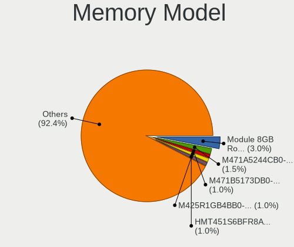

| Model                                                            | Notebooks | Percent |
|------------------------------------------------------------------|-----------|---------|
| SK hynix RAM HMAA1GS6CJR6N-XN 8GB SODIMM DDR4 3200MT/s           | 8         | 2.05%   |
| SK hynix RAM HMA81GS6AFR8N-UH 8192MB SODIMM DDR4 2667MT/s        | 7         | 1.79%   |
| Samsung RAM M425R1GB4BB0-CQKOL 8GB SODIMM DDR5 4800MT/s          | 7         | 1.79%   |
| Unknown (ABCD) RAM 123456789012345678 2GB SODIMM LPDDR4 2400MT/s | 5         | 1.28%   |
| Samsung RAM M471B5273DH0-CH9 4GB SODIMM DDR3 1334MT/s            | 5         | 1.28%   |
| Samsung RAM M471A1G44AB0-CWE 8GB SODIMM DDR4 3200MT/s            | 5         | 1.28%   |
| Micron RAM 8KTF51264HZ-1G6E1 4GB SODIMM DDR3 1600MT/s            | 5         | 1.28%   |
| Unknown                                                          | 5         | 1.28%   |
| SK hynix RAM HMT451S6BFR8A-PB 4096MB SODIMM DDR3 1600MT/s        | 4         | 1.03%   |
| SK hynix RAM HMT41GS6BFR8A-PB 8GB SODIMM DDR3 1600MT/s           | 4         | 1.03%   |
| SK hynix RAM HMA851S6DJR6N-XN 4GB SODIMM DDR4 3200MT/s           | 4         | 1.03%   |
| SK hynix RAM HMA81GS6CJR8N-VK 8GB SODIMM DDR4 2667MT/s           | 4         | 1.03%   |
| Samsung RAM M471B1G73QH0-YK0 8GB SODIMM DDR3 1867MT/s            | 4         | 1.03%   |
| Samsung RAM M471B1G73EB0-YK0 8GB SODIMM DDR3 1600MT/s            | 4         | 1.03%   |
| Samsung RAM M471A5244CB0-CWE 4GB SODIMM DDR4 3200MT/s            | 4         | 1.03%   |
| Team RAM TEAMGROUP-SD4-3200 16GB SODIMM DDR4 3200MT/s            | 3         | 0.77%   |
| SK hynix RAM HMT425S6AFR6A-PB 2GB SODIMM DDR3 3200MT/s           | 3         | 0.77%   |
| SK hynix RAM HMT351S6EFR8A-PB 4GB SODIMM DDR3 1600MT/s           | 3         | 0.77%   |
| SK hynix RAM HMT351S6CFR8C-PB 4GB SODIMM DDR3 1600MT/s           | 3         | 0.77%   |
| Samsung RAM M471B5173QH0-YK0 4GB SODIMM DDR3 1600MT/s            | 3         | 0.77%   |
| Samsung RAM M471B5173DB0-YK0 4GB SODIMM DDR3 1600MT/s            | 3         | 0.77%   |
| Samsung RAM M471B1G73DB0-YK0 8GB SODIMM DDR3 1600MT/s            | 3         | 0.77%   |
| Samsung RAM M471A1K43DB1-CWE 8GB SODIMM DDR4 3200MT/s            | 3         | 0.77%   |
| Samsung RAM M471A1K43DB1-CTD 8GB SODIMM DDR4 2667MT/s            | 3         | 0.77%   |
| Samsung RAM M471A1G44BB0-CWE 8GB SODIMM DDR4 3200MT/s            | 3         | 0.77%   |
| Samsung RAM M471A1G44AB0-CWE 8GB Row Of Chips DDR4 3200MT/s      | 3         | 0.77%   |
| Micron RAM 8ATF1G64HZ-3G2J1 8GB SODIMM DDR4 3200MT/s             | 3         | 0.77%   |
| SK hynix RAM Module 8GB SODIMM DDR4 2400MT/s                     | 2         | 0.51%   |
| SK hynix RAM Module 4GB SODIMM DDR3 1333MT/s                     | 2         | 0.51%   |
| SK hynix RAM HYMP125S64CP8-S6 2GB SODIMM DDR 800MT/s             | 2         | 0.51%   |
| SK hynix RAM HYMP112S64CP6-Y5 1GB SODIMM DDR2 667MT/s            | 2         | 0.51%   |
| SK hynix RAM HMT451S6AFR8A-PB 4GB SODIMM DDR3 1600MT/s           | 2         | 0.51%   |
| SK hynix RAM HMT351S6BFR8C-H9 4GB SODIMM DDR3 1333MT/s           | 2         | 0.51%   |
| SK hynix RAM HMCG78MEBSA092N 16GB SODIMM DDR5 4800MT/s           | 2         | 0.51%   |
| SK hynix RAM HMAA4GS6CJR8N-XN 32GB SODIMM DDR4 3200MT/s          | 2         | 0.51%   |
| SK hynix RAM HMAA4GS6AJR8N-XN 32GB SODIMM DDR4 3200MT/s          | 2         | 0.51%   |
| SK hynix RAM HMA82GS6JJR8N-VK 16GB SODIMM DDR4 2667MT/s          | 2         | 0.51%   |
| SK hynix RAM HMA81GS6DJR8N-XN 8GB SODIMM DDR4 3200MT/s           | 2         | 0.51%   |
| SK hynix RAM HMA81GS6DJR8N-VK 8GB SODIMM DDR4 2667MT/s           | 2         | 0.51%   |
| SK hynix RAM HMA81GS6CJR8N-XN 8GB SODIMM DDR4 3200MT/s           | 2         | 0.51%   |

Memory Kind
-----------

Memory module kinds

| Kind    | Notebooks | Percent |
|---------|-----------|---------|
| DDR4    | 144       | 45.57%  |
| DDR3    | 97        | 30.7%   |
| LPDDR4  | 23        | 7.28%   |
| DDR5    | 16        | 5.06%   |
| DDR2    | 13        | 4.11%   |
| LPDDR3  | 10        | 3.16%   |
| LPDDR5  | 4         | 1.27%   |
| Unknown | 4         | 1.27%   |
| DDR     | 3         | 0.95%   |
| SDRAM   | 2         | 0.63%   |

Memory Form Factor
------------------

Physical design of the memory module

| Name         | Notebooks | Percent |
|--------------|-----------|---------|
| SODIMM       | 275       | 88.14%  |
| Row Of Chips | 24        | 7.69%   |
| Unknown      | 12        | 3.85%   |
| Chip         | 1         | 0.32%   |

Memory Size
-----------

Memory module size

| Size  | Notebooks | Percent |
|-------|-----------|---------|
| 8192  | 136       | 40.36%  |
| 4096  | 92        | 27.3%   |
| 16384 | 44        | 13.06%  |
| 2048  | 35        | 10.39%  |
| 32768 | 19        | 5.64%   |
| 1024  | 10        | 2.97%   |
| 256   | 1         | 0.3%    |

Memory Speed
------------

Memory module speed

| Speed   | Notebooks | Percent |
|---------|-----------|---------|
| 3200    | 77        | 22.99%  |
| 1600    | 70        | 20.9%   |
| 2667    | 56        | 16.72%  |
| 2400    | 25        | 7.46%   |
| 4800    | 16        | 4.78%   |
| 1334    | 13        | 3.88%   |
| 2133    | 11        | 3.28%   |
| 1333    | 11        | 3.28%   |
| 667     | 11        | 3.28%   |
| 4267    | 7         | 2.09%   |
| 1067    | 7         | 2.09%   |
| 1867    | 5         | 1.49%   |
| 6400    | 4         | 1.19%   |
| 2933    | 3         | 0.9%    |
| 975     | 3         | 0.9%    |
| 800     | 3         | 0.9%    |
| 8400    | 2         | 0.6%    |
| 3266    | 2         | 0.6%    |
| 4266    | 1         | 0.3%    |
| 4199    | 1         | 0.3%    |
| 3733    | 1         | 0.3%    |
| 3000    | 1         | 0.3%    |
| 2048    | 1         | 0.3%    |
| 1066    | 1         | 0.3%    |
| 533     | 1         | 0.3%    |
| 133     | 1         | 0.3%    |
| Unknown | 1         | 0.3%    |

Printers & scanners
-------------------

Printer Vendor
--------------

Printer device vendors

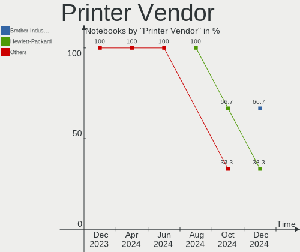

| Vendor             | Notebooks | Percent |
|--------------------|-----------|---------|
| Canon              | 3         | 42.86%  |
| Brother Industries | 2         | 28.57%  |
| Xerox              | 1         | 14.29%  |
| Hewlett-Packard    | 1         | 14.29%  |

Printer Model
-------------

Printer device models

| Model                     | Notebooks | Percent |
|---------------------------|-----------|---------|
| Xerox Phaser 3610         | 1         | 14.29%  |
| HP LaserJet 3055          | 1         | 14.29%  |
| Canon PIXMA MX300         | 1         | 14.29%  |
| Canon PIXMA MG3600 Series | 1         | 14.29%  |
| Canon MF4100 series       | 1         | 14.29%  |
| Brother HL-L2390DW        | 1         | 14.29%  |
| Brother HL-L2370DW series | 1         | 14.29%  |

Scanner Vendor
--------------

Scanner device vendors

Zero info for selected period =(

Scanner Model
-------------

Scanner device models

Zero info for selected period =(

Camera
------

Camera Vendor
-------------

Camera device vendors

| Vendor                                 | Notebooks | Percent |
|----------------------------------------|-----------|---------|
| Chicony Electronics                    | 99        | 20.93%  |
| Microdia                               | 60        | 12.68%  |
| Acer                                   | 45        | 9.51%   |
| IMC Networks                           | 42        | 8.88%   |
| Quanta                                 | 35        | 7.4%    |
| Realtek Semiconductor                  | 31        | 6.55%   |
| Cheng Uei Precision Industry (Foxlink) | 24        | 5.07%   |
| Sunplus Innovation Technology          | 21        | 4.44%   |
| Apple                                  | 17        | 3.59%   |
| Luxvisions Innotech Limited            | 15        | 3.17%   |
| Suyin                                  | 13        | 2.75%   |
| Lite-On Technology                     | 12        | 2.54%   |
| Syntek                                 | 8         | 1.69%   |
| Logitech                               | 7         | 1.48%   |
| Importek                               | 5         | 1.06%   |
| Alcor Micro                            | 5         | 1.06%   |
| Sonix Technology                       | 4         | 0.85%   |
| Samsung Electronics                    | 4         | 0.85%   |
| OmniVision Technologies                | 4         | 0.85%   |
| Lenovo                                 | 4         | 0.85%   |
| Ricoh                                  | 3         | 0.63%   |
| icSpring                               | 2         | 0.42%   |
| ARC International                      | 2         | 0.42%   |
| Y Media                                | 1         | 0.21%   |
| SunplusIT                              | 1         | 0.21%   |
| Mitsumi                                | 1         | 0.21%   |
| Intel                                  | 1         | 0.21%   |
| Goodong                                | 1         | 0.21%   |
| Dell                                   | 1         | 0.21%   |
| BRS-221020-A                           | 1         | 0.21%   |
| Alpha Imaging Technology               | 1         | 0.21%   |
| ALi                                    | 1         | 0.21%   |
| 8SSC20F27142V1SR22V24EV                | 1         | 0.21%   |
| 2M UVC CAMERA                          | 1         | 0.21%   |

Camera Model
------------

Camera device models

| Model                                                           | Notebooks | Percent |
|-----------------------------------------------------------------|-----------|---------|
| Microdia Integrated_Webcam_HD                                   | 32        | 6.75%   |
| IMC Networks USB2.0 HD UVC WebCam                               | 20        | 4.22%   |
| Chicony Integrated Camera                                       | 20        | 4.22%   |
| Acer Integrated Camera                                          | 13        | 2.74%   |
| Chicony HD WebCam                                               | 11        | 2.32%   |
| Microdia Integrated Webcam                                      | 10        | 2.11%   |
| IMC Networks Integrated Camera                                  | 10        | 2.11%   |
| Sunplus Integrated_Webcam_HD                                    | 9         | 1.9%    |
| Realtek Integrated_Webcam_HD                                    | 9         | 1.9%    |
| Quanta HD User Facing                                           | 8         | 1.69%   |
| Chicony USB2.0 Camera                                           | 8         | 1.69%   |
| Syntek Integrated Camera                                        | 7         | 1.48%   |
| Realtek Integrated Webcam HD                                    | 6         | 1.27%   |
| Luxvisions Innotech Limited HP TrueVision HD Camera             | 6         | 1.27%   |
| Apple FaceTime HD Camera                                        | 6         | 1.27%   |
| Apple Built-in iSight                                           | 6         | 1.27%   |
| Quanta HD Webcam                                                | 5         | 1.05%   |
| Chicony HP HD Camera                                            | 5         | 1.05%   |
| Cheng Uei Precision Industry (Foxlink) HP Wide Vision HD Camera | 5         | 1.05%   |
| Cheng Uei Precision Industry (Foxlink) HP TrueVision HD Camera  | 5         | 1.05%   |
| Acer BisonCam,NB Pro                                            | 5         | 1.05%   |
| Samsung Galaxy A5 (MTP)                                         | 4         | 0.84%   |
| Quanta USB2.0 HD UVC WebCam                                     | 4         | 0.84%   |
| Quanta HP Wide Vision HD Camera                                 | 4         | 0.84%   |
| OmniVision OV2640 Webcam                                        | 4         | 0.84%   |
| Microdia Integrated_Webcam_FHD                                  | 4         | 0.84%   |
| Lite-On Integrated Camera                                       | 4         | 0.84%   |
| Chicony HP Webcam                                               | 4         | 0.84%   |
| Chicony HP TrueVision HD Camera                                 | 4         | 0.84%   |
| Chicony 720p HD Camera                                          | 4         | 0.84%   |
| Cheng Uei Precision Industry (Foxlink) HP Webcam                | 4         | 0.84%   |
| Acer ThinkPad Integrated Camera                                 | 4         | 0.84%   |
| Suyin HP TrueVision HD                                          | 3         | 0.63%   |
| Sonix USB2.0 VGAUVC WebCam                                      | 3         | 0.63%   |
| Quanta HP Webcam                                                | 3         | 0.63%   |
| Quanta HP HD Camera                                             | 3         | 0.63%   |
| Quanta ACER HD User Facing                                      | 3         | 0.63%   |
| Microdia Integrated Webcam HD                                   | 3         | 0.63%   |
| Luxvisions Innotech Limited HP HD Camera                        | 3         | 0.63%   |
| Lite-On HP HD Webcam                                            | 3         | 0.63%   |

Security
--------

Fingerprint Vendor
------------------

Fingerprint sensor vendors

| Vendor                     | Notebooks | Percent |
|----------------------------|-----------|---------|
| Validity Sensors           | 41        | 44.09%  |
| Synaptics                  | 20        | 21.51%  |
| Shenzhen Goodix Technology | 13        | 13.98%  |
| Elan Microelectronics      | 7         | 7.53%   |
| AuthenTec                  | 5         | 5.38%   |
| LighTuning Technology      | 4         | 4.3%    |
| Upek                       | 2         | 2.15%   |
| STMicroelectronics         | 1         | 1.08%   |

Fingerprint Model
-----------------

Fingerprint sensor models

| Model                                                                      | Notebooks | Percent |
|----------------------------------------------------------------------------|-----------|---------|
| Unknown                                                                    | 11        | 11.83%  |
| Validity Sensors VFS495 Fingerprint Reader                                 | 9         | 9.68%   |
| Shenzhen Goodix  Fingerprint Device                                        | 6         | 6.45%   |
| Validity Sensors VFS491                                                    | 5         | 5.38%   |
| Validity Sensors VFS 5011 fingerprint sensor                               | 5         | 5.38%   |
| Validity Sensors VFS451 Fingerprint Reader                                 | 4         | 4.3%    |
| Synaptics Prometheus MIS Touch Fingerprint Reader                          | 4         | 4.3%    |
| Synaptics Metallica MIS Touch Fingerprint Reader                           | 4         | 4.3%    |
| Shenzhen Goodix FingerPrint                                                | 4         | 4.3%    |
| Elan ELAN:ARM-M4                                                           | 4         | 4.3%    |
| Validity Sensors VFS7500 Touch Fingerprint Sensor                          | 3         | 3.23%   |
| Validity Sensors Synaptics WBDI                                            | 3         | 3.23%   |
| Validity Sensors Fingerprint scanner                                       | 3         | 3.23%   |
| Shenzhen Goodix Fingerprint Reader                                         | 3         | 3.23%   |
| LighTuning ES603 Swipe Fingerprint Sensor                                  | 3         | 3.23%   |
| Elan ELAN:Fingerprint                                                      | 3         | 3.23%   |
| Validity Sensors VFS5011 Fingerprint Reader                                | 2         | 2.15%   |
| Validity Sensors VFS471 Fingerprint Reader                                 | 2         | 2.15%   |
| Validity Sensors Synaptics VFS7552 Touch Fingerprint Sensor with PurePrint | 2         | 2.15%   |
| AuthenTec AES2810                                                          | 2         | 2.15%   |
| AuthenTec AES2550 Fingerprint Sensor                                       | 2         | 2.15%   |
| Validity Sensors VFS7552 Touch Fingerprint Sensor                          | 1         | 1.08%   |
| Validity Sensors VFS101 Fingerprint Reader                                 | 1         | 1.08%   |
| Validity Sensors Swipe Fingerprint Sensor                                  | 1         | 1.08%   |
| Upek TCS5B Fingerprint sensor                                              | 1         | 1.08%   |
| Upek Biometric Touchchip/Touchstrip Fingerprint Sensor                     | 1         | 1.08%   |
| Synaptics WBDI Device                                                      | 1         | 1.08%   |
| STMicroelectronics Fingerprint Reader                                      | 1         | 1.08%   |
| LighTuning EgisTec Touch Fingerprint Sensor                                | 1         | 1.08%   |
| AuthenTec AES2501 Fingerprint Sensor                                       | 1         | 1.08%   |

Chipcard Vendor
---------------

Chipcard module vendors

| Vendor                | Notebooks | Percent |
|-----------------------|-----------|---------|
| Broadcom              | 30        | 75%     |
| Alcor Micro           | 4         | 10%     |
| Upek                  | 2         | 5%      |
| O2 Micro              | 2         | 5%      |
| Realtek Semiconductor | 1         | 2.5%    |
| Lenovo                | 1         | 2.5%    |

Chipcard Model
--------------

Chipcard module models

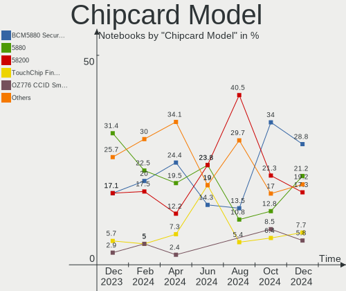

| Model                                                                        | Notebooks | Percent |
|------------------------------------------------------------------------------|-----------|---------|
| Broadcom 5880                                                                | 12        | 30%     |
| Broadcom BCM5880 Secure Applications Processor                               | 8         | 20%     |
| Broadcom 58200                                                               | 5         | 12.5%   |
| Broadcom BCM5880 Secure Applications Processor with fingerprint swipe sensor | 4         | 10%     |
| Alcor Micro AU9540 Smartcard Reader                                          | 4         | 10%     |
| Upek TouchChip Fingerprint Coprocessor (WBF advanced mode)                   | 2         | 5%      |
| Realtek Semiconductor Smart Card Reader Interface                            | 1         | 2.5%    |
| O2 Micro Oz776 SmartCard Reader                                              | 1         | 2.5%    |
| O2 Micro OZ776 CCID Smartcard Reader                                         | 1         | 2.5%    |
| Lenovo Integrated Smart Card Reader                                          | 1         | 2.5%    |
| Broadcom BCM5880 Secure Applications Processor with fingerprint touch sensor | 1         | 2.5%    |

Unsupported
-----------

Unsupported Devices
-------------------

Total unsupported devices on board

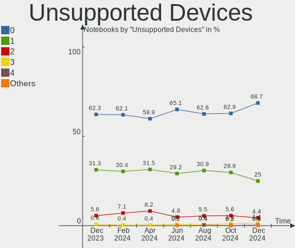

| Total | Notebooks | Percent |
|-------|-----------|---------|
| 0     | 366       | 64.66%  |
| 1     | 164       | 28.98%  |
| 2     | 29        | 5.12%   |
| 3     | 4         | 0.71%   |
| 9     | 1         | 0.18%   |
| 6     | 1         | 0.18%   |
| 4     | 1         | 0.18%   |

Unsupported Device Types
------------------------

Types of unsupported devices

| Type                     | Notebooks | Percent |
|--------------------------|-----------|---------|
| Fingerprint reader       | 90        | 36.29%  |
| Graphics card            | 37        | 14.92%  |
| Chipcard                 | 35        | 14.11%  |
| Net/wireless             | 25        | 10.08%  |
| Multimedia controller    | 20        | 8.06%   |
| Camera                   | 12        | 4.84%   |
| Communication controller | 7         | 2.82%   |
| Storage                  | 4         | 1.61%   |
| Card reader              | 4         | 1.61%   |
| Sound                    | 3         | 1.21%   |
| Network                  | 2         | 0.81%   |
| Net/ethernet             | 2         | 0.81%   |
| Modem                    | 2         | 0.81%   |
| Bluetooth                | 2         | 0.81%   |
| Wireless                 | 1         | 0.4%    |
| Firewire controller      | 1         | 0.4%    |
| Dvb card                 | 1         | 0.4%    |

