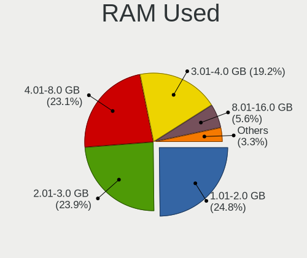
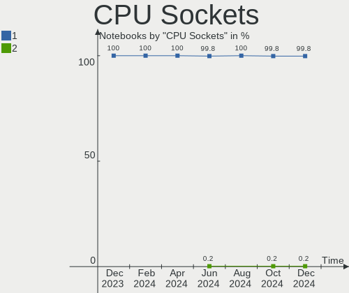
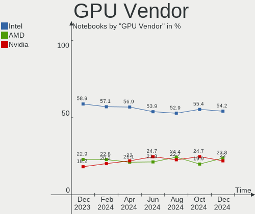
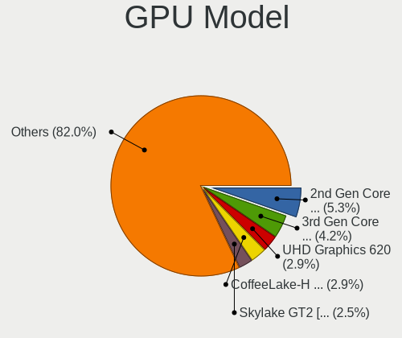
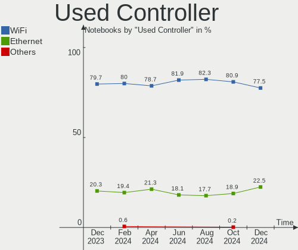
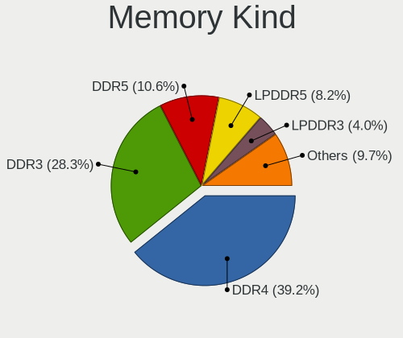

Linux in USA - Hardware Trends (Notebooks)
------------------------------------------

A project to identify most popular hardware characteristics and track their change
over time based on data collected by Linux users at https://Linux-Hardware.org.

Anyone can contribute to this report by the [hw-probe](https://github.com/linuxhw/hw-probe) tool:

    sudo -E hw-probe -all -upload

Period: Dec, 2023.

Contents
--------

* [ System ](#system)
  - [ OS                       ](#os)
  - [ OS Family                ](#os-family)
  - [ Kernel                   ](#kernel)
  - [ Kernel Family            ](#kernel-family)
  - [ Kernel Major Ver.        ](#kernel-major-ver)
  - [ Arch                     ](#arch)
  - [ DE                       ](#de)
  - [ Display Server           ](#display-server)
  - [ Display Manager          ](#display-manager)
  - [ OS Lang                  ](#os-lang)
  - [ Boot Mode                ](#boot-mode)
  - [ Filesystem               ](#filesystem)
  - [ Part. scheme             ](#part-scheme)
  - [ Dual Boot with Linux/BSD ](#dual-boot-with-linuxbsd)
  - [ Dual Boot (Win)          ](#dual-boot-win)

* [ Board ](#board)
  - [ Vendor                   ](#vendor)
  - [ Model                    ](#model)
  - [ Model Family             ](#model-family)
  - [ MFG Year                 ](#mfg-year)
  - [ Form Factor              ](#form-factor)
  - [ Secure Boot              ](#secure-boot)
  - [ Coreboot                 ](#coreboot)
  - [ RAM Size                 ](#ram-size)
  - [ RAM Used                 ](#ram-used)
  - [ Total Drives             ](#total-drives)
  - [ Has CD-ROM               ](#has-cd-rom)
  - [ Has Ethernet             ](#has-ethernet)
  - [ Has WiFi                 ](#has-wifi)
  - [ Has Bluetooth            ](#has-bluetooth)

* [ Location ](#location)
  - [ Country                  ](#country)
  - [ City                     ](#city)

* [ Drives ](#drives)
  - [ Drive Vendor             ](#drive-vendor)
  - [ Drive Model              ](#drive-model)
  - [ HDD Vendor               ](#hdd-vendor)
  - [ SSD Vendor               ](#ssd-vendor)
  - [ Drive Kind               ](#drive-kind)
  - [ Drive Connector          ](#drive-connector)
  - [ Drive Size               ](#drive-size)
  - [ Space Total              ](#space-total)
  - [ Space Used               ](#space-used)
  - [ Malfunc. Drives          ](#malfunc-drives)
  - [ Malfunc. Drive Vendor    ](#malfunc-drive-vendor)
  - [ Malfunc. HDD Vendor      ](#malfunc-hdd-vendor)
  - [ Malfunc. Drive Kind      ](#malfunc-drive-kind)
  - [ Failed Drives            ](#failed-drives)
  - [ Failed Drive Vendor      ](#failed-drive-vendor)
  - [ Drive Status             ](#drive-status)

* [ Storage controller ](#storage-controller)
  - [ Storage Vendor           ](#storage-vendor)
  - [ Storage Model            ](#storage-model)
  - [ Storage Kind             ](#storage-kind)

* [ Processor ](#processor)
  - [ CPU Vendor               ](#cpu-vendor)
  - [ CPU Model                ](#cpu-model)
  - [ CPU Model Family         ](#cpu-model-family)
  - [ CPU Cores                ](#cpu-cores)
  - [ CPU Sockets              ](#cpu-sockets)
  - [ CPU Threads              ](#cpu-threads)
  - [ CPU Op-Modes             ](#cpu-op-modes)
  - [ CPU Microcode            ](#cpu-microcode)
  - [ CPU Microarch            ](#cpu-microarch)

* [ Graphics ](#graphics)
  - [ GPU Vendor               ](#gpu-vendor)
  - [ GPU Model                ](#gpu-model)
  - [ GPU Combo                ](#gpu-combo)
  - [ GPU Driver               ](#gpu-driver)
  - [ GPU Memory               ](#gpu-memory)

* [ Monitor ](#monitor)
  - [ Monitor Vendor           ](#monitor-vendor)
  - [ Monitor Model            ](#monitor-model)
  - [ Monitor Resolution       ](#monitor-resolution)
  - [ Monitor Diagonal         ](#monitor-diagonal)
  - [ Monitor Width            ](#monitor-width)
  - [ Aspect Ratio             ](#aspect-ratio)
  - [ Monitor Area             ](#monitor-area)
  - [ Pixel Density            ](#pixel-density)
  - [ Multiple Monitors        ](#multiple-monitors)

* [ Network ](#network)
  - [ Net Controller Vendor    ](#net-controller-vendor)
  - [ Net Controller Model     ](#net-controller-model)
  - [ Wireless Vendor          ](#wireless-vendor)
  - [ Wireless Model           ](#wireless-model)
  - [ Ethernet Vendor          ](#ethernet-vendor)
  - [ Ethernet Model           ](#ethernet-model)
  - [ Net Controller Kind      ](#net-controller-kind)
  - [ Used Controller          ](#used-controller)
  - [ NICs                     ](#nics)
  - [ IPv6                     ](#ipv6)

* [ Bluetooth ](#bluetooth)
  - [ Bluetooth Vendor         ](#bluetooth-vendor)
  - [ Bluetooth Model          ](#bluetooth-model)

* [ Sound ](#sound)
  - [ Sound Vendor             ](#sound-vendor)
  - [ Sound Model              ](#sound-model)

* [ Memory ](#memory)
  - [ Memory Vendor            ](#memory-vendor)
  - [ Memory Model             ](#memory-model)
  - [ Memory Kind              ](#memory-kind)
  - [ Memory Form Factor       ](#memory-form-factor)
  - [ Memory Size              ](#memory-size)
  - [ Memory Speed             ](#memory-speed)

* [ Printers & scanners ](#printers--scanners)
  - [ Printer Vendor           ](#printer-vendor)
  - [ Printer Model            ](#printer-model)
  - [ Scanner Vendor           ](#scanner-vendor)
  - [ Scanner Model            ](#scanner-model)

* [ Camera ](#camera)
  - [ Camera Vendor            ](#camera-vendor)
  - [ Camera Model             ](#camera-model)

* [ Security ](#security)
  - [ Fingerprint Vendor       ](#fingerprint-vendor)
  - [ Fingerprint Model        ](#fingerprint-model)
  - [ Chipcard Vendor          ](#chipcard-vendor)
  - [ Chipcard Model           ](#chipcard-model)

* [ Unsupported ](#unsupported)
  - [ Unsupported Devices      ](#unsupported-devices)
  - [ Unsupported Device Types ](#unsupported-device-types)

System
------

OS
--

Installed operating systems

| Name                | Notebooks | Percent |
|---------------------|-----------|---------|
| Ubuntu 22.04        | 71        | 14.2%   |
| Fedora 39           | 44        | 8.8%    |
| Linux Mint 21.2     | 39        | 7.8%    |
| SteamOS 3.5.7       | 32        | 6.4%    |
| OpenMandriva 5.0    | 30        | 6%      |
| Ubuntu 23.10        | 25        | 5%      |
| Pop!_OS 22.04       | 23        | 4.6%    |
| Arch Rolling        | 22        | 4.4%    |
| Debian 12           | 20        | 4%      |
| ArcoLinux Rolling   | 13        | 2.6%    |
| Zorin 16            | 11        | 2.2%    |
| OpenMandriva 23.11  | 8         | 1.6%    |
| Manjaro             | 7         | 1.4%    |
| Linux Mint 20.3     | 7         | 1.4%    |
| KDE neon 22.04      | 7         | 1.4%    |
| Ubuntu 20.04        | 6         | 1.2%    |
| Kali 2023.4         | 6         | 1.2%    |
| Fedora 38           | 6         | 1.2%    |
| NixOS 23.11         | 5         | 1%      |
| Gentoo 2.14         | 5         | 1%      |
| Zorin 17            | 4         | 0.8%    |
| Ubuntu 23.04        | 4         | 0.8%    |
| OpenMandriva 23.08  | 4         | 0.8%    |
| Nobara 38           | 4         | 0.8%    |
| LMDE 6              | 4         | 0.8%    |
| Kubuntu 22.04       | 4         | 0.8%    |
| EndeavourOS Rolling | 4         | 0.8%    |
| Xero Rolling        | 3         | 0.6%    |
| Ubuntu MATE 22.04   | 3         | 0.6%    |
| openSUSE Leap-15.5  | 3         | 0.6%    |
| MX 23               | 3         | 0.6%    |
| Linux Mint 21.1     | 3         | 0.6%    |
| Kubuntu 23.10       | 3         | 0.6%    |
| Elementary 7.1      | 3         | 0.6%    |
| Zorin 15            | 2         | 0.4%    |
| Xubuntu 22.04       | 2         | 0.4%    |
| Ultramarine 39      | 2         | 0.4%    |
| SteamOS 3.5.5       | 2         | 0.4%    |
| Parrot 6.0          | 2         | 0.4%    |
| OpenMandriva 23.03  | 2         | 0.4%    |

OS Family
---------

OS without a version

| Name          | Notebooks | Percent |
|---------------|-----------|---------|
| Ubuntu        | 110       | 22%     |
| Fedora        | 54        | 10.8%   |
| Linux Mint    | 53        | 10.6%   |
| OpenMandriva  | 47        | 9.4%    |
| SteamOS       | 36        | 7.2%    |
| Pop!_OS       | 23        | 4.6%    |
| Debian        | 23        | 4.6%    |
| Arch          | 22        | 4.4%    |
| Zorin         | 17        | 3.4%    |
| ArcoLinux     | 13        | 2.6%    |
| Kubuntu       | 9         | 1.8%    |
| Manjaro       | 8         | 1.6%    |
| Kali          | 8         | 1.6%    |
| KDE neon      | 7         | 1.4%    |
| Nobara        | 5         | 1%      |
| NixOS         | 5         | 1%      |
| Gentoo        | 5         | 1%      |
| Ubuntu MATE   | 4         | 0.8%    |
| openSUSE      | 4         | 0.8%    |
| MX            | 4         | 0.8%    |
| LMDE          | 4         | 0.8%    |
| EndeavourOS   | 4         | 0.8%    |
| Xubuntu       | 3         | 0.6%    |
| Xero          | 3         | 0.6%    |
| Elementary    | 3         | 0.6%    |
| Ultramarine   | 2         | 0.4%    |
| Ubuntu Unity  | 2         | 0.4%    |
| Parrot        | 2         | 0.4%    |
| Lubuntu       | 2         | 0.4%    |
| Garuda Linux  | 2         | 0.4%    |
| ChimeraOS     | 2         | 0.4%    |
| Artix         | 2         | 0.4%    |
| Ubuntu Studio | 1         | 0.2%    |
| TUXEDO OS     | 1         | 0.2%    |
| Trisquel      | 1         | 0.2%    |
| Rocky Linux   | 1         | 0.2%    |
| RHEL          | 1         | 0.2%    |
| Q4OS          | 1         | 0.2%    |
| Oracle Linux  | 1         | 0.2%    |
| Manjaro-ARM   | 1         | 0.2%    |

Kernel
------

Version of the Linux kernel

| Version                      | Notebooks | Percent |
|------------------------------|-----------|---------|
| 6.2.0-39-generic             | 45        | 9%      |
| 5.15.0-91-generic            | 39        | 7.8%    |
| 6.6.2-desktop-1omv2390       | 36        | 7.2%    |
| 6.2.0-37-generic             | 32        | 6.4%    |
| 6.1.52-valve9-1-neptune-61   | 32        | 6.4%    |
| 6.5.0-14-generic             | 23        | 4.6%    |
| 6.6.6-200.fc39.x86_64        | 13        | 2.6%    |
| 5.15.0-89-generic            | 12        | 2.4%    |
| 6.6.6-76060606-generic       | 11        | 2.2%    |
| 6.5.6-76060506-generic       | 10        | 2%      |
| 6.1.0-15-amd64               | 8         | 1.6%    |
| 5.15.0-76-generic            | 8         | 1.6%    |
| 6.6.7-arch1-1                | 7         | 1.4%    |
| 6.6.4-200.fc39.x86_64        | 7         | 1.4%    |
| 6.6.3-arch1-1                | 7         | 1.4%    |
| 6.1.0-16-amd64               | 7         | 1.4%    |
| 6.1.0-13-amd64               | 7         | 1.4%    |
| 6.6.7-200.fc39.x86_64        | 6         | 1.2%    |
| 6.5.6-300.fc39.x86_64        | 6         | 1.2%    |
| 6.2.0-26-generic             | 6         | 1.2%    |
| 6.5.0-kali3-amd64            | 5         | 1%      |
| 5.4.0-150-generic            | 5         | 1%      |
| 6.6.8-zen1-1-zen             | 4         | 0.8%    |
| 6.6.4-arch1-1                | 4         | 0.8%    |
| 6.6.3-200.fc39.x86_64        | 4         | 0.8%    |
| 6.6.2-201.fc39.x86_64        | 4         | 0.8%    |
| 6.4.11-desktop-1omv2390      | 4         | 0.8%    |
| 5.4.0-169-generic            | 4         | 0.8%    |
| 6.6.8-arch1-1                | 3         | 0.6%    |
| 6.6.8-200.fc39.x86_64        | 3         | 0.6%    |
| 6.6.7-zen1-1-zen             | 3         | 0.6%    |
| 6.6.6-100.fc38.x86_64        | 3         | 0.6%    |
| 6.6.1-arch1-1                | 3         | 0.6%    |
| 6.5.9-arch2-1                | 3         | 0.6%    |
| 6.5.0-13-generic             | 3         | 0.6%    |
| 6.5.0-10-generic             | 3         | 0.6%    |
| 5.4.0-167-generic            | 3         | 0.6%    |
| 6.7.0-desktop-0.rc2.1omv2390 | 2         | 0.4%    |
| 6.6.7-203.fsync.fc39.x86_64  | 2         | 0.4%    |
| 6.6.5-1-MANJARO              | 2         | 0.4%    |

Kernel Family
-------------

Linux kernel without a distro release

| Version | Notebooks | Percent |
|---------|-----------|---------|
| 6.2.0   | 88        | 17.6%   |
| 5.15.0  | 64        | 12.8%   |
| 6.5.0   | 46        | 9.2%    |
| 6.6.2   | 43        | 8.6%    |
| 6.1.52  | 35        | 7%      |
| 6.6.6   | 31        | 6.2%    |
| 6.1.0   | 29        | 5.8%    |
| 6.6.7   | 21        | 4.2%    |
| 6.5.6   | 17        | 3.4%    |
| 6.6.4   | 15        | 3%      |
| 6.6.3   | 15        | 3%      |
| 5.4.0   | 14        | 2.8%    |
| 6.6.8   | 13        | 2.6%    |
| 6.5.13  | 4         | 0.8%    |
| 6.4.11  | 4         | 0.8%    |
| 6.1.64  | 4         | 0.8%    |
| 6.7.0   | 3         | 0.6%    |
| 6.6.1   | 3         | 0.6%    |
| 6.6.0   | 3         | 0.6%    |
| 6.5.9   | 3         | 0.6%    |
| 6.1.69  | 3         | 0.6%    |
| 6.1.67  | 3         | 0.6%    |
| 5.14.21 | 3         | 0.6%    |
| 4.15.0  | 3         | 0.6%    |
| 6.6.5   | 2         | 0.4%    |
| 6.2.9   | 2         | 0.4%    |
| 6.2.6   | 2         | 0.4%    |
| 5.14.0  | 2         | 0.4%    |
| 5.10.0  | 2         | 0.4%    |
| 6.5.7   | 1         | 0.2%    |
| 6.5.4   | 1         | 0.2%    |
| 6.5.12  | 1         | 0.2%    |
| 6.5.11  | 1         | 0.2%    |
| 6.4.14  | 1         | 0.2%    |
| 6.4.12  | 1         | 0.2%    |
| 6.4.10  | 1         | 0.2%    |
| 6.3.9   | 1         | 0.2%    |
| 6.3.7   | 1         | 0.2%    |
| 6.3.5   | 1         | 0.2%    |
| 6.2.5   | 1         | 0.2%    |

Kernel Major Ver.
-----------------

Linux kernel major version

| Version | Notebooks | Percent |
|---------|-----------|---------|
| 6.6     | 146       | 29.2%   |
| 6.2     | 95        | 19%     |
| 6.1     | 77        | 15.4%   |
| 6.5     | 74        | 14.8%   |
| 5.15    | 64        | 12.8%   |
| 5.4     | 14        | 2.8%    |
| 6.4     | 7         | 1.4%    |
| 5.14    | 5         | 1%      |
| 6.7     | 3         | 0.6%    |
| 6.3     | 3         | 0.6%    |
| 4.15    | 3         | 0.6%    |
| 5.17    | 2         | 0.4%    |
| 5.10    | 2         | 0.4%    |
| 6.0     | 1         | 0.2%    |
| 5.19    | 1         | 0.2%    |
| 5.13    | 1         | 0.2%    |
| 5.11    | 1         | 0.2%    |
| 4.18    | 1         | 0.2%    |

Arch
----

OS architecture (x86_64, i586, etc.)

| Name    | Notebooks | Percent |
|---------|-----------|---------|
| x86_64  | 496       | 99.2%   |
| i686    | 3         | 0.6%    |
| aarch64 | 1         | 0.2%    |

DE
--

Desktop Environment

| Name             | Notebooks | Percent |
|------------------|-----------|---------|
| GNOME            | 217       | 43.4%   |
| KDE5             | 156       | 31.2%   |
| X-Cinnamon       | 44        | 8.8%    |
| XFCE             | 27        | 5.4%    |
| MATE             | 15        | 3%      |
| Unknown          | 12        | 2.4%    |
| LXQt             | 6         | 1.2%    |
| Pantheon         | 4         | 0.8%    |
| Budgie           | 3         | 0.6%    |
| Unity            | 2         | 0.4%    |
| LXDE             | 2         | 0.4%    |
| Hyprland         | 2         | 0.4%    |
| GNOME Flashback  | 2         | 0.4%    |
| Trinity          | 1         | 0.2%    |
| lightdm-xsession | 1         | 0.2%    |
| KDE              | 1         | 0.2%    |
| i3               | 1         | 0.2%    |
| GNOME Classic    | 1         | 0.2%    |
| Endless:GNOME    | 1         | 0.2%    |
| Deepin           | 1         | 0.2%    |
| Cinnamon         | 1         | 0.2%    |

Display Server
--------------

X11 or Wayland

| Name    | Notebooks | Percent |
|---------|-----------|---------|
| X11     | 273       | 54.6%   |
| Wayland | 214       | 42.8%   |
| Unknown | 10        | 2%      |
| Tty     | 3         | 0.6%    |

Display Manager
---------------

SDDM, LightDM, etc.

| Name    | Notebooks | Percent |
|---------|-----------|---------|
| Unknown | 227       | 45.4%   |
| GDM3    | 107       | 21.4%   |
| SDDM    | 93        | 18.6%   |
| LightDM | 48        | 9.6%    |
| GDM     | 22        | 4.4%    |
| TDM     | 1         | 0.2%    |
| GREETD  | 1         | 0.2%    |
| EMPTTY  | 1         | 0.2%    |

OS Lang
-------

Language

| Lang    | Notebooks | Percent |
|---------|-----------|---------|
| en_US   | 467       | 93.4%   |
| C       | 15        | 3%      |
| Unknown | 6         | 1.2%    |
| pl_PL   | 2         | 0.4%    |
| en_CA   | 2         | 0.4%    |
| it_IT   | 1         | 0.2%    |
| fr_FR   | 1         | 0.2%    |
| es_VE   | 1         | 0.2%    |
| es_US   | 1         | 0.2%    |
| es_MX   | 1         | 0.2%    |
| es_ES   | 1         | 0.2%    |
| es_CO   | 1         | 0.2%    |
| de_DE   | 1         | 0.2%    |

Boot Mode
---------

EFI or BIOS

| Mode | Notebooks | Percent |
|------|-----------|---------|
| BIOS | 254       | 50.8%   |
| EFI  | 246       | 49.2%   |

Filesystem
----------

Type of filesystem

| Type    | Notebooks | Percent |
|---------|-----------|---------|
| Ext4    | 239       | 47.8%   |
| Btrfs   | 125       | 25%     |
| Tmpfs   | 89        | 17.8%   |
| Overlay | 36        | 7.2%    |
| Xfs     | 7         | 1.4%    |
| Zfs     | 1         | 0.2%    |
| F2fs    | 1         | 0.2%    |
| Ext3    | 1         | 0.2%    |
| Ext2    | 1         | 0.2%    |

Part. scheme
------------

Scheme of partitioning

| Type    | Notebooks | Percent |
|---------|-----------|---------|
| GPT     | 255       | 51%     |
| Unknown | 216       | 43.2%   |
| MBR     | 29        | 5.8%    |

Dual Boot with Linux/BSD
------------------------

Hosting more than one Linux/BSD

| Dual boot | Notebooks | Percent |
|-----------|-----------|---------|
| No        | 452       | 90.4%   |
| Yes       | 48        | 9.6%    |

Dual Boot (Win)
---------------

Hosting Linux and Windows

| Dual boot | Notebooks | Percent |
|-----------|-----------|---------|
| No        | 416       | 83.2%   |
| Yes       | 84        | 16.8%   |

Board
-----

Vendor
------

Motherboard manufacturer

| Name                             | Notebooks | Percent |
|----------------------------------|-----------|---------|
| Lenovo                           | 99        | 19.8%   |
| Dell                             | 92        | 18.4%   |
| Hewlett-Packard                  | 88        | 17.6%   |
| ASUSTek Computer                 | 44        | 8.8%    |
| Valve                            | 37        | 7.4%    |
| Apple                            | 26        | 5.2%    |
| Acer                             | 22        | 4.4%    |
| Google                           | 13        | 2.6%    |
| Toshiba                          | 12        | 2.4%    |
| System76                         | 9         | 1.8%    |
| Framework                        | 8         | 1.6%    |
| MSI                              | 7         | 1.4%    |
| Alienware                        | 6         | 1.2%    |
| Unknown                          | 5         | 1%      |
| GPU Company                      | 4         | 0.8%    |
| Sony                             | 3         | 0.6%    |
| LG Electronics                   | 3         | 0.6%    |
| Panasonic                        | 2         | 0.4%    |
| IBM                              | 2         | 0.4%    |
| Fujitsu                          | 2         | 0.4%    |
| Chuwi                            | 2         | 0.4%    |
| ASRock                           | 2         | 0.4%    |
| SK hynix                         | 1         | 0.2%    |
| Pine Microsystems                | 1         | 0.2%    |
| Notebook                         | 1         | 0.2%    |
| Micro Computer (HK) Tech Limited | 1         | 0.2%    |
| HC                               | 1         | 0.2%    |
| Gateway                          | 1         | 0.2%    |
| Eluktronics                      | 1         | 0.2%    |
| Dynabook                         | 1         | 0.2%    |
| BOSGAME                          | 1         | 0.2%    |
| ATARI                            | 1         | 0.2%    |
| Adreamer                         | 1         | 0.2%    |
| A-DATA Technology                | 1         | 0.2%    |

Model
-----

Motherboard model

| Name                                       | Notebooks | Percent |
|--------------------------------------------|-----------|---------|
| Valve Jupiter                              | 24        | 4.8%    |
| Valve Galileo                              | 13        | 2.6%    |
| HP 15 Notebook PC                          | 5         | 1%      |
| Unknown                                    | 5         | 1%      |
| HP Notebook                                | 4         | 0.8%    |
| HP Laptop 15-da0xxx                        | 4         | 0.8%    |
| Google Garg                                | 4         | 0.8%    |
| Framework Laptop 13 (AMD Ryzen 7040Series) | 4         | 0.8%    |
| System76 Serval WS                         | 3         | 0.6%    |
| HP Victus by Gaming Laptop 15-fa0xxx       | 3         | 0.6%    |
| HP Pavilion dv6                            | 3         | 0.6%    |
| HP Laptop 15-bw0xx                         | 3         | 0.6%    |
| Dell Latitude 7490                         | 3         | 0.6%    |
| Dell Inspiron 1545                         | 3         | 0.6%    |
| Apple MacBookPro9,2                        | 3         | 0.6%    |
| Apple MacBookAir9,1                        | 3         | 0.6%    |
| Acer Nitro AN515-54                        | 3         | 0.6%    |
| System76 Lemur Pro                         | 2         | 0.4%    |
| MSI GF65 Thin 10SDR                        | 2         | 0.4%    |
| Lenovo ThinkPad T480 20L50011US            | 2         | 0.4%    |
| Lenovo ThinkPad T420 4178AFU               | 2         | 0.4%    |
| Lenovo ThinkPad T14 Gen 3 21AH00BQUS       | 2         | 0.4%    |
| Lenovo ThinkPad E15 20RD002RUS             | 2         | 0.4%    |
| Lenovo Slim 7 ProX 14ARH7 82V2             | 2         | 0.4%    |
| Lenovo IdeaPad 3 17IIL05 81WF              | 2         | 0.4%    |
| Lenovo IdeaPad 3 15ITL6 82H8               | 2         | 0.4%    |
| Lenovo IdeaPad 3 15IIL05 81WE              | 2         | 0.4%    |
| HP Pavilion Laptop 15-cs3xxx               | 2         | 0.4%    |
| HP Pavilion dv7                            | 2         | 0.4%    |
| HP Pavilion 17                             | 2         | 0.4%    |
| HP Laptop 17-cp0xxx                        | 2         | 0.4%    |
| HP Laptop 15-ef2xxx                        | 2         | 0.4%    |
| HP Laptop 15-dy2xxx                        | 2         | 0.4%    |
| HP Laptop 15-bs0xx                         | 2         | 0.4%    |
| HP Laptop 14-dk0xxx                        | 2         | 0.4%    |
| HP EliteBook 840 G3                        | 2         | 0.4%    |
| HP Dev One Notebook PC                     | 2         | 0.4%    |
| GPU Company GWTC116-2                      | 2         | 0.4%    |
| Google Reks                                | 2         | 0.4%    |
| Framework Laptop (12th Gen Intel Core)     | 2         | 0.4%    |

Model Family
------------

Motherboard model prefix

| Name               | Notebooks | Percent |
|--------------------|-----------|---------|
| Lenovo ThinkPad    | 63        | 12.6%   |
| Dell Latitude      | 38        | 7.6%    |
| Valve Jupiter      | 24        | 4.8%    |
| Dell Inspiron      | 22        | 4.4%    |
| Lenovo IdeaPad     | 20        | 4%      |
| HP Laptop          | 20        | 4%      |
| HP Pavilion        | 16        | 3.2%    |
| Acer Aspire        | 14        | 2.8%    |
| Valve Galileo      | 13        | 2.6%    |
| HP EliteBook       | 12        | 2.4%    |
| Dell XPS           | 11        | 2.2%    |
| Dell Precision     | 11        | 2.2%    |
| Toshiba Satellite  | 10        | 2%      |
| HP ProBook         | 8         | 1.6%    |
| Framework Laptop   | 8         | 1.6%    |
| ASUS ROG           | 7         | 1.4%    |
| ASUS VivoBook      | 6         | 1.2%    |
| ASUS ASUS          | 6         | 1.2%    |
| Acer Nitro         | 6         | 1.2%    |
| Lenovo Legion      | 5         | 1%      |
| HP Stream          | 5         | 1%      |
| HP 15              | 5         | 1%      |
| Apple MacBookPro9  | 5         | 1%      |
| Unknown            | 5         | 1%      |
| HP ZBook           | 4         | 0.8%    |
| HP Notebook        | 4         | 0.8%    |
| Google Garg        | 4         | 0.8%    |
| ASUS Zenbook       | 4         | 0.8%    |
| Apple MacBookPro11 | 4         | 0.8%    |
| System76 Serval    | 3         | 0.6%    |
| Lenovo Slim        | 3         | 0.6%    |
| HP Victus          | 3         | 0.6%    |
| HP OMEN            | 3         | 0.6%    |
| Dell Vostro        | 3         | 0.6%    |
| Apple MacBookAir9  | 3         | 0.6%    |
| System76 Lemur     | 2         | 0.4%    |
| MSI GF65           | 2         | 0.4%    |
| Lenovo ThinkBook   | 2         | 0.4%    |
| IBM ThinkPad       | 2         | 0.4%    |
| HP ENVY            | 2         | 0.4%    |

MFG Year
--------

Motherboard manufacture year

| Year    | Notebooks | Percent |
|---------|-----------|---------|
| 2023    | 75        | 15%     |
| 2022    | 45        | 9%      |
| 2021    | 43        | 8.6%    |
| 2020    | 43        | 8.6%    |
| 2012    | 38        | 7.6%    |
| 2015    | 34        | 6.8%    |
| 2019    | 31        | 6.2%    |
| 2018    | 30        | 6%      |
| 2011    | 27        | 5.4%    |
| 2016    | 26        | 5.2%    |
| 2013    | 25        | 5%      |
| 2017    | 20        | 4%      |
| 2014    | 19        | 3.8%    |
| 2008    | 14        | 2.8%    |
| 2009    | 9         | 1.8%    |
| 2010    | 8         | 1.6%    |
| 2007    | 7         | 1.4%    |
| 2006    | 2         | 0.4%    |
| 2005    | 2         | 0.4%    |
| Unknown | 2         | 0.4%    |

Form Factor
-----------

Physical design of the computer

| Name     | Notebooks | Percent |
|----------|-----------|---------|
| Notebook | 500       | 100%    |

Secure Boot
-----------

Enabled or disabled

| State    | Notebooks | Percent |
|----------|-----------|---------|
| Disabled | 467       | 93.4%   |
| Enabled  | 33        | 6.6%    |

Coreboot
--------

Have coreboot on board

| Used | Notebooks | Percent |
|------|-----------|---------|
| No   | 480       | 96%     |
| Yes  | 20        | 4%      |

RAM Size
--------

Total RAM memory

| Size in GB  | Notebooks | Percent |
|-------------|-----------|---------|
| 8.01-16.0   | 128       | 25.6%   |
| 4.01-8.0    | 115       | 23%     |
| 16.01-24.0  | 85        | 17%     |
| 3.01-4.0    | 69        | 13.8%   |
| 32.01-64.0  | 61        | 12.2%   |
| 24.01-32.0  | 15        | 3%      |
| 64.01-256.0 | 15        | 3%      |
| 1.01-2.0    | 8         | 1.6%    |
| 2.01-3.0    | 3         | 0.6%    |
| 0.01-0.5    | 1         | 0.2%    |

RAM Used
--------

Used RAM memory

| Used GB    | Notebooks | Percent |
|------------|-----------|---------|
| 1.01-2.0   | 137       | 27.4%   |
| 2.01-3.0   | 124       | 24.8%   |
| 4.01-8.0   | 109       | 21.8%   |
| 3.01-4.0   | 87        | 17.4%   |
| 8.01-16.0  | 26        | 5.2%    |
| 0.51-1.0   | 12        | 2.4%    |
| 16.01-24.0 | 3         | 0.6%    |
| 0.01-0.5   | 2         | 0.4%    |

Total Drives
------------

Number of drives on board

| Drives | Notebooks | Percent |
|--------|-----------|---------|
| 1      | 360       | 72%     |
| 2      | 118       | 23.6%   |
| 3      | 14        | 2.8%    |
| 4      | 4         | 0.8%    |
| 0      | 3         | 0.6%    |
| 5      | 1         | 0.2%    |

Has CD-ROM
----------

Has CD-ROM on board

| Presented | Notebooks | Percent |
|-----------|-----------|---------|
| No        | 363       | 72.6%   |
| Yes       | 137       | 27.4%   |

Has Ethernet
------------

Has Ethernet on board

| Presented | Notebooks | Percent |
|-----------|-----------|---------|
| Yes       | 362       | 72.4%   |
| No        | 138       | 27.6%   |

Has WiFi
--------

Has WiFi module

| Presented | Notebooks | Percent |
|-----------|-----------|---------|
| Yes       | 492       | 98.4%   |
| No        | 8         | 1.6%    |

Has Bluetooth
-------------

Has Bluetooth module

| Presented | Notebooks | Percent |
|-----------|-----------|---------|
| Yes       | 395       | 79%     |
| No        | 105       | 21%     |

Location
--------

Country
-------

Geographic location (country)

| Country | Notebooks | Percent |
|---------|-----------|---------|
| USA     | 500       | 100%    |

City
----

Geographic location (city)

| City           | Notebooks | Percent |
|----------------|-----------|---------|
| Los Angeles    | 15        | 3%      |
| New York       | 10        | 2%      |
| Portland       | 9         | 1.8%    |
| Seattle        | 8         | 1.6%    |
| Minneapolis    | 7         | 1.4%    |
| Chicago        | 7         | 1.4%    |
| Phoenix        | 5         | 1%      |
| Las Vegas      | 5         | 1%      |
| Dallas         | 5         | 1%      |
| San Antonio    | 4         | 0.8%    |
| Philadelphia   | 4         | 0.8%    |
| Miami          | 4         | 0.8%    |
| Flushing       | 4         | 0.8%    |
| Bangor         | 4         | 0.8%    |
| Atlanta        | 4         | 0.8%    |
| Salt Lake City | 3         | 0.6%    |
| Sacramento     | 3         | 0.6%    |
| Omaha          | 3         | 0.6%    |
| Ocala          | 3         | 0.6%    |
| Norman         | 3         | 0.6%    |
| Jacksonville   | 3         | 0.6%    |
| Houston        | 3         | 0.6%    |
| Charlotte      | 3         | 0.6%    |
| Brooklyn       | 3         | 0.6%    |
| Ballwin        | 3         | 0.6%    |
| Austin         | 3         | 0.6%    |
| Albuquerque    | 3         | 0.6%    |
| The Bronx      | 2         | 0.4%    |
| Tacoma         | 2         | 0.4%    |
| St Louis       | 2         | 0.4%    |
| Silver Spring  | 2         | 0.4%    |
| San Jose       | 2         | 0.4%    |
| San Francisco  | 2         | 0.4%    |
| San Diego      | 2         | 0.4%    |
| Salem          | 2         | 0.4%    |
| Rochester      | 2         | 0.4%    |
| Richmond       | 2         | 0.4%    |
| Prosper        | 2         | 0.4%    |
| Portsmouth     | 2         | 0.4%    |
| Olympia        | 2         | 0.4%    |

Drives
------

Drive Vendor
------------

Hard drive vendors

| Vendor                      | Notebooks | Drives | Percent |
|-----------------------------|-----------|--------|---------|
| Samsung Electronics         | 101       | 117    | 15.96%  |
| SanDisk                     | 52        | 54     | 8.21%   |
| WDC                         | 47        | 47     | 7.42%   |
| Seagate                     | 46        | 48     | 7.27%   |
| Unknown                     | 42        | 44     | 6.64%   |
| SK hynix                    | 34        | 34     | 5.37%   |
| Crucial                     | 33        | 33     | 5.21%   |
| Toshiba                     | 30        | 29     | 4.74%   |
| Micron Technology           | 25        | 26     | 3.95%   |
| Unknown                     | 23        | 23     | 3.63%   |
| Apple                       | 19        | 20     | 3%      |
| Phison Electronics          | 18        | 18     | 2.84%   |
| Micron/Crucial Technology   | 14        | 15     | 2.21%   |
| Kingston Technology Company | 12        | 12     | 1.9%    |
| Intel                       | 12        | 13     | 1.9%    |
| Kingston                    | 11        | 11     | 1.74%   |
| HGST                        | 10        | 10     | 1.58%   |
| Hitachi                     | 8         | 8      | 1.26%   |
| SPCC                        | 6         | 6      | 0.95%   |
| SABRENT                     | 6         | 6      | 0.95%   |
| PNY                         | 6         | 6      | 0.95%   |
| O2 Micro                    | 5         | 5      | 0.79%   |
| KIOXIA                      | 5         | 5      | 0.79%   |
| MAXIO Technology (Hangzhou) | 4         | 4      | 0.63%   |
| Lexar                       | 4         | 4      | 0.63%   |
| Team                        | 3         | 3      | 0.47%   |
| OCZ                         | 3         | 3      | 0.47%   |
| LITEONIT                    | 3         | 3      | 0.47%   |
| LITEON                      | 3         | 3      | 0.47%   |
| China                       | 3         | 3      | 0.47%   |
| Union Memory                | 2         | 2      | 0.32%   |
| UMIS                        | 2         | 2      | 0.32%   |
| T-FORCE                     | 2         | 2      | 0.32%   |
| Silicon Motion              | 2         | 2      | 0.32%   |
| Realtek Semiconductor       | 2         | 2      | 0.32%   |
| Phison                      | 2         | 2      | 0.32%   |
| Hewlett-Packard             | 2         | 2      | 0.32%   |
| ASMT                        | 2         | 3      | 0.32%   |
| A-DATA Technology           | 2         | 2      | 0.32%   |
| Wibtek                      | 1         | 1      | 0.16%   |

Drive Model
-----------

Hard drive models

| Model                                               | Notebooks | Percent |
|-----------------------------------------------------|-----------|---------|
| Unknown                                             | 23        | 3.54%   |
| Samsung NVMe SSD Controller SM981/PM981/PM983 512GB | 22        | 3.38%   |
| Samsung NVMe SSD Controller PM9A1/PM9A3/980PRO 2TB  | 14        | 2.15%   |
| Unknown MMC Card  32GB                              | 10        | 1.54%   |
| Micron/Crucial P2 NVMe PCIe SSD 4TB                 | 9         | 1.38%   |
| Crucial CT1000MX500SSD1 1TB                         | 9         | 1.38%   |
| Kingston Company OM3PDP3 NVMe SSD 512GB             | 8         | 1.23%   |
| Unknown MMC Card  128GB                             | 7         | 1.08%   |
| Toshiba MQ01ABD100 1TB                              | 6         | 0.92%   |
| Seagate ST1000LM024 HN-M101MBB 1TB                  | 6         | 0.92%   |
| Sandisk WD_BLACK SN770 1TB                          | 6         | 0.92%   |
| Phison PS5013 E13 NVMe Controller 512GB             | 6         | 0.92%   |
| Unknown MMC Card  64GB                              | 5         | 0.77%   |
| Sandisk WD Blue SN550 NVMe SSD 1TB                  | 5         | 0.77%   |
| Sandisk WD Black SN850 1024GB                       | 5         | 0.77%   |
| SABRENT Disk 2TB                                    | 5         | 0.77%   |
| O2 Micro E2M2 64GB                                  | 5         | 0.77%   |
| HGST HTS721010A9E630 1TB                            | 5         | 0.77%   |
| Crucial CT500MX500SSD1 500GB                        | 5         | 0.77%   |
| Unknown MMC Card  512GB                             | 4         | 0.62%   |
| SK hynix BC501 NVMe Solid State Drive 512GB         | 4         | 0.62%   |
| Seagate ST1000LM035-1RK172 1TB                      | 4         | 0.62%   |
| Unknown SD/MMC/MS PRO 512GB                         | 3         | 0.46%   |
| Unknown MMC Card  256GB                             | 3         | 0.46%   |
| Seagate ST500LT012-1DG142 500GB                     | 3         | 0.46%   |
| Seagate ST2000LM007-1R8174 2TB                      | 3         | 0.46%   |
| Seagate ST2000LM003 HN-M201RAD 2TB                  | 3         | 0.46%   |
| Sandisk WD Black SN750 / PC SN730 NVMe SSD 2TB      | 3         | 0.46%   |
| Samsung SSD 980 1TB                                 | 3         | 0.46%   |
| Samsung SSD 870 EVO 500GB                           | 3         | 0.46%   |
| Samsung SSD 870 EVO 1TB                             | 3         | 0.46%   |
| Samsung SSD 850 EVO 500GB                           | 3         | 0.46%   |
| Micron/Crucial CT2000P5PSSD8 2TB                    | 3         | 0.46%   |
| Micron 2400_MTFDKBK1T0QFM 1024GB                    | 3         | 0.46%   |
| MAXIO (Hangzhou) NVMe SSD Controller MAP1202 256GB  | 3         | 0.46%   |
| Intel SSDPEKNU010TZ 1024GB                          | 3         | 0.46%   |
| Apple SSD SM0256F 256GB                             | 3         | 0.46%   |
| Apple ANS2 NVMe Controller 256GB                    | 3         | 0.46%   |
| WDC WDBNCE5000PNC 500GB SSD                         | 2         | 0.31%   |
| WDC WDBNCE0010PNC 1TB SSD                           | 2         | 0.31%   |

HDD Vendor
----------

Hard disk drive vendors

| Vendor              | Notebooks | Drives | Percent |
|---------------------|-----------|--------|---------|
| Seagate             | 44        | 46     | 33.59%  |
| WDC                 | 28        | 28     | 21.37%  |
| Toshiba             | 21        | 21     | 16.03%  |
| HGST                | 10        | 10     | 7.63%   |
| Hitachi             | 8         | 8      | 6.11%   |
| SABRENT             | 6         | 6      | 4.58%   |
| Unknown             | 3         | 3      | 2.29%   |
| Apple               | 3         | 3      | 2.29%   |
| Samsung Electronics | 2         | 2      | 1.53%   |
| ASMT                | 2         | 3      | 1.53%   |
| KESU                | 1         | 1      | 0.76%   |
| Generic-            | 1         | 1      | 0.76%   |
| Fujitsu             | 1         | 1      | 0.76%   |
| Apricorn            | 1         | 1      | 0.76%   |

SSD Vendor
----------

Solid state drive vendors

| Vendor              | Notebooks | Drives | Percent |
|---------------------|-----------|--------|---------|
| Samsung Electronics | 39        | 43     | 21.67%  |
| Crucial             | 30        | 30     | 16.67%  |
| WDC                 | 14        | 14     | 7.78%   |
| SanDisk             | 10        | 10     | 5.56%   |
| Kingston            | 9         | 9      | 5%      |
| Apple               | 9         | 9      | 5%      |
| SK hynix            | 6         | 6      | 3.33%   |
| PNY                 | 6         | 6      | 3.33%   |
| SPCC                | 5         | 5      | 2.78%   |
| Micron Technology   | 5         | 5      | 2.78%   |
| Intel               | 5         | 5      | 2.78%   |
| Lexar               | 4         | 4      | 2.22%   |
| Team                | 3         | 3      | 1.67%   |
| OCZ                 | 3         | 3      | 1.67%   |
| LITEONIT            | 3         | 3      | 1.67%   |
| LITEON              | 3         | 3      | 1.67%   |
| China               | 3         | 3      | 1.67%   |
| Hewlett-Packard     | 2         | 2      | 1.11%   |
| A-DATA Technology   | 2         | 2      | 1.11%   |
| Wibtek              | 1         | 1      | 0.56%   |
| VICKTER             | 1         | 1      | 0.56%   |
| Transcend           | 1         | 1      | 0.56%   |
| Toshiba             | 1         | 1      | 0.56%   |
| T-FORCE             | 1         | 1      | 0.56%   |
| SSSTC               | 1         | 1      | 0.56%   |
| Seagate             | 1         | 1      | 0.56%   |
| NT-1TB              | 1         | 1      | 0.56%   |
| NGFF                | 1         | 1      | 0.56%   |
| Netac               | 1         | 1      | 0.56%   |
| Mushkin             | 1         | 1      | 0.56%   |
| JMicron Technology  | 1         | 1      | 0.56%   |
| Inland              | 1         | 1      | 0.56%   |
| GOFATOO             | 1         | 1      | 0.56%   |
| G521S               | 1         | 1      | 0.56%   |
| Dogfish             | 1         | 1      | 0.56%   |
| CF400               | 1         | 1      | 0.56%   |
| BHT                 | 1         | 1      | 0.56%   |
| Aura                | 1         | 1      | 0.56%   |

Drive Kind
----------

HDD or SSD

| Kind    | Notebooks | Drives | Percent |
|---------|-----------|--------|---------|
| NVMe    | 238       | 272    | 39.73%  |
| SSD     | 170       | 184    | 28.38%  |
| HDD     | 124       | 134    | 20.7%   |
| MMC     | 61        | 63     | 10.18%  |
| Unknown | 6         | 6      | 1%      |

Drive Connector
---------------

SATA, SAS, NVMe, etc.

| Type | Notebooks | Drives | Percent |
|------|-----------|--------|---------|
| SATA | 256       | 287    | 43.54%  |
| NVMe | 238       | 271    | 40.48%  |
| MMC  | 61        | 63     | 10.37%  |
| SAS  | 33        | 38     | 5.61%   |

Drive Size
----------

Size of hard drive

| Size in TB | Notebooks | Drives | Percent |
|------------|-----------|--------|---------|
| 0.01-0.5   | 148       | 161    | 49.83%  |
| 0.51-1.0   | 109       | 116    | 36.7%   |
| 1.01-2.0   | 30        | 31     | 10.1%   |
| 3.01-4.0   | 5         | 5      | 1.68%   |
| 4.01-10.0  | 4         | 4      | 1.35%   |
| 2.01-3.0   | 1         | 1      | 0.34%   |

Space Total
-----------

Amount of disk space available on the file system

| Size in GB     | Notebooks | Percent |
|----------------|-----------|---------|
| 501-1000       | 126       | 25.2%   |
| 251-500        | 104       | 20.8%   |
| 101-250        | 79        | 15.8%   |
| 1-20           | 44        | 8.8%    |
| 1001-2000      | 42        | 8.4%    |
| More than 3000 | 36        | 7.2%    |
| 51-100         | 23        | 4.6%    |
| Unknown        | 20        | 4%      |
| 21-50          | 15        | 3%      |
| 2001-3000      | 11        | 2.2%    |

Space Used
----------

Amount of used disk space

| Used GB        | Notebooks | Percent |
|----------------|-----------|---------|
| 1-20           | 177       | 35.4%   |
| 21-50          | 103       | 20.6%   |
| 101-250        | 63        | 12.6%   |
| 51-100         | 44        | 8.8%    |
| 251-500        | 40        | 8%      |
| 501-1000       | 24        | 4.8%    |
| Unknown        | 20        | 4%      |
| 1001-2000      | 16        | 3.2%    |
| 2001-3000      | 6         | 1.2%    |
| More than 3000 | 5         | 1%      |
| 0              | 2         | 0.4%    |

Malfunc. Drives
---------------

Drive models with a malfunction

| Model                                         | Notebooks | Drives | Percent |
|-----------------------------------------------|-----------|--------|---------|
| WDC WD3200BPVT-22JJ5T0 320GB                  | 1         | 1      | 5.56%   |
| WDC WD3200BEVT-75A23T0 320GB                  | 1         | 1      | 5.56%   |
| Toshiba THNSN5512GPUK NVMe 512GB              | 1         | 1      | 5.56%   |
| Toshiba MQ01ABD100 1TB                        | 1         | 1      | 5.56%   |
| SK hynix BC511 HFM512GDJTNI-82A0A 512GB       | 1         | 1      | 5.56%   |
| Seagate ST500LT012-1DG142 500GB               | 1         | 1      | 5.56%   |
| Seagate ST2000LM003 HN-M201RAD 2TB            | 1         | 1      | 5.56%   |
| Seagate ST1000LX015-1U7172 1TB                | 1         | 1      | 5.56%   |
| Samsung Electronics SSD 870 EVO 1TB           | 1         | 1      | 5.56%   |
| Samsung Electronics MMCRE64G8MXP-0VB 64GB SSD | 1         | 1      | 5.56%   |
| SABRENT Disk 2TB                              | 1         | 1      | 5.56%   |
| OCZ AGILITY3 120GB SSD                        | 1         | 1      | 5.56%   |
| LITEONIT LCM-128M3S 2.5 7mm 128GB SSD         | 1         | 1      | 5.56%   |
| Lexar SSD NS100 1TB                           | 1         | 1      | 5.56%   |
| Intel SSDSA2M040G2GC 40GB                     | 1         | 1      | 5.56%   |
| HGST HTS545050A7E680 500GB                    | 1         | 1      | 5.56%   |
| Crucial CT128MX100SSD1 128GB                  | 1         | 1      | 5.56%   |
| Aura Pro S MC258 1TB SSD                      | 1         | 1      | 5.56%   |

Malfunc. Drive Vendor
---------------------

Vendors of faulty drives

| Vendor              | Notebooks | Drives | Percent |
|---------------------|-----------|--------|---------|
| Seagate             | 3         | 3      | 16.67%  |
| WDC                 | 2         | 2      | 11.11%  |
| Toshiba             | 2         | 2      | 11.11%  |
| Samsung Electronics | 2         | 2      | 11.11%  |
| SK hynix            | 1         | 1      | 5.56%   |
| SABRENT             | 1         | 1      | 5.56%   |
| OCZ                 | 1         | 1      | 5.56%   |
| LITEONIT            | 1         | 1      | 5.56%   |
| Lexar               | 1         | 1      | 5.56%   |
| Intel               | 1         | 1      | 5.56%   |
| HGST                | 1         | 1      | 5.56%   |
| Crucial             | 1         | 1      | 5.56%   |
| Aura                | 1         | 1      | 5.56%   |

Malfunc. HDD Vendor
-------------------

Vendors of faulty HDD drives

| Vendor  | Notebooks | Drives | Percent |
|---------|-----------|--------|---------|
| Seagate | 3         | 3      | 37.5%   |
| WDC     | 2         | 2      | 25%     |
| Toshiba | 1         | 1      | 12.5%   |
| SABRENT | 1         | 1      | 12.5%   |
| HGST    | 1         | 1      | 12.5%   |

Malfunc. Drive Kind
-------------------

Kinds of faulty drives

| Kind | Notebooks | Drives | Percent |
|------|-----------|--------|---------|
| SSD  | 8         | 8      | 47.06%  |
| HDD  | 7         | 8      | 41.18%  |
| NVMe | 2         | 2      | 11.76%  |

Failed Drives
-------------

Failed drive models

Zero info for selected period =(

Failed Drive Vendor
-------------------

Failed drive vendors

Zero info for selected period =(

Drive Status
------------

Number of failed and malfunc. drives

| Status   | Notebooks | Drives | Percent |
|----------|-----------|--------|---------|
| Detected | 333       | 443    | 65.29%  |
| Works    | 161       | 198    | 31.57%  |
| Malfunc  | 16        | 18     | 3.14%   |

Storage controller
------------------

Storage Vendor
--------------

Storage controller vendors

| Vendor                                  | Notebooks | Percent |
|-----------------------------------------|-----------|---------|
| Intel                                   | 280       | 48.44%  |
| Samsung Electronics                     | 67        | 11.59%  |
| SanDisk                                 | 47        | 8.13%   |
| AMD                                     | 42        | 7.27%   |
| SK hynix                                | 28        | 4.84%   |
| Phison Electronics                      | 20        | 3.46%   |
| Micron Technology                       | 20        | 3.46%   |
| Micron/Crucial Technology               | 17        | 2.94%   |
| Kingston Technology Company             | 14        | 2.42%   |
| Toshiba America Info Systems            | 7         | 1.21%   |
| Apple                                   | 7         | 1.21%   |
| O2 Micro                                | 5         | 0.87%   |
| KIOXIA                                  | 5         | 0.87%   |
| Union Memory (Shenzhen)                 | 4         | 0.69%   |
| MAXIO Technology (Hangzhou)             | 4         | 0.69%   |
| Silicon Motion                          | 3         | 0.52%   |
| Realtek Semiconductor                   | 2         | 0.35%   |
| Nvidia                                  | 2         | 0.35%   |
| Shenzhen Unionmemory Information System | 1         | 0.17%   |
| Shenzhen Longsys Electronics            | 1         | 0.17%   |
| Marvell Technology Group                | 1         | 0.17%   |
| ADATA Technology                        | 1         | 0.17%   |

Storage Model
-------------

Storage controller models

| Model                                                                          | Notebooks | Percent |
|--------------------------------------------------------------------------------|-----------|---------|
| AMD FCH SATA Controller [AHCI mode]                                            | 39        | 6.45%   |
| Intel 82801 Mobile SATA Controller [RAID mode]                                 | 35        | 5.79%   |
| Intel 7 Series Chipset Family 6-port SATA Controller [AHCI mode]               | 31        | 5.12%   |
| Intel Sunrise Point-LP SATA Controller [AHCI mode]                             | 29        | 4.79%   |
| Samsung NVMe SSD Controller SM981/PM981/PM983                                  | 26        | 4.3%    |
| Intel 6 Series/C200 Series Chipset Family 6 port Mobile SATA AHCI Controller   | 23        | 3.8%    |
| Intel Volume Management Device NVMe RAID Controller                            | 18        | 2.98%   |
| Intel 8 Series SATA Controller 1 [AHCI mode]                                   | 17        | 2.81%   |
| Samsung NVMe SSD Controller PM9A1/PM9A3/980PRO                                 | 16        | 2.64%   |
| Intel Wildcat Point-LP SATA Controller [AHCI Mode]                             | 15        | 2.48%   |
| Samsung NVMe SSD Controller 980 (DRAM-less)                                    | 14        | 2.31%   |
| SanDisk WD Black SN770 / PC SN740 256GB / PC SN560 (DRAM-less) NVMe SSD        | 13        | 2.15%   |
| Micron/Crucial P2 [Nick P2] / P3 / P3 Plus NVMe PCIe SSD (DRAM-less)           | 11        | 1.82%   |
| Intel Celeron/Pentium Silver Processor SATA Controller                         | 11        | 1.82%   |
| Intel 82801IBM/IEM (ICH9M/ICH9M-E) 4 port SATA Controller [AHCI mode]          | 9         | 1.49%   |
| Intel 8 Series/C220 Series Chipset Family 6-port SATA Controller 1 [AHCI mode] | 9         | 1.49%   |
| Micron 2400 NVMe SSD (DRAM-less)                                               | 8         | 1.32%   |
| Kingston Company OM3PDP3 NVMe SSD                                              | 8         | 1.32%   |
| SK hynix Platinum P41/PC801 NVMe Solid State Drive                             | 7         | 1.16%   |
| SK hynix Gold P31/BC711/PC711 NVMe Solid State Drive                           | 7         | 1.16%   |
| SanDisk Ultra 3D / WD Blue SN550 NVMe SSD                                      | 7         | 1.16%   |
| Intel Tiger Lake-LP SATA Controller                                            | 7         | 1.16%   |
| Intel Cannon Lake Mobile PCH SATA AHCI Controller                              | 7         | 1.16%   |
| Intel 5 Series/3400 Series Chipset 4 port SATA AHCI Controller                 | 7         | 1.16%   |
| SK hynix BC501 NVMe Solid State Drive                                          | 6         | 0.99%   |
| SanDisk WD PC SN810 / Black SN850 NVMe SSD                                     | 6         | 0.99%   |
| Phison PS5021-E21 PCIe4 NVMe Controller (DRAM-less)                            | 6         | 0.99%   |
| Phison PS5013-E13 PCIe3 NVMe Controller (DRAM-less)                            | 6         | 0.99%   |
| Intel Volume Management Device NVMe RAID Controller Intel Corporation          | 6         | 0.99%   |
| Intel HM170/QM170 Chipset SATA Controller [AHCI Mode]                          | 6         | 0.99%   |
| Intel 400 Series Chipset Family SATA AHCI Controller                           | 6         | 0.99%   |
| Apple ANS2 NVMe Controller                                                     | 6         | 0.99%   |
| O2 Micro FORESEE E2M2 NVMe SSD                                                 | 5         | 0.83%   |
| Intel Alder Lake-P SATA AHCI Controller                                        | 5         | 0.83%   |
| SanDisk Extreme Pro / WD Black SN750 / PC SN730 / Red SN700 NVMe SSD           | 4         | 0.66%   |
| Samsung S4LN053X01 AHCI SSD Controller(Apple slot)                             | 4         | 0.66%   |
| Samsung NVMe SSD Controller S4LV008[Pascal]                                    | 4         | 0.66%   |
| Samsung NVMe SSD Controller PM9B1 (DRAM-less)                                  | 4         | 0.66%   |
| Micron 3400 NVMe SSD [Hendrix]                                                 | 4         | 0.66%   |
| Micron 2300 NVMe SSD [Santana]                                                 | 4         | 0.66%   |

Storage Kind
------------

Kind of storage controller (IDE, SATA, NVMe, SAS, ...)

| Kind | Notebooks | Percent |
|------|-----------|---------|
| SATA | 266       | 45.86%  |
| NVMe | 238       | 41.03%  |
| RAID | 61        | 10.52%  |
| IDE  | 15        | 2.59%   |

Processor
---------

CPU Vendor
----------

Processor vendors

| Vendor | Notebooks | Percent |
|--------|-----------|---------|
| Intel  | 379       | 75.8%   |
| AMD    | 120       | 24%     |
| ARM    | 1         | 0.2%    |

CPU Model
---------

Processor models

| Model                                         | Notebooks | Percent |
|-----------------------------------------------|-----------|---------|
| AMD Custom APU 0405                           | 37        | 7.4%    |
| Intel Celeron N4020 CPU @ 1.10GHz             | 11        | 2.2%    |
| Intel Core i7-8650U CPU @ 1.90GHz             | 8         | 1.6%    |
| Intel Core i5-6200U CPU @ 2.30GHz             | 7         | 1.4%    |
| Intel Core i7-6600U CPU @ 2.60GHz             | 6         | 1.2%    |
| Intel Core i7-10750H CPU @ 2.60GHz            | 6         | 1.2%    |
| Intel Core i5-8350U CPU @ 1.70GHz             | 6         | 1.2%    |
| Intel 13th Gen Core i9-13900H                 | 6         | 1.2%    |
| Intel 11th Gen Core i7-1165G7 @ 2.80GHz       | 6         | 1.2%    |
| Intel 11th Gen Core i5-1135G7 @ 2.40GHz       | 6         | 1.2%    |
| Intel Core i7-9750H CPU @ 2.60GHz             | 5         | 1%      |
| Intel Core i7-7700HQ CPU @ 2.80GHz            | 5         | 1%      |
| Intel Core i5-8250U CPU @ 1.60GHz             | 5         | 1%      |
| Intel Core i5-4300U CPU @ 1.90GHz             | 5         | 1%      |
| Intel Core i5-4210U CPU @ 1.70GHz             | 5         | 1%      |
| Intel Core i5-1035G1 CPU @ 1.00GHz            | 5         | 1%      |
| Intel 12th Gen Core i5-1235U                  | 5         | 1%      |
| Intel Core i7-6700HQ CPU @ 2.60GHz            | 4         | 0.8%    |
| Intel Core i7-6500U CPU @ 2.50GHz             | 4         | 0.8%    |
| Intel Core i7-3520M CPU @ 2.90GHz             | 4         | 0.8%    |
| Intel Core i7-2620M CPU @ 2.70GHz             | 4         | 0.8%    |
| Intel Core i7-10510U CPU @ 1.80GHz            | 4         | 0.8%    |
| Intel Core i5-8365U CPU @ 1.60GHz             | 4         | 0.8%    |
| Intel Core i5-8265U CPU @ 1.60GHz             | 4         | 0.8%    |
| Intel Core i5-7200U CPU @ 2.50GHz             | 4         | 0.8%    |
| Intel Core i5-6300U CPU @ 2.40GHz             | 4         | 0.8%    |
| Intel Core i5-3210M CPU @ 2.50GHz             | 4         | 0.8%    |
| Intel Core i5-2540M CPU @ 2.60GHz             | 4         | 0.8%    |
| Intel Core i5-2520M CPU @ 2.50GHz             | 4         | 0.8%    |
| Intel Core i3-8130U CPU @ 2.20GHz             | 4         | 0.8%    |
| Intel Celeron CPU N3050 @ 1.60GHz             | 4         | 0.8%    |
| Intel 11th Gen Core i3-1115G4 @ 3.00GHz       | 4         | 0.8%    |
| AMD Ryzen 7 4800H with Radeon Graphics        | 4         | 0.8%    |
| AMD Ryzen 5 4500U with Radeon Graphics        | 4         | 0.8%    |
| AMD Ryzen 3 3200U with Radeon Vega Mobile Gfx | 4         | 0.8%    |
| Intel N100                                    | 3         | 0.6%    |
| Intel Core i7-8750H CPU @ 2.20GHz             | 3         | 0.6%    |
| Intel Core i7-6820HQ CPU @ 2.70GHz            | 3         | 0.6%    |
| Intel Core i7-3720QM CPU @ 2.60GHz            | 3         | 0.6%    |
| Intel Core i7-2670QM CPU @ 2.20GHz            | 3         | 0.6%    |

CPU Model Family
----------------

Processor model prefix

| Model                   | Notebooks | Percent |
|-------------------------|-----------|---------|
| Other                   | 108       | 21.6%   |
| Intel Core i5           | 105       | 21%     |
| Intel Core i7           | 103       | 20.6%   |
| Intel Core i3           | 38        | 7.6%    |
| Intel Celeron           | 36        | 7.2%    |
| AMD Ryzen 7             | 21        | 4.2%    |
| AMD Ryzen 5             | 16        | 3.2%    |
| Intel Core 2 Duo        | 12        | 2.4%    |
| AMD Ryzen 9             | 9         | 1.8%    |
| AMD Ryzen 3             | 7         | 1.4%    |
| AMD A8                  | 6         | 1.2%    |
| AMD A6                  | 6         | 1.2%    |
| Intel Pentium           | 4         | 0.8%    |
| AMD Ryzen 7 PRO         | 4         | 0.8%    |
| AMD A4                  | 4         | 0.8%    |
| Intel Pentium Dual-Core | 3         | 0.6%    |
| Intel Pentium M         | 2         | 0.4%    |
| Intel Core M            | 2         | 0.4%    |
| Intel Pentium Silver    | 1         | 0.2%    |
| Intel Pentium Dual      | 1         | 0.2%    |
| Intel Core m3           | 1         | 0.2%    |
| Intel Core i9           | 1         | 0.2%    |
| Intel Core Duo          | 1         | 0.2%    |
| Intel Core 2            | 1         | 0.2%    |
| AMD Turion II           | 1         | 0.2%    |
| AMD Ryzen Embedded      | 1         | 0.2%    |
| AMD PRO A10             | 1         | 0.2%    |
| AMD Phenom II           | 1         | 0.2%    |
| AMD E2                  | 1         | 0.2%    |
| AMD Athlon              | 1         | 0.2%    |
| AMD A12                 | 1         | 0.2%    |
| AMD A10                 | 1         | 0.2%    |

CPU Cores
---------

Number of processor cores

| Number | Notebooks | Percent |
|--------|-----------|---------|
| 2      | 219       | 43.8%   |
| 4      | 169       | 33.8%   |
| 8      | 42        | 8.4%    |
| 6      | 30        | 6%      |
| 14     | 14        | 2.8%    |
| 10     | 9         | 1.8%    |
| 12     | 7         | 1.4%    |
| 24     | 5         | 1%      |
| 1      | 5         | 1%      |

CPU Sockets
-----------

Number of sockets

| Number | Notebooks | Percent |
|--------|-----------|---------|
| 1      | 500       | 100%    |

CPU Threads
-----------

Threads per core (Hyper-Threading)

| Number | Notebooks | Percent |
|--------|-----------|---------|
| 2      | 402       | 80.4%   |
| 1      | 98        | 19.6%   |

CPU Op-Modes
------------

CPU Operation Modes (32-bit, 64-bit)

| Op mode        | Notebooks | Percent |
|----------------|-----------|---------|
| 32-bit, 64-bit | 495       | 99%     |
| 32-bit         | 3         | 0.6%    |
| 64-bit         | 1         | 0.2%    |
| Unknown        | 1         | 0.2%    |

CPU Microcode
-------------

Microcode number

| Number     | Notebooks | Percent |
|------------|-----------|---------|
| Unknown    | 349       | 69.8%   |
| 0x306a9    | 13        | 2.6%    |
| 0x0a404102 | 9         | 1.8%    |
| 0x206a7    | 8         | 1.6%    |
| 0x406e3    | 7         | 1.4%    |
| 0x306d4    | 7         | 1.4%    |
| 0x0a50000d | 7         | 1.4%    |
| 0x806ea    | 6         | 1.2%    |
| 0x806ec    | 5         | 1%      |
| 0x0a704103 | 5         | 1%      |
| 0x08108109 | 5         | 1%      |
| 0x806c1    | 4         | 0.8%    |
| 0x706e5    | 4         | 0.8%    |
| 0x40651    | 4         | 0.8%    |
| 0x08600106 | 4         | 0.8%    |
| 0x706a8    | 3         | 0.6%    |
| 0x20652    | 3         | 0.6%    |
| 0xb06e0    | 2         | 0.4%    |
| 0x906ea    | 2         | 0.4%    |
| 0x906a3    | 2         | 0.4%    |
| 0x806e9    | 2         | 0.4%    |
| 0x6fd      | 2         | 0.4%    |
| 0x506e3    | 2         | 0.4%    |
| 0x406c4    | 2         | 0.4%    |
| 0x30678    | 2         | 0.4%    |
| 0x0a50000c | 2         | 0.4%    |
| 0x08608104 | 2         | 0.4%    |
| 0x08608103 | 2         | 0.4%    |
| 0x08600104 | 2         | 0.4%    |
| 0x08108102 | 2         | 0.4%    |
| 0x06006704 | 2         | 0.4%    |
| 0x03000027 | 2         | 0.4%    |
| 0x010000c8 | 2         | 0.4%    |
| 0xb06a2    | 1         | 0.2%    |
| 0xb0671    | 1         | 0.2%    |
| 0xa0652    | 1         | 0.2%    |
| 0x906e9    | 1         | 0.2%    |
| 0x906c0    | 1         | 0.2%    |
| 0x906a4    | 1         | 0.2%    |
| 0x806eb    | 1         | 0.2%    |

CPU Microarch
-------------

Microarchitecture

| Name             | Notebooks | Percent |
|------------------|-----------|---------|
| Unknown          | 81        | 16.2%   |
| KabyLake         | 74        | 14.8%   |
| IvyBridge        | 34        | 6.8%    |
| SandyBridge      | 32        | 6.4%    |
| Haswell          | 32        | 6.4%    |
| Skylake          | 31        | 6.2%    |
| TigerLake        | 23        | 4.6%    |
| Alderlake Hybrid | 21        | 4.2%    |
| Broadwell        | 19        | 3.8%    |
| Goldmont plus    | 17        | 3.4%    |
| Zen 3            | 16        | 3.2%    |
| IceLake          | 15        | 3%      |
| Penryn           | 14        | 2.8%    |
| Zen 2            | 11        | 2.2%    |
| Silvermont       | 11        | 2.2%    |
| Zen+             | 10        | 2%      |
| Westmere         | 10        | 2%      |
| Excavator        | 9         | 1.8%    |
| CometLake        | 9         | 1.8%    |
| Puma             | 6         | 1.2%    |
| Core             | 5         | 1%      |
| Tremont          | 3         | 0.6%    |
| P6               | 3         | 0.6%    |
| Zen              | 2         | 0.4%    |
| Piledriver       | 2         | 0.4%    |
| Nehalem          | 2         | 0.4%    |
| K10 Llano        | 2         | 0.4%    |
| K10              | 2         | 0.4%    |
| Jaguar           | 2         | 0.4%    |
| Gracemont        | 1         | 0.2%    |
| Goldmont         | 1         | 0.2%    |

Graphics
--------

GPU Vendor
----------

Vendors of graphics cards

| Vendor | Notebooks | Percent |
|--------|-----------|---------|
| Intel  | 356       | 58.94%  |
| AMD    | 139       | 23.01%  |
| Nvidia | 109       | 18.05%  |

GPU Model
---------

Graphics card models

| Model                                                                                    | Notebooks | Percent |
|------------------------------------------------------------------------------------------|-----------|---------|
| Intel 3rd Gen Core processor Graphics Controller                                         | 33        | 5.32%   |
| Intel 2nd Generation Core Processor Family Integrated Graphics Controller                | 28        | 4.52%   |
| Intel UHD Graphics 620                                                                   | 24        | 3.87%   |
| AMD VanGogh [AMD Custom GPU 0405]                                                        | 24        | 3.87%   |
| Intel Skylake GT2 [HD Graphics 520]                                                      | 23        | 3.71%   |
| Intel Haswell-ULT Integrated Graphics Controller                                         | 19        | 3.06%   |
| Intel TigerLake-LP GT2 [Iris Xe Graphics]                                                | 18        | 2.9%    |
| Intel GeminiLake [UHD Graphics 600]                                                      | 16        | 2.58%   |
| AMD VGA compatible controller                                                            | 13        | 2.1%    |
| AMD Cezanne [Radeon Vega Series / Radeon Vega Mobile Series]                             | 12        | 1.94%   |
| Intel Raptor Lake-P [Iris Xe Graphics]                                                   | 11        | 1.77%   |
| Intel Mobile 4 Series Chipset Integrated Graphics Controller                             | 11        | 1.77%   |
| Intel HD Graphics 620                                                                    | 11        | 1.77%   |
| Intel HD Graphics 5500                                                                   | 11        | 1.77%   |
| Intel Alder Lake-P GT2 [Iris Xe Graphics]                                                | 11        | 1.77%   |
| AMD Picasso/Raven 2 [Radeon Vega Series / Radeon Vega Mobile Series]                     | 11        | 1.77%   |
| Nvidia TU117M [GeForce GTX 1650 Mobile / Max-Q]                                          | 10        | 1.61%   |
| Intel CoffeeLake-H GT2 [UHD Graphics 630]                                                | 10        | 1.61%   |
| AMD Renoir [Radeon RX Vega 6 (Ryzen 4000/5000 Mobile Series)]                            | 10        | 1.61%   |
| AMD Rembrandt [Radeon 680M]                                                              | 10        | 1.61%   |
| Intel WhiskeyLake-U GT2 [UHD Graphics 620]                                               | 9         | 1.45%   |
| Intel CometLake-U GT2 [UHD Graphics]                                                     | 9         | 1.45%   |
| Intel CometLake-H GT2 [UHD Graphics]                                                     | 9         | 1.45%   |
| Intel Iris Plus Graphics G1 (Ice Lake)                                                   | 8         | 1.29%   |
| Intel Core Processor Integrated Graphics Controller                                      | 8         | 1.29%   |
| Intel Atom/Celeron/Pentium Processor x5-E8000/J3xxx/N3xxx Integrated Graphics Controller | 7         | 1.13%   |
| Intel 4th Gen Core Processor Integrated Graphics Controller                              | 7         | 1.13%   |
| Nvidia GA107M [GeForce RTX 3050 Ti Mobile]                                               | 6         | 0.97%   |
| Nvidia GA107M [GeForce RTX 3050 Mobile]                                                  | 6         | 0.97%   |
| Intel HD Graphics 630                                                                    | 6         | 0.97%   |
| AMD Stoney [Radeon R2/R3/R4/R5 Graphics]                                                 | 6         | 0.97%   |
| Nvidia TU116M [GeForce GTX 1660 Ti Mobile]                                               | 5         | 0.81%   |
| Intel Tiger Lake-LP GT2 [UHD Graphics G4]                                                | 5         | 0.81%   |
| Intel Raptor Lake-S UHD Graphics                                                         | 5         | 0.81%   |
| Intel HD Graphics 530                                                                    | 5         | 0.81%   |
| AMD Whistler [Radeon HD 6630M/6650M/6750M/7670M/7690M]                                   | 5         | 0.81%   |
| AMD Phoenix1                                                                             | 5         | 0.81%   |
| AMD Mullins [Radeon R4/R5 Graphics]                                                      | 5         | 0.81%   |
| AMD Lucienne                                                                             | 5         | 0.81%   |
| Nvidia GP107M [GeForce GTX 1050 Mobile]                                                  | 4         | 0.65%   |

GPU Combo
---------

Combinations of graphics cards

| Name           | Notebooks | Percent |
|----------------|-----------|---------|
| 1 x Intel      | 263       | 52.6%   |
| 1 x AMD        | 97        | 19.4%   |
| Intel + Nvidia | 73        | 14.6%   |
| AMD + Nvidia   | 18        | 3.6%    |
| 1 x Nvidia     | 17        | 3.4%    |
| Intel + AMD    | 14        | 2.8%    |
| 2 x AMD        | 10        | 2%      |
| 2 x Intel      | 6         | 1.2%    |
| Other          | 1         | 0.2%    |
| 2 x Nvidia     | 1         | 0.2%    |

GPU Driver
----------

Free vs proprietary

| Driver      | Notebooks | Percent |
|-------------|-----------|---------|
| Free        | 438       | 87.6%   |
| Proprietary | 52        | 10.4%   |
| Unknown     | 10        | 2%      |

GPU Memory
----------

Total video memory

| Size in GB | Notebooks | Percent |
|------------|-----------|---------|
| Unknown    | 401       | 80.2%   |
| 0.01-0.5   | 37        | 7.4%    |
| 1.01-2.0   | 20        | 4%      |
| 3.01-4.0   | 18        | 3.6%    |
| 7.01-8.0   | 8         | 1.6%    |
| 0.51-1.0   | 7         | 1.4%    |
| 5.01-6.0   | 5         | 1%      |
| 2.01-3.0   | 2         | 0.4%    |
| 8.01-16.0  | 2         | 0.4%    |

Monitor
-------

Monitor Vendor
--------------

Monitor vendors

| Vendor                  | Notebooks | Percent |
|-------------------------|-----------|---------|
| AU Optronics            | 83        | 14.34%  |
| Chimei Innolux          | 81        | 13.99%  |
| BOE                     | 77        | 13.3%   |
| LG Display              | 75        | 12.95%  |
| Samsung Electronics     | 51        | 8.81%   |
| Valve                   | 36        | 6.22%   |
| Apple                   | 26        | 4.49%   |
| Dell                    | 24        | 4.15%   |
| Sharp                   | 14        | 2.42%   |
| Lenovo                  | 11        | 1.9%    |
| Acer                    | 10        | 1.73%   |
| Hewlett-Packard         | 9         | 1.55%   |
| Goldstar                | 8         | 1.38%   |
| Chi Mei Optoelectronics | 8         | 1.38%   |
| Panasonic               | 7         | 1.21%   |
| InfoVision              | 7         | 1.21%   |
| PANDA                   | 6         | 1.04%   |
| Vizio                   | 5         | 0.86%   |
| Ancor Communications    | 5         | 0.86%   |
| CSO                     | 4         | 0.69%   |
| ViewSonic               | 3         | 0.52%   |
| LG Philips              | 3         | 0.52%   |
| TMX                     | 2         | 0.35%   |
| Philips                 | 2         | 0.35%   |
| ASUSTek Computer        | 2         | 0.35%   |
| AOC                     | 2         | 0.35%   |
| Viotek                  | 1         | 0.17%   |
| Unknown (XXX)           | 1         | 0.17%   |
| STD                     | 1         | 0.17%   |
| STA                     | 1         | 0.17%   |
| Sony                    | 1         | 0.17%   |
| SLD                     | 1         | 0.17%   |
| Seiki                   | 1         | 0.17%   |
| Roku                    | 1         | 0.17%   |
| MStar                   | 1         | 0.17%   |
| MSI                     | 1         | 0.17%   |
| LLL                     | 1         | 0.17%   |
| Hitachi                 | 1         | 0.17%   |
| DPL                     | 1         | 0.17%   |
| DHD                     | 1         | 0.17%   |

Monitor Model
-------------

Monitor models

| Model                                                                 | Notebooks | Percent |
|-----------------------------------------------------------------------|-----------|---------|
| Valve ANX7530 U VLV3001 800x1280 100x150mm 7.1-inch                   | 23        | 3.92%   |
| Valve ANX7530 U VLV3003 800x1280 100x160mm 7.4-inch                   | 12        | 2.05%   |
| LG Display LCD Monitor LGD0493 1366x768 344x194mm 15.5-inch           | 5         | 0.85%   |
| Chimei Innolux LCD Monitor CMN1521 1920x1080 344x193mm 15.5-inch      | 5         | 0.85%   |
| BOE LCD Monitor BOE0BCA 2256x1504 285x190mm 13.5-inch                 | 5         | 0.85%   |
| Samsung Electronics LCD Monitor SEC544B 1600x900 382x215mm 17.3-inch  | 4         | 0.68%   |
| Panasonic TV MEIA0AE 1920x540                                         | 4         | 0.68%   |
| Chimei Innolux LCD Monitor CMN14D4 1920x1080 309x173mm 13.9-inch      | 4         | 0.68%   |
| BOE LCD Monitor BOE06A4 1366x768 344x194mm 15.5-inch                  | 4         | 0.68%   |
| Sharp LCD Monitor SHP1453 1920x1080 346x194mm 15.6-inch               | 3         | 0.51%   |
| Samsung Electronics LCD Monitor SEC3150 1366x768 344x193mm 15.5-inch  | 3         | 0.51%   |
| Samsung Electronics LCD Monitor SDC4180 2880x1620 344x194mm 15.5-inch | 3         | 0.51%   |
| Chimei Innolux LCD Monitor CMN15CC 1366x768 344x193mm 15.5-inch       | 3         | 0.51%   |
| Chimei Innolux LCD Monitor CMN14F5 1920x1080 309x173mm 13.9-inch      | 3         | 0.51%   |
| Chimei Innolux LCD Monitor CMN14D6 1366x768 309x173mm 13.9-inch       | 3         | 0.51%   |
| Chimei Innolux LCD Monitor CMN14C4 1366x768 309x173mm 13.9-inch       | 3         | 0.51%   |
| Chimei Innolux LCD Monitor CMN14C0 1920x1080 308x173mm 13.9-inch      | 3         | 0.51%   |
| BOE LCD Monitor BOE095F 2256x1504 285x190mm 13.5-inch                 | 3         | 0.51%   |
| AU Optronics LCD Monitor AUO70EC 1366x768 344x193mm 15.5-inch         | 3         | 0.51%   |
| AU Optronics LCD Monitor AUO38ED 1920x1080 344x193mm 15.5-inch        | 3         | 0.51%   |
| AU Optronics LCD Monitor AUO139E 1600x900 382x214mm 17.2-inch         | 3         | 0.51%   |
| AU Optronics LCD Monitor AUO133D 1920x1080 309x173mm 13.9-inch        | 3         | 0.51%   |
| Apple Color LCD APPA041 2560x1600 286x179mm 13.3-inch                 | 3         | 0.51%   |
| Vizio E24-C1 VIZ1005 1920x1080 521x293mm 23.5-inch                    | 2         | 0.34%   |
| TMX TL140ADXP01 TMX1481 2560x1600 301x188mm 14.0-inch                 | 2         | 0.34%   |
| Sharp LCD Monitor SHP1515 1920x1200 336x210mm 15.6-inch               | 2         | 0.34%   |
| Sharp LCD Monitor SHP141F 1920x1080 294x165mm 13.3-inch               | 2         | 0.34%   |
| Samsung Electronics LCD Monitor SEC5441 1366x768 344x194mm 15.5-inch  | 2         | 0.34%   |
| Samsung Electronics LCD Monitor SEC4251 1366x768 344x194mm 15.5-inch  | 2         | 0.34%   |
| Samsung Electronics LCD Monitor SEC3354 1600x900 382x215mm 17.3-inch  | 2         | 0.34%   |
| Samsung Electronics LCD Monitor SDCA029 3840x2160 344x194mm 15.5-inch | 2         | 0.34%   |
| Samsung Electronics LCD Monitor SDC5441 1366x768 344x194mm 15.5-inch  | 2         | 0.34%   |
| Samsung Electronics LCD Monitor SDC4C48 1920x1080 344x194mm 15.5-inch | 2         | 0.34%   |
| PANDA LCD Monitor NCP002D 1920x1080 344x194mm 15.5-inch               | 2         | 0.34%   |
| LG Display LCD Monitor LGD066C 1920x1080 382x215mm 17.3-inch          | 2         | 0.34%   |
| LG Display LCD Monitor LGD0521 1920x1080 309x174mm 14.0-inch          | 2         | 0.34%   |
| LG Display LCD Monitor LGD04B9 1920x1080 344x194mm 15.5-inch          | 2         | 0.34%   |
| LG Display LCD Monitor LGD044F 1920x1080 345x194mm 15.6-inch          | 2         | 0.34%   |
| LG Display LCD Monitor LGD034C 1366x768 293x165mm 13.2-inch           | 2         | 0.34%   |
| LG Display LCD Monitor LGD02E2 1600x900 310x174mm 14.0-inch           | 2         | 0.34%   |

Monitor Resolution
------------------

Monitor screen resolution

| Resolution         | Notebooks | Percent |
|--------------------|-----------|---------|
| 1920x1080 (FHD)    | 204       | 37.5%   |
| 1366x768 (WXGA)    | 122       | 22.43%  |
| 800x1280           | 36        | 6.62%   |
| 1600x900 (HD+)     | 35        | 6.43%   |
| 3840x2160 (4K)     | 27        | 4.96%   |
| 1920x1200 (WUXGA)  | 19        | 3.49%   |
| 2560x1600          | 18        | 3.31%   |
| 2560x1440 (QHD)    | 16        | 2.94%   |
| 1280x800 (WXGA)    | 13        | 2.39%   |
| 1440x900 (WXGA+)   | 10        | 1.84%   |
| 2256x1504          | 8         | 1.47%   |
| 2880x1800          | 6         | 1.1%    |
| 1920x540           | 6         | 1.1%    |
| 3072x1920          | 3         | 0.55%   |
| 2880x1620          | 3         | 0.55%   |
| 3840x2400          | 2         | 0.37%   |
| 3440x1440          | 2         | 0.37%   |
| 3200x1800 (QHD+)   | 2         | 0.37%   |
| 1680x1050 (WSXGA+) | 2         | 0.37%   |
| 1280x1024 (SXGA)   | 2         | 0.37%   |
| 3840x1080          | 1         | 0.18%   |
| 3200x2000          | 1         | 0.18%   |
| 2160x1440          | 1         | 0.18%   |
| 2048x1152          | 1         | 0.18%   |
| 1600x1200          | 1         | 0.18%   |
| 1400x1050          | 1         | 0.18%   |
| 1200x1920          | 1         | 0.18%   |
| Unknown            | 1         | 0.18%   |

Monitor Diagonal
----------------

Diagonal size in inches

| Inches  | Notebooks | Percent |
|---------|-----------|---------|
| 15      | 187       | 32.47%  |
| 13      | 93        | 16.15%  |
| 14      | 69        | 11.98%  |
| 17      | 50        | 8.68%   |
| 7       | 37        | 6.42%   |
| 27      | 23        | 3.99%   |
| 24      | 15        | 2.6%    |
| 23      | 13        | 2.26%   |
| 31      | 12        | 2.08%   |
| 11      | 11        | 1.91%   |
| 21      | 10        | 1.74%   |
| 12      | 10        | 1.74%   |
| 16      | 9         | 1.56%   |
| 18      | 5         | 0.87%   |
| Unknown | 5         | 0.87%   |
| 84      | 3         | 0.52%   |
| 54      | 3         | 0.52%   |
| 19      | 3         | 0.52%   |
| 72      | 2         | 0.35%   |
| 49      | 2         | 0.35%   |
| 34      | 2         | 0.35%   |
| 32      | 2         | 0.35%   |
| 20      | 2         | 0.35%   |
| 69      | 1         | 0.17%   |
| 52      | 1         | 0.17%   |
| 48      | 1         | 0.17%   |
| 46      | 1         | 0.17%   |
| 44      | 1         | 0.17%   |
| 40      | 1         | 0.17%   |
| 36      | 1         | 0.17%   |
| 22      | 1         | 0.17%   |

Monitor Width
-------------

Physical width

| Width in mm | Notebooks | Percent |
|-------------|-----------|---------|
| 301-350     | 308       | 53.75%  |
| 201-300     | 66        | 11.52%  |
| 351-400     | 57        | 9.95%   |
| 501-600     | 46        | 8.03%   |
| 1-100       | 37        | 6.46%   |
| 401-500     | 19        | 3.32%   |
| 601-700     | 14        | 2.44%   |
| 1001-1500   | 8         | 1.4%    |
| 1501-2000   | 6         | 1.05%   |
| 701-800     | 5         | 0.87%   |
| Unknown     | 5         | 0.87%   |
| 801-900     | 1         | 0.17%   |
| 901-1000    | 1         | 0.17%   |

Aspect Ratio
------------

Proportional relationship between the width and the height

| Ratio   | Notebooks | Percent |
|---------|-----------|---------|
| 16/9    | 375       | 73.53%  |
| 16/10   | 77        | 15.1%   |
| 0.67    | 24        | 4.71%   |
| 0.62    | 13        | 2.55%   |
| 3/2     | 9         | 1.76%   |
| 32/9    | 4         | 0.78%   |
| 5/4     | 2         | 0.39%   |
| 4/3     | 2         | 0.39%   |
| 21/9    | 2         | 0.39%   |
| Unknown | 2         | 0.39%   |

Monitor Area
------------

Area in inch

| Area in inch | Notebooks | Percent |
|----------------|-----------|---------|
| 101-110        | 186       | 32.18%  |
| 81-90          | 132       | 22.84%  |
| 121-130        | 44        | 7.61%   |
| 1-40           | 37        | 6.4%    |
| 201-250        | 28        | 4.84%   |
| 71-80          | 26        | 4.5%    |
| 301-350        | 23        | 3.98%   |
| 351-500        | 16        | 2.77%   |
| 151-200        | 14        | 2.42%   |
| More than 1000 | 11        | 1.9%    |
| 51-60          | 11        | 1.9%    |
| 61-70          | 10        | 1.73%   |
| 111-120        | 9         | 1.56%   |
| 131-140        | 6         | 1.04%   |
| 501-1000       | 6         | 1.04%   |
| 251-300        | 5         | 0.87%   |
| 91-100         | 5         | 0.87%   |
| Unknown        | 5         | 0.87%   |
| 141-150        | 4         | 0.69%   |

Pixel Density
-------------

Pixels per inch

| Density       | Notebooks | Percent |
|---------------|-----------|---------|
| 121-160       | 197       | 34.81%  |
| 101-120       | 153       | 27.03%  |
| 161-240       | 105       | 18.55%  |
| 51-100        | 80        | 14.13%  |
| More than 240 | 18        | 3.18%   |
| 1-50          | 8         | 1.41%   |
| Unknown       | 5         | 0.88%   |

Multiple Monitors
-----------------

Total monitors connected

| Total | Notebooks | Percent |
|-------|-----------|---------|
| 1     | 401       | 80.2%   |
| 2     | 67        | 13.4%   |
| 3     | 21        | 4.2%    |
| 0     | 11        | 2.2%    |

Network
-------

Net Controller Vendor
---------------------

Controller vendors

| Vendor                   | Notebooks | Percent |
|--------------------------|-----------|---------|
| Intel                    | 276       | 36.7%   |
| Realtek Semiconductor    | 239       | 31.78%  |
| Qualcomm Atheros         | 56        | 7.45%   |
| Broadcom                 | 51        | 6.78%   |
| MediaTek                 | 23        | 3.06%   |
| Qualcomm                 | 16        | 2.13%   |
| Broadcom Limited         | 13        | 1.73%   |
| ASIX Electronics         | 12        | 1.6%    |
| DisplayLink              | 9         | 1.2%    |
| Ralink                   | 6         | 0.8%    |
| Marvell Technology Group | 6         | 0.8%    |
| Ralink Technology        | 5         | 0.66%   |
| NetGear                  | 5         | 0.66%   |
| Motorola PCS             | 4         | 0.53%   |
| Lenovo                   | 4         | 0.53%   |
| Dell                     | 4         | 0.53%   |
| Apple                    | 3         | 0.4%    |
| Sierra Wireless          | 2         | 0.27%   |
| Nvidia                   | 2         | 0.27%   |
| Linksys                  | 2         | 0.27%   |
| Edimax Technology        | 2         | 0.27%   |
| TP-Link                  | 1         | 0.13%   |
| Samsung Electronics      | 1         | 0.13%   |
| OpenMoko                 | 1         | 0.13%   |
| Microsoft                | 1         | 0.13%   |
| MicroPython              | 1         | 0.13%   |
| Hewlett-Packard          | 1         | 0.13%   |
| Google                   | 1         | 0.13%   |
| D-Link System            | 1         | 0.13%   |
| D-Link                   | 1         | 0.13%   |
| Belkin Components        | 1         | 0.13%   |
| ASUSTek Computer         | 1         | 0.13%   |
| Arduino SA               | 1         | 0.13%   |

Net Controller Model
--------------------

Controller models

| Model                                                             | Notebooks | Percent |
|-------------------------------------------------------------------|-----------|---------|
| Realtek RTL8111/8168/8411 PCI Express Gigabit Ethernet Controller | 105       | 11.33%  |
| Realtek RTL8822CE 802.11ac PCIe Wireless Network Adapter          | 38        | 4.1%    |
| Realtek RTL810xE PCI Express Fast Ethernet controller             | 34        | 3.67%   |
| Realtek RTL8153 Gigabit Ethernet Adapter                          | 26        | 2.8%    |
| Intel 82579LM Gigabit Network Connection (Lewisville)             | 26        | 2.8%    |
| Intel Wireless 8265 / 8275                                        | 22        | 2.37%   |
| Intel Wi-Fi 6 AX200                                               | 22        | 2.37%   |
| Intel Wireless 7265                                               | 20        | 2.16%   |
| Intel Wi-Fi 6 AX201                                               | 18        | 1.94%   |
| Intel Ethernet Connection (4) I219-LM                             | 17        | 1.83%   |
| Intel Wireless 8260                                               | 16        | 1.73%   |
| Qualcomm QCNFA765 Wireless Network Adapter                        | 15        | 1.62%   |
| Intel Wireless 7260                                               | 15        | 1.62%   |
| Intel Wi-Fi 6 AX210/AX211/AX411 160MHz                            | 15        | 1.62%   |
| Realtek RTL8821CE 802.11ac PCIe Wireless Network Adapter          | 14        | 1.51%   |
| Intel Centrino Advanced-N 6205 [Taylor Peak]                      | 13        | 1.4%    |
| Intel Alder Lake-P PCH CNVi WiFi                                  | 13        | 1.4%    |
| MediaTek MT7922 802.11ax PCI Express Wireless Network Adapter     | 12        | 1.29%   |
| Intel Ethernet Connection I219-LM                                 | 11        | 1.19%   |
| Broadcom BCM4313 802.11bgn Wireless Network Adapter               | 11        | 1.19%   |
| ASIX AX88179 Gigabit Ethernet                                     | 11        | 1.19%   |
| Intel Raptor Lake PCH CNVi WiFi                                   | 10        | 1.08%   |
| Intel Comet Lake PCH CNVi WiFi                                    | 9         | 0.97%   |
| Realtek RTL8852BE PCIe 802.11ax Wireless Network Controller       | 8         | 0.86%   |
| Realtek RTL8125 2.5GbE Controller                                 | 8         | 0.86%   |
| Qualcomm Atheros QCA6174 802.11ac Wireless Network Adapter        | 8         | 0.86%   |
| Intel Wireless 3165                                               | 8         | 0.86%   |
| Intel Cannon Lake PCH CNVi WiFi                                   | 8         | 0.86%   |
| Realtek RTL8188EE Wireless Network Adapter                        | 7         | 0.76%   |
| Qualcomm Atheros QCA9377 802.11ac Wireless Network Adapter        | 7         | 0.76%   |
| Qualcomm Atheros AR9485 Wireless Network Adapter                  | 7         | 0.76%   |
| MediaTek MT7921 802.11ax PCI Express Wireless Network Adapter     | 7         | 0.76%   |
| Intel Ethernet Connection I218-LM                                 | 7         | 0.76%   |
| Intel Comet Lake PCH-LP CNVi WiFi                                 | 7         | 0.76%   |
| Broadcom NetXtreme BCM57765 Gigabit Ethernet PCIe                 | 7         | 0.76%   |
| Broadcom BCM4331 802.11a/b/g/n                                    | 7         | 0.76%   |
| Intel Wireless 3160                                               | 6         | 0.65%   |
| Intel Ethernet Connection I217-LM                                 | 6         | 0.65%   |
| Intel Centrino Advanced-N 6235                                    | 6         | 0.65%   |
| Broadcom Limited BCM4312 802.11b/g LP-PHY                         | 6         | 0.65%   |

Wireless Vendor
---------------

Wireless vendors

| Vendor                | Notebooks | Percent |
|-----------------------|-----------|---------|
| Intel                 | 261       | 49.81%  |
| Realtek Semiconductor | 102       | 19.47%  |
| Broadcom              | 42        | 8.02%   |
| Qualcomm Atheros      | 38        | 7.25%   |
| MediaTek              | 22        | 4.2%    |
| Qualcomm              | 15        | 2.86%   |
| Broadcom Limited      | 13        | 2.48%   |
| Ralink                | 6         | 1.15%   |
| Ralink Technology     | 5         | 0.95%   |
| NetGear               | 5         | 0.95%   |
| Dell                  | 4         | 0.76%   |
| Sierra Wireless       | 2         | 0.38%   |
| Edimax Technology     | 2         | 0.38%   |
| TP-Link               | 1         | 0.19%   |
| Microsoft             | 1         | 0.19%   |
| Linksys               | 1         | 0.19%   |
| D-Link System         | 1         | 0.19%   |
| D-Link                | 1         | 0.19%   |
| Belkin Components     | 1         | 0.19%   |
| ASUSTek Computer      | 1         | 0.19%   |

Wireless Model
--------------

Wireless models

| Model                                                          | Notebooks | Percent |
|----------------------------------------------------------------|-----------|---------|
| Realtek RTL8822CE 802.11ac PCIe Wireless Network Adapter       | 38        | 7.17%   |
| Intel Wireless 8265 / 8275                                     | 22        | 4.15%   |
| Intel Wi-Fi 6 AX200                                            | 22        | 4.15%   |
| Intel Wireless 7265                                            | 20        | 3.77%   |
| Intel Wi-Fi 6 AX201                                            | 18        | 3.4%    |
| Intel Wireless 8260                                            | 16        | 3.02%   |
| Qualcomm QCNFA765 Wireless Network Adapter                     | 15        | 2.83%   |
| Intel Wireless 7260                                            | 15        | 2.83%   |
| Intel Wi-Fi 6 AX210/AX211/AX411 160MHz                         | 15        | 2.83%   |
| Realtek RTL8821CE 802.11ac PCIe Wireless Network Adapter       | 14        | 2.64%   |
| Intel Centrino Advanced-N 6205 [Taylor Peak]                   | 13        | 2.45%   |
| Intel Alder Lake-P PCH CNVi WiFi                               | 13        | 2.45%   |
| MediaTek MT7922 802.11ax PCI Express Wireless Network Adapter  | 12        | 2.26%   |
| Broadcom BCM4313 802.11bgn Wireless Network Adapter            | 11        | 2.08%   |
| Intel Raptor Lake PCH CNVi WiFi                                | 10        | 1.89%   |
| Intel Comet Lake PCH CNVi WiFi                                 | 9         | 1.7%    |
| Realtek RTL8852BE PCIe 802.11ax Wireless Network Controller    | 8         | 1.51%   |
| Qualcomm Atheros QCA6174 802.11ac Wireless Network Adapter     | 8         | 1.51%   |
| Intel Wireless 3165                                            | 8         | 1.51%   |
| Intel Cannon Lake PCH CNVi WiFi                                | 8         | 1.51%   |
| Realtek RTL8188EE Wireless Network Adapter                     | 7         | 1.32%   |
| Qualcomm Atheros QCA9377 802.11ac Wireless Network Adapter     | 7         | 1.32%   |
| Qualcomm Atheros AR9485 Wireless Network Adapter               | 7         | 1.32%   |
| MediaTek MT7921 802.11ax PCI Express Wireless Network Adapter  | 7         | 1.32%   |
| Intel Comet Lake PCH-LP CNVi WiFi                              | 7         | 1.32%   |
| Broadcom BCM4331 802.11a/b/g/n                                 | 7         | 1.32%   |
| Intel Wireless 3160                                            | 6         | 1.13%   |
| Intel Centrino Advanced-N 6235                                 | 6         | 1.13%   |
| Broadcom Limited BCM4312 802.11b/g LP-PHY                      | 6         | 1.13%   |
| Realtek RTL8723BE PCIe Wireless Network Adapter                | 5         | 0.94%   |
| Qualcomm Atheros QCA9565 / AR9565 Wireless Network Adapter     | 5         | 0.94%   |
| Intel Ice Lake-LP PCH CNVi WiFi                                | 5         | 0.94%   |
| Intel Dual Band Wireless-AC 3168NGW [Stone Peak]               | 5         | 0.94%   |
| Intel Centrino Wireless-N 1000 [Condor Peak]                   | 5         | 0.94%   |
| Realtek RTL8822BE 802.11a/b/g/n/ac WiFi adapter                | 4         | 0.75%   |
| Realtek RTL8723DE Wireless Network Adapter                     | 4         | 0.75%   |
| Ralink RT3290 Wireless 802.11n 1T/1R PCIe                      | 4         | 0.75%   |
| Qualcomm Atheros AR9285 Wireless Network Adapter (PCI-Express) | 4         | 0.75%   |
| Intel Gemini Lake PCH CNVi WiFi                                | 4         | 0.75%   |
| Intel Dual Band Wireless-AC 3165 Plus Bluetooth                | 4         | 0.75%   |

Ethernet Vendor
---------------

Ethernet vendors

| Vendor                   | Notebooks | Percent |
|--------------------------|-----------|---------|
| Realtek Semiconductor    | 179       | 47.61%  |
| Intel                    | 117       | 31.12%  |
| Qualcomm Atheros         | 21        | 5.59%   |
| Broadcom                 | 18        | 4.79%   |
| ASIX Electronics         | 12        | 3.19%   |
| DisplayLink              | 9         | 2.39%   |
| Marvell Technology Group | 6         | 1.6%    |
| Lenovo                   | 3         | 0.8%    |
| Apple                    | 3         | 0.8%    |
| Nvidia                   | 2         | 0.53%   |
| Samsung Electronics      | 1         | 0.27%   |
| Qualcomm                 | 1         | 0.27%   |
| MediaTek                 | 1         | 0.27%   |
| Linksys                  | 1         | 0.27%   |
| Hewlett-Packard          | 1         | 0.27%   |
| Google                   | 1         | 0.27%   |

Ethernet Model
--------------

Ethernet models

| Model                                                             | Notebooks | Percent |
|-------------------------------------------------------------------|-----------|---------|
| Realtek RTL8111/8168/8411 PCI Express Gigabit Ethernet Controller | 105       | 27.34%  |
| Realtek RTL810xE PCI Express Fast Ethernet controller             | 34        | 8.85%   |
| Realtek RTL8153 Gigabit Ethernet Adapter                          | 26        | 6.77%   |
| Intel 82579LM Gigabit Network Connection (Lewisville)             | 26        | 6.77%   |
| Intel Ethernet Connection (4) I219-LM                             | 17        | 4.43%   |
| Intel Ethernet Connection I219-LM                                 | 11        | 2.86%   |
| ASIX AX88179 Gigabit Ethernet                                     | 11        | 2.86%   |
| Realtek RTL8125 2.5GbE Controller                                 | 8         | 2.08%   |
| Intel Ethernet Connection I218-LM                                 | 7         | 1.82%   |
| Broadcom NetXtreme BCM57765 Gigabit Ethernet PCIe                 | 7         | 1.82%   |
| Intel Ethernet Connection I217-LM                                 | 6         | 1.56%   |
| Intel Ethernet Connection I219-V                                  | 5         | 1.3%    |
| Realtek RTL8152 Fast Ethernet Adapter                             | 4         | 1.04%   |
| Qualcomm Atheros QCA8171 Gigabit Ethernet                         | 4         | 1.04%   |
| Qualcomm Atheros AR8162 Fast Ethernet                             | 4         | 1.04%   |
| Qualcomm Atheros AR8151 v2.0 Gigabit Ethernet                     | 4         | 1.04%   |
| Intel Ethernet Connection (3) I218-LM                             | 4         | 1.04%   |
| Intel Ethernet Connection (16) I219-V                             | 4         | 1.04%   |
| Intel Ethernet Connection (10) I219-LM                            | 4         | 1.04%   |
| Intel 82567LM Gigabit Network Connection                          | 4         | 1.04%   |
| Realtek Killer E2600 Gigabit Ethernet Controller                  | 3         | 0.78%   |
| Marvell Group 88E8040 PCI-E Fast Ethernet Controller              | 3         | 0.78%   |
| Intel Ethernet Connection (6) I219-LM                             | 3         | 0.78%   |
| Realtek USB 10/100/1G/2.5G LAN                                    | 2         | 0.52%   |
| Realtek PCIe GbE Family Controller                                | 2         | 0.52%   |
| Realtek Killer E2500 Gigabit Ethernet Controller                  | 2         | 0.52%   |
| Qualcomm Atheros Killer E2400 Gigabit Ethernet Controller         | 2         | 0.52%   |
| Qualcomm Atheros AR8161 Gigabit Ethernet                          | 2         | 0.52%   |
| Qualcomm Atheros AR8131 Gigabit Ethernet                          | 2         | 0.52%   |
| Nvidia MCP79 Ethernet                                             | 2         | 0.52%   |
| Lenovo USB-C Dock Ethernet                                        | 2         | 0.52%   |
| Intel Ethernet Controller I225-V                                  | 2         | 0.52%   |
| Intel Ethernet Connection (6) I219-V                              | 2         | 0.52%   |
| Intel Ethernet Connection (5) I219-LM                             | 2         | 0.52%   |
| Intel Ethernet Connection (4) I219-V                              | 2         | 0.52%   |
| Intel 82577LM Gigabit Network Connection                          | 2         | 0.52%   |
| Intel 82573L Gigabit Ethernet Controller                          | 2         | 0.52%   |
| DisplayLink Dell D3100 Docking Station                            | 2         | 0.52%   |
| Broadcom NetXtreme BCM5762 Gigabit Ethernet PCIe                  | 2         | 0.52%   |
| Broadcom NetLink BCM57780 Gigabit Ethernet PCIe                   | 2         | 0.52%   |

Net Controller Kind
-------------------

Ethernet, WiFi or modem

| Kind     | Notebooks | Percent |
|----------|-----------|---------|
| WiFi     | 492       | 57.08%  |
| Ethernet | 357       | 41.42%  |
| Unknown  | 7         | 0.81%   |
| Modem    | 6         | 0.7%    |

Used Controller
---------------

Currently used network controller

| Kind     | Notebooks | Percent |
|----------|-----------|---------|
| WiFi     | 415       | 81.21%  |
| Ethernet | 96        | 18.79%  |

NICs
----

Total network controllers on board

| Total | Notebooks | Percent |
|-------|-----------|---------|
| 2     | 309       | 61.8%   |
| 1     | 179       | 35.8%   |
| 0     | 7         | 1.4%    |
| 3     | 5         | 1%      |

IPv6
----

IPv6 vs IPv4

| Used | Notebooks | Percent |
|------|-----------|---------|
| No   | 303       | 60.6%   |
| Yes  | 197       | 39.4%   |

Bluetooth
---------

Bluetooth Vendor
----------------

Controller vendors

| Vendor                          | Notebooks | Percent |
|---------------------------------|-----------|---------|
| Intel                           | 209       | 52.91%  |
| Realtek Semiconductor           | 48        | 12.15%  |
| IMC Networks                    | 42        | 10.63%  |
| Apple                           | 20        | 5.06%   |
| Qualcomm Atheros Communications | 16        | 4.05%   |
| Broadcom                        | 15        | 3.8%    |
| Lite-On Technology              | 10        | 2.53%   |
| Foxconn / Hon Hai               | 10        | 2.53%   |
| MediaTek                        | 5         | 1.27%   |
| Dell                            | 5         | 1.27%   |
| Ralink                          | 4         | 1.01%   |
| Toshiba                         | 3         | 0.76%   |
| Hewlett-Packard                 | 2         | 0.51%   |
| Cambridge Silicon Radio         | 2         | 0.51%   |
| Alps Electric                   | 2         | 0.51%   |
| Taiyo Yuden                     | 1         | 0.25%   |
| Realtek                         | 1         | 0.25%   |

Bluetooth Model
---------------

Controller models

| Model                                               | Notebooks | Percent |
|-----------------------------------------------------|-----------|---------|
| Intel Bluetooth wireless interface                  | 80        | 20.25%  |
| Intel Bluetooth Device                              | 65        | 16.46%  |
| Realtek Bluetooth Radio                             | 33        | 8.35%   |
| IMC Networks 802.11ac WLAN Adapter                  | 24        | 6.08%   |
| Intel AX200 Bluetooth                               | 22        | 5.57%   |
| Intel Bluetooth 9460/9560 Jefferson Peak (JfP)      | 18        | 4.56%   |
| Intel AX210 Bluetooth                               | 12        | 3.04%   |
| Realtek  Bluetooth 4.2 Adapter                      | 11        | 2.78%   |
| Apple Bluetooth Host Controller                     | 11        | 2.78%   |
| Qualcomm Atheros  Bluetooth Device                  | 10        | 2.53%   |
| IMC Networks Wireless_Device                        | 10        | 2.53%   |
| Apple Bluetooth USB Host Controller                 | 8         | 2.03%   |
| MediaTek Wireless_Device                            | 5         | 1.27%   |
| Intel Wireless-AC 3168 Bluetooth                    | 5         | 1.27%   |
| Intel Centrino Bluetooth Wireless Transceiver       | 5         | 1.27%   |
| Ralink RT3290 Bluetooth                             | 4         | 1.01%   |
| Lite-On Qualcomm Atheros QCA9377 Bluetooth          | 4         | 1.01%   |
| IMC Networks Bluetooth Radio                        | 3         | 0.76%   |
| Foxconn / Hon Hai Bluetooth Device                  | 3         | 0.76%   |
| Foxconn / Hon Hai Bluetooth Adapter                 | 3         | 0.76%   |
| Dell DW375 Bluetooth Module                         | 3         | 0.76%   |
| Broadcom BCM20702 Bluetooth 4.0 [ThinkPad]          | 3         | 0.76%   |
| Broadcom BCM2045B (BDC-2.1)                         | 3         | 0.76%   |
| Realtek RTL8822BE Bluetooth 4.2 Adapter             | 2         | 0.51%   |
| Realtek RTL8723B Bluetooth                          | 2         | 0.51%   |
| Qualcomm Atheros AR9462 Bluetooth                   | 2         | 0.51%   |
| Lite-On Wireless_Device                             | 2         | 0.51%   |
| Lite-On Bluetooth Device                            | 2         | 0.51%   |
| Intel Wireless-AC 9260 Bluetooth Adapter            | 2         | 0.51%   |
| IMC Networks Bluetooth Device                       | 2         | 0.51%   |
| IMC Networks BCM20702A0                             | 2         | 0.51%   |
| HP Broadcom 2070 Bluetooth Combo                    | 2         | 0.51%   |
| Foxconn / Hon Hai Wireless_Device                   | 2         | 0.51%   |
| Cambridge Silicon Radio Bluetooth Dongle (HCI mode) | 2         | 0.51%   |
| Broadcom HP Portable SoftSailing                    | 2         | 0.51%   |
| Broadcom BCM2045B (BDC-2) [Bluetooth Controller]    | 2         | 0.51%   |
| Alps Electric UGTZ4 Bluetooth                       | 2         | 0.51%   |
| Toshiba RT Bluetooth Radio                          | 1         | 0.25%   |
| Toshiba Bluetooth Radio                             | 1         | 0.25%   |
| Toshiba BCM43142A0                                  | 1         | 0.25%   |

Sound
-----

Sound Vendor
------------

Sound card vendors

| Vendor                   | Notebooks | Percent |
|--------------------------|-----------|---------|
| Intel                    | 374       | 60.13%  |
| AMD                      | 133       | 21.38%  |
| Nvidia                   | 72        | 11.58%  |
| Apple                    | 7         | 1.13%   |
| C-Media Electronics      | 6         | 0.96%   |
| JMTek                    | 4         | 0.64%   |
| Sony                     | 3         | 0.48%   |
| Realtek Semiconductor    | 2         | 0.32%   |
| Nordic Semiconductor ASA | 2         | 0.32%   |
| Lenovo                   | 2         | 0.32%   |
| GN Netcom                | 2         | 0.32%   |
| Generalplus Technology   | 2         | 0.32%   |
| BR23                     | 2         | 0.32%   |
| Texas Instruments        | 1         | 0.16%   |
| Tenx Technology          | 1         | 0.16%   |
| Teenage Engineering      | 1         | 0.16%   |
| SteelSeries ApS          | 1         | 0.16%   |
| Silicon Motion           | 1         | 0.16%   |
| Shure                    | 1         | 0.16%   |
| Razer USA                | 1         | 0.16%   |
| Microchip Technology     | 1         | 0.16%   |
| Logitech                 | 1         | 0.16%   |
| Hewlett-Packard          | 1         | 0.16%   |
| AudioQuest               | 1         | 0.16%   |

Sound Model
-----------

Sound card models

| Model                                                                                             | Notebooks | Percent |
|---------------------------------------------------------------------------------------------------|-----------|---------|
| Intel Sunrise Point-LP HD Audio                                                                   | 59        | 7.86%   |
| AMD Family 17h/19h HD Audio Controller                                                            | 59        | 7.86%   |
| AMD Rembrandt Radeon High Definition Audio Controller                                             | 52        | 6.92%   |
| Intel 7 Series/C216 Chipset Family High Definition Audio Controller                               | 38        | 5.06%   |
| AMD Renoir Radeon High Definition Audio Controller                                                | 29        | 3.86%   |
| Intel 6 Series/C200 Series Chipset Family High Definition Audio Controller                        | 28        | 3.73%   |
| Intel Tiger Lake-LP Smart Sound Technology Audio Controller                                       | 23        | 3.06%   |
| Intel Alder Lake PCH-P High Definition Audio Controller                                           | 20        | 2.66%   |
| Intel Haswell-ULT HD Audio Controller                                                             | 19        | 2.53%   |
| Intel Broadwell-U Audio Controller                                                                | 19        | 2.53%   |
| Intel 8 Series HD Audio Controller                                                                | 18        | 2.4%    |
| Intel Wildcat Point-LP High Definition Audio Controller                                           | 17        | 2.26%   |
| Intel Celeron/Pentium Silver Processor High Definition Audio                                      | 17        | 2.26%   |
| Nvidia Audio device                                                                               | 13        | 1.73%   |
| Intel 82801I (ICH9 Family) HD Audio Controller                                                    | 13        | 1.73%   |
| Intel Raptor Lake-P/U/H cAVS                                                                      | 12        | 1.6%    |
| Intel 8 Series/C220 Series Chipset High Definition Audio Controller                               | 12        | 1.6%    |
| Intel 5 Series/3400 Series Chipset High Definition Audio                                          | 12        | 1.6%    |
| AMD FCH Azalia Controller                                                                         | 12        | 1.6%    |
| Intel Cannon Lake PCH cAVS                                                                        | 11        | 1.46%   |
| AMD Raven/Raven2/Fenghuang HDMI/DP Audio Controller                                               | 11        | 1.46%   |
| AMD Kabini HDMI/DP Audio                                                                          | 11        | 1.46%   |
| Nvidia TU107 GeForce GTX 1650 High Definition Audio Controller                                    | 10        | 1.33%   |
| Intel Cannon Point-LP High Definition Audio Controller                                            | 10        | 1.33%   |
| Intel Ice Lake-LP Smart Sound Technology Audio Controller                                         | 9         | 1.2%    |
| Intel Comet Lake PCH-LP cAVS                                                                      | 9         | 1.2%    |
| Intel Comet Lake PCH cAVS                                                                         | 9         | 1.2%    |
| Intel CM238 HD Audio Controller                                                                   | 8         | 1.07%   |
| AMD Family 15h (Models 60h-6fh) Audio Controller                                                  | 8         | 1.07%   |
| Intel Atom/Celeron/Pentium Processor x5-E8000/J3xxx/N3xxx Series High Definition Audio Controller | 7         | 0.93%   |
| Intel Xeon E3-1200 v3/4th Gen Core Processor HD Audio Controller                                  | 6         | 0.8%    |
| Intel 100 Series/C230 Series Chipset Family HD Audio Controller                                   | 6         | 0.8%    |
| Apple Audio Device                                                                                | 6         | 0.8%    |
| AMD Navi 21/23 HDMI/DP Audio Controller                                                           | 6         | 0.8%    |
| AMD High Definition Audio Controller                                                              | 6         | 0.8%    |
| Nvidia TU116 High Definition Audio Controller                                                     | 5         | 0.67%   |
| Nvidia GK107 HDMI Audio Controller                                                                | 5         | 0.67%   |
| Nvidia GA104 High Definition Audio Controller                                                     | 5         | 0.67%   |
| Intel 700 Series Chipset Family Precise Touch and Stylus Port #1                                  | 5         | 0.67%   |
| Nvidia TU106 High Definition Audio Controller                                                     | 4         | 0.53%   |

Memory
------

Memory Vendor
-------------

Memory module vendors

| Vendor              | Notebooks | Percent |
|---------------------|-----------|---------|
| SK hynix            | 62        | 23.57%  |
| Samsung Electronics | 61        | 23.19%  |
| Micron Technology   | 45        | 17.11%  |
| Crucial             | 25        | 9.51%   |
| Unknown             | 8         | 3.04%   |
| Kingston            | 8         | 3.04%   |
| Elpida              | 7         | 2.66%   |
| Unknown (ABCD)      | 6         | 2.28%   |
| Unknown             | 6         | 2.28%   |
| Ramaxel Technology  | 4         | 1.52%   |
| PNY                 | 4         | 1.52%   |
| Nanya Technology    | 4         | 1.52%   |
| A-DATA Technology   | 4         | 1.52%   |
| Timetec             | 3         | 1.14%   |
| Team                | 3         | 1.14%   |
| Sesame              | 2         | 0.76%   |
| G.Skill             | 2         | 0.76%   |
| Avant               | 2         | 0.76%   |
| Unknown (7A89)      | 1         | 0.38%   |
| Transcend           | 1         | 0.38%   |
| Silicon Power       | 1         | 0.38%   |
| Patriot             | 1         | 0.38%   |
| Corsair             | 1         | 0.38%   |
| ASint Technology    | 1         | 0.38%   |
| Acer                | 1         | 0.38%   |

Memory Model
------------

Memory module models

| Model                                                            | Notebooks | Percent |
|------------------------------------------------------------------|-----------|---------|
| Unknown (ABCD) RAM 123456789012345678 2GB SODIMM LPDDR4 2400MT/s | 6         | 2.17%   |
| Unknown                                                          | 6         | 2.17%   |
| Samsung RAM M471A5244CB0-CWE 4GB SODIMM DDR4 3200MT/s            | 5         | 1.81%   |
| Samsung RAM M471B1G73EB0-YK0 8192MB SODIMM DDR3 1600MT/s         | 4         | 1.44%   |
| Samsung RAM M471A5244CB0-CTD 4GB SODIMM DDR4 3266MT/s            | 4         | 1.44%   |
| Samsung RAM K4F8E304HB-MGCJ 1GB LPDDR4 2400MT/s                  | 4         | 1.44%   |
| SK hynix RAM HMT451S6BFR8A-PB 4GB SODIMM DDR3 1600MT/s           | 3         | 1.08%   |
| SK hynix RAM HMT451S6AFR8A-PB 4096MB SODIMM DDR3 1600MT/s        | 3         | 1.08%   |
| SK hynix RAM HMT351S6CFR8C-PB 4GB SODIMM DDR3 1600MT/s           | 3         | 1.08%   |
| SK hynix RAM HMA81GS6DJR8N-XN 8GB SODIMM DDR4 3200MT/s           | 3         | 1.08%   |
| Samsung RAM M471A1G44AB0-CWE 8GB SODIMM DDR4 3200MT/s            | 3         | 1.08%   |
| Micron RAM MTC4C10163S1SC48BA1 8GB SODIMM DDR5 4800MT/s          | 3         | 1.08%   |
| Micron RAM 8KTF51264HZ-1G6E1 4096MB SODIMM DDR3 1600MT/s         | 3         | 1.08%   |
| Micron RAM 8ATF1G64HZ-3G2J1 8GB SODIMM DDR4 3200MT/s             | 3         | 1.08%   |
| Micron RAM 4ATF1G64HZ-3G2F1 8GB SODIMM DDR4 3200MT/s             | 3         | 1.08%   |
| Crucial RAM CT102464BF160B.M16 8GB SODIMM DDR3 1600MT/s          | 3         | 1.08%   |
| Unknown RAM Module 4GB SODIMM DDR3 1333MT/s                      | 2         | 0.72%   |
| Unknown RAM Module 2GB SODIMM DDR2                               | 2         | 0.72%   |
| Team RAM TEAMGROUP-SD4-3200 16GB SODIMM DDR4 3200MT/s            | 2         | 0.72%   |
| SK hynix RAM Module 8GB Row Of Chips LPDDR3 2133MT/s             | 2         | 0.72%   |
| SK hynix RAM Module 4GB SODIMM DDR3 1867MT/s                     | 2         | 0.72%   |
| SK hynix RAM Module 4GB SODIMM DDR3 1600MT/s                     | 2         | 0.72%   |
| SK hynix RAM Module 2GB SODIMM DDR3 1333MT/s                     | 2         | 0.72%   |
| SK hynix RAM HMA851S6AFR6N-UH 4096MB SODIMM DDR4 2667MT/s        | 2         | 0.72%   |
| SK hynix RAM HMA82GS6DJR8N-VK 16GB SODIMM DDR4 2667MT/s          | 2         | 0.72%   |
| SK hynix RAM HMA81GS6AFR8N-UH 8GB SODIMM DDR4 2667MT/s           | 2         | 0.72%   |
| Sesame RAM S939A2SGS-ITR 8GB SODIMM DDR3 2667MT/s                | 2         | 0.72%   |
| Samsung RAM Module 8GB SODIMM DDR4 2133MT/s                      | 2         | 0.72%   |
| Samsung RAM Module 16GB SODIMM DDR4 2133MT/s                     | 2         | 0.72%   |
| Samsung RAM M471B5173QH0-YK0 4GB SODIMM DDR3 1600MT/s            | 2         | 0.72%   |
| Samsung RAM M471A5244CB0-CRC 4096MB SODIMM DDR4 2667MT/s         | 2         | 0.72%   |
| Samsung RAM M471A1K43DB1-CTD 8GB SODIMM DDR4 2667MT/s            | 2         | 0.72%   |
| Samsung RAM M471A1G44BB0-CWE 8GB SODIMM DDR4 3200MT/s            | 2         | 0.72%   |
| Samsung RAM K4E8E324EB-EGCF 2GB LPDDR3 1867MT/s                  | 2         | 0.72%   |
| Samsung RAM K3LKCKC0BM-MGCP 4GB Row Of Chips LPDDR5 6400MT/s     | 2         | 0.72%   |
| Micron RAM 8ATF1G64HZ-2G6E1 8GB SODIMM DDR4 2667MT/s             | 2         | 0.72%   |
| Micron RAM 8ATF1G64HZ-2G3H1R 8GB SODIMM DDR4 2400MT/s            | 2         | 0.72%   |
| Micron RAM 4ATF51264HZ-3G2R1 4GB SODIMM DDR4 3200MT/s            | 2         | 0.72%   |
| Micron RAM 16KTF1G64HZ-1G6N1 8GB SODIMM DDR3 1600MT/s            | 2         | 0.72%   |
| Micron RAM 16KTF1G64HZ-1G6E1 8GB SODIMM DDR3 1600MT/s            | 2         | 0.72%   |

Memory Kind
-----------

Memory module kinds

| Kind   | Notebooks | Percent |
|--------|-----------|---------|
| DDR4   | 92        | 41.82%  |
| DDR3   | 64        | 29.09%  |
| LPDDR4 | 21        | 9.55%   |
| LPDDR5 | 13        | 5.91%   |
| DDR5   | 12        | 5.45%   |
| LPDDR3 | 5         | 2.27%   |
| DDR2   | 5         | 2.27%   |
| SDRAM  | 4         | 1.82%   |
| DDR    | 4         | 1.82%   |

Memory Form Factor
------------------

Physical design of the memory module

| Name         | Notebooks | Percent |
|--------------|-----------|---------|
| SODIMM       | 185       | 83.71%  |
| Row Of Chips | 23        | 10.41%  |
| Unknown      | 7         | 3.17%   |
| Chip         | 6         | 2.71%   |

Memory Size
-----------

Memory module size

| Size  | Notebooks | Percent |
|-------|-----------|---------|
| 8192  | 92        | 37.86%  |
| 4096  | 70        | 28.81%  |
| 16384 | 41        | 16.87%  |
| 2048  | 17        | 7%      |
| 32768 | 14        | 5.76%   |
| 1024  | 8         | 3.29%   |
| 512   | 1         | 0.41%   |

Memory Speed
------------

Memory module speed

| Speed   | Notebooks | Percent |
|---------|-----------|---------|
| 1600    | 51        | 21.61%  |
| 3200    | 48        | 20.34%  |
| 2667    | 35        | 14.83%  |
| 2400    | 20        | 8.47%   |
| 6400    | 10        | 4.24%   |
| 2133    | 8         | 3.39%   |
| 1333    | 8         | 3.39%   |
| 1334    | 7         | 2.97%   |
| 4800    | 6         | 2.54%   |
| 1867    | 6         | 2.54%   |
| Unknown | 5         | 2.12%   |
| 5600    | 4         | 1.69%   |
| 4266    | 4         | 1.69%   |
| 3266    | 4         | 1.69%   |
| 3733    | 3         | 1.27%   |
| 2048    | 3         | 1.27%   |
| 800     | 3         | 1.27%   |
| 5200    | 2         | 0.85%   |
| 4267    | 2         | 0.85%   |
| 2933    | 2         | 0.85%   |
| 4199    | 1         | 0.42%   |
| 4000    | 1         | 0.42%   |
| 3000    | 1         | 0.42%   |
| 975     | 1         | 0.42%   |
| 667     | 1         | 0.42%   |

Printers & scanners
-------------------

Printer Vendor
--------------

Printer device vendors

| Vendor | Notebooks | Percent |
|--------|-----------|---------|
| Canon  | 2         | 100%    |

Printer Model
-------------

Printer device models

| Model                     | Notebooks | Percent |
|---------------------------|-----------|---------|
| Canon PIXMA MG3600 Series | 1         | 50%     |
| Canon PIXMA MG3500 Series | 1         | 50%     |

Scanner Vendor
--------------

Scanner device vendors

Zero info for selected period =(

Scanner Model
-------------

Scanner device models

Zero info for selected period =(

Camera
------

Camera Vendor
-------------

Camera device vendors

| Vendor                                 | Notebooks | Percent |
|----------------------------------------|-----------|---------|
| Chicony Electronics                    | 92        | 22.83%  |
| Microdia                               | 49        | 12.16%  |
| IMC Networks                           | 37        | 9.18%   |
| Realtek Semiconductor                  | 34        | 8.44%   |
| Quanta                                 | 30        | 7.44%   |
| Sunplus Innovation Technology          | 24        | 5.96%   |
| Bison Electronics                      | 19        | 4.71%   |
| Apple                                  | 18        | 4.47%   |
| Suyin                                  | 15        | 3.72%   |
| Cheng Uei Precision Industry (Foxlink) | 15        | 3.72%   |
| Logitech                               | 9         | 2.23%   |
| Acer                                   | 8         | 1.99%   |
| Syntek                                 | 7         | 1.74%   |
| Sonix Technology                       | 7         | 1.74%   |
| Luxvisions Innotech Limited            | 7         | 1.74%   |
| Ricoh                                  | 5         | 1.24%   |
| Lite-On Technology                     | 5         | 1.24%   |
| ShineTech                              | 3         | 0.74%   |
| Importek                               | 3         | 0.74%   |
| USB Camera CS                          | 2         | 0.5%    |
| Primax Electronics                     | 2         | 0.5%    |
| icSpring                               | 2         | 0.5%    |
| Z-Star Microelectronics                | 1         | 0.25%   |
| Tobii Technology AB                    | 1         | 0.25%   |
| SunplusIT                              | 1         | 0.25%   |
| Samsung Electronics                    | 1         | 0.25%   |
| HYGD-220831-A                          | 1         | 0.25%   |
| GEMBIRD                                | 1         | 0.25%   |
| BillionPixels                          | 1         | 0.25%   |
| Anchor Chips                           | 1         | 0.25%   |
| Alpha Imaging Technology               | 1         | 0.25%   |
| Alcor Micro                            | 1         | 0.25%   |

Camera Model
------------

Camera device models

| Model                                               | Notebooks | Percent |
|-----------------------------------------------------|-----------|---------|
| Chicony Integrated Camera                           | 29        | 7.16%   |
| Microdia Integrated_Webcam_HD                       | 19        | 4.69%   |
| IMC Networks Integrated Camera                      | 13        | 3.21%   |
| IMC Networks USB2.0 HD UVC WebCam                   | 11        | 2.72%   |
| Realtek Integrated_Webcam_HD                        | 10        | 2.47%   |
| Chicony Integrated Camera (1280x720@30)             | 9         | 2.22%   |
| Quanta HD User Facing                               | 8         | 1.98%   |
| Bison Integrated Camera                             | 8         | 1.98%   |
| Sunplus Integrated_Webcam_HD                        | 7         | 1.73%   |
| Realtek USB camera                                  | 7         | 1.73%   |
| Apple FaceTime HD Camera                            | 7         | 1.73%   |
| Quanta HP TrueVision HD Camera                      | 6         | 1.48%   |
| Apple iPhone 5/5C/5S/6/SE                           | 6         | 1.48%   |
| Microdia HP Webcam                                  | 5         | 1.23%   |
| Chicony HP TrueVision HD Camera                     | 5         | 1.23%   |
| Chicony HP HD Camera                                | 5         | 1.23%   |
| Syntek Integrated Camera                            | 4         | 0.99%   |
| Suyin Integrated_Webcam_HD                          | 4         | 0.99%   |
| Quanta HP Wide Vision HD Camera                     | 4         | 0.99%   |
| Quanta HP HD Camera                                 | 4         | 0.99%   |
| Chicony HD WebCam                                   | 4         | 0.99%   |
| Bison Lenovo EasyCamera                             | 4         | 0.99%   |
| Suyin HP Truevision HD                              | 3         | 0.74%   |
| Sonix USB2.0 HD UVC WebCam                          | 3         | 0.74%   |
| Sonix USB2.0 FHD UVC WebCam                         | 3         | 0.74%   |
| Realtek Laptop Camera                               | 3         | 0.74%   |
| Quanta ACER HD User Facing                          | 3         | 0.74%   |
| Microdia Webcam Vitade AF                           | 3         | 0.74%   |
| Microdia Integrated_Webcam_1.3M                     | 3         | 0.74%   |
| Microdia Integrated Webcam                          | 3         | 0.74%   |
| Luxvisions Innotech Limited HP TrueVision HD Camera | 3         | 0.74%   |
| Lite-On Integrated Camera                           | 3         | 0.74%   |
| Importek TOSHIBA Web Camera - HD                    | 3         | 0.74%   |
| IMC Networks Lenovo EasyCamera                      | 3         | 0.74%   |
| Chicony USB2.0 Camera                               | 3         | 0.74%   |
| Chicony TOSHIBA Web Camera - HD                     | 3         | 0.74%   |
| Chicony HP Webcam                                   | 3         | 0.74%   |
| Chicony HP TrueVision HD                            | 3         | 0.74%   |
| Cheng Uei Precision Industry (Foxlink) HP HD Camera | 3         | 0.74%   |
| Acer Integrated Camera                              | 3         | 0.74%   |

Security
--------

Fingerprint Vendor
------------------

Fingerprint sensor vendors

| Vendor                     | Notebooks | Percent |
|----------------------------|-----------|---------|
| Validity Sensors           | 24        | 36.36%  |
| Synaptics                  | 19        | 28.79%  |
| Shenzhen Goodix Technology | 7         | 10.61%  |
| Upek                       | 4         | 6.06%   |
| STMicroelectronics         | 4         | 6.06%   |
| AuthenTec                  | 4         | 6.06%   |
| LighTuning Technology      | 2         | 3.03%   |
| Elan Microelectronics      | 2         | 3.03%   |

Fingerprint Model
-----------------

Fingerprint sensor models

| Model                                                    | Notebooks | Percent |
|----------------------------------------------------------|-----------|---------|
| Synaptics Metallica MIS Touch Fingerprint Reader         | 7         | 10.61%  |
| Validity Sensors VFS 5011 fingerprint sensor             | 6         | 9.09%   |
| Validity Sensors VFS495 Fingerprint Reader               | 5         | 7.58%   |
| Synaptics Prometheus MIS Touch Fingerprint Reader        | 5         | 7.58%   |
| Shenzhen Goodix  FingerPrint Device                      | 5         | 7.58%   |
| Validity Sensors Synaptics WBDI                          | 4         | 6.06%   |
| Upek Biometric Touchchip/Touchstrip Fingerprint Sensor   | 4         | 6.06%   |
| STMicroelectronics Fingerprint Reader                    | 4         | 6.06%   |
| Validity Sensors Fingerprint scanner                     | 3         | 4.55%   |
| Validity Sensors VFS5011 Fingerprint Reader              | 2         | 3.03%   |
| Validity Sensors VFS301 Fingerprint Reader               | 2         | 3.03%   |
| Synaptics Metallica MOH Touch Fingerprint Reader         | 2         | 3.03%   |
| Synaptics FS7604 Touch Fingerprint Sensor with PurePrint | 2         | 3.03%   |
| Elan ELAN:ARM-M4                                         | 2         | 3.03%   |
| Validity Sensors VFS491                                  | 1         | 1.52%   |
| Validity Sensors VFS471 Fingerprint Reader               | 1         | 1.52%   |
| Synaptics WBDI Device                                    | 1         | 1.52%   |
| Synaptics WBDI                                           | 1         | 1.52%   |
| Synaptics TouchPad                                       | 1         | 1.52%   |
| Shenzhen Goodix Fingerprint Reader                       | 1         | 1.52%   |
| Shenzhen Goodix FingerPrint                              | 1         | 1.52%   |
| LighTuning ES603 Swipe Fingerprint Sensor                | 1         | 1.52%   |
| LighTuning EgisTec Touch Fingerprint Sensor              | 1         | 1.52%   |
| AuthenTec Fingerprint Sensor                             | 1         | 1.52%   |
| AuthenTec AES2810                                        | 1         | 1.52%   |
| AuthenTec AES2550 Fingerprint Sensor                     | 1         | 1.52%   |
| AuthenTec AES2501 Fingerprint Sensor                     | 1         | 1.52%   |

Chipcard Vendor
---------------

Chipcard module vendors

| Vendor                | Notebooks | Percent |
|-----------------------|-----------|---------|
| Broadcom              | 28        | 80%     |
| Upek                  | 2         | 5.71%   |
| Alcor Micro           | 2         | 5.71%   |
| Realtek Semiconductor | 1         | 2.86%   |
| O2 Micro              | 1         | 2.86%   |
| Gemalto (was Gemplus) | 1         | 2.86%   |

Chipcard Model
--------------

Chipcard module models

| Model                                                                        | Notebooks | Percent |
|------------------------------------------------------------------------------|-----------|---------|
| Broadcom 5880                                                                | 11        | 31.43%  |
| Broadcom BCM5880 Secure Applications Processor                               | 6         | 17.14%  |
| Broadcom 58200                                                               | 6         | 17.14%  |
| Broadcom BCM5880 Secure Applications Processor with fingerprint swipe sensor | 5         | 14.29%  |
| Upek TouchChip Fingerprint Coprocessor (WBF advanced mode)                   | 2         | 5.71%   |
| Alcor Micro AU9540 Smartcard Reader                                          | 2         | 5.71%   |
| Realtek Semiconductor Smart Card Reader Interface                            | 1         | 2.86%   |
| O2 Micro OZ776 CCID Smartcard Reader                                         | 1         | 2.86%   |
| Gemalto (was Gemplus) GemPC Twin SmartCard Reader                            | 1         | 2.86%   |

Unsupported
-----------

Unsupported Devices
-------------------

Total unsupported devices on board

| Total | Notebooks | Percent |
|-------|-----------|---------|
| 0     | 313       | 62.6%   |
| 1     | 158       | 31.6%   |
| 2     | 26        | 5.2%    |
| 3     | 3         | 0.6%    |

Unsupported Device Types
------------------------

Types of unsupported devices

| Type                     | Notebooks | Percent |
|--------------------------|-----------|---------|
| Fingerprint reader       | 66        | 30.41%  |
| Graphics card            | 42        | 19.35%  |
| Chipcard                 | 33        | 15.21%  |
| Multimedia controller    | 24        | 11.06%  |
| Net/wireless             | 18        | 8.29%   |
| Camera                   | 8         | 3.69%   |
| Storage                  | 6         | 2.76%   |
| Bluetooth                | 5         | 2.3%    |
| Card reader              | 4         | 1.84%   |
| Sound                    | 3         | 1.38%   |
| Network                  | 3         | 1.38%   |
| Communication controller | 3         | 1.38%   |
| Net/ethernet             | 1         | 0.46%   |
| Modem                    | 1         | 0.46%   |

