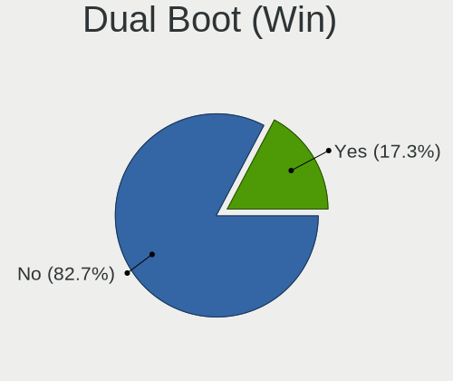
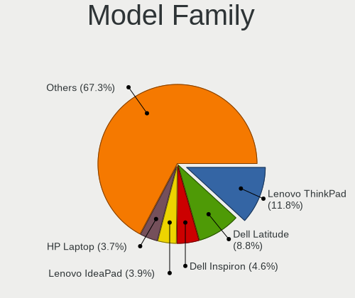
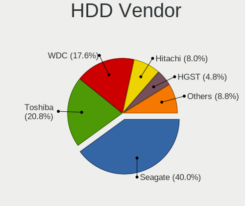
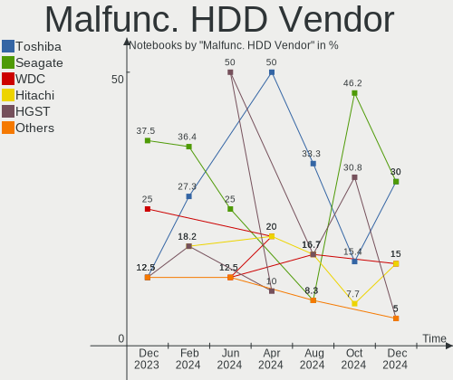
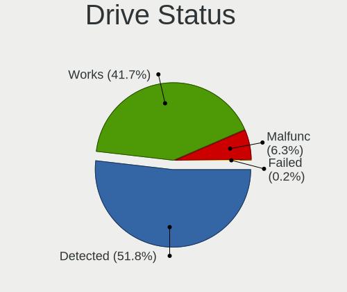
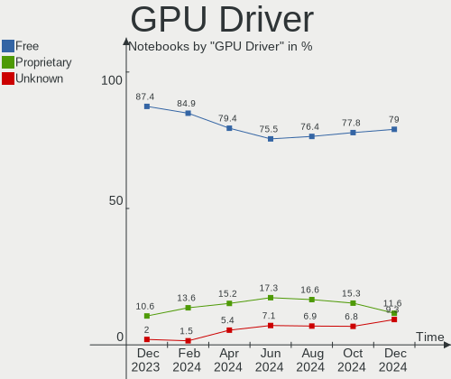
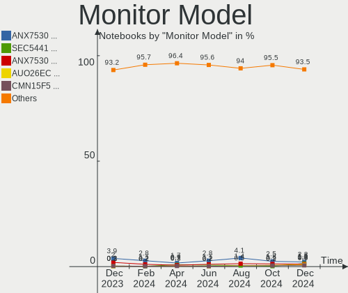
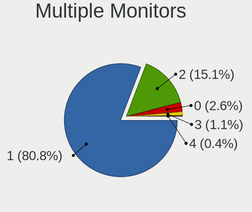
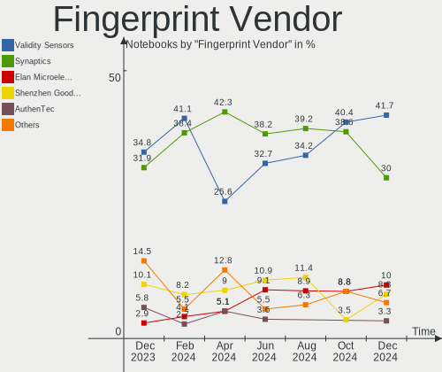
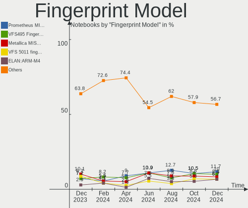

Linux in USA - Hardware Trends (Notebooks)
------------------------------------------

A project to identify most popular hardware characteristics and track their change
over time based on data collected by Linux users at https://Linux-Hardware.org.

Anyone can contribute to this report by the [hw-probe](https://github.com/linuxhw/hw-probe) tool:

    sudo -E hw-probe -all -upload

Period: Jun, 2022.

Contents
--------

* [ System ](#system)
  - [ OS                       ](#os)
  - [ OS Family                ](#os-family)
  - [ Kernel                   ](#kernel)
  - [ Kernel Family            ](#kernel-family)
  - [ Kernel Major Ver.        ](#kernel-major-ver)
  - [ Arch                     ](#arch)
  - [ DE                       ](#de)
  - [ Display Server           ](#display-server)
  - [ Display Manager          ](#display-manager)
  - [ OS Lang                  ](#os-lang)
  - [ Boot Mode                ](#boot-mode)
  - [ Filesystem               ](#filesystem)
  - [ Part. scheme             ](#part-scheme)
  - [ Dual Boot with Linux/BSD ](#dual-boot-with-linuxbsd)
  - [ Dual Boot (Win)          ](#dual-boot-win)

* [ Board ](#board)
  - [ Vendor                   ](#vendor)
  - [ Model                    ](#model)
  - [ Model Family             ](#model-family)
  - [ MFG Year                 ](#mfg-year)
  - [ Form Factor              ](#form-factor)
  - [ Secure Boot              ](#secure-boot)
  - [ Coreboot                 ](#coreboot)
  - [ RAM Size                 ](#ram-size)
  - [ RAM Used                 ](#ram-used)
  - [ Total Drives             ](#total-drives)
  - [ Has CD-ROM               ](#has-cd-rom)
  - [ Has Ethernet             ](#has-ethernet)
  - [ Has WiFi                 ](#has-wifi)
  - [ Has Bluetooth            ](#has-bluetooth)

* [ Location ](#location)
  - [ Country                  ](#country)
  - [ City                     ](#city)

* [ Drives ](#drives)
  - [ Drive Vendor             ](#drive-vendor)
  - [ Drive Model              ](#drive-model)
  - [ HDD Vendor               ](#hdd-vendor)
  - [ SSD Vendor               ](#ssd-vendor)
  - [ Drive Kind               ](#drive-kind)
  - [ Drive Connector          ](#drive-connector)
  - [ Drive Size               ](#drive-size)
  - [ Space Total              ](#space-total)
  - [ Space Used               ](#space-used)
  - [ Malfunc. Drives          ](#malfunc-drives)
  - [ Malfunc. Drive Vendor    ](#malfunc-drive-vendor)
  - [ Malfunc. HDD Vendor      ](#malfunc-hdd-vendor)
  - [ Malfunc. Drive Kind      ](#malfunc-drive-kind)
  - [ Failed Drives            ](#failed-drives)
  - [ Failed Drive Vendor      ](#failed-drive-vendor)
  - [ Drive Status             ](#drive-status)

* [ Storage controller ](#storage-controller)
  - [ Storage Vendor           ](#storage-vendor)
  - [ Storage Model            ](#storage-model)
  - [ Storage Kind             ](#storage-kind)

* [ Processor ](#processor)
  - [ CPU Vendor               ](#cpu-vendor)
  - [ CPU Model                ](#cpu-model)
  - [ CPU Model Family         ](#cpu-model-family)
  - [ CPU Cores                ](#cpu-cores)
  - [ CPU Sockets              ](#cpu-sockets)
  - [ CPU Threads              ](#cpu-threads)
  - [ CPU Op-Modes             ](#cpu-op-modes)
  - [ CPU Microcode            ](#cpu-microcode)
  - [ CPU Microarch            ](#cpu-microarch)

* [ Graphics ](#graphics)
  - [ GPU Vendor               ](#gpu-vendor)
  - [ GPU Model                ](#gpu-model)
  - [ GPU Combo                ](#gpu-combo)
  - [ GPU Driver               ](#gpu-driver)
  - [ GPU Memory               ](#gpu-memory)

* [ Monitor ](#monitor)
  - [ Monitor Vendor           ](#monitor-vendor)
  - [ Monitor Model            ](#monitor-model)
  - [ Monitor Resolution       ](#monitor-resolution)
  - [ Monitor Diagonal         ](#monitor-diagonal)
  - [ Monitor Width            ](#monitor-width)
  - [ Aspect Ratio             ](#aspect-ratio)
  - [ Monitor Area             ](#monitor-area)
  - [ Pixel Density            ](#pixel-density)
  - [ Multiple Monitors        ](#multiple-monitors)

* [ Network ](#network)
  - [ Net Controller Vendor    ](#net-controller-vendor)
  - [ Net Controller Model     ](#net-controller-model)
  - [ Wireless Vendor          ](#wireless-vendor)
  - [ Wireless Model           ](#wireless-model)
  - [ Ethernet Vendor          ](#ethernet-vendor)
  - [ Ethernet Model           ](#ethernet-model)
  - [ Net Controller Kind      ](#net-controller-kind)
  - [ Used Controller          ](#used-controller)
  - [ NICs                     ](#nics)
  - [ IPv6                     ](#ipv6)

* [ Bluetooth ](#bluetooth)
  - [ Bluetooth Vendor         ](#bluetooth-vendor)
  - [ Bluetooth Model          ](#bluetooth-model)

* [ Sound ](#sound)
  - [ Sound Vendor             ](#sound-vendor)
  - [ Sound Model              ](#sound-model)

* [ Memory ](#memory)
  - [ Memory Vendor            ](#memory-vendor)
  - [ Memory Model             ](#memory-model)
  - [ Memory Kind              ](#memory-kind)
  - [ Memory Form Factor       ](#memory-form-factor)
  - [ Memory Size              ](#memory-size)
  - [ Memory Speed             ](#memory-speed)

* [ Printers & scanners ](#printers--scanners)
  - [ Printer Vendor           ](#printer-vendor)
  - [ Printer Model            ](#printer-model)
  - [ Scanner Vendor           ](#scanner-vendor)
  - [ Scanner Model            ](#scanner-model)

* [ Camera ](#camera)
  - [ Camera Vendor            ](#camera-vendor)
  - [ Camera Model             ](#camera-model)

* [ Security ](#security)
  - [ Fingerprint Vendor       ](#fingerprint-vendor)
  - [ Fingerprint Model        ](#fingerprint-model)
  - [ Chipcard Vendor          ](#chipcard-vendor)
  - [ Chipcard Model           ](#chipcard-model)

* [ Unsupported ](#unsupported)
  - [ Unsupported Devices      ](#unsupported-devices)
  - [ Unsupported Device Types ](#unsupported-device-types)

System
------

OS
--

Installed operating systems

| Name                         | Notebooks | Percent |
|------------------------------|-----------|---------|
| Ubuntu 22.04                 | 62        | 15.7%   |
| Ubuntu 20.04                 | 38        | 9.62%   |
| Fedora 36                    | 32        | 8.1%    |
| Pop!_OS 22.04                | 31        | 7.85%   |
| Linux Mint 20.3              | 27        | 6.84%   |
| KDE neon 20.04               | 19        | 4.81%   |
| Debian 11                    | 14        | 3.54%   |
| Zorin 16                     | 13        | 3.29%   |
| Arch                         | 13        | 3.29%   |
| SteamOS 3.2                  | 12        | 3.04%   |
| OpenMandriva 4.3             | 11        | 2.78%   |
| Arch Rolling                 | 7         | 1.77%   |
| Kubuntu 22.04                | 6         | 1.52%   |
| Xubuntu 20.04                | 5         | 1.27%   |
| Kali 2022.2                  | 5         | 1.27%   |
| Elementary 6.1               | 5         | 1.27%   |
| Xubuntu 22.04                | 4         | 1.01%   |
| MX 21                        | 4         | 1.01%   |
| Manjaro 21.3.0               | 4         | 1.01%   |
| Gentoo 2.8                   | 4         | 1.01%   |
| ArcoLinux Rolling            | 4         | 1.01%   |
| Manjaro 21.2.6               | 3         | 0.76%   |
| Manjaro                      | 3         | 0.76%   |
| Fedora 35                    | 3         | 0.76%   |
| Endless 4.0.6                | 3         | 0.76%   |
| Artix Rolling                | 3         | 0.76%   |
| Xubuntu 18.04                | 2         | 0.51%   |
| Ubuntu 21.10                 | 2         | 0.51%   |
| SteamOS 3.2 (steamdeck-main) | 2         | 0.51%   |
| openSUSE Tumbleweed-XXXXXXXX | 2         | 0.51%   |
| LMDE 5                       | 2         | 0.51%   |
| LinuxFX 11                   | 2         | 0.51%   |
| Linux Mint 19.3              | 2         | 0.51%   |
| Kubuntu 20.04                | 2         | 0.51%   |
| Kubuntu 11.1                 | 2         | 0.51%   |
| EndeavourOS Rolling          | 2         | 0.51%   |
| Ubuntu MATE 22.10            | 1         | 0.25%   |
| Ubuntu MATE 22.04            | 1         | 0.25%   |
| Ubuntu Budgie 21.10          | 1         | 0.25%   |
| Ubuntu 22.10                 | 1         | 0.25%   |
| Ubuntu 21.04                 | 1         | 0.25%   |
| Ubuntu 18.04                 | 1         | 0.25%   |
| SteamOS 3.1                  | 1         | 0.25%   |
| Rocky Linux 8.5              | 1         | 0.25%   |
| Q4OS 4                       | 1         | 0.25%   |
| PCLinuxOS 2022               | 1         | 0.25%   |
| Parrot 5.0                   | 1         | 0.25%   |
| Oracle Linux 7.9             | 1         | 0.25%   |
| openSUSE Leap-15.4           | 1         | 0.25%   |
| openSUSE Leap-15.2           | 1         | 0.25%   |
| OpenMandriva 4.90            | 1         | 0.25%   |
| OpenMandriva 4.2             | 1         | 0.25%   |
| NixOS 22.05                  | 1         | 0.25%   |
| Manjaro 21.3.1               | 1         | 0.25%   |
| Lubuntu 22.04                | 1         | 0.25%   |
| Lubuntu 21.10                | 1         | 0.25%   |
| Linux Mint 20.2              | 1         | 0.25%   |
| Linux Mint 20.1              | 1         | 0.25%   |
| Lilidog 22                   | 1         | 0.25%   |
| Kubuntu 21.10                | 1         | 0.25%   |

OS Family
---------

OS without a version

| Name          | Notebooks | Percent |
|---------------|-----------|---------|
| Ubuntu        | 105       | 26.58%  |
| Fedora        | 35        | 8.86%   |
| Pop!_OS       | 31        | 7.85%   |
| Linux Mint    | 31        | 7.85%   |
| Arch          | 20        | 5.06%   |
| KDE neon      | 19        | 4.81%   |
| Debian        | 16        | 4.05%   |
| SteamOS       | 15        | 3.8%    |
| Zorin         | 13        | 3.29%   |
| OpenMandriva  | 13        | 3.29%   |
| Kubuntu       | 12        | 3.04%   |
| Xubuntu       | 11        | 2.78%   |
| Manjaro       | 11        | 2.78%   |
| Kali          | 5         | 1.27%   |
| Elementary    | 5         | 1.27%   |
| openSUSE      | 4         | 1.01%   |
| MX            | 4         | 1.01%   |
| Gentoo        | 4         | 1.01%   |
| Artix         | 4         | 1.01%   |
| ArcoLinux     | 4         | 1.01%   |
| Endless       | 3         | 0.76%   |
| Ubuntu MATE   | 2         | 0.51%   |
| Lubuntu       | 2         | 0.51%   |
| LMDE          | 2         | 0.51%   |
| LinuxFX       | 2         | 0.51%   |
| EndeavourOS   | 2         | 0.51%   |
| Clear Linux   | 2         | 0.51%   |
| Ubuntu Budgie | 1         | 0.25%   |
| Rocky Linux   | 1         | 0.25%   |
| Q4OS          | 1         | 0.25%   |
| PCLinuxOS     | 1         | 0.25%   |
| Parrot        | 1         | 0.25%   |
| Oracle Linux  | 1         | 0.25%   |
| NixOS         | 1         | 0.25%   |
| Lilidog       | 1         | 0.25%   |
| Guix          | 1         | 0.25%   |
| Generic       | 1         | 0.25%   |
| Garuda Linux  | 1         | 0.25%   |
| Feren OS      | 1         | 0.25%   |
| Deepin        | 1         | 0.25%   |
| BlackPanther  | 1         | 0.25%   |
| Arch ARM      | 1         | 0.25%   |
| antiX         | 1         | 0.25%   |
| Alpine        | 1         | 0.25%   |
| AlmaLinux     | 1         | 0.25%   |

Kernel
------

Version of the Linux kernel

| Version                                            | Notebooks | Percent |
|----------------------------------------------------|-----------|---------|
| 5.17.5-76051705-generic                            | 29        | 7.34%   |
| 5.13.0-51-generic                                  | 29        | 7.34%   |
| 5.13.0-48-generic                                  | 23        | 5.82%   |
| 5.13.0-44-generic                                  | 20        | 5.06%   |
| 5.15.0-40-generic                                  | 18        | 4.56%   |
| 5.15.0-37-generic                                  | 13        | 3.29%   |
| 5.15.0-35-generic                                  | 13        | 3.29%   |
| 5.15.0-33-generic                                  | 13        | 3.29%   |
| 5.13.0-valve15-1-neptune-02197-gf6ec7ad3762a       | 12        | 3.04%   |
| 5.16.7-desktop-1omv4003                            | 11        | 2.78%   |
| 5.15.0-39-generic                                  | 11        | 2.78%   |
| 5.4.0-117-generic                                  | 9         | 2.28%   |
| 5.18.6-arch1-1                                     | 9         | 2.28%   |
| 5.4.0-121-generic                                  | 7         | 1.77%   |
| 5.17.12-300.fc36.x86_64                            | 7         | 1.77%   |
| 5.4.0-113-generic                                  | 6         | 1.52%   |
| 5.18.5-200.fc36.x86_64                             | 6         | 1.52%   |
| 5.17.13-300.fc36.x86_64                            | 5         | 1.27%   |
| 5.15.0-25-generic                                  | 5         | 1.27%   |
| 5.13.0-40-generic                                  | 5         | 1.27%   |
| 5.10.0-15-amd64                                    | 5         | 1.27%   |
| 5.4.0-91-generic                                   | 4         | 1.01%   |
| 5.4.0-120-generic                                  | 4         | 1.01%   |
| 5.18.6-200.fc36.x86_64                             | 4         | 1.01%   |
| 5.17.11-300.fc36.x86_64                            | 4         | 1.01%   |
| 5.10.0-14-amd64                                    | 4         | 1.01%   |
| 5.10.0-13-amd64                                    | 4         | 1.01%   |
| 5.18.1-arch1-1                                     | 3         | 0.76%   |
| 5.17.5-300.fc36.x86_64                             | 3         | 0.76%   |
| 5.16.0-kali7-amd64                                 | 3         | 0.76%   |
| 5.11.0-35-generic                                  | 3         | 0.76%   |
| 5.18.6-artix1-1                                    | 2         | 0.51%   |
| 5.18.6-1-default                                   | 2         | 0.51%   |
| 5.18.5-arch1-1                                     | 2         | 0.51%   |
| 5.18.3-arch1-1                                     | 2         | 0.51%   |
| 5.18.1-200.fc36.x86_64                             | 2         | 0.51%   |
| 5.17.12-xanmod1-1                                  | 2         | 0.51%   |
| 5.17.0-kali3-amd64                                 | 2         | 0.51%   |
| 5.15.48-1-MANJARO                                  | 2         | 0.51%   |
| 5.15.0-36-generic                                  | 2         | 0.51%   |
| 5.14.0-1042-oem                                    | 2         | 0.51%   |
| 5.13.0-valve10.1-2-neptune-dri-02144-g7fffaf925dfb | 2         | 0.51%   |
| 5.11.0-38-generic                                  | 2         | 0.51%   |
| 5.4.17-2136.308.9.el7uek.x86_64                    | 1         | 0.25%   |
| 5.4.0-58-generic                                   | 1         | 0.25%   |
| 5.4.0-115-generic                                  | 1         | 0.25%   |
| 5.4.0-110-generic                                  | 1         | 0.25%   |
| 5.3.18-lp152.106-default                           | 1         | 0.25%   |
| 5.18.7-zen1-1-zen                                  | 1         | 0.25%   |
| 5.18.7-arch1-1                                     | 1         | 0.25%   |
| 5.18.7-1-ck                                        | 1         | 0.25%   |
| 5.18.6-zen1-1-zen                                  | 1         | 0.25%   |
| 5.18.5-gentoo                                      | 1         | 0.25%   |
| 5.18.5-1158.native                                 | 1         | 0.25%   |
| 5.18.5-100.fc35.x86_64                             | 1         | 0.25%   |
| 5.18.5-1-MANJARO                                   | 1         | 0.25%   |
| 5.18.4-xanmod1                                     | 1         | 0.25%   |
| 5.18.3-xanmod1-1-x64v2                             | 1         | 0.25%   |
| 5.18.3-arch1-1-t2                                  | 1         | 0.25%   |
| 5.18.2-zen1-1-zen                                  | 1         | 0.25%   |

Kernel Family
-------------

Linux kernel without a distro release

| Version  | Notebooks | Percent |
|----------|-----------|---------|
| 5.13.0   | 98        | 24.81%  |
| 5.15.0   | 77        | 19.49%  |
| 5.4.0    | 33        | 8.35%   |
| 5.17.5   | 32        | 8.1%    |
| 5.18.6   | 18        | 4.56%   |
| 5.10.0   | 15        | 3.8%    |
| 5.18.5   | 12        | 3.04%   |
| 5.16.7   | 11        | 2.78%   |
| 5.18.1   | 9         | 2.28%   |
| 5.17.12  | 9         | 2.28%   |
| 5.16.0   | 7         | 1.77%   |
| 5.17.13  | 6         | 1.52%   |
| 5.11.0   | 6         | 1.52%   |
| 5.14.0   | 5         | 1.27%   |
| 5.18.3   | 4         | 1.01%   |
| 5.17.11  | 4         | 1.01%   |
| 5.17.0   | 4         | 1.01%   |
| 5.18.7   | 3         | 0.76%   |
| 5.18.2   | 3         | 0.76%   |
| 5.18.0   | 2         | 0.51%   |
| 5.17.9   | 2         | 0.51%   |
| 5.17.1   | 2         | 0.51%   |
| 5.15.48  | 2         | 0.51%   |
| 5.15.32  | 2         | 0.51%   |
| 4.15.0   | 2         | 0.51%   |
| 5.4.17   | 1         | 0.25%   |
| 5.3.18   | 1         | 0.25%   |
| 5.18.4   | 1         | 0.25%   |
| 5.17.8   | 1         | 0.25%   |
| 5.17.6   | 1         | 0.25%   |
| 5.17.15  | 1         | 0.25%   |
| 5.17.14  | 1         | 0.25%   |
| 5.16.9   | 1         | 0.25%   |
| 5.16.13  | 1         | 0.25%   |
| 5.15.50  | 1         | 0.25%   |
| 5.15.47  | 1         | 0.25%   |
| 5.15.46  | 1         | 0.25%   |
| 5.15.45  | 1         | 0.25%   |
| 5.15.43  | 1         | 0.25%   |
| 5.15.41  | 1         | 0.25%   |
| 5.15.35  | 1         | 0.25%   |
| 5.14.21  | 1         | 0.25%   |
| 5.14.16  | 1         | 0.25%   |
| 5.10.60  | 1         | 0.25%   |
| 5.10.14  | 1         | 0.25%   |
| 5.10.121 | 1         | 0.25%   |
| 5.10.109 | 1         | 0.25%   |
| 5.10.10  | 1         | 0.25%   |
| 5.0.0    | 1         | 0.25%   |
| 4.9.0    | 1         | 0.25%   |
| 4.18.16  | 1         | 0.25%   |
| 4.18.0   | 1         | 0.25%   |

Kernel Major Ver.
-----------------

Linux kernel major version

| Version | Notebooks | Percent |
|---------|-----------|---------|
| 5.13    | 98        | 24.81%  |
| 5.15    | 88        | 22.28%  |
| 5.17    | 63        | 15.95%  |
| 5.18    | 52        | 13.16%  |
| 5.4     | 34        | 8.61%   |
| 5.16    | 20        | 5.06%   |
| 5.10    | 20        | 5.06%   |
| 5.14    | 7         | 1.77%   |
| 5.11    | 6         | 1.52%   |
| 4.18    | 2         | 0.51%   |
| 4.15    | 2         | 0.51%   |
| 5.3     | 1         | 0.25%   |
| 5.0     | 1         | 0.25%   |
| 4.9     | 1         | 0.25%   |

Arch
----

OS architecture (x86_64, i586, etc.)

| Name    | Notebooks | Percent |
|---------|-----------|---------|
| x86_64  | 390       | 98.73%  |
| i686    | 4         | 1.01%   |
| aarch64 | 1         | 0.25%   |

DE
--

Desktop Environment

| Name             | Notebooks | Percent |
|------------------|-----------|---------|
| GNOME            | 179       | 45.32%  |
| KDE5             | 101       | 25.57%  |
| XFCE             | 36        | 9.11%   |
| X-Cinnamon       | 29        | 7.34%   |
| Unknown          | 15        | 3.8%    |
| MATE             | 11        | 2.78%   |
| Pantheon         | 5         | 1.27%   |
| Budgie           | 4         | 1.01%   |
| i3               | 3         | 0.76%   |
| LXQt             | 2         | 0.51%   |
| GNOME Classic    | 2         | 0.51%   |
| Trinity          | 1         | 0.25%   |
| sway-dbus        | 1         | 0.25%   |
| lightdm-xsession | 1         | 0.25%   |
| icewm            | 1         | 0.25%   |
| GNOME Flashback  | 1         | 0.25%   |
| Deepin           | 1         | 0.25%   |
| Cinnamon         | 1         | 0.25%   |
| awesome          | 1         | 0.25%   |

Display Server
--------------

X11 or Wayland

| Name    | Notebooks | Percent |
|---------|-----------|---------|
| X11     | 287       | 72.66%  |
| Wayland | 96        | 24.3%   |
| Tty     | 7         | 1.77%   |
| Unknown | 5         | 1.27%   |

Display Manager
---------------

SDDM, LightDM, etc.

| Name    | Notebooks | Percent |
|---------|-----------|---------|
| Unknown | 148       | 37.47%  |
| GDM3    | 98        | 24.81%  |
| LightDM | 62        | 15.7%   |
| SDDM    | 54        | 13.67%  |
| GDM     | 30        | 7.59%   |
| TDM     | 1         | 0.25%   |
| NODM    | 1         | 0.25%   |
| LXDM    | 1         | 0.25%   |

OS Lang
-------

Language

| Lang    | Notebooks | Percent |
|---------|-----------|---------|
| en_US   | 368       | 93.16%  |
| C       | 9         | 2.28%   |
| en_CA   | 5         | 1.27%   |
| Unknown | 5         | 1.27%   |
| en_IN   | 2         | 0.51%   |
| de_DE   | 2         | 0.51%   |
| ru_RU   | 1         | 0.25%   |
| pt_BR   | 1         | 0.25%   |
| fr_FR   | 1         | 0.25%   |
| en_GB   | 1         | 0.25%   |

Boot Mode
---------

EFI or BIOS

| Mode | Notebooks | Percent |
|------|-----------|---------|
| EFI  | 206       | 52.15%  |
| BIOS | 189       | 47.85%  |

Filesystem
----------

Type of filesystem

| Type    | Notebooks | Percent |
|---------|-----------|---------|
| Ext4    | 300       | 75.95%  |
| Btrfs   | 63        | 15.95%  |
| Overlay | 17        | 4.3%    |
| Zfs     | 7         | 1.77%   |
| Xfs     | 7         | 1.77%   |
| Rootfs  | 1         | 0.25%   |

Part. scheme
------------

Scheme of partitioning

| Type    | Notebooks | Percent |
|---------|-----------|---------|
| Unknown | 228       | 57.72%  |
| GPT     | 142       | 35.95%  |
| MBR     | 25        | 6.33%   |

Dual Boot with Linux/BSD
------------------------

Hosting more than one Linux/BSD

| Dual boot | Notebooks | Percent |
|-----------|-----------|---------|
| No        | 358       | 90.63%  |
| Yes       | 37        | 9.37%   |

Dual Boot (Win)
---------------

Hosting Linux and Windows

| Dual boot | Notebooks | Percent |
|-----------|-----------|---------|
| No        | 319       | 80.76%  |
| Yes       | 76        | 19.24%  |

Board
-----

Vendor
------

Motherboard manufacturer

| Name                           | Notebooks | Percent |
|--------------------------------|-----------|---------|
| Dell                           | 98        | 24.81%  |
| Hewlett-Packard                | 72        | 18.23%  |
| Lenovo                         | 63        | 15.95%  |
| ASUSTek Computer               | 27        | 6.84%   |
| Apple                          | 21        | 5.32%   |
| Acer                           | 17        | 4.3%    |
| Valve                          | 13        | 3.29%   |
| Toshiba                        | 11        | 2.78%   |
| MSI                            | 9         | 2.28%   |
| System76                       | 8         | 2.03%   |
| GPU Company                    | 8         | 2.03%   |
| Google                         | 8         | 2.03%   |
| Unknown                        | 6         | 1.52%   |
| Samsung Electronics            | 4         | 1.01%   |
| Framework                      | 3         | 0.76%   |
| Alienware                      | 3         | 0.76%   |
| Sony                           | 2         | 0.51%   |
| Razer                          | 2         | 0.51%   |
| Matsushita Electric Industrial | 2         | 0.51%   |
| TUXEDO                         | 1         | 0.25%   |
| SLIMBOOK                       | 1         | 0.25%   |
| Purism                         | 1         | 0.25%   |
| Panasonic                      | 1         | 0.25%   |
| MOTILE                         | 1         | 0.25%   |
| MicroByte                      | 1         | 0.25%   |
| Micro Electronics              | 1         | 0.25%   |
| LG Electronics                 | 1         | 0.25%   |
| IP3 Tech                       | 1         | 0.25%   |
| Insyde                         | 1         | 0.25%   |
| HUAWEI                         | 1         | 0.25%   |
| GPD                            | 1         | 0.25%   |
| GEO                            | 1         | 0.25%   |
| Gateway                        | 1         | 0.25%   |
| Ematic                         | 1         | 0.25%   |
| Eluktronics                    | 1         | 0.25%   |
| AZW                            | 1         | 0.25%   |
| AMI                            | 1         | 0.25%   |

Model
-----

Motherboard model

| Name                                    | Notebooks | Percent |
|-----------------------------------------|-----------|---------|
| Valve Jupiter                           | 13        | 3.29%   |
| Unknown                                 | 6         | 1.52%   |
| Dell Latitude E5430 non-vPro            | 5         | 1.27%   |
| HP Pavilion Notebook                    | 4         | 1.01%   |
| GPU Company GWTC116-2                   | 4         | 1.01%   |
| HP Notebook                             | 3         | 0.76%   |
| HP 15 Notebook PC                       | 3         | 0.76%   |
| Framework Laptop                        | 3         | 0.76%   |
| Dell XPS 15 9560                        | 3         | 0.76%   |
| Dell Latitude E6430                     | 3         | 0.76%   |
| Toshiba Satellite L775D                 | 2         | 0.51%   |
| System76 Oryx Pro                       | 2         | 0.51%   |
| System76 Lemur Pro                      | 2         | 0.51%   |
| Lenovo IdeaPad Gaming 3 15ACH6 82K2     | 2         | 0.51%   |
| Lenovo IdeaPad 3 15IIL05 81WE           | 2         | 0.51%   |
| HP Stream Laptop 14-cb1xxx              | 2         | 0.51%   |
| HP Pavilion Gaming Laptop 15-cx0xxx     | 2         | 0.51%   |
| HP Laptop 17-by4xxx                     | 2         | 0.51%   |
| HP Laptop 15-dy0xxx                     | 2         | 0.51%   |
| HP Laptop 14-dk1xxx                     | 2         | 0.51%   |
| HP ENVY dv7                             | 2         | 0.51%   |
| HP EliteBook 8740w                      | 2         | 0.51%   |
| Google Cyan                             | 2         | 0.51%   |
| Dell XPS 17 9710                        | 2         | 0.51%   |
| Dell XPS 15 9520                        | 2         | 0.51%   |
| Dell XPS 13 9310                        | 2         | 0.51%   |
| Dell Latitude E7470                     | 2         | 0.51%   |
| Dell Latitude E7440                     | 2         | 0.51%   |
| Dell Latitude E6410                     | 2         | 0.51%   |
| Dell Latitude E6330                     | 2         | 0.51%   |
| Dell Inspiron 5770                      | 2         | 0.51%   |
| Dell Inspiron 5570                      | 2         | 0.51%   |
| Dell Inspiron 15-7568                   | 2         | 0.51%   |
| Dell Inspiron 13 5310                   | 2         | 0.51%   |
| ASUS VivoBook_ASUSLaptop E410MAB_E410MA | 2         | 0.51%   |
| Apple MacBookPro11,1                    | 2         | 0.51%   |
| Apple MacBookAir7,2                     | 2         | 0.51%   |
| Apple MacBookAir5,1                     | 2         | 0.51%   |
| Apple MacBook4,1                        | 2         | 0.51%   |
| Acer Aspire E5-521                      | 2         | 0.51%   |
| TUXEDO Book_XA1510                      | 1         | 0.25%   |
| Toshiba TECRA M11                       | 1         | 0.25%   |
| Toshiba Satellite M305                  | 1         | 0.25%   |
| Toshiba Satellite L755D                 | 1         | 0.25%   |
| Toshiba Satellite C75D-B                | 1         | 0.25%   |
| Toshiba Satellite C75D-A                | 1         | 0.25%   |
| Toshiba Satellite C655D                 | 1         | 0.25%   |
| Toshiba Satellite C655                  | 1         | 0.25%   |
| Toshiba Satellite A665                  | 1         | 0.25%   |
| Toshiba Satellite A215                  | 1         | 0.25%   |
| System76 Kudu Professional              | 1         | 0.25%   |
| System76 Gazelle                        | 1         | 0.25%   |
| System76 Galago Pro                     | 1         | 0.25%   |
| System76 Bonobo Extreme                 | 1         | 0.25%   |
| Sony VPCSB4AFX                          | 1         | 0.25%   |
| Sony VGN-NW310F                         | 1         | 0.25%   |
| SLIMBOOK PROX14-AMD                     | 1         | 0.25%   |
| Samsung Lumpy                           | 1         | 0.25%   |
| Samsung 950XDB/951XDB/950XDY            | 1         | 0.25%   |
| Samsung 760XDA                          | 1         | 0.25%   |

Model Family
------------

Motherboard model prefix

| Name                  | Notebooks | Percent |
|-----------------------|-----------|---------|
| Dell Latitude         | 40        | 10.13%  |
| Lenovo ThinkPad       | 39        | 9.87%   |
| Dell Inspiron         | 28        | 7.09%   |
| HP Laptop             | 16        | 4.05%   |
| Dell XPS              | 15        | 3.8%    |
| HP Pavilion           | 14        | 3.54%   |
| Valve Jupiter         | 13        | 3.29%   |
| Lenovo IdeaPad        | 13        | 3.29%   |
| Acer Aspire           | 11        | 2.78%   |
| Toshiba Satellite     | 10        | 2.53%   |
| HP EliteBook          | 10        | 2.53%   |
| Dell Precision        | 10        | 2.53%   |
| HP Stream             | 6         | 1.52%   |
| Unknown               | 6         | 1.52%   |
| HP ZBook              | 4         | 1.01%   |
| GPU Company GWTC116-2 | 4         | 1.01%   |
| ASUS VivoBook         | 4         | 1.01%   |
| ASUS ROG              | 4         | 1.01%   |
| Lenovo ThinkBook      | 3         | 0.76%   |
| Lenovo Legion         | 3         | 0.76%   |
| HP ProBook            | 3         | 0.76%   |
| HP Notebook           | 3         | 0.76%   |
| HP ENVY               | 3         | 0.76%   |
| HP 15                 | 3         | 0.76%   |
| Framework Laptop      | 3         | 0.76%   |
| Apple MacBookPro11    | 3         | 0.76%   |
| Acer Nitro            | 3         | 0.76%   |
| System76 Oryx         | 2         | 0.51%   |
| System76 Lemur        | 2         | 0.51%   |
| Razer Blade           | 2         | 0.51%   |
| HP OMEN               | 2         | 0.51%   |
| HP 255                | 2         | 0.51%   |
| Google Cyan           | 2         | 0.51%   |
| Dell Vostro           | 2         | 0.51%   |
| ASUS ZenBook          | 2         | 0.51%   |
| ASUS ASUS             | 2         | 0.51%   |
| Apple MacBookPro5     | 2         | 0.51%   |
| Apple MacBookPro14    | 2         | 0.51%   |
| Apple MacBookAir7     | 2         | 0.51%   |
| Apple MacBookAir5     | 2         | 0.51%   |
| Apple MacBook4        | 2         | 0.51%   |
| Acer Swift            | 2         | 0.51%   |
| TUXEDO Book           | 1         | 0.25%   |
| Toshiba TECRA         | 1         | 0.25%   |
| System76 Kudu         | 1         | 0.25%   |
| System76 Gazelle      | 1         | 0.25%   |
| System76 Galago       | 1         | 0.25%   |
| System76 Bonobo       | 1         | 0.25%   |
| Sony VPCSB4AFX        | 1         | 0.25%   |
| Sony VGN-NW310F       | 1         | 0.25%   |
| SLIMBOOK PROX14-AMD   | 1         | 0.25%   |
| Samsung Lumpy         | 1         | 0.25%   |
| Samsung 950XDB        | 1         | 0.25%   |
| Samsung 760XDA        | 1         | 0.25%   |
| Samsung 355V4C        | 1         | 0.25%   |
| Purism Librem         | 1         | 0.25%   |
| Panasonic CF-31-5     | 1         | 0.25%   |
| MSI Prestige          | 1         | 0.25%   |
| MSI MS-7C02           | 1         | 0.25%   |
| MSI Katana            | 1         | 0.25%   |

MFG Year
--------

Motherboard manufacture year

| Year    | Notebooks | Percent |
|---------|-----------|---------|
| 2021    | 64        | 16.2%   |
| 2020    | 38        | 9.62%   |
| 2019    | 34        | 8.61%   |
| 2022    | 32        | 8.1%    |
| 2012    | 31        | 7.85%   |
| 2017    | 26        | 6.58%   |
| 2018    | 25        | 6.33%   |
| 2015    | 25        | 6.33%   |
| 2010    | 23        | 5.82%   |
| 2014    | 22        | 5.57%   |
| 2011    | 22        | 5.57%   |
| 2016    | 17        | 4.3%    |
| 2013    | 11        | 2.78%   |
| 2008    | 9         | 2.28%   |
| 2007    | 7         | 1.77%   |
| 2009    | 6         | 1.52%   |
| 2006    | 1         | 0.25%   |
| 2005    | 1         | 0.25%   |
| Unknown | 1         | 0.25%   |

Form Factor
-----------

Physical design of the computer

| Name     | Notebooks | Percent |
|----------|-----------|---------|
| Notebook | 395       | 100%    |

Secure Boot
-----------

Enabled or disabled

| State    | Notebooks | Percent |
|----------|-----------|---------|
| Disabled | 363       | 91.9%   |
| Enabled  | 32        | 8.1%    |

Coreboot
--------

Have coreboot on board

| Used | Notebooks | Percent |
|------|-----------|---------|
| No   | 380       | 96.2%   |
| Yes  | 15        | 3.8%    |

RAM Size
--------

Total RAM memory

| Size in GB  | Notebooks | Percent |
|-------------|-----------|---------|
| 4.01-8.0    | 106       | 26.84%  |
| 3.01-4.0    | 80        | 20.25%  |
| 16.01-24.0  | 74        | 18.73%  |
| 8.01-16.0   | 60        | 15.19%  |
| 32.01-64.0  | 39        | 9.87%   |
| 64.01-256.0 | 14        | 3.54%   |
| 1.01-2.0    | 8         | 2.03%   |
| 24.01-32.0  | 6         | 1.52%   |
| 2.01-3.0    | 4         | 1.01%   |
| 0.51-1.0    | 3         | 0.76%   |
| Unknown     | 1         | 0.25%   |

RAM Used
--------

Used RAM memory

| Used GB    | Notebooks | Percent |
|------------|-----------|---------|
| 1.01-2.0   | 133       | 33.67%  |
| 2.01-3.0   | 112       | 28.35%  |
| 4.01-8.0   | 59        | 14.94%  |
| 3.01-4.0   | 56        | 14.18%  |
| 8.01-16.0  | 14        | 3.54%   |
| 0.51-1.0   | 14        | 3.54%   |
| 0.01-0.5   | 4         | 1.01%   |
| 24.01-32.0 | 1         | 0.25%   |
| 16.01-24.0 | 1         | 0.25%   |
| Unknown    | 1         | 0.25%   |

Total Drives
------------

Number of drives on board

| Drives | Notebooks | Percent |
|--------|-----------|---------|
| 1      | 281       | 71.14%  |
| 2      | 92        | 23.29%  |
| 3      | 15        | 3.8%    |
| 4      | 4         | 1.01%   |
| 7      | 1         | 0.25%   |
| 5      | 1         | 0.25%   |
| 0      | 1         | 0.25%   |

Has CD-ROM
----------

Has CD-ROM on board

| Presented | Notebooks | Percent |
|-----------|-----------|---------|
| No        | 270       | 68.35%  |
| Yes       | 125       | 31.65%  |

Has Ethernet
------------

Has Ethernet on board

| Presented | Notebooks | Percent |
|-----------|-----------|---------|
| Yes       | 281       | 71.14%  |
| No        | 114       | 28.86%  |

Has WiFi
--------

Has WiFi module

| Presented | Notebooks | Percent |
|-----------|-----------|---------|
| Yes       | 388       | 98.23%  |
| No        | 7         | 1.77%   |

Has Bluetooth
-------------

Has Bluetooth module

| Presented | Notebooks | Percent |
|-----------|-----------|---------|
| Yes       | 304       | 76.96%  |
| No        | 91        | 23.04%  |

Location
--------

Country
-------

Geographic location (country)

| Country | Notebooks | Percent |
|---------|-----------|---------|
| USA     | 395       | 100%    |

City
----

Geographic location (city)

| City             | Notebooks | Percent |
|------------------|-----------|---------|
| New York         | 10        | 2.53%   |
| Dallas           | 7         | 1.77%   |
| Seattle          | 6         | 1.52%   |
| San Francisco    | 4         | 1.01%   |
| San Antonio      | 4         | 1.01%   |
| Portland         | 4         | 1.01%   |
| Philadelphia     | 4         | 1.01%   |
| Minneapolis      | 4         | 1.01%   |
| Kansas City      | 4         | 1.01%   |
| Denver           | 4         | 1.01%   |
| Albany           | 4         | 1.01%   |
| Tucson           | 3         | 0.76%   |
| Springfield      | 3         | 0.76%   |
| Schenectady      | 3         | 0.76%   |
| San Diego        | 3         | 0.76%   |
| Raleigh          | 3         | 0.76%   |
| Phoenix          | 3         | 0.76%   |
| Orlando          | 3         | 0.76%   |
| Miami            | 3         | 0.76%   |
| Mesa             | 3         | 0.76%   |
| Los Angeles      | 3         | 0.76%   |
| Las Vegas        | 3         | 0.76%   |
| Houston          | 3         | 0.76%   |
| Fort Lauderdale  | 3         | 0.76%   |
| Colorado Springs | 3         | 0.76%   |
| Charlotte        | 3         | 0.76%   |
| Atlanta          | 3         | 0.76%   |
| Ypsilanti        | 2         | 0.51%   |
| Worcester        | 2         | 0.51%   |
| Washington       | 2         | 0.51%   |
| The Bronx        | 2         | 0.51%   |
| St Louis         | 2         | 0.51%   |
| Southampton      | 2         | 0.51%   |
| Rochester        | 2         | 0.51%   |
| Puyallup         | 2         | 0.51%   |
| Plymouth         | 2         | 0.51%   |
| Peoria           | 2         | 0.51%   |
| Orange           | 2         | 0.51%   |
| Oklahoma City    | 2         | 0.51%   |
| Norman           | 2         | 0.51%   |
| Nashville        | 2         | 0.51%   |
| Memphis          | 2         | 0.51%   |
| Maricopa         | 2         | 0.51%   |
| Lincoln          | 2         | 0.51%   |
| Laurel           | 2         | 0.51%   |
| Knoxville        | 2         | 0.51%   |
| Everett          | 2         | 0.51%   |
| Columbus         | 2         | 0.51%   |
| Chicago          | 2         | 0.51%   |
| Chattanooga      | 2         | 0.51%   |
| Carrollton       | 2         | 0.51%   |
| Canton           | 2         | 0.51%   |
| Cambridge        | 2         | 0.51%   |
| Buffalo          | 2         | 0.51%   |
| Brooklyn         | 2         | 0.51%   |
| Birmingham       | 2         | 0.51%   |
| Austin           | 2         | 0.51%   |
| Ann Arbor        | 2         | 0.51%   |
| York             | 1         | 0.25%   |
| Wytheville       | 1         | 0.25%   |

Drives
------

Drive Vendor
------------

Hard drive vendors

| Vendor                         | Notebooks | Drives | Percent |
|--------------------------------|-----------|--------|---------|
| Samsung Electronics            | 69        | 80     | 14.08%  |
| WDC                            | 49        | 51     | 10%     |
| Seagate                        | 43        | 48     | 8.78%   |
| Unknown                        | 41        | 46     | 8.37%   |
| Toshiba                        | 36        | 36     | 7.35%   |
| SanDisk                        | 29        | 29     | 5.92%   |
| SK hynix                       | 28        | 31     | 5.71%   |
| Kingston                       | 16        | 16     | 3.27%   |
| HGST                           | 16        | 17     | 3.27%   |
| Intel                          | 15        | 24     | 3.06%   |
| Hitachi                        | 12        | 12     | 2.45%   |
| Micron Technology              | 11        | 11     | 2.24%   |
| Apple                          | 11        | 14     | 2.24%   |
| Phison                         | 9         | 10     | 1.84%   |
| Crucial                        | 9         | 10     | 1.84%   |
| Unknown                        | 9         | 9      | 1.84%   |
| A-DATA Technology              | 8         | 8      | 1.63%   |
| KIOXIA                         | 7         | 7      | 1.43%   |
| China                          | 6         | 6      | 1.22%   |
| Team                           | 5         | 5      | 1.02%   |
| PNY                            | 5         | 5      | 1.02%   |
| Silicon Motion                 | 4         | 4      | 0.82%   |
| Fujitsu                        | 4         | 4      | 0.82%   |
| SPCC                           | 3         | 3      | 0.61%   |
| Patriot                        | 3         | 3      | 0.61%   |
| Mushkin                        | 3         | 3      | 0.61%   |
| SABRENT                        | 2         | 2      | 0.41%   |
| OCZ                            | 2         | 2      | 0.41%   |
| O2 Micro                       | 2         | 2      | 0.41%   |
| Netac                          | 2         | 2      | 0.41%   |
| LITEONIT                       | 2         | 2      | 0.41%   |
| Leven                          | 2         | 2      | 0.41%   |
| BIWIN                          | 2         | 2      | 0.41%   |
| BHT                            | 2         | 2      | 0.41%   |
| WDC WDB                        | 1         | 1      | 0.2%    |
| USB3.0                         | 1         | 1      | 0.2%    |
| Union Memory (Shenzhen)        | 1         | 1      | 0.2%    |
| Transcend                      | 1         | 1      | 0.2%    |
| Timetec                        | 1         | 1      | 0.2%    |
| T-FORCE                        | 1         | 1      | 0.2%    |
| SSSTC                          | 1         | 1      | 0.2%    |
| Solid State Storage Technology | 1         | 1      | 0.2%    |
| Realtek Semiconductor          | 1         | 1      | 0.2%    |
| Micron/Crucial Technology      | 1         | 1      | 0.2%    |
| LITEON                         | 1         | 1      | 0.2%    |
| KingFast                       | 1         | 2      | 0.2%    |
| Kingchuxing                    | 1         | 1      | 0.2%    |
| Inateck                        | 1         | 1      | 0.2%    |
| HGST HDN                       | 1         | 1      | 0.2%    |
| Hewlett-Packard                | 1         | 1      | 0.2%    |
| FORESEE                        | 1         | 1      | 0.2%    |
| External                       | 1         | 2      | 0.2%    |
| Dogfish                        | 1         | 1      | 0.2%    |
| Axiom                          | 1         | 1      | 0.2%    |
| Aura                           | 1         | 1      | 0.2%    |
| ASMT                           | 1         | 1      | 0.2%    |
| ADATA Technology               | 1         | 1      | 0.2%    |

Drive Model
-----------

Hard drive models

| Model                                  | Notebooks | Percent |
|----------------------------------------|-----------|---------|
| Toshiba MQ01ABD100 1TB                 | 9         | 1.72%   |
| Unknown                                | 9         | 1.72%   |
| Kingston NVMe SSD Drive 512GB          | 7         | 1.34%   |
| Samsung NVMe SSD Drive 512GB           | 6         | 1.15%   |
| Samsung NVMe SSD Drive 256GB           | 6         | 1.15%   |
| Unknown SD/MMC/MS PRO 128GB            | 5         | 0.96%   |
| Unknown MMC Card  64GB                 | 5         | 0.96%   |
| Seagate ST500LT012-1DG142 500GB        | 5         | 0.96%   |
| Seagate ST1000LM035-1RK172 1TB         | 5         | 0.96%   |
| Intel NVMe SSD Drive 512GB             | 5         | 0.96%   |
| HGST HTS721010A9E630 1TB               | 5         | 0.96%   |
| SK hynix NVMe SSD Drive 512GB          | 4         | 0.77%   |
| SanDisk NVMe SSD Drive 512GB           | 4         | 0.77%   |
| Samsung SSD 970 EVO Plus 2TB           | 4         | 0.77%   |
| Samsung NVMe SSD Drive 1TB             | 4         | 0.77%   |
| WDC WDS500G2B0B-00YS70 500GB SSD       | 3         | 0.57%   |
| Unknown MMC Card  512GB                | 3         | 0.57%   |
| Unknown MMC Card  32GB                 | 3         | 0.57%   |
| Unknown Biwin  64GB                    | 3         | 0.57%   |
| Seagate ST1000LM024 HN-M101MBB 1TB     | 3         | 0.57%   |
| SanDisk NVMe SSD Drive 500GB           | 3         | 0.57%   |
| SanDisk NVMe SSD Drive 1TB             | 3         | 0.57%   |
| Samsung SSD 980 PRO 2TB                | 3         | 0.57%   |
| Samsung SSD 860 EVO 500GB              | 3         | 0.57%   |
| Kingston NVMe SSD Drive 256GB          | 3         | 0.57%   |
| HGST HTS541010A9E680 1TB               | 3         | 0.57%   |
| Crucial CT1000MX500SSD1 1TB            | 3         | 0.57%   |
| WDC WDS500G3X0C-00SJG0 500GB           | 2         | 0.38%   |
| WDC WDBNCE0010PNC 1TB SSD              | 2         | 0.38%   |
| WDC WD3200BEVT-75ZCT2 320GB            | 2         | 0.38%   |
| WDC WD2500BEKT-75PVMT0 250GB           | 2         | 0.38%   |
| WDC WD10SPZX-60Z10T1 1TB               | 2         | 0.38%   |
| WDC WD10JPVX-22JC3T0 1TB               | 2         | 0.38%   |
| Unknown ISOCOM  64GB                   | 2         | 0.38%   |
| Toshiba NVMe SSD Drive 512GB           | 2         | 0.38%   |
| Toshiba MQ04ABF100 1TB                 | 2         | 0.38%   |
| Toshiba MQ01ABF050 500GB               | 2         | 0.38%   |
| Toshiba KXG50ZNV512G NVMe 512GB        | 2         | 0.38%   |
| SPCC Solid State Disk 128GB            | 2         | 0.38%   |
| SK hynix SC311 SATA 128GB SSD          | 2         | 0.38%   |
| SK hynix PC711 NVMe 512GB              | 2         | 0.38%   |
| SK hynix NVMe SSD Drive 500GB          | 2         | 0.38%   |
| SK hynix NVMe SSD Drive 128GB          | 2         | 0.38%   |
| Silicon Motion NVMe SSD Drive 256GB    | 2         | 0.38%   |
| Seagate ST9160412AS 160GB              | 2         | 0.38%   |
| Seagate ST500LM021-1KJ152 500GB        | 2         | 0.38%   |
| Seagate ST2000LM007-1R8174 2TB         | 2         | 0.38%   |
| Seagate ST1000LX015-1U7172 1TB         | 2         | 0.38%   |
| Seagate FireCuda 530 ZP4000GM30013 4TB | 2         | 0.38%   |
| Seagate BUP Slim BK 1TB                | 2         | 0.38%   |
| SanDisk SD9SN8W-128G-1006 128GB SSD    | 2         | 0.38%   |
| Samsung SSD 860 EVO M.2 500GB          | 2         | 0.38%   |
| Samsung SSD 860 EVO 1TB                | 2         | 0.38%   |
| Samsung SSD 850 PRO 256GB              | 2         | 0.38%   |
| Samsung PM9A1 NVMe 1024GB              | 2         | 0.38%   |
| Samsung NVMe SSD Drive 1024GB          | 2         | 0.38%   |
| Samsung MZVLB1T0HALR-00000 1TB         | 2         | 0.38%   |
| SABRENT Disk 1TB                       | 2         | 0.38%   |
| Phison NVMe SSD Drive 4TB              | 2         | 0.38%   |
| Phison NVMe SSD Drive 256GB            | 2         | 0.38%   |

HDD Vendor
----------

Hard disk drive vendors

| Vendor              | Notebooks | Drives | Percent |
|---------------------|-----------|--------|---------|
| Seagate             | 41        | 45     | 30.15%  |
| WDC                 | 31        | 31     | 22.79%  |
| Toshiba             | 22        | 22     | 16.18%  |
| HGST                | 16        | 17     | 11.76%  |
| Hitachi             | 12        | 12     | 8.82%   |
| Unknown             | 5         | 5      | 3.68%   |
| Fujitsu             | 4         | 4      | 2.94%   |
| Samsung Electronics | 1         | 1      | 0.74%   |
| Inateck             | 1         | 1      | 0.74%   |
| HGST HDN            | 1         | 1      | 0.74%   |
| ASMT                | 1         | 1      | 0.74%   |
| Apple               | 1         | 1      | 0.74%   |

SSD Vendor
----------

Solid state drive vendors

| Vendor              | Notebooks | Drives | Percent |
|---------------------|-----------|--------|---------|
| Samsung Electronics | 23        | 25     | 17.04%  |
| SanDisk             | 16        | 16     | 11.85%  |
| WDC                 | 8         | 8      | 5.93%   |
| Crucial             | 8         | 9      | 5.93%   |
| Apple               | 7         | 7      | 5.19%   |
| A-DATA Technology   | 7         | 7      | 5.19%   |
| SK hynix            | 6         | 6      | 4.44%   |
| China               | 6         | 6      | 4.44%   |
| Micron Technology   | 5         | 5      | 3.7%    |
| Toshiba             | 4         | 4      | 2.96%   |
| Team                | 4         | 4      | 2.96%   |
| PNY                 | 4         | 4      | 2.96%   |
| Kingston            | 4         | 4      | 2.96%   |
| Intel               | 4         | 4      | 2.96%   |
| SPCC                | 3         | 3      | 2.22%   |
| Patriot             | 3         | 3      | 2.22%   |
| Mushkin             | 3         | 3      | 2.22%   |
| OCZ                 | 2         | 2      | 1.48%   |
| Netac               | 2         | 2      | 1.48%   |
| LITEONIT            | 2         | 2      | 1.48%   |
| BIWIN               | 2         | 2      | 1.48%   |
| BHT                 | 2         | 2      | 1.48%   |
| WDC WDB             | 1         | 1      | 0.74%   |
| USB3.0              | 1         | 1      | 0.74%   |
| Timetec             | 1         | 1      | 0.74%   |
| LITEON              | 1         | 1      | 0.74%   |
| Leven               | 1         | 1      | 0.74%   |
| KingFast            | 1         | 1      | 0.74%   |
| FORESEE             | 1         | 1      | 0.74%   |
| Dogfish             | 1         | 1      | 0.74%   |
| Axiom               | 1         | 1      | 0.74%   |
| Unknown             | 1         | 1      | 0.74%   |

Drive Kind
----------

HDD or SSD

| Kind    | Notebooks | Drives | Percent |
|---------|-----------|--------|---------|
| NVMe    | 156       | 199    | 33.4%   |
| HDD     | 133       | 141    | 28.48%  |
| SSD     | 126       | 138    | 26.98%  |
| MMC     | 48        | 51     | 10.28%  |
| Unknown | 4         | 4      | 0.86%   |

Drive Connector
---------------

SATA, SAS, NVMe, etc.

| Type | Notebooks | Drives | Percent |
|------|-----------|--------|---------|
| SATA | 231       | 263    | 50.55%  |
| NVMe | 155       | 195    | 33.92%  |
| MMC  | 48        | 51     | 10.5%   |
| SAS  | 23        | 24     | 5.03%   |

Drive Size
----------

Size of hard drive

| Size in TB | Notebooks | Drives | Percent |
|------------|-----------|--------|---------|
| 0.01-0.5   | 155       | 165    | 59.62%  |
| 0.51-1.0   | 88        | 97     | 33.85%  |
| 1.01-2.0   | 12        | 12     | 4.62%   |
| 4.01-10.0  | 3         | 3      | 1.15%   |
| 3.01-4.0   | 2         | 2      | 0.77%   |

Space Total
-----------

Amount of disk space available on the file system

| Size in GB     | Notebooks | Percent |
|----------------|-----------|---------|
| 251-500        | 115       | 29.11%  |
| 101-250        | 93        | 23.54%  |
| 501-1000       | 67        | 16.96%  |
| 1001-2000      | 28        | 7.09%   |
| 1-20           | 23        | 5.82%   |
| 51-100         | 20        | 5.06%   |
| 21-50          | 17        | 4.3%    |
| More than 3000 | 15        | 3.8%    |
| Unknown        | 11        | 2.78%   |
| 2001-3000      | 6         | 1.52%   |

Space Used
----------

Amount of used disk space

| Used GB        | Notebooks | Percent |
|----------------|-----------|---------|
| 1-20           | 166       | 42.03%  |
| 21-50          | 67        | 16.96%  |
| 51-100         | 49        | 12.41%  |
| 101-250        | 46        | 11.65%  |
| 251-500        | 30        | 7.59%   |
| 501-1000       | 15        | 3.8%    |
| Unknown        | 11        | 2.78%   |
| 1001-2000      | 5         | 1.27%   |
| 2001-3000      | 4         | 1.01%   |
| More than 3000 | 2         | 0.51%   |

Malfunc. Drives
---------------

Drive models with a malfunction

| Model                                          | Notebooks | Drives | Percent |
|------------------------------------------------|-----------|--------|---------|
| Seagate ST1000LX015-1U7172 1TB                 | 2         | 2      | 8.7%    |
| HGST HTS721010A9E630 1TB                       | 2         | 2      | 8.7%    |
| WDC WD10JPVX-22JC3T0 1TB                       | 1         | 1      | 4.35%   |
| Toshiba MQ01ACF050 500GB                       | 1         | 1      | 4.35%   |
| Toshiba MK1665GSX H 160GB                      | 1         | 1      | 4.35%   |
| Toshiba MK1255GSX H 120GB                      | 1         | 1      | 4.35%   |
| Toshiba KSG60ZMV256G M.2 2280 256GB SSD        | 1         | 1      | 4.35%   |
| SK hynix PC711 HFS001TDE9X073N 1TB             | 1         | 1      | 4.35%   |
| Seagate ST9160412AS 160GB                      | 1         | 1      | 4.35%   |
| SanDisk SSD PLUS 240GB                         | 1         | 1      | 4.35%   |
| SanDisk SD9SN8W-128G-1006 128GB SSD            | 1         | 1      | 4.35%   |
| Micron Technology 1100_MTFDDAV256TBN 256GB SSD | 1         | 1      | 4.35%   |
| Hitachi HTS727550A9E364 500GB                  | 1         | 1      | 4.35%   |
| Hitachi HTS725050A7E630 500GB                  | 1         | 1      | 4.35%   |
| Hitachi HTS545016B9A300 160GB                  | 1         | 1      | 4.35%   |
| Hitachi HTS541010A9E680 1TB                    | 1         | 1      | 4.35%   |
| HGST HTS725050A7E630 500GB                     | 1         | 1      | 4.35%   |
| HGST HTS725032A7E630 320GB                     | 1         | 1      | 4.35%   |
| Fujitsu MHT2030AT 32GB                         | 1         | 1      | 4.35%   |
| Crucial CT1050MX300SSD1 1TB                    | 1         | 1      | 4.35%   |
| China SSD 240GB                                | 1         | 1      | 4.35%   |

Malfunc. Drive Vendor
---------------------

Vendors of faulty drives

| Vendor            | Notebooks | Drives | Percent |
|-------------------|-----------|--------|---------|
| Toshiba           | 4         | 4      | 17.39%  |
| Hitachi           | 4         | 4      | 17.39%  |
| HGST              | 4         | 4      | 17.39%  |
| Seagate           | 3         | 3      | 13.04%  |
| SanDisk           | 2         | 2      | 8.7%    |
| WDC               | 1         | 1      | 4.35%   |
| SK hynix          | 1         | 1      | 4.35%   |
| Micron Technology | 1         | 1      | 4.35%   |
| Fujitsu           | 1         | 1      | 4.35%   |
| Crucial           | 1         | 1      | 4.35%   |
| China             | 1         | 1      | 4.35%   |

Malfunc. HDD Vendor
-------------------

Vendors of faulty HDD drives

| Vendor  | Notebooks | Drives | Percent |
|---------|-----------|--------|---------|
| Hitachi | 4         | 4      | 25%     |
| HGST    | 4         | 4      | 25%     |
| Toshiba | 3         | 3      | 18.75%  |
| Seagate | 3         | 3      | 18.75%  |
| WDC     | 1         | 1      | 6.25%   |
| Fujitsu | 1         | 1      | 6.25%   |

Malfunc. Drive Kind
-------------------

Kinds of faulty drives

| Kind | Notebooks | Drives | Percent |
|------|-----------|--------|---------|
| HDD  | 16        | 16     | 69.57%  |
| SSD  | 6         | 6      | 26.09%  |
| NVMe | 1         | 1      | 4.35%   |

Failed Drives
-------------

Failed drive models

Zero info for selected period =(

Failed Drive Vendor
-------------------

Failed drive vendors

Zero info for selected period =(

Drive Status
------------

Number of failed and malfunc. drives

| Status   | Notebooks | Drives | Percent |
|----------|-----------|--------|---------|
| Detected | 252       | 329    | 60.58%  |
| Works    | 141       | 181    | 33.89%  |
| Malfunc  | 23        | 23     | 5.53%   |

Storage controller
------------------

Storage Vendor
--------------

Storage controller vendors

| Vendor                         | Notebooks | Percent |
|--------------------------------|-----------|---------|
| Intel                          | 242       | 52.49%  |
| Samsung Electronics            | 52        | 11.28%  |
| AMD                            | 49        | 10.63%  |
| SanDisk                        | 23        | 4.99%   |
| SK hynix                       | 21        | 4.56%   |
| Kingston Technology Company    | 12        | 2.6%    |
| Toshiba America Info Systems   | 10        | 2.17%   |
| Phison Electronics             | 10        | 2.17%   |
| KIOXIA                         | 7         | 1.52%   |
| Micron Technology              | 6         | 1.3%    |
| Nvidia                         | 5         | 1.08%   |
| Silicon Motion                 | 4         | 0.87%   |
| Unknown                        | 2         | 0.43%   |
| Solid State Storage Technology | 2         | 0.43%   |
| Seagate Technology             | 2         | 0.43%   |
| Realtek Semiconductor          | 2         | 0.43%   |
| O2 Micro                       | 2         | 0.43%   |
| Micron/Crucial Technology      | 2         | 0.43%   |
| ASMedia Technology             | 2         | 0.43%   |
| Apple                          | 2         | 0.43%   |
| ADATA Technology               | 2         | 0.43%   |
| Union Memory (Shenzhen)        | 1         | 0.22%   |
| Marvell Technology Group       | 1         | 0.22%   |

Storage Model
-------------

Storage controller models

| Model                                                                            | Notebooks | Percent |
|----------------------------------------------------------------------------------|-----------|---------|
| AMD FCH SATA Controller [AHCI mode]                                              | 42        | 8.45%   |
| Intel 82801 Mobile SATA Controller [RAID mode]                                   | 35        | 7.04%   |
| Intel 7 Series Chipset Family 6-port SATA Controller [AHCI mode]                 | 20        | 4.02%   |
| Samsung NVMe SSD Controller 980                                                  | 19        | 3.82%   |
| Intel Volume Management Device NVMe RAID Controller                              | 18        | 3.62%   |
| Intel 6 Series/C200 Series Chipset Family 6 port Mobile SATA AHCI Controller     | 17        | 3.42%   |
| Intel Sunrise Point-LP SATA Controller [AHCI mode]                               | 16        | 3.22%   |
| Samsung NVMe SSD Controller SM981/PM981/PM983                                    | 15        | 3.02%   |
| SK hynix Gold P31 SSD                                                            | 14        | 2.82%   |
| Intel Celeron/Pentium Silver Processor SATA Controller                           | 14        | 2.82%   |
| Intel Cannon Lake Mobile PCH SATA AHCI Controller                                | 14        | 2.82%   |
| Samsung NVMe SSD Controller PM9A1/PM9A3/980PRO                                   | 12        | 2.41%   |
| Intel Tiger Lake-LP SATA Controller [AHCI mode]                                  | 11        | 2.21%   |
| Intel 8 Series/C220 Series Chipset Family 6-port SATA Controller 1 [AHCI mode]   | 11        | 2.21%   |
| Kingston Company OM3PDP3 NVMe SSD                                                | 9         | 1.81%   |
| Intel 82801IBM/IEM (ICH9M/ICH9M-E) 4 port SATA Controller [AHCI mode]            | 9         | 1.81%   |
| Intel 5 Series/3400 Series Chipset 6 port SATA AHCI Controller                   | 9         | 1.81%   |
| SanDisk Non-Volatile memory controller                                           | 8         | 1.61%   |
| Intel Wildcat Point-LP SATA Controller [AHCI Mode]                               | 8         | 1.61%   |
| Intel Q170/Q150/B150/H170/H110/Z170/CM236 Chipset SATA Controller [AHCI Mode]    | 8         | 1.61%   |
| Intel 8 Series SATA Controller 1 [AHCI mode]                                     | 8         | 1.61%   |
| SanDisk WD Black SN750 / PC SN730 NVMe SSD                                       | 7         | 1.41%   |
| KIOXIA Non-Volatile memory controller                                            | 7         | 1.41%   |
| Intel 82801HM/HEM (ICH8M/ICH8M-E) IDE Controller                                 | 7         | 1.41%   |
| Micron Non-Volatile memory controller                                            | 6         | 1.21%   |
| Intel 82801HM/HEM (ICH8M/ICH8M-E) SATA Controller [AHCI mode]                    | 6         | 1.21%   |
| Phison E12 NVMe Controller                                                       | 5         | 1.01%   |
| Intel SSD 660P Series                                                            | 5         | 1.01%   |
| Intel Non-Volatile memory controller                                             | 5         | 1.01%   |
| Intel Ice Lake-LP SATA Controller [AHCI mode]                                    | 5         | 1.01%   |
| Intel Celeron N3350/Pentium N4200/Atom E3900 Series SATA AHCI Controller         | 5         | 1.01%   |
| Intel 5 Series/3400 Series Chipset 4 port SATA AHCI Controller                   | 5         | 1.01%   |
| Toshiba America Info Systems XG4 NVMe SSD Controller                             | 4         | 0.8%    |
| Silicon Motion SM2263EN/SM2263XT SSD Controller                                  | 4         | 0.8%    |
| SanDisk WD Blue SN550 NVMe SSD                                                   | 4         | 0.8%    |
| Samsung Electronics SATA controller                                              | 4         | 0.8%    |
| Phison PS5013 E13 NVMe Controller                                                | 4         | 0.8%    |
| Intel HM170/QM170 Chipset SATA Controller [AHCI Mode]                            | 4         | 0.8%    |
| Intel Atom/Celeron/Pentium Processor x5-E8000/J3xxx/N3xxx Series SATA Controller | 4         | 0.8%    |
| Intel Atom Processor E3800 Series SATA AHCI Controller                           | 4         | 0.8%    |
| Intel 500 Series Chipset Family SATA AHCI Controller                             | 4         | 0.8%    |
| Toshiba America Info Systems XG6 NVMe SSD Controller                             | 3         | 0.6%    |
| Toshiba America Info Systems Toshiba America Info Non-Volatile memory controller | 3         | 0.6%    |
| Samsung NVMe SSD Controller SM961/PM961/SM963                                    | 3         | 0.6%    |
| Nvidia MCP89 SATA Controller (AHCI mode)                                         | 3         | 0.6%    |
| Intel 82801G (ICH7 Family) IDE Controller                                        | 3         | 0.6%    |
| AMD FCH SATA Controller [IDE mode]                                               | 3         | 0.6%    |
| Unknown Non-Volatile memory controller                                           | 2         | 0.4%    |
| Solid State Storage Non-Volatile memory controller                               | 2         | 0.4%    |
| SK hynix PC401 NVMe Solid State Drive 256GB                                      | 2         | 0.4%    |
| SK hynix Non-Volatile memory controller                                          | 2         | 0.4%    |
| Seagate FireCuda 530 SSD                                                         | 2         | 0.4%    |
| SanDisk PC SN520 NVMe SSD                                                        | 2         | 0.4%    |
| Realtek Realtek Non-Volatile memory controller                                   | 2         | 0.4%    |
| O2 Micro Non-Volatile memory controller                                          | 2         | 0.4%    |
| Nvidia MCP79 AHCI Controller                                                     | 2         | 0.4%    |
| Micron/Crucial P2 NVMe PCIe SSD                                                  | 2         | 0.4%    |
| Kingston Company Company Non-Volatile memory controller                          | 2         | 0.4%    |
| Intel Comet Lake SATA AHCI Controller                                            | 2         | 0.4%    |
| Intel Cannon Point-LP SATA Controller [AHCI Mode]                                | 2         | 0.4%    |

Storage Kind
------------

Kind of storage controller (IDE, SATA, NVMe, SAS, ...)

| Kind | Notebooks | Percent |
|------|-----------|---------|
| SATA | 251       | 52.84%  |
| NVMe | 155       | 32.63%  |
| RAID | 53        | 11.16%  |
| IDE  | 16        | 3.37%   |

Processor
---------

CPU Vendor
----------

Processor vendors

| Vendor  | Notebooks | Percent |
|---------|-----------|---------|
| Intel   | 316       | 80%     |
| AMD     | 78        | 19.75%  |
| Unknown | 1         | 0.25%   |

CPU Model
---------

Processor models

| Model                                       | Notebooks | Percent |
|---------------------------------------------|-----------|---------|
| AMD Custom APU 0405                         | 13        | 3.29%   |
| Intel Celeron N4020 CPU @ 1.10GHz           | 12        | 3.04%   |
| Intel 11th Gen Core i5-1135G7 @ 2.40GHz     | 12        | 3.04%   |
| Intel Core i7-9750H CPU @ 2.60GHz           | 9         | 2.28%   |
| Intel Core i7-7700HQ CPU @ 2.80GHz          | 7         | 1.77%   |
| Intel Core i5-3320M CPU @ 2.60GHz           | 7         | 1.77%   |
| Intel 11th Gen Core i7-1165G7 @ 2.80GHz     | 7         | 1.77%   |
| Intel 11th Gen Core i7-11800H @ 2.30GHz     | 6         | 1.52%   |
| Intel Core i7-8550U CPU @ 1.80GHz           | 5         | 1.27%   |
| Intel Celeron CPU N2840 @ 2.16GHz           | 5         | 1.27%   |
| AMD Ryzen 7 5800H with Radeon Graphics      | 5         | 1.27%   |
| Intel Core i7-8750H CPU @ 2.20GHz           | 4         | 1.01%   |
| Intel Core i7-3520M CPU @ 2.90GHz           | 4         | 1.01%   |
| Intel Core i5-6300U CPU @ 2.40GHz           | 4         | 1.01%   |
| Intel Core i5-6200U CPU @ 2.30GHz           | 4         | 1.01%   |
| Intel Core i5-2520M CPU @ 2.50GHz           | 4         | 1.01%   |
| Intel Core i5-1035G1 CPU @ 1.00GHz          | 4         | 1.01%   |
| Intel Core i5 CPU M 560 @ 2.67GHz           | 4         | 1.01%   |
| Intel Celeron CPU N3450 @ 1.10GHz           | 4         | 1.01%   |
| Intel Celeron CPU N3060 @ 1.60GHz           | 4         | 1.01%   |
| Intel Pentium Silver N5030 CPU @ 1.10GHz    | 3         | 0.76%   |
| Intel Pentium Dual-Core CPU T4400 @ 2.20GHz | 3         | 0.76%   |
| Intel Core i7-8850H CPU @ 2.60GHz           | 3         | 0.76%   |
| Intel Core i7-6820HQ CPU @ 2.70GHz          | 3         | 0.76%   |
| Intel Core i7-10850H CPU @ 2.70GHz          | 3         | 0.76%   |
| Intel Core i5-8350U CPU @ 1.70GHz           | 3         | 0.76%   |
| Intel Core i5-8265U CPU @ 1.60GHz           | 3         | 0.76%   |
| Intel Core i5-8250U CPU @ 1.60GHz           | 3         | 0.76%   |
| Intel Core i5-5200U CPU @ 2.20GHz           | 3         | 0.76%   |
| Intel Core i5-3317U CPU @ 1.70GHz           | 3         | 0.76%   |
| Intel Core i5-3210M CPU @ 2.50GHz           | 3         | 0.76%   |
| Intel Core i5 CPU M 520 @ 2.40GHz           | 3         | 0.76%   |
| Intel Core i3-1005G1 CPU @ 1.20GHz          | 3         | 0.76%   |
| Intel Core i3 CPU M 350 @ 2.27GHz           | 3         | 0.76%   |
| Intel Core 2 Duo CPU T8300 @ 2.40GHz        | 3         | 0.76%   |
| Intel 11th Gen Core i7-1185G7 @ 3.00GHz     | 3         | 0.76%   |
| AMD Ryzen 7 PRO 5850U with Radeon Graphics  | 3         | 0.76%   |
| AMD Ryzen 5 5500U with Radeon Graphics      | 3         | 0.76%   |
| Intel Pentium Dual-Core CPU T4500 @ 2.30GHz | 2         | 0.51%   |
| Intel Core i7-6600U CPU @ 2.60GHz           | 2         | 0.51%   |
| Intel Core i7-5600U CPU @ 2.60GHz           | 2         | 0.51%   |
| Intel Core i7-4800MQ CPU @ 2.70GHz          | 2         | 0.51%   |
| Intel Core i7-4710MQ CPU @ 2.50GHz          | 2         | 0.51%   |
| Intel Core i7-4710HQ CPU @ 2.50GHz          | 2         | 0.51%   |
| Intel Core i7-3630QM CPU @ 2.40GHz          | 2         | 0.51%   |
| Intel Core i7-2620M CPU @ 2.70GHz           | 2         | 0.51%   |
| Intel Core i7-10870H CPU @ 2.20GHz          | 2         | 0.51%   |
| Intel Core i7-10750H CPU @ 2.60GHz          | 2         | 0.51%   |
| Intel Core i7-10510U CPU @ 1.80GHz          | 2         | 0.51%   |
| Intel Core i7 CPU X 920 @ 2.00GHz           | 2         | 0.51%   |
| Intel Core i5-8300H CPU @ 2.30GHz           | 2         | 0.51%   |
| Intel Core i5-7200U CPU @ 2.50GHz           | 2         | 0.51%   |
| Intel Core i5-5250U CPU @ 1.60GHz           | 2         | 0.51%   |
| Intel Core i5-4310U CPU @ 2.00GHz           | 2         | 0.51%   |
| Intel Core i5-4300U CPU @ 1.90GHz           | 2         | 0.51%   |
| Intel Core i5-4258U CPU @ 2.40GHz           | 2         | 0.51%   |
| Intel Core i5-3340M CPU @ 2.70GHz           | 2         | 0.51%   |
| Intel Core i5-3337U CPU @ 1.80GHz           | 2         | 0.51%   |
| Intel Core i5-2540M CPU @ 2.60GHz           | 2         | 0.51%   |
| Intel Core i5-2410M CPU @ 2.30GHz           | 2         | 0.51%   |

CPU Model Family
----------------

Processor model prefix

| Model                   | Notebooks | Percent |
|-------------------------|-----------|---------|
| Intel Core i5           | 87        | 22.03%  |
| Intel Core i7           | 84        | 21.27%  |
| Other                   | 66        | 16.71%  |
| Intel Celeron           | 37        | 9.37%   |
| Intel Core i3           | 18        | 4.56%   |
| Intel Core 2 Duo        | 16        | 4.05%   |
| AMD Ryzen 7             | 14        | 3.54%   |
| AMD Ryzen 5             | 9         | 2.28%   |
| AMD A6                  | 8         | 2.03%   |
| AMD Ryzen 7 PRO         | 6         | 1.52%   |
| AMD E2                  | 6         | 1.52%   |
| Intel Pentium Dual-Core | 5         | 1.27%   |
| Intel Pentium           | 4         | 1.01%   |
| AMD A8                  | 4         | 1.01%   |
| Intel Pentium Silver    | 3         | 0.76%   |
| AMD Ryzen 3             | 3         | 0.76%   |
| Intel Xeon              | 2         | 0.51%   |
| Intel Core i9           | 2         | 0.51%   |
| Intel Core 2            | 2         | 0.51%   |
| Intel Atom              | 2         | 0.51%   |
| AMD Ryzen 9             | 2         | 0.51%   |
| AMD FX                  | 2         | 0.51%   |
| AMD A10                 | 2         | 0.51%   |
| Intel Pentium M         | 1         | 0.25%   |
| Intel Genuine           | 1         | 0.25%   |
| Intel Core m3           | 1         | 0.25%   |
| Intel Core M            | 1         | 0.25%   |
| Intel Celeron Dual-Core | 1         | 0.25%   |
| AMD Phenom II           | 1         | 0.25%   |
| AMD E                   | 1         | 0.25%   |
| AMD Athlon 64 X2        | 1         | 0.25%   |
| AMD Athlon              | 1         | 0.25%   |
| AMD A4                  | 1         | 0.25%   |
| AMD A12                 | 1         | 0.25%   |

CPU Cores
---------

Number of processor cores

| Number | Notebooks | Percent |
|--------|-----------|---------|
| 2      | 176       | 44.56%  |
| 4      | 143       | 36.2%   |
| 8      | 33        | 8.35%   |
| 6      | 31        | 7.85%   |
| 12     | 5         | 1.27%   |
| 1      | 4         | 1.01%   |
| 14     | 3         | 0.76%   |

CPU Sockets
-----------

Number of sockets

| Number | Notebooks | Percent |
|--------|-----------|---------|
| 1      | 395       | 100%    |

CPU Threads
-----------

Threads per core (Hyper-Threading)

| Number | Notebooks | Percent |
|--------|-----------|---------|
| 2      | 288       | 72.91%  |
| 1      | 107       | 27.09%  |

CPU Op-Modes
------------

CPU Operation Modes (32-bit, 64-bit)

| Op mode        | Notebooks | Percent |
|----------------|-----------|---------|
| 32-bit, 64-bit | 390       | 98.73%  |
| 32-bit         | 2         | 0.51%   |
| Unknown        | 2         | 0.51%   |
| 64-bit         | 1         | 0.25%   |

CPU Microcode
-------------

Microcode number

| Number     | Notebooks | Percent |
|------------|-----------|---------|
| Unknown    | 108       | 27.34%  |
| 0x806c1    | 27        | 6.84%   |
| 0x306a9    | 27        | 6.84%   |
| 0x206a7    | 17        | 4.3%    |
| 0x906ea    | 13        | 3.29%   |
| 0x806ea    | 10        | 2.53%   |
| 0x706a8    | 10        | 2.53%   |
| 0x306c3    | 10        | 2.53%   |
| 0x1067a    | 10        | 2.53%   |
| 0x806d1    | 9         | 2.28%   |
| 0x406e3    | 9         | 2.28%   |
| 0x306d4    | 9         | 2.28%   |
| 0x806ec    | 8         | 2.03%   |
| 0x0a50000c | 8         | 2.03%   |
| 0x906e9    | 7         | 1.77%   |
| 0x906a3    | 7         | 1.77%   |
| 0x40651    | 7         | 1.77%   |
| 0x806e9    | 6         | 1.52%   |
| 0x406c4    | 6         | 1.52%   |
| 0x30678    | 6         | 1.52%   |
| 0x08108109 | 6         | 1.52%   |
| 0xa0652    | 5         | 1.27%   |
| 0x20655    | 5         | 1.27%   |
| 0x506e3    | 4         | 1.01%   |
| 0x506c9    | 4         | 1.01%   |
| 0x10676    | 4         | 1.01%   |
| 0x706e5    | 3         | 0.76%   |
| 0x07030106 | 3         | 0.76%   |
| 0x07030105 | 3         | 0.76%   |
| 0x706a1    | 2         | 0.51%   |
| 0x6fd      | 2         | 0.51%   |
| 0x6fb      | 2         | 0.51%   |
| 0x6f6      | 2         | 0.51%   |
| 0x20652    | 2         | 0.51%   |
| 0x106e5    | 2         | 0.51%   |
| 0x08608103 | 2         | 0.51%   |
| 0x08600103 | 2         | 0.51%   |
| 0x08108102 | 2         | 0.51%   |
| 0x0700010f | 2         | 0.51%   |
| 0x06006705 | 2         | 0.51%   |
| 0x03000027 | 2         | 0.51%   |
| 0xa0660    | 1         | 0.25%   |
| 0x806eb    | 1         | 0.25%   |
| 0x806c2    | 1         | 0.25%   |
| 0x6e8      | 1         | 0.25%   |
| 0x6d8      | 1         | 0.25%   |
| 0x506ca    | 1         | 0.25%   |
| 0x0a50000b | 1         | 0.25%   |
| 0x0a404102 | 1         | 0.25%   |
| 0x0a404101 | 1         | 0.25%   |
| 0x08701021 | 1         | 0.25%   |
| 0x08701013 | 1         | 0.25%   |
| 0x08600104 | 1         | 0.25%   |
| 0x08200103 | 1         | 0.25%   |
| 0x07030104 | 1         | 0.25%   |
| 0x0600611a | 1         | 0.25%   |
| 0x06006118 | 1         | 0.25%   |
| 0x06003106 | 1         | 0.25%   |
| 0x05000119 | 1         | 0.25%   |
| 0x05000029 | 1         | 0.25%   |

CPU Microarch
-------------

Microarchitecture

| Name             | Notebooks | Percent |
|------------------|-----------|---------|
| KabyLake         | 56        | 14.18%  |
| TigerLake        | 30        | 7.59%   |
| IvyBridge        | 30        | 7.59%   |
| Haswell          | 24        | 6.08%   |
| Unknown          | 24        | 6.08%   |
| SandyBridge      | 21        | 5.32%   |
| Skylake          | 19        | 4.81%   |
| Silvermont       | 19        | 4.81%   |
| Goldmont plus    | 19        | 4.81%   |
| Penryn           | 18        | 4.56%   |
| IceLake          | 16        | 4.05%   |
| Westmere         | 15        | 3.8%    |
| Zen 3            | 12        | 3.04%   |
| Broadwell        | 12        | 3.04%   |
| Zen+             | 10        | 2.53%   |
| Puma             | 10        | 2.53%   |
| CometLake        | 10        | 2.53%   |
| Excavator        | 8         | 2.03%   |
| Zen 2            | 7         | 1.77%   |
| Alderlake Hybrid | 7         | 1.77%   |
| Core             | 6         | 1.52%   |
| Goldmont         | 5         | 1.27%   |
| Nehalem          | 3         | 0.76%   |
| K10 Llano        | 3         | 0.76%   |
| P6               | 2         | 0.51%   |
| Jaguar           | 2         | 0.51%   |
| Bobcat           | 2         | 0.51%   |
| Zen              | 1         | 0.25%   |
| Steamroller      | 1         | 0.25%   |
| Piledriver       | 1         | 0.25%   |
| K8 Hammer        | 1         | 0.25%   |
| K10              | 1         | 0.25%   |

Graphics
--------

GPU Vendor
----------

Vendors of graphics cards

| Vendor | Notebooks | Percent |
|--------|-----------|---------|
| Intel  | 284       | 59.54%  |
| Nvidia | 100       | 20.96%  |
| AMD    | 93        | 19.5%   |

GPU Model
---------

Graphics card models

| Model                                                                                    | Notebooks | Percent |
|------------------------------------------------------------------------------------------|-----------|---------|
| Intel TigerLake-LP GT2 [Iris Xe Graphics]                                                | 28        | 5.75%   |
| Intel 3rd Gen Core processor Graphics Controller                                         | 28        | 5.75%   |
| Intel CoffeeLake-H GT2 [UHD Graphics 630]                                                | 18        | 3.7%    |
| Intel 2nd Generation Core Processor Family Integrated Graphics Controller                | 18        | 3.7%    |
| Intel GeminiLake [UHD Graphics 600]                                                      | 16        | 3.29%   |
| AMD VanGogh [AMD Custom GPU 0405]                                                        | 13        | 2.67%   |
| Intel UHD Graphics 620                                                                   | 12        | 2.46%   |
| Intel TigerLake-H GT1 [UHD Graphics]                                                     | 11        | 2.26%   |
| Intel Skylake GT2 [HD Graphics 520]                                                      | 11        | 2.26%   |
| Intel Haswell-ULT Integrated Graphics Controller                                         | 11        | 2.26%   |
| Intel Core Processor Integrated Graphics Controller                                      | 11        | 2.26%   |
| AMD Picasso/Raven 2 [Radeon Vega Series / Radeon Vega Mobile Series]                     | 11        | 2.26%   |
| AMD Cezanne                                                                              | 11        | 2.26%   |
| Intel Atom/Celeron/Pentium Processor x5-E8000/J3xxx/N3xxx Integrated Graphics Controller | 10        | 2.05%   |
| Intel Mobile 4 Series Chipset Integrated Graphics Controller                             | 9         | 1.85%   |
| Intel Atom Processor Z36xxx/Z37xxx Series Graphics & Display                             | 9         | 1.85%   |
| Intel 4th Gen Core Processor Integrated Graphics Controller                              | 9         | 1.85%   |
| Intel HD Graphics 630                                                                    | 8         | 1.64%   |
| Intel HD Graphics 5500                                                                   | 8         | 1.64%   |
| Intel Alder Lake-P Integrated Graphics Controller                                        | 8         | 1.64%   |
| Nvidia TU106M [GeForce RTX 2060 Mobile]                                                  | 7         | 1.44%   |
| Nvidia GA107M [GeForce RTX 3050 Ti Mobile]                                               | 7         | 1.44%   |
| Intel Iris Plus Graphics G1 (Ice Lake)                                                   | 7         | 1.44%   |
| Intel CometLake-H GT2 [UHD Graphics]                                                     | 7         | 1.44%   |
| AMD Mullins [Radeon R4/R5 Graphics]                                                      | 6         | 1.23%   |
| Nvidia GP107M [GeForce GTX 1050 Mobile]                                                  | 5         | 1.03%   |
| Nvidia GA106M [GeForce RTX 3060 Mobile / Max-Q]                                          | 5         | 1.03%   |
| Intel WhiskeyLake-U GT2 [UHD Graphics 620]                                               | 5         | 1.03%   |
| Intel HD Graphics 620                                                                    | 5         | 1.03%   |
| Intel HD Graphics 500                                                                    | 5         | 1.03%   |
| AMD Renoir                                                                               | 5         | 1.03%   |
| Nvidia TU117M [GeForce GTX 1650 Mobile / Max-Q]                                          | 4         | 0.82%   |
| Nvidia GP107M [GeForce GTX 1050 Ti Mobile]                                               | 4         | 0.82%   |
| Nvidia GA107M [GeForce RTX 3050 Mobile]                                                  | 4         | 0.82%   |
| Intel Mobile GM965/GL960 Integrated Graphics Controller (secondary)                      | 4         | 0.82%   |
| Intel Mobile GM965/GL960 Integrated Graphics Controller (primary)                        | 4         | 0.82%   |
| Intel HD Graphics 530                                                                    | 4         | 0.82%   |
| Intel CometLake-U GT2 [UHD Graphics]                                                     | 4         | 0.82%   |
| AMD Wani [Radeon R5/R6/R7 Graphics]                                                      | 4         | 0.82%   |
| AMD Stoney [Radeon R2/R3/R4/R5 Graphics]                                                 | 4         | 0.82%   |
| AMD Lucienne                                                                             | 4         | 0.82%   |
| Nvidia MCP89 [GeForce 320M]                                                              | 3         | 0.62%   |
| Nvidia GF108GLM [NVS 5200M]                                                              | 3         | 0.62%   |
| Nvidia GA104M [GeForce RTX 3070 Mobile / Max-Q]                                          | 3         | 0.62%   |
| Intel GeminiLake [UHD Graphics 605]                                                      | 3         | 0.62%   |
| AMD Sumo [Radeon HD 6520G]                                                               | 3         | 0.62%   |
| AMD Seymour [Radeon HD 6400M/7400M Series]                                               | 3         | 0.62%   |
| AMD Baffin [Radeon RX 460/560D / Pro 450/455/460/555/555X/560/560X]                      | 3         | 0.62%   |
| Nvidia TU117GLM [Quadro T500 Mobile]                                                     | 2         | 0.41%   |
| Nvidia TU117GLM [Quadro T2000 Mobile / Max-Q]                                            | 2         | 0.41%   |
| Nvidia TU106M [GeForce RTX 2070 Mobile]                                                  | 2         | 0.41%   |
| Nvidia TU106M [GeForce RTX 2070 Mobile / Max-Q Refresh]                                  | 2         | 0.41%   |
| Nvidia GM108M [GeForce 940MX]                                                            | 2         | 0.41%   |
| Nvidia GM108M [GeForce 840M]                                                             | 2         | 0.41%   |
| Nvidia GM107M [GeForce GTX 860M]                                                         | 2         | 0.41%   |
| Nvidia GM107GLM [Quadro M1200 Mobile]                                                    | 2         | 0.41%   |
| Nvidia G92GLM [Quadro FX 2800M]                                                          | 2         | 0.41%   |
| Nvidia G86M [GeForce 8400M GS]                                                           | 2         | 0.41%   |
| Nvidia C79 [GeForce 9400M]                                                               | 2         | 0.41%   |
| Intel Tiger Lake UHD Graphics                                                            | 2         | 0.41%   |

GPU Combo
---------

Combinations of graphics cards

| Name           | Notebooks | Percent |
|----------------|-----------|---------|
| 1 x Intel      | 209       | 52.91%  |
| 1 x AMD        | 75        | 18.99%  |
| Intel + Nvidia | 68        | 17.22%  |
| 1 x Nvidia     | 22        | 5.57%   |
| AMD + Nvidia   | 9         | 2.28%   |
| Intel + AMD    | 6         | 1.52%   |
| 2 x AMD        | 3         | 0.76%   |
| Other          | 2         | 0.51%   |
| 2 x Nvidia     | 1         | 0.25%   |

GPU Driver
----------

Free vs proprietary

| Driver      | Notebooks | Percent |
|-------------|-----------|---------|
| Free        | 340       | 86.08%  |
| Proprietary | 45        | 11.39%  |
| Unknown     | 10        | 2.53%   |

GPU Memory
----------

Total video memory

| Size in GB | Notebooks | Percent |
|------------|-----------|---------|
| Unknown    | 298       | 75.44%  |
| 0.01-0.5   | 35        | 8.86%   |
| 1.01-2.0   | 18        | 4.56%   |
| 3.01-4.0   | 16        | 4.05%   |
| 0.51-1.0   | 15        | 3.8%    |
| 7.01-8.0   | 7         | 1.77%   |
| 5.01-6.0   | 5         | 1.27%   |
| 8.01-16.0  | 1         | 0.25%   |

Monitor
-------

Monitor Vendor
--------------

Monitor vendors

| Vendor                  | Notebooks | Percent |
|-------------------------|-----------|---------|
| AU Optronics            | 82        | 18.51%  |
| LG Display              | 65        | 14.67%  |
| Chimei Innolux          | 56        | 12.64%  |
| BOE                     | 51        | 11.51%  |
| Samsung Electronics     | 40        | 9.03%   |
| Apple                   | 20        | 4.51%   |
| Sharp                   | 17        | 3.84%   |
| Dell                    | 17        | 3.84%   |
| ANX                     | 13        | 2.93%   |
| Chi Mei Optoelectronics | 11        | 2.48%   |
| Hewlett-Packard         | 10        | 2.26%   |
| Goldstar                | 9         | 2.03%   |
| PANDA                   | 7         | 1.58%   |
| Lenovo                  | 6         | 1.35%   |
| Acer                    | 6         | 1.35%   |
| LG Philips              | 2         | 0.45%   |
| InfoVision              | 2         | 0.45%   |
| DENON                   | 2         | 0.45%   |
| CSO                     | 2         | 0.45%   |
| Ancor Communications    | 2         | 0.45%   |
| ZSC                     | 1         | 0.23%   |
| YTH                     | 1         | 0.23%   |
| Vizio                   | 1         | 0.23%   |
| Toshiba                 | 1         | 0.23%   |
| STA                     | 1         | 0.23%   |
| Sceptre Tech            | 1         | 0.23%   |
| Quanta Display          | 1         | 0.23%   |
| Pixio                   | 1         | 0.23%   |
| Panasonic               | 1         | 0.23%   |
| ONN                     | 1         | 0.23%   |
| NEC Computers           | 1         | 0.23%   |
| MSI                     | 1         | 0.23%   |
| Insignia                | 1         | 0.23%   |
| InnoLux Display         | 1         | 0.23%   |
| HKC                     | 1         | 0.23%   |
| HJW                     | 1         | 0.23%   |
| Gateway                 | 1         | 0.23%   |
| G-Story                 | 1         | 0.23%   |
| EIA                     | 1         | 0.23%   |
| CS_                     | 1         | 0.23%   |
| CPT                     | 1         | 0.23%   |
| AOpen                   | 1         | 0.23%   |
| AOC                     | 1         | 0.23%   |

Monitor Model
-------------

Monitor models

| Model                                                                     | Notebooks | Percent |
|---------------------------------------------------------------------------|-----------|---------|
| ANX ANX7530 U ANX7539 800x1280                                            | 13        | 2.9%    |
| Chimei Innolux LCD Monitor CMN15DB 1366x768 344x193mm 15.5-inch           | 5         | 1.11%   |
| Chimei Innolux LCD Monitor CMN14D4 1920x1080 309x173mm 13.9-inch          | 4         | 0.89%   |
| AU Optronics LCD Monitor AUO109D 1920x1080 381x214mm 17.2-inch            | 4         | 0.89%   |
| Sharp LCD Monitor SHP1476 3840x2160 346x194mm 15.6-inch                   | 3         | 0.67%   |
| Samsung Electronics LCD Monitor SEC544B 1600x900 310x174mm 14.0-inch      | 3         | 0.67%   |
| Samsung Electronics LCD Monitor SEC5441 1366x768 344x194mm 15.5-inch      | 3         | 0.67%   |
| Chimei Innolux LCD Monitor CMN15E6 1366x768 344x193mm 15.5-inch           | 3         | 0.67%   |
| Chi Mei Optoelectronics LCD Monitor CMO1469 1366x768 309x174mm 14.0-inch  | 3         | 0.67%   |
| BOE LCD Monitor BOE095F 2256x1504 285x190mm 13.5-inch                     | 3         | 0.67%   |
| BOE LCD Monitor BOE08C2 1920x1080 344x194mm 15.5-inch                     | 3         | 0.67%   |
| AU Optronics LCD Monitor AUO70EC 1366x768 344x193mm 15.5-inch             | 3         | 0.67%   |
| AU Optronics LCD Monitor AUO61ED 1920x1080 344x194mm 15.5-inch            | 3         | 0.67%   |
| AU Optronics LCD Monitor AUO405C 1366x768 256x144mm 11.6-inch             | 3         | 0.67%   |
| AU Optronics LCD Monitor AUO213E 1600x900 309x174mm 14.0-inch             | 3         | 0.67%   |
| Apple LCD Monitor APP9C5F 1280x800 286x179mm 13.3-inch                    | 3         | 0.67%   |
| Apple Color LCD APP9CF0 1440x900 290x180mm 13.4-inch                      | 3         | 0.67%   |
| Sharp LCD Monitor SHP1517 3840x2400 366x229mm 17.0-inch                   | 2         | 0.45%   |
| Sharp LCD Monitor SHP148D 3840x2160 344x194mm 15.5-inch                   | 2         | 0.45%   |
| Samsung Electronics C27F390 SAM0D32 1920x1080 598x336mm 27.0-inch         | 2         | 0.45%   |
| PANDA LCD Monitor NCP004D 1920x1080 344x194mm 15.5-inch                   | 2         | 0.45%   |
| LG Display LCD Monitor LGD068D 1920x1080 309x174mm 14.0-inch              | 2         | 0.45%   |
| LG Display LCD Monitor LGD0521 1920x1080 309x174mm 14.0-inch              | 2         | 0.45%   |
| LG Display LCD Monitor LGD0493 1366x768 344x194mm 15.5-inch               | 2         | 0.45%   |
| LG Display LCD Monitor LGD044F 1920x1080 345x194mm 15.6-inch              | 2         | 0.45%   |
| LG Display LCD Monitor LGD03AB 1366x768 344x194mm 15.5-inch               | 2         | 0.45%   |
| LG Display LCD Monitor LGD033E 1366x768 309x174mm 14.0-inch               | 2         | 0.45%   |
| LG Display LCD Monitor LGD02DC 1366x768 344x194mm 15.5-inch               | 2         | 0.45%   |
| Goldstar ULTRAGEAR GSM7765 2560x1440 697x392mm 31.5-inch                  | 2         | 0.45%   |
| Chimei Innolux LCD Monitor CMN15DC 1366x768 340x190mm 15.3-inch           | 2         | 0.45%   |
| Chimei Innolux LCD Monitor CMN150C 1920x1080 344x193mm 15.5-inch          | 2         | 0.45%   |
| Chimei Innolux LCD Monitor CMN14D5 1920x1080 309x173mm 13.9-inch          | 2         | 0.45%   |
| Chimei Innolux LCD Monitor CMN14C4 1366x768 309x173mm 13.9-inch           | 2         | 0.45%   |
| Chimei Innolux LCD Monitor CMN140A 1920x1080 309x173mm 13.9-inch          | 2         | 0.45%   |
| Chi Mei Optoelectronics LCD Monitor CMO1720 1920x1080 382x215mm 17.3-inch | 2         | 0.45%   |
| Chi Mei Optoelectronics LCD Monitor CMO15A7 1366x768 344x193mm 15.5-inch  | 2         | 0.45%   |
| BOE LCD Monitor BOE0A06 1920x1080 344x194mm 15.5-inch                     | 2         | 0.45%   |
| BOE LCD Monitor BOE0715 1366x768 256x144mm 11.6-inch                      | 2         | 0.45%   |
| BOE LCD Monitor BOE066A 1920x1080 344x194mm 15.5-inch                     | 2         | 0.45%   |
| AU Optronics LCD Monitor AUOE48D 1920x1080 344x194mm 15.5-inch            | 2         | 0.45%   |
| AU Optronics LCD Monitor AUO40EC 1366x768 344x193mm 15.5-inch             | 2         | 0.45%   |
| AU Optronics LCD Monitor AUO38ED 1920x1080 344x193mm 15.5-inch            | 2         | 0.45%   |
| AU Optronics LCD Monitor AUO303E 1600x900 309x174mm 14.0-inch             | 2         | 0.45%   |
| AU Optronics LCD Monitor AUO223E 1600x900 309x174mm 14.0-inch             | 2         | 0.45%   |
| AU Optronics LCD Monitor AUO133D 1920x1080 309x173mm 13.9-inch            | 2         | 0.45%   |
| AU Optronics LCD Monitor AUO10EC 1366x768 344x193mm 15.5-inch             | 2         | 0.45%   |
| Apple Color LCD APPA020 2560x1600 286x179mm 13.3-inch                     | 2         | 0.45%   |
| ZSC FHD HDR ZSCBC32 1920x1080 344x195mm 15.6-inch                         | 1         | 0.22%   |
| YTH HS133PC YTH1330 1920x1080 255x220mm 13.3-inch                         | 1         | 0.22%   |
| Vizio D32f-G1 VIZ1027 1920x1080 698x392mm 31.5-inch                       | 1         | 0.22%   |
| Toshiba ScreenXpert TSB8888 1080x2160                                     | 1         | 0.22%   |
| STA LCD Monitor STAAFC9 1920x1080 344x194mm 15.5-inch                     | 1         | 0.22%   |
| Sharp LQ156M1JW25 SHP152C 1920x1080 344x194mm 15.5-inch                   | 1         | 0.22%   |
| Sharp LQ156M1JW03 SHP14C5 1920x1080 344x194mm 15.5-inch                   | 1         | 0.22%   |
| Sharp LQ140Z1JW01 SHP1401 3200x1800 310x174mm 14.0-inch                   | 1         | 0.22%   |
| Sharp LCD Monitor SHP1515 1920x1200 336x210mm 15.6-inch                   | 1         | 0.22%   |
| Sharp LCD Monitor SHP14FA 3840x2400 288x180mm 13.4-inch                   | 1         | 0.22%   |
| Sharp LCD Monitor SHP14BA 1920x1080 344x194mm 15.5-inch                   | 1         | 0.22%   |
| Sharp LCD Monitor SHP1484 1920x1080 294x165mm 13.3-inch                   | 1         | 0.22%   |
| Sharp LCD Monitor SHP1453 1920x1080 346x194mm 15.6-inch                   | 1         | 0.22%   |

Monitor Resolution
------------------

Monitor screen resolution

| Resolution         | Notebooks | Percent |
|--------------------|-----------|---------|
| 1920x1080 (FHD)    | 166       | 38.88%  |
| 1366x768 (WXGA)    | 118       | 27.63%  |
| 1600x900 (HD+)     | 30        | 7.03%   |
| 3840x2160 (4K)     | 22        | 5.15%   |
| 800x1280           | 13        | 3.04%   |
| 1440x900 (WXGA+)   | 12        | 2.81%   |
| 1280x800 (WXGA)    | 11        | 2.58%   |
| 2560x1440 (QHD)    | 10        | 2.34%   |
| 1920x1200 (WUXGA)  | 10        | 2.34%   |
| 2560x1600          | 6         | 1.41%   |
| 3840x2400          | 4         | 0.94%   |
| 1280x1024 (SXGA)   | 4         | 0.94%   |
| 3440x1440          | 3         | 0.7%    |
| 2880x1800          | 3         | 0.7%    |
| 2256x1504          | 3         | 0.7%    |
| 3200x1800 (QHD+)   | 2         | 0.47%   |
| 3840x1080          | 1         | 0.23%   |
| 3456x2160          | 1         | 0.23%   |
| 3072x1920          | 1         | 0.23%   |
| 2560x1080          | 1         | 0.23%   |
| 2160x1440          | 1         | 0.23%   |
| 1920x1280          | 1         | 0.23%   |
| 1680x1050 (WSXGA+) | 1         | 0.23%   |
| 1600x1200          | 1         | 0.23%   |
| 1400x1050          | 1         | 0.23%   |
| 1360x768           | 1         | 0.23%   |

Monitor Diagonal
----------------

Diagonal size in inches

| Inches  | Notebooks | Percent |
|---------|-----------|---------|
| 15      | 161       | 36.18%  |
| 13      | 56        | 12.58%  |
| 14      | 53        | 11.91%  |
| 17      | 49        | 11.01%  |
| 11      | 23        | 5.17%   |
| 27      | 19        | 4.27%   |
| Unknown | 14        | 3.15%   |
| 24      | 13        | 2.92%   |
| 31      | 10        | 2.25%   |
| 23      | 7         | 1.57%   |
| 16      | 6         | 1.35%   |
| 18      | 5         | 1.12%   |
| 12      | 5         | 1.12%   |
| 21      | 4         | 0.9%    |
| 34      | 3         | 0.67%   |
| 32      | 3         | 0.67%   |
| 19      | 3         | 0.67%   |
| 84      | 2         | 0.45%   |
| 26      | 2         | 0.45%   |
| 72      | 1         | 0.22%   |
| 54      | 1         | 0.22%   |
| 49      | 1         | 0.22%   |
| 42      | 1         | 0.22%   |
| 29      | 1         | 0.22%   |
| 28      | 1         | 0.22%   |
| 20      | 1         | 0.22%   |

Monitor Width
-------------

Physical width

| Width in mm | Notebooks | Percent |
|-------------|-----------|---------|
| 301-350     | 238       | 53.97%  |
| 351-400     | 58        | 13.15%  |
| 201-300     | 58        | 13.15%  |
| 501-600     | 36        | 8.16%   |
| 601-700     | 14        | 3.17%   |
| Unknown     | 14        | 3.17%   |
| 401-500     | 11        | 2.49%   |
| 701-800     | 6         | 1.36%   |
| 1501-2000   | 3         | 0.68%   |
| 1001-1500   | 2         | 0.45%   |
| 901-1000    | 1         | 0.23%   |

Aspect Ratio
------------

Proportional relationship between the width and the height

| Ratio   | Notebooks | Percent |
|---------|-----------|---------|
| 16/9    | 323       | 80.55%  |
| 16/10   | 49        | 12.22%  |
| 0.62    | 13        | 3.24%   |
| 3/2     | 5         | 1.25%   |
| 5/4     | 3         | 0.75%   |
| 4/3     | 3         | 0.75%   |
| 21/9    | 3         | 0.75%   |
| 2.65    | 1         | 0.25%   |
| Unknown | 1         | 0.25%   |

Monitor Area
------------

Area in inch

| Area in inch | Notebooks | Percent |
|----------------|-----------|---------|
| 101-110        | 161       | 36.18%  |
| 81-90          | 91        | 20.45%  |
| 121-130        | 43        | 9.66%   |
| 51-60          | 23        | 5.17%   |
| 301-350        | 20        | 4.49%   |
| 71-80          | 17        | 3.82%   |
| 351-500        | 17        | 3.82%   |
| 201-250        | 17        | 3.82%   |
| Unknown        | 14        | 3.15%   |
| 251-300        | 9         | 2.02%   |
| 131-140        | 7         | 1.57%   |
| More than 1000 | 5         | 1.12%   |
| 61-70          | 5         | 1.12%   |
| 151-200        | 5         | 1.12%   |
| 111-120        | 5         | 1.12%   |
| 141-150        | 4         | 0.9%    |
| 501-1000       | 1         | 0.22%   |
| 91-100         | 1         | 0.22%   |

Pixel Density
-------------

Pixels per inch

| Density       | Notebooks | Percent |
|---------------|-----------|---------|
| 121-160       | 180       | 41.38%  |
| 101-120       | 123       | 28.28%  |
| 51-100        | 65        | 14.94%  |
| 161-240       | 29        | 6.67%   |
| More than 240 | 19        | 4.37%   |
| Unknown       | 14        | 3.22%   |
| 1-50          | 5         | 1.15%   |

Multiple Monitors
-----------------

Total monitors connected

| Total | Notebooks | Percent |
|-------|-----------|---------|
| 1     | 319       | 80.76%  |
| 2     | 54        | 13.67%  |
| 0     | 12        | 3.04%   |
| 3     | 8         | 2.03%   |
| 4     | 2         | 0.51%   |

Network
-------

Net Controller Vendor
---------------------

Controller vendors

| Vendor                          | Notebooks | Percent |
|---------------------------------|-----------|---------|
| Intel                           | 223       | 37.23%  |
| Realtek Semiconductor           | 202       | 33.72%  |
| Qualcomm Atheros                | 55        | 9.18%   |
| Broadcom                        | 38        | 6.34%   |
| Broadcom Limited                | 13        | 2.17%   |
| Samsung Electronics             | 10        | 1.67%   |
| MediaTek                        | 7         | 1.17%   |
| Marvell Technology Group        | 6         | 1%      |
| ASIX Electronics                | 6         | 1%      |
| TP-Link                         | 5         | 0.83%   |
| Qualcomm                        | 4         | 0.67%   |
| Nvidia                          | 3         | 0.5%    |
| DisplayLink                     | 3         | 0.5%    |
| ASUSTek Computer                | 3         | 0.5%    |
| Sierra Wireless                 | 2         | 0.33%   |
| Ralink                          | 2         | 0.33%   |
| Lenovo                          | 2         | 0.33%   |
| Belkin Components               | 2         | 0.33%   |
| TRENDnet                        | 1         | 0.17%   |
| Sigma Designs                   | 1         | 0.17%   |
| Qualcomm Atheros Communications | 1         | 0.17%   |
| MicroPython                     | 1         | 0.17%   |
| Linksys                         | 1         | 0.17%   |
| ICS Advent                      | 1         | 0.17%   |
| Hewlett-Packard                 | 1         | 0.17%   |
| Google                          | 1         | 0.17%   |
| Dell                            | 1         | 0.17%   |
| D-Link System                   | 1         | 0.17%   |
| D-Link                          | 1         | 0.17%   |
| Cypress Semiconductor           | 1         | 0.17%   |
| Apple                           | 1         | 0.17%   |

Net Controller Model
--------------------

Controller models

| Model                                                                                 | Notebooks | Percent |
|---------------------------------------------------------------------------------------|-----------|---------|
| Realtek RTL8111/8168/8411 PCI Express Gigabit Ethernet Controller                     | 89        | 12.06%  |
| Realtek RTL810xE PCI Express Fast Ethernet controller                                 | 31        | 4.2%    |
| Intel 82579LM Gigabit Network Connection (Lewisville)                                 | 24        | 3.25%   |
| Realtek RTL8153 Gigabit Ethernet Adapter                                              | 20        | 2.71%   |
| Realtek RTL8822CE 802.11ac PCIe Wireless Network Adapter                              | 19        | 2.57%   |
| Intel Wi-Fi 6 AX201                                                                   | 19        | 2.57%   |
| Intel Wi-Fi 6 AX200                                                                   | 18        | 2.44%   |
| Realtek RTL8821CE 802.11ac PCIe Wireless Network Adapter                              | 17        | 2.3%    |
| Intel Wireless 7265                                                                   | 15        | 2.03%   |
| Intel Wireless 7260                                                                   | 14        | 1.9%    |
| Intel Centrino Advanced-N 6205 [Taylor Peak]                                          | 11        | 1.49%   |
| Realtek RTL8188EE Wireless Network Adapter                                            | 10        | 1.36%   |
| Qualcomm Atheros QCA6174 802.11ac Wireless Network Adapter                            | 10        | 1.36%   |
| Intel Wireless 8265 / 8275                                                            | 10        | 1.36%   |
| Intel Wireless 8260                                                                   | 10        | 1.36%   |
| Intel Cannon Lake PCH CNVi WiFi                                                       | 10        | 1.36%   |
| Realtek RTL8852AE 802.11ax PCIe Wireless Network Adapter                              | 9         | 1.22%   |
| Realtek 802.11n WLAN Adapter                                                          | 9         | 1.22%   |
| Intel Tiger Lake PCH CNVi WiFi                                                        | 9         | 1.22%   |
| Intel Comet Lake PCH CNVi WiFi                                                        | 9         | 1.22%   |
| Intel Centrino Ultimate-N 6300                                                        | 9         | 1.22%   |
| Realtek RTL8188CE 802.11b/g/n WiFi Adapter                                            | 8         | 1.08%   |
| Qualcomm Atheros QCA9565 / AR9565 Wireless Network Adapter                            | 8         | 1.08%   |
| Intel Wi-Fi 6 AX210/AX211/AX411 160MHz                                                | 8         | 1.08%   |
| Intel Alder Lake-P PCH CNVi WiFi                                                      | 8         | 1.08%   |
| Intel 82577LM Gigabit Network Connection                                              | 8         | 1.08%   |
| Samsung GT-I9070 (network tethering, USB debugging enabled)                           | 7         | 0.95%   |
| Intel Wireless 3165                                                                   | 7         | 0.95%   |
| Intel Ethernet Connection (4) I219-LM                                                 | 7         | 0.95%   |
| Qualcomm Atheros QCA9377 802.11ac Wireless Network Adapter                            | 6         | 0.81%   |
| Qualcomm Atheros AR9485 Wireless Network Adapter                                      | 6         | 0.81%   |
| Intel Ice Lake-LP PCH CNVi WiFi                                                       | 6         | 0.81%   |
| Broadcom BCM4313 802.11bgn Wireless Network Adapter                                   | 6         | 0.81%   |
| Intel Wireless-AC 9260                                                                | 5         | 0.68%   |
| Intel Ethernet Connection I218-LM                                                     | 5         | 0.68%   |
| Intel Centrino Advanced-N 6200                                                        | 5         | 0.68%   |
| Broadcom NetXtreme BCM5761 Gigabit Ethernet PCIe                                      | 5         | 0.68%   |
| Broadcom BCM43224 802.11a/b/g/n                                                       | 5         | 0.68%   |
| Broadcom BCM43142 802.11b/g/n                                                         | 5         | 0.68%   |
| ASIX AX88179 Gigabit Ethernet                                                         | 5         | 0.68%   |
| Realtek RTL8811AU 802.11a/b/g/n/ac WLAN Adapter                                       | 4         | 0.54%   |
| Realtek 802.11ac NIC                                                                  | 4         | 0.54%   |
| Intel Ethernet Connection I219-LM                                                     | 4         | 0.54%   |
| Intel Ethernet Connection (3) I218-LM                                                 | 4         | 0.54%   |
| Intel Ethernet Connection (2) I219-LM                                                 | 4         | 0.54%   |
| Intel Comet Lake PCH-LP CNVi WiFi                                                     | 4         | 0.54%   |
| Broadcom Limited BCM4360 802.11ac Wireless Network Adapter                            | 4         | 0.54%   |
| TP-Link AC600 wireless Realtek RTL8811AU [Archer T2U Nano]                            | 3         | 0.41%   |
| Samsung Galaxy series, misc. (tethering mode)                                         | 3         | 0.41%   |
| Realtek RTL88x2bu [AC1200 Techkey]                                                    | 3         | 0.41%   |
| Realtek RTL8822BE 802.11a/b/g/n/ac WiFi adapter                                       | 3         | 0.41%   |
| Realtek RTL8723DE Wireless Network Adapter                                            | 3         | 0.41%   |
| Qualcomm Atheros AR9285 Wireless Network Adapter (PCI-Express)                        | 3         | 0.41%   |
| Qualcomm Atheros AR8152 v2.0 Fast Ethernet                                            | 3         | 0.41%   |
| Qualcomm Atheros AR5418 Wireless Network Adapter [AR5008E 802.11(a)bgn] (PCI-Express) | 3         | 0.41%   |
| MediaTek MT7921 802.11ax PCI Express Wireless Network Adapter                         | 3         | 0.41%   |
| Intel WiMAX Connection 2400m                                                          | 3         | 0.41%   |
| Intel PRO/Wireless 3945ABG [Golan] Network Connection                                 | 3         | 0.41%   |
| Intel Gemini Lake PCH CNVi WiFi                                                       | 3         | 0.41%   |
| Intel Ethernet Connection (7) I219-LM                                                 | 3         | 0.41%   |

Wireless Vendor
---------------

Wireless vendors

| Vendor                          | Notebooks | Percent |
|---------------------------------|-----------|---------|
| Intel                           | 213       | 51.57%  |
| Realtek Semiconductor           | 92        | 22.28%  |
| Qualcomm Atheros                | 40        | 9.69%   |
| Broadcom                        | 33        | 7.99%   |
| Broadcom Limited                | 8         | 1.94%   |
| MediaTek                        | 6         | 1.45%   |
| TP-Link                         | 5         | 1.21%   |
| Qualcomm                        | 3         | 0.73%   |
| Sierra Wireless                 | 2         | 0.48%   |
| Ralink                          | 2         | 0.48%   |
| Belkin Components               | 2         | 0.48%   |
| ASUSTek Computer                | 2         | 0.48%   |
| TRENDnet                        | 1         | 0.24%   |
| Qualcomm Atheros Communications | 1         | 0.24%   |
| Linksys                         | 1         | 0.24%   |
| Dell                            | 1         | 0.24%   |
| D-Link System                   | 1         | 0.24%   |

Wireless Model
--------------

Wireless models

| Model                                                                                 | Notebooks | Percent |
|---------------------------------------------------------------------------------------|-----------|---------|
| Realtek RTL8822CE 802.11ac PCIe Wireless Network Adapter                              | 19        | 4.48%   |
| Intel Wi-Fi 6 AX201                                                                   | 19        | 4.48%   |
| Intel Wi-Fi 6 AX200                                                                   | 18        | 4.25%   |
| Realtek RTL8821CE 802.11ac PCIe Wireless Network Adapter                              | 17        | 4.01%   |
| Intel Wireless 7265                                                                   | 15        | 3.54%   |
| Intel Wireless 7260                                                                   | 14        | 3.3%    |
| Intel Centrino Advanced-N 6205 [Taylor Peak]                                          | 11        | 2.59%   |
| Realtek RTL8188EE Wireless Network Adapter                                            | 10        | 2.36%   |
| Qualcomm Atheros QCA6174 802.11ac Wireless Network Adapter                            | 10        | 2.36%   |
| Intel Wireless 8265 / 8275                                                            | 10        | 2.36%   |
| Intel Wireless 8260                                                                   | 10        | 2.36%   |
| Intel Cannon Lake PCH CNVi WiFi                                                       | 10        | 2.36%   |
| Realtek RTL8852AE 802.11ax PCIe Wireless Network Adapter                              | 9         | 2.12%   |
| Realtek 802.11n WLAN Adapter                                                          | 9         | 2.12%   |
| Intel Tiger Lake PCH CNVi WiFi                                                        | 9         | 2.12%   |
| Intel Comet Lake PCH CNVi WiFi                                                        | 9         | 2.12%   |
| Intel Centrino Ultimate-N 6300                                                        | 9         | 2.12%   |
| Realtek RTL8188CE 802.11b/g/n WiFi Adapter                                            | 8         | 1.89%   |
| Qualcomm Atheros QCA9565 / AR9565 Wireless Network Adapter                            | 8         | 1.89%   |
| Intel Wi-Fi 6 AX210/AX211/AX411 160MHz                                                | 8         | 1.89%   |
| Intel Alder Lake-P PCH CNVi WiFi                                                      | 8         | 1.89%   |
| Intel Wireless 3165                                                                   | 7         | 1.65%   |
| Qualcomm Atheros QCA9377 802.11ac Wireless Network Adapter                            | 6         | 1.42%   |
| Qualcomm Atheros AR9485 Wireless Network Adapter                                      | 6         | 1.42%   |
| Intel Ice Lake-LP PCH CNVi WiFi                                                       | 6         | 1.42%   |
| Broadcom BCM4313 802.11bgn Wireless Network Adapter                                   | 6         | 1.42%   |
| Intel Wireless-AC 9260                                                                | 5         | 1.18%   |
| Intel Centrino Advanced-N 6200                                                        | 5         | 1.18%   |
| Broadcom BCM43224 802.11a/b/g/n                                                       | 5         | 1.18%   |
| Broadcom BCM43142 802.11b/g/n                                                         | 5         | 1.18%   |
| Realtek RTL8811AU 802.11a/b/g/n/ac WLAN Adapter                                       | 4         | 0.94%   |
| Realtek 802.11ac NIC                                                                  | 4         | 0.94%   |
| Intel Comet Lake PCH-LP CNVi WiFi                                                     | 4         | 0.94%   |
| Broadcom Limited BCM4360 802.11ac Wireless Network Adapter                            | 4         | 0.94%   |
| TP-Link AC600 wireless Realtek RTL8811AU [Archer T2U Nano]                            | 3         | 0.71%   |
| Realtek RTL88x2bu [AC1200 Techkey]                                                    | 3         | 0.71%   |
| Realtek RTL8822BE 802.11a/b/g/n/ac WiFi adapter                                       | 3         | 0.71%   |
| Realtek RTL8723DE Wireless Network Adapter                                            | 3         | 0.71%   |
| Qualcomm Atheros AR9285 Wireless Network Adapter (PCI-Express)                        | 3         | 0.71%   |
| Qualcomm Atheros AR5418 Wireless Network Adapter [AR5008E 802.11(a)bgn] (PCI-Express) | 3         | 0.71%   |
| MediaTek MT7921 802.11ax PCI Express Wireless Network Adapter                         | 3         | 0.71%   |
| Intel PRO/Wireless 3945ABG [Golan] Network Connection                                 | 3         | 0.71%   |
| Intel Gemini Lake PCH CNVi WiFi                                                       | 3         | 0.71%   |
| Intel Centrino Wireless-N 2230                                                        | 3         | 0.71%   |
| Intel Centrino Wireless-N 1030 [Rainbow Peak]                                         | 3         | 0.71%   |
| Intel Centrino Advanced-N 6235                                                        | 3         | 0.71%   |
| Intel Centrino Advanced-N + WiMAX 6250 [Kilmer Peak]                                  | 3         | 0.71%   |
| Intel Cannon Point-LP CNVi [Wireless-AC]                                              | 3         | 0.71%   |
| Broadcom BCM43602 802.11ac Wireless LAN SoC                                           | 3         | 0.71%   |
| Broadcom BCM4322 802.11a/b/g/n Wireless LAN Controller                                | 3         | 0.71%   |
| TP-Link TL-WN722N v2/v3 [Realtek RTL8188EUS]                                          | 2         | 0.47%   |
| Ralink RT3090 Wireless 802.11n 1T/1R PCIe                                             | 2         | 0.47%   |
| Qualcomm QCA6390 Wireless Network Adapter                                             | 2         | 0.47%   |
| Qualcomm Atheros AR9462 Wireless Network Adapter                                      | 2         | 0.47%   |
| MediaTek WiFi                                                                         | 2         | 0.47%   |
| Intel Wireless Gigabit 17265                                                          | 2         | 0.47%   |
| Intel Wireless 3160                                                                   | 2         | 0.47%   |
| Intel PRO/Wireless 4965 AG or AGN [Kedron] Network Connection                         | 2         | 0.47%   |
| Intel Dual Band Wireless-AC 3168NGW [Stone Peak]                                      | 2         | 0.47%   |
| Intel Centrino Wireless-N + WiMAX 6150                                                | 2         | 0.47%   |

Ethernet Vendor
---------------

Ethernet vendors

| Vendor                   | Notebooks | Percent |
|--------------------------|-----------|---------|
| Realtek Semiconductor    | 147       | 48.51%  |
| Intel                    | 85        | 28.05%  |
| Qualcomm Atheros         | 16        | 5.28%   |
| Broadcom                 | 11        | 3.63%   |
| Samsung Electronics      | 10        | 3.3%    |
| Marvell Technology Group | 6         | 1.98%   |
| ASIX Electronics         | 6         | 1.98%   |
| Broadcom Limited         | 5         | 1.65%   |
| Nvidia                   | 3         | 0.99%   |
| DisplayLink              | 3         | 0.99%   |
| Lenovo                   | 2         | 0.66%   |
| Qualcomm                 | 1         | 0.33%   |
| MediaTek                 | 1         | 0.33%   |
| ICS Advent               | 1         | 0.33%   |
| Hewlett-Packard          | 1         | 0.33%   |
| Google                   | 1         | 0.33%   |
| D-Link                   | 1         | 0.33%   |
| Cypress Semiconductor    | 1         | 0.33%   |
| ASUSTek Computer         | 1         | 0.33%   |
| Apple                    | 1         | 0.33%   |

Ethernet Model
--------------

Ethernet models

| Model                                                             | Notebooks | Percent |
|-------------------------------------------------------------------|-----------|---------|
| Realtek RTL8111/8168/8411 PCI Express Gigabit Ethernet Controller | 89        | 28.8%   |
| Realtek RTL810xE PCI Express Fast Ethernet controller             | 31        | 10.03%  |
| Intel 82579LM Gigabit Network Connection (Lewisville)             | 24        | 7.77%   |
| Realtek RTL8153 Gigabit Ethernet Adapter                          | 20        | 6.47%   |
| Intel 82577LM Gigabit Network Connection                          | 8         | 2.59%   |
| Samsung GT-I9070 (network tethering, USB debugging enabled)       | 7         | 2.27%   |
| Intel Ethernet Connection (4) I219-LM                             | 7         | 2.27%   |
| Intel Ethernet Connection I218-LM                                 | 5         | 1.62%   |
| Broadcom NetXtreme BCM5761 Gigabit Ethernet PCIe                  | 5         | 1.62%   |
| ASIX AX88179 Gigabit Ethernet                                     | 5         | 1.62%   |
| Intel Ethernet Connection I219-LM                                 | 4         | 1.29%   |
| Intel Ethernet Connection (3) I218-LM                             | 4         | 1.29%   |
| Intel Ethernet Connection (2) I219-LM                             | 4         | 1.29%   |
| Samsung Galaxy series, misc. (tethering mode)                     | 3         | 0.97%   |
| Qualcomm Atheros AR8152 v2.0 Fast Ethernet                        | 3         | 0.97%   |
| Intel WiMAX Connection 2400m                                      | 3         | 0.97%   |
| Intel Ethernet Connection (7) I219-LM                             | 3         | 0.97%   |
| Realtek RTL8125 2.5GbE Controller                                 | 2         | 0.65%   |
| Realtek Killer E2600 Gigabit Ethernet Controller                  | 2         | 0.65%   |
| Qualcomm Atheros QCA8171 Gigabit Ethernet                         | 2         | 0.65%   |
| Qualcomm Atheros Killer E2500 Gigabit Ethernet Controller         | 2         | 0.65%   |
| Qualcomm Atheros AR8162 Fast Ethernet                             | 2         | 0.65%   |
| Qualcomm Atheros AR8161 Gigabit Ethernet                          | 2         | 0.65%   |
| Nvidia MCP79 Ethernet                                             | 2         | 0.65%   |
| Marvell Group 88E8058 PCI-E Gigabit Ethernet Controller           | 2         | 0.65%   |
| Intel Ethernet Connection I219-V                                  | 2         | 0.65%   |
| Intel Ethernet Connection I217-LM                                 | 2         | 0.65%   |
| Intel Ethernet Connection (16) I219-LM                            | 2         | 0.65%   |
| Intel Ethernet Connection (13) I219-LM                            | 2         | 0.65%   |
| Intel Ethernet Connection (11) I219-LM                            | 2         | 0.65%   |
| Intel 82567LM Gigabit Network Connection                          | 2         | 0.65%   |
| Broadcom NetXtreme BCM5764M Gigabit Ethernet PCIe                 | 2         | 0.65%   |
| Broadcom Limited NetLink BCM57780 Gigabit Ethernet PCIe           | 2         | 0.65%   |
| Realtek USB 10/100/1G/2.5G LAN                                    | 1         | 0.32%   |
| Realtek RTL8152 Fast Ethernet Adapter                             | 1         | 0.32%   |
| Realtek RTL-8100/8101L/8139 PCI Fast Ethernet Adapter             | 1         | 0.32%   |
| Realtek Realtek Ethernet controller                               | 1         | 0.32%   |
| Realtek Killer E3000 2.5GbE Controller                            | 1         | 0.32%   |
| Realtek Killer E2500 Gigabit Ethernet Controller                  | 1         | 0.32%   |
| Qualcomm MDM9207-MTP _SN:D3BB13ED                                 | 1         | 0.32%   |
| Qualcomm Atheros Osprey Emulation Wireless Network Adapter        | 1         | 0.32%   |
| Qualcomm Atheros Killer E220x Gigabit Ethernet Controller         | 1         | 0.32%   |
| Qualcomm Atheros AR8152 v1.1 Fast Ethernet                        | 1         | 0.32%   |
| Qualcomm Atheros AR8151 v2.0 Gigabit Ethernet                     | 1         | 0.32%   |
| Qualcomm Atheros AR8131 Gigabit Ethernet                          | 1         | 0.32%   |
| Nvidia MCP89 Ethernet                                             | 1         | 0.32%   |
| MediaTek TECNO SPARK 3                                            | 1         | 0.32%   |
| Marvell Group 88E8057 PCI-E Gigabit Ethernet Controller           | 1         | 0.32%   |
| Marvell Group 88E8053 PCI-E Gigabit Ethernet Controller           | 1         | 0.32%   |
| Marvell Group 88E8040T PCI-E Fast Ethernet Controller             | 1         | 0.32%   |
| Marvell Group 88E8040 PCI-E Fast Ethernet Controller              | 1         | 0.32%   |
| Lenovo USB-C Dock Ethernet                                        | 1         | 0.32%   |
| Lenovo ThinkPad Lan                                               | 1         | 0.32%   |
| Intel I350 Gigabit Fiber Network Connection                       | 1         | 0.32%   |
| Intel Ethernet controller                                         | 1         | 0.32%   |
| Intel Ethernet Connection I218-V                                  | 1         | 0.32%   |
| Intel Ethernet Connection (5) I219-V                              | 1         | 0.32%   |
| Intel Ethernet Connection (5) I219-LM                             | 1         | 0.32%   |
| Intel Ethernet Connection (3) I218-V                              | 1         | 0.32%   |
| Intel Ethernet Connection (2) I218-V                              | 1         | 0.32%   |

Net Controller Kind
-------------------

Ethernet, WiFi or modem

| Kind     | Notebooks | Percent |
|----------|-----------|---------|
| WiFi     | 388       | 57.74%  |
| Ethernet | 279       | 41.52%  |
| Modem    | 3         | 0.45%   |
| Unknown  | 2         | 0.3%    |

Used Controller
---------------

Currently used network controller

| Kind     | Notebooks | Percent |
|----------|-----------|---------|
| WiFi     | 318       | 78.91%  |
| Ethernet | 85        | 21.09%  |

NICs
----

Total network controllers on board

| Total | Notebooks | Percent |
|-------|-----------|---------|
| 2     | 240       | 60.76%  |
| 1     | 137       | 34.68%  |
| 0     | 11        | 2.78%   |
| 3     | 6         | 1.52%   |
| 10    | 1         | 0.25%   |

IPv6
----

IPv6 vs IPv4

| Used | Notebooks | Percent |
|------|-----------|---------|
| No   | 261       | 66.08%  |
| Yes  | 134       | 33.92%  |

Bluetooth
---------

Bluetooth Vendor
----------------

Controller vendors

| Vendor                          | Notebooks | Percent |
|---------------------------------|-----------|---------|
| Intel                           | 160       | 52.12%  |
| Realtek Semiconductor           | 35        | 11.4%   |
| IMC Networks                    | 22        | 7.17%   |
| Qualcomm Atheros Communications | 18        | 5.86%   |
| Broadcom                        | 18        | 5.86%   |
| Apple                           | 18        | 5.86%   |
| Dell                            | 10        | 3.26%   |
| Lite-On Technology              | 8         | 2.61%   |
| Foxconn / Hon Hai               | 5         | 1.63%   |
| Hewlett-Packard                 | 3         | 0.98%   |
| Cambridge Silicon Radio         | 3         | 0.98%   |
| Ralink Technology               | 2         | 0.65%   |
| ASUSTek Computer                | 2         | 0.65%   |
| Toshiba                         | 1         | 0.33%   |
| Foxconn International           | 1         | 0.33%   |
| Alps Electric                   | 1         | 0.33%   |

Bluetooth Model
---------------

Controller models

| Model                                               | Notebooks | Percent |
|-----------------------------------------------------|-----------|---------|
| Intel Bluetooth Device                              | 49        | 15.96%  |
| Intel Bluetooth wireless interface                  | 46        | 14.98%  |
| Realtek Bluetooth Radio                             | 23        | 7.49%   |
| Intel Bluetooth 9460/9560 Jefferson Peak (JfP)      | 21        | 6.84%   |
| Intel AX200 Bluetooth                               | 18        | 5.86%   |
| IMC Networks Bluetooth Radio                        | 17        | 5.54%   |
| Realtek  Bluetooth 4.2 Adapter                      | 12        | 3.91%   |
| Qualcomm Atheros  Bluetooth Device                  | 10        | 3.26%   |
| Apple Bluetooth Host Controller                     | 9         | 2.93%   |
| Intel AX210 Bluetooth                               | 8         | 2.61%   |
| Intel Centrino Bluetooth Wireless Transceiver       | 6         | 1.95%   |
| Intel Wireless-AC 9260 Bluetooth Adapter            | 5         | 1.63%   |
| Intel Centrino Advanced-N 6230 Bluetooth adapter    | 5         | 1.63%   |
| Dell BCM20702A0 Bluetooth Module                    | 5         | 1.63%   |
| Qualcomm Atheros QCA61x4 Bluetooth 4.0              | 4         | 1.3%    |
| Foxconn / Hon Hai Bluetooth Device                  | 4         | 1.3%    |
| Broadcom BCM20702 Bluetooth 4.0 [ThinkPad]          | 4         | 1.3%    |
| Apple Bluetooth USB Host Controller                 | 4         | 1.3%    |
| Qualcomm Atheros AR3012 Bluetooth 4.0               | 3         | 0.98%   |
| Lite-On Qualcomm Atheros QCA9377 Bluetooth          | 3         | 0.98%   |
| HP Broadcom 2070 Bluetooth Combo                    | 3         | 0.98%   |
| Cambridge Silicon Radio Bluetooth Dongle (HCI mode) | 3         | 0.98%   |
| Broadcom HP Portable SoftSailing                    | 3         | 0.98%   |
| Broadcom BCM20702A0 Bluetooth 4.0                   | 3         | 0.98%   |
| Broadcom BCM2045B (BDC-2.1)                         | 3         | 0.98%   |
| Ralink Motorola BC4 Bluetooth 3.0+HS Adapter        | 2         | 0.65%   |
| Lite-On Bluetooth Device                            | 2         | 0.65%   |
| Lite-On Atheros AR3012 Bluetooth                    | 2         | 0.65%   |
| Intel Wireless-AC 3168 Bluetooth                    | 2         | 0.65%   |
| Dell Wireless 365 Bluetooth                         | 2         | 0.65%   |
| Broadcom BCM43142A0 Bluetooth Device                | 2         | 0.65%   |
| Broadcom BCM43142A0 Bluetooth 4.0                   | 2         | 0.65%   |
| Apple Built-in Bluetooth 2.0+EDR HCI                | 2         | 0.65%   |
| Apple Bluetooth HCI                                 | 2         | 0.65%   |
| Toshiba Integrated Bluetooth HCI                    | 1         | 0.33%   |
| Qualcomm Atheros AR9462 Bluetooth                   | 1         | 0.33%   |
| Lite-On Wireless_Device                             | 1         | 0.33%   |
| IMC Networks Wireless_Device                        | 1         | 0.33%   |
| IMC Networks Bluetooth Device                       | 1         | 0.33%   |
| IMC Networks Bluetooth                              | 1         | 0.33%   |
| IMC Networks BCM20702A0                             | 1         | 0.33%   |
| IMC Networks Atheros AR3012 Bluetooth 4.0 Adapter   | 1         | 0.33%   |
| Foxconn International BCM43142A0 Bluetooth module   | 1         | 0.33%   |
| Foxconn / Hon Hai Wireless_Device                   | 1         | 0.33%   |
| Dell Wireless 370 Bluetooth Mini-card               | 1         | 0.33%   |
| Dell Wireless 355 Bluetooth                         | 1         | 0.33%   |
| Dell DW375 Bluetooth Module                         | 1         | 0.33%   |
| Broadcom BCM20702A0                                 | 1         | 0.33%   |
| ASUS Broadcom BCM20702A0 Bluetooth                  | 1         | 0.33%   |
| ASUS ASUS USB-BT500                                 | 1         | 0.33%   |
| Apple Bluetooth HCI MacBookPro (HID mode)           | 1         | 0.33%   |
| Alps Electric UGTZ4 Bluetooth                       | 1         | 0.33%   |

Sound
-----

Sound Vendor
------------

Sound card vendors

| Vendor                | Notebooks | Percent |
|-----------------------|-----------|---------|
| Intel                 | 307       | 63.56%  |
| AMD                   | 89        | 18.43%  |
| Nvidia                | 60        | 12.42%  |
| Realtek Semiconductor | 4         | 0.83%   |
| Logitech              | 4         | 0.83%   |
| Texas Instruments     | 2         | 0.41%   |
| Lenovo                | 2         | 0.41%   |
| Focusrite-Novation    | 2         | 0.41%   |
| C-Media Electronics   | 2         | 0.41%   |
| SteelSeries ApS       | 1         | 0.21%   |
| Sony                  | 1         | 0.21%   |
| Plantronics           | 1         | 0.21%   |
| ONN                   | 1         | 0.21%   |
| Numark                | 1         | 0.21%   |
| JMTek                 | 1         | 0.21%   |
| iConnectivity         | 1         | 0.21%   |
| Cyber Acoustics       | 1         | 0.21%   |
| Corsair               | 1         | 0.21%   |
| Conexant Systems      | 1         | 0.21%   |
| Apple                 | 1         | 0.21%   |

Sound Model
-----------

Sound card models

| Model                                                                                             | Notebooks | Percent |
|---------------------------------------------------------------------------------------------------|-----------|---------|
| AMD Family 17h/19h HD Audio Controller                                                            | 34        | 5.94%   |
| Intel Sunrise Point-LP HD Audio                                                                   | 31        | 5.42%   |
| Intel 7 Series/C216 Chipset Family High Definition Audio Controller                               | 31        | 5.42%   |
| Intel Tiger Lake-LP Smart Sound Technology Audio Controller                                       | 30        | 5.24%   |
| Intel Celeron/Pentium Silver Processor High Definition Audio                                      | 19        | 3.32%   |
| Intel 6 Series/C200 Series Chipset Family High Definition Audio Controller                        | 19        | 3.32%   |
| Intel Cannon Lake PCH cAVS                                                                        | 18        | 3.15%   |
| Intel 5 Series/3400 Series Chipset High Definition Audio                                          | 18        | 3.15%   |
| AMD FCH Azalia Controller                                                                         | 18        | 3.15%   |
| AMD Renoir Radeon High Definition Audio Controller                                                | 16        | 2.8%    |
| AMD Kabini HDMI/DP Audio                                                                          | 16        | 2.8%    |
| AMD Rembrandt Radeon High Definition Audio Controller                                             | 15        | 2.62%   |
| Nvidia TU106 High Definition Audio Controller                                                     | 12        | 2.1%    |
| Intel Tiger Lake-H HD Audio Controller                                                            | 12        | 2.1%    |
| Intel Broadwell-U Audio Controller                                                                | 12        | 2.1%    |
| Intel 8 Series/C220 Series Chipset High Definition Audio Controller                               | 12        | 2.1%    |
| Intel Wildcat Point-LP High Definition Audio Controller                                           | 11        | 1.92%   |
| Intel Haswell-ULT HD Audio Controller                                                             | 11        | 1.92%   |
| Intel 8 Series HD Audio Controller                                                                | 11        | 1.92%   |
| AMD Raven/Raven2/Fenghuang HDMI/DP Audio Controller                                               | 11        | 1.92%   |
| Intel Atom/Celeron/Pentium Processor x5-E8000/J3xxx/N3xxx Series High Definition Audio Controller | 10        | 1.75%   |
| Intel 82801I (ICH9 Family) HD Audio Controller                                                    | 10        | 1.75%   |
| Nvidia Audio device                                                                               | 9         | 1.57%   |
| Intel Xeon E3-1200 v3/4th Gen Core Processor HD Audio Controller                                  | 9         | 1.57%   |
| Intel Comet Lake PCH cAVS                                                                         | 9         | 1.57%   |
| Intel CM238 HD Audio Controller                                                                   | 9         | 1.57%   |
| Intel Atom Processor Z36xxx/Z37xxx Series High Definition Audio Controller                        | 8         | 1.4%    |
| Intel Alder Lake PCH-P High Definition Audio Controller                                           | 8         | 1.4%    |
| AMD Family 15h (Models 60h-6fh) Audio Controller                                                  | 8         | 1.4%    |
| Intel Ice Lake-LP Smart Sound Technology Audio Controller                                         | 7         | 1.22%   |
| Intel 82801H (ICH8 Family) HD Audio Controller                                                    | 7         | 1.22%   |
| Nvidia TU107 GeForce GTX 1650 High Definition Audio Controller                                    | 6         | 1.05%   |
| Intel 100 Series/C230 Series Chipset Family HD Audio Controller                                   | 6         | 1.05%   |
| Nvidia GP107GL High Definition Audio Controller                                                   | 5         | 0.87%   |
| Nvidia GA104 High Definition Audio Controller                                                     | 5         | 0.87%   |
| Intel Comet Lake PCH-LP cAVS                                                                      | 5         | 0.87%   |
| Intel Celeron N3350/Pentium N4200/Atom E3900 Series Audio Cluster                                 | 5         | 0.87%   |
| Intel Cannon Point-LP High Definition Audio Controller                                            | 5         | 0.87%   |
| AMD High Definition Audio Controller                                                              | 4         | 0.7%    |
| Realtek Semiconductor USB Audio                                                                   | 3         | 0.52%   |
| Nvidia MCP89 High Definition Audio                                                                | 3         | 0.52%   |
| Nvidia GF108 High Definition Audio Controller                                                     | 3         | 0.52%   |
| Intel NM10/ICH7 Family High Definition Audio Controller                                           | 3         | 0.52%   |
| AMD SBx00 Azalia (Intel HDA)                                                                      | 3         | 0.52%   |
| AMD BeaverCreek HDMI Audio [Radeon HD 6500D and 6400G-6600G series]                               | 3         | 0.52%   |
| Nvidia MCP79 High Definition Audio                                                                | 2         | 0.35%   |
| Nvidia GT216 HDMI Audio Controller                                                                | 2         | 0.35%   |
| Nvidia GM107 High Definition Audio Controller [GeForce 940MX]                                     | 2         | 0.35%   |
| Nvidia GK104 HDMI Audio Controller                                                                | 2         | 0.35%   |
| Logitech USB Headset                                                                              | 2         | 0.35%   |
| AMD Starship/Matisse HD Audio Controller                                                          | 2         | 0.35%   |
| AMD RV710/730 HDMI Audio [Radeon HD 4000 series]                                                  | 2         | 0.35%   |
| AMD Oland/Hainan/Cape Verde/Pitcairn HDMI Audio [Radeon HD 7000 Series]                           | 2         | 0.35%   |
| AMD Navi 10 HDMI Audio                                                                            | 2         | 0.35%   |
| AMD Caicos HDMI Audio [Radeon HD 6450 / 7450/8450/8490 OEM / R5 230/235/235X OEM]                 | 2         | 0.35%   |
| Texas Instruments PCM2912A Audio Codec                                                            | 1         | 0.17%   |
| Texas Instruments PCM2704 16-bit stereo audio DAC                                                 | 1         | 0.17%   |
| SteelSeries ApS SteelSeries Arctis 5                                                              | 1         | 0.17%   |
| SteelSeries ApS Arctis 7+                                                                         | 1         | 0.17%   |
| Sony DualShock 4 [CUH-ZCT2x]                                                                      | 1         | 0.17%   |

Memory
------

Memory Vendor
-------------

Memory module vendors

| Vendor              | Notebooks | Percent |
|---------------------|-----------|---------|
| Samsung Electronics | 63        | 27.63%  |
| SK hynix            | 49        | 21.49%  |
| Micron Technology   | 31        | 13.6%   |
| Unknown             | 14        | 6.14%   |
| Crucial             | 13        | 5.7%    |
| Kingston            | 10        | 4.39%   |
| Unknown (ABCD)      | 9         | 3.95%   |
| G.Skill             | 5         | 2.19%   |
| Goldkey             | 4         | 1.75%   |
| Corsair             | 4         | 1.75%   |
| A-DATA Technology   | 4         | 1.75%   |
| Elpida              | 3         | 1.32%   |
| Unknown (0x0C26)    | 2         | 0.88%   |
| Team                | 2         | 0.88%   |
| Silicon Power       | 2         | 0.88%   |
| Ramaxel Technology  | 2         | 0.88%   |
| Neo Forza           | 2         | 0.88%   |
| Transcend           | 1         | 0.44%   |
| Sesame              | 1         | 0.44%   |
| PNY                 | 1         | 0.44%   |
| Netlist             | 1         | 0.44%   |
| Nanya Technology    | 1         | 0.44%   |
| GSkill              | 1         | 0.44%   |
| Gold Key            | 1         | 0.44%   |
| Carry               | 1         | 0.44%   |
| Unknown             | 1         | 0.44%   |

Memory Model
------------

Memory module models

| Model                                                               | Notebooks | Percent |
|---------------------------------------------------------------------|-----------|---------|
| Unknown (ABCD) RAM 123456789012345678 2048MB SODIMM LPDDR4 2400MT/s | 9         | 3.8%    |
| SK hynix RAM HMA81GS6AFR8N-UH 8GB SODIMM DDR4 2667MT/s              | 5         | 2.11%   |
| Samsung RAM M471B5173DB0-YK0 4GB SODIMM DDR3 1600MT/s               | 5         | 2.11%   |
| SK hynix RAM HMAA2GS6CJR8N-XN 16384MB SODIMM DDR4 3200MT/s          | 4         | 1.69%   |
| Samsung RAM M471B1G73DB0-YK0 8GB SODIMM DDR3 1600MT/s               | 4         | 1.69%   |
| Samsung RAM M471A5244CB0-CTD 4GB SODIMM DDR4 3266MT/s               | 4         | 1.69%   |
| SK hynix RAM HMT41GS6BFR8A-PB 8GB SODIMM DDR3 1600MT/s              | 3         | 1.27%   |
| SK hynix RAM HMT351S6CFR8C-PB 4GB SODIMM DDR3 1600MT/s              | 3         | 1.27%   |
| SK hynix RAM HMA41GS6AFR8N-TF 8GB SODIMM DDR4 2667MT/s              | 3         | 1.27%   |
| Samsung RAM M471B1G73EB0-YK0 8GB SODIMM DDR3 1600MT/s               | 3         | 1.27%   |
| Samsung RAM M471A5244CB0-CWE 4GB SODIMM DDR4 3200MT/s               | 3         | 1.27%   |
| Samsung RAM M471A1K43EB1-CWE 8GB SODIMM DDR4 3200MT/s               | 3         | 1.27%   |
| Samsung RAM M471A1G44AB0-CWE 8192MB SODIMM DDR4 3200MT/s            | 3         | 1.27%   |
| SK hynix RAM HMT425S6CFR6A-PB 2048MB SODIMM DDR3 1600MT/s           | 2         | 0.84%   |
| SK hynix RAM HMT351S6EFR8A-PB 4096MB SODIMM DDR3 1600MT/s           | 2         | 0.84%   |
| SK hynix RAM HMP351S6AFR8C-S6 4GB SODIMM DDR 800MT/s                | 2         | 0.84%   |
| SK hynix RAM HMA82GS6AFR8N-UH 16GB SODIMM DDR4 2667MT/s             | 2         | 0.84%   |
| Samsung RAM UBE3D4AA-MGCR 2GB Row Of Chips LPDDR4 4267MT/s          | 2         | 0.84%   |
| Samsung RAM M471B5173QH0-YK0 4GB SODIMM DDR3 1600MT/s               | 2         | 0.84%   |
| Samsung RAM M471B1G73QH0-YK0 8GB SODIMM DDR3 1600MT/s               | 2         | 0.84%   |
| Samsung RAM M471A5244CB0-CTD 4GB Row Of Chips DDR4 2667MT/s         | 2         | 0.84%   |
| Samsung RAM M471A4G43MB1-CTD 32GB SODIMM DDR4 2667MT/s              | 2         | 0.84%   |
| Samsung RAM M471A4G43AB1-CWE 32GB SODIMM DDR4 3200MT/s              | 2         | 0.84%   |
| Samsung RAM M471A1K43DB1-CWE 8GB SODIMM DDR4 3200MT/s               | 2         | 0.84%   |
| Samsung RAM M471A1K43CB1-CTD 8GB SODIMM DDR4 2667MT/s               | 2         | 0.84%   |
| Samsung RAM M471A1K43CB1-CRC 8192MB SODIMM DDR4 2667MT/s            | 2         | 0.84%   |
| Samsung RAM M471A1K43BB1-CRC 8GB SODIMM DDR4 2667MT/s               | 2         | 0.84%   |
| Samsung RAM M425R2GA3BB0-CQKOL 16384MB SODIMM 4800MT/s              | 2         | 0.84%   |
| Micron RAM 8ATF1G64HZ-3G2J1 8GB SODIMM DDR4 3200MT/s                | 2         | 0.84%   |
| Micron RAM 4ATS2G64HZ-3G2B1 16GB SODIMM DDR4 3200MT/s               | 2         | 0.84%   |
| Micron RAM 4ATF51264HZ-2G6E1 4GB SODIMM DDR4 2667MT/s               | 2         | 0.84%   |
| Goldkey RAM GKE800SO102408-2666A 8GB SODIMM DDR4 2667MT/s           | 2         | 0.84%   |
| Corsair RAM CMSO4GX3M1A1333C9 4GB SODIMM DDR3 1334MT/s              | 2         | 0.84%   |
| Unknown RAM Module 8192MB SODIMM DDR3 1600MT/s                      | 1         | 0.42%   |
| Unknown RAM Module 8192MB Row Of Chips LPDDR4 4267MT/s              | 1         | 0.42%   |
| Unknown RAM Module 4GB SODIMM DDR3 1600MT/s                         | 1         | 0.42%   |
| Unknown RAM Module 4GB SODIMM DDR3                                  | 1         | 0.42%   |
| Unknown RAM Module 4GB Row Of Chips LPDDR4 4267MT/s                 | 1         | 0.42%   |
| Unknown RAM Module 4GB Chip DDR4 2133MT/s                           | 1         | 0.42%   |
| Unknown RAM Module 4096MB Row Of Chips LPDDR4 4267MT/s              | 1         | 0.42%   |
| Unknown RAM Module 4096MB Chip DDR4 2133MT/s                        | 1         | 0.42%   |
| Unknown RAM Module 2GB SODIMM DDR2 667MT/s                          | 1         | 0.42%   |
| Unknown RAM Module 2GB SODIMM DDR2                                  | 1         | 0.42%   |
| Unknown RAM Module 2GB SODIMM 667MT/s                               | 1         | 0.42%   |
| Unknown RAM Module 1536MB SODIMM LPDDR4 2133MT/s                    | 1         | 0.42%   |
| Unknown RAM Module 1024MB SODIMM DDR3 1333MT/s                      | 1         | 0.42%   |
| Unknown RAM CL19-19-19 D4-2666 8GB SODIMM DDR4 2133MT/s             | 1         | 0.42%   |
| Unknown (0x0C26) RAM TIMETEC-SD4-3200 32GB SODIMM DDR4 3200MT/s     | 1         | 0.42%   |
| Unknown (0x0C26) RAM TIMETEC-SD4-2666 32GB SODIMM DDR4 2667MT/s     | 1         | 0.42%   |
| Transcend RAM TS1GSK64W6H 8192MB SODIMM DDR3 1600MT/s               | 1         | 0.42%   |
| Team RAM TEAMGROUP-SD4-3200 16GB SODIMM DDR4 3200MT/s               | 1         | 0.42%   |
| Team RAM TEAMGROUP-SD4-2666 32GB SODIMM DDR4 2667MT/s               | 1         | 0.42%   |
| SK hynix RAM Module 2GB DIMM DDR2 667MT/s                           | 1         | 0.42%   |
| SK hynix RAM Module 1GB SODIMM DDR 667MT/s                          | 1         | 0.42%   |
| SK hynix RAM HMT851S6AMR6A-PB 4GB Chip DDR3 1600MT/s                | 1         | 0.42%   |
| SK hynix RAM HMT451S6BFR8A-PB 4GB SODIMM DDR3 1600MT/s              | 1         | 0.42%   |
| SK hynix RAM HMT451S6BFR8A-PB 4096MB SODIMM DDR3 1600MT/s           | 1         | 0.42%   |
| SK hynix RAM HMT451S6AFR8A-PB 4GB SODIMM DDR3 1600MT/s              | 1         | 0.42%   |
| SK hynix RAM HMT425S6AFR6R-PB 2GB Chip DDR3 1600MT/s                | 1         | 0.42%   |
| SK hynix RAM HMT351S6EFR8C-PB 4GB SODIMM DDR3 1600MT/s              | 1         | 0.42%   |

Memory Kind
-----------

Memory module kinds

| Kind    | Notebooks | Percent |
|---------|-----------|---------|
| DDR4    | 94        | 46.53%  |
| DDR3    | 64        | 31.68%  |
| LPDDR4  | 22        | 10.89%  |
| LPDDR3  | 7         | 3.47%   |
| DDR2    | 6         | 2.97%   |
| Unknown | 6         | 2.97%   |
| SDRAM   | 2         | 0.99%   |
| DDR     | 1         | 0.5%    |

Memory Form Factor
------------------

Physical design of the memory module

| Name         | Notebooks | Percent |
|--------------|-----------|---------|
| SODIMM       | 173       | 84.39%  |
| Row Of Chips | 22        | 10.73%  |
| Chip         | 5         | 2.44%   |
| DIMM         | 3         | 1.46%   |
| Unknown      | 2         | 0.98%   |

Memory Size
-----------

Memory module size

| Size  | Notebooks | Percent |
|-------|-----------|---------|
| 8192  | 79        | 36.74%  |
| 4096  | 68        | 31.63%  |
| 16384 | 30        | 13.95%  |
| 2048  | 22        | 10.23%  |
| 32768 | 13        | 6.05%   |
| 1024  | 2         | 0.93%   |
| 1536  | 1         | 0.47%   |

Memory Speed
------------

Memory module speed

| Speed   | Notebooks | Percent |
|---------|-----------|---------|
| 1600    | 49        | 22.58%  |
| 3200    | 45        | 20.74%  |
| 2667    | 42        | 19.35%  |
| 2400    | 20        | 9.22%   |
| 2133    | 12        | 5.53%   |
| 4267    | 9         | 4.15%   |
| 1334    | 6         | 2.76%   |
| 667     | 6         | 2.76%   |
| 4800    | 4         | 1.84%   |
| 3266    | 4         | 1.84%   |
| 1867    | 4         | 1.84%   |
| 1333    | 4         | 1.84%   |
| 1067    | 3         | 1.38%   |
| 2048    | 2         | 0.92%   |
| 800     | 2         | 0.92%   |
| Unknown | 2         | 0.92%   |
| 6400    | 1         | 0.46%   |
| 4266    | 1         | 0.46%   |
| 3733    | 1         | 0.46%   |

Printers & scanners
-------------------

Printer Vendor
--------------

Printer device vendors

| Vendor              | Notebooks | Percent |
|---------------------|-----------|---------|
| STMicroelectronics  | 1         | 50%     |
| Samsung Electronics | 1         | 50%     |

Printer Model
-------------

Printer device models

| Model                            | Notebooks | Percent |
|----------------------------------|-----------|---------|
| STMicroelectronics USB Printer P | 1         | 50%     |
| Samsung M283x Series             | 1         | 50%     |

Scanner Vendor
--------------

Scanner device vendors

Zero info for selected period =(

Scanner Model
-------------

Scanner device models

Zero info for selected period =(

Camera
------

Camera Vendor
-------------

Camera device vendors

| Vendor                                 | Notebooks | Percent |
|----------------------------------------|-----------|---------|
| Chicony Electronics                    | 59        | 17.88%  |
| Microdia                               | 54        | 16.36%  |
| Acer                                   | 31        | 9.39%   |
| Realtek Semiconductor                  | 29        | 8.79%   |
| IMC Networks                           | 24        | 7.27%   |
| Sunplus Innovation Technology          | 19        | 5.76%   |
| Cheng Uei Precision Industry (Foxlink) | 19        | 5.76%   |
| Apple                                  | 18        | 5.45%   |
| Quanta                                 | 17        | 5.15%   |
| Luxvisions Innotech Limited            | 10        | 3.03%   |
| Syntek                                 | 5         | 1.52%   |
| Lite-On Technology                     | 5         | 1.52%   |
| Alcor Micro                            | 5         | 1.52%   |
| Samsung Electronics                    | 4         | 1.21%   |
| Ricoh                                  | 4         | 1.21%   |
| Suyin                                  | 3         | 0.91%   |
| SunplusIT                              | 3         | 0.91%   |
| Microsoft                              | 3         | 0.91%   |
| Sonix Technology                       | 2         | 0.61%   |
| OmniVision Technologies                | 2         | 0.61%   |
| Logitech                               | 2         | 0.61%   |
| Importek                               | 2         | 0.61%   |
| Unknown                                | 1         | 0.3%    |
| Silicon Motion                         | 1         | 0.3%    |
| Pixart Imaging                         | 1         | 0.3%    |
| Lenovo                                 | 1         | 0.3%    |
| icSpring                               | 1         | 0.3%    |
| Generalplus Technology                 | 1         | 0.3%    |
| GEMBIRD                                | 1         | 0.3%    |
| ARC International                      | 1         | 0.3%    |
| Alpha Imaging Technology               | 1         | 0.3%    |
| ALi                                    | 1         | 0.3%    |

Camera Model
------------

Camera device models

| Model                                                          | Notebooks | Percent |
|----------------------------------------------------------------|-----------|---------|
| Microdia Integrated_Webcam_HD                                  | 26        | 7.78%   |
| Chicony Integrated Camera                                      | 15        | 4.49%   |
| IMC Networks Integrated Camera                                 | 11        | 3.29%   |
| Acer Integrated Camera                                         | 11        | 3.29%   |
| Sunplus Integrated_Webcam_HD                                   | 9         | 2.69%   |
| Realtek Integrated_Webcam_HD                                   | 9         | 2.69%   |
| Chicony HD Webcam                                              | 7         | 2.1%    |
| Quanta HP TrueVision HD Camera                                 | 6         | 1.8%    |
| Microdia USB 2.0 Camera                                        | 6         | 1.8%    |
| Chicony HP Truevision HD                                       | 6         | 1.8%    |
| Cheng Uei Precision Industry (Foxlink) HP Webcam               | 6         | 1.8%    |
| Apple iPhone 5/5C/5S/6/SE                                      | 6         | 1.8%    |
| Microdia Integrated Webcam                                     | 5         | 1.5%    |
| Apple Built-in iSight                                          | 5         | 1.5%    |
| Samsung Galaxy series, misc. (MTP mode)                        | 4         | 1.2%    |
| Realtek USB Camera                                             | 4         | 1.2%    |
| Microdia Dell Integrated HD Webcam                             | 4         | 1.2%    |
| IMC Networks USB2.0 HD UVC WebCam                              | 4         | 1.2%    |
| Cheng Uei Precision Industry (Foxlink) HP TrueVision HD Camera | 4         | 1.2%    |
| Alcor Micro USB 2.0 Camera                                     | 4         | 1.2%    |
| Acer HD Webcam                                                 | 4         | 1.2%    |
| Realtek Integrated Webcam_HD                                   | 3         | 0.9%    |
| Realtek HD WebCam                                              | 3         | 0.9%    |
| Luxvisions Innotech Limited HP TrueVision HD Camera            | 3         | 0.9%    |
| Lite-On Integrated Camera                                      | 3         | 0.9%    |
| IMC Networks USB2.0 VGA UVC WebCam                             | 3         | 0.9%    |
| Chicony USB2.0 Camera                                          | 3         | 0.9%    |
| Cheng Uei Precision Industry (Foxlink) Webcam                  | 3         | 0.9%    |
| Apple FaceTime HD Camera (Built-in)                            | 3         | 0.9%    |
| Acer ThinkPad P50 Integrated Camera                            | 3         | 0.9%    |
| Acer BisonCam,NB Pro                                           | 3         | 0.9%    |
| Syntek Integrated Camera                                       | 2         | 0.6%    |
| SunplusIT MTD camera                                           | 2         | 0.6%    |
| Sunplus Laptop_Integrated_Webcam_FHD                           | 2         | 0.6%    |
| Realtek Integrated_Webcam_FHD                                  | 2         | 0.6%    |
| Realtek Integrated Webcam                                      | 2         | 0.6%    |
| Quanta HP Wide Vision HD Camera                                | 2         | 0.6%    |
| Quanta HP HD Camera                                            | 2         | 0.6%    |
| Quanta HD Webcam                                               | 2         | 0.6%    |
| Quanta HD User Facing                                          | 2         | 0.6%    |
| OmniVision OV2640 Webcam                                       | 2         | 0.6%    |
| Microdia Laptop_Integrated_Webcam_HD                           | 2         | 0.6%    |
| Microdia Laptop_Integrated_Webcam_2M                           | 2         | 0.6%    |
| Microdia HP Webcam                                             | 2         | 0.6%    |
| Microdia Dell Laptop Integrated Webcam HD                      | 2         | 0.6%    |
| Luxvisions Innotech Limited HP Wide Vision HD Camera           | 2         | 0.6%    |
| IMC Networks USB2.0 UVC HD Webcam                              | 2         | 0.6%    |
| Chicony USB2.0 HD UVC WebCam                                   | 2         | 0.6%    |
| Chicony Integrated HP HD Webcam                                | 2         | 0.6%    |
| Chicony HP Webcam                                              | 2         | 0.6%    |
| Chicony 720p HD Camera                                         | 2         | 0.6%    |
| Acer ThinkPad Integrated Camera                                | 2         | 0.6%    |
| Acer HD Camera                                                 | 2         | 0.6%    |
| Acer BisonCam, NB Pro                                          | 2         | 0.6%    |
| Unknown 720p HD Camera                                         | 1         | 0.3%    |
| Syntek USB Camera Device                                       | 1         | 0.3%    |
| Syntek Lenovo EasyCamera                                       | 1         | 0.3%    |
| Syntek EasyCamera                                              | 1         | 0.3%    |
| Suyin HP TrueVision HD Integrated Webcam                       | 1         | 0.3%    |
| Suyin HP TrueVision HD                                         | 1         | 0.3%    |

Security
--------

Fingerprint Vendor
------------------

Fingerprint sensor vendors

| Vendor                     | Notebooks | Percent |
|----------------------------|-----------|---------|
| Validity Sensors           | 27        | 50%     |
| Synaptics                  | 12        | 22.22%  |
| Shenzhen Goodix Technology | 5         | 9.26%   |
| AuthenTec                  | 4         | 7.41%   |
| Upek                       | 1         | 1.85%   |
| STMicroelectronics         | 1         | 1.85%   |
| LighTuning Technology      | 1         | 1.85%   |
| HOLTEK                     | 1         | 1.85%   |
| Focal-systems.Corp         | 1         | 1.85%   |
| Elan Microelectronics      | 1         | 1.85%   |

Fingerprint Model
-----------------

Fingerprint sensor models

| Model                                                                      | Notebooks | Percent |
|----------------------------------------------------------------------------|-----------|---------|
| Synaptics Prometheus MIS Touch Fingerprint Reader                          | 5         | 9.26%   |
| Unknown                                                                    | 5         | 9.26%   |
| Validity Sensors VFS7500 Touch Fingerprint Sensor                          | 4         | 7.41%   |
| Shenzhen Goodix  FingerPrint Device                                        | 4         | 7.41%   |
| Validity Sensors VFS495 Fingerprint Reader                                 | 3         | 5.56%   |
| Validity Sensors VFS491                                                    | 3         | 5.56%   |
| Validity Sensors VFS451 Fingerprint Reader                                 | 3         | 5.56%   |
| Validity Sensors VFS 5011 fingerprint sensor                               | 3         | 5.56%   |
| Validity Sensors Fingerprint scanner                                       | 3         | 5.56%   |
| AuthenTec AES2810                                                          | 3         | 5.56%   |
| Validity Sensors VFS7552 Touch Fingerprint Sensor                          | 2         | 3.7%    |
| Validity Sensors VFS471 Fingerprint Reader                                 | 2         | 3.7%    |
| Synaptics Metallica MIS Touch Fingerprint Reader                           | 2         | 3.7%    |
| Validity Sensors VFS5011 Fingerprint Reader                                | 1         | 1.85%   |
| Validity Sensors VFS300 Fingerprint Reader                                 | 1         | 1.85%   |
| Validity Sensors Synaptics VFS7552 Touch Fingerprint Sensor with PurePrint | 1         | 1.85%   |
| Validity Sensors Swipe Fingerprint Sensor                                  | 1         | 1.85%   |
| Upek Biometric Touchchip/Touchstrip Fingerprint Sensor                     | 1         | 1.85%   |
| STMicroelectronics Fingerprint Reader                                      | 1         | 1.85%   |
| Shenzhen Goodix FingerPrint                                                | 1         | 1.85%   |
| LighTuning ES603 Swipe Fingerprint Sensor                                  | 1         | 1.85%   |
| HOLTEK FocalTech Fingerprint Device                                        | 1         | 1.85%   |
| Focal-systems.Corp FT9201Fingerprint.                                      | 1         | 1.85%   |
| Elan ELAN:Fingerprint                                                      | 1         | 1.85%   |
| AuthenTec Fingerprint Sensor                                               | 1         | 1.85%   |

Chipcard Vendor
---------------

Chipcard module vendors

| Vendor      | Notebooks | Percent |
|-------------|-----------|---------|
| Broadcom    | 25        | 78.13%  |
| Upek        | 3         | 9.38%   |
| O2 Micro    | 2         | 6.25%   |
| Alcor Micro | 2         | 6.25%   |

Chipcard Model
--------------

Chipcard module models

| Model                                                                        | Notebooks | Percent |
|------------------------------------------------------------------------------|-----------|---------|
| Broadcom BCM5880 Secure Applications Processor                               | 8         | 25%     |
| Broadcom 5880                                                                | 8         | 25%     |
| Broadcom BCM5880 Secure Applications Processor with fingerprint swipe sensor | 5         | 15.63%  |
| Broadcom 58200                                                               | 4         | 12.5%   |
| Upek TouchChip Fingerprint Coprocessor (WBF advanced mode)                   | 3         | 9.38%   |
| O2 Micro OZ776 CCID Smartcard Reader                                         | 2         | 6.25%   |
| Alcor Micro AU9540 Smartcard Reader                                          | 2         | 6.25%   |

Unsupported
-----------

Unsupported Devices
-------------------

Total unsupported devices on board

| Total | Notebooks | Percent |
|-------|-----------|---------|
| 0     | 252       | 63.8%   |
| 1     | 105       | 26.58%  |
| 2     | 32        | 8.1%    |
| 6     | 2         | 0.51%   |
| 3     | 2         | 0.51%   |
| 5     | 1         | 0.25%   |
| 4     | 1         | 0.25%   |

Unsupported Device Types
------------------------

Types of unsupported devices

| Type                     | Notebooks | Percent |
|--------------------------|-----------|---------|
| Fingerprint reader       | 52        | 27.37%  |
| Graphics card            | 31        | 16.32%  |
| Chipcard                 | 29        | 15.26%  |
| Net/wireless             | 27        | 14.21%  |
| Multimedia controller    | 16        | 8.42%   |
| Network                  | 6         | 3.16%   |
| Net/ethernet             | 5         | 2.63%   |
| Communication controller | 5         | 2.63%   |
| Camera                   | 5         | 2.63%   |
| Storage                  | 4         | 2.11%   |
| Card reader              | 3         | 1.58%   |
| Bluetooth                | 3         | 1.58%   |
| Sound                    | 2         | 1.05%   |
| Modem                    | 1         | 0.53%   |
| Firewire controller      | 1         | 0.53%   |

