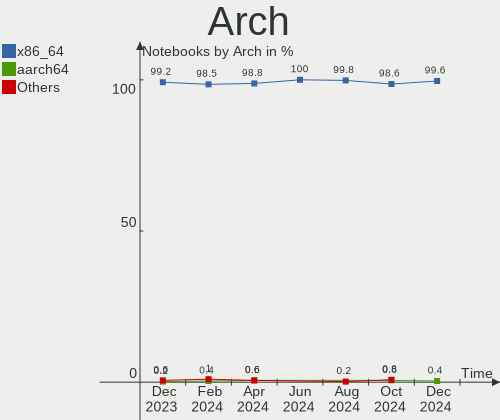
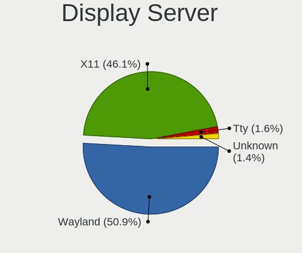
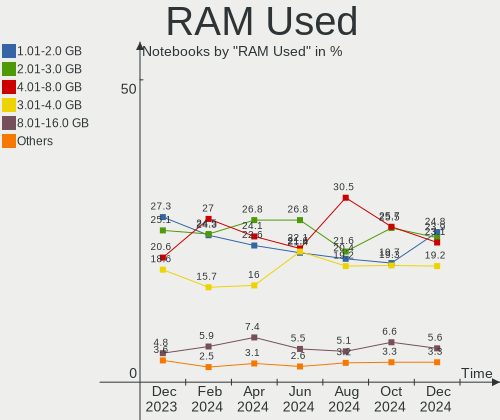
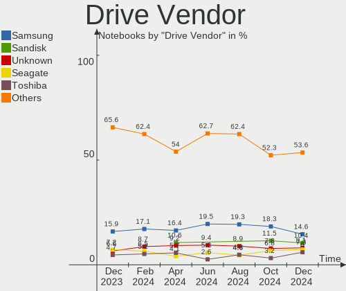
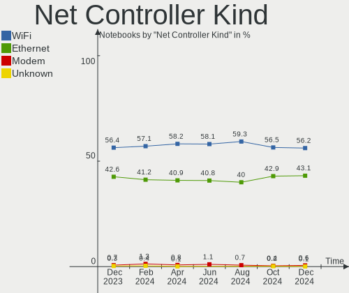
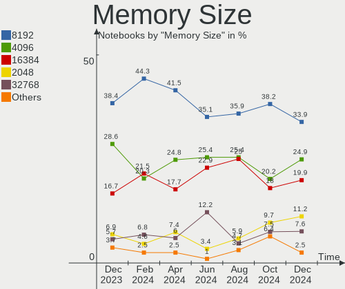
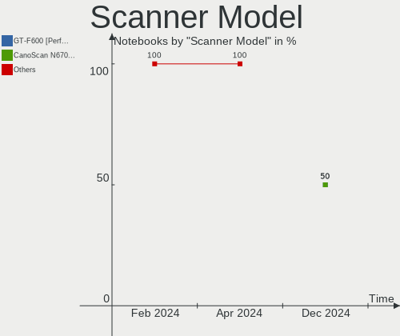
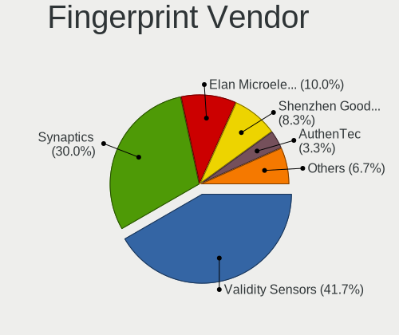

Linux in USA - Hardware Trends (Notebooks)
------------------------------------------

A project to identify most popular hardware characteristics and track their change
over time based on data collected by Linux users at https://Linux-Hardware.org.

Anyone can contribute to this report by the [hw-probe](https://github.com/linuxhw/hw-probe) tool:

    sudo -E hw-probe -all -upload

Period: Dec, 2024.

Contents
--------

* [ System ](#system)
  - [ OS                       ](#os)
  - [ OS Family                ](#os-family)
  - [ Kernel                   ](#kernel)
  - [ Kernel Family            ](#kernel-family)
  - [ Kernel Major Ver.        ](#kernel-major-ver)
  - [ Arch                     ](#arch)
  - [ DE                       ](#de)
  - [ Display Server           ](#display-server)
  - [ Display Manager          ](#display-manager)
  - [ OS Lang                  ](#os-lang)
  - [ Boot Mode                ](#boot-mode)
  - [ Filesystem               ](#filesystem)
  - [ Part. scheme             ](#part-scheme)
  - [ Dual Boot with Linux/BSD ](#dual-boot-with-linuxbsd)
  - [ Dual Boot (Win)          ](#dual-boot-win)

* [ Board ](#board)
  - [ Vendor                   ](#vendor)
  - [ Model                    ](#model)
  - [ Model Family             ](#model-family)
  - [ MFG Year                 ](#mfg-year)
  - [ Form Factor              ](#form-factor)
  - [ Secure Boot              ](#secure-boot)
  - [ Coreboot                 ](#coreboot)
  - [ RAM Size                 ](#ram-size)
  - [ RAM Used                 ](#ram-used)
  - [ Total Drives             ](#total-drives)
  - [ Has CD-ROM               ](#has-cd-rom)
  - [ Has Ethernet             ](#has-ethernet)
  - [ Has WiFi                 ](#has-wifi)
  - [ Has Bluetooth            ](#has-bluetooth)

* [ Location ](#location)
  - [ Country                  ](#country)
  - [ City                     ](#city)

* [ Drives ](#drives)
  - [ Drive Vendor             ](#drive-vendor)
  - [ Drive Model              ](#drive-model)
  - [ HDD Vendor               ](#hdd-vendor)
  - [ SSD Vendor               ](#ssd-vendor)
  - [ Drive Kind               ](#drive-kind)
  - [ Drive Connector          ](#drive-connector)
  - [ Drive Size               ](#drive-size)
  - [ Space Total              ](#space-total)
  - [ Space Used               ](#space-used)
  - [ Malfunc. Drives          ](#malfunc-drives)
  - [ Malfunc. Drive Vendor    ](#malfunc-drive-vendor)
  - [ Malfunc. HDD Vendor      ](#malfunc-hdd-vendor)
  - [ Malfunc. Drive Kind      ](#malfunc-drive-kind)
  - [ Failed Drives            ](#failed-drives)
  - [ Failed Drive Vendor      ](#failed-drive-vendor)
  - [ Drive Status             ](#drive-status)

* [ Storage controller ](#storage-controller)
  - [ Storage Vendor           ](#storage-vendor)
  - [ Storage Model            ](#storage-model)
  - [ Storage Kind             ](#storage-kind)

* [ Processor ](#processor)
  - [ CPU Vendor               ](#cpu-vendor)
  - [ CPU Model                ](#cpu-model)
  - [ CPU Model Family         ](#cpu-model-family)
  - [ CPU Cores                ](#cpu-cores)
  - [ CPU Sockets              ](#cpu-sockets)
  - [ CPU Threads              ](#cpu-threads)
  - [ CPU Op-Modes             ](#cpu-op-modes)
  - [ CPU Microcode            ](#cpu-microcode)
  - [ CPU Microarch            ](#cpu-microarch)

* [ Graphics ](#graphics)
  - [ GPU Vendor               ](#gpu-vendor)
  - [ GPU Model                ](#gpu-model)
  - [ GPU Combo                ](#gpu-combo)
  - [ GPU Driver               ](#gpu-driver)
  - [ GPU Memory               ](#gpu-memory)

* [ Monitor ](#monitor)
  - [ Monitor Vendor           ](#monitor-vendor)
  - [ Monitor Model            ](#monitor-model)
  - [ Monitor Resolution       ](#monitor-resolution)
  - [ Monitor Diagonal         ](#monitor-diagonal)
  - [ Monitor Width            ](#monitor-width)
  - [ Aspect Ratio             ](#aspect-ratio)
  - [ Monitor Area             ](#monitor-area)
  - [ Pixel Density            ](#pixel-density)
  - [ Multiple Monitors        ](#multiple-monitors)

* [ Network ](#network)
  - [ Net Controller Vendor    ](#net-controller-vendor)
  - [ Net Controller Model     ](#net-controller-model)
  - [ Wireless Vendor          ](#wireless-vendor)
  - [ Wireless Model           ](#wireless-model)
  - [ Ethernet Vendor          ](#ethernet-vendor)
  - [ Ethernet Model           ](#ethernet-model)
  - [ Net Controller Kind      ](#net-controller-kind)
  - [ Used Controller          ](#used-controller)
  - [ NICs                     ](#nics)
  - [ IPv6                     ](#ipv6)

* [ Bluetooth ](#bluetooth)
  - [ Bluetooth Vendor         ](#bluetooth-vendor)
  - [ Bluetooth Model          ](#bluetooth-model)

* [ Sound ](#sound)
  - [ Sound Vendor             ](#sound-vendor)
  - [ Sound Model              ](#sound-model)

* [ Memory ](#memory)
  - [ Memory Vendor            ](#memory-vendor)
  - [ Memory Model             ](#memory-model)
  - [ Memory Kind              ](#memory-kind)
  - [ Memory Form Factor       ](#memory-form-factor)
  - [ Memory Size              ](#memory-size)
  - [ Memory Speed             ](#memory-speed)

* [ Printers & scanners ](#printers--scanners)
  - [ Printer Vendor           ](#printer-vendor)
  - [ Printer Model            ](#printer-model)
  - [ Scanner Vendor           ](#scanner-vendor)
  - [ Scanner Model            ](#scanner-model)

* [ Camera ](#camera)
  - [ Camera Vendor            ](#camera-vendor)
  - [ Camera Model             ](#camera-model)

* [ Security ](#security)
  - [ Fingerprint Vendor       ](#fingerprint-vendor)
  - [ Fingerprint Model        ](#fingerprint-model)
  - [ Chipcard Vendor          ](#chipcard-vendor)
  - [ Chipcard Model           ](#chipcard-model)

* [ Unsupported ](#unsupported)
  - [ Unsupported Devices      ](#unsupported-devices)
  - [ Unsupported Device Types ](#unsupported-device-types)

System
------

OS
--

Installed operating systems

| Name                         | Notebooks | Percent |
|------------------------------|-----------|---------|
| OpenMandriva 24.12           | 89        | 15.67%  |
| Fedora 41                    | 57        | 10.04%  |
| Ubuntu 24.04                 | 55        | 9.68%   |
| Zorin 17                     | 28        | 4.93%   |
| Debian 12                    | 28        | 4.93%   |
| Pop!_OS 22.04                | 27        | 4.75%   |
| Arch Rolling                 | 26        | 4.58%   |
| Linux Mint 22                | 20        | 3.52%   |
| SteamOS 3.6.20               | 18        | 3.17%   |
| OpenMandriva 5.0             | 12        | 2.11%   |
| Ubuntu 22.04                 | 11        | 1.94%   |
| Ubuntu 24.10                 | 10        | 1.76%   |
| Bazzite 41                   | 10        | 1.76%   |
| Manjaro                      | 8         | 1.41%   |
| Kubuntu 24.04                | 8         | 1.41%   |
| ArcoLinux Rolling            | 8         | 1.41%   |
| Ubuntu 20.04                 | 6         | 1.06%   |
| OpenMandriva 23.08           | 6         | 1.06%   |
| Nobara 40                    | 6         | 1.06%   |
| Kubuntu 24.10                | 6         | 1.06%   |
| Fedora 40                    | 6         | 1.06%   |
| OpenMandriva 24.90           | 5         | 0.88%   |
| OpenMandriva 24.07           | 5         | 0.88%   |
| LMDE 6                       | 5         | 0.88%   |
| Elementary 7.1               | 5         | 0.88%   |
| openSUSE Tumbleweed-XXXXXXXX | 4         | 0.7%    |
| NixOS 24.11                  | 4         | 0.7%    |
| Linux Mint 21.3              | 4         | 0.7%    |
| Gentoo 2.17                  | 4         | 0.7%    |
| EndeavourOS Rolling          | 4         | 0.7%    |
| Q4OS 5                       | 3         | 0.53%   |
| Parrot 6.2                   | 3         | 0.53%   |
| Manjaro 24.2.1               | 3         | 0.53%   |
| Kali 2024.4                  | 3         | 0.53%   |
| Garuda Linux Rolling         | 3         | 0.53%   |
| Elementary 8                 | 3         | 0.53%   |
| Zorin 16                     | 2         | 0.35%   |
| Ubuntu MATE 24.04            | 2         | 0.35%   |
| Ubuntu 18.04                 | 2         | 0.35%   |
| SteamOS 3.7                  | 2         | 0.35%   |

OS Family
---------

OS without a version

| Name          | Notebooks | Percent |
|---------------|-----------|---------|
| OpenMandriva  | 117       | 20.6%   |
| Ubuntu        | 85        | 14.96%  |
| Fedora        | 68        | 11.97%  |
| Debian        | 31        | 5.46%   |
| Zorin         | 30        | 5.28%   |
| Pop!_OS       | 28        | 4.93%   |
| Arch          | 26        | 4.58%   |
| Linux Mint    | 25        | 4.4%    |
| SteamOS       | 24        | 4.23%   |
| Kubuntu       | 16        | 2.82%   |
| Manjaro       | 15        | 2.64%   |
| Bazzite       | 10        | 1.76%   |
| Elementary    | 9         | 1.58%   |
| ArcoLinux     | 9         | 1.58%   |
| openSUSE      | 6         | 1.06%   |
| Nobara        | 6         | 1.06%   |
| NixOS         | 6         | 1.06%   |
| LMDE          | 5         | 0.88%   |
| Kali          | 4         | 0.7%    |
| Gentoo        | 4         | 0.7%    |
| EndeavourOS   | 4         | 0.7%    |
| Q4OS          | 3         | 0.53%   |
| Parrot        | 3         | 0.53%   |
| MX            | 3         | 0.53%   |
| Garuda Linux  | 3         | 0.53%   |
| Ubuntu MATE   | 2         | 0.35%   |
| Solus         | 2         | 0.35%   |
| KDE neon      | 2         | 0.35%   |
| BigLinux      | 2         | 0.35%   |
| Xubuntu       | 1         | 0.18%   |
| Void Linux    | 1         | 0.18%   |
| Vanilla       | 1         | 0.18%   |
| Ubuntu Budgie | 1         | 0.18%   |
| TUXEDO OS     | 1         | 0.18%   |
| Slackware     | 1         | 0.18%   |
| Pikaos        | 1         | 0.18%   |
| Peppermint    | 1         | 0.18%   |
| Neptune OS    | 1         | 0.18%   |
| Lubuntu       | 1         | 0.18%   |
| Linux Lite    | 1         | 0.18%   |

Kernel
------

Version of the Linux kernel

| Version                                  | Notebooks | Percent |
|------------------------------------------|-----------|---------|
| 6.12.1-desktop-1omv2490                  | 80        | 14.08%  |
| 6.8.0-49-generic                         | 62        | 10.92%  |
| 6.8.0-51-generic                         | 32        | 5.63%   |
| 6.9.3-76060903-generic                   | 28        | 4.93%   |
| 6.8.0-50-generic                         | 23        | 4.05%   |
| 6.1.0-28-amd64                           | 23        | 4.05%   |
| 6.5.0-valve22-1-neptune-65-g9a338ed8a75e | 18        | 3.17%   |
| 6.11.10-300.fc41.x86_64                  | 16        | 2.82%   |
| 6.6.2-desktop-1omv2390                   | 12        | 2.11%   |
| 6.12.6-200.fc41.x86_64                   | 10        | 1.76%   |
| 6.12.6-desktop-1omv2490                  | 8         | 1.41%   |
| 6.12.5-200.fc41.x86_64                   | 8         | 1.41%   |
| 6.12.7-arch1-1                           | 7         | 1.23%   |
| 6.12.4-arch1-1                           | 7         | 1.23%   |
| 6.11.0-9-generic                         | 7         | 1.23%   |
| 6.12.6-arch1-1                           | 6         | 1.06%   |
| 6.11.4-301.fc41.x86_64                   | 6         | 1.06%   |
| 6.11.11-300.fc41.x86_64                  | 6         | 1.06%   |
| 6.11.0-13-generic                        | 6         | 1.06%   |
| 6.1.0-27-amd64                           | 6         | 1.06%   |
| 6.8.0-48-generic                         | 5         | 0.88%   |
| 6.4.8-desktop-2omv2390                   | 5         | 0.88%   |
| 6.12.4-200.fc41.x86_64                   | 5         | 0.88%   |
| 6.11.9-200.fsync.fc40.x86_64             | 5         | 0.88%   |
| 5.15.0-126-generic                       | 5         | 0.88%   |
| 6.12.4-zen1-1-zen                        | 4         | 0.7%    |
| 6.12.1-arch1-1                           | 4         | 0.7%    |
| 6.11.9-303.bazzite.fc41.x86_64           | 4         | 0.7%    |
| 6.11.8-1-default                         | 4         | 0.7%    |
| 6.11.2-amd64                             | 4         | 0.7%    |
| 6.11.10-304.bazzite.fc41.x86_64          | 4         | 0.7%    |
| 6.10.0-desktop-1omv2490                  | 4         | 0.7%    |
| 6.8.0-41-generic                         | 3         | 0.53%   |
| 6.8.0-38-generic                         | 3         | 0.53%   |
| 6.12.1-4-MANJARO                         | 3         | 0.53%   |
| 6.11.11-1-MANJARO                        | 3         | 0.53%   |
| 6.11.10-2-MANJARO                        | 3         | 0.53%   |
| 6.11.0-12-generic                        | 3         | 0.53%   |
| 6.10.11-amd64                            | 3         | 0.53%   |
| 6.8.5-301.fc40.x86_64                    | 2         | 0.35%   |

Kernel Family
-------------

Linux kernel without a distro release

| Version | Notebooks | Percent |
|---------|-----------|---------|
| 6.8.0   | 132       | 23.24%  |
| 6.12.1  | 94        | 16.55%  |
| 6.1.0   | 35        | 6.16%   |
| 6.12.6  | 33        | 5.81%   |
| 6.11.10 | 30        | 5.28%   |
| 6.9.3   | 28        | 4.93%   |
| 6.5.0   | 22        | 3.87%   |
| 6.12.4  | 22        | 3.87%   |
| 6.11.0  | 16        | 2.82%   |
| 6.6.2   | 12        | 2.11%   |
| 5.15.0  | 12        | 2.11%   |
| 6.11.11 | 11        | 1.94%   |
| 6.12.7  | 9         | 1.58%   |
| 6.12.5  | 9         | 1.58%   |
| 6.11.9  | 9         | 1.58%   |
| 6.11.8  | 7         | 1.23%   |
| 6.11.4  | 7         | 1.23%   |
| 6.8.12  | 5         | 0.88%   |
| 6.4.8   | 5         | 0.88%   |
| 6.13.0  | 5         | 0.88%   |
| 6.11.7  | 4         | 0.7%    |
| 6.11.5  | 4         | 0.7%    |
| 6.11.2  | 4         | 0.7%    |
| 6.10.11 | 4         | 0.7%    |
| 6.10.0  | 4         | 0.7%    |
| 6.12.0  | 3         | 0.53%   |
| 5.4.0   | 3         | 0.53%   |
| 6.8.5   | 2         | 0.35%   |
| 6.6.64  | 2         | 0.35%   |
| 6.6.63  | 2         | 0.35%   |
| 6.6.58  | 2         | 0.35%   |
| 6.6.54  | 2         | 0.35%   |
| 6.4.0   | 2         | 0.35%   |
| 6.11.6  | 2         | 0.35%   |
| 6.11.3  | 2         | 0.35%   |
| 6.10.7  | 2         | 0.35%   |
| 6.9.7   | 1         | 0.18%   |
| 6.9.10  | 1         | 0.18%   |
| 6.8.9   | 1         | 0.18%   |
| 6.6.67  | 1         | 0.18%   |

Kernel Major Ver.
-----------------

Linux kernel major version

| Version | Notebooks | Percent |
|---------|-----------|---------|
| 6.12    | 171       | 30.11%  |
| 6.8     | 140       | 24.65%  |
| 6.11    | 96        | 16.9%   |
| 6.1     | 37        | 6.51%   |
| 6.9     | 30        | 5.28%   |
| 6.6     | 25        | 4.4%    |
| 6.5     | 23        | 4.05%   |
| 5.15    | 12        | 2.11%   |
| 6.10    | 10        | 1.76%   |
| 6.4     | 8         | 1.41%   |
| 6.13    | 5         | 0.88%   |
| 5.4     | 3         | 0.53%   |
| 6.2     | 1         | 0.18%   |
| 6.0     | 1         | 0.18%   |
| 5.8     | 1         | 0.18%   |
| 5.6     | 1         | 0.18%   |
| 5.18    | 1         | 0.18%   |
| 5.14    | 1         | 0.18%   |
| 5.13    | 1         | 0.18%   |
| 4.16    | 1         | 0.18%   |

Arch
----

OS architecture (x86_64, i586, etc.)

| Name    | Notebooks | Percent |
|---------|-----------|---------|
| x86_64  | 566       | 99.65%  |
| aarch64 | 2         | 0.35%   |

DE
--

Desktop Environment

| Name          | Notebooks | Percent |
|---------------|-----------|---------|
| GNOME         | 206       | 36.27%  |
| Unknown       | 97        | 17.08%  |
| KDE6          | 85        | 14.96%  |
| KDE5          | 63        | 11.09%  |
| X-Cinnamon    | 31        | 5.46%   |
| XFCE          | 25        | 4.4%    |
| LXQt          | 12        | 2.11%   |
| Pantheon      | 9         | 1.58%   |
| MATE          | 8         | 1.41%   |
| Budgie        | 7         | 1.23%   |
| KDE           | 4         | 0.7%    |
| i3            | 4         | 0.7%    |
| Trinity       | 3         | 0.53%   |
| sway          | 3         | 0.53%   |
| Cinnamon      | 3         | 0.53%   |
| KDE4          | 2         | 0.35%   |
| none+awesome  | 1         | 0.18%   |
| niri          | 1         | 0.18%   |
| Hyprland      | 1         | 0.18%   |
| GNOME Classic | 1         | 0.18%   |
| fluxbox       | 1         | 0.18%   |
| COSMIC        | 1         | 0.18%   |

Display Server
--------------

X11 or Wayland

| Name    | Notebooks | Percent |
|---------|-----------|---------|
| Wayland | 289       | 50.88%  |
| X11     | 262       | 46.13%  |
| Tty     | 9         | 1.58%   |
| Unknown | 8         | 1.41%   |

Display Manager
---------------

SDDM, LightDM, etc.

| Name    | Notebooks | Percent |
|---------|-----------|---------|
| Unknown | 207       | 36.44%  |
| SDDM    | 168       | 29.58%  |
| GDM3    | 99        | 17.43%  |
| LightDM | 50        | 8.8%    |
| GDM     | 37        | 6.51%   |
| TDM     | 3         | 0.53%   |
| XDM     | 1         | 0.18%   |
| LY-DM   | 1         | 0.18%   |
| Ly      | 1         | 0.18%   |
| LXDM    | 1         | 0.18%   |

OS Lang
-------

Language

| Lang    | Notebooks | Percent |
|---------|-----------|---------|
| en_US   | 536       | 94.37%  |
| C       | 13        | 2.29%   |
| Unknown | 5         | 0.88%   |
| en_CA   | 3         | 0.53%   |
| en_GB   | 2         | 0.35%   |
| de_DE   | 2         | 0.35%   |
| POSIX   | 1         | 0.18%   |
| fr_FR   | 1         | 0.18%   |
| es_US   | 1         | 0.18%   |
| es_MX   | 1         | 0.18%   |
| es_ES   | 1         | 0.18%   |
| en_IN   | 1         | 0.18%   |
| en_AU   | 1         | 0.18%   |

Boot Mode
---------

EFI or BIOS

| Mode | Notebooks | Percent |
|------|-----------|---------|
| BIOS | 307       | 54.05%  |
| EFI  | 261       | 45.95%  |

Filesystem
----------

Type of filesystem

| Type    | Notebooks | Percent |
|---------|-----------|---------|
| Ext4    | 271       | 47.71%  |
| Btrfs   | 142       | 25%     |
| Tmpfs   | 72        | 12.68%  |
| Overlay | 70        | 12.32%  |
| Xfs     | 8         | 1.41%   |
| Zfs     | 3         | 0.53%   |
| Rootfs  | 1         | 0.18%   |
| Jfs     | 1         | 0.18%   |

Part. scheme
------------

Scheme of partitioning

| Type    | Notebooks | Percent |
|---------|-----------|---------|
| GPT     | 347       | 61.09%  |
| Unknown | 192       | 33.8%   |
| MBR     | 29        | 5.11%   |

Dual Boot with Linux/BSD
------------------------

Hosting more than one Linux/BSD

| Dual boot | Notebooks | Percent |
|-----------|-----------|---------|
| No        | 497       | 87.5%   |
| Yes       | 71        | 12.5%   |

Dual Boot (Win)
---------------

Hosting Linux and Windows

| Dual boot | Notebooks | Percent |
|-----------|-----------|---------|
| No        | 470       | 82.75%  |
| Yes       | 98        | 17.25%  |

Board
-----

Vendor
------

Motherboard manufacturer

| Name                 | Notebooks | Percent |
|----------------------|-----------|---------|
| Dell                 | 115       | 20.25%  |
| Lenovo               | 113       | 19.89%  |
| Hewlett-Packard      | 90        | 15.85%  |
| ASUSTek Computer     | 61        | 10.74%  |
| Acer                 | 28        | 4.93%   |
| Apple                | 26        | 4.58%   |
| Valve                | 23        | 4.05%   |
| Toshiba              | 18        | 3.17%   |
| Google               | 17        | 2.99%   |
| MSI                  | 13        | 2.29%   |
| Unknown              | 8         | 1.41%   |
| System76             | 7         | 1.23%   |
| Samsung Electronics  | 7         | 1.23%   |
| Framework            | 7         | 1.23%   |
| Notebook             | 5         | 0.88%   |
| GPD                  | 4         | 0.7%    |
| Sony                 | 3         | 0.53%   |
| Intel Client Systems | 3         | 0.53%   |
| Alienware            | 3         | 0.53%   |
| Razer                | 2         | 0.35%   |
| GPU Company          | 2         | 0.35%   |
| Gigabyte Technology  | 2         | 0.35%   |
| Eluktronics          | 2         | 0.35%   |
| Vizio                | 1         | 0.18%   |
| TUXEDO               | 1         | 0.18%   |
| LG Electronics       | 1         | 0.18%   |
| Gateway              | 1         | 0.18%   |
| Fujitsu              | 1         | 0.18%   |
| eMachines            | 1         | 0.18%   |
| CyberPowerPC         | 1         | 0.18%   |
| BOSGAME              | 1         | 0.18%   |
| AMI                  | 1         | 0.18%   |

Model
-----

Motherboard model

| Name                                        | Notebooks | Percent |
|---------------------------------------------|-----------|---------|
| Valve Jupiter                               | 14        | 2.46%   |
| Valve Galileo                               | 9         | 1.58%   |
| Unknown                                     | 8         | 1.41%   |
| HP Notebook                                 | 5         | 0.88%   |
| Dell Latitude E6430                         | 4         | 0.7%    |
| Dell Inspiron 5570                          | 4         | 0.7%    |
| ASUS ASUS TUF Gaming A16 FA617NT_FA617NT    | 4         | 0.7%    |
| Apple MacBookAir6,2                         | 4         | 0.7%    |
| System76 Darter Pro                         | 3         | 0.53%   |
| Lenovo Legion 5 16IRX9 83DG                 | 3         | 0.53%   |
| HP Pavilion g7                              | 3         | 0.53%   |
| HP Laptop 15-dy2xxx                         | 3         | 0.53%   |
| HP Laptop 14-cf2xxx                         | 3         | 0.53%   |
| HP 15 Notebook PC                           | 3         | 0.53%   |
| Dell Latitude E6420                         | 3         | 0.53%   |
| Dell Latitude 5400                          | 3         | 0.53%   |
| ASUS VivoBook_ASUSLaptop X1404ZA_X1404ZA    | 3         | 0.53%   |
| ASUS ASUS Zenbook 14 UM3406HA_UM3406HA      | 3         | 0.53%   |
| Apple MacBookPro8,1                         | 3         | 0.53%   |
| Acer Nitro AN515-54                         | 3         | 0.53%   |
| MSI GF65 Thin 9SD                           | 2         | 0.35%   |
| Lenovo Legion S7 15ACH6 82K8                | 2         | 0.35%   |
| Lenovo IdeaPad 1 15AMN7 82VG                | 2         | 0.35%   |
| Lenovo IdeaPad 1 15ALC7 82R4                | 2         | 0.35%   |
| HP Victus by Gaming Laptop 15-fb2xxx        | 2         | 0.35%   |
| HP Pavilion dv6700                          | 2         | 0.35%   |
| HP Laptop 15-db0xxx                         | 2         | 0.35%   |
| HP EliteBook 8440p                          | 2         | 0.35%   |
| HP EliteBook 840 G3                         | 2         | 0.35%   |
| HP 15                                       | 2         | 0.35%   |
| GPU Company GWTC116-2                       | 2         | 0.35%   |
| GPD G1618-04                                | 2         | 0.35%   |
| Google Gnawty                               | 2         | 0.35%   |
| Framework Laptop 16 (AMD Ryzen 7040 Series) | 2         | 0.35%   |
| Framework Laptop 13 (AMD Ryzen 7040Series)  | 2         | 0.35%   |
| Dell XPS 15 9570                            | 2         | 0.35%   |
| Dell XPS 13 9370                            | 2         | 0.35%   |
| Dell XPS 13 9350                            | 2         | 0.35%   |
| Dell XPS 13 9310                            | 2         | 0.35%   |
| Dell Precision M4800                        | 2         | 0.35%   |

Model Family
------------

Motherboard model prefix

| Name                  | Notebooks | Percent |
|-----------------------|-----------|---------|
| Lenovo ThinkPad       | 67        | 11.8%   |
| Dell Latitude         | 50        | 8.8%    |
| Dell Inspiron         | 26        | 4.58%   |
| Lenovo IdeaPad        | 22        | 3.87%   |
| HP Laptop             | 21        | 3.7%    |
| ASUS ASUS             | 19        | 3.35%   |
| Dell Precision        | 18        | 3.17%   |
| Acer Aspire           | 18        | 3.17%   |
| Toshiba Satellite     | 17        | 2.99%   |
| HP Pavilion           | 15        | 2.64%   |
| Valve Jupiter         | 14        | 2.46%   |
| Lenovo Legion         | 14        | 2.46%   |
| Dell XPS              | 14        | 2.46%   |
| ASUS VivoBook         | 12        | 2.11%   |
| HP EliteBook          | 11        | 1.94%   |
| ASUS ROG              | 11        | 1.94%   |
| Valve Galileo         | 9         | 1.58%   |
| Unknown               | 8         | 1.41%   |
| HP ENVY               | 7         | 1.23%   |
| Framework Laptop      | 7         | 1.23%   |
| Acer Nitro            | 7         | 1.23%   |
| HP ProBook            | 6         | 1.06%   |
| HP 15                 | 6         | 1.06%   |
| HP Victus             | 5         | 0.88%   |
| HP Notebook           | 5         | 0.88%   |
| Apple MacBookPro8     | 5         | 0.88%   |
| HP ZBook              | 4         | 0.7%    |
| Dell Vostro           | 4         | 0.7%    |
| Apple MacBookAir6     | 4         | 0.7%    |
| System76 Darter       | 3         | 0.53%   |
| HP OMEN               | 3         | 0.53%   |
| ASUS Zenbook          | 3         | 0.53%   |
| Apple MacBookPro14    | 3         | 0.53%   |
| Apple MacBookPro11    | 3         | 0.53%   |
| Acer Swift            | 3         | 0.53%   |
| Razer Blade           | 2         | 0.35%   |
| MSI Katana            | 2         | 0.35%   |
| MSI GF65              | 2         | 0.35%   |
| Lenovo Yoga           | 2         | 0.35%   |
| GPU Company GWTC116-2 | 2         | 0.35%   |

MFG Year
--------

Motherboard manufacture year

| Year    | Notebooks | Percent |
|---------|-----------|---------|
| 2024    | 82        | 14.44%  |
| 2023    | 60        | 10.56%  |
| 2021    | 59        | 10.39%  |
| 2011    | 40        | 7.04%   |
| 2020    | 36        | 6.34%   |
| 2019    | 34        | 5.99%   |
| 2013    | 34        | 5.99%   |
| 2022    | 31        | 5.46%   |
| 2018    | 30        | 5.28%   |
| 2012    | 30        | 5.28%   |
| 2017    | 29        | 5.11%   |
| 2015    | 22        | 3.87%   |
| 2014    | 21        | 3.7%    |
| 2016    | 15        | 2.64%   |
| 2010    | 14        | 2.46%   |
| 2008    | 14        | 2.46%   |
| 2009    | 8         | 1.41%   |
| 2007    | 8         | 1.41%   |
| Unknown | 1         | 0.18%   |

Form Factor
-----------

Physical design of the computer

| Name     | Notebooks | Percent |
|----------|-----------|---------|
| Notebook | 568       | 100%    |

Secure Boot
-----------

Enabled or disabled

| State    | Notebooks | Percent |
|----------|-----------|---------|
| Disabled | 542       | 95.42%  |
| Enabled  | 26        | 4.58%   |

Coreboot
--------

Have coreboot on board

| Used | Notebooks | Percent |
|------|-----------|---------|
| No   | 543       | 95.6%   |
| Yes  | 25        | 4.4%    |

RAM Size
--------

Total RAM memory

| Size in GB  | Notebooks | Percent |
|-------------|-----------|---------|
| 8.01-16.0   | 129       | 22.71%  |
| 4.01-8.0    | 120       | 21.13%  |
| 16.01-24.0  | 105       | 18.49%  |
| 32.01-64.0  | 77        | 13.56%  |
| 3.01-4.0    | 76        | 13.38%  |
| 64.01-256.0 | 30        | 5.28%   |
| 24.01-32.0  | 16        | 2.82%   |
| 1.01-2.0    | 9         | 1.58%   |
| 2.01-3.0    | 6         | 1.06%   |

RAM Used
--------

Used RAM memory

| Used GB    | Notebooks | Percent |
|------------|-----------|---------|
| 1.01-2.0   | 141       | 24.82%  |
| 2.01-3.0   | 136       | 23.94%  |
| 4.01-8.0   | 131       | 23.06%  |
| 3.01-4.0   | 109       | 19.19%  |
| 8.01-16.0  | 32        | 5.63%   |
| 0.51-1.0   | 15        | 2.64%   |
| 32.01-64.0 | 2         | 0.35%   |
| 16.01-24.0 | 1         | 0.18%   |
| 0.01-0.5   | 1         | 0.18%   |

Total Drives
------------

Number of drives on board

| Drives | Notebooks | Percent |
|--------|-----------|---------|
| 1      | 406       | 71.48%  |
| 2      | 139       | 24.47%  |
| 3      | 16        | 2.82%   |
| 4      | 6         | 1.06%   |
| 0      | 1         | 0.18%   |

Has CD-ROM
----------

Has CD-ROM on board

| Presented | Notebooks | Percent |
|-----------|-----------|---------|
| No        | 422       | 74.3%   |
| Yes       | 146       | 25.7%   |

Has Ethernet
------------

Has Ethernet on board

| Presented | Notebooks | Percent |
|-----------|-----------|---------|
| Yes       | 417       | 73.42%  |
| No        | 151       | 26.58%  |

Has WiFi
--------

Has WiFi module

| Presented | Notebooks | Percent |
|-----------|-----------|---------|
| Yes       | 543       | 95.6%   |
| No        | 25        | 4.4%    |

Has Bluetooth
-------------

Has Bluetooth module

| Presented | Notebooks | Percent |
|-----------|-----------|---------|
| Yes       | 461       | 81.16%  |
| No        | 107       | 18.84%  |

Location
--------

Country
-------

Geographic location (country)

| Country | Notebooks | Percent |
|---------|-----------|---------|
| USA     | 568       | 100%    |

City
----

Geographic location (city)

| City          | Notebooks | Percent |
|---------------|-----------|---------|
| Seattle       | 14        | 2.46%   |
| Los Angeles   | 14        | 2.46%   |
| New York      | 7         | 1.23%   |
| Jacksonville  | 7         | 1.23%   |
| Chicago       | 7         | 1.23%   |
| Portland      | 6         | 1.06%   |
| Phoenix       | 6         | 1.06%   |
| Houston       | 6         | 1.06%   |
| Tacoma        | 5         | 0.88%   |
| Oklahoma City | 5         | 0.88%   |
| Minneapolis   | 5         | 0.88%   |
| Las Vegas     | 5         | 0.88%   |
| Flushing      | 5         | 0.88%   |
| Dallas        | 5         | 0.88%   |
| Buffalo       | 5         | 0.88%   |
| Topeka        | 4         | 0.7%    |
| The Bronx     | 4         | 0.7%    |
| San Jose      | 4         | 0.7%    |
| San Antonio   | 4         | 0.7%    |
| Reno          | 4         | 0.7%    |
| Katy          | 4         | 0.7%    |
| Kansas City   | 4         | 0.7%    |
| Vero Beach    | 3         | 0.53%   |
| Rochester     | 3         | 0.53%   |
| Richmond      | 3         | 0.53%   |
| Pittsburgh    | 3         | 0.53%   |
| Parker        | 3         | 0.53%   |
| Livonia       | 3         | 0.53%   |
| Jersey City   | 3         | 0.53%   |
| Fort Worth    | 3         | 0.53%   |
| Columbus      | 3         | 0.53%   |
| Columbia      | 3         | 0.53%   |
| Charlotte     | 3         | 0.53%   |
| Carrollton    | 3         | 0.53%   |
| Bremerton     | 3         | 0.53%   |
| Belton        | 3         | 0.53%   |
| Bangor        | 3         | 0.53%   |
| Albany        | 3         | 0.53%   |
| Wilmington    | 2         | 0.35%   |
| Wichita       | 2         | 0.35%   |

Drives
------

Drive Vendor
------------

Hard drive vendors

| Vendor                         | Notebooks | Drives | Percent |
|--------------------------------|-----------|--------|---------|
| Samsung Electronics            | 104       | 116    | 14.57%  |
| Sandisk                        | 74        | 77     | 10.36%  |
| Unknown                        | 58        | 63     | 8.12%   |
| Seagate                        | 52        | 57     | 7.28%   |
| Toshiba                        | 43        | 44     | 6.02%   |
| SK hynix                       | 39        | 43     | 5.46%   |
| WDC                            | 31        | 31     | 4.34%   |
| Micron Technology              | 29        | 30     | 4.06%   |
| Kingston                       | 21        | 21     | 2.94%   |
| Intel                          | 21        | 22     | 2.94%   |
| Crucial                        | 17        | 19     | 2.38%   |
| KIOXIA                         | 15        | 15     | 2.1%    |
| China                          | 14        | 14     | 1.96%   |
| Apple                          | 14        | 17     | 1.96%   |
| Phison Electronics             | 13        | 13     | 1.82%   |
| Kingston Technology Company    | 13        | 13     | 1.82%   |
| PNY                            | 12        | 12     | 1.68%   |
| Micron/Crucial Technology      | 11        | 12     | 1.54%   |
| SPCC                           | 10        | 10     | 1.4%    |
| Hitachi                        | 10        | 10     | 1.4%    |
| Unknown                        | 10        | 10     | 1.4%    |
| Shenzhen Longsys Electronics   | 6         | 6      | 0.84%   |
| MAXIO Technology (Hangzhou)    | 6         | 6      | 0.84%   |
| HGST                           | 6         | 6      | 0.84%   |
| Fujitsu                        | 5         | 5      | 0.7%    |
| A-DATA Technology              | 4         | 4      | 0.56%   |
| Union Memory (Shenzhen)        | 3         | 3      | 0.42%   |
| T-FORCE                        | 3         | 3      | 0.42%   |
| SSSTC                          | 3         | 3      | 0.42%   |
| Silicon Motion                 | 3         | 3      | 0.42%   |
| Realtek Semiconductor          | 3         | 3      | 0.42%   |
| LITEONIT                       | 3         | 3      | 0.42%   |
| LITEON                         | 3         | 3      | 0.42%   |
| Yangtze Memory Technologies    | 2         | 2      | 0.28%   |
| Transcend                      | 2         | 2      | 0.28%   |
| Team                           | 2         | 2      | 0.28%   |
| Solid State Storage Technology | 2         | 2      | 0.28%   |
| SABRENT                        | 2         | 2      | 0.28%   |
| Realtek                        | 2         | 2      | 0.28%   |
| Netac                          | 2         | 2      | 0.28%   |

Drive Model
-----------

Hard drive models

| Model                                                  | Notebooks | Percent |
|--------------------------------------------------------|-----------|---------|
| Unknown MMC Card  64GB                                 | 14        | 1.88%   |
| Samsung NVMe SSD Controller PM9A1/PM9A3/980PRO 512GB   | 12        | 1.61%   |
| Samsung NVMe SSD Controller SM981/PM981/PM983 512GB    | 10        | 1.34%   |
| Unknown                                                | 10        | 1.34%   |
| Unknown MMC Card  512GB                                | 9         | 1.21%   |
| Unknown MMC Card  128GB                                | 8         | 1.08%   |
| Toshiba MQ01ABF050 500GB                               | 8         | 1.08%   |
| Seagate ST1000LM035-1RK172 1TB                         | 8         | 1.08%   |
| Unknown MMC Card  32GB                                 | 7         | 0.94%   |
| Samsung SSD 980 1TB                                    | 7         | 0.94%   |
| Micron/Crucial P2 NVMe PCIe SSD 500GB                  | 7         | 0.94%   |
| Unknown MMC Card  16GB                                 | 6         | 0.81%   |
| Seagate ST1000LM024 HN-M101MBB 1TB                     | 6         | 0.81%   |
| Sandisk WD Blue SN550 NVMe SSD 256GB                   | 6         | 0.81%   |
| Kingston Company OM3PDP3 NVMe SSD 512GB                | 6         | 0.81%   |
| Seagate ST500LT012-1DG142 500GB                        | 5         | 0.67%   |
| Seagate BUP Slim BK 2TB                                | 5         | 0.67%   |
| Sandisk WD Black SN750 / PC SN730 NVMe SSD 512GB       | 5         | 0.67%   |
| SanDisk NVMe SSD Drive 512GB                           | 5         | 0.67%   |
| SanDisk NVMe SSD Drive 1TB                             | 5         | 0.67%   |
| Samsung NVMe SSD Controller SM961/PM961/SM963 256GB    | 5         | 0.67%   |
| Toshiba XG6 NVMe SSD Controller 1024GB                 | 4         | 0.54%   |
| Toshiba MQ01ABD100 1TB                                 | 4         | 0.54%   |
| Seagate ST9500420AS 500GB                              | 4         | 0.54%   |
| Samsung SSD 990 PRO 2TB                                | 4         | 0.54%   |
| PNY CS900 120GB SSD                                    | 4         | 0.54%   |
| Phison PS5013 E13 NVMe Controller 512GB                | 4         | 0.54%   |
| KIOXIA KBG40ZNV256G 256GB                              | 4         | 0.54%   |
| Kingston SA400S37240G 240GB SSD                        | 4         | 0.54%   |
| Intel SSDPEKNU512GZ 512GB                              | 4         | 0.54%   |
| Intel SSD Pro 7600p/760p/E 6100p Series 512GB          | 4         | 0.54%   |
| Unknown NVMe SSD Drive 512GB                           | 3         | 0.4%    |
| Toshiba MQ04ABF100 1TB                                 | 3         | 0.4%    |
| SPCC Solid State Disk 512GB                            | 3         | 0.4%    |
| SK hynix SKHynix_HFS256GEJ4X112N 256GB                 | 3         | 0.4%    |
| SK hynix BC501 NVMe Solid State Drive 512GB            | 3         | 0.4%    |
| Shenzhen Longsys SM2263EN/SM2263XT-based OEM SSD 128GB | 3         | 0.4%    |
| Sandisk WD_BLACK SN850X 4000GB                         | 3         | 0.4%    |
| Sandisk WD_BLACK SN770 1TB                             | 3         | 0.4%    |
| Samsung SSD 860 EVO 500GB                              | 3         | 0.4%    |

HDD Vendor
----------

Hard disk drive vendors

| Vendor              | Notebooks | Drives | Percent |
|---------------------|-----------|--------|---------|
| Seagate             | 50        | 54     | 40%     |
| Toshiba             | 26        | 26     | 20.8%   |
| WDC                 | 22        | 22     | 17.6%   |
| Hitachi             | 10        | 10     | 8%      |
| HGST                | 6         | 6      | 4.8%    |
| Fujitsu             | 5         | 5      | 4%      |
| SABRENT             | 2         | 2      | 1.6%    |
| Samsung Electronics | 1         | 1      | 0.8%    |
| Maxone              | 1         | 1      | 0.8%    |
| External            | 1         | 1      | 0.8%    |
| ASMT                | 1         | 1      | 0.8%    |

SSD Vendor
----------

Solid state drive vendors

| Vendor              | Notebooks | Drives | Percent |
|---------------------|-----------|--------|---------|
| Samsung Electronics | 30        | 30     | 16.76%  |
| SanDisk             | 15        | 15     | 8.38%   |
| China               | 14        | 14     | 7.82%   |
| PNY                 | 12        | 12     | 6.7%    |
| Crucial             | 12        | 13     | 6.7%    |
| Apple               | 11        | 11     | 6.15%   |
| SPCC                | 10        | 10     | 5.59%   |
| Kingston            | 10        | 10     | 5.59%   |
| Toshiba             | 8         | 9      | 4.47%   |
| Micron Technology   | 8         | 8      | 4.47%   |
| WDC                 | 6         | 6      | 3.35%   |
| SK hynix            | 4         | 4      | 2.23%   |
| A-DATA Technology   | 4         | 4      | 2.23%   |
| SSSTC               | 3         | 3      | 1.68%   |
| LITEONIT            | 3         | 3      | 1.68%   |
| LITEON              | 3         | 3      | 1.68%   |
| Intel               | 3         | 3      | 1.68%   |
| Transcend           | 2         | 2      | 1.12%   |
| Mushkin             | 2         | 2      | 1.12%   |
| KingSpec            | 2         | 2      | 1.12%   |
| 2.5"                | 2         | 2      | 1.12%   |
| Verbatim            | 1         | 1      | 0.56%   |
| Team                | 1         | 1      | 0.56%   |
| Seagate             | 1         | 1      | 0.56%   |
| PNY USB             | 1         | 1      | 0.56%   |
| OWC                 | 1         | 1      | 0.56%   |
| OCZ                 | 1         | 1      | 0.56%   |
| Lexar               | 1         | 1      | 0.56%   |
| Leven               | 1         | 1      | 0.56%   |
| Inland              | 1         | 1      | 0.56%   |
| Hewlett-Packard     | 1         | 1      | 0.56%   |
| G521N               | 1         | 1      | 0.56%   |
| Fanxiang            | 1         | 1      | 0.56%   |
| Dogfish             | 1         | 1      | 0.56%   |
| BIWIN               | 1         | 1      | 0.56%   |
| Unknown             | 1         | 1      | 0.56%   |

Drive Kind
----------

HDD or SSD

| Kind    | Notebooks | Drives | Percent |
|---------|-----------|--------|---------|
| NVMe    | 303       | 363    | 45.36%  |
| SSD     | 170       | 181    | 25.45%  |
| HDD     | 121       | 129    | 18.11%  |
| MMC     | 60        | 64     | 8.98%   |
| Unknown | 14        | 15     | 2.1%    |

Drive Connector
---------------

SATA, SAS, NVMe, etc.

| Type | Notebooks | Drives | Percent |
|------|-----------|--------|---------|
| NVMe | 302       | 358    | 45.9%   |
| SATA | 261       | 291    | 39.67%  |
| MMC  | 60        | 64     | 9.12%   |
| SAS  | 35        | 39     | 5.32%   |

Drive Size
----------

Size of hard drive

| Size in TB | Notebooks | Drives | Percent |
|------------|-----------|--------|---------|
| 0.01-0.5   | 188       | 200    | 63.73%  |
| 0.51-1.0   | 85        | 88     | 28.81%  |
| 1.01-2.0   | 20        | 20     | 6.78%   |
| 3.01-4.0   | 1         | 1      | 0.34%   |
| 10.01-20.0 | 1         | 1      | 0.34%   |

Space Total
-----------

Amount of disk space available on the file system

| Size in GB     | Notebooks | Percent |
|----------------|-----------|---------|
| 101-250        | 127       | 22.36%  |
| 251-500        | 112       | 19.72%  |
| 501-1000       | 105       | 18.49%  |
| 1001-2000      | 70        | 12.32%  |
| 1-20           | 60        | 10.56%  |
| More than 3000 | 25        | 4.4%    |
| 51-100         | 23        | 4.05%   |
| 21-50          | 17        | 2.99%   |
| Unknown        | 15        | 2.64%   |
| 2001-3000      | 14        | 2.46%   |

Space Used
----------

Amount of used disk space

| Used GB        | Notebooks | Percent |
|----------------|-----------|---------|
| 1-20           | 216       | 38.03%  |
| 21-50          | 110       | 19.37%  |
| 101-250        | 67        | 11.8%   |
| 51-100         | 53        | 9.33%   |
| 251-500        | 44        | 7.75%   |
| 501-1000       | 38        | 6.69%   |
| Unknown        | 15        | 2.64%   |
| 1001-2000      | 12        | 2.11%   |
| 2001-3000      | 5         | 0.88%   |
| 0              | 5         | 0.88%   |
| More than 3000 | 3         | 0.53%   |

Malfunc. Drives
---------------

Drive models with a malfunction

| Model                                        | Notebooks | Drives | Percent |
|----------------------------------------------|-----------|--------|---------|
| Toshiba MQ01ABF050 500GB                     | 3         | 3      | 7.69%   |
| SSSTC CVB-8D128-HP 128GB SSD                 | 2         | 2      | 5.13%   |
| Seagate ST9500325AS 500GB                    | 2         | 2      | 5.13%   |
| Seagate ST500LT012-1DG142 500GB              | 2         | 2      | 5.13%   |
| WDC WDS120G2G0A-00JH30 120GB SSD             | 1         | 1      | 2.56%   |
| WDC WD5000LPCX-60VHAT0 500GB                 | 1         | 1      | 2.56%   |
| WDC WD2500BEVT-75A23T0 250GB                 | 1         | 1      | 2.56%   |
| WDC WD2500BEVT-60ZCT1 250GB                  | 1         | 1      | 2.56%   |
| Toshiba MQ01ABD075 752GB                     | 1         | 1      | 2.56%   |
| Toshiba MQ01ABD050 500GB                     | 1         | 1      | 2.56%   |
| Toshiba MK3263GSX 320GB                      | 1         | 1      | 2.56%   |
| Toshiba KSG60ZMV256G M.2 2280 256GB SSD      | 1         | 1      | 2.56%   |
| SSSTC CV8-8E128-HP 128GB SSD                 | 1         | 1      | 2.56%   |
| SPCC Solid State Disk 120GB                  | 1         | 1      | 2.56%   |
| Seagate ST9500420AS 500GB                    | 1         | 1      | 2.56%   |
| Seagate ST500LM000-1EJ162 500GB              | 1         | 1      | 2.56%   |
| Seagate ST1000LM024 HN-M101MBB 1TB           | 1         | 1      | 2.56%   |
| Samsung Electronics SSD PM810 2.5 7mm 256GB  | 1         | 1      | 2.56%   |
| Samsung Electronics SSD 980 1TB              | 1         | 1      | 2.56%   |
| Lexar SSD NS100 1TB                          | 1         | 1      | 2.56%   |
| Leven JAJS600M512G-HUS1C172G1C344G 512GB SSD | 1         | 1      | 2.56%   |
| Intel SSDSCKKF256H6 SATA 256GB               | 1         | 1      | 2.56%   |
| Intel SSDSA2M080G2GC 80GB                    | 1         | 1      | 2.56%   |
| Hitachi HTS723232A7A364 320GB                | 1         | 1      | 2.56%   |
| Hitachi HTS547575A9E384 752GB                | 1         | 1      | 2.56%   |
| Hitachi HTS545050A7E380 500GB                | 1         | 1      | 2.56%   |
| HGST HTS545050A7E680 500GB                   | 1         | 1      | 2.56%   |
| Fujitsu MJA2320BH G2 320GB                   | 1         | 1      | 2.56%   |
| Crucial CT960M500SSD1 960GB                  | 1         | 1      | 2.56%   |
| Crucial CT512M550SSD3 512GB                  | 1         | 1      | 2.56%   |
| Crucial CT500P2SSD8 500GB                    | 1         | 1      | 2.56%   |
| Apple SSD TS128E 121GB                       | 1         | 1      | 2.56%   |
| Apple SSD SD0256F 256GB                      | 1         | 1      | 2.56%   |
| A-DATA Technology SU800NS38 256GB SSD        | 1         | 1      | 2.56%   |

Malfunc. Drive Vendor
---------------------

Vendors of faulty drives

| Vendor              | Notebooks | Drives | Percent |
|---------------------|-----------|--------|---------|
| Toshiba             | 7         | 7      | 18.42%  |
| Seagate             | 6         | 7      | 15.79%  |
| WDC                 | 4         | 4      | 10.53%  |
| SSSTC               | 3         | 3      | 7.89%   |
| Hitachi             | 3         | 3      | 7.89%   |
| Crucial             | 3         | 3      | 7.89%   |
| Samsung Electronics | 2         | 2      | 5.26%   |
| Intel               | 2         | 2      | 5.26%   |
| Apple               | 2         | 2      | 5.26%   |
| SPCC                | 1         | 1      | 2.63%   |
| Lexar               | 1         | 1      | 2.63%   |
| Leven               | 1         | 1      | 2.63%   |
| HGST                | 1         | 1      | 2.63%   |
| Fujitsu             | 1         | 1      | 2.63%   |
| A-DATA Technology   | 1         | 1      | 2.63%   |

Malfunc. HDD Vendor
-------------------

Vendors of faulty HDD drives

| Vendor  | Notebooks | Drives | Percent |
|---------|-----------|--------|---------|
| Toshiba | 6         | 6      | 30%     |
| Seagate | 6         | 7      | 30%     |
| WDC     | 3         | 3      | 15%     |
| Hitachi | 3         | 3      | 15%     |
| HGST    | 1         | 1      | 5%      |
| Fujitsu | 1         | 1      | 5%      |

Malfunc. Drive Kind
-------------------

Kinds of faulty drives

| Kind | Notebooks | Drives | Percent |
|------|-----------|--------|---------|
| HDD  | 20        | 21     | 52.63%  |
| SSD  | 16        | 16     | 42.11%  |
| NVMe | 2         | 2      | 5.26%   |

Failed Drives
-------------

Failed drive models

| Model             | Notebooks | Drives | Percent |
|-------------------|-----------|--------|---------|
| JM icron Tech 2TB | 1         | 1      | 100%    |

Failed Drive Vendor
-------------------

Failed drive vendors

| Vendor   | Notebooks | Drives | Percent |
|----------|-----------|--------|---------|
| JM icron | 1         | 1      | 100%    |

Drive Status
------------

Number of failed and malfunc. drives

| Status   | Notebooks | Drives | Percent |
|----------|-----------|--------|---------|
| Detected | 312       | 406    | 51.83%  |
| Works    | 251       | 306    | 41.69%  |
| Malfunc  | 38        | 39     | 6.31%   |
| Failed   | 1         | 1      | 0.17%   |

Storage controller
------------------

Storage Vendor
--------------

Storage controller vendors

| Vendor                                  | Notebooks | Percent |
|-----------------------------------------|-----------|---------|
| Intel                                   | 304       | 44.12%  |
| Samsung Electronics                     | 80        | 11.61%  |
| SanDisk                                 | 62        | 9%      |
| AMD                                     | 52        | 7.55%   |
| SK hynix                                | 37        | 5.37%   |
| Kingston Technology Company             | 23        | 3.34%   |
| Micron Technology                       | 21        | 3.05%   |
| Phison Electronics                      | 17        | 2.47%   |
| Micron/Crucial Technology               | 16        | 2.32%   |
| KIOXIA                                  | 16        | 2.32%   |
| Toshiba America Info Systems            | 8         | 1.16%   |
| Shenzhen Longsys Electronics            | 6         | 0.87%   |
| MAXIO Technology (Hangzhou)             | 6         | 0.87%   |
| Nvidia                                  | 5         | 0.73%   |
| Realtek Semiconductor                   | 4         | 0.58%   |
| Marvell Technology Group                | 4         | 0.58%   |
| Yangtze Memory Technologies             | 3         | 0.44%   |
| Union Memory (Shenzhen)                 | 3         | 0.44%   |
| Solidigm                                | 3         | 0.44%   |
| Silicon Motion                          | 3         | 0.44%   |
| Solid State Storage Technology          | 2         | 0.29%   |
| Shenzhen Unionmemory Information System | 2         | 0.29%   |
| INNOGRIT                                | 2         | 0.29%   |
| Biwin Storage Technology                | 2         | 0.29%   |
| Apple                                   | 2         | 0.29%   |
| Silicon Image                           | 1         | 0.15%   |
| Seagate Technology                      | 1         | 0.15%   |
| PMC-Sierra                              | 1         | 0.15%   |
| ASMedia Technology                      | 1         | 0.15%   |
| ADATA Technology                        | 1         | 0.15%   |
| Unknown                                 | 1         | 0.15%   |

Storage Model
-------------

Storage controller models

| Model                                                                          | Notebooks | Percent |
|--------------------------------------------------------------------------------|-----------|---------|
| AMD FCH SATA Controller [AHCI mode]                                            | 43        | 5.89%   |
| Intel 82801 Mobile SATA Controller [RAID mode]                                 | 34        | 4.66%   |
| Intel Sunrise Point-LP SATA Controller [AHCI mode]                             | 31        | 4.25%   |
| Intel 7 Series Chipset Family 6-port SATA Controller [AHCI mode]               | 28        | 3.84%   |
| Intel 6 Series/C200 Series Chipset Family 6 port Mobile SATA AHCI Controller   | 27        | 3.7%    |
| Intel Volume Management Device NVMe RAID Controller                            | 25        | 3.42%   |
| Samsung NVMe SSD Controller SM981/PM981/PM983                                  | 19        | 2.6%    |
| Samsung NVMe SSD Controller 980 (DRAM-less)                                    | 18        | 2.47%   |
| SanDisk WD Black SN770 / PC SN740 256GB / PC SN560 (DRAM-less) NVMe SSD        | 17        | 2.33%   |
| Intel Cannon Lake Mobile PCH SATA AHCI Controller                              | 16        | 2.19%   |
| SK hynix Gold P31/BC711/PC711 NVMe Solid State Drive                           | 14        | 1.92%   |
| Samsung NVMe SSD Controller PM9A1/PM9A3/980PRO                                 | 13        | 1.78%   |
| Intel Volume Management Device NVMe RAID Controller Intel Corporation          | 11        | 1.51%   |
| Intel Celeron/Pentium Silver Processor SATA Controller                         | 11        | 1.51%   |
| Micron/Crucial P2 [Nick P2] / P3 / P3 Plus NVMe PCIe SSD (DRAM-less)           | 10        | 1.37%   |
| Micron 2400 NVMe SSD (DRAM-less)                                               | 10        | 1.37%   |
| Intel Wildcat Point-LP SATA Controller [AHCI Mode]                             | 10        | 1.37%   |
| Intel 8 Series SATA Controller 1 [AHCI mode]                                   | 10        | 1.37%   |
| Samsung NVMe SSD Controller S4LV008[Pascal]                                    | 9         | 1.23%   |
| Intel 82801HM/HEM (ICH8M/ICH8M-E) IDE Controller                               | 9         | 1.23%   |
| SK hynix Platinum P41/PC801 NVMe Solid State Drive                             | 8         | 1.1%    |
| SanDisk Extreme Pro / WD Black SN750 / PC SN730 / Red SN700 NVMe SSD           | 8         | 1.1%    |
| Intel 8 Series/C220 Series Chipset Family 6-port SATA Controller 1 [AHCI mode] | 8         | 1.1%    |
| Sandisk PC SN740 NVMe SSD (DRAM-less)                                          | 7         | 0.96%   |
| Samsung NVMe SSD Controller SM961/PM961/SM963                                  | 7         | 0.96%   |
| KIOXIA NVMe SSD Controller BG4 (DRAM-less)                                     | 7         | 0.96%   |
| Kingston Company OM3PDP3 NVMe SSD                                              | 7         | 0.96%   |
| Intel Tiger Lake-LP SATA Controller                                            | 7         | 0.96%   |
| Intel Comet Lake SATA AHCI Controller                                          | 7         | 0.96%   |
| Intel 82801HM/HEM (ICH8M/ICH8M-E) SATA Controller [AHCI mode]                  | 7         | 0.96%   |
| Toshiba America Info Systems XG6 NVMe SSD Controller                           | 6         | 0.82%   |
| SK hynix BC901 NVMe Solid State Drive (DRAM-less)                              | 6         | 0.82%   |
| Sandisk WD Blue SN580 NVMe SSD (DRAM-less)                                     | 6         | 0.82%   |
| SanDisk Ultra 3D / WD PC SN530, IX SN530, Blue SN550 NVMe SSD (DRAM-less)      | 6         | 0.82%   |
| Samsung NVMe SSD Controller PM9C1a (DRAM-less)                                 | 6         | 0.82%   |
| Samsung NVMe SSD Controller PM9B1 (DRAM-less)                                  | 6         | 0.82%   |
| Phison PS5013-E13 PCIe3 NVMe Controller (DRAM-less)                            | 6         | 0.82%   |
| Intel HM170/QM170 Chipset SATA Controller [AHCI Mode]                          | 6         | 0.82%   |
| Intel Atom Processor E3800 Series SATA AHCI Controller                         | 6         | 0.82%   |
| Intel 82801IBM/IEM (ICH9M/ICH9M-E) 4 port SATA Controller [AHCI mode]          | 6         | 0.82%   |

Storage Kind
------------

Kind of storage controller (IDE, SATA, NVMe, SAS, ...)

| Kind | Notebooks | Percent |
|------|-----------|---------|
| NVMe | 301       | 44.26%  |
| SATA | 285       | 41.91%  |
| RAID | 73        | 10.74%  |
| IDE  | 21        | 3.09%   |

Processor
---------

CPU Vendor
----------

Processor vendors

| Vendor   | Notebooks | Percent |
|----------|-----------|---------|
| Intel    | 413       | 72.71%  |
| AMD      | 153       | 26.94%  |
| Qualcomm | 1         | 0.18%   |
| Unknown  | 1         | 0.18%   |

CPU Model
---------

Processor models

| Model                                      | Notebooks | Percent |
|--------------------------------------------|-----------|---------|
| AMD Custom APU 0405                        | 14        | 2.46%   |
| AMD Custom APU 0932                        | 9         | 1.58%   |
| Intel Core i7-8550U CPU @ 1.80GHz          | 8         | 1.41%   |
| Intel Core i5-6300U CPU @ 2.40GHz          | 8         | 1.41%   |
| Intel Core i5-2520M CPU @ 2.50GHz          | 8         | 1.41%   |
| Intel 11th Gen Core i5-1135G7 @ 2.40GHz    | 7         | 1.23%   |
| AMD Ryzen 7 7735HS with Radeon Graphics    | 7         | 1.23%   |
| Intel Core i7-8750H CPU @ 2.20GHz          | 6         | 1.06%   |
| Intel Core i5-7200U CPU @ 2.50GHz          | 6         | 1.06%   |
| Intel Celeron N4020 CPU @ 1.10GHz          | 6         | 1.06%   |
| Intel 11th Gen Core i3-1115G4 @ 3.00GHz    | 6         | 1.06%   |
| Intel Core Ultra 7 155H                    | 5         | 0.88%   |
| Intel Core i9-14900HX                      | 5         | 0.88%   |
| Intel Core i7-9750H CPU @ 2.60GHz          | 5         | 0.88%   |
| Intel Core i7-8650U CPU @ 1.90GHz          | 5         | 0.88%   |
| Intel Core i7-6700HQ CPU @ 2.60GHz         | 5         | 0.88%   |
| Intel Core i5-8250U CPU @ 1.60GHz          | 5         | 0.88%   |
| Intel Core i5-5300U CPU @ 2.30GHz          | 5         | 0.88%   |
| Intel Core i5-3210M CPU @ 2.50GHz          | 5         | 0.88%   |
| Intel Celeron CPU N2840 @ 2.16GHz          | 5         | 0.88%   |
| Intel 12th Gen Core i3-1215U               | 5         | 0.88%   |
| Intel 11th Gen Core i7-1165G7 @ 2.80GHz    | 5         | 0.88%   |
| AMD Ryzen 7 8845HS w/ Radeon 780M Graphics | 5         | 0.88%   |
| AMD Ryzen 5 5500U with Radeon Graphics     | 5         | 0.88%   |
| Intel Pentium Silver N5030 CPU @ 1.10GHz   | 4         | 0.7%    |
| Intel Core Ultra 7 256V                    | 4         | 0.7%    |
| Intel Core i7-7500U CPU @ 2.70GHz          | 4         | 0.7%    |
| Intel Core i7-6600U CPU @ 2.60GHz          | 4         | 0.7%    |
| Intel Core i7-5500U CPU @ 2.40GHz          | 4         | 0.7%    |
| Intel Core i7-10750H CPU @ 2.60GHz         | 4         | 0.7%    |
| Intel Core i7-10510U CPU @ 1.80GHz         | 4         | 0.7%    |
| Intel Core i5-9300H CPU @ 2.40GHz          | 4         | 0.7%    |
| Intel Core i5-4200U CPU @ 1.60GHz          | 4         | 0.7%    |
| Intel Core i5-3320M CPU @ 2.60GHz          | 4         | 0.7%    |
| Intel Core i5-10210U CPU @ 1.60GHz         | 4         | 0.7%    |
| Intel Core i3-3110M CPU @ 2.40GHz          | 4         | 0.7%    |
| Intel Core 2 Duo CPU T7500 @ 2.20GHz       | 4         | 0.7%    |
| Intel Celeron CPU N3350 @ 1.10GHz          | 4         | 0.7%    |
| Intel 13th Gen Core i9-13900H              | 4         | 0.7%    |
| AMD A6-5200 APU with Radeon HD Graphics    | 4         | 0.7%    |

CPU Model Family
----------------

Processor model prefix

| Model                   | Notebooks | Percent |
|-------------------------|-----------|---------|
| Other                   | 110       | 19.37%  |
| Intel Core i7           | 109       | 19.19%  |
| Intel Core i5           | 102       | 17.96%  |
| AMD Ryzen 7             | 42        | 7.39%   |
| Intel Celeron           | 30        | 5.28%   |
| AMD Ryzen 5             | 28        | 4.93%   |
| Intel Core i3           | 23        | 4.05%   |
| Intel Core 2 Duo        | 21        | 3.7%    |
| Intel Core              | 16        | 2.82%   |
| AMD Ryzen 9             | 14        | 2.46%   |
| Intel Pentium           | 12        | 2.11%   |
| Intel Core i9           | 6         | 1.06%   |
| AMD A8                  | 6         | 1.06%   |
| Intel Pentium Silver    | 5         | 0.88%   |
| AMD A6                  | 5         | 0.88%   |
| AMD Ryzen 7 PRO         | 4         | 0.7%    |
| AMD Ryzen 3             | 4         | 0.7%    |
| AMD Athlon              | 4         | 0.7%    |
| Intel Xeon              | 3         | 0.53%   |
| Intel Core m3           | 3         | 0.53%   |
| AMD Ryzen 5 PRO         | 3         | 0.53%   |
| AMD A4                  | 3         | 0.53%   |
| Intel Pentium Dual-Core | 2         | 0.35%   |
| AMD Athlon II           | 2         | 0.35%   |
| AMD A10                 | 2         | 0.35%   |
| Intel Genuine           | 1         | 0.18%   |
| Intel Atom              | 1         | 0.18%   |
| AMD Turion 64 X2 Mobile | 1         | 0.18%   |
| AMD Ryzen 3 PRO         | 1         | 0.18%   |
| AMD E2                  | 1         | 0.18%   |
| AMD E1                  | 1         | 0.18%   |
| AMD C-60                | 1         | 0.18%   |
| AMD Athlon Neo X2       | 1         | 0.18%   |
| AMD A12                 | 1         | 0.18%   |

CPU Cores
---------

Number of processor cores

| Number | Notebooks | Percent |
|--------|-----------|---------|
| 2      | 211       | 37.15%  |
| 4      | 168       | 29.58%  |
| 8      | 75        | 13.2%   |
| 6      | 50        | 8.8%    |
| 12     | 16        | 2.82%   |
| 10     | 15        | 2.64%   |
| 16     | 12        | 2.11%   |
| 14     | 10        | 1.76%   |
| 24     | 8         | 1.41%   |
| 1      | 3         | 0.53%   |

CPU Sockets
-----------

Number of sockets

| Number | Notebooks | Percent |
|--------|-----------|---------|
| 1      | 567       | 99.82%  |
| 2      | 1         | 0.18%   |

CPU Threads
-----------

Threads per core (Hyper-Threading)

| Number | Notebooks | Percent |
|--------|-----------|---------|
| 2      | 445       | 78.35%  |
| 1      | 123       | 21.65%  |

CPU Op-Modes
------------

CPU Operation Modes (32-bit, 64-bit)

| Op mode        | Notebooks | Percent |
|----------------|-----------|---------|
| 32-bit, 64-bit | 566       | 99.65%  |
| 64-bit         | 2         | 0.35%   |

CPU Microcode
-------------

Microcode number

| Number     | Notebooks | Percent |
|------------|-----------|---------|
| Unknown    | 521       | 91.73%  |
| 0x306a9    | 3         | 0.53%   |
| 0x206a7    | 3         | 0.53%   |
| 0xa0652    | 2         | 0.35%   |
| 0x806ec    | 2         | 0.35%   |
| 0x806ea    | 2         | 0.35%   |
| 0x806e9    | 2         | 0.35%   |
| 0x406e3    | 2         | 0.35%   |
| 0x20655    | 2         | 0.35%   |
| 0x08108109 | 2         | 0.35%   |
| 0xb06e0    | 1         | 0.18%   |
| 0xb06a3    | 1         | 0.18%   |
| 0xb06a2    | 1         | 0.18%   |
| 0xb0671    | 1         | 0.18%   |
| 0xa06a4    | 1         | 0.18%   |
| 0x906a4    | 1         | 0.18%   |
| 0x906a3    | 1         | 0.18%   |
| 0x806c1    | 1         | 0.18%   |
| 0x706e5    | 1         | 0.18%   |
| 0x706a8    | 1         | 0.18%   |
| 0x6fd      | 1         | 0.18%   |
| 0x506c9    | 1         | 0.18%   |
| 0x40651    | 1         | 0.18%   |
| 0x30678    | 1         | 0.18%   |
| 0x1067a    | 1         | 0.18%   |
| 0x0b204018 | 1         | 0.18%   |
| 0x0a705205 | 1         | 0.18%   |
| 0x0a705203 | 1         | 0.18%   |
| 0x0a50000f | 1         | 0.18%   |
| 0x0a404107 | 1         | 0.18%   |
| 0x08a00008 | 1         | 0.18%   |
| 0x08108102 | 1         | 0.18%   |
| 0x08101007 | 1         | 0.18%   |
| 0x07030105 | 1         | 0.18%   |
| 0x0600611a | 1         | 0.18%   |
| 0x06003106 | 1         | 0.18%   |
| 0x03000027 | 1         | 0.18%   |

CPU Microarch
-------------

Microarchitecture

| Name              | Notebooks | Percent |
|-------------------|-----------|---------|
| Unknown           | 127       | 22.36%  |
| KabyLake          | 89        | 15.67%  |
| SandyBridge       | 41        | 7.22%   |
| IvyBridge         | 32        | 5.63%   |
| Skylake           | 30        | 5.28%   |
| Haswell           | 28        | 4.93%   |
| Alderlake Hybrid  | 26        | 4.58%   |
| TigerLake         | 22        | 3.87%   |
| Zen 3             | 21        | 3.7%    |
| Penryn            | 16        | 2.82%   |
| Goldmont plus     | 16        | 2.82%   |
| Silvermont        | 12        | 2.11%   |
| Broadwell         | 12        | 2.11%   |
| Zen+              | 9         | 1.58%   |
| Westmere          | 9         | 1.58%   |
| Zen 2             | 8         | 1.41%   |
| Core              | 8         | 1.41%   |
| Meteorlake Hybrid | 6         | 1.06%   |
| Icelake           | 6         | 1.06%   |
| Goldmont          | 6         | 1.06%   |
| Puma              | 5         | 0.88%   |
| Jaguar            | 5         | 0.88%   |
| CometLake         | 5         | 0.88%   |
| Zen               | 4         | 0.7%    |
| K8 Hammer         | 4         | 0.7%    |
| Excavator         | 4         | 0.7%    |
| Piledriver        | 3         | 0.53%   |
| Lunarlake Hybrid  | 3         | 0.53%   |
| K10 Llano         | 3         | 0.53%   |
| Nehalem           | 2         | 0.35%   |
| K10               | 2         | 0.35%   |
| Tremont           | 1         | 0.18%   |
| Steamroller       | 1         | 0.18%   |
| Gracemont         | 1         | 0.18%   |
| Bobcat            | 1         | 0.18%   |

Graphics
--------

GPU Vendor
----------

Vendors of graphics cards

| Vendor | Notebooks | Percent |
|--------|-----------|---------|
| Intel  | 378       | 54.23%  |
| AMD    | 166       | 23.82%  |
| Nvidia | 153       | 21.95%  |

GPU Model
---------

Graphics card models

| Model                                                                     | Notebooks | Percent |
|---------------------------------------------------------------------------|-----------|---------|
| Intel 2nd Generation Core Processor Family Integrated Graphics Controller | 38        | 5.34%   |
| Intel 3rd Gen Core processor Graphics Controller                          | 30        | 4.21%   |
| Intel UHD Graphics 620                                                    | 21        | 2.95%   |
| Intel CoffeeLake-H GT2 [UHD Graphics 630]                                 | 21        | 2.95%   |
| Intel Skylake GT2 [HD Graphics 520]                                       | 18        | 2.53%   |
| AMD Rembrandt [Radeon 680M]                                               | 18        | 2.53%   |
| Intel TigerLake-LP GT2 [Iris Xe Graphics]                                 | 16        | 2.25%   |
| Intel Raptor Lake-P [Iris Xe Graphics]                                    | 15        | 2.11%   |
| Intel HD Graphics 620                                                     | 15        | 2.11%   |
| AMD Phoenix3                                                              | 15        | 2.11%   |
| Intel Haswell-ULT Integrated Graphics Controller                          | 14        | 1.97%   |
| AMD VanGogh [AMD Custom GPU 0405]                                         | 14        | 1.97%   |
| Nvidia AD107M [GeForce RTX 4060 Max-Q / Mobile]                           | 13        | 1.83%   |
| Intel GeminiLake [UHD Graphics 600]                                       | 12        | 1.69%   |
| Intel CometLake-U GT2 [UHD Graphics]                                      | 12        | 1.69%   |
| Intel HD Graphics 5500                                                    | 11        | 1.54%   |
| AMD Cezanne [Radeon Vega Series / Radeon Vega Mobile Series]              | 11        | 1.54%   |
| Intel Atom Processor Z36xxx/Z37xxx Series Graphics & Display              | 10        | 1.4%    |
| AMD Picasso/Raven 2 [Radeon Vega Series / Radeon Vega Mobile Series]      | 10        | 1.4%    |
| Intel TigerLake-H GT1 [UHD Graphics]                                      | 9         | 1.26%   |
| Intel Alder Lake-P GT2 [Iris Xe Graphics]                                 | 9         | 1.26%   |
| AMD Sephiroth [AMD Custom GPU 0405]                                       | 9         | 1.26%   |
| AMD Phoenix1                                                              | 9         | 1.26%   |
| Nvidia TU117M [GeForce GTX 1650 Mobile / Max-Q]                           | 8         | 1.12%   |
| Intel Raptor Lake-S UHD Graphics                                          | 8         | 1.12%   |
| Intel Meteor Lake-P [Intel Arc Graphics]                                  | 8         | 1.12%   |
| AMD Lucienne                                                              | 8         | 1.12%   |
| AMD Barcelo                                                               | 8         | 1.12%   |
| Nvidia AD106M [GeForce RTX 4070 Max-Q / Mobile]                           | 7         | 0.98%   |
| Intel WhiskeyLake-U GT2 [UHD Graphics 620]                                | 7         | 0.98%   |
| Intel HD Graphics 530                                                     | 7         | 0.98%   |
| Intel 4th Gen Core Processor Integrated Graphics Controller               | 7         | 0.98%   |
| AMD Renoir [Radeon Vega Series / Radeon Vega Mobile Series]               | 7         | 0.98%   |
| Nvidia GA107M [GeForce RTX 3050 Ti Mobile]                                | 6         | 0.84%   |
| Nvidia GA106M [GeForce RTX 3060 Mobile / Max-Q]                           | 6         | 0.84%   |
| Intel Tiger Lake-LP GT2 [UHD Graphics G4]                                 | 6         | 0.84%   |
| Intel Mobile 4 Series Chipset Integrated Graphics Controller              | 6         | 0.84%   |
| Intel Core Processor Integrated Graphics Controller                       | 6         | 0.84%   |
| AMD Navi 33 [Radeon RX 7600/7600 XT/7600M XT/7600S/7700S / PRO W7600]     | 6         | 0.84%   |
| Intel CometLake-H GT2 [UHD Graphics]                                      | 5         | 0.7%    |

GPU Combo
---------

Combinations of graphics cards

| Name           | Notebooks | Percent |
|----------------|-----------|---------|
| 1 x Intel      | 266       | 46.83%  |
| 1 x AMD        | 117       | 20.6%   |
| Intel + Nvidia | 92        | 16.2%   |
| 1 x Nvidia     | 32        | 5.63%   |
| AMD + Nvidia   | 29        | 5.11%   |
| 2 x AMD        | 10        | 1.76%   |
| Intel + AMD    | 10        | 1.76%   |
| Other          | 6         | 1.06%   |
| 2 x Intel      | 6         | 1.06%   |

GPU Driver
----------

Free vs proprietary

| Driver      | Notebooks | Percent |
|-------------|-----------|---------|
| Free        | 449       | 79.05%  |
| Proprietary | 66        | 11.62%  |
| Unknown     | 53        | 9.33%   |

GPU Memory
----------

Total video memory

| Size in GB | Notebooks | Percent |
|------------|-----------|---------|
| Unknown    | 457       | 80.46%  |
| 0.01-0.5   | 48        | 8.45%   |
| 0.51-1.0   | 15        | 2.64%   |
| 1.01-2.0   | 14        | 2.46%   |
| 7.01-8.0   | 13        | 2.29%   |
| 3.01-4.0   | 11        | 1.94%   |
| 5.01-6.0   | 8         | 1.41%   |
| 8.01-16.0  | 2         | 0.35%   |

Monitor
-------

Monitor Vendor
--------------

Monitor vendors

| Vendor                  | Notebooks | Percent |
|-------------------------|-----------|---------|
| BOE                     | 121       | 18.88%  |
| AU Optronics            | 108       | 16.85%  |
| Samsung Electronics     | 73        | 11.39%  |
| Chimei Innolux          | 71        | 11.08%  |
| LG Display              | 64        | 9.98%   |
| Apple                   | 25        | 3.9%    |
| Valve                   | 23        | 3.59%   |
| Sharp                   | 18        | 2.81%   |
| Goldstar                | 13        | 2.03%   |
| Dell                    | 13        | 2.03%   |
| Chi Mei Optoelectronics | 12        | 1.87%   |
| Hewlett-Packard         | 9         | 1.4%    |
| Sceptre Tech            | 6         | 0.94%   |
| PANDA                   | 6         | 0.94%   |
| Lenovo                  | 6         | 0.94%   |
| CSO                     | 6         | 0.94%   |
| Acer                    | 6         | 0.94%   |
| Vizio                   | 5         | 0.78%   |
| LG Philips              | 5         | 0.78%   |
| InfoVision              | 5         | 0.78%   |
| Ancor Communications    | 4         | 0.62%   |
| Unknown                 | 3         | 0.47%   |
| MSI                     | 3         | 0.47%   |
| ViewSonic               | 2         | 0.31%   |
| TMX                     | 2         | 0.31%   |
| Sony                    | 2         | 0.31%   |
| HKC                     | 2         | 0.31%   |
| GPD                     | 2         | 0.31%   |
| Gigabyte Technology     | 2         | 0.31%   |
| CSW                     | 2         | 0.31%   |
| ASUSTek Computer        | 2         | 0.31%   |
| Westinghouse            | 1         | 0.16%   |
| Unknown (XXX)           | 1         | 0.16%   |
| Toshiba                 | 1         | 0.16%   |
| TCL                     | 1         | 0.16%   |
| SANSUI                  | 1         | 0.16%   |
| Philips                 | 1         | 0.16%   |
| Panasonic               | 1         | 0.16%   |
| Orion                   | 1         | 0.16%   |
| ONN                     | 1         | 0.16%   |

Monitor Model
-------------

Monitor models

| Model                                                                    | Notebooks | Percent |
|--------------------------------------------------------------------------|-----------|---------|
| Valve ANX7530 U VLV3001 800x1280 100x150mm 7.1-inch                      | 14        | 2.16%   |
| Samsung Electronics LCD Monitor SEC5441 1280x800 286x179mm 13.3-inch     | 10        | 1.55%   |
| Valve ANX7530 U VLV3003 800x1280 100x160mm 7.4-inch                      | 8         | 1.24%   |
| AU Optronics LCD Monitor AUO26EC 1366x768 344x193mm 15.5-inch            | 6         | 0.93%   |
| Chimei Innolux LCD Monitor CMN15F5 1920x1080 344x193mm 15.5-inch         | 4         | 0.62%   |
| Chimei Innolux LCD Monitor CMN1521 1920x1080 344x193mm 15.5-inch         | 4         | 0.62%   |
| Chimei Innolux LCD Monitor CMN1132 1366x768 256x144mm 11.6-inch          | 4         | 0.62%   |
| BOE LCD Monitor BOE08C2 1920x1080 344x194mm 15.5-inch                    | 4         | 0.62%   |
| AU Optronics LCD Monitor AUO213E 1600x900 309x174mm 14.0-inch            | 4         | 0.62%   |
| Samsung Electronics LCD Monitor SDC41A0 1920x1200 302x189mm 14.0-inch    | 3         | 0.46%   |
| Samsung Electronics LCD Monitor SDC419D 2880x1800 302x189mm 14.0-inch    | 3         | 0.46%   |
| PANDA LCD Monitor NCP004D 1920x1080 344x194mm 15.5-inch                  | 3         | 0.46%   |
| Chimei Innolux LCD Monitor CMN14E5 1920x1080 309x173mm 13.9-inch         | 3         | 0.46%   |
| Chimei Innolux LCD Monitor CMN1482 1600x900 309x174mm 14.0-inch          | 3         | 0.46%   |
| Chi Mei Optoelectronics LCD Monitor CMO15A7 1366x768 344x193mm 15.5-inch | 3         | 0.46%   |
| BOE LCD Monitor BOE095F 2256x1504 285x190mm 13.5-inch                    | 3         | 0.46%   |
| AU Optronics LCD Monitor AUO70EC 1366x768 344x193mm 15.5-inch            | 3         | 0.46%   |
| AU Optronics LCD Monitor AUO159E 1600x900 382x214mm 17.2-inch            | 3         | 0.46%   |
| AU Optronics LCD Monitor AUO10EC 1366x768 344x193mm 15.5-inch            | 3         | 0.46%   |
| Apple Color LCD APP9CF2 1366x768 256x144mm 11.6-inch                     | 3         | 0.46%   |
| Apple Color LCD APP9CF0 1440x900 290x180mm 13.4-inch                     | 3         | 0.46%   |
| Apple Color LCD APP9C9E 1280x800 286x179mm 13.3-inch                     | 3         | 0.46%   |
| Unknown LCD Monitor FFFF 2288x1287 2550x2550mm 142.0-inch                | 2         | 0.31%   |
| Sharp LCD Monitor SHP148D 3840x2160 344x194mm 15.5-inch                  | 2         | 0.31%   |
| Samsung Electronics LCD Monitor SEC5541 1366x768 344x193mm 15.5-inch     | 2         | 0.31%   |
| Samsung Electronics LCD Monitor SEC3354 1600x900 382x215mm 17.3-inch     | 2         | 0.31%   |
| Samsung Electronics LCD Monitor SDC416D 2880x1800 312x195mm 14.5-inch    | 2         | 0.31%   |
| Samsung Electronics C32R50x SAM7000 1920x1080 698x393mm 31.5-inch        | 2         | 0.31%   |
| Samsung Electronics ATNA40CU05-0 SDC419C 2880x1800 302x189mm 14.0-inch   | 2         | 0.31%   |
| LG Display LCD Monitor LGD06B3 1920x1200 336x210mm 15.6-inch             | 2         | 0.31%   |
| LG Display LCD Monitor LGD05E5 1920x1080 344x194mm 15.5-inch             | 2         | 0.31%   |
| LG Display LCD Monitor LGD05C0 1920x1080 344x194mm 15.5-inch             | 2         | 0.31%   |
| LG Display LCD Monitor LGD059D 1920x1080 309x174mm 14.0-inch             | 2         | 0.31%   |
| LG Display LCD Monitor LGD04A7 1920x1080 344x194mm 15.5-inch             | 2         | 0.31%   |
| LG Display LCD Monitor LGD03B8 1366x768 310x174mm 14.0-inch              | 2         | 0.31%   |
| LG Display LCD Monitor LGD039F 1366x768 345x194mm 15.6-inch              | 2         | 0.31%   |
| LG Display LCD Monitor LGD033E 1366x768 309x174mm 14.0-inch              | 2         | 0.31%   |
| LG Display LCD Monitor LGD02E2 1600x900 310x174mm 14.0-inch              | 2         | 0.31%   |
| LG Display LCD Monitor LGD02DF 1600x900 310x174mm 14.0-inch              | 2         | 0.31%   |
| LG Display LCD Monitor LGD02DC 1366x768 344x194mm 15.5-inch              | 2         | 0.31%   |

Monitor Resolution
------------------

Monitor screen resolution

| Resolution         | Notebooks | Percent |
|--------------------|-----------|---------|
| 1920x1080 (FHD)    | 245       | 39.58%  |
| 1366x768 (WXGA)    | 139       | 22.46%  |
| 1600x900 (HD+)     | 35        | 5.65%   |
| 1920x1200 (WUXGA)  | 31        | 5.01%   |
| 800x1280           | 23        | 3.72%   |
| 2880x1800          | 21        | 3.39%   |
| 3840x2160 (4K)     | 19        | 3.07%   |
| 2560x1440 (QHD)    | 18        | 2.91%   |
| 2560x1600          | 17        | 2.75%   |
| 1280x800 (WXGA)    | 14        | 2.26%   |
| 1440x900 (WXGA+)   | 13        | 2.1%    |
| 3440x1440          | 11        | 1.78%   |
| 3840x2400          | 4         | 0.65%   |
| 2256x1504          | 4         | 0.65%   |
| 3200x2000          | 3         | 0.48%   |
| 2560x1080          | 3         | 0.48%   |
| 2288x1287          | 3         | 0.48%   |
| 1680x1050 (WSXGA+) | 3         | 0.48%   |
| 1920x540           | 2         | 0.32%   |
| 1680x945           | 2         | 0.32%   |
| 720x1280           | 1         | 0.16%   |
| 3072x1920          | 1         | 0.16%   |
| 2880x1920          | 1         | 0.16%   |
| 2880x1620          | 1         | 0.16%   |
| 2560x1700          | 1         | 0.16%   |
| 2400x1600          | 1         | 0.16%   |
| 1920x1280          | 1         | 0.16%   |
| 1600x2560          | 1         | 0.16%   |
| 1360x768           | 1         | 0.16%   |

Monitor Diagonal
----------------

Diagonal size in inches

| Inches  | Notebooks | Percent |
|---------|-----------|---------|
| 15      | 226       | 35.2%   |
| 14      | 94        | 14.64%  |
| 13      | 82        | 12.77%  |
| 17      | 42        | 6.54%   |
| 16      | 37        | 5.76%   |
| 7       | 23        | 3.58%   |
| 11      | 20        | 3.12%   |
| 31      | 13        | 2.02%   |
| 24      | 13        | 2.02%   |
| 27      | 11        | 1.71%   |
| 34      | 10        | 1.56%   |
| 12      | 10        | 1.56%   |
| 23      | 9         | 1.4%    |
| 21      | 7         | 1.09%   |
| 32      | 6         | 0.93%   |
| 40      | 5         | 0.78%   |
| 18      | 5         | 0.78%   |
| Unknown | 4         | 0.62%   |
| 72      | 3         | 0.47%   |
| 54      | 3         | 0.47%   |
| 142     | 2         | 0.31%   |
| 38      | 2         | 0.31%   |
| 26      | 2         | 0.31%   |
| 20      | 2         | 0.31%   |
| 84      | 1         | 0.16%   |
| 64      | 1         | 0.16%   |
| 60      | 1         | 0.16%   |
| 58      | 1         | 0.16%   |
| 52      | 1         | 0.16%   |
| 47      | 1         | 0.16%   |
| 35      | 1         | 0.16%   |
| 29      | 1         | 0.16%   |
| 25      | 1         | 0.16%   |
| 22      | 1         | 0.16%   |
| 19      | 1         | 0.16%   |

Monitor Width
-------------

Physical width

| Width in mm    | Notebooks | Percent |
|----------------|-----------|---------|
| 301-350        | 376       | 58.75%  |
| 201-300        | 74        | 11.56%  |
| 351-400        | 60        | 9.38%   |
| 501-600        | 35        | 5.47%   |
| 1-100          | 23        | 3.59%   |
| 701-800        | 16        | 2.5%    |
| 601-700        | 15        | 2.34%   |
| 401-500        | 15        | 2.34%   |
| 801-900        | 8         | 1.25%   |
| 1001-1500      | 8         | 1.25%   |
| 1501-2000      | 4         | 0.63%   |
| Unknown        | 4         | 0.63%   |
| More than 2000 | 2         | 0.31%   |

Aspect Ratio
------------

Proportional relationship between the width and the height

| Ratio   | Notebooks | Percent |
|---------|-----------|---------|
| 16/9    | 438       | 74.24%  |
| 16/10   | 104       | 17.63%  |
| 0.67    | 14        | 2.37%   |
| 21/9    | 12        | 2.03%   |
| 0.62    | 9         | 1.53%   |
| 3/2     | 8         | 1.36%   |
| 1.00    | 2         | 0.34%   |
| 5/4     | 1         | 0.17%   |
| 0.56    | 1         | 0.17%   |
| Unknown | 1         | 0.17%   |

Monitor Area
------------

Area in inch

| Area in inch | Notebooks | Percent |
|----------------|-----------|---------|
| 101-110        | 229       | 35.73%  |
| 81-90          | 147       | 22.93%  |
| 121-130        | 35        | 5.46%   |
| 111-120        | 33        | 5.15%   |
| 351-500        | 29        | 4.52%   |
| 71-80          | 26        | 4.06%   |
| 201-250        | 24        | 3.74%   |
| 1-40           | 23        | 3.59%   |
| 51-60          | 20        | 3.12%   |
| More than 1000 | 13        | 2.03%   |
| 301-350        | 13        | 2.03%   |
| 61-70          | 9         | 1.4%    |
| 501-1000       | 8         | 1.25%   |
| 131-140        | 7         | 1.09%   |
| 151-200        | 6         | 0.94%   |
| 251-300        | 5         | 0.78%   |
| 141-150        | 5         | 0.78%   |
| 91-100         | 5         | 0.78%   |
| Unknown        | 4         | 0.62%   |

Pixel Density
-------------

Pixels per inch

| Density       | Notebooks | Percent |
|---------------|-----------|---------|
| 121-160       | 263       | 41.22%  |
| 101-120       | 151       | 23.67%  |
| 51-100        | 90        | 14.11%  |
| 161-240       | 89        | 13.95%  |
| More than 240 | 29        | 4.55%   |
| 1-50          | 12        | 1.88%   |
| Unknown       | 4         | 0.63%   |

Multiple Monitors
-----------------

Total monitors connected

| Total | Notebooks | Percent |
|-------|-----------|---------|
| 1     | 459       | 80.81%  |
| 2     | 86        | 15.14%  |
| 0     | 15        | 2.64%   |
| 3     | 6         | 1.06%   |
| 4     | 2         | 0.35%   |

Network
-------

Net Controller Vendor
---------------------

Controller vendors

| Vendor                          | Notebooks | Percent |
|---------------------------------|-----------|---------|
| Intel                           | 300       | 35.8%   |
| Realtek Semiconductor           | 280       | 33.41%  |
| Qualcomm Atheros                | 68        | 8.11%   |
| Broadcom                        | 48        | 5.73%   |
| MediaTek                        | 45        | 5.37%   |
| Broadcom Limited                | 16        | 1.91%   |
| ASIX Electronics                | 15        | 1.79%   |
| Qualcomm                        | 12        | 1.43%   |
| TP-Link                         | 6         | 0.72%   |
| Marvell Technology Group        | 6         | 0.72%   |
| Samsung Electronics             | 5         | 0.6%    |
| Ralink Technology               | 5         | 0.6%    |
| Qualcomm Technologies           | 4         | 0.48%   |
| Nvidia                          | 4         | 0.48%   |
| Ralink                          | 3         | 0.36%   |
| QinHeng Electronics             | 3         | 0.36%   |
| Dell                            | 3         | 0.36%   |
| NetGear                         | 2         | 0.24%   |
| Lenovo                          | 2         | 0.24%   |
| DisplayLink                     | 2         | 0.24%   |
| U-Blox                          | 1         | 0.12%   |
| T & A Mobile Phones             | 1         | 0.12%   |
| Qualcomm Atheros Communications | 1         | 0.12%   |
| Motorola PCS                    | 1         | 0.12%   |
| Hewlett-Packard                 | 1         | 0.12%   |
| Framework Computer              | 1         | 0.12%   |
| Edimax Technology               | 1         | 0.12%   |
| D-Link System                   | 1         | 0.12%   |
| Belkin Components               | 1         | 0.12%   |

Net Controller Model
--------------------

Controller models

| Model                                                                  | Notebooks | Percent |
|------------------------------------------------------------------------|-----------|---------|
| Realtek RTL8111/8168/8211/8411 PCI Express Gigabit Ethernet Controller | 140       | 13.7%   |
| Realtek RTL810xE PCI Express Fast Ethernet controller                  | 39        | 3.82%   |
| Realtek RTL8153 Gigabit Ethernet Adapter                               | 35        | 3.42%   |
| Intel Wireless 8265 / 8275                                             | 30        | 2.94%   |
| Intel 82579LM Gigabit Network Connection (Lewisville)                  | 26        | 2.54%   |
| Realtek RTL8822CE 802.11ac PCIe Wireless Network Adapter               | 24        | 2.35%   |
| Realtek RTL8852BE PCIe 802.11ax Wireless Network Controller            | 20        | 1.96%   |
| MediaTek MT7922 802.11ax PCI Express Wireless Network Adapter          | 20        | 1.96%   |
| Realtek RTL8821CE 802.11ac PCIe Wireless Network Adapter               | 18        | 1.76%   |
| MediaTek MT7921 802.11ax PCI Express Wireless Network Adapter          | 18        | 1.76%   |
| Intel Wireless 7265                                                    | 18        | 1.76%   |
| Intel Wi-Fi 6 AX200                                                    | 18        | 1.76%   |
| Intel Centrino Advanced-N 6205 [Taylor Peak]                           | 17        | 1.66%   |
| Intel Alder Lake-P PCH CNVi WiFi                                       | 17        | 1.66%   |
| Intel Wi-Fi 6E(802.11ax) AX210/AX1675* 2x2 [Typhoon Peak]              | 16        | 1.57%   |
| Intel Wireless 8260                                                    | 15        | 1.47%   |
| ASIX AX88179 Gigabit Ethernet                                          | 15        | 1.47%   |
| Intel Ethernet Connection (4) I219-LM                                  | 14        | 1.37%   |
| Qualcomm Atheros QCA6174 802.11ac Wireless Network Adapter             | 13        | 1.27%   |
| Intel Wireless 7260                                                    | 13        | 1.27%   |
| Intel Raptor Lake PCH CNVi WiFi                                        | 12        | 1.17%   |
| Realtek RTL8188EE Wireless Network Adapter                             | 11        | 1.08%   |
| Qualcomm QCNFA765 Wireless Network Adapter                             | 11        | 1.08%   |
| Intel Wi-Fi 6 AX201                                                    | 11        | 1.08%   |
| Intel Cannon Lake PCH CNVi WiFi                                        | 11        | 1.08%   |
| Qualcomm Atheros QCA9565 / AR9565 Wireless Network Adapter             | 9         | 0.88%   |
| Qualcomm Atheros AR9485 Wireless Network Adapter                       | 9         | 0.88%   |
| Intel Meteor Lake PCH CNVi WiFi                                        | 9         | 0.88%   |
| Intel Comet Lake PCH-LP CNVi WiFi                                      | 9         | 0.88%   |
| Qualcomm Atheros QCA9377 802.11ac Wireless Network Adapter             | 8         | 0.78%   |
| Intel Wireless 3165                                                    | 8         | 0.78%   |
| Realtek RTL8188CE 802.11b/g/n WiFi Adapter                             | 7         | 0.68%   |
| Realtek RTL8125 2.5GbE Controller                                      | 7         | 0.68%   |
| Qualcomm Atheros AR8151 v2.0 Gigabit Ethernet                          | 7         | 0.68%   |
| Intel Gemini Lake PCH CNVi WiFi                                        | 7         | 0.68%   |
| Intel Ethernet Connection I219-LM                                      | 7         | 0.68%   |
| Intel Cannon Point-LP CNVi [Wireless-AC]                               | 7         | 0.68%   |
| Broadcom BCM4313 802.11bgn Wireless Network Adapter                    | 7         | 0.68%   |
| Realtek RTL8852AE 802.11ax PCIe Wireless Network Adapter               | 6         | 0.59%   |
| Intel Centrino Ultimate-N 6300                                         | 6         | 0.59%   |

Wireless Vendor
---------------

Wireless vendors

| Vendor                          | Notebooks | Percent |
|---------------------------------|-----------|---------|
| Intel                           | 283       | 50.09%  |
| Realtek Semiconductor           | 99        | 17.52%  |
| Qualcomm Atheros                | 52        | 9.2%    |
| MediaTek                        | 42        | 7.43%   |
| Broadcom                        | 39        | 6.9%    |
| Broadcom Limited                | 13        | 2.3%    |
| Qualcomm                        | 12        | 2.12%   |
| TP-Link                         | 5         | 0.88%   |
| Ralink Technology               | 5         | 0.88%   |
| Ralink                          | 3         | 0.53%   |
| Qualcomm Technologies           | 3         | 0.53%   |
| Dell                            | 3         | 0.53%   |
| NetGear                         | 2         | 0.35%   |
| Qualcomm Atheros Communications | 1         | 0.18%   |
| Edimax Technology               | 1         | 0.18%   |
| D-Link System                   | 1         | 0.18%   |
| Belkin Components               | 1         | 0.18%   |

Wireless Model
--------------

Wireless models

| Model                                                                | Notebooks | Percent |
|----------------------------------------------------------------------|-----------|---------|
| Intel Wireless 8265 / 8275                                           | 30        | 5.29%   |
| Realtek RTL8822CE 802.11ac PCIe Wireless Network Adapter             | 24        | 4.23%   |
| Realtek RTL8821CE 802.11ac PCIe Wireless Network Adapter             | 18        | 3.17%   |
| MediaTek MT7921 802.11ax PCI Express Wireless Network Adapter        | 18        | 3.17%   |
| Intel Wireless 7265                                                  | 18        | 3.17%   |
| Intel Wi-Fi 6 AX200                                                  | 18        | 3.17%   |
| MediaTek MT7922 802.11ax PCI Express Wireless Network Adapter        | 17        | 3%      |
| Intel Centrino Advanced-N 6205 [Taylor Peak]                         | 17        | 3%      |
| Intel Wi-Fi 6E(802.11ax) AX210/AX1675* 2x2 [Typhoon Peak]            | 16        | 2.82%   |
| Intel Alder Lake-P PCH CNVi WiFi                                     | 16        | 2.82%   |
| Realtek RTL8852BE PCIe 802.11ax Wireless Network Controller          | 15        | 2.65%   |
| Intel Wireless 8260                                                  | 15        | 2.65%   |
| Qualcomm Atheros QCA6174 802.11ac Wireless Network Adapter           | 13        | 2.29%   |
| Intel Wireless 7260                                                  | 13        | 2.29%   |
| Intel Raptor Lake PCH CNVi WiFi                                      | 12        | 2.12%   |
| Realtek RTL8188EE Wireless Network Adapter                           | 11        | 1.94%   |
| Qualcomm QCNFA765 Wireless Network Adapter                           | 11        | 1.94%   |
| Intel Wi-Fi 6 AX201                                                  | 11        | 1.94%   |
| Intel Cannon Lake PCH CNVi WiFi                                      | 11        | 1.94%   |
| Qualcomm Atheros QCA9565 / AR9565 Wireless Network Adapter           | 9         | 1.59%   |
| Qualcomm Atheros AR9485 Wireless Network Adapter                     | 9         | 1.59%   |
| Intel Meteor Lake PCH CNVi WiFi                                      | 9         | 1.59%   |
| Intel Comet Lake PCH-LP CNVi WiFi                                    | 9         | 1.59%   |
| Qualcomm Atheros QCA9377 802.11ac Wireless Network Adapter           | 8         | 1.41%   |
| Intel Wireless 3165                                                  | 8         | 1.41%   |
| Realtek RTL8188CE 802.11b/g/n WiFi Adapter                           | 7         | 1.23%   |
| Intel Gemini Lake PCH CNVi WiFi                                      | 7         | 1.23%   |
| Intel Cannon Point-LP CNVi [Wireless-AC]                             | 7         | 1.23%   |
| Broadcom BCM4313 802.11bgn Wireless Network Adapter                  | 7         | 1.23%   |
| Realtek RTL8852AE 802.11ax PCIe Wireless Network Adapter             | 6         | 1.06%   |
| Intel Centrino Ultimate-N 6300                                       | 6         | 1.06%   |
| Qualcomm Atheros AR9285 Wireless Network Adapter (PCI-Express)       | 5         | 0.88%   |
| MediaTek Wi-Fi 6E MT7902 Wireless Network Adapter                    | 5         | 0.88%   |
| Intel Tiger Lake PCH CNVi WiFi                                       | 5         | 0.88%   |
| Intel Centrino Advanced-N 6200                                       | 5         | 0.88%   |
| Broadcom Limited BCM4360 802.11ac Dual Band Wireless Network Adapter | 5         | 0.88%   |
| Broadcom BCM4331 802.11a/b/g/n                                       | 5         | 0.88%   |
| Intel WiFi Link 5100                                                 | 4         | 0.71%   |
| Intel Raptor Lake-S PCH CNVi WiFi                                    | 4         | 0.71%   |
| Intel PRO/Wireless 4965 AG or AGN [Kedron] Network Connection        | 4         | 0.71%   |

Ethernet Vendor
---------------

Ethernet vendors

| Vendor                   | Notebooks | Percent |
|--------------------------|-----------|---------|
| Realtek Semiconductor    | 227       | 52.3%   |
| Intel                    | 119       | 27.42%  |
| Qualcomm Atheros         | 25        | 5.76%   |
| Broadcom                 | 18        | 4.15%   |
| ASIX Electronics         | 15        | 3.46%   |
| Marvell Technology Group | 6         | 1.38%   |
| Nvidia                   | 4         | 0.92%   |
| Broadcom Limited         | 4         | 0.92%   |
| Samsung Electronics      | 3         | 0.69%   |
| MediaTek                 | 3         | 0.69%   |
| Lenovo                   | 2         | 0.46%   |
| DisplayLink              | 2         | 0.46%   |
| TP-Link                  | 1         | 0.23%   |
| T & A Mobile Phones      | 1         | 0.23%   |
| Qualcomm Technologies    | 1         | 0.23%   |
| QinHeng Electronics      | 1         | 0.23%   |
| Motorola PCS             | 1         | 0.23%   |
| Hewlett-Packard          | 1         | 0.23%   |

Ethernet Model
--------------

Ethernet models

| Model                                                                  | Notebooks | Percent |
|------------------------------------------------------------------------|-----------|---------|
| Realtek RTL8111/8168/8211/8411 PCI Express Gigabit Ethernet Controller | 140       | 31.25%  |
| Realtek RTL810xE PCI Express Fast Ethernet controller                  | 39        | 8.71%   |
| Realtek RTL8153 Gigabit Ethernet Adapter                               | 35        | 7.81%   |
| Intel 82579LM Gigabit Network Connection (Lewisville)                  | 26        | 5.8%    |
| ASIX AX88179 Gigabit Ethernet                                          | 15        | 3.35%   |
| Intel Ethernet Connection (4) I219-LM                                  | 14        | 3.13%   |
| Realtek RTL8125 2.5GbE Controller                                      | 7         | 1.56%   |
| Qualcomm Atheros AR8151 v2.0 Gigabit Ethernet                          | 7         | 1.56%   |
| Intel Ethernet Connection I219-LM                                      | 7         | 1.56%   |
| Broadcom NetXtreme BCM57765 Gigabit Ethernet PCIe                      | 6         | 1.34%   |
| Realtek RTL8852BE PCIe 802.11ax Wireless Network Controller            | 5         | 1.12%   |
| Qualcomm Atheros AR8161 Gigabit Ethernet                               | 5         | 1.12%   |
| Intel Ethernet Connection (4) I219-V                                   | 5         | 1.12%   |
| Intel Ethernet Connection (3) I218-LM                                  | 5         | 1.12%   |
| Realtek RTL8852CE PCIe 802.11ax Wireless Network Controller            | 4         | 0.89%   |
| Nvidia MCP79 Ethernet                                                  | 4         | 0.89%   |
| Intel Wi-Fi 6E AX231 160MHz                                            | 4         | 0.89%   |
| Intel Ethernet Controller I219-LM                                      | 4         | 0.89%   |
| Intel Ethernet Connection I218-LM                                      | 4         | 0.89%   |
| Intel Ethernet Connection I217-LM                                      | 4         | 0.89%   |
| Intel Ethernet Connection (7) I219-LM                                  | 4         | 0.89%   |
| Intel Ethernet Connection (6) I219-LM                                  | 4         | 0.89%   |
| Intel 82577LM Gigabit Network Connection                               | 4         | 0.89%   |
| Broadcom NetXtreme BCM5761 Gigabit Ethernet PCIe                       | 4         | 0.89%   |
| Samsung Galaxy series, misc. (tethering mode)                          | 3         | 0.67%   |
| Qualcomm Atheros QCA8171 Gigabit Ethernet                              | 3         | 0.67%   |
| MediaTek MT7922 802.11ax PCI Express Wireless Network Adapter          | 3         | 0.67%   |
| Marvell Group 88E8040 PCI-E Fast Ethernet Controller                   | 3         | 0.67%   |
| Intel Ethernet Connection I219-V                                       | 3         | 0.67%   |
| Intel Ethernet Connection (6) I219-V                                   | 3         | 0.67%   |
| Intel Ethernet Connection (2) I219-LM                                  | 3         | 0.67%   |
| Intel Ethernet Connection (16) I219-V                                  | 3         | 0.67%   |
| Intel 82567LM Gigabit Network Connection                               | 3         | 0.67%   |
| Realtek RTL8852BE PCIe 802.11ax Wireless Network Controller [1T1R]     | 2         | 0.45%   |
| Realtek Killer E3000 2.5GbE Controller                                 | 2         | 0.45%   |
| Realtek Killer E2600 GbE Controller                                    | 2         | 0.45%   |
| Qualcomm Atheros Killer E2500 Gigabit Ethernet Controller              | 2         | 0.45%   |
| Qualcomm Atheros Killer E220x Gigabit Ethernet Controller              | 2         | 0.45%   |
| Qualcomm Atheros AR8162 Fast Ethernet                                  | 2         | 0.45%   |
| Qualcomm Atheros AR8152 v2.0 Fast Ethernet                             | 2         | 0.45%   |

Net Controller Kind
-------------------

Ethernet, WiFi or modem

| Kind     | Notebooks | Percent |
|----------|-----------|---------|
| WiFi     | 543       | 56.15%  |
| Ethernet | 417       | 43.12%  |
| Modem    | 6         | 0.62%   |
| Unknown  | 1         | 0.1%    |

Used Controller
---------------

Currently used network controller

| Kind     | Notebooks | Percent |
|----------|-----------|---------|
| WiFi     | 457       | 77.46%  |
| Ethernet | 133       | 22.54%  |

NICs
----

Total network controllers on board

| Total | Notebooks | Percent |
|-------|-----------|---------|
| 2     | 353       | 62.15%  |
| 1     | 207       | 36.44%  |
| 3     | 4         | 0.7%    |
| 0     | 4         | 0.7%    |

IPv6
----

IPv6 vs IPv4

| Used | Notebooks | Percent |
|------|-----------|---------|
| No   | 350       | 61.62%  |
| Yes  | 218       | 38.38%  |

Bluetooth
---------

Bluetooth Vendor
----------------

Controller vendors

| Vendor                          | Notebooks | Percent |
|---------------------------------|-----------|---------|
| Intel                           | 236       | 50.54%  |
| Realtek Semiconductor           | 52        | 11.13%  |
| IMC Networks                    | 44        | 9.42%   |
| Foxconn / Hon Hai               | 24        | 5.14%   |
| Qualcomm Atheros Communications | 21        | 4.5%    |
| Apple                           | 21        | 4.5%    |
| Lite-On Technology              | 15        | 3.21%   |
| Broadcom                        | 15        | 3.21%   |
| Dell                            | 11        | 2.36%   |
| MediaTek                        | 8         | 1.71%   |
| Cambridge Silicon Radio         | 6         | 1.28%   |
| Toshiba                         | 4         | 0.86%   |
| USI                             | 3         | 0.64%   |
| Hewlett-Packard                 | 3         | 0.64%   |
| Ralink                          | 2         | 0.43%   |
| Edimax Technology               | 1         | 0.21%   |
| Dynex                           | 1         | 0.21%   |

Bluetooth Model
---------------

Controller models

| Model                                               | Notebooks | Percent |
|-----------------------------------------------------|-----------|---------|
| Intel Bluetooth wireless interface                  | 85        | 18.2%   |
| Realtek Bluetooth Radio                             | 37        | 7.92%   |
| Intel AX201 Bluetooth                               | 35        | 7.49%   |
| Intel Bluetooth 9460/9560 Jefferson Peak (JfP)      | 34        | 7.28%   |
| Intel AX211 Bluetooth                               | 32        | 6.85%   |
| IMC Networks Bluetooth Radio                        | 22        | 4.71%   |
| Intel AX200 Bluetooth                               | 18        | 3.85%   |
| IMC Networks Wireless_Device                        | 17        | 3.64%   |
| Qualcomm Atheros  Bluetooth Device                  | 16        | 3.43%   |
| Intel AX210 Bluetooth                               | 16        | 3.43%   |
| Foxconn / Hon Hai Wireless_Device                   | 11        | 2.36%   |
| Apple Bluetooth Host Controller                     | 11        | 2.36%   |
| Realtek  Bluetooth 4.2 Adapter                      | 9         | 1.93%   |
| MediaTek Wireless_Device                            | 8         | 1.71%   |
| Cambridge Silicon Radio Bluetooth Dongle (HCI mode) | 6         | 1.28%   |
| Apple Bluetooth USB Host Controller                 | 6         | 1.28%   |
| Lite-On Wireless_Device                             | 5         | 1.07%   |
| Foxconn / Hon Hai Bluetooth Device                  | 5         | 1.07%   |
| Dell DW375 Bluetooth Module                         | 5         | 1.07%   |
| Broadcom BCM20702 Bluetooth 4.0 [ThinkPad]          | 5         | 1.07%   |
| Realtek 802.11ac WLAN Adapter                       | 4         | 0.86%   |
| Intel Centrino Bluetooth Wireless Transceiver       | 4         | 0.86%   |
| Broadcom BCM2045B (BDC-2.1)                         | 4         | 0.86%   |
| USI Bluetooth Device                                | 3         | 0.64%   |
| Lite-On Qualcomm Atheros QCA9377 Bluetooth          | 3         | 0.64%   |
| Lite-On Bluetooth Device                            | 3         | 0.64%   |
| Intel Wireless-AC 9260 Bluetooth Adapter            | 3         | 0.64%   |
| Intel Centrino Advanced-N 6230 Bluetooth adapter    | 3         | 0.64%   |
| Intel Bluetooth Device                              | 3         | 0.64%   |
| Foxconn / Hon Hai MediaTek Bluetooth Adapter        | 3         | 0.64%   |
| Dell BCM20702A0 Bluetooth Module                    | 3         | 0.64%   |
| Apple Built-in Bluetooth 2.0+EDR HCI                | 3         | 0.64%   |
| Ralink RT3290 Bluetooth                             | 2         | 0.43%   |
| Qualcomm Atheros QCA61x4 Bluetooth 4.0              | 2         | 0.43%   |
| Qualcomm Atheros AR3012 Bluetooth 4.0               | 2         | 0.43%   |
| Lite-On Bluetooth Radio                             | 2         | 0.43%   |
| Lite-On Atheros AR3012 Bluetooth                    | 2         | 0.43%   |
| Intel Wireless-AC 3168 Bluetooth                    | 2         | 0.43%   |
| IMC Networks BCM20702A0                             | 2         | 0.43%   |
| HP Broadcom 2070 Bluetooth Combo                    | 2         | 0.43%   |

Sound
-----

Sound Vendor
------------

Sound card vendors

| Vendor                 | Notebooks | Percent |
|------------------------|-----------|---------|
| Intel                  | 404       | 56.42%  |
| AMD                    | 162       | 22.63%  |
| Nvidia                 | 108       | 15.08%  |
| Lenovo                 | 4         | 0.56%   |
| C-Media Electronics    | 4         | 0.56%   |
| Logitech               | 3         | 0.42%   |
| Hewlett-Packard        | 3         | 0.42%   |
| Sony                   | 2         | 0.28%   |
| JMTek                  | 2         | 0.28%   |
| ASUSTek Computer       | 2         | 0.28%   |
| Walmart                | 1         | 0.14%   |
| TTGK Technology        | 1         | 0.14%   |
| SteelSeries ApS        | 1         | 0.14%   |
| ROCCAT                 | 1         | 0.14%   |
| Realtek Semiconductor  | 1         | 0.14%   |
| No brand               | 1         | 0.14%   |
| Native Instruments     | 1         | 0.14%   |
| Medeli Electronics     | 1         | 0.14%   |
| M-Audio                | 1         | 0.14%   |
| Linux Foundation       | 1         | 0.14%   |
| Jieli Technology       | 1         | 0.14%   |
| IK Multimedia          | 1         | 0.14%   |
| GN Netcom              | 1         | 0.14%   |
| Generalplus Technology | 1         | 0.14%   |
| Framework              | 1         | 0.14%   |
| Creative Technology    | 1         | 0.14%   |
| Cooler Master          | 1         | 0.14%   |
| Conexant Systems       | 1         | 0.14%   |
| bestechnic             | 1         | 0.14%   |
| Audio-Technica         | 1         | 0.14%   |
| Astro Gaming           | 1         | 0.14%   |
| Apple                  | 1         | 0.14%   |

Sound Model
-----------

Sound card models

| Model                                                                      | Notebooks | Percent |
|----------------------------------------------------------------------------|-----------|---------|
| AMD Family 17h/19h/1ah HD Audio Controller                                 | 97        | 11.14%  |
| AMD Rembrandt Radeon High Definition Audio Controller                      | 69        | 7.92%   |
| Intel Sunrise Point-LP HD Audio                                            | 61        | 7%      |
| Intel 6 Series/C200 Series Chipset Family High Definition Audio Controller | 38        | 4.36%   |
| Intel 7 Series/C216 Chipset Family High Definition Audio Controller        | 34        | 3.9%    |
| AMD Renoir Radeon High Definition Audio Controller                         | 31        | 3.56%   |
| Intel Cannon Lake PCH cAVS                                                 | 23        | 2.64%   |
| Intel Tiger Lake-LP Smart Sound Technology Audio Controller                | 22        | 2.53%   |
| Intel Alder Lake PCH-P High Definition Audio Controller                    | 21        | 2.41%   |
| Intel Raptor Lake-P/U/H cAVS                                               | 18        | 2.07%   |
| Nvidia AD107 High Definition Audio Controller                              | 17        | 1.95%   |
| AMD FCH Azalia Controller                                                  | 17        | 1.95%   |
| Intel Celeron/Pentium Silver Processor High Definition Audio               | 16        | 1.84%   |
| Intel Haswell-ULT HD Audio Controller                                      | 14        | 1.61%   |
| Intel 8 Series/C220 Series Chipset High Definition Audio Controller        | 14        | 1.61%   |
| Intel 8 Series HD Audio Controller                                         | 14        | 1.61%   |
| Intel Comet Lake PCH-LP cAVS                                               | 12        | 1.38%   |
| Intel Broadwell-U Audio Controller                                         | 12        | 1.38%   |
| AMD Raven/Raven2/Fenghuang HDMI/DP Audio Controller                        | 12        | 1.38%   |
| AMD Kabini HDMI/DP Audio                                                   | 12        | 1.38%   |
| Intel Wildcat Point-LP High Definition Audio Controller                    | 11        | 1.26%   |
| Intel Meteor Lake-P HD Audio Controller                                    | 11        | 1.26%   |
| Intel 5 Series/3400 Series Chipset High Definition Audio                   | 11        | 1.26%   |
| Nvidia TU106 High Definition Audio Controller                              | 10        | 1.15%   |
| Intel Atom Processor Z36xxx/Z37xxx Series High Definition Audio Controller | 10        | 1.15%   |
| Intel 82801H (ICH8 Family) HD Audio Controller                             | 10        | 1.15%   |
| Nvidia GA107 High Definition Audio Controller                              | 9         | 1.03%   |
| Intel Tiger Lake-H HD Audio Controller                                     | 9         | 1.03%   |
| Intel Raptor Lake High Definition Audio Controller                         | 9         | 1.03%   |
| Intel 82801I (ICH9 Family) HD Audio Controller                             | 9         | 1.03%   |
| Nvidia GA106 High Definition Audio Controller                              | 8         | 0.92%   |
| Intel Cannon Point-LP High Definition Audio Controller                     | 8         | 0.92%   |
| Intel 100 Series/C230 Series Chipset Family HD Audio Controller            | 8         | 0.92%   |
| Nvidia TU107 GeForce GTX 1650 High Definition Audio Controller             | 7         | 0.8%    |
| Intel Xeon E3-1200 v3/4th Gen Core Processor HD Audio Controller           | 7         | 0.8%    |
| AMD SBx00 Azalia (Intel HDA)                                               | 7         | 0.8%    |
| AMD Navi 31 HDMI/DP Audio                                                  | 7         | 0.8%    |
| Nvidia GF108 High Definition Audio Controller                              | 6         | 0.69%   |
| Nvidia AD106M High Definition Audio Controller                             | 6         | 0.69%   |
| Intel Celeron N3350/Pentium N4200/Atom E3900 Series Audio Cluster          | 6         | 0.69%   |

Memory
------

Memory Vendor
-------------

Memory module vendors

| Vendor                                           | Notebooks | Percent |
|--------------------------------------------------|-----------|---------|
| Samsung Electronics                              | 97        | 26.01%  |
| SK hynix                                         | 85        | 22.79%  |
| Micron Technology                                | 54        | 14.48%  |
| Crucial                                          | 37        | 9.92%   |
| Kingston                                         | 17        | 4.56%   |
| Unknown                                          | 12        | 3.22%   |
| Unknown                                          | 11        | 2.95%   |
| Nanya Technology                                 | 7         | 1.88%   |
| A-DATA Technology                                | 7         | 1.88%   |
| Timetec                                          | 6         | 1.61%   |
| G.Skill                                          | 5         | 1.34%   |
| Elpida                                           | 5         | 1.34%   |
| Corsair                                          | 5         | 1.34%   |
| Team                                             | 3         | 0.8%    |
| Unknown (ABCD)                                   | 2         | 0.54%   |
| Ramaxel Technology                               | 2         | 0.54%   |
| PNY                                              | 2         | 0.54%   |
| Patriot                                          | 2         | 0.54%   |
| Neo Forza                                        | 2         | 0.54%   |
| Goldkey                                          | 2         | 0.54%   |
| Unknown (8A6B)                                   | 1         | 0.27%   |
| Unknown (0x48594D503132355336344350382D59352020) | 1         | 0.27%   |
| Unknown (0x48594D503131325336344350362D59352020) | 1         | 0.27%   |
| Silicon Power                                    | 1         | 0.27%   |
| Lexar                                            | 1         | 0.27%   |
| Gold Key                                         | 1         | 0.27%   |
| GLOWAY                                           | 1         | 0.27%   |
| fef5                                             | 1         | 0.27%   |
| CSX                                              | 1         | 0.27%   |
| Avant                                            | 1         | 0.27%   |

Memory Model
------------

Memory module models

| Model                                                            | Notebooks | Percent |
|------------------------------------------------------------------|-----------|---------|
| Unknown                                                          | 12        | 3.02%   |
| Samsung RAM M471A5244CB0-CWE 4096MB SODIMM DDR4 3200MT/s         | 6         | 1.51%   |
| SK hynix RAM HMT451S6BFR8A-PB 4GB SODIMM DDR3 1600MT/s           | 4         | 1.01%   |
| SK hynix RAM HMAA1GS6CJR6N-XN 8GB SODIMM DDR4 3200MT/s           | 4         | 1.01%   |
| SK hynix RAM HMA81GS6AFR8N-UH 8GB SODIMM DDR4 2667MT/s           | 4         | 1.01%   |
| Samsung RAM M471B5173DB0-YK0 4GB SODIMM DDR3 1600MT/s            | 4         | 1.01%   |
| Samsung RAM M425R1GB4BB0-CQKOL 8GB SODIMM DDR5 4800MT/s          | 4         | 1.01%   |
| Micron RAM 4ATF1G64HZ-3G2E1 8GB SODIMM DDR4 3200MT/s             | 4         | 1.01%   |
| SK hynix RAM Module 8GB Row Of Chips LPDDR3 2133MT/s             | 3         | 0.76%   |
| SK hynix RAM HMT451S6AFR8A-PB 4GB SODIMM DDR3 1600MT/s           | 3         | 0.76%   |
| SK hynix RAM HMT425S6AFR6A-PB 2GB SODIMM DDR3 3200MT/s           | 3         | 0.76%   |
| SK hynix RAM HMT351S6CFR8C-PB 4GB SODIMM DDR3 1600MT/s           | 3         | 0.76%   |
| SK hynix RAM HMA82GS6AFR8N-UH 16GB SODIMM DDR4 2667MT/s          | 3         | 0.76%   |
| Samsung RAM M471A1G44BB0-CWE 8GB SODIMM DDR4 3200MT/s            | 3         | 0.76%   |
| Samsung RAM K3KL9L90CM-MGCT 8GB SODIMM LPDDR5 7500MT/s           | 3         | 0.76%   |
| Micron RAM MTC4C10163S1SC56BD1 8GB SODIMM DDR5 5600MT/s          | 3         | 0.76%   |
| Micron RAM 8KTF51264HZ-1G6E1 4GB SODIMM DDR3 1600MT/s            | 3         | 0.76%   |
| Micron RAM 4ATF1G64HZ-3G2F1 8GB SODIMM DDR4 3200MT/s             | 3         | 0.76%   |
| Unknown RAM Module 8GB SODIMM DDR3 1600MT/s                      | 2         | 0.5%    |
| Unknown RAM Module 2GB SODIMM DDR2 667MT/s                       | 2         | 0.5%    |
| Unknown (ABCD) RAM 123456789012345678 2GB SODIMM LPDDR3 2400MT/s | 2         | 0.5%    |
| Timetec RAM Module 8GB SODIMM DDR3 1600MT/s                      | 2         | 0.5%    |
| Team RAM TEAMGROUP-SD4-3200 16GB SODIMM DDR4 3200MT/s            | 2         | 0.5%    |
| SK hynix RAM Module 4GB SODIMM DDR3 1600MT/s                     | 2         | 0.5%    |
| SK hynix RAM HYMP125S64CP8-S6 2048MB SODIMM DDR2 975MT/s         | 2         | 0.5%    |
| SK hynix RAM HMT451S6BFR8A-PB 4096MB SODIMM DDR3 1600MT/s        | 2         | 0.5%    |
| SK hynix RAM HMT41GS6BFR8A-PB 8GB SODIMM DDR3 1600MT/s           | 2         | 0.5%    |
| SK hynix RAM HMT351S6EFR8A-PB 4GB SODIMM DDR3 1600MT/s           | 2         | 0.5%    |
| SK hynix RAM HMT351S6CFR8A-PB 4GB SODIMM DDR3 1600MT/s           | 2         | 0.5%    |
| SK hynix RAM HMT351S6BFR8C-H9 4GB SODIMM DDR3 1334MT/s           | 2         | 0.5%    |
| SK hynix RAM HMT325S6EFR8A-PB 2GB SODIMM DDR3 1600MT/s           | 2         | 0.5%    |
| SK hynix RAM HMCG88AGBSA095N 32GB SODIMM DDR5 5600MT/s           | 2         | 0.5%    |
| SK hynix RAM HMAA2GS6CJR8N-XN 16GB SODIMM DDR4 3200MT/s          | 2         | 0.5%    |
| SK hynix RAM HMAA1GS6CJR6N-XN 8GB Row Of Chips DDR4 3200MT/s     | 2         | 0.5%    |
| SK hynix RAM HMA41GS6AFR8N-TF 8GB SODIMM DDR4 2667MT/s           | 2         | 0.5%    |
| Samsung RAM M471B5674QH0-YK0 2GB SODIMM DDR3 3200MT/s            | 2         | 0.5%    |
| Samsung RAM M471B5273CH0-YK0 4GB SODIMM DDR3 1600MT/s            | 2         | 0.5%    |
| Samsung RAM M471B5273CH0-CH9 4GB SODIMM DDR3 1334MT/s            | 2         | 0.5%    |
| Samsung RAM M471B5173QH0-YK0 4GB SODIMM DDR3 1600MT/s            | 2         | 0.5%    |
| Samsung RAM M471B1G73EB0-YK0 8GB SODIMM DDR3 1600MT/s            | 2         | 0.5%    |

Memory Kind
-----------

Memory module kinds

| Kind    | Notebooks | Percent |
|---------|-----------|---------|
| DDR4    | 129       | 39.21%  |
| DDR3    | 93        | 28.27%  |
| DDR5    | 35        | 10.64%  |
| LPDDR5  | 27        | 8.21%   |
| LPDDR3  | 13        | 3.95%   |
| LPDDR4  | 12        | 3.65%   |
| DDR2    | 11        | 3.34%   |
| SDRAM   | 5         | 1.52%   |
| DDR     | 2         | 0.61%   |
| Unknown | 2         | 0.61%   |

Memory Form Factor
------------------

Physical design of the memory module

| Name         | Notebooks | Percent |
|--------------|-----------|---------|
| SODIMM       | 279       | 84.55%  |
| Row Of Chips | 47        | 14.24%  |
| Chip         | 2         | 0.61%   |
| Unknown      | 2         | 0.61%   |

Memory Size
-----------

Memory module size

| Size  | Notebooks | Percent |
|-------|-----------|---------|
| 8192  | 121       | 33.89%  |
| 4096  | 89        | 24.93%  |
| 16384 | 71        | 19.89%  |
| 2048  | 40        | 11.2%   |
| 32768 | 27        | 7.56%   |
| 1024  | 7         | 1.96%   |
| 49152 | 1         | 0.28%   |
| 5120  | 1         | 0.28%   |

Memory Speed
------------

Memory module speed

| Speed   | Notebooks | Percent |
|---------|-----------|---------|
| 3200    | 78        | 22.16%  |
| 1600    | 70        | 19.89%  |
| 2667    | 43        | 12.22%  |
| 5600    | 22        | 6.25%   |
| 2400    | 17        | 4.83%   |
| 2133    | 15        | 4.26%   |
| 4800    | 13        | 3.69%   |
| 1334    | 13        | 3.69%   |
| 6400    | 12        | 3.41%   |
| 1333    | 12        | 3.41%   |
| 7500    | 9         | 2.56%   |
| 667     | 8         | 2.27%   |
| 4267    | 7         | 1.99%   |
| 8533    | 4         | 1.14%   |
| 1867    | 4         | 1.14%   |
| 800     | 4         | 1.14%   |
| 2048    | 3         | 0.85%   |
| 1067    | 3         | 0.85%   |
| 7467    | 2         | 0.57%   |
| 4199    | 2         | 0.57%   |
| 2933    | 2         | 0.57%   |
| 975     | 2         | 0.57%   |
| Unknown | 2         | 0.57%   |
| 8400    | 1         | 0.28%   |
| 5200    | 1         | 0.28%   |
| 4266    | 1         | 0.28%   |
| 3266    | 1         | 0.28%   |
| 3000    | 1         | 0.28%   |

Printers & scanners
-------------------

Printer Vendor
--------------

Printer device vendors

| Vendor             | Notebooks | Percent |
|--------------------|-----------|---------|
| Brother Industries | 2         | 66.67%  |
| Hewlett-Packard    | 1         | 33.33%  |

Printer Model
-------------

Printer device models

| Model                     | Notebooks | Percent |
|---------------------------|-----------|---------|
| HP DeskJet 959c           | 1         | 33.33%  |
| Brother MFC-7340          | 1         | 33.33%  |
| Brother HL-L2370DW series | 1         | 33.33%  |

Scanner Vendor
--------------

Scanner device vendors

| Vendor      | Notebooks | Percent |
|-------------|-----------|---------|
| Seiko Epson | 1         | 50%     |
| Canon       | 1         | 50%     |

Scanner Model
-------------

Scanner device models

| Model                                 | Notebooks | Percent |
|---------------------------------------|-----------|---------|
| Seiko Epson GT-F600 [Perfection 4180] | 1         | 50%     |
| Canon CanoScan N670U/N676U/LiDE 20    | 1         | 50%     |

Camera
------

Camera Vendor
-------------

Camera device vendors

| Vendor                                 | Notebooks | Percent |
|----------------------------------------|-----------|---------|
| Chicony Electronics                    | 97        | 19.68%  |
| IMC Networks                           | 46        | 9.33%   |
| Realtek Semiconductor                  | 43        | 8.72%   |
| Microdia                               | 41        | 8.32%   |
| Sunplus Innovation Technology          | 32        | 6.49%   |
| Quanta                                 | 26        | 5.27%   |
| Luxvisions Innotech Limited            | 25        | 5.07%   |
| Bison Electronics                      | 23        | 4.67%   |
| Cheng Uei Precision Industry (Foxlink) | 17        | 3.45%   |
| Syntek                                 | 16        | 3.25%   |
| Suyin                                  | 16        | 3.25%   |
| Lite-On Technology                     | 13        | 2.64%   |
| Shinetech                              | 12        | 2.43%   |
| Apple                                  | 12        | 2.43%   |
| Sonix Technology                       | 10        | 2.03%   |
| Samsung Electronics                    | 8         | 1.62%   |
| Logitech                               | 7         | 1.42%   |
| Acer                                   | 7         | 1.42%   |
| Alcor Micro                            | 6         | 1.22%   |
| Importek                               | 5         | 1.01%   |
| Silicon Motion                         | 4         | 0.81%   |
| SunplusIT                              | 3         | 0.61%   |
| Shine-optics                           | 2         | 0.41%   |
| Ricoh                                  | 2         | 0.41%   |
| Primax Electronics                     | 2         | 0.41%   |
| OmniVision Technologies                | 2         | 0.41%   |
| kingcome                               | 2         | 0.41%   |
| Intel                                  | 2         | 0.41%   |
| Tripath Technology                     | 1         | 0.2%    |
| Shenzhen Kingcome Optoelectronic       | 1         | 0.2%    |
| Linux Foundation                       | 1         | 0.2%    |
| KYE Systems (Mouse Systems)            | 1         | 0.2%    |
| Jieli Technology                       | 1         | 0.2%    |
| icSpring                               | 1         | 0.2%    |
| Huawei Technologies                    | 1         | 0.2%    |
| Hopewin Electronic Material            | 1         | 0.2%    |
| DRFCB0ABIHX4E3                         | 1         | 0.2%    |
| DigiTech                               | 1         | 0.2%    |
| ASUSTek Computer                       | 1         | 0.2%    |
| Anker Innovations Limited              | 1         | 0.2%    |

Camera Model
------------

Camera device models

| Model                                               | Notebooks | Percent |
|-----------------------------------------------------|-----------|---------|
| Chicony Integrated Camera                           | 24        | 4.86%   |
| Realtek Integrated_Webcam_HD                        | 18        | 3.64%   |
| IMC Networks USB2.0 HD UVC WebCam                   | 18        | 3.64%   |
| Microdia Integrated_Webcam_HD                       | 17        | 3.44%   |
| Luxvisions Innotech Limited Integrated Camera       | 15        | 3.04%   |
| Syntek Integrated Camera                            | 12        | 2.43%   |
| IMC Networks Integrated Camera                      | 11        | 2.23%   |
| Bison Integrated Camera                             | 11        | 2.23%   |
| Shinetech USB2.0 FHD UVC WebCam                     | 9         | 1.82%   |
| Chicony HP TrueVision HD Camera                     | 9         | 1.82%   |
| Samsung Galaxy series, misc. (MTP mode)             | 8         | 1.62%   |
| Microdia Integrated Webcam                          | 8         | 1.62%   |
| Sunplus Integrated_Webcam_HD                        | 7         | 1.42%   |
| Sonix USB2.0 HD UVC WebCam                          | 7         | 1.42%   |
| Chicony HD Webcam                                   | 6         | 1.21%   |
| Quanta HP Webcam                                    | 5         | 1.01%   |
| Quanta ACER HD User Facing                          | 5         | 1.01%   |
| IMC Networks USB2.0 VGA UVC WebCam                  | 5         | 1.01%   |
| Chicony HD User Facing                              | 5         | 1.01%   |
| Apple FaceTime HD Camera                            | 5         | 1.01%   |
| Sunplus HD WebCam                                   | 4         | 0.81%   |
| Realtek Integrated Webcam HD                        | 4         | 0.81%   |
| Realtek Bluetooth Radio                             | 4         | 0.81%   |
| Quanta HD User Facing                               | 4         | 0.81%   |
| Microdia Laptop_Integrated_Webcam_HD                | 4         | 0.81%   |
| Luxvisions Innotech Limited HP TrueVision HD Camera | 4         | 0.81%   |
| Lite-On HP HD Camera                                | 4         | 0.81%   |
| Chicony Integrated Camera (1280x720@30)             | 4         | 0.81%   |
| Chicony HP Wide Vision HD Camera                    | 4         | 0.81%   |
| Chicony HP TrueVision HD                            | 4         | 0.81%   |
| Chicony HP HD Camera                                | 4         | 0.81%   |
| Chicony Chicony USB2.0 Camera                       | 4         | 0.81%   |
| Bison HD Webcam                                     | 4         | 0.81%   |
| Sonix USB2.0 FHD UVC WebCam                         | 3         | 0.61%   |
| Shinetech ASUS FHD webcam                           | 3         | 0.61%   |
| Realtek Laptop Camera                               | 3         | 0.61%   |
| Realtek Integrated_Webcam_FHD                       | 3         | 0.61%   |
| Realtek Integrated Webcam                           | 3         | 0.61%   |
| Quanta HP Wide Vision HD Camera                     | 3         | 0.61%   |
| Quanta HP TrueVision HD Camera                      | 3         | 0.61%   |

Security
--------

Fingerprint Vendor
------------------

Fingerprint sensor vendors

| Vendor                     | Notebooks | Percent |
|----------------------------|-----------|---------|
| Validity Sensors           | 25        | 41.67%  |
| Synaptics                  | 18        | 30%     |
| Elan Microelectronics      | 6         | 10%     |
| Shenzhen Goodix Technology | 5         | 8.33%   |
| AuthenTec                  | 2         | 3.33%   |
| Samsung Electronics        | 1         | 1.67%   |
| LighTuning Technology      | 1         | 1.67%   |
| HOLTEK                     | 1         | 1.67%   |
| Focal-systems.Corp         | 1         | 1.67%   |

Fingerprint Model
-----------------

Fingerprint sensor models

| Model                                                                      | Notebooks | Percent |
|----------------------------------------------------------------------------|-----------|---------|
| Synaptics Prometheus MIS Touch Fingerprint Reader                          | 7         | 11.67%  |
| Validity Sensors VFS495 Fingerprint Reader                                 | 6         | 10%     |
| Synaptics Metallica MIS Touch Fingerprint Reader                           | 5         | 8.33%   |
| Validity Sensors VFS 5011 fingerprint sensor                               | 4         | 6.67%   |
| Elan ELAN:ARM-M4                                                           | 4         | 6.67%   |
| Validity Sensors Synaptics WBDI                                            | 3         | 5%      |
| Synaptics UWP WBDI Device                                                  | 3         | 5%      |
| Shenzhen Goodix  FingerPrint Device                                        | 3         | 5%      |
| Validity Sensors VFS5011 Fingerprint Reader                                | 2         | 3.33%   |
| Validity Sensors VFS451 Fingerprint Reader                                 | 2         | 3.33%   |
| Validity Sensors Synaptics VFS7552 Touch Fingerprint Sensor with PurePrint | 2         | 3.33%   |
| Validity Sensors Swipe Fingerprint Sensor                                  | 2         | 3.33%   |
| Validity Sensors Fingerprint scanner                                       | 2         | 3.33%   |
| Synaptics Prometheus Fingerprint Reader                                    | 2         | 3.33%   |
| Shenzhen Goodix FingerPrint                                                | 2         | 3.33%   |
| Elan ELAN:Fingerprint                                                      | 2         | 3.33%   |
| Validity Sensors VFS471 Fingerprint Reader                                 | 1         | 1.67%   |
| Validity Sensors VFS301 Fingerprint Reader                                 | 1         | 1.67%   |
| Synaptics TouchPad                                                         | 1         | 1.67%   |
| Samsung Fingerprint Device                                                 | 1         | 1.67%   |
| LighTuning Fingerprint Reader                                              | 1         | 1.67%   |
| HOLTEK FocalTech Fingerprint Device                                        | 1         | 1.67%   |
| Focal-systems.Corp FT9201Fingerprint.                                  | 1         | 1.67%   |
| AuthenTec Fingerprint Sensor                                               | 1         | 1.67%   |
| AuthenTec AES2501 Fingerprint Sensor                                       | 1         | 1.67%   |

Chipcard Vendor
---------------

Chipcard module vendors

| Vendor               | Notebooks | Percent |
|----------------------|-----------|---------|
| Broadcom             | 38        | 73.08%  |
| Upek                 | 4         | 7.69%   |
| O2 Micro             | 3         | 5.77%   |
| Alcor Micro          | 3         | 5.77%   |
| SCM Microsystems     | 1         | 1.92%   |
| Lenovo               | 1         | 1.92%   |
| Jing-Mold Enterprise | 1         | 1.92%   |
| Chicony Electronics  | 1         | 1.92%   |

Chipcard Model
--------------

Chipcard module models

| Model                                                                        | Notebooks | Percent |
|------------------------------------------------------------------------------|-----------|---------|
| Broadcom BCM5880 Secure Applications Processor                               | 15        | 28.85%  |
| Broadcom 5880                                                                | 11        | 21.15%  |
| Broadcom 58200                                                               | 9         | 17.31%  |
| Upek TouchChip Fingerprint Coprocessor (WBF advanced mode)                   | 4         | 7.69%   |
| O2 Micro OZ776 CCID Smartcard Reader                                         | 3         | 5.77%   |
| Broadcom BCM5880 Secure Applications Processor with fingerprint swipe sensor | 3         | 5.77%   |
| Alcor Micro AU9540 Smartcard Reader                                          | 3         | 5.77%   |
| SCM Microsystems SCR331-LC1 / SCR3310 SmartCard Reader                       | 1         | 1.92%   |
| Lenovo Integrated Smart Card Reader                                          | 1         | 1.92%   |
| Jing-Mold Enterprise HP USB Business Slim Smartcard CCID Keyboard            | 1         | 1.92%   |
| Chicony Electronics HP Skylab USB Smartcard Keyboard                         | 1         | 1.92%   |

Unsupported
-----------

Unsupported Devices
-------------------

Total unsupported devices on board

| Total | Notebooks | Percent |
|-------|-----------|---------|
| 0     | 390       | 68.66%  |
| 1     | 142       | 25%     |
| 2     | 25        | 4.4%    |
| 3     | 8         | 1.41%   |
| 4     | 2         | 0.35%   |
| 8     | 1         | 0.18%   |

Unsupported Device Types
------------------------

Types of unsupported devices

| Type                     | Notebooks | Percent |
|--------------------------|-----------|---------|
| Fingerprint reader       | 59        | 26.46%  |
| Chipcard                 | 45        | 20.18%  |
| Graphics card            | 43        | 19.28%  |
| Multimedia controller    | 21        | 9.42%   |
| Net/wireless             | 18        | 8.07%   |
| Communication controller | 11        | 4.93%   |
| Storage                  | 7         | 3.14%   |
| Sound                    | 5         | 2.24%   |
| Camera                   | 5         | 2.24%   |
| Bluetooth                | 4         | 1.79%   |
| Unassigned class         | 2         | 0.9%    |
| Storage/raid             | 1         | 0.45%   |
| Modem                    | 1         | 0.45%   |
| Card reader              | 1         | 0.45%   |

