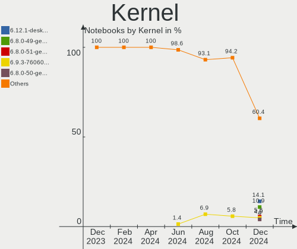
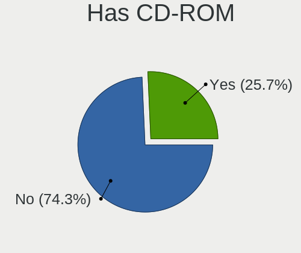
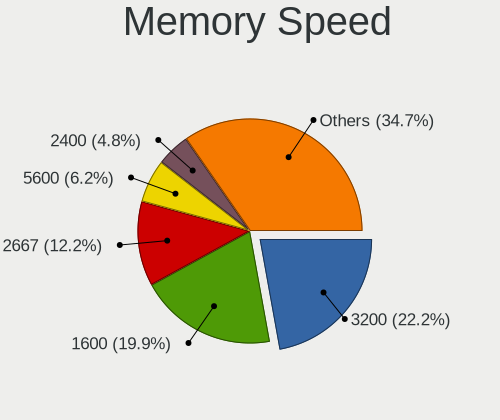
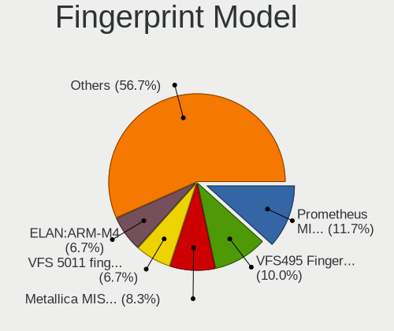

Linux in USA - Hardware Trends (Notebooks)
------------------------------------------

A project to identify most popular hardware characteristics and track their change
over time based on data collected by Linux users at https://Linux-Hardware.org.

Anyone can contribute to this report by the [hw-probe](https://github.com/linuxhw/hw-probe) tool:

    sudo -E hw-probe -all -upload

Period: Jul, 2023.

Contents
--------

* [ System ](#system)
  - [ OS                       ](#os)
  - [ OS Family                ](#os-family)
  - [ Kernel                   ](#kernel)
  - [ Kernel Family            ](#kernel-family)
  - [ Kernel Major Ver.        ](#kernel-major-ver)
  - [ Arch                     ](#arch)
  - [ DE                       ](#de)
  - [ Display Server           ](#display-server)
  - [ Display Manager          ](#display-manager)
  - [ OS Lang                  ](#os-lang)
  - [ Boot Mode                ](#boot-mode)
  - [ Filesystem               ](#filesystem)
  - [ Part. scheme             ](#part-scheme)
  - [ Dual Boot with Linux/BSD ](#dual-boot-with-linuxbsd)
  - [ Dual Boot (Win)          ](#dual-boot-win)

* [ Board ](#board)
  - [ Vendor                   ](#vendor)
  - [ Model                    ](#model)
  - [ Model Family             ](#model-family)
  - [ MFG Year                 ](#mfg-year)
  - [ Form Factor              ](#form-factor)
  - [ Secure Boot              ](#secure-boot)
  - [ Coreboot                 ](#coreboot)
  - [ RAM Size                 ](#ram-size)
  - [ RAM Used                 ](#ram-used)
  - [ Total Drives             ](#total-drives)
  - [ Has CD-ROM               ](#has-cd-rom)
  - [ Has Ethernet             ](#has-ethernet)
  - [ Has WiFi                 ](#has-wifi)
  - [ Has Bluetooth            ](#has-bluetooth)

* [ Location ](#location)
  - [ Country                  ](#country)
  - [ City                     ](#city)

* [ Drives ](#drives)
  - [ Drive Vendor             ](#drive-vendor)
  - [ Drive Model              ](#drive-model)
  - [ HDD Vendor               ](#hdd-vendor)
  - [ SSD Vendor               ](#ssd-vendor)
  - [ Drive Kind               ](#drive-kind)
  - [ Drive Connector          ](#drive-connector)
  - [ Drive Size               ](#drive-size)
  - [ Space Total              ](#space-total)
  - [ Space Used               ](#space-used)
  - [ Malfunc. Drives          ](#malfunc-drives)
  - [ Malfunc. Drive Vendor    ](#malfunc-drive-vendor)
  - [ Malfunc. HDD Vendor      ](#malfunc-hdd-vendor)
  - [ Malfunc. Drive Kind      ](#malfunc-drive-kind)
  - [ Failed Drives            ](#failed-drives)
  - [ Failed Drive Vendor      ](#failed-drive-vendor)
  - [ Drive Status             ](#drive-status)

* [ Storage controller ](#storage-controller)
  - [ Storage Vendor           ](#storage-vendor)
  - [ Storage Model            ](#storage-model)
  - [ Storage Kind             ](#storage-kind)

* [ Processor ](#processor)
  - [ CPU Vendor               ](#cpu-vendor)
  - [ CPU Model                ](#cpu-model)
  - [ CPU Model Family         ](#cpu-model-family)
  - [ CPU Cores                ](#cpu-cores)
  - [ CPU Sockets              ](#cpu-sockets)
  - [ CPU Threads              ](#cpu-threads)
  - [ CPU Op-Modes             ](#cpu-op-modes)
  - [ CPU Microcode            ](#cpu-microcode)
  - [ CPU Microarch            ](#cpu-microarch)

* [ Graphics ](#graphics)
  - [ GPU Vendor               ](#gpu-vendor)
  - [ GPU Model                ](#gpu-model)
  - [ GPU Combo                ](#gpu-combo)
  - [ GPU Driver               ](#gpu-driver)
  - [ GPU Memory               ](#gpu-memory)

* [ Monitor ](#monitor)
  - [ Monitor Vendor           ](#monitor-vendor)
  - [ Monitor Model            ](#monitor-model)
  - [ Monitor Resolution       ](#monitor-resolution)
  - [ Monitor Diagonal         ](#monitor-diagonal)
  - [ Monitor Width            ](#monitor-width)
  - [ Aspect Ratio             ](#aspect-ratio)
  - [ Monitor Area             ](#monitor-area)
  - [ Pixel Density            ](#pixel-density)
  - [ Multiple Monitors        ](#multiple-monitors)

* [ Network ](#network)
  - [ Net Controller Vendor    ](#net-controller-vendor)
  - [ Net Controller Model     ](#net-controller-model)
  - [ Wireless Vendor          ](#wireless-vendor)
  - [ Wireless Model           ](#wireless-model)
  - [ Ethernet Vendor          ](#ethernet-vendor)
  - [ Ethernet Model           ](#ethernet-model)
  - [ Net Controller Kind      ](#net-controller-kind)
  - [ Used Controller          ](#used-controller)
  - [ NICs                     ](#nics)
  - [ IPv6                     ](#ipv6)

* [ Bluetooth ](#bluetooth)
  - [ Bluetooth Vendor         ](#bluetooth-vendor)
  - [ Bluetooth Model          ](#bluetooth-model)

* [ Sound ](#sound)
  - [ Sound Vendor             ](#sound-vendor)
  - [ Sound Model              ](#sound-model)

* [ Memory ](#memory)
  - [ Memory Vendor            ](#memory-vendor)
  - [ Memory Model             ](#memory-model)
  - [ Memory Kind              ](#memory-kind)
  - [ Memory Form Factor       ](#memory-form-factor)
  - [ Memory Size              ](#memory-size)
  - [ Memory Speed             ](#memory-speed)

* [ Printers & scanners ](#printers--scanners)
  - [ Printer Vendor           ](#printer-vendor)
  - [ Printer Model            ](#printer-model)
  - [ Scanner Vendor           ](#scanner-vendor)
  - [ Scanner Model            ](#scanner-model)

* [ Camera ](#camera)
  - [ Camera Vendor            ](#camera-vendor)
  - [ Camera Model             ](#camera-model)

* [ Security ](#security)
  - [ Fingerprint Vendor       ](#fingerprint-vendor)
  - [ Fingerprint Model        ](#fingerprint-model)
  - [ Chipcard Vendor          ](#chipcard-vendor)
  - [ Chipcard Model           ](#chipcard-model)

* [ Unsupported ](#unsupported)
  - [ Unsupported Devices      ](#unsupported-devices)
  - [ Unsupported Device Types ](#unsupported-device-types)

System
------

OS
--

Installed operating systems

| Name                         | Notebooks | Percent |
|------------------------------|-----------|---------|
| Ubuntu 22.04                 | 58        | 12.06%  |
| Fedora 38                    | 42        | 8.73%   |
| Pop!_OS 22.04                | 33        | 6.86%   |
| Debian 12                    | 30        | 6.24%   |
| Ubuntu 23.04                 | 25        | 5.2%    |
| SteamOS 3.4.8                | 22        | 4.57%   |
| Linux Mint 21.1              | 19        | 3.95%   |
| Zorin 16                     | 18        | 3.74%   |
| Arch Rolling                 | 13        | 2.7%    |
| OpenMandriva 23.07           | 12        | 2.49%   |
| Linux Mint 21.2              | 12        | 2.49%   |
| ArcoLinux Rolling            | 12        | 2.49%   |
| openSUSE Tumbleweed-XXXXXXXX | 10        | 2.08%   |
| KDE neon 22.04               | 10        | 2.08%   |
| Kali 2023.2                  | 8         | 1.66%   |
| EndeavourOS Rolling          | 8         | 1.66%   |
| Xero Rolling                 | 7         | 1.46%   |
| Ubuntu 22.10                 | 7         | 1.46%   |
| Ubuntu 20.04                 | 7         | 1.46%   |
| Nobara 38                    | 7         | 1.46%   |
| OpenMandriva 23.03           | 6         | 1.25%   |
| Manjaro                      | 6         | 1.25%   |
| Parrot 5.3                   | 5         | 1.04%   |
| Xubuntu 22.04                | 4         | 0.83%   |
| Debian 11                    | 4         | 0.83%   |
| openSUSE Leap-15.5           | 3         | 0.62%   |
| OpenMandriva 23.06           | 3         | 0.62%   |
| NixOS 23.11                  | 3         | 0.62%   |
| Manjaro 23.0.0               | 3         | 0.62%   |
| LMDE 5                       | 3         | 0.62%   |
| Linux Mint 20.3              | 3         | 0.62%   |
| Lilidog 23                   | 3         | 0.62%   |
| Kubuntu 22.04                | 3         | 0.62%   |
| Gentoo 2.13                  | 3         | 0.62%   |
| Fedora 37                    | 3         | 0.62%   |
| Elementary 7                 | 3         | 0.62%   |
| Debian                       | 3         | 0.62%   |
| Ubuntu 18.04                 | 2         | 0.42%   |
| Trisquel 11.0                | 2         | 0.42%   |
| SteamOS 3.5                  | 2         | 0.42%   |

OS Family
---------

OS without a version

| Name             | Notebooks | Percent |
|------------------|-----------|---------|
| Ubuntu           | 100       | 20.79%  |
| Fedora           | 47        | 9.77%   |
| Linux Mint       | 38        | 7.9%    |
| Debian           | 37        | 7.69%   |
| Pop!_OS          | 33        | 6.86%   |
| SteamOS          | 28        | 5.82%   |
| OpenMandriva     | 26        | 5.41%   |
| Zorin            | 19        | 3.95%   |
| openSUSE         | 14        | 2.91%   |
| Arch             | 14        | 2.91%   |
| ArcoLinux        | 13        | 2.7%    |
| KDE neon         | 10        | 2.08%   |
| Manjaro          | 9         | 1.87%   |
| Nobara           | 8         | 1.66%   |
| Kali             | 8         | 1.66%   |
| EndeavourOS      | 8         | 1.66%   |
| Xero             | 7         | 1.46%   |
| Kubuntu          | 7         | 1.46%   |
| Xubuntu          | 5         | 1.04%   |
| Parrot           | 5         | 1.04%   |
| NixOS            | 5         | 1.04%   |
| Lubuntu          | 4         | 0.83%   |
| LMDE             | 3         | 0.62%   |
| Lilidog          | 3         | 0.62%   |
| Gentoo           | 3         | 0.62%   |
| Elementary       | 3         | 0.62%   |
| blendOS          | 3         | 0.62%   |
| Trisquel         | 2         | 0.42%   |
| org.kde.Platform | 2         | 0.42%   |
| Garuda Linux     | 2         | 0.42%   |
| Ubuntu Studio    | 1         | 0.21%   |
| Ubuntu MATE      | 1         | 0.21%   |
| Ubuntu Budgie    | 1         | 0.21%   |
| TUXEDO OS        | 1         | 0.21%   |
| Solus            | 1         | 0.21%   |
| Rocky Linux      | 1         | 0.21%   |
| Reborn OS        | 1         | 0.21%   |
| Peppermint       | 1         | 0.21%   |
| Linux Lite       | 1         | 0.21%   |
| Devuan           | 1         | 0.21%   |

Kernel
------

Version of the Linux kernel

| Version                      | Notebooks | Percent |
|------------------------------|-----------|---------|
| 5.19.0-46-generic            | 56        | 11.64%  |
| 5.15.0-76-generic            | 41        | 8.52%   |
| 6.2.6-76060206-generic       | 30        | 6.24%   |
| 6.1.0-10-amd64               | 23        | 4.78%   |
| 5.13.0-valve36-1-neptune     | 23        | 4.78%   |
| 6.3.5-desktop-3omv2390       | 14        | 2.91%   |
| 6.2.0-25-generic             | 13        | 2.7%    |
| 6.3.11-200.fc38.x86_64       | 10        | 2.08%   |
| 5.15.0-78-generic            | 10        | 2.08%   |
| 6.3.8-200.fc38.x86_64        | 9         | 1.87%   |
| 6.3.12-200.fc38.x86_64       | 9         | 1.87%   |
| 6.1.0-9-amd64                | 9         | 1.87%   |
| 6.4.3-arch1-2                | 8         | 1.66%   |
| 6.2.0-24-generic             | 8         | 1.66%   |
| 6.1.0-kali9-amd64            | 7         | 1.46%   |
| 5.19.0-32-generic            | 7         | 1.46%   |
| 6.2.6-desktop-1omv2390       | 6         | 1.25%   |
| 5.19.0-50-generic            | 6         | 1.25%   |
| 5.10.0-23-amd64              | 6         | 1.25%   |
| 6.4.1-arch2-1                | 5         | 1.04%   |
| 6.3.9-arch1-1                | 5         | 1.04%   |
| 6.3.9-1-default              | 5         | 1.04%   |
| 6.2.0-20-generic             | 5         | 1.04%   |
| 6.1.0-1parrot1-amd64         | 5         | 1.04%   |
| 6.4.6-arch1-1                | 4         | 0.83%   |
| 6.4.2-arch1-1                | 4         | 0.83%   |
| 6.3.12-204.fsync.fc38.x86_64 | 4         | 0.83%   |
| 6.2.9-300.fc38.x86_64        | 4         | 0.83%   |
| 5.19.0-45-generic            | 4         | 0.83%   |
| 6.4.6-200.fc38.x86_64        | 3         | 0.62%   |
| 6.4.2-3-MANJARO              | 3         | 0.62%   |
| 6.3.9-zen1-1-zen             | 3         | 0.62%   |
| 6.3.10-200.fsync.fc38.x86_64 | 3         | 0.62%   |
| 6.1.38                       | 3         | 0.62%   |
| 6.1.1-desktop-1omv2290       | 3         | 0.62%   |
| 6.4.4-arch1-1                | 2         | 0.42%   |
| 6.4.4-200.fc38.x86_64        | 2         | 0.42%   |
| 6.4.3-1-default              | 2         | 0.42%   |
| 6.4.3-060403-generic         | 2         | 0.42%   |
| 6.4.2-1-default              | 2         | 0.42%   |

Kernel Family
-------------

Linux kernel without a distro release

| Version | Notebooks | Percent |
|---------|-----------|---------|
| 5.19.0  | 80        | 16.63%  |
| 5.15.0  | 62        | 12.89%  |
| 6.1.0   | 48        | 9.98%   |
| 6.2.6   | 36        | 7.48%   |
| 6.2.0   | 32        | 6.65%   |
| 5.13.0  | 26        | 5.41%   |
| 6.4.3   | 15        | 3.12%   |
| 6.3.9   | 15        | 3.12%   |
| 6.3.12  | 15        | 3.12%   |
| 6.3.5   | 14        | 2.91%   |
| 6.4.2   | 13        | 2.7%    |
| 6.4.6   | 12        | 2.49%   |
| 6.3.8   | 11        | 2.29%   |
| 6.3.11  | 10        | 2.08%   |
| 6.4.1   | 8         | 1.66%   |
| 6.4.0   | 7         | 1.46%   |
| 5.10.0  | 7         | 1.46%   |
| 6.4.4   | 6         | 1.25%   |
| 6.1.38  | 6         | 1.25%   |
| 6.3.10  | 5         | 1.04%   |
| 5.4.0   | 5         | 1.04%   |
| 6.3.0   | 4         | 0.83%   |
| 6.2.9   | 4         | 0.83%   |
| 6.3.1   | 3         | 0.62%   |
| 6.1.39  | 3         | 0.62%   |
| 6.1.1   | 3         | 0.62%   |
| 5.14.21 | 3         | 0.62%   |
| 6.4.5   | 2         | 0.42%   |
| 6.1.31  | 2         | 0.42%   |
| 5.17.12 | 2         | 0.42%   |
| 5.14.0  | 2         | 0.42%   |
| 6.5.0   | 1         | 0.21%   |
| 6.4.7   | 1         | 0.21%   |
| 6.3.13  | 1         | 0.21%   |
| 6.2.8   | 1         | 0.21%   |
| 6.2.12  | 1         | 0.21%   |
| 6.1.9   | 1         | 0.21%   |
| 6.1.37  | 1         | 0.21%   |
| 6.1.36  | 1         | 0.21%   |
| 6.1.35  | 1         | 0.21%   |

Kernel Major Ver.
-----------------

Linux kernel major version

| Version | Notebooks | Percent |
|---------|-----------|---------|
| 5.19    | 81        | 16.84%  |
| 6.3     | 78        | 16.22%  |
| 6.2     | 74        | 15.38%  |
| 6.1     | 68        | 14.14%  |
| 6.4     | 64        | 13.31%  |
| 5.15    | 63        | 13.1%   |
| 5.13    | 26        | 5.41%   |
| 5.10    | 7         | 1.46%   |
| 5.4     | 5         | 1.04%   |
| 5.14    | 5         | 1.04%   |
| 5.17    | 4         | 0.83%   |
| 6.0     | 3         | 0.62%   |
| 6.5     | 1         | 0.21%   |
| 5.18    | 1         | 0.21%   |
| 5.16    | 1         | 0.21%   |

Arch
----

OS architecture (x86_64, i586, etc.)

| Name   | Notebooks | Percent |
|--------|-----------|---------|
| x86_64 | 479       | 99.58%  |
| i686   | 2         | 0.42%   |

DE
--

Desktop Environment

| Name             | Notebooks | Percent |
|------------------|-----------|---------|
| GNOME            | 219       | 45.53%  |
| KDE5             | 136       | 28.27%  |
| XFCE             | 38        | 7.9%    |
| X-Cinnamon       | 36        | 7.48%   |
| MATE             | 14        | 2.91%   |
| Cinnamon         | 7         | 1.46%   |
| Unknown          | 7         | 1.46%   |
| LXQt             | 6         | 1.25%   |
| lightdm-xsession | 4         | 0.83%   |
| Pantheon         | 3         | 0.62%   |
| sway             | 2         | 0.42%   |
| i3               | 2         | 0.42%   |
| Hyprland         | 1         | 0.21%   |
| GNOME Classic    | 1         | 0.21%   |
| gamescope        | 1         | 0.21%   |
| dwm              | 1         | 0.21%   |
| Deepin           | 1         | 0.21%   |
| BunsenLabs       | 1         | 0.21%   |
| Budgie           | 1         | 0.21%   |

Display Server
--------------

X11 or Wayland

| Name    | Notebooks | Percent |
|---------|-----------|---------|
| X11     | 300       | 62.37%  |
| Wayland | 167       | 34.72%  |
| Unknown | 9         | 1.87%   |
| Tty     | 5         | 1.04%   |

Display Manager
---------------

SDDM, LightDM, etc.

| Name    | Notebooks | Percent |
|---------|-----------|---------|
| Unknown | 198       | 41.16%  |
| GDM3    | 105       | 21.83%  |
| SDDM    | 86        | 17.88%  |
| LightDM | 60        | 12.47%  |
| GDM     | 26        | 5.41%   |
| GREETD  | 3         | 0.62%   |
| SLiM    | 1         | 0.21%   |
| Ly      | 1         | 0.21%   |
| LXDM    | 1         | 0.21%   |

OS Lang
-------

Language

| Lang    | Notebooks | Percent |
|---------|-----------|---------|
| en_US   | 457       | 95.01%  |
| C       | 6         | 1.25%   |
| en_CA   | 5         | 1.04%   |
| Unknown | 4         | 0.83%   |
| en_GB   | 3         | 0.62%   |
| POSIX   | 2         | 0.42%   |
| zh_CN   | 1         | 0.21%   |
| fr_CA   | 1         | 0.21%   |
| en_HK   | 1         | 0.21%   |
| Default | 1         | 0.21%   |

Boot Mode
---------

EFI or BIOS

| Mode | Notebooks | Percent |
|------|-----------|---------|
| EFI  | 263       | 54.68%  |
| BIOS | 218       | 45.32%  |

Filesystem
----------

Type of filesystem

| Type    | Notebooks | Percent |
|---------|-----------|---------|
| Ext4    | 258       | 53.64%  |
| Btrfs   | 112       | 23.28%  |
| Tmpfs   | 76        | 15.8%   |
| Overlay | 18        | 3.74%   |
| Xfs     | 12        | 2.49%   |
| Zfs     | 4         | 0.83%   |
| F2fs    | 1         | 0.21%   |

Part. scheme
------------

Scheme of partitioning

| Type    | Notebooks | Percent |
|---------|-----------|---------|
| GPT     | 257       | 53.43%  |
| Unknown | 191       | 39.71%  |
| MBR     | 33        | 6.86%   |

Dual Boot with Linux/BSD
------------------------

Hosting more than one Linux/BSD

| Dual boot | Notebooks | Percent |
|-----------|-----------|---------|
| No        | 435       | 90.44%  |
| Yes       | 46        | 9.56%   |

Dual Boot (Win)
---------------

Hosting Linux and Windows

| Dual boot | Notebooks | Percent |
|-----------|-----------|---------|
| No        | 409       | 85.03%  |
| Yes       | 72        | 14.97%  |

Board
-----

Vendor
------

Motherboard manufacturer

| Name                 | Notebooks | Percent |
|----------------------|-----------|---------|
| Hewlett-Packard      | 93        | 19.33%  |
| Dell                 | 91        | 18.92%  |
| Lenovo               | 89        | 18.5%   |
| Apple                | 43        | 8.94%   |
| ASUSTek Computer     | 32        | 6.65%   |
| Acer                 | 29        | 6.03%   |
| Valve                | 27        | 5.61%   |
| Google               | 17        | 3.53%   |
| MSI                  | 9         | 1.87%   |
| Toshiba              | 6         | 1.25%   |
| GPU Company          | 6         | 1.25%   |
| Alienware            | 5         | 1.04%   |
| System76             | 4         | 0.83%   |
| Samsung Electronics  | 4         | 0.83%   |
| Notebook             | 4         | 0.83%   |
| Gigabyte Technology  | 4         | 0.83%   |
| Sony                 | 3         | 0.62%   |
| LG Electronics       | 2         | 0.42%   |
| XIAOMI               | 1         | 0.21%   |
| win element          | 1         | 0.21%   |
| Teclast              | 1         | 0.21%   |
| Purism               | 1         | 0.21%   |
| Panasonic            | 1         | 0.21%   |
| OTVOC                | 1         | 0.21%   |
| Intel Client Systems | 1         | 0.21%   |
| GPD                  | 1         | 0.21%   |
| Gateway              | 1         | 0.21%   |
| Chuwi                | 1         | 0.21%   |
| AZW                  | 1         | 0.21%   |
| ALLDOCUBE            | 1         | 0.21%   |
| Unknown              | 1         | 0.21%   |

Model
-----

Motherboard model

| Name                                               | Notebooks | Percent |
|----------------------------------------------------|-----------|---------|
| Valve Jupiter                                      | 27        | 5.61%   |
| Apple MacBookPro9,2                                | 7         | 1.46%   |
| Apple MacBookPro8,1                                | 6         | 1.25%   |
| Apple MacBookPro11,1                               | 5         | 1.04%   |
| HP Notebook                                        | 4         | 0.83%   |
| HP Laptop 17-cp0xxx                                | 4         | 0.83%   |
| HP Pavilion Laptop 15-eh1xxx                       | 3         | 0.62%   |
| HP 15                                              | 3         | 0.62%   |
| GPU Company GWNR71517                              | 3         | 0.62%   |
| Dell XPS 15 7590                                   | 3         | 0.62%   |
| Dell Precision M4700                               | 3         | 0.62%   |
| Dell Latitude 7480                                 | 3         | 0.62%   |
| Apple MacBookPro11,3                               | 3         | 0.62%   |
| Apple MacBookAir7,2                                | 3         | 0.62%   |
| Acer Aspire A515-56                                | 3         | 0.62%   |
| Lenovo ThinkPad T430 2344BZU                       | 2         | 0.42%   |
| Lenovo ThinkPad T14 Gen 3 21AHCTO1WW               | 2         | 0.42%   |
| Lenovo IdeaPad 330S-15IKB 81F5                     | 2         | 0.42%   |
| HP ZBook Studio 15.6 inch G8 Mobile Workstation PC | 2         | 0.42%   |
| HP Presario CQ62                                   | 2         | 0.42%   |
| HP Laptop 15-dy2xxx                                | 2         | 0.42%   |
| HP Laptop 15-dw3xxx                                | 2         | 0.42%   |
| HP Laptop 15-da0xxx                                | 2         | 0.42%   |
| HP Laptop 15-bs0xx                                 | 2         | 0.42%   |
| HP EliteBook 8560p                                 | 2         | 0.42%   |
| HP EliteBook 845 G8 Notebook PC                    | 2         | 0.42%   |
| HP EliteBook 845 G7 Notebook PC                    | 2         | 0.42%   |
| HP Dev One Notebook PC                             | 2         | 0.42%   |
| GPU Company GWNC21524                              | 2         | 0.42%   |
| Dell XPS 15 9510                                   | 2         | 0.42%   |
| Dell XPS 13 9370                                   | 2         | 0.42%   |
| Dell Vostro 3560                                   | 2         | 0.42%   |
| Dell Precision M4800                               | 2         | 0.42%   |
| Dell Latitude 7490                                 | 2         | 0.42%   |
| Dell Latitude 3500                                 | 2         | 0.42%   |
| Dell Inspiron 5559                                 | 2         | 0.42%   |
| Dell Inspiron 1545                                 | 2         | 0.42%   |
| Dell Inspiron 15 3520                              | 2         | 0.42%   |
| ASUS ROG Strix G533ZW_G533ZW                       | 2         | 0.42%   |
| Apple MacBookPro6,2                                | 2         | 0.42%   |

Model Family
------------

Motherboard model prefix

| Name                  | Notebooks | Percent |
|-----------------------|-----------|---------|
| Lenovo ThinkPad       | 67        | 13.93%  |
| Dell Inspiron         | 34        | 7.07%   |
| Dell Latitude         | 31        | 6.44%   |
| Valve Jupiter         | 27        | 5.61%   |
| HP Laptop             | 25        | 5.2%    |
| Acer Aspire           | 17        | 3.53%   |
| HP Pavilion           | 14        | 2.91%   |
| HP EliteBook          | 14        | 2.91%   |
| Lenovo IdeaPad        | 13        | 2.7%    |
| Dell XPS              | 12        | 2.49%   |
| ASUS VivoBook         | 10        | 2.08%   |
| Apple MacBookPro11    | 10        | 2.08%   |
| ASUS ROG              | 9         | 1.87%   |
| HP ProBook            | 8         | 1.66%   |
| Apple MacBookPro9     | 8         | 1.66%   |
| Dell Precision        | 7         | 1.46%   |
| Acer Swift            | 7         | 1.46%   |
| HP ENVY               | 6         | 1.25%   |
| Apple MacBookPro8     | 6         | 1.25%   |
| Toshiba Satellite     | 5         | 1.04%   |
| Lenovo Legion         | 5         | 1.04%   |
| HP ZBook              | 5         | 1.04%   |
| HP Notebook           | 4         | 0.83%   |
| HP 15                 | 4         | 0.83%   |
| Acer Nitro            | 4         | 0.83%   |
| GPU Company GWNR71517 | 3         | 0.62%   |
| Dell Vostro           | 3         | 0.62%   |
| Apple MacBookPro5     | 3         | 0.62%   |
| Apple MacBookAir7     | 3         | 0.62%   |
| Apple MacBookAir6     | 3         | 0.62%   |
| MSI GF63              | 2         | 0.42%   |
| Lenovo Slim           | 2         | 0.42%   |
| HP Stream             | 2         | 0.42%   |
| HP Presario           | 2         | 0.42%   |
| HP Dev                | 2         | 0.42%   |
| GPU Company GWNC21524 | 2         | 0.42%   |
| ASUS ASUS             | 2         | 0.42%   |
| Apple MacBookPro6     | 2         | 0.42%   |
| Apple MacBook5        | 2         | 0.42%   |
| XIAOMI Redmi          | 1         | 0.21%   |

MFG Year
--------

Motherboard manufacture year

| Year | Notebooks | Percent |
|------|-----------|---------|
| 2022 | 65        | 13.51%  |
| 2021 | 57        | 11.85%  |
| 2020 | 44        | 9.15%   |
| 2019 | 37        | 7.69%   |
| 2012 | 35        | 7.28%   |
| 2018 | 32        | 6.65%   |
| 2017 | 30        | 6.24%   |
| 2023 | 28        | 5.82%   |
| 2015 | 27        | 5.61%   |
| 2013 | 25        | 5.2%    |
| 2011 | 25        | 5.2%    |
| 2016 | 22        | 4.57%   |
| 2014 | 15        | 3.12%   |
| 2008 | 14        | 2.91%   |
| 2010 | 10        | 2.08%   |
| 2009 | 10        | 2.08%   |
| 2007 | 3         | 0.62%   |
| 2006 | 1         | 0.21%   |
| 2005 | 1         | 0.21%   |

Form Factor
-----------

Physical design of the computer

| Name     | Notebooks | Percent |
|----------|-----------|---------|
| Notebook | 481       | 100%    |

Secure Boot
-----------

Enabled or disabled

| State    | Notebooks | Percent |
|----------|-----------|---------|
| Disabled | 444       | 92.31%  |
| Enabled  | 37        | 7.69%   |

Coreboot
--------

Have coreboot on board

| Used | Notebooks | Percent |
|------|-----------|---------|
| No   | 460       | 95.63%  |
| Yes  | 21        | 4.37%   |

RAM Size
--------

Total RAM memory

| Size in GB  | Notebooks | Percent |
|-------------|-----------|---------|
| 8.01-16.0   | 124       | 25.78%  |
| 4.01-8.0    | 104       | 21.62%  |
| 16.01-24.0  | 103       | 21.41%  |
| 3.01-4.0    | 62        | 12.89%  |
| 32.01-64.0  | 56        | 11.64%  |
| 64.01-256.0 | 11        | 2.29%   |
| 1.01-2.0    | 10        | 2.08%   |
| 24.01-32.0  | 8         | 1.66%   |
| 2.01-3.0    | 2         | 0.42%   |
| 0.51-1.0    | 1         | 0.21%   |

RAM Used
--------

Used RAM memory

| Used GB    | Notebooks | Percent |
|------------|-----------|---------|
| 1.01-2.0   | 142       | 29.52%  |
| 2.01-3.0   | 115       | 23.91%  |
| 4.01-8.0   | 100       | 20.79%  |
| 3.01-4.0   | 82        | 17.05%  |
| 8.01-16.0  | 27        | 5.61%   |
| 0.51-1.0   | 13        | 2.7%    |
| 24.01-32.0 | 1         | 0.21%   |
| 16.01-24.0 | 1         | 0.21%   |

Total Drives
------------

Number of drives on board

| Drives | Notebooks | Percent |
|--------|-----------|---------|
| 1      | 337       | 70.06%  |
| 2      | 121       | 25.16%  |
| 3      | 17        | 3.53%   |
| 4      | 3         | 0.62%   |
| 0      | 2         | 0.42%   |
| 5      | 1         | 0.21%   |

Has CD-ROM
----------

Has CD-ROM on board

| Presented | Notebooks | Percent |
|-----------|-----------|---------|
| No        | 351       | 72.97%  |
| Yes       | 130       | 27.03%  |

Has Ethernet
------------

Has Ethernet on board

| Presented | Notebooks | Percent |
|-----------|-----------|---------|
| Yes       | 341       | 70.89%  |
| No        | 140       | 29.11%  |

Has WiFi
--------

Has WiFi module

| Presented | Notebooks | Percent |
|-----------|-----------|---------|
| Yes       | 475       | 98.75%  |
| No        | 6         | 1.25%   |

Has Bluetooth
-------------

Has Bluetooth module

| Presented | Notebooks | Percent |
|-----------|-----------|---------|
| Yes       | 406       | 84.41%  |
| No        | 75        | 15.59%  |

Location
--------

Country
-------

Geographic location (country)

| Country | Notebooks | Percent |
|---------|-----------|---------|
| USA     | 481       | 100%    |

City
----

Geographic location (city)

| City            | Notebooks | Percent |
|-----------------|-----------|---------|
| Los Angeles     | 13        | 2.7%    |
| Denver          | 9         | 1.87%   |
| Atlanta         | 8         | 1.66%   |
| Houston         | 7         | 1.46%   |
| Saint Paul      | 6         | 1.25%   |
| Las Vegas       | 6         | 1.25%   |
| Seattle         | 5         | 1.04%   |
| San Antonio     | 5         | 1.04%   |
| New York        | 5         | 1.04%   |
| Brooklyn        | 5         | 1.04%   |
| Austin          | 5         | 1.04%   |
| Portland        | 4         | 0.83%   |
| Dayton          | 4         | 0.83%   |
| Chicago         | 4         | 0.83%   |
| Bangor          | 4         | 0.83%   |
| St Louis        | 3         | 0.62%   |
| Richardson      | 3         | 0.62%   |
| Phoenix         | 3         | 0.62%   |
| Nashville       | 3         | 0.62%   |
| Minneapolis     | 3         | 0.62%   |
| Lincoln         | 3         | 0.62%   |
| Eureka          | 3         | 0.62%   |
| Dallas          | 3         | 0.62%   |
| Columbus        | 3         | 0.62%   |
| Columbia        | 3         | 0.62%   |
| Calvert Heights | 3         | 0.62%   |
| Ashburn         | 3         | 0.62%   |
| West Jordan     | 2         | 0.42%   |
| Vancouver       | 2         | 0.42%   |
| Tacoma          | 2         | 0.42%   |
| Sonora          | 2         | 0.42%   |
| Sanford         | 2         | 0.42%   |
| Sandy           | 2         | 0.42%   |
| San Francisco   | 2         | 0.42%   |
| San Diego       | 2         | 0.42%   |
| Salt Lake City  | 2         | 0.42%   |
| Sacramento      | 2         | 0.42%   |
| Rifle           | 2         | 0.42%   |
| Renton          | 2         | 0.42%   |
| Raleigh         | 2         | 0.42%   |

Drives
------

Drive Vendor
------------

Hard drive vendors

| Vendor                      | Notebooks | Drives | Percent |
|-----------------------------|-----------|--------|---------|
| Samsung Electronics         | 103       | 116    | 16.67%  |
| SanDisk                     | 68        | 70     | 11%     |
| Unknown                     | 51        | 54     | 8.25%   |
| WDC                         | 45        | 46     | 7.28%   |
| Toshiba                     | 33        | 33     | 5.34%   |
| Seagate                     | 32        | 34     | 5.18%   |
| SK hynix                    | 26        | 27     | 4.21%   |
| Apple                       | 24        | 24     | 3.88%   |
| Crucial                     | 22        | 22     | 3.56%   |
| Micron Technology           | 18        | 18     | 2.91%   |
| Kingston                    | 18        | 19     | 2.91%   |
| PNY                         | 15        | 17     | 2.43%   |
| KIOXIA                      | 13        | 13     | 2.1%    |
| Intel                       | 13        | 15     | 2.1%    |
| Phison Electronics          | 12        | 12     | 1.94%   |
| HGST                        | 10        | 10     | 1.62%   |
| Unknown                     | 9         | 9      | 1.46%   |
| Silicon Motion              | 7         | 7      | 1.13%   |
| Kingston Technology Company | 6         | 6      | 0.97%   |
| Hitachi                     | 6         | 6      | 0.97%   |
| SPCC                        | 5         | 5      | 0.81%   |
| Micron/Crucial Technology   | 5         | 5      | 0.81%   |
| China                       | 5         | 5      | 0.81%   |
| O2 Micro                    | 4         | 4      | 0.65%   |
| Fujitsu                     | 4         | 4      | 0.65%   |
| Wibtek                      | 3         | 3      | 0.49%   |
| Realtek                     | 3         | 3      | 0.49%   |
| Netac                       | 3         | 3      | 0.49%   |
| LITEONIT                    | 3         | 3      | 0.49%   |
| LITEON                      | 3         | 3      | 0.49%   |
| A-DATA Technology           | 3         | 3      | 0.49%   |
| T-FORCE                     | 2         | 2      | 0.32%   |
| SSSTC                       | 2         | 2      | 0.32%   |
| SABRENT                     | 2         | 2      | 0.32%   |
| Phison                      | 2         | 2      | 0.32%   |
| OWC                         | 2         | 2      | 0.32%   |
| Hewlett-Packard             | 2         | 2      | 0.32%   |
| BHT                         | 2         | 2      | 0.32%   |
| ZHITAI                      | 1         | 1      | 0.16%   |
| YMTC                        | 1         | 1      | 0.16%   |

Drive Model
-----------

Hard drive models

| Model                                                 | Notebooks | Percent |
|-------------------------------------------------------|-----------|---------|
| Samsung NVMe SSD Controller SM981/PM981/PM983 500GB   | 15        | 2.38%   |
| Samsung NVMe SSD Controller PM9A1/PM9A3/980PRO 1TB    | 13        | 2.06%   |
| Unknown                                               | 9         | 1.43%   |
| Sandisk WD Black SN750 / PC SN730 NVMe SSD 1024GB     | 8         | 1.27%   |
| Unknown MMC Card  128GB                               | 7         | 1.11%   |
| Unknown MMC Card  32GB                                | 6         | 0.95%   |
| Toshiba XG6 NVMe SSD Controller 512GB                 | 6         | 0.95%   |
| Kingston Company OM3PDP3 NVMe SSD 512GB               | 6         | 0.95%   |
| HGST HTS721010A9E630 1TB                              | 6         | 0.95%   |
| Unknown MMC Card  64GB                                | 5         | 0.79%   |
| Silicon Motion SM2263EN/SM2263XT SSD Controller 500GB | 5         | 0.79%   |
| Samsung SSD 870 EVO 1TB                               | 5         | 0.79%   |
| Phison PS5013 E13 NVMe Controller 256GB               | 5         | 0.79%   |
| Micron/Crucial P2 NVMe PCIe SSD 1TB                   | 5         | 0.79%   |
| Unknown MMC Card  512GB                               | 4         | 0.63%   |
| Unknown MMC Card  256GB                               | 4         | 0.63%   |
| Unknown MMC Card  16GB                                | 4         | 0.63%   |
| SK hynix SC311 SATA 128GB SSD                         | 4         | 0.63%   |
| Seagate ST2000LM007-1R8174 2TB                        | 4         | 0.63%   |
| Seagate ST1000LM048-2E7172 1TB                        | 4         | 0.63%   |
| Seagate ST1000LM035-1RK172 1TB                        | 4         | 0.63%   |
| Sandisk WD Blue SN570 1TB                             | 4         | 0.63%   |
| Sandisk WD Blue SN550 NVMe SSD 250GB                  | 4         | 0.63%   |
| Samsung SSD 870 EVO 500GB                             | 4         | 0.63%   |
| PNY CS900 1TB SSD                                     | 4         | 0.63%   |
| O2 Micro E2M2 64GB                                    | 4         | 0.63%   |
| Intel SSD 660P Series 1024GB                          | 4         | 0.63%   |
| Wibtek W800S 512GB                                    | 3         | 0.48%   |
| WDC WDBNCE5000PNC 500GB SSD                           | 3         | 0.48%   |
| WDC WD10SPZX-60Z10T0 1TB                              | 3         | 0.48%   |
| WDC WD10JPVX-60JC3T0 1TB                              | 3         | 0.48%   |
| Unknown SD/MMC/MS PRO 128GB                           | 3         | 0.48%   |
| Unknown MMC Card  250GB                               | 3         | 0.48%   |
| Toshiba MQ04ABF100 1TB                                | 3         | 0.48%   |
| Toshiba MQ01ACF050 500GB                              | 3         | 0.48%   |
| Toshiba MQ01ABD100 1TB                                | 3         | 0.48%   |
| SanDisk X400 M.2 2280 256GB SSD                       | 3         | 0.48%   |
| Sandisk WD Blue SN500 / PC SN520 NVMe SSD 512GB       | 3         | 0.48%   |
| SanDisk SDSSDH3512G 512GB                             | 3         | 0.48%   |
| Samsung NVMe SSD Controller SM961/PM961/SM963 256GB   | 3         | 0.48%   |

HDD Vendor
----------

Hard disk drive vendors

| Vendor              | Notebooks | Drives | Percent |
|---------------------|-----------|--------|---------|
| Seagate             | 30        | 31     | 27.78%  |
| WDC                 | 28        | 28     | 25.93%  |
| Toshiba             | 17        | 17     | 15.74%  |
| HGST                | 10        | 10     | 9.26%   |
| Hitachi             | 6         | 6      | 5.56%   |
| Apple               | 5         | 5      | 4.63%   |
| Unknown             | 4         | 5      | 3.7%    |
| Fujitsu             | 4         | 4      | 3.7%    |
| Samsung Electronics | 2         | 2      | 1.85%   |
| SSK                 | 1         | 1      | 0.93%   |
| JMicron Technology  | 1         | 1      | 0.93%   |

SSD Vendor
----------

Solid state drive vendors

| Vendor              | Notebooks | Drives | Percent |
|---------------------|-----------|--------|---------|
| Samsung Electronics | 39        | 44     | 19.6%   |
| SanDisk             | 25        | 25     | 12.56%  |
| Crucial             | 21        | 21     | 10.55%  |
| Apple               | 15        | 15     | 7.54%   |
| PNY                 | 14        | 16     | 7.04%   |
| WDC                 | 13        | 13     | 6.53%   |
| Kingston            | 11        | 11     | 5.53%   |
| SK hynix            | 7         | 7      | 3.52%   |
| China               | 5         | 5      | 2.51%   |
| SPCC                | 4         | 4      | 2.01%   |
| Micron Technology   | 4         | 4      | 2.01%   |
| Wibtek              | 3         | 3      | 1.51%   |
| Toshiba             | 3         | 3      | 1.51%   |
| Netac               | 3         | 3      | 1.51%   |
| LITEONIT            | 3         | 3      | 1.51%   |
| LITEON              | 3         | 3      | 1.51%   |
| A-DATA Technology   | 3         | 3      | 1.51%   |
| OWC                 | 2         | 2      | 1.01%   |
| Hewlett-Packard     | 2         | 2      | 1.01%   |
| BHT                 | 2         | 2      | 1.01%   |
| Transcend           | 1         | 1      | 0.5%    |
| Teclast             | 1         | 1      | 0.5%    |
| Team                | 1         | 1      | 0.5%    |
| Tanbassh            | 1         | 1      | 0.5%    |
| T-FORCE             | 1         | 1      | 0.5%    |
| Super Talent        | 1         | 1      | 0.5%    |
| PUSKILL             | 1         | 1      | 0.5%    |
| PNY CS90            | 1         | 1      | 0.5%    |
| NT-2TB              | 1         | 2      | 0.5%    |
| Mushkin             | 1         | 1      | 0.5%    |
| Maxtor              | 1         | 1      | 0.5%    |
| Leven               | 1         | 1      | 0.5%    |
| KingSpec            | 1         | 1      | 0.5%    |
| KingFast            | 1         | 1      | 0.5%    |
| Intel               | 1         | 1      | 0.5%    |
| Dogfish             | 1         | 1      | 0.5%    |
| Unknown             | 1         | 1      | 0.5%    |

Drive Kind
----------

HDD or SSD

| Kind    | Notebooks | Drives | Percent |
|---------|-----------|--------|---------|
| NVMe    | 226       | 264    | 39.51%  |
| SSD     | 182       | 207    | 31.82%  |
| HDD     | 103       | 110    | 18.01%  |
| MMC     | 55        | 58     | 9.62%   |
| Unknown | 6         | 7      | 1.05%   |

Drive Connector
---------------

SATA, SAS, NVMe, etc.

| Type | Notebooks | Drives | Percent |
|------|-----------|--------|---------|
| SATA | 261       | 295    | 45.95%  |
| NVMe | 223       | 258    | 39.26%  |
| MMC  | 55        | 58     | 9.68%   |
| SAS  | 29        | 35     | 5.11%   |

Drive Size
----------

Size of hard drive

| Size in TB | Notebooks | Drives | Percent |
|------------|-----------|--------|---------|
| 0.01-0.5   | 171       | 179    | 57.97%  |
| 0.51-1.0   | 99        | 112    | 33.56%  |
| 1.01-2.0   | 21        | 22     | 7.12%   |
| 4.01-10.0  | 3         | 3      | 1.02%   |
| 3.01-4.0   | 1         | 1      | 0.34%   |

Space Total
-----------

Amount of disk space available on the file system

| Size in GB     | Notebooks | Percent |
|----------------|-----------|---------|
| 251-500        | 115       | 23.91%  |
| 101-250        | 113       | 23.49%  |
| 501-1000       | 87        | 18.09%  |
| 1001-2000      | 53        | 11.02%  |
| More than 3000 | 28        | 5.82%   |
| 1-20           | 23        | 4.78%   |
| 21-50          | 17        | 3.53%   |
| 51-100         | 17        | 3.53%   |
| Unknown        | 17        | 3.53%   |
| 2001-3000      | 11        | 2.29%   |

Space Used
----------

Amount of used disk space

| Used GB        | Notebooks | Percent |
|----------------|-----------|---------|
| 1-20           | 153       | 31.81%  |
| 21-50          | 99        | 20.58%  |
| 51-100         | 67        | 13.93%  |
| 101-250        | 62        | 12.89%  |
| 251-500        | 38        | 7.9%    |
| 501-1000       | 26        | 5.41%   |
| Unknown        | 17        | 3.53%   |
| 1001-2000      | 11        | 2.29%   |
| More than 3000 | 4         | 0.83%   |
| 2001-3000      | 4         | 0.83%   |

Malfunc. Drives
---------------

Drive models with a malfunction

| Model                                   | Notebooks | Drives | Percent |
|-----------------------------------------|-----------|--------|---------|
| WDC WDS100T2B0B-00YS70 1TB SSD          | 1         | 1      | 6.67%   |
| WDC WD400UE-22HCT0 40GB                 | 1         | 1      | 6.67%   |
| WDC WD10 JPLX-00MBPT0 1TB               | 1         | 1      | 6.67%   |
| Toshiba MQ01ABD100V 1TB                 | 1         | 1      | 6.67%   |
| Toshiba KSG60ZMV256G M.2 2280 256GB SSD | 1         | 1      | 6.67%   |
| SK hynix PC711 HFS001TDE9X073N 1TB      | 1         | 1      | 6.67%   |
| Seagate ST1000LM035-1RK172 1TB          | 1         | 1      | 6.67%   |
| LITEONIT LCT-512M3S 2.5 7mm 512GB SSD   | 1         | 1      | 6.67%   |
| Kingston SNS4151S332GD 32GB SSD         | 1         | 1      | 6.67%   |
| Hitachi HTS723216L9SA60 160GB           | 1         | 1      | 6.67%   |
| Crucial CT960M500SSD1 960GB             | 1         | 1      | 6.67%   |
| Crucial CT525MX300SSD4 528GB            | 1         | 1      | 6.67%   |
| Crucial CT500MX200SSD3 500GB            | 1         | 1      | 6.67%   |
| Crucial CT256MX100SSD1 256GB            | 1         | 1      | 6.67%   |
| Unknown                                 | 1         | 1      | 6.67%   |

Malfunc. Drive Vendor
---------------------

Vendors of faulty drives

| Vendor   | Notebooks | Drives | Percent |
|----------|-----------|--------|---------|
| Crucial  | 4         | 4      | 26.67%  |
| WDC      | 3         | 3      | 20%     |
| Toshiba  | 2         | 2      | 13.33%  |
| SK hynix | 1         | 1      | 6.67%   |
| Seagate  | 1         | 1      | 6.67%   |
| LITEONIT | 1         | 1      | 6.67%   |
| Kingston | 1         | 1      | 6.67%   |
| Hitachi  | 1         | 1      | 6.67%   |
| Unknown  | 1         | 1      | 6.67%   |

Malfunc. HDD Vendor
-------------------

Vendors of faulty HDD drives

| Vendor  | Notebooks | Drives | Percent |
|---------|-----------|--------|---------|
| WDC     | 2         | 2      | 40%     |
| Toshiba | 1         | 1      | 20%     |
| Seagate | 1         | 1      | 20%     |
| Hitachi | 1         | 1      | 20%     |

Malfunc. Drive Kind
-------------------

Kinds of faulty drives

| Kind | Notebooks | Drives | Percent |
|------|-----------|--------|---------|
| SSD  | 9         | 9      | 60%     |
| HDD  | 5         | 5      | 33.33%  |
| NVMe | 1         | 1      | 6.67%   |

Failed Drives
-------------

Failed drive models

Zero info for selected period =(

Failed Drive Vendor
-------------------

Failed drive vendors

Zero info for selected period =(

Drive Status
------------

Number of failed and malfunc. drives

| Status   | Notebooks | Drives | Percent |
|----------|-----------|--------|---------|
| Detected | 299       | 401    | 59.68%  |
| Works    | 187       | 230    | 37.33%  |
| Malfunc  | 15        | 15     | 2.99%   |

Storage controller
------------------

Storage Vendor
--------------

Storage controller vendors

| Vendor                         | Notebooks | Percent |
|--------------------------------|-----------|---------|
| Intel                          | 270       | 47.29%  |
| Samsung Electronics            | 74        | 12.96%  |
| AMD                            | 47        | 8.23%   |
| SanDisk                        | 44        | 7.71%   |
| SK hynix                       | 19        | 3.33%   |
| Phison Electronics             | 16        | 2.8%    |
| Toshiba America Info Systems   | 14        | 2.45%   |
| Micron Technology              | 14        | 2.45%   |
| KIOXIA                         | 13        | 2.28%   |
| Kingston Technology Company    | 13        | 2.28%   |
| Silicon Motion                 | 8         | 1.4%    |
| Nvidia                         | 6         | 1.05%   |
| Micron/Crucial Technology      | 6         | 1.05%   |
| O2 Micro                       | 4         | 0.7%    |
| Marvell Technology Group       | 4         | 0.7%    |
| Apple                          | 4         | 0.7%    |
| Yangtze Memory Technologies    | 3         | 0.53%   |
| Solid State Storage Technology | 3         | 0.53%   |
| Realtek Semiconductor          | 2         | 0.35%   |
| MAXIO Technology (Hangzhou)    | 2         | 0.35%   |
| Shenzhen Longsys Electronics   | 1         | 0.18%   |
| INNOGRIT                       | 1         | 0.18%   |
| Biwin Storage Technology       | 1         | 0.18%   |
| ASMedia Technology             | 1         | 0.18%   |
| ADATA Technology               | 1         | 0.18%   |

Storage Model
-------------

Storage controller models

| Model                                                                          | Notebooks | Percent |
|--------------------------------------------------------------------------------|-----------|---------|
| AMD FCH SATA Controller [AHCI mode]                                            | 42        | 6.92%   |
| Intel Sunrise Point-LP SATA Controller [AHCI mode]                             | 40        | 6.59%   |
| Intel 7 Series Chipset Family 6-port SATA Controller [AHCI mode]               | 35        | 5.77%   |
| Intel Volume Management Device NVMe RAID Controller                            | 29        | 4.78%   |
| Intel 82801 Mobile SATA Controller [RAID mode]                                 | 25        | 4.12%   |
| Samsung NVMe SSD Controller SM981/PM981/PM983                                  | 23        | 3.79%   |
| Samsung NVMe SSD Controller PM9A1/PM9A3/980PRO                                 | 21        | 3.46%   |
| Intel 6 Series/C200 Series Chipset Family 6 port Mobile SATA AHCI Controller   | 18        | 2.97%   |
| Intel Tiger Lake-LP SATA Controller                                            | 15        | 2.47%   |
| Samsung NVMe SSD Controller 980                                                | 14        | 2.31%   |
| SK hynix Gold P31/BC711/PC711 NVMe Solid State Drive                           | 13        | 2.14%   |
| Intel Cannon Lake Mobile PCH SATA AHCI Controller                              | 11        | 1.81%   |
| SanDisk WD Black SN750 / PC SN730 NVMe SSD                                     | 10        | 1.65%   |
| Intel 8 Series/C220 Series Chipset Family 6-port SATA Controller 1 [AHCI mode] | 10        | 1.65%   |
| Kingston Company OM3PDP3 NVMe SSD                                              | 9         | 1.48%   |
| Intel Wildcat Point-LP SATA Controller [AHCI Mode]                             | 9         | 1.48%   |
| Intel 82801IBM/IEM (ICH9M/ICH9M-E) 4 port SATA Controller [AHCI mode]          | 9         | 1.48%   |
| Intel 8 Series SATA Controller 1 [AHCI mode]                                   | 9         | 1.48%   |
| Toshiba America Info Systems XG6 NVMe SSD Controller                           | 7         | 1.15%   |
| Silicon Motion SM2263EN/SM2263XT (DRAM-less) NVMe SSD Controllers              | 7         | 1.15%   |
| SanDisk WD Blue SN550 NVMe SSD                                                 | 7         | 1.15%   |
| KIOXIA NVMe SSD Controller BG4 (DRAM-less)                                     | 7         | 1.15%   |
| Intel 5 Series/3400 Series Chipset 4 port SATA AHCI Controller                 | 7         | 1.15%   |
| SanDisk WD Blue SN570 NVMe SSD 1TB                                             | 6         | 0.99%   |
| Samsung S4LN053X01 AHCI SSD Controller(Apple slot)                             | 6         | 0.99%   |
| Phison PS5021-E21 PCIe4 NVMe Controller (DRAM-less)                            | 6         | 0.99%   |
| Micron/Crucial P2 [Nick P2] / P3 / P3 Plus NVMe PCIe SSD (DRAM-less)           | 6         | 0.99%   |
| Micron 3400 NVMe SSD [Hendrix]                                                 | 6         | 0.99%   |
| KIOXIA NVMe SSD Controller BG5 (DRAM-less)                                     | 6         | 0.99%   |
| Intel SSD 660P Series                                                          | 6         | 0.99%   |
| Intel HM170/QM170 Chipset SATA Controller [AHCI Mode]                          | 6         | 0.99%   |
| Phison PS5013 E13 NVMe Controller                                              | 5         | 0.82%   |
| Nvidia MCP79 AHCI Controller                                                   | 5         | 0.82%   |
| Intel Ice Lake-LP SATA Controller [AHCI mode]                                  | 5         | 0.82%   |
| Intel Comet Lake SATA AHCI Controller                                          | 5         | 0.82%   |
| Intel Celeron/Pentium Silver Processor SATA Controller                         | 5         | 0.82%   |
| Intel 82801HM/HEM (ICH8M/ICH8M-E) SATA Controller [AHCI mode]                  | 5         | 0.82%   |
| Intel 82801HM/HEM (ICH8M/ICH8M-E) IDE Controller                               | 5         | 0.82%   |
| AMD SB7x0/SB8x0/SB9x0 SATA Controller [AHCI mode]                              | 5         | 0.82%   |
| SanDisk WD Black SN770 / PC SN740 256GB / PC SN560 (DRAM-less) NVMe SSD        | 4         | 0.66%   |

Storage Kind
------------

Kind of storage controller (IDE, SATA, NVMe, SAS, ...)

| Kind | Notebooks | Percent |
|------|-----------|---------|
| SATA | 280       | 48.53%  |
| NVMe | 223       | 38.65%  |
| RAID | 60        | 10.4%   |
| IDE  | 14        | 2.43%   |

Processor
---------

CPU Vendor
----------

Processor vendors

| Vendor | Notebooks | Percent |
|--------|-----------|---------|
| Intel  | 367       | 76.3%   |
| AMD    | 114       | 23.7%   |

CPU Model
---------

Processor models

| Model                                      | Notebooks | Percent |
|--------------------------------------------|-----------|---------|
| AMD Custom APU 0405                        | 27        | 5.61%   |
| Intel 11th Gen Core i5-1135G7 @ 2.40GHz    | 10        | 2.08%   |
| Intel 11th Gen Core i3-1115G4 @ 3.00GHz    | 9         | 1.87%   |
| Intel Core i7-8650U CPU @ 1.90GHz          | 8         | 1.66%   |
| Intel Core i5-3210M CPU @ 2.50GHz          | 8         | 1.66%   |
| Intel Celeron N4020 CPU @ 1.10GHz          | 8         | 1.66%   |
| Intel Core i7-8550U CPU @ 1.80GHz          | 7         | 1.46%   |
| Intel Core i5-6300U CPU @ 2.40GHz          | 7         | 1.46%   |
| Intel Core i7-9750H CPU @ 2.60GHz          | 6         | 1.25%   |
| Intel Core i5-6200U CPU @ 2.30GHz          | 6         | 1.25%   |
| Intel 11th Gen Core i7-11800H @ 2.30GHz    | 6         | 1.25%   |
| AMD Ryzen 5 5500U with Radeon Graphics     | 6         | 1.25%   |
| Intel Core i7-8750H CPU @ 2.20GHz          | 5         | 1.04%   |
| Intel Core i7-8565U CPU @ 1.80GHz          | 5         | 1.04%   |
| Intel Core i7-6600U CPU @ 2.60GHz          | 5         | 1.04%   |
| Intel Core i7-10750H CPU @ 2.60GHz         | 5         | 1.04%   |
| Intel Core i5-8250U CPU @ 1.60GHz          | 5         | 1.04%   |
| Intel Core i5-3320M CPU @ 2.60GHz          | 5         | 1.04%   |
| Intel 11th Gen Core i7-1165G7 @ 2.80GHz    | 5         | 1.04%   |
| Intel Core i7-7700HQ CPU @ 2.80GHz         | 4         | 0.83%   |
| Intel Core i7-6700HQ CPU @ 2.60GHz         | 4         | 0.83%   |
| Intel Core i7-4870HQ CPU @ 2.50GHz         | 4         | 0.83%   |
| Intel Core i7-3520M CPU @ 2.90GHz          | 4         | 0.83%   |
| Intel Core i5-7200U CPU @ 2.50GHz          | 4         | 0.83%   |
| Intel Core i5-1035G1 CPU @ 1.00GHz         | 4         | 0.83%   |
| Intel Celeron CPU N2840 @ 2.16GHz          | 4         | 0.83%   |
| Intel 12th Gen Core i7-12700H              | 4         | 0.83%   |
| Intel 11th Gen Core i7-1185G7 @ 3.00GHz    | 4         | 0.83%   |
| AMD Ryzen 7 PRO 5850U with Radeon Graphics | 4         | 0.83%   |
| AMD Ryzen 7 5825U with Radeon Graphics     | 4         | 0.83%   |
| AMD Ryzen 7 5700U with Radeon Graphics     | 4         | 0.83%   |
| Intel Core i7-7500U CPU @ 2.70GHz          | 3         | 0.62%   |
| Intel Core i7-6500U CPU @ 2.50GHz          | 3         | 0.62%   |
| Intel Core i7-4810MQ CPU @ 2.80GHz         | 3         | 0.62%   |
| Intel Core i7-3720QM CPU @ 2.60GHz         | 3         | 0.62%   |
| Intel Core i7-2670QM CPU @ 2.20GHz         | 3         | 0.62%   |
| Intel Core i5-7300U CPU @ 2.60GHz          | 3         | 0.62%   |
| Intel Core i5-5300U CPU @ 2.30GHz          | 3         | 0.62%   |
| Intel Core i5-2520M CPU @ 2.50GHz          | 3         | 0.62%   |
| Intel Core i5-2435M CPU @ 2.40GHz          | 3         | 0.62%   |

CPU Model Family
----------------

Processor model prefix

| Model                   | Notebooks | Percent |
|-------------------------|-----------|---------|
| Intel Core i7           | 109       | 22.66%  |
| Intel Core i5           | 106       | 22.04%  |
| Other                   | 97        | 20.17%  |
| Intel Core i3           | 25        | 5.2%    |
| Intel Celeron           | 25        | 5.2%    |
| AMD Ryzen 7             | 25        | 5.2%    |
| Intel Core 2 Duo        | 19        | 3.95%   |
| AMD Ryzen 5             | 17        | 3.53%   |
| AMD Ryzen 7 PRO         | 9         | 1.87%   |
| Intel Pentium           | 6         | 1.25%   |
| AMD Ryzen 9             | 6         | 1.25%   |
| AMD Ryzen 3             | 6         | 1.25%   |
| Intel Atom              | 3         | 0.62%   |
| AMD Athlon II           | 3         | 0.62%   |
| AMD Athlon              | 3         | 0.62%   |
| Intel Pentium Silver    | 2         | 0.42%   |
| AMD Ryzen 5 PRO         | 2         | 0.42%   |
| AMD E1                  | 2         | 0.42%   |
| AMD E                   | 2         | 0.42%   |
| AMD A6                  | 2         | 0.42%   |
| AMD A4                  | 2         | 0.42%   |
| Intel Pentium Dual-Core | 1         | 0.21%   |
| Intel Pentium Dual      | 1         | 0.21%   |
| Intel Core m3           | 1         | 0.21%   |
| Intel Core M            | 1         | 0.21%   |
| Intel Core i9           | 1         | 0.21%   |
| Intel Core 2            | 1         | 0.21%   |
| Intel Celeron M         | 1         | 0.21%   |
| AMD PRO A10             | 1         | 0.21%   |
| AMD E2                  | 1         | 0.21%   |
| AMD A10                 | 1         | 0.21%   |

CPU Cores
---------

Number of processor cores

| Number | Notebooks | Percent |
|--------|-----------|---------|
| 2      | 203       | 42.2%   |
| 4      | 166       | 34.51%  |
| 8      | 45        | 9.36%   |
| 6      | 37        | 7.69%   |
| 14     | 10        | 2.08%   |
| 12     | 7         | 1.46%   |
| 10     | 5         | 1.04%   |
| 1      | 5         | 1.04%   |
| 24     | 2         | 0.42%   |
| 16     | 1         | 0.21%   |

CPU Sockets
-----------

Number of sockets

| Number | Notebooks | Percent |
|--------|-----------|---------|
| 1      | 481       | 100%    |

CPU Threads
-----------

Threads per core (Hyper-Threading)

| Number | Notebooks | Percent |
|--------|-----------|---------|
| 2      | 395       | 82.12%  |
| 1      | 86        | 17.88%  |

CPU Op-Modes
------------

CPU Operation Modes (32-bit, 64-bit)

| Op mode        | Notebooks | Percent |
|----------------|-----------|---------|
| 32-bit, 64-bit | 479       | 99.58%  |
| 32-bit         | 2         | 0.42%   |

CPU Microcode
-------------

Microcode number

| Number     | Notebooks | Percent |
|------------|-----------|---------|
| Unknown    | 291       | 60.5%   |
| 0x306a9    | 11        | 2.29%   |
| 0x206a7    | 11        | 2.29%   |
| 0x0a50000c | 9         | 1.87%   |
| 0x08108109 | 9         | 1.87%   |
| 0x806ea    | 8         | 1.66%   |
| 0x806c1    | 7         | 1.46%   |
| 0x406e3    | 7         | 1.46%   |
| 0x0a50000d | 7         | 1.46%   |
| 0x806e9    | 6         | 1.25%   |
| 0x706a8    | 6         | 1.25%   |
| 0x0a404102 | 6         | 1.25%   |
| 0x08608103 | 6         | 1.25%   |
| 0x306d4    | 5         | 1.04%   |
| 0x30678    | 5         | 1.04%   |
| 0x08600106 | 5         | 1.04%   |
| 0x906a3    | 4         | 0.83%   |
| 0x806ec    | 4         | 0.83%   |
| 0x806d1    | 4         | 0.83%   |
| 0x506c9    | 4         | 0.83%   |
| 0x40661    | 4         | 0.83%   |
| 0x20655    | 4         | 0.83%   |
| 0x1067a    | 4         | 0.83%   |
| 0x906a4    | 3         | 0.62%   |
| 0x706e5    | 3         | 0.62%   |
| 0x406c4    | 3         | 0.62%   |
| 0x306c3    | 3         | 0.62%   |
| 0x906ea    | 2         | 0.42%   |
| 0x40651    | 2         | 0.42%   |
| 0x20652    | 2         | 0.42%   |
| 0x0a704103 | 2         | 0.42%   |
| 0x0a704101 | 2         | 0.42%   |
| 0x08608104 | 2         | 0.42%   |
| 0x07030106 | 2         | 0.42%   |
| 0x06006705 | 2         | 0.42%   |
| 0x06006704 | 2         | 0.42%   |
| 0x0600611a | 2         | 0.42%   |
| 0x010000c8 | 2         | 0.42%   |
| 0xb06a3    | 1         | 0.21%   |
| 0xb0671    | 1         | 0.21%   |

CPU Microarch
-------------

Microarchitecture

| Name             | Notebooks | Percent |
|------------------|-----------|---------|
| KabyLake         | 81        | 16.84%  |
| Unknown          | 63        | 13.1%   |
| IvyBridge        | 37        | 7.69%   |
| Haswell          | 35        | 7.28%   |
| TigerLake        | 32        | 6.65%   |
| Skylake          | 32        | 6.65%   |
| SandyBridge      | 21        | 4.37%   |
| Zen 3            | 19        | 3.95%   |
| Penryn           | 17        | 3.53%   |
| Alderlake Hybrid | 17        | 3.53%   |
| Zen+             | 15        | 3.12%   |
| Broadwell        | 15        | 3.12%   |
| IceLake          | 13        | 2.7%    |
| Goldmont plus    | 13        | 2.7%    |
| Silvermont       | 10        | 2.08%   |
| Zen 2            | 9         | 1.87%   |
| Westmere         | 9         | 1.87%   |
| CometLake        | 9         | 1.87%   |
| Excavator        | 8         | 1.66%   |
| Core             | 6         | 1.25%   |
| Goldmont         | 4         | 0.83%   |
| Puma             | 3         | 0.62%   |
| K10              | 3         | 0.62%   |
| Bobcat           | 3         | 0.62%   |
| Bonnell          | 2         | 0.42%   |
| Zen              | 1         | 0.21%   |
| Tremont          | 1         | 0.21%   |
| P6               | 1         | 0.21%   |
| K10 Llano        | 1         | 0.21%   |
| Jaguar           | 1         | 0.21%   |

Graphics
--------

GPU Vendor
----------

Vendors of graphics cards

| Vendor | Notebooks | Percent |
|--------|-----------|---------|
| Intel  | 335       | 58.36%  |
| AMD    | 133       | 23.17%  |
| Nvidia | 106       | 18.47%  |

GPU Model
---------

Graphics card models

| Model                                                                                    | Notebooks | Percent |
|------------------------------------------------------------------------------------------|-----------|---------|
| Intel 3rd Gen Core processor Graphics Controller                                         | 34        | 5.82%   |
| AMD VanGogh [AMD Custom GPU 0405]                                                        | 27        | 4.62%   |
| Intel Skylake GT2 [HD Graphics 520]                                                      | 25        | 4.28%   |
| Intel UHD Graphics 620                                                                   | 23        | 3.94%   |
| Intel TigerLake-LP GT2 [Iris Xe Graphics]                                                | 23        | 3.94%   |
| Intel Haswell-ULT Integrated Graphics Controller                                         | 17        | 2.91%   |
| Intel 2nd Generation Core Processor Family Integrated Graphics Controller                | 16        | 2.74%   |
| Intel HD Graphics 620                                                                    | 15        | 2.57%   |
| Intel CoffeeLake-H GT2 [UHD Graphics 630]                                                | 15        | 2.57%   |
| AMD Picasso/Raven 2 [Radeon Vega Series / Radeon Vega Mobile Series]                     | 15        | 2.57%   |
| Intel Alder Lake-P Integrated Graphics Controller                                        | 14        | 2.4%    |
| Intel WhiskeyLake-U GT2 [UHD Graphics 620]                                               | 12        | 2.05%   |
| Intel GeminiLake [UHD Graphics 600]                                                      | 11        | 1.88%   |
| AMD Lucienne                                                                             | 11        | 1.88%   |
| Intel Tiger Lake-LP GT2 [UHD Graphics G4]                                                | 9         | 1.54%   |
| Intel HD Graphics 5500                                                                   | 9         | 1.54%   |
| Intel Core Processor Integrated Graphics Controller                                      | 9         | 1.54%   |
| Intel 4th Gen Core Processor Integrated Graphics Controller                              | 9         | 1.54%   |
| AMD Renoir                                                                               | 9         | 1.54%   |
| AMD Cezanne [Radeon Vega Series / Radeon Vega Mobile Series]                             | 9         | 1.54%   |
| AMD Barcelo                                                                              | 9         | 1.54%   |
| Intel TigerLake-H GT1 [UHD Graphics]                                                     | 8         | 1.37%   |
| AMD Rembrandt [Radeon 680M]                                                              | 8         | 1.37%   |
| Intel Mobile 4 Series Chipset Integrated Graphics Controller                             | 7         | 1.2%    |
| Nvidia GA106M [GeForce RTX 3060 Mobile / Max-Q]                                          | 6         | 1.03%   |
| Intel Iris Plus Graphics G1 (Ice Lake)                                                   | 6         | 1.03%   |
| Intel Atom Processor Z36xxx/Z37xxx Series Graphics & Display                             | 6         | 1.03%   |
| Nvidia AD106M [GeForce RTX 4070 Max-Q / Mobile]                                          | 5         | 0.86%   |
| Intel HD Graphics 630                                                                    | 5         | 0.86%   |
| Intel HD Graphics 530                                                                    | 5         | 0.86%   |
| Intel CometLake-U GT2 [UHD Graphics]                                                     | 5         | 0.86%   |
| Intel CometLake-H GT2 [UHD Graphics]                                                     | 5         | 0.86%   |
| AMD Stoney [Radeon R2/R3/R4/R5 Graphics]                                                 | 5         | 0.86%   |
| Nvidia TU117M [GeForce GTX 1650 Mobile / Max-Q]                                          | 4         | 0.68%   |
| Nvidia GP106M [GeForce GTX 1060 Mobile]                                                  | 4         | 0.68%   |
| Nvidia C79 [GeForce 9400M]                                                               | 4         | 0.68%   |
| Intel Raptor Lake-P [Iris Xe Graphics]                                                   | 4         | 0.68%   |
| Intel Mobile GM965/GL960 Integrated Graphics Controller (secondary)                      | 4         | 0.68%   |
| Intel Mobile GM965/GL960 Integrated Graphics Controller (primary)                        | 4         | 0.68%   |
| Intel Atom/Celeron/Pentium Processor x5-E8000/J3xxx/N3xxx Integrated Graphics Controller | 4         | 0.68%   |

GPU Combo
---------

Combinations of graphics cards

| Name           | Notebooks | Percent |
|----------------|-----------|---------|
| 1 x Intel      | 246       | 51.14%  |
| 1 x AMD        | 107       | 22.25%  |
| Intel + Nvidia | 70        | 14.55%  |
| 1 x Nvidia     | 24        | 4.99%   |
| AMD + Nvidia   | 12        | 2.49%   |
| Intel + AMD    | 11        | 2.29%   |
| 2 x Intel      | 5         | 1.04%   |
| Other          | 3         | 0.62%   |
| 2 x AMD        | 3         | 0.62%   |

GPU Driver
----------

Free vs proprietary

| Driver      | Notebooks | Percent |
|-------------|-----------|---------|
| Free        | 422       | 87.73%  |
| Proprietary | 52        | 10.81%  |
| Unknown     | 7         | 1.46%   |

GPU Memory
----------

Total video memory

| Size in GB | Notebooks | Percent |
|------------|-----------|---------|
| Unknown    | 379       | 78.79%  |
| 0.01-0.5   | 49        | 10.19%  |
| 1.01-2.0   | 20        | 4.16%   |
| 0.51-1.0   | 13        | 2.7%    |
| 3.01-4.0   | 11        | 2.29%   |
| 7.01-8.0   | 6         | 1.25%   |
| 5.01-6.0   | 1         | 0.21%   |
| 2.01-3.0   | 1         | 0.21%   |
| 8.01-16.0  | 1         | 0.21%   |

Monitor
-------

Monitor Vendor
--------------

Monitor vendors

| Vendor                  | Notebooks | Percent |
|-------------------------|-----------|---------|
| AU Optronics            | 99        | 18.03%  |
| BOE                     | 76        | 13.84%  |
| LG Display              | 74        | 13.48%  |
| Chimei Innolux          | 57        | 10.38%  |
| Apple                   | 42        | 7.65%   |
| Samsung Electronics     | 40        | 7.29%   |
| Valve                   | 25        | 4.55%   |
| Sharp                   | 17        | 3.1%    |
| Dell                    | 14        | 2.55%   |
| Goldstar                | 12        | 2.19%   |
| InfoVision              | 8         | 1.46%   |
| Hewlett-Packard         | 7         | 1.28%   |
| Lenovo                  | 6         | 1.09%   |
| Acer                    | 6         | 1.09%   |
| Sony                    | 5         | 0.91%   |
| Chi Mei Optoelectronics | 5         | 0.91%   |
| ASUSTek Computer        | 5         | 0.91%   |
| TMX                     | 4         | 0.73%   |
| Sceptre Tech            | 4         | 0.73%   |
| PANDA                   | 4         | 0.73%   |
| CSO                     | 4         | 0.73%   |
| Ancor Communications    | 4         | 0.73%   |
| ViewSonic               | 3         | 0.55%   |
| MSD                     | 2         | 0.36%   |
| HKC                     | 2         | 0.36%   |
| Gigabyte Technology     | 2         | 0.36%   |
| AOC                     | 2         | 0.36%   |
| Vizio                   | 1         | 0.18%   |
| Videoseven              | 1         | 0.18%   |
| Toshiba                 | 1         | 0.18%   |
| Planar                  | 1         | 0.18%   |
| Philips                 | 1         | 0.18%   |
| ONN                     | 1         | 0.18%   |
| MStar                   | 1         | 0.18%   |
| MSI                     | 1         | 0.18%   |
| MIT                     | 1         | 0.18%   |
| LG Philips              | 1         | 0.18%   |
| Lenovo Group Limited    | 1         | 0.18%   |
| InnoView                | 1         | 0.18%   |
| InnoLux Display         | 1         | 0.18%   |

Monitor Model
-------------

Monitor models

| Model                                                                 | Notebooks | Percent |
|-----------------------------------------------------------------------|-----------|---------|
| Valve ANX7530 U VLV3001 800x1280 100x150mm 7.1-inch                   | 25        | 4.51%   |
| Apple Color LCD APPA020 2560x1600 286x179mm 13.3-inch                 | 5         | 0.9%    |
| Chimei Innolux LCD Monitor CMN1521 1920x1080 344x193mm 15.5-inch      | 4         | 0.72%   |
| BOE LCD Monitor BOE06A4 1366x768 344x194mm 15.5-inch                  | 4         | 0.72%   |
| AU Optronics LCD Monitor AUO21ED 1920x1080 344x194mm 15.5-inch        | 4         | 0.72%   |
| AU Optronics LCD Monitor AUO10EC 1366x768 344x193mm 15.5-inch         | 4         | 0.72%   |
| Apple LCD Monitor APP9CC3 1280x800 286x179mm 13.3-inch                | 4         | 0.72%   |
| Apple Color LCD APP9CC7 1280x800 286x179mm 13.3-inch                  | 4         | 0.72%   |
| Sony TV SNYF301 1920x1080                                             | 3         | 0.54%   |
| Samsung Electronics LCD Monitor SDC5441 1366x768 309x174mm 14.0-inch  | 3         | 0.54%   |
| Samsung Electronics LCD Monitor SDC414D 3456x2160 336x210mm 15.6-inch | 3         | 0.54%   |
| LG Display LCD Monitor LGD046F 1920x1080 344x194mm 15.5-inch          | 3         | 0.54%   |
| LG Display LCD Monitor LGD033B 1366x768 344x194mm 15.5-inch           | 3         | 0.54%   |
| LG Display LCD Monitor LGD02F1 1366x768 344x194mm 15.5-inch           | 3         | 0.54%   |
| InfoVision LCD Monitor IVO8C78 1920x1080 309x174mm 14.0-inch          | 3         | 0.54%   |
| InfoVision LCD Monitor IVO057D 1920x1080 309x174mm 14.0-inch          | 3         | 0.54%   |
| Chimei Innolux LCD Monitor CMN14D4 1920x1080 309x173mm 13.9-inch      | 3         | 0.54%   |
| BOE LCD Monitor BOE084E 1920x1080 382x215mm 17.3-inch                 | 3         | 0.54%   |
| AU Optronics LCD Monitor AUOD792 1600x900 382x215mm 17.3-inch         | 3         | 0.54%   |
| AU Optronics LCD Monitor AUO106C 1366x768 277x156mm 12.5-inch         | 3         | 0.54%   |
| AU Optronics LCD Monitor AUO103D 1920x1080 309x173mm 13.9-inch        | 3         | 0.54%   |
| Sharp LQ156M1JW03 SHP14C5 1920x1080 344x194mm 15.5-inch               | 2         | 0.36%   |
| Sharp LCD Monitor SHP14B9 3840x2160 344x194mm 15.5-inch               | 2         | 0.36%   |
| Sharp LCD Monitor SHP1484 1920x1080 294x165mm 13.3-inch               | 2         | 0.36%   |
| Samsung Electronics LCD Monitor SEC304C 1366x768 309x174mm 14.0-inch  | 2         | 0.36%   |
| MSD MStar Demo MSD0030 3840x2160 708x398mm 32.0-inch                  | 2         | 0.36%   |
| LG Display LCD Monitor LGD0738 1920x1080 344x194mm 15.5-inch          | 2         | 0.36%   |
| LG Display LCD Monitor LGD065A 1920x1080 344x194mm 15.5-inch          | 2         | 0.36%   |
| LG Display LCD Monitor LGD063F 1920x1080 382x215mm 17.3-inch          | 2         | 0.36%   |
| LG Display LCD Monitor LGD059A 1920x1080 344x194mm 15.5-inch          | 2         | 0.36%   |
| LG Display LCD Monitor LGD0521 1920x1080 309x174mm 14.0-inch          | 2         | 0.36%   |
| LG Display LCD Monitor LGD032C 1920x1080 344x194mm 15.5-inch          | 2         | 0.36%   |
| LG Display LCD Monitor LGD02DC 1366x768 344x194mm 15.5-inch           | 2         | 0.36%   |
| Lenovo LCD Monitor LEN40B1 1600x900 345x194mm 15.6-inch               | 2         | 0.36%   |
| HKC LCD Monitor HKC3CFB 1920x1080 344x194mm 15.5-inch                 | 2         | 0.36%   |
| Goldstar HDR 4K GSM7706 3840x2160 600x340mm 27.2-inch                 | 2         | 0.36%   |
| Gigabyte Technology G27QC GBT270B 2560x1440 597x336mm 27.0-inch       | 2         | 0.36%   |
| Dell U2412M DELA07B 1920x1200 518x324mm 24.1-inch                     | 2         | 0.36%   |
| Chimei Innolux LCD Monitor CMN176F 1920x1080 381x214mm 17.2-inch      | 2         | 0.36%   |
| Chimei Innolux LCD Monitor CMN15E7 1920x1080 344x193mm 15.5-inch      | 2         | 0.36%   |

Monitor Resolution
------------------

Monitor screen resolution

| Resolution         | Notebooks | Percent |
|--------------------|-----------|---------|
| 1920x1080 (FHD)    | 213       | 40.49%  |
| 1366x768 (WXGA)    | 110       | 20.91%  |
| 3840x2160 (4K)     | 27        | 5.13%   |
| 1600x900 (HD+)     | 27        | 5.13%   |
| 800x1280           | 26        | 4.94%   |
| 1280x800 (WXGA)    | 26        | 4.94%   |
| 2560x1600          | 17        | 3.23%   |
| 2560x1440 (QHD)    | 16        | 3.04%   |
| 1920x1200 (WUXGA)  | 16        | 3.04%   |
| 1440x900 (WXGA+)   | 10        | 1.9%    |
| 2880x1800          | 6         | 1.14%   |
| 3440x1440          | 5         | 0.95%   |
| 2560x1080          | 5         | 0.95%   |
| 1680x1050 (WSXGA+) | 4         | 0.76%   |
| 3456x2160          | 3         | 0.57%   |
| 3840x2400          | 2         | 0.38%   |
| 3200x2000          | 2         | 0.38%   |
| 1024x600           | 2         | 0.38%   |
| 3200x1800 (QHD+)   | 1         | 0.19%   |
| 3072x1920          | 1         | 0.19%   |
| 3000x2000          | 1         | 0.19%   |
| 2240x1400          | 1         | 0.19%   |
| 2160x1440          | 1         | 0.19%   |
| 1920x1280          | 1         | 0.19%   |
| 1680x945           | 1         | 0.19%   |
| 1024x768 (XGA)     | 1         | 0.19%   |
| Unknown            | 1         | 0.19%   |

Monitor Diagonal
----------------

Diagonal size in inches

| Inches  | Notebooks | Percent |
|---------|-----------|---------|
| 15      | 198       | 35.93%  |
| 13      | 79        | 14.34%  |
| 14      | 61        | 11.07%  |
| 17      | 48        | 8.71%   |
| 7       | 25        | 4.54%   |
| 27      | 21        | 3.81%   |
| 16      | 18        | 3.27%   |
| 11      | 15        | 2.72%   |
| 12      | 14        | 2.54%   |
| 21      | 9         | 1.63%   |
| 24      | 8         | 1.45%   |
| 23      | 8         | 1.45%   |
| Unknown | 7         | 1.27%   |
| 34      | 6         | 1.09%   |
| 31      | 5         | 0.91%   |
| 72      | 4         | 0.73%   |
| 32      | 4         | 0.73%   |
| 35      | 2         | 0.36%   |
| 28      | 2         | 0.36%   |
| 22      | 2         | 0.36%   |
| 19      | 2         | 0.36%   |
| 18      | 2         | 0.36%   |
| 10      | 2         | 0.36%   |
| 55      | 1         | 0.18%   |
| 52      | 1         | 0.18%   |
| 43      | 1         | 0.18%   |
| 42      | 1         | 0.18%   |
| 40      | 1         | 0.18%   |
| 36      | 1         | 0.18%   |
| 29      | 1         | 0.18%   |
| 26      | 1         | 0.18%   |
| 3       | 1         | 0.18%   |

Monitor Width
-------------

Physical width

| Width in mm | Notebooks | Percent |
|-------------|-----------|---------|
| 301-350     | 303       | 55.09%  |
| 201-300     | 79        | 14.36%  |
| 351-400     | 53        | 9.64%   |
| 501-600     | 35        | 6.36%   |
| 1-100       | 26        | 4.73%   |
| 401-500     | 15        | 2.73%   |
| 701-800     | 11        | 2%      |
| 601-700     | 10        | 1.82%   |
| Unknown     | 7         | 1.27%   |
| 1501-2000   | 4         | 0.73%   |
| 801-900     | 3         | 0.55%   |
| 1001-1500   | 2         | 0.36%   |
| 901-1000    | 2         | 0.36%   |

Aspect Ratio
------------

Proportional relationship between the width and the height

| Ratio   | Notebooks | Percent |
|---------|-----------|---------|
| 16/9    | 369       | 74.1%   |
| 16/10   | 85        | 17.07%  |
| 0.67    | 25        | 5.02%   |
| 21/9    | 10        | 2.01%   |
| 3/2     | 4         | 0.8%    |
| Unknown | 3         | 0.6%    |
| 6/5     | 1         | 0.2%    |
| 4/3     | 1         | 0.2%    |

Monitor Area
------------

Area in inch

| Area in inch | Notebooks | Percent |
|----------------|-----------|---------|
| 101-110        | 198       | 36%     |
| 81-90          | 112       | 20.36%  |
| 121-130        | 46        | 8.36%   |
| 71-80          | 27        | 4.91%   |
| 1-40           | 26        | 4.73%   |
| 301-350        | 23        | 4.18%   |
| 201-250        | 18        | 3.27%   |
| 111-120        | 18        | 3.27%   |
| 351-500        | 17        | 3.09%   |
| 51-60          | 15        | 2.73%   |
| 61-70          | 14        | 2.55%   |
| 151-200        | 7         | 1.27%   |
| Unknown        | 7         | 1.27%   |
| More than 1000 | 6         | 1.09%   |
| 251-300        | 5         | 0.91%   |
| 501-1000       | 4         | 0.73%   |
| 41-50          | 2         | 0.36%   |
| 141-150        | 2         | 0.36%   |
| 131-140        | 2         | 0.36%   |
| 91-100         | 1         | 0.18%   |

Pixel Density
-------------

Pixels per inch

| Density       | Notebooks | Percent |
|---------------|-----------|---------|
| 121-160       | 219       | 40.48%  |
| 101-120       | 158       | 29.21%  |
| 161-240       | 85        | 15.71%  |
| 51-100        | 49        | 9.06%   |
| More than 240 | 18        | 3.33%   |
| Unknown       | 7         | 1.29%   |
| 1-50          | 5         | 0.92%   |

Multiple Monitors
-----------------

Total monitors connected

| Total | Notebooks | Percent |
|-------|-----------|---------|
| 1     | 395       | 82.12%  |
| 2     | 75        | 15.59%  |
| 0     | 7         | 1.46%   |
| 3     | 4         | 0.83%   |

Network
-------

Net Controller Vendor
---------------------

Controller vendors

| Vendor                   | Notebooks | Percent |
|--------------------------|-----------|---------|
| Intel                    | 251       | 34.81%  |
| Realtek Semiconductor    | 227       | 31.48%  |
| Qualcomm Atheros         | 61        | 8.46%   |
| Broadcom                 | 54        | 7.49%   |
| MediaTek                 | 25        | 3.47%   |
| Broadcom Limited         | 18        | 2.5%    |
| ASIX Electronics         | 17        | 2.36%   |
| Ralink Technology        | 7         | 0.97%   |
| Nvidia                   | 6         | 0.83%   |
| Marvell Technology Group | 6         | 0.83%   |
| TP-Link                  | 5         | 0.69%   |
| Qualcomm                 | 5         | 0.69%   |
| Lenovo                   | 5         | 0.69%   |
| Samsung Electronics      | 3         | 0.42%   |
| Google                   | 3         | 0.42%   |
| DisplayLink              | 3         | 0.42%   |
| Dell                     | 3         | 0.42%   |
| ASUSTek Computer         | 3         | 0.42%   |
| Apple                    | 3         | 0.42%   |
| Motorola PCS             | 2         | 0.28%   |
| Linksys                  | 2         | 0.28%   |
| Edimax Technology        | 2         | 0.28%   |
| Xiaomi                   | 1         | 0.14%   |
| U-Blox                   | 1         | 0.14%   |
| TRENDnet                 | 1         | 0.14%   |
| Sierra Wireless          | 1         | 0.14%   |
| Ralink                   | 1         | 0.14%   |
| OPPO Electronics         | 1         | 0.14%   |
| OpenMoko                 | 1         | 0.14%   |
| Hewlett-Packard          | 1         | 0.14%   |
| Arduino SA               | 1         | 0.14%   |
| Unknown                  | 1         | 0.14%   |

Net Controller Model
--------------------

Controller models

| Model                                                             | Notebooks | Percent |
|-------------------------------------------------------------------|-----------|---------|
| Realtek RTL8111/8168/8411 PCI Express Gigabit Ethernet Controller | 96        | 10.75%  |
| Realtek RTL8822CE 802.11ac PCIe Wireless Network Adapter          | 38        | 4.26%   |
| Realtek RTL810xE PCI Express Fast Ethernet controller             | 34        | 3.81%   |
| Intel Wireless 8265 / 8275                                        | 25        | 2.8%    |
| Realtek RTL8821CE 802.11ac PCIe Wireless Network Adapter          | 22        | 2.46%   |
| Realtek RTL8153 Gigabit Ethernet Adapter                          | 22        | 2.46%   |
| Intel Wi-Fi 6 AX200                                               | 21        | 2.35%   |
| Intel 82579LM Gigabit Network Connection (Lewisville)             | 21        | 2.35%   |
| Intel Wireless 7265                                               | 20        | 2.24%   |
| Intel Wi-Fi 6 AX201                                               | 20        | 2.24%   |
| Intel Alder Lake-P PCH CNVi WiFi                                  | 17        | 1.9%    |
| Intel Wireless 8260                                               | 16        | 1.79%   |
| Intel Ethernet Connection (4) I219-LM                             | 15        | 1.68%   |
| ASIX AX88179 Gigabit Ethernet                                     | 15        | 1.68%   |
| Broadcom NetXtreme BCM57765 Gigabit Ethernet PCIe                 | 14        | 1.57%   |
| Broadcom BCM4331 802.11a/b/g/n                                    | 14        | 1.57%   |
| Qualcomm Atheros QCA6174 802.11ac Wireless Network Adapter        | 13        | 1.46%   |
| Qualcomm Atheros QCA9377 802.11ac Wireless Network Adapter        | 12        | 1.34%   |
| Intel Wireless 7260                                               | 12        | 1.34%   |
| Intel Centrino Advanced-N 6205 [Taylor Peak]                      | 12        | 1.34%   |
| Broadcom Limited BCM4360 802.11ac Wireless Network Adapter        | 12        | 1.34%   |
| MediaTek MT7921 802.11ax PCI Express Wireless Network Adapter     | 10        | 1.12%   |
| Intel Ethernet Connection I219-LM                                 | 10        | 1.12%   |
| Intel Cannon Point-LP CNVi [Wireless-AC]                          | 10        | 1.12%   |
| Realtek RTL8125 2.5GbE Controller                                 | 9         | 1.01%   |
| Intel Wi-Fi 6 AX210/AX211/AX411 160MHz                            | 9         | 1.01%   |
| Qualcomm Atheros AR9485 Wireless Network Adapter                  | 8         | 0.9%    |
| Qualcomm Atheros AR9285 Wireless Network Adapter (PCI-Express)    | 8         | 0.9%    |
| MediaTek MT7922 802.11ax PCI Express Wireless Network Adapter     | 8         | 0.9%    |
| Realtek RTL88x2bu [AC1200 Techkey]                                | 7         | 0.78%   |
| Intel Tiger Lake PCH CNVi WiFi                                    | 7         | 0.78%   |
| Intel Cannon Lake PCH CNVi WiFi                                   | 7         | 0.78%   |
| Realtek RTL8852AE 802.11ax PCIe Wireless Network Adapter          | 6         | 0.67%   |
| Realtek RTL8188EE Wireless Network Adapter                        | 6         | 0.67%   |
| Realtek 802.11ac NIC                                              | 6         | 0.67%   |
| Intel Wireless 3160                                               | 6         | 0.67%   |
| Intel Comet Lake PCH CNVi WiFi                                    | 6         | 0.67%   |
| Broadcom BCM4322 802.11a/b/g/n Wireless LAN Controller            | 6         | 0.67%   |
| Realtek RTL8723BE PCIe Wireless Network Adapter                   | 5         | 0.56%   |
| Nvidia MCP79 Ethernet                                             | 5         | 0.56%   |

Wireless Vendor
---------------

Wireless vendors

| Vendor                | Notebooks | Percent |
|-----------------------|-----------|---------|
| Intel                 | 238       | 46.39%  |
| Realtek Semiconductor | 108       | 21.05%  |
| Qualcomm Atheros      | 50        | 9.75%   |
| Broadcom              | 50        | 9.75%   |
| MediaTek              | 24        | 4.68%   |
| Broadcom Limited      | 17        | 3.31%   |
| Ralink Technology     | 7         | 1.36%   |
| TP-Link               | 5         | 0.97%   |
| Qualcomm              | 3         | 0.58%   |
| Dell                  | 3         | 0.58%   |
| Linksys               | 2         | 0.39%   |
| Edimax Technology     | 2         | 0.39%   |
| TRENDnet              | 1         | 0.19%   |
| Sierra Wireless       | 1         | 0.19%   |
| Ralink                | 1         | 0.19%   |
| ASUSTek Computer      | 1         | 0.19%   |

Wireless Model
--------------

Wireless models

| Model                                                          | Notebooks | Percent |
|----------------------------------------------------------------|-----------|---------|
| Realtek RTL8822CE 802.11ac PCIe Wireless Network Adapter       | 38        | 7.34%   |
| Intel Wireless 8265 / 8275                                     | 25        | 4.83%   |
| Realtek RTL8821CE 802.11ac PCIe Wireless Network Adapter       | 22        | 4.25%   |
| Intel Wi-Fi 6 AX200                                            | 21        | 4.05%   |
| Intel Wireless 7265                                            | 20        | 3.86%   |
| Intel Wi-Fi 6 AX201                                            | 20        | 3.86%   |
| Intel Alder Lake-P PCH CNVi WiFi                               | 17        | 3.28%   |
| Intel Wireless 8260                                            | 16        | 3.09%   |
| Broadcom BCM4331 802.11a/b/g/n                                 | 14        | 2.7%    |
| Qualcomm Atheros QCA6174 802.11ac Wireless Network Adapter     | 13        | 2.51%   |
| Qualcomm Atheros QCA9377 802.11ac Wireless Network Adapter     | 12        | 2.32%   |
| Intel Wireless 7260                                            | 12        | 2.32%   |
| Intel Centrino Advanced-N 6205 [Taylor Peak]                   | 12        | 2.32%   |
| Broadcom Limited BCM4360 802.11ac Wireless Network Adapter     | 12        | 2.32%   |
| MediaTek MT7921 802.11ax PCI Express Wireless Network Adapter  | 10        | 1.93%   |
| Intel Cannon Point-LP CNVi [Wireless-AC]                       | 10        | 1.93%   |
| Intel Wi-Fi 6 AX210/AX211/AX411 160MHz                         | 9         | 1.74%   |
| Qualcomm Atheros AR9485 Wireless Network Adapter               | 8         | 1.54%   |
| Qualcomm Atheros AR9285 Wireless Network Adapter (PCI-Express) | 8         | 1.54%   |
| MediaTek MT7922 802.11ax PCI Express Wireless Network Adapter  | 8         | 1.54%   |
| Realtek RTL88x2bu [AC1200 Techkey]                             | 7         | 1.35%   |
| Intel Tiger Lake PCH CNVi WiFi                                 | 7         | 1.35%   |
| Intel Cannon Lake PCH CNVi WiFi                                | 7         | 1.35%   |
| Realtek RTL8852AE 802.11ax PCIe Wireless Network Adapter       | 6         | 1.16%   |
| Realtek RTL8188EE Wireless Network Adapter                     | 6         | 1.16%   |
| Realtek 802.11ac NIC                                           | 6         | 1.16%   |
| Intel Wireless 3160                                            | 6         | 1.16%   |
| Intel Comet Lake PCH CNVi WiFi                                 | 6         | 1.16%   |
| Broadcom BCM4322 802.11a/b/g/n Wireless LAN Controller         | 6         | 1.16%   |
| Realtek RTL8723BE PCIe Wireless Network Adapter                | 5         | 0.97%   |
| Intel Wireless 3165                                            | 5         | 0.97%   |
| Intel Comet Lake PCH-LP CNVi WiFi                              | 5         | 0.97%   |
| Broadcom BCM43224 802.11a/b/g/n                                | 5         | 0.97%   |
| Broadcom BCM43142 802.11b/g/n                                  | 5         | 0.97%   |
| Realtek RTL8852BE PCIe 802.11ax Wireless Network Controller    | 4         | 0.77%   |
| Realtek RTL8188CE 802.11b/g/n WiFi Adapter                     | 4         | 0.77%   |
| Qualcomm Atheros QCA9565 / AR9565 Wireless Network Adapter     | 4         | 0.77%   |
| Intel Dual Band Wireless-AC 3168NGW [Stone Peak]               | 4         | 0.77%   |
| Intel Centrino Ultimate-N 6300                                 | 4         | 0.77%   |
| Broadcom BCM4360 802.11ac Wireless Network Adapter             | 4         | 0.77%   |

Ethernet Vendor
---------------

Ethernet vendors

| Vendor                   | Notebooks | Percent |
|--------------------------|-----------|---------|
| Realtek Semiconductor    | 161       | 44.6%   |
| Intel                    | 102       | 28.25%  |
| Broadcom                 | 22        | 6.09%   |
| Qualcomm Atheros         | 21        | 5.82%   |
| ASIX Electronics         | 17        | 4.71%   |
| Nvidia                   | 6         | 1.66%   |
| Marvell Technology Group | 6         | 1.66%   |
| Lenovo                   | 5         | 1.39%   |
| DisplayLink              | 3         | 0.83%   |
| Apple                    | 3         | 0.83%   |
| Samsung Electronics      | 2         | 0.55%   |
| Qualcomm                 | 2         | 0.55%   |
| Motorola PCS             | 2         | 0.55%   |
| Google                   | 2         | 0.55%   |
| ASUSTek Computer         | 2         | 0.55%   |
| Xiaomi                   | 1         | 0.28%   |
| OPPO Electronics         | 1         | 0.28%   |
| MediaTek                 | 1         | 0.28%   |
| Hewlett-Packard          | 1         | 0.28%   |
| Broadcom Limited         | 1         | 0.28%   |

Ethernet Model
--------------

Ethernet models

| Model                                                             | Notebooks | Percent |
|-------------------------------------------------------------------|-----------|---------|
| Realtek RTL8111/8168/8411 PCI Express Gigabit Ethernet Controller | 96        | 26.23%  |
| Realtek RTL810xE PCI Express Fast Ethernet controller             | 34        | 9.29%   |
| Realtek RTL8153 Gigabit Ethernet Adapter                          | 22        | 6.01%   |
| Intel 82579LM Gigabit Network Connection (Lewisville)             | 21        | 5.74%   |
| Intel Ethernet Connection (4) I219-LM                             | 15        | 4.1%    |
| ASIX AX88179 Gigabit Ethernet                                     | 15        | 4.1%    |
| Broadcom NetXtreme BCM57765 Gigabit Ethernet PCIe                 | 14        | 3.83%   |
| Intel Ethernet Connection I219-LM                                 | 10        | 2.73%   |
| Realtek RTL8125 2.5GbE Controller                                 | 9         | 2.46%   |
| Nvidia MCP79 Ethernet                                             | 5         | 1.37%   |
| Intel Ethernet Connection I217-LM                                 | 5         | 1.37%   |
| Intel Ethernet Connection (4) I219-V                              | 5         | 1.37%   |
| Qualcomm Atheros AR8151 v2.0 Gigabit Ethernet                     | 4         | 1.09%   |
| Marvell Group 88E8040 PCI-E Fast Ethernet Controller              | 4         | 1.09%   |
| Intel Ethernet Connection I219-V                                  | 4         | 1.09%   |
| Intel Ethernet Connection I218-LM                                 | 4         | 1.09%   |
| Intel Ethernet Connection (6) I219-V                              | 4         | 1.09%   |
| Qualcomm Atheros QCA8171 Gigabit Ethernet                         | 3         | 0.82%   |
| Qualcomm Atheros Killer E2500 Gigabit Ethernet Controller         | 3         | 0.82%   |
| Qualcomm Atheros Killer E220x Gigabit Ethernet Controller         | 3         | 0.82%   |
| Qualcomm Atheros AR8152 v2.0 Fast Ethernet                        | 3         | 0.82%   |
| Intel Ethernet Connection (6) I219-LM                             | 3         | 0.82%   |
| Intel Ethernet Connection (2) I219-LM                             | 3         | 0.82%   |
| Intel Ethernet Connection (13) I219-LM                            | 3         | 0.82%   |
| Intel 82579V Gigabit Network Connection                           | 3         | 0.82%   |
| Intel 82567LM Gigabit Network Connection                          | 3         | 0.82%   |
| Samsung Galaxy series, misc. (tethering mode)                     | 2         | 0.55%   |
| Realtek Killer E2600 Gigabit Ethernet Controller                  | 2         | 0.55%   |
| Qualcomm Redmi Note 8                                             | 2         | 0.55%   |
| Qualcomm Atheros Killer E2400 Gigabit Ethernet Controller         | 2         | 0.55%   |
| Motorola PCS XT1032                                               | 2         | 0.55%   |
| Lenovo ThinkPad Dock Ethernet [Realtek RTL8153B]                  | 2         | 0.55%   |
| Intel Killer E3100 2.5 Gigabit Ethernet Controller                | 2         | 0.55%   |
| Intel Ethernet Connection (7) I219-V                              | 2         | 0.55%   |
| Intel Ethernet Connection (3) I218-LM                             | 2         | 0.55%   |
| Intel Ethernet Connection (16) I219-V                             | 2         | 0.55%   |
| Google Pixel 7                                                    | 2         | 0.55%   |
| DisplayLink Dell Universal Dock D6000                             | 2         | 0.55%   |
| Broadcom NetXtreme BCM57762 Gigabit Ethernet PCIe                 | 2         | 0.55%   |
| Broadcom NetXtreme BCM5764M Gigabit Ethernet PCIe                 | 2         | 0.55%   |

Net Controller Kind
-------------------

Ethernet, WiFi or modem

| Kind     | Notebooks | Percent |
|----------|-----------|---------|
| WiFi     | 475       | 57.79%  |
| Ethernet | 338       | 41.12%  |
| Modem    | 6         | 0.73%   |
| Unknown  | 3         | 0.36%   |

Used Controller
---------------

Currently used network controller

| Kind     | Notebooks | Percent |
|----------|-----------|---------|
| WiFi     | 391       | 78.99%  |
| Ethernet | 104       | 21.01%  |

NICs
----

Total network controllers on board

| Total | Notebooks | Percent |
|-------|-----------|---------|
| 2     | 290       | 60.29%  |
| 1     | 175       | 36.38%  |
| 0     | 8         | 1.66%   |
| 3     | 7         | 1.46%   |
| 4     | 1         | 0.21%   |

IPv6
----

IPv6 vs IPv4

| Used | Notebooks | Percent |
|------|-----------|---------|
| No   | 288       | 59.88%  |
| Yes  | 193       | 40.12%  |

Bluetooth
---------

Bluetooth Vendor
----------------

Controller vendors

| Vendor                          | Notebooks | Percent |
|---------------------------------|-----------|---------|
| Intel                           | 204       | 49.64%  |
| Realtek Semiconductor           | 46        | 11.19%  |
| IMC Networks                    | 46        | 11.19%  |
| Apple                           | 38        | 9.25%   |
| Qualcomm Atheros Communications | 23        | 5.6%    |
| Foxconn / Hon Hai               | 13        | 3.16%   |
| Broadcom                        | 11        | 2.68%   |
| Lite-On Technology              | 10        | 2.43%   |
| Dell                            | 4         | 0.97%   |
| Cambridge Silicon Radio         | 4         | 0.97%   |
| MediaTek                        | 3         | 0.73%   |
| USI                             | 2         | 0.49%   |
| Hewlett-Packard                 | 2         | 0.49%   |
| ASUSTek Computer                | 2         | 0.49%   |
| Toshiba                         | 1         | 0.24%   |
| Ralink                          | 1         | 0.24%   |
| Edimax Technology               | 1         | 0.24%   |

Bluetooth Model
---------------

Controller models

| Model                                                   | Notebooks | Percent |
|---------------------------------------------------------|-----------|---------|
| Intel Bluetooth wireless interface                      | 83        | 20.15%  |
| Intel AX201 Bluetooth                                   | 38        | 9.22%   |
| Realtek Bluetooth Radio                                 | 37        | 8.98%   |
| IMC Networks Bluetooth Radio                            | 33        | 8.01%   |
| Intel Bluetooth 9460/9560 Jefferson Peak (JfP)          | 25        | 6.07%   |
| Apple Bluetooth Host Controller                         | 23        | 5.58%   |
| Intel Bluetooth Device                                  | 19        | 4.61%   |
| Intel AX200 Bluetooth                                   | 19        | 4.61%   |
| Qualcomm Atheros  Bluetooth Device                      | 14        | 3.4%    |
| Apple Bluetooth USB Host Controller                     | 14        | 3.4%    |
| Intel AX210 Bluetooth                                   | 9         | 2.18%   |
| Realtek  Bluetooth 4.2 Adapter                          | 8         | 1.94%   |
| Lite-On Wireless_Device                                 | 6         | 1.46%   |
| IMC Networks Wireless_Device                            | 6         | 1.46%   |
| Foxconn / Hon Hai Wireless_Device                       | 6         | 1.46%   |
| Intel Centrino Bluetooth Wireless Transceiver           | 5         | 1.21%   |
| Foxconn / Hon Hai Bluetooth Device                      | 5         | 1.21%   |
| Intel Wireless-AC 3168 Bluetooth                        | 4         | 0.97%   |
| Cambridge Silicon Radio Bluetooth Dongle (HCI mode)     | 4         | 0.97%   |
| Broadcom BCM20702 Bluetooth 4.0 [ThinkPad]              | 4         | 0.97%   |
| Qualcomm Atheros QCA61x4 Bluetooth 4.0                  | 3         | 0.73%   |
| Qualcomm Atheros AR9462 Bluetooth                       | 3         | 0.73%   |
| MediaTek Wireless_Device                                | 3         | 0.73%   |
| Lite-On Bluetooth Device                                | 3         | 0.73%   |
| IMC Networks Bluetooth Device                           | 3         | 0.73%   |
| IMC Networks BCM20702A0                                 | 3         | 0.73%   |
| USI Bluetooth Device                                    | 2         | 0.49%   |
| Qualcomm Atheros AR3012 Bluetooth 4.0                   | 2         | 0.49%   |
| Intel Wireless-AC 9260 Bluetooth Adapter                | 2         | 0.49%   |
| HP Broadcom 2070 Bluetooth Combo                        | 2         | 0.49%   |
| Foxconn / Hon Hai MediaTek MT7921 Bluetooth             | 2         | 0.49%   |
| Toshiba RT Bluetooth Radio                              | 1         | 0.24%   |
| Realtek RTL8723B Bluetooth                              | 1         | 0.24%   |
| Ralink RT3290 Bluetooth                                 | 1         | 0.24%   |
| Qualcomm Atheros Bluetooth USB Host Controller          | 1         | 0.24%   |
| Lite-On Qualcomm Atheros QCA9377 Bluetooth              | 1         | 0.24%   |
| Intel Centrino Advanced-N 6230 Bluetooth adapter        | 1         | 0.24%   |
| IMC Networks Atheros AR3012 Bluetooth 4.0 Adapter       | 1         | 0.24%   |
| Edimax EW-7611ULB 802.11b/g/n and Bluetooth 4.0 Adapter | 1         | 0.24%   |
| Dell Wireless 370 Bluetooth Mini-card                   | 1         | 0.24%   |

Sound
-----

Sound Vendor
------------

Sound card vendors

| Vendor                               | Notebooks | Percent |
|--------------------------------------|-----------|---------|
| Intel                                | 359       | 59.54%  |
| AMD                                  | 122       | 20.23%  |
| Nvidia                               | 80        | 13.27%  |
| Realtek Semiconductor                | 6         | 1%      |
| Lenovo                               | 6         | 1%      |
| Apple                                | 4         | 0.66%   |
| Texas Instruments                    | 3         | 0.5%    |
| Razer USA                            | 3         | 0.5%    |
| C-Media Electronics                  | 3         | 0.5%    |
| Kingston Technology                  | 2         | 0.33%   |
| Turtle Beach                         | 1         | 0.17%   |
| Thesycon Systemsoftware & Consulting | 1         | 0.17%   |
| Sony                                 | 1         | 0.17%   |
| Schiit Audio                         | 1         | 0.17%   |
| PreSonus Audio Electronics           | 1         | 0.17%   |
| OLKB                                 | 1         | 0.17%   |
| Nordic Semiconductor ASA             | 1         | 0.17%   |
| No brand                             | 1         | 0.17%   |
| LG Electronics                       | 1         | 0.17%   |
| JMTek                                | 1         | 0.17%   |
| Hewlett-Packard                      | 1         | 0.17%   |
| FDUCE PRO AUDIO MADE                 | 1         | 0.17%   |
| Dell                                 | 1         | 0.17%   |
| Corsair                              | 1         | 0.17%   |
| AlfaPlus Semiconductor               | 1         | 0.17%   |

Sound Model
-----------

Sound card models

| Model                                                                      | Notebooks | Percent |
|----------------------------------------------------------------------------|-----------|---------|
| AMD Family 17h/19h HD Audio Controller                                     | 67        | 9.18%   |
| Intel Sunrise Point-LP HD Audio                                            | 66        | 9.04%   |
| AMD Rembrandt Radeon High Definition Audio Controller                      | 39        | 5.34%   |
| Intel 7 Series/C216 Chipset Family High Definition Audio Controller        | 38        | 5.21%   |
| AMD Renoir Radeon High Definition Audio Controller                         | 36        | 4.93%   |
| Intel Tiger Lake-LP Smart Sound Technology Audio Controller                | 32        | 4.38%   |
| Intel 6 Series/C200 Series Chipset Family High Definition Audio Controller | 20        | 2.74%   |
| Intel Alder Lake PCH-P High Definition Audio Controller                    | 19        | 2.6%    |
| Intel Haswell-ULT HD Audio Controller                                      | 18        | 2.47%   |
| Intel 8 Series/C220 Series Chipset High Definition Audio Controller        | 18        | 2.47%   |
| Intel 8 Series HD Audio Controller                                         | 18        | 2.47%   |
| Intel Cannon Lake PCH cAVS                                                 | 16        | 2.19%   |
| AMD Raven/Raven2/Fenghuang HDMI/DP Audio Controller                        | 16        | 2.19%   |
| Intel Broadwell-U Audio Controller                                         | 15        | 2.05%   |
| Intel Wildcat Point-LP High Definition Audio Controller                    | 13        | 1.78%   |
| Intel Celeron/Pentium Silver Processor High Definition Audio               | 13        | 1.78%   |
| Intel Cannon Point-LP High Definition Audio Controller                     | 13        | 1.78%   |
| Nvidia Audio device                                                        | 11        | 1.51%   |
| Intel 82801I (ICH9 Family) HD Audio Controller                             | 10        | 1.37%   |
| Nvidia GK107 HDMI Audio Controller                                         | 9         | 1.23%   |
| Intel Xeon E3-1200 v3/4th Gen Core Processor HD Audio Controller           | 9         | 1.23%   |
| Intel 5 Series/3400 Series Chipset High Definition Audio                   | 9         | 1.23%   |
| Intel Tiger Lake-H HD Audio Controller                                     | 8         | 1.1%    |
| AMD Family 15h (Models 60h-6fh) Audio Controller                           | 8         | 1.1%    |
| Nvidia GA106 High Definition Audio Controller                              | 7         | 0.96%   |
| Intel Ice Lake-LP Smart Sound Technology Audio Controller                  | 7         | 0.96%   |
| Intel Comet Lake PCH-LP cAVS                                               | 7         | 0.96%   |
| AMD Kabini HDMI/DP Audio                                                   | 7         | 0.96%   |
| Realtek Semiconductor USB Audio                                            | 6         | 0.82%   |
| Intel Comet Lake PCH cAVS                                                  | 6         | 0.82%   |
| Intel CM238 HD Audio Controller                                            | 6         | 0.82%   |
| Intel Atom Processor Z36xxx/Z37xxx Series High Definition Audio Controller | 6         | 0.82%   |
| Intel 100 Series/C230 Series Chipset Family HD Audio Controller            | 6         | 0.82%   |
| AMD FCH Azalia Controller                                                  | 6         | 0.82%   |
| Nvidia TU107 GeForce GTX 1650 High Definition Audio Controller             | 5         | 0.68%   |
| Nvidia MCP79 High Definition Audio                                         | 5         | 0.68%   |
| Nvidia GK106 HDMI Audio Controller                                         | 5         | 0.68%   |
| Nvidia GF108 High Definition Audio Controller                              | 5         | 0.68%   |
| Nvidia GA104 High Definition Audio Controller                              | 5         | 0.68%   |
| Intel 82801H (ICH8 Family) HD Audio Controller                             | 5         | 0.68%   |

Memory
------

Memory Vendor
-------------

Memory module vendors

| Vendor              | Notebooks | Percent |
|---------------------|-----------|---------|
| Samsung Electronics | 78        | 28.47%  |
| SK hynix            | 61        | 22.26%  |
| Micron Technology   | 40        | 14.6%   |
| Crucial             | 21        | 7.66%   |
| Unknown             | 11        | 4.01%   |
| Kingston            | 11        | 4.01%   |
| Elpida              | 8         | 2.92%   |
| G.Skill             | 7         | 2.55%   |
| Unknown             | 5         | 1.82%   |
| Unknown (ABCD)      | 3         | 1.09%   |
| Timetec             | 3         | 1.09%   |
| Team                | 3         | 1.09%   |
| Nanya Technology    | 3         | 1.09%   |
| Corsair             | 3         | 1.09%   |
| PNY                 | 2         | 0.73%   |
| Patriot             | 2         | 0.73%   |
| ff                  | 2         | 0.73%   |
| 4ea5                | 2         | 0.73%   |
| Unknown (8AF1)      | 1         | 0.36%   |
| Silicon Power       | 1         | 0.36%   |
| Ramaxel Technology  | 1         | 0.36%   |
| Goldkey             | 1         | 0.36%   |
| Gold Key            | 1         | 0.36%   |
| fef5                | 1         | 0.36%   |
| Avant               | 1         | 0.36%   |
| A-DATA Technology   | 1         | 0.36%   |
| 48spaces            | 1         | 0.36%   |

Memory Model
------------

Memory module models

| Model                                                            | Notebooks | Percent |
|------------------------------------------------------------------|-----------|---------|
| Samsung RAM M471A5244CB0-CWE 4GB SODIMM DDR4 3200MT/s            | 7         | 2.38%   |
| Elpida RAM EBJ41UF8BCS0-DJ-F 4GB SODIMM DDR3 1334MT/s            | 6         | 2.04%   |
| Samsung RAM M471A1K43EB1-CWE 8GB SODIMM DDR4 3200MT/s            | 5         | 1.7%    |
| Unknown                                                          | 5         | 1.7%    |
| SK hynix RAM Module 8GB SODIMM DDR3 1600MT/s                     | 4         | 1.36%   |
| SK hynix RAM HMA81GS6AFR8N-UH 8GB SODIMM DDR4 2667MT/s           | 4         | 1.36%   |
| Samsung RAM M471B5173QH0-YK0 4096MB SODIMM DDR3 1600MT/s         | 4         | 1.36%   |
| Samsung RAM M471A2G43BB2-CWE 16GB SODIMM DDR4 3200MT/s           | 4         | 1.36%   |
| Samsung RAM M471A1G44AB0-CWE 8GB SODIMM DDR4 3200MT/s            | 4         | 1.36%   |
| Unknown (ABCD) RAM 123456789012345678 2GB SODIMM LPDDR4 2400MT/s | 3         | 1.02%   |
| SK hynix RAM HMT351S6CFR8C-PB 4GB SODIMM DDR3 1600MT/s           | 3         | 1.02%   |
| SK hynix RAM HMA851S6DJR6N-XN 4GB SODIMM DDR4 3200MT/s           | 3         | 1.02%   |
| SK hynix RAM HMA82GS6JJR8N-VK 16GB SODIMM DDR4 2667MT/s          | 3         | 1.02%   |
| Samsung RAM Module 8GB SODIMM DDR4 2133MT/s                      | 3         | 1.02%   |
| Samsung RAM M471A1K43DB1-CWE 8192MB SODIMM DDR4 3200MT/s         | 3         | 1.02%   |
| Samsung RAM M471A1K43DB1-CTD 8GB SODIMM DDR4 2667MT/s            | 3         | 1.02%   |
| Micron RAM 4ATF51264HZ-3G2J1 4GB SODIMM DDR4 3200MT/s            | 3         | 1.02%   |
| Micron RAM 4ATF51264HZ-2G6E1 4GB SODIMM DDR4 2667MT/s            | 3         | 1.02%   |
| Timetec RAM Module 4GB SODIMM DDR3 1067MT/s                      | 2         | 0.68%   |
| SK hynix RAM HMT451S6BFR8A-PB 4GB SODIMM DDR3 1600MT/s           | 2         | 0.68%   |
| SK hynix RAM HMA851S6CJR6N-VK 4GB SODIMM DDR4 2667MT/s           | 2         | 0.68%   |
| SK hynix RAM HMA851S6AFR6N-UH 4096MB SODIMM DDR4 2400MT/s        | 2         | 0.68%   |
| SK hynix RAM H9CCNNNCLGALAR-NVD 8GB Row Of Chips LPDDR3 2133MT/s | 2         | 0.68%   |
| Samsung RAM Module 8GB SODIMM DDR4 3200MT/s                      | 2         | 0.68%   |
| Samsung RAM Module 16GB SODIMM DDR4 3200MT/s                     | 2         | 0.68%   |
| Samsung RAM Module 16GB SODIMM DDR4 2133MT/s                     | 2         | 0.68%   |
| Samsung RAM M471B1G73EB0-YK0 8GB SODIMM DDR3 1600MT/s            | 2         | 0.68%   |
| Samsung RAM M471A4G43MB1-CTD 32GB SODIMM DDR4 2667MT/s           | 2         | 0.68%   |
| Samsung RAM M471A2K43EB1-CWE 16GB SODIMM DDR4 3200MT/s           | 2         | 0.68%   |
| Samsung RAM M471A2K43CB1-CRC 16GB SODIMM DDR4 2667MT/s           | 2         | 0.68%   |
| Samsung RAM M471A2G44BM0-CWE 16GB SODIMM DDR4 3200MT/s           | 2         | 0.68%   |
| Samsung RAM M471A2G44AM0-CWE 16GB SODIMM DDR4 3200MT/s           | 2         | 0.68%   |
| Samsung RAM M471A1K43CB1-CTD 8GB SODIMM DDR4 2667MT/s            | 2         | 0.68%   |
| Samsung RAM M471A1K43CB1-CRC 8GB SODIMM DDR4 2667MT/s            | 2         | 0.68%   |
| Samsung RAM M471A1G44BB0-CWE 8GB SODIMM DDR4 3200MT/s            | 2         | 0.68%   |
| Samsung RAM K4UBE3D4AA-MGCR 8GB SODIMM LPDDR4 4266MT/s           | 2         | 0.68%   |
| Samsung RAM K4UBE3D4AA-MGCR 2GB Row Of Chips LPDDR4 4267MT/s     | 2         | 0.68%   |
| Micron RAM 8ATF1G64HZ-3G2R1 8GB SODIMM DDR4 3200MT/s             | 2         | 0.68%   |
| Micron RAM 4ATF1G64HZ-3G2E1 8GB SODIMM DDR4 3200MT/s             | 2         | 0.68%   |
| Micron RAM 16ATF2G64HZ-2G3E1 16GB SODIMM DDR4 2667MT/s           | 2         | 0.68%   |

Memory Kind
-----------

Memory module kinds

| Kind    | Notebooks | Percent |
|---------|-----------|---------|
| DDR4    | 109       | 46.78%  |
| DDR3    | 68        | 29.18%  |
| LPDDR4  | 17        | 7.3%    |
| LPDDR3  | 12        | 5.15%   |
| LPDDR5  | 9         | 3.86%   |
| DDR5    | 9         | 3.86%   |
| SDRAM   | 3         | 1.29%   |
| Unknown | 3         | 1.29%   |
| DDR2    | 2         | 0.86%   |
| DDR     | 1         | 0.43%   |

Memory Form Factor
------------------

Physical design of the memory module

| Name         | Notebooks | Percent |
|--------------|-----------|---------|
| SODIMM       | 202       | 85.59%  |
| Row Of Chips | 26        | 11.02%  |
| Unknown      | 6         | 2.54%   |
| Chip         | 2         | 0.85%   |

Memory Size
-----------

Memory module size

| Size  | Notebooks | Percent |
|-------|-----------|---------|
| 8192  | 107       | 41.63%  |
| 4096  | 65        | 25.29%  |
| 16384 | 45        | 17.51%  |
| 2048  | 18        | 7%      |
| 32768 | 12        | 4.67%   |
| 1024  | 10        | 3.89%   |

Memory Speed
------------

Memory module speed

| Speed   | Notebooks | Percent |
|---------|-----------|---------|
| 3200    | 62        | 25.31%  |
| 1600    | 47        | 19.18%  |
| 2667    | 38        | 15.51%  |
| 2133    | 17        | 6.94%   |
| 2400    | 16        | 6.53%   |
| 6400    | 9         | 3.67%   |
| 4800    | 9         | 3.67%   |
| 1334    | 9         | 3.67%   |
| 4267    | 5         | 2.04%   |
| 1867    | 5         | 2.04%   |
| 1333    | 5         | 2.04%   |
| 4266    | 3         | 1.22%   |
| 1067    | 3         | 1.22%   |
| 5600    | 2         | 0.82%   |
| 800     | 2         | 0.82%   |
| 667     | 2         | 0.82%   |
| Unknown | 2         | 0.82%   |
| 8400    | 1         | 0.41%   |
| 4199    | 1         | 0.41%   |
| 3733    | 1         | 0.41%   |
| 3266    | 1         | 0.41%   |
| 2048    | 1         | 0.41%   |
| 1866    | 1         | 0.41%   |
| 1777    | 1         | 0.41%   |
| 1200    | 1         | 0.41%   |
| 1066    | 1         | 0.41%   |

Printers & scanners
-------------------

Printer Vendor
--------------

Printer device vendors

| Vendor          | Notebooks | Percent |
|-----------------|-----------|---------|
| Hewlett-Packard | 2         | 100%    |

Printer Model
-------------

Printer device models

| Model                  | Notebooks | Percent |
|------------------------|-----------|---------|
| HP DeskJet 4100 series | 1         | 50%     |
| HP Deskjet 2540 series | 1         | 50%     |

Scanner Vendor
--------------

Scanner device vendors

| Vendor | Notebooks | Percent |
|--------|-----------|---------|
| Canon  | 1         | 100%    |

Scanner Model
-------------

Scanner device models

| Model                   | Notebooks | Percent |
|-------------------------|-----------|---------|
| Canon CanoScan LiDE 110 | 1         | 100%    |

Camera
------

Camera Vendor
-------------

Camera device vendors

| Vendor                                 | Notebooks | Percent |
|----------------------------------------|-----------|---------|
| Chicony Electronics                    | 73        | 17.98%  |
| Microdia                               | 48        | 11.82%  |
| Quanta                                 | 36        | 8.87%   |
| IMC Networks                           | 33        | 8.13%   |
| Realtek Semiconductor                  | 32        | 7.88%   |
| Apple                                  | 29        | 7.14%   |
| Sunplus Innovation Technology          | 23        | 5.67%   |
| Cheng Uei Precision Industry (Foxlink) | 20        | 4.93%   |
| Bison Electronics                      | 17        | 4.19%   |
| Luxvisions Innotech Limited            | 14        | 3.45%   |
| Acer                                   | 13        | 3.2%    |
| Lite-On Technology                     | 9         | 2.22%   |
| Suyin                                  | 8         | 1.97%   |
| Sonix Technology                       | 5         | 1.23%   |
| Logitech                               | 4         | 0.99%   |
| Samsung Electronics                    | 3         | 0.74%   |
| Microsoft                              | 3         | 0.74%   |
| HRY                                    | 3         | 0.74%   |
| Silicon Motion                         | 2         | 0.49%   |
| Ricoh                                  | 2         | 0.49%   |
| Primax Electronics                     | 2         | 0.49%   |
| MacroSilicon                           | 2         | 0.49%   |
| Lenovo                                 | 2         | 0.49%   |
| Intel                                  | 2         | 0.49%   |
| Importek                               | 2         | 0.49%   |
| Z-Star Microelectronics                | 1         | 0.25%   |
| Syntek                                 | 1         | 0.25%   |
| SunplusIT                              | 1         | 0.25%   |
| Shenzhen Kingcome Optoelectronic       | 1         | 0.25%   |
| Razer USA                              | 1         | 0.25%   |
| LG Electronics                         | 1         | 0.25%   |
| icSpring                               | 1         | 0.25%   |
| Hewlett-Packard                        | 1         | 0.25%   |
| GoPro                                  | 1         | 0.25%   |
| Google                                 | 1         | 0.25%   |
| Goodong                                | 1         | 0.25%   |
| Genesys Logic                          | 1         | 0.25%   |
| DigiTech                               | 1         | 0.25%   |
| Dell                                   | 1         | 0.25%   |
| AVerMedia Technologies                 | 1         | 0.25%   |

Camera Model
------------

Camera device models

| Model                                                           | Notebooks | Percent |
|-----------------------------------------------------------------|-----------|---------|
| Microdia Integrated_Webcam_HD                                   | 24        | 5.84%   |
| Chicony Integrated Camera                                       | 24        | 5.84%   |
| Realtek Integrated_Webcam_HD                                    | 15        | 3.65%   |
| IMC Networks Integrated Camera                                  | 15        | 3.65%   |
| Apple FaceTime HD Camera                                        | 13        | 3.16%   |
| IMC Networks USB2.0 HD UVC WebCam                               | 9         | 2.19%   |
| Chicony HP TrueVision HD Camera                                 | 8         | 1.95%   |
| Apple Built-in iSight                                           | 8         | 1.95%   |
| Sunplus Integrated_Webcam_HD                                    | 7         | 1.7%    |
| Quanta HP TrueVision HD Camera                                  | 7         | 1.7%    |
| Quanta HP HD Camera                                             | 7         | 1.7%    |
| Quanta HD User Facing                                           | 7         | 1.7%    |
| Quanta HP Wide Vision HD Camera                                 | 6         | 1.46%   |
| Apple iPhone 5/5C/5S/6/SE/7/8/X                                 | 6         | 1.46%   |
| Microdia Integrated Webcam                                      | 5         | 1.22%   |
| Luxvisions Innotech Limited HP TrueVision HD Camera             | 5         | 1.22%   |
| Chicony HP HD Camera                                            | 5         | 1.22%   |
| Cheng Uei Precision Industry (Foxlink) HP TrueVision HD         | 5         | 1.22%   |
| Bison Integrated Camera                                         | 5         | 1.22%   |
| Acer Integrated Camera                                          | 5         | 1.22%   |
| Lite-On Integrated Camera                                       | 4         | 0.97%   |
| Chicony HD WebCam                                               | 4         | 0.97%   |
| Cheng Uei Precision Industry (Foxlink) HP Wide Vision HD Camera | 4         | 0.97%   |
| Bison ThinkPad Integrated Camera                                | 4         | 0.97%   |
| Bison SunplusIT Integrated Camera                               | 4         | 0.97%   |
| Suyin Integrated_Webcam_HD                                      | 3         | 0.73%   |
| Sonix USB2.0 FHD UVC WebCam                                     | 3         | 0.73%   |
| Samsung Galaxy series, misc. (MTP mode)                         | 3         | 0.73%   |
| Realtek Integrated Webcam HD                                    | 3         | 0.73%   |
| Realtek HD Webcam - Realtek                                     | 3         | 0.73%   |
| Microdia USB 2.0 Camera                                         | 3         | 0.73%   |
| Microdia Dell Integrated HD Webcam                              | 3         | 0.73%   |
| Luxvisions Innotech Limited Integrated Camera                   | 3         | 0.73%   |
| IMC Networks USB2.0 VGA UVC WebCam                              | 3         | 0.73%   |
| HRY USB Camera                                                  | 3         | 0.73%   |
| Chicony USB2.0 HD UVC WebCam                                    | 3         | 0.73%   |
| Chicony USB2.0 Camera                                           | 3         | 0.73%   |
| Chicony TOSHIBA Web Camera - HD                                 | 3         | 0.73%   |
| Chicony thinkpad t430s camera                                   | 3         | 0.73%   |
| Chicony HD User Facing                                          | 3         | 0.73%   |

Security
--------

Fingerprint Vendor
------------------

Fingerprint sensor vendors

| Vendor                     | Notebooks | Percent |
|----------------------------|-----------|---------|
| Synaptics                  | 35        | 41.18%  |
| Validity Sensors           | 29        | 34.12%  |
| Focal-systems.Corp         | 5         | 5.88%   |
| Shenzhen Goodix Technology | 4         | 4.71%   |
| Elan Microelectronics      | 4         | 4.71%   |
| Upek                       | 2         | 2.35%   |
| STMicroelectronics         | 2         | 2.35%   |
| AuthenTec                  | 2         | 2.35%   |
| LighTuning Technology      | 1         | 1.18%   |
| DigitalPersona             | 1         | 1.18%   |

Fingerprint Model
-----------------

Fingerprint sensor models

| Model                                                     | Notebooks | Percent |
|-----------------------------------------------------------|-----------|---------|
| Synaptics Prometheus MIS Touch Fingerprint Reader         | 11        | 12.94%  |
| Synaptics Metallica MIS Touch Fingerprint Reader          | 11        | 12.94%  |
| Validity Sensors VFS495 Fingerprint Reader                | 9         | 10.59%  |
| Focal-systems.Corp FT9201Fingerprint.                     | 5         | 5.88%   |
| Validity Sensors VFS5011 Fingerprint Reader               | 4         | 4.71%   |
| Synaptics FS7604 Touch Fingerprint Sensor with PurePrint  | 4         | 4.71%   |
| Validity Sensors VFS471 Fingerprint Reader                | 3         | 3.53%   |
| Validity Sensors VFS 5011 fingerprint sensor              | 3         | 3.53%   |
| Synaptics UWP WBDI                                        | 3         | 3.53%   |
| Synaptics  FS7604 Touch Fingerprint Sensor with PurePrint | 3         | 3.53%   |
| Shenzhen Goodix  FingerPrint Device                       | 3         | 3.53%   |
| Elan ELAN:ARM-M4                                          | 3         | 3.53%   |
| Validity Sensors VFS7500 Touch Fingerprint Sensor         | 2         | 2.35%   |
| Validity Sensors Synaptics WBDI                           | 2         | 2.35%   |
| Validity Sensors Swipe Fingerprint Sensor                 | 2         | 2.35%   |
| Validity Sensors Fingerprint scanner                      | 2         | 2.35%   |
| Upek Biometric Touchchip/Touchstrip Fingerprint Sensor    | 2         | 2.35%   |
| Synaptics UWP WBDI Device                                 | 2         | 2.35%   |
| STMicroelectronics Fingerprint Reader                     | 2         | 2.35%   |
| AuthenTec AES2810                                         | 2         | 2.35%   |
| Validity Sensors VFS7552 Touch Fingerprint Sensor         | 1         | 1.18%   |
| Validity Sensors VFS Fingerprint sensor                   | 1         | 1.18%   |
| Synaptics WBDI Device                                     | 1         | 1.18%   |
| Shenzhen Goodix Fingerprint Reader                        | 1         | 1.18%   |
| LighTuning ES603 Swipe Fingerprint Sensor                 | 1         | 1.18%   |
| Elan ELAN:Fingerprint                                     | 1         | 1.18%   |
| DigitalPersona Fingerprint Reader                         | 1         | 1.18%   |

Chipcard Vendor
---------------

Chipcard module vendors

| Vendor           | Notebooks | Percent |
|------------------|-----------|---------|
| Broadcom         | 18        | 52.94%  |
| Upek             | 8         | 23.53%  |
| Alcor Micro      | 3         | 8.82%   |
| O2 Micro         | 2         | 5.88%   |
| Lenovo           | 2         | 5.88%   |
| SCM Microsystems | 1         | 2.94%   |

Chipcard Model
--------------

Chipcard module models

| Model                                                                        | Notebooks | Percent |
|------------------------------------------------------------------------------|-----------|---------|
| Broadcom 5880                                                                | 9         | 26.47%  |
| Upek TouchChip Fingerprint Coprocessor (WBF advanced mode)                   | 8         | 23.53%  |
| Broadcom BCM5880 Secure Applications Processor                               | 4         | 11.76%  |
| Broadcom BCM5880 Secure Applications Processor with fingerprint swipe sensor | 3         | 8.82%   |
| Alcor Micro AU9540 Smartcard Reader                                          | 3         | 8.82%   |
| O2 Micro Oz776 SmartCard Reader                                              | 2         | 5.88%   |
| Lenovo Integrated Smart Card Reader                                          | 2         | 5.88%   |
| Broadcom 58200                                                               | 2         | 5.88%   |
| SCM Microsystems SCR331-LC1 / SCR3310 SmartCard Reader                       | 1         | 2.94%   |

Unsupported
-----------

Unsupported Devices
-------------------

Total unsupported devices on board

| Total | Notebooks | Percent |
|-------|-----------|---------|
| 0     | 277       | 57.59%  |
| 1     | 170       | 35.34%  |
| 2     | 28        | 5.82%   |
| 3     | 3         | 0.62%   |
| 4     | 2         | 0.42%   |
| 8     | 1         | 0.21%   |

Unsupported Device Types
------------------------

Types of unsupported devices

| Type                     | Notebooks | Percent |
|--------------------------|-----------|---------|
| Fingerprint reader       | 85        | 35.42%  |
| Graphics card            | 38        | 15.83%  |
| Chipcard                 | 31        | 12.92%  |
| Net/wireless             | 28        | 11.67%  |
| Multimedia controller    | 26        | 10.83%  |
| Camera                   | 9         | 3.75%   |
| Bluetooth                | 6         | 2.5%    |
| Sound                    | 5         | 2.08%   |
| Network                  | 3         | 1.25%   |
| Storage                  | 2         | 0.83%   |
| Net/ethernet             | 2         | 0.83%   |
| Card reader              | 2         | 0.83%   |
| Modem                    | 1         | 0.42%   |
| Firewire controller      | 1         | 0.42%   |
| Communication controller | 1         | 0.42%   |

