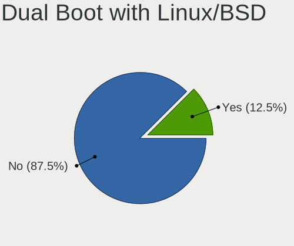
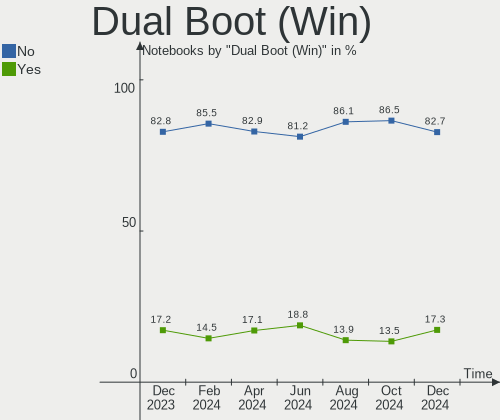
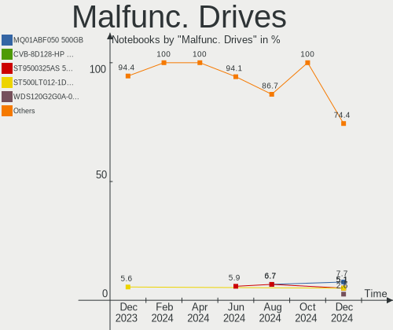
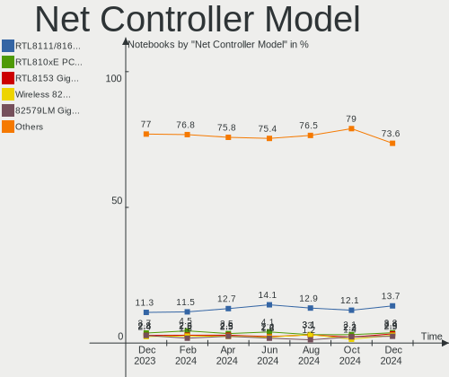
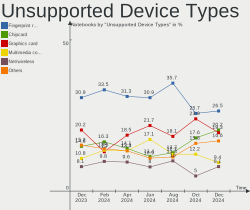

Linux in USA - Hardware Trends (Notebooks)
------------------------------------------

A project to identify most popular hardware characteristics and track their change
over time based on data collected by Linux users at https://Linux-Hardware.org.

Anyone can contribute to this report by the [hw-probe](https://github.com/linuxhw/hw-probe) tool:

    sudo -E hw-probe -all -upload

Period: Jun, 2023.

Contents
--------

* [ System ](#system)
  - [ OS                       ](#os)
  - [ OS Family                ](#os-family)
  - [ Kernel                   ](#kernel)
  - [ Kernel Family            ](#kernel-family)
  - [ Kernel Major Ver.        ](#kernel-major-ver)
  - [ Arch                     ](#arch)
  - [ DE                       ](#de)
  - [ Display Server           ](#display-server)
  - [ Display Manager          ](#display-manager)
  - [ OS Lang                  ](#os-lang)
  - [ Boot Mode                ](#boot-mode)
  - [ Filesystem               ](#filesystem)
  - [ Part. scheme             ](#part-scheme)
  - [ Dual Boot with Linux/BSD ](#dual-boot-with-linuxbsd)
  - [ Dual Boot (Win)          ](#dual-boot-win)

* [ Board ](#board)
  - [ Vendor                   ](#vendor)
  - [ Model                    ](#model)
  - [ Model Family             ](#model-family)
  - [ MFG Year                 ](#mfg-year)
  - [ Form Factor              ](#form-factor)
  - [ Secure Boot              ](#secure-boot)
  - [ Coreboot                 ](#coreboot)
  - [ RAM Size                 ](#ram-size)
  - [ RAM Used                 ](#ram-used)
  - [ Total Drives             ](#total-drives)
  - [ Has CD-ROM               ](#has-cd-rom)
  - [ Has Ethernet             ](#has-ethernet)
  - [ Has WiFi                 ](#has-wifi)
  - [ Has Bluetooth            ](#has-bluetooth)

* [ Location ](#location)
  - [ Country                  ](#country)
  - [ City                     ](#city)

* [ Drives ](#drives)
  - [ Drive Vendor             ](#drive-vendor)
  - [ Drive Model              ](#drive-model)
  - [ HDD Vendor               ](#hdd-vendor)
  - [ SSD Vendor               ](#ssd-vendor)
  - [ Drive Kind               ](#drive-kind)
  - [ Drive Connector          ](#drive-connector)
  - [ Drive Size               ](#drive-size)
  - [ Space Total              ](#space-total)
  - [ Space Used               ](#space-used)
  - [ Malfunc. Drives          ](#malfunc-drives)
  - [ Malfunc. Drive Vendor    ](#malfunc-drive-vendor)
  - [ Malfunc. HDD Vendor      ](#malfunc-hdd-vendor)
  - [ Malfunc. Drive Kind      ](#malfunc-drive-kind)
  - [ Failed Drives            ](#failed-drives)
  - [ Failed Drive Vendor      ](#failed-drive-vendor)
  - [ Drive Status             ](#drive-status)

* [ Storage controller ](#storage-controller)
  - [ Storage Vendor           ](#storage-vendor)
  - [ Storage Model            ](#storage-model)
  - [ Storage Kind             ](#storage-kind)

* [ Processor ](#processor)
  - [ CPU Vendor               ](#cpu-vendor)
  - [ CPU Model                ](#cpu-model)
  - [ CPU Model Family         ](#cpu-model-family)
  - [ CPU Cores                ](#cpu-cores)
  - [ CPU Sockets              ](#cpu-sockets)
  - [ CPU Threads              ](#cpu-threads)
  - [ CPU Op-Modes             ](#cpu-op-modes)
  - [ CPU Microcode            ](#cpu-microcode)
  - [ CPU Microarch            ](#cpu-microarch)

* [ Graphics ](#graphics)
  - [ GPU Vendor               ](#gpu-vendor)
  - [ GPU Model                ](#gpu-model)
  - [ GPU Combo                ](#gpu-combo)
  - [ GPU Driver               ](#gpu-driver)
  - [ GPU Memory               ](#gpu-memory)

* [ Monitor ](#monitor)
  - [ Monitor Vendor           ](#monitor-vendor)
  - [ Monitor Model            ](#monitor-model)
  - [ Monitor Resolution       ](#monitor-resolution)
  - [ Monitor Diagonal         ](#monitor-diagonal)
  - [ Monitor Width            ](#monitor-width)
  - [ Aspect Ratio             ](#aspect-ratio)
  - [ Monitor Area             ](#monitor-area)
  - [ Pixel Density            ](#pixel-density)
  - [ Multiple Monitors        ](#multiple-monitors)

* [ Network ](#network)
  - [ Net Controller Vendor    ](#net-controller-vendor)
  - [ Net Controller Model     ](#net-controller-model)
  - [ Wireless Vendor          ](#wireless-vendor)
  - [ Wireless Model           ](#wireless-model)
  - [ Ethernet Vendor          ](#ethernet-vendor)
  - [ Ethernet Model           ](#ethernet-model)
  - [ Net Controller Kind      ](#net-controller-kind)
  - [ Used Controller          ](#used-controller)
  - [ NICs                     ](#nics)
  - [ IPv6                     ](#ipv6)

* [ Bluetooth ](#bluetooth)
  - [ Bluetooth Vendor         ](#bluetooth-vendor)
  - [ Bluetooth Model          ](#bluetooth-model)

* [ Sound ](#sound)
  - [ Sound Vendor             ](#sound-vendor)
  - [ Sound Model              ](#sound-model)

* [ Memory ](#memory)
  - [ Memory Vendor            ](#memory-vendor)
  - [ Memory Model             ](#memory-model)
  - [ Memory Kind              ](#memory-kind)
  - [ Memory Form Factor       ](#memory-form-factor)
  - [ Memory Size              ](#memory-size)
  - [ Memory Speed             ](#memory-speed)

* [ Printers & scanners ](#printers--scanners)
  - [ Printer Vendor           ](#printer-vendor)
  - [ Printer Model            ](#printer-model)
  - [ Scanner Vendor           ](#scanner-vendor)
  - [ Scanner Model            ](#scanner-model)

* [ Camera ](#camera)
  - [ Camera Vendor            ](#camera-vendor)
  - [ Camera Model             ](#camera-model)

* [ Security ](#security)
  - [ Fingerprint Vendor       ](#fingerprint-vendor)
  - [ Fingerprint Model        ](#fingerprint-model)
  - [ Chipcard Vendor          ](#chipcard-vendor)
  - [ Chipcard Model           ](#chipcard-model)

* [ Unsupported ](#unsupported)
  - [ Unsupported Devices      ](#unsupported-devices)
  - [ Unsupported Device Types ](#unsupported-device-types)

System
------

OS
--

Installed operating systems

| Name                         | Notebooks | Percent |
|------------------------------|-----------|---------|
| Ubuntu 22.04                 | 52        | 12.21%  |
| Fedora 38                    | 37        | 8.69%   |
| Linux Mint 21.1              | 33        | 7.75%   |
| Pop!_OS 22.04                | 25        | 5.87%   |
| Debian 12                    | 20        | 4.69%   |
| ArcoLinux Rolling            | 19        | 4.46%   |
| Arch Rolling                 | 18        | 4.23%   |
| Ubuntu 23.04                 | 17        | 3.99%   |
| SteamOS 3.4.8                | 15        | 3.52%   |
| OpenMandriva 23.06           | 13        | 3.05%   |
| Zorin 16                     | 12        | 2.82%   |
| KDE neon 22.04               | 11        | 2.58%   |
| Debian 11                    | 9         | 2.11%   |
| Kubuntu 23.04                | 8         | 1.88%   |
| Ubuntu 22.10                 | 7         | 1.64%   |
| Parrot 5.3                   | 7         | 1.64%   |
| openSUSE Tumbleweed-XXXXXXXX | 7         | 1.64%   |
| Kali 2023.2                  | 7         | 1.64%   |
| Kubuntu 22.04                | 6         | 1.41%   |
| OpenMandriva 23.03           | 5         | 1.17%   |
| Nobara 37                    | 5         | 1.17%   |
| Gentoo 2.13                  | 5         | 1.17%   |
| Xubuntu 22.04                | 4         | 0.94%   |
| Ubuntu 20.04                 | 4         | 0.94%   |
| SteamOS 3.4.6                | 4         | 0.94%   |
| Linux Mint 21                | 4         | 0.94%   |
| TUXEDO OS 22.04              | 3         | 0.7%    |
| Manjaro 23.0.0               | 3         | 0.7%    |
| EndeavourOS Rolling          | 3         | 0.7%    |
| Elementary 7                 | 3         | 0.7%    |
| CachyOS Rolling              | 3         | 0.7%    |
| Ubuntu Studio 23.04          | 2         | 0.47%   |
| Ubuntu MATE 23.04            | 2         | 0.47%   |
| SteamOS 3.5                  | 2         | 0.47%   |
| openSUSE Leap-15.5           | 2         | 0.47%   |
| Nobara 38                    | 2         | 0.47%   |
| MX 21                        | 2         | 0.47%   |
| Manjaro 22.1.3               | 2         | 0.47%   |
| Manjaro                      | 2         | 0.47%   |
| Linux Mint 20.3              | 2         | 0.47%   |

OS Family
---------

OS without a version

| Name           | Notebooks | Percent |
|----------------|-----------|---------|
| Ubuntu         | 82        | 19.25%  |
| Linux Mint     | 42        | 9.86%   |
| Fedora         | 40        | 9.39%   |
| Debian         | 29        | 6.81%   |
| SteamOS        | 25        | 5.87%   |
| Pop!_OS        | 25        | 5.87%   |
| OpenMandriva   | 20        | 4.69%   |
| ArcoLinux      | 20        | 4.69%   |
| Arch           | 18        | 4.23%   |
| Kubuntu        | 15        | 3.52%   |
| Zorin          | 13        | 3.05%   |
| KDE neon       | 11        | 2.58%   |
| openSUSE       | 9         | 2.11%   |
| Parrot         | 7         | 1.64%   |
| Nobara         | 7         | 1.64%   |
| Manjaro        | 7         | 1.64%   |
| Kali           | 7         | 1.64%   |
| Xubuntu        | 6         | 1.41%   |
| Gentoo         | 5         | 1.17%   |
| Elementary     | 4         | 0.94%   |
| Ubuntu MATE    | 3         | 0.7%    |
| TUXEDO OS      | 3         | 0.7%    |
| EndeavourOS    | 3         | 0.7%    |
| CachyOS        | 3         | 0.7%    |
| Ubuntu Unity   | 2         | 0.47%   |
| Ubuntu Studio  | 2         | 0.47%   |
| NixOS          | 2         | 0.47%   |
| MX             | 2         | 0.47%   |
| Garuda Linux   | 2         | 0.47%   |
| ChimeraOS      | 2         | 0.47%   |
| Siduction      | 1         | 0.23%   |
| Rocky Linux    | 1         | 0.23%   |
| Reborn OS      | 1         | 0.23%   |
| Oracle Linux   | 1         | 0.23%   |
| Lubuntu        | 1         | 0.23%   |
| LMDE           | 1         | 0.23%   |
| Kaisen         | 1         | 0.23%   |
| Bluestar Linux | 1         | 0.23%   |
| antiX          | 1         | 0.23%   |
| Alpine         | 1         | 0.23%   |

Kernel
------

Version of the Linux kernel

| Version                     | Notebooks | Percent |
|-----------------------------|-----------|---------|
| 5.19.0-43-generic           | 36        | 8.45%   |
| 5.15.0-73-generic           | 26        | 6.1%    |
| 6.2.6-76060206-generic      | 23        | 5.4%    |
| 5.15.0-75-generic           | 21        | 4.93%   |
| 5.13.0-valve36-1-neptune    | 21        | 4.93%   |
| 5.19.0-45-generic           | 20        | 4.69%   |
| 6.1.0-9-amd64               | 19        | 4.46%   |
| 6.2.0-20-generic            | 14        | 3.29%   |
| 6.3.5-desktop-3omv2390      | 13        | 3.05%   |
| 6.2.0-23-generic            | 12        | 2.82%   |
| 6.3.8-200.fc38.x86_64       | 9         | 2.11%   |
| 6.3.5-200.fc38.x86_64       | 8         | 1.88%   |
| 6.1.0-kali9-amd64           | 7         | 1.64%   |
| 6.3.7-200.fc38.x86_64       | 6         | 1.41%   |
| 6.1.0-1parrot1-amd64        | 6         | 1.41%   |
| 6.3.6-200.fc38.x86_64       | 5         | 1.17%   |
| 6.2.6-desktop-1omv2390      | 5         | 1.17%   |
| 5.10.0-23-amd64             | 5         | 1.17%   |
| 6.3.8-arch1-1               | 4         | 0.94%   |
| 6.3.5-zen1-1-zen            | 4         | 0.94%   |
| 6.3.5-arch1-1               | 4         | 0.94%   |
| 5.15.0-76-generic           | 4         | 0.94%   |
| 6.3.9-arch1-1               | 3         | 0.7%    |
| 6.3.8                       | 3         | 0.7%    |
| 6.3.7-arch1-1               | 3         | 0.7%    |
| 6.3.7-200.fsync.fc37.x86_64 | 3         | 0.7%    |
| 6.3.6-zen1-1-zen            | 3         | 0.7%    |
| 6.3.6-arch1-1               | 3         | 0.7%    |
| 6.3.5-2-MANJARO             | 3         | 0.7%    |
| 6.3.4-1-default             | 3         | 0.7%    |
| 6.2.9-300.fc38.x86_64       | 3         | 0.7%    |
| 6.2.0-1003-lowlatency       | 3         | 0.7%    |
| 5.10.0-22-amd64             | 3         | 0.7%    |
| 6.3.9-zen1-1-zen            | 2         | 0.47%   |
| 6.3.7-zen1-1-zen            | 2         | 0.47%   |
| 6.3.7-1-default             | 2         | 0.47%   |
| 6.3.4-201.fc38.x86_64       | 2         | 0.47%   |
| 6.3.2-arch1-1               | 2         | 0.47%   |
| 6.2.10-x64v1-xanmod1-1      | 2         | 0.47%   |
| 6.2.0-10007-tuxedo          | 2         | 0.47%   |

Kernel Family
-------------

Linux kernel without a distro release

| Version | Notebooks | Percent |
|---------|-----------|---------|
| 5.19.0  | 69        | 16.2%   |
| 5.15.0  | 64        | 15.02%  |
| 6.3.5   | 35        | 8.22%   |
| 6.1.0   | 35        | 8.22%   |
| 6.2.0   | 33        | 7.75%   |
| 6.2.6   | 28        | 6.57%   |
| 5.13.0  | 21        | 4.93%   |
| 6.3.8   | 20        | 4.69%   |
| 6.3.7   | 17        | 3.99%   |
| 6.3.6   | 14        | 3.29%   |
| 5.10.0  | 11        | 2.58%   |
| 6.3.4   | 9         | 2.11%   |
| 6.3.9   | 7         | 1.64%   |
| 5.4.0   | 6         | 1.41%   |
| 6.1.31  | 5         | 1.17%   |
| 6.4.0   | 4         | 0.94%   |
| 6.0.0   | 4         | 0.94%   |
| 6.3.3   | 3         | 0.7%    |
| 6.3.1   | 3         | 0.7%    |
| 6.2.9   | 3         | 0.7%    |
| 6.3.2   | 2         | 0.47%   |
| 6.2.10  | 2         | 0.47%   |
| 6.1.35  | 2         | 0.47%   |
| 6.1.27  | 2         | 0.47%   |
| 6.1.21  | 2         | 0.47%   |
| 6.0.12  | 2         | 0.47%   |
| 5.14.21 | 2         | 0.47%   |
| 6.3.10  | 1         | 0.23%   |
| 6.2.7   | 1         | 0.23%   |
| 6.2.15  | 1         | 0.23%   |
| 6.2.13  | 1         | 0.23%   |
| 6.2.12  | 1         | 0.23%   |
| 6.1.4   | 1         | 0.23%   |
| 6.1.34  | 1         | 0.23%   |
| 6.1.33  | 1         | 0.23%   |
| 6.1.28  | 1         | 0.23%   |
| 6.1.24  | 1         | 0.23%   |
| 6.1.1   | 1         | 0.23%   |
| 6.0.8   | 1         | 0.23%   |
| 5.6.14  | 1         | 0.23%   |

Kernel Major Ver.
-----------------

Linux kernel major version

| Version | Notebooks | Percent |
|---------|-----------|---------|
| 6.3     | 111       | 26.06%  |
| 6.2     | 70        | 16.43%  |
| 5.19    | 69        | 16.2%   |
| 5.15    | 65        | 15.26%  |
| 6.1     | 52        | 12.21%  |
| 5.13    | 21        | 4.93%   |
| 5.10    | 12        | 2.82%   |
| 6.0     | 7         | 1.64%   |
| 5.4     | 6         | 1.41%   |
| 6.4     | 4         | 0.94%   |
| 5.14    | 2         | 0.47%   |
| 5.6     | 1         | 0.23%   |
| 5.17    | 1         | 0.23%   |
| 5.16    | 1         | 0.23%   |
| 4.9     | 1         | 0.23%   |
| 4.4     | 1         | 0.23%   |
| 4.18    | 1         | 0.23%   |
| 4.15    | 1         | 0.23%   |

Arch
----

OS architecture (x86_64, i586, etc.)

| Name   | Notebooks | Percent |
|--------|-----------|---------|
| x86_64 | 423       | 99.3%   |
| i686   | 3         | 0.7%    |

DE
--

Desktop Environment

| Name             | Notebooks | Percent |
|------------------|-----------|---------|
| GNOME            | 174       | 40.85%  |
| KDE5             | 125       | 29.34%  |
| XFCE             | 36        | 8.45%   |
| X-Cinnamon       | 31        | 7.28%   |
| Unknown          | 20        | 4.69%   |
| MATE             | 18        | 4.23%   |
| Pantheon         | 4         | 0.94%   |
| Hyprland         | 4         | 0.94%   |
| i3               | 3         | 0.7%    |
| LXQt             | 2         | 0.47%   |
| Budgie           | 2         | 0.47%   |
| Unity            | 1         | 0.23%   |
| lightdm-xsession | 1         | 0.23%   |
| LeftWM           | 1         | 0.23%   |
| icewm            | 1         | 0.23%   |
| GNOME Classic    | 1         | 0.23%   |
| Deepin           | 1         | 0.23%   |
| Cinnamon         | 1         | 0.23%   |

Display Server
--------------

X11 or Wayland

| Name    | Notebooks | Percent |
|---------|-----------|---------|
| X11     | 279       | 65.49%  |
| Wayland | 128       | 30.05%  |
| Unknown | 14        | 3.29%   |
| Tty     | 5         | 1.17%   |

Display Manager
---------------

SDDM, LightDM, etc.

| Name    | Notebooks | Percent |
|---------|-----------|---------|
| Unknown | 178       | 41.78%  |
| SDDM    | 83        | 19.48%  |
| GDM3    | 82        | 19.25%  |
| LightDM | 59        | 13.85%  |
| GDM     | 19        | 4.46%   |
| GREETD  | 2         | 0.47%   |
| SLiM    | 1         | 0.23%   |
| LXDM    | 1         | 0.23%   |
| EMPTTY  | 1         | 0.23%   |

OS Lang
-------

Language

| Lang    | Notebooks | Percent |
|---------|-----------|---------|
| en_US   | 397       | 93.19%  |
| Unknown | 13        | 3.05%   |
| C       | 9         | 2.11%   |
| zh_CN   | 5         | 1.17%   |
| en_IN   | 1         | 0.23%   |
| en_CA   | 1         | 0.23%   |

Boot Mode
---------

EFI or BIOS

| Mode | Notebooks | Percent |
|------|-----------|---------|
| EFI  | 219       | 51.41%  |
| BIOS | 207       | 48.59%  |

Filesystem
----------

Type of filesystem

| Type    | Notebooks | Percent |
|---------|-----------|---------|
| Ext4    | 202       | 47.42%  |
| Btrfs   | 114       | 26.76%  |
| Tmpfs   | 77        | 18.08%  |
| Overlay | 24        | 5.63%   |
| Xfs     | 5         | 1.17%   |
| Zfs     | 2         | 0.47%   |
| F2fs    | 1         | 0.23%   |
| Unknown | 1         | 0.23%   |

Part. scheme
------------

Scheme of partitioning

| Type    | Notebooks | Percent |
|---------|-----------|---------|
| GPT     | 236       | 55.4%   |
| Unknown | 167       | 39.2%   |
| MBR     | 23        | 5.4%    |

Dual Boot with Linux/BSD
------------------------

Hosting more than one Linux/BSD

| Dual boot | Notebooks | Percent |
|-----------|-----------|---------|
| No        | 378       | 88.73%  |
| Yes       | 48        | 11.27%  |

Dual Boot (Win)
---------------

Hosting Linux and Windows

| Dual boot | Notebooks | Percent |
|-----------|-----------|---------|
| No        | 364       | 85.45%  |
| Yes       | 62        | 14.55%  |

Board
-----

Vendor
------

Motherboard manufacturer

| Name                | Notebooks | Percent |
|---------------------|-----------|---------|
| Hewlett-Packard     | 91        | 21.36%  |
| Dell                | 76        | 17.84%  |
| Lenovo              | 69        | 16.2%   |
| Apple               | 33        | 7.75%   |
| ASUSTek Computer    | 30        | 7.04%   |
| Valve               | 24        | 5.63%   |
| Acer                | 20        | 4.69%   |
| MSI                 | 16        | 3.76%   |
| Google              | 15        | 3.52%   |
| Toshiba             | 6         | 1.41%   |
| System76            | 5         | 1.17%   |
| GPU Company         | 5         | 1.17%   |
| Gigabyte Technology | 5         | 1.17%   |
| Unknown             | 4         | 0.94%   |
| Sony                | 3         | 0.7%    |
| Razer               | 3         | 0.7%    |
| Samsung Electronics | 2         | 0.47%   |
| Notebook            | 2         | 0.47%   |
| Framework           | 2         | 0.47%   |
| Alienware           | 2         | 0.47%   |
| Timi                | 1         | 0.23%   |
| Teclast             | 1         | 0.23%   |
| TaNix               | 1         | 0.23%   |
| SDZ                 | 1         | 0.23%   |
| Panasonic           | 1         | 0.23%   |
| NCS-Tech            | 1         | 0.23%   |
| MECHREVO            | 1         | 0.23%   |
| HUAWEI              | 1         | 0.23%   |
| GPD                 | 1         | 0.23%   |
| Gateway             | 1         | 0.23%   |
| COLORFUL            | 1         | 0.23%   |
| BESSTAR Tech        | 1         | 0.23%   |
| AMI                 | 1         | 0.23%   |

Model
-----

Motherboard model

| Name                                    | Notebooks | Percent |
|-----------------------------------------|-----------|---------|
| Valve Jupiter                           | 24        | 5.63%   |
| Apple MacBookAir7,2                     | 8         | 1.88%   |
| HP Notebook                             | 5         | 1.17%   |
| Apple MacBookPro9,2                     | 5         | 1.17%   |
| Unknown                                 | 5         | 1.17%   |
| Dell Latitude E7470                     | 3         | 0.7%    |
| Dell Latitude E6420                     | 3         | 0.7%    |
| Dell Inspiron 5515                      | 3         | 0.7%    |
| Dell Inspiron 3501                      | 3         | 0.7%    |
| Acer Aspire E5-575G                     | 3         | 0.7%    |
| System76 Oryx Pro                       | 2         | 0.47%   |
| System76 Gazelle                        | 2         | 0.47%   |
| Lenovo IdeaPad Gaming 3 15ACH6 82K2     | 2         | 0.47%   |
| HP ProBook 650 G5                       | 2         | 0.47%   |
| HP Pavilion dv6                         | 2         | 0.47%   |
| HP Laptop 15-dy2xxx                     | 2         | 0.47%   |
| HP Laptop 15-db0xxx                     | 2         | 0.47%   |
| HP Laptop 14-fq0xxx                     | 2         | 0.47%   |
| HP ENVY m6 Notebook                     | 2         | 0.47%   |
| HP EliteBook 840 G3                     | 2         | 0.47%   |
| HP 2000                                 | 2         | 0.47%   |
| HP 15 Notebook PC                       | 2         | 0.47%   |
| GPU Company GWNC21524                   | 2         | 0.47%   |
| Google Blooglet                         | 2         | 0.47%   |
| Dell Precision M4800                    | 2         | 0.47%   |
| Dell Precision 7510                     | 2         | 0.47%   |
| Dell Latitude E6540                     | 2         | 0.47%   |
| Dell Latitude E6410                     | 2         | 0.47%   |
| Dell Latitude 7430                      | 2         | 0.47%   |
| Dell Inspiron 5567                      | 2         | 0.47%   |
| ASUS VivoBook_ASUSLaptop X515JAB_X515JA | 2         | 0.47%   |
| Apple MacBookPro5,5                     | 2         | 0.47%   |
| Apple MacBookPro12,1                    | 2         | 0.47%   |
| Apple MacBookAir7,1                     | 2         | 0.47%   |
| Acer Aspire A515-46                     | 2         | 0.47%   |
| Toshiba TECRA R850                      | 1         | 0.23%   |
| Toshiba Satellite P55t-B                | 1         | 0.23%   |
| Toshiba Satellite L305                  | 1         | 0.23%   |
| Toshiba Satellite C55t-C                | 1         | 0.23%   |
| Toshiba Satellite C55D-B                | 1         | 0.23%   |

Model Family
------------

Motherboard model prefix

| Name                  | Notebooks | Percent |
|-----------------------|-----------|---------|
| Lenovo ThinkPad       | 44        | 10.33%  |
| Dell Latitude         | 26        | 6.1%    |
| Dell Inspiron         | 25        | 5.87%   |
| Valve Jupiter         | 24        | 5.63%   |
| HP Pavilion           | 20        | 4.69%   |
| HP EliteBook          | 20        | 4.69%   |
| HP Laptop             | 17        | 3.99%   |
| Lenovo IdeaPad        | 14        | 3.29%   |
| Dell Precision        | 13        | 3.05%   |
| Acer Aspire           | 12        | 2.82%   |
| Apple MacBookAir7     | 10        | 2.35%   |
| ASUS VivoBook         | 8         | 1.88%   |
| ASUS ROG              | 7         | 1.64%   |
| Dell XPS              | 6         | 1.41%   |
| HP ZBook              | 5         | 1.17%   |
| HP Stream             | 5         | 1.17%   |
| HP Notebook           | 5         | 1.17%   |
| Apple MacBookPro9     | 5         | 1.17%   |
| Unknown               | 5         | 1.17%   |
| Toshiba Satellite     | 4         | 0.94%   |
| Lenovo Legion         | 4         | 0.94%   |
| HP ProBook            | 4         | 0.94%   |
| HP ENVY               | 4         | 0.94%   |
| Razer Blade           | 3         | 0.7%    |
| ASUS ASUS             | 3         | 0.7%    |
| Acer Swift            | 3         | 0.7%    |
| System76 Oryx         | 2         | 0.47%   |
| System76 Gazelle      | 2         | 0.47%   |
| MSI Prestige          | 2         | 0.47%   |
| MSI GE75              | 2         | 0.47%   |
| Lenovo ThinkBook      | 2         | 0.47%   |
| Lenovo Slim           | 2         | 0.47%   |
| HP OMEN               | 2         | 0.47%   |
| HP Compaq             | 2         | 0.47%   |
| HP 2000               | 2         | 0.47%   |
| HP 15                 | 2         | 0.47%   |
| GPU Company GWNC21524 | 2         | 0.47%   |
| Google Blooglet       | 2         | 0.47%   |
| Framework Laptop      | 2         | 0.47%   |
| Dell G3               | 2         | 0.47%   |

MFG Year
--------

Motherboard manufacture year

| Year | Notebooks | Percent |
|------|-----------|---------|
| 2022 | 60        | 14.08%  |
| 2021 | 44        | 10.33%  |
| 2020 | 37        | 8.69%   |
| 2019 | 37        | 8.69%   |
| 2018 | 32        | 7.51%   |
| 2015 | 32        | 7.51%   |
| 2016 | 27        | 6.34%   |
| 2023 | 23        | 5.4%    |
| 2013 | 21        | 4.93%   |
| 2011 | 20        | 4.69%   |
| 2012 | 19        | 4.46%   |
| 2017 | 18        | 4.23%   |
| 2014 | 18        | 4.23%   |
| 2010 | 12        | 2.82%   |
| 2009 | 12        | 2.82%   |
| 2008 | 9         | 2.11%   |
| 2007 | 5         | 1.17%   |

Form Factor
-----------

Physical design of the computer

| Name     | Notebooks | Percent |
|----------|-----------|---------|
| Notebook | 426       | 100%    |

Secure Boot
-----------

Enabled or disabled

| State    | Notebooks | Percent |
|----------|-----------|---------|
| Disabled | 395       | 92.72%  |
| Enabled  | 31        | 7.28%   |

Coreboot
--------

Have coreboot on board

| Used | Notebooks | Percent |
|------|-----------|---------|
| No   | 407       | 95.54%  |
| Yes  | 19        | 4.46%   |

RAM Size
--------

Total RAM memory

| Size in GB  | Notebooks | Percent |
|-------------|-----------|---------|
| 4.01-8.0    | 108       | 25.35%  |
| 8.01-16.0   | 96        | 22.54%  |
| 16.01-24.0  | 74        | 17.37%  |
| 3.01-4.0    | 66        | 15.49%  |
| 32.01-64.0  | 48        | 11.27%  |
| 64.01-256.0 | 13        | 3.05%   |
| 24.01-32.0  | 7         | 1.64%   |
| 2.01-3.0    | 7         | 1.64%   |
| 1.01-2.0    | 7         | 1.64%   |

RAM Used
--------

Used RAM memory

| Used GB    | Notebooks | Percent |
|------------|-----------|---------|
| 2.01-3.0   | 115       | 27%     |
| 1.01-2.0   | 106       | 24.88%  |
| 4.01-8.0   | 101       | 23.71%  |
| 3.01-4.0   | 58        | 13.62%  |
| 8.01-16.0  | 29        | 6.81%   |
| 0.51-1.0   | 10        | 2.35%   |
| 0.01-0.5   | 3         | 0.7%    |
| 24.01-32.0 | 2         | 0.47%   |
| 32.01-64.0 | 1         | 0.23%   |
| 16.01-24.0 | 1         | 0.23%   |

Total Drives
------------

Number of drives on board

| Drives | Notebooks | Percent |
|--------|-----------|---------|
| 1      | 289       | 67.84%  |
| 2      | 121       | 28.4%   |
| 3      | 12        | 2.82%   |
| 4      | 2         | 0.47%   |
| 0      | 2         | 0.47%   |

Has CD-ROM
----------

Has CD-ROM on board

| Presented | Notebooks | Percent |
|-----------|-----------|---------|
| No        | 323       | 75.82%  |
| Yes       | 103       | 24.18%  |

Has Ethernet
------------

Has Ethernet on board

| Presented | Notebooks | Percent |
|-----------|-----------|---------|
| Yes       | 307       | 72.07%  |
| No        | 119       | 27.93%  |

Has WiFi
--------

Has WiFi module

| Presented | Notebooks | Percent |
|-----------|-----------|---------|
| Yes       | 418       | 98.12%  |
| No        | 8         | 1.88%   |

Has Bluetooth
-------------

Has Bluetooth module

| Presented | Notebooks | Percent |
|-----------|-----------|---------|
| Yes       | 356       | 83.57%  |
| No        | 70        | 16.43%  |

Location
--------

Country
-------

Geographic location (country)

| Country | Notebooks | Percent |
|---------|-----------|---------|
| USA     | 426       | 100%    |

City
----

Geographic location (city)

| City           | Notebooks | Percent |
|----------------|-----------|---------|
| Bangor         | 14        | 3.29%   |
| New York       | 9         | 2.11%   |
| Seattle        | 8         | 1.88%   |
| San Antonio    | 7         | 1.64%   |
| Springfield    | 5         | 1.17%   |
| Portland       | 5         | 1.17%   |
| Houston        | 5         | 1.17%   |
| Flushing       | 5         | 1.17%   |
| Atlanta        | 5         | 1.17%   |
| Omaha          | 4         | 0.94%   |
| Oakland        | 4         | 0.94%   |
| Miami          | 4         | 0.94%   |
| Washington     | 3         | 0.7%    |
| Spokane        | 3         | 0.7%    |
| Rochester      | 3         | 0.7%    |
| Raleigh        | 3         | 0.7%    |
| Orlando        | 3         | 0.7%    |
| Minneapolis    | 3         | 0.7%    |
| Milwaukee      | 3         | 0.7%    |
| Macon          | 3         | 0.7%    |
| Los Angeles    | 3         | 0.7%    |
| Lincoln        | 3         | 0.7%    |
| Kansas City    | 3         | 0.7%    |
| Indianapolis   | 3         | 0.7%    |
| Denver         | 3         | 0.7%    |
| Dallas         | 3         | 0.7%    |
| Columbus       | 3         | 0.7%    |
| Batesville     | 3         | 0.7%    |
| Toledo         | 2         | 0.47%   |
| Syracuse       | 2         | 0.47%   |
| Staten Island  | 2         | 0.47%   |
| St. Petersburg | 2         | 0.47%   |
| Silver Spring  | 2         | 0.47%   |
| Scottsdale     | 2         | 0.47%   |
| San Jose       | 2         | 0.47%   |
| San Diego      | 2         | 0.47%   |
| Salt Lake City | 2         | 0.47%   |
| Richardson     | 2         | 0.47%   |
| Reno           | 2         | 0.47%   |
| Redmond        | 2         | 0.47%   |

Drives
------

Drive Vendor
------------

Hard drive vendors

| Vendor                      | Notebooks | Drives | Percent |
|-----------------------------|-----------|--------|---------|
| Samsung Electronics         | 88        | 93     | 15.74%  |
| Unknown                     | 56        | 60     | 10.02%  |
| Sandisk                     | 45        | 45     | 8.05%   |
| Seagate                     | 40        | 42     | 7.16%   |
| WDC                         | 36        | 36     | 6.44%   |
| Toshiba                     | 33        | 34     | 5.9%    |
| SK hynix                    | 32        | 32     | 5.72%   |
| Apple                       | 23        | 25     | 4.11%   |
| Micron Technology           | 20        | 20     | 3.58%   |
| Crucial                     | 19        | 21     | 3.4%    |
| Kingston Technology Company | 12        | 12     | 2.15%   |
| KIOXIA                      | 11        | 11     | 1.97%   |
| Intel                       | 11        | 11     | 1.97%   |
| HGST                        | 9         | 9      | 1.61%   |
| Unknown                     | 9         | 9      | 1.61%   |
| Micron/Crucial Technology   | 8         | 10     | 1.43%   |
| Kingston                    | 8         | 9      | 1.43%   |
| PNY                         | 7         | 7      | 1.25%   |
| Phison Electronics          | 7         | 7      | 1.25%   |
| Fujitsu                     | 7         | 7      | 1.25%   |
| Silicon Motion              | 6         | 6      | 1.07%   |
| Hitachi                     | 6         | 6      | 1.07%   |
| SPCC                        | 5         | 5      | 0.89%   |
| O2 Micro                    | 4         | 4      | 0.72%   |
| China                       | 4         | 4      | 0.72%   |
| Yangtze Memory Technologies | 3         | 3      | 0.54%   |
| Team                        | 3         | 3      | 0.54%   |
| KingFast                    | 3         | 3      | 0.54%   |
| Solid State Storage         | 2         | 2      | 0.36%   |
| Plextor                     | 2         | 2      | 0.36%   |
| Netac                       | 2         | 2      | 0.36%   |
| LITEON                      | 2         | 2      | 0.36%   |
| Lite-On Technology          | 2         | 2      | 0.36%   |
| BHT                         | 2         | 2      | 0.36%   |
| Acer                        | 2         | 2      | 0.36%   |
| A-DATA Technology           | 2         | 2      | 0.36%   |
| Zheino                      | 1         | 1      | 0.18%   |
| Wibtek                      | 1         | 1      | 0.18%   |
| USB3.0                      | 1         | 2      | 0.18%   |
| Union Memory                | 1         | 1      | 0.18%   |

Drive Model
-----------

Hard drive models

| Model                                                 | Notebooks | Percent |
|-------------------------------------------------------|-----------|---------|
| Samsung NVMe SSD Controller SM981/PM981/PM983 250GB   | 21        | 3.67%   |
| Unknown MMC Card  64GB                                | 15        | 2.62%   |
| Kingston Company OM3PDP3 NVMe SSD 256GB               | 11        | 1.92%   |
| Unknown MMC Card  128GB                               | 9         | 1.57%   |
| Apple SSD SM0128G 121GB                               | 9         | 1.57%   |
| Unknown                                               | 9         | 1.57%   |
| Unknown MMC Card  512GB                               | 8         | 1.4%    |
| Unknown MMC Card  32GB                                | 7         | 1.22%   |
| Sandisk WD Blue SN550 NVMe SSD 1TB                    | 7         | 1.22%   |
| Micron/Crucial P2 NVMe PCIe SSD 4TB                   | 7         | 1.22%   |
| Toshiba MQ04ABF100 1TB                                | 6         | 1.05%   |
| Silicon Motion SM2263EN/SM2263XT SSD Controller 256GB | 6         | 1.05%   |
| Seagate ST1000LM035-1RK172 1TB                        | 6         | 1.05%   |
| Samsung NVMe SSD Controller PM9A1/PM9A3/980PRO 2TB    | 6         | 1.05%   |
| Sandisk WD Black SN750 / PC SN730 NVMe SSD 500GB      | 5         | 0.87%   |
| Samsung SSD 980 1TB                                   | 5         | 0.87%   |
| HGST HTS721010A9E630 1TB                              | 5         | 0.87%   |
| Toshiba MQ01ABD100 1TB                                | 4         | 0.7%    |
| SK hynix HFM001TD3JX013N 1TB                          | 4         | 0.7%    |
| Samsung NVMe SSD Controller SM961/PM961/SM963 256GB   | 4         | 0.7%    |
| O2 Micro E2M2 64GB                                    | 4         | 0.7%    |
| KIOXIA KBG40ZNV256G 256GB                             | 4         | 0.7%    |
| Crucial CT1000MX500SSD1 1TB                           | 4         | 0.7%    |
| Unknown MMC Card  16GB                                | 3         | 0.52%   |
| Seagate ST9500325AS 500GB                             | 3         | 0.52%   |
| Seagate ST500LT012-1DG142 500GB                       | 3         | 0.52%   |
| Seagate ST2000LX001-1RG174 2TB                        | 3         | 0.52%   |
| Seagate ST2000LM007-1R8174 2TB                        | 3         | 0.52%   |
| Sandisk WD_BLACK SN770 1TB                            | 3         | 0.52%   |
| Sandisk WD Black 2018/SN750 / PC SN720 NVMe SSD 500GB | 3         | 0.52%   |
| Samsung SSD 870 EVO 1TB                               | 3         | 0.52%   |
| Samsung MZVLQ512HBLU-00B00 512GB                      | 3         | 0.52%   |
| Phison PS5013 E13 NVMe Controller 512GB               | 3         | 0.52%   |
| Micron 2450_MTFDKBA512TFK 512GB                       | 3         | 0.52%   |
| WDC WD5000LPCX-60VHAT0 500GB                          | 2         | 0.35%   |
| WDC WD10JPVX-60JC3T0 1TB                              | 2         | 0.35%   |
| Unknown SD/MMC/MS PRO 250GB                           | 2         | 0.35%   |
| Unknown MMC Card  256GB                               | 2         | 0.35%   |
| Toshiba XG6 NVMe SSD Controller 2TB                   | 2         | 0.35%   |
| Toshiba MQ01ABF050 500GB                              | 2         | 0.35%   |

HDD Vendor
----------

Hard disk drive vendors

| Vendor              | Notebooks | Drives | Percent |
|---------------------|-----------|--------|---------|
| Seagate             | 40        | 42     | 34.19%  |
| WDC                 | 23        | 23     | 19.66%  |
| Toshiba             | 22        | 22     | 18.8%   |
| HGST                | 9         | 9      | 7.69%   |
| Fujitsu             | 7         | 7      | 5.98%   |
| Hitachi             | 6         | 6      | 5.13%   |
| Apple               | 4         | 4      | 3.42%   |
| Unknown             | 2         | 2      | 1.71%   |
| USB3.0              | 1         | 2      | 0.85%   |
| Samsung Electronics | 1         | 1      | 0.85%   |
| ASMT                | 1         | 1      | 0.85%   |
| ASMedia             | 1         | 1      | 0.85%   |

SSD Vendor
----------

Solid state drive vendors

| Vendor              | Notebooks | Drives | Percent |
|---------------------|-----------|--------|---------|
| Samsung Electronics | 29        | 30     | 19.73%  |
| Crucial             | 17        | 18     | 11.56%  |
| Apple               | 16        | 16     | 10.88%  |
| SanDisk             | 12        | 12     | 8.16%   |
| WDC                 | 7         | 7      | 4.76%   |
| PNY                 | 7         | 7      | 4.76%   |
| SK hynix            | 6         | 6      | 4.08%   |
| Toshiba             | 5         | 5      | 3.4%    |
| SPCC                | 5         | 5      | 3.4%    |
| Micron Technology   | 4         | 4      | 2.72%   |
| Kingston            | 4         | 4      | 2.72%   |
| China               | 4         | 4      | 2.72%   |
| Team                | 3         | 3      | 2.04%   |
| Intel               | 3         | 3      | 2.04%   |
| Plextor             | 2         | 2      | 1.36%   |
| LITEON              | 2         | 2      | 1.36%   |
| KingFast            | 2         | 2      | 1.36%   |
| BHT                 | 2         | 2      | 1.36%   |
| Acer                | 2         | 2      | 1.36%   |
| A-DATA Technology   | 2         | 2      | 1.36%   |
| Transcend           | 1         | 1      | 0.68%   |
| Teclast             | 1         | 1      | 0.68%   |
| PNY CS90            | 1         | 1      | 0.68%   |
| Patriot             | 1         | 1      | 0.68%   |
| OEM                 | 1         | 1      | 0.68%   |
| Netac               | 1         | 1      | 0.68%   |
| Mushkin             | 1         | 1      | 0.68%   |
| Maxtor              | 1         | 1      | 0.68%   |
| Lexar               | 1         | 1      | 0.68%   |
| Inland              | 1         | 1      | 0.68%   |
| GOODRAM             | 1         | 1      | 0.68%   |
| FORESEE             | 1         | 1      | 0.68%   |
| 2.5"                | 1         | 1      | 0.68%   |

Drive Kind
----------

HDD or SSD

| Kind    | Notebooks | Drives | Percent |
|---------|-----------|--------|---------|
| NVMe    | 198       | 234    | 38.45%  |
| SSD     | 133       | 149    | 25.83%  |
| HDD     | 113       | 120    | 21.94%  |
| MMC     | 63        | 68     | 12.23%  |
| Unknown | 8         | 8      | 1.55%   |

Drive Connector
---------------

SATA, SAS, NVMe, etc.

| Type | Notebooks | Drives | Percent |
|------|-----------|--------|---------|
| SATA | 224       | 254    | 44.44%  |
| NVMe | 197       | 232    | 39.09%  |
| MMC  | 63        | 68     | 12.5%   |
| SAS  | 20        | 25     | 3.97%   |

Drive Size
----------

Size of hard drive

| Size in TB | Notebooks | Drives | Percent |
|------------|-----------|--------|---------|
| 0.01-0.5   | 153       | 160    | 60.24%  |
| 0.51-1.0   | 69        | 73     | 27.17%  |
| 1.01-2.0   | 29        | 33     | 11.42%  |
| 3.01-4.0   | 2         | 2      | 0.79%   |
| 4.01-10.0  | 1         | 1      | 0.39%   |

Space Total
-----------

Amount of disk space available on the file system

| Size in GB     | Notebooks | Percent |
|----------------|-----------|---------|
| 251-500        | 105       | 24.65%  |
| 101-250        | 98        | 23%     |
| 501-1000       | 78        | 18.31%  |
| 1001-2000      | 30        | 7.04%   |
| Unknown        | 27        | 6.34%   |
| More than 3000 | 25        | 5.87%   |
| 1-20           | 19        | 4.46%   |
| 2001-3000      | 17        | 3.99%   |
| 21-50          | 15        | 3.52%   |
| 51-100         | 12        | 2.82%   |

Space Used
----------

Amount of used disk space

| Used GB        | Notebooks | Percent |
|----------------|-----------|---------|
| 1-20           | 125       | 29.34%  |
| 21-50          | 90        | 21.13%  |
| 51-100         | 57        | 13.38%  |
| 101-250        | 47        | 11.03%  |
| 251-500        | 37        | 8.69%   |
| Unknown        | 27        | 6.34%   |
| 501-1000       | 24        | 5.63%   |
| 1001-2000      | 12        | 2.82%   |
| More than 3000 | 5         | 1.17%   |
| 2001-3000      | 2         | 0.47%   |

Malfunc. Drives
---------------

Drive models with a malfunction

| Model                                            | Notebooks | Drives | Percent |
|--------------------------------------------------|-----------|--------|---------|
| Seagate ST9500325AS 500GB                        | 2         | 2      | 10.53%  |
| WDC WD20SPZX-60UA7T0 2TB                         | 1         | 1      | 5.26%   |
| Toshiba THNSNK256GCS8 SATA 256GB SSD             | 1         | 1      | 5.26%   |
| Toshiba MQ01ABD100 1TB                           | 1         | 1      | 5.26%   |
| Toshiba MQ01ABD075 752GB                         | 1         | 1      | 5.26%   |
| Toshiba MK2555GSX 250GB                          | 1         | 1      | 5.26%   |
| Seagate ST500LT012-1DG142 500GB                  | 1         | 1      | 5.26%   |
| Seagate ST1000LX015-1U7172 1TB                   | 1         | 1      | 5.26%   |
| Seagate ST1000LM035-1RK172 1TB                   | 1         | 1      | 5.26%   |
| SanDisk SSD i100 32GB                            | 1         | 1      | 5.26%   |
| Samsung Electronics SSD 870 EVO 1TB              | 1         | 1      | 5.26%   |
| Samsung Electronics MZNLH128HBHQ-000H1 128GB SSD | 1         | 1      | 5.26%   |
| Kingston SUV400S37120G 120GB SSD                 | 1         | 1      | 5.26%   |
| Intel SSDSCKKF180H6H 180GB                       | 1         | 1      | 5.26%   |
| Hitachi HTS547575A9E384 752GB                    | 1         | 1      | 5.26%   |
| HGST HTS545032A7E380 320GB                       | 1         | 1      | 5.26%   |
| Fujitsu MHW2160BH 160GB                          | 1         | 1      | 5.26%   |
| Crucial CT1050MX300SSD1 1050GB                   | 1         | 1      | 5.26%   |

Malfunc. Drive Vendor
---------------------

Vendors of faulty drives

| Vendor              | Notebooks | Drives | Percent |
|---------------------|-----------|--------|---------|
| Seagate             | 5         | 5      | 26.32%  |
| Toshiba             | 4         | 4      | 21.05%  |
| Samsung Electronics | 2         | 2      | 10.53%  |
| WDC                 | 1         | 1      | 5.26%   |
| SanDisk             | 1         | 1      | 5.26%   |
| Kingston            | 1         | 1      | 5.26%   |
| Intel               | 1         | 1      | 5.26%   |
| Hitachi             | 1         | 1      | 5.26%   |
| HGST                | 1         | 1      | 5.26%   |
| Fujitsu             | 1         | 1      | 5.26%   |
| Crucial             | 1         | 1      | 5.26%   |

Malfunc. HDD Vendor
-------------------

Vendors of faulty HDD drives

| Vendor  | Notebooks | Drives | Percent |
|---------|-----------|--------|---------|
| Seagate | 5         | 5      | 41.67%  |
| Toshiba | 3         | 3      | 25%     |
| WDC     | 1         | 1      | 8.33%   |
| Hitachi | 1         | 1      | 8.33%   |
| HGST    | 1         | 1      | 8.33%   |
| Fujitsu | 1         | 1      | 8.33%   |

Malfunc. Drive Kind
-------------------

Kinds of faulty drives

| Kind | Notebooks | Drives | Percent |
|------|-----------|--------|---------|
| HDD  | 12        | 12     | 63.16%  |
| SSD  | 7         | 7      | 36.84%  |

Failed Drives
-------------

Failed drive models

Zero info for selected period =(

Failed Drive Vendor
-------------------

Failed drive vendors

Zero info for selected period =(

Drive Status
------------

Number of failed and malfunc. drives

| Status   | Notebooks | Drives | Percent |
|----------|-----------|--------|---------|
| Detected | 264       | 357    | 59.46%  |
| Works    | 162       | 203    | 36.49%  |
| Malfunc  | 18        | 19     | 4.05%   |

Storage controller
------------------

Storage Vendor
--------------

Storage controller vendors

| Vendor                         | Notebooks | Percent |
|--------------------------------|-----------|---------|
| Intel                          | 235       | 45.45%  |
| Samsung Electronics            | 70        | 13.54%  |
| AMD                            | 50        | 9.67%   |
| SanDisk                        | 36        | 6.96%   |
| SK hynix                       | 25        | 4.84%   |
| Kingston Technology Company    | 17        | 3.29%   |
| Micron Technology              | 16        | 3.09%   |
| Micron/Crucial Technology      | 11        | 2.13%   |
| KIOXIA                         | 11        | 2.13%   |
| Toshiba America Info Systems   | 7         | 1.35%   |
| Phison Electronics             | 7         | 1.35%   |
| Silicon Motion                 | 6         | 1.16%   |
| Nvidia                         | 5         | 0.97%   |
| O2 Micro                       | 4         | 0.77%   |
| Yangtze Memory Technologies    | 3         | 0.58%   |
| Solid State Storage Technology | 3         | 0.58%   |
| Apple                          | 3         | 0.58%   |
| Union Memory (Shenzhen)        | 2         | 0.39%   |
| Lite-On Technology             | 2         | 0.39%   |
| Realtek Semiconductor          | 1         | 0.19%   |
| MAXIO Technology (Hangzhou)    | 1         | 0.19%   |
| Marvell Technology Group       | 1         | 0.19%   |
| INNOGRIT                       | 1         | 0.19%   |

Storage Model
-------------

Storage controller models

| Model                                                                          | Notebooks | Percent |
|--------------------------------------------------------------------------------|-----------|---------|
| AMD FCH SATA Controller [AHCI mode]                                            | 48        | 8.92%   |
| Intel Sunrise Point-LP SATA Controller [AHCI mode]                             | 33        | 6.13%   |
| Intel 82801 Mobile SATA Controller [RAID mode]                                 | 27        | 5.02%   |
| Samsung NVMe SSD Controller SM981/PM981/PM983                                  | 25        | 4.65%   |
| Samsung NVMe SSD Controller 980                                                | 19        | 3.53%   |
| Intel 7 Series Chipset Family 6-port SATA Controller [AHCI mode]               | 18        | 3.35%   |
| SK hynix Gold P31/BC711/PC711 NVMe Solid State Drive                           | 16        | 2.97%   |
| Intel Volume Management Device NVMe RAID Controller                            | 16        | 2.97%   |
| Intel 6 Series/C200 Series Chipset Family 6 port Mobile SATA AHCI Controller   | 15        | 2.79%   |
| Intel 8 Series/C220 Series Chipset Family 6-port SATA Controller 1 [AHCI mode] | 14        | 2.6%    |
| Samsung Electronics SATA controller                                            | 11        | 2.04%   |
| Micron NVMe Storage Controller                                                 | 11        | 2.04%   |
| Kingston Company OM3PDP3 NVMe SSD                                              | 11        | 2.04%   |
| Intel Cannon Lake Mobile PCH SATA AHCI Controller                              | 10        | 1.86%   |
| Intel 82801IBM/IEM (ICH9M/ICH9M-E) 4 port SATA Controller [AHCI mode]          | 10        | 1.86%   |
| Samsung NVMe SSD Controller PM9A1/PM9A3/980PRO                                 | 9         | 1.67%   |
| Micron/Crucial P2 NVMe PCIe SSD                                                | 9         | 1.67%   |
| Intel 8 Series SATA Controller 1 [AHCI mode]                                   | 9         | 1.67%   |
| Intel Wildcat Point-LP SATA Controller [AHCI Mode]                             | 8         | 1.49%   |
| Intel Tiger Lake-LP SATA Controller                                            | 8         | 1.49%   |
| Intel Celeron/Pentium Silver Processor SATA Controller                         | 8         | 1.49%   |
| SanDisk WD Blue SN550 NVMe SSD                                                 | 7         | 1.3%    |
| KIOXIA NVMe SSD Controller BG4                                                 | 7         | 1.3%    |
| Intel 5 Series/3400 Series Chipset 6 port SATA AHCI Controller                 | 7         | 1.3%    |
| Silicon Motion SM2263EN/SM2263XT SSD Controller                                | 6         | 1.12%   |
| SanDisk WD Black SN750 / PC SN730 NVMe SSD                                     | 6         | 1.12%   |
| Samsung NVMe SSD Controller SM961/PM961/SM963                                  | 6         | 1.12%   |
| Intel 400 Series Chipset Family SATA AHCI Controller                           | 6         | 1.12%   |
| SanDisk WD Blue SN570 NVMe SSD 1TB                                             | 5         | 0.93%   |
| Intel HM170/QM170 Chipset SATA Controller [AHCI Mode]                          | 5         | 0.93%   |
| SK hynix Platinum P41/PC801 NVMe Solid State Drive                             | 4         | 0.74%   |
| SanDisk WD Black 2018/SN750 / PC SN720 NVMe SSD                                | 4         | 0.74%   |
| O2 Micro Non-Volatile memory controller                                        | 4         | 0.74%   |
| Nvidia MCP79 AHCI Controller                                                   | 4         | 0.74%   |
| KIOXIA Non-Volatile memory controller                                          | 4         | 0.74%   |
| Kingston Company Company Non-Volatile memory controller                        | 4         | 0.74%   |
| Intel Q170/Q150/B150/H170/H110/Z170/CM236 Chipset SATA Controller [AHCI Mode]  | 4         | 0.74%   |
| Intel Atom Processor E3800 Series SATA AHCI Controller                         | 4         | 0.74%   |
| Intel Alder Lake-P SATA AHCI Controller                                        | 4         | 0.74%   |
| Intel 82801HM/HEM (ICH8M/ICH8M-E) SATA Controller [AHCI mode]                  | 4         | 0.74%   |

Storage Kind
------------

Kind of storage controller (IDE, SATA, NVMe, SAS, ...)

| Kind | Notebooks | Percent |
|------|-----------|---------|
| SATA | 253       | 49.71%  |
| NVMe | 197       | 38.7%   |
| RAID | 49        | 9.63%   |
| IDE  | 10        | 1.96%   |

Processor
---------

CPU Vendor
----------

Processor vendors

| Vendor | Notebooks | Percent |
|--------|-----------|---------|
| Intel  | 327       | 76.76%  |
| AMD    | 99        | 23.24%  |

CPU Model
---------

Processor models

| Model                                       | Notebooks | Percent |
|---------------------------------------------|-----------|---------|
| AMD Custom APU 0405                         | 24        | 5.63%   |
| Intel Core i5-7200U CPU @ 2.50GHz           | 11        | 2.58%   |
| Intel Core i7-8750H CPU @ 2.20GHz           | 9         | 2.11%   |
| Intel Core i5-5250U CPU @ 1.60GHz           | 9         | 2.11%   |
| Intel 11th Gen Core i3-1115G4 @ 3.00GHz     | 8         | 1.88%   |
| Intel Core i7-9750H CPU @ 2.60GHz           | 6         | 1.41%   |
| Intel Core i7-10750H CPU @ 2.60GHz          | 6         | 1.41%   |
| Intel Core i5-6200U CPU @ 2.30GHz           | 6         | 1.41%   |
| Intel Core i5-2520M CPU @ 2.50GHz           | 6         | 1.41%   |
| Intel Celeron N4020 CPU @ 1.10GHz           | 6         | 1.41%   |
| Intel Celeron CPU N2840 @ 2.16GHz           | 6         | 1.41%   |
| AMD Ryzen 7 5700U with Radeon Graphics      | 6         | 1.41%   |
| Intel Core i7-6700HQ CPU @ 2.60GHz          | 5         | 1.17%   |
| Intel Core i5-6300U CPU @ 2.40GHz           | 5         | 1.17%   |
| Intel 12th Gen Core i7-12700H               | 5         | 1.17%   |
| Intel Core i7-6820HQ CPU @ 2.70GHz          | 4         | 0.94%   |
| Intel Core i7-8565U CPU @ 1.80GHz           | 3         | 0.7%    |
| Intel Core i7-6600U CPU @ 2.60GHz           | 3         | 0.7%    |
| Intel Core i7-4710HQ CPU @ 2.50GHz          | 3         | 0.7%    |
| Intel Core i7-3520M CPU @ 2.90GHz           | 3         | 0.7%    |
| Intel Core i5-4300M CPU @ 2.60GHz           | 3         | 0.7%    |
| Intel Core i5-4210U CPU @ 1.70GHz           | 3         | 0.7%    |
| Intel Core i5-4200U CPU @ 1.60GHz           | 3         | 0.7%    |
| Intel Core i5-3320M CPU @ 2.60GHz           | 3         | 0.7%    |
| Intel Core i5-10210U CPU @ 1.60GHz          | 3         | 0.7%    |
| Intel Core i3-1005G1 CPU @ 1.20GHz          | 3         | 0.7%    |
| Intel Core 2 Duo CPU P7550 @ 2.26GHz        | 3         | 0.7%    |
| Intel Celeron N4120 CPU @ 1.10GHz           | 3         | 0.7%    |
| Intel Celeron N4000 CPU @ 1.10GHz           | 3         | 0.7%    |
| Intel Celeron J4125 CPU @ 2.00GHz           | 3         | 0.7%    |
| Intel 13th Gen Core i9-13900H               | 3         | 0.7%    |
| Intel 12th Gen Core i9-12900H               | 3         | 0.7%    |
| Intel 11th Gen Core i7-11800H @ 2.30GHz     | 3         | 0.7%    |
| Intel 11th Gen Core i5-1135G7 @ 2.40GHz     | 3         | 0.7%    |
| AMD Ryzen 7 4800H with Radeon Graphics      | 3         | 0.7%    |
| AMD Ryzen 5 5625U with Radeon Graphics      | 3         | 0.7%    |
| AMD Ryzen 5 5500U with Radeon Graphics      | 3         | 0.7%    |
| Intel Pentium Silver N5000 CPU @ 1.10GHz    | 2         | 0.47%   |
| Intel Pentium Dual-Core CPU T4500 @ 2.30GHz | 2         | 0.47%   |
| Intel Pentium Dual-Core CPU T4400 @ 2.20GHz | 2         | 0.47%   |

CPU Model Family
----------------

Processor model prefix

| Model                   | Notebooks | Percent |
|-------------------------|-----------|---------|
| Intel Core i7           | 98        | 23%     |
| Intel Core i5           | 88        | 20.66%  |
| Other                   | 79        | 18.54%  |
| Intel Celeron           | 30        | 7.04%   |
| Intel Core i3           | 21        | 4.93%   |
| AMD Ryzen 7             | 16        | 3.76%   |
| Intel Core 2 Duo        | 15        | 3.52%   |
| AMD Ryzen 5             | 15        | 3.52%   |
| AMD Ryzen 9             | 8         | 1.88%   |
| Intel Pentium Dual-Core | 7         | 1.64%   |
| AMD Ryzen 3             | 6         | 1.41%   |
| AMD A6                  | 5         | 1.17%   |
| Intel Atom              | 4         | 0.94%   |
| AMD Ryzen 7 PRO         | 4         | 0.94%   |
| AMD Ryzen 5 PRO         | 4         | 0.94%   |
| Intel Core m5           | 3         | 0.7%    |
| AMD E2                  | 3         | 0.7%    |
| Intel Pentium Silver    | 2         | 0.47%   |
| Intel Pentium           | 2         | 0.47%   |
| Intel Core i9           | 2         | 0.47%   |
| AMD FX                  | 2         | 0.47%   |
| AMD Athlon              | 2         | 0.47%   |
| AMD A8                  | 2         | 0.47%   |
| AMD A10                 | 2         | 0.47%   |
| Intel Xeon              | 1         | 0.23%   |
| Intel Core M            | 1         | 0.23%   |
| Intel Core 2            | 1         | 0.23%   |
| AMD Turion 64 X2 Mobile | 1         | 0.23%   |
| AMD E                   | 1         | 0.23%   |
| AMD A4                  | 1         | 0.23%   |

CPU Cores
---------

Number of processor cores

| Number | Notebooks | Percent |
|--------|-----------|---------|
| 2      | 190       | 44.6%   |
| 4      | 128       | 30.05%  |
| 6      | 40        | 9.39%   |
| 8      | 35        | 8.22%   |
| 14     | 15        | 3.52%   |
| 12     | 7         | 1.64%   |
| 10     | 4         | 0.94%   |
| 24     | 3         | 0.7%    |
| 1      | 3         | 0.7%    |
| 16     | 1         | 0.23%   |

CPU Sockets
-----------

Number of sockets

| Number | Notebooks | Percent |
|--------|-----------|---------|
| 1      | 426       | 100%    |

CPU Threads
-----------

Threads per core (Hyper-Threading)

| Number | Notebooks | Percent |
|--------|-----------|---------|
| 2      | 340       | 79.81%  |
| 1      | 86        | 20.19%  |

CPU Op-Modes
------------

CPU Operation Modes (32-bit, 64-bit)

| Op mode        | Notebooks | Percent |
|----------------|-----------|---------|
| 32-bit, 64-bit | 423       | 99.3%   |
| 32-bit         | 2         | 0.47%   |
| Unknown        | 1         | 0.23%   |

CPU Microcode
-------------

Microcode number

| Number     | Notebooks | Percent |
|------------|-----------|---------|
| Unknown    | 271       | 63.62%  |
| 0x306d4    | 13        | 3.05%   |
| 0x306c3    | 7         | 1.64%   |
| 0x1067a    | 7         | 1.64%   |
| 0x306a9    | 6         | 1.41%   |
| 0x206a7    | 6         | 1.41%   |
| 0x0a50000c | 6         | 1.41%   |
| 0x906ea    | 5         | 1.17%   |
| 0x806e9    | 5         | 1.17%   |
| 0x806c1    | 5         | 1.17%   |
| 0x406e3    | 5         | 1.17%   |
| 0x40651    | 5         | 1.17%   |
| 0x08600106 | 5         | 1.17%   |
| 0x706a8    | 4         | 0.94%   |
| 0x506e3    | 4         | 0.94%   |
| 0x0a50000d | 4         | 0.94%   |
| 0x0a404102 | 4         | 0.94%   |
| 0x08608103 | 4         | 0.94%   |
| 0x08108109 | 4         | 0.94%   |
| 0x906a3    | 3         | 0.7%    |
| 0x806ec    | 3         | 0.7%    |
| 0x706a1    | 3         | 0.7%    |
| 0x30678    | 3         | 0.7%    |
| 0x08900201 | 3         | 0.7%    |
| 0x08108102 | 3         | 0.7%    |
| 0xa0652    | 2         | 0.47%   |
| 0x906a4    | 2         | 0.47%   |
| 0x806ea    | 2         | 0.47%   |
| 0x706e5    | 2         | 0.47%   |
| 0x106c2    | 2         | 0.47%   |
| 0x0a704103 | 2         | 0.47%   |
| 0x08600103 | 2         | 0.47%   |
| 0x07030106 | 2         | 0.47%   |
| 0x07030105 | 2         | 0.47%   |
| 0xb06a2    | 1         | 0.23%   |
| 0x806eb    | 1         | 0.23%   |
| 0x806d1    | 1         | 0.23%   |
| 0x6fd      | 1         | 0.23%   |
| 0x506c9    | 1         | 0.23%   |
| 0x406c4    | 1         | 0.23%   |

CPU Microarch
-------------

Microarchitecture

| Name             | Notebooks | Percent |
|------------------|-----------|---------|
| KabyLake         | 67        | 15.73%  |
| Unknown          | 50        | 11.74%  |
| Skylake          | 32        | 7.51%   |
| Haswell          | 28        | 6.57%   |
| Alderlake Hybrid | 23        | 5.4%    |
| Broadwell        | 21        | 4.93%   |
| SandyBridge      | 20        | 4.69%   |
| IvyBridge        | 20        | 4.69%   |
| Goldmont plus    | 19        | 4.46%   |
| TigerLake        | 18        | 4.23%   |
| Penryn           | 17        | 3.99%   |
| Zen 3            | 14        | 3.29%   |
| CometLake        | 13        | 3.05%   |
| Zen+             | 12        | 2.82%   |
| Silvermont       | 11        | 2.58%   |
| Zen 2            | 10        | 2.35%   |
| Icelake          | 8         | 1.88%   |
| Westmere         | 6         | 1.41%   |
| Puma             | 6         | 1.41%   |
| Excavator        | 6         | 1.41%   |
| Core             | 6         | 1.41%   |
| Nehalem          | 4         | 0.94%   |
| Goldmont         | 3         | 0.7%    |
| Zen              | 2         | 0.47%   |
| Piledriver       | 2         | 0.47%   |
| Jaguar           | 2         | 0.47%   |
| Bonnell          | 2         | 0.47%   |
| Bobcat           | 2         | 0.47%   |
| Steamroller      | 1         | 0.23%   |
| K8 Hammer        | 1         | 0.23%   |

Graphics
--------

GPU Vendor
----------

Vendors of graphics cards

| Vendor | Notebooks | Percent |
|--------|-----------|---------|
| Intel  | 301       | 55.74%  |
| Nvidia | 124       | 22.96%  |
| AMD    | 115       | 21.3%   |

GPU Model
---------

Graphics card models

| Model                                                                                    | Notebooks | Percent |
|------------------------------------------------------------------------------------------|-----------|---------|
| AMD VanGogh [AMD Custom GPU 0405]                                                        | 24        | 4.36%   |
| Intel CoffeeLake-H GT2 [UHD Graphics 630]                                                | 20        | 3.64%   |
| Intel 3rd Gen Core processor Graphics Controller                                         | 20        | 3.64%   |
| Intel HD Graphics 620                                                                    | 18        | 3.27%   |
| Intel 2nd Generation Core Processor Family Integrated Graphics Controller                | 18        | 3.27%   |
| Intel GeminiLake [UHD Graphics 600]                                                      | 17        | 3.09%   |
| Intel Skylake GT2 [HD Graphics 520]                                                      | 16        | 2.91%   |
| Intel Alder Lake-P Integrated Graphics Controller                                        | 15        | 2.73%   |
| Intel 4th Gen Core Processor Integrated Graphics Controller                              | 15        | 2.73%   |
| AMD Picasso/Raven 2 [Radeon Vega Series / Radeon Vega Mobile Series]                     | 12        | 2.18%   |
| Intel Haswell-ULT Integrated Graphics Controller                                         | 11        | 2%      |
| Intel CometLake-H GT2 [UHD Graphics]                                                     | 11        | 2%      |
| Intel TigerLake-LP GT2 [Iris Xe Graphics]                                                | 10        | 1.82%   |
| Intel Mobile 4 Series Chipset Integrated Graphics Controller                             | 10        | 1.82%   |
| Intel HD Graphics 6000                                                                   | 10        | 1.82%   |
| AMD Renoir                                                                               | 10        | 1.82%   |
| AMD Cezanne [Radeon Vega Series / Radeon Vega Mobile Series]                             | 10        | 1.82%   |
| Intel WhiskeyLake-U GT2 [UHD Graphics 620]                                               | 9         | 1.64%   |
| AMD Lucienne                                                                             | 9         | 1.64%   |
| Intel UHD Graphics 620                                                                   | 8         | 1.45%   |
| Intel Tiger Lake-LP GT2 [UHD Graphics G4]                                                | 8         | 1.45%   |
| Intel HD Graphics 5500                                                                   | 8         | 1.45%   |
| Intel HD Graphics 530                                                                    | 7         | 1.27%   |
| Intel Atom Processor Z36xxx/Z37xxx Series Graphics & Display                             | 7         | 1.27%   |
| Nvidia GP106M [GeForce GTX 1060 Mobile]                                                  | 6         | 1.09%   |
| Nvidia GA107M [GeForce RTX 3050 Ti Mobile]                                               | 6         | 1.09%   |
| Nvidia GA106M [GeForce RTX 3060 Mobile / Max-Q]                                          | 6         | 1.09%   |
| Intel Raptor Lake-P [Iris Xe Graphics]                                                   | 6         | 1.09%   |
| Intel CometLake-U GT2 [UHD Graphics]                                                     | 6         | 1.09%   |
| Nvidia TU117M [GeForce GTX 1650 Mobile / Max-Q]                                          | 5         | 0.91%   |
| Intel Iris Plus Graphics G1 (Ice Lake)                                                   | 5         | 0.91%   |
| AMD Rembrandt [Radeon 680M]                                                              | 5         | 0.91%   |
| Nvidia TU117GLM [Quadro T2000 Mobile / Max-Q]                                            | 4         | 0.73%   |
| Nvidia TU116M [GeForce GTX 1660 Ti Mobile]                                               | 4         | 0.73%   |
| Nvidia TU106M [GeForce RTX 2070 Mobile / Max-Q Refresh]                                  | 4         | 0.73%   |
| Intel TigerLake-H GT1 [UHD Graphics]                                                     | 4         | 0.73%   |
| Intel Mobile 945GM/GMS/GME, 943/940GML Express Integrated Graphics Controller            | 4         | 0.73%   |
| Intel HD Graphics 630                                                                    | 4         | 0.73%   |
| Intel Atom/Celeron/Pentium Processor x5-E8000/J3xxx/N3xxx Integrated Graphics Controller | 4         | 0.73%   |
| Intel Alder Lake-UP3 GT2 [Iris Xe Graphics]                                              | 4         | 0.73%   |

GPU Combo
---------

Combinations of graphics cards

| Name           | Notebooks | Percent |
|----------------|-----------|---------|
| 1 x Intel      | 195       | 45.77%  |
| 1 x AMD        | 86        | 20.19%  |
| Intel + Nvidia | 85        | 19.95%  |
| 1 x Nvidia     | 22        | 5.16%   |
| AMD + Nvidia   | 17        | 3.99%   |
| Intel + AMD    | 11        | 2.58%   |
| 2 x Intel      | 5         | 1.17%   |
| Other          | 4         | 0.94%   |
| 2 x AMD        | 1         | 0.23%   |

GPU Driver
----------

Free vs proprietary

| Driver      | Notebooks | Percent |
|-------------|-----------|---------|
| Free        | 354       | 83.1%   |
| Proprietary | 66        | 15.49%  |
| Unknown     | 6         | 1.41%   |

GPU Memory
----------

Total video memory

| Size in GB | Notebooks | Percent |
|------------|-----------|---------|
| Unknown    | 324       | 76.06%  |
| 0.01-0.5   | 38        | 8.92%   |
| 3.01-4.0   | 21        | 4.93%   |
| 1.01-2.0   | 21        | 4.93%   |
| 0.51-1.0   | 15        | 3.52%   |
| 5.01-6.0   | 6         | 1.41%   |
| 7.01-8.0   | 1         | 0.23%   |

Monitor
-------

Monitor Vendor
--------------

Monitor vendors

| Vendor                  | Notebooks | Percent |
|-------------------------|-----------|---------|
| AU Optronics            | 85        | 17.42%  |
| BOE                     | 68        | 13.93%  |
| Chimei Innolux          | 58        | 11.89%  |
| LG Display              | 54        | 11.07%  |
| Samsung Electronics     | 45        | 9.22%   |
| Apple                   | 33        | 6.76%   |
| Valve                   | 23        | 4.71%   |
| Dell                    | 19        | 3.89%   |
| Goldstar                | 12        | 2.46%   |
| Sharp                   | 11        | 2.25%   |
| InfoVision              | 9         | 1.84%   |
| Chi Mei Optoelectronics | 7         | 1.43%   |
| PANDA                   | 5         | 1.02%   |
| LG Philips              | 5         | 1.02%   |
| Lenovo                  | 5         | 1.02%   |
| CSO                     | 5         | 1.02%   |
| BenQ                    | 4         | 0.82%   |
| Ancor Communications    | 4         | 0.82%   |
| Vizio                   | 3         | 0.61%   |
| TMX                     | 3         | 0.61%   |
| ASUSTek Computer        | 3         | 0.61%   |
| AOC                     | 3         | 0.61%   |
| Sceptre Tech            | 2         | 0.41%   |
| Hewlett-Packard         | 2         | 0.41%   |
| WST                     | 1         | 0.2%    |
| ViewSonic               | 1         | 0.2%    |
| Videoseven              | 1         | 0.2%    |
| Toshiba                 | 1         | 0.2%    |
| Thomson                 | 1         | 0.2%    |
| Sony                    | 1         | 0.2%    |
| Pixio                   | 1         | 0.2%    |
| Pioneer                 | 1         | 0.2%    |
| JDI                     | 1         | 0.2%    |
| Insignia                | 1         | 0.2%    |
| INNOCN                  | 1         | 0.2%    |
| HKM                     | 1         | 0.2%    |
| HKC                     | 1         | 0.2%    |
| Hitachi                 | 1         | 0.2%    |
| Gigabyte Technology     | 1         | 0.2%    |
| GAOMON                  | 1         | 0.2%    |

Monitor Model
-------------

Monitor models

| Model                                                                 | Notebooks | Percent |
|-----------------------------------------------------------------------|-----------|---------|
| Valve ANX7530 U VLV3001 800x1280 100x150mm 7.1-inch                   | 23        | 4.67%   |
| AU Optronics LCD Monitor AUO21ED 1920x1080 344x194mm 15.5-inch        | 5         | 1.01%   |
| Samsung Electronics LCD Monitor SDC4C48 1920x1080 409x230mm 18.5-inch | 4         | 0.81%   |
| Chimei Innolux LCD Monitor CMN15E7 1920x1080 344x193mm 15.5-inch      | 4         | 0.81%   |
| BOE LCD Monitor BOE0757 1366x768 344x194mm 15.5-inch                  | 4         | 0.81%   |
| AU Optronics LCD Monitor AUO20EC 1366x768 344x193mm 15.5-inch         | 4         | 0.81%   |
| AU Optronics LCD Monitor AUO10EC 1366x768 344x193mm 15.5-inch         | 4         | 0.81%   |
| Chimei Innolux LCD Monitor CMN1735 1920x1080 382x215mm 17.3-inch      | 3         | 0.61%   |
| Chimei Innolux LCD Monitor CMN15F5 1920x1080 344x193mm 15.5-inch      | 3         | 0.61%   |
| BOE LCD Monitor BOE095F 2256x1504 285x190mm 13.5-inch                 | 3         | 0.61%   |
| AU Optronics LCD Monitor AUO235C 1366x768 256x144mm 11.6-inch         | 3         | 0.61%   |
| AU Optronics LCD Monitor AUO20ED 1920x1080 344x193mm 15.5-inch        | 3         | 0.61%   |
| Apple LCD Monitor APP9CC3 1280x800 286x179mm 13.3-inch                | 3         | 0.61%   |
| Apple Color LCD APP9CF0 1440x900 290x180mm 13.4-inch                  | 3         | 0.61%   |
| Apple Color LCD APP9CDF 1440x900 286x179mm 13.3-inch                  | 3         | 0.61%   |
| Samsung Electronics S22F350 SAM0D1A 1920x1080 477x268mm 21.5-inch     | 2         | 0.41%   |
| Samsung Electronics LCD Monitor SEC544B 1600x900 382x215mm 17.3-inch  | 2         | 0.41%   |
| Samsung Electronics LCD Monitor SEC5441 1366x768 293x165mm 13.2-inch  | 2         | 0.41%   |
| Samsung Electronics C27F390 SAM0D32 1920x1080 598x336mm 27.0-inch     | 2         | 0.41%   |
| PANDA LCD Monitor NCP002D 1920x1080 344x194mm 15.5-inch               | 2         | 0.41%   |
| LG Display LCD Monitor LGD0684 1920x1080 344x194mm 15.5-inch          | 2         | 0.41%   |
| LG Display LCD Monitor LGD063F 1920x1080 382x215mm 17.3-inch          | 2         | 0.41%   |
| LG Display LCD Monitor LGD059A 1920x1080 344x194mm 15.5-inch          | 2         | 0.41%   |
| LG Display LCD Monitor LGD0563 1920x1080 344x194mm 15.5-inch          | 2         | 0.41%   |
| LG Display LCD Monitor LGD04A7 1920x1080 344x194mm 15.5-inch          | 2         | 0.41%   |
| LG Display LCD Monitor LGD032C 1920x1080 344x194mm 15.5-inch          | 2         | 0.41%   |
| Lenovo LCD Monitor LEN40BA 1920x1080 344x194mm 15.5-inch              | 2         | 0.41%   |
| Dell U2412M DELA07B 1920x1200 518x324mm 24.1-inch                     | 2         | 0.41%   |
| Dell S3219D DELD0EE 2560x1440 708x399mm 32.0-inch                     | 2         | 0.41%   |
| Chimei Innolux LCD Monitor CMN176E 1920x1080 381x214mm 17.2-inch      | 2         | 0.41%   |
| Chimei Innolux LCD Monitor CMN1738 1920x1080 381x214mm 17.2-inch      | 2         | 0.41%   |
| Chimei Innolux LCD Monitor CMN1720 1920x1080 382x215mm 17.3-inch      | 2         | 0.41%   |
| Chimei Innolux LCD Monitor CMN15D2 1920x1080 344x193mm 15.5-inch      | 2         | 0.41%   |
| Chimei Innolux LCD Monitor CMN15C3 1920x1080 344x193mm 15.5-inch      | 2         | 0.41%   |
| Chimei Innolux LCD Monitor CMN15BE 1366x768 344x193mm 15.5-inch       | 2         | 0.41%   |
| Chimei Innolux LCD Monitor CMN1521 1920x1080 344x193mm 15.5-inch      | 2         | 0.41%   |
| Chimei Innolux LCD Monitor CMN150D 1920x1080 344x193mm 15.5-inch      | 2         | 0.41%   |
| Chimei Innolux LCD Monitor CMN14C0 1920x1080 308x173mm 13.9-inch      | 2         | 0.41%   |
| Chimei Innolux LCD Monitor CMN1482 1600x900 309x174mm 14.0-inch       | 2         | 0.41%   |
| Chimei Innolux LCD Monitor CMN1139 1366x768 256x144mm 11.6-inch       | 2         | 0.41%   |

Monitor Resolution
------------------

Monitor screen resolution

| Resolution         | Notebooks | Percent |
|--------------------|-----------|---------|
| 1920x1080 (FHD)    | 197       | 42.27%  |
| 1366x768 (WXGA)    | 101       | 21.67%  |
| 800x1280           | 23        | 4.94%   |
| 3840x2160 (4K)     | 23        | 4.94%   |
| 1600x900 (HD+)     | 20        | 4.29%   |
| 1280x800 (WXGA)    | 19        | 4.08%   |
| 2560x1440 (QHD)    | 17        | 3.65%   |
| 1920x1200 (WUXGA)  | 12        | 2.58%   |
| 1440x900 (WXGA+)   | 12        | 2.58%   |
| 2560x1600          | 9         | 1.93%   |
| 2880x1800          | 8         | 1.72%   |
| 2256x1504          | 4         | 0.86%   |
| 3840x2400          | 3         | 0.64%   |
| 2560x1080          | 3         | 0.64%   |
| 3456x2160          | 2         | 0.43%   |
| 1680x1050 (WSXGA+) | 2         | 0.43%   |
| 1024x600           | 2         | 0.43%   |
| 3440x1440          | 1         | 0.21%   |
| 3072x1920          | 1         | 0.21%   |
| 3000x2000          | 1         | 0.21%   |
| 2560x1700          | 1         | 0.21%   |
| 2048x1152          | 1         | 0.21%   |
| 1920x540           | 1         | 0.21%   |
| 1920x1280          | 1         | 0.21%   |
| 1600x2560          | 1         | 0.21%   |
| 1280x1024 (SXGA)   | 1         | 0.21%   |

Monitor Diagonal
----------------

Diagonal size in inches

| Inches  | Notebooks | Percent |
|---------|-----------|---------|
| 15      | 179       | 36.68%  |
| 13      | 63        | 12.91%  |
| 14      | 54        | 11.07%  |
| 17      | 45        | 9.22%   |
| 7       | 23        | 4.71%   |
| 11      | 19        | 3.89%   |
| 24      | 14        | 2.87%   |
| 23      | 13        | 2.66%   |
| 27      | 12        | 2.46%   |
| 31      | 10        | 2.05%   |
| 16      | 10        | 2.05%   |
| 21      | 8         | 1.64%   |
| 18      | 6         | 1.23%   |
| 12      | 5         | 1.02%   |
| 34      | 3         | 0.61%   |
| 32      | 3         | 0.61%   |
| 28      | 3         | 0.61%   |
| 84      | 2         | 0.41%   |
| 72      | 2         | 0.41%   |
| 40      | 2         | 0.41%   |
| 8       | 2         | 0.41%   |
| Unknown | 2         | 0.41%   |
| 54      | 1         | 0.2%    |
| 43      | 1         | 0.2%    |
| 38      | 1         | 0.2%    |
| 35      | 1         | 0.2%    |
| 25      | 1         | 0.2%    |
| 20      | 1         | 0.2%    |
| 19      | 1         | 0.2%    |
| 10      | 1         | 0.2%    |

Monitor Width
-------------

Physical width

| Width in mm | Notebooks | Percent |
|-------------|-----------|---------|
| 301-350     | 259       | 53.51%  |
| 201-300     | 68        | 14.05%  |
| 351-400     | 51        | 10.54%  |
| 501-600     | 35        | 7.23%   |
| 1-100       | 23        | 4.75%   |
| 601-700     | 14        | 2.89%   |
| 401-500     | 14        | 2.89%   |
| 701-800     | 6         | 1.24%   |
| 801-900     | 4         | 0.83%   |
| 1501-2000   | 4         | 0.83%   |
| 101-200     | 2         | 0.41%   |
| Unknown     | 2         | 0.41%   |
| 1001-1500   | 1         | 0.21%   |
| 901-1000    | 1         | 0.21%   |

Aspect Ratio
------------

Proportional relationship between the width and the height

| Ratio | Notebooks | Percent |
|-------|-----------|---------|
| 16/9  | 333       | 76.03%  |
| 16/10 | 67        | 15.3%   |
| 0.67  | 23        | 5.25%   |
| 3/2   | 7         | 1.6%    |
| 21/9  | 5         | 1.14%   |
| 5/4   | 1         | 0.23%   |
| 32/9  | 1         | 0.23%   |
| 0.63  | 1         | 0.23%   |

Monitor Area
------------

Area in inch

| Area in inch | Notebooks | Percent |
|----------------|-----------|---------|
| 101-110        | 178       | 36.48%  |
| 81-90          | 98        | 20.08%  |
| 121-130        | 40        | 8.2%    |
| 201-250        | 31        | 6.35%   |
| 1-40           | 25        | 5.12%   |
| 71-80          | 19        | 3.89%   |
| 51-60          | 19        | 3.89%   |
| 351-500        | 19        | 3.89%   |
| 301-350        | 12        | 2.46%   |
| 111-120        | 10        | 2.05%   |
| 141-150        | 6         | 1.23%   |
| More than 1000 | 5         | 1.02%   |
| 251-300        | 5         | 1.02%   |
| 131-140        | 5         | 1.02%   |
| 61-70          | 4         | 0.82%   |
| 501-1000       | 4         | 0.82%   |
| 151-200        | 3         | 0.61%   |
| 91-100         | 2         | 0.41%   |
| Unknown        | 2         | 0.41%   |
| 41-50          | 1         | 0.2%    |

Pixel Density
-------------

Pixels per inch

| Density       | Notebooks | Percent |
|---------------|-----------|---------|
| 121-160       | 203       | 42.65%  |
| 101-120       | 123       | 25.84%  |
| 51-100        | 62        | 13.03%  |
| 161-240       | 60        | 12.61%  |
| More than 240 | 24        | 5.04%   |
| 1-50          | 2         | 0.42%   |
| Unknown       | 2         | 0.42%   |

Multiple Monitors
-----------------

Total monitors connected

| Total | Notebooks | Percent |
|-------|-----------|---------|
| 1     | 340       | 79.81%  |
| 2     | 66        | 15.49%  |
| 3     | 11        | 2.58%   |
| 0     | 9         | 2.11%   |

Network
-------

Net Controller Vendor
---------------------

Controller vendors

| Vendor                   | Notebooks | Percent |
|--------------------------|-----------|---------|
| Intel                    | 238       | 37.36%  |
| Realtek Semiconductor    | 212       | 33.28%  |
| Broadcom                 | 47        | 7.38%   |
| Qualcomm Atheros         | 45        | 7.06%   |
| Broadcom Limited         | 21        | 3.3%    |
| MediaTek                 | 19        | 2.98%   |
| ASIX Electronics         | 10        | 1.57%   |
| Ralink Technology        | 9         | 1.41%   |
| DisplayLink              | 5         | 0.78%   |
| Nvidia                   | 4         | 0.63%   |
| Marvell Technology Group | 4         | 0.63%   |
| TP-Link                  | 3         | 0.47%   |
| Lenovo                   | 3         | 0.47%   |
| Ralink                   | 2         | 0.31%   |
| Qualcomm                 | 2         | 0.31%   |
| ASUSTek Computer         | 2         | 0.31%   |
| STMicroelectronics       | 1         | 0.16%   |
| Sierra Wireless          | 1         | 0.16%   |
| Samsung Electronics      | 1         | 0.16%   |
| Novatel Wireless         | 1         | 0.16%   |
| NetGear                  | 1         | 0.16%   |
| ICS Advent               | 1         | 0.16%   |
| Foxconn / Hon Hai        | 1         | 0.16%   |
| Flipper Devices          | 1         | 0.16%   |
| Edimax Technology        | 1         | 0.16%   |
| Dell                     | 1         | 0.16%   |
| Alcor Micro              | 1         | 0.16%   |

Net Controller Model
--------------------

Controller models

| Model                                                             | Notebooks | Percent |
|-------------------------------------------------------------------|-----------|---------|
| Realtek RTL8111/8168/8411 PCI Express Gigabit Ethernet Controller | 101       | 12.98%  |
| Realtek RTL8822CE 802.11ac PCIe Wireless Network Adapter          | 32        | 4.11%   |
| Realtek RTL810xE PCI Express Fast Ethernet controller             | 29        | 3.73%   |
| Realtek RTL8153 Gigabit Ethernet Adapter                          | 25        | 3.21%   |
| Intel Wi-Fi 6 AX200                                               | 23        | 2.96%   |
| Intel Wireless 8260                                               | 18        | 2.31%   |
| Intel Alder Lake-P PCH CNVi WiFi                                  | 17        | 2.19%   |
| Realtek RTL8821CE 802.11ac PCIe Wireless Network Adapter          | 16        | 2.06%   |
| Intel Wireless 7260                                               | 16        | 2.06%   |
| Intel 82579LM Gigabit Network Connection (Lewisville)             | 16        | 2.06%   |
| Intel Wireless 8265 / 8275                                        | 15        | 1.93%   |
| MediaTek MT7921 802.11ax PCI Express Wireless Network Adapter     | 13        | 1.67%   |
| Intel Wireless 7265                                               | 13        | 1.67%   |
| Intel Wi-Fi 6 AX201                                               | 12        | 1.54%   |
| Broadcom Limited BCM4360 802.11ac Wireless Network Adapter        | 12        | 1.54%   |
| Intel Comet Lake PCH CNVi WiFi                                    | 11        | 1.41%   |
| Intel Ethernet Connection I217-LM                                 | 10        | 1.29%   |
| Intel Centrino Advanced-N 6205 [Taylor Peak]                      | 10        | 1.29%   |
| Intel Cannon Lake PCH CNVi WiFi                                   | 10        | 1.29%   |
| Qualcomm Atheros QCA9377 802.11ac Wireless Network Adapter        | 9         | 1.16%   |
| ASIX AX88179 Gigabit Ethernet                                     | 9         | 1.16%   |
| Intel Ethernet Connection I219-LM                                 | 8         | 1.03%   |
| Intel Wireless 3165                                               | 7         | 0.9%    |
| Intel Wi-Fi 6 AX210/AX211/AX411 160MHz                            | 7         | 0.9%    |
| Intel Ethernet Connection (4) I219-LM                             | 7         | 0.9%    |
| Broadcom NetXtreme BCM57765 Gigabit Ethernet PCIe                 | 7         | 0.9%    |
| Broadcom BCM4331 802.11a/b/g/n                                    | 7         | 0.9%    |
| Realtek RTL8188EE Wireless Network Adapter                        | 6         | 0.77%   |
| Realtek RTL8125 2.5GbE Controller                                 | 6         | 0.77%   |
| Intel Dual Band Wireless-AC 3168NGW [Stone Peak]                  | 6         | 0.77%   |
| Intel Comet Lake PCH-LP CNVi WiFi                                 | 6         | 0.77%   |
| Realtek RTL8852BE PCIe 802.11ax Wireless Network Controller       | 5         | 0.64%   |
| Realtek 802.11n WLAN Adapter                                      | 5         | 0.64%   |
| Qualcomm Atheros Killer E2500 Gigabit Ethernet Controller         | 5         | 0.64%   |
| Qualcomm Atheros AR9485 Wireless Network Adapter                  | 5         | 0.64%   |
| Intel Gemini Lake PCH CNVi WiFi                                   | 5         | 0.64%   |
| Intel Ethernet Connection (2) I219-LM                             | 5         | 0.64%   |
| Intel Centrino Ultimate-N 6300                                    | 5         | 0.64%   |
| Intel Alder Lake-U CNVi: Wireless-AC                              | 5         | 0.64%   |
| Broadcom BCM43142 802.11b/g/n                                     | 5         | 0.64%   |

Wireless Vendor
---------------

Wireless vendors

| Vendor                | Notebooks | Percent |
|-----------------------|-----------|---------|
| Intel                 | 229       | 51.58%  |
| Realtek Semiconductor | 88        | 19.82%  |
| Broadcom              | 42        | 9.46%   |
| Qualcomm Atheros      | 28        | 6.31%   |
| MediaTek              | 19        | 4.28%   |
| Broadcom Limited      | 17        | 3.83%   |
| Ralink Technology     | 9         | 2.03%   |
| TP-Link               | 2         | 0.45%   |
| Ralink                | 2         | 0.45%   |
| Qualcomm              | 2         | 0.45%   |
| ASUSTek Computer      | 2         | 0.45%   |
| Sierra Wireless       | 1         | 0.23%   |
| NetGear               | 1         | 0.23%   |
| Edimax Technology     | 1         | 0.23%   |
| Dell                  | 1         | 0.23%   |

Wireless Model
--------------

Wireless models

| Model                                                         | Notebooks | Percent |
|---------------------------------------------------------------|-----------|---------|
| Realtek RTL8822CE 802.11ac PCIe Wireless Network Adapter      | 32        | 7.13%   |
| Intel Wi-Fi 6 AX200                                           | 23        | 5.12%   |
| Intel Wireless 8260                                           | 18        | 4.01%   |
| Intel Alder Lake-P PCH CNVi WiFi                              | 17        | 3.79%   |
| Realtek RTL8821CE 802.11ac PCIe Wireless Network Adapter      | 16        | 3.56%   |
| Intel Wireless 7260                                           | 16        | 3.56%   |
| Intel Wireless 8265 / 8275                                    | 15        | 3.34%   |
| MediaTek MT7921 802.11ax PCI Express Wireless Network Adapter | 13        | 2.9%    |
| Intel Wireless 7265                                           | 13        | 2.9%    |
| Intel Wi-Fi 6 AX201                                           | 12        | 2.67%   |
| Broadcom Limited BCM4360 802.11ac Wireless Network Adapter    | 12        | 2.67%   |
| Intel Comet Lake PCH CNVi WiFi                                | 11        | 2.45%   |
| Intel Centrino Advanced-N 6205 [Taylor Peak]                  | 10        | 2.23%   |
| Intel Cannon Lake PCH CNVi WiFi                               | 10        | 2.23%   |
| Qualcomm Atheros QCA9377 802.11ac Wireless Network Adapter    | 9         | 2%      |
| Intel Wireless 3165                                           | 7         | 1.56%   |
| Intel Wi-Fi 6 AX210/AX211/AX411 160MHz                        | 7         | 1.56%   |
| Broadcom BCM4331 802.11a/b/g/n                                | 7         | 1.56%   |
| Realtek RTL8188EE Wireless Network Adapter                    | 6         | 1.34%   |
| Intel Dual Band Wireless-AC 3168NGW [Stone Peak]              | 6         | 1.34%   |
| Intel Comet Lake PCH-LP CNVi WiFi                             | 6         | 1.34%   |
| Realtek RTL8852BE PCIe 802.11ax Wireless Network Controller   | 5         | 1.11%   |
| Realtek 802.11n WLAN Adapter                                  | 5         | 1.11%   |
| Qualcomm Atheros AR9485 Wireless Network Adapter              | 5         | 1.11%   |
| Intel Gemini Lake PCH CNVi WiFi                               | 5         | 1.11%   |
| Intel Centrino Ultimate-N 6300                                | 5         | 1.11%   |
| Intel Alder Lake-U CNVi: Wireless-AC                          | 5         | 1.11%   |
| Broadcom BCM43142 802.11b/g/n                                 | 5         | 1.11%   |
| Realtek RTL8822BE 802.11a/b/g/n/ac WiFi adapter               | 4         | 0.89%   |
| Qualcomm Atheros QCA9565 / AR9565 Wireless Network Adapter    | 4         | 0.89%   |
| Qualcomm Atheros QCA6174 802.11ac Wireless Network Adapter    | 4         | 0.89%   |
| Intel Wireless 3160                                           | 4         | 0.89%   |
| Intel Tiger Lake PCH CNVi WiFi                                | 4         | 0.89%   |
| Broadcom BCM43224 802.11a/b/g/n                               | 4         | 0.89%   |
| Broadcom BCM4322 802.11a/b/g/n Wireless LAN Controller        | 4         | 0.89%   |
| Realtek RTL8852AE 802.11ax PCIe Wireless Network Adapter      | 3         | 0.67%   |
| Realtek RTL8723BE PCIe Wireless Network Adapter               | 3         | 0.67%   |
| Realtek 802.11ac NIC                                          | 3         | 0.67%   |
| Qualcomm Atheros AR9462 Wireless Network Adapter              | 3         | 0.67%   |
| Intel WiFi Link 5100                                          | 3         | 0.67%   |

Ethernet Vendor
---------------

Ethernet vendors

| Vendor                   | Notebooks | Percent |
|--------------------------|-----------|---------|
| Realtek Semiconductor    | 162       | 51.1%   |
| Intel                    | 88        | 27.76%  |
| Qualcomm Atheros         | 18        | 5.68%   |
| Broadcom                 | 14        | 4.42%   |
| ASIX Electronics         | 10        | 3.15%   |
| DisplayLink              | 5         | 1.58%   |
| Nvidia                   | 4         | 1.26%   |
| Marvell Technology Group | 4         | 1.26%   |
| Broadcom Limited         | 4         | 1.26%   |
| Lenovo                   | 3         | 0.95%   |
| TP-Link                  | 1         | 0.32%   |
| Samsung Electronics      | 1         | 0.32%   |
| Novatel Wireless         | 1         | 0.32%   |
| ICS Advent               | 1         | 0.32%   |
| Foxconn / Hon Hai        | 1         | 0.32%   |

Ethernet Model
--------------

Ethernet models

| Model                                                             | Notebooks | Percent |
|-------------------------------------------------------------------|-----------|---------|
| Realtek RTL8111/8168/8411 PCI Express Gigabit Ethernet Controller | 101       | 30.98%  |
| Realtek RTL810xE PCI Express Fast Ethernet controller             | 29        | 8.9%    |
| Realtek RTL8153 Gigabit Ethernet Adapter                          | 25        | 7.67%   |
| Intel 82579LM Gigabit Network Connection (Lewisville)             | 16        | 4.91%   |
| Intel Ethernet Connection I217-LM                                 | 10        | 3.07%   |
| ASIX AX88179 Gigabit Ethernet                                     | 9         | 2.76%   |
| Intel Ethernet Connection I219-LM                                 | 8         | 2.45%   |
| Intel Ethernet Connection (4) I219-LM                             | 7         | 2.15%   |
| Broadcom NetXtreme BCM57765 Gigabit Ethernet PCIe                 | 7         | 2.15%   |
| Realtek RTL8125 2.5GbE Controller                                 | 6         | 1.84%   |
| Qualcomm Atheros Killer E2500 Gigabit Ethernet Controller         | 5         | 1.53%   |
| Intel Ethernet Connection (2) I219-LM                             | 5         | 1.53%   |
| Realtek RTL8152 Fast Ethernet Adapter                             | 4         | 1.23%   |
| Nvidia MCP79 Ethernet                                             | 4         | 1.23%   |
| Intel Ethernet Connection (6) I219-V                              | 4         | 1.23%   |
| Intel Ethernet Connection (3) I218-LM                             | 4         | 1.23%   |
| Intel 82577LM Gigabit Network Connection                          | 4         | 1.23%   |
| Realtek Killer E3000 2.5GbE Controller                            | 3         | 0.92%   |
| Qualcomm Atheros AR8151 v2.0 Gigabit Ethernet                     | 3         | 0.92%   |
| Intel Ethernet Connection (7) I219-V                              | 3         | 0.92%   |
| Intel Ethernet Connection (6) I219-LM                             | 3         | 0.92%   |
| Intel Ethernet Connection (4) I219-V                              | 3         | 0.92%   |
| Realtek Killer E2600 Gigabit Ethernet Controller                  | 2         | 0.61%   |
| Qualcomm Atheros QCA8171 Gigabit Ethernet                         | 2         | 0.61%   |
| Qualcomm Atheros Killer E2400 Gigabit Ethernet Controller         | 2         | 0.61%   |
| Qualcomm Atheros Killer E220x Gigabit Ethernet Controller         | 2         | 0.61%   |
| Qualcomm Atheros AR8132 Fast Ethernet                             | 2         | 0.61%   |
| Marvell Group 88E8040 PCI-E Fast Ethernet Controller              | 2         | 0.61%   |
| Lenovo ThinkPad Dock Ethernet [Realtek RTL8153B]                  | 2         | 0.61%   |
| Intel WiMAX Connection 2400m                                      | 2         | 0.61%   |
| Intel Ethernet Connection I219-V                                  | 2         | 0.61%   |
| Intel Ethernet Connection (5) I219-LM                             | 2         | 0.61%   |
| Intel Ethernet Connection (16) I219-LM                            | 2         | 0.61%   |
| Intel 82577LC Gigabit Network Connection                          | 2         | 0.61%   |
| Intel 82567LM Gigabit Network Connection                          | 2         | 0.61%   |
| DisplayLink Plugable UD-3900                                      | 2         | 0.61%   |
| TP-Link UE300 10/100/1000 LAN (ethernet mode) [Realtek RTL8153]   | 1         | 0.31%   |
| Samsung Galaxy series, misc. (tethering mode)                     | 1         | 0.31%   |
| Qualcomm Atheros AR8162 Fast Ethernet                             | 1         | 0.31%   |
| Qualcomm Atheros AR8121/AR8113/AR8114 Gigabit or Fast Ethernet    | 1         | 0.31%   |

Net Controller Kind
-------------------

Ethernet, WiFi or modem

| Kind     | Notebooks | Percent |
|----------|-----------|---------|
| WiFi     | 418       | 57.73%  |
| Ethernet | 303       | 41.85%  |
| Modem    | 3         | 0.41%   |

Used Controller
---------------

Currently used network controller

| Kind     | Notebooks | Percent |
|----------|-----------|---------|
| WiFi     | 366       | 82.25%  |
| Ethernet | 79        | 17.75%  |

NICs
----

Total network controllers on board

| Total | Notebooks | Percent |
|-------|-----------|---------|
| 2     | 258       | 60.56%  |
| 1     | 158       | 37.09%  |
| 3     | 5         | 1.17%   |
| 0     | 5         | 1.17%   |

IPv6
----

IPv6 vs IPv4

| Used | Notebooks | Percent |
|------|-----------|---------|
| No   | 256       | 60.09%  |
| Yes  | 170       | 39.91%  |

Bluetooth
---------

Bluetooth Vendor
----------------

Controller vendors

| Vendor                          | Notebooks | Percent |
|---------------------------------|-----------|---------|
| Intel                           | 189       | 52.65%  |
| Realtek Semiconductor           | 41        | 11.42%  |
| IMC Networks                    | 35        | 9.75%   |
| Apple                           | 30        | 8.36%   |
| Qualcomm Atheros Communications | 15        | 4.18%   |
| Broadcom                        | 14        | 3.9%    |
| Foxconn / Hon Hai               | 9         | 2.51%   |
| Lite-On Technology              | 7         | 1.95%   |
| Dell                            | 6         | 1.67%   |
| MediaTek                        | 3         | 0.84%   |
| Hewlett-Packard                 | 3         | 0.84%   |
| Cambridge Silicon Radio         | 3         | 0.84%   |
| USI                             | 1         | 0.28%   |
| Toshiba                         | 1         | 0.28%   |
| Alps Electric                   | 1         | 0.28%   |
| Unknown                         | 1         | 0.28%   |

Bluetooth Model
---------------

Controller models

| Model                                               | Notebooks | Percent |
|-----------------------------------------------------|-----------|---------|
| Intel Bluetooth wireless interface                  | 69        | 19.22%  |
| Intel AX201 Bluetooth                               | 30        | 8.36%   |
| Realtek Bluetooth Radio                             | 27        | 7.52%   |
| Intel Bluetooth 9460/9560 Jefferson Peak (JfP)      | 24        | 6.69%   |
| IMC Networks Bluetooth Radio                        | 24        | 6.69%   |
| Intel AX200 Bluetooth                               | 23        | 6.41%   |
| Intel Bluetooth Device                              | 22        | 6.13%   |
| Apple Bluetooth USB Host Controller                 | 16        | 4.46%   |
| Realtek  Bluetooth 4.2 Adapter                      | 12        | 3.34%   |
| Qualcomm Atheros  Bluetooth Device                  | 11        | 3.06%   |
| Apple Bluetooth Host Controller                     | 11        | 3.06%   |
| Intel AX210 Bluetooth                               | 7         | 1.95%   |
| Intel Wireless-AC 3168 Bluetooth                    | 6         | 1.67%   |
| IMC Networks Wireless_Device                        | 6         | 1.67%   |
| Lite-On Wireless_Device                             | 4         | 1.11%   |
| Intel Centrino Bluetooth Wireless Transceiver       | 4         | 1.11%   |
| MediaTek Wireless_Device                            | 3         | 0.84%   |
| HP Broadcom 2070 Bluetooth Combo                    | 3         | 0.84%   |
| Dell DW375 Bluetooth Module                         | 3         | 0.84%   |
| Cambridge Silicon Radio Bluetooth Dongle (HCI mode) | 3         | 0.84%   |
| Qualcomm Atheros AR3012 Bluetooth 4.0               | 2         | 0.56%   |
| Lite-On Qualcomm Atheros QCA9377 Bluetooth          | 2         | 0.56%   |
| Intel Wireless-AC 9260 Bluetooth Adapter            | 2         | 0.56%   |
| Intel Centrino Advanced-N 6230 Bluetooth adapter    | 2         | 0.56%   |
| IMC Networks BCM20702A0                             | 2         | 0.56%   |
| Foxconn / Hon Hai MediaTek Bluetooth Adapter        | 2         | 0.56%   |
| Foxconn / Hon Hai Bluetooth Device                  | 2         | 0.56%   |
| Dell BCM20702A0 Bluetooth Module                    | 2         | 0.56%   |
| Broadcom HP Portable Bumble Bee                     | 2         | 0.56%   |
| Broadcom BCM43142A0 Bluetooth 4.0                   | 2         | 0.56%   |
| Broadcom BCM20702 Bluetooth 4.0 [ThinkPad]          | 2         | 0.56%   |
| Broadcom BCM2045B (BDC-2.1)                         | 2         | 0.56%   |
| Apple Built-in Bluetooth 2.0+EDR HCI                | 2         | 0.56%   |
| USI Bluetooth Device                                | 1         | 0.28%   |
| Toshiba BCM43142A0                                  | 1         | 0.28%   |
| Realtek RTL8822BE Bluetooth 4.2 Adapter             | 1         | 0.28%   |
| Realtek RTL8723B Bluetooth                          | 1         | 0.28%   |
| Qualcomm Atheros QCA61x4 Bluetooth 4.0              | 1         | 0.28%   |
| Qualcomm Atheros AR9462 Bluetooth                   | 1         | 0.28%   |
| Lite-On Bluetooth Radio                             | 1         | 0.28%   |

Sound
-----

Sound Vendor
------------

Sound card vendors

| Vendor                   | Notebooks | Percent |
|--------------------------|-----------|---------|
| Intel                    | 320       | 58.72%  |
| AMD                      | 106       | 19.45%  |
| Nvidia                   | 85        | 15.6%   |
| Lenovo                   | 4         | 0.73%   |
| Realtek Semiconductor    | 3         | 0.55%   |
| Logitech                 | 3         | 0.55%   |
| JMTek                    | 3         | 0.55%   |
| C-Media Electronics      | 3         | 0.55%   |
| Plantronics              | 2         | 0.37%   |
| Hewlett-Packard          | 2         | 0.37%   |
| Generalplus Technology   | 2         | 0.37%   |
| Texas Instruments        | 1         | 0.18%   |
| SteelSeries ApS          | 1         | 0.18%   |
| Samson Technologies      | 1         | 0.18%   |
| Razer USA                | 1         | 0.18%   |
| Nordic Semiconductor ASA | 1         | 0.18%   |
| GN Netcom                | 1         | 0.18%   |
| Focusrite-Novation       | 1         | 0.18%   |
| Corsair                  | 1         | 0.18%   |
| Cambridge Silicon Radio  | 1         | 0.18%   |
| BY EDIFIER               | 1         | 0.18%   |
| Blue Microphones         | 1         | 0.18%   |
| Astro Gaming             | 1         | 0.18%   |

Sound Model
-----------

Sound card models

| Model                                                                      | Notebooks | Percent |
|----------------------------------------------------------------------------|-----------|---------|
| AMD Family 17h/19h HD Audio Controller                                     | 55        | 8.33%   |
| Intel Sunrise Point-LP HD Audio                                            | 48        | 7.27%   |
| AMD Rembrandt Radeon High Definition Audio Controller                      | 32        | 4.85%   |
| AMD Renoir Radeon High Definition Audio Controller                         | 29        | 4.39%   |
| Intel Cannon Lake PCH cAVS                                                 | 21        | 3.18%   |
| Intel Broadwell-U Audio Controller                                         | 21        | 3.18%   |
| Intel 7 Series/C216 Chipset Family High Definition Audio Controller        | 21        | 3.18%   |
| Intel Wildcat Point-LP High Definition Audio Controller                    | 20        | 3.03%   |
| Intel Alder Lake PCH-P High Definition Audio Controller                    | 20        | 3.03%   |
| Intel Celeron/Pentium Silver Processor High Definition Audio               | 19        | 2.88%   |
| Intel 6 Series/C200 Series Chipset Family High Definition Audio Controller | 19        | 2.88%   |
| Intel Tiger Lake-LP Smart Sound Technology Audio Controller                | 18        | 2.73%   |
| Intel 8 Series/C220 Series Chipset High Definition Audio Controller        | 17        | 2.58%   |
| Intel Xeon E3-1200 v3/4th Gen Core Processor HD Audio Controller           | 14        | 2.12%   |
| AMD Raven/Raven2/Fenghuang HDMI/DP Audio Controller                        | 13        | 1.97%   |
| Intel Comet Lake PCH cAVS                                                  | 12        | 1.82%   |
| AMD FCH Azalia Controller                                                  | 12        | 1.82%   |
| Intel Haswell-ULT HD Audio Controller                                      | 11        | 1.67%   |
| Intel 82801I (ICH9 Family) HD Audio Controller                             | 11        | 1.67%   |
| Intel 8 Series HD Audio Controller                                         | 11        | 1.67%   |
| AMD Kabini HDMI/DP Audio                                                   | 11        | 1.67%   |
| Nvidia Audio device                                                        | 10        | 1.52%   |
| Intel 5 Series/3400 Series Chipset High Definition Audio                   | 10        | 1.52%   |
| Intel 100 Series/C230 Series Chipset Family HD Audio Controller            | 10        | 1.52%   |
| Nvidia TU107 GeForce GTX 1650 High Definition Audio Controller             | 9         | 1.36%   |
| Intel Cannon Point-LP High Definition Audio Controller                     | 9         | 1.36%   |
| Nvidia TU106 High Definition Audio Controller                              | 7         | 1.06%   |
| Nvidia GP107GL High Definition Audio Controller                            | 7         | 1.06%   |
| Nvidia GM107 High Definition Audio Controller [GeForce 940MX]              | 7         | 1.06%   |
| Nvidia GA104 High Definition Audio Controller                              | 7         | 1.06%   |
| Intel Comet Lake PCH-LP cAVS                                               | 7         | 1.06%   |
| Intel Atom Processor Z36xxx/Z37xxx Series High Definition Audio Controller | 7         | 1.06%   |
| Nvidia GP106 High Definition Audio Controller                              | 6         | 0.91%   |
| Nvidia GA106 High Definition Audio Controller                              | 6         | 0.91%   |
| Intel Ice Lake-LP Smart Sound Technology Audio Controller                  | 6         | 0.91%   |
| Intel Alder Lake-U cAVS (Audio, Voice, Speech)                             | 6         | 0.91%   |
| Intel CM238 HD Audio Controller                                            | 5         | 0.76%   |
| AMD Family 15h (Models 60h-6fh) Audio Controller                           | 5         | 0.76%   |
| Nvidia TU116 High Definition Audio Controller                              | 4         | 0.61%   |
| Nvidia MCP79 High Definition Audio                                         | 4         | 0.61%   |

Memory
------

Memory Vendor
-------------

Memory module vendors

| Vendor              | Notebooks | Percent |
|---------------------|-----------|---------|
| Samsung Electronics | 73        | 30.93%  |
| SK hynix            | 54        | 22.88%  |
| Micron Technology   | 33        | 13.98%  |
| Crucial             | 22        | 9.32%   |
| Kingston            | 11        | 4.66%   |
| Team                | 5         | 2.12%   |
| Unknown (ABCD)      | 4         | 1.69%   |
| Unknown             | 4         | 1.69%   |
| G.Skill             | 4         | 1.69%   |
| Ramaxel Technology  | 3         | 1.27%   |
| Nanya Technology    | 3         | 1.27%   |
| Elpida              | 3         | 1.27%   |
| Corsair             | 3         | 1.27%   |
| Unknown             | 3         | 1.27%   |
| PNY                 | 2         | 0.85%   |
| Patriot             | 2         | 0.85%   |
| V-Color             | 1         | 0.42%   |
| Unknown (458A)      | 1         | 0.42%   |
| Sesame              | 1         | 0.42%   |
| Neo Forza           | 1         | 0.42%   |
| Avant               | 1         | 0.42%   |
| A-DATA Technology   | 1         | 0.42%   |
| 4ea5                | 1         | 0.42%   |

Memory Model
------------

Memory module models

| Model                                                            | Notebooks | Percent |
|------------------------------------------------------------------|-----------|---------|
| Samsung RAM M471A1G44AB0-CWE 8GB SODIMM DDR4 3200MT/s            | 6         | 2.43%   |
| SK hynix RAM Module 4GB SODIMM DDR3 1600MT/s                     | 5         | 2.02%   |
| Samsung RAM M471B5173DB0-YK0 4GB SODIMM DDR3 1600MT/s            | 5         | 2.02%   |
| Unknown (ABCD) RAM 123456789012345678 3GB SODIMM LPDDR4 2400MT/s | 4         | 1.62%   |
| Samsung RAM Module 16GB SODIMM DDR4 2133MT/s                     | 4         | 1.62%   |
| Samsung RAM M471A1K43EB1-CWE 8GB SODIMM DDR4 3200MT/s            | 4         | 1.62%   |
| Samsung RAM M471A1K43CB1-CTD 8GB SODIMM DDR4 2667MT/s            | 4         | 1.62%   |
| Team RAM TEAMGROUP-SD4-2666 16GB SODIMM DDR4 2667MT/s            | 3         | 1.21%   |
| SK hynix RAM HMT451S6BFR8A-PB 4GB SODIMM DDR3 1600MT/s           | 3         | 1.21%   |
| SK hynix RAM HMAA1GS6CJR6N-XN 8GB SODIMM DDR4 3200MT/s           | 3         | 1.21%   |
| Samsung RAM Module 8GB SODIMM DDR4 2133MT/s                      | 3         | 1.21%   |
| Samsung RAM M471A5244CB0-CWE 4GB SODIMM DDR4 3200MT/s            | 3         | 1.21%   |
| Samsung RAM M471A5244CB0-CRC 4GB SODIMM DDR4 2667MT/s            | 3         | 1.21%   |
| Unknown                                                          | 3         | 1.21%   |
| SK hynix RAM HMT451S6AFR8A-PB 4GB SODIMM DDR3 1600MT/s           | 2         | 0.81%   |
| SK hynix RAM HMCG78MEBSA092N 16GB SODIMM DDR5 4800MT/s           | 2         | 0.81%   |
| SK hynix RAM HMA81GS6AFR8N-UH 8GB SODIMM DDR4 2667MT/s           | 2         | 0.81%   |
| Samsung RAM Module 4GB SODIMM DDR3 1600MT/s                      | 2         | 0.81%   |
| Samsung RAM Module 4GB Row Of Chips LPDDR3 2133MT/s              | 2         | 0.81%   |
| Samsung RAM M471B1G73EB0-YK0 8GB SODIMM DDR3 1600MT/s            | 2         | 0.81%   |
| Samsung RAM M471A5244CB0-CTD 4GB SODIMM DDR4 3266MT/s            | 2         | 0.81%   |
| Samsung RAM M471A2G44AM0-CWE 16GB SODIMM DDR4 3200MT/s           | 2         | 0.81%   |
| Samsung RAM M471A2G44AM0-CTD 16GB SODIMM DDR4 2667MT/s           | 2         | 0.81%   |
| Samsung RAM M471A1K43BB1-CRC 8GB SODIMM DDR4 2667MT/s            | 2         | 0.81%   |
| Samsung RAM K3LK7K70BM-BGCP000 4GB SODIMM LPDDR5 4266MT/s        | 2         | 0.81%   |
| Nanya RAM NT8GA64D88CX3S-JR 8GB SODIMM DDR4 3200MT/s             | 2         | 0.81%   |
| Micron RAM Module 8GB SODIMM DDR4 3200MT/s                       | 2         | 0.81%   |
| Micron RAM 53E2G32D4NQ-046 4GB Row Of Chips LPDDR4 4267MT/s      | 2         | 0.81%   |
| Micron RAM 4ATF1G64HZ-3G2F1 8GB SODIMM DDR4 3200MT/s             | 2         | 0.81%   |
| Micron RAM 16ATF2G64HZ-2G6E1 16GB SODIMM DDR4 2667MT/s           | 2         | 0.81%   |
| Elpida RAM Module 4GB SODIMM DDR3 1600MT/s                       | 2         | 0.81%   |
| Crucial RAM CT51264BF160B.C16F 4GB SODIMM DDR3 1600MT/s          | 2         | 0.81%   |
| Crucial RAM CT16G4SFD824A.C16FDD 16GB SODIMM DDR4 2400MT/s       | 2         | 0.81%   |
| Crucial RAM CT102464BF160B.C16 8GB SODIMM DDR3 1600MT/s          | 2         | 0.81%   |
| V-Color RAM TN416G26D819-SB 16GB SODIMM DDR4 2667MT/s            | 1         | 0.4%    |
| Unknown RAM Module 8GB SODIMM DDR3 1600MT/s                      | 1         | 0.4%    |
| Unknown RAM Module 2GB SODIMM SDRAM                              | 1         | 0.4%    |
| Unknown RAM Module 2GB SODIMM DDR2 667MT/s                       | 1         | 0.4%    |
| Unknown RAM Module 2GB DDR3 1600MT/s                             | 1         | 0.4%    |
| Unknown (458A) RAM Module 8GB SODIMM DDR4 2133MT/s               | 1         | 0.4%    |

Memory Kind
-----------

Memory module kinds

| Kind   | Notebooks | Percent |
|--------|-----------|---------|
| DDR4   | 94        | 47%     |
| DDR3   | 57        | 28.5%   |
| DDR5   | 12        | 6%      |
| LPDDR5 | 11        | 5.5%    |
| LPDDR4 | 10        | 5%      |
| LPDDR3 | 8         | 4%      |
| DDR2   | 6         | 3%      |
| SDRAM  | 2         | 1%      |

Memory Form Factor
------------------

Physical design of the memory module

| Name         | Notebooks | Percent |
|--------------|-----------|---------|
| SODIMM       | 172       | 86%     |
| Row Of Chips | 21        | 10.5%   |
| Unknown      | 4         | 2%      |
| Chip         | 2         | 1%      |
| DIMM         | 1         | 0.5%    |

Memory Size
-----------

Memory module size

| Size  | Notebooks | Percent |
|-------|-----------|---------|
| 8192  | 72        | 32%     |
| 4096  | 63        | 28%     |
| 16384 | 51        | 22.67%  |
| 2048  | 21        | 9.33%   |
| 32768 | 13        | 5.78%   |
| 1024  | 5         | 2.22%   |

Memory Speed
------------

Memory module speed

| Speed   | Notebooks | Percent |
|---------|-----------|---------|
| 3200    | 50        | 23.92%  |
| 1600    | 48        | 22.97%  |
| 2667    | 33        | 15.79%  |
| 2133    | 14        | 6.7%    |
| 2400    | 13        | 6.22%   |
| 6400    | 9         | 4.31%   |
| 4800    | 9         | 4.31%   |
| 1067    | 5         | 2.39%   |
| 4267    | 4         | 1.91%   |
| 1867    | 4         | 1.91%   |
| 800     | 3         | 1.44%   |
| 5600    | 2         | 0.96%   |
| 4266    | 2         | 0.96%   |
| 3266    | 2         | 0.96%   |
| 1334    | 2         | 0.96%   |
| 667     | 2         | 0.96%   |
| 5200    | 1         | 0.48%   |
| 2048    | 1         | 0.48%   |
| 1866    | 1         | 0.48%   |
| 1777    | 1         | 0.48%   |
| 1066    | 1         | 0.48%   |
| 975     | 1         | 0.48%   |
| Unknown | 1         | 0.48%   |

Printers & scanners
-------------------

Printer Vendor
--------------

Printer device vendors

| Vendor             | Notebooks | Percent |
|--------------------|-----------|---------|
| Hewlett-Packard    | 1         | 50%     |
| Brother Industries | 1         | 50%     |

Printer Model
-------------

Printer device models

| Model              | Notebooks | Percent |
|--------------------|-----------|---------|
| HP LaserJet 1020   | 1         | 50%     |
| Brother HL-L2390DW | 1         | 50%     |

Scanner Vendor
--------------

Scanner device vendors

Zero info for selected period =(

Scanner Model
-------------

Scanner device models

Zero info for selected period =(

Camera
------

Camera Vendor
-------------

Camera device vendors

| Vendor                                 | Notebooks | Percent |
|----------------------------------------|-----------|---------|
| Chicony Electronics                    | 72        | 20.17%  |
| Microdia                               | 41        | 11.48%  |
| IMC Networks                           | 32        | 8.96%   |
| Bison Electronics                      | 24        | 6.72%   |
| Realtek Semiconductor                  | 23        | 6.44%   |
| Cheng Uei Precision Industry (Foxlink) | 22        | 6.16%   |
| Quanta                                 | 20        | 5.6%    |
| Sunplus Innovation Technology          | 19        | 5.32%   |
| Apple                                  | 18        | 5.04%   |
| Acer                                   | 16        | 4.48%   |
| Suyin                                  | 9         | 2.52%   |
| Luxvisions Innotech Limited            | 9         | 2.52%   |
| Lite-On Technology                     | 9         | 2.52%   |
| Ricoh                                  | 6         | 1.68%   |
| Alcor Micro                            | 4         | 1.12%   |
| Syntek                                 | 3         | 0.84%   |
| Silicon Motion                         | 3         | 0.84%   |
| Logitech                               | 3         | 0.84%   |
| Y Media                                | 2         | 0.56%   |
| Sonix Technology                       | 2         | 0.56%   |
| Razer USA                              | 2         | 0.56%   |
| OmniVision Technologies                | 2         | 0.56%   |
| Genesys Logic                          | 2         | 0.56%   |
| SunplusIT                              | 1         | 0.28%   |
| ShineTech                              | 1         | 0.28%   |
| Shine-optics                           | 1         | 0.28%   |
| Shenzhen Kingcome Optoelectronic       | 1         | 0.28%   |
| Samsung Electronics                    | 1         | 0.28%   |
| Ruision                                | 1         | 0.28%   |
| Primax Electronics                     | 1         | 0.28%   |
| kingcome                               | 1         | 0.28%   |
| Jieli Technology                       | 1         | 0.28%   |
| Intel                                  | 1         | 0.28%   |
| Importek                               | 1         | 0.28%   |
| Google                                 | 1         | 0.28%   |
| Alpha Imaging Technology               | 1         | 0.28%   |
| ALi                                    | 1         | 0.28%   |

Camera Model
------------

Camera device models

| Model                                                          | Notebooks | Percent |
|----------------------------------------------------------------|-----------|---------|
| Microdia Integrated_Webcam_HD                                  | 19        | 5.28%   |
| Chicony Integrated Camera                                      | 16        | 4.44%   |
| IMC Networks Integrated Camera                                 | 13        | 3.61%   |
| IMC Networks USB2.0 HD UVC WebCam                              | 7         | 1.94%   |
| Chicony HP HD Camera                                           | 7         | 1.94%   |
| Acer HD Webcam                                                 | 7         | 1.94%   |
| Sunplus Integrated_Webcam_HD                                   | 6         | 1.67%   |
| Realtek Integrated_Webcam_HD                                   | 6         | 1.67%   |
| Quanta HP Wide Vision HD Camera                                | 6         | 1.67%   |
| Chicony HD User Facing                                         | 6         | 1.67%   |
| Apple iPhone 5/5C/5S/6/SE/7/8/X                                | 6         | 1.67%   |
| Apple FaceTime HD Camera                                       | 6         | 1.67%   |
| Quanta HP TrueVision HD Camera                                 | 5         | 1.39%   |
| Chicony HP TrueVision HD Camera                                | 5         | 1.39%   |
| Chicony HP Truevision HD                                       | 5         | 1.39%   |
| Bison SunplusIT Integrated Camera                              | 5         | 1.39%   |
| Bison Integrated Camera                                        | 5         | 1.39%   |
| Realtek Integrated Webcam HD                                   | 4         | 1.11%   |
| Quanta HD User Facing                                          | 4         | 1.11%   |
| Microdia Integrated_Webcam_FHD                                 | 4         | 1.11%   |
| Luxvisions Innotech Limited Integrated Camera                  | 4         | 1.11%   |
| IMC Networks USB2.0 VGA UVC WebCam                             | 4         | 1.11%   |
| Chicony HD WebCam                                              | 4         | 1.11%   |
| Cheng Uei Precision Industry (Foxlink) HP Webcam               | 4         | 1.11%   |
| Cheng Uei Precision Industry (Foxlink) HP TrueVision HD        | 4         | 1.11%   |
| Apple Built-in iSight                                          | 4         | 1.11%   |
| Acer Integrated Camera                                         | 4         | 1.11%   |
| Realtek USB Camera                                             | 3         | 0.83%   |
| Microdia Integrated Webcam                                     | 3         | 0.83%   |
| Luxvisions Innotech Limited HP TrueVision HD Camera            | 3         | 0.83%   |
| Lite-On HP HD Camera                                           | 3         | 0.83%   |
| Chicony USB2.0 HD UVC WebCam                                   | 3         | 0.83%   |
| Chicony HP Wide Vision HD Camera                               | 3         | 0.83%   |
| Chicony HP Webcam                                              | 3         | 0.83%   |
| Cheng Uei Precision Industry (Foxlink) Webcam                  | 3         | 0.83%   |
| Cheng Uei Precision Industry (Foxlink) HP TrueVision HD Camera | 3         | 0.83%   |
| Bison BisonCam,NB Pro                                          | 3         | 0.83%   |
| Y Media USB Camera                                             | 2         | 0.56%   |
| Syntek Integrated Camera                                       | 2         | 0.56%   |
| Sunplus Laptop_Integrated_Webcam_FHD                           | 2         | 0.56%   |

Security
--------

Fingerprint Vendor
------------------

Fingerprint sensor vendors

| Vendor                     | Notebooks | Percent |
|----------------------------|-----------|---------|
| Validity Sensors           | 29        | 41.43%  |
| Synaptics                  | 25        | 35.71%  |
| Upek                       | 3         | 4.29%   |
| STMicroelectronics         | 3         | 4.29%   |
| Shenzhen Goodix Technology | 3         | 4.29%   |
| Samsung Electronics        | 2         | 2.86%   |
| Focal-systems.Corp         | 2         | 2.86%   |
| AuthenTec                  | 2         | 2.86%   |
| Elan Microelectronics      | 1         | 1.43%   |

Fingerprint Model
-----------------

Fingerprint sensor models

| Model                                                      | Notebooks | Percent |
|------------------------------------------------------------|-----------|---------|
| Validity Sensors VFS495 Fingerprint Reader                 | 10        | 14.29%  |
| Synaptics Metallica MIS Touch Fingerprint Reader           | 8         | 11.43%  |
| Synaptics Prometheus MIS Touch Fingerprint Reader          | 6         | 8.57%   |
| Validity Sensors VFS 5011 fingerprint sensor               | 5         | 7.14%   |
| Upek Biometric Touchchip/Touchstrip Fingerprint Sensor     | 3         | 4.29%   |
| Synaptics  VFS7552 Touch Fingerprint Sensor with PurePrint | 3         | 4.29%   |
| Synaptics FS7604 Touch Fingerprint Sensor with PurePrint   | 3         | 4.29%   |
| STMicroelectronics Fingerprint Reader                      | 3         | 4.29%   |
| Validity Sensors VFS7500 Touch Fingerprint Sensor          | 2         | 2.86%   |
| Validity Sensors VFS5011 Fingerprint Reader                | 2         | 2.86%   |
| Validity Sensors VFS471 Fingerprint Reader                 | 2         | 2.86%   |
| Validity Sensors VFS451 Fingerprint Reader                 | 2         | 2.86%   |
| Validity Sensors Synaptics WBDI                            | 2         | 2.86%   |
| Validity Sensors Fingerprint scanner                       | 2         | 2.86%   |
| Shenzhen Goodix  FingerPrint Device                        | 2         | 2.86%   |
| Focal-systems.Corp FT9201Fingerprint.                      | 2         | 2.86%   |
| Validity Sensors VFS491                                    | 1         | 1.43%   |
| Validity Sensors VFS301 Fingerprint Reader                 | 1         | 1.43%   |
| Synaptics WBDI Fingerprint Reader USB 086                  | 1         | 1.43%   |
| Synaptics WBDI Device                                      | 1         | 1.43%   |
| Synaptics UWP WBDI Device                                  | 1         | 1.43%   |
| Synaptics UWP WBDI                                         | 1         | 1.43%   |
| Synaptics  FS7604 Touch Fingerprint Sensor with PurePrint  | 1         | 1.43%   |
| Shenzhen Goodix FingerPrint                                | 1         | 1.43%   |
| Samsung Fingerprint Sensor Device - 730B                   | 1         | 1.43%   |
| Samsung Fingerprint Device                                 | 1         | 1.43%   |
| Elan ELAN:ARM-M4                                           | 1         | 1.43%   |
| AuthenTec Fingerprint Sensor                               | 1         | 1.43%   |
| AuthenTec AES2501 Fingerprint Sensor                       | 1         | 1.43%   |

Chipcard Vendor
---------------

Chipcard module vendors

| Vendor   | Notebooks | Percent |
|----------|-----------|---------|
| Broadcom | 24        | 82.76%  |
| Upek     | 3         | 10.34%  |
| O2 Micro | 2         | 6.9%    |

Chipcard Model
--------------

Chipcard module models

| Model                                                                        | Notebooks | Percent |
|------------------------------------------------------------------------------|-----------|---------|
| Broadcom BCM5880 Secure Applications Processor                               | 12        | 41.38%  |
| Broadcom 5880                                                                | 6         | 20.69%  |
| Upek TouchChip Fingerprint Coprocessor (WBF advanced mode)                   | 3         | 10.34%  |
| Broadcom 58200                                                               | 3         | 10.34%  |
| Broadcom BCM5880 Secure Applications Processor with fingerprint swipe sensor | 2         | 6.9%    |
| O2 Micro Oz776 SmartCard Reader                                              | 1         | 3.45%   |
| O2 Micro OZ776 CCID Smartcard Reader                                         | 1         | 3.45%   |
| Broadcom BCM5880 Secure Applications Processor with fingerprint touch sensor | 1         | 3.45%   |

Unsupported
-----------

Unsupported Devices
-------------------

Total unsupported devices on board

| Total | Notebooks | Percent |
|-------|-----------|---------|
| 0     | 267       | 62.68%  |
| 1     | 125       | 29.34%  |
| 2     | 27        | 6.34%   |
| 3     | 4         | 0.94%   |
| 8     | 1         | 0.23%   |
| 6     | 1         | 0.23%   |
| 5     | 1         | 0.23%   |

Unsupported Device Types
------------------------

Types of unsupported devices

| Type                     | Notebooks | Percent |
|--------------------------|-----------|---------|
| Fingerprint reader       | 68        | 33.01%  |
| Graphics card            | 32        | 15.53%  |
| Multimedia controller    | 26        | 12.62%  |
| Chipcard                 | 26        | 12.62%  |
| Net/wireless             | 21        | 10.19%  |
| Camera                   | 11        | 5.34%   |
| Storage                  | 6         | 2.91%   |
| Communication controller | 5         | 2.43%   |
| Bluetooth                | 5         | 2.43%   |
| Sound                    | 3         | 1.46%   |
| Network                  | 1         | 0.49%   |
| Net/ethernet             | 1         | 0.49%   |
| Card reader              | 1         | 0.49%   |

