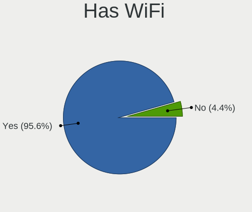
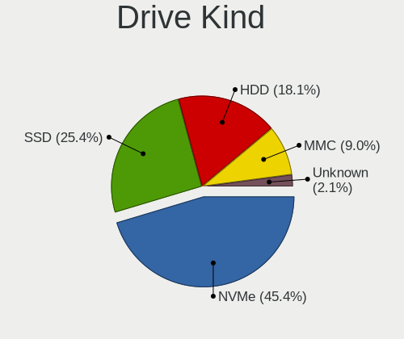
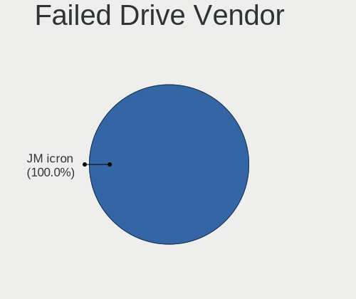
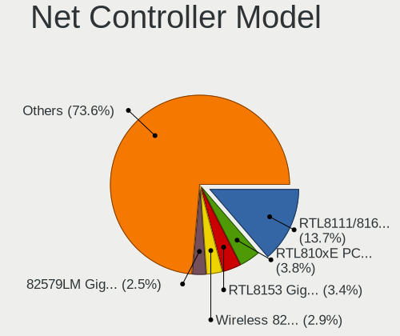

Linux in USA - Hardware Trends (Notebooks)
------------------------------------------

A project to identify most popular hardware characteristics and track their change
over time based on data collected by Linux users at https://Linux-Hardware.org.

Anyone can contribute to this report by the [hw-probe](https://github.com/linuxhw/hw-probe) tool:

    sudo -E hw-probe -all -upload

Period: Jul, 2022.

Contents
--------

* [ System ](#system)
  - [ OS                       ](#os)
  - [ OS Family                ](#os-family)
  - [ Kernel                   ](#kernel)
  - [ Kernel Family            ](#kernel-family)
  - [ Kernel Major Ver.        ](#kernel-major-ver)
  - [ Arch                     ](#arch)
  - [ DE                       ](#de)
  - [ Display Server           ](#display-server)
  - [ Display Manager          ](#display-manager)
  - [ OS Lang                  ](#os-lang)
  - [ Boot Mode                ](#boot-mode)
  - [ Filesystem               ](#filesystem)
  - [ Part. scheme             ](#part-scheme)
  - [ Dual Boot with Linux/BSD ](#dual-boot-with-linuxbsd)
  - [ Dual Boot (Win)          ](#dual-boot-win)

* [ Board ](#board)
  - [ Vendor                   ](#vendor)
  - [ Model                    ](#model)
  - [ Model Family             ](#model-family)
  - [ MFG Year                 ](#mfg-year)
  - [ Form Factor              ](#form-factor)
  - [ Secure Boot              ](#secure-boot)
  - [ Coreboot                 ](#coreboot)
  - [ RAM Size                 ](#ram-size)
  - [ RAM Used                 ](#ram-used)
  - [ Total Drives             ](#total-drives)
  - [ Has CD-ROM               ](#has-cd-rom)
  - [ Has Ethernet             ](#has-ethernet)
  - [ Has WiFi                 ](#has-wifi)
  - [ Has Bluetooth            ](#has-bluetooth)

* [ Location ](#location)
  - [ Country                  ](#country)
  - [ City                     ](#city)

* [ Drives ](#drives)
  - [ Drive Vendor             ](#drive-vendor)
  - [ Drive Model              ](#drive-model)
  - [ HDD Vendor               ](#hdd-vendor)
  - [ SSD Vendor               ](#ssd-vendor)
  - [ Drive Kind               ](#drive-kind)
  - [ Drive Connector          ](#drive-connector)
  - [ Drive Size               ](#drive-size)
  - [ Space Total              ](#space-total)
  - [ Space Used               ](#space-used)
  - [ Malfunc. Drives          ](#malfunc-drives)
  - [ Malfunc. Drive Vendor    ](#malfunc-drive-vendor)
  - [ Malfunc. HDD Vendor      ](#malfunc-hdd-vendor)
  - [ Malfunc. Drive Kind      ](#malfunc-drive-kind)
  - [ Failed Drives            ](#failed-drives)
  - [ Failed Drive Vendor      ](#failed-drive-vendor)
  - [ Drive Status             ](#drive-status)

* [ Storage controller ](#storage-controller)
  - [ Storage Vendor           ](#storage-vendor)
  - [ Storage Model            ](#storage-model)
  - [ Storage Kind             ](#storage-kind)

* [ Processor ](#processor)
  - [ CPU Vendor               ](#cpu-vendor)
  - [ CPU Model                ](#cpu-model)
  - [ CPU Model Family         ](#cpu-model-family)
  - [ CPU Cores                ](#cpu-cores)
  - [ CPU Sockets              ](#cpu-sockets)
  - [ CPU Threads              ](#cpu-threads)
  - [ CPU Op-Modes             ](#cpu-op-modes)
  - [ CPU Microcode            ](#cpu-microcode)
  - [ CPU Microarch            ](#cpu-microarch)

* [ Graphics ](#graphics)
  - [ GPU Vendor               ](#gpu-vendor)
  - [ GPU Model                ](#gpu-model)
  - [ GPU Combo                ](#gpu-combo)
  - [ GPU Driver               ](#gpu-driver)
  - [ GPU Memory               ](#gpu-memory)

* [ Monitor ](#monitor)
  - [ Monitor Vendor           ](#monitor-vendor)
  - [ Monitor Model            ](#monitor-model)
  - [ Monitor Resolution       ](#monitor-resolution)
  - [ Monitor Diagonal         ](#monitor-diagonal)
  - [ Monitor Width            ](#monitor-width)
  - [ Aspect Ratio             ](#aspect-ratio)
  - [ Monitor Area             ](#monitor-area)
  - [ Pixel Density            ](#pixel-density)
  - [ Multiple Monitors        ](#multiple-monitors)

* [ Network ](#network)
  - [ Net Controller Vendor    ](#net-controller-vendor)
  - [ Net Controller Model     ](#net-controller-model)
  - [ Wireless Vendor          ](#wireless-vendor)
  - [ Wireless Model           ](#wireless-model)
  - [ Ethernet Vendor          ](#ethernet-vendor)
  - [ Ethernet Model           ](#ethernet-model)
  - [ Net Controller Kind      ](#net-controller-kind)
  - [ Used Controller          ](#used-controller)
  - [ NICs                     ](#nics)
  - [ IPv6                     ](#ipv6)

* [ Bluetooth ](#bluetooth)
  - [ Bluetooth Vendor         ](#bluetooth-vendor)
  - [ Bluetooth Model          ](#bluetooth-model)

* [ Sound ](#sound)
  - [ Sound Vendor             ](#sound-vendor)
  - [ Sound Model              ](#sound-model)

* [ Memory ](#memory)
  - [ Memory Vendor            ](#memory-vendor)
  - [ Memory Model             ](#memory-model)
  - [ Memory Kind              ](#memory-kind)
  - [ Memory Form Factor       ](#memory-form-factor)
  - [ Memory Size              ](#memory-size)
  - [ Memory Speed             ](#memory-speed)

* [ Printers & scanners ](#printers--scanners)
  - [ Printer Vendor           ](#printer-vendor)
  - [ Printer Model            ](#printer-model)
  - [ Scanner Vendor           ](#scanner-vendor)
  - [ Scanner Model            ](#scanner-model)

* [ Camera ](#camera)
  - [ Camera Vendor            ](#camera-vendor)
  - [ Camera Model             ](#camera-model)

* [ Security ](#security)
  - [ Fingerprint Vendor       ](#fingerprint-vendor)
  - [ Fingerprint Model        ](#fingerprint-model)
  - [ Chipcard Vendor          ](#chipcard-vendor)
  - [ Chipcard Model           ](#chipcard-model)

* [ Unsupported ](#unsupported)
  - [ Unsupported Devices      ](#unsupported-devices)
  - [ Unsupported Device Types ](#unsupported-device-types)

System
------

OS
--

Installed operating systems

| Name                         | Notebooks | Percent |
|------------------------------|-----------|---------|
| Ubuntu 22.04                 | 53        | 12.16%  |
| Pop!_OS 22.04                | 44        | 10.09%  |
| Fedora 36                    | 36        | 8.26%   |
| Linux Mint 20.3              | 33        | 7.57%   |
| Ubuntu 20.04                 | 25        | 5.73%   |
| OpenMandriva 4.90            | 19        | 4.36%   |
| KDE neon 20.04               | 18        | 4.13%   |
| OpenMandriva 4.3             | 17        | 3.9%    |
| Arch                         | 14        | 3.21%   |
| Zorin 16                     | 13        | 2.98%   |
| SteamOS 3.2                  | 13        | 2.98%   |
| Debian 11                    | 13        | 2.98%   |
| Manjaro                      | 12        | 2.75%   |
| Kali 2022.2                  | 7         | 1.61%   |
| Elementary 6.1               | 7         | 1.61%   |
| SteamOS 3.3                  | 5         | 1.15%   |
| Parrot 5.0                   | 5         | 1.15%   |
| LMDE 5                       | 5         | 1.15%   |
| ArcoLinux Rolling            | 5         | 1.15%   |
| Arch Rolling                 | 5         | 1.15%   |
| Xubuntu 22.04                | 4         | 0.92%   |
| openSUSE Tumbleweed-XXXXXXXX | 4         | 0.92%   |
| Manjaro 21.3.2               | 4         | 0.92%   |
| Zorin 15                     | 3         | 0.69%   |
| Ubuntu 21.10                 | 3         | 0.69%   |
| Ubuntu 18.04                 | 3         | 0.69%   |
| Kubuntu 22.04                | 3         | 0.69%   |
| Debian Unstable              | 3         | 0.69%   |
| Xubuntu 16.04                | 2         | 0.46%   |
| Ultramarine Linux 36         | 2         | 0.46%   |
| Ubuntu Budgie 22.04          | 2         | 0.46%   |
| OpenMandriva 4.2             | 2         | 0.46%   |
| Nobara 36                    | 2         | 0.46%   |
| Lubuntu 22.04                | 2         | 0.46%   |
| Linux Mint 21                | 2         | 0.46%   |
| Linux Mint 20.2              | 2         | 0.46%   |
| Linux Mint 20.1              | 2         | 0.46%   |
| Lilidog 22                   | 2         | 0.46%   |
| Gentoo 2.8                   | 2         | 0.46%   |
| EndeavourOS Rolling          | 2         | 0.46%   |
| Clear Linux 36600            | 2         | 0.46%   |
| Xubuntu 20.04                | 1         | 0.23%   |
| Xubuntu 18.04                | 1         | 0.23%   |
| Xero Rolling                 | 1         | 0.23%   |
| Ubuntu Budgie 20.04          | 1         | 0.23%   |
| Ubuntu 16.04                 | 1         | 0.23%   |
| Trisquel 10.0.1              | 1         | 0.23%   |
| SteamOS 3.1                  | 1         | 0.23%   |
| SteamOS                      | 1         | 0.23%   |
| Solus 4.3                    | 1         | 0.23%   |
| RHEL 8                       | 1         | 0.23%   |
| Reborn OS                    | 1         | 0.23%   |
| Pop!_OS 20.04                | 1         | 0.23%   |
| Peppermint 11.4              | 1         | 0.23%   |
| Peppermint 11.3              | 1         | 0.23%   |
| PCLinuxOS 2022               | 1         | 0.23%   |
| Parrot 5.1                   | 1         | 0.23%   |
| Parrot 4.11                  | 1         | 0.23%   |
| org.kde.Platform 5.15-21.08  | 1         | 0.23%   |
| MX 21                        | 1         | 0.23%   |

OS Family
---------

OS without a version

| Name              | Notebooks | Percent |
|-------------------|-----------|---------|
| Ubuntu            | 85        | 19.5%   |
| Pop!_OS           | 45        | 10.32%  |
| Linux Mint        | 39        | 8.94%   |
| OpenMandriva      | 38        | 8.72%   |
| Fedora            | 36        | 8.26%   |
| SteamOS           | 20        | 4.59%   |
| Manjaro           | 20        | 4.59%   |
| Arch              | 19        | 4.36%   |
| KDE neon          | 18        | 4.13%   |
| Zorin             | 16        | 3.67%   |
| Debian            | 16        | 3.67%   |
| Kali              | 9         | 2.06%   |
| Xubuntu           | 8         | 1.83%   |
| Parrot            | 7         | 1.61%   |
| Elementary        | 7         | 1.61%   |
| LMDE              | 5         | 1.15%   |
| ArcoLinux         | 5         | 1.15%   |
| openSUSE          | 4         | 0.92%   |
| Kubuntu           | 4         | 0.92%   |
| Ubuntu Budgie     | 3         | 0.69%   |
| Lubuntu           | 3         | 0.69%   |
| Clear Linux       | 3         | 0.69%   |
| Ultramarine Linux | 2         | 0.46%   |
| Peppermint        | 2         | 0.46%   |
| Nobara            | 2         | 0.46%   |
| Lilidog           | 2         | 0.46%   |
| Gentoo            | 2         | 0.46%   |
| Garuda Linux      | 2         | 0.46%   |
| EndeavourOS       | 2         | 0.46%   |
| Xero              | 1         | 0.23%   |
| Trisquel          | 1         | 0.23%   |
| Solus             | 1         | 0.23%   |
| RHEL              | 1         | 0.23%   |
| Reborn OS         | 1         | 0.23%   |
| PCLinuxOS         | 1         | 0.23%   |
| org.kde.Platform  | 1         | 0.23%   |
| MX                | 1         | 0.23%   |
| Bottlerocket      | 1         | 0.23%   |
| BlackPanther      | 1         | 0.23%   |
| antiX             | 1         | 0.23%   |
| Android           | 1         | 0.23%   |

Kernel
------

Version of the Linux kernel

| Version                                      | Notebooks | Percent |
|----------------------------------------------|-----------|---------|
| 5.15.0-41-generic                            | 57        | 13.07%  |
| 5.17.15-76051715-generic                     | 31        | 7.11%   |
| 5.13.0-52-generic                            | 28        | 6.42%   |
| 5.4.0-122-generic                            | 22        | 5.05%   |
| 5.15.0-40-generic                            | 21        | 4.82%   |
| 5.18.12-desktop-3omv4090                     | 17        | 3.9%    |
| 5.16.7-desktop-1omv4003                      | 14        | 3.21%   |
| 5.13.0-valve15-1-neptune-02197-gf6ec7ad3762a | 14        | 3.21%   |
| 5.4.0-121-generic                            | 13        | 2.98%   |
| 5.18.11-200.fc36.x86_64                      | 12        | 2.75%   |
| 5.15.0-43-generic                            | 9         | 2.06%   |
| 5.18.13-200.fc36.x86_64                      | 8         | 1.83%   |
| 5.10.0-16-amd64                              | 8         | 1.83%   |
| 5.18.9-200.fc36.x86_64                       | 7         | 1.61%   |
| 5.18.10-76051810-generic                     | 7         | 1.61%   |
| 5.17.5-76051705-generic                      | 7         | 1.61%   |
| 5.10.0-15-amd64                              | 7         | 1.61%   |
| 5.18.11-arch1-1                              | 6         | 1.38%   |
| 5.18.0-1parrot1-amd64                        | 6         | 1.38%   |
| 5.15.0-25-generic                            | 6         | 1.38%   |
| 5.4.0-91-generic                             | 4         | 0.92%   |
| 5.18.7-arch1-1                               | 4         | 0.92%   |
| 5.18.7-200.fc36.x86_64                       | 4         | 0.92%   |
| 5.18.6-1-default                             | 4         | 0.92%   |
| 5.18.12-arch1-1                              | 4         | 0.92%   |
| 5.18.10-200.fc36.x86_64                      | 4         | 0.92%   |
| 5.18.0-kali5-amd64                           | 4         | 0.92%   |
| 5.18.9-arch1-1                               | 3         | 0.69%   |
| 5.18.14-arch1-1                              | 3         | 0.69%   |
| 5.18.12-3-MANJARO                            | 3         | 0.69%   |
| 5.16.13-desktop-1omv4003                     | 3         | 0.69%   |
| 5.13.0-44-generic                            | 3         | 0.69%   |
| 5.13.0-30-generic                            | 3         | 0.69%   |
| 5.18.8-arch1-1                               | 2         | 0.46%   |
| 5.18.13-201.fsync.fc36.x86_64                | 2         | 0.46%   |
| 5.18.10-arch1-1                              | 2         | 0.46%   |
| 5.18.0-kali2-amd64                           | 2         | 0.46%   |
| 5.18.0-1-rt11-MANJARO                        | 2         | 0.46%   |
| 5.18.0-0.bpo.1-amd64                         | 2         | 0.46%   |
| 5.16.13-1132.native                          | 2         | 0.46%   |
| 5.16.0-kali7-amd64                           | 2         | 0.46%   |
| 5.15.0-33-generic                            | 2         | 0.46%   |
| 5.13.0-valve21-1-neptune-02209-g2a5bdc1102a0 | 2         | 0.46%   |
| 5.13.0-valve20-1-neptune-02207-gbd986a7e1c7f | 2         | 0.46%   |
| 5.13.0-51-generic                            | 2         | 0.46%   |
| 5.10.14-desktop-1omv4002                     | 2         | 0.46%   |
| 5.10.0-13-amd64                              | 2         | 0.46%   |
| 4.15.0-142-generic                           | 2         | 0.46%   |
| 5.8.18-1-MANJARO                             | 1         | 0.23%   |
| 5.4.0-117-generic                            | 1         | 0.23%   |
| 5.4.0-110-generic                            | 1         | 0.23%   |
| 5.4.0-104-generic                            | 1         | 0.23%   |
| 5.19.0-rc6-264-tkg-cfs                       | 1         | 0.23%   |
| 5.19.0-1-MANJARO                             | 1         | 0.23%   |
| 5.18.7-1-MANJARO                             | 1         | 0.23%   |
| 5.18.6-xanmod1-1-generic-x64v2               | 1         | 0.23%   |
| 5.18.6-gentoo-venus                          | 1         | 0.23%   |
| 5.18.6-200.fc36.x86_64                       | 1         | 0.23%   |
| 5.18.6-1-MANJARO                             | 1         | 0.23%   |
| 5.18.3-zen1-1-zen                            | 1         | 0.23%   |

Kernel Family
-------------

Linux kernel without a distro release

| Version  | Notebooks | Percent |
|----------|-----------|---------|
| 5.15.0   | 97        | 22.25%  |
| 5.13.0   | 58        | 13.3%   |
| 5.4.0    | 42        | 9.63%   |
| 5.17.15  | 31        | 7.11%   |
| 5.18.12  | 27        | 6.19%   |
| 5.18.11  | 20        | 4.59%   |
| 5.18.0   | 20        | 4.59%   |
| 5.10.0   | 19        | 4.36%   |
| 5.18.10  | 14        | 3.21%   |
| 5.16.7   | 14        | 3.21%   |
| 5.18.13  | 12        | 2.75%   |
| 5.18.9   | 10        | 2.29%   |
| 5.18.7   | 9         | 2.06%   |
| 5.18.6   | 8         | 1.83%   |
| 5.17.5   | 8         | 1.83%   |
| 5.18.14  | 5         | 1.15%   |
| 5.16.13  | 5         | 1.15%   |
| 5.16.0   | 4         | 0.92%   |
| 5.19.0   | 2         | 0.46%   |
| 5.18.8   | 2         | 0.46%   |
| 5.15.54  | 2         | 0.46%   |
| 5.15.50  | 2         | 0.46%   |
| 5.10.14  | 2         | 0.46%   |
| 4.15.0   | 2         | 0.46%   |
| 5.8.18   | 1         | 0.23%   |
| 5.18.3   | 1         | 0.23%   |
| 5.18.15  | 1         | 0.23%   |
| 5.17.14  | 1         | 0.23%   |
| 5.17.0   | 1         | 0.23%   |
| 5.15.57  | 1         | 0.23%   |
| 5.15.55  | 1         | 0.23%   |
| 5.15.53  | 1         | 0.23%   |
| 5.15.49  | 1         | 0.23%   |
| 5.15.43  | 1         | 0.23%   |
| 5.15.41  | 1         | 0.23%   |
| 5.15.32  | 1         | 0.23%   |
| 5.15.25  | 1         | 0.23%   |
| 5.14.0   | 1         | 0.23%   |
| 5.11.0   | 1         | 0.23%   |
| 5.10.131 | 1         | 0.23%   |
| 4.9.194  | 1         | 0.23%   |
| 4.4.0    | 1         | 0.23%   |
| 4.19.0   | 1         | 0.23%   |
| 4.18.16  | 1         | 0.23%   |
| 4.18.0   | 1         | 0.23%   |

Kernel Major Ver.
-----------------

Linux kernel major version

| Version | Notebooks | Percent |
|---------|-----------|---------|
| 5.18    | 129       | 29.59%  |
| 5.15    | 109       | 25%     |
| 5.13    | 58        | 13.3%   |
| 5.4     | 42        | 9.63%   |
| 5.17    | 41        | 9.4%    |
| 5.16    | 23        | 5.28%   |
| 5.10    | 22        | 5.05%   |
| 5.19    | 2         | 0.46%   |
| 4.18    | 2         | 0.46%   |
| 4.15    | 2         | 0.46%   |
| 5.8     | 1         | 0.23%   |
| 5.14    | 1         | 0.23%   |
| 5.11    | 1         | 0.23%   |
| 4.9     | 1         | 0.23%   |
| 4.4     | 1         | 0.23%   |
| 4.19    | 1         | 0.23%   |

Arch
----

OS architecture (x86_64, i586, etc.)

| Name   | Notebooks | Percent |
|--------|-----------|---------|
| x86_64 | 431       | 98.85%  |
| i686   | 5         | 1.15%   |

DE
--

Desktop Environment

| Name             | Notebooks | Percent |
|------------------|-----------|---------|
| GNOME            | 190       | 43.58%  |
| KDE5             | 117       | 26.83%  |
| X-Cinnamon       | 38        | 8.72%   |
| XFCE             | 36        | 8.26%   |
| MATE             | 13        | 2.98%   |
| Unknown          | 11        | 2.52%   |
| Pantheon         | 7         | 1.61%   |
| Budgie           | 5         | 1.15%   |
| bspwm            | 3         | 0.69%   |
| LXQt             | 2         | 0.46%   |
| LXDE             | 2         | 0.46%   |
| lightdm-xsession | 2         | 0.46%   |
| i3               | 2         | 0.46%   |
| Cinnamon         | 2         | 0.46%   |
| awesome          | 2         | 0.46%   |
| Unity            | 1         | 0.23%   |
| openbox          | 1         | 0.23%   |
| icewm            | 1         | 0.23%   |
| GNOME Classic    | 1         | 0.23%   |

Display Server
--------------

X11 or Wayland

| Name    | Notebooks | Percent |
|---------|-----------|---------|
| X11     | 339       | 77.75%  |
| Wayland | 84        | 19.27%  |
| Unknown | 8         | 1.83%   |
| Tty     | 5         | 1.15%   |

Display Manager
---------------

SDDM, LightDM, etc.

| Name    | Notebooks | Percent |
|---------|-----------|---------|
| Unknown | 185       | 42.43%  |
| GDM3    | 75        | 17.2%   |
| LightDM | 71        | 16.28%  |
| SDDM    | 69        | 15.83%  |
| GDM     | 31        | 7.11%   |
| LXDM    | 3         | 0.69%   |
| XDM     | 1         | 0.23%   |
| Ly      | 1         | 0.23%   |

OS Lang
-------

Language

| Lang    | Notebooks | Percent |
|---------|-----------|---------|
| en_US   | 415       | 95.18%  |
| C       | 6         | 1.38%   |
| Unknown | 5         | 1.15%   |
| POSIX   | 2         | 0.46%   |
| en_CA   | 2         | 0.46%   |
| pl_PL   | 1         | 0.23%   |
| es_US   | 1         | 0.23%   |
| en_NZ   | 1         | 0.23%   |
| en_IN   | 1         | 0.23%   |
| de_DE   | 1         | 0.23%   |
| ca_ES   | 1         | 0.23%   |

Boot Mode
---------

EFI or BIOS

| Mode | Notebooks | Percent |
|------|-----------|---------|
| EFI  | 221       | 50.69%  |
| BIOS | 215       | 49.31%  |

Filesystem
----------

Type of filesystem

| Type    | Notebooks | Percent |
|---------|-----------|---------|
| Ext4    | 307       | 70.41%  |
| Btrfs   | 77        | 17.66%  |
| Overlay | 41        | 9.4%    |
| Xfs     | 5         | 1.15%   |
| Zfs     | 3         | 0.69%   |
| F2fs    | 2         | 0.46%   |
| Unknown | 1         | 0.23%   |

Part. scheme
------------

Scheme of partitioning

| Type    | Notebooks | Percent |
|---------|-----------|---------|
| Unknown | 250       | 57.34%  |
| GPT     | 155       | 35.55%  |
| MBR     | 31        | 7.11%   |

Dual Boot with Linux/BSD
------------------------

Hosting more than one Linux/BSD

| Dual boot | Notebooks | Percent |
|-----------|-----------|---------|
| No        | 383       | 87.84%  |
| Yes       | 53        | 12.16%  |

Dual Boot (Win)
---------------

Hosting Linux and Windows

| Dual boot | Notebooks | Percent |
|-----------|-----------|---------|
| No        | 373       | 85.55%  |
| Yes       | 63        | 14.45%  |

Board
-----

Vendor
------

Motherboard manufacturer

| Name                | Notebooks | Percent |
|---------------------|-----------|---------|
| Dell                | 91        | 20.87%  |
| Hewlett-Packard     | 90        | 20.64%  |
| Lenovo              | 66        | 15.14%  |
| ASUSTek Computer    | 30        | 6.88%   |
| Acer                | 24        | 5.5%    |
| Apple               | 19        | 4.36%   |
| Valve               | 17        | 3.9%    |
| MSI                 | 17        | 3.9%    |
| Google              | 12        | 2.75%   |
| Toshiba             | 9         | 2.06%   |
| System76            | 9         | 2.06%   |
| GPU Company         | 9         | 2.06%   |
| Panasonic           | 5         | 1.15%   |
| Samsung Electronics | 4         | 0.92%   |
| Framework           | 4         | 0.92%   |
| Unknown             | 4         | 0.92%   |
| Sony                | 2         | 0.46%   |
| Razer               | 2         | 0.46%   |
| LG Electronics      | 2         | 0.46%   |
| Gigabyte Technology | 2         | 0.46%   |
| Gateway             | 2         | 0.46%   |
| Alienware           | 2         | 0.46%   |
| SLIMBOOK            | 1         | 0.23%   |
| Schenker            | 1         | 0.23%   |
| Purism              | 1         | 0.23%   |
| Notebook            | 1         | 0.23%   |
| Micro Electronics   | 1         | 0.23%   |
| GPD                 | 1         | 0.23%   |
| GMKtec              | 1         | 0.23%   |
| Getac               | 1         | 0.23%   |
| Clevo               | 1         | 0.23%   |
| ByteSpeed           | 1         | 0.23%   |
| AZW                 | 1         | 0.23%   |
| AVERATEC            | 1         | 0.23%   |
| ASRock              | 1         | 0.23%   |
| AMI                 | 1         | 0.23%   |

Model
-----

Motherboard model

| Name                                    | Notebooks | Percent |
|-----------------------------------------|-----------|---------|
| Valve Jupiter                           | 17        | 3.9%    |
| Unknown                                 | 5         | 1.15%   |
| GPU Company GWTC116-2                   | 4         | 0.92%   |
| Framework Laptop                        | 4         | 0.92%   |
| System76 Lemur Pro                      | 3         | 0.69%   |
| HP Laptop 15-dy2xxx                     | 3         | 0.69%   |
| HP ENVY 17                              | 3         | 0.69%   |
| Dell Latitude E7450                     | 3         | 0.69%   |
| Apple MacBookPro9,2                     | 3         | 0.69%   |
| Apple MacBookPro14,1                    | 3         | 0.69%   |
| System76 Oryx Pro                       | 2         | 0.46%   |
| Samsung 760XDA                          | 2         | 0.46%   |
| Lenovo ThinkPad T14s Gen 3 21CQ000GUS   | 2         | 0.46%   |
| Lenovo Legion S7 15ACH6 82K8            | 2         | 0.46%   |
| Lenovo IdeaPad Gaming 3 15ACH6 82K2     | 2         | 0.46%   |
| Lenovo IdeaPad 3 15IIL05 81WE           | 2         | 0.46%   |
| HP ProBook 645 G1                       | 2         | 0.46%   |
| HP Pavilion Laptop 15-cs0xxx            | 2         | 0.46%   |
| HP Pavilion dv6                         | 2         | 0.46%   |
| HP Notebook                             | 2         | 0.46%   |
| HP Laptop 14-bw0xx                      | 2         | 0.46%   |
| HP EliteBook 8460p                      | 2         | 0.46%   |
| HP EliteBook 745 G6                     | 2         | 0.46%   |
| HP Dev One Notebook PC                  | 2         | 0.46%   |
| HP 15 Notebook PC                       | 2         | 0.46%   |
| GPU Company GWTN141-10                  | 2         | 0.46%   |
| GPU Company GWNR51416                   | 2         | 0.46%   |
| Google Candy                            | 2         | 0.46%   |
| Gateway NV53A                           | 2         | 0.46%   |
| Dell XPS 15 9500                        | 2         | 0.46%   |
| Dell XPS 13 9380                        | 2         | 0.46%   |
| Dell Vostro 3550                        | 2         | 0.46%   |
| Dell Precision 7510                     | 2         | 0.46%   |
| Dell Precision 5530                     | 2         | 0.46%   |
| Dell Latitude E7440                     | 2         | 0.46%   |
| Dell Latitude E6540                     | 2         | 0.46%   |
| Dell Latitude E6430                     | 2         | 0.46%   |
| Dell Latitude E6420                     | 2         | 0.46%   |
| Dell Latitude E6330                     | 2         | 0.46%   |
| Dell Latitude 7480                      | 2         | 0.46%   |
| Dell Latitude 5420                      | 2         | 0.46%   |
| Dell Inspiron MM061                     | 2         | 0.46%   |
| Dell Inspiron 7348                      | 2         | 0.46%   |
| Dell Inspiron 13-7378                   | 2         | 0.46%   |
| ASUS VivoBook_ASUSLaptop X412DAP_F412DA | 2         | 0.46%   |
| ASUS ROG Zephyrus G14 GA401QM_GA401QM   | 2         | 0.46%   |
| Apple MacBookPro11,3                    | 2         | 0.46%   |
| Apple MacBookAir7,2                     | 2         | 0.46%   |
| Acer Nitro AN515-57                     | 2         | 0.46%   |
| Acer Aspire A515-43                     | 2         | 0.46%   |
| Toshiba Satellite L655                  | 1         | 0.23%   |
| Toshiba Satellite L505D                 | 1         | 0.23%   |
| Toshiba Satellite C875D                 | 1         | 0.23%   |
| Toshiba Satellite C75D-C                | 1         | 0.23%   |
| Toshiba Satellite C75D-B                | 1         | 0.23%   |
| Toshiba Satellite C660                  | 1         | 0.23%   |
| Toshiba Satellite C655                  | 1         | 0.23%   |
| Toshiba Satellite C650D                 | 1         | 0.23%   |
| Toshiba NB205                           | 1         | 0.23%   |
| System76 Serval WS                      | 1         | 0.23%   |

Model Family
------------

Motherboard model prefix

| Name                   | Notebooks | Percent |
|------------------------|-----------|---------|
| Lenovo ThinkPad        | 37        | 8.49%   |
| Dell Latitude          | 35        | 8.03%   |
| Dell Inspiron          | 33        | 7.57%   |
| HP Laptop              | 21        | 4.82%   |
| Lenovo IdeaPad         | 18        | 4.13%   |
| Valve Jupiter          | 17        | 3.9%    |
| Acer Aspire            | 15        | 3.44%   |
| HP EliteBook           | 14        | 3.21%   |
| Dell XPS               | 12        | 2.75%   |
| HP Pavilion            | 11        | 2.52%   |
| HP ProBook             | 10        | 2.29%   |
| Toshiba Satellite      | 8         | 1.83%   |
| HP ZBook               | 7         | 1.61%   |
| Dell Precision         | 7         | 1.61%   |
| ASUS VivoBook          | 6         | 1.38%   |
| ASUS ROG               | 6         | 1.38%   |
| HP OMEN                | 5         | 1.15%   |
| HP ENVY                | 5         | 1.15%   |
| Acer Nitro             | 5         | 1.15%   |
| Unknown                | 5         | 1.15%   |
| System76 Lemur         | 4         | 0.92%   |
| HP Stream              | 4         | 0.92%   |
| GPU Company GWTC116-2  | 4         | 0.92%   |
| Framework Laptop       | 4         | 0.92%   |
| Dell Vostro            | 4         | 0.92%   |
| Apple MacBookPro14     | 4         | 0.92%   |
| Lenovo Legion          | 3         | 0.69%   |
| Apple MacBookPro9      | 3         | 0.69%   |
| Apple MacBookPro11     | 3         | 0.69%   |
| System76 Oryx          | 2         | 0.46%   |
| Samsung 760XDA         | 2         | 0.46%   |
| Razer Blade            | 2         | 0.46%   |
| MSI GS75               | 2         | 0.46%   |
| HP Victus              | 2         | 0.46%   |
| HP Notebook            | 2         | 0.46%   |
| HP Dev                 | 2         | 0.46%   |
| HP 15                  | 2         | 0.46%   |
| GPU Company GWTN141-10 | 2         | 0.46%   |
| GPU Company GWNR51416  | 2         | 0.46%   |
| Google Candy           | 2         | 0.46%   |
| Gateway NV53A          | 2         | 0.46%   |
| ASUS Zephyrus          | 2         | 0.46%   |
| ASUS ZenBook           | 2         | 0.46%   |
| ASUS ASUS              | 2         | 0.46%   |
| Apple MacBookAir7      | 2         | 0.46%   |
| Toshiba NB205          | 1         | 0.23%   |
| System76 Serval        | 1         | 0.23%   |
| System76 Pangolin      | 1         | 0.23%   |
| System76 Bonobo        | 1         | 0.23%   |
| Sony VPCEB15FM         | 1         | 0.23%   |
| Sony VPCEA36FM         | 1         | 0.23%   |
| SLIMBOOK PROX14-10     | 1         | 0.23%   |
| Schenker XMG           | 1         | 0.23%   |
| Samsung 950XED         | 1         | 0.23%   |
| Samsung 930XED         | 1         | 0.23%   |
| Purism Librem          | 1         | 0.23%   |
| Panasonic FZ55-2       | 1         | 0.23%   |
| Panasonic CF-C2AQAZXLM | 1         | 0.23%   |
| Panasonic CF-53SJCZYLM | 1         | 0.23%   |
| Panasonic CF-31ATXAX1M | 1         | 0.23%   |

MFG Year
--------

Motherboard manufacture year

| Year | Notebooks | Percent |
|------|-----------|---------|
| 2021 | 71        | 16.28%  |
| 2022 | 46        | 10.55%  |
| 2020 | 42        | 9.63%   |
| 2019 | 34        | 7.8%    |
| 2012 | 32        | 7.34%   |
| 2018 | 31        | 7.11%   |
| 2010 | 26        | 5.96%   |
| 2011 | 24        | 5.5%    |
| 2014 | 23        | 5.28%   |
| 2017 | 22        | 5.05%   |
| 2015 | 22        | 5.05%   |
| 2016 | 20        | 4.59%   |
| 2013 | 17        | 3.9%    |
| 2009 | 8         | 1.83%   |
| 2008 | 8         | 1.83%   |
| 2007 | 7         | 1.61%   |
| 2006 | 2         | 0.46%   |
| 2005 | 1         | 0.23%   |

Form Factor
-----------

Physical design of the computer

| Name     | Notebooks | Percent |
|----------|-----------|---------|
| Notebook | 436       | 100%    |

Secure Boot
-----------

Enabled or disabled

| State    | Notebooks | Percent |
|----------|-----------|---------|
| Disabled | 401       | 91.97%  |
| Enabled  | 35        | 8.03%   |

Coreboot
--------

Have coreboot on board

| Used | Notebooks | Percent |
|------|-----------|---------|
| No   | 418       | 95.87%  |
| Yes  | 18        | 4.13%   |

RAM Size
--------

Total RAM memory

| Size in GB  | Notebooks | Percent |
|-------------|-----------|---------|
| 4.01-8.0    | 105       | 24.08%  |
| 8.01-16.0   | 91        | 20.87%  |
| 3.01-4.0    | 77        | 17.66%  |
| 16.01-24.0  | 74        | 16.97%  |
| 32.01-64.0  | 47        | 10.78%  |
| 24.01-32.0  | 15        | 3.44%   |
| 64.01-256.0 | 12        | 2.75%   |
| 1.01-2.0    | 7         | 1.61%   |
| 2.01-3.0    | 6         | 1.38%   |
| 0.51-1.0    | 2         | 0.46%   |

RAM Used
--------

Used RAM memory

| Used GB    | Notebooks | Percent |
|------------|-----------|---------|
| 1.01-2.0   | 148       | 33.94%  |
| 2.01-3.0   | 133       | 30.5%   |
| 4.01-8.0   | 63        | 14.45%  |
| 3.01-4.0   | 54        | 12.39%  |
| 0.51-1.0   | 21        | 4.82%   |
| 8.01-16.0  | 11        | 2.52%   |
| 16.01-24.0 | 3         | 0.69%   |
| 0.01-0.5   | 2         | 0.46%   |
| 24.01-32.0 | 1         | 0.23%   |

Total Drives
------------

Number of drives on board

| Drives | Notebooks | Percent |
|--------|-----------|---------|
| 1      | 304       | 69.72%  |
| 2      | 108       | 24.77%  |
| 3      | 20        | 4.59%   |
| 4      | 2         | 0.46%   |
| 7      | 1         | 0.23%   |
| 0      | 1         | 0.23%   |

Has CD-ROM
----------

Has CD-ROM on board

| Presented | Notebooks | Percent |
|-----------|-----------|---------|
| No        | 303       | 69.5%   |
| Yes       | 133       | 30.5%   |

Has Ethernet
------------

Has Ethernet on board

| Presented | Notebooks | Percent |
|-----------|-----------|---------|
| Yes       | 316       | 72.48%  |
| No        | 120       | 27.52%  |

Has WiFi
--------

Has WiFi module

| Presented | Notebooks | Percent |
|-----------|-----------|---------|
| Yes       | 433       | 99.31%  |
| No        | 3         | 0.69%   |

Has Bluetooth
-------------

Has Bluetooth module

| Presented | Notebooks | Percent |
|-----------|-----------|---------|
| Yes       | 336       | 77.06%  |
| No        | 100       | 22.94%  |

Location
--------

Country
-------

Geographic location (country)

| Country | Notebooks | Percent |
|---------|-----------|---------|
| USA     | 436       | 100%    |

City
----

Geographic location (city)

| City             | Notebooks | Percent |
|------------------|-----------|---------|
| Seattle          | 9         | 2.06%   |
| Austin           | 7         | 1.61%   |
| Atlanta          | 6         | 1.38%   |
| San Francisco    | 5         | 1.15%   |
| Philadelphia     | 5         | 1.15%   |
| New York         | 5         | 1.15%   |
| Mesa             | 5         | 1.15%   |
| San Jose         | 4         | 0.92%   |
| Portland         | 4         | 0.92%   |
| Phoenix          | 4         | 0.92%   |
| Miami            | 4         | 0.92%   |
| Chicago          | 4         | 0.92%   |
| Charlotte        | 4         | 0.92%   |
| Valencia         | 3         | 0.69%   |
| Tucson           | 3         | 0.69%   |
| St Louis         | 3         | 0.69%   |
| Southampton      | 3         | 0.69%   |
| San Diego        | 3         | 0.69%   |
| Salt Lake City   | 3         | 0.69%   |
| Queens           | 3         | 0.69%   |
| Orlando          | 3         | 0.69%   |
| Omaha            | 3         | 0.69%   |
| Lowell           | 3         | 0.69%   |
| Lansing          | 3         | 0.69%   |
| Kansas City      | 3         | 0.69%   |
| Indianapolis     | 3         | 0.69%   |
| Greenville       | 3         | 0.69%   |
| Denver           | 3         | 0.69%   |
| Dallas           | 3         | 0.69%   |
| Columbus         | 3         | 0.69%   |
| Wesley Chapel    | 2         | 0.46%   |
| Virginia Beach   | 2         | 0.46%   |
| The Bronx        | 2         | 0.46%   |
| Sunnyvale        | 2         | 0.46%   |
| Springfield      | 2         | 0.46%   |
| San Antonio      | 2         | 0.46%   |
| Roseville        | 2         | 0.46%   |
| Rochester        | 2         | 0.46%   |
| Reston           | 2         | 0.46%   |
| Parkesburg       | 2         | 0.46%   |
| Nice             | 2         | 0.46%   |
| Newark           | 2         | 0.46%   |
| New Bern         | 2         | 0.46%   |
| Mundelein        | 2         | 0.46%   |
| Merritt Island   | 2         | 0.46%   |
| Lufkin           | 2         | 0.46%   |
| Lincoln          | 2         | 0.46%   |
| Las Vegas        | 2         | 0.46%   |
| Keller           | 2         | 0.46%   |
| Houston          | 2         | 0.46%   |
| Egan             | 2         | 0.46%   |
| Durham           | 2         | 0.46%   |
| Dublin           | 2         | 0.46%   |
| Decatur          | 2         | 0.46%   |
| Dayton           | 2         | 0.46%   |
| Coventry         | 2         | 0.46%   |
| Clinton Township | 2         | 0.46%   |
| Cambridge        | 2         | 0.46%   |
| Bozeman          | 2         | 0.46%   |
| Boise            | 2         | 0.46%   |

Drives
------

Drive Vendor
------------

Hard drive vendors

| Vendor                    | Notebooks | Drives | Percent |
|---------------------------|-----------|--------|---------|
| Samsung Electronics       | 100       | 118    | 17.89%  |
| Seagate                   | 55        | 55     | 9.84%   |
| Unknown                   | 51        | 52     | 9.12%   |
| WDC                       | 42        | 44     | 7.51%   |
| SanDisk                   | 35        | 35     | 6.26%   |
| Toshiba                   | 33        | 33     | 5.9%    |
| SK hynix                  | 31        | 31     | 5.55%   |
| Kingston                  | 21        | 21     | 3.76%   |
| Crucial                   | 19        | 20     | 3.4%    |
| Hitachi                   | 17        | 17     | 3.04%   |
| Phison                    | 16        | 16     | 2.86%   |
| HGST                      | 16        | 16     | 2.86%   |
| Intel                     | 15        | 18     | 2.68%   |
| Apple                     | 13        | 19     | 2.33%   |
| Micron Technology         | 10        | 10     | 1.79%   |
| Unknown                   | 7         | 7      | 1.25%   |
| SPCC                      | 6         | 6      | 1.07%   |
| Team                      | 5         | 5      | 0.89%   |
| PNY                       | 5         | 5      | 0.89%   |
| Netac                     | 5         | 5      | 0.89%   |
| KIOXIA                    | 5         | 5      | 0.89%   |
| China                     | 5         | 5      | 0.89%   |
| A-DATA Technology         | 5         | 5      | 0.89%   |
| LITEON                    | 4         | 4      | 0.72%   |
| SABRENT                   | 3         | 3      | 0.54%   |
| JMicron Technology        | 3         | 3      | 0.54%   |
| XPG                       | 2         | 2      | 0.36%   |
| W800S                     | 2         | 3      | 0.36%   |
| USB3.0                    | 2         | 2      | 0.36%   |
| T-FORCE                   | 2         | 2      | 0.36%   |
| Silicon Motion            | 2         | 2      | 0.36%   |
| Hewlett-Packard           | 2         | 2      | 0.36%   |
| BHT                       | 2         | 2      | 0.36%   |
| Union Memory (Shenzhen)   | 1         | 1      | 0.18%   |
| Timetec                   | 1         | 1      | 0.18%   |
| SSSTC                     | 1         | 1      | 0.18%   |
| SSK                       | 1         | 1      | 0.18%   |
| ROG                       | 1         | 1      | 0.18%   |
| Radeon                    | 1         | 1      | 0.18%   |
| OWC                       | 1         | 1      | 0.18%   |
| O2 Micro                  | 1         | 1      | 0.18%   |
| Mushkin                   | 1         | 1      | 0.18%   |
| Micron/Crucial Technology | 1         | 1      | 0.18%   |
| Kingchuxing               | 1         | 1      | 0.18%   |
| Intenso                   | 1         | 1      | 0.18%   |
| Inland                    | 1         | 1      | 0.18%   |
| HGST HTS                  | 1         | 1      | 0.18%   |
| Gigabyte Technology       | 1         | 1      | 0.18%   |
| BIWIN                     | 1         | 1      | 0.18%   |
| ASMT                      | 1         | 1      | 0.18%   |
| addlink                   | 1         | 1      | 0.18%   |

Drive Model
-----------

Hard drive models

| Model                               | Notebooks | Percent |
|-------------------------------------|-----------|---------|
| Phison NVMe SSD Drive 512GB         | 9         | 1.54%   |
| Samsung NVMe SSD Drive 512GB        | 8         | 1.37%   |
| Seagate ST1000LM035-1RK172 1TB      | 7         | 1.2%    |
| Samsung NVMe SSD Drive 256GB        | 7         | 1.2%    |
| Unknown                             | 7         | 1.2%    |
| Unknown SD/MMC/MS PRO 64GB          | 6         | 1.03%   |
| Samsung NVMe SSD Drive 1TB          | 6         | 1.03%   |
| Samsung NVMe SSD Drive 1024GB       | 6         | 1.03%   |
| HGST HTS721010A9E630 1TB            | 6         | 1.03%   |
| Crucial CT1000MX500SSD1 1TB         | 6         | 1.03%   |
| SK hynix NVMe SSD Drive 256GB       | 5         | 0.86%   |
| SanDisk NVMe SSD Drive 512GB        | 5         | 0.86%   |
| Samsung SSD 970 EVO Plus 1TB        | 5         | 0.86%   |
| Kingston NVMe SSD Drive 256GB       | 5         | 0.86%   |
| Unknown MMC Card  64GB              | 4         | 0.68%   |
| Unknown MMC Card  32GB              | 4         | 0.68%   |
| Seagate ST500LT012-9WS142 500GB     | 4         | 0.68%   |
| Seagate ST500LM021-1KJ152 500GB     | 4         | 0.68%   |
| Samsung SSD 980 PRO 1TB             | 4         | 0.68%   |
| Samsung SSD 970 EVO Plus 500GB      | 4         | 0.68%   |
| Samsung SSD 860 EVO 500GB           | 4         | 0.68%   |
| Samsung SSD 850 EVO 250GB           | 4         | 0.68%   |
| Intel NVMe SSD Drive 512GB          | 4         | 0.68%   |
| Crucial CT500MX500SSD1 500GB        | 4         | 0.68%   |
| WDC WD5000LPVX-75V0TT0 500GB        | 3         | 0.51%   |
| Unknown MMC Card  128GB             | 3         | 0.51%   |
| Toshiba NVMe SSD Drive 512GB        | 3         | 0.51%   |
| Toshiba NVMe SSD Drive 256GB        | 3         | 0.51%   |
| Toshiba MQ04ABF100 1TB              | 3         | 0.51%   |
| Toshiba MQ01ABF050 500GB            | 3         | 0.51%   |
| SPCC Solid State Disk 512GB         | 3         | 0.51%   |
| SK hynix NVMe SSD Drive 512GB       | 3         | 0.51%   |
| Seagate ST500LT012-1DG142 500GB     | 3         | 0.51%   |
| Seagate ST500LM012 HN-M500MBB 500GB | 3         | 0.51%   |
| Seagate ST2000LM007-1R8174 2TB      | 3         | 0.51%   |
| SanDisk NVMe SSD Drive 1TB          | 3         | 0.51%   |
| Samsung SSD 970 EVO Plus 2TB        | 3         | 0.51%   |
| Samsung MZVL21T0HCLR-00B00 1TB      | 3         | 0.51%   |
| SABRENT Disk 1TB                    | 3         | 0.51%   |
| Kingston NVMe SSD Drive 512GB       | 3         | 0.51%   |
| Hitachi HTS545050B9A300 500GB       | 3         | 0.51%   |
| HGST HTS725050A7E630 500GB          | 3         | 0.51%   |
| Apple SSD SM0512F 500GB             | 3         | 0.51%   |
| WDC WDS100T2B0A-00SM50 1TB SSD      | 2         | 0.34%   |
| WDC WDBNCE0010PNC 1TB SSD           | 2         | 0.34%   |
| WDC WD5000LPCX-22VHAT1 500GB        | 2         | 0.34%   |
| WDC WD3200BEVT-75A23T0 320GB        | 2         | 0.34%   |
| WDC WD20SPZX-22UA7T0 2TB            | 2         | 0.34%   |
| W800S 512GB                         | 2         | 0.34%   |
| USB3.0 Super Speed 1TB              | 2         | 0.34%   |
| Unknown USB DISK 3.2 1TB            | 2         | 0.34%   |
| Unknown SDW16G  16GB                | 2         | 0.34%   |
| Unknown MMC Card  512GB             | 2         | 0.34%   |
| Unknown MMC Card  393GB             | 2         | 0.34%   |
| Unknown MMC Card  256GB             | 2         | 0.34%   |
| Unknown DA4064  64GB                | 2         | 0.34%   |
| Unknown Biwin  64GB                 | 2         | 0.34%   |
| Toshiba MQ01ABD100 1TB              | 2         | 0.34%   |
| Toshiba MQ01ABD075 752GB            | 2         | 0.34%   |
| Toshiba MK1665GSX 160GB             | 2         | 0.34%   |

HDD Vendor
----------

Hard disk drive vendors

| Vendor   | Notebooks | Drives | Percent |
|----------|-----------|--------|---------|
| Seagate  | 53        | 53     | 36.3%   |
| WDC      | 28        | 29     | 19.18%  |
| Toshiba  | 21        | 21     | 14.38%  |
| Hitachi  | 17        | 17     | 11.64%  |
| HGST     | 16        | 16     | 10.96%  |
| Unknown  | 6         | 6      | 4.11%   |
| SABRENT  | 3         | 3      | 2.05%   |
| HGST HTS | 1         | 1      | 0.68%   |
| ASMT     | 1         | 1      | 0.68%   |

SSD Vendor
----------

Solid state drive vendors

| Vendor              | Notebooks | Drives | Percent |
|---------------------|-----------|--------|---------|
| Samsung Electronics | 35        | 36     | 22.73%  |
| SanDisk             | 17        | 17     | 11.04%  |
| Crucial             | 15        | 16     | 9.74%   |
| WDC                 | 10        | 10     | 6.49%   |
| SK hynix            | 8         | 8      | 5.19%   |
| Kingston            | 7         | 7      | 4.55%   |
| Apple               | 7         | 7      | 4.55%   |
| SPCC                | 6         | 6      | 3.9%    |
| PNY                 | 5         | 5      | 3.25%   |
| China               | 5         | 5      | 3.25%   |
| Team                | 4         | 4      | 2.6%    |
| Netac               | 4         | 4      | 2.6%    |
| LITEON              | 4         | 4      | 2.6%    |
| A-DATA Technology   | 4         | 4      | 2.6%    |
| Micron Technology   | 3         | 3      | 1.95%   |
| Unknown             | 3         | 3      | 1.95%   |
| USB3.0              | 2         | 2      | 1.3%    |
| Toshiba             | 2         | 2      | 1.3%    |
| Hewlett-Packard     | 2         | 2      | 1.3%    |
| BHT                 | 2         | 2      | 1.3%    |
| W800S               | 1         | 1      | 0.65%   |
| Unknown             | 1         | 1      | 0.65%   |
| Timetec             | 1         | 1      | 0.65%   |
| Radeon              | 1         | 1      | 0.65%   |
| OWC                 | 1         | 1      | 0.65%   |
| Mushkin             | 1         | 1      | 0.65%   |
| Intenso             | 1         | 1      | 0.65%   |
| Intel               | 1         | 1      | 0.65%   |
| Inland              | 1         | 1      | 0.65%   |

Drive Kind
----------

HDD or SSD

| Kind    | Notebooks | Drives | Percent |
|---------|-----------|--------|---------|
| NVMe    | 189       | 226    | 35.86%  |
| SSD     | 145       | 156    | 27.51%  |
| HDD     | 135       | 147    | 25.62%  |
| MMC     | 45        | 47     | 8.54%   |
| Unknown | 13        | 15     | 2.47%   |

Drive Connector
---------------

SATA, SAS, NVMe, etc.

| Type | Notebooks | Drives | Percent |
|------|-----------|--------|---------|
| SATA | 258       | 281    | 48.86%  |
| NVMe | 189       | 225    | 35.8%   |
| MMC  | 45        | 47     | 8.52%   |
| SAS  | 36        | 38     | 6.82%   |

Drive Size
----------

Size of hard drive

| Size in TB | Notebooks | Drives | Percent |
|------------|-----------|--------|---------|
| 0.01-0.5   | 170       | 177    | 59.44%  |
| 0.51-1.0   | 92        | 100    | 32.17%  |
| 1.01-2.0   | 19        | 21     | 6.64%   |
| 3.01-4.0   | 4         | 4      | 1.4%    |
| 4.01-10.0  | 1         | 1      | 0.35%   |

Space Total
-----------

Amount of disk space available on the file system

| Size in GB     | Notebooks | Percent |
|----------------|-----------|---------|
| 251-500        | 115       | 26.38%  |
| 101-250        | 105       | 24.08%  |
| 501-1000       | 70        | 16.06%  |
| 1-20           | 42        | 9.63%   |
| 1001-2000      | 29        | 6.65%   |
| 51-100         | 22        | 5.05%   |
| 21-50          | 17        | 3.9%    |
| More than 3000 | 14        | 3.21%   |
| Unknown        | 14        | 3.21%   |
| 2001-3000      | 8         | 1.83%   |

Space Used
----------

Amount of used disk space

| Used GB        | Notebooks | Percent |
|----------------|-----------|---------|
| 1-20           | 187       | 42.89%  |
| 21-50          | 79        | 18.12%  |
| 101-250        | 55        | 12.61%  |
| 51-100         | 43        | 9.86%   |
| 251-500        | 30        | 6.88%   |
| 501-1000       | 14        | 3.21%   |
| Unknown        | 14        | 3.21%   |
| 1001-2000      | 8         | 1.83%   |
| More than 3000 | 4         | 0.92%   |
| 2001-3000      | 2         | 0.46%   |

Malfunc. Drives
---------------

Drive models with a malfunction

| Model                                          | Notebooks | Drives | Percent |
|------------------------------------------------|-----------|--------|---------|
| Seagate ST500LT012-9WS142 500GB                | 4         | 4      | 14.81%  |
| SK hynix PC711 HFS001TDE9X073N 1TB             | 2         | 2      | 7.41%   |
| HGST HTS721010A9E630 1TB                       | 2         | 2      | 7.41%   |
| WDC WD5000BPVT-24HXZT3 500GB                   | 1         | 1      | 3.7%    |
| WDC WD3200BEVT-75A23T0 320GB                   | 1         | 1      | 3.7%    |
| Toshiba MQ01ABD075 752GB                       | 1         | 1      | 3.7%    |
| Toshiba MK1665GSX 160GB                        | 1         | 1      | 3.7%    |
| Seagate ST9500325AS 500GB                      | 1         | 1      | 3.7%    |
| Seagate ST320LT007-9ZV142 320GB                | 1         | 1      | 3.7%    |
| Samsung Electronics SSD 970 EVO Plus 500GB     | 1         | 1      | 3.7%    |
| Samsung Electronics SSD 960 EVO 500GB          | 1         | 1      | 3.7%    |
| Samsung Electronics MMCQE28G8MUP-0VA 128GB SSD | 1         | 1      | 3.7%    |
| Netac SSD 256GB                                | 1         | 1      | 3.7%    |
| Micron Technology 1100 SATA 256GB SSD          | 1         | 1      | 3.7%    |
| Kingston SNS4151S316GD 16GB SSD                | 1         | 1      | 3.7%    |
| Kingston SNS4151S316G 16GB SSD                 | 1         | 1      | 3.7%    |
| Hitachi HTS723232A7A364 320GB                  | 1         | 1      | 3.7%    |
| Hitachi HTS545050B9A300 500GB                  | 1         | 1      | 3.7%    |
| HGST HTS725050A7E630 500GB                     | 1         | 1      | 3.7%    |
| HGST HTS725032A7E630 320GB                     | 1         | 1      | 3.7%    |
| HGST HTS 721010A9E630 1TB                      | 1         | 1      | 3.7%    |
| Crucial CT1050MX300SSD1 1TB                    | 1         | 1      | 3.7%    |

Malfunc. Drive Vendor
---------------------

Vendors of faulty drives

| Vendor              | Notebooks | Drives | Percent |
|---------------------|-----------|--------|---------|
| Seagate             | 6         | 6      | 22.22%  |
| HGST                | 4         | 4      | 14.81%  |
| Samsung Electronics | 3         | 3      | 11.11%  |
| WDC                 | 2         | 2      | 7.41%   |
| Toshiba             | 2         | 2      | 7.41%   |
| SK hynix            | 2         | 2      | 7.41%   |
| Kingston            | 2         | 2      | 7.41%   |
| Hitachi             | 2         | 2      | 7.41%   |
| Netac               | 1         | 1      | 3.7%    |
| Micron Technology   | 1         | 1      | 3.7%    |
| HGST HTS            | 1         | 1      | 3.7%    |
| Crucial             | 1         | 1      | 3.7%    |

Malfunc. HDD Vendor
-------------------

Vendors of faulty HDD drives

| Vendor   | Notebooks | Drives | Percent |
|----------|-----------|--------|---------|
| Seagate  | 6         | 6      | 35.29%  |
| HGST     | 4         | 4      | 23.53%  |
| WDC      | 2         | 2      | 11.76%  |
| Toshiba  | 2         | 2      | 11.76%  |
| Hitachi  | 2         | 2      | 11.76%  |
| HGST HTS | 1         | 1      | 5.88%   |

Malfunc. Drive Kind
-------------------

Kinds of faulty drives

| Kind | Notebooks | Drives | Percent |
|------|-----------|--------|---------|
| HDD  | 16        | 17     | 61.54%  |
| SSD  | 6         | 6      | 23.08%  |
| NVMe | 4         | 4      | 15.38%  |

Failed Drives
-------------

Failed drive models

| Model                     | Notebooks | Drives | Percent |
|---------------------------|-----------|--------|---------|
| Seagate ST9500420AS 500GB | 1         | 1      | 100%    |

Failed Drive Vendor
-------------------

Failed drive vendors

| Vendor  | Notebooks | Drives | Percent |
|---------|-----------|--------|---------|
| Seagate | 1         | 1      | 100%    |

Drive Status
------------

Number of failed and malfunc. drives

| Status   | Notebooks | Drives | Percent |
|----------|-----------|--------|---------|
| Detected | 287       | 377    | 61.46%  |
| Works    | 153       | 186    | 32.76%  |
| Malfunc  | 26        | 27     | 5.57%   |
| Failed   | 1         | 1      | 0.21%   |

Storage controller
------------------

Storage Vendor
--------------

Storage controller vendors

| Vendor                         | Notebooks | Percent |
|--------------------------------|-----------|---------|
| Intel                          | 246       | 47.86%  |
| Samsung Electronics            | 79        | 15.37%  |
| AMD                            | 68        | 13.23%  |
| SK hynix                       | 23        | 4.47%   |
| SanDisk                        | 19        | 3.7%    |
| Phison Electronics             | 19        | 3.7%    |
| Kingston Technology Company    | 14        | 2.72%   |
| Toshiba America Info Systems   | 9         | 1.75%   |
| Micron Technology              | 7         | 1.36%   |
| Micron/Crucial Technology      | 5         | 0.97%   |
| KIOXIA                         | 5         | 0.97%   |
| Apple                          | 5         | 0.97%   |
| Nvidia                         | 3         | 0.58%   |
| ADATA Technology               | 3         | 0.58%   |
| Silicon Motion                 | 2         | 0.39%   |
| Marvell Technology Group       | 2         | 0.39%   |
| Unknown                        | 1         | 0.19%   |
| Union Memory (Shenzhen)        | 1         | 0.19%   |
| Solid State Storage Technology | 1         | 0.19%   |
| O2 Micro                       | 1         | 0.19%   |
| Biwin Storage Technology       | 1         | 0.19%   |

Storage Model
-------------

Storage controller models

| Model                                                                          | Notebooks | Percent |
|--------------------------------------------------------------------------------|-----------|---------|
| AMD FCH SATA Controller [AHCI mode]                                            | 58        | 10.6%   |
| Intel Sunrise Point-LP SATA Controller [AHCI mode]                             | 27        | 4.94%   |
| Intel 7 Series Chipset Family 6-port SATA Controller [AHCI mode]               | 27        | 4.94%   |
| Intel 82801 Mobile SATA Controller [RAID mode]                                 | 26        | 4.75%   |
| Samsung NVMe SSD Controller SM981/PM981/PM983                                  | 23        | 4.2%    |
| Samsung NVMe SSD Controller PM9A1/PM9A3/980PRO                                 | 21        | 3.84%   |
| Samsung NVMe SSD Controller 980                                                | 20        | 3.66%   |
| Intel 6 Series/C200 Series Chipset Family 6 port Mobile SATA AHCI Controller   | 15        | 2.74%   |
| Phison PS5013 E13 NVMe Controller                                              | 13        | 2.38%   |
| SK hynix Gold P31 SSD                                                          | 12        | 2.19%   |
| Intel Cannon Lake Mobile PCH SATA AHCI Controller                              | 12        | 2.19%   |
| Intel 8 Series/C220 Series Chipset Family 6-port SATA Controller 1 [AHCI mode] | 12        | 2.19%   |
| Intel Wildcat Point-LP SATA Controller [AHCI Mode]                             | 10        | 1.83%   |
| Intel Volume Management Device NVMe RAID Controller                            | 10        | 1.83%   |
| Kingston Company OM3PDP3 NVMe SSD                                              | 9         | 1.65%   |
| Intel Celeron/Pentium Silver Processor SATA Controller                         | 9         | 1.65%   |
| Intel 8 Series SATA Controller 1 [AHCI mode]                                   | 9         | 1.65%   |
| Intel 82801IBM/IEM (ICH9M/ICH9M-E) 4 port SATA Controller [AHCI mode]          | 8         | 1.46%   |
| Intel 500 Series Chipset Family SATA AHCI Controller                           | 8         | 1.46%   |
| Intel 5 Series/3400 Series Chipset 6 port SATA AHCI Controller                 | 8         | 1.46%   |
| SanDisk WD Black SN750 / PC SN730 NVMe SSD                                     | 7         | 1.28%   |
| Samsung NVMe SSD Controller SM961/PM961/SM963                                  | 7         | 1.28%   |
| Micron Non-Volatile memory controller                                          | 7         | 1.28%   |
| Intel 5 Series/3400 Series Chipset 4 port SATA AHCI Controller                 | 7         | 1.28%   |
| Intel SSD 660P Series                                                          | 6         | 1.1%    |
| Intel HM170/QM170 Chipset SATA Controller [AHCI Mode]                          | 6         | 1.1%    |
| Intel Cannon Point-LP SATA Controller [AHCI Mode]                              | 6         | 1.1%    |
| Intel 82801HM/HEM (ICH8M/ICH8M-E) IDE Controller                               | 6         | 1.1%    |
| SanDisk WD Blue SN550 NVMe SSD                                                 | 5         | 0.91%   |
| KIOXIA NVMe SSD Controller BG4                                                 | 5         | 0.91%   |
| Intel Ice Lake-LP SATA Controller [AHCI mode]                                  | 5         | 0.91%   |
| AMD SB7x0/SB8x0/SB9x0 SATA Controller [AHCI mode]                              | 5         | 0.91%   |
| SK hynix PC401 NVMe Solid State Drive 256GB                                    | 4         | 0.73%   |
| Samsung Electronics SATA controller                                            | 4         | 0.73%   |
| Phison E12 NVMe Controller                                                     | 4         | 0.73%   |
| Intel Tiger Lake-LP SATA Controller                                            | 4         | 0.73%   |
| Intel SSD Pro 7600p/760p/E 6100p Series                                        | 4         | 0.73%   |
| Intel Non-Volatile memory controller                                           | 4         | 0.73%   |
| Intel Comet Lake SATA AHCI Controller                                          | 4         | 0.73%   |
| Intel 82801HM/HEM (ICH8M/ICH8M-E) SATA Controller [AHCI mode]                  | 4         | 0.73%   |
| Toshiba America Info Systems XG6 NVMe SSD Controller                           | 3         | 0.55%   |
| Toshiba America Info Systems XG4 NVMe SSD Controller                           | 3         | 0.55%   |
| SK hynix BC501 NVMe Solid State Drive                                          | 3         | 0.55%   |
| SanDisk Non-Volatile memory controller                                         | 3         | 0.55%   |
| Samsung NVMe SSD Controller SM951/PM951                                        | 3         | 0.55%   |
| Samsung Apple PCIe SSD                                                         | 3         | 0.55%   |
| Micron/Crucial Non-Volatile memory controller                                  | 3         | 0.55%   |
| Intel Atom Processor E3800 Series SATA AHCI Controller                         | 3         | 0.55%   |
| Intel 400 Series Chipset Family SATA AHCI Controller                           | 3         | 0.55%   |
| Apple S3X NVMe Controller                                                      | 3         | 0.55%   |
| AMD SB600 Non-Raid-5 SATA                                                      | 3         | 0.55%   |
| AMD SB600 IDE                                                                  | 3         | 0.55%   |
| AMD FCH IDE Controller                                                         | 3         | 0.55%   |
| Toshiba America Info Systems BG3 NVMe SSD Controller                           | 2         | 0.37%   |
| SK hynix Non-Volatile memory controller                                        | 2         | 0.37%   |
| SK hynix BC511                                                                 | 2         | 0.37%   |
| Silicon Motion SM2263EN/SM2263XT SSD Controller                                | 2         | 0.37%   |
| Phison E16 PCIe4 NVMe Controller                                               | 2         | 0.37%   |
| Micron/Crucial P2 NVMe PCIe SSD                                                | 2         | 0.37%   |
| Marvell Group 88SS9183 PCIe SSD Controller                                     | 2         | 0.37%   |

Storage Kind
------------

Kind of storage controller (IDE, SATA, NVMe, SAS, ...)

| Kind | Notebooks | Percent |
|------|-----------|---------|
| SATA | 272       | 52.21%  |
| NVMe | 189       | 36.28%  |
| RAID | 38        | 7.29%   |
| IDE  | 22        | 4.22%   |

Processor
---------

CPU Vendor
----------

Processor vendors

| Vendor  | Notebooks | Percent |
|---------|-----------|---------|
| Intel   | 320       | 73.39%  |
| AMD     | 115       | 26.38%  |
| Unknown | 1         | 0.23%   |

CPU Model
---------

Processor models

| Model                                         | Notebooks | Percent |
|-----------------------------------------------|-----------|---------|
| AMD Custom APU 0405                           | 17        | 3.9%    |
| Intel 11th Gen Core i5-1135G7 @ 2.40GHz       | 10        | 2.29%   |
| Intel Core i7-8750H CPU @ 2.20GHz             | 7         | 1.61%   |
| Intel 11th Gen Core i7-11800H @ 2.30GHz       | 7         | 1.61%   |
| Intel 11th Gen Core i7-1165G7 @ 2.80GHz       | 7         | 1.61%   |
| Intel Core i3-1005G1 CPU @ 1.20GHz            | 6         | 1.38%   |
| Intel Core i7-7700HQ CPU @ 2.80GHz            | 5         | 1.15%   |
| Intel Core i5-6300U CPU @ 2.40GHz             | 5         | 1.15%   |
| Intel Core i5-3340M CPU @ 2.70GHz             | 5         | 1.15%   |
| Intel Core i5-3320M CPU @ 2.60GHz             | 5         | 1.15%   |
| Intel Core i5-3210M CPU @ 2.50GHz             | 5         | 1.15%   |
| Intel Core i3-2350M CPU @ 2.30GHz             | 5         | 1.15%   |
| Intel Celeron CPU N2840 @ 2.16GHz             | 5         | 1.15%   |
| AMD Ryzen 7 5700U with Radeon Graphics        | 5         | 1.15%   |
| AMD Ryzen 5 3500U with Radeon Vega Mobile Gfx | 5         | 1.15%   |
| Intel Core i7-9750H CPU @ 2.60GHz             | 4         | 0.92%   |
| Intel Core i7-7500U CPU @ 2.70GHz             | 4         | 0.92%   |
| Intel Core i7-4710HQ CPU @ 2.50GHz            | 4         | 0.92%   |
| Intel Core i7-10750H CPU @ 2.60GHz            | 4         | 0.92%   |
| Intel Core i5-8250U CPU @ 1.60GHz             | 4         | 0.92%   |
| Intel Core i5-6200U CPU @ 2.30GHz             | 4         | 0.92%   |
| Intel Core i5-2520M CPU @ 2.50GHz             | 4         | 0.92%   |
| Intel Celeron N4020 CPU @ 1.10GHz             | 4         | 0.92%   |
| Intel Celeron CPU N3060 @ 1.60GHz             | 4         | 0.92%   |
| Intel Core i7-8565U CPU @ 1.80GHz             | 3         | 0.69%   |
| Intel Core i7-8550U CPU @ 1.80GHz             | 3         | 0.69%   |
| Intel Core i7-6820HQ CPU @ 2.70GHz            | 3         | 0.69%   |
| Intel Core i7-6600U CPU @ 2.60GHz             | 3         | 0.69%   |
| Intel Core i7-5500U CPU @ 2.40GHz             | 3         | 0.69%   |
| Intel Core i7-10510U CPU @ 1.80GHz            | 3         | 0.69%   |
| Intel Core i7 CPU M 620 @ 2.67GHz             | 3         | 0.69%   |
| Intel Core i5-8365U CPU @ 1.60GHz             | 3         | 0.69%   |
| Intel Core i5-7360U CPU @ 2.30GHz             | 3         | 0.69%   |
| Intel Core i5-7200U CPU @ 2.50GHz             | 3         | 0.69%   |
| Intel Core i5-5200U CPU @ 2.20GHz             | 3         | 0.69%   |
| Intel Core i5 CPU M 520 @ 2.40GHz             | 3         | 0.69%   |
| Intel Core i3-6100U CPU @ 2.30GHz             | 3         | 0.69%   |
| Intel Celeron N4000 CPU @ 1.10GHz             | 3         | 0.69%   |
| Intel 12th Gen Core i7-12700H                 | 3         | 0.69%   |
| Intel 12th Gen Core i7-1260P                  | 3         | 0.69%   |
| Intel 11th Gen Core i5-1145G7 @ 2.60GHz       | 3         | 0.69%   |
| AMD Ryzen 7 PRO 5850U with Radeon Graphics    | 3         | 0.69%   |
| AMD Ryzen 7 5800H with Radeon Graphics        | 3         | 0.69%   |
| AMD Ryzen 5 PRO 5650U with Radeon Graphics    | 3         | 0.69%   |
| AMD Ryzen 5 5600H with Radeon Graphics        | 3         | 0.69%   |
| AMD Ryzen 5 5500U with Radeon Graphics        | 3         | 0.69%   |
| Intel Pentium Silver N5030 CPU @ 1.10GHz      | 2         | 0.46%   |
| Intel Pentium Dual-Core CPU T4500 @ 2.30GHz   | 2         | 0.46%   |
| Intel Pentium CPU B940 @ 2.00GHz              | 2         | 0.46%   |
| Intel Core i9-9880H CPU @ 2.30GHz             | 2         | 0.46%   |
| Intel Core i7-9850H CPU @ 2.60GHz             | 2         | 0.46%   |
| Intel Core i7-8850H CPU @ 2.60GHz             | 2         | 0.46%   |
| Intel Core i7-6700HQ CPU @ 2.60GHz            | 2         | 0.46%   |
| Intel Core i7-5600U CPU @ 2.60GHz             | 2         | 0.46%   |
| Intel Core i7-4800MQ CPU @ 2.70GHz            | 2         | 0.46%   |
| Intel Core i7-4720HQ CPU @ 2.60GHz            | 2         | 0.46%   |
| Intel Core i7-3630QM CPU @ 2.40GHz            | 2         | 0.46%   |
| Intel Core i7-2760QM CPU @ 2.40GHz            | 2         | 0.46%   |
| Intel Core i7-2640M CPU @ 2.80GHz             | 2         | 0.46%   |
| Intel Core i7-10875H CPU @ 2.30GHz            | 2         | 0.46%   |

CPU Model Family
----------------

Processor model prefix

| Model                   | Notebooks | Percent |
|-------------------------|-----------|---------|
| Intel Core i7           | 96        | 22.02%  |
| Intel Core i5           | 75        | 17.2%   |
| Other                   | 66        | 15.14%  |
| Intel Celeron           | 33        | 7.57%   |
| Intel Core i3           | 32        | 7.34%   |
| AMD Ryzen 7             | 21        | 4.82%   |
| AMD Ryzen 5             | 16        | 3.67%   |
| Intel Core 2 Duo        | 14        | 3.21%   |
| AMD Ryzen 7 PRO         | 9         | 2.06%   |
| AMD A8                  | 9         | 2.06%   |
| AMD Ryzen 9             | 7         | 1.61%   |
| AMD A6                  | 7         | 1.61%   |
| Intel Pentium           | 6         | 1.38%   |
| Intel Atom              | 4         | 0.92%   |
| AMD Ryzen 5 PRO         | 4         | 0.92%   |
| AMD A10                 | 4         | 0.92%   |
| Intel Pentium Silver    | 3         | 0.69%   |
| Intel Pentium Dual-Core | 3         | 0.69%   |
| Intel Core i9           | 3         | 0.69%   |
| AMD Ryzen 3             | 3         | 0.69%   |
| AMD E2                  | 3         | 0.69%   |
| AMD Turion 64 X2 Mobile | 2         | 0.46%   |
| AMD Phenom II           | 2         | 0.46%   |
| AMD E                   | 2         | 0.46%   |
| AMD Athlon              | 2         | 0.46%   |
| AMD A4                  | 2         | 0.46%   |
| Intel Xeon              | 1         | 0.23%   |
| Intel Pentium Dual      | 1         | 0.23%   |
| Intel Core 2            | 1         | 0.23%   |
| Intel Celeron M         | 1         | 0.23%   |
| AMD V120                | 1         | 0.23%   |
| AMD Athlon Neo          | 1         | 0.23%   |
| AMD Athlon II X2        | 1         | 0.23%   |
| AMD Athlon II Dual-Core | 1         | 0.23%   |

CPU Cores
---------

Number of processor cores

| Number | Notebooks | Percent |
|--------|-----------|---------|
| 2      | 194       | 44.5%   |
| 4      | 138       | 31.65%  |
| 8      | 44        | 10.09%  |
| 6      | 40        | 9.17%   |
| 1      | 9         | 2.06%   |
| 14     | 4         | 0.92%   |
| 12     | 4         | 0.92%   |
| 16     | 1         | 0.23%   |
| 10     | 1         | 0.23%   |
| 3      | 1         | 0.23%   |

CPU Sockets
-----------

Number of sockets

| Number | Notebooks | Percent |
|--------|-----------|---------|
| 1      | 436       | 100%    |

CPU Threads
-----------

Threads per core (Hyper-Threading)

| Number | Notebooks | Percent |
|--------|-----------|---------|
| 2      | 341       | 78.21%  |
| 1      | 95        | 21.79%  |

CPU Op-Modes
------------

CPU Operation Modes (32-bit, 64-bit)

| Op mode        | Notebooks | Percent |
|----------------|-----------|---------|
| 32-bit, 64-bit | 434       | 99.54%  |
| 32-bit         | 2         | 0.46%   |

CPU Microcode
-------------

Microcode number

| Number     | Notebooks | Percent |
|------------|-----------|---------|
| Unknown    | 155       | 35.55%  |
| 0x306a9    | 21        | 4.82%   |
| 0x806c1    | 17        | 3.9%    |
| 0x206a7    | 16        | 3.67%   |
| 0x0a50000c | 13        | 2.98%   |
| 0x806ec    | 11        | 2.52%   |
| 0x806e9    | 10        | 2.29%   |
| 0x08108109 | 10        | 2.29%   |
| 0x906ea    | 9         | 2.06%   |
| 0x806d1    | 9         | 2.06%   |
| 0x306d4    | 9         | 2.06%   |
| 0x806ea    | 8         | 1.83%   |
| 0x406e3    | 8         | 1.83%   |
| 0x40651    | 8         | 1.83%   |
| 0x306c3    | 8         | 1.83%   |
| 0x20655    | 8         | 1.83%   |
| 0xa0652    | 7         | 1.61%   |
| 0x706e5    | 7         | 1.61%   |
| 0x1067a    | 7         | 1.61%   |
| 0x406c4    | 6         | 1.38%   |
| 0x08608103 | 6         | 1.38%   |
| 0x06001119 | 6         | 1.38%   |
| 0x906a3    | 5         | 1.15%   |
| 0x30678    | 5         | 1.15%   |
| 0x07030105 | 5         | 1.15%   |
| 0x706a8    | 4         | 0.92%   |
| 0x08600106 | 4         | 0.92%   |
| 0x906ed    | 3         | 0.69%   |
| 0x906e9    | 3         | 0.69%   |
| 0x506e3    | 3         | 0.69%   |
| 0x506c9    | 3         | 0.69%   |
| 0x0a404101 | 3         | 0.69%   |
| 0x06006705 | 3         | 0.69%   |
| 0xa0660    | 2         | 0.46%   |
| 0x906c0    | 2         | 0.46%   |
| 0x806eb    | 2         | 0.46%   |
| 0x6fd      | 2         | 0.46%   |
| 0x6f6      | 2         | 0.46%   |
| 0x40661    | 2         | 0.46%   |
| 0x106ca    | 2         | 0.46%   |
| 0x0a404102 | 2         | 0.46%   |
| 0x0810100b | 2         | 0.46%   |
| 0x806c2    | 1         | 0.23%   |
| 0x706a1    | 1         | 0.23%   |
| 0x6fb      | 1         | 0.23%   |
| 0x6d8      | 1         | 0.23%   |
| 0x406c3    | 1         | 0.23%   |
| 0x20652    | 1         | 0.23%   |
| 0x106e5    | 1         | 0.23%   |
| 0x106c2    | 1         | 0.23%   |
| 0x10676    | 1         | 0.23%   |
| 0x0a50000b | 1         | 0.23%   |
| 0x08900201 | 1         | 0.23%   |
| 0x08701013 | 1         | 0.23%   |
| 0x08108102 | 1         | 0.23%   |
| 0x07030106 | 1         | 0.23%   |
| 0x0600611a | 1         | 0.23%   |
| 0x0600111f | 1         | 0.23%   |
| 0x010000c8 | 1         | 0.23%   |
| 0x010000b6 | 1         | 0.23%   |

CPU Microarch
-------------

Microarchitecture

| Name             | Notebooks | Percent |
|------------------|-----------|---------|
| KabyLake         | 67        | 15.37%  |
| Unknown          | 41        | 9.4%    |
| IvyBridge        | 28        | 6.42%   |
| Haswell          | 28        | 6.42%   |
| TigerLake        | 24        | 5.5%    |
| SandyBridge      | 24        | 5.5%    |
| Skylake          | 22        | 5.05%   |
| Zen 3            | 19        | 4.36%   |
| Zen+             | 16        | 3.67%   |
| Westmere         | 15        | 3.44%   |
| Icelake          | 15        | 3.44%   |
| Silvermont       | 14        | 3.21%   |
| Broadwell        | 14        | 3.21%   |
| Penryn           | 12        | 2.75%   |
| CometLake        | 12        | 2.75%   |
| Goldmont plus    | 11        | 2.52%   |
| Zen 2            | 10        | 2.29%   |
| Piledriver       | 9         | 2.06%   |
| Core             | 9         | 2.06%   |
| Puma             | 8         | 1.83%   |
| Excavator        | 6         | 1.38%   |
| K10              | 5         | 1.15%   |
| Alderlake Hybrid | 5         | 1.15%   |
| Zen              | 4         | 0.92%   |
| K8 Hammer        | 3         | 0.69%   |
| Goldmont         | 3         | 0.69%   |
| Bonnell          | 3         | 0.69%   |
| Tremont          | 2         | 0.46%   |
| K10 Llano        | 2         | 0.46%   |
| Bobcat           | 2         | 0.46%   |
| Steamroller      | 1         | 0.23%   |
| P6               | 1         | 0.23%   |
| Nehalem          | 1         | 0.23%   |

Graphics
--------

GPU Vendor
----------

Vendors of graphics cards

| Vendor | Notebooks | Percent |
|--------|-----------|---------|
| Intel  | 296       | 55.85%  |
| AMD    | 127       | 23.96%  |
| Nvidia | 107       | 20.19%  |

GPU Model
---------

Graphics card models

| Model                                                                                    | Notebooks | Percent |
|------------------------------------------------------------------------------------------|-----------|---------|
| Intel 3rd Gen Core processor Graphics Controller                                         | 26        | 4.81%   |
| Intel TigerLake-LP GT2 [Iris Xe Graphics]                                                | 23        | 4.25%   |
| Intel 2nd Generation Core Processor Family Integrated Graphics Controller                | 22        | 4.07%   |
| AMD VanGogh [AMD Custom GPU 0405]                                                        | 17        | 3.14%   |
| Intel Skylake GT2 [HD Graphics 520]                                                      | 16        | 2.96%   |
| Intel CoffeeLake-H GT2 [UHD Graphics 630]                                                | 16        | 2.96%   |
| AMD Picasso/Raven 2 [Radeon Vega Series / Radeon Vega Mobile Series]                     | 16        | 2.96%   |
| AMD Cezanne                                                                              | 15        | 2.77%   |
| Intel TigerLake-H GT1 [UHD Graphics]                                                     | 14        | 2.59%   |
| Intel Core Processor Integrated Graphics Controller                                      | 14        | 2.59%   |
| Intel 4th Gen Core Processor Integrated Graphics Controller                              | 13        | 2.4%    |
| Intel Haswell-ULT Integrated Graphics Controller                                         | 11        | 2.03%   |
| Intel HD Graphics 620                                                                    | 10        | 1.85%   |
| Intel HD Graphics 5500                                                                   | 10        | 1.85%   |
| Intel CometLake-H GT2 [UHD Graphics]                                                     | 10        | 1.85%   |
| Nvidia GA106M [GeForce RTX 3060 Mobile / Max-Q]                                          | 9         | 1.66%   |
| Intel UHD Graphics 620                                                                   | 9         | 1.66%   |
| Intel Mobile 4 Series Chipset Integrated Graphics Controller                             | 9         | 1.66%   |
| Intel GeminiLake [UHD Graphics 600]                                                      | 9         | 1.66%   |
| Nvidia GA107M [GeForce RTX 3050 Ti Mobile]                                               | 8         | 1.48%   |
| Intel CometLake-U GT2 [UHD Graphics]                                                     | 8         | 1.48%   |
| AMD Renoir                                                                               | 8         | 1.48%   |
| AMD Lucienne                                                                             | 8         | 1.48%   |
| Intel WhiskeyLake-U GT2 [UHD Graphics 620]                                               | 7         | 1.29%   |
| Intel Atom/Celeron/Pentium Processor x5-E8000/J3xxx/N3xxx Integrated Graphics Controller | 7         | 1.29%   |
| Intel Atom Processor Z36xxx/Z37xxx Series Graphics & Display                             | 7         | 1.29%   |
| Intel Alder Lake-P Integrated Graphics Controller                                        | 7         | 1.29%   |
| AMD Mullins [Radeon R4/R5 Graphics]                                                      | 7         | 1.29%   |
| Intel Iris Plus Graphics G1 (Ice Lake)                                                   | 6         | 1.11%   |
| AMD Stoney [Radeon R2/R3/R4/R5 Graphics]                                                 | 5         | 0.92%   |
| AMD Rembrandt [Radeon 680M]                                                              | 5         | 0.92%   |
| Nvidia TU117M [GeForce GTX 1650 Mobile / Max-Q]                                          | 4         | 0.74%   |
| Nvidia TU116M [GeForce GTX 1660 Ti Mobile]                                               | 4         | 0.74%   |
| Nvidia GP106M [GeForce GTX 1060 Mobile]                                                  | 4         | 0.74%   |
| Nvidia GA107M [GeForce RTX 3050 Mobile]                                                  | 4         | 0.74%   |
| Intel Mobile GM965/GL960 Integrated Graphics Controller (secondary)                      | 4         | 0.74%   |
| Intel Mobile GM965/GL960 Integrated Graphics Controller (primary)                        | 4         | 0.74%   |
| Intel Iris Plus Graphics 640                                                             | 4         | 0.74%   |
| Intel HD Graphics 630                                                                    | 4         | 0.74%   |
| AMD Raven Ridge [Radeon Vega Series / Radeon Vega Mobile Series]                         | 4         | 0.74%   |
| AMD Baffin [Radeon RX 460/560D / Pro 450/455/460/555/555X/560/560X]                      | 4         | 0.74%   |
| Nvidia TU117M [GeForce GTX 1650 Ti Mobile]                                               | 3         | 0.55%   |
| Nvidia TU117GLM [Quadro T1000 Mobile]                                                    | 3         | 0.55%   |
| Nvidia TU106M [GeForce RTX 2060 Mobile]                                                  | 3         | 0.55%   |
| Nvidia GP104M [GeForce GTX 1070 Mobile]                                                  | 3         | 0.55%   |
| Nvidia GM107GLM [Quadro M2000M]                                                          | 3         | 0.55%   |
| Nvidia GA104M [GeForce RTX 3080 Mobile / Max-Q 8GB/16GB]                                 | 3         | 0.55%   |
| Intel HD Graphics 530                                                                    | 3         | 0.55%   |
| AMD RS880M [Mobility Radeon HD 4225/4250]                                                | 3         | 0.55%   |
| Nvidia TU117M                                                                            | 2         | 0.37%   |
| Nvidia GT216GLM [Quadro FX 880M]                                                         | 2         | 0.37%   |
| Nvidia GP107M [GeForce GTX 1050 Mobile]                                                  | 2         | 0.37%   |
| Nvidia GM108M [GeForce 940M]                                                             | 2         | 0.37%   |
| Nvidia GM107M [GeForce GTX 950M]                                                         | 2         | 0.37%   |
| Nvidia GK107M [GeForce GT 750M Mac Edition]                                              | 2         | 0.37%   |
| Nvidia GA104M [GeForce RTX 3070 Mobile / Max-Q]                                          | 2         | 0.37%   |
| Intel Mobile 945GM/GMS/GME, 943/940GML Express Integrated Graphics Controller            | 2         | 0.37%   |
| Intel Kaby Lake-U GT1 Integrated Graphics Controller                                     | 2         | 0.37%   |
| Intel JasperLake [UHD Graphics]                                                          | 2         | 0.37%   |
| Intel Iris Plus Graphics G7                                                              | 2         | 0.37%   |

GPU Combo
---------

Combinations of graphics cards

| Name           | Notebooks | Percent |
|----------------|-----------|---------|
| 1 x Intel      | 215       | 49.31%  |
| 1 x AMD        | 97        | 22.25%  |
| Intel + Nvidia | 70        | 16.06%  |
| 1 x Nvidia     | 22        | 5.05%   |
| AMD + Nvidia   | 15        | 3.44%   |
| Intel + AMD    | 10        | 2.29%   |
| 2 x AMD        | 5         | 1.15%   |
| Other          | 1         | 0.23%   |
| 2 x Intel      | 1         | 0.23%   |

GPU Driver
----------

Free vs proprietary

| Driver      | Notebooks | Percent |
|-------------|-----------|---------|
| Free        | 368       | 84.4%   |
| Proprietary | 62        | 14.22%  |
| Unknown     | 6         | 1.38%   |

GPU Memory
----------

Total video memory

| Size in GB | Notebooks | Percent |
|------------|-----------|---------|
| Unknown    | 313       | 71.79%  |
| 0.01-0.5   | 37        | 8.49%   |
| 1.01-2.0   | 29        | 6.65%   |
| 3.01-4.0   | 22        | 5.05%   |
| 0.51-1.0   | 19        | 4.36%   |
| 5.01-6.0   | 6         | 1.38%   |
| 7.01-8.0   | 4         | 0.92%   |
| 8.01-16.0  | 4         | 0.92%   |
| 2.01-3.0   | 2         | 0.46%   |

Monitor
-------

Monitor Vendor
--------------

Monitor vendors

| Vendor                  | Notebooks | Percent |
|-------------------------|-----------|---------|
| AU Optronics            | 90        | 18.52%  |
| BOE                     | 74        | 15.23%  |
| LG Display              | 67        | 13.79%  |
| Chimei Innolux          | 52        | 10.7%   |
| Samsung Electronics     | 39        | 8.02%   |
| Apple                   | 20        | 4.12%   |
| Sharp                   | 19        | 3.91%   |
| ANX                     | 16        | 3.29%   |
| Lenovo                  | 11        | 2.26%   |
| InfoVision              | 10        | 2.06%   |
| Dell                    | 9         | 1.85%   |
| Hewlett-Packard         | 8         | 1.65%   |
| Goldstar                | 8         | 1.65%   |
| Vizio                   | 7         | 1.44%   |
| PANDA                   | 7         | 1.44%   |
| Chi Mei Optoelectronics | 6         | 1.23%   |
| Pixio                   | 4         | 0.82%   |
| Toshiba                 | 3         | 0.62%   |
| Sony                    | 3         | 0.62%   |
| CSO                     | 3         | 0.62%   |
| Sceptre Tech            | 2         | 0.41%   |
| ONN                     | 2         | 0.41%   |
| NEC Computers           | 2         | 0.41%   |
| Insignia                | 2         | 0.41%   |
| ASUSTek Computer        | 2         | 0.41%   |
| AOC                     | 2         | 0.41%   |
| ViewSonic               | 1         | 0.21%   |
| Valve                   | 1         | 0.21%   |
| Roku                    | 1         | 0.21%   |
| Quanta Display          | 1         | 0.21%   |
| MSI                     | 1         | 0.21%   |
| LG Philips              | 1         | 0.21%   |
| JXC                     | 1         | 0.21%   |
| HKC                     | 1         | 0.21%   |
| Hitachi                 | 1         | 0.21%   |
| HannStar                | 1         | 0.21%   |
| Gateway                 | 1         | 0.21%   |
| G-Story                 | 1         | 0.21%   |
| DGV                     | 1         | 0.21%   |
| CMN                     | 1         | 0.21%   |
| BOE Technology Group    | 1         | 0.21%   |
| BenQ                    | 1         | 0.21%   |
| Ancor Communications    | 1         | 0.21%   |
| Acer                    | 1         | 0.21%   |

Monitor Model
-------------

Monitor models

| Model                                                                     | Notebooks | Percent |
|---------------------------------------------------------------------------|-----------|---------|
| ANX ANX7530 U ANX7539 800x1280                                            | 16        | 3.27%   |
| Samsung Electronics LCD Monitor SEC5441 1366x768 344x194mm 15.5-inch      | 7         | 1.43%   |
| AU Optronics LCD Monitor AUO22EC 1366x768 344x193mm 15.5-inch             | 6         | 1.23%   |
| Chimei Innolux LCD Monitor CMN1132 1366x768 256x144mm 11.6-inch           | 5         | 1.02%   |
| Pixio U29I WAM2900 2560x1080 690x260mm 29.0-inch                          | 4         | 0.82%   |
| Chimei Innolux LCD Monitor CMN14D5 1920x1080 309x173mm 13.9-inch          | 4         | 0.82%   |
| BOE LCD Monitor BOE095F 2256x1504 285x190mm 13.5-inch                     | 4         | 0.82%   |
| AU Optronics LCD Monitor AUO10EC 1366x768 344x193mm 15.5-inch             | 4         | 0.82%   |
| Samsung Electronics LCD Monitor SDC5441 1366x768 344x193mm 15.5-inch      | 3         | 0.61%   |
| LG Display LCD Monitor LGD0563 1920x1080 344x194mm 15.5-inch              | 3         | 0.61%   |
| BOE NV116WHM-T16 BOE0956 1366x768 256x144mm 11.6-inch                     | 3         | 0.61%   |
| BOE LCD Monitor BOE07C9 1920x1080 309x173mm 13.9-inch                     | 3         | 0.61%   |
| AU Optronics LCD Monitor AUO2D3C 1366x768 309x173mm 13.9-inch             | 3         | 0.61%   |
| AU Optronics LCD Monitor AUO235C 1366x768 256x144mm 11.6-inch             | 3         | 0.61%   |
| AU Optronics LCD Monitor AUO133D 1920x1080 309x173mm 13.9-inch            | 3         | 0.61%   |
| Apple Color LCD APPA034 2880x1800 286x179mm 13.3-inch                     | 3         | 0.61%   |
| Vizio D32x-D1 VIZ1005 1920x1080 700x390mm 31.5-inch                       | 2         | 0.41%   |
| Toshiba ScreenXpert TSB8888 1080x2160                                     | 2         | 0.41%   |
| Sharp LCD Monitor SHP14D0 3840x2400 336x210mm 15.6-inch                   | 2         | 0.41%   |
| Sharp LCD Monitor SHP148D 3840x2160 344x194mm 15.5-inch                   | 2         | 0.41%   |
| Samsung Electronics LCD Monitor SDC4C48 1920x1080 309x174mm 14.0-inch     | 2         | 0.41%   |
| PANDA LCD Monitor NCP005E 1920x1080 309x174mm 14.0-inch                   | 2         | 0.41%   |
| PANDA LCD Monitor NCP002D 1920x1080 344x194mm 15.5-inch                   | 2         | 0.41%   |
| ONN ONA24HB19T01 ONN0101 1920x1080 517x323mm 24.0-inch                    | 2         | 0.41%   |
| LG Display LCD Monitor LGD065A 1920x1080 344x194mm 15.5-inch              | 2         | 0.41%   |
| LG Display LCD Monitor LGD04B9 1920x1080 344x194mm 15.5-inch              | 2         | 0.41%   |
| LG Display LCD Monitor LGD046F 1920x1080 345x194mm 15.6-inch              | 2         | 0.41%   |
| LG Display LCD Monitor LGD045E 1366x768 309x174mm 14.0-inch               | 2         | 0.41%   |
| LG Display LCD Monitor LGD0372 1600x900 382x215mm 17.3-inch               | 2         | 0.41%   |
| LG Display LCD Monitor LGD02DC 1366x768 344x194mm 15.5-inch               | 2         | 0.41%   |
| LG Display LCD Monitor LGD0250 1366x768 345x194mm 15.6-inch               | 2         | 0.41%   |
| Lenovo LCD Monitor LEN40BA 1920x1080 344x194mm 15.5-inch                  | 2         | 0.41%   |
| Lenovo LCD Monitor LEN40B0 1366x768 344x194mm 15.5-inch                   | 2         | 0.41%   |
| InfoVision LCD Monitor IVO8C78 1920x1080 309x174mm 14.0-inch              | 2         | 0.41%   |
| InfoVision LCD Monitor IVO8C69 1920x1080 309x174mm 14.0-inch              | 2         | 0.41%   |
| Chimei Innolux LCD Monitor CMN1760 1920x1080 381x214mm 17.2-inch          | 2         | 0.41%   |
| Chimei Innolux LCD Monitor CMN1736 1600x900 382x214mm 17.2-inch           | 2         | 0.41%   |
| Chimei Innolux LCD Monitor CMN15DC 1366x768 344x193mm 15.5-inch           | 2         | 0.41%   |
| Chimei Innolux LCD Monitor CMN1526 1920x1080 344x193mm 15.5-inch          | 2         | 0.41%   |
| Chimei Innolux LCD Monitor CMN14FF 1920x1080 309x173mm 13.9-inch          | 2         | 0.41%   |
| Chimei Innolux LCD Monitor CMN14E4 1920x1080 309x173mm 13.9-inch          | 2         | 0.41%   |
| Chimei Innolux LCD Monitor CMN1408 1920x1080 309x173mm 13.9-inch          | 2         | 0.41%   |
| Chi Mei Optoelectronics LCD Monitor CMO1720 1920x1080 382x215mm 17.3-inch | 2         | 0.41%   |
| BOE LCD Monitor BOE0A35 1920x1200 302x189mm 14.0-inch                     | 2         | 0.41%   |
| BOE LCD Monitor BOE0A06 1920x1080 344x194mm 15.5-inch                     | 2         | 0.41%   |
| BOE LCD Monitor BOE0920 1366x768 344x194mm 15.5-inch                      | 2         | 0.41%   |
| BOE LCD Monitor BOE091D 1920x1080 309x174mm 14.0-inch                     | 2         | 0.41%   |
| BOE LCD Monitor BOE07F6 1920x1080 309x174mm 14.0-inch                     | 2         | 0.41%   |
| BOE LCD Monitor BOE06A7 1920x1080 294x165mm 13.3-inch                     | 2         | 0.41%   |
| BOE LCD Monitor BOE06A4 1366x768 344x194mm 15.5-inch                      | 2         | 0.41%   |
| BOE LCD Monitor BOE0696 1366x768 309x173mm 13.9-inch                      | 2         | 0.41%   |
| BOE LCD Monitor BOE068C 1366x768 256x144mm 11.6-inch                      | 2         | 0.41%   |
| AU Optronics LCD Monitor AUOAF90 1920x1080 344x193mm 15.5-inch            | 2         | 0.41%   |
| AU Optronics LCD Monitor AUO82ED 1920x1080 344x193mm 15.5-inch            | 2         | 0.41%   |
| AU Optronics LCD Monitor AUO38ED 1920x1080 344x193mm 15.5-inch            | 2         | 0.41%   |
| AU Optronics LCD Monitor AUO313C 1366x768 309x173mm 13.9-inch             | 2         | 0.41%   |
| AU Optronics LCD Monitor AUO243D 1920x1080 309x173mm 13.9-inch            | 2         | 0.41%   |
| AU Optronics LCD Monitor AUO229E 1920x1080 309x174mm 14.0-inch            | 2         | 0.41%   |
| AU Optronics LCD Monitor AUO2274 1280x800 331x207mm 15.4-inch             | 2         | 0.41%   |
| AU Optronics LCD Monitor AUO21ED 1920x1080 344x194mm 15.5-inch            | 2         | 0.41%   |

Monitor Resolution
------------------

Monitor screen resolution

| Resolution         | Notebooks | Percent |
|--------------------|-----------|---------|
| 1920x1080 (FHD)    | 192       | 41.29%  |
| 1366x768 (WXGA)    | 124       | 26.67%  |
| 1600x900 (HD+)     | 23        | 4.95%   |
| 800x1280           | 17        | 3.66%   |
| 3840x2160 (4K)     | 17        | 3.66%   |
| 2560x1440 (QHD)    | 15        | 3.23%   |
| 1920x1200 (WUXGA)  | 14        | 3.01%   |
| 1280x800 (WXGA)    | 11        | 2.37%   |
| 2880x1800          | 8         | 1.72%   |
| 2560x1080          | 8         | 1.72%   |
| 2560x1600          | 7         | 1.51%   |
| 1440x900 (WXGA+)   | 7         | 1.51%   |
| 2256x1504          | 4         | 0.86%   |
| 3840x2400          | 3         | 0.65%   |
| 1024x600           | 3         | 0.65%   |
| 3440x1440          | 2         | 0.43%   |
| 3200x1800 (QHD+)   | 2         | 0.43%   |
| 1680x1050 (WSXGA+) | 2         | 0.43%   |
| 1280x1024 (SXGA)   | 2         | 0.43%   |
| 6400x2160          | 1         | 0.22%   |
| 3840x1080          | 1         | 0.22%   |
| 3072x1920          | 1         | 0.22%   |
| Unknown            | 1         | 0.22%   |

Monitor Diagonal
----------------

Diagonal size in inches

| Inches  | Notebooks | Percent |
|---------|-----------|---------|
| 15      | 179       | 36.83%  |
| 13      | 71        | 14.61%  |
| 14      | 56        | 11.52%  |
| 17      | 43        | 8.85%   |
| Unknown | 19        | 3.91%   |
| 11      | 18        | 3.7%    |
| 27      | 11        | 2.26%   |
| 12      | 11        | 2.26%   |
| 24      | 10        | 2.06%   |
| 31      | 9         | 1.85%   |
| 23      | 8         | 1.65%   |
| 29      | 6         | 1.23%   |
| 16      | 6         | 1.23%   |
| 21      | 5         | 1.03%   |
| 84      | 4         | 0.82%   |
| 49      | 4         | 0.82%   |
| 26      | 3         | 0.62%   |
| 10      | 3         | 0.62%   |
| 46      | 2         | 0.41%   |
| 34      | 2         | 0.41%   |
| 18      | 2         | 0.41%   |
| 85      | 1         | 0.21%   |
| 72      | 1         | 0.21%   |
| 54      | 1         | 0.21%   |
| 48      | 1         | 0.21%   |
| 41      | 1         | 0.21%   |
| 40      | 1         | 0.21%   |
| 35      | 1         | 0.21%   |
| 32      | 1         | 0.21%   |
| 28      | 1         | 0.21%   |
| 22      | 1         | 0.21%   |
| 20      | 1         | 0.21%   |
| 19      | 1         | 0.21%   |
| 8       | 1         | 0.21%   |
| 7       | 1         | 0.21%   |

Monitor Width
-------------

Physical width

| Width in mm | Notebooks | Percent |
|-------------|-----------|---------|
| 301-350     | 269       | 55.58%  |
| 201-300     | 66        | 13.64%  |
| 351-400     | 52        | 10.74%  |
| 501-600     | 28        | 5.79%   |
| Unknown     | 19        | 3.93%   |
| 601-700     | 18        | 3.72%   |
| 401-500     | 10        | 2.07%   |
| 1001-1500   | 8         | 1.65%   |
| 1501-2000   | 6         | 1.24%   |
| 701-800     | 3         | 0.62%   |
| 801-900     | 2         | 0.41%   |
| 101-200     | 1         | 0.21%   |
| 901-1000    | 1         | 0.21%   |
| 1-100       | 1         | 0.21%   |

Aspect Ratio
------------

Proportional relationship between the width and the height

| Ratio   | Notebooks | Percent |
|---------|-----------|---------|
| 16/9    | 350       | 79.91%  |
| 16/10   | 50        | 11.42%  |
| 0.62    | 17        | 3.88%   |
| 3/2     | 5         | 1.14%   |
| 21/9    | 5         | 1.14%   |
| 2.65    | 4         | 0.91%   |
| Unknown | 3         | 0.68%   |
| 4/3     | 2         | 0.46%   |
| 32/9    | 1         | 0.23%   |
| 0.67    | 1         | 0.23%   |

Monitor Area
------------

Area in inch

| Area in inch | Notebooks | Percent |
|----------------|-----------|---------|
| 101-110        | 180       | 37.11%  |
| 81-90          | 103       | 21.24%  |
| 121-130        | 39        | 8.04%   |
| 71-80          | 25        | 5.15%   |
| Unknown        | 19        | 3.92%   |
| 51-60          | 18        | 3.71%   |
| 201-250        | 17        | 3.51%   |
| 301-350        | 15        | 3.09%   |
| 351-500        | 12        | 2.47%   |
| More than 1000 | 11        | 2.27%   |
| 61-70          | 10        | 2.06%   |
| 251-300        | 10        | 2.06%   |
| 501-1000       | 6         | 1.24%   |
| 111-120        | 5         | 1.03%   |
| 151-200        | 4         | 0.82%   |
| 131-140        | 4         | 0.82%   |
| 41-50          | 3         | 0.62%   |
| 1-40           | 2         | 0.41%   |
| 141-150        | 2         | 0.41%   |

Pixel Density
-------------

Pixels per inch

| Density       | Notebooks | Percent |
|---------------|-----------|---------|
| 121-160       | 203       | 42.12%  |
| 101-120       | 120       | 24.9%   |
| 51-100        | 73        | 15.15%  |
| 161-240       | 40        | 8.3%    |
| Unknown       | 19        | 3.94%   |
| More than 240 | 18        | 3.73%   |
| 1-50          | 9         | 1.87%   |

Multiple Monitors
-----------------

Total monitors connected

| Total | Notebooks | Percent |
|-------|-----------|---------|
| 1     | 354       | 81.19%  |
| 2     | 68        | 15.6%   |
| 0     | 9         | 2.06%   |
| 3     | 4         | 0.92%   |
| 4     | 1         | 0.23%   |

Network
-------

Net Controller Vendor
---------------------

Controller vendors

| Vendor                          | Notebooks | Percent |
|---------------------------------|-----------|---------|
| Intel                           | 241       | 35.92%  |
| Realtek Semiconductor           | 229       | 34.13%  |
| Qualcomm Atheros                | 72        | 10.73%  |
| Broadcom                        | 44        | 6.56%   |
| Broadcom Limited                | 14        | 2.09%   |
| MediaTek                        | 9         | 1.34%   |
| ASIX Electronics                | 8         | 1.19%   |
| Ralink Technology               | 5         | 0.75%   |
| NetGear                         | 5         | 0.75%   |
| Marvell Technology Group        | 5         | 0.75%   |
| TP-Link                         | 4         | 0.6%    |
| Ralink                          | 4         | 0.6%    |
| Cypress Semiconductor           | 4         | 0.6%    |
| Sierra Wireless                 | 3         | 0.45%   |
| Samsung Electronics             | 3         | 0.45%   |
| Qualcomm                        | 3         | 0.45%   |
| DisplayLink                     | 3         | 0.45%   |
| Motorola PCS                    | 2         | 0.3%    |
| Hewlett-Packard                 | 2         | 0.3%    |
| Dell                            | 2         | 0.3%    |
| T & A Mobile Phones             | 1         | 0.15%   |
| Raspberry Pi                    | 1         | 0.15%   |
| Qualcomm Atheros Communications | 1         | 0.15%   |
| Nvidia                          | 1         | 0.15%   |
| Google                          | 1         | 0.15%   |
| Edimax Technology               | 1         | 0.15%   |
| ASUSTek Computer                | 1         | 0.15%   |
| Arduino SA                      | 1         | 0.15%   |
| Apple                           | 1         | 0.15%   |

Net Controller Model
--------------------

Controller models

| Model                                                             | Notebooks | Percent |
|-------------------------------------------------------------------|-----------|---------|
| Realtek RTL8111/8168/8411 PCI Express Gigabit Ethernet Controller | 107       | 13.34%  |
| Realtek RTL810xE PCI Express Fast Ethernet controller             | 35        | 4.36%   |
| Realtek RTL8822CE 802.11ac PCIe Wireless Network Adapter          | 24        | 2.99%   |
| Intel Wireless 7260                                               | 24        | 2.99%   |
| Intel 82579LM Gigabit Network Connection (Lewisville)             | 21        | 2.62%   |
| Intel Wi-Fi 6 AX200                                               | 20        | 2.49%   |
| Intel Wireless 7265                                               | 19        | 2.37%   |
| Realtek RTL8153 Gigabit Ethernet Adapter                          | 18        | 2.24%   |
| Intel Wi-Fi 6 AX201                                               | 16        | 2%      |
| Qualcomm Atheros QCA6174 802.11ac Wireless Network Adapter        | 15        | 1.87%   |
| Intel Wireless 8265 / 8275                                        | 14        | 1.75%   |
| Intel Wi-Fi 6 AX210/AX211/AX411 160MHz                            | 14        | 1.75%   |
| Realtek RTL8821CE 802.11ac PCIe Wireless Network Adapter          | 13        | 1.62%   |
| Qualcomm Atheros AR9485 Wireless Network Adapter                  | 12        | 1.5%    |
| Realtek RTL8188CE 802.11b/g/n WiFi Adapter                        | 10        | 1.25%   |
| Intel Tiger Lake PCH CNVi WiFi                                    | 10        | 1.25%   |
| Intel Comet Lake PCH CNVi WiFi                                    | 10        | 1.25%   |
| Intel Centrino Advanced-N 6205 [Taylor Peak]                      | 10        | 1.25%   |
| Intel Wireless 8260                                               | 9         | 1.12%   |
| Realtek RTL8822BE 802.11a/b/g/n/ac WiFi adapter                   | 8         | 1%      |
| Qualcomm Atheros QCA9377 802.11ac Wireless Network Adapter        | 8         | 1%      |
| Intel Comet Lake PCH-LP CNVi WiFi                                 | 8         | 1%      |
| Intel Cannon Lake PCH CNVi WiFi                                   | 8         | 1%      |
| Qualcomm Atheros QCA9565 / AR9565 Wireless Network Adapter        | 7         | 0.87%   |
| Intel Ice Lake-LP PCH CNVi WiFi                                   | 7         | 0.87%   |
| Intel Centrino Advanced-N 6235                                    | 7         | 0.87%   |
| Intel Alder Lake-P PCH CNVi WiFi                                  | 7         | 0.87%   |
| ASIX AX88179 Gigabit Ethernet                                     | 7         | 0.87%   |
| Realtek 802.11n WLAN Adapter                                      | 6         | 0.75%   |
| Realtek 802.11ac NIC                                              | 6         | 0.75%   |
| MediaTek MT7921 802.11ax PCI Express Wireless Network Adapter     | 6         | 0.75%   |
| Intel Ethernet Connection (3) I218-LM                             | 6         | 0.75%   |
| Intel Centrino Ultimate-N 6300                                    | 6         | 0.75%   |
| Intel 82577LM Gigabit Network Connection                          | 6         | 0.75%   |
| Broadcom BCM4313 802.11bgn Wireless Network Adapter               | 6         | 0.75%   |
| Realtek RTL8852AE 802.11ax PCIe Wireless Network Adapter          | 5         | 0.62%   |
| Realtek RTL8188EE Wireless Network Adapter                        | 5         | 0.62%   |
| Qualcomm Atheros AR8152 v2.0 Fast Ethernet                        | 5         | 0.62%   |
| Intel Wireless 3160                                               | 5         | 0.62%   |
| Intel Ethernet Connection I219-LM                                 | 5         | 0.62%   |
| Intel Centrino Wireless-N 1000 [Condor Peak]                      | 5         | 0.62%   |
| Qualcomm Atheros Killer E2500 Gigabit Ethernet Controller         | 4         | 0.5%    |
| Qualcomm Atheros AR9462 Wireless Network Adapter                  | 4         | 0.5%    |
| Qualcomm Atheros AR9285 Wireless Network Adapter (PCI-Express)    | 4         | 0.5%    |
| Intel Wireless-AC 9260                                            | 4         | 0.5%    |
| Intel Ethernet Controller I225-V                                  | 4         | 0.5%    |
| Intel Ethernet Connection I218-LM                                 | 4         | 0.5%    |
| Intel Ethernet Connection I217-LM                                 | 4         | 0.5%    |
| Intel Ethernet Connection (4) I219-LM                             | 4         | 0.5%    |
| Cypress K38231_03                                                 | 4         | 0.5%    |
| Broadcom NetXtreme BCM57765 Gigabit Ethernet PCIe                 | 4         | 0.5%    |
| Broadcom BCM4350 802.11ac Wireless Network Adapter                | 4         | 0.5%    |
| Broadcom BCM4331 802.11a/b/g/n                                    | 4         | 0.5%    |
| Broadcom BCM43228 802.11a/b/g/n                                   | 4         | 0.5%    |
| Realtek RTL88x2bu [AC1200 Techkey]                                | 3         | 0.37%   |
| Realtek RTL8125 2.5GbE Controller                                 | 3         | 0.37%   |
| Realtek Realtek Network controller                                | 3         | 0.37%   |
| Realtek Killer E2600 Gigabit Ethernet Controller                  | 3         | 0.37%   |
| Qualcomm QCNFA765 Wireless Network Adapter                        | 3         | 0.37%   |
| Qualcomm Atheros AR9287 Wireless Network Adapter (PCI-Express)    | 3         | 0.37%   |

Wireless Vendor
---------------

Wireless vendors

| Vendor                          | Notebooks | Percent |
|---------------------------------|-----------|---------|
| Intel                           | 231       | 50%     |
| Realtek Semiconductor           | 93        | 20.13%  |
| Qualcomm Atheros                | 56        | 12.12%  |
| Broadcom                        | 37        | 8.01%   |
| MediaTek                        | 9         | 1.95%   |
| Broadcom Limited                | 8         | 1.73%   |
| Ralink Technology               | 5         | 1.08%   |
| NetGear                         | 5         | 1.08%   |
| TP-Link                         | 4         | 0.87%   |
| Ralink                          | 4         | 0.87%   |
| Sierra Wireless                 | 3         | 0.65%   |
| Qualcomm                        | 3         | 0.65%   |
| Dell                            | 2         | 0.43%   |
| Qualcomm Atheros Communications | 1         | 0.22%   |
| Edimax Technology               | 1         | 0.22%   |

Wireless Model
--------------

Wireless models

| Model                                                                   | Notebooks | Percent |
|-------------------------------------------------------------------------|-----------|---------|
| Realtek RTL8822CE 802.11ac PCIe Wireless Network Adapter                | 24        | 5.16%   |
| Intel Wireless 7260                                                     | 24        | 5.16%   |
| Intel Wi-Fi 6 AX200                                                     | 20        | 4.3%    |
| Intel Wireless 7265                                                     | 19        | 4.09%   |
| Intel Wi-Fi 6 AX201                                                     | 16        | 3.44%   |
| Qualcomm Atheros QCA6174 802.11ac Wireless Network Adapter              | 15        | 3.23%   |
| Intel Wireless 8265 / 8275                                              | 14        | 3.01%   |
| Intel Wi-Fi 6 AX210/AX211/AX411 160MHz                                  | 14        | 3.01%   |
| Realtek RTL8821CE 802.11ac PCIe Wireless Network Adapter                | 13        | 2.8%    |
| Qualcomm Atheros AR9485 Wireless Network Adapter                        | 12        | 2.58%   |
| Realtek RTL8188CE 802.11b/g/n WiFi Adapter                              | 10        | 2.15%   |
| Intel Tiger Lake PCH CNVi WiFi                                          | 10        | 2.15%   |
| Intel Comet Lake PCH CNVi WiFi                                          | 10        | 2.15%   |
| Intel Centrino Advanced-N 6205 [Taylor Peak]                            | 10        | 2.15%   |
| Intel Wireless 8260                                                     | 9         | 1.94%   |
| Realtek RTL8822BE 802.11a/b/g/n/ac WiFi adapter                         | 8         | 1.72%   |
| Qualcomm Atheros QCA9377 802.11ac Wireless Network Adapter              | 8         | 1.72%   |
| Intel Comet Lake PCH-LP CNVi WiFi                                       | 8         | 1.72%   |
| Intel Cannon Lake PCH CNVi WiFi                                         | 8         | 1.72%   |
| Qualcomm Atheros QCA9565 / AR9565 Wireless Network Adapter              | 7         | 1.51%   |
| Intel Ice Lake-LP PCH CNVi WiFi                                         | 7         | 1.51%   |
| Intel Centrino Advanced-N 6235                                          | 7         | 1.51%   |
| Intel Alder Lake-P PCH CNVi WiFi                                        | 7         | 1.51%   |
| Realtek 802.11n WLAN Adapter                                            | 6         | 1.29%   |
| Realtek 802.11ac NIC                                                    | 6         | 1.29%   |
| MediaTek MT7921 802.11ax PCI Express Wireless Network Adapter           | 6         | 1.29%   |
| Intel Centrino Ultimate-N 6300                                          | 6         | 1.29%   |
| Broadcom BCM4313 802.11bgn Wireless Network Adapter                     | 6         | 1.29%   |
| Realtek RTL8852AE 802.11ax PCIe Wireless Network Adapter                | 5         | 1.08%   |
| Realtek RTL8188EE Wireless Network Adapter                              | 5         | 1.08%   |
| Intel Wireless 3160                                                     | 5         | 1.08%   |
| Intel Centrino Wireless-N 1000 [Condor Peak]                            | 5         | 1.08%   |
| Qualcomm Atheros AR9462 Wireless Network Adapter                        | 4         | 0.86%   |
| Qualcomm Atheros AR9285 Wireless Network Adapter (PCI-Express)          | 4         | 0.86%   |
| Intel Wireless-AC 9260                                                  | 4         | 0.86%   |
| Broadcom BCM4350 802.11ac Wireless Network Adapter                      | 4         | 0.86%   |
| Broadcom BCM4331 802.11a/b/g/n                                          | 4         | 0.86%   |
| Broadcom BCM43228 802.11a/b/g/n                                         | 4         | 0.86%   |
| Realtek RTL88x2bu [AC1200 Techkey]                                      | 3         | 0.65%   |
| Realtek Realtek Network controller                                      | 3         | 0.65%   |
| Qualcomm QCNFA765 Wireless Network Adapter                              | 3         | 0.65%   |
| Qualcomm Atheros AR9287 Wireless Network Adapter (PCI-Express)          | 3         | 0.65%   |
| NetGear A6210                                                           | 3         | 0.65%   |
| Intel WiFi Link 5100                                                    | 3         | 0.65%   |
| Intel Dual Band Wireless-AC 3168NGW [Stone Peak]                        | 3         | 0.65%   |
| Intel Dual Band Wireless-AC 3165 Plus Bluetooth                         | 3         | 0.65%   |
| Intel Cannon Point-LP CNVi [Wireless-AC]                                | 3         | 0.65%   |
| Broadcom Limited BCM4360 802.11ac Wireless Network Adapter              | 3         | 0.65%   |
| Broadcom BCM43602 802.11ac Wireless LAN SoC                             | 3         | 0.65%   |
| Broadcom BCM43224 802.11a/b/g/n                                         | 3         | 0.65%   |
| Broadcom BCM43142 802.11b/g/n                                           | 3         | 0.65%   |
| Broadcom BCM4312 802.11b/g LP-PHY                                       | 3         | 0.65%   |
| TP-Link TL-WN722N v2/v3 [Realtek RTL8188EUS]                            | 2         | 0.43%   |
| Sierra Wireless EM7305 Modem                                            | 2         | 0.43%   |
| Realtek RTL8814AU 802.11a/b/g/n/ac Wireless Adapter                     | 2         | 0.43%   |
| Realtek RTL8723DE Wireless Network Adapter                              | 2         | 0.43%   |
| Realtek RTL8188EUS 802.11n Wireless Network Adapter                     | 2         | 0.43%   |
| Ralink MT7610U ("Archer T2U" 2.4G+5G WLAN Adapter                       | 2         | 0.43%   |
| Qualcomm Atheros AR242x / AR542x Wireless Network Adapter (PCI-Express) | 2         | 0.43%   |
| Intel Wireless 3165                                                     | 2         | 0.43%   |

Ethernet Vendor
---------------

Ethernet vendors

| Vendor                   | Notebooks | Percent |
|--------------------------|-----------|---------|
| Realtek Semiconductor    | 174       | 52.89%  |
| Intel                    | 85        | 25.84%  |
| Qualcomm Atheros         | 19        | 5.78%   |
| Broadcom                 | 15        | 4.56%   |
| ASIX Electronics         | 8         | 2.43%   |
| Broadcom Limited         | 6         | 1.82%   |
| Marvell Technology Group | 5         | 1.52%   |
| Cypress Semiconductor    | 4         | 1.22%   |
| Samsung Electronics      | 3         | 0.91%   |
| DisplayLink              | 3         | 0.91%   |
| Hewlett-Packard          | 2         | 0.61%   |
| Nvidia                   | 1         | 0.3%    |
| Motorola PCS             | 1         | 0.3%    |
| Google                   | 1         | 0.3%    |
| ASUSTek Computer         | 1         | 0.3%    |
| Apple                    | 1         | 0.3%    |

Ethernet Model
--------------

Ethernet models

| Model                                                                          | Notebooks | Percent |
|--------------------------------------------------------------------------------|-----------|---------|
| Realtek RTL8111/8168/8411 PCI Express Gigabit Ethernet Controller              | 107       | 32.23%  |
| Realtek RTL810xE PCI Express Fast Ethernet controller                          | 35        | 10.54%  |
| Intel 82579LM Gigabit Network Connection (Lewisville)                          | 21        | 6.33%   |
| Realtek RTL8153 Gigabit Ethernet Adapter                                       | 18        | 5.42%   |
| ASIX AX88179 Gigabit Ethernet                                                  | 7         | 2.11%   |
| Intel Ethernet Connection (3) I218-LM                                          | 6         | 1.81%   |
| Intel 82577LM Gigabit Network Connection                                       | 6         | 1.81%   |
| Qualcomm Atheros AR8152 v2.0 Fast Ethernet                                     | 5         | 1.51%   |
| Intel Ethernet Connection I219-LM                                              | 5         | 1.51%   |
| Qualcomm Atheros Killer E2500 Gigabit Ethernet Controller                      | 4         | 1.2%    |
| Intel Ethernet Controller I225-V                                               | 4         | 1.2%    |
| Intel Ethernet Connection I218-LM                                              | 4         | 1.2%    |
| Intel Ethernet Connection I217-LM                                              | 4         | 1.2%    |
| Intel Ethernet Connection (4) I219-LM                                          | 4         | 1.2%    |
| Cypress K38231_03                                                              | 4         | 1.2%    |
| Broadcom NetXtreme BCM57765 Gigabit Ethernet PCIe                              | 4         | 1.2%    |
| Realtek RTL8125 2.5GbE Controller                                              | 3         | 0.9%    |
| Realtek Killer E2600 Gigabit Ethernet Controller                               | 3         | 0.9%    |
| Qualcomm Atheros AR8152 v1.1 Fast Ethernet                                     | 3         | 0.9%    |
| Intel Ethernet Connection (6) I219-LM                                          | 3         | 0.9%    |
| Intel Ethernet Connection (4) I219-V                                           | 3         | 0.9%    |
| Intel Ethernet Connection (2) I219-LM                                          | 3         | 0.9%    |
| Intel Ethernet Connection (13) I219-LM                                         | 3         | 0.9%    |
| Intel 82567LM Gigabit Network Connection                                       | 3         | 0.9%    |
| Broadcom Limited NetLink BCM57780 Gigabit Ethernet PCIe                        | 3         | 0.9%    |
| Samsung Galaxy series, misc. (tethering mode)                                  | 2         | 0.6%    |
| Realtek USB 10/100/1G/2.5G LAN                                                 | 2         | 0.6%    |
| Realtek RTL-8100/8101L/8139 PCI Fast Ethernet Adapter                          | 2         | 0.6%    |
| Realtek Killer E3000 2.5GbE Controller                                         | 2         | 0.6%    |
| Qualcomm Atheros QCA8171 Gigabit Ethernet                                      | 2         | 0.6%    |
| Qualcomm Atheros AR8151 v2.0 Gigabit Ethernet                                  | 2         | 0.6%    |
| Marvell Group Yukon Optima 88E8059 [PCIe Gigabit Ethernet Controller with AVB] | 2         | 0.6%    |
| Marvell Group 88E8040 PCI-E Fast Ethernet Controller                           | 2         | 0.6%    |
| Intel I211 Gigabit Network Connection                                          | 2         | 0.6%    |
| Intel Ethernet Connection (7) I219-LM                                          | 2         | 0.6%    |
| Intel Ethernet Connection (10) I219-V                                          | 2         | 0.6%    |
| Intel Ethernet Connection (10) I219-LM                                         | 2         | 0.6%    |
| DisplayLink Dell Universal Dock D6000                                          | 2         | 0.6%    |
| Broadcom NetXtreme BCM5764M Gigabit Ethernet PCIe                              | 2         | 0.6%    |
| Broadcom NetXtreme BCM5761 Gigabit Ethernet PCIe                               | 2         | 0.6%    |
| Broadcom BCM4401-B0 100Base-TX                                                 | 2         | 0.6%    |
| Samsung GT-I9070 (network tethering, USB debugging enabled)                    | 1         | 0.3%    |
| Realtek RTL8152 Fast Ethernet Adapter                                          | 1         | 0.3%    |
| Realtek RTL8150 Fast Ethernet Adapter                                          | 1         | 0.3%    |
| Realtek Realtek Ethernet controller                                            | 1         | 0.3%    |
| Qualcomm Atheros Killer E2400 Gigabit Ethernet Controller                      | 1         | 0.3%    |
| Qualcomm Atheros Killer E220x Gigabit Ethernet Controller                      | 1         | 0.3%    |
| Qualcomm Atheros AR8161 Gigabit Ethernet                                       | 1         | 0.3%    |
| Nvidia MCP67 Ethernet                                                          | 1         | 0.3%    |
| Motorola PCS moto g(9) play                                                    | 1         | 0.3%    |
| Marvell Group 88E8071 PCI-E Gigabit Ethernet Controller                        | 1         | 0.3%    |
| Intel WiMAX Connection 2400m                                                   | 1         | 0.3%    |
| Intel Ethernet Controller I225-LM                                              | 1         | 0.3%    |
| Intel Ethernet Controller (2) I225-LMvP                                        | 1         | 0.3%    |
| Intel Ethernet controller                                                      | 1         | 0.3%    |
| Intel Ethernet Connection I217-V                                               | 1         | 0.3%    |
| Intel Ethernet Connection (13) I219-V                                          | 1         | 0.3%    |
| Intel Ethernet Connection (11) I219-LM                                         | 1         | 0.3%    |
| Intel Centrino Advanced-N + WiMAX 6250                                         | 1         | 0.3%    |
| Intel 82566MM Gigabit Network Connection                                       | 1         | 0.3%    |

Net Controller Kind
-------------------

Ethernet, WiFi or modem

| Kind     | Notebooks | Percent |
|----------|-----------|---------|
| WiFi     | 432       | 57.6%   |
| Ethernet | 314       | 41.87%  |
| Modem    | 2         | 0.27%   |
| Unknown  | 2         | 0.27%   |

Used Controller
---------------

Currently used network controller

| Kind     | Notebooks | Percent |
|----------|-----------|---------|
| WiFi     | 349       | 77.56%  |
| Ethernet | 101       | 22.44%  |

NICs
----

Total network controllers on board

| Total | Notebooks | Percent |
|-------|-----------|---------|
| 2     | 277       | 63.53%  |
| 1     | 144       | 33.03%  |
| 0     | 12        | 2.75%   |
| 3     | 3         | 0.69%   |

IPv6
----

IPv6 vs IPv4

| Used | Notebooks | Percent |
|------|-----------|---------|
| No   | 267       | 61.24%  |
| Yes  | 169       | 38.76%  |

Bluetooth
---------

Bluetooth Vendor
----------------

Controller vendors

| Vendor                          | Notebooks | Percent |
|---------------------------------|-----------|---------|
| Intel                           | 187       | 55%     |
| Realtek Semiconductor           | 33        | 9.71%   |
| IMC Networks                    | 29        | 8.53%   |
| Qualcomm Atheros Communications | 21        | 6.18%   |
| Broadcom                        | 16        | 4.71%   |
| Apple                           | 13        | 3.82%   |
| Lite-On Technology              | 11        | 3.24%   |
| Foxconn / Hon Hai               | 10        | 2.94%   |
| Dell                            | 7         | 2.06%   |
| Toshiba                         | 3         | 0.88%   |
| Cambridge Silicon Radio         | 3         | 0.88%   |
| USI                             | 2         | 0.59%   |
| Hewlett-Packard                 | 2         | 0.59%   |
| Ralink                          | 1         | 0.29%   |
| MediaTek                        | 1         | 0.29%   |
| ASUSTek Computer                | 1         | 0.29%   |

Bluetooth Model
---------------

Controller models

| Model                                                                               | Notebooks | Percent |
|-------------------------------------------------------------------------------------|-----------|---------|
| Intel Bluetooth wireless interface                                                  | 70        | 20.59%  |
| Intel AX201 Bluetooth                                                               | 42        | 12.35%  |
| Intel Bluetooth 9460/9560 Jefferson Peak (JfP)                                      | 21        | 6.18%   |
| IMC Networks Bluetooth Radio                                                        | 20        | 5.88%   |
| Intel AX200 Bluetooth                                                               | 19        | 5.59%   |
| Realtek Bluetooth Radio                                                             | 18        | 5.29%   |
| Qualcomm Atheros  Bluetooth Device                                                  | 17        | 5%      |
| Intel AX210 Bluetooth                                                               | 14        | 4.12%   |
| Realtek  Bluetooth 4.2 Adapter                                                      | 12        | 3.53%   |
| Intel Bluetooth Device                                                              | 12        | 3.53%   |
| Apple Bluetooth Host Controller                                                     | 7         | 2.06%   |
| Intel Centrino Bluetooth Wireless Transceiver                                       | 6         | 1.76%   |
| Apple Bluetooth USB Host Controller                                                 | 6         | 1.76%   |
| IMC Networks Wireless_Device                                                        | 5         | 1.47%   |
| Foxconn / Hon Hai Bluetooth Device                                                  | 5         | 1.47%   |
| Dell BCM20702A0 Bluetooth Module                                                    | 5         | 1.47%   |
| Lite-On Bluetooth Device                                                            | 4         | 1.18%   |
| Broadcom BCM20702 Bluetooth 4.0 [ThinkPad]                                          | 4         | 1.18%   |
| Qualcomm Atheros AR9462 Bluetooth                                                   | 3         | 0.88%   |
| Intel Wireless-AC 3168 Bluetooth                                                    | 3         | 0.88%   |
| Cambridge Silicon Radio Bluetooth Dongle (HCI mode)                                 | 3         | 0.88%   |
| USI Bluetooth Device                                                                | 2         | 0.59%   |
| Realtek RTL8822BE Bluetooth 4.2 Adapter                                             | 2         | 0.59%   |
| Lite-On Qualcomm Atheros QCA9377 Bluetooth                                          | 2         | 0.59%   |
| Lite-On Bluetooth Radio                                                             | 2         | 0.59%   |
| Lite-On Atheros AR3012 Bluetooth                                                    | 2         | 0.59%   |
| IMC Networks Bluetooth Device                                                       | 2         | 0.59%   |
| IMC Networks Atheros AR3012 Bluetooth 4.0 Adapter                                   | 2         | 0.59%   |
| HP Broadcom 2070 Bluetooth Combo                                                    | 2         | 0.59%   |
| Foxconn / Hon Hai Wireless_Device                                                   | 2         | 0.59%   |
| Broadcom BCM2070 Bluetooth 2.1 + EDR                                                | 2         | 0.59%   |
| Broadcom BCM2045B (BDC-2.1)                                                         | 2         | 0.59%   |
| Toshiba Integrated Bluetooth HCI                                                    | 1         | 0.29%   |
| Toshiba BCM43142A0                                                                  | 1         | 0.29%   |
| Toshiba Askey Bluetooth Module                                                      | 1         | 0.29%   |
| Realtek RTL8821A Bluetooth                                                          | 1         | 0.29%   |
| Ralink RT3290 Bluetooth                                                             | 1         | 0.29%   |
| Qualcomm Atheros Bluetooth USB Host Controller                                      | 1         | 0.29%   |
| MediaTek Wireless_Device                                                            | 1         | 0.29%   |
| Lite-On Wireless_Device                                                             | 1         | 0.29%   |
| Foxconn / Hon Hai Foxconn T77H114 BCM2070 [Single-Chip Bluetooth 2.1 + EDR Adapter] | 1         | 0.29%   |
| Foxconn / Hon Hai Broadcom Bluetooth 2.1 Device                                     | 1         | 0.29%   |
| Foxconn / Hon Hai BCM2045A0                                                         | 1         | 0.29%   |
| Dell Wireless 365 Bluetooth                                                         | 1         | 0.29%   |
| Dell DW375 Bluetooth Module                                                         | 1         | 0.29%   |
| Broadcom HP Portable SoftSailing                                                    | 1         | 0.29%   |
| Broadcom HP Portable Bumble Bee                                                     | 1         | 0.29%   |
| Broadcom BCM43142A0 Bluetooth Device                                                | 1         | 0.29%   |
| Broadcom BCM43142 Bluetooth 4.0                                                     | 1         | 0.29%   |
| Broadcom BCM20702A0 Bluetooth 4.0                                                   | 1         | 0.29%   |
| Broadcom BCM20702A0                                                                 | 1         | 0.29%   |
| Broadcom BCM2045B (BDC-2.1) [Bluetooth Controller]                                  | 1         | 0.29%   |
| Broadcom BCM2045A0                                                                  | 1         | 0.29%   |
| ASUS ASUS USB-BT500                                                                 | 1         | 0.29%   |

Sound
-----

Sound Vendor
------------

Sound card vendors

| Vendor                                       | Notebooks | Percent |
|----------------------------------------------|-----------|---------|
| Intel                                        | 315       | 59.21%  |
| AMD                                          | 121       | 22.74%  |
| Nvidia                                       | 67        | 12.59%  |
| Texas Instruments                            | 4         | 0.75%   |
| Sony                                         | 3         | 0.56%   |
| Razer USA                                    | 2         | 0.38%   |
| Logitech                                     | 2         | 0.38%   |
| GN Netcom                                    | 2         | 0.38%   |
| C-Media Electronics                          | 2         | 0.38%   |
| Apple                                        | 2         | 0.38%   |
| Zoran Co. Personal Media Division (Nogatech) | 1         | 0.19%   |
| Realtek Semiconductor                        | 1         | 0.19%   |
| No brand                                     | 1         | 0.19%   |
| Microchip Technology                         | 1         | 0.19%   |
| Lenovo                                       | 1         | 0.19%   |
| Kingston Technology                          | 1         | 0.19%   |
| JMTek                                        | 1         | 0.19%   |
| Hewlett-Packard                              | 1         | 0.19%   |
| Google                                       | 1         | 0.19%   |
| Generalplus Technology                       | 1         | 0.19%   |
| Blue Microphones                             | 1         | 0.19%   |
| Astro Gaming                                 | 1         | 0.19%   |

Sound Model
-----------

Sound card models

| Model                                                                                             | Notebooks | Percent |
|---------------------------------------------------------------------------------------------------|-----------|---------|
| AMD Family 17h/19h HD Audio Controller                                                            | 57        | 8.7%    |
| Intel Sunrise Point-LP HD Audio                                                                   | 41        | 6.26%   |
| Intel 7 Series/C216 Chipset Family High Definition Audio Controller                               | 34        | 5.19%   |
| AMD Renoir Radeon High Definition Audio Controller                                                | 28        | 4.27%   |
| Intel Tiger Lake-LP Smart Sound Technology Audio Controller                                       | 24        | 3.66%   |
| AMD Rembrandt Radeon High Definition Audio Controller                                             | 22        | 3.36%   |
| AMD Raven/Raven2/Fenghuang HDMI/DP Audio Controller                                               | 20        | 3.05%   |
| AMD FCH Azalia Controller                                                                         | 20        | 3.05%   |
| Intel 6 Series/C200 Series Chipset Family High Definition Audio Controller                        | 18        | 2.75%   |
| Intel Cannon Lake PCH cAVS                                                                        | 17        | 2.6%    |
| Intel 8 Series/C220 Series Chipset High Definition Audio Controller                               | 17        | 2.6%    |
| Intel 5 Series/3400 Series Chipset High Definition Audio                                          | 16        | 2.44%   |
| Intel Tiger Lake-H HD Audio Controller                                                            | 15        | 2.29%   |
| Intel Wildcat Point-LP High Definition Audio Controller                                           | 14        | 2.14%   |
| Intel Broadwell-U Audio Controller                                                                | 14        | 2.14%   |
| Intel Xeon E3-1200 v3/4th Gen Core Processor HD Audio Controller                                  | 12        | 1.83%   |
| Intel Haswell-ULT HD Audio Controller                                                             | 11        | 1.68%   |
| Intel Celeron/Pentium Silver Processor High Definition Audio                                      | 11        | 1.68%   |
| Intel 8 Series HD Audio Controller                                                                | 11        | 1.68%   |
| Intel Comet Lake PCH-LP cAVS                                                                      | 10        | 1.53%   |
| Intel Comet Lake PCH cAVS                                                                         | 10        | 1.53%   |
| Intel 82801I (ICH9 Family) HD Audio Controller                                                    | 10        | 1.53%   |
| Intel Cannon Point-LP High Definition Audio Controller                                            | 9         | 1.37%   |
| AMD Trinity HDMI Audio Controller                                                                 | 9         | 1.37%   |
| AMD SBx00 Azalia (Intel HDA)                                                                      | 9         | 1.37%   |
| AMD Kabini HDMI/DP Audio                                                                          | 9         | 1.37%   |
| Nvidia TU107 GeForce GTX 1650 High Definition Audio Controller                                    | 8         | 1.22%   |
| Nvidia GA106 High Definition Audio Controller                                                     | 8         | 1.22%   |
| Nvidia GA104 High Definition Audio Controller                                                     | 8         | 1.22%   |
| Intel Ice Lake-LP Smart Sound Technology Audio Controller                                         | 8         | 1.22%   |
| Intel Alder Lake PCH-P High Definition Audio Controller                                           | 8         | 1.22%   |
| Intel Atom Processor Z36xxx/Z37xxx Series High Definition Audio Controller                        | 7         | 1.07%   |
| Intel CM238 HD Audio Controller                                                                   | 6         | 0.92%   |
| Intel Atom/Celeron/Pentium Processor x5-E8000/J3xxx/N3xxx Series High Definition Audio Controller | 6         | 0.92%   |
| Intel 82801H (ICH8 Family) HD Audio Controller                                                    | 6         | 0.92%   |
| Intel 100 Series/C230 Series Chipset Family HD Audio Controller                                   | 6         | 0.92%   |
| AMD Family 15h (Models 60h-6fh) Audio Controller                                                  | 6         | 0.92%   |
| Nvidia TU106 High Definition Audio Controller                                                     | 5         | 0.76%   |
| Nvidia GP106 High Definition Audio Controller                                                     | 5         | 0.76%   |
| Nvidia Audio device                                                                               | 5         | 0.76%   |
| Intel NM10/ICH7 Family High Definition Audio Controller                                           | 5         | 0.76%   |
| AMD High Definition Audio Controller                                                              | 5         | 0.76%   |
| Texas Instruments PCM2912A Audio Codec                                                            | 4         | 0.61%   |
| Nvidia TU116 High Definition Audio Controller                                                     | 4         | 0.61%   |
| Nvidia GM107 High Definition Audio Controller [GeForce 940MX]                                     | 4         | 0.61%   |
| AMD Starship/Matisse HD Audio Controller                                                          | 4         | 0.61%   |
| Sony DualSense wireless controller (PS5)                                                          | 3         | 0.46%   |
| Nvidia GT216 HDMI Audio Controller                                                                | 3         | 0.46%   |
| Nvidia GP104 High Definition Audio Controller                                                     | 3         | 0.46%   |
| Intel Celeron N3350/Pentium N4200/Atom E3900 Series Audio Cluster                                 | 3         | 0.46%   |
| AMD RS880 HDMI Audio [Radeon HD 4200 Series]                                                      | 3         | 0.46%   |
| Nvidia GK107 HDMI Audio Controller                                                                | 2         | 0.31%   |
| Nvidia GF108 High Definition Audio Controller                                                     | 2         | 0.31%   |
| Intel Jasper Lake HD Audio                                                                        | 2         | 0.31%   |
| Apple Audio Device                                                                                | 2         | 0.31%   |
| AMD Oland/Hainan/Cape Verde/Pitcairn HDMI Audio [Radeon HD 7000 Series]                           | 2         | 0.31%   |
| AMD Navi 21/23 HDMI/DP Audio Controller                                                           | 2         | 0.31%   |
| AMD Navi 10 HDMI Audio                                                                            | 2         | 0.31%   |
| AMD BeaverCreek HDMI Audio [Radeon HD 6500D and 6400G-6600G series]                               | 2         | 0.31%   |
| AMD Baffin HDMI/DP Audio [Radeon RX 550 640SP / RX 560/560X]                                      | 2         | 0.31%   |

Memory
------

Memory Vendor
-------------

Memory module vendors

| Vendor                       | Notebooks | Percent |
|------------------------------|-----------|---------|
| Samsung Electronics          | 67        | 27.35%  |
| SK hynix                     | 53        | 21.63%  |
| Micron Technology            | 36        | 14.69%  |
| Crucial                      | 21        | 8.57%   |
| Unknown                      | 14        | 5.71%   |
| Kingston                     | 13        | 5.31%   |
| A-DATA Technology            | 6         | 2.45%   |
| G.Skill                      | 5         | 2.04%   |
| Unknown                      | 5         | 2.04%   |
| Unknown (ABCD)               | 4         | 1.63%   |
| Neo Forza                    | 3         | 1.22%   |
| Elpida                       | 3         | 1.22%   |
| Team                         | 2         | 0.82%   |
| Ramaxel Technology           | 2         | 0.82%   |
| Nanya Technology             | 2         | 0.82%   |
| Goldkey                      | 2         | 0.82%   |
| Avant                        | 2         | 0.82%   |
| Unknown (07F7)               | 1         | 0.41%   |
| Timetec                      | 1         | 0.41%   |
| Patriot Memory (PDP Systems) | 1         | 0.41%   |
| Patriot                      | 1         | 0.41%   |
| Corsair                      | 1         | 0.41%   |

Memory Model
------------

Memory module models

| Model                                                            | Notebooks | Percent |
|------------------------------------------------------------------|-----------|---------|
| Micron RAM 4ATF51264HZ-2G6E1 4GB SODIMM DDR4 2667MT/s            | 6         | 2.33%   |
| Samsung RAM M471B5273DH0-CH9 4GB SODIMM DDR3 1334MT/s            | 5         | 1.94%   |
| Samsung RAM M471A1G44AB0-CWE 8192MB SODIMM DDR4 3200MT/s         | 5         | 1.94%   |
| Unknown                                                          | 5         | 1.94%   |
| Unknown (ABCD) RAM 123456789012345678 4GB SODIMM LPDDR4 2400MT/s | 4         | 1.55%   |
| SK hynix RAM HMA81GS6AFR8N-UH 8GB SODIMM DDR4 2667MT/s           | 4         | 1.55%   |
| Samsung RAM M471A5244CB0-CTD 4096MB SODIMM DDR4 3266MT/s         | 4         | 1.55%   |
| SK hynix RAM HMT425S6AFR6A-PB 2GB SODIMM DDR3 1600MT/s           | 3         | 1.16%   |
| SK hynix RAM HMT351S6CFR8C-PB 4GB SODIMM DDR3 1600MT/s           | 3         | 1.16%   |
| SK hynix RAM HMA81GS6DJR8N-XN 8GB SODIMM DDR4 3200MT/s           | 3         | 1.16%   |
| Samsung RAM M471B5273CH0-CH9 4GB SODIMM DDR3 1334MT/s            | 3         | 1.16%   |
| Samsung RAM M471B5173QH0-YK0 4GB SODIMM DDR3 1600MT/s            | 3         | 1.16%   |
| Samsung RAM M471B5173EB0-YK0 4GB SODIMM DDR3 1600MT/s            | 3         | 1.16%   |
| Samsung RAM M471B5173DB0-YK0 4GB SODIMM DDR3 1600MT/s            | 3         | 1.16%   |
| Samsung RAM M471B1G73DB0-YK0 8GB SODIMM DDR3 1600MT/s            | 3         | 1.16%   |
| Samsung RAM M471A2G43AB2-CWE 16GB SODIMM DDR4 3200MT/s           | 3         | 1.16%   |
| Samsung RAM M471A1K43DB1-CWE 8GB SODIMM DDR4 3200MT/s            | 3         | 1.16%   |
| Samsung RAM M471A1K43CB1-CTD 8GB SODIMM DDR4 2667MT/s            | 3         | 1.16%   |
| G.Skill RAM F4-3200C22-16GRS 16GB SODIMM DDR4 3200MT/s           | 3         | 1.16%   |
| Unknown RAM Module 8GB Row Of Chips LPDDR4 4267MT/s              | 2         | 0.78%   |
| Team RAM TEAMGROUP-SD4-3200 16GB SODIMM DDR4 3200MT/s            | 2         | 0.78%   |
| SK hynix RAM Module 16GB SODIMM DDR4 2133MT/s                    | 2         | 0.78%   |
| SK hynix RAM HMT451S6BFR8A-PB 4GB SODIMM DDR3 1600MT/s           | 2         | 0.78%   |
| SK hynix RAM HMT41GS6BFR8A-PB 8GB SODIMM DDR3 1600MT/s           | 2         | 0.78%   |
| SK hynix RAM HMAA1GS6CJR6N-XN 8GB SODIMM DDR4 3200MT/s           | 2         | 0.78%   |
| SK hynix RAM HMA851S6JJR6N-VK 4GB SODIMM DDR4 2667MT/s           | 2         | 0.78%   |
| SK hynix RAM HMA851S6DJR6N-XN 4GB SODIMM DDR4 3200MT/s           | 2         | 0.78%   |
| SK hynix RAM HMA82GS6JJR8N-VK 16GB SODIMM DDR4 2667MT/s          | 2         | 0.78%   |
| Samsung RAM M471A5244CB0-CWE 4GB SODIMM DDR4 3200MT/s            | 2         | 0.78%   |
| Samsung RAM M471A2G44AM0-CWE 16GB SODIMM DDR4 3200MT/s           | 2         | 0.78%   |
| Samsung RAM M471A1G44AB0-CWE 8GB Row Of Chips DDR4 3200MT/s      | 2         | 0.78%   |
| Samsung RAM M425R1GB4BB0-CQKOL 8GB SODIMM 4800MT/s               | 2         | 0.78%   |
| Neo Forza RAM NMSO416E82-3200E 16GB SODIMM DDR4 3200MT/s         | 2         | 0.78%   |
| Micron RAM MT62F2G32D8DR-031 WT 8GB SODIMM 6400MT/s              | 2         | 0.78%   |
| Micron RAM 8ATF1G64HZ-2G6E1 8GB SODIMM DDR4 2667MT/s             | 2         | 0.78%   |
| Micron RAM 4ATS2G64HZ-3G2B1 16384MB SODIMM DDR4 3200MT/s         | 2         | 0.78%   |
| Micron RAM 4ATF1G64HZ-3G2E1 8GB SODIMM DDR4 3200MT/s             | 2         | 0.78%   |
| Micron RAM 16JSF25664HZ-1G1F1 2GB SODIMM DDR3 1067MT/s           | 2         | 0.78%   |
| Crucial RAM CT51264BF160B.C16F 4GB SODIMM DDR3 1600MT/s          | 2         | 0.78%   |
| A-DATA RAM AM1U16BC4P2-B19H 4GB SODIMM DDR3 1600MT/s             | 2         | 0.78%   |
| Unknown RAM Module 8GB SODIMM DDR4 2667MT/s                      | 1         | 0.39%   |
| Unknown RAM Module 8GB SODIMM DDR3 1600MT/s                      | 1         | 0.39%   |
| Unknown RAM Module 8192MB SODIMM DDR3 1600MT/s                   | 1         | 0.39%   |
| Unknown RAM Module 4GB SODIMM DDR4 2667MT/s                      | 1         | 0.39%   |
| Unknown RAM Module 4GB SODIMM DDR3 1067MT/s                      | 1         | 0.39%   |
| Unknown RAM Module 4GB SODIMM DDR3                               | 1         | 0.39%   |
| Unknown RAM Module 4096MB SODIMM DDR4 2400MT/s                   | 1         | 0.39%   |
| Unknown RAM Module 2GB SODIMM DDR3                               | 1         | 0.39%   |
| Unknown RAM Module 2GB SODIMM DDR2                               | 1         | 0.39%   |
| Unknown RAM Module 2048MB SODIMM DDR3 1600MT/s                   | 1         | 0.39%   |
| Unknown RAM Module 2048MB Row Of Chips LPDDR4 4267MT/s           | 1         | 0.39%   |
| Unknown RAM Module 1GB SODIMM DDR3 667MT/s                       | 1         | 0.39%   |
| Unknown (07F7) RAM CMB5-4GAC1BBL99M00 8GB SODIMM DDR3 1600MT/s   | 1         | 0.39%   |
| Timetec RAM SD4-3200 16GB SODIMM DDR4 3200MT/s                   | 1         | 0.39%   |
| SK hynix RAM Module 8GB SODIMM DDR4 2133MT/s                     | 1         | 0.39%   |
| SK hynix RAM Module 8GB SODIMM DDR3 1600MT/s                     | 1         | 0.39%   |
| SK hynix RAM Module 8192MB SODIMM DDR4 2133MT/s                  | 1         | 0.39%   |
| SK hynix RAM Module 4GB SODIMM DDR4 2133MT/s                     | 1         | 0.39%   |
| SK hynix RAM Module 1GB SODIMM DDR2 533MT/s                      | 1         | 0.39%   |
| SK hynix RAM HYMP125S64CP8-Y5 2GB SODIMM DDR2 667MT/s            | 1         | 0.39%   |

Memory Kind
-----------

Memory module kinds

| Kind    | Notebooks | Percent |
|---------|-----------|---------|
| DDR4    | 96        | 46.83%  |
| DDR3    | 69        | 33.66%  |
| LPDDR4  | 13        | 6.34%   |
| LPDDR3  | 9         | 4.39%   |
| Unknown | 8         | 3.9%    |
| DDR2    | 4         | 1.95%   |
| SDRAM   | 3         | 1.46%   |
| LPDDR5  | 2         | 0.98%   |
| DDR     | 1         | 0.49%   |

Memory Form Factor
------------------

Physical design of the memory module

| Name         | Notebooks | Percent |
|--------------|-----------|---------|
| SODIMM       | 184       | 88.89%  |
| Row Of Chips | 19        | 9.18%   |
| Unknown      | 3         | 1.45%   |
| Chip         | 1         | 0.48%   |

Memory Size
-----------

Memory module size

| Size  | Notebooks | Percent |
|-------|-----------|---------|
| 8192  | 80        | 36.36%  |
| 4096  | 67        | 30.45%  |
| 16384 | 36        | 16.36%  |
| 2048  | 22        | 10%     |
| 32768 | 10        | 4.55%   |
| 1024  | 5         | 2.27%   |

Memory Speed
------------

Memory module speed

| Speed   | Notebooks | Percent |
|---------|-----------|---------|
| 3200    | 50        | 22.52%  |
| 1600    | 49        | 22.07%  |
| 2667    | 40        | 18.02%  |
| 2133    | 15        | 6.76%   |
| 2400    | 13        | 5.86%   |
| 1334    | 11        | 4.95%   |
| 4800    | 5         | 2.25%   |
| 4267    | 5         | 2.25%   |
| 1067    | 5         | 2.25%   |
| 6400    | 4         | 1.8%    |
| 3266    | 4         | 1.8%    |
| 1333    | 4         | 1.8%    |
| 1867    | 3         | 1.35%   |
| Unknown | 3         | 1.35%   |
| 4199    | 2         | 0.9%    |
| 667     | 2         | 0.9%    |
| 533     | 2         | 0.9%    |
| 4266    | 1         | 0.45%   |
| 2048    | 1         | 0.45%   |
| 1066    | 1         | 0.45%   |
| 975     | 1         | 0.45%   |
| 800     | 1         | 0.45%   |

Printers & scanners
-------------------

Printer Vendor
--------------

Printer device vendors

| Vendor          | Notebooks | Percent |
|-----------------|-----------|---------|
| Hewlett-Packard | 1         | 50%     |
| Canon           | 1         | 50%     |

Printer Model
-------------

Printer device models

| Model              | Notebooks | Percent |
|--------------------|-----------|---------|
| HP LaserJet 1320   | 1         | 50%     |
| Canon TS300 series | 1         | 50%     |

Scanner Vendor
--------------

Scanner device vendors

Zero info for selected period =(

Scanner Model
-------------

Scanner device models

Zero info for selected period =(

Camera
------

Camera Vendor
-------------

Camera device vendors

| Vendor                                 | Notebooks | Percent |
|----------------------------------------|-----------|---------|
| Chicony Electronics                    | 75        | 21.01%  |
| Microdia                               | 49        | 13.73%  |
| IMC Networks                           | 31        | 8.68%   |
| Acer                                   | 28        | 7.84%   |
| Realtek Semiconductor                  | 27        | 7.56%   |
| Suyin                                  | 22        | 6.16%   |
| Quanta                                 | 22        | 6.16%   |
| Sunplus Innovation Technology          | 19        | 5.32%   |
| Cheng Uei Precision Industry (Foxlink) | 17        | 4.76%   |
| Apple                                  | 9         | 2.52%   |
| Luxvisions Innotech Limited            | 8         | 2.24%   |
| Syntek                                 | 7         | 1.96%   |
| Lenovo                                 | 5         | 1.4%    |
| SunplusIT                              | 4         | 1.12%   |
| Primax Electronics                     | 4         | 1.12%   |
| Logitech                               | 4         | 1.12%   |
| ALi                                    | 4         | 1.12%   |
| Ricoh                                  | 3         | 0.84%   |
| Lite-On Technology                     | 3         | 0.84%   |
| Alcor Micro                            | 3         | 0.84%   |
| Intel                                  | 2         | 0.56%   |
| Importek                               | 2         | 0.56%   |
| Z-Star Microelectronics                | 1         | 0.28%   |
| Sonix Technology                       | 1         | 0.28%   |
| OmniVision Technologies                | 1         | 0.28%   |
| Motorola PCS                           | 1         | 0.28%   |
| Jieli Technology                       | 1         | 0.28%   |
| icSpring                               | 1         | 0.28%   |
| HRY                                    | 1         | 0.28%   |
| Hewlett-Packard                        | 1         | 0.28%   |
| GEMBIRD                                | 1         | 0.28%   |

Camera Model
------------

Camera device models

| Model                                                          | Notebooks | Percent |
|----------------------------------------------------------------|-----------|---------|
| Microdia Integrated_Webcam_HD                                  | 19        | 5.26%   |
| Chicony Integrated Camera                                      | 12        | 3.32%   |
| Realtek Integrated_Webcam_HD                                   | 11        | 3.05%   |
| IMC Networks USB2.0 HD UVC WebCam                              | 11        | 3.05%   |
| IMC Networks Integrated Camera                                 | 11        | 3.05%   |
| Sunplus Integrated_Webcam_HD                                   | 9         | 2.49%   |
| Acer HD Webcam                                                 | 8         | 2.22%   |
| Microdia Integrated Webcam                                     | 7         | 1.94%   |
| Syntek Integrated Camera                                       | 6         | 1.66%   |
| Suyin HP Truevision HD                                         | 6         | 1.66%   |
| Quanta HP HD Camera                                            | 6         | 1.66%   |
| Quanta HD User Facing                                          | 6         | 1.66%   |
| Chicony HD Webcam                                              | 6         | 1.66%   |
| Acer Integrated Camera                                         | 6         | 1.66%   |
| Quanta HP TrueVision HD Camera                                 | 5         | 1.39%   |
| Chicony HP HD Camera                                           | 5         | 1.39%   |
| Cheng Uei Precision Industry (Foxlink) HP TrueVision HD Camera | 5         | 1.39%   |
| Chicony USB2.0 Camera                                          | 4         | 1.11%   |
| Chicony Lenovo EasyCamera                                      | 4         | 1.11%   |
| Chicony HP TrueVision HD Camera                                | 4         | 1.11%   |
| Chicony HP Truevision HD                                       | 4         | 1.11%   |
| Chicony HP HD Webcam                                           | 4         | 1.11%   |
| Cheng Uei Precision Industry (Foxlink) HP Webcam               | 4         | 1.11%   |
| Apple FaceTime HD Camera                                       | 4         | 1.11%   |
| Suyin Laptop_Integrated_Webcam_HD                              | 3         | 0.83%   |
| Realtek USB Camera                                             | 3         | 0.83%   |
| Realtek MTD camera                                             | 3         | 0.83%   |
| Quanta HP Wide Vision HD Camera                                | 3         | 0.83%   |
| Primax HP HD Webcam [Fixed]                                    | 3         | 0.83%   |
| Microdia Laptop_Integrated_Webcam_E4HD                         | 3         | 0.83%   |
| Microdia HDP Webcam USB                                        | 3         | 0.83%   |
| Microdia Amcrest AWC2198 USB Webcam                            | 3         | 0.83%   |
| Microdia 1.3 MPixel Integrated Webcam                          | 3         | 0.83%   |
| Luxvisions Innotech Limited HP TrueVision HD Camera            | 3         | 0.83%   |
| IMC Networks USB2.0 VGA UVC WebCam                             | 3         | 0.83%   |
| Chicony USB2.0 HD UVC WebCam                                   | 3         | 0.83%   |
| Chicony Integrated Camera (1280x720@30)                        | 3         | 0.83%   |
| Chicony EasyCamera                                             | 3         | 0.83%   |
| Apple iPhone 5/5C/5S/6/SE                                      | 3         | 0.83%   |
| ALi Gateway Webcam                                             | 3         | 0.83%   |
| Acer HD Camera                                                 | 3         | 0.83%   |
| Acer BisonCam,NB Pro                                           | 3         | 0.83%   |
| Suyin USB 2.0 Camera                                           | 2         | 0.55%   |
| Suyin Integrated_Webcam_HD                                     | 2         | 0.55%   |
| Suyin 1.3M WebCam (notebook emachines E730, Acer sub-brand)    | 2         | 0.55%   |
| SunplusIT 1080p FHD Camera                                     | 2         | 0.55%   |
| Sunplus HP HD Webcam [Fixed]                                   | 2         | 0.55%   |
| Sunplus HD WebCam                                              | 2         | 0.55%   |
| Realtek HP Webcam                                              | 2         | 0.55%   |
| Realtek HD WebCam                                              | 2         | 0.55%   |
| Microdia Laptop_Integrated_Webcam_HD                           | 2         | 0.55%   |
| Microdia Integrated_Webcam_FHD                                 | 2         | 0.55%   |
| Microdia Integrated Webcam HD                                  | 2         | 0.55%   |
| Luxvisions Innotech Limited HP Wide Vision HD Camera           | 2         | 0.55%   |
| Lenovo Integrated Webcam [R5U877]                              | 2         | 0.55%   |
| Lenovo Integrated Webcam                                       | 2         | 0.55%   |
| Intel RealSense 3D Camera (Front F200)                         | 2         | 0.55%   |
| IMC Networks USB2.0 UVC HD Webcam                              | 2         | 0.55%   |
| IMC Networks Integrated RGB Camera                             | 2         | 0.55%   |
| Chicony USB 2.0 Camera                                         | 2         | 0.55%   |

Security
--------

Fingerprint Vendor
------------------

Fingerprint sensor vendors

| Vendor                     | Notebooks | Percent |
|----------------------------|-----------|---------|
| Validity Sensors           | 31        | 39.74%  |
| Synaptics                  | 21        | 26.92%  |
| Shenzhen Goodix Technology | 7         | 8.97%   |
| Elan Microelectronics      | 6         | 7.69%   |
| Upek                       | 4         | 5.13%   |
| Focal-systems.Corp         | 3         | 3.85%   |
| AuthenTec                  | 3         | 3.85%   |
| HOLTEK                     | 2         | 2.56%   |
| DigitalPersona             | 1         | 1.28%   |

Fingerprint Model
-----------------

Fingerprint sensor models

| Model                                                      | Notebooks | Percent |
|------------------------------------------------------------|-----------|---------|
| Validity Sensors VFS495 Fingerprint Reader                 | 12        | 15.38%  |
| Synaptics Prometheus MIS Touch Fingerprint Reader          | 8         | 10.26%  |
| Upek Biometric Touchchip/Touchstrip Fingerprint Sensor     | 4         | 5.13%   |
| Shenzhen Goodix FingerPrint                                | 4         | 5.13%   |
| Elan ELAN:Fingerprint                                      | 4         | 5.13%   |
| Unknown                                                    | 4         | 5.13%   |
| Validity Sensors VFS5011 Fingerprint Reader                | 3         | 3.85%   |
| Validity Sensors VFS471 Fingerprint Reader                 | 3         | 3.85%   |
| Validity Sensors Fingerprint scanner                       | 3         | 3.85%   |
| Synaptics  VFS7552 Touch Fingerprint Sensor with PurePrint | 3         | 3.85%   |
| Synaptics  FS7604 Touch Fingerprint Sensor with PurePrint  | 3         | 3.85%   |
| Focal-systems.Corp FT9201Fingerprint.                      | 3         | 3.85%   |
| AuthenTec AES2810                                          | 3         | 3.85%   |
| Validity Sensors VFS491                                    | 2         | 2.56%   |
| Validity Sensors VFS 5011 fingerprint sensor               | 2         | 2.56%   |
| Validity Sensors Synaptics WBDI                            | 2         | 2.56%   |
| Validity Sensors Swipe Fingerprint Sensor                  | 2         | 2.56%   |
| Shenzhen Goodix  FingerPrint Device                        | 2         | 2.56%   |
| HOLTEK FocalTech Fingerprint Device                        | 2         | 2.56%   |
| Elan ELAN:ARM-M4                                           | 2         | 2.56%   |
| Validity Sensors VFS7552 Touch Fingerprint Sensor          | 1         | 1.28%   |
| Validity Sensors VFS451 Fingerprint Reader                 | 1         | 1.28%   |
| Synaptics WBDI Device                                      | 1         | 1.28%   |
| Synaptics  WBDI                                            | 1         | 1.28%   |
| Synaptics Metallica MIS Touch Fingerprint Reader           | 1         | 1.28%   |
| Shenzhen Goodix Fingerprint Reader                         | 1         | 1.28%   |
| DigitalPersona Fingerprint Reader                          | 1         | 1.28%   |

Chipcard Vendor
---------------

Chipcard module vendors

| Vendor                | Notebooks | Percent |
|-----------------------|-----------|---------|
| Broadcom              | 20        | 62.5%   |
| Upek                  | 3         | 9.38%   |
| O2 Micro              | 3         | 9.38%   |
| Alcor Micro           | 3         | 9.38%   |
| Lenovo                | 2         | 6.25%   |
| Gemalto (was Gemplus) | 1         | 3.13%   |

Chipcard Model
--------------

Chipcard module models

| Model                                                                        | Notebooks | Percent |
|------------------------------------------------------------------------------|-----------|---------|
| Broadcom BCM5880 Secure Applications Processor                               | 9         | 28.13%  |
| Broadcom 5880                                                                | 5         | 15.63%  |
| Broadcom 58200                                                               | 4         | 12.5%   |
| Upek TouchChip Fingerprint Coprocessor (WBF advanced mode)                   | 3         | 9.38%   |
| Alcor Micro AU9540 Smartcard Reader                                          | 3         | 9.38%   |
| O2 Micro OZ776 CCID Smartcard Reader                                         | 2         | 6.25%   |
| Lenovo Integrated Smart Card Reader                                          | 2         | 6.25%   |
| Broadcom BCM5880 Secure Applications Processor with fingerprint swipe sensor | 2         | 6.25%   |
| O2 Micro Oz776 SmartCard Reader                                              | 1         | 3.13%   |
| Gemalto (was Gemplus) Compact Smart Card Reader Writer                       | 1         | 3.13%   |

Unsupported
-----------

Unsupported Devices
-------------------

Total unsupported devices on board

| Total | Notebooks | Percent |
|-------|-----------|---------|
| 0     | 267       | 61.24%  |
| 1     | 134       | 30.73%  |
| 2     | 33        | 7.57%   |
| 5     | 1         | 0.23%   |
| 3     | 1         | 0.23%   |

Unsupported Device Types
------------------------

Types of unsupported devices

| Type                     | Notebooks | Percent |
|--------------------------|-----------|---------|
| Fingerprint reader       | 77        | 38.31%  |
| Chipcard                 | 30        | 14.93%  |
| Net/wireless             | 25        | 12.44%  |
| Multimedia controller    | 20        | 9.95%   |
| Graphics card            | 20        | 9.95%   |
| Storage                  | 5         | 2.49%   |
| Sound                    | 5         | 2.49%   |
| Communication controller | 5         | 2.49%   |
| Camera                   | 4         | 1.99%   |
| Net/ethernet             | 3         | 1.49%   |
| Network                  | 2         | 1%      |
| Modem                    | 2         | 1%      |
| Bluetooth                | 2         | 1%      |
| Flash memory             | 1         | 0.5%    |

