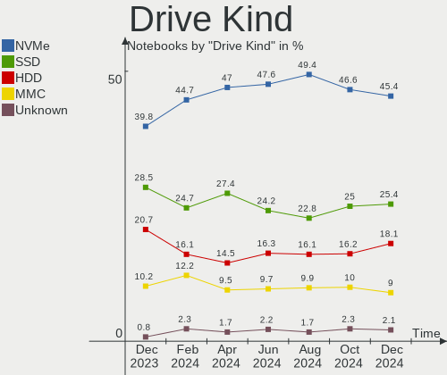
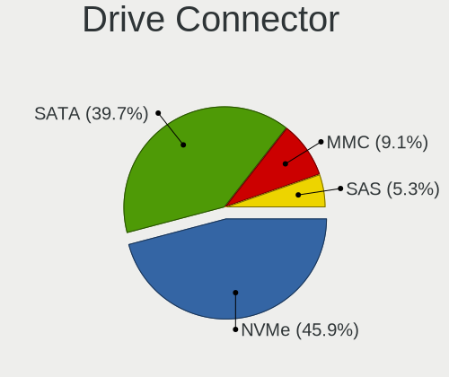
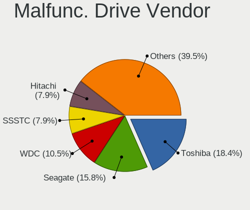
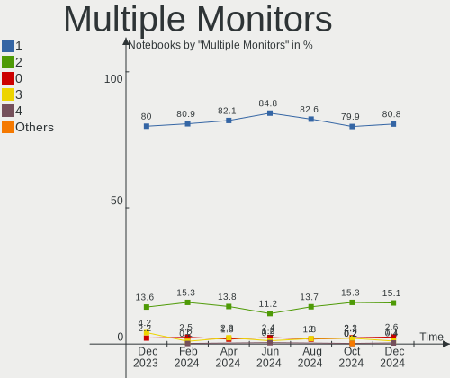
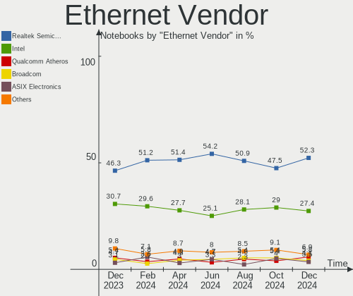
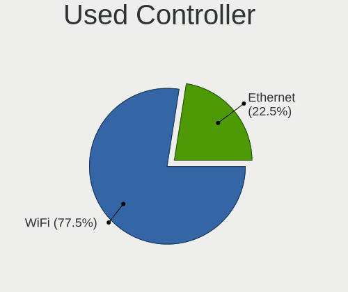
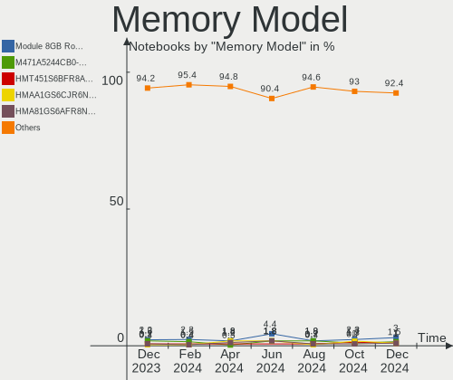
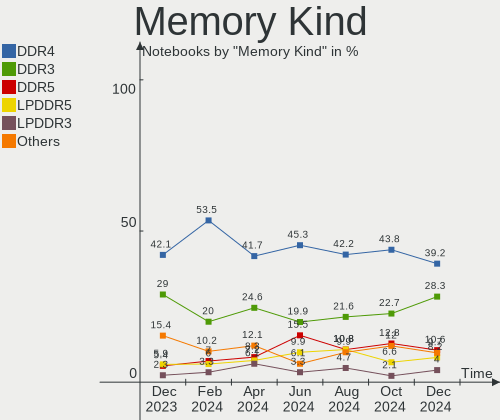

Linux in USA - Hardware Trends (Notebooks)
------------------------------------------

A project to identify most popular hardware characteristics and track their change
over time based on data collected by Linux users at https://Linux-Hardware.org.

Anyone can contribute to this report by the [hw-probe](https://github.com/linuxhw/hw-probe) tool:

    sudo -E hw-probe -all -upload

Period: Feb, 2023.

Contents
--------

* [ System ](#system)
  - [ OS                       ](#os)
  - [ OS Family                ](#os-family)
  - [ Kernel                   ](#kernel)
  - [ Kernel Family            ](#kernel-family)
  - [ Kernel Major Ver.        ](#kernel-major-ver)
  - [ Arch                     ](#arch)
  - [ DE                       ](#de)
  - [ Display Server           ](#display-server)
  - [ Display Manager          ](#display-manager)
  - [ OS Lang                  ](#os-lang)
  - [ Boot Mode                ](#boot-mode)
  - [ Filesystem               ](#filesystem)
  - [ Part. scheme             ](#part-scheme)
  - [ Dual Boot with Linux/BSD ](#dual-boot-with-linuxbsd)
  - [ Dual Boot (Win)          ](#dual-boot-win)

* [ Board ](#board)
  - [ Vendor                   ](#vendor)
  - [ Model                    ](#model)
  - [ Model Family             ](#model-family)
  - [ MFG Year                 ](#mfg-year)
  - [ Form Factor              ](#form-factor)
  - [ Secure Boot              ](#secure-boot)
  - [ Coreboot                 ](#coreboot)
  - [ RAM Size                 ](#ram-size)
  - [ RAM Used                 ](#ram-used)
  - [ Total Drives             ](#total-drives)
  - [ Has CD-ROM               ](#has-cd-rom)
  - [ Has Ethernet             ](#has-ethernet)
  - [ Has WiFi                 ](#has-wifi)
  - [ Has Bluetooth            ](#has-bluetooth)

* [ Location ](#location)
  - [ Country                  ](#country)
  - [ City                     ](#city)

* [ Drives ](#drives)
  - [ Drive Vendor             ](#drive-vendor)
  - [ Drive Model              ](#drive-model)
  - [ HDD Vendor               ](#hdd-vendor)
  - [ SSD Vendor               ](#ssd-vendor)
  - [ Drive Kind               ](#drive-kind)
  - [ Drive Connector          ](#drive-connector)
  - [ Drive Size               ](#drive-size)
  - [ Space Total              ](#space-total)
  - [ Space Used               ](#space-used)
  - [ Malfunc. Drives          ](#malfunc-drives)
  - [ Malfunc. Drive Vendor    ](#malfunc-drive-vendor)
  - [ Malfunc. HDD Vendor      ](#malfunc-hdd-vendor)
  - [ Malfunc. Drive Kind      ](#malfunc-drive-kind)
  - [ Failed Drives            ](#failed-drives)
  - [ Failed Drive Vendor      ](#failed-drive-vendor)
  - [ Drive Status             ](#drive-status)

* [ Storage controller ](#storage-controller)
  - [ Storage Vendor           ](#storage-vendor)
  - [ Storage Model            ](#storage-model)
  - [ Storage Kind             ](#storage-kind)

* [ Processor ](#processor)
  - [ CPU Vendor               ](#cpu-vendor)
  - [ CPU Model                ](#cpu-model)
  - [ CPU Model Family         ](#cpu-model-family)
  - [ CPU Cores                ](#cpu-cores)
  - [ CPU Sockets              ](#cpu-sockets)
  - [ CPU Threads              ](#cpu-threads)
  - [ CPU Op-Modes             ](#cpu-op-modes)
  - [ CPU Microcode            ](#cpu-microcode)
  - [ CPU Microarch            ](#cpu-microarch)

* [ Graphics ](#graphics)
  - [ GPU Vendor               ](#gpu-vendor)
  - [ GPU Model                ](#gpu-model)
  - [ GPU Combo                ](#gpu-combo)
  - [ GPU Driver               ](#gpu-driver)
  - [ GPU Memory               ](#gpu-memory)

* [ Monitor ](#monitor)
  - [ Monitor Vendor           ](#monitor-vendor)
  - [ Monitor Model            ](#monitor-model)
  - [ Monitor Resolution       ](#monitor-resolution)
  - [ Monitor Diagonal         ](#monitor-diagonal)
  - [ Monitor Width            ](#monitor-width)
  - [ Aspect Ratio             ](#aspect-ratio)
  - [ Monitor Area             ](#monitor-area)
  - [ Pixel Density            ](#pixel-density)
  - [ Multiple Monitors        ](#multiple-monitors)

* [ Network ](#network)
  - [ Net Controller Vendor    ](#net-controller-vendor)
  - [ Net Controller Model     ](#net-controller-model)
  - [ Wireless Vendor          ](#wireless-vendor)
  - [ Wireless Model           ](#wireless-model)
  - [ Ethernet Vendor          ](#ethernet-vendor)
  - [ Ethernet Model           ](#ethernet-model)
  - [ Net Controller Kind      ](#net-controller-kind)
  - [ Used Controller          ](#used-controller)
  - [ NICs                     ](#nics)
  - [ IPv6                     ](#ipv6)

* [ Bluetooth ](#bluetooth)
  - [ Bluetooth Vendor         ](#bluetooth-vendor)
  - [ Bluetooth Model          ](#bluetooth-model)

* [ Sound ](#sound)
  - [ Sound Vendor             ](#sound-vendor)
  - [ Sound Model              ](#sound-model)

* [ Memory ](#memory)
  - [ Memory Vendor            ](#memory-vendor)
  - [ Memory Model             ](#memory-model)
  - [ Memory Kind              ](#memory-kind)
  - [ Memory Form Factor       ](#memory-form-factor)
  - [ Memory Size              ](#memory-size)
  - [ Memory Speed             ](#memory-speed)

* [ Printers & scanners ](#printers--scanners)
  - [ Printer Vendor           ](#printer-vendor)
  - [ Printer Model            ](#printer-model)
  - [ Scanner Vendor           ](#scanner-vendor)
  - [ Scanner Model            ](#scanner-model)

* [ Camera ](#camera)
  - [ Camera Vendor            ](#camera-vendor)
  - [ Camera Model             ](#camera-model)

* [ Security ](#security)
  - [ Fingerprint Vendor       ](#fingerprint-vendor)
  - [ Fingerprint Model        ](#fingerprint-model)
  - [ Chipcard Vendor          ](#chipcard-vendor)
  - [ Chipcard Model           ](#chipcard-model)

* [ Unsupported ](#unsupported)
  - [ Unsupported Devices      ](#unsupported-devices)
  - [ Unsupported Device Types ](#unsupported-device-types)

System
------

OS
--

Installed operating systems

| Name                         | Notebooks | Percent |
|------------------------------|-----------|---------|
| Ubuntu 22.04                 | 75        | 15.24%  |
| Pop!_OS 22.04                | 45        | 9.15%   |
| Fedora 37                    | 36        | 7.32%   |
| Ubuntu 22.10                 | 28        | 5.69%   |
| OpenMandriva 23.01           | 27        | 5.49%   |
| Linux Mint 21.1              | 26        | 5.28%   |
| SteamOS 3.4.4                | 25        | 5.08%   |
| Debian 11                    | 21        | 4.27%   |
| Zorin 16                     | 19        | 3.86%   |
| Arch Rolling                 | 17        | 3.46%   |
| KDE neon 22.04               | 12        | 2.44%   |
| Kubuntu 22.10                | 11        | 2.24%   |
| Linux Mint 20.3              | 9         | 1.83%   |
| Manjaro                      | 8         | 1.63%   |
| Ubuntu 20.04                 | 7         | 1.42%   |
| Nobara 37                    | 6         | 1.22%   |
| Kubuntu 22.04                | 5         | 1.02%   |
| openSUSE Tumbleweed-XXXXXXXX | 4         | 0.81%   |
| MX 21                        | 4         | 0.81%   |
| Lubuntu 22.04                | 4         | 0.81%   |
| Kali 2022.4                  | 4         | 0.81%   |
| EndeavourOS Rolling          | 4         | 0.81%   |
| Elementary 7                 | 4         | 0.81%   |
| ArcoLinux Rolling            | 4         | 0.81%   |
| Parrot 5.1                   | 3         | 0.61%   |
| OpenMandriva 4.3             | 3         | 0.61%   |
| LMDE 5                       | 3         | 0.61%   |
| Linux Mint 21                | 3         | 0.61%   |
| Gentoo 2.13                  | 3         | 0.61%   |
| Garuda Linux Soaring         | 3         | 0.61%   |
| Zorin 15                     | 2         | 0.41%   |
| Ubuntu 20.10                 | 2         | 0.41%   |
| TUXEDO OS 22.04              | 2         | 0.41%   |
| Parrot 5.2                   | 2         | 0.41%   |
| OpenMandriva 4.90            | 2         | 0.41%   |
| Manjaro 22.0.3               | 2         | 0.41%   |
| Manjaro 22.0.2               | 2         | 0.41%   |
| Manjaro 22.0.1               | 2         | 0.41%   |
| Lubuntu 20.04                | 2         | 0.41%   |
| Kubuntu 20.04                | 2         | 0.41%   |

OS Family
---------

OS without a version

| Name         | Notebooks | Percent |
|--------------|-----------|---------|
| Ubuntu       | 114       | 23.17%  |
| Pop!_OS      | 45        | 9.15%   |
| Linux Mint   | 39        | 7.93%   |
| Fedora       | 37        | 7.52%   |
| OpenMandriva | 34        | 6.91%   |
| SteamOS      | 29        | 5.89%   |
| Debian       | 23        | 4.67%   |
| Zorin        | 21        | 4.27%   |
| Kubuntu      | 19        | 3.86%   |
| Arch         | 17        | 3.46%   |
| Manjaro      | 14        | 2.85%   |
| KDE neon     | 12        | 2.44%   |
| Parrot       | 6         | 1.22%   |
| Nobara       | 6         | 1.22%   |
| Lubuntu      | 6         | 1.22%   |
| Elementary   | 6         | 1.22%   |
| Kali         | 5         | 1.02%   |
| openSUSE     | 4         | 0.81%   |
| MX           | 4         | 0.81%   |
| Gentoo       | 4         | 0.81%   |
| EndeavourOS  | 4         | 0.81%   |
| ArcoLinux    | 4         | 0.81%   |
| Xubuntu      | 3         | 0.61%   |
| LMDE         | 3         | 0.61%   |
| Garuda Linux | 3         | 0.61%   |
| Endless      | 3         | 0.61%   |
| Ubuntu MATE  | 2         | 0.41%   |
| TUXEDO OS    | 2         | 0.41%   |
| BunsenLabs   | 2         | 0.41%   |
| Athena       | 2         | 0.41%   |
| Artix        | 2         | 0.41%   |
| Xero         | 1         | 0.2%    |
| Void Linux   | 1         | 0.2%    |
| Ubuntu Unity | 1         | 0.2%    |
| Slackware    | 1         | 0.2%    |
| Siduction    | 1         | 0.2%    |
| Rocky Linux  | 1         | 0.2%    |
| RHEL         | 1         | 0.2%    |
| Q4OS         | 1         | 0.2%    |
| PCLinuxOS    | 1         | 0.2%    |

Kernel
------

Version of the Linux kernel

| Version                      | Notebooks | Percent |
|------------------------------|-----------|---------|
| 5.15.0-60-generic            | 53        | 10.77%  |
| 5.15.0-58-generic            | 47        | 9.55%   |
| 6.0.12-76060006-generic      | 34        | 6.91%   |
| 5.19.0-32-generic            | 31        | 6.3%    |
| 5.13.0-valve36-1-neptune     | 26        | 5.28%   |
| 5.19.0-31-generic            | 24        | 4.88%   |
| 6.1.1-desktop-1omv2290       | 23        | 4.67%   |
| 5.10.0-21-amd64              | 14        | 2.85%   |
| 6.1.11-200.fc37.x86_64       | 11        | 2.24%   |
| 6.1.11-76060111-generic      | 8         | 1.63%   |
| 5.19.0-35-generic            | 8         | 1.63%   |
| 5.19.0-29-generic            | 7         | 1.42%   |
| 5.15.0-56-generic            | 7         | 1.42%   |
| 6.1.9-200.fc37.x86_64        | 6         | 1.22%   |
| 6.1.7-1-MANJARO              | 6         | 1.22%   |
| 6.1.12-arch1-1               | 6         | 1.22%   |
| 5.4.0-139-generic            | 6         | 1.22%   |
| 5.15.0-43-generic            | 6         | 1.22%   |
| 5.10.0-20-amd64              | 6         | 1.22%   |
| 6.1.13-200.fc37.x86_64       | 5         | 1.02%   |
| 6.1.11-arch1-1               | 5         | 1.02%   |
| 6.1.11-1-MANJARO             | 5         | 1.02%   |
| 6.1.10-200.fc37.x86_64       | 4         | 0.81%   |
| 6.0.0-kali6-amd64            | 4         | 0.81%   |
| 5.4.0-137-generic            | 4         | 0.81%   |
| 6.1.9-arch1-2                | 3         | 0.61%   |
| 6.1.8-200.fc37.x86_64        | 3         | 0.61%   |
| 6.1.12-200.fc37.x86_64       | 3         | 0.61%   |
| 6.1.12-1-default             | 3         | 0.61%   |
| 6.1.11-201.fsync.fc37.x86_64 | 3         | 0.61%   |
| 6.0.0-12parrot1-amd64        | 3         | 0.61%   |
| 6.0.0-0.deb11.6-amd64        | 3         | 0.61%   |
| 5.16.13-desktop-1omv4003     | 3         | 0.61%   |
| 5.15.0-47-generic            | 3         | 0.61%   |
| 5.15.0-41-generic            | 3         | 0.61%   |
| 6.2.1-desktop-1omv2390       | 2         | 0.41%   |
| 6.2.1-arch1-1                | 2         | 0.41%   |
| 6.1.8-zen1-1-zen             | 2         | 0.41%   |
| 6.1.4-desktop-1omv2301       | 2         | 0.41%   |
| 6.1.10-arch1-1               | 2         | 0.41%   |

Kernel Family
-------------

Linux kernel without a distro release

| Version | Notebooks | Percent |
|---------|-----------|---------|
| 5.15.0  | 130       | 26.42%  |
| 5.19.0  | 73        | 14.84%  |
| 6.1.11  | 36        | 7.32%   |
| 6.0.12  | 34        | 6.91%   |
| 5.13.0  | 28        | 5.69%   |
| 6.1.1   | 26        | 5.28%   |
| 5.10.0  | 22        | 4.47%   |
| 6.1.12  | 19        | 3.86%   |
| 6.1.9   | 18        | 3.66%   |
| 6.0.0   | 16        | 3.25%   |
| 5.4.0   | 15        | 3.05%   |
| 6.1.10  | 11        | 2.24%   |
| 6.1.7   | 7         | 1.42%   |
| 6.1.8   | 6         | 1.22%   |
| 6.1.13  | 6         | 1.22%   |
| 6.1.0   | 5         | 1.02%   |
| 6.2.1   | 4         | 0.81%   |
| 6.2.0   | 4         | 0.81%   |
| 6.1.4   | 3         | 0.61%   |
| 5.16.13 | 3         | 0.61%   |
| 4.15.0  | 3         | 0.61%   |
| 6.0.7   | 2         | 0.41%   |
| 5.8.0   | 2         | 0.41%   |
| 5.18.12 | 2         | 0.41%   |
| 5.18.10 | 2         | 0.41%   |
| 6.1.6   | 1         | 0.2%    |
| 6.0.9   | 1         | 0.2%    |
| 5.18.19 | 1         | 0.2%    |
| 5.18.0  | 1         | 0.2%    |
| 5.16.7  | 1         | 0.2%    |
| 5.16.0  | 1         | 0.2%    |
| 5.15.94 | 1         | 0.2%    |
| 5.15.91 | 1         | 0.2%    |
| 5.15.87 | 1         | 0.2%    |
| 5.15.79 | 1         | 0.2%    |
| 5.14.0  | 1         | 0.2%    |
| 5.11.0  | 1         | 0.2%    |
| 4.4.275 | 1         | 0.2%    |
| 4.19.0  | 1         | 0.2%    |
| 4.18.0  | 1         | 0.2%    |

Kernel Major Ver.
-----------------

Linux kernel major version

| Version | Notebooks | Percent |
|---------|-----------|---------|
| 6.1     | 138       | 28.05%  |
| 5.15    | 134       | 27.24%  |
| 5.19    | 73        | 14.84%  |
| 6.0     | 53        | 10.77%  |
| 5.13    | 28        | 5.69%   |
| 5.10    | 22        | 4.47%   |
| 5.4     | 15        | 3.05%   |
| 6.2     | 8         | 1.63%   |
| 5.18    | 6         | 1.22%   |
| 5.16    | 5         | 1.02%   |
| 4.15    | 3         | 0.61%   |
| 5.8     | 2         | 0.41%   |
| 5.14    | 1         | 0.2%    |
| 5.11    | 1         | 0.2%    |
| 4.4     | 1         | 0.2%    |
| 4.19    | 1         | 0.2%    |
| 4.18    | 1         | 0.2%    |

Arch
----

OS architecture (x86_64, i586, etc.)

| Name    | Notebooks | Percent |
|---------|-----------|---------|
| x86_64  | 486       | 98.78%  |
| i686    | 3         | 0.61%   |
| aarch64 | 3         | 0.61%   |

DE
--

Desktop Environment

| Name            | Notebooks | Percent |
|-----------------|-----------|---------|
| GNOME           | 229       | 46.54%  |
| KDE5            | 133       | 27.03%  |
| X-Cinnamon      | 38        | 7.72%   |
| XFCE            | 31        | 6.3%    |
| MATE            | 16        | 3.25%   |
| Unknown         | 16        | 3.25%   |
| LXQt            | 7         | 1.42%   |
| Pantheon        | 6         | 1.22%   |
| Cinnamon        | 4         | 0.81%   |
| sway            | 2         | 0.41%   |
| i3              | 2         | 0.41%   |
| Deepin          | 2         | 0.41%   |
| xinitrc         | 1         | 0.2%    |
| Unity           | 1         | 0.2%    |
| KDE             | 1         | 0.2%    |
| GNOME Flashback | 1         | 0.2%    |
| dot-xsession    | 1         | 0.2%    |
| BunsenLabs      | 1         | 0.2%    |

Display Server
--------------

X11 or Wayland

| Name    | Notebooks | Percent |
|---------|-----------|---------|
| X11     | 340       | 69.11%  |
| Wayland | 132       | 26.83%  |
| Unknown | 16        | 3.25%   |
| Tty     | 4         | 0.81%   |

Display Manager
---------------

SDDM, LightDM, etc.

| Name    | Notebooks | Percent |
|---------|-----------|---------|
| Unknown | 207       | 42.07%  |
| GDM3    | 113       | 22.97%  |
| SDDM    | 78        | 15.85%  |
| LightDM | 69        | 14.02%  |
| GDM     | 24        | 4.88%   |
| GREETD  | 1         | 0.2%    |

OS Lang
-------

Language

| Lang        | Notebooks | Percent |
|-------------|-----------|---------|
| en_US       | 469       | 95.33%  |
| Unknown     | 9         | 1.83%   |
| C           | 4         | 0.81%   |
| zh_CN       | 2         | 0.41%   |
| en_GB       | 2         | 0.41%   |
| fr_FR       | 1         | 0.2%    |
| es_US       | 1         | 0.2%    |
| es_ES       | 1         | 0.2%    |
| en_US.utf-8 | 1         | 0.2%    |
| en_CA       | 1         | 0.2%    |
| C.UTF8      | 1         | 0.2%    |

Boot Mode
---------

EFI or BIOS

| Mode | Notebooks | Percent |
|------|-----------|---------|
| BIOS | 259       | 52.64%  |
| EFI  | 233       | 47.36%  |

Filesystem
----------

Type of filesystem

| Type    | Notebooks | Percent |
|---------|-----------|---------|
| Ext4    | 336       | 68.29%  |
| Btrfs   | 107       | 21.75%  |
| Overlay | 31        | 6.3%    |
| Zfs     | 8         | 1.63%   |
| Xfs     | 6         | 1.22%   |
| Tmpfs   | 3         | 0.61%   |
| Ext2    | 1         | 0.2%    |

Part. scheme
------------

Scheme of partitioning

| Type    | Notebooks | Percent |
|---------|-----------|---------|
| GPT     | 264       | 53.66%  |
| Unknown | 195       | 39.63%  |
| MBR     | 33        | 6.71%   |

Dual Boot with Linux/BSD
------------------------

Hosting more than one Linux/BSD

| Dual boot | Notebooks | Percent |
|-----------|-----------|---------|
| No        | 438       | 89.02%  |
| Yes       | 54        | 10.98%  |

Dual Boot (Win)
---------------

Hosting Linux and Windows

| Dual boot | Notebooks | Percent |
|-----------|-----------|---------|
| No        | 415       | 84.35%  |
| Yes       | 77        | 15.65%  |

Board
-----

Vendor
------

Motherboard manufacturer

| Name                   | Notebooks | Percent |
|------------------------|-----------|---------|
| Lenovo                 | 100       | 20.33%  |
| Dell                   | 99        | 20.12%  |
| Hewlett-Packard        | 88        | 17.89%  |
| ASUSTek Computer       | 39        | 7.93%   |
| Valve                  | 27        | 5.49%   |
| Apple                  | 27        | 5.49%   |
| Acer                   | 23        | 4.67%   |
| Google                 | 16        | 3.25%   |
| MSI                    | 12        | 2.44%   |
| Toshiba                | 9         | 1.83%   |
| Unknown                | 7         | 1.42%   |
| System76               | 6         | 1.22%   |
| Gateway                | 5         | 1.02%   |
| Alienware              | 4         | 0.81%   |
| Sony                   | 3         | 0.61%   |
| GPU Company            | 3         | 0.61%   |
| Gigabyte Technology    | 3         | 0.61%   |
| Samsung Electronics    | 2         | 0.41%   |
| ONE-NETBOOK TECHNOLOGY | 2         | 0.41%   |
| Wortmann AG            | 1         | 0.2%    |
| Star Labs              | 1         | 0.2%    |
| SK hynix               | 1         | 0.2%    |
| Panasonic              | 1         | 0.2%    |
| OriginPC               | 1         | 0.2%    |
| MobileDemand           | 1         | 0.2%    |
| Micro Electronics      | 1         | 0.2%    |
| MECHREVO               | 1         | 0.2%    |
| LincPlus               | 1         | 0.2%    |
| HUAWEI                 | 1         | 0.2%    |
| Fujitsu                | 1         | 0.2%    |
| Framework              | 1         | 0.2%    |
| Dynabook               | 1         | 0.2%    |
| Direkt-Tek             | 1         | 0.2%    |
| DERE                   | 1         | 0.2%    |
| CyberPowerPC           | 1         | 0.2%    |
| Core Innovations       | 1         | 0.2%    |

Model
-----

Motherboard model

| Name                                     | Notebooks | Percent |
|------------------------------------------|-----------|---------|
| Valve Jupiter                            | 27        | 5.49%   |
| Unknown                                  | 7         | 1.42%   |
| HP 2000                                  | 4         | 0.81%   |
| HP 15 Notebook PC                        | 4         | 0.81%   |
| Dell Precision M4800                     | 4         | 0.81%   |
| Apple MacBookPro9,2                      | 3         | 0.61%   |
| Apple MacBookPro8,1                      | 3         | 0.61%   |
| Lenovo IdeaPad 5 15IAL7 82SF             | 2         | 0.41%   |
| Lenovo IdeaPad 5 15ABA7 82SG             | 2         | 0.41%   |
| Lenovo IdeaPad 1 15ALC7 82R4             | 2         | 0.41%   |
| Lenovo IdeaPad 1 15ADA7 82R1             | 2         | 0.41%   |
| HP ProBook 6465b                         | 2         | 0.41%   |
| HP Pavilion Laptop 15-eg0xxx             | 2         | 0.41%   |
| HP Pavilion Laptop 15-cc5xx              | 2         | 0.41%   |
| HP Pavilion dv7                          | 2         | 0.41%   |
| HP Pavilion 17                           | 2         | 0.41%   |
| HP Pavilion 15                           | 2         | 0.41%   |
| HP ENVY 17                               | 2         | 0.41%   |
| HP 15                                    | 2         | 0.41%   |
| GPU Company GWTC116-2                    | 2         | 0.41%   |
| Dell XPS 15 9500                         | 2         | 0.41%   |
| Dell XPS 15 7590                         | 2         | 0.41%   |
| Dell XPS 13 9360                         | 2         | 0.41%   |
| Dell Precision 7770                      | 2         | 0.41%   |
| Dell Latitude E5570                      | 2         | 0.41%   |
| Dell Latitude E5450                      | 2         | 0.41%   |
| Dell Latitude 7480                       | 2         | 0.41%   |
| Dell Inspiron 5537                       | 2         | 0.41%   |
| Dell Inspiron 3793                       | 2         | 0.41%   |
| Dell Inspiron 15 3511                    | 2         | 0.41%   |
| ASUS VivoBook_ASUSLaptop S5402ZA_S5402ZA | 2         | 0.41%   |
| ASUS TUF Gaming FX705DT_FX705DT          | 2         | 0.41%   |
| ASUS ROG Strix G512LW_G512LW             | 2         | 0.41%   |
| Apple MacBookPro16,2                     | 2         | 0.41%   |
| Apple MacBookPro16,1                     | 2         | 0.41%   |
| Apple MacBook4,1                         | 2         | 0.41%   |
| Alienware 17 R5                          | 2         | 0.41%   |
| Acer Predator G3-571                     | 2         | 0.41%   |
| Acer Aspire A515-46                      | 2         | 0.41%   |
| Wortmann AG 1220595_1470122              | 1         | 0.2%    |

Model Family
------------

Motherboard model prefix

| Name                  | Notebooks | Percent |
|-----------------------|-----------|---------|
| Lenovo ThinkPad       | 68        | 13.82%  |
| Dell Latitude         | 30        | 6.1%    |
| Dell Inspiron         | 29        | 5.89%   |
| Valve Jupiter         | 27        | 5.49%   |
| Lenovo IdeaPad        | 18        | 3.66%   |
| HP Pavilion           | 18        | 3.66%   |
| Dell XPS              | 16        | 3.25%   |
| HP Laptop             | 15        | 3.05%   |
| HP EliteBook          | 12        | 2.44%   |
| Acer Aspire           | 12        | 2.44%   |
| Dell Precision        | 11        | 2.24%   |
| ASUS VivoBook         | 11        | 2.24%   |
| HP ProBook            | 8         | 1.63%   |
| HP ENVY               | 8         | 1.63%   |
| Toshiba Satellite     | 7         | 1.42%   |
| Unknown               | 7         | 1.42%   |
| Lenovo Legion         | 6         | 1.22%   |
| HP 15                 | 6         | 1.22%   |
| ASUS ROG              | 6         | 1.22%   |
| ASUS ZenBook          | 5         | 1.02%   |
| MSI GF63              | 4         | 0.81%   |
| HP 2000               | 4         | 0.81%   |
| Dell Vostro           | 4         | 0.81%   |
| Apple MacBookPro16    | 4         | 0.81%   |
| Acer Predator         | 4         | 0.81%   |
| HP Stream             | 3         | 0.61%   |
| Dell Venue            | 3         | 0.61%   |
| Dell G15              | 3         | 0.61%   |
| Apple MacBookPro9     | 3         | 0.61%   |
| Apple MacBookPro8     | 3         | 0.61%   |
| Apple MacBookPro11    | 3         | 0.61%   |
| Acer Nitro            | 3         | 0.61%   |
| System76 Lemur        | 2         | 0.41%   |
| MSI GE75              | 2         | 0.41%   |
| HP ZBook              | 2         | 0.41%   |
| HP Victus             | 2         | 0.41%   |
| HP Presario           | 2         | 0.41%   |
| HP OMEN               | 2         | 0.41%   |
| GPU Company GWTC116-2 | 2         | 0.41%   |
| Gigabyte AERO         | 2         | 0.41%   |

MFG Year
--------

Motherboard manufacture year

| Year    | Notebooks | Percent |
|---------|-----------|---------|
| 2022    | 89        | 18.09%  |
| 2021    | 45        | 9.15%   |
| 2019    | 45        | 9.15%   |
| 2020    | 42        | 8.54%   |
| 2018    | 34        | 6.91%   |
| 2013    | 34        | 6.91%   |
| 2017    | 32        | 6.5%    |
| 2012    | 30        | 6.1%    |
| 2015    | 27        | 5.49%   |
| 2011    | 25        | 5.08%   |
| 2016    | 20        | 4.07%   |
| 2010    | 18        | 3.66%   |
| 2014    | 16        | 3.25%   |
| 2023    | 9         | 1.83%   |
| 2009    | 8         | 1.63%   |
| 2008    | 7         | 1.42%   |
| 2007    | 7         | 1.42%   |
| Unknown | 3         | 0.61%   |
| 2004    | 1         | 0.2%    |

Form Factor
-----------

Physical design of the computer

| Name     | Notebooks | Percent |
|----------|-----------|---------|
| Notebook | 492       | 100%    |

Secure Boot
-----------

Enabled or disabled

| State    | Notebooks | Percent |
|----------|-----------|---------|
| Disabled | 454       | 92.28%  |
| Enabled  | 38        | 7.72%   |

Coreboot
--------

Have coreboot on board

| Used | Notebooks | Percent |
|------|-----------|---------|
| No   | 472       | 95.93%  |
| Yes  | 20        | 4.07%   |

RAM Size
--------

Total RAM memory

| Size in GB  | Notebooks | Percent |
|-------------|-----------|---------|
| 4.01-8.0    | 120       | 24.39%  |
| 8.01-16.0   | 107       | 21.75%  |
| 16.01-24.0  | 96        | 19.51%  |
| 3.01-4.0    | 79        | 16.06%  |
| 32.01-64.0  | 53        | 10.77%  |
| 64.01-256.0 | 11        | 2.24%   |
| 1.01-2.0    | 11        | 2.24%   |
| 24.01-32.0  | 10        | 2.03%   |
| 2.01-3.0    | 5         | 1.02%   |

RAM Used
--------

Used RAM memory

| Used GB    | Notebooks | Percent |
|------------|-----------|---------|
| 1.01-2.0   | 152       | 30.89%  |
| 2.01-3.0   | 117       | 23.78%  |
| 4.01-8.0   | 99        | 20.12%  |
| 3.01-4.0   | 88        | 17.89%  |
| 8.01-16.0  | 19        | 3.86%   |
| 0.51-1.0   | 9         | 1.83%   |
| 0.01-0.5   | 3         | 0.61%   |
| 24.01-32.0 | 2         | 0.41%   |
| 16.01-24.0 | 2         | 0.41%   |
| 32.01-64.0 | 1         | 0.2%    |

Total Drives
------------

Number of drives on board

| Drives | Notebooks | Percent |
|--------|-----------|---------|
| 1      | 342       | 69.51%  |
| 2      | 127       | 25.81%  |
| 3      | 16        | 3.25%   |
| 4      | 4         | 0.81%   |
| 0      | 3         | 0.61%   |

Has CD-ROM
----------

Has CD-ROM on board

| Presented | Notebooks | Percent |
|-----------|-----------|---------|
| No        | 363       | 73.78%  |
| Yes       | 129       | 26.22%  |

Has Ethernet
------------

Has Ethernet on board

| Presented | Notebooks | Percent |
|-----------|-----------|---------|
| Yes       | 341       | 69.31%  |
| No        | 151       | 30.69%  |

Has WiFi
--------

Has WiFi module

| Presented | Notebooks | Percent |
|-----------|-----------|---------|
| Yes       | 485       | 98.58%  |
| No        | 7         | 1.42%   |

Has Bluetooth
-------------

Has Bluetooth module

| Presented | Notebooks | Percent |
|-----------|-----------|---------|
| Yes       | 401       | 81.5%   |
| No        | 91        | 18.5%   |

Location
--------

Country
-------

Geographic location (country)

| Country | Notebooks | Percent |
|---------|-----------|---------|
| USA     | 492       | 100%    |

City
----

Geographic location (city)

| City             | Notebooks | Percent |
|------------------|-----------|---------|
| Houston          | 9         | 1.83%   |
| Chicago          | 9         | 1.83%   |
| New York         | 7         | 1.42%   |
| Miami            | 7         | 1.42%   |
| Seattle          | 6         | 1.22%   |
| Los Angeles      | 6         | 1.22%   |
| Denver           | 6         | 1.22%   |
| Colorado Springs | 6         | 1.22%   |
| Bangor           | 6         | 1.22%   |
| Phoenix          | 5         | 1.02%   |
| Memphis          | 5         | 1.02%   |
| Lansing          | 5         | 1.02%   |
| Dallas           | 5         | 1.02%   |
| Atlanta          | 5         | 1.02%   |
| San Jose         | 4         | 0.81%   |
| San Francisco    | 4         | 0.81%   |
| Queens           | 4         | 0.81%   |
| Portland         | 4         | 0.81%   |
| Philadelphia     | 4         | 0.81%   |
| Columbus         | 4         | 0.81%   |
| Vancouver        | 3         | 0.61%   |
| San Antonio      | 3         | 0.61%   |
| Saint Paul       | 3         | 0.61%   |
| Rochester        | 3         | 0.61%   |
| Lancaster        | 3         | 0.61%   |
| Kansas City      | 3         | 0.61%   |
| Indianapolis     | 3         | 0.61%   |
| Frisco           | 3         | 0.61%   |
| Baton Rouge      | 3         | 0.61%   |
| Wylie            | 2         | 0.41%   |
| Willingboro      | 2         | 0.41%   |
| West Stockbridge | 2         | 0.41%   |
| Tulsa            | 2         | 0.41%   |
| Trenton          | 2         | 0.41%   |
| Sunnyvale        | 2         | 0.41%   |
| Sun Prairie      | 2         | 0.41%   |
| Springfield      | 2         | 0.41%   |
| Saint Augustine  | 2         | 0.41%   |
| Sacramento       | 2         | 0.41%   |
| Roswell          | 2         | 0.41%   |

Drives
------

Drive Vendor
------------

Hard drive vendors

| Vendor                      | Notebooks | Drives | Percent |
|-----------------------------|-----------|--------|---------|
| Samsung Electronics         | 112       | 118    | 17.95%  |
| Unknown                     | 64        | 69     | 10.26%  |
| Sandisk                     | 59        | 60     | 9.46%   |
| Seagate                     | 46        | 51     | 7.37%   |
| WDC                         | 38        | 40     | 6.09%   |
| Toshiba                     | 36        | 37     | 5.77%   |
| SK hynix                    | 29        | 30     | 4.65%   |
| HGST                        | 24        | 24     | 3.85%   |
| Intel                       | 20        | 24     | 3.21%   |
| Micron Technology           | 19        | 19     | 3.04%   |
| Apple                       | 19        | 24     | 3.04%   |
| Crucial                     | 18        | 20     | 2.88%   |
| Kingston Technology Company | 12        | 12     | 1.92%   |
| Kingston                    | 12        | 12     | 1.92%   |
| Hitachi                     | 12        | 12     | 1.92%   |
| Unknown                     | 12        | 12     | 1.92%   |
| KIOXIA                      | 10        | 10     | 1.6%    |
| Phison Electronics          | 8         | 8      | 1.28%   |
| O2 Micro                    | 6         | 6      | 0.96%   |
| China                       | 6         | 6      | 0.96%   |
| Silicon Motion              | 4         | 4      | 0.64%   |
| PNY                         | 4         | 4      | 0.64%   |
| Micron/Crucial Technology   | 4         | 4      | 0.64%   |
| Fujitsu                     | 4         | 4      | 0.64%   |
| A-DATA Technology           | 4         | 4      | 0.64%   |
| T-FORCE                     | 3         | 3      | 0.48%   |
| SPCC                        | 3         | 3      | 0.48%   |
| SABRENT                     | 3         | 3      | 0.48%   |
| SSK                         | 2         | 2      | 0.32%   |
| Realtek                     | 2         | 2      | 0.32%   |
| Phison                      | 2         | 2      | 0.32%   |
| OCZ                         | 2         | 2      | 0.32%   |
| LITEONIT                    | 2         | 2      | 0.32%   |
| Lenovo                      | 2         | 2      | 0.32%   |
| Dogfish                     | 2         | 2      | 0.32%   |
| Zheino                      | 1         | 1      | 0.16%   |
| Wibtek                      | 1         | 1      | 0.16%   |
| VAVA                        | 1         | 1      | 0.16%   |
| Timetec                     | 1         | 1      | 0.16%   |
| TCSUNBOW                    | 1         | 1      | 0.16%   |

Drive Model
-----------

Hard drive models

| Model                                                 | Notebooks | Percent |
|-------------------------------------------------------|-----------|---------|
| Samsung NVMe SSD Controller SM981/PM981/PM983 250GB   | 24        | 3.71%   |
| Samsung NVMe SSD Controller PM9A1/PM9A3/980PRO 960GB  | 17        | 2.63%   |
| Unknown MMC Card  64GB                                | 12        | 1.85%   |
| Unknown                                               | 12        | 1.85%   |
| Kingston Company OM3PDP3 NVMe SSD 512GB               | 10        | 1.55%   |
| Unknown MMC Card  512GB                               | 9         | 1.39%   |
| Unknown MMC Card  32GB                                | 9         | 1.39%   |
| Unknown MMC Card  128GB                               | 9         | 1.39%   |
| Sandisk WD Black SN750 / PC SN730 NVMe SSD 512GB      | 7         | 1.08%   |
| HGST HTS721010A9E630 1TB                              | 7         | 1.08%   |
| HGST HTS545050A7E680 500GB                            | 7         | 1.08%   |
| Toshiba MQ01ABD100 1TB                                | 6         | 0.93%   |
| O2 Micro E2M2 64GB                                    | 6         | 0.93%   |
| Seagate ST1000LM035-1RK172 1TB                        | 5         | 0.77%   |
| Seagate ST1000LM024 HN-M101MBB 1TB                    | 5         | 0.77%   |
| Sandisk WD Blue SN550 NVMe SSD 1TB                    | 5         | 0.77%   |
| WDC WDS500G2B0B-00YS70 500GB SSD                      | 4         | 0.62%   |
| Toshiba MQ01ABF050 500GB                              | 4         | 0.62%   |
| Silicon Motion SM2263EN/SM2263XT SSD Controller 512GB | 4         | 0.62%   |
| Sandisk WD_BLACK SN770 1TB                            | 4         | 0.62%   |
| Samsung SSD 850 EVO 500GB                             | 4         | 0.62%   |
| Samsung SSD 850 EVO 250GB                             | 4         | 0.62%   |
| Samsung MZ9LQ512HBLU-00BVL 512GB                      | 4         | 0.62%   |
| Intel SSD 660P Series 1024GB                          | 4         | 0.62%   |
| Unknown MMC Card  256GB                               | 3         | 0.46%   |
| Unknown MMC Card  16GB                                | 3         | 0.46%   |
| SK hynix SKHynix_HFS512GDE9X081N 512GB                | 3         | 0.46%   |
| SK hynix HFM128GD3JX016N 128GB                        | 3         | 0.46%   |
| Seagate ST500LM000-1EJ162 500GB                       | 3         | 0.46%   |
| Seagate ST1000LM048-2E7172 1TB                        | 3         | 0.46%   |
| SanDisk Extreme 55AE 500GB SSD                        | 3         | 0.46%   |
| Samsung MZVLQ256HAJD-000H1 256GB                      | 3         | 0.46%   |
| SABRENT Disk 256GB                                    | 3         | 0.46%   |
| Phison PS5013 E13 NVMe Controller 500GB               | 3         | 0.46%   |
| Phison PCIe SSD 256GB                                 | 3         | 0.46%   |
| Micron/Crucial P2 NVMe PCIe SSD 1TB                   | 3         | 0.46%   |
| Micron 3400_MTFDKBA1T0TFH 1TB                         | 3         | 0.46%   |
| Intel HBRPEKNX0202AHO 32GB                            | 3         | 0.46%   |
| Intel HBRPEKNX0202AH 512GB                            | 3         | 0.46%   |
| HGST HTS725050A7E630 500GB                            | 3         | 0.46%   |

HDD Vendor
----------

Hard disk drive vendors

| Vendor              | Notebooks | Drives | Percent |
|---------------------|-----------|--------|---------|
| Seagate             | 43        | 47     | 31.62%  |
| Toshiba             | 25        | 25     | 18.38%  |
| HGST                | 24        | 24     | 17.65%  |
| WDC                 | 20        | 20     | 14.71%  |
| Hitachi             | 12        | 12     | 8.82%   |
| Fujitsu             | 4         | 4      | 2.94%   |
| SABRENT             | 3         | 3      | 2.21%   |
| Apple               | 2         | 2      | 1.47%   |
| Samsung Electronics | 1         | 1      | 0.74%   |
| JMicron Technology  | 1         | 1      | 0.74%   |
| ASMT                | 1         | 1      | 0.74%   |

SSD Vendor
----------

Solid state drive vendors

| Vendor              | Notebooks | Drives | Percent |
|---------------------|-----------|--------|---------|
| Samsung Electronics | 35        | 35     | 23.03%  |
| SanDisk             | 27        | 27     | 17.76%  |
| Crucial             | 14        | 16     | 9.21%   |
| WDC                 | 9         | 10     | 5.92%   |
| Kingston            | 9         | 9      | 5.92%   |
| Apple               | 8         | 8      | 5.26%   |
| Micron Technology   | 6         | 6      | 3.95%   |
| China               | 6         | 6      | 3.95%   |
| SK hynix            | 5         | 5      | 3.29%   |
| Toshiba             | 4         | 4      | 2.63%   |
| Intel               | 4         | 4      | 2.63%   |
| A-DATA Technology   | 4         | 4      | 2.63%   |
| SPCC                | 3         | 3      | 1.97%   |
| PNY                 | 3         | 3      | 1.97%   |
| OCZ                 | 2         | 2      | 1.32%   |
| LITEONIT            | 2         | 2      | 1.32%   |
| Dogfish             | 2         | 2      | 1.32%   |
| Zheino              | 1         | 1      | 0.66%   |
| TCSUNBOW            | 1         | 1      | 0.66%   |
| T-FORCE             | 1         | 1      | 0.66%   |
| SemsoTai            | 1         | 1      | 0.66%   |
| PNY CS90            | 1         | 1      | 0.66%   |
| OWC                 | 1         | 1      | 0.66%   |
| Netac               | 1         | 1      | 0.66%   |
| Mushkin             | 1         | 1      | 0.66%   |
| Unknown             | 1         | 1      | 0.66%   |

Drive Kind
----------

HDD or SSD

| Kind    | Notebooks | Drives | Percent |
|---------|-----------|--------|---------|
| NVMe    | 228       | 263    | 38.64%  |
| SSD     | 139       | 155    | 23.56%  |
| HDD     | 131       | 140    | 22.2%   |
| MMC     | 79        | 84     | 13.39%  |
| Unknown | 13        | 14     | 2.2%    |

Drive Connector
---------------

SATA, SAS, NVMe, etc.

| Type | Notebooks | Drives | Percent |
|------|-----------|--------|---------|
| SATA | 244       | 281    | 42.43%  |
| NVMe | 227       | 260    | 39.48%  |
| MMC  | 79        | 84     | 13.74%  |
| SAS  | 25        | 31     | 4.35%   |

Drive Size
----------

Size of hard drive

| Size in TB | Notebooks | Drives | Percent |
|------------|-----------|--------|---------|
| 0.01-0.5   | 174       | 192    | 63.97%  |
| 0.51-1.0   | 81        | 83     | 29.78%  |
| 1.01-2.0   | 13        | 15     | 4.78%   |
| 4.01-10.0  | 2         | 3      | 0.74%   |
| 3.01-4.0   | 1         | 1      | 0.37%   |
| 2.01-3.0   | 1         | 1      | 0.37%   |

Space Total
-----------

Amount of disk space available on the file system

| Size in GB     | Notebooks | Percent |
|----------------|-----------|---------|
| 251-500        | 129       | 26.22%  |
| 101-250        | 120       | 24.39%  |
| 501-1000       | 73        | 14.84%  |
| 1001-2000      | 39        | 7.93%   |
| 1-20           | 36        | 7.32%   |
| 51-100         | 32        | 6.5%    |
| Unknown        | 23        | 4.67%   |
| More than 3000 | 20        | 4.07%   |
| 21-50          | 14        | 2.85%   |
| 2001-3000      | 6         | 1.22%   |

Space Used
----------

Amount of used disk space

| Used GB        | Notebooks | Percent |
|----------------|-----------|---------|
| 1-20           | 177       | 35.98%  |
| 21-50          | 105       | 21.34%  |
| 51-100         | 65        | 13.21%  |
| 101-250        | 55        | 11.18%  |
| 251-500        | 39        | 7.93%   |
| Unknown        | 23        | 4.67%   |
| 501-1000       | 15        | 3.05%   |
| More than 3000 | 8         | 1.63%   |
| 1001-2000      | 4         | 0.81%   |
| 0              | 1         | 0.2%    |

Malfunc. Drives
---------------

Drive models with a malfunction

| Model                                 | Notebooks | Drives | Percent |
|---------------------------------------|-----------|--------|---------|
| HGST HTS541010A9E680 1TB              | 3         | 3      | 10%     |
| Hitachi HTS545050A7E380 500GB         | 2         | 2      | 6.67%   |
| HGST HTS541075A9E680 752GB            | 2         | 2      | 6.67%   |
| WDC WD7500BPVT-24HXZT3 752GB          | 1         | 1      | 3.33%   |
| Toshiba MQ01ACF032 320GB              | 1         | 1      | 3.33%   |
| SK hynix PC711 HFS001TDE9X073N 1TB    | 1         | 1      | 3.33%   |
| SK hynix HFS256G39TND-N210A 256GB SSD | 1         | 1      | 3.33%   |
| SK hynix HFS256G39MND-2300A 256GB SSD | 1         | 1      | 3.33%   |
| SK hynix BC711 HFM256GD3JX013N 256GB  | 1         | 1      | 3.33%   |
| Seagate ST9160411ASG 160GB            | 1         | 1      | 3.33%   |
| Seagate ST9120822AS 120GB             | 1         | 2      | 3.33%   |
| Seagate ST500LT012-1DG142 500GB       | 1         | 1      | 3.33%   |
| Seagate ST1000LX015-1U71 1TB          | 1         | 1      | 3.33%   |
| Seagate ST1000LM035-1RK172 1TB        | 1         | 1      | 3.33%   |
| Seagate ST1000LM024 HN-M101MBB 1TB    | 1         | 1      | 3.33%   |
| Seagate ST1000LM 035-1RK172 1TB       | 1         | 1      | 3.33%   |
| SanDisk SSD PLUS 1000GB               | 1         | 1      | 3.33%   |
| Kingston SUV400S37480G 480GB SSD      | 1         | 1      | 3.33%   |
| Kingston SNS4151S316GD 16GB SSD       | 1         | 1      | 3.33%   |
| Intel SSDSA2M080G2LE 80GB             | 1         | 1      | 3.33%   |
| Hitachi HTS723232L9A360 320GB         | 1         | 1      | 3.33%   |
| Hitachi HTS543225A7A384 250GB         | 1         | 1      | 3.33%   |
| HGST HTS721010A9E630 1TB              | 1         | 1      | 3.33%   |
| Crucial CT1050MX300SSD1 1050GB        | 1         | 1      | 3.33%   |
| ASMT 2105 3TB                         | 1         | 1      | 3.33%   |
| Unknown                               | 1         | 1      | 3.33%   |

Malfunc. Drive Vendor
---------------------

Vendors of faulty drives

| Vendor   | Notebooks | Drives | Percent |
|----------|-----------|--------|---------|
| Seagate  | 7         | 8      | 23.33%  |
| HGST     | 6         | 6      | 20%     |
| SK hynix | 4         | 4      | 13.33%  |
| Hitachi  | 4         | 4      | 13.33%  |
| Kingston | 2         | 2      | 6.67%   |
| WDC      | 1         | 1      | 3.33%   |
| Toshiba  | 1         | 1      | 3.33%   |
| SanDisk  | 1         | 1      | 3.33%   |
| Intel    | 1         | 1      | 3.33%   |
| Crucial  | 1         | 1      | 3.33%   |
| ASMT     | 1         | 1      | 3.33%   |
| Unknown  | 1         | 1      | 3.33%   |

Malfunc. HDD Vendor
-------------------

Vendors of faulty HDD drives

| Vendor  | Notebooks | Drives | Percent |
|---------|-----------|--------|---------|
| Seagate | 7         | 8      | 35%     |
| HGST    | 6         | 6      | 30%     |
| Hitachi | 4         | 4      | 20%     |
| WDC     | 1         | 1      | 5%      |
| Toshiba | 1         | 1      | 5%      |
| ASMT    | 1         | 1      | 5%      |

Malfunc. Drive Kind
-------------------

Kinds of faulty drives

| Kind | Notebooks | Drives | Percent |
|------|-----------|--------|---------|
| HDD  | 20        | 21     | 66.67%  |
| SSD  | 8         | 8      | 26.67%  |
| NVMe | 2         | 2      | 6.67%   |

Failed Drives
-------------

Failed drive models

Zero info for selected period =(

Failed Drive Vendor
-------------------

Failed drive vendors

Zero info for selected period =(

Drive Status
------------

Number of failed and malfunc. drives

| Status   | Notebooks | Drives | Percent |
|----------|-----------|--------|---------|
| Detected | 325       | 421    | 62.26%  |
| Works    | 167       | 204    | 31.99%  |
| Malfunc  | 30        | 31     | 5.75%   |

Storage controller
------------------

Storage Vendor
--------------

Storage controller vendors

| Vendor                         | Notebooks | Percent |
|--------------------------------|-----------|---------|
| Intel                          | 279       | 49.47%  |
| Samsung Electronics            | 79        | 14.01%  |
| AMD                            | 50        | 8.87%   |
| SanDisk                        | 37        | 6.56%   |
| SK hynix                       | 24        | 4.26%   |
| Kingston Technology Company    | 15        | 2.66%   |
| Micron Technology              | 13        | 2.3%    |
| Phison Electronics             | 11        | 1.95%   |
| KIOXIA                         | 11        | 1.95%   |
| Micron/Crucial Technology      | 8         | 1.42%   |
| Toshiba America Info Systems   | 7         | 1.24%   |
| Apple                          | 7         | 1.24%   |
| O2 Micro                       | 6         | 1.06%   |
| Silicon Motion                 | 5         | 0.89%   |
| Nvidia                         | 3         | 0.53%   |
| Marvell Technology Group       | 3         | 0.53%   |
| Lenovo                         | 2         | 0.35%   |
| Solid State Storage Technology | 1         | 0.18%   |
| Shenzhen Longsys Electronics   | 1         | 0.18%   |
| Realtek Semiconductor          | 1         | 0.18%   |
| ADATA Technology               | 1         | 0.18%   |

Storage Model
-------------

Storage controller models

| Model                                                                          | Notebooks | Percent |
|--------------------------------------------------------------------------------|-----------|---------|
| AMD FCH SATA Controller [AHCI mode]                                            | 45        | 7.53%   |
| Samsung NVMe SSD Controller SM981/PM981/PM983                                  | 33        | 5.52%   |
| Intel 7 Series Chipset Family 6-port SATA Controller [AHCI mode]               | 33        | 5.52%   |
| Intel 82801 Mobile SATA Controller [RAID mode]                                 | 29        | 4.85%   |
| Intel Volume Management Device NVMe RAID Controller                            | 25        | 4.18%   |
| Intel Sunrise Point-LP SATA Controller [AHCI mode]                             | 24        | 4.01%   |
| Samsung NVMe SSD Controller PM9A1/PM9A3/980PRO                                 | 21        | 3.51%   |
| SK hynix Gold P31/PC711 NVMe Solid State Drive                                 | 17        | 2.84%   |
| Samsung NVMe SSD Controller 980                                                | 17        | 2.84%   |
| Intel 6 Series/C200 Series Chipset Family 6 port Mobile SATA AHCI Controller   | 17        | 2.84%   |
| Intel Cannon Lake Mobile PCH SATA AHCI Controller                              | 15        | 2.51%   |
| Intel 8 Series/C220 Series Chipset Family 6-port SATA Controller 1 [AHCI mode] | 15        | 2.51%   |
| Micron Non-Volatile memory controller                                          | 13        | 2.17%   |
| Intel Wildcat Point-LP SATA Controller [AHCI Mode]                             | 13        | 2.17%   |
| SanDisk Non-Volatile memory controller                                         | 12        | 2.01%   |
| SanDisk WD Blue SN550 NVMe SSD                                                 | 11        | 1.84%   |
| Kingston Company OM3PDP3 NVMe SSD                                              | 10        | 1.67%   |
| Intel 8 Series SATA Controller 1 [AHCI mode]                                   | 10        | 1.67%   |
| Intel Non-Volatile memory controller                                           | 9         | 1.51%   |
| Intel Celeron/Pentium Silver Processor SATA Controller                         | 9         | 1.51%   |
| Intel Celeron N3350/Pentium N4200/Atom E3900 Series SATA AHCI Controller       | 8         | 1.34%   |
| Intel 82801HM/HEM (ICH8M/ICH8M-E) IDE Controller                               | 8         | 1.34%   |
| SanDisk WD Black SN750 / PC SN730 NVMe SSD                                     | 7         | 1.17%   |
| Intel Tiger Lake-LP SATA Controller                                            | 7         | 1.17%   |
| Intel 82801HM/HEM (ICH8M/ICH8M-E) SATA Controller [AHCI mode]                  | 7         | 1.17%   |
| Samsung NVMe SSD Controller SM961/PM961/SM963                                  | 6         | 1%      |
| O2 Micro Non-Volatile memory controller                                        | 6         | 1%      |
| KIOXIA NVMe SSD Controller BG4                                                 | 6         | 1%      |
| Intel HM170/QM170 Chipset SATA Controller [AHCI Mode]                          | 6         | 1%      |
| Intel 82801IBM/IEM (ICH9M/ICH9M-E) 4 port SATA Controller [AHCI mode]          | 6         | 1%      |
| Intel 5 Series/3400 Series Chipset 6 port SATA AHCI Controller                 | 6         | 1%      |
| Intel 400 Series Chipset Family SATA AHCI Controller                           | 6         | 1%      |
| Silicon Motion SM2263EN/SM2263XT SSD Controller                                | 5         | 0.84%   |
| Micron/Crucial P2 NVMe PCIe SSD                                                | 5         | 0.84%   |
| KIOXIA Non-Volatile memory controller                                          | 5         | 0.84%   |
| Intel SSD 660P Series                                                          | 5         | 0.84%   |
| Intel Cannon Point-LP SATA Controller [AHCI Mode]                              | 5         | 0.84%   |
| Intel 5 Series/3400 Series Chipset 4 port SATA AHCI Controller                 | 5         | 0.84%   |
| Apple ANS2 NVMe Controller                                                     | 5         | 0.84%   |
| AMD SB7x0/SB8x0/SB9x0 SATA Controller [AHCI mode]                              | 5         | 0.84%   |

Storage Kind
------------

Kind of storage controller (IDE, SATA, NVMe, SAS, ...)

| Kind | Notebooks | Percent |
|------|-----------|---------|
| SATA | 274       | 48.07%  |
| NVMe | 225       | 39.47%  |
| RAID | 55        | 9.65%   |
| IDE  | 16        | 2.81%   |

Processor
---------

CPU Vendor
----------

Processor vendors

| Vendor  | Notebooks | Percent |
|---------|-----------|---------|
| Intel   | 375       | 76.22%  |
| AMD     | 114       | 23.17%  |
| Unknown | 2         | 0.41%   |
| ARM     | 1         | 0.2%    |

CPU Model
---------

Processor models

| Model                                   | Notebooks | Percent |
|-----------------------------------------|-----------|---------|
| AMD Custom APU 0405                     | 27        | 5.49%   |
| Intel Core i7-9750H CPU @ 2.60GHz       | 9         | 1.83%   |
| Intel 11th Gen Core i7-1165G7 @ 2.80GHz | 9         | 1.83%   |
| Intel Celeron N4020 CPU @ 1.10GHz       | 8         | 1.63%   |
| Intel 11th Gen Core i5-1135G7 @ 2.40GHz | 8         | 1.63%   |
| Intel Core i7-8750H CPU @ 2.20GHz       | 7         | 1.42%   |
| Intel Core i5-3320M CPU @ 2.60GHz       | 7         | 1.42%   |
| Intel 12th Gen Core i7-12700H           | 7         | 1.42%   |
| Intel Core i7-10750H CPU @ 2.60GHz      | 6         | 1.22%   |
| Intel Core i5-7200U CPU @ 2.50GHz       | 6         | 1.22%   |
| Intel Core i5-5300U CPU @ 2.30GHz       | 6         | 1.22%   |
| Intel Celeron CPU N3350 @ 1.10GHz       | 6         | 1.22%   |
| Intel Celeron CPU N3060 @ 1.60GHz       | 6         | 1.22%   |
| Intel Core i7-8550U CPU @ 1.80GHz       | 5         | 1.02%   |
| Intel Core i5-8265U CPU @ 1.60GHz       | 5         | 1.02%   |
| Intel Core i5-6300U CPU @ 2.40GHz       | 5         | 1.02%   |
| Intel Core i5-3210M CPU @ 2.50GHz       | 5         | 1.02%   |
| Intel 11th Gen Core i7-11800H @ 2.30GHz | 5         | 1.02%   |
| AMD Ryzen 3 3250U with Radeon Graphics  | 5         | 1.02%   |
| Intel Core i7-8650U CPU @ 1.90GHz       | 4         | 0.81%   |
| Intel Core i7-7700HQ CPU @ 2.80GHz      | 4         | 0.81%   |
| Intel Core i7-6700HQ CPU @ 2.60GHz      | 4         | 0.81%   |
| Intel Core i7-6500U CPU @ 2.50GHz       | 4         | 0.81%   |
| Intel Core i5-9300H CPU @ 2.40GHz       | 4         | 0.81%   |
| Intel Core i5-8250U CPU @ 1.60GHz       | 4         | 0.81%   |
| Intel Core i5-10300H CPU @ 2.50GHz      | 4         | 0.81%   |
| Intel Core 2 Duo CPU T8300 @ 2.40GHz    | 4         | 0.81%   |
| Intel 12th Gen Core i9-12900H           | 4         | 0.81%   |
| Intel 12th Gen Core i7-1260P            | 4         | 0.81%   |
| Intel 12th Gen Core i7-1255U            | 4         | 0.81%   |
| Intel 12th Gen Core i5-1235U            | 4         | 0.81%   |
| AMD Ryzen 9 6900HX with Radeon Graphics | 4         | 0.81%   |
| AMD Ryzen 7 5700U with Radeon Graphics  | 4         | 0.81%   |
| Intel Core i7-8565U CPU @ 1.80GHz       | 3         | 0.61%   |
| Intel Core i7-7600U CPU @ 2.80GHz       | 3         | 0.61%   |
| Intel Core i7-7500U CPU @ 2.70GHz       | 3         | 0.61%   |
| Intel Core i7-6600U CPU @ 2.60GHz       | 3         | 0.61%   |
| Intel Core i7-5500U CPU @ 2.40GHz       | 3         | 0.61%   |
| Intel Core i7-4700MQ CPU @ 2.40GHz      | 3         | 0.61%   |
| Intel Core i7-4500U CPU @ 1.80GHz       | 3         | 0.61%   |

CPU Model Family
----------------

Processor model prefix

| Model                   | Notebooks | Percent |
|-------------------------|-----------|---------|
| Intel Core i7           | 111       | 22.56%  |
| Intel Core i5           | 99        | 20.12%  |
| Other                   | 91        | 18.5%   |
| Intel Celeron           | 39        | 7.93%   |
| Intel Core i3           | 21        | 4.27%   |
| Intel Core 2 Duo        | 17        | 3.46%   |
| AMD Ryzen 5             | 16        | 3.25%   |
| AMD Ryzen 7             | 14        | 2.85%   |
| Intel Pentium           | 10        | 2.03%   |
| AMD Ryzen 3             | 10        | 2.03%   |
| AMD Ryzen 9             | 9         | 1.83%   |
| AMD Ryzen 7 PRO         | 6         | 1.22%   |
| AMD A8                  | 6         | 1.22%   |
| Intel Atom              | 5         | 1.02%   |
| Intel Core M            | 3         | 0.61%   |
| Intel Core i9           | 3         | 0.61%   |
| AMD Phenom II           | 3         | 0.61%   |
| AMD Athlon              | 3         | 0.61%   |
| AMD A6                  | 3         | 0.61%   |
| AMD A10                 | 3         | 0.61%   |
| Intel Pentium Silver    | 2         | 0.41%   |
| Intel Pentium Dual-Core | 2         | 0.41%   |
| AMD Ryzen 5 PRO         | 2         | 0.41%   |
| AMD E1                  | 2         | 0.41%   |
| AMD E                   | 2         | 0.41%   |
| AMD A4                  | 2         | 0.41%   |
| Intel Genuine           | 1         | 0.2%    |
| Intel Core 2            | 1         | 0.2%    |
| AMD PRO A10             | 1         | 0.2%    |
| AMD GX                  | 1         | 0.2%    |
| AMD FX                  | 1         | 0.2%    |
| AMD E2                  | 1         | 0.2%    |
| AMD C-50                | 1         | 0.2%    |
| AMD A12                 | 1         | 0.2%    |

CPU Cores
---------

Number of processor cores

| Number | Notebooks | Percent |
|--------|-----------|---------|
| 2      | 213       | 43.29%  |
| 4      | 166       | 33.74%  |
| 8      | 41        | 8.33%   |
| 6      | 37        | 7.52%   |
| 14     | 12        | 2.44%   |
| 10     | 11        | 2.24%   |
| 12     | 6         | 1.22%   |
| 1      | 3         | 0.61%   |
| 16     | 2         | 0.41%   |
| 3      | 1         | 0.2%    |

CPU Sockets
-----------

Number of sockets

| Number | Notebooks | Percent |
|--------|-----------|---------|
| 1      | 492       | 100%    |

CPU Threads
-----------

Threads per core (Hyper-Threading)

| Number | Notebooks | Percent |
|--------|-----------|---------|
| 2      | 382       | 77.64%  |
| 1      | 110       | 22.36%  |

CPU Op-Modes
------------

CPU Operation Modes (32-bit, 64-bit)

| Op mode        | Notebooks | Percent |
|----------------|-----------|---------|
| 32-bit, 64-bit | 490       | 99.59%  |
| 64-bit         | 2         | 0.41%   |

CPU Microcode
-------------

Microcode number

| Number     | Notebooks | Percent |
|------------|-----------|---------|
| Unknown    | 207       | 42.07%  |
| 0x306a9    | 29        | 5.89%   |
| 0x906ea    | 15        | 3.05%   |
| 0x806c1    | 12        | 2.44%   |
| 0x406e3    | 12        | 2.44%   |
| 0x906a4    | 11        | 2.24%   |
| 0x906a3    | 11        | 2.24%   |
| 0x806ec    | 11        | 2.24%   |
| 0x806e9    | 11        | 2.24%   |
| 0x806ea    | 10        | 2.03%   |
| 0x306d4    | 10        | 2.03%   |
| 0x206a7    | 10        | 2.03%   |
| 0xa0652    | 9         | 1.83%   |
| 0x1067a    | 9         | 1.83%   |
| 0x08108109 | 9         | 1.83%   |
| 0x506c9    | 8         | 1.63%   |
| 0x706e5    | 6         | 1.22%   |
| 0x40651    | 6         | 1.22%   |
| 0x306c3    | 6         | 1.22%   |
| 0x0a50000c | 6         | 1.22%   |
| 0x806d1    | 5         | 1.02%   |
| 0x706a8    | 5         | 1.02%   |
| 0x20655    | 5         | 1.02%   |
| 0x10676    | 5         | 1.02%   |
| 0x0a404102 | 5         | 1.02%   |
| 0x906e9    | 4         | 0.81%   |
| 0x506e3    | 4         | 0.81%   |
| 0x406c4    | 4         | 0.81%   |
| 0x08608103 | 4         | 0.81%   |
| 0x706a1    | 3         | 0.61%   |
| 0x90672    | 2         | 0.41%   |
| 0x806eb    | 2         | 0.41%   |
| 0x20652    | 2         | 0.41%   |
| 0x0a404101 | 2         | 0.41%   |
| 0x08108102 | 2         | 0.41%   |
| 0x08101007 | 2         | 0.41%   |
| 0x07030105 | 2         | 0.41%   |
| 0x06006110 | 2         | 0.41%   |
| 0x03000027 | 2         | 0.41%   |
| 0x010000c8 | 2         | 0.41%   |

CPU Microarch
-------------

Microarchitecture

| Name             | Notebooks | Percent |
|------------------|-----------|---------|
| KabyLake         | 85        | 17.28%  |
| Unknown          | 63        | 12.8%   |
| IvyBridge        | 37        | 7.52%   |
| Haswell          | 32        | 6.5%    |
| TigerLake        | 23        | 4.67%   |
| Alderlake Hybrid | 23        | 4.67%   |
| Skylake          | 22        | 4.47%   |
| Zen+             | 20        | 4.07%   |
| SandyBridge      | 20        | 4.07%   |
| Penryn           | 17        | 3.46%   |
| Broadwell        | 17        | 3.46%   |
| Silvermont       | 16        | 3.25%   |
| CometLake        | 16        | 3.25%   |
| Westmere         | 13        | 2.64%   |
| Goldmont plus    | 13        | 2.64%   |
| Zen 3            | 11        | 2.24%   |
| IceLake          | 11        | 2.24%   |
| Goldmont         | 11        | 2.24%   |
| Puma             | 6         | 1.22%   |
| Excavator        | 5         | 1.02%   |
| Core             | 5         | 1.02%   |
| Zen 2            | 4         | 0.81%   |
| Bobcat           | 4         | 0.81%   |
| Zen              | 3         | 0.61%   |
| Piledriver       | 3         | 0.61%   |
| K10 Llano        | 3         | 0.61%   |
| K10              | 3         | 0.61%   |
| Jaguar           | 3         | 0.61%   |
| Tremont          | 1         | 0.2%    |
| Nehalem          | 1         | 0.2%    |
| Bonnell          | 1         | 0.2%    |

Graphics
--------

GPU Vendor
----------

Vendors of graphics cards

| Vendor | Notebooks | Percent |
|--------|-----------|---------|
| Intel  | 350       | 58.53%  |
| AMD    | 125       | 20.9%   |
| Nvidia | 123       | 20.57%  |

GPU Model
---------

Graphics card models

| Model                                                                                    | Notebooks | Percent |
|------------------------------------------------------------------------------------------|-----------|---------|
| Intel 3rd Gen Core processor Graphics Controller                                         | 36        | 5.89%   |
| AMD VanGogh [AMD Custom GPU 0405]                                                        | 27        | 4.42%   |
| Intel TigerLake-LP GT2 [Iris Xe Graphics]                                                | 20        | 3.27%   |
| Intel CoffeeLake-H GT2 [UHD Graphics 630]                                                | 19        | 3.11%   |
| AMD Picasso/Raven 2 [Radeon Vega Series / Radeon Vega Mobile Series]                     | 19        | 3.11%   |
| Intel Alder Lake-P Integrated Graphics Controller                                        | 18        | 2.95%   |
| Intel 2nd Generation Core Processor Family Integrated Graphics Controller                | 18        | 2.95%   |
| Intel 4th Gen Core Processor Integrated Graphics Controller                              | 17        | 2.78%   |
| Intel UHD Graphics 620                                                                   | 15        | 2.45%   |
| Intel Skylake GT2 [HD Graphics 520]                                                      | 15        | 2.45%   |
| Intel HD Graphics 620                                                                    | 15        | 2.45%   |
| Intel CometLake-H GT2 [UHD Graphics]                                                     | 15        | 2.45%   |
| AMD Rembrandt [Radeon 680M]                                                              | 14        | 2.29%   |
| Intel Core Processor Integrated Graphics Controller                                      | 12        | 1.96%   |
| Intel Atom/Celeron/Pentium Processor x5-E8000/J3xxx/N3xxx Integrated Graphics Controller | 12        | 1.96%   |
| Intel HD Graphics 5500                                                                   | 11        | 1.8%    |
| Intel Haswell-ULT Integrated Graphics Controller                                         | 11        | 1.8%    |
| Intel GeminiLake [UHD Graphics 600]                                                      | 11        | 1.8%    |
| Intel Alder Lake-UP3 GT2 [Iris Xe Graphics]                                              | 11        | 1.8%    |
| Nvidia TU117M [GeForce GTX 1650 Mobile / Max-Q]                                          | 9         | 1.47%   |
| Intel WhiskeyLake-U GT2 [UHD Graphics 620]                                               | 9         | 1.47%   |
| Intel HD Graphics 500                                                                    | 9         | 1.47%   |
| Intel Mobile 4 Series Chipset Integrated Graphics Controller                             | 8         | 1.31%   |
| Intel CometLake-U GT2 [UHD Graphics]                                                     | 8         | 1.31%   |
| AMD Cezanne [Radeon Vega Series / Radeon Vega Mobile Series]                             | 8         | 1.31%   |
| Intel TigerLake-H GT1 [UHD Graphics]                                                     | 7         | 1.15%   |
| AMD Lucienne                                                                             | 7         | 1.15%   |
| Nvidia GA107M [GeForce RTX 3050 Mobile]                                                  | 6         | 0.98%   |
| Nvidia GA106M [GeForce RTX 3060 Mobile / Max-Q]                                          | 6         | 0.98%   |
| Intel HD Graphics 630                                                                    | 6         | 0.98%   |
| Nvidia TU117M [GeForce GTX 1650 Ti Mobile]                                               | 5         | 0.82%   |
| Nvidia GA107M [GeForce RTX 3050 Ti Mobile]                                               | 5         | 0.82%   |
| Intel Mobile GM965/GL960 Integrated Graphics Controller (secondary)                      | 5         | 0.82%   |
| Intel Mobile GM965/GL960 Integrated Graphics Controller (primary)                        | 5         | 0.82%   |
| AMD Wani [Radeon R5/R6/R7 Graphics]                                                      | 5         | 0.82%   |
| AMD Mullins [Radeon R4/R5 Graphics]                                                      | 5         | 0.82%   |
| Nvidia GA104 [Geforce RTX 3070 Ti Laptop GPU]                                            | 4         | 0.65%   |
| Intel Iris Plus Graphics G1 (Ice Lake)                                                   | 4         | 0.65%   |
| Intel HD Graphics 530                                                                    | 4         | 0.65%   |
| Intel Atom Processor Z36xxx/Z37xxx Series Graphics & Display                             | 4         | 0.65%   |

GPU Combo
---------

Combinations of graphics cards

| Name             | Notebooks | Percent |
|------------------|-----------|---------|
| 1 x Intel        | 251       | 51.02%  |
| 1 x AMD          | 96        | 19.51%  |
| Intel + Nvidia   | 83        | 16.87%  |
| 1 x Nvidia       | 23        | 4.67%   |
| AMD + Nvidia     | 15        | 3.05%   |
| Other            | 7         | 1.42%   |
| Intel + AMD      | 7         | 1.42%   |
| 2 x AMD          | 6         | 1.22%   |
| 2 x Intel        | 3         | 0.61%   |
| AMD + 2 x Nvidia | 1         | 0.2%    |

GPU Driver
----------

Free vs proprietary

| Driver      | Notebooks | Percent |
|-------------|-----------|---------|
| Free        | 412       | 83.74%  |
| Proprietary | 69        | 14.02%  |
| Unknown     | 11        | 2.24%   |

GPU Memory
----------

Total video memory

| Size in GB | Notebooks | Percent |
|------------|-----------|---------|
| Unknown    | 390       | 79.27%  |
| 1.01-2.0   | 28        | 5.69%   |
| 0.01-0.5   | 25        | 5.08%   |
| 3.01-4.0   | 17        | 3.46%   |
| 0.51-1.0   | 14        | 2.85%   |
| 7.01-8.0   | 10        | 2.03%   |
| 5.01-6.0   | 5         | 1.02%   |
| 8.01-16.0  | 3         | 0.61%   |

Monitor
-------

Monitor Vendor
--------------

Monitor vendors

| Vendor                  | Notebooks | Percent |
|-------------------------|-----------|---------|
| AU Optronics            | 104       | 19.12%  |
| BOE                     | 74        | 13.6%   |
| LG Display              | 73        | 13.42%  |
| Chimei Innolux          | 66        | 12.13%  |
| Samsung Electronics     | 38        | 6.99%   |
| Valve                   | 26        | 4.78%   |
| Apple                   | 25        | 4.6%    |
| Sharp                   | 20        | 3.68%   |
| Acer                    | 12        | 2.21%   |
| PANDA                   | 11        | 2.02%   |
| Dell                    | 11        | 2.02%   |
| CSO                     | 7         | 1.29%   |
| Goldstar                | 6         | 1.1%    |
| Chi Mei Optoelectronics | 6         | 1.1%    |
| Vizio                   | 5         | 0.92%   |
| Lenovo                  | 5         | 0.92%   |
| BOE Technology Group    | 5         | 0.92%   |
| ViewSonic               | 4         | 0.74%   |
| Toshiba                 | 4         | 0.74%   |
| InfoVision              | 4         | 0.74%   |
| AOC                     | 4         | 0.74%   |
| Ancor Communications    | 4         | 0.74%   |
| Philips                 | 3         | 0.55%   |
| Hewlett-Packard         | 3         | 0.55%   |
| Sceptre Tech            | 2         | 0.37%   |
| IBM                     | 2         | 0.37%   |
| ASUSTek Computer        | 2         | 0.37%   |
| Sony                    | 1         | 0.18%   |
| SLD                     | 1         | 0.18%   |
| Seiko/Epson             | 1         | 0.18%   |
| SANYO                   | 1         | 0.18%   |
| Panasonic               | 1         | 0.18%   |
| ONN                     | 1         | 0.18%   |
| Olevia                  | 1         | 0.18%   |
| NEC Computers           | 1         | 0.18%   |
| MSI                     | 1         | 0.18%   |
| KGS                     | 1         | 0.18%   |
| KDC                     | 1         | 0.18%   |
| Insignia                | 1         | 0.18%   |
| Gigabyte Technology     | 1         | 0.18%   |

Monitor Model
-------------

Monitor models

| Model                                                                    | Notebooks | Percent |
|--------------------------------------------------------------------------|-----------|---------|
| Valve ANX7530 U VLV3001 800x1280 100x150mm 7.1-inch                      | 26        | 4.73%   |
| Chimei Innolux LCD Monitor CMN14D4 1920x1080 309x173mm 13.9-inch         | 6         | 1.09%   |
| AU Optronics LCD Monitor AUO21ED 1920x1080 344x193mm 15.5-inch           | 5         | 0.91%   |
| Apple Color LCD APP9CC7 1280x800 286x179mm 13.3-inch                     | 5         | 0.91%   |
| LG Display LCD Monitor LGD046F 1920x1080 344x194mm 15.5-inch             | 4         | 0.73%   |
| Chimei Innolux LCD Monitor CMN1735 1920x1080 382x215mm 17.3-inch         | 4         | 0.73%   |
| Chi Mei Optoelectronics LCD Monitor CMO15A2 1366x768 344x193mm 15.5-inch | 4         | 0.73%   |
| LG Display LCD Monitor LGD03FB 1920x1080 382x215mm 17.3-inch             | 3         | 0.55%   |
| LG Display LCD Monitor LGD02D8 1366x768 277x156mm 12.5-inch              | 3         | 0.55%   |
| Chimei Innolux LCD Monitor CMN15B6 1366x768 344x194mm 15.5-inch          | 3         | 0.55%   |
| Chimei Innolux LCD Monitor CMN1490 1366x768 309x173mm 13.9-inch          | 3         | 0.55%   |
| Chimei Innolux LCD Monitor CMN1132 1366x768 256x144mm 11.6-inch          | 3         | 0.55%   |
| BOE Technology Group LCD Monitor 1920x1080                               | 3         | 0.55%   |
| BOE LCD Monitor BOE09DE 1920x1080 309x174mm 14.0-inch                    | 3         | 0.55%   |
| BOE LCD Monitor BOE08C2 1920x1080 344x194mm 15.5-inch                    | 3         | 0.55%   |
| AU Optronics LCD Monitor AUO403D 1920x1080 309x173mm 13.9-inch           | 3         | 0.55%   |
| AU Optronics LCD Monitor AUO226D 1920x1080 276x155mm 12.5-inch           | 3         | 0.55%   |
| AU Optronics LCD Monitor AUO139D 1920x1080 381x214mm 17.2-inch           | 3         | 0.55%   |
| AU Optronics LCD Monitor AUO10EC 1366x768 344x193mm 15.5-inch            | 3         | 0.55%   |
| Apple LCD Monitor APP9C5F 1280x800 286x179mm 13.3-inch                   | 3         | 0.55%   |
| Sharp LCD Monitor SHP1453 1920x1080 346x194mm 15.6-inch                  | 2         | 0.36%   |
| Samsung Electronics LCD Monitor SEC544B 1600x900 382x214mm 17.2-inch     | 2         | 0.36%   |
| Samsung Electronics LCD Monitor SEC5441 1366x768 293x165mm 13.2-inch     | 2         | 0.36%   |
| Samsung Electronics LCD Monitor SDC4171 2880x1800 302x189mm 14.0-inch    | 2         | 0.36%   |
| Samsung Electronics LCD Monitor SDC416D 2880x1800 312x195mm 14.5-inch    | 2         | 0.36%   |
| Philips PHL 278E1 PHLC217 3840x2160 597x336mm 27.0-inch                  | 2         | 0.36%   |
| PANDA LCD Monitor NCP005F 1920x1080 344x194mm 15.5-inch                  | 2         | 0.36%   |
| PANDA LCD Monitor NCP004D 1920x1080 344x194mm 15.5-inch                  | 2         | 0.36%   |
| LG Display LCD Monitor LGD065A 1920x1080 344x194mm 15.5-inch             | 2         | 0.36%   |
| LG Display LCD Monitor LGD059A 1920x1080 344x194mm 15.5-inch             | 2         | 0.36%   |
| LG Display LCD Monitor LGD0521 1920x1080 309x174mm 14.0-inch             | 2         | 0.36%   |
| LG Display LCD Monitor LGD039F 1366x768 345x194mm 15.6-inch              | 2         | 0.36%   |
| LG Display LCD Monitor LGD033E 1366x768 309x174mm 14.0-inch              | 2         | 0.36%   |
| LG Display LCD Monitor LGD0335 1366x768 310x174mm 14.0-inch              | 2         | 0.36%   |
| LG Display LCD Monitor LGD02EB 1366x768 309x174mm 14.0-inch              | 2         | 0.36%   |
| LG Display LCD Monitor LGD027A 1600x900 382x215mm 17.3-inch              | 2         | 0.36%   |
| IBM LCD Monitor IBM2887 1680x1050 331x207mm 15.4-inch                    | 2         | 0.36%   |
| Chimei Innolux LCD Monitor CMN15D3 1920x1080 344x193mm 15.5-inch         | 2         | 0.36%   |
| Chimei Innolux LCD Monitor CMN1521 1920x1080 344x193mm 15.5-inch         | 2         | 0.36%   |
| Chimei Innolux LCD Monitor CMN151E 1920x1080 344x193mm 15.5-inch         | 2         | 0.36%   |

Monitor Resolution
------------------

Monitor screen resolution

| Resolution         | Notebooks | Percent |
|--------------------|-----------|---------|
| 1920x1080 (FHD)    | 217       | 42.05%  |
| 1366x768 (WXGA)    | 129       | 25%     |
| 800x1280           | 27        | 5.23%   |
| 1600x900 (HD+)     | 27        | 5.23%   |
| 3840x2160 (4K)     | 20        | 3.88%   |
| 1280x800 (WXGA)    | 16        | 3.1%    |
| 2560x1600          | 12        | 2.33%   |
| 2560x1440 (QHD)    | 12        | 2.33%   |
| 1920x1200 (WUXGA)  | 10        | 1.94%   |
| 2880x1800          | 9         | 1.74%   |
| 1680x1050 (WSXGA+) | 6         | 1.16%   |
| 1440x900 (WXGA+)   | 5         | 0.97%   |
| 3840x2400          | 4         | 0.78%   |
| 3440x1440          | 3         | 0.58%   |
| 3072x1920          | 3         | 0.58%   |
| 3456x2160          | 2         | 0.39%   |
| 2256x1504          | 2         | 0.39%   |
| 2240x1400          | 2         | 0.39%   |
| 1920x540           | 2         | 0.39%   |
| 3840x1100          | 1         | 0.19%   |
| 3300x2200          | 1         | 0.19%   |
| 3200x1800 (QHD+)   | 1         | 0.19%   |
| 2560x1080          | 1         | 0.19%   |
| 2304x1440          | 1         | 0.19%   |
| 1600x2560          | 1         | 0.19%   |
| 1360x768           | 1         | 0.19%   |
| 1280x1024 (SXGA)   | 1         | 0.19%   |

Monitor Diagonal
----------------

Diagonal size in inches

| Inches  | Notebooks | Percent |
|---------|-----------|---------|
| 15      | 174       | 31.87%  |
| 14      | 71        | 13%     |
| 13      | 71        | 13%     |
| 17      | 60        | 10.99%  |
| 7       | 26        | 4.76%   |
| 11      | 24        | 4.4%    |
| 27      | 16        | 2.93%   |
| 23      | 14        | 2.56%   |
| 16      | 14        | 2.56%   |
| 12      | 14        | 2.56%   |
| Unknown | 13        | 2.38%   |
| 31      | 10        | 1.83%   |
| 24      | 10        | 1.83%   |
| 34      | 4         | 0.73%   |
| 21      | 4         | 0.73%   |
| 54      | 2         | 0.37%   |
| 22      | 2         | 0.37%   |
| 19      | 2         | 0.37%   |
| 18      | 2         | 0.37%   |
| 8       | 2         | 0.37%   |
| 84      | 1         | 0.18%   |
| 74      | 1         | 0.18%   |
| 72      | 1         | 0.18%   |
| 60      | 1         | 0.18%   |
| 49      | 1         | 0.18%   |
| 46      | 1         | 0.18%   |
| 42      | 1         | 0.18%   |
| 36      | 1         | 0.18%   |
| 26      | 1         | 0.18%   |
| 20      | 1         | 0.18%   |
| 10      | 1         | 0.18%   |

Monitor Width
-------------

Physical width

| Width in mm | Notebooks | Percent |
|-------------|-----------|---------|
| 301-350     | 285       | 52.68%  |
| 201-300     | 78        | 14.42%  |
| 351-400     | 65        | 12.01%  |
| 501-600     | 35        | 6.47%   |
| 1-100       | 26        | 4.81%   |
| Unknown     | 13        | 2.4%    |
| 601-700     | 12        | 2.22%   |
| 401-500     | 11        | 2.03%   |
| 701-800     | 5         | 0.92%   |
| 1001-1500   | 5         | 0.92%   |
| 1501-2000   | 3         | 0.55%   |
| 101-200     | 2         | 0.37%   |
| 901-1000    | 1         | 0.18%   |

Aspect Ratio
------------

Proportional relationship between the width and the height

| Ratio   | Notebooks | Percent |
|---------|-----------|---------|
| 16/9    | 377       | 76.01%  |
| 16/10   | 67        | 13.51%  |
| 0.67    | 26        | 5.24%   |
| Unknown | 10        | 2.02%   |
| 3/2     | 5         | 1.01%   |
| 21/9    | 4         | 0.81%   |
| 32/9    | 2         | 0.4%    |
| 0.62    | 2         | 0.4%    |
| 4/3     | 1         | 0.2%    |
| 3.40    | 1         | 0.2%    |
| 0.63    | 1         | 0.2%    |

Monitor Area
------------

Area in inch

| Area in inch | Notebooks | Percent |
|----------------|-----------|---------|
| 101-110        | 175       | 32.05%  |
| 81-90          | 114       | 20.88%  |
| 121-130        | 59        | 10.81%  |
| 1-40           | 28        | 5.13%   |
| 201-250        | 26        | 4.76%   |
| 51-60          | 25        | 4.58%   |
| 71-80          | 23        | 4.21%   |
| 301-350        | 17        | 3.11%   |
| 61-70          | 14        | 2.56%   |
| 351-500        | 14        | 2.56%   |
| Unknown        | 13        | 2.38%   |
| 111-120        | 12        | 2.2%    |
| More than 1000 | 7         | 1.28%   |
| 151-200        | 5         | 0.92%   |
| 91-100         | 4         | 0.73%   |
| 501-1000       | 3         | 0.55%   |
| 251-300        | 2         | 0.37%   |
| 141-150        | 2         | 0.37%   |
| 131-140        | 2         | 0.37%   |
| 41-50          | 1         | 0.18%   |

Pixel Density
-------------

Pixels per inch

| Density       | Notebooks | Percent |
|---------------|-----------|---------|
| 121-160       | 222       | 41.34%  |
| 101-120       | 129       | 24.02%  |
| 161-240       | 77        | 14.34%  |
| 51-100        | 61        | 11.36%  |
| More than 240 | 26        | 4.84%   |
| Unknown       | 13        | 2.42%   |
| 1-50          | 9         | 1.68%   |

Multiple Monitors
-----------------

Total monitors connected

| Total | Notebooks | Percent |
|-------|-----------|---------|
| 1     | 403       | 81.91%  |
| 2     | 66        | 13.41%  |
| 0     | 13        | 2.64%   |
| 3     | 7         | 1.42%   |
| 4     | 3         | 0.61%   |

Network
-------

Net Controller Vendor
---------------------

Controller vendors

| Vendor                            | Notebooks | Percent |
|-----------------------------------|-----------|---------|
| Intel                             | 266       | 36.19%  |
| Realtek Semiconductor             | 236       | 32.11%  |
| Qualcomm Atheros                  | 81        | 11.02%  |
| Broadcom                          | 47        | 6.39%   |
| MediaTek                          | 18        | 2.45%   |
| ASIX Electronics                  | 18        | 2.45%   |
| Broadcom Limited                  | 17        | 2.31%   |
| Samsung Electronics               | 8         | 1.09%   |
| Ralink Technology                 | 5         | 0.68%   |
| Qualcomm                          | 5         | 0.68%   |
| Marvell Technology Group          | 5         | 0.68%   |
| TP-Link                           | 3         | 0.41%   |
| Ralink                            | 3         | 0.41%   |
| Motorola PCS                      | 3         | 0.41%   |
| Nvidia                            | 2         | 0.27%   |
| NetGear                           | 2         | 0.27%   |
| Linksys                           | 2         | 0.27%   |
| Lenovo                            | 2         | 0.27%   |
| DisplayLink                       | 2         | 0.27%   |
| ZyDAS                             | 1         | 0.14%   |
| T & A Mobile Phones               | 1         | 0.14%   |
| Sierra Wireless                   | 1         | 0.14%   |
| Qualcomm Atheros Communications   | 1         | 0.14%   |
| OPPO                              | 1         | 0.14%   |
| Microsoft                         | 1         | 0.14%   |
| Ericsson Business Mobile Networks | 1         | 0.14%   |
| Dell                              | 1         | 0.14%   |
| D-Link                            | 1         | 0.14%   |
| AboCom Systems                    | 1         | 0.14%   |

Net Controller Model
--------------------

Controller models

| Model                                                             | Notebooks | Percent |
|-------------------------------------------------------------------|-----------|---------|
| Realtek RTL8111/8168/8411 PCI Express Gigabit Ethernet Controller | 99        | 11.15%  |
| Realtek RTL810xE PCI Express Fast Ethernet controller             | 42        | 4.73%   |
| Realtek RTL8822CE 802.11ac PCIe Wireless Network Adapter          | 35        | 3.94%   |
| Intel Alder Lake-P PCH CNVi WiFi                                  | 28        | 3.15%   |
| Intel Wireless 7265                                               | 27        | 3.04%   |
| Realtek RTL8153 Gigabit Ethernet Adapter                          | 24        | 2.7%    |
| Intel Wireless 8265 / 8275                                        | 24        | 2.7%    |
| Intel 82579LM Gigabit Network Connection (Lewisville)             | 22        | 2.48%   |
| Intel Wi-Fi 6 AX200                                               | 16        | 1.8%    |
| Realtek RTL8821CE 802.11ac PCIe Wireless Network Adapter          | 15        | 1.69%   |
| Intel Wi-Fi 6 AX201                                               | 15        | 1.69%   |
| Intel Centrino Advanced-N 6205 [Taylor Peak]                      | 15        | 1.69%   |
| Intel Wireless 7260                                               | 14        | 1.58%   |
| ASIX AX88179 Gigabit Ethernet                                     | 14        | 1.58%   |
| Qualcomm Atheros QCA9565 / AR9565 Wireless Network Adapter        | 13        | 1.46%   |
| Qualcomm Atheros QCA6174 802.11ac Wireless Network Adapter        | 13        | 1.46%   |
| Intel Comet Lake PCH CNVi WiFi                                    | 13        | 1.46%   |
| MediaTek MT7921 802.11ax PCI Express Wireless Network Adapter     | 12        | 1.35%   |
| Intel Wireless 8260                                               | 12        | 1.35%   |
| Intel Ethernet Connection (4) I219-LM                             | 12        | 1.35%   |
| Intel Cannon Lake PCH CNVi WiFi                                   | 11        | 1.24%   |
| Qualcomm Atheros Killer E2500 Gigabit Ethernet Controller         | 10        | 1.13%   |
| Qualcomm Atheros AR9485 Wireless Network Adapter                  | 10        | 1.13%   |
| Intel Wi-Fi 6 AX210/AX211/AX411 160MHz                            | 9         | 1.01%   |
| Realtek RTL8188EE Wireless Network Adapter                        | 8         | 0.9%    |
| Realtek RTL8125 2.5GbE Controller                                 | 8         | 0.9%    |
| Realtek Realtek Network controller                                | 8         | 0.9%    |
| Qualcomm Atheros QCA9377 802.11ac Wireless Network Adapter        | 8         | 0.9%    |
| Intel Ethernet Connection (3) I218-LM                             | 8         | 0.9%    |
| Intel Centrino Wireless-N 2230                                    | 8         | 0.9%    |
| Qualcomm Atheros AR9285 Wireless Network Adapter (PCI-Express)    | 7         | 0.79%   |
| Intel Wireless-AC 9260                                            | 7         | 0.79%   |
| Intel Comet Lake PCH-LP CNVi WiFi                                 | 7         | 0.79%   |
| Broadcom BCM4331 802.11a/b/g/n                                    | 7         | 0.79%   |
| Realtek RTL8723DE Wireless Network Adapter                        | 6         | 0.68%   |
| Intel Ethernet Connection I219-LM                                 | 6         | 0.68%   |
| Intel Ethernet Connection I217-LM                                 | 6         | 0.68%   |
| Intel Ethernet Connection (4) I219-V                              | 6         | 0.68%   |
| Intel Centrino Ultimate-N 6300                                    | 6         | 0.68%   |
| Broadcom NetXtreme BCM57765 Gigabit Ethernet PCIe                 | 6         | 0.68%   |

Wireless Vendor
---------------

Wireless vendors

| Vendor                          | Notebooks | Percent |
|---------------------------------|-----------|---------|
| Intel                           | 256       | 50.1%   |
| Realtek Semiconductor           | 104       | 20.35%  |
| Qualcomm Atheros                | 58        | 11.35%  |
| Broadcom                        | 40        | 7.83%   |
| MediaTek                        | 15        | 2.94%   |
| Broadcom Limited                | 12        | 2.35%   |
| Ralink Technology               | 5         | 0.98%   |
| Qualcomm                        | 5         | 0.98%   |
| Ralink                          | 3         | 0.59%   |
| TP-Link                         | 2         | 0.39%   |
| NetGear                         | 2         | 0.39%   |
| Linksys                         | 2         | 0.39%   |
| ZyDAS                           | 1         | 0.2%    |
| Sierra Wireless                 | 1         | 0.2%    |
| Qualcomm Atheros Communications | 1         | 0.2%    |
| Microsoft                       | 1         | 0.2%    |
| Dell                            | 1         | 0.2%    |
| D-Link                          | 1         | 0.2%    |
| AboCom Systems                  | 1         | 0.2%    |

Wireless Model
--------------

Wireless models

| Model                                                          | Notebooks | Percent |
|----------------------------------------------------------------|-----------|---------|
| Realtek RTL8822CE 802.11ac PCIe Wireless Network Adapter       | 35        | 6.81%   |
| Intel Alder Lake-P PCH CNVi WiFi                               | 28        | 5.45%   |
| Intel Wireless 7265                                            | 27        | 5.25%   |
| Intel Wireless 8265 / 8275                                     | 24        | 4.67%   |
| Intel Wi-Fi 6 AX200                                            | 16        | 3.11%   |
| Realtek RTL8821CE 802.11ac PCIe Wireless Network Adapter       | 15        | 2.92%   |
| Intel Wi-Fi 6 AX201                                            | 15        | 2.92%   |
| Intel Centrino Advanced-N 6205 [Taylor Peak]                   | 15        | 2.92%   |
| Intel Wireless 7260                                            | 14        | 2.72%   |
| Qualcomm Atheros QCA9565 / AR9565 Wireless Network Adapter     | 13        | 2.53%   |
| Qualcomm Atheros QCA6174 802.11ac Wireless Network Adapter     | 13        | 2.53%   |
| Intel Comet Lake PCH CNVi WiFi                                 | 13        | 2.53%   |
| Intel Wireless 8260                                            | 12        | 2.33%   |
| Intel Cannon Lake PCH CNVi WiFi                                | 11        | 2.14%   |
| Qualcomm Atheros AR9485 Wireless Network Adapter               | 10        | 1.95%   |
| MediaTek MT7921 802.11ax PCI Express Wireless Network Adapter  | 9         | 1.75%   |
| Intel Wi-Fi 6 AX210/AX211/AX411 160MHz                         | 9         | 1.75%   |
| Realtek RTL8188EE Wireless Network Adapter                     | 8         | 1.56%   |
| Realtek Realtek Network controller                             | 8         | 1.56%   |
| Qualcomm Atheros QCA9377 802.11ac Wireless Network Adapter     | 8         | 1.56%   |
| Intel Centrino Wireless-N 2230                                 | 8         | 1.56%   |
| Qualcomm Atheros AR9285 Wireless Network Adapter (PCI-Express) | 7         | 1.36%   |
| Intel Wireless-AC 9260                                         | 7         | 1.36%   |
| Intel Comet Lake PCH-LP CNVi WiFi                              | 7         | 1.36%   |
| Broadcom BCM4331 802.11a/b/g/n                                 | 7         | 1.36%   |
| Realtek RTL8723DE Wireless Network Adapter                     | 6         | 1.17%   |
| Intel Centrino Ultimate-N 6300                                 | 6         | 1.17%   |
| Broadcom BCM4313 802.11bgn Wireless Network Adapter            | 6         | 1.17%   |
| Realtek RTL8822BE 802.11a/b/g/n/ac WiFi adapter                | 5         | 0.97%   |
| Qualcomm QCNFA765 Wireless Network Adapter                     | 5         | 0.97%   |
| Intel Tiger Lake PCH CNVi WiFi                                 | 5         | 0.97%   |
| Intel Gemini Lake PCH CNVi WiFi                                | 5         | 0.97%   |
| Intel Cannon Point-LP CNVi [Wireless-AC]                       | 5         | 0.97%   |
| Broadcom BCM4364 802.11ac Wireless Network Adapter             | 5         | 0.97%   |
| Realtek 802.11n WLAN Adapter                                   | 4         | 0.78%   |
| Ralink MT7601U Wireless Adapter                                | 4         | 0.78%   |
| MediaTek MT7922 802.11ax PCI Express Wireless Network Adapter  | 4         | 0.78%   |
| Intel Dual Band Wireless-AC 3168NGW [Stone Peak]               | 4         | 0.78%   |
| Intel Centrino Advanced-N 6235                                 | 4         | 0.78%   |
| Broadcom BCM43224 802.11a/b/g/n                                | 4         | 0.78%   |

Ethernet Vendor
---------------

Ethernet vendors

| Vendor                   | Notebooks | Percent |
|--------------------------|-----------|---------|
| Realtek Semiconductor    | 174       | 48.07%  |
| Intel                    | 94        | 25.97%  |
| Qualcomm Atheros         | 28        | 7.73%   |
| ASIX Electronics         | 18        | 4.97%   |
| Broadcom                 | 17        | 4.7%    |
| Samsung Electronics      | 8         | 2.21%   |
| Broadcom Limited         | 6         | 1.66%   |
| Marvell Technology Group | 5         | 1.38%   |
| MediaTek                 | 3         | 0.83%   |
| Nvidia                   | 2         | 0.55%   |
| Motorola PCS             | 2         | 0.55%   |
| DisplayLink              | 2         | 0.55%   |
| TP-Link                  | 1         | 0.28%   |
| OPPO                     | 1         | 0.28%   |
| Lenovo                   | 1         | 0.28%   |

Ethernet Model
--------------

Ethernet models

| Model                                                             | Notebooks | Percent |
|-------------------------------------------------------------------|-----------|---------|
| Realtek RTL8111/8168/8411 PCI Express Gigabit Ethernet Controller | 99        | 26.9%   |
| Realtek RTL810xE PCI Express Fast Ethernet controller             | 42        | 11.41%  |
| Realtek RTL8153 Gigabit Ethernet Adapter                          | 24        | 6.52%   |
| Intel 82579LM Gigabit Network Connection (Lewisville)             | 22        | 5.98%   |
| ASIX AX88179 Gigabit Ethernet                                     | 14        | 3.8%    |
| Intel Ethernet Connection (4) I219-LM                             | 12        | 3.26%   |
| Qualcomm Atheros Killer E2500 Gigabit Ethernet Controller         | 10        | 2.72%   |
| Realtek RTL8125 2.5GbE Controller                                 | 8         | 2.17%   |
| Intel Ethernet Connection (3) I218-LM                             | 8         | 2.17%   |
| Intel Ethernet Connection I219-LM                                 | 6         | 1.63%   |
| Intel Ethernet Connection I217-LM                                 | 6         | 1.63%   |
| Intel Ethernet Connection (4) I219-V                              | 6         | 1.63%   |
| Broadcom NetXtreme BCM57765 Gigabit Ethernet PCIe                 | 6         | 1.63%   |
| Samsung Galaxy series, misc. (tethering mode)                     | 5         | 1.36%   |
| Intel 82577LM Gigabit Network Connection                          | 4         | 1.09%   |
| Samsung GT-I9070 (network tethering, USB debugging enabled)       | 3         | 0.82%   |
| Realtek Killer E2600 Gigabit Ethernet Controller                  | 3         | 0.82%   |
| Qualcomm Atheros AR8161 Gigabit Ethernet                          | 3         | 0.82%   |
| Qualcomm Atheros AR8151 v2.0 Gigabit Ethernet                     | 3         | 0.82%   |
| Qualcomm Atheros AR8131 Gigabit Ethernet                          | 3         | 0.82%   |
| MediaTek MT7921 802.11ax PCI Express Wireless Network Adapter     | 3         | 0.82%   |
| Intel Ethernet Connection (6) I219-V                              | 3         | 0.82%   |
| Intel Ethernet Connection (2) I219-LM                             | 3         | 0.82%   |
| Intel Ethernet Connection (16) I219-V                             | 3         | 0.82%   |
| Broadcom Limited NetLink BCM57780 Gigabit Ethernet PCIe           | 3         | 0.82%   |
| Realtek RTL8152 Fast Ethernet Adapter                             | 2         | 0.54%   |
| Qualcomm Atheros QCA8171 Gigabit Ethernet                         | 2         | 0.54%   |
| Qualcomm Atheros AR8162 Fast Ethernet                             | 2         | 0.54%   |
| Qualcomm Atheros AR8152 v2.0 Fast Ethernet                        | 2         | 0.54%   |
| Nvidia MCP79 Ethernet                                             | 2         | 0.54%   |
| Motorola PCS moto g(8) plus                                       | 2         | 0.54%   |
| Marvell Group 88E8058 PCI-E Gigabit Ethernet Controller           | 2         | 0.54%   |
| Intel Ethernet Connection I218-LM                                 | 2         | 0.54%   |
| Intel Ethernet Connection (17) I219-LM                            | 2         | 0.54%   |
| Intel Ethernet Connection (13) I219-V                             | 2         | 0.54%   |
| Intel 82567LM Gigabit Network Connection                          | 2         | 0.54%   |
| Intel 82566MM Gigabit Network Connection                          | 2         | 0.54%   |
| Broadcom NetXtreme BCM57786 Gigabit Ethernet PCIe                 | 2         | 0.54%   |
| Broadcom NetXtreme BCM57762 Gigabit Ethernet PCIe                 | 2         | 0.54%   |
| Broadcom NetLink BCM57785 Gigabit Ethernet PCIe                   | 2         | 0.54%   |

Net Controller Kind
-------------------

Ethernet, WiFi or modem

| Kind     | Notebooks | Percent |
|----------|-----------|---------|
| WiFi     | 485       | 58.29%  |
| Ethernet | 341       | 40.99%  |
| Unknown  | 4         | 0.48%   |
| Modem    | 2         | 0.24%   |

Used Controller
---------------

Currently used network controller

| Kind     | Notebooks | Percent |
|----------|-----------|---------|
| WiFi     | 412       | 80.16%  |
| Ethernet | 102       | 19.84%  |

NICs
----

Total network controllers on board

| Total | Notebooks | Percent |
|-------|-----------|---------|
| 2     | 296       | 60.16%  |
| 1     | 185       | 37.6%   |
| 0     | 8         | 1.63%   |
| 3     | 3         | 0.61%   |

IPv6
----

IPv6 vs IPv4

| Used | Notebooks | Percent |
|------|-----------|---------|
| No   | 307       | 62.4%   |
| Yes  | 185       | 37.6%   |

Bluetooth
---------

Bluetooth Vendor
----------------

Controller vendors

| Vendor                          | Notebooks | Percent |
|---------------------------------|-----------|---------|
| Intel                           | 211       | 52.36%  |
| Realtek Semiconductor           | 44        | 10.92%  |
| IMC Networks                    | 36        | 8.93%   |
| Qualcomm Atheros Communications | 23        | 5.71%   |
| Apple                           | 20        | 4.96%   |
| Foxconn / Hon Hai               | 18        | 4.47%   |
| Broadcom                        | 18        | 4.47%   |
| Lite-On Technology              | 15        | 3.72%   |
| Dell                            | 8         | 1.99%   |
| USI                             | 2         | 0.5%    |
| Hewlett-Packard                 | 2         | 0.5%    |
| Toshiba                         | 1         | 0.25%   |
| Realtek                         | 1         | 0.25%   |
| Ralink                          | 1         | 0.25%   |
| MediaTek                        | 1         | 0.25%   |
| Cambridge Silicon Radio         | 1         | 0.25%   |
| Alps Electric                   | 1         | 0.25%   |

Bluetooth Model
---------------

Controller models

| Model                                            | Notebooks | Percent |
|--------------------------------------------------|-----------|---------|
| Intel Bluetooth wireless interface               | 74        | 18.36%  |
| Intel AX201 Bluetooth                            | 42        | 10.42%  |
| IMC Networks Bluetooth Radio                     | 31        | 7.69%   |
| Realtek Bluetooth Radio                          | 25        | 6.2%    |
| Intel Bluetooth Device                           | 24        | 5.96%   |
| Intel Bluetooth 9460/9560 Jefferson Peak (JfP)   | 22        | 5.46%   |
| Qualcomm Atheros  Bluetooth Device               | 15        | 3.72%   |
| Intel AX200 Bluetooth                            | 15        | 3.72%   |
| Realtek  Bluetooth 4.2 Adapter                   | 14        | 3.47%   |
| Intel Centrino Bluetooth Wireless Transceiver    | 11        | 2.73%   |
| Apple Bluetooth Host Controller                  | 10        | 2.48%   |
| Intel AX210 Bluetooth                            | 9         | 2.23%   |
| Foxconn / Hon Hai Wireless_Device                | 8         | 1.99%   |
| Intel Wireless-AC 9260 Bluetooth Adapter         | 7         | 1.74%   |
| Lite-On Bluetooth Device                         | 6         | 1.49%   |
| Foxconn / Hon Hai Bluetooth Device               | 6         | 1.49%   |
| Apple Bluetooth USB Host Controller              | 6         | 1.49%   |
| Qualcomm Atheros AR9462 Bluetooth                | 5         | 1.24%   |
| Lite-On Wireless_Device                          | 5         | 1.24%   |
| Broadcom BCM20702A0 Bluetooth 4.0                | 5         | 1.24%   |
| Broadcom BCM20702 Bluetooth 4.0 [ThinkPad]       | 5         | 1.24%   |
| Intel Wireless-AC 3168 Bluetooth                 | 4         | 0.99%   |
| Intel Centrino Advanced-N 6230 Bluetooth adapter | 3         | 0.74%   |
| USI Bluetooth Device                             | 2         | 0.5%    |
| Realtek RTL8822BE Bluetooth 4.2 Adapter          | 2         | 0.5%    |
| Realtek RTL8821A Bluetooth                       | 2         | 0.5%    |
| Lite-On Atheros AR3012 Bluetooth                 | 2         | 0.5%    |
| IMC Networks Wireless_Device                     | 2         | 0.5%    |
| IMC Networks Bluetooth Device                    | 2         | 0.5%    |
| HP Broadcom 2070 Bluetooth Combo                 | 2         | 0.5%    |
| Dell Wireless 365 Bluetooth                      | 2         | 0.5%    |
| Dell DW375 Bluetooth Module                      | 2         | 0.5%    |
| Dell BCM20702A0 Bluetooth Module                 | 2         | 0.5%    |
| Broadcom BCM2045B (BDC-2.1)                      | 2         | 0.5%    |
| Apple Built-in Bluetooth 2.0+EDR HCI             | 2         | 0.5%    |
| Apple Bluetooth HCI                              | 2         | 0.5%    |
| Toshiba Askey for                                | 1         | 0.25%   |
| Realtek 802.11n WLAN Adapter                     | 1         | 0.25%   |
| Realtek Bluetooth Radio                          | 1         | 0.25%   |
| Ralink RT3290 Bluetooth                          | 1         | 0.25%   |

Sound
-----

Sound Vendor
------------

Sound card vendors

| Vendor                  | Notebooks | Percent |
|-------------------------|-----------|---------|
| Intel                   | 366       | 60.3%   |
| AMD                     | 121       | 19.93%  |
| Nvidia                  | 76        | 12.52%  |
| Apple                   | 5         | 0.82%   |
| C-Media Electronics     | 4         | 0.66%   |
| Lenovo                  | 3         | 0.49%   |
| Hewlett-Packard         | 3         | 0.49%   |
| Corsair                 | 3         | 0.49%   |
| Kingston Technology     | 2         | 0.33%   |
| JMTek                   | 2         | 0.33%   |
| GN Netcom               | 2         | 0.33%   |
| Cambridge Silicon Radio | 2         | 0.33%   |
| Syntek                  | 1         | 0.16%   |
| SteelSeries ApS         | 1         | 0.16%   |
| Sony                    | 1         | 0.16%   |
| Silicon Motion          | 1         | 0.16%   |
| Samsung Electronics     | 1         | 0.16%   |
| Realtek Semiconductor   | 1         | 0.16%   |
| Razer USA               | 1         | 0.16%   |
| Plantronics             | 1         | 0.16%   |
| No brand                | 1         | 0.16%   |
| Nektar                  | 1         | 0.16%   |
| Logitech                | 1         | 0.16%   |
| Jieli Technology        | 1         | 0.16%   |
| Focusrite-Novation      | 1         | 0.16%   |
| Conexant Systems        | 1         | 0.16%   |
| Blue Microphones        | 1         | 0.16%   |
| Beyerdynamic            | 1         | 0.16%   |
| ASUSTek Computer        | 1         | 0.16%   |
| Alesis                  | 1         | 0.16%   |

Sound Model
-----------

Sound card models

| Model                                                                                             | Notebooks | Percent |
|---------------------------------------------------------------------------------------------------|-----------|---------|
| AMD Family 17h/19h HD Audio Controller                                                            | 58        | 7.87%   |
| Intel Sunrise Point-LP HD Audio                                                                   | 50        | 6.78%   |
| Intel 7 Series/C216 Chipset Family High Definition Audio Controller                               | 40        | 5.43%   |
| AMD Rembrandt Radeon High Definition Audio Controller                                             | 40        | 5.43%   |
| Intel Alder Lake PCH-P High Definition Audio Controller                                           | 29        | 3.93%   |
| Intel Tiger Lake-LP Smart Sound Technology Audio Controller                                       | 23        | 3.12%   |
| Intel Cannon Lake PCH cAVS                                                                        | 21        | 2.85%   |
| Intel 8 Series/C220 Series Chipset High Definition Audio Controller                               | 20        | 2.71%   |
| AMD Renoir Radeon High Definition Audio Controller                                                | 20        | 2.71%   |
| AMD Raven/Raven2/Fenghuang HDMI/DP Audio Controller                                               | 19        | 2.58%   |
| Intel Xeon E3-1200 v3/4th Gen Core Processor HD Audio Controller                                  | 17        | 2.31%   |
| Intel Broadwell-U Audio Controller                                                                | 17        | 2.31%   |
| Intel 6 Series/C200 Series Chipset Family High Definition Audio Controller                        | 17        | 2.31%   |
| AMD FCH Azalia Controller                                                                         | 17        | 2.31%   |
| Intel Wildcat Point-LP High Definition Audio Controller                                           | 16        | 2.17%   |
| Intel Comet Lake PCH cAVS                                                                         | 16        | 2.17%   |
| Intel 5 Series/3400 Series Chipset High Definition Audio                                          | 14        | 1.9%    |
| AMD Kabini HDMI/DP Audio                                                                          | 14        | 1.9%    |
| Intel Celeron/Pentium Silver Processor High Definition Audio                                      | 13        | 1.76%   |
| Intel Haswell-ULT HD Audio Controller                                                             | 12        | 1.63%   |
| Intel Cannon Point-LP High Definition Audio Controller                                            | 12        | 1.63%   |
| Intel 8 Series HD Audio Controller                                                                | 12        | 1.63%   |
| Nvidia TU107 GeForce GTX 1650 High Definition Audio Controller                                    | 11        | 1.49%   |
| Intel Celeron N3350/Pentium N4200/Atom E3900 Series Audio Cluster                                 | 11        | 1.49%   |
| Intel Atom/Celeron/Pentium Processor x5-E8000/J3xxx/N3xxx Series High Definition Audio Controller | 10        | 1.36%   |
| Nvidia TU106 High Definition Audio Controller                                                     | 9         | 1.22%   |
| Nvidia GA104 High Definition Audio Controller                                                     | 9         | 1.22%   |
| Intel 82801I (ICH9 Family) HD Audio Controller                                                    | 9         | 1.22%   |
| Intel Comet Lake PCH-LP cAVS                                                                      | 8         | 1.09%   |
| Intel 82801H (ICH8 Family) HD Audio Controller                                                    | 8         | 1.09%   |
| Nvidia GA106 High Definition Audio Controller                                                     | 7         | 0.95%   |
| Nvidia Audio device                                                                               | 7         | 0.95%   |
| Intel Tiger Lake-H HD Audio Controller                                                            | 7         | 0.95%   |
| Intel CM238 HD Audio Controller                                                                   | 6         | 0.81%   |
| Intel 100 Series/C230 Series Chipset Family HD Audio Controller                                   | 6         | 0.81%   |
| Nvidia GF108 High Definition Audio Controller                                                     | 5         | 0.68%   |
| Intel Ice Lake-LP Smart Sound Technology Audio Controller                                         | 5         | 0.68%   |
| Apple Audio Device                                                                                | 5         | 0.68%   |
| AMD SBx00 Azalia (Intel HDA)                                                                      | 5         | 0.68%   |
| AMD Family 15h (Models 60h-6fh) Audio Controller                                                  | 5         | 0.68%   |

Memory
------

Memory Vendor
-------------

Memory module vendors

| Vendor              | Notebooks | Percent |
|---------------------|-----------|---------|
| SK hynix            | 72        | 26.47%  |
| Samsung Electronics | 71        | 26.1%   |
| Micron Technology   | 39        | 14.34%  |
| Crucial             | 17        | 6.25%   |
| Unknown             | 10        | 3.68%   |
| Kingston            | 9         | 3.31%   |
| Unknown (ABCD)      | 6         | 2.21%   |
| Ramaxel Technology  | 6         | 2.21%   |
| Unknown             | 6         | 2.21%   |
| Team                | 4         | 1.47%   |
| G.Skill             | 4         | 1.47%   |
| Elpida              | 4         | 1.47%   |
| A-DATA Technology   | 4         | 1.47%   |
| PNY                 | 3         | 1.1%    |
| Corsair             | 3         | 1.1%    |
| Nanya Technology    | 2         | 0.74%   |
| fef5                | 2         | 0.74%   |
| Unknown (89F7)      | 1         | 0.37%   |
| Unknown (09B6)      | 1         | 0.37%   |
| Unknown (09A4)      | 1         | 0.37%   |
| Transcend           | 1         | 0.37%   |
| Timetec             | 1         | 0.37%   |
| Sesame              | 1         | 0.37%   |
| pqi                 | 1         | 0.37%   |
| Neo Forza           | 1         | 0.37%   |
| GSkill              | 1         | 0.37%   |
| Goldkey             | 1         | 0.37%   |

Memory Model
------------

Memory module models

| Model                                                            | Notebooks | Percent |
|------------------------------------------------------------------|-----------|---------|
| Samsung RAM M471B5273CH0-CH9 4GB SODIMM DDR3 1334MT/s            | 6         | 2.1%    |
| Unknown                                                          | 6         | 2.1%    |
| Unknown (ABCD) RAM 123456789012345678 2GB SODIMM LPDDR4 2400MT/s | 5         | 1.75%   |
| Samsung RAM M471A5244CB0-CTD 4GB SODIMM DDR4 3266MT/s            | 5         | 1.75%   |
| SK hynix RAM HMT451S6BFR8A-PB 4GB SODIMM DDR3 1600MT/s           | 4         | 1.4%    |
| SK hynix RAM HMT351S6CFR8C-PB 4GB SODIMM DDR3 1600MT/s           | 4         | 1.4%    |
| SK hynix RAM HMAA1GS6CJR6N-XN 8GB Row Of Chips DDR4 3200MT/s     | 4         | 1.4%    |
| Samsung RAM M471B5173DB0-YK0 4GB SODIMM DDR3 1600MT/s            | 4         | 1.4%    |
| Samsung RAM M471A1G44BB0-CWE 8GB SODIMM DDR4 3200MT/s            | 4         | 1.4%    |
| Samsung RAM M425R2GA3BB0-CQKOL 16GB SODIMM DDR5 4800MT/s         | 4         | 1.4%    |
| SK hynix RAM HMA81GS6CJR8N-VK 8GB SODIMM DDR4 2667MT/s           | 3         | 1.05%   |
| SK hynix RAM HMA81GS6AFR8N-UH 8GB SODIMM DDR4 2667MT/s           | 3         | 1.05%   |
| Samsung RAM M471A5244CB0-CWE 4GB SODIMM DDR4 3200MT/s            | 3         | 1.05%   |
| Samsung RAM M471A1K43EB1-CWE 8GB SODIMM DDR4 3200MT/s            | 3         | 1.05%   |
| Samsung RAM K4E8E324EB-EGCF 2GB LPDDR3 1867MT/s                  | 3         | 1.05%   |
| Unknown RAM Module 4GB SODIMM DDR4 2667MT/s                      | 2         | 0.7%    |
| Team RAM TEAMGROUP-SD4-2666 16GB SODIMM DDR4 2667MT/s            | 2         | 0.7%    |
| SK hynix RAM HMT451S6AFR8C-PB 4GB SODIMM DDR3 1600MT/s           | 2         | 0.7%    |
| SK hynix RAM HMT351S6EFR8C-PB 4GB SODIMM DDR3 1600MT/s           | 2         | 0.7%    |
| SK hynix RAM HMCG78MEBSA092N 16GB SODIMM DDR5 4800MT/s           | 2         | 0.7%    |
| SK hynix RAM HMAA1GS6CJR6N-XN 8GB SODIMM DDR4 3200MT/s           | 2         | 0.7%    |
| SK hynix RAM HMAA1GS6CJR6N-XN 8192MB SODIMM DDR4 3200MT/s        | 2         | 0.7%    |
| SK hynix RAM HMA851S6DJR6N-XN 4GB SODIMM DDR4 3200MT/s           | 2         | 0.7%    |
| SK hynix RAM HMA82GS6JJR8N-VK 16GB SODIMM DDR4 2667MT/s          | 2         | 0.7%    |
| SK hynix RAM HMA82GS6AFR8N-UH 16GB SODIMM DDR4 2667MT/s          | 2         | 0.7%    |
| SK hynix RAM HMA81GS6DJR8N-VK 8GB SODIMM DDR4 2667MT/s           | 2         | 0.7%    |
| SK hynix RAM HMA81GS6CJR8N-XN 8GB SODIMM DDR4 3200MT/s           | 2         | 0.7%    |
| SK hynix RAM H9JCNNNFA5MLYR-N6E 4GB Row Of Chips LPDDR5 6400MT/s | 2         | 0.7%    |
| Samsung RAM M471B5773DH0-CH9 2GB SODIMM DDR3 1600MT/s            | 2         | 0.7%    |
| Samsung RAM M471B5273DH0-CH9 4GB SODIMM DDR3 1334MT/s            | 2         | 0.7%    |
| Samsung RAM M471B5173EB0-YK0 4GB SODIMM DDR3 1600MT/s            | 2         | 0.7%    |
| Samsung RAM M471A1K43CB1-CTD 8GB SODIMM DDR4 2667MT/s            | 2         | 0.7%    |
| Samsung RAM M471A1K43CB1-CRC 8GB SODIMM DDR4 2667MT/s            | 2         | 0.7%    |
| Samsung RAM M471A1G43DB0-CPB 8GB SODIMM DDR4 2400MT/s            | 2         | 0.7%    |
| Samsung RAM K4UBE3D4AA-MGCL 8GB Row Of Chips LPDDR4 4267MT/s     | 2         | 0.7%    |
| Samsung RAM K4F8E304HB-MGCJ 1GB LPDDR4 2400MT/s                  | 2         | 0.7%    |
| Samsung RAM K4EBE304EB-EGCG 8GB Row Of Chips LPDDR3 2133MT/s     | 2         | 0.7%    |
| Nanya RAM NT4GC64B8HG0NS-DI 4GB SODIMM DDR3 1600MT/s             | 2         | 0.7%    |
| Micron RAM MT62F2G32D8DR-031 WT 8GB SODIMM LPDDR5 6400MT/s       | 2         | 0.7%    |
| Micron RAM MT53B256M32D1NP 1024MB 2400MT/s                       | 2         | 0.7%    |

Memory Kind
-----------

Memory module kinds

| Kind    | Notebooks | Percent |
|---------|-----------|---------|
| DDR4    | 97        | 41.45%  |
| DDR3    | 73        | 31.2%   |
| LPDDR4  | 16        | 6.84%   |
| LPDDR3  | 14        | 5.98%   |
| DDR5    | 12        | 5.13%   |
| LPDDR5  | 9         | 3.85%   |
| DDR2    | 8         | 3.42%   |
| SDRAM   | 3         | 1.28%   |
| Unknown | 2         | 0.85%   |

Memory Form Factor
------------------

Physical design of the memory module

| Name         | Notebooks | Percent |
|--------------|-----------|---------|
| SODIMM       | 192       | 81.7%   |
| Row Of Chips | 31        | 13.19%  |
| Unknown      | 8         | 3.4%    |
| DIMM         | 2         | 0.85%   |
| Chip         | 2         | 0.85%   |

Memory Size
-----------

Memory module size

| Size  | Notebooks | Percent |
|-------|-----------|---------|
| 8192  | 88        | 33.85%  |
| 4096  | 84        | 32.31%  |
| 16384 | 36        | 13.85%  |
| 2048  | 31        | 11.92%  |
| 1024  | 11        | 4.23%   |
| 32768 | 10        | 3.85%   |

Memory Speed
------------

Memory module speed

| Speed   | Notebooks | Percent |
|---------|-----------|---------|
| 1600    | 53        | 21.63%  |
| 3200    | 47        | 19.18%  |
| 2667    | 37        | 15.1%   |
| 2400    | 20        | 8.16%   |
| 4800    | 12        | 4.9%    |
| 1334    | 11        | 4.49%   |
| 6400    | 9         | 3.67%   |
| 2133    | 9         | 3.67%   |
| 1867    | 8         | 3.27%   |
| 1067    | 8         | 3.27%   |
| 1333    | 6         | 2.45%   |
| 4267    | 5         | 2.04%   |
| 3266    | 5         | 2.04%   |
| 667     | 4         | 1.63%   |
| 4199    | 2         | 0.82%   |
| 1066    | 2         | 0.82%   |
| 800     | 2         | 0.82%   |
| 4266    | 1         | 0.41%   |
| 3000    | 1         | 0.41%   |
| 1639    | 1         | 0.41%   |
| 975     | 1         | 0.41%   |
| Unknown | 1         | 0.41%   |

Printers & scanners
-------------------

Printer Vendor
--------------

Printer device vendors

| Vendor          | Notebooks | Percent |
|-----------------|-----------|---------|
| Hewlett-Packard | 3         | 60%     |
| Seiko Epson     | 1         | 20%     |
| Canon           | 1         | 20%     |

Printer Model
-------------

Printer device models

| Model                      | Notebooks | Percent |
|----------------------------|-----------|---------|
| Seiko Epson WF-3520 Series | 1         | 16.67%  |
| HP Officejet 4500 G510n-z  | 1         | 16.67%  |
| HP LaserJet P1005          | 1         | 16.67%  |
| HP LaserJet 4250           | 1         | 16.67%  |
| HP color LaserJet 5550     | 1         | 16.67%  |
| Canon PIXMA MX490 Series   | 1         | 16.67%  |

Scanner Vendor
--------------

Scanner device vendors

Zero info for selected period =(

Scanner Model
-------------

Scanner device models

Zero info for selected period =(

Camera
------

Camera Vendor
-------------

Camera device vendors

| Vendor                                 | Notebooks | Percent |
|----------------------------------------|-----------|---------|
| Chicony Electronics                    | 93        | 22.79%  |
| Microdia                               | 52        | 12.75%  |
| IMC Networks                           | 39        | 9.56%   |
| Realtek Semiconductor                  | 33        | 8.09%   |
| Quanta                                 | 31        | 7.6%    |
| Cheng Uei Precision Industry (Foxlink) | 22        | 5.39%   |
| Acer                                   | 22        | 5.39%   |
| Sunplus Innovation Technology          | 20        | 4.9%    |
| Lite-On Technology                     | 14        | 3.43%   |
| Apple                                  | 13        | 3.19%   |
| Suyin                                  | 12        | 2.94%   |
| Luxvisions Innotech Limited            | 11        | 2.7%    |
| Syntek                                 | 6         | 1.47%   |
| Logitech                               | 6         | 1.47%   |
| Samsung Electronics                    | 4         | 0.98%   |
| Sonix Technology                       | 3         | 0.74%   |
| icSpring                               | 3         | 0.74%   |
| Alcor Micro                            | 3         | 0.74%   |
| Silicon Motion                         | 2         | 0.49%   |
| Ricoh                                  | 2         | 0.49%   |
| Lenovo                                 | 2         | 0.49%   |
| Importek                               | 2         | 0.49%   |
| Alpha Imaging Technology               | 2         | 0.49%   |
| Y Media                                | 1         | 0.25%   |
| USB Camera CS                          | 1         | 0.25%   |
| Tobii Technology AB                    | 1         | 0.25%   |
| SunplusIT                              | 1         | 0.25%   |
| Ruision                                | 1         | 0.25%   |
| Primax Electronics                     | 1         | 0.25%   |
| Microsoft                              | 1         | 0.25%   |
| Intel                                  | 1         | 0.25%   |
| Holitech                               | 1         | 0.25%   |
| Genesys Logic                          | 1         | 0.25%   |
| Unknown                                | 1         | 0.25%   |

Camera Model
------------

Camera device models

| Model                                                                      | Notebooks | Percent |
|----------------------------------------------------------------------------|-----------|---------|
| Chicony Integrated Camera                                                  | 29        | 7.04%   |
| Microdia Integrated_Webcam_HD                                              | 28        | 6.8%    |
| IMC Networks USB2.0 HD UVC WebCam                                          | 14        | 3.4%    |
| IMC Networks Integrated Camera                                             | 12        | 2.91%   |
| Realtek Integrated_Webcam_HD                                               | 9         | 2.18%   |
| Quanta HP Wide Vision HD Camera                                            | 9         | 2.18%   |
| Sunplus Integrated_Webcam_HD                                               | 8         | 1.94%   |
| Acer Integrated Camera                                                     | 7         | 1.7%    |
| Quanta HD User Facing                                                      | 6         | 1.46%   |
| Microdia Integrated Webcam                                                 | 6         | 1.46%   |
| Chicony HD Webcam                                                          | 6         | 1.46%   |
| Chicony HD User Facing                                                     | 6         | 1.46%   |
| Apple FaceTime HD Camera                                                   | 6         | 1.46%   |
| Syntek Integrated Camera                                                   | 5         | 1.21%   |
| Microdia Integrated_Webcam_FHD                                             | 5         | 1.21%   |
| Lite-On Integrated Camera                                                  | 5         | 1.21%   |
| Lite-On HP HD Camera                                                       | 5         | 1.21%   |
| Chicony USB2.0 HD UVC WebCam                                               | 5         | 1.21%   |
| Chicony HP TrueVision HD Camera                                            | 5         | 1.21%   |
| Chicony HP Truevision HD                                                   | 5         | 1.21%   |
| Cheng Uei Precision Industry (Foxlink) HP Wide Vision HD Camera            | 5         | 1.21%   |
| Cheng Uei Precision Industry (Foxlink) HP Webcam                           | 5         | 1.21%   |
| Samsung Galaxy A5 (MTP)                                                    | 4         | 0.97%   |
| Luxvisions Innotech Limited HP TrueVision HD Camera                        | 4         | 0.97%   |
| Cheng Uei Precision Industry (Foxlink) HP TrueVision HD Camera             | 4         | 0.97%   |
| Acer ThinkPad Integrated Camera                                            | 4         | 0.97%   |
| Acer BisonCam,NB Pro                                                       | 4         | 0.97%   |
| Suyin HP Truevision HD                                                     | 3         | 0.73%   |
| Sunplus Laptop_Integrated_Webcam_HD                                        | 3         | 0.73%   |
| Sunplus HD WebCam                                                          | 3         | 0.73%   |
| Realtek Integrated Webcam                                                  | 3         | 0.73%   |
| Realtek HP Webcam                                                          | 3         | 0.73%   |
| Quanta HD Webcam                                                           | 3         | 0.73%   |
| Microdia Integrated Webcam HD                                              | 3         | 0.73%   |
| Microdia Dell Laptop Integrated Webcam HD                                  | 3         | 0.73%   |
| Luxvisions Innotech Limited Integrated RGB Camera                          | 3         | 0.73%   |
| Luxvisions Innotech Limited Integrated Camera                              | 3         | 0.73%   |
| icSpring camera                                                            | 3         | 0.73%   |
| Chicony thinkpad t430s camera                                              | 3         | 0.73%   |
| Cheng Uei Precision Industry (Foxlink) HP Wide Vision HD Integrated Webcam | 3         | 0.73%   |

Security
--------

Fingerprint Vendor
------------------

Fingerprint sensor vendors

| Vendor                     | Notebooks | Percent |
|----------------------------|-----------|---------|
| Synaptics                  | 30        | 42.86%  |
| Validity Sensors           | 22        | 31.43%  |
| Shenzhen Goodix Technology | 9         | 12.86%  |
| Upek                       | 2         | 2.86%   |
| STMicroelectronics         | 2         | 2.86%   |
| LighTuning Technology      | 2         | 2.86%   |
| Elan Microelectronics      | 2         | 2.86%   |
| AuthenTec                  | 1         | 1.43%   |

Fingerprint Model
-----------------

Fingerprint sensor models

| Model                                                                      | Notebooks | Percent |
|----------------------------------------------------------------------------|-----------|---------|
| Synaptics Prometheus MIS Touch Fingerprint Reader                          | 13        | 18.57%  |
| Synaptics Metallica MIS Touch Fingerprint Reader                           | 7         | 10%     |
| Shenzhen Goodix  FingerPrint Device                                        | 6         | 8.57%   |
| Unknown                                                                    | 6         | 8.57%   |
| Validity Sensors Synaptics WBDI                                            | 5         | 7.14%   |
| Validity Sensors VFS495 Fingerprint Reader                                 | 4         | 5.71%   |
| Validity Sensors VFS 5011 fingerprint sensor                               | 3         | 4.29%   |
| Validity Sensors VFS471 Fingerprint Reader                                 | 2         | 2.86%   |
| Validity Sensors Swipe Fingerprint Sensor                                  | 2         | 2.86%   |
| Upek Biometric Touchchip/Touchstrip Fingerprint Sensor                     | 2         | 2.86%   |
| Synaptics Metallica MOH Touch Fingerprint Reader                           | 2         | 2.86%   |
| STMicroelectronics Fingerprint Reader                                      | 2         | 2.86%   |
| Shenzhen Goodix FingerPrint                                                | 2         | 2.86%   |
| Elan ELAN:Fingerprint                                                      | 2         | 2.86%   |
| Validity Sensors VFS7552 Touch Fingerprint Sensor                          | 1         | 1.43%   |
| Validity Sensors VFS5011 Fingerprint Reader                                | 1         | 1.43%   |
| Validity Sensors VFS491                                                    | 1         | 1.43%   |
| Validity Sensors VFS301 Fingerprint Reader                                 | 1         | 1.43%   |
| Validity Sensors Synaptics VFS7552 Touch Fingerprint Sensor with PurePrint | 1         | 1.43%   |
| Validity Sensors Fingerprint scanner                                       | 1         | 1.43%   |
| Synaptics WBDI Device                                                      | 1         | 1.43%   |
| Synaptics  FS7604 Touch Fingerprint Sensor with PurePrint                  | 1         | 1.43%   |
| Shenzhen Goodix Fingerprint Reader                                         | 1         | 1.43%   |
| LighTuning Fingerprint Reader                                              | 1         | 1.43%   |
| LighTuning EgisTec Touch Fingerprint Sensor                                | 1         | 1.43%   |
| AuthenTec Fingerprint Sensor                                               | 1         | 1.43%   |

Chipcard Vendor
---------------

Chipcard module vendors

| Vendor                | Notebooks | Percent |
|-----------------------|-----------|---------|
| Broadcom              | 24        | 61.54%  |
| Alcor Micro           | 5         | 12.82%  |
| Upek                  | 4         | 10.26%  |
| O2 Micro              | 3         | 7.69%   |
| Realtek Semiconductor | 1         | 2.56%   |
| Lenovo                | 1         | 2.56%   |
| Chicony Electronics   | 1         | 2.56%   |

Chipcard Model
--------------

Chipcard module models

| Model                                                                        | Notebooks | Percent |
|------------------------------------------------------------------------------|-----------|---------|
| Broadcom BCM5880 Secure Applications Processor                               | 10        | 25.64%  |
| Broadcom 5880                                                                | 7         | 17.95%  |
| Alcor Micro AU9540 Smartcard Reader                                          | 5         | 12.82%  |
| Upek TouchChip Fingerprint Coprocessor (WBF advanced mode)                   | 4         | 10.26%  |
| Broadcom BCM5880 Secure Applications Processor with fingerprint swipe sensor | 4         | 10.26%  |
| Broadcom 58200                                                               | 3         | 7.69%   |
| O2 Micro OZ776 CCID Smartcard Reader                                         | 2         | 5.13%   |
| Realtek Semiconductor Smart Card Reader Interface                            | 1         | 2.56%   |
| O2 Micro Oz776 SmartCard Reader                                              | 1         | 2.56%   |
| Lenovo Integrated Smart Card Reader                                          | 1         | 2.56%   |
| Chicony Electronics HP Skylab USB Smartcard Keyboard                         | 1         | 2.56%   |

Unsupported
-----------

Unsupported Devices
-------------------

Total unsupported devices on board

| Total | Notebooks | Percent |
|-------|-----------|---------|
| 0     | 318       | 64.63%  |
| 1     | 144       | 29.27%  |
| 2     | 27        | 5.49%   |
| 3     | 2         | 0.41%   |
| 5     | 1         | 0.2%    |

Unsupported Device Types
------------------------

Types of unsupported devices

| Type                     | Notebooks | Percent |
|--------------------------|-----------|---------|
| Fingerprint reader       | 69        | 33.5%   |
| Graphics card            | 41        | 19.9%   |
| Chipcard                 | 34        | 16.5%   |
| Multimedia controller    | 18        | 8.74%   |
| Net/wireless             | 16        | 7.77%   |
| Sound                    | 6         | 2.91%   |
| Camera                   | 6         | 2.91%   |
| Communication controller | 4         | 1.94%   |
| Storage                  | 3         | 1.46%   |
| Net/ethernet             | 3         | 1.46%   |
| Bluetooth                | 3         | 1.46%   |
| Network                  | 2         | 0.97%   |
| Card reader              | 1         | 0.49%   |

