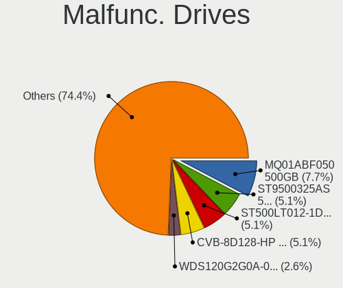
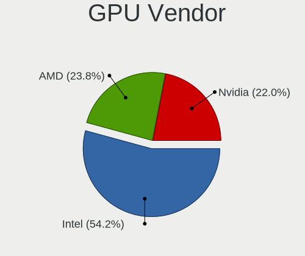
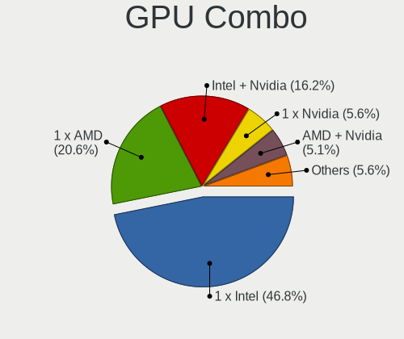
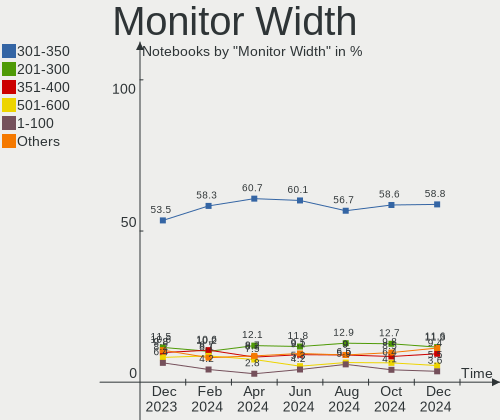
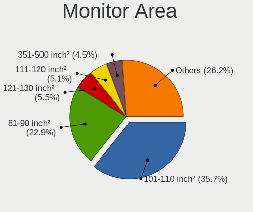
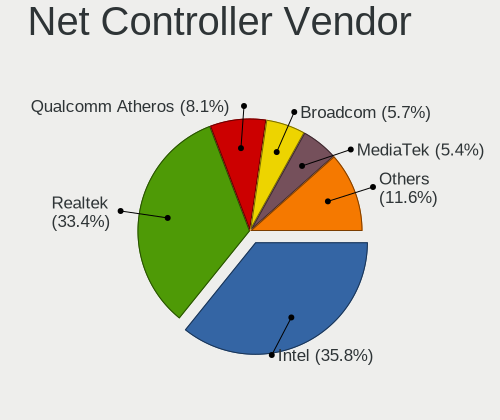

Linux in USA - Hardware Trends (Notebooks)
------------------------------------------

A project to identify most popular hardware characteristics and track their change
over time based on data collected by Linux users at https://Linux-Hardware.org.

Anyone can contribute to this report by the [hw-probe](https://github.com/linuxhw/hw-probe) tool:

    sudo -E hw-probe -all -upload

Period: Oct, 2022.

Contents
--------

* [ System ](#system)
  - [ OS                       ](#os)
  - [ OS Family                ](#os-family)
  - [ Kernel                   ](#kernel)
  - [ Kernel Family            ](#kernel-family)
  - [ Kernel Major Ver.        ](#kernel-major-ver)
  - [ Arch                     ](#arch)
  - [ DE                       ](#de)
  - [ Display Server           ](#display-server)
  - [ Display Manager          ](#display-manager)
  - [ OS Lang                  ](#os-lang)
  - [ Boot Mode                ](#boot-mode)
  - [ Filesystem               ](#filesystem)
  - [ Part. scheme             ](#part-scheme)
  - [ Dual Boot with Linux/BSD ](#dual-boot-with-linuxbsd)
  - [ Dual Boot (Win)          ](#dual-boot-win)

* [ Board ](#board)
  - [ Vendor                   ](#vendor)
  - [ Model                    ](#model)
  - [ Model Family             ](#model-family)
  - [ MFG Year                 ](#mfg-year)
  - [ Form Factor              ](#form-factor)
  - [ Secure Boot              ](#secure-boot)
  - [ Coreboot                 ](#coreboot)
  - [ RAM Size                 ](#ram-size)
  - [ RAM Used                 ](#ram-used)
  - [ Total Drives             ](#total-drives)
  - [ Has CD-ROM               ](#has-cd-rom)
  - [ Has Ethernet             ](#has-ethernet)
  - [ Has WiFi                 ](#has-wifi)
  - [ Has Bluetooth            ](#has-bluetooth)

* [ Location ](#location)
  - [ Country                  ](#country)
  - [ City                     ](#city)

* [ Drives ](#drives)
  - [ Drive Vendor             ](#drive-vendor)
  - [ Drive Model              ](#drive-model)
  - [ HDD Vendor               ](#hdd-vendor)
  - [ SSD Vendor               ](#ssd-vendor)
  - [ Drive Kind               ](#drive-kind)
  - [ Drive Connector          ](#drive-connector)
  - [ Drive Size               ](#drive-size)
  - [ Space Total              ](#space-total)
  - [ Space Used               ](#space-used)
  - [ Malfunc. Drives          ](#malfunc-drives)
  - [ Malfunc. Drive Vendor    ](#malfunc-drive-vendor)
  - [ Malfunc. HDD Vendor      ](#malfunc-hdd-vendor)
  - [ Malfunc. Drive Kind      ](#malfunc-drive-kind)
  - [ Failed Drives            ](#failed-drives)
  - [ Failed Drive Vendor      ](#failed-drive-vendor)
  - [ Drive Status             ](#drive-status)

* [ Storage controller ](#storage-controller)
  - [ Storage Vendor           ](#storage-vendor)
  - [ Storage Model            ](#storage-model)
  - [ Storage Kind             ](#storage-kind)

* [ Processor ](#processor)
  - [ CPU Vendor               ](#cpu-vendor)
  - [ CPU Model                ](#cpu-model)
  - [ CPU Model Family         ](#cpu-model-family)
  - [ CPU Cores                ](#cpu-cores)
  - [ CPU Sockets              ](#cpu-sockets)
  - [ CPU Threads              ](#cpu-threads)
  - [ CPU Op-Modes             ](#cpu-op-modes)
  - [ CPU Microcode            ](#cpu-microcode)
  - [ CPU Microarch            ](#cpu-microarch)

* [ Graphics ](#graphics)
  - [ GPU Vendor               ](#gpu-vendor)
  - [ GPU Model                ](#gpu-model)
  - [ GPU Combo                ](#gpu-combo)
  - [ GPU Driver               ](#gpu-driver)
  - [ GPU Memory               ](#gpu-memory)

* [ Monitor ](#monitor)
  - [ Monitor Vendor           ](#monitor-vendor)
  - [ Monitor Model            ](#monitor-model)
  - [ Monitor Resolution       ](#monitor-resolution)
  - [ Monitor Diagonal         ](#monitor-diagonal)
  - [ Monitor Width            ](#monitor-width)
  - [ Aspect Ratio             ](#aspect-ratio)
  - [ Monitor Area             ](#monitor-area)
  - [ Pixel Density            ](#pixel-density)
  - [ Multiple Monitors        ](#multiple-monitors)

* [ Network ](#network)
  - [ Net Controller Vendor    ](#net-controller-vendor)
  - [ Net Controller Model     ](#net-controller-model)
  - [ Wireless Vendor          ](#wireless-vendor)
  - [ Wireless Model           ](#wireless-model)
  - [ Ethernet Vendor          ](#ethernet-vendor)
  - [ Ethernet Model           ](#ethernet-model)
  - [ Net Controller Kind      ](#net-controller-kind)
  - [ Used Controller          ](#used-controller)
  - [ NICs                     ](#nics)
  - [ IPv6                     ](#ipv6)

* [ Bluetooth ](#bluetooth)
  - [ Bluetooth Vendor         ](#bluetooth-vendor)
  - [ Bluetooth Model          ](#bluetooth-model)

* [ Sound ](#sound)
  - [ Sound Vendor             ](#sound-vendor)
  - [ Sound Model              ](#sound-model)

* [ Memory ](#memory)
  - [ Memory Vendor            ](#memory-vendor)
  - [ Memory Model             ](#memory-model)
  - [ Memory Kind              ](#memory-kind)
  - [ Memory Form Factor       ](#memory-form-factor)
  - [ Memory Size              ](#memory-size)
  - [ Memory Speed             ](#memory-speed)

* [ Printers & scanners ](#printers--scanners)
  - [ Printer Vendor           ](#printer-vendor)
  - [ Printer Model            ](#printer-model)
  - [ Scanner Vendor           ](#scanner-vendor)
  - [ Scanner Model            ](#scanner-model)

* [ Camera ](#camera)
  - [ Camera Vendor            ](#camera-vendor)
  - [ Camera Model             ](#camera-model)

* [ Security ](#security)
  - [ Fingerprint Vendor       ](#fingerprint-vendor)
  - [ Fingerprint Model        ](#fingerprint-model)
  - [ Chipcard Vendor          ](#chipcard-vendor)
  - [ Chipcard Model           ](#chipcard-model)

* [ Unsupported ](#unsupported)
  - [ Unsupported Devices      ](#unsupported-devices)
  - [ Unsupported Device Types ](#unsupported-device-types)

System
------

OS
--

Installed operating systems

| Name                         | Notebooks | Percent |
|------------------------------|-----------|---------|
| Ubuntu 22.04                 | 69        | 14.71%  |
| Debian 11                    | 45        | 9.59%   |
| Pop!_OS 22.04                | 34        | 7.25%   |
| Fedora 36                    | 26        | 5.54%   |
| Linux Mint 21                | 23        | 4.9%    |
| Arch Rolling                 | 23        | 4.9%    |
| SteamOS 3.3.2                | 19        | 4.05%   |
| Zorin 16                     | 18        | 3.84%   |
| Ubuntu 20.04                 | 13        | 2.77%   |
| Linux Mint 20.3              | 13        | 2.77%   |
| Kubuntu 22.04                | 13        | 2.77%   |
| Kali 2022.3                  | 11        | 2.35%   |
| SteamOS 3.3.1                | 10        | 2.13%   |
| Manjaro                      | 10        | 2.13%   |
| OpenMandriva 4.3             | 8         | 1.71%   |
| Ubuntu 22.10                 | 7         | 1.49%   |
| Nobara 36                    | 7         | 1.49%   |
| KDE neon 22.04               | 7         | 1.49%   |
| KDE neon 20.04               | 7         | 1.49%   |
| Xubuntu 22.04                | 6         | 1.28%   |
| Fedora 37                    | 6         | 1.28%   |
| Parrot 5.1                   | 5         | 1.07%   |
| Gentoo 2.8                   | 5         | 1.07%   |
| EndeavourOS Rolling          | 5         | 1.07%   |
| Xubuntu 20.04                | 4         | 0.85%   |
| Garuda Linux Rolling         | 4         | 0.85%   |
| ArcoLinux Rolling            | 4         | 0.85%   |
| openSUSE Tumbleweed-XXXXXXXX | 3         | 0.64%   |
| OpenMandriva 4.50            | 3         | 0.64%   |
| MX 21                        | 3         | 0.64%   |
| Ubuntu 18.04                 | 2         | 0.43%   |
| SteamOS 3.4                  | 2         | 0.43%   |
| SteamOS 3.3                  | 2         | 0.43%   |
| SteamOS                      | 2         | 0.43%   |
| openSUSE Leap-15.4           | 2         | 0.43%   |
| OpenMandriva 4.90            | 2         | 0.43%   |
| Manjaro 22.0.0               | 2         | 0.43%   |
| Lubuntu 22.10                | 2         | 0.43%   |
| Linux Lite 6.0               | 2         | 0.43%   |
| Endless 4.0.10               | 2         | 0.43%   |

OS Family
---------

OS without a version

| Name              | Notebooks | Percent |
|-------------------|-----------|---------|
| Ubuntu            | 92        | 19.62%  |
| Debian            | 47        | 10.02%  |
| Linux Mint        | 40        | 8.53%   |
| SteamOS           | 35        | 7.46%   |
| Pop!_OS           | 35        | 7.46%   |
| Fedora            | 32        | 6.82%   |
| Arch              | 23        | 4.9%    |
| Zorin             | 19        | 4.05%   |
| Kubuntu           | 15        | 3.2%    |
| KDE neon          | 14        | 2.99%   |
| OpenMandriva      | 13        | 2.77%   |
| Manjaro           | 12        | 2.56%   |
| Kali              | 12        | 2.56%   |
| Xubuntu           | 11        | 2.35%   |
| Nobara            | 7         | 1.49%   |
| Gentoo            | 7         | 1.49%   |
| openSUSE          | 6         | 1.28%   |
| Parrot            | 5         | 1.07%   |
| Garuda Linux      | 5         | 1.07%   |
| EndeavourOS       | 5         | 1.07%   |
| ArcoLinux         | 5         | 1.07%   |
| Ubuntu Unity      | 3         | 0.64%   |
| MX                | 3         | 0.64%   |
| Endless           | 3         | 0.64%   |
| Elementary        | 3         | 0.64%   |
| NixOS             | 2         | 0.43%   |
| Lubuntu           | 2         | 0.43%   |
| Linux Lite        | 2         | 0.43%   |
| Ultramarine Linux | 1         | 0.21%   |
| Trisquel          | 1         | 0.21%   |
| Slackware         | 1         | 0.21%   |
| ROSA              | 1         | 0.21%   |
| Peppermint        | 1         | 0.21%   |
| LMDE              | 1         | 0.21%   |
| Drauger OS        | 1         | 0.21%   |
| Devuan            | 1         | 0.21%   |
| Clear Linux       | 1         | 0.21%   |
| Artix             | 1         | 0.21%   |
| Arch32            | 1         | 0.21%   |

Kernel
------

Version of the Linux kernel

| Version                                        | Notebooks | Percent |
|------------------------------------------------|-----------|---------|
| 5.15.0-48-generic                              | 49        | 10.45%  |
| 5.15.0-50-generic                              | 43        | 9.17%   |
| 5.15.0-52-generic                              | 41        | 8.74%   |
| 5.10.0-18-amd64                                | 26        | 5.54%   |
| 5.19.0-76051900-generic                        | 21        | 4.48%   |
| 5.13.0-valve21.3-1-neptune                     | 18        | 3.84%   |
| 5.13.0-valve21.1-1-neptune-02211-gc54cda5a36f3 | 10        | 2.13%   |
| 5.10.0-16-amd64                                | 10        | 2.13%   |
| 6.0.2-arch1-1                                  | 9         | 1.92%   |
| 5.4.0-126-generic                              | 8         | 1.71%   |
| 5.16.7-desktop-1omv4003                        | 8         | 1.71%   |
| 6.0.2-76060002-generic                         | 7         | 1.49%   |
| 6.0.0-060000-generic                           | 6         | 1.28%   |
| 5.4.0-128-generic                              | 5         | 1.07%   |
| 5.19.16-76051916-generic                       | 5         | 1.07%   |
| 5.19.16-200.fc36.x86_64                        | 5         | 1.07%   |
| 5.19.15-201.fc36.x86_64                        | 5         | 1.07%   |
| 5.19.13-200.fc36.x86_64                        | 5         | 1.07%   |
| 5.19.12-arch1-1                                | 5         | 1.07%   |
| 5.19.0-23-generic                              | 5         | 1.07%   |
| 5.10.0-19-amd64                                | 5         | 1.07%   |
| 5.19.13-arch1-1                                | 4         | 0.85%   |
| 5.19.12-200.fc36.x86_64                        | 4         | 0.85%   |
| 5.19.0-kali2-amd64                             | 4         | 0.85%   |
| 5.18.0-14parrot1-amd64                         | 4         | 0.85%   |
| 5.15.0-41-generic                              | 4         | 0.85%   |
| 6.0.1-arch2-1                                  | 3         | 0.64%   |
| 5.19.5-desktop-1omv4090                        | 3         | 0.64%   |
| 5.19.16-301.fc37.x86_64                        | 3         | 0.64%   |
| 5.19.14-201.fsync.fc36.x86_64                  | 3         | 0.64%   |
| 5.19.14-200.fc36.x86_64                        | 3         | 0.64%   |
| 5.19.0-2-amd64                                 | 3         | 0.64%   |
| 5.18.0-kali7-amd64                             | 3         | 0.64%   |
| 5.18.0-0.deb11.4-amd64                         | 3         | 0.64%   |
| 5.15.74-3-MANJARO                              | 3         | 0.64%   |
| 5.15.65-1-MANJARO                              | 3         | 0.64%   |
| 5.15.0-25-generic                              | 3         | 0.64%   |
| 5.13.0-valve24-1-neptune                       | 3         | 0.64%   |
| 5.11.0-35-generic                              | 3         | 0.64%   |
| 6.0.5-200.fc36.x86_64                          | 2         | 0.43%   |

Kernel Family
-------------

Linux kernel without a distro release

| Version | Notebooks | Percent |
|---------|-----------|---------|
| 5.15.0  | 147       | 31.34%  |
| 5.10.0  | 44        | 9.38%   |
| 5.13.0  | 39        | 8.32%   |
| 5.19.0  | 38        | 8.1%    |
| 6.0.2   | 22        | 4.69%   |
| 5.4.0   | 21        | 4.48%   |
| 5.19.16 | 14        | 2.99%   |
| 5.19.13 | 14        | 2.99%   |
| 6.0.0   | 13        | 2.77%   |
| 5.19.12 | 12        | 2.56%   |
| 5.18.0  | 12        | 2.56%   |
| 5.16.7  | 8         | 1.71%   |
| 5.15.72 | 8         | 1.71%   |
| 6.0.1   | 7         | 1.49%   |
| 5.19.14 | 7         | 1.49%   |
| 6.0.5   | 5         | 1.07%   |
| 5.19.15 | 5         | 1.07%   |
| 5.17.0  | 5         | 1.07%   |
| 5.19.7  | 4         | 0.85%   |
| 5.15.74 | 4         | 0.85%   |
| 5.15.65 | 4         | 0.85%   |
| 5.19.5  | 3         | 0.64%   |
| 5.19.11 | 3         | 0.64%   |
| 5.11.0  | 3         | 0.64%   |
| 4.15.0  | 3         | 0.64%   |
| 6.0.3   | 2         | 0.43%   |
| 5.18.12 | 2         | 0.43%   |
| 5.17.1  | 2         | 0.43%   |
| 5.15.71 | 2         | 0.43%   |
| 5.14.21 | 2         | 0.43%   |
| 5.14.0  | 2         | 0.43%   |
| 5.4.219 | 1         | 0.21%   |
| 5.3.18  | 1         | 0.21%   |
| 5.19.8  | 1         | 0.21%   |
| 5.17.5  | 1         | 0.21%   |
| 5.16.0  | 1         | 0.21%   |
| 5.15.69 | 1         | 0.21%   |
| 5.15.54 | 1         | 0.21%   |
| 5.15.43 | 1         | 0.21%   |
| 5.15.19 | 1         | 0.21%   |

Kernel Major Ver.
-----------------

Linux kernel major version

| Version | Notebooks | Percent |
|---------|-----------|---------|
| 5.15    | 169       | 36.03%  |
| 5.19    | 101       | 21.54%  |
| 6.0     | 49        | 10.45%  |
| 5.10    | 44        | 9.38%   |
| 5.13    | 39        | 8.32%   |
| 5.4     | 22        | 4.69%   |
| 5.18    | 14        | 2.99%   |
| 5.16    | 9         | 1.92%   |
| 5.17    | 8         | 1.71%   |
| 5.14    | 4         | 0.85%   |
| 5.11    | 3         | 0.64%   |
| 4.15    | 3         | 0.64%   |
| 5.3     | 1         | 0.21%   |
| 4.4     | 1         | 0.21%   |
| 4.19    | 1         | 0.21%   |
| 3.4     | 1         | 0.21%   |

Arch
----

OS architecture (x86_64, i586, etc.)

| Name   | Notebooks | Percent |
|--------|-----------|---------|
| x86_64 | 461       | 98.29%  |
| i686   | 7         | 1.49%   |
| armv7l | 1         | 0.21%   |

DE
--

Desktop Environment

| Name            | Notebooks | Percent |
|-----------------|-----------|---------|
| GNOME           | 185       | 39.45%  |
| KDE5            | 125       | 26.65%  |
| XFCE            | 46        | 9.81%   |
| X-Cinnamon      | 37        | 7.89%   |
| Unknown         | 36        | 7.68%   |
| MATE            | 12        | 2.56%   |
| LXQt            | 4         | 0.85%   |
| Unity           | 3         | 0.64%   |
| Pantheon        | 3         | 0.64%   |
| LXDE            | 3         | 0.64%   |
| i3              | 3         | 0.64%   |
| GNOME Flashback | 3         | 0.64%   |
| Cinnamon        | 2         | 0.43%   |
| Budgie          | 2         | 0.43%   |
| xmonad          | 1         | 0.21%   |
| trinity         | 1         | 0.21%   |
| openbox         | 1         | 0.21%   |
| none+xmonad     | 1         | 0.21%   |
| Hyprland        | 1         | 0.21%   |

Display Server
--------------

X11 or Wayland

| Name    | Notebooks | Percent |
|---------|-----------|---------|
| X11     | 327       | 69.72%  |
| Wayland | 106       | 22.6%   |
| Unknown | 26        | 5.54%   |
| Tty     | 10        | 2.13%   |

Display Manager
---------------

SDDM, LightDM, etc.

| Name    | Notebooks | Percent |
|---------|-----------|---------|
| Unknown | 226       | 48.19%  |
| GDM3    | 94        | 20.04%  |
| LightDM | 73        | 15.57%  |
| SDDM    | 52        | 11.09%  |
| GDM     | 21        | 4.48%   |
| SLiM    | 1         | 0.21%   |
| LXDM    | 1         | 0.21%   |
| EMPTTY  | 1         | 0.21%   |

OS Lang
-------

Language

| Lang       | Notebooks | Percent |
|------------|-----------|---------|
| en_US      | 425       | 90.62%  |
| Unknown    | 28        | 5.97%   |
| C          | 4         | 0.85%   |
| zh_CN      | 1         | 0.21%   |
| uk_UA      | 1         | 0.21%   |
| POSIX      | 1         | 0.21%   |
| it_IT      | 1         | 0.21%   |
| es_US      | 1         | 0.21%   |
| es_ES      | 1         | 0.21%   |
| en_US.UTF8 | 1         | 0.21%   |
| en_PH      | 1         | 0.21%   |
| en_GB      | 1         | 0.21%   |
| en_CA      | 1         | 0.21%   |
| en_AU      | 1         | 0.21%   |
| de_DE      | 1         | 0.21%   |

Boot Mode
---------

EFI or BIOS

| Mode | Notebooks | Percent |
|------|-----------|---------|
| BIOS | 251       | 53.52%  |
| EFI  | 218       | 46.48%  |

Filesystem
----------

Type of filesystem

| Type    | Notebooks | Percent |
|---------|-----------|---------|
| Ext4    | 318       | 67.8%   |
| Btrfs   | 95        | 20.26%  |
| Overlay | 41        | 8.74%   |
| Zfs     | 6         | 1.28%   |
| Xfs     | 6         | 1.28%   |
| Tmpfs   | 1         | 0.21%   |
| F2fs    | 1         | 0.21%   |
| Ext2    | 1         | 0.21%   |

Part. scheme
------------

Scheme of partitioning

| Type    | Notebooks | Percent |
|---------|-----------|---------|
| GPT     | 229       | 48.83%  |
| Unknown | 198       | 42.22%  |
| MBR     | 42        | 8.96%   |

Dual Boot with Linux/BSD
------------------------

Hosting more than one Linux/BSD

| Dual boot | Notebooks | Percent |
|-----------|-----------|---------|
| No        | 444       | 94.67%  |
| Yes       | 25        | 5.33%   |

Dual Boot (Win)
---------------

Hosting Linux and Windows

| Dual boot | Notebooks | Percent |
|-----------|-----------|---------|
| No        | 389       | 82.94%  |
| Yes       | 80        | 17.06%  |

Board
-----

Vendor
------

Motherboard manufacturer

| Name                | Notebooks | Percent |
|---------------------|-----------|---------|
| Hewlett-Packard     | 104       | 22.17%  |
| Lenovo              | 86        | 18.34%  |
| Dell                | 79        | 16.84%  |
| Valve               | 33        | 7.04%   |
| ASUSTek Computer    | 30        | 6.4%    |
| Apple               | 25        | 5.33%   |
| Acer                | 18        | 3.84%   |
| Toshiba             | 14        | 2.99%   |
| System76            | 12        | 2.56%   |
| MSI                 | 11        | 2.35%   |
| Google              | 11        | 2.35%   |
| Framework           | 7         | 1.49%   |
| GPU Company         | 5         | 1.07%   |
| Alienware           | 5         | 1.07%   |
| Gigabyte Technology | 4         | 0.85%   |
| Unknown             | 4         | 0.85%   |
| Sony                | 3         | 0.64%   |
| Razer               | 2         | 0.43%   |
| IBM                 | 2         | 0.43%   |
| Fujitsu             | 2         | 0.43%   |
| Timi                | 1         | 0.21%   |
| Star Labs           | 1         | 0.21%   |
| Samsung Electronics | 1         | 0.21%   |
| Notebook            | 1         | 0.21%   |
| MOTILE              | 1         | 0.21%   |
| MicroByte           | 1         | 0.21%   |
| Micro Electronics   | 1         | 0.21%   |
| LG Electronics      | 1         | 0.21%   |
| Gateway             | 1         | 0.21%   |
| DTRI                | 1         | 0.21%   |
| CyberPowerPC        | 1         | 0.21%   |
| AZW                 | 1         | 0.21%   |

Model
-----

Motherboard model

| Name                                   | Notebooks | Percent |
|----------------------------------------|-----------|---------|
| Valve Jupiter                          | 33        | 7.04%   |
| Lenovo ThinkPad E475 20H40006US        | 14        | 2.99%   |
| Unknown                                | 6         | 1.28%   |
| HP EliteBook 8470p                     | 5         | 1.07%   |
| Apple MacBookAir7,2                    | 5         | 1.07%   |
| System76 Lemur Pro                     | 4         | 0.85%   |
| HP Laptop 14-dk1xxx                    | 4         | 0.85%   |
| HP EliteBook 8460p                     | 4         | 0.85%   |
| Framework Laptop (12th Gen Intel Core) | 4         | 0.85%   |
| Toshiba Satellite C75D-B               | 3         | 0.64%   |
| System76 Oryx Pro                      | 3         | 0.64%   |
| Lenovo ThinkPad 13 2nd Gen 20J10046US  | 3         | 0.64%   |
| HP Pavilion g6                         | 3         | 0.64%   |
| HP Pavilion dv7                        | 3         | 0.64%   |
| HP Laptop 17-by4xxx                    | 3         | 0.64%   |
| HP Laptop 15-bs2xx                     | 3         | 0.64%   |
| HP 15                                  | 3         | 0.64%   |
| Framework Laptop                       | 3         | 0.64%   |
| System76 Gazelle                       | 2         | 0.43%   |
| Lenovo ThinkPad T480s 20L7CTO1WW       | 2         | 0.43%   |
| Lenovo IdeaPad Slim 1-14AST-05 81VS    | 2         | 0.43%   |
| Lenovo IdeaPad 3 15ITL05 81X8          | 2         | 0.43%   |
| HP Stream Laptop 14-cb1xxx             | 2         | 0.43%   |
| HP Pavilion Notebook                   | 2         | 0.43%   |
| HP Laptop 15-db0xxx                    | 2         | 0.43%   |
| HP Laptop 15-da0xxx                    | 2         | 0.43%   |
| HP EliteBook 8570p                     | 2         | 0.43%   |
| HP EliteBook 745 G3                    | 2         | 0.43%   |
| HP 255 G8 Notebook PC                  | 2         | 0.43%   |
| HP 2000                                | 2         | 0.43%   |
| GPU Company GWTN116-3                  | 2         | 0.43%   |
| Google Robo                            | 2         | 0.43%   |
| Google Akemi                           | 2         | 0.43%   |
| Dell XPS 9320                          | 2         | 0.43%   |
| Dell XPS 15 9570                       | 2         | 0.43%   |
| Dell XPS 15 9520                       | 2         | 0.43%   |
| Dell XPS 15 9500                       | 2         | 0.43%   |
| Dell XPS 13 9360                       | 2         | 0.43%   |
| Dell XPS 13 9310                       | 2         | 0.43%   |
| Dell Vostro 7620                       | 2         | 0.43%   |

Model Family
------------

Motherboard model prefix

| Name               | Notebooks | Percent |
|--------------------|-----------|---------|
| Lenovo ThinkPad    | 61        | 13.01%  |
| Valve Jupiter      | 33        | 7.04%   |
| HP Laptop          | 26        | 5.54%   |
| Dell Latitude      | 25        | 5.33%   |
| HP Pavilion        | 20        | 4.26%   |
| HP EliteBook       | 20        | 4.26%   |
| Dell XPS           | 18        | 3.84%   |
| Dell Inspiron      | 17        | 3.62%   |
| Lenovo IdeaPad     | 16        | 3.41%   |
| Acer Aspire        | 14        | 2.99%   |
| Toshiba Satellite  | 12        | 2.56%   |
| Dell Precision     | 12        | 2.56%   |
| HP ENVY            | 7         | 1.49%   |
| Framework Laptop   | 7         | 1.49%   |
| ASUS ROG           | 7         | 1.49%   |
| HP ProBook         | 6         | 1.28%   |
| ASUS VivoBook      | 6         | 1.28%   |
| Unknown            | 6         | 1.28%   |
| HP ZBook           | 5         | 1.07%   |
| Apple MacBookAir7  | 5         | 1.07%   |
| System76 Lemur     | 4         | 0.85%   |
| Apple MacBookPro11 | 4         | 0.85%   |
| System76 Oryx      | 3         | 0.64%   |
| Lenovo Legion      | 3         | 0.64%   |
| HP 15              | 3         | 0.64%   |
| Gigabyte AERO      | 3         | 0.64%   |
| Dell Vostro        | 3         | 0.64%   |
| ASUS Zenbook       | 3         | 0.64%   |
| ASUS ASUS          | 3         | 0.64%   |
| Apple MacBookPro9  | 3         | 0.64%   |
| Apple MacBook5     | 3         | 0.64%   |
| Acer Predator      | 3         | 0.64%   |
| System76 Gazelle   | 2         | 0.43%   |
| System76 Galago    | 2         | 0.43%   |
| Razer Blade        | 2         | 0.43%   |
| MSI GF65           | 2         | 0.43%   |
| IBM ThinkPad       | 2         | 0.43%   |
| HP Stream          | 2         | 0.43%   |
| HP Compaq          | 2         | 0.43%   |
| HP 255             | 2         | 0.43%   |

MFG Year
--------

Motherboard manufacture year

| Year    | Notebooks | Percent |
|---------|-----------|---------|
| 2022    | 78        | 16.63%  |
| 2021    | 52        | 11.09%  |
| 2019    | 52        | 11.09%  |
| 2020    | 41        | 8.74%   |
| 2012    | 32        | 6.82%   |
| 2011    | 30        | 6.4%    |
| 2018    | 28        | 5.97%   |
| 2013    | 27        | 5.76%   |
| 2017    | 25        | 5.33%   |
| 2014    | 23        | 4.9%    |
| 2015    | 18        | 3.84%   |
| 2010    | 17        | 3.62%   |
| 2008    | 14        | 2.99%   |
| 2016    | 12        | 2.56%   |
| 2009    | 11        | 2.35%   |
| 2007    | 3         | 0.64%   |
| 2005    | 2         | 0.43%   |
| 2006    | 1         | 0.21%   |
| 2004    | 1         | 0.21%   |
| 2003    | 1         | 0.21%   |
| Unknown | 1         | 0.21%   |

Form Factor
-----------

Physical design of the computer

| Name     | Notebooks | Percent |
|----------|-----------|---------|
| Notebook | 469       | 100%    |

Secure Boot
-----------

Enabled or disabled

| State    | Notebooks | Percent |
|----------|-----------|---------|
| Disabled | 427       | 91.04%  |
| Enabled  | 42        | 8.96%   |

Coreboot
--------

Have coreboot on board

| Used | Notebooks | Percent |
|------|-----------|---------|
| No   | 451       | 96.16%  |
| Yes  | 18        | 3.84%   |

RAM Size
--------

Total RAM memory

| Size in GB  | Notebooks | Percent |
|-------------|-----------|---------|
| 4.01-8.0    | 139       | 29.64%  |
| 16.01-24.0  | 89        | 18.98%  |
| 8.01-16.0   | 83        | 17.7%   |
| 3.01-4.0    | 68        | 14.5%   |
| 32.01-64.0  | 48        | 10.23%  |
| 1.01-2.0    | 13        | 2.77%   |
| 24.01-32.0  | 10        | 2.13%   |
| 64.01-256.0 | 10        | 2.13%   |
| 2.01-3.0    | 5         | 1.07%   |
| 0.51-1.0    | 3         | 0.64%   |
| 0.01-0.5    | 1         | 0.21%   |

RAM Used
--------

Used RAM memory

| Used GB    | Notebooks | Percent |
|------------|-----------|---------|
| 1.01-2.0   | 150       | 31.98%  |
| 2.01-3.0   | 136       | 29%     |
| 4.01-8.0   | 74        | 15.78%  |
| 3.01-4.0   | 59        | 12.58%  |
| 8.01-16.0  | 22        | 4.69%   |
| 0.51-1.0   | 21        | 4.48%   |
| 24.01-32.0 | 2         | 0.43%   |
| 16.01-24.0 | 2         | 0.43%   |
| 0.01-0.5   | 2         | 0.43%   |
| Unknown    | 1         | 0.21%   |

Total Drives
------------

Number of drives on board

| Drives | Notebooks | Percent |
|--------|-----------|---------|
| 1      | 341       | 72.71%  |
| 2      | 114       | 24.31%  |
| 3      | 10        | 2.13%   |
| 4      | 3         | 0.64%   |
| 0      | 1         | 0.21%   |

Has CD-ROM
----------

Has CD-ROM on board

| Presented | Notebooks | Percent |
|-----------|-----------|---------|
| No        | 323       | 68.87%  |
| Yes       | 146       | 31.13%  |

Has Ethernet
------------

Has Ethernet on board

| Presented | Notebooks | Percent |
|-----------|-----------|---------|
| Yes       | 354       | 75.48%  |
| No        | 115       | 24.52%  |

Has WiFi
--------

Has WiFi module

| Presented | Notebooks | Percent |
|-----------|-----------|---------|
| Yes       | 460       | 98.08%  |
| No        | 9         | 1.92%   |

Has Bluetooth
-------------

Has Bluetooth module

| Presented | Notebooks | Percent |
|-----------|-----------|---------|
| Yes       | 357       | 76.12%  |
| No        | 112       | 23.88%  |

Location
--------

Country
-------

Geographic location (country)

| Country | Notebooks | Percent |
|---------|-----------|---------|
| USA     | 469       | 100%    |

City
----

Geographic location (city)

| City             | Notebooks | Percent |
|------------------|-----------|---------|
| Bangor           | 27        | 5.76%   |
| Dallas           | 12        | 2.56%   |
| Los Angeles      | 11        | 2.35%   |
| New York         | 10        | 2.13%   |
| Chicago          | 10        | 2.13%   |
| Seattle          | 8         | 1.71%   |
| Phoenix          | 6         | 1.28%   |
| Kansas City      | 6         | 1.28%   |
| The Bronx        | 4         | 0.85%   |
| Portland         | 4         | 0.85%   |
| Miami            | 4         | 0.85%   |
| Jacksonville     | 4         | 0.85%   |
| Houston          | 4         | 0.85%   |
| Winter Park      | 3         | 0.64%   |
| Walled Lake      | 3         | 0.64%   |
| San Diego        | 3         | 0.64%   |
| San Antonio      | 3         | 0.64%   |
| Salt Lake City   | 3         | 0.64%   |
| Rochester        | 3         | 0.64%   |
| Norman           | 3         | 0.64%   |
| Newark           | 3         | 0.64%   |
| Minneapolis      | 3         | 0.64%   |
| Indianapolis     | 3         | 0.64%   |
| Hudson           | 3         | 0.64%   |
| Fort Worth       | 3         | 0.64%   |
| Denver           | 3         | 0.64%   |
| Colorado Springs | 3         | 0.64%   |
| Cincinnati       | 3         | 0.64%   |
| Charlotte        | 3         | 0.64%   |
| Aurora           | 3         | 0.64%   |
| Arlington        | 3         | 0.64%   |
| Weatherford      | 2         | 0.43%   |
| Valencia         | 2         | 0.43%   |
| Tucson           | 2         | 0.43%   |
| Sunnyvale        | 2         | 0.43%   |
| Sun Prairie      | 2         | 0.43%   |
| Schaumburg       | 2         | 0.43%   |
| San Jose         | 2         | 0.43%   |
| Rehoboth         | 2         | 0.43%   |
| Queens           | 2         | 0.43%   |

Drives
------

Drive Vendor
------------

Hard drive vendors

| Vendor                         | Notebooks | Drives | Percent |
|--------------------------------|-----------|--------|---------|
| Samsung Electronics            | 95        | 107    | 16.41%  |
| Unknown                        | 65        | 72     | 11.23%  |
| Sandisk                        | 55        | 55     | 9.5%    |
| Seagate                        | 46        | 47     | 7.94%   |
| WDC                            | 41        | 43     | 7.08%   |
| Toshiba                        | 39        | 39     | 6.74%   |
| SK hynix                       | 24        | 24     | 4.15%   |
| Kingston                       | 23        | 23     | 3.97%   |
| Phison Electronics             | 16        | 17     | 2.76%   |
| Crucial                        | 16        | 16     | 2.76%   |
| HGST                           | 15        | 15     | 2.59%   |
| Kingston Technology Company    | 14        | 14     | 2.42%   |
| Apple                          | 14        | 14     | 2.42%   |
| Hitachi                        | 13        | 13     | 2.25%   |
| PNY                            | 11        | 11     | 1.9%    |
| Micron Technology              | 10        | 10     | 1.73%   |
| KIOXIA                         | 9         | 9      | 1.55%   |
| Intel                          | 8         | 8      | 1.38%   |
| China                          | 6         | 6      | 1.04%   |
| A-DATA Technology              | 6         | 6      | 1.04%   |
| Micron/Crucial Technology      | 5         | 5      | 0.86%   |
| Unknown                        | 5         | 5      | 0.86%   |
| Fujitsu                        | 4         | 4      | 0.69%   |
| Team                           | 3         | 3      | 0.52%   |
| SSSTC                          | 3         | 3      | 0.52%   |
| SPCC                           | 3         | 3      | 0.52%   |
| Phison                         | 2         | 2      | 0.35%   |
| OCZ                            | 2         | 2      | 0.35%   |
| O2 Micro                       | 2         | 2      | 0.35%   |
| JMicron Technology             | 2         | 2      | 0.35%   |
| W800S                          | 1         | 1      | 0.17%   |
| VisionTek                      | 1         | 1      | 0.17%   |
| USB3.0                         | 1         | 1      | 0.17%   |
| Union Memory                   | 1         | 1      | 0.17%   |
| UMIS                           | 1         | 1      | 0.17%   |
| tecmiyo                        | 1         | 1      | 0.17%   |
| Super Talent                   | 1         | 1      | 0.17%   |
| Star                           | 1         | 1      | 0.17%   |
| Solid State Storage Technology | 1         | 1      | 0.17%   |
| Silicon Motion                 | 1         | 1      | 0.17%   |

Drive Model
-----------

Hard drive models

| Model                                                | Notebooks | Percent |
|------------------------------------------------------|-----------|---------|
| Kingston Company OM3PDP3 NVMe SSD 512GB              | 14        | 2.35%   |
| Kingston SA400S37120G 120GB SSD                      | 14        | 2.35%   |
| Samsung NVMe SSD Controller SM981/PM981/PM983 500GB  | 13        | 2.18%   |
| Sandisk WD Black SN750 / PC SN730 NVMe SSD 1TB       | 11        | 1.85%   |
| Unknown MMC Card  32GB                               | 10        | 1.68%   |
| Unknown MMC Card  64GB                               | 9         | 1.51%   |
| Samsung NVMe SSD Controller PM9A1/PM9A3/980PRO 250GB | 9         | 1.51%   |
| Phison PS5013 E13 NVMe Controller 256GB              | 9         | 1.51%   |
| Unknown MMC Card  256GB                              | 7         | 1.17%   |
| Unknown MMC Card  128GB                              | 7         | 1.17%   |
| Sandisk WD Blue SN550 NVMe SSD 1TB                   | 7         | 1.17%   |
| Unknown SD/MMC/MS PRO 1TB                            | 6         | 1.01%   |
| Unknown MMC Card  512GB                              | 5         | 0.84%   |
| Unknown MMC Card  16GB                               | 5         | 0.84%   |
| Toshiba MQ04ABF100 1TB                               | 5         | 0.84%   |
| Seagate ST500LT012-1DG142 500GB                      | 5         | 0.84%   |
| Seagate ST1000LM024 HN-M101MBB 1TB                   | 5         | 0.84%   |
| Samsung NVMe SSD Controller SM961/PM961/SM963 250GB  | 5         | 0.84%   |
| HGST HTS721010A9E630 1TB                             | 5         | 0.84%   |
| Unknown                                              | 5         | 0.84%   |
| Toshiba MQ01ABF050 500GB                             | 4         | 0.67%   |
| Phison E12 NVMe Controller 2TB                       | 4         | 0.67%   |
| Kingston SV300S37A120G 120GB SSD                     | 4         | 0.67%   |
| Crucial CT1000BX500SSD1 1TB                          | 4         | 0.67%   |
| WDC WDS500G2B0B-00YS70 500GB SSD                     | 3         | 0.5%    |
| Unknown MMC64G  64GB                                 | 3         | 0.5%    |
| Toshiba XG6 NVMe SSD Controller 512GB                | 3         | 0.5%    |
| Seagate ST9750420AS 752GB                            | 3         | 0.5%    |
| Seagate ST1000LM035-1RK172 1TB                       | 3         | 0.5%    |
| Sandisk WD Black SN850 1TB                           | 3         | 0.5%    |
| SanDisk SDSSDA120G 120GB                             | 3         | 0.5%    |
| Samsung SSD 860 EVO M.2 500GB                        | 3         | 0.5%    |
| Samsung MZVLQ512HALU-000H1 512GB                     | 3         | 0.5%    |
| PNY CS900 500GB SSD                                  | 3         | 0.5%    |
| Micron/Crucial P2 NVMe PCIe SSD 500GB                | 3         | 0.5%    |
| KIOXIA KBG40ZNV256G 256GB                            | 3         | 0.5%    |
| HGST HTS541075A9E680 752GB                           | 3         | 0.5%    |
| Apple SSD SM0256G 256GB                              | 3         | 0.5%    |
| WDC WDS500G3X0C-00SJG0 500GB                         | 2         | 0.34%   |
| WDC WD1600BEVT-75ZCT2 160GB                          | 2         | 0.34%   |

HDD Vendor
----------

Hard disk drive vendors

| Vendor              | Notebooks | Drives | Percent |
|---------------------|-----------|--------|---------|
| Seagate             | 45        | 46     | 31.69%  |
| WDC                 | 26        | 26     | 18.31%  |
| Toshiba             | 25        | 25     | 17.61%  |
| HGST                | 15        | 15     | 10.56%  |
| Hitachi             | 13        | 13     | 9.15%   |
| Unknown             | 6         | 6      | 4.23%   |
| Samsung Electronics | 4         | 4      | 2.82%   |
| Fujitsu             | 4         | 4      | 2.82%   |
| USB3.0              | 1         | 1      | 0.7%    |
| SABRENT             | 1         | 3      | 0.7%    |
| IBM/Hitachi         | 1         | 1      | 0.7%    |
| Apple               | 1         | 1      | 0.7%    |

SSD Vendor
----------

Solid state drive vendors

| Vendor              | Notebooks | Drives | Percent |
|---------------------|-----------|--------|---------|
| Samsung Electronics | 33        | 36     | 20.25%  |
| SanDisk             | 23        | 23     | 14.11%  |
| Kingston            | 20        | 20     | 12.27%  |
| Crucial             | 15        | 15     | 9.2%    |
| WDC                 | 11        | 12     | 6.75%   |
| Apple               | 11        | 11     | 6.75%   |
| PNY                 | 10        | 10     | 6.13%   |
| China               | 6         | 6      | 3.68%   |
| A-DATA Technology   | 5         | 5      | 3.07%   |
| Toshiba             | 4         | 4      | 2.45%   |
| Team                | 3         | 3      | 1.84%   |
| SK hynix            | 3         | 3      | 1.84%   |
| SSSTC               | 2         | 2      | 1.23%   |
| SPCC                | 2         | 2      | 1.23%   |
| OCZ                 | 2         | 2      | 1.23%   |
| Micron Technology   | 2         | 2      | 1.23%   |
| Unknown             | 2         | 2      | 1.23%   |
| tecmiyo             | 1         | 1      | 0.61%   |
| Super Talent        | 1         | 1      | 0.61%   |
| Star                | 1         | 1      | 0.61%   |
| NGFF                | 1         | 1      | 0.61%   |
| LITEONIT            | 1         | 1      | 0.61%   |
| Intel               | 1         | 1      | 0.61%   |
| Hewlett-Packard     | 1         | 1      | 0.61%   |
| CT1000MX            | 1         | 1      | 0.61%   |
| Corsair             | 1         | 1      | 0.61%   |

Drive Kind
----------

HDD or SSD

| Kind    | Notebooks | Drives | Percent |
|---------|-----------|--------|---------|
| NVMe    | 190       | 213    | 34.05%  |
| SSD     | 155       | 167    | 27.78%  |
| HDD     | 139       | 145    | 24.91%  |
| MMC     | 65        | 70     | 11.65%  |
| Unknown | 9         | 9      | 1.61%   |

Drive Connector
---------------

SATA, SAS, NVMe, etc.

| Type | Notebooks | Drives | Percent |
|------|-----------|--------|---------|
| SATA | 267       | 292    | 48.9%   |
| NVMe | 190       | 213    | 34.8%   |
| MMC  | 65        | 70     | 11.9%   |
| SAS  | 24        | 29     | 4.4%    |

Drive Size
----------

Size of hard drive

| Size in TB | Notebooks | Drives | Percent |
|------------|-----------|--------|---------|
| 0.01-0.5   | 192       | 206    | 65.98%  |
| 0.51-1.0   | 82        | 87     | 28.18%  |
| 1.01-2.0   | 12        | 14     | 4.12%   |
| 3.01-4.0   | 4         | 4      | 1.37%   |
| 4.01-10.0  | 1         | 1      | 0.34%   |

Space Total
-----------

Amount of disk space available on the file system

| Size in GB     | Notebooks | Percent |
|----------------|-----------|---------|
| 251-500        | 123       | 26.23%  |
| 101-250        | 108       | 23.03%  |
| 501-1000       | 79        | 16.84%  |
| Unknown        | 38        | 8.1%    |
| 1-20           | 30        | 6.4%    |
| 51-100         | 24        | 5.12%   |
| 1001-2000      | 22        | 4.69%   |
| More than 3000 | 17        | 3.62%   |
| 21-50          | 16        | 3.41%   |
| 2001-3000      | 12        | 2.56%   |

Space Used
----------

Amount of used disk space

| Used GB        | Notebooks | Percent |
|----------------|-----------|---------|
| 1-20           | 148       | 31.56%  |
| 21-50          | 96        | 20.47%  |
| 101-250        | 65        | 13.86%  |
| 51-100         | 58        | 12.37%  |
| Unknown        | 38        | 8.1%    |
| 251-500        | 33        | 7.04%   |
| 501-1000       | 21        | 4.48%   |
| 1001-2000      | 5         | 1.07%   |
| More than 3000 | 3         | 0.64%   |
| 2001-3000      | 1         | 0.21%   |
| 0              | 1         | 0.21%   |

Malfunc. Drives
---------------

Drive models with a malfunction

| Model                                    | Notebooks | Drives | Percent |
|------------------------------------------|-----------|--------|---------|
| Seagate ST9750420AS 752GB                | 2         | 2      | 10%     |
| WDC WD5000LPCX-24VHAT0 500GB             | 1         | 1      | 5%      |
| WDC WD2500BEVS-60UST0 250GB              | 1         | 1      | 5%      |
| WDC WD1600BEVT-22A23T0 160GB             | 1         | 1      | 5%      |
| Toshiba MK5065GSXN 500GB                 | 1         | 1      | 5%      |
| tecmiyo SATA SSD 256GB                   | 1         | 1      | 5%      |
| SPCC M.2 PCIe SSD 1TB                    | 1         | 1      | 5%      |
| Seagate ST9500420AS 500GB                | 1         | 1      | 5%      |
| Seagate ST9320423AS 320GB                | 1         | 1      | 5%      |
| Seagate ST500LT012-1DG142 500GB          | 1         | 1      | 5%      |
| Seagate ST1000LM049-2GH172 1TB           | 1         | 1      | 5%      |
| SanDisk SSD U110 16GB                    | 1         | 1      | 5%      |
| SanDisk SD8SBAT256G1122 256GB SSD        | 1         | 1      | 5%      |
| Samsung Electronics SSD 840 EVO 120GB    | 1         | 1      | 5%      |
| Samsung Electronics SSD 830 Series 128GB | 1         | 1      | 5%      |
| Samsung Electronics HM250JI 250GB        | 1         | 1      | 5%      |
| Kingston RBU-SNS8350DES3128GP 128GB SSD  | 1         | 1      | 5%      |
| HGST HTS721010A9E630 1TB                 | 1         | 1      | 5%      |
| A-DATA Technology SU760 256GB SSD        | 1         | 1      | 5%      |

Malfunc. Drive Vendor
---------------------

Vendors of faulty drives

| Vendor              | Notebooks | Drives | Percent |
|---------------------|-----------|--------|---------|
| Seagate             | 6         | 6      | 30%     |
| WDC                 | 3         | 3      | 15%     |
| Samsung Electronics | 3         | 3      | 15%     |
| SanDisk             | 2         | 2      | 10%     |
| Toshiba             | 1         | 1      | 5%      |
| tecmiyo             | 1         | 1      | 5%      |
| SPCC                | 1         | 1      | 5%      |
| Kingston            | 1         | 1      | 5%      |
| HGST                | 1         | 1      | 5%      |
| A-DATA Technology   | 1         | 1      | 5%      |

Malfunc. HDD Vendor
-------------------

Vendors of faulty HDD drives

| Vendor              | Notebooks | Drives | Percent |
|---------------------|-----------|--------|---------|
| Seagate             | 6         | 6      | 50%     |
| WDC                 | 3         | 3      | 25%     |
| Toshiba             | 1         | 1      | 8.33%   |
| Samsung Electronics | 1         | 1      | 8.33%   |
| HGST                | 1         | 1      | 8.33%   |

Malfunc. Drive Kind
-------------------

Kinds of faulty drives

| Kind | Notebooks | Drives | Percent |
|------|-----------|--------|---------|
| HDD  | 12        | 12     | 60%     |
| SSD  | 7         | 7      | 35%     |
| NVMe | 1         | 1      | 5%      |

Failed Drives
-------------

Failed drive models

Zero info for selected period =(

Failed Drive Vendor
-------------------

Failed drive vendors

Zero info for selected period =(

Drive Status
------------

Number of failed and malfunc. drives

| Status   | Notebooks | Drives | Percent |
|----------|-----------|--------|---------|
| Detected | 299       | 392    | 61.78%  |
| Works    | 166       | 192    | 34.3%   |
| Malfunc  | 19        | 20     | 3.93%   |

Storage controller
------------------

Storage Vendor
--------------

Storage controller vendors

| Vendor                           | Notebooks | Percent |
|----------------------------------|-----------|---------|
| Intel                            | 244       | 45.78%  |
| AMD                              | 71        | 13.32%  |
| Samsung Electronics              | 66        | 12.38%  |
| Sandisk                          | 36        | 6.75%   |
| SK hynix                         | 20        | 3.75%   |
| Phison Electronics               | 20        | 3.75%   |
| Kingston Technology Company      | 17        | 3.19%   |
| Toshiba America Info Systems     | 14        | 2.63%   |
| Nvidia                           | 8         | 1.5%    |
| Micron Technology                | 8         | 1.5%    |
| Micron/Crucial Technology        | 6         | 1.13%   |
| KIOXIA                           | 6         | 1.13%   |
| Marvell Technology Group         | 3         | 0.56%   |
| Union Memory (Shenzhen)          | 2         | 0.38%   |
| Solid State Storage Technology   | 2         | 0.38%   |
| Realtek Semiconductor            | 2         | 0.38%   |
| O2 Micro                         | 2         | 0.38%   |
| Apple                            | 2         | 0.38%   |
| Silicon Motion                   | 1         | 0.19%   |
| Silicon Integrated Systems [SiS] | 1         | 0.19%   |
| Silicon Image                    | 1         | 0.19%   |
| Lite-On Technology               | 1         | 0.19%   |

Storage Model
-------------

Storage controller models

| Model                                                                            | Notebooks | Percent |
|----------------------------------------------------------------------------------|-----------|---------|
| AMD FCH SATA Controller [AHCI mode]                                              | 65        | 11.67%  |
| Intel 82801 Mobile SATA Controller [RAID mode]                                   | 32        | 5.75%   |
| Intel 7 Series Chipset Family 6-port SATA Controller [AHCI mode]                 | 31        | 5.57%   |
| Intel Sunrise Point-LP SATA Controller [AHCI mode]                               | 23        | 4.13%   |
| Samsung NVMe SSD Controller SM981/PM981/PM983                                    | 22        | 3.95%   |
| Samsung NVMe SSD Controller 980                                                  | 18        | 3.23%   |
| Intel Volume Management Device NVMe RAID Controller                              | 16        | 2.87%   |
| Samsung NVMe SSD Controller PM9A1/PM9A3/980PRO                                   | 15        | 2.69%   |
| Kingston Company OM3PDP3 NVMe SSD                                                | 15        | 2.69%   |
| Intel 6 Series/C200 Series Chipset Family 6 port Mobile SATA AHCI Controller     | 15        | 2.69%   |
| SanDisk WD Black SN750 / PC SN730 NVMe SSD                                       | 13        | 2.33%   |
| Intel 8 Series/C220 Series Chipset Family 6-port SATA Controller 1 [AHCI mode]   | 13        | 2.33%   |
| Intel 8 Series SATA Controller 1 [AHCI mode]                                     | 12        | 2.15%   |
| Intel Celeron/Pentium Silver Processor SATA Controller                           | 11        | 1.97%   |
| Intel Cannon Lake Mobile PCH SATA AHCI Controller                                | 11        | 1.97%   |
| Intel 82801IBM/IEM (ICH9M/ICH9M-E) 4 port SATA Controller [AHCI mode]            | 11        | 1.97%   |
| SK hynix Gold P31 SSD                                                            | 9         | 1.62%   |
| SanDisk Non-Volatile memory controller                                           | 9         | 1.62%   |
| Phison PS5013 E13 NVMe Controller                                                | 9         | 1.62%   |
| SanDisk WD Blue SN550 NVMe SSD                                                   | 8         | 1.44%   |
| Micron Non-Volatile memory controller                                            | 8         | 1.44%   |
| Intel Tiger Lake-LP SATA Controller                                              | 8         | 1.44%   |
| Toshiba America Info Systems Toshiba America Info Non-Volatile memory controller | 6         | 1.08%   |
| Samsung NVMe SSD Controller SM961/PM961/SM963                                    | 6         | 1.08%   |
| Intel 400 Series Chipset Family SATA AHCI Controller                             | 6         | 1.08%   |
| Toshiba America Info Systems XG6 NVMe SSD Controller                             | 5         | 0.9%    |
| SK hynix Non-Volatile memory controller                                          | 5         | 0.9%    |
| Samsung Electronics SATA controller                                              | 5         | 0.9%    |
| Phison E12 NVMe Controller                                                       | 5         | 0.9%    |
| KIOXIA NVMe SSD Controller BG4                                                   | 5         | 0.9%    |
| Intel Wildcat Point-LP SATA Controller [AHCI Mode]                               | 5         | 0.9%    |
| Intel HM170/QM170 Chipset SATA Controller [AHCI Mode]                            | 5         | 0.9%    |
| Intel Comet Lake SATA AHCI Controller                                            | 5         | 0.9%    |
| Intel 5 Series/3400 Series Chipset 6 port SATA AHCI Controller                   | 5         | 0.9%    |
| SK hynix BC501 NVMe Solid State Drive                                            | 4         | 0.72%   |
| SanDisk WD PC SN810 / Black SN850 NVMe SSD                                       | 4         | 0.72%   |
| Micron/Crucial P2 NVMe PCIe SSD                                                  | 4         | 0.72%   |
| Intel Q170/Q150/B150/H170/H110/Z170/CM236 Chipset SATA Controller [AHCI Mode]    | 4         | 0.72%   |
| Intel Atom Processor E3800 Series SATA AHCI Controller                           | 4         | 0.72%   |
| AMD SB7x0/SB8x0/SB9x0 SATA Controller [AHCI mode]                                | 4         | 0.72%   |

Storage Kind
------------

Kind of storage controller (IDE, SATA, NVMe, SAS, ...)

| Kind | Notebooks | Percent |
|------|-----------|---------|
| SATA | 277       | 51.97%  |
| NVMe | 191       | 35.83%  |
| RAID | 49        | 9.19%   |
| IDE  | 16        | 3%      |

Processor
---------

CPU Vendor
----------

Processor vendors

| Vendor   | Notebooks | Percent |
|----------|-----------|---------|
| Intel    | 336       | 71.64%  |
| AMD      | 132       | 28.14%  |
| Qualcomm | 1         | 0.21%   |

CPU Model
---------

Processor models

| Model                                      | Notebooks | Percent |
|--------------------------------------------|-----------|---------|
| AMD Custom APU 0405                        | 33        | 7.04%   |
| AMD PRO A6-9500B R5, 6 COMPUTE CORES 2C+4G | 14        | 2.99%   |
| Intel Core i5-2520M CPU @ 2.50GHz          | 8         | 1.71%   |
| Intel 12th Gen Core i7-12700H              | 8         | 1.71%   |
| Intel 11th Gen Core i5-1135G7 @ 2.40GHz    | 8         | 1.71%   |
| Intel Core i7-8550U CPU @ 1.80GHz          | 7         | 1.49%   |
| Intel Core i7-10750H CPU @ 2.60GHz         | 7         | 1.49%   |
| Intel Core i5-3320M CPU @ 2.60GHz          | 7         | 1.49%   |
| Intel Celeron N4020 CPU @ 1.10GHz          | 6         | 1.28%   |
| Intel 11th Gen Core i7-11800H @ 2.30GHz    | 6         | 1.28%   |
| Intel 11th Gen Core i7-1165G7 @ 2.80GHz    | 6         | 1.28%   |
| Intel Core i7-9750H CPU @ 2.60GHz          | 5         | 1.07%   |
| Intel Core i7-8750H CPU @ 2.20GHz          | 5         | 1.07%   |
| Intel 11th Gen Core i3-1115G4 @ 3.00GHz    | 5         | 1.07%   |
| Intel Core i7-7700HQ CPU @ 2.80GHz         | 4         | 0.85%   |
| Intel Core i7-10510U CPU @ 1.80GHz         | 4         | 0.85%   |
| Intel Core i5-8265U CPU @ 1.60GHz          | 4         | 0.85%   |
| Intel Core i5-7200U CPU @ 2.50GHz          | 4         | 0.85%   |
| Intel Core i5-3210M CPU @ 2.50GHz          | 4         | 0.85%   |
| Intel Celeron N4000 CPU @ 1.10GHz          | 4         | 0.85%   |
| Intel Celeron CPU N3060 @ 1.60GHz          | 4         | 0.85%   |
| Intel 11th Gen Core i7-1185G7 @ 3.00GHz    | 4         | 0.85%   |
| AMD Ryzen 3 3250U with Radeon Graphics     | 4         | 0.85%   |
| Intel Pentium Silver N5030 CPU @ 1.10GHz   | 3         | 0.64%   |
| Intel Core i7-7500U CPU @ 2.70GHz          | 3         | 0.64%   |
| Intel Core i7-6820HQ CPU @ 2.70GHz         | 3         | 0.64%   |
| Intel Core i7-6500U CPU @ 2.50GHz          | 3         | 0.64%   |
| Intel Core i7-3720QM CPU @ 2.60GHz         | 3         | 0.64%   |
| Intel Core i7-3520M CPU @ 2.90GHz          | 3         | 0.64%   |
| Intel Core i7 CPU M 620 @ 2.67GHz          | 3         | 0.64%   |
| Intel Core i5-8350U CPU @ 1.70GHz          | 3         | 0.64%   |
| Intel Core i5-8250U CPU @ 1.60GHz          | 3         | 0.64%   |
| Intel Core i5-6200U CPU @ 2.30GHz          | 3         | 0.64%   |
| Intel Core i5-5250U CPU @ 1.60GHz          | 3         | 0.64%   |
| Intel Core i5-5200U CPU @ 2.20GHz          | 3         | 0.64%   |
| Intel Core i5-4300U CPU @ 1.90GHz          | 3         | 0.64%   |
| Intel Core i5-4200U CPU @ 1.60GHz          | 3         | 0.64%   |
| Intel Core i5-10210U CPU @ 1.60GHz         | 3         | 0.64%   |
| Intel Core i3-10110U CPU @ 2.10GHz         | 3         | 0.64%   |
| Intel Core 2 Duo CPU P8600 @ 2.40GHz       | 3         | 0.64%   |

CPU Model Family
----------------

Processor model prefix

| Model                                | Notebooks | Percent |
|--------------------------------------|-----------|---------|
| Other                                | 110       | 23.45%  |
| Intel Core i7                        | 100       | 21.32%  |
| Intel Core i5                        | 84        | 17.91%  |
| Intel Celeron                        | 31        | 6.61%   |
| Intel Core i3                        | 17        | 3.62%   |
| Intel Core 2 Duo                     | 15        | 3.2%    |
| AMD Ryzen 7                          | 12        | 2.56%   |
| AMD A6                               | 9         | 1.92%   |
| AMD Ryzen 5                          | 8         | 1.71%   |
| Intel Pentium                        | 7         | 1.49%   |
| AMD Ryzen 9                          | 7         | 1.49%   |
| AMD A10                              | 7         | 1.49%   |
| AMD Ryzen 3                          | 6         | 1.28%   |
| AMD A8                               | 6         | 1.28%   |
| Intel Atom                           | 5         | 1.07%   |
| Intel Pentium Silver                 | 4         | 0.85%   |
| Intel Pentium Dual-Core              | 4         | 0.85%   |
| AMD A4                               | 4         | 0.85%   |
| AMD Ryzen 7 PRO                      | 3         | 0.64%   |
| AMD Ryzen 5 PRO                      | 3         | 0.64%   |
| AMD E1                               | 3         | 0.64%   |
| Intel Xeon                           | 2         | 0.43%   |
| Intel Pentium M                      | 2         | 0.43%   |
| AMD PRO A10                          | 2         | 0.43%   |
| AMD E                                | 2         | 0.43%   |
| AMD Athlon                           | 2         | 0.43%   |
| Intel Pentium Dual                   | 1         | 0.21%   |
| Intel Pentium 4                      | 1         | 0.21%   |
| Intel Genuine                        | 1         | 0.21%   |
| Intel Core i9                        | 1         | 0.21%   |
| Intel Core                           | 1         | 0.21%   |
| Intel Celeron M                      | 1         | 0.21%   |
| AMD Turion II Ultra Dual-Core Mobile | 1         | 0.21%   |
| AMD Turion Dual-Core                 | 1         | 0.21%   |
| AMD Turion 64 X2 Mobile              | 1         | 0.21%   |
| AMD Phenom II                        | 1         | 0.21%   |
| AMD E2                               | 1         | 0.21%   |
| AMD C-50                             | 1         | 0.21%   |
| AMD Athlon 64 X2                     | 1         | 0.21%   |
| AMD Athlon 64                        | 1         | 0.21%   |

CPU Cores
---------

Number of processor cores

| Number | Notebooks | Percent |
|--------|-----------|---------|
| 2      | 197       | 42%     |
| 4      | 159       | 33.9%   |
| 8      | 32        | 6.82%   |
| 6      | 32        | 6.82%   |
| 1      | 26        | 5.54%   |
| 14     | 14        | 2.99%   |
| 12     | 6         | 1.28%   |
| 10     | 3         | 0.64%   |

CPU Sockets
-----------

Number of sockets

| Number | Notebooks | Percent |
|--------|-----------|---------|
| 1      | 469       | 100%    |

CPU Threads
-----------

Threads per core (Hyper-Threading)

| Number | Notebooks | Percent |
|--------|-----------|---------|
| 2      | 355       | 75.69%  |
| 1      | 114       | 24.31%  |

CPU Op-Modes
------------

CPU Operation Modes (32-bit, 64-bit)

| Op mode        | Notebooks | Percent |
|----------------|-----------|---------|
| 32-bit, 64-bit | 463       | 98.72%  |
| 32-bit         | 5         | 1.07%   |
| Unknown        | 1         | 0.21%   |

CPU Microcode
-------------

Microcode number

| Number     | Notebooks | Percent |
|------------|-----------|---------|
| Unknown    | 185       | 39.45%  |
| 0x306a9    | 24        | 5.12%   |
| 0x806c1    | 18        | 3.84%   |
| 0x0600611a | 17        | 3.62%   |
| 0x806ec    | 13        | 2.77%   |
| 0x806e9    | 13        | 2.77%   |
| 0x1067a    | 13        | 2.77%   |
| 0x906a3    | 12        | 2.56%   |
| 0x206a7    | 11        | 2.35%   |
| 0x40651    | 10        | 2.13%   |
| 0x906ea    | 9         | 1.92%   |
| 0x806ea    | 9         | 1.92%   |
| 0x0a50000c | 9         | 1.92%   |
| 0x306d4    | 8         | 1.71%   |
| 0x706a8    | 7         | 1.49%   |
| 0x806d1    | 6         | 1.28%   |
| 0x506e3    | 6         | 1.28%   |
| 0x07030105 | 6         | 1.28%   |
| 0xa0652    | 5         | 1.07%   |
| 0x706a1    | 5         | 1.07%   |
| 0x906e9    | 4         | 0.85%   |
| 0x506c9    | 4         | 0.85%   |
| 0x306c3    | 4         | 0.85%   |
| 0x0a404101 | 4         | 0.85%   |
| 0x08108109 | 4         | 0.85%   |
| 0x806eb    | 3         | 0.64%   |
| 0x6fd      | 3         | 0.64%   |
| 0x406e3    | 3         | 0.64%   |
| 0x406c4    | 3         | 0.64%   |
| 0x30678    | 3         | 0.64%   |
| 0x20655    | 3         | 0.64%   |
| 0x106e5    | 3         | 0.64%   |
| 0x08600106 | 3         | 0.64%   |
| 0x08600104 | 3         | 0.64%   |
| 0x06006705 | 3         | 0.64%   |
| 0x06001119 | 3         | 0.64%   |
| 0x906ed    | 2         | 0.43%   |
| 0x906a4    | 2         | 0.43%   |
| 0x40661    | 2         | 0.43%   |
| 0x106ca    | 2         | 0.43%   |

CPU Microarch
-------------

Microarchitecture

| Name             | Notebooks | Percent |
|------------------|-----------|---------|
| KabyLake         | 75        | 15.99%  |
| Unknown          | 59        | 12.58%  |
| IvyBridge        | 33        | 7.04%   |
| Haswell          | 30        | 6.4%    |
| TigerLake        | 25        | 5.33%   |
| Excavator        | 24        | 5.12%   |
| SandyBridge      | 22        | 4.69%   |
| Penryn           | 20        | 4.26%   |
| Goldmont plus    | 14        | 2.99%   |
| Alderlake Hybrid | 14        | 2.99%   |
| Skylake          | 13        | 2.77%   |
| Zen+             | 12        | 2.56%   |
| CometLake        | 12        | 2.56%   |
| Broadwell        | 12        | 2.56%   |
| Silvermont       | 11        | 2.35%   |
| Icelake          | 10        | 2.13%   |
| Zen 3            | 9         | 1.92%   |
| Zen 2            | 9         | 1.92%   |
| Westmere         | 9         | 1.92%   |
| Puma             | 9         | 1.92%   |
| Piledriver       | 8         | 1.71%   |
| Zen              | 5         | 1.07%   |
| Goldmont         | 5         | 1.07%   |
| Bobcat           | 5         | 1.07%   |
| P6               | 3         | 0.64%   |
| Nehalem          | 3         | 0.64%   |
| K8 Hammer        | 3         | 0.64%   |
| Core             | 3         | 0.64%   |
| Bonnell          | 3         | 0.64%   |
| K10 Llano        | 2         | 0.43%   |
| K10              | 2         | 0.43%   |
| Tremont          | 1         | 0.21%   |
| Steamroller      | 1         | 0.21%   |
| NetBurst         | 1         | 0.21%   |
| K8 & K10 hybrid  | 1         | 0.21%   |
| Jaguar           | 1         | 0.21%   |

Graphics
--------

GPU Vendor
----------

Vendors of graphics cards

| Vendor | Notebooks | Percent |
|--------|-----------|---------|
| Intel  | 302       | 52.52%  |
| AMD    | 147       | 25.57%  |
| Nvidia | 126       | 21.91%  |

GPU Model
---------

Graphics card models

| Model                                                                                    | Notebooks | Percent |
|------------------------------------------------------------------------------------------|-----------|---------|
| AMD VanGogh [AMD Custom GPU 0405]                                                        | 33        | 5.68%   |
| Intel 3rd Gen Core processor Graphics Controller                                         | 28        | 4.82%   |
| Intel TigerLake-LP GT2 [Iris Xe Graphics]                                                | 20        | 3.44%   |
| Intel Alder Lake-P Integrated Graphics Controller                                        | 20        | 3.44%   |
| Intel 2nd Generation Core Processor Family Integrated Graphics Controller                | 19        | 3.27%   |
| AMD Wani [Radeon R5/R6/R7 Graphics]                                                      | 18        | 3.1%    |
| Intel Haswell-ULT Integrated Graphics Controller                                         | 15        | 2.58%   |
| Intel UHD Graphics 620                                                                   | 14        | 2.41%   |
| Intel Mobile 4 Series Chipset Integrated Graphics Controller                             | 14        | 2.41%   |
| Intel CoffeeLake-H GT2 [UHD Graphics 630]                                                | 13        | 2.24%   |
| Intel CometLake-U GT2 [UHD Graphics]                                                     | 12        | 2.07%   |
| Intel CometLake-H GT2 [UHD Graphics]                                                     | 12        | 2.07%   |
| AMD Picasso/Raven 2 [Radeon Vega Series / Radeon Vega Mobile Series]                     | 12        | 2.07%   |
| Intel HD Graphics 620                                                                    | 11        | 1.89%   |
| Intel 4th Gen Core Processor Integrated Graphics Controller                              | 11        | 1.89%   |
| Intel TigerLake-H GT1 [UHD Graphics]                                                     | 10        | 1.72%   |
| Intel GeminiLake [UHD Graphics 600]                                                      | 10        | 1.72%   |
| Nvidia GA106M [GeForce RTX 3060 Mobile / Max-Q]                                          | 9         | 1.55%   |
| AMD Renoir                                                                               | 9         | 1.55%   |
| AMD Cezanne                                                                              | 8         | 1.38%   |
| Intel WhiskeyLake-U GT2 [UHD Graphics 620]                                               | 7         | 1.2%    |
| Intel HD Graphics 630                                                                    | 7         | 1.2%    |
| AMD Mullins [Radeon R4/R5 Graphics]                                                      | 7         | 1.2%    |
| Nvidia GA107M [GeForce RTX 3050 Ti Mobile]                                               | 6         | 1.03%   |
| Intel Skylake GT2 [HD Graphics 520]                                                      | 6         | 1.03%   |
| Intel HD Graphics 5500                                                                   | 6         | 1.03%   |
| Intel Atom/Celeron/Pentium Processor x5-E8000/J3xxx/N3xxx Integrated Graphics Controller | 6         | 1.03%   |
| AMD Stoney [Radeon R2/R3/R4/R5 Graphics]                                                 | 6         | 1.03%   |
| AMD Rembrandt [Radeon 680M]                                                              | 6         | 1.03%   |
| Nvidia TU106M [GeForce RTX 2060 Mobile]                                                  | 5         | 0.86%   |
| Nvidia GP107M [GeForce GTX 1050 Ti Mobile]                                               | 5         | 0.86%   |
| Intel Tiger Lake UHD Graphics                                                            | 5         | 0.86%   |
| Intel HD Graphics 6000                                                                   | 5         | 0.86%   |
| Intel Core Processor Integrated Graphics Controller                                      | 5         | 0.86%   |
| Intel Atom Processor Z36xxx/Z37xxx Series Graphics & Display                             | 5         | 0.86%   |
| AMD Thames [Radeon HD 7550M/7570M/7650M]                                                 | 5         | 0.86%   |
| Nvidia TU116M [GeForce GTX 1660 Ti Mobile]                                               | 4         | 0.69%   |
| Nvidia GM108M [GeForce 940MX]                                                            | 4         | 0.69%   |
| Nvidia GA104 [Geforce RTX 3070 Ti Laptop GPU]                                            | 4         | 0.69%   |
| Intel JasperLake [UHD Graphics]                                                          | 4         | 0.69%   |

GPU Combo
---------

Combinations of graphics cards

| Name           | Notebooks | Percent |
|----------------|-----------|---------|
| 1 x Intel      | 197       | 42%     |
| 1 x AMD        | 128       | 27.29%  |
| Intel + Nvidia | 90        | 19.19%  |
| 1 x Nvidia     | 26        | 5.54%   |
| AMD + Nvidia   | 10        | 2.13%   |
| Intel + AMD    | 6         | 1.28%   |
| 2 x Intel      | 5         | 1.07%   |
| Other          | 4         | 0.85%   |
| 2 x AMD        | 3         | 0.64%   |

GPU Driver
----------

Free vs proprietary

| Driver      | Notebooks | Percent |
|-------------|-----------|---------|
| Free        | 393       | 83.8%   |
| Proprietary | 65        | 13.86%  |
| Unknown     | 11        | 2.35%   |

GPU Memory
----------

Total video memory

| Size in GB | Notebooks | Percent |
|------------|-----------|---------|
| Unknown    | 348       | 74.2%   |
| 0.01-0.5   | 52        | 11.09%  |
| 0.51-1.0   | 28        | 5.97%   |
| 1.01-2.0   | 14        | 2.99%   |
| 3.01-4.0   | 12        | 2.56%   |
| 5.01-6.0   | 7         | 1.49%   |
| 7.01-8.0   | 6         | 1.28%   |
| 2.01-3.0   | 1         | 0.21%   |
| 8.01-16.0  | 1         | 0.21%   |

Monitor
-------

Monitor Vendor
--------------

Monitor vendors

| Vendor                  | Notebooks | Percent |
|-------------------------|-----------|---------|
| BOE                     | 82        | 15.36%  |
| AU Optronics            | 79        | 14.79%  |
| Samsung Electronics     | 61        | 11.42%  |
| LG Display              | 60        | 11.24%  |
| Chimei Innolux          | 55        | 10.3%   |
| Analogix                | 27        | 5.06%   |
| Sharp                   | 25        | 4.68%   |
| Apple                   | 23        | 4.31%   |
| Dell                    | 14        | 2.62%   |
| Chi Mei Optoelectronics | 10        | 1.87%   |
| PANDA                   | 9         | 1.69%   |
| Goldstar                | 9         | 1.69%   |
| ViewSonic               | 7         | 1.31%   |
| InfoVision              | 7         | 1.31%   |
| Hewlett-Packard         | 7         | 1.31%   |
| Ancor Communications    | 6         | 1.12%   |
| Vizio                   | 5         | 0.94%   |
| Valve                   | 5         | 0.94%   |
| Lenovo                  | 4         | 0.75%   |
| ASUSTek Computer        | 4         | 0.75%   |
| Acer                    | 4         | 0.75%   |
| Sceptre Tech            | 3         | 0.56%   |
| Toshiba                 | 2         | 0.37%   |
| Pixio                   | 2         | 0.37%   |
| MSI                     | 2         | 0.37%   |
| LG Philips              | 2         | 0.37%   |
| HannStar                | 2         | 0.37%   |
| Gigabyte Technology     | 2         | 0.37%   |
| CSO                     | 2         | 0.37%   |
| USR                     | 1         | 0.19%   |
| Unknown (AAA)           | 1         | 0.19%   |
| TMX                     | 1         | 0.19%   |
| Seiki                   | 1         | 0.19%   |
| Insignia                | 1         | 0.19%   |
| InnoLux Display         | 1         | 0.19%   |
| HKC                     | 1         | 0.19%   |
| FUN                     | 1         | 0.19%   |
| eMachines               | 1         | 0.19%   |
| Eizo                    | 1         | 0.19%   |
| Deco Gear               | 1         | 0.19%   |

Monitor Model
-------------

Monitor models

| Model                                                                    | Notebooks | Percent |
|--------------------------------------------------------------------------|-----------|---------|
| Analogix ANX7530 U ANX7539 800x1280                                      | 27        | 5.03%   |
| BOE LCD Monitor BOE06B3 1366x768 309x173mm 13.9-inch                     | 14        | 2.61%   |
| Samsung Electronics LCD Monitor SEC5441 1366x768 344x194mm 15.5-inch     | 9         | 1.68%   |
| BOE LCD Monitor BOE095F 2256x1504 285x190mm 13.5-inch                    | 7         | 1.3%    |
| AU Optronics LCD Monitor AUO10EC 1366x768 344x193mm 15.5-inch            | 6         | 1.12%   |
| Valve ANX7530 U VLV3001 800x1280 100x150mm 7.1-inch                      | 5         | 0.93%   |
| Chimei Innolux LCD Monitor CMN14D5 1920x1080 309x173mm 13.9-inch         | 5         | 0.93%   |
| Sharp LCD Monitor SHP149A 1920x1080 344x194mm 15.5-inch                  | 3         | 0.56%   |
| Sharp LCD Monitor SHP1449 1920x1080 294x165mm 13.3-inch                  | 3         | 0.56%   |
| Samsung Electronics LCD Monitor SEC544B 1600x900 344x194mm 15.5-inch     | 3         | 0.56%   |
| LG Display LCD Monitor LGD0335 1366x768 310x174mm 14.0-inch              | 3         | 0.56%   |
| LG Display LCD Monitor LGD032C 1920x1080 344x194mm 15.5-inch             | 3         | 0.56%   |
| Chimei Innolux LCD Monitor CMN14E3 1366x768 309x173mm 13.9-inch          | 3         | 0.56%   |
| Chi Mei Optoelectronics LCD Monitor CMO15A2 1366x768 344x193mm 15.5-inch | 3         | 0.56%   |
| AU Optronics LCD Monitor AUO61ED 1920x1080 344x194mm 15.5-inch           | 3         | 0.56%   |
| AU Optronics LCD Monitor AUO313C 1366x768 309x173mm 13.9-inch            | 3         | 0.56%   |
| AU Optronics LCD Monitor AUO2E3C 1366x768 309x173mm 13.9-inch            | 3         | 0.56%   |
| Apple Color LCD APPA01B 1440x900 286x179mm 13.3-inch                     | 3         | 0.56%   |
| Sharp LCD Monitor SHP1548 1920x1200 288x180mm 13.4-inch                  | 2         | 0.37%   |
| Sharp LCD Monitor SHP1515 1920x1200 336x210mm 15.6-inch                  | 2         | 0.37%   |
| Sharp LCD Monitor SHP14D1 1920x1200 336x210mm 15.6-inch                  | 2         | 0.37%   |
| Samsung Electronics LCD Monitor SEC5541 1366x768 344x193mm 15.5-inch     | 2         | 0.37%   |
| Samsung Electronics LCD Monitor SEC3152 1366x768 344x194mm 15.5-inch     | 2         | 0.37%   |
| Samsung Electronics LCD Monitor SEC3150 1366x768 344x193mm 15.5-inch     | 2         | 0.37%   |
| Samsung Electronics LCD Monitor SDC415F 3840x2160 344x194mm 15.5-inch    | 2         | 0.37%   |
| Samsung Electronics LCD Monitor SAM07BA 1920x1080 480x270mm 21.7-inch    | 2         | 0.37%   |
| Samsung Electronics C27F390 SAM0D32 1920x1080 598x336mm 27.0-inch        | 2         | 0.37%   |
| Pixio U29I WAM2900 2560x1080 690x260mm 29.0-inch                         | 2         | 0.37%   |
| PANDA LCD Monitor NCP004D 1920x1080 344x194mm 15.5-inch                  | 2         | 0.37%   |
| PANDA LCD Monitor NCP0046 1920x1080 344x194mm 15.5-inch                  | 2         | 0.37%   |
| PANDA LCD Monitor NCP0040 1920x1080 344x194mm 15.5-inch                  | 2         | 0.37%   |
| LG Display LCD Monitor LGD0701 1920x1200 345x215mm 16.0-inch             | 2         | 0.37%   |
| LG Display LCD Monitor LGD046F 1920x1080 345x194mm 15.6-inch             | 2         | 0.37%   |
| LG Display LCD Monitor LGD033A 1366x768 344x194mm 15.5-inch              | 2         | 0.37%   |
| LG Display LCD Monitor LGD02E3 1366x768 344x194mm 15.5-inch              | 2         | 0.37%   |
| InfoVision LCD Monitor IVO0533 1366x768 293x165mm 13.2-inch              | 2         | 0.37%   |
| Hewlett-Packard w1907 HWP26A3 1440x900 408x255mm 18.9-inch               | 2         | 0.37%   |
| HannStar LCD Monitor HSD03E9 1024x600 220x129mm 10.0-inch                | 2         | 0.37%   |
| Chimei Innolux LCD Monitor CMN176E 1920x1080 381x214mm 17.2-inch         | 2         | 0.37%   |
| Chimei Innolux LCD Monitor CMN1736 1600x900 382x214mm 17.2-inch          | 2         | 0.37%   |

Monitor Resolution
------------------

Monitor screen resolution

| Resolution        | Notebooks | Percent |
|-------------------|-----------|---------|
| 1920x1080 (FHD)   | 180       | 36%     |
| 1366x768 (WXGA)   | 137       | 27.4%   |
| 800x1280          | 32        | 6.4%    |
| 1600x900 (HD+)    | 30        | 6%      |
| 3840x2160 (4K)    | 18        | 3.6%    |
| 1920x1200 (WUXGA) | 17        | 3.4%    |
| 1280x800 (WXGA)   | 15        | 3%      |
| 2560x1440 (QHD)   | 13        | 2.6%    |
| 1440x900 (WXGA+)  | 12        | 2.4%    |
| 2560x1600         | 8         | 1.6%    |
| 2560x1080         | 7         | 1.4%    |
| 2256x1504         | 7         | 1.4%    |
| 2880x1800         | 6         | 1.2%    |
| 3840x2400         | 4         | 0.8%    |
| 3440x1440         | 3         | 0.6%    |
| 1024x600          | 3         | 0.6%    |
| 3456x2160         | 2         | 0.4%    |
| 1280x1024 (SXGA)  | 2         | 0.4%    |
| 3840x1100         | 1         | 0.2%    |
| 3840x1080         | 1         | 0.2%    |
| 1360x768          | 1         | 0.2%    |
| 1024x768 (XGA)    | 1         | 0.2%    |

Monitor Diagonal
----------------

Diagonal size in inches

| Inches  | Notebooks | Percent |
|---------|-----------|---------|
| 15      | 175       | 32.96%  |
| 13      | 92        | 17.33%  |
| 14      | 57        | 10.73%  |
| 17      | 54        | 10.17%  |
| Unknown | 29        | 5.46%   |
| 27      | 19        | 3.58%   |
| 24      | 17        | 3.2%    |
| 11      | 15        | 2.82%   |
| 23      | 9         | 1.69%   |
| 34      | 8         | 1.51%   |
| 16      | 7         | 1.32%   |
| 31      | 6         | 1.13%   |
| 21      | 5         | 0.94%   |
| 12      | 5         | 0.94%   |
| 7       | 5         | 0.94%   |
| 18      | 4         | 0.75%   |
| 46      | 3         | 0.56%   |
| 32      | 3         | 0.56%   |
| 29      | 3         | 0.56%   |
| 10      | 3         | 0.56%   |
| 40      | 2         | 0.38%   |
| 19      | 2         | 0.38%   |
| 74      | 1         | 0.19%   |
| 69      | 1         | 0.19%   |
| 54      | 1         | 0.19%   |
| 49      | 1         | 0.19%   |
| 47      | 1         | 0.19%   |
| 37      | 1         | 0.19%   |
| 36      | 1         | 0.19%   |
| 20      | 1         | 0.19%   |

Monitor Width
-------------

Physical width

| Width in mm | Notebooks | Percent |
|-------------|-----------|---------|
| 301-350     | 273       | 51.7%   |
| 201-300     | 70        | 13.26%  |
| 351-400     | 63        | 11.93%  |
| 501-600     | 40        | 7.58%   |
| Unknown     | 29        | 5.49%   |
| 601-700     | 13        | 2.46%   |
| 401-500     | 12        | 2.27%   |
| 701-800     | 11        | 2.08%   |
| 1001-1500   | 6         | 1.14%   |
| 1-100       | 5         | 0.95%   |
| 801-900     | 4         | 0.76%   |
| 1501-2000   | 2         | 0.38%   |

Aspect Ratio
------------

Proportional relationship between the width and the height

| Ratio   | Notebooks | Percent |
|---------|-----------|---------|
| 16/9    | 359       | 73.72%  |
| 16/10   | 70        | 14.37%  |
| 0.62    | 27        | 5.54%   |
| 3/2     | 8         | 1.64%   |
| 21/9    | 8         | 1.64%   |
| 0.67    | 5         | 1.03%   |
| 5/4     | 2         | 0.41%   |
| 2.65    | 2         | 0.41%   |
| Unknown | 2         | 0.41%   |
| 4/3     | 1         | 0.21%   |
| 32/9    | 1         | 0.21%   |
| 3.40    | 1         | 0.21%   |
| 2.12    | 1         | 0.21%   |

Monitor Area
------------

Area in inch

| Area in inch | Notebooks | Percent |
|----------------|-----------|---------|
| 101-110        | 173       | 32.64%  |
| 81-90          | 119       | 22.45%  |
| 121-130        | 50        | 9.43%   |
| Unknown        | 29        | 5.47%   |
| 71-80          | 28        | 5.28%   |
| 201-250        | 21        | 3.96%   |
| 301-350        | 19        | 3.58%   |
| 51-60          | 16        | 3.02%   |
| 351-500        | 16        | 3.02%   |
| 251-300        | 11        | 2.08%   |
| 501-1000       | 10        | 1.89%   |
| 111-120        | 9         | 1.7%    |
| 61-70          | 5         | 0.94%   |
| 1-40           | 5         | 0.94%   |
| 151-200        | 5         | 0.94%   |
| 141-150        | 5         | 0.94%   |
| More than 1000 | 3         | 0.57%   |
| 41-50          | 3         | 0.57%   |
| 131-140        | 2         | 0.38%   |
| 91-100         | 1         | 0.19%   |

Pixel Density
-------------

Pixels per inch

| Density       | Notebooks | Percent |
|---------------|-----------|---------|
| 121-160       | 172       | 32.89%  |
| 101-120       | 165       | 31.55%  |
| 51-100        | 82        | 15.68%  |
| 161-240       | 50        | 9.56%   |
| Unknown       | 29        | 5.54%   |
| More than 240 | 16        | 3.06%   |
| 1-50          | 9         | 1.72%   |

Multiple Monitors
-----------------

Total monitors connected

| Total | Notebooks | Percent |
|-------|-----------|---------|
| 1     | 378       | 80.6%   |
| 2     | 66        | 14.07%  |
| 0     | 14        | 2.99%   |
| 3     | 11        | 2.35%   |

Network
-------

Net Controller Vendor
---------------------

Controller vendors

| Vendor                           | Notebooks | Percent |
|----------------------------------|-----------|---------|
| Realtek Semiconductor            | 258       | 34.96%  |
| Intel                            | 246       | 33.33%  |
| Qualcomm Atheros                 | 77        | 10.43%  |
| Broadcom                         | 43        | 5.83%   |
| Broadcom Limited                 | 21        | 2.85%   |
| ASIX Electronics                 | 19        | 2.57%   |
| MediaTek                         | 9         | 1.22%   |
| Nvidia                           | 7         | 0.95%   |
| TP-Link                          | 6         | 0.81%   |
| Samsung Electronics              | 6         | 0.81%   |
| DisplayLink                      | 6         | 0.81%   |
| Qualcomm                         | 4         | 0.54%   |
| NetGear                          | 3         | 0.41%   |
| Marvell Technology Group         | 3         | 0.41%   |
| Google                           | 3         | 0.41%   |
| ASUSTek Computer                 | 3         | 0.41%   |
| Apple                            | 3         | 0.41%   |
| Ralink                           | 2         | 0.27%   |
| Qualcomm Atheros Communications  | 2         | 0.27%   |
| Lenovo                           | 2         | 0.27%   |
| Cypress Semiconductor            | 2         | 0.27%   |
| STMicroelectronics               | 1         | 0.14%   |
| SparkFun                         | 1         | 0.14%   |
| Silicon Integrated Systems [SiS] | 1         | 0.14%   |
| Ralink Technology                | 1         | 0.14%   |
| Motorola PCS                     | 1         | 0.14%   |
| Microsoft                        | 1         | 0.14%   |
| Linksys                          | 1         | 0.14%   |
| LG Electronics                   | 1         | 0.14%   |
| Hewlett-Packard                  | 1         | 0.14%   |
| Edimax Technology                | 1         | 0.14%   |
| Dell                             | 1         | 0.14%   |
| D-Link                           | 1         | 0.14%   |
| AMD                              | 1         | 0.14%   |

Net Controller Model
--------------------

Controller models

| Model                                                             | Notebooks | Percent |
|-------------------------------------------------------------------|-----------|---------|
| Realtek RTL8111/8168/8411 PCI Express Gigabit Ethernet Controller | 120       | 13.73%  |
| Realtek RTL8822CE 802.11ac PCIe Wireless Network Adapter          | 42        | 4.81%   |
| Realtek RTL810xE PCI Express Fast Ethernet controller             | 38        | 4.35%   |
| Intel 82579LM Gigabit Network Connection (Lewisville)             | 28        | 3.2%    |
| Realtek RTL8153 Gigabit Ethernet Adapter                          | 27        | 3.09%   |
| Intel Wireless 7260                                               | 23        | 2.63%   |
| Realtek RTL8821CE 802.11ac PCIe Wireless Network Adapter          | 21        | 2.4%    |
| Qualcomm Atheros QCA9377 802.11ac Wireless Network Adapter        | 20        | 2.29%   |
| ASIX AX88179 Gigabit Ethernet                                     | 19        | 2.17%   |
| Intel Alder Lake-P PCH CNVi WiFi                                  | 18        | 2.06%   |
| Intel Wi-Fi 6 AX210/AX211/AX411 160MHz                            | 17        | 1.95%   |
| Intel Wi-Fi 6 AX200                                               | 17        | 1.95%   |
| Intel Wireless 8265 / 8275                                        | 14        | 1.6%    |
| Intel Comet Lake PCH-LP CNVi WiFi                                 | 12        | 1.37%   |
| Intel Comet Lake PCH CNVi WiFi                                    | 12        | 1.37%   |
| Intel Centrino Advanced-N 6205 [Taylor Peak]                      | 12        | 1.37%   |
| Intel Wi-Fi 6 AX201                                               | 11        | 1.26%   |
| Realtek RTL8188CE 802.11b/g/n WiFi Adapter                        | 10        | 1.14%   |
| Intel Wireless 7265                                               | 10        | 1.14%   |
| Intel Cannon Lake PCH CNVi WiFi                                   | 10        | 1.14%   |
| Qualcomm Atheros QCA9565 / AR9565 Wireless Network Adapter        | 9         | 1.03%   |
| Qualcomm Atheros AR9485 Wireless Network Adapter                  | 8         | 0.92%   |
| Intel Wireless 3160                                               | 8         | 0.92%   |
| Intel Centrino Ultimate-N 6300                                    | 8         | 0.92%   |
| Broadcom Limited BCM4360 802.11ac Wireless Network Adapter        | 8         | 0.92%   |
| Realtek RTL8188EE Wireless Network Adapter                        | 7         | 0.8%    |
| Intel Wireless 8260                                               | 7         | 0.8%    |
| Intel Ethernet Connection I217-LM                                 | 7         | 0.8%    |
| Broadcom BCM4313 802.11bgn Wireless Network Adapter               | 7         | 0.8%    |
| Qualcomm Atheros QCA6174 802.11ac Wireless Network Adapter        | 6         | 0.69%   |
| Intel Ethernet Connection (4) I219-LM                             | 6         | 0.69%   |
| Intel 82577LM Gigabit Network Connection                          | 6         | 0.69%   |
| Intel 82567LM Gigabit Network Connection                          | 6         | 0.69%   |
| Broadcom BCM4322 802.11a/b/g/n Wireless LAN Controller            | 6         | 0.69%   |
| Realtek RTL8125 2.5GbE Controller                                 | 5         | 0.57%   |
| Realtek 802.11ac NIC                                              | 5         | 0.57%   |
| Qualcomm Atheros AR9285 Wireless Network Adapter (PCI-Express)    | 5         | 0.57%   |
| Intel Wireless-AC 9260                                            | 5         | 0.57%   |
| Intel Tiger Lake PCH CNVi WiFi                                    | 5         | 0.57%   |
| Intel Gemini Lake PCH CNVi WiFi                                   | 5         | 0.57%   |

Wireless Vendor
---------------

Wireless vendors

| Vendor                          | Notebooks | Percent |
|---------------------------------|-----------|---------|
| Intel                           | 224       | 46.19%  |
| Realtek Semiconductor           | 109       | 22.47%  |
| Qualcomm Atheros                | 59        | 12.16%  |
| Broadcom                        | 38        | 7.84%   |
| Broadcom Limited                | 21        | 4.33%   |
| MediaTek                        | 9         | 1.86%   |
| TP-Link                         | 6         | 1.24%   |
| Qualcomm                        | 4         | 0.82%   |
| NetGear                         | 3         | 0.62%   |
| Ralink                          | 2         | 0.41%   |
| Qualcomm Atheros Communications | 2         | 0.41%   |
| ASUSTek Computer                | 2         | 0.41%   |
| Ralink Technology               | 1         | 0.21%   |
| Microsoft                       | 1         | 0.21%   |
| Linksys                         | 1         | 0.21%   |
| Edimax Technology               | 1         | 0.21%   |
| Dell                            | 1         | 0.21%   |
| D-Link                          | 1         | 0.21%   |

Wireless Model
--------------

Wireless models

| Model                                                                   | Notebooks | Percent |
|-------------------------------------------------------------------------|-----------|---------|
| Realtek RTL8822CE 802.11ac PCIe Wireless Network Adapter                | 42        | 8.54%   |
| Intel Wireless 7260                                                     | 23        | 4.67%   |
| Realtek RTL8821CE 802.11ac PCIe Wireless Network Adapter                | 21        | 4.27%   |
| Qualcomm Atheros QCA9377 802.11ac Wireless Network Adapter              | 20        | 4.07%   |
| Intel Alder Lake-P PCH CNVi WiFi                                        | 18        | 3.66%   |
| Intel Wi-Fi 6 AX210/AX211/AX411 160MHz                                  | 17        | 3.46%   |
| Intel Wi-Fi 6 AX200                                                     | 17        | 3.46%   |
| Intel Wireless 8265 / 8275                                              | 14        | 2.85%   |
| Intel Comet Lake PCH-LP CNVi WiFi                                       | 12        | 2.44%   |
| Intel Comet Lake PCH CNVi WiFi                                          | 12        | 2.44%   |
| Intel Centrino Advanced-N 6205 [Taylor Peak]                            | 12        | 2.44%   |
| Intel Wi-Fi 6 AX201                                                     | 11        | 2.24%   |
| Realtek RTL8188CE 802.11b/g/n WiFi Adapter                              | 10        | 2.03%   |
| Intel Wireless 7265                                                     | 10        | 2.03%   |
| Intel Cannon Lake PCH CNVi WiFi                                         | 10        | 2.03%   |
| Qualcomm Atheros QCA9565 / AR9565 Wireless Network Adapter              | 9         | 1.83%   |
| Qualcomm Atheros AR9485 Wireless Network Adapter                        | 8         | 1.63%   |
| Intel Wireless 3160                                                     | 8         | 1.63%   |
| Intel Centrino Ultimate-N 6300                                          | 8         | 1.63%   |
| Broadcom Limited BCM4360 802.11ac Wireless Network Adapter              | 8         | 1.63%   |
| Realtek RTL8188EE Wireless Network Adapter                              | 7         | 1.42%   |
| Intel Wireless 8260                                                     | 7         | 1.42%   |
| Broadcom BCM4313 802.11bgn Wireless Network Adapter                     | 7         | 1.42%   |
| Qualcomm Atheros QCA6174 802.11ac Wireless Network Adapter              | 6         | 1.22%   |
| Broadcom BCM4322 802.11a/b/g/n Wireless LAN Controller                  | 6         | 1.22%   |
| Realtek 802.11ac NIC                                                    | 5         | 1.02%   |
| Qualcomm Atheros AR9285 Wireless Network Adapter (PCI-Express)          | 5         | 1.02%   |
| Intel Wireless-AC 9260                                                  | 5         | 1.02%   |
| Intel Tiger Lake PCH CNVi WiFi                                          | 5         | 1.02%   |
| Intel Gemini Lake PCH CNVi WiFi                                         | 5         | 1.02%   |
| Broadcom Limited BCM4312 802.11b/g LP-PHY                               | 5         | 1.02%   |
| Broadcom BCM4331 802.11a/b/g/n                                          | 5         | 1.02%   |
| Broadcom BCM43142 802.11b/g/n                                           | 5         | 1.02%   |
| Realtek 802.11n WLAN Adapter                                            | 4         | 0.81%   |
| Qualcomm Atheros AR9462 Wireless Network Adapter                        | 4         | 0.81%   |
| Qualcomm Atheros AR242x / AR542x Wireless Network Adapter (PCI-Express) | 4         | 0.81%   |
| MediaTek MT7921 802.11ax PCI Express Wireless Network Adapter           | 4         | 0.81%   |
| Intel Wireless 3165                                                     | 4         | 0.81%   |
| Intel Dual Band Wireless-AC 3168NGW [Stone Peak]                        | 4         | 0.81%   |
| Intel Centrino Advanced-N 6235                                          | 4         | 0.81%   |

Ethernet Vendor
---------------

Ethernet vendors

| Vendor                           | Notebooks | Percent |
|----------------------------------|-----------|---------|
| Realtek Semiconductor            | 195       | 52.42%  |
| Intel                            | 89        | 23.92%  |
| Qualcomm Atheros                 | 23        | 6.18%   |
| ASIX Electronics                 | 19        | 5.11%   |
| Broadcom                         | 11        | 2.96%   |
| Nvidia                           | 7         | 1.88%   |
| Samsung Electronics              | 6         | 1.61%   |
| DisplayLink                      | 6         | 1.61%   |
| Marvell Technology Group         | 3         | 0.81%   |
| Google                           | 3         | 0.81%   |
| Apple                            | 3         | 0.81%   |
| Lenovo                           | 2         | 0.54%   |
| Cypress Semiconductor            | 2         | 0.54%   |
| Silicon Integrated Systems [SiS] | 1         | 0.27%   |
| LG Electronics                   | 1         | 0.27%   |
| ASUSTek Computer                 | 1         | 0.27%   |

Ethernet Model
--------------

Ethernet models

| Model                                                             | Notebooks | Percent |
|-------------------------------------------------------------------|-----------|---------|
| Realtek RTL8111/8168/8411 PCI Express Gigabit Ethernet Controller | 120       | 32.17%  |
| Realtek RTL810xE PCI Express Fast Ethernet controller             | 38        | 10.19%  |
| Intel 82579LM Gigabit Network Connection (Lewisville)             | 28        | 7.51%   |
| Realtek RTL8153 Gigabit Ethernet Adapter                          | 27        | 7.24%   |
| ASIX AX88179 Gigabit Ethernet                                     | 19        | 5.09%   |
| Intel Ethernet Connection I217-LM                                 | 7         | 1.88%   |
| Intel Ethernet Connection (4) I219-LM                             | 6         | 1.61%   |
| Intel 82577LM Gigabit Network Connection                          | 6         | 1.61%   |
| Intel 82567LM Gigabit Network Connection                          | 6         | 1.61%   |
| Realtek RTL8125 2.5GbE Controller                                 | 5         | 1.34%   |
| Intel Ethernet Connection I218-LM                                 | 5         | 1.34%   |
| Intel Ethernet Connection (4) I219-V                              | 5         | 1.34%   |
| Broadcom NetXtreme BCM57765 Gigabit Ethernet PCIe                 | 5         | 1.34%   |
| Qualcomm Atheros Killer E2500 Gigabit Ethernet Controller         | 4         | 1.07%   |
| Nvidia MCP79 Ethernet                                             | 4         | 1.07%   |
| Samsung GT-I9070 (network tethering, USB debugging enabled)       | 3         | 0.8%    |
| Samsung Galaxy series, misc. (tethering mode)                     | 3         | 0.8%    |
| Qualcomm Atheros Killer E220x Gigabit Ethernet Controller         | 3         | 0.8%    |
| Qualcomm Atheros AR8151 v2.0 Gigabit Ethernet                     | 3         | 0.8%    |
| Qualcomm Atheros AR8132 Fast Ethernet                             | 3         | 0.8%    |
| Intel Ethernet Connection (5) I219-LM                             | 3         | 0.8%    |
| Realtek RTL8152 Fast Ethernet Adapter                             | 2         | 0.54%   |
| Qualcomm Atheros QCA8172 Fast Ethernet                            | 2         | 0.54%   |
| Qualcomm Atheros AR8162 Fast Ethernet                             | 2         | 0.54%   |
| Qualcomm Atheros AR8161 Gigabit Ethernet                          | 2         | 0.54%   |
| Intel Ethernet Connection (2) I219-LM                             | 2         | 0.54%   |
| Intel Ethernet Connection (13) I219-V                             | 2         | 0.54%   |
| Intel Ethernet Connection (10) I219-LM                            | 2         | 0.54%   |
| DisplayLink USB3.0 5K Graphic Docking                             | 2         | 0.54%   |
| DisplayLink LAPDOCK                                               | 2         | 0.54%   |
| DisplayLink Dell Universal Dock D6000                             | 2         | 0.54%   |
| Cypress K38231_03                                                 | 2         | 0.54%   |
| Broadcom NetXtreme BCM5762 Gigabit Ethernet PCIe                  | 2         | 0.54%   |
| Silicon Integrated Systems [SiS] SiS900 PCI Fast Ethernet         | 1         | 0.27%   |
| Realtek RTL-8100/8101L/8139 PCI Fast Ethernet Adapter             | 1         | 0.27%   |
| Realtek Killer E3000 2.5GbE Controller                            | 1         | 0.27%   |
| Realtek Killer E2600 Gigabit Ethernet Controller                  | 1         | 0.27%   |
| Realtek Killer E2500 Gigabit Ethernet Controller                  | 1         | 0.27%   |
| Qualcomm Atheros QCA8171 Gigabit Ethernet                         | 1         | 0.27%   |
| Qualcomm Atheros AR8152 v2.0 Fast Ethernet                        | 1         | 0.27%   |

Net Controller Kind
-------------------

Ethernet, WiFi or modem

| Kind     | Notebooks | Percent |
|----------|-----------|---------|
| WiFi     | 460       | 56.03%  |
| Ethernet | 353       | 43%     |
| Modem    | 7         | 0.85%   |
| Unknown  | 1         | 0.12%   |

Used Controller
---------------

Currently used network controller

| Kind     | Notebooks | Percent |
|----------|-----------|---------|
| WiFi     | 388       | 78.86%  |
| Ethernet | 104       | 21.14%  |

NICs
----

Total network controllers on board

| Total | Notebooks | Percent |
|-------|-----------|---------|
| 2     | 289       | 61.62%  |
| 1     | 167       | 35.61%  |
| 0     | 9         | 1.92%   |
| 3     | 4         | 0.85%   |

IPv6
----

IPv6 vs IPv4

| Used | Notebooks | Percent |
|------|-----------|---------|
| No   | 307       | 65.46%  |
| Yes  | 162       | 34.54%  |

Bluetooth
---------

Bluetooth Vendor
----------------

Controller vendors

| Vendor                          | Notebooks | Percent |
|---------------------------------|-----------|---------|
| Intel                           | 173       | 48.06%  |
| IMC Networks                    | 42        | 11.67%  |
| Realtek Semiconductor           | 37        | 10.28%  |
| Qualcomm Atheros Communications | 30        | 8.33%   |
| Broadcom                        | 21        | 5.83%   |
| Apple                           | 21        | 5.83%   |
| Dell                            | 10        | 2.78%   |
| Foxconn / Hon Hai               | 6         | 1.67%   |
| Lite-On Technology              | 5         | 1.39%   |
| Hewlett-Packard                 | 4         | 1.11%   |
| Toshiba                         | 3         | 0.83%   |
| Taiyo Yuden                     | 2         | 0.56%   |
| Cambridge Silicon Radio         | 2         | 0.56%   |
| USI                             | 1         | 0.28%   |
| Realtek                         | 1         | 0.28%   |
| ASUSTek Computer                | 1         | 0.28%   |
| Actiontec Electronics           | 1         | 0.28%   |

Bluetooth Model
---------------

Controller models

| Model                                               | Notebooks | Percent |
|-----------------------------------------------------|-----------|---------|
| Intel Bluetooth wireless interface                  | 54        | 14.96%  |
| IMC Networks Bluetooth Radio                        | 36        | 9.97%   |
| Intel AX201 Bluetooth                               | 32        | 8.86%   |
| Qualcomm Atheros  Bluetooth Device                  | 25        | 6.93%   |
| Intel Bluetooth 9460/9560 Jefferson Peak (JfP)      | 25        | 6.93%   |
| Realtek Bluetooth Radio                             | 22        | 6.09%   |
| Intel AX210 Bluetooth                               | 17        | 4.71%   |
| Intel Bluetooth Device                              | 16        | 4.43%   |
| Intel AX200 Bluetooth                               | 15        | 4.16%   |
| Realtek  Bluetooth 4.2 Adapter                      | 13        | 3.6%    |
| Apple Bluetooth Host Controller                     | 10        | 2.77%   |
| Apple Bluetooth USB Host Controller                 | 9         | 2.49%   |
| Intel Centrino Bluetooth Wireless Transceiver       | 6         | 1.66%   |
| IMC Networks Wireless_Device                        | 6         | 1.66%   |
| Broadcom HP Portable SoftSailing                    | 6         | 1.66%   |
| Intel Wireless-AC 9260 Bluetooth Adapter            | 5         | 1.39%   |
| Intel Wireless-AC 3168 Bluetooth                    | 4         | 1.11%   |
| Broadcom BCM2045B (BDC-2.1)                         | 4         | 1.11%   |
| Qualcomm Atheros AR3012 Bluetooth 4.0               | 3         | 0.83%   |
| HP Broadcom 2070 Bluetooth Combo                    | 3         | 0.83%   |
| Foxconn / Hon Hai Bluetooth Device                  | 3         | 0.83%   |
| Dell DW375 Bluetooth Module                         | 3         | 0.83%   |
| Broadcom BCM20702A0 Bluetooth 4.0                   | 3         | 0.83%   |
| Toshiba BCM43142A0                                  | 2         | 0.55%   |
| Taiyo Yuden Bluetooth Device                        | 2         | 0.55%   |
| Foxconn / Hon Hai Wireless_Device                   | 2         | 0.55%   |
| Dell Wireless 370 Bluetooth Mini-card               | 2         | 0.55%   |
| Dell Broadcom BCM20702A0 Bluetooth                  | 2         | 0.55%   |
| Dell BCM20702A0 Bluetooth Module                    | 2         | 0.55%   |
| Cambridge Silicon Radio Bluetooth Dongle (HCI mode) | 2         | 0.55%   |
| Broadcom BCM43142A0 Bluetooth 4.0                   | 2         | 0.55%   |
| Broadcom BCM20702 Bluetooth 4.0 [ThinkPad]          | 2         | 0.55%   |
| Broadcom BCM2070 Bluetooth 2.1 + EDR                | 2         | 0.55%   |
| Apple Built-in Bluetooth 2.0+EDR HCI                | 2         | 0.55%   |
| USI Bluetooth Device                                | 1         | 0.28%   |
| Toshiba Bluetooth Device                            | 1         | 0.28%   |
| Realtek RTL8821A Bluetooth                          | 1         | 0.28%   |
| Realtek RTL8723B Bluetooth                          | 1         | 0.28%   |
| Realtek Bluetooth Radio                             | 1         | 0.28%   |
| Qualcomm Atheros QCA61x4 Bluetooth 4.0              | 1         | 0.28%   |

Sound
-----

Sound Vendor
------------

Sound card vendors

| Vendor                           | Notebooks | Percent |
|----------------------------------|-----------|---------|
| Intel                            | 327       | 54.59%  |
| AMD                              | 139       | 23.21%  |
| Nvidia                           | 89        | 14.86%  |
| Realtek Semiconductor            | 6         | 1%      |
| Lenovo                           | 4         | 0.67%   |
| C-Media Electronics              | 4         | 0.67%   |
| Texas Instruments                | 3         | 0.5%    |
| Generalplus Technology           | 3         | 0.5%    |
| Corsair                          | 3         | 0.5%    |
| Logitech                         | 2         | 0.33%   |
| JMTek                            | 2         | 0.33%   |
| Apple                            | 2         | 0.33%   |
| Textech International            | 1         | 0.17%   |
| Tenx Technology                  | 1         | 0.17%   |
| SteelSeries ApS                  | 1         | 0.17%   |
| Sony                             | 1         | 0.17%   |
| Silicon Integrated Systems [SiS] | 1         | 0.17%   |
| Razer USA                        | 1         | 0.17%   |
| Plantronics                      | 1         | 0.17%   |
| Microchip Technology             | 1         | 0.17%   |
| KTMicro                          | 1         | 0.17%   |
| Kingston Technology              | 1         | 0.17%   |
| Hewlett-Packard                  | 1         | 0.17%   |
| GN Netcom                        | 1         | 0.17%   |
| eMeet Tech                       | 1         | 0.17%   |
| Creative Technology              | 1         | 0.17%   |
| ASUSTek Computer                 | 1         | 0.17%   |

Sound Model
-----------

Sound card models

| Model                                                                      | Notebooks | Percent |
|----------------------------------------------------------------------------|-----------|---------|
| AMD Rembrandt Radeon High Definition Audio Controller                      | 38        | 5.21%   |
| AMD Family 17h/19h HD Audio Controller                                     | 38        | 5.21%   |
| Intel Sunrise Point-LP HD Audio                                            | 36        | 4.93%   |
| Intel 7 Series/C216 Chipset Family High Definition Audio Controller        | 36        | 4.93%   |
| AMD Kabini HDMI/DP Audio                                                   | 28        | 3.84%   |
| Intel Tiger Lake-LP Smart Sound Technology Audio Controller                | 25        | 3.42%   |
| AMD FCH Azalia Controller                                                  | 24        | 3.29%   |
| Intel Alder Lake PCH-P High Definition Audio Controller                    | 23        | 3.15%   |
| AMD Family 15h (Models 60h-6fh) Audio Controller                           | 23        | 3.15%   |
| AMD Renoir Radeon High Definition Audio Controller                         | 19        | 2.6%    |
| Intel 6 Series/C200 Series Chipset Family High Definition Audio Controller | 18        | 2.47%   |
| Intel Cannon Lake PCH cAVS                                                 | 16        | 2.19%   |
| Intel 82801I (ICH9 Family) HD Audio Controller                             | 16        | 2.19%   |
| Intel 8 Series/C220 Series Chipset High Definition Audio Controller        | 16        | 2.19%   |
| Intel Haswell-ULT HD Audio Controller                                      | 15        | 2.05%   |
| Intel 8 Series HD Audio Controller                                         | 15        | 2.05%   |
| Intel Celeron/Pentium Silver Processor High Definition Audio               | 14        | 1.92%   |
| AMD Raven/Raven2/Fenghuang HDMI/DP Audio Controller                        | 14        | 1.92%   |
| Intel Comet Lake PCH-LP cAVS                                               | 12        | 1.64%   |
| Intel Comet Lake PCH cAVS                                                  | 12        | 1.64%   |
| Intel Broadwell-U Audio Controller                                         | 12        | 1.64%   |
| Intel 5 Series/3400 Series Chipset High Definition Audio                   | 12        | 1.64%   |
| Intel Wildcat Point-LP High Definition Audio Controller                    | 11        | 1.51%   |
| Nvidia TU106 High Definition Audio Controller                              | 10        | 1.37%   |
| Intel Xeon E3-1200 v3/4th Gen Core Processor HD Audio Controller           | 10        | 1.37%   |
| Intel Tiger Lake-H HD Audio Controller                                     | 10        | 1.37%   |
| Intel Cannon Point-LP High Definition Audio Controller                     | 10        | 1.37%   |
| Nvidia GA106 High Definition Audio Controller                              | 9         | 1.23%   |
| Intel CM238 HD Audio Controller                                            | 9         | 1.23%   |
| Nvidia GA104 High Definition Audio Controller                              | 8         | 1.1%    |
| AMD Trinity HDMI Audio Controller                                          | 8         | 1.1%    |
| Nvidia GK107 HDMI Audio Controller                                         | 7         | 0.96%   |
| Nvidia Audio device                                                        | 6         | 0.82%   |
| AMD Turks HDMI Audio [Radeon HD 6500/6600 / 6700M Series]                  | 6         | 0.82%   |
| AMD High Definition Audio Controller                                       | 6         | 0.82%   |
| Realtek Semiconductor USB Audio                                            | 5         | 0.68%   |
| Nvidia GP106 High Definition Audio Controller                              | 5         | 0.68%   |
| Nvidia GM107 High Definition Audio Controller [GeForce 940MX]              | 5         | 0.68%   |
| Nvidia GF108 High Definition Audio Controller                              | 5         | 0.68%   |
| Intel Celeron N3350/Pentium N4200/Atom E3900 Series Audio Cluster          | 5         | 0.68%   |

Memory
------

Memory Vendor
-------------

Memory module vendors

| Vendor              | Notebooks | Percent |
|---------------------|-----------|---------|
| Samsung Electronics | 82        | 32.41%  |
| SK hynix            | 49        | 19.37%  |
| Micron Technology   | 28        | 11.07%  |
| Crucial             | 22        | 8.7%    |
| Unknown             | 15        | 5.93%   |
| Kingston            | 10        | 3.95%   |
| Unknown             | 6         | 2.37%   |
| Unknown (ABCD)      | 5         | 1.98%   |
| Nanya Technology    | 5         | 1.98%   |
| A-DATA Technology   | 5         | 1.98%   |
| Timetec             | 4         | 1.58%   |
| Elpida              | 4         | 1.58%   |
| G.Skill             | 3         | 1.19%   |
| Team                | 2         | 0.79%   |
| Ramaxel Technology  | 2         | 0.79%   |
| fef5                | 2         | 0.79%   |
| Unknown (0x8394)    | 1         | 0.4%    |
| Unknown (0x0C26)    | 1         | 0.4%    |
| Sesame              | 1         | 0.4%    |
| Qimonda             | 1         | 0.4%    |
| PNY                 | 1         | 0.4%    |
| Neo Forza           | 1         | 0.4%    |
| Goldkey             | 1         | 0.4%    |
| Corsair             | 1         | 0.4%    |
| Avant               | 1         | 0.4%    |

Memory Model
------------

Memory module models

| Model                                                            | Notebooks | Percent |
|------------------------------------------------------------------|-----------|---------|
| Samsung RAM M471A5143SB1-CRC 4GB SODIMM DDR4 2400MT/s            | 8         | 2.97%   |
| Samsung RAM M471A5244BB0-CRC 4GB SODIMM DDR4 2667MT/s            | 6         | 2.23%   |
| Unknown                                                          | 6         | 2.23%   |
| Unknown (ABCD) RAM 123456789012345678 2GB SODIMM LPDDR4 2400MT/s | 5         | 1.86%   |
| SK hynix RAM HMT351S6CFR8C-PB 4GB SODIMM DDR3 1600MT/s           | 4         | 1.49%   |
| SK hynix RAM HMA81GS6CJR8N-VK 8GB SODIMM DDR4 2667MT/s           | 4         | 1.49%   |
| Samsung RAM M471B5173QH0-YK0 4GB SODIMM DDR3 1600MT/s            | 4         | 1.49%   |
| Samsung RAM M471B5173DB0-YK0 4GB SODIMM DDR3 1600MT/s            | 4         | 1.49%   |
| Samsung RAM M471B1G73DB0-YK0 8GB SODIMM DDR3 1600MT/s            | 4         | 1.49%   |
| Samsung RAM M471A1K43CB1-CTD 8GB SODIMM DDR4 2667MT/s            | 4         | 1.49%   |
| Samsung RAM M471A1K43CB1-CRC 8GB SODIMM DDR4 2667MT/s            | 4         | 1.49%   |
| SK hynix RAM HMCG78MEBSA095N 16GB SODIMM DDR5 4800MT/s           | 3         | 1.12%   |
| Samsung RAM M471A5244CB0-CTD 4GB SODIMM DDR4 3266MT/s            | 3         | 1.12%   |
| Samsung RAM M471A2K43DB1-CWE 16GB SODIMM DDR4 3200MT/s           | 3         | 1.12%   |
| Samsung RAM M471A1G44AB0-CWE 8GB SODIMM DDR4 3200MT/s            | 3         | 1.12%   |
| Samsung RAM M425R1GB4BB0-CQKOL 8GB SODIMM DDR5 4800MT/s          | 3         | 1.12%   |
| Crucial RAM CT8G4SFS824A.M8FE 8GB SODIMM DDR4 2667MT/s           | 3         | 1.12%   |
| Unknown RAM Module 4GB SODIMM DDR4 2667MT/s                      | 2         | 0.74%   |
| Timetec RAM SD3-1600 8GB SODIMM DDR3 1600MT/s                    | 2         | 0.74%   |
| SK hynix RAM HMT451S6BFR8A-PB 4GB SODIMM DDR3 1600MT/s           | 2         | 0.74%   |
| SK hynix RAM HMT451S6AFR8A-PB 4GB SODIMM DDR3 1600MT/s           | 2         | 0.74%   |
| SK hynix RAM HMA82GS6JJR8N-VK 16GB SODIMM DDR4 2667MT/s          | 2         | 0.74%   |
| SK hynix RAM HMA82GS6CJR8N-VK 16GB SODIMM DDR4 2667MT/s          | 2         | 0.74%   |
| SK hynix RAM HMA81GS6AFR8N-UH 8GB SODIMM DDR4 2667MT/s           | 2         | 0.74%   |
| Samsung RAM Module 8GB SODIMM DDR3 1600MT/s                      | 2         | 0.74%   |
| Samsung RAM M471B5273DH0-CH9 4GB SODIMM DDR3 1334MT/s            | 2         | 0.74%   |
| Samsung RAM M471A5244CB0-CWE 4GB SODIMM DDR4 3200MT/s            | 2         | 0.74%   |
| Samsung RAM M471A4G43MB1-CTD 32GB SODIMM DDR4 2667MT/s           | 2         | 0.74%   |
| Samsung RAM M471A1K43BB1-CRC 8GB SODIMM DDR4 2667MT/s            | 2         | 0.74%   |
| Samsung RAM M471A1G44BB0-CWE 8GB SODIMM DDR4 3200MT/s            | 2         | 0.74%   |
| Nanya RAM NT4GC64B8HG0NS-CG 4GB SODIMM DDR3 1334MT/s             | 2         | 0.74%   |
| Nanya RAM NT2GC64B8HC0NS-CG 2GB SODIMM DDR3 1334MT/s             | 2         | 0.74%   |
| Micron RAM MTC4C10163S1SC48BA1 8GB SODIMM DDR5 4800MT/s          | 2         | 0.74%   |
| Micron RAM MT53B256M32D1NP 1024MB 2400MT/s                       | 2         | 0.74%   |
| Micron RAM MT52L512M32D2PF-10 4GB Row Of Chips LPDDR3 1867MT/s   | 2         | 0.74%   |
| Micron RAM 4ATF1G64HZ-3G2E1 8GB SODIMM DDR4 3200MT/s             | 2         | 0.74%   |
| Kingston RAM KF3200C20S4/32GX 32GB SODIMM DDR4 3200MT/s          | 2         | 0.74%   |
| Kingston RAM HP16D3LS1KBG/4G 4GB SODIMM DDR3 1600MT/s            | 2         | 0.74%   |
| fef5 RAM MT53B256M32D1NP 1024MB 2400MT/s                         | 2         | 0.74%   |
| Elpida RAM Module 4GB SODIMM DDR3 1600MT/s                       | 2         | 0.74%   |

Memory Kind
-----------

Memory module kinds

| Kind    | Notebooks | Percent |
|---------|-----------|---------|
| DDR4    | 109       | 49.77%  |
| DDR3    | 57        | 26.03%  |
| LPDDR4  | 15        | 6.85%   |
| DDR5    | 10        | 4.57%   |
| DDR2    | 7         | 3.2%    |
| LPDDR5  | 5         | 2.28%   |
| LPDDR3  | 5         | 2.28%   |
| SDRAM   | 4         | 1.83%   |
| Unknown | 4         | 1.83%   |
| DDR     | 2         | 0.91%   |
| DRAM    | 1         | 0.46%   |

Memory Form Factor
------------------

Physical design of the memory module

| Name         | Notebooks | Percent |
|--------------|-----------|---------|
| SODIMM       | 195       | 89.86%  |
| Row Of Chips | 13        | 5.99%   |
| Unknown      | 5         | 2.3%    |
| Chip         | 3         | 1.38%   |
| DIMM         | 1         | 0.46%   |

Memory Size
-----------

Memory module size

| Size  | Notebooks | Percent |
|-------|-----------|---------|
| 8192  | 79        | 33.76%  |
| 4096  | 77        | 32.91%  |
| 16384 | 38        | 16.24%  |
| 2048  | 18        | 7.69%   |
| 32768 | 11        | 4.7%    |
| 1024  | 10        | 4.27%   |
| 256   | 1         | 0.43%   |

Memory Speed
------------

Memory module speed

| Speed   | Notebooks | Percent |
|---------|-----------|---------|
| 2667    | 51        | 21.79%  |
| 1600    | 46        | 19.66%  |
| 3200    | 39        | 16.67%  |
| 2400    | 27        | 11.54%  |
| 4800    | 10        | 4.27%   |
| 1334    | 9         | 3.85%   |
| 6400    | 5         | 2.14%   |
| 2133    | 5         | 2.14%   |
| 667     | 5         | 2.14%   |
| 1067    | 4         | 1.71%   |
| 4267    | 3         | 1.28%   |
| 3266    | 3         | 1.28%   |
| 1867    | 3         | 1.28%   |
| 800     | 3         | 1.28%   |
| Unknown | 3         | 1.28%   |
| 8400    | 2         | 0.85%   |
| 4199    | 2         | 0.85%   |
| 3733    | 2         | 0.85%   |
| 2933    | 2         | 0.85%   |
| 1866    | 2         | 0.85%   |
| 1333    | 2         | 0.85%   |
| 4266    | 1         | 0.43%   |
| 2048    | 1         | 0.43%   |
| 1066    | 1         | 0.43%   |
| 975     | 1         | 0.43%   |
| 533     | 1         | 0.43%   |
| 133     | 1         | 0.43%   |

Printers & scanners
-------------------

Printer Vendor
--------------

Printer device vendors

| Vendor             | Notebooks | Percent |
|--------------------|-----------|---------|
| Brother Industries | 3         | 100%    |

Printer Model
-------------

Printer device models

| Model                  | Notebooks | Percent |
|------------------------|-----------|---------|
| Brother MFC-J430W      | 1         | 33.33%  |
| Brother HL-2230 series | 1         | 33.33%  |
| Brother DCP-L2540DW    | 1         | 33.33%  |

Scanner Vendor
--------------

Scanner device vendors

Zero info for selected period =(

Scanner Model
-------------

Scanner device models

Zero info for selected period =(

Camera
------

Camera Vendor
-------------

Camera device vendors

| Vendor                                 | Notebooks | Percent |
|----------------------------------------|-----------|---------|
| Chicony Electronics                    | 107       | 29.64%  |
| Microdia                               | 43        | 11.91%  |
| IMC Networks                           | 32        | 8.86%   |
| Realtek Semiconductor                  | 26        | 7.2%    |
| Acer                                   | 23        | 6.37%   |
| Quanta                                 | 21        | 5.82%   |
| Sunplus Innovation Technology          | 16        | 4.43%   |
| Suyin                                  | 15        | 4.16%   |
| Cheng Uei Precision Industry (Foxlink) | 12        | 3.32%   |
| Apple                                  | 12        | 3.32%   |
| Lite-On Technology                     | 9         | 2.49%   |
| Luxvisions Innotech Limited            | 6         | 1.66%   |
| Logitech                               | 6         | 1.66%   |
| Importek                               | 5         | 1.39%   |
| Primax Electronics                     | 4         | 1.11%   |
| Syntek                                 | 3         | 0.83%   |
| Alcor Micro                            | 3         | 0.83%   |
| Z-Star Microelectronics                | 2         | 0.55%   |
| Samsung Electronics                    | 2         | 0.55%   |
| Ricoh                                  | 2         | 0.55%   |
| icSpring                               | 2         | 0.55%   |
| Unknown                                | 1         | 0.28%   |
| Tobii Technology AB                    | 1         | 0.28%   |
| SunplusIT                              | 1         | 0.28%   |
| Sonix Technology                       | 1         | 0.28%   |
| Lenovo                                 | 1         | 0.28%   |
| HRY                                    | 1         | 0.28%   |
| Holitech                               | 1         | 0.28%   |
| Google                                 | 1         | 0.28%   |
| Goodong                                | 1         | 0.28%   |
| ARC International                      | 1         | 0.28%   |

Camera Model
------------

Camera device models

| Model                                                           | Notebooks | Percent |
|-----------------------------------------------------------------|-----------|---------|
| Chicony Integrated Camera                                       | 38        | 10.44%  |
| Microdia Integrated_Webcam_HD                                   | 17        | 4.67%   |
| Realtek Integrated_Webcam_HD                                    | 13        | 3.57%   |
| IMC Networks USB2.0 HD UVC WebCam                               | 11        | 3.02%   |
| IMC Networks Integrated Camera                                  | 8         | 2.2%    |
| Chicony USB2.0 Camera                                           | 8         | 2.2%    |
| Chicony HP HD Camera                                            | 7         | 1.92%   |
| Sunplus Integrated_Webcam_HD                                    | 6         | 1.65%   |
| Quanta HP TrueVision HD Camera                                  | 5         | 1.37%   |
| Chicony HP TrueVision HD Camera                                 | 5         | 1.37%   |
| Chicony HP Truevision HD                                        | 5         | 1.37%   |
| Chicony HD Webcam                                               | 5         | 1.37%   |
| Apple FaceTime HD Camera                                        | 5         | 1.37%   |
| Microdia Integrated Webcam                                      | 4         | 1.1%    |
| IMC Networks USB2.0 VGA UVC WebCam                              | 4         | 1.1%    |
| Acer Integrated Camera                                          | 4         | 1.1%    |
| Acer HD Webcam                                                  | 4         | 1.1%    |
| Acer BisonCam,NB Pro                                            | 4         | 1.1%    |
| Suyin HP TrueVision HD Integrated Webcam                        | 3         | 0.82%   |
| Quanta HP Wide Vision HD Camera                                 | 3         | 0.82%   |
| Quanta HP Webcam                                                | 3         | 0.82%   |
| Quanta HD User Facing                                           | 3         | 0.82%   |
| Primax HP HD Webcam [Fixed]                                     | 3         | 0.82%   |
| Microdia Laptop_Integrated_Webcam_2M                            | 3         | 0.82%   |
| Microdia Integrated_Webcam_FHD                                  | 3         | 0.82%   |
| Microdia Integrated Webcam HD                                   | 3         | 0.82%   |
| Luxvisions Innotech Limited HP TrueVision HD Camera             | 3         | 0.82%   |
| Lite-On Integrated Camera                                       | 3         | 0.82%   |
| Importek TOSHIBA Web Camera                                     | 3         | 0.82%   |
| IMC Networks HP TrueVision HD Camera                            | 3         | 0.82%   |
| Chicony Lenovo Integrated Camera (0.3MP)                        | 3         | 0.82%   |
| Chicony HP Webcam                                               | 3         | 0.82%   |
| Chicony HP HD Webcam [Fixed]                                    | 3         | 0.82%   |
| Chicony EasyCamera                                              | 3         | 0.82%   |
| Cheng Uei Precision Industry (Foxlink) HP Wide Vision HD Camera | 3         | 0.82%   |
| Cheng Uei Precision Industry (Foxlink) HP Webcam                | 3         | 0.82%   |
| Apple Built-in iSight                                           | 3         | 0.82%   |
| Syntek Integrated Camera                                        | 2         | 0.55%   |
| Suyin HP Webcam                                                 | 2         | 0.55%   |
| Suyin HD WebCam                                                 | 2         | 0.55%   |

Security
--------

Fingerprint Vendor
------------------

Fingerprint sensor vendors

| Vendor                     | Notebooks | Percent |
|----------------------------|-----------|---------|
| Validity Sensors           | 31        | 50.82%  |
| Synaptics                  | 12        | 19.67%  |
| Shenzhen Goodix Technology | 8         | 13.11%  |
| Elan Microelectronics      | 4         | 6.56%   |
| Upek                       | 2         | 3.28%   |
| STMicroelectronics         | 1         | 1.64%   |
| LighTuning Technology      | 1         | 1.64%   |
| Focal-systems.Corp         | 1         | 1.64%   |
| AuthenTec                  | 1         | 1.64%   |

Fingerprint Model
-----------------

Fingerprint sensor models

| Model                                                                      | Notebooks | Percent |
|----------------------------------------------------------------------------|-----------|---------|
| Synaptics Prometheus MIS Touch Fingerprint Reader                          | 7         | 11.48%  |
| Validity Sensors VFS495 Fingerprint Reader                                 | 6         | 9.84%   |
| Validity Sensors VFS491                                                    | 6         | 9.84%   |
| Shenzhen Goodix FingerPrint                                                | 5         | 8.2%    |
| Validity Sensors VFS471 Fingerprint Reader                                 | 4         | 6.56%   |
| Validity Sensors VFS5011 Fingerprint Reader                                | 3         | 4.92%   |
| Validity Sensors VFS 5011 fingerprint sensor                               | 3         | 4.92%   |
| Elan ELAN:Fingerprint                                                      | 3         | 4.92%   |
| Validity Sensors VFS301 Fingerprint Reader                                 | 2         | 3.28%   |
| Validity Sensors Fingerprint scanner                                       | 2         | 3.28%   |
| Upek Biometric Touchchip/Touchstrip Fingerprint Sensor                     | 2         | 3.28%   |
| Synaptics  VFS7552 Touch Fingerprint Sensor with PurePrint                 | 2         | 3.28%   |
| Shenzhen Goodix  FingerPrint Device                                        | 2         | 3.28%   |
| Unknown                                                                    | 2         | 3.28%   |
| Validity Sensors VFS7500 Touch Fingerprint Sensor                          | 1         | 1.64%   |
| Validity Sensors VFS451 Fingerprint Reader                                 | 1         | 1.64%   |
| Validity Sensors Synaptics WBDI                                            | 1         | 1.64%   |
| Validity Sensors Synaptics VFS7552 Touch Fingerprint Sensor with PurePrint | 1         | 1.64%   |
| Validity Sensors Swipe Fingerprint Sensor                                  | 1         | 1.64%   |
| Synaptics Metallica MIS Touch Fingerprint Reader                           | 1         | 1.64%   |
| STMicroelectronics Fingerprint Reader                                      | 1         | 1.64%   |
| Shenzhen Goodix Fingerprint Reader                                         | 1         | 1.64%   |
| LighTuning EgisTec_ES603                                                   | 1         | 1.64%   |
| Focal-systems.Corp FT9201Fingerprint.                                      | 1         | 1.64%   |
| Elan ELAN:ARM-M4                                                           | 1         | 1.64%   |
| AuthenTec AES2550 Fingerprint Sensor                                       | 1         | 1.64%   |

Chipcard Vendor
---------------

Chipcard module vendors

| Vendor      | Notebooks | Percent |
|-------------|-----------|---------|
| Broadcom    | 22        | 70.97%  |
| Alcor Micro | 7         | 22.58%  |
| Upek        | 2         | 6.45%   |

Chipcard Model
--------------

Chipcard module models

| Model                                                                        | Notebooks | Percent |
|------------------------------------------------------------------------------|-----------|---------|
| Broadcom BCM5880 Secure Applications Processor                               | 11        | 35.48%  |
| Alcor Micro AU9540 Smartcard Reader                                          | 7         | 22.58%  |
| Broadcom BCM5880 Secure Applications Processor with fingerprint swipe sensor | 4         | 12.9%   |
| Broadcom 5880                                                                | 4         | 12.9%   |
| Broadcom 58200                                                               | 3         | 9.68%   |
| Upek TouchChip Fingerprint Coprocessor (WBF advanced mode)                   | 2         | 6.45%   |

Unsupported
-----------

Unsupported Devices
-------------------

Total unsupported devices on board

| Total | Notebooks | Percent |
|-------|-----------|---------|
| 0     | 303       | 64.61%  |
| 1     | 137       | 29.21%  |
| 2     | 25        | 5.33%   |
| 3     | 3         | 0.64%   |
| 6     | 1         | 0.21%   |

Unsupported Device Types
------------------------

Types of unsupported devices

| Type                     | Notebooks | Percent |
|--------------------------|-----------|---------|
| Fingerprint reader       | 61        | 30.96%  |
| Graphics card            | 34        | 17.26%  |
| Chipcard                 | 27        | 13.71%  |
| Net/wireless             | 23        | 11.68%  |
| Multimedia controller    | 16        | 8.12%   |
| Net/ethernet             | 6         | 3.05%   |
| Communication controller | 6         | 3.05%   |
| Camera                   | 6         | 3.05%   |
| Storage                  | 4         | 2.03%   |
| Network                  | 4         | 2.03%   |
| Modem                    | 4         | 2.03%   |
| Bluetooth                | 2         | 1.02%   |
| Unclassified device      | 1         | 0.51%   |
| Sound                    | 1         | 0.51%   |
| Firewire controller      | 1         | 0.51%   |
| Card reader              | 1         | 0.51%   |

