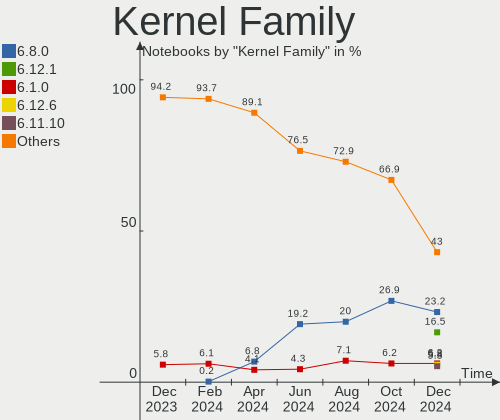
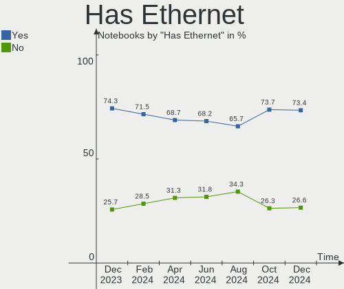
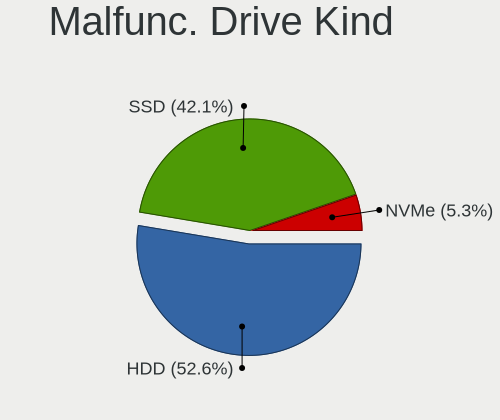
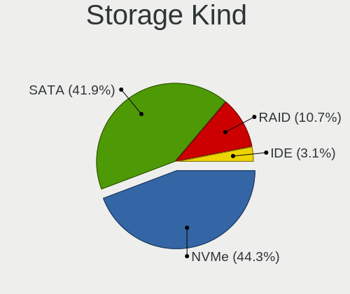
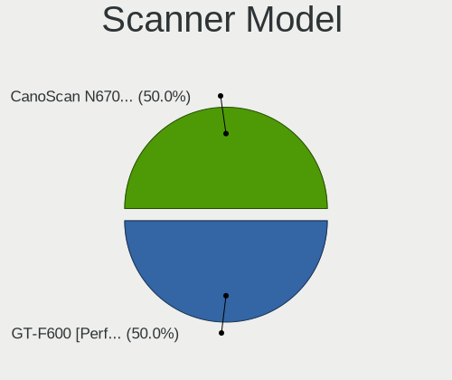
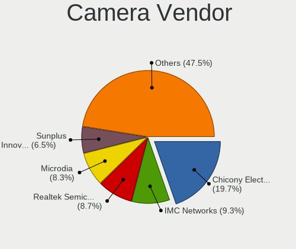

Linux in USA - Hardware Trends (Notebooks)
------------------------------------------

A project to identify most popular hardware characteristics and track their change
over time based on data collected by Linux users at https://Linux-Hardware.org.

Anyone can contribute to this report by the [hw-probe](https://github.com/linuxhw/hw-probe) tool:

    sudo -E hw-probe -all -upload

Contents
--------

* [ System ](#system)
  - [ OS                       ](#os)
  - [ OS Family                ](#os-family)
  - [ Kernel                   ](#kernel)
  - [ Kernel Family            ](#kernel-family)
  - [ Kernel Major Ver.        ](#kernel-major-ver)
  - [ Arch                     ](#arch)
  - [ DE                       ](#de)
  - [ Display Server           ](#display-server)
  - [ Display Manager          ](#display-manager)
  - [ OS Lang                  ](#os-lang)
  - [ Boot Mode                ](#boot-mode)
  - [ Filesystem               ](#filesystem)
  - [ Part. scheme             ](#part-scheme)
  - [ Dual Boot with Linux/BSD ](#dual-boot-with-linuxbsd)
  - [ Dual Boot (Win)          ](#dual-boot-win)

* [ Board ](#board)
  - [ Vendor                   ](#vendor)
  - [ Model                    ](#model)
  - [ Model Family             ](#model-family)
  - [ MFG Year                 ](#mfg-year)
  - [ Form Factor              ](#form-factor)
  - [ Secure Boot              ](#secure-boot)
  - [ Coreboot                 ](#coreboot)
  - [ RAM Size                 ](#ram-size)
  - [ RAM Used                 ](#ram-used)
  - [ Total Drives             ](#total-drives)
  - [ Has CD-ROM               ](#has-cd-rom)
  - [ Has Ethernet             ](#has-ethernet)
  - [ Has WiFi                 ](#has-wifi)
  - [ Has Bluetooth            ](#has-bluetooth)

* [ Location ](#location)
  - [ Country                  ](#country)
  - [ City                     ](#city)

* [ Drives ](#drives)
  - [ Drive Vendor             ](#drive-vendor)
  - [ Drive Model              ](#drive-model)
  - [ HDD Vendor               ](#hdd-vendor)
  - [ SSD Vendor               ](#ssd-vendor)
  - [ Drive Kind               ](#drive-kind)
  - [ Drive Connector          ](#drive-connector)
  - [ Drive Size               ](#drive-size)
  - [ Space Total              ](#space-total)
  - [ Space Used               ](#space-used)
  - [ Malfunc. Drives          ](#malfunc-drives)
  - [ Malfunc. Drive Vendor    ](#malfunc-drive-vendor)
  - [ Malfunc. HDD Vendor      ](#malfunc-hdd-vendor)
  - [ Malfunc. Drive Kind      ](#malfunc-drive-kind)
  - [ Failed Drives            ](#failed-drives)
  - [ Failed Drive Vendor      ](#failed-drive-vendor)
  - [ Drive Status             ](#drive-status)

* [ Storage controller ](#storage-controller)
  - [ Storage Vendor           ](#storage-vendor)
  - [ Storage Model            ](#storage-model)
  - [ Storage Kind             ](#storage-kind)

* [ Processor ](#processor)
  - [ CPU Vendor               ](#cpu-vendor)
  - [ CPU Model                ](#cpu-model)
  - [ CPU Model Family         ](#cpu-model-family)
  - [ CPU Cores                ](#cpu-cores)
  - [ CPU Sockets              ](#cpu-sockets)
  - [ CPU Threads              ](#cpu-threads)
  - [ CPU Op-Modes             ](#cpu-op-modes)
  - [ CPU Microcode            ](#cpu-microcode)
  - [ CPU Microarch            ](#cpu-microarch)

* [ Graphics ](#graphics)
  - [ GPU Vendor               ](#gpu-vendor)
  - [ GPU Model                ](#gpu-model)
  - [ GPU Combo                ](#gpu-combo)
  - [ GPU Driver               ](#gpu-driver)
  - [ GPU Memory               ](#gpu-memory)

* [ Monitor ](#monitor)
  - [ Monitor Vendor           ](#monitor-vendor)
  - [ Monitor Model            ](#monitor-model)
  - [ Monitor Resolution       ](#monitor-resolution)
  - [ Monitor Diagonal         ](#monitor-diagonal)
  - [ Monitor Width            ](#monitor-width)
  - [ Aspect Ratio             ](#aspect-ratio)
  - [ Monitor Area             ](#monitor-area)
  - [ Pixel Density            ](#pixel-density)
  - [ Multiple Monitors        ](#multiple-monitors)

* [ Network ](#network)
  - [ Net Controller Vendor    ](#net-controller-vendor)
  - [ Net Controller Model     ](#net-controller-model)
  - [ Wireless Vendor          ](#wireless-vendor)
  - [ Wireless Model           ](#wireless-model)
  - [ Ethernet Vendor          ](#ethernet-vendor)
  - [ Ethernet Model           ](#ethernet-model)
  - [ Net Controller Kind      ](#net-controller-kind)
  - [ Used Controller          ](#used-controller)
  - [ NICs                     ](#nics)
  - [ IPv6                     ](#ipv6)

* [ Bluetooth ](#bluetooth)
  - [ Bluetooth Vendor         ](#bluetooth-vendor)
  - [ Bluetooth Model          ](#bluetooth-model)

* [ Sound ](#sound)
  - [ Sound Vendor             ](#sound-vendor)
  - [ Sound Model              ](#sound-model)

* [ Memory ](#memory)
  - [ Memory Vendor            ](#memory-vendor)
  - [ Memory Model             ](#memory-model)
  - [ Memory Kind              ](#memory-kind)
  - [ Memory Form Factor       ](#memory-form-factor)
  - [ Memory Size              ](#memory-size)
  - [ Memory Speed             ](#memory-speed)

* [ Printers & scanners ](#printers--scanners)
  - [ Printer Vendor           ](#printer-vendor)
  - [ Printer Model            ](#printer-model)
  - [ Scanner Vendor           ](#scanner-vendor)
  - [ Scanner Model            ](#scanner-model)

* [ Camera ](#camera)
  - [ Camera Vendor            ](#camera-vendor)
  - [ Camera Model             ](#camera-model)

* [ Security ](#security)
  - [ Fingerprint Vendor       ](#fingerprint-vendor)
  - [ Fingerprint Model        ](#fingerprint-model)
  - [ Chipcard Vendor          ](#chipcard-vendor)
  - [ Chipcard Model           ](#chipcard-model)

* [ Unsupported ](#unsupported)
  - [ Unsupported Devices      ](#unsupported-devices)
  - [ Unsupported Device Types ](#unsupported-device-types)

System
------

OS
--

Installed operating systems

| Name                         | Notebooks | Percent |
|------------------------------|-----------|---------|
| Ubuntu 22.04                 | 58        | 14.8%   |
| Pop!_OS 22.04                | 39        | 9.95%   |
| Ubuntu 20.04                 | 37        | 9.44%   |
| Linux Mint 20.3              | 32        | 8.16%   |
| Fedora 36                    | 24        | 6.12%   |
| Zorin 16                     | 17        | 4.34%   |
| Debian 11                    | 17        | 4.34%   |
| OpenMandriva 4.3             | 13        | 3.32%   |
| Fedora 35                    | 13        | 3.32%   |
| Arch                         | 12        | 3.06%   |
| KDE neon 20.04               | 8         | 2.04%   |
| Ubuntu 21.10                 | 7         | 1.79%   |
| Manjaro 21.2.6               | 7         | 1.79%   |
| Manjaro                      | 6         | 1.53%   |
| Kubuntu 20.04                | 6         | 1.53%   |
| LMDE 5                       | 5         | 1.28%   |
| Kubuntu 22.04                | 5         | 1.28%   |
| Elementary 6.1               | 5         | 1.28%   |
| ArcoLinux Rolling            | 5         | 1.28%   |
| Gentoo 2.8                   | 4         | 1.02%   |
| Xubuntu 22.04                | 3         | 0.77%   |
| Pop!_OS 21.10                | 3         | 0.77%   |
| Parrot 5.0                   | 3         | 0.77%   |
| openSUSE Tumbleweed-XXXXXXXX | 3         | 0.77%   |
| Gentoo 2.6                   | 3         | 0.77%   |
| Arch Rolling                 | 3         | 0.77%   |
| Ubuntu MATE 22.04            | 2         | 0.51%   |
| Ubuntu Budgie 22.04          | 2         | 0.51%   |
| SteamOS Snapshot             | 2         | 0.51%   |
| SteamOS 3.2                  | 2         | 0.51%   |
| SteamOS 3.1                  | 2         | 0.51%   |
| ROSA 12.2                    | 2         | 0.51%   |
| MX 21                        | 2         | 0.51%   |
| Lubuntu 22.04                | 2         | 0.51%   |
| Lubuntu 21.10                | 2         | 0.51%   |
| LinuxFX 11                   | 2         | 0.51%   |
| Kubuntu 21.10                | 2         | 0.51%   |
| Kali 2022.2                  | 2         | 0.51%   |
| Drauger OS 7.5.1             | 2         | 0.51%   |
| Debian Unstable              | 2         | 0.51%   |
| Xero Rolling                 | 1         | 0.26%   |
| Xero                         | 1         | 0.26%   |
| Ubuntu MATE 20.04            | 1         | 0.26%   |
| Ubuntu 18.04                 | 1         | 0.26%   |
| Ubuntu 16.04                 | 1         | 0.26%   |
| Solus 4.3                    | 1         | 0.26%   |
| RHEL 9                       | 1         | 0.26%   |
| Pop!_OS 20.04                | 1         | 0.26%   |
| Peppermint 10                | 1         | 0.26%   |
| PCLinuxOS 2022               | 1         | 0.26%   |
| Parrot 4.11                  | 1         | 0.26%   |
| Lubuntu 20.04                | 1         | 0.26%   |
| Linux Mint 20.2              | 1         | 0.26%   |
| Kubuntu 21.04                | 1         | 0.26%   |
| Kali 2022.1                  | 1         | 0.26%   |
| Generic 34                   | 1         | 0.26%   |
| Garuda Linux Soaring         | 1         | 0.26%   |
| EndeavourOS                  | 1         | 0.26%   |
| Debian Testing               | 1         | 0.26%   |
| Debian 9                     | 1         | 0.26%   |

OS Family
---------

OS without a version

| Name          | Notebooks | Percent |
|---------------|-----------|---------|
| Ubuntu        | 104       | 26.53%  |
| Pop!_OS       | 43        | 10.97%  |
| Fedora        | 37        | 9.44%   |
| Linux Mint    | 33        | 8.42%   |
| Debian        | 22        | 5.61%   |
| Zorin         | 17        | 4.34%   |
| Arch          | 15        | 3.83%   |
| Kubuntu       | 14        | 3.57%   |
| OpenMandriva  | 13        | 3.32%   |
| Manjaro       | 13        | 3.32%   |
| KDE neon      | 8         | 2.04%   |
| Gentoo        | 7         | 1.79%   |
| SteamOS       | 6         | 1.53%   |
| Lubuntu       | 5         | 1.28%   |
| LMDE          | 5         | 1.28%   |
| Elementary    | 5         | 1.28%   |
| ArcoLinux     | 5         | 1.28%   |
| Parrot        | 4         | 1.02%   |
| Xubuntu       | 3         | 0.77%   |
| Ubuntu MATE   | 3         | 0.77%   |
| openSUSE      | 3         | 0.77%   |
| Kali          | 3         | 0.77%   |
| Clear Linux   | 3         | 0.77%   |
| Xero          | 2         | 0.51%   |
| Ubuntu Budgie | 2         | 0.51%   |
| ROSA          | 2         | 0.51%   |
| MX            | 2         | 0.51%   |
| LinuxFX       | 2         | 0.51%   |
| Drauger OS    | 2         | 0.51%   |
| Solus         | 1         | 0.26%   |
| RHEL          | 1         | 0.26%   |
| Peppermint    | 1         | 0.26%   |
| PCLinuxOS     | 1         | 0.26%   |
| Generic       | 1         | 0.26%   |
| Garuda Linux  | 1         | 0.26%   |
| EndeavourOS   | 1         | 0.26%   |
| Artix         | 1         | 0.26%   |
| Archcraft     | 1         | 0.26%   |

Kernel
------

Version of the Linux kernel

| Version                                            | Notebooks | Percent |
|----------------------------------------------------|-----------|---------|
| 5.17.5-76051705-generic                            | 29        | 7.4%    |
| 5.13.0-40-generic                                  | 26        | 6.63%   |
| 5.13.0-41-generic                                  | 24        | 6.12%   |
| 5.15.0-27-generic                                  | 23        | 5.87%   |
| 5.15.0-30-generic                                  | 20        | 5.1%    |
| 5.4.0-110-generic                                  | 18        | 4.59%   |
| 5.13.0-44-generic                                  | 18        | 4.59%   |
| 5.15.0-33-generic                                  | 15        | 3.83%   |
| 5.10.0-14-amd64                                    | 15        | 3.83%   |
| 5.16.7-desktop-1omv4003                            | 12        | 3.06%   |
| 5.4.0-109-generic                                  | 11        | 2.81%   |
| 5.16.19-76051619-generic                           | 11        | 2.81%   |
| 5.17.9-arch1-1                                     | 7         | 1.79%   |
| 5.17.6-300.fc36.x86_64                             | 7         | 1.79%   |
| 5.17.5-200.fc35.x86_64                             | 7         | 1.79%   |
| 5.17.5-300.fc36.x86_64                             | 6         | 1.53%   |
| 5.15.0-25-generic                                  | 5         | 1.28%   |
| 5.10.0-13-amd64                                    | 5         | 1.28%   |
| 5.4.0-91-generic                                   | 4         | 1.02%   |
| 5.17.8-arch1-1                                     | 4         | 1.02%   |
| 5.17.8-300.fc36.x86_64                             | 4         | 1.02%   |
| 5.16.0-12parrot1-amd64                             | 4         | 1.02%   |
| 5.15.38-1-MANJARO                                  | 4         | 1.02%   |
| 5.4.0-113-generic                                  | 3         | 0.77%   |
| 5.17.0-1-amd64                                     | 3         | 0.77%   |
| 5.18.0-arch1-1                                     | 2         | 0.51%   |
| 5.17.9-300.fc36.x86_64                             | 2         | 0.51%   |
| 5.17.9-1145.native                                 | 2         | 0.51%   |
| 5.17.9-1-default                                   | 2         | 0.51%   |
| 5.17.7-arch1-1                                     | 2         | 0.51%   |
| 5.17.7-300.fc36.x86_64                             | 2         | 0.51%   |
| 5.17.6-1-MANJARO                                   | 2         | 0.51%   |
| 5.17.6-051706-generic                              | 2         | 0.51%   |
| 5.17.5-arch1-1                                     | 2         | 0.51%   |
| 5.17.4-arch1-1                                     | 2         | 0.51%   |
| 5.17.4-200.fc35.x86_64                             | 2         | 0.51%   |
| 5.17.11-300.fc36.x86_64                            | 2         | 0.51%   |
| 5.16.0-kali7-amd64                                 | 2         | 0.51%   |
| 5.15.32-1-MANJARO                                  | 2         | 0.51%   |
| 5.15.19-xanmod1                                    | 2         | 0.51%   |
| 5.15.0-32-generic                                  | 2         | 0.51%   |
| 5.15.0-28-generic                                  | 2         | 0.51%   |
| 5.14.0-1036-oem                                    | 2         | 0.51%   |
| 5.13.0-valve15-1-neptune-02197-gf6ec7ad3762a       | 2         | 0.51%   |
| 5.13.0-valve10.3-1-neptune-02176-g5fe416c4acd8     | 2         | 0.51%   |
| 5.13.0-valve10.1-2-neptune-dri-02144-g7fffaf925dfb | 2         | 0.51%   |
| 5.11.0-49-generic                                  | 2         | 0.51%   |
| 5.10.74-generic-2rosa2021.1-x86_64                 | 2         | 0.51%   |
| 5.8.0-63-generic                                   | 1         | 0.26%   |
| 5.4.0-74-generic                                   | 1         | 0.26%   |
| 5.4.0-73-generic                                   | 1         | 0.26%   |
| 5.4.0-59-generic                                   | 1         | 0.26%   |
| 5.4.0-54-generic                                   | 1         | 0.26%   |
| 5.18.0-1-MANJARO                                   | 1         | 0.26%   |
| 5.18.0-051800rc1-generic                           | 1         | 0.26%   |
| 5.17.9-gentoo-x86_64                               | 1         | 0.26%   |
| 5.17.9-gentoo-x86                                  | 1         | 0.26%   |
| 5.17.9-gentoo                                      | 1         | 0.26%   |
| 5.17.8-200.fc35.x86_64                             | 1         | 0.26%   |
| 5.17.8-1143.native                                 | 1         | 0.26%   |

Kernel Family
-------------

Linux kernel without a distro release

| Version  | Notebooks | Percent |
|----------|-----------|---------|
| 5.13.0   | 78        | 19.9%   |
| 5.15.0   | 71        | 18.11%  |
| 5.17.5   | 47        | 11.99%  |
| 5.4.0    | 40        | 10.2%   |
| 5.10.0   | 20        | 5.1%    |
| 5.17.9   | 16        | 4.08%   |
| 5.17.6   | 13        | 3.32%   |
| 5.16.7   | 12        | 3.06%   |
| 5.16.19  | 11        | 2.81%   |
| 5.17.8   | 10        | 2.55%   |
| 5.16.0   | 8         | 2.04%   |
| 5.17.7   | 6         | 1.53%   |
| 5.17.0   | 6         | 1.53%   |
| 5.15.32  | 6         | 1.53%   |
| 5.17.4   | 5         | 1.28%   |
| 5.14.0   | 5         | 1.28%   |
| 5.18.0   | 4         | 1.02%   |
| 5.15.38  | 4         | 1.02%   |
| 5.11.0   | 4         | 1.02%   |
| 5.17.11  | 3         | 0.77%   |
| 5.17.1   | 3         | 0.77%   |
| 5.15.19  | 2         | 0.51%   |
| 5.10.74  | 2         | 0.51%   |
| 5.8.0    | 1         | 0.26%   |
| 5.17.3   | 1         | 0.26%   |
| 5.17.2   | 1         | 0.26%   |
| 5.16.5   | 1         | 0.26%   |
| 5.16.20  | 1         | 0.26%   |
| 5.16.2   | 1         | 0.26%   |
| 5.16.18  | 1         | 0.26%   |
| 5.16.15  | 1         | 0.26%   |
| 5.15.35  | 1         | 0.26%   |
| 5.15.10  | 1         | 0.26%   |
| 5.14.10  | 1         | 0.26%   |
| 5.10.109 | 1         | 0.26%   |
| 5.0.0    | 1         | 0.26%   |
| 4.9.0    | 1         | 0.26%   |
| 4.19.0   | 1         | 0.26%   |
| 4.15.0   | 1         | 0.26%   |

Kernel Major Ver.
-----------------

Linux kernel major version

| Version | Notebooks | Percent |
|---------|-----------|---------|
| 5.17    | 111       | 28.32%  |
| 5.15    | 85        | 21.68%  |
| 5.13    | 78        | 19.9%   |
| 5.4     | 40        | 10.2%   |
| 5.16    | 36        | 9.18%   |
| 5.10    | 23        | 5.87%   |
| 5.14    | 6         | 1.53%   |
| 5.18    | 4         | 1.02%   |
| 5.11    | 4         | 1.02%   |
| 5.8     | 1         | 0.26%   |
| 5.0     | 1         | 0.26%   |
| 4.9     | 1         | 0.26%   |
| 4.19    | 1         | 0.26%   |
| 4.15    | 1         | 0.26%   |

Arch
----

OS architecture (x86_64, i586, etc.)

| Name   | Notebooks | Percent |
|--------|-----------|---------|
| x86_64 | 390       | 99.49%  |
| i686   | 2         | 0.51%   |

DE
--

Desktop Environment

| Name       | Notebooks | Percent |
|------------|-----------|---------|
| GNOME      | 203       | 51.79%  |
| KDE5       | 77        | 19.64%  |
| X-Cinnamon | 33        | 8.42%   |
| XFCE       | 31        | 7.91%   |
| MATE       | 11        | 2.81%   |
| Unknown    | 8         | 2.04%   |
| LXQt       | 6         | 1.53%   |
| Cinnamon   | 6         | 1.53%   |
| Pantheon   | 5         | 1.28%   |
| Unity      | 2         | 0.51%   |
| Budgie     | 2         | 0.51%   |
| bspwm      | 2         | 0.51%   |
| sway       | 1         | 0.26%   |
| matchbox   | 1         | 0.26%   |
| LXDE       | 1         | 0.26%   |
| LeftWM     | 1         | 0.26%   |
| i3         | 1         | 0.26%   |
| awesome    | 1         | 0.26%   |

Display Server
--------------

X11 or Wayland

| Name    | Notebooks | Percent |
|---------|-----------|---------|
| X11     | 285       | 72.7%   |
| Wayland | 101       | 25.77%  |
| Tty     | 3         | 0.77%   |
| Unknown | 3         | 0.77%   |

Display Manager
---------------

SDDM, LightDM, etc.

| Name    | Notebooks | Percent |
|---------|-----------|---------|
| Unknown | 148       | 37.76%  |
| GDM3    | 100       | 25.51%  |
| SDDM    | 54        | 13.78%  |
| LightDM | 54        | 13.78%  |
| GDM     | 33        | 8.42%   |
| LXDM    | 2         | 0.51%   |
| Ly      | 1         | 0.26%   |

OS Lang
-------

Language

| Lang    | Notebooks | Percent |
|---------|-----------|---------|
| en_US   | 374       | 95.41%  |
| C       | 5         | 1.28%   |
| Unknown | 3         | 0.77%   |
| en_GB   | 2         | 0.51%   |
| en_CA   | 2         | 0.51%   |
| en_AU   | 2         | 0.51%   |
| C.UTF8  | 2         | 0.51%   |
| it_IT   | 1         | 0.26%   |
| de_DE   | 1         | 0.26%   |

Boot Mode
---------

EFI or BIOS

| Mode | Notebooks | Percent |
|------|-----------|---------|
| EFI  | 201       | 51.28%  |
| BIOS | 191       | 48.72%  |

Filesystem
----------

Type of filesystem

| Type    | Notebooks | Percent |
|---------|-----------|---------|
| Ext4    | 304       | 77.55%  |
| Btrfs   | 61        | 15.56%  |
| Overlay | 18        | 4.59%   |
| Zfs     | 5         | 1.28%   |
| Xfs     | 3         | 0.77%   |
| Unknown | 1         | 0.26%   |

Part. scheme
------------

Scheme of partitioning

| Type    | Notebooks | Percent |
|---------|-----------|---------|
| Unknown | 226       | 57.65%  |
| GPT     | 136       | 34.69%  |
| MBR     | 30        | 7.65%   |

Dual Boot with Linux/BSD
------------------------

Hosting more than one Linux/BSD

| Dual boot | Notebooks | Percent |
|-----------|-----------|---------|
| No        | 362       | 92.35%  |
| Yes       | 30        | 7.65%   |

Dual Boot (Win)
---------------

Hosting Linux and Windows

| Dual boot | Notebooks | Percent |
|-----------|-----------|---------|
| No        | 325       | 82.91%  |
| Yes       | 67        | 17.09%  |

Board
-----

Vendor
------

Motherboard manufacturer

| Name                | Notebooks | Percent |
|---------------------|-----------|---------|
| Dell                | 87        | 22.19%  |
| Hewlett-Packard     | 75        | 19.13%  |
| Lenovo              | 70        | 17.86%  |
| ASUSTek Computer    | 35        | 8.93%   |
| Acer                | 22        | 5.61%   |
| Apple               | 20        | 5.1%    |
| Google              | 16        | 4.08%   |
| Toshiba             | 10        | 2.55%   |
| System76            | 8         | 2.04%   |
| MSI                 | 6         | 1.53%   |
| Alienware           | 6         | 1.53%   |
| Valve               | 4         | 1.02%   |
| Framework           | 4         | 1.02%   |
| Samsung Electronics | 3         | 0.77%   |
| Notebook            | 3         | 0.77%   |
| LG Electronics      | 3         | 0.77%   |
| GPU Company         | 3         | 0.77%   |
| Timi                | 2         | 0.51%   |
| Sony                | 2         | 0.51%   |
| Razer               | 2         | 0.51%   |
| Panasonic           | 2         | 0.51%   |
| Gigabyte Technology | 2         | 0.51%   |
| Unknown             | 2         | 0.51%   |
| ROCK Pi             | 1         | 0.26%   |
| Howard Computers    | 1         | 0.26%   |
| Gateway             | 1         | 0.26%   |
| DTRI                | 1         | 0.26%   |
| AMI                 | 1         | 0.26%   |

Model
-----

Motherboard model

| Name                                  | Notebooks | Percent |
|---------------------------------------|-----------|---------|
| Valve Jupiter                         | 4         | 1.02%   |
| System76 Oryx Pro                     | 4         | 1.02%   |
| Framework Laptop                      | 4         | 1.02%   |
| Lenovo IdeaPad Slim 1-14AST-05 81VS   | 3         | 0.77%   |
| GPU Company GWTC116-2                 | 3         | 0.77%   |
| Dell XPS 17 9710                      | 3         | 0.77%   |
| Dell Precision 5560                   | 3         | 0.77%   |
| Dell Latitude E6540                   | 3         | 0.77%   |
| Dell Latitude E6410                   | 3         | 0.77%   |
| Dell Latitude 7480                    | 3         | 0.77%   |
| Acer Nitro AN515-54                   | 3         | 0.77%   |
| Unknown                               | 3         | 0.77%   |
| Lenovo Legion 5 15IMH05H 81Y6         | 2         | 0.51%   |
| Lenovo IdeaPad Slim 7 14ITL05 82A6    | 2         | 0.51%   |
| HP ProBook 650 G2                     | 2         | 0.51%   |
| HP Pavilion Notebook                  | 2         | 0.51%   |
| HP Pavilion Gaming Laptop 15-cx0xxx   | 2         | 0.51%   |
| HP Pavilion g7                        | 2         | 0.51%   |
| HP Notebook                           | 2         | 0.51%   |
| HP Laptop 17-by4xxx                   | 2         | 0.51%   |
| HP Laptop 15-dy2xxx                   | 2         | 0.51%   |
| HP Laptop 15-da0xxx                   | 2         | 0.51%   |
| HP Laptop 14-fq0xxx                   | 2         | 0.51%   |
| HP Laptop 14-dq0xxx                   | 2         | 0.51%   |
| HP Laptop 14-dk1xxx                   | 2         | 0.51%   |
| HP EliteBook 840 G8 Notebook PC       | 2         | 0.51%   |
| HP 15                                 | 2         | 0.51%   |
| Google Lulu                           | 2         | 0.51%   |
| Google Candy                          | 2         | 0.51%   |
| Dell XPS 15 9570                      | 2         | 0.51%   |
| Dell XPS 15 9510                      | 2         | 0.51%   |
| Dell XPS 13 9310                      | 2         | 0.51%   |
| Dell System Inspiron N7110            | 2         | 0.51%   |
| Dell Precision M4400                  | 2         | 0.51%   |
| Dell Precision 5540                   | 2         | 0.51%   |
| Dell Latitude E6510                   | 2         | 0.51%   |
| Dell Latitude E6420                   | 2         | 0.51%   |
| Dell Inspiron 5755                    | 2         | 0.51%   |
| Dell Inspiron 3541                    | 2         | 0.51%   |
| Dell Inspiron 1750                    | 2         | 0.51%   |
| Dell Inspiron 13-7378                 | 2         | 0.51%   |
| ASUS ROG Zephyrus G14 GA402RJ_GA402RJ | 2         | 0.51%   |
| ASUS K55A                             | 2         | 0.51%   |
| Apple MacBookPro8,1                   | 2         | 0.51%   |
| Apple MacBookPro6,2                   | 2         | 0.51%   |
| Acer Nitro AN515-45                   | 2         | 0.51%   |
| Acer Aspire E5-575G                   | 2         | 0.51%   |
| Acer Aspire 6930                      | 2         | 0.51%   |
| Toshiba TECRA A50-E                   | 1         | 0.26%   |
| Toshiba Satellite Radius P55W-B       | 1         | 0.26%   |
| Toshiba Satellite M305D               | 1         | 0.26%   |
| Toshiba Satellite L75D-A              | 1         | 0.26%   |
| Toshiba Satellite L755D               | 1         | 0.26%   |
| Toshiba Satellite L755                | 1         | 0.26%   |
| Toshiba Satellite C675                | 1         | 0.26%   |
| Toshiba Satellite C655                | 1         | 0.26%   |
| Toshiba Satellite C650D               | 1         | 0.26%   |
| Toshiba PORTEGE Z10t-A                | 1         | 0.26%   |
| Timi TM1613                           | 1         | 0.26%   |
| Timi A35S                             | 1         | 0.26%   |

Model Family
------------

Motherboard model prefix

| Name                  | Notebooks | Percent |
|-----------------------|-----------|---------|
| Lenovo ThinkPad       | 38        | 9.69%   |
| Dell Latitude         | 27        | 6.89%   |
| Dell Inspiron         | 24        | 6.12%   |
| HP Pavilion           | 23        | 5.87%   |
| Lenovo IdeaPad        | 21        | 5.36%   |
| HP Laptop             | 19        | 4.85%   |
| Dell Precision        | 14        | 3.57%   |
| Dell XPS              | 12        | 3.06%   |
| Acer Aspire           | 10        | 2.55%   |
| Toshiba Satellite     | 8         | 2.04%   |
| Acer Nitro            | 8         | 2.04%   |
| Lenovo Legion         | 7         | 1.79%   |
| HP ProBook            | 6         | 1.53%   |
| HP EliteBook          | 6         | 1.53%   |
| ASUS VivoBook         | 6         | 1.53%   |
| ASUS ROG              | 6         | 1.53%   |
| Valve Jupiter         | 4         | 1.02%   |
| System76 Oryx         | 4         | 1.02%   |
| Framework Laptop      | 4         | 1.02%   |
| Apple MacBookPro8     | 4         | 1.02%   |
| Acer Swift            | 4         | 1.02%   |
| HP Stream             | 3         | 0.77%   |
| HP OMEN               | 3         | 0.77%   |
| HP 15                 | 3         | 0.77%   |
| GPU Company GWTC116-2 | 3         | 0.77%   |
| Dell System           | 3         | 0.77%   |
| Unknown               | 3         | 0.77%   |
| Razer Blade           | 2         | 0.51%   |
| HP ZBook              | 2         | 0.51%   |
| HP Notebook           | 2         | 0.51%   |
| HP ENVY               | 2         | 0.51%   |
| HP 255                | 2         | 0.51%   |
| Google Lulu           | 2         | 0.51%   |
| Google Candy          | 2         | 0.51%   |
| Dell Vostro           | 2         | 0.51%   |
| Dell Studio           | 2         | 0.51%   |
| ASUS K55A             | 2         | 0.51%   |
| ASUS ASUS             | 2         | 0.51%   |
| Apple MacBookPro6     | 2         | 0.51%   |
| Apple MacBookPro14    | 2         | 0.51%   |
| Apple MacBookPro11    | 2         | 0.51%   |
| Apple MacBook5        | 2         | 0.51%   |
| Alienware m15         | 2         | 0.51%   |
| Toshiba TECRA         | 1         | 0.26%   |
| Toshiba PORTEGE       | 1         | 0.26%   |
| Timi TM1613           | 1         | 0.26%   |
| Timi A35S             | 1         | 0.26%   |
| System76 Pangolin     | 1         | 0.26%   |
| System76 Lemur        | 1         | 0.26%   |
| System76 Kudu         | 1         | 0.26%   |
| System76 Galago       | 1         | 0.26%   |
| Sony VPCF11JFX        | 1         | 0.26%   |
| Sony VGN-SZ430N       | 1         | 0.26%   |
| Samsung Lumpy         | 1         | 0.26%   |
| Samsung 950XDB        | 1         | 0.26%   |
| Samsung 730QCJ        | 1         | 0.26%   |
| Panasonic CF53-4      | 1         | 0.26%   |
| Panasonic CF-31-5     | 1         | 0.26%   |
| Notebook W65          | 1         | 0.26%   |
| Notebook NS50         | 1         | 0.26%   |

MFG Year
--------

Motherboard manufacture year

| Year | Notebooks | Percent |
|------|-----------|---------|
| 2021 | 73        | 18.62%  |
| 2020 | 43        | 10.97%  |
| 2019 | 34        | 8.67%   |
| 2018 | 34        | 8.67%   |
| 2022 | 22        | 5.61%   |
| 2013 | 22        | 5.61%   |
| 2017 | 21        | 5.36%   |
| 2014 | 21        | 5.36%   |
| 2011 | 21        | 5.36%   |
| 2016 | 20        | 5.1%    |
| 2010 | 19        | 4.85%   |
| 2015 | 17        | 4.34%   |
| 2012 | 17        | 4.34%   |
| 2009 | 13        | 3.32%   |
| 2008 | 12        | 3.06%   |
| 2007 | 2         | 0.51%   |
| 2006 | 1         | 0.26%   |

Form Factor
-----------

Physical design of the computer

| Name     | Notebooks | Percent |
|----------|-----------|---------|
| Notebook | 392       | 100%    |

Secure Boot
-----------

Enabled or disabled

| State    | Notebooks | Percent |
|----------|-----------|---------|
| Disabled | 357       | 91.07%  |
| Enabled  | 35        | 8.93%   |

Coreboot
--------

Have coreboot on board

| Used | Notebooks | Percent |
|------|-----------|---------|
| No   | 370       | 94.39%  |
| Yes  | 22        | 5.61%   |

RAM Size
--------

Total RAM memory

| Size in GB  | Notebooks | Percent |
|-------------|-----------|---------|
| 4.01-8.0    | 104       | 26.53%  |
| 3.01-4.0    | 81        | 20.66%  |
| 16.01-24.0  | 75        | 19.13%  |
| 8.01-16.0   | 71        | 18.11%  |
| 32.01-64.0  | 37        | 9.44%   |
| 64.01-256.0 | 10        | 2.55%   |
| 24.01-32.0  | 5         | 1.28%   |
| 1.01-2.0    | 5         | 1.28%   |
| 2.01-3.0    | 3         | 0.77%   |
| 0.51-1.0    | 1         | 0.26%   |

RAM Used
--------

Used RAM memory

| Used GB    | Notebooks | Percent |
|------------|-----------|---------|
| 1.01-2.0   | 146       | 37.24%  |
| 2.01-3.0   | 115       | 29.34%  |
| 4.01-8.0   | 52        | 13.27%  |
| 3.01-4.0   | 52        | 13.27%  |
| 8.01-16.0  | 13        | 3.32%   |
| 0.51-1.0   | 11        | 2.81%   |
| 32.01-64.0 | 1         | 0.26%   |
| 16.01-24.0 | 1         | 0.26%   |
| 0.01-0.5   | 1         | 0.26%   |

Total Drives
------------

Number of drives on board

| Drives | Notebooks | Percent |
|--------|-----------|---------|
| 1      | 275       | 70.15%  |
| 2      | 97        | 24.74%  |
| 3      | 12        | 3.06%   |
| 4      | 4         | 1.02%   |
| 0      | 3         | 0.77%   |
| 5      | 1         | 0.26%   |

Has CD-ROM
----------

Has CD-ROM on board

| Presented | Notebooks | Percent |
|-----------|-----------|---------|
| No        | 267       | 68.11%  |
| Yes       | 125       | 31.89%  |

Has Ethernet
------------

Has Ethernet on board

| Presented | Notebooks | Percent |
|-----------|-----------|---------|
| Yes       | 279       | 71.17%  |
| No        | 113       | 28.83%  |

Has WiFi
--------

Has WiFi module

| Presented | Notebooks | Percent |
|-----------|-----------|---------|
| Yes       | 388       | 98.98%  |
| No        | 4         | 1.02%   |

Has Bluetooth
-------------

Has Bluetooth module

| Presented | Notebooks | Percent |
|-----------|-----------|---------|
| Yes       | 318       | 81.12%  |
| No        | 74        | 18.88%  |

Location
--------

Country
-------

Geographic location (country)

| Country | Notebooks | Percent |
|---------|-----------|---------|
| USA     | 392       | 100%    |

City
----

Geographic location (city)

| City             | Notebooks | Percent |
|------------------|-----------|---------|
| New York         | 6         | 1.53%   |
| Dallas           | 6         | 1.53%   |
| Seattle          | 5         | 1.28%   |
| Washington       | 4         | 1.02%   |
| Springfield      | 4         | 1.02%   |
| Queens           | 4         | 1.02%   |
| Perth Amboy      | 4         | 1.02%   |
| Houston          | 4         | 1.02%   |
| Chicago          | 4         | 1.02%   |
| Sterling         | 3         | 0.77%   |
| San Antonio      | 3         | 0.77%   |
| Sacramento       | 3         | 0.77%   |
| Las Vegas        | 3         | 0.77%   |
| Kansas City      | 3         | 0.77%   |
| Fort Lauderdale  | 3         | 0.77%   |
| Durham           | 3         | 0.77%   |
| Denver           | 3         | 0.77%   |
| Charlotte        | 3         | 0.77%   |
| Buffalo          | 3         | 0.77%   |
| Baltimore        | 3         | 0.77%   |
| Whitsett         | 2         | 0.51%   |
| Valencia         | 2         | 0.51%   |
| Thermopolis      | 2         | 0.51%   |
| Tampa            | 2         | 0.51%   |
| Tallahassee      | 2         | 0.51%   |
| Spring Hill      | 2         | 0.51%   |
| Santa Rosa       | 2         | 0.51%   |
| Sanford          | 2         | 0.51%   |
| San Jose         | 2         | 0.51%   |
| San Francisco    | 2         | 0.51%   |
| San Diego        | 2         | 0.51%   |
| Richmond         | 2         | 0.51%   |
| Phoenix          | 2         | 0.51%   |
| Omaha            | 2         | 0.51%   |
| Mission          | 2         | 0.51%   |
| Minneapolis      | 2         | 0.51%   |
| Midlothian       | 2         | 0.51%   |
| Miami            | 2         | 0.51%   |
| Mesa             | 2         | 0.51%   |
| Maricopa         | 2         | 0.51%   |
| Los Angeles      | 2         | 0.51%   |
| Jeffersonville   | 2         | 0.51%   |
| Jacksonville     | 2         | 0.51%   |
| Howell           | 2         | 0.51%   |
| Gainesville      | 2         | 0.51%   |
| Everett          | 2         | 0.51%   |
| Dayton           | 2         | 0.51%   |
| Danville         | 2         | 0.51%   |
| Columbia         | 2         | 0.51%   |
| Casa Grande      | 2         | 0.51%   |
| Boise            | 2         | 0.51%   |
| Barberton        | 2         | 0.51%   |
| Austin           | 2         | 0.51%   |
| Aurora           | 2         | 0.51%   |
| Arlington        | 2         | 0.51%   |
| Yorba Linda      | 1         | 0.26%   |
| Woodmere         | 1         | 0.26%   |
| Woodbine         | 1         | 0.26%   |
| Wisconsin Rapids | 1         | 0.26%   |
| Winter Springs   | 1         | 0.26%   |

Drives
------

Drive Vendor
------------

Hard drive vendors

| Vendor                      | Notebooks | Drives | Percent |
|-----------------------------|-----------|--------|---------|
| Samsung Electronics         | 88        | 107    | 18.07%  |
| WDC                         | 46        | 47     | 9.45%   |
| Unknown                     | 46        | 51     | 9.45%   |
| Seagate                     | 43        | 45     | 8.83%   |
| SanDisk                     | 34        | 35     | 6.98%   |
| SK Hynix                    | 31        | 32     | 6.37%   |
| Toshiba                     | 25        | 25     | 5.13%   |
| HGST                        | 17        | 17     | 3.49%   |
| Crucial                     | 17        | 17     | 3.49%   |
| Micron Technology           | 14        | 14     | 2.87%   |
| Phison                      | 13        | 15     | 2.67%   |
| Intel                       | 13        | 13     | 2.67%   |
| Kingston                    | 12        | 12     | 2.46%   |
| Hitachi                     | 11        | 11     | 2.26%   |
| Apple                       | 9         | 13     | 1.85%   |
| KIOXIA                      | 8         | 8      | 1.64%   |
| PNY                         | 5         | 5      | 1.03%   |
| China                       | 5         | 5      | 1.03%   |
| Unknown                     | 5         | 5      | 1.03%   |
| A-DATA Technology           | 4         | 4      | 0.82%   |
| Micron/Crucial Technology   | 3         | 3      | 0.62%   |
| LITEONIT                    | 3         | 3      | 0.62%   |
| TO Exter                    | 2         | 2      | 0.41%   |
| Team                        | 2         | 2      | 0.41%   |
| MyDigitalSSD                | 2         | 2      | 0.41%   |
| LITEON                      | 2         | 2      | 0.41%   |
| Fujitsu                     | 2         | 2      | 0.41%   |
| BHT                         | 2         | 2      | 0.41%   |
| Zheino                      | 1         | 1      | 0.21%   |
| USB3.0                      | 1         | 1      | 0.21%   |
| Union Memory (Shenzhen)     | 1         | 1      | 0.21%   |
| Union Memory                | 1         | 1      | 0.21%   |
| UMIS                        | 1         | 1      | 0.21%   |
| Transcend                   | 1         | 1      | 0.21%   |
| SPCC                        | 1         | 1      | 0.21%   |
| Silicon Motion              | 1         | 1      | 0.21%   |
| PNY USB                     | 1         | 1      | 0.21%   |
| PHD 3.0                     | 1         | 1      | 0.21%   |
| OCZ                         | 1         | 1      | 0.21%   |
| MAXIO Technology (Hangzhou) | 1         | 1      | 0.21%   |
| Lexar 25                    | 1         | 1      | 0.21%   |
| Lexar                       | 1         | 1      | 0.21%   |
| Lenovo                      | 1         | 1      | 0.21%   |
| KingFast                    | 1         | 2      | 0.21%   |
| Kingchuxing                 | 1         | 1      | 0.21%   |
| Intenso                     | 1         | 1      | 0.21%   |
| E535N                       | 1         | 1      | 0.21%   |
| Dell                        | 1         | 1      | 0.21%   |
| AXIOM                       | 1         | 1      | 0.21%   |
| ASMT                        | 1         | 1      | 0.21%   |
| Adafruit                    | 1         | 1      | 0.21%   |

Drive Model
-----------

Hard drive models

| Model                                | Notebooks | Percent |
|--------------------------------------|-----------|---------|
| Samsung NVMe SSD Drive 1TB           | 8         | 1.54%   |
| Unknown MMC Card  64GB               | 7         | 1.35%   |
| Toshiba MQ01ABD100 1TB               | 7         | 1.35%   |
| HGST HTS721010A9E630 1TB             | 7         | 1.35%   |
| Seagate ST1000LM035-1RK172 1TB       | 6         | 1.16%   |
| Samsung NVMe SSD Drive 512GB         | 6         | 1.16%   |
| Samsung NVMe SSD Drive 256GB         | 6         | 1.16%   |
| Samsung NVMe SSD Drive 1024GB        | 6         | 1.16%   |
| Unknown SD/MMC/MS PRO 999GB          | 5         | 0.97%   |
| Seagate ST1000LM024 HN-M101MBB 1TB   | 5         | 0.97%   |
| Samsung NVMe SSD Drive 500GB         | 5         | 0.97%   |
| Unknown                              | 5         | 0.97%   |
| Unknown MMC Card  128GB              | 4         | 0.77%   |
| Unknown DA4064  64GB                 | 4         | 0.77%   |
| SK Hynix NVMe SSD Drive 256GB        | 4         | 0.77%   |
| SK Hynix NVMe SSD Drive 1024GB       | 4         | 0.77%   |
| Sandisk NVMe SSD Drive 512GB         | 4         | 0.77%   |
| Crucial CT500MX500SSD1 500GB         | 4         | 0.77%   |
| Unknown MMC64G  64GB                 | 3         | 0.58%   |
| Unknown MMC Card  32GB               | 3         | 0.58%   |
| Unknown MMC Card  16GB               | 3         | 0.58%   |
| Toshiba MQ04ABF100 1TB               | 3         | 0.58%   |
| Toshiba MQ01ABF050 500GB             | 3         | 0.58%   |
| Sandisk NVMe SSD Drive 256GB         | 3         | 0.58%   |
| Sandisk NVMe SSD Drive 1TB           | 3         | 0.58%   |
| Samsung SSD 980 1TB                  | 3         | 0.58%   |
| Samsung SSD 860 EVO 500GB            | 3         | 0.58%   |
| Phison NVMe SSD Drive 256GB          | 3         | 0.58%   |
| Phison NVMe SSD Drive 1024GB         | 3         | 0.58%   |
| KIOXIA KBG40ZNS256G NVMe 256GB       | 3         | 0.58%   |
| Intel SSDPEKKW256G7 256GB            | 3         | 0.58%   |
| Intel NVMe SSD Drive 512GB           | 3         | 0.58%   |
| HGST HTS725050A7E630 500GB           | 3         | 0.58%   |
| HGST HTS545050A7E680 500GB           | 3         | 0.58%   |
| WDC WDBNCE5000PNC 500GB SSD          | 2         | 0.39%   |
| WDC WD5000BPVT-75HXZT3 500GB         | 2         | 0.39%   |
| WDC WD5000BPKX-22HPJT0 500GB         | 2         | 0.39%   |
| WDC WD10JPVX-75JC3T0 1TB             | 2         | 0.39%   |
| WDC PC SN530 SDBPNPZ-256G-1006 256GB | 2         | 0.39%   |
| Unknown SEM16G  16GB                 | 2         | 0.39%   |
| Unknown DA4032  32GB                 | 2         | 0.39%   |
| Toshiba NVMe SSD Drive 512GB         | 2         | 0.39%   |
| Toshiba KBG30ZMS128G 128GB NVMe SSD  | 2         | 0.39%   |
| TO Exter nal USB 3.0 320GB           | 2         | 0.39%   |
| SK Hynix SC311 SATA 128GB SSD        | 2         | 0.39%   |
| SK Hynix NVMe SSD Drive 512GB        | 2         | 0.39%   |
| Seagate ST500LM012 HN-M500MBB 500GB  | 2         | 0.39%   |
| Seagate ST1000LM049-2GH172 1TB       | 2         | 0.39%   |
| Seagate Portable 1TB                 | 2         | 0.39%   |
| SanDisk SDSSDH3500G 500GB            | 2         | 0.39%   |
| SanDisk SDSSDA120G 120GB             | 2         | 0.39%   |
| Sandisk NVMe SSD Drive 500GB         | 2         | 0.39%   |
| SanDisk DF4064  64GB                 | 2         | 0.39%   |
| SanDisk DF4032  32GB                 | 2         | 0.39%   |
| Samsung SSD 970 EVO Plus 2TB         | 2         | 0.39%   |
| Samsung SSD 970 EVO Plus 1TB         | 2         | 0.39%   |
| Samsung SSD 850 PRO 512GB            | 2         | 0.39%   |
| Samsung SSD 850 EVO 500GB            | 2         | 0.39%   |
| Samsung SSD 850 EVO 1TB              | 2         | 0.39%   |
| Samsung SSD 840 EVO 500GB            | 2         | 0.39%   |

HDD Vendor
----------

Hard disk drive vendors

| Vendor              | Notebooks | Drives | Percent |
|---------------------|-----------|--------|---------|
| Seagate             | 38        | 40     | 30.65%  |
| WDC                 | 28        | 28     | 22.58%  |
| Toshiba             | 18        | 18     | 14.52%  |
| HGST                | 17        | 17     | 13.71%  |
| Hitachi             | 11        | 11     | 8.87%   |
| Unknown             | 5         | 5      | 4.03%   |
| Fujitsu             | 2         | 2      | 1.61%   |
| Apple               | 2         | 2      | 1.61%   |
| Samsung Electronics | 1         | 1      | 0.81%   |
| PHD 3.0             | 1         | 1      | 0.81%   |
| ASMT                | 1         | 1      | 0.81%   |

SSD Vendor
----------

Solid state drive vendors

| Vendor              | Notebooks | Drives | Percent |
|---------------------|-----------|--------|---------|
| Samsung Electronics | 32        | 36     | 23.19%  |
| SanDisk             | 16        | 16     | 11.59%  |
| Crucial             | 15        | 15     | 10.87%  |
| WDC                 | 9         | 9      | 6.52%   |
| SK Hynix            | 7         | 7      | 5.07%   |
| Micron Technology   | 6         | 6      | 4.35%   |
| Kingston            | 6         | 6      | 4.35%   |
| PNY                 | 5         | 5      | 3.62%   |
| China               | 5         | 5      | 3.62%   |
| Apple               | 5         | 5      | 3.62%   |
| Intel               | 4         | 4      | 2.9%    |
| A-DATA Technology   | 4         | 4      | 2.9%    |
| LITEONIT            | 3         | 3      | 2.17%   |
| TO Exter            | 2         | 2      | 1.45%   |
| MyDigitalSSD        | 2         | 2      | 1.45%   |
| BHT                 | 2         | 2      | 1.45%   |
| Zheino              | 1         | 1      | 0.72%   |
| USB3.0              | 1         | 1      | 0.72%   |
| Union Memory        | 1         | 1      | 0.72%   |
| Transcend           | 1         | 1      | 0.72%   |
| Toshiba             | 1         | 1      | 0.72%   |
| Team                | 1         | 1      | 0.72%   |
| PNY USB             | 1         | 1      | 0.72%   |
| OCZ                 | 1         | 1      | 0.72%   |
| LITEON              | 1         | 1      | 0.72%   |
| Lexar 25            | 1         | 1      | 0.72%   |
| Lexar               | 1         | 1      | 0.72%   |
| KingFast            | 1         | 1      | 0.72%   |
| E535N               | 1         | 1      | 0.72%   |
| Dell                | 1         | 1      | 0.72%   |
| AXIOM               | 1         | 1      | 0.72%   |

Drive Kind
----------

HDD or SSD

| Kind    | Notebooks | Drives | Percent |
|---------|-----------|--------|---------|
| NVMe    | 156       | 189    | 33.19%  |
| SSD     | 130       | 142    | 27.66%  |
| HDD     | 122       | 126    | 25.96%  |
| MMC     | 52        | 55     | 11.06%  |
| Unknown | 10        | 11     | 2.13%   |

Drive Connector
---------------

SATA, SAS, NVMe, etc.

| Type | Notebooks | Drives | Percent |
|------|-----------|--------|---------|
| SATA | 221       | 250    | 48.46%  |
| NVMe | 156       | 189    | 34.21%  |
| MMC  | 52        | 55     | 11.4%   |
| SAS  | 27        | 29     | 5.92%   |

Drive Size
----------

Size of hard drive

| Size in TB | Notebooks | Drives | Percent |
|------------|-----------|--------|---------|
| 0.01-0.5   | 159       | 170    | 63.1%   |
| 0.51-1.0   | 79        | 83     | 31.35%  |
| 1.01-2.0   | 10        | 10     | 3.97%   |
| 4.01-10.0  | 2         | 2      | 0.79%   |
| 3.01-4.0   | 1         | 1      | 0.4%    |
| 10.01-20.0 | 1         | 2      | 0.4%    |

Space Total
-----------

Amount of disk space available on the file system

| Size in GB     | Notebooks | Percent |
|----------------|-----------|---------|
| 101-250        | 110       | 28.06%  |
| 251-500        | 91        | 23.21%  |
| 501-1000       | 67        | 17.09%  |
| 1-20           | 25        | 6.38%   |
| 1001-2000      | 24        | 6.12%   |
| 51-100         | 23        | 5.87%   |
| 21-50          | 17        | 4.34%   |
| More than 3000 | 15        | 3.83%   |
| Unknown        | 11        | 2.81%   |
| 2001-3000      | 9         | 2.3%    |

Space Used
----------

Amount of used disk space

| Used GB        | Notebooks | Percent |
|----------------|-----------|---------|
| 1-20           | 144       | 36.73%  |
| 21-50          | 91        | 23.21%  |
| 101-250        | 52        | 13.27%  |
| 51-100         | 43        | 10.97%  |
| 251-500        | 28        | 7.14%   |
| 501-1000       | 12        | 3.06%   |
| Unknown        | 11        | 2.81%   |
| More than 3000 | 4         | 1.02%   |
| 2001-3000      | 4         | 1.02%   |
| 1001-2000      | 3         | 0.77%   |

Malfunc. Drives
---------------

Drive models with a malfunction

| Model                                            | Notebooks | Drives | Percent |
|--------------------------------------------------|-----------|--------|---------|
| Seagate ST1000LM024 HN-M101MBB 1TB               | 2         | 2      | 8.33%   |
| WDC WDS240G2G0B-00EPW0 240GB SSD                 | 1         | 1      | 4.17%   |
| WDC WD5000LPVT-22G33T0 500GB                     | 1         | 1      | 4.17%   |
| WDC WD5000BPKX-22HPJT0 500GB                     | 1         | 1      | 4.17%   |
| WDC WD10JPVX-75JC3T0 1TB                         | 1         | 1      | 4.17%   |
| Toshiba MQ01ABD100 1TB                           | 1         | 1      | 4.17%   |
| SK Hynix HFS128G39TND-N210A 128GB SSD            | 1         | 1      | 4.17%   |
| Seagate ST95005620AS 500GB                       | 1         | 1      | 4.17%   |
| Seagate ST9320421AS 320GB                        | 1         | 1      | 4.17%   |
| Seagate ST9250410AS 250GB                        | 1         | 1      | 4.17%   |
| Seagate ST500LM021-1KJ152 500GB                  | 1         | 1      | 4.17%   |
| Seagate ST250LT007-9ZV14C 250GB                  | 1         | 1      | 4.17%   |
| Samsung Electronics SSD 980 1TB                  | 1         | 1      | 4.17%   |
| Samsung Electronics MZNLH128HBHQ-000H1 128GB SSD | 1         | 1      | 4.17%   |
| Kingston SNS4151S332GD 32GB SSD                  | 1         | 1      | 4.17%   |
| Kingston RBU-SNS8350DES3128GP 128GB SSD          | 1         | 1      | 4.17%   |
| Intel SSDMAEMC080G2L 80GB                        | 1         | 1      | 4.17%   |
| HGST HTS725050A7E630 500GB                       | 1         | 1      | 4.17%   |
| HGST HTS721010A9E630 1TB                         | 1         | 1      | 4.17%   |
| HGST HTS545050A7E680 500GB                       | 1         | 1      | 4.17%   |
| HGST HTS545032A7E380 320GB                       | 1         | 1      | 4.17%   |
| Fujitsu MHY2160BH 160GB                          | 1         | 1      | 4.17%   |
| Crucial CT275MX300SSD1 275GB                     | 1         | 1      | 4.17%   |

Malfunc. Drive Vendor
---------------------

Vendors of faulty drives

| Vendor              | Notebooks | Drives | Percent |
|---------------------|-----------|--------|---------|
| Seagate             | 7         | 7      | 29.17%  |
| WDC                 | 4         | 4      | 16.67%  |
| HGST                | 4         | 4      | 16.67%  |
| Samsung Electronics | 2         | 2      | 8.33%   |
| Kingston            | 2         | 2      | 8.33%   |
| Toshiba             | 1         | 1      | 4.17%   |
| SK Hynix            | 1         | 1      | 4.17%   |
| Intel               | 1         | 1      | 4.17%   |
| Fujitsu             | 1         | 1      | 4.17%   |
| Crucial             | 1         | 1      | 4.17%   |

Malfunc. HDD Vendor
-------------------

Vendors of faulty HDD drives

| Vendor  | Notebooks | Drives | Percent |
|---------|-----------|--------|---------|
| Seagate | 7         | 7      | 43.75%  |
| HGST    | 4         | 4      | 25%     |
| WDC     | 3         | 3      | 18.75%  |
| Toshiba | 1         | 1      | 6.25%   |
| Fujitsu | 1         | 1      | 6.25%   |

Malfunc. Drive Kind
-------------------

Kinds of faulty drives

| Kind | Notebooks | Drives | Percent |
|------|-----------|--------|---------|
| HDD  | 16        | 16     | 66.67%  |
| SSD  | 7         | 7      | 29.17%  |
| NVMe | 1         | 1      | 4.17%   |

Failed Drives
-------------

Failed drive models

Zero info for selected period =(

Failed Drive Vendor
-------------------

Failed drive vendors

Zero info for selected period =(

Drive Status
------------

Number of failed and malfunc. drives

| Status   | Notebooks | Drives | Percent |
|----------|-----------|--------|---------|
| Detected | 255       | 345    | 62.5%   |
| Works    | 130       | 154    | 31.86%  |
| Malfunc  | 23        | 24     | 5.64%   |

Storage controller
------------------

Storage Vendor
--------------

Storage controller vendors

| Vendor                       | Notebooks | Percent |
|------------------------------|-----------|---------|
| Intel                        | 249       | 53.09%  |
| Samsung Electronics          | 63        | 13.43%  |
| AMD                          | 52        | 11.09%  |
| SK Hynix                     | 23        | 4.9%    |
| Sandisk                      | 22        | 4.69%   |
| Phison Electronics           | 13        | 2.77%   |
| Micron Technology            | 8         | 1.71%   |
| KIOXIA                       | 8         | 1.71%   |
| Toshiba America Info Systems | 6         | 1.28%   |
| Kingston Technology Company  | 6         | 1.28%   |
| Micron/Crucial Technology    | 5         | 1.07%   |
| Nvidia                       | 4         | 0.85%   |
| Union Memory (Shenzhen)      | 2         | 0.43%   |
| Silicon Motion               | 2         | 0.43%   |
| Apple                        | 2         | 0.43%   |
| Seagate Technology           | 1         | 0.21%   |
| MAXIO Technology (Hangzhou)  | 1         | 0.21%   |
| Lite-On Technology           | 1         | 0.21%   |
| Lenovo                       | 1         | 0.21%   |

Storage Model
-------------

Storage controller models

| Model                                                                            | Notebooks | Percent |
|----------------------------------------------------------------------------------|-----------|---------|
| AMD FCH SATA Controller [AHCI mode]                                              | 47        | 9.55%   |
| Intel 82801 Mobile SATA Controller [RAID mode]                                   | 29        | 5.89%   |
| Intel Volume Management Device NVMe RAID Controller                              | 26        | 5.28%   |
| Intel Sunrise Point-LP SATA Controller [AHCI mode]                               | 26        | 5.28%   |
| Samsung NVMe SSD Controller SM981/PM981/PM983                                    | 25        | 5.08%   |
| Samsung NVMe SSD Controller 980                                                  | 19        | 3.86%   |
| Intel 6 Series/C200 Series Chipset Family 6 port Mobile SATA AHCI Controller     | 17        | 3.46%   |
| Intel 7 Series Chipset Family 6-port SATA Controller [AHCI mode]                 | 16        | 3.25%   |
| Intel Cannon Lake Mobile PCH SATA AHCI Controller                                | 15        | 3.05%   |
| SK Hynix Gold P31 SSD                                                            | 12        | 2.44%   |
| Intel Wildcat Point-LP SATA Controller [AHCI Mode]                               | 12        | 2.44%   |
| Intel 82801IBM/IEM (ICH9M/ICH9M-E) 4 port SATA Controller [AHCI mode]            | 11        | 2.24%   |
| Intel 8 Series/C220 Series Chipset Family 6-port SATA Controller 1 [AHCI mode]   | 11        | 2.24%   |
| Samsung NVMe SSD Controller PM9A1/PM9A3/980PRO                                   | 9         | 1.83%   |
| Intel 8 Series SATA Controller 1 [AHCI mode]                                     | 9         | 1.83%   |
| Sandisk WD Black SN750 / PC SN730 NVMe SSD                                       | 8         | 1.63%   |
| Micron Non-Volatile memory controller                                            | 8         | 1.63%   |
| KIOXIA Non-Volatile memory controller                                            | 8         | 1.63%   |
| Intel Celeron/Pentium Silver Processor SATA Controller                           | 8         | 1.63%   |
| Sandisk WD Blue SN550 NVMe SSD                                                   | 7         | 1.42%   |
| Intel Tiger Lake-LP SATA Controller [AHCI mode]                                  | 7         | 1.42%   |
| Intel 5 Series/3400 Series Chipset 4 port SATA AHCI Controller                   | 7         | 1.42%   |
| Phison PS5013 E13 NVMe Controller                                                | 6         | 1.22%   |
| Intel Q170/Q150/B150/H170/H110/Z170/CM236 Chipset SATA Controller [AHCI Mode]    | 6         | 1.22%   |
| Intel HM170/QM170 Chipset SATA Controller [AHCI Mode]                            | 6         | 1.22%   |
| Intel 5 Series/3400 Series Chipset 6 port SATA AHCI Controller                   | 6         | 1.22%   |
| Intel Comet Lake SATA AHCI Controller                                            | 5         | 1.02%   |
| Intel 82801HM/HEM (ICH8M/ICH8M-E) IDE Controller                                 | 5         | 1.02%   |
| SK Hynix Non-Volatile memory controller                                          | 4         | 0.81%   |
| SK Hynix BC511                                                                   | 4         | 0.81%   |
| Sandisk Non-Volatile memory controller                                           | 4         | 0.81%   |
| Samsung NVMe SSD Controller SM961/PM961/SM963                                    | 4         | 0.81%   |
| Samsung NVMe SSD Controller SM951/PM951                                          | 4         | 0.81%   |
| Phison E12 NVMe Controller                                                       | 4         | 0.81%   |
| Intel 82801HM/HEM (ICH8M/ICH8M-E) SATA Controller [AHCI mode]                    | 4         | 0.81%   |
| Intel 400 Series Chipset Family SATA AHCI Controller                             | 4         | 0.81%   |
| AMD SB7x0/SB8x0/SB9x0 SATA Controller [AHCI mode]                                | 4         | 0.81%   |
| Toshiba America Info Systems XG6 NVMe SSD Controller                             | 3         | 0.61%   |
| Samsung Electronics SATA controller                                              | 3         | 0.61%   |
| Nvidia MCP79 AHCI Controller                                                     | 3         | 0.61%   |
| Intel SSD Pro 7600p/760p/E 6100p Series                                          | 3         | 0.61%   |
| Intel SSD 660P Series                                                            | 3         | 0.61%   |
| Intel Cannon Point-LP SATA Controller [AHCI Mode]                                | 3         | 0.61%   |
| Intel Atom/Celeron/Pentium Processor x5-E8000/J3xxx/N3xxx Series SATA Controller | 3         | 0.61%   |
| Intel Atom Processor E3800 Series SATA AHCI Controller                           | 3         | 0.61%   |
| Intel 500 Series Chipset Family SATA AHCI Controller                             | 3         | 0.61%   |
| Union Memory (Shenzhen) Non-Volatile memory controller                           | 2         | 0.41%   |
| Toshiba America Info Systems BG3 NVMe SSD Controller                             | 2         | 0.41%   |
| SK Hynix PC401 NVMe Solid State Drive 256GB                                      | 2         | 0.41%   |
| Silicon Motion SM2263EN/SM2263XT SSD Controller                                  | 2         | 0.41%   |
| Micron/Crucial P2 NVMe PCIe SSD                                                  | 2         | 0.41%   |
| Micron/Crucial Non-Volatile memory controller                                    | 2         | 0.41%   |
| Kingston Company U-SNS8154P3 NVMe SSD                                            | 2         | 0.41%   |
| Kingston Company Company Non-Volatile memory controller                          | 2         | 0.41%   |
| Kingston Company OM3PDP3 NVMe SSD                                                | 2         | 0.41%   |
| Intel Non-Volatile memory controller                                             | 2         | 0.41%   |
| Intel 82801IBM/IEM (ICH9M/ICH9M-E) 2 port SATA Controller [IDE mode]             | 2         | 0.41%   |
| Intel 82801GBM/GHM (ICH7-M Family) SATA Controller [IDE mode]                    | 2         | 0.41%   |
| Apple S3X NVMe Controller                                                        | 2         | 0.41%   |
| Toshiba America Info Systems Toshiba America Info Non-Volatile memory controller | 1         | 0.2%    |

Storage Kind
------------

Kind of storage controller (IDE, SATA, NVMe, SAS, ...)

| Kind | Notebooks | Percent |
|------|-----------|---------|
| SATA | 246       | 52.01%  |
| NVMe | 157       | 33.19%  |
| RAID | 57        | 12.05%  |
| IDE  | 13        | 2.75%   |

Processor
---------

CPU Vendor
----------

Processor vendors

| Vendor | Notebooks | Percent |
|--------|-----------|---------|
| Intel  | 315       | 80.36%  |
| AMD    | 77        | 19.64%  |

CPU Model
---------

Processor models

| Model                                         | Notebooks | Percent |
|-----------------------------------------------|-----------|---------|
| Intel 11th Gen Core i5-1135G7 @ 2.40GHz       | 12        | 3.06%   |
| Intel Celeron N4020 CPU @ 1.10GHz             | 11        | 2.81%   |
| Intel 11th Gen Core i7-11800H @ 2.30GHz       | 8         | 2.04%   |
| Intel Core i7-8750H CPU @ 2.20GHz             | 7         | 1.79%   |
| Intel Core i5-6200U CPU @ 2.30GHz             | 7         | 1.79%   |
| Intel Core i7-6700HQ CPU @ 2.60GHz            | 6         | 1.53%   |
| Intel Core i5-7200U CPU @ 2.50GHz             | 6         | 1.53%   |
| Intel Celeron CPU N3060 @ 1.60GHz             | 6         | 1.53%   |
| AMD Ryzen 7 5800H with Radeon Graphics        | 6         | 1.53%   |
| Intel Core i7-8550U CPU @ 1.80GHz             | 5         | 1.28%   |
| Intel Core i5-6300U CPU @ 2.40GHz             | 5         | 1.28%   |
| Intel Core i5 CPU M 520 @ 2.40GHz             | 5         | 1.28%   |
| Intel 11th Gen Core i7-1185G7 @ 3.00GHz       | 5         | 1.28%   |
| Intel 11th Gen Core i7-1165G7 @ 2.80GHz       | 5         | 1.28%   |
| AMD Ryzen 7 4800H with Radeon Graphics        | 5         | 1.28%   |
| Intel Core i7-4700MQ CPU @ 2.40GHz            | 4         | 1.02%   |
| Intel Core i5-9300H CPU @ 2.40GHz             | 4         | 1.02%   |
| Intel Core i5-8250U CPU @ 1.60GHz             | 4         | 1.02%   |
| Intel Core i5-5300U CPU @ 2.30GHz             | 4         | 1.02%   |
| Intel Core i5-3230M CPU @ 2.60GHz             | 4         | 1.02%   |
| Intel Core i5-2520M CPU @ 2.50GHz             | 4         | 1.02%   |
| Intel Core i5-1035G1 CPU @ 1.00GHz            | 4         | 1.02%   |
| AMD Custom APU 0405                           | 4         | 1.02%   |
| AMD A8-7410 APU with AMD Radeon R5 Graphics   | 4         | 1.02%   |
| AMD A6-9220e RADEON R4, 5 COMPUTE CORES 2C+3G | 4         | 1.02%   |
| Intel Core i7-7700HQ CPU @ 2.80GHz            | 3         | 0.77%   |
| Intel Core i7-4700HQ CPU @ 2.40GHz            | 3         | 0.77%   |
| Intel Core i7-10750H CPU @ 2.60GHz            | 3         | 0.77%   |
| Intel Core i5-8350U CPU @ 1.70GHz             | 3         | 0.77%   |
| Intel Core i5-10210U CPU @ 1.60GHz            | 3         | 0.77%   |
| Intel Core i5 CPU M 540 @ 2.53GHz             | 3         | 0.77%   |
| Intel Core 2 Duo CPU P8600 @ 2.40GHz          | 3         | 0.77%   |
| Intel 12th Gen Core i7-12700H                 | 3         | 0.77%   |
| Intel 11th Gen Core i7-11850H @ 2.50GHz       | 3         | 0.77%   |
| Intel 11th Gen Core i3-1115G4 @ 3.00GHz       | 3         | 0.77%   |
| AMD Ryzen 5 4500U with Radeon Graphics        | 3         | 0.77%   |
| Intel Xeon CPU E3-1505M v5 @ 2.80GHz          | 2         | 0.51%   |
| Intel Pentium CPU N3540 @ 2.16GHz             | 2         | 0.51%   |
| Intel Core i9-10885H CPU @ 2.40GHz            | 2         | 0.51%   |
| Intel Core i7-9750H CPU @ 2.60GHz             | 2         | 0.51%   |
| Intel Core i7-7500U CPU @ 2.70GHz             | 2         | 0.51%   |
| Intel Core i7-6820HQ CPU @ 2.70GHz            | 2         | 0.51%   |
| Intel Core i7-6600U CPU @ 2.60GHz             | 2         | 0.51%   |
| Intel Core i7-6500U CPU @ 2.50GHz             | 2         | 0.51%   |
| Intel Core i7-4510U CPU @ 2.00GHz             | 2         | 0.51%   |
| Intel Core i7-2640M CPU @ 2.80GHz             | 2         | 0.51%   |
| Intel Core i7-10510U CPU @ 1.80GHz            | 2         | 0.51%   |
| Intel Core i7 CPU Q 720 @ 1.60GHz             | 2         | 0.51%   |
| Intel Core i5-8300H CPU @ 2.30GHz             | 2         | 0.51%   |
| Intel Core i5-4210U CPU @ 1.70GHz             | 2         | 0.51%   |
| Intel Core i5-4200U CPU @ 1.60GHz             | 2         | 0.51%   |
| Intel Core i5-3320M CPU @ 2.60GHz             | 2         | 0.51%   |
| Intel Core i5-3210M CPU @ 2.50GHz             | 2         | 0.51%   |
| Intel Core i5-2415M CPU @ 2.30GHz             | 2         | 0.51%   |
| Intel Core i5-10300H CPU @ 2.50GHz            | 2         | 0.51%   |
| Intel Core i5 CPU M 560 @ 2.67GHz             | 2         | 0.51%   |
| Intel Core i5 CPU M 450 @ 2.40GHz             | 2         | 0.51%   |
| Intel Core i3-8130U CPU @ 2.20GHz             | 2         | 0.51%   |
| Intel Core i3-5005U CPU @ 2.00GHz             | 2         | 0.51%   |
| Intel Core i3-4030U CPU @ 1.90GHz             | 2         | 0.51%   |

CPU Model Family
----------------

Processor model prefix

| Model                          | Notebooks | Percent |
|--------------------------------|-----------|---------|
| Intel Core i5                  | 93        | 23.72%  |
| Intel Core i7                  | 74        | 18.88%  |
| Other                          | 57        | 14.54%  |
| Intel Celeron                  | 30        | 7.65%   |
| Intel Core i3                  | 22        | 5.61%   |
| Intel Core 2 Duo               | 20        | 5.1%    |
| AMD Ryzen 7                    | 15        | 3.83%   |
| AMD Ryzen 5                    | 11        | 2.81%   |
| AMD A6                         | 9         | 2.3%    |
| AMD Ryzen 9                    | 8         | 2.04%   |
| Intel Pentium                  | 6         | 1.53%   |
| Intel Atom                     | 5         | 1.28%   |
| AMD Ryzen 7 PRO                | 5         | 1.28%   |
| AMD A8                         | 5         | 1.28%   |
| AMD A4                         | 5         | 1.28%   |
| Intel Core i9                  | 4         | 1.02%   |
| Intel Xeon                     | 3         | 0.77%   |
| AMD Ryzen 3                    | 3         | 0.77%   |
| AMD E2                         | 3         | 0.77%   |
| AMD E                          | 2         | 0.51%   |
| AMD A10                        | 2         | 0.51%   |
| Intel Pentium Silver           | 1         | 0.26%   |
| Intel Pentium Dual-Core        | 1         | 0.26%   |
| Intel Core m3                  | 1         | 0.26%   |
| Intel Core M                   | 1         | 0.26%   |
| Intel Core 2 Quad              | 1         | 0.26%   |
| Intel Core 2                   | 1         | 0.26%   |
| Intel Celeron Dual-Core        | 1         | 0.26%   |
| AMD Turion X2 Dual-Core Mobile | 1         | 0.26%   |
| AMD Athlon Neo X2              | 1         | 0.26%   |
| AMD Athlon                     | 1         | 0.26%   |

CPU Cores
---------

Number of processor cores

| Number | Notebooks | Percent |
|--------|-----------|---------|
| 2      | 189       | 48.21%  |
| 4      | 128       | 32.65%  |
| 8      | 40        | 10.2%   |
| 6      | 22        | 5.61%   |
| 14     | 4         | 1.02%   |
| 1      | 4         | 1.02%   |
| 12     | 2         | 0.51%   |
| 10     | 2         | 0.51%   |
| 3      | 1         | 0.26%   |

CPU Sockets
-----------

Number of sockets

| Number | Notebooks | Percent |
|--------|-----------|---------|
| 1      | 392       | 100%    |

CPU Threads
-----------

Threads per core (Hyper-Threading)

| Number | Notebooks | Percent |
|--------|-----------|---------|
| 2      | 290       | 73.98%  |
| 1      | 100       | 25.51%  |
| 8      | 2         | 0.51%   |

CPU Op-Modes
------------

CPU Operation Modes (32-bit, 64-bit)

| Op mode        | Notebooks | Percent |
|----------------|-----------|---------|
| 32-bit, 64-bit | 390       | 99.49%  |
| 32-bit         | 2         | 0.51%   |

CPU Microcode
-------------

Microcode number

| Number     | Notebooks | Percent |
|------------|-----------|---------|
| Unknown    | 146       | 37.24%  |
| 0x806c1    | 18        | 4.59%   |
| 0x206a7    | 16        | 4.08%   |
| 0x406e3    | 15        | 3.83%   |
| 0x306a9    | 12        | 3.06%   |
| 0x706a8    | 11        | 2.81%   |
| 0x806ea    | 10        | 2.55%   |
| 0x1067a    | 10        | 2.55%   |
| 0x906ea    | 8         | 2.04%   |
| 0x806e9    | 8         | 2.04%   |
| 0x806d1    | 8         | 2.04%   |
| 0x306c3    | 8         | 2.04%   |
| 0x40651    | 7         | 1.79%   |
| 0x306d4    | 7         | 1.79%   |
| 0x0a50000c | 7         | 1.79%   |
| 0xa0652    | 6         | 1.53%   |
| 0x30678    | 6         | 1.53%   |
| 0x806ec    | 5         | 1.28%   |
| 0x506e3    | 5         | 1.28%   |
| 0x20655    | 5         | 1.28%   |
| 0x20652    | 5         | 1.28%   |
| 0x906a3    | 4         | 1.02%   |
| 0x406c4    | 4         | 1.02%   |
| 0x08600106 | 4         | 1.02%   |
| 0x906e9    | 3         | 0.77%   |
| 0x0a404101 | 3         | 0.77%   |
| 0x07030105 | 3         | 0.77%   |
| 0x06006705 | 3         | 0.77%   |
| 0x806eb    | 2         | 0.51%   |
| 0x706e5    | 2         | 0.51%   |
| 0x706a1    | 2         | 0.51%   |
| 0x6fd      | 2         | 0.51%   |
| 0x506c9    | 2         | 0.51%   |
| 0x106e5    | 2         | 0.51%   |
| 0x10676    | 2         | 0.51%   |
| 0x08608103 | 2         | 0.51%   |
| 0x08600104 | 2         | 0.51%   |
| 0x08108102 | 2         | 0.51%   |
| 0x06001119 | 2         | 0.51%   |
| 0xa0655    | 1         | 0.26%   |
| 0x906ed    | 1         | 0.26%   |
| 0x906c0    | 1         | 0.26%   |
| 0x806c2    | 1         | 0.26%   |
| 0x6fb      | 1         | 0.26%   |
| 0x6f6      | 1         | 0.26%   |
| 0x40661    | 1         | 0.26%   |
| 0x30673    | 1         | 0.26%   |
| 0x106c2    | 1         | 0.26%   |
| 0x0a50000b | 1         | 0.26%   |
| 0x0a201016 | 1         | 0.26%   |
| 0x08900201 | 1         | 0.26%   |
| 0x08608102 | 1         | 0.26%   |
| 0x08600103 | 1         | 0.26%   |
| 0x08200103 | 1         | 0.26%   |
| 0x08108109 | 1         | 0.26%   |
| 0x07030106 | 1         | 0.26%   |
| 0x0700010f | 1         | 0.26%   |
| 0x06006704 | 1         | 0.26%   |
| 0x06006110 | 1         | 0.26%   |
| 0x05000119 | 1         | 0.26%   |

CPU Microarch
-------------

Microarchitecture

| Name             | Notebooks | Percent |
|------------------|-----------|---------|
| KabyLake         | 60        | 15.31%  |
| TigerLake        | 32        | 8.16%   |
| Skylake          | 30        | 7.65%   |
| Haswell          | 29        | 7.4%    |
| SandyBridge      | 22        | 5.61%   |
| Penryn           | 20        | 5.1%    |
| Unknown          | 18        | 4.59%   |
| Silvermont       | 17        | 4.34%   |
| IvyBridge        | 16        | 4.08%   |
| Zen 3            | 15        | 3.83%   |
| Westmere         | 15        | 3.83%   |
| Icelake          | 14        | 3.57%   |
| Goldmont plus    | 14        | 3.57%   |
| Broadwell        | 13        | 3.32%   |
| Zen 2            | 11        | 2.81%   |
| CometLake        | 10        | 2.55%   |
| Puma             | 8         | 2.04%   |
| Excavator        | 8         | 2.04%   |
| Zen+             | 7         | 1.79%   |
| Zen              | 5         | 1.28%   |
| Core             | 4         | 1.02%   |
| Bobcat           | 4         | 1.02%   |
| Alderlake Hybrid | 4         | 1.02%   |
| Nehalem          | 3         | 0.77%   |
| K10 Llano        | 3         | 0.77%   |
| Goldmont         | 3         | 0.77%   |
| Piledriver       | 2         | 0.51%   |
| Bonnell          | 2         | 0.51%   |
| K8 Hammer        | 1         | 0.26%   |
| K8 & K10 hybrid  | 1         | 0.26%   |
| Jaguar           | 1         | 0.26%   |

Graphics
--------

GPU Vendor
----------

Vendors of graphics cards

| Vendor | Notebooks | Percent |
|--------|-----------|---------|
| Intel  | 285       | 57.69%  |
| Nvidia | 118       | 23.89%  |
| AMD    | 91        | 18.42%  |

GPU Model
---------

Graphics card models

| Model                                                                                    | Notebooks | Percent |
|------------------------------------------------------------------------------------------|-----------|---------|
| Intel TigerLake-LP GT2 [Iris Xe Graphics]                                                | 27        | 5.36%   |
| Intel 2nd Generation Core Processor Family Integrated Graphics Controller                | 20        | 3.97%   |
| Intel Skylake GT2 [HD Graphics 520]                                                      | 17        | 3.37%   |
| Intel CoffeeLake-H GT2 [UHD Graphics 630]                                                | 17        | 3.37%   |
| Intel UHD Graphics 620                                                                   | 15        | 2.98%   |
| Intel 3rd Gen Core processor Graphics Controller                                         | 15        | 2.98%   |
| Nvidia GA106M [GeForce RTX 3060 Mobile / Max-Q]                                          | 13        | 2.58%   |
| Intel TigerLake-H GT1 [UHD Graphics]                                                     | 13        | 2.58%   |
| Intel Haswell-ULT Integrated Graphics Controller                                         | 13        | 2.58%   |
| Intel GeminiLake [UHD Graphics 600]                                                      | 13        | 2.58%   |
| Intel 4th Gen Core Processor Integrated Graphics Controller                              | 13        | 2.58%   |
| Intel Core Processor Integrated Graphics Controller                                      | 12        | 2.38%   |
| AMD Cezanne                                                                              | 12        | 2.38%   |
| Intel HD Graphics 620                                                                    | 10        | 1.98%   |
| Intel HD Graphics 5500                                                                   | 10        | 1.98%   |
| AMD Picasso/Raven 2 [Radeon Vega Series / Radeon Vega Mobile Series]                     | 10        | 1.98%   |
| Intel CometLake-H GT2 [UHD Graphics]                                                     | 9         | 1.79%   |
| Intel Atom/Celeron/Pentium Processor x5-E8000/J3xxx/N3xxx Integrated Graphics Controller | 9         | 1.79%   |
| AMD Renoir                                                                               | 9         | 1.79%   |
| Intel Mobile 4 Series Chipset Integrated Graphics Controller                             | 8         | 1.59%   |
| Intel Atom Processor Z36xxx/Z37xxx Series Graphics & Display                             | 8         | 1.59%   |
| Intel HD Graphics 530                                                                    | 7         | 1.39%   |
| AMD Stoney [Radeon R2/R3/R4/R5 Graphics]                                                 | 7         | 1.39%   |
| AMD Mullins [Radeon R4/R5 Graphics]                                                      | 7         | 1.39%   |
| Nvidia GM108M [GeForce 940MX]                                                            | 6         | 1.19%   |
| Intel CometLake-U GT2 [UHD Graphics]                                                     | 6         | 1.19%   |
| Nvidia GP107M [GeForce GTX 1050 Ti Mobile]                                               | 5         | 0.99%   |
| Intel WhiskeyLake-U GT2 [UHD Graphics 620]                                               | 5         | 0.99%   |
| Intel Iris Plus Graphics G1 (Ice Lake)                                                   | 5         | 0.99%   |
| Nvidia TU117GLM [Quadro T2000 Mobile / Max-Q]                                            | 4         | 0.79%   |
| Nvidia TU116M [GeForce GTX 1660 Ti Mobile]                                               | 4         | 0.79%   |
| Nvidia GP107M [GeForce GTX 1050 3 GB Max-Q]                                              | 4         | 0.79%   |
| Nvidia GP106M [GeForce GTX 1060 Mobile]                                                  | 4         | 0.79%   |
| Nvidia GA104M [GeForce RTX 3070 Mobile / Max-Q]                                          | 4         | 0.79%   |
| Intel Tiger Lake UHD Graphics                                                            | 4         | 0.79%   |
| Intel Alder Lake-P Integrated Graphics Controller                                        | 4         | 0.79%   |
| AMD VanGogh [AMD Custom GPU 0405]                                                        | 4         | 0.79%   |
| AMD Lucienne                                                                             | 4         | 0.79%   |
| Nvidia TU117M                                                                            | 3         | 0.6%    |
| Nvidia TU117GLM [T1200 Laptop GPU]                                                       | 3         | 0.6%    |
| Nvidia GT216M [GeForce GT 330M]                                                          | 3         | 0.6%    |
| Nvidia GM107M [GeForce GTX 960M]                                                         | 3         | 0.6%    |
| Nvidia GF119M [NVS 4200M]                                                                | 3         | 0.6%    |
| Nvidia GA107M [GeForce RTX 3050 Ti Mobile]                                               | 3         | 0.6%    |
| Intel HD Graphics 630                                                                    | 3         | 0.6%    |
| AMD Rembrandt [Radeon 680M]                                                              | 3         | 0.6%    |
| AMD Mars XTX [Radeon HD 8790M]                                                           | 3         | 0.6%    |
| Nvidia TU117M [GeForce GTX 1650 Mobile / Max-Q]                                          | 2         | 0.4%    |
| Nvidia TU106M [GeForce RTX 2070 Mobile / Max-Q Refresh]                                  | 2         | 0.4%    |
| Nvidia TU106M [GeForce RTX 2060 Mobile]                                                  | 2         | 0.4%    |
| Nvidia GT218M [NVS 3100M]                                                                | 2         | 0.4%    |
| Nvidia GT216GLM [Quadro FX 880M]                                                         | 2         | 0.4%    |
| Nvidia GM204M [GeForce GTX 970M]                                                         | 2         | 0.4%    |
| Nvidia GM107M [GeForce GTX 860M]                                                         | 2         | 0.4%    |
| Nvidia GK106M [GeForce GTX 770M]                                                         | 2         | 0.4%    |
| Nvidia GA104M [GeForce RTX 3080 Mobile / Max-Q 8GB/16GB]                                 | 2         | 0.4%    |
| Nvidia GA104 [Geforce RTX 3070 Ti Laptop GPU]                                            | 2         | 0.4%    |
| Nvidia G84M [GeForce 8600M GT]                                                           | 2         | 0.4%    |
| Nvidia C79 [GeForce 9400M]                                                               | 2         | 0.4%    |
| Intel Mobile GM965/GL960 Integrated Graphics Controller (secondary)                      | 2         | 0.4%    |

GPU Combo
---------

Combinations of graphics cards

| Name               | Notebooks | Percent |
|--------------------|-----------|---------|
| 1 x Intel          | 190       | 48.47%  |
| Intel + Nvidia     | 75        | 19.13%  |
| 1 x AMD            | 62        | 15.82%  |
| 1 x Nvidia         | 30        | 7.65%   |
| Intel + AMD        | 13        | 3.32%   |
| AMD + Nvidia       | 12        | 3.06%   |
| 2 x AMD            | 4         | 1.02%   |
| Other              | 3         | 0.77%   |
| 2 x Intel          | 2         | 0.51%   |
| Intel + 2 x Nvidia | 1         | 0.26%   |

GPU Driver
----------

Free vs proprietary

| Driver      | Notebooks | Percent |
|-------------|-----------|---------|
| Free        | 325       | 82.91%  |
| Proprietary | 55        | 14.03%  |
| Unknown     | 12        | 3.06%   |

GPU Memory
----------

Total video memory

| Size in GB | Notebooks | Percent |
|------------|-----------|---------|
| Unknown    | 292       | 74.49%  |
| 0.01-0.5   | 34        | 8.67%   |
| 1.01-2.0   | 20        | 5.1%    |
| 0.51-1.0   | 15        | 3.83%   |
| 3.01-4.0   | 14        | 3.57%   |
| 7.01-8.0   | 5         | 1.28%   |
| 5.01-6.0   | 4         | 1.02%   |
| 2.01-3.0   | 4         | 1.02%   |
| 8.01-16.0  | 4         | 1.02%   |

Monitor
-------

Monitor Vendor
--------------

Monitor vendors

| Vendor                  | Notebooks | Percent |
|-------------------------|-----------|---------|
| BOE                     | 67        | 15.12%  |
| AU Optronics            | 65        | 14.67%  |
| LG Display              | 64        | 14.45%  |
| Chimei Innolux          | 59        | 13.32%  |
| Samsung Electronics     | 45        | 10.16%  |
| Sharp                   | 22        | 4.97%   |
| Apple                   | 19        | 4.29%   |
| Dell                    | 13        | 2.93%   |
| PANDA                   | 8         | 1.81%   |
| Goldstar                | 8         | 1.81%   |
| Lenovo                  | 6         | 1.35%   |
| Hewlett-Packard         | 5         | 1.13%   |
| Chi Mei Optoelectronics | 5         | 1.13%   |
| InfoVision              | 4         | 0.9%    |
| Ancor Communications    | 4         | 0.9%    |
| Acer                    | 4         | 0.9%    |
| Vizio                   | 3         | 0.68%   |
| ViewSonic               | 3         | 0.68%   |
| Sony                    | 3         | 0.68%   |
| Sceptre Tech            | 3         | 0.68%   |
| HannStar                | 3         | 0.68%   |
| ASUSTek Computer        | 3         | 0.68%   |
| ANX                     | 3         | 0.68%   |
| Pixio                   | 2         | 0.45%   |
| CSO                     | 2         | 0.45%   |
| CPT                     | 2         | 0.45%   |
| Toshiba                 | 1         | 0.23%   |
| TMX                     | 1         | 0.23%   |
| Ruijiang                | 1         | 0.23%   |
| Panasonic               | 1         | 0.23%   |
| ONN                     | 1         | 0.23%   |
| MSI                     | 1         | 0.23%   |
| LGD                     | 1         | 0.23%   |
| LG Philips              | 1         | 0.23%   |
| Lenovo Group Limited    | 1         | 0.23%   |
| KDC                     | 1         | 0.23%   |
| Insignia                | 1         | 0.23%   |
| EIA                     | 1         | 0.23%   |
| DTR                     | 1         | 0.23%   |
| DENON                   | 1         | 0.23%   |
| CMN                     | 1         | 0.23%   |
| CHI                     | 1         | 0.23%   |
| BenQ                    | 1         | 0.23%   |
| AOC                     | 1         | 0.23%   |

Monitor Model
-------------

Monitor models

| Model                                                                 | Notebooks | Percent |
|-----------------------------------------------------------------------|-----------|---------|
| Samsung Electronics LCD Monitor SEC544B 1600x900 310x174mm 14.0-inch  | 4         | 0.9%    |
| PANDA LCD Monitor NCP004D 1920x1080 344x194mm 15.5-inch               | 4         | 0.9%    |
| Chimei Innolux LCD Monitor CMN15CC 1366x768 344x193mm 15.5-inch       | 4         | 0.9%    |
| BOE LCD Monitor BOE095F 2256x1504 285x190mm 13.5-inch                 | 4         | 0.9%    |
| Sharp LCD Monitor SHP1517 3840x2400 366x229mm 17.0-inch               | 3         | 0.67%   |
| Samsung Electronics LCD Monitor SEC5441 1366x768 309x174mm 14.0-inch  | 3         | 0.67%   |
| Chimei Innolux LCD Monitor CMN14D6 1366x768 309x173mm 13.9-inch       | 3         | 0.67%   |
| Chimei Innolux LCD Monitor CMN1132 1366x768 256x144mm 11.6-inch       | 3         | 0.67%   |
| BOE LCD Monitor BOE075A 1366x768 309x173mm 13.9-inch                  | 3         | 0.67%   |
| AU Optronics LCD Monitor AUO333D 1920x1080 309x174mm 14.0-inch        | 3         | 0.67%   |
| ANX ANX7530 U ANX7539 800x1280                                        | 3         | 0.67%   |
| Sharp LCD Monitor SHP1516 3840x2400 336x210mm 15.6-inch               | 2         | 0.45%   |
| Sharp LCD Monitor SHP1515 1920x1200 340x210mm 15.7-inch               | 2         | 0.45%   |
| Sharp LCD Monitor SHP1453 1920x1080 346x194mm 15.6-inch               | 2         | 0.45%   |
| Sceptre Tech Sceptre P30 SPT0BCC 2560x1080 690x291mm 29.5-inch        | 2         | 0.45%   |
| Samsung Electronics LCD Monitor SEC3152 1366x768 344x194mm 15.5-inch  | 2         | 0.45%   |
| Samsung Electronics LCD Monitor SEC304C 1366x768 350x200mm 15.9-inch  | 2         | 0.45%   |
| Samsung Electronics LCD Monitor SDC834D 1920x1080 293x165mm 13.2-inch | 2         | 0.45%   |
| Samsung Electronics LCD Monitor SDC4C48 1920x1080 344x194mm 15.5-inch | 2         | 0.45%   |
| LG Display LCD Monitor LGD0563 1920x1080 344x194mm 15.5-inch          | 2         | 0.45%   |
| LG Display LCD Monitor LGD04E8 1920x1080 382x215mm 17.3-inch          | 2         | 0.45%   |
| LG Display LCD Monitor LGD02DC 1366x768 344x194mm 15.5-inch           | 2         | 0.45%   |
| LG Display LCD Monitor LGD027A 1600x900 382x215mm 17.3-inch           | 2         | 0.45%   |
| InfoVision LCD Monitor IVO8C42 1920x1080 309x174mm 14.0-inch          | 2         | 0.45%   |
| Chimei Innolux LCD Monitor CMN15DC 1366x768 340x190mm 15.3-inch       | 2         | 0.45%   |
| Chimei Innolux LCD Monitor CMN15DB 1366x768 344x193mm 15.5-inch       | 2         | 0.45%   |
| Chimei Innolux LCD Monitor CMN15D7 1920x1080 344x193mm 15.5-inch      | 2         | 0.45%   |
| Chimei Innolux LCD Monitor CMN15D2 1920x1080 344x193mm 15.5-inch      | 2         | 0.45%   |
| Chimei Innolux LCD Monitor CMN15C3 1920x1080 344x193mm 15.5-inch      | 2         | 0.45%   |
| Chimei Innolux LCD Monitor CMN15BA 1920x1080 344x194mm 15.5-inch      | 2         | 0.45%   |
| Chimei Innolux LCD Monitor CMN1526 1920x1080 344x193mm 15.5-inch      | 2         | 0.45%   |
| Chimei Innolux LCD Monitor CMN14E3 1366x768 309x173mm 13.9-inch       | 2         | 0.45%   |
| Chimei Innolux LCD Monitor CMN14D5 1920x1080 309x173mm 13.9-inch      | 2         | 0.45%   |
| Chimei Innolux LCD Monitor CMN14D4 1920x1080 309x173mm 13.9-inch      | 2         | 0.45%   |
| Chimei Innolux LCD Monitor CMN14C9 1920x1080 309x173mm 13.9-inch      | 2         | 0.45%   |
| Chimei Innolux LCD Monitor CMN14C4 1366x768 309x173mm 13.9-inch       | 2         | 0.45%   |
| BOE LCD Monitor BOE0A1D 2560x1600 302x189mm 14.0-inch                 | 2         | 0.45%   |
| BOE LCD Monitor BOE0A1C 1920x1080 344x194mm 15.5-inch                 | 2         | 0.45%   |
| BOE LCD Monitor BOE094A 1920x1080 344x194mm 15.5-inch                 | 2         | 0.45%   |
| BOE LCD Monitor BOE08DF 1920x1080 344x194mm 15.5-inch                 | 2         | 0.45%   |
| BOE LCD Monitor BOE0868 1920x1080 309x174mm 14.0-inch                 | 2         | 0.45%   |
| BOE LCD Monitor BOE0771 1366x768 256x144mm 11.6-inch                  | 2         | 0.45%   |
| BOE LCD Monitor BOE06F0 1366x768 344x194mm 15.5-inch                  | 2         | 0.45%   |
| AU Optronics LCD Monitor AUOD291 1920x1200 301x188mm 14.0-inch        | 2         | 0.45%   |
| AU Optronics LCD Monitor AUOAF90 1920x1080 344x193mm 15.5-inch        | 2         | 0.45%   |
| AU Optronics LCD Monitor AUO2E3C 1366x768 309x173mm 13.9-inch         | 2         | 0.45%   |
| AU Optronics LCD Monitor AUO235C 1366x768 256x144mm 11.6-inch         | 2         | 0.45%   |
| AU Optronics LCD Monitor AUO21ED 1920x1080 344x194mm 15.5-inch        | 2         | 0.45%   |
| AU Optronics LCD Monitor AUO123D 1920x1080 309x173mm 13.9-inch        | 2         | 0.45%   |
| AU Optronics LCD Monitor AUO11EC 1366x768 344x193mm 15.5-inch         | 2         | 0.45%   |
| Acer SB220Q ACR06AB 1920x1080 476x268mm 21.5-inch                     | 2         | 0.45%   |
| Vizio XVT553SV VIZ0063 1920x1080 1210x680mm 54.6-inch                 | 1         | 0.22%   |
| Vizio D55u-D1 VIZ1011 3840x2160 1210x680mm 54.6-inch                  | 1         | 0.22%   |
| Vizio D320-B1 VIZ0095 1360x768 697x392mm 31.5-inch                    | 1         | 0.22%   |
| ViewSonic VX2776-4K-mhd VSC7137 3840x2160 608x355mm 27.7-inch         | 1         | 0.22%   |
| ViewSonic VX2757 VSCF931 1920x1080 598x336mm 27.0-inch                | 1         | 0.22%   |
| ViewSonic VA2719-2K VSC6B34 2560x1440 597x336mm 27.0-inch             | 1         | 0.22%   |
| Toshiba H2C TSB8888 1280x1024 531x398mm 26.1-inch                     | 1         | 0.22%   |
| TMX TL140BDXP01-0 TMX1400 2560x1440 310x174mm 14.0-inch               | 1         | 0.22%   |
| Sony TV *30 SNYB105 3840x2160 1660x934mm 75.0-inch                    | 1         | 0.22%   |

Monitor Resolution
------------------

Monitor screen resolution

| Resolution        | Notebooks | Percent |
|-------------------|-----------|---------|
| 1920x1080 (FHD)   | 175       | 40.79%  |
| 1366x768 (WXGA)   | 113       | 26.34%  |
| 1600x900 (HD+)    | 28        | 6.53%   |
| 3840x2160 (4K)    | 21        | 4.9%    |
| 1920x1200 (WUXGA) | 13        | 3.03%   |
| 2560x1440 (QHD)   | 12        | 2.8%    |
| 1440x900 (WXGA+)  | 12        | 2.8%    |
| 1280x800 (WXGA)   | 12        | 2.8%    |
| 2560x1600         | 8         | 1.86%   |
| 3840x2400         | 6         | 1.4%    |
| 2560x1080         | 5         | 1.17%   |
| 2880x1800         | 4         | 0.93%   |
| 2256x1504         | 4         | 0.93%   |
| 800x1280          | 3         | 0.7%    |
| 1280x1024 (SXGA)  | 3         | 0.7%    |
| 3456x2160         | 2         | 0.47%   |
| 3440x1440         | 2         | 0.47%   |
| 3840x1080         | 1         | 0.23%   |
| 3200x1800 (QHD+)  | 1         | 0.23%   |
| 2400x1600         | 1         | 0.23%   |
| 1600x1200         | 1         | 0.23%   |
| 1024x600          | 1         | 0.23%   |
| 1024x576          | 1         | 0.23%   |

Monitor Diagonal
----------------

Diagonal size in inches

| Inches  | Notebooks | Percent |
|---------|-----------|---------|
| 15      | 168       | 38.01%  |
| 13      | 69        | 15.61%  |
| 14      | 51        | 11.54%  |
| 17      | 43        | 9.73%   |
| 11      | 16        | 3.62%   |
| 31      | 12        | 2.71%   |
| 27      | 11        | 2.49%   |
| 24      | 11        | 2.49%   |
| Unknown | 9         | 2.04%   |
| 23      | 6         | 1.36%   |
| 21      | 5         | 1.13%   |
| 34      | 4         | 0.9%    |
| 20      | 4         | 0.9%    |
| 16      | 4         | 0.9%    |
| 12      | 4         | 0.9%    |
| 29      | 3         | 0.68%   |
| 18      | 3         | 0.68%   |
| 10      | 3         | 0.68%   |
| 54      | 2         | 0.45%   |
| 32      | 2         | 0.45%   |
| 19      | 2         | 0.45%   |
| 86      | 1         | 0.23%   |
| 84      | 1         | 0.23%   |
| 75      | 1         | 0.23%   |
| 48      | 1         | 0.23%   |
| 40      | 1         | 0.23%   |
| 39      | 1         | 0.23%   |
| 36      | 1         | 0.23%   |
| 26      | 1         | 0.23%   |
| 25      | 1         | 0.23%   |
| 8       | 1         | 0.23%   |

Monitor Width
-------------

Physical width

| Width in mm | Notebooks | Percent |
|-------------|-----------|---------|
| 301-350     | 250       | 56.56%  |
| 201-300     | 58        | 13.12%  |
| 351-400     | 52        | 11.76%  |
| 501-600     | 27        | 6.11%   |
| 601-700     | 16        | 3.62%   |
| 401-500     | 14        | 3.17%   |
| Unknown     | 9         | 2.04%   |
| 701-800     | 7         | 1.58%   |
| 1501-2000   | 3         | 0.68%   |
| 1001-1500   | 3         | 0.68%   |
| 801-900     | 2         | 0.45%   |
| 101-200     | 1         | 0.23%   |

Aspect Ratio
------------

Proportional relationship between the width and the height

| Ratio   | Notebooks | Percent |
|---------|-----------|---------|
| 16/9    | 316       | 79.2%   |
| 16/10   | 56        | 14.04%  |
| 3/2     | 6         | 1.5%    |
| 21/9    | 6         | 1.5%    |
| Unknown | 5         | 1.25%   |
| 0.62    | 4         | 1%      |
| 5/4     | 2         | 0.5%    |
| 4/3     | 2         | 0.5%    |
| 32/9    | 1         | 0.25%   |
| 2.65    | 1         | 0.25%   |

Monitor Area
------------

Area in inch

| Area in inch | Notebooks | Percent |
|----------------|-----------|---------|
| 101-110        | 165       | 37.41%  |
| 81-90          | 94        | 21.32%  |
| 121-130        | 38        | 8.62%   |
| 71-80          | 26        | 5.9%    |
| 351-500        | 17        | 3.85%   |
| 51-60          | 16        | 3.63%   |
| 201-250        | 16        | 3.63%   |
| 301-350        | 14        | 3.17%   |
| Unknown        | 9         | 2.04%   |
| 251-300        | 8         | 1.81%   |
| 151-200        | 6         | 1.36%   |
| 131-140        | 6         | 1.36%   |
| 111-120        | 6         | 1.36%   |
| More than 1000 | 5         | 1.13%   |
| 61-70          | 4         | 0.91%   |
| 501-1000       | 4         | 0.91%   |
| 41-50          | 3         | 0.68%   |
| 141-150        | 2         | 0.45%   |
| 1-40           | 1         | 0.23%   |
| 91-100         | 1         | 0.23%   |

Pixel Density
-------------

Pixels per inch

| Density       | Notebooks | Percent |
|---------------|-----------|---------|
| 121-160       | 170       | 39.35%  |
| 101-120       | 137       | 31.71%  |
| 51-100        | 54        | 12.5%   |
| 161-240       | 39        | 9.03%   |
| More than 240 | 20        | 4.63%   |
| Unknown       | 9         | 2.08%   |
| 1-50          | 3         | 0.69%   |

Multiple Monitors
-----------------

Total monitors connected

| Total | Notebooks | Percent |
|-------|-----------|---------|
| 1     | 320       | 81.63%  |
| 2     | 56        | 14.29%  |
| 0     | 11        | 2.81%   |
| 4     | 3         | 0.77%   |
| 3     | 2         | 0.51%   |

Network
-------

Net Controller Vendor
---------------------

Controller vendors

| Vendor                          | Notebooks | Percent |
|---------------------------------|-----------|---------|
| Intel                           | 226       | 37.42%  |
| Realtek Semiconductor           | 206       | 34.11%  |
| Qualcomm Atheros                | 67        | 11.09%  |
| Broadcom                        | 27        | 4.47%   |
| Broadcom Limited                | 11        | 1.82%   |
| MEDIATEK                        | 10        | 1.66%   |
| Marvell Technology Group        | 10        | 1.66%   |
| TP-Link                         | 6         | 0.99%   |
| Ralink                          | 4         | 0.66%   |
| NetGear                         | 4         | 0.66%   |
| DisplayLink                     | 4         | 0.66%   |
| Sierra Wireless                 | 3         | 0.5%    |
| Ralink Technology               | 3         | 0.5%    |
| Nvidia                          | 3         | 0.5%    |
| Google                          | 2         | 0.33%   |
| Dell                            | 2         | 0.33%   |
| D-Link                          | 2         | 0.33%   |
| Xiaomi                          | 1         | 0.17%   |
| VeriFone                        | 1         | 0.17%   |
| U.S. Robotics                   | 1         | 0.17%   |
| U-Blox                          | 1         | 0.17%   |
| Samsung Electronics             | 1         | 0.17%   |
| Qualcomm Atheros Communications | 1         | 0.17%   |
| OnePlus Technology (Shenzhen)   | 1         | 0.17%   |
| Linksys                         | 1         | 0.17%   |
| Fitbit                          | 1         | 0.17%   |
| Edimax Technology               | 1         | 0.17%   |
| Cypress Semiconductor           | 1         | 0.17%   |
| Beceem Communications           | 1         | 0.17%   |
| ASIX Electronics                | 1         | 0.17%   |
| Adafruit                        | 1         | 0.17%   |

Net Controller Model
--------------------

Controller models

| Model                                                             | Notebooks | Percent |
|-------------------------------------------------------------------|-----------|---------|
| Realtek RTL8111/8168/8411 PCI Express Gigabit Ethernet Controller | 97        | 13.51%  |
| Realtek RTL810xE PCI Express Fast Ethernet controller             | 33        | 4.6%    |
| Realtek RTL8153 Gigabit Ethernet Adapter                          | 20        | 2.79%   |
| Intel Wi-Fi 6 AX201                                               | 20        | 2.79%   |
| Intel Wi-Fi 6 AX200                                               | 19        | 2.65%   |
| Realtek RTL8821CE 802.11ac PCIe Wireless Network Adapter          | 17        | 2.37%   |
| Intel Wireless 8265 / 8275                                        | 17        | 2.37%   |
| Realtek RTL8822CE 802.11ac PCIe Wireless Network Adapter          | 16        | 2.23%   |
| Intel Wireless 7265                                               | 16        | 2.23%   |
| Intel Wireless 7260                                               | 15        | 2.09%   |
| Intel 82579LM Gigabit Network Connection (Lewisville)             | 15        | 2.09%   |
| Intel Tiger Lake PCH CNVi WiFi                                    | 13        | 1.81%   |
| Intel Wi-Fi 6 AX210/AX211/AX411 160MHz                            | 12        | 1.67%   |
| Realtek RTL8188CE 802.11b/g/n WiFi Adapter                        | 11        | 1.53%   |
| Qualcomm Atheros QCA9565 / AR9565 Wireless Network Adapter        | 11        | 1.53%   |
| Intel Wireless 8260                                               | 10        | 1.39%   |
| Qualcomm Atheros QCA9377 802.11ac Wireless Network Adapter        | 9         | 1.25%   |
| Intel 82577LM Gigabit Network Connection                          | 9         | 1.25%   |
| Intel Comet Lake PCH CNVi WiFi                                    | 8         | 1.11%   |
| Intel Centrino Advanced-N 6200                                    | 8         | 1.11%   |
| Intel Cannon Lake PCH CNVi WiFi                                   | 8         | 1.11%   |
| Qualcomm Atheros QCA6174 802.11ac Wireless Network Adapter        | 7         | 0.97%   |
| Qualcomm Atheros AR9485 Wireless Network Adapter                  | 7         | 0.97%   |
| MEDIATEK MT7921 802.11ax PCI Express Wireless Network Adapter     | 7         | 0.97%   |
| Realtek RTL8822BE 802.11a/b/g/n/ac WiFi adapter                   | 6         | 0.84%   |
| Intel Wireless 3165                                               | 6         | 0.84%   |
| Intel Wireless 3160                                               | 6         | 0.84%   |
| Intel Ethernet Connection (4) I219-LM                             | 6         | 0.84%   |
| Realtek RTL8852AE 802.11ax PCIe Wireless Network Adapter          | 5         | 0.7%    |
| Realtek Killer E2600 Gigabit Ethernet Controller                  | 5         | 0.7%    |
| Qualcomm Atheros AR9285 Wireless Network Adapter (PCI-Express)    | 5         | 0.7%    |
| Intel Wireless-AC 9260                                            | 5         | 0.7%    |
| Intel Ethernet Connection I217-LM                                 | 5         | 0.7%    |
| Intel Dual Band Wireless-AC 3165 Plus Bluetooth                   | 5         | 0.7%    |
| Intel Comet Lake PCH-LP CNVi WiFi                                 | 5         | 0.7%    |
| Intel Centrino Ultimate-N 6300                                    | 5         | 0.7%    |
| Intel Centrino Advanced-N 6205 [Taylor Peak]                      | 5         | 0.7%    |
| Broadcom Limited BCM4360 802.11ac Wireless Network Adapter        | 5         | 0.7%    |
| Broadcom BCM43224 802.11a/b/g/n                                   | 5         | 0.7%    |
| Realtek RTL88x2bu [AC1200 Techkey]                                | 4         | 0.56%   |
| Realtek RTL8723DE Wireless Network Adapter                        | 4         | 0.56%   |
| Realtek RTL8188EE Wireless Network Adapter                        | 4         | 0.56%   |
| Realtek 802.11n WLAN Adapter                                      | 4         | 0.56%   |
| Qualcomm Atheros AR8152 v2.0 Fast Ethernet                        | 4         | 0.56%   |
| Marvell Group 88E8040 PCI-E Fast Ethernet Controller              | 4         | 0.56%   |
| Intel Gemini Lake PCH CNVi WiFi                                   | 4         | 0.56%   |
| Intel Ethernet Connection (3) I218-LM                             | 4         | 0.56%   |
| Intel Alder Lake-P PCH CNVi WiFi                                  | 4         | 0.56%   |
| Broadcom BCM4331 802.11a/b/g/n                                    | 4         | 0.56%   |
| Broadcom BCM4322 802.11a/b/g/n Wireless LAN Controller            | 4         | 0.56%   |
| TP-Link 802.11ac WLAN Adapter                                     | 3         | 0.42%   |
| Realtek RTL8188EUS 802.11n Wireless Network Adapter               | 3         | 0.42%   |
| Realtek RTL8125 2.5GbE Controller                                 | 3         | 0.42%   |
| Realtek Killer E3000 2.5GbE Controller                            | 3         | 0.42%   |
| Ralink RT3290 Wireless 802.11n 1T/1R PCIe                         | 3         | 0.42%   |
| Qualcomm Atheros QCA8171 Gigabit Ethernet                         | 3         | 0.42%   |
| Qualcomm Atheros AR8161 Gigabit Ethernet                          | 3         | 0.42%   |
| Nvidia MCP79 Ethernet                                             | 3         | 0.42%   |
| Intel WiFi Link 5100                                              | 3         | 0.42%   |
| Intel Ethernet Connection I219-V                                  | 3         | 0.42%   |

Wireless Vendor
---------------

Wireless vendors

| Vendor                          | Notebooks | Percent |
|---------------------------------|-----------|---------|
| Intel                           | 215       | 52.06%  |
| Realtek Semiconductor           | 81        | 19.61%  |
| Qualcomm Atheros                | 46        | 11.14%  |
| Broadcom                        | 26        | 6.3%    |
| MEDIATEK                        | 10        | 2.42%   |
| Broadcom Limited                | 10        | 2.42%   |
| TP-Link                         | 4         | 0.97%   |
| Ralink                          | 4         | 0.97%   |
| Sierra Wireless                 | 3         | 0.73%   |
| Ralink Technology               | 3         | 0.73%   |
| NetGear                         | 3         | 0.73%   |
| Dell                            | 2         | 0.48%   |
| D-Link                          | 2         | 0.48%   |
| U.S. Robotics                   | 1         | 0.24%   |
| Qualcomm Atheros Communications | 1         | 0.24%   |
| Linksys                         | 1         | 0.24%   |
| Edimax Technology               | 1         | 0.24%   |

Wireless Model
--------------

Wireless models

| Model                                                          | Notebooks | Percent |
|----------------------------------------------------------------|-----------|---------|
| Intel Wi-Fi 6 AX201                                            | 20        | 4.77%   |
| Intel Wi-Fi 6 AX200                                            | 19        | 4.53%   |
| Realtek RTL8821CE 802.11ac PCIe Wireless Network Adapter       | 17        | 4.06%   |
| Intel Wireless 8265 / 8275                                     | 17        | 4.06%   |
| Realtek RTL8822CE 802.11ac PCIe Wireless Network Adapter       | 16        | 3.82%   |
| Intel Wireless 7265                                            | 16        | 3.82%   |
| Intel Wireless 7260                                            | 15        | 3.58%   |
| Intel Tiger Lake PCH CNVi WiFi                                 | 13        | 3.1%    |
| Intel Wi-Fi 6 AX210/AX211/AX411 160MHz                         | 12        | 2.86%   |
| Realtek RTL8188CE 802.11b/g/n WiFi Adapter                     | 11        | 2.63%   |
| Qualcomm Atheros QCA9565 / AR9565 Wireless Network Adapter     | 11        | 2.63%   |
| Intel Wireless 8260                                            | 10        | 2.39%   |
| Qualcomm Atheros QCA9377 802.11ac Wireless Network Adapter     | 9         | 2.15%   |
| Intel Comet Lake PCH CNVi WiFi                                 | 8         | 1.91%   |
| Intel Centrino Advanced-N 6200                                 | 8         | 1.91%   |
| Intel Cannon Lake PCH CNVi WiFi                                | 8         | 1.91%   |
| Qualcomm Atheros QCA6174 802.11ac Wireless Network Adapter     | 7         | 1.67%   |
| Qualcomm Atheros AR9485 Wireless Network Adapter               | 7         | 1.67%   |
| MEDIATEK MT7921 802.11ax PCI Express Wireless Network Adapter  | 7         | 1.67%   |
| Realtek RTL8822BE 802.11a/b/g/n/ac WiFi adapter                | 6         | 1.43%   |
| Intel Wireless 3165                                            | 6         | 1.43%   |
| Intel Wireless 3160                                            | 6         | 1.43%   |
| Realtek RTL8852AE 802.11ax PCIe Wireless Network Adapter       | 5         | 1.19%   |
| Qualcomm Atheros AR9285 Wireless Network Adapter (PCI-Express) | 5         | 1.19%   |
| Intel Wireless-AC 9260                                         | 5         | 1.19%   |
| Intel Dual Band Wireless-AC 3165 Plus Bluetooth                | 5         | 1.19%   |
| Intel Comet Lake PCH-LP CNVi WiFi                              | 5         | 1.19%   |
| Intel Centrino Ultimate-N 6300                                 | 5         | 1.19%   |
| Intel Centrino Advanced-N 6205 [Taylor Peak]                   | 5         | 1.19%   |
| Broadcom Limited BCM4360 802.11ac Wireless Network Adapter     | 5         | 1.19%   |
| Broadcom BCM43224 802.11a/b/g/n                                | 5         | 1.19%   |
| Realtek RTL88x2bu [AC1200 Techkey]                             | 4         | 0.95%   |
| Realtek RTL8723DE Wireless Network Adapter                     | 4         | 0.95%   |
| Realtek RTL8188EE Wireless Network Adapter                     | 4         | 0.95%   |
| Realtek 802.11n WLAN Adapter                                   | 4         | 0.95%   |
| Intel Gemini Lake PCH CNVi WiFi                                | 4         | 0.95%   |
| Intel Alder Lake-P PCH CNVi WiFi                               | 4         | 0.95%   |
| Broadcom BCM4331 802.11a/b/g/n                                 | 4         | 0.95%   |
| Broadcom BCM4322 802.11a/b/g/n Wireless LAN Controller         | 4         | 0.95%   |
| TP-Link 802.11ac WLAN Adapter                                  | 3         | 0.72%   |
| Realtek RTL8188EUS 802.11n Wireless Network Adapter            | 3         | 0.72%   |
| Ralink RT3290 Wireless 802.11n 1T/1R PCIe                      | 3         | 0.72%   |
| Intel WiFi Link 5100                                           | 3         | 0.72%   |
| Intel Centrino Advanced-N 6235                                 | 3         | 0.72%   |
| Intel Cannon Point-LP CNVi [Wireless-AC]                       | 3         | 0.72%   |
| Broadcom Limited BCM4312 802.11b/g LP-PHY                      | 3         | 0.72%   |
| Broadcom BCM43602 802.11ac Wireless LAN SoC                    | 3         | 0.72%   |
| Broadcom BCM4352 802.11ac Wireless Network Adapter             | 3         | 0.72%   |
| Sierra Wireless EM7305 Modem                                   | 2         | 0.48%   |
| Realtek 802.11ac NIC                                           | 2         | 0.48%   |
| Ralink RT5370 Wireless Adapter                                 | 2         | 0.48%   |
| Qualcomm Atheros AR928X Wireless Network Adapter (PCI-Express) | 2         | 0.48%   |
| MEDIATEK WLAN controller                                       | 2         | 0.48%   |
| Intel PRO/Wireless 3945ABG [Golan] Network Connection          | 2         | 0.48%   |
| Intel Ice Lake-LP PCH CNVi WiFi                                | 2         | 0.48%   |
| Intel Centrino Wireless-N 1030 [Rainbow Peak]                  | 2         | 0.48%   |
| Intel Centrino Advanced-N + WiMAX 6250 [Kilmer Peak]           | 2         | 0.48%   |
| D-Link 802.11ac NIC                                            | 2         | 0.48%   |
| Broadcom BCM4313 802.11bgn Wireless Network Adapter            | 2         | 0.48%   |
| Broadcom BCM4312 802.11b/g LP-PHY                              | 2         | 0.48%   |

Ethernet Vendor
---------------

Ethernet vendors

| Vendor                        | Notebooks | Percent |
|-------------------------------|-----------|---------|
| Realtek Semiconductor         | 161       | 56.29%  |
| Intel                         | 66        | 23.08%  |
| Qualcomm Atheros              | 23        | 8.04%   |
| Marvell Technology Group      | 10        | 3.5%    |
| Broadcom                      | 7         | 2.45%   |
| DisplayLink                   | 4         | 1.4%    |
| Nvidia                        | 3         | 1.05%   |
| TP-Link                       | 2         | 0.7%    |
| Google                        | 2         | 0.7%    |
| Broadcom Limited              | 2         | 0.7%    |
| Xiaomi                        | 1         | 0.35%   |
| Samsung Electronics           | 1         | 0.35%   |
| OnePlus Technology (Shenzhen) | 1         | 0.35%   |
| NetGear                       | 1         | 0.35%   |
| Cypress Semiconductor         | 1         | 0.35%   |
| ASIX Electronics              | 1         | 0.35%   |

Ethernet Model
--------------

Ethernet models

| Model                                                             | Notebooks | Percent |
|-------------------------------------------------------------------|-----------|---------|
| Realtek RTL8111/8168/8411 PCI Express Gigabit Ethernet Controller | 97        | 33.11%  |
| Realtek RTL810xE PCI Express Fast Ethernet controller             | 33        | 11.26%  |
| Realtek RTL8153 Gigabit Ethernet Adapter                          | 20        | 6.83%   |
| Intel 82579LM Gigabit Network Connection (Lewisville)             | 15        | 5.12%   |
| Intel 82577LM Gigabit Network Connection                          | 9         | 3.07%   |
| Intel Ethernet Connection (4) I219-LM                             | 6         | 2.05%   |
| Realtek Killer E2600 Gigabit Ethernet Controller                  | 5         | 1.71%   |
| Intel Ethernet Connection I217-LM                                 | 5         | 1.71%   |
| Qualcomm Atheros AR8152 v2.0 Fast Ethernet                        | 4         | 1.37%   |
| Marvell Group 88E8040 PCI-E Fast Ethernet Controller              | 4         | 1.37%   |
| Intel Ethernet Connection (3) I218-LM                             | 4         | 1.37%   |
| Realtek RTL8125 2.5GbE Controller                                 | 3         | 1.02%   |
| Realtek Killer E3000 2.5GbE Controller                            | 3         | 1.02%   |
| Qualcomm Atheros QCA8171 Gigabit Ethernet                         | 3         | 1.02%   |
| Qualcomm Atheros AR8161 Gigabit Ethernet                          | 3         | 1.02%   |
| Nvidia MCP79 Ethernet                                             | 3         | 1.02%   |
| Intel Ethernet Connection I219-V                                  | 3         | 1.02%   |
| Intel Ethernet Connection I219-LM                                 | 3         | 1.02%   |
| Intel Ethernet Connection I218-LM                                 | 3         | 1.02%   |
| Intel Ethernet Connection (4) I219-V                              | 3         | 1.02%   |
| Intel 82567LM Gigabit Network Connection                          | 3         | 1.02%   |
| Broadcom NetXtreme BCM57765 Gigabit Ethernet PCIe                 | 3         | 1.02%   |
| Broadcom NetXtreme BCM5764M Gigabit Ethernet PCIe                 | 3         | 1.02%   |
| TP-Link USB 10/100/1000 LAN                                       | 2         | 0.68%   |
| Realtek RTL8152 Fast Ethernet Adapter                             | 2         | 0.68%   |
| Qualcomm Atheros Killer E2500 Gigabit Ethernet Controller         | 2         | 0.68%   |
| Qualcomm Atheros Killer E2400 Gigabit Ethernet Controller         | 2         | 0.68%   |
| Qualcomm Atheros Killer E220x Gigabit Ethernet Controller         | 2         | 0.68%   |
| Qualcomm Atheros AR8132 Fast Ethernet                             | 2         | 0.68%   |
| Qualcomm Atheros AR8131 Gigabit Ethernet                          | 2         | 0.68%   |
| Qualcomm Atheros AR8121/AR8113/AR8114 Gigabit or Fast Ethernet    | 2         | 0.68%   |
| Marvell Group 88E8058 PCI-E Gigabit Ethernet Controller           | 2         | 0.68%   |
| Intel Ethernet Connection I218-V                                  | 2         | 0.68%   |
| Intel Ethernet Connection (2) I219-LM                             | 2         | 0.68%   |
| Intel Centrino Advanced-N + WiMAX 6250                            | 2         | 0.68%   |
| DisplayLink Dell Universal Dock D6000                             | 2         | 0.68%   |
| Xiaomi Mi/Redmi series (RNDIS + ADB)                              | 1         | 0.34%   |
| Samsung GT-I9070 (network tethering, USB debugging enabled)       | 1         | 0.34%   |
| Realtek USB 10/100/1G/2.5G LAN                                    | 1         | 0.34%   |
| Realtek RTL8150 Fast Ethernet Adapter                             | 1         | 0.34%   |
| Realtek Realtek Ethernet controller                               | 1         | 0.34%   |
| Qualcomm Atheros AR8162 Fast Ethernet                             | 1         | 0.34%   |
| OnePlus (Shenzhen) OnePlus                                        | 1         | 0.34%   |
| NetGear LB1120-100NAS                                             | 1         | 0.34%   |
| Marvell Group 88E8071 PCI-E Gigabit Ethernet Controller           | 1         | 0.34%   |
| Marvell Group 88E8057 PCI-E Gigabit Ethernet Controller           | 1         | 0.34%   |
| Marvell Group 88E8040T PCI-E Fast Ethernet Controller             | 1         | 0.34%   |
| Marvell Group 88E8036 PCI-E Fast Ethernet Controller              | 1         | 0.34%   |
| Intel I210 Gigabit Network Connection                             | 1         | 0.34%   |
| Intel Ethernet Controller I225-V                                  | 1         | 0.34%   |
| Intel Ethernet Connection (7) I219-V                              | 1         | 0.34%   |
| Intel Ethernet Connection (6) I219-LM                             | 1         | 0.34%   |
| Intel Ethernet Connection (5) I219-LM                             | 1         | 0.34%   |
| Intel Ethernet Connection (16) I219-LM                            | 1         | 0.34%   |
| Intel 82579V Gigabit Network Connection                           | 1         | 0.34%   |
| Intel 82577LC Gigabit Network Connection                          | 1         | 0.34%   |
| Google Pixel 6                                                    | 1         | 0.34%   |
| Google Nexus/Pixel Device (tether)                                | 1         | 0.34%   |
| DisplayLink USB3.0 5K Graphic Docking                             | 1         | 0.34%   |
| DisplayLink ThinkPad USB 3.0 Ultra Dock                           | 1         | 0.34%   |

Net Controller Kind
-------------------

Ethernet, WiFi or modem

| Kind     | Notebooks | Percent |
|----------|-----------|---------|
| WiFi     | 388       | 57.65%  |
| Ethernet | 279       | 41.46%  |
| Modem    | 4         | 0.59%   |
| Unknown  | 2         | 0.3%    |

Used Controller
---------------

Currently used network controller

| Kind     | Notebooks | Percent |
|----------|-----------|---------|
| WiFi     | 331       | 79.19%  |
| Ethernet | 87        | 20.81%  |

NICs
----

Total network controllers on board

| Total | Notebooks | Percent |
|-------|-----------|---------|
| 2     | 242       | 61.73%  |
| 1     | 139       | 35.46%  |
| 0     | 7         | 1.79%   |
| 3     | 4         | 1.02%   |

IPv6
----

IPv6 vs IPv4

| Used | Notebooks | Percent |
|------|-----------|---------|
| No   | 275       | 70.15%  |
| Yes  | 117       | 29.85%  |

Bluetooth
---------

Bluetooth Vendor
----------------

Controller vendors

| Vendor                          | Notebooks | Percent |
|---------------------------------|-----------|---------|
| Intel                           | 178       | 54.94%  |
| Realtek Semiconductor           | 44        | 13.58%  |
| Qualcomm Atheros Communications | 20        | 6.17%   |
| IMC Networks                    | 19        | 5.86%   |
| Apple                           | 17        | 5.25%   |
| Broadcom                        | 10        | 3.09%   |
| Lite-On Technology              | 9         | 2.78%   |
| Dell                            | 7         | 2.16%   |
| Cambridge Silicon Radio         | 6         | 1.85%   |
| Foxconn / Hon Hai               | 5         | 1.54%   |
| Ralink                          | 3         | 0.93%   |
| ASUSTek Computer                | 2         | 0.62%   |
| Realtek                         | 1         | 0.31%   |
| Ralink Technology               | 1         | 0.31%   |
| Hewlett-Packard                 | 1         | 0.31%   |
| Alps Electric                   | 1         | 0.31%   |

Bluetooth Model
---------------

Controller models

| Model                                                                               | Notebooks | Percent |
|-------------------------------------------------------------------------------------|-----------|---------|
| Intel Bluetooth wireless interface                                                  | 70        | 21.54%  |
| Intel AX201 Bluetooth                                                               | 46        | 14.15%  |
| Realtek Bluetooth Radio                                                             | 20        | 6.15%   |
| Intel Bluetooth 9460/9560 Jefferson Peak (JfP)                                      | 19        | 5.85%   |
| Intel AX200 Bluetooth                                                               | 18        | 5.54%   |
| Realtek  Bluetooth 4.2 Adapter                                                      | 17        | 5.23%   |
| Qualcomm Atheros  Bluetooth Device                                                  | 17        | 5.23%   |
| Intel AX210 Bluetooth                                                               | 13        | 4%      |
| Apple Bluetooth Host Controller                                                     | 10        | 3.08%   |
| Realtek 802.11ac WLAN Adapter                                                       | 7         | 2.15%   |
| IMC Networks Bluetooth Radio                                                        | 7         | 2.15%   |
| Cambridge Silicon Radio Bluetooth Dongle (HCI mode)                                 | 6         | 1.85%   |
| Intel Wireless-AC 9260 Bluetooth Adapter                                            | 5         | 1.54%   |
| IMC Networks Wireless_Device                                                        | 5         | 1.54%   |
| Lite-On Bluetooth Device                                                            | 4         | 1.23%   |
| Dell DW375 Bluetooth Module                                                         | 4         | 1.23%   |
| Broadcom BCM20702A0 Bluetooth 4.0                                                   | 4         | 1.23%   |
| Apple Bluetooth USB Host Controller                                                 | 4         | 1.23%   |
| Ralink RT3290 Bluetooth                                                             | 3         | 0.92%   |
| Lite-On Wireless_Device                                                             | 3         | 0.92%   |
| Intel Centrino Bluetooth Wireless Transceiver                                       | 3         | 0.92%   |
| IMC Networks BCM20702A0                                                             | 3         | 0.92%   |
| Lite-On Qualcomm Atheros QCA9377 Bluetooth                                          | 2         | 0.62%   |
| Intel Centrino Advanced-N 6230 Bluetooth adapter                                    | 2         | 0.62%   |
| Intel Bluetooth Device                                                              | 2         | 0.62%   |
| IMC Networks Bluetooth Device                                                       | 2         | 0.62%   |
| Foxconn / Hon Hai Bluetooth Device                                                  | 2         | 0.62%   |
| Broadcom HP Portable SoftSailing                                                    | 2         | 0.62%   |
| Broadcom BCM2045B (BDC-2.1)                                                         | 2         | 0.62%   |
| Apple Built-in Bluetooth 2.0+EDR HCI                                                | 2         | 0.62%   |
| Realtek RTL8822BE Bluetooth 4.2 Adapter                                             | 1         | 0.31%   |
| Realtek Bluetooth Radio                                                             | 1         | 0.31%   |
| Ralink CSR BS8510                                                                   | 1         | 0.31%   |
| Qualcomm Atheros QCA61x4 Bluetooth 4.0                                              | 1         | 0.31%   |
| Qualcomm Atheros AR3012 Bluetooth                                                   | 1         | 0.31%   |
| Qualcomm Atheros AR3011 Bluetooth                                                   | 1         | 0.31%   |
| IMC Networks Bluetooth USB Host Controller                                          | 1         | 0.31%   |
| IMC Networks Bluetooth                                                              | 1         | 0.31%   |
| HP Broadcom 2070 Bluetooth Combo                                                    | 1         | 0.31%   |
| Foxconn / Hon Hai Wireless_Device                                                   | 1         | 0.31%   |
| Foxconn / Hon Hai Foxconn T77H114 BCM2070 [Single-Chip Bluetooth 2.1 + EDR Adapter] | 1         | 0.31%   |
| Foxconn / Hon Hai BT                                                                | 1         | 0.31%   |
| Dell Wireless 370 Bluetooth Mini-card                                               | 1         | 0.31%   |
| Dell Wireless 365 Bluetooth                                                         | 1         | 0.31%   |
| Dell BCM20702A0 Bluetooth Module                                                    | 1         | 0.31%   |
| Broadcom BCM20702A0                                                                 | 1         | 0.31%   |
| Broadcom BCM20702 Bluetooth 4.0 [ThinkPad]                                          | 1         | 0.31%   |
| ASUS Broadcom Bluetooth 2.1                                                         | 1         | 0.31%   |
| ASUS ASUS USB-BT500                                                                 | 1         | 0.31%   |
| Apple Bluetooth HCI                                                                 | 1         | 0.31%   |
| Alps Electric Bluetooth Controller (ALPS/UGPZ6)                                     | 1         | 0.31%   |

Sound
-----

Sound Vendor
------------

Sound card vendors

| Vendor                   | Notebooks | Percent |
|--------------------------|-----------|---------|
| Intel                    | 309       | 60.95%  |
| AMD                      | 84        | 16.57%  |
| Nvidia                   | 78        | 15.38%  |
| Texas Instruments        | 4         | 0.79%   |
| Realtek Semiconductor    | 3         | 0.59%   |
| Logitech                 | 3         | 0.59%   |
| Sony                     | 2         | 0.39%   |
| JMTek                    | 2         | 0.39%   |
| Hewlett-Packard          | 2         | 0.39%   |
| GN Netcom                | 2         | 0.39%   |
| Corsair                  | 2         | 0.39%   |
| C-Media Electronics      | 2         | 0.39%   |
| Schiit Audio             | 1         | 0.2%    |
| Samson Technologies      | 1         | 0.2%    |
| Razer USA                | 1         | 0.2%    |
| Plugable                 | 1         | 0.2%    |
| Plantronics              | 1         | 0.2%    |
| Micro Star International | 1         | 0.2%    |
| Lenovo                   | 1         | 0.2%    |
| Kingston Technology      | 1         | 0.2%    |
| Jieli Technology         | 1         | 0.2%    |
| GYROCOM C&C              | 1         | 0.2%    |
| Focusrite-Novation       | 1         | 0.2%    |
| FIFINE Microphones       | 1         | 0.2%    |
| Conexant Systems         | 1         | 0.2%    |
| ASUSTek Computer         | 1         | 0.2%    |

Sound Model
-----------

Sound card models

| Model                                                                                             | Notebooks | Percent |
|---------------------------------------------------------------------------------------------------|-----------|---------|
| Intel Sunrise Point-LP HD Audio                                                                   | 45        | 7.36%   |
| AMD Family 17h/19h HD Audio Controller                                                            | 42        | 6.87%   |
| Intel Tiger Lake-LP Smart Sound Technology Audio Controller                                       | 32        | 5.24%   |
| Intel 7 Series/C216 Chipset Family High Definition Audio Controller                               | 19        | 3.11%   |
| Intel 6 Series/C200 Series Chipset Family High Definition Audio Controller                        | 19        | 3.11%   |
| Intel 5 Series/3400 Series Chipset High Definition Audio                                          | 18        | 2.95%   |
| AMD Renoir Radeon High Definition Audio Controller                                                | 18        | 2.95%   |
| Intel Cannon Lake PCH cAVS                                                                        | 17        | 2.78%   |
| Intel 8 Series/C220 Series Chipset High Definition Audio Controller                               | 16        | 2.62%   |
| AMD FCH Azalia Controller                                                                         | 16        | 2.62%   |
| Nvidia Audio device                                                                               | 14        | 2.29%   |
| Intel Tiger Lake-H HD Audio Controller                                                            | 14        | 2.29%   |
| Intel Celeron/Pentium Silver Processor High Definition Audio                                      | 14        | 2.29%   |
| Intel 82801I (ICH9 Family) HD Audio Controller                                                    | 14        | 2.29%   |
| Intel Xeon E3-1200 v3/4th Gen Core Processor HD Audio Controller                                  | 13        | 2.13%   |
| Intel Wildcat Point-LP High Definition Audio Controller                                           | 13        | 2.13%   |
| Intel Haswell-ULT HD Audio Controller                                                             | 13        | 2.13%   |
| Intel Broadwell-U Audio Controller                                                                | 13        | 2.13%   |
| Intel 8 Series HD Audio Controller                                                                | 13        | 2.13%   |
| AMD Raven/Raven2/Fenghuang HDMI/DP Audio Controller                                               | 12        | 1.96%   |
| Intel 100 Series/C230 Series Chipset Family HD Audio Controller                                   | 11        | 1.8%    |
| Intel Comet Lake PCH cAVS                                                                         | 10        | 1.64%   |
| AMD Kabini HDMI/DP Audio                                                                          | 10        | 1.64%   |
| Nvidia GA104 High Definition Audio Controller                                                     | 9         | 1.47%   |
| Intel Atom/Celeron/Pentium Processor x5-E8000/J3xxx/N3xxx Series High Definition Audio Controller | 8         | 1.31%   |
| Nvidia TU107 GeForce GTX 1650 High Definition Audio Controller                                    | 7         | 1.15%   |
| Nvidia GP107GL High Definition Audio Controller                                                   | 7         | 1.15%   |
| Intel Atom Processor Z36xxx/Z37xxx Series High Definition Audio Controller                        | 7         | 1.15%   |
| AMD Rembrandt Radeon High Definition Audio Controller                                             | 7         | 1.15%   |
| AMD High Definition Audio Controller                                                              | 7         | 1.15%   |
| AMD Family 15h (Models 60h-6fh) Audio Controller                                                  | 7         | 1.15%   |
| Intel Comet Lake PCH-LP cAVS                                                                      | 6         | 0.98%   |
| Intel Cannon Point-LP High Definition Audio Controller                                            | 6         | 0.98%   |
| Nvidia TU106 High Definition Audio Controller                                                     | 5         | 0.82%   |
| Nvidia GT216 HDMI Audio Controller                                                                | 5         | 0.82%   |
| Intel Ice Lake-LP Smart Sound Technology Audio Controller                                         | 5         | 0.82%   |
| Intel CM238 HD Audio Controller                                                                   | 5         | 0.82%   |
| Intel Alder Lake PCH-P High Definition Audio Controller                                           | 5         | 0.82%   |
| Intel 82801H (ICH8 Family) HD Audio Controller                                                    | 5         | 0.82%   |
| Nvidia TU116 High Definition Audio Controller                                                     | 4         | 0.65%   |
| AMD SBx00 Azalia (Intel HDA)                                                                      | 4         | 0.65%   |
| Realtek Semiconductor USB Audio                                                                   | 3         | 0.49%   |
| Nvidia MCP79 High Definition Audio                                                                | 3         | 0.49%   |
| Nvidia GP106 High Definition Audio Controller                                                     | 3         | 0.49%   |
| Nvidia GM204 High Definition Audio Controller                                                     | 3         | 0.49%   |
| Nvidia GK106 HDMI Audio Controller                                                                | 3         | 0.49%   |
| Nvidia GF119 HDMI Audio Controller                                                                | 3         | 0.49%   |
| Intel NM10/ICH7 Family High Definition Audio Controller                                           | 3         | 0.49%   |
| Intel Celeron N3350/Pentium N4200/Atom E3900 Series Audio Cluster                                 | 3         | 0.49%   |
| AMD Wrestler HDMI Audio                                                                           | 3         | 0.49%   |
| AMD BeaverCreek HDMI Audio [Radeon HD 6500D and 6400G-6600G series]                               | 3         | 0.49%   |
| Sony Wireless Controller                                                                          | 2         | 0.33%   |
| Nvidia High Definition Audio Controller                                                           | 2         | 0.33%   |
| Nvidia GK107 HDMI Audio Controller                                                                | 2         | 0.33%   |
| Hewlett-Packard USB Audio                                                                         | 2         | 0.33%   |
| AMD Turks HDMI Audio [Radeon HD 6500/6600 / 6700M Series]                                         | 2         | 0.33%   |
| AMD Trinity HDMI Audio Controller                                                                 | 2         | 0.33%   |
| AMD Starship/Matisse HD Audio Controller                                                          | 2         | 0.33%   |
| AMD Navi 21/23 HDMI/DP Audio Controller                                                           | 2         | 0.33%   |
| AMD Navi 10 HDMI Audio                                                                            | 2         | 0.33%   |

Memory
------

Memory Vendor
-------------

Memory module vendors

| Vendor              | Notebooks | Percent |
|---------------------|-----------|---------|
| Samsung Electronics | 66        | 31.73%  |
| SK Hynix            | 48        | 23.08%  |
| Micron Technology   | 24        | 11.54%  |
| Crucial             | 15        | 7.21%   |
| Kingston            | 11        | 5.29%   |
| Unknown             | 10        | 4.81%   |
| A-DATA Technology   | 5         | 2.4%    |
| Nanya Technology    | 4         | 1.92%   |
| ELPIDA              | 4         | 1.92%   |
| Unknown (ABCD)      | 3         | 1.44%   |
| G.Skill             | 3         | 1.44%   |
| Team                | 2         | 0.96%   |
| Ramaxel Technology  | 2         | 0.96%   |
| Goldkey             | 2         | 0.96%   |
| Corsair             | 2         | 0.96%   |
| Unknown             | 2         | 0.96%   |
| Silicon Power       | 1         | 0.48%   |
| SHARETRONIC         | 1         | 0.48%   |
| Neo Forza           | 1         | 0.48%   |
| fef5                | 1         | 0.48%   |
| A-TECH              | 1         | 0.48%   |

Memory Model
------------

Memory module models

| Model                                                          | Notebooks | Percent |
|----------------------------------------------------------------|-----------|---------|
| SK Hynix RAM HMA81GS6CJR8N-VK 8192MB SODIMM DDR4 2667MT/s      | 4         | 1.84%   |
| Samsung RAM M471A5244CB0-CWE 4GB SODIMM DDR4 3200MT/s          | 4         | 1.84%   |
| Unknown (ABCD) RAM 123456789012345678 2GB SODIMM DDR4 2400MT/s | 3         | 1.38%   |
| SK Hynix RAM Module 8GB SODIMM DDR4 2133MT/s                   | 3         | 1.38%   |
| SK Hynix RAM HMT451S6BFR8A-PB 4GB SODIMM DDR3 1600MT/s         | 3         | 1.38%   |
| SK Hynix RAM HMP351S6AFR8C-S6 4GB SODIMM DDR2 800MT/s          | 3         | 1.38%   |
| SK Hynix RAM HMA81GS6AFR8N-UH 8GB SODIMM DDR4 2667MT/s         | 3         | 1.38%   |
| SK Hynix RAM HMA41GS6AFR8N-TF 8GB SODIMM DDR4 2667MT/s         | 3         | 1.38%   |
| Samsung RAM UBE3D4AA-MGCR 2GB Row Of Chips LPDDR4 4267MT/s     | 3         | 1.38%   |
| Samsung RAM M471B5273CH0-CH9 4GB SODIMM DDR3 1334MT/s          | 3         | 1.38%   |
| Samsung RAM M471B5173QH0-YK0 4GB SODIMM DDR3 1600MT/s          | 3         | 1.38%   |
| Samsung RAM M471B1G73DB0-YK0 8192MB SODIMM DDR3 1600MT/s       | 3         | 1.38%   |
| Samsung RAM M471A5244CB0-CWE 4GB Row Of Chips DDR4 3200MT/s    | 3         | 1.38%   |
| Samsung RAM M471A2G43BB2-CWE 16384MB SODIMM DDR4 3200MT/s      | 3         | 1.38%   |
| Samsung RAM M425R1GB4BB0-CQKOL 8GB SODIMM 4800MT/s             | 3         | 1.38%   |
| Samsung RAM M425R1GB4BB0-CQKOD 8192MB SODIMM 4800MT/s          | 3         | 1.38%   |
| Micron RAM 4ATF51264HZ-372J1 4GB Row Of Chips DDR4 1866MT/s    | 3         | 1.38%   |
| SK Hynix RAM HMT451S6AFR8A-PB 4GB SODIMM DDR3 1600MT/s         | 2         | 0.92%   |
| SK Hynix RAM HMT351S6EFR8A-PB 4GB SODIMM DDR3 1600MT/s         | 2         | 0.92%   |
| SK Hynix RAM HMT325S6CFR8C-PB 2GB SODIMM DDR3 1600MT/s         | 2         | 0.92%   |
| SK Hynix RAM HMAA4GS6AJR8N-XN 32GB SODIMM DDR4 3200MT/s        | 2         | 0.92%   |
| SK Hynix RAM HMA851S6AFR6N-UH 4GB SODIMM DDR4 2667MT/s         | 2         | 0.92%   |
| SK Hynix RAM HMA82GS6DJR8N-VK 16384MB SODIMM DDR4 2667MT/s     | 2         | 0.92%   |
| SK Hynix RAM HMA451S6AFR8N-TF 4GB SODIMM DDR4 2133MT/s         | 2         | 0.92%   |
| Samsung RAM M471B5773DH0-CH9 2GB SODIMM DDR3 1600MT/s          | 2         | 0.92%   |
| Samsung RAM M471A5244CB0-CTD 4GB SODIMM DDR4 3266MT/s          | 2         | 0.92%   |
| Samsung RAM M471A1K43EB1-CWE 8GB SODIMM DDR4 3200MT/s          | 2         | 0.92%   |
| Samsung RAM M471A1K43CB1-CTD 8GB SODIMM DDR4 2667MT/s          | 2         | 0.92%   |
| Samsung RAM M425R4GA3BB0-CQKOD 32GB SODIMM 4800MT/s            | 2         | 0.92%   |
| Samsung RAM M4 70T5663QZ3-CF7 2GB SODIMM DDR2 2048MT/s         | 2         | 0.92%   |
| Nanya RAM NT8GA64D88CX3S-JR 8GB SODIMM DDR4 3200MT/s           | 2         | 0.92%   |
| Micron RAM MT53B256M32D1NP 1GB LPDDR4 2400MT/s                 | 2         | 0.92%   |
| Micron RAM 8ATF1G64HZ-2G3B1 8192MB SODIMM DDR4 2400MT/s        | 2         | 0.92%   |
| Micron RAM 4ATS2G64HZ-3G2B1 16GB SODIMM DDR4 3200MT/s          | 2         | 0.92%   |
| Micron RAM 4ATF1G64HZ-3G2B2 8GB SODIMM DDR4 3200MT/s           | 2         | 0.92%   |
| Micron RAM 16KTF1G64HZ-1G6E1 8192MB SODIMM DDR3 1600MT/s       | 2         | 0.92%   |
| Goldkey RAM GKE800SO102408-2666A 8GB SODIMM DDR4 2667MT/s      | 2         | 0.92%   |
| Crucial RAM CT102464BF160B.M16 8GB SODIMM DDR3 1600MT/s        | 2         | 0.92%   |
| Unknown                                                        | 2         | 0.92%   |
| Unknown RAM Module 8GB SODIMM DDR4 2400MT/s                    | 1         | 0.46%   |
| Unknown RAM Module 8GB SODIMM DDR3 1600MT/s                    | 1         | 0.46%   |
| Unknown RAM Module 8GB SODIMM DDR3 1333MT/s                    | 1         | 0.46%   |
| Unknown RAM Module 8GB Row Of Chips LPDDR4 4267MT/s            | 1         | 0.46%   |
| Unknown RAM Module 4GB SODIMM LPDDR3 1600MT/s                  | 1         | 0.46%   |
| Unknown RAM Module 4GB SODIMM DDR3                             | 1         | 0.46%   |
| Unknown RAM Module 2GB SODIMM DDR3                             | 1         | 0.46%   |
| Unknown RAM Module 2GB Row Of Chips LPDDR4 4267MT/s            | 1         | 0.46%   |
| Unknown RAM Module 2048MB SODIMM SDRAM                         | 1         | 0.46%   |
| Unknown RAM Module 1GB SODIMM SDRAM                            | 1         | 0.46%   |
| Unknown RAM MEM-DOWN 8192MB SODIMM DDR4 2400MT/s               | 1         | 0.46%   |
| Team RAM TEAMGROUP-SD4-3200 16GB SODIMM DDR4 3200MT/s          | 1         | 0.46%   |
| Team RAM TEAMGROUP-SD3-1600 4GB SODIMM DDR3 1600MT/s           | 1         | 0.46%   |
| SK Hynix RAM Module 8GB SODIMM DDR3 1600MT/s                   | 1         | 0.46%   |
| SK Hynix RAM Module 4GB SODIMM DDR3 1600MT/s                   | 1         | 0.46%   |
| SK Hynix RAM Module 16GB SODIMM DDR4 3200MT/s                  | 1         | 0.46%   |
| SK Hynix RAM HMT425S6AFR6A-PB 2GB SODIMM DDR3 1600MT/s         | 1         | 0.46%   |
| SK Hynix RAM HMT425S6AFR6A-PB 2GB DDR3 1600MT/s                | 1         | 0.46%   |
| SK Hynix RAM HMT41GS6BFR8A-PB 8GB SODIMM DDR3 1600MT/s         | 1         | 0.46%   |
| SK Hynix RAM HMT351S6CFR8C-PB 4GB SODIMM DDR3 1600MT/s         | 1         | 0.46%   |
| SK Hynix RAM HMT112S6TFR8C-H9 1GB SODIMM DDR3 1333MT/s         | 1         | 0.46%   |

Memory Kind
-----------

Memory module kinds

| Kind    | Notebooks | Percent |
|---------|-----------|---------|
| DDR4    | 97        | 50.52%  |
| DDR3    | 52        | 27.08%  |
| LPDDR4  | 17        | 8.85%   |
| Unknown | 9         | 4.69%   |
| LPDDR3  | 7         | 3.65%   |
| SDRAM   | 5         | 2.6%    |
| DDR2    | 3         | 1.56%   |
| DDR     | 2         | 1.04%   |

Memory Form Factor
------------------

Physical design of the memory module

| Name         | Notebooks | Percent |
|--------------|-----------|---------|
| SODIMM       | 165       | 87.3%   |
| Row Of Chips | 17        | 8.99%   |
| Unknown      | 6         | 3.17%   |
| DIMM         | 1         | 0.53%   |

Memory Size
-----------

Memory module size

| Size  | Notebooks | Percent |
|-------|-----------|---------|
| 8192  | 77        | 37.56%  |
| 4096  | 66        | 32.2%   |
| 16384 | 26        | 12.68%  |
| 2048  | 21        | 10.24%  |
| 32768 | 10        | 4.88%   |
| 1024  | 5         | 2.44%   |

Memory Speed
------------

Memory module speed

| Speed   | Notebooks | Percent |
|---------|-----------|---------|
| 3200    | 41        | 20.5%   |
| 1600    | 40        | 20%     |
| 2667    | 33        | 16.5%   |
| 2400    | 19        | 9.5%    |
| 2133    | 15        | 7.5%    |
| 4800    | 7         | 3.5%    |
| 4267    | 7         | 3.5%    |
| 1334    | 6         | 3%      |
| 1333    | 5         | 2.5%    |
| 800     | 5         | 2.5%    |
| 1067    | 4         | 2%      |
| 4266    | 3         | 1.5%    |
| 1866    | 3         | 1.5%    |
| Unknown | 3         | 1.5%    |
| 3266    | 2         | 1%      |
| 2048    | 2         | 1%      |
| 1867    | 2         | 1%      |
| 4199    | 1         | 0.5%    |
| 3600    | 1         | 0.5%    |
| 2933    | 1         | 0.5%    |

Printers & scanners
-------------------

Printer Vendor
--------------

Printer device vendors

| Vendor          | Notebooks | Percent |
|-----------------|-----------|---------|
| Hewlett-Packard | 2         | 100%    |

Printer Model
-------------

Printer device models

| Model                | Notebooks | Percent |
|----------------------|-----------|---------|
| HP Laserjet CP1525nw | 1         | 50%     |
| HP ENVY 6000 series  | 1         | 50%     |

Scanner Vendor
--------------

Scanner device vendors

| Vendor | Notebooks | Percent |
|--------|-----------|---------|
| Canon  | 2         | 100%    |

Scanner Model
-------------

Scanner device models

| Model                   | Notebooks | Percent |
|-------------------------|-----------|---------|
| Canon CanoScan LiDE 210 | 2         | 100%    |

Camera
------

Camera Vendor
-------------

Camera device vendors

| Vendor                                 | Notebooks | Percent |
|----------------------------------------|-----------|---------|
| Chicony Electronics                    | 78        | 22.48%  |
| Microdia                               | 32        | 9.22%   |
| Realtek Semiconductor                  | 31        | 8.93%   |
| IMC Networks                           | 27        | 7.78%   |
| Acer                                   | 24        | 6.92%   |
| Sunplus Innovation Technology          | 22        | 6.34%   |
| Cheng Uei Precision Industry (Foxlink) | 20        | 5.76%   |
| Quanta                                 | 15        | 4.32%   |
| Apple                                  | 13        | 3.75%   |
| Suyin                                  | 11        | 3.17%   |
| Luxvisions Innotech Limited            | 11        | 3.17%   |
| Logitech                               | 10        | 2.88%   |
| Ricoh                                  | 9         | 2.59%   |
| Syntek                                 | 7         | 2.02%   |
| Lite-On Technology                     | 6         | 1.73%   |
| Samsung Electronics                    | 4         | 1.15%   |
| Silicon Motion                         | 3         | 0.86%   |
| USB Camera                             | 2         | 0.58%   |
| Unknown                                | 2         | 0.58%   |
| SunplusIT                              | 2         | 0.58%   |
| Sonix Technology                       | 2         | 0.58%   |
| Importek                               | 2         | 0.58%   |
| WCM_USB                                | 1         | 0.29%   |
| Tobii Technology AB                    | 1         | 0.29%   |
| Razer USA                              | 1         | 0.29%   |
| Primax Electronics                     | 1         | 0.29%   |
| OmniVision Technologies                | 1         | 0.29%   |
| Novatek Microelectronics               | 1         | 0.29%   |
| Lenovo                                 | 1         | 0.29%   |
| KYE Systems (Mouse Systems)            | 1         | 0.29%   |
| Jieli Technology                       | 1         | 0.29%   |
| Intel                                  | 1         | 0.29%   |
| Goodong                                | 1         | 0.29%   |
| Genesys Logic                          | 1         | 0.29%   |
| DLUPCA1RSFZKI5                         | 1         | 0.29%   |
| Alcor Micro                            | 1         | 0.29%   |

Camera Model
------------

Camera device models

| Model                                                           | Notebooks | Percent |
|-----------------------------------------------------------------|-----------|---------|
| Microdia Integrated_Webcam_HD                                   | 18        | 5.14%   |
| Chicony Integrated Camera                                       | 15        | 4.29%   |
| Realtek Integrated_Webcam_HD                                    | 12        | 3.43%   |
| Chicony HD WebCam                                               | 10        | 2.86%   |
| Sunplus Integrated_Webcam_HD                                    | 9         | 2.57%   |
| IMC Networks Integrated Camera                                  | 9         | 2.57%   |
| Quanta HD User Facing                                           | 7         | 2%      |
| Microdia Integrated Webcam                                      | 7         | 2%      |
| Syntek Integrated Camera                                        | 6         | 1.71%   |
| Apple Built-in iSight                                           | 6         | 1.71%   |
| Acer Integrated Camera                                          | 6         | 1.71%   |
| Suyin HP Truevision HD                                          | 5         | 1.43%   |
| Chicony Lenovo EasyCamera                                       | 5         | 1.43%   |
| Cheng Uei Precision Industry (Foxlink) HP Webcam                | 5         | 1.43%   |
| Cheng Uei Precision Industry (Foxlink) HP TrueVision HD Camera  | 5         | 1.43%   |
| Samsung Galaxy A5 (MTP)                                         | 4         | 1.14%   |
| Ricoh HD Webcam                                                 | 4         | 1.14%   |
| Luxvisions Innotech Limited HP Wide Vision HD Camera            | 4         | 1.14%   |
| Luxvisions Innotech Limited HP TrueVision HD Camera             | 4         | 1.14%   |
| IMC Networks USB2.0 VGA UVC WebCam                              | 4         | 1.14%   |
| Chicony HP TrueVision HD Camera                                 | 4         | 1.14%   |
| Chicony EasyCamera                                              | 4         | 1.14%   |
| Apple FaceTime HD Camera                                        | 4         | 1.14%   |
| Acer BisonCam,NB Pro                                            | 4         | 1.14%   |
| Sunplus Laptop Integrated Webcam FHD                            | 3         | 0.86%   |
| Realtek Laptop Camera                                           | 3         | 0.86%   |
| Realtek Integrated Webcam_HD                                    | 3         | 0.86%   |
| Realtek HD WebCam                                               | 3         | 0.86%   |
| Quanta HP Wide Vision HD Camera                                 | 3         | 0.86%   |
| Logitech Webcam C270                                            | 3         | 0.86%   |
| IMC Networks USB2.0 UVC HD Webcam                               | 3         | 0.86%   |
| IMC Networks USB2.0 HD UVC WebCam                               | 3         | 0.86%   |
| Chicony USB2.0 HD UVC WebCam                                    | 3         | 0.86%   |
| Chicony USB2.0 Camera                                           | 3         | 0.86%   |
| Chicony TOSHIBA Web Camera - HD                                 | 3         | 0.86%   |
| Chicony HP HD Camera                                            | 3         | 0.86%   |
| Chicony HD User Facing                                          | 3         | 0.86%   |
| Cheng Uei Precision Industry (Foxlink) Webcam                   | 3         | 0.86%   |
| Cheng Uei Precision Industry (Foxlink) HP Wide Vision HD Camera | 3         | 0.86%   |
| USB Camera USB Camera                                           | 2         | 0.57%   |
| Unknown 720p HD Camera                                          | 2         | 0.57%   |
| Suyin Integrated_Webcam_HD                                      | 2         | 0.57%   |
| Suyin Acer/HP Integrated Webcam [CN0314]                        | 2         | 0.57%   |
| SunplusIT USB Camera                                            | 2         | 0.57%   |
| Sunplus Laptop_Integrated_Webcam_HD                             | 2         | 0.57%   |
| Sunplus Integrated_Webcam_FHD                                   | 2         | 0.57%   |
| Ricoh Laptop_Integrated_Webcam_FHD                              | 2         | 0.57%   |
| Ricoh Integrated Webcam                                         | 2         | 0.57%   |
| Realtek USB Camera                                              | 2         | 0.57%   |
| Realtek LG Camera                                               | 2         | 0.57%   |
| Realtek Integrated Webcam HD                                    | 2         | 0.57%   |
| Realtek HP Webcam                                               | 2         | 0.57%   |
| Quanta USB2.0 HD UVC WebCam                                     | 2         | 0.57%   |
| Quanta HD Webcam                                                | 2         | 0.57%   |
| Microdia Laptop_Integrated_Webcam_2M                            | 2         | 0.57%   |
| Lite-On Integrated Camera                                       | 2         | 0.57%   |
| Lite-On HP HD Camera                                            | 2         | 0.57%   |
| IMC Networks HP TrueVision HD Camera                            | 2         | 0.57%   |
| Chicony USB 2.0 Camera                                          | 2         | 0.57%   |
| Chicony Integrated IR Camera                                    | 2         | 0.57%   |

Security
--------

Fingerprint Vendor
------------------

Fingerprint sensor vendors

| Vendor                     | Notebooks | Percent |
|----------------------------|-----------|---------|
| Synaptics                  | 17        | 30.91%  |
| Validity Sensors           | 14        | 25.45%  |
| Shenzhen Goodix Technology | 9         | 16.36%  |
| Elan Microelectronics      | 5         | 9.09%   |
| Upek                       | 4         | 7.27%   |
| LighTuning Technology      | 3         | 5.45%   |
| STMicroelectronics         | 2         | 3.64%   |
| Samsung Electronics        | 1         | 1.82%   |

Fingerprint Model
-----------------

Fingerprint sensor models

| Model                                                     | Notebooks | Percent |
|-----------------------------------------------------------|-----------|---------|
| Synaptics Prometheus MIS Touch Fingerprint Reader         | 7         | 12.73%  |
| Shenzhen Goodix  FingerPrint Device                       | 6         | 10.91%  |
| Elan ELAN:ARM-M4                                          | 5         | 9.09%   |
| Unknown                                                   | 5         | 9.09%   |
| Validity Sensors VFS495 Fingerprint Reader                | 4         | 7.27%   |
| Upek Biometric Touchchip/Touchstrip Fingerprint Sensor    | 4         | 7.27%   |
| Validity Sensors VFS 5011 fingerprint sensor              | 3         | 5.45%   |
| Shenzhen Goodix FingerPrint                               | 3         | 5.45%   |
| Validity Sensors Synaptics WBDI                           | 2         | 3.64%   |
| Synaptics Metallica MIS Touch Fingerprint Reader          | 2         | 3.64%   |
| STMicroelectronics Fingerprint Reader                     | 2         | 3.64%   |
| LighTuning EgisTec Touch Fingerprint Sensor               | 2         | 3.64%   |
| Validity Sensors VFS7500 Touch Fingerprint Sensor         | 1         | 1.82%   |
| Validity Sensors VFS5011 Fingerprint Reader               | 1         | 1.82%   |
| Validity Sensors VFS491                                   | 1         | 1.82%   |
| Validity Sensors VFS451 Fingerprint Reader                | 1         | 1.82%   |
| Validity Sensors Swipe Fingerprint Sensor                 | 1         | 1.82%   |
| Synaptics WBDI Device                                     | 1         | 1.82%   |
| Synaptics  FS7604 Touch Fingerprint Sensor with PurePrint | 1         | 1.82%   |
| Synaptics Metallica MOH Touch Fingerprint Reader          | 1         | 1.82%   |
| Samsung Fingerprint Sensor Device - 730B                  | 1         | 1.82%   |
| LighTuning ES603 Swipe Fingerprint Sensor                 | 1         | 1.82%   |

Chipcard Vendor
---------------

Chipcard module vendors

| Vendor             | Notebooks | Percent |
|--------------------|-----------|---------|
| Broadcom           | 22        | 75.86%  |
| Alcor Micro        | 3         | 10.34%  |
| Upek               | 1         | 3.45%   |
| O2 Micro           | 1         | 3.45%   |
| NXP Semiconductors | 1         | 3.45%   |
| MagTek             | 1         | 3.45%   |

Chipcard Model
--------------

Chipcard module models

| Model                                                                        | Notebooks | Percent |
|------------------------------------------------------------------------------|-----------|---------|
| Broadcom BCM5880 Secure Applications Processor                               | 13        | 44.83%  |
| Broadcom 5880                                                                | 5         | 17.24%  |
| Alcor Micro AU9540 Smartcard Reader                                          | 3         | 10.34%  |
| Broadcom BCM5880 Secure Applications Processor with fingerprint swipe sensor | 2         | 6.9%    |
| Broadcom 58200                                                               | 2         | 6.9%    |
| Upek TouchChip Fingerprint Coprocessor (WBF advanced mode)                   | 1         | 3.45%   |
| O2 Micro OZ776 CCID Smartcard Reader                                         | 1         | 3.45%   |
| NXP Semiconductors PR533                                                     | 1         | 3.45%   |
| MagTek ZCS160-PCSC                                                           | 1         | 3.45%   |

Unsupported
-----------

Unsupported Devices
-------------------

Total unsupported devices on board

| Total | Notebooks | Percent |
|-------|-----------|---------|
| 0     | 252       | 64.29%  |
| 1     | 109       | 27.81%  |
| 2     | 27        | 6.89%   |
| 4     | 3         | 0.77%   |
| 3     | 1         | 0.26%   |

Unsupported Device Types
------------------------

Types of unsupported devices

| Type                     | Notebooks | Percent |
|--------------------------|-----------|---------|
| Fingerprint reader       | 54        | 31.4%   |
| Graphics card            | 31        | 18.02%  |
| Chipcard                 | 23        | 13.37%  |
| Net/wireless             | 15        | 8.72%   |
| Multimedia controller    | 10        | 5.81%   |
| Bluetooth                | 10        | 5.81%   |
| Camera                   | 9         | 5.23%   |
| Storage                  | 6         | 3.49%   |
| Network                  | 3         | 1.74%   |
| Communication controller | 3         | 1.74%   |
| Card reader              | 3         | 1.74%   |
| Sound                    | 2         | 1.16%   |
| Storage/raid             | 1         | 0.58%   |
| Storage/nvme             | 1         | 0.58%   |
| Net/ethernet             | 1         | 0.58%   |

