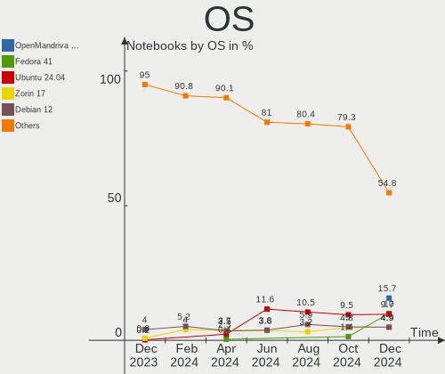
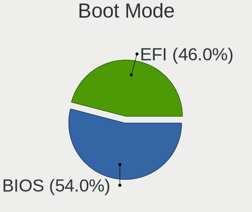
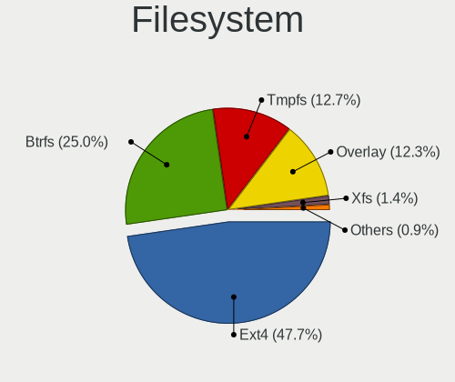
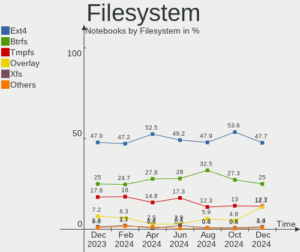
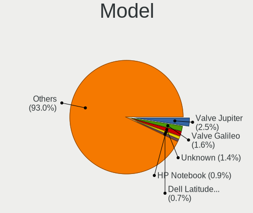
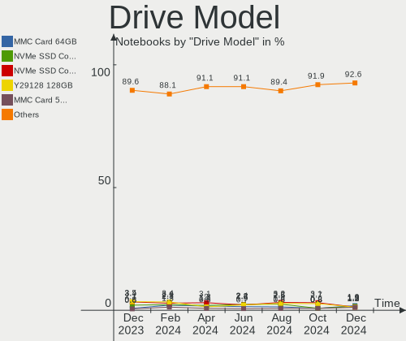
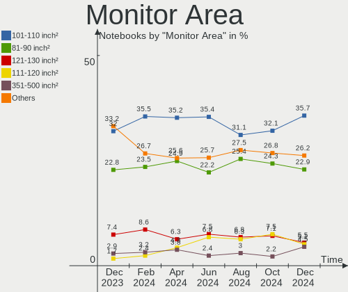

Linux in USA - Hardware Trends (Notebooks)
------------------------------------------

A project to identify most popular hardware characteristics and track their change
over time based on data collected by Linux users at https://Linux-Hardware.org.

Anyone can contribute to this report by the [hw-probe](https://github.com/linuxhw/hw-probe) tool:

    sudo -E hw-probe -all -upload

Period: Aug, 2022.

Contents
--------

* [ System ](#system)
  - [ OS                       ](#os)
  - [ OS Family                ](#os-family)
  - [ Kernel                   ](#kernel)
  - [ Kernel Family            ](#kernel-family)
  - [ Kernel Major Ver.        ](#kernel-major-ver)
  - [ Arch                     ](#arch)
  - [ DE                       ](#de)
  - [ Display Server           ](#display-server)
  - [ Display Manager          ](#display-manager)
  - [ OS Lang                  ](#os-lang)
  - [ Boot Mode                ](#boot-mode)
  - [ Filesystem               ](#filesystem)
  - [ Part. scheme             ](#part-scheme)
  - [ Dual Boot with Linux/BSD ](#dual-boot-with-linuxbsd)
  - [ Dual Boot (Win)          ](#dual-boot-win)

* [ Board ](#board)
  - [ Vendor                   ](#vendor)
  - [ Model                    ](#model)
  - [ Model Family             ](#model-family)
  - [ MFG Year                 ](#mfg-year)
  - [ Form Factor              ](#form-factor)
  - [ Secure Boot              ](#secure-boot)
  - [ Coreboot                 ](#coreboot)
  - [ RAM Size                 ](#ram-size)
  - [ RAM Used                 ](#ram-used)
  - [ Total Drives             ](#total-drives)
  - [ Has CD-ROM               ](#has-cd-rom)
  - [ Has Ethernet             ](#has-ethernet)
  - [ Has WiFi                 ](#has-wifi)
  - [ Has Bluetooth            ](#has-bluetooth)

* [ Location ](#location)
  - [ Country                  ](#country)
  - [ City                     ](#city)

* [ Drives ](#drives)
  - [ Drive Vendor             ](#drive-vendor)
  - [ Drive Model              ](#drive-model)
  - [ HDD Vendor               ](#hdd-vendor)
  - [ SSD Vendor               ](#ssd-vendor)
  - [ Drive Kind               ](#drive-kind)
  - [ Drive Connector          ](#drive-connector)
  - [ Drive Size               ](#drive-size)
  - [ Space Total              ](#space-total)
  - [ Space Used               ](#space-used)
  - [ Malfunc. Drives          ](#malfunc-drives)
  - [ Malfunc. Drive Vendor    ](#malfunc-drive-vendor)
  - [ Malfunc. HDD Vendor      ](#malfunc-hdd-vendor)
  - [ Malfunc. Drive Kind      ](#malfunc-drive-kind)
  - [ Failed Drives            ](#failed-drives)
  - [ Failed Drive Vendor      ](#failed-drive-vendor)
  - [ Drive Status             ](#drive-status)

* [ Storage controller ](#storage-controller)
  - [ Storage Vendor           ](#storage-vendor)
  - [ Storage Model            ](#storage-model)
  - [ Storage Kind             ](#storage-kind)

* [ Processor ](#processor)
  - [ CPU Vendor               ](#cpu-vendor)
  - [ CPU Model                ](#cpu-model)
  - [ CPU Model Family         ](#cpu-model-family)
  - [ CPU Cores                ](#cpu-cores)
  - [ CPU Sockets              ](#cpu-sockets)
  - [ CPU Threads              ](#cpu-threads)
  - [ CPU Op-Modes             ](#cpu-op-modes)
  - [ CPU Microcode            ](#cpu-microcode)
  - [ CPU Microarch            ](#cpu-microarch)

* [ Graphics ](#graphics)
  - [ GPU Vendor               ](#gpu-vendor)
  - [ GPU Model                ](#gpu-model)
  - [ GPU Combo                ](#gpu-combo)
  - [ GPU Driver               ](#gpu-driver)
  - [ GPU Memory               ](#gpu-memory)

* [ Monitor ](#monitor)
  - [ Monitor Vendor           ](#monitor-vendor)
  - [ Monitor Model            ](#monitor-model)
  - [ Monitor Resolution       ](#monitor-resolution)
  - [ Monitor Diagonal         ](#monitor-diagonal)
  - [ Monitor Width            ](#monitor-width)
  - [ Aspect Ratio             ](#aspect-ratio)
  - [ Monitor Area             ](#monitor-area)
  - [ Pixel Density            ](#pixel-density)
  - [ Multiple Monitors        ](#multiple-monitors)

* [ Network ](#network)
  - [ Net Controller Vendor    ](#net-controller-vendor)
  - [ Net Controller Model     ](#net-controller-model)
  - [ Wireless Vendor          ](#wireless-vendor)
  - [ Wireless Model           ](#wireless-model)
  - [ Ethernet Vendor          ](#ethernet-vendor)
  - [ Ethernet Model           ](#ethernet-model)
  - [ Net Controller Kind      ](#net-controller-kind)
  - [ Used Controller          ](#used-controller)
  - [ NICs                     ](#nics)
  - [ IPv6                     ](#ipv6)

* [ Bluetooth ](#bluetooth)
  - [ Bluetooth Vendor         ](#bluetooth-vendor)
  - [ Bluetooth Model          ](#bluetooth-model)

* [ Sound ](#sound)
  - [ Sound Vendor             ](#sound-vendor)
  - [ Sound Model              ](#sound-model)

* [ Memory ](#memory)
  - [ Memory Vendor            ](#memory-vendor)
  - [ Memory Model             ](#memory-model)
  - [ Memory Kind              ](#memory-kind)
  - [ Memory Form Factor       ](#memory-form-factor)
  - [ Memory Size              ](#memory-size)
  - [ Memory Speed             ](#memory-speed)

* [ Printers & scanners ](#printers--scanners)
  - [ Printer Vendor           ](#printer-vendor)
  - [ Printer Model            ](#printer-model)
  - [ Scanner Vendor           ](#scanner-vendor)
  - [ Scanner Model            ](#scanner-model)

* [ Camera ](#camera)
  - [ Camera Vendor            ](#camera-vendor)
  - [ Camera Model             ](#camera-model)

* [ Security ](#security)
  - [ Fingerprint Vendor       ](#fingerprint-vendor)
  - [ Fingerprint Model        ](#fingerprint-model)
  - [ Chipcard Vendor          ](#chipcard-vendor)
  - [ Chipcard Model           ](#chipcard-model)

* [ Unsupported ](#unsupported)
  - [ Unsupported Devices      ](#unsupported-devices)
  - [ Unsupported Device Types ](#unsupported-device-types)

System
------

OS
--

Installed operating systems

| Name                         | Notebooks | Percent |
|------------------------------|-----------|---------|
| Ubuntu 22.04                 | 67        | 14.08%  |
| Debian 11                    | 43        | 9.03%   |
| Fedora 36                    | 42        | 8.82%   |
| Pop!_OS 22.04                | 35        | 7.35%   |
| SteamOS 3.3                  | 23        | 4.83%   |
| Arch                         | 20        | 4.2%    |
| Linux Mint 20.3              | 19        | 3.99%   |
| Zorin 16                     | 16        | 3.36%   |
| Ubuntu 20.04                 | 15        | 3.15%   |
| SteamOS 3.3.1                | 15        | 3.15%   |
| OpenMandriva 4.3             | 15        | 3.15%   |
| Linux Mint 21                | 14        | 2.94%   |
| KDE neon 20.04               | 12        | 2.52%   |
| OpenMandriva 4.90            | 11        | 2.31%   |
| Manjaro 21.3.6               | 10        | 2.1%    |
| Kali 2022.3                  | 9         | 1.89%   |
| Arch Rolling                 | 8         | 1.68%   |
| Manjaro                      | 7         | 1.47%   |
| Debian Testing               | 6         | 1.26%   |
| Ubuntu 18.04                 | 5         | 1.05%   |
| Nobara 36                    | 5         | 1.05%   |
| Kubuntu 22.04                | 5         | 1.05%   |
| Elementary 6.1               | 5         | 1.05%   |
| EndeavourOS Rolling          | 4         | 0.84%   |
| Trisquel 10.0.1              | 3         | 0.63%   |
| Linux Mint 19.3              | 3         | 0.63%   |
| Kali 2022.2                  | 3         | 0.63%   |
| Debian Unstable              | 3         | 0.63%   |
| ArcoLinux Rolling            | 3         | 0.63%   |
| Xubuntu 22.04                | 2         | 0.42%   |
| Ubuntu MATE 20.04            | 2         | 0.42%   |
| Parrot 5.0                   | 2         | 0.42%   |
| MX 21                        | 2         | 0.42%   |
| Lubuntu 22.04                | 2         | 0.42%   |
| Linux Mint 20                | 2         | 0.42%   |
| KDE neon 22.04               | 2         | 0.42%   |
| Gentoo 2.8                   | 2         | 0.42%   |
| Zorin 15                     | 1         | 0.21%   |
| Ubuntu Studio 22.04          | 1         | 0.21%   |
| Ubuntu MATE 22.04            | 1         | 0.21%   |
| Ubuntu Budgie 22.04          | 1         | 0.21%   |
| SteamOS 3.2                  | 1         | 0.21%   |
| Sabayon 21.04                | 1         | 0.21%   |
| ROSA 12.2                    | 1         | 0.21%   |
| RHEL 9                       | 1         | 0.21%   |
| RHEL 8                       | 1         | 0.21%   |
| Pop!_OS 21.10                | 1         | 0.21%   |
| Pop!_OS 20.04                | 1         | 0.21%   |
| Parrot 5.1                   | 1         | 0.21%   |
| Parrot 4.11                  | 1         | 0.21%   |
| openSUSE Tumbleweed-XXXXXXXX | 1         | 0.21%   |
| openSUSE Leap-15.4           | 1         | 0.21%   |
| NixOS 22.05                  | 1         | 0.21%   |
| Manjaro 21.3.7               | 1         | 0.21%   |
| Linux Mint 20.2              | 1         | 0.21%   |
| Linux Mint 20.1              | 1         | 0.21%   |
| Linux Lite 6.0               | 1         | 0.21%   |
| Kubuntu 21.10                | 1         | 0.21%   |
| Kubuntu 11.1                 | 1         | 0.21%   |
| Kubuntu 11                   | 1         | 0.21%   |

OS Family
---------

OS without a version

| Name          | Notebooks | Percent |
|---------------|-----------|---------|
| Ubuntu        | 87        | 18.28%  |
| Debian        | 52        | 10.92%  |
| Fedora        | 42        | 8.82%   |
| Linux Mint    | 40        | 8.4%    |
| SteamOS       | 39        | 8.19%   |
| Pop!_OS       | 37        | 7.77%   |
| Arch          | 28        | 5.88%   |
| OpenMandriva  | 26        | 5.46%   |
| Manjaro       | 18        | 3.78%   |
| Zorin         | 17        | 3.57%   |
| KDE neon      | 14        | 2.94%   |
| Kali          | 12        | 2.52%   |
| Kubuntu       | 8         | 1.68%   |
| Nobara        | 5         | 1.05%   |
| Elementary    | 5         | 1.05%   |
| Parrot        | 4         | 0.84%   |
| EndeavourOS   | 4         | 0.84%   |
| Ubuntu MATE   | 3         | 0.63%   |
| Trisquel      | 3         | 0.63%   |
| Endless       | 3         | 0.63%   |
| ArcoLinux     | 3         | 0.63%   |
| Xubuntu       | 2         | 0.42%   |
| RHEL          | 2         | 0.42%   |
| openSUSE      | 2         | 0.42%   |
| MX            | 2         | 0.42%   |
| Lubuntu       | 2         | 0.42%   |
| Gentoo        | 2         | 0.42%   |
| Garuda Linux  | 2         | 0.42%   |
| Ubuntu Studio | 1         | 0.21%   |
| Ubuntu Budgie | 1         | 0.21%   |
| Sabayon       | 1         | 0.21%   |
| ROSA          | 1         | 0.21%   |
| NixOS         | 1         | 0.21%   |
| Linux Lite    | 1         | 0.21%   |
| FLFS          | 1         | 0.21%   |
| CentOS        | 1         | 0.21%   |
| Bottlerocket  | 1         | 0.21%   |
| BlackPanther  | 1         | 0.21%   |
| Alpine        | 1         | 0.21%   |
| AlmaLinux     | 1         | 0.21%   |

Kernel
------

Version of the Linux kernel

| Version                                        | Notebooks | Percent |
|------------------------------------------------|-----------|---------|
| 5.15.0-46-generic                              | 65        | 13.66%  |
| 5.15.0-43-generic                              | 42        | 8.82%   |
| 5.10.0-16-amd64                                | 37        | 7.77%   |
| 5.18.10-76051810-generic                       | 27        | 5.67%   |
| 5.13.0-valve21-1-neptune-02209-g2a5bdc1102a0   | 19        | 3.99%   |
| 5.16.7-desktop-1omv4003                        | 15        | 3.15%   |
| 5.13.0-valve21.1-1-neptune-02211-gc54cda5a36f3 | 15        | 3.15%   |
| 5.18.16-arch1-1                                | 12        | 2.52%   |
| 5.18.12-desktop-3omv4090                       | 10        | 2.1%    |
| 5.18.0-kali5-amd64                             | 10        | 2.1%    |
| 5.4.0-122-generic                              | 9         | 1.89%   |
| 5.15.0-41-generic                              | 9         | 1.89%   |
| 5.18.16-200.fc36.x86_64                        | 8         | 1.68%   |
| 5.18.13-200.fc36.x86_64                        | 8         | 1.68%   |
| 5.19.0-76051900-generic                        | 7         | 1.47%   |
| 5.18.19-200.fc36.x86_64                        | 6         | 1.26%   |
| 5.18.18-200.fc36.x86_64                        | 6         | 1.26%   |
| 5.18.0-3-amd64                                 | 6         | 1.26%   |
| 5.15.0-25-generic                              | 6         | 1.26%   |
| 5.4.0-124-generic                              | 5         | 1.05%   |
| 5.18.15-arch1-1                                | 4         | 0.84%   |
| 5.18.15-200.fc36.x86_64                        | 4         | 0.84%   |
| 5.18.0-4-amd64                                 | 4         | 0.84%   |
| 5.17.5-76051705-generic                        | 4         | 0.84%   |
| 5.15.0-47-generic                              | 4         | 0.84%   |
| 5.4.0-91-generic                               | 3         | 0.63%   |
| 5.4.0-125-generic                              | 3         | 0.63%   |
| 5.19.3-arch1-1                                 | 3         | 0.63%   |
| 5.19.1-arch2-1                                 | 3         | 0.63%   |
| 5.19.0-051900-generic                          | 3         | 0.63%   |
| 5.18.17-200.fc36.x86_64                        | 3         | 0.63%   |
| 5.18.16-zen1-1-zen                             | 3         | 0.63%   |
| 5.15.60-1-MANJARO                              | 3         | 0.63%   |
| 5.15.57-2-MANJARO                              | 3         | 0.63%   |
| 5.11.0-35-generic                              | 3         | 0.63%   |
| 5.4.0-26-generic                               | 2         | 0.42%   |
| 5.19.4-200.fc36.x86_64                         | 2         | 0.42%   |
| 5.19.2-arch1-2                                 | 2         | 0.42%   |
| 5.19.0-2-MANJARO                               | 2         | 0.42%   |
| 5.19.0-1-MANJARO                               | 2         | 0.42%   |
| 5.18.16-201.fsync.fc36.x86_64                  | 2         | 0.42%   |
| 5.18.14-1-MANJARO                              | 2         | 0.42%   |
| 5.18.0-1parrot1-amd64                          | 2         | 0.42%   |
| 5.17.5-300.fc36.x86_64                         | 2         | 0.42%   |
| 5.16.0-kali7-amd64                             | 2         | 0.42%   |
| 5.13.0-valve24-1-neptune-02226-g5b8545e4c5a1   | 2         | 0.42%   |
| 5.13.0-valve22-1-neptune-02213-gb68995364335   | 2         | 0.42%   |
| 5.13.0-30-generic                              | 2         | 0.42%   |
| 5.10.0-17-amd64                                | 2         | 0.42%   |
| 4.15.0-189-generic                             | 2         | 0.42%   |
| 5.7.0-sabayon                                  | 1         | 0.21%   |
| 5.4.209                                        | 1         | 0.21%   |
| 5.4.0-92-generic                               | 1         | 0.21%   |
| 5.4.0-84-generic                               | 1         | 0.21%   |
| 5.4.0-124-lowlatency                           | 1         | 0.21%   |
| 5.4.0-123-generic                              | 1         | 0.21%   |
| 5.4.0-120-generic                              | 1         | 0.21%   |
| 5.4.0-109-generic                              | 1         | 0.21%   |
| 5.3.0-7648-generic                             | 1         | 0.21%   |
| 5.3.0-51-generic                               | 1         | 0.21%   |

Kernel Family
-------------

Linux kernel without a distro release

| Version  | Notebooks | Percent |
|----------|-----------|---------|
| 5.15.0   | 132       | 27.73%  |
| 5.13.0   | 43        | 9.03%   |
| 5.10.0   | 41        | 8.61%   |
| 5.4.0    | 28        | 5.88%   |
| 5.18.10  | 28        | 5.88%   |
| 5.18.16  | 27        | 5.67%   |
| 5.18.0   | 25        | 5.25%   |
| 5.19.0   | 20        | 4.2%    |
| 5.16.7   | 15        | 3.15%   |
| 5.18.12  | 10        | 2.1%    |
| 5.18.15  | 9         | 1.89%   |
| 5.18.13  | 8         | 1.68%   |
| 5.18.19  | 7         | 1.47%   |
| 5.18.18  | 7         | 1.47%   |
| 5.17.5   | 6         | 1.26%   |
| 5.15.60  | 5         | 1.05%   |
| 5.14.0   | 5         | 1.05%   |
| 5.11.0   | 5         | 1.05%   |
| 5.19.4   | 4         | 0.84%   |
| 5.19.3   | 4         | 0.84%   |
| 5.19.1   | 4         | 0.84%   |
| 5.18.17  | 4         | 0.84%   |
| 5.18.14  | 4         | 0.84%   |
| 5.15.59  | 4         | 0.84%   |
| 5.19.2   | 3         | 0.63%   |
| 5.15.57  | 3         | 0.63%   |
| 5.3.0    | 2         | 0.42%   |
| 5.19.5   | 2         | 0.42%   |
| 5.17.0   | 2         | 0.42%   |
| 5.16.0   | 2         | 0.42%   |
| 4.15.0   | 2         | 0.42%   |
| 5.7.0    | 1         | 0.21%   |
| 5.4.209  | 1         | 0.21%   |
| 5.18.11  | 1         | 0.21%   |
| 5.17.15  | 1         | 0.21%   |
| 5.17.1   | 1         | 0.21%   |
| 5.15.55  | 1         | 0.21%   |
| 5.15.43  | 1         | 0.21%   |
| 5.15.30  | 1         | 0.21%   |
| 5.14.21  | 1         | 0.21%   |
| 5.10.88  | 1         | 0.21%   |
| 5.10.136 | 1         | 0.21%   |
| 5.10.118 | 1         | 0.21%   |
| 5.0.0    | 1         | 0.21%   |
| 4.18.16  | 1         | 0.21%   |
| 4.18.0   | 1         | 0.21%   |

Kernel Major Ver.
-----------------

Linux kernel major version

| Version | Notebooks | Percent |
|---------|-----------|---------|
| 5.15    | 147       | 30.88%  |
| 5.18    | 130       | 27.31%  |
| 5.10    | 44        | 9.24%   |
| 5.13    | 43        | 9.03%   |
| 5.19    | 37        | 7.77%   |
| 5.4     | 29        | 6.09%   |
| 5.16    | 17        | 3.57%   |
| 5.17    | 10        | 2.1%    |
| 5.14    | 6         | 1.26%   |
| 5.11    | 5         | 1.05%   |
| 5.3     | 2         | 0.42%   |
| 4.18    | 2         | 0.42%   |
| 4.15    | 2         | 0.42%   |
| 5.7     | 1         | 0.21%   |
| 5.0     | 1         | 0.21%   |

Arch
----

OS architecture (x86_64, i586, etc.)

| Name   | Notebooks | Percent |
|--------|-----------|---------|
| x86_64 | 474       | 99.58%  |
| i686   | 2         | 0.42%   |

DE
--

Desktop Environment

| Name            | Notebooks | Percent |
|-----------------|-----------|---------|
| GNOME           | 196       | 41.18%  |
| KDE5            | 135       | 28.36%  |
| Unknown         | 41        | 8.61%   |
| XFCE            | 34        | 7.14%   |
| X-Cinnamon      | 30        | 6.3%    |
| MATE            | 14        | 2.94%   |
| Pantheon        | 5         | 1.05%   |
| LXQt            | 5         | 1.05%   |
| Cinnamon        | 3         | 0.63%   |
| Budgie          | 3         | 0.63%   |
| Unity           | 2         | 0.42%   |
| sway            | 1         | 0.21%   |
| none+xmonad     | 1         | 0.21%   |
| LXDE            | 1         | 0.21%   |
| GNOME Flashback | 1         | 0.21%   |
| GNOME Classic   | 1         | 0.21%   |
| gamescope       | 1         | 0.21%   |
| dusk            | 1         | 0.21%   |
| bspwm           | 1         | 0.21%   |

Display Server
--------------

X11 or Wayland

| Name    | Notebooks | Percent |
|---------|-----------|---------|
| X11     | 319       | 67.02%  |
| Wayland | 116       | 24.37%  |
| Unknown | 33        | 6.93%   |
| Tty     | 8         | 1.68%   |

Display Manager
---------------

SDDM, LightDM, etc.

| Name    | Notebooks | Percent |
|---------|-----------|---------|
| Unknown | 210       | 44.12%  |
| GDM3    | 92        | 19.33%  |
| SDDM    | 67        | 14.08%  |
| LightDM | 66        | 13.87%  |
| GDM     | 36        | 7.56%   |
| Ly      | 3         | 0.63%   |
| XDM     | 2         | 0.42%   |

OS Lang
-------

Language

| Lang    | Notebooks | Percent |
|---------|-----------|---------|
| en_US   | 435       | 91.39%  |
| Unknown | 24        | 5.04%   |
| C       | 4         | 0.84%   |
| zh_CN   | 3         | 0.63%   |
| es_US   | 3         | 0.63%   |
| en_CA   | 2         | 0.42%   |
| ru_UA   | 1         | 0.21%   |
| ro_RO   | 1         | 0.21%   |
| es_ES   | 1         | 0.21%   |
| en_GB   | 1         | 0.21%   |
| C.UTF8  | 1         | 0.21%   |

Boot Mode
---------

EFI or BIOS

| Mode | Notebooks | Percent |
|------|-----------|---------|
| EFI  | 257       | 53.99%  |
| BIOS | 219       | 46.01%  |

Filesystem
----------

Type of filesystem

| Type    | Notebooks | Percent |
|---------|-----------|---------|
| Ext4    | 303       | 63.66%  |
| Btrfs   | 105       | 22.06%  |
| Overlay | 56        | 11.76%  |
| Xfs     | 7         | 1.47%   |
| Zfs     | 2         | 0.42%   |
| XXXXXXX | 1         | 0.21%   |
| XXXXX   | 1         | 0.21%   |
| F2fs    | 1         | 0.21%   |

Part. scheme
------------

Scheme of partitioning

| Type    | Notebooks | Percent |
|---------|-----------|---------|
| Unknown | 250       | 52.52%  |
| GPT     | 202       | 42.44%  |
| MBR     | 24        | 5.04%   |

Dual Boot with Linux/BSD
------------------------

Hosting more than one Linux/BSD

| Dual boot | Notebooks | Percent |
|-----------|-----------|---------|
| No        | 410       | 86.13%  |
| Yes       | 66        | 13.87%  |

Dual Boot (Win)
---------------

Hosting Linux and Windows

| Dual boot | Notebooks | Percent |
|-----------|-----------|---------|
| No        | 397       | 83.4%   |
| Yes       | 79        | 16.6%   |

Board
-----

Vendor
------

Motherboard manufacturer

| Name                           | Notebooks | Percent |
|--------------------------------|-----------|---------|
| Hewlett-Packard                | 94        | 19.75%  |
| Lenovo                         | 81        | 17.02%  |
| Dell                           | 78        | 16.39%  |
| ASUSTek Computer               | 37        | 7.77%   |
| Valve                          | 36        | 7.56%   |
| Google                         | 33        | 6.93%   |
| Apple                          | 21        | 4.41%   |
| Acer                           | 17        | 3.57%   |
| Toshiba                        | 10        | 2.1%    |
| MSI                            | 9         | 1.89%   |
| System76                       | 7         | 1.47%   |
| GPU Company                    | 5         | 1.05%   |
| Unknown                        | 5         | 1.05%   |
| Sony                           | 3         | 0.63%   |
| Panasonic                      | 3         | 0.63%   |
| Gateway                        | 3         | 0.63%   |
| Framework                      | 3         | 0.63%   |
| Alienware                      | 3         | 0.63%   |
| Samsung Electronics            | 2         | 0.42%   |
| Razer                          | 2         | 0.42%   |
| OnLogic                        | 2         | 0.42%   |
| MECHREVO                       | 2         | 0.42%   |
| Eluktronics                    | 2         | 0.42%   |
| AZW                            | 2         | 0.42%   |
| Acidanthera                    | 2         | 0.42%   |
| Xplore                         | 1         | 0.21%   |
| TUXEDO                         | 1         | 0.21%   |
| Timi                           | 1         | 0.21%   |
| Purism                         | 1         | 0.21%   |
| Notebook                       | 1         | 0.21%   |
| MicroByte                      | 1         | 0.21%   |
| Matsushita Electric Industrial | 1         | 0.21%   |
| IPASON                         | 1         | 0.21%   |
| HUAWEI                         | 1         | 0.21%   |
| GPD                            | 1         | 0.21%   |
| GMKtec                         | 1         | 0.21%   |
| Fujitsu                        | 1         | 0.21%   |
| Ematic                         | 1         | 0.21%   |
| AMI                            | 1         | 0.21%   |

Model
-----

Motherboard model

| Name                                    | Notebooks | Percent |
|-----------------------------------------|-----------|---------|
| Valve Jupiter                           | 36        | 7.56%   |
| Google Terra                            | 14        | 2.94%   |
| Google Reks                             | 7         | 1.47%   |
| Unknown                                 | 6         | 1.26%   |
| Dell Latitude E6400                     | 5         | 1.05%   |
| HP Laptop 15-dy2xxx                     | 4         | 0.84%   |
| Apple MacBookAir7,2                     | 4         | 0.84%   |
| System76 Oryx Pro                       | 3         | 0.63%   |
| Lenovo ThinkPad 13 2nd Gen 20J10046US   | 3         | 0.63%   |
| HP Stream Laptop 14-ax0XX               | 3         | 0.63%   |
| HP Laptop 15-dy1xxx                     | 3         | 0.63%   |
| HP EliteBook 840 G5                     | 3         | 0.63%   |
| HP 2000                                 | 3         | 0.63%   |
| GPU Company GWTC116-2                   | 3         | 0.63%   |
| Dell XPS 15 9570                        | 3         | 0.63%   |
| Dell Latitude E6430                     | 3         | 0.63%   |
| Apple MacBookPro14,1                    | 3         | 0.63%   |
| Toshiba Satellite C55-B                 | 2         | 0.42%   |
| Toshiba Satellite C55-A                 | 2         | 0.42%   |
| System76 Gazelle                        | 2         | 0.42%   |
| Razer Blade                             | 2         | 0.42%   |
| OnLogic Helix3X0                        | 2         | 0.42%   |
| Lenovo ThinkPad Edge E530 62724FU       | 2         | 0.42%   |
| Lenovo Legion 5 Pro 16ARH7H 82RG        | 2         | 0.42%   |
| Lenovo Legion 5 15IMH05H 81Y6           | 2         | 0.42%   |
| Lenovo IdeaPad 5 15IIL05 81YK           | 2         | 0.42%   |
| Lenovo IdeaPad 320-15ABR 80XS           | 2         | 0.42%   |
| Lenovo IdeaPad 3 15ITL05 81X8           | 2         | 0.42%   |
| Lenovo IdeaPad 1 15ALC7 82R4            | 2         | 0.42%   |
| Lenovo 14w 81MQ000JUS                   | 2         | 0.42%   |
| HP Stream Notebook PC 13                | 2         | 0.42%   |
| HP ProBook 4530s                        | 2         | 0.42%   |
| HP Pavilion Notebook                    | 2         | 0.42%   |
| HP Pavilion Laptop 15-cs0xxx            | 2         | 0.42%   |
| HP Pavilion g7                          | 2         | 0.42%   |
| HP OMEN by Laptop 16-b0xxx              | 2         | 0.42%   |
| HP EliteBook 8470p                      | 2         | 0.42%   |
| HP EliteBook 820 G3                     | 2         | 0.42%   |
| HP 15 Notebook PC                       | 2         | 0.42%   |
| GPU Company GWTN141-10                  | 2         | 0.42%   |
| Google Celes                            | 2         | 0.42%   |
| Framework Laptop                        | 2         | 0.42%   |
| Dell XPS 15 9560                        | 2         | 0.42%   |
| Dell XPS 13 9360                        | 2         | 0.42%   |
| Dell Latitude E5470                     | 2         | 0.42%   |
| Dell Inspiron 1545                      | 2         | 0.42%   |
| Dell Inspiron 15-3567                   | 2         | 0.42%   |
| ASUS ZenBook UX425QA_UM425QA            | 2         | 0.42%   |
| ASUS VivoBook_ASUSLaptop X515JAB_X515JA | 2         | 0.42%   |
| ASUS ROG Zephyrus G15 GA503QR_GA503QR   | 2         | 0.42%   |
| ASUS ROG Strix G513QY_G513QY            | 2         | 0.42%   |
| ASUS K55A                               | 2         | 0.42%   |
| Apple MacBookPro9,2                     | 2         | 0.42%   |
| Apple MacBookPro11,5                    | 2         | 0.42%   |
| Acer Nitro AN515-57                     | 2         | 0.42%   |
| Acer Aspire E5-571                      | 2         | 0.42%   |
| Acer Aspire A515-43                     | 2         | 0.42%   |
| Xplore iX104C5                          | 1         | 0.21%   |
| TUXEDO Book XUX7 Gen11                  | 1         | 0.21%   |
| Toshiba Satellite P55t-C                | 1         | 0.21%   |

Model Family
------------

Motherboard model prefix

| Name                   | Notebooks | Percent |
|------------------------|-----------|---------|
| Lenovo ThinkPad        | 39        | 8.19%   |
| Valve Jupiter          | 36        | 7.56%   |
| Dell Latitude          | 30        | 6.3%    |
| Lenovo IdeaPad         | 23        | 4.83%   |
| HP Laptop              | 21        | 4.41%   |
| Dell Inspiron          | 20        | 4.2%    |
| Dell XPS               | 16        | 3.36%   |
| Google Terra           | 14        | 2.94%   |
| HP Pavilion            | 13        | 2.73%   |
| Acer Aspire            | 12        | 2.52%   |
| HP EliteBook           | 11        | 2.31%   |
| Toshiba Satellite      | 10        | 2.1%    |
| HP Stream              | 9         | 1.89%   |
| HP ProBook             | 9         | 1.89%   |
| Lenovo Legion          | 8         | 1.68%   |
| Dell Precision         | 8         | 1.68%   |
| ASUS ROG               | 8         | 1.68%   |
| HP ENVY                | 7         | 1.47%   |
| Google Reks            | 7         | 1.47%   |
| HP ZBook               | 6         | 1.26%   |
| ASUS ZenBook           | 6         | 1.26%   |
| ASUS VivoBook          | 6         | 1.26%   |
| Unknown                | 6         | 1.26%   |
| Apple MacBookPro11     | 5         | 1.05%   |
| Apple MacBookAir7      | 5         | 1.05%   |
| Apple MacBookPro14     | 4         | 0.84%   |
| Acer Nitro             | 4         | 0.84%   |
| System76 Oryx          | 3         | 0.63%   |
| Lenovo ThinkBook       | 3         | 0.63%   |
| HP OMEN                | 3         | 0.63%   |
| HP 2000                | 3         | 0.63%   |
| HP 15                  | 3         | 0.63%   |
| GPU Company GWTC116-2  | 3         | 0.63%   |
| Framework Laptop       | 3         | 0.63%   |
| System76 Gazelle       | 2         | 0.42%   |
| System76 Galago        | 2         | 0.42%   |
| Razer Blade            | 2         | 0.42%   |
| OnLogic Helix3X0       | 2         | 0.42%   |
| Lenovo 14w             | 2         | 0.42%   |
| HP Compaq              | 2         | 0.42%   |
| GPU Company GWTN141-10 | 2         | 0.42%   |
| Google Celes           | 2         | 0.42%   |
| Dell G15               | 2         | 0.42%   |
| ASUS K55A              | 2         | 0.42%   |
| Apple MacBookPro9      | 2         | 0.42%   |
| Xplore iX104C5         | 1         | 0.21%   |
| TUXEDO Book            | 1         | 0.21%   |
| Timi Redmi             | 1         | 0.21%   |
| Sony VPCS131FM         | 1         | 0.21%   |
| Sony SVT15115CXS       | 1         | 0.21%   |
| Sony SVS15117FLB       | 1         | 0.21%   |
| Samsung RV411          | 1         | 0.21%   |
| Samsung 870Z5E         | 1         | 0.21%   |
| Purism Librem          | 1         | 0.21%   |
| Panasonic FZ55-1       | 1         | 0.21%   |
| Panasonic CFMX4-1      | 1         | 0.21%   |
| Panasonic CF-30KTPAZAE | 1         | 0.21%   |
| Notebook P7xxDM2(-G)   | 1         | 0.21%   |
| MSI Stealth            | 1         | 0.21%   |
| MSI Modern             | 1         | 0.21%   |

MFG Year
--------

Motherboard manufacture year

| Year | Notebooks | Percent |
|------|-----------|---------|
| 2022 | 92        | 19.33%  |
| 2021 | 69        | 14.5%   |
| 2020 | 47        | 9.87%   |
| 2019 | 36        | 7.56%   |
| 2012 | 29        | 6.09%   |
| 2016 | 28        | 5.88%   |
| 2011 | 27        | 5.67%   |
| 2018 | 26        | 5.46%   |
| 2014 | 24        | 5.04%   |
| 2015 | 23        | 4.83%   |
| 2017 | 21        | 4.41%   |
| 2013 | 18        | 3.78%   |
| 2008 | 13        | 2.73%   |
| 2010 | 12        | 2.52%   |
| 2007 | 6         | 1.26%   |
| 2009 | 3         | 0.63%   |
| 2006 | 1         | 0.21%   |
| 2005 | 1         | 0.21%   |

Form Factor
-----------

Physical design of the computer

| Name     | Notebooks | Percent |
|----------|-----------|---------|
| Notebook | 476       | 100%    |

Secure Boot
-----------

Enabled or disabled

| State    | Notebooks | Percent |
|----------|-----------|---------|
| Disabled | 443       | 93.07%  |
| Enabled  | 33        | 6.93%   |

Coreboot
--------

Have coreboot on board

| Used | Notebooks | Percent |
|------|-----------|---------|
| No   | 437       | 91.81%  |
| Yes  | 39        | 8.19%   |

RAM Size
--------

Total RAM memory

| Size in GB  | Notebooks | Percent |
|-------------|-----------|---------|
| 4.01-8.0    | 119       | 25%     |
| 8.01-16.0   | 101       | 21.22%  |
| 3.01-4.0    | 99        | 20.8%   |
| 16.01-24.0  | 77        | 16.18%  |
| 32.01-64.0  | 43        | 9.03%   |
| 1.01-2.0    | 13        | 2.73%   |
| 64.01-256.0 | 11        | 2.31%   |
| 24.01-32.0  | 7         | 1.47%   |
| 2.01-3.0    | 5         | 1.05%   |
| 0.51-1.0    | 1         | 0.21%   |

RAM Used
--------

Used RAM memory

| Used GB    | Notebooks | Percent |
|------------|-----------|---------|
| 1.01-2.0   | 176       | 36.97%  |
| 2.01-3.0   | 120       | 25.21%  |
| 3.01-4.0   | 81        | 17.02%  |
| 4.01-8.0   | 71        | 14.92%  |
| 0.51-1.0   | 13        | 2.73%   |
| 8.01-16.0  | 12        | 2.52%   |
| 0.01-0.5   | 2         | 0.42%   |
| 24.01-32.0 | 1         | 0.21%   |

Total Drives
------------

Number of drives on board

| Drives | Notebooks | Percent |
|--------|-----------|---------|
| 1      | 346       | 72.69%  |
| 2      | 111       | 23.32%  |
| 3      | 14        | 2.94%   |
| 4      | 4         | 0.84%   |
| 5      | 1         | 0.21%   |

Has CD-ROM
----------

Has CD-ROM on board

| Presented | Notebooks | Percent |
|-----------|-----------|---------|
| No        | 347       | 72.9%   |
| Yes       | 129       | 27.1%   |

Has Ethernet
------------

Has Ethernet on board

| Presented | Notebooks | Percent |
|-----------|-----------|---------|
| Yes       | 310       | 65.13%  |
| No        | 166       | 34.87%  |

Has WiFi
--------

Has WiFi module

| Presented | Notebooks | Percent |
|-----------|-----------|---------|
| Yes       | 473       | 99.37%  |
| No        | 3         | 0.63%   |

Has Bluetooth
-------------

Has Bluetooth module

| Presented | Notebooks | Percent |
|-----------|-----------|---------|
| Yes       | 386       | 81.09%  |
| No        | 90        | 18.91%  |

Location
--------

Country
-------

Geographic location (country)

| Country | Notebooks | Percent |
|---------|-----------|---------|
| USA     | 476       | 100%    |

City
----

Geographic location (city)

| City           | Notebooks | Percent |
|----------------|-----------|---------|
| Bangor         | 31        | 6.51%   |
| Los Angeles    | 9         | 1.89%   |
| Denver         | 7         | 1.47%   |
| Dallas         | 7         | 1.47%   |
| Louisville     | 6         | 1.26%   |
| Portland       | 5         | 1.05%   |
| Phoenix        | 5         | 1.05%   |
| New York       | 5         | 1.05%   |
| Las Vegas      | 5         | 1.05%   |
| Atlanta        | 5         | 1.05%   |
| Seattle        | 4         | 0.84%   |
| Philadelphia   | 4         | 0.84%   |
| Madison        | 4         | 0.84%   |
| Jacksonville   | 4         | 0.84%   |
| Houston        | 4         | 0.84%   |
| Fort Collins   | 4         | 0.84%   |
| Columbus       | 4         | 0.84%   |
| Brooklyn       | 4         | 0.84%   |
| Washington     | 3         | 0.63%   |
| Tulsa          | 3         | 0.63%   |
| San Diego      | 3         | 0.63%   |
| Queens         | 3         | 0.63%   |
| Minneapolis    | 3         | 0.63%   |
| Milwaukee      | 3         | 0.63%   |
| Kansas City    | 3         | 0.63%   |
| Indianapolis   | 3         | 0.63%   |
| Cypress        | 3         | 0.63%   |
| Council Bluffs | 3         | 0.63%   |
| Connersville   | 3         | 0.63%   |
| Austin         | 3         | 0.63%   |
| Albuquerque    | 3         | 0.63%   |
| Tampa          | 2         | 0.42%   |
| Spokane        | 2         | 0.42%   |
| Southampton    | 2         | 0.42%   |
| Santa Clara    | 2         | 0.42%   |
| San Antonio    | 2         | 0.42%   |
| Salt Lake City | 2         | 0.42%   |
| Richmond       | 2         | 0.42%   |
| Plainfield     | 2         | 0.42%   |
| Pismo Beach    | 2         | 0.42%   |
| Pasadena       | 2         | 0.42%   |
| Norristown     | 2         | 0.42%   |
| Nashville      | 2         | 0.42%   |
| Mundelein      | 2         | 0.42%   |
| Mission        | 2         | 0.42%   |
| Malvern        | 2         | 0.42%   |
| Lowell         | 2         | 0.42%   |
| Kent           | 2         | 0.42%   |
| Jasper         | 2         | 0.42%   |
| Imperial       | 2         | 0.42%   |
| Henderson      | 2         | 0.42%   |
| Hartford City  | 2         | 0.42%   |
| Goose Creek    | 2         | 0.42%   |
| Gaithersburg   | 2         | 0.42%   |
| Gainesville    | 2         | 0.42%   |
| Fritch         | 2         | 0.42%   |
| Farmington     | 2         | 0.42%   |
| El Cajon       | 2         | 0.42%   |
| Dayton         | 2         | 0.42%   |
| Culver City    | 2         | 0.42%   |

Drives
------

Drive Vendor
------------

Hard drive vendors

| Vendor                         | Notebooks | Drives | Percent |
|--------------------------------|-----------|--------|---------|
| Samsung Electronics            | 96        | 107    | 15.79%  |
| Unknown                        | 86        | 88     | 14.14%  |
| WDC                            | 42        | 42     | 6.91%   |
| Seagate                        | 42        | 47     | 6.91%   |
| SanDisk                        | 36        | 36     | 5.92%   |
| Kingston                       | 34        | 34     | 5.59%   |
| SK hynix                       | 33        | 35     | 5.43%   |
| Toshiba                        | 27        | 29     | 4.44%   |
| Phison                         | 26        | 26     | 4.28%   |
| Crucial                        | 21        | 22     | 3.45%   |
| Apple                          | 16        | 20     | 2.63%   |
| Unknown                        | 15        | 15     | 2.47%   |
| Intel                          | 11        | 14     | 1.81%   |
| Hitachi                        | 11        | 11     | 1.81%   |
| HGST                           | 11        | 11     | 1.81%   |
| PNY                            | 9         | 9      | 1.48%   |
| Micron Technology              | 9         | 9      | 1.48%   |
| KIOXIA                         | 8         | 10     | 1.32%   |
| China                          | 7         | 7      | 1.15%   |
| Silicon Motion                 | 5         | 5      | 0.82%   |
| A-DATA Technology              | 5         | 5      | 0.82%   |
| Team                           | 4         | 4      | 0.66%   |
| Micron/Crucial Technology      | 4         | 4      | 0.66%   |
| SPCC                           | 3         | 3      | 0.49%   |
| Hewlett-Packard                | 3         | 3      | 0.49%   |
| W800S                          | 2         | 2      | 0.33%   |
| Union Memory (Shenzhen)        | 2         | 2      | 0.33%   |
| Transcend                      | 2         | 2      | 0.33%   |
| Solid State Storage Technology | 2         | 2      | 0.33%   |
| O2 Micro                       | 2         | 2      | 0.33%   |
| LITEON                         | 2         | 2      | 0.33%   |
| JMicron Technology             | 2         | 2      | 0.33%   |
| HGST HTS                       | 2         | 2      | 0.33%   |
| XPG                            | 1         | 1      | 0.16%   |
| UMIS                           | 1         | 1      | 0.16%   |
| TrekStor                       | 1         | 1      | 0.16%   |
| Timetec                        | 1         | 1      | 0.16%   |
| Super Talent                   | 1         | 1      | 0.16%   |
| SSK                            | 1         | 1      | 0.16%   |
| Realtek Semiconductor          | 1         | 1      | 0.16%   |
| Realtek                        | 1         | 1      | 0.16%   |
| Plextor                        | 1         | 1      | 0.16%   |
| Phison Electronics             | 1         | 1      | 0.16%   |
| PHD 3.0                        | 1         | 1      | 0.16%   |
| Patriot                        | 1         | 1      | 0.16%   |
| OTG V2                         | 1         | 1      | 0.16%   |
| Netac                          | 1         | 1      | 0.16%   |
| Mushkin                        | 1         | 1      | 0.16%   |
| Maxone                         | 1         | 1      | 0.16%   |
| LITEONIT                       | 1         | 1      | 0.16%   |
| Lenovo                         | 1         | 1      | 0.16%   |
| KingFast                       | 1         | 1      | 0.16%   |
| Intenso                        | 1         | 1      | 0.16%   |
| General                        | 1         | 1      | 0.16%   |
| G-TECH                         | 1         | 1      | 0.16%   |
| Fujitsu                        | 1         | 1      | 0.16%   |
| BIWIN                          | 1         | 1      | 0.16%   |
| BHT                            | 1         | 1      | 0.16%   |
| Asm                            | 1         | 1      | 0.16%   |
| Apacer                         | 1         | 1      | 0.16%   |

Drive Model
-----------

Hard drive models

| Model                                              | Notebooks | Percent |
|----------------------------------------------------|-----------|---------|
| Unknown                                            | 15        | 2.36%   |
| Phison NVMe SSD Drive 512GB                        | 14        | 2.2%    |
| Unknown SDW16G  16GB                               | 13        | 2.04%   |
| Unknown MMC Card  128GB                            | 11        | 1.73%   |
| Unknown MMC Card  64GB                             | 7         | 1.1%    |
| Unknown MMC Card  32GB                             | 7         | 1.1%    |
| Seagate ST1000LM035-1RK172 1TB                     | 7         | 1.1%    |
| Kingston NVMe SSD Drive 512GB                      | 7         | 1.1%    |
| Kingston NVMe SSD Drive 256GB                      | 7         | 1.1%    |
| WDC WDBNCE0010PNC 1TB SSD                          | 6         | 0.94%   |
| Unknown MMC Card  512GB                            | 6         | 0.94%   |
| Toshiba MQ01ABD100 1TB                             | 6         | 0.94%   |
| SK hynix NVMe SSD Drive 1024GB                     | 6         | 0.94%   |
| Seagate ST1000LM024 HN-M101MBB 1TB                 | 6         | 0.94%   |
| Silicon Motion NVMe SSD Drive 512GB                | 5         | 0.79%   |
| SanDisk NVMe SSD Drive 256GB                       | 5         | 0.79%   |
| Samsung SSD 860 EVO 500GB                          | 5         | 0.79%   |
| Crucial CT1000MX500SSD1 1TB                        | 5         | 0.79%   |
| Unknown SD/MMC/MS PRO 128GB                        | 4         | 0.63%   |
| Unknown MMC Card  256GB                            | 4         | 0.63%   |
| Samsung SSD 980 PRO 1TB                            | 4         | 0.63%   |
| Samsung SSD 970 EVO Plus 1TB                       | 4         | 0.63%   |
| Samsung SM963 2.5" NVMe PCIe SSD 1024GB            | 4         | 0.63%   |
| Samsung NVMe SSD Drive 512GB                       | 4         | 0.63%   |
| Samsung NVMe SSD Drive 2TB                         | 4         | 0.63%   |
| Kingston SA400S37240G 240GB SSD                    | 4         | 0.63%   |
| Unknown HAG4a2  16GB                               | 3         | 0.47%   |
| Unknown DF4016  16GB                               | 3         | 0.47%   |
| Unknown DA4064  64GB                               | 3         | 0.47%   |
| Toshiba MQ01ABF050 500GB                           | 3         | 0.47%   |
| SK hynix PC401 NVMe Solid State Drive 256GB        | 3         | 0.47%   |
| SK hynix NVMe SSD Drive 512GB                      | 3         | 0.47%   |
| Seagate ST9500325AS 500GB                          | 3         | 0.47%   |
| SanDisk NVMe SSD Drive 512GB                       | 3         | 0.47%   |
| SanDisk DF4032  32GB                               | 3         | 0.47%   |
| Samsung SSD 980 PRO 2TB                            | 3         | 0.47%   |
| Samsung NVMe SSD Drive 500GB                       | 3         | 0.47%   |
| Samsung NVMe SSD Drive 256GB                       | 3         | 0.47%   |
| Samsung NVMe SSD Drive 1TB                         | 3         | 0.47%   |
| Samsung NVMe SSD Controller SM981/PM981/PM983 1TB  | 3         | 0.47%   |
| Samsung NVMe SSD Controller PM9A1/PM9A3/980PRO 1TB | 3         | 0.47%   |
| Samsung MZVLQ512HALU-00000 512GB                   | 3         | 0.47%   |
| Phison NVMe SSD Drive 256GB                        | 3         | 0.47%   |
| Micron 3400_MTFDKBA1T0TFH 1TB                      | 3         | 0.47%   |
| Intel SSDPEKNW512G8 512GB                          | 3         | 0.47%   |
| Intel NVMe SSD Drive 512GB                         | 3         | 0.47%   |
| HGST HTS721010A9E630 1TB                           | 3         | 0.47%   |
| Crucial CT2000MX500SSD1 2TB                        | 3         | 0.47%   |
| Apple SSD SM0128G 121GB                            | 3         | 0.47%   |
| Apple NVMe SSD Drive 8KB                           | 3         | 0.47%   |
| Apple NVMe SSD Drive 121GB                         | 3         | 0.47%   |
| WDC WDS500G2B0B-00YS70 500GB SSD                   | 2         | 0.31%   |
| WDC WD10SPZX-24Z10 1TB                             | 2         | 0.31%   |
| W800S 512GB                                        | 2         | 0.31%   |
| Unknown MMC Card  393GB                            | 2         | 0.31%   |
| Unknown MMC Card  16GB                             | 2         | 0.31%   |
| Unknown ISOCOM  64GB                               | 2         | 0.31%   |
| Unknown GE8QT  256GB                               | 2         | 0.31%   |
| Unknown DA4128  128GB                              | 2         | 0.31%   |
| Transcend TS128GMTS952T2 128GB SSD                 | 2         | 0.31%   |

HDD Vendor
----------

Hard disk drive vendors

| Vendor             | Notebooks | Drives | Percent |
|--------------------|-----------|--------|---------|
| Seagate            | 41        | 46     | 35.96%  |
| WDC                | 21        | 21     | 18.42%  |
| Toshiba            | 19        | 20     | 16.67%  |
| Hitachi            | 11        | 11     | 9.65%   |
| HGST               | 11        | 11     | 9.65%   |
| Unknown            | 4         | 4      | 3.51%   |
| HGST HTS           | 2         | 2      | 1.75%   |
| PHD 3.0            | 1         | 1      | 0.88%   |
| Maxone             | 1         | 1      | 0.88%   |
| JMicron Technology | 1         | 1      | 0.88%   |
| Fujitsu            | 1         | 1      | 0.88%   |
| Asm                | 1         | 1      | 0.88%   |

SSD Vendor
----------

Solid state drive vendors

| Vendor              | Notebooks | Drives | Percent |
|---------------------|-----------|--------|---------|
| Samsung Electronics | 41        | 41     | 25.47%  |
| Crucial             | 19        | 20     | 11.8%   |
| SanDisk             | 15        | 15     | 9.32%   |
| Kingston            | 12        | 12     | 7.45%   |
| WDC                 | 11        | 11     | 6.83%   |
| Apple               | 10        | 10     | 6.21%   |
| PNY                 | 9         | 9      | 5.59%   |
| China               | 7         | 7      | 4.35%   |
| A-DATA Technology   | 5         | 5      | 3.11%   |
| SK hynix            | 4         | 4      | 2.48%   |
| SPCC                | 3         | 3      | 1.86%   |
| Transcend           | 2         | 2      | 1.24%   |
| Toshiba             | 2         | 2      | 1.24%   |
| Team                | 2         | 2      | 1.24%   |
| LITEON              | 2         | 2      | 1.24%   |
| Hewlett-Packard     | 2         | 2      | 1.24%   |
| Unknown             | 2         | 2      | 1.24%   |
| TrekStor            | 1         | 1      | 0.62%   |
| Super Talent        | 1         | 1      | 0.62%   |
| Plextor             | 1         | 1      | 0.62%   |
| Patriot             | 1         | 1      | 0.62%   |
| Netac               | 1         | 1      | 0.62%   |
| Mushkin             | 1         | 1      | 0.62%   |
| Micron Technology   | 1         | 1      | 0.62%   |
| LITEONIT            | 1         | 1      | 0.62%   |
| JMicron Technology  | 1         | 1      | 0.62%   |
| Intenso             | 1         | 1      | 0.62%   |
| Intel               | 1         | 1      | 0.62%   |
| BHT                 | 1         | 1      | 0.62%   |
| Apacer              | 1         | 1      | 0.62%   |

Drive Kind
----------

HDD or SSD

| Kind    | Notebooks | Drives | Percent |
|---------|-----------|--------|---------|
| NVMe    | 205       | 246    | 36.03%  |
| SSD     | 149       | 162    | 26.19%  |
| HDD     | 107       | 120    | 18.8%   |
| MMC     | 97        | 101    | 17.05%  |
| Unknown | 11        | 11     | 1.93%   |

Drive Connector
---------------

SATA, SAS, NVMe, etc.

| Type | Notebooks | Drives | Percent |
|------|-----------|--------|---------|
| SATA | 232       | 258    | 41.13%  |
| NVMe | 205       | 245    | 36.35%  |
| MMC  | 97        | 101    | 17.2%   |
| SAS  | 30        | 36     | 5.32%   |

Drive Size
----------

Size of hard drive

| Size in TB | Notebooks | Drives | Percent |
|------------|-----------|--------|---------|
| 0.01-0.5   | 167       | 180    | 63.26%  |
| 0.51-1.0   | 73        | 77     | 27.65%  |
| 1.01-2.0   | 17        | 18     | 6.44%   |
| 4.01-10.0  | 4         | 4      | 1.52%   |
| 3.01-4.0   | 3         | 3      | 1.14%   |

Space Total
-----------

Amount of disk space available on the file system

| Size in GB     | Notebooks | Percent |
|----------------|-----------|---------|
| 101-250        | 120       | 25.21%  |
| 251-500        | 109       | 22.9%   |
| 501-1000       | 83        | 17.44%  |
| 1-20           | 34        | 7.14%   |
| Unknown        | 31        | 6.51%   |
| 1001-2000      | 29        | 6.09%   |
| 51-100         | 25        | 5.25%   |
| More than 3000 | 22        | 4.62%   |
| 21-50          | 15        | 3.15%   |
| 2001-3000      | 7         | 1.47%   |
| 0              | 1         | 0.21%   |

Space Used
----------

Amount of used disk space

| Used GB        | Notebooks | Percent |
|----------------|-----------|---------|
| 1-20           | 180       | 37.82%  |
| 21-50          | 80        | 16.81%  |
| 101-250        | 58        | 12.18%  |
| 51-100         | 49        | 10.29%  |
| 251-500        | 36        | 7.56%   |
| Unknown        | 31        | 6.51%   |
| 501-1000       | 18        | 3.78%   |
| 1001-2000      | 16        | 3.36%   |
| More than 3000 | 4         | 0.84%   |
| 2001-3000      | 2         | 0.42%   |
| 0              | 2         | 0.42%   |

Malfunc. Drives
---------------

Drive models with a malfunction

| Model                                            | Notebooks | Drives | Percent |
|--------------------------------------------------|-----------|--------|---------|
| HGST HTS 721010A9E630 1TB                        | 2         | 2      | 8.33%   |
| WDC WD5000LPZX-60Z10T0 500GB                     | 1         | 1      | 4.17%   |
| WDC WD10SPZX-60Z10T0 1TB                         | 1         | 1      | 4.17%   |
| Team TM8FP4004T 4TB                              | 1         | 1      | 4.17%   |
| SK hynix HFS256G39TND-N210A 256GB SSD            | 1         | 1      | 4.17%   |
| Seagate ST9320310AS 320GB                        | 1         | 1      | 4.17%   |
| Seagate ST9120823AS 120GB                        | 1         | 1      | 4.17%   |
| Seagate ST320LT007-9ZV142 320GB                  | 1         | 1      | 4.17%   |
| Seagate ST2000LM007-1R8174 2TB                   | 1         | 1      | 4.17%   |
| SanDisk SSD PLUS 1000GB                          | 1         | 1      | 4.17%   |
| SanDisk SD6SB1M128G1022 128GB SSD                | 1         | 1      | 4.17%   |
| Samsung Electronics MZNLH128HBHQ-000H1 128GB SSD | 1         | 1      | 4.17%   |
| Netac SSD 256GB                                  | 1         | 1      | 4.17%   |
| Kingston SV300S37A120G 120GB SSD                 | 1         | 1      | 4.17%   |
| Kingston SNS4151S332GD 32GB SSD                  | 1         | 1      | 4.17%   |
| JMicron Technology Disk 250GB                    | 1         | 1      | 4.17%   |
| Intel SSDSC2BA800G4R 800GB                       | 1         | 1      | 4.17%   |
| Hitachi HTS541616J9SA00 160GB                    | 1         | 1      | 4.17%   |
| HGST HTS545025A7E680 250GB                       | 1         | 1      | 4.17%   |
| Hewlett-Packard SSD EX900 500GB                  | 1         | 1      | 4.17%   |
| Crucial CT1050MX300SSD1 1050GB                   | 1         | 1      | 4.17%   |
| A-DATA Technology SU650 120GB SSD                | 1         | 1      | 4.17%   |
| A-DATA Technology SP900 256GB SSD                | 1         | 1      | 4.17%   |

Malfunc. Drive Vendor
---------------------

Vendors of faulty drives

| Vendor              | Notebooks | Drives | Percent |
|---------------------|-----------|--------|---------|
| Seagate             | 3         | 4      | 13.04%  |
| WDC                 | 2         | 2      | 8.7%    |
| SanDisk             | 2         | 2      | 8.7%    |
| Kingston            | 2         | 2      | 8.7%    |
| HGST HTS            | 2         | 2      | 8.7%    |
| A-DATA Technology   | 2         | 2      | 8.7%    |
| Team                | 1         | 1      | 4.35%   |
| SK hynix            | 1         | 1      | 4.35%   |
| Samsung Electronics | 1         | 1      | 4.35%   |
| Netac               | 1         | 1      | 4.35%   |
| JMicron Technology  | 1         | 1      | 4.35%   |
| Intel               | 1         | 1      | 4.35%   |
| Hitachi             | 1         | 1      | 4.35%   |
| HGST                | 1         | 1      | 4.35%   |
| Hewlett-Packard     | 1         | 1      | 4.35%   |
| Crucial             | 1         | 1      | 4.35%   |

Malfunc. HDD Vendor
-------------------

Vendors of faulty HDD drives

| Vendor             | Notebooks | Drives | Percent |
|--------------------|-----------|--------|---------|
| Seagate            | 3         | 4      | 30%     |
| WDC                | 2         | 2      | 20%     |
| HGST HTS           | 2         | 2      | 20%     |
| JMicron Technology | 1         | 1      | 10%     |
| Hitachi            | 1         | 1      | 10%     |
| HGST               | 1         | 1      | 10%     |

Malfunc. Drive Kind
-------------------

Kinds of faulty drives

| Kind | Notebooks | Drives | Percent |
|------|-----------|--------|---------|
| SSD  | 11        | 11     | 50%     |
| HDD  | 9         | 11     | 40.91%  |
| NVMe | 2         | 2      | 9.09%   |

Failed Drives
-------------

Failed drive models

Zero info for selected period =(

Failed Drive Vendor
-------------------

Failed drive vendors

Zero info for selected period =(

Drive Status
------------

Number of failed and malfunc. drives

| Status   | Notebooks | Drives | Percent |
|----------|-----------|--------|---------|
| Detected | 310       | 411    | 60.78%  |
| Works    | 179       | 205    | 35.1%   |
| Malfunc  | 21        | 24     | 4.12%   |

Storage controller
------------------

Storage Vendor
--------------

Storage controller vendors

| Vendor                         | Notebooks | Percent |
|--------------------------------|-----------|---------|
| Intel                          | 274       | 50.46%  |
| Samsung Electronics            | 69        | 12.71%  |
| AMD                            | 43        | 7.92%   |
| SK hynix                       | 28        | 5.16%   |
| Phison Electronics             | 26        | 4.79%   |
| SanDisk                        | 25        | 4.6%    |
| Kingston Technology Company    | 22        | 4.05%   |
| Toshiba America Info Systems   | 8         | 1.47%   |
| Micron Technology              | 7         | 1.29%   |
| Silicon Motion                 | 6         | 1.1%    |
| KIOXIA                         | 6         | 1.1%    |
| Apple                          | 6         | 1.1%    |
| Micron/Crucial Technology      | 5         | 0.92%   |
| Union Memory (Shenzhen)        | 3         | 0.55%   |
| Nvidia                         | 3         | 0.55%   |
| Solid State Storage Technology | 2         | 0.37%   |
| Realtek Semiconductor          | 2         | 0.37%   |
| O2 Micro                       | 2         | 0.37%   |
| Unknown                        | 1         | 0.18%   |
| Marvell Technology Group       | 1         | 0.18%   |
| Lenovo                         | 1         | 0.18%   |
| Biwin Storage Technology       | 1         | 0.18%   |
| ASMedia Technology             | 1         | 0.18%   |
| ADATA Technology               | 1         | 0.18%   |

Storage Model
-------------

Storage controller models

| Model                                                                            | Notebooks | Percent |
|----------------------------------------------------------------------------------|-----------|---------|
| Intel 82801 Mobile SATA Controller [RAID mode]                                   | 38        | 6.62%   |
| AMD FCH SATA Controller [AHCI mode]                                              | 37        | 6.45%   |
| Intel Sunrise Point-LP SATA Controller [AHCI mode]                               | 32        | 5.57%   |
| Intel Volume Management Device NVMe RAID Controller                              | 30        | 5.23%   |
| Intel 7 Series Chipset Family 6-port SATA Controller [AHCI mode]                 | 30        | 5.23%   |
| Samsung NVMe SSD Controller SM981/PM981/PM983                                    | 24        | 4.18%   |
| Samsung NVMe SSD Controller PM9A1/PM9A3/980PRO                                   | 19        | 3.31%   |
| Phison PS5013 E13 NVMe Controller                                                | 18        | 3.14%   |
| Kingston Company OM3PDP3 NVMe SSD                                                | 16        | 2.79%   |
| SK hynix Gold P31 SSD                                                            | 14        | 2.44%   |
| Samsung NVMe SSD Controller 980                                                  | 12        | 2.09%   |
| Intel Wildcat Point-LP SATA Controller [AHCI Mode]                               | 12        | 2.09%   |
| Intel Tiger Lake-LP SATA Controller                                              | 11        | 1.92%   |
| Intel Cannon Lake Mobile PCH SATA AHCI Controller                                | 10        | 1.74%   |
| Intel 8 Series/C220 Series Chipset Family 6-port SATA Controller 1 [AHCI mode]   | 10        | 1.74%   |
| Intel 8 Series SATA Controller 1 [AHCI mode]                                     | 10        | 1.74%   |
| Intel 6 Series/C200 Series Chipset Family 6 port Mobile SATA AHCI Controller     | 10        | 1.74%   |
| SanDisk WD Blue SN550 NVMe SSD                                                   | 8         | 1.39%   |
| SanDisk Non-Volatile memory controller                                           | 8         | 1.39%   |
| Samsung Electronics SATA controller                                              | 8         | 1.39%   |
| Intel 5 Series/3400 Series Chipset 4 port SATA AHCI Controller                   | 8         | 1.39%   |
| Intel 400 Series Chipset Family SATA AHCI Controller                             | 8         | 1.39%   |
| Micron Non-Volatile memory controller                                            | 7         | 1.22%   |
| Intel HM170/QM170 Chipset SATA Controller [AHCI Mode]                            | 7         | 1.22%   |
| Intel Celeron/Pentium Silver Processor SATA Controller                           | 7         | 1.22%   |
| Silicon Motion SM2263EN/SM2263XT SSD Controller                                  | 6         | 1.05%   |
| Intel Celeron N3350/Pentium N4200/Atom E3900 Series SATA AHCI Controller         | 6         | 1.05%   |
| Intel 82801IBM/IEM (ICH9M/ICH9M-E) 4 port SATA Controller [AHCI mode]            | 6         | 1.05%   |
| Intel 82801HM/HEM (ICH8M/ICH8M-E) SATA Controller [AHCI mode]                    | 6         | 1.05%   |
| Intel 82801HM/HEM (ICH8M/ICH8M-E) IDE Controller                                 | 6         | 1.05%   |
| Intel 500 Series Chipset Family SATA AHCI Controller                             | 6         | 1.05%   |
| Toshiba America Info Systems XG6 NVMe SSD Controller                             | 5         | 0.87%   |
| SK hynix PC401 NVMe Solid State Drive 256GB                                      | 5         | 0.87%   |
| Intel SSD 660P Series                                                            | 5         | 0.87%   |
| Intel Non-Volatile memory controller                                             | 5         | 0.87%   |
| SanDisk WD Black SN750 / PC SN730 NVMe SSD                                       | 4         | 0.7%    |
| KIOXIA NVMe SSD Controller BG4                                                   | 4         | 0.7%    |
| Kingston Company Company Non-Volatile memory controller                          | 4         | 0.7%    |
| Intel Q170/Q150/B150/H170/H110/Z170/CM236 Chipset SATA Controller [AHCI Mode]    | 4         | 0.7%    |
| Apple S3X NVMe Controller                                                        | 4         | 0.7%    |
| SK hynix Non-Volatile memory controller                                          | 3         | 0.52%   |
| SK hynix BC511                                                                   | 3         | 0.52%   |
| SanDisk WD PC SN810 / Black SN850 NVMe SSD                                       | 3         | 0.52%   |
| Samsung NVMe SSD Controller SM961/PM961/SM963                                    | 3         | 0.52%   |
| Phison Electronics Non-Volatile memory controller                                | 3         | 0.52%   |
| Phison E12 NVMe Controller                                                       | 3         | 0.52%   |
| Micron/Crucial Non-Volatile memory controller                                    | 3         | 0.52%   |
| Intel Cannon Point-LP SATA Controller [AHCI Mode]                                | 3         | 0.52%   |
| Intel Atom/Celeron/Pentium Processor x5-E8000/J3xxx/N3xxx Series SATA Controller | 3         | 0.52%   |
| Intel Atom Processor E3800 Series SATA AHCI Controller                           | 3         | 0.52%   |
| Intel 5 Series/3400 Series Chipset 4 port SATA IDE Controller                    | 3         | 0.52%   |
| Intel 5 Series/3400 Series Chipset 2 port SATA IDE Controller                    | 3         | 0.52%   |
| AMD SB7x0/SB8x0/SB9x0 SATA Controller [AHCI mode]                                | 3         | 0.52%   |
| Union Memory (Shenzhen) Non-Volatile memory controller                           | 2         | 0.35%   |
| Solid State Storage Non-Volatile memory controller                               | 2         | 0.35%   |
| SK hynix BC501 NVMe Solid State Drive                                            | 2         | 0.35%   |
| Samsung NVMe SSD Controller SM951/PM951                                          | 2         | 0.35%   |
| Samsung Apple PCIe SSD                                                           | 2         | 0.35%   |
| Realtek RTS5763DL NVMe SSD Controller                                            | 2         | 0.35%   |
| O2 Micro Non-Volatile memory controller                                          | 2         | 0.35%   |

Storage Kind
------------

Kind of storage controller (IDE, SATA, NVMe, SAS, ...)

| Kind | Notebooks | Percent |
|------|-----------|---------|
| SATA | 256       | 46.8%   |
| NVMe | 204       | 37.29%  |
| RAID | 69        | 12.61%  |
| IDE  | 18        | 3.29%   |

Processor
---------

CPU Vendor
----------

Processor vendors

| Vendor | Notebooks | Percent |
|--------|-----------|---------|
| Intel  | 370       | 77.73%  |
| AMD    | 106       | 22.27%  |

CPU Model
---------

Processor models

| Model                                   | Notebooks | Percent |
|-----------------------------------------|-----------|---------|
| AMD Custom APU 0405                     | 36        | 7.56%   |
| Intel Celeron CPU N3060 @ 1.60GHz       | 26        | 5.46%   |
| Intel 11th Gen Core i5-1135G7 @ 2.40GHz | 12        | 2.52%   |
| Intel 11th Gen Core i7-11800H @ 2.30GHz | 7         | 1.47%   |
| Intel Core i7-8550U CPU @ 1.80GHz       | 6         | 1.26%   |
| Intel Core i7-10750H CPU @ 2.60GHz      | 6         | 1.26%   |
| Intel Core i5-3320M CPU @ 2.60GHz       | 6         | 1.26%   |
| Intel Core i5-3210M CPU @ 2.50GHz       | 6         | 1.26%   |
| Intel Core i7-8750H CPU @ 2.20GHz       | 5         | 1.05%   |
| Intel Core i7-7700HQ CPU @ 2.80GHz      | 5         | 1.05%   |
| Intel Core i5-8250U CPU @ 1.60GHz       | 5         | 1.05%   |
| Intel Core i5-7200U CPU @ 2.50GHz       | 5         | 1.05%   |
| Intel Core i5-6200U CPU @ 2.30GHz       | 5         | 1.05%   |
| Intel Core i3-1005G1 CPU @ 1.20GHz      | 5         | 1.05%   |
| Intel Celeron N4020 CPU @ 1.10GHz       | 5         | 1.05%   |
| Intel 11th Gen Core i3-1115G4 @ 3.00GHz | 5         | 1.05%   |
| AMD Ryzen 5 5600H with Radeon Graphics  | 5         | 1.05%   |
| Intel Core i7-8565U CPU @ 1.80GHz       | 4         | 0.84%   |
| Intel Core i7-6500U CPU @ 2.50GHz       | 4         | 0.84%   |
| Intel Core i7-5500U CPU @ 2.40GHz       | 4         | 0.84%   |
| Intel Core i7-1065G7 CPU @ 1.30GHz      | 4         | 0.84%   |
| Intel Celeron CPU N3450 @ 1.10GHz       | 4         | 0.84%   |
| Intel Celeron CPU N2840 @ 2.16GHz       | 4         | 0.84%   |
| Intel Core i7-9750H CPU @ 2.60GHz       | 3         | 0.63%   |
| Intel Core i7-6820HQ CPU @ 2.70GHz      | 3         | 0.63%   |
| Intel Core i7-6700HQ CPU @ 2.60GHz      | 3         | 0.63%   |
| Intel Core i7-5600U CPU @ 2.60GHz       | 3         | 0.63%   |
| Intel Core i7-4710HQ CPU @ 2.50GHz      | 3         | 0.63%   |
| Intel Core i7-10850H CPU @ 2.70GHz      | 3         | 0.63%   |
| Intel Core i7-10510U CPU @ 1.80GHz      | 3         | 0.63%   |
| Intel Core i5-8350U CPU @ 1.70GHz       | 3         | 0.63%   |
| Intel Core i5-7360U CPU @ 2.30GHz       | 3         | 0.63%   |
| Intel Core i5-6300U CPU @ 2.40GHz       | 3         | 0.63%   |
| Intel Core i5-5250U CPU @ 1.60GHz       | 3         | 0.63%   |
| Intel Core i5-5200U CPU @ 2.20GHz       | 3         | 0.63%   |
| Intel Core i5-4210U CPU @ 1.70GHz       | 3         | 0.63%   |
| Intel Core i5-3337U CPU @ 1.80GHz       | 3         | 0.63%   |
| Intel Core i5-2520M CPU @ 2.50GHz       | 3         | 0.63%   |
| Intel Core i5-2410M CPU @ 2.30GHz       | 3         | 0.63%   |
| Intel Core i3-3120M CPU @ 2.50GHz       | 3         | 0.63%   |
| Intel Celeron CPU N3350 @ 1.10GHz       | 3         | 0.63%   |
| Intel Celeron CPU N3050 @ 1.60GHz       | 3         | 0.63%   |
| Intel Celeron CPU 3865U @ 1.80GHz       | 3         | 0.63%   |
| Intel 12th Gen Core i9-12900H           | 3         | 0.63%   |
| Intel 11th Gen Core i7-1165G7 @ 2.80GHz | 3         | 0.63%   |
| AMD Ryzen 7 6800H with Radeon Graphics  | 3         | 0.63%   |
| AMD Ryzen 5 5500U with Radeon Graphics  | 3         | 0.63%   |
| Intel Pentium J6426 @ 2.00GHz           | 2         | 0.42%   |
| Intel Core i7-7500U CPU @ 2.70GHz       | 2         | 0.42%   |
| Intel Core i7-6600U CPU @ 2.60GHz       | 2         | 0.42%   |
| Intel Core i7-4870HQ CPU @ 2.50GHz      | 2         | 0.42%   |
| Intel Core i7-4800MQ CPU @ 2.70GHz      | 2         | 0.42%   |
| Intel Core i7-4700MQ CPU @ 2.40GHz      | 2         | 0.42%   |
| Intel Core i7-3630QM CPU @ 2.40GHz      | 2         | 0.42%   |
| Intel Core i7-3520M CPU @ 2.90GHz       | 2         | 0.42%   |
| Intel Core i5-9300H CPU @ 2.40GHz       | 2         | 0.42%   |
| Intel Core i5-5300U CPU @ 2.30GHz       | 2         | 0.42%   |
| Intel Core i5-3340M CPU @ 2.70GHz       | 2         | 0.42%   |
| Intel Core i5-1035G1 CPU @ 1.00GHz      | 2         | 0.42%   |
| Intel Core i5-10310U CPU @ 1.70GHz      | 2         | 0.42%   |

CPU Model Family
----------------

Processor model prefix

| Model                   | Notebooks | Percent |
|-------------------------|-----------|---------|
| Intel Core i7           | 102       | 21.43%  |
| Intel Core i5           | 90        | 18.91%  |
| Other                   | 89        | 18.7%   |
| Intel Celeron           | 58        | 12.18%  |
| Intel Core i3           | 28        | 5.88%   |
| Intel Core 2 Duo        | 16        | 3.36%   |
| AMD Ryzen 7             | 14        | 2.94%   |
| AMD Ryzen 5             | 14        | 2.94%   |
| Intel Pentium           | 9         | 1.89%   |
| AMD Ryzen 9             | 7         | 1.47%   |
| AMD A6                  | 6         | 1.26%   |
| AMD A4                  | 5         | 1.05%   |
| AMD Ryzen 7 PRO         | 4         | 0.84%   |
| AMD Ryzen 3             | 4         | 0.84%   |
| Intel Atom              | 3         | 0.63%   |
| AMD Athlon              | 3         | 0.63%   |
| AMD A10                 | 3         | 0.63%   |
| Intel Pentium Dual-Core | 2         | 0.42%   |
| Intel Core i9           | 2         | 0.42%   |
| AMD E                   | 2         | 0.42%   |
| AMD A12                 | 2         | 0.42%   |
| Intel Xeon              | 1         | 0.21%   |
| Intel Pentium Silver    | 1         | 0.21%   |
| Intel Pentium M         | 1         | 0.21%   |
| Intel Pentium Dual      | 1         | 0.21%   |
| Intel Genuine           | 1         | 0.21%   |
| Intel Core m5           | 1         | 0.21%   |
| Intel Core M            | 1         | 0.21%   |
| Intel Core 2            | 1         | 0.21%   |
| AMD Ryzen 5 PRO         | 1         | 0.21%   |
| AMD Phenom II           | 1         | 0.21%   |
| AMD E2                  | 1         | 0.21%   |
| AMD E1                  | 1         | 0.21%   |
| AMD Athlon II           | 1         | 0.21%   |

CPU Cores
---------

Number of processor cores

| Number | Notebooks | Percent |
|--------|-----------|---------|
| 2      | 228       | 47.9%   |
| 4      | 162       | 34.03%  |
| 8      | 36        | 7.56%   |
| 6      | 33        | 6.93%   |
| 14     | 8         | 1.68%   |
| 1      | 5         | 1.05%   |
| 10     | 2         | 0.42%   |
| 12     | 1         | 0.21%   |
| 3      | 1         | 0.21%   |

CPU Sockets
-----------

Number of sockets

| Number | Notebooks | Percent |
|--------|-----------|---------|
| 1      | 476       | 100%    |

CPU Threads
-----------

Threads per core (Hyper-Threading)

| Number | Notebooks | Percent |
|--------|-----------|---------|
| 2      | 362       | 76.05%  |
| 1      | 114       | 23.95%  |

CPU Op-Modes
------------

CPU Operation Modes (32-bit, 64-bit)

| Op mode        | Notebooks | Percent |
|----------------|-----------|---------|
| 32-bit, 64-bit | 473       | 99.37%  |
| Unknown        | 2         | 0.42%   |
| 32-bit         | 1         | 0.21%   |

CPU Microcode
-------------

Microcode number

| Number     | Notebooks | Percent |
|------------|-----------|---------|
| Unknown    | 160       | 33.61%  |
| 0x406c4    | 26        | 5.46%   |
| 0x306a9    | 22        | 4.62%   |
| 0x806c1    | 21        | 4.41%   |
| 0x806e9    | 16        | 3.36%   |
| 0x406e3    | 14        | 2.94%   |
| 0x306d4    | 13        | 2.73%   |
| 0x806ea    | 12        | 2.52%   |
| 0xa0652    | 10        | 2.1%    |
| 0x806ec    | 10        | 2.1%    |
| 0x206a7    | 10        | 2.1%    |
| 0x0a50000c | 10        | 2.1%    |
| 0x906ea    | 9         | 1.89%   |
| 0x806d1    | 9         | 1.89%   |
| 0x306c3    | 8         | 1.68%   |
| 0x1067a    | 8         | 1.68%   |
| 0x906a3    | 7         | 1.47%   |
| 0x706a8    | 7         | 1.47%   |
| 0x506c9    | 7         | 1.47%   |
| 0x40651    | 7         | 1.47%   |
| 0x20655    | 7         | 1.47%   |
| 0x506e3    | 6         | 1.26%   |
| 0x906e9    | 5         | 1.05%   |
| 0x706e5    | 5         | 1.05%   |
| 0x6fd      | 5         | 1.05%   |
| 0x08108109 | 5         | 1.05%   |
| 0x0a404101 | 4         | 0.84%   |
| 0x08608103 | 4         | 0.84%   |
| 0x706a1    | 3         | 0.63%   |
| 0x406c3    | 3         | 0.63%   |
| 0x40661    | 3         | 0.63%   |
| 0x30678    | 3         | 0.63%   |
| 0x20652    | 3         | 0.63%   |
| 0x906c0    | 2         | 0.42%   |
| 0x806eb    | 2         | 0.42%   |
| 0x08600104 | 2         | 0.42%   |
| 0x06006704 | 2         | 0.42%   |
| 0x0600611a | 2         | 0.42%   |
| 0x05000119 | 2         | 0.42%   |
| 0x03000027 | 2         | 0.42%   |
| 0x906a4    | 1         | 0.21%   |
| 0x90661    | 1         | 0.21%   |
| 0x806c2    | 1         | 0.21%   |
| 0x6f2      | 1         | 0.21%   |
| 0x6d6      | 1         | 0.21%   |
| 0x106ca    | 1         | 0.21%   |
| 0x10676    | 1         | 0.21%   |
| 0x0a50000b | 1         | 0.21%   |
| 0x0a404102 | 1         | 0.21%   |
| 0x08900201 | 1         | 0.21%   |
| 0x08600106 | 1         | 0.21%   |
| 0x08600103 | 1         | 0.21%   |
| 0x08108102 | 1         | 0.21%   |
| 0x07030106 | 1         | 0.21%   |
| 0x0700010f | 1         | 0.21%   |
| 0x06006705 | 1         | 0.21%   |
| 0x06006118 | 1         | 0.21%   |
| 0x06003104 | 1         | 0.21%   |
| 0x02000032 | 1         | 0.21%   |
| 0x010000c8 | 1         | 0.21%   |

CPU Microarch
-------------

Microarchitecture

| Name             | Notebooks | Percent |
|------------------|-----------|---------|
| KabyLake         | 71        | 14.92%  |
| Unknown          | 57        | 11.97%  |
| Silvermont       | 39        | 8.19%   |
| IvyBridge        | 35        | 7.35%   |
| TigerLake        | 30        | 6.3%    |
| Haswell          | 26        | 5.46%   |
| Skylake          | 24        | 5.04%   |
| IceLake          | 22        | 4.62%   |
| SandyBridge      | 19        | 3.99%   |
| Broadwell        | 19        | 3.99%   |
| Zen 3            | 17        | 3.57%   |
| Penryn           | 14        | 2.94%   |
| CometLake        | 14        | 2.94%   |
| Westmere         | 13        | 2.73%   |
| Goldmont plus    | 10        | 2.1%    |
| Excavator        | 10        | 2.1%    |
| Zen+             | 9         | 1.89%   |
| Goldmont         | 8         | 1.68%   |
| Core             | 7         | 1.47%   |
| Alderlake Hybrid | 7         | 1.47%   |
| Zen 2            | 6         | 1.26%   |
| Piledriver       | 3         | 0.63%   |
| K10 Llano        | 3         | 0.63%   |
| Tremont          | 2         | 0.42%   |
| K10              | 2         | 0.42%   |
| Bobcat           | 2         | 0.42%   |
| Zen              | 1         | 0.21%   |
| Steamroller      | 1         | 0.21%   |
| Puma             | 1         | 0.21%   |
| P6               | 1         | 0.21%   |
| K8 & K10 hybrid  | 1         | 0.21%   |
| Jaguar           | 1         | 0.21%   |
| Bonnell          | 1         | 0.21%   |

Graphics
--------

GPU Vendor
----------

Vendors of graphics cards

| Vendor | Notebooks | Percent |
|--------|-----------|---------|
| Intel  | 346       | 59.97%  |
| AMD    | 121       | 20.97%  |
| Nvidia | 110       | 19.06%  |

GPU Model
---------

Graphics card models

| Model                                                                                    | Notebooks | Percent |
|------------------------------------------------------------------------------------------|-----------|---------|
| AMD VanGogh [AMD Custom GPU 0405]                                                        | 36        | 6.13%   |
| Intel 3rd Gen Core processor Graphics Controller                                         | 34        | 5.79%   |
| Intel Atom/Celeron/Pentium Processor x5-E8000/J3xxx/N3xxx Integrated Graphics Controller | 32        | 5.45%   |
| Intel TigerLake-LP GT2 [Iris Xe Graphics]                                                | 23        | 3.92%   |
| Intel UHD Graphics 620                                                                   | 16        | 2.73%   |
| Intel Skylake GT2 [HD Graphics 520]                                                      | 16        | 2.73%   |
| Intel 2nd Generation Core Processor Family Integrated Graphics Controller                | 15        | 2.56%   |
| AMD Cezanne                                                                              | 14        | 2.39%   |
| Intel HD Graphics 5500                                                                   | 13        | 2.21%   |
| Intel Core Processor Integrated Graphics Controller                                      | 13        | 2.21%   |
| Intel CometLake-H GT2 [UHD Graphics]                                                     | 12        | 2.04%   |
| Intel TigerLake-H GT1 [UHD Graphics]                                                     | 11        | 1.87%   |
| Intel Haswell-ULT Integrated Graphics Controller                                         | 11        | 1.87%   |
| Intel Mobile 4 Series Chipset Integrated Graphics Controller                             | 10        | 1.7%    |
| Intel CoffeeLake-H GT2 [UHD Graphics 630]                                                | 10        | 1.7%    |
| Intel WhiskeyLake-U GT2 [UHD Graphics 620]                                               | 9         | 1.53%   |
| Intel HD Graphics 620                                                                    | 9         | 1.53%   |
| Intel GeminiLake [UHD Graphics 600]                                                      | 9         | 1.53%   |
| Intel Alder Lake-P Integrated Graphics Controller                                        | 9         | 1.53%   |
| AMD Picasso/Raven 2 [Radeon Vega Series / Radeon Vega Mobile Series]                     | 9         | 1.53%   |
| Intel 4th Gen Core Processor Integrated Graphics Controller                              | 8         | 1.36%   |
| AMD Rembrandt [Radeon 680M]                                                              | 8         | 1.36%   |
| Nvidia GA106M [GeForce RTX 3060 Mobile / Max-Q]                                          | 7         | 1.19%   |
| Intel Tiger Lake UHD Graphics                                                            | 7         | 1.19%   |
| Intel Iris Plus Graphics G1 (Ice Lake)                                                   | 7         | 1.19%   |
| Intel HD Graphics 500                                                                    | 7         | 1.19%   |
| Intel CometLake-U GT2 [UHD Graphics]                                                     | 7         | 1.19%   |
| Intel Atom Processor Z36xxx/Z37xxx Series Graphics & Display                             | 7         | 1.19%   |
| Intel HD Graphics 530                                                                    | 6         | 1.02%   |
| AMD Stoney [Radeon R2/R3/R4/R5 Graphics]                                                 | 6         | 1.02%   |
| AMD Renoir                                                                               | 6         | 1.02%   |
| Nvidia TU117M [GeForce GTX 1650 Mobile / Max-Q]                                          | 5         | 0.85%   |
| Intel Mobile GM965/GL960 Integrated Graphics Controller (secondary)                      | 5         | 0.85%   |
| Intel Mobile GM965/GL960 Integrated Graphics Controller (primary)                        | 5         | 0.85%   |
| Intel Iris Plus Graphics G7                                                              | 5         | 0.85%   |
| Intel HD Graphics 630                                                                    | 5         | 0.85%   |
| Intel HD Graphics 6000                                                                   | 5         | 0.85%   |
| AMD Lucienne                                                                             | 5         | 0.85%   |
| Nvidia GP106M [GeForce GTX 1060 Mobile]                                                  | 4         | 0.68%   |
| Nvidia GA107M [GeForce RTX 3050 Ti Mobile]                                               | 4         | 0.68%   |
| Nvidia GA104M [GeForce RTX 3070 Mobile / Max-Q]                                          | 4         | 0.68%   |
| Intel Iris Plus Graphics 640                                                             | 4         | 0.68%   |
| AMD Wani [Radeon R5/R6/R7 Graphics]                                                      | 4         | 0.68%   |
| Nvidia TU116M [GeForce GTX 1660 Ti Mobile]                                               | 3         | 0.51%   |
| Nvidia GP107M [GeForce GTX 1050 Ti Mobile]                                               | 3         | 0.51%   |
| Nvidia GM108M [GeForce 840M]                                                             | 3         | 0.51%   |
| Nvidia GM107M [GeForce GTX 850M]                                                         | 3         | 0.51%   |
| Nvidia GF108GLM [NVS 5200M]                                                              | 3         | 0.51%   |
| Nvidia GA104M [Geforce RTX 3070 Ti Laptop GPU]                                           | 3         | 0.51%   |
| Intel VGA compatible controller                                                          | 3         | 0.51%   |
| Intel Kaby Lake-U GT1 Integrated Graphics Controller                                     | 3         | 0.51%   |
| Nvidia TU117M [GeForce MX450]                                                            | 2         | 0.34%   |
| Nvidia TU117GLM [Quadro T2000 Mobile / Max-Q]                                            | 2         | 0.34%   |
| Nvidia TU106GLM [Quadro RTX 3000 Mobile / Max-Q]                                         | 2         | 0.34%   |
| Nvidia GP107M [GeForce GTX 1050 Mobile]                                                  | 2         | 0.34%   |
| Nvidia GM204M [GeForce GTX 970M]                                                         | 2         | 0.34%   |
| Nvidia GM107M [GeForce GTX 960M]                                                         | 2         | 0.34%   |
| Nvidia GF108GLM [Quadro 1000M]                                                           | 2         | 0.34%   |
| Nvidia GA107M [GeForce RTX 3050 Mobile]                                                  | 2         | 0.34%   |
| Nvidia GA104M [GeForce RTX 3080 Mobile / Max-Q 8GB/16GB]                                 | 2         | 0.34%   |

GPU Combo
---------

Combinations of graphics cards

| Name           | Notebooks | Percent |
|----------------|-----------|---------|
| 1 x Intel      | 255       | 53.57%  |
| 1 x AMD        | 92        | 19.33%  |
| Intel + Nvidia | 76        | 15.97%  |
| 1 x Nvidia     | 21        | 4.41%   |
| AMD + Nvidia   | 13        | 2.73%   |
| Intel + AMD    | 12        | 2.52%   |
| 2 x AMD        | 4         | 0.84%   |
| Other          | 2         | 0.42%   |
| 2 x Intel      | 1         | 0.21%   |

GPU Driver
----------

Free vs proprietary

| Driver      | Notebooks | Percent |
|-------------|-----------|---------|
| Free        | 410       | 86.13%  |
| Proprietary | 61        | 12.82%  |
| Unknown     | 5         | 1.05%   |

GPU Memory
----------

Total video memory

| Size in GB | Notebooks | Percent |
|------------|-----------|---------|
| Unknown    | 377       | 79.2%   |
| 0.01-0.5   | 31        | 6.51%   |
| 1.01-2.0   | 24        | 5.04%   |
| 3.01-4.0   | 12        | 2.52%   |
| 7.01-8.0   | 10        | 2.1%    |
| 5.01-6.0   | 10        | 2.1%    |
| 0.51-1.0   | 9         | 1.89%   |
| 8.01-16.0  | 2         | 0.42%   |
| 2.01-3.0   | 1         | 0.21%   |

Monitor
-------

Monitor Vendor
--------------

Monitor vendors

| Vendor                  | Notebooks | Percent |
|-------------------------|-----------|---------|
| AU Optronics            | 99        | 18.3%   |
| BOE                     | 69        | 12.75%  |
| LG Display              | 65        | 12.01%  |
| Chimei Innolux          | 60        | 11.09%  |
| Samsung Electronics     | 45        | 8.32%   |
| ANX                     | 34        | 6.28%   |
| Sharp                   | 23        | 4.25%   |
| Apple                   | 21        | 3.88%   |
| Dell                    | 14        | 2.59%   |
| Lenovo                  | 9         | 1.66%   |
| InfoVision              | 9         | 1.66%   |
| PANDA                   | 8         | 1.48%   |
| Goldstar                | 8         | 1.48%   |
| Chi Mei Optoelectronics | 8         | 1.48%   |
| Hewlett-Packard         | 7         | 1.29%   |
| Ancor Communications    | 6         | 1.11%   |
| Acer                    | 6         | 1.11%   |
| CSO                     | 5         | 0.92%   |
| Vizio                   | 4         | 0.74%   |
| Sceptre Tech            | 4         | 0.74%   |
| LG Philips              | 4         | 0.74%   |
| Toshiba                 | 2         | 0.37%   |
| TMX                     | 2         | 0.37%   |
| JDI                     | 2         | 0.37%   |
| HannStar                | 2         | 0.37%   |
| ASUSTek Computer        | 2         | 0.37%   |
| AOC                     | 2         | 0.37%   |
| YCT                     | 1         | 0.18%   |
| Westinghouse            | 1         | 0.18%   |
| ViewSonic               | 1         | 0.18%   |
| Valve                   | 1         | 0.18%   |
| Sony                    | 1         | 0.18%   |
| Seiko/Epson             | 1         | 0.18%   |
| Seiki                   | 1         | 0.18%   |
| SANYO                   | 1         | 0.18%   |
| Panasonic               | 1         | 0.18%   |
| MSI                     | 1         | 0.18%   |
| Microsoft               | 1         | 0.18%   |
| Marantz                 | 1         | 0.18%   |
| KDI                     | 1         | 0.18%   |
| KDC                     | 1         | 0.18%   |
| Insignia                | 1         | 0.18%   |
| HYD                     | 1         | 0.18%   |
| GJX                     | 1         | 0.18%   |
| DSC                     | 1         | 0.18%   |
| CS_                     | 1         | 0.18%   |
| CPT                     | 1         | 0.18%   |
| BOE Technology Group    | 1         | 0.18%   |

Monitor Model
-------------

Monitor models

| Model                                                                   | Notebooks | Percent |
|-------------------------------------------------------------------------|-----------|---------|
| ANX ANX7530 U ANX7539 800x1280                                          | 34        | 6.25%   |
| AU Optronics LCD Monitor AUO235C 1366x768 256x144mm 11.6-inch           | 16        | 2.94%   |
| Samsung Electronics LCD Monitor SEC5441 1366x768 344x194mm 15.5-inch    | 5         | 0.92%   |
| Chimei Innolux LCD Monitor CMN1132 1366x768 256x144mm 11.6-inch         | 5         | 0.92%   |
| Sharp LCD Monitor SHP148D 3840x2160 344x194mm 15.5-inch                 | 4         | 0.74%   |
| AU Optronics LCD Monitor AUOD1ED 1920x1080 344x193mm 15.5-inch          | 4         | 0.74%   |
| Apple Color LCD APPA034 2880x1800 286x179mm 13.3-inch                   | 4         | 0.74%   |
| Sceptre Tech Sceptre C27 SPT0AD7 1920x1080 598x336mm 27.0-inch          | 3         | 0.55%   |
| PANDA LCD Monitor NCP004D 1920x1080 344x194mm 15.5-inch                 | 3         | 0.55%   |
| LG Display LCD Monitor LGD033A 1366x768 344x194mm 15.5-inch             | 3         | 0.55%   |
| Chimei Innolux LCD Monitor CMN15DB 1366x768 344x193mm 15.5-inch         | 3         | 0.55%   |
| Chimei Innolux LCD Monitor CMN14E5 1920x1080 309x173mm 13.9-inch        | 3         | 0.55%   |
| BOE LCD Monitor BOE09D3 1920x1080 344x194mm 15.5-inch                   | 3         | 0.55%   |
| BOE LCD Monitor BOE095F 2256x1504 285x190mm 13.5-inch                   | 3         | 0.55%   |
| AU Optronics LCD Monitor AUO48EC 1366x768 344x193mm 15.5-inch           | 3         | 0.55%   |
| AU Optronics LCD Monitor AUO22EC 1366x768 344x193mm 15.5-inch           | 3         | 0.55%   |
| AU Optronics LCD Monitor AUO10EC 1366x768 344x193mm 15.5-inch           | 3         | 0.55%   |
| AU Optronics LCD Monitor AUO106C 1366x768 277x156mm 12.5-inch           | 3         | 0.55%   |
| Toshiba ScreenXpert TSB8888 1080x2160                                   | 2         | 0.37%   |
| Sharp LQ156M1JW25 SHP152C 1920x1080 344x194mm 15.5-inch                 | 2         | 0.37%   |
| Sharp LCD Monitor SHP1449 1920x1080 294x165mm 13.3-inch                 | 2         | 0.37%   |
| Samsung Electronics LCD Monitor SEC5442 1440x900 303x190mm 14.1-inch    | 2         | 0.37%   |
| Samsung Electronics LCD Monitor SDC4C48 1920x1080 344x194mm 15.5-inch   | 2         | 0.37%   |
| Samsung Electronics LCD Monitor SDC4347 1366x768 344x193mm 15.5-inch    | 2         | 0.37%   |
| Samsung Electronics LCD Monitor SAM7017 3840x2160 1872x1053mm 84.6-inch | 2         | 0.37%   |
| LG Display LCD Monitor LGD0690 2560x1440 344x194mm 15.5-inch            | 2         | 0.37%   |
| LG Display LCD Monitor LGD065A 1920x1080 344x194mm 15.5-inch            | 2         | 0.37%   |
| LG Display LCD Monitor LGD0590 1920x1080 344x194mm 15.5-inch            | 2         | 0.37%   |
| LG Display LCD Monitor LGD0484 1366x768 344x194mm 15.5-inch             | 2         | 0.37%   |
| LG Display LCD Monitor LGD033B 1366x768 344x194mm 15.5-inch             | 2         | 0.37%   |
| LG Display LCD Monitor LGD032C 1920x1080 344x194mm 15.5-inch            | 2         | 0.37%   |
| LG Display LCD Monitor LGD02F1 1366x768 344x194mm 15.5-inch             | 2         | 0.37%   |
| LG Display LCD Monitor LGD01F5 1280x800 304x190mm 14.1-inch             | 2         | 0.37%   |
| Lenovo LCD Monitor LEN40BA 1920x1080 344x194mm 15.5-inch                | 2         | 0.37%   |
| InfoVision LCD Monitor IVO057F 1920x1080 309x174mm 14.0-inch            | 2         | 0.37%   |
| InfoVision LCD Monitor IVO048E 1366x768 256x144mm 11.6-inch             | 2         | 0.37%   |
| Goldstar ULTRAWIDE GSM59F1 2560x1080 673x284mm 28.8-inch                | 2         | 0.37%   |
| Dell SE2417HG DELD08C 1920x1080 521x293mm 23.5-inch                     | 2         | 0.37%   |
| Chimei Innolux LCD Monitor CMN1735 1920x1080 382x215mm 17.3-inch        | 2         | 0.37%   |
| Chimei Innolux LCD Monitor CMN15F5 1920x1080 344x193mm 15.5-inch        | 2         | 0.37%   |
| Chimei Innolux LCD Monitor CMN15C3 1920x1080 344x193mm 15.5-inch        | 2         | 0.37%   |
| Chimei Innolux LCD Monitor CMN1540 2560x1440 344x193mm 15.5-inch        | 2         | 0.37%   |
| Chimei Innolux LCD Monitor CMN1526 1920x1080 344x193mm 15.5-inch        | 2         | 0.37%   |
| Chimei Innolux LCD Monitor CMN14FF 1920x1080 309x173mm 13.9-inch        | 2         | 0.37%   |
| Chimei Innolux LCD Monitor CMN14D5 1920x1080 309x173mm 13.9-inch        | 2         | 0.37%   |
| Chimei Innolux LCD Monitor CMN14C4 1366x768 309x173mm 13.9-inch         | 2         | 0.37%   |
| Chimei Innolux LCD Monitor CMN1406 1920x1080 309x173mm 13.9-inch        | 2         | 0.37%   |
| Chimei Innolux LCD Monitor CMN1400 1920x1080 309x173mm 13.9-inch        | 2         | 0.37%   |
| BOE LCD Monitor BOE0A9B 2560x1600 344x215mm 16.0-inch                   | 2         | 0.37%   |
| BOE LCD Monitor BOE0991 1920x1080 344x194mm 15.5-inch                   | 2         | 0.37%   |
| BOE LCD Monitor BOE08D5 1920x1080 344x194mm 15.5-inch                   | 2         | 0.37%   |
| BOE LCD Monitor BOE08C2 1920x1080 344x194mm 15.5-inch                   | 2         | 0.37%   |
| BOE LCD Monitor BOE07AA 1366x768 344x194mm 15.5-inch                    | 2         | 0.37%   |
| BOE LCD Monitor BOE076C 1366x768 276x155mm 12.5-inch                    | 2         | 0.37%   |
| BOE LCD Monitor BOE06DF 1920x1080 309x173mm 13.9-inch                   | 2         | 0.37%   |
| BOE LCD Monitor BOE06CF 1366x768 277x156mm 12.5-inch                    | 2         | 0.37%   |
| BOE LCD Monitor BOE0609 1366x768 256x144mm 11.6-inch                    | 2         | 0.37%   |
| BOE LCD Monitor BOE05F4 1366x768 277x156mm 12.5-inch                    | 2         | 0.37%   |
| AU Optronics LCD Monitor AUO978F 1920x1080 382x215mm 17.3-inch          | 2         | 0.37%   |
| AU Optronics LCD Monitor AUO312C 1366x768 293x164mm 13.2-inch           | 2         | 0.37%   |

Monitor Resolution
------------------

Monitor screen resolution

| Resolution         | Notebooks | Percent |
|--------------------|-----------|---------|
| 1920x1080 (FHD)    | 174       | 33.59%  |
| 1366x768 (WXGA)    | 158       | 30.5%   |
| 800x1280           | 35        | 6.76%   |
| 3840x2160 (4K)     | 29        | 5.6%    |
| 1600x900 (HD+)     | 19        | 3.67%   |
| 2560x1440 (QHD)    | 14        | 2.7%    |
| 1440x900 (WXGA+)   | 14        | 2.7%    |
| 1280x800 (WXGA)    | 11        | 2.12%   |
| 2880x1800          | 10        | 1.93%   |
| 2560x1600          | 9         | 1.74%   |
| 1920x1200 (WUXGA)  | 7         | 1.35%   |
| 3840x2400          | 4         | 0.77%   |
| 2560x1080          | 4         | 0.77%   |
| 2256x1504          | 3         | 0.58%   |
| 1920x540           | 3         | 0.58%   |
| 1680x1050 (WSXGA+) | 3         | 0.58%   |
| 1280x1024 (SXGA)   | 3         | 0.58%   |
| 3200x1800 (QHD+)   | 2         | 0.39%   |
| 1360x768           | 2         | 0.39%   |
| 1024x768 (XGA)     | 2         | 0.39%   |
| 6400x2160          | 1         | 0.19%   |
| 3840x1080          | 1         | 0.19%   |
| 3456x2160          | 1         | 0.19%   |
| 3440x1440          | 1         | 0.19%   |
| 3200x2000          | 1         | 0.19%   |
| 3072x1920          | 1         | 0.19%   |
| 3000x2000          | 1         | 0.19%   |
| 2200x1650          | 1         | 0.19%   |
| 1920x515           | 1         | 0.19%   |
| 1920x1280          | 1         | 0.19%   |
| 1024x600           | 1         | 0.19%   |
| Unknown            | 1         | 0.19%   |

Monitor Diagonal
----------------

Diagonal size in inches

| Inches  | Notebooks | Percent |
|---------|-----------|---------|
| 15      | 193       | 35.67%  |
| 13      | 77        | 14.23%  |
| 14      | 51        | 9.43%   |
| 17      | 41        | 7.58%   |
| Unknown | 41        | 7.58%   |
| 11      | 35        | 6.47%   |
| 27      | 17        | 3.14%   |
| 23      | 13        | 2.4%    |
| 12      | 11        | 2.03%   |
| 24      | 9         | 1.66%   |
| 16      | 8         | 1.48%   |
| 34      | 6         | 1.11%   |
| 31      | 5         | 0.92%   |
| 21      | 5         | 0.92%   |
| 32      | 3         | 0.55%   |
| 19      | 3         | 0.55%   |
| 18      | 3         | 0.55%   |
| 84      | 2         | 0.37%   |
| 49      | 2         | 0.37%   |
| 42      | 2         | 0.37%   |
| 29      | 2         | 0.37%   |
| 26      | 2         | 0.37%   |
| 22      | 2         | 0.37%   |
| 10      | 2         | 0.37%   |
| 64      | 1         | 0.18%   |
| 55      | 1         | 0.18%   |
| 54      | 1         | 0.18%   |
| 46      | 1         | 0.18%   |
| 28      | 1         | 0.18%   |
| 7       | 1         | 0.18%   |

Monitor Width
-------------

Physical width

| Width in mm | Notebooks | Percent |
|-------------|-----------|---------|
| 301-350     | 277       | 51.87%  |
| 201-300     | 88        | 16.48%  |
| 351-400     | 53        | 9.93%   |
| Unknown     | 41        | 7.68%   |
| 501-600     | 34        | 6.37%   |
| 401-500     | 11        | 2.06%   |
| 601-700     | 10        | 1.87%   |
| 701-800     | 9         | 1.69%   |
| 1001-1500   | 6         | 1.12%   |
| 1501-2000   | 2         | 0.37%   |
| 901-1000    | 2         | 0.37%   |
| 1-100       | 1         | 0.19%   |

Aspect Ratio
------------

Proportional relationship between the width and the height

| Ratio   | Notebooks | Percent |
|---------|-----------|---------|
| 16/9    | 375       | 75.45%  |
| 16/10   | 64        | 12.88%  |
| 0.62    | 34        | 6.84%   |
| 21/9    | 6         | 1.21%   |
| 3/2     | 5         | 1.01%   |
| 4/3     | 4         | 0.8%    |
| 32/9    | 3         | 0.6%    |
| Unknown | 3         | 0.6%    |
| 5/4     | 1         | 0.2%    |
| 3.73    | 1         | 0.2%    |
| 0.67    | 1         | 0.2%    |

Monitor Area
------------

Area in inch

| Area in inch | Notebooks | Percent |
|----------------|-----------|---------|
| 101-110        | 194       | 36.13%  |
| 81-90          | 97        | 18.06%  |
| Unknown        | 41        | 7.64%   |
| 121-130        | 37        | 6.89%   |
| 51-60          | 36        | 6.7%    |
| 71-80          | 30        | 5.59%   |
| 201-250        | 22        | 4.1%    |
| 301-350        | 19        | 3.54%   |
| 351-500        | 15        | 2.79%   |
| 61-70          | 11        | 2.05%   |
| More than 1000 | 6         | 1.12%   |
| 151-200        | 6         | 1.12%   |
| 111-120        | 6         | 1.12%   |
| 131-140        | 5         | 0.93%   |
| 501-1000       | 4         | 0.74%   |
| 251-300        | 3         | 0.56%   |
| 141-150        | 2         | 0.37%   |
| 41-50          | 1         | 0.19%   |
| 1-40           | 1         | 0.19%   |
| 91-100         | 1         | 0.19%   |

Pixel Density
-------------

Pixels per inch

| Density       | Notebooks | Percent |
|---------------|-----------|---------|
| 121-160       | 194       | 36.6%   |
| 101-120       | 139       | 26.23%  |
| 51-100        | 73        | 13.77%  |
| 161-240       | 42        | 7.92%   |
| Unknown       | 41        | 7.74%   |
| More than 240 | 35        | 6.6%    |
| 1-50          | 6         | 1.13%   |

Multiple Monitors
-----------------

Total monitors connected

| Total | Notebooks | Percent |
|-------|-----------|---------|
| 1     | 398       | 83.61%  |
| 2     | 59        | 12.39%  |
| 3     | 11        | 2.31%   |
| 0     | 7         | 1.47%   |
| 4     | 1         | 0.21%   |

Network
-------

Net Controller Vendor
---------------------

Controller vendors

| Vendor                          | Notebooks | Percent |
|---------------------------------|-----------|---------|
| Intel                           | 261       | 36.25%  |
| Realtek Semiconductor           | 253       | 35.14%  |
| Qualcomm Atheros                | 69        | 9.58%   |
| Broadcom                        | 41        | 5.69%   |
| Broadcom Limited                | 19        | 2.64%   |
| MediaTek                        | 13        | 1.81%   |
| ASIX Electronics                | 12        | 1.67%   |
| Ralink Technology               | 10        | 1.39%   |
| U-Blox                          | 3         | 0.42%   |
| Qualcomm Atheros Communications | 3         | 0.42%   |
| NetGear                         | 3         | 0.42%   |
| Motorola PCS                    | 3         | 0.42%   |
| Marvell Technology Group        | 3         | 0.42%   |
| TP-Link                         | 2         | 0.28%   |
| Sierra Wireless                 | 2         | 0.28%   |
| Ralink                          | 2         | 0.28%   |
| Qualcomm                        | 2         | 0.28%   |
| Nvidia                          | 2         | 0.28%   |
| Lenovo                          | 2         | 0.28%   |
| Google                          | 2         | 0.28%   |
| DisplayLink                     | 2         | 0.28%   |
| Samsung Electronics             | 1         | 0.14%   |
| Microchip Technology            | 1         | 0.14%   |
| LeafLabs                        | 1         | 0.14%   |
| JMicron Technology              | 1         | 0.14%   |
| ICS Advent                      | 1         | 0.14%   |
| Hewlett-Packard                 | 1         | 0.14%   |
| D-Link                          | 1         | 0.14%   |
| Belkin Components               | 1         | 0.14%   |
| Attansic Technology             | 1         | 0.14%   |
| ASUSTek Computer                | 1         | 0.14%   |
| Apple                           | 1         | 0.14%   |

Net Controller Model
--------------------

Controller models

| Model                                                             | Notebooks | Percent |
|-------------------------------------------------------------------|-----------|---------|
| Realtek RTL8111/8168/8411 PCI Express Gigabit Ethernet Controller | 112       | 13.25%  |
| Intel Wireless 7265                                               | 44        | 5.21%   |
| Realtek RTL8822CE 802.11ac PCIe Wireless Network Adapter          | 43        | 5.09%   |
| Realtek RTL810xE PCI Express Fast Ethernet controller             | 31        | 3.67%   |
| Realtek RTL8153 Gigabit Ethernet Adapter                          | 26        | 3.08%   |
| Qualcomm Atheros QCA6174 802.11ac Wireless Network Adapter        | 21        | 2.49%   |
| Intel 82579LM Gigabit Network Connection (Lewisville)             | 20        | 2.37%   |
| Realtek RTL8821CE 802.11ac PCIe Wireless Network Adapter          | 18        | 2.13%   |
| Intel Wi-Fi 6 AX201                                               | 18        | 2.13%   |
| Intel Wi-Fi 6 AX200                                               | 18        | 2.13%   |
| Intel Wireless 8265 / 8275                                        | 17        | 2.01%   |
| Intel Wireless 7260                                               | 12        | 1.42%   |
| Intel Comet Lake PCH CNVi WiFi                                    | 12        | 1.42%   |
| Intel Centrino Advanced-N 6205 [Taylor Peak]                      | 12        | 1.42%   |
| ASIX AX88179 Gigabit Ethernet                                     | 12        | 1.42%   |
| Intel Wi-Fi 6 AX210/AX211/AX411 160MHz                            | 11        | 1.3%    |
| Qualcomm Atheros QCA9565 / AR9565 Wireless Network Adapter        | 9         | 1.07%   |
| Qualcomm Atheros QCA9377 802.11ac Wireless Network Adapter        | 9         | 1.07%   |
| Qualcomm Atheros AR9485 Wireless Network Adapter                  | 9         | 1.07%   |
| Intel Wireless 8260                                               | 9         | 1.07%   |
| Intel Alder Lake-P PCH CNVi WiFi                                  | 9         | 1.07%   |
| Intel Tiger Lake PCH CNVi WiFi                                    | 8         | 0.95%   |
| Intel Ethernet Connection (4) I219-V                              | 8         | 0.95%   |
| Realtek RTL8188EE Wireless Network Adapter                        | 7         | 0.83%   |
| Realtek 802.11n WLAN Adapter                                      | 7         | 0.83%   |
| Qualcomm Atheros AR9285 Wireless Network Adapter (PCI-Express)    | 7         | 0.83%   |
| Intel Comet Lake PCH-LP CNVi WiFi                                 | 7         | 0.83%   |
| Intel 82567LM Gigabit Network Connection                          | 7         | 0.83%   |
| Realtek RTL8125 2.5GbE Controller                                 | 6         | 0.71%   |
| MediaTek MT7921 802.11ax PCI Express Wireless Network Adapter     | 6         | 0.71%   |
| Intel Centrino Wireless-N 2230                                    | 6         | 0.71%   |
| Broadcom Limited BCM4360 802.11ac Wireless Network Adapter        | 6         | 0.71%   |
| Realtek RTL88x2bu [AC1200 Techkey]                                | 5         | 0.59%   |
| Realtek RTL8852AE 802.11ax PCIe Wireless Network Adapter          | 5         | 0.59%   |
| Intel Wireless 3160                                               | 5         | 0.59%   |
| Intel Ice Lake-LP PCH CNVi WiFi                                   | 5         | 0.59%   |
| Intel Ethernet Connection I219-LM                                 | 5         | 0.59%   |
| Intel Ethernet Connection (4) I219-LM                             | 5         | 0.59%   |
| Intel Dual Band Wireless-AC 3168NGW [Stone Peak]                  | 5         | 0.59%   |
| Intel Centrino Ultimate-N 6300                                    | 5         | 0.59%   |
| Broadcom BCM4322 802.11a/b/g/n Wireless LAN Controller            | 5         | 0.59%   |
| Broadcom BCM4313 802.11bgn Wireless Network Adapter               | 5         | 0.59%   |
| Realtek RTL8723BE PCIe Wireless Network Adapter                   | 4         | 0.47%   |
| Realtek Killer E3000 2.5GbE Controller                            | 4         | 0.47%   |
| Realtek Killer E2600 Gigabit Ethernet Controller                  | 4         | 0.47%   |
| Ralink RT5370 Wireless Adapter                                    | 4         | 0.47%   |
| Qualcomm Atheros AR9462 Wireless Network Adapter                  | 4         | 0.47%   |
| Intel Wireless-AC 9260                                            | 4         | 0.47%   |
| Intel Ethernet Connection I217-LM                                 | 4         | 0.47%   |
| Intel Ethernet Connection (3) I218-LM                             | 4         | 0.47%   |
| Intel Cannon Point-LP CNVi [Wireless-AC]                          | 4         | 0.47%   |
| Broadcom Limited BCM4352 802.11ac Wireless Network Adapter        | 4         | 0.47%   |
| Broadcom Limited BCM4312 802.11b/g LP-PHY                         | 4         | 0.47%   |
| Broadcom BCM4350 802.11ac Wireless Network Adapter                | 4         | 0.47%   |
| Realtek RTL8822BE 802.11a/b/g/n/ac WiFi adapter                   | 3         | 0.36%   |
| Realtek RTL8188CE 802.11b/g/n WiFi Adapter                        | 3         | 0.36%   |
| Realtek Realtek Network controller                                | 3         | 0.36%   |
| Realtek 802.11ac NIC                                              | 3         | 0.36%   |
| Qualcomm Atheros AR9271 802.11n                                   | 3         | 0.36%   |
| Intel WiMAX Connection 2400m                                      | 3         | 0.36%   |

Wireless Vendor
---------------

Wireless vendors

| Vendor                          | Notebooks | Percent |
|---------------------------------|-----------|---------|
| Intel                           | 242       | 47.92%  |
| Realtek Semiconductor           | 112       | 22.18%  |
| Qualcomm Atheros                | 63        | 12.48%  |
| Broadcom                        | 34        | 6.73%   |
| Broadcom Limited                | 17        | 3.37%   |
| MediaTek                        | 12        | 2.38%   |
| Ralink Technology               | 10        | 1.98%   |
| Qualcomm Atheros Communications | 3         | 0.59%   |
| NetGear                         | 3         | 0.59%   |
| Sierra Wireless                 | 2         | 0.4%    |
| Ralink                          | 2         | 0.4%    |
| Qualcomm                        | 2         | 0.4%    |
| TP-Link                         | 1         | 0.2%    |
| D-Link                          | 1         | 0.2%    |
| Belkin Components               | 1         | 0.2%    |

Wireless Model
--------------

Wireless models

| Model                                                          | Notebooks | Percent |
|----------------------------------------------------------------|-----------|---------|
| Intel Wireless 7265                                            | 44        | 8.66%   |
| Realtek RTL8822CE 802.11ac PCIe Wireless Network Adapter       | 43        | 8.46%   |
| Qualcomm Atheros QCA6174 802.11ac Wireless Network Adapter     | 21        | 4.13%   |
| Realtek RTL8821CE 802.11ac PCIe Wireless Network Adapter       | 18        | 3.54%   |
| Intel Wi-Fi 6 AX201                                            | 18        | 3.54%   |
| Intel Wi-Fi 6 AX200                                            | 18        | 3.54%   |
| Intel Wireless 8265 / 8275                                     | 17        | 3.35%   |
| Intel Wireless 7260                                            | 12        | 2.36%   |
| Intel Comet Lake PCH CNVi WiFi                                 | 12        | 2.36%   |
| Intel Centrino Advanced-N 6205 [Taylor Peak]                   | 12        | 2.36%   |
| Intel Wi-Fi 6 AX210/AX211/AX411 160MHz                         | 11        | 2.17%   |
| Qualcomm Atheros QCA9565 / AR9565 Wireless Network Adapter     | 9         | 1.77%   |
| Qualcomm Atheros QCA9377 802.11ac Wireless Network Adapter     | 9         | 1.77%   |
| Qualcomm Atheros AR9485 Wireless Network Adapter               | 9         | 1.77%   |
| Intel Wireless 8260                                            | 9         | 1.77%   |
| Intel Alder Lake-P PCH CNVi WiFi                               | 9         | 1.77%   |
| Intel Tiger Lake PCH CNVi WiFi                                 | 8         | 1.57%   |
| Realtek RTL8188EE Wireless Network Adapter                     | 7         | 1.38%   |
| Realtek 802.11n WLAN Adapter                                   | 7         | 1.38%   |
| Qualcomm Atheros AR9285 Wireless Network Adapter (PCI-Express) | 7         | 1.38%   |
| Intel Comet Lake PCH-LP CNVi WiFi                              | 7         | 1.38%   |
| MediaTek MT7921 802.11ax PCI Express Wireless Network Adapter  | 6         | 1.18%   |
| Intel Centrino Wireless-N 2230                                 | 6         | 1.18%   |
| Broadcom Limited BCM4360 802.11ac Wireless Network Adapter     | 6         | 1.18%   |
| Realtek RTL88x2bu [AC1200 Techkey]                             | 5         | 0.98%   |
| Realtek RTL8852AE 802.11ax PCIe Wireless Network Adapter       | 5         | 0.98%   |
| Intel Wireless 3160                                            | 5         | 0.98%   |
| Intel Ice Lake-LP PCH CNVi WiFi                                | 5         | 0.98%   |
| Intel Dual Band Wireless-AC 3168NGW [Stone Peak]               | 5         | 0.98%   |
| Intel Centrino Ultimate-N 6300                                 | 5         | 0.98%   |
| Broadcom BCM4322 802.11a/b/g/n Wireless LAN Controller         | 5         | 0.98%   |
| Broadcom BCM4313 802.11bgn Wireless Network Adapter            | 5         | 0.98%   |
| Realtek RTL8723BE PCIe Wireless Network Adapter                | 4         | 0.79%   |
| Ralink RT5370 Wireless Adapter                                 | 4         | 0.79%   |
| Qualcomm Atheros AR9462 Wireless Network Adapter               | 4         | 0.79%   |
| Intel Wireless-AC 9260                                         | 4         | 0.79%   |
| Intel Cannon Point-LP CNVi [Wireless-AC]                       | 4         | 0.79%   |
| Broadcom Limited BCM4352 802.11ac Wireless Network Adapter     | 4         | 0.79%   |
| Broadcom Limited BCM4312 802.11b/g LP-PHY                      | 4         | 0.79%   |
| Broadcom BCM4350 802.11ac Wireless Network Adapter             | 4         | 0.79%   |
| Realtek RTL8822BE 802.11a/b/g/n/ac WiFi adapter                | 3         | 0.59%   |
| Realtek RTL8188CE 802.11b/g/n WiFi Adapter                     | 3         | 0.59%   |
| Realtek Realtek Network controller                             | 3         | 0.59%   |
| Realtek 802.11ac NIC                                           | 3         | 0.59%   |
| Qualcomm Atheros AR9271 802.11n                                | 3         | 0.59%   |
| Intel WiFi Link 5100                                           | 3         | 0.59%   |
| Intel Centrino Advanced-N 6235                                 | 3         | 0.59%   |
| Intel Centrino Advanced-N + WiMAX 6250 [Kilmer Peak]           | 3         | 0.59%   |
| Broadcom BCM43602 802.11ac Wireless LAN SoC                    | 3         | 0.59%   |
| Broadcom BCM4331 802.11a/b/g/n                                 | 3         | 0.59%   |
| Broadcom BCM43224 802.11a/b/g/n                                | 3         | 0.59%   |
| Broadcom BCM43142 802.11b/g/n                                  | 3         | 0.59%   |
| Realtek RTL8723AE PCIe Wireless Network Adapter                | 2         | 0.39%   |
| Ralink RT5572 Wireless Adapter                                 | 2         | 0.39%   |
| Qualcomm QCNFA765 Wireless Network Adapter                     | 2         | 0.39%   |
| Qualcomm Atheros AR9287 Wireless Network Adapter (PCI-Express) | 2         | 0.39%   |
| MediaTek MT7922 802.11ax PCI Express Wireless Network Adapter  | 2         | 0.39%   |
| MediaTek MT7921K (RZ608) Wi-Fi 6E 80MHz                        | 2         | 0.39%   |
| Intel Wireless 3165                                            | 2         | 0.39%   |
| Intel PRO/Wireless 5100 AGN [Shiloh] Network Connection        | 2         | 0.39%   |

Ethernet Vendor
---------------

Ethernet vendors

| Vendor                   | Notebooks | Percent |
|--------------------------|-----------|---------|
| Realtek Semiconductor    | 180       | 55.56%  |
| Intel                    | 87        | 26.85%  |
| ASIX Electronics         | 12        | 3.7%    |
| Broadcom                 | 11        | 3.4%    |
| Qualcomm Atheros         | 10        | 3.09%   |
| Marvell Technology Group | 3         | 0.93%   |
| Nvidia                   | 2         | 0.62%   |
| Motorola PCS             | 2         | 0.62%   |
| Lenovo                   | 2         | 0.62%   |
| Google                   | 2         | 0.62%   |
| DisplayLink              | 2         | 0.62%   |
| Broadcom Limited         | 2         | 0.62%   |
| TP-Link                  | 1         | 0.31%   |
| Samsung Electronics      | 1         | 0.31%   |
| Microchip Technology     | 1         | 0.31%   |
| MediaTek                 | 1         | 0.31%   |
| JMicron Technology       | 1         | 0.31%   |
| ICS Advent               | 1         | 0.31%   |
| Attansic Technology      | 1         | 0.31%   |
| ASUSTek Computer         | 1         | 0.31%   |
| Apple                    | 1         | 0.31%   |

Ethernet Model
--------------

Ethernet models

| Model                                                             | Notebooks | Percent |
|-------------------------------------------------------------------|-----------|---------|
| Realtek RTL8111/8168/8411 PCI Express Gigabit Ethernet Controller | 112       | 34.04%  |
| Realtek RTL810xE PCI Express Fast Ethernet controller             | 31        | 9.42%   |
| Realtek RTL8153 Gigabit Ethernet Adapter                          | 26        | 7.9%    |
| Intel 82579LM Gigabit Network Connection (Lewisville)             | 20        | 6.08%   |
| ASIX AX88179 Gigabit Ethernet                                     | 12        | 3.65%   |
| Intel Ethernet Connection (4) I219-V                              | 8         | 2.43%   |
| Intel 82567LM Gigabit Network Connection                          | 7         | 2.13%   |
| Realtek RTL8125 2.5GbE Controller                                 | 6         | 1.82%   |
| Intel Ethernet Connection I219-LM                                 | 5         | 1.52%   |
| Intel Ethernet Connection (4) I219-LM                             | 5         | 1.52%   |
| Realtek Killer E3000 2.5GbE Controller                            | 4         | 1.22%   |
| Realtek Killer E2600 Gigabit Ethernet Controller                  | 4         | 1.22%   |
| Intel Ethernet Connection I217-LM                                 | 4         | 1.22%   |
| Intel Ethernet Connection (3) I218-LM                             | 4         | 1.22%   |
| Intel WiMAX Connection 2400m                                      | 3         | 0.91%   |
| Intel Ethernet controller                                         | 3         | 0.91%   |
| Intel Ethernet Connection (2) I219-LM                             | 3         | 0.91%   |
| Intel Ethernet Connection (10) I219-LM                            | 3         | 0.91%   |
| Broadcom NetXtreme BCM57765 Gigabit Ethernet PCIe                 | 3         | 0.91%   |
| Broadcom NetLink BCM57780 Gigabit Ethernet PCIe                   | 3         | 0.91%   |
| Qualcomm Atheros AR8162 Fast Ethernet                             | 2         | 0.61%   |
| Motorola PCS Moto E (4) Plus                                      | 2         | 0.61%   |
| Marvell Group 88E8040 PCI-E Fast Ethernet Controller              | 2         | 0.61%   |
| Intel Ethernet Connection I219-V                                  | 2         | 0.61%   |
| Intel Ethernet Connection I218-LM                                 | 2         | 0.61%   |
| Intel Ethernet Connection (6) I219-LM                             | 2         | 0.61%   |
| Intel Ethernet Connection (11) I219-LM                            | 2         | 0.61%   |
| Broadcom BCM4401-B0 100Base-TX                                    | 2         | 0.61%   |
| TP-Link UE300 10/100/1000 LAN (ethernet mode) [Realtek RTL8153]   | 1         | 0.3%    |
| Samsung GT-I9070 (network tethering, USB debugging enabled)       | 1         | 0.3%    |
| Realtek RTL8152 Fast Ethernet Adapter                             | 1         | 0.3%    |
| Realtek Killer E2500 Gigabit Ethernet Controller                  | 1         | 0.3%    |
| Qualcomm Atheros QCA8172 Fast Ethernet                            | 1         | 0.3%    |
| Qualcomm Atheros QCA8171 Gigabit Ethernet                         | 1         | 0.3%    |
| Qualcomm Atheros Killer E2500 Gigabit Ethernet Controller         | 1         | 0.3%    |
| Qualcomm Atheros Killer E2400 Gigabit Ethernet Controller         | 1         | 0.3%    |
| Qualcomm Atheros Killer E220x Gigabit Ethernet Controller         | 1         | 0.3%    |
| Qualcomm Atheros AR8161 Gigabit Ethernet                          | 1         | 0.3%    |
| Qualcomm Atheros AR8152 v2.0 Fast Ethernet                        | 1         | 0.3%    |
| Qualcomm Atheros AR8131 Gigabit Ethernet                          | 1         | 0.3%    |
| Nvidia MCP79 Ethernet                                             | 1         | 0.3%    |
| Nvidia MCP77 Ethernet                                             | 1         | 0.3%    |
| Microchip LAN7500 Ethernet 10/100/1000 Adapter                    | 1         | 0.3%    |
| MediaTek Infinix HOT 9                                            | 1         | 0.3%    |
| Marvell Group 88E8072 PCI-E Gigabit Ethernet Controller           | 1         | 0.3%    |
| Lenovo ThinkPad TBT 3 Dock                                        | 1         | 0.3%    |
| Lenovo ThinkPad Lan                                               | 1         | 0.3%    |
| JMicron JMC250 PCI Express Gigabit Ethernet Controller            | 1         | 0.3%    |
| Intel Ethernet Controller I225-V                                  | 1         | 0.3%    |
| Intel Ethernet Controller I225-LM                                 | 1         | 0.3%    |
| Intel Ethernet Connection I217-V                                  | 1         | 0.3%    |
| Intel Ethernet Connection (7) I219-LM                             | 1         | 0.3%    |
| Intel Ethernet Connection (6) I219-V                              | 1         | 0.3%    |
| Intel Ethernet Connection (5) I219-LM                             | 1         | 0.3%    |
| Intel Ethernet Connection (3) I218-V                              | 1         | 0.3%    |
| Intel Ethernet Connection (14) I219-LM                            | 1         | 0.3%    |
| Intel Ethernet Connection (13) I219-LM                            | 1         | 0.3%    |
| Intel Ethernet Connection (10) I219-V                             | 1         | 0.3%    |
| Intel 82579V Gigabit Network Connection                           | 1         | 0.3%    |
| Intel 82577LM Gigabit Network Connection                          | 1         | 0.3%    |

Net Controller Kind
-------------------

Ethernet, WiFi or modem

| Kind     | Notebooks | Percent |
|----------|-----------|---------|
| WiFi     | 473       | 59.87%  |
| Ethernet | 309       | 39.11%  |
| Modem    | 6         | 0.76%   |
| Unknown  | 2         | 0.25%   |

Used Controller
---------------

Currently used network controller

| Kind     | Notebooks | Percent |
|----------|-----------|---------|
| WiFi     | 410       | 81.67%  |
| Ethernet | 92        | 18.33%  |

NICs
----

Total network controllers on board

| Total | Notebooks | Percent |
|-------|-----------|---------|
| 2     | 262       | 55.04%  |
| 1     | 199       | 41.81%  |
| 0     | 9         | 1.89%   |
| 3     | 6         | 1.26%   |

IPv6
----

IPv6 vs IPv4

| Used | Notebooks | Percent |
|------|-----------|---------|
| No   | 299       | 62.82%  |
| Yes  | 177       | 37.18%  |

Bluetooth
---------

Bluetooth Vendor
----------------

Controller vendors

| Vendor                          | Notebooks | Percent |
|---------------------------------|-----------|---------|
| Intel                           | 198       | 51.16%  |
| IMC Networks                    | 48        | 12.4%   |
| Realtek Semiconductor           | 39        | 10.08%  |
| Qualcomm Atheros Communications | 33        | 8.53%   |
| Broadcom                        | 14        | 3.62%   |
| Apple                           | 14        | 3.62%   |
| Foxconn / Hon Hai               | 11        | 2.84%   |
| Lite-On Technology              | 7         | 1.81%   |
| Dell                            | 7         | 1.81%   |
| Toshiba                         | 3         | 0.78%   |
| MediaTek                        | 2         | 0.52%   |
| Hewlett-Packard                 | 2         | 0.52%   |
| Dynex                           | 2         | 0.52%   |
| Cambridge Silicon Radio         | 2         | 0.52%   |
| USI                             | 1         | 0.26%   |
| Ralink                          | 1         | 0.26%   |
| Opticis                         | 1         | 0.26%   |
| ASUSTek Computer                | 1         | 0.26%   |
| Alps Electric                   | 1         | 0.26%   |

Bluetooth Model
---------------

Controller models

| Model                                                        | Notebooks | Percent |
|--------------------------------------------------------------|-----------|---------|
| Intel Bluetooth wireless interface                           | 87        | 22.48%  |
| Intel AX201 Bluetooth                                        | 41        | 10.59%  |
| IMC Networks Bluetooth Radio                                 | 38        | 9.82%   |
| Realtek Bluetooth Radio                                      | 25        | 6.46%   |
| Intel AX200 Bluetooth                                        | 18        | 4.65%   |
| Qualcomm Atheros  Bluetooth Device                           | 17        | 4.39%   |
| Intel Bluetooth 9460/9560 Jefferson Peak (JfP)               | 15        | 3.88%   |
| Realtek  Bluetooth 4.2 Adapter                               | 11        | 2.84%   |
| Intel AX210 Bluetooth                                        | 11        | 2.84%   |
| Qualcomm Atheros QCA61x4 Bluetooth 4.0                       | 8         | 2.07%   |
| Intel Bluetooth Device                                       | 8         | 2.07%   |
| Apple Bluetooth USB Host Controller                          | 8         | 2.07%   |
| Intel Centrino Bluetooth Wireless Transceiver                | 7         | 1.81%   |
| IMC Networks Wireless_Device                                 | 6         | 1.55%   |
| Apple Bluetooth Host Controller                              | 6         | 1.55%   |
| Intel Wireless-AC 3168 Bluetooth                             | 5         | 1.29%   |
| Lite-On Bluetooth Device                                     | 4         | 1.03%   |
| Intel Wireless-AC 9260 Bluetooth Adapter                     | 4         | 1.03%   |
| Dell Wireless 370 Bluetooth Mini-card                        | 4         | 1.03%   |
| Qualcomm Atheros AR3011 Bluetooth                            | 3         | 0.78%   |
| Foxconn / Hon Hai Wireless_Device                            | 3         | 0.78%   |
| Foxconn / Hon Hai Bluetooth Device                           | 3         | 0.78%   |
| Broadcom BCM2045B (BDC-2.1)                                  | 3         | 0.78%   |
| Toshiba RT Bluetooth Radio                                   | 2         | 0.52%   |
| Realtek RTL8723B Bluetooth                                   | 2         | 0.52%   |
| Qualcomm Atheros AR9462 Bluetooth                            | 2         | 0.52%   |
| Qualcomm Atheros AR3012 Bluetooth 4.0                        | 2         | 0.52%   |
| MediaTek Wireless_Device                                     | 2         | 0.52%   |
| Lite-On Atheros AR3012 Bluetooth                             | 2         | 0.52%   |
| Intel Centrino Advanced-N 6230 Bluetooth adapter             | 2         | 0.52%   |
| IMC Networks Bluetooth Device                                | 2         | 0.52%   |
| Foxconn / Hon Hai BCM20702A0                                 | 2         | 0.52%   |
| Dynex Bluetooth 4.0 Adapter [Broadcom, 1.12, BCM20702A0]     | 2         | 0.52%   |
| Dell DW375 Bluetooth Module                                  | 2         | 0.52%   |
| Cambridge Silicon Radio Bluetooth Dongle (HCI mode)          | 2         | 0.52%   |
| Broadcom BCM20702 Bluetooth 4.0 [ThinkPad]                   | 2         | 0.52%   |
| USI Bluetooth Device                                         | 1         | 0.26%   |
| Toshiba Bluetooth Device                                     | 1         | 0.26%   |
| Realtek RTL8821A Bluetooth                                   | 1         | 0.26%   |
| Ralink RT3290 Bluetooth                                      | 1         | 0.26%   |
| Qualcomm Atheros Dell Wireless 1802 Bluetooth 4.0 LE         | 1         | 0.26%   |
| Opticis Bluetooth Radio                                      | 1         | 0.26%   |
| Lite-On Qualcomm Atheros QCA9377 Bluetooth                   | 1         | 0.26%   |
| IMC Networks Bluetooth USB Host Controller                   | 1         | 0.26%   |
| IMC Networks Atheros AR3012 Bluetooth 4.0 Adapter            | 1         | 0.26%   |
| HP Broadcom 2070 Bluetooth Combo                             | 1         | 0.26%   |
| HP Bluetooth 2.0 Interface [Broadcom BCM2045]                | 1         | 0.26%   |
| Foxconn / Hon Hai BT                                         | 1         | 0.26%   |
| Foxconn / Hon Hai Broadcom Bluetooth 2.1 Device              | 1         | 0.26%   |
| Foxconn / Hon Hai Bluetooth USB Host Controller              | 1         | 0.26%   |
| Dell Broadcom BCM20702A0 Bluetooth                           | 1         | 0.26%   |
| Broadcom HP Portable SoftSailing                             | 1         | 0.26%   |
| Broadcom BCM43142A0 Bluetooth Device                         | 1         | 0.26%   |
| Broadcom BCM43142A0 Bluetooth 4.0                            | 1         | 0.26%   |
| Broadcom BCM20703A1 Bluetooth 4.1 + LE                       | 1         | 0.26%   |
| Broadcom BCM20702A0 Bluetooth 4.0                            | 1         | 0.26%   |
| Broadcom BCM20702A0 Bluetooth                                | 1         | 0.26%   |
| Broadcom BCM20702A0                                          | 1         | 0.26%   |
| Broadcom BCM2045A0                                           | 1         | 0.26%   |
| Broadcom 2045 Bluetooth 2.0 USB-UHE Device with trace filter | 1         | 0.26%   |

Sound
-----

Sound Vendor
------------

Sound card vendors

| Vendor                                       | Notebooks | Percent |
|----------------------------------------------|-----------|---------|
| Intel                                        | 366       | 63.1%   |
| AMD                                          | 111       | 19.14%  |
| Nvidia                                       | 69        | 11.9%   |
| C-Media Electronics                          | 4         | 0.69%   |
| Logitech                                     | 3         | 0.52%   |
| Apple                                        | 3         | 0.52%   |
| JMTek                                        | 2         | 0.34%   |
| Generalplus Technology                       | 2         | 0.34%   |
| Zoran Co. Personal Media Division (Nogatech) | 1         | 0.17%   |
| Texas Instruments                            | 1         | 0.17%   |
| Tenx Technology                              | 1         | 0.17%   |
| SteelSeries ApS                              | 1         | 0.17%   |
| Sony                                         | 1         | 0.17%   |
| Realtek Semiconductor                        | 1         | 0.17%   |
| PreSonus Audio Electronics                   | 1         | 0.17%   |
| Plantronics                                  | 1         | 0.17%   |
| Midiplus                                     | 1         | 0.17%   |
| M-Audio                                      | 1         | 0.17%   |
| Lenovo                                       | 1         | 0.17%   |
| Lautsprecher Teufel                          | 1         | 0.17%   |
| JOUNIVO                                      | 1         | 0.17%   |
| Hewlett-Packard                              | 1         | 0.17%   |
| GN Netcom                                    | 1         | 0.17%   |
| Focusrite-Novation                           | 1         | 0.17%   |
| Corsair                                      | 1         | 0.17%   |
| Conexant Systems                             | 1         | 0.17%   |
| BR25                                         | 1         | 0.17%   |
| Audio-Technica                               | 1         | 0.17%   |

Sound Model
-----------

Sound card models

| Model                                                                                             | Notebooks | Percent |
|---------------------------------------------------------------------------------------------------|-----------|---------|
| Intel Sunrise Point-LP HD Audio                                                                   | 50        | 7.32%   |
| AMD Family 17h/19h HD Audio Controller                                                            | 46        | 6.73%   |
| AMD Rembrandt Radeon High Definition Audio Controller                                             | 43        | 6.3%    |
| Intel 7 Series/C216 Chipset Family High Definition Audio Controller                               | 39        | 5.71%   |
| Intel Tiger Lake-LP Smart Sound Technology Audio Controller                                       | 30        | 4.39%   |
| Intel Atom/Celeron/Pentium Processor x5-E8000/J3xxx/N3xxx Series High Definition Audio Controller | 30        | 4.39%   |
| AMD Renoir Radeon High Definition Audio Controller                                                | 24        | 3.51%   |
| Intel Broadwell-U Audio Controller                                                                | 19        | 2.78%   |
| Intel Wildcat Point-LP High Definition Audio Controller                                           | 18        | 2.64%   |
| Intel 8 Series/C220 Series Chipset High Definition Audio Controller                               | 15        | 2.2%    |
| Intel 6 Series/C200 Series Chipset Family High Definition Audio Controller                        | 15        | 2.2%    |
| Intel Comet Lake PCH cAVS                                                                         | 14        | 2.05%   |
| Intel 5 Series/3400 Series Chipset High Definition Audio                                          | 13        | 1.9%    |
| Intel Tiger Lake-H HD Audio Controller                                                            | 12        | 1.76%   |
| Intel Ice Lake-LP Smart Sound Technology Audio Controller                                         | 12        | 1.76%   |
| Intel Cannon Lake PCH cAVS                                                                        | 12        | 1.76%   |
| Intel 82801I (ICH9 Family) HD Audio Controller                                                    | 12        | 1.76%   |
| Nvidia GA104 High Definition Audio Controller                                                     | 11        | 1.61%   |
| Intel Haswell-ULT HD Audio Controller                                                             | 11        | 1.61%   |
| Intel Cannon Point-LP High Definition Audio Controller                                            | 11        | 1.61%   |
| Intel 8 Series HD Audio Controller                                                                | 11        | 1.61%   |
| Intel Celeron/Pentium Silver Processor High Definition Audio                                      | 10        | 1.46%   |
| AMD FCH Azalia Controller                                                                         | 10        | 1.46%   |
| Intel Alder Lake PCH-P High Definition Audio Controller                                           | 9         | 1.32%   |
| AMD Raven/Raven2/Fenghuang HDMI/DP Audio Controller                                               | 9         | 1.32%   |
| AMD Family 15h (Models 60h-6fh) Audio Controller                                                  | 9         | 1.32%   |
| Intel Xeon E3-1200 v3/4th Gen Core Processor HD Audio Controller                                  | 8         | 1.17%   |
| Intel CM238 HD Audio Controller                                                                   | 8         | 1.17%   |
| Intel Celeron N3350/Pentium N4200/Atom E3900 Series Audio Cluster                                 | 8         | 1.17%   |
| Nvidia TU106 High Definition Audio Controller                                                     | 7         | 1.02%   |
| Nvidia GA106 High Definition Audio Controller                                                     | 7         | 1.02%   |
| Intel Comet Lake PCH-LP cAVS                                                                      | 7         | 1.02%   |
| Intel Atom Processor Z36xxx/Z37xxx Series High Definition Audio Controller                        | 7         | 1.02%   |
| Intel 100 Series/C230 Series Chipset Family HD Audio Controller                                   | 7         | 1.02%   |
| Nvidia TU107 GeForce GTX 1650 High Definition Audio Controller                                    | 6         | 0.88%   |
| Nvidia GF108 High Definition Audio Controller                                                     | 6         | 0.88%   |
| Intel 82801H (ICH8 Family) HD Audio Controller                                                    | 6         | 0.88%   |
| AMD Kabini HDMI/DP Audio                                                                          | 6         | 0.88%   |
| AMD High Definition Audio Controller                                                              | 6         | 0.88%   |
| Nvidia GP106 High Definition Audio Controller                                                     | 5         | 0.73%   |
| Nvidia Audio device                                                                               | 5         | 0.73%   |
| Nvidia TU116 High Definition Audio Controller                                                     | 4         | 0.59%   |
| Nvidia GP104 High Definition Audio Controller                                                     | 3         | 0.44%   |
| Nvidia GK107 HDMI Audio Controller                                                                | 3         | 0.44%   |
| Intel Audio device                                                                                | 3         | 0.44%   |
| C-Media Electronics Audio Adapter (Unitek Y-247A)                                                 | 3         | 0.44%   |
| AMD Trinity HDMI Audio Controller                                                                 | 3         | 0.44%   |
| AMD SBx00 Azalia (Intel HDA)                                                                      | 3         | 0.44%   |
| AMD Oland/Hainan/Cape Verde/Pitcairn HDMI Audio [Radeon HD 7000 Series]                           | 3         | 0.44%   |
| AMD BeaverCreek HDMI Audio [Radeon HD 6500D and 6400G-6600G series]                               | 3         | 0.44%   |
| Nvidia GM107 High Definition Audio Controller [GeForce 940MX]                                     | 2         | 0.29%   |
| Nvidia GK208 HDMI/DP Audio Controller                                                             | 2         | 0.29%   |
| Intel NM10/ICH7 Family High Definition Audio Controller                                           | 2         | 0.29%   |
| Intel Jasper Lake HD Audio                                                                        | 2         | 0.29%   |
| Intel Crystal Well HD Audio Controller                                                            | 2         | 0.29%   |
| Generalplus Technology USB Audio Device                                                           | 2         | 0.29%   |
| Apple Audio Device                                                                                | 2         | 0.29%   |
| AMD Turks HDMI Audio [Radeon HD 6500/6600 / 6700M Series]                                         | 2         | 0.29%   |
| AMD RS880 HDMI Audio [Radeon HD 4200 Series]                                                      | 2         | 0.29%   |
| AMD Navi 21/23 HDMI/DP Audio Controller                                                           | 2         | 0.29%   |

Memory
------

Memory Vendor
-------------

Memory module vendors

| Vendor                             | Notebooks | Percent |
|------------------------------------|-----------|---------|
| Samsung Electronics                | 79        | 28.11%  |
| SK hynix                           | 67        | 23.84%  |
| Micron Technology                  | 28        | 9.96%   |
| Unknown                            | 20        | 7.12%   |
| Kingston                           | 16        | 5.69%   |
| Crucial                            | 13        | 4.63%   |
| Unknown                            | 10        | 3.56%   |
| Unknown (ABCD)                     | 7         | 2.49%   |
| G.Skill                            | 6         | 2.14%   |
| A-DATA Technology                  | 6         | 2.14%   |
| Team                               | 4         | 1.42%   |
| Ramaxel Technology                 | 4         | 1.42%   |
| PNY                                | 4         | 1.42%   |
| Nanya Technology                   | 4         | 1.42%   |
| Sesame                             | 2         | 0.71%   |
| Qimonda                            | 2         | 0.71%   |
| Goldkey                            | 2         | 0.71%   |
| Transcend                          | 1         | 0.36%   |
| Kimtigo Semiconductor (HK) Limited | 1         | 0.36%   |
| GSkill                             | 1         | 0.36%   |
| fef5                               | 1         | 0.36%   |
| Elpida                             | 1         | 0.36%   |
| Corsair                            | 1         | 0.36%   |
| Avant                              | 1         | 0.36%   |

Memory Model
------------

Memory module models

| Model                                                               | Notebooks | Percent |
|---------------------------------------------------------------------|-----------|---------|
| Unknown                                                             | 20        | 6.83%   |
| Samsung RAM K4E8E324EB-EGCF 2GB LPDDR3 1867MT/s                     | 8         | 2.73%   |
| Unknown (ABCD) RAM 123456789012345678 2048MB SODIMM LPDDR4 2400MT/s | 6         | 2.05%   |
| Samsung RAM M471B5173DB0-YK0 4096MB SODIMM DDR3 1600MT/s            | 6         | 2.05%   |
| Samsung RAM M471A1G44AB0-CWE 8GB SODIMM DDR4 3200MT/s               | 6         | 2.05%   |
| SK hynix RAM HMA851S6DJR6N-XN 4GB SODIMM DDR4 3200MT/s              | 5         | 1.71%   |
| SK hynix RAM HMA81GS6AFR8N-UH 8GB SODIMM DDR4 2667MT/s              | 4         | 1.37%   |
| Samsung RAM M471A5244BB0-CRC 4GB SODIMM DDR4 2667MT/s               | 4         | 1.37%   |
| Crucial RAM CT8G4SFS824A.M8FE 8GB SODIMM DDR4 2667MT/s              | 4         | 1.37%   |
| SK hynix RAM Module 4GB SODIMM DDR3 1600MT/s                        | 3         | 1.02%   |
| SK hynix RAM H9HCNNNBKMMLXR-NEE 4096MB SODIMM LPDDR4 4266MT/s       | 3         | 1.02%   |
| Samsung RAM M471A5244CB0-CWE 4GB SODIMM DDR4 3200MT/s               | 3         | 1.02%   |
| Micron RAM 8ATF1G64HZ-3G2J1 8GB SODIMM DDR4 3200MT/s                | 3         | 1.02%   |
| Team RAM TEAMGROUP-SD3-1600 8192MB SODIMM DDR3 1600MT/s             | 2         | 0.68%   |
| SK hynix RAM Module 8GB SODIMM DDR4 2133MT/s                        | 2         | 0.68%   |
| SK hynix RAM HMT41GS6BFR8A-PB 8GB SODIMM DDR3 1600MT/s              | 2         | 0.68%   |
| SK hynix RAM HMT351S6EFR8A-PB 4GB SODIMM DDR3 1600MT/s              | 2         | 0.68%   |
| SK hynix RAM HMT351S6CFR8C-PB 4GB SODIMM DDR3 1600MT/s              | 2         | 0.68%   |
| SK hynix RAM HMA81GS6JJR8N-VK 8GB SODIMM DDR4 2667MT/s              | 2         | 0.68%   |
| SK hynix RAM HMA81GS6DJR8N-XN 8GB SODIMM DDR4 3200MT/s              | 2         | 0.68%   |
| Sesame RAM S939A2SGS-ITR 8GB SODIMM DDR3 1600MT/s                   | 2         | 0.68%   |
| Samsung RAM M471B5773DH0-CH9 2048MB SODIMM DDR3 1600MT/s            | 2         | 0.68%   |
| Samsung RAM M471B5773CHS-CH9 2GB SODIMM DDR3 4199MT/s               | 2         | 0.68%   |
| Samsung RAM M471B5273DH0-CK0 4GB SODIMM DDR3 1600MT/s               | 2         | 0.68%   |
| Samsung RAM M471B5273CH0-CH9 4096MB SODIMM DDR3 1334MT/s            | 2         | 0.68%   |
| Samsung RAM M471B1G73EB0-YK0 8GB SODIMM DDR3 1600MT/s               | 2         | 0.68%   |
| Samsung RAM M471A5244CB0-CWE 4GB Row Of Chips DDR4 3200MT/s         | 2         | 0.68%   |
| Samsung RAM M471A5244CB0-CTD 4096MB SODIMM DDR4 3266MT/s            | 2         | 0.68%   |
| Samsung RAM M471A5244CB0-CRC 4GB SODIMM DDR4 2667MT/s               | 2         | 0.68%   |
| Samsung RAM M471A2K43DB1-CWE 16GB SODIMM DDR4 3200MT/s              | 2         | 0.68%   |
| Samsung RAM M471A2K43CB1-CTD 16GB SODIMM DDR4 8400MT/s              | 2         | 0.68%   |
| Samsung RAM M471A1K43EB1-CWE 8GB SODIMM DDR4 3200MT/s               | 2         | 0.68%   |
| Samsung RAM M471A1K43DB1-CWE 8GB SODIMM DDR4 3200MT/s               | 2         | 0.68%   |
| Samsung RAM M471A1K43CB1-CRC 8GB SODIMM DDR4 2667MT/s               | 2         | 0.68%   |
| Samsung RAM M425R2GA3BB0-CQKOL 16GB SODIMM DDR5 4800MT/s            | 2         | 0.68%   |
| PNY RAM 8GBU1X08JGGG39-12-K 8GB SODIMM DDR4 2400MT/s                | 2         | 0.68%   |
| Micron RAM 4ATF51264HZ-3G2J1 4GB SODIMM DDR4 3200MT/s               | 2         | 0.68%   |
| Micron RAM 4ATF1G64HZ-3G2E2 8GB SODIMM DDR4 3200MT/s                | 2         | 0.68%   |
| Kingston RAM KF3200C20S4/32GX 32GB SODIMM DDR4 3200MT/s             | 2         | 0.68%   |
| G.Skill RAM F4-3200C22-16GRS 16GB SODIMM DDR4 3200MT/s              | 2         | 0.68%   |
| A-DATA RAM AO1P24HC8T1-BSFS 8GB SODIMM DDR4 2400MT/s                | 2         | 0.68%   |
| Unknown RAM Module 8192MB SODIMM DDR3 1600MT/s                      | 1         | 0.34%   |
| Unknown RAM Module 4GB SODIMM DDR4 2667MT/s                         | 1         | 0.34%   |
| Unknown RAM Module 2GB SODIMM DRAM 667MT/s                          | 1         | 0.34%   |
| Unknown RAM Module 2GB SODIMM DDR3                                  | 1         | 0.34%   |
| Unknown RAM Module 2GB SODIMM DDR2 667MT/s                          | 1         | 0.34%   |
| Unknown RAM Module 2GB SODIMM DDR2                                  | 1         | 0.34%   |
| Unknown RAM Module 1GB SODIMM DDR2 533MT/s                          | 1         | 0.34%   |
| Unknown RAM Module 16GB Row Of Chips LPDDR4 3733MT/s                | 1         | 0.34%   |
| Unknown RAM Module 16384MB SODIMM DDR4 2400MT/s                     | 1         | 0.34%   |
| Unknown RAM Module 1024MB SODIMM 667MT/s                            | 1         | 0.34%   |
| Unknown (ABCD) RAM 123456789012345678 1GB DIMM DDR3 2400MT/s        | 1         | 0.34%   |
| Transcend RAM Module 8GB SODIMM DDR4 2133MT/s                       | 1         | 0.34%   |
| Team RAM TEAMGROUP-SD4-3200 32GB SODIMM DDR4 3200MT/s               | 1         | 0.34%   |
| Team RAM TEAMGROUP-SD4-2666 8GB SODIMM DDR4 2667MT/s                | 1         | 0.34%   |
| SK hynix RAM Module 8GB SODIMM DDR4 2400MT/s                        | 1         | 0.34%   |
| SK hynix RAM Module 8GB SODIMM DDR3 1600MT/s                        | 1         | 0.34%   |
| SK hynix RAM Module 8192MB SODIMM DDR4 2400MT/s                     | 1         | 0.34%   |
| SK hynix RAM Module 8192MB SODIMM DDR4 2133MT/s                     | 1         | 0.34%   |
| SK hynix RAM Module 8192MB SODIMM DDR3 1600MT/s                     | 1         | 0.34%   |

Memory Kind
-----------

Memory module kinds

| Kind    | Notebooks | Percent |
|---------|-----------|---------|
| DDR4    | 113       | 44.49%  |
| DDR3    | 62        | 24.41%  |
| LPDDR3  | 29        | 11.42%  |
| LPDDR4  | 20        | 7.87%   |
| DDR2    | 8         | 3.15%   |
| Unknown | 8         | 3.15%   |
| DDR5    | 5         | 1.97%   |
| LPDDR5  | 4         | 1.57%   |
| SDRAM   | 3         | 1.18%   |
| DRAM    | 1         | 0.39%   |
| DDR     | 1         | 0.39%   |

Memory Form Factor
------------------

Physical design of the memory module

| Name         | Notebooks | Percent |
|--------------|-----------|---------|
| SODIMM       | 203       | 79.61%  |
| Row Of Chips | 25        | 9.8%    |
| Unknown      | 24        | 9.41%   |
| Chip         | 2         | 0.78%   |
| DIMM         | 1         | 0.39%   |

Memory Size
-----------

Memory module size

| Size  | Notebooks | Percent |
|-------|-----------|---------|
| 8192  | 91        | 33.21%  |
| 4096  | 84        | 30.66%  |
| 2048  | 44        | 16.06%  |
| 16384 | 33        | 12.04%  |
| 32768 | 13        | 4.74%   |
| 1024  | 9         | 3.28%   |

Memory Speed
------------

Memory module speed

| Speed   | Notebooks | Percent |
|---------|-----------|---------|
| 1600    | 59        | 22.35%  |
| 3200    | 55        | 20.83%  |
| 2667    | 42        | 15.91%  |
| 2400    | 25        | 9.47%   |
| 2133    | 13        | 4.92%   |
| 1867    | 12        | 4.55%   |
| 4800    | 8         | 3.03%   |
| 1334    | 8         | 3.03%   |
| 6400    | 6         | 2.27%   |
| 4266    | 5         | 1.89%   |
| 667     | 5         | 1.89%   |
| 4267    | 4         | 1.52%   |
| 1333    | 4         | 1.52%   |
| 4199    | 3         | 1.14%   |
| 8400    | 2         | 0.76%   |
| 3266    | 2         | 0.76%   |
| 800     | 2         | 0.76%   |
| 533     | 2         | 0.76%   |
| Unknown | 2         | 0.76%   |
| 3733    | 1         | 0.38%   |
| 1866    | 1         | 0.38%   |
| 1067    | 1         | 0.38%   |
| 1066    | 1         | 0.38%   |
| 333     | 1         | 0.38%   |

Printers & scanners
-------------------

Printer Vendor
--------------

Printer device vendors

| Vendor             | Notebooks | Percent |
|--------------------|-----------|---------|
| Hewlett-Packard    | 3         | 37.5%   |
| Canon              | 2         | 25%     |
| Zebra              | 1         | 12.5%   |
| Dell               | 1         | 12.5%   |
| Brother Industries | 1         | 12.5%   |

Printer Model
-------------

Printer device models

| Model                     | Notebooks | Percent |
|---------------------------|-----------|---------|
| Zebra ZP 450 Printer      | 1         | 12.5%   |
| HP DeskJet 6122           | 1         | 12.5%   |
| HP DeskJet 4100 series    | 1         | 12.5%   |
| HP DeskJet 1110 series    | 1         | 12.5%   |
| Dell Laser Printer 1720dn | 1         | 12.5%   |
| Canon TR150 series        | 1         | 12.5%   |
| Canon PIXMA MG3500 Series | 1         | 12.5%   |
| Brother DCP-L2540DW       | 1         | 12.5%   |

Scanner Vendor
--------------

Scanner device vendors

Zero info for selected period =(

Scanner Model
-------------

Scanner device models

Zero info for selected period =(

Camera
------

Camera Vendor
-------------

Camera device vendors

| Vendor                                 | Notebooks | Percent |
|----------------------------------------|-----------|---------|
| Chicony Electronics                    | 83        | 21.84%  |
| IMC Networks                           | 39        | 10.26%  |
| Microdia                               | 35        | 9.21%   |
| Realtek Semiconductor                  | 33        | 8.68%   |
| Quanta                                 | 29        | 7.63%   |
| Cheng Uei Precision Industry (Foxlink) | 28        | 7.37%   |
| Sunplus Innovation Technology          | 26        | 6.84%   |
| Acer                                   | 24        | 6.32%   |
| Syntek                                 | 10        | 2.63%   |
| Suyin                                  | 10        | 2.63%   |
| Lite-On Technology                     | 9         | 2.37%   |
| Logitech                               | 7         | 1.84%   |
| Luxvisions Innotech Limited            | 6         | 1.58%   |
| Apple                                  | 6         | 1.58%   |
| Alcor Micro                            | 5         | 1.32%   |
| Silicon Motion                         | 4         | 1.05%   |
| Importek                               | 4         | 1.05%   |
| SunplusIT                              | 3         | 0.79%   |
| Ricoh                                  | 3         | 0.79%   |
| Microsoft                              | 2         | 0.53%   |
| Y Media                                | 1         | 0.26%   |
| Samsung Electronics                    | 1         | 0.26%   |
| Razer USA                              | 1         | 0.26%   |
| Primax Electronics                     | 1         | 0.26%   |
| OmniVision Technologies                | 1         | 0.26%   |
| Oculus VR                              | 1         | 0.26%   |
| Novatek Microelectronics               | 1         | 0.26%   |
| LG Electronics                         | 1         | 0.26%   |
| Lenovo                                 | 1         | 0.26%   |
| icSpring                               | 1         | 0.26%   |
| GEMBIRD                                | 1         | 0.26%   |
| Foxconn / Hon Hai                      | 1         | 0.26%   |
| Alpha Imaging Technology               | 1         | 0.26%   |
| Unknown                                | 1         | 0.26%   |

Camera Model
------------

Camera device models

| Model                                                           | Notebooks | Percent |
|-----------------------------------------------------------------|-----------|---------|
| Chicony Integrated Camera                                       | 21        | 5.51%   |
| Microdia Integrated_Webcam_HD                                   | 16        | 4.2%    |
| Chicony USB2.0 HD UVC WebCam                                    | 14        | 3.67%   |
| IMC Networks USB2.0 HD UVC WebCam                               | 13        | 3.41%   |
| Realtek Integrated_Webcam_HD                                    | 12        | 3.15%   |
| IMC Networks Integrated Camera                                  | 11        | 2.89%   |
| Syntek Integrated Camera                                        | 8         | 2.1%    |
| Quanta Chromebook HD Camera                                     | 8         | 2.1%    |
| Cheng Uei Precision Industry (Foxlink) HP Webcam                | 7         | 1.84%   |
| Acer Integrated Camera                                          | 7         | 1.84%   |
| Sunplus Integrated_Webcam_HD                                    | 6         | 1.57%   |
| Microdia Integrated Webcam                                      | 6         | 1.57%   |
| Chicony HD Webcam                                               | 6         | 1.57%   |
| Realtek USB Camera                                              | 5         | 1.31%   |
| Quanta HP TrueVision HD Camera                                  | 5         | 1.31%   |
| Quanta HD User Facing                                           | 5         | 1.31%   |
| Chicony USB 2.0 Camera                                          | 5         | 1.31%   |
| Quanta HD WebCam                                                | 4         | 1.05%   |
| Luxvisions Innotech Limited HP TrueVision HD Camera             | 4         | 1.05%   |
| Chicony HP Truevision HD camera                                 | 4         | 1.05%   |
| Chicony HP HD Camera                                            | 4         | 1.05%   |
| Alcor Micro USB 2.0 Camera                                      | 4         | 1.05%   |
| Suyin HP Truevision HD                                          | 3         | 0.79%   |
| Sunplus HP Universal Camera                                     | 3         | 0.79%   |
| Sunplus HD WebCam                                               | 3         | 0.79%   |
| Realtek HD WebCam                                               | 3         | 0.79%   |
| Quanta HP Wide Vision HD Camera                                 | 3         | 0.79%   |
| Microdia Integrated Webcam HD                                   | 3         | 0.79%   |
| Importek TOSHIBA Web Camera - HD                                | 3         | 0.79%   |
| IMC Networks HP TrueVision HD Camera                            | 3         | 0.79%   |
| Chicony HP Webcam                                               | 3         | 0.79%   |
| Cheng Uei Precision Industry (Foxlink) Webcam                   | 3         | 0.79%   |
| Cheng Uei Precision Industry (Foxlink) HP Wide Vision HD Camera | 3         | 0.79%   |
| Cheng Uei Precision Industry (Foxlink) HP TrueVision HD Camera  | 3         | 0.79%   |
| Apple FaceTime HD Camera                                        | 3         | 0.79%   |
| Acer HD Webcam                                                  | 3         | 0.79%   |
| Acer BisonCam,NB Pro                                            | 3         | 0.79%   |
| Suyin HP TrueVision HD Integrated Webcam                        | 2         | 0.52%   |
| Sunplus Laptop_Integrated_Webcam_FHD                            | 2         | 0.52%   |
| Sunplus Laptop Integrated WebCam HD                             | 2         | 0.52%   |
| Sunplus HP HD Webcam [Fixed]                                    | 2         | 0.52%   |
| Sunplus Depstech webcam MIC                                     | 2         | 0.52%   |
| Sunplus ASUS USB2.0 Webcam                                      | 2         | 0.52%   |
| Silicon Motion Real HD WebCam                                   | 2         | 0.52%   |
| Realtek Laptop Camera                                           | 2         | 0.52%   |
| Realtek Integrated Webcam                                       | 2         | 0.52%   |
| Realtek EasyCamera                                              | 2         | 0.52%   |
| Quanta HP HD Camera                                             | 2         | 0.52%   |
| Microdia USB 2.0 Camera                                         | 2         | 0.52%   |
| Microdia Laptop_Integrated_Webcam_HD                            | 2         | 0.52%   |
| Microdia Dell Integrated HD Webcam                              | 2         | 0.52%   |
| Logitech Webcam C270                                            | 2         | 0.52%   |
| Logitech C922 Pro Stream Webcam                                 | 2         | 0.52%   |
| Lite-On TOSHIBA Web Camera - HD                                 | 2         | 0.52%   |
| Lite-On Integrated Camera                                       | 2         | 0.52%   |
| IMC Networks UVC VGA Webcam                                     | 2         | 0.52%   |
| IMC Networks USB2.0 VGA UVC WebCam                              | 2         | 0.52%   |
| IMC Networks Integrated Webcam                                  | 2         | 0.52%   |
| Chicony TOSHIBA Web Camera - HD                                 | 2         | 0.52%   |
| Chicony Lenovo Integrated Camera (0.3MP)                        | 2         | 0.52%   |

Security
--------

Fingerprint Vendor
------------------

Fingerprint sensor vendors

| Vendor                     | Notebooks | Percent |
|----------------------------|-----------|---------|
| Validity Sensors           | 30        | 46.15%  |
| Synaptics                  | 16        | 24.62%  |
| Shenzhen Goodix Technology | 7         | 10.77%  |
| Elan Microelectronics      | 5         | 7.69%   |
| Upek                       | 3         | 4.62%   |
| AuthenTec                  | 2         | 3.08%   |
| STMicroelectronics         | 1         | 1.54%   |
| DigitalPersona             | 1         | 1.54%   |

Fingerprint Model
-----------------

Fingerprint sensor models

| Model                                                                      | Notebooks | Percent |
|----------------------------------------------------------------------------|-----------|---------|
| Validity Sensors VFS495 Fingerprint Reader                                 | 7         | 10.77%  |
| Synaptics Prometheus MIS Touch Fingerprint Reader                          | 7         | 10.77%  |
| Shenzhen Goodix  FingerPrint Device                                        | 5         | 7.69%   |
| Validity Sensors VFS5011 Fingerprint Reader                                | 4         | 6.15%   |
| Validity Sensors Synaptics VFS7552 Touch Fingerprint Sensor with PurePrint | 4         | 6.15%   |
| Elan ELAN:ARM-M4                                                           | 4         | 6.15%   |
| Validity Sensors VFS491                                                    | 3         | 4.62%   |
| Validity Sensors VFS471 Fingerprint Reader                                 | 3         | 4.62%   |
| Upek Biometric Touchchip/Touchstrip Fingerprint Sensor                     | 3         | 4.62%   |
| Synaptics WBDI Device                                                      | 3         | 4.62%   |
| Validity Sensors VFS7552 Touch Fingerprint Sensor                          | 2         | 3.08%   |
| Validity Sensors VFS 5011 fingerprint sensor                               | 2         | 3.08%   |
| Validity Sensors Swipe Fingerprint Sensor                                  | 2         | 3.08%   |
| Shenzhen Goodix FingerPrint                                                | 2         | 3.08%   |
| AuthenTec Fingerprint Sensor                                               | 2         | 3.08%   |
| Unknown                                                                    | 2         | 3.08%   |
| Validity Sensors VFS451 Fingerprint Reader                                 | 1         | 1.54%   |
| Validity Sensors VFS101 Fingerprint Reader                                 | 1         | 1.54%   |
| Validity Sensors Fingerprint scanner                                       | 1         | 1.54%   |
| Synaptics  VFS7552 Touch Fingerprint Sensor with PurePrint                 | 1         | 1.54%   |
| Synaptics  FS7604 Touch Fingerprint Sensor with PurePrint                  | 1         | 1.54%   |
| Synaptics Metallica MOH Touch Fingerprint Reader                           | 1         | 1.54%   |
| Synaptics Metallica MIS Touch Fingerprint Reader                           | 1         | 1.54%   |
| STMicroelectronics Fingerprint Reader                                      | 1         | 1.54%   |
| Elan ELAN:Fingerprint                                                      | 1         | 1.54%   |
| DigitalPersona Fingerprint Reader                                          | 1         | 1.54%   |

Chipcard Vendor
---------------

Chipcard module vendors

| Vendor                | Notebooks | Percent |
|-----------------------|-----------|---------|
| Broadcom              | 24        | 64.86%  |
| Alcor Micro           | 4         | 10.81%  |
| SCM Microsystems      | 3         | 8.11%   |
| Yubico.com            | 2         | 5.41%   |
| Upek                  | 2         | 5.41%   |
| O2 Micro              | 1         | 2.7%    |
| Gemalto (was Gemplus) | 1         | 2.7%    |

Chipcard Model
--------------

Chipcard module models

| Model                                                                        | Notebooks | Percent |
|------------------------------------------------------------------------------|-----------|---------|
| Broadcom BCM5880 Secure Applications Processor                               | 9         | 24.32%  |
| Broadcom 5880                                                                | 7         | 18.92%  |
| Broadcom BCM5880 Secure Applications Processor with fingerprint swipe sensor | 5         | 13.51%  |
| Alcor Micro AU9540 Smartcard Reader                                          | 4         | 10.81%  |
| Broadcom 58200                                                               | 3         | 8.11%   |
| Yubico.com Yubikey 4 U2F+CCID                                                | 2         | 5.41%   |
| Upek TouchChip Fingerprint Coprocessor (WBF advanced mode)                   | 2         | 5.41%   |
| SCM Microsystems SCR331-LC1 / SCR3310 SmartCard Reader                       | 2         | 5.41%   |
| SCM Microsystems SCR3500 A Contact Reader                                    | 1         | 2.7%    |
| O2 Micro Oz776 SmartCard Reader                                              | 1         | 2.7%    |
| Gemalto (was Gemplus) Compact Smart Card Reader Writer                       | 1         | 2.7%    |

Unsupported
-----------

Unsupported Devices
-------------------

Total unsupported devices on board

| Total | Notebooks | Percent |
|-------|-----------|---------|
| 0     | 305       | 64.08%  |
| 1     | 139       | 29.2%   |
| 2     | 24        | 5.04%   |
| 3     | 5         | 1.05%   |
| 4     | 2         | 0.42%   |
| 5     | 1         | 0.21%   |

Unsupported Device Types
------------------------

Types of unsupported devices

| Type                     | Notebooks | Percent |
|--------------------------|-----------|---------|
| Fingerprint reader       | 65        | 30.81%  |
| Graphics card            | 35        | 16.59%  |
| Chipcard                 | 31        | 14.69%  |
| Net/wireless             | 25        | 11.85%  |
| Multimedia controller    | 24        | 11.37%  |
| Camera                   | 7         | 3.32%   |
| Bluetooth                | 7         | 3.32%   |
| Sound                    | 6         | 2.84%   |
| Communication controller | 4         | 1.9%    |
| Storage                  | 2         | 0.95%   |
| Network                  | 2         | 0.95%   |
| Modem                    | 2         | 0.95%   |
| Net/ethernet             | 1         | 0.47%   |

