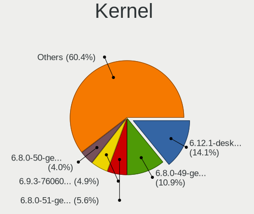
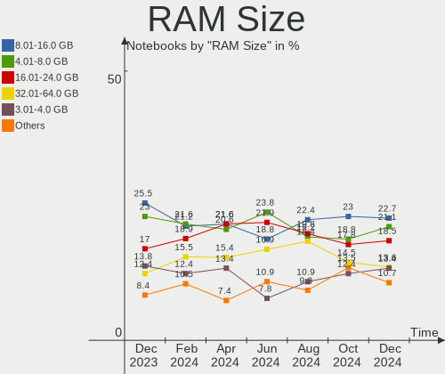
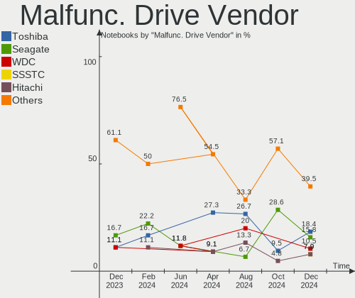
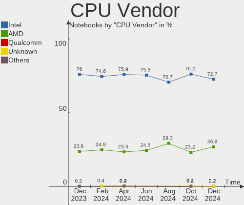
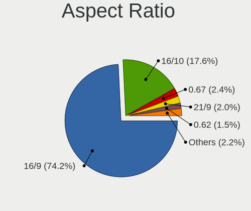
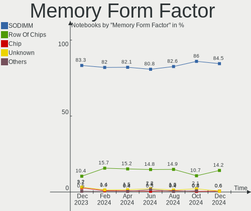
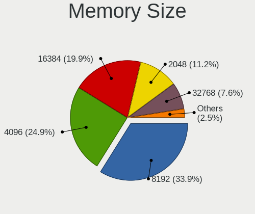
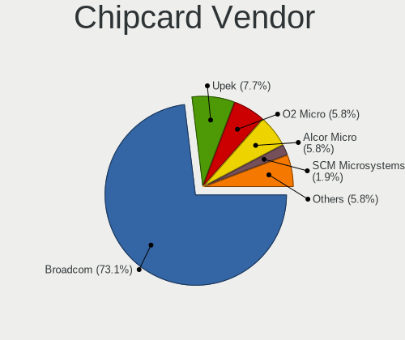

Linux in USA - Hardware Trends (Notebooks)
------------------------------------------

A project to identify most popular hardware characteristics and track their change
over time based on data collected by Linux users at https://Linux-Hardware.org.

Anyone can contribute to this report by the [hw-probe](https://github.com/linuxhw/hw-probe) tool:

    sudo -E hw-probe -all -upload

Period: Apr, 2023.

Contents
--------

* [ System ](#system)
  - [ OS                       ](#os)
  - [ OS Family                ](#os-family)
  - [ Kernel                   ](#kernel)
  - [ Kernel Family            ](#kernel-family)
  - [ Kernel Major Ver.        ](#kernel-major-ver)
  - [ Arch                     ](#arch)
  - [ DE                       ](#de)
  - [ Display Server           ](#display-server)
  - [ Display Manager          ](#display-manager)
  - [ OS Lang                  ](#os-lang)
  - [ Boot Mode                ](#boot-mode)
  - [ Filesystem               ](#filesystem)
  - [ Part. scheme             ](#part-scheme)
  - [ Dual Boot with Linux/BSD ](#dual-boot-with-linuxbsd)
  - [ Dual Boot (Win)          ](#dual-boot-win)

* [ Board ](#board)
  - [ Vendor                   ](#vendor)
  - [ Model                    ](#model)
  - [ Model Family             ](#model-family)
  - [ MFG Year                 ](#mfg-year)
  - [ Form Factor              ](#form-factor)
  - [ Secure Boot              ](#secure-boot)
  - [ Coreboot                 ](#coreboot)
  - [ RAM Size                 ](#ram-size)
  - [ RAM Used                 ](#ram-used)
  - [ Total Drives             ](#total-drives)
  - [ Has CD-ROM               ](#has-cd-rom)
  - [ Has Ethernet             ](#has-ethernet)
  - [ Has WiFi                 ](#has-wifi)
  - [ Has Bluetooth            ](#has-bluetooth)

* [ Location ](#location)
  - [ Country                  ](#country)
  - [ City                     ](#city)

* [ Drives ](#drives)
  - [ Drive Vendor             ](#drive-vendor)
  - [ Drive Model              ](#drive-model)
  - [ HDD Vendor               ](#hdd-vendor)
  - [ SSD Vendor               ](#ssd-vendor)
  - [ Drive Kind               ](#drive-kind)
  - [ Drive Connector          ](#drive-connector)
  - [ Drive Size               ](#drive-size)
  - [ Space Total              ](#space-total)
  - [ Space Used               ](#space-used)
  - [ Malfunc. Drives          ](#malfunc-drives)
  - [ Malfunc. Drive Vendor    ](#malfunc-drive-vendor)
  - [ Malfunc. HDD Vendor      ](#malfunc-hdd-vendor)
  - [ Malfunc. Drive Kind      ](#malfunc-drive-kind)
  - [ Failed Drives            ](#failed-drives)
  - [ Failed Drive Vendor      ](#failed-drive-vendor)
  - [ Drive Status             ](#drive-status)

* [ Storage controller ](#storage-controller)
  - [ Storage Vendor           ](#storage-vendor)
  - [ Storage Model            ](#storage-model)
  - [ Storage Kind             ](#storage-kind)

* [ Processor ](#processor)
  - [ CPU Vendor               ](#cpu-vendor)
  - [ CPU Model                ](#cpu-model)
  - [ CPU Model Family         ](#cpu-model-family)
  - [ CPU Cores                ](#cpu-cores)
  - [ CPU Sockets              ](#cpu-sockets)
  - [ CPU Threads              ](#cpu-threads)
  - [ CPU Op-Modes             ](#cpu-op-modes)
  - [ CPU Microcode            ](#cpu-microcode)
  - [ CPU Microarch            ](#cpu-microarch)

* [ Graphics ](#graphics)
  - [ GPU Vendor               ](#gpu-vendor)
  - [ GPU Model                ](#gpu-model)
  - [ GPU Combo                ](#gpu-combo)
  - [ GPU Driver               ](#gpu-driver)
  - [ GPU Memory               ](#gpu-memory)

* [ Monitor ](#monitor)
  - [ Monitor Vendor           ](#monitor-vendor)
  - [ Monitor Model            ](#monitor-model)
  - [ Monitor Resolution       ](#monitor-resolution)
  - [ Monitor Diagonal         ](#monitor-diagonal)
  - [ Monitor Width            ](#monitor-width)
  - [ Aspect Ratio             ](#aspect-ratio)
  - [ Monitor Area             ](#monitor-area)
  - [ Pixel Density            ](#pixel-density)
  - [ Multiple Monitors        ](#multiple-monitors)

* [ Network ](#network)
  - [ Net Controller Vendor    ](#net-controller-vendor)
  - [ Net Controller Model     ](#net-controller-model)
  - [ Wireless Vendor          ](#wireless-vendor)
  - [ Wireless Model           ](#wireless-model)
  - [ Ethernet Vendor          ](#ethernet-vendor)
  - [ Ethernet Model           ](#ethernet-model)
  - [ Net Controller Kind      ](#net-controller-kind)
  - [ Used Controller          ](#used-controller)
  - [ NICs                     ](#nics)
  - [ IPv6                     ](#ipv6)

* [ Bluetooth ](#bluetooth)
  - [ Bluetooth Vendor         ](#bluetooth-vendor)
  - [ Bluetooth Model          ](#bluetooth-model)

* [ Sound ](#sound)
  - [ Sound Vendor             ](#sound-vendor)
  - [ Sound Model              ](#sound-model)

* [ Memory ](#memory)
  - [ Memory Vendor            ](#memory-vendor)
  - [ Memory Model             ](#memory-model)
  - [ Memory Kind              ](#memory-kind)
  - [ Memory Form Factor       ](#memory-form-factor)
  - [ Memory Size              ](#memory-size)
  - [ Memory Speed             ](#memory-speed)

* [ Printers & scanners ](#printers--scanners)
  - [ Printer Vendor           ](#printer-vendor)
  - [ Printer Model            ](#printer-model)
  - [ Scanner Vendor           ](#scanner-vendor)
  - [ Scanner Model            ](#scanner-model)

* [ Camera ](#camera)
  - [ Camera Vendor            ](#camera-vendor)
  - [ Camera Model             ](#camera-model)

* [ Security ](#security)
  - [ Fingerprint Vendor       ](#fingerprint-vendor)
  - [ Fingerprint Model        ](#fingerprint-model)
  - [ Chipcard Vendor          ](#chipcard-vendor)
  - [ Chipcard Model           ](#chipcard-model)

* [ Unsupported ](#unsupported)
  - [ Unsupported Devices      ](#unsupported-devices)
  - [ Unsupported Device Types ](#unsupported-device-types)

System
------

OS
--

Installed operating systems

| Name                         | Notebooks | Percent |
|------------------------------|-----------|---------|
| OpenMandriva 23.03           | 65        | 13.83%  |
| Ubuntu 22.04                 | 45        | 9.57%   |
| Pop!_OS 22.04                | 43        | 9.15%   |
| Fedora 38                    | 30        | 6.38%   |
| Linux Mint 21.1              | 26        | 5.53%   |
| Zorin 16                     | 20        | 4.26%   |
| SteamOS 3.4.6                | 19        | 4.04%   |
| Arch Rolling                 | 14        | 2.98%   |
| Ubuntu 22.10                 | 13        | 2.77%   |
| Kali 2023.1                  | 12        | 2.55%   |
| Fedora 37                    | 12        | 2.55%   |
| Debian 11                    | 10        | 2.13%   |
| ArcoLinux Rolling            | 10        | 2.13%   |
| Ubuntu 23.04                 | 9         | 1.91%   |
| KDE neon 22.04               | 9         | 1.91%   |
| Ubuntu 20.04                 | 8         | 1.7%    |
| Kubuntu 22.04                | 7         | 1.49%   |
| Gentoo 2.13                  | 7         | 1.49%   |
| Elementary 7                 | 7         | 1.49%   |
| Xubuntu 22.04                | 6         | 1.28%   |
| Manjaro                      | 5         | 1.06%   |
| LMDE 5                       | 5         | 1.06%   |
| EndeavourOS Rolling          | 5         | 1.06%   |
| openSUSE Tumbleweed-XXXXXXXX | 4         | 0.85%   |
| OpenMandriva 4.3             | 4         | 0.85%   |
| Nobara 37                    | 4         | 0.85%   |
| Lubuntu 22.04                | 4         | 0.85%   |
| OpenMandriva 23.01           | 3         | 0.64%   |
| MX 21                        | 3         | 0.64%   |
| Linux Mint 21                | 3         | 0.64%   |
| Linux Mint 20.3              | 3         | 0.64%   |
| Xubuntu 20.04                | 2         | 0.43%   |
| SteamOS 3.5                  | 2         | 0.43%   |
| RHEL 9                       | 2         | 0.43%   |
| NixOS 23.05                  | 2         | 0.43%   |
| Manjaro 22.1.0               | 2         | 0.43%   |
| Linux Mint 20.1              | 2         | 0.43%   |
| Kubuntu 23.04                | 2         | 0.43%   |
| Devuan 4                     | 2         | 0.43%   |
| Debian 12                    | 2         | 0.43%   |

OS Family
---------

OS without a version

| Name              | Notebooks | Percent |
|-------------------|-----------|---------|
| Ubuntu            | 76        | 16.17%  |
| OpenMandriva      | 73        | 15.53%  |
| Fedora            | 46        | 9.79%   |
| Pop!_OS           | 43        | 9.15%   |
| Linux Mint        | 34        | 7.23%   |
| SteamOS           | 22        | 4.68%   |
| Zorin             | 20        | 4.26%   |
| Arch              | 14        | 2.98%   |
| Kali              | 12        | 2.55%   |
| Debian            | 12        | 2.55%   |
| Kubuntu           | 10        | 2.13%   |
| ArcoLinux         | 10        | 2.13%   |
| Xubuntu           | 9         | 1.91%   |
| KDE neon          | 9         | 1.91%   |
| Elementary        | 8         | 1.7%    |
| Manjaro           | 7         | 1.49%   |
| Gentoo            | 7         | 1.49%   |
| openSUSE          | 6         | 1.28%   |
| Lubuntu           | 5         | 1.06%   |
| LMDE              | 5         | 1.06%   |
| EndeavourOS       | 5         | 1.06%   |
| Nobara            | 4         | 0.85%   |
| MX                | 3         | 0.64%   |
| Devuan            | 3         | 0.64%   |
| Ubuntu MATE       | 2         | 0.43%   |
| RHEL              | 2         | 0.43%   |
| Parrot            | 2         | 0.43%   |
| NixOS             | 2         | 0.43%   |
| Garuda Linux      | 2         | 0.43%   |
| ChimeraOS         | 2         | 0.43%   |
| BunsenLabs        | 2         | 0.43%   |
| blendOS           | 2         | 0.43%   |
| Ultramarine Linux | 1         | 0.21%   |
| Ubuntu Studio     | 1         | 0.21%   |
| Trisquel          | 1         | 0.21%   |
| Redcore           | 1         | 0.21%   |
| Peppermint        | 1         | 0.21%   |
| Manjaro-ARM       | 1         | 0.21%   |
| Mageia            | 1         | 0.21%   |
| Mabox             | 1         | 0.21%   |

Kernel
------

Version of the Linux kernel

| Version                      | Notebooks | Percent |
|------------------------------|-----------|---------|
| 6.2.6-desktop-1omv2390       | 65        | 13.83%  |
| 5.15.0-69-generic            | 46        | 9.79%   |
| 5.19.0-38-generic            | 44        | 9.36%   |
| 6.2.6-76060206-generic       | 41        | 8.72%   |
| 5.13.0-valve36-1-neptune     | 20        | 4.26%   |
| 5.19.0-40-generic            | 19        | 4.04%   |
| 5.10.0-21-amd64              | 15        | 3.19%   |
| 6.2.0-20-generic             | 10        | 2.13%   |
| 6.2.11-300.fc38.x86_64       | 9         | 1.91%   |
| 5.15.0-71-generic            | 9         | 1.91%   |
| 6.2.12-arch1-1               | 8         | 1.7%    |
| 6.2.12-300.fc38.x86_64       | 8         | 1.7%    |
| 6.1.0-kali7-amd64            | 8         | 1.7%    |
| 5.19.0-41-generic            | 8         | 1.7%    |
| 6.2.13-300.fc38.x86_64       | 7         | 1.49%   |
| 6.2.10-arch1-1               | 6         | 1.28%   |
| 6.2.9-arch1-1                | 5         | 1.06%   |
| 5.19.0-32-generic            | 5         | 1.06%   |
| 5.15.0-70-generic            | 5         | 1.06%   |
| 6.2.9-200.fc37.x86_64        | 4         | 0.85%   |
| 6.1.0-kali5-amd64            | 4         | 0.85%   |
| 5.10.0-20-amd64              | 4         | 0.85%   |
| 6.2.9-300.fc38.x86_64        | 3         | 0.64%   |
| 6.2.8-200.fc37.x86_64        | 3         | 0.64%   |
| 6.2.10-300.fc38.x86_64       | 3         | 0.64%   |
| 6.1.21-1-MANJARO             | 3         | 0.64%   |
| 6.1.0-7-amd64                | 3         | 0.64%   |
| 5.4.0-147-generic            | 3         | 0.64%   |
| 5.16.7-desktop-1omv4003      | 3         | 0.64%   |
| 5.15.0-58-generic            | 3         | 0.64%   |
| 6.2.12-zen1-1-zen            | 2         | 0.43%   |
| 6.2.12-200.fc37.x86_64       | 2         | 0.43%   |
| 6.2.12-1-default             | 2         | 0.43%   |
| 6.2.11-zen1-1-zen            | 2         | 0.43%   |
| 6.2.11-arch1-1               | 2         | 0.43%   |
| 6.2.11-201.fsync.fc37.x86_64 | 2         | 0.43%   |
| 6.2.10-200.fc37.x86_64       | 2         | 0.43%   |
| 6.1.21-1-lts                 | 2         | 0.43%   |
| 6.1.1-desktop-1omv2290       | 2         | 0.43%   |
| 5.15.0-56-generic            | 2         | 0.43%   |

Kernel Family
-------------

Linux kernel without a distro release

| Version | Notebooks | Percent |
|---------|-----------|---------|
| 6.2.6   | 106       | 22.55%  |
| 5.19.0  | 79        | 16.81%  |
| 5.15.0  | 70        | 14.89%  |
| 6.2.12  | 23        | 4.89%   |
| 5.10.0  | 21        | 4.47%   |
| 5.13.0  | 20        | 4.26%   |
| 6.2.9   | 18        | 3.83%   |
| 6.2.11  | 18        | 3.83%   |
| 6.1.0   | 18        | 3.83%   |
| 6.2.10  | 15        | 3.19%   |
| 6.2.0   | 12        | 2.55%   |
| 6.1.21  | 8         | 1.7%    |
| 5.4.0   | 8         | 1.7%    |
| 6.2.8   | 7         | 1.49%   |
| 6.2.13  | 7         | 1.49%   |
| 6.3.0   | 4         | 0.85%   |
| 5.16.7  | 3         | 0.64%   |
| 5.14.0  | 3         | 0.64%   |
| 6.1.24  | 2         | 0.43%   |
| 6.1.19  | 2         | 0.43%   |
| 6.1.1   | 2         | 0.43%   |
| 6.0.12  | 2         | 0.43%   |
| 5.14.21 | 2         | 0.43%   |
| 6.2.7   | 1         | 0.21%   |
| 6.2.5   | 1         | 0.21%   |
| 6.1.8   | 1         | 0.21%   |
| 6.1.7   | 1         | 0.21%   |
| 6.1.4   | 1         | 0.21%   |
| 6.1.26  | 1         | 0.21%   |
| 6.1.25  | 1         | 0.21%   |
| 6.1.12  | 1         | 0.21%   |
| 6.1.11  | 1         | 0.21%   |
| 6.0.9   | 1         | 0.21%   |
| 6.0.7   | 1         | 0.21%   |
| 6.0.10  | 1         | 0.21%   |
| 6.0.0   | 1         | 0.21%   |
| 5.18.19 | 1         | 0.21%   |
| 5.18.0  | 1         | 0.21%   |
| 5.17.12 | 1         | 0.21%   |
| 5.16.13 | 1         | 0.21%   |

Kernel Major Ver.
-----------------

Linux kernel major version

| Version | Notebooks | Percent |
|---------|-----------|---------|
| 6.2     | 208       | 44.26%  |
| 5.19    | 79        | 16.81%  |
| 5.15    | 73        | 15.53%  |
| 6.1     | 39        | 8.3%    |
| 5.10    | 21        | 4.47%   |
| 5.13    | 20        | 4.26%   |
| 5.4     | 8         | 1.7%    |
| 6.0     | 6         | 1.28%   |
| 5.14    | 5         | 1.06%   |
| 6.3     | 4         | 0.85%   |
| 5.16    | 4         | 0.85%   |
| 5.18    | 2         | 0.43%   |
| 5.17    | 1         | 0.21%   |

Arch
----

OS architecture (x86_64, i586, etc.)

| Name    | Notebooks | Percent |
|---------|-----------|---------|
| x86_64  | 468       | 99.57%  |
| i686    | 1         | 0.21%   |
| aarch64 | 1         | 0.21%   |

DE
--

Desktop Environment

| Name             | Notebooks | Percent |
|------------------|-----------|---------|
| GNOME            | 188       | 40%     |
| KDE5             | 156       | 33.19%  |
| XFCE             | 33        | 7.02%   |
| X-Cinnamon       | 30        | 6.38%   |
| MATE             | 13        | 2.77%   |
| Unknown          | 13        | 2.77%   |
| LXQt             | 11        | 2.34%   |
| Pantheon         | 8         | 1.7%    |
| Cinnamon         | 4         | 0.85%   |
| Hyprland         | 2         | 0.43%   |
| none+i3          | 1         | 0.21%   |
| LXDE             | 1         | 0.21%   |
| lightdm-xsession | 1         | 0.21%   |
| KDE              | 1         | 0.21%   |
| i3-with-shmlog   | 1         | 0.21%   |
| i3               | 1         | 0.21%   |
| gamescope        | 1         | 0.21%   |
| Enlightenment    | 1         | 0.21%   |
| dwm              | 1         | 0.21%   |
| custom           | 1         | 0.21%   |
| BunsenLabs       | 1         | 0.21%   |
| awesome          | 1         | 0.21%   |

Display Server
--------------

X11 or Wayland

| Name        | Notebooks | Percent |
|-------------|-----------|---------|
| X11         | 337       | 71.7%   |
| Wayland     | 116       | 24.68%  |
| Unknown     | 10        | 2.13%   |
| Tty         | 6         | 1.28%   |
| Unspecified | 1         | 0.21%   |

Display Manager
---------------

SDDM, LightDM, etc.

| Name    | Notebooks | Percent |
|---------|-----------|---------|
| Unknown | 170       | 36.17%  |
| SDDM    | 121       | 25.74%  |
| GDM3    | 82        | 17.45%  |
| LightDM | 64        | 13.62%  |
| GDM     | 27        | 5.74%   |
| XDM     | 2         | 0.43%   |
| TDM     | 1         | 0.21%   |
| SLiM    | 1         | 0.21%   |
| LXDM    | 1         | 0.21%   |
| EMPTTY  | 1         | 0.21%   |

OS Lang
-------

Language

| Lang    | Notebooks | Percent |
|---------|-----------|---------|
| en_US   | 449       | 95.53%  |
| C       | 6         | 1.28%   |
| en_GB   | 3         | 0.64%   |
| en_CA   | 3         | 0.64%   |
| Unknown | 3         | 0.64%   |
| pl_PL   | 1         | 0.21%   |
| it_IT   | 1         | 0.21%   |
| es_MX   | 1         | 0.21%   |
| en_AU   | 1         | 0.21%   |
| de_DE   | 1         | 0.21%   |
| C.UTF8  | 1         | 0.21%   |

Boot Mode
---------

EFI or BIOS

| Mode | Notebooks | Percent |
|------|-----------|---------|
| EFI  | 256       | 54.47%  |
| BIOS | 214       | 45.53%  |

Filesystem
----------

Type of filesystem

| Type    | Notebooks | Percent |
|---------|-----------|---------|
| Ext4    | 280       | 59.57%  |
| Btrfs   | 109       | 23.19%  |
| Overlay | 34        | 7.23%   |
| Tmpfs   | 28        | 5.96%   |
| Xfs     | 12        | 2.55%   |
| Zfs     | 6         | 1.28%   |
| F2fs    | 1         | 0.21%   |

Part. scheme
------------

Scheme of partitioning

| Type    | Notebooks | Percent |
|---------|-----------|---------|
| GPT     | 275       | 58.51%  |
| Unknown | 161       | 34.26%  |
| MBR     | 34        | 7.23%   |

Dual Boot with Linux/BSD
------------------------

Hosting more than one Linux/BSD

| Dual boot | Notebooks | Percent |
|-----------|-----------|---------|
| No        | 409       | 87.02%  |
| Yes       | 61        | 12.98%  |

Dual Boot (Win)
---------------

Hosting Linux and Windows

| Dual boot | Notebooks | Percent |
|-----------|-----------|---------|
| No        | 377       | 80.21%  |
| Yes       | 93        | 19.79%  |

Board
-----

Vendor
------

Motherboard manufacturer

| Name                | Notebooks | Percent |
|---------------------|-----------|---------|
| Lenovo              | 91        | 19.36%  |
| Hewlett-Packard     | 90        | 19.15%  |
| Dell                | 80        | 17.02%  |
| ASUSTek Computer    | 42        | 8.94%   |
| Acer                | 28        | 5.96%   |
| Apple               | 22        | 4.68%   |
| Valve               | 21        | 4.47%   |
| Google              | 13        | 2.77%   |
| MSI                 | 12        | 2.55%   |
| GPU Company         | 11        | 2.34%   |
| Toshiba             | 8         | 1.7%    |
| System76            | 7         | 1.49%   |
| Framework           | 5         | 1.06%   |
| Sony                | 4         | 0.85%   |
| Razer               | 3         | 0.64%   |
| Notebook            | 3         | 0.64%   |
| Gateway             | 3         | 0.64%   |
| Unknown             | 3         | 0.64%   |
| Getac               | 2         | 0.43%   |
| Dynabook            | 2         | 0.43%   |
| Alienware           | 2         | 0.43%   |
| Thomson             | 1         | 0.21%   |
| Star Labs           | 1         | 0.21%   |
| SGIN                | 1         | 0.21%   |
| Samsung Electronics | 1         | 0.21%   |
| Pine Microsystems   | 1         | 0.21%   |
| Panasonic           | 1         | 0.21%   |
| ONE-NETBOOK         | 1         | 0.21%   |
| Micro Electronics   | 1         | 0.21%   |
| MECHREVO            | 1         | 0.21%   |
| Insyde              | 1         | 0.21%   |
| IBM                 | 1         | 0.21%   |
| HUAWEI              | 1         | 0.21%   |
| GMKtec              | 1         | 0.21%   |
| GEO                 | 1         | 0.21%   |
| Fujitsu             | 1         | 0.21%   |
| Carbon Systems      | 1         | 0.21%   |
| AZW                 | 1         | 0.21%   |
| AMI                 | 1         | 0.21%   |

Model
-----

Motherboard model

| Name                                        | Notebooks | Percent |
|---------------------------------------------|-----------|---------|
| Valve Jupiter                               | 21        | 4.47%   |
| HP Laptop 15-db0xxx                         | 5         | 1.06%   |
| HP Notebook                                 | 4         | 0.85%   |
| Framework Laptop                            | 4         | 0.85%   |
| Dell Latitude E6430                         | 4         | 0.85%   |
| Lenovo ThinkPad X1 Extreme Gen 3 20TK001HUS | 3         | 0.64%   |
| HP Laptop 15-bs2xx                          | 3         | 0.64%   |
| GPU Company GWTC116-2                       | 3         | 0.64%   |
| GPU Company GWNR71517                       | 3         | 0.64%   |
| Google Chell                                | 3         | 0.64%   |
| Dell Latitude E7440                         | 3         | 0.64%   |
| Apple MacBookPro8,1                         | 3         | 0.64%   |
| Apple MacBookAir7,2                         | 3         | 0.64%   |
| Acer Aspire A515-45                         | 3         | 0.64%   |
| Unknown                                     | 3         | 0.64%   |
| System76 Pangolin                           | 2         | 0.43%   |
| System76 Gazelle                            | 2         | 0.43%   |
| Lenovo IdeaPad 330-15IKB 81DE               | 2         | 0.43%   |
| Lenovo IdeaPad 110-15ISK 80UD               | 2         | 0.43%   |
| HP Pavilion Notebook                        | 2         | 0.43%   |
| HP Laptop 17-by4xxx                         | 2         | 0.43%   |
| HP ENVY 17                                  | 2         | 0.43%   |
| HP EliteBook 8460p                          | 2         | 0.43%   |
| HP 2000                                     | 2         | 0.43%   |
| HP 15 Notebook PC                           | 2         | 0.43%   |
| GPU Company GWTN156-5                       | 2         | 0.43%   |
| Google Reks                                 | 2         | 0.43%   |
| Google Banon                                | 2         | 0.43%   |
| Dell XPS 15 9570                            | 2         | 0.43%   |
| Dell XPS 15 9520                            | 2         | 0.43%   |
| Dell XPS 13 9310                            | 2         | 0.43%   |
| Dell Precision M4800                        | 2         | 0.43%   |
| Dell Precision 7510                         | 2         | 0.43%   |
| Dell Latitude E5440                         | 2         | 0.43%   |
| Dell Latitude 5580                          | 2         | 0.43%   |
| Dell Inspiron 3583                          | 2         | 0.43%   |
| Dell Inspiron 15 5510                       | 2         | 0.43%   |
| Apple MacBookPro14,1                        | 2         | 0.43%   |
| Apple MacBookPro11,3                        | 2         | 0.43%   |
| Acer Aspire E5-575                          | 2         | 0.43%   |

Model Family
------------

Motherboard model prefix

| Name                  | Notebooks | Percent |
|-----------------------|-----------|---------|
| Lenovo ThinkPad       | 56        | 11.91%  |
| Dell Latitude         | 28        | 5.96%   |
| Dell Inspiron         | 24        | 5.11%   |
| Valve Jupiter         | 21        | 4.47%   |
| Lenovo IdeaPad        | 21        | 4.47%   |
| HP Pavilion           | 21        | 4.47%   |
| Acer Aspire           | 21        | 4.47%   |
| HP Laptop             | 20        | 4.26%   |
| Dell XPS              | 13        | 2.77%   |
| Dell Precision        | 11        | 2.34%   |
| HP ProBook            | 10        | 2.13%   |
| ASUS ROG              | 9         | 1.91%   |
| ASUS VivoBook         | 8         | 1.7%    |
| Toshiba Satellite     | 7         | 1.49%   |
| HP EliteBook          | 7         | 1.49%   |
| Lenovo ThinkBook      | 6         | 1.28%   |
| Lenovo Legion         | 6         | 1.28%   |
| Framework Laptop      | 5         | 1.06%   |
| ASUS Zenbook          | 5         | 1.06%   |
| ASUS ASUS             | 5         | 1.06%   |
| HP ZBook              | 4         | 0.85%   |
| HP Notebook           | 4         | 0.85%   |
| Apple MacBookPro8     | 4         | 0.85%   |
| Apple MacBookAir7     | 4         | 0.85%   |
| Razer Blade           | 3         | 0.64%   |
| HP Stream             | 3         | 0.64%   |
| HP OMEN               | 3         | 0.64%   |
| HP 15                 | 3         | 0.64%   |
| GPU Company GWTC116-2 | 3         | 0.64%   |
| GPU Company GWNR71517 | 3         | 0.64%   |
| Google Chell          | 3         | 0.64%   |
| Apple MacBookPro11    | 3         | 0.64%   |
| Acer Swift            | 3         | 0.64%   |
| Unknown               | 3         | 0.64%   |
| System76 Pangolin     | 2         | 0.43%   |
| System76 Gazelle      | 2         | 0.43%   |
| MSI Prestige          | 2         | 0.43%   |
| MSI Modern            | 2         | 0.43%   |
| HP Victus             | 2         | 0.43%   |
| HP ENVY               | 2         | 0.43%   |

MFG Year
--------

Motherboard manufacture year

| Year    | Notebooks | Percent |
|---------|-----------|---------|
| 2022    | 75        | 15.96%  |
| 2020    | 53        | 11.28%  |
| 2021    | 52        | 11.06%  |
| 2019    | 33        | 7.02%   |
| 2018    | 33        | 7.02%   |
| 2016    | 29        | 6.17%   |
| 2011    | 29        | 6.17%   |
| 2013    | 28        | 5.96%   |
| 2015    | 25        | 5.32%   |
| 2012    | 23        | 4.89%   |
| 2017    | 19        | 4.04%   |
| 2023    | 18        | 3.83%   |
| 2010    | 16        | 3.4%    |
| 2014    | 14        | 2.98%   |
| 2008    | 10        | 2.13%   |
| 2009    | 5         | 1.06%   |
| 2007    | 5         | 1.06%   |
| Unknown | 2         | 0.43%   |
| 2005    | 1         | 0.21%   |

Form Factor
-----------

Physical design of the computer

| Name     | Notebooks | Percent |
|----------|-----------|---------|
| Notebook | 470       | 100%    |

Secure Boot
-----------

Enabled or disabled

| State    | Notebooks | Percent |
|----------|-----------|---------|
| Disabled | 446       | 94.89%  |
| Enabled  | 24        | 5.11%   |

Coreboot
--------

Have coreboot on board

| Used | Notebooks | Percent |
|------|-----------|---------|
| No   | 449       | 95.53%  |
| Yes  | 21        | 4.47%   |

RAM Size
--------

Total RAM memory

| Size in GB  | Notebooks | Percent |
|-------------|-----------|---------|
| 4.01-8.0    | 122       | 25.96%  |
| 16.01-24.0  | 88        | 18.72%  |
| 8.01-16.0   | 86        | 18.3%   |
| 3.01-4.0    | 73        | 15.53%  |
| 32.01-64.0  | 57        | 12.13%  |
| 64.01-256.0 | 17        | 3.62%   |
| 1.01-2.0    | 12        | 2.55%   |
| 24.01-32.0  | 10        | 2.13%   |
| 2.01-3.0    | 5         | 1.06%   |

RAM Used
--------

Used RAM memory

| Used GB    | Notebooks | Percent |
|------------|-----------|---------|
| 1.01-2.0   | 145       | 30.85%  |
| 2.01-3.0   | 116       | 24.68%  |
| 4.01-8.0   | 85        | 18.09%  |
| 3.01-4.0   | 82        | 17.45%  |
| 8.01-16.0  | 19        | 4.04%   |
| 0.51-1.0   | 19        | 4.04%   |
| 0.01-0.5   | 2         | 0.43%   |
| 24.01-32.0 | 1         | 0.21%   |
| 16.01-24.0 | 1         | 0.21%   |

Total Drives
------------

Number of drives on board

| Drives | Notebooks | Percent |
|--------|-----------|---------|
| 1      | 334       | 71.06%  |
| 2      | 117       | 24.89%  |
| 3      | 17        | 3.62%   |
| 6      | 1         | 0.21%   |
| 0      | 1         | 0.21%   |

Has CD-ROM
----------

Has CD-ROM on board

| Presented | Notebooks | Percent |
|-----------|-----------|---------|
| No        | 334       | 71.06%  |
| Yes       | 136       | 28.94%  |

Has Ethernet
------------

Has Ethernet on board

| Presented | Notebooks | Percent |
|-----------|-----------|---------|
| Yes       | 323       | 68.72%  |
| No        | 147       | 31.28%  |

Has WiFi
--------

Has WiFi module

| Presented | Notebooks | Percent |
|-----------|-----------|---------|
| Yes       | 466       | 99.15%  |
| No        | 4         | 0.85%   |

Has Bluetooth
-------------

Has Bluetooth module

| Presented | Notebooks | Percent |
|-----------|-----------|---------|
| Yes       | 383       | 81.49%  |
| No        | 87        | 18.51%  |

Location
--------

Country
-------

Geographic location (country)

| Country | Notebooks | Percent |
|---------|-----------|---------|
| USA     | 470       | 100%    |

City
----

Geographic location (city)

| City           | Notebooks | Percent |
|----------------|-----------|---------|
| New York       | 11        | 2.34%   |
| Los Angeles    | 10        | 2.13%   |
| Houston        | 8         | 1.7%    |
| Denver         | 7         | 1.49%   |
| Portland       | 6         | 1.28%   |
| Las Vegas      | 5         | 1.06%   |
| Seattle        | 4         | 0.85%   |
| Queens         | 4         | 0.85%   |
| Phoenix        | 4         | 0.85%   |
| Freeport       | 4         | 0.85%   |
| Dallas         | 4         | 0.85%   |
| Atlanta        | 4         | 0.85%   |
| Tampa          | 3         | 0.64%   |
| St Louis       | 3         | 0.64%   |
| San Francisco  | 3         | 0.64%   |
| San Diego      | 3         | 0.64%   |
| Sacramento     | 3         | 0.64%   |
| Riverside      | 3         | 0.64%   |
| North Hills    | 3         | 0.64%   |
| Lexington      | 3         | 0.64%   |
| Denton         | 3         | 0.64%   |
| Columbus       | 3         | 0.64%   |
| Chicago        | 3         | 0.64%   |
| Birmingham     | 3         | 0.64%   |
| Bangor         | 3         | 0.64%   |
| Ashburn        | 3         | 0.64%   |
| Albuquerque    | 3         | 0.64%   |
| Winder         | 2         | 0.43%   |
| Washington     | 2         | 0.43%   |
| Tulsa          | 2         | 0.43%   |
| Tucson         | 2         | 0.43%   |
| The Bronx      | 2         | 0.43%   |
| Star City      | 2         | 0.43%   |
| San Antonio    | 2         | 0.43%   |
| Salt Lake City | 2         | 0.43%   |
| Richmond       | 2         | 0.43%   |
| Plano          | 2         | 0.43%   |
| Pittsburgh     | 2         | 0.43%   |
| Philadelphia   | 2         | 0.43%   |
| Orlando        | 2         | 0.43%   |

Drives
------

Drive Vendor
------------

Hard drive vendors

| Vendor                      | Notebooks | Drives | Percent |
|-----------------------------|-----------|--------|---------|
| Samsung Electronics         | 107       | 111    | 17.6%   |
| WDC                         | 66        | 67     | 10.86%  |
| Unknown                     | 60        | 63     | 9.87%   |
| SanDisk                     | 56        | 60     | 9.21%   |
| Seagate                     | 43        | 45     | 7.07%   |
| SK hynix                    | 29        | 29     | 4.77%   |
| Toshiba                     | 25        | 25     | 4.11%   |
| Crucial                     | 18        | 18     | 2.96%   |
| Micron Technology           | 17        | 17     | 2.8%    |
| Kingston                    | 15        | 15     | 2.47%   |
| Intel                       | 15        | 15     | 2.47%   |
| Phison Electronics          | 14        | 14     | 2.3%    |
| Hitachi                     | 13        | 13     | 2.14%   |
| HGST                        | 13        | 13     | 2.14%   |
| Apple                       | 11        | 12     | 1.81%   |
| Kingston Technology Company | 9         | 9      | 1.48%   |
| Unknown                     | 9         | 9      | 1.48%   |
| Micron/Crucial Technology   | 6         | 7      | 0.99%   |
| SPCC                        | 5         | 5      | 0.82%   |
| LITEON                      | 5         | 5      | 0.82%   |
| KIOXIA                      | 5         | 5      | 0.82%   |
| Team                        | 4         | 4      | 0.66%   |
| Silicon Motion              | 4         | 4      | 0.66%   |
| PNY                         | 4         | 4      | 0.66%   |
| Phison                      | 4         | 4      | 0.66%   |
| O2 Micro                    | 4         | 4      | 0.66%   |
| Wibtek                      | 3         | 3      | 0.49%   |
| China                       | 3         | 3      | 0.49%   |
| Transcend                   | 2         | 2      | 0.33%   |
| SPCC Sol                    | 2         | 2      | 0.33%   |
| SABRENT                     | 2         | 2      | 0.33%   |
| Realtek Semiconductor       | 2         | 2      | 0.33%   |
| Netac                       | 2         | 2      | 0.33%   |
| JMicron Technology          | 2         | 2      | 0.33%   |
| FORESEE                     | 2         | 2      | 0.33%   |
| Dogfish                     | 2         | 2      | 0.33%   |
| A-DATA Technology           | 2         | 2      | 0.33%   |
| USB 3.0                     | 1         | 1      | 0.16%   |
| UMIS                        | 1         | 1      | 0.16%   |
| Realtek                     | 1         | 1      | 0.16%   |

Drive Model
-----------

Hard drive models

| Model                                                  | Notebooks | Percent |
|--------------------------------------------------------|-----------|---------|
| Samsung NVMe SSD Controller SM981/PM981/PM983 1TB      | 12        | 1.94%   |
| Unknown MMC Card  32GB                                 | 11        | 1.78%   |
| Unknown MMC Card  64GB                                 | 9         | 1.46%   |
| Unknown                                                | 9         | 1.46%   |
| Unknown MMC Card  512GB                                | 7         | 1.13%   |
| Kingston Company OM3PDP3 NVMe SSD 512GB                | 7         | 1.13%   |
| Samsung NVMe SSD Controller PM9A1/PM9A3/980PRO 2TB     | 6         | 0.97%   |
| Seagate ST1000LM035-1RK172 970GB                       | 5         | 0.81%   |
| Sandisk WD Blue SN550 NVMe SSD 1024GB                  | 5         | 0.81%   |
| Micron/Crucial P2 NVMe PCIe SSD 1TB                    | 5         | 0.81%   |
| HGST HTS721010A9E630 1TB                               | 5         | 0.81%   |
| Unknown MMC Card  16GB                                 | 4         | 0.65%   |
| Unknown MMC Card  128GB                                | 4         | 0.65%   |
| Toshiba MQ01ABD100 1TB                                 | 4         | 0.65%   |
| Seagate ST9500325AS 500GB                              | 4         | 0.65%   |
| Sandisk WD Blue SN570 1TB                              | 4         | 0.65%   |
| Sandisk WD Black SN750 / PC SN730 NVMe SSD 512GB       | 4         | 0.65%   |
| SanDisk NVMe SSD Drive 1TB                             | 4         | 0.65%   |
| Samsung SSD 860 EVO 500GB                              | 4         | 0.65%   |
| Phison PS5013 E13 NVMe Controller 500GB                | 4         | 0.65%   |
| Phison E12 NVMe Controller 512GB                       | 4         | 0.65%   |
| O2 Micro E2M2 64GB                                     | 4         | 0.65%   |
| Crucial CT1000MX500SSD1 1TB                            | 4         | 0.65%   |
| Wibtek W800S 512GB SSD                                 | 3         | 0.49%   |
| WDC WDS500G2B0A-00SM50 500GB SSD                       | 3         | 0.49%   |
| WDC WDBNCE5000PNC 500GB SSD                            | 3         | 0.49%   |
| WDC WDBNCE0010PNC 1TB SSD                              | 3         | 0.49%   |
| WDC PC SN730 SDBQNTY-1T00-1001 1TB                     | 3         | 0.49%   |
| WDC PC SN530 SDBPNPZ-256G-1114 256GB                   | 3         | 0.49%   |
| Unknown SD/MMC/MS PRO 249GB                            | 3         | 0.49%   |
| Unknown MMC Card  256GB                                | 3         | 0.49%   |
| Toshiba MQ04ABF100 1TB                                 | 3         | 0.49%   |
| Toshiba MQ01ABF050 500GB                               | 3         | 0.49%   |
| Silicon Motion SM2263EN/SM2263XT SSD Controller 1024GB | 3         | 0.49%   |
| Seagate ST750LM022 HN-M750MBB 752GB                    | 3         | 0.49%   |
| Seagate ST500LT012-1DG142 500GB                        | 3         | 0.49%   |
| Seagate ST1000LM024 HN-M101MBB 1TB                     | 3         | 0.49%   |
| Sandisk WD_BLACK SN770 500GB                           | 3         | 0.49%   |
| SanDisk NVMe SSD Drive 500GB                           | 3         | 0.49%   |
| SanDisk DF4032  32GB                                   | 3         | 0.49%   |

HDD Vendor
----------

Hard disk drive vendors

| Vendor              | Notebooks | Drives | Percent |
|---------------------|-----------|--------|---------|
| Seagate             | 40        | 40     | 32%     |
| WDC                 | 34        | 34     | 27.2%   |
| Toshiba             | 20        | 20     | 16%     |
| Hitachi             | 13        | 13     | 10.4%   |
| HGST                | 13        | 13     | 10.4%   |
| Unknown             | 3         | 3      | 2.4%    |
| Samsung Electronics | 1         | 1      | 0.8%    |
| Generic-            | 1         | 1      | 0.8%    |

SSD Vendor
----------

Solid state drive vendors

| Vendor              | Notebooks | Drives | Percent |
|---------------------|-----------|--------|---------|
| Samsung Electronics | 42        | 43     | 24.85%  |
| SanDisk             | 19        | 20     | 11.24%  |
| Crucial             | 13        | 13     | 7.69%   |
| WDC                 | 12        | 12     | 7.1%    |
| Apple               | 10        | 10     | 5.92%   |
| Kingston            | 8         | 8      | 4.73%   |
| Micron Technology   | 7         | 7      | 4.14%   |
| SPCC                | 5         | 5      | 2.96%   |
| LITEON              | 5         | 5      | 2.96%   |
| SK hynix            | 4         | 4      | 2.37%   |
| PNY                 | 4         | 4      | 2.37%   |
| Wibtek              | 3         | 3      | 1.78%   |
| Team                | 3         | 3      | 1.78%   |
| China               | 3         | 3      | 1.78%   |
| SPCC Sol            | 2         | 2      | 1.18%   |
| Seagate             | 2         | 3      | 1.18%   |
| Netac               | 2         | 2      | 1.18%   |
| FORESEE             | 2         | 2      | 1.18%   |
| Dogfish             | 2         | 2      | 1.18%   |
| A-DATA Technology   | 2         | 2      | 1.18%   |
| Transcend           | 1         | 1      | 0.59%   |
| Toshiba             | 1         | 1      | 0.59%   |
| PNY CS90            | 1         | 1      | 0.59%   |
| Plextor             | 1         | 1      | 0.59%   |
| OWC                 | 1         | 1      | 0.59%   |
| Mushkin             | 1         | 1      | 0.59%   |
| LITEONIT            | 1         | 1      | 0.59%   |
| Lexar               | 1         | 1      | 0.59%   |
| Leven               | 1         | 1      | 0.59%   |
| KingFast            | 1         | 1      | 0.59%   |
| INTEL SS            | 1         | 1      | 0.59%   |
| Intel               | 1         | 1      | 0.59%   |
| Inland              | 1         | 1      | 0.59%   |
| GOODRAM             | 1         | 1      | 0.59%   |
| EDGE                | 1         | 1      | 0.59%   |
| Dell                | 1         | 1      | 0.59%   |
| BIWIN               | 1         | 1      | 0.59%   |
| ASMT                | 1         | 2      | 0.59%   |
| Unknown             | 1         | 1      | 0.59%   |

Drive Kind
----------

HDD or SSD

| Kind    | Notebooks | Drives | Percent |
|---------|-----------|--------|---------|
| NVMe    | 223       | 250    | 39.19%  |
| SSD     | 154       | 173    | 27.07%  |
| HDD     | 119       | 125    | 20.91%  |
| MMC     | 67        | 71     | 11.78%  |
| Unknown | 6         | 6      | 1.05%   |

Drive Connector
---------------

SATA, SAS, NVMe, etc.

| Type | Notebooks | Drives | Percent |
|------|-----------|--------|---------|
| SATA | 247       | 274    | 44.03%  |
| NVMe | 221       | 247    | 39.39%  |
| MMC  | 67        | 71     | 11.94%  |
| SAS  | 26        | 33     | 4.63%   |

Drive Size
----------

Size of hard drive

| Size in TB | Notebooks | Drives | Percent |
|------------|-----------|--------|---------|
| 0.01-0.5   | 155       | 169    | 56.36%  |
| 0.51-1.0   | 100       | 106    | 36.36%  |
| 1.01-2.0   | 15        | 18     | 5.45%   |
| 3.01-4.0   | 2         | 2      | 0.73%   |
| 4.01-10.0  | 2         | 2      | 0.73%   |
| 10.01-20.0 | 1         | 1      | 0.36%   |

Space Total
-----------

Amount of disk space available on the file system

| Size in GB     | Notebooks | Percent |
|----------------|-----------|---------|
| 101-250        | 105       | 22.34%  |
| 251-500        | 102       | 21.7%   |
| 501-1000       | 83        | 17.66%  |
| 1001-2000      | 43        | 9.15%   |
| 1-20           | 40        | 8.51%   |
| More than 3000 | 26        | 5.53%   |
| 51-100         | 23        | 4.89%   |
| 21-50          | 22        | 4.68%   |
| 2001-3000      | 13        | 2.77%   |
| Unknown        | 13        | 2.77%   |

Space Used
----------

Amount of used disk space

| Used GB        | Notebooks | Percent |
|----------------|-----------|---------|
| 1-20           | 188       | 40%     |
| 21-50          | 90        | 19.15%  |
| 101-250        | 57        | 12.13%  |
| 51-100         | 46        | 9.79%   |
| 251-500        | 34        | 7.23%   |
| 501-1000       | 22        | 4.68%   |
| Unknown        | 13        | 2.77%   |
| 1001-2000      | 10        | 2.13%   |
| 2001-3000      | 7         | 1.49%   |
| More than 3000 | 2         | 0.43%   |
| 0              | 1         | 0.21%   |

Malfunc. Drives
---------------

Drive models with a malfunction

| Model                                               | Notebooks | Drives | Percent |
|-----------------------------------------------------|-----------|--------|---------|
| Toshiba MQ01ABD100 1TB                              | 2         | 2      | 6.9%    |
| Seagate ST9500325AS 500GB                           | 2         | 2      | 6.9%    |
| Hitachi HTS723232A7A364 320GB                       | 2         | 2      | 6.9%    |
| WDC WD5000LPCX-60VHAT1 500GB                        | 1         | 1      | 3.45%   |
| WDC WD3200BPVT-80ZEST0 320GB                        | 1         | 1      | 3.45%   |
| Toshiba MQ04ABF100 1TB                              | 1         | 1      | 3.45%   |
| Toshiba MK1656GSY 160GB                             | 1         | 1      | 3.45%   |
| SK hynix SH920 mSATA 256GB SSD                      | 1         | 1      | 3.45%   |
| SK hynix PC711 HFS001TDE9X073N 1TB                  | 1         | 1      | 3.45%   |
| Seagate ST750LM022 HN-M750MBB 752GB                 | 1         | 1      | 3.45%   |
| Seagate ST500LM021-1KJ152 500GB                     | 1         | 1      | 3.45%   |
| Seagate ST320LT007-9ZV142 320GB                     | 1         | 1      | 3.45%   |
| Seagate ST2000LX001-1RG174 2TB                      | 1         | 1      | 3.45%   |
| Samsung Electronics SSD PM810 mSATA 128GB           | 1         | 1      | 3.45%   |
| Micron Technology MTFDDAK256MAY-1AH1ZABHA 256GB SSD | 1         | 1      | 3.45%   |
| LITEON CV8-8E128-HP 128GB SSD                       | 1         | 1      | 3.45%   |
| Kingston SV300S37A120G 120GB SSD                    | 1         | 1      | 3.45%   |
| Intel SSDSC2BA800G4R 800GB                          | 1         | 1      | 3.45%   |
| Hitachi HTS727550A9E364 500GB                       | 1         | 1      | 3.45%   |
| Hitachi HTS547575A9E384 752GB                       | 1         | 1      | 3.45%   |
| Hitachi HTS543232A7A384 320GB                       | 1         | 1      | 3.45%   |
| HGST HTS721010A9E630 1TB                            | 1         | 1      | 3.45%   |
| HGST HTS545050A7E380 500GB                          | 1         | 1      | 3.45%   |
| HGST HTS541010B7E610 1TB                            | 1         | 1      | 3.45%   |
| Crucial CT512M550SSD1 512GB                         | 1         | 1      | 3.45%   |
| Apple SSD SM128C 121GB                              | 1         | 1      | 3.45%   |

Malfunc. Drive Vendor
---------------------

Vendors of faulty drives

| Vendor              | Notebooks | Drives | Percent |
|---------------------|-----------|--------|---------|
| Seagate             | 6         | 6      | 20.69%  |
| Hitachi             | 5         | 5      | 17.24%  |
| Toshiba             | 4         | 4      | 13.79%  |
| HGST                | 3         | 3      | 10.34%  |
| WDC                 | 2         | 2      | 6.9%    |
| SK hynix            | 2         | 2      | 6.9%    |
| Samsung Electronics | 1         | 1      | 3.45%   |
| Micron Technology   | 1         | 1      | 3.45%   |
| LITEON              | 1         | 1      | 3.45%   |
| Kingston            | 1         | 1      | 3.45%   |
| Intel               | 1         | 1      | 3.45%   |
| Crucial             | 1         | 1      | 3.45%   |
| Apple               | 1         | 1      | 3.45%   |

Malfunc. HDD Vendor
-------------------

Vendors of faulty HDD drives

| Vendor  | Notebooks | Drives | Percent |
|---------|-----------|--------|---------|
| Seagate | 6         | 6      | 30%     |
| Hitachi | 5         | 5      | 25%     |
| Toshiba | 4         | 4      | 20%     |
| HGST    | 3         | 3      | 15%     |
| WDC     | 2         | 2      | 10%     |

Malfunc. Drive Kind
-------------------

Kinds of faulty drives

| Kind | Notebooks | Drives | Percent |
|------|-----------|--------|---------|
| HDD  | 20        | 20     | 68.97%  |
| SSD  | 8         | 8      | 27.59%  |
| NVMe | 1         | 1      | 3.45%   |

Failed Drives
-------------

Failed drive models

| Model                    | Notebooks | Drives | Percent |
|--------------------------|-----------|--------|---------|
| Toshiba MK3261GSYN 320GB | 1         | 1      | 100%    |

Failed Drive Vendor
-------------------

Failed drive vendors

| Vendor  | Notebooks | Drives | Percent |
|---------|-----------|--------|---------|
| Toshiba | 1         | 1      | 100%    |

Drive Status
------------

Number of failed and malfunc. drives

| Status   | Notebooks | Drives | Percent |
|----------|-----------|--------|---------|
| Detected | 281       | 364    | 55.42%  |
| Works    | 196       | 231    | 38.66%  |
| Malfunc  | 29        | 29     | 5.72%   |
| Failed   | 1         | 1      | 0.2%    |

Storage controller
------------------

Storage Vendor
--------------

Storage controller vendors

| Vendor                       | Notebooks | Percent |
|------------------------------|-----------|---------|
| Intel                        | 250       | 45.29%  |
| Samsung Electronics          | 71        | 12.86%  |
| AMD                          | 65        | 11.78%  |
| SanDisk                      | 52        | 9.42%   |
| SK hynix                     | 24        | 4.35%   |
| Phison Electronics           | 19        | 3.44%   |
| Kingston Technology Company  | 16        | 2.9%    |
| Micron/Crucial Technology    | 11        | 1.99%   |
| Micron Technology            | 10        | 1.81%   |
| Silicon Motion               | 7         | 1.27%   |
| KIOXIA                       | 6         | 1.09%   |
| Nvidia                       | 5         | 0.91%   |
| O2 Micro                     | 4         | 0.72%   |
| Toshiba America Info Systems | 3         | 0.54%   |
| Realtek Semiconductor        | 2         | 0.36%   |
| Union Memory (Shenzhen)      | 1         | 0.18%   |
| Seagate Technology           | 1         | 0.18%   |
| MAXIO Technology (Hangzhou)  | 1         | 0.18%   |
| Marvell Technology Group     | 1         | 0.18%   |
| Lite-On Technology           | 1         | 0.18%   |
| Biwin Storage Technology     | 1         | 0.18%   |
| Apple                        | 1         | 0.18%   |

Storage Model
-------------

Storage controller models

| Model                                                                          | Notebooks | Percent |
|--------------------------------------------------------------------------------|-----------|---------|
| AMD FCH SATA Controller [AHCI mode]                                            | 56        | 9.62%   |
| Intel Sunrise Point-LP SATA Controller [AHCI mode]                             | 29        | 4.98%   |
| Intel 82801 Mobile SATA Controller [RAID mode]                                 | 25        | 4.3%    |
| Intel Volume Management Device NVMe RAID Controller                            | 24        | 4.12%   |
| Intel 6 Series/C200 Series Chipset Family 6 port Mobile SATA AHCI Controller   | 24        | 4.12%   |
| Samsung NVMe SSD Controller 980                                                | 22        | 3.78%   |
| Intel 7 Series Chipset Family 6-port SATA Controller [AHCI mode]               | 22        | 3.78%   |
| Samsung NVMe SSD Controller SM981/PM981/PM983                                  | 19        | 3.26%   |
| SK hynix Gold P31/PC711 NVMe Solid State Drive                                 | 15        | 2.58%   |
| Samsung NVMe SSD Controller PM9A1/PM9A3/980PRO                                 | 15        | 2.58%   |
| SanDisk WD Blue SN550 NVMe SSD                                                 | 11        | 1.89%   |
| Intel Tiger Lake-LP SATA Controller                                            | 11        | 1.89%   |
| Intel Celeron/Pentium Silver Processor SATA Controller                         | 11        | 1.89%   |
| Intel 8 Series/C220 Series Chipset Family 6-port SATA Controller 1 [AHCI mode] | 11        | 1.89%   |
| SanDisk WD Black SN750 / PC SN730 NVMe SSD                                     | 10        | 1.72%   |
| Micron NVMe Storage Controller                                                 | 10        | 1.72%   |
| Kingston Company OM3PDP3 NVMe SSD                                              | 10        | 1.72%   |
| Intel Wildcat Point-LP SATA Controller [AHCI Mode]                             | 10        | 1.72%   |
| Intel Cannon Lake Mobile PCH SATA AHCI Controller                              | 10        | 1.72%   |
| SanDisk WD Black SN770 NVMe SSD                                                | 9         | 1.55%   |
| Micron/Crucial P2 NVMe PCIe SSD                                                | 9         | 1.55%   |
| Intel HM170/QM170 Chipset SATA Controller [AHCI Mode]                          | 9         | 1.55%   |
| Intel 8 Series SATA Controller 1 [AHCI mode]                                   | 9         | 1.55%   |
| SanDisk WD Blue SN570 NVMe SSD 1TB                                             | 8         | 1.37%   |
| AMD SB7x0/SB8x0/SB9x0 SATA Controller [AHCI mode]                              | 7         | 1.2%    |
| Samsung NVMe SSD Controller SM961/PM961/SM963                                  | 6         | 1.03%   |
| Intel Non-Volatile memory controller                                           | 6         | 1.03%   |
| Intel 5 Series/3400 Series Chipset 4 port SATA AHCI Controller                 | 6         | 1.03%   |
| Silicon Motion SM2263EN/SM2263XT SSD Controller                                | 5         | 0.86%   |
| Phison E12 NVMe Controller                                                     | 5         | 0.86%   |
| Intel Comet Lake SATA AHCI Controller                                          | 5         | 0.86%   |
| Intel 82801IBM/IEM (ICH9M/ICH9M-E) 4 port SATA Controller [AHCI mode]          | 5         | 0.86%   |
| Intel 82801HM/HEM (ICH8M/ICH8M-E) IDE Controller                               | 5         | 0.86%   |
| SanDisk Non-Volatile memory controller                                         | 4         | 0.69%   |
| Samsung Electronics SATA controller                                            | 4         | 0.69%   |
| Phison PS5013 E13 NVMe Controller                                              | 4         | 0.69%   |
| O2 Micro Non-Volatile memory controller                                        | 4         | 0.69%   |
| KIOXIA NVMe SSD Controller BG4                                                 | 4         | 0.69%   |
| Intel SSD 660P Series                                                          | 4         | 0.69%   |
| Intel Q170/Q150/B150/H170/H110/Z170/CM236 Chipset SATA Controller [AHCI Mode]  | 4         | 0.69%   |

Storage Kind
------------

Kind of storage controller (IDE, SATA, NVMe, SAS, ...)

| Kind | Notebooks | Percent |
|------|-----------|---------|
| SATA | 269       | 48.21%  |
| NVMe | 221       | 39.61%  |
| RAID | 52        | 9.32%   |
| IDE  | 16        | 2.87%   |

Processor
---------

CPU Vendor
----------

Processor vendors

| Vendor | Notebooks | Percent |
|--------|-----------|---------|
| Intel  | 350       | 74.47%  |
| AMD    | 119       | 25.32%  |
| ARM    | 1         | 0.21%   |

CPU Model
---------

Processor models

| Model                                         | Notebooks | Percent |
|-----------------------------------------------|-----------|---------|
| AMD Custom APU 0405                           | 21        | 4.47%   |
| Intel Celeron N4020 CPU @ 1.10GHz             | 10        | 2.13%   |
| Intel 11th Gen Core i3-1115G4 @ 3.00GHz       | 8         | 1.7%    |
| Intel Core i5-7200U CPU @ 2.50GHz             | 7         | 1.49%   |
| Intel Celeron CPU N3060 @ 1.60GHz             | 7         | 1.49%   |
| AMD Ryzen 5 5500U with Radeon Graphics        | 7         | 1.49%   |
| Intel Core i7-9750H CPU @ 2.60GHz             | 6         | 1.28%   |
| Intel Core i7-6700HQ CPU @ 2.60GHz            | 6         | 1.28%   |
| Intel 12th Gen Core i7-12700H                 | 6         | 1.28%   |
| Intel 12th Gen Core i7-1260P                  | 6         | 1.28%   |
| Intel 11th Gen Core i7-1165G7 @ 2.80GHz       | 6         | 1.28%   |
| Intel 11th Gen Core i5-1135G7 @ 2.40GHz       | 6         | 1.28%   |
| AMD Ryzen 5 2500U with Radeon Vega Mobile Gfx | 6         | 1.28%   |
| Intel Core i7-7700HQ CPU @ 2.80GHz            | 5         | 1.06%   |
| Intel Core i7-10750H CPU @ 2.60GHz            | 5         | 1.06%   |
| Intel Core i5-3320M CPU @ 2.60GHz             | 5         | 1.06%   |
| Intel Core i5-2520M CPU @ 2.50GHz             | 5         | 1.06%   |
| AMD Ryzen 7 3700U with Radeon Vega Mobile Gfx | 5         | 1.06%   |
| Intel Core i7-8750H CPU @ 2.20GHz             | 4         | 0.85%   |
| Intel Core i7-8650U CPU @ 1.90GHz             | 4         | 0.85%   |
| Intel Core i7-7500U CPU @ 2.70GHz             | 4         | 0.85%   |
| Intel Core i5-8250U CPU @ 1.60GHz             | 4         | 0.85%   |
| Intel Core i5-5200U CPU @ 2.20GHz             | 4         | 0.85%   |
| Intel Core i5-10210U CPU @ 1.60GHz            | 4         | 0.85%   |
| Intel Celeron N4000 CPU @ 1.10GHz             | 4         | 0.85%   |
| Intel 12th Gen Core i9-12900H                 | 4         | 0.85%   |
| Intel 11th Gen Core i7-1185G7 @ 3.00GHz       | 4         | 0.85%   |
| AMD Ryzen 7 6800U with Radeon Graphics        | 4         | 0.85%   |
| AMD Ryzen 7 4800H with Radeon Graphics        | 4         | 0.85%   |
| AMD Athlon Silver 3050U with Radeon Graphics  | 4         | 0.85%   |
| Intel Pentium CPU P6200 @ 2.13GHz             | 3         | 0.64%   |
| Intel Core i9-10885H CPU @ 2.40GHz            | 3         | 0.64%   |
| Intel Core i7-4810MQ CPU @ 2.80GHz            | 3         | 0.64%   |
| Intel Core i7-10875H CPU @ 2.30GHz            | 3         | 0.64%   |
| Intel Core i5-6200U CPU @ 2.30GHz             | 3         | 0.64%   |
| Intel Core i5-4300U CPU @ 1.90GHz             | 3         | 0.64%   |
| Intel Core i5-4200U CPU @ 1.60GHz             | 3         | 0.64%   |
| Intel Core i5-3210M CPU @ 2.50GHz             | 3         | 0.64%   |
| Intel Core i3-7100U CPU @ 2.40GHz             | 3         | 0.64%   |
| Intel Core i3-2310M CPU @ 2.10GHz             | 3         | 0.64%   |

CPU Model Family
----------------

Processor model prefix

| Model                          | Notebooks | Percent |
|--------------------------------|-----------|---------|
| Intel Core i7                  | 97        | 20.64%  |
| Other                          | 89        | 18.94%  |
| Intel Core i5                  | 85        | 18.09%  |
| Intel Celeron                  | 32        | 6.81%   |
| AMD Ryzen 7                    | 26        | 5.53%   |
| AMD Ryzen 5                    | 25        | 5.32%   |
| Intel Core i3                  | 24        | 5.11%   |
| Intel Core 2 Duo               | 14        | 2.98%   |
| Intel Pentium                  | 13        | 2.77%   |
| AMD A6                         | 8         | 1.7%    |
| AMD Ryzen 9                    | 7         | 1.49%   |
| Intel Atom                     | 5         | 1.06%   |
| AMD Athlon                     | 5         | 1.06%   |
| AMD Ryzen 7 PRO                | 4         | 0.85%   |
| AMD A10                        | 4         | 0.85%   |
| Intel Core i9                  | 3         | 0.64%   |
| AMD Ryzen 3                    | 3         | 0.64%   |
| AMD A8                         | 3         | 0.64%   |
| Intel Pentium Dual             | 2         | 0.43%   |
| Intel Core m5                  | 2         | 0.43%   |
| AMD Ryzen 5 PRO                | 2         | 0.43%   |
| AMD E2                         | 2         | 0.43%   |
| AMD E                          | 2         | 0.43%   |
| Intel Xeon                     | 1         | 0.21%   |
| Intel Pentium Silver           | 1         | 0.21%   |
| Intel Pentium M                | 1         | 0.21%   |
| Intel Pentium Dual-Core        | 1         | 0.21%   |
| Intel Genuine                  | 1         | 0.21%   |
| Intel Core m7                  | 1         | 0.21%   |
| AMD V120                       | 1         | 0.21%   |
| AMD Turion X2 Dual-Core Mobile | 1         | 0.21%   |
| AMD Turion II Dual-Core        | 1         | 0.21%   |
| AMD Turion 64 X2 Mobile        | 1         | 0.21%   |
| AMD PRO A10                    | 1         | 0.21%   |
| AMD Athlon II                  | 1         | 0.21%   |
| AMD Athlon 64 X2               | 1         | 0.21%   |

CPU Cores
---------

Number of processor cores

| Number | Notebooks | Percent |
|--------|-----------|---------|
| 2      | 209       | 44.47%  |
| 4      | 150       | 31.91%  |
| 8      | 38        | 8.09%   |
| 6      | 37        | 7.87%   |
| 14     | 12        | 2.55%   |
| 12     | 9         | 1.91%   |
| 1      | 6         | 1.28%   |
| 10     | 5         | 1.06%   |
| 16     | 2         | 0.43%   |
| 24     | 1         | 0.21%   |
| 3      | 1         | 0.21%   |

CPU Sockets
-----------

Number of sockets

| Number | Notebooks | Percent |
|--------|-----------|---------|
| 1      | 470       | 100%    |

CPU Threads
-----------

Threads per core (Hyper-Threading)

| Number | Notebooks | Percent |
|--------|-----------|---------|
| 2      | 369       | 78.51%  |
| 1      | 100       | 21.28%  |
| 16     | 1         | 0.21%   |

CPU Op-Modes
------------

CPU Operation Modes (32-bit, 64-bit)

| Op mode        | Notebooks | Percent |
|----------------|-----------|---------|
| 32-bit, 64-bit | 469       | 99.79%  |
| 32-bit         | 1         | 0.21%   |

CPU Microcode
-------------

Microcode number

| Number     | Notebooks | Percent |
|------------|-----------|---------|
| Unknown    | 275       | 58.51%  |
| 0x206a7    | 14        | 2.98%   |
| 0x806ec    | 12        | 2.55%   |
| 0x906a3    | 9         | 1.91%   |
| 0x806c1    | 9         | 1.91%   |
| 0x0a50000c | 9         | 1.91%   |
| 0x406c4    | 8         | 1.7%    |
| 0x306a9    | 8         | 1.7%    |
| 0x08108109 | 8         | 1.7%    |
| 0x806ea    | 7         | 1.49%   |
| 0x0a404102 | 7         | 1.49%   |
| 0x806e9    | 6         | 1.28%   |
| 0x306d4    | 6         | 1.28%   |
| 0x906e9    | 4         | 0.85%   |
| 0x706a8    | 4         | 0.85%   |
| 0x406e3    | 4         | 0.85%   |
| 0x40651    | 4         | 0.85%   |
| 0x306c3    | 4         | 0.85%   |
| 0x08608103 | 4         | 0.85%   |
| 0x706e5    | 3         | 0.64%   |
| 0x706a1    | 3         | 0.64%   |
| 0x6fd      | 3         | 0.64%   |
| 0x1067a    | 3         | 0.64%   |
| 0x08108102 | 3         | 0.64%   |
| 0x0810100b | 3         | 0.64%   |
| 0x06001119 | 3         | 0.64%   |
| 0xa0652    | 2         | 0.43%   |
| 0x806d1    | 2         | 0.43%   |
| 0x506e3    | 2         | 0.43%   |
| 0x30678    | 2         | 0.43%   |
| 0x0a50000d | 2         | 0.43%   |
| 0x08608102 | 2         | 0.43%   |
| 0x08600106 | 2         | 0.43%   |
| 0x08600104 | 2         | 0.43%   |
| 0x08600103 | 2         | 0.43%   |
| 0x08101007 | 2         | 0.43%   |
| 0x07030106 | 2         | 0.43%   |
| 0x06006705 | 2         | 0.43%   |
| 0x05000119 | 2         | 0.43%   |
| 0x010000b6 | 2         | 0.43%   |

CPU Microarch
-------------

Microarchitecture

| Name             | Notebooks | Percent |
|------------------|-----------|---------|
| KabyLake         | 69        | 14.68%  |
| Unknown          | 54        | 11.49%  |
| TigerLake        | 33        | 7.02%   |
| Haswell          | 33        | 7.02%   |
| SandyBridge      | 29        | 6.17%   |
| Skylake          | 27        | 5.74%   |
| IvyBridge        | 22        | 4.68%   |
| Alderlake Hybrid | 21        | 4.47%   |
| Zen+             | 18        | 3.83%   |
| Zen 3            | 17        | 3.62%   |
| Silvermont       | 17        | 3.62%   |
| Goldmont plus    | 17        | 3.62%   |
| CometLake        | 15        | 3.19%   |
| Broadwell        | 15        | 3.19%   |
| Penryn           | 11        | 2.34%   |
| Zen 2            | 9         | 1.91%   |
| Westmere         | 9         | 1.91%   |
| Icelake          | 8         | 1.7%    |
| Excavator        | 7         | 1.49%   |
| Core             | 7         | 1.49%   |
| Zen              | 6         | 1.28%   |
| Puma             | 4         | 0.85%   |
| Piledriver       | 4         | 0.85%   |
| K8 Hammer        | 3         | 0.64%   |
| K10              | 3         | 0.64%   |
| Goldmont         | 3         | 0.64%   |
| Bobcat           | 3         | 0.64%   |
| Jaguar           | 2         | 0.43%   |
| Tremont          | 1         | 0.21%   |
| P6               | 1         | 0.21%   |
| K8 & K10 hybrid  | 1         | 0.21%   |
| Bonnell          | 1         | 0.21%   |

Graphics
--------

GPU Vendor
----------

Vendors of graphics cards

| Vendor | Notebooks | Percent |
|--------|-----------|---------|
| Intel  | 327       | 56.67%  |
| AMD    | 134       | 23.22%  |
| Nvidia | 116       | 20.1%   |

GPU Model
---------

Graphics card models

| Model                                                                                    | Notebooks | Percent |
|------------------------------------------------------------------------------------------|-----------|---------|
| Intel TigerLake-LP GT2 [Iris Xe Graphics]                                                | 25        | 4.27%   |
| Intel 2nd Generation Core Processor Family Integrated Graphics Controller                | 23        | 3.93%   |
| AMD VanGogh [AMD Custom GPU 0405]                                                        | 21        | 3.59%   |
| Intel 3rd Gen Core processor Graphics Controller                                         | 20        | 3.42%   |
| Intel Alder Lake-P Integrated Graphics Controller                                        | 19        | 3.25%   |
| AMD Picasso/Raven 2 [Radeon Vega Series / Radeon Vega Mobile Series]                     | 18        | 3.08%   |
| Intel HD Graphics 620                                                                    | 16        | 2.74%   |
| Intel GeminiLake [UHD Graphics 600]                                                      | 16        | 2.74%   |
| Intel Haswell-ULT Integrated Graphics Controller                                         | 15        | 2.56%   |
| Intel 4th Gen Core Processor Integrated Graphics Controller                              | 15        | 2.56%   |
| Intel UHD Graphics 620                                                                   | 13        | 2.22%   |
| Intel Atom/Celeron/Pentium Processor x5-E8000/J3xxx/N3xxx Integrated Graphics Controller | 13        | 2.22%   |
| Intel CometLake-H GT2 [UHD Graphics]                                                     | 12        | 2.05%   |
| Intel Skylake GT2 [HD Graphics 520]                                                      | 11        | 1.88%   |
| Intel CoffeeLake-H GT2 [UHD Graphics 630]                                                | 11        | 1.88%   |
| AMD Rembrandt [Radeon 680M]                                                              | 11        | 1.88%   |
| Intel HD Graphics 5500                                                                   | 10        | 1.71%   |
| Intel CometLake-U GT2 [UHD Graphics]                                                     | 10        | 1.71%   |
| AMD Lucienne                                                                             | 10        | 1.71%   |
| AMD Cezanne [Radeon Vega Series / Radeon Vega Mobile Series]                             | 10        | 1.71%   |
| Intel Core Processor Integrated Graphics Controller                                      | 9         | 1.54%   |
| AMD Renoir                                                                               | 9         | 1.54%   |
| Intel Tiger Lake-LP GT2 [UHD Graphics G4]                                                | 8         | 1.37%   |
| Intel HD Graphics 530                                                                    | 8         | 1.37%   |
| Nvidia GA106M [GeForce RTX 3060 Mobile / Max-Q]                                          | 7         | 1.2%    |
| Intel Mobile 4 Series Chipset Integrated Graphics Controller                             | 7         | 1.2%    |
| Intel HD Graphics 630                                                                    | 7         | 1.2%    |
| Nvidia TU116M [GeForce GTX 1660 Ti Mobile]                                               | 6         | 1.03%   |
| Nvidia GP106M [GeForce GTX 1060 Mobile]                                                  | 6         | 1.03%   |
| AMD Raven Ridge [Radeon Vega Series / Radeon Vega Mobile Series]                         | 6         | 1.03%   |
| Nvidia TU117M [GeForce GTX 1650 Ti Mobile]                                               | 5         | 0.85%   |
| Nvidia TU117M [GeForce GTX 1650 Mobile / Max-Q]                                          | 5         | 0.85%   |
| Nvidia GA107M [GeForce RTX 3050 Ti Mobile]                                               | 5         | 0.85%   |
| Nvidia GA107M [GeForce RTX 3050 Mobile]                                                  | 5         | 0.85%   |
| Intel WhiskeyLake-U GT2 [UHD Graphics 620]                                               | 5         | 0.85%   |
| Intel Mobile GM965/GL960 Integrated Graphics Controller (secondary)                      | 5         | 0.85%   |
| Intel Mobile GM965/GL960 Integrated Graphics Controller (primary)                        | 5         | 0.85%   |
| AMD Barcelo                                                                              | 5         | 0.85%   |
| Intel TigerLake-H GT1 [UHD Graphics]                                                     | 4         | 0.68%   |
| Intel HD Graphics 6000                                                                   | 4         | 0.68%   |

GPU Combo
---------

Combinations of graphics cards

| Name           | Notebooks | Percent |
|----------------|-----------|---------|
| 1 x Intel      | 232       | 49.36%  |
| 1 x AMD        | 100       | 21.28%  |
| Intel + Nvidia | 76        | 16.17%  |
| 1 x Nvidia     | 21        | 4.47%   |
| AMD + Nvidia   | 18        | 3.83%   |
| Intel + AMD    | 14        | 2.98%   |
| 2 x Intel      | 5         | 1.06%   |
| 2 x AMD        | 2         | 0.43%   |
| Other          | 1         | 0.21%   |
| 2 x Nvidia     | 1         | 0.21%   |

GPU Driver
----------

Free vs proprietary

| Driver      | Notebooks | Percent |
|-------------|-----------|---------|
| Free        | 406       | 86.38%  |
| Proprietary | 55        | 11.7%   |
| Unknown     | 9         | 1.91%   |

GPU Memory
----------

Total video memory

| Size in GB | Notebooks | Percent |
|------------|-----------|---------|
| Unknown    | 359       | 76.38%  |
| 0.01-0.5   | 37        | 7.87%   |
| 1.01-2.0   | 24        | 5.11%   |
| 0.51-1.0   | 21        | 4.47%   |
| 3.01-4.0   | 15        | 3.19%   |
| 5.01-6.0   | 7         | 1.49%   |
| 8.01-16.0  | 4         | 0.85%   |
| 7.01-8.0   | 3         | 0.64%   |

Monitor
-------

Monitor Vendor
--------------

Monitor vendors

| Vendor                  | Notebooks | Percent |
|-------------------------|-----------|---------|
| AU Optronics            | 99        | 19.11%  |
| BOE                     | 79        | 15.25%  |
| Chimei Innolux          | 75        | 14.48%  |
| LG Display              | 55        | 10.62%  |
| Samsung Electronics     | 43        | 8.3%    |
| Apple                   | 22        | 4.25%   |
| Valve                   | 21        | 4.05%   |
| Sharp                   | 21        | 4.05%   |
| PANDA                   | 14        | 2.7%    |
| Dell                    | 11        | 2.12%   |
| Hewlett-Packard         | 6         | 1.16%   |
| InfoVision              | 5         | 0.97%   |
| Ancor Communications    | 5         | 0.97%   |
| Goldstar                | 4         | 0.77%   |
| CSO                     | 4         | 0.77%   |
| Vizio                   | 3         | 0.58%   |
| Sceptre Tech            | 3         | 0.58%   |
| LG Philips              | 3         | 0.58%   |
| Lenovo                  | 3         | 0.58%   |
| Chi Mei Optoelectronics | 3         | 0.58%   |
| Acer                    | 3         | 0.58%   |
| ViewSonic               | 2         | 0.39%   |
| Toshiba                 | 2         | 0.39%   |
| ONN                     | 2         | 0.39%   |
| HKC                     | 2         | 0.39%   |
| TMX                     | 1         | 0.19%   |
| STD                     | 1         | 0.19%   |
| Sony                    | 1         | 0.19%   |
| SANYO                   | 1         | 0.19%   |
| Ruijiang                | 1         | 0.19%   |
| Quanta Display          | 1         | 0.19%   |
| Pixio                   | 1         | 0.19%   |
| Philips                 | 1         | 0.19%   |
| Panasonic               | 1         | 0.19%   |
| Orion                   | 1         | 0.19%   |
| LLL                     | 1         | 0.19%   |
| LGD                     | 1         | 0.19%   |
| LG Electronics          | 1         | 0.19%   |
| Lenovo Group Limited    | 1         | 0.19%   |
| KTC                     | 1         | 0.19%   |

Monitor Model
-------------

Monitor models

| Model                                                                 | Notebooks | Percent |
|-----------------------------------------------------------------------|-----------|---------|
| Valve ANX7530 U VLV3001 800x1280 100x150mm 7.1-inch                   | 21        | 4.05%   |
| Samsung Electronics LCD Monitor SEC5441 1366x768 344x194mm 15.5-inch  | 6         | 1.16%   |
| AU Optronics LCD Monitor AUO10EC 1366x768 344x193mm 15.5-inch         | 6         | 1.16%   |
| Chimei Innolux LCD Monitor CMN1132 1366x768 256x144mm 11.6-inch       | 5         | 0.96%   |
| BOE LCD Monitor BOE095F 2256x1504 285x190mm 13.5-inch                 | 5         | 0.96%   |
| AU Optronics LCD Monitor AUO21ED 1920x1080 344x193mm 15.5-inch        | 5         | 0.96%   |
| Chimei Innolux LCD Monitor CMN15DB 1366x768 344x193mm 15.5-inch       | 4         | 0.77%   |
| BOE LCD Monitor BOE06A4 1366x768 344x194mm 15.5-inch                  | 4         | 0.77%   |
| Samsung Electronics LCD Monitor SDC415A 3840x2400 302x189mm 14.0-inch | 3         | 0.58%   |
| Samsung Electronics LCD Monitor SDC4141 3840x2160 344x194mm 15.5-inch | 3         | 0.58%   |
| LG Display LCD Monitor LGD02D8 1366x768 277x156mm 12.5-inch           | 3         | 0.58%   |
| Chimei Innolux LCD Monitor CMN15D2 1920x1080 344x193mm 15.5-inch      | 3         | 0.58%   |
| Chimei Innolux LCD Monitor CMN15C5 1366x768 344x193mm 15.5-inch       | 3         | 0.58%   |
| Chimei Innolux LCD Monitor CMN1521 1920x1080 344x193mm 15.5-inch      | 3         | 0.58%   |
| Chimei Innolux LCD Monitor CMN14D6 1366x768 309x173mm 13.9-inch       | 3         | 0.58%   |
| AU Optronics LCD Monitor AUO70EC 1366x768 344x193mm 15.5-inch         | 3         | 0.58%   |
| AU Optronics LCD Monitor AUO38ED 1920x1080 344x193mm 15.5-inch        | 3         | 0.58%   |
| AU Optronics LCD Monitor AUO22EC 1366x768 344x193mm 15.5-inch         | 3         | 0.58%   |
| AU Optronics LCD Monitor AUO159E 1600x900 382x214mm 17.2-inch         | 3         | 0.58%   |
| AU Optronics LCD Monitor AUO119D 1920x1080 381x214mm 17.2-inch        | 3         | 0.58%   |
| Apple Color LCD APPA01B 1440x900 286x179mm 13.3-inch                  | 3         | 0.58%   |
| Sharp LQ156M1JW09 SHP14D3 1920x1080 344x194mm 15.5-inch               | 2         | 0.39%   |
| Sharp LCD Monitor SHP14D0 3840x2400 336x210mm 15.6-inch               | 2         | 0.39%   |
| Sharp LCD Monitor SHP14AD 3840x2160 294x165mm 13.3-inch               | 2         | 0.39%   |
| Sharp LCD Monitor SHP149A 1920x1080 344x194mm 15.5-inch               | 2         | 0.39%   |
| Sharp LCD Monitor SHP13F8 3200x1800 346x194mm 15.6-inch               | 2         | 0.39%   |
| Samsung Electronics Odyssey G8 SAM71EC 3840x2160 697x392mm 31.5-inch  | 2         | 0.39%   |
| Samsung Electronics LCD Monitor SDC415D 3840x2400 344x215mm 16.0-inch | 2         | 0.39%   |
| PANDA LCD Monitor NCP0046 1920x1080 344x194mm 15.5-inch               | 2         | 0.39%   |
| PANDA LCD Monitor NCP0036 1920x1080 344x194mm 15.5-inch               | 2         | 0.39%   |
| PANDA LCD Monitor NCP0035 1920x1080 309x174mm 14.0-inch               | 2         | 0.39%   |
| ONN ONA18HO015 ONN0101 1920x1080 698x393mm 31.5-inch                  | 2         | 0.39%   |
| LG Display LCD Monitor LGD40A0 1366x768 310x174mm 14.0-inch           | 2         | 0.39%   |
| LG Display LCD Monitor LGD05EC 1920x1080 309x174mm 14.0-inch          | 2         | 0.39%   |
| LG Display LCD Monitor LGD056D 1920x1080 382x215mm 17.3-inch          | 2         | 0.39%   |
| LG Display LCD Monitor LGD0335 1366x768 310x174mm 14.0-inch           | 2         | 0.39%   |
| LG Display LCD Monitor LGD032C 1920x1080 344x194mm 15.5-inch          | 2         | 0.39%   |
| Lenovo LCD Monitor LEN40B2 1920x1080 344x193mm 15.5-inch              | 2         | 0.39%   |
| HKC LCD Monitor HKC3CFB 1920x1080 344x194mm 15.5-inch                 | 2         | 0.39%   |
| Hewlett-Packard 27m HPN3579 1920x1080 598x336mm 27.0-inch             | 2         | 0.39%   |

Monitor Resolution
------------------

Monitor screen resolution

| Resolution         | Notebooks | Percent |
|--------------------|-----------|---------|
| 1920x1080 (FHD)    | 193       | 39.15%  |
| 1366x768 (WXGA)    | 134       | 27.18%  |
| 1600x900 (HD+)     | 24        | 4.87%   |
| 800x1280           | 21        | 4.26%   |
| 3840x2160 (4K)     | 21        | 4.26%   |
| 1920x1200 (WUXGA)  | 16        | 3.25%   |
| 1280x800 (WXGA)    | 16        | 3.25%   |
| 1440x900 (WXGA+)   | 10        | 2.03%   |
| 3840x2400          | 9         | 1.83%   |
| 2560x1440 (QHD)    | 9         | 1.83%   |
| 2880x1800          | 6         | 1.22%   |
| 2560x1600          | 6         | 1.22%   |
| 2256x1504          | 5         | 1.01%   |
| 2560x1080          | 4         | 0.81%   |
| 3200x1800 (QHD+)   | 3         | 0.61%   |
| 1920x540           | 3         | 0.61%   |
| Unknown            | 3         | 0.61%   |
| 3840x1080          | 2         | 0.41%   |
| 3200x2000          | 1         | 0.2%    |
| 3072x1920          | 1         | 0.2%    |
| 2160x1350          | 1         | 0.2%    |
| 1920x800           | 1         | 0.2%    |
| 1680x1050 (WSXGA+) | 1         | 0.2%    |
| 1600x2560          | 1         | 0.2%    |
| 1024x768 (XGA)     | 1         | 0.2%    |
| 1024x600           | 1         | 0.2%    |

Monitor Diagonal
----------------

Diagonal size in inches

| Inches  | Notebooks | Percent |
|---------|-----------|---------|
| 15      | 208       | 40.23%  |
| 13      | 70        | 13.54%  |
| 14      | 58        | 11.22%  |
| 17      | 40        | 7.74%   |
| 11      | 24        | 4.64%   |
| 7       | 21        | 4.06%   |
| 27      | 15        | 2.9%    |
| Unknown | 12        | 2.32%   |
| 24      | 11        | 2.13%   |
| 31      | 10        | 1.93%   |
| 12      | 10        | 1.93%   |
| 16      | 7         | 1.35%   |
| 23      | 5         | 0.97%   |
| 34      | 3         | 0.58%   |
| 21      | 3         | 0.58%   |
| 84      | 2         | 0.39%   |
| 54      | 2         | 0.39%   |
| 32      | 2         | 0.39%   |
| 26      | 2         | 0.39%   |
| 86      | 1         | 0.19%   |
| 74      | 1         | 0.19%   |
| 72      | 1         | 0.19%   |
| 44      | 1         | 0.19%   |
| 40      | 1         | 0.19%   |
| 38      | 1         | 0.19%   |
| 29      | 1         | 0.19%   |
| 22      | 1         | 0.19%   |
| 19      | 1         | 0.19%   |
| 18      | 1         | 0.19%   |
| 10      | 1         | 0.19%   |
| 8       | 1         | 0.19%   |

Monitor Width
-------------

Physical width

| Width in mm | Notebooks | Percent |
|-------------|-----------|---------|
| 301-350     | 301       | 58.67%  |
| 201-300     | 70        | 13.65%  |
| 351-400     | 47        | 9.16%   |
| 501-600     | 28        | 5.46%   |
| 1-100       | 21        | 4.09%   |
| 601-700     | 14        | 2.73%   |
| Unknown     | 12        | 2.34%   |
| 701-800     | 5         | 0.97%   |
| 401-500     | 5         | 0.97%   |
| 1501-2000   | 4         | 0.78%   |
| 801-900     | 2         | 0.39%   |
| 1001-1500   | 2         | 0.39%   |
| 101-200     | 1         | 0.19%   |
| 901-1000    | 1         | 0.19%   |

Aspect Ratio
------------

Proportional relationship between the width and the height

| Ratio   | Notebooks | Percent |
|---------|-----------|---------|
| 16/9    | 360       | 76.43%  |
| 16/10   | 68        | 14.44%  |
| 0.67    | 21        | 4.46%   |
| Unknown | 7         | 1.49%   |
| 3/2     | 5         | 1.06%   |
| 32/9    | 3         | 0.64%   |
| 21/9    | 3         | 0.64%   |
| 4/3     | 1         | 0.21%   |
| 2.65    | 1         | 0.21%   |
| 2.12    | 1         | 0.21%   |
| 0.62    | 1         | 0.21%   |

Monitor Area
------------

Area in inch

| Area in inch | Notebooks | Percent |
|----------------|-----------|---------|
| 101-110        | 207       | 40.19%  |
| 81-90          | 106       | 20.58%  |
| 121-130        | 34        | 6.6%    |
| 51-60          | 24        | 4.66%   |
| 71-80          | 22        | 4.27%   |
| 1-40           | 22        | 4.27%   |
| 201-250        | 16        | 3.11%   |
| 351-500        | 15        | 2.91%   |
| 301-350        | 14        | 2.72%   |
| Unknown        | 12        | 2.33%   |
| 61-70          | 10        | 1.94%   |
| 111-120        | 8         | 1.55%   |
| More than 1000 | 6         | 1.17%   |
| 251-300        | 6         | 1.17%   |
| 131-140        | 6         | 1.17%   |
| 151-200        | 3         | 0.58%   |
| 501-1000       | 3         | 0.58%   |
| 41-50          | 1         | 0.19%   |

Pixel Density
-------------

Pixels per inch

| Density       | Notebooks | Percent |
|---------------|-----------|---------|
| 121-160       | 214       | 42.04%  |
| 101-120       | 127       | 24.95%  |
| 161-240       | 63        | 12.38%  |
| 51-100        | 59        | 11.59%  |
| More than 240 | 28        | 5.5%    |
| Unknown       | 12        | 2.36%   |
| 1-50          | 6         | 1.18%   |

Multiple Monitors
-----------------

Total monitors connected

| Total | Notebooks | Percent |
|-------|-----------|---------|
| 1     | 398       | 84.68%  |
| 2     | 56        | 11.91%  |
| 0     | 10        | 2.13%   |
| 3     | 6         | 1.28%   |

Network
-------

Net Controller Vendor
---------------------

Controller vendors

| Vendor                          | Notebooks | Percent |
|---------------------------------|-----------|---------|
| Intel                           | 261       | 37.66%  |
| Realtek Semiconductor           | 242       | 34.92%  |
| Qualcomm Atheros                | 64        | 9.24%   |
| Broadcom                        | 35        | 5.05%   |
| MediaTek                        | 24        | 3.46%   |
| Broadcom Limited                | 15        | 2.16%   |
| ASIX Electronics                | 5         | 0.72%   |
| Ralink Technology               | 4         | 0.58%   |
| Ralink                          | 4         | 0.58%   |
| Nvidia                          | 4         | 0.58%   |
| Qualcomm                        | 3         | 0.43%   |
| NetGear                         | 3         | 0.43%   |
| Marvell Technology Group        | 3         | 0.43%   |
| DisplayLink                     | 3         | 0.43%   |
| TP-Link                         | 2         | 0.29%   |
| Google                          | 2         | 0.29%   |
| T & A Mobile Phones             | 1         | 0.14%   |
| Samsung Electronics             | 1         | 0.14%   |
| Qualcomm Technologies           | 1         | 0.14%   |
| Qualcomm Atheros Communications | 1         | 0.14%   |
| OpenMoko                        | 1         | 0.14%   |
| Motorola PCS                    | 1         | 0.14%   |
| Microsoft                       | 1         | 0.14%   |
| Linksys                         | 1         | 0.14%   |
| Lenovo                          | 1         | 0.14%   |
| Huawei Technologies             | 1         | 0.14%   |
| Hewlett-Packard                 | 1         | 0.14%   |
| Davicom Semiconductor           | 1         | 0.14%   |
| D-Link                          | 1         | 0.14%   |
| Cypress Semiconductor           | 1         | 0.14%   |
| Belkin Components               | 1         | 0.14%   |
| Attansic Technology             | 1         | 0.14%   |
| ASUSTek Computer                | 1         | 0.14%   |
| Arduino SA                      | 1         | 0.14%   |
| Aquantia                        | 1         | 0.14%   |

Net Controller Model
--------------------

Controller models

| Model                                                             | Notebooks | Percent |
|-------------------------------------------------------------------|-----------|---------|
| Realtek RTL8111/8168/8411 PCI Express Gigabit Ethernet Controller | 109       | 12.95%  |
| Realtek RTL810xE PCI Express Fast Ethernet controller             | 42        | 4.99%   |
| Realtek RTL8822CE 802.11ac PCIe Wireless Network Adapter          | 32        | 3.8%    |
| Realtek RTL8153 Gigabit Ethernet Adapter                          | 29        | 3.44%   |
| Intel Wireless 7265                                               | 26        | 3.09%   |
| Intel Wi-Fi 6 AX201                                               | 24        | 2.85%   |
| Intel 82579LM Gigabit Network Connection (Lewisville)             | 23        | 2.73%   |
| Intel Alder Lake-P PCH CNVi WiFi                                  | 21        | 2.49%   |
| Intel Wireless 8265 / 8275                                        | 19        | 2.26%   |
| Intel Wireless 7260                                               | 17        | 2.02%   |
| Intel Wi-Fi 6 AX200                                               | 15        | 1.78%   |
| Realtek RTL8821CE 802.11ac PCIe Wireless Network Adapter          | 14        | 1.66%   |
| MediaTek MT7921 802.11ax PCI Express Wireless Network Adapter     | 13        | 1.54%   |
| Qualcomm Atheros QCA6174 802.11ac Wireless Network Adapter        | 12        | 1.43%   |
| Intel Comet Lake PCH CNVi WiFi                                    | 12        | 1.43%   |
| Intel Centrino Advanced-N 6205 [Taylor Peak]                      | 12        | 1.43%   |
| Intel Wireless 8260                                               | 10        | 1.19%   |
| Intel Ethernet Connection I217-LM                                 | 10        | 1.19%   |
| Qualcomm Atheros QCA9377 802.11ac Wireless Network Adapter        | 9         | 1.07%   |
| Intel Wi-Fi 6 AX210/AX211/AX411 160MHz                            | 9         | 1.07%   |
| Intel Ethernet Connection (4) I219-LM                             | 9         | 1.07%   |
| Intel Comet Lake PCH-LP CNVi WiFi                                 | 9         | 1.07%   |
| Realtek RTL8188EE Wireless Network Adapter                        | 8         | 0.95%   |
| Qualcomm Atheros QCA9565 / AR9565 Wireless Network Adapter        | 8         | 0.95%   |
| Intel Cannon Lake PCH CNVi WiFi                                   | 8         | 0.95%   |
| Realtek RTL8125 2.5GbE Controller                                 | 7         | 0.83%   |
| Realtek 802.11ac NIC                                              | 7         | 0.83%   |
| Qualcomm Atheros AR9285 Wireless Network Adapter (PCI-Express)    | 7         | 0.83%   |
| Intel Gemini Lake PCH CNVi WiFi                                   | 7         | 0.83%   |
| Intel Ethernet Connection I218-LM                                 | 7         | 0.83%   |
| Intel Centrino Ultimate-N 6300                                    | 7         | 0.83%   |
| Qualcomm Atheros AR9485 Wireless Network Adapter                  | 6         | 0.71%   |
| Intel Wireless 3165                                               | 6         | 0.71%   |
| Realtek RTL8852BE PCIe 802.11ax Wireless Network Controller       | 5         | 0.59%   |
| Realtek 802.11n WLAN Adapter                                      | 5         | 0.59%   |
| Qualcomm Atheros AR8151 v2.0 Gigabit Ethernet                     | 5         | 0.59%   |
| MediaTek MT7921K (RZ608) Wi-Fi 6E 80MHz                           | 5         | 0.59%   |
| Intel Dual Band Wireless-AC 3168NGW [Stone Peak]                  | 5         | 0.59%   |
| Broadcom NetXtreme BCM57765 Gigabit Ethernet PCIe                 | 5         | 0.59%   |
| Broadcom Limited BCM4360 802.11ac Wireless Network Adapter        | 5         | 0.59%   |

Wireless Vendor
---------------

Wireless vendors

| Vendor                          | Notebooks | Percent |
|---------------------------------|-----------|---------|
| Intel                           | 250       | 51.02%  |
| Realtek Semiconductor           | 98        | 20%     |
| Qualcomm Atheros                | 52        | 10.61%  |
| Broadcom                        | 31        | 6.33%   |
| MediaTek                        | 24        | 4.9%    |
| Broadcom Limited                | 11        | 2.24%   |
| Ralink Technology               | 4         | 0.82%   |
| Ralink                          | 4         | 0.82%   |
| Qualcomm                        | 3         | 0.61%   |
| NetGear                         | 3         | 0.61%   |
| TP-Link                         | 2         | 0.41%   |
| Qualcomm Technologies           | 1         | 0.2%    |
| Qualcomm Atheros Communications | 1         | 0.2%    |
| Microsoft                       | 1         | 0.2%    |
| Linksys                         | 1         | 0.2%    |
| Hewlett-Packard                 | 1         | 0.2%    |
| D-Link                          | 1         | 0.2%    |
| Belkin Components               | 1         | 0.2%    |
| ASUSTek Computer                | 1         | 0.2%    |

Wireless Model
--------------

Wireless models

| Model                                                          | Notebooks | Percent |
|----------------------------------------------------------------|-----------|---------|
| Realtek RTL8822CE 802.11ac PCIe Wireless Network Adapter       | 32        | 6.49%   |
| Intel Wireless 7265                                            | 26        | 5.27%   |
| Intel Wi-Fi 6 AX201                                            | 24        | 4.87%   |
| Intel Alder Lake-P PCH CNVi WiFi                               | 21        | 4.26%   |
| Intel Wireless 8265 / 8275                                     | 19        | 3.85%   |
| Intel Wireless 7260                                            | 17        | 3.45%   |
| Intel Wi-Fi 6 AX200                                            | 15        | 3.04%   |
| Realtek RTL8821CE 802.11ac PCIe Wireless Network Adapter       | 14        | 2.84%   |
| MediaTek MT7921 802.11ax PCI Express Wireless Network Adapter  | 13        | 2.64%   |
| Qualcomm Atheros QCA6174 802.11ac Wireless Network Adapter     | 12        | 2.43%   |
| Intel Comet Lake PCH CNVi WiFi                                 | 12        | 2.43%   |
| Intel Centrino Advanced-N 6205 [Taylor Peak]                   | 12        | 2.43%   |
| Intel Wireless 8260                                            | 10        | 2.03%   |
| Qualcomm Atheros QCA9377 802.11ac Wireless Network Adapter     | 9         | 1.83%   |
| Intel Wi-Fi 6 AX210/AX211/AX411 160MHz                         | 9         | 1.83%   |
| Intel Comet Lake PCH-LP CNVi WiFi                              | 9         | 1.83%   |
| Realtek RTL8188EE Wireless Network Adapter                     | 8         | 1.62%   |
| Qualcomm Atheros QCA9565 / AR9565 Wireless Network Adapter     | 8         | 1.62%   |
| Intel Cannon Lake PCH CNVi WiFi                                | 8         | 1.62%   |
| Realtek 802.11ac NIC                                           | 7         | 1.42%   |
| Qualcomm Atheros AR9285 Wireless Network Adapter (PCI-Express) | 7         | 1.42%   |
| Intel Gemini Lake PCH CNVi WiFi                                | 7         | 1.42%   |
| Intel Centrino Ultimate-N 6300                                 | 7         | 1.42%   |
| Qualcomm Atheros AR9485 Wireless Network Adapter               | 6         | 1.22%   |
| Intel Wireless 3165                                            | 6         | 1.22%   |
| Realtek RTL8852BE PCIe 802.11ax Wireless Network Controller    | 5         | 1.01%   |
| Realtek 802.11n WLAN Adapter                                   | 5         | 1.01%   |
| MediaTek MT7921K (RZ608) Wi-Fi 6E 80MHz                        | 5         | 1.01%   |
| Intel Dual Band Wireless-AC 3168NGW [Stone Peak]               | 5         | 1.01%   |
| Broadcom Limited BCM4360 802.11ac Wireless Network Adapter     | 5         | 1.01%   |
| Broadcom BCM4331 802.11a/b/g/n                                 | 5         | 1.01%   |
| Broadcom BCM43224 802.11a/b/g/n                                | 5         | 1.01%   |
| Realtek RTL88x2bu [AC1200 Techkey]                             | 4         | 0.81%   |
| Realtek RTL8852AE 802.11ax PCIe Wireless Network Adapter       | 4         | 0.81%   |
| Realtek RTL8723BE PCIe Wireless Network Adapter                | 4         | 0.81%   |
| Realtek RTL8188CE 802.11b/g/n WiFi Adapter                     | 4         | 0.81%   |
| MediaTek MT7922 802.11ax PCI Express Wireless Network Adapter  | 4         | 0.81%   |
| Intel Dual Band Wireless-AC 3165 Plus Bluetooth                | 4         | 0.81%   |
| Intel Centrino Advanced-N 6235                                 | 4         | 0.81%   |
| Broadcom BCM4322 802.11a/b/g/n Wireless LAN Controller         | 4         | 0.81%   |

Ethernet Vendor
---------------

Ethernet vendors

| Vendor                   | Notebooks | Percent |
|--------------------------|-----------|---------|
| Realtek Semiconductor    | 188       | 55.29%  |
| Intel                    | 97        | 28.53%  |
| Qualcomm Atheros         | 16        | 4.71%   |
| Broadcom                 | 11        | 3.24%   |
| Broadcom Limited         | 5         | 1.47%   |
| ASIX Electronics         | 5         | 1.47%   |
| Nvidia                   | 4         | 1.18%   |
| Marvell Technology Group | 3         | 0.88%   |
| DisplayLink              | 3         | 0.88%   |
| Google                   | 2         | 0.59%   |
| Samsung Electronics      | 1         | 0.29%   |
| Lenovo                   | 1         | 0.29%   |
| Davicom Semiconductor    | 1         | 0.29%   |
| Cypress Semiconductor    | 1         | 0.29%   |
| Attansic Technology      | 1         | 0.29%   |
| Aquantia                 | 1         | 0.29%   |

Ethernet Model
--------------

Ethernet models

| Model                                                             | Notebooks | Percent |
|-------------------------------------------------------------------|-----------|---------|
| Realtek RTL8111/8168/8411 PCI Express Gigabit Ethernet Controller | 109       | 31.78%  |
| Realtek RTL810xE PCI Express Fast Ethernet controller             | 42        | 12.24%  |
| Realtek RTL8153 Gigabit Ethernet Adapter                          | 29        | 8.45%   |
| Intel 82579LM Gigabit Network Connection (Lewisville)             | 23        | 6.71%   |
| Intel Ethernet Connection I217-LM                                 | 10        | 2.92%   |
| Intel Ethernet Connection (4) I219-LM                             | 9         | 2.62%   |
| Realtek RTL8125 2.5GbE Controller                                 | 7         | 2.04%   |
| Intel Ethernet Connection I218-LM                                 | 7         | 2.04%   |
| Qualcomm Atheros AR8151 v2.0 Gigabit Ethernet                     | 5         | 1.46%   |
| Broadcom NetXtreme BCM57765 Gigabit Ethernet PCIe                 | 5         | 1.46%   |
| ASIX AX88179 Gigabit Ethernet                                     | 5         | 1.46%   |
| Intel Ethernet Connection I219-LM                                 | 4         | 1.17%   |
| Intel Ethernet Connection (16) I219-V                             | 4         | 1.17%   |
| Nvidia MCP79 Ethernet                                             | 3         | 0.87%   |
| Intel Ethernet Connection (4) I219-V                              | 3         | 0.87%   |
| Intel Ethernet Connection (3) I218-LM                             | 3         | 0.87%   |
| Intel Ethernet Connection (2) I219-LM                             | 3         | 0.87%   |
| Intel Ethernet Connection (13) I219-V                             | 3         | 0.87%   |
| Intel Ethernet Connection (13) I219-LM                            | 3         | 0.87%   |
| Intel 82567LM Gigabit Network Connection                          | 3         | 0.87%   |
| Realtek RTL8152 Fast Ethernet Adapter                             | 2         | 0.58%   |
| Qualcomm Atheros Killer E2500 Gigabit Ethernet Controller         | 2         | 0.58%   |
| Qualcomm Atheros AR8152 v1.1 Fast Ethernet                        | 2         | 0.58%   |
| Qualcomm Atheros AR8132 Fast Ethernet                             | 2         | 0.58%   |
| Marvell Group 88E8071 PCI-E Gigabit Ethernet Controller           | 2         | 0.58%   |
| Intel WiMAX Connection 2400m                                      | 2         | 0.58%   |
| Intel Ethernet Controller I225-V                                  | 2         | 0.58%   |
| Intel Ethernet Connection (5) I219-LM                             | 2         | 0.58%   |
| Intel Ethernet Connection (10) I219-LM                            | 2         | 0.58%   |
| Intel 82577LM Gigabit Network Connection                          | 2         | 0.58%   |
| Google Pixel 7                                                    | 2         | 0.58%   |
| Broadcom NetXtreme BCM57786 Gigabit Ethernet PCIe                 | 2         | 0.58%   |
| Broadcom Limited NetLink BCM57780 Gigabit Ethernet PCIe           | 2         | 0.58%   |
| Samsung Galaxy series, misc. (tethering mode)                     | 1         | 0.29%   |
| Realtek Killer E3000 2.5GbE Controller                            | 1         | 0.29%   |
| Realtek Killer E2500 Gigabit Ethernet Controller                  | 1         | 0.29%   |
| Qualcomm Atheros QCA8171 Gigabit Ethernet                         | 1         | 0.29%   |
| Qualcomm Atheros Killer E2400 Gigabit Ethernet Controller         | 1         | 0.29%   |
| Qualcomm Atheros AR8162 Fast Ethernet                             | 1         | 0.29%   |
| Qualcomm Atheros AR8161 Gigabit Ethernet                          | 1         | 0.29%   |

Net Controller Kind
-------------------

Ethernet, WiFi or modem

| Kind     | Notebooks | Percent |
|----------|-----------|---------|
| WiFi     | 466       | 58.62%  |
| Ethernet | 323       | 40.63%  |
| Modem    | 4         | 0.5%    |
| Unknown  | 2         | 0.25%   |

Used Controller
---------------

Currently used network controller

| Kind     | Notebooks | Percent |
|----------|-----------|---------|
| WiFi     | 415       | 85.39%  |
| Ethernet | 71        | 14.61%  |

NICs
----

Total network controllers on board

| Total | Notebooks | Percent |
|-------|-----------|---------|
| 2     | 293       | 62.34%  |
| 1     | 159       | 33.83%  |
| 0     | 16        | 3.4%    |
| 3     | 2         | 0.43%   |

IPv6
----

IPv6 vs IPv4

| Used | Notebooks | Percent |
|------|-----------|---------|
| No   | 290       | 61.7%   |
| Yes  | 180       | 38.3%   |

Bluetooth
---------

Bluetooth Vendor
----------------

Controller vendors

| Vendor                          | Notebooks | Percent |
|---------------------------------|-----------|---------|
| Intel                           | 210       | 54.55%  |
| Realtek Semiconductor           | 41        | 10.65%  |
| IMC Networks                    | 27        | 7.01%   |
| Qualcomm Atheros Communications | 23        | 5.97%   |
| Apple                           | 19        | 4.94%   |
| Lite-On Technology              | 18        | 4.68%   |
| Foxconn / Hon Hai               | 14        | 3.64%   |
| Broadcom                        | 9         | 2.34%   |
| MediaTek                        | 5         | 1.3%    |
| Dell                            | 5         | 1.3%    |
| USI                             | 3         | 0.78%   |
| Toshiba                         | 3         | 0.78%   |
| Cambridge Silicon Radio         | 3         | 0.78%   |
| Hewlett-Packard                 | 2         | 0.52%   |
| Ralink                          | 1         | 0.26%   |
| Dynex                           | 1         | 0.26%   |
| ASUSTek Computer                | 1         | 0.26%   |

Bluetooth Model
---------------

Controller models

| Model                                                                               | Notebooks | Percent |
|-------------------------------------------------------------------------------------|-----------|---------|
| Intel Bluetooth wireless interface                                                  | 83        | 21.56%  |
| Intel AX201 Bluetooth                                                               | 44        | 11.43%  |
| Realtek Bluetooth Radio                                                             | 29        | 7.53%   |
| Intel Bluetooth 9460/9560 Jefferson Peak (JfP)                                      | 25        | 6.49%   |
| IMC Networks Bluetooth Radio                                                        | 23        | 5.97%   |
| Intel Bluetooth Device                                                              | 21        | 5.45%   |
| Qualcomm Atheros  Bluetooth Device                                                  | 17        | 4.42%   |
| Intel AX200 Bluetooth                                                               | 15        | 3.9%    |
| Apple Bluetooth Host Controller                                                     | 11        | 2.86%   |
| Realtek  Bluetooth 4.2 Adapter                                                      | 10        | 2.6%    |
| Lite-On Wireless_Device                                                             | 9         | 2.34%   |
| Intel AX210 Bluetooth                                                               | 9         | 2.34%   |
| Apple Bluetooth USB Host Controller                                                 | 6         | 1.56%   |
| MediaTek Wireless_Device                                                            | 5         | 1.3%    |
| Intel Wireless-AC 3168 Bluetooth                                                    | 5         | 1.3%    |
| Intel Centrino Bluetooth Wireless Transceiver                                       | 5         | 1.3%    |
| Foxconn / Hon Hai Wireless_Device                                                   | 5         | 1.3%    |
| Lite-On Qualcomm Atheros QCA9377 Bluetooth                                          | 4         | 1.04%   |
| IMC Networks Wireless_Device                                                        | 4         | 1.04%   |
| Foxconn / Hon Hai Bluetooth Device                                                  | 4         | 1.04%   |
| USI Bluetooth Device                                                                | 3         | 0.78%   |
| Foxconn / Hon Hai Foxconn T77H114 BCM2070 [Single-Chip Bluetooth 2.1 + EDR Adapter] | 3         | 0.78%   |
| Dell DW375 Bluetooth Module                                                         | 3         | 0.78%   |
| Cambridge Silicon Radio Bluetooth Dongle (HCI mode)                                 | 3         | 0.78%   |
| Qualcomm Atheros AR9462 Bluetooth                                                   | 2         | 0.52%   |
| Qualcomm Atheros AR3011 Bluetooth                                                   | 2         | 0.52%   |
| Lite-On Bluetooth Radio                                                             | 2         | 0.52%   |
| Lite-On Bluetooth Device                                                            | 2         | 0.52%   |
| Intel Centrino Advanced-N 6230 Bluetooth adapter                                    | 2         | 0.52%   |
| HP Broadcom 2070 Bluetooth Combo                                                    | 2         | 0.52%   |
| Broadcom HP Portable SoftSailing                                                    | 2         | 0.52%   |
| Broadcom BCM20702A0 Bluetooth 4.0                                                   | 2         | 0.52%   |
| Broadcom BCM20702 Bluetooth 4.0 [ThinkPad]                                          | 2         | 0.52%   |
| Broadcom BCM2045B (BDC-2.1)                                                         | 2         | 0.52%   |
| Apple Built-in Bluetooth 2.0+EDR HCI                                                | 2         | 0.52%   |
| Toshiba Bluetooth Radio                                                             | 1         | 0.26%   |
| Toshiba Bluetooth Device                                                            | 1         | 0.26%   |
| Toshiba BCM43142A0                                                                  | 1         | 0.26%   |
| Realtek RTL8821A Bluetooth                                                          | 1         | 0.26%   |
| Realtek CSR BS8510                                                                  | 1         | 0.26%   |

Sound
-----

Sound Vendor
------------

Sound card vendors

| Vendor                                       | Notebooks | Percent |
|----------------------------------------------|-----------|---------|
| Intel                                        | 343       | 59.55%  |
| AMD                                          | 122       | 21.18%  |
| Nvidia                                       | 82        | 14.24%  |
| C-Media Electronics                          | 5         | 0.87%   |
| Realtek Semiconductor                        | 4         | 0.69%   |
| Texas Instruments                            | 3         | 0.52%   |
| JMTek                                        | 3         | 0.52%   |
| ASUSTek Computer                             | 2         | 0.35%   |
| Zoran Co. Personal Media Division (Nogatech) | 1         | 0.17%   |
| Sony                                         | 1         | 0.17%   |
| Silicon Motion                               | 1         | 0.17%   |
| Razer USA                                    | 1         | 0.17%   |
| Plantronics                                  | 1         | 0.17%   |
| Microchip Technology                         | 1         | 0.17%   |
| Logitech                                     | 1         | 0.17%   |
| Lenovo                                       | 1         | 0.17%   |
| GN Netcom                                    | 1         | 0.17%   |
| Focusrite-Novation                           | 1         | 0.17%   |
| Dell                                         | 1         | 0.17%   |
| Asahi Kasei Microsystems                     | 1         | 0.17%   |

Sound Model
-----------

Sound card models

| Model                                                                                             | Notebooks | Percent |
|---------------------------------------------------------------------------------------------------|-----------|---------|
| AMD Family 17h/19h HD Audio Controller                                                            | 68        | 9.67%   |
| Intel Sunrise Point-LP HD Audio                                                                   | 48        | 6.83%   |
| Intel Tiger Lake-LP Smart Sound Technology Audio Controller                                       | 33        | 4.69%   |
| AMD Renoir Radeon High Definition Audio Controller                                                | 29        | 4.13%   |
| AMD Rembrandt Radeon High Definition Audio Controller                                             | 29        | 4.13%   |
| Intel 6 Series/C200 Series Chipset Family High Definition Audio Controller                        | 26        | 3.7%    |
| Intel Alder Lake PCH-P High Definition Audio Controller                                           | 25        | 3.56%   |
| Intel 7 Series/C216 Chipset Family High Definition Audio Controller                               | 25        | 3.56%   |
| AMD Raven/Raven2/Fenghuang HDMI/DP Audio Controller                                               | 22        | 3.13%   |
| Intel Celeron/Pentium Silver Processor High Definition Audio                                      | 17        | 2.42%   |
| Intel 8 Series/C220 Series Chipset High Definition Audio Controller                               | 17        | 2.42%   |
| Intel Haswell-ULT HD Audio Controller                                                             | 16        | 2.28%   |
| Intel 8 Series HD Audio Controller                                                                | 16        | 2.28%   |
| Intel Wildcat Point-LP High Definition Audio Controller                                           | 15        | 2.13%   |
| Intel Broadwell-U Audio Controller                                                                | 15        | 2.13%   |
| Intel Xeon E3-1200 v3/4th Gen Core Processor HD Audio Controller                                  | 13        | 1.85%   |
| Intel Comet Lake PCH cAVS                                                                         | 13        | 1.85%   |
| Intel Cannon Lake PCH cAVS                                                                        | 13        | 1.85%   |
| Nvidia TU107 GeForce GTX 1650 High Definition Audio Controller                                    | 12        | 1.71%   |
| Intel Comet Lake PCH-LP cAVS                                                                      | 12        | 1.71%   |
| AMD FCH Azalia Controller                                                                         | 11        | 1.56%   |
| Intel Atom/Celeron/Pentium Processor x5-E8000/J3xxx/N3xxx Series High Definition Audio Controller | 10        | 1.42%   |
| Intel 100 Series/C230 Series Chipset Family HD Audio Controller                                   | 10        | 1.42%   |
| Intel 82801I (ICH9 Family) HD Audio Controller                                                    | 9         | 1.28%   |
| Intel 5 Series/3400 Series Chipset High Definition Audio                                          | 9         | 1.28%   |
| AMD Kabini HDMI/DP Audio                                                                          | 9         | 1.28%   |
| Nvidia TU106 High Definition Audio Controller                                                     | 8         | 1.14%   |
| Nvidia GA106 High Definition Audio Controller                                                     | 8         | 1.14%   |
| Intel CM238 HD Audio Controller                                                                   | 8         | 1.14%   |
| AMD SBx00 Azalia (Intel HDA)                                                                      | 8         | 1.14%   |
| Nvidia GM107 High Definition Audio Controller [GeForce 940MX]                                     | 7         | 1%      |
| Intel Cannon Point-LP High Definition Audio Controller                                            | 7         | 1%      |
| AMD Family 15h (Models 60h-6fh) Audio Controller                                                  | 7         | 1%      |
| Nvidia TU116 High Definition Audio Controller                                                     | 6         | 0.85%   |
| Nvidia GP106 High Definition Audio Controller                                                     | 6         | 0.85%   |
| Nvidia GA104 High Definition Audio Controller                                                     | 6         | 0.85%   |
| Nvidia GK107 HDMI Audio Controller                                                                | 5         | 0.71%   |
| Nvidia GF108 High Definition Audio Controller                                                     | 5         | 0.71%   |
| Nvidia Audio device                                                                               | 5         | 0.71%   |
| Intel Ice Lake-LP Smart Sound Technology Audio Controller                                         | 5         | 0.71%   |

Memory
------

Memory Vendor
-------------

Memory module vendors

| Vendor                                           | Notebooks | Percent |
|--------------------------------------------------|-----------|---------|
| Samsung Electronics                              | 89        | 27.9%   |
| SK hynix                                         | 79        | 24.76%  |
| Micron Technology                                | 39        | 12.23%  |
| Crucial                                          | 23        | 7.21%   |
| Kingston                                         | 13        | 4.08%   |
| Unknown                                          | 11        | 3.45%   |
| G.Skill                                          | 7         | 2.19%   |
| Ramaxel Technology                               | 6         | 1.88%   |
| A-DATA Technology                                | 6         | 1.88%   |
| Unknown (ABCD)                                   | 5         | 1.57%   |
| Nanya Technology                                 | 5         | 1.57%   |
| Elpida                                           | 5         | 1.57%   |
| Corsair                                          | 4         | 1.25%   |
| Timetec                                          | 3         | 0.94%   |
| Team                                             | 3         | 0.94%   |
| Unknown                                          | 3         | 0.94%   |
| Sesame                                           | 2         | 0.63%   |
| PNY                                              | 2         | 0.63%   |
| 4ea5                                             | 2         | 0.63%   |
| Unknown (0xD306)                                 | 1         | 0.31%   |
| Unknown (0x31364854463235363634485A2D3830304831) | 1         | 0.31%   |
| Unknown (09B6)                                   | 1         | 0.31%   |
| Unknown (09A4)                                   | 1         | 0.31%   |
| Silicon Power                                    | 1         | 0.31%   |
| Qimonda                                          | 1         | 0.31%   |
| Patriot                                          | 1         | 0.31%   |
| Innodisk                                         | 1         | 0.31%   |
| Goldkey                                          | 1         | 0.31%   |
| Gold Key                                         | 1         | 0.31%   |
| ff                                               | 1         | 0.31%   |
| Acer                                             | 1         | 0.31%   |

Memory Model
------------

Memory module models

| Model                                                            | Notebooks | Percent |
|------------------------------------------------------------------|-----------|---------|
| SK hynix RAM HMA81GS6AFR8N-UH 8GB SODIMM DDR4 2667MT/s           | 6         | 1.78%   |
| Unknown (ABCD) RAM 123456789012345678 3GB SODIMM LPDDR4 2400MT/s | 5         | 1.48%   |
| Samsung RAM M471A5244CB0-CTD 4GB SODIMM DDR4 3266MT/s            | 5         | 1.48%   |
| Samsung RAM M471A1K43DB1-CTD 8GB SODIMM DDR4 2667MT/s            | 5         | 1.48%   |
| SK hynix RAM HMAA1GS6CJR6N-XN 8GB SODIMM DDR4 3200MT/s           | 4         | 1.19%   |
| SK hynix RAM HMA82GS6AFR8N-UH 16GB SODIMM DDR4 2667MT/s          | 4         | 1.19%   |
| Samsung RAM M471B5173DB0-YK0 4GB SODIMM DDR3 1600MT/s            | 4         | 1.19%   |
| Samsung RAM M471A5244CB0-CWE 4GB SODIMM DDR4 3200MT/s            | 4         | 1.19%   |
| Samsung RAM M471A1K43EB1-CWE 8GB SODIMM DDR4 3200MT/s            | 4         | 1.19%   |
| G.Skill RAM F4-3200C22-32GRS 32GB SODIMM DDR4 3200MT/s           | 4         | 1.19%   |
| SK hynix RAM HMT351S6CFR8C-PB 4GB SODIMM DDR3 1600MT/s           | 3         | 0.89%   |
| SK hynix RAM HMCG78MEBSA092N 16GB SODIMM DDR5 4800MT/s           | 3         | 0.89%   |
| SK hynix RAM HMAA4GS6AJR8N-XN 32GB SODIMM DDR4 3200MT/s          | 3         | 0.89%   |
| SK hynix RAM H9JCNNNFA5MLYR-N6E 8GB SODIMM LPDDR5 6400MT/s       | 3         | 0.89%   |
| Samsung RAM M471A1K43CB1-CTD 8GB SODIMM DDR4 2667MT/s            | 3         | 0.89%   |
| Samsung RAM M471A1K43BB1-CRC 8GB SODIMM DDR4 2667MT/s            | 3         | 0.89%   |
| Samsung RAM M471A1G44AB0-CWE 8GB SODIMM DDR4 3200MT/s            | 3         | 0.89%   |
| Micron RAM 4ATF51264HZ-2G6E1 4GB SODIMM DDR4 2667MT/s            | 3         | 0.89%   |
| Unknown                                                          | 3         | 0.89%   |
| Unknown RAM Module 2GB SODIMM DDR3 1333MT/s                      | 2         | 0.59%   |
| Timetec RAM SD4-3200 16GB SODIMM DDR4 3200MT/s                   | 2         | 0.59%   |
| SK hynix RAM Module 8GB SODIMM DDR4 2400MT/s                     | 2         | 0.59%   |
| SK hynix RAM Module 4GB SODIMM DDR3 1600MT/s                     | 2         | 0.59%   |
| SK hynix RAM HMT451S6BFR8A-PB 4GB SODIMM DDR3 1600MT/s           | 2         | 0.59%   |
| SK hynix RAM HMT41GS6BFR8A-PB 8GB SODIMM DDR3 1600MT/s           | 2         | 0.59%   |
| SK hynix RAM HMA851S6DJR6N-XN 4GB SODIMM DDR4 3200MT/s           | 2         | 0.59%   |
| SK hynix RAM HMA81GS6JJR8N-VK 8GB SODIMM DDR4 2667MT/s           | 2         | 0.59%   |
| SK hynix RAM HMA81GS6DJR8N-XN 8GB SODIMM DDR4 3200MT/s           | 2         | 0.59%   |
| SK hynix RAM HMA81GS6AFR8N-UH 8GB SODIMM DDR4 2400MT/s           | 2         | 0.59%   |
| SK hynix RAM H9JCNNNFA5MLYR-N6E 4096MB Row Of Chips 6400MT/s     | 2         | 0.59%   |
| Samsung RAM UBE3D4AA-MGCR 2GB Row Of Chips LPDDR4 4267MT/s       | 2         | 0.59%   |
| Samsung RAM Module 8GB SODIMM DDR4 2133MT/s                      | 2         | 0.59%   |
| Samsung RAM M471B5273DH0-CH9 4GB SODIMM DDR3 1334MT/s            | 2         | 0.59%   |
| Samsung RAM M471B5273CH0-CH9 4GB SODIMM DDR3 1334MT/s            | 2         | 0.59%   |
| Samsung RAM M471B5173QH0-YK0 4GB SODIMM DDR3 1600MT/s            | 2         | 0.59%   |
| Samsung RAM M471B1G73DB0-YK0 8GB SODIMM DDR3 1600MT/s            | 2         | 0.59%   |
| Samsung RAM M471A5244BB0-CRC 4GB Row Of Chips DDR4 2400MT/s      | 2         | 0.59%   |
| Samsung RAM M471A2K43DB1-CTD 16GB SODIMM DDR4 2667MT/s           | 2         | 0.59%   |
| Samsung RAM M471A2G44AM0-CWE 16GB SODIMM DDR4 3200MT/s           | 2         | 0.59%   |
| Samsung RAM M471A2G43AB2-CWE 16GB SODIMM DDR4 3200MT/s           | 2         | 0.59%   |

Memory Kind
-----------

Memory module kinds

| Kind    | Notebooks | Percent |
|---------|-----------|---------|
| DDR4    | 125       | 46.64%  |
| DDR3    | 69        | 25.75%  |
| LPDDR4  | 20        | 7.46%   |
| LPDDR5  | 14        | 5.22%   |
| LPDDR3  | 13        | 4.85%   |
| DDR5    | 9         | 3.36%   |
| DDR2    | 8         | 2.99%   |
| SDRAM   | 6         | 2.24%   |
| DDR     | 3         | 1.12%   |
| Unknown | 1         | 0.37%   |

Memory Form Factor
------------------

Physical design of the memory module

| Name         | Notebooks | Percent |
|--------------|-----------|---------|
| SODIMM       | 227       | 85.34%  |
| Row Of Chips | 26        | 9.77%   |
| Unknown      | 12        | 4.51%   |
| Chip         | 1         | 0.38%   |

Memory Size
-----------

Memory module size

| Size  | Notebooks | Percent |
|-------|-----------|---------|
| 8192  | 106       | 35.81%  |
| 4096  | 78        | 26.35%  |
| 16384 | 50        | 16.89%  |
| 2048  | 38        | 12.84%  |
| 32768 | 13        | 4.39%   |
| 1024  | 10        | 3.38%   |
| 256   | 1         | 0.34%   |

Memory Speed
------------

Memory module speed

| Speed   | Notebooks | Percent |
|---------|-----------|---------|
| 1600    | 52        | 17.87%  |
| 3200    | 50        | 17.18%  |
| 2667    | 49        | 16.84%  |
| 2400    | 34        | 11.68%  |
| 2133    | 16        | 5.5%    |
| 6400    | 13        | 4.47%   |
| 1333    | 11        | 3.78%   |
| 4800    | 9         | 3.09%   |
| 1334    | 8         | 2.75%   |
| 4267    | 7         | 2.41%   |
| 1867    | 6         | 2.06%   |
| 3266    | 5         | 1.72%   |
| 667     | 5         | 1.72%   |
| 4199    | 4         | 1.37%   |
| 800     | 4         | 1.37%   |
| 4266    | 3         | 1.03%   |
| 1067    | 3         | 1.03%   |
| Unknown | 3         | 1.03%   |
| 3733    | 2         | 0.69%   |
| 2048    | 2         | 0.69%   |
| 975     | 2         | 0.69%   |
| 8400    | 1         | 0.34%   |
| 1866    | 1         | 0.34%   |
| 1066    | 1         | 0.34%   |

Printers & scanners
-------------------

Printer Vendor
--------------

Printer device vendors

| Vendor             | Notebooks | Percent |
|--------------------|-----------|---------|
| Brother Industries | 1         | 100%    |

Printer Model
-------------

Printer device models

| Model               | Notebooks | Percent |
|---------------------|-----------|---------|
| Brother MFC-J6535DW | 1         | 100%    |

Scanner Vendor
--------------

Scanner device vendors

Zero info for selected period =(

Scanner Model
-------------

Scanner device models

Zero info for selected period =(

Camera
------

Camera Vendor
-------------

Camera device vendors

| Vendor                                 | Notebooks | Percent |
|----------------------------------------|-----------|---------|
| Chicony Electronics                    | 75        | 19.53%  |
| Microdia                               | 42        | 10.94%  |
| IMC Networks                           | 42        | 10.94%  |
| Realtek Semiconductor                  | 28        | 7.29%   |
| Bison Electronics                      | 26        | 6.77%   |
| Quanta                                 | 25        | 6.51%   |
| Sunplus Innovation Technology          | 22        | 5.73%   |
| Luxvisions Innotech Limited            | 17        | 4.43%   |
| Cheng Uei Precision Industry (Foxlink) | 16        | 4.17%   |
| Apple                                  | 14        | 3.65%   |
| Lite-On Technology                     | 12        | 3.13%   |
| Acer                                   | 11        | 2.86%   |
| Suyin                                  | 10        | 2.6%    |
| Syntek                                 | 7         | 1.82%   |
| Ricoh                                  | 5         | 1.3%    |
| SunplusIT                              | 4         | 1.04%   |
| Logitech                               | 4         | 1.04%   |
| Alcor Micro                            | 4         | 1.04%   |
| BKX                                    | 3         | 0.78%   |
| Silicon Motion                         | 2         | 0.52%   |
| icSpring                               | 2         | 0.52%   |
| WaveRider Communications               | 1         | 0.26%   |
| USB Camera CS                          | 1         | 0.26%   |
| Sunplus IT                             | 1         | 0.26%   |
| Sonix Technology                       | 1         | 0.26%   |
| Samsung Electronics                    | 1         | 0.26%   |
| Primax Electronics                     | 1         | 0.26%   |
| OmniVision Technologies                | 1         | 0.26%   |
| Magic Control Technology               | 1         | 0.26%   |
| Importek                               | 1         | 0.26%   |
| Hewlett-Packard                        | 1         | 0.26%   |
| Genesys Logic                          | 1         | 0.26%   |
| AVerMedia Technologies                 | 1         | 0.26%   |
| Amba                                   | 1         | 0.26%   |

Camera Model
------------

Camera device models

| Model                                                   | Notebooks | Percent |
|---------------------------------------------------------|-----------|---------|
| Microdia Integrated_Webcam_HD                           | 23        | 5.96%   |
| Chicony Integrated Camera                               | 20        | 5.18%   |
| IMC Networks USB2.0 HD UVC WebCam                       | 17        | 4.4%    |
| Chicony HD Webcam                                       | 12        | 3.11%   |
| IMC Networks Integrated Camera                          | 11        | 2.85%   |
| Realtek Integrated_Webcam_HD                            | 9         | 2.33%   |
| Bison Integrated Camera                                 | 7         | 1.81%   |
| Syntek Integrated Camera                                | 6         | 1.55%   |
| Acer Integrated Camera                                  | 6         | 1.55%   |
| Sunplus Integrated_Webcam_HD                            | 5         | 1.3%    |
| Realtek USB Camera                                      | 5         | 1.3%    |
| Quanta HP TrueVision HD Camera                          | 5         | 1.3%    |
| Luxvisions Innotech Limited Integrated RGB Camera       | 5         | 1.3%    |
| Luxvisions Innotech Limited HP TrueVision HD Camera     | 5         | 1.3%    |
| Chicony HD User Facing                                  | 5         | 1.3%    |
| Apple FaceTime HD Camera                                | 5         | 1.3%    |
| Quanta HD User Facing                                   | 4         | 1.04%   |
| Lite-On HP HD Camera                                    | 4         | 1.04%   |
| IMC Networks EasyCamera                                 | 4         | 1.04%   |
| Cheng Uei Precision Industry (Foxlink) HP Webcam        | 4         | 1.04%   |
| Bison SunplusIT Integrated Camera                       | 4         | 1.04%   |
| Apple Built-in iSight                                   | 4         | 1.04%   |
| SunplusIT USB camera                                    | 3         | 0.78%   |
| Sunplus HD WebCam                                       | 3         | 0.78%   |
| Realtek Integrated Webcam HD                            | 3         | 0.78%   |
| Realtek HD WebCam                                       | 3         | 0.78%   |
| Quanta HP Wide Vision HD Camera                         | 3         | 0.78%   |
| Quanta HP Truevision HD                                 | 3         | 0.78%   |
| Microdia USB 2.0 Camera                                 | 3         | 0.78%   |
| Microdia Integrated Webcam                              | 3         | 0.78%   |
| Chicony HP Wide Vision HD Camera                        | 3         | 0.78%   |
| Chicony HP Webcam                                       | 3         | 0.78%   |
| Chicony HP TrueVision HD Camera                         | 3         | 0.78%   |
| Chicony HP Truevision HD                                | 3         | 0.78%   |
| Cheng Uei Precision Industry (Foxlink) HP Truevision HD | 3         | 0.78%   |
| BKX USB Camera                                          | 3         | 0.78%   |
| Bison HD Webcam                                         | 3         | 0.78%   |
| Bison BisonCam,NB Pro                                   | 3         | 0.78%   |
| Suyin HD WebCam                                         | 2         | 0.52%   |
| Sunplus MTD camera                                      | 2         | 0.52%   |

Security
--------

Fingerprint Vendor
------------------

Fingerprint sensor vendors

| Vendor                     | Notebooks | Percent |
|----------------------------|-----------|---------|
| Validity Sensors           | 22        | 33.33%  |
| Synaptics                  | 20        | 30.3%   |
| Shenzhen Goodix Technology | 5         | 7.58%   |
| Focal-systems.Corp         | 5         | 7.58%   |
| LighTuning Technology      | 4         | 6.06%   |
| Elan Microelectronics      | 4         | 6.06%   |
| Upek                       | 3         | 4.55%   |
| AuthenTec                  | 2         | 3.03%   |
| HOLTEK                     | 1         | 1.52%   |

Fingerprint Model
-----------------

Fingerprint sensor models

| Model                                                     | Notebooks | Percent |
|-----------------------------------------------------------|-----------|---------|
| Synaptics Prometheus MIS Touch Fingerprint Reader         | 9         | 13.64%  |
| Validity Sensors VFS495 Fingerprint Reader                | 7         | 10.61%  |
| Focal-systems.Corp FT9201Fingerprint.                     | 5         | 7.58%   |
| Validity Sensors VFS 5011 fingerprint sensor              | 4         | 6.06%   |
| Synaptics Metallica MIS Touch Fingerprint Reader          | 4         | 6.06%   |
| Validity Sensors Synaptics WBDI                           | 3         | 4.55%   |
| Upek Biometric Touchchip/Touchstrip Fingerprint Sensor    | 3         | 4.55%   |
| Shenzhen Goodix FingerPrint                               | 3         | 4.55%   |
| LighTuning ES603 Swipe Fingerprint Sensor                 | 3         | 4.55%   |
| Validity Sensors VFS7500 Touch Fingerprint Sensor         | 2         | 3.03%   |
| Validity Sensors VFS471 Fingerprint Reader                | 2         | 3.03%   |
| Synaptics WBDI Fingerprint Reader USB 086                 | 2         | 3.03%   |
| Synaptics UWP WBDI Device                                 | 2         | 3.03%   |
| Shenzhen Goodix  FingerPrint Device                       | 2         | 3.03%   |
| Elan ELAN:Fingerprint                                     | 2         | 3.03%   |
| Elan ELAN:ARM-M4                                          | 2         | 3.03%   |
| AuthenTec AES2810                                         | 2         | 3.03%   |
| Validity Sensors VFS5011 Fingerprint Reader               | 1         | 1.52%   |
| Validity Sensors VFS491                                   | 1         | 1.52%   |
| Validity Sensors VFS451 Fingerprint Reader                | 1         | 1.52%   |
| Validity Sensors Swipe Fingerprint Sensor                 | 1         | 1.52%   |
| Synaptics UWP WBDI                                        | 1         | 1.52%   |
| Synaptics  FS7604 Touch Fingerprint Sensor with PurePrint | 1         | 1.52%   |
| Synaptics FS7604 Touch Fingerprint Sensor with PurePrint  | 1         | 1.52%   |
| LighTuning EgisTec Touch Fingerprint Sensor               | 1         | 1.52%   |
| HOLTEK FocalTech Fingerprint Device                       | 1         | 1.52%   |

Chipcard Vendor
---------------

Chipcard module vendors

| Vendor                | Notebooks | Percent |
|-----------------------|-----------|---------|
| Broadcom              | 17        | 51.52%  |
| Alcor Micro           | 8         | 24.24%  |
| Upek                  | 3         | 9.09%   |
| O2 Micro              | 3         | 9.09%   |
| Lenovo                | 1         | 3.03%   |
| Gemalto (was Gemplus) | 1         | 3.03%   |

Chipcard Model
--------------

Chipcard module models

| Model                                                                        | Notebooks | Percent |
|------------------------------------------------------------------------------|-----------|---------|
| Alcor Micro AU9540 Smartcard Reader                                          | 8         | 24.24%  |
| Broadcom 5880                                                                | 7         | 21.21%  |
| Broadcom BCM5880 Secure Applications Processor                               | 5         | 15.15%  |
| Upek TouchChip Fingerprint Coprocessor (WBF advanced mode)                   | 3         | 9.09%   |
| O2 Micro OZ776 CCID Smartcard Reader                                         | 3         | 9.09%   |
| Broadcom BCM5880 Secure Applications Processor with fingerprint swipe sensor | 3         | 9.09%   |
| Broadcom 58200                                                               | 2         | 6.06%   |
| Lenovo Integrated Smart Card Reader                                          | 1         | 3.03%   |
| Gemalto (was Gemplus) GemPC Twin SmartCard Reader                            | 1         | 3.03%   |

Unsupported
-----------

Unsupported Devices
-------------------

Total unsupported devices on board

| Total | Notebooks | Percent |
|-------|-----------|---------|
| 0     | 313       | 66.6%   |
| 1     | 118       | 25.11%  |
| 2     | 30        | 6.38%   |
| 3     | 6         | 1.28%   |
| 7     | 1         | 0.21%   |
| 6     | 1         | 0.21%   |
| 4     | 1         | 0.21%   |

Unsupported Device Types
------------------------

Types of unsupported devices

| Type                     | Notebooks | Percent |
|--------------------------|-----------|---------|
| Fingerprint reader       | 65        | 32.02%  |
| Graphics card            | 36        | 17.73%  |
| Chipcard                 | 26        | 12.81%  |
| Multimedia controller    | 22        | 10.84%  |
| Net/wireless             | 19        | 9.36%   |
| Camera                   | 12        | 5.91%   |
| Bluetooth                | 7         | 3.45%   |
| Storage                  | 4         | 1.97%   |
| Network                  | 4         | 1.97%   |
| Sound                    | 3         | 1.48%   |
| Communication controller | 2         | 0.99%   |
| Net/ethernet             | 1         | 0.49%   |
| Modem                    | 1         | 0.49%   |
| Card reader              | 1         | 0.49%   |

