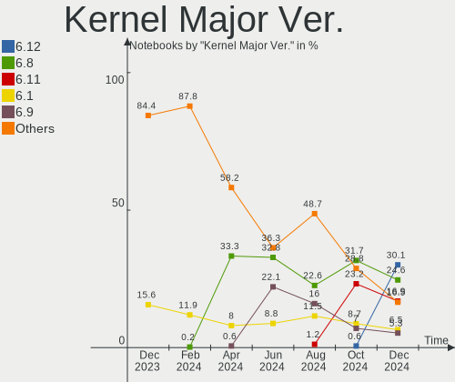
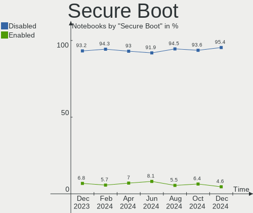
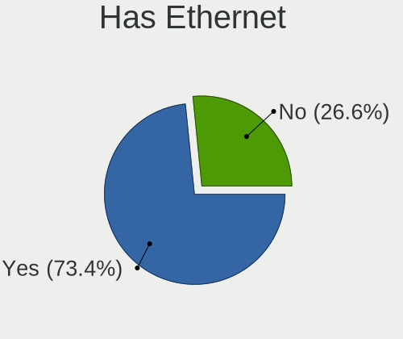
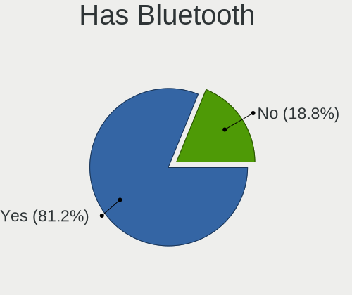
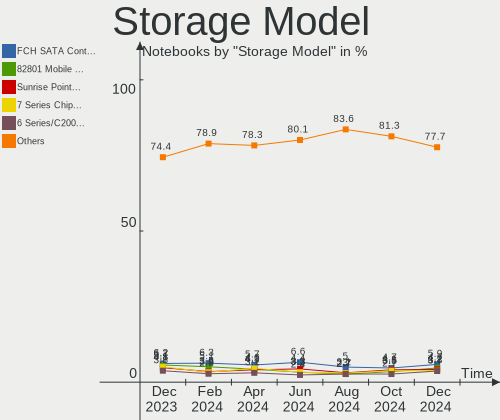
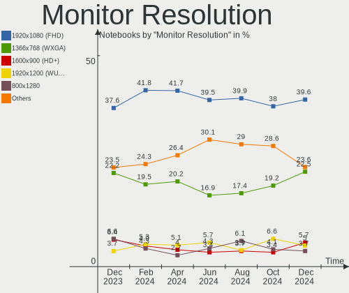
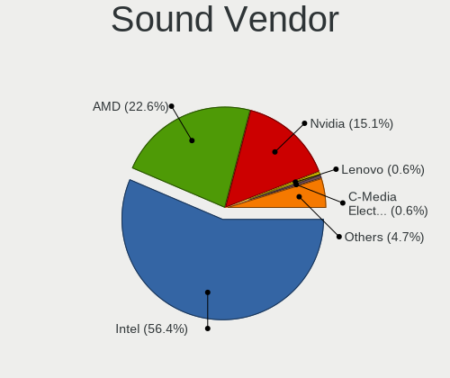
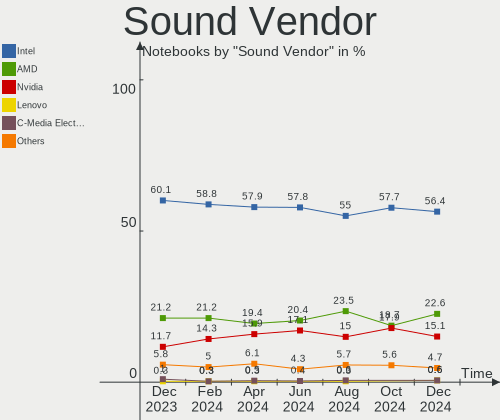
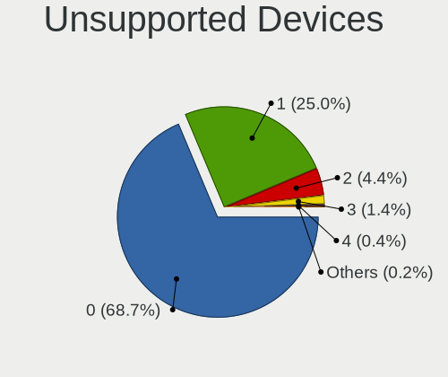

Linux in USA - Hardware Trends (Notebooks)
------------------------------------------

A project to identify most popular hardware characteristics and track their change
over time based on data collected by Linux users at https://Linux-Hardware.org.

Anyone can contribute to this report by the [hw-probe](https://github.com/linuxhw/hw-probe) tool:

    sudo -E hw-probe -all -upload

Period: Nov, 2023.

Contents
--------

* [ System ](#system)
  - [ OS                       ](#os)
  - [ OS Family                ](#os-family)
  - [ Kernel                   ](#kernel)
  - [ Kernel Family            ](#kernel-family)
  - [ Kernel Major Ver.        ](#kernel-major-ver)
  - [ Arch                     ](#arch)
  - [ DE                       ](#de)
  - [ Display Server           ](#display-server)
  - [ Display Manager          ](#display-manager)
  - [ OS Lang                  ](#os-lang)
  - [ Boot Mode                ](#boot-mode)
  - [ Filesystem               ](#filesystem)
  - [ Part. scheme             ](#part-scheme)
  - [ Dual Boot with Linux/BSD ](#dual-boot-with-linuxbsd)
  - [ Dual Boot (Win)          ](#dual-boot-win)

* [ Board ](#board)
  - [ Vendor                   ](#vendor)
  - [ Model                    ](#model)
  - [ Model Family             ](#model-family)
  - [ MFG Year                 ](#mfg-year)
  - [ Form Factor              ](#form-factor)
  - [ Secure Boot              ](#secure-boot)
  - [ Coreboot                 ](#coreboot)
  - [ RAM Size                 ](#ram-size)
  - [ RAM Used                 ](#ram-used)
  - [ Total Drives             ](#total-drives)
  - [ Has CD-ROM               ](#has-cd-rom)
  - [ Has Ethernet             ](#has-ethernet)
  - [ Has WiFi                 ](#has-wifi)
  - [ Has Bluetooth            ](#has-bluetooth)

* [ Location ](#location)
  - [ Country                  ](#country)
  - [ City                     ](#city)

* [ Drives ](#drives)
  - [ Drive Vendor             ](#drive-vendor)
  - [ Drive Model              ](#drive-model)
  - [ HDD Vendor               ](#hdd-vendor)
  - [ SSD Vendor               ](#ssd-vendor)
  - [ Drive Kind               ](#drive-kind)
  - [ Drive Connector          ](#drive-connector)
  - [ Drive Size               ](#drive-size)
  - [ Space Total              ](#space-total)
  - [ Space Used               ](#space-used)
  - [ Malfunc. Drives          ](#malfunc-drives)
  - [ Malfunc. Drive Vendor    ](#malfunc-drive-vendor)
  - [ Malfunc. HDD Vendor      ](#malfunc-hdd-vendor)
  - [ Malfunc. Drive Kind      ](#malfunc-drive-kind)
  - [ Failed Drives            ](#failed-drives)
  - [ Failed Drive Vendor      ](#failed-drive-vendor)
  - [ Drive Status             ](#drive-status)

* [ Storage controller ](#storage-controller)
  - [ Storage Vendor           ](#storage-vendor)
  - [ Storage Model            ](#storage-model)
  - [ Storage Kind             ](#storage-kind)

* [ Processor ](#processor)
  - [ CPU Vendor               ](#cpu-vendor)
  - [ CPU Model                ](#cpu-model)
  - [ CPU Model Family         ](#cpu-model-family)
  - [ CPU Cores                ](#cpu-cores)
  - [ CPU Sockets              ](#cpu-sockets)
  - [ CPU Threads              ](#cpu-threads)
  - [ CPU Op-Modes             ](#cpu-op-modes)
  - [ CPU Microcode            ](#cpu-microcode)
  - [ CPU Microarch            ](#cpu-microarch)

* [ Graphics ](#graphics)
  - [ GPU Vendor               ](#gpu-vendor)
  - [ GPU Model                ](#gpu-model)
  - [ GPU Combo                ](#gpu-combo)
  - [ GPU Driver               ](#gpu-driver)
  - [ GPU Memory               ](#gpu-memory)

* [ Monitor ](#monitor)
  - [ Monitor Vendor           ](#monitor-vendor)
  - [ Monitor Model            ](#monitor-model)
  - [ Monitor Resolution       ](#monitor-resolution)
  - [ Monitor Diagonal         ](#monitor-diagonal)
  - [ Monitor Width            ](#monitor-width)
  - [ Aspect Ratio             ](#aspect-ratio)
  - [ Monitor Area             ](#monitor-area)
  - [ Pixel Density            ](#pixel-density)
  - [ Multiple Monitors        ](#multiple-monitors)

* [ Network ](#network)
  - [ Net Controller Vendor    ](#net-controller-vendor)
  - [ Net Controller Model     ](#net-controller-model)
  - [ Wireless Vendor          ](#wireless-vendor)
  - [ Wireless Model           ](#wireless-model)
  - [ Ethernet Vendor          ](#ethernet-vendor)
  - [ Ethernet Model           ](#ethernet-model)
  - [ Net Controller Kind      ](#net-controller-kind)
  - [ Used Controller          ](#used-controller)
  - [ NICs                     ](#nics)
  - [ IPv6                     ](#ipv6)

* [ Bluetooth ](#bluetooth)
  - [ Bluetooth Vendor         ](#bluetooth-vendor)
  - [ Bluetooth Model          ](#bluetooth-model)

* [ Sound ](#sound)
  - [ Sound Vendor             ](#sound-vendor)
  - [ Sound Model              ](#sound-model)

* [ Memory ](#memory)
  - [ Memory Vendor            ](#memory-vendor)
  - [ Memory Model             ](#memory-model)
  - [ Memory Kind              ](#memory-kind)
  - [ Memory Form Factor       ](#memory-form-factor)
  - [ Memory Size              ](#memory-size)
  - [ Memory Speed             ](#memory-speed)

* [ Printers & scanners ](#printers--scanners)
  - [ Printer Vendor           ](#printer-vendor)
  - [ Printer Model            ](#printer-model)
  - [ Scanner Vendor           ](#scanner-vendor)
  - [ Scanner Model            ](#scanner-model)

* [ Camera ](#camera)
  - [ Camera Vendor            ](#camera-vendor)
  - [ Camera Model             ](#camera-model)

* [ Security ](#security)
  - [ Fingerprint Vendor       ](#fingerprint-vendor)
  - [ Fingerprint Model        ](#fingerprint-model)
  - [ Chipcard Vendor          ](#chipcard-vendor)
  - [ Chipcard Model           ](#chipcard-model)

* [ Unsupported ](#unsupported)
  - [ Unsupported Devices      ](#unsupported-devices)
  - [ Unsupported Device Types ](#unsupported-device-types)

System
------

OS
--

Installed operating systems

| Name                         | Notebooks | Percent |
|------------------------------|-----------|---------|
| Ubuntu 22.04                 | 56        | 11.59%  |
| Linux Mint 21.2              | 42        | 8.7%    |
| Fedora 39                    | 40        | 8.28%   |
| Debian 12                    | 29        | 6%      |
| Pop!_OS 22.04                | 22        | 4.55%   |
| Ubuntu 23.10                 | 21        | 4.35%   |
| Arch Rolling                 | 21        | 4.35%   |
| ArcoLinux Rolling            | 15        | 3.11%   |
| Zorin 16                     | 14        | 2.9%    |
| OpenMandriva 23.08           | 14        | 2.9%    |
| OpenMandriva 5.0             | 13        | 2.69%   |
| SteamOS 3.5.7                | 10        | 2.07%   |
| KDE neon 22.04               | 10        | 2.07%   |
| Fedora 38                    | 9         | 1.86%   |
| OpenMandriva 23.11           | 8         | 1.66%   |
| Ubuntu 20.04                 | 7         | 1.45%   |
| SteamOS 3.5.5                | 7         | 1.45%   |
| SteamOS 3.4.11               | 6         | 1.24%   |
| NixOS 23.05                  | 6         | 1.24%   |
| EndeavourOS Rolling          | 6         | 1.24%   |
| Debian                       | 6         | 1.24%   |
| Xero Rolling                 | 5         | 1.04%   |
| openSUSE Tumbleweed-XXXXXXXX | 5         | 1.04%   |
| Manjaro                      | 5         | 1.04%   |
| Kubuntu 23.10                | 5         | 1.04%   |
| Kubuntu 22.04                | 5         | 1.04%   |
| Gentoo 2.14                  | 5         | 1.04%   |
| Manjaro 23.1.0               | 4         | 0.83%   |
| LMDE 6                       | 4         | 0.83%   |
| Ubuntu 23.04                 | 3         | 0.62%   |
| SteamOS 3.6                  | 3         | 0.62%   |
| OpenMandriva 4.3             | 3         | 0.62%   |
| Lubuntu 22.04                | 3         | 0.62%   |
| Linux Mint 21.1              | 3         | 0.62%   |
| Kali 2023.3                  | 3         | 0.62%   |
| Xubuntu 22.04                | 2         | 0.41%   |
| SteamOS 3.5.6                | 2         | 0.41%   |
| SteamOS 3.5.1                | 2         | 0.41%   |
| Parrot 5.3                   | 2         | 0.41%   |
| OpenMandriva 23.03           | 2         | 0.41%   |

OS Family
---------

OS without a version

| Name             | Notebooks | Percent |
|------------------|-----------|---------|
| Ubuntu           | 89        | 18.43%  |
| Linux Mint       | 51        | 10.56%  |
| Fedora           | 51        | 10.56%  |
| OpenMandriva     | 41        | 8.49%   |
| Debian           | 36        | 7.45%   |
| SteamOS          | 32        | 6.63%   |
| Pop!_OS          | 22        | 4.55%   |
| Arch             | 21        | 4.35%   |
| ArcoLinux        | 15        | 3.11%   |
| Zorin            | 14        | 2.9%    |
| Kubuntu          | 11        | 2.28%   |
| KDE neon         | 10        | 2.07%   |
| Manjaro          | 9         | 1.86%   |
| NixOS            | 7         | 1.45%   |
| Gentoo           | 6         | 1.24%   |
| EndeavourOS      | 6         | 1.24%   |
| Xubuntu          | 5         | 1.04%   |
| Xero             | 5         | 1.04%   |
| openSUSE         | 5         | 1.04%   |
| LMDE             | 5         | 1.04%   |
| Ubuntu Unity     | 3         | 0.62%   |
| Lubuntu          | 3         | 0.62%   |
| Kali             | 3         | 0.62%   |
| Ubuntu MATE      | 2         | 0.41%   |
| Rocky Linux      | 2         | 0.41%   |
| Parrot           | 2         | 0.41%   |
| Nobara           | 2         | 0.41%   |
| MX               | 2         | 0.41%   |
| Manjaro-ARM      | 2         | 0.41%   |
| Garuda Linux     | 2         | 0.41%   |
| Elementary       | 2         | 0.41%   |
| Devuan           | 2         | 0.41%   |
| Clear Linux      | 2         | 0.41%   |
| Void Linux       | 1         | 0.21%   |
| Ultramarine      | 1         | 0.21%   |
| TUXEDO OS        | 1         | 0.21%   |
| Siduction        | 1         | 0.21%   |
| Peppermint       | 1         | 0.21%   |
| org.kde.Platform | 1         | 0.21%   |
| Oracle Linux     | 1         | 0.21%   |

Kernel
------

Version of the Linux kernel

| Version                    | Notebooks | Percent |
|----------------------------|-----------|---------|
| 6.2.0-36-generic           | 47        | 9.73%   |
| 5.15.0-88-generic          | 40        | 8.28%   |
| 6.1.0-13-amd64             | 35        | 7.25%   |
| 6.5.11-300.fc39.x86_64     | 20        | 4.14%   |
| 6.2.0-37-generic           | 19        | 3.93%   |
| 6.5.6-76060506-generic     | 17        | 3.52%   |
| 6.5.0-10-generic           | 16        | 3.31%   |
| 6.6.2-desktop-1omv2390     | 15        | 3.11%   |
| 6.4.11-desktop-1omv2390    | 13        | 2.69%   |
| 5.15.0-89-generic          | 13        | 2.69%   |
| 6.6.1-arch1-1              | 12        | 2.48%   |
| 6.5.9-arch2-1              | 10        | 2.07%   |
| 6.1.52-valve9-1-neptune-61 | 10        | 2.07%   |
| 6.1.52-valve7-1-neptune-61 | 9         | 1.86%   |
| 6.5.6-300.fc39.x86_64      | 7         | 1.45%   |
| 6.5.0-13-generic           | 7         | 1.45%   |
| 6.6.2-arch1-1              | 6         | 1.24%   |
| 6.5.12-300.fc39.x86_64     | 6         | 1.24%   |
| 5.13.0-valve37-1-neptune   | 6         | 1.24%   |
| 6.5.8-arch1-1              | 4         | 0.83%   |
| 6.2.0-26-generic           | 4         | 0.83%   |
| 5.15.0-76-generic          | 4         | 0.83%   |
| 6.6.1-desktop-1omv2390     | 3         | 0.62%   |
| 6.5.9-zen2-1-zen           | 3         | 0.62%   |
| 6.5.9-200.fc38.x86_64      | 3         | 0.62%   |
| 6.5.9-1-default            | 3         | 0.62%   |
| 6.5.11-1-MANJARO           | 3         | 0.62%   |
| 6.5.10-300.fc39.x86_64     | 3         | 0.62%   |
| 6.5.10-200.fc38.x86_64     | 3         | 0.62%   |
| 6.5.0-4-amd64              | 3         | 0.62%   |
| 6.2.0-35-generic           | 3         | 0.62%   |
| 5.19.0-32-generic          | 3         | 0.62%   |
| 6.6.2-201.fc39.x86_64      | 2         | 0.41%   |
| 6.6.2-1-default            | 2         | 0.41%   |
| 6.6.1-zen1-1-zen           | 2         | 0.41%   |
| 6.5.8-200.fc38.x86_64      | 2         | 0.41%   |
| 6.5.0-kali3-amd64          | 2         | 0.41%   |
| 6.5.0-3-amd64              | 2         | 0.41%   |
| 6.5.0-10-lowlatency        | 2         | 0.41%   |
| 6.4.8-desktop-2omv2390     | 2         | 0.41%   |

Kernel Family
-------------

Linux kernel without a distro release

| Version | Notebooks | Percent |
|---------|-----------|---------|
| 6.2.0   | 78        | 16.15%  |
| 5.15.0  | 63        | 13.04%  |
| 6.1.0   | 39        | 8.07%   |
| 6.5.0   | 37        | 7.66%   |
| 6.6.2   | 28        | 5.8%    |
| 6.5.6   | 26        | 5.38%   |
| 6.1.52  | 25        | 5.18%   |
| 6.5.11  | 24        | 4.97%   |
| 6.6.1   | 23        | 4.76%   |
| 6.5.9   | 22        | 4.55%   |
| 6.4.11  | 13        | 2.69%   |
| 6.6.0   | 8         | 1.66%   |
| 6.5.8   | 8         | 1.66%   |
| 6.5.10  | 7         | 1.45%   |
| 5.13.0  | 7         | 1.45%   |
| 6.5.12  | 6         | 1.24%   |
| 5.4.0   | 6         | 1.24%   |
| 5.19.0  | 6         | 1.24%   |
| 6.5.5   | 4         | 0.83%   |
| 5.10.0  | 4         | 0.83%   |
| 6.5.7   | 3         | 0.62%   |
| 6.1.60  | 3         | 0.62%   |
| 6.5.2   | 2         | 0.41%   |
| 6.4.8   | 2         | 0.41%   |
| 6.4.12  | 2         | 0.41%   |
| 6.2.9   | 2         | 0.41%   |
| 6.2.6   | 2         | 0.41%   |
| 6.2.16  | 2         | 0.41%   |
| 6.1.62  | 2         | 0.41%   |
| 6.1.61  | 2         | 0.41%   |
| 6.1.57  | 2         | 0.41%   |
| 5.16.7  | 2         | 0.41%   |
| 5.14.0  | 2         | 0.41%   |
| 6.6.3   | 1         | 0.21%   |
| 6.5.4   | 1         | 0.21%   |
| 6.5.3   | 1         | 0.21%   |
| 6.4.6   | 1         | 0.21%   |
| 6.4.4   | 1         | 0.21%   |
| 6.4.10  | 1         | 0.21%   |
| 6.4.0   | 1         | 0.21%   |

Kernel Major Ver.
-----------------

Linux kernel major version

| Version | Notebooks | Percent |
|---------|-----------|---------|
| 6.5     | 141       | 29.19%  |
| 6.2     | 85        | 17.6%   |
| 6.1     | 74        | 15.32%  |
| 5.15    | 64        | 13.25%  |
| 6.6     | 60        | 12.42%  |
| 6.4     | 21        | 4.35%   |
| 5.13    | 7         | 1.45%   |
| 5.4     | 6         | 1.24%   |
| 5.19    | 6         | 1.24%   |
| 5.10    | 4         | 0.83%   |
| 5.16    | 3         | 0.62%   |
| 5.14    | 3         | 0.62%   |
| 6.0     | 2         | 0.41%   |
| 6.3     | 1         | 0.21%   |
| 5.8     | 1         | 0.21%   |
| 5.18    | 1         | 0.21%   |
| 5.17    | 1         | 0.21%   |
| 5.11    | 1         | 0.21%   |
| 4.18    | 1         | 0.21%   |
| 4.15    | 1         | 0.21%   |

Arch
----

OS architecture (x86_64, i586, etc.)

| Name    | Notebooks | Percent |
|---------|-----------|---------|
| x86_64  | 479       | 99.17%  |
| aarch64 | 3         | 0.62%   |
| i686    | 1         | 0.21%   |

DE
--

Desktop Environment

| Name            | Notebooks | Percent |
|-----------------|-----------|---------|
| GNOME           | 202       | 41.82%  |
| KDE5            | 145       | 30.02%  |
| X-Cinnamon      | 47        | 9.73%   |
| XFCE            | 29        | 6%      |
| MATE            | 14        | 2.9%    |
| Unknown         | 14        | 2.9%    |
| LXQt            | 6         | 1.24%   |
| Budgie          | 5         | 1.04%   |
| sway            | 4         | 0.83%   |
| Unity           | 3         | 0.62%   |
| i3              | 3         | 0.62%   |
| Pantheon        | 2         | 0.41%   |
| GNOME Flashback | 2         | 0.41%   |
| Cinnamon        | 2         | 0.41%   |
| qtile           | 1         | 0.21%   |
| openbox         | 1         | 0.21%   |
| KDE6            | 1         | 0.21%   |
| Hyprland        | 1         | 0.21%   |
| Deepin          | 1         | 0.21%   |

Display Server
--------------

X11 or Wayland

| Name    | Notebooks | Percent |
|---------|-----------|---------|
| X11     | 273       | 56.52%  |
| Wayland | 195       | 40.37%  |
| Unknown | 8         | 1.66%   |
| Tty     | 7         | 1.45%   |

Display Manager
---------------

SDDM, LightDM, etc.

| Name    | Notebooks | Percent |
|---------|-----------|---------|
| Unknown | 202       | 41.82%  |
| SDDM    | 100       | 20.7%   |
| GDM3    | 93        | 19.25%  |
| LightDM | 56        | 11.59%  |
| GDM     | 29        | 6%      |
| SLiM    | 2         | 0.41%   |
| GREETD  | 1         | 0.21%   |

OS Lang
-------

Language

| Lang    | Notebooks | Percent |
|---------|-----------|---------|
| en_US   | 451       | 93.37%  |
| C       | 18        | 3.73%   |
| en_GB   | 3         | 0.62%   |
| Unknown | 3         | 0.62%   |
| en_CA   | 2         | 0.41%   |
| zh_CN   | 1         | 0.21%   |
| pl_PL   | 1         | 0.21%   |
| fr_FR   | 1         | 0.21%   |
| es_US   | 1         | 0.21%   |
| es_MX   | 1         | 0.21%   |
| en-US   | 1         | 0.21%   |

Boot Mode
---------

EFI or BIOS

| Mode | Notebooks | Percent |
|------|-----------|---------|
| EFI  | 273       | 56.52%  |
| BIOS | 210       | 43.48%  |

Filesystem
----------

Type of filesystem

| Type    | Notebooks | Percent |
|---------|-----------|---------|
| Ext4    | 254       | 52.59%  |
| Btrfs   | 123       | 25.47%  |
| Tmpfs   | 59        | 12.22%  |
| Overlay | 35        | 7.25%   |
| Xfs     | 7         | 1.45%   |
| F2fs    | 2         | 0.41%   |
| Zfs     | 1         | 0.21%   |
| Ext3    | 1         | 0.21%   |
| Ext2    | 1         | 0.21%   |

Part. scheme
------------

Scheme of partitioning

| Type    | Notebooks | Percent |
|---------|-----------|---------|
| GPT     | 266       | 55.07%  |
| Unknown | 186       | 38.51%  |
| MBR     | 31        | 6.42%   |

Dual Boot with Linux/BSD
------------------------

Hosting more than one Linux/BSD

| Dual boot | Notebooks | Percent |
|-----------|-----------|---------|
| No        | 428       | 88.61%  |
| Yes       | 55        | 11.39%  |

Dual Boot (Win)
---------------

Hosting Linux and Windows

| Dual boot | Notebooks | Percent |
|-----------|-----------|---------|
| No        | 406       | 84.06%  |
| Yes       | 77        | 15.94%  |

Board
-----

Vendor
------

Motherboard manufacturer

| Name                | Notebooks | Percent |
|---------------------|-----------|---------|
| Lenovo              | 101       | 20.91%  |
| Hewlett-Packard     | 93        | 19.25%  |
| Dell                | 77        | 15.94%  |
| ASUSTek Computer    | 37        | 7.66%   |
| Valve               | 33        | 6.83%   |
| Apple               | 27        | 5.59%   |
| Google              | 21        | 4.35%   |
| Acer                | 17        | 3.52%   |
| MSI                 | 13        | 2.69%   |
| Toshiba             | 11        | 2.28%   |
| Framework           | 8         | 1.66%   |
| Samsung Electronics | 6         | 1.24%   |
| GPU Company         | 5         | 1.04%   |
| Alienware           | 5         | 1.04%   |
| Unknown             | 4         | 0.83%   |
| System76            | 3         | 0.62%   |
| Sony                | 3         | 0.62%   |
| SGIN                | 2         | 0.41%   |
| Pine Microsystems   | 2         | 0.41%   |
| Notebook            | 2         | 0.41%   |
| LG Electronics      | 2         | 0.41%   |
| Gateway             | 2         | 0.41%   |
| Fujitsu             | 2         | 0.41%   |
| AMI                 | 2         | 0.41%   |
| Micro Electronics   | 1         | 0.21%   |
| HUAWEI              | 1         | 0.21%   |
| HONOR               | 1         | 0.21%   |
| Gigabyte Technology | 1         | 0.21%   |
| Eluktronics         | 1         | 0.21%   |

Model
-----

Motherboard model

| Name                                       | Notebooks | Percent |
|--------------------------------------------|-----------|---------|
| Valve Jupiter                              | 29        | 6%      |
| Apple MacBookPro11,1                       | 5         | 1.04%   |
| Unknown                                    | 5         | 1.04%   |
| Valve Galileo                              | 4         | 0.83%   |
| HP Pavilion dv6                            | 4         | 0.83%   |
| HP Notebook                                | 4         | 0.83%   |
| HP Laptop 15-dy2xxx                        | 4         | 0.83%   |
| Framework Laptop (13th Gen Intel Core)     | 3         | 0.62%   |
| Apple MacBookPro9,2                        | 3         | 0.62%   |
| Toshiba Satellite L855                     | 2         | 0.41%   |
| SGIN M15                                   | 2         | 0.41%   |
| Samsung 760XDA                             | 2         | 0.41%   |
| Pine Microsystems Pine64 Pinebook Pro      | 2         | 0.41%   |
| Notebook PA70Hx                            | 2         | 0.41%   |
| Lenovo ThinkPad T440p 20AN0069US           | 2         | 0.41%   |
| Lenovo ThinkPad E560 20EV002FUS            | 2         | 0.41%   |
| Lenovo ThinkPad 13 2nd Gen 20J10046US      | 2         | 0.41%   |
| Lenovo Legion 7 15IMH05 81YT               | 2         | 0.41%   |
| HP ZBook Studio G3                         | 2         | 0.41%   |
| HP ProBook 450 15.6 inch G9 Notebook PC    | 2         | 0.41%   |
| HP Laptop 14-fq0xxx                        | 2         | 0.41%   |
| HP EliteBook 8470p                         | 2         | 0.41%   |
| HP EliteBook 840 G5                        | 2         | 0.41%   |
| HP 2000                                    | 2         | 0.41%   |
| HP 15                                      | 2         | 0.41%   |
| GPU Company GWTN156-2BK                    | 2         | 0.41%   |
| GPU Company GWTC116-2                      | 2         | 0.41%   |
| Google Kefka                               | 2         | 0.41%   |
| Framework Laptop 13 (AMD Ryzen 7040Series) | 2         | 0.41%   |
| Framework Laptop (12th Gen Intel Core)     | 2         | 0.41%   |
| Dell XPS 15 7590                           | 2         | 0.41%   |
| Dell XPS 13 9370                           | 2         | 0.41%   |
| Dell Latitude E5450                        | 2         | 0.41%   |
| Dell Latitude 5580                         | 2         | 0.41%   |
| Dell Latitude 5400                         | 2         | 0.41%   |
| Dell Inspiron 3543                         | 2         | 0.41%   |
| ASUS VivoBook_ASUSLaptop K6602VV_K6602VV   | 2         | 0.41%   |
| ASUS ROG Zephyrus M16 GU603HE_GU603HE      | 2         | 0.41%   |
| ASUS ASUS TUF Gaming A16 FA617NS_FA617NS   | 2         | 0.41%   |
| ASUS ASUS TUF Gaming A15 FA506IU_TUF506IU  | 2         | 0.41%   |

Model Family
------------

Motherboard model prefix

| Name                     | Notebooks | Percent |
|--------------------------|-----------|---------|
| Lenovo ThinkPad          | 63        | 13.04%  |
| Dell Latitude            | 34        | 7.04%   |
| Valve Jupiter            | 29        | 6%      |
| HP Laptop                | 23        | 4.76%   |
| HP Pavilion              | 17        | 3.52%   |
| Dell Inspiron            | 15        | 3.11%   |
| Lenovo IdeaPad           | 13        | 2.69%   |
| HP EliteBook             | 12        | 2.48%   |
| Dell Precision           | 12        | 2.48%   |
| Dell XPS                 | 10        | 2.07%   |
| Acer Aspire              | 10        | 2.07%   |
| Lenovo Legion            | 9         | 1.86%   |
| ASUS VivoBook            | 9         | 1.86%   |
| Toshiba Satellite        | 8         | 1.66%   |
| Framework Laptop         | 8         | 1.66%   |
| ASUS ROG                 | 8         | 1.66%   |
| HP ProBook               | 7         | 1.45%   |
| ASUS ASUS                | 6         | 1.24%   |
| Apple MacBookPro11       | 6         | 1.24%   |
| Lenovo ThinkBook         | 5         | 1.04%   |
| HP ZBook                 | 5         | 1.04%   |
| HP Stream                | 5         | 1.04%   |
| Apple MacBookPro9        | 5         | 1.04%   |
| Unknown                  | 5         | 1.04%   |
| Valve Galileo            | 4         | 0.83%   |
| HP Notebook              | 4         | 0.83%   |
| HP ENVY                  | 4         | 0.83%   |
| ASUS ZenBook             | 3         | 0.62%   |
| Apple MacBookAir7        | 3         | 0.62%   |
| Acer Nitro               | 3         | 0.62%   |
| Toshiba QOSMIO           | 2         | 0.41%   |
| SGIN M15                 | 2         | 0.41%   |
| Samsung 760XDA           | 2         | 0.41%   |
| Pine Microsystems Pine64 | 2         | 0.41%   |
| Notebook PA70Hx          | 2         | 0.41%   |
| MSI Stealth              | 2         | 0.41%   |
| MSI Prestige             | 2         | 0.41%   |
| Lenovo Slim              | 2         | 0.41%   |
| HP Victus                | 2         | 0.41%   |
| HP Presario              | 2         | 0.41%   |

MFG Year
--------

Motherboard manufacture year

| Year    | Notebooks | Percent |
|---------|-----------|---------|
| 2023    | 76        | 15.73%  |
| 2022    | 48        | 9.94%   |
| 2020    | 46        | 9.52%   |
| 2019    | 37        | 7.66%   |
| 2017    | 36        | 7.45%   |
| 2018    | 35        | 7.25%   |
| 2021    | 34        | 7.04%   |
| 2013    | 25        | 5.18%   |
| 2012    | 25        | 5.18%   |
| 2011    | 22        | 4.55%   |
| 2015    | 21        | 4.35%   |
| 2016    | 19        | 3.93%   |
| 2014    | 19        | 3.93%   |
| 2008    | 13        | 2.69%   |
| 2010    | 10        | 2.07%   |
| 2007    | 7         | 1.45%   |
| 2009    | 6         | 1.24%   |
| Unknown | 4         | 0.83%   |

Form Factor
-----------

Physical design of the computer

| Name     | Notebooks | Percent |
|----------|-----------|---------|
| Notebook | 483       | 100%    |

Secure Boot
-----------

Enabled or disabled

| State    | Notebooks | Percent |
|----------|-----------|---------|
| Disabled | 446       | 92.34%  |
| Enabled  | 37        | 7.66%   |

Coreboot
--------

Have coreboot on board

| Used | Notebooks | Percent |
|------|-----------|---------|
| No   | 460       | 95.24%  |
| Yes  | 23        | 4.76%   |

RAM Size
--------

Total RAM memory

| Size in GB  | Notebooks | Percent |
|-------------|-----------|---------|
| 4.01-8.0    | 109       | 22.57%  |
| 8.01-16.0   | 96        | 19.88%  |
| 16.01-24.0  | 89        | 18.43%  |
| 3.01-4.0    | 75        | 15.53%  |
| 32.01-64.0  | 64        | 13.25%  |
| 64.01-256.0 | 20        | 4.14%   |
| 24.01-32.0  | 16        | 3.31%   |
| 1.01-2.0    | 10        | 2.07%   |
| 2.01-3.0    | 4         | 0.83%   |

RAM Used
--------

Used RAM memory

| Used GB    | Notebooks | Percent |
|------------|-----------|---------|
| 1.01-2.0   | 129       | 26.71%  |
| 2.01-3.0   | 125       | 25.88%  |
| 4.01-8.0   | 101       | 20.91%  |
| 3.01-4.0   | 90        | 18.63%  |
| 8.01-16.0  | 22        | 4.55%   |
| 0.51-1.0   | 12        | 2.48%   |
| 32.01-64.0 | 1         | 0.21%   |
| 24.01-32.0 | 1         | 0.21%   |
| 16.01-24.0 | 1         | 0.21%   |
| 0.01-0.5   | 1         | 0.21%   |

Total Drives
------------

Number of drives on board

| Drives | Notebooks | Percent |
|--------|-----------|---------|
| 1      | 332       | 68.74%  |
| 2      | 127       | 26.29%  |
| 3      | 16        | 3.31%   |
| 4      | 3         | 0.62%   |
| 0      | 3         | 0.62%   |
| 5      | 2         | 0.41%   |

Has CD-ROM
----------

Has CD-ROM on board

| Presented | Notebooks | Percent |
|-----------|-----------|---------|
| No        | 354       | 73.29%  |
| Yes       | 129       | 26.71%  |

Has Ethernet
------------

Has Ethernet on board

| Presented | Notebooks | Percent |
|-----------|-----------|---------|
| Yes       | 339       | 70.19%  |
| No        | 144       | 29.81%  |

Has WiFi
--------

Has WiFi module

| Presented | Notebooks | Percent |
|-----------|-----------|---------|
| Yes       | 481       | 99.59%  |
| No        | 2         | 0.41%   |

Has Bluetooth
-------------

Has Bluetooth module

| Presented | Notebooks | Percent |
|-----------|-----------|---------|
| Yes       | 396       | 81.99%  |
| No        | 87        | 18.01%  |

Location
--------

Country
-------

Geographic location (country)

| Country | Notebooks | Percent |
|---------|-----------|---------|
| USA     | 483       | 100%    |

City
----

Geographic location (city)

| City         | Notebooks | Percent |
|--------------|-----------|---------|
| Los Angeles  | 10        | 2.07%   |
| New York     | 8         | 1.66%   |
| Dallas       | 7         | 1.45%   |
| Chicago      | 7         | 1.45%   |
| Seattle      | 6         | 1.24%   |
| Minneapolis  | 6         | 1.24%   |
| Denver       | 6         | 1.24%   |
| Charlotte    | 6         | 1.24%   |
| Atlanta      | 6         | 1.24%   |
| San Diego    | 5         | 1.04%   |
| San Antonio  | 5         | 1.04%   |
| Houston      | 5         | 1.04%   |
| Bangor       | 5         | 1.04%   |
| Skokie       | 4         | 0.83%   |
| Knoxville    | 4         | 0.83%   |
| Fairfax      | 4         | 0.83%   |
| Columbus     | 4         | 0.83%   |
| Columbia     | 4         | 0.83%   |
| Vancouver    | 3         | 0.62%   |
| Tucson       | 3         | 0.62%   |
| Portland     | 3         | 0.62%   |
| Phoenix      | 3         | 0.62%   |
| Omaha        | 3         | 0.62%   |
| Olympia      | 3         | 0.62%   |
| Miami        | 3         | 0.62%   |
| Manchester   | 3         | 0.62%   |
| Indianapolis | 3         | 0.62%   |
| Hot Springs  | 3         | 0.62%   |
| Edison       | 3         | 0.62%   |
| Craigsville  | 3         | 0.62%   |
| Washington   | 2         | 0.41%   |
| Vallejo      | 2         | 0.41%   |
| Tampa        | 2         | 0.41%   |
| Sun Prairie  | 2         | 0.41%   |
| Springfield  | 2         | 0.41%   |
| Sanford      | 2         | 0.41%   |
| San Jose     | 2         | 0.41%   |
| Salem        | 2         | 0.41%   |
| Rochester    | 2         | 0.41%   |
| Raleigh      | 2         | 0.41%   |

Drives
------

Drive Vendor
------------

Hard drive vendors

| Vendor                      | Notebooks | Drives | Percent |
|-----------------------------|-----------|--------|---------|
| Samsung Electronics         | 111       | 126    | 18.02%  |
| Unknown                     | 59        | 64     | 9.58%   |
| WDC                         | 57        | 57     | 9.25%   |
| Sandisk                     | 48        | 53     | 7.79%   |
| Seagate                     | 34        | 36     | 5.52%   |
| Toshiba                     | 29        | 29     | 4.71%   |
| SK hynix                    | 28        | 28     | 4.55%   |
| Micron Technology           | 23        | 23     | 3.73%   |
| Phison Electronics          | 21        | 21     | 3.41%   |
| Intel                       | 17        | 20     | 2.76%   |
| Crucial                     | 17        | 18     | 2.76%   |
| Apple                       | 17        | 21     | 2.76%   |
| HGST                        | 16        | 17     | 2.6%    |
| Kingston                    | 14        | 15     | 2.27%   |
| Unknown                     | 13        | 13     | 2.11%   |
| China                       | 12        | 13     | 1.95%   |
| KIOXIA                      | 9         | 9      | 1.46%   |
| Hitachi                     | 8         | 8      | 1.3%    |
| SPCC                        | 6         | 6      | 0.97%   |
| Micron/Crucial Technology   | 6         | 6      | 0.97%   |
| PNY                         | 5         | 5      | 0.81%   |
| O2 Micro                    | 5         | 5      | 0.81%   |
| Kingston Technology Company | 5         | 5      | 0.81%   |
| LITEON                      | 4         | 4      | 0.65%   |
| A-DATA Technology           | 4         | 4      | 0.65%   |
| Transcend                   | 3         | 3      | 0.49%   |
| Team                        | 2         | 2      | 0.32%   |
| SSK                         | 2         | 2      | 0.32%   |
| Silicon Motion              | 2         | 2      | 0.32%   |
| SABRENT                     | 2         | 2      | 0.32%   |
| Realtek Semiconductor       | 2         | 2      | 0.32%   |
| LITEONIT                    | 2         | 2      | 0.32%   |
| Lexar                       | 2         | 2      | 0.32%   |
| JMicron Technology          | 2         | 2      | 0.32%   |
| Fujitsu                     | 2         | 2      | 0.32%   |
| Dell                        | 2         | 2      | 0.32%   |
| Wibtek                      | 1         | 1      | 0.16%   |
| Visiontek                   | 1         | 1      | 0.16%   |
| USB3.0                      | 1         | 1      | 0.16%   |
| Union Memory                | 1         | 1      | 0.16%   |

Drive Model
-----------

Hard drive models

| Model                                               | Notebooks | Percent |
|-----------------------------------------------------|-----------|---------|
| Samsung NVMe SSD Controller SM981/PM981/PM983 250GB | 17        | 2.64%   |
| Samsung NVMe SSD Controller PM9A1/PM9A3/980PRO 2TB  | 13        | 2.02%   |
| Phison PS5013 E13 NVMe Controller 512GB             | 13        | 2.02%   |
| Unknown                                             | 13        | 2.02%   |
| Unknown MMC Card  64GB                              | 12        | 1.87%   |
| Unknown MMC Card  512GB                             | 8         | 1.24%   |
| Unknown MMC Card  256GB                             | 6         | 0.93%   |
| Unknown MMC Card  128GB                             | 6         | 0.93%   |
| Seagate ST1000LM035-1RK172 1TB                      | 6         | 0.93%   |
| Unknown SD/MMC/MS PRO 128GB                         | 5         | 0.78%   |
| Unknown MMC Card  32GB                              | 5         | 0.78%   |
| Sandisk WD_BLACK SN770 1TB                          | 5         | 0.78%   |
| O2 Micro E2M2 64GB                                  | 5         | 0.78%   |
| Micron/Crucial P2 NVMe PCIe SSD 1TB                 | 5         | 0.78%   |
| Toshiba XG6 NVMe SSD Controller 512GB               | 4         | 0.62%   |
| Toshiba MQ01ABD100 1TB                              | 4         | 0.62%   |
| Sandisk WD Blue SN550 NVMe SSD 512GB                | 4         | 0.62%   |
| Sandisk WD Black SN750 / PC SN730 NVMe SSD 500GB    | 4         | 0.62%   |
| Kingston SA400S37120G 120GB SSD                     | 4         | 0.62%   |
| HGST HTS721010A9E630 1TB                            | 4         | 0.62%   |
| WDC WD3200BEKT-08PVMT1 320GB                        | 3         | 0.47%   |
| Toshiba MQ04ABF100 1TB                              | 3         | 0.47%   |
| Toshiba MQ01ABF050 500GB                            | 3         | 0.47%   |
| Toshiba MK3261GSYN 320GB                            | 3         | 0.47%   |
| SPCC Solid State Disk 512GB                         | 3         | 0.47%   |
| SK hynix PC801 NVMe 1TB                             | 3         | 0.47%   |
| Seagate ST500LT012-1DG142 500GB                     | 3         | 0.47%   |
| Seagate ST1000LM049-2GH172 1TB                      | 3         | 0.47%   |
| SanDisk NVMe SSD Drive 1TB                          | 3         | 0.47%   |
| Samsung SSD 980 1TB                                 | 3         | 0.47%   |
| Samsung SSD 970 EVO Plus 1TB                        | 3         | 0.47%   |
| Samsung SSD 870 EVO 1TB                             | 3         | 0.47%   |
| Samsung SSD 860 EVO 500GB                           | 3         | 0.47%   |
| Samsung MZ9LQ256HBJD-00BVL 256GB                    | 3         | 0.47%   |
| Phison E12 NVMe Controller 512GB                    | 3         | 0.47%   |
| Micron 2450_MTFDKBA1T0TFK 1TB                       | 3         | 0.47%   |
| KIOXIA KBG50ZNV256G 256GB                           | 3         | 0.47%   |
| Intel SSD Pro 7600p/760p/E 6100p Series 1TB         | 3         | 0.47%   |
| HGST HTS541075A9E680 752GB                          | 3         | 0.47%   |
| Crucial CT500MX500SSD1 500GB                        | 3         | 0.47%   |

HDD Vendor
----------

Hard disk drive vendors

| Vendor              | Notebooks | Drives | Percent |
|---------------------|-----------|--------|---------|
| WDC                 | 34        | 34     | 27.87%  |
| Seagate             | 33        | 34     | 27.05%  |
| Toshiba             | 17        | 17     | 13.93%  |
| HGST                | 16        | 17     | 13.11%  |
| Hitachi             | 8         | 8      | 6.56%   |
| Unknown             | 5         | 5      | 4.1%    |
| Samsung Electronics | 2         | 2      | 1.64%   |
| Fujitsu             | 2         | 2      | 1.64%   |
| USB3.0              | 1         | 1      | 0.82%   |
| TO Exter            | 1         | 1      | 0.82%   |
| SABRENT             | 1         | 1      | 0.82%   |
| External            | 1         | 1      | 0.82%   |
| Apple               | 1         | 1      | 0.82%   |

SSD Vendor
----------

Solid state drive vendors

| Vendor              | Notebooks | Drives | Percent |
|---------------------|-----------|--------|---------|
| Samsung Electronics | 41        | 43     | 27.33%  |
| WDC                 | 12        | 12     | 8%      |
| China               | 12        | 13     | 8%      |
| Kingston            | 10        | 11     | 6.67%   |
| Crucial             | 10        | 10     | 6.67%   |
| SanDisk             | 9         | 9      | 6%      |
| Apple               | 8         | 8      | 5.33%   |
| Micron Technology   | 6         | 6      | 4%      |
| PNY                 | 5         | 5      | 3.33%   |
| SPCC                | 4         | 4      | 2.67%   |
| A-DATA Technology   | 4         | 4      | 2.67%   |
| Transcend           | 3         | 3      | 2%      |
| Toshiba             | 3         | 3      | 2%      |
| LITEON              | 3         | 3      | 2%      |
| SK hynix            | 2         | 2      | 1.33%   |
| LITEONIT            | 2         | 2      | 1.33%   |
| Lexar               | 2         | 2      | 1.33%   |
| Intel               | 2         | 2      | 1.33%   |
| Wibtek              | 1         | 1      | 0.67%   |
| Union Memory        | 1         | 1      | 0.67%   |
| Team                | 1         | 1      | 0.67%   |
| Patriot             | 1         | 1      | 0.67%   |
| NGFF                | 1         | 1      | 0.67%   |
| Mushkin             | 1         | 2      | 0.67%   |
| Jumper              | 1         | 1      | 0.67%   |
| Hewlett-Packard     | 1         | 1      | 0.67%   |
| EDILOCA             | 1         | 1      | 0.67%   |
| Dogfish             | 1         | 1      | 0.67%   |
| Dell                | 1         | 1      | 0.67%   |
| Aura                | 1         | 1      | 0.67%   |

Drive Kind
----------

HDD or SSD

| Kind    | Notebooks | Drives | Percent |
|---------|-----------|--------|---------|
| NVMe    | 249       | 294    | 42.78%  |
| SSD     | 142       | 155    | 24.4%   |
| HDD     | 117       | 124    | 20.1%   |
| MMC     | 64        | 70     | 11%     |
| Unknown | 10        | 12     | 1.72%   |

Drive Connector
---------------

SATA, SAS, NVMe, etc.

| Type | Notebooks | Drives | Percent |
|------|-----------|--------|---------|
| NVMe | 246       | 291    | 43.16%  |
| SATA | 233       | 263    | 40.88%  |
| MMC  | 64        | 70     | 11.23%  |
| SAS  | 27        | 31     | 4.74%   |

Drive Size
----------

Size of hard drive

| Size in TB | Notebooks | Drives | Percent |
|------------|-----------|--------|---------|
| 0.01-0.5   | 157       | 172    | 60.62%  |
| 0.51-1.0   | 78        | 82     | 30.12%  |
| 1.01-2.0   | 16        | 16     | 6.18%   |
| 3.01-4.0   | 5         | 5      | 1.93%   |
| 4.01-10.0  | 3         | 4      | 1.16%   |

Space Total
-----------

Amount of disk space available on the file system

| Size in GB     | Notebooks | Percent |
|----------------|-----------|---------|
| 101-250        | 113       | 23.4%   |
| 501-1000       | 103       | 21.33%  |
| 251-500        | 100       | 20.7%   |
| 1001-2000      | 52        | 10.77%  |
| 1-20           | 37        | 7.66%   |
| More than 3000 | 20        | 4.14%   |
| 21-50          | 17        | 3.52%   |
| 51-100         | 16        | 3.31%   |
| Unknown        | 16        | 3.31%   |
| 2001-3000      | 9         | 1.86%   |

Space Used
----------

Amount of used disk space

| Used GB        | Notebooks | Percent |
|----------------|-----------|---------|
| 1-20           | 156       | 32.3%   |
| 21-50          | 97        | 20.08%  |
| 101-250        | 66        | 13.66%  |
| 51-100         | 58        | 12.01%  |
| 251-500        | 35        | 7.25%   |
| 501-1000       | 35        | 7.25%   |
| 1001-2000      | 16        | 3.31%   |
| Unknown        | 16        | 3.31%   |
| More than 3000 | 3         | 0.62%   |
| 0              | 1         | 0.21%   |

Malfunc. Drives
---------------

Drive models with a malfunction

| Model                                            | Notebooks | Drives | Percent |
|--------------------------------------------------|-----------|--------|---------|
| WDC WD3200BEKT-08PVMT1 320GB                     | 1         | 1      | 4.76%   |
| WDC WD Green 2.5 240GB SSD                       | 1         | 1      | 4.76%   |
| Transcend TS128GMTS430S 128GB SSD                | 1         | 1      | 4.76%   |
| Toshiba MQ01ABD100 1TB                           | 1         | 1      | 4.76%   |
| Toshiba MK5056GSY 500GB                          | 1         | 1      | 4.76%   |
| Toshiba MK3261GSYN 320GB                         | 1         | 1      | 4.76%   |
| Toshiba KSG60ZMV256G M.2 2280 256GB SSD          | 1         | 1      | 4.76%   |
| Seagate ST9640320AS 640GB                        | 1         | 1      | 4.76%   |
| Seagate ST1000LM024 HN-M101MBB 1TB               | 1         | 1      | 4.76%   |
| Sandisk WD Blue SN550 NVMe SSD 512GB             | 1         | 1      | 4.76%   |
| Samsung Electronics SSD 980 PRO 500GB            | 1         | 1      | 4.76%   |
| Samsung Electronics SSD 970 EVO 500GB            | 1         | 1      | 4.76%   |
| Samsung Electronics SSD 870 EVO 1TB              | 1         | 1      | 4.76%   |
| Samsung Electronics MZNLH128HBHQ-000H1 128GB SSD | 1         | 1      | 4.76%   |
| Samsung Electronics HM160HI 160GB                | 1         | 1      | 4.76%   |
| LITEON IT LST-16S9G-HP 16GB SSD                  | 1         | 1      | 4.76%   |
| HGST HTS545050A7E680 500GB                       | 1         | 1      | 4.76%   |
| HGST HTS541075A9E680 752GB                       | 1         | 1      | 4.76%   |
| HGST HTS541010A9E680 1TB                         | 1         | 1      | 4.76%   |
| Crucial CT128MX100SSD1 128GB                     | 1         | 1      | 4.76%   |
| Aura Pro S MC258 1TB SSD                         | 1         | 1      | 4.76%   |

Malfunc. Drive Vendor
---------------------

Vendors of faulty drives

| Vendor              | Notebooks | Drives | Percent |
|---------------------|-----------|--------|---------|
| Samsung Electronics | 5         | 5      | 23.81%  |
| Toshiba             | 4         | 4      | 19.05%  |
| HGST                | 3         | 3      | 14.29%  |
| WDC                 | 2         | 2      | 9.52%   |
| Seagate             | 2         | 2      | 9.52%   |
| Transcend           | 1         | 1      | 4.76%   |
| Sandisk             | 1         | 1      | 4.76%   |
| LITEON              | 1         | 1      | 4.76%   |
| Crucial             | 1         | 1      | 4.76%   |
| Aura                | 1         | 1      | 4.76%   |

Malfunc. HDD Vendor
-------------------

Vendors of faulty HDD drives

| Vendor              | Notebooks | Drives | Percent |
|---------------------|-----------|--------|---------|
| Toshiba             | 3         | 3      | 30%     |
| HGST                | 3         | 3      | 30%     |
| Seagate             | 2         | 2      | 20%     |
| WDC                 | 1         | 1      | 10%     |
| Samsung Electronics | 1         | 1      | 10%     |

Malfunc. Drive Kind
-------------------

Kinds of faulty drives

| Kind | Notebooks | Drives | Percent |
|------|-----------|--------|---------|
| HDD  | 10        | 10     | 47.62%  |
| SSD  | 8         | 8      | 38.1%   |
| NVMe | 3         | 3      | 14.29%  |

Failed Drives
-------------

Failed drive models

| Model                          | Notebooks | Drives | Percent |
|--------------------------------|-----------|--------|---------|
| Intel SSDSCKKF256H6 SATA 256GB | 1         | 1      | 100%    |

Failed Drive Vendor
-------------------

Failed drive vendors

| Vendor | Notebooks | Drives | Percent |
|--------|-----------|--------|---------|
| Intel  | 1         | 1      | 100%    |

Drive Status
------------

Number of failed and malfunc. drives

| Status   | Notebooks | Drives | Percent |
|----------|-----------|--------|---------|
| Detected | 286       | 385    | 56.86%  |
| Works    | 196       | 248    | 38.97%  |
| Malfunc  | 20        | 21     | 3.98%   |
| Failed   | 1         | 1      | 0.2%    |

Storage controller
------------------

Storage Vendor
--------------

Storage controller vendors

| Vendor                         | Notebooks | Percent |
|--------------------------------|-----------|---------|
| Intel                          | 256       | 45.71%  |
| Samsung Electronics            | 72        | 12.86%  |
| SanDisk                        | 49        | 8.75%   |
| AMD                            | 46        | 8.21%   |
| SK hynix                       | 26        | 4.64%   |
| Phison Electronics             | 25        | 4.46%   |
| Micron Technology              | 17        | 3.04%   |
| Micron/Crucial Technology      | 12        | 2.14%   |
| Toshiba America Info Systems   | 9         | 1.61%   |
| KIOXIA                         | 9         | 1.61%   |
| Kingston Technology Company    | 9         | 1.61%   |
| Apple                          | 7         | 1.25%   |
| O2 Micro                       | 5         | 0.89%   |
| Realtek Semiconductor          | 3         | 0.54%   |
| Marvell Technology Group       | 3         | 0.54%   |
| Solid State Storage Technology | 2         | 0.36%   |
| Silicon Motion                 | 2         | 0.36%   |
| Nvidia                         | 2         | 0.36%   |
| INNOGRIT                       | 2         | 0.36%   |
| Solidigm                       | 1         | 0.18%   |
| Seagate Technology             | 1         | 0.18%   |
| Lite-On Technology             | 1         | 0.18%   |
| ASMedia Technology             | 1         | 0.18%   |

Storage Model
-------------

Storage controller models

| Model                                                                          | Notebooks | Percent |
|--------------------------------------------------------------------------------|-----------|---------|
| AMD FCH SATA Controller [AHCI mode]                                            | 39        | 6.53%   |
| Intel 82801 Mobile SATA Controller [RAID mode]                                 | 31        | 5.19%   |
| Intel Sunrise Point-LP SATA Controller [AHCI mode]                             | 30        | 5.03%   |
| Samsung NVMe SSD Controller SM981/PM981/PM983                                  | 29        | 4.86%   |
| Intel Volume Management Device NVMe RAID Controller                            | 22        | 3.69%   |
| Intel 7 Series Chipset Family 6-port SATA Controller [AHCI mode]               | 22        | 3.69%   |
| Samsung NVMe SSD Controller PM9A1/PM9A3/980PRO                                 | 20        | 3.35%   |
| Samsung NVMe SSD Controller 980 (DRAM-less)                                    | 18        | 3.02%   |
| Intel 6 Series/C200 Series Chipset Family 6 port Mobile SATA AHCI Controller   | 18        | 3.02%   |
| SanDisk WD Black SN770 / PC SN740 256GB / PC SN560 (DRAM-less) NVMe SSD        | 16        | 2.68%   |
| Phison PS5013-E13 PCIe3 NVMe Controller (DRAM-less)                            | 14        | 2.35%   |
| Intel 8 Series/C220 Series Chipset Family 6-port SATA Controller 1 [AHCI mode] | 14        | 2.35%   |
| SK hynix Gold P31/BC711/PC711 NVMe Solid State Drive                           | 13        | 2.18%   |
| Intel Wildcat Point-LP SATA Controller [AHCI Mode]                             | 11        | 1.84%   |
| Intel Cannon Lake Mobile PCH SATA AHCI Controller                              | 11        | 1.84%   |
| Intel 8 Series SATA Controller 1 [AHCI mode]                                   | 11        | 1.84%   |
| SanDisk Ultra 3D / WD Blue SN550 NVMe SSD                                      | 9         | 1.51%   |
| Micron/Crucial P2 [Nick P2] / P3 / P3 Plus NVMe PCIe SSD (DRAM-less)           | 9         | 1.51%   |
| SK hynix Platinum P41/PC801 NVMe Solid State Drive                             | 8         | 1.34%   |
| Intel Volume Management Device NVMe RAID Controller Intel Corporation          | 8         | 1.34%   |
| Intel 82801IBM/IEM (ICH9M/ICH9M-E) 4 port SATA Controller [AHCI mode]          | 8         | 1.34%   |
| Intel 400 Series Chipset Family SATA AHCI Controller                           | 7         | 1.17%   |
| Toshiba America Info Systems XG6 NVMe SSD Controller                           | 6         | 1.01%   |
| SanDisk Extreme Pro / WD Black SN750 / PC SN730 / Red SN700 NVMe SSD           | 6         | 1.01%   |
| KIOXIA NVMe SSD Controller BG5 (DRAM-less)                                     | 6         | 1.01%   |
| Intel Tiger Lake-LP SATA Controller                                            | 6         | 1.01%   |
| Intel HM170/QM170 Chipset SATA Controller [AHCI Mode]                          | 6         | 1.01%   |
| Intel 82801HM/HEM (ICH8M/ICH8M-E) IDE Controller                               | 6         | 1.01%   |
| Phison E12 NVMe Controller                                                     | 5         | 0.84%   |
| O2 Micro FORESEE E2M2 NVMe SSD                                                 | 5         | 0.84%   |
| Micron 3400 NVMe SSD [Hendrix]                                                 | 5         | 0.84%   |
| Micron 2400 NVMe SSD (DRAM-less)                                               | 5         | 0.84%   |
| Intel Tiger Lake SATA AHCI Controller                                          | 5         | 0.84%   |
| Intel Celeron/Pentium Silver Processor SATA Controller                         | 5         | 0.84%   |
| Samsung NVMe SSD Controller SM961/PM961/SM963                                  | 4         | 0.67%   |
| Micron 2450 NVMe SSD [HendrixV] (DRAM-less)                                    | 4         | 0.67%   |
| Intel SSD DC P4101/Pro 7600p/760p/E 6100p Series                               | 4         | 0.67%   |
| Intel SSD 670p Series [Keystone Harbor]                                        | 4         | 0.67%   |
| Intel Q170/Q150/B150/H170/H110/Z170/CM236 Chipset SATA Controller [AHCI Mode]  | 4         | 0.67%   |
| Intel Ice Lake-LP SATA Controller [AHCI mode]                                  | 4         | 0.67%   |

Storage Kind
------------

Kind of storage controller (IDE, SATA, NVMe, SAS, ...)

| Kind | Notebooks | Percent |
|------|-----------|---------|
| NVMe | 245       | 43.52%  |
| SATA | 239       | 42.45%  |
| RAID | 64        | 11.37%  |
| IDE  | 15        | 2.66%   |

Processor
---------

CPU Vendor
----------

Processor vendors

| Vendor  | Notebooks | Percent |
|---------|-----------|---------|
| Intel   | 368       | 76.19%  |
| AMD     | 112       | 23.19%  |
| ARM     | 2         | 0.41%   |
| Unknown | 1         | 0.21%   |

CPU Model
---------

Processor models

| Model                                      | Notebooks | Percent |
|--------------------------------------------|-----------|---------|
| AMD Custom APU 0405                        | 33        | 6.83%   |
| Intel Core i7-8650U CPU @ 1.90GHz          | 9         | 1.86%   |
| Intel Celeron N4020 CPU @ 1.10GHz          | 7         | 1.45%   |
| Intel 11th Gen Core i3-1115G4 @ 3.00GHz    | 7         | 1.45%   |
| Intel Core i7-10750H CPU @ 2.60GHz         | 6         | 1.24%   |
| Intel Core i5-3210M CPU @ 2.50GHz          | 6         | 1.24%   |
| Intel 13th Gen Core i9-13900H              | 6         | 1.24%   |
| Intel 12th Gen Core i7-12700H              | 6         | 1.24%   |
| Intel Core i5-8250U CPU @ 1.60GHz          | 5         | 1.04%   |
| Intel Core i3-8130U CPU @ 2.20GHz          | 5         | 1.04%   |
| Intel 11th Gen Core i7-11800H @ 2.30GHz    | 5         | 1.04%   |
| Intel 11th Gen Core i7-1165G7 @ 2.80GHz    | 5         | 1.04%   |
| Intel 11th Gen Core i5-1135G7 @ 2.40GHz    | 5         | 1.04%   |
| Intel Core i7-8550U CPU @ 1.80GHz          | 4         | 0.83%   |
| Intel Core i7-7820HQ CPU @ 2.90GHz         | 4         | 0.83%   |
| Intel Core i7-6600U CPU @ 2.60GHz          | 4         | 0.83%   |
| Intel Core i7-6500U CPU @ 2.50GHz          | 4         | 0.83%   |
| Intel Core i7-4810MQ CPU @ 2.80GHz         | 4         | 0.83%   |
| Intel Core i7-4700MQ CPU @ 2.40GHz         | 4         | 0.83%   |
| Intel Core i5-7200U CPU @ 2.50GHz          | 4         | 0.83%   |
| Intel Core i5-6200U CPU @ 2.30GHz          | 4         | 0.83%   |
| Intel Core i5-4278U CPU @ 2.60GHz          | 4         | 0.83%   |
| Intel Core i5-2520M CPU @ 2.50GHz          | 4         | 0.83%   |
| Intel Core i5-2410M CPU @ 2.30GHz          | 4         | 0.83%   |
| Intel Core i5 CPU M 560 @ 2.67GHz          | 4         | 0.83%   |
| Intel 12th Gen Core i5-1235U               | 4         | 0.83%   |
| AMD Ryzen 7 PRO 6850U with Radeon Graphics | 4         | 0.83%   |
| Intel Core i7-9750H CPU @ 2.60GHz          | 3         | 0.62%   |
| Intel Core i7-7700HQ CPU @ 2.80GHz         | 3         | 0.62%   |
| Intel Core i7-6700HQ CPU @ 2.60GHz         | 3         | 0.62%   |
| Intel Core i7-5600U CPU @ 2.60GHz          | 3         | 0.62%   |
| Intel Core i7-10850H CPU @ 2.70GHz         | 3         | 0.62%   |
| Intel Core i5-9300H CPU @ 2.40GHz          | 3         | 0.62%   |
| Intel Core i5-8350U CPU @ 1.70GHz          | 3         | 0.62%   |
| Intel Core i5-8300H CPU @ 2.30GHz          | 3         | 0.62%   |
| Intel Core i5-6300U CPU @ 2.40GHz          | 3         | 0.62%   |
| Intel Core i5-5250U CPU @ 1.60GHz          | 3         | 0.62%   |
| Intel Core i5-4200M CPU @ 2.50GHz          | 3         | 0.62%   |
| Intel Core i5-2540M CPU @ 2.60GHz          | 3         | 0.62%   |
| Intel Core i5-1035G1 CPU @ 1.00GHz         | 3         | 0.62%   |

CPU Model Family
----------------

Processor model prefix

| Model                   | Notebooks | Percent |
|-------------------------|-----------|---------|
| Other                   | 123       | 25.47%  |
| Intel Core i7           | 98        | 20.29%  |
| Intel Core i5           | 94        | 19.46%  |
| Intel Celeron           | 32        | 6.63%   |
| Intel Core i3           | 24        | 4.97%   |
| AMD Ryzen 7             | 20        | 4.14%   |
| AMD Ryzen 5             | 13        | 2.69%   |
| Intel Core 2 Duo        | 12        | 2.48%   |
| Intel Pentium           | 9         | 1.86%   |
| AMD Ryzen 7 PRO         | 7         | 1.45%   |
| AMD A6                  | 7         | 1.45%   |
| Intel Core i9           | 5         | 1.04%   |
| AMD Ryzen 9             | 5         | 1.04%   |
| AMD Ryzen 3             | 5         | 1.04%   |
| AMD A8                  | 4         | 0.83%   |
| AMD E2                  | 3         | 0.62%   |
| AMD E1                  | 3         | 0.62%   |
| AMD Athlon              | 3         | 0.62%   |
| Intel Pentium Dual      | 2         | 0.41%   |
| Intel Core m3           | 2         | 0.41%   |
| Intel Core M            | 2         | 0.41%   |
| AMD Ryzen 5 PRO         | 2         | 0.41%   |
| Intel Xeon              | 1         | 0.21%   |
| Intel Pentium Dual-Core | 1         | 0.21%   |
| Intel Atom              | 1         | 0.21%   |
| AMD Turion II           | 1         | 0.21%   |
| AMD Sempron             | 1         | 0.21%   |
| AMD Athlon II           | 1         | 0.21%   |
| AMD A4                  | 1         | 0.21%   |
| AMD A12                 | 1         | 0.21%   |

CPU Cores
---------

Number of processor cores

| Number | Notebooks | Percent |
|--------|-----------|---------|
| 2      | 195       | 40.37%  |
| 4      | 157       | 32.51%  |
| 8      | 44        | 9.11%   |
| 6      | 32        | 6.63%   |
| 14     | 20        | 4.14%   |
| 10     | 15        | 3.11%   |
| 12     | 12        | 2.48%   |
| 1      | 5         | 1.04%   |
| 24     | 2         | 0.41%   |
| 16     | 1         | 0.21%   |

CPU Sockets
-----------

Number of sockets

| Number | Notebooks | Percent |
|--------|-----------|---------|
| 1      | 483       | 100%    |

CPU Threads
-----------

Threads per core (Hyper-Threading)

| Number | Notebooks | Percent |
|--------|-----------|---------|
| 2      | 392       | 81.16%  |
| 1      | 91        | 18.84%  |

CPU Op-Modes
------------

CPU Operation Modes (32-bit, 64-bit)

| Op mode        | Notebooks | Percent |
|----------------|-----------|---------|
| 32-bit, 64-bit | 480       | 99.38%  |
| 64-bit         | 3         | 0.62%   |

CPU Microcode
-------------

Microcode number

| Number     | Notebooks | Percent |
|------------|-----------|---------|
| Unknown    | 329       | 68.12%  |
| 0x206a7    | 10        | 2.07%   |
| 0x08108109 | 8         | 1.66%   |
| 0x40651    | 7         | 1.45%   |
| 0x0a404102 | 7         | 1.45%   |
| 0x806ea    | 6         | 1.24%   |
| 0x706a8    | 6         | 1.24%   |
| 0x806e9    | 5         | 1.04%   |
| 0x306c3    | 5         | 1.04%   |
| 0x306a9    | 5         | 1.04%   |
| 0x1067a    | 5         | 1.04%   |
| 0xb06a2    | 4         | 0.83%   |
| 0x806ec    | 4         | 0.83%   |
| 0x0a704103 | 4         | 0.83%   |
| 0x0a50000d | 4         | 0.83%   |
| 0x906a3    | 3         | 0.62%   |
| 0x806d1    | 3         | 0.62%   |
| 0x806c1    | 3         | 0.62%   |
| 0x406e3    | 3         | 0.62%   |
| 0x306d4    | 3         | 0.62%   |
| 0x06006705 | 3         | 0.62%   |
| 0xa0652    | 2         | 0.41%   |
| 0x906ea    | 2         | 0.41%   |
| 0x6fd      | 2         | 0.41%   |
| 0x406c4    | 2         | 0.41%   |
| 0x406c3    | 2         | 0.41%   |
| 0x30678    | 2         | 0.41%   |
| 0x20655    | 2         | 0.41%   |
| 0x0a50000c | 2         | 0.41%   |
| 0x08608103 | 2         | 0.41%   |
| 0x08600106 | 2         | 0.41%   |
| 0x08600104 | 2         | 0.41%   |
| 0x08108102 | 2         | 0.41%   |
| 0x07030106 | 2         | 0.41%   |
| 0x0700010f | 2         | 0.41%   |
| 0x06001119 | 2         | 0.41%   |
| 0x010000c8 | 2         | 0.41%   |
| 0xb06a3    | 1         | 0.21%   |
| 0xb0671    | 1         | 0.21%   |
| 0x906a4    | 1         | 0.21%   |

CPU Microarch
-------------

Microarchitecture

| Name             | Notebooks | Percent |
|------------------|-----------|---------|
| KabyLake         | 83        | 17.18%  |
| Unknown          | 77        | 15.94%  |
| Alderlake Hybrid | 38        | 7.87%   |
| Haswell          | 35        | 7.25%   |
| Skylake          | 26        | 5.38%   |
| SandyBridge      | 24        | 4.97%   |
| IvyBridge        | 23        | 4.76%   |
| TigerLake        | 20        | 4.14%   |
| Broadwell        | 17        | 3.52%   |
| Penryn           | 13        | 2.69%   |
| Icelake          | 13        | 2.69%   |
| CometLake        | 13        | 2.69%   |
| Zen+             | 12        | 2.48%   |
| Silvermont       | 11        | 2.28%   |
| Goldmont plus    | 11        | 2.28%   |
| Zen 2            | 10        | 2.07%   |
| Zen 3            | 9         | 1.86%   |
| Westmere         | 8         | 1.66%   |
| Excavator        | 7         | 1.45%   |
| Goldmont         | 6         | 1.24%   |
| Core             | 5         | 1.04%   |
| Puma             | 3         | 0.62%   |
| Piledriver       | 3         | 0.62%   |
| Jaguar           | 3         | 0.62%   |
| Bobcat           | 3         | 0.62%   |
| Zen              | 2         | 0.41%   |
| Nehalem          | 2         | 0.41%   |
| K10 Llano        | 2         | 0.41%   |
| K10              | 2         | 0.41%   |
| Tremont          | 1         | 0.21%   |
| K8 & K10 hybrid  | 1         | 0.21%   |

Graphics
--------

GPU Vendor
----------

Vendors of graphics cards

| Vendor | Notebooks | Percent |
|--------|-----------|---------|
| Intel  | 342       | 57.48%  |
| Nvidia | 129       | 21.68%  |
| AMD    | 124       | 20.84%  |

GPU Model
---------

Graphics card models

| Model                                                                                    | Notebooks | Percent |
|------------------------------------------------------------------------------------------|-----------|---------|
| AMD VanGogh [AMD Custom GPU 0405]                                                        | 29        | 4.8%    |
| Intel UHD Graphics 620                                                                   | 26        | 4.3%    |
| Intel 2nd Generation Core Processor Family Integrated Graphics Controller                | 24        | 3.97%   |
| Intel 3rd Gen Core processor Graphics Controller                                         | 22        | 3.64%   |
| Intel Haswell-ULT Integrated Graphics Controller                                         | 18        | 2.98%   |
| Intel Alder Lake-P GT2 [Iris Xe Graphics]                                                | 17        | 2.81%   |
| Intel Skylake GT2 [HD Graphics 520]                                                      | 16        | 2.65%   |
| Intel Raptor Lake-P [Iris Xe Graphics]                                                   | 16        | 2.65%   |
| Intel TigerLake-LP GT2 [Iris Xe Graphics]                                                | 13        | 2.15%   |
| Intel HD Graphics 620                                                                    | 12        | 1.99%   |
| Intel HD Graphics 5500                                                                   | 12        | 1.99%   |
| Intel 4th Gen Core Processor Integrated Graphics Controller                              | 12        | 1.99%   |
| AMD Rembrandt [Radeon 680M]                                                              | 12        | 1.99%   |
| AMD Picasso/Raven 2 [Radeon Vega Series / Radeon Vega Mobile Series]                     | 12        | 1.99%   |
| Intel GeminiLake [UHD Graphics 600]                                                      | 11        | 1.82%   |
| Intel CometLake-H GT2 [UHD Graphics]                                                     | 11        | 1.82%   |
| Intel CoffeeLake-H GT2 [UHD Graphics 630]                                                | 11        | 1.82%   |
| Intel TigerLake-H GT1 [UHD Graphics]                                                     | 9         | 1.49%   |
| Intel Mobile 4 Series Chipset Integrated Graphics Controller                             | 9         | 1.49%   |
| AMD Renoir [Radeon RX Vega 6 (Ryzen 4000/5000 Mobile Series)]                            | 9         | 1.49%   |
| Nvidia TU117M [GeForce GTX 1650 Mobile / Max-Q]                                          | 8         | 1.32%   |
| Nvidia TU116M [GeForce GTX 1660 Ti Mobile]                                               | 8         | 1.32%   |
| Nvidia GA106M [GeForce RTX 3060 Mobile / Max-Q]                                          | 7         | 1.16%   |
| Nvidia AD107M [GeForce RTX 4060 Max-Q / Mobile]                                          | 7         | 1.16%   |
| Intel WhiskeyLake-U GT2 [UHD Graphics 620]                                               | 7         | 1.16%   |
| Intel Tiger Lake-LP GT2 [UHD Graphics G4]                                                | 7         | 1.16%   |
| Intel Core Processor Integrated Graphics Controller                                      | 7         | 1.16%   |
| Intel Atom/Celeron/Pentium Processor x5-E8000/J3xxx/N3xxx Integrated Graphics Controller | 7         | 1.16%   |
| Nvidia GA107M [GeForce RTX 3050 Ti Mobile]                                               | 6         | 0.99%   |
| Intel HD Graphics 630                                                                    | 6         | 0.99%   |
| Intel CometLake-U GT2 [UHD Graphics]                                                     | 6         | 0.99%   |
| Intel Alder Lake-UP3 GT2 [Iris Xe Graphics]                                              | 6         | 0.99%   |
| AMD Stoney [Radeon R2/R3/R4/R5 Graphics]                                                 | 6         | 0.99%   |
| Intel HD Graphics 500                                                                    | 5         | 0.83%   |
| AMD Phoenix1                                                                             | 5         | 0.83%   |
| AMD Cezanne [Radeon Vega Series / Radeon Vega Mobile Series]                             | 5         | 0.83%   |
| Nvidia AD106M [GeForce RTX 4070 Max-Q / Mobile]                                          | 4         | 0.66%   |
| Intel Raptor Lake-P [UHD Graphics]                                                       | 4         | 0.66%   |
| Intel Mobile GM965/GL960 Integrated Graphics Controller (secondary)                      | 4         | 0.66%   |
| Intel Mobile GM965/GL960 Integrated Graphics Controller (primary)                        | 4         | 0.66%   |

GPU Combo
---------

Combinations of graphics cards

| Name           | Notebooks | Percent |
|----------------|-----------|---------|
| 1 x Intel      | 237       | 49.07%  |
| 1 x AMD        | 94        | 19.46%  |
| Intel + Nvidia | 88        | 18.22%  |
| 1 x Nvidia     | 26        | 5.38%   |
| AMD + Nvidia   | 15        | 3.11%   |
| Intel + AMD    | 11        | 2.28%   |
| Other          | 6         | 1.24%   |
| 2 x AMD        | 4         | 0.83%   |
| 2 x Intel      | 2         | 0.41%   |

GPU Driver
----------

Free vs proprietary

| Driver      | Notebooks | Percent |
|-------------|-----------|---------|
| Free        | 403       | 83.44%  |
| Proprietary | 71        | 14.7%   |
| Unknown     | 9         | 1.86%   |

GPU Memory
----------

Total video memory

| Size in GB | Notebooks | Percent |
|------------|-----------|---------|
| Unknown    | 374       | 77.43%  |
| 0.01-0.5   | 37        | 7.66%   |
| 1.01-2.0   | 19        | 3.93%   |
| 3.01-4.0   | 15        | 3.11%   |
| 0.51-1.0   | 15        | 3.11%   |
| 7.01-8.0   | 12        | 2.48%   |
| 5.01-6.0   | 9         | 1.86%   |
| 2.01-3.0   | 1         | 0.21%   |
| 8.01-16.0  | 1         | 0.21%   |

Monitor
-------

Monitor Vendor
--------------

Monitor vendors

| Vendor                  | Notebooks | Percent |
|-------------------------|-----------|---------|
| AU Optronics            | 101       | 18.3%   |
| BOE                     | 95        | 17.21%  |
| Chimei Innolux          | 60        | 10.87%  |
| LG Display              | 53        | 9.6%    |
| Samsung Electronics     | 47        | 8.51%   |
| Valve                   | 32        | 5.8%    |
| Apple                   | 27        | 4.89%   |
| Sharp                   | 17        | 3.08%   |
| Dell                    | 13        | 2.36%   |
| Hewlett-Packard         | 12        | 2.17%   |
| PANDA                   | 10        | 1.81%   |
| Lenovo                  | 7         | 1.27%   |
| CSO                     | 7         | 1.27%   |
| Chi Mei Optoelectronics | 7         | 1.27%   |
| Acer                    | 7         | 1.27%   |
| InfoVision              | 5         | 0.91%   |
| Goldstar                | 5         | 0.91%   |
| Ancor Communications    | 5         | 0.91%   |
| LG Philips              | 4         | 0.72%   |
| ViewSonic               | 3         | 0.54%   |
| Toshiba                 | 3         | 0.54%   |
| Sceptre Tech            | 3         | 0.54%   |
| Philips                 | 3         | 0.54%   |
| TMX                     | 2         | 0.36%   |
| KDC                     | 2         | 0.36%   |
| AOC                     | 2         | 0.36%   |
| Xiaomi                  | 1         | 0.18%   |
| Wacom                   | 1         | 0.18%   |
| TFT                     | 1         | 0.18%   |
| Sony                    | 1         | 0.18%   |
| Seiki                   | 1         | 0.18%   |
| RGT                     | 1         | 0.18%   |
| Panasonic               | 1         | 0.18%   |
| Orion                   | 1         | 0.18%   |
| JDI                     | 1         | 0.18%   |
| ITE                     | 1         | 0.18%   |
| HKC                     | 1         | 0.18%   |
| Hitachi                 | 1         | 0.18%   |
| GreenWood               | 1         | 0.18%   |
| Gateway                 | 1         | 0.18%   |

Monitor Model
-------------

Monitor models

| Model                                                                     | Notebooks | Percent |
|---------------------------------------------------------------------------|-----------|---------|
| Valve ANX7530 U VLV3001 800x1280 100x150mm 7.1-inch                       | 28        | 5.04%   |
| BOE LCD Monitor BOE0BCA 2256x1504 285x190mm 13.5-inch                     | 5         | 0.9%    |
| Chimei Innolux LCD Monitor CMN15DB 1366x768 344x193mm 15.5-inch           | 4         | 0.72%   |
| AU Optronics LCD Monitor AUO10EC 1366x768 344x193mm 15.5-inch             | 4         | 0.72%   |
| Apple Color LCD APPA020 2560x1600 286x179mm 13.3-inch                     | 4         | 0.72%   |
| Valve ANX7530 U VLV3004 800x1280 100x160mm 7.4-inch                       | 3         | 0.54%   |
| Samsung Electronics LCD Monitor SEC5441 1366x768 309x174mm 14.0-inch      | 3         | 0.54%   |
| Samsung Electronics LCD Monitor SDCA029 3840x2160 344x194mm 15.5-inch     | 3         | 0.54%   |
| LG Display LCD Monitor LGD046F 1920x1080 344x194mm 15.5-inch              | 3         | 0.54%   |
| Chimei Innolux LCD Monitor CMN1521 1920x1080 344x193mm 15.5-inch          | 3         | 0.54%   |
| BOE LCD Monitor BOE095F 2256x1504 285x190mm 13.5-inch                     | 3         | 0.54%   |
| BOE LCD Monitor BOE08C2 1920x1080 344x194mm 15.5-inch                     | 3         | 0.54%   |
| AU Optronics LCD Monitor AUO978F 1920x1080 382x215mm 17.3-inch            | 3         | 0.54%   |
| AU Optronics LCD Monitor AUO30ED 1920x1080 344x193mm 15.5-inch            | 3         | 0.54%   |
| AU Optronics LCD Monitor AUO2D3C 1366x768 309x173mm 13.9-inch             | 3         | 0.54%   |
| AU Optronics LCD Monitor AUO22EC 1366x768 344x193mm 15.5-inch             | 3         | 0.54%   |
| AU Optronics LCD Monitor AUO213E 1600x900 309x174mm 14.0-inch             | 3         | 0.54%   |
| AU Optronics LCD Monitor AUO133D 1920x1080 309x173mm 13.9-inch            | 3         | 0.54%   |
| Sharp LCD Monitor SHP1484 1920x1080 294x165mm 13.3-inch                   | 2         | 0.36%   |
| Samsung Electronics LCD Monitor SEC4251 1366x768 344x194mm 15.5-inch      | 2         | 0.36%   |
| Samsung Electronics LCD Monitor SEC3152 1366x768 344x194mm 15.5-inch      | 2         | 0.36%   |
| Samsung Electronics LCD Monitor SDC5441 1366x768 344x194mm 15.5-inch      | 2         | 0.36%   |
| PANDA LCD Monitor NCP0036 1920x1080 344x194mm 15.5-inch                   | 2         | 0.36%   |
| LG Display LCD Monitor LGD056D 1920x1080 382x215mm 17.3-inch              | 2         | 0.36%   |
| LG Display LCD Monitor LGD0521 1920x1080 309x174mm 14.0-inch              | 2         | 0.36%   |
| Lenovo LCD Monitor LEN4035 1280x800 303x189mm 14.1-inch                   | 2         | 0.36%   |
| InfoVision LCD Monitor IVO061F 1920x1080 344x194mm 15.5-inch              | 2         | 0.36%   |
| InfoVision LCD Monitor IVO0533 1366x768 293x165mm 13.2-inch               | 2         | 0.36%   |
| Chimei Innolux LCD Monitor CMN15D6 1920x1080 344x193mm 15.5-inch          | 2         | 0.36%   |
| Chimei Innolux LCD Monitor CMN15C5 1366x768 344x193mm 15.5-inch           | 2         | 0.36%   |
| Chimei Innolux LCD Monitor CMN1509 1920x1080 344x193mm 15.5-inch          | 2         | 0.36%   |
| Chimei Innolux LCD Monitor CMN14E3 1366x768 309x173mm 13.9-inch           | 2         | 0.36%   |
| Chimei Innolux LCD Monitor CMN14D4 1920x1080 309x173mm 13.9-inch          | 2         | 0.36%   |
| Chimei Innolux LCD Monitor CMN14C9 1920x1080 309x173mm 13.9-inch          | 2         | 0.36%   |
| Chimei Innolux LCD Monitor CMN1138 1366x768 256x144mm 11.6-inch           | 2         | 0.36%   |
| Chimei Innolux LCD Monitor CMN1132 1366x768 256x144mm 11.6-inch           | 2         | 0.36%   |
| Chi Mei Optoelectronics LCD Monitor CMO1720 1920x1080 382x215mm 17.3-inch | 2         | 0.36%   |
| BOE NE160WUM-NX2 BOE0B33 1920x1200 345x215mm 16.0-inch                    | 2         | 0.36%   |
| BOE LCD Monitor BOE0B2B 1920x1200 345x215mm 16.0-inch                     | 2         | 0.36%   |
| BOE LCD Monitor BOE0B1D 1366x768 344x194mm 15.5-inch                      | 2         | 0.36%   |

Monitor Resolution
------------------

Monitor screen resolution

| Resolution         | Notebooks | Percent |
|--------------------|-----------|---------|
| 1920x1080 (FHD)    | 199       | 37.98%  |
| 1366x768 (WXGA)    | 122       | 23.28%  |
| 1920x1200 (WUXGA)  | 35        | 6.68%   |
| 800x1280           | 32        | 6.11%   |
| 3840x2160 (4K)     | 26        | 4.96%   |
| 1600x900 (HD+)     | 18        | 3.44%   |
| 2560x1600          | 16        | 3.05%   |
| 2560x1440 (QHD)    | 15        | 2.86%   |
| 1280x800 (WXGA)    | 11        | 2.1%    |
| 1440x900 (WXGA+)   | 9         | 1.72%   |
| 2256x1504          | 8         | 1.53%   |
| 2880x1800          | 6         | 1.15%   |
| 3440x1440          | 5         | 0.95%   |
| 3200x1800 (QHD+)   | 3         | 0.57%   |
| 3840x1100          | 2         | 0.38%   |
| 3072x1920          | 2         | 0.38%   |
| 2560x1080          | 2         | 0.38%   |
| 1680x1050 (WSXGA+) | 2         | 0.38%   |
| 3840x2400          | 1         | 0.19%   |
| 3200x2000          | 1         | 0.19%   |
| 3000x2000          | 1         | 0.19%   |
| 2560x1700          | 1         | 0.19%   |
| 2520x1680          | 1         | 0.19%   |
| 2304x1440          | 1         | 0.19%   |
| 2240x1400          | 1         | 0.19%   |
| 1920x540           | 1         | 0.19%   |
| 1920x1280          | 1         | 0.19%   |
| 1280x1024 (SXGA)   | 1         | 0.19%   |
| Unknown            | 1         | 0.19%   |

Monitor Diagonal
----------------

Diagonal size in inches

| Inches  | Notebooks | Percent |
|---------|-----------|---------|
| 15      | 188       | 34%     |
| 13      | 80        | 14.47%  |
| 14      | 67        | 12.12%  |
| 17      | 45        | 8.14%   |
| 7       | 32        | 5.79%   |
| 16      | 24        | 4.34%   |
| 27      | 19        | 3.44%   |
| 11      | 19        | 3.44%   |
| 24      | 12        | 2.17%   |
| 21      | 11        | 1.99%   |
| 23      | 10        | 1.81%   |
| 12      | 8         | 1.45%   |
| 31      | 4         | 0.72%   |
| 18      | 4         | 0.72%   |
| Unknown | 4         | 0.72%   |
| 72      | 3         | 0.54%   |
| 34      | 3         | 0.54%   |
| 32      | 3         | 0.54%   |
| 22      | 3         | 0.54%   |
| 84      | 2         | 0.36%   |
| 35      | 2         | 0.36%   |
| 19      | 2         | 0.36%   |
| 86      | 1         | 0.18%   |
| 74      | 1         | 0.18%   |
| 40      | 1         | 0.18%   |
| 29      | 1         | 0.18%   |
| 28      | 1         | 0.18%   |
| 25      | 1         | 0.18%   |
| 20      | 1         | 0.18%   |
| 10      | 1         | 0.18%   |

Monitor Width
-------------

Physical width

| Width in mm | Notebooks | Percent |
|-------------|-----------|---------|
| 301-350     | 304       | 55.88%  |
| 201-300     | 74        | 13.6%   |
| 351-400     | 51        | 9.38%   |
| 501-600     | 37        | 6.8%    |
| 1-100       | 32        | 5.88%   |
| 401-500     | 18        | 3.31%   |
| 601-700     | 8         | 1.47%   |
| 701-800     | 6         | 1.1%    |
| 1501-2000   | 6         | 1.1%    |
| Unknown     | 4         | 0.74%   |
| 801-900     | 3         | 0.55%   |
| 1001-1500   | 1         | 0.18%   |

Aspect Ratio
------------

Proportional relationship between the width and the height

| Ratio   | Notebooks | Percent |
|---------|-----------|---------|
| 16/9    | 357       | 71.26%  |
| 16/10   | 87        | 17.37%  |
| 0.67    | 28        | 5.59%   |
| 3/2     | 12        | 2.4%    |
| 21/9    | 6         | 1.2%    |
| 0.62    | 4         | 0.8%    |
| Unknown | 3         | 0.6%    |
| 3.40    | 2         | 0.4%    |
| 5/4     | 1         | 0.2%    |
| 0.56    | 1         | 0.2%    |

Monitor Area
------------

Area in inch

| Area in inch | Notebooks | Percent |
|----------------|-----------|---------|
| 101-110        | 187       | 33.88%  |
| 81-90          | 117       | 21.2%   |
| 121-130        | 40        | 7.25%   |
| 1-40           | 32        | 5.8%    |
| 71-80          | 27        | 4.89%   |
| 201-250        | 26        | 4.71%   |
| 111-120        | 24        | 4.35%   |
| 51-60          | 21        | 3.8%    |
| 301-350        | 20        | 3.62%   |
| 351-500        | 13        | 2.36%   |
| 151-200        | 9         | 1.63%   |
| More than 1000 | 7         | 1.27%   |
| 61-70          | 7         | 1.27%   |
| 251-300        | 5         | 0.91%   |
| 131-140        | 5         | 0.91%   |
| Unknown        | 4         | 0.72%   |
| 141-150        | 3         | 0.54%   |
| 91-100         | 3         | 0.54%   |
| 41-50          | 1         | 0.18%   |
| 501-1000       | 1         | 0.18%   |

Pixel Density
-------------

Pixels per inch

| Density       | Notebooks | Percent |
|---------------|-----------|---------|
| 121-160       | 221       | 40.77%  |
| 101-120       | 132       | 24.35%  |
| 161-240       | 97        | 17.9%   |
| 51-100        | 59        | 10.89%  |
| More than 240 | 24        | 4.43%   |
| 1-50          | 5         | 0.92%   |
| Unknown       | 4         | 0.74%   |

Multiple Monitors
-----------------

Total monitors connected

| Total | Notebooks | Percent |
|-------|-----------|---------|
| 1     | 403       | 83.44%  |
| 2     | 61        | 12.63%  |
| 3     | 14        | 2.9%    |
| 0     | 4         | 0.83%   |
| 4     | 1         | 0.21%   |

Network
-------

Net Controller Vendor
---------------------

Controller vendors

| Vendor                          | Notebooks | Percent |
|---------------------------------|-----------|---------|
| Intel                           | 257       | 35.55%  |
| Realtek Semiconductor           | 252       | 34.85%  |
| Qualcomm Atheros                | 51        | 7.05%   |
| Broadcom                        | 47        | 6.5%    |
| MediaTek                        | 26        | 3.6%    |
| ASIX Electronics                | 21        | 2.9%    |
| Broadcom Limited                | 15        | 2.07%   |
| Qualcomm                        | 8         | 1.11%   |
| Marvell Technology Group        | 6         | 0.83%   |
| Ralink Technology               | 5         | 0.69%   |
| TP-Link                         | 3         | 0.41%   |
| ICS Advent                      | 3         | 0.41%   |
| DisplayLink                     | 3         | 0.41%   |
| Dell                            | 3         | 0.41%   |
| Samsung Electronics             | 2         | 0.28%   |
| Ralink                          | 2         | 0.28%   |
| Nvidia                          | 2         | 0.28%   |
| Lenovo                          | 2         | 0.28%   |
| Edimax Technology               | 2         | 0.28%   |
| D-Link                          | 2         | 0.28%   |
| Belkin Components               | 2         | 0.28%   |
| ZyXEL Communications            | 1         | 0.14%   |
| Xiaomi                          | 1         | 0.14%   |
| Qualcomm Technologies           | 1         | 0.14%   |
| Qualcomm Atheros Communications | 1         | 0.14%   |
| NetGear                         | 1         | 0.14%   |
| Motorola PCS                    | 1         | 0.14%   |
| Linksys                         | 1         | 0.14%   |
| ASUSTek Computer                | 1         | 0.14%   |
| Apple                           | 1         | 0.14%   |

Net Controller Model
--------------------

Controller models

| Model                                                                | Notebooks | Percent |
|----------------------------------------------------------------------|-----------|---------|
| Realtek RTL8111/8168/8411 PCI Express Gigabit Ethernet Controller    | 109       | 12.43%  |
| Realtek RTL810xE PCI Express Fast Ethernet controller                | 38        | 4.33%   |
| Realtek RTL8822CE 802.11ac PCIe Wireless Network Adapter             | 36        | 4.1%    |
| Intel Wireless 8265 / 8275                                           | 27        | 3.08%   |
| Intel Alder Lake-P PCH CNVi WiFi                                     | 24        | 2.74%   |
| Intel Wireless 7265                                                  | 22        | 2.51%   |
| Realtek RTL8153 Gigabit Ethernet Adapter                             | 20        | 2.28%   |
| Intel Wi-Fi 6 AX200                                                  | 20        | 2.28%   |
| ASIX AX88179 Gigabit Ethernet                                        | 19        | 2.17%   |
| Intel Wireless 7260                                                  | 18        | 2.05%   |
| Realtek RTL8821CE 802.11ac PCIe Wireless Network Adapter             | 17        | 1.94%   |
| Intel Ethernet Connection (4) I219-LM                                | 16        | 1.82%   |
| Intel 82579LM Gigabit Network Connection (Lewisville)                | 14        | 1.6%    |
| Intel Comet Lake PCH CNVi WiFi                                       | 13        | 1.48%   |
| Intel Wireless 8260                                                  | 12        | 1.37%   |
| Qualcomm Atheros QCA6174 802.11ac Wireless Network Adapter           | 11        | 1.25%   |
| Intel Raptor Lake PCH CNVi WiFi                                      | 11        | 1.25%   |
| Intel Wi-Fi 6 AX210/AX211/AX411 160MHz                               | 10        | 1.14%   |
| Intel Wi-Fi 6 AX201                                                  | 10        | 1.14%   |
| Broadcom BCM4313 802.11bgn Wireless Network Adapter                  | 10        | 1.14%   |
| MediaTek MT7921 802.11ax PCI Express Wireless Network Adapter        | 9         | 1.03%   |
| Intel Ethernet Connection I217-LM                                    | 9         | 1.03%   |
| Intel Centrino Advanced-N 6205 [Taylor Peak]                         | 9         | 1.03%   |
| Realtek RTL8188CE 802.11b/g/n WiFi Adapter                           | 8         | 0.91%   |
| Qualcomm QCNFA765 Wireless Network Adapter                           | 8         | 0.91%   |
| Qualcomm Atheros QCA9377 802.11ac Wireless Network Adapter           | 8         | 0.91%   |
| Intel Cannon Lake PCH CNVi WiFi                                      | 8         | 0.91%   |
| Broadcom Limited BCM4360 802.11ac Dual Band Wireless Network Adapter | 8         | 0.91%   |
| Broadcom BCM43142 802.11b/g/n                                        | 8         | 0.91%   |
| Realtek RTL8852BE PCIe 802.11ax Wireless Network Controller          | 7         | 0.8%    |
| Realtek RTL8188EE Wireless Network Adapter                           | 7         | 0.8%    |
| MediaTek MT7922 802.11ax PCI Express Wireless Network Adapter        | 7         | 0.8%    |
| Intel Ethernet Connection I219-LM                                    | 7         | 0.8%    |
| Broadcom BCM4331 802.11a/b/g/n                                       | 7         | 0.8%    |
| Realtek RTL8125 2.5GbE Controller                                    | 6         | 0.68%   |
| Intel Tiger Lake PCH CNVi WiFi                                       | 6         | 0.68%   |
| Intel Ethernet Connection I218-LM                                    | 6         | 0.68%   |
| Intel Ethernet Connection (4) I219-V                                 | 6         | 0.68%   |
| Intel Ethernet Connection (3) I218-LM                                | 6         | 0.68%   |
| Intel Dual Band Wireless-AC 3168NGW [Stone Peak]                     | 6         | 0.68%   |

Wireless Vendor
---------------

Wireless vendors

| Vendor                          | Notebooks | Percent |
|---------------------------------|-----------|---------|
| Intel                           | 249       | 49.31%  |
| Realtek Semiconductor           | 105       | 20.79%  |
| Broadcom                        | 42        | 8.32%   |
| Qualcomm Atheros                | 38        | 7.52%   |
| MediaTek                        | 26        | 5.15%   |
| Broadcom Limited                | 14        | 2.77%   |
| Qualcomm                        | 8         | 1.58%   |
| Ralink Technology               | 5         | 0.99%   |
| Dell                            | 3         | 0.59%   |
| TP-Link                         | 2         | 0.4%    |
| Ralink                          | 2         | 0.4%    |
| Edimax Technology               | 2         | 0.4%    |
| D-Link                          | 2         | 0.4%    |
| Belkin Components               | 2         | 0.4%    |
| ZyXEL Communications            | 1         | 0.2%    |
| Qualcomm Technologies           | 1         | 0.2%    |
| Qualcomm Atheros Communications | 1         | 0.2%    |
| NetGear                         | 1         | 0.2%    |
| ASUSTek Computer                | 1         | 0.2%    |

Wireless Model
--------------

Wireless models

| Model                                                                | Notebooks | Percent |
|----------------------------------------------------------------------|-----------|---------|
| Realtek RTL8822CE 802.11ac PCIe Wireless Network Adapter             | 36        | 7.06%   |
| Intel Wireless 8265 / 8275                                           | 27        | 5.29%   |
| Intel Alder Lake-P PCH CNVi WiFi                                     | 24        | 4.71%   |
| Intel Wireless 7265                                                  | 22        | 4.31%   |
| Intel Wi-Fi 6 AX200                                                  | 20        | 3.92%   |
| Intel Wireless 7260                                                  | 18        | 3.53%   |
| Realtek RTL8821CE 802.11ac PCIe Wireless Network Adapter             | 17        | 3.33%   |
| Intel Comet Lake PCH CNVi WiFi                                       | 13        | 2.55%   |
| Intel Wireless 8260                                                  | 12        | 2.35%   |
| Qualcomm Atheros QCA6174 802.11ac Wireless Network Adapter           | 11        | 2.16%   |
| Intel Raptor Lake PCH CNVi WiFi                                      | 11        | 2.16%   |
| Intel Wi-Fi 6 AX210/AX211/AX411 160MHz                               | 10        | 1.96%   |
| Intel Wi-Fi 6 AX201                                                  | 10        | 1.96%   |
| Broadcom BCM4313 802.11bgn Wireless Network Adapter                  | 10        | 1.96%   |
| MediaTek MT7921 802.11ax PCI Express Wireless Network Adapter        | 9         | 1.76%   |
| Intel Centrino Advanced-N 6205 [Taylor Peak]                         | 9         | 1.76%   |
| Realtek RTL8188CE 802.11b/g/n WiFi Adapter                           | 8         | 1.57%   |
| Qualcomm QCNFA765 Wireless Network Adapter                           | 8         | 1.57%   |
| Qualcomm Atheros QCA9377 802.11ac Wireless Network Adapter           | 8         | 1.57%   |
| Intel Cannon Lake PCH CNVi WiFi                                      | 8         | 1.57%   |
| Broadcom Limited BCM4360 802.11ac Dual Band Wireless Network Adapter | 8         | 1.57%   |
| Broadcom BCM43142 802.11b/g/n                                        | 8         | 1.57%   |
| Realtek RTL8852BE PCIe 802.11ax Wireless Network Controller          | 7         | 1.37%   |
| Realtek RTL8188EE Wireless Network Adapter                           | 7         | 1.37%   |
| MediaTek MT7922 802.11ax PCI Express Wireless Network Adapter        | 7         | 1.37%   |
| Broadcom BCM4331 802.11a/b/g/n                                       | 7         | 1.37%   |
| Intel Tiger Lake PCH CNVi WiFi                                       | 6         | 1.18%   |
| Intel Dual Band Wireless-AC 3168NGW [Stone Peak]                     | 6         | 1.18%   |
| Intel Comet Lake PCH-LP CNVi WiFi                                    | 6         | 1.18%   |
| Qualcomm Atheros AR9485 Wireless Network Adapter                     | 5         | 0.98%   |
| MediaTek Wi-Fi 6E MT7902 Wireless Network Adapter                    | 5         | 0.98%   |
| Intel Ice Lake-LP PCH CNVi WiFi                                      | 5         | 0.98%   |
| Intel Dual Band Wireless-AC 3165 Plus Bluetooth                      | 5         | 0.98%   |
| Realtek RTL88x2bu [AC1200 Techkey]                                   | 4         | 0.78%   |
| Realtek RTL8723BE PCIe Wireless Network Adapter                      | 4         | 0.78%   |
| Realtek 802.11n WLAN Adapter                                         | 4         | 0.78%   |
| Intel Wireless 3165                                                  | 4         | 0.78%   |
| Intel Cannon Point-LP CNVi [Wireless-AC]                             | 4         | 0.78%   |
| Realtek RTL8822BE 802.11a/b/g/n/ac WiFi adapter                      | 3         | 0.59%   |
| Qualcomm Atheros QCA9565 / AR9565 Wireless Network Adapter           | 3         | 0.59%   |

Ethernet Vendor
---------------

Ethernet vendors

| Vendor                   | Notebooks | Percent |
|--------------------------|-----------|---------|
| Realtek Semiconductor    | 184       | 51.25%  |
| Intel                    | 103       | 28.69%  |
| ASIX Electronics         | 21        | 5.85%   |
| Qualcomm Atheros         | 14        | 3.9%    |
| Broadcom                 | 14        | 3.9%    |
| Marvell Technology Group | 6         | 1.67%   |
| ICS Advent               | 3         | 0.84%   |
| DisplayLink              | 3         | 0.84%   |
| Nvidia                   | 2         | 0.56%   |
| Lenovo                   | 2         | 0.56%   |
| Xiaomi                   | 1         | 0.28%   |
| TP-Link                  | 1         | 0.28%   |
| Samsung Electronics      | 1         | 0.28%   |
| Motorola PCS             | 1         | 0.28%   |
| Linksys                  | 1         | 0.28%   |
| Broadcom Limited         | 1         | 0.28%   |
| Apple                    | 1         | 0.28%   |

Ethernet Model
--------------

Ethernet models

| Model                                                             | Notebooks | Percent |
|-------------------------------------------------------------------|-----------|---------|
| Realtek RTL8111/8168/8411 PCI Express Gigabit Ethernet Controller | 109       | 29.86%  |
| Realtek RTL810xE PCI Express Fast Ethernet controller             | 38        | 10.41%  |
| Realtek RTL8153 Gigabit Ethernet Adapter                          | 20        | 5.48%   |
| ASIX AX88179 Gigabit Ethernet                                     | 19        | 5.21%   |
| Intel Ethernet Connection (4) I219-LM                             | 16        | 4.38%   |
| Intel 82579LM Gigabit Network Connection (Lewisville)             | 14        | 3.84%   |
| Intel Ethernet Connection I217-LM                                 | 9         | 2.47%   |
| Intel Ethernet Connection I219-LM                                 | 7         | 1.92%   |
| Realtek RTL8125 2.5GbE Controller                                 | 6         | 1.64%   |
| Intel Ethernet Connection I218-LM                                 | 6         | 1.64%   |
| Intel Ethernet Connection (4) I219-V                              | 6         | 1.64%   |
| Intel Ethernet Connection (3) I218-LM                             | 6         | 1.64%   |
| Broadcom NetXtreme BCM57765 Gigabit Ethernet PCIe                 | 6         | 1.64%   |
| Realtek Killer E3000 2.5GbE Controller                            | 5         | 1.37%   |
| Intel 82577LM Gigabit Network Connection                          | 5         | 1.37%   |
| Intel Ethernet Connection (6) I219-LM                             | 4         | 1.1%    |
| Intel Ethernet Connection (2) I219-LM                             | 4         | 1.1%    |
| Qualcomm Atheros Killer E220x Gigabit Ethernet Controller         | 3         | 0.82%   |
| Intel Ethernet Connection I219-V                                  | 3         | 0.82%   |
| Intel Ethernet Connection (5) I219-LM                             | 3         | 0.82%   |
| ICS Advent 10/100M LAN                                            | 3         | 0.82%   |
| Realtek USB 10/100/1G/2.5G LAN                                    | 2         | 0.55%   |
| Realtek RTL8152 Fast Ethernet Adapter                             | 2         | 0.55%   |
| Realtek PCIe GbE Family Controller                                | 2         | 0.55%   |
| Realtek Killer E2600 Gigabit Ethernet Controller                  | 2         | 0.55%   |
| Realtek Killer E2500 Gigabit Ethernet Controller                  | 2         | 0.55%   |
| Qualcomm Atheros QCA8171 Gigabit Ethernet                         | 2         | 0.55%   |
| Qualcomm Atheros AR8162 Fast Ethernet                             | 2         | 0.55%   |
| Qualcomm Atheros AR8161 Gigabit Ethernet                          | 2         | 0.55%   |
| Qualcomm Atheros AR8131 Gigabit Ethernet                          | 2         | 0.55%   |
| Nvidia MCP79 Ethernet                                             | 2         | 0.55%   |
| Marvell Group 88E8040 PCI-E Fast Ethernet Controller              | 2         | 0.55%   |
| Intel Ethernet Controller (2) I225-LMvP                           | 2         | 0.55%   |
| Intel Ethernet Connection (7) I219-LM                             | 2         | 0.55%   |
| Intel Ethernet Connection (16) I219-LM                            | 2         | 0.55%   |
| Intel Ethernet Connection (14) I219-LM                            | 2         | 0.55%   |
| Intel Ethernet Connection (11) I219-LM                            | 2         | 0.55%   |
| Intel 82567LM Gigabit Network Connection                          | 2         | 0.55%   |
| Broadcom NetXtreme BCM57786 Gigabit Ethernet PCIe                 | 2         | 0.55%   |
| Broadcom NetXtreme BCM5761e Gigabit Ethernet PCIe                 | 2         | 0.55%   |

Net Controller Kind
-------------------

Ethernet, WiFi or modem

| Kind     | Notebooks | Percent |
|----------|-----------|---------|
| WiFi     | 481       | 58.59%  |
| Ethernet | 338       | 41.17%  |
| Modem    | 1         | 0.12%   |
| Unknown  | 1         | 0.12%   |

Used Controller
---------------

Currently used network controller

| Kind     | Notebooks | Percent |
|----------|-----------|---------|
| WiFi     | 414       | 84.49%  |
| Ethernet | 75        | 15.31%  |
| Modem    | 1         | 0.2%    |

NICs
----

Total network controllers on board

| Total | Notebooks | Percent |
|-------|-----------|---------|
| 2     | 298       | 61.7%   |
| 1     | 174       | 36.02%  |
| 0     | 8         | 1.66%   |
| 3     | 3         | 0.62%   |

IPv6
----

IPv6 vs IPv4

| Used | Notebooks | Percent |
|------|-----------|---------|
| No   | 288       | 59.63%  |
| Yes  | 195       | 40.37%  |

Bluetooth
---------

Bluetooth Vendor
----------------

Controller vendors

| Vendor                          | Notebooks | Percent |
|---------------------------------|-----------|---------|
| Intel                           | 212       | 53%     |
| IMC Networks                    | 45        | 11.25%  |
| Realtek Semiconductor           | 41        | 10.25%  |
| Apple                           | 21        | 5.25%   |
| Qualcomm Atheros Communications | 16        | 4%      |
| Broadcom                        | 16        | 4%      |
| Foxconn / Hon Hai               | 14        | 3.5%    |
| Lite-On Technology              | 9         | 2.25%   |
| MediaTek                        | 5         | 1.25%   |
| Cambridge Silicon Radio         | 5         | 1.25%   |
| Hewlett-Packard                 | 4         | 1%      |
| Dell                            | 4         | 1%      |
| USI                             | 3         | 0.75%   |
| ASUSTek Computer                | 2         | 0.5%    |
| Toshiba                         | 1         | 0.25%   |
| Realtek                         | 1         | 0.25%   |
| Edimax Technology               | 1         | 0.25%   |

Bluetooth Model
---------------

Controller models

| Model                                               | Notebooks | Percent |
|-----------------------------------------------------|-----------|---------|
| Intel Bluetooth wireless interface                  | 80        | 20%     |
| Intel AX201 Bluetooth                               | 38        | 9.5%    |
| Intel Bluetooth Device                              | 31        | 7.75%   |
| IMC Networks Bluetooth Radio                        | 31        | 7.75%   |
| Realtek Bluetooth Radio                             | 23        | 5.75%   |
| Intel Bluetooth 9460/9560 Jefferson Peak (JfP)      | 20        | 5%      |
| Intel AX200 Bluetooth                               | 20        | 5%      |
| Realtek  Bluetooth 4.2 Adapter                      | 12        | 3%      |
| Qualcomm Atheros  Bluetooth Device                  | 10        | 2.5%    |
| Intel AX210 Bluetooth                               | 10        | 2.5%    |
| Apple Bluetooth Host Controller                     | 10        | 2.5%    |
| IMC Networks Wireless_Device                        | 9         | 2.25%   |
| Apple Bluetooth USB Host Controller                 | 8         | 2%      |
| Intel Wireless-AC 3168 Bluetooth                    | 6         | 1.5%    |
| MediaTek Wireless_Device                            | 5         | 1.25%   |
| Cambridge Silicon Radio Bluetooth Dongle (HCI mode) | 5         | 1.25%   |
| Realtek 802.11ac WLAN Adapter                       | 4         | 1%      |
| Intel Centrino Bluetooth Wireless Transceiver       | 4         | 1%      |
| Foxconn / Hon Hai Wireless_Device                   | 4         | 1%      |
| Foxconn / Hon Hai Bluetooth Device                  | 4         | 1%      |
| Broadcom BCM2045B (BDC-2.1)                         | 4         | 1%      |
| USI Bluetooth Device                                | 3         | 0.75%   |
| Qualcomm Atheros QCA61x4 Bluetooth 4.0              | 3         | 0.75%   |
| Lite-On Bluetooth Device                            | 3         | 0.75%   |
| IMC Networks BCM20702A0                             | 3         | 0.75%   |
| HP Broadcom 2070 Bluetooth Combo                    | 3         | 0.75%   |
| Broadcom BCM43142A0 Bluetooth 4.0                   | 3         | 0.75%   |
| Broadcom BCM20702A0 Bluetooth 4.0                   | 3         | 0.75%   |
| Apple Built-in Bluetooth 2.0+EDR HCI                | 3         | 0.75%   |
| Qualcomm Atheros AR9462 Bluetooth                   | 2         | 0.5%    |
| Lite-On Wireless_Device                             | 2         | 0.5%    |
| Lite-On Qualcomm Atheros QCA9377 Bluetooth          | 2         | 0.5%    |
| Lite-On Bluetooth Radio                             | 2         | 0.5%    |
| Intel Wireless-AC 9260 Bluetooth Adapter            | 2         | 0.5%    |
| Foxconn / Hon Hai MediaTek Bluetooth Adapter        | 2         | 0.5%    |
| Dell DW375 Bluetooth Module                         | 2         | 0.5%    |
| Dell BCM20702A0 Bluetooth Module                    | 2         | 0.5%    |
| Broadcom BCM43142 Bluetooth 4.0                     | 2         | 0.5%    |
| ASUS ASUS USB-BT500                                 | 2         | 0.5%    |
| Toshiba Askey for                                   | 1         | 0.25%   |

Sound
-----

Sound Vendor
------------

Sound card vendors

| Vendor                                       | Notebooks | Percent |
|----------------------------------------------|-----------|---------|
| Intel                                        | 363       | 60.1%   |
| AMD                                          | 116       | 19.21%  |
| Nvidia                                       | 90        | 14.9%   |
| SteelSeries ApS                              | 3         | 0.5%    |
| Realtek Semiconductor                        | 3         | 0.5%    |
| Apple                                        | 3         | 0.5%    |
| Sony                                         | 2         | 0.33%   |
| Lenovo                                       | 2         | 0.33%   |
| Kingston Technology                          | 2         | 0.33%   |
| GN Netcom                                    | 2         | 0.33%   |
| Generalplus Technology                       | 2         | 0.33%   |
| C-Media Electronics                          | 2         | 0.33%   |
| Zoran Co. Personal Media Division (Nogatech) | 1         | 0.17%   |
| Texas Instruments                            | 1         | 0.17%   |
| Stadium USB microphone                       | 1         | 0.17%   |
| RME                                          | 1         | 0.17%   |
| Razer USA                                    | 1         | 0.17%   |
| Plantronics                                  | 1         | 0.17%   |
| No brand                                     | 1         | 0.17%   |
| Logitech                                     | 1         | 0.17%   |
| JMTek                                        | 1         | 0.17%   |
| Hewlett-Packard                              | 1         | 0.17%   |
| Fujitsu                                      | 1         | 0.17%   |
| DCMT Technology                              | 1         | 0.17%   |
| Audio-Technica                               | 1         | 0.17%   |
| Astro Gaming                                 | 1         | 0.17%   |

Sound Model
-----------

Sound card models

| Model                                                                                             | Notebooks | Percent |
|---------------------------------------------------------------------------------------------------|-----------|---------|
| Intel Sunrise Point-LP HD Audio                                                                   | 62        | 8.59%   |
| AMD Rembrandt Radeon High Definition Audio Controller                                             | 51        | 7.06%   |
| AMD Family 17h/19h HD Audio Controller                                                            | 51        | 7.06%   |
| Intel 7 Series/C216 Chipset Family High Definition Audio Controller                               | 27        | 3.74%   |
| Intel Alder Lake PCH-P High Definition Audio Controller                                           | 25        | 3.46%   |
| Intel Raptor Lake-P/U/H cAVS                                                                      | 21        | 2.91%   |
| Nvidia Audio device                                                                               | 20        | 2.77%   |
| Intel Tiger Lake-LP Smart Sound Technology Audio Controller                                       | 20        | 2.77%   |
| Intel 6 Series/C200 Series Chipset Family High Definition Audio Controller                        | 20        | 2.77%   |
| Intel Haswell-ULT HD Audio Controller                                                             | 18        | 2.49%   |
| Intel 8 Series HD Audio Controller                                                                | 18        | 2.49%   |
| Intel Broadwell-U Audio Controller                                                                | 17        | 2.35%   |
| Intel 8 Series/C220 Series Chipset High Definition Audio Controller                               | 17        | 2.35%   |
| Intel Wildcat Point-LP High Definition Audio Controller                                           | 16        | 2.22%   |
| Intel Cannon Lake PCH cAVS                                                                        | 16        | 2.22%   |
| AMD Renoir Radeon High Definition Audio Controller                                                | 16        | 2.22%   |
| AMD FCH Azalia Controller                                                                         | 14        | 1.94%   |
| Intel Comet Lake PCH cAVS                                                                         | 13        | 1.8%    |
| AMD Raven/Raven2/Fenghuang HDMI/DP Audio Controller                                               | 13        | 1.8%    |
| Intel Xeon E3-1200 v3/4th Gen Core Processor HD Audio Controller                                  | 11        | 1.52%   |
| Intel Celeron/Pentium Silver Processor High Definition Audio                                      | 11        | 1.52%   |
| Intel Tiger Lake-H HD Audio Controller                                                            | 10        | 1.39%   |
| Intel Cannon Point-LP High Definition Audio Controller                                            | 10        | 1.39%   |
| Intel 82801I (ICH9 Family) HD Audio Controller                                                    | 10        | 1.39%   |
| Intel 5 Series/3400 Series Chipset High Definition Audio                                          | 10        | 1.39%   |
| Nvidia TU107 GeForce GTX 1650 High Definition Audio Controller                                    | 8         | 1.11%   |
| Nvidia TU116 High Definition Audio Controller                                                     | 7         | 0.97%   |
| Nvidia GM107 High Definition Audio Controller [GeForce 940MX]                                     | 7         | 0.97%   |
| Nvidia GA104 High Definition Audio Controller                                                     | 7         | 0.97%   |
| Intel CM238 HD Audio Controller                                                                   | 7         | 0.97%   |
| Intel Atom/Celeron/Pentium Processor x5-E8000/J3xxx/N3xxx Series High Definition Audio Controller | 7         | 0.97%   |
| Intel 100 Series/C230 Series Chipset Family HD Audio Controller                                   | 7         | 0.97%   |
| AMD Kabini HDMI/DP Audio                                                                          | 7         | 0.97%   |
| AMD Family 15h (Models 60h-6fh) Audio Controller                                                  | 7         | 0.97%   |
| Nvidia GK107 HDMI Audio Controller                                                                | 6         | 0.83%   |
| Nvidia GA106 High Definition Audio Controller                                                     | 6         | 0.83%   |
| Intel Comet Lake PCH-LP cAVS                                                                      | 6         | 0.83%   |
| Intel Celeron N3350/Pentium N4200/Atom E3900 Series Audio Cluster                                 | 6         | 0.83%   |
| Intel 82801H (ICH8 Family) HD Audio Controller                                                    | 6         | 0.83%   |
| AMD High Definition Audio Controller                                                              | 6         | 0.83%   |

Memory
------

Memory Vendor
-------------

Memory module vendors

| Vendor              | Notebooks | Percent |
|---------------------|-----------|---------|
| Samsung Electronics | 94        | 31.44%  |
| SK hynix            | 66        | 22.07%  |
| Micron Technology   | 39        | 13.04%  |
| Crucial             | 27        | 9.03%   |
| Kingston            | 14        | 4.68%   |
| Nanya Technology    | 6         | 2.01%   |
| Elpida              | 6         | 2.01%   |
| Unknown             | 5         | 1.67%   |
| Ramaxel Technology  | 5         | 1.67%   |
| G.Skill             | 5         | 1.67%   |
| Unknown             | 5         | 1.67%   |
| Team                | 4         | 1.34%   |
| A-DATA Technology   | 4         | 1.34%   |
| Unknown (ABCD)      | 3         | 1%      |
| Corsair             | 3         | 1%      |
| Sesame              | 2         | 0.67%   |
| Unknown (0x5846)    | 1         | 0.33%   |
| Unknown (0x2C0C)    | 1         | 0.33%   |
| Toshiba             | 1         | 0.33%   |
| Timetec             | 1         | 0.33%   |
| fef5                | 1         | 0.33%   |
| BANK 2              | 1         | 0.33%   |
| BANK 0              | 1         | 0.33%   |
| Axiom               | 1         | 0.33%   |
| 8CFD000080CE        | 1         | 0.33%   |
| 4ea5                | 1         | 0.33%   |
| 2B0B00000000        | 1         | 0.33%   |

Memory Model
------------

Memory module models

| Model                                                            | Notebooks | Percent |
|------------------------------------------------------------------|-----------|---------|
| Samsung RAM M471B5273DH0-CH9 4GB SODIMM DDR3 1334MT/s            | 6         | 1.92%   |
| SK hynix RAM Module 4GB SODIMM DDR3 1600MT/s                     | 5         | 1.6%    |
| Samsung RAM M471B5173DB0-YK0 4GB SODIMM DDR3 1600MT/s            | 5         | 1.6%    |
| Samsung RAM M471A1G44AB0-CWE 8GB SODIMM DDR4 3200MT/s            | 5         | 1.6%    |
| Unknown                                                          | 5         | 1.6%    |
| SK hynix RAM HMT451S6BFR8A-PB 4GB SODIMM DDR3 1600MT/s           | 4         | 1.28%   |
| Samsung RAM M471A5244CB0-CTD 4GB SODIMM DDR4 3266MT/s            | 4         | 1.28%   |
| Samsung RAM M471A1K43BB1-CRC 8192MB SODIMM DDR4 2667MT/s         | 4         | 1.28%   |
| Micron RAM MTC4C10163S1SC48BA1 8GB SODIMM DDR5 4800MT/s          | 4         | 1.28%   |
| Crucial RAM CT16G4SFD824A.C16FDD 16GB SODIMM DDR4 2400MT/s       | 4         | 1.28%   |
| Unknown (ABCD) RAM 123456789012345678 2GB SODIMM LPDDR4 2400MT/s | 3         | 0.96%   |
| SK hynix RAM HMAA1GS6CJR6N-XN 8GB SODIMM DDR4 3200MT/s           | 3         | 0.96%   |
| SK hynix RAM HMA82GS6JJR8N-VK 16GB SODIMM DDR4 2667MT/s          | 3         | 0.96%   |
| Samsung RAM M471B5273CH0-YK0 4GB SODIMM DDR3 1600MT/s            | 3         | 0.96%   |
| Samsung RAM M471A2K43CB1-CTD 16GB SODIMM DDR4 8400MT/s           | 3         | 0.96%   |
| Samsung RAM M471A1K43CB1-CRC 8GB SODIMM DDR4 2667MT/s            | 3         | 0.96%   |
| Samsung RAM M425R1GB4BB0-CQKOL 8GB SODIMM 4800MT/s               | 3         | 0.96%   |
| Crucial RAM CT16G4SFRA32A.C8FF 16GB SODIMM DDR4 3200MT/s         | 3         | 0.96%   |
| Team RAM TEAMGROUP-SD4-3200 32GB SODIMM DDR4 3200MT/s            | 2         | 0.64%   |
| SK hynix RAM HMT41GS6BFR8A-PB 8GB SODIMM DDR3 1600MT/s           | 2         | 0.64%   |
| SK hynix RAM HMT351S6BFR8C-H9 4GB SODIMM DDR3 1333MT/s           | 2         | 0.64%   |
| SK hynix RAM HMA851S6DJR6N-XN 4GB SODIMM DDR4 3200MT/s           | 2         | 0.64%   |
| SK hynix RAM HMA82GS6CJR8N-VK 16GB SODIMM DDR4 2667MT/s          | 2         | 0.64%   |
| SK hynix RAM HMA81GS6JJR8N-VK 8GB SODIMM DDR4 2667MT/s           | 2         | 0.64%   |
| SK hynix RAM HMA81GS6DJR8N-XN 8GB SODIMM DDR4 3200MT/s           | 2         | 0.64%   |
| SK hynix RAM HMA81GS6AFR8N-UH 8GB SODIMM DDR4 2667MT/s           | 2         | 0.64%   |
| SK hynix RAM HMA41GS6AFR8N-TF 8GB SODIMM DDR4 2667MT/s           | 2         | 0.64%   |
| SK hynix RAM H9CCNNNCLGALAR-NVD 8GB Row Of Chips LPDDR3 2133MT/s | 2         | 0.64%   |
| Sesame RAM S939A2SGS-ITR 8GB SODIMM DDR3 2667MT/s                | 2         | 0.64%   |
| Samsung RAM Module 1GB Row Of Chips LPDDR4 4267MT/s              | 2         | 0.64%   |
| Samsung RAM Module 16GB SODIMM DDR4 2133MT/s                     | 2         | 0.64%   |
| Samsung RAM M471B5674QH0-YK0 2GB SODIMM DDR3 3200MT/s            | 2         | 0.64%   |
| Samsung RAM M471B5173QH0-YK0 4GB SODIMM DDR3 1600MT/s            | 2         | 0.64%   |
| Samsung RAM M471B5173EB0-YK0 4GB SODIMM DDR3 1600MT/s            | 2         | 0.64%   |
| Samsung RAM M471B1G73EB0-YK0 8GB SODIMM DDR3 1600MT/s            | 2         | 0.64%   |
| Samsung RAM M471A5244CB0-CWE 4GB SODIMM DDR4 3200MT/s            | 2         | 0.64%   |
| Samsung RAM M471A4G43BB1-CWE 32GB SODIMM DDR4 3200MT/s           | 2         | 0.64%   |
| Samsung RAM M471A2G44AM0-CWE 16GB SODIMM DDR4 3200MT/s           | 2         | 0.64%   |
| Samsung RAM M471A1K43EB1-CWE 8GB SODIMM DDR4 3200MT/s            | 2         | 0.64%   |
| Samsung RAM M471A1K43CB1-CTD 8GB SODIMM DDR4 2667MT/s            | 2         | 0.64%   |

Memory Kind
-----------

Memory module kinds

| Kind    | Notebooks | Percent |
|---------|-----------|---------|
| DDR4    | 114       | 44.88%  |
| DDR3    | 68        | 26.77%  |
| DDR5    | 19        | 7.48%   |
| LPDDR3  | 17        | 6.69%   |
| LPDDR5  | 16        | 6.3%    |
| LPDDR4  | 11        | 4.33%   |
| DDR2    | 5         | 1.97%   |
| SDRAM   | 2         | 0.79%   |
| Unknown | 2         | 0.79%   |

Memory Form Factor
------------------

Physical design of the memory module

| Name            | Notebooks | Percent |
|-----------------|-----------|---------|
| SODIMM          | 209       | 82.28%  |
| Row Of Chips    | 31        | 12.2%   |
| Unknown         | 11        | 4.33%   |
| Chip            | 2         | 0.79%   |
| Proprietary Car | 1         | 0.39%   |

Memory Size
-----------

Memory module size

| Size  | Notebooks | Percent |
|-------|-----------|---------|
| 8192  | 105       | 37.63%  |
| 4096  | 76        | 27.24%  |
| 16384 | 49        | 17.56%  |
| 2048  | 21        | 7.53%   |
| 32768 | 17        | 6.09%   |
| 1024  | 9         | 3.23%   |
| 65536 | 1         | 0.36%   |
| 49152 | 1         | 0.36%   |

Memory Speed
------------

Memory module speed

| Speed   | Notebooks | Percent |
|---------|-----------|---------|
| 1600    | 55        | 20.07%  |
| 3200    | 54        | 19.71%  |
| 2667    | 48        | 17.52%  |
| 2400    | 20        | 7.3%    |
| 6400    | 15        | 5.47%   |
| 2133    | 15        | 5.47%   |
| 4800    | 14        | 5.11%   |
| 1334    | 10        | 3.65%   |
| 1333    | 7         | 2.55%   |
| 5600    | 6         | 2.19%   |
| 1867    | 6         | 2.19%   |
| 4267    | 4         | 1.46%   |
| 3266    | 4         | 1.46%   |
| 8400    | 3         | 1.09%   |
| 2048    | 2         | 0.73%   |
| 1866    | 2         | 0.73%   |
| 800     | 2         | 0.73%   |
| 7467    | 1         | 0.36%   |
| 5500    | 1         | 0.36%   |
| 3733    | 1         | 0.36%   |
| 2933    | 1         | 0.36%   |
| 1066    | 1         | 0.36%   |
| 667     | 1         | 0.36%   |
| Unknown | 1         | 0.36%   |

Printers & scanners
-------------------

Printer Vendor
--------------

Printer device vendors

Zero info for selected period =(

Printer Model
-------------

Printer device models

Zero info for selected period =(

Scanner Vendor
--------------

Scanner device vendors

Zero info for selected period =(

Scanner Model
-------------

Scanner device models

Zero info for selected period =(

Camera
------

Camera Vendor
-------------

Camera device vendors

| Vendor                                 | Notebooks | Percent |
|----------------------------------------|-----------|---------|
| Chicony Electronics                    | 78        | 19.75%  |
| Realtek Semiconductor                  | 37        | 9.37%   |
| Bison Electronics                      | 35        | 8.86%   |
| Sunplus Innovation Technology          | 34        | 8.61%   |
| IMC Networks                           | 32        | 8.1%    |
| Microdia                               | 28        | 7.09%   |
| Quanta                                 | 22        | 5.57%   |
| Cheng Uei Precision Industry (Foxlink) | 20        | 5.06%   |
| Apple                                  | 14        | 3.54%   |
| Luxvisions Innotech Limited            | 13        | 3.29%   |
| Lite-On Technology                     | 10        | 2.53%   |
| Sonix Technology                       | 8         | 2.03%   |
| Suyin                                  | 7         | 1.77%   |
| Logitech                               | 7         | 1.77%   |
| Syntek                                 | 6         | 1.52%   |
| Acer                                   | 6         | 1.52%   |
| SunplusIT                              | 5         | 1.27%   |
| Samsung Electronics                    | 5         | 1.27%   |
| Importek                               | 5         | 1.27%   |
| Silicon Motion                         | 4         | 1.01%   |
| Ricoh                                  | 3         | 0.76%   |
| Lenovo                                 | 3         | 0.76%   |
| USB Camera CS                          | 1         | 0.25%   |
| Tobii Technology AB                    | 1         | 0.25%   |
| ShineTech                              | 1         | 0.25%   |
| ShineOptics                            | 1         | 0.25%   |
| Shenzhen Kingcome Optoelectronic       | 1         | 0.25%   |
| Primax Electronics                     | 1         | 0.25%   |
| kingcome                               | 1         | 0.25%   |
| Intel                                  | 1         | 0.25%   |
| HRY                                    | 1         | 0.25%   |
| HDR webcam                             | 1         | 0.25%   |
| Hangzhou Riyue Electronic              | 1         | 0.25%   |
| Google                                 | 1         | 0.25%   |
| ALi                                    | 1         | 0.25%   |

Camera Model
------------

Camera device models

| Model                                                   | Notebooks | Percent |
|---------------------------------------------------------|-----------|---------|
| Chicony Integrated Camera                               | 27        | 6.75%   |
| Realtek Integrated_Webcam_HD                            | 17        | 4.25%   |
| Bison Integrated Camera                                 | 17        | 4.25%   |
| IMC Networks USB2.0 HD UVC WebCam                       | 13        | 3.25%   |
| Microdia Integrated_Webcam_HD                           | 12        | 3%      |
| IMC Networks Integrated Camera                          | 11        | 2.75%   |
| Sunplus Integrated_Webcam_HD                            | 10        | 2.5%    |
| Chicony HP TrueVision HD Camera                         | 6         | 1.5%    |
| Chicony HD Webcam                                       | 6         | 1.5%    |
| Sonix USB2.0 FHD UVC WebCam                             | 5         | 1.25%   |
| Samsung Galaxy series, misc. (MTP mode)                 | 5         | 1.25%   |
| Lite-On Integrated Camera                               | 5         | 1.25%   |
| Apple FaceTime HD Camera                                | 5         | 1.25%   |
| Syntek Integrated Camera                                | 4         | 1%      |
| Quanta HP Wide Vision HD Camera                         | 4         | 1%      |
| Quanta HD Webcam                                        | 4         | 1%      |
| Quanta HD User Facing                                   | 4         | 1%      |
| Luxvisions Innotech Limited HP TrueVision HD Camera     | 4         | 1%      |
| Importek TOSHIBA Web Camera - HD                        | 4         | 1%      |
| Chicony Integrated Camera (1280x720@30)                 | 4         | 1%      |
| Chicony HP TrueVision HD                                | 4         | 1%      |
| Chicony HP HD Camera                                    | 4         | 1%      |
| Cheng Uei Precision Industry (Foxlink) Webcam           | 4         | 1%      |
| Cheng Uei Precision Industry (Foxlink) HP TrueVision HD | 4         | 1%      |
| Bison SunplusIT Integrated Camera                       | 4         | 1%      |
| Apple iPhone 5/5C/5S/6/SE/7/8/X/XR                      | 4         | 1%      |
| Sunplus Laptop Integrated Webcam HD                     | 3         | 0.75%   |
| Sunplus Integrated_Webcam_FHD                           | 3         | 0.75%   |
| Sunplus HP TrueVision HD Camera                         | 3         | 0.75%   |
| Sonix USB2.0 HD UVC WebCam                              | 3         | 0.75%   |
| Realtek Laptop Camera                                   | 3         | 0.75%   |
| Realtek Integrated Webcam                               | 3         | 0.75%   |
| Quanta HP HD Camera                                     | 3         | 0.75%   |
| Microdia Laptop_Integrated_Webcam_HD                    | 3         | 0.75%   |
| Microdia Integrated Webcam                              | 3         | 0.75%   |
| Microdia HP Integrated Webcam                           | 3         | 0.75%   |
| Chicony HP Wide Vision HD Camera                        | 3         | 0.75%   |
| Chicony HP Webcam                                       | 3         | 0.75%   |
| Chicony HP HD Webcam                                    | 3         | 0.75%   |
| Cheng Uei Precision Industry (Foxlink) HP Webcam        | 3         | 0.75%   |

Security
--------

Fingerprint Vendor
------------------

Fingerprint sensor vendors

| Vendor                     | Notebooks | Percent |
|----------------------------|-----------|---------|
| Validity Sensors           | 30        | 41.1%   |
| Synaptics                  | 22        | 30.14%  |
| Shenzhen Goodix Technology | 5         | 6.85%   |
| Upek                       | 4         | 5.48%   |
| Elan Microelectronics      | 3         | 4.11%   |
| LighTuning Technology      | 2         | 2.74%   |
| HOLTEK                     | 2         | 2.74%   |
| AuthenTec                  | 2         | 2.74%   |
| Samsung Electronics        | 1         | 1.37%   |
| Focal-systems.Corp         | 1         | 1.37%   |
| DigitalPersona             | 1         | 1.37%   |

Fingerprint Model
-----------------

Fingerprint sensor models

| Model                                                     | Notebooks | Percent |
|-----------------------------------------------------------|-----------|---------|
| Synaptics Metallica MIS Touch Fingerprint Reader          | 8         | 10.96%  |
| Validity Sensors VFS495 Fingerprint Reader                | 6         | 8.22%   |
| Synaptics Prometheus MIS Touch Fingerprint Reader         | 6         | 8.22%   |
| Validity Sensors Synaptics WBDI                           | 5         | 6.85%   |
| Validity Sensors VFS5011 Fingerprint Reader               | 4         | 5.48%   |
| Validity Sensors Fingerprint scanner                      | 4         | 5.48%   |
| Upek Biometric Touchchip/Touchstrip Fingerprint Sensor    | 4         | 5.48%   |
| Shenzhen Goodix  FingerPrint Device                       | 4         | 5.48%   |
| Elan ELAN:ARM-M4                                          | 3         | 4.11%   |
| Validity Sensors VFS7500 Touch Fingerprint Sensor         | 2         | 2.74%   |
| Validity Sensors VFS491                                   | 2         | 2.74%   |
| Validity Sensors VFS Fingerprint sensor                   | 2         | 2.74%   |
| Validity Sensors VFS 5011 fingerprint sensor              | 2         | 2.74%   |
| Synaptics WBDI Device                                     | 2         | 2.74%   |
| Synaptics UWP WBDI Device                                 | 2         | 2.74%   |
| HOLTEK FocalTech Fingerprint Device                       | 2         | 2.74%   |
| Validity Sensors VFS471 Fingerprint Reader                | 1         | 1.37%   |
| Validity Sensors VFS451 Fingerprint Reader                | 1         | 1.37%   |
| Validity Sensors Swipe Fingerprint Sensor                 | 1         | 1.37%   |
| Synaptics WBDI Fingerprint Reader USB 086                 | 1         | 1.37%   |
| Synaptics UWP WBDI                                        | 1         | 1.37%   |
| Synaptics  FS7604 Touch Fingerprint Sensor with PurePrint | 1         | 1.37%   |
| Synaptics FS7604 Touch Fingerprint Sensor with PurePrint  | 1         | 1.37%   |
| Shenzhen Goodix Fingerprint Reader                        | 1         | 1.37%   |
| Samsung Fingerprint Sensor Device - 730B                  | 1         | 1.37%   |
| LighTuning Fingerprint Reader                             | 1         | 1.37%   |
| LighTuning ES603 Swipe Fingerprint Sensor                 | 1         | 1.37%   |
| Focal-systems.Corp FT9201Fingerprint.                     | 1         | 1.37%   |
| DigitalPersona Fingerprint Reader                         | 1         | 1.37%   |
| AuthenTec AES2810                                         | 1         | 1.37%   |
| AuthenTec AES1660 Fingerprint Sensor                      | 1         | 1.37%   |

Chipcard Vendor
---------------

Chipcard module vendors

| Vendor      | Notebooks | Percent |
|-------------|-----------|---------|
| Broadcom    | 24        | 75%     |
| Alcor Micro | 5         | 15.63%  |
| O2 Micro    | 2         | 6.25%   |
| Lenovo      | 1         | 3.13%   |

Chipcard Model
--------------

Chipcard module models

| Model                                                                        | Notebooks | Percent |
|------------------------------------------------------------------------------|-----------|---------|
| Broadcom BCM5880 Secure Applications Processor                               | 7         | 21.88%  |
| Broadcom 5880                                                                | 7         | 21.88%  |
| Broadcom 58200                                                               | 6         | 18.75%  |
| Alcor Micro AU9540 Smartcard Reader                                          | 5         | 15.63%  |
| Broadcom BCM5880 Secure Applications Processor with fingerprint swipe sensor | 4         | 12.5%   |
| O2 Micro OZ776 CCID Smartcard Reader                                         | 2         | 6.25%   |
| Lenovo Integrated Smart Card Reader                                          | 1         | 3.13%   |

Unsupported
-----------

Unsupported Devices
-------------------

Total unsupported devices on board

| Total | Notebooks | Percent |
|-------|-----------|---------|
| 0     | 291       | 60.25%  |
| 1     | 168       | 34.78%  |
| 2     | 23        | 4.76%   |
| 4     | 1         | 0.21%   |

Unsupported Device Types
------------------------

Types of unsupported devices

| Type                  | Notebooks | Percent |
|-----------------------|-----------|---------|
| Fingerprint reader    | 72        | 33.33%  |
| Graphics card         | 39        | 18.06%  |
| Net/wireless          | 28        | 12.96%  |
| Chipcard              | 28        | 12.96%  |
| Multimedia controller | 21        | 9.72%   |
| Camera                | 10        | 4.63%   |
| Storage               | 5         | 2.31%   |
| Sound                 | 5         | 2.31%   |
| Net/ethernet          | 2         | 0.93%   |
| Modem                 | 2         | 0.93%   |
| Card reader           | 2         | 0.93%   |
| Network               | 1         | 0.46%   |
| Bluetooth             | 1         | 0.46%   |

