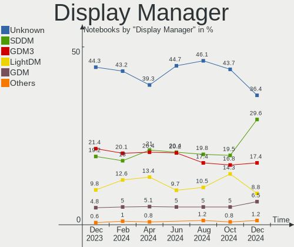
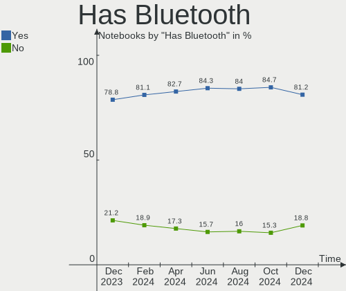
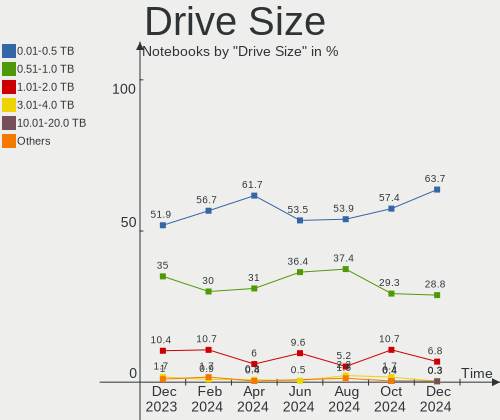
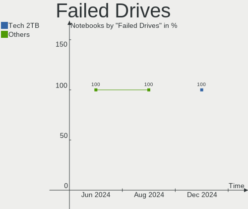
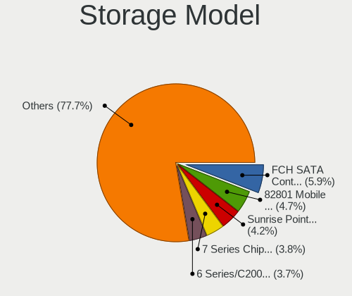
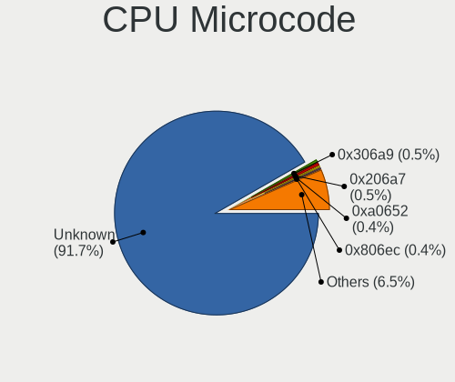
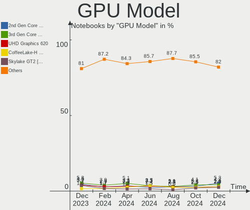

Linux in USA - Hardware Trends (Notebooks)
------------------------------------------

A project to identify most popular hardware characteristics and track their change
over time based on data collected by Linux users at https://Linux-Hardware.org.

Anyone can contribute to this report by the [hw-probe](https://github.com/linuxhw/hw-probe) tool:

    sudo -E hw-probe -all -upload

Period: May, 2023.

Contents
--------

* [ System ](#system)
  - [ OS                       ](#os)
  - [ OS Family                ](#os-family)
  - [ Kernel                   ](#kernel)
  - [ Kernel Family            ](#kernel-family)
  - [ Kernel Major Ver.        ](#kernel-major-ver)
  - [ Arch                     ](#arch)
  - [ DE                       ](#de)
  - [ Display Server           ](#display-server)
  - [ Display Manager          ](#display-manager)
  - [ OS Lang                  ](#os-lang)
  - [ Boot Mode                ](#boot-mode)
  - [ Filesystem               ](#filesystem)
  - [ Part. scheme             ](#part-scheme)
  - [ Dual Boot with Linux/BSD ](#dual-boot-with-linuxbsd)
  - [ Dual Boot (Win)          ](#dual-boot-win)

* [ Board ](#board)
  - [ Vendor                   ](#vendor)
  - [ Model                    ](#model)
  - [ Model Family             ](#model-family)
  - [ MFG Year                 ](#mfg-year)
  - [ Form Factor              ](#form-factor)
  - [ Secure Boot              ](#secure-boot)
  - [ Coreboot                 ](#coreboot)
  - [ RAM Size                 ](#ram-size)
  - [ RAM Used                 ](#ram-used)
  - [ Total Drives             ](#total-drives)
  - [ Has CD-ROM               ](#has-cd-rom)
  - [ Has Ethernet             ](#has-ethernet)
  - [ Has WiFi                 ](#has-wifi)
  - [ Has Bluetooth            ](#has-bluetooth)

* [ Location ](#location)
  - [ Country                  ](#country)
  - [ City                     ](#city)

* [ Drives ](#drives)
  - [ Drive Vendor             ](#drive-vendor)
  - [ Drive Model              ](#drive-model)
  - [ HDD Vendor               ](#hdd-vendor)
  - [ SSD Vendor               ](#ssd-vendor)
  - [ Drive Kind               ](#drive-kind)
  - [ Drive Connector          ](#drive-connector)
  - [ Drive Size               ](#drive-size)
  - [ Space Total              ](#space-total)
  - [ Space Used               ](#space-used)
  - [ Malfunc. Drives          ](#malfunc-drives)
  - [ Malfunc. Drive Vendor    ](#malfunc-drive-vendor)
  - [ Malfunc. HDD Vendor      ](#malfunc-hdd-vendor)
  - [ Malfunc. Drive Kind      ](#malfunc-drive-kind)
  - [ Failed Drives            ](#failed-drives)
  - [ Failed Drive Vendor      ](#failed-drive-vendor)
  - [ Drive Status             ](#drive-status)

* [ Storage controller ](#storage-controller)
  - [ Storage Vendor           ](#storage-vendor)
  - [ Storage Model            ](#storage-model)
  - [ Storage Kind             ](#storage-kind)

* [ Processor ](#processor)
  - [ CPU Vendor               ](#cpu-vendor)
  - [ CPU Model                ](#cpu-model)
  - [ CPU Model Family         ](#cpu-model-family)
  - [ CPU Cores                ](#cpu-cores)
  - [ CPU Sockets              ](#cpu-sockets)
  - [ CPU Threads              ](#cpu-threads)
  - [ CPU Op-Modes             ](#cpu-op-modes)
  - [ CPU Microcode            ](#cpu-microcode)
  - [ CPU Microarch            ](#cpu-microarch)

* [ Graphics ](#graphics)
  - [ GPU Vendor               ](#gpu-vendor)
  - [ GPU Model                ](#gpu-model)
  - [ GPU Combo                ](#gpu-combo)
  - [ GPU Driver               ](#gpu-driver)
  - [ GPU Memory               ](#gpu-memory)

* [ Monitor ](#monitor)
  - [ Monitor Vendor           ](#monitor-vendor)
  - [ Monitor Model            ](#monitor-model)
  - [ Monitor Resolution       ](#monitor-resolution)
  - [ Monitor Diagonal         ](#monitor-diagonal)
  - [ Monitor Width            ](#monitor-width)
  - [ Aspect Ratio             ](#aspect-ratio)
  - [ Monitor Area             ](#monitor-area)
  - [ Pixel Density            ](#pixel-density)
  - [ Multiple Monitors        ](#multiple-monitors)

* [ Network ](#network)
  - [ Net Controller Vendor    ](#net-controller-vendor)
  - [ Net Controller Model     ](#net-controller-model)
  - [ Wireless Vendor          ](#wireless-vendor)
  - [ Wireless Model           ](#wireless-model)
  - [ Ethernet Vendor          ](#ethernet-vendor)
  - [ Ethernet Model           ](#ethernet-model)
  - [ Net Controller Kind      ](#net-controller-kind)
  - [ Used Controller          ](#used-controller)
  - [ NICs                     ](#nics)
  - [ IPv6                     ](#ipv6)

* [ Bluetooth ](#bluetooth)
  - [ Bluetooth Vendor         ](#bluetooth-vendor)
  - [ Bluetooth Model          ](#bluetooth-model)

* [ Sound ](#sound)
  - [ Sound Vendor             ](#sound-vendor)
  - [ Sound Model              ](#sound-model)

* [ Memory ](#memory)
  - [ Memory Vendor            ](#memory-vendor)
  - [ Memory Model             ](#memory-model)
  - [ Memory Kind              ](#memory-kind)
  - [ Memory Form Factor       ](#memory-form-factor)
  - [ Memory Size              ](#memory-size)
  - [ Memory Speed             ](#memory-speed)

* [ Printers & scanners ](#printers--scanners)
  - [ Printer Vendor           ](#printer-vendor)
  - [ Printer Model            ](#printer-model)
  - [ Scanner Vendor           ](#scanner-vendor)
  - [ Scanner Model            ](#scanner-model)

* [ Camera ](#camera)
  - [ Camera Vendor            ](#camera-vendor)
  - [ Camera Model             ](#camera-model)

* [ Security ](#security)
  - [ Fingerprint Vendor       ](#fingerprint-vendor)
  - [ Fingerprint Model        ](#fingerprint-model)
  - [ Chipcard Vendor          ](#chipcard-vendor)
  - [ Chipcard Model           ](#chipcard-model)

* [ Unsupported ](#unsupported)
  - [ Unsupported Devices      ](#unsupported-devices)
  - [ Unsupported Device Types ](#unsupported-device-types)

System
------

OS
--

Installed operating systems

| Name                         | Notebooks | Percent |
|------------------------------|-----------|---------|
| Ubuntu 22.04                 | 57        | 12.64%  |
| Fedora 38                    | 39        | 8.65%   |
| Pop!_OS 22.04                | 37        | 8.2%    |
| Linux Mint 21.1              | 29        | 6.43%   |
| Ubuntu 23.04                 | 22        | 4.88%   |
| OpenMandriva 23.03           | 19        | 4.21%   |
| Arch Rolling                 | 17        | 3.77%   |
| Zorin 16                     | 16        | 3.55%   |
| SteamOS 3.4.6                | 16        | 3.55%   |
| ArcoLinux Rolling            | 13        | 2.88%   |
| KDE neon 22.04               | 12        | 2.66%   |
| Ubuntu 20.04                 | 11        | 2.44%   |
| Debian 11                    | 10        | 2.22%   |
| MX 21                        | 8         | 1.77%   |
| Kali 2023.1                  | 8         | 1.77%   |
| Fedora 37                    | 8         | 1.77%   |
| EndeavourOS Rolling          | 7         | 1.55%   |
| Ubuntu 22.10                 | 6         | 1.33%   |
| Kubuntu 22.04                | 6         | 1.33%   |
| openSUSE Tumbleweed-XXXXXXXX | 5         | 1.11%   |
| Nobara 37                    | 5         | 1.11%   |
| Manjaro                      | 5         | 1.11%   |
| Linux Mint 20.3              | 5         | 1.11%   |
| Kubuntu 23.04                | 5         | 1.11%   |
| Kali 2023.2                  | 5         | 1.11%   |
| Xubuntu 22.04                | 4         | 0.89%   |
| openSUSE Leap-15.5           | 3         | 0.67%   |
| Lubuntu 22.04                | 3         | 0.67%   |
| LMDE 5                       | 3         | 0.67%   |
| Gentoo 2.13                  | 3         | 0.67%   |
| Elementary 7                 | 3         | 0.67%   |
| ArcoLinux                    | 3         | 0.67%   |
| SteamOS 3.4.8                | 2         | 0.44%   |
| ROSA 12.4                    | 2         | 0.44%   |
| Parrot 5.3                   | 2         | 0.44%   |
| OpenMandriva 4.3             | 2         | 0.44%   |
| OpenMandriva 23.01           | 2         | 0.44%   |
| Garuda Linux Soaring         | 2         | 0.44%   |
| Fedora 36                    | 2         | 0.44%   |
| Debian 12                    | 2         | 0.44%   |

OS Family
---------

OS without a version

| Name             | Notebooks | Percent |
|------------------|-----------|---------|
| Ubuntu           | 96        | 21.29%  |
| Fedora           | 50        | 11.09%  |
| Pop!_OS          | 38        | 8.43%   |
| Linux Mint       | 36        | 7.98%   |
| SteamOS          | 23        | 5.1%    |
| OpenMandriva     | 23        | 5.1%    |
| Arch             | 17        | 3.77%   |
| Zorin            | 16        | 3.55%   |
| ArcoLinux        | 16        | 3.55%   |
| Kali             | 13        | 2.88%   |
| KDE neon         | 12        | 2.66%   |
| Debian           | 12        | 2.66%   |
| Kubuntu          | 11        | 2.44%   |
| openSUSE         | 8         | 1.77%   |
| MX               | 8         | 1.77%   |
| Manjaro          | 8         | 1.77%   |
| EndeavourOS      | 7         | 1.55%   |
| Xubuntu          | 6         | 1.33%   |
| Nobara           | 5         | 1.11%   |
| Lubuntu          | 4         | 0.89%   |
| Elementary       | 4         | 0.89%   |
| LMDE             | 3         | 0.67%   |
| Gentoo           | 3         | 0.67%   |
| ChimeraOS        | 3         | 0.67%   |
| Ubuntu Unity     | 2         | 0.44%   |
| Ubuntu Budgie    | 2         | 0.44%   |
| ROSA             | 2         | 0.44%   |
| Parrot           | 2         | 0.44%   |
| Garuda Linux     | 2         | 0.44%   |
| Endless          | 2         | 0.44%   |
| Clear Linux      | 2         | 0.44%   |
| BunsenLabs       | 2         | 0.44%   |
| Ubuntu MATE      | 1         | 0.22%   |
| Sparky           | 1         | 0.22%   |
| Rocky Linux      | 1         | 0.22%   |
| RHEL             | 1         | 0.22%   |
| org.kde.Platform | 1         | 0.22%   |
| Oracle Linux     | 1         | 0.22%   |
| Lilidog          | 1         | 0.22%   |
| Funtoo           | 1         | 0.22%   |

Kernel
------

Version of the Linux kernel

| Version                           | Notebooks | Percent |
|-----------------------------------|-----------|---------|
| 5.19.0-41-generic                 | 50        | 11.09%  |
| 6.2.6-76060206-generic            | 36        | 7.98%   |
| 6.2.0-20-generic                  | 28        | 6.21%   |
| 5.15.0-72-generic                 | 24        | 5.32%   |
| 5.15.0-71-generic                 | 23        | 5.1%    |
| 5.19.0-42-generic                 | 22        | 4.88%   |
| 6.2.6-desktop-1omv2390            | 19        | 4.21%   |
| 5.13.0-valve36-1-neptune          | 19        | 4.21%   |
| 6.2.15-300.fc38.x86_64            | 16        | 3.55%   |
| 6.2.14-300.fc38.x86_64            | 10        | 2.22%   |
| 6.3.1-arch2-1                     | 7         | 1.55%   |
| 6.1.0-kali7-amd64                 | 7         | 1.55%   |
| 5.15.0-56-generic                 | 7         | 1.55%   |
| 5.10.0-23-amd64                   | 7         | 1.55%   |
| 6.3.2-arch1-1                     | 6         | 1.33%   |
| 6.2.13-300.fc38.x86_64            | 6         | 1.33%   |
| 5.10.0-22-amd64                   | 6         | 1.33%   |
| 6.3.1-arch1-1                     | 5         | 1.11%   |
| 6.2.15-200.fc37.x86_64            | 5         | 1.11%   |
| 6.1.0-kali9-amd64                 | 5         | 1.11%   |
| 6.2.14-300.fsync.fc37.x86_64      | 4         | 0.89%   |
| 5.19.0-40-generic                 | 4         | 0.89%   |
| 6.3.4-zen1-1-zen                  | 3         | 0.67%   |
| 6.3.2-zen1-1-zen                  | 3         | 0.67%   |
| 6.3.1-1-default                   | 3         | 0.67%   |
| 6.2.9-300.fc38.x86_64             | 3         | 0.67%   |
| 6.2.13-arch1-1                    | 3         | 0.67%   |
| 6.1.26-1-MANJARO                  | 3         | 0.67%   |
| 6.1.0-0.deb11.6-amd64             | 3         | 0.67%   |
| 5.19.0-32-generic                 | 3         | 0.67%   |
| 5.14.21-150500.52-default         | 3         | 0.67%   |
| 6.3.4-arch2-1                     | 2         | 0.44%   |
| 6.3.3-arch1-1                     | 2         | 0.44%   |
| 6.3.2-1312.native                 | 2         | 0.44%   |
| 6.3.2-1-default                   | 2         | 0.44%   |
| 6.3.2-060302-generic              | 2         | 0.44%   |
| 6.2.14-100.fc36.x86_64            | 2         | 0.44%   |
| 6.1.28-1-lts                      | 2         | 0.44%   |
| 6.1.27-1-lts                      | 2         | 0.44%   |
| 6.1.20-generic-2rosa2021.1-x86_64 | 2         | 0.44%   |

Kernel Family
-------------

Linux kernel without a distro release

| Version  | Notebooks | Percent |
|----------|-----------|---------|
| 5.19.0   | 83        | 18.4%   |
| 5.15.0   | 63        | 13.97%  |
| 6.2.6    | 55        | 12.2%   |
| 6.2.0    | 30        | 6.65%   |
| 6.1.0    | 23        | 5.1%    |
| 6.2.15   | 21        | 4.66%   |
| 5.13.0   | 20        | 4.43%   |
| 6.3.1    | 19        | 4.21%   |
| 6.2.14   | 18        | 3.99%   |
| 6.3.2    | 17        | 3.77%   |
| 5.10.0   | 17        | 3.77%   |
| 6.2.13   | 9         | 2%      |
| 6.3.4    | 8         | 1.77%   |
| 5.4.0    | 7         | 1.55%   |
| 6.3.3    | 6         | 1.33%   |
| 6.2.9    | 5         | 1.11%   |
| 6.1.28   | 3         | 0.67%   |
| 6.1.27   | 3         | 0.67%   |
| 6.1.26   | 3         | 0.67%   |
| 6.1.21   | 3         | 0.67%   |
| 6.1.20   | 3         | 0.67%   |
| 5.14.21  | 3         | 0.67%   |
| 6.3.0    | 2         | 0.44%   |
| 6.2.11   | 2         | 0.44%   |
| 6.2.10   | 2         | 0.44%   |
| 6.1.1    | 2         | 0.44%   |
| 6.0.0    | 2         | 0.44%   |
| 5.16.13  | 2         | 0.44%   |
| 5.14.0   | 2         | 0.44%   |
| 6.4.0    | 1         | 0.22%   |
| 6.3.5    | 1         | 0.22%   |
| 6.3.0.11 | 1         | 0.22%   |
| 6.2.12   | 1         | 0.22%   |
| 6.1.29   | 1         | 0.22%   |
| 6.1.24   | 1         | 0.22%   |
| 6.1.13   | 1         | 0.22%   |
| 6.1.12   | 1         | 0.22%   |
| 6.1.11   | 1         | 0.22%   |
| 6.0.7    | 1         | 0.22%   |
| 5.18.10  | 1         | 0.22%   |

Kernel Major Ver.
-----------------

Linux kernel major version

| Version | Notebooks | Percent |
|---------|-----------|---------|
| 6.2     | 143       | 31.71%  |
| 5.19    | 83        | 18.4%   |
| 5.15    | 65        | 14.41%  |
| 6.3     | 53        | 11.75%  |
| 6.1     | 45        | 9.98%   |
| 5.13    | 20        | 4.43%   |
| 5.10    | 18        | 3.99%   |
| 5.4     | 7         | 1.55%   |
| 5.14    | 5         | 1.11%   |
| 6.0     | 3         | 0.67%   |
| 5.16    | 3         | 0.67%   |
| 6.4     | 1         | 0.22%   |
| 6.3.0   | 1         | 0.22%   |
| 5.18    | 1         | 0.22%   |
| 5.17    | 1         | 0.22%   |
| 5.0     | 1         | 0.22%   |
| 4.18    | 1         | 0.22%   |

Arch
----

OS architecture (x86_64, i586, etc.)

| Name    | Notebooks | Percent |
|---------|-----------|---------|
| x86_64  | 449       | 99.56%  |
| aarch64 | 2         | 0.44%   |

DE
--

Desktop Environment

| Name             | Notebooks | Percent |
|------------------|-----------|---------|
| GNOME            | 204       | 45.23%  |
| KDE5             | 117       | 25.94%  |
| XFCE             | 36        | 7.98%   |
| X-Cinnamon       | 32        | 7.1%    |
| Unknown          | 16        | 3.55%   |
| MATE             | 8         | 1.77%   |
| LXQt             | 6         | 1.33%   |
| Pantheon         | 4         | 0.89%   |
| i3               | 4         | 0.89%   |
| Unity            | 3         | 0.67%   |
| GNOME Flashback  | 3         | 0.67%   |
| Xsession         | 2         | 0.44%   |
| sway             | 2         | 0.44%   |
| GNOME Classic    | 2         | 0.44%   |
| Cinnamon         | 2         | 0.44%   |
| Budgie           | 2         | 0.44%   |
| LXDE             | 1         | 0.22%   |
| lightdm-xsession | 1         | 0.22%   |
| LeftWM           | 1         | 0.22%   |
| KDE              | 1         | 0.22%   |
| ICEWM            | 1         | 0.22%   |
| Enlightenment    | 1         | 0.22%   |
| Deepin           | 1         | 0.22%   |
| awesome          | 1         | 0.22%   |

Display Server
--------------

X11 or Wayland

| Name    | Notebooks | Percent |
|---------|-----------|---------|
| X11     | 313       | 69.4%   |
| Wayland | 128       | 28.38%  |
| Unknown | 6         | 1.33%   |
| Tty     | 4         | 0.89%   |

Display Manager
---------------

SDDM, LightDM, etc.

| Name    | Notebooks | Percent |
|---------|-----------|---------|
| Unknown | 181       | 40.13%  |
| GDM3    | 102       | 22.62%  |
| SDDM    | 71        | 15.74%  |
| LightDM | 67        | 14.86%  |
| GDM     | 29        | 6.43%   |
| XDM     | 1         | 0.22%   |

OS Lang
-------

Language

| Lang    | Notebooks | Percent |
|---------|-----------|---------|
| en_US   | 421       | 93.35%  |
| Unknown | 9         | 2%      |
| C       | 8         | 1.77%   |
| zh_CN   | 3         | 0.67%   |
| en_CA   | 3         | 0.67%   |
| es_ES   | 2         | 0.44%   |
| en_GB   | 2         | 0.44%   |
| ru_RU   | 1         | 0.22%   |
| fr_FR   | 1         | 0.22%   |
| en_IN   | 1         | 0.22%   |

Boot Mode
---------

EFI or BIOS

| Mode | Notebooks | Percent |
|------|-----------|---------|
| EFI  | 244       | 54.1%   |
| BIOS | 207       | 45.9%   |

Filesystem
----------

Type of filesystem

| Type    | Notebooks | Percent |
|---------|-----------|---------|
| Ext4    | 251       | 55.65%  |
| Btrfs   | 105       | 23.28%  |
| Tmpfs   | 57        | 12.64%  |
| Overlay | 27        | 5.99%   |
| Xfs     | 9         | 2%      |
| Zfs     | 1         | 0.22%   |
| Unknown | 1         | 0.22%   |

Part. scheme
------------

Scheme of partitioning

| Type    | Notebooks | Percent |
|---------|-----------|---------|
| GPT     | 251       | 55.65%  |
| Unknown | 167       | 37.03%  |
| MBR     | 33        | 7.32%   |

Dual Boot with Linux/BSD
------------------------

Hosting more than one Linux/BSD

| Dual boot | Notebooks | Percent |
|-----------|-----------|---------|
| No        | 402       | 89.14%  |
| Yes       | 49        | 10.86%  |

Dual Boot (Win)
---------------

Hosting Linux and Windows

| Dual boot | Notebooks | Percent |
|-----------|-----------|---------|
| No        | 367       | 81.37%  |
| Yes       | 84        | 18.63%  |

Board
-----

Vendor
------

Motherboard manufacturer

| Name                    | Notebooks | Percent |
|-------------------------|-----------|---------|
| Lenovo                  | 91        | 20.18%  |
| Hewlett-Packard         | 86        | 19.07%  |
| Dell                    | 82        | 18.18%  |
| ASUSTek Computer        | 40        | 8.87%   |
| Acer                    | 23        | 5.1%    |
| Valve                   | 20        | 4.43%   |
| Google                  | 16        | 3.55%   |
| Apple                   | 15        | 3.33%   |
| MSI                     | 13        | 2.88%   |
| Toshiba                 | 8         | 1.77%   |
| System76                | 7         | 1.55%   |
| Samsung Electronics     | 6         | 1.33%   |
| Unknown                 | 5         | 1.11%   |
| GPU Company             | 4         | 0.89%   |
| Framework               | 4         | 0.89%   |
| Alienware               | 4         | 0.89%   |
| Micro Electronics       | 3         | 0.67%   |
| Gigabyte Technology     | 3         | 0.67%   |
| Sony                    | 2         | 0.44%   |
| Panasonic               | 2         | 0.44%   |
| VPU Company             | 1         | 0.22%   |
| TUXEDO                  | 1         | 0.22%   |
| Thomson                 | 1         | 0.22%   |
| Terrans Force           | 1         | 0.22%   |
| Reliance Communications | 1         | 0.22%   |
| Razer                   | 1         | 0.22%   |
| ONE-NETBOOK             | 1         | 0.22%   |
| Notebook                | 1         | 0.22%   |
| LG Electronics          | 1         | 0.22%   |
| HUAWEI                  | 1         | 0.22%   |
| GPD                     | 1         | 0.22%   |
| Getac                   | 1         | 0.22%   |
| Gateway                 | 1         | 0.22%   |
| Eluktronics             | 1         | 0.22%   |
| Dynabook                | 1         | 0.22%   |
| AZW                     | 1         | 0.22%   |
| AAEON                   | 1         | 0.22%   |

Model
-----

Motherboard model

| Name                                   | Notebooks | Percent |
|----------------------------------------|-----------|---------|
| Valve Jupiter                          | 20        | 4.43%   |
| Unknown                                | 5         | 1.11%   |
| System76 Oryx Pro                      | 3         | 0.67%   |
| HP ZBook Studio G3                     | 3         | 0.67%   |
| HP Pavilion Laptop 15-eg0xxx           | 3         | 0.67%   |
| HP Pavilion g6                         | 3         | 0.67%   |
| HP Pavilion dv7                        | 3         | 0.67%   |
| HP Laptop 14-dq0xxx                    | 3         | 0.67%   |
| Framework Laptop (12th Gen Intel Core) | 3         | 0.67%   |
| ASUS ROG Zephyrus G14 GA402RJ_GA402RJ  | 3         | 0.67%   |
| Apple MacBookAir7,2                    | 3         | 0.67%   |
| System76 Galago Pro                    | 2         | 0.44%   |
| MSI Raider GE76 12UE                   | 2         | 0.44%   |
| Micro MG-VCP17I-3070                   | 2         | 0.44%   |
| Lenovo ThinkPad P50 20EN0013US         | 2         | 0.44%   |
| Lenovo ThinkPad 13 2nd Gen 20J10046US  | 2         | 0.44%   |
| Lenovo Slim 9 14IAP7 82T1              | 2         | 0.44%   |
| Lenovo Slim 7 ProX 14ARH7 82V2         | 2         | 0.44%   |
| Lenovo IdeaPad Flex-14API 81SS         | 2         | 0.44%   |
| Lenovo IdeaPad 320-15IAP 80XR          | 2         | 0.44%   |
| Lenovo IdeaPad 3 15ITL05 81X8          | 2         | 0.44%   |
| HP ProBook 645 G1                      | 2         | 0.44%   |
| HP Pavilion g7                         | 2         | 0.44%   |
| HP Pavilion Aero Laptop 13-be0xxx      | 2         | 0.44%   |
| HP Meep                                | 2         | 0.44%   |
| HP Laptop 17-cn2xxx                    | 2         | 0.44%   |
| HP Laptop 15-db0xxx                    | 2         | 0.44%   |
| HP 2000                                | 2         | 0.44%   |
| HP 15                                  | 2         | 0.44%   |
| GPU Company GWTC116-2                  | 2         | 0.44%   |
| Google Bobba                           | 2         | 0.44%   |
| Google Bluebird                        | 2         | 0.44%   |
| Google Auron_Paine                     | 2         | 0.44%   |
| Dell XPS 15 9570                       | 2         | 0.44%   |
| Dell XPS 13 9310                       | 2         | 0.44%   |
| Dell Precision 7510                    | 2         | 0.44%   |
| Dell Latitude E7450                    | 2         | 0.44%   |
| Dell Latitude 7370                     | 2         | 0.44%   |
| Dell Latitude 5400                     | 2         | 0.44%   |
| Dell Latitude 3420                     | 2         | 0.44%   |

Model Family
------------

Motherboard model prefix

| Name                  | Notebooks | Percent |
|-----------------------|-----------|---------|
| Lenovo ThinkPad       | 60        | 13.3%   |
| Dell Latitude         | 29        | 6.43%   |
| HP Pavilion           | 25        | 5.54%   |
| Dell Inspiron         | 23        | 5.1%    |
| Valve Jupiter         | 20        | 4.43%   |
| HP Laptop             | 20        | 4.43%   |
| Acer Aspire           | 16        | 3.55%   |
| Dell Precision        | 15        | 3.33%   |
| ASUS ROG              | 14        | 3.1%    |
| Lenovo IdeaPad        | 12        | 2.66%   |
| Dell XPS              | 10        | 2.22%   |
| ASUS VivoBook         | 10        | 2.22%   |
| Toshiba Satellite     | 7         | 1.55%   |
| HP ProBook            | 7         | 1.55%   |
| HP ZBook              | 6         | 1.33%   |
| HP ENVY               | 6         | 1.33%   |
| Lenovo Slim           | 5         | 1.11%   |
| Unknown               | 5         | 1.11%   |
| Lenovo Yoga           | 4         | 0.89%   |
| Lenovo Legion         | 4         | 0.89%   |
| Framework Laptop      | 4         | 0.89%   |
| ASUS ASUS             | 4         | 0.89%   |
| Acer Nitro            | 4         | 0.89%   |
| System76 Oryx         | 3         | 0.67%   |
| HP EliteBook          | 3         | 0.67%   |
| HP 15                 | 3         | 0.67%   |
| Apple MacBookAir7     | 3         | 0.67%   |
| Acer Swift            | 3         | 0.67%   |
| System76 Galago       | 2         | 0.44%   |
| MSI Stealth           | 2         | 0.44%   |
| MSI Raider            | 2         | 0.44%   |
| Micro MG-VCP17I-3070  | 2         | 0.44%   |
| Lenovo ThinkBook      | 2         | 0.44%   |
| HP Stream             | 2         | 0.44%   |
| HP Meep               | 2         | 0.44%   |
| HP 2000               | 2         | 0.44%   |
| GPU Company GWTC116-2 | 2         | 0.44%   |
| Google Bobba          | 2         | 0.44%   |
| Google Bluebird       | 2         | 0.44%   |
| Google Auron          | 2         | 0.44%   |

MFG Year
--------

Motherboard manufacture year

| Year    | Notebooks | Percent |
|---------|-----------|---------|
| 2022    | 79        | 17.52%  |
| 2021    | 63        | 13.97%  |
| 2020    | 44        | 9.76%   |
| 2018    | 32        | 7.1%    |
| 2019    | 27        | 5.99%   |
| 2016    | 27        | 5.99%   |
| 2015    | 26        | 5.76%   |
| 2011    | 25        | 5.54%   |
| 2017    | 24        | 5.32%   |
| 2023    | 23        | 5.1%    |
| 2012    | 22        | 4.88%   |
| 2014    | 18        | 3.99%   |
| 2013    | 16        | 3.55%   |
| 2010    | 8         | 1.77%   |
| 2008    | 8         | 1.77%   |
| 2009    | 5         | 1.11%   |
| Unknown | 2         | 0.44%   |
| 2007    | 1         | 0.22%   |
| 2004    | 1         | 0.22%   |

Form Factor
-----------

Physical design of the computer

| Name     | Notebooks | Percent |
|----------|-----------|---------|
| Notebook | 451       | 100%    |

Secure Boot
-----------

Enabled or disabled

| State    | Notebooks | Percent |
|----------|-----------|---------|
| Disabled | 421       | 93.35%  |
| Enabled  | 30        | 6.65%   |

Coreboot
--------

Have coreboot on board

| Used | Notebooks | Percent |
|------|-----------|---------|
| No   | 426       | 94.46%  |
| Yes  | 25        | 5.54%   |

RAM Size
--------

Total RAM memory

| Size in GB  | Notebooks | Percent |
|-------------|-----------|---------|
| 4.01-8.0    | 110       | 24.39%  |
| 16.01-24.0  | 92        | 20.4%   |
| 8.01-16.0   | 87        | 19.29%  |
| 32.01-64.0  | 63        | 13.97%  |
| 3.01-4.0    | 63        | 13.97%  |
| 64.01-256.0 | 17        | 3.77%   |
| 24.01-32.0  | 13        | 2.88%   |
| 1.01-2.0    | 5         | 1.11%   |
| 2.01-3.0    | 1         | 0.22%   |

RAM Used
--------

Used RAM memory

| Used GB    | Notebooks | Percent |
|------------|-----------|---------|
| 2.01-3.0   | 118       | 26.16%  |
| 1.01-2.0   | 117       | 25.94%  |
| 4.01-8.0   | 90        | 19.96%  |
| 3.01-4.0   | 82        | 18.18%  |
| 8.01-16.0  | 27        | 5.99%   |
| 0.51-1.0   | 12        | 2.66%   |
| 16.01-24.0 | 2         | 0.44%   |
| 0.01-0.5   | 2         | 0.44%   |
| 32.01-64.0 | 1         | 0.22%   |

Total Drives
------------

Number of drives on board

| Drives | Notebooks | Percent |
|--------|-----------|---------|
| 1      | 319       | 70.73%  |
| 2      | 106       | 23.5%   |
| 3      | 18        | 3.99%   |
| 4      | 3         | 0.67%   |
| 0      | 3         | 0.67%   |
| 7      | 1         | 0.22%   |
| 5      | 1         | 0.22%   |

Has CD-ROM
----------

Has CD-ROM on board

| Presented | Notebooks | Percent |
|-----------|-----------|---------|
| No        | 354       | 78.49%  |
| Yes       | 97        | 21.51%  |

Has Ethernet
------------

Has Ethernet on board

| Presented | Notebooks | Percent |
|-----------|-----------|---------|
| Yes       | 309       | 68.51%  |
| No        | 142       | 31.49%  |

Has WiFi
--------

Has WiFi module

| Presented | Notebooks | Percent |
|-----------|-----------|---------|
| Yes       | 441       | 97.78%  |
| No        | 10        | 2.22%   |

Has Bluetooth
-------------

Has Bluetooth module

| Presented | Notebooks | Percent |
|-----------|-----------|---------|
| Yes       | 376       | 83.37%  |
| No        | 75        | 16.63%  |

Location
--------

Country
-------

Geographic location (country)

| Country | Notebooks | Percent |
|---------|-----------|---------|
| USA     | 451       | 100%    |

City
----

Geographic location (city)

| City             | Notebooks | Percent |
|------------------|-----------|---------|
| Los Angeles      | 8         | 1.77%   |
| Portland         | 7         | 1.55%   |
| Jacksonville     | 6         | 1.33%   |
| Houston          | 6         | 1.33%   |
| Dallas           | 6         | 1.33%   |
| Austin           | 6         | 1.33%   |
| St Louis         | 5         | 1.11%   |
| Pittsburgh       | 5         | 1.11%   |
| Phoenix          | 5         | 1.11%   |
| Seattle          | 4         | 0.89%   |
| Salt Lake City   | 4         | 0.89%   |
| New York         | 4         | 0.89%   |
| Louisville       | 4         | 0.89%   |
| Framingham       | 4         | 0.89%   |
| Eureka           | 4         | 0.89%   |
| Craigsville      | 4         | 0.89%   |
| Washington       | 3         | 0.67%   |
| Virginia Beach   | 3         | 0.67%   |
| Tucson           | 3         | 0.67%   |
| Spokane          | 3         | 0.67%   |
| San Jose         | 3         | 0.67%   |
| San Diego        | 3         | 0.67%   |
| San Antonio      | 3         | 0.67%   |
| Saint Paul       | 3         | 0.67%   |
| Oakland          | 3         | 0.67%   |
| Columbia         | 3         | 0.67%   |
| Colorado Springs | 3         | 0.67%   |
| Chicago          | 3         | 0.67%   |
| Brooklyn         | 3         | 0.67%   |
| Atlanta          | 3         | 0.67%   |
| Waltham          | 2         | 0.44%   |
| Troy             | 2         | 0.44%   |
| Torrance         | 2         | 0.44%   |
| Sun Prairie      | 2         | 0.44%   |
| San Francisco    | 2         | 0.44%   |
| Salem            | 2         | 0.44%   |
| Saint Charles    | 2         | 0.44%   |
| Rockville        | 2         | 0.44%   |
| Rochester        | 2         | 0.44%   |
| Richardson       | 2         | 0.44%   |

Drives
------

Drive Vendor
------------

Hard drive vendors

| Vendor                      | Notebooks | Drives | Percent |
|-----------------------------|-----------|--------|---------|
| Samsung Electronics         | 107       | 114    | 18.48%  |
| SanDisk                     | 55        | 62     | 9.5%    |
| Unknown                     | 54        | 56     | 9.33%   |
| WDC                         | 40        | 42     | 6.91%   |
| SK hynix                    | 35        | 36     | 6.04%   |
| Seagate                     | 34        | 39     | 5.87%   |
| Toshiba                     | 32        | 32     | 5.53%   |
| Micron Technology           | 24        | 24     | 4.15%   |
| Intel                       | 20        | 22     | 3.45%   |
| Kingston                    | 17        | 17     | 2.94%   |
| Crucial                     | 14        | 14     | 2.42%   |
| Phison Electronics          | 13        | 15     | 2.25%   |
| Apple                       | 13        | 19     | 2.25%   |
| Kingston Technology Company | 12        | 13     | 2.07%   |
| KIOXIA                      | 11        | 11     | 1.9%    |
| Unknown                     | 9         | 9      | 1.55%   |
| PNY                         | 7         | 7      | 1.21%   |
| HGST                        | 7         | 7      | 1.21%   |
| Hitachi                     | 6         | 6      | 1.04%   |
| Silicon Motion              | 4         | 4      | 0.69%   |
| Phison                      | 4         | 4      | 0.69%   |
| Fujitsu                     | 4         | 4      | 0.69%   |
| China                       | 4         | 4      | 0.69%   |
| SPCC                        | 3         | 3      | 0.52%   |
| O2 Micro                    | 3         | 3      | 0.52%   |
| Netac                       | 3         | 3      | 0.52%   |
| LITEONIT                    | 3         | 3      | 0.52%   |
| LITEON                      | 3         | 3      | 0.52%   |
| A-DATA Technology           | 3         | 3      | 0.52%   |
| Transcend                   | 2         | 2      | 0.35%   |
| PNY CS90                    | 2         | 2      | 0.35%   |
| Micron/Crucial Technology   | 2         | 2      | 0.35%   |
| Lexar                       | 2         | 2      | 0.35%   |
| JMicron Technology          | 2         | 2      | 0.35%   |
| Hewlett-Packard             | 2         | 2      | 0.35%   |
| BIWIN                       | 2         | 2      | 0.35%   |
| Zheino                      | 1         | 1      | 0.17%   |
| Union Memory                | 1         | 1      | 0.17%   |
| UMIS                        | 1         | 1      | 0.17%   |
| Team                        | 1         | 1      | 0.17%   |

Drive Model
-----------

Hard drive models

| Model                                               | Notebooks | Percent |
|-----------------------------------------------------|-----------|---------|
| Samsung NVMe SSD Controller PM9A1/PM9A3/980PRO 1TB  | 17        | 2.83%   |
| Samsung NVMe SSD Controller SM981/PM981/PM983 256GB | 14        | 2.33%   |
| Unknown MMC Card  32GB                              | 11        | 1.83%   |
| Kingston Company OM3PDP3 NVMe SSD 256GB             | 9         | 1.5%    |
| Unknown                                             | 9         | 1.5%    |
| Phison PS5013 E13 NVMe Controller 512GB             | 7         | 1.17%   |
| Unknown MMC Card  64GB                              | 6         | 1%      |
| Unknown MMC Card  128GB                             | 6         | 1%      |
| Toshiba MQ01ABD100 1TB                              | 6         | 1%      |
| Samsung NVMe SSD Controller SM961/PM961/SM963 256GB | 6         | 1%      |
| Unknown MMC Card  512GB                             | 5         | 0.83%   |
| Unknown MMC Card  256GB                             | 5         | 0.83%   |
| Sandisk WD Blue SN550 NVMe SSD 512GB                | 5         | 0.83%   |
| Micron 2450_MTFDKBA1T0TFK 1TB                       | 5         | 0.83%   |
| WDC WD10SPZX-00Z10T0 1TB                            | 4         | 0.67%   |
| Unknown MMC Card  16GB                              | 4         | 0.67%   |
| Toshiba XG6 NVMe SSD Controller 256GB               | 4         | 0.67%   |
| SanDisk Extreme 55AE 1TB SSD                        | 4         | 0.67%   |
| Samsung SSD 850 EVO 500GB                           | 4         | 0.67%   |
| Kingston SA400S37480G 480GB SSD                     | 4         | 0.67%   |
| Intel SSD 660P Series 512GB                         | 4         | 0.67%   |
| HGST HTS721010A9E630 1TB                            | 4         | 0.67%   |
| Unknown SN128  128GB                                | 3         | 0.5%    |
| Toshiba MQ01ABF050 500GB                            | 3         | 0.5%    |
| SK hynix BC711 NVMe 512GB                           | 3         | 0.5%    |
| SK hynix BC511 256GB                                | 3         | 0.5%    |
| SK hynix BC501 NVMe Solid State Drive 512GB         | 3         | 0.5%    |
| Silicon Motion SM2263EN/SM2263XT SSD Controller 1TB | 3         | 0.5%    |
| Seagate ST1000LM035-1RK172 1TB                      | 3         | 0.5%    |
| Seagate Portable 2TB                                | 3         | 0.5%    |
| Seagate Backup+ Hub BK 6TB                          | 3         | 0.5%    |
| Sandisk WD_BLACK SN770 1TB                          | 3         | 0.5%    |
| Sandisk WD Black SN750 / PC SN730 NVMe SSD 256GB    | 3         | 0.5%    |
| SanDisk NVMe SSD Drive 1TB                          | 3         | 0.5%    |
| Samsung SSD 980 1TB                                 | 3         | 0.5%    |
| Samsung SSD 970 EVO Plus 1TB                        | 3         | 0.5%    |
| PNY CS900 500GB SSD                                 | 3         | 0.5%    |
| Phison E12 NVMe Controller 256GB                    | 3         | 0.5%    |
| O2 Micro E2M2 64GB                                  | 3         | 0.5%    |
| Kingston SA400S37120G 120GB SSD                     | 3         | 0.5%    |

HDD Vendor
----------

Hard disk drive vendors

| Vendor              | Notebooks | Drives | Percent |
|---------------------|-----------|--------|---------|
| Seagate             | 31        | 34     | 30.39%  |
| WDC                 | 26        | 26     | 25.49%  |
| Toshiba             | 19        | 19     | 18.63%  |
| HGST                | 7         | 7      | 6.86%   |
| Hitachi             | 6         | 6      | 5.88%   |
| Fujitsu             | 4         | 4      | 3.92%   |
| Apple               | 3         | 3      | 2.94%   |
| Unknown             | 2         | 2      | 1.96%   |
| Samsung Electronics | 2         | 2      | 1.96%   |
| RSH-319             | 1         | 1      | 0.98%   |
| LaCie               | 1         | 1      | 0.98%   |

SSD Vendor
----------

Solid state drive vendors

| Vendor              | Notebooks | Drives | Percent |
|---------------------|-----------|--------|---------|
| Samsung Electronics | 33        | 34     | 22.3%   |
| SanDisk             | 21        | 24     | 14.19%  |
| Kingston            | 14        | 14     | 9.46%   |
| Crucial             | 11        | 11     | 7.43%   |
| PNY                 | 7         | 7      | 4.73%   |
| Micron Technology   | 5         | 5      | 3.38%   |
| WDC                 | 4         | 5      | 2.7%    |
| Toshiba             | 4         | 4      | 2.7%    |
| China               | 4         | 4      | 2.7%    |
| Apple               | 4         | 4      | 2.7%    |
| SK hynix            | 3         | 3      | 2.03%   |
| Netac               | 3         | 3      | 2.03%   |
| LITEONIT            | 3         | 3      | 2.03%   |
| LITEON              | 3         | 3      | 2.03%   |
| A-DATA Technology   | 3         | 3      | 2.03%   |
| Transcend           | 2         | 2      | 1.35%   |
| SPCC                | 2         | 2      | 1.35%   |
| PNY CS90            | 2         | 2      | 1.35%   |
| Lexar               | 2         | 2      | 1.35%   |
| JMicron Technology  | 2         | 2      | 1.35%   |
| Intel               | 2         | 2      | 1.35%   |
| Hewlett-Packard     | 2         | 2      | 1.35%   |
| Union Memory        | 1         | 1      | 0.68%   |
| Team                | 1         | 1      | 0.68%   |
| Seagate             | 1         | 1      | 0.68%   |
| SABRENT             | 1         | 1      | 0.68%   |
| Mushkin             | 1         | 1      | 0.68%   |
| KingSpec            | 1         | 1      | 0.68%   |
| KingFast            | 1         | 1      | 0.68%   |
| EDILOCA             | 1         | 1      | 0.68%   |
| Dogfish             | 1         | 1      | 0.68%   |
| BIWIN               | 1         | 1      | 0.68%   |
| BHT                 | 1         | 1      | 0.68%   |
| ASMT                | 1         | 2      | 0.68%   |

Drive Kind
----------

HDD or SSD

| Kind    | Notebooks | Drives | Percent |
|---------|-----------|--------|---------|
| NVMe    | 243       | 284    | 44.67%  |
| SSD     | 135       | 154    | 24.82%  |
| HDD     | 97        | 105    | 17.83%  |
| MMC     | 61        | 64     | 11.21%  |
| Unknown | 8         | 8      | 1.47%   |

Drive Connector
---------------

SATA, SAS, NVMe, etc.

| Type | Notebooks | Drives | Percent |
|------|-----------|--------|---------|
| NVMe | 243       | 283    | 45.68%  |
| SATA | 197       | 227    | 37.03%  |
| MMC  | 61        | 64     | 11.47%  |
| SAS  | 31        | 41     | 5.83%   |

Drive Size
----------

Size of hard drive

| Size in TB | Notebooks | Drives | Percent |
|------------|-----------|--------|---------|
| 0.01-0.5   | 135       | 146    | 56.72%  |
| 0.51-1.0   | 76        | 83     | 31.93%  |
| 1.01-2.0   | 18        | 19     | 7.56%   |
| 4.01-10.0  | 6         | 6      | 2.52%   |
| 3.01-4.0   | 2         | 4      | 0.84%   |
| 10.01-20.0 | 1         | 1      | 0.42%   |

Space Total
-----------

Amount of disk space available on the file system

| Size in GB     | Notebooks | Percent |
|----------------|-----------|---------|
| 101-250        | 113       | 25.06%  |
| 251-500        | 97        | 21.51%  |
| 501-1000       | 82        | 18.18%  |
| 1-20           | 32        | 7.1%    |
| 1001-2000      | 27        | 5.99%   |
| More than 3000 | 25        | 5.54%   |
| 51-100         | 25        | 5.54%   |
| Unknown        | 21        | 4.66%   |
| 21-50          | 20        | 4.43%   |
| 2001-3000      | 9         | 2%      |

Space Used
----------

Amount of used disk space

| Used GB        | Notebooks | Percent |
|----------------|-----------|---------|
| 1-20           | 160       | 35.48%  |
| 21-50          | 86        | 19.07%  |
| 101-250        | 66        | 14.63%  |
| 51-100         | 54        | 11.97%  |
| 251-500        | 27        | 5.99%   |
| 501-1000       | 21        | 4.66%   |
| Unknown        | 21        | 4.66%   |
| 1001-2000      | 10        | 2.22%   |
| More than 3000 | 5         | 1.11%   |
| 2001-3000      | 1         | 0.22%   |

Malfunc. Drives
---------------

Drive models with a malfunction

| Model                                          | Notebooks | Drives | Percent |
|------------------------------------------------|-----------|--------|---------|
| Hitachi HTS547564A9E384 640GB                  | 2         | 2      | 8.33%   |
| WDC WD7500BPKT-75PK4T0 752GB                   | 1         | 1      | 4.17%   |
| WDC WD5000LPVX-22V0TT0 500GB                   | 1         | 1      | 4.17%   |
| WDC WD10JPCX-24UE4T0 1TB                       | 1         | 1      | 4.17%   |
| Union Memory RTOTJ128VGD2EYX 128GB             | 1         | 1      | 4.17%   |
| Toshiba THNSNK128GVN8 M.2 2280 128GB SSD       | 1         | 1      | 4.17%   |
| Toshiba MK5075GSX 500GB                        | 1         | 1      | 4.17%   |
| SK hynix HFS128G39TND-N210A 128GB SSD          | 1         | 1      | 4.17%   |
| SK hynix BC711 HFM256GD3JX013N 256GB           | 1         | 1      | 4.17%   |
| Seagate ST980813AS 80GB                        | 1         | 1      | 4.17%   |
| Seagate ST9750420AS 752GB                      | 1         | 1      | 4.17%   |
| Seagate ST1000LX015-1U7172 1TB                 | 1         | 1      | 4.17%   |
| Samsung Electronics SSD PM810 mSATA 128GB      | 1         | 1      | 4.17%   |
| Samsung Electronics SSD 830 Series 128GB       | 1         | 1      | 4.17%   |
| Micron Technology 1100_MTFDDAV256TBN 256GB SSD | 1         | 1      | 4.17%   |
| Kingston SNS4151S316GD 16GB SSD                | 1         | 1      | 4.17%   |
| Kingston RBU-SNS8350DES3128GP 128GB SSD        | 1         | 1      | 4.17%   |
| KingSpec NT-512 512GB SSD                      | 1         | 1      | 4.17%   |
| Hitachi HTS547550A9E384 500GB                  | 1         | 1      | 4.17%   |
| HGST HTS545050A7E680 500GB                     | 1         | 1      | 4.17%   |
| Fujitsu MJA2250BH FFS G1 250GB                 | 1         | 1      | 4.17%   |
| Fujitsu MHZ2320BH G2 320GB                     | 1         | 1      | 4.17%   |
| A-DATA Technology SU760 256GB SSD              | 1         | 1      | 4.17%   |

Malfunc. Drive Vendor
---------------------

Vendors of faulty drives

| Vendor              | Notebooks | Drives | Percent |
|---------------------|-----------|--------|---------|
| WDC                 | 3         | 3      | 12.5%   |
| Seagate             | 3         | 3      | 12.5%   |
| Hitachi             | 3         | 3      | 12.5%   |
| Toshiba             | 2         | 2      | 8.33%   |
| SK hynix            | 2         | 2      | 8.33%   |
| Samsung Electronics | 2         | 2      | 8.33%   |
| Kingston            | 2         | 2      | 8.33%   |
| Fujitsu             | 2         | 2      | 8.33%   |
| Union Memory        | 1         | 1      | 4.17%   |
| Micron Technology   | 1         | 1      | 4.17%   |
| KingSpec            | 1         | 1      | 4.17%   |
| HGST                | 1         | 1      | 4.17%   |
| A-DATA Technology   | 1         | 1      | 4.17%   |

Malfunc. HDD Vendor
-------------------

Vendors of faulty HDD drives

| Vendor  | Notebooks | Drives | Percent |
|---------|-----------|--------|---------|
| WDC     | 3         | 3      | 23.08%  |
| Seagate | 3         | 3      | 23.08%  |
| Hitachi | 3         | 3      | 23.08%  |
| Fujitsu | 2         | 2      | 15.38%  |
| Toshiba | 1         | 1      | 7.69%   |
| HGST    | 1         | 1      | 7.69%   |

Malfunc. Drive Kind
-------------------

Kinds of faulty drives

| Kind | Notebooks | Drives | Percent |
|------|-----------|--------|---------|
| HDD  | 12        | 13     | 54.55%  |
| SSD  | 9         | 10     | 40.91%  |
| NVMe | 1         | 1      | 4.55%   |

Failed Drives
-------------

Failed drive models

| Model                                   | Notebooks | Drives | Percent |
|-----------------------------------------|-----------|--------|---------|
| SK hynix BC501 HFM256GDJTNG-8310A 256GB | 1         | 1      | 100%    |

Failed Drive Vendor
-------------------

Failed drive vendors

| Vendor   | Notebooks | Drives | Percent |
|----------|-----------|--------|---------|
| SK hynix | 1         | 1      | 100%    |

Drive Status
------------

Number of failed and malfunc. drives

| Status   | Notebooks | Drives | Percent |
|----------|-----------|--------|---------|
| Detected | 282       | 373    | 59%     |
| Works    | 174       | 217    | 36.4%   |
| Malfunc  | 21        | 24     | 4.39%   |
| Failed   | 1         | 1      | 0.21%   |

Storage controller
------------------

Storage Vendor
--------------

Storage controller vendors

| Vendor                                  | Notebooks | Percent |
|-----------------------------------------|-----------|---------|
| Intel                                   | 236       | 44.95%  |
| Samsung Electronics                     | 75        | 14.29%  |
| SanDisk                                 | 43        | 8.19%   |
| AMD                                     | 40        | 7.62%   |
| SK hynix                                | 32        | 6.1%    |
| Micron Technology                       | 19        | 3.62%   |
| Phison Electronics                      | 17        | 3.24%   |
| Kingston Technology Company             | 15        | 2.86%   |
| Toshiba America Info Systems            | 10        | 1.9%    |
| KIOXIA                                  | 10        | 1.9%    |
| Silicon Motion                          | 5         | 0.95%   |
| Micron/Crucial Technology               | 5         | 0.95%   |
| Nvidia                                  | 4         | 0.76%   |
| Apple                                   | 4         | 0.76%   |
| O2 Micro                                | 3         | 0.57%   |
| Solid State Storage Technology          | 2         | 0.38%   |
| Shenzhen Unionmemory Information System | 1         | 0.19%   |
| Realtek Semiconductor                   | 1         | 0.19%   |
| MAXIO Technology (Hangzhou)             | 1         | 0.19%   |
| INNOGRIT                                | 1         | 0.19%   |
| Biwin Storage Technology                | 1         | 0.19%   |

Storage Model
-------------

Storage controller models

| Model                                                                          | Notebooks | Percent |
|--------------------------------------------------------------------------------|-----------|---------|
| Intel Sunrise Point-LP SATA Controller [AHCI mode]                             | 34        | 6.03%   |
| AMD FCH SATA Controller [AHCI mode]                                            | 32        | 5.67%   |
| Intel Volume Management Device NVMe RAID Controller                            | 28        | 4.96%   |
| Samsung NVMe SSD Controller PM9A1/PM9A3/980PRO                                 | 24        | 4.26%   |
| Samsung NVMe SSD Controller SM981/PM981/PM983                                  | 22        | 3.9%    |
| Samsung NVMe SSD Controller 980                                                | 20        | 3.55%   |
| Intel 82801 Mobile SATA Controller [RAID mode]                                 | 20        | 3.55%   |
| Intel 7 Series Chipset Family 6-port SATA Controller [AHCI mode]               | 20        | 3.55%   |
| Micron NVMe Storage Controller                                                 | 17        | 3.01%   |
| Intel 6 Series/C200 Series Chipset Family 6 port Mobile SATA AHCI Controller   | 17        | 3.01%   |
| SK hynix Gold P31/PC711 NVMe Solid State Drive                                 | 15        | 2.66%   |
| Intel Tiger Lake-LP SATA Controller                                            | 13        | 2.3%    |
| Intel Cannon Lake Mobile PCH SATA AHCI Controller                              | 13        | 2.3%    |
| Intel 8 Series/C220 Series Chipset Family 6-port SATA Controller 1 [AHCI mode] | 13        | 2.3%    |
| Kingston Company OM3PDP3 NVMe SSD                                              | 10        | 1.77%   |
| Intel Wildcat Point-LP SATA Controller [AHCI Mode]                             | 10        | 1.77%   |
| SanDisk WD Blue SN550 NVMe SSD                                                 | 9         | 1.6%    |
| SanDisk Non-Volatile memory controller                                         | 9         | 1.6%    |
| Phison PS5013 E13 NVMe Controller                                              | 9         | 1.6%    |
| SanDisk WD Black SN750 / PC SN730 NVMe SSD                                     | 8         | 1.42%   |
| Samsung NVMe SSD Controller SM961/PM961/SM963                                  | 8         | 1.42%   |
| Intel Q170/Q150/B150/H170/H110/Z170/CM236 Chipset SATA Controller [AHCI Mode]  | 8         | 1.42%   |
| SanDisk WD Black SN770 NVMe SSD                                                | 7         | 1.24%   |
| Intel HM170/QM170 Chipset SATA Controller [AHCI Mode]                          | 7         | 1.24%   |
| Intel Celeron/Pentium Silver Processor SATA Controller                         | 7         | 1.24%   |
| KIOXIA NVMe SSD Controller BG4                                                 | 6         | 1.06%   |
| Toshiba America Info Systems XG6 NVMe SSD Controller                           | 5         | 0.89%   |
| Silicon Motion SM2263EN/SM2263XT SSD Controller                                | 5         | 0.89%   |
| Intel SSD 660P Series                                                          | 5         | 0.89%   |
| Intel SATA Controller [RAID mode]                                              | 5         | 0.89%   |
| Intel Celeron N3350/Pentium N4200/Atom E3900 Series SATA AHCI Controller       | 5         | 0.89%   |
| Intel Cannon Point-LP SATA Controller [AHCI Mode]                              | 5         | 0.89%   |
| Intel Alder Lake-P SATA AHCI Controller                                        | 5         | 0.89%   |
| Intel 82801IBM/IEM (ICH9M/ICH9M-E) 4 port SATA Controller [AHCI mode]          | 5         | 0.89%   |
| Intel 400 Series Chipset Family SATA AHCI Controller                           | 5         | 0.89%   |
| SK hynix Non-Volatile memory controller                                        | 4         | 0.71%   |
| SK hynix BC501 NVMe Solid State Drive                                          | 4         | 0.71%   |
| Sandisk Western Digital WD Black SN850X NVMe SSD                               | 4         | 0.71%   |
| Phison E12 NVMe Controller                                                     | 4         | 0.71%   |
| KIOXIA Non-Volatile memory controller                                          | 4         | 0.71%   |

Storage Kind
------------

Kind of storage controller (IDE, SATA, NVMe, SAS, ...)

| Kind | Notebooks | Percent |
|------|-----------|---------|
| NVMe | 241       | 44.96%  |
| SATA | 235       | 43.84%  |
| RAID | 53        | 9.89%   |
| IDE  | 7         | 1.31%   |

Processor
---------

CPU Vendor
----------

Processor vendors

| Vendor  | Notebooks | Percent |
|---------|-----------|---------|
| Intel   | 339       | 75.17%  |
| AMD     | 110       | 24.39%  |
| Unknown | 2         | 0.44%   |

CPU Model
---------

Processor models

| Model                                         | Notebooks | Percent |
|-----------------------------------------------|-----------|---------|
| AMD Custom APU 0405                           | 20        | 4.43%   |
| Intel 11th Gen Core i5-1135G7 @ 2.40GHz       | 11        | 2.44%   |
| Intel Core i5-6200U CPU @ 2.30GHz             | 10        | 2.22%   |
| Intel Celeron N4020 CPU @ 1.10GHz             | 10        | 2.22%   |
| Intel 11th Gen Core i7-1165G7 @ 2.80GHz       | 9         | 2%      |
| Intel 11th Gen Core i3-1115G4 @ 3.00GHz       | 8         | 1.77%   |
| Intel Core i7-8750H CPU @ 2.20GHz             | 7         | 1.55%   |
| Intel Core i7-6700HQ CPU @ 2.60GHz            | 7         | 1.55%   |
| Intel 11th Gen Core i7-11800H @ 2.30GHz       | 7         | 1.55%   |
| Intel Core i7-10750H CPU @ 2.60GHz            | 6         | 1.33%   |
| Intel Core i7-7700HQ CPU @ 2.80GHz            | 5         | 1.11%   |
| Intel 12th Gen Core i7-1280P                  | 5         | 1.11%   |
| Intel 12th Gen Core i7-1260P                  | 5         | 1.11%   |
| Intel Core i7-9750H CPU @ 2.60GHz             | 4         | 0.89%   |
| Intel Core i5-8365U CPU @ 1.60GHz             | 4         | 0.89%   |
| Intel Core i5-7200U CPU @ 2.50GHz             | 4         | 0.89%   |
| Intel Core i5-6300U CPU @ 2.40GHz             | 4         | 0.89%   |
| Intel Core i5-5300U CPU @ 2.30GHz             | 4         | 0.89%   |
| Intel Core i5-2520M CPU @ 2.50GHz             | 4         | 0.89%   |
| Intel Celeron N4120 CPU @ 1.10GHz             | 4         | 0.89%   |
| Intel Celeron CPU N3350 @ 1.10GHz             | 4         | 0.89%   |
| Intel 12th Gen Core i7-12700H                 | 4         | 0.89%   |
| AMD Ryzen 9 6900HX with Radeon Graphics       | 4         | 0.89%   |
| AMD Ryzen 7 6800H with Radeon Graphics        | 4         | 0.89%   |
| AMD Ryzen 5 3500U with Radeon Vega Mobile Gfx | 4         | 0.89%   |
| AMD Athlon Silver 3050U with Radeon Graphics  | 4         | 0.89%   |
| Intel Pentium Silver N5030 CPU @ 1.10GHz      | 3         | 0.67%   |
| Intel Core m5-6Y57 CPU @ 1.10GHz              | 3         | 0.67%   |
| Intel Core i7-8650U CPU @ 1.90GHz             | 3         | 0.67%   |
| Intel Core i7-8550U CPU @ 1.80GHz             | 3         | 0.67%   |
| Intel Core i7-7600U CPU @ 2.80GHz             | 3         | 0.67%   |
| Intel Core i7-7500U CPU @ 2.70GHz             | 3         | 0.67%   |
| Intel Core i7-6500U CPU @ 2.50GHz             | 3         | 0.67%   |
| Intel Core i7-4810MQ CPU @ 2.80GHz            | 3         | 0.67%   |
| Intel Core i7-4700MQ CPU @ 2.40GHz            | 3         | 0.67%   |
| Intel Core i5-8300H CPU @ 2.30GHz             | 3         | 0.67%   |
| Intel Core i5-8250U CPU @ 1.60GHz             | 3         | 0.67%   |
| Intel Core i5-4200M CPU @ 2.50GHz             | 3         | 0.67%   |
| Intel Core i5-3320M CPU @ 2.60GHz             | 3         | 0.67%   |
| Intel Core i5-10210U CPU @ 1.60GHz            | 3         | 0.67%   |

CPU Model Family
----------------

Processor model prefix

| Model                          | Notebooks | Percent |
|--------------------------------|-----------|---------|
| Other                          | 105       | 23.28%  |
| Intel Core i7                  | 89        | 19.73%  |
| Intel Core i5                  | 78        | 17.29%  |
| Intel Celeron                  | 33        | 7.32%   |
| Intel Core i3                  | 23        | 5.1%    |
| AMD Ryzen 5                    | 19        | 4.21%   |
| AMD Ryzen 9                    | 17        | 3.77%   |
| AMD Ryzen 7                    | 16        | 3.55%   |
| Intel Pentium                  | 7         | 1.55%   |
| Intel Core 2 Duo               | 7         | 1.55%   |
| AMD Athlon                     | 5         | 1.11%   |
| Intel Pentium Silver           | 4         | 0.89%   |
| Intel Core m5                  | 4         | 0.89%   |
| AMD Ryzen 7 PRO                | 4         | 0.89%   |
| AMD A6                         | 4         | 0.89%   |
| AMD A4                         | 4         | 0.89%   |
| Intel Xeon                     | 3         | 0.67%   |
| AMD Ryzen 3                    | 3         | 0.67%   |
| AMD A8                         | 3         | 0.67%   |
| AMD A10                        | 3         | 0.67%   |
| Intel Core i9                  | 2         | 0.44%   |
| Intel Atom                     | 2         | 0.44%   |
| AMD Turion X2 Dual-Core Mobile | 2         | 0.44%   |
| AMD E1                         | 2         | 0.44%   |
| AMD E                          | 2         | 0.44%   |
| Intel Pentium Dual-Core        | 1         | 0.22%   |
| Intel Pentium Dual             | 1         | 0.22%   |
| Intel Genuine                  | 1         | 0.22%   |
| Intel Core m3                  | 1         | 0.22%   |
| AMD Turion II                  | 1         | 0.22%   |
| AMD Ryzen 5 PRO                | 1         | 0.22%   |
| AMD FX                         | 1         | 0.22%   |
| AMD E2                         | 1         | 0.22%   |
| AMD Athlon II                  | 1         | 0.22%   |
| AMD A12                        | 1         | 0.22%   |

CPU Cores
---------

Number of processor cores

| Number | Notebooks | Percent |
|--------|-----------|---------|
| 2      | 174       | 38.58%  |
| 4      | 155       | 34.37%  |
| 8      | 52        | 11.53%  |
| 6      | 36        | 7.98%   |
| 14     | 13        | 2.88%   |
| 12     | 8         | 1.77%   |
| 10     | 7         | 1.55%   |
| 24     | 2         | 0.44%   |
| 16     | 2         | 0.44%   |
| 1      | 2         | 0.44%   |

CPU Sockets
-----------

Number of sockets

| Number | Notebooks | Percent |
|--------|-----------|---------|
| 1      | 451       | 100%    |

CPU Threads
-----------

Threads per core (Hyper-Threading)

| Number | Notebooks | Percent |
|--------|-----------|---------|
| 2      | 357       | 79.16%  |
| 1      | 93        | 20.62%  |
| 4      | 1         | 0.22%   |

CPU Op-Modes
------------

CPU Operation Modes (32-bit, 64-bit)

| Op mode        | Notebooks | Percent |
|----------------|-----------|---------|
| 32-bit, 64-bit | 449       | 99.56%  |
| 64-bit         | 2         | 0.44%   |

CPU Microcode
-------------

Microcode number

| Number     | Notebooks | Percent |
|------------|-----------|---------|
| Unknown    | 267       | 59.2%   |
| 0x0a404102 | 13        | 2.88%   |
| 0x806c1    | 11        | 2.44%   |
| 0x906a3    | 8         | 1.77%   |
| 0x406e3    | 8         | 1.77%   |
| 0x306a9    | 8         | 1.77%   |
| 0x906ea    | 7         | 1.55%   |
| 0x806ec    | 7         | 1.55%   |
| 0x806e9    | 7         | 1.55%   |
| 0x306d4    | 7         | 1.55%   |
| 0x08108109 | 7         | 1.55%   |
| 0x206a7    | 6         | 1.33%   |
| 0x0a50000c | 6         | 1.33%   |
| 0x706a8    | 5         | 1.11%   |
| 0x506c9    | 5         | 1.11%   |
| 0x0a50000d | 5         | 1.11%   |
| 0x08608103 | 5         | 1.11%   |
| 0xa0652    | 4         | 0.89%   |
| 0x906e9    | 4         | 0.89%   |
| 0x806d1    | 4         | 0.89%   |
| 0x306c3    | 4         | 0.89%   |
| 0x906a4    | 3         | 0.67%   |
| 0x406c4    | 3         | 0.67%   |
| 0x1067a    | 3         | 0.67%   |
| 0x0a404101 | 3         | 0.67%   |
| 0x0810100b | 3         | 0.67%   |
| 0x05000119 | 3         | 0.67%   |
| 0x03000027 | 3         | 0.67%   |
| 0x806ea    | 2         | 0.44%   |
| 0x706a1    | 2         | 0.44%   |
| 0x40651    | 2         | 0.44%   |
| 0x20655    | 2         | 0.44%   |
| 0x08600106 | 2         | 0.44%   |
| 0x08108102 | 2         | 0.44%   |
| 0x06001119 | 2         | 0.44%   |
| 0x02000057 | 2         | 0.44%   |
| 0xb0671    | 1         | 0.22%   |
| 0x806eb    | 1         | 0.22%   |
| 0x6fd      | 1         | 0.22%   |
| 0x506e3    | 1         | 0.22%   |

CPU Microarch
-------------

Microarchitecture

| Name             | Notebooks | Percent |
|------------------|-----------|---------|
| KabyLake         | 72        | 15.96%  |
| Unknown          | 61        | 13.53%  |
| TigerLake        | 39        | 8.65%   |
| Skylake          | 37        | 8.2%    |
| Alderlake Hybrid | 22        | 4.88%   |
| IvyBridge        | 21        | 4.66%   |
| SandyBridge      | 20        | 4.43%   |
| Goldmont plus    | 20        | 4.43%   |
| Zen 3            | 17        | 3.77%   |
| Haswell          | 16        | 3.55%   |
| Broadwell        | 16        | 3.55%   |
| Icelake          | 15        | 3.33%   |
| CometLake        | 15        | 3.33%   |
| Zen+             | 12        | 2.66%   |
| Silvermont       | 10        | 2.22%   |
| Penryn           | 7         | 1.55%   |
| Goldmont         | 7         | 1.55%   |
| Zen 2            | 5         | 1.11%   |
| Westmere         | 5         | 1.11%   |
| Piledriver       | 4         | 0.89%   |
| K10 Llano        | 4         | 0.89%   |
| Jaguar           | 4         | 0.89%   |
| Excavator        | 4         | 0.89%   |
| Zen              | 3         | 0.67%   |
| K8 & K10 hybrid  | 3         | 0.67%   |
| Core             | 3         | 0.67%   |
| Bobcat           | 3         | 0.67%   |
| Nehalem          | 2         | 0.44%   |
| K10              | 2         | 0.44%   |
| Steamroller      | 1         | 0.22%   |
| Puma             | 1         | 0.22%   |

Graphics
--------

GPU Vendor
----------

Vendors of graphics cards

| Vendor | Notebooks | Percent |
|--------|-----------|---------|
| Intel  | 316       | 56.33%  |
| Nvidia | 129       | 22.99%  |
| AMD    | 116       | 20.68%  |

GPU Model
---------

Graphics card models

| Model                                                                     | Notebooks | Percent |
|---------------------------------------------------------------------------|-----------|---------|
| Intel TigerLake-LP GT2 [Iris Xe Graphics]                                 | 30        | 5.24%   |
| Intel 2nd Generation Core Processor Family Integrated Graphics Controller | 20        | 3.5%    |
| AMD VanGogh [AMD Custom GPU 0405]                                         | 20        | 3.5%    |
| Intel Skylake GT2 [HD Graphics 520]                                       | 19        | 3.32%   |
| Intel 3rd Gen Core processor Graphics Controller                          | 19        | 3.32%   |
| AMD Rembrandt [Radeon 680M]                                               | 19        | 3.32%   |
| Intel Alder Lake-P Integrated Graphics Controller                         | 17        | 2.97%   |
| Intel GeminiLake [UHD Graphics 600]                                       | 16        | 2.8%    |
| Intel CoffeeLake-H GT2 [UHD Graphics 630]                                 | 16        | 2.8%    |
| Intel HD Graphics 620                                                     | 13        | 2.27%   |
| Intel CometLake-H GT2 [UHD Graphics]                                      | 13        | 2.27%   |
| Intel 4th Gen Core Processor Integrated Graphics Controller               | 13        | 2.27%   |
| AMD Cezanne [Radeon Vega Series / Radeon Vega Mobile Series]              | 13        | 2.27%   |
| Intel UHD Graphics 620                                                    | 12        | 2.1%    |
| AMD Picasso/Raven 2 [Radeon Vega Series / Radeon Vega Mobile Series]      | 12        | 2.1%    |
| Intel TigerLake-H GT1 [UHD Graphics]                                      | 11        | 1.92%   |
| Intel HD Graphics 5500                                                    | 10        | 1.75%   |
| Nvidia GA106M [GeForce RTX 3060 Mobile / Max-Q]                           | 9         | 1.57%   |
| Intel WhiskeyLake-U GT2 [UHD Graphics 620]                                | 9         | 1.57%   |
| Intel Tiger Lake-LP GT2 [UHD Graphics G4]                                 | 8         | 1.4%    |
| Nvidia GA104M [GeForce RTX 3070 Mobile / Max-Q]                           | 6         | 1.05%   |
| Intel HD Graphics 630                                                     | 6         | 1.05%   |
| Intel CometLake-U GT2 [UHD Graphics]                                      | 6         | 1.05%   |
| Intel Atom Processor Z36xxx/Z37xxx Series Graphics & Display              | 6         | 1.05%   |
| AMD Lucienne                                                              | 6         | 1.05%   |
| Nvidia GP107M [GeForce GTX 1050 Ti Mobile]                                | 5         | 0.87%   |
| Nvidia GP107M [GeForce GTX 1050 Mobile]                                   | 5         | 0.87%   |
| Nvidia GM107GLM [Quadro M1000M]                                           | 5         | 0.87%   |
| Intel Raptor Lake-P [Iris Xe Graphics]                                    | 5         | 0.87%   |
| Intel HD Graphics 530                                                     | 5         | 0.87%   |
| Intel HD Graphics 500                                                     | 5         | 0.87%   |
| Nvidia TU116M [GeForce GTX 1660 Ti Mobile]                                | 4         | 0.7%    |
| Nvidia TU106M [GeForce RTX 2070 Mobile / Max-Q Refresh]                   | 4         | 0.7%    |
| Nvidia GP108M [GeForce MX150]                                             | 4         | 0.7%    |
| Nvidia GK107GLM [Quadro K1100M]                                           | 4         | 0.7%    |
| Nvidia GA107M [GeForce RTX 3050 Mobile]                                   | 4         | 0.7%    |
| Nvidia GA104 [Geforce RTX 3070 Ti Laptop GPU]                             | 4         | 0.7%    |
| Nvidia AD107M [GeForce RTX 4050 Max-Q / Mobile]                           | 4         | 0.7%    |
| Intel Mobile 4 Series Chipset Integrated Graphics Controller              | 4         | 0.7%    |
| Intel Iris Plus Graphics G1 (Ice Lake)                                    | 4         | 0.7%    |

GPU Combo
---------

Combinations of graphics cards

| Name           | Notebooks | Percent |
|----------------|-----------|---------|
| 1 x Intel      | 219       | 48.56%  |
| Intel + Nvidia | 82        | 18.18%  |
| 1 x AMD        | 82        | 18.18%  |
| 1 x Nvidia     | 25        | 5.54%   |
| AMD + Nvidia   | 20        | 4.43%   |
| 2 x AMD        | 8         | 1.77%   |
| Other          | 7         | 1.55%   |
| Intel + AMD    | 6         | 1.33%   |
| 2 x Nvidia     | 1         | 0.22%   |
| 2 x Intel      | 1         | 0.22%   |

GPU Driver
----------

Free vs proprietary

| Driver      | Notebooks | Percent |
|-------------|-----------|---------|
| Free        | 368       | 81.6%   |
| Proprietary | 75        | 16.63%  |
| Unknown     | 8         | 1.77%   |

GPU Memory
----------

Total video memory

| Size in GB | Notebooks | Percent |
|------------|-----------|---------|
| Unknown    | 348       | 77.16%  |
| 0.01-0.5   | 44        | 9.76%   |
| 3.01-4.0   | 17        | 3.77%   |
| 1.01-2.0   | 15        | 3.33%   |
| 0.51-1.0   | 10        | 2.22%   |
| 5.01-6.0   | 7         | 1.55%   |
| 7.01-8.0   | 6         | 1.33%   |
| 2.01-3.0   | 2         | 0.44%   |
| 8.01-16.0  | 2         | 0.44%   |

Monitor
-------

Monitor Vendor
--------------

Monitor vendors

| Vendor                  | Notebooks | Percent |
|-------------------------|-----------|---------|
| AU Optronics            | 100       | 19.69%  |
| BOE                     | 79        | 15.55%  |
| Chimei Innolux          | 71        | 13.98%  |
| LG Display              | 54        | 10.63%  |
| Samsung Electronics     | 34        | 6.69%   |
| Sharp                   | 26        | 5.12%   |
| Valve                   | 20        | 3.94%   |
| Dell                    | 16        | 3.15%   |
| Apple                   | 14        | 2.76%   |
| Goldstar                | 10        | 1.97%   |
| Lenovo                  | 8         | 1.57%   |
| Chi Mei Optoelectronics | 8         | 1.57%   |
| CSO                     | 7         | 1.38%   |
| Acer                    | 7         | 1.38%   |
| PANDA                   | 6         | 1.18%   |
| InfoVision              | 5         | 0.98%   |
| Vizio                   | 4         | 0.79%   |
| Panasonic               | 4         | 0.79%   |
| Ancor Communications    | 4         | 0.79%   |
| ViewSonic               | 3         | 0.59%   |
| LG Philips              | 3         | 0.59%   |
| ASUSTek Computer        | 3         | 0.59%   |
| TMX                     | 2         | 0.39%   |
| Sony                    | 2         | 0.39%   |
| Sceptre Tech            | 2         | 0.39%   |
| Insignia                | 2         | 0.39%   |
| Hewlett-Packard         | 2         | 0.39%   |
| UGD                     | 1         | 0.2%    |
| TCL                     | 1         | 0.2%    |
| Roku                    | 1         | 0.2%    |
| MStar                   | 1         | 0.2%    |
| KDB                     | 1         | 0.2%    |
| INS                     | 1         | 0.2%    |
| HKC                     | 1         | 0.2%    |
| Hitachi                 | 1         | 0.2%    |
| Gigabyte Technology     | 1         | 0.2%    |
| G-Story                 | 1         | 0.2%    |
| BOE Technology Group    | 1         | 0.2%    |
| BenQ                    | 1         | 0.2%    |

Monitor Model
-------------

Monitor models

| Model                                                                    | Notebooks | Percent |
|--------------------------------------------------------------------------|-----------|---------|
| Valve ANX7530 U VLV3001 800x1280 100x150mm 7.1-inch                      | 20        | 3.91%   |
| BOE LCD Monitor BOE095F 2256x1504 285x190mm 13.5-inch                    | 5         | 0.98%   |
| LG Display LCD Monitor LGD046F 1920x1080 345x194mm 15.6-inch             | 4         | 0.78%   |
| Lenovo LCD Monitor LEN40B0 1366x768 345x194mm 15.6-inch                  | 3         | 0.59%   |
| Chimei Innolux LCD Monitor CMN176E 1920x1080 381x214mm 17.2-inch         | 3         | 0.59%   |
| Chimei Innolux LCD Monitor CMN15D2 1920x1080 344x193mm 15.5-inch         | 3         | 0.59%   |
| Chimei Innolux LCD Monitor CMN15AB 1366x768 344x193mm 15.5-inch          | 3         | 0.59%   |
| Chimei Innolux LCD Monitor CMN14C9 1920x1080 309x173mm 13.9-inch         | 3         | 0.59%   |
| Chimei Innolux LCD Monitor CMN1132 1366x768 256x144mm 11.6-inch          | 3         | 0.59%   |
| Chi Mei Optoelectronics LCD Monitor CMO15A2 1366x768 344x193mm 15.5-inch | 3         | 0.59%   |
| AU Optronics LCD Monitor AUO38ED 1920x1080 344x193mm 15.5-inch           | 3         | 0.59%   |
| AU Optronics LCD Monitor AUO313C 1366x768 309x173mm 13.9-inch            | 3         | 0.59%   |
| TMX TL140ADXP01 TMX1481 2560x1600 301x188mm 14.0-inch                    | 2         | 0.39%   |
| Sharp LCD Monitor SHP14F9 1920x1200 288x180mm 13.4-inch                  | 2         | 0.39%   |
| Sharp LCD Monitor SHP149A 1920x1080 344x194mm 15.5-inch                  | 2         | 0.39%   |
| Sharp LCD Monitor SHP1461 3200x1800 294x165mm 13.3-inch                  | 2         | 0.39%   |
| Samsung Electronics LCD Monitor SEC5441 1280x800 331x207mm 15.4-inch     | 2         | 0.39%   |
| Samsung Electronics LCD Monitor SDC415A 3200x1800 293x165mm 13.2-inch    | 2         | 0.39%   |
| Samsung Electronics LCD Monitor SDC4159 1920x1080 344x194mm 15.5-inch    | 2         | 0.39%   |
| PANDA LCD Monitor NCP003F 1920x1080 344x194mm 15.5-inch                  | 2         | 0.39%   |
| Panasonic VVX14T092N00 MEI96A2 2256x1504 285x190mm 13.5-inch             | 2         | 0.39%   |
| LG Display LCD Monitor LGD04DA 1920x1080 344x194mm 15.5-inch             | 2         | 0.39%   |
| LG Display LCD Monitor LGD04B9 1920x1080 344x194mm 15.5-inch             | 2         | 0.39%   |
| LG Display LCD Monitor LGD04A7 1920x1080 344x194mm 15.5-inch             | 2         | 0.39%   |
| LG Display LCD Monitor LGD033A 1366x768 344x194mm 15.5-inch              | 2         | 0.39%   |
| LG Display LCD Monitor LGD0306 1600x900 310x174mm 14.0-inch              | 2         | 0.39%   |
| LG Display LCD Monitor LGD02F2 1366x768 344x194mm 15.5-inch              | 2         | 0.39%   |
| LG Display LCD Monitor LGD027A 1600x900 382x215mm 17.3-inch              | 2         | 0.39%   |
| Goldstar HDR 4K GSM7750 3840x2160 697x392mm 31.5-inch                    | 2         | 0.39%   |
| Dell P2214H DELA098 1920x1080 477x268mm 21.5-inch                        | 2         | 0.39%   |
| CSO LCD Monitor CSO1410 3072x1920 312x195mm 14.5-inch                    | 2         | 0.39%   |
| Chimei Innolux LCD Monitor CMN15DB 1366x768 344x193mm 15.5-inch          | 2         | 0.39%   |
| Chimei Innolux LCD Monitor CMN15CA 1366x768 344x193mm 15.5-inch          | 2         | 0.39%   |
| Chimei Innolux LCD Monitor CMN15C3 1920x1080 344x193mm 15.5-inch         | 2         | 0.39%   |
| Chimei Innolux LCD Monitor CMN1540 2560x1440 344x193mm 15.5-inch         | 2         | 0.39%   |
| Chimei Innolux LCD Monitor CMN1521 1920x1080 344x193mm 15.5-inch         | 2         | 0.39%   |
| Chimei Innolux LCD Monitor CMN14F5 1920x1080 309x173mm 13.9-inch         | 2         | 0.39%   |
| Chimei Innolux LCD Monitor CMN14D4 1920x1080 309x173mm 13.9-inch         | 2         | 0.39%   |
| Chimei Innolux LCD Monitor CMN1490 1366x768 309x173mm 13.9-inch          | 2         | 0.39%   |
| Chimei Innolux LCD Monitor CMN140A 1920x1080 309x173mm 13.9-inch         | 2         | 0.39%   |

Monitor Resolution
------------------

Monitor screen resolution

| Resolution        | Notebooks | Percent |
|-------------------|-----------|---------|
| 1920x1080 (FHD)   | 206       | 42.39%  |
| 1366x768 (WXGA)   | 114       | 23.46%  |
| 3840x2160 (4K)    | 27        | 5.56%   |
| 800x1280          | 20        | 4.12%   |
| 2560x1440 (QHD)   | 18        | 3.7%    |
| 1920x1200 (WUXGA) | 17        | 3.5%    |
| 1600x900 (HD+)    | 16        | 3.29%   |
| 2560x1600         | 11        | 2.26%   |
| 1280x800 (WXGA)   | 9         | 1.85%   |
| 1440x900 (WXGA+)  | 8         | 1.65%   |
| 3840x2400         | 6         | 1.23%   |
| 2880x1800         | 6         | 1.23%   |
| 2256x1504         | 5         | 1.03%   |
| 3440x1440         | 4         | 0.82%   |
| 3200x1800 (QHD+)  | 4         | 0.82%   |
| 3072x1920         | 2         | 0.41%   |
| 1360x768          | 2         | 0.41%   |
| 5120x1440         | 1         | 0.21%   |
| 3840x1100         | 1         | 0.21%   |
| 3200x2000         | 1         | 0.21%   |
| 2880x1620         | 1         | 0.21%   |
| 2304x1440         | 1         | 0.21%   |
| 2240x1400         | 1         | 0.21%   |
| 1920x540          | 1         | 0.21%   |
| 1920x1280         | 1         | 0.21%   |
| 1600x2560         | 1         | 0.21%   |
| 1280x1024 (SXGA)  | 1         | 0.21%   |
| Unknown           | 1         | 0.21%   |

Monitor Diagonal
----------------

Diagonal size in inches

| Inches  | Notebooks | Percent |
|---------|-----------|---------|
| 15      | 182       | 35.9%   |
| 13      | 79        | 15.58%  |
| 14      | 63        | 12.43%  |
| 17      | 51        | 10.06%  |
| 11      | 22        | 4.34%   |
| 7       | 20        | 3.94%   |
| 27      | 15        | 2.96%   |
| 31      | 13        | 2.56%   |
| 16      | 9         | 1.78%   |
| 23      | 8         | 1.58%   |
| 21      | 6         | 1.18%   |
| 24      | 5         | 0.99%   |
| 12      | 5         | 0.99%   |
| 34      | 4         | 0.79%   |
| 32      | 4         | 0.79%   |
| 10      | 3         | 0.59%   |
| Unknown | 3         | 0.59%   |
| 84      | 2         | 0.39%   |
| 72      | 2         | 0.39%   |
| 38      | 2         | 0.39%   |
| 18      | 2         | 0.39%   |
| 8       | 2         | 0.39%   |
| 74      | 1         | 0.2%    |
| 52      | 1         | 0.2%    |
| 47      | 1         | 0.2%    |
| 40      | 1         | 0.2%    |
| 36      | 1         | 0.2%    |

Monitor Width
-------------

Physical width

| Width in mm | Notebooks | Percent |
|-------------|-----------|---------|
| 301-350     | 289       | 57.34%  |
| 201-300     | 71        | 14.09%  |
| 351-400     | 52        | 10.32%  |
| 501-600     | 27        | 5.36%   |
| 1-100       | 20        | 3.97%   |
| 601-700     | 13        | 2.58%   |
| 701-800     | 8         | 1.59%   |
| 401-500     | 8         | 1.59%   |
| 1501-2000   | 5         | 0.99%   |
| 801-900     | 4         | 0.79%   |
| Unknown     | 3         | 0.6%    |
| 101-200     | 2         | 0.4%    |
| 1001-1500   | 2         | 0.4%    |

Aspect Ratio
------------

Proportional relationship between the width and the height

| Ratio   | Notebooks | Percent |
|---------|-----------|---------|
| 16/9    | 365       | 79.18%  |
| 16/10   | 61        | 13.23%  |
| 0.67    | 20        | 4.34%   |
| 3/2     | 6         | 1.3%    |
| 21/9    | 4         | 0.87%   |
| 0.62    | 2         | 0.43%   |
| 5/4     | 1         | 0.22%   |
| 3.40    | 1         | 0.22%   |
| Unknown | 1         | 0.22%   |

Monitor Area
------------

Area in inch

| Area in inch | Notebooks | Percent |
|----------------|-----------|---------|
| 101-110        | 181       | 35.7%   |
| 81-90          | 114       | 22.49%  |
| 121-130        | 46        | 9.07%   |
| 71-80          | 25        | 4.93%   |
| 51-60          | 23        | 4.54%   |
| 1-40           | 22        | 4.34%   |
| 351-500        | 21        | 4.14%   |
| 201-250        | 19        | 3.75%   |
| 301-350        | 15        | 2.96%   |
| 111-120        | 9         | 1.78%   |
| More than 1000 | 6         | 1.18%   |
| 61-70          | 5         | 0.99%   |
| 501-1000       | 5         | 0.99%   |
| 131-140        | 4         | 0.79%   |
| 41-50          | 3         | 0.59%   |
| 141-150        | 3         | 0.59%   |
| 91-100         | 3         | 0.59%   |
| Unknown        | 3         | 0.59%   |

Pixel Density
-------------

Pixels per inch

| Density       | Notebooks | Percent |
|---------------|-----------|---------|
| 121-160       | 220       | 44%     |
| 101-120       | 115       | 23%     |
| 161-240       | 79        | 15.8%   |
| 51-100        | 50        | 10%     |
| More than 240 | 27        | 5.4%    |
| 1-50          | 6         | 1.2%    |
| Unknown       | 3         | 0.6%    |

Multiple Monitors
-----------------

Total monitors connected

| Total | Notebooks | Percent |
|-------|-----------|---------|
| 1     | 372       | 82.48%  |
| 2     | 63        | 13.97%  |
| 0     | 9         | 2%      |
| 3     | 7         | 1.55%   |

Network
-------

Net Controller Vendor
---------------------

Controller vendors

| Vendor                                | Notebooks | Percent |
|---------------------------------------|-----------|---------|
| Intel                                 | 252       | 38.01%  |
| Realtek Semiconductor                 | 237       | 35.75%  |
| Qualcomm Atheros                      | 54        | 8.14%   |
| MediaTek                              | 29        | 4.37%   |
| Broadcom                              | 29        | 4.37%   |
| Broadcom Limited                      | 9         | 1.36%   |
| ASIX Electronics                      | 9         | 1.36%   |
| TP-Link                               | 6         | 0.9%    |
| Qualcomm                              | 4         | 0.6%    |
| DisplayLink                           | 4         | 0.6%    |
| Sierra Wireless                       | 3         | 0.45%   |
| Nvidia                                | 3         | 0.45%   |
| Edimax Technology                     | 3         | 0.45%   |
| Samsung Electronics                   | 2         | 0.3%    |
| Ralink Technology                     | 2         | 0.3%    |
| Ralink                                | 2         | 0.3%    |
| Google                                | 2         | 0.3%    |
| 802.11g Adapter [Linksys WUSB54GC v3] | 2         | 0.3%    |
| TRENDnet                              | 1         | 0.15%   |
| T & A Mobile Phones                   | 1         | 0.15%   |
| Realtek                               | 1         | 0.15%   |
| Qualcomm Technologies                 | 1         | 0.15%   |
| MicroPython                           | 1         | 0.15%   |
| Marvell Technology Group              | 1         | 0.15%   |
| Linksys                               | 1         | 0.15%   |
| Lenovo                                | 1         | 0.15%   |
| D-Link                                | 1         | 0.15%   |
| Belkin Components                     | 1         | 0.15%   |
| Apple                                 | 1         | 0.15%   |

Net Controller Model
--------------------

Controller models

| Model                                                             | Notebooks | Percent |
|-------------------------------------------------------------------|-----------|---------|
| Realtek RTL8111/8168/8411 PCI Express Gigabit Ethernet Controller | 109       | 13.46%  |
| Realtek RTL8822CE 802.11ac PCIe Wireless Network Adapter          | 33        | 4.07%   |
| Realtek RTL810xE PCI Express Fast Ethernet controller             | 31        | 3.83%   |
| Realtek RTL8153 Gigabit Ethernet Adapter                          | 29        | 3.58%   |
| Intel Wi-Fi 6 AX201                                               | 25        | 3.09%   |
| Intel Wireless 8260                                               | 19        | 2.35%   |
| Intel Wireless 7265                                               | 17        | 2.1%    |
| Intel Wireless 8265 / 8275                                        | 16        | 1.98%   |
| Intel Wi-Fi 6 AX210/AX211/AX411 160MHz                            | 16        | 1.98%   |
| Intel Alder Lake-P PCH CNVi WiFi                                  | 16        | 1.98%   |
| MediaTek MT7921 802.11ax PCI Express Wireless Network Adapter     | 15        | 1.85%   |
| Qualcomm Atheros QCA6174 802.11ac Wireless Network Adapter        | 14        | 1.73%   |
| Intel Wireless 7260                                               | 14        | 1.73%   |
| Intel Wi-Fi 6 AX200                                               | 14        | 1.73%   |
| Intel 82579LM Gigabit Network Connection (Lewisville)             | 14        | 1.73%   |
| Intel Comet Lake PCH CNVi WiFi                                    | 12        | 1.48%   |
| Realtek RTL8821CE 802.11ac PCIe Wireless Network Adapter          | 11        | 1.36%   |
| MediaTek MT7922 802.11ax PCI Express Wireless Network Adapter     | 11        | 1.36%   |
| Intel Centrino Advanced-N 6205 [Taylor Peak]                      | 10        | 1.23%   |
| Realtek RTL8852BE PCIe 802.11ax Wireless Network Controller       | 9         | 1.11%   |
| Realtek RTL8125 2.5GbE Controller                                 | 9         | 1.11%   |
| Qualcomm Atheros QCA9377 802.11ac Wireless Network Adapter        | 9         | 1.11%   |
| Intel Ethernet Connection (4) I219-LM                             | 9         | 1.11%   |
| ASIX AX88179 Gigabit Ethernet                                     | 9         | 1.11%   |
| Intel Tiger Lake PCH CNVi WiFi                                    | 8         | 0.99%   |
| Intel Ethernet Connection I219-LM                                 | 8         | 0.99%   |
| Realtek RTL8188CE 802.11b/g/n WiFi Adapter                        | 7         | 0.86%   |
| Qualcomm Atheros QCA9565 / AR9565 Wireless Network Adapter        | 7         | 0.86%   |
| Intel Gemini Lake PCH CNVi WiFi                                   | 7         | 0.86%   |
| Intel Ethernet Connection I217-LM                                 | 7         | 0.86%   |
| Intel Comet Lake PCH-LP CNVi WiFi                                 | 7         | 0.86%   |
| Intel Cannon Lake PCH CNVi WiFi                                   | 7         | 0.86%   |
| Realtek RTL8188EE Wireless Network Adapter                        | 6         | 0.74%   |
| Intel Wireless 3165                                               | 6         | 0.74%   |
| Intel Ethernet Connection (4) I219-V                              | 6         | 0.74%   |
| Realtek RTL88x2bu [AC1200 Techkey]                                | 5         | 0.62%   |
| Realtek Killer E3000 2.5GbE Controller                            | 5         | 0.62%   |
| Qualcomm Atheros AR9485 Wireless Network Adapter                  | 5         | 0.62%   |
| Intel Wireless-AC 9260                                            | 5         | 0.62%   |
| Intel Ethernet Connection (3) I218-LM                             | 5         | 0.62%   |

Wireless Vendor
---------------

Wireless vendors

| Vendor                                | Notebooks | Percent |
|---------------------------------------|-----------|---------|
| Intel                                 | 241       | 51.83%  |
| Realtek Semiconductor                 | 92        | 19.78%  |
| Qualcomm Atheros                      | 42        | 9.03%   |
| MediaTek                              | 28        | 6.02%   |
| Broadcom                              | 28        | 6.02%   |
| Broadcom Limited                      | 9         | 1.94%   |
| Qualcomm                              | 4         | 0.86%   |
| TP-Link                               | 3         | 0.65%   |
| Sierra Wireless                       | 3         | 0.65%   |
| Edimax Technology                     | 3         | 0.65%   |
| Ralink Technology                     | 2         | 0.43%   |
| Ralink                                | 2         | 0.43%   |
| 802.11g Adapter [Linksys WUSB54GC v3] | 2         | 0.43%   |
| TRENDnet                              | 1         | 0.22%   |
| Realtek                               | 1         | 0.22%   |
| Qualcomm Technologies                 | 1         | 0.22%   |
| Linksys                               | 1         | 0.22%   |
| D-Link                                | 1         | 0.22%   |
| Belkin Components                     | 1         | 0.22%   |

Wireless Model
--------------

Wireless models

| Model                                                         | Notebooks | Percent |
|---------------------------------------------------------------|-----------|---------|
| Realtek RTL8822CE 802.11ac PCIe Wireless Network Adapter      | 33        | 6.93%   |
| Intel Wi-Fi 6 AX201                                           | 25        | 5.25%   |
| Intel Wireless 8260                                           | 19        | 3.99%   |
| Intel Wireless 7265                                           | 17        | 3.57%   |
| Intel Wireless 8265 / 8275                                    | 16        | 3.36%   |
| Intel Wi-Fi 6 AX210/AX211/AX411 160MHz                        | 16        | 3.36%   |
| Intel Alder Lake-P PCH CNVi WiFi                              | 16        | 3.36%   |
| MediaTek MT7921 802.11ax PCI Express Wireless Network Adapter | 15        | 3.15%   |
| Qualcomm Atheros QCA6174 802.11ac Wireless Network Adapter    | 14        | 2.94%   |
| Intel Wireless 7260                                           | 14        | 2.94%   |
| Intel Wi-Fi 6 AX200                                           | 14        | 2.94%   |
| Intel Comet Lake PCH CNVi WiFi                                | 12        | 2.52%   |
| Realtek RTL8821CE 802.11ac PCIe Wireless Network Adapter      | 11        | 2.31%   |
| MediaTek MT7922 802.11ax PCI Express Wireless Network Adapter | 11        | 2.31%   |
| Intel Centrino Advanced-N 6205 [Taylor Peak]                  | 10        | 2.1%    |
| Realtek RTL8852BE PCIe 802.11ax Wireless Network Controller   | 9         | 1.89%   |
| Qualcomm Atheros QCA9377 802.11ac Wireless Network Adapter    | 9         | 1.89%   |
| Intel Tiger Lake PCH CNVi WiFi                                | 8         | 1.68%   |
| Realtek RTL8188CE 802.11b/g/n WiFi Adapter                    | 7         | 1.47%   |
| Qualcomm Atheros QCA9565 / AR9565 Wireless Network Adapter    | 7         | 1.47%   |
| Intel Gemini Lake PCH CNVi WiFi                               | 7         | 1.47%   |
| Intel Comet Lake PCH-LP CNVi WiFi                             | 7         | 1.47%   |
| Intel Cannon Lake PCH CNVi WiFi                               | 7         | 1.47%   |
| Realtek RTL8188EE Wireless Network Adapter                    | 6         | 1.26%   |
| Intel Wireless 3165                                           | 6         | 1.26%   |
| Realtek RTL88x2bu [AC1200 Techkey]                            | 5         | 1.05%   |
| Qualcomm Atheros AR9485 Wireless Network Adapter              | 5         | 1.05%   |
| Intel Wireless-AC 9260                                        | 5         | 1.05%   |
| Intel Centrino Wireless-N 1000 [Condor Peak]                  | 5         | 1.05%   |
| Intel Cannon Point-LP CNVi [Wireless-AC]                      | 5         | 1.05%   |
| Broadcom Limited BCM4360 802.11ac Wireless Network Adapter    | 5         | 1.05%   |
| Broadcom BCM4322 802.11a/b/g/n Wireless LAN Controller        | 5         | 1.05%   |
| Realtek RTL8852AE 802.11ax PCIe Wireless Network Adapter      | 4         | 0.84%   |
| Realtek RTL8822BE 802.11a/b/g/n/ac WiFi adapter               | 4         | 0.84%   |
| Realtek 802.11n WLAN Adapter                                  | 4         | 0.84%   |
| Intel Wireless 3160                                           | 4         | 0.84%   |
| Intel Dual Band Wireless-AC 3165 Plus Bluetooth               | 4         | 0.84%   |
| Intel Centrino Advanced-N 6200                                | 4         | 0.84%   |
| Intel Alder Lake-U CNVi: Wireless-AC                          | 4         | 0.84%   |
| Broadcom BCM43228 802.11a/b/g/n                               | 4         | 0.84%   |

Ethernet Vendor
---------------

Ethernet vendors

| Vendor                   | Notebooks | Percent |
|--------------------------|-----------|---------|
| Realtek Semiconductor    | 182       | 55.66%  |
| Intel                    | 94        | 28.75%  |
| Qualcomm Atheros         | 17        | 5.2%    |
| ASIX Electronics         | 9         | 2.75%   |
| Broadcom                 | 5         | 1.53%   |
| TP-Link                  | 4         | 1.22%   |
| DisplayLink              | 4         | 1.22%   |
| Nvidia                   | 3         | 0.92%   |
| Samsung Electronics      | 2         | 0.61%   |
| Google                   | 2         | 0.61%   |
| T & A Mobile Phones      | 1         | 0.31%   |
| MediaTek                 | 1         | 0.31%   |
| Marvell Technology Group | 1         | 0.31%   |
| Lenovo                   | 1         | 0.31%   |
| Apple                    | 1         | 0.31%   |

Ethernet Model
--------------

Ethernet models

| Model                                                             | Notebooks | Percent |
|-------------------------------------------------------------------|-----------|---------|
| Realtek RTL8111/8168/8411 PCI Express Gigabit Ethernet Controller | 109       | 32.93%  |
| Realtek RTL810xE PCI Express Fast Ethernet controller             | 31        | 9.37%   |
| Realtek RTL8153 Gigabit Ethernet Adapter                          | 29        | 8.76%   |
| Intel 82579LM Gigabit Network Connection (Lewisville)             | 14        | 4.23%   |
| Realtek RTL8125 2.5GbE Controller                                 | 9         | 2.72%   |
| Intel Ethernet Connection (4) I219-LM                             | 9         | 2.72%   |
| ASIX AX88179 Gigabit Ethernet                                     | 9         | 2.72%   |
| Intel Ethernet Connection I219-LM                                 | 8         | 2.42%   |
| Intel Ethernet Connection I217-LM                                 | 7         | 2.11%   |
| Intel Ethernet Connection (4) I219-V                              | 6         | 1.81%   |
| Realtek Killer E3000 2.5GbE Controller                            | 5         | 1.51%   |
| Intel Ethernet Connection (3) I218-LM                             | 5         | 1.51%   |
| Intel Ethernet Connection (2) I219-LM                             | 5         | 1.51%   |
| Qualcomm Atheros Killer E2400 Gigabit Ethernet Controller         | 4         | 1.21%   |
| Qualcomm Atheros AR8162 Fast Ethernet                             | 4         | 1.21%   |
| Intel Ethernet Connection (7) I219-LM                             | 4         | 1.21%   |
| TP-Link Archer T2U PLUS [RTL8821AU]                               | 3         | 0.91%   |
| Intel Ethernet Connection (6) I219-LM                             | 3         | 0.91%   |
| Intel Ethernet Connection (13) I219-LM                            | 3         | 0.91%   |
| Intel 82577LM Gigabit Network Connection                          | 3         | 0.91%   |
| Samsung Galaxy series, misc. (tethering mode)                     | 2         | 0.6%    |
| Qualcomm Atheros Killer E2500 Gigabit Ethernet Controller         | 2         | 0.6%    |
| Qualcomm Atheros AR8131 Gigabit Ethernet                          | 2         | 0.6%    |
| Nvidia MCP79 Ethernet                                             | 2         | 0.6%    |
| Intel Ethernet Connection I219-V                                  | 2         | 0.6%    |
| Intel Ethernet Connection I217-V                                  | 2         | 0.6%    |
| Intel Ethernet Connection (2) I219-V                              | 2         | 0.6%    |
| Intel Ethernet Connection (16) I219-V                             | 2         | 0.6%    |
| Intel Ethernet Connection (13) I219-V                             | 2         | 0.6%    |
| Intel Ethernet Connection (10) I219-V                             | 2         | 0.6%    |
| Intel Ethernet Connection (10) I219-LM                            | 2         | 0.6%    |
| Google Pixel 6a                                                   | 2         | 0.6%    |
| Broadcom NetXtreme BCM57765 Gigabit Ethernet PCIe                 | 2         | 0.6%    |
| TP-Link UE300 10/100/1000 LAN (ethernet mode) [Realtek RTL8153]   | 1         | 0.3%    |
| T & A Mobile Phones Alcatel 1                                     | 1         | 0.3%    |
| Realtek USB 10/100/1G/2.5G LAN                                    | 1         | 0.3%    |
| Realtek Killer E2600 Gigabit Ethernet Controller                  | 1         | 0.3%    |
| Realtek Killer E2500 Gigabit Ethernet Controller                  | 1         | 0.3%    |
| Qualcomm Atheros QCA8171 Gigabit Ethernet                         | 1         | 0.3%    |
| Qualcomm Atheros AR8152 v2.0 Fast Ethernet                        | 1         | 0.3%    |

Net Controller Kind
-------------------

Ethernet, WiFi or modem

| Kind     | Notebooks | Percent |
|----------|-----------|---------|
| WiFi     | 441       | 58.57%  |
| Ethernet | 309       | 41.04%  |
| Unknown  | 2         | 0.27%   |
| Modem    | 1         | 0.13%   |

Used Controller
---------------

Currently used network controller

| Kind     | Notebooks | Percent |
|----------|-----------|---------|
| WiFi     | 375       | 80.13%  |
| Ethernet | 93        | 19.87%  |

NICs
----

Total network controllers on board

| Total | Notebooks | Percent |
|-------|-----------|---------|
| 2     | 265       | 58.76%  |
| 1     | 172       | 38.14%  |
| 0     | 10        | 2.22%   |
| 3     | 4         | 0.89%   |

IPv6
----

IPv6 vs IPv4

| Used | Notebooks | Percent |
|------|-----------|---------|
| No   | 297       | 65.85%  |
| Yes  | 154       | 34.15%  |

Bluetooth
---------

Bluetooth Vendor
----------------

Controller vendors

| Vendor                          | Notebooks | Percent |
|---------------------------------|-----------|---------|
| Intel                           | 207       | 54.76%  |
| Realtek Semiconductor           | 40        | 10.58%  |
| IMC Networks                    | 34        | 8.99%   |
| Lite-On Technology              | 18        | 4.76%   |
| Foxconn / Hon Hai               | 18        | 4.76%   |
| Qualcomm Atheros Communications | 17        | 4.5%    |
| Broadcom                        | 17        | 4.5%    |
| Apple                           | 13        | 3.44%   |
| Dell                            | 4         | 1.06%   |
| USI                             | 3         | 0.79%   |
| Hewlett-Packard                 | 3         | 0.79%   |
| Realtek                         | 1         | 0.26%   |
| Ralink                          | 1         | 0.26%   |
| Cambridge Silicon Radio         | 1         | 0.26%   |
| ASUSTek Computer                | 1         | 0.26%   |

Bluetooth Model
---------------

Controller models

| Model                                                | Notebooks | Percent |
|------------------------------------------------------|-----------|---------|
| Intel Bluetooth wireless interface                   | 76        | 20.05%  |
| Intel AX201 Bluetooth                                | 48        | 12.66%  |
| Realtek Bluetooth Radio                              | 28        | 7.39%   |
| Intel Bluetooth 9460/9560 Jefferson Peak (JfP)       | 28        | 7.39%   |
| IMC Networks Bluetooth Radio                         | 23        | 6.07%   |
| Intel Bluetooth Device                               | 17        | 4.49%   |
| Intel AX210 Bluetooth                                | 16        | 4.22%   |
| Intel AX200 Bluetooth                                | 13        | 3.43%   |
| Qualcomm Atheros  Bluetooth Device                   | 12        | 3.17%   |
| Foxconn / Hon Hai Wireless_Device                    | 11        | 2.9%    |
| IMC Networks Wireless_Device                         | 9         | 2.37%   |
| Realtek  Bluetooth 4.2 Adapter                       | 7         | 1.85%   |
| Apple Bluetooth Host Controller                      | 7         | 1.85%   |
| Lite-On Bluetooth Device                             | 6         | 1.58%   |
| Lite-On Qualcomm Atheros QCA9377 Bluetooth           | 5         | 1.32%   |
| Intel Wireless-AC 9260 Bluetooth Adapter             | 5         | 1.32%   |
| Broadcom BCM2045B (BDC-2.1)                          | 5         | 1.32%   |
| Apple Bluetooth USB Host Controller                  | 5         | 1.32%   |
| Lite-On Wireless_Device                              | 4         | 1.06%   |
| USI Bluetooth Device                                 | 3         | 0.79%   |
| Realtek RTL8822BE Bluetooth 4.2 Adapter              | 3         | 0.79%   |
| Qualcomm Atheros QCA61x4 Bluetooth 4.0               | 3         | 0.79%   |
| Intel Centrino Bluetooth Wireless Transceiver        | 3         | 0.79%   |
| HP Broadcom 2070 Bluetooth Combo                     | 3         | 0.79%   |
| Foxconn / Hon Hai Bluetooth Device                   | 3         | 0.79%   |
| Broadcom HP Portable Bumble Bee                      | 3         | 0.79%   |
| Broadcom BCM20702 Bluetooth 4.0 [ThinkPad]           | 3         | 0.79%   |
| Intel Wireless-AC 3168 Bluetooth                     | 2         | 0.53%   |
| IMC Networks Bluetooth Device                        | 2         | 0.53%   |
| Foxconn / Hon Hai MediaTek Bluetooth Adapter         | 2         | 0.53%   |
| Dell DW375 Bluetooth Module                          | 2         | 0.53%   |
| Broadcom HP Portable SoftSailing                     | 2         | 0.53%   |
| Realtek RTL8821A Bluetooth                           | 1         | 0.26%   |
| Realtek RTL8723B Bluetooth                           | 1         | 0.26%   |
| Realtek Bluetooth Radio                              | 1         | 0.26%   |
| Ralink RT3290 Bluetooth                              | 1         | 0.26%   |
| Qualcomm Atheros Dell Wireless 1802 Bluetooth 4.0 LE | 1         | 0.26%   |
| Qualcomm Atheros AR3012 Bluetooth                    | 1         | 0.26%   |
| Lite-On Bluetooth Radio                              | 1         | 0.26%   |
| Lite-On Atheros Bluetooth                            | 1         | 0.26%   |

Sound
-----

Sound Vendor
------------

Sound card vendors

| Vendor                     | Notebooks | Percent |
|----------------------------|-----------|---------|
| Intel                      | 332       | 57.64%  |
| AMD                        | 113       | 19.62%  |
| Nvidia                     | 91        | 15.8%   |
| Logitech                   | 5         | 0.87%   |
| C-Media Electronics        | 5         | 0.87%   |
| JMTek                      | 3         | 0.52%   |
| Texas Instruments          | 2         | 0.35%   |
| Tenx Technology            | 2         | 0.35%   |
| Realtek Semiconductor      | 2         | 0.35%   |
| GN Netcom                  | 2         | 0.35%   |
| Generalplus Technology     | 2         | 0.35%   |
| Apple                      | 2         | 0.35%   |
| Sony                       | 1         | 0.17%   |
| Samson Technologies        | 1         | 0.17%   |
| PreSonus Audio Electronics | 1         | 0.17%   |
| Nordic Semiconductor ASA   | 1         | 0.17%   |
| Kingston Technology        | 1         | 0.17%   |
| JOUNIVO                    | 1         | 0.17%   |
| JBL                        | 1         | 0.17%   |
| Hewlett-Packard            | 1         | 0.17%   |
| Dell                       | 1         | 0.17%   |
| Creative Technology        | 1         | 0.17%   |
| Conexant Systems           | 1         | 0.17%   |
| Blue Microphones           | 1         | 0.17%   |
| BEHRINGER International    | 1         | 0.17%   |
| ASUSTek Computer           | 1         | 0.17%   |
| AKAI                       | 1         | 0.17%   |

Sound Model
-----------

Sound card models

| Model                                                                                             | Notebooks | Percent |
|---------------------------------------------------------------------------------------------------|-----------|---------|
| AMD Family 17h/19h HD Audio Controller                                                            | 60        | 8.67%   |
| Intel Sunrise Point-LP HD Audio                                                                   | 55        | 7.95%   |
| Intel Tiger Lake-LP Smart Sound Technology Audio Controller                                       | 39        | 5.64%   |
| AMD Rembrandt Radeon High Definition Audio Controller                                             | 37        | 5.35%   |
| AMD Renoir Radeon High Definition Audio Controller                                                | 24        | 3.47%   |
| Intel 7 Series/C216 Chipset Family High Definition Audio Controller                               | 23        | 3.32%   |
| Intel Alder Lake PCH-P High Definition Audio Controller                                           | 22        | 3.18%   |
| Intel Celeron/Pentium Silver Processor High Definition Audio                                      | 20        | 2.89%   |
| Intel Cannon Lake PCH cAVS                                                                        | 18        | 2.6%    |
| Intel 6 Series/C200 Series Chipset Family High Definition Audio Controller                        | 18        | 2.6%    |
| Intel Broadwell-U Audio Controller                                                                | 16        | 2.31%   |
| AMD FCH Azalia Controller                                                                         | 16        | 2.31%   |
| Intel Wildcat Point-LP High Definition Audio Controller                                           | 15        | 2.17%   |
| AMD Raven/Raven2/Fenghuang HDMI/DP Audio Controller                                               | 15        | 2.17%   |
| Nvidia GA104 High Definition Audio Controller                                                     | 14        | 2.02%   |
| Intel Comet Lake PCH cAVS                                                                         | 14        | 2.02%   |
| Nvidia Audio device                                                                               | 13        | 1.88%   |
| Intel Xeon E3-1200 v3/4th Gen Core Processor HD Audio Controller                                  | 13        | 1.88%   |
| Intel Tiger Lake-H HD Audio Controller                                                            | 13        | 1.88%   |
| Intel 8 Series/C220 Series Chipset High Definition Audio Controller                               | 13        | 1.88%   |
| Intel 100 Series/C230 Series Chipset Family HD Audio Controller                                   | 11        | 1.59%   |
| Nvidia GA106 High Definition Audio Controller                                                     | 9         | 1.3%    |
| Intel Cannon Point-LP High Definition Audio Controller                                            | 9         | 1.3%    |
| Nvidia TU106 High Definition Audio Controller                                                     | 8         | 1.16%   |
| Nvidia GM107 High Definition Audio Controller [GeForce 940MX]                                     | 8         | 1.16%   |
| Intel CM238 HD Audio Controller                                                                   | 8         | 1.16%   |
| Intel Comet Lake PCH-LP cAVS                                                                      | 7         | 1.01%   |
| Intel Celeron N3350/Pentium N4200/Atom E3900 Series Audio Cluster                                 | 7         | 1.01%   |
| Intel 5 Series/3400 Series Chipset High Definition Audio                                          | 7         | 1.01%   |
| AMD Kabini HDMI/DP Audio                                                                          | 7         | 1.01%   |
| Nvidia GP107GL High Definition Audio Controller                                                   | 6         | 0.87%   |
| Nvidia GK107 HDMI Audio Controller                                                                | 6         | 0.87%   |
| Intel 82801I (ICH9 Family) HD Audio Controller                                                    | 6         | 0.87%   |
| AMD Navi 21/23 HDMI/DP Audio Controller                                                           | 6         | 0.87%   |
| Nvidia TU107 GeForce GTX 1650 High Definition Audio Controller                                    | 5         | 0.72%   |
| Intel Ice Lake-LP Smart Sound Technology Audio Controller                                         | 5         | 0.72%   |
| Intel Alder Lake-U cAVS (Audio, Voice, Speech)                                                    | 5         | 0.72%   |
| AMD SBx00 Azalia (Intel HDA)                                                                      | 5         | 0.72%   |
| Nvidia TU116 High Definition Audio Controller                                                     | 4         | 0.58%   |
| Intel Atom/Celeron/Pentium Processor x5-E8000/J3xxx/N3xxx Series High Definition Audio Controller | 4         | 0.58%   |

Memory
------

Memory Vendor
-------------

Memory module vendors

| Vendor                       | Notebooks | Percent |
|------------------------------|-----------|---------|
| Samsung Electronics          | 78        | 28.68%  |
| SK hynix                     | 71        | 26.1%   |
| Micron Technology            | 34        | 12.5%   |
| Crucial                      | 21        | 7.72%   |
| Kingston                     | 16        | 5.88%   |
| Unknown                      | 11        | 4.04%   |
| Ramaxel Technology           | 6         | 2.21%   |
| Corsair                      | 5         | 1.84%   |
| Unknown (ABCD)               | 4         | 1.47%   |
| G.Skill                      | 4         | 1.47%   |
| A-DATA Technology            | 4         | 1.47%   |
| Team                         | 2         | 0.74%   |
| Silicon Power                | 2         | 0.74%   |
| Neo Forza                    | 2         | 0.74%   |
| Nanya Technology             | 2         | 0.74%   |
| Elpida                       | 2         | 0.74%   |
| Unknown (8AF1)               | 1         | 0.37%   |
| Unknown (0x0B6B)             | 1         | 0.37%   |
| Timetec                      | 1         | 0.37%   |
| Patriot Memory (PDP Systems) | 1         | 0.37%   |
| Patriot                      | 1         | 0.37%   |
| Juhor                        | 1         | 0.37%   |
| fef5                         | 1         | 0.37%   |
| 4ea5                         | 1         | 0.37%   |

Memory Model
------------

Memory module models

| Model                                                            | Notebooks | Percent |
|------------------------------------------------------------------|-----------|---------|
| Samsung RAM M471A5244CB0-CWE 4GB SODIMM DDR4 3200MT/s            | 7         | 2.46%   |
| Samsung RAM M471A1G44AB0-CWE 8GB SODIMM DDR4 3200MT/s            | 5         | 1.75%   |
| Unknown (ABCD) RAM 123456789012345678 2GB SODIMM LPDDR4 2400MT/s | 4         | 1.4%    |
| SK hynix RAM HMA851S6DJR6N-XN 4GB SODIMM DDR4 3200MT/s           | 4         | 1.4%    |
| SK hynix RAM HMA81GS6AFR8N-UH 8GB SODIMM DDR4 2667MT/s           | 4         | 1.4%    |
| Samsung RAM M471A1K43DB1-CWE 8GB SODIMM DDR4 3200MT/s            | 4         | 1.4%    |
| Unknown RAM Module 4GB SODIMM LPDDR3 1600MT/s                    | 3         | 1.05%   |
| SK hynix RAM HMT425S6CFR6A-PB 2GB SODIMM DDR3 1600MT/s           | 3         | 1.05%   |
| SK hynix RAM HMT351S6CFR8C-PB 4GB SODIMM DDR3 1600MT/s           | 3         | 1.05%   |
| SK hynix RAM HMA82GS6AFR8N-UH 16GB SODIMM DDR4 2667MT/s          | 3         | 1.05%   |
| Samsung RAM M471B1G73DB0-YK0 8GB SODIMM DDR3 1600MT/s            | 3         | 1.05%   |
| Samsung RAM M471A4G43AB1-CWE 32GB SODIMM DDR4 3200MT/s           | 3         | 1.05%   |
| Micron RAM 4ATS2G64HZ-3G2B1 16GB SODIMM DDR4 3200MT/s            | 3         | 1.05%   |
| Micron RAM 4ATF1G64HZ-3G2E2 8GB SODIMM DDR4 3200MT/s             | 3         | 1.05%   |
| Unknown RAM Module 2GB Row Of Chips LPDDR4 4267MT/s              | 2         | 0.7%    |
| SK hynix RAM HMT451S6BFR8A-PB 4GB SODIMM DDR3 1600MT/s           | 2         | 0.7%    |
| SK hynix RAM HMT41GS6BFR8A-PB 8GB SODIMM DDR3 1600MT/s           | 2         | 0.7%    |
| SK hynix RAM HMT325S6CFR8C-PB 2GB SODIMM DDR3 1600MT/s           | 2         | 0.7%    |
| SK hynix RAM HMCG78MEBSA092N 16GB SODIMM DDR5 4800MT/s           | 2         | 0.7%    |
| SK hynix RAM HMAA2GS6CJR8N-XN 16GB SODIMM DDR4 3200MT/s          | 2         | 0.7%    |
| SK hynix RAM HMAA1GS6CJR6N-XN 8192MB SODIMM DDR4 3200MT/s        | 2         | 0.7%    |
| SK hynix RAM HMA81GS6DJR8N-XN 8GB SODIMM DDR4 3200MT/s           | 2         | 0.7%    |
| SK hynix RAM HMA81GS6CJR8N-VK 8GB SODIMM DDR4 2667MT/s           | 2         | 0.7%    |
| SK hynix RAM H9HCNNN8KUMLHR 1GB 2400MT/s                         | 2         | 0.7%    |
| Samsung RAM Module 8GB SODIMM DDR4 2133MT/s                      | 2         | 0.7%    |
| Samsung RAM Module 16GB SODIMM DDR4 2133MT/s                     | 2         | 0.7%    |
| Samsung RAM M471B5773DH0-CK0 2048MB SODIMM DDR3 1600MT/s         | 2         | 0.7%    |
| Samsung RAM M471B5173QH0-YK0 4GB SODIMM DDR3 1600MT/s            | 2         | 0.7%    |
| Samsung RAM M471B5173EB0-YK0 4GB SODIMM DDR3 1600MT/s            | 2         | 0.7%    |
| Samsung RAM M471B5173DB0-YK0 4GB SODIMM DDR3 1600MT/s            | 2         | 0.7%    |
| Samsung RAM M471B1G73EB0-YK0 8GB SODIMM DDR3 1600MT/s            | 2         | 0.7%    |
| Samsung RAM M471A5244CB0-CWE 4GB Row Of Chips DDR4 3200MT/s      | 2         | 0.7%    |
| Samsung RAM M471A2K43EB1-CWE 16GB SODIMM DDR4 3200MT/s           | 2         | 0.7%    |
| Samsung RAM M471A2G43BB2-CWE 16GB SODIMM DDR4 3200MT/s           | 2         | 0.7%    |
| Samsung RAM M471A1K43DB1-CTD 8GB SODIMM DDR4 2667MT/s            | 2         | 0.7%    |
| Samsung RAM M471A1G44BB0-CWE 8GB Row Of Chips DDR4 3200MT/s      | 2         | 0.7%    |
| Samsung RAM M425R1GB4BB0-CQKOL 8GB SODIMM DDR5 4800MT/s          | 2         | 0.7%    |
| Samsung RAM K3LKBKB@BM-MGCP 2GB Row Of Chips LPDDR5 6400MT/s     | 2         | 0.7%    |
| Micron RAM 8ATF1G64HZ-2G6E1 8GB SODIMM DDR4 2667MT/s             | 2         | 0.7%    |
| Micron RAM 4ATF51264HZ-3G2J1 4GB SODIMM DDR4 3200MT/s            | 2         | 0.7%    |

Memory Kind
-----------

Memory module kinds

| Kind    | Notebooks | Percent |
|---------|-----------|---------|
| DDR4    | 119       | 51.29%  |
| DDR3    | 53        | 22.84%  |
| LPDDR4  | 21        | 9.05%   |
| LPDDR3  | 12        | 5.17%   |
| DDR5    | 11        | 4.74%   |
| LPDDR5  | 10        | 4.31%   |
| DDR2    | 3         | 1.29%   |
| SDRAM   | 2         | 0.86%   |
| Unknown | 1         | 0.43%   |

Memory Form Factor
------------------

Physical design of the memory module

| Name         | Notebooks | Percent |
|--------------|-----------|---------|
| SODIMM       | 198       | 84.26%  |
| Row Of Chips | 28        | 11.91%  |
| Unknown      | 8         | 3.4%    |
| Chip         | 1         | 0.43%   |

Memory Size
-----------

Memory module size

| Size  | Notebooks | Percent |
|-------|-----------|---------|
| 8192  | 97        | 38.19%  |
| 4096  | 60        | 23.62%  |
| 16384 | 55        | 21.65%  |
| 2048  | 21        | 8.27%   |
| 32768 | 13        | 5.12%   |
| 1024  | 8         | 3.15%   |

Memory Speed
------------

Memory module speed

| Speed | Notebooks | Percent |
|-------|-----------|---------|
| 3200  | 72        | 29.39%  |
| 1600  | 45        | 18.37%  |
| 2667  | 38        | 15.51%  |
| 2400  | 21        | 8.57%   |
| 4800  | 11        | 4.49%   |
| 6400  | 10        | 4.08%   |
| 2133  | 8         | 3.27%   |
| 4267  | 7         | 2.86%   |
| 1333  | 7         | 2.86%   |
| 1867  | 6         | 2.45%   |
| 1334  | 6         | 2.45%   |
| 4266  | 3         | 1.22%   |
| 1067  | 3         | 1.22%   |
| 667   | 2         | 0.82%   |
| 8400  | 1         | 0.41%   |
| 5200  | 1         | 0.41%   |
| 4199  | 1         | 0.41%   |
| 2048  | 1         | 0.41%   |
| 1066  | 1         | 0.41%   |
| 975   | 1         | 0.41%   |

Printers & scanners
-------------------

Printer Vendor
--------------

Printer device vendors

| Vendor          | Notebooks | Percent |
|-----------------|-----------|---------|
| Hewlett-Packard | 1         | 50%     |
| Canon           | 1         | 50%     |

Printer Model
-------------

Printer device models

| Model               | Notebooks | Percent |
|---------------------|-----------|---------|
| HP DeskJet 6122     | 1         | 50%     |
| Canon iP2800 series | 1         | 50%     |

Scanner Vendor
--------------

Scanner device vendors

Zero info for selected period =(

Scanner Model
-------------

Scanner device models

Zero info for selected period =(

Camera
------

Camera Vendor
-------------

Camera device vendors

| Vendor                                 | Notebooks | Percent |
|----------------------------------------|-----------|---------|
| Chicony Electronics                    | 86        | 22.28%  |
| Realtek Semiconductor                  | 39        | 10.1%   |
| Microdia                               | 32        | 8.29%   |
| IMC Networks                           | 30        | 7.77%   |
| Sunplus Innovation Technology          | 27        | 6.99%   |
| Quanta                                 | 24        | 6.22%   |
| Cheng Uei Precision Industry (Foxlink) | 19        | 4.92%   |
| Bison Electronics                      | 19        | 4.92%   |
| Acer                                   | 18        | 4.66%   |
| Luxvisions Innotech Limited            | 16        | 4.15%   |
| Apple                                  | 12        | 3.11%   |
| Logitech                               | 9         | 2.33%   |
| Suyin                                  | 8         | 2.07%   |
| Sonix Technology                       | 8         | 2.07%   |
| Syntek                                 | 5         | 1.3%    |
| Lite-On Technology                     | 4         | 1.04%   |
| Lenovo                                 | 4         | 1.04%   |
| Silicon Motion                         | 3         | 0.78%   |
| Samsung Electronics                    | 3         | 0.78%   |
| Tobii Technology AB                    | 2         | 0.52%   |
| SunplusIT                              | 2         | 0.52%   |
| Shenzhen Kingcome Optoelectronic       | 2         | 0.52%   |
| Intel                                  | 2         | 0.52%   |
| icSpring                               | 2         | 0.52%   |
| Alcor Micro                            | 2         | 0.52%   |
| Ricoh                                  | 1         | 0.26%   |
| Remo Tech                              | 1         | 0.26%   |
| Primax Electronics                     | 1         | 0.26%   |
| Nebraska Furniture Mart                | 1         | 0.26%   |
| Importek                               | 1         | 0.26%   |
| Goodong                                | 1         | 0.26%   |
| Genesys Logic                          | 1         | 0.26%   |
| eMeet                                  | 1         | 0.26%   |

Camera Model
------------

Camera device models

| Model                                                           | Notebooks | Percent |
|-----------------------------------------------------------------|-----------|---------|
| Chicony Integrated Camera                                       | 24        | 6.17%   |
| Realtek Integrated_Webcam_HD                                    | 18        | 4.63%   |
| Microdia Integrated_Webcam_HD                                   | 17        | 4.37%   |
| IMC Networks USB2.0 HD UVC WebCam                               | 11        | 2.83%   |
| Chicony HD WebCam                                               | 11        | 2.83%   |
| Sunplus Integrated_Webcam_HD                                    | 10        | 2.57%   |
| IMC Networks Integrated Camera                                  | 9         | 2.31%   |
| Bison Integrated Camera                                         | 9         | 2.31%   |
| Cheng Uei Precision Industry (Foxlink) HP Wide Vision HD Camera | 8         | 2.06%   |
| Luxvisions Innotech Limited HP TrueVision HD Camera             | 7         | 1.8%    |
| Acer BisonCam,NB Pro                                            | 7         | 1.8%    |
| Sonix USB2.0 HD UVC WebCam                                      | 6         | 1.54%   |
| Quanta HP Wide Vision HD Camera                                 | 6         | 1.54%   |
| Quanta HD User Facing                                           | 6         | 1.54%   |
| Chicony HP TrueVision HD Camera                                 | 6         | 1.54%   |
| Realtek HD WebCam                                               | 5         | 1.29%   |
| Chicony HD User Facing                                          | 5         | 1.29%   |
| Realtek USB Camera                                              | 4         | 1.03%   |
| Luxvisions Innotech Limited Integrated Camera                   | 4         | 1.03%   |
| Lenovo Integrated Webcam [R5U877]                               | 4         | 1.03%   |
| Bison SunplusIT Integrated Camera                               | 4         | 1.03%   |
| Acer Integrated Camera                                          | 4         | 1.03%   |
| Syntek Integrated Camera                                        | 3         | 0.77%   |
| Suyin Integrated_Webcam_HD                                      | 3         | 0.77%   |
| Sunplus HD WebCam                                               | 3         | 0.77%   |
| Samsung Galaxy series, misc. (MTP mode)                         | 3         | 0.77%   |
| Realtek Integrated Webcam_HD                                    | 3         | 0.77%   |
| Microdia Integrated_Webcam_FHD                                  | 3         | 0.77%   |
| Luxvisions Innotech Limited HP Wide Vision HD Camera            | 3         | 0.77%   |
| Chicony USB2.0 Camera                                           | 3         | 0.77%   |
| Chicony Integrated IR Camera                                    | 3         | 0.77%   |
| Chicony Integrated Camera (1280x720@30)                         | 3         | 0.77%   |
| Chicony HP HD Webcam                                            | 3         | 0.77%   |
| Chicony HP HD Camera                                            | 3         | 0.77%   |
| Cheng Uei Precision Industry (Foxlink) HP Truevision HD         | 3         | 0.77%   |
| Apple iPhone 5/5C/5S/6/SE/7/8/X                                 | 3         | 0.77%   |
| Apple FaceTime HD Camera (Built-in)                             | 3         | 0.77%   |
| Apple FaceTime HD Camera                                        | 3         | 0.77%   |
| Apple Built-in iSight                                           | 3         | 0.77%   |
| Tobii AB EyeChip                                                | 2         | 0.51%   |

Security
--------

Fingerprint Vendor
------------------

Fingerprint sensor vendors

| Vendor                             | Notebooks | Percent |
|------------------------------------|-----------|---------|
| Validity Sensors                   | 27        | 35.53%  |
| Synaptics                          | 25        | 32.89%  |
| Shenzhen Goodix Technology         | 9         | 11.84%  |
| Elan Microelectronics              | 6         | 7.89%   |
| Upek                               | 3         | 3.95%   |
| LighTuning Technology              | 2         | 2.63%   |
| Samsung Electronics                | 1         | 1.32%   |
| Realtek USB2.0 Finger Print Bridge | 1         | 1.32%   |
| Focal-systems.Corp                 | 1         | 1.32%   |
| AuthenTec                          | 1         | 1.32%   |

Fingerprint Model
-----------------

Fingerprint sensor models

| Model                                                           | Notebooks | Percent |
|-----------------------------------------------------------------|-----------|---------|
| Synaptics Prometheus MIS Touch Fingerprint Reader               | 9         | 11.84%  |
| Synaptics Metallica MIS Touch Fingerprint Reader                | 6         | 7.89%   |
| Validity Sensors VFS495 Fingerprint Reader                      | 5         | 6.58%   |
| Validity Sensors VFS 5011 fingerprint sensor                    | 5         | 6.58%   |
| Validity Sensors Synaptics WBDI                                 | 4         | 5.26%   |
| Shenzhen Goodix FingerPrint                                     | 4         | 5.26%   |
| Validity Sensors VFS7500 Touch Fingerprint Sensor               | 3         | 3.95%   |
| Validity Sensors VFS5011 Fingerprint Reader                     | 3         | 3.95%   |
| Synaptics FS7604 Touch Fingerprint Sensor with PurePrint        | 3         | 3.95%   |
| Shenzhen Goodix  Fingerprint Device                             | 3         | 3.95%   |
| Elan ELAN:Fingerprint                                           | 3         | 3.95%   |
| Elan ELAN:ARM-M4                                                | 3         | 3.95%   |
| Unknown                                                         | 3         | 3.95%   |
| Validity Sensors Fingerprint scanner                            | 2         | 2.63%   |
| Upek Biometric Touchchip/Touchstrip Fingerprint Sensor          | 2         | 2.63%   |
| Synaptics UWP WBDI Device                                       | 2         | 2.63%   |
| Shenzhen Goodix Fingerprint Reader                              | 2         | 2.63%   |
| Validity Sensors VFS7552 Touch Fingerprint Sensor               | 1         | 1.32%   |
| Validity Sensors VFS491                                         | 1         | 1.32%   |
| Validity Sensors VFS301 Fingerprint Reader                      | 1         | 1.32%   |
| Validity Sensors VFS Fingerprint sensor                         | 1         | 1.32%   |
| Validity Sensors Swipe Fingerprint Sensor                       | 1         | 1.32%   |
| Upek TCS5B Fingerprint sensor                                   | 1         | 1.32%   |
| Synaptics WBDI                                                  | 1         | 1.32%   |
| Synaptics UWP WBDI                                              | 1         | 1.32%   |
| Samsung Fingerprint Sensor Device - 730B                        | 1         | 1.32%   |
| Realtek USB2.0 Finger Print Bridge FocalTech Fingerprint Device | 1         | 1.32%   |
| LighTuning ES603 Swipe Fingerprint Sensor                       | 1         | 1.32%   |
| LighTuning EgisTec Touch Fingerprint Sensor                     | 1         | 1.32%   |
| Focal-systems.Corp FT9201Fingerprint.                           | 1         | 1.32%   |
| AuthenTec Fingerprint Sensor                                    | 1         | 1.32%   |

Chipcard Vendor
---------------

Chipcard module vendors

| Vendor                | Notebooks | Percent |
|-----------------------|-----------|---------|
| Broadcom              | 23        | 62.16%  |
| Alcor Micro           | 7         | 18.92%  |
| Upek                  | 4         | 10.81%  |
| O2 Micro              | 1         | 2.7%    |
| Lenovo                | 1         | 2.7%    |
| Gemalto (was Gemplus) | 1         | 2.7%    |

Chipcard Model
--------------

Chipcard module models

| Model                                                      | Notebooks | Percent |
|------------------------------------------------------------|-----------|---------|
| Broadcom 5880                                              | 9         | 24.32%  |
| Broadcom BCM5880 Secure Applications Processor             | 7         | 18.92%  |
| Broadcom 58200                                             | 7         | 18.92%  |
| Alcor Micro AU9540 Smartcard Reader                        | 7         | 18.92%  |
| Upek TouchChip Fingerprint Coprocessor (WBF advanced mode) | 4         | 10.81%  |
| O2 Micro OZ776 CCID Smartcard Reader                       | 1         | 2.7%    |
| Lenovo Integrated Smart Card Reader                        | 1         | 2.7%    |
| Gemalto (was Gemplus) GemPC Twin SmartCard Reader          | 1         | 2.7%    |

Unsupported
-----------

Unsupported Devices
-------------------

Total unsupported devices on board

| Total | Notebooks | Percent |
|-------|-----------|---------|
| 0     | 275       | 60.98%  |
| 1     | 140       | 31.04%  |
| 2     | 29        | 6.43%   |
| 6     | 3         | 0.67%   |
| 3     | 3         | 0.67%   |
| 4     | 1         | 0.22%   |

Unsupported Device Types
------------------------

Types of unsupported devices

| Type                     | Notebooks | Percent |
|--------------------------|-----------|---------|
| Fingerprint reader       | 75        | 34.72%  |
| Graphics card            | 33        | 15.28%  |
| Chipcard                 | 30        | 13.89%  |
| Net/wireless             | 21        | 9.72%   |
| Multimedia controller    | 18        | 8.33%   |
| Camera                   | 15        | 6.94%   |
| Communication controller | 7         | 3.24%   |
| Bluetooth                | 7         | 3.24%   |
| Sound                    | 3         | 1.39%   |
| Network                  | 2         | 0.93%   |
| Net/ethernet             | 2         | 0.93%   |
| Storage                  | 1         | 0.46%   |
| Modem                    | 1         | 0.46%   |
| Card reader              | 1         | 0.46%   |

