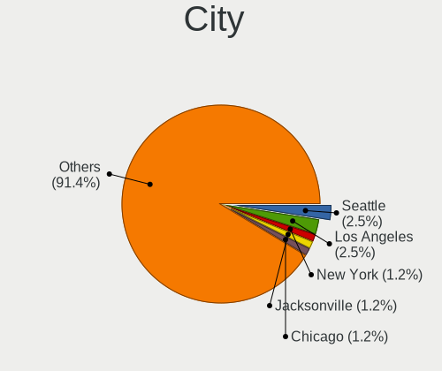
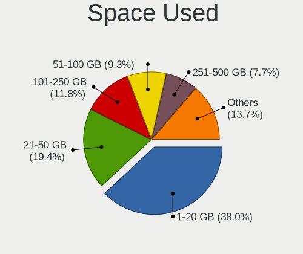
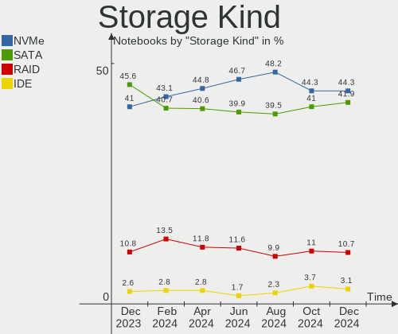
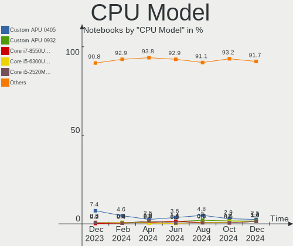
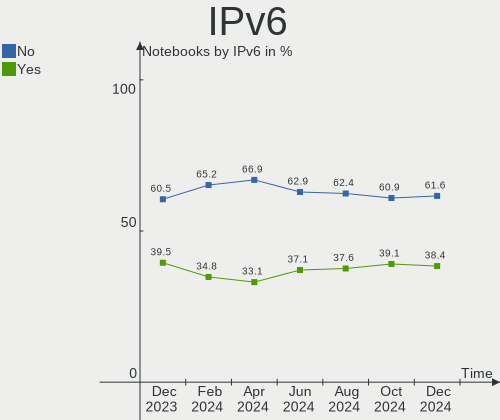

Linux in USA - Hardware Trends (Notebooks)
------------------------------------------

A project to identify most popular hardware characteristics and track their change
over time based on data collected by Linux users at https://Linux-Hardware.org.

Anyone can contribute to this report by the [hw-probe](https://github.com/linuxhw/hw-probe) tool:

    sudo -E hw-probe -all -upload

Period: Oct, 2023.

Contents
--------

* [ System ](#system)
  - [ OS                       ](#os)
  - [ OS Family                ](#os-family)
  - [ Kernel                   ](#kernel)
  - [ Kernel Family            ](#kernel-family)
  - [ Kernel Major Ver.        ](#kernel-major-ver)
  - [ Arch                     ](#arch)
  - [ DE                       ](#de)
  - [ Display Server           ](#display-server)
  - [ Display Manager          ](#display-manager)
  - [ OS Lang                  ](#os-lang)
  - [ Boot Mode                ](#boot-mode)
  - [ Filesystem               ](#filesystem)
  - [ Part. scheme             ](#part-scheme)
  - [ Dual Boot with Linux/BSD ](#dual-boot-with-linuxbsd)
  - [ Dual Boot (Win)          ](#dual-boot-win)

* [ Board ](#board)
  - [ Vendor                   ](#vendor)
  - [ Model                    ](#model)
  - [ Model Family             ](#model-family)
  - [ MFG Year                 ](#mfg-year)
  - [ Form Factor              ](#form-factor)
  - [ Secure Boot              ](#secure-boot)
  - [ Coreboot                 ](#coreboot)
  - [ RAM Size                 ](#ram-size)
  - [ RAM Used                 ](#ram-used)
  - [ Total Drives             ](#total-drives)
  - [ Has CD-ROM               ](#has-cd-rom)
  - [ Has Ethernet             ](#has-ethernet)
  - [ Has WiFi                 ](#has-wifi)
  - [ Has Bluetooth            ](#has-bluetooth)

* [ Location ](#location)
  - [ Country                  ](#country)
  - [ City                     ](#city)

* [ Drives ](#drives)
  - [ Drive Vendor             ](#drive-vendor)
  - [ Drive Model              ](#drive-model)
  - [ HDD Vendor               ](#hdd-vendor)
  - [ SSD Vendor               ](#ssd-vendor)
  - [ Drive Kind               ](#drive-kind)
  - [ Drive Connector          ](#drive-connector)
  - [ Drive Size               ](#drive-size)
  - [ Space Total              ](#space-total)
  - [ Space Used               ](#space-used)
  - [ Malfunc. Drives          ](#malfunc-drives)
  - [ Malfunc. Drive Vendor    ](#malfunc-drive-vendor)
  - [ Malfunc. HDD Vendor      ](#malfunc-hdd-vendor)
  - [ Malfunc. Drive Kind      ](#malfunc-drive-kind)
  - [ Failed Drives            ](#failed-drives)
  - [ Failed Drive Vendor      ](#failed-drive-vendor)
  - [ Drive Status             ](#drive-status)

* [ Storage controller ](#storage-controller)
  - [ Storage Vendor           ](#storage-vendor)
  - [ Storage Model            ](#storage-model)
  - [ Storage Kind             ](#storage-kind)

* [ Processor ](#processor)
  - [ CPU Vendor               ](#cpu-vendor)
  - [ CPU Model                ](#cpu-model)
  - [ CPU Model Family         ](#cpu-model-family)
  - [ CPU Cores                ](#cpu-cores)
  - [ CPU Sockets              ](#cpu-sockets)
  - [ CPU Threads              ](#cpu-threads)
  - [ CPU Op-Modes             ](#cpu-op-modes)
  - [ CPU Microcode            ](#cpu-microcode)
  - [ CPU Microarch            ](#cpu-microarch)

* [ Graphics ](#graphics)
  - [ GPU Vendor               ](#gpu-vendor)
  - [ GPU Model                ](#gpu-model)
  - [ GPU Combo                ](#gpu-combo)
  - [ GPU Driver               ](#gpu-driver)
  - [ GPU Memory               ](#gpu-memory)

* [ Monitor ](#monitor)
  - [ Monitor Vendor           ](#monitor-vendor)
  - [ Monitor Model            ](#monitor-model)
  - [ Monitor Resolution       ](#monitor-resolution)
  - [ Monitor Diagonal         ](#monitor-diagonal)
  - [ Monitor Width            ](#monitor-width)
  - [ Aspect Ratio             ](#aspect-ratio)
  - [ Monitor Area             ](#monitor-area)
  - [ Pixel Density            ](#pixel-density)
  - [ Multiple Monitors        ](#multiple-monitors)

* [ Network ](#network)
  - [ Net Controller Vendor    ](#net-controller-vendor)
  - [ Net Controller Model     ](#net-controller-model)
  - [ Wireless Vendor          ](#wireless-vendor)
  - [ Wireless Model           ](#wireless-model)
  - [ Ethernet Vendor          ](#ethernet-vendor)
  - [ Ethernet Model           ](#ethernet-model)
  - [ Net Controller Kind      ](#net-controller-kind)
  - [ Used Controller          ](#used-controller)
  - [ NICs                     ](#nics)
  - [ IPv6                     ](#ipv6)

* [ Bluetooth ](#bluetooth)
  - [ Bluetooth Vendor         ](#bluetooth-vendor)
  - [ Bluetooth Model          ](#bluetooth-model)

* [ Sound ](#sound)
  - [ Sound Vendor             ](#sound-vendor)
  - [ Sound Model              ](#sound-model)

* [ Memory ](#memory)
  - [ Memory Vendor            ](#memory-vendor)
  - [ Memory Model             ](#memory-model)
  - [ Memory Kind              ](#memory-kind)
  - [ Memory Form Factor       ](#memory-form-factor)
  - [ Memory Size              ](#memory-size)
  - [ Memory Speed             ](#memory-speed)

* [ Printers & scanners ](#printers--scanners)
  - [ Printer Vendor           ](#printer-vendor)
  - [ Printer Model            ](#printer-model)
  - [ Scanner Vendor           ](#scanner-vendor)
  - [ Scanner Model            ](#scanner-model)

* [ Camera ](#camera)
  - [ Camera Vendor            ](#camera-vendor)
  - [ Camera Model             ](#camera-model)

* [ Security ](#security)
  - [ Fingerprint Vendor       ](#fingerprint-vendor)
  - [ Fingerprint Model        ](#fingerprint-model)
  - [ Chipcard Vendor          ](#chipcard-vendor)
  - [ Chipcard Model           ](#chipcard-model)

* [ Unsupported ](#unsupported)
  - [ Unsupported Devices      ](#unsupported-devices)
  - [ Unsupported Device Types ](#unsupported-device-types)

System
------

OS
--

Installed operating systems

| Name                         | Notebooks | Percent |
|------------------------------|-----------|---------|
| Debian 12                    | 88        | 16.09%  |
| Ubuntu 22.04                 | 52        | 9.51%   |
| Fedora 38                    | 37        | 6.76%   |
| Linux Mint 21.2              | 33        | 6.03%   |
| Pop!_OS 22.04                | 32        | 5.85%   |
| ArcoLinux Rolling            | 18        | 3.29%   |
| Ubuntu 23.04                 | 17        | 3.11%   |
| Arch Rolling                 | 15        | 2.74%   |
| SteamOS 3.4.11               | 12        | 2.19%   |
| Kali 2023.3                  | 12        | 2.19%   |
| Zorin 16                     | 11        | 2.01%   |
| Ubuntu 23.10                 | 11        | 2.01%   |
| OpenMandriva 23.10           | 9         | 1.65%   |
| OpenMandriva 23.08           | 8         | 1.46%   |
| Kubuntu 22.04                | 8         | 1.46%   |
| Ubuntu 20.04                 | 7         | 1.28%   |
| SteamOS 3.4.10               | 7         | 1.28%   |
| Manjaro                      | 7         | 1.28%   |
| KDE neon 22.04               | 7         | 1.28%   |
| EndeavourOS Rolling          | 7         | 1.28%   |
| openSUSE Tumbleweed-XXXXXXXX | 6         | 1.1%    |
| NixOS 23.05                  | 6         | 1.1%    |
| Kubuntu 23.04                | 6         | 1.1%    |
| blendOS                      | 6         | 1.1%    |
| SteamOS 3.5.1                | 5         | 0.91%   |
| Linux Mint 20.3              | 5         | 0.91%   |
| BunsenLabs 11                | 5         | 0.91%   |
| MX 23                        | 4         | 0.73%   |
| Linux Mint 21.1              | 4         | 0.73%   |
| Elementary 7.1               | 4         | 0.73%   |
| Debian 11                    | 4         | 0.73%   |
| Debian                       | 4         | 0.73%   |
| Xero Rolling                 | 3         | 0.55%   |
| Void Linux Rolling           | 3         | 0.55%   |
| SteamOS 3.5                  | 3         | 0.55%   |
| Xubuntu 22.04                | 2         | 0.37%   |
| Xubuntu 20.04                | 2         | 0.37%   |
| Ubuntu MATE 22.04            | 2         | 0.37%   |
| Ubuntu 22.10                 | 2         | 0.37%   |
| Ubuntu 20.10                 | 2         | 0.37%   |

OS Family
---------

OS without a version

| Name          | Notebooks | Percent |
|---------------|-----------|---------|
| Debian        | 96        | 17.55%  |
| Ubuntu        | 93        | 17%     |
| Linux Mint    | 44        | 8.04%   |
| Fedora        | 40        | 7.31%   |
| Pop!_OS       | 32        | 5.85%   |
| SteamOS       | 31        | 5.67%   |
| OpenMandriva  | 22        | 4.02%   |
| ArcoLinux     | 18        | 3.29%   |
| Kubuntu       | 15        | 2.74%   |
| Arch          | 15        | 2.74%   |
| Kali          | 12        | 2.19%   |
| Zorin         | 11        | 2.01%   |
| Manjaro       | 11        | 2.01%   |
| openSUSE      | 7         | 1.28%   |
| KDE neon      | 7         | 1.28%   |
| EndeavourOS   | 7         | 1.28%   |
| NixOS         | 6         | 1.1%    |
| blendOS       | 6         | 1.1%    |
| Xubuntu       | 5         | 0.91%   |
| MX            | 5         | 0.91%   |
| BunsenLabs    | 5         | 0.91%   |
| Lubuntu       | 4         | 0.73%   |
| Garuda Linux  | 4         | 0.73%   |
| Elementary    | 4         | 0.73%   |
| Xero          | 3         | 0.55%   |
| Void Linux    | 3         | 0.55%   |
| Ubuntu Budgie | 3         | 0.55%   |
| LMDE          | 3         | 0.55%   |
| Ubuntu Unity  | 2         | 0.37%   |
| Ubuntu MATE   | 2         | 0.37%   |
| TUXEDO OS     | 2         | 0.37%   |
| Rocky Linux   | 2         | 0.37%   |
| RHEL          | 2         | 0.37%   |
| Parrot        | 2         | 0.37%   |
| Nobara        | 2         | 0.37%   |
| Gentoo        | 2         | 0.37%   |
| Clear Linux   | 2         | 0.37%   |
| ChimeraOS     | 2         | 0.37%   |
| Artix         | 2         | 0.37%   |
| XeroG         | 1         | 0.18%   |

Kernel
------

Version of the Linux kernel

| Version                    | Notebooks | Percent |
|----------------------------|-----------|---------|
| 6.1.0-13-amd64             | 53        | 9.69%   |
| 6.2.0-34-generic           | 40        | 7.31%   |
| 6.1.0-12-amd64             | 31        | 5.67%   |
| 5.15.0-86-generic          | 21        | 3.84%   |
| 6.2.0-33-generic           | 20        | 3.66%   |
| 5.13.0-valve37-1-neptune   | 19        | 3.47%   |
| 5.15.0-87-generic          | 17        | 3.11%   |
| 6.5.4-76060504-generic     | 16        | 2.93%   |
| 6.2.0-35-generic           | 16        | 2.93%   |
| 6.5.0-9-generic            | 14        | 2.56%   |
| 6.5.5-200.fc38.x86_64      | 12        | 2.19%   |
| 6.5.5-desktop-1omv2390     | 10        | 1.83%   |
| 5.15.0-84-generic          | 9         | 1.65%   |
| 6.5.7-arch1-1              | 8         | 1.46%   |
| 6.5.6-200.fc38.x86_64      | 7         | 1.28%   |
| 6.5.5-arch1-1              | 7         | 1.28%   |
| 6.5.8-arch1-1              | 6         | 1.1%    |
| 6.5.7-200.fc38.x86_64      | 6         | 1.1%    |
| 6.5.5-1-MANJARO            | 6         | 1.1%    |
| 6.4.6-76060406-generic     | 6         | 1.1%    |
| 6.4.11-desktop-1omv2390    | 6         | 1.1%    |
| 6.2.9-300.fc38.x86_64      | 6         | 1.1%    |
| 6.5.6-76060506-generic     | 5         | 0.91%   |
| 6.5.6-1-default            | 5         | 0.91%   |
| 6.5.5-zen1-1-zen           | 5         | 0.91%   |
| 6.5.0-kali2-amd64          | 5         | 0.91%   |
| 6.3.9-zen1-1-zen           | 5         | 0.91%   |
| 6.1.52-valve3-1-neptune-61 | 5         | 0.91%   |
| 5.10.0-25-amd64            | 5         | 0.91%   |
| 6.5.8-zen1-1-zen           | 4         | 0.73%   |
| 6.2.0-26-generic           | 4         | 0.73%   |
| 5.15.0-76-generic          | 4         | 0.73%   |
| 6.5.8-200.fc38.x86_64      | 3         | 0.55%   |
| 6.5.7-zen2-1-zen           | 3         | 0.55%   |
| 6.5.6-arch2-1              | 3         | 0.55%   |
| 6.5.0-kali1-amd64          | 3         | 0.55%   |
| 6.2.6-76060206-generic     | 3         | 0.55%   |
| 6.2.0-20-generic           | 3         | 0.55%   |
| 6.1.52-valve2-1-neptune-61 | 3         | 0.55%   |
| 6.1.0-10-amd64             | 3         | 0.55%   |

Kernel Family
-------------

Linux kernel without a distro release

| Version | Notebooks | Percent |
|---------|-----------|---------|
| 6.1.0   | 94        | 17.18%  |
| 6.2.0   | 92        | 16.82%  |
| 5.15.0  | 64        | 11.7%   |
| 6.5.5   | 46        | 8.41%   |
| 6.5.0   | 27        | 4.94%   |
| 6.5.6   | 26        | 4.75%   |
| 6.5.7   | 24        | 4.39%   |
| 5.13.0  | 21        | 3.84%   |
| 6.5.4   | 19        | 3.47%   |
| 6.5.8   | 15        | 2.74%   |
| 6.4.11  | 9         | 1.65%   |
| 5.10.0  | 9         | 1.65%   |
| 6.1.52  | 8         | 1.46%   |
| 5.4.0   | 8         | 1.46%   |
| 6.4.6   | 7         | 1.28%   |
| 6.5.3   | 6         | 1.1%    |
| 6.2.9   | 6         | 1.1%    |
| 6.1.55  | 6         | 1.1%    |
| 6.5.9   | 5         | 0.91%   |
| 6.3.9   | 5         | 0.91%   |
| 5.19.0  | 5         | 0.91%   |
| 6.4.0   | 4         | 0.73%   |
| 6.2.6   | 4         | 0.73%   |
| 6.6.0   | 3         | 0.55%   |
| 5.14.0  | 3         | 0.55%   |
| 6.4.8   | 2         | 0.37%   |
| 6.3.7   | 2         | 0.37%   |
| 6.3.13  | 2         | 0.37%   |
| 6.3.0   | 2         | 0.37%   |
| 6.1.58  | 2         | 0.37%   |
| 6.1.1   | 2         | 0.37%   |
| 5.8.0   | 2         | 0.37%   |
| 4.18.0  | 2         | 0.37%   |
| 4.15.0  | 2         | 0.37%   |
| 6.5.2.8 | 1         | 0.18%   |
| 6.5.2   | 1         | 0.18%   |
| 6.4.9   | 1         | 0.18%   |
| 6.4.15  | 1         | 0.18%   |
| 6.4.12  | 1         | 0.18%   |
| 6.3.8   | 1         | 0.18%   |

Kernel Major Ver.
-----------------

Linux kernel major version

| Version | Notebooks | Percent |
|---------|-----------|---------|
| 6.5     | 169       | 30.9%   |
| 6.1     | 112       | 20.48%  |
| 6.2     | 103       | 18.83%  |
| 5.15    | 64        | 11.7%   |
| 6.4     | 25        | 4.57%   |
| 5.13    | 21        | 3.84%   |
| 6.3     | 14        | 2.56%   |
| 5.10    | 9         | 1.65%   |
| 5.4     | 8         | 1.46%   |
| 5.19    | 5         | 0.91%   |
| 6.6     | 3         | 0.55%   |
| 5.14    | 3         | 0.55%   |
| 5.8     | 2         | 0.37%   |
| 4.4     | 2         | 0.37%   |
| 4.18    | 2         | 0.37%   |
| 4.15    | 2         | 0.37%   |
| 6.5.2   | 1         | 0.18%   |
| 6.0     | 1         | 0.18%   |
| 5.16    | 1         | 0.18%   |

Arch
----

OS architecture (x86_64, i586, etc.)

| Name    | Notebooks | Percent |
|---------|-----------|---------|
| x86_64  | 541       | 98.9%   |
| i686    | 5         | 0.91%   |
| aarch64 | 1         | 0.18%   |

DE
--

Desktop Environment

| Name              | Notebooks | Percent |
|-------------------|-----------|---------|
| GNOME             | 215       | 39.31%  |
| KDE5              | 134       | 24.5%   |
| Unknown           | 71        | 12.98%  |
| XFCE              | 40        | 7.31%   |
| X-Cinnamon        | 37        | 6.76%   |
| MATE              | 17        | 3.11%   |
| Budgie            | 5         | 0.91%   |
| Pantheon          | 4         | 0.73%   |
| LXQt              | 4         | 0.73%   |
| Hyprland          | 3         | 0.55%   |
| Unity             | 2         | 0.37%   |
| i3                | 2         | 0.37%   |
| GNOME Classic     | 2         | 0.37%   |
| x-session-manager | 1         | 0.18%   |
| swayland          | 1         | 0.18%   |
| LXDE              | 1         | 0.18%   |
| lightdm-xsession  | 1         | 0.18%   |
| KDE               | 1         | 0.18%   |
| icewm             | 1         | 0.18%   |
| GNOME Flashback   | 1         | 0.18%   |
| fluxbox           | 1         | 0.18%   |
| Enlightenment     | 1         | 0.18%   |
| Cinnamon          | 1         | 0.18%   |
| BunsenLabs        | 1         | 0.18%   |

Display Server
--------------

X11 or Wayland

| Name    | Notebooks | Percent |
|---------|-----------|---------|
| X11     | 312       | 57.04%  |
| Wayland | 165       | 30.16%  |
| Unknown | 65        | 11.88%  |
| Tty     | 5         | 0.91%   |

Display Manager
---------------

SDDM, LightDM, etc.

| Name    | Notebooks | Percent |
|---------|-----------|---------|
| Unknown | 259       | 47.35%  |
| GDM3    | 98        | 17.92%  |
| SDDM    | 87        | 15.9%   |
| LightDM | 73        | 13.35%  |
| GDM     | 27        | 4.94%   |
| SLIMSKI | 1         | 0.18%   |
| LXDM    | 1         | 0.18%   |
| LEMURS  | 1         | 0.18%   |

OS Lang
-------

Language

| Lang    | Notebooks | Percent |
|---------|-----------|---------|
| en_US   | 455       | 83.18%  |
| Unknown | 59        | 10.79%  |
| C       | 23        | 4.2%    |
| en_GB   | 4         | 0.73%   |
| en_CA   | 2         | 0.37%   |
| ru_RU   | 1         | 0.18%   |
| POSIX   | 1         | 0.18%   |
| it_IT   | 1         | 0.18%   |
| en_DK   | 1         | 0.18%   |

Boot Mode
---------

EFI or BIOS

| Mode | Notebooks | Percent |
|------|-----------|---------|
| EFI  | 290       | 53.02%  |
| BIOS | 257       | 46.98%  |

Filesystem
----------

Type of filesystem

| Type    | Notebooks | Percent |
|---------|-----------|---------|
| Ext4    | 267       | 48.81%  |
| Btrfs   | 111       | 20.29%  |
| Tmpfs   | 79        | 14.44%  |
| Overlay | 75        | 13.71%  |
| Xfs     | 8         | 1.46%   |
| Zfs     | 3         | 0.55%   |
| F2fs    | 3         | 0.55%   |
| Ext3    | 1         | 0.18%   |

Part. scheme
------------

Scheme of partitioning

| Type    | Notebooks | Percent |
|---------|-----------|---------|
| GPT     | 312       | 57.04%  |
| Unknown | 196       | 35.83%  |
| MBR     | 39        | 7.13%   |

Dual Boot with Linux/BSD
------------------------

Hosting more than one Linux/BSD

| Dual boot | Notebooks | Percent |
|-----------|-----------|---------|
| No        | 502       | 91.77%  |
| Yes       | 45        | 8.23%   |

Dual Boot (Win)
---------------

Hosting Linux and Windows

| Dual boot | Notebooks | Percent |
|-----------|-----------|---------|
| No        | 440       | 80.44%  |
| Yes       | 107       | 19.56%  |

Board
-----

Vendor
------

Motherboard manufacturer

| Name                           | Notebooks | Percent |
|--------------------------------|-----------|---------|
| Lenovo                         | 114       | 20.84%  |
| Hewlett-Packard                | 103       | 18.83%  |
| Dell                           | 84        | 15.36%  |
| Google                         | 50        | 9.14%   |
| ASUSTek Computer               | 42        | 7.68%   |
| Valve                          | 30        | 5.48%   |
| Apple                          | 26        | 4.75%   |
| Acer                           | 17        | 3.11%   |
| Toshiba                        | 13        | 2.38%   |
| MSI                            | 12        | 2.19%   |
| Framework                      | 7         | 1.28%   |
| System76                       | 6         | 1.1%    |
| Razer                          | 4         | 0.73%   |
| Panasonic                      | 4         | 0.73%   |
| Alienware                      | 4         | 0.73%   |
| Samsung Electronics            | 3         | 0.55%   |
| Notebook                       | 3         | 0.55%   |
| GPU Company                    | 3         | 0.55%   |
| Unknown                        | 3         | 0.55%   |
| Gigabyte Technology            | 2         | 0.37%   |
| Fujitsu                        | 2         | 0.37%   |
| Thomson                        | 1         | 0.18%   |
| Synology                       | 1         | 0.18%   |
| Sony                           | 1         | 0.18%   |
| OriginPC                       | 1         | 0.18%   |
| Matsushita Electric Industrial | 1         | 0.18%   |
| LG Electronics                 | 1         | 0.18%   |
| ION Computer Systems           | 1         | 0.18%   |
| HUAWEI                         | 1         | 0.18%   |
| GPD                            | 1         | 0.18%   |
| Gateway                        | 1         | 0.18%   |
| Eluktronics                    | 1         | 0.18%   |
| Cube                           | 1         | 0.18%   |
| Compaq(Intel)                  | 1         | 0.18%   |
| ASRock                         | 1         | 0.18%   |
| AMI                            | 1         | 0.18%   |

Model
-----

Motherboard model

| Name                                       | Notebooks | Percent |
|--------------------------------------------|-----------|---------|
| Google Reks                                | 32        | 5.85%   |
| Valve Jupiter                              | 30        | 5.48%   |
| Lenovo ThinkPad E475 20H40006US            | 22        | 4.02%   |
| HP Notebook                                | 7         | 1.28%   |
| Apple MacBookPro9,2                        | 6         | 1.1%    |
| Lenovo ThinkPad 13 2nd Gen 20J10046US      | 4         | 0.73%   |
| Framework Laptop 13 (AMD Ryzen 7040Series) | 3         | 0.55%   |
| Framework Laptop                           | 3         | 0.55%   |
| Unknown                                    | 3         | 0.55%   |
| Toshiba Satellite L755                     | 2         | 0.37%   |
| System76 Gazelle                           | 2         | 0.37%   |
| Razer Blade                                | 2         | 0.37%   |
| Lenovo ThinkPad X220 4286CTO               | 2         | 0.37%   |
| Lenovo ThinkPad T450 20BUS50Q16            | 2         | 0.37%   |
| Lenovo ThinkPad T440p 20AN0069US           | 2         | 0.37%   |
| Lenovo ThinkPad E580 20KS003WUS            | 2         | 0.37%   |
| Lenovo IdeaPad Flex-14API 81SS             | 2         | 0.37%   |
| HP ZBook Studio G3                         | 2         | 0.37%   |
| HP ProBook 4540s                           | 2         | 0.37%   |
| HP Pavilion Notebook                       | 2         | 0.37%   |
| HP Pavilion Laptop 15t-eg300               | 2         | 0.37%   |
| HP Pavilion g7                             | 2         | 0.37%   |
| HP Pavilion g6                             | 2         | 0.37%   |
| HP Pavilion dv6                            | 2         | 0.37%   |
| HP Laptop 17-by2xxx                        | 2         | 0.37%   |
| HP Laptop 15-ef2xxx                        | 2         | 0.37%   |
| HP Laptop 15-db0xxx                        | 2         | 0.37%   |
| HP G60                                     | 2         | 0.37%   |
| HP EliteBook 8560w                         | 2         | 0.37%   |
| HP EliteBook 840 G6                        | 2         | 0.37%   |
| HP EliteBook 820 G3                        | 2         | 0.37%   |
| HP Dragonfly 13.5 inch G4 Notebook PC      | 2         | 0.37%   |
| HP 2000                                    | 2         | 0.37%   |
| Google Morphius                            | 2         | 0.37%   |
| Dell XPS 15 9530                           | 2         | 0.37%   |
| Dell Precision 7560                        | 2         | 0.37%   |
| Dell Precision 7530                        | 2         | 0.37%   |
| Dell Latitude E6410                        | 2         | 0.37%   |
| Dell Latitude 5520                         | 2         | 0.37%   |
| Dell Inspiron 7375                         | 2         | 0.37%   |

Model Family
------------

Motherboard model prefix

| Name               | Notebooks | Percent |
|--------------------|-----------|---------|
| Lenovo ThinkPad    | 77        | 14.08%  |
| Google Reks        | 32        | 5.85%   |
| Valve Jupiter      | 30        | 5.48%   |
| Dell Latitude      | 25        | 4.57%   |
| Dell Inspiron      | 21        | 3.84%   |
| HP Laptop          | 20        | 3.66%   |
| Lenovo IdeaPad     | 19        | 3.47%   |
| HP Pavilion        | 19        | 3.47%   |
| HP EliteBook       | 19        | 3.47%   |
| Dell Precision     | 15        | 2.74%   |
| Toshiba Satellite  | 12        | 2.19%   |
| ASUS VivoBook      | 11        | 2.01%   |
| Acer Aspire        | 10        | 1.83%   |
| Lenovo Legion      | 9         | 1.65%   |
| Dell XPS           | 9         | 1.65%   |
| ASUS ROG           | 9         | 1.65%   |
| HP ZBook           | 8         | 1.46%   |
| HP ProBook         | 8         | 1.46%   |
| HP Notebook        | 7         | 1.28%   |
| Framework Laptop   | 7         | 1.28%   |
| Apple MacBookPro9  | 7         | 1.28%   |
| ASUS Zenbook       | 5         | 0.91%   |
| Razer Blade        | 4         | 0.73%   |
| Dell Vostro        | 4         | 0.73%   |
| ASUS ASUS          | 4         | 0.73%   |
| Lenovo ThinkBook   | 3         | 0.55%   |
| HP OMEN            | 3         | 0.55%   |
| HP ENVY            | 3         | 0.55%   |
| Apple MacBookPro8  | 3         | 0.55%   |
| Apple MacBookPro11 | 3         | 0.55%   |
| Unknown            | 3         | 0.55%   |
| System76 Gazelle   | 2         | 0.37%   |
| Notebook NP5x      | 2         | 0.37%   |
| MSI Pulse          | 2         | 0.37%   |
| MSI GF63           | 2         | 0.37%   |
| Lenovo Flex        | 2         | 0.37%   |
| HP Victus          | 2         | 0.37%   |
| HP Presario        | 2         | 0.37%   |
| HP G60             | 2         | 0.37%   |
| HP Dragonfly       | 2         | 0.37%   |

MFG Year
--------

Motherboard manufacture year

| Year    | Notebooks | Percent |
|---------|-----------|---------|
| 2023    | 89        | 16.27%  |
| 2022    | 68        | 12.43%  |
| 2021    | 53        | 9.69%   |
| 2019    | 48        | 8.78%   |
| 2020    | 45        | 8.23%   |
| 2018    | 40        | 7.31%   |
| 2012    | 30        | 5.48%   |
| 2011    | 30        | 5.48%   |
| 2017    | 25        | 4.57%   |
| 2015    | 25        | 4.57%   |
| 2014    | 21        | 3.84%   |
| 2013    | 21        | 3.84%   |
| 2016    | 16        | 2.93%   |
| 2010    | 12        | 2.19%   |
| 2008    | 10        | 1.83%   |
| 2009    | 6         | 1.1%    |
| 2007    | 3         | 0.55%   |
| 2005    | 2         | 0.37%   |
| 2006    | 1         | 0.18%   |
| 2004    | 1         | 0.18%   |
| Unknown | 1         | 0.18%   |

Form Factor
-----------

Physical design of the computer

| Name     | Notebooks | Percent |
|----------|-----------|---------|
| Notebook | 547       | 100%    |

Secure Boot
-----------

Enabled or disabled

| State    | Notebooks | Percent |
|----------|-----------|---------|
| Disabled | 501       | 91.59%  |
| Enabled  | 46        | 8.41%   |

Coreboot
--------

Have coreboot on board

| Used | Notebooks | Percent |
|------|-----------|---------|
| No   | 490       | 89.58%  |
| Yes  | 57        | 10.42%  |

RAM Size
--------

Total RAM memory

| Size in GB  | Notebooks | Percent |
|-------------|-----------|---------|
| 4.01-8.0    | 144       | 26.33%  |
| 8.01-16.0   | 98        | 17.92%  |
| 16.01-24.0  | 97        | 17.73%  |
| 3.01-4.0    | 94        | 17.18%  |
| 32.01-64.0  | 70        | 12.8%   |
| 64.01-256.0 | 20        | 3.66%   |
| 24.01-32.0  | 8         | 1.46%   |
| 1.01-2.0    | 8         | 1.46%   |
| 2.01-3.0    | 6         | 1.1%    |
| 0.51-1.0    | 1         | 0.18%   |
| 0.01-0.5    | 1         | 0.18%   |

RAM Used
--------

Used RAM memory

| Used GB    | Notebooks | Percent |
|------------|-----------|---------|
| 1.01-2.0   | 172       | 31.44%  |
| 2.01-3.0   | 135       | 24.68%  |
| 4.01-8.0   | 120       | 21.94%  |
| 3.01-4.0   | 69        | 12.61%  |
| 8.01-16.0  | 21        | 3.84%   |
| 0.51-1.0   | 18        | 3.29%   |
| 16.01-24.0 | 4         | 0.73%   |
| 0.01-0.5   | 4         | 0.73%   |
| 32.01-64.0 | 2         | 0.37%   |
| 24.01-32.0 | 2         | 0.37%   |

Total Drives
------------

Number of drives on board

| Drives | Notebooks | Percent |
|--------|-----------|---------|
| 1      | 384       | 70.2%   |
| 2      | 137       | 25.05%  |
| 3      | 20        | 3.66%   |
| 0      | 3         | 0.55%   |
| 4      | 2         | 0.37%   |
| 6      | 1         | 0.18%   |

Has CD-ROM
----------

Has CD-ROM on board

| Presented | Notebooks | Percent |
|-----------|-----------|---------|
| No        | 414       | 75.69%  |
| Yes       | 133       | 24.31%  |

Has Ethernet
------------

Has Ethernet on board

| Presented | Notebooks | Percent |
|-----------|-----------|---------|
| Yes       | 375       | 68.56%  |
| No        | 172       | 31.44%  |

Has WiFi
--------

Has WiFi module

| Presented | Notebooks | Percent |
|-----------|-----------|---------|
| Yes       | 544       | 99.45%  |
| No        | 3         | 0.55%   |

Has Bluetooth
-------------

Has Bluetooth module

| Presented | Notebooks | Percent |
|-----------|-----------|---------|
| Yes       | 472       | 86.29%  |
| No        | 75        | 13.71%  |

Location
--------

Country
-------

Geographic location (country)

| Country | Notebooks | Percent |
|---------|-----------|---------|
| USA     | 547       | 100%    |

City
----

Geographic location (city)

| City           | Notebooks | Percent |
|----------------|-----------|---------|
| Bangor         | 60        | 10.97%  |
| Charlotte      | 9         | 1.65%   |
| New York       | 8         | 1.46%   |
| Seattle        | 6         | 1.1%    |
| Portland       | 6         | 1.1%    |
| Nashville      | 6         | 1.1%    |
| Los Angeles    | 6         | 1.1%    |
| Houston        | 6         | 1.1%    |
| Pittsburgh     | 5         | 0.91%   |
| Dallas         | 5         | 0.91%   |
| Austin         | 5         | 0.91%   |
| Atlanta        | 5         | 0.91%   |
| Phoenix        | 4         | 0.73%   |
| Mesa           | 4         | 0.73%   |
| Las Vegas      | 4         | 0.73%   |
| Jacksonville   | 4         | 0.73%   |
| Skokie         | 3         | 0.55%   |
| Salt Lake City | 3         | 0.55%   |
| Reno           | 3         | 0.55%   |
| Lancaster      | 3         | 0.55%   |
| Kansas City    | 3         | 0.55%   |
| Harrisonburg   | 3         | 0.55%   |
| Gainesville    | 3         | 0.55%   |
| Fort Wayne     | 3         | 0.55%   |
| Denver         | 3         | 0.55%   |
| Craigsville    | 3         | 0.55%   |
| Bedford        | 3         | 0.55%   |
| Westminster    | 2         | 0.37%   |
| Waterbury      | 2         | 0.37%   |
| Tulsa          | 2         | 0.37%   |
| Tucson         | 2         | 0.37%   |
| The Bronx      | 2         | 0.37%   |
| Springfield    | 2         | 0.37%   |
| Spring         | 2         | 0.37%   |
| Spokane        | 2         | 0.37%   |
| Savannah       | 2         | 0.37%   |
| San Jose       | 2         | 0.37%   |
| San Francisco  | 2         | 0.37%   |
| San Diego      | 2         | 0.37%   |
| Sacramento     | 2         | 0.37%   |

Drives
------

Drive Vendor
------------

Hard drive vendors

| Vendor                         | Notebooks | Drives | Percent |
|--------------------------------|-----------|--------|---------|
| Samsung Electronics            | 118       | 131    | 17.15%  |
| Unknown                        | 80        | 88     | 11.63%  |
| Sandisk                        | 53        | 60     | 7.7%    |
| WDC                            | 48        | 51     | 6.98%   |
| Seagate                        | 48        | 49     | 6.98%   |
| Kingston                       | 36        | 36     | 5.23%   |
| Toshiba                        | 30        | 30     | 4.36%   |
| SK hynix                       | 28        | 32     | 4.07%   |
| Micron Technology              | 24        | 24     | 3.49%   |
| Unknown                        | 24        | 24     | 3.49%   |
| Crucial                        | 23        | 24     | 3.34%   |
| Intel                          | 21        | 23     | 3.05%   |
| Phison Electronics             | 15        | 15     | 2.18%   |
| Kingston Technology Company    | 13        | 13     | 1.89%   |
| Apple                          | 12        | 12     | 1.74%   |
| KIOXIA                         | 10        | 10     | 1.45%   |
| PNY                            | 9         | 9      | 1.31%   |
| Hitachi                        | 9         | 9      | 1.31%   |
| HGST                           | 9         | 10     | 1.31%   |
| Micron/Crucial Technology      | 8         | 9      | 1.16%   |
| SPCC                           | 6         | 6      | 0.87%   |
| China                          | 5         | 5      | 0.73%   |
| Team                           | 4         | 4      | 0.58%   |
| SABRENT                        | 4         | 4      | 0.58%   |
| Silicon Motion                 | 3         | 3      | 0.44%   |
| Realtek                        | 3         | 4      | 0.44%   |
| Hewlett-Packard                | 3         | 3      | 0.44%   |
| Wibtek                         | 2         | 2      | 0.29%   |
| WD Blue                        | 2         | 2      | 0.29%   |
| Realtek Semiconductor          | 2         | 2      | 0.29%   |
| Phison                         | 2         | 2      | 0.29%   |
| O2 Micro                       | 2         | 2      | 0.29%   |
| Corsair                        | 2         | 5      | 0.29%   |
| BHT                            | 2         | 2      | 0.29%   |
| X12                            | 1         | 1      | 0.15%   |
| Union Memory                   | 1         | 1      | 0.15%   |
| T-FORCE                        | 1         | 1      | 0.15%   |
| SSSTC                          | 1         | 1      | 0.15%   |
| Solid State Storage Technology | 1         | 1      | 0.15%   |
| Shenzhen Longsys Electronics   | 1         | 1      | 0.15%   |

Drive Model
-----------

Hard drive models

| Model                                               | Notebooks | Percent |
|-----------------------------------------------------|-----------|---------|
| Unknown                                             | 24        | 3.34%   |
| Kingston SA400S37120G 120GB SSD                     | 23        | 3.2%    |
| Unknown DF4016  16GB                                | 22        | 3.06%   |
| Samsung NVMe SSD Controller SM981/PM981/PM983 1TB   | 18        | 2.51%   |
| Unknown MMC Card  512GB                             | 12        | 1.67%   |
| Unknown MMC Card  64GB                              | 11        | 1.53%   |
| Samsung NVMe SSD Controller PM9A1/PM9A3/980PRO 1TB  | 10        | 1.39%   |
| Kingston Company OM3PDP3 NVMe SSD 512GB             | 10        | 1.39%   |
| Sandisk WD Black SN750 / PC SN730 NVMe SSD 1024GB   | 9         | 1.25%   |
| Unknown MMC Card  256GB                             | 6         | 0.84%   |
| Unknown MMC Card  16GB                              | 6         | 0.84%   |
| Seagate ST1000LM035-1RK172 1TB                      | 6         | 0.84%   |
| Samsung NVMe SSD Controller SM961/PM961/SM963 121GB | 6         | 0.84%   |
| Micron/Crucial P2 NVMe PCIe SSD 500GB               | 6         | 0.84%   |
| Unknown MMC Card  128GB                             | 5         | 0.7%    |
| Toshiba XG6 NVMe SSD Controller 256GB               | 5         | 0.7%    |
| Samsung SSD 850 EVO 500GB                           | 5         | 0.7%    |
| Phison PS5013 E13 NVMe Controller 256GB             | 5         | 0.7%    |
| Unknown MMC Card  32GB                              | 4         | 0.56%   |
| Seagate ST9500420AS 500GB                           | 4         | 0.56%   |
| Sandisk WD_BLACK SN850X 2000GB                      | 4         | 0.56%   |
| Sandisk WD_BLACK SN770 1TB                          | 4         | 0.56%   |
| Samsung SSD 860 EVO 500GB                           | 4         | 0.56%   |
| SABRENT Disk 240GB SSD                              | 4         | 0.56%   |
| Crucial CT500MX500SSD1 500GB                        | 4         | 0.56%   |
| Crucial CT1000MX500SSD1 1TB                         | 4         | 0.56%   |
| WDC WDS500G2B0A-00SM50 500GB SSD                    | 3         | 0.42%   |
| WDC WD10SPZX-60Z10T0 1TB                            | 3         | 0.42%   |
| Toshiba MQ01ABF050 500GB                            | 3         | 0.42%   |
| Toshiba MQ01ABD100 1TB                              | 3         | 0.42%   |
| Seagate ST2000LM015-2E8174 2TB                      | 3         | 0.42%   |
| Seagate ST1000LM024 HN-M101MBB 1TB                  | 3         | 0.42%   |
| Sandisk WD Black SN850 1TB                          | 3         | 0.42%   |
| Samsung SSD 980 PRO 2TB                             | 3         | 0.42%   |
| Samsung SSD 860 EVO 250GB                           | 3         | 0.42%   |
| Samsung SSD 850 EVO 250GB                           | 3         | 0.42%   |
| Samsung MZ9LQ256HBJD-00BVL 256GB                    | 3         | 0.42%   |
| HGST HTS725050A7E630 500GB                          | 3         | 0.42%   |
| HGST HTS721010A9E630 1TB                            | 3         | 0.42%   |
| Crucial CT256MX100SSD1 256GB                        | 3         | 0.42%   |

HDD Vendor
----------

Hard disk drive vendors

| Vendor              | Notebooks | Drives | Percent |
|---------------------|-----------|--------|---------|
| Seagate             | 47        | 47     | 39.5%   |
| WDC                 | 31        | 32     | 26.05%  |
| Toshiba             | 16        | 16     | 13.45%  |
| Hitachi             | 9         | 9      | 7.56%   |
| HGST                | 9         | 10     | 7.56%   |
| Unknown             | 2         | 2      | 1.68%   |
| Samsung Electronics | 1         | 1      | 0.84%   |
| KESU                | 1         | 1      | 0.84%   |
| IBM/Hitachi         | 1         | 1      | 0.84%   |
| Fujitsu             | 1         | 1      | 0.84%   |
| Apple               | 1         | 1      | 0.84%   |

SSD Vendor
----------

Solid state drive vendors

| Vendor              | Notebooks | Drives | Percent |
|---------------------|-----------|--------|---------|
| Samsung Electronics | 37        | 38     | 20.33%  |
| Kingston            | 30        | 30     | 16.48%  |
| Crucial             | 18        | 19     | 9.89%   |
| SanDisk             | 11        | 11     | 6.04%   |
| PNY                 | 9         | 9      | 4.95%   |
| Apple               | 9         | 9      | 4.95%   |
| WDC                 | 8         | 9      | 4.4%    |
| Micron Technology   | 8         | 8      | 4.4%    |
| Intel               | 6         | 6      | 3.3%    |
| Toshiba             | 5         | 5      | 2.75%   |
| SPCC                | 5         | 5      | 2.75%   |
| China               | 5         | 5      | 2.75%   |
| Team                | 4         | 4      | 2.2%    |
| SABRENT             | 4         | 4      | 2.2%    |
| SK hynix            | 3         | 3      | 1.65%   |
| Wibtek              | 2         | 2      | 1.1%    |
| Hewlett-Packard     | 2         | 2      | 1.1%    |
| BHT                 | 2         | 2      | 1.1%    |
| X12                 | 1         | 1      | 0.55%   |
| SSSTC               | 1         | 1      | 0.55%   |
| Netac               | 1         | 1      | 0.55%   |
| Mushkin             | 1         | 1      | 0.55%   |
| LITEONIT            | 1         | 1      | 0.55%   |
| LITEON              | 1         | 1      | 0.55%   |
| KingSpec            | 1         | 1      | 0.55%   |
| FORESEE             | 1         | 1      | 0.55%   |
| Fanxiang            | 1         | 1      | 0.55%   |
| EDILOCA             | 1         | 1      | 0.55%   |
| Dogfish             | 1         | 1      | 0.55%   |
| CT2000BX            | 1         | 1      | 0.55%   |
| Corsair             | 1         | 1      | 0.55%   |
| A-DATA Technology   | 1         | 1      | 0.55%   |

Drive Kind
----------

HDD or SSD

| Kind    | Notebooks | Drives | Percent |
|---------|-----------|--------|---------|
| NVMe    | 252       | 308    | 38.83%  |
| SSD     | 173       | 185    | 26.66%  |
| HDD     | 115       | 121    | 17.72%  |
| MMC     | 99        | 108    | 15.25%  |
| Unknown | 10        | 11     | 1.54%   |

Drive Connector
---------------

SATA, SAS, NVMe, etc.

| Type | Notebooks | Drives | Percent |
|------|-----------|--------|---------|
| SATA | 263       | 283    | 40.65%  |
| NVMe | 248       | 300    | 38.33%  |
| MMC  | 99        | 108    | 15.3%   |
| SAS  | 37        | 42     | 5.72%   |

Drive Size
----------

Size of hard drive

| Size in TB | Notebooks | Drives | Percent |
|------------|-----------|--------|---------|
| 0.01-0.5   | 200       | 209    | 67.34%  |
| 0.51-1.0   | 72        | 72     | 24.24%  |
| 1.01-2.0   | 15        | 15     | 5.05%   |
| 3.01-4.0   | 4         | 4      | 1.35%   |
| 4.01-10.0  | 4         | 4      | 1.35%   |
| 2.01-3.0   | 1         | 1      | 0.34%   |
| 10.01-20.0 | 1         | 1      | 0.34%   |

Space Total
-----------

Amount of disk space available on the file system

| Size in GB     | Notebooks | Percent |
|----------------|-----------|---------|
| 101-250        | 119       | 21.76%  |
| 251-500        | 113       | 20.66%  |
| 501-1000       | 85        | 15.54%  |
| 1-20           | 58        | 10.6%   |
| 1001-2000      | 47        | 8.59%   |
| Unknown        | 39        | 7.13%   |
| More than 3000 | 28        | 5.12%   |
| 51-100         | 26        | 4.75%   |
| 2001-3000      | 20        | 3.66%   |
| 21-50          | 12        | 2.19%   |

Space Used
----------

Amount of used disk space

| Used GB        | Notebooks | Percent |
|----------------|-----------|---------|
| 1-20           | 191       | 34.92%  |
| 21-50          | 106       | 19.38%  |
| 51-100         | 65        | 11.88%  |
| 101-250        | 55        | 10.05%  |
| Unknown        | 39        | 7.13%   |
| 251-500        | 34        | 6.22%   |
| 1001-2000      | 24        | 4.39%   |
| 501-1000       | 22        | 4.02%   |
| More than 3000 | 6         | 1.1%    |
| 2001-3000      | 5         | 0.91%   |

Malfunc. Drives
---------------

Drive models with a malfunction

| Model                                                 | Notebooks | Drives | Percent |
|-------------------------------------------------------|-----------|--------|---------|
| WDC WD3200BPVT-80ZEST0 320GB                          | 1         | 1      | 6.67%   |
| WDC WD10SPZX-60Z10T0 1TB                              | 1         | 1      | 6.67%   |
| Toshiba MK3265GSXN 320GB                              | 1         | 1      | 6.67%   |
| SK hynix BC711 HFM256GD3JX013N 256GB                  | 1         | 1      | 6.67%   |
| Seagate ST9500420AS 500GB                             | 1         | 1      | 6.67%   |
| Seagate ST9500325AS 500GB                             | 1         | 1      | 6.67%   |
| Seagate ST1000LM024 HN-M101MBB 1TB                    | 1         | 1      | 6.67%   |
| Samsung Electronics SSD 970 EVO 500GB S5H7NS0N586263N | 1         | 1      | 6.67%   |
| Samsung Electronics SSD 970 EVO 500GB                 | 1         | 1      | 6.67%   |
| IBM/Hitachi IC25N040ATMR04-0 40GB                     | 1         | 1      | 6.67%   |
| Hitachi HTS547550A9E384 500GB                         | 1         | 1      | 6.67%   |
| Hitachi HTS541680J9SA00 80GB                          | 1         | 1      | 6.67%   |
| HGST HTS725050A7E630 500GB                            | 1         | 1      | 6.67%   |
| Crucial CT256MX100SSD1 256GB                          | 1         | 1      | 6.67%   |
| Apple HDD HTS545050A7E362 500GB                       | 1         | 1      | 6.67%   |

Malfunc. Drive Vendor
---------------------

Vendors of faulty drives

| Vendor              | Notebooks | Drives | Percent |
|---------------------|-----------|--------|---------|
| Seagate             | 3         | 3      | 20%     |
| WDC                 | 2         | 2      | 13.33%  |
| Samsung Electronics | 2         | 2      | 13.33%  |
| Hitachi             | 2         | 2      | 13.33%  |
| Toshiba             | 1         | 1      | 6.67%   |
| SK hynix            | 1         | 1      | 6.67%   |
| IBM/Hitachi         | 1         | 1      | 6.67%   |
| HGST                | 1         | 1      | 6.67%   |
| Crucial             | 1         | 1      | 6.67%   |
| Apple               | 1         | 1      | 6.67%   |

Malfunc. HDD Vendor
-------------------

Vendors of faulty HDD drives

| Vendor      | Notebooks | Drives | Percent |
|-------------|-----------|--------|---------|
| Seagate     | 3         | 3      | 27.27%  |
| WDC         | 2         | 2      | 18.18%  |
| Hitachi     | 2         | 2      | 18.18%  |
| Toshiba     | 1         | 1      | 9.09%   |
| IBM/Hitachi | 1         | 1      | 9.09%   |
| HGST        | 1         | 1      | 9.09%   |
| Apple       | 1         | 1      | 9.09%   |

Malfunc. Drive Kind
-------------------

Kinds of faulty drives

| Kind | Notebooks | Drives | Percent |
|------|-----------|--------|---------|
| HDD  | 11        | 11     | 73.33%  |
| NVMe | 3         | 3      | 20%     |
| SSD  | 1         | 1      | 6.67%   |

Failed Drives
-------------

Failed drive models

| Model                                       | Notebooks | Drives | Percent |
|---------------------------------------------|-----------|--------|---------|
| SK hynix PC401 NVMe Solid State Drive 256GB | 1         | 1      | 100%    |

Failed Drive Vendor
-------------------

Failed drive vendors

| Vendor   | Notebooks | Drives | Percent |
|----------|-----------|--------|---------|
| SK hynix | 1         | 1      | 100%    |

Drive Status
------------

Number of failed and malfunc. drives

| Status   | Notebooks | Drives | Percent |
|----------|-----------|--------|---------|
| Detected | 346       | 454    | 60.6%   |
| Works    | 208       | 262    | 36.43%  |
| Malfunc  | 15        | 15     | 2.63%   |
| Fixed    | 1         | 1      | 0.18%   |
| Failed   | 1         | 1      | 0.18%   |

Storage controller
------------------

Storage Vendor
--------------

Storage controller vendors

| Vendor                         | Notebooks | Percent |
|--------------------------------|-----------|---------|
| Intel                          | 254       | 42.12%  |
| Samsung Electronics            | 82        | 13.6%   |
| AMD                            | 78        | 12.94%  |
| SanDisk                        | 48        | 7.96%   |
| SK hynix                       | 25        | 4.15%   |
| Phison Electronics             | 19        | 3.15%   |
| Kingston Technology Company    | 19        | 3.15%   |
| Micron Technology              | 16        | 2.65%   |
| Micron/Crucial Technology      | 13        | 2.16%   |
| KIOXIA                         | 10        | 1.66%   |
| Toshiba America Info Systems   | 9         | 1.49%   |
| Nvidia                         | 5         | 0.83%   |
| Silicon Motion                 | 3         | 0.5%    |
| Realtek Semiconductor          | 3         | 0.5%    |
| O2 Micro                       | 2         | 0.33%   |
| Marvell Technology Group       | 2         | 0.33%   |
| JMicron Technology             | 2         | 0.33%   |
| Biwin Storage Technology       | 2         | 0.33%   |
| Apple                          | 2         | 0.33%   |
| Union Memory (Shenzhen)        | 1         | 0.17%   |
| Solidigm                       | 1         | 0.17%   |
| Solid State Storage Technology | 1         | 0.17%   |
| Shenzhen Longsys Electronics   | 1         | 0.17%   |
| MAXIO Technology (Hangzhou)    | 1         | 0.17%   |
| Lite-On Technology             | 1         | 0.17%   |
| Lenovo                         | 1         | 0.17%   |
| ASMedia Technology             | 1         | 0.17%   |
| ADATA Technology               | 1         | 0.17%   |

Storage Model
-------------

Storage controller models

| Model                                                                          | Notebooks | Percent |
|--------------------------------------------------------------------------------|-----------|---------|
| AMD FCH SATA Controller [AHCI mode]                                            | 71        | 11.06%  |
| Samsung NVMe SSD Controller SM981/PM981/PM983                                  | 31        | 4.83%   |
| Intel Sunrise Point-LP SATA Controller [AHCI mode]                             | 30        | 4.67%   |
| Intel 7 Series Chipset Family 6-port SATA Controller [AHCI mode]               | 28        | 4.36%   |
| Intel 82801 Mobile SATA Controller [RAID mode]                                 | 22        | 3.43%   |
| Intel 6 Series/C200 Series Chipset Family 6 port Mobile SATA AHCI Controller   | 22        | 3.43%   |
| Samsung NVMe SSD Controller PM9A1/PM9A3/980PRO                                 | 21        | 3.27%   |
| Samsung NVMe SSD Controller 980 (DRAM-less)                                    | 18        | 2.8%    |
| Intel Volume Management Device NVMe RAID Controller                            | 15        | 2.34%   |
| Intel Cannon Lake Mobile PCH SATA AHCI Controller                              | 13        | 2.02%   |
| Intel 8 Series/C220 Series Chipset Family 6-port SATA Controller 1 [AHCI mode] | 13        | 2.02%   |
| Intel 8 Series SATA Controller 1 [AHCI mode]                                   | 13        | 2.02%   |
| Kingston Company OM3PDP3 NVMe SSD                                              | 12        | 1.87%   |
| SK hynix Gold P31/BC711/PC711 NVMe Solid State Drive                           | 11        | 1.71%   |
| SanDisk Extreme Pro / WD Black SN750 / PC SN730 / Red SN700 NVMe SSD           | 10        | 1.56%   |
| SanDisk WD Black SN770 / PC SN740 256GB / PC SN560 (DRAM-less) NVMe SSD        | 9         | 1.4%    |
| Micron/Crucial P2 [Nick P2] / P3 / P3 Plus NVMe PCIe SSD (DRAM-less)           | 9         | 1.4%    |
| Intel Wildcat Point-LP SATA Controller [AHCI Mode]                             | 9         | 1.4%    |
| Samsung NVMe SSD Controller SM961/PM961/SM963                                  | 8         | 1.25%   |
| Intel Tiger Lake-LP SATA Controller                                            | 8         | 1.25%   |
| Sandisk WD Black SN850X NVMe SSD                                               | 7         | 1.09%   |
| Intel Alder Lake-P SATA AHCI Controller                                        | 7         | 1.09%   |
| Intel 400 Series Chipset Family SATA AHCI Controller                           | 7         | 1.09%   |
| SK hynix Platinum P41/PC801 NVMe Solid State Drive                             | 6         | 0.93%   |
| SanDisk Ultra 3D / WD Blue SN550 NVMe SSD                                      | 6         | 0.93%   |
| Phison PS5013-E13 PCIe3 NVMe Controller (DRAM-less)                            | 6         | 0.93%   |
| Intel SSD 670p Series [Keystone Harbor]                                        | 6         | 0.93%   |
| Intel Celeron/Pentium Silver Processor SATA Controller                         | 6         | 0.93%   |
| AMD SB7x0/SB8x0/SB9x0 SATA Controller [AHCI mode]                              | 6         | 0.93%   |
| Toshiba America Info Systems XG6 NVMe SSD Controller                           | 5         | 0.78%   |
| Phison PS5021-E21 PCIe4 NVMe Controller (DRAM-less)                            | 5         | 0.78%   |
| Micron 2400 NVMe SSD (DRAM-less)                                               | 5         | 0.78%   |
| Intel Tiger Lake SATA AHCI Controller                                          | 5         | 0.78%   |
| Intel Q170/Q150/B150/H170/H110/Z170/CM236 Chipset SATA Controller [AHCI Mode]  | 5         | 0.78%   |
| Intel 5 Series/3400 Series Chipset 4 port SATA AHCI Controller                 | 5         | 0.78%   |
| SanDisk IX SN530 NVMe SSD (DRAM-less)                                          | 4         | 0.62%   |
| Micron/Crucial P5 Plus NVMe PCIe SSD                                           | 4         | 0.62%   |
| Micron 3400 NVMe SSD [Hendrix]                                                 | 4         | 0.62%   |
| Micron 2450 NVMe SSD [HendrixV] (DRAM-less)                                    | 4         | 0.62%   |
| KIOXIA NVMe SSD Controller BG4 (DRAM-less)                                     | 4         | 0.62%   |

Storage Kind
------------

Kind of storage controller (IDE, SATA, NVMe, SAS, ...)

| Kind | Notebooks | Percent |
|------|-----------|---------|
| SATA | 286       | 47.59%  |
| NVMe | 248       | 41.26%  |
| RAID | 46        | 7.65%   |
| IDE  | 21        | 3.49%   |

Processor
---------

CPU Vendor
----------

Processor vendors

| Vendor   | Notebooks | Percent |
|----------|-----------|---------|
| Intel    | 394       | 72.03%  |
| AMD      | 152       | 27.79%  |
| Qualcomm | 1         | 0.18%   |

CPU Model
---------

Processor models

| Model                                       | Notebooks | Percent |
|---------------------------------------------|-----------|---------|
| Intel Celeron CPU N3060 @ 1.60GHz           | 34        | 6.22%   |
| AMD Custom APU 0405                         | 30        | 5.48%   |
| AMD PRO A6-9500B R5, 6 COMPUTE CORES 2C+4G  | 22        | 4.02%   |
| Intel Core i7-8750H CPU @ 2.20GHz           | 10        | 1.83%   |
| Intel Core i5-7200U CPU @ 2.50GHz           | 8         | 1.46%   |
| Intel Core i7-10750H CPU @ 2.60GHz          | 7         | 1.28%   |
| Intel Core i5-3210M CPU @ 2.50GHz           | 7         | 1.28%   |
| Intel 12th Gen Core i5-1235U                | 7         | 1.28%   |
| Intel 11th Gen Core i7-11800H @ 2.30GHz     | 7         | 1.28%   |
| Intel 11th Gen Core i5-1135G7 @ 2.40GHz     | 7         | 1.28%   |
| Intel Core i7-8650U CPU @ 1.90GHz           | 6         | 1.1%    |
| AMD Ryzen 7 4800H with Radeon Graphics      | 6         | 1.1%    |
| Intel Core i7-6700HQ CPU @ 2.60GHz          | 5         | 0.91%   |
| Intel Core i5-8350U CPU @ 1.70GHz           | 5         | 0.91%   |
| Intel Core i5-3340M CPU @ 2.70GHz           | 5         | 0.91%   |
| Intel Core i5-10210U CPU @ 1.60GHz          | 5         | 0.91%   |
| Intel Celeron CPU 3865U @ 1.80GHz           | 5         | 0.91%   |
| Intel 13th Gen Core i9-13900H               | 5         | 0.91%   |
| Intel 11th Gen Core i3-1115G4 @ 3.00GHz     | 5         | 0.91%   |
| AMD E2-7110 APU with AMD Radeon R2 Graphics | 5         | 0.91%   |
| Intel Core i7-9750H CPU @ 2.60GHz           | 4         | 0.73%   |
| Intel Core i7-8550U CPU @ 1.80GHz           | 4         | 0.73%   |
| Intel Core i7-6600U CPU @ 2.60GHz           | 4         | 0.73%   |
| Intel Core i5-8365U CPU @ 1.60GHz           | 4         | 0.73%   |
| Intel Core i5-6200U CPU @ 2.30GHz           | 4         | 0.73%   |
| Intel Core i5-3320M CPU @ 2.60GHz           | 4         | 0.73%   |
| Intel Core i5-2520M CPU @ 2.50GHz           | 4         | 0.73%   |
| Intel Celeron N4120 CPU @ 1.10GHz           | 4         | 0.73%   |
| Intel Celeron N4020 CPU @ 1.10GHz           | 4         | 0.73%   |
| Intel Celeron CPU N3350 @ 1.10GHz           | 4         | 0.73%   |
| Intel 11th Gen Core i7-1185G7 @ 3.00GHz     | 4         | 0.73%   |
| Intel 11th Gen Core i7-11850H @ 2.50GHz     | 4         | 0.73%   |
| AMD Ryzen 5 4500U with Radeon Graphics      | 4         | 0.73%   |
| Intel Core i7-8850H CPU @ 2.60GHz           | 3         | 0.55%   |
| Intel Core i7-6820HQ CPU @ 2.70GHz          | 3         | 0.55%   |
| Intel Core i7-4710HQ CPU @ 2.50GHz          | 3         | 0.55%   |
| Intel Core i7-2620M CPU @ 2.70GHz           | 3         | 0.55%   |
| Intel Core i5-5300U CPU @ 2.30GHz           | 3         | 0.55%   |
| Intel Core i5-4210U CPU @ 1.70GHz           | 3         | 0.55%   |
| Intel Core i5-4200U CPU @ 1.60GHz           | 3         | 0.55%   |

CPU Model Family
----------------

Processor model prefix

| Model                   | Notebooks | Percent |
|-------------------------|-----------|---------|
| Other                   | 145       | 26.51%  |
| Intel Core i7           | 102       | 18.65%  |
| Intel Core i5           | 87        | 15.9%   |
| Intel Celeron           | 67        | 12.25%  |
| AMD Ryzen 7             | 27        | 4.94%   |
| AMD Ryzen 5             | 23        | 4.2%    |
| Intel Core i3           | 19        | 3.47%   |
| Intel Core 2 Duo        | 9         | 1.65%   |
| Intel Pentium           | 7         | 1.28%   |
| AMD Ryzen 9             | 7         | 1.28%   |
| AMD E2                  | 6         | 1.1%    |
| AMD Ryzen 3             | 5         | 0.91%   |
| AMD Ryzen 7 PRO         | 4         | 0.73%   |
| AMD A6                  | 4         | 0.73%   |
| AMD A10                 | 4         | 0.73%   |
| Intel Core m3           | 3         | 0.55%   |
| AMD A8                  | 3         | 0.55%   |
| AMD A4                  | 3         | 0.55%   |
| Intel Pentium M         | 2         | 0.37%   |
| Intel Atom              | 2         | 0.37%   |
| AMD FX                  | 2         | 0.37%   |
| AMD Athlon II           | 2         | 0.37%   |
| Intel Pentium Silver    | 1         | 0.18%   |
| Intel Pentium Dual-Core | 1         | 0.18%   |
| Intel Genuine           | 1         | 0.18%   |
| Intel Core i9           | 1         | 0.18%   |
| Intel Celeron M         | 1         | 0.18%   |
| Intel Celeron Dual-Core | 1         | 0.18%   |
| AMD Turion II           | 1         | 0.18%   |
| AMD Turion 64 X2 Mobile | 1         | 0.18%   |
| AMD Sempron             | 1         | 0.18%   |
| AMD Ryzen Embedded      | 1         | 0.18%   |
| AMD Ryzen 5 PRO         | 1         | 0.18%   |
| AMD C-60                | 1         | 0.18%   |
| AMD Athlon X2           | 1         | 0.18%   |
| AMD Athlon              | 1         | 0.18%   |

CPU Cores
---------

Number of processor cores

| Number | Notebooks | Percent |
|--------|-----------|---------|
| 2      | 217       | 39.67%  |
| 4      | 155       | 28.34%  |
| 8      | 53        | 9.69%   |
| 6      | 43        | 7.86%   |
| 1      | 30        | 5.48%   |
| 10     | 18        | 3.29%   |
| 14     | 13        | 2.38%   |
| 12     | 9         | 1.65%   |
| 24     | 5         | 0.91%   |
| 16     | 2         | 0.37%   |
| 5      | 1         | 0.18%   |
| 3      | 1         | 0.18%   |

CPU Sockets
-----------

Number of sockets

| Number | Notebooks | Percent |
|--------|-----------|---------|
| 1      | 547       | 100%    |

CPU Threads
-----------

Threads per core (Hyper-Threading)

| Number | Notebooks | Percent |
|--------|-----------|---------|
| 2      | 413       | 75.5%   |
| 1      | 132       | 24.13%  |
| 8      | 2         | 0.37%   |

CPU Op-Modes
------------

CPU Operation Modes (32-bit, 64-bit)

| Op mode        | Notebooks | Percent |
|----------------|-----------|---------|
| 32-bit, 64-bit | 541       | 98.9%   |
| 32-bit         | 5         | 0.91%   |
| 64-bit         | 1         | 0.18%   |

CPU Microcode
-------------

Microcode number

| Number     | Notebooks | Percent |
|------------|-----------|---------|
| Unknown    | 337       | 61.61%  |
| 0x406c4    | 33        | 6.03%   |
| 0x0600611a | 22        | 4.02%   |
| 0x206a7    | 12        | 2.19%   |
| 0x306a9    | 9         | 1.65%   |
| 0x0a50000d | 8         | 1.46%   |
| 0x806e9    | 5         | 0.91%   |
| 0x406e3    | 5         | 0.91%   |
| 0x306c3    | 5         | 0.91%   |
| 0x806d1    | 4         | 0.73%   |
| 0x806c1    | 4         | 0.73%   |
| 0x08600106 | 4         | 0.73%   |
| 0x08108109 | 4         | 0.73%   |
| 0x906ea    | 3         | 0.55%   |
| 0x906a4    | 3         | 0.55%   |
| 0x806ec    | 3         | 0.55%   |
| 0x506c9    | 3         | 0.55%   |
| 0x40651    | 3         | 0.55%   |
| 0x306d4    | 3         | 0.55%   |
| 0x20652    | 3         | 0.55%   |
| 0x1067a    | 3         | 0.55%   |
| 0x0a50000c | 3         | 0.55%   |
| 0x0a404102 | 3         | 0.55%   |
| 0x08600104 | 3         | 0.55%   |
| 0x08108102 | 3         | 0.55%   |
| 0x010000c8 | 3         | 0.55%   |
| 0xb06e0    | 2         | 0.37%   |
| 0xb06a3    | 2         | 0.37%   |
| 0x906e9    | 2         | 0.37%   |
| 0x906c0    | 2         | 0.37%   |
| 0x906a3    | 2         | 0.37%   |
| 0x806ea    | 2         | 0.37%   |
| 0x706a8    | 2         | 0.37%   |
| 0x706a1    | 2         | 0.37%   |
| 0x20655    | 2         | 0.37%   |
| 0x07030106 | 2         | 0.37%   |
| 0x06006705 | 2         | 0.37%   |
| 0x06006704 | 2         | 0.37%   |
| 0x06006118 | 2         | 0.37%   |
| 0x06001119 | 2         | 0.37%   |

CPU Microarch
-------------

Microarchitecture

| Name             | Notebooks | Percent |
|------------------|-----------|---------|
| Unknown          | 76        | 13.89%  |
| KabyLake         | 70        | 12.8%   |
| Silvermont       | 40        | 7.31%   |
| Excavator        | 35        | 6.4%    |
| IvyBridge        | 31        | 5.67%   |
| Haswell          | 31        | 5.67%   |
| Alderlake Hybrid | 31        | 5.67%   |
| SandyBridge      | 27        | 4.94%   |
| TigerLake        | 24        | 4.39%   |
| Skylake          | 23        | 4.2%    |
| Zen 3            | 18        | 3.29%   |
| CometLake        | 16        | 2.93%   |
| Zen 2            | 15        | 2.74%   |
| Icelake          | 13        | 2.38%   |
| Broadwell        | 13        | 2.38%   |
| Westmere         | 12        | 2.19%   |
| Goldmont plus    | 12        | 2.19%   |
| Zen+             | 11        | 2.01%   |
| Penryn           | 8         | 1.46%   |
| Goldmont         | 6         | 1.1%    |
| Zen              | 5         | 0.91%   |
| Puma             | 5         | 0.91%   |
| P6               | 4         | 0.73%   |
| Core             | 4         | 0.73%   |
| Piledriver       | 3         | 0.55%   |
| K8 & K10 hybrid  | 3         | 0.55%   |
| K10              | 3         | 0.55%   |
| Tremont          | 2         | 0.37%   |
| Bobcat           | 2         | 0.37%   |
| K8 Hammer        | 1         | 0.18%   |
| K10 Llano        | 1         | 0.18%   |
| Jaguar           | 1         | 0.18%   |
| Bonnell          | 1         | 0.18%   |

Graphics
--------

GPU Vendor
----------

Vendors of graphics cards

| Vendor | Notebooks | Percent |
|--------|-----------|---------|
| Intel  | 360       | 55.3%   |
| AMD    | 157       | 24.12%  |
| Nvidia | 134       | 20.58%  |

GPU Model
---------

Graphics card models

| Model                                                                                    | Notebooks | Percent |
|------------------------------------------------------------------------------------------|-----------|---------|
| Intel Atom/Celeron/Pentium Processor x5-E8000/J3xxx/N3xxx Integrated Graphics Controller | 36        | 5.45%   |
| AMD VanGogh [AMD Custom GPU 0405]                                                        | 30        | 4.55%   |
| Intel 3rd Gen Core processor Graphics Controller                                         | 29        | 4.39%   |
| AMD Wani [Radeon R5/R6/R7 Graphics]                                                      | 27        | 4.09%   |
| Intel 2nd Generation Core Processor Family Integrated Graphics Controller                | 23        | 3.48%   |
| Intel TigerLake-LP GT2 [Iris Xe Graphics]                                                | 19        | 2.88%   |
| Intel UHD Graphics 620                                                                   | 16        | 2.42%   |
| Intel Haswell-ULT Integrated Graphics Controller                                         | 16        | 2.42%   |
| AMD Renoir [Radeon RX Vega 6 (Ryzen 4000/5000 Mobile Series)]                            | 15        | 2.27%   |
| Intel Raptor Lake-P [Iris Xe Graphics]                                                   | 14        | 2.12%   |
| Intel CometLake-H GT2 [UHD Graphics]                                                     | 14        | 2.12%   |
| Intel CoffeeLake-H GT2 [UHD Graphics 630]                                                | 14        | 2.12%   |
| Intel 4th Gen Core Processor Integrated Graphics Controller                              | 14        | 2.12%   |
| Nvidia GA106M [GeForce RTX 3060 Mobile / Max-Q]                                          | 12        | 1.82%   |
| Intel TigerLake-H GT1 [UHD Graphics]                                                     | 12        | 1.82%   |
| Intel Skylake GT2 [HD Graphics 520]                                                      | 12        | 1.82%   |
| Intel Alder Lake-P GT2 [Iris Xe Graphics]                                                | 12        | 1.82%   |
| Intel GeminiLake [UHD Graphics 600]                                                      | 11        | 1.67%   |
| AMD Picasso/Raven 2 [Radeon Vega Series / Radeon Vega Mobile Series]                     | 11        | 1.67%   |
| Intel HD Graphics 620                                                                    | 9         | 1.36%   |
| Intel HD Graphics 5500                                                                   | 9         | 1.36%   |
| Intel Core Processor Integrated Graphics Controller                                      | 9         | 1.36%   |
| AMD Cezanne [Radeon Vega Series / Radeon Vega Mobile Series]                             | 9         | 1.36%   |
| Nvidia TU116M [GeForce GTX 1660 Ti Mobile]                                               | 8         | 1.21%   |
| AMD Stoney [Radeon R2/R3/R4/R5 Graphics]                                                 | 8         | 1.21%   |
| Intel WhiskeyLake-U GT2 [UHD Graphics 620]                                               | 7         | 1.06%   |
| Intel CometLake-U GT2 [UHD Graphics]                                                     | 7         | 1.06%   |
| Nvidia TU117M [GeForce GTX 1650 Mobile / Max-Q]                                          | 6         | 0.91%   |
| Intel HD Graphics 530                                                                    | 6         | 0.91%   |
| Intel HD Graphics 500                                                                    | 6         | 0.91%   |
| Intel Alder Lake-UP3 GT2 [Iris Xe Graphics]                                              | 6         | 0.91%   |
| Nvidia TU106M [GeForce RTX 2060 Mobile]                                                  | 5         | 0.76%   |
| Nvidia GA107M [GeForce RTX 3050 Mobile]                                                  | 5         | 0.76%   |
| Nvidia GA104M [GeForce RTX 3070 Mobile / Max-Q]                                          | 5         | 0.76%   |
| Intel Tiger Lake-LP GT2 [UHD Graphics G4]                                                | 5         | 0.76%   |
| Intel HD Graphics 610                                                                    | 5         | 0.76%   |
| AMD Rembrandt [Radeon 680M]                                                              | 5         | 0.76%   |
| AMD Phoenix1                                                                             | 5         | 0.76%   |
| AMD Mullins [Radeon R3 Graphics]                                                         | 5         | 0.76%   |
| AMD Lucienne                                                                             | 5         | 0.76%   |

GPU Combo
---------

Combinations of graphics cards

| Name               | Notebooks | Percent |
|--------------------|-----------|---------|
| 1 x Intel          | 263       | 48.08%  |
| 1 x AMD            | 128       | 23.4%   |
| Intel + Nvidia     | 78        | 14.26%  |
| 1 x Nvidia         | 37        | 6.76%   |
| AMD + Nvidia       | 18        | 3.29%   |
| Intel + AMD        | 8         | 1.46%   |
| 2 x Intel          | 6         | 1.1%    |
| Other              | 5         | 0.91%   |
| 2 x AMD            | 3         | 0.55%   |
| Intel + 2 x Nvidia | 1         | 0.18%   |

GPU Driver
----------

Free vs proprietary

| Driver      | Notebooks | Percent |
|-------------|-----------|---------|
| Free        | 433       | 79.16%  |
| Proprietary | 83        | 15.17%  |
| Unknown     | 31        | 5.67%   |

GPU Memory
----------

Total video memory

| Size in GB | Notebooks | Percent |
|------------|-----------|---------|
| Unknown    | 430       | 78.61%  |
| 0.01-0.5   | 65        | 11.88%  |
| 1.01-2.0   | 16        | 2.93%   |
| 3.01-4.0   | 12        | 2.19%   |
| 0.51-1.0   | 9         | 1.65%   |
| 5.01-6.0   | 7         | 1.28%   |
| 7.01-8.0   | 6         | 1.1%    |
| 8.01-16.0  | 2         | 0.37%   |

Monitor
-------

Monitor Vendor
--------------

Monitor vendors

| Vendor                  | Notebooks | Percent |
|-------------------------|-----------|---------|
| BOE                     | 128       | 20.55%  |
| AU Optronics            | 89        | 14.29%  |
| Chimei Innolux          | 86        | 13.8%   |
| LG Display              | 64        | 10.27%  |
| Samsung Electronics     | 52        | 8.35%   |
| Valve                   | 30        | 4.82%   |
| Apple                   | 25        | 4.01%   |
| Sharp                   | 16        | 2.57%   |
| InfoVision              | 16        | 2.57%   |
| Dell                    | 12        | 1.93%   |
| Goldstar                | 10        | 1.61%   |
| PANDA                   | 9         | 1.44%   |
| Hewlett-Packard         | 8         | 1.28%   |
| Vizio                   | 5         | 0.8%    |
| Chi Mei Optoelectronics | 5         | 0.8%    |
| Ancor Communications    | 5         | 0.8%    |
| Sony                    | 4         | 0.64%   |
| Lenovo                  | 4         | 0.64%   |
| CSO                     | 4         | 0.64%   |
| Acer                    | 4         | 0.64%   |
| ViewSonic               | 3         | 0.48%   |
| Toshiba                 | 3         | 0.48%   |
| Seiki                   | 3         | 0.48%   |
| Sceptre Tech            | 3         | 0.48%   |
| ASUSTek Computer        | 3         | 0.48%   |
| AOC                     | 3         | 0.48%   |
| Quanta Display          | 2         | 0.32%   |
| ONN                     | 2         | 0.32%   |
| IBM                     | 2         | 0.32%   |
| BOE Technology Group    | 2         | 0.32%   |
| Unknown (XXX)           | 1         | 0.16%   |
| Unknown                 | 1         | 0.16%   |
| TMX                     | 1         | 0.16%   |
| SGT                     | 1         | 0.16%   |
| SANSUI                  | 1         | 0.16%   |
| RTK                     | 1         | 0.16%   |
| Pixio                   | 1         | 0.16%   |
| Philips                 | 1         | 0.16%   |
| MSI                     | 1         | 0.16%   |
| LGD                     | 1         | 0.16%   |

Monitor Model
-------------

Monitor models

| Model                                                                 | Notebooks | Percent |
|-----------------------------------------------------------------------|-----------|---------|
| Valve ANX7530 U VLV3001 800x1280 100x150mm 7.1-inch                   | 30        | 4.76%   |
| BOE LCD Monitor BOE06B3 1920x1080                                     | 22        | 3.49%   |
| BOE LCD Monitor BOE0609 1366x768 256x144mm 11.6-inch                  | 17        | 2.7%    |
| Chimei Innolux LCD Monitor CMN1132 1366x768 256x144mm 11.6-inch       | 12        | 1.9%    |
| AU Optronics LCD Monitor AUO10EC 1366x768 344x193mm 15.5-inch         | 6         | 0.95%   |
| InfoVision LCD Monitor IVO048E 1366x768 256x144mm 11.6-inch           | 5         | 0.79%   |
| BOE LCD Monitor BOE095F 2256x1504 285x190mm 13.5-inch                 | 5         | 0.79%   |
| LG Display LCD Monitor LGD046F 1920x1080 345x194mm 15.6-inch          | 4         | 0.63%   |
| LG Display LCD Monitor LGD02F2 1366x768 344x194mm 15.5-inch           | 4         | 0.63%   |
| Chimei Innolux LCD Monitor CMN1521 1920x1080 344x193mm 15.5-inch      | 4         | 0.63%   |
| Apple Color LCD APP9CC7 1280x800 286x179mm 13.3-inch                  | 4         | 0.63%   |
| Samsung Electronics LCD Monitor SEC544B 1600x900 382x214mm 17.2-inch  | 3         | 0.48%   |
| Samsung Electronics C27F390 SAM0D32 1920x1080 598x336mm 27.0-inch     | 3         | 0.48%   |
| PANDA LCD Monitor NCP0046 1920x1080 344x194mm 15.5-inch               | 3         | 0.48%   |
| InfoVision LCD Monitor IVO0533 1366x768 293x165mm 13.2-inch           | 3         | 0.48%   |
| BOE LCD Monitor BOE0791 1920x1080 309x173mm 13.9-inch                 | 3         | 0.48%   |
| BOE LCD Monitor BOE06A4 1366x768 344x194mm 15.5-inch                  | 3         | 0.48%   |
| AU Optronics LCD Monitor AUOAF90 1920x1080 344x193mm 15.5-inch        | 3         | 0.48%   |
| AU Optronics LCD Monitor AUO333C 1366x768 309x173mm 13.9-inch         | 3         | 0.48%   |
| AU Optronics LCD Monitor AUO109D 1920x1080 381x214mm 17.2-inch        | 3         | 0.48%   |
| Apple LCD Monitor APP9CC3 1280x800 286x179mm 13.3-inch                | 3         | 0.48%   |
| Toshiba TSB-TV TSB0206 1360x768 930x520mm 41.9-inch                   | 2         | 0.32%   |
| Sharp LQ173M1JW12 SHP1563 1920x1080 382x215mm 17.3-inch               | 2         | 0.32%   |
| Seiki SE22FE01 SEK08A2 1920x1080 470x300mm 22.0-inch                  | 2         | 0.32%   |
| Samsung Electronics LCD Monitor SEC5442 1440x900 303x190mm 14.1-inch  | 2         | 0.32%   |
| Samsung Electronics LCD Monitor SDC4171 2880x1800 302x189mm 14.0-inch | 2         | 0.32%   |
| Samsung Electronics LCD Monitor SDC415F 3840x2160 344x194mm 15.5-inch | 2         | 0.32%   |
| ONN 100002487 ONN0101 1920x1080 517x323mm 24.0-inch                   | 2         | 0.32%   |
| LG Display LCD Monitor LGD065B 1920x1080 382x215mm 17.3-inch          | 2         | 0.32%   |
| LG Display LCD Monitor LGD058B 2560x1440 309x174mm 14.0-inch          | 2         | 0.32%   |
| LG Display LCD Monitor LGD044F 1920x1080 345x194mm 15.6-inch          | 2         | 0.32%   |
| LG Display LCD Monitor LGD02AC 1366x768 344x194mm 15.5-inch           | 2         | 0.32%   |
| Lenovo LCD Monitor LEN40B0 1366x768 345x194mm 15.6-inch               | 2         | 0.32%   |
| Lenovo LCD Monitor LEN4036 1440x900 304x190mm 14.1-inch               | 2         | 0.32%   |
| InfoVision LCD Monitor IVO8C78 1920x1080 309x174mm 14.0-inch          | 2         | 0.32%   |
| Chimei Innolux LCD Monitor CMN15F5 1920x1080 344x193mm 15.5-inch      | 2         | 0.32%   |
| Chimei Innolux LCD Monitor CMN15E7 1920x1080 344x193mm 15.5-inch      | 2         | 0.32%   |
| Chimei Innolux LCD Monitor CMN15C5 1366x768 344x193mm 15.5-inch       | 2         | 0.32%   |
| Chimei Innolux LCD Monitor CMN153B 1920x1080 344x193mm 15.5-inch      | 2         | 0.32%   |
| Chimei Innolux LCD Monitor CMN152E 1920x1080 344x193mm 15.5-inch      | 2         | 0.32%   |

Monitor Resolution
------------------

Monitor screen resolution

| Resolution         | Notebooks | Percent |
|--------------------|-----------|---------|
| 1920x1080 (FHD)    | 250       | 42.16%  |
| 1366x768 (WXGA)    | 145       | 24.45%  |
| 800x1280           | 30        | 5.06%   |
| 3840x2160 (4K)     | 27        | 4.55%   |
| 1600x900 (HD+)     | 26        | 4.38%   |
| 2560x1600          | 16        | 2.7%    |
| 1280x800 (WXGA)    | 13        | 2.19%   |
| 1920x1200 (WUXGA)  | 12        | 2.02%   |
| 1440x900 (WXGA+)   | 10        | 1.69%   |
| 2560x1440 (QHD)    | 9         | 1.52%   |
| 2256x1504          | 8         | 1.35%   |
| 3440x1440          | 7         | 1.18%   |
| 2880x1800          | 6         | 1.01%   |
| 3840x2400          | 5         | 0.84%   |
| 1680x1050 (WSXGA+) | 4         | 0.67%   |
| 2240x1400          | 3         | 0.51%   |
| 3840x1080          | 2         | 0.34%   |
| 3072x1920          | 2         | 0.34%   |
| 2560x1080          | 2         | 0.34%   |
| 1280x1024 (SXGA)   | 2         | 0.34%   |
| Unknown            | 2         | 0.34%   |
| 5120x1440          | 1         | 0.17%   |
| 3840x1100          | 1         | 0.17%   |
| 3456x2160          | 1         | 0.17%   |
| 3200x2000          | 1         | 0.17%   |
| 3000x2000          | 1         | 0.17%   |
| 2400x1600          | 1         | 0.17%   |
| 2288x1287          | 1         | 0.17%   |
| 2160x1440          | 1         | 0.17%   |
| 1920x550           | 1         | 0.17%   |
| 1920x1280          | 1         | 0.17%   |
| 1024x768 (XGA)     | 1         | 0.17%   |
| 1024x600           | 1         | 0.17%   |

Monitor Diagonal
----------------

Diagonal size in inches

| Inches  | Notebooks | Percent |
|---------|-----------|---------|
| 15      | 204       | 32.85%  |
| 13      | 100       | 16.1%   |
| 14      | 63        | 10.14%  |
| 17      | 49        | 7.89%   |
| 11      | 48        | 7.73%   |
| 7       | 30        | 4.83%   |
| 16      | 16        | 2.58%   |
| 23      | 15        | 2.42%   |
| 31      | 12        | 1.93%   |
| 27      | 11        | 1.77%   |
| 12      | 9         | 1.45%   |
| Unknown | 9         | 1.45%   |
| 34      | 7         | 1.13%   |
| 24      | 7         | 1.13%   |
| 21      | 7         | 1.13%   |
| 54      | 4         | 0.64%   |
| 40      | 4         | 0.64%   |
| 74      | 3         | 0.48%   |
| 72      | 3         | 0.48%   |
| 32      | 3         | 0.48%   |
| 22      | 3         | 0.48%   |
| 69      | 2         | 0.32%   |
| 29      | 2         | 0.32%   |
| 19      | 2         | 0.32%   |
| 8       | 2         | 0.32%   |
| 142     | 1         | 0.16%   |
| 84      | 1         | 0.16%   |
| 55      | 1         | 0.16%   |
| 48      | 1         | 0.16%   |
| 20      | 1         | 0.16%   |
| 10      | 1         | 0.16%   |

Monitor Width
-------------

Physical width

| Width in mm    | Notebooks | Percent |
|----------------|-----------|---------|
| 301-350        | 329       | 53.24%  |
| 201-300        | 105       | 16.99%  |
| 351-400        | 56        | 9.06%   |
| 501-600        | 30        | 4.85%   |
| 1-100          | 30        | 4.85%   |
| 601-700        | 16        | 2.59%   |
| 401-500        | 11        | 1.78%   |
| 701-800        | 10        | 1.62%   |
| 1501-2000      | 9         | 1.46%   |
| Unknown        | 9         | 1.46%   |
| 1001-1500      | 6         | 0.97%   |
| 801-900        | 4         | 0.65%   |
| 101-200        | 2         | 0.32%   |
| More than 2000 | 1         | 0.16%   |

Aspect Ratio
------------

Proportional relationship between the width and the height

| Ratio   | Notebooks | Percent |
|---------|-----------|---------|
| 16/9    | 427       | 75.71%  |
| 16/10   | 73        | 12.94%  |
| 0.67    | 30        | 5.32%   |
| 3/2     | 12        | 2.13%   |
| 21/9    | 7         | 1.24%   |
| Unknown | 6         | 1.06%   |
| 5/4     | 2         | 0.35%   |
| 32/9    | 2         | 0.35%   |
| 4/3     | 1         | 0.18%   |
| 3.40    | 1         | 0.18%   |
| 2.65    | 1         | 0.18%   |
| 1.00    | 1         | 0.18%   |
| 0.62    | 1         | 0.18%   |

Monitor Area
------------

Area in inch

| Area in inch | Notebooks | Percent |
|----------------|-----------|---------|
| 101-110        | 203       | 32.85%  |
| 81-90          | 137       | 22.17%  |
| 51-60          | 49        | 7.93%   |
| 121-130        | 45        | 7.28%   |
| 1-40           | 32        | 5.18%   |
| 201-250        | 26        | 4.21%   |
| 71-80          | 23        | 3.72%   |
| 351-500        | 23        | 3.72%   |
| 111-120        | 15        | 2.43%   |
| More than 1000 | 14        | 2.27%   |
| 301-350        | 11        | 1.78%   |
| 61-70          | 9         | 1.46%   |
| Unknown        | 9         | 1.46%   |
| 151-200        | 6         | 0.97%   |
| 501-1000       | 5         | 0.81%   |
| 131-140        | 4         | 0.65%   |
| 91-100         | 4         | 0.65%   |
| 251-300        | 2         | 0.32%   |
| 41-50          | 1         | 0.16%   |

Pixel Density
-------------

Pixels per inch

| Density       | Notebooks | Percent |
|---------------|-----------|---------|
| 121-160       | 261       | 43.07%  |
| 101-120       | 152       | 25.08%  |
| 161-240       | 88        | 14.52%  |
| 51-100        | 66        | 10.89%  |
| More than 240 | 22        | 3.63%   |
| Unknown       | 9         | 1.49%   |
| 1-50          | 8         | 1.32%   |

Multiple Monitors
-----------------

Total monitors connected

| Total | Notebooks | Percent |
|-------|-----------|---------|
| 1     | 441       | 80.62%  |
| 2     | 86        | 15.72%  |
| 0     | 12        | 2.19%   |
| 3     | 7         | 1.28%   |
| 4     | 1         | 0.18%   |

Network
-------

Net Controller Vendor
---------------------

Controller vendors

| Vendor                                | Notebooks | Percent |
|---------------------------------------|-----------|---------|
| Intel                                 | 325       | 39.78%  |
| Realtek Semiconductor                 | 279       | 34.15%  |
| Qualcomm Atheros                      | 76        | 9.3%    |
| Broadcom                              | 36        | 4.41%   |
| MediaTek                              | 23        | 2.82%   |
| ASIX Electronics                      | 13        | 1.59%   |
| Broadcom Limited                      | 11        | 1.35%   |
| NetGear                               | 5         | 0.61%   |
| DisplayLink                           | 4         | 0.49%   |
| ASUSTek Computer                      | 4         | 0.49%   |
| Samsung Electronics                   | 3         | 0.37%   |
| Ralink                                | 3         | 0.37%   |
| Nvidia                                | 3         | 0.37%   |
| Motorola PCS                          | 3         | 0.37%   |
| Marvell Technology Group              | 3         | 0.37%   |
| Lenovo                                | 3         | 0.37%   |
| TP-Link                               | 2         | 0.24%   |
| Ralink Technology                     | 2         | 0.24%   |
| OPPO Electronics                      | 2         | 0.24%   |
| Linksys                               | 2         | 0.24%   |
| Google                                | 2         | 0.24%   |
| STMicroelectronics                    | 1         | 0.12%   |
| Sierra Wireless                       | 1         | 0.12%   |
| Qualcomm                              | 1         | 0.12%   |
| Novatel Wireless                      | 1         | 0.12%   |
| Microsoft                             | 1         | 0.12%   |
| Hewlett-Packard                       | 1         | 0.12%   |
| Edimax Technology                     | 1         | 0.12%   |
| Dell                                  | 1         | 0.12%   |
| D-Link                                | 1         | 0.12%   |
| Cypress Semiconductor                 | 1         | 0.12%   |
| Belkin Components                     | 1         | 0.12%   |
| Apple                                 | 1         | 0.12%   |
| 802.11g Adapter [Linksys WUSB54GC v3] | 1         | 0.12%   |

Net Controller Model
--------------------

Controller models

| Model                                                             | Notebooks | Percent |
|-------------------------------------------------------------------|-----------|---------|
| Realtek RTL8111/8168/8411 PCI Express Gigabit Ethernet Controller | 131       | 13.29%  |
| Realtek RTL810xE PCI Express Fast Ethernet controller             | 42        | 4.26%   |
| Intel Wireless 7265                                               | 42        | 4.26%   |
| Realtek RTL8822CE 802.11ac PCIe Wireless Network Adapter          | 40        | 4.06%   |
| Qualcomm Atheros QCA9377 802.11ac Wireless Network Adapter        | 30        | 3.04%   |
| Realtek RTL8153 Gigabit Ethernet Adapter                          | 27        | 2.74%   |
| Intel Wi-Fi 6 AX200                                               | 25        | 2.54%   |
| Intel 82579LM Gigabit Network Connection (Lewisville)             | 23        | 2.33%   |
| Intel Wireless 8265 / 8275                                        | 20        | 2.03%   |
| Intel Alder Lake-P PCH CNVi WiFi                                  | 19        | 1.93%   |
| Intel Wi-Fi 6 AX201                                               | 18        | 1.83%   |
| Intel Wi-Fi 6 AX210/AX211/AX411 160MHz                            | 17        | 1.72%   |
| Realtek RTL8821CE 802.11ac PCIe Wireless Network Adapter          | 16        | 1.62%   |
| Intel Comet Lake PCH CNVi WiFi                                    | 16        | 1.62%   |
| Intel Wireless 7260                                               | 15        | 1.52%   |
| Intel Raptor Lake PCH CNVi WiFi                                   | 13        | 1.32%   |
| ASIX AX88179 Gigabit Ethernet                                     | 13        | 1.32%   |
| Intel Wireless 8260                                               | 12        | 1.22%   |
| Intel Ethernet Connection (4) I219-LM                             | 12        | 1.22%   |
| Broadcom BCM4331 802.11a/b/g/n                                    | 11        | 1.12%   |
| Intel Tiger Lake PCH CNVi WiFi                                    | 10        | 1.01%   |
| Intel Cannon Lake PCH CNVi WiFi                                   | 10        | 1.01%   |
| Broadcom NetXtreme BCM57765 Gigabit Ethernet PCIe                 | 10        | 1.01%   |
| Realtek RTL8852BE PCIe 802.11ax Wireless Network Controller       | 9         | 0.91%   |
| Realtek RTL8188CE 802.11b/g/n WiFi Adapter                        | 9         | 0.91%   |
| Qualcomm Atheros QCA6174 802.11ac Wireless Network Adapter        | 9         | 0.91%   |
| Intel Wireless 3165                                               | 9         | 0.91%   |
| Intel Centrino Ultimate-N 6300                                    | 9         | 0.91%   |
| Realtek RTL8188EE Wireless Network Adapter                        | 8         | 0.81%   |
| MediaTek MT7922 802.11ax PCI Express Wireless Network Adapter     | 8         | 0.81%   |
| MediaTek MT7921 802.11ax PCI Express Wireless Network Adapter     | 8         | 0.81%   |
| Intel Wireless 3160                                               | 7         | 0.71%   |
| Intel Ethernet Connection I217-LM                                 | 7         | 0.71%   |
| Intel Centrino Advanced-N 6235                                    | 7         | 0.71%   |
| Realtek RTL8125 2.5GbE Controller                                 | 6         | 0.61%   |
| Qualcomm Atheros AR9485 Wireless Network Adapter                  | 6         | 0.61%   |
| Intel Ethernet Connection (4) I219-V                              | 6         | 0.61%   |
| Intel Dual Band Wireless-AC 3168NGW [Stone Peak]                  | 6         | 0.61%   |
| Intel Centrino Advanced-N 6205 [Taylor Peak]                      | 6         | 0.61%   |
| Intel 82577LM Gigabit Network Connection                          | 6         | 0.61%   |

Wireless Vendor
---------------

Wireless vendors

| Vendor                                | Notebooks | Percent |
|---------------------------------------|-----------|---------|
| Intel                                 | 311       | 54.85%  |
| Realtek Semiconductor                 | 105       | 18.52%  |
| Qualcomm Atheros                      | 63        | 11.11%  |
| Broadcom                              | 33        | 5.82%   |
| MediaTek                              | 21        | 3.7%    |
| Broadcom Limited                      | 9         | 1.59%   |
| NetGear                               | 5         | 0.88%   |
| Ralink                                | 3         | 0.53%   |
| ASUSTek Computer                      | 3         | 0.53%   |
| TP-Link                               | 2         | 0.35%   |
| Ralink Technology                     | 2         | 0.35%   |
| Linksys                               | 2         | 0.35%   |
| Sierra Wireless                       | 1         | 0.18%   |
| Qualcomm                              | 1         | 0.18%   |
| Microsoft                             | 1         | 0.18%   |
| Edimax Technology                     | 1         | 0.18%   |
| Dell                                  | 1         | 0.18%   |
| D-Link                                | 1         | 0.18%   |
| Belkin Components                     | 1         | 0.18%   |
| 802.11g Adapter [Linksys WUSB54GC v3] | 1         | 0.18%   |

Wireless Model
--------------

Wireless models

| Model                                                                | Notebooks | Percent |
|----------------------------------------------------------------------|-----------|---------|
| Intel Wireless 7265                                                  | 42        | 7.34%   |
| Realtek RTL8822CE 802.11ac PCIe Wireless Network Adapter             | 40        | 6.99%   |
| Qualcomm Atheros QCA9377 802.11ac Wireless Network Adapter           | 30        | 5.24%   |
| Intel Wi-Fi 6 AX200                                                  | 25        | 4.37%   |
| Intel Wireless 8265 / 8275                                           | 20        | 3.5%    |
| Intel Alder Lake-P PCH CNVi WiFi                                     | 19        | 3.32%   |
| Intel Wi-Fi 6 AX201                                                  | 18        | 3.15%   |
| Intel Wi-Fi 6 AX210/AX211/AX411 160MHz                               | 17        | 2.97%   |
| Realtek RTL8821CE 802.11ac PCIe Wireless Network Adapter             | 16        | 2.8%    |
| Intel Comet Lake PCH CNVi WiFi                                       | 16        | 2.8%    |
| Intel Wireless 7260                                                  | 15        | 2.62%   |
| Intel Raptor Lake PCH CNVi WiFi                                      | 13        | 2.27%   |
| Intel Wireless 8260                                                  | 12        | 2.1%    |
| Broadcom BCM4331 802.11a/b/g/n                                       | 11        | 1.92%   |
| Intel Tiger Lake PCH CNVi WiFi                                       | 10        | 1.75%   |
| Intel Cannon Lake PCH CNVi WiFi                                      | 10        | 1.75%   |
| Realtek RTL8852BE PCIe 802.11ax Wireless Network Controller          | 9         | 1.57%   |
| Realtek RTL8188CE 802.11b/g/n WiFi Adapter                           | 9         | 1.57%   |
| Qualcomm Atheros QCA6174 802.11ac Wireless Network Adapter           | 9         | 1.57%   |
| Intel Wireless 3165                                                  | 9         | 1.57%   |
| Intel Centrino Ultimate-N 6300                                       | 9         | 1.57%   |
| Realtek RTL8188EE Wireless Network Adapter                           | 8         | 1.4%    |
| MediaTek MT7922 802.11ax PCI Express Wireless Network Adapter        | 8         | 1.4%    |
| MediaTek MT7921 802.11ax PCI Express Wireless Network Adapter        | 8         | 1.4%    |
| Intel Wireless 3160                                                  | 7         | 1.22%   |
| Intel Centrino Advanced-N 6235                                       | 7         | 1.22%   |
| Qualcomm Atheros AR9485 Wireless Network Adapter                     | 6         | 1.05%   |
| Intel Dual Band Wireless-AC 3168NGW [Stone Peak]                     | 6         | 1.05%   |
| Intel Centrino Advanced-N 6205 [Taylor Peak]                         | 6         | 1.05%   |
| Realtek RTL8822BE 802.11a/b/g/n/ac WiFi adapter                      | 5         | 0.87%   |
| Qualcomm Atheros QCA9565 / AR9565 Wireless Network Adapter           | 5         | 0.87%   |
| Intel Gemini Lake PCH CNVi WiFi                                      | 5         | 0.87%   |
| Intel Comet Lake PCH-LP CNVi WiFi                                    | 5         | 0.87%   |
| Intel 700 Series Chipset Family Wi-Fi                                | 5         | 0.87%   |
| Broadcom Limited BCM4360 802.11ac Dual Band Wireless Network Adapter | 5         | 0.87%   |
| Qualcomm Atheros AR9462 Wireless Network Adapter                     | 4         | 0.7%    |
| Qualcomm Atheros AR9285 Wireless Network Adapter (PCI-Express)       | 4         | 0.7%    |
| Intel Wireless-AC 9260                                               | 4         | 0.7%    |
| Intel Dual Band Wireless-AC 3165 Plus Bluetooth                      | 4         | 0.7%    |
| Intel Centrino Advanced-N 6200                                       | 4         | 0.7%    |

Ethernet Vendor
---------------

Ethernet vendors

| Vendor                   | Notebooks | Percent |
|--------------------------|-----------|---------|
| Realtek Semiconductor    | 216       | 53.87%  |
| Intel                    | 109       | 27.18%  |
| Broadcom                 | 19        | 4.74%   |
| Qualcomm Atheros         | 15        | 3.74%   |
| ASIX Electronics         | 13        | 3.24%   |
| DisplayLink              | 4         | 1%      |
| Samsung Electronics      | 3         | 0.75%   |
| Nvidia                   | 3         | 0.75%   |
| Marvell Technology Group | 3         | 0.75%   |
| Lenovo                   | 3         | 0.75%   |
| OPPO Electronics         | 2         | 0.5%    |
| Google                   | 2         | 0.5%    |
| Broadcom Limited         | 2         | 0.5%    |
| Novatel Wireless         | 1         | 0.25%   |
| Motorola PCS             | 1         | 0.25%   |
| MediaTek                 | 1         | 0.25%   |
| Hewlett-Packard          | 1         | 0.25%   |
| Cypress Semiconductor    | 1         | 0.25%   |
| ASUSTek Computer         | 1         | 0.25%   |
| Apple                    | 1         | 0.25%   |

Ethernet Model
--------------

Ethernet models

| Model                                                             | Notebooks | Percent |
|-------------------------------------------------------------------|-----------|---------|
| Realtek RTL8111/8168/8411 PCI Express Gigabit Ethernet Controller | 131       | 32.19%  |
| Realtek RTL810xE PCI Express Fast Ethernet controller             | 42        | 10.32%  |
| Realtek RTL8153 Gigabit Ethernet Adapter                          | 27        | 6.63%   |
| Intel 82579LM Gigabit Network Connection (Lewisville)             | 23        | 5.65%   |
| ASIX AX88179 Gigabit Ethernet                                     | 13        | 3.19%   |
| Intel Ethernet Connection (4) I219-LM                             | 12        | 2.95%   |
| Broadcom NetXtreme BCM57765 Gigabit Ethernet PCIe                 | 10        | 2.46%   |
| Intel Ethernet Connection I217-LM                                 | 7         | 1.72%   |
| Realtek RTL8125 2.5GbE Controller                                 | 6         | 1.47%   |
| Intel Ethernet Connection (4) I219-V                              | 6         | 1.47%   |
| Intel 82577LM Gigabit Network Connection                          | 6         | 1.47%   |
| Intel Ethernet Connection I219-LM                                 | 5         | 1.23%   |
| Intel Ethernet Connection (2) I219-LM                             | 5         | 1.23%   |
| Intel Ethernet Connection (7) I219-LM                             | 4         | 0.98%   |
| Intel Ethernet Connection (6) I219-LM                             | 4         | 0.98%   |
| Intel Ethernet Connection (16) I219-V                             | 4         | 0.98%   |
| Realtek USB 10/100/1G/2.5G LAN                                    | 3         | 0.74%   |
| Realtek RTL8152 Fast Ethernet Adapter                             | 3         | 0.74%   |
| Realtek PCIe GbE Family Controller                                | 3         | 0.74%   |
| Realtek Killer E3000 2.5GbE Controller                            | 3         | 0.74%   |
| Qualcomm Atheros AR8152 v2.0 Fast Ethernet                        | 3         | 0.74%   |
| Qualcomm Atheros AR8151 v2.0 Gigabit Ethernet                     | 3         | 0.74%   |
| Intel Ethernet Connection I219-V                                  | 3         | 0.74%   |
| Intel Ethernet Connection (3) I218-LM                             | 3         | 0.74%   |
| Intel Ethernet Connection (14) I219-LM                            | 3         | 0.74%   |
| Intel Ethernet Connection (13) I219-LM                            | 3         | 0.74%   |
| Broadcom NetXtreme BCM5764M Gigabit Ethernet PCIe                 | 3         | 0.74%   |
| Samsung Galaxy series, misc. (tethering mode)                     | 2         | 0.49%   |
| Realtek Killer E2600 Gigabit Ethernet Controller                  | 2         | 0.49%   |
| Qualcomm Atheros Killer E2500 Gigabit Ethernet Controller         | 2         | 0.49%   |
| Qualcomm Atheros Killer E220x Gigabit Ethernet Controller         | 2         | 0.49%   |
| Qualcomm Atheros AR8161 Gigabit Ethernet                          | 2         | 0.49%   |
| OPPO WAIPIO-MTP _SN:AC53F926                                      | 2         | 0.49%   |
| Lenovo ThinkPad TBT 3 Dock                                        | 2         | 0.49%   |
| Intel I210 Gigabit Network Connection                             | 2         | 0.49%   |
| Intel Ethernet Controller I225-LM                                 | 2         | 0.49%   |
| Intel Ethernet Connection I218-LM                                 | 2         | 0.49%   |
| Intel Ethernet Connection (7) I219-V                              | 2         | 0.49%   |
| Intel Ethernet Connection (5) I219-LM                             | 2         | 0.49%   |
| Intel Ethernet Connection (23) I219-LM                            | 2         | 0.49%   |

Net Controller Kind
-------------------

Ethernet, WiFi or modem

| Kind     | Notebooks | Percent |
|----------|-----------|---------|
| WiFi     | 544       | 58.81%  |
| Ethernet | 374       | 40.43%  |
| Modem    | 5         | 0.54%   |
| Unknown  | 2         | 0.22%   |

Used Controller
---------------

Currently used network controller

| Kind     | Notebooks | Percent |
|----------|-----------|---------|
| WiFi     | 467       | 79.69%  |
| Ethernet | 119       | 20.31%  |

NICs
----

Total network controllers on board

| Total | Notebooks | Percent |
|-------|-----------|---------|
| 2     | 327       | 59.78%  |
| 1     | 212       | 38.76%  |
| 0     | 4         | 0.73%   |
| 3     | 3         | 0.55%   |
| 4     | 1         | 0.18%   |

IPv6
----

IPv6 vs IPv4

| Used | Notebooks | Percent |
|------|-----------|---------|
| No   | 340       | 62.16%  |
| Yes  | 207       | 37.84%  |

Bluetooth
---------

Bluetooth Vendor
----------------

Controller vendors

| Vendor                          | Notebooks | Percent |
|---------------------------------|-----------|---------|
| Intel                           | 277       | 58.07%  |
| IMC Networks                    | 49        | 10.27%  |
| Realtek Semiconductor           | 43        | 9.01%   |
| Qualcomm Atheros Communications | 40        | 8.39%   |
| Apple                           | 24        | 5.03%   |
| Broadcom                        | 9         | 1.89%   |
| Foxconn / Hon Hai               | 7         | 1.47%   |
| Lite-On Technology              | 6         | 1.26%   |
| ASUSTek Computer                | 5         | 1.05%   |
| Dell                            | 4         | 0.84%   |
| Cambridge Silicon Radio         | 3         | 0.63%   |
| Toshiba                         | 2         | 0.42%   |
| MediaTek                        | 2         | 0.42%   |
| Hewlett-Packard                 | 2         | 0.42%   |
| Taiyo Yuden                     | 1         | 0.21%   |
| Ralink Technology               | 1         | 0.21%   |
| Dynex                           | 1         | 0.21%   |
| Askey Computer                  | 1         | 0.21%   |

Bluetooth Model
---------------

Controller models

| Model                                               | Notebooks | Percent |
|-----------------------------------------------------|-----------|---------|
| Intel Bluetooth wireless interface                  | 109       | 22.85%  |
| Intel AX201 Bluetooth                               | 48        | 10.06%  |
| Intel Bluetooth Device                              | 35        | 7.34%   |
| IMC Networks Bluetooth Radio                        | 35        | 7.34%   |
| Qualcomm Atheros  Bluetooth Device                  | 32        | 6.71%   |
| Realtek Bluetooth Radio                             | 30        | 6.29%   |
| Intel Bluetooth 9460/9560 Jefferson Peak (JfP)      | 27        | 5.66%   |
| Intel AX200 Bluetooth                               | 25        | 5.24%   |
| Intel AX210 Bluetooth                               | 15        | 3.14%   |
| Apple Bluetooth Host Controller                     | 12        | 2.52%   |
| IMC Networks Wireless_Device                        | 11        | 2.31%   |
| Apple Bluetooth USB Host Controller                 | 10        | 2.1%    |
| Intel Centrino Bluetooth Wireless Transceiver       | 8         | 1.68%   |
| Realtek  Bluetooth 4.2 Adapter                      | 7         | 1.47%   |
| Intel Wireless-AC 3168 Bluetooth                    | 6         | 1.26%   |
| Realtek RTL8822BE Bluetooth 4.2 Adapter             | 4         | 0.84%   |
| Intel Wireless-AC 9260 Bluetooth Adapter            | 4         | 0.84%   |
| Foxconn / Hon Hai Wireless_Device                   | 4         | 0.84%   |
| ASUS ASUS USB-BT500                                 | 4         | 0.84%   |
| IMC Networks Bluetooth Device                       | 3         | 0.63%   |
| Foxconn / Hon Hai Bluetooth Device                  | 3         | 0.63%   |
| Cambridge Silicon Radio Bluetooth Dongle (HCI mode) | 3         | 0.63%   |
| Realtek RTL8821A Bluetooth                          | 2         | 0.42%   |
| Qualcomm Atheros QCA61x4 Bluetooth 4.0              | 2         | 0.42%   |
| Qualcomm Atheros AR9462 Bluetooth                   | 2         | 0.42%   |
| Qualcomm Atheros AR3012 Bluetooth 4.0               | 2         | 0.42%   |
| MediaTek Wireless_Device                            | 2         | 0.42%   |
| Lite-On Bluetooth Radio                             | 2         | 0.42%   |
| Lite-On Bluetooth Device                            | 2         | 0.42%   |
| HP Broadcom 2070 Bluetooth Combo                    | 2         | 0.42%   |
| Dell DW375 Bluetooth Module                         | 2         | 0.42%   |
| Broadcom HP Portable Bumble Bee                     | 2         | 0.42%   |
| Broadcom BCM20702 Bluetooth 4.0 [ThinkPad]          | 2         | 0.42%   |
| Apple Built-in Bluetooth 2.0+EDR HCI                | 2         | 0.42%   |
| Toshiba BCM43142A0                                  | 1         | 0.21%   |
| Toshiba Atheros AR3012 Bluetooth                    | 1         | 0.21%   |
| Taiyo Yuden Bluetooth Device(BC04-External)         | 1         | 0.21%   |
| Ralink Motorola BC4 Bluetooth 3.0+HS Adapter        | 1         | 0.21%   |
| Qualcomm Atheros Bluetooth USB Host Controller      | 1         | 0.21%   |
| Qualcomm Atheros AR3011 Bluetooth                   | 1         | 0.21%   |

Sound
-----

Sound Vendor
------------

Sound card vendors

| Vendor                     | Notebooks | Percent |
|----------------------------|-----------|---------|
| Intel                      | 388       | 56.31%  |
| AMD                        | 158       | 22.93%  |
| Nvidia                     | 100       | 14.51%  |
| Lenovo                     | 5         | 0.73%   |
| JMTek                      | 3         | 0.44%   |
| Hewlett-Packard            | 3         | 0.44%   |
| GN Netcom                  | 3         | 0.44%   |
| Apple                      | 3         | 0.44%   |
| Texas Instruments          | 2         | 0.29%   |
| Kingston Technology        | 2         | 0.29%   |
| Tenx Technology            | 1         | 0.15%   |
| Sound Devices              | 1         | 0.15%   |
| Sony                       | 1         | 0.15%   |
| Samson Technologies        | 1         | 0.15%   |
| Roland                     | 1         | 0.15%   |
| Realtek Semiconductor      | 1         | 0.15%   |
| Razer USA                  | 1         | 0.15%   |
| Quanta                     | 1         | 0.15%   |
| PreSonus Audio Electronics | 1         | 0.15%   |
| Other World Computing      | 1         | 0.15%   |
| OS AS700 USB               | 1         | 0.15%   |
| Nordic Semiconductor ASA   | 1         | 0.15%   |
| No brand                   | 1         | 0.15%   |
| MVSILICON.INC.             | 1         | 0.15%   |
| Logitech                   | 1         | 0.15%   |
| KTMicro                    | 1         | 0.15%   |
| Google                     | 1         | 0.15%   |
| Generalplus Technology     | 1         | 0.15%   |
| Creative Technology        | 1         | 0.15%   |
| C-Media Electronics        | 1         | 0.15%   |
| Audio-Technica             | 1         | 0.15%   |
| AKAI Professional M.I.     | 1         | 0.15%   |

Sound Model
-----------

Sound card models

| Model                                                                                             | Notebooks | Percent |
|---------------------------------------------------------------------------------------------------|-----------|---------|
| AMD Family 17h/19h HD Audio Controller                                                            | 65        | 7.74%   |
| Intel Sunrise Point-LP HD Audio                                                                   | 47        | 5.6%    |
| AMD Rembrandt Radeon High Definition Audio Controller                                             | 44        | 5.24%   |
| Intel Atom/Celeron/Pentium Processor x5-E8000/J3xxx/N3xxx Series High Definition Audio Controller | 36        | 4.29%   |
| AMD Family 15h (Models 60h-6fh) Audio Controller                                                  | 34        | 4.05%   |
| Intel 7 Series/C216 Chipset Family High Definition Audio Controller                               | 33        | 3.93%   |
| AMD Kabini HDMI/DP Audio                                                                          | 33        | 3.93%   |
| AMD Renoir Radeon High Definition Audio Controller                                                | 29        | 3.45%   |
| Intel 6 Series/C200 Series Chipset Family High Definition Audio Controller                        | 25        | 2.98%   |
| Intel Tiger Lake-LP Smart Sound Technology Audio Controller                                       | 24        | 2.86%   |
| Intel Alder Lake PCH-P High Definition Audio Controller                                           | 22        | 2.62%   |
| Nvidia Audio device                                                                               | 18        | 2.14%   |
| Intel Tiger Lake-H HD Audio Controller                                                            | 17        | 2.02%   |
| Intel Raptor Lake-P/U/H cAVS                                                                      | 17        | 2.02%   |
| Intel Cannon Lake PCH cAVS                                                                        | 17        | 2.02%   |
| Intel Haswell-ULT HD Audio Controller                                                             | 16        | 1.9%    |
| Intel Comet Lake PCH cAVS                                                                         | 16        | 1.9%    |
| Intel 8 Series/C220 Series Chipset High Definition Audio Controller                               | 16        | 1.9%    |
| Intel 8 Series HD Audio Controller                                                                | 16        | 1.9%    |
| Nvidia GA106 High Definition Audio Controller                                                     | 14        | 1.67%   |
| AMD Raven/Raven2/Fenghuang HDMI/DP Audio Controller                                               | 14        | 1.67%   |
| Intel Xeon E3-1200 v3/4th Gen Core Processor HD Audio Controller                                  | 13        | 1.55%   |
| Intel Broadwell-U Audio Controller                                                                | 13        | 1.55%   |
| Intel Wildcat Point-LP High Definition Audio Controller                                           | 12        | 1.43%   |
| Intel Celeron/Pentium Silver Processor High Definition Audio                                      | 12        | 1.43%   |
| Intel 5 Series/3400 Series Chipset High Definition Audio                                          | 12        | 1.43%   |
| Nvidia GA104 High Definition Audio Controller                                                     | 11        | 1.31%   |
| AMD FCH Azalia Controller                                                                         | 11        | 1.31%   |
| Nvidia TU116 High Definition Audio Controller                                                     | 8         | 0.95%   |
| Nvidia TU106 High Definition Audio Controller                                                     | 8         | 0.95%   |
| Intel Comet Lake PCH-LP cAVS                                                                      | 8         | 0.95%   |
| AMD High Definition Audio Controller                                                              | 8         | 0.95%   |
| Intel Cannon Point-LP High Definition Audio Controller                                            | 7         | 0.83%   |
| Intel 100 Series/C230 Series Chipset Family HD Audio Controller                                   | 7         | 0.83%   |
| Nvidia TU107 GeForce GTX 1650 High Definition Audio Controller                                    | 6         | 0.71%   |
| Intel Celeron N3350/Pentium N4200/Atom E3900 Series Audio Cluster                                 | 6         | 0.71%   |
| Intel 700 Series Chipset Family Precise Touch and Stylus Port #1                                  | 6         | 0.71%   |
| AMD SBx00 Azalia (Intel HDA)                                                                      | 6         | 0.71%   |
| Nvidia GM107 High Definition Audio Controller [GeForce 940MX]                                     | 5         | 0.6%    |
| Intel CM238 HD Audio Controller                                                                   | 5         | 0.6%    |

Memory
------

Memory Vendor
-------------

Memory module vendors

| Vendor                       | Notebooks | Percent |
|------------------------------|-----------|---------|
| Samsung Electronics          | 134       | 40.48%  |
| SK hynix                     | 57        | 17.22%  |
| Micron Technology            | 35        | 10.57%  |
| Crucial                      | 30        | 9.06%   |
| Kingston                     | 15        | 4.53%   |
| Ramaxel Technology           | 7         | 2.11%   |
| Unknown                      | 7         | 2.11%   |
| A-DATA Technology            | 6         | 1.81%   |
| Unknown                      | 5         | 1.51%   |
| Team                         | 4         | 1.21%   |
| G.Skill                      | 4         | 1.21%   |
| Unknown (ABCD)               | 3         | 0.91%   |
| Elpida                       | 3         | 0.91%   |
| Timetec                      | 2         | 0.6%    |
| Sesame                       | 2         | 0.6%    |
| PNY                          | 2         | 0.6%    |
| Neo Forza                    | 2         | 0.6%    |
| ff                           | 2         | 0.6%    |
| Corsair                      | 2         | 0.6%    |
| 4ea5                         | 2         | 0.6%    |
| Unknown (0x0C26)             | 1         | 0.3%    |
| Toshiba                      | 1         | 0.3%    |
| Patriot Memory (PDP Systems) | 1         | 0.3%    |
| Nanya Technology             | 1         | 0.3%    |
| Lexar                        | 1         | 0.3%    |
| fef5                         | 1         | 0.3%    |
| 2B0B00000000                 | 1         | 0.3%    |

Memory Model
------------

Memory module models

| Model                                                            | Notebooks | Percent |
|------------------------------------------------------------------|-----------|---------|
| Samsung RAM K4E8E324EB-EGCF 2GB LPDDR3 1867MT/s                  | 35        | 9.94%   |
| Samsung RAM M471A5143SB1-CRC 4GB SODIMM DDR4 2400MT/s            | 12        | 3.41%   |
| Samsung RAM M471A5244BB0-CRC 4GB SODIMM DDR4 2667MT/s            | 8         | 2.27%   |
| Samsung RAM M471A5244CB0-CWE 4GB SODIMM DDR4 3200MT/s            | 7         | 1.99%   |
| Crucial RAM CT8G4SFS824A.M8FE 8GB SODIMM DDR4 2667MT/s           | 7         | 1.99%   |
| Unknown                                                          | 7         | 1.99%   |
| Samsung RAM M471B1G73DB0-YK0 8GB SODIMM DDR3 1600MT/s            | 5         | 1.42%   |
| Samsung RAM M471B1G73QH0-YK0 8GB SODIMM DDR3 1867MT/s            | 4         | 1.14%   |
| Unknown (ABCD) RAM 123456789012345678 2GB SODIMM LPDDR4 2400MT/s | 3         | 0.85%   |
| SK hynix RAM HMA41GS6AFR8N-TF 8GB SODIMM DDR4 2667MT/s           | 3         | 0.85%   |
| Samsung RAM Module 8GB SODIMM DDR4 2133MT/s                      | 3         | 0.85%   |
| Samsung RAM Module 16GB SODIMM DDR4 2133MT/s                     | 3         | 0.85%   |
| Samsung RAM M471B5273DH0-CH9 4GB SODIMM DDR3 1334MT/s            | 3         | 0.85%   |
| Samsung RAM M471A1K43DB1-CWE 8GB SODIMM DDR4 3200MT/s            | 3         | 0.85%   |
| Micron RAM 4ATF1G64HZ-3G2F1 8GB SODIMM DDR4 3200MT/s             | 3         | 0.85%   |
| Unknown RAM Module 8GB SODIMM DDR3 1600MT/s                      | 2         | 0.57%   |
| Team RAM TEAMGROUP-SD4-3200 8GB SODIMM DDR4 3200MT/s             | 2         | 0.57%   |
| SK hynix RAM Module 4GB SODIMM DDR3 1600MT/s                     | 2         | 0.57%   |
| SK hynix RAM HMT425S6AFR6A-PB 2GB SODIMM DDR3 3200MT/s           | 2         | 0.57%   |
| SK hynix RAM HMT41GS6BFR8A-PB 8192MB SODIMM DDR3 1600MT/s        | 2         | 0.57%   |
| SK hynix RAM HMT351S6CFR8C-PB 4GB SODIMM DDR3 1600MT/s           | 2         | 0.57%   |
| SK hynix RAM HMT351S6BFR8C-H9 4GB SODIMM DDR3 1333MT/s           | 2         | 0.57%   |
| SK hynix RAM HMA851S6DJR6N-XN 4GB SODIMM DDR4 3200MT/s           | 2         | 0.57%   |
| SK hynix RAM HMA82GS6JJR8N-VK 16GB SODIMM DDR4 2667MT/s          | 2         | 0.57%   |
| SK hynix RAM HMA82GS6AFR8N-UH 16GB SODIMM DDR4 2667MT/s          | 2         | 0.57%   |
| SK hynix RAM HMA81GS6CJR8N-VK 8GB SODIMM DDR4 2667MT/s           | 2         | 0.57%   |
| SK hynix RAM HMA81GS6AFR8N-UH 8GB SODIMM DDR4 2400MT/s           | 2         | 0.57%   |
| Sesame RAM S939A2SGS-ITR 8GB SODIMM DDR3 2667MT/s                | 2         | 0.57%   |
| Samsung RAM Module 4GB SODIMM DDR3 1600MT/s                      | 2         | 0.57%   |
| Samsung RAM Module 16GB SODIMM DDR4 2400MT/s                     | 2         | 0.57%   |
| Samsung RAM M471B5273CH0-CH9 4GB SODIMM DDR3 1334MT/s            | 2         | 0.57%   |
| Samsung RAM M471B5173DB0-YK0 4GB SODIMM DDR3 1600MT/s            | 2         | 0.57%   |
| Samsung RAM M471A5244CB0-CTD 4GB SODIMM DDR4 3266MT/s            | 2         | 0.57%   |
| Samsung RAM M471A2K43CB1-CTD 16GB SODIMM DDR4 8400MT/s           | 2         | 0.57%   |
| Samsung RAM M471A1K43EB1-CWE 8GB SODIMM DDR4 3200MT/s            | 2         | 0.57%   |
| Samsung RAM M471A1K43CB1-CTD 8GB SODIMM DDR4 2667MT/s            | 2         | 0.57%   |
| Samsung RAM M471A1K43CB1-CRC 8GB SODIMM DDR4 2667MT/s            | 2         | 0.57%   |
| Samsung RAM M471A1K43BB1-CRC 8GB SODIMM DDR4 2667MT/s            | 2         | 0.57%   |
| Samsung RAM M471A1G44BB0-CWE 8GB SODIMM DDR4 3200MT/s            | 2         | 0.57%   |
| Samsung RAM M471A1G44BB0-CWE 8GB Row Of Chips DDR4 3200MT/s      | 2         | 0.57%   |

Memory Kind
-----------

Memory module kinds

| Kind    | Notebooks | Percent |
|---------|-----------|---------|
| DDR4    | 136       | 46.9%   |
| DDR3    | 66        | 22.76%  |
| LPDDR3  | 38        | 13.1%   |
| LPDDR4  | 16        | 5.52%   |
| LPDDR5  | 12        | 4.14%   |
| DDR5    | 12        | 4.14%   |
| DDR2    | 6         | 2.07%   |
| DDR     | 2         | 0.69%   |
| SDRAM   | 1         | 0.34%   |
| Unknown | 1         | 0.34%   |

Memory Form Factor
------------------

Physical design of the memory module

| Name         | Notebooks | Percent |
|--------------|-----------|---------|
| SODIMM       | 226       | 77.93%  |
| Unknown      | 39        | 13.45%  |
| Row Of Chips | 24        | 8.28%   |
| Chip         | 1         | 0.34%   |

Memory Size
-----------

Memory module size

| Size  | Notebooks | Percent |
|-------|-----------|---------|
| 8192  | 108       | 33.64%  |
| 4096  | 82        | 25.55%  |
| 2048  | 52        | 16.2%   |
| 16384 | 50        | 15.58%  |
| 32768 | 18        | 5.61%   |
| 1024  | 7         | 2.18%   |
| 512   | 2         | 0.62%   |
| 6144  | 1         | 0.31%   |
| 256   | 1         | 0.31%   |

Memory Speed
------------

Memory module speed

| Speed | Notebooks | Percent |
|-------|-----------|---------|
| 3200  | 62        | 20.26%  |
| 2667  | 56        | 18.3%   |
| 1600  | 44        | 14.38%  |
| 1867  | 37        | 12.09%  |
| 2400  | 32        | 10.46%  |
| 2133  | 12        | 3.92%   |
| 6400  | 10        | 3.27%   |
| 4800  | 9         | 2.94%   |
| 1334  | 8         | 2.61%   |
| 1333  | 8         | 2.61%   |
| 4267  | 5         | 1.63%   |
| 5600  | 4         | 1.31%   |
| 667   | 4         | 1.31%   |
| 4266  | 3         | 0.98%   |
| 8400  | 2         | 0.65%   |
| 3266  | 2         | 0.65%   |
| 533   | 2         | 0.65%   |
| 7467  | 1         | 0.33%   |
| 4199  | 1         | 0.33%   |
| 1067  | 1         | 0.33%   |
| 1066  | 1         | 0.33%   |
| 800   | 1         | 0.33%   |
| 400   | 1         | 0.33%   |

Printers & scanners
-------------------

Printer Vendor
--------------

Printer device vendors

| Vendor | Notebooks | Percent |
|--------|-----------|---------|
| Canon  | 1         | 100%    |

Printer Model
-------------

Printer device models

| Model                     | Notebooks | Percent |
|---------------------------|-----------|---------|
| Canon PIXMA MG2500 Series | 1         | 100%    |

Scanner Vendor
--------------

Scanner device vendors

Zero info for selected period =(

Scanner Model
-------------

Scanner device models

Zero info for selected period =(

Camera
------

Camera Vendor
-------------

Camera device vendors

| Vendor                                 | Notebooks | Percent |
|----------------------------------------|-----------|---------|
| Chicony Electronics                    | 103       | 22.94%  |
| Quanta                                 | 57        | 12.69%  |
| IMC Networks                           | 35        | 7.8%    |
| Realtek Semiconductor                  | 31        | 6.9%    |
| Microdia                               | 30        | 6.68%   |
| Bison Electronics                      | 30        | 6.68%   |
| Cheng Uei Precision Industry (Foxlink) | 25        | 5.57%   |
| Sunplus Innovation Technology          | 22        | 4.9%    |
| Apple                                  | 20        | 4.45%   |
| Luxvisions Innotech Limited            | 14        | 3.12%   |
| Suyin                                  | 12        | 2.67%   |
| Syntek                                 | 11        | 2.45%   |
| Lite-On Technology                     | 11        | 2.45%   |
| Sonix Technology                       | 6         | 1.34%   |
| Logitech                               | 5         | 1.11%   |
| Silicon Motion                         | 4         | 0.89%   |
| Alcor Micro                            | 4         | 0.89%   |
| Samsung Electronics                    | 3         | 0.67%   |
| Lenovo                                 | 3         | 0.67%   |
| Acer                                   | 3         | 0.67%   |
| Ricoh                                  | 2         | 0.45%   |
| Primax Electronics                     | 2         | 0.45%   |
| Importek                               | 2         | 0.45%   |
| Goodong                                | 2         | 0.45%   |
| ALi                                    | 2         | 0.45%   |
| Unknown                                | 1         | 0.22%   |
| Ruision                                | 1         | 0.22%   |
| Remo Tech                              | 1         | 0.22%   |
| Intel                                  | 1         | 0.22%   |
| Hewlett-Packard                        | 1         | 0.22%   |
| HD 2MP WEBCAM                          | 1         | 0.22%   |
| ARC International                      | 1         | 0.22%   |
| Anker PowerConf C200                   | 1         | 0.22%   |
| 8SSC21D67438V1SR37D36BZ                | 1         | 0.22%   |
| 8SSC21D67422V1SR28902JL                | 1         | 0.22%   |

Camera Model
------------

Camera device models

| Model                                                          | Notebooks | Percent |
|----------------------------------------------------------------|-----------|---------|
| Chicony Integrated Camera                                      | 42        | 9.33%   |
| Quanta Chromebook HD Camera                                    | 32        | 7.11%   |
| Realtek Integrated_Webcam_HD                                   | 16        | 3.56%   |
| Microdia Integrated_Webcam_HD                                  | 16        | 3.56%   |
| IMC Networks USB2.0 HD UVC WebCam                              | 15        | 3.33%   |
| Bison Integrated Camera                                        | 10        | 2.22%   |
| Apple FaceTime HD Camera                                       | 10        | 2.22%   |
| IMC Networks Integrated Camera                                 | 9         | 2%      |
| Syntek Integrated Camera                                       | 7         | 1.56%   |
| Cheng Uei Precision Industry (Foxlink) HP Truevision HD        | 7         | 1.56%   |
| Quanta HD User Facing                                          | 6         | 1.33%   |
| Luxvisions Innotech Limited HP TrueVision HD Camera            | 6         | 1.33%   |
| Chicony HP TrueVision HD Camera                                | 6         | 1.33%   |
| Chicony HD WebCam                                              | 6         | 1.33%   |
| Chicony Integrated Camera (1280x720@30)                        | 5         | 1.11%   |
| Chicony HP Wide Vision HD Camera                               | 5         | 1.11%   |
| Chicony HP HD Camera                                           | 5         | 1.11%   |
| Bison BisonCam,NB Pro                                          | 5         | 1.11%   |
| Sunplus Integrated_Webcam_HD                                   | 4         | 0.89%   |
| Sunplus Integrated_Webcam_FHD                                  | 4         | 0.89%   |
| Lite-On HP HD Camera                                           | 4         | 0.89%   |
| Cheng Uei Precision Industry (Foxlink) HP HD Camera            | 4         | 0.89%   |
| Bison SunplusIT Integrated Camera                              | 4         | 0.89%   |
| Apple Built-in iSight                                          | 4         | 0.89%   |
| Alcor Micro USB 2.0 Camera                                     | 4         | 0.89%   |
| Suyin HP TrueVision HD                                         | 3         | 0.67%   |
| Sunplus HP HD Webcam [Fixed]                                   | 3         | 0.67%   |
| Sonix USB2.0 FHD UVC WebCam                                    | 3         | 0.67%   |
| Samsung Galaxy series, misc. (MTP mode)                        | 3         | 0.67%   |
| Realtek Laptop Camera                                          | 3         | 0.67%   |
| Quanta HP HD Camera                                            | 3         | 0.67%   |
| Microdia Integrated_Webcam_FHD                                 | 3         | 0.67%   |
| Microdia Integrated Webcam                                     | 3         | 0.67%   |
| Lite-On Integrated Camera                                      | 3         | 0.67%   |
| Lenovo Integrated Webcam [R5U877]                              | 3         | 0.67%   |
| IMC Networks USB2.0 UVC HD Webcam                              | 3         | 0.67%   |
| Chicony USB2.0 Camera                                          | 3         | 0.67%   |
| Chicony HP Truevision HD                                       | 3         | 0.67%   |
| Cheng Uei Precision Industry (Foxlink) HP TrueVision HD Camera | 3         | 0.67%   |
| Bison Lenovo EasyCamera                                        | 3         | 0.67%   |

Security
--------

Fingerprint Vendor
------------------

Fingerprint sensor vendors

| Vendor                     | Notebooks | Percent |
|----------------------------|-----------|---------|
| Validity Sensors           | 31        | 41.89%  |
| Synaptics                  | 28        | 37.84%  |
| Elan Microelectronics      | 4         | 5.41%   |
| Upek                       | 3         | 4.05%   |
| Shenzhen Goodix Technology | 3         | 4.05%   |
| AuthenTec                  | 2         | 2.7%    |
| STMicroelectronics         | 1         | 1.35%   |
| Focal-systems.Corp         | 1         | 1.35%   |
| DigitalPersona             | 1         | 1.35%   |

Fingerprint Model
-----------------

Fingerprint sensor models

| Model                                                                      | Notebooks | Percent |
|----------------------------------------------------------------------------|-----------|---------|
| Synaptics Metallica MIS Touch Fingerprint Reader                           | 10        | 13.51%  |
| Validity Sensors VFS495 Fingerprint Reader                                 | 7         | 9.46%   |
| Validity Sensors VFS5011 Fingerprint Reader                                | 6         | 8.11%   |
| Synaptics Prometheus MIS Touch Fingerprint Reader                          | 6         | 8.11%   |
| Validity Sensors VFS491                                                    | 4         | 5.41%   |
| Validity Sensors VFS471 Fingerprint Reader                                 | 4         | 5.41%   |
| Validity Sensors VFS 5011 fingerprint sensor                               | 3         | 4.05%   |
| Upek Biometric Touchchip/Touchstrip Fingerprint Sensor                     | 3         | 4.05%   |
| Synaptics FS7604 Touch Fingerprint Sensor with PurePrint                   | 3         | 4.05%   |
| Elan ELAN:ARM-M4                                                           | 3         | 4.05%   |
| Validity Sensors Synaptics VFS7552 Touch Fingerprint Sensor with PurePrint | 2         | 2.7%    |
| Synaptics Metallica MOH Touch Fingerprint Reader                           | 2         | 2.7%    |
| Synaptics Fingerprint reader [HP G6]                                       | 2         | 2.7%    |
| Shenzhen Goodix FingerPrint                                                | 2         | 2.7%    |
| Validity Sensors VFS7500 Touch Fingerprint Sensor                          | 1         | 1.35%   |
| Validity Sensors VFS301 Fingerprint Reader                                 | 1         | 1.35%   |
| Validity Sensors VFS Fingerprint sensor                                    | 1         | 1.35%   |
| Validity Sensors Synaptics VFS7552 Touch Fingerprint Sensor                | 1         | 1.35%   |
| Validity Sensors Fingerprint scanner                                       | 1         | 1.35%   |
| Synaptics WBDI                                                             | 1         | 1.35%   |
| Synaptics UWP WBDI Device                                                  | 1         | 1.35%   |
| Synaptics UWP WBDI                                                         | 1         | 1.35%   |
| Synaptics  FS7604 Touch Fingerprint Sensor with PurePrint                  | 1         | 1.35%   |
| STMicroelectronics Fingerprint Reader                                      | 1         | 1.35%   |
| Shenzhen Goodix Fingerprint Reader                                         | 1         | 1.35%   |
| Focal-systems.Corp FT9201Fingerprint.                                      | 1         | 1.35%   |
| Elan ELAN:Fingerprint                                                      | 1         | 1.35%   |
| DigitalPersona Fingerprint Reader                                          | 1         | 1.35%   |
| AuthenTec Fingerprint Sensor                                               | 1         | 1.35%   |
| AuthenTec AES2550 Fingerprint Sensor                                       | 1         | 1.35%   |
| Unknown                                                                    | 1         | 1.35%   |

Chipcard Vendor
---------------

Chipcard module vendors

| Vendor                | Notebooks | Percent |
|-----------------------|-----------|---------|
| Broadcom              | 24        | 64.86%  |
| Alcor Micro           | 6         | 16.22%  |
| Upek                  | 2         | 5.41%   |
| SCM Microsystems      | 2         | 5.41%   |
| O2 Micro              | 2         | 5.41%   |
| Gemalto (was Gemplus) | 1         | 2.7%    |

Chipcard Model
--------------

Chipcard module models

| Model                                                                        | Notebooks | Percent |
|------------------------------------------------------------------------------|-----------|---------|
| Broadcom 5880                                                                | 10        | 27.03%  |
| Broadcom BCM5880 Secure Applications Processor                               | 7         | 18.92%  |
| Broadcom 58200                                                               | 6         | 16.22%  |
| Alcor Micro AU9540 Smartcard Reader                                          | 6         | 16.22%  |
| Upek TouchChip Fingerprint Coprocessor (WBF advanced mode)                   | 2         | 5.41%   |
| SCM Microsystems SCR331-LC1 / SCR3310 SmartCard Reader                       | 2         | 5.41%   |
| O2 Micro Oz776 SmartCard Reader                                              | 1         | 2.7%    |
| O2 Micro OZ776 CCID Smartcard Reader                                         | 1         | 2.7%    |
| Gemalto (was Gemplus) Compact Smart Card Reader Writer                       | 1         | 2.7%    |
| Broadcom BCM5880 Secure Applications Processor with fingerprint swipe sensor | 1         | 2.7%    |

Unsupported
-----------

Unsupported Devices
-------------------

Total unsupported devices on board

| Total | Notebooks | Percent |
|-------|-----------|---------|
| 0     | 338       | 61.79%  |
| 1     | 177       | 32.36%  |
| 2     | 26        | 4.75%   |
| 3     | 4         | 0.73%   |
| 9     | 1         | 0.18%   |
| 6     | 1         | 0.18%   |

Unsupported Device Types
------------------------

Types of unsupported devices

| Type                     | Notebooks | Percent |
|--------------------------|-----------|---------|
| Fingerprint reader       | 74        | 29.72%  |
| Graphics card            | 60        | 24.1%   |
| Chipcard                 | 33        | 13.25%  |
| Multimedia controller    | 24        | 9.64%   |
| Net/wireless             | 23        | 9.24%   |
| Communication controller | 7         | 2.81%   |
| Sound                    | 6         | 2.41%   |
| Storage                  | 4         | 1.61%   |
| Camera                   | 4         | 1.61%   |
| Modem                    | 3         | 1.2%    |
| Bluetooth                | 3         | 1.2%    |
| Unassigned class         | 2         | 0.8%    |
| Net/ethernet             | 2         | 0.8%    |
| Card reader              | 2         | 0.8%    |
| Storage/raid             | 1         | 0.4%    |
| Network                  | 1         | 0.4%    |

