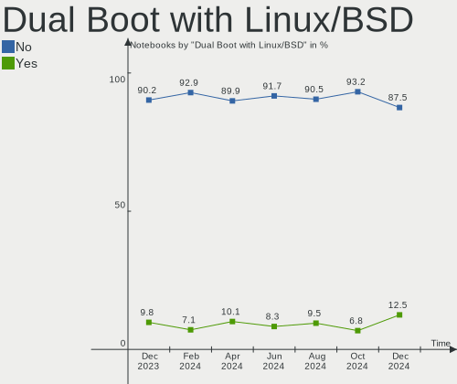
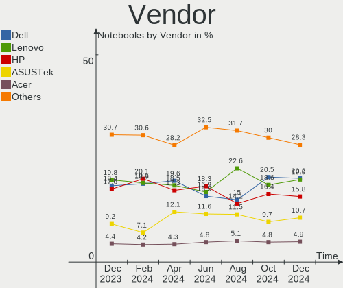
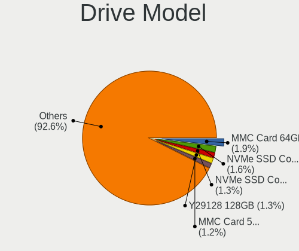
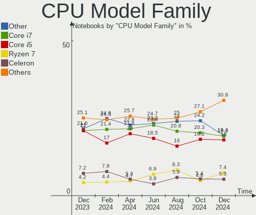
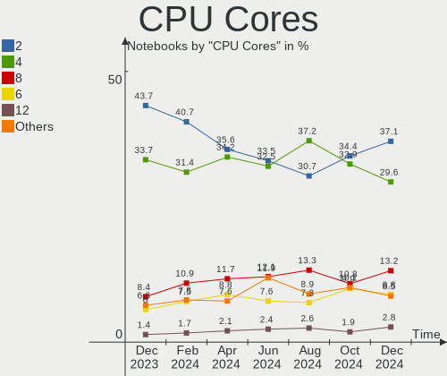
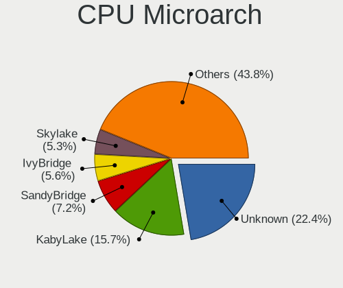
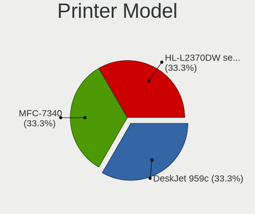
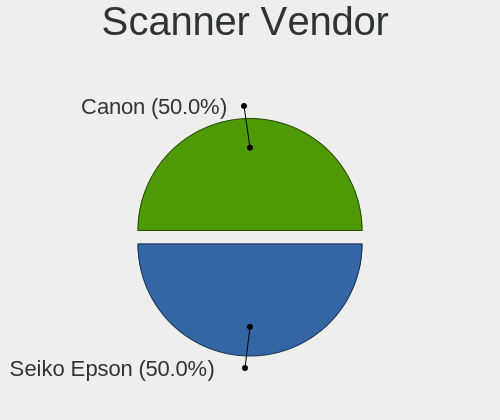
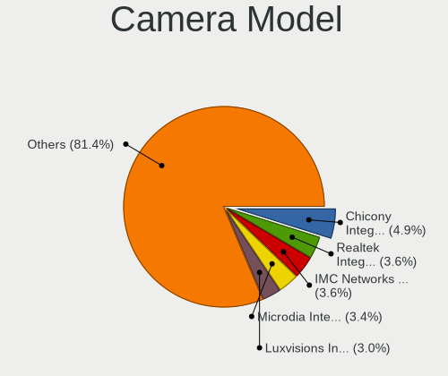
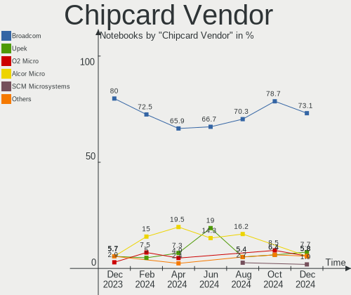

Linux in USA - Hardware Trends (Notebooks)
------------------------------------------

A project to identify most popular hardware characteristics and track their change
over time based on data collected by Linux users at https://Linux-Hardware.org.

Anyone can contribute to this report by the [hw-probe](https://github.com/linuxhw/hw-probe) tool:

    sudo -E hw-probe -all -upload

Period: Nov, 2022.

Contents
--------

* [ System ](#system)
  - [ OS                       ](#os)
  - [ OS Family                ](#os-family)
  - [ Kernel                   ](#kernel)
  - [ Kernel Family            ](#kernel-family)
  - [ Kernel Major Ver.        ](#kernel-major-ver)
  - [ Arch                     ](#arch)
  - [ DE                       ](#de)
  - [ Display Server           ](#display-server)
  - [ Display Manager          ](#display-manager)
  - [ OS Lang                  ](#os-lang)
  - [ Boot Mode                ](#boot-mode)
  - [ Filesystem               ](#filesystem)
  - [ Part. scheme             ](#part-scheme)
  - [ Dual Boot with Linux/BSD ](#dual-boot-with-linuxbsd)
  - [ Dual Boot (Win)          ](#dual-boot-win)

* [ Board ](#board)
  - [ Vendor                   ](#vendor)
  - [ Model                    ](#model)
  - [ Model Family             ](#model-family)
  - [ MFG Year                 ](#mfg-year)
  - [ Form Factor              ](#form-factor)
  - [ Secure Boot              ](#secure-boot)
  - [ Coreboot                 ](#coreboot)
  - [ RAM Size                 ](#ram-size)
  - [ RAM Used                 ](#ram-used)
  - [ Total Drives             ](#total-drives)
  - [ Has CD-ROM               ](#has-cd-rom)
  - [ Has Ethernet             ](#has-ethernet)
  - [ Has WiFi                 ](#has-wifi)
  - [ Has Bluetooth            ](#has-bluetooth)

* [ Location ](#location)
  - [ Country                  ](#country)
  - [ City                     ](#city)

* [ Drives ](#drives)
  - [ Drive Vendor             ](#drive-vendor)
  - [ Drive Model              ](#drive-model)
  - [ HDD Vendor               ](#hdd-vendor)
  - [ SSD Vendor               ](#ssd-vendor)
  - [ Drive Kind               ](#drive-kind)
  - [ Drive Connector          ](#drive-connector)
  - [ Drive Size               ](#drive-size)
  - [ Space Total              ](#space-total)
  - [ Space Used               ](#space-used)
  - [ Malfunc. Drives          ](#malfunc-drives)
  - [ Malfunc. Drive Vendor    ](#malfunc-drive-vendor)
  - [ Malfunc. HDD Vendor      ](#malfunc-hdd-vendor)
  - [ Malfunc. Drive Kind      ](#malfunc-drive-kind)
  - [ Failed Drives            ](#failed-drives)
  - [ Failed Drive Vendor      ](#failed-drive-vendor)
  - [ Drive Status             ](#drive-status)

* [ Storage controller ](#storage-controller)
  - [ Storage Vendor           ](#storage-vendor)
  - [ Storage Model            ](#storage-model)
  - [ Storage Kind             ](#storage-kind)

* [ Processor ](#processor)
  - [ CPU Vendor               ](#cpu-vendor)
  - [ CPU Model                ](#cpu-model)
  - [ CPU Model Family         ](#cpu-model-family)
  - [ CPU Cores                ](#cpu-cores)
  - [ CPU Sockets              ](#cpu-sockets)
  - [ CPU Threads              ](#cpu-threads)
  - [ CPU Op-Modes             ](#cpu-op-modes)
  - [ CPU Microcode            ](#cpu-microcode)
  - [ CPU Microarch            ](#cpu-microarch)

* [ Graphics ](#graphics)
  - [ GPU Vendor               ](#gpu-vendor)
  - [ GPU Model                ](#gpu-model)
  - [ GPU Combo                ](#gpu-combo)
  - [ GPU Driver               ](#gpu-driver)
  - [ GPU Memory               ](#gpu-memory)

* [ Monitor ](#monitor)
  - [ Monitor Vendor           ](#monitor-vendor)
  - [ Monitor Model            ](#monitor-model)
  - [ Monitor Resolution       ](#monitor-resolution)
  - [ Monitor Diagonal         ](#monitor-diagonal)
  - [ Monitor Width            ](#monitor-width)
  - [ Aspect Ratio             ](#aspect-ratio)
  - [ Monitor Area             ](#monitor-area)
  - [ Pixel Density            ](#pixel-density)
  - [ Multiple Monitors        ](#multiple-monitors)

* [ Network ](#network)
  - [ Net Controller Vendor    ](#net-controller-vendor)
  - [ Net Controller Model     ](#net-controller-model)
  - [ Wireless Vendor          ](#wireless-vendor)
  - [ Wireless Model           ](#wireless-model)
  - [ Ethernet Vendor          ](#ethernet-vendor)
  - [ Ethernet Model           ](#ethernet-model)
  - [ Net Controller Kind      ](#net-controller-kind)
  - [ Used Controller          ](#used-controller)
  - [ NICs                     ](#nics)
  - [ IPv6                     ](#ipv6)

* [ Bluetooth ](#bluetooth)
  - [ Bluetooth Vendor         ](#bluetooth-vendor)
  - [ Bluetooth Model          ](#bluetooth-model)

* [ Sound ](#sound)
  - [ Sound Vendor             ](#sound-vendor)
  - [ Sound Model              ](#sound-model)

* [ Memory ](#memory)
  - [ Memory Vendor            ](#memory-vendor)
  - [ Memory Model             ](#memory-model)
  - [ Memory Kind              ](#memory-kind)
  - [ Memory Form Factor       ](#memory-form-factor)
  - [ Memory Size              ](#memory-size)
  - [ Memory Speed             ](#memory-speed)

* [ Printers & scanners ](#printers--scanners)
  - [ Printer Vendor           ](#printer-vendor)
  - [ Printer Model            ](#printer-model)
  - [ Scanner Vendor           ](#scanner-vendor)
  - [ Scanner Model            ](#scanner-model)

* [ Camera ](#camera)
  - [ Camera Vendor            ](#camera-vendor)
  - [ Camera Model             ](#camera-model)

* [ Security ](#security)
  - [ Fingerprint Vendor       ](#fingerprint-vendor)
  - [ Fingerprint Model        ](#fingerprint-model)
  - [ Chipcard Vendor          ](#chipcard-vendor)
  - [ Chipcard Model           ](#chipcard-model)

* [ Unsupported ](#unsupported)
  - [ Unsupported Devices      ](#unsupported-devices)
  - [ Unsupported Device Types ](#unsupported-device-types)

System
------

OS
--

Installed operating systems

| Name                         | Notebooks | Percent |
|------------------------------|-----------|---------|
| Ubuntu 22.04                 | 63        | 14.93%  |
| Debian 11                    | 32        | 7.58%   |
| Pop!_OS 22.04                | 30        | 7.11%   |
| Fedora 37                    | 29        | 6.87%   |
| Linux Mint 21                | 23        | 5.45%   |
| Ubuntu 22.10                 | 18        | 4.27%   |
| Fedora 36                    | 18        | 4.27%   |
| Arch Rolling                 | 15        | 3.55%   |
| Ubuntu 20.04                 | 14        | 3.32%   |
| SteamOS 3.3.2                | 12        | 2.84%   |
| Zorin 16                     | 11        | 2.61%   |
| Kubuntu 22.04                | 11        | 2.61%   |
| OpenMandriva 4.3             | 8         | 1.9%    |
| Linux Mint 20.3              | 8         | 1.9%    |
| KDE neon 22.04               | 8         | 1.9%    |
| Kali 2022.4                  | 7         | 1.66%   |
| Manjaro                      | 6         | 1.42%   |
| ArcoLinux Rolling            | 6         | 1.42%   |
| openSUSE Tumbleweed-XXXXXXXX | 5         | 1.18%   |
| SteamOS 3.4                  | 4         | 0.95%   |
| Nobara 36                    | 4         | 0.95%   |
| Manjaro 22.0.0               | 4         | 0.95%   |
| Kubuntu 22.10                | 4         | 0.95%   |
| openSUSE Leap-15.4           | 3         | 0.71%   |
| LMDE 5                       | 3         | 0.71%   |
| Linux Mint 20.2              | 3         | 0.71%   |
| Kali 2022.3                  | 3         | 0.71%   |
| EndeavourOS Rolling          | 3         | 0.71%   |
| Elementary 6.1               | 3         | 0.71%   |
| Debian                       | 3         | 0.71%   |
| Ubuntu MATE 22.04            | 2         | 0.47%   |
| Ubuntu 18.04                 | 2         | 0.47%   |
| SteamOS 3.5                  | 2         | 0.47%   |
| SteamOS 3.3.1                | 2         | 0.47%   |
| OpenMandriva 4.50            | 2         | 0.47%   |
| NixOS 22.11                  | 2         | 0.47%   |
| MX 21                        | 2         | 0.47%   |
| Garuda Linux Soaring         | 2         | 0.47%   |
| Garuda Linux Rolling         | 2         | 0.47%   |
| ArcoLinux                    | 2         | 0.47%   |

OS Family
---------

OS without a version

| Name          | Notebooks | Percent |
|---------------|-----------|---------|
| Ubuntu        | 98        | 23.22%  |
| Fedora        | 48        | 11.37%  |
| Debian        | 38        | 9%      |
| Linux Mint    | 36        | 8.53%   |
| Pop!_OS       | 31        | 7.35%   |
| SteamOS       | 21        | 4.98%   |
| Kubuntu       | 16        | 3.79%   |
| Arch          | 15        | 3.55%   |
| Zorin         | 11        | 2.61%   |
| OpenMandriva  | 10        | 2.37%   |
| Manjaro       | 10        | 2.37%   |
| Kali          | 10        | 2.37%   |
| openSUSE      | 8         | 1.9%    |
| KDE neon      | 8         | 1.9%    |
| ArcoLinux     | 8         | 1.9%    |
| Nobara        | 4         | 0.95%   |
| Garuda Linux  | 4         | 0.95%   |
| Ubuntu Unity  | 3         | 0.71%   |
| LMDE          | 3         | 0.71%   |
| EndeavourOS   | 3         | 0.71%   |
| Elementary    | 3         | 0.71%   |
| Xubuntu       | 2         | 0.47%   |
| Ubuntu MATE   | 2         | 0.47%   |
| Ubuntu Budgie | 2         | 0.47%   |
| NixOS         | 2         | 0.47%   |
| MX            | 2         | 0.47%   |
| Lubuntu       | 2         | 0.47%   |
| Gentoo        | 2         | 0.47%   |
| Endless       | 2         | 0.47%   |
| Clear Linux   | 2         | 0.47%   |
| antiX         | 2         | 0.47%   |
| Void Linux    | 1         | 0.24%   |
| Trisquel      | 1         | 0.24%   |
| Shark         | 1         | 0.24%   |
| RHEL          | 1         | 0.24%   |
| Reborn OS     | 1         | 0.24%   |
| Q4OS          | 1         | 0.24%   |
| Oracle Linux  | 1         | 0.24%   |
| LinuxFX       | 1         | 0.24%   |
| GNOME OS      | 1         | 0.24%   |

Kernel
------

Version of the Linux kernel

| Version                                        | Notebooks | Percent |
|------------------------------------------------|-----------|---------|
| 5.15.0-52-generic                              | 61        | 14.45%  |
| 5.15.0-53-generic                              | 57        | 13.51%  |
| 5.19.0-23-generic                              | 20        | 4.74%   |
| 5.10.0-18-amd64                                | 18        | 4.27%   |
| 6.0.6-76060006-generic                         | 16        | 3.79%   |
| 5.10.0-19-amd64                                | 14        | 3.32%   |
| 5.13.0-valve21.3-1-neptune                     | 13        | 3.08%   |
| 6.0.8-300.fc37.x86_64                          | 12        | 2.84%   |
| 6.0.5-200.fc36.x86_64                          | 12        | 2.84%   |
| 6.0.9-300.fc37.x86_64                          | 8         | 1.9%    |
| 5.4.0-131-generic                              | 8         | 1.9%    |
| 5.16.7-desktop-1omv4003                        | 8         | 1.9%    |
| 6.0.9-arch1-1                                  | 7         | 1.66%   |
| 6.0.8-arch1-1                                  | 7         | 1.66%   |
| 6.0.2-76060002-generic                         | 6         | 1.42%   |
| 6.0.7-301.fc37.x86_64                          | 5         | 1.18%   |
| 6.0.3-76060003-generic                         | 5         | 1.18%   |
| 6.0.0-kali3-amd64                              | 5         | 1.18%   |
| 5.15.0-43-generic                              | 5         | 1.18%   |
| 5.4.0-132-generic                              | 4         | 0.95%   |
| 5.19.0-kali2-amd64                             | 4         | 0.95%   |
| 5.15.78-1-MANJARO                              | 4         | 0.95%   |
| 5.15.0-41-generic                              | 4         | 0.95%   |
| 5.13.0-valve31-1-neptune                       | 4         | 0.95%   |
| 6.0.8-1-default                                | 3         | 0.71%   |
| 6.0.7-arch1-1                                  | 3         | 0.71%   |
| 6.0.10-arch2-1                                 | 3         | 0.71%   |
| 5.19.16-301.fc37.x86_64                        | 3         | 0.71%   |
| 5.19.0-24-generic                              | 3         | 0.71%   |
| 5.15.0-48-generic                              | 3         | 0.71%   |
| 6.0.6-zen1-1-zen                               | 2         | 0.47%   |
| 5.19.0-76051900-generic                        | 2         | 0.47%   |
| 5.18.10-76051810-generic                       | 2         | 0.47%   |
| 5.17.5-76051705-generic                        | 2         | 0.47%   |
| 5.17.5-300.fc36.x86_64                         | 2         | 0.47%   |
| 5.15.76-1-MANJARO                              | 2         | 0.47%   |
| 5.15.74-3-MANJARO                              | 2         | 0.47%   |
| 5.14.21-150400.24.28-default                   | 2         | 0.47%   |
| 5.13.0-valve21.1-1-neptune-02211-gc54cda5a36f3 | 2         | 0.47%   |
| 5.11.0-35-generic                              | 2         | 0.47%   |

Kernel Family
-------------

Linux kernel without a distro release

| Version | Notebooks | Percent |
|---------|-----------|---------|
| 5.15.0  | 135       | 31.99%  |
| 5.10.0  | 35        | 8.29%   |
| 5.19.0  | 32        | 7.58%   |
| 6.0.8   | 24        | 5.69%   |
| 5.13.0  | 23        | 5.45%   |
| 6.0.6   | 21        | 4.98%   |
| 6.0.9   | 20        | 4.74%   |
| 6.0.7   | 13        | 3.08%   |
| 6.0.5   | 13        | 3.08%   |
| 5.4.0   | 13        | 3.08%   |
| 6.0.2   | 9         | 2.13%   |
| 6.0.0   | 9         | 2.13%   |
| 5.16.7  | 8         | 1.9%    |
| 6.0.3   | 5         | 1.18%   |
| 6.0.10  | 5         | 1.18%   |
| 5.19.16 | 5         | 1.18%   |
| 5.17.5  | 4         | 0.95%   |
| 5.15.78 | 4         | 0.95%   |
| 5.15.75 | 3         | 0.71%   |
| 5.14.21 | 3         | 0.71%   |
| 5.14.0  | 3         | 0.71%   |
| 4.15.0  | 3         | 0.71%   |
| 5.18.10 | 2         | 0.47%   |
| 5.17.0  | 2         | 0.47%   |
| 5.15.76 | 2         | 0.47%   |
| 5.15.74 | 2         | 0.47%   |
| 5.11.0  | 2         | 0.47%   |
| 4.9.0   | 2         | 0.47%   |
| 4.19.0  | 2         | 0.47%   |
| 6.1.0   | 1         | 0.24%   |
| 6.0.1   | 1         | 0.24%   |
| 5.9.0   | 1         | 0.24%   |
| 5.5.19  | 1         | 0.24%   |
| 5.4.17  | 1         | 0.24%   |
| 5.19.9  | 1         | 0.24%   |
| 5.19.5  | 1         | 0.24%   |
| 5.19.17 | 1         | 0.24%   |
| 5.19.13 | 1         | 0.24%   |
| 5.19.12 | 1         | 0.24%   |
| 5.18.19 | 1         | 0.24%   |

Kernel Major Ver.
-----------------

Linux kernel major version

| Version | Notebooks | Percent |
|---------|-----------|---------|
| 5.15    | 146       | 34.6%   |
| 6.0     | 120       | 28.44%  |
| 5.19    | 42        | 9.95%   |
| 5.10    | 36        | 8.53%   |
| 5.13    | 23        | 5.45%   |
| 5.4     | 14        | 3.32%   |
| 5.16    | 10        | 2.37%   |
| 5.14    | 7         | 1.66%   |
| 5.17    | 6         | 1.42%   |
| 5.18    | 4         | 0.95%   |
| 4.15    | 3         | 0.71%   |
| 5.11    | 2         | 0.47%   |
| 4.9     | 2         | 0.47%   |
| 4.19    | 2         | 0.47%   |
| 6.1     | 1         | 0.24%   |
| 5.9     | 1         | 0.24%   |
| 5.5     | 1         | 0.24%   |
| 4.4     | 1         | 0.24%   |
| 3.10    | 1         | 0.24%   |

Arch
----

OS architecture (x86_64, i586, etc.)

| Name    | Notebooks | Percent |
|---------|-----------|---------|
| x86_64  | 419       | 99.29%  |
| i686    | 2         | 0.47%   |
| aarch64 | 1         | 0.24%   |

DE
--

Desktop Environment

| Name            | Notebooks | Percent |
|-----------------|-----------|---------|
| GNOME           | 196       | 46.45%  |
| KDE5            | 91        | 21.56%  |
| XFCE            | 32        | 7.58%   |
| X-Cinnamon      | 32        | 7.58%   |
| Unknown         | 27        | 6.4%    |
| MATE            | 8         | 1.9%    |
| LXDE            | 5         | 1.18%   |
| Budgie          | 5         | 1.18%   |
| Unity           | 3         | 0.71%   |
| Pantheon        | 3         | 0.71%   |
| i3              | 3         | 0.71%   |
| GNOME Flashback | 3         | 0.71%   |
| Cinnamon        | 3         | 0.71%   |
| sway            | 2         | 0.47%   |
| LXQt            | 2         | 0.47%   |
| icewm           | 2         | 0.47%   |
| GNOME Classic   | 2         | 0.47%   |
| KDE             | 1         | 0.24%   |
| fluxbox         | 1         | 0.24%   |
| Enlightenment   | 1         | 0.24%   |

Display Server
--------------

X11 or Wayland

| Name    | Notebooks | Percent |
|---------|-----------|---------|
| X11     | 280       | 66.35%  |
| Wayland | 111       | 26.3%   |
| Unknown | 26        | 6.16%   |
| Tty     | 5         | 1.18%   |

Display Manager
---------------

SDDM, LightDM, etc.

| Name    | Notebooks | Percent |
|---------|-----------|---------|
| Unknown | 177       | 41.94%  |
| GDM3    | 89        | 21.09%  |
| LightDM | 68        | 16.11%  |
| SDDM    | 53        | 12.56%  |
| GDM     | 33        | 7.82%   |
| XDM     | 1         | 0.24%   |
| LXDM    | 1         | 0.24%   |

OS Lang
-------

Language

| Lang    | Notebooks | Percent |
|---------|-----------|---------|
| en_US   | 391       | 92.65%  |
| Unknown | 21        | 4.98%   |
| C       | 4         | 0.95%   |
| en_CA   | 2         | 0.47%   |
| ru_RU   | 1         | 0.24%   |
| POSIX   | 1         | 0.24%   |
| it_IT   | 1         | 0.24%   |
| fr_FR   | 1         | 0.24%   |

Boot Mode
---------

EFI or BIOS

| Mode | Notebooks | Percent |
|------|-----------|---------|
| EFI  | 241       | 57.11%  |
| BIOS | 181       | 42.89%  |

Filesystem
----------

Type of filesystem

| Type    | Notebooks | Percent |
|---------|-----------|---------|
| Ext4    | 284       | 67.3%   |
| Btrfs   | 87        | 20.62%  |
| Overlay | 34        | 8.06%   |
| Zfs     | 8         | 1.9%    |
| Xfs     | 7         | 1.66%   |
| Tmpfs   | 1         | 0.24%   |
| Jfs     | 1         | 0.24%   |

Part. scheme
------------

Scheme of partitioning

| Type    | Notebooks | Percent |
|---------|-----------|---------|
| GPT     | 251       | 59.48%  |
| Unknown | 147       | 34.83%  |
| MBR     | 24        | 5.69%   |

Dual Boot with Linux/BSD
------------------------

Hosting more than one Linux/BSD

| Dual boot | Notebooks | Percent |
|-----------|-----------|---------|
| No        | 383       | 90.76%  |
| Yes       | 39        | 9.24%   |

Dual Boot (Win)
---------------

Hosting Linux and Windows

| Dual boot | Notebooks | Percent |
|-----------|-----------|---------|
| No        | 346       | 81.99%  |
| Yes       | 76        | 18.01%  |

Board
-----

Vendor
------

Motherboard manufacturer

| Name                 | Notebooks | Percent |
|----------------------|-----------|---------|
| Lenovo               | 104       | 24.64%  |
| Hewlett-Packard      | 72        | 17.06%  |
| Dell                 | 65        | 15.4%   |
| ASUSTek Computer     | 34        | 8.06%   |
| Google               | 20        | 4.74%   |
| Valve                | 19        | 4.5%    |
| Apple                | 17        | 4.03%   |
| MSI                  | 14        | 3.32%   |
| Acer                 | 14        | 3.32%   |
| Toshiba              | 10        | 2.37%   |
| GPU Company          | 8         | 1.9%    |
| Unknown              | 8         | 1.9%    |
| System76             | 5         | 1.18%   |
| Alienware            | 5         | 1.18%   |
| Sony                 | 3         | 0.71%   |
| Razer                | 3         | 0.71%   |
| Panasonic            | 3         | 0.71%   |
| Gateway              | 3         | 0.71%   |
| Gigabyte Technology  | 2         | 0.47%   |
| Framework            | 2         | 0.47%   |
| SK hynix             | 1         | 0.24%   |
| Samsung Electronics  | 1         | 0.24%   |
| SAGER                | 1         | 0.24%   |
| Notebook             | 1         | 0.24%   |
| Micro Electronics    | 1         | 0.24%   |
| Libiquity            | 1         | 0.24%   |
| Intel Client Systems | 1         | 0.24%   |
| IBM                  | 1         | 0.24%   |
| GPD                  | 1         | 0.24%   |
| DTRI                 | 1         | 0.24%   |
| DERE                 | 1         | 0.24%   |

Model
-----

Motherboard model

| Name                                  | Notebooks | Percent |
|---------------------------------------|-----------|---------|
| Valve Jupiter                         | 19        | 4.5%    |
| Unknown                               | 9         | 2.13%   |
| Lenovo ThinkPad E475 20H40006US       | 8         | 1.9%    |
| Google Terra                          | 6         | 1.42%   |
| Lenovo ThinkPad 13 2nd Gen 20J10046US | 5         | 1.18%   |
| HP 15 Notebook PC                     | 5         | 1.18%   |
| Lenovo ThinkPad P70 20ESS04S00        | 4         | 0.95%   |
| Lenovo ThinkPad W541 20EGS1PL00       | 3         | 0.71%   |
| Lenovo Legion S7 15ACH6 82K8          | 3         | 0.71%   |
| HP Stream Laptop 14-cb1xxx            | 3         | 0.71%   |
| HP Notebook                           | 3         | 0.71%   |
| HP Laptop 15-da0xxx                   | 3         | 0.71%   |
| GPU Company GWTC116-2                 | 3         | 0.71%   |
| Google Lick                           | 3         | 0.71%   |
| Dell Inspiron 3521                    | 3         | 0.71%   |
| Apple MacBookPro9,2                   | 3         | 0.71%   |
| Apple MacBookPro8,1                   | 3         | 0.71%   |
| Toshiba Satellite L775                | 2         | 0.47%   |
| System76 Gazelle                      | 2         | 0.47%   |
| MSI Katana GF76 11UD                  | 2         | 0.47%   |
| Lenovo ThinkPad T14 Gen 3 21CFCTO1WW  | 2         | 0.47%   |
| Lenovo G50-45 80E3                    | 2         | 0.47%   |
| HP ZBook 15 G3                        | 2         | 0.47%   |
| HP Pavilion Laptop 15-cs0xxx          | 2         | 0.47%   |
| HP Pavilion g7                        | 2         | 0.47%   |
| HP Pavilion 17                        | 2         | 0.47%   |
| HP Laptop 15-dy2xxx                   | 2         | 0.47%   |
| HP Laptop 14-dk1xxx                   | 2         | 0.47%   |
| HP EliteBook 8560w                    | 2         | 0.47%   |
| Dell XPS 15 9570                      | 2         | 0.47%   |
| Dell XPS 15 9560                      | 2         | 0.47%   |
| Dell XPS 13 9300                      | 2         | 0.47%   |
| Dell XPS 13 7390                      | 2         | 0.47%   |
| Dell Latitude E6540                   | 2         | 0.47%   |
| Dell Latitude E6530                   | 2         | 0.47%   |
| Dell Latitude E6440                   | 2         | 0.47%   |
| Dell Inspiron 5584                    | 2         | 0.47%   |
| Dell Inspiron 15 3511                 | 2         | 0.47%   |
| ASUS ZenBook UX534FTC_UX534FT         | 2         | 0.47%   |
| ASUS ZenBook UX425UG_Q408UG           | 2         | 0.47%   |

Model Family
------------

Motherboard model prefix

| Name                  | Notebooks | Percent |
|-----------------------|-----------|---------|
| Lenovo ThinkPad       | 77        | 18.25%  |
| Dell Latitude         | 23        | 5.45%   |
| Valve Jupiter         | 19        | 4.5%    |
| Dell Inspiron         | 18        | 4.27%   |
| HP EliteBook          | 14        | 3.32%   |
| HP Pavilion           | 13        | 3.08%   |
| Dell XPS              | 12        | 2.84%   |
| HP Laptop             | 11        | 2.61%   |
| Lenovo IdeaPad        | 10        | 2.37%   |
| Toshiba Satellite     | 9         | 2.13%   |
| Unknown               | 9         | 2.13%   |
| Lenovo Legion         | 8         | 1.9%    |
| Dell Precision        | 8         | 1.9%    |
| HP 15                 | 6         | 1.42%   |
| Google Terra          | 6         | 1.42%   |
| ASUS ZenBook          | 6         | 1.42%   |
| ASUS ROG              | 6         | 1.42%   |
| Acer Aspire           | 6         | 1.42%   |
| HP ZBook              | 5         | 1.18%   |
| HP Stream             | 5         | 1.18%   |
| HP ProBook            | 5         | 1.18%   |
| ASUS VivoBook         | 5         | 1.18%   |
| HP ENVY               | 4         | 0.95%   |
| ASUS ASUS             | 4         | 0.95%   |
| Acer Swift            | 4         | 0.95%   |
| Acer Nitro            | 4         | 0.95%   |
| Razer Blade           | 3         | 0.71%   |
| MSI Katana            | 3         | 0.71%   |
| HP Notebook           | 3         | 0.71%   |
| GPU Company GWTC116-2 | 3         | 0.71%   |
| Google Lick           | 3         | 0.71%   |
| Apple MacBookPro9     | 3         | 0.71%   |
| Apple MacBookPro8     | 3         | 0.71%   |
| System76 Gazelle      | 2         | 0.47%   |
| Lenovo G50-45         | 2         | 0.47%   |
| HP OMEN               | 2         | 0.47%   |
| Framework Laptop      | 2         | 0.47%   |
| Apple MacBookPro15    | 2         | 0.47%   |
| Apple MacBookPro10    | 2         | 0.47%   |
| Apple MacBookAir6     | 2         | 0.47%   |

MFG Year
--------

Motherboard manufacture year

| Year    | Notebooks | Percent |
|---------|-----------|---------|
| 2022    | 66        | 15.64%  |
| 2021    | 55        | 13.03%  |
| 2019    | 47        | 11.14%  |
| 2020    | 42        | 9.95%   |
| 2015    | 35        | 8.29%   |
| 2013    | 31        | 7.35%   |
| 2018    | 26        | 6.16%   |
| 2012    | 25        | 5.92%   |
| 2017    | 21        | 4.98%   |
| 2014    | 17        | 4.03%   |
| 2011    | 16        | 3.79%   |
| 2016    | 15        | 3.55%   |
| 2010    | 8         | 1.9%    |
| 2008    | 8         | 1.9%    |
| 2009    | 4         | 0.95%   |
| 2006    | 2         | 0.47%   |
| 2007    | 1         | 0.24%   |
| 2005    | 1         | 0.24%   |
| 2004    | 1         | 0.24%   |
| Unknown | 1         | 0.24%   |

Form Factor
-----------

Physical design of the computer

| Name     | Notebooks | Percent |
|----------|-----------|---------|
| Notebook | 422       | 100%    |

Secure Boot
-----------

Enabled or disabled

| State    | Notebooks | Percent |
|----------|-----------|---------|
| Disabled | 369       | 87.44%  |
| Enabled  | 53        | 12.56%  |

Coreboot
--------

Have coreboot on board

| Used | Notebooks | Percent |
|------|-----------|---------|
| No   | 398       | 94.31%  |
| Yes  | 24        | 5.69%   |

RAM Size
--------

Total RAM memory

| Size in GB  | Notebooks | Percent |
|-------------|-----------|---------|
| 4.01-8.0    | 102       | 24.17%  |
| 16.01-24.0  | 92        | 21.8%   |
| 8.01-16.0   | 84        | 19.91%  |
| 3.01-4.0    | 67        | 15.88%  |
| 32.01-64.0  | 43        | 10.19%  |
| 64.01-256.0 | 17        | 4.03%   |
| 24.01-32.0  | 8         | 1.9%    |
| 2.01-3.0    | 4         | 0.95%   |
| 1.01-2.0    | 4         | 0.95%   |
| 0.51-1.0    | 1         | 0.24%   |

RAM Used
--------

Used RAM memory

| Used GB    | Notebooks | Percent |
|------------|-----------|---------|
| 2.01-3.0   | 124       | 29.38%  |
| 1.01-2.0   | 123       | 29.15%  |
| 4.01-8.0   | 80        | 18.96%  |
| 3.01-4.0   | 55        | 13.03%  |
| 8.01-16.0  | 28        | 6.64%   |
| 0.51-1.0   | 9         | 2.13%   |
| 16.01-24.0 | 2         | 0.47%   |
| 0.01-0.5   | 1         | 0.24%   |

Total Drives
------------

Number of drives on board

| Drives | Notebooks | Percent |
|--------|-----------|---------|
| 1      | 281       | 66.59%  |
| 2      | 117       | 27.73%  |
| 3      | 17        | 4.03%   |
| 4      | 5         | 1.18%   |
| 0      | 2         | 0.47%   |

Has CD-ROM
----------

Has CD-ROM on board

| Presented | Notebooks | Percent |
|-----------|-----------|---------|
| No        | 325       | 77.01%  |
| Yes       | 97        | 22.99%  |

Has Ethernet
------------

Has Ethernet on board

| Presented | Notebooks | Percent |
|-----------|-----------|---------|
| Yes       | 301       | 71.33%  |
| No        | 121       | 28.67%  |

Has WiFi
--------

Has WiFi module

| Presented | Notebooks | Percent |
|-----------|-----------|---------|
| Yes       | 420       | 99.53%  |
| No        | 2         | 0.47%   |

Has Bluetooth
-------------

Has Bluetooth module

| Presented | Notebooks | Percent |
|-----------|-----------|---------|
| Yes       | 342       | 81.04%  |
| No        | 80        | 18.96%  |

Location
--------

Country
-------

Geographic location (country)

| Country | Notebooks | Percent |
|---------|-----------|---------|
| USA     | 422       | 100%    |

City
----

Geographic location (city)

| City           | Notebooks | Percent |
|----------------|-----------|---------|
| Bangor         | 18        | 4.27%   |
| Los Angeles    | 8         | 1.9%    |
| San Diego      | 7         | 1.66%   |
| Houston        | 7         | 1.66%   |
| Dallas         | 6         | 1.42%   |
| Chicago        | 6         | 1.42%   |
| Portland       | 5         | 1.18%   |
| New York       | 5         | 1.18%   |
| Fort Worth     | 5         | 1.18%   |
| San Francisco  | 4         | 0.95%   |
| Philadelphia   | 4         | 0.95%   |
| Brooklyn       | 4         | 0.95%   |
| Phoenix        | 3         | 0.71%   |
| Minneapolis    | 3         | 0.71%   |
| Middletown     | 3         | 0.71%   |
| Miami          | 3         | 0.71%   |
| Madison        | 3         | 0.71%   |
| Lincoln        | 3         | 0.71%   |
| Jersey City    | 3         | 0.71%   |
| Denver         | 3         | 0.71%   |
| Winston-Salem  | 2         | 0.47%   |
| Wichita        | 2         | 0.47%   |
| Warsaw         | 2         | 0.47%   |
| Valencia       | 2         | 0.47%   |
| Troy           | 2         | 0.47%   |
| St Louis       | 2         | 0.47%   |
| Southbury      | 2         | 0.47%   |
| Southampton    | 2         | 0.47%   |
| South Bend     | 2         | 0.47%   |
| Seattle        | 2         | 0.47%   |
| Santa Clara    | 2         | 0.47%   |
| San Antonio    | 2         | 0.47%   |
| Salt Lake City | 2         | 0.47%   |
| Saint Paul     | 2         | 0.47%   |
| Queens         | 2         | 0.47%   |
| Plainfield     | 2         | 0.47%   |
| Pittsburgh     | 2         | 0.47%   |
| Painesville    | 2         | 0.47%   |
| Newport        | 2         | 0.47%   |
| New Haven      | 2         | 0.47%   |

Drives
------

Drive Vendor
------------

Hard drive vendors

| Vendor                         | Notebooks | Drives | Percent |
|--------------------------------|-----------|--------|---------|
| Samsung Electronics            | 110       | 129    | 20%     |
| Unknown                        | 65        | 67     | 11.82%  |
| SanDisk                        | 40        | 41     | 7.27%   |
| WDC                            | 37        | 40     | 6.73%   |
| Seagate                        | 33        | 34     | 6%      |
| Toshiba                        | 31        | 31     | 5.64%   |
| SK hynix                       | 28        | 28     | 5.09%   |
| Intel                          | 19        | 22     | 3.45%   |
| Kingston                       | 17        | 17     | 3.09%   |
| HGST                           | 13        | 16     | 2.36%   |
| Kingston Technology Company    | 12        | 12     | 2.18%   |
| Apple                          | 12        | 14     | 2.18%   |
| Unknown                        | 12        | 13     | 2.18%   |
| Micron Technology              | 11        | 11     | 2%      |
| Crucial                        | 11        | 12     | 2%      |
| Phison Electronics             | 9         | 9      | 1.64%   |
| Hitachi                        | 9         | 9      | 1.64%   |
| PNY                            | 7         | 7      | 1.27%   |
| SABRENT                        | 5         | 5      | 0.91%   |
| KIOXIA                         | 5         | 5      | 0.91%   |
| A-DATA Technology              | 5         | 7      | 0.91%   |
| Phison                         | 4         | 4      | 0.73%   |
| China                          | 4         | 4      | 0.73%   |
| SPCC                           | 3         | 3      | 0.55%   |
| Silicon Motion                 | 3         | 3      | 0.55%   |
| Solid State Storage Technology | 2         | 2      | 0.36%   |
| Solid State Storage            | 2         | 2      | 0.36%   |
| O2 Micro                       | 2         | 2      | 0.36%   |
| Netac                          | 2         | 2      | 0.36%   |
| Micron/Crucial Technology      | 2         | 2      | 0.36%   |
| KingSpec                       | 2         | 2      | 0.36%   |
| JMicron Technology             | 2         | 2      | 0.36%   |
| Hewlett-Packard                | 2         | 2      | 0.36%   |
| Dogfish                        | 2         | 2      | 0.36%   |
| WD Green                       | 1         | 1      | 0.18%   |
| W800S                          | 1         | 1      | 0.18%   |
| Union Memory                   | 1         | 1      | 0.18%   |
| Transcend                      | 1         | 1      | 0.18%   |
| TO Exter                       | 1         | 1      | 0.18%   |
| Team                           | 1         | 1      | 0.18%   |

Drive Model
-----------

Hard drive models

| Model                                                 | Notebooks | Percent |
|-------------------------------------------------------|-----------|---------|
| Samsung NVMe SSD Controller SM981/PM981/PM983 1TB     | 16        | 2.78%   |
| Unknown                                               | 12        | 2.09%   |
| Unknown MMC Card  64GB                                | 11        | 1.91%   |
| Samsung NVMe SSD Controller PM9A1/PM9A3/980PRO 250GB  | 11        | 1.91%   |
| Unknown MMC Card  32GB                                | 10        | 1.74%   |
| Kingston Company OM3PDP3 NVMe SSD 256GB               | 9         | 1.57%   |
| Kingston SA400S37120G 120GB SSD                       | 8         | 1.39%   |
| Unknown MMC Card  512GB                               | 7         | 1.22%   |
| Samsung SSD 860 EVO 500GB                             | 6         | 1.04%   |
| Unknown SDW16G  16GB                                  | 5         | 0.87%   |
| Toshiba MQ01ABD100 1TB                                | 5         | 0.87%   |
| Samsung NVMe SSD Controller SM961/PM961/SM963 250GB   | 5         | 0.87%   |
| SABRENT Disk 500GB                                    | 5         | 0.87%   |
| Phison PS5013 E13 NVMe Controller 256GB               | 5         | 0.87%   |
| WDC WDBNCE0010PNC 1TB SSD                             | 4         | 0.7%    |
| Unknown Biwin  64GB                                   | 4         | 0.7%    |
| Seagate ST1000LM035-1RK172 1TB                        | 4         | 0.7%    |
| Sandisk WD Black SN750 / PC SN730 NVMe SSD 1024GB     | 4         | 0.7%    |
| Samsung MZNLN512HCJH-000L1 512GB SSD                  | 4         | 0.7%    |
| Intel SSD Pro 7600p/760p/E 6100p Series 1TB           | 4         | 0.7%    |
| HGST HTS541010A7E630 1TB                              | 4         | 0.7%    |
| Unknown MMC Card  16GB                                | 3         | 0.52%   |
| Toshiba XG4 NVMe SSD Controller 256GB                 | 3         | 0.52%   |
| SK hynix SKHynix_HFS512GDE9X081N 512GB                | 3         | 0.52%   |
| Silicon Motion SM2263EN/SM2263XT SSD Controller 128GB | 3         | 0.52%   |
| Seagate ST500LT012-1DG142 500GB                       | 3         | 0.52%   |
| Sandisk WD Blue SN550 NVMe SSD 1TB                    | 3         | 0.52%   |
| Sandisk WD Blue SN500 / PC SN520 NVMe SSD 512GB       | 3         | 0.52%   |
| SanDisk SD8SN8U128G1001 128GB SSD                     | 3         | 0.52%   |
| SanDisk Extreme 55AE 500GB SSD                        | 3         | 0.52%   |
| Samsung SSD 980 1TB                                   | 3         | 0.52%   |
| Samsung SSD 850 EVO 500GB                             | 3         | 0.52%   |
| Samsung NVMe SSD Controller SM951/PM951 256GB         | 3         | 0.52%   |
| Samsung MZ7LN512HCHP-000L1 512GB SSD                  | 3         | 0.52%   |
| PNY CS900 500GB SSD                                   | 3         | 0.52%   |
| Kingston Company U-SNS8154P3 NVMe SSD 256GB           | 3         | 0.52%   |
| HGST HTS721010A9E630 1TB                              | 3         | 0.52%   |
| Crucial CT1000MX500SSD1 1TB                           | 3         | 0.52%   |
| WDC WDS500G2B0B-00YS70 500GB SSD                      | 2         | 0.35%   |
| WDC WD10SPSX-08A6W 1TB                                | 2         | 0.35%   |

HDD Vendor
----------

Hard disk drive vendors

| Vendor  | Notebooks | Drives | Percent |
|---------|-----------|--------|---------|
| Seagate | 31        | 32     | 33.7%   |
| WDC     | 19        | 19     | 20.65%  |
| Toshiba | 16        | 16     | 17.39%  |
| HGST    | 13        | 16     | 14.13%  |
| Hitachi | 9         | 9      | 9.78%   |
| Unknown | 1         | 1      | 1.09%   |
| Fujitsu | 1         | 1      | 1.09%   |
| ASMT    | 1         | 1      | 1.09%   |
| Apple   | 1         | 1      | 1.09%   |

SSD Vendor
----------

Solid state drive vendors

| Vendor              | Notebooks | Drives | Percent |
|---------------------|-----------|--------|---------|
| Samsung Electronics | 44        | 50     | 26.35%  |
| SanDisk             | 20        | 21     | 11.98%  |
| WDC                 | 13        | 13     | 7.78%   |
| Kingston            | 13        | 13     | 7.78%   |
| Crucial             | 9         | 10     | 5.39%   |
| PNY                 | 7         | 7      | 4.19%   |
| Apple               | 7         | 7      | 4.19%   |
| Toshiba             | 5         | 5      | 2.99%   |
| Intel               | 5         | 5      | 2.99%   |
| SK hynix            | 4         | 4      | 2.4%    |
| Micron Technology   | 4         | 4      | 2.4%    |
| China               | 4         | 4      | 2.4%    |
| A-DATA Technology   | 4         | 6      | 2.4%    |
| Unknown             | 3         | 3      | 1.8%    |
| SPCC                | 2         | 2      | 1.2%    |
| Netac               | 2         | 2      | 1.2%    |
| KingSpec            | 2         | 2      | 1.2%    |
| Dogfish             | 2         | 2      | 1.2%    |
| Transcend           | 1         | 1      | 0.6%    |
| TO Exter            | 1         | 1      | 0.6%    |
| Team                | 1         | 1      | 0.6%    |
| Super Talent        | 1         | 1      | 0.6%    |
| Plextor             | 1         | 1      | 0.6%    |
| Patriot             | 1         | 1      | 0.6%    |
| OCZ                 | 1         | 1      | 0.6%    |
| NGFF                | 1         | 1      | 0.6%    |
| MyDigitalSSD        | 1         | 1      | 0.6%    |
| Mushkin             | 1         | 1      | 0.6%    |
| LITEONIT            | 1         | 1      | 0.6%    |
| LITEON              | 1         | 1      | 0.6%    |
| JMicron Technology  | 1         | 1      | 0.6%    |
| Hewlett-Packard     | 1         | 1      | 0.6%    |
| BHT                 | 1         | 1      | 0.6%    |
| ASUS-PHISON         | 1         | 2      | 0.6%    |
| Apacer              | 1         | 1      | 0.6%    |

Drive Kind
----------

HDD or SSD

| Kind    | Notebooks | Drives | Percent |
|---------|-----------|--------|---------|
| NVMe    | 192       | 230    | 37.07%  |
| SSD     | 156       | 178    | 30.12%  |
| HDD     | 88        | 96     | 16.99%  |
| MMC     | 73        | 77     | 14.09%  |
| Unknown | 9         | 9      | 1.74%   |

Drive Connector
---------------

SATA, SAS, NVMe, etc.

| Type | Notebooks | Drives | Percent |
|------|-----------|--------|---------|
| SATA | 222       | 261    | 43.87%  |
| NVMe | 188       | 225    | 37.15%  |
| MMC  | 73        | 77     | 14.43%  |
| SAS  | 23        | 27     | 4.55%   |

Drive Size
----------

Size of hard drive

| Size in TB | Notebooks | Drives | Percent |
|------------|-----------|--------|---------|
| 0.01-0.5   | 155       | 173    | 65.13%  |
| 0.51-1.0   | 69        | 85     | 28.99%  |
| 1.01-2.0   | 12        | 14     | 5.04%   |
| 3.01-4.0   | 1         | 1      | 0.42%   |
| 4.01-10.0  | 1         | 1      | 0.42%   |

Space Total
-----------

Amount of disk space available on the file system

| Size in GB     | Notebooks | Percent |
|----------------|-----------|---------|
| 101-250        | 102       | 24.17%  |
| 251-500        | 96        | 22.75%  |
| 501-1000       | 64        | 15.17%  |
| 1001-2000      | 34        | 8.06%   |
| 1-20           | 31        | 7.35%   |
| 51-100         | 28        | 6.64%   |
| Unknown        | 27        | 6.4%    |
| More than 3000 | 16        | 3.79%   |
| 21-50          | 14        | 3.32%   |
| 2001-3000      | 10        | 2.37%   |

Space Used
----------

Amount of used disk space

| Used GB        | Notebooks | Percent |
|----------------|-----------|---------|
| 1-20           | 149       | 35.31%  |
| 21-50          | 67        | 15.88%  |
| 101-250        | 66        | 15.64%  |
| 51-100         | 42        | 9.95%   |
| 251-500        | 30        | 7.11%   |
| 501-1000       | 27        | 6.4%    |
| Unknown        | 27        | 6.4%    |
| 1001-2000      | 9         | 2.13%   |
| More than 3000 | 3         | 0.71%   |
| 2001-3000      | 2         | 0.47%   |

Malfunc. Drives
---------------

Drive models with a malfunction

| Model                                                      | Notebooks | Drives | Percent |
|------------------------------------------------------------|-----------|--------|---------|
| Seagate ST320LT007-9ZV142 320GB                            | 2         | 2      | 10%     |
| SK hynix PC711 HFS512GDE9X073N 512GB                       | 1         | 1      | 5%      |
| SK hynix BC711 HFM512GD3JX013N 512GB                       | 1         | 1      | 5%      |
| Seagate ST9160412AS 160GB                                  | 1         | 1      | 5%      |
| Seagate ST500LT012-1DG142 500GB                            | 1         | 1      | 5%      |
| Seagate ST1000LM035-1RK172 1TB                             | 1         | 1      | 5%      |
| SanDisk SSD U100 24GB                                      | 1         | 1      | 5%      |
| SanDisk SSD PLUS 1000GB                                    | 1         | 1      | 5%      |
| Samsung Electronics SSD 980 1TB                            | 1         | 1      | 5%      |
| Samsung Electronics SSD 840 Series 500GB                   | 1         | 1      | 5%      |
| Realtek Semiconductor RTS5763DL NVMe SSD Controller 1024GB | 1         | 2      | 5%      |
| Intel SSDSC2KW512G8 512GB                                  | 1         | 1      | 5%      |
| Hitachi HTS547575A9E384 752GB                              | 1         | 1      | 5%      |
| Hitachi HTS547564A9E384 640GB                              | 1         | 1      | 5%      |
| HGST HTS721010A9E630 1TB                                   | 1         | 1      | 5%      |
| HGST HTS541010A7E630 1TB                                   | 1         | 2      | 5%      |
| Crucial CT1050MX300SSD1 1TB                                | 1         | 1      | 5%      |
| Apple SSD SM128C 121GB                                     | 1         | 1      | 5%      |
| Unknown                                                    | 1         | 1      | 5%      |

Malfunc. Drive Vendor
---------------------

Vendors of faulty drives

| Vendor                | Notebooks | Drives | Percent |
|-----------------------|-----------|--------|---------|
| Seagate               | 5         | 5      | 25%     |
| SK hynix              | 2         | 2      | 10%     |
| SanDisk               | 2         | 2      | 10%     |
| Samsung Electronics   | 2         | 2      | 10%     |
| Hitachi               | 2         | 2      | 10%     |
| HGST                  | 2         | 3      | 10%     |
| Realtek Semiconductor | 1         | 2      | 5%      |
| Intel                 | 1         | 1      | 5%      |
| Crucial               | 1         | 1      | 5%      |
| Apple                 | 1         | 1      | 5%      |
| Unknown               | 1         | 1      | 5%      |

Malfunc. HDD Vendor
-------------------

Vendors of faulty HDD drives

| Vendor  | Notebooks | Drives | Percent |
|---------|-----------|--------|---------|
| Seagate | 5         | 5      | 55.56%  |
| Hitachi | 2         | 2      | 22.22%  |
| HGST    | 2         | 3      | 22.22%  |

Malfunc. Drive Kind
-------------------

Kinds of faulty drives

| Kind | Notebooks | Drives | Percent |
|------|-----------|--------|---------|
| HDD  | 9         | 10     | 45%     |
| SSD  | 7         | 7      | 35%     |
| NVMe | 4         | 5      | 20%     |

Failed Drives
-------------

Failed drive models

Zero info for selected period =(

Failed Drive Vendor
-------------------

Failed drive vendors

Zero info for selected period =(

Drive Status
------------

Number of failed and malfunc. drives

| Status   | Notebooks | Drives | Percent |
|----------|-----------|--------|---------|
| Detected | 253       | 351    | 56.6%   |
| Works    | 174       | 217    | 38.93%  |
| Malfunc  | 20        | 22     | 4.47%   |

Storage controller
------------------

Storage Vendor
--------------

Storage controller vendors

| Vendor                         | Notebooks | Percent |
|--------------------------------|-----------|---------|
| Intel                          | 240       | 49.79%  |
| Samsung Electronics            | 74        | 15.35%  |
| AMD                            | 43        | 8.92%   |
| SanDisk                        | 26        | 5.39%   |
| SK hynix                       | 24        | 4.98%   |
| Kingston Technology Company    | 16        | 3.32%   |
| Phison Electronics             | 14        | 2.9%    |
| Toshiba America Info Systems   | 11        | 2.28%   |
| Micron Technology              | 7         | 1.45%   |
| Solid State Storage Technology | 4         | 0.83%   |
| Silicon Motion                 | 4         | 0.83%   |
| Micron/Crucial Technology      | 4         | 0.83%   |
| KIOXIA                         | 4         | 0.83%   |
| Apple                          | 3         | 0.62%   |
| O2 Micro                       | 2         | 0.41%   |
| Union Memory (Shenzhen)        | 1         | 0.21%   |
| Seagate Technology             | 1         | 0.21%   |
| Realtek Semiconductor          | 1         | 0.21%   |
| Marvell Technology Group       | 1         | 0.21%   |
| ASMedia Technology             | 1         | 0.21%   |
| ADATA Technology               | 1         | 0.21%   |

Storage Model
-------------

Storage controller models

| Model                                                                          | Notebooks | Percent |
|--------------------------------------------------------------------------------|-----------|---------|
| AMD FCH SATA Controller [AHCI mode]                                            | 39        | 7.66%   |
| Samsung NVMe SSD Controller SM981/PM981/PM983                                  | 26        | 5.11%   |
| Intel 82801 Mobile SATA Controller [RAID mode]                                 | 26        | 5.11%   |
| Intel 7 Series Chipset Family 6-port SATA Controller [AHCI mode]               | 24        | 4.72%   |
| Samsung NVMe SSD Controller 980                                                | 20        | 3.93%   |
| Intel Sunrise Point-LP SATA Controller [AHCI mode]                             | 20        | 3.93%   |
| Samsung NVMe SSD Controller PM9A1/PM9A3/980PRO                                 | 18        | 3.54%   |
| Intel 8 Series/C220 Series Chipset Family 6-port SATA Controller 1 [AHCI mode] | 17        | 3.34%   |
| Intel Volume Management Device NVMe RAID Controller                            | 16        | 3.14%   |
| Intel 6 Series/C200 Series Chipset Family 6 port Mobile SATA AHCI Controller   | 15        | 2.95%   |
| SK hynix Gold P31/PC711 NVMe Solid State Drive                                 | 14        | 2.75%   |
| Intel Cannon Lake Mobile PCH SATA AHCI Controller                              | 13        | 2.55%   |
| Intel Wildcat Point-LP SATA Controller [AHCI Mode]                             | 12        | 2.36%   |
| Intel 8 Series SATA Controller 1 [AHCI mode]                                   | 11        | 2.16%   |
| Kingston Company OM3PDP3 NVMe SSD                                              | 9         | 1.77%   |
| Intel Tiger Lake-LP SATA Controller                                            | 9         | 1.77%   |
| SanDisk WD Black SN750 / PC SN730 NVMe SSD                                     | 8         | 1.57%   |
| Intel Q170/Q150/B150/H170/H110/Z170/CM236 Chipset SATA Controller [AHCI Mode]  | 8         | 1.57%   |
| Sandisk Non-Volatile memory controller                                         | 7         | 1.38%   |
| Micron Non-Volatile memory controller                                          | 7         | 1.38%   |
| Intel Atom Processor E3800 Series SATA AHCI Controller                         | 7         | 1.38%   |
| SK hynix Non-Volatile memory controller                                        | 6         | 1.18%   |
| Samsung NVMe SSD Controller SM961/PM961/SM963                                  | 6         | 1.18%   |
| Phison PS5013 E13 NVMe Controller                                              | 6         | 1.18%   |
| Intel Celeron/Pentium Silver Processor SATA Controller                         | 6         | 1.18%   |
| SanDisk WD Blue SN550 NVMe SSD                                                 | 5         | 0.98%   |
| Intel SSD Pro 7600p/760p/E 6100p Series                                        | 5         | 0.98%   |
| Intel Non-Volatile memory controller                                           | 5         | 0.98%   |
| Intel HM170/QM170 Chipset SATA Controller [AHCI Mode]                          | 5         | 0.98%   |
| Intel 400 Series Chipset Family SATA AHCI Controller                           | 5         | 0.98%   |
| Toshiba America Info Systems XG4 NVMe SSD Controller                           | 4         | 0.79%   |
| Solid State Storage Non-Volatile memory controller                             | 4         | 0.79%   |
| SK hynix BC501 NVMe Solid State Drive                                          | 4         | 0.79%   |
| Silicon Motion SM2263EN/SM2263XT SSD Controller                                | 4         | 0.79%   |
| Phison E12 NVMe Controller                                                     | 4         | 0.79%   |
| Kingston Company U-SNS8154P3 NVMe SSD                                          | 4         | 0.79%   |
| Intel Celeron N3350/Pentium N4200/Atom E3900 Series SATA AHCI Controller       | 4         | 0.79%   |
| Intel 82801HM/HEM (ICH8M/ICH8M-E) IDE Controller                               | 4         | 0.79%   |
| Intel 500 Series Chipset Family SATA AHCI Controller                           | 4         | 0.79%   |
| Intel 5 Series/3400 Series Chipset 6 port SATA AHCI Controller                 | 4         | 0.79%   |

Storage Kind
------------

Kind of storage controller (IDE, SATA, NVMe, SAS, ...)

| Kind | Notebooks | Percent |
|------|-----------|---------|
| SATA | 234       | 48.75%  |
| NVMe | 188       | 39.17%  |
| RAID | 42        | 8.75%   |
| IDE  | 16        | 3.33%   |

Processor
---------

CPU Vendor
----------

Processor vendors

| Vendor  | Notebooks | Percent |
|---------|-----------|---------|
| Intel   | 326       | 77.25%  |
| AMD     | 95        | 22.51%  |
| Unknown | 1         | 0.24%   |

CPU Model
---------

Processor models

| Model                                      | Notebooks | Percent |
|--------------------------------------------|-----------|---------|
| AMD Custom APU 0405                        | 19        | 4.5%    |
| Intel Celeron N4020 CPU @ 1.10GHz          | 10        | 2.37%   |
| Intel Celeron CPU N3060 @ 1.60GHz          | 9         | 2.13%   |
| AMD PRO A6-9500B R5, 6 COMPUTE CORES 2C+4G | 8         | 1.9%    |
| Intel Core i7-6820HQ CPU @ 2.70GHz         | 7         | 1.66%   |
| Intel Core i7-9750H CPU @ 2.60GHz          | 6         | 1.42%   |
| Intel Core i7-8750H CPU @ 2.20GHz          | 6         | 1.42%   |
| Intel 11th Gen Core i3-1115G4 @ 3.00GHz    | 6         | 1.42%   |
| Intel Core i7-10750H CPU @ 2.60GHz         | 5         | 1.18%   |
| Intel Core i7-10510U CPU @ 1.80GHz         | 5         | 1.18%   |
| Intel Core i5-3320M CPU @ 2.60GHz          | 5         | 1.18%   |
| Intel Celeron CPU 3865U @ 1.80GHz          | 5         | 1.18%   |
| Intel 11th Gen Core i7-11800H @ 2.30GHz    | 5         | 1.18%   |
| Intel 11th Gen Core i7-1165G7 @ 2.80GHz    | 5         | 1.18%   |
| Intel 11th Gen Core i5-1135G7 @ 2.40GHz    | 5         | 1.18%   |
| AMD Ryzen 7 5800H with Radeon Graphics     | 5         | 1.18%   |
| Intel Core i7-8565U CPU @ 1.80GHz          | 4         | 0.95%   |
| Intel Core i7-7700HQ CPU @ 2.80GHz         | 4         | 0.95%   |
| Intel Core i7-7500U CPU @ 2.70GHz          | 4         | 0.95%   |
| Intel Core i7-5600U CPU @ 2.60GHz          | 4         | 0.95%   |
| Intel Core i7-3520M CPU @ 2.90GHz          | 4         | 0.95%   |
| Intel Core i5-9300H CPU @ 2.40GHz          | 4         | 0.95%   |
| Intel Core i5-5200U CPU @ 2.20GHz          | 4         | 0.95%   |
| Intel Core i5-3210M CPU @ 2.50GHz          | 4         | 0.95%   |
| Intel Celeron CPU N3450 @ 1.10GHz          | 4         | 0.95%   |
| Intel Celeron CPU N2840 @ 2.16GHz          | 4         | 0.95%   |
| Intel 11th Gen Core i7-1185G7 @ 3.00GHz    | 4         | 0.95%   |
| AMD Ryzen 7 PRO 5850U with Radeon Graphics | 4         | 0.95%   |
| Intel Pentium CPU N3540 @ 2.16GHz          | 3         | 0.71%   |
| Intel Core i9-8950HK CPU @ 2.90GHz         | 3         | 0.71%   |
| Intel Core i7-9850H CPU @ 2.60GHz          | 3         | 0.71%   |
| Intel Core i7-8650U CPU @ 1.90GHz          | 3         | 0.71%   |
| Intel Core i7-6700HQ CPU @ 2.60GHz         | 3         | 0.71%   |
| Intel Core i7-4940MX CPU @ 3.10GHz         | 3         | 0.71%   |
| Intel Core i7-4700MQ CPU @ 2.40GHz         | 3         | 0.71%   |
| Intel Core i7-4500U CPU @ 1.80GHz          | 3         | 0.71%   |
| Intel Core i5-8350U CPU @ 1.70GHz          | 3         | 0.71%   |
| Intel Core i5-7200U CPU @ 2.50GHz          | 3         | 0.71%   |
| Intel Core i5-5300U CPU @ 2.30GHz          | 3         | 0.71%   |
| Intel Core i5-4300U CPU @ 1.90GHz          | 3         | 0.71%   |

CPU Model Family
----------------

Processor model prefix

| Model                   | Notebooks | Percent |
|-------------------------|-----------|---------|
| Intel Core i7           | 109       | 25.83%  |
| Other                   | 77        | 18.25%  |
| Intel Core i5           | 74        | 17.54%  |
| Intel Celeron           | 47        | 11.14%  |
| Intel Core i3           | 19        | 4.5%    |
| AMD Ryzen 7             | 14        | 3.32%   |
| AMD Ryzen 5             | 11        | 2.61%   |
| AMD Ryzen 7 PRO         | 8         | 1.9%    |
| AMD Ryzen 9             | 6         | 1.42%   |
| AMD Ryzen 3             | 6         | 1.42%   |
| Intel Pentium           | 5         | 1.18%   |
| Intel Core i9           | 5         | 1.18%   |
| AMD A6                  | 5         | 1.18%   |
| Intel Core 2 Duo        | 4         | 0.95%   |
| AMD A8                  | 4         | 0.95%   |
| Intel Xeon              | 3         | 0.71%   |
| Intel Core 2            | 3         | 0.71%   |
| Intel Atom              | 3         | 0.71%   |
| AMD A4                  | 3         | 0.71%   |
| Intel Core m3           | 2         | 0.47%   |
| AMD E2                  | 2         | 0.47%   |
| AMD A10                 | 2         | 0.47%   |
| Intel Pentium M         | 1         | 0.24%   |
| Intel Pentium Dual-Core | 1         | 0.24%   |
| Intel Pentium Dual      | 1         | 0.24%   |
| AMD Turion 64 X2 Mobile | 1         | 0.24%   |
| AMD Ryzen 5 PRO         | 1         | 0.24%   |
| AMD Ryzen 3 PRO         | 1         | 0.24%   |
| AMD E                   | 1         | 0.24%   |
| AMD Athlon II Dual-Core | 1         | 0.24%   |
| AMD Athlon 64           | 1         | 0.24%   |
| AMD A12                 | 1         | 0.24%   |

CPU Cores
---------

Number of processor cores

| Number | Notebooks | Percent |
|--------|-----------|---------|
| 2      | 173       | 41%     |
| 4      | 143       | 33.89%  |
| 8      | 42        | 9.95%   |
| 6      | 37        | 8.77%   |
| 1      | 12        | 2.84%   |
| 12     | 7         | 1.66%   |
| 14     | 4         | 0.95%   |
| 10     | 3         | 0.71%   |
| 16     | 1         | 0.24%   |

CPU Sockets
-----------

Number of sockets

| Number | Notebooks | Percent |
|--------|-----------|---------|
| 1      | 421       | 99.76%  |
| 2      | 1         | 0.24%   |

CPU Threads
-----------

Threads per core (Hyper-Threading)

| Number | Notebooks | Percent |
|--------|-----------|---------|
| 2      | 335       | 79.38%  |
| 1      | 87        | 20.62%  |

CPU Op-Modes
------------

CPU Operation Modes (32-bit, 64-bit)

| Op mode        | Notebooks | Percent |
|----------------|-----------|---------|
| 32-bit, 64-bit | 419       | 99.29%  |
| 32-bit         | 2         | 0.47%   |
| 64-bit         | 1         | 0.24%   |

CPU Microcode
-------------

Microcode number

| Number     | Notebooks | Percent |
|------------|-----------|---------|
| Unknown    | 149       | 35.31%  |
| 0x806c1    | 17        | 4.03%   |
| 0x806ec    | 16        | 3.79%   |
| 0x306c3    | 15        | 3.55%   |
| 0x806e9    | 14        | 3.32%   |
| 0x306a9    | 14        | 3.32%   |
| 0x206a7    | 13        | 3.08%   |
| 0x906ea    | 12        | 2.84%   |
| 0xa0652    | 11        | 2.61%   |
| 0x906a3    | 10        | 2.37%   |
| 0x806ea    | 10        | 2.37%   |
| 0x706a8    | 9         | 2.13%   |
| 0x506e3    | 9         | 2.13%   |
| 0x406c4    | 8         | 1.9%    |
| 0x40651    | 8         | 1.9%    |
| 0x306d4    | 8         | 1.9%    |
| 0x30678    | 8         | 1.9%    |
| 0x0600611a | 8         | 1.9%    |
| 0x806d1    | 7         | 1.66%   |
| 0x906ed    | 6         | 1.42%   |
| 0x406e3    | 6         | 1.42%   |
| 0x0a50000c | 6         | 1.42%   |
| 0x0a404102 | 6         | 1.42%   |
| 0x506c9    | 4         | 0.95%   |
| 0x0a50000d | 4         | 0.95%   |
| 0x906e9    | 3         | 0.71%   |
| 0x106e5    | 3         | 0.71%   |
| 0x906c0    | 2         | 0.47%   |
| 0x806c2    | 2         | 0.47%   |
| 0x706e5    | 2         | 0.47%   |
| 0x20655    | 2         | 0.47%   |
| 0x10676    | 2         | 0.47%   |
| 0x08600103 | 2         | 0.47%   |
| 0x08108109 | 2         | 0.47%   |
| 0x07030105 | 2         | 0.47%   |
| 0xa0660    | 1         | 0.24%   |
| 0x906a4    | 1         | 0.24%   |
| 0x90672    | 1         | 0.24%   |
| 0x806eb    | 1         | 0.24%   |
| 0x706a1    | 1         | 0.24%   |

CPU Microarch
-------------

Microarchitecture

| Name             | Notebooks | Percent |
|------------------|-----------|---------|
| KabyLake         | 80        | 18.96%  |
| Unknown          | 40        | 9.48%   |
| Haswell          | 34        | 8.06%   |
| IvyBridge        | 28        | 6.64%   |
| TigerLake        | 26        | 6.16%   |
| Silvermont       | 23        | 5.45%   |
| Skylake          | 18        | 4.27%   |
| Zen 3            | 17        | 4.03%   |
| SandyBridge      | 17        | 4.03%   |
| Broadwell        | 16        | 3.79%   |
| CometLake        | 15        | 3.55%   |
| Goldmont plus    | 13        | 3.08%   |
| Excavator        | 13        | 3.08%   |
| Alderlake Hybrid | 12        | 2.84%   |
| Icelake          | 11        | 2.61%   |
| Zen+             | 8         | 1.9%    |
| Zen 2            | 6         | 1.42%   |
| Westmere         | 5         | 1.18%   |
| Puma             | 5         | 1.18%   |
| Nehalem          | 5         | 1.18%   |
| Core             | 5         | 1.18%   |
| Penryn           | 4         | 0.95%   |
| Goldmont         | 4         | 0.95%   |
| Piledriver       | 3         | 0.71%   |
| K10 Llano        | 3         | 0.71%   |
| Zen              | 2         | 0.47%   |
| Tremont          | 2         | 0.47%   |
| K8 Hammer        | 2         | 0.47%   |
| Steamroller      | 1         | 0.24%   |
| P6               | 1         | 0.24%   |
| K10              | 1         | 0.24%   |
| Bonnell          | 1         | 0.24%   |
| Bobcat           | 1         | 0.24%   |

Graphics
--------

GPU Vendor
----------

Vendors of graphics cards

| Vendor | Notebooks | Percent |
|--------|-----------|---------|
| Intel  | 298       | 57.09%  |
| Nvidia | 115       | 22.03%  |
| AMD    | 109       | 20.88%  |

GPU Model
---------

Graphics card models

| Model                                                                                    | Notebooks | Percent |
|------------------------------------------------------------------------------------------|-----------|---------|
| Intel 3rd Gen Core processor Graphics Controller                                         | 24        | 4.47%   |
| Intel CoffeeLake-H GT2 [UHD Graphics 630]                                                | 21        | 3.91%   |
| Intel 4th Gen Core Processor Integrated Graphics Controller                              | 19        | 3.54%   |
| AMD VanGogh [AMD Custom GPU 0405]                                                        | 19        | 3.54%   |
| Intel TigerLake-LP GT2 [Iris Xe Graphics]                                                | 18        | 3.35%   |
| Intel HD Graphics 5500                                                                   | 14        | 2.61%   |
| Intel Haswell-ULT Integrated Graphics Controller                                         | 14        | 2.61%   |
| Intel 2nd Generation Core Processor Family Integrated Graphics Controller                | 14        | 2.61%   |
| AMD Cezanne [Radeon Vega Series / Radeon Vega Mobile Series]                             | 14        | 2.61%   |
| Intel GeminiLake [UHD Graphics 600]                                                      | 13        | 2.42%   |
| Intel UHD Graphics 620                                                                   | 12        | 2.23%   |
| Intel CometLake-H GT2 [UHD Graphics]                                                     | 12        | 2.23%   |
| Intel Atom/Celeron/Pentium Processor x5-E8000/J3xxx/N3xxx Integrated Graphics Controller | 12        | 2.23%   |
| Intel HD Graphics 620                                                                    | 11        | 2.05%   |
| Intel CometLake-U GT2 [UHD Graphics]                                                     | 11        | 2.05%   |
| Intel Atom Processor Z36xxx/Z37xxx Series Graphics & Display                             | 11        | 2.05%   |
| Intel Alder Lake-P Integrated Graphics Controller                                        | 11        | 2.05%   |
| Intel WhiskeyLake-U GT2 [UHD Graphics 620]                                               | 9         | 1.68%   |
| AMD Wani [Radeon R5/R6/R7 Graphics]                                                      | 9         | 1.68%   |
| AMD Rembrandt [Radeon 680M]                                                              | 9         | 1.68%   |
| AMD Picasso/Raven 2 [Radeon Vega Series / Radeon Vega Mobile Series]                     | 8         | 1.49%   |
| Nvidia TU117M [GeForce GTX 1650 Mobile / Max-Q]                                          | 7         | 1.3%    |
| Nvidia GA106M [GeForce RTX 3060 Mobile / Max-Q]                                          | 7         | 1.3%    |
| Intel TigerLake-H GT1 [UHD Graphics]                                                     | 7         | 1.3%    |
| Intel Tiger Lake-LP GT2 [UHD Graphics G4]                                                | 7         | 1.3%    |
| Intel Skylake GT2 [HD Graphics 520]                                                      | 6         | 1.12%   |
| Intel HD Graphics 530                                                                    | 6         | 1.12%   |
| AMD Renoir                                                                               | 6         | 1.12%   |
| Intel HD Graphics 630                                                                    | 5         | 0.93%   |
| Intel HD Graphics 610                                                                    | 5         | 0.93%   |
| Intel Core Processor Integrated Graphics Controller                                      | 5         | 0.93%   |
| AMD Lucienne                                                                             | 5         | 0.93%   |
| Nvidia TU106M [GeForce RTX 2060 Mobile]                                                  | 4         | 0.74%   |
| Nvidia GP107M [GeForce GTX 1050 Ti Mobile]                                               | 4         | 0.74%   |
| Nvidia GP107M [GeForce GTX 1050 Mobile]                                                  | 4         | 0.74%   |
| Nvidia GM204GLM [Quadro M4000M]                                                          | 4         | 0.74%   |
| Nvidia GK107GLM [Quadro K1100M]                                                          | 4         | 0.74%   |
| Nvidia GA104M [GeForce RTX 3070 Mobile / Max-Q]                                          | 4         | 0.74%   |
| Intel HD Graphics 500                                                                    | 4         | 0.74%   |
| AMD Stoney [Radeon R2/R3/R4/R5 Graphics]                                                 | 4         | 0.74%   |

GPU Combo
---------

Combinations of graphics cards

| Name               | Notebooks | Percent |
|--------------------|-----------|---------|
| 1 x Intel          | 206       | 48.82%  |
| 1 x AMD            | 82        | 19.43%  |
| Intel + Nvidia     | 79        | 18.72%  |
| 1 x Nvidia         | 22        | 5.21%   |
| AMD + Nvidia       | 13        | 3.08%   |
| 2 x AMD            | 7         | 1.66%   |
| Intel + AMD        | 7         | 1.66%   |
| Other              | 4         | 0.95%   |
| 2 x Intel          | 1         | 0.24%   |
| Intel + 2 x Nvidia | 1         | 0.24%   |

GPU Driver
----------

Free vs proprietary

| Driver      | Notebooks | Percent |
|-------------|-----------|---------|
| Free        | 351       | 83.18%  |
| Proprietary | 67        | 15.88%  |
| Unknown     | 4         | 0.95%   |

GPU Memory
----------

Total video memory

| Size in GB | Notebooks | Percent |
|------------|-----------|---------|
| Unknown    | 315       | 74.64%  |
| 0.01-0.5   | 25        | 5.92%   |
| 3.01-4.0   | 24        | 5.69%   |
| 1.01-2.0   | 21        | 4.98%   |
| 0.51-1.0   | 19        | 4.5%    |
| 5.01-6.0   | 8         | 1.9%    |
| 7.01-8.0   | 6         | 1.42%   |
| 2.01-3.0   | 2         | 0.47%   |
| 8.01-16.0  | 2         | 0.47%   |

Monitor
-------

Monitor Vendor
--------------

Monitor vendors

| Vendor                  | Notebooks | Percent |
|-------------------------|-----------|---------|
| AU Optronics            | 98        | 20.46%  |
| BOE                     | 75        | 15.66%  |
| LG Display              | 48        | 10.02%  |
| Chimei Innolux          | 45        | 9.39%   |
| Samsung Electronics     | 36        | 7.52%   |
| Sharp                   | 19        | 3.97%   |
| Apple                   | 17        | 3.55%   |
| Dell                    | 16        | 3.34%   |
| Analogix                | 15        | 3.13%   |
| InfoVision              | 14        | 2.92%   |
| PANDA                   | 10        | 2.09%   |
| Acer                    | 8         | 1.67%   |
| Goldstar                | 7         | 1.46%   |
| Ancor Communications    | 7         | 1.46%   |
| CSO                     | 6         | 1.25%   |
| Lenovo                  | 5         | 1.04%   |
| Hewlett-Packard         | 5         | 1.04%   |
| Valve                   | 4         | 0.84%   |
| Sceptre Tech            | 4         | 0.84%   |
| Chi Mei Optoelectronics | 4         | 0.84%   |
| Vizio                   | 3         | 0.63%   |
| Toshiba                 | 3         | 0.63%   |
| TMX                     | 2         | 0.42%   |
| LG Philips              | 2         | 0.42%   |
| CTO                     | 2         | 0.42%   |
| BenQ                    | 2         | 0.42%   |
| ASUSTek Computer        | 2         | 0.42%   |
| AOC                     | 2         | 0.42%   |
| STA                     | 1         | 0.21%   |
| Sony                    | 1         | 0.21%   |
| SLD                     | 1         | 0.21%   |
| SANYO                   | 1         | 0.21%   |
| Panasonic               | 1         | 0.21%   |
| NRL                     | 1         | 0.21%   |
| MSI                     | 1         | 0.21%   |
| KDC                     | 1         | 0.21%   |
| JVC                     | 1         | 0.21%   |
| Insignia                | 1         | 0.21%   |
| INNOCN                  | 1         | 0.21%   |
| IBM                     | 1         | 0.21%   |

Monitor Model
-------------

Monitor models

| Model                                                                 | Notebooks | Percent |
|-----------------------------------------------------------------------|-----------|---------|
| Analogix ANX7530 U ANX7539 800x1280                                   | 15        | 3.1%    |
| BOE LCD Monitor BOE06B3 1920x1080 310x170mm 13.9-inch                 | 8         | 1.65%   |
| AU Optronics LCD Monitor AUO235C 1366x768 256x144mm 11.6-inch         | 8         | 1.65%   |
| Valve ANX7530 U VLV3001 800x1280 100x150mm 7.1-inch                   | 4         | 0.83%   |
| Samsung Electronics LCD Monitor SDC3256 1920x1080 382x215mm 17.3-inch | 4         | 0.83%   |
| LG Display LCD Monitor LGD046F 1920x1080 345x194mm 15.6-inch          | 4         | 0.83%   |
| PANDA LCD Monitor NCP0046 1920x1080 344x194mm 15.5-inch               | 3         | 0.62%   |
| LG Display LCD Monitor LGD0259 1920x1080 345x194mm 15.6-inch          | 3         | 0.62%   |
| InfoVision LCD Monitor IVO0533 1366x768 293x165mm 13.2-inch           | 3         | 0.62%   |
| InfoVision LCD Monitor IVO048E 1366x768 256x144mm 11.6-inch           | 3         | 0.62%   |
| Chimei Innolux LCD Monitor CMN15E7 1920x1080 344x193mm 15.5-inch      | 3         | 0.62%   |
| Chimei Innolux LCD Monitor CMN15C3 1920x1080 344x193mm 15.5-inch      | 3         | 0.62%   |
| Chimei Innolux LCD Monitor CMN14D4 1920x1080 309x173mm 13.9-inch      | 3         | 0.62%   |
| Chimei Innolux LCD Monitor CMN1490 1366x768 309x173mm 13.9-inch       | 3         | 0.62%   |
| AU Optronics LCD Monitor AUO978F 1920x1080 382x215mm 17.3-inch        | 3         | 0.62%   |
| AU Optronics LCD Monitor AUO139E 1600x900 382x214mm 17.2-inch         | 3         | 0.62%   |
| AU Optronics LCD Monitor AUO10EC 1366x768 344x193mm 15.5-inch         | 3         | 0.62%   |
| Apple Color LCD APP9CF0 1440x900 290x180mm 13.4-inch                  | 3         | 0.62%   |
| Apple Color LCD APP9CC7 1280x800 286x179mm 13.3-inch                  | 3         | 0.62%   |
| Ancor Communications ASUS VS228 ACI22FD 1920x1080 476x268mm 21.5-inch | 3         | 0.62%   |
| Toshiba ScreenXpert TSB8888 1080x2160                                 | 2         | 0.41%   |
| Sharp LCD Monitor SHP149A 1920x1080 344x194mm 15.5-inch               | 2         | 0.41%   |
| Samsung Electronics LCD Monitor SEC3945 1280x800 331x207mm 15.4-inch  | 2         | 0.41%   |
| Samsung Electronics LCD Monitor SDC5441 1366x768 344x194mm 15.5-inch  | 2         | 0.41%   |
| Samsung Electronics LCD Monitor SDC4C48 1920x1080 344x194mm 15.5-inch | 2         | 0.41%   |
| Samsung Electronics C32HG7x SAM0E14 2560x1440 697x392mm 31.5-inch     | 2         | 0.41%   |
| PANDA LCD Monitor NCP004D 1920x1080 344x194mm 15.5-inch               | 2         | 0.41%   |
| PANDA LCD Monitor NCP0035 1920x1080 344x194mm 15.5-inch               | 2         | 0.41%   |
| LG Display LCD Monitor LGD0563 1920x1080 344x194mm 15.5-inch          | 2         | 0.41%   |
| LG Display LCD Monitor LGD0493 1366x768 344x194mm 15.5-inch           | 2         | 0.41%   |
| LG Display LCD Monitor LGD039F 1366x768 345x194mm 15.6-inch           | 2         | 0.41%   |
| LG Display LCD Monitor LGD032C 1920x1080 344x194mm 15.5-inch          | 2         | 0.41%   |
| LG Display LCD Monitor LGD02F7 1600x900 382x215mm 17.3-inch           | 2         | 0.41%   |
| LG Display LCD Monitor LGD02DC 1366x768 344x194mm 15.5-inch           | 2         | 0.41%   |
| InfoVision LCD Monitor IVO8C78 1920x1080 309x174mm 14.0-inch          | 2         | 0.41%   |
| Chimei Innolux LCD Monitor CMN15B7 1366x768 344x193mm 15.5-inch       | 2         | 0.41%   |
| Chimei Innolux LCD Monitor CMN150C 1920x1080 344x193mm 15.5-inch      | 2         | 0.41%   |
| Chimei Innolux LCD Monitor CMN14E3 1366x768 309x173mm 13.9-inch       | 2         | 0.41%   |
| Chimei Innolux LCD Monitor CMN1394 1366x768 293x165mm 13.2-inch       | 2         | 0.41%   |
| BOE LCD Monitor BOE0A1D 2560x1600 302x189mm 14.0-inch                 | 2         | 0.41%   |

Monitor Resolution
------------------

Monitor screen resolution

| Resolution         | Notebooks | Percent |
|--------------------|-----------|---------|
| 1920x1080 (FHD)    | 195       | 42.03%  |
| 1366x768 (WXGA)    | 107       | 23.06%  |
| 1600x900 (HD+)     | 28        | 6.03%   |
| 3840x2160 (4K)     | 22        | 4.74%   |
| 800x1280           | 19        | 4.09%   |
| 2560x1440 (QHD)    | 17        | 3.66%   |
| 1280x800 (WXGA)    | 13        | 2.8%    |
| 2560x1600          | 12        | 2.59%   |
| 1920x1200 (WUXGA)  | 12        | 2.59%   |
| 1440x900 (WXGA+)   | 6         | 1.29%   |
| 3440x1440          | 4         | 0.86%   |
| 2880x1800          | 4         | 0.86%   |
| 2240x1400          | 3         | 0.65%   |
| 1280x1024 (SXGA)   | 3         | 0.65%   |
| 3840x2400          | 2         | 0.43%   |
| 3200x1800 (QHD+)   | 2         | 0.43%   |
| 2560x1080          | 2         | 0.43%   |
| 2256x1504          | 2         | 0.43%   |
| 1920x540           | 2         | 0.43%   |
| 3840x1600          | 1         | 0.22%   |
| 3200x2000          | 1         | 0.22%   |
| 3000x2000          | 1         | 0.22%   |
| 2160x1350          | 1         | 0.22%   |
| 1920x2520          | 1         | 0.22%   |
| 1920x1280          | 1         | 0.22%   |
| 1680x1050 (WSXGA+) | 1         | 0.22%   |
| 1360x768           | 1         | 0.22%   |
| 1024x768 (XGA)     | 1         | 0.22%   |

Monitor Diagonal
----------------

Diagonal size in inches

| Inches  | Notebooks | Percent |
|---------|-----------|---------|
| 15      | 157       | 32.57%  |
| 13      | 79        | 16.39%  |
| 17      | 51        | 10.58%  |
| 14      | 51        | 10.58%  |
| 11      | 24        | 4.98%   |
| 27      | 23        | 4.77%   |
| Unknown | 19        | 3.94%   |
| 16      | 10        | 2.07%   |
| 12      | 8         | 1.66%   |
| 31      | 7         | 1.45%   |
| 23      | 7         | 1.45%   |
| 21      | 7         | 1.45%   |
| 34      | 6         | 1.24%   |
| 24      | 6         | 1.24%   |
| 18      | 4         | 0.83%   |
| 7       | 4         | 0.83%   |
| 26      | 3         | 0.62%   |
| 54      | 2         | 0.41%   |
| 49      | 2         | 0.41%   |
| 37      | 2         | 0.41%   |
| 32      | 2         | 0.41%   |
| 86      | 1         | 0.21%   |
| 74      | 1         | 0.21%   |
| 43      | 1         | 0.21%   |
| 38      | 1         | 0.21%   |
| 33      | 1         | 0.21%   |
| 29      | 1         | 0.21%   |
| 20      | 1         | 0.21%   |
| 19      | 1         | 0.21%   |

Monitor Width
-------------

Physical width

| Width in mm | Notebooks | Percent |
|-------------|-----------|---------|
| 301-350     | 248       | 51.88%  |
| 201-300     | 78        | 16.32%  |
| 351-400     | 53        | 11.09%  |
| 501-600     | 36        | 7.53%   |
| Unknown     | 19        | 3.97%   |
| 401-500     | 13        | 2.72%   |
| 601-700     | 9         | 1.88%   |
| 701-800     | 8         | 1.67%   |
| 1001-1500   | 4         | 0.84%   |
| 1-100       | 4         | 0.84%   |
| 801-900     | 3         | 0.63%   |
| 1501-2000   | 2         | 0.42%   |
| 901-1000    | 1         | 0.21%   |

Aspect Ratio
------------

Proportional relationship between the width and the height

| Ratio   | Notebooks | Percent |
|---------|-----------|---------|
| 16/9    | 338       | 78.06%  |
| 16/10   | 57        | 13.16%  |
| 0.62    | 15        | 3.46%   |
| 21/9    | 7         | 1.62%   |
| 3/2     | 4         | 0.92%   |
| 0.67    | 4         | 0.92%   |
| 4/3     | 3         | 0.69%   |
| 32/9    | 2         | 0.46%   |
| Unknown | 2         | 0.46%   |
| 5/4     | 1         | 0.23%   |

Monitor Area
------------

Area in inch

| Area in inch | Notebooks | Percent |
|----------------|-----------|---------|
| 101-110        | 159       | 33.06%  |
| 81-90          | 97        | 20.17%  |
| 121-130        | 47        | 9.77%   |
| 71-80          | 33        | 6.86%   |
| 301-350        | 26        | 5.41%   |
| 51-60          | 24        | 4.99%   |
| 201-250        | 19        | 3.95%   |
| Unknown        | 19        | 3.95%   |
| 351-500        | 17        | 3.53%   |
| 61-70          | 8         | 1.66%   |
| 111-120        | 8         | 1.66%   |
| More than 1000 | 6         | 1.25%   |
| 141-150        | 5         | 1.04%   |
| 1-40           | 4         | 0.83%   |
| 131-140        | 3         | 0.62%   |
| 501-1000       | 3         | 0.62%   |
| 151-200        | 2         | 0.42%   |
| 251-300        | 1         | 0.21%   |

Pixel Density
-------------

Pixels per inch

| Density       | Notebooks | Percent |
|---------------|-----------|---------|
| 121-160       | 198       | 41.86%  |
| 101-120       | 123       | 26%     |
| 51-100        | 55        | 11.63%  |
| 161-240       | 52        | 10.99%  |
| More than 240 | 20        | 4.23%   |
| Unknown       | 19        | 4.02%   |
| 1-50          | 6         | 1.27%   |

Multiple Monitors
-----------------

Total monitors connected

| Total | Notebooks | Percent |
|-------|-----------|---------|
| 1     | 344       | 81.52%  |
| 2     | 64        | 15.17%  |
| 3     | 8         | 1.9%    |
| 0     | 5         | 1.18%   |
| 4     | 1         | 0.24%   |

Network
-------

Net Controller Vendor
---------------------

Controller vendors

| Vendor                          | Notebooks | Percent |
|---------------------------------|-----------|---------|
| Intel                           | 249       | 40.29%  |
| Realtek Semiconductor           | 194       | 31.39%  |
| Qualcomm Atheros                | 64        | 10.36%  |
| Broadcom                        | 32        | 5.18%   |
| MediaTek                        | 10        | 1.62%   |
| ASIX Electronics                | 10        | 1.62%   |
| Broadcom Limited                | 7         | 1.13%   |
| Qualcomm                        | 5         | 0.81%   |
| NetGear                         | 5         | 0.81%   |
| DisplayLink                     | 5         | 0.81%   |
| Samsung Electronics             | 4         | 0.65%   |
| Ralink Technology               | 3         | 0.49%   |
| Ralink                          | 3         | 0.49%   |
| Lenovo                          | 3         | 0.49%   |
| Apple                           | 3         | 0.49%   |
| TP-Link                         | 2         | 0.32%   |
| Qualcomm Atheros Communications | 2         | 0.32%   |
| OnePlus Technology (Shenzhen)   | 2         | 0.32%   |
| Marvell Technology Group        | 2         | 0.32%   |
| Hewlett-Packard                 | 2         | 0.32%   |
| Belkin Components               | 2         | 0.32%   |
| U-Blox                          | 1         | 0.16%   |
| Sierra Wireless                 | 1         | 0.16%   |
| Quectel Wireless Solutions      | 1         | 0.16%   |
| Novatel Wireless                | 1         | 0.16%   |
| Linksys                         | 1         | 0.16%   |
| Google                          | 1         | 0.16%   |
| Edimax Technology               | 1         | 0.16%   |
| Dell                            | 1         | 0.16%   |
| AMD                             | 1         | 0.16%   |

Net Controller Model
--------------------

Controller models

| Model                                                             | Notebooks | Percent |
|-------------------------------------------------------------------|-----------|---------|
| Realtek RTL8111/8168/8411 PCI Express Gigabit Ethernet Controller | 90        | 11.61%  |
| Realtek RTL810xE PCI Express Fast Ethernet controller             | 36        | 4.65%   |
| Realtek RTL8822CE 802.11ac PCIe Wireless Network Adapter          | 24        | 3.1%    |
| Intel Wireless 7265                                               | 23        | 2.97%   |
| Intel Wireless 7260                                               | 21        | 2.71%   |
| Intel Wi-Fi 6 AX200                                               | 21        | 2.71%   |
| Realtek RTL8153 Gigabit Ethernet Adapter                          | 18        | 2.32%   |
| Intel 82579LM Gigabit Network Connection (Lewisville)             | 18        | 2.32%   |
| Qualcomm Atheros QCA9377 802.11ac Wireless Network Adapter        | 17        | 2.19%   |
| Intel Wireless 8265 / 8275                                        | 17        | 2.19%   |
| Intel Cannon Lake PCH CNVi WiFi                                   | 16        | 2.06%   |
| Intel Wi-Fi 6 AX201                                               | 15        | 1.94%   |
| Intel Comet Lake PCH CNVi WiFi                                    | 13        | 1.68%   |
| Intel Alder Lake-P PCH CNVi WiFi                                  | 13        | 1.68%   |
| Qualcomm Atheros QCA6174 802.11ac Wireless Network Adapter        | 12        | 1.55%   |
| Intel Wireless 8260                                               | 12        | 1.55%   |
| Intel Centrino Ultimate-N 6300                                    | 12        | 1.55%   |
| Realtek RTL8821CE 802.11ac PCIe Wireless Network Adapter          | 11        | 1.42%   |
| Intel Wi-Fi 6 AX210/AX211/AX411 160MHz                            | 11        | 1.42%   |
| Intel Ethernet Connection I217-LM                                 | 11        | 1.42%   |
| Intel Comet Lake PCH-LP CNVi WiFi                                 | 11        | 1.42%   |
| Realtek RTL8188CE 802.11b/g/n WiFi Adapter                        | 10        | 1.29%   |
| ASIX AX88179 Gigabit Ethernet                                     | 10        | 1.29%   |
| Realtek RTL8188EE Wireless Network Adapter                        | 9         | 1.16%   |
| Intel Ethernet Connection (4) I219-LM                             | 9         | 1.16%   |
| Realtek 802.11n WLAN Adapter                                      | 8         | 1.03%   |
| Intel Ethernet Connection (3) I218-LM                             | 8         | 1.03%   |
| Intel Wireless-AC 9260                                            | 7         | 0.9%    |
| Intel Ethernet Connection I218-LM                                 | 7         | 0.9%    |
| Intel Ethernet Connection (4) I219-V                              | 7         | 0.9%    |
| Qualcomm Atheros QCA9565 / AR9565 Wireless Network Adapter        | 6         | 0.77%   |
| Qualcomm Atheros AR9485 Wireless Network Adapter                  | 6         | 0.77%   |
| Intel Ethernet Connection (2) I219-LM                             | 6         | 0.77%   |
| Intel Centrino Advanced-N 6205 [Taylor Peak]                      | 6         | 0.77%   |
| Broadcom NetXtreme BCM57765 Gigabit Ethernet PCIe                 | 6         | 0.77%   |
| Broadcom BCM4331 802.11a/b/g/n                                    | 6         | 0.77%   |
| Qualcomm QCNFA765 Wireless Network Adapter                        | 5         | 0.65%   |
| MediaTek MT7921 802.11ax PCI Express Wireless Network Adapter     | 5         | 0.65%   |
| Intel Tiger Lake PCH CNVi WiFi                                    | 5         | 0.65%   |
| Intel Ethernet Connection (7) I219-LM                             | 5         | 0.65%   |

Wireless Vendor
---------------

Wireless vendors

| Vendor                          | Notebooks | Percent |
|---------------------------------|-----------|---------|
| Intel                           | 242       | 54.75%  |
| Realtek Semiconductor           | 80        | 18.1%   |
| Qualcomm Atheros                | 50        | 11.31%  |
| Broadcom                        | 27        | 6.11%   |
| MediaTek                        | 10        | 2.26%   |
| Broadcom Limited                | 7         | 1.58%   |
| Qualcomm                        | 5         | 1.13%   |
| NetGear                         | 5         | 1.13%   |
| Ralink Technology               | 3         | 0.68%   |
| Ralink                          | 3         | 0.68%   |
| TP-Link                         | 2         | 0.45%   |
| Qualcomm Atheros Communications | 2         | 0.45%   |
| Sierra Wireless                 | 1         | 0.23%   |
| Quectel Wireless Solutions      | 1         | 0.23%   |
| Linksys                         | 1         | 0.23%   |
| Edimax Technology               | 1         | 0.23%   |
| Dell                            | 1         | 0.23%   |
| Belkin Components               | 1         | 0.23%   |

Wireless Model
--------------

Wireless models

| Model                                                         | Notebooks | Percent |
|---------------------------------------------------------------|-----------|---------|
| Realtek RTL8822CE 802.11ac PCIe Wireless Network Adapter      | 24        | 5.36%   |
| Intel Wireless 7265                                           | 23        | 5.13%   |
| Intel Wireless 7260                                           | 21        | 4.69%   |
| Intel Wi-Fi 6 AX200                                           | 21        | 4.69%   |
| Qualcomm Atheros QCA9377 802.11ac Wireless Network Adapter    | 17        | 3.79%   |
| Intel Wireless 8265 / 8275                                    | 17        | 3.79%   |
| Intel Cannon Lake PCH CNVi WiFi                               | 16        | 3.57%   |
| Intel Wi-Fi 6 AX201                                           | 15        | 3.35%   |
| Intel Comet Lake PCH CNVi WiFi                                | 13        | 2.9%    |
| Intel Alder Lake-P PCH CNVi WiFi                              | 13        | 2.9%    |
| Qualcomm Atheros QCA6174 802.11ac Wireless Network Adapter    | 12        | 2.68%   |
| Intel Wireless 8260                                           | 12        | 2.68%   |
| Intel Centrino Ultimate-N 6300                                | 12        | 2.68%   |
| Realtek RTL8821CE 802.11ac PCIe Wireless Network Adapter      | 11        | 2.46%   |
| Intel Wi-Fi 6 AX210/AX211/AX411 160MHz                        | 11        | 2.46%   |
| Intel Comet Lake PCH-LP CNVi WiFi                             | 11        | 2.46%   |
| Realtek RTL8188CE 802.11b/g/n WiFi Adapter                    | 10        | 2.23%   |
| Realtek RTL8188EE Wireless Network Adapter                    | 9         | 2.01%   |
| Realtek 802.11n WLAN Adapter                                  | 8         | 1.79%   |
| Intel Wireless-AC 9260                                        | 7         | 1.56%   |
| Qualcomm Atheros QCA9565 / AR9565 Wireless Network Adapter    | 6         | 1.34%   |
| Qualcomm Atheros AR9485 Wireless Network Adapter              | 6         | 1.34%   |
| Intel Centrino Advanced-N 6205 [Taylor Peak]                  | 6         | 1.34%   |
| Broadcom BCM4331 802.11a/b/g/n                                | 6         | 1.34%   |
| Qualcomm QCNFA765 Wireless Network Adapter                    | 5         | 1.12%   |
| MediaTek MT7921 802.11ax PCI Express Wireless Network Adapter | 5         | 1.12%   |
| Intel Tiger Lake PCH CNVi WiFi                                | 5         | 1.12%   |
| Intel Dual Band Wireless-AC 3168NGW [Stone Peak]              | 5         | 1.12%   |
| Realtek RTL88x2bu [AC1200 Techkey]                            | 4         | 0.89%   |
| Realtek RTL8852AE 802.11ax PCIe Wireless Network Adapter      | 4         | 0.89%   |
| Intel Gemini Lake PCH CNVi WiFi                               | 4         | 0.89%   |
| Intel Cannon Point-LP CNVi [Wireless-AC]                      | 4         | 0.89%   |
| Broadcom BCM43142 802.11b/g/n                                 | 4         | 0.89%   |
| MediaTek WLAN controller                                      | 3         | 0.67%   |
| Intel Wireless 3160                                           | 3         | 0.67%   |
| Intel Ice Lake-LP PCH CNVi WiFi                               | 3         | 0.67%   |
| Intel Centrino Advanced-N 6235                                | 3         | 0.67%   |
| Broadcom Limited BCM4360 802.11ac Wireless Network Adapter    | 3         | 0.67%   |
| Broadcom BCM4364 802.11ac Wireless Network Adapter            | 3         | 0.67%   |
| Broadcom BCM4352 802.11ac Wireless Network Adapter            | 3         | 0.67%   |

Ethernet Vendor
---------------

Ethernet vendors

| Vendor                        | Notebooks | Percent |
|-------------------------------|-----------|---------|
| Realtek Semiconductor         | 149       | 47%     |
| Intel                         | 104       | 32.81%  |
| Qualcomm Atheros              | 18        | 5.68%   |
| Broadcom                      | 14        | 4.42%   |
| ASIX Electronics              | 10        | 3.15%   |
| DisplayLink                   | 5         | 1.58%   |
| Samsung Electronics           | 4         | 1.26%   |
| Lenovo                        | 3         | 0.95%   |
| Apple                         | 3         | 0.95%   |
| OnePlus Technology (Shenzhen) | 2         | 0.63%   |
| Marvell Technology Group      | 2         | 0.63%   |
| Novatel Wireless              | 1         | 0.32%   |
| Google                        | 1         | 0.32%   |
| Belkin Components             | 1         | 0.32%   |

Ethernet Model
--------------

Ethernet models

| Model                                                             | Notebooks | Percent |
|-------------------------------------------------------------------|-----------|---------|
| Realtek RTL8111/8168/8411 PCI Express Gigabit Ethernet Controller | 90        | 28.04%  |
| Realtek RTL810xE PCI Express Fast Ethernet controller             | 36        | 11.21%  |
| Realtek RTL8153 Gigabit Ethernet Adapter                          | 18        | 5.61%   |
| Intel 82579LM Gigabit Network Connection (Lewisville)             | 18        | 5.61%   |
| Intel Ethernet Connection I217-LM                                 | 11        | 3.43%   |
| ASIX AX88179 Gigabit Ethernet                                     | 10        | 3.12%   |
| Intel Ethernet Connection (4) I219-LM                             | 9         | 2.8%    |
| Intel Ethernet Connection (3) I218-LM                             | 8         | 2.49%   |
| Intel Ethernet Connection I218-LM                                 | 7         | 2.18%   |
| Intel Ethernet Connection (4) I219-V                              | 7         | 2.18%   |
| Intel Ethernet Connection (2) I219-LM                             | 6         | 1.87%   |
| Broadcom NetXtreme BCM57765 Gigabit Ethernet PCIe                 | 6         | 1.87%   |
| Intel Ethernet Connection (7) I219-LM                             | 5         | 1.56%   |
| Qualcomm Atheros Killer E2500 Gigabit Ethernet Controller         | 4         | 1.25%   |
| Qualcomm Atheros Killer E2400 Gigabit Ethernet Controller         | 4         | 1.25%   |
| DisplayLink USB 3.0 DOCK                                          | 3         | 0.93%   |
| Broadcom NetLink BCM57780 Gigabit Ethernet PCIe                   | 3         | 0.93%   |
| Samsung GT-I9070 (network tethering, USB debugging enabled)       | 2         | 0.62%   |
| Samsung Galaxy series, misc. (tethering mode)                     | 2         | 0.62%   |
| Realtek Killer E2600 Gigabit Ethernet Controller                  | 2         | 0.62%   |
| Qualcomm Atheros QCA8172 Fast Ethernet                            | 2         | 0.62%   |
| Qualcomm Atheros AR8151 v2.0 Gigabit Ethernet                     | 2         | 0.62%   |
| OnePlus (Shenzhen) AC2003                                         | 2         | 0.62%   |
| Lenovo ThinkPad TBT 3 Dock                                        | 2         | 0.62%   |
| Intel I211 Gigabit Network Connection                             | 2         | 0.62%   |
| Intel Ethernet Connection I219-LM                                 | 2         | 0.62%   |
| Intel Ethernet Connection (7) I219-V                              | 2         | 0.62%   |
| Intel Ethernet Connection (6) I219-LM                             | 2         | 0.62%   |
| Intel Ethernet Connection (3) I218-V                              | 2         | 0.62%   |
| Intel Ethernet Connection (16) I219-V                             | 2         | 0.62%   |
| Intel Ethernet Connection (13) I219-LM                            | 2         | 0.62%   |
| Intel Ethernet Connection (11) I219-LM                            | 2         | 0.62%   |
| Intel Ethernet Connection (10) I219-V                             | 2         | 0.62%   |
| Intel 82577LM Gigabit Network Connection                          | 2         | 0.62%   |
| Intel 82567LM Gigabit Network Connection                          | 2         | 0.62%   |
| Broadcom NetXtreme BCM57786 Gigabit Ethernet PCIe                 | 2         | 0.62%   |
| Apple iBridge                                                     | 2         | 0.62%   |
| Realtek USB 10/100/1G/2.5G LAN                                    | 1         | 0.31%   |
| Realtek RTL8152 Fast Ethernet Adapter                             | 1         | 0.31%   |
| Realtek RTL8125 2.5GbE Controller                                 | 1         | 0.31%   |

Net Controller Kind
-------------------

Ethernet, WiFi or modem

| Kind     | Notebooks | Percent |
|----------|-----------|---------|
| WiFi     | 419       | 57.71%  |
| Ethernet | 301       | 41.46%  |
| Modem    | 5         | 0.69%   |
| Unknown  | 1         | 0.14%   |

Used Controller
---------------

Currently used network controller

| Kind     | Notebooks | Percent |
|----------|-----------|---------|
| WiFi     | 353       | 81.52%  |
| Ethernet | 80        | 18.48%  |

NICs
----

Total network controllers on board

| Total | Notebooks | Percent |
|-------|-----------|---------|
| 2     | 266       | 63.03%  |
| 1     | 137       | 32.46%  |
| 0     | 15        | 3.55%   |
| 3     | 4         | 0.95%   |

IPv6
----

IPv6 vs IPv4

| Used | Notebooks | Percent |
|------|-----------|---------|
| No   | 283       | 67.06%  |
| Yes  | 139       | 32.94%  |

Bluetooth
---------

Bluetooth Vendor
----------------

Controller vendors

| Vendor                          | Notebooks | Percent |
|---------------------------------|-----------|---------|
| Intel                           | 196       | 56.81%  |
| IMC Networks                    | 31        | 8.99%   |
| Qualcomm Atheros Communications | 30        | 8.7%    |
| Realtek Semiconductor           | 25        | 7.25%   |
| Broadcom                        | 16        | 4.64%   |
| Apple                           | 14        | 4.06%   |
| Foxconn / Hon Hai               | 6         | 1.74%   |
| Lite-On Technology              | 5         | 1.45%   |
| Dell                            | 5         | 1.45%   |
| USI                             | 3         | 0.87%   |
| Hewlett-Packard                 | 3         | 0.87%   |
| Edimax Technology               | 3         | 0.87%   |
| Toshiba                         | 2         | 0.58%   |
| Ralink                          | 2         | 0.58%   |
| Alps Electric                   | 2         | 0.58%   |
| Cambridge Silicon Radio         | 1         | 0.29%   |
| ASUSTek Computer                | 1         | 0.29%   |

Bluetooth Model
---------------

Controller models

| Model                                              | Notebooks | Percent |
|----------------------------------------------------|-----------|---------|
| Intel Bluetooth wireless interface                 | 67        | 19.42%  |
| Intel AX201 Bluetooth                              | 46        | 13.33%  |
| Intel Bluetooth 9460/9560 Jefferson Peak (JfP)     | 28        | 8.12%   |
| Qualcomm Atheros  Bluetooth Device                 | 21        | 6.09%   |
| Intel AX200 Bluetooth                              | 20        | 5.8%    |
| IMC Networks Bluetooth Radio                       | 19        | 5.51%   |
| Realtek Bluetooth Radio                            | 18        | 5.22%   |
| Intel AX210 Bluetooth                              | 11        | 3.19%   |
| Intel Bluetooth Device                             | 9         | 2.61%   |
| Intel Wireless-AC 9260 Bluetooth Adapter           | 7         | 2.03%   |
| Apple Bluetooth USB Host Controller                | 6         | 1.74%   |
| Apple Bluetooth Host Controller                    | 6         | 1.74%   |
| Realtek  Bluetooth 4.2 Adapter                     | 5         | 1.45%   |
| Qualcomm Atheros QCA61x4 Bluetooth 4.0             | 5         | 1.45%   |
| IMC Networks Wireless_Device                       | 5         | 1.45%   |
| Intel Wireless-AC 3168 Bluetooth                   | 4         | 1.16%   |
| Dell BCM20702A0 Bluetooth Module                   | 4         | 1.16%   |
| Broadcom HP Portable SoftSailing                   | 4         | 1.16%   |
| USI Bluetooth Device                               | 3         | 0.87%   |
| Qualcomm Atheros AR9462 Bluetooth                  | 3         | 0.87%   |
| Intel Centrino Bluetooth Wireless Transceiver      | 3         | 0.87%   |
| HP Broadcom 2070 Bluetooth Combo                   | 3         | 0.87%   |
| Foxconn / Hon Hai Wireless_Device                  | 3         | 0.87%   |
| Foxconn / Hon Hai Bluetooth Device                 | 3         | 0.87%   |
| Ralink RT3290 Bluetooth                            | 2         | 0.58%   |
| Lite-On Wireless_Device                            | 2         | 0.58%   |
| Lite-On Qualcomm Atheros QCA9377 Bluetooth         | 2         | 0.58%   |
| IMC Networks Bluetooth USB Host Controller         | 2         | 0.58%   |
| IMC Networks Bluetooth Device                      | 2         | 0.58%   |
| IMC Networks BCM20702A0                            | 2         | 0.58%   |
| Edimax Bluetooth Adapter                           | 2         | 0.58%   |
| Broadcom BCM20702A0 Bluetooth 4.0                  | 2         | 0.58%   |
| Broadcom BCM20702 Bluetooth 4.0 [ThinkPad]         | 2         | 0.58%   |
| Broadcom BCM2045B (BDC-2.1) [Bluetooth Controller] | 2         | 0.58%   |
| Alps Electric UGTZ4 Bluetooth                      | 2         | 0.58%   |
| Toshiba Bluetooth Device                           | 1         | 0.29%   |
| Toshiba BCM43142A0                                 | 1         | 0.29%   |
| Realtek RTL8723B Bluetooth                         | 1         | 0.29%   |
| Realtek Bluetooth 5.1 Radio                        | 1         | 0.29%   |
| Qualcomm Atheros AR3012 Bluetooth 4.0              | 1         | 0.29%   |

Sound
-----

Sound Vendor
------------

Sound card vendors

| Vendor                                       | Notebooks | Percent |
|----------------------------------------------|-----------|---------|
| Intel                                        | 322       | 59.08%  |
| AMD                                          | 104       | 19.08%  |
| Nvidia                                       | 79        | 14.5%   |
| C-Media Electronics                          | 6         | 1.1%    |
| Lenovo                                       | 4         | 0.73%   |
| Realtek Semiconductor                        | 3         | 0.55%   |
| Blue Microphones                             | 3         | 0.55%   |
| Apple                                        | 3         | 0.55%   |
| JMTek                                        | 2         | 0.37%   |
| Corsair                                      | 2         | 0.37%   |
| Zoran Co. Personal Media Division (Nogatech) | 1         | 0.18%   |
| WL80                                         | 1         | 0.18%   |
| Thesycon Systemsoftware & Consulting         | 1         | 0.18%   |
| Sony                                         | 1         | 0.18%   |
| Silicon Motion                               | 1         | 0.18%   |
| Sennheiser Communications                    | 1         | 0.18%   |
| Samsung Electronics                          | 1         | 0.18%   |
| Razer USA                                    | 1         | 0.18%   |
| PreSonus Audio Electronics                   | 1         | 0.18%   |
| Plantronics                                  | 1         | 0.18%   |
| Nreal                                        | 1         | 0.18%   |
| Mark of the Unicorn                          | 1         | 0.18%   |
| KORG                                         | 1         | 0.18%   |
| GN Netcom                                    | 1         | 0.18%   |
| Focusrite-Novation                           | 1         | 0.18%   |
| BEHRINGER International                      | 1         | 0.18%   |
| AKAI                                         | 1         | 0.18%   |

Sound Model
-----------

Sound card models

| Model                                                                                             | Notebooks | Percent |
|---------------------------------------------------------------------------------------------------|-----------|---------|
| AMD Family 17h/19h HD Audio Controller                                                            | 45        | 6.72%   |
| Intel Sunrise Point-LP HD Audio                                                                   | 36        | 5.37%   |
| Intel 7 Series/C216 Chipset Family High Definition Audio Controller                               | 30        | 4.48%   |
| AMD Rembrandt Radeon High Definition Audio Controller                                             | 27        | 4.03%   |
| Intel Tiger Lake-LP Smart Sound Technology Audio Controller                                       | 26        | 3.88%   |
| Intel Cannon Lake PCH cAVS                                                                        | 24        | 3.58%   |
| AMD Renoir Radeon High Definition Audio Controller                                                | 22        | 3.28%   |
| Intel 8 Series/C220 Series Chipset High Definition Audio Controller                               | 20        | 2.99%   |
| Intel Xeon E3-1200 v3/4th Gen Core Processor HD Audio Controller                                  | 19        | 2.84%   |
| Intel Wildcat Point-LP High Definition Audio Controller                                           | 16        | 2.39%   |
| Intel Broadwell-U Audio Controller                                                                | 16        | 2.39%   |
| Intel 6 Series/C200 Series Chipset Family High Definition Audio Controller                        | 15        | 2.24%   |
| Intel Haswell-ULT HD Audio Controller                                                             | 14        | 2.09%   |
| Intel Comet Lake PCH cAVS                                                                         | 14        | 2.09%   |
| Intel Alder Lake PCH-P High Definition Audio Controller                                           | 14        | 2.09%   |
| Intel 8 Series HD Audio Controller                                                                | 14        | 2.09%   |
| AMD Kabini HDMI/DP Audio                                                                          | 14        | 2.09%   |
| Intel Comet Lake PCH-LP cAVS                                                                      | 13        | 1.94%   |
| Intel Celeron/Pentium Silver Processor High Definition Audio                                      | 13        | 1.94%   |
| AMD FCH Azalia Controller                                                                         | 13        | 1.94%   |
| AMD Family 15h (Models 60h-6fh) Audio Controller                                                  | 12        | 1.79%   |
| Nvidia TU107 GeForce GTX 1650 High Definition Audio Controller                                    | 11        | 1.64%   |
| Intel Atom/Celeron/Pentium Processor x5-E8000/J3xxx/N3xxx Series High Definition Audio Controller | 11        | 1.64%   |
| Intel Atom Processor Z36xxx/Z37xxx Series High Definition Audio Controller                        | 10        | 1.49%   |
| Intel 100 Series/C230 Series Chipset Family HD Audio Controller                                   | 10        | 1.49%   |
| Intel Tiger Lake-H HD Audio Controller                                                            | 9         | 1.34%   |
| Intel Cannon Point-LP High Definition Audio Controller                                            | 9         | 1.34%   |
| Intel 5 Series/3400 Series Chipset High Definition Audio                                          | 9         | 1.34%   |
| AMD Raven/Raven2/Fenghuang HDMI/DP Audio Controller                                               | 9         | 1.34%   |
| Nvidia GK107 HDMI Audio Controller                                                                | 8         | 1.19%   |
| Nvidia GA106 High Definition Audio Controller                                                     | 8         | 1.19%   |
| Nvidia TU106 High Definition Audio Controller                                                     | 7         | 1.04%   |
| Nvidia GA104 High Definition Audio Controller                                                     | 7         | 1.04%   |
| AMD Navi 21/23 HDMI/DP Audio Controller                                                           | 6         | 0.9%    |
| Nvidia GM204 High Definition Audio Controller                                                     | 5         | 0.75%   |
| Nvidia GF108 High Definition Audio Controller                                                     | 5         | 0.75%   |
| Nvidia Audio device                                                                               | 5         | 0.75%   |
| Intel CM238 HD Audio Controller                                                                   | 5         | 0.75%   |
| Nvidia GT216 HDMI Audio Controller                                                                | 4         | 0.6%    |
| Nvidia GP107GL High Definition Audio Controller                                                   | 4         | 0.6%    |

Memory
------

Memory Vendor
-------------

Memory module vendors

| Vendor              | Notebooks | Percent |
|---------------------|-----------|---------|
| Samsung Electronics | 77        | 29.62%  |
| SK hynix            | 50        | 19.23%  |
| Micron Technology   | 40        | 15.38%  |
| Crucial             | 26        | 10%     |
| Unknown             | 10        | 3.85%   |
| Unknown (ABCD)      | 9         | 3.46%   |
| Unknown             | 9         | 3.46%   |
| Kingston            | 7         | 2.69%   |
| G.Skill             | 6         | 2.31%   |
| A-DATA Technology   | 4         | 1.54%   |
| Team                | 3         | 1.15%   |
| Ramaxel Technology  | 3         | 1.15%   |
| Timetec             | 2         | 0.77%   |
| Patriot             | 2         | 0.77%   |
| Nanya Technology    | 2         | 0.77%   |
| Elpida              | 2         | 0.77%   |
| Corsair             | 2         | 0.77%   |
| PNY                 | 1         | 0.38%   |
| Neo Forza           | 1         | 0.38%   |
| Goldkey             | 1         | 0.38%   |
| Avant               | 1         | 0.38%   |
| ASint Technology    | 1         | 0.38%   |
| 4ea5                | 1         | 0.38%   |

Memory Model
------------

Memory module models

| Model                                                               | Notebooks | Percent |
|---------------------------------------------------------------------|-----------|---------|
| Unknown                                                             | 10        | 3.64%   |
| Unknown (ABCD) RAM 123456789012345678 2GB SODIMM LPDDR4 2400MT/s    | 8         | 2.91%   |
| Crucial RAM CT8G4SFS824A.M8FE 8GB SODIMM DDR4 2667MT/s              | 8         | 2.91%   |
| Samsung RAM M471B1G73DB0-YK0 8GB SODIMM DDR3 1600MT/s               | 7         | 2.55%   |
| Samsung RAM M471A1K43DB1-CWE 8192MB SODIMM DDR4 3200MT/s            | 7         | 2.55%   |
| SK hynix RAM HMT451S6BFR8A-PB 4GB SODIMM DDR3 1600MT/s              | 4         | 1.45%   |
| Samsung RAM M471B5173DB0-YK0 4096MB SODIMM DDR3 1600MT/s            | 4         | 1.45%   |
| Samsung RAM M471A5244CB0-CTD 4GB SODIMM DDR4 3266MT/s               | 4         | 1.45%   |
| Samsung RAM M471A5143SB1-CRC 4GB SODIMM DDR4 2400MT/s               | 4         | 1.45%   |
| Micron RAM 16ATF2G64HZ-2G1A1 16384MB SODIMM DDR4 2133MT/s           | 4         | 1.45%   |
| Team RAM TEAMGROUP-SD4-3200 8GB SODIMM DDR4 3200MT/s                | 3         | 1.09%   |
| SK hynix RAM Module 4GB SODIMM DDR3 1600MT/s                        | 3         | 1.09%   |
| SK hynix RAM HMA41GS6AFR8N-TF 8GB SODIMM DDR4 2667MT/s              | 3         | 1.09%   |
| Samsung RAM M471A5244CB0-CWE 4096MB SODIMM DDR4 3200MT/s            | 3         | 1.09%   |
| Samsung RAM M471A4G43AB1-CWE 32GB SODIMM DDR4 3200MT/s              | 3         | 1.09%   |
| Samsung RAM M471A1G44AB0-CWE 8GB SODIMM DDR4 3200MT/s               | 3         | 1.09%   |
| Unknown RAM Module 4GB SODIMM DDR2 667MT/s                          | 2         | 0.73%   |
| SK hynix RAM HMT351S6BFR8C-H9 4GB SODIMM 1334MT/s                   | 2         | 0.73%   |
| SK hynix RAM HMAB2GS6AMR6N-XN 16GB SODIMM DDR4 3200MT/s             | 2         | 0.73%   |
| SK hynix RAM HMAA1GS6CJR6N-XN 8GB SODIMM DDR4 3200MT/s              | 2         | 0.73%   |
| SK hynix RAM HMA82GS6CJR8N-VK 16GB SODIMM DDR4 2667MT/s             | 2         | 0.73%   |
| SK hynix RAM HMA81GS6CJR8N-VK 8GB SODIMM DDR4 2667MT/s              | 2         | 0.73%   |
| SK hynix RAM H9CCNNNCLGALAR-NVD 8GB Row Of Chips LPDDR3 2133MT/s    | 2         | 0.73%   |
| SK hynix RAM H9CCNNNBJTALAR-NVD 4096MB Row Of Chips LPDDR3 2133MT/s | 2         | 0.73%   |
| Samsung RAM M471B5273DH0-CK0 4GB SODIMM DDR3 1600MT/s               | 2         | 0.73%   |
| Samsung RAM M471B5173QH0-YK0 4GB SODIMM DDR3 1600MT/s               | 2         | 0.73%   |
| Samsung RAM M471B5173EB0-YK0 4GB SODIMM DDR3 1600MT/s               | 2         | 0.73%   |
| Samsung RAM M471B1G73QH0-YK0 8GB SODIMM DDR3 1600MT/s               | 2         | 0.73%   |
| Samsung RAM M471A5244BB0-CRC 4096MB SODIMM DDR4 2667MT/s            | 2         | 0.73%   |
| Samsung RAM M471A2K43EB1-CWE 16GB SODIMM DDR4 3200MT/s              | 2         | 0.73%   |
| Samsung RAM M471A2G44AM0-CWE 16GB SODIMM DDR4 3200MT/s              | 2         | 0.73%   |
| Samsung RAM K4UBE3D4AA-MGCR 2GB Row Of Chips LPDDR4 4267MT/s        | 2         | 0.73%   |
| Samsung RAM K4EBE3 4ED-EGCG 8GB Row Of Chips LPDDR3 2133MT/s        | 2         | 0.73%   |
| Micron RAM MTC4C10163S1SC48BA1 8GB SODIMM 4800MT/s                  | 2         | 0.73%   |
| Micron RAM MT62F2G32D8DR-031 WT 8GB SODIMM LPDDR5 6400MT/s          | 2         | 0.73%   |
| Micron RAM MT52L256M32D1PF-10 2GB LPDDR3 1867MT/s                   | 2         | 0.73%   |
| Micron RAM 4ATF51264HZ-2G6E1 4GB SODIMM DDR4 2667MT/s               | 2         | 0.73%   |
| Micron RAM 4ATF1G64HZ-3G2E1 8GB SODIMM DDR4 3200MT/s                | 2         | 0.73%   |
| Micron RAM 16KTF51264HZ-1G6M1 4GB SODIMM DDR3 1600MT/s              | 2         | 0.73%   |
| Micron RAM 16ATF2G64HZ-2G6E1 16GB SODIMM DDR4 2667MT/s              | 2         | 0.73%   |

Memory Kind
-----------

Memory module kinds

| Kind    | Notebooks | Percent |
|---------|-----------|---------|
| DDR4    | 112       | 48.48%  |
| DDR3    | 60        | 25.97%  |
| LPDDR4  | 23        | 9.96%   |
| LPDDR3  | 20        | 8.66%   |
| LPDDR5  | 5         | 2.16%   |
| DDR5    | 5         | 2.16%   |
| DDR2    | 3         | 1.3%    |
| SDRAM   | 1         | 0.43%   |
| DDR     | 1         | 0.43%   |
| Unknown | 1         | 0.43%   |

Memory Form Factor
------------------

Physical design of the memory module

| Name         | Notebooks | Percent |
|--------------|-----------|---------|
| SODIMM       | 192       | 82.4%   |
| Row Of Chips | 27        | 11.59%  |
| Unknown      | 11        | 4.72%   |
| DIMM         | 2         | 0.86%   |
| Chip         | 1         | 0.43%   |

Memory Size
-----------

Memory module size

| Size  | Notebooks | Percent |
|-------|-----------|---------|
| 8192  | 104       | 41.43%  |
| 4096  | 64        | 25.5%   |
| 16384 | 40        | 15.94%  |
| 2048  | 28        | 11.16%  |
| 32768 | 13        | 5.18%   |
| 1024  | 1         | 0.4%    |
| 512   | 1         | 0.4%    |

Memory Speed
------------

Memory module speed

| Speed   | Notebooks | Percent |
|---------|-----------|---------|
| 3200    | 59        | 24.28%  |
| 1600    | 53        | 21.81%  |
| 2667    | 42        | 17.28%  |
| 2400    | 21        | 8.64%   |
| 2133    | 17        | 7%      |
| 4267    | 7         | 2.88%   |
| 4800    | 6         | 2.47%   |
| 1334    | 6         | 2.47%   |
| 6400    | 5         | 2.06%   |
| 1867    | 5         | 2.06%   |
| 3266    | 4         | 1.65%   |
| 1333    | 3         | 1.23%   |
| 667     | 3         | 1.23%   |
| 4266    | 2         | 0.82%   |
| 1067    | 2         | 0.82%   |
| Unknown | 2         | 0.82%   |
| 8400    | 1         | 0.41%   |
| 4199    | 1         | 0.41%   |
| 3733    | 1         | 0.41%   |
| 2933    | 1         | 0.41%   |
| 2800    | 1         | 0.41%   |
| 133     | 1         | 0.41%   |

Printers & scanners
-------------------

Printer Vendor
--------------

Printer device vendors

| Vendor              | Notebooks | Percent |
|---------------------|-----------|---------|
| Prolific Technology | 1         | 100%    |

Printer Model
-------------

Printer device models

| Model                         | Notebooks | Percent |
|-------------------------------|-----------|---------|
| Prolific PL2305 Parallel Port | 1         | 100%    |

Scanner Vendor
--------------

Scanner device vendors

| Vendor      | Notebooks | Percent |
|-------------|-----------|---------|
| Seiko Epson | 2         | 100%    |

Scanner Model
-------------

Scanner device models

| Model                                       | Notebooks | Percent |
|---------------------------------------------|-----------|---------|
| Seiko Epson GT-X820 [Perfection V600 Photo] | 1         | 50%     |
| Seiko Epson ES-D200 [GT-S50]                | 1         | 50%     |

Camera
------

Camera Vendor
-------------

Camera device vendors

| Vendor                                 | Notebooks | Percent |
|----------------------------------------|-----------|---------|
| Chicony Electronics                    | 80        | 22.6%   |
| IMC Networks                           | 41        | 11.58%  |
| Microdia                               | 34        | 9.6%    |
| Acer                                   | 32        | 9.04%   |
| Realtek Semiconductor                  | 23        | 6.5%    |
| Sunplus Innovation Technology          | 20        | 5.65%   |
| Luxvisions Innotech Limited            | 15        | 4.24%   |
| Cheng Uei Precision Industry (Foxlink) | 15        | 4.24%   |
| Quanta                                 | 14        | 3.95%   |
| Apple                                  | 14        | 3.95%   |
| Lite-On Technology                     | 12        | 3.39%   |
| Syntek                                 | 8         | 2.26%   |
| Logitech                               | 7         | 1.98%   |
| Suyin                                  | 4         | 1.13%   |
| Samsung Electronics                    | 4         | 1.13%   |
| Silicon Motion                         | 3         | 0.85%   |
| Lenovo                                 | 3         | 0.85%   |
| SunplusIT                              | 2         | 0.56%   |
| Ricoh                                  | 2         | 0.56%   |
| Primax Electronics                     | 2         | 0.56%   |
| Alcor Micro                            | 2         | 0.56%   |
| Z-Star Microelectronics                | 1         | 0.28%   |
| USB Camera CS                          | 1         | 0.28%   |
| USB Camera                             | 1         | 0.28%   |
| TANDBERG                               | 1         | 0.28%   |
| Sonix Technology                       | 1         | 0.28%   |
| Linux Foundation                       | 1         | 0.28%   |
| Leap Motion                            | 1         | 0.28%   |
| kingcome                               | 1         | 0.28%   |
| Intel                                  | 1         | 0.28%   |
| Importek                               | 1         | 0.28%   |
| Huawei Technologies                    | 1         | 0.28%   |
| HRY                                    | 1         | 0.28%   |
| Goodong Industry                       | 1         | 0.28%   |
| DJKANA19IDX53W                         | 1         | 0.28%   |
| ARC International                      | 1         | 0.28%   |
| ANYKA                                  | 1         | 0.28%   |
| ALi                                    | 1         | 0.28%   |

Camera Model
------------

Camera device models

| Model                                               | Notebooks | Percent |
|-----------------------------------------------------|-----------|---------|
| Chicony Integrated Camera                           | 29        | 8.15%   |
| Microdia Integrated_Webcam_HD                       | 18        | 5.06%   |
| IMC Networks USB2.0 HD UVC WebCam                   | 14        | 3.93%   |
| IMC Networks Integrated Camera                      | 12        | 3.37%   |
| Realtek Integrated_Webcam_HD                        | 11        | 3.09%   |
| Acer Integrated Camera                              | 11        | 3.09%   |
| Lite-On Integrated Camera                           | 9         | 2.53%   |
| Syntek Integrated Camera                            | 7         | 1.97%   |
| Sunplus Integrated_Webcam_HD                        | 7         | 1.97%   |
| Apple FaceTime HD Camera                            | 6         | 1.69%   |
| Acer HD Webcam                                      | 6         | 1.69%   |
| Luxvisions Innotech Limited HP TrueVision HD Camera | 5         | 1.4%    |
| Chicony USB2.0 HD UVC WebCam                        | 5         | 1.4%    |
| Chicony HD WebCam                                   | 5         | 1.4%    |
| Cheng Uei Precision Industry (Foxlink) HP Webcam    | 5         | 1.4%    |
| Acer Lenovo EasyCamera                              | 5         | 1.4%    |
| Samsung Galaxy series, misc. (MTP mode)             | 4         | 1.12%   |
| Logitech Webcam C270                                | 4         | 1.12%   |
| Chicony USB2.0 Camera                               | 4         | 1.12%   |
| Chicony HD User Facing                              | 4         | 1.12%   |
| Apple FaceTime HD Camera (Built-in)                 | 4         | 1.12%   |
| Realtek USB Camera                                  | 3         | 0.84%   |
| Realtek Integrated Webcam HD                        | 3         | 0.84%   |
| Quanta HP Webcam                                    | 3         | 0.84%   |
| Quanta HP HD Camera                                 | 3         | 0.84%   |
| Microdia Laptop_Integrated_Webcam_HD                | 3         | 0.84%   |
| Microdia Integrated Webcam                          | 3         | 0.84%   |
| Luxvisions Innotech Limited Integrated RGB Camera   | 3         | 0.84%   |
| IMC Networks USB2.0 HD IR UVC WebCam                | 3         | 0.84%   |
| IMC Networks Integrated RGB Camera                  | 3         | 0.84%   |
| Chicony Integrated HP HD Webcam                     | 3         | 0.84%   |
| Chicony HP Webcam                                   | 3         | 0.84%   |
| Chicony HP TrueVision HD                            | 3         | 0.84%   |
| Chicony HP HD Camera                                | 3         | 0.84%   |
| SunplusIT USB camera                                | 2         | 0.56%   |
| Sunplus HD WebCam                                   | 2         | 0.56%   |
| Silicon Motion 300k Pixel Camera                    | 2         | 0.56%   |
| Realtek HD WebCam                                   | 2         | 0.56%   |
| Quanta USB2.0 HD UVC WebCam                         | 2         | 0.56%   |
| Quanta HD User Facing                               | 2         | 0.56%   |

Security
--------

Fingerprint Vendor
------------------

Fingerprint sensor vendors

| Vendor                     | Notebooks | Percent |
|----------------------------|-----------|---------|
| Validity Sensors           | 35        | 45.45%  |
| Synaptics                  | 24        | 31.17%  |
| Shenzhen Goodix Technology | 6         | 7.79%   |
| Elan Microelectronics      | 4         | 5.19%   |
| Focal-systems.Corp         | 3         | 3.9%    |
| Upek                       | 2         | 2.6%    |
| AuthenTec                  | 2         | 2.6%    |
| STMicroelectronics         | 1         | 1.3%    |

Fingerprint Model
-----------------

Fingerprint sensor models

| Model                                                                      | Notebooks | Percent |
|----------------------------------------------------------------------------|-----------|---------|
| Synaptics Prometheus MIS Touch Fingerprint Reader                          | 14        | 18.18%  |
| Validity Sensors VFS 5011 fingerprint sensor                               | 10        | 12.99%  |
| Validity Sensors VFS5011 Fingerprint Reader                                | 6         | 7.79%   |
| Unknown                                                                    | 5         | 6.49%   |
| Synaptics Metallica MIS Touch Fingerprint Reader                           | 4         | 5.19%   |
| Shenzhen Goodix FingerPrint                                                | 4         | 5.19%   |
| Validity Sensors VFS495 Fingerprint Reader                                 | 3         | 3.9%    |
| Validity Sensors Synaptics WBDI                                            | 3         | 3.9%    |
| Focal-systems.Corp FT9201Fingerprint.                                      | 3         | 3.9%    |
| Elan ELAN:ARM-M4                                                           | 3         | 3.9%    |
| Validity Sensors VFS7500 Touch Fingerprint Sensor                          | 2         | 2.6%    |
| Validity Sensors VFS491                                                    | 2         | 2.6%    |
| Validity Sensors VFS471 Fingerprint Reader                                 | 2         | 2.6%    |
| Validity Sensors Swipe Fingerprint Sensor                                  | 2         | 2.6%    |
| Validity Sensors Fingerprint scanner                                       | 2         | 2.6%    |
| Upek Biometric Touchchip/Touchstrip Fingerprint Sensor                     | 2         | 2.6%    |
| Shenzhen Goodix  FingerPrint Device                                        | 2         | 2.6%    |
| Validity Sensors VFS7552 Touch Fingerprint Sensor                          | 1         | 1.3%    |
| Validity Sensors VFS301 Fingerprint Reader                                 | 1         | 1.3%    |
| Validity Sensors Synaptics VFS7552 Touch Fingerprint Sensor with PurePrint | 1         | 1.3%    |
| Synaptics  FS7604 Touch Fingerprint Sensor with PurePrint                  | 1         | 1.3%    |
| STMicroelectronics Fingerprint Reader                                      | 1         | 1.3%    |
| Elan ELAN:Fingerprint                                                      | 1         | 1.3%    |
| AuthenTec AES2810                                                          | 1         | 1.3%    |
| AuthenTec AES1600                                                          | 1         | 1.3%    |

Chipcard Vendor
---------------

Chipcard module vendors

| Vendor      | Notebooks | Percent |
|-------------|-----------|---------|
| Broadcom    | 16        | 69.57%  |
| Alcor Micro | 4         | 17.39%  |
| Upek        | 1         | 4.35%   |
| O2 Micro    | 1         | 4.35%   |
| Lenovo      | 1         | 4.35%   |

Chipcard Model
--------------

Chipcard module models

| Model                                                                        | Notebooks | Percent |
|------------------------------------------------------------------------------|-----------|---------|
| Broadcom BCM5880 Secure Applications Processor                               | 6         | 26.09%  |
| Broadcom 5880                                                                | 5         | 21.74%  |
| Alcor Micro AU9540 Smartcard Reader                                          | 4         | 17.39%  |
| Broadcom 58200                                                               | 3         | 13.04%  |
| Upek TouchChip Fingerprint Coprocessor (WBF advanced mode)                   | 1         | 4.35%   |
| O2 Micro OZ776 CCID Smartcard Reader                                         | 1         | 4.35%   |
| Lenovo Integrated Smart Card Reader                                          | 1         | 4.35%   |
| Broadcom BCM5880 Secure Applications Processor with fingerprint touch sensor | 1         | 4.35%   |
| Broadcom BCM5880 Secure Applications Processor with fingerprint swipe sensor | 1         | 4.35%   |

Unsupported
-----------

Unsupported Devices
-------------------

Total unsupported devices on board

| Total | Notebooks | Percent |
|-------|-----------|---------|
| 0     | 272       | 64.45%  |
| 1     | 129       | 30.57%  |
| 2     | 19        | 4.5%    |
| 4     | 2         | 0.47%   |

Unsupported Device Types
------------------------

Types of unsupported devices

| Type                     | Notebooks | Percent |
|--------------------------|-----------|---------|
| Fingerprint reader       | 77        | 45.03%  |
| Graphics card            | 20        | 11.7%   |
| Chipcard                 | 20        | 11.7%   |
| Net/wireless             | 17        | 9.94%   |
| Multimedia controller    | 11        | 6.43%   |
| Network                  | 6         | 3.51%   |
| Communication controller | 4         | 2.34%   |
| Net/ethernet             | 3         | 1.75%   |
| Camera                   | 3         | 1.75%   |
| Sound                    | 2         | 1.17%   |
| Modem                    | 2         | 1.17%   |
| Card reader              | 2         | 1.17%   |
| Bluetooth                | 2         | 1.17%   |
| Storage/nvme             | 1         | 0.58%   |
| Firewire controller      | 1         | 0.58%   |

