Linux in USA - Hardware Trends (Notebooks)
------------------------------------------

A project to identify most popular hardware characteristics and track their change
over time based on data collected by Linux users at https://Linux-Hardware.org.

Anyone can contribute to this report by the [hw-probe](https://github.com/linuxhw/hw-probe) tool:

    sudo -E hw-probe -all -upload

Period: Sep, 2023.

Contents
--------

* [ System ](#system)
  - [ OS                       ](#os)
  - [ OS Family                ](#os-family)
  - [ Kernel                   ](#kernel)
  - [ Kernel Family            ](#kernel-family)
  - [ Kernel Major Ver.        ](#kernel-major-ver)
  - [ Arch                     ](#arch)
  - [ DE                       ](#de)
  - [ Display Server           ](#display-server)
  - [ Display Manager          ](#display-manager)
  - [ OS Lang                  ](#os-lang)
  - [ Boot Mode                ](#boot-mode)
  - [ Filesystem               ](#filesystem)
  - [ Part. scheme             ](#part-scheme)
  - [ Dual Boot with Linux/BSD ](#dual-boot-with-linuxbsd)
  - [ Dual Boot (Win)          ](#dual-boot-win)

* [ Board ](#board)
  - [ Vendor                   ](#vendor)
  - [ Model                    ](#model)
  - [ Model Family             ](#model-family)
  - [ MFG Year                 ](#mfg-year)
  - [ Form Factor              ](#form-factor)
  - [ Secure Boot              ](#secure-boot)
  - [ Coreboot                 ](#coreboot)
  - [ RAM Size                 ](#ram-size)
  - [ RAM Used                 ](#ram-used)
  - [ Total Drives             ](#total-drives)
  - [ Has CD-ROM               ](#has-cd-rom)
  - [ Has Ethernet             ](#has-ethernet)
  - [ Has WiFi                 ](#has-wifi)
  - [ Has Bluetooth            ](#has-bluetooth)

* [ Location ](#location)
  - [ Country                  ](#country)
  - [ City                     ](#city)

* [ Drives ](#drives)
  - [ Drive Vendor             ](#drive-vendor)
  - [ Drive Model              ](#drive-model)
  - [ HDD Vendor               ](#hdd-vendor)
  - [ SSD Vendor               ](#ssd-vendor)
  - [ Drive Kind               ](#drive-kind)
  - [ Drive Connector          ](#drive-connector)
  - [ Drive Size               ](#drive-size)
  - [ Space Total              ](#space-total)
  - [ Space Used               ](#space-used)
  - [ Malfunc. Drives          ](#malfunc-drives)
  - [ Malfunc. Drive Vendor    ](#malfunc-drive-vendor)
  - [ Malfunc. HDD Vendor      ](#malfunc-hdd-vendor)
  - [ Malfunc. Drive Kind      ](#malfunc-drive-kind)
  - [ Failed Drives            ](#failed-drives)
  - [ Failed Drive Vendor      ](#failed-drive-vendor)
  - [ Drive Status             ](#drive-status)

* [ Storage controller ](#storage-controller)
  - [ Storage Vendor           ](#storage-vendor)
  - [ Storage Model            ](#storage-model)
  - [ Storage Kind             ](#storage-kind)

* [ Processor ](#processor)
  - [ CPU Vendor               ](#cpu-vendor)
  - [ CPU Model                ](#cpu-model)
  - [ CPU Model Family         ](#cpu-model-family)
  - [ CPU Cores                ](#cpu-cores)
  - [ CPU Sockets              ](#cpu-sockets)
  - [ CPU Threads              ](#cpu-threads)
  - [ CPU Op-Modes             ](#cpu-op-modes)
  - [ CPU Microcode            ](#cpu-microcode)
  - [ CPU Microarch            ](#cpu-microarch)

* [ Graphics ](#graphics)
  - [ GPU Vendor               ](#gpu-vendor)
  - [ GPU Model                ](#gpu-model)
  - [ GPU Combo                ](#gpu-combo)
  - [ GPU Driver               ](#gpu-driver)
  - [ GPU Memory               ](#gpu-memory)

* [ Monitor ](#monitor)
  - [ Monitor Vendor           ](#monitor-vendor)
  - [ Monitor Model            ](#monitor-model)
  - [ Monitor Resolution       ](#monitor-resolution)
  - [ Monitor Diagonal         ](#monitor-diagonal)
  - [ Monitor Width            ](#monitor-width)
  - [ Aspect Ratio             ](#aspect-ratio)
  - [ Monitor Area             ](#monitor-area)
  - [ Pixel Density            ](#pixel-density)
  - [ Multiple Monitors        ](#multiple-monitors)

* [ Network ](#network)
  - [ Net Controller Vendor    ](#net-controller-vendor)
  - [ Net Controller Model     ](#net-controller-model)
  - [ Wireless Vendor          ](#wireless-vendor)
  - [ Wireless Model           ](#wireless-model)
  - [ Ethernet Vendor          ](#ethernet-vendor)
  - [ Ethernet Model           ](#ethernet-model)
  - [ Net Controller Kind      ](#net-controller-kind)
  - [ Used Controller          ](#used-controller)
  - [ NICs                     ](#nics)
  - [ IPv6                     ](#ipv6)

* [ Bluetooth ](#bluetooth)
  - [ Bluetooth Vendor         ](#bluetooth-vendor)
  - [ Bluetooth Model          ](#bluetooth-model)

* [ Sound ](#sound)
  - [ Sound Vendor             ](#sound-vendor)
  - [ Sound Model              ](#sound-model)

* [ Memory ](#memory)
  - [ Memory Vendor            ](#memory-vendor)
  - [ Memory Model             ](#memory-model)
  - [ Memory Kind              ](#memory-kind)
  - [ Memory Form Factor       ](#memory-form-factor)
  - [ Memory Size              ](#memory-size)
  - [ Memory Speed             ](#memory-speed)

* [ Printers & scanners ](#printers--scanners)
  - [ Printer Vendor           ](#printer-vendor)
  - [ Printer Model            ](#printer-model)
  - [ Scanner Vendor           ](#scanner-vendor)
  - [ Scanner Model            ](#scanner-model)

* [ Camera ](#camera)
  - [ Camera Vendor            ](#camera-vendor)
  - [ Camera Model             ](#camera-model)

* [ Security ](#security)
  - [ Fingerprint Vendor       ](#fingerprint-vendor)
  - [ Fingerprint Model        ](#fingerprint-model)
  - [ Chipcard Vendor          ](#chipcard-vendor)
  - [ Chipcard Model           ](#chipcard-model)

* [ Unsupported ](#unsupported)
  - [ Unsupported Devices      ](#unsupported-devices)
  - [ Unsupported Device Types ](#unsupported-device-types)

System
------

OS
--

Installed operating systems

| Name                         | Notebooks | Percent |
|------------------------------|-----------|---------|
| Ubuntu 22.04                 | 72        | 16.14%  |
| Fedora 38                    | 40        | 8.97%   |
| Debian 12                    | 39        | 8.74%   |
| Linux Mint 21.2              | 24        | 5.38%   |
| OpenMandriva 23.08           | 20        | 4.48%   |
| Ubuntu 23.04                 | 18        | 4.04%   |
| Pop!_OS 22.04                | 17        | 3.81%   |
| SteamOS 3.4.10               | 16        | 3.59%   |
| Zorin 16                     | 15        | 3.36%   |
| Arch Rolling                 | 12        | 2.69%   |
| KDE neon 22.04               | 9         | 2.02%   |
| Ubuntu 20.04                 | 8         | 1.79%   |
| openSUSE Tumbleweed-XXXXXXXX | 8         | 1.79%   |
| Kali 2023.3                  | 8         | 1.79%   |
| EndeavourOS Rolling          | 8         | 1.79%   |
| ArcoLinux Rolling            | 8         | 1.79%   |
| OpenMandriva 23.09           | 7         | 1.57%   |
| Manjaro                      | 6         | 1.35%   |
| Kubuntu 23.04                | 5         | 1.12%   |
| Xero Rolling                 | 4         | 0.9%    |
| OpenMandriva 23.90           | 4         | 0.9%    |
| Nobara 38                    | 4         | 0.9%    |
| NixOS 23.05                  | 4         | 0.9%    |
| Manjaro 23.0.2               | 4         | 0.9%    |
| LMDE 5                       | 4         | 0.9%    |
| Kubuntu 22.04                | 4         | 0.9%    |
| Gentoo 2.14                  | 4         | 0.9%    |
| Ubuntu 22.10                 | 3         | 0.67%   |
| Linux Mint 21.1              | 3         | 0.67%   |
| Elementary 7                 | 3         | 0.67%   |
| Debian                       | 3         | 0.67%   |
| ChimeraOS 43-1               | 3         | 0.67%   |
| Ubuntu MATE 22.04            | 2         | 0.45%   |
| SteamOS Rolling              | 2         | 0.45%   |
| Rocky Linux 9.2              | 2         | 0.45%   |
| Parrot 5.3                   | 2         | 0.45%   |
| OpenMandriva 23.03           | 2         | 0.45%   |
| MX 23                        | 2         | 0.45%   |
| Manjaro 23.0.0               | 2         | 0.45%   |
| Lubuntu 23.04                | 2         | 0.45%   |

OS Family
---------

OS without a version

| Name          | Notebooks | Percent |
|---------------|-----------|---------|
| Ubuntu        | 102       | 22.87%  |
| Debian        | 44        | 9.87%   |
| Fedora        | 40        | 8.97%   |
| OpenMandriva  | 34        | 7.62%   |
| Linux Mint    | 29        | 6.5%    |
| SteamOS       | 22        | 4.93%   |
| Pop!_OS       | 17        | 3.81%   |
| Zorin         | 15        | 3.36%   |
| Manjaro       | 13        | 2.91%   |
| Arch          | 12        | 2.69%   |
| openSUSE      | 9         | 2.02%   |
| Kubuntu       | 9         | 2.02%   |
| KDE neon      | 9         | 2.02%   |
| Kali          | 8         | 1.79%   |
| EndeavourOS   | 8         | 1.79%   |
| ArcoLinux     | 8         | 1.79%   |
| NixOS         | 5         | 1.12%   |
| Xero          | 4         | 0.9%    |
| Nobara        | 4         | 0.9%    |
| Lubuntu       | 4         | 0.9%    |
| LMDE          | 4         | 0.9%    |
| Gentoo        | 4         | 0.9%    |
| Elementary    | 4         | 0.9%    |
| Xubuntu       | 3         | 0.67%   |
| Ubuntu MATE   | 3         | 0.67%   |
| Devuan        | 3         | 0.67%   |
| ChimeraOS     | 3         | 0.67%   |
| Rocky Linux   | 2         | 0.45%   |
| Parrot        | 2         | 0.45%   |
| MX            | 2         | 0.45%   |
| Ubuntu Unity  | 1         | 0.22%   |
| Ubuntu Budgie | 1         | 0.22%   |
| TUXEDO OS     | 1         | 0.22%   |
| SystemRescue  | 1         | 0.22%   |
| Solus         | 1         | 0.22%   |
| Redcore       | 1         | 0.22%   |
| Q4OS          | 1         | 0.22%   |
| Peppermint    | 1         | 0.22%   |
| PCLinuxOS     | 1         | 0.22%   |
| Linux Lite    | 1         | 0.22%   |

Kernel
------

Version of the Linux kernel

| Version                     | Notebooks | Percent |
|-----------------------------|-----------|---------|
| 6.2.0-32-generic            | 44        | 9.87%   |
| 6.2.0-33-generic            | 32        | 7.17%   |
| 6.1.0-11-amd64              | 21        | 4.71%   |
| 5.15.0-83-generic           | 19        | 4.26%   |
| 6.4.11-desktop-1omv2390     | 17        | 3.81%   |
| 5.13.0-valve37-1-neptune    | 17        | 3.81%   |
| 5.15.0-84-generic           | 15        | 3.36%   |
| 6.1.0-12-amd64              | 14        | 3.14%   |
| 6.4.6-76060406-generic      | 13        | 2.91%   |
| 6.2.0-31-generic            | 11        | 2.47%   |
| 5.15.0-82-generic           | 9         | 2.02%   |
| 6.4.14-200.fc38.x86_64      | 8         | 1.79%   |
| 6.4.15-200.fc38.x86_64      | 7         | 1.57%   |
| 6.4.12-arch1-1              | 7         | 1.57%   |
| 6.2.9-300.fc38.x86_64       | 7         | 1.57%   |
| 5.10.0-25-amd64             | 7         | 1.57%   |
| 6.5.5-200.fc38.x86_64       | 5         | 1.12%   |
| 6.5.3-arch1-1               | 5         | 1.12%   |
| 6.5.3-1-MANJARO             | 5         | 1.12%   |
| 6.5.0-desktop-1omv2390      | 5         | 1.12%   |
| 6.4.13-200.fc38.x86_64      | 5         | 1.12%   |
| 6.2.6-76060206-generic      | 5         | 1.12%   |
| 6.2.0-26-generic            | 5         | 1.12%   |
| 5.19.0-46-generic           | 5         | 1.12%   |
| 6.5.3-1-default             | 4         | 0.9%    |
| 6.5.3-200.fsync.fc38.x86_64 | 3         | 0.67%   |
| 6.5.1-desktop-1omv2390      | 3         | 0.67%   |
| 6.4.8-desktop-2omv2390      | 3         | 0.67%   |
| 6.4.12-200.fc38.x86_64      | 3         | 0.67%   |
| 6.3.9-chimeraos-1           | 3         | 0.67%   |
| 6.3.8-arch1-1               | 3         | 0.67%   |
| 6.3.0-kali1-amd64           | 3         | 0.67%   |
| 6.1.0-10-amd64              | 3         | 0.67%   |
| 5.15.0-79-generic           | 3         | 0.67%   |
| 5.15.0-76-generic           | 3         | 0.67%   |
| 6.5.5-arch1-1               | 2         | 0.45%   |
| 6.5.4-arch2-1               | 2         | 0.45%   |
| 6.5.3-desktop-1omv2390      | 2         | 0.45%   |
| 6.5.3                       | 2         | 0.45%   |
| 6.5.1-gentoo                | 2         | 0.45%   |

Kernel Family
-------------

Linux kernel without a distro release

| Version | Notebooks | Percent |
|---------|-----------|---------|
| 6.2.0   | 98        | 21.97%  |
| 5.15.0  | 56        | 12.56%  |
| 6.1.0   | 45        | 10.09%  |
| 6.5.3   | 22        | 4.93%   |
| 6.4.11  | 21        | 4.71%   |
| 5.13.0  | 19        | 4.26%   |
| 6.4.12  | 15        | 3.36%   |
| 6.4.6   | 14        | 3.14%   |
| 6.5.0   | 10        | 2.24%   |
| 6.4.14  | 10        | 2.24%   |
| 6.5.5   | 9         | 2.02%   |
| 6.5.1   | 9         | 2.02%   |
| 6.4.15  | 8         | 1.79%   |
| 5.10.0  | 8         | 1.79%   |
| 6.2.9   | 7         | 1.57%   |
| 6.2.6   | 7         | 1.57%   |
| 5.19.0  | 7         | 1.57%   |
| 6.4.13  | 6         | 1.35%   |
| 6.4.0   | 6         | 1.35%   |
| 5.4.0   | 6         | 1.35%   |
| 6.5.2   | 5         | 1.12%   |
| 6.5.4   | 4         | 0.9%    |
| 6.3.9   | 4         | 0.9%    |
| 6.3.0   | 4         | 0.9%    |
| 6.1.51  | 4         | 0.9%    |
| 6.4.8   | 3         | 0.67%   |
| 6.3.8   | 3         | 0.67%   |
| 6.1.52  | 3         | 0.67%   |
| 6.4.3   | 2         | 0.45%   |
| 6.4.10  | 2         | 0.45%   |
| 6.2.15  | 2         | 0.45%   |
| 5.14.0  | 2         | 0.45%   |
| 6.4.9   | 1         | 0.22%   |
| 6.4.7   | 1         | 0.22%   |
| 6.3.5   | 1         | 0.22%   |
| 6.2.16  | 1         | 0.22%   |
| 6.2.13  | 1         | 0.22%   |
| 6.1.54  | 1         | 0.22%   |
| 6.1.49  | 1         | 0.22%   |
| 6.1.48  | 1         | 0.22%   |

Kernel Major Ver.
-----------------

Linux kernel major version

| Version | Notebooks | Percent |
|---------|-----------|---------|
| 6.2     | 116       | 26.01%  |
| 6.4     | 89        | 19.96%  |
| 6.1     | 61        | 13.68%  |
| 6.5     | 59        | 13.23%  |
| 5.15    | 57        | 12.78%  |
| 5.13    | 19        | 4.26%   |
| 6.3     | 12        | 2.69%   |
| 5.10    | 8         | 1.79%   |
| 5.19    | 7         | 1.57%   |
| 5.4     | 6         | 1.35%   |
| 5.14    | 3         | 0.67%   |
| 6.0     | 2         | 0.45%   |
| 5.8     | 1         | 0.22%   |
| 5.6     | 1         | 0.22%   |
| 5.18    | 1         | 0.22%   |
| 5.17    | 1         | 0.22%   |
| 5.16    | 1         | 0.22%   |
| 4.18    | 1         | 0.22%   |
| 3.10    | 1         | 0.22%   |

Arch
----

OS architecture (x86_64, i586, etc.)

| Name   | Notebooks | Percent |
|--------|-----------|---------|
| x86_64 | 444       | 99.55%  |
| i686   | 2         | 0.45%   |

DE
--

Desktop Environment

| Name            | Notebooks | Percent |
|-----------------|-----------|---------|
| GNOME           | 198       | 44.39%  |
| KDE5            | 115       | 25.78%  |
| X-Cinnamon      | 33        | 7.4%    |
| XFCE            | 30        | 6.73%   |
| Unknown         | 28        | 6.28%   |
| MATE            | 7         | 1.57%   |
| LXQt            | 7         | 1.57%   |
| Pantheon        | 4         | 0.9%    |
| Hyprland        | 4         | 0.9%    |
| Budgie          | 4         | 0.9%    |
| KDE             | 3         | 0.67%   |
| i3              | 3         | 0.67%   |
| sway            | 2         | 0.45%   |
| GNOME Classic   | 2         | 0.45%   |
| Unity           | 1         | 0.22%   |
| Trinity         | 1         | 0.22%   |
| KDE6            | 1         | 0.22%   |
| GNOME Flashback | 1         | 0.22%   |
| Enlightenment   | 1         | 0.22%   |
| DWM             | 1         | 0.22%   |

Display Server
--------------

X11 or Wayland

| Name    | Notebooks | Percent |
|---------|-----------|---------|
| X11     | 239       | 53.59%  |
| Wayland | 175       | 39.24%  |
| Unknown | 27        | 6.05%   |
| Tty     | 5         | 1.12%   |

Display Manager
---------------

SDDM, LightDM, etc.

| Name    | Notebooks | Percent |
|---------|-----------|---------|
| Unknown | 177       | 39.69%  |
| GDM3    | 103       | 23.09%  |
| SDDM    | 87        | 19.51%  |
| LightDM | 42        | 9.42%   |
| GDM     | 29        | 6.5%    |
| SLiM    | 4         | 0.9%    |
| GREETD  | 3         | 0.67%   |
| TDM     | 1         | 0.22%   |

OS Lang
-------

Language

| Lang    | Notebooks | Percent |
|---------|-----------|---------|
| en_US   | 405       | 90.81%  |
| Unknown | 23        | 5.16%   |
| C       | 12        | 2.69%   |
| en_GB   | 3         | 0.67%   |
| POSIX   | 1         | 0.22%   |
| es_ES   | 1         | 0.22%   |
| en_CA   | 1         | 0.22%   |

Boot Mode
---------

EFI or BIOS

| Mode | Notebooks | Percent |
|------|-----------|---------|
| EFI  | 240       | 53.81%  |
| BIOS | 206       | 46.19%  |

Filesystem
----------

Type of filesystem

| Type    | Notebooks | Percent |
|---------|-----------|---------|
| Ext4    | 216       | 48.43%  |
| Btrfs   | 97        | 21.75%  |
| Tmpfs   | 75        | 16.82%  |
| Overlay | 42        | 9.42%   |
| Xfs     | 9         | 2.02%   |
| Zfs     | 5         | 1.12%   |
| F2fs    | 2         | 0.45%   |

Part. scheme
------------

Scheme of partitioning

| Type    | Notebooks | Percent |
|---------|-----------|---------|
| GPT     | 258       | 57.85%  |
| Unknown | 146       | 32.74%  |
| MBR     | 42        | 9.42%   |

Dual Boot with Linux/BSD
------------------------

Hosting more than one Linux/BSD

| Dual boot | Notebooks | Percent |
|-----------|-----------|---------|
| No        | 399       | 89.46%  |
| Yes       | 47        | 10.54%  |

Dual Boot (Win)
---------------

Hosting Linux and Windows

| Dual boot | Notebooks | Percent |
|-----------|-----------|---------|
| No        | 368       | 82.51%  |
| Yes       | 78        | 17.49%  |

Board
-----

Vendor
------

Motherboard manufacturer

| Name                | Notebooks | Percent |
|---------------------|-----------|---------|
| Dell                | 89        | 19.96%  |
| Lenovo              | 85        | 19.06%  |
| Hewlett-Packard     | 83        | 18.61%  |
| ASUSTek Computer    | 29        | 6.5%    |
| Apple               | 28        | 6.28%   |
| Valve               | 23        | 5.16%   |
| Google              | 21        | 4.71%   |
| Acer                | 19        | 4.26%   |
| MSI                 | 11        | 2.47%   |
| Toshiba             | 9         | 2.02%   |
| System76            | 7         | 1.57%   |
| Panasonic           | 5         | 1.12%   |
| Framework           | 5         | 1.12%   |
| Unknown             | 5         | 1.12%   |
| Alienware           | 4         | 0.9%    |
| Samsung Electronics | 3         | 0.67%   |
| Notebook            | 3         | 0.67%   |
| GPU Company         | 3         | 0.67%   |
| Sony                | 2         | 0.45%   |
| Razer               | 2         | 0.45%   |
| Gigabyte Technology | 2         | 0.45%   |
| Gateway             | 2         | 0.45%   |
| VPU Company         | 1         | 0.22%   |
| Purism              | 1         | 0.22%   |
| LG Electronics      | 1         | 0.22%   |
| Fujitsu             | 1         | 0.22%   |
| Dynabook            | 1         | 0.22%   |
| ALLDOCUBE           | 1         | 0.22%   |

Model
-----

Motherboard model

| Name                                    | Notebooks | Percent |
|-----------------------------------------|-----------|---------|
| Valve Jupiter                           | 23        | 5.16%   |
| Google Enguarde                         | 15        | 3.36%   |
| Unknown                                 | 5         | 1.12%   |
| Apple MacBookPro10,1                    | 4         | 0.9%    |
| Lenovo ThinkPad 13 2nd Gen 20J10046US   | 3         | 0.67%   |
| HP Notebook                             | 3         | 0.67%   |
| HP Laptop 15-dy2xxx                     | 3         | 0.67%   |
| HP Dev One Notebook PC                  | 3         | 0.67%   |
| Framework Laptop (13th Gen Intel Core)  | 3         | 0.67%   |
| Dell Inspiron 1545                      | 3         | 0.67%   |
| Apple MacBookPro9,2                     | 3         | 0.67%   |
| System76 Pangolin                       | 2         | 0.45%   |
| System76 Darter Pro                     | 2         | 0.45%   |
| Lenovo IdeaPad Slim 5 16IRL8 82XF       | 2         | 0.45%   |
| Lenovo IdeaPad 320-15ABR 80XS           | 2         | 0.45%   |
| Lenovo IdeaPad 3 15ITL6 82H8            | 2         | 0.45%   |
| HP ZBook Studio G3                      | 2         | 0.45%   |
| HP Pavilion dv5                         | 2         | 0.45%   |
| HP Laptop 15-dy1xxx                     | 2         | 0.45%   |
| HP Laptop 15-da0xxx                     | 2         | 0.45%   |
| HP Laptop 14-fq0xxx                     | 2         | 0.45%   |
| HP ENVY 17                              | 2         | 0.45%   |
| HP EliteBook 845 G7 Notebook PC         | 2         | 0.45%   |
| HP EliteBook 845 14 inch G9 Notebook PC | 2         | 0.45%   |
| HP 15                                   | 2         | 0.45%   |
| GPU Company GWTC116-2                   | 2         | 0.45%   |
| Dell XPS 15 9500                        | 2         | 0.45%   |
| Dell Precision 5570                     | 2         | 0.45%   |
| Dell Latitude E6540                     | 2         | 0.45%   |
| Dell Latitude E6530                     | 2         | 0.45%   |
| Dell Latitude E6500                     | 2         | 0.45%   |
| Dell Latitude E6440                     | 2         | 0.45%   |
| Dell Latitude E5570                     | 2         | 0.45%   |
| Dell Latitude 7280                      | 2         | 0.45%   |
| Dell Latitude 5480                      | 2         | 0.45%   |
| Dell Latitude 5414                      | 2         | 0.45%   |
| Dell Inspiron 7548                      | 2         | 0.45%   |
| Dell Inspiron 5559                      | 2         | 0.45%   |
| Dell Inspiron 5558                      | 2         | 0.45%   |
| Apple MacBookPro8,1                     | 2         | 0.45%   |

Model Family
------------

Motherboard model prefix

| Name                  | Notebooks | Percent |
|-----------------------|-----------|---------|
| Lenovo ThinkPad       | 53        | 11.88%  |
| Dell Latitude         | 37        | 8.3%    |
| Dell Inspiron         | 27        | 6.05%   |
| Lenovo IdeaPad        | 26        | 5.83%   |
| Valve Jupiter         | 23        | 5.16%   |
| HP Laptop             | 23        | 5.16%   |
| Google Enguarde       | 15        | 3.36%   |
| HP EliteBook          | 14        | 3.14%   |
| Dell XPS              | 12        | 2.69%   |
| Acer Aspire           | 12        | 2.69%   |
| HP Pavilion           | 11        | 2.47%   |
| HP ProBook            | 10        | 2.24%   |
| Toshiba Satellite     | 8         | 1.79%   |
| Dell Precision        | 8         | 1.79%   |
| ASUS VivoBook         | 7         | 1.57%   |
| HP OMEN               | 5         | 1.12%   |
| Framework Laptop      | 5         | 1.12%   |
| ASUS ROG              | 5         | 1.12%   |
| Apple MacBookPro10    | 5         | 1.12%   |
| Unknown               | 5         | 1.12%   |
| Lenovo Legion         | 4         | 0.9%    |
| HP ZBook              | 3         | 0.67%   |
| HP Stream             | 3         | 0.67%   |
| HP Notebook           | 3         | 0.67%   |
| HP ENVY               | 3         | 0.67%   |
| HP Dev                | 3         | 0.67%   |
| HP 15                 | 3         | 0.67%   |
| Apple MacBookPro9     | 3         | 0.67%   |
| Apple MacBookPro8     | 3         | 0.67%   |
| Apple MacBookPro16    | 3         | 0.67%   |
| Apple MacBookPro11    | 3         | 0.67%   |
| Acer Nitro            | 3         | 0.67%   |
| System76 Pangolin     | 2         | 0.45%   |
| System76 Darter       | 2         | 0.45%   |
| Razer Blade           | 2         | 0.45%   |
| MSI GS75              | 2         | 0.45%   |
| MSI Bravo             | 2         | 0.45%   |
| GPU Company GWTC116-2 | 2         | 0.45%   |
| Dell Vostro           | 2         | 0.45%   |
| Apple MacBookAir8     | 2         | 0.45%   |

MFG Year
--------

Motherboard manufacture year

| Year    | Notebooks | Percent |
|---------|-----------|---------|
| 2022    | 62        | 13.9%   |
| 2020    | 46        | 10.31%  |
| 2021    | 44        | 9.87%   |
| 2019    | 35        | 7.85%   |
| 2012    | 35        | 7.85%   |
| 2023    | 34        | 7.62%   |
| 2017    | 29        | 6.5%    |
| 2015    | 24        | 5.38%   |
| 2014    | 24        | 5.38%   |
| 2011    | 23        | 5.16%   |
| 2018    | 22        | 4.93%   |
| 2016    | 17        | 3.81%   |
| 2013    | 17        | 3.81%   |
| 2008    | 12        | 2.69%   |
| 2010    | 10        | 2.24%   |
| 2009    | 8         | 1.79%   |
| 2006    | 2         | 0.45%   |
| 2007    | 1         | 0.22%   |
| Unknown | 1         | 0.22%   |

Form Factor
-----------

Physical design of the computer

| Name     | Notebooks | Percent |
|----------|-----------|---------|
| Notebook | 446       | 100%    |

Secure Boot
-----------

Enabled or disabled

| State    | Notebooks | Percent |
|----------|-----------|---------|
| Disabled | 418       | 93.72%  |
| Enabled  | 28        | 6.28%   |

Coreboot
--------

Have coreboot on board

| Used | Notebooks | Percent |
|------|-----------|---------|
| No   | 421       | 94.39%  |
| Yes  | 25        | 5.61%   |

RAM Size
--------

Total RAM memory

| Size in GB  | Notebooks | Percent |
|-------------|-----------|---------|
| 4.01-8.0    | 104       | 23.32%  |
| 8.01-16.0   | 101       | 22.65%  |
| 16.01-24.0  | 89        | 19.96%  |
| 3.01-4.0    | 67        | 15.02%  |
| 32.01-64.0  | 45        | 10.09%  |
| 64.01-256.0 | 19        | 4.26%   |
| 1.01-2.0    | 11        | 2.47%   |
| 24.01-32.0  | 7         | 1.57%   |
| 2.01-3.0    | 3         | 0.67%   |

RAM Used
--------

Used RAM memory

| Used GB    | Notebooks | Percent |
|------------|-----------|---------|
| 2.01-3.0   | 131       | 29.37%  |
| 1.01-2.0   | 131       | 29.37%  |
| 4.01-8.0   | 76        | 17.04%  |
| 3.01-4.0   | 65        | 14.57%  |
| 8.01-16.0  | 28        | 6.28%   |
| 0.51-1.0   | 13        | 2.91%   |
| 24.01-32.0 | 1         | 0.22%   |
| 16.01-24.0 | 1         | 0.22%   |

Total Drives
------------

Number of drives on board

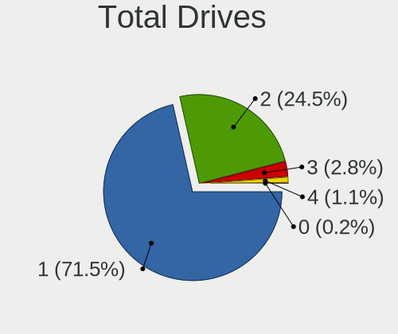

| Drives | Notebooks | Percent |
|--------|-----------|---------|
| 1      | 328       | 73.54%  |
| 2      | 105       | 23.54%  |
| 3      | 12        | 2.69%   |
| 0      | 1         | 0.22%   |

Has CD-ROM
----------

Has CD-ROM on board

| Presented | Notebooks | Percent |
|-----------|-----------|---------|
| No        | 316       | 70.85%  |
| Yes       | 130       | 29.15%  |

Has Ethernet
------------

Has Ethernet on board

| Presented | Notebooks | Percent |
|-----------|-----------|---------|
| Yes       | 337       | 75.56%  |
| No        | 109       | 24.44%  |

Has WiFi
--------

Has WiFi module

| Presented | Notebooks | Percent |
|-----------|-----------|---------|
| Yes       | 441       | 98.88%  |
| No        | 5         | 1.12%   |

Has Bluetooth
-------------

Has Bluetooth module

| Presented | Notebooks | Percent |
|-----------|-----------|---------|
| Yes       | 372       | 83.41%  |
| No        | 74        | 16.59%  |

Location
--------

Country
-------

Geographic location (country)

| Country | Notebooks | Percent |
|---------|-----------|---------|
| USA     | 446       | 100%    |

City
----

Geographic location (city)

| City            | Notebooks | Percent |
|-----------------|-----------|---------|
| Bangor          | 22        | 4.93%   |
| Seattle         | 10        | 2.24%   |
| Los Angeles     | 10        | 2.24%   |
| New York        | 8         | 1.79%   |
| Houston         | 6         | 1.35%   |
| Dallas          | 6         | 1.35%   |
| San Antonio     | 5         | 1.12%   |
| Portland        | 5         | 1.12%   |
| Phoenix         | 5         | 1.12%   |
| Orlando         | 5         | 1.12%   |
| Austin          | 5         | 1.12%   |
| Atlanta         | 5         | 1.12%   |
| Tampa           | 4         | 0.9%    |
| Miami           | 4         | 0.9%    |
| Alexandria      | 4         | 0.9%    |
| Springfield     | 3         | 0.67%   |
| Raleigh         | 3         | 0.67%   |
| Palmyra         | 3         | 0.67%   |
| Oklahoma City   | 3         | 0.67%   |
| Mesa            | 3         | 0.67%   |
| Huntsville      | 3         | 0.67%   |
| Charlotte       | 3         | 0.67%   |
| Calvert Heights | 3         | 0.67%   |
| Worcester       | 2         | 0.45%   |
| Vancouver       | 2         | 0.45%   |
| Tullahoma       | 2         | 0.45%   |
| Stockbridge     | 2         | 0.45%   |
| St Louis        | 2         | 0.45%   |
| Spring          | 2         | 0.45%   |
| Shoreham        | 2         | 0.45%   |
| Richmond        | 2         | 0.45%   |
| Richardson      | 2         | 0.45%   |
| Pullman         | 2         | 0.45%   |
| Philadelphia    | 2         | 0.45%   |
| Olympia         | 2         | 0.45%   |
| Minneapolis     | 2         | 0.45%   |
| Longmont        | 2         | 0.45%   |
| Little Rock     | 2         | 0.45%   |
| Lincoln         | 2         | 0.45%   |
| Lawrenceville   | 2         | 0.45%   |

Drives
------

Drive Vendor
------------

Hard drive vendors

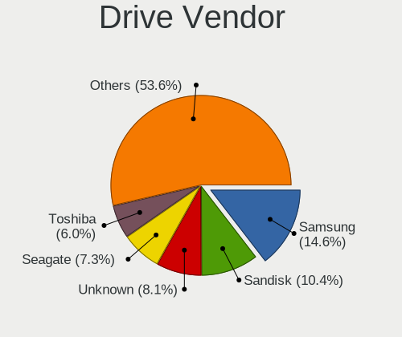

| Vendor                      | Notebooks | Drives | Percent |
|-----------------------------|-----------|--------|---------|
| Samsung Electronics         | 86        | 94     | 15.5%   |
| Unknown                     | 56        | 59     | 10.09%  |
| Sandisk                     | 56        | 58     | 10.09%  |
| Seagate                     | 46        | 48     | 8.29%   |
| WDC                         | 35        | 37     | 6.31%   |
| SK hynix                    | 29        | 29     | 5.23%   |
| Toshiba                     | 23        | 23     | 4.14%   |
| Crucial                     | 22        | 22     | 3.96%   |
| Apple                       | 21        | 21     | 3.78%   |
| Intel                       | 19        | 20     | 3.42%   |
| Phison Electronics          | 14        | 14     | 2.52%   |
| Micron Technology           | 14        | 14     | 2.52%   |
| KIOXIA                      | 12        | 12     | 2.16%   |
| Kingston Technology Company | 11        | 11     | 1.98%   |
| Kingston                    | 10        | 10     | 1.8%    |
| SPCC                        | 9         | 9      | 1.62%   |
| Hitachi                     | 9         | 9      | 1.62%   |
| China                       | 7         | 7      | 1.26%   |
| HGST                        | 6         | 6      | 1.08%   |
| PNY                         | 4         | 4      | 0.72%   |
| Micron/Crucial Technology   | 4         | 4      | 0.72%   |
| JMicron Technology          | 4         | 4      | 0.72%   |
| Fujitsu                     | 4         | 5      | 0.72%   |
| Team                        | 3         | 3      | 0.54%   |
| MAXIO Technology (Hangzhou) | 3         | 3      | 0.54%   |
| LITEONIT                    | 3         | 3      | 0.54%   |
| LITEON                      | 3         | 3      | 0.54%   |
| Unknown                     | 3         | 3      | 0.54%   |
| Union Memory                | 2         | 2      | 0.36%   |
| T-FORCE                     | 2         | 3      | 0.36%   |
| Silicon Motion              | 2         | 2      | 0.36%   |
| SABRENT                     | 2         | 2      | 0.36%   |
| Realtek                     | 2         | 2      | 0.36%   |
| O2 Micro                    | 2         | 2      | 0.36%   |
| Lexar                       | 2         | 2      | 0.36%   |
| Hewlett-Packard             | 2         | 3      | 0.36%   |
| Dogfish                     | 2         | 2      | 0.36%   |
| Wibtek                      | 1         | 1      | 0.18%   |
| UMIS                        | 1         | 1      | 0.18%   |
| SSSTC                       | 1         | 1      | 0.18%   |

Drive Model
-----------

Hard drive models

| Model                                               | Notebooks | Percent |
|-----------------------------------------------------|-----------|---------|
| Samsung NVMe SSD Controller SM981/PM981/PM983 256GB | 15        | 2.64%   |
| Samsung NVMe SSD Controller PM9A1/PM9A3/980PRO 1TB  | 13        | 2.29%   |
| Unknown AGND3R  16GB                                | 9         | 1.58%   |
| Unknown MMC Card  32GB                              | 8         | 1.41%   |
| Kingston Company OM3PDP3 NVMe SSD 512GB             | 8         | 1.41%   |
| Unknown MMC Card  512GB                             | 7         | 1.23%   |
| Sandisk WD Black SN750 / PC SN730 NVMe SSD 512GB    | 6         | 1.06%   |
| Unknown MMC Card  64GB                              | 5         | 0.88%   |
| Unknown HAG2e  16GB                                 | 5         | 0.88%   |
| Seagate ST1000LM035-1RK172 1TB                      | 5         | 0.88%   |
| Seagate ST1000LM024 HN-M101MBB 1TB                  | 5         | 0.88%   |
| Unknown MMC Card  256GB                             | 4         | 0.7%    |
| Unknown MMC Card  128GB                             | 4         | 0.7%    |
| Toshiba XG6 NVMe SSD Controller 512GB               | 4         | 0.7%    |
| Samsung SSD 870 EVO 1TB                             | 4         | 0.7%    |
| Samsung SSD 860 EVO 1TB                             | 4         | 0.7%    |
| Phison PS5013 E13 NVMe Controller 512GB             | 4         | 0.7%    |
| Crucial CT1000MX500SSD1 1TB                         | 4         | 0.7%    |
| WDC WDS500G2B0A-00SM50 500GB SSD                    | 3         | 0.53%   |
| WDC WD Blue SA510 2.5 1TB                           | 3         | 0.53%   |
| Unknown SD/MMC/MS PRO 128GB                         | 3         | 0.53%   |
| Toshiba MQ01ABD100 1TB                              | 3         | 0.53%   |
| Toshiba BG3 NVMe SSD Controller 512GB               | 3         | 0.53%   |
| SK hynix PC801 NVMe 1TB                             | 3         | 0.53%   |
| SK hynix PC711 HFS001TDE9X073N 1TB                  | 3         | 0.53%   |
| Seagate ST750LM022 HN-M750MBB 752GB                 | 3         | 0.53%   |
| Seagate ST500LM021-1KJ152 500GB                     | 3         | 0.53%   |
| SanDisk SDSSDA240G 240GB                            | 3         | 0.53%   |
| SanDisk SD8SN8U128G1001 128GB SSD                   | 3         | 0.53%   |
| Samsung MZVLQ256HBJD-00BH1 256GB                    | 3         | 0.53%   |
| Samsung MZ9LQ512HBLU-00BVL 512GB                    | 3         | 0.53%   |
| Phison E12 NVMe Controller 2TB                      | 3         | 0.53%   |
| Micron 3400_MTFDKBA1T0TFH 1TB                       | 3         | 0.53%   |
| KIOXIA KBG40ZNS256G NVMe 256GB                      | 3         | 0.53%   |
| Intel SSD Pro 7600p/760p/E 6100p Series 1TB         | 3         | 0.53%   |
| Intel SSD 660P Series 1024GB                        | 3         | 0.53%   |
| Crucial CT500MX500SSD1 500GB                        | 3         | 0.53%   |
| Crucial CT240BX200SSD1 240GB                        | 3         | 0.53%   |
| Unknown                                             | 3         | 0.53%   |
| WDC WDBNCE5000PNC 500GB SSD                         | 2         | 0.35%   |

HDD Vendor
----------

Hard disk drive vendors

| Vendor  | Notebooks | Drives | Percent |
|---------|-----------|--------|---------|
| Seagate | 44        | 45     | 44.9%   |
| WDC     | 16        | 17     | 16.33%  |
| Toshiba | 12        | 12     | 12.24%  |
| Hitachi | 9         | 9      | 9.18%   |
| HGST    | 6         | 6      | 6.12%   |
| Fujitsu | 4         | 5      | 4.08%   |
| Unknown | 3         | 3      | 3.06%   |
| SABRENT | 2         | 2      | 2.04%   |
| Apple   | 2         | 2      | 2.04%   |

SSD Vendor
----------

Solid state drive vendors

| Vendor              | Notebooks | Drives | Percent |
|---------------------|-----------|--------|---------|
| Samsung Electronics | 28        | 28     | 17.07%  |
| SanDisk             | 23        | 23     | 14.02%  |
| Crucial             | 22        | 22     | 13.41%  |
| WDC                 | 15        | 15     | 9.15%   |
| Apple               | 12        | 12     | 7.32%   |
| SPCC                | 7         | 7      | 4.27%   |
| China               | 7         | 7      | 4.27%   |
| SK hynix            | 5         | 5      | 3.05%   |
| Kingston            | 5         | 5      | 3.05%   |
| PNY                 | 4         | 4      | 2.44%   |
| Micron Technology   | 4         | 4      | 2.44%   |
| Intel               | 4         | 4      | 2.44%   |
| LITEONIT            | 3         | 3      | 1.83%   |
| LITEON              | 3         | 3      | 1.83%   |
| Toshiba             | 2         | 2      | 1.22%   |
| Team                | 2         | 2      | 1.22%   |
| Lexar               | 2         | 2      | 1.22%   |
| JMicron Technology  | 2         | 2      | 1.22%   |
| Dogfish             | 2         | 2      | 1.22%   |
| Wibtek              | 1         | 1      | 0.61%   |
| T-FORCE             | 1         | 1      | 0.61%   |
| PNY USB             | 1         | 1      | 0.61%   |
| KingFast            | 1         | 1      | 0.61%   |
| Hewlett-Packard     | 1         | 2      | 0.61%   |
| GOODRAM             | 1         | 1      | 0.61%   |
| DIERYA              | 1         | 1      | 0.61%   |
| Corsair             | 1         | 1      | 0.61%   |
| BIWIN               | 1         | 1      | 0.61%   |
| BHT                 | 1         | 1      | 0.61%   |
| ASMT                | 1         | 1      | 0.61%   |
| A-DATA Technology   | 1         | 1      | 0.61%   |

Drive Kind
----------

HDD or SSD

| Kind    | Notebooks | Drives | Percent |
|---------|-----------|--------|---------|
| NVMe    | 209       | 237    | 39.73%  |
| SSD     | 150       | 165    | 28.52%  |
| HDD     | 96        | 101    | 18.25%  |
| MMC     | 58        | 60     | 11.03%  |
| Unknown | 13        | 13     | 2.47%   |

Drive Connector
---------------

SATA, SAS, NVMe, etc.

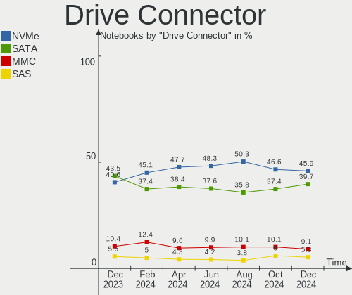

| Type | Notebooks | Drives | Percent |
|------|-----------|--------|---------|
| SATA | 226       | 255    | 43.88%  |
| NVMe | 208       | 235    | 40.39%  |
| MMC  | 58        | 60     | 11.26%  |
| SAS  | 23        | 26     | 4.47%   |

Drive Size
----------

Size of hard drive

| Size in TB | Notebooks | Drives | Percent |
|------------|-----------|--------|---------|
| 0.01-0.5   | 157       | 173    | 64.34%  |
| 0.51-1.0   | 76        | 82     | 31.15%  |
| 1.01-2.0   | 8         | 8      | 3.28%   |
| 4.01-10.0  | 2         | 2      | 0.82%   |
| 3.01-4.0   | 1         | 1      | 0.41%   |

Space Total
-----------

Amount of disk space available on the file system

| Size in GB     | Notebooks | Percent |
|----------------|-----------|---------|
| 101-250        | 111       | 24.89%  |
| 501-1000       | 87        | 19.51%  |
| 251-500        | 79        | 17.71%  |
| 1-20           | 46        | 10.31%  |
| 1001-2000      | 33        | 7.4%    |
| 51-100         | 28        | 6.28%   |
| More than 3000 | 26        | 5.83%   |
| Unknown        | 13        | 2.91%   |
| 21-50          | 12        | 2.69%   |
| 2001-3000      | 11        | 2.47%   |

Space Used
----------

Amount of used disk space

| Used GB        | Notebooks | Percent |
|----------------|-----------|---------|
| 1-20           | 172       | 38.57%  |
| 21-50          | 86        | 19.28%  |
| 101-250        | 58        | 13%     |
| 51-100         | 52        | 11.66%  |
| 251-500        | 28        | 6.28%   |
| 1001-2000      | 18        | 4.04%   |
| Unknown        | 13        | 2.91%   |
| 501-1000       | 10        | 2.24%   |
| More than 3000 | 5         | 1.12%   |
| 2001-3000      | 4         | 0.9%    |

Malfunc. Drives
---------------

Drive models with a malfunction

| Model                                                           | Notebooks | Drives | Percent |
|-----------------------------------------------------------------|-----------|--------|---------|
| Toshiba MQ01ABD100 1TB                                          | 2         | 2      | 9.52%   |
| Crucial CT525MX300SSD1 528GB                                    | 2         | 2      | 9.52%   |
| Wibtek W800S 512GB SSD                                          | 1         | 1      | 4.76%   |
| Toshiba MQ01ABD064 640GB                                        | 1         | 1      | 4.76%   |
| Toshiba MK1234GSX 120GB                                         | 1         | 1      | 4.76%   |
| SSSTC CA6-8D2048-Q11 NVMe 2048GB                                | 1         | 1      | 4.76%   |
| SK hynix PC711 HFS001TDE9X073N 1TB                              | 1         | 1      | 4.76%   |
| Seagate ST95005620AS 500GB                                      | 1         | 1      | 4.76%   |
| Seagate ST9200420ASG 200GB                                      | 1         | 1      | 4.76%   |
| Seagate ST320LT012-9WS14C 320GB                                 | 1         | 1      | 4.76%   |
| Seagate ST1000LM035-1RK172 1TB                                  | 1         | 1      | 4.76%   |
| Samsung Electronics NVMe SSD Controller SM981/PM981/PM983 256GB | 1         | 1      | 4.76%   |
| Kingston SUV400S37120G 120GB SSD                                | 1         | 1      | 4.76%   |
| Intel SSDSC2BF360A5L 360GB                                      | 1         | 1      | 4.76%   |
| Intel SSDSA2M080G2GC 80GB                                       | 1         | 1      | 4.76%   |
| Hitachi HTS723225A7A364 250GB                                   | 1         | 1      | 4.76%   |
| HGST HTS721010A9E630 1TB                                        | 1         | 1      | 4.76%   |
| Fujitsu MHW2120BJ G2 120GB                                      | 1         | 1      | 4.76%   |
| Corsair Force LS SSD 120GB                                      | 1         | 1      | 4.76%   |

Malfunc. Drive Vendor
---------------------

Vendors of faulty drives

| Vendor              | Notebooks | Drives | Percent |
|---------------------|-----------|--------|---------|
| Toshiba             | 4         | 4      | 19.05%  |
| Seagate             | 4         | 4      | 19.05%  |
| Intel               | 2         | 2      | 9.52%   |
| Crucial             | 2         | 2      | 9.52%   |
| Wibtek              | 1         | 1      | 4.76%   |
| SSSTC               | 1         | 1      | 4.76%   |
| SK hynix            | 1         | 1      | 4.76%   |
| Samsung Electronics | 1         | 1      | 4.76%   |
| Kingston            | 1         | 1      | 4.76%   |
| Hitachi             | 1         | 1      | 4.76%   |
| HGST                | 1         | 1      | 4.76%   |
| Fujitsu             | 1         | 1      | 4.76%   |
| Corsair             | 1         | 1      | 4.76%   |

Malfunc. HDD Vendor
-------------------

Vendors of faulty HDD drives

| Vendor  | Notebooks | Drives | Percent |
|---------|-----------|--------|---------|
| Toshiba | 4         | 4      | 36.36%  |
| Seagate | 4         | 4      | 36.36%  |
| Hitachi | 1         | 1      | 9.09%   |
| HGST    | 1         | 1      | 9.09%   |
| Fujitsu | 1         | 1      | 9.09%   |

Malfunc. Drive Kind
-------------------

Kinds of faulty drives

| Kind | Notebooks | Drives | Percent |
|------|-----------|--------|---------|
| HDD  | 11        | 11     | 52.38%  |
| SSD  | 7         | 7      | 33.33%  |
| NVMe | 3         | 3      | 14.29%  |

Failed Drives
-------------

Failed drive models

| Model               | Notebooks | Drives | Percent |
|---------------------|-----------|--------|---------|
| Intenso JAJP600M1TB | 1         | 1      | 100%    |

Failed Drive Vendor
-------------------

Failed drive vendors

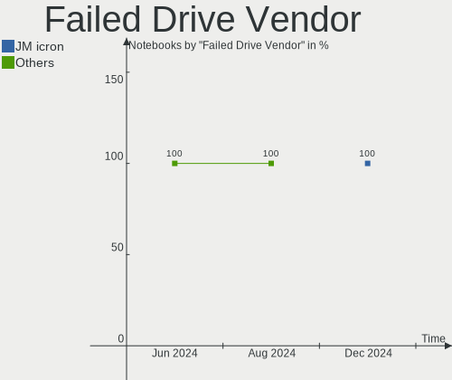

| Vendor  | Notebooks | Drives | Percent |
|---------|-----------|--------|---------|
| Intenso | 1         | 1      | 100%    |

Drive Status
------------

Number of failed and malfunc. drives

| Status   | Notebooks | Drives | Percent |
|----------|-----------|--------|---------|
| Detected | 268       | 344    | 56.9%   |
| Works    | 181       | 210    | 38.43%  |
| Malfunc  | 21        | 21     | 4.46%   |
| Failed   | 1         | 1      | 0.21%   |

Storage controller
------------------

Storage Vendor
--------------

Storage controller vendors

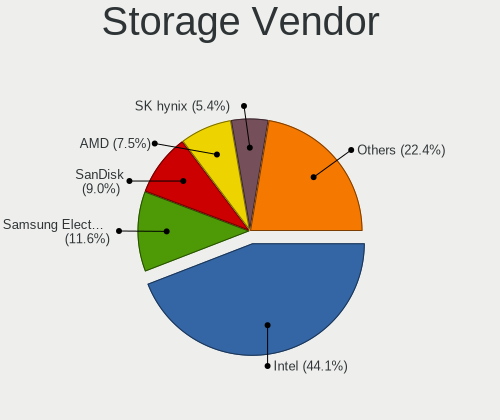

| Vendor                         | Notebooks | Percent |
|--------------------------------|-----------|---------|
| Intel                          | 253       | 48.65%  |
| Samsung Electronics            | 63        | 12.12%  |
| AMD                            | 44        | 8.46%   |
| SanDisk                        | 37        | 7.12%   |
| SK hynix                       | 24        | 4.62%   |
| Phison Electronics             | 16        | 3.08%   |
| Kingston Technology Company    | 16        | 3.08%   |
| KIOXIA                         | 11        | 2.12%   |
| Toshiba America Info Systems   | 10        | 1.92%   |
| Micron Technology              | 10        | 1.92%   |
| Apple                          | 7         | 1.35%   |
| Silicon Motion                 | 4         | 0.77%   |
| Nvidia                         | 4         | 0.77%   |
| Micron/Crucial Technology      | 4         | 0.77%   |
| Union Memory (Shenzhen)        | 3         | 0.58%   |
| Realtek Semiconductor          | 3         | 0.58%   |
| MAXIO Technology (Hangzhou)    | 3         | 0.58%   |
| Marvell Technology Group       | 3         | 0.58%   |
| Solid State Storage Technology | 2         | 0.38%   |
| O2 Micro                       | 2         | 0.38%   |
| JMicron Technology             | 1         | 0.19%   |

Storage Model
-------------

Storage controller models

| Model                                                                          | Notebooks | Percent |
|--------------------------------------------------------------------------------|-----------|---------|
| AMD FCH SATA Controller [AHCI mode]                                            | 41        | 7.44%   |
| Intel 82801 Mobile SATA Controller [RAID mode]                                 | 32        | 5.81%   |
| Intel 7 Series Chipset Family 6-port SATA Controller [AHCI mode]               | 29        | 5.26%   |
| Intel Sunrise Point-LP SATA Controller [AHCI mode]                             | 28        | 5.08%   |
| Samsung NVMe SSD Controller SM981/PM981/PM983                                  | 23        | 4.17%   |
| Intel Volume Management Device NVMe RAID Controller                            | 20        | 3.63%   |
| Samsung NVMe SSD Controller PM9A1/PM9A3/980PRO                                 | 18        | 3.27%   |
| Intel 6 Series/C200 Series Chipset Family 6 port Mobile SATA AHCI Controller   | 16        | 2.9%    |
| Intel Wildcat Point-LP SATA Controller [AHCI Mode]                             | 15        | 2.72%   |
| Intel 8 Series/C220 Series Chipset Family 6-port SATA Controller 1 [AHCI mode] | 14        | 2.54%   |
| Samsung NVMe SSD Controller 980                                                | 13        | 2.36%   |
| SanDisk WD Black SN770 / PC SN740 256GB / PC SN560 (DRAM-less) NVMe SSD        | 11        | 2%      |
| Intel 8 Series SATA Controller 1 [AHCI mode]                                   | 10        | 1.81%   |
| KIOXIA NVMe SSD Controller BG4 (DRAM-less)                                     | 8         | 1.45%   |
| Kingston Company OM3PDP3 NVMe SSD                                              | 8         | 1.45%   |
| Intel Tiger Lake-LP SATA Controller                                            | 8         | 1.45%   |
| Intel HM170/QM170 Chipset SATA Controller [AHCI Mode]                          | 8         | 1.45%   |
| Intel Celeron/Pentium Silver Processor SATA Controller                         | 8         | 1.45%   |
| SK hynix Gold P31/BC711/PC711 NVMe Solid State Drive                           | 7         | 1.27%   |
| Phison PS5021-E21 PCIe4 NVMe Controller (DRAM-less)                            | 7         | 1.27%   |
| Intel Volume Management Device NVMe RAID Controller Intel Corporation          | 7         | 1.27%   |
| Intel Cannon Lake Mobile PCH SATA AHCI Controller                              | 7         | 1.27%   |
| Intel 82801IBM/IEM (ICH9M/ICH9M-E) 4 port SATA Controller [AHCI mode]          | 7         | 1.27%   |
| Intel 5 Series/3400 Series Chipset 6 port SATA AHCI Controller                 | 7         | 1.27%   |
| Apple ANS2 NVMe Controller                                                     | 7         | 1.27%   |
| Toshiba America Info Systems XG6 NVMe SSD Controller                           | 6         | 1.09%   |
| SK hynix Platinum P41/PC801 NVMe Solid State Drive                             | 6         | 1.09%   |
| SanDisk WD Black SN750 / PC SN730 NVMe SSD                                     | 6         | 1.09%   |
| Samsung NVMe SSD Controller SM961/PM961/SM963                                  | 6         | 1.09%   |
| Micron 3400 NVMe SSD [Hendrix]                                                 | 6         | 1.09%   |
| Toshiba America Info Systems BG3 NVMe SSD Controller                           | 4         | 0.73%   |
| Silicon Motion SM2263EN/SM2263XT (DRAM-less) NVMe SSD Controllers              | 4         | 0.73%   |
| Sandisk Western Digital WD Black SN850X NVMe SSD                               | 4         | 0.73%   |
| SanDisk WD Blue SN570 NVMe SSD 1TB                                             | 4         | 0.73%   |
| Phison PS5013 E13 NVMe Controller                                              | 4         | 0.73%   |
| Intel SSD DC P4101/Pro 7600p/760p/E 6100p Series                               | 4         | 0.73%   |
| Intel Optane NVME SSD H10 with Solid State Storage [Teton Glacier]             | 4         | 0.73%   |
| Intel Ice Lake-LP SATA Controller [AHCI mode]                                  | 4         | 0.73%   |
| Intel Alder Lake-P SATA AHCI Controller                                        | 4         | 0.73%   |
| SK hynix PC611 NVMe Solid State Drive                                          | 3         | 0.54%   |

Storage Kind
------------

Kind of storage controller (IDE, SATA, NVMe, SAS, ...)

| Kind | Notebooks | Percent |
|------|-----------|---------|
| SATA | 237       | 45.14%  |
| NVMe | 209       | 39.81%  |
| RAID | 64        | 12.19%  |
| IDE  | 15        | 2.86%   |

Processor
---------

CPU Vendor
----------

Processor vendors

| Vendor | Notebooks | Percent |
|--------|-----------|---------|
| Intel  | 348       | 78.03%  |
| AMD    | 98        | 21.97%  |

CPU Model
---------

Processor models

| Model                                         | Notebooks | Percent |
|-----------------------------------------------|-----------|---------|
| AMD Custom APU 0405                           | 23        | 5.16%   |
| Intel Celeron CPU N2840 @ 2.16GHz             | 17        | 3.81%   |
| Intel Core i7-9750H CPU @ 2.60GHz             | 7         | 1.57%   |
| Intel Core i5-6200U CPU @ 2.30GHz             | 6         | 1.35%   |
| Intel 11th Gen Core i5-1135G7 @ 2.40GHz       | 6         | 1.35%   |
| Intel Core i7-7700HQ CPU @ 2.80GHz            | 5         | 1.12%   |
| Intel Core i7-6700HQ CPU @ 2.60GHz            | 5         | 1.12%   |
| Intel Core i7-5500U CPU @ 2.40GHz             | 5         | 1.12%   |
| Intel Core i7-10750H CPU @ 2.60GHz            | 5         | 1.12%   |
| Intel Core i5-7200U CPU @ 2.50GHz             | 5         | 1.12%   |
| Intel Core i5-6300U CPU @ 2.40GHz             | 5         | 1.12%   |
| Intel 12th Gen Core i7-1255U                  | 5         | 1.12%   |
| Intel 11th Gen Core i3-1115G4 @ 3.00GHz       | 5         | 1.12%   |
| Intel Core i7-8650U CPU @ 1.90GHz             | 4         | 0.9%    |
| Intel Core i7-6600U CPU @ 2.60GHz             | 4         | 0.9%    |
| Intel Core i7-3632QM CPU @ 2.20GHz            | 4         | 0.9%    |
| Intel Core i5-3210M CPU @ 2.50GHz             | 4         | 0.9%    |
| Intel Core i5 CPU M 560 @ 2.67GHz             | 4         | 0.9%    |
| Intel Celeron N4020 CPU @ 1.10GHz             | 4         | 0.9%    |
| Intel 12th Gen Core i7-12700H                 | 4         | 0.9%    |
| Intel 11th Gen Core i7-1165G7 @ 2.80GHz       | 4         | 0.9%    |
| AMD Ryzen 7 PRO 5850U with Radeon Graphics    | 4         | 0.9%    |
| AMD Ryzen 7 3700U with Radeon Vega Mobile Gfx | 4         | 0.9%    |
| AMD Ryzen 5 4500U with Radeon Graphics        | 4         | 0.9%    |
| Intel Core i7-8750H CPU @ 2.20GHz             | 3         | 0.67%   |
| Intel Core i7-7600U CPU @ 2.80GHz             | 3         | 0.67%   |
| Intel Core i7-7500U CPU @ 2.70GHz             | 3         | 0.67%   |
| Intel Core i7-6500U CPU @ 2.50GHz             | 3         | 0.67%   |
| Intel Core i7-5600U CPU @ 2.60GHz             | 3         | 0.67%   |
| Intel Core i7-4710HQ CPU @ 2.50GHz            | 3         | 0.67%   |
| Intel Core i7-3630QM CPU @ 2.40GHz            | 3         | 0.67%   |
| Intel Core i7-2620M CPU @ 2.70GHz             | 3         | 0.67%   |
| Intel Core i5-8350U CPU @ 1.70GHz             | 3         | 0.67%   |
| Intel Core i5-4300M CPU @ 2.60GHz             | 3         | 0.67%   |
| Intel Core i5-4210U CPU @ 1.70GHz             | 3         | 0.67%   |
| Intel Core i5-3340M CPU @ 2.70GHz             | 3         | 0.67%   |
| Intel Core i5-3320M CPU @ 2.60GHz             | 3         | 0.67%   |
| Intel Core i5-2540M CPU @ 2.60GHz             | 3         | 0.67%   |
| Intel Core i5-1035G1 CPU @ 1.00GHz            | 3         | 0.67%   |
| Intel Core i3-5005U CPU @ 2.00GHz             | 3         | 0.67%   |

CPU Model Family
----------------

Processor model prefix

| Model                   | Notebooks | Percent |
|-------------------------|-----------|---------|
| Intel Core i7           | 108       | 24.22%  |
| Other                   | 91        | 20.4%   |
| Intel Core i5           | 84        | 18.83%  |
| Intel Celeron           | 43        | 9.64%   |
| Intel Core i3           | 23        | 5.16%   |
| AMD Ryzen 7             | 19        | 4.26%   |
| Intel Core 2 Duo        | 11        | 2.47%   |
| AMD Ryzen 7 PRO         | 11        | 2.47%   |
| AMD Ryzen 5             | 10        | 2.24%   |
| AMD Ryzen 3             | 7         | 1.57%   |
| AMD Ryzen 9             | 5         | 1.12%   |
| AMD A6                  | 5         | 1.12%   |
| AMD A12                 | 3         | 0.67%   |
| Intel Pentium Silver    | 2         | 0.45%   |
| Intel Pentium Dual-Core | 2         | 0.45%   |
| Intel Core i9           | 2         | 0.45%   |
| Intel Core 2            | 2         | 0.45%   |
| AMD A8                  | 2         | 0.45%   |
| AMD A10                 | 2         | 0.45%   |
| Intel Xeon              | 1         | 0.22%   |
| Intel Pentium           | 1         | 0.22%   |
| Intel Genuine           | 1         | 0.22%   |
| Intel Core m5           | 1         | 0.22%   |
| Intel Core 2 Quad       | 1         | 0.22%   |
| Intel Atom              | 1         | 0.22%   |
| AMD Turion II           | 1         | 0.22%   |
| AMD Turion 64 X2 Mobile | 1         | 0.22%   |
| AMD Sempron             | 1         | 0.22%   |
| AMD Ryzen 5 PRO         | 1         | 0.22%   |
| AMD E1                  | 1         | 0.22%   |
| AMD E                   | 1         | 0.22%   |
| AMD Athlon II           | 1         | 0.22%   |
| AMD A4                  | 1         | 0.22%   |

CPU Cores
---------

Number of processor cores

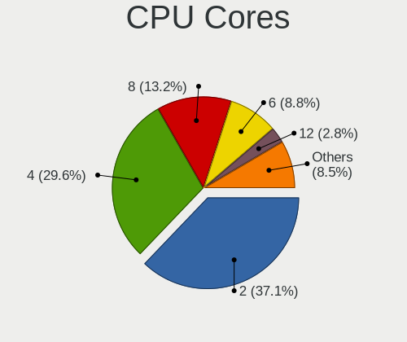

| Number | Notebooks | Percent |
|--------|-----------|---------|
| 2      | 195       | 43.72%  |
| 4      | 134       | 30.04%  |
| 8      | 37        | 8.3%    |
| 6      | 36        | 8.07%   |
| 14     | 12        | 2.69%   |
| 10     | 12        | 2.69%   |
| 12     | 8         | 1.79%   |
| 1      | 6         | 1.35%   |
| 24     | 5         | 1.12%   |
| 3      | 1         | 0.22%   |

CPU Sockets
-----------

Number of sockets

| Number | Notebooks | Percent |
|--------|-----------|---------|
| 1      | 446       | 100%    |

CPU Threads
-----------

Threads per core (Hyper-Threading)

| Number | Notebooks | Percent |
|--------|-----------|---------|
| 2      | 353       | 79.15%  |
| 1      | 93        | 20.85%  |

CPU Op-Modes
------------

CPU Operation Modes (32-bit, 64-bit)

| Op mode        | Notebooks | Percent |
|----------------|-----------|---------|
| 32-bit, 64-bit | 444       | 99.55%  |
| 32-bit         | 2         | 0.45%   |

CPU Microcode
-------------

Microcode number

| Number     | Notebooks | Percent |
|------------|-----------|---------|
| Unknown    | 295       | 66.14%  |
| 0x30678    | 13        | 2.91%   |
| 0x206a7    | 8         | 1.79%   |
| 0x306a9    | 7         | 1.57%   |
| 0x806e9    | 6         | 1.35%   |
| 0x806ec    | 5         | 1.12%   |
| 0x306d4    | 5         | 1.12%   |
| 0x0a50000c | 5         | 1.12%   |
| 0x0a404102 | 5         | 1.12%   |
| 0x08108109 | 5         | 1.12%   |
| 0x906a3    | 4         | 0.9%    |
| 0x806ea    | 4         | 0.9%    |
| 0x806c1    | 4         | 0.9%    |
| 0x406e3    | 4         | 0.9%    |
| 0x40651    | 4         | 0.9%    |
| 0x306c3    | 4         | 0.9%    |
| 0x08900201 | 4         | 0.9%    |
| 0x08600106 | 4         | 0.9%    |
| 0x06006118 | 4         | 0.9%    |
| 0x706e5    | 3         | 0.67%   |
| 0x1067a    | 3         | 0.67%   |
| 0x0a50000d | 3         | 0.67%   |
| 0x08600104 | 3         | 0.67%   |
| 0xb06a2    | 2         | 0.45%   |
| 0xa0652    | 2         | 0.45%   |
| 0x906ea    | 2         | 0.45%   |
| 0x906a4    | 2         | 0.45%   |
| 0x6fd      | 2         | 0.45%   |
| 0x20655    | 2         | 0.45%   |
| 0x08600103 | 2         | 0.45%   |
| 0x08600102 | 2         | 0.45%   |
| 0x0600611a | 2         | 0.45%   |
| 0x03000027 | 2         | 0.45%   |
| 0x010000c8 | 2         | 0.45%   |
| 0xb06a3    | 1         | 0.22%   |
| 0x906e9    | 1         | 0.22%   |
| 0x806d1    | 1         | 0.22%   |
| 0x706a8    | 1         | 0.22%   |
| 0x6f6      | 1         | 0.22%   |
| 0x6f2      | 1         | 0.22%   |

CPU Microarch
-------------

Microarchitecture

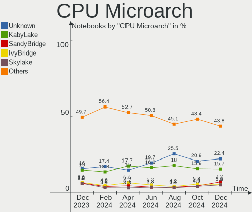

| Name             | Notebooks | Percent |
|------------------|-----------|---------|
| KabyLake         | 62        | 13.9%   |
| Unknown          | 52        | 11.66%  |
| IvyBridge        | 32        | 7.17%   |
| Haswell          | 30        | 6.73%   |
| Skylake          | 28        | 6.28%   |
| Alderlake Hybrid | 27        | 6.05%   |
| Silvermont       | 23        | 5.16%   |
| SandyBridge      | 22        | 4.93%   |
| TigerLake        | 19        | 4.26%   |
| Broadwell        | 19        | 4.26%   |
| Icelake          | 15        | 3.36%   |
| Zen 3            | 13        | 2.91%   |
| Zen 2            | 13        | 2.91%   |
| CometLake        | 13        | 2.91%   |
| Penryn           | 12        | 2.69%   |
| Goldmont plus    | 12        | 2.69%   |
| Zen+             | 11        | 2.47%   |
| Westmere         | 10        | 2.24%   |
| Excavator        | 8         | 1.79%   |
| Core             | 4         | 0.9%    |
| Piledriver       | 3         | 0.67%   |
| Goldmont         | 3         | 0.67%   |
| Zen              | 2         | 0.45%   |
| K10 Llano        | 2         | 0.45%   |
| K10              | 2         | 0.45%   |
| Bobcat           | 2         | 0.45%   |
| Tremont          | 1         | 0.22%   |
| Puma             | 1         | 0.22%   |
| P6               | 1         | 0.22%   |
| K8 Hammer        | 1         | 0.22%   |
| K8 & K10 hybrid  | 1         | 0.22%   |
| Jaguar           | 1         | 0.22%   |
| Bonnell          | 1         | 0.22%   |

Graphics
--------

GPU Vendor
----------

Vendors of graphics cards

| Vendor | Notebooks | Percent |
|--------|-----------|---------|
| Intel  | 315       | 57.38%  |
| AMD    | 124       | 22.59%  |
| Nvidia | 110       | 20.04%  |

GPU Model
---------

Graphics card models

| Model                                                                                    | Notebooks | Percent |
|------------------------------------------------------------------------------------------|-----------|---------|
| Intel 3rd Gen Core processor Graphics Controller                                         | 28        | 5.05%   |
| AMD VanGogh [AMD Custom GPU 0405]                                                        | 23        | 4.14%   |
| Intel Atom Processor Z36xxx/Z37xxx Series Graphics & Display                             | 19        | 3.42%   |
| Intel Skylake GT2 [HD Graphics 520]                                                      | 18        | 3.24%   |
| Intel 2nd Generation Core Processor Family Integrated Graphics Controller                | 17        | 3.06%   |
| Intel HD Graphics 5500                                                                   | 15        | 2.7%    |
| Intel TigerLake-LP GT2 [Iris Xe Graphics]                                                | 14        | 2.52%   |
| Intel Raptor Lake-P [Iris Xe Graphics]                                                   | 14        | 2.52%   |
| Intel HD Graphics 620                                                                    | 14        | 2.52%   |
| Intel 4th Gen Core Processor Integrated Graphics Controller                              | 13        | 2.34%   |
| AMD Renoir                                                                               | 13        | 2.34%   |
| Intel Haswell-ULT Integrated Graphics Controller                                         | 12        | 2.16%   |
| AMD Picasso/Raven 2 [Radeon Vega Series / Radeon Vega Mobile Series]                     | 12        | 2.16%   |
| Intel UHD Graphics 620                                                                   | 11        | 1.98%   |
| Intel CometLake-H GT2 [UHD Graphics]                                                     | 11        | 1.98%   |
| Intel CoffeeLake-H GT2 [UHD Graphics 630]                                                | 11        | 1.98%   |
| Intel GeminiLake [UHD Graphics 600]                                                      | 10        | 1.8%    |
| AMD Cezanne [Radeon Vega Series / Radeon Vega Mobile Series]                             | 10        | 1.8%    |
| Intel Core Processor Integrated Graphics Controller                                      | 9         | 1.62%   |
| Intel Alder Lake-P Integrated Graphics Controller                                        | 9         | 1.62%   |
| AMD Rembrandt [Radeon 680M]                                                              | 9         | 1.62%   |
| Nvidia GA107M [GeForce RTX 3050 Ti Mobile]                                               | 8         | 1.44%   |
| Intel WhiskeyLake-U GT2 [UHD Graphics 620]                                               | 7         | 1.26%   |
| Intel TigerLake-H GT1 [UHD Graphics]                                                     | 7         | 1.26%   |
| AMD Wani [Radeon R5/R6/R7 Graphics]                                                      | 7         | 1.26%   |
| Nvidia TU116M [GeForce GTX 1660 Ti Mobile]                                               | 6         | 1.08%   |
| Intel Mobile 4 Series Chipset Integrated Graphics Controller                             | 6         | 1.08%   |
| Intel Iris Plus Graphics G1 (Ice Lake)                                                   | 6         | 1.08%   |
| Intel HD Graphics 530                                                                    | 6         | 1.08%   |
| Intel Alder Lake-UP3 GT2 [Iris Xe Graphics]                                              | 6         | 1.08%   |
| Intel Tiger Lake-LP GT2 [UHD Graphics G4]                                                | 5         | 0.9%    |
| Nvidia GK107M [GeForce GT 650M Mac Edition]                                              | 4         | 0.72%   |
| Nvidia GA106M [GeForce RTX 3060 Mobile / Max-Q]                                          | 4         | 0.72%   |
| Intel Raptor Lake-S UHD Graphics                                                         | 4         | 0.72%   |
| Intel HD Graphics 630                                                                    | 4         | 0.72%   |
| Intel CometLake-U GT2 [UHD Graphics]                                                     | 4         | 0.72%   |
| Intel Atom/Celeron/Pentium Processor x5-E8000/J3xxx/N3xxx Integrated Graphics Controller | 4         | 0.72%   |
| AMD Topaz XT [Radeon R7 M260/M265 / M340/M360 / M440/M445 / 530/535 / 620/625 Mobile]    | 4         | 0.72%   |
| AMD Navi 14 [Radeon RX 5500/5500M / Pro 5500M]                                           | 4         | 0.72%   |
| AMD Lucienne                                                                             | 4         | 0.72%   |

GPU Combo
---------

Combinations of graphics cards

| Name           | Notebooks | Percent |
|----------------|-----------|---------|
| 1 x Intel      | 221       | 49.55%  |
| 1 x AMD        | 91        | 20.4%   |
| Intel + Nvidia | 70        | 15.7%   |
| 1 x Nvidia     | 28        | 6.28%   |
| Intel + AMD    | 18        | 4.04%   |
| AMD + Nvidia   | 11        | 2.47%   |
| 2 x AMD        | 4         | 0.9%    |
| Other          | 2         | 0.45%   |
| 2 x Intel      | 1         | 0.22%   |

GPU Driver
----------

Free vs proprietary

| Driver      | Notebooks | Percent |
|-------------|-----------|---------|
| Free        | 373       | 83.63%  |
| Proprietary | 63        | 14.13%  |
| Unknown     | 10        | 2.24%   |

GPU Memory
----------

Total video memory

| Size in GB | Notebooks | Percent |
|------------|-----------|---------|
| Unknown    | 337       | 75.56%  |
| 0.01-0.5   | 34        | 7.62%   |
| 3.01-4.0   | 21        | 4.71%   |
| 1.01-2.0   | 21        | 4.71%   |
| 0.51-1.0   | 16        | 3.59%   |
| 5.01-6.0   | 7         | 1.57%   |
| 7.01-8.0   | 5         | 1.12%   |
| 2.01-3.0   | 4         | 0.9%    |
| 8.01-16.0  | 1         | 0.22%   |

Monitor
-------

Monitor Vendor
--------------

Monitor vendors

| Vendor                  | Notebooks | Percent |
|-------------------------|-----------|---------|
| AU Optronics            | 86        | 16.9%   |
| BOE                     | 81        | 15.91%  |
| Chimei Innolux          | 68        | 13.36%  |
| LG Display              | 55        | 10.81%  |
| Samsung Electronics     | 49        | 9.63%   |
| Apple                   | 26        | 5.11%   |
| Valve                   | 23        | 4.52%   |
| Sharp                   | 14        | 2.75%   |
| Dell                    | 11        | 2.16%   |
| InfoVision              | 10        | 1.96%   |
| Chi Mei Optoelectronics | 9         | 1.77%   |
| Goldstar                | 8         | 1.57%   |
| PANDA                   | 6         | 1.18%   |
| Hewlett-Packard         | 6         | 1.18%   |
| Vizio                   | 5         | 0.98%   |
| ViewSonic               | 5         | 0.98%   |
| Lenovo                  | 5         | 0.98%   |
| Sceptre Tech            | 4         | 0.79%   |
| AOC                     | 4         | 0.79%   |
| LG Philips              | 3         | 0.59%   |
| CSO                     | 3         | 0.59%   |
| Ancor Communications    | 3         | 0.59%   |
| Seiki                   | 2         | 0.39%   |
| Quanta Display          | 2         | 0.39%   |
| Insignia                | 2         | 0.39%   |
| HKC                     | 2         | 0.39%   |
| CPT                     | 2         | 0.39%   |
| ASUSTek Computer        | 2         | 0.39%   |
| Acer                    | 2         | 0.39%   |
| Westinghouse            | 1         | 0.2%    |
| Toshiba                 | 1         | 0.2%    |
| TFG                     | 1         | 0.2%    |
| Pixio                   | 1         | 0.2%    |
| Philips                 | 1         | 0.2%    |
| MSI                     | 1         | 0.2%    |
| LGD                     | 1         | 0.2%    |
| InnoLux Display         | 1         | 0.2%    |
| HannStar                | 1         | 0.2%    |
| DZX                     | 1         | 0.2%    |
| BenQ                    | 1         | 0.2%    |

Monitor Model
-------------

Monitor models

| Model                                                                     | Notebooks | Percent |
|---------------------------------------------------------------------------|-----------|---------|
| Valve ANX7530 U VLV3001 800x1280 100x150mm 7.1-inch                       | 23        | 4.51%   |
| BOE LCD Monitor BOE0609 1366x768 256x144mm 11.6-inch                      | 11        | 2.16%   |
| Samsung Electronics LCD Monitor SEC5441 1366x768 344x194mm 15.5-inch      | 9         | 1.76%   |
| Chimei Innolux LCD Monitor CMN15DB 1366x768 344x193mm 15.5-inch           | 6         | 1.18%   |
| Chimei Innolux LCD Monitor CMN14C9 1920x1080 309x173mm 13.9-inch          | 4         | 0.78%   |
| AU Optronics LCD Monitor AUO10EC 1366x768 344x193mm 15.5-inch             | 4         | 0.78%   |
| InfoVision LCD Monitor IVO8C78 1920x1080 309x174mm 14.0-inch              | 3         | 0.59%   |
| Chimei Innolux LCD Monitor CMN1521 1920x1080 344x193mm 15.5-inch          | 3         | 0.59%   |
| Chimei Innolux LCD Monitor CMN14D4 1920x1080 309x173mm 13.9-inch          | 3         | 0.59%   |
| Chimei Innolux LCD Monitor CMN1132 1366x768 256x144mm 11.6-inch           | 3         | 0.59%   |
| BOE LCD Monitor BOE0BCA 2256x1504 285x190mm 13.5-inch                     | 3         | 0.59%   |
| BOE LCD Monitor BOE06CF 1366x768 277x156mm 12.5-inch                      | 3         | 0.59%   |
| BOE LCD Monitor BOE06A4 1366x768 344x194mm 15.5-inch                      | 3         | 0.59%   |
| AU Optronics LCD Monitor AUO226D 1920x1080 276x155mm 12.5-inch            | 3         | 0.59%   |
| Apple Color LCD APP9CC7 1280x800 286x179mm 13.3-inch                      | 3         | 0.59%   |
| Vizio V405-H9 VIZ1039 3840x2160 878x485mm 39.5-inch                       | 2         | 0.39%   |
| Sharp LCD Monitor SHP14AD 3840x2160 294x165mm 13.3-inch                   | 2         | 0.39%   |
| Seiki SE22FE01 SEK08A2 1920x1080 470x300mm 22.0-inch                      | 2         | 0.39%   |
| Sceptre Tech Sceptre F24 SPT09AB 1920x1080 530x290mm 23.8-inch            | 2         | 0.39%   |
| Samsung Electronics LCD Monitor SEC544B 1600x900 382x215mm 17.3-inch      | 2         | 0.39%   |
| Samsung Electronics LCD Monitor SEC5244 1600x900 360x210mm 16.4-inch      | 2         | 0.39%   |
| Samsung Electronics LCD Monitor SDC4C46 3840x2160 344x194mm 15.5-inch     | 2         | 0.39%   |
| LG Display LCD Monitor LGD04A7 1920x1080 344x194mm 15.5-inch              | 2         | 0.39%   |
| LG Display LCD Monitor LGD046F 1920x1080 345x194mm 15.6-inch              | 2         | 0.39%   |
| LG Display LCD Monitor LGD046D 1920x1080 309x174mm 14.0-inch              | 2         | 0.39%   |
| InfoVision LCD Monitor IVO03F4 1366x768 344x193mm 15.5-inch               | 2         | 0.39%   |
| Dell P2314H DEL4098 1920x1080 509x286mm 23.0-inch                         | 2         | 0.39%   |
| Chimei Innolux LCD Monitor CMN15E7 1920x1080 344x193mm 15.5-inch          | 2         | 0.39%   |
| Chimei Innolux LCD Monitor CMN15BA 1920x1080 344x194mm 15.5-inch          | 2         | 0.39%   |
| Chimei Innolux LCD Monitor CMN152E 1920x1080 344x193mm 15.5-inch          | 2         | 0.39%   |
| Chimei Innolux LCD Monitor CMN152A 2560x1440 344x193mm 15.5-inch          | 2         | 0.39%   |
| Chimei Innolux LCD Monitor CMN1512 1920x1080 344x193mm 15.5-inch          | 2         | 0.39%   |
| Chimei Innolux LCD Monitor CMN1493 1366x768 309x173mm 13.9-inch           | 2         | 0.39%   |
| Chi Mei Optoelectronics LCD Monitor CMO1720 1920x1080 380x210mm 17.1-inch | 2         | 0.39%   |
| BOE LCD Monitor BOE095F 2256x1504 285x190mm 13.5-inch                     | 2         | 0.39%   |
| BOE LCD Monitor BOE0953 1920x1080 382x215mm 17.3-inch                     | 2         | 0.39%   |
| BOE LCD Monitor BOE08C2 1920x1080 344x194mm 15.5-inch                     | 2         | 0.39%   |
| BOE LCD Monitor BOE0897 1366x768 344x194mm 15.5-inch                      | 2         | 0.39%   |
| BOE LCD Monitor BOE06F0 1366x768 344x194mm 15.5-inch                      | 2         | 0.39%   |
| BOE LCD Monitor BOE06B0 1366x768 344x194mm 15.5-inch                      | 2         | 0.39%   |

Monitor Resolution
------------------

Monitor screen resolution

| Resolution         | Notebooks | Percent |
|--------------------|-----------|---------|
| 1920x1080 (FHD)    | 201       | 40.94%  |
| 1366x768 (WXGA)    | 123       | 25.05%  |
| 800x1280           | 23        | 4.68%   |
| 1920x1200 (WUXGA)  | 23        | 4.68%   |
| 1600x900 (HD+)     | 22        | 4.48%   |
| 3840x2160 (4K)     | 21        | 4.28%   |
| 2560x1600          | 12        | 2.44%   |
| 2560x1440 (QHD)    | 10        | 2.04%   |
| 1280x800 (WXGA)    | 10        | 2.04%   |
| 2880x1800          | 8         | 1.63%   |
| 1440x900 (WXGA+)   | 8         | 1.63%   |
| 3840x2400          | 5         | 1.02%   |
| 2256x1504          | 5         | 1.02%   |
| 3440x1440          | 4         | 0.81%   |
| 1680x1050 (WSXGA+) | 4         | 0.81%   |
| 2560x1080          | 2         | 0.41%   |
| 3200x2000          | 1         | 0.2%    |
| 3072x1920          | 1         | 0.2%    |
| 2880x1620          | 1         | 0.2%    |
| 2160x1350          | 1         | 0.2%    |
| 1920x1280          | 1         | 0.2%    |
| 1680x945           | 1         | 0.2%    |
| 1360x768           | 1         | 0.2%    |
| 1280x1024 (SXGA)   | 1         | 0.2%    |
| 1024x768 (XGA)     | 1         | 0.2%    |
| 1024x600           | 1         | 0.2%    |

Monitor Diagonal
----------------

Diagonal size in inches

| Inches  | Notebooks | Percent |
|---------|-----------|---------|
| 15      | 165       | 32.48%  |
| 13      | 67        | 13.19%  |
| 14      | 61        | 12.01%  |
| 17      | 49        | 9.65%   |
| 11      | 23        | 4.53%   |
| 7       | 23        | 4.53%   |
| 16      | 18        | 3.54%   |
| 12      | 17        | 3.35%   |
| 27      | 14        | 2.76%   |
| 23      | 13        | 2.56%   |
| 24      | 11        | 2.17%   |
| 31      | 6         | 1.18%   |
| 84      | 4         | 0.79%   |
| 34      | 4         | 0.79%   |
| 21      | 4         | 0.79%   |
| 22      | 3         | 0.59%   |
| 69      | 2         | 0.39%   |
| 54      | 2         | 0.39%   |
| 40      | 2         | 0.39%   |
| 32      | 2         | 0.39%   |
| 29      | 2         | 0.39%   |
| 25      | 2         | 0.39%   |
| 20      | 2         | 0.39%   |
| 19      | 2         | 0.39%   |
| 18      | 2         | 0.39%   |
| Unknown | 2         | 0.39%   |
| 74      | 1         | 0.2%    |
| 38      | 1         | 0.2%    |
| 37      | 1         | 0.2%    |
| 28      | 1         | 0.2%    |
| 26      | 1         | 0.2%    |
| 10      | 1         | 0.2%    |

Monitor Width
-------------

Physical width

| Width in mm | Notebooks | Percent |
|-------------|-----------|---------|
| 301-350     | 262       | 51.68%  |
| 201-300     | 75        | 14.79%  |
| 351-400     | 65        | 12.82%  |
| 501-600     | 40        | 7.89%   |
| 1-100       | 23        | 4.54%   |
| 401-500     | 11        | 2.17%   |
| 601-700     | 10        | 1.97%   |
| 1501-2000   | 7         | 1.38%   |
| 701-800     | 6         | 1.18%   |
| 801-900     | 4         | 0.79%   |
| 1001-1500   | 2         | 0.39%   |
| Unknown     | 2         | 0.39%   |

Aspect Ratio
------------

Proportional relationship between the width and the height

| Ratio   | Notebooks | Percent |
|---------|-----------|---------|
| 16/9    | 350       | 75.59%  |
| 16/10   | 73        | 15.77%  |
| 0.67    | 23        | 4.97%   |
| 3/2     | 7         | 1.51%   |
| 21/9    | 5         | 1.08%   |
| Unknown | 2         | 0.43%   |
| 5/4     | 1         | 0.22%   |
| 4/3     | 1         | 0.22%   |
| 2.65    | 1         | 0.22%   |

Monitor Area
------------

Area in inch

| Area in inch | Notebooks | Percent |
|----------------|-----------|---------|
| 101-110        | 163       | 32.21%  |
| 81-90          | 107       | 21.15%  |
| 121-130        | 43        | 8.5%    |
| 201-250        | 24        | 4.74%   |
| 51-60          | 23        | 4.55%   |
| 1-40           | 23        | 4.55%   |
| 71-80          | 19        | 3.75%   |
| 111-120        | 19        | 3.75%   |
| 61-70          | 17        | 3.36%   |
| 301-350        | 15        | 2.96%   |
| 351-500        | 13        | 2.57%   |
| More than 1000 | 9         | 1.78%   |
| 251-300        | 8         | 1.58%   |
| 151-200        | 6         | 1.19%   |
| 131-140        | 6         | 1.19%   |
| 501-1000       | 4         | 0.79%   |
| 141-150        | 2         | 0.4%    |
| 91-100         | 2         | 0.4%    |
| Unknown        | 2         | 0.4%    |
| 41-50          | 1         | 0.2%    |

Pixel Density
-------------

Pixels per inch

| Density       | Notebooks | Percent |
|---------------|-----------|---------|
| 121-160       | 213       | 42.77%  |
| 101-120       | 115       | 23.09%  |
| 161-240       | 79        | 15.86%  |
| 51-100        | 67        | 13.45%  |
| More than 240 | 15        | 3.01%   |
| 1-50          | 7         | 1.41%   |
| Unknown       | 2         | 0.4%    |

Multiple Monitors
-----------------

Total monitors connected

| Total | Notebooks | Percent |
|-------|-----------|---------|
| 1     | 355       | 79.6%   |
| 2     | 70        | 15.7%   |
| 0     | 12        | 2.69%   |
| 3     | 9         | 2.02%   |

Network
-------

Net Controller Vendor
---------------------

Controller vendors

| Vendor                          | Notebooks | Percent |
|---------------------------------|-----------|---------|
| Intel                           | 262       | 38.76%  |
| Realtek Semiconductor           | 224       | 33.14%  |
| Qualcomm Atheros                | 48        | 7.1%    |
| Broadcom                        | 38        | 5.62%   |
| Broadcom Limited                | 19        | 2.81%   |
| ASIX Electronics                | 19        | 2.81%   |
| MediaTek                        | 13        | 1.92%   |
| Qualcomm                        | 8         | 1.18%   |
| Marvell Technology Group        | 6         | 0.89%   |
| Ralink Technology               | 5         | 0.74%   |
| TP-Link                         | 3         | 0.44%   |
| Ralink                          | 3         | 0.44%   |
| Nvidia                          | 3         | 0.44%   |
| Motorola PCS                    | 3         | 0.44%   |
| Google                          | 3         | 0.44%   |
| Samsung Electronics             | 2         | 0.3%    |
| Edimax Technology               | 2         | 0.3%    |
| DisplayLink                     | 2         | 0.3%    |
| Aquantia                        | 2         | 0.3%    |
| ZyDAS                           | 1         | 0.15%   |
| U-Blox                          | 1         | 0.15%   |
| Sierra Wireless                 | 1         | 0.15%   |
| Qualcomm Atheros Communications | 1         | 0.15%   |
| NetGear                         | 1         | 0.15%   |
| Foxconn / Hon Hai               | 1         | 0.15%   |
| Dell                            | 1         | 0.15%   |
| Cypress Semiconductor           | 1         | 0.15%   |
| Belkin Components               | 1         | 0.15%   |
| ASUSTek Computer                | 1         | 0.15%   |
| Apple                           | 1         | 0.15%   |

Net Controller Model
--------------------

Controller models

| Model                                                             | Notebooks | Percent |
|-------------------------------------------------------------------|-----------|---------|
| Realtek RTL8111/8168/8411 PCI Express Gigabit Ethernet Controller | 107       | 12.88%  |
| Realtek RTL8822CE 802.11ac PCIe Wireless Network Adapter          | 38        | 4.57%   |
| Intel Wireless 7260                                               | 31        | 3.73%   |
| Realtek RTL8153 Gigabit Ethernet Adapter                          | 30        | 3.61%   |
| Realtek RTL810xE PCI Express Fast Ethernet controller             | 29        | 3.49%   |
| Intel Wi-Fi 6 AX200                                               | 26        | 3.13%   |
| Intel Wireless 8265 / 8275                                        | 21        | 2.53%   |
| Intel Wi-Fi 6 AX210/AX211/AX411 160MHz                            | 17        | 2.05%   |
| Intel 82579LM Gigabit Network Connection (Lewisville)             | 16        | 1.93%   |
| ASIX AX88179 Gigabit Ethernet                                     | 16        | 1.93%   |
| Intel Wireless 8260                                               | 14        | 1.68%   |
| Intel Wireless 7265                                               | 13        | 1.56%   |
| Intel Ethernet Connection (4) I219-LM                             | 13        | 1.56%   |
| Intel Alder Lake-P PCH CNVi WiFi                                  | 13        | 1.56%   |
| Realtek RTL8821CE 802.11ac PCIe Wireless Network Adapter          | 12        | 1.44%   |
| Intel Raptor Lake PCH CNVi WiFi                                   | 11        | 1.32%   |
| Intel Wireless 3160                                               | 10        | 1.2%    |
| Intel Centrino Advanced-N 6205 [Taylor Peak]                      | 10        | 1.2%    |
| Intel Wi-Fi 6 AX201                                               | 9         | 1.08%   |
| Intel Ethernet Connection I219-LM                                 | 9         | 1.08%   |
| Qualcomm Atheros QCA9377 802.11ac Wireless Network Adapter        | 8         | 0.96%   |
| Qualcomm Atheros AR9485 Wireless Network Adapter                  | 8         | 0.96%   |
| Intel Comet Lake PCH CNVi WiFi                                    | 8         | 0.96%   |
| Intel Cannon Lake PCH CNVi WiFi                                   | 8         | 0.96%   |
| Intel Ethernet Connection I217-LM                                 | 7         | 0.84%   |
| Intel Centrino Advanced-N 6235                                    | 7         | 0.84%   |
| Broadcom NetXtreme BCM57765 Gigabit Ethernet PCIe                 | 7         | 0.84%   |
| Broadcom Limited BCM4312 802.11b/g LP-PHY                         | 7         | 0.84%   |
| Broadcom BCM4331 802.11a/b/g/n                                    | 7         | 0.84%   |
| Realtek RTL8188CE 802.11b/g/n WiFi Adapter                        | 6         | 0.72%   |
| Realtek 802.11ac NIC                                              | 6         | 0.72%   |
| Qualcomm Atheros QCA6174 802.11ac Wireless Network Adapter        | 6         | 0.72%   |
| Qualcomm Atheros AR9285 Wireless Network Adapter (PCI-Express)    | 6         | 0.72%   |
| MediaTek MT7921 802.11ax PCI Express Wireless Network Adapter     | 6         | 0.72%   |
| Intel 82577LM Gigabit Network Connection                          | 6         | 0.72%   |
| Realtek RTL8852BE PCIe 802.11ax Wireless Network Controller       | 5         | 0.6%    |
| Qualcomm QCNFA765 Wireless Network Adapter                        | 5         | 0.6%    |
| Intel Wireless 3165                                               | 5         | 0.6%    |
| Intel Ethernet Connection (3) I218-LM                             | 5         | 0.6%    |
| Broadcom NetXtreme BCM57786 Gigabit Ethernet PCIe                 | 5         | 0.6%    |

Wireless Vendor
---------------

Wireless vendors

| Vendor                          | Notebooks | Percent |
|---------------------------------|-----------|---------|
| Intel                           | 249       | 53.43%  |
| Realtek Semiconductor           | 94        | 20.17%  |
| Qualcomm Atheros                | 37        | 7.94%   |
| Broadcom                        | 31        | 6.65%   |
| Broadcom Limited                | 16        | 3.43%   |
| MediaTek                        | 13        | 2.79%   |
| Qualcomm                        | 6         | 1.29%   |
| Ralink Technology               | 5         | 1.07%   |
| TP-Link                         | 3         | 0.64%   |
| Ralink                          | 3         | 0.64%   |
| Edimax Technology               | 2         | 0.43%   |
| ZyDAS                           | 1         | 0.21%   |
| Sierra Wireless                 | 1         | 0.21%   |
| Qualcomm Atheros Communications | 1         | 0.21%   |
| NetGear                         | 1         | 0.21%   |
| Dell                            | 1         | 0.21%   |
| Belkin Components               | 1         | 0.21%   |
| ASUSTek Computer                | 1         | 0.21%   |

Wireless Model
--------------

Wireless models

| Model                                                          | Notebooks | Percent |
|----------------------------------------------------------------|-----------|---------|
| Realtek RTL8822CE 802.11ac PCIe Wireless Network Adapter       | 38        | 8.09%   |
| Intel Wireless 7260                                            | 31        | 6.6%    |
| Intel Wi-Fi 6 AX200                                            | 26        | 5.53%   |
| Intel Wireless 8265 / 8275                                     | 21        | 4.47%   |
| Intel Wi-Fi 6 AX210/AX211/AX411 160MHz                         | 17        | 3.62%   |
| Intel Wireless 8260                                            | 14        | 2.98%   |
| Intel Wireless 7265                                            | 13        | 2.77%   |
| Intel Alder Lake-P PCH CNVi WiFi                               | 13        | 2.77%   |
| Realtek RTL8821CE 802.11ac PCIe Wireless Network Adapter       | 12        | 2.55%   |
| Intel Raptor Lake PCH CNVi WiFi                                | 11        | 2.34%   |
| Intel Wireless 3160                                            | 10        | 2.13%   |
| Intel Centrino Advanced-N 6205 [Taylor Peak]                   | 10        | 2.13%   |
| Intel Wi-Fi 6 AX201                                            | 9         | 1.91%   |
| Qualcomm Atheros QCA9377 802.11ac Wireless Network Adapter     | 8         | 1.7%    |
| Qualcomm Atheros AR9485 Wireless Network Adapter               | 8         | 1.7%    |
| Intel Comet Lake PCH CNVi WiFi                                 | 8         | 1.7%    |
| Intel Cannon Lake PCH CNVi WiFi                                | 8         | 1.7%    |
| Intel Centrino Advanced-N 6235                                 | 7         | 1.49%   |
| Broadcom Limited BCM4312 802.11b/g LP-PHY                      | 7         | 1.49%   |
| Broadcom BCM4331 802.11a/b/g/n                                 | 7         | 1.49%   |
| Realtek RTL8188CE 802.11b/g/n WiFi Adapter                     | 6         | 1.28%   |
| Realtek 802.11ac NIC                                           | 6         | 1.28%   |
| Qualcomm Atheros QCA6174 802.11ac Wireless Network Adapter     | 6         | 1.28%   |
| Qualcomm Atheros AR9285 Wireless Network Adapter (PCI-Express) | 6         | 1.28%   |
| MediaTek MT7921 802.11ax PCI Express Wireless Network Adapter  | 6         | 1.28%   |
| Realtek RTL8852BE PCIe 802.11ax Wireless Network Controller    | 5         | 1.06%   |
| Qualcomm QCNFA765 Wireless Network Adapter                     | 5         | 1.06%   |
| Intel Wireless 3165                                            | 5         | 1.06%   |
| Realtek RTL8852AE 802.11ax PCIe Wireless Network Adapter       | 4         | 0.85%   |
| Realtek RTL8723BE PCIe Wireless Network Adapter                | 4         | 0.85%   |
| Realtek RTL8188EE Wireless Network Adapter                     | 4         | 0.85%   |
| Qualcomm Atheros QCA9565 / AR9565 Wireless Network Adapter     | 4         | 0.85%   |
| Qualcomm Atheros AR9462 Wireless Network Adapter               | 4         | 0.85%   |
| Intel Tiger Lake PCH CNVi WiFi                                 | 4         | 0.85%   |
| Intel Centrino Ultimate-N 6300                                 | 4         | 0.85%   |
| Intel Centrino Advanced-N 6200                                 | 4         | 0.85%   |
| Intel Cannon Point-LP CNVi [Wireless-AC]                       | 4         | 0.85%   |
| Intel 700 Series Chipset Family Wi-Fi                          | 4         | 0.85%   |
| Broadcom Limited BCM4360 802.11ac Wireless Network Adapter     | 4         | 0.85%   |
| Broadcom Limited BCM4331 802.11a/b/g/n                         | 4         | 0.85%   |

Ethernet Vendor
---------------

Ethernet vendors

| Vendor                   | Notebooks | Percent |
|--------------------------|-----------|---------|
| Realtek Semiconductor    | 169       | 48.15%  |
| Intel                    | 102       | 29.06%  |
| ASIX Electronics         | 19        | 5.41%   |
| Broadcom                 | 18        | 5.13%   |
| Qualcomm Atheros         | 15        | 4.27%   |
| Marvell Technology Group | 6         | 1.71%   |
| Nvidia                   | 3         | 0.85%   |
| Google                   | 3         | 0.85%   |
| Broadcom Limited         | 3         | 0.85%   |
| Samsung Electronics      | 2         | 0.57%   |
| Qualcomm                 | 2         | 0.57%   |
| Motorola PCS             | 2         | 0.57%   |
| DisplayLink              | 2         | 0.57%   |
| Aquantia                 | 2         | 0.57%   |
| Foxconn / Hon Hai        | 1         | 0.28%   |
| Cypress Semiconductor    | 1         | 0.28%   |
| Apple                    | 1         | 0.28%   |

Ethernet Model
--------------

Ethernet models

| Model                                                             | Notebooks | Percent |
|-------------------------------------------------------------------|-----------|---------|
| Realtek RTL8111/8168/8411 PCI Express Gigabit Ethernet Controller | 107       | 29.97%  |
| Realtek RTL8153 Gigabit Ethernet Adapter                          | 30        | 8.4%    |
| Realtek RTL810xE PCI Express Fast Ethernet controller             | 29        | 8.12%   |
| Intel 82579LM Gigabit Network Connection (Lewisville)             | 16        | 4.48%   |
| ASIX AX88179 Gigabit Ethernet                                     | 16        | 4.48%   |
| Intel Ethernet Connection (4) I219-LM                             | 13        | 3.64%   |
| Intel Ethernet Connection I219-LM                                 | 9         | 2.52%   |
| Intel Ethernet Connection I217-LM                                 | 7         | 1.96%   |
| Broadcom NetXtreme BCM57765 Gigabit Ethernet PCIe                 | 7         | 1.96%   |
| Intel 82577LM Gigabit Network Connection                          | 6         | 1.68%   |
| Intel Ethernet Connection (3) I218-LM                             | 5         | 1.4%    |
| Broadcom NetXtreme BCM57786 Gigabit Ethernet PCIe                 | 5         | 1.4%    |
| Marvell Group 88E8040 PCI-E Fast Ethernet Controller              | 4         | 1.12%   |
| Intel Ethernet Connection (4) I219-V                              | 4         | 1.12%   |
| Intel 82567LM Gigabit Network Connection                          | 4         | 1.12%   |
| Realtek Killer E2600 Gigabit Ethernet Controller                  | 3         | 0.84%   |
| Qualcomm Atheros Killer E2500 Gigabit Ethernet Controller         | 3         | 0.84%   |
| Intel Ethernet Connection (2) I219-LM                             | 3         | 0.84%   |
| Realtek RTL8152 Fast Ethernet Adapter                             | 2         | 0.56%   |
| Realtek RTL8125 2.5GbE Controller                                 | 2         | 0.56%   |
| Realtek Killer E3000 2.5GbE Controller                            | 2         | 0.56%   |
| Qualcomm MDM9207-MTP _SN:F0A6D599                                 | 2         | 0.56%   |
| Qualcomm Atheros AR8151 v2.0 Gigabit Ethernet                     | 2         | 0.56%   |
| Qualcomm Atheros AR8131 Gigabit Ethernet                          | 2         | 0.56%   |
| Nvidia MCP79 Ethernet                                             | 2         | 0.56%   |
| Motorola PCS moto g51 5G                                          | 2         | 0.56%   |
| Intel Ethernet Controller I219-V                                  | 2         | 0.56%   |
| Intel Ethernet Connection I219-V                                  | 2         | 0.56%   |
| Intel Ethernet Connection I218-LM                                 | 2         | 0.56%   |
| Intel Ethernet Connection (7) I219-V                              | 2         | 0.56%   |
| Intel Ethernet Connection (7) I219-LM                             | 2         | 0.56%   |
| Intel Ethernet Connection (6) I219-V                              | 2         | 0.56%   |
| Intel Ethernet Connection (6) I219-LM                             | 2         | 0.56%   |
| Intel Ethernet Connection (16) I219-LM                            | 2         | 0.56%   |
| Intel Ethernet Connection (14) I219-LM                            | 2         | 0.56%   |
| Intel Ethernet Connection (13) I219-V                             | 2         | 0.56%   |
| Intel Ethernet Connection (10) I219-LM                            | 2         | 0.56%   |
| Intel 82579V Gigabit Network Connection                           | 2         | 0.56%   |
| Google Pixel 7 Pro                                                | 2         | 0.56%   |
| Broadcom NetXtreme BCM5761 Gigabit Ethernet PCIe                  | 2         | 0.56%   |

Net Controller Kind
-------------------

Ethernet, WiFi or modem

| Kind     | Notebooks | Percent |
|----------|-----------|---------|
| WiFi     | 442       | 56.59%  |
| Ethernet | 335       | 42.89%  |
| Unknown  | 3         | 0.38%   |
| Modem    | 1         | 0.13%   |

Used Controller
---------------

Currently used network controller

| Kind     | Notebooks | Percent |
|----------|-----------|---------|
| WiFi     | 374       | 80.78%  |
| Ethernet | 89        | 19.22%  |

NICs
----

Total network controllers on board

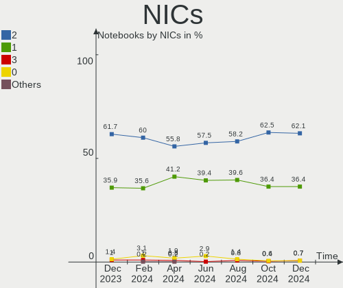

| Total | Notebooks | Percent |
|-------|-----------|---------|
| 2     | 283       | 63.45%  |
| 1     | 154       | 34.53%  |
| 0     | 6         | 1.35%   |
| 3     | 3         | 0.67%   |

IPv6
----

IPv6 vs IPv4

| Used | Notebooks | Percent |
|------|-----------|---------|
| No   | 290       | 65.02%  |
| Yes  | 156       | 34.98%  |

Bluetooth
---------

Bluetooth Vendor
----------------

Controller vendors

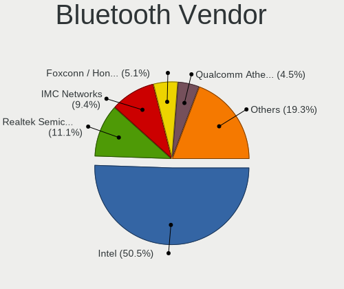

| Vendor                          | Notebooks | Percent |
|---------------------------------|-----------|---------|
| Intel                           | 210       | 55.85%  |
| Realtek Semiconductor           | 42        | 11.17%  |
| IMC Networks                    | 29        | 7.71%   |
| Apple                           | 22        | 5.85%   |
| Qualcomm Atheros Communications | 16        | 4.26%   |
| Foxconn / Hon Hai               | 11        | 2.93%   |
| Lite-On Technology              | 10        | 2.66%   |
| Broadcom                        | 8         | 2.13%   |
| Dell                            | 7         | 1.86%   |
| Cambridge Silicon Radio         | 4         | 1.06%   |
| USI                             | 3         | 0.8%    |
| Ralink                          | 3         | 0.8%    |
| Alps Electric                   | 3         | 0.8%    |
| MediaTek                        | 2         | 0.53%   |
| TP-Link                         | 1         | 0.27%   |
| Realtek                         | 1         | 0.27%   |
| Hewlett-Packard                 | 1         | 0.27%   |
| ASUSTek Computer                | 1         | 0.27%   |
| Askey Computer                  | 1         | 0.27%   |
| Actions                         | 1         | 0.27%   |

Bluetooth Model
---------------

Controller models

| Model                                               | Notebooks | Percent |
|-----------------------------------------------------|-----------|---------|
| Intel Bluetooth wireless interface                  | 90        | 23.94%  |
| Realtek Bluetooth Radio                             | 31        | 8.24%   |
| IMC Networks Bluetooth Radio                        | 26        | 6.91%   |
| Intel AX200 Bluetooth                               | 25        | 6.65%   |
| Intel AX201 Bluetooth                               | 24        | 6.38%   |
| Intel Bluetooth Device                              | 22        | 5.85%   |
| Intel Bluetooth 9460/9560 Jefferson Peak (JfP)      | 19        | 5.05%   |
| Intel AX210 Bluetooth                               | 16        | 4.26%   |
| Apple Bluetooth Host Controller                     | 14        | 3.72%   |
| Qualcomm Atheros  Bluetooth Device                  | 10        | 2.66%   |
| Intel Centrino Bluetooth Wireless Transceiver       | 10        | 2.66%   |
| Realtek  Bluetooth 4.2 Adapter                      | 7         | 1.86%   |
| Apple Bluetooth USB Host Controller                 | 6         | 1.6%    |
| Foxconn / Hon Hai Bluetooth Device                  | 4         | 1.06%   |
| Cambridge Silicon Radio Bluetooth Dongle (HCI mode) | 4         | 1.06%   |
| USI Bluetooth Device                                | 3         | 0.8%    |
| Ralink RT3290 Bluetooth                             | 3         | 0.8%    |
| Lite-On Wireless_Device                             | 3         | 0.8%    |
| Lite-On Qualcomm Atheros QCA9377 Bluetooth          | 3         | 0.8%    |
| Intel Wireless-AC 3168 Bluetooth                    | 3         | 0.8%    |
| Foxconn / Hon Hai Wireless_Device                   | 3         | 0.8%    |
| Broadcom HP Portable SoftSailing                    | 3         | 0.8%    |
| Broadcom BCM2045B (BDC-2.1)                         | 3         | 0.8%    |
| Alps Electric UGTZ4 Bluetooth                       | 3         | 0.8%    |
| Realtek RTL8821A Bluetooth                          | 2         | 0.53%   |
| Qualcomm Atheros AR3012 Bluetooth 4.0               | 2         | 0.53%   |
| MediaTek Wireless_Device                            | 2         | 0.53%   |
| Lite-On Atheros AR3012 Bluetooth                    | 2         | 0.53%   |
| IMC Networks Wireless_Device                        | 2         | 0.53%   |
| Dell Wireless 370 Bluetooth Mini-card               | 2         | 0.53%   |
| Dell DW375 Bluetooth Module                         | 2         | 0.53%   |
| Dell BCM20702A0 Bluetooth Module                    | 2         | 0.53%   |
| Apple Built-in Bluetooth 2.0+EDR HCI                | 2         | 0.53%   |
| TP-Link UB5A Adapter                                | 1         | 0.27%   |
| Realtek RTL8822BE Bluetooth 4.2 Adapter             | 1         | 0.27%   |
| Realtek RTL8723B Bluetooth                          | 1         | 0.27%   |
| Realtek Bluetooth Radio                             | 1         | 0.27%   |
| Qualcomm Atheros Bluetooth USB Host Controller      | 1         | 0.27%   |
| Qualcomm Atheros Bluetooth                          | 1         | 0.27%   |
| Qualcomm Atheros AR3012 Bluetooth                   | 1         | 0.27%   |

Sound
-----

Sound Vendor
------------

Sound card vendors

| Vendor                 | Notebooks | Percent |
|------------------------|-----------|---------|
| Intel                  | 345       | 60.95%  |
| AMD                    | 109       | 19.26%  |
| Nvidia                 | 77        | 13.6%   |
| Apple                  | 7         | 1.24%   |
| Realtek Semiconductor  | 4         | 0.71%   |
| C-Media Electronics    | 3         | 0.53%   |
| Texas Instruments      | 2         | 0.35%   |
| Logitech               | 2         | 0.35%   |
| JMTek                  | 2         | 0.35%   |
| Creative Technology    | 2         | 0.35%   |
| Turtle Beach           | 1         | 0.18%   |
| Tenx Technology        | 1         | 0.18%   |
| SteelSeries ApS        | 1         | 0.18%   |
| Schiit Audio           | 1         | 0.18%   |
| Plugable               | 1         | 0.18%   |
| Plantronics            | 1         | 0.18%   |
| Lenovo                 | 1         | 0.18%   |
| GN Netcom              | 1         | 0.18%   |
| Generalplus Technology | 1         | 0.18%   |
| BR23                   | 1         | 0.18%   |
| Blue Microphones       | 1         | 0.18%   |
| BlackWeb               | 1         | 0.18%   |
| ASUSTek Computer       | 1         | 0.18%   |

Sound Model
-----------

Sound card models

| Model                                                                      | Notebooks | Percent |
|----------------------------------------------------------------------------|-----------|---------|
| AMD Family 17h/19h HD Audio Controller                                     | 54        | 7.93%   |
| Intel Sunrise Point-LP HD Audio                                            | 49        | 7.2%    |
| Intel 7 Series/C216 Chipset Family High Definition Audio Controller        | 35        | 5.14%   |
| AMD Rembrandt Radeon High Definition Audio Controller                      | 34        | 4.99%   |
| AMD Renoir Radeon High Definition Audio Controller                         | 24        | 3.52%   |
| Intel Wildcat Point-LP High Definition Audio Controller                    | 19        | 2.79%   |
| Intel Tiger Lake-LP Smart Sound Technology Audio Controller                | 19        | 2.79%   |
| Intel Broadwell-U Audio Controller                                         | 19        | 2.79%   |
| Intel Atom Processor Z36xxx/Z37xxx Series High Definition Audio Controller | 19        | 2.79%   |
| Intel 6 Series/C200 Series Chipset Family High Definition Audio Controller | 19        | 2.79%   |
| Intel Alder Lake PCH-P High Definition Audio Controller                    | 18        | 2.64%   |
| Intel 8 Series/C220 Series Chipset High Definition Audio Controller        | 18        | 2.64%   |
| Intel Raptor Lake-P/U/H cAVS                                               | 16        | 2.35%   |
| Intel Xeon E3-1200 v3/4th Gen Core Processor HD Audio Controller           | 13        | 1.91%   |
| Nvidia Audio device                                                        | 12        | 1.76%   |
| Intel Haswell-ULT HD Audio Controller                                      | 12        | 1.76%   |
| Intel Comet Lake PCH cAVS                                                  | 12        | 1.76%   |
| Intel Celeron/Pentium Silver Processor High Definition Audio               | 12        | 1.76%   |
| Intel Cannon Lake PCH cAVS                                                 | 12        | 1.76%   |
| Intel 8 Series HD Audio Controller                                         | 12        | 1.76%   |
| AMD Raven/Raven2/Fenghuang HDMI/DP Audio Controller                        | 12        | 1.76%   |
| Intel 82801I (ICH9 Family) HD Audio Controller                             | 10        | 1.47%   |
| Intel 5 Series/3400 Series Chipset High Definition Audio                   | 10        | 1.47%   |
| Intel 100 Series/C230 Series Chipset Family HD Audio Controller            | 10        | 1.47%   |
| AMD Kabini HDMI/DP Audio                                                   | 9         | 1.32%   |
| AMD FCH Azalia Controller                                                  | 9         | 1.32%   |
| Nvidia GK107 HDMI Audio Controller                                         | 8         | 1.17%   |
| Intel Ice Lake-LP Smart Sound Technology Audio Controller                  | 8         | 1.17%   |
| Intel Cannon Point-LP High Definition Audio Controller                     | 8         | 1.17%   |
| AMD Family 15h (Models 60h-6fh) Audio Controller                           | 8         | 1.17%   |
| Nvidia TU106 High Definition Audio Controller                              | 7         | 1.03%   |
| Intel Tiger Lake-H HD Audio Controller                                     | 7         | 1.03%   |
| Apple Audio Device                                                         | 7         | 1.03%   |
| Nvidia TU116 High Definition Audio Controller                              | 6         | 0.88%   |
| Intel CM238 HD Audio Controller                                            | 6         | 0.88%   |
| Nvidia TU107 GeForce GTX 1650 High Definition Audio Controller             | 5         | 0.73%   |
| Intel Comet Lake PCH-LP cAVS                                               | 5         | 0.73%   |
| Intel 700 Series Chipset Family Precise Touch and Stylus Port #1           | 5         | 0.73%   |
| AMD Turks HDMI Audio [Radeon HD 6500/6600 / 6700M Series]                  | 5         | 0.73%   |
| AMD Navi 10 HDMI Audio                                                     | 5         | 0.73%   |

Memory
------

Memory Vendor
-------------

Memory module vendors

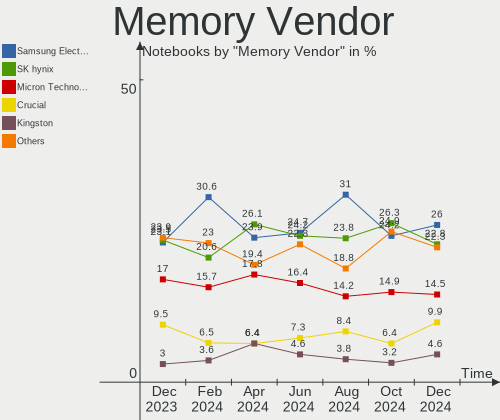

| Vendor                                  | Notebooks | Percent |
|-----------------------------------------|-----------|---------|
| Samsung Electronics                     | 91        | 31.49%  |
| SK hynix                                | 66        | 22.84%  |
| Micron Technology                       | 37        | 12.8%   |
| Crucial                                 | 24        | 8.3%    |
| Kingston                                | 17        | 5.88%   |
| Unknown                                 | 9         | 3.11%   |
| Ramaxel Technology                      | 6         | 2.08%   |
| G.Skill                                 | 5         | 1.73%   |
| Unknown (ABCD)                          | 4         | 1.38%   |
| Elpida                                  | 4         | 1.38%   |
| Team                                    | 3         | 1.04%   |
| Nanya Technology                        | 3         | 1.04%   |
| Unknown                                 | 3         | 1.04%   |
| Avant                                   | 2         | 0.69%   |
| 2B0B00000000                            | 2         | 0.69%   |
| V-GeN                                   | 1         | 0.35%   |
| Unknown (0x0C26)                        | 1         | 0.35%   |
| Silicon Power Computer & Communications | 1         | 0.35%   |
| Qimonda                                 | 1         | 0.35%   |
| PNY                                     | 1         | 0.35%   |
| Patriot                                 | 1         | 0.35%   |
| Lexar                                   | 1         | 0.35%   |
| Gold Key                                | 1         | 0.35%   |
| ff                                      | 1         | 0.35%   |
| fef5                                    | 1         | 0.35%   |
| Corsair                                 | 1         | 0.35%   |
| ASint Technology                        | 1         | 0.35%   |
| 4ea5                                    | 1         | 0.35%   |

Memory Model
------------

Memory module models

| Model                                                            | Notebooks | Percent |
|------------------------------------------------------------------|-----------|---------|
| Samsung RAM M471B5674QH0-YK0 2GB SODIMM DDR3 1600MT/s            | 13        | 4.26%   |
| SK hynix RAM Module 4GB SODIMM DDR3 1600MT/s                     | 5         | 1.64%   |
| Unknown (ABCD) RAM 123456789012345678 1GB SODIMM LPDDR4 2400MT/s | 4         | 1.31%   |
| SK hynix RAM HMT451S6BFR8A-PB 4GB SODIMM DDR3 1600MT/s           | 4         | 1.31%   |
| Samsung RAM M471A1K43EB1-CWE 8GB SODIMM DDR4 3200MT/s            | 4         | 1.31%   |
| SK hynix RAM HMT41GS6BFR8A-PB 8GB SODIMM DDR3 1600MT/s           | 3         | 0.98%   |
| SK hynix RAM HMA81GS6AFR8N-UH 8GB SODIMM DDR4 2667MT/s           | 3         | 0.98%   |
| Samsung RAM M471B5173QH0-YK0 4GB SODIMM DDR3 1600MT/s            | 3         | 0.98%   |
| Samsung RAM M471A5244CB0-CWE 4GB SODIMM DDR4 3200MT/s            | 3         | 0.98%   |
| Samsung RAM M471A5244CB0-CTD 4GB SODIMM DDR4 3266MT/s            | 3         | 0.98%   |
| Samsung RAM M471A1G44AB0-CWE 8GB SODIMM DDR4 3200MT/s            | 3         | 0.98%   |
| Samsung RAM K3LK7K70BM-BGCP000 4GB SODIMM LPDDR5 4266MT/s        | 3         | 0.98%   |
| Micron RAM MT62F2G32D8DR-031 WT 8GB SODIMM LPDDR5 6400MT/s       | 3         | 0.98%   |
| Crucial RAM CT8G4SFS824A.M8FE 8GB SODIMM DDR4 2667MT/s           | 3         | 0.98%   |
| Crucial RAM CT102464BF160B.M16 8GB SODIMM DDR3 1600MT/s          | 3         | 0.98%   |
| Unknown                                                          | 3         | 0.98%   |
| Unknown RAM Module 4GB SODIMM DDR3                               | 2         | 0.66%   |
| Team RAM TEAMGROUP-SD4-3200 16GB SODIMM DDR4 3200MT/s            | 2         | 0.66%   |
| SK hynix RAM HYMP125S64CP8-S6 2GB SODIMM DDR2 975MT/s            | 2         | 0.66%   |
| SK hynix RAM HMT351S6CFR8C-H9 4GB SODIMM DDR3 1333MT/s           | 2         | 0.66%   |
| SK hynix RAM HMA851S6DJR6N-XN 4GB SODIMM DDR4 3200MT/s           | 2         | 0.66%   |
| SK hynix RAM HMA851S6AFR6N-UH 4GB SODIMM DDR4 2667MT/s           | 2         | 0.66%   |
| SK hynix RAM HMA81GS6JJR8N-VK 8GB SODIMM DDR4 2667MT/s           | 2         | 0.66%   |
| SK hynix RAM HMA81GS6CJR8N-VK 8GB SODIMM DDR4 2667MT/s           | 2         | 0.66%   |
| SK hynix RAM HMA41GS6AFR8N-TF 8GB SODIMM DDR4 2667MT/s           | 2         | 0.66%   |
| Samsung RAM Module 8GB SODIMM DDR4 2133MT/s                      | 2         | 0.66%   |
| Samsung RAM Module 16GB SODIMM DDR4 2133MT/s                     | 2         | 0.66%   |
| Samsung RAM M471B5773DH0-CH9 2048MB SODIMM DDR3 1600MT/s         | 2         | 0.66%   |
| Samsung RAM M471B5773CHS-CH9 2GB SODIMM DDR3 4199MT/s            | 2         | 0.66%   |
| Samsung RAM M471B5173DB0-YK0 4GB SODIMM DDR3 1600MT/s            | 2         | 0.66%   |
| Samsung RAM M471B1G73QH0-YK0 8GB SODIMM DDR3 1867MT/s            | 2         | 0.66%   |
| Samsung RAM M471B1G73DB0-YK0 8GB SODIMM DDR3 1600MT/s            | 2         | 0.66%   |
| Samsung RAM M471A5244CB0-CTD 4GB Row Of Chips DDR4 2667MT/s      | 2         | 0.66%   |
| Samsung RAM M471A5143SB1-CRC 4GB SODIMM DDR4 2400MT/s            | 2         | 0.66%   |
| Samsung RAM M471A2K43CB1-CRC 16GB SODIMM DDR4 2667MT/s           | 2         | 0.66%   |
| Samsung RAM M471A2K43BB1-CPB 16GB SODIMM DDR4 2133MT/s           | 2         | 0.66%   |
| Samsung RAM M471A2G44AM0-CWE 16GB SODIMM DDR4 3200MT/s           | 2         | 0.66%   |
| Samsung RAM M471A2G43BB2-CWE 16GB SODIMM DDR4 3200MT/s           | 2         | 0.66%   |
| Samsung RAM M471A1K43DB1-CWE 8GB SODIMM DDR4 3200MT/s            | 2         | 0.66%   |
| Samsung RAM M471A1K43DB1-CTD 8GB SODIMM DDR4 2667MT/s            | 2         | 0.66%   |

Memory Kind
-----------

Memory module kinds

| Kind    | Notebooks | Percent |
|---------|-----------|---------|
| DDR4    | 112       | 44.27%  |
| DDR3    | 75        | 29.64%  |
| LPDDR4  | 18        | 7.11%   |
| LPDDR5  | 16        | 6.32%   |
| DDR5    | 10        | 3.95%   |
| LPDDR3  | 8         | 3.16%   |
| DDR2    | 7         | 2.77%   |
| SDRAM   | 4         | 1.58%   |
| Unknown | 2         | 0.79%   |
| DDR     | 1         | 0.4%    |

Memory Form Factor
------------------

Physical design of the memory module

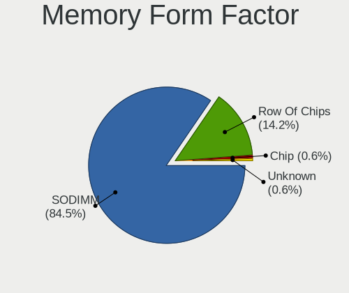

| Name         | Notebooks | Percent |
|--------------|-----------|---------|
| SODIMM       | 216       | 84.71%  |
| Row Of Chips | 29        | 11.37%  |
| Chip         | 5         | 1.96%   |
| Unknown      | 4         | 1.57%   |
| DIMM         | 1         | 0.39%   |

Memory Size
-----------

Memory module size

| Size  | Notebooks | Percent |
|-------|-----------|---------|
| 8192  | 101       | 36.86%  |
| 4096  | 70        | 25.55%  |
| 16384 | 45        | 16.42%  |
| 2048  | 34        | 12.41%  |
| 32768 | 18        | 6.57%   |
| 1024  | 5         | 1.82%   |
| 6144  | 1         | 0.36%   |

Memory Speed
------------

Memory module speed

| Speed   | Notebooks | Percent |
|---------|-----------|---------|
| 3200    | 58        | 21.8%   |
| 1600    | 58        | 21.8%   |
| 2667    | 38        | 14.29%  |
| 2400    | 21        | 7.89%   |
| 2133    | 16        | 6.02%   |
| 6400    | 14        | 5.26%   |
| 4800    | 10        | 3.76%   |
| 1333    | 8         | 3.01%   |
| 4267    | 6         | 2.26%   |
| 1334    | 6         | 2.26%   |
| 667     | 4         | 1.5%    |
| 4266    | 3         | 1.13%   |
| 4199    | 3         | 1.13%   |
| 3733    | 3         | 1.13%   |
| 3266    | 3         | 1.13%   |
| 1867    | 3         | 1.13%   |
| Unknown | 3         | 1.13%   |
| 1067    | 2         | 0.75%   |
| 975     | 2         | 0.75%   |
| 533     | 2         | 0.75%   |
| 8400    | 1         | 0.38%   |
| 2048    | 1         | 0.38%   |
| 800     | 1         | 0.38%   |

Printers & scanners
-------------------

Printer Vendor
--------------

Printer device vendors

| Vendor             | Notebooks | Percent |
|--------------------|-----------|---------|
| Hewlett-Packard    | 1         | 33.33%  |
| Dymo-CoStar        | 1         | 33.33%  |
| Brother Industries | 1         | 33.33%  |

Printer Model
-------------

Printer device models

| Model                            | Notebooks | Percent |
|----------------------------------|-----------|---------|
| HP LaserJet M14-M17              | 1         | 25%     |
| Dymo-CoStar DYMO XTL             | 1         | 25%     |
| Dymo-CoStar DYMO LabelWriter 4XL | 1         | 25%     |
| Brother HL-L2320D series         | 1         | 25%     |

Scanner Vendor
--------------

Scanner device vendors

Zero info for selected period =(

Scanner Model
-------------

Scanner device models

Zero info for selected period =(

Camera
------

Camera Vendor
-------------

Camera device vendors

| Vendor                                 | Notebooks | Percent |
|----------------------------------------|-----------|---------|
| Chicony Electronics                    | 73        | 19.36%  |
| Microdia                               | 42        | 11.14%  |
| Quanta                                 | 39        | 10.34%  |
| Bison Electronics                      | 30        | 7.96%   |
| Sunplus Innovation Technology          | 26        | 6.9%    |
| Realtek Semiconductor                  | 25        | 6.63%   |
| IMC Networks                           | 23        | 6.1%    |
| Apple                                  | 18        | 4.77%   |
| Cheng Uei Precision Industry (Foxlink) | 17        | 4.51%   |
| Luxvisions Innotech Limited            | 14        | 3.71%   |
| Acer                                   | 11        | 2.92%   |
| Lite-On Technology                     | 10        | 2.65%   |
| Syntek                                 | 7         | 1.86%   |
| Logitech                               | 6         | 1.59%   |
| Suyin                                  | 4         | 1.06%   |
| SunplusIT                              | 4         | 1.06%   |
| Sonix Technology                       | 4         | 1.06%   |
| Samsung Electronics                    | 4         | 1.06%   |
| Ricoh                                  | 3         | 0.8%    |
| Importek                               | 3         | 0.8%    |
| Foxconn / Hon Hai                      | 2         | 0.53%   |
| Z-Star Microelectronics                | 1         | 0.27%   |
| Shinetech                              | 1         | 0.27%   |
| Primax Electronics                     | 1         | 0.27%   |
| OmniVision Technologies                | 1         | 0.27%   |
| Intel                                  | 1         | 0.27%   |
| HRY                                    | 1         | 0.27%   |
| Goodong                                | 1         | 0.27%   |
| GEMBIRD                                | 1         | 0.27%   |
| eMeet                                  | 1         | 0.27%   |
| Colorado                               | 1         | 0.27%   |
| ALi                                    | 1         | 0.27%   |
| Alcor Micro                            | 1         | 0.27%   |

Camera Model
------------

Camera device models

| Model                                                                      | Notebooks | Percent |
|----------------------------------------------------------------------------|-----------|---------|
| Chicony Integrated Camera                                                  | 26        | 6.9%    |
| Microdia Integrated_Webcam_HD                                              | 15        | 3.98%   |
| Quanta Chromebook HD Camera                                                | 13        | 3.45%   |
| Bison Integrated Camera                                                    | 11        | 2.92%   |
| Realtek Integrated_Webcam_HD                                               | 10        | 2.65%   |
| IMC Networks Integrated Camera                                             | 10        | 2.65%   |
| Sunplus Integrated_Webcam_HD                                               | 8         | 2.12%   |
| Luxvisions Innotech Limited HP TrueVision HD Camera                        | 8         | 2.12%   |
| IMC Networks USB2.0 HD UVC WebCam                                          | 8         | 2.12%   |
| Apple FaceTime HD Camera (Built-in)                                        | 7         | 1.86%   |
| Chicony HP TrueVision HD Camera                                            | 6         | 1.59%   |
| Bison HD Webcam                                                            | 6         | 1.59%   |
| Quanta HP TrueVision HD Camera                                             | 5         | 1.33%   |
| Quanta HP HD Camera                                                        | 5         | 1.33%   |
| Quanta HD User Facing                                                      | 5         | 1.33%   |
| Microdia Laptop_Integrated_Webcam_HD                                       | 5         | 1.33%   |
| Chicony HD Webcam                                                          | 5         | 1.33%   |
| Apple FaceTime HD Camera                                                   | 5         | 1.33%   |
| Syntek Integrated Camera                                                   | 4         | 1.06%   |
| Samsung Galaxy series, misc. (MTP mode)                                    | 4         | 1.06%   |
| Quanta HP Wide Vision HD Camera                                            | 4         | 1.06%   |
| Chicony HP TrueVision HD                                                   | 4         | 1.06%   |
| Cheng Uei Precision Industry (Foxlink) HP Wide Vision HD Integrated Webcam | 4         | 1.06%   |
| Apple iPhone 5/5C/5S/6/SE/7/8/X/XR                                         | 4         | 1.06%   |
| Acer Integrated Camera                                                     | 4         | 1.06%   |
| Acer BisonCam,NB Pro                                                       | 4         | 1.06%   |
| Sunplus HD720P Webcam                                                      | 3         | 0.8%    |
| Realtek Integrated Webcam HD                                               | 3         | 0.8%    |
| Microdia Integrated Webcam HD                                              | 3         | 0.8%    |
| Microdia Integrated Webcam                                                 | 3         | 0.8%    |
| Logitech HD Pro Webcam C920                                                | 3         | 0.8%    |
| Lite-On HP HD Camera                                                       | 3         | 0.8%    |
| Cheng Uei Precision Industry (Foxlink) HP TrueVision HD Camera             | 3         | 0.8%    |
| Bison EasyCamera                                                           | 3         | 0.8%    |
| Syntek EasyCamera                                                          | 2         | 0.53%   |
| Suyin HP Truevision HD                                                     | 2         | 0.53%   |
| SunplusIT MTD camera                                                       | 2         | 0.53%   |
| Sunplus SPCA2085 PC Camera                                                 | 2         | 0.53%   |
| Sunplus Laptop Integrated Webcam HD                                        | 2         | 0.53%   |
| Sunplus HD WebCam                                                          | 2         | 0.53%   |

Security
--------

Fingerprint Vendor
------------------

Fingerprint sensor vendors

| Vendor                             | Notebooks | Percent |
|------------------------------------|-----------|---------|
| Validity Sensors                   | 28        | 36.84%  |
| Synaptics                          | 24        | 31.58%  |
| Shenzhen Goodix Technology         | 8         | 10.53%  |
| Upek                               | 4         | 5.26%   |
| Elan Microelectronics              | 3         | 3.95%   |
| AuthenTec                          | 3         | 3.95%   |
| STMicroelectronics                 | 2         | 2.63%   |
| Realtek USB2.0 Finger Print Bridge | 1         | 1.32%   |
| LighTuning Technology              | 1         | 1.32%   |
| HOLTEK                             | 1         | 1.32%   |
| Focal-systems.Corp                 | 1         | 1.32%   |

Fingerprint Model
-----------------

Fingerprint sensor models

| Model                                                                      | Notebooks | Percent |
|----------------------------------------------------------------------------|-----------|---------|
| Synaptics Prometheus MIS Touch Fingerprint Reader                          | 8         | 10.53%  |
| Validity Sensors VFS5011 Fingerprint Reader                                | 6         | 7.89%   |
| Validity Sensors VFS495 Fingerprint Reader                                 | 5         | 6.58%   |
| Validity Sensors VFS 5011 fingerprint sensor                               | 5         | 6.58%   |
| Upek Biometric Touchchip/Touchstrip Fingerprint Sensor                     | 4         | 5.26%   |
| Synaptics UWP WBDI Device                                                  | 4         | 5.26%   |
| Synaptics Metallica MIS Touch Fingerprint Reader                           | 4         | 5.26%   |
| Shenzhen Goodix FingerPrint                                                | 4         | 5.26%   |
| Shenzhen Goodix  FingerPrint Device                                        | 3         | 3.95%   |
| Validity Sensors VFS491                                                    | 2         | 2.63%   |
| Validity Sensors VFS471 Fingerprint Reader                                 | 2         | 2.63%   |
| Validity Sensors Synaptics WBDI                                            | 2         | 2.63%   |
| Validity Sensors Swipe Fingerprint Sensor                                  | 2         | 2.63%   |
| Synaptics WBDI                                                             | 2         | 2.63%   |
| Synaptics  FS7604 Touch Fingerprint Sensor with PurePrint                  | 2         | 2.63%   |
| Synaptics FS7604 Touch Fingerprint Sensor with PurePrint                   | 2         | 2.63%   |
| STMicroelectronics Fingerprint Reader                                      | 2         | 2.63%   |
| Elan ELAN:Fingerprint                                                      | 2         | 2.63%   |
| Validity Sensors VFS7500 Touch Fingerprint Sensor                          | 1         | 1.32%   |
| Validity Sensors VFS451 Fingerprint Reader                                 | 1         | 1.32%   |
| Validity Sensors VFS Fingerprint sensor                                    | 1         | 1.32%   |
| Validity Sensors Synaptics VFS7552 Touch Fingerprint Sensor with PurePrint | 1         | 1.32%   |
| Synaptics Metallica MOH Touch Fingerprint Reader                           | 1         | 1.32%   |
| Synaptics Fingerprint reader [HP G6]                                       | 1         | 1.32%   |
| Shenzhen Goodix Fingerprint Reader                                         | 1         | 1.32%   |
| Realtek USB2.0 Finger Print Bridge FocalTech Fingerprint Device            | 1         | 1.32%   |
| LighTuning ES603 Swipe Fingerprint Sensor                                  | 1         | 1.32%   |
| HOLTEK FocalTech Fingerprint Device                                        | 1         | 1.32%   |
| Focal-systems.Corp FT9201Fingerprint.                                      | 1         | 1.32%   |
| Elan ELAN:ARM-M4                                                           | 1         | 1.32%   |
| AuthenTec Fingerprint Sensor                                               | 1         | 1.32%   |
| AuthenTec AES2550 Fingerprint Sensor                                       | 1         | 1.32%   |
| AuthenTec AES2501 Fingerprint Sensor                                       | 1         | 1.32%   |

Chipcard Vendor
---------------

Chipcard module vendors

| Vendor                | Notebooks | Percent |
|-----------------------|-----------|---------|
| Broadcom              | 27        | 69.23%  |
| Alcor Micro           | 5         | 12.82%  |
| O2 Micro              | 2         | 5.13%   |
| Yubico.com            | 1         | 2.56%   |
| Upek                  | 1         | 2.56%   |
| SCM Microsystems      | 1         | 2.56%   |
| OmniKey               | 1         | 2.56%   |
| Gemalto (was Gemplus) | 1         | 2.56%   |

Chipcard Model
--------------

Chipcard module models

| Model                                                                        | Notebooks | Percent |
|------------------------------------------------------------------------------|-----------|---------|
| Broadcom 5880                                                                | 10        | 25.64%  |
| Broadcom BCM5880 Secure Applications Processor                               | 8         | 20.51%  |
| Broadcom 58200                                                               | 6         | 15.38%  |
| Alcor Micro AU9540 Smartcard Reader                                          | 5         | 12.82%  |
| Broadcom BCM5880 Secure Applications Processor with fingerprint swipe sensor | 3         | 7.69%   |
| Yubico.com Yubikey 4/5 U2F+CCID                                              | 1         | 2.56%   |
| Upek TouchChip Fingerprint Coprocessor (WBF advanced mode)                   | 1         | 2.56%   |
| SCM Microsystems SCR3340 - ExpressCard54 Smart Card Reader                   | 1         | 2.56%   |
| OmniKey CardMan 3021 / 3121                                                  | 1         | 2.56%   |
| O2 Micro Oz776 SmartCard Reader                                              | 1         | 2.56%   |
| O2 Micro OZ776 CCID Smartcard Reader                                         | 1         | 2.56%   |
| Gemalto (was Gemplus) Compact Smart Card Reader Writer                       | 1         | 2.56%   |

Unsupported
-----------

Unsupported Devices
-------------------

Total unsupported devices on board

| Total | Notebooks | Percent |
|-------|-----------|---------|
| 0     | 276       | 61.88%  |
| 1     | 142       | 31.84%  |
| 2     | 24        | 5.38%   |
| 3     | 3         | 0.67%   |
| 4     | 1         | 0.22%   |

Unsupported Device Types
------------------------

Types of unsupported devices

| Type                     | Notebooks | Percent |
|--------------------------|-----------|---------|
| Fingerprint reader       | 74        | 36.63%  |
| Chipcard                 | 36        | 17.82%  |
| Graphics card            | 26        | 12.87%  |
| Multimedia controller    | 20        | 9.9%    |
| Net/wireless             | 15        | 7.43%   |
| Storage                  | 8         | 3.96%   |
| Sound                    | 5         | 2.48%   |
| Net/ethernet             | 5         | 2.48%   |
| Communication controller | 5         | 2.48%   |
| Bluetooth                | 5         | 2.48%   |
| Camera                   | 2         | 0.99%   |
| Network                  | 1         | 0.5%    |

