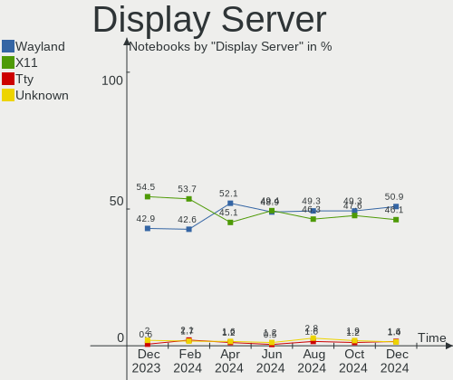
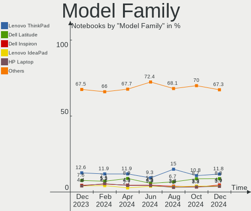
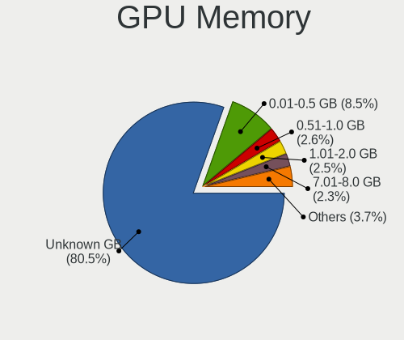
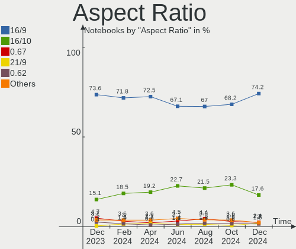
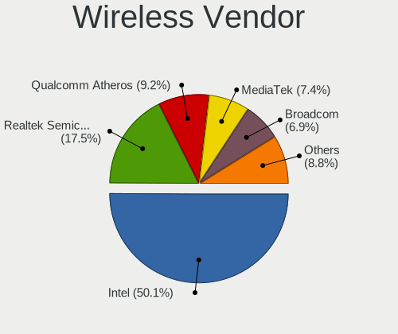
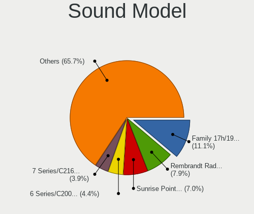

Linux in USA - Hardware Trends (Notebooks)
------------------------------------------

A project to identify most popular hardware characteristics and track their change
over time based on data collected by Linux users at https://Linux-Hardware.org.

Anyone can contribute to this report by the [hw-probe](https://github.com/linuxhw/hw-probe) tool:

    sudo -E hw-probe -all -upload

Period: Jan, 2024.

Contents
--------

* [ System ](#system)
  - [ OS                       ](#os)
  - [ OS Family                ](#os-family)
  - [ Kernel                   ](#kernel)
  - [ Kernel Family            ](#kernel-family)
  - [ Kernel Major Ver.        ](#kernel-major-ver)
  - [ Arch                     ](#arch)
  - [ DE                       ](#de)
  - [ Display Server           ](#display-server)
  - [ Display Manager          ](#display-manager)
  - [ OS Lang                  ](#os-lang)
  - [ Boot Mode                ](#boot-mode)
  - [ Filesystem               ](#filesystem)
  - [ Part. scheme             ](#part-scheme)
  - [ Dual Boot with Linux/BSD ](#dual-boot-with-linuxbsd)
  - [ Dual Boot (Win)          ](#dual-boot-win)

* [ Board ](#board)
  - [ Vendor                   ](#vendor)
  - [ Model                    ](#model)
  - [ Model Family             ](#model-family)
  - [ MFG Year                 ](#mfg-year)
  - [ Form Factor              ](#form-factor)
  - [ Secure Boot              ](#secure-boot)
  - [ Coreboot                 ](#coreboot)
  - [ RAM Size                 ](#ram-size)
  - [ RAM Used                 ](#ram-used)
  - [ Total Drives             ](#total-drives)
  - [ Has CD-ROM               ](#has-cd-rom)
  - [ Has Ethernet             ](#has-ethernet)
  - [ Has WiFi                 ](#has-wifi)
  - [ Has Bluetooth            ](#has-bluetooth)

* [ Location ](#location)
  - [ Country                  ](#country)
  - [ City                     ](#city)

* [ Drives ](#drives)
  - [ Drive Vendor             ](#drive-vendor)
  - [ Drive Model              ](#drive-model)
  - [ HDD Vendor               ](#hdd-vendor)
  - [ SSD Vendor               ](#ssd-vendor)
  - [ Drive Kind               ](#drive-kind)
  - [ Drive Connector          ](#drive-connector)
  - [ Drive Size               ](#drive-size)
  - [ Space Total              ](#space-total)
  - [ Space Used               ](#space-used)
  - [ Malfunc. Drives          ](#malfunc-drives)
  - [ Malfunc. Drive Vendor    ](#malfunc-drive-vendor)
  - [ Malfunc. HDD Vendor      ](#malfunc-hdd-vendor)
  - [ Malfunc. Drive Kind      ](#malfunc-drive-kind)
  - [ Failed Drives            ](#failed-drives)
  - [ Failed Drive Vendor      ](#failed-drive-vendor)
  - [ Drive Status             ](#drive-status)

* [ Storage controller ](#storage-controller)
  - [ Storage Vendor           ](#storage-vendor)
  - [ Storage Model            ](#storage-model)
  - [ Storage Kind             ](#storage-kind)

* [ Processor ](#processor)
  - [ CPU Vendor               ](#cpu-vendor)
  - [ CPU Model                ](#cpu-model)
  - [ CPU Model Family         ](#cpu-model-family)
  - [ CPU Cores                ](#cpu-cores)
  - [ CPU Sockets              ](#cpu-sockets)
  - [ CPU Threads              ](#cpu-threads)
  - [ CPU Op-Modes             ](#cpu-op-modes)
  - [ CPU Microcode            ](#cpu-microcode)
  - [ CPU Microarch            ](#cpu-microarch)

* [ Graphics ](#graphics)
  - [ GPU Vendor               ](#gpu-vendor)
  - [ GPU Model                ](#gpu-model)
  - [ GPU Combo                ](#gpu-combo)
  - [ GPU Driver               ](#gpu-driver)
  - [ GPU Memory               ](#gpu-memory)

* [ Monitor ](#monitor)
  - [ Monitor Vendor           ](#monitor-vendor)
  - [ Monitor Model            ](#monitor-model)
  - [ Monitor Resolution       ](#monitor-resolution)
  - [ Monitor Diagonal         ](#monitor-diagonal)
  - [ Monitor Width            ](#monitor-width)
  - [ Aspect Ratio             ](#aspect-ratio)
  - [ Monitor Area             ](#monitor-area)
  - [ Pixel Density            ](#pixel-density)
  - [ Multiple Monitors        ](#multiple-monitors)

* [ Network ](#network)
  - [ Net Controller Vendor    ](#net-controller-vendor)
  - [ Net Controller Model     ](#net-controller-model)
  - [ Wireless Vendor          ](#wireless-vendor)
  - [ Wireless Model           ](#wireless-model)
  - [ Ethernet Vendor          ](#ethernet-vendor)
  - [ Ethernet Model           ](#ethernet-model)
  - [ Net Controller Kind      ](#net-controller-kind)
  - [ Used Controller          ](#used-controller)
  - [ NICs                     ](#nics)
  - [ IPv6                     ](#ipv6)

* [ Bluetooth ](#bluetooth)
  - [ Bluetooth Vendor         ](#bluetooth-vendor)
  - [ Bluetooth Model          ](#bluetooth-model)

* [ Sound ](#sound)
  - [ Sound Vendor             ](#sound-vendor)
  - [ Sound Model              ](#sound-model)

* [ Memory ](#memory)
  - [ Memory Vendor            ](#memory-vendor)
  - [ Memory Model             ](#memory-model)
  - [ Memory Kind              ](#memory-kind)
  - [ Memory Form Factor       ](#memory-form-factor)
  - [ Memory Size              ](#memory-size)
  - [ Memory Speed             ](#memory-speed)

* [ Printers & scanners ](#printers--scanners)
  - [ Printer Vendor           ](#printer-vendor)
  - [ Printer Model            ](#printer-model)
  - [ Scanner Vendor           ](#scanner-vendor)
  - [ Scanner Model            ](#scanner-model)

* [ Camera ](#camera)
  - [ Camera Vendor            ](#camera-vendor)
  - [ Camera Model             ](#camera-model)

* [ Security ](#security)
  - [ Fingerprint Vendor       ](#fingerprint-vendor)
  - [ Fingerprint Model        ](#fingerprint-model)
  - [ Chipcard Vendor          ](#chipcard-vendor)
  - [ Chipcard Model           ](#chipcard-model)

* [ Unsupported ](#unsupported)
  - [ Unsupported Devices      ](#unsupported-devices)
  - [ Unsupported Device Types ](#unsupported-device-types)

System
------

OS
--

Installed operating systems

| Name                         | Notebooks | Percent |
|------------------------------|-----------|---------|
| Ubuntu 22.04                 | 70        | 12.59%  |
| Fedora 39                    | 47        | 8.45%   |
| Debian 12                    | 38        | 6.83%   |
| Linux Mint 21.2              | 33        | 5.94%   |
| Pop!_OS 22.04                | 25        | 4.5%    |
| SteamOS 3.5.7                | 23        | 4.14%   |
| Zorin 17                     | 20        | 3.6%    |
| Ubuntu 23.10                 | 20        | 3.6%    |
| Arch Rolling                 | 20        | 3.6%    |
| ArcoLinux Rolling            | 17        | 3.06%   |
| Linux Mint 21.3              | 13        | 2.34%   |
| Kali 2023.4                  | 12        | 2.16%   |
| Kubuntu 23.10                | 11        | 1.98%   |
| Kubuntu 22.04                | 11        | 1.98%   |
| OpenMandriva 5.0             | 10        | 1.8%    |
| KDE neon 22.04               | 9         | 1.62%   |
| EndeavourOS Rolling          | 8         | 1.44%   |
| Zorin 16                     | 7         | 1.26%   |
| Ubuntu 20.04                 | 7         | 1.26%   |
| OpenMandriva 23.08           | 7         | 1.26%   |
| openSUSE Tumbleweed-XXXXXXXX | 6         | 1.08%   |
| OpenMandriva 24.01           | 6         | 1.08%   |
| NixOS 24.05                  | 6         | 1.08%   |
| Manjaro                      | 6         | 1.08%   |
| Fedora 38                    | 6         | 1.08%   |
| Xero Rolling                 | 5         | 0.9%    |
| Parrot 6.0                   | 5         | 0.9%    |
| Nobara 39                    | 5         | 0.9%    |
| Linux Mint 20.3              | 5         | 0.9%    |
| Ubuntu 22.10                 | 4         | 0.72%   |
| openSUSE Leap-15.5           | 4         | 0.72%   |
| Manjaro 23.1.3               | 4         | 0.72%   |
| LMDE 6                       | 4         | 0.72%   |
| Gentoo 2.14                  | 4         | 0.72%   |
| Q4OS 5                       | 3         | 0.54%   |
| Nobara 38                    | 3         | 0.54%   |
| MX 23                        | 3         | 0.54%   |
| Linux Mint 21.1              | 3         | 0.54%   |
| Xubuntu 22.04                | 2         | 0.36%   |
| Ultramarine 39               | 2         | 0.36%   |

OS Family
---------

OS without a version

| Name          | Notebooks | Percent |
|---------------|-----------|---------|
| Ubuntu        | 104       | 18.71%  |
| Linux Mint    | 56        | 10.07%  |
| Fedora        | 53        | 9.53%   |
| Debian        | 42        | 7.55%   |
| Zorin         | 28        | 5.04%   |
| SteamOS       | 28        | 5.04%   |
| OpenMandriva  | 28        | 5.04%   |
| Pop!_OS       | 25        | 4.5%    |
| Kubuntu       | 22        | 3.96%   |
| Arch          | 20        | 3.6%    |
| ArcoLinux     | 17        | 3.06%   |
| Manjaro       | 14        | 2.52%   |
| Kali          | 12        | 2.16%   |
| openSUSE      | 11        | 1.98%   |
| KDE neon      | 10        | 1.8%    |
| Nobara        | 8         | 1.44%   |
| EndeavourOS   | 8         | 1.44%   |
| Parrot        | 7         | 1.26%   |
| NixOS         | 7         | 1.26%   |
| Xero          | 5         | 0.9%    |
| Xubuntu       | 4         | 0.72%   |
| Ubuntu MATE   | 4         | 0.72%   |
| LMDE          | 4         | 0.72%   |
| Gentoo        | 4         | 0.72%   |
| Q4OS          | 3         | 0.54%   |
| MX            | 3         | 0.54%   |
| Garuda Linux  | 3         | 0.54%   |
| Ultramarine   | 2         | 0.36%   |
| Ubuntu Unity  | 2         | 0.36%   |
| Lubuntu       | 2         | 0.36%   |
| Clear Linux   | 2         | 0.36%   |
| blendOS       | 2         | 0.36%   |
| Alpine        | 2         | 0.36%   |
| Void Linux    | 1         | 0.18%   |
| Ubuntu Budgie | 1         | 0.18%   |
| TUXEDO OS     | 1         | 0.18%   |
| Rocky Linux   | 1         | 0.18%   |
| RHEL          | 1         | 0.18%   |
| Peppermint    | 1         | 0.18%   |
| Kaisen        | 1         | 0.18%   |

Kernel
------

Version of the Linux kernel

| Version                      | Notebooks | Percent |
|------------------------------|-----------|---------|
| 6.5.0-14-generic             | 67        | 12.05%  |
| 5.15.0-91-generic            | 46        | 8.27%   |
| 6.2.0-39-generic             | 40        | 7.19%   |
| 6.1.0-17-amd64               | 33        | 5.94%   |
| 6.1.52-valve9-1-neptune-61   | 23        | 4.14%   |
| 6.6.6-76060606-generic       | 18        | 3.24%   |
| 6.5.0-15-generic             | 17        | 3.06%   |
| 6.6.9-200.fc39.x86_64        | 15        | 2.7%    |
| 6.6.2-desktop-1omv2390       | 15        | 2.7%    |
| 6.5.0-kali3-amd64            | 10        | 1.8%    |
| 5.15.0-92-generic            | 9         | 1.62%   |
| 6.6.11-200.fc39.x86_64       | 8         | 1.44%   |
| 6.4.11-desktop-1omv2390      | 8         | 1.44%   |
| 6.6.10-arch1-1               | 7         | 1.26%   |
| 6.5.6-300.fc39.x86_64        | 7         | 1.26%   |
| 6.7.0-arch3-1                | 6         | 1.08%   |
| 6.6.1-arch1-1                | 6         | 1.08%   |
| 5.15.0-76-generic            | 6         | 1.08%   |
| 6.7.0-zen3-1-zen             | 5         | 0.9%    |
| 6.6.9-arch1-1                | 5         | 0.9%    |
| 6.6.8-2-MANJARO              | 5         | 0.9%    |
| 6.6.13-200.fc39.x86_64       | 5         | 0.9%    |
| 6.6.12-200.fc39.x86_64       | 5         | 0.9%    |
| 6.6.10-1-MANJARO             | 5         | 0.9%    |
| 6.5.0-13parrot1-amd64        | 5         | 0.9%    |
| 5.4.0-169-generic            | 5         | 0.9%    |
| 6.6.4-arch1-1                | 4         | 0.72%   |
| 6.6.10-zen1-1-zen            | 4         | 0.72%   |
| 6.6.10-76060610-generic      | 4         | 0.72%   |
| 6.1.0-16-amd64               | 4         | 0.72%   |
| 6.1.0-13-amd64               | 4         | 0.72%   |
| 5.19.0-46-generic            | 4         | 0.72%   |
| 5.14.21-150500.55.39-default | 4         | 0.72%   |
| 6.7.2-arch1-1                | 3         | 0.54%   |
| 6.7.1-arch1-1                | 3         | 0.54%   |
| 6.6.9-zen1-1-zen             | 3         | 0.54%   |
| 6.6.9-200.fsync.fc39.x86_64  | 3         | 0.54%   |
| 6.6.8-arch1-1                | 3         | 0.54%   |
| 6.6.11-1-default             | 3         | 0.54%   |
| 6.2.0-26-generic             | 3         | 0.54%   |

Kernel Family
-------------

Linux kernel without a distro release

| Version | Notebooks | Percent |
|---------|-----------|---------|
| 6.5.0   | 111       | 19.96%  |
| 5.15.0  | 69        | 12.41%  |
| 6.1.0   | 48        | 8.63%   |
| 6.2.0   | 45        | 8.09%   |
| 6.6.9   | 31        | 5.58%   |
| 6.1.52  | 27        | 4.86%   |
| 6.6.10  | 23        | 4.14%   |
| 6.6.6   | 19        | 3.42%   |
| 6.6.8   | 18        | 3.24%   |
| 6.7.0   | 17        | 3.06%   |
| 6.6.2   | 16        | 2.88%   |
| 6.6.11  | 12        | 2.16%   |
| 6.6.12  | 9         | 1.62%   |
| 6.5.6   | 9         | 1.62%   |
| 6.4.11  | 8         | 1.44%   |
| 5.4.0   | 8         | 1.44%   |
| 6.6.1   | 7         | 1.26%   |
| 6.7.1   | 6         | 1.08%   |
| 6.6.7   | 6         | 1.08%   |
| 6.6.13  | 5         | 0.9%    |
| 5.19.0  | 5         | 0.9%    |
| 6.7.2   | 4         | 0.72%   |
| 6.6.4   | 4         | 0.72%   |
| 6.6.0   | 4         | 0.72%   |
| 5.14.21 | 4         | 0.72%   |
| 4.15.0  | 4         | 0.72%   |
| 6.1.69  | 3         | 0.54%   |
| 5.14.0  | 3         | 0.54%   |
| 5.10.0  | 3         | 0.54%   |
| 6.6.14  | 2         | 0.36%   |
| 6.5.5   | 2         | 0.36%   |
| 6.4.6   | 2         | 0.36%   |
| 6.2.6   | 2         | 0.36%   |
| 6.1.67  | 2         | 0.36%   |
| 6.6.3   | 1         | 0.18%   |
| 6.5.2   | 1         | 0.18%   |
| 6.5.13  | 1         | 0.18%   |
| 6.5.1   | 1         | 0.18%   |
| 6.4.8   | 1         | 0.18%   |
| 6.3.9   | 1         | 0.18%   |

Kernel Major Ver.
-----------------

Linux kernel major version

| Version | Notebooks | Percent |
|---------|-----------|---------|
| 6.6     | 157       | 28.24%  |
| 6.5     | 125       | 22.48%  |
| 6.1     | 81        | 14.57%  |
| 5.15    | 70        | 12.59%  |
| 6.2     | 50        | 8.99%   |
| 6.7     | 27        | 4.86%   |
| 6.4     | 11        | 1.98%   |
| 5.4     | 8         | 1.44%   |
| 5.14    | 7         | 1.26%   |
| 5.19    | 5         | 0.9%    |
| 6.3     | 4         | 0.72%   |
| 4.15    | 4         | 0.72%   |
| 5.10    | 3         | 0.54%   |
| 6.0     | 1         | 0.18%   |
| 5.13    | 1         | 0.18%   |
| 4.4     | 1         | 0.18%   |
| 4.18    | 1         | 0.18%   |

Arch
----

OS architecture (x86_64, i586, etc.)

| Name    | Notebooks | Percent |
|---------|-----------|---------|
| x86_64  | 552       | 99.28%  |
| i686    | 3         | 0.54%   |
| aarch64 | 1         | 0.18%   |

DE
--

Desktop Environment

| Name            | Notebooks | Percent |
|-----------------|-----------|---------|
| GNOME           | 234       | 42.09%  |
| KDE5            | 162       | 29.14%  |
| X-Cinnamon      | 52        | 9.35%   |
| XFCE            | 38        | 6.83%   |
| Unknown         | 23        | 4.14%   |
| MATE            | 14        | 2.52%   |
| LXQt            | 5         | 0.9%    |
| Budgie          | 5         | 0.9%    |
| Trinity         | 3         | 0.54%   |
| Cinnamon        | 3         | 0.54%   |
| Unity           | 2         | 0.36%   |
| LXDE            | 2         | 0.36%   |
| i3              | 2         | 0.36%   |
| Deepin          | 2         | 0.36%   |
| wayfire         | 1         | 0.18%   |
| sway            | 1         | 0.18%   |
| Pantheon        | 1         | 0.18%   |
| KDE6            | 1         | 0.18%   |
| Hyprland        | 1         | 0.18%   |
| GNOME Flashback | 1         | 0.18%   |
| GNOME Classic   | 1         | 0.18%   |
| Enlightenment   | 1         | 0.18%   |
| dwm             | 1         | 0.18%   |

Display Server
--------------

X11 or Wayland

| Name    | Notebooks | Percent |
|---------|-----------|---------|
| X11     | 293       | 52.7%   |
| Wayland | 237       | 42.63%  |
| Unknown | 18        | 3.24%   |
| Tty     | 8         | 1.44%   |

Display Manager
---------------

SDDM, LightDM, etc.

| Name    | Notebooks | Percent |
|---------|-----------|---------|
| Unknown | 247       | 44.42%  |
| GDM3    | 108       | 19.42%  |
| SDDM    | 101       | 18.17%  |
| LightDM | 76        | 13.67%  |
| GDM     | 20        | 3.6%    |
| TDM     | 3         | 0.54%   |
| GREETD  | 1         | 0.18%   |

OS Lang
-------

Language

| Lang    | Notebooks | Percent |
|---------|-----------|---------|
| en_US   | 505       | 90.83%  |
| C       | 28        | 5.04%   |
| Unknown | 14        | 2.52%   |
| en_GB   | 2         | 0.36%   |
| us      | 1         | 0.18%   |
| ru_RU   | 1         | 0.18%   |
| POSIX   | 1         | 0.18%   |
| pl_PL   | 1         | 0.18%   |
| es_MX   | 1         | 0.18%   |
| en_CA   | 1         | 0.18%   |
| C.UTF8  | 1         | 0.18%   |

Boot Mode
---------

EFI or BIOS

| Mode | Notebooks | Percent |
|------|-----------|---------|
| EFI  | 293       | 52.7%   |
| BIOS | 263       | 47.3%   |

Filesystem
----------

Type of filesystem

| Type    | Notebooks | Percent |
|---------|-----------|---------|
| Ext4    | 283       | 50.9%   |
| Btrfs   | 143       | 25.72%  |
| Tmpfs   | 84        | 15.11%  |
| Overlay | 31        | 5.58%   |
| Xfs     | 9         | 1.62%   |
| Ext3    | 5         | 0.9%    |
| Zfs     | 1         | 0.18%   |

Part. scheme
------------

Scheme of partitioning

| Type    | Notebooks | Percent |
|---------|-----------|---------|
| GPT     | 292       | 52.52%  |
| Unknown | 225       | 40.47%  |
| MBR     | 39        | 7.01%   |

Dual Boot with Linux/BSD
------------------------

Hosting more than one Linux/BSD

| Dual boot | Notebooks | Percent |
|-----------|-----------|---------|
| No        | 511       | 91.91%  |
| Yes       | 45        | 8.09%   |

Dual Boot (Win)
---------------

Hosting Linux and Windows

| Dual boot | Notebooks | Percent |
|-----------|-----------|---------|
| No        | 461       | 82.91%  |
| Yes       | 95        | 17.09%  |

Board
-----

Vendor
------

Motherboard manufacturer

| Name                           | Notebooks | Percent |
|--------------------------------|-----------|---------|
| Dell                           | 126       | 22.66%  |
| Lenovo                         | 106       | 19.06%  |
| Hewlett-Packard                | 101       | 18.17%  |
| Apple                          | 41        | 7.37%   |
| ASUSTek Computer               | 40        | 7.19%   |
| Valve                          | 27        | 4.86%   |
| Acer                           | 25        | 4.5%    |
| Google                         | 17        | 3.06%   |
| Toshiba                        | 10        | 1.8%    |
| MSI                            | 9         | 1.62%   |
| System76                       | 6         | 1.08%   |
| Framework                      | 5         | 0.9%    |
| Gateway                        | 4         | 0.72%   |
| Alienware                      | 4         | 0.72%   |
| Sony                           | 3         | 0.54%   |
| Razer                          | 3         | 0.54%   |
| TUXEDO                         | 2         | 0.36%   |
| OriginPC                       | 2         | 0.36%   |
| GPU Company                    | 2         | 0.36%   |
| Gigabyte Technology            | 2         | 0.36%   |
| Timi                           | 1         | 0.18%   |
| Star Labs                      | 1         | 0.18%   |
| Samsung Electronics            | 1         | 0.18%   |
| Nuvision                       | 1         | 0.18%   |
| Matsushita Electric Industrial | 1         | 0.18%   |
| Jumper                         | 1         | 0.18%   |
| Intel Client Systems           | 1         | 0.18%   |
| Hot Pepper Mobile              | 1         | 0.18%   |
| GPD                            | 1         | 0.18%   |
| General Dynamics Itronix       | 1         | 0.18%   |
| Fujitsu                        | 1         | 0.18%   |
| EVOO                           | 1         | 0.18%   |
| ELUKTRONICS                    | 1         | 0.18%   |
| Dynabook                       | 1         | 0.18%   |
| Corsair                        | 1         | 0.18%   |
| Compal                         | 1         | 0.18%   |
| Clevo                          | 1         | 0.18%   |
| Chuwi                          | 1         | 0.18%   |
| AZW                            | 1         | 0.18%   |
| A-DATA Technology              | 1         | 0.18%   |

Model
-----

Motherboard model

| Name                                  | Notebooks | Percent |
|---------------------------------------|-----------|---------|
| Valve Jupiter                         | 20        | 3.6%    |
| Valve Galileo                         | 7         | 1.26%   |
| Dell Latitude 7490                    | 7         | 1.26%   |
| Apple MacBookAir7,2                   | 6         | 1.08%   |
| Apple MacBookPro9,2                   | 5         | 0.9%    |
| Apple MacBookPro14,1                  | 4         | 0.72%   |
| Apple MacBookAir6,2                   | 4         | 0.72%   |
| HP Pavilion dv6                       | 3         | 0.54%   |
| HP Notebook                           | 3         | 0.54%   |
| HP Laptop 15-dy2xxx                   | 3         | 0.54%   |
| HP 15 Notebook PC                     | 3         | 0.54%   |
| HP 15                                 | 3         | 0.54%   |
| Google Garg                           | 3         | 0.54%   |
| Dell Latitude E7450                   | 3         | 0.54%   |
| Dell Latitude E6420                   | 3         | 0.54%   |
| Dell Latitude E5530 non-vPro          | 3         | 0.54%   |
| System76 Oryx Pro                     | 2         | 0.36%   |
| Razer Blade                           | 2         | 0.36%   |
| MSI GF63 Thin 10SC                    | 2         | 0.36%   |
| Lenovo ThinkPad 13 2nd Gen 20J10046US | 2         | 0.36%   |
| Lenovo IdeaPad Slim 5 16IRL8 82XF     | 2         | 0.36%   |
| Lenovo IdeaPad 5 15ARE05 81YQ         | 2         | 0.36%   |
| HP Pavilion dv7                       | 2         | 0.36%   |
| HP Laptop 15t-dy100                   | 2         | 0.36%   |
| HP Laptop 15-fc0xxx                   | 2         | 0.36%   |
| HP Laptop 15-dw0xxx                   | 2         | 0.36%   |
| HP Laptop 14-fq0xxx                   | 2         | 0.36%   |
| HP Laptop 14-dq2xxx                   | 2         | 0.36%   |
| HP Laptop 14-cf2xxx                   | 2         | 0.36%   |
| HP EliteBook 840 G3                   | 2         | 0.36%   |
| HP EliteBook 745 G3                   | 2         | 0.36%   |
| GPU Company GWNR71517                 | 2         | 0.36%   |
| Google Barla                          | 2         | 0.36%   |
| Framework Laptop                      | 2         | 0.36%   |
| Dell XPS 9315                         | 2         | 0.36%   |
| Dell XPS 15 9560                      | 2         | 0.36%   |
| Dell XPS 15 9530                      | 2         | 0.36%   |
| Dell XPS 13 9380                      | 2         | 0.36%   |
| Dell Precision 7520                   | 2         | 0.36%   |
| Dell Precision 5680                   | 2         | 0.36%   |

Model Family
------------

Motherboard model prefix

| Name               | Notebooks | Percent |
|--------------------|-----------|---------|
| Lenovo ThinkPad    | 74        | 13.31%  |
| Dell Latitude      | 56        | 10.07%  |
| Dell Inspiron      | 34        | 6.12%   |
| HP Laptop          | 28        | 5.04%   |
| Acer Aspire        | 21        | 3.78%   |
| Valve Jupiter      | 20        | 3.6%    |
| Lenovo IdeaPad     | 18        | 3.24%   |
| HP Pavilion        | 18        | 3.24%   |
| Dell Precision     | 16        | 2.88%   |
| HP EliteBook       | 15        | 2.7%    |
| Dell XPS           | 13        | 2.34%   |
| HP ProBook         | 11        | 1.98%   |
| Toshiba Satellite  | 10        | 1.8%    |
| ASUS VivoBook      | 8         | 1.44%   |
| ASUS ROG           | 8         | 1.44%   |
| Valve Galileo      | 7         | 1.26%   |
| HP 15              | 6         | 1.08%   |
| ASUS ZenBook       | 6         | 1.08%   |
| Apple MacBookPro9  | 6         | 1.08%   |
| Apple MacBookAir7  | 6         | 1.08%   |
| Framework Laptop   | 5         | 0.9%    |
| ASUS ASUS          | 5         | 0.9%    |
| Apple MacBookPro8  | 5         | 0.9%    |
| Apple MacBookAir6  | 5         | 0.9%    |
| Lenovo Legion      | 4         | 0.72%   |
| HP OMEN            | 4         | 0.72%   |
| Apple MacBookPro5  | 4         | 0.72%   |
| Apple MacBookPro14 | 4         | 0.72%   |
| Apple MacBookPro11 | 4         | 0.72%   |
| Razer Blade        | 3         | 0.54%   |
| Lenovo ThinkBook   | 3         | 0.54%   |
| HP ZBook           | 3         | 0.54%   |
| HP Stream          | 3         | 0.54%   |
| HP Notebook        | 3         | 0.54%   |
| HP ENVY            | 3         | 0.54%   |
| Google Garg        | 3         | 0.54%   |
| System76 Oryx      | 2         | 0.36%   |
| MSI GF63           | 2         | 0.36%   |
| Lenovo Yoga        | 2         | 0.36%   |
| HP Victus          | 2         | 0.36%   |

MFG Year
--------

Motherboard manufacture year

| Year    | Notebooks | Percent |
|---------|-----------|---------|
| 2023    | 74        | 13.31%  |
| 2021    | 56        | 10.07%  |
| 2022    | 53        | 9.53%   |
| 2019    | 44        | 7.91%   |
| 2012    | 43        | 7.73%   |
| 2018    | 39        | 7.01%   |
| 2020    | 34        | 6.12%   |
| 2017    | 30        | 5.4%    |
| 2016    | 29        | 5.22%   |
| 2014    | 26        | 4.68%   |
| 2013    | 26        | 4.68%   |
| 2015    | 25        | 4.5%    |
| 2011    | 21        | 3.78%   |
| 2010    | 15        | 2.7%    |
| 2008    | 15        | 2.7%    |
| 2007    | 11        | 1.98%   |
| 2009    | 10        | 1.8%    |
| 2006    | 3         | 0.54%   |
| 2005    | 1         | 0.18%   |
| Unknown | 1         | 0.18%   |

Form Factor
-----------

Physical design of the computer

| Name     | Notebooks | Percent |
|----------|-----------|---------|
| Notebook | 556       | 100%    |

Secure Boot
-----------

Enabled or disabled

| State    | Notebooks | Percent |
|----------|-----------|---------|
| Disabled | 511       | 91.91%  |
| Enabled  | 45        | 8.09%   |

Coreboot
--------

Have coreboot on board

| Used | Notebooks | Percent |
|------|-----------|---------|
| No   | 538       | 96.76%  |
| Yes  | 18        | 3.24%   |

RAM Size
--------

Total RAM memory

| Size in GB      | Notebooks | Percent |
|-----------------|-----------|---------|
| 4.01-8.0        | 148       | 26.62%  |
| 8.01-16.0       | 121       | 21.76%  |
| 16.01-24.0      | 103       | 18.53%  |
| 3.01-4.0        | 81        | 14.57%  |
| 32.01-64.0      | 61        | 10.97%  |
| 64.01-256.0     | 20        | 3.6%    |
| 24.01-32.0      | 12        | 2.16%   |
| 1.01-2.0        | 5         | 0.9%    |
| 2.01-3.0        | 3         | 0.54%   |
| More than 256.0 | 1         | 0.18%   |
| 0.01-0.5        | 1         | 0.18%   |

RAM Used
--------

Used RAM memory

| Used GB    | Notebooks | Percent |
|------------|-----------|---------|
| 1.01-2.0   | 148       | 26.62%  |
| 4.01-8.0   | 132       | 23.74%  |
| 2.01-3.0   | 130       | 23.38%  |
| 3.01-4.0   | 93        | 16.73%  |
| 8.01-16.0  | 33        | 5.94%   |
| 0.51-1.0   | 15        | 2.7%    |
| 0.01-0.5   | 3         | 0.54%   |
| 16.01-24.0 | 2         | 0.36%   |

Total Drives
------------

Number of drives on board

| Drives | Notebooks | Percent |
|--------|-----------|---------|
| 1      | 415       | 74.64%  |
| 2      | 117       | 21.04%  |
| 3      | 17        | 3.06%   |
| 4      | 4         | 0.72%   |
| 0      | 3         | 0.54%   |

Has CD-ROM
----------

Has CD-ROM on board

| Presented | Notebooks | Percent |
|-----------|-----------|---------|
| No        | 412       | 74.1%   |
| Yes       | 144       | 25.9%   |

Has Ethernet
------------

Has Ethernet on board

| Presented | Notebooks | Percent |
|-----------|-----------|---------|
| Yes       | 403       | 72.48%  |
| No        | 153       | 27.52%  |

Has WiFi
--------

Has WiFi module

| Presented | Notebooks | Percent |
|-----------|-----------|---------|
| Yes       | 551       | 99.1%   |
| No        | 5         | 0.9%    |

Has Bluetooth
-------------

Has Bluetooth module

| Presented | Notebooks | Percent |
|-----------|-----------|---------|
| Yes       | 449       | 80.76%  |
| No        | 107       | 19.24%  |

Location
--------

Country
-------

Geographic location (country)

| Country | Notebooks | Percent |
|---------|-----------|---------|
| USA     | 556       | 100%    |

City
----

Geographic location (city)

| City           | Notebooks | Percent |
|----------------|-----------|---------|
| New York       | 13        | 2.34%   |
| Los Angeles    | 10        | 1.8%    |
| Portland       | 9         | 1.62%   |
| Phoenix        | 9         | 1.62%   |
| Jacksonville   | 9         | 1.62%   |
| Dallas         | 8         | 1.44%   |
| Bangor         | 7         | 1.26%   |
| Louisville     | 6         | 1.08%   |
| San Antonio    | 5         | 0.9%    |
| Minneapolis    | 5         | 0.9%    |
| Denver         | 5         | 0.9%    |
| Wilmington     | 4         | 0.72%   |
| St Louis       | 4         | 0.72%   |
| San Diego      | 4         | 0.72%   |
| Philadelphia   | 4         | 0.72%   |
| Miami          | 4         | 0.72%   |
| Mesa           | 4         | 0.72%   |
| Las Vegas      | 4         | 0.72%   |
| Indianapolis   | 4         | 0.72%   |
| Corpus Christi | 4         | 0.72%   |
| Chicago        | 4         | 0.72%   |
| Charlotte      | 4         | 0.72%   |
| Austin         | 4         | 0.72%   |
| Atlanta        | 4         | 0.72%   |
| Seattle        | 3         | 0.54%   |
| Rochester      | 3         | 0.54%   |
| Raleigh        | 3         | 0.54%   |
| New Orleans    | 3         | 0.54%   |
| Mobile         | 3         | 0.54%   |
| Medina         | 3         | 0.54%   |
| Lansing        | 3         | 0.54%   |
| Kalamazoo      | 3         | 0.54%   |
| Flushing       | 3         | 0.54%   |
| Fayetteville   | 3         | 0.54%   |
| Burke          | 3         | 0.54%   |
| Alexandria     | 3         | 0.54%   |
| Albuquerque    | 3         | 0.54%   |
| Virginia Beach | 2         | 0.36%   |
| Vancouver      | 2         | 0.36%   |
| The Dalles     | 2         | 0.36%   |

Drives
------

Drive Vendor
------------

Hard drive vendors

| Vendor                      | Notebooks | Drives | Percent |
|-----------------------------|-----------|--------|---------|
| Samsung Electronics         | 106       | 111    | 15.47%  |
| Sandisk                     | 69        | 69     | 10.07%  |
| Unknown                     | 61        | 67     | 8.91%   |
| WDC                         | 51        | 52     | 7.45%   |
| Seagate                     | 47        | 53     | 6.86%   |
| SK hynix                    | 41        | 41     | 5.99%   |
| Toshiba                     | 37        | 37     | 5.4%    |
| Micron Technology           | 28        | 28     | 4.09%   |
| Apple                       | 24        | 30     | 3.5%    |
| Phison Electronics          | 20        | 20     | 2.92%   |
| Intel                       | 16        | 20     | 2.34%   |
| Kingston                    | 15        | 16     | 2.19%   |
| KIOXIA                      | 14        | 14     | 2.04%   |
| Crucial                     | 13        | 13     | 1.9%    |
| Micron/Crucial Technology   | 11        | 11     | 1.61%   |
| Kingston Technology Company | 11        | 11     | 1.61%   |
| Hitachi                     | 11        | 11     | 1.61%   |
| HGST                        | 9         | 9      | 1.31%   |
| Unknown                     | 9         | 9      | 1.31%   |
| SPCC                        | 7         | 7      | 1.02%   |
| PNY                         | 5         | 5      | 0.73%   |
| O2 Micro                    | 5         | 5      | 0.73%   |
| SABRENT                     | 4         | 4      | 0.58%   |
| MAXIO Technology (Hangzhou) | 4         | 4      | 0.58%   |
| LITEON                      | 4         | 4      | 0.58%   |
| Realtek Semiconductor       | 3         | 3      | 0.44%   |
| OCZ                         | 3         | 3      | 0.44%   |
| A-DATA Technology           | 3         | 3      | 0.44%   |
| Wibtek                      | 2         | 2      | 0.29%   |
| USB3.0                      | 2         | 2      | 0.29%   |
| Team                        | 2         | 2      | 0.29%   |
| SSSTC                       | 2         | 2      | 0.29%   |
| Silicon Motion              | 2         | 2      | 0.29%   |
| Realtek                     | 2         | 2      | 0.29%   |
| KLEVV                       | 2         | 2      | 0.29%   |
| Hewlett-Packard             | 2         | 2      | 0.29%   |
| BHT                         | 2         | 2      | 0.29%   |
| Yangtze Memory Technologies | 1         | 1      | 0.15%   |
| XrayDisk                    | 1         | 1      | 0.15%   |
| XPG                         | 1         | 1      | 0.15%   |

Drive Model
-----------

Hard drive models

| Model                                              | Notebooks | Percent |
|----------------------------------------------------|-----------|---------|
| Samsung NVMe SSD Controller SM981/PM981/PM983 1TB  | 15        | 2.14%   |
| Unknown MMC Card  32GB                             | 11        | 1.57%   |
| Unknown MMC Card  64GB                             | 9         | 1.28%   |
| Unknown                                            | 9         | 1.28%   |
| Toshiba MQ01ABD100 1TB                             | 8         | 1.14%   |
| Seagate ST1000LM035-1RK172 1TB                     | 8         | 1.14%   |
| Samsung NVMe SSD Controller PM9A1/PM9A3/980PRO 2TB | 8         | 1.14%   |
| Kingston Company OM3PDP3 NVMe SSD 256GB            | 8         | 1.14%   |
| Micron/Crucial P2 NVMe PCIe SSD 1TB                | 7         | 1%      |
| Unknown MMC Card  256GB                            | 6         | 0.86%   |
| Unknown MMC Card  128GB                            | 6         | 0.86%   |
| Sandisk WD_BLACK SN770 1TB                         | 6         | 0.86%   |
| Sandisk WD Blue SN550 NVMe SSD 512GB               | 6         | 0.86%   |
| Apple SSD SM0128G 121GB                            | 6         | 0.86%   |
| Unknown MMC Card  512GB                            | 5         | 0.71%   |
| Samsung SSD 870 EVO 1TB                            | 5         | 0.71%   |
| Phison PS5013 E13 NVMe Controller 256GB            | 5         | 0.71%   |
| O2 Micro E2M2 64GB                                 | 5         | 0.71%   |
| Toshiba XG6 NVMe SSD Controller 256GB              | 4         | 0.57%   |
| Samsung SSD 860 EVO 500GB                          | 4         | 0.57%   |
| Phison E12 NVMe Controller 1TB                     | 4         | 0.57%   |
| Micron 2400_MTFDKBA512QFM 512GB                    | 4         | 0.57%   |
| Kingston SA400S37240G 240GB SSD                    | 4         | 0.57%   |
| Crucial CT1000MX500SSD1 1TB                        | 4         | 0.57%   |
| WDC WDS500G2B0A-00SM50 500GB SSD                   | 3         | 0.43%   |
| WDC WDS100T2B0A-00SM50 1TB SSD                     | 3         | 0.43%   |
| Toshiba MQ01ABF050 500GB                           | 3         | 0.43%   |
| Toshiba KXG50ZNV512G NVMe 512GB                    | 3         | 0.43%   |
| SK hynix PC801 NVMe 1TB                            | 3         | 0.43%   |
| SK hynix BC501 NVMe Solid State Drive 512GB        | 3         | 0.43%   |
| Seagate Portable 5TB                               | 3         | 0.43%   |
| Sandisk WD Black SN850 1024GB                      | 3         | 0.43%   |
| Sandisk WD Black SN750 / PC SN730 NVMe SSD 512GB   | 3         | 0.43%   |
| SanDisk SSD PLUS 1000GB                            | 3         | 0.43%   |
| SanDisk NVMe SSD Drive 1TB                         | 3         | 0.43%   |
| SanDisk Extreme 55AE 1TB SSD                       | 3         | 0.43%   |
| Samsung SSD 980 PRO 2TB                            | 3         | 0.43%   |
| Samsung SSD 870 EVO 500GB                          | 3         | 0.43%   |
| Samsung SSD 870 EVO 2TB                            | 3         | 0.43%   |
| Samsung SSD 850 EVO 500GB                          | 3         | 0.43%   |

HDD Vendor
----------

Hard disk drive vendors

| Vendor              | Notebooks | Drives | Percent |
|---------------------|-----------|--------|---------|
| Seagate             | 41        | 43     | 33.88%  |
| WDC                 | 26        | 26     | 21.49%  |
| Toshiba             | 24        | 24     | 19.83%  |
| Hitachi             | 11        | 11     | 9.09%   |
| HGST                | 9         | 9      | 7.44%   |
| Samsung Electronics | 4         | 4      | 3.31%   |
| Unknown             | 1         | 1      | 0.83%   |
| MaxDigital          | 1         | 1      | 0.83%   |
| LaCie               | 1         | 1      | 0.83%   |
| Fujitsu             | 1         | 1      | 0.83%   |
| ASMT                | 1         | 2      | 0.83%   |
| Asm                 | 1         | 1      | 0.83%   |

SSD Vendor
----------

Solid state drive vendors

| Vendor              | Notebooks | Drives | Percent |
|---------------------|-----------|--------|---------|
| Samsung Electronics | 42        | 44     | 22.34%  |
| SanDisk             | 22        | 22     | 11.7%   |
| WDC                 | 17        | 18     | 9.04%   |
| Apple               | 15        | 15     | 7.98%   |
| Crucial             | 12        | 12     | 6.38%   |
| SK hynix            | 9         | 9      | 4.79%   |
| Kingston            | 9         | 9      | 4.79%   |
| Micron Technology   | 6         | 6      | 3.19%   |
| PNY                 | 5         | 5      | 2.66%   |
| SPCC                | 4         | 4      | 2.13%   |
| LITEON              | 4         | 4      | 2.13%   |
| Intel               | 4         | 4      | 2.13%   |
| SABRENT             | 3         | 3      | 1.6%    |
| OCZ                 | 3         | 3      | 1.6%    |
| Wibtek              | 2         | 2      | 1.06%   |
| USB3.0              | 2         | 2      | 1.06%   |
| Toshiba             | 2         | 2      | 1.06%   |
| SSSTC               | 2         | 2      | 1.06%   |
| Seagate             | 2         | 2      | 1.06%   |
| KLEVV               | 2         | 2      | 1.06%   |
| Hewlett-Packard     | 2         | 2      | 1.06%   |
| BHT                 | 2         | 2      | 1.06%   |
| A-DATA Technology   | 2         | 2      | 1.06%   |
| Transcend           | 1         | 1      | 0.53%   |
| Timetec             | 1         | 1      | 0.53%   |
| Team                | 1         | 1      | 0.53%   |
| Super Talent        | 1         | 1      | 0.53%   |
| Qmicro              | 1         | 1      | 0.53%   |
| OWC                 | 1         | 1      | 0.53%   |
| LITEONIT            | 1         | 1      | 0.53%   |
| Lexar               | 1         | 1      | 0.53%   |
| INDMEM              | 1         | 1      | 0.53%   |
| FIKWOT              | 1         | 1      | 0.53%   |
| EDGE                | 1         | 1      | 0.53%   |
| CT1000BX            | 1         | 1      | 0.53%   |
| China               | 1         | 1      | 0.53%   |
| Apacer              | 1         | 1      | 0.53%   |
| AirDisk             | 1         | 1      | 0.53%   |

Drive Kind
----------

HDD or SSD

| Kind    | Notebooks | Drives | Percent |
|---------|-----------|--------|---------|
| NVMe    | 276       | 315    | 42.4%   |
| SSD     | 179       | 191    | 27.5%   |
| HDD     | 119       | 124    | 18.28%  |
| MMC     | 65        | 72     | 9.98%   |
| Unknown | 12        | 13     | 1.84%   |

Drive Connector
---------------

SATA, SAS, NVMe, etc.

| Type | Notebooks | Drives | Percent |
|------|-----------|--------|---------|
| NVMe | 276       | 313    | 43.06%  |
| SATA | 269       | 294    | 41.97%  |
| MMC  | 65        | 72     | 10.14%  |
| SAS  | 31        | 36     | 4.84%   |

Drive Size
----------

Size of hard drive

| Size in TB | Notebooks | Drives | Percent |
|------------|-----------|--------|---------|
| 0.01-0.5   | 187       | 195    | 61.92%  |
| 0.51-1.0   | 92        | 97     | 30.46%  |
| 1.01-2.0   | 16        | 16     | 5.3%    |
| 3.01-4.0   | 4         | 4      | 1.32%   |
| 4.01-10.0  | 3         | 3      | 0.99%   |

Space Total
-----------

Amount of disk space available on the file system

| Size in GB     | Notebooks | Percent |
|----------------|-----------|---------|
| 251-500        | 130       | 23.38%  |
| 101-250        | 130       | 23.38%  |
| 501-1000       | 101       | 18.17%  |
| 1001-2000      | 53        | 9.53%   |
| More than 3000 | 32        | 5.76%   |
| 1-20           | 31        | 5.58%   |
| 51-100         | 28        | 5.04%   |
| 21-50          | 19        | 3.42%   |
| Unknown        | 19        | 3.42%   |
| 2001-3000      | 13        | 2.34%   |

Space Used
----------

Amount of used disk space

| Used GB        | Notebooks | Percent |
|----------------|-----------|---------|
| 1-20           | 175       | 31.47%  |
| 21-50          | 99        | 17.81%  |
| 101-250        | 95        | 17.09%  |
| 51-100         | 60        | 10.79%  |
| 251-500        | 57        | 10.25%  |
| 501-1000       | 28        | 5.04%   |
| Unknown        | 19        | 3.42%   |
| 1001-2000      | 10        | 1.8%    |
| 2001-3000      | 7         | 1.26%   |
| More than 3000 | 5         | 0.9%    |
| 0              | 1         | 0.18%   |

Malfunc. Drives
---------------

Drive models with a malfunction

| Model                                    | Notebooks | Drives | Percent |
|------------------------------------------|-----------|--------|---------|
| Wibtek W800S 512GB SSD                   | 1         | 1      | 4.17%   |
| WDC WD5000LPVX-75V0TT0 500GB             | 1         | 1      | 4.17%   |
| WDC WD5000LPVX-60V0TT0 500GB             | 1         | 1      | 4.17%   |
| WDC WD3200BPVT-75ZEST0 320GB             | 1         | 1      | 4.17%   |
| Toshiba THNSNK256GVN8 M.2 2280 256GB SSD | 1         | 1      | 4.17%   |
| Toshiba MQ01ABD100 1TB                   | 1         | 1      | 4.17%   |
| Toshiba MK6475GSX 640GB                  | 1         | 1      | 4.17%   |
| Toshiba MK5056GSYF 500GB                 | 1         | 1      | 4.17%   |
| SK hynix SC210 mSATA 256GB SSD           | 1         | 1      | 4.17%   |
| Seagate ST9500325AS 500GB                | 1         | 1      | 4.17%   |
| Seagate ST9250827AS 250GB                | 1         | 1      | 4.17%   |
| Seagate ST500LT012-9WS142 500GB          | 1         | 1      | 4.17%   |
| Seagate ST1000LM049-2GH172 1TB           | 1         | 1      | 4.17%   |
| SanDisk SSD PLUS 1000GB                  | 1         | 1      | 4.17%   |
| SanDisk SD9SN8W-128G-1006 128GB SSD      | 1         | 1      | 4.17%   |
| Samsung Electronics SSD 870 EVO 2TB      | 1         | 1      | 4.17%   |
| Samsung Electronics SSD 870 EVO 1TB      | 1         | 1      | 4.17%   |
| Samsung Electronics HM080GC 80GB         | 1         | 1      | 4.17%   |
| Intel SSDSC2BF360A5L 360GB               | 1         | 1      | 4.17%   |
| Hitachi HTS725025A9A364 250GB            | 1         | 1      | 4.17%   |
| Hitachi HTS723232L9A360 320GB            | 1         | 1      | 4.17%   |
| Hitachi HTS545050B9A300 500GB            | 1         | 1      | 4.17%   |
| Hitachi HTS541680J9SA00 80GB             | 1         | 1      | 4.17%   |
| ASMT ASM1156-PM 480GB                    | 1         | 2      | 4.17%   |

Malfunc. Drive Vendor
---------------------

Vendors of faulty drives

| Vendor              | Notebooks | Drives | Percent |
|---------------------|-----------|--------|---------|
| Toshiba             | 4         | 4      | 16.67%  |
| Seagate             | 4         | 4      | 16.67%  |
| Hitachi             | 4         | 4      | 16.67%  |
| WDC                 | 3         | 3      | 12.5%   |
| Samsung Electronics | 3         | 3      | 12.5%   |
| SanDisk             | 2         | 2      | 8.33%   |
| Wibtek              | 1         | 1      | 4.17%   |
| SK hynix            | 1         | 1      | 4.17%   |
| Intel               | 1         | 1      | 4.17%   |
| ASMT                | 1         | 2      | 4.17%   |

Malfunc. HDD Vendor
-------------------

Vendors of faulty HDD drives

| Vendor              | Notebooks | Drives | Percent |
|---------------------|-----------|--------|---------|
| Seagate             | 4         | 4      | 25%     |
| Hitachi             | 4         | 4      | 25%     |
| WDC                 | 3         | 3      | 18.75%  |
| Toshiba             | 3         | 3      | 18.75%  |
| Samsung Electronics | 1         | 1      | 6.25%   |
| ASMT                | 1         | 2      | 6.25%   |

Malfunc. Drive Kind
-------------------

Kinds of faulty drives

| Kind | Notebooks | Drives | Percent |
|------|-----------|--------|---------|
| HDD  | 16        | 17     | 66.67%  |
| SSD  | 8         | 8      | 33.33%  |

Failed Drives
-------------

Failed drive models

| Model                                 | Notebooks | Drives | Percent |
|---------------------------------------|-----------|--------|---------|
| Toshiba XG6 NVMe SSD Controller 256GB | 1         | 1      | 33.33%  |
| Toshiba THNSN5256GPUK NVMe 256GB      | 1         | 1      | 33.33%  |
| HGST HTS721010A9E630 1TB              | 1         | 1      | 33.33%  |

Failed Drive Vendor
-------------------

Failed drive vendors

| Vendor  | Notebooks | Drives | Percent |
|---------|-----------|--------|---------|
| Toshiba | 2         | 2      | 66.67%  |
| HGST    | 1         | 1      | 33.33%  |

Drive Status
------------

Number of failed and malfunc. drives

| Status   | Notebooks | Drives | Percent |
|----------|-----------|--------|---------|
| Detected | 348       | 442    | 60.21%  |
| Works    | 204       | 245    | 35.29%  |
| Malfunc  | 23        | 25     | 3.98%   |
| Failed   | 3         | 3      | 0.52%   |

Storage controller
------------------

Storage Vendor
--------------

Storage controller vendors

| Vendor                               | Notebooks | Percent |
|--------------------------------------|-----------|---------|
| Intel                                | 305       | 45.73%  |
| Samsung Electronics                  | 70        | 10.49%  |
| AMD                                  | 57        | 8.55%   |
| Sandisk                              | 53        | 7.95%   |
| SK hynix                             | 32        | 4.8%    |
| Phison Electronics                   | 24        | 3.6%    |
| Micron Technology                    | 22        | 3.3%    |
| Kingston Technology Company          | 16        | 2.4%    |
| KIOXIA                               | 15        | 2.25%   |
| Toshiba America Info Systems         | 12        | 1.8%    |
| Micron/Crucial Technology            | 12        | 1.8%    |
| Apple                                | 7         | 1.05%   |
| Nvidia                               | 6         | 0.9%    |
| O2 Micro                             | 5         | 0.75%   |
| Silicon Motion                       | 4         | 0.6%    |
| Realtek Semiconductor                | 4         | 0.6%    |
| MAXIO Technology (Hangzhou)          | 4         | 0.6%    |
| Marvell Technology Group             | 4         | 0.6%    |
| Solidigm                             | 2         | 0.3%    |
| Seagate Technology                   | 2         | 0.3%    |
| Yangtze Memory Technologies          | 1         | 0.15%   |
| Union Memory (Shenzhen)              | 1         | 0.15%   |
| Shenzhen Longsys Electronics         | 1         | 0.15%   |
| Ramaxel Technology(Shenzhen) Limited | 1         | 0.15%   |
| Lite-On Technology                   | 1         | 0.15%   |
| Lenovo                               | 1         | 0.15%   |
| JMicron Technology                   | 1         | 0.15%   |
| INNOGRIT                             | 1         | 0.15%   |
| Hosin Global Electronics             | 1         | 0.15%   |
| ASMedia Technology                   | 1         | 0.15%   |
| ADATA Technology                     | 1         | 0.15%   |

Storage Model
-------------

Storage controller models

| Model                                                                         | Notebooks | Percent |
|-------------------------------------------------------------------------------|-----------|---------|
| AMD FCH SATA Controller [AHCI mode]                                           | 54        | 7.78%   |
| Intel Sunrise Point-LP SATA Controller [AHCI mode]                            | 39        | 5.62%   |
| Intel 82801 Mobile SATA Controller [RAID mode]                                | 36        | 5.19%   |
| Intel 7 Series Chipset Family 6-port SATA Controller [AHCI mode]              | 34        | 4.9%    |
| Intel Volume Management Device NVMe RAID Controller                           | 29        | 4.18%   |
| Samsung NVMe SSD Controller SM981/PM981/PM983                                 | 20        | 2.88%   |
| Intel 6 Series/C200 Series Chipset Family 6 port Mobile SATA AHCI Controller  | 19        | 2.74%   |
| Samsung NVMe SSD Controller PM9A1/PM9A3/980PRO                                | 16        | 2.31%   |
| Samsung NVMe SSD Controller 980 (DRAM-less)                                   | 16        | 2.31%   |
| SanDisk WD Black SN770 / PC SN740 256GB / PC SN560 (DRAM-less) NVMe SSD       | 15        | 2.16%   |
| Intel Wildcat Point-LP SATA Controller [AHCI Mode]                            | 14        | 2.02%   |
| Intel 8 Series SATA Controller 1 [AHCI mode]                                  | 14        | 2.02%   |
| SK hynix Gold P31/BC711/PC711 NVMe Solid State Drive                          | 13        | 1.87%   |
| Intel 5 Series/3400 Series Chipset 6 port SATA AHCI Controller                | 10        | 1.44%   |
| SanDisk Ultra 3D / WD Blue SN550 NVMe SSD                                     | 9         | 1.3%    |
| KIOXIA NVMe SSD Controller BG4 (DRAM-less)                                    | 9         | 1.3%    |
| Kingston Company OM3PDP3 NVMe SSD                                             | 9         | 1.3%    |
| Intel Volume Management Device NVMe RAID Controller Intel Corporation         | 9         | 1.3%    |
| SK hynix Platinum P41/PC801 NVMe Solid State Drive                            | 8         | 1.15%   |
| Intel Cannon Lake Mobile PCH SATA AHCI Controller                             | 8         | 1.15%   |
| Intel 82801IBM/IEM (ICH9M/ICH9M-E) 4 port SATA Controller [AHCI mode]         | 8         | 1.15%   |
| Micron/Crucial P2 [Nick P2] / P3 / P3 Plus NVMe PCIe SSD (DRAM-less)          | 7         | 1.01%   |
| Micron 2400 NVMe SSD (DRAM-less)                                              | 7         | 1.01%   |
| Intel Q170/Q150/B150/H170/H110/Z170/CM236 Chipset SATA Controller [AHCI Mode] | 7         | 1.01%   |
| Intel HM170/QM170 Chipset SATA Controller [AHCI Mode]                         | 7         | 1.01%   |
| Intel 5 Series/3400 Series Chipset 4 port SATA AHCI Controller                | 7         | 1.01%   |
| SanDisk Extreme Pro / WD Black SN750 / PC SN730 / Red SN700 NVMe SSD          | 6         | 0.86%   |
| Samsung S4LN058A01[SSUBX] AHCI SSD Controller (Apple slot)                    | 6         | 0.86%   |
| Phison PS5021-E21 PCIe4 NVMe Controller (DRAM-less)                           | 6         | 0.86%   |
| Micron 2450 NVMe SSD [HendrixV] (DRAM-less)                                   | 6         | 0.86%   |
| Intel Tiger Lake-LP SATA Controller                                           | 6         | 0.86%   |
| Intel Cannon Point-LP SATA Controller [AHCI Mode]                             | 6         | 0.86%   |
| Intel Alder Lake-P SATA AHCI Controller                                       | 6         | 0.86%   |
| Intel 400 Series Chipset Family SATA AHCI Controller                          | 6         | 0.86%   |
| Toshiba America Info Systems XG6 NVMe SSD Controller                          | 5         | 0.72%   |
| SK hynix BC511 NVMe SSD                                                       | 5         | 0.72%   |
| Phison PS5013-E13 PCIe3 NVMe Controller (DRAM-less)                           | 5         | 0.72%   |
| Phison E12 NVMe Controller                                                    | 5         | 0.72%   |
| O2 Micro FORESEE E2M2 NVMe SSD                                                | 5         | 0.72%   |
| Nvidia MCP79 AHCI Controller                                                  | 5         | 0.72%   |

Storage Kind
------------

Kind of storage controller (IDE, SATA, NVMe, SAS, ...)

| Kind | Notebooks | Percent |
|------|-----------|---------|
| SATA | 302       | 45.07%  |
| NVMe | 275       | 41.04%  |
| RAID | 78        | 11.64%  |
| IDE  | 15        | 2.24%   |

Processor
---------

CPU Vendor
----------

Processor vendors

| Vendor  | Notebooks | Percent |
|---------|-----------|---------|
| Intel   | 423       | 76.08%  |
| AMD     | 132       | 23.74%  |
| Unknown | 1         | 0.18%   |

CPU Model
---------

Processor models

| Model                                       | Notebooks | Percent |
|---------------------------------------------|-----------|---------|
| AMD Custom APU 0405                         | 26        | 4.68%   |
| Intel Core i5-6300U CPU @ 2.40GHz           | 13        | 2.34%   |
| Intel Core i5-3210M CPU @ 2.50GHz           | 9         | 1.62%   |
| Intel Core i7-9750H CPU @ 2.60GHz           | 8         | 1.44%   |
| Intel Core i7-8650U CPU @ 1.90GHz           | 8         | 1.44%   |
| Intel Core i5-8350U CPU @ 1.70GHz           | 8         | 1.44%   |
| Intel Core i7-10750H CPU @ 2.60GHz          | 7         | 1.26%   |
| Intel 12th Gen Core i7-12700H               | 7         | 1.26%   |
| Intel 11th Gen Core i3-1115G4 @ 3.00GHz     | 7         | 1.26%   |
| Intel Core i7-7700HQ CPU @ 2.80GHz          | 6         | 1.08%   |
| Intel Core i5-5300U CPU @ 2.30GHz           | 6         | 1.08%   |
| Intel 13th Gen Core i9-13900H               | 6         | 1.08%   |
| Intel Core i7-8550U CPU @ 1.80GHz           | 5         | 0.9%    |
| Intel Core i5-8265U CPU @ 1.60GHz           | 5         | 0.9%    |
| Intel Core i5-5200U CPU @ 2.20GHz           | 5         | 0.9%    |
| Intel Core i5-3320M CPU @ 2.60GHz           | 5         | 0.9%    |
| Intel Celeron N4020 CPU @ 1.10GHz           | 5         | 0.9%    |
| Intel 11th Gen Core i7-1165G7 @ 2.80GHz     | 5         | 0.9%    |
| Intel Core i7-6700HQ CPU @ 2.60GHz          | 4         | 0.72%   |
| Intel Core i7-10510U CPU @ 1.80GHz          | 4         | 0.72%   |
| Intel Core i5-8250U CPU @ 1.60GHz           | 4         | 0.72%   |
| Intel Core i5-7300U CPU @ 2.60GHz           | 4         | 0.72%   |
| Intel Core i5-7200U CPU @ 2.50GHz           | 4         | 0.72%   |
| Intel Core i5-5250U CPU @ 1.60GHz           | 4         | 0.72%   |
| Intel Core i5-4200U CPU @ 1.60GHz           | 4         | 0.72%   |
| Intel Core i5-2520M CPU @ 2.50GHz           | 4         | 0.72%   |
| Intel Core i3 CPU M 350 @ 2.27GHz           | 4         | 0.72%   |
| Intel Celeron N4120 CPU @ 1.10GHz           | 4         | 0.72%   |
| Intel Celeron CPU N3050 @ 1.60GHz           | 4         | 0.72%   |
| Intel 13th Gen Core i7-1355U                | 4         | 0.72%   |
| Intel 12th Gen Core i5-1235U                | 4         | 0.72%   |
| Intel 11th Gen Core i5-1135G7 @ 2.40GHz     | 4         | 0.72%   |
| AMD Ryzen 7 PRO 6850U with Radeon Graphics  | 4         | 0.72%   |
| AMD Ryzen 7 5800U with Radeon Graphics      | 4         | 0.72%   |
| AMD A8-6410 APU with AMD Radeon R5 Graphics | 4         | 0.72%   |
| Intel Core i7-7500U CPU @ 2.70GHz           | 3         | 0.54%   |
| Intel Core i7-6820HQ CPU @ 2.70GHz          | 3         | 0.54%   |
| Intel Core i7-5600U CPU @ 2.60GHz           | 3         | 0.54%   |
| Intel Core i7-3740QM CPU @ 2.70GHz          | 3         | 0.54%   |
| Intel Core i7-3520M CPU @ 2.90GHz           | 3         | 0.54%   |

CPU Model Family
----------------

Processor model prefix

| Model                   | Notebooks | Percent |
|-------------------------|-----------|---------|
| Intel Core i5           | 131       | 23.56%  |
| Other                   | 114       | 20.5%   |
| Intel Core i7           | 113       | 20.32%  |
| Intel Celeron           | 31        | 5.58%   |
| AMD Ryzen 7             | 25        | 4.5%    |
| Intel Core i3           | 23        | 4.14%   |
| Intel Core 2 Duo        | 13        | 2.34%   |
| AMD Ryzen 5             | 13        | 2.34%   |
| AMD Ryzen 7 PRO         | 12        | 2.16%   |
| AMD A8                  | 10        | 1.8%    |
| AMD Ryzen 3             | 9         | 1.62%   |
| AMD Ryzen 9             | 8         | 1.44%   |
| Intel Pentium           | 7         | 1.26%   |
| AMD A4                  | 5         | 0.9%    |
| AMD A6                  | 4         | 0.72%   |
| Intel Xeon              | 3         | 0.54%   |
| AMD A10                 | 3         | 0.54%   |
| Intel Pentium Silver    | 2         | 0.36%   |
| Intel Pentium Dual-Core | 2         | 0.36%   |
| Intel Pentium Dual      | 2         | 0.36%   |
| Intel Genuine           | 2         | 0.36%   |
| Intel Core m3           | 2         | 0.36%   |
| Intel Core 2            | 2         | 0.36%   |
| AMD PRO A10             | 2         | 0.36%   |
| AMD E2                  | 2         | 0.36%   |
| AMD Athlon II           | 2         | 0.36%   |
| AMD Athlon              | 2         | 0.36%   |
| Intel Xeon Gold         | 1         | 0.18%   |
| Intel Pentium M         | 1         | 0.18%   |
| Intel Pentium Gold      | 1         | 0.18%   |
| Intel Core M            | 1         | 0.18%   |
| Intel Core i9           | 1         | 0.18%   |
| Intel Core              | 1         | 0.18%   |
| AMD Turion 64 X2 Mobile | 1         | 0.18%   |
| AMD Ryzen 5 PRO         | 1         | 0.18%   |
| AMD Phenom II           | 1         | 0.18%   |
| AMD FX                  | 1         | 0.18%   |
| AMD E                   | 1         | 0.18%   |
| AMD A12                 | 1         | 0.18%   |

CPU Cores
---------

Number of processor cores

| Number | Notebooks | Percent |
|--------|-----------|---------|
| 2      | 238       | 42.81%  |
| 4      | 180       | 32.37%  |
| 8      | 51        | 9.17%   |
| 6      | 37        | 6.65%   |
| 10     | 19        | 3.42%   |
| 14     | 17        | 3.06%   |
| 12     | 6         | 1.08%   |
| 24     | 2         | 0.36%   |
| 16     | 2         | 0.36%   |
| 1      | 2         | 0.36%   |
| 48     | 1         | 0.18%   |
| 20     | 1         | 0.18%   |

CPU Sockets
-----------

Number of sockets

| Number | Notebooks | Percent |
|--------|-----------|---------|
| 1      | 555       | 99.82%  |
| 2      | 1         | 0.18%   |

CPU Threads
-----------

Threads per core (Hyper-Threading)

| Number | Notebooks | Percent |
|--------|-----------|---------|
| 2      | 446       | 80.22%  |
| 1      | 110       | 19.78%  |

CPU Op-Modes
------------

CPU Operation Modes (32-bit, 64-bit)

| Op mode        | Notebooks | Percent |
|----------------|-----------|---------|
| 32-bit, 64-bit | 552       | 99.28%  |
| 32-bit         | 3         | 0.54%   |
| 64-bit         | 1         | 0.18%   |

CPU Microcode
-------------

Microcode number

| Number     | Notebooks | Percent |
|------------|-----------|---------|
| Unknown    | 391       | 70.32%  |
| 0x306a9    | 14        | 2.52%   |
| 0x206a7    | 13        | 2.34%   |
| 0x806ea    | 8         | 1.44%   |
| 0x806ec    | 6         | 1.08%   |
| 0x806c1    | 6         | 1.08%   |
| 0x406e3    | 6         | 1.08%   |
| 0x0a404102 | 6         | 1.08%   |
| 0x0a704103 | 5         | 0.9%    |
| 0x0a50000c | 5         | 0.9%    |
| 0x08108109 | 5         | 0.9%    |
| 0x06006704 | 5         | 0.9%    |
| 0x906e9    | 4         | 0.72%   |
| 0x40651    | 4         | 0.72%   |
| 0x306d4    | 4         | 0.72%   |
| 0x0a50000d | 4         | 0.72%   |
| 0x08600104 | 4         | 0.72%   |
| 0x07030105 | 4         | 0.72%   |
| 0x906a4    | 3         | 0.54%   |
| 0x906a3    | 3         | 0.54%   |
| 0x806e9    | 3         | 0.54%   |
| 0x20655    | 3         | 0.54%   |
| 0x1067a    | 3         | 0.54%   |
| 0x0600611a | 3         | 0.54%   |
| 0x010000c8 | 3         | 0.54%   |
| 0xb06a3    | 2         | 0.36%   |
| 0xb06a2    | 2         | 0.36%   |
| 0x806eb    | 2         | 0.36%   |
| 0x40661    | 2         | 0.36%   |
| 0x20652    | 2         | 0.36%   |
| 0x08608103 | 2         | 0.36%   |
| 0x08108102 | 2         | 0.36%   |
| 0x906ed    | 1         | 0.18%   |
| 0x906ea    | 1         | 0.18%   |
| 0x90672    | 1         | 0.18%   |
| 0x706e5    | 1         | 0.18%   |
| 0x706a8    | 1         | 0.18%   |
| 0x6fa      | 1         | 0.18%   |
| 0x6f2      | 1         | 0.18%   |
| 0x6ec      | 1         | 0.18%   |

CPU Microarch
-------------

Microarchitecture

| Name              | Notebooks | Percent |
|-------------------|-----------|---------|
| KabyLake          | 94        | 16.91%  |
| Unknown           | 72        | 12.95%  |
| IvyBridge         | 41        | 7.37%   |
| Alderlake Hybrid  | 40        | 7.19%   |
| Skylake           | 31        | 5.58%   |
| Haswell           | 28        | 5.04%   |
| TigerLake         | 25        | 4.5%    |
| SandyBridge       | 25        | 4.5%    |
| Broadwell         | 24        | 4.32%   |
| Icelake           | 17        | 3.06%   |
| Zen 3             | 16        | 2.88%   |
| Excavator         | 16        | 2.88%   |
| Westmere          | 15        | 2.7%    |
| Goldmont plus     | 14        | 2.52%   |
| Zen+              | 13        | 2.34%   |
| Penryn            | 13        | 2.34%   |
| Silvermont        | 12        | 2.16%   |
| CometLake         | 11        | 1.98%   |
| Zen 2             | 9         | 1.62%   |
| Puma              | 7         | 1.26%   |
| Core              | 7         | 1.26%   |
| Zen               | 4         | 0.72%   |
| P6                | 3         | 0.54%   |
| K10 Llano         | 3         | 0.54%   |
| K10               | 3         | 0.54%   |
| Goldmont          | 3         | 0.54%   |
| Nehalem           | 2         | 0.36%   |
| Jaguar            | 2         | 0.36%   |
| Gracemont         | 2         | 0.36%   |
| Piledriver        | 1         | 0.18%   |
| Meteorlake Hybrid | 1         | 0.18%   |
| K8 Hammer         | 1         | 0.18%   |
| Bobcat            | 1         | 0.18%   |

Graphics
--------

GPU Vendor
----------

Vendors of graphics cards

| Vendor            | Notebooks | Percent |
|-------------------|-----------|---------|
| Intel             | 390       | 59.45%  |
| AMD               | 147       | 22.41%  |
| Nvidia            | 118       | 17.99%  |
| ASPEED Technology | 1         | 0.15%   |

GPU Model
---------

Graphics card models

| Model                                                                                    | Notebooks | Percent |
|------------------------------------------------------------------------------------------|-----------|---------|
| Intel 3rd Gen Core processor Graphics Controller                                         | 37        | 5.5%    |
| Intel UHD Graphics 620                                                                   | 26        | 3.86%   |
| Intel 2nd Generation Core Processor Family Integrated Graphics Controller                | 22        | 3.27%   |
| Intel Skylake GT2 [HD Graphics 520]                                                      | 21        | 3.12%   |
| Intel Haswell-ULT Integrated Graphics Controller                                         | 21        | 3.12%   |
| AMD VanGogh [AMD Custom GPU 0405]                                                        | 20        | 2.97%   |
| Intel HD Graphics 5500                                                                   | 17        | 2.53%   |
| Intel TigerLake-LP GT2 [Iris Xe Graphics]                                                | 16        | 2.38%   |
| Intel Raptor Lake-P [Iris Xe Graphics]                                                   | 16        | 2.38%   |
| Intel HD Graphics 620                                                                    | 14        | 2.08%   |
| AMD Picasso/Raven 2 [Radeon Vega Series / Radeon Vega Mobile Series]                     | 14        | 2.08%   |
| Intel Core Processor Integrated Graphics Controller                                      | 13        | 1.93%   |
| Intel GeminiLake [UHD Graphics 600]                                                      | 12        | 1.78%   |
| Intel CoffeeLake-H GT2 [UHD Graphics 630]                                                | 12        | 1.78%   |
| Intel Alder Lake-P GT2 [Iris Xe Graphics]                                                | 12        | 1.78%   |
| AMD Rembrandt [Radeon 680M]                                                              | 12        | 1.78%   |
| Intel WhiskeyLake-U GT2 [UHD Graphics 620]                                               | 11        | 1.63%   |
| AMD Cezanne [Radeon Vega Series / Radeon Vega Mobile Series]                             | 11        | 1.63%   |
| Intel CometLake-H GT2 [UHD Graphics]                                                     | 10        | 1.49%   |
| Intel Tiger Lake-LP GT2 [UHD Graphics G4]                                                | 9         | 1.34%   |
| Intel HD Graphics 630                                                                    | 9         | 1.34%   |
| Intel CometLake-U GT2 [UHD Graphics]                                                     | 9         | 1.34%   |
| AMD Stoney [Radeon R2/R3/R4/R5 Graphics]                                                 | 9         | 1.34%   |
| AMD Renoir [Radeon RX Vega 6 (Ryzen 4000/5000 Mobile Series)]                            | 9         | 1.34%   |
| Intel TigerLake-H GT1 [UHD Graphics]                                                     | 8         | 1.19%   |
| AMD Phoenix1                                                                             | 8         | 1.19%   |
| Intel Atom/Celeron/Pentium Processor x5-E8000/J3xxx/N3xxx Integrated Graphics Controller | 7         | 1.04%   |
| AMD Wani [Radeon R5/R6/R7 Graphics]                                                      | 7         | 1.04%   |
| AMD Sephiroth [AMD Custom GPU 0405]                                                      | 7         | 1.04%   |
| Intel Mobile 4 Series Chipset Integrated Graphics Controller                             | 6         | 0.89%   |
| Intel HD Graphics 6000                                                                   | 6         | 0.89%   |
| Intel HD Graphics 530                                                                    | 6         | 0.89%   |
| AMD Mullins [Radeon R4/R5 Graphics]                                                      | 6         | 0.89%   |
| Nvidia TU117M [GeForce GTX 1650 Mobile / Max-Q]                                          | 5         | 0.74%   |
| Nvidia TU116M [GeForce GTX 1660 Ti Mobile]                                               | 5         | 0.74%   |
| Nvidia GA106M [GeForce RTX 3060 Mobile / Max-Q]                                          | 5         | 0.74%   |
| Nvidia C79 [GeForce 9400M]                                                               | 5         | 0.74%   |
| Intel Atom Processor Z36xxx/Z37xxx Series Graphics & Display                             | 5         | 0.74%   |
| Intel Alder Lake-UP3 GT2 [Iris Xe Graphics]                                              | 5         | 0.74%   |
| AMD Lucienne                                                                             | 5         | 0.74%   |

GPU Combo
---------

Combinations of graphics cards

| Name           | Notebooks | Percent |
|----------------|-----------|---------|
| 1 x Intel      | 291       | 52.34%  |
| 1 x AMD        | 115       | 20.68%  |
| Intel + Nvidia | 77        | 13.85%  |
| 1 x Nvidia     | 30        | 5.4%    |
| Intel + AMD    | 12        | 2.16%   |
| 2 x AMD        | 10        | 1.8%    |
| AMD + Nvidia   | 10        | 1.8%    |
| 2 x Intel      | 5         | 0.9%    |
| Other          | 4         | 0.72%   |
| 2 x Nvidia     | 1         | 0.18%   |
| 1 x ASPEED     | 1         | 0.18%   |

GPU Driver
----------

Free vs proprietary

| Driver      | Notebooks | Percent |
|-------------|-----------|---------|
| Free        | 494       | 88.85%  |
| Proprietary | 50        | 8.99%   |
| Unknown     | 12        | 2.16%   |

GPU Memory
----------

Total video memory

| Size in GB | Notebooks | Percent |
|------------|-----------|---------|
| Unknown    | 438       | 78.78%  |
| 0.01-0.5   | 48        | 8.63%   |
| 0.51-1.0   | 23        | 4.14%   |
| 3.01-4.0   | 20        | 3.6%    |
| 1.01-2.0   | 15        | 2.7%    |
| 7.01-8.0   | 6         | 1.08%   |
| 5.01-6.0   | 3         | 0.54%   |
| 2.01-3.0   | 1         | 0.18%   |
| 16.01-24.0 | 1         | 0.18%   |
| 8.01-16.0  | 1         | 0.18%   |

Monitor
-------

Monitor Vendor
--------------

Monitor vendors

| Vendor                  | Notebooks | Percent |
|-------------------------|-----------|---------|
| AU Optronics            | 118       | 18.91%  |
| BOE                     | 96        | 15.38%  |
| LG Display              | 74        | 11.86%  |
| Chimei Innolux          | 68        | 10.9%   |
| Samsung Electronics     | 57        | 9.13%   |
| Apple                   | 40        | 6.41%   |
| Valve                   | 24        | 3.85%   |
| Sharp                   | 17        | 2.72%   |
| Dell                    | 13        | 2.08%   |
| Goldstar                | 10        | 1.6%    |
| InfoVision              | 9         | 1.44%   |
| Hewlett-Packard         | 9         | 1.44%   |
| PANDA                   | 8         | 1.28%   |
| Acer                    | 7         | 1.12%   |
| Ancor Communications    | 6         | 0.96%   |
| Lenovo                  | 5         | 0.8%    |
| CSO                     | 5         | 0.8%    |
| Chi Mei Optoelectronics | 5         | 0.8%    |
| TMX                     | 4         | 0.64%   |
| Pixio                   | 4         | 0.64%   |
| AOC                     | 4         | 0.64%   |
| Vizio                   | 3         | 0.48%   |
| ViewSonic               | 3         | 0.48%   |
| Panasonic               | 3         | 0.48%   |
| HKC                     | 3         | 0.48%   |
| Sony                    | 2         | 0.32%   |
| Sceptre Tech            | 2         | 0.32%   |
| ONN                     | 2         | 0.32%   |
| Onkyo                   | 2         | 0.32%   |
| Insignia                | 2         | 0.32%   |
| CPT                     | 2         | 0.32%   |
| ASUSTek Computer        | 2         | 0.32%   |
| VSD                     | 1         | 0.16%   |
| Toshiba                 | 1         | 0.16%   |
| SHI                     | 1         | 0.16%   |
| Seiki                   | 1         | 0.16%   |
| Roku                    | 1         | 0.16%   |
| Quanta Display          | 1         | 0.16%   |
| Philips                 | 1         | 0.16%   |
| Nreal Air               | 1         | 0.16%   |

Monitor Model
-------------

Monitor models

| Model                                                                 | Notebooks | Percent |
|-----------------------------------------------------------------------|-----------|---------|
| Valve ANX7530 U VLV3001 800x1280 100x150mm 7.1-inch                   | 17        | 2.72%   |
| Valve ANX7530 U VLV3003 800x1280 100x160mm 7.4-inch                   | 6         | 0.96%   |
| Samsung Electronics LCD Monitor SEC5441 1366x768 344x194mm 15.5-inch  | 6         | 0.96%   |
| AU Optronics LCD Monitor AUO10EC 1366x768 344x193mm 15.5-inch         | 5         | 0.8%    |
| Pixio U29I WAM2900 2560x1080 690x260mm 29.0-inch                      | 4         | 0.64%   |
| BOE LCD Monitor BOE095F 2256x1504 285x190mm 13.5-inch                 | 4         | 0.64%   |
| BOE LCD Monitor BOE084E 1920x1080 382x215mm 17.3-inch                 | 4         | 0.64%   |
| BOE LCD Monitor BOE06EE 1920x1080 309x173mm 13.9-inch                 | 4         | 0.64%   |
| AU Optronics LCD Monitor AUO38ED 1920x1080 344x193mm 15.5-inch        | 4         | 0.64%   |
| AU Optronics LCD Monitor AUO2E3C 1366x768 309x173mm 13.9-inch         | 4         | 0.64%   |
| AU Optronics LCD Monitor AUO20EC 1366x768 344x193mm 15.5-inch         | 4         | 0.64%   |
| Apple Color LCD APP9CF0 1440x900 290x180mm 13.4-inch                  | 4         | 0.64%   |
| Panasonic TV MEIA0AE 1920x540                                         | 3         | 0.48%   |
| LG Display LCD Monitor LGD05FA 1920x1080 309x174mm 14.0-inch          | 3         | 0.48%   |
| LG Display LCD Monitor LGD0521 1920x1080 309x174mm 14.0-inch          | 3         | 0.48%   |
| Chimei Innolux LCD Monitor CMN15E7 1920x1080 344x193mm 15.5-inch      | 3         | 0.48%   |
| Chimei Innolux LCD Monitor CMN15E6 1366x768 344x193mm 15.5-inch       | 3         | 0.48%   |
| Chimei Innolux LCD Monitor CMN153B 1920x1080 344x193mm 15.5-inch      | 3         | 0.48%   |
| Chimei Innolux LCD Monitor CMN1521 1920x1080 344x193mm 15.5-inch      | 3         | 0.48%   |
| AU Optronics LCD Monitor AUO243D 1920x1080 309x173mm 13.9-inch        | 3         | 0.48%   |
| AU Optronics LCD Monitor AUO22EC 1366x768 344x193mm 15.5-inch         | 3         | 0.48%   |
| AU Optronics LCD Monitor AUO133D 1920x1080 309x173mm 13.9-inch        | 3         | 0.48%   |
| AU Optronics LCD Monitor AUO119D 1920x1080 381x214mm 17.2-inch        | 3         | 0.48%   |
| AU Optronics LCD Monitor AUO106C 1366x768 276x155mm 12.5-inch         | 3         | 0.48%   |
| Apple LCD Monitor APP9CC5 1280x800 286x179mm 13.3-inch                | 3         | 0.48%   |
| Apple LCD Monitor APP9CC3 1280x800 286x179mm 13.3-inch                | 3         | 0.48%   |
| Apple Color LCD APPA034 2880x1800 286x179mm 13.3-inch                 | 3         | 0.48%   |
| Apple Color LCD APPA01B 1440x900 286x179mm 13.3-inch                  | 3         | 0.48%   |
| Apple Color LCD APPA019 2880x1800 331x207mm 15.4-inch                 | 3         | 0.48%   |
| Apple Color LCD APP9CDF 1440x900 286x179mm 13.3-inch                  | 3         | 0.48%   |
| Vizio V405-H9 VIZ1039 3840x2160 878x485mm 39.5-inch                   | 2         | 0.32%   |
| TMX TL160ADMP03-0 TMX1603 2560x1600 345x215mm 16.0-inch               | 2         | 0.32%   |
| Sharp LCD Monitor SHP1515 1920x1200 336x210mm 15.6-inch               | 2         | 0.32%   |
| Sharp LCD Monitor SHP1489 1920x1080 256x144mm 11.6-inch               | 2         | 0.32%   |
| Sharp LCD Monitor SHP1476 3840x2160 346x194mm 15.6-inch               | 2         | 0.32%   |
| Samsung Electronics LCD Monitor SEC5442 1440x900 367x230mm 17.1-inch  | 2         | 0.32%   |
| Samsung Electronics LCD Monitor SEC324C 1600x900 310x174mm 14.0-inch  | 2         | 0.32%   |
| Samsung Electronics LCD Monitor SEC3150 1366x768 344x193mm 15.5-inch  | 2         | 0.32%   |
| Samsung Electronics LCD Monitor SEC314C 1920x1080 344x194mm 15.5-inch | 2         | 0.32%   |
| Samsung Electronics LCD Monitor SDC4C48 1920x1080 344x194mm 15.5-inch | 2         | 0.32%   |

Monitor Resolution
------------------

Monitor screen resolution

| Resolution         | Notebooks | Percent |
|--------------------|-----------|---------|
| 1920x1080 (FHD)    | 237       | 39.9%   |
| 1366x768 (WXGA)    | 136       | 22.9%   |
| 3840x2160 (4K)     | 31        | 5.22%   |
| 1920x1200 (WUXGA)  | 27        | 4.55%   |
| 1600x900 (HD+)     | 25        | 4.21%   |
| 800x1280           | 24        | 4.04%   |
| 1440x900 (WXGA+)   | 18        | 3.03%   |
| 1280x800 (WXGA)    | 18        | 3.03%   |
| 2560x1440 (QHD)    | 14        | 2.36%   |
| 2560x1600          | 13        | 2.19%   |
| 2880x1800          | 12        | 2.02%   |
| 1920x540           | 7         | 1.18%   |
| 2256x1504          | 5         | 0.84%   |
| 3840x2400          | 4         | 0.67%   |
| 2560x1080          | 4         | 0.67%   |
| 3200x2000          | 2         | 0.34%   |
| 3200x1800 (QHD+)   | 2         | 0.34%   |
| 2304x1440          | 2         | 0.34%   |
| 1680x1050 (WSXGA+) | 2         | 0.34%   |
| 1600x1200          | 2         | 0.34%   |
| 1400x1050          | 2         | 0.34%   |
| 4096x2304          | 1         | 0.17%   |
| 3840x1100          | 1         | 0.17%   |
| 3456x2160          | 1         | 0.17%   |
| 3440x1440          | 1         | 0.17%   |
| 2160x1350          | 1         | 0.17%   |
| 1360x768           | 1         | 0.17%   |
| 1280x1024 (SXGA)   | 1         | 0.17%   |

Monitor Diagonal
----------------

Diagonal size in inches

| Inches  | Notebooks | Percent |
|---------|-----------|---------|
| 15      | 220       | 35.31%  |
| 13      | 107       | 17.17%  |
| 14      | 76        | 12.2%   |
| 17      | 43        | 6.9%    |
| 16      | 24        | 3.85%   |
| 7       | 24        | 3.85%   |
| 27      | 18        | 2.89%   |
| 12      | 17        | 2.73%   |
| 31      | 12        | 1.93%   |
| 24      | 12        | 1.93%   |
| 21      | 12        | 1.93%   |
| 11      | 11        | 1.77%   |
| 32      | 7         | 1.12%   |
| 23      | 7         | 1.12%   |
| 29      | 4         | 0.64%   |
| 84      | 3         | 0.48%   |
| 19      | 3         | 0.48%   |
| Unknown | 3         | 0.48%   |
| 72      | 2         | 0.32%   |
| 69      | 2         | 0.32%   |
| 48      | 2         | 0.32%   |
| 40      | 2         | 0.32%   |
| 18      | 2         | 0.32%   |
| 86      | 1         | 0.16%   |
| 74      | 1         | 0.16%   |
| 54      | 1         | 0.16%   |
| 42      | 1         | 0.16%   |
| 36      | 1         | 0.16%   |
| 34      | 1         | 0.16%   |
| 28      | 1         | 0.16%   |
| 26      | 1         | 0.16%   |
| 22      | 1         | 0.16%   |
| 20      | 1         | 0.16%   |

Monitor Width
-------------

Physical width

| Width in mm | Notebooks | Percent |
|-------------|-----------|---------|
| 301-350     | 353       | 56.84%  |
| 201-300     | 85        | 13.69%  |
| 351-400     | 60        | 9.66%   |
| 501-600     | 35        | 5.64%   |
| 1-100       | 24        | 3.86%   |
| 601-700     | 19        | 3.06%   |
| 401-500     | 18        | 2.9%    |
| 701-800     | 9         | 1.45%   |
| 1501-2000   | 9         | 1.45%   |
| 1001-1500   | 3         | 0.48%   |
| Unknown     | 3         | 0.48%   |
| 801-900     | 2         | 0.32%   |
| 901-1000    | 1         | 0.16%   |

Aspect Ratio
------------

Proportional relationship between the width and the height

| Ratio | Notebooks | Percent |
|-------|-----------|---------|
| 16/9  | 425       | 74.43%  |
| 16/10 | 102       | 17.86%  |
| 0.67  | 17        | 2.98%   |
| 3/2   | 7         | 1.23%   |
| 0.62  | 7         | 1.23%   |
| 2.65  | 4         | 0.7%    |
| 4/3   | 3         | 0.53%   |
| 1.96  | 2         | 0.35%   |
| 5/4   | 1         | 0.18%   |
| 32/9  | 1         | 0.18%   |
| 3.40  | 1         | 0.18%   |
| 21/9  | 1         | 0.18%   |

Monitor Area
------------

Area in inch

| Area in inch | Notebooks | Percent |
|----------------|-----------|---------|
| 101-110        | 220       | 35.31%  |
| 81-90          | 150       | 24.08%  |
| 121-130        | 39        | 6.26%   |
| 71-80          | 32        | 5.14%   |
| 1-40           | 24        | 3.85%   |
| 201-250        | 23        | 3.69%   |
| 351-500        | 22        | 3.53%   |
| 111-120        | 20        | 3.21%   |
| 301-350        | 18        | 2.89%   |
| 61-70          | 17        | 2.73%   |
| 51-60          | 12        | 1.93%   |
| More than 1000 | 10        | 1.61%   |
| 251-300        | 9         | 1.44%   |
| 151-200        | 7         | 1.12%   |
| 131-140        | 6         | 0.96%   |
| 501-1000       | 6         | 0.96%   |
| 91-100         | 3         | 0.48%   |
| Unknown        | 3         | 0.48%   |
| 141-150        | 2         | 0.32%   |

Pixel Density
-------------

Pixels per inch

| Density       | Notebooks | Percent |
|---------------|-----------|---------|
| 121-160       | 249       | 40.75%  |
| 101-120       | 156       | 25.53%  |
| 161-240       | 87        | 14.24%  |
| 51-100        | 79        | 12.93%  |
| More than 240 | 30        | 4.91%   |
| 1-50          | 7         | 1.15%   |
| Unknown       | 3         | 0.49%   |

Multiple Monitors
-----------------

Total monitors connected

| Total | Notebooks | Percent |
|-------|-----------|---------|
| 1     | 459       | 82.55%  |
| 2     | 83        | 14.93%  |
| 0     | 8         | 1.44%   |
| 3     | 6         | 1.08%   |

Network
-------

Net Controller Vendor
---------------------

Controller vendors

| Vendor                          | Notebooks | Percent |
|---------------------------------|-----------|---------|
| Intel                           | 304       | 36.45%  |
| Realtek Semiconductor           | 257       | 30.82%  |
| Qualcomm Atheros                | 64        | 7.67%   |
| Broadcom                        | 62        | 7.43%   |
| MediaTek                        | 27        | 3.24%   |
| Broadcom Limited                | 20        | 2.4%    |
| Qualcomm                        | 17        | 2.04%   |
| ASIX Electronics                | 13        | 1.56%   |
| TP-Link                         | 10        | 1.2%    |
| Nvidia                          | 6         | 0.72%   |
| Motorola PCS                    | 5         | 0.6%    |
| Marvell Technology Group        | 5         | 0.6%    |
| Samsung Electronics             | 4         | 0.48%   |
| Google                          | 4         | 0.48%   |
| Cypress Semiconductor           | 4         | 0.48%   |
| Ralink                          | 3         | 0.36%   |
| NetGear                         | 3         | 0.36%   |
| Lenovo                          | 3         | 0.36%   |
| Edimax Technology               | 3         | 0.36%   |
| Dell                            | 3         | 0.36%   |
| U-Blox                          | 2         | 0.24%   |
| Qualcomm Atheros Communications | 2         | 0.24%   |
| JMicron Technology              | 2         | 0.24%   |
| DisplayLink                     | 2         | 0.24%   |
| Apple                           | 2         | 0.24%   |
| STMicroelectronics              | 1         | 0.12%   |
| Ralink Technology               | 1         | 0.12%   |
| Qualcomm Technologies           | 1         | 0.12%   |
| Mellanox Technologies           | 1         | 0.12%   |
| Huawei Technologies             | 1         | 0.12%   |
| D-Link                          | 1         | 0.12%   |
| ASUSTek Computer                | 1         | 0.12%   |

Net Controller Model
--------------------

Controller models

| Model                                                                  | Notebooks | Percent |
|------------------------------------------------------------------------|-----------|---------|
| Realtek RTL8111/8168/8211/8411 PCI Express Gigabit Ethernet Controller | 116       | 11.33%  |
| Realtek RTL810xE PCI Express Fast Ethernet controller                  | 44        | 4.3%    |
| Intel Wireless 8265 / 8275                                             | 38        | 3.71%   |
| Realtek RTL8822CE 802.11ac PCIe Wireless Network Adapter               | 32        | 3.13%   |
| Realtek RTL8153 Gigabit Ethernet Adapter                               | 29        | 2.83%   |
| Intel Wi-Fi 6 AX200                                                    | 26        | 2.54%   |
| Intel Ethernet Connection (4) I219-LM                                  | 21        | 2.05%   |
| Intel 82579LM Gigabit Network Connection (Lewisville)                  | 21        | 2.05%   |
| Intel Wireless 8260                                                    | 20        | 1.95%   |
| Intel Alder Lake-P PCH CNVi WiFi                                       | 19        | 1.86%   |
| Qualcomm Atheros QCA6174 802.11ac Wireless Network Adapter             | 18        | 1.76%   |
| Intel Wireless 7265                                                    | 18        | 1.76%   |
| Intel Centrino Advanced-N 6205 [Taylor Peak]                           | 17        | 1.66%   |
| Qualcomm QCNFA765 Wireless Network Adapter                             | 16        | 1.56%   |
| Intel Raptor Lake PCH CNVi WiFi                                        | 16        | 1.56%   |
| Realtek RTL8821CE 802.11ac PCIe Wireless Network Adapter               | 15        | 1.46%   |
| Intel Ethernet Connection I219-LM                                      | 15        | 1.46%   |
| Intel Wi-Fi 6 AX201                                                    | 14        | 1.37%   |
| Qualcomm Atheros QCA9377 802.11ac Wireless Network Adapter             | 12        | 1.17%   |
| Intel Wireless 7260                                                    | 12        | 1.17%   |
| Intel Wi-Fi 6E(802.11ax) AX210/AX1675* 2x2 [Typhoon Peak]              | 12        | 1.17%   |
| Broadcom Limited BCM4360 802.11ac Dual Band Wireless Network Adapter   | 12        | 1.17%   |
| ASIX AX88179 Gigabit Ethernet                                          | 12        | 1.17%   |
| Broadcom NetXtreme BCM57765 Gigabit Ethernet PCIe                      | 11        | 1.07%   |
| Broadcom BCM4331 802.11a/b/g/n                                         | 11        | 1.07%   |
| MediaTek MT7921 802.11ax PCI Express Wireless Network Adapter          | 10        | 0.98%   |
| Realtek RTL8188EE Wireless Network Adapter                             | 9         | 0.88%   |
| MediaTek MT7922 802.11ax PCI Express Wireless Network Adapter          | 9         | 0.88%   |
| Intel Ethernet Connection (3) I218-LM                                  | 9         | 0.88%   |
| Realtek RTL8852BE PCIe 802.11ax Wireless Network Controller            | 8         | 0.78%   |
| Intel Tiger Lake PCH CNVi WiFi                                         | 8         | 0.78%   |
| Intel Comet Lake PCH CNVi WiFi                                         | 8         | 0.78%   |
| Intel Wireless 3160                                                    | 7         | 0.68%   |
| Intel Gemini Lake PCH CNVi WiFi                                        | 7         | 0.68%   |
| Intel Comet Lake PCH-LP CNVi WiFi                                      | 7         | 0.68%   |
| Qualcomm Atheros QCA9565 / AR9565 Wireless Network Adapter             | 6         | 0.59%   |
| Qualcomm Atheros AR9285 Wireless Network Adapter (PCI-Express)         | 6         | 0.59%   |
| Intel Ethernet Connection I218-LM                                      | 6         | 0.59%   |
| Intel Ethernet Connection (4) I219-V                                   | 6         | 0.59%   |
| Intel Centrino Advanced-N 6200                                         | 6         | 0.59%   |

Wireless Vendor
---------------

Wireless vendors

| Vendor                          | Notebooks | Percent |
|---------------------------------|-----------|---------|
| Intel                           | 292       | 50.17%  |
| Realtek Semiconductor           | 101       | 17.35%  |
| Qualcomm Atheros                | 53        | 9.11%   |
| Broadcom                        | 49        | 8.42%   |
| MediaTek                        | 27        | 4.64%   |
| Broadcom Limited                | 18        | 3.09%   |
| Qualcomm                        | 16        | 2.75%   |
| TP-Link                         | 9         | 1.55%   |
| Ralink                          | 3         | 0.52%   |
| NetGear                         | 3         | 0.52%   |
| Edimax Technology               | 3         | 0.52%   |
| Qualcomm Atheros Communications | 2         | 0.34%   |
| Dell                            | 2         | 0.34%   |
| Ralink Technology               | 1         | 0.17%   |
| Qualcomm Technologies           | 1         | 0.17%   |
| D-Link                          | 1         | 0.17%   |
| ASUSTek Computer                | 1         | 0.17%   |

Wireless Model
--------------

Wireless models

| Model                                                                | Notebooks | Percent |
|----------------------------------------------------------------------|-----------|---------|
| Intel Wireless 8265 / 8275                                           | 38        | 6.47%   |
| Realtek RTL8822CE 802.11ac PCIe Wireless Network Adapter             | 32        | 5.45%   |
| Intel Wi-Fi 6 AX200                                                  | 26        | 4.43%   |
| Intel Wireless 8260                                                  | 20        | 3.41%   |
| Intel Alder Lake-P PCH CNVi WiFi                                     | 19        | 3.24%   |
| Qualcomm Atheros QCA6174 802.11ac Wireless Network Adapter           | 18        | 3.07%   |
| Intel Wireless 7265                                                  | 18        | 3.07%   |
| Intel Centrino Advanced-N 6205 [Taylor Peak]                         | 17        | 2.9%    |
| Qualcomm QCNFA765 Wireless Network Adapter                           | 16        | 2.73%   |
| Intel Raptor Lake PCH CNVi WiFi                                      | 16        | 2.73%   |
| Realtek RTL8821CE 802.11ac PCIe Wireless Network Adapter             | 15        | 2.56%   |
| Intel Wi-Fi 6 AX201                                                  | 14        | 2.39%   |
| Qualcomm Atheros QCA9377 802.11ac Wireless Network Adapter           | 12        | 2.04%   |
| Intel Wireless 7260                                                  | 12        | 2.04%   |
| Intel Wi-Fi 6E(802.11ax) AX210/AX1675* 2x2 [Typhoon Peak]            | 12        | 2.04%   |
| Broadcom Limited BCM4360 802.11ac Dual Band Wireless Network Adapter | 12        | 2.04%   |
| Broadcom BCM4331 802.11a/b/g/n                                       | 11        | 1.87%   |
| MediaTek MT7921 802.11ax PCI Express Wireless Network Adapter        | 10        | 1.7%    |
| Realtek RTL8188EE Wireless Network Adapter                           | 9         | 1.53%   |
| MediaTek MT7922 802.11ax PCI Express Wireless Network Adapter        | 9         | 1.53%   |
| Realtek RTL8852BE PCIe 802.11ax Wireless Network Controller          | 8         | 1.36%   |
| Intel Tiger Lake PCH CNVi WiFi                                       | 8         | 1.36%   |
| Intel Comet Lake PCH CNVi WiFi                                       | 8         | 1.36%   |
| Intel Wireless 3160                                                  | 7         | 1.19%   |
| Intel Gemini Lake PCH CNVi WiFi                                      | 7         | 1.19%   |
| Intel Comet Lake PCH-LP CNVi WiFi                                    | 7         | 1.19%   |
| Qualcomm Atheros QCA9565 / AR9565 Wireless Network Adapter           | 6         | 1.02%   |
| Qualcomm Atheros AR9285 Wireless Network Adapter (PCI-Express)       | 6         | 1.02%   |
| Intel Centrino Advanced-N 6200                                       | 6         | 1.02%   |
| Broadcom BCM4350 802.11ac Wireless Network Adapter                   | 6         | 1.02%   |
| Broadcom BCM4313 802.11bgn Wireless Network Adapter                  | 6         | 1.02%   |
| Realtek RTL8723BE PCIe Wireless Network Adapter                      | 5         | 0.85%   |
| Qualcomm Atheros AR9485 Wireless Network Adapter                     | 5         | 0.85%   |
| MediaTek Wi-Fi 6E MT7902 Wireless Network Adapter                    | 5         | 0.85%   |
| Intel Wireless 3165                                                  | 5         | 0.85%   |
| Intel Cannon Point-LP CNVi [Wireless-AC]                             | 5         | 0.85%   |
| Intel Cannon Lake PCH CNVi WiFi                                      | 5         | 0.85%   |
| Broadcom BCM4322 802.11a/b/g/n Wireless LAN Controller               | 5         | 0.85%   |
| Broadcom BCM43142 802.11b/g/n                                        | 5         | 0.85%   |
| Realtek RTL8852AE 802.11ax PCIe Wireless Network Adapter             | 4         | 0.68%   |

Ethernet Vendor
---------------

Ethernet vendors

| Vendor                   | Notebooks | Percent |
|--------------------------|-----------|---------|
| Realtek Semiconductor    | 195       | 46.1%   |
| Intel                    | 134       | 31.68%  |
| Broadcom                 | 27        | 6.38%   |
| Qualcomm Atheros         | 16        | 3.78%   |
| ASIX Electronics         | 13        | 3.07%   |
| Nvidia                   | 6         | 1.42%   |
| Marvell Technology Group | 5         | 1.18%   |
| Samsung Electronics      | 4         | 0.95%   |
| Google                   | 4         | 0.95%   |
| Cypress Semiconductor    | 4         | 0.95%   |
| Lenovo                   | 3         | 0.71%   |
| JMicron Technology       | 2         | 0.47%   |
| DisplayLink              | 2         | 0.47%   |
| Broadcom Limited         | 2         | 0.47%   |
| Apple                    | 2         | 0.47%   |
| TP-Link                  | 1         | 0.24%   |
| Qualcomm                 | 1         | 0.24%   |
| Motorola PCS             | 1         | 0.24%   |
| Mellanox Technologies    | 1         | 0.24%   |

Ethernet Model
--------------

Ethernet models

| Model                                                                  | Notebooks | Percent |
|------------------------------------------------------------------------|-----------|---------|
| Realtek RTL8111/8168/8211/8411 PCI Express Gigabit Ethernet Controller | 116       | 27.29%  |
| Realtek RTL810xE PCI Express Fast Ethernet controller                  | 44        | 10.35%  |
| Realtek RTL8153 Gigabit Ethernet Adapter                               | 29        | 6.82%   |
| Intel Ethernet Connection (4) I219-LM                                  | 21        | 4.94%   |
| Intel 82579LM Gigabit Network Connection (Lewisville)                  | 21        | 4.94%   |
| Intel Ethernet Connection I219-LM                                      | 15        | 3.53%   |
| ASIX AX88179 Gigabit Ethernet                                          | 12        | 2.82%   |
| Broadcom NetXtreme BCM57765 Gigabit Ethernet PCIe                      | 11        | 2.59%   |
| Intel Ethernet Connection (3) I218-LM                                  | 9         | 2.12%   |
| Intel Ethernet Connection I218-LM                                      | 6         | 1.41%   |
| Intel Ethernet Connection (4) I219-V                                   | 6         | 1.41%   |
| Qualcomm Atheros Killer E2500 Gigabit Ethernet Controller              | 5         | 1.18%   |
| Nvidia MCP79 Ethernet                                                  | 5         | 1.18%   |
| Intel Ethernet Connection (5) I219-LM                                  | 5         | 1.18%   |
| Qualcomm Atheros AR8162 Fast Ethernet                                  | 4         | 0.94%   |
| Intel Ethernet Connection (7) I219-LM                                  | 4         | 0.94%   |
| Intel Ethernet Connection (6) I219-LM                                  | 4         | 0.94%   |
| Intel Ethernet Connection (16) I219-V                                  | 4         | 0.94%   |
| Cypress K38231_03                                                      | 4         | 0.94%   |
| Broadcom NetXtreme BCM5761 Gigabit Ethernet PCIe                       | 4         | 0.94%   |
| Samsung Galaxy series, misc. (tethering mode)                          | 3         | 0.71%   |
| Realtek RTL8125 2.5GbE Controller                                      | 3         | 0.71%   |
| Intel Ethernet Connection (2) I219-LM                                  | 3         | 0.71%   |
| Intel 82579V Gigabit Network Connection                                | 3         | 0.71%   |
| Intel 82577LM Gigabit Network Connection                               | 3         | 0.71%   |
| Intel 82567LM Gigabit Network Connection                               | 3         | 0.71%   |
| Google Pixel 8                                                         | 3         | 0.71%   |
| Realtek RTL8152 Fast Ethernet Adapter                                  | 2         | 0.47%   |
| Qualcomm Atheros QCA8171 Gigabit Ethernet                              | 2         | 0.47%   |
| Qualcomm Atheros AR8151 v2.0 Gigabit Ethernet                          | 2         | 0.47%   |
| Qualcomm Atheros AR8131 Gigabit Ethernet                               | 2         | 0.47%   |
| Marvell Group 88E8040 PCI-E Fast Ethernet Controller                   | 2         | 0.47%   |
| JMicron JMC250 PCI Express Gigabit Ethernet Controller                 | 2         | 0.47%   |
| Intel Wi-Fi 7(802.11be) AX1775*/AX1790*/BE20*/BE401/BE1750* 2x2        | 2         | 0.47%   |
| Intel Ethernet Controller I225-V                                       | 2         | 0.47%   |
| Intel Ethernet Connection I217-LM                                      | 2         | 0.47%   |
| Intel Ethernet Connection (6) I219-V                                   | 2         | 0.47%   |
| Intel Ethernet Connection (23) I219-LM                                 | 2         | 0.47%   |
| Intel Ethernet Connection (13) I219-LM                                 | 2         | 0.47%   |
| Intel Ethernet Connection (10) I219-V                                  | 2         | 0.47%   |

Net Controller Kind
-------------------

Ethernet, WiFi or modem

| Kind     | Notebooks | Percent |
|----------|-----------|---------|
| WiFi     | 550       | 57.17%  |
| Ethernet | 400       | 41.58%  |
| Modem    | 6         | 0.62%   |
| Unknown  | 6         | 0.62%   |

Used Controller
---------------

Currently used network controller

| Kind     | Notebooks | Percent |
|----------|-----------|---------|
| WiFi     | 466       | 81.9%   |
| Ethernet | 103       | 18.1%   |

NICs
----

Total network controllers on board

| Total | Notebooks | Percent |
|-------|-----------|---------|
| 2     | 343       | 61.69%  |
| 1     | 205       | 36.87%  |
| 3     | 5         | 0.9%    |
| 0     | 2         | 0.36%   |
| 4     | 1         | 0.18%   |

IPv6
----

IPv6 vs IPv4

| Used | Notebooks | Percent |
|------|-----------|---------|
| No   | 343       | 61.69%  |
| Yes  | 213       | 38.31%  |

Bluetooth
---------

Bluetooth Vendor
----------------

Controller vendors

| Vendor                          | Notebooks | Percent |
|---------------------------------|-----------|---------|
| Intel                           | 232       | 51.44%  |
| Realtek Semiconductor           | 50        | 11.09%  |
| IMC Networks                    | 36        | 7.98%   |
| Apple                           | 32        | 7.1%    |
| Qualcomm Atheros Communications | 26        | 5.76%   |
| Foxconn / Hon Hai               | 18        | 3.99%   |
| Broadcom                        | 15        | 3.33%   |
| Lite-On Technology              | 12        | 2.66%   |
| USI                             | 6         | 1.33%   |
| MediaTek                        | 6         | 1.33%   |
| Toshiba                         | 5         | 1.11%   |
| Dell                            | 5         | 1.11%   |
| Hewlett-Packard                 | 4         | 0.89%   |
| Taiyo Yuden                     | 1         | 0.22%   |
| Ralink                          | 1         | 0.22%   |
| Edimax Technology               | 1         | 0.22%   |
| Cambridge Silicon Radio         | 1         | 0.22%   |

Bluetooth Model
---------------

Controller models

| Model                                                                               | Notebooks | Percent |
|-------------------------------------------------------------------------------------|-----------|---------|
| Intel Bluetooth wireless interface                                                  | 90        | 19.96%  |
| Intel AX201 Bluetooth                                                               | 44        | 9.76%   |
| Realtek Bluetooth Radio                                                             | 39        | 8.65%   |
| Intel Bluetooth Device                                                              | 33        | 7.32%   |
| Intel AX200 Bluetooth                                                               | 24        | 5.32%   |
| IMC Networks Bluetooth Radio                                                        | 22        | 4.88%   |
| Intel Bluetooth 9460/9560 Jefferson Peak (JfP)                                      | 21        | 4.66%   |
| Qualcomm Atheros  Bluetooth Device                                                  | 17        | 3.77%   |
| Apple Bluetooth USB Host Controller                                                 | 17        | 3.77%   |
| Apple Bluetooth Host Controller                                                     | 15        | 3.33%   |
| Realtek  Bluetooth 4.2 Adapter                                                      | 11        | 2.44%   |
| Intel AX210 Bluetooth                                                               | 11        | 2.44%   |
| IMC Networks Wireless_Device                                                        | 11        | 2.44%   |
| Foxconn / Hon Hai Bluetooth Device                                                  | 7         | 1.55%   |
| USI Bluetooth Device                                                                | 6         | 1.33%   |
| MediaTek Wireless_Device                                                            | 6         | 1.33%   |
| Foxconn / Hon Hai Wireless_Device                                                   | 6         | 1.33%   |
| Qualcomm Atheros QCA61x4 Bluetooth 4.0                                              | 4         | 0.89%   |
| Lite-On Wireless_Device                                                             | 4         | 0.89%   |
| Lite-On Qualcomm Atheros QCA9377 Bluetooth                                          | 4         | 0.89%   |
| Intel Centrino Bluetooth Wireless Transceiver                                       | 4         | 0.89%   |
| Broadcom HP Portable SoftSailing                                                    | 4         | 0.89%   |
| Toshiba BCM43142A0                                                                  | 3         | 0.67%   |
| Qualcomm Atheros AR9462 Bluetooth                                                   | 3         | 0.67%   |
| Lite-On Bluetooth Device                                                            | 3         | 0.67%   |
| Intel Wireless-AC 9260 Bluetooth Adapter                                            | 3         | 0.67%   |
| Broadcom BCM20702 Bluetooth 4.0 [ThinkPad]                                          | 3         | 0.67%   |
| Intel Wireless-AC 3168 Bluetooth                                                    | 2         | 0.44%   |
| IMC Networks BCM20702A0                                                             | 2         | 0.44%   |
| HP Broadcom 2070 Bluetooth Combo                                                    | 2         | 0.44%   |
| HP Bluetooth 2.0 Interface [Broadcom BCM2045]                                       | 2         | 0.44%   |
| Foxconn / Hon Hai Foxconn T77H114 BCM2070 [Single-Chip Bluetooth 2.1 + EDR Adapter] | 2         | 0.44%   |
| Foxconn / Hon Hai Broadcom BCM20702 Bluetooth                                       | 2         | 0.44%   |
| Dell DW375 Bluetooth Module                                                         | 2         | 0.44%   |
| Broadcom BCM43142 Bluetooth 4.0                                                     | 2         | 0.44%   |
| Broadcom BCM20702A0 Bluetooth 4.0                                                   | 2         | 0.44%   |
| Broadcom BCM2045B (BDC-2.1)                                                         | 2         | 0.44%   |
| Toshiba RT Bluetooth Radio                                                          | 1         | 0.22%   |
| Toshiba Bluetooth Device                                                            | 1         | 0.22%   |
| Taiyo Yuden Bluetooth Device (V2.1+EDR)                                             | 1         | 0.22%   |

Sound
-----

Sound Vendor
------------

Sound card vendors

| Vendor                 | Notebooks | Percent |
|------------------------|-----------|---------|
| Intel                  | 417       | 62.24%  |
| AMD                    | 141       | 21.04%  |
| Nvidia                 | 81        | 12.09%  |
| Texas Instruments      | 6         | 0.9%    |
| C-Media Electronics    | 3         | 0.45%   |
| Apple                  | 3         | 0.45%   |
| Silicon Motion         | 2         | 0.3%    |
| Logitech               | 2         | 0.3%    |
| Lenovo                 | 2         | 0.3%    |
| JOUNIVO                | 2         | 0.3%    |
| Generalplus Technology | 2         | 0.3%    |
| SteelSeries ApS        | 1         | 0.15%   |
| Sony                   | 1         | 0.15%   |
| Razer USA              | 1         | 0.15%   |
| Nreal                  | 1         | 0.15%   |
| LG Electronics         | 1         | 0.15%   |
| GN Netcom              | 1         | 0.15%   |
| Creative Technology    | 1         | 0.15%   |
| Corsair                | 1         | 0.15%   |
| ASUSTek Computer       | 1         | 0.15%   |

Sound Model
-----------

Sound card models

| Model                                                                                             | Notebooks | Percent |
|---------------------------------------------------------------------------------------------------|-----------|---------|
| AMD Family 17h/19h HD Audio Controller                                                            | 70        | 8.47%   |
| Intel Sunrise Point-LP HD Audio                                                                   | 69        | 8.35%   |
| AMD Rembrandt Radeon High Definition Audio Controller                                             | 50        | 6.05%   |
| Intel 7 Series/C216 Chipset Family High Definition Audio Controller                               | 42        | 5.08%   |
| AMD Renoir Radeon High Definition Audio Controller                                                | 29        | 3.51%   |
| Intel Tiger Lake-LP Smart Sound Technology Audio Controller                                       | 25        | 3.03%   |
| Intel Wildcat Point-LP High Definition Audio Controller                                           | 24        | 2.91%   |
| Intel Broadwell-U Audio Controller                                                                | 24        | 2.91%   |
| Intel Alder Lake PCH-P High Definition Audio Controller                                           | 24        | 2.91%   |
| Intel 6 Series/C200 Series Chipset Family High Definition Audio Controller                        | 24        | 2.91%   |
| Intel Haswell-ULT HD Audio Controller                                                             | 21        | 2.54%   |
| Intel 8 Series HD Audio Controller                                                                | 21        | 2.54%   |
| Intel Raptor Lake-P/U/H cAVS                                                                      | 20        | 2.42%   |
| Intel 5 Series/3400 Series Chipset High Definition Audio                                          | 17        | 2.06%   |
| AMD Raven/Raven2/Fenghuang HDMI/DP Audio Controller                                               | 17        | 2.06%   |
| Nvidia Audio device                                                                               | 16        | 1.94%   |
| AMD Kabini HDMI/DP Audio                                                                          | 16        | 1.94%   |
| Intel Celeron/Pentium Silver Processor High Definition Audio                                      | 14        | 1.69%   |
| Intel Cannon Point-LP High Definition Audio Controller                                            | 14        | 1.69%   |
| Intel Cannon Lake PCH cAVS                                                                        | 14        | 1.69%   |
| AMD FCH Azalia Controller                                                                         | 14        | 1.69%   |
| AMD Family 15h (Models 60h-6fh) Audio Controller                                                  | 13        | 1.57%   |
| Intel Comet Lake PCH cAVS                                                                         | 11        | 1.33%   |
| Intel CM238 HD Audio Controller                                                                   | 11        | 1.33%   |
| Intel Tiger Lake-H HD Audio Controller                                                            | 10        | 1.21%   |
| Intel 82801I (ICH9 Family) HD Audio Controller                                                    | 10        | 1.21%   |
| Nvidia TU106 High Definition Audio Controller                                                     | 9         | 1.09%   |
| Intel Comet Lake PCH-LP cAVS                                                                      | 9         | 1.09%   |
| AMD High Definition Audio Controller                                                              | 9         | 1.09%   |
| Intel Ice Lake-LP Smart Sound Technology Audio Controller                                         | 7         | 0.85%   |
| Intel Atom/Celeron/Pentium Processor x5-E8000/J3xxx/N3xxx Series High Definition Audio Controller | 7         | 0.85%   |
| Intel 8 Series/C220 Series Chipset High Definition Audio Controller                               | 7         | 0.85%   |
| Intel 100 Series/C230 Series Chipset Family HD Audio Controller                                   | 7         | 0.85%   |
| Nvidia TU116 High Definition Audio Controller                                                     | 5         | 0.61%   |
| Nvidia TU107 GeForce GTX 1650 High Definition Audio Controller                                    | 5         | 0.61%   |
| Nvidia MCP79 High Definition Audio                                                                | 5         | 0.61%   |
| Nvidia GP104 High Definition Audio Controller                                                     | 5         | 0.61%   |
| Nvidia GM107 High Definition Audio Controller [GeForce 940MX]                                     | 5         | 0.61%   |
| Nvidia GK107 HDMI Audio Controller                                                                | 5         | 0.61%   |
| Nvidia GA106 High Definition Audio Controller                                                     | 5         | 0.61%   |

Memory
------

Memory Vendor
-------------

Memory module vendors

| Vendor              | Notebooks | Percent |
|---------------------|-----------|---------|
| Samsung Electronics | 95        | 31.25%  |
| SK hynix            | 63        | 20.72%  |
| Micron Technology   | 53        | 17.43%  |
| Crucial             | 24        | 7.89%   |
| Kingston            | 13        | 4.28%   |
| Unknown             | 10        | 3.29%   |
| Elpida              | 5         | 1.64%   |
| A-DATA Technology   | 5         | 1.64%   |
| Unknown             | 5         | 1.64%   |
| Corsair             | 4         | 1.32%   |
| Team                | 3         | 0.99%   |
| Nanya Technology    | 3         | 0.99%   |
| G.Skill             | 3         | 0.99%   |
| Timetec             | 2         | 0.66%   |
| Ramaxel Technology  | 2         | 0.66%   |
| PNY                 | 2         | 0.66%   |
| ff                  | 2         | 0.66%   |
| 4ea5                | 2         | 0.66%   |
| Unknown (F785)      | 1         | 0.33%   |
| Unknown (ABCD)      | 1         | 0.33%   |
| Unknown (0xD306)    | 1         | 0.33%   |
| Sesame              | 1         | 0.33%   |
| Patriot             | 1         | 0.33%   |
| Centon              | 1         | 0.33%   |
| Axiom               | 1         | 0.33%   |
| Apacer              | 1         | 0.33%   |

Memory Model
------------

Memory module models

| Model                                                            | Notebooks | Percent |
|------------------------------------------------------------------|-----------|---------|
| Samsung RAM K4F8E304HB-MGCJ 1GB LPDDR4 2400MT/s                  | 5         | 1.58%   |
| Unknown                                                          | 5         | 1.58%   |
| SK hynix RAM HMT451S6BFR8A-PB 4GB SODIMM DDR3 1600MT/s           | 4         | 1.27%   |
| Samsung RAM M471A5244CB0-CWE 4GB SODIMM DDR4 3200MT/s            | 4         | 1.27%   |
| Samsung RAM M471A5244CB0-CTD 4096MB SODIMM DDR4 3266MT/s         | 4         | 1.27%   |
| Samsung RAM M471A1K43DB1-CWE 8GB SODIMM DDR4 3200MT/s            | 4         | 1.27%   |
| Samsung RAM M471A1K43DB1-CTD 8GB SODIMM DDR4 2667MT/s            | 4         | 1.27%   |
| Samsung RAM M471A1K43CB1-CTD 8GB SODIMM DDR4 2667MT/s            | 4         | 1.27%   |
| SK hynix RAM Module 8GB SODIMM DDR3 1600MT/s                     | 3         | 0.95%   |
| SK hynix RAM HMAA2GS6CJR8N-XN 16GB SODIMM DDR4 3200MT/s          | 3         | 0.95%   |
| SK hynix RAM HMA81GS6AFR8N-UH 8GB SODIMM DDR4 2667MT/s           | 3         | 0.95%   |
| Samsung RAM Module 8GB SODIMM DDR4 2133MT/s                      | 3         | 0.95%   |
| Samsung RAM Module 8GB SODIMM DDR3 1600MT/s                      | 3         | 0.95%   |
| Samsung RAM M471B5273DH0-CH9 4GB SODIMM DDR3 1334MT/s            | 3         | 0.95%   |
| Samsung RAM M471B1G73EB0-YK0 8GB SODIMM DDR3 1600MT/s            | 3         | 0.95%   |
| Samsung RAM M471A1K43BB1-CTD 8GB SODIMM DDR4 2667MT/s            | 3         | 0.95%   |
| Samsung RAM M471A1G44AB0-CWE 8GB SODIMM DDR4 3200MT/s            | 3         | 0.95%   |
| Samsung RAM K3LKBKB@BM-MGCP 2GB Row Of Chips LPDDR5 6400MT/s     | 3         | 0.95%   |
| Micron RAM 8ATF1G64HZ-2G3E1 8GB SODIMM DDR4 2400MT/s             | 3         | 0.95%   |
| Micron RAM 4ATF51264HZ-2G6E1 4GB SODIMM DDR4 2667MT/s            | 3         | 0.95%   |
| Crucial RAM CT51264BF160B.C16F 4GB SODIMM DDR3 1600MT/s          | 3         | 0.95%   |
| Unknown RAM Module 1GB SODIMM DDR2 533MT/s                       | 2         | 0.63%   |
| SK hynix RAM Module 2GB SODIMM DDR3 1600MT/s                     | 2         | 0.63%   |
| SK hynix RAM HMT451S6AFR8A-PB 4GB SODIMM DDR3 1600MT/s           | 2         | 0.63%   |
| SK hynix RAM HMCG78MEBSA095N 16GB SODIMM DDR5 4800MT/s           | 2         | 0.63%   |
| SK hynix RAM HMCG66AGBSA092N 8GB SODIMM DDR5 5600MT/s            | 2         | 0.63%   |
| SK hynix RAM HMAG68EXNSA051N 8GB SODIMM DDR4 3200MT/s            | 2         | 0.63%   |
| SK hynix RAM HMAA1GS6CJR6N-XN 8GB SODIMM DDR4 3200MT/s           | 2         | 0.63%   |
| SK hynix RAM HMAA1GS6CJR6N-XN 8GB Row Of Chips DDR4 3200MT/s     | 2         | 0.63%   |
| SK hynix RAM HMA82GS6AFR8N-UH 16GB SODIMM DDR4 2667MT/s          | 2         | 0.63%   |
| SK hynix RAM HMA81GS6MFR8N-UH 8GB SODIMM DDR4 2400MT/s           | 2         | 0.63%   |
| SK hynix RAM HMA81GS6DJR8N-XN 8GB SODIMM DDR4 3200MT/s           | 2         | 0.63%   |
| SK hynix RAM H9JCNNNCP3MLYR-N6E 2GB Row Of Chips LPDDR5 6400MT/s | 2         | 0.63%   |
| Samsung RAM Module 16GB SODIMM DDR4 3200MT/s                     | 2         | 0.63%   |
| Samsung RAM M471B5173QH0-YK0 4096MB SODIMM DDR3 1600MT/s         | 2         | 0.63%   |
| Samsung RAM M471B5173EB0-YK0 4GB SODIMM DDR3 1600MT/s            | 2         | 0.63%   |
| Samsung RAM M471B5173DB0-YK0 4GB SODIMM DDR3 1600MT/s            | 2         | 0.63%   |
| Samsung RAM M471B1G73QH0-YK0 8GB SODIMM DDR3 1600MT/s            | 2         | 0.63%   |
| Samsung RAM M471A1K43EB1-CWE 8GB SODIMM DDR4 3200MT/s            | 2         | 0.63%   |
| Samsung RAM M471A1K43CB1-CRC 8GB SODIMM DDR4 2667MT/s            | 2         | 0.63%   |

Memory Kind
-----------

Memory module kinds

| Kind   | Notebooks | Percent |
|--------|-----------|---------|
| DDR4   | 121       | 44.81%  |
| DDR3   | 71        | 26.3%   |
| LPDDR5 | 22        | 8.15%   |
| DDR5   | 21        | 7.78%   |
| LPDDR3 | 13        | 4.81%   |
| LPDDR4 | 12        | 4.44%   |
| DDR2   | 7         | 2.59%   |
| SDRAM  | 3         | 1.11%   |

Memory Form Factor
------------------

Physical design of the memory module

| Name         | Notebooks | Percent |
|--------------|-----------|---------|
| SODIMM       | 225       | 83.64%  |
| Row Of Chips | 33        | 12.27%  |
| Unknown      | 9         | 3.35%   |
| DIMM         | 2         | 0.74%   |

Memory Size
-----------

Memory module size

| Size  | Notebooks | Percent |
|-------|-----------|---------|
| 8192  | 109       | 38.79%  |
| 4096  | 69        | 24.56%  |
| 16384 | 51        | 18.15%  |
| 2048  | 21        | 7.47%   |
| 32768 | 20        | 7.12%   |
| 1024  | 11        | 3.91%   |

Memory Speed
------------

Memory module speed

| Speed   | Notebooks | Percent |
|---------|-----------|---------|
| 3200    | 59        | 20.77%  |
| 1600    | 52        | 18.31%  |
| 2667    | 44        | 15.49%  |
| 2400    | 23        | 8.1%    |
| 6400    | 20        | 7.04%   |
| 2133    | 17        | 5.99%   |
| 4800    | 13        | 4.58%   |
| 1334    | 8         | 2.82%   |
| 5600    | 7         | 2.46%   |
| 1867    | 7         | 2.46%   |
| 1333    | 7         | 2.46%   |
| 3266    | 4         | 1.41%   |
| 4266    | 3         | 1.06%   |
| 4199    | 3         | 1.06%   |
| 667     | 3         | 1.06%   |
| 533     | 3         | 1.06%   |
| 1067    | 2         | 0.7%    |
| 800     | 2         | 0.7%    |
| 8400    | 1         | 0.35%   |
| 7500    | 1         | 0.35%   |
| 5500    | 1         | 0.35%   |
| 5200    | 1         | 0.35%   |
| 4267    | 1         | 0.35%   |
| 3733    | 1         | 0.35%   |
| Unknown | 1         | 0.35%   |

Printers & scanners
-------------------

Printer Vendor
--------------

Printer device vendors

| Vendor                | Notebooks | Percent |
|-----------------------|-----------|---------|
| Hewlett-Packard       | 2         | 50%     |
| Seiko Epson           | 1         | 25%     |
| Lexmark International | 1         | 25%     |

Printer Model
-------------

Printer device models

| Model                           | Notebooks | Percent |
|---------------------------------|-----------|---------|
| Seiko Epson XP-4100 Series      | 1         | 25%     |
| Lexmark International MC3224dwe | 1         | 25%     |
| HP DeskJet Plus 4100 series     | 1         | 25%     |
| HP DeskJet 4100 series          | 1         | 25%     |

Scanner Vendor
--------------

Scanner device vendors

Zero info for selected period =(

Scanner Model
-------------

Scanner device models

Zero info for selected period =(

Camera
------

Camera Vendor
-------------

Camera device vendors

| Vendor                                 | Notebooks | Percent |
|----------------------------------------|-----------|---------|
| Chicony Electronics                    | 83        | 18.99%  |
| Microdia                               | 52        | 11.9%   |
| Realtek Semiconductor                  | 39        | 8.92%   |
| IMC Networks                           | 35        | 8.01%   |
| Sunplus Innovation Technology          | 34        | 7.78%   |
| Bison Electronics                      | 34        | 7.78%   |
| Quanta                                 | 32        | 7.32%   |
| Apple                                  | 21        | 4.81%   |
| Lite-On Technology                     | 14        | 3.2%    |
| Cheng Uei Precision Industry (Foxlink) | 14        | 3.2%    |
| Suyin                                  | 11        | 2.52%   |
| Luxvisions Innotech Limited            | 11        | 2.52%   |
| Acer                                   | 8         | 1.83%   |
| Logitech                               | 7         | 1.6%    |
| Sonix Technology                       | 6         | 1.37%   |
| Syntek                                 | 5         | 1.14%   |
| Ricoh                                  | 4         | 0.92%   |
| Importek                               | 4         | 0.92%   |
| Shinetech                              | 3         | 0.69%   |
| Primax Electronics                     | 3         | 0.69%   |
| Lenovo                                 | 3         | 0.69%   |
| Silicon Motion                         | 2         | 0.46%   |
| HRY                                    | 2         | 0.46%   |
| Tobii Technology AB                    | 1         | 0.23%   |
| Sunplus Technology                     | 1         | 0.23%   |
| Razer USA                              | 1         | 0.23%   |
| OmniVision Technologies                | 1         | 0.23%   |
| Motorola PCS                           | 1         | 0.23%   |
| Integrated Technology Express          | 1         | 0.23%   |
| Generalplus Technology                 | 1         | 0.23%   |
| AVerMedia Technologies                 | 1         | 0.23%   |
| Alcor Micro                            | 1         | 0.23%   |
| 8SSC21K12273V1SR33X2817                | 1         | 0.23%   |

Camera Model
------------

Camera device models

| Model                                               | Notebooks | Percent |
|-----------------------------------------------------|-----------|---------|
| Chicony Integrated Camera                           | 26        | 5.9%    |
| Microdia Integrated_Webcam_HD                       | 25        | 5.67%   |
| Realtek Integrated_Webcam_HD                        | 20        | 4.54%   |
| IMC Networks Integrated Camera                      | 16        | 3.63%   |
| Sunplus Integrated_Webcam_HD                        | 13        | 2.95%   |
| IMC Networks USB2.0 HD UVC WebCam                   | 12        | 2.72%   |
| Bison Integrated Camera                             | 12        | 2.72%   |
| Apple FaceTime HD Camera                            | 10        | 2.27%   |
| Quanta HP TrueVision HD Camera                      | 8         | 1.81%   |
| Realtek USB Camera                                  | 7         | 1.59%   |
| Quanta HP Wide Vision HD Camera                     | 6         | 1.36%   |
| Microdia Integrated_Webcam_FHD                      | 6         | 1.36%   |
| Lite-On Integrated Camera                           | 6         | 1.36%   |
| Chicony HP TrueVision HD Camera                     | 6         | 1.36%   |
| Quanta HD User Facing                               | 5         | 1.13%   |
| Microdia Integrated Webcam                          | 5         | 1.13%   |
| Chicony HP HD Camera                                | 5         | 1.13%   |
| Chicony HD WebCam                                   | 5         | 1.13%   |
| Chicony HD User Facing                              | 5         | 1.13%   |
| Cheng Uei Precision Industry (Foxlink) HP Webcam    | 5         | 1.13%   |
| Apple Built-in iSight                               | 5         | 1.13%   |
| Acer SunplusIT Integrated Camera                    | 5         | 1.13%   |
| Syntek Integrated Camera                            | 4         | 0.91%   |
| Sonix USB2.0 FHD UVC WebCam                         | 4         | 0.91%   |
| Luxvisions Innotech Limited HP TrueVision HD Camera | 4         | 0.91%   |
| Lite-On HP HD Camera                                | 4         | 0.91%   |
| Chicony HP Wide Vision HD Camera                    | 4         | 0.91%   |
| Bison Integrated RGB Camera                         | 4         | 0.91%   |
| Apple iPhone 5/5C/5S/6/SE/7/8/X/XR                  | 4         | 0.91%   |
| Suyin Integrated_Webcam_HD                          | 3         | 0.68%   |
| Sunplus Laptop_Integrated_Webcam_FHD                | 3         | 0.68%   |
| Realtek Integrated Webcam HD                        | 3         | 0.68%   |
| Quanta ACER HD User Facing                          | 3         | 0.68%   |
| Primax HP HD Webcam [Fixed]                         | 3         | 0.68%   |
| Microdia HP Webcam                                  | 3         | 0.68%   |
| Importek TOSHIBA Web Camera - HD                    | 3         | 0.68%   |
| Chicony Integrated Camera (1280x720@30)             | 3         | 0.68%   |
| Chicony HP Truevision HD                            | 3         | 0.68%   |
| Bison Lenovo EasyCamera                             | 3         | 0.68%   |
| Bison HD Webcam                                     | 3         | 0.68%   |

Security
--------

Fingerprint Vendor
------------------

Fingerprint sensor vendors

| Vendor                     | Notebooks | Percent |
|----------------------------|-----------|---------|
| Synaptics                  | 34        | 40.96%  |
| Validity Sensors           | 31        | 37.35%  |
| Upek                       | 5         | 6.02%   |
| Shenzhen Goodix Technology | 5         | 6.02%   |
| LighTuning Technology      | 2         | 2.41%   |
| Focal-systems.Corp         | 2         | 2.41%   |
| Elan Microelectronics      | 2         | 2.41%   |
| AuthenTec                  | 2         | 2.41%   |

Fingerprint Model
-----------------

Fingerprint sensor models

| Model                                                                      | Notebooks | Percent |
|----------------------------------------------------------------------------|-----------|---------|
| Synaptics Prometheus MIS Touch Fingerprint Reader                          | 15        | 18.07%  |
| Synaptics Metallica MIS Touch Fingerprint Reader                           | 9         | 10.84%  |
| Validity Sensors VFS495 Fingerprint Reader                                 | 8         | 9.64%   |
| Validity Sensors Fingerprint scanner                                       | 6         | 7.23%   |
| Validity Sensors Synaptics WBDI                                            | 4         | 4.82%   |
| Upek Biometric Touchchip/Touchstrip Fingerprint Sensor                     | 4         | 4.82%   |
| Synaptics FS7604 Touch Fingerprint Sensor with PurePrint                   | 4         | 4.82%   |
| Validity Sensors VFS5011 Fingerprint Reader                                | 3         | 3.61%   |
| Validity Sensors VFS491                                                    | 3         | 3.61%   |
| Validity Sensors VFS 5011 fingerprint sensor                               | 3         | 3.61%   |
| Synaptics UWP WBDI Device                                                  | 3         | 3.61%   |
| Shenzhen Goodix  FingerPrint Device                                        | 3         | 3.61%   |
| Synaptics WBDI Device                                                      | 2         | 2.41%   |
| LighTuning ES603 Swipe Fingerprint Sensor                                  | 2         | 2.41%   |
| Focal-systems.Corp FT9201Fingerprint.                                  | 2         | 2.41%   |
| Elan ELAN:ARM-M4                                                           | 2         | 2.41%   |
| Validity Sensors VFS7552 Touch Fingerprint Sensor                          | 1         | 1.2%    |
| Validity Sensors VFS7500 Touch Fingerprint Sensor                          | 1         | 1.2%    |
| Validity Sensors VFS301 Fingerprint Reader                                 | 1         | 1.2%    |
| Validity Sensors Synaptics VFS7552 Touch Fingerprint Sensor with PurePrint | 1         | 1.2%    |
| Upek TCS5B Fingerprint sensor                                              | 1         | 1.2%    |
| Synaptics  FS7604 Touch Fingerprint Sensor with PurePrint                  | 1         | 1.2%    |
| Shenzhen Goodix Fingerprint Reader                                         | 1         | 1.2%    |
| Shenzhen Goodix FingerPrint                                                | 1         | 1.2%    |
| AuthenTec AES2501 Fingerprint Sensor                                       | 1         | 1.2%    |
| AuthenTec AES1660 Fingerprint Sensor                                       | 1         | 1.2%    |

Chipcard Vendor
---------------

Chipcard module vendors

| Vendor                | Notebooks | Percent |
|-----------------------|-----------|---------|
| Broadcom              | 37        | 74%     |
| Alcor Micro           | 4         | 8%      |
| Upek                  | 3         | 6%      |
| O2 Micro              | 2         | 4%      |
| SCM Microsystems      | 1         | 2%      |
| OmniKey               | 1         | 2%      |
| Lenovo                | 1         | 2%      |
| Gemalto (was Gemplus) | 1         | 2%      |

Chipcard Model
--------------

Chipcard module models

| Model                                                                        | Notebooks | Percent |
|------------------------------------------------------------------------------|-----------|---------|
| Broadcom 5880                                                                | 21        | 42%     |
| Broadcom BCM5880 Secure Applications Processor                               | 8         | 16%     |
| Broadcom BCM5880 Secure Applications Processor with fingerprint swipe sensor | 5         | 10%     |
| Alcor Micro AU9540 Smartcard Reader                                          | 4         | 8%      |
| Upek TouchChip Fingerprint Coprocessor (WBF advanced mode)                   | 3         | 6%      |
| O2 Micro Oz776 SmartCard Reader                                              | 2         | 4%      |
| Broadcom 58200                                                               | 2         | 4%      |
| SCM Microsystems SCR3340 - ExpressCard54 Smart Card Reader                   | 1         | 2%      |
| OmniKey CardMan Smart@Link                                                   | 1         | 2%      |
| Lenovo Integrated Smart Card Reader                                          | 1         | 2%      |
| Gemalto (was Gemplus) GemPC Twin SmartCard Reader                            | 1         | 2%      |
| Broadcom BCM5880 Secure Applications Processor with fingerprint touch sensor | 1         | 2%      |

Unsupported
-----------

Unsupported Devices
-------------------

Total unsupported devices on board

| Total | Notebooks | Percent |
|-------|-----------|---------|
| 0     | 329       | 59.17%  |
| 1     | 187       | 33.63%  |
| 2     | 35        | 6.29%   |
| 3     | 3         | 0.54%   |
| 4     | 2         | 0.36%   |

Unsupported Device Types
------------------------

Types of unsupported devices

| Type                     | Notebooks | Percent |
|--------------------------|-----------|---------|
| Fingerprint reader       | 83        | 30.86%  |
| Graphics card            | 51        | 18.96%  |
| Chipcard                 | 43        | 15.99%  |
| Multimedia controller    | 30        | 11.15%  |
| Net/wireless             | 24        | 8.92%   |
| Camera                   | 11        | 4.09%   |
| Storage                  | 6         | 2.23%   |
| Communication controller | 6         | 2.23%   |
| Card reader              | 5         | 1.86%   |
| Net/ethernet             | 4         | 1.49%   |
| Bluetooth                | 3         | 1.12%   |
| Sound                    | 2         | 0.74%   |
| Unassigned class         | 1         | 0.37%   |

