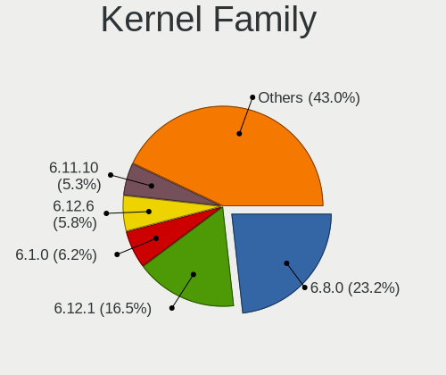
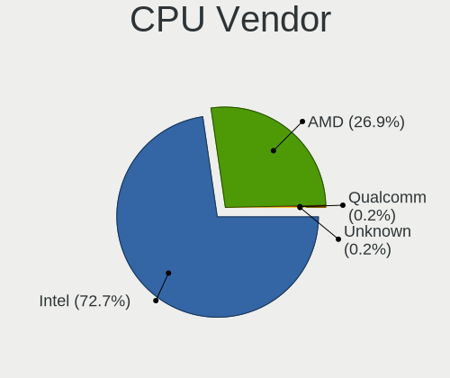
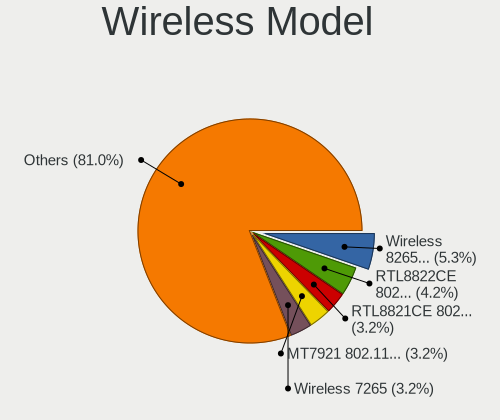
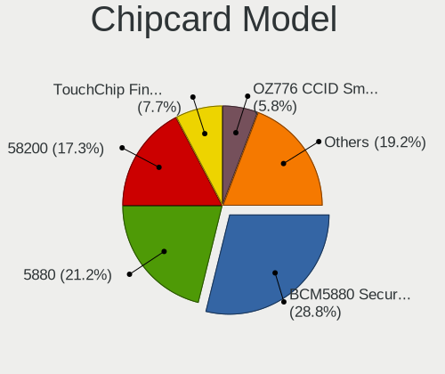

Linux in USA - Hardware Trends (Notebooks)
------------------------------------------

A project to identify most popular hardware characteristics and track their change
over time based on data collected by Linux users at https://Linux-Hardware.org.

Anyone can contribute to this report by the [hw-probe](https://github.com/linuxhw/hw-probe) tool:

    sudo -E hw-probe -all -upload

Period: Apr, 2024.

Contents
--------

* [ System ](#system)
  - [ OS                       ](#os)
  - [ OS Family                ](#os-family)
  - [ Kernel                   ](#kernel)
  - [ Kernel Family            ](#kernel-family)
  - [ Kernel Major Ver.        ](#kernel-major-ver)
  - [ Arch                     ](#arch)
  - [ DE                       ](#de)
  - [ Display Server           ](#display-server)
  - [ Display Manager          ](#display-manager)
  - [ OS Lang                  ](#os-lang)
  - [ Boot Mode                ](#boot-mode)
  - [ Filesystem               ](#filesystem)
  - [ Part. scheme             ](#part-scheme)
  - [ Dual Boot with Linux/BSD ](#dual-boot-with-linuxbsd)
  - [ Dual Boot (Win)          ](#dual-boot-win)

* [ Board ](#board)
  - [ Vendor                   ](#vendor)
  - [ Model                    ](#model)
  - [ Model Family             ](#model-family)
  - [ MFG Year                 ](#mfg-year)
  - [ Form Factor              ](#form-factor)
  - [ Secure Boot              ](#secure-boot)
  - [ Coreboot                 ](#coreboot)
  - [ RAM Size                 ](#ram-size)
  - [ RAM Used                 ](#ram-used)
  - [ Total Drives             ](#total-drives)
  - [ Has CD-ROM               ](#has-cd-rom)
  - [ Has Ethernet             ](#has-ethernet)
  - [ Has WiFi                 ](#has-wifi)
  - [ Has Bluetooth            ](#has-bluetooth)

* [ Location ](#location)
  - [ Country                  ](#country)
  - [ City                     ](#city)

* [ Drives ](#drives)
  - [ Drive Vendor             ](#drive-vendor)
  - [ Drive Model              ](#drive-model)
  - [ HDD Vendor               ](#hdd-vendor)
  - [ SSD Vendor               ](#ssd-vendor)
  - [ Drive Kind               ](#drive-kind)
  - [ Drive Connector          ](#drive-connector)
  - [ Drive Size               ](#drive-size)
  - [ Space Total              ](#space-total)
  - [ Space Used               ](#space-used)
  - [ Malfunc. Drives          ](#malfunc-drives)
  - [ Malfunc. Drive Vendor    ](#malfunc-drive-vendor)
  - [ Malfunc. HDD Vendor      ](#malfunc-hdd-vendor)
  - [ Malfunc. Drive Kind      ](#malfunc-drive-kind)
  - [ Failed Drives            ](#failed-drives)
  - [ Failed Drive Vendor      ](#failed-drive-vendor)
  - [ Drive Status             ](#drive-status)

* [ Storage controller ](#storage-controller)
  - [ Storage Vendor           ](#storage-vendor)
  - [ Storage Model            ](#storage-model)
  - [ Storage Kind             ](#storage-kind)

* [ Processor ](#processor)
  - [ CPU Vendor               ](#cpu-vendor)
  - [ CPU Model                ](#cpu-model)
  - [ CPU Model Family         ](#cpu-model-family)
  - [ CPU Cores                ](#cpu-cores)
  - [ CPU Sockets              ](#cpu-sockets)
  - [ CPU Threads              ](#cpu-threads)
  - [ CPU Op-Modes             ](#cpu-op-modes)
  - [ CPU Microcode            ](#cpu-microcode)
  - [ CPU Microarch            ](#cpu-microarch)

* [ Graphics ](#graphics)
  - [ GPU Vendor               ](#gpu-vendor)
  - [ GPU Model                ](#gpu-model)
  - [ GPU Combo                ](#gpu-combo)
  - [ GPU Driver               ](#gpu-driver)
  - [ GPU Memory               ](#gpu-memory)

* [ Monitor ](#monitor)
  - [ Monitor Vendor           ](#monitor-vendor)
  - [ Monitor Model            ](#monitor-model)
  - [ Monitor Resolution       ](#monitor-resolution)
  - [ Monitor Diagonal         ](#monitor-diagonal)
  - [ Monitor Width            ](#monitor-width)
  - [ Aspect Ratio             ](#aspect-ratio)
  - [ Monitor Area             ](#monitor-area)
  - [ Pixel Density            ](#pixel-density)
  - [ Multiple Monitors        ](#multiple-monitors)

* [ Network ](#network)
  - [ Net Controller Vendor    ](#net-controller-vendor)
  - [ Net Controller Model     ](#net-controller-model)
  - [ Wireless Vendor          ](#wireless-vendor)
  - [ Wireless Model           ](#wireless-model)
  - [ Ethernet Vendor          ](#ethernet-vendor)
  - [ Ethernet Model           ](#ethernet-model)
  - [ Net Controller Kind      ](#net-controller-kind)
  - [ Used Controller          ](#used-controller)
  - [ NICs                     ](#nics)
  - [ IPv6                     ](#ipv6)

* [ Bluetooth ](#bluetooth)
  - [ Bluetooth Vendor         ](#bluetooth-vendor)
  - [ Bluetooth Model          ](#bluetooth-model)

* [ Sound ](#sound)
  - [ Sound Vendor             ](#sound-vendor)
  - [ Sound Model              ](#sound-model)

* [ Memory ](#memory)
  - [ Memory Vendor            ](#memory-vendor)
  - [ Memory Model             ](#memory-model)
  - [ Memory Kind              ](#memory-kind)
  - [ Memory Form Factor       ](#memory-form-factor)
  - [ Memory Size              ](#memory-size)
  - [ Memory Speed             ](#memory-speed)

* [ Printers & scanners ](#printers--scanners)
  - [ Printer Vendor           ](#printer-vendor)
  - [ Printer Model            ](#printer-model)
  - [ Scanner Vendor           ](#scanner-vendor)
  - [ Scanner Model            ](#scanner-model)

* [ Camera ](#camera)
  - [ Camera Vendor            ](#camera-vendor)
  - [ Camera Model             ](#camera-model)

* [ Security ](#security)
  - [ Fingerprint Vendor       ](#fingerprint-vendor)
  - [ Fingerprint Model        ](#fingerprint-model)
  - [ Chipcard Vendor          ](#chipcard-vendor)
  - [ Chipcard Model           ](#chipcard-model)

* [ Unsupported ](#unsupported)
  - [ Unsupported Devices      ](#unsupported-devices)
  - [ Unsupported Device Types ](#unsupported-device-types)

System
------

OS
--

Installed operating systems

| Name                         | Notebooks | Percent |
|------------------------------|-----------|---------|
| Ubuntu 22.04                 | 53        | 10.25%  |
| Fedora 39                    | 49        | 9.48%   |
| Fedora 40                    | 30        | 5.8%    |
| Linux Mint 21.3              | 26        | 5.03%   |
| Pop!_OS 22.04                | 22        | 4.26%   |
| Arch Rolling                 | 22        | 4.26%   |
| Ubuntu 23.10                 | 20        | 3.87%   |
| ArcoLinux Rolling            | 20        | 3.87%   |
| Zorin 17                     | 19        | 3.68%   |
| Debian 12                    | 18        | 3.48%   |
| KDE neon 22.04               | 15        | 2.9%    |
| Kali 2024.1                  | 15        | 2.9%    |
| SteamOS 3.5.17               | 13        | 2.51%   |
| Ubuntu 24.04                 | 12        | 2.32%   |
| OpenMandriva 23.08           | 12        | 2.32%   |
| openSUSE Tumbleweed-XXXXXXXX | 9         | 1.74%   |
| Kubuntu 23.10                | 9         | 1.74%   |
| EndeavourOS Rolling          | 9         | 1.74%   |
| Manjaro                      | 8         | 1.55%   |
| Elementary 7.1               | 8         | 1.55%   |
| Xubuntu 22.04                | 7         | 1.35%   |
| Nobara 39                    | 7         | 1.35%   |
| Ubuntu 20.04                 | 6         | 1.16%   |
| OpenMandriva 5.0             | 6         | 1.16%   |
| Linux Mint 21.2              | 6         | 1.16%   |
| Kubuntu 22.04                | 6         | 1.16%   |
| Manjaro 23.1.4               | 5         | 0.97%   |
| NixOS 24.05                  | 4         | 0.77%   |
| MX 23                        | 4         | 0.77%   |
| Zorin 16                     | 3         | 0.58%   |
| Ubuntu 23.04                 | 3         | 0.58%   |
| Garuda Linux Rolling         | 3         | 0.58%   |
| SteamOS 3.6                  | 2         | 0.39%   |
| SteamOS 3.5.19               | 2         | 0.39%   |
| Parrot 6.0                   | 2         | 0.39%   |
| org.kde.Platform 5.15-21.08  | 2         | 0.39%   |
| openSUSE Leap-15.6           | 2         | 0.39%   |
| openSUSE Leap-15.5           | 2         | 0.39%   |
| OpenMandriva 24.03           | 2         | 0.39%   |
| OpenMandriva 24.01           | 2         | 0.39%   |

OS Family
---------

OS without a version

| Name             | Notebooks | Percent |
|------------------|-----------|---------|
| Ubuntu           | 94        | 18.18%  |
| Fedora           | 84        | 16.25%  |
| Linux Mint       | 36        | 6.96%   |
| OpenMandriva     | 25        | 4.84%   |
| Zorin            | 22        | 4.26%   |
| Pop!_OS          | 22        | 4.26%   |
| Arch             | 22        | 4.26%   |
| Debian           | 21        | 4.06%   |
| ArcoLinux        | 21        | 4.06%   |
| SteamOS          | 18        | 3.48%   |
| Kubuntu          | 18        | 3.48%   |
| Kali             | 16        | 3.09%   |
| KDE neon         | 15        | 2.9%    |
| Manjaro          | 14        | 2.71%   |
| openSUSE         | 13        | 2.51%   |
| Nobara           | 9         | 1.74%   |
| EndeavourOS      | 9         | 1.74%   |
| Elementary       | 9         | 1.74%   |
| Xubuntu          | 7         | 1.35%   |
| NixOS            | 6         | 1.16%   |
| MX               | 4         | 0.77%   |
| Gentoo           | 3         | 0.58%   |
| Garuda Linux     | 3         | 0.58%   |
| Ubuntu Unity     | 2         | 0.39%   |
| Parrot           | 2         | 0.39%   |
| org.kde.Platform | 2         | 0.39%   |
| LMDE             | 2         | 0.39%   |
| Clear Linux      | 2         | 0.39%   |
| CachyOS          | 2         | 0.39%   |
| Void Linux       | 1         | 0.19%   |
| Ubuntu Studio    | 1         | 0.19%   |
| Ubuntu MATE      | 1         | 0.19%   |
| ROSA             | 1         | 0.19%   |
| Rocky Linux      | 1         | 0.19%   |
| Pikaos           | 1         | 0.19%   |
| Oracle Linux     | 1         | 0.19%   |
| Nitrux           | 1         | 0.19%   |
| Neptune OS       | 1         | 0.19%   |
| LFS              | 1         | 0.19%   |
| Kaisen           | 1         | 0.19%   |

Kernel
------

Version of the Linux kernel

| Version                             | Notebooks | Percent |
|-------------------------------------|-----------|---------|
| 6.5.0-27-generic                    | 44        | 8.51%   |
| 6.5.0-26-generic                    | 44        | 8.51%   |
| 6.5.0-28-generic                    | 31        | 6%      |
| 6.8.0-76060800daily20240311-generic | 21        | 4.06%   |
| 6.8.7-300.fc40.x86_64               | 20        | 3.87%   |
| 6.1.52-valve16-1-neptune-61         | 15        | 2.9%    |
| 5.15.0-101-generic                  | 14        | 2.71%   |
| 6.8.2-arch2-1                       | 11        | 2.13%   |
| 6.8.0-31-generic                    | 11        | 2.13%   |
| 6.4.11-desktop-1omv2390             | 11        | 2.13%   |
| 6.1.0-18-amd64                      | 10        | 1.93%   |
| 5.15.0-102-generic                  | 10        | 1.93%   |
| 6.8.4-200.fc39.x86_64               | 9         | 1.74%   |
| 6.7.11-200.fc39.x86_64              | 9         | 1.74%   |
| 6.6.2-desktop-1omv2390              | 9         | 1.74%   |
| 6.8.7-arch1-1                       | 8         | 1.55%   |
| 6.6.9-amd64                         | 8         | 1.55%   |
| 6.5.6-300.fc39.x86_64               | 8         | 1.55%   |
| 6.1.0-20-amd64                      | 8         | 1.55%   |
| 5.15.0-105-generic                  | 8         | 1.55%   |
| 6.6.15-amd64                        | 7         | 1.35%   |
| 6.8.6-200.fc39.x86_64               | 6         | 1.16%   |
| 6.8.5-301.fc40.x86_64               | 6         | 1.16%   |
| 6.8.7-200.fc39.x86_64               | 5         | 0.97%   |
| 6.8.5-arch1-1                       | 5         | 0.97%   |
| 6.8.5-201.fc39.x86_64               | 5         | 0.97%   |
| 6.8.4-zen1-1-zen                    | 4         | 0.77%   |
| 6.8.4-arch1-1                       | 4         | 0.77%   |
| 6.8.4-300.fc40.x86_64               | 4         | 0.77%   |
| 6.5.0-21-generic                    | 4         | 0.77%   |
| 6.2.0-39-generic                    | 4         | 0.77%   |
| 6.8.7-zen1-1-zen                    | 3         | 0.58%   |
| 6.8.7-arch1-2                       | 3         | 0.58%   |
| 6.8.6-1-default                     | 3         | 0.58%   |
| 6.8.5-201.fsync.fc39.x86_64         | 3         | 0.58%   |
| 6.8.5-1-MANJARO                     | 3         | 0.58%   |
| 6.7.10-200.fc39.x86_64              | 3         | 0.58%   |
| 6.6.26-1-MANJARO                    | 3         | 0.58%   |
| 6.6.25-1-MANJARO                    | 3         | 0.58%   |
| 6.5.0-1019-oem                      | 3         | 0.58%   |

Kernel Family
-------------

Linux kernel without a distro release

| Version | Notebooks | Percent |
|---------|-----------|---------|
| 6.5.0   | 137       | 26.5%   |
| 6.8.7   | 48        | 9.28%   |
| 5.15.0  | 39        | 7.54%   |
| 6.8.0   | 35        | 6.77%   |
| 6.8.5   | 28        | 5.42%   |
| 6.8.4   | 25        | 4.84%   |
| 6.1.0   | 21        | 4.06%   |
| 6.1.52  | 16        | 3.09%   |
| 6.8.6   | 15        | 2.9%    |
| 6.8.2   | 13        | 2.51%   |
| 6.4.11  | 11        | 2.13%   |
| 6.7.11  | 10        | 1.93%   |
| 6.6.2   | 9         | 1.74%   |
| 6.8.1   | 8         | 1.55%   |
| 6.6.9   | 8         | 1.55%   |
| 6.5.6   | 8         | 1.55%   |
| 6.2.0   | 8         | 1.55%   |
| 6.6.15  | 7         | 1.35%   |
| 6.7.9   | 5         | 0.97%   |
| 6.6.25  | 5         | 0.97%   |
| 6.9.0   | 3         | 0.58%   |
| 6.7.10  | 3         | 0.58%   |
| 6.6.26  | 3         | 0.58%   |
| 6.6.21  | 3         | 0.58%   |
| 5.4.0   | 3         | 0.58%   |
| 5.14.0  | 3         | 0.58%   |
| 6.7.4   | 2         | 0.39%   |
| 6.7.12  | 2         | 0.39%   |
| 6.6.28  | 2         | 0.39%   |
| 6.6.19  | 2         | 0.39%   |
| 6.4.0   | 2         | 0.39%   |
| 5.14.21 | 2         | 0.39%   |
| 5.10.0  | 2         | 0.39%   |
| 6.8.8   | 1         | 0.19%   |
| 6.8.3   | 1         | 0.19%   |
| 6.7.7   | 1         | 0.19%   |
| 6.7.6   | 1         | 0.19%   |
| 6.7.5   | 1         | 0.19%   |
| 6.7.0   | 1         | 0.19%   |
| 6.6.8   | 1         | 0.19%   |

Kernel Major Ver.
-----------------

Linux kernel major version

| Version | Notebooks | Percent |
|---------|-----------|---------|
| 6.8     | 174       | 33.66%  |
| 6.5     | 145       | 28.05%  |
| 6.6     | 46        | 8.9%    |
| 6.1     | 41        | 7.93%   |
| 5.15    | 40        | 7.74%   |
| 6.7     | 26        | 5.03%   |
| 6.4     | 15        | 2.9%    |
| 6.2     | 8         | 1.55%   |
| 5.14    | 5         | 0.97%   |
| 6.9     | 3         | 0.58%   |
| 5.4     | 3         | 0.58%   |
| 5.10    | 3         | 0.58%   |
| 6.0     | 2         | 0.39%   |
| 6.3     | 1         | 0.19%   |
| 5.9     | 1         | 0.19%   |
| 5.19    | 1         | 0.19%   |
| 5.17    | 1         | 0.19%   |
| 5.16    | 1         | 0.19%   |
| 4.15    | 1         | 0.19%   |

Arch
----

OS architecture (x86_64, i586, etc.)

| Name    | Notebooks | Percent |
|---------|-----------|---------|
| x86_64  | 511       | 98.84%  |
| i686    | 3         | 0.58%   |
| aarch64 | 3         | 0.58%   |

DE
--

Desktop Environment

| Name            | Notebooks | Percent |
|-----------------|-----------|---------|
| GNOME           | 218       | 42.17%  |
| KDE5            | 98        | 18.96%  |
| KDE6            | 60        | 11.61%  |
| X-Cinnamon      | 42        | 8.12%   |
| XFCE            | 34        | 6.58%   |
| Pantheon        | 9         | 1.74%   |
| MATE            | 9         | 1.74%   |
| i3              | 9         | 1.74%   |
| Unknown         | 9         | 1.74%   |
| LXQt            | 6         | 1.16%   |
| Hyprland        | 5         | 0.97%   |
| KDE             | 3         | 0.58%   |
| Cinnamon        | 3         | 0.58%   |
| awesome         | 3         | 0.58%   |
| Unity           | 2         | 0.39%   |
| GNOME Flashback | 2         | 0.39%   |
| Deepin          | 2         | 0.39%   |
| icewm           | 1         | 0.19%   |
| GNOME-Classic   | 1         | 0.19%   |
| Budgie          | 1         | 0.19%   |

Display Server
--------------

X11 or Wayland

| Name    | Notebooks | Percent |
|---------|-----------|---------|
| Wayland | 271       | 52.42%  |
| X11     | 232       | 44.87%  |
| Unknown | 8         | 1.55%   |
| Tty     | 6         | 1.16%   |

Display Manager
---------------

SDDM, LightDM, etc.

| Name    | Notebooks | Percent |
|---------|-----------|---------|
| Unknown | 205       | 39.65%  |
| SDDM    | 108       | 20.89%  |
| GDM3    | 105       | 20.31%  |
| LightDM | 69        | 13.35%  |
| GDM     | 26        | 5.03%   |
| SLIMSKI | 1         | 0.19%   |
| SLiM    | 1         | 0.19%   |
| LY-DM   | 1         | 0.19%   |
| Ly      | 1         | 0.19%   |

OS Lang
-------

Language

| Lang    | Notebooks | Percent |
|---------|-----------|---------|
| en_US   | 475       | 91.88%  |
| C       | 21        | 4.06%   |
| Unknown | 4         | 0.77%   |
| en_GB   | 3         | 0.58%   |
| en_CA   | 3         | 0.58%   |
| zh_CN   | 2         | 0.39%   |
| fr_FR   | 2         | 0.39%   |
| en_AU   | 2         | 0.39%   |
| ru_RU   | 1         | 0.19%   |
| pt_PT   | 1         | 0.19%   |
| POSIX   | 1         | 0.19%   |
| es_MX   | 1         | 0.19%   |
| de_DE   | 1         | 0.19%   |

Boot Mode
---------

EFI or BIOS

| Mode | Notebooks | Percent |
|------|-----------|---------|
| BIOS | 259       | 50.1%   |
| EFI  | 258       | 49.9%   |

Filesystem
----------

Type of filesystem

| Type    | Notebooks | Percent |
|---------|-----------|---------|
| Ext4    | 270       | 52.22%  |
| Btrfs   | 146       | 28.24%  |
| Tmpfs   | 76        | 14.7%   |
| Overlay | 15        | 2.9%    |
| Zfs     | 4         | 0.77%   |
| Xfs     | 3         | 0.58%   |
| F2fs    | 3         | 0.58%   |

Part. scheme
------------

Scheme of partitioning

| Type    | Notebooks | Percent |
|---------|-----------|---------|
| GPT     | 294       | 56.87%  |
| Unknown | 192       | 37.14%  |
| MBR     | 31        | 6%      |

Dual Boot with Linux/BSD
------------------------

Hosting more than one Linux/BSD

| Dual boot | Notebooks | Percent |
|-----------|-----------|---------|
| No        | 465       | 89.94%  |
| Yes       | 52        | 10.06%  |

Dual Boot (Win)
---------------

Hosting Linux and Windows

| Dual boot | Notebooks | Percent |
|-----------|-----------|---------|
| No        | 429       | 82.98%  |
| Yes       | 88        | 17.02%  |

Board
-----

Vendor
------

Motherboard manufacturer

| Name                             | Notebooks | Percent |
|----------------------------------|-----------|---------|
| Dell                             | 101       | 19.54%  |
| Lenovo                           | 94        | 18.18%  |
| Hewlett-Packard                  | 89        | 17.21%  |
| ASUSTek Computer                 | 63        | 12.19%  |
| Apple                            | 31        | 6%      |
| Acer                             | 22        | 4.26%   |
| Valve                            | 18        | 3.48%   |
| MSI                              | 16        | 3.09%   |
| Google                           | 14        | 2.71%   |
| Toshiba                          | 12        | 2.32%   |
| Framework                        | 7         | 1.35%   |
| Unknown                          | 7         | 1.35%   |
| Alienware                        | 5         | 0.97%   |
| System76                         | 4         | 0.77%   |
| Notebook                         | 4         | 0.77%   |
| GPU Company                      | 4         | 0.77%   |
| Chuwi                            | 3         | 0.58%   |
| Samsung Electronics              | 2         | 0.39%   |
| Razer                            | 2         | 0.39%   |
| Carbon Systems                   | 2         | 0.39%   |
| ASRock                           | 2         | 0.39%   |
| Vizio                            | 1         | 0.19%   |
| Timi                             | 1         | 0.19%   |
| Panasonic                        | 1         | 0.19%   |
| MobileDemand                     | 1         | 0.19%   |
| Micro Computer (HK) Tech Limited | 1         | 0.19%   |
| Itronix                          | 1         | 0.19%   |
| Intel Client Systems             | 1         | 0.19%   |
| IBM                              | 1         | 0.19%   |
| HUAWEI                           | 1         | 0.19%   |
| Fusion5                          | 1         | 0.19%   |
| Fujitsu                          | 1         | 0.19%   |
| Core Innovations                 | 1         | 0.19%   |
| Clevo                            | 1         | 0.19%   |
| BANGHO                           | 1         | 0.19%   |
| A-DATA Technology                | 1         | 0.19%   |

Model
-----

Motherboard model

| Name                                        | Notebooks | Percent |
|---------------------------------------------|-----------|---------|
| Valve Jupiter                               | 13        | 2.51%   |
| Unknown                                     | 7         | 1.35%   |
| Valve Galileo                               | 5         | 0.97%   |
| Dell Latitude 7490                          | 5         | 0.97%   |
| Apple MacBookPro9,2                         | 5         | 0.97%   |
| HP Laptop 14-fq0xxx                         | 4         | 0.77%   |
| Dell Latitude E6400                         | 4         | 0.77%   |
| Lenovo IdeaPad 1 14IGL7 82V6                | 3         | 0.58%   |
| HP Notebook                                 | 3         | 0.58%   |
| HP Laptop 15-dy5xxx                         | 3         | 0.58%   |
| HP Laptop 15-dy2xxx                         | 3         | 0.58%   |
| HP EliteBook 840 G6                         | 3         | 0.58%   |
| HP 15                                       | 3         | 0.58%   |
| Dell Latitude E6420                         | 3         | 0.58%   |
| Dell Inspiron 5555                          | 3         | 0.58%   |
| ASUS ROG Zephyrus G14 GA401QM_GA401QM       | 3         | 0.58%   |
| Acer Aspire A515-43                         | 3         | 0.58%   |
| System76 Lemur Pro                          | 2         | 0.39%   |
| Lenovo ThinkPad E14 Gen 3 20YE000GCD        | 2         | 0.39%   |
| Lenovo Slim Pro 7 14ARP8 83AX               | 2         | 0.39%   |
| Lenovo IdeaPad 1 15IJL7 82LX                | 2         | 0.39%   |
| HP ProBook 4530s                            | 2         | 0.39%   |
| HP Pavilion Notebook                        | 2         | 0.39%   |
| HP Pavilion dv6                             | 2         | 0.39%   |
| HP Laptop 17-by4xxx                         | 2         | 0.39%   |
| HP Laptop 15-fd0xxx                         | 2         | 0.39%   |
| HP EliteBook 845 G8 Notebook PC             | 2         | 0.39%   |
| HP EliteBook 8440p                          | 2         | 0.39%   |
| HP EliteBook 840 G4                         | 2         | 0.39%   |
| GPU Company GWTC116-2                       | 2         | 0.39%   |
| Google Voxel                                | 2         | 0.39%   |
| Framework Laptop 16 (AMD Ryzen 7040 Series) | 2         | 0.39%   |
| Framework Laptop 13 (AMD Ryzen 7040Series)  | 2         | 0.39%   |
| Framework Laptop                            | 2         | 0.39%   |
| Dell XPS 15 7590                            | 2         | 0.39%   |
| Dell XPS 13 9300                            | 2         | 0.39%   |
| Dell Precision 5520                         | 2         | 0.39%   |
| Dell Latitude E7440                         | 2         | 0.39%   |
| Dell Latitude E6530                         | 2         | 0.39%   |
| Dell Latitude E6520                         | 2         | 0.39%   |

Model Family
------------

Motherboard model prefix

| Name               | Notebooks | Percent |
|--------------------|-----------|---------|
| Lenovo ThinkPad    | 61        | 11.8%   |
| Dell Latitude      | 46        | 8.9%    |
| Dell Inspiron      | 23        | 4.45%   |
| HP Laptop          | 22        | 4.26%   |
| ASUS ROG           | 20        | 3.87%   |
| HP EliteBook       | 19        | 3.68%   |
| Dell XPS           | 17        | 3.29%   |
| HP Pavilion        | 15        | 2.9%    |
| Acer Aspire        | 15        | 2.9%    |
| ASUS VivoBook      | 14        | 2.71%   |
| Valve Jupiter      | 13        | 2.51%   |
| Lenovo IdeaPad     | 13        | 2.51%   |
| Toshiba Satellite  | 11        | 2.13%   |
| Dell Precision     | 8         | 1.55%   |
| Framework Laptop   | 7         | 1.35%   |
| ASUS ASUS          | 7         | 1.35%   |
| Unknown            | 7         | 1.35%   |
| HP ENVY            | 6         | 1.16%   |
| Apple MacBookPro9  | 6         | 1.16%   |
| Valve Galileo      | 5         | 0.97%   |
| Lenovo Legion      | 5         | 0.97%   |
| HP ZBook           | 5         | 0.97%   |
| HP ProBook         | 5         | 0.97%   |
| Apple MacBookPro11 | 5         | 0.97%   |
| Apple MacBookAir7  | 4         | 0.77%   |
| Lenovo Yoga        | 3         | 0.58%   |
| Lenovo ThinkBook   | 3         | 0.58%   |
| HP OMEN            | 3         | 0.58%   |
| HP Notebook        | 3         | 0.58%   |
| HP 15              | 3         | 0.58%   |
| Apple MacBookAir6  | 3         | 0.58%   |
| Alienware m15      | 3         | 0.58%   |
| Acer Swift         | 3         | 0.58%   |
| Acer Nitro         | 3         | 0.58%   |
| System76 Lemur     | 2         | 0.39%   |
| Razer Blade        | 2         | 0.39%   |
| MSI Raider         | 2         | 0.39%   |
| MSI Katana         | 2         | 0.39%   |
| Lenovo Slim        | 2         | 0.39%   |
| HP 255             | 2         | 0.39%   |

MFG Year
--------

Motherboard manufacture year

| Year    | Notebooks | Percent |
|---------|-----------|---------|
| 2023    | 70        | 13.54%  |
| 2022    | 55        | 10.64%  |
| 2021    | 54        | 10.44%  |
| 2020    | 51        | 9.86%   |
| 2019    | 36        | 6.96%   |
| 2013    | 36        | 6.96%   |
| 2018    | 33        | 6.38%   |
| 2012    | 30        | 5.8%    |
| 2011    | 26        | 5.03%   |
| 2017    | 25        | 4.84%   |
| 2015    | 18        | 3.48%   |
| 2014    | 16        | 3.09%   |
| 2024    | 15        | 2.9%    |
| 2016    | 14        | 2.71%   |
| 2010    | 12        | 2.32%   |
| 2008    | 9         | 1.74%   |
| 2007    | 7         | 1.35%   |
| 2009    | 5         | 0.97%   |
| 2006    | 2         | 0.39%   |
| Unknown | 2         | 0.39%   |
| 2004    | 1         | 0.19%   |

Form Factor
-----------

Physical design of the computer

| Name     | Notebooks | Percent |
|----------|-----------|---------|
| Notebook | 517       | 100%    |

Secure Boot
-----------

Enabled or disabled

| State    | Notebooks | Percent |
|----------|-----------|---------|
| Disabled | 481       | 93.04%  |
| Enabled  | 36        | 6.96%   |

Coreboot
--------

Have coreboot on board

| Used | Notebooks | Percent |
|------|-----------|---------|
| No   | 500       | 96.71%  |
| Yes  | 17        | 3.29%   |

RAM Size
--------

Total RAM memory

| Size in GB  | Notebooks | Percent |
|-------------|-----------|---------|
| 16.01-24.0  | 111       | 21.47%  |
| 8.01-16.0   | 111       | 21.47%  |
| 4.01-8.0    | 106       | 20.5%   |
| 32.01-64.0  | 81        | 15.67%  |
| 3.01-4.0    | 69        | 13.35%  |
| 24.01-32.0  | 15        | 2.9%    |
| 64.01-256.0 | 14        | 2.71%   |
| 2.01-3.0    | 6         | 1.16%   |
| 1.01-2.0    | 2         | 0.39%   |
| 0.51-1.0    | 2         | 0.39%   |

RAM Used
--------

Used RAM memory

| Used GB    | Notebooks | Percent |
|------------|-----------|---------|
| 2.01-3.0   | 139       | 26.89%  |
| 4.01-8.0   | 125       | 24.18%  |
| 1.01-2.0   | 116       | 22.44%  |
| 3.01-4.0   | 83        | 16.05%  |
| 8.01-16.0  | 38        | 7.35%   |
| 0.51-1.0   | 10        | 1.93%   |
| 16.01-24.0 | 4         | 0.77%   |
| 0.01-0.5   | 2         | 0.39%   |

Total Drives
------------

Number of drives on board

| Drives | Notebooks | Percent |
|--------|-----------|---------|
| 1      | 385       | 74.47%  |
| 2      | 117       | 22.63%  |
| 3      | 12        | 2.32%   |
| 5      | 1         | 0.19%   |
| 4      | 1         | 0.19%   |
| 0      | 1         | 0.19%   |

Has CD-ROM
----------

Has CD-ROM on board

| Presented | Notebooks | Percent |
|-----------|-----------|---------|
| No        | 406       | 78.53%  |
| Yes       | 111       | 21.47%  |

Has Ethernet
------------

Has Ethernet on board

| Presented | Notebooks | Percent |
|-----------|-----------|---------|
| Yes       | 350       | 67.7%   |
| No        | 167       | 32.3%   |

Has WiFi
--------

Has WiFi module

| Presented | Notebooks | Percent |
|-----------|-----------|---------|
| Yes       | 506       | 97.87%  |
| No        | 11        | 2.13%   |

Has Bluetooth
-------------

Has Bluetooth module

| Presented | Notebooks | Percent |
|-----------|-----------|---------|
| Yes       | 428       | 82.79%  |
| No        | 89        | 17.21%  |

Location
--------

Country
-------

Geographic location (country)

| Country | Notebooks | Percent |
|---------|-----------|---------|
| USA     | 517       | 100%    |

City
----

Geographic location (city)

| City           | Notebooks | Percent |
|----------------|-----------|---------|
| Los Angeles    | 19        | 3.68%   |
| Portland       | 9         | 1.74%   |
| Chicago        | 8         | 1.55%   |
| Seattle        | 7         | 1.35%   |
| New York       | 7         | 1.35%   |
| Minneapolis    | 7         | 1.35%   |
| Dallas         | 7         | 1.35%   |
| Austin         | 7         | 1.35%   |
| Miami          | 6         | 1.16%   |
| Rochester      | 5         | 0.97%   |
| Flushing       | 5         | 0.97%   |
| Washington     | 4         | 0.77%   |
| San Francisco  | 4         | 0.77%   |
| Atlanta        | 4         | 0.77%   |
| Athens         | 4         | 0.77%   |
| Topeka         | 3         | 0.58%   |
| Savannah       | 3         | 0.58%   |
| San Jose       | 3         | 0.58%   |
| San Antonio    | 3         | 0.58%   |
| Salt Lake City | 3         | 0.58%   |
| Rexburg        | 3         | 0.58%   |
| Raleigh        | 3         | 0.58%   |
| Providence     | 3         | 0.58%   |
| Phoenix        | 3         | 0.58%   |
| Orlando        | 3         | 0.58%   |
| Johnson City   | 3         | 0.58%   |
| Jacksonville   | 3         | 0.58%   |
| Irvine         | 3         | 0.58%   |
| Denver         | 3         | 0.58%   |
| Charlotte      | 3         | 0.58%   |
| Buffalo        | 3         | 0.58%   |
| Brooklyn       | 3         | 0.58%   |
| Boston         | 3         | 0.58%   |
| Boise          | 3         | 0.58%   |
| Tulsa          | 2         | 0.39%   |
| Tucson         | 2         | 0.39%   |
| Spring Hill    | 2         | 0.39%   |
| Silver Spring  | 2         | 0.39%   |
| Secaucus       | 2         | 0.39%   |
| San Diego      | 2         | 0.39%   |

Drives
------

Drive Vendor
------------

Hard drive vendors

| Vendor                         | Notebooks | Drives | Percent |
|--------------------------------|-----------|--------|---------|
| Samsung Electronics            | 105       | 115    | 16.43%  |
| SanDisk                        | 67        | 69     | 10.49%  |
| Unknown                        | 58        | 63     | 9.08%   |
| Micron Technology              | 37        | 37     | 5.79%   |
| Toshiba                        | 36        | 37     | 5.63%   |
| SK hynix                       | 36        | 36     | 5.63%   |
| WDC                            | 34        | 35     | 5.32%   |
| Seagate                        | 27        | 30     | 4.23%   |
| Intel                          | 24        | 24     | 3.76%   |
| Apple                          | 21        | 25     | 3.29%   |
| Kingston                       | 20        | 21     | 3.13%   |
| Crucial                        | 19        | 19     | 2.97%   |
| KIOXIA                         | 11        | 11     | 1.72%   |
| HGST                           | 10        | 10     | 1.56%   |
| Phison Electronics             | 9         | 9      | 1.41%   |
| Unknown                        | 9         | 9      | 1.41%   |
| SPCC                           | 8         | 8      | 1.25%   |
| Micron/Crucial Technology      | 8         | 8      | 1.25%   |
| Kingston Technology Company    | 7         | 7      | 1.1%    |
| China                          | 7         | 7      | 1.1%    |
| Silicon Motion                 | 6         | 6      | 0.94%   |
| PNY                            | 6         | 6      | 0.94%   |
| Hitachi                        | 6         | 6      | 0.94%   |
| Team                           | 4         | 4      | 0.63%   |
| Mushkin                        | 3         | 3      | 0.47%   |
| Hewlett-Packard                | 3         | 3      | 0.47%   |
| Fanxiang                       | 3         | 3      | 0.47%   |
| A-DATA Technology              | 3         | 3      | 0.47%   |
| Yangtze Memory Technologies    | 2         | 2      | 0.31%   |
| Solid State Storage Technology | 2         | 2      | 0.31%   |
| Shenzhen Longsys Electronics   | 2         | 2      | 0.31%   |
| Realtek Semiconductor          | 2         | 2      | 0.31%   |
| O2 Micro                       | 2         | 2      | 0.31%   |
| Netac                          | 2         | 2      | 0.31%   |
| MAXIO Technology (Hangzhou)    | 2         | 2      | 0.31%   |
| LITEON                         | 2         | 2      | 0.31%   |
| Lexar                          | 2         | 2      | 0.31%   |
| KingSpec                       | 2         | 2      | 0.31%   |
| Zheino                         | 1         | 1      | 0.16%   |
| XPG                            | 1         | 1      | 0.16%   |

Drive Model
-----------

Hard drive models

| Model                                                 | Notebooks | Percent |
|-------------------------------------------------------|-----------|---------|
| Samsung NVMe SSD Controller SM981/PM981/PM983 1TB     | 20        | 3.04%   |
| Samsung NVMe SSD Controller PM9A1/PM9A3/980PRO 1TB    | 13        | 1.98%   |
| Unknown MMC Card  64GB                                | 11        | 1.67%   |
| Unknown MMC Card  128GB                               | 10        | 1.52%   |
| Sandisk WD Black SN750 / PC SN730 NVMe SSD 512GB      | 9         | 1.37%   |
| Unknown                                               | 9         | 1.37%   |
| Toshiba MQ01ABD100 1TB                                | 7         | 1.07%   |
| Intel SSDPEKNU512GZ 512GB                             | 7         | 1.07%   |
| Unknown MMC Card  32GB                                | 6         | 0.91%   |
| Toshiba XG6 NVMe SSD Controller 1024GB                | 6         | 0.91%   |
| Samsung SSD 860 EVO 500GB                             | 6         | 0.91%   |
| Unknown SD/MMC/MS PRO 128GB                           | 5         | 0.76%   |
| Unknown NVMe SSD Drive 1TB                            | 5         | 0.76%   |
| Unknown MMC Card  512GB                               | 5         | 0.76%   |
| Unknown MMC Card  256GB                               | 5         | 0.76%   |
| Silicon Motion SM2263EN/SM2263XT SSD Controller 256GB | 5         | 0.76%   |
| Sandisk WD Blue SN550 NVMe SSD 2TB                    | 5         | 0.76%   |
| Micron/Crucial P2 NVMe PCIe SSD 4TB                   | 5         | 0.76%   |
| KIOXIA KBG40ZNV256G 256GB                             | 5         | 0.76%   |
| Sandisk WD Black SN850 512GB                          | 4         | 0.61%   |
| Micron 2450_MTFDKBA512TFK 512GB                       | 4         | 0.61%   |
| Kingston Company OM3PDP3 NVMe SSD 512GB               | 4         | 0.61%   |
| HGST HTS721010A9E630 1TB                              | 4         | 0.61%   |
| HGST HTS541010A9E680 1TB                              | 4         | 0.61%   |
| Crucial CT1000MX500SSD1 1TB                           | 4         | 0.61%   |
| Unknown MMC64G  64GB                                  | 3         | 0.46%   |
| SK hynix PC401 NVMe Solid State Drive 256GB           | 3         | 0.46%   |
| SK hynix HFM512GD3JX016N 512GB                        | 3         | 0.46%   |
| Sandisk WD_BLACK SN770 2TB                            | 3         | 0.46%   |
| Sandisk WD Green SN350 1TB                            | 3         | 0.46%   |
| Samsung SSD 990 PRO 1TB                               | 3         | 0.46%   |
| Samsung MZNLH128HBHQ-000H1 128GB SSD                  | 3         | 0.46%   |
| Samsung MZ9LQ512HBLU-00BVL 512GB                      | 3         | 0.46%   |
| Phison PS5013 E13 NVMe Controller 512GB               | 3         | 0.46%   |
| Micron MTFDKCD512TFK 512GB                            | 3         | 0.46%   |
| Micron 2400_MTFDKBA1T0QFM 1TB                         | 3         | 0.46%   |
| Kingston SA400S37480G 480GB SSD                       | 3         | 0.46%   |
| Intel SSD 660P Series 1024GB                          | 3         | 0.46%   |
| Apple SSD SM0512F 500GB                               | 3         | 0.46%   |
| Apple SSD SM0128G 121GB                               | 3         | 0.46%   |

HDD Vendor
----------

Hard disk drive vendors

| Vendor  | Notebooks | Drives | Percent |
|---------|-----------|--------|---------|
| Seagate | 25        | 28     | 26.88%  |
| Toshiba | 23        | 23     | 24.73%  |
| WDC     | 21        | 21     | 22.58%  |
| HGST    | 10        | 10     | 10.75%  |
| Hitachi | 6         | 6      | 6.45%   |
| Unknown | 5         | 5      | 5.38%   |
| Apple   | 2         | 2      | 2.15%   |
| LaCie   | 1         | 1      | 1.08%   |

SSD Vendor
----------

Solid state drive vendors

| Vendor              | Notebooks | Drives | Percent |
|---------------------|-----------|--------|---------|
| Samsung Electronics | 32        | 33     | 17.88%  |
| Crucial             | 18        | 18     | 10.06%  |
| SanDisk             | 16        | 16     | 8.94%   |
| Kingston            | 12        | 12     | 6.7%    |
| Apple               | 12        | 12     | 6.7%    |
| WDC                 | 10        | 10     | 5.59%   |
| Micron Technology   | 9         | 9      | 5.03%   |
| SPCC                | 7         | 7      | 3.91%   |
| China               | 7         | 7      | 3.91%   |
| PNY                 | 6         | 6      | 3.35%   |
| Intel               | 6         | 6      | 3.35%   |
| Toshiba             | 5         | 5      | 2.79%   |
| Team                | 3         | 3      | 1.68%   |
| Hewlett-Packard     | 3         | 3      | 1.68%   |
| Netac               | 2         | 2      | 1.12%   |
| Mushkin             | 2         | 2      | 1.12%   |
| LITEON              | 2         | 2      | 1.12%   |
| Lexar               | 2         | 2      | 1.12%   |
| KingSpec            | 2         | 2      | 1.12%   |
| Fanxiang            | 2         | 2      | 1.12%   |
| Unknown             | 2         | 2      | 1.12%   |
| Zheino              | 1         | 1      | 0.56%   |
| Wibtek              | 1         | 1      | 0.56%   |
| USB3.0              | 1         | 1      | 0.56%   |
| Transcend           | 1         | 1      | 0.56%   |
| Teclast             | 1         | 1      | 0.56%   |
| SSSTC               | 1         | 1      | 0.56%   |
| SCCTS-603-256G      | 1         | 1      | 0.56%   |
| SBe                 | 1         | 1      | 0.56%   |
| QUANXING            | 1         | 1      | 0.56%   |
| Plextor             | 1         | 1      | 0.56%   |
| Patriot             | 1         | 1      | 0.56%   |
| NT-128              | 1         | 1      | 0.56%   |
| KLEVV               | 1         | 1      | 0.56%   |
| Jumper              | 1         | 1      | 0.56%   |
| Intenso             | 1         | 1      | 0.56%   |
| Dogfish             | 1         | 1      | 0.56%   |
| Dell                | 1         | 1      | 0.56%   |
| Aura                | 1         | 1      | 0.56%   |
| A-DATA Technology   | 1         | 1      | 0.56%   |

Drive Kind
----------

HDD or SSD

| Kind    | Notebooks | Drives | Percent |
|---------|-----------|--------|---------|
| NVMe    | 280       | 319    | 46.9%   |
| SSD     | 164       | 180    | 27.47%  |
| HDD     | 87        | 96     | 14.57%  |
| MMC     | 56        | 60     | 9.38%   |
| Unknown | 10        | 11     | 1.68%   |

Drive Connector
---------------

SATA, SAS, NVMe, etc.

| Type | Notebooks | Drives | Percent |
|------|-----------|--------|---------|
| NVMe | 280       | 318    | 47.7%   |
| SATA | 226       | 260    | 38.5%   |
| MMC  | 56        | 60     | 9.54%   |
| SAS  | 25        | 28     | 4.26%   |

Drive Size
----------

Size of hard drive

| Size in TB | Notebooks | Drives | Percent |
|------------|-----------|--------|---------|
| 0.01-0.5   | 157       | 173    | 62.3%   |
| 0.51-1.0   | 81        | 86     | 32.14%  |
| 1.01-2.0   | 10        | 10     | 3.97%   |
| 3.01-4.0   | 2         | 2      | 0.79%   |
| 4.01-10.0  | 2         | 5      | 0.79%   |

Space Total
-----------

Amount of disk space available on the file system

| Size in GB     | Notebooks | Percent |
|----------------|-----------|---------|
| 101-250        | 126       | 24.37%  |
| 251-500        | 112       | 21.66%  |
| 501-1000       | 102       | 19.73%  |
| 1001-2000      | 54        | 10.44%  |
| 1-20           | 28        | 5.42%   |
| 51-100         | 25        | 4.84%   |
| More than 3000 | 23        | 4.45%   |
| Unknown        | 18        | 3.48%   |
| 2001-3000      | 17        | 3.29%   |
| 21-50          | 12        | 2.32%   |

Space Used
----------

Amount of used disk space

| Used GB        | Notebooks | Percent |
|----------------|-----------|---------|
| 1-20           | 180       | 34.82%  |
| 21-50          | 106       | 20.5%   |
| 101-250        | 66        | 12.77%  |
| 51-100         | 60        | 11.61%  |
| 251-500        | 33        | 6.38%   |
| 501-1000       | 30        | 5.8%    |
| Unknown        | 18        | 3.48%   |
| 1001-2000      | 13        | 2.51%   |
| 2001-3000      | 6         | 1.16%   |
| More than 3000 | 5         | 0.97%   |

Malfunc. Drives
---------------

Drive models with a malfunction

| Model                                               | Notebooks | Drives | Percent |
|-----------------------------------------------------|-----------|--------|---------|
| Toshiba MQ01ABD100 1TB                              | 3         | 3      | 13.64%  |
| WDC WD50 00LPLX-08ZNTT0 500GB                       | 1         | 1      | 4.55%   |
| WDC WD1600BEVE-00WZT0 160GB                         | 1         | 1      | 4.55%   |
| Toshiba THNSNK256GVN8 M.2 2280 256GB SSD            | 1         | 1      | 4.55%   |
| Toshiba MQ02ABF050H 500GB                           | 1         | 1      | 4.55%   |
| Toshiba MK6475GSX 640GB                             | 1         | 1      | 4.55%   |
| SK hynix BC711 HFM512GD3JX013N 512GB                | 1         | 1      | 4.55%   |
| SanDisk SDSSDA120G 120GB                            | 1         | 1      | 4.55%   |
| Samsung Electronics SSD 870 EVO 1TB                 | 1         | 1      | 4.55%   |
| Mushkin MKNSSDEC240GB                               | 1         | 1      | 4.55%   |
| Mushkin MKNSSDCR240GB                               | 1         | 1      | 4.55%   |
| Micron Technology MTFDDAV256TDL-1AW1ZABHA 256GB SSD | 1         | 1      | 4.55%   |
| Micron Technology C400 RealSSD mSATA 128GB          | 1         | 1      | 4.55%   |
| Kingston SNS4151S316G 16GB SSD                      | 1         | 1      | 4.55%   |
| Hitachi HTS545050A7E380 500GB                       | 1         | 1      | 4.55%   |
| Hitachi HTS542580K9SA00 80GB                        | 1         | 1      | 4.55%   |
| HGST HTS541010A9E680 1TB                            | 1         | 1      | 4.55%   |
| Crucial CT120M500SSD3 120GB                         | 1         | 1      | 4.55%   |
| Apple SSD SM0512F 500GB                             | 1         | 1      | 4.55%   |
| A-DATA Technology SP550 480GB SSD                   | 1         | 1      | 4.55%   |

Malfunc. Drive Vendor
---------------------

Vendors of faulty drives

| Vendor              | Notebooks | Drives | Percent |
|---------------------|-----------|--------|---------|
| Toshiba             | 6         | 6      | 27.27%  |
| WDC                 | 2         | 2      | 9.09%   |
| Mushkin             | 2         | 2      | 9.09%   |
| Micron Technology   | 2         | 2      | 9.09%   |
| Hitachi             | 2         | 2      | 9.09%   |
| SK hynix            | 1         | 1      | 4.55%   |
| SanDisk             | 1         | 1      | 4.55%   |
| Samsung Electronics | 1         | 1      | 4.55%   |
| Kingston            | 1         | 1      | 4.55%   |
| HGST                | 1         | 1      | 4.55%   |
| Crucial             | 1         | 1      | 4.55%   |
| Apple               | 1         | 1      | 4.55%   |
| A-DATA Technology   | 1         | 1      | 4.55%   |

Malfunc. HDD Vendor
-------------------

Vendors of faulty HDD drives

| Vendor  | Notebooks | Drives | Percent |
|---------|-----------|--------|---------|
| Toshiba | 5         | 5      | 50%     |
| WDC     | 2         | 2      | 20%     |
| Hitachi | 2         | 2      | 20%     |
| HGST    | 1         | 1      | 10%     |

Malfunc. Drive Kind
-------------------

Kinds of faulty drives

| Kind | Notebooks | Drives | Percent |
|------|-----------|--------|---------|
| SSD  | 11        | 11     | 50%     |
| HDD  | 10        | 10     | 45.45%  |
| NVMe | 1         | 1      | 4.55%   |

Failed Drives
-------------

Failed drive models

Zero info for selected period =(

Failed Drive Vendor
-------------------

Failed drive vendors

Zero info for selected period =(

Drive Status
------------

Number of failed and malfunc. drives

| Status   | Notebooks | Drives | Percent |
|----------|-----------|--------|---------|
| Detected | 315       | 411    | 58.66%  |
| Works    | 201       | 233    | 37.43%  |
| Malfunc  | 21        | 22     | 3.91%   |

Storage controller
------------------

Storage Vendor
--------------

Storage controller vendors

| Vendor                         | Notebooks | Percent |
|--------------------------------|-----------|---------|
| Intel                          | 272       | 43.87%  |
| Samsung Electronics            | 84        | 13.55%  |
| SanDisk                        | 56        | 9.03%   |
| AMD                            | 45        | 7.26%   |
| SK hynix                       | 36        | 5.81%   |
| Micron Technology              | 28        | 4.52%   |
| Kingston Technology Company    | 14        | 2.26%   |
| Toshiba America Info Systems   | 11        | 1.77%   |
| Phison Electronics             | 10        | 1.61%   |
| Micron/Crucial Technology      | 9         | 1.45%   |
| KIOXIA                         | 9         | 1.45%   |
| Silicon Motion                 | 7         | 1.13%   |
| Solidigm                       | 5         | 0.81%   |
| Apple                          | 5         | 0.81%   |
| Realtek Semiconductor          | 4         | 0.65%   |
| Nvidia                         | 4         | 0.65%   |
| Solid State Storage Technology | 3         | 0.48%   |
| Shenzhen Longsys Electronics   | 3         | 0.48%   |
| Yangtze Memory Technologies    | 2         | 0.32%   |
| O2 Micro                       | 2         | 0.32%   |
| MAXIO Technology (Hangzhou)    | 2         | 0.32%   |
| INNOGRIT                       | 2         | 0.32%   |
| Union Memory (Shenzhen)        | 1         | 0.16%   |
| Seagate Technology             | 1         | 0.16%   |
| Marvell Technology Group       | 1         | 0.16%   |
| Lite-On Technology             | 1         | 0.16%   |
| Biwin Storage Technology       | 1         | 0.16%   |
| ASMedia Technology             | 1         | 0.16%   |
| ADATA Technology               | 1         | 0.16%   |

Storage Model
-------------

Storage controller models

| Model                                                                          | Notebooks | Percent |
|--------------------------------------------------------------------------------|-----------|---------|
| AMD FCH SATA Controller [AHCI mode]                                            | 38        | 5.78%   |
| Intel Volume Management Device NVMe RAID Controller                            | 33        | 5.02%   |
| Intel 7 Series Chipset Family 6-port SATA Controller [AHCI mode]               | 30        | 4.56%   |
| Samsung NVMe SSD Controller SM981/PM981/PM983                                  | 28        | 4.26%   |
| Intel 82801 Mobile SATA Controller [RAID mode]                                 | 28        | 4.26%   |
| Intel Sunrise Point-LP SATA Controller [AHCI mode]                             | 27        | 4.1%    |
| Intel 6 Series/C200 Series Chipset Family 6 port Mobile SATA AHCI Controller   | 20        | 3.04%   |
| Samsung NVMe SSD Controller PM9A1/PM9A3/980PRO                                 | 18        | 2.74%   |
| Samsung NVMe SSD Controller 980 (DRAM-less)                                    | 17        | 2.58%   |
| Intel Cannon Lake Mobile PCH SATA AHCI Controller                              | 15        | 2.28%   |
| SanDisk WD Black SN770 / PC SN740 256GB / PC SN560 (DRAM-less) NVMe SSD        | 14        | 2.13%   |
| Intel 8 Series SATA Controller 1 [AHCI mode]                                   | 14        | 2.13%   |
| SK hynix Gold P31/BC711/PC711 NVMe Solid State Drive                           | 13        | 1.98%   |
| SK hynix Platinum P41/PC801 NVMe Solid State Drive                             | 10        | 1.52%   |
| SanDisk Extreme Pro / WD Black SN750 / PC SN730 / Red SN700 NVMe SSD           | 10        | 1.52%   |
| Toshiba America Info Systems XG6 NVMe SSD Controller                           | 9         | 1.37%   |
| Intel Tiger Lake-LP SATA Controller                                            | 9         | 1.37%   |
| Intel SSD 670p Series [Keystone Harbor]                                        | 9         | 1.37%   |
| Micron 2450 NVMe SSD [HendrixV] (DRAM-less)                                    | 8         | 1.22%   |
| Intel Wildcat Point-LP SATA Controller [AHCI Mode]                             | 8         | 1.22%   |
| Intel Volume Management Device NVMe RAID Controller Intel Corporation          | 8         | 1.22%   |
| Intel 8 Series/C220 Series Chipset Family 6-port SATA Controller 1 [AHCI mode] | 8         | 1.22%   |
| KIOXIA NVMe SSD Controller BG4 (DRAM-less)                                     | 7         | 1.06%   |
| Intel Celeron/Pentium Silver Processor SATA Controller                         | 7         | 1.06%   |
| Silicon Motion SM2263EN/SM2263XT (DRAM-less) NVMe SSD Controllers              | 6         | 0.91%   |
| SanDisk Ultra 3D / WD Blue SN550 NVMe SSD                                      | 6         | 0.91%   |
| Samsung S4LN058A01[SSUBX] AHCI SSD Controller (Apple slot)                     | 6         | 0.91%   |
| Micron/Crucial P2 [Nick P2] / P3 / P3 Plus NVMe PCIe SSD (DRAM-less)           | 6         | 0.91%   |
| Micron 2400 NVMe SSD (DRAM-less)                                               | 6         | 0.91%   |
| Samsung NVMe SSD Controller S4LV008[Pascal]                                    | 5         | 0.76%   |
| Kingston Company OM3PDP3 NVMe SSD                                              | 5         | 0.76%   |
| Intel Tiger Lake SATA AHCI Controller                                          | 5         | 0.76%   |
| Intel SSD 660P Series                                                          | 5         | 0.76%   |
| Intel Comet Lake SATA AHCI Controller                                          | 5         | 0.76%   |
| Intel Atom Processor E3800 Series SATA AHCI Controller                         | 5         | 0.76%   |
| Intel 5 Series/3400 Series Chipset 4 port SATA AHCI Controller                 | 5         | 0.76%   |
| SanDisk WD PC SN810 / Black SN850 NVMe SSD                                     | 4         | 0.61%   |
| Sandisk WD Black SN850X NVMe SSD                                               | 4         | 0.61%   |
| Samsung S4LN053X01 AHCI SSD Controller(Apple slot)                             | 4         | 0.61%   |
| Samsung NVMe SSD Controller PM9B1 (DRAM-less)                                  | 4         | 0.61%   |

Storage Kind
------------

Kind of storage controller (IDE, SATA, NVMe, SAS, ...)

| Kind | Notebooks | Percent |
|------|-----------|---------|
| NVMe | 279       | 44.86%  |
| SATA | 253       | 40.68%  |
| RAID | 73        | 11.74%  |
| IDE  | 17        | 2.73%   |

Processor
---------

CPU Vendor
----------

Processor vendors

| Vendor  | Notebooks | Percent |
|---------|-----------|---------|
| Intel   | 390       | 75.44%  |
| AMD     | 124       | 23.98%  |
| ARM     | 2         | 0.39%   |
| Unknown | 1         | 0.19%   |

CPU Model
---------

Processor models

| Model                                        | Notebooks | Percent |
|----------------------------------------------|-----------|---------|
| AMD Custom APU 0405                          | 13        | 2.51%   |
| Intel 11th Gen Core i7-1165G7 @ 2.80GHz      | 10        | 1.93%   |
| Intel 11th Gen Core i5-1135G7 @ 2.40GHz      | 9         | 1.74%   |
| Intel Core i7-8750H CPU @ 2.20GHz            | 8         | 1.55%   |
| Intel Core i5-2520M CPU @ 2.50GHz            | 8         | 1.55%   |
| Intel Core i7-9750H CPU @ 2.60GHz            | 7         | 1.35%   |
| Intel Core i7-8650U CPU @ 1.90GHz            | 7         | 1.35%   |
| AMD Ryzen 9 7940HS w/ Radeon 780M Graphics   | 7         | 1.35%   |
| Intel Core i7-10750H CPU @ 2.60GHz           | 6         | 1.16%   |
| Intel Core i5-3210M CPU @ 2.50GHz            | 6         | 1.16%   |
| Intel Celeron N4020 CPU @ 1.10GHz            | 6         | 1.16%   |
| Intel 12th Gen Core i7-12700H                | 6         | 1.16%   |
| Intel Core i5-8350U CPU @ 1.70GHz            | 5         | 0.97%   |
| Intel Core i5-7200U CPU @ 2.50GHz            | 5         | 0.97%   |
| Intel Core i5-10210U CPU @ 1.60GHz           | 5         | 0.97%   |
| Intel 12th Gen Core i3-1215U                 | 5         | 0.97%   |
| Intel 11th Gen Core i7-11800H @ 2.30GHz      | 5         | 0.97%   |
| Intel 11th Gen Core i3-1115G4 @ 3.00GHz      | 5         | 0.97%   |
| AMD Custom APU 0932                          | 5         | 0.97%   |
| AMD Athlon Silver 3050U with Radeon Graphics | 5         | 0.97%   |
| Intel N100                                   | 4         | 0.77%   |
| Intel Core Ultra 7 155H                      | 4         | 0.77%   |
| Intel Core i7-8565U CPU @ 1.80GHz            | 4         | 0.77%   |
| Intel Core i7-8550U CPU @ 1.80GHz            | 4         | 0.77%   |
| Intel Core i7-7700HQ CPU @ 2.80GHz           | 4         | 0.77%   |
| Intel Core i7-6700HQ CPU @ 2.60GHz           | 4         | 0.77%   |
| Intel Core i7-10610U CPU @ 1.80GHz           | 4         | 0.77%   |
| Intel Core i5-8365U CPU @ 1.60GHz            | 4         | 0.77%   |
| Intel Core i5-2540M CPU @ 2.60GHz            | 4         | 0.77%   |
| Intel Celeron N4500 @ 1.10GHz                | 4         | 0.77%   |
| Intel 11th Gen Core i7-1185G7 @ 3.00GHz      | 4         | 0.77%   |
| Intel Core i7-6600U CPU @ 2.60GHz            | 3         | 0.58%   |
| Intel Core i7-4800MQ CPU @ 2.70GHz           | 3         | 0.58%   |
| Intel Core i7-4500U CPU @ 1.80GHz            | 3         | 0.58%   |
| Intel Core i7-2640M CPU @ 2.80GHz            | 3         | 0.58%   |
| Intel Core i5-8300H CPU @ 2.30GHz            | 3         | 0.58%   |
| Intel Core i5-8250U CPU @ 1.60GHz            | 3         | 0.58%   |
| Intel Core i5-6200U CPU @ 2.30GHz            | 3         | 0.58%   |
| Intel Core i5-5200U CPU @ 2.20GHz            | 3         | 0.58%   |
| Intel Core i5-4300M CPU @ 2.60GHz            | 3         | 0.58%   |

CPU Model Family
----------------

Processor model prefix

| Model                   | Notebooks | Percent |
|-------------------------|-----------|---------|
| Other                   | 117       | 22.63%  |
| Intel Core i7           | 111       | 21.47%  |
| Intel Core i5           | 103       | 19.92%  |
| Intel Celeron           | 27        | 5.22%   |
| AMD Ryzen 7             | 26        | 5.03%   |
| AMD Ryzen 9             | 19        | 3.68%   |
| Intel Core i3           | 13        | 2.51%   |
| Intel Core 2 Duo        | 12        | 2.32%   |
| AMD Ryzen 5             | 12        | 2.32%   |
| Intel Pentium           | 7         | 1.35%   |
| Intel Core              | 7         | 1.35%   |
| AMD Ryzen 7 PRO         | 7         | 1.35%   |
| AMD A10                 | 6         | 1.16%   |
| AMD Ryzen 3             | 5         | 0.97%   |
| AMD Athlon              | 5         | 0.97%   |
| AMD Ryzen 5 PRO         | 4         | 0.77%   |
| AMD A8                  | 4         | 0.77%   |
| AMD A6                  | 4         | 0.77%   |
| Intel Core i9           | 3         | 0.58%   |
| Intel Atom              | 3         | 0.58%   |
| AMD E                   | 3         | 0.58%   |
| Intel Xeon              | 2         | 0.39%   |
| Intel Pentium Silver    | 2         | 0.39%   |
| Intel Core 2            | 2         | 0.39%   |
| AMD Turion 64 X2 Mobile | 2         | 0.39%   |
| AMD E2                  | 2         | 0.39%   |
| AMD A4                  | 2         | 0.39%   |
| Intel Pentium M         | 1         | 0.19%   |
| Intel Pentium Dual-Core | 1         | 0.19%   |
| Intel Pentium Dual      | 1         | 0.19%   |
| Intel Core m3           | 1         | 0.19%   |
| AMD Turion 64 Mobile    | 1         | 0.19%   |
| AMD Phenom II           | 1         | 0.19%   |
| AMD Athlon X4           | 1         | 0.19%   |

CPU Cores
---------

Number of processor cores

| Number | Notebooks | Percent |
|--------|-----------|---------|
| 2      | 183       | 35.4%   |
| 4      | 176       | 34.04%  |
| 8      | 62        | 11.99%  |
| 6      | 46        | 8.9%    |
| 14     | 14        | 2.71%   |
| 10     | 12        | 2.32%   |
| 12     | 11        | 2.13%   |
| 16     | 8         | 1.55%   |
| 24     | 2         | 0.39%   |
| 1      | 2         | 0.39%   |
| 3      | 1         | 0.19%   |

CPU Sockets
-----------

Number of sockets

| Number | Notebooks | Percent |
|--------|-----------|---------|
| 1      | 517       | 100%    |

CPU Threads
-----------

Threads per core (Hyper-Threading)

| Number | Notebooks | Percent |
|--------|-----------|---------|
| 2      | 413       | 79.88%  |
| 1      | 104       | 20.12%  |

CPU Op-Modes
------------

CPU Operation Modes (32-bit, 64-bit)

| Op mode        | Notebooks | Percent |
|----------------|-----------|---------|
| 32-bit, 64-bit | 514       | 99.42%  |
| 64-bit         | 2         | 0.39%   |
| 32-bit         | 1         | 0.19%   |

CPU Microcode
-------------

Microcode number

| Number     | Notebooks | Percent |
|------------|-----------|---------|
| Unknown    | 437       | 84.53%  |
| 0x40651    | 6         | 1.16%   |
| 0x306a9    | 5         | 0.97%   |
| 0x1067a    | 4         | 0.77%   |
| 0x806ea    | 3         | 0.58%   |
| 0x806c1    | 3         | 0.58%   |
| 0x406e3    | 3         | 0.58%   |
| 0x0a50000f | 3         | 0.58%   |
| 0x07030105 | 3         | 0.58%   |
| 0x906ed    | 2         | 0.39%   |
| 0x906ea    | 2         | 0.39%   |
| 0x806ec    | 2         | 0.39%   |
| 0x806e9    | 2         | 0.39%   |
| 0x806d1    | 2         | 0.39%   |
| 0x706a8    | 2         | 0.39%   |
| 0x406c4    | 2         | 0.39%   |
| 0x40661    | 2         | 0.39%   |
| 0x306d4    | 2         | 0.39%   |
| 0x306c3    | 2         | 0.39%   |
| 0x206a7    | 2         | 0.39%   |
| 0x0a704103 | 2         | 0.39%   |
| 0x0a404102 | 2         | 0.39%   |
| 0x08a00008 | 2         | 0.39%   |
| 0x08600109 | 2         | 0.39%   |
| 0xa0652    | 1         | 0.19%   |
| 0x906c0    | 1         | 0.19%   |
| 0x806eb    | 1         | 0.19%   |
| 0x6f6      | 1         | 0.19%   |
| 0x20655    | 1         | 0.19%   |
| 0x0a704104 | 1         | 0.19%   |
| 0x0a601203 | 1         | 0.19%   |
| 0x0a50000d | 1         | 0.19%   |
| 0x0a50000c | 1         | 0.19%   |
| 0x0a404101 | 1         | 0.19%   |
| 0x08108109 | 1         | 0.19%   |
| 0x08108102 | 1         | 0.19%   |
| 0x0700010f | 1         | 0.19%   |
| 0x06006704 | 1         | 0.19%   |
| 0x06006118 | 1         | 0.19%   |
| 0x06003106 | 1         | 0.19%   |

CPU Microarch
-------------

Microarchitecture

| Name              | Notebooks | Percent |
|-------------------|-----------|---------|
| KabyLake          | 91        | 17.6%   |
| Unknown           | 78        | 15.09%  |
| IvyBridge         | 34        | 6.58%   |
| Haswell           | 33        | 6.38%   |
| TigerLake         | 32        | 6.19%   |
| Alderlake Hybrid  | 32        | 6.19%   |
| SandyBridge       | 24        | 4.64%   |
| Zen 3             | 23        | 4.45%   |
| Skylake           | 17        | 3.29%   |
| Broadwell         | 14        | 2.71%   |
| Zen+              | 13        | 2.51%   |
| Goldmont plus     | 12        | 2.32%   |
| Zen 2             | 11        | 2.13%   |
| Silvermont        | 11        | 2.13%   |
| Penryn            | 11        | 2.13%   |
| Icelake           | 11        | 2.13%   |
| CometLake         | 10        | 1.93%   |
| Westmere          | 9         | 1.74%   |
| Excavator         | 6         | 1.16%   |
| Puma              | 5         | 0.97%   |
| Goldmont          | 5         | 0.97%   |
| Core              | 5         | 0.97%   |
| Tremont           | 4         | 0.77%   |
| Meteorlake Hybrid | 4         | 0.77%   |
| Bobcat            | 4         | 0.77%   |
| K8 Hammer         | 3         | 0.58%   |
| K10 Llano         | 3         | 0.58%   |
| Gracemont         | 3         | 0.58%   |
| Steamroller       | 2         | 0.39%   |
| Piledriver        | 2         | 0.39%   |
| Zen               | 1         | 0.19%   |
| P6                | 1         | 0.19%   |
| Nehalem           | 1         | 0.19%   |
| K10               | 1         | 0.19%   |
| Jaguar            | 1         | 0.19%   |

Graphics
--------

GPU Vendor
----------

Vendors of graphics cards

| Vendor | Notebooks | Percent |
|--------|-----------|---------|
| Intel  | 362       | 56.65%  |
| Nvidia | 140       | 21.91%  |
| AMD    | 137       | 21.44%  |

GPU Model
---------

Graphics card models

| Model                                                                                    | Notebooks | Percent |
|------------------------------------------------------------------------------------------|-----------|---------|
| Intel 3rd Gen Core processor Graphics Controller                                         | 33        | 5.05%   |
| Intel TigerLake-LP GT2 [Iris Xe Graphics]                                                | 26        | 3.98%   |
| Intel 2nd Generation Core Processor Family Integrated Graphics Controller                | 23        | 3.52%   |
| Intel UHD Graphics 620                                                                   | 20        | 3.06%   |
| Intel Haswell-ULT Integrated Graphics Controller                                         | 18        | 2.75%   |
| Intel CoffeeLake-H GT2 [UHD Graphics 630]                                                | 17        | 2.6%    |
| AMD Cezanne [Radeon Vega Series / Radeon Vega Mobile Series]                             | 16        | 2.45%   |
| Intel Alder Lake-P GT2 [Iris Xe Graphics]                                                | 14        | 2.14%   |
| AMD Picasso/Raven 2 [Radeon Vega Series / Radeon Vega Mobile Series]                     | 14        | 2.14%   |
| Intel TigerLake-H GT1 [UHD Graphics]                                                     | 13        | 1.99%   |
| AMD VanGogh [AMD Custom GPU 0405]                                                        | 13        | 1.99%   |
| Intel CometLake-U GT2 [UHD Graphics]                                                     | 12        | 1.83%   |
| AMD Phoenix1                                                                             | 12        | 1.83%   |
| Nvidia GA106M [GeForce RTX 3060 Mobile / Max-Q]                                          | 11        | 1.68%   |
| Intel WhiskeyLake-U GT2 [UHD Graphics 620]                                               | 11        | 1.68%   |
| Intel GeminiLake [UHD Graphics 600]                                                      | 11        | 1.68%   |
| Intel HD Graphics 620                                                                    | 10        | 1.53%   |
| Nvidia TU117M [GeForce GTX 1650 Mobile / Max-Q]                                          | 9         | 1.38%   |
| Intel Skylake GT2 [HD Graphics 520]                                                      | 9         | 1.38%   |
| Intel Raptor Lake-P [Iris Xe Graphics]                                                   | 9         | 1.38%   |
| Intel 4th Gen Core Processor Integrated Graphics Controller                              | 9         | 1.38%   |
| AMD Renoir [Radeon RX Vega 6 (Ryzen 4000/5000 Mobile Series)]                            | 9         | 1.38%   |
| Intel HD Graphics 5500                                                                   | 8         | 1.22%   |
| Intel Core Processor Integrated Graphics Controller                                      | 8         | 1.22%   |
| Intel CometLake-H GT2 [UHD Graphics]                                                     | 8         | 1.22%   |
| Intel Alder Lake-UP3 GT2 [Iris Xe Graphics]                                              | 8         | 1.22%   |
| AMD Rembrandt [Radeon 680M]                                                              | 8         | 1.22%   |
| Nvidia AD107M [GeForce RTX 4060 Max-Q / Mobile]                                          | 7         | 1.07%   |
| Intel HD Graphics 630                                                                    | 7         | 1.07%   |
| Nvidia TU116M [GeForce GTX 1660 Ti Mobile]                                               | 6         | 0.92%   |
| Nvidia GP106M [GeForce GTX 1060 Mobile]                                                  | 6         | 0.92%   |
| Nvidia GA107M [GeForce RTX 3050 Mobile]                                                  | 6         | 0.92%   |
| Intel Tiger Lake-LP GT2 [UHD Graphics G4]                                                | 6         | 0.92%   |
| Intel Mobile 4 Series Chipset Integrated Graphics Controller                             | 6         | 0.92%   |
| Intel Meteor Lake-P [Intel Arc Graphics]                                                 | 6         | 0.92%   |
| Intel Atom Processor Z36xxx/Z37xxx Series Graphics & Display                             | 6         | 0.92%   |
| AMD Barcelo                                                                              | 6         | 0.92%   |
| Nvidia AD106M [GeForce RTX 4070 Max-Q / Mobile]                                          | 5         | 0.76%   |
| Intel JasperLake [UHD Graphics]                                                          | 5         | 0.76%   |
| Intel Atom/Celeron/Pentium Processor x5-E8000/J3xxx/N3xxx Integrated Graphics Controller | 5         | 0.76%   |

GPU Combo
---------

Combinations of graphics cards

| Name           | Notebooks | Percent |
|----------------|-----------|---------|
| 1 x Intel      | 249       | 48.16%  |
| 1 x AMD        | 98        | 18.96%  |
| Intel + Nvidia | 93        | 17.99%  |
| 1 x Nvidia     | 26        | 5.03%   |
| AMD + Nvidia   | 19        | 3.68%   |
| Intel + AMD    | 11        | 2.13%   |
| 2 x AMD        | 9         | 1.74%   |
| Other          | 6         | 1.16%   |
| 2 x Intel      | 4         | 0.77%   |
| 2 x Nvidia     | 2         | 0.39%   |

GPU Driver
----------

Free vs proprietary

| Driver      | Notebooks | Percent |
|-------------|-----------|---------|
| Free        | 411       | 79.5%   |
| Proprietary | 78        | 15.09%  |
| Unknown     | 28        | 5.42%   |

GPU Memory
----------

Total video memory

| Size in GB | Notebooks | Percent |
|------------|-----------|---------|
| Unknown    | 415       | 80.27%  |
| 0.01-0.5   | 39        | 7.54%   |
| 1.01-2.0   | 18        | 3.48%   |
| 7.01-8.0   | 12        | 2.32%   |
| 0.51-1.0   | 12        | 2.32%   |
| 3.01-4.0   | 9         | 1.74%   |
| 5.01-6.0   | 7         | 1.35%   |
| 8.01-16.0  | 4         | 0.77%   |
| 2.01-3.0   | 1         | 0.19%   |

Monitor
-------

Monitor Vendor
--------------

Monitor vendors

| Vendor                  | Notebooks | Percent |
|-------------------------|-----------|---------|
| AU Optronics            | 107       | 18.14%  |
| BOE                     | 80        | 13.56%  |
| LG Display              | 66        | 11.19%  |
| Chimei Innolux          | 64        | 10.85%  |
| Samsung Electronics     | 55        | 9.32%   |
| Apple                   | 30        | 5.08%   |
| Sharp                   | 26        | 4.41%   |
| Dell                    | 21        | 3.56%   |
| Valve                   | 15        | 2.54%   |
| Goldstar                | 11        | 1.86%   |
| Hewlett-Packard         | 10        | 1.69%   |
| TMX                     | 9         | 1.53%   |
| InfoVision              | 9         | 1.53%   |
| Chi Mei Optoelectronics | 9         | 1.53%   |
| PANDA                   | 7         | 1.19%   |
| Acer                    | 7         | 1.19%   |
| Lenovo                  | 5         | 0.85%   |
| CSO                     | 5         | 0.85%   |
| ViewSonic               | 4         | 0.68%   |
| LG Philips              | 4         | 0.68%   |
| Vizio                   | 3         | 0.51%   |
| Toshiba                 | 3         | 0.51%   |
| MSI                     | 3         | 0.51%   |
| ASUSTek Computer        | 3         | 0.51%   |
| Ancor Communications    | 3         | 0.51%   |
| Panasonic               | 2         | 0.34%   |
| CHR                     | 2         | 0.34%   |
| VXN                     | 1         | 0.17%   |
| Unknown (XXX)           | 1         | 0.17%   |
| Unknown                 | 1         | 0.17%   |
| TMA                     | 1         | 0.17%   |
| SANYO                   | 1         | 0.17%   |
| SANSUI                  | 1         | 0.17%   |
| RGT                     | 1         | 0.17%   |
| Pixio                   | 1         | 0.17%   |
| Matrox                  | 1         | 0.17%   |
| KDC                     | 1         | 0.17%   |
| Insignia                | 1         | 0.17%   |
| INS                     | 1         | 0.17%   |
| INNOCN                  | 1         | 0.17%   |

Monitor Model
-------------

Monitor models

| Model                                                                    | Notebooks | Percent |
|--------------------------------------------------------------------------|-----------|---------|
| Valve ANX7530 U VLV3001 800x1280 100x150mm 7.1-inch                      | 10        | 1.69%   |
| Samsung Electronics LCD Monitor SEC5441 1366x768 344x194mm 15.5-inch     | 5         | 0.85%   |
| AU Optronics LCD Monitor AUO21ED 1920x1080 344x193mm 15.5-inch           | 5         | 0.85%   |
| Valve ANX7530 U VLV3003 800x1280 100x160mm 7.4-inch                      | 4         | 0.68%   |
| Samsung Electronics LCD Monitor SEC544B 1600x900 310x174mm 14.0-inch     | 4         | 0.68%   |
| Chimei Innolux LCD Monitor CMN14E3 1366x768 309x173mm 13.9-inch          | 4         | 0.68%   |
| BOE LCD Monitor BOE095F 2256x1504 285x190mm 13.5-inch                    | 4         | 0.68%   |
| AU Optronics LCD Monitor AUO978F 1920x1080 382x215mm 17.3-inch           | 4         | 0.68%   |
| AU Optronics LCD Monitor AUO61ED 1920x1080 344x194mm 15.5-inch           | 4         | 0.68%   |
| AU Optronics LCD Monitor AUO109D 1920x1080 381x214mm 17.2-inch           | 4         | 0.68%   |
| Apple Color LCD APP9CF2 1366x768 256x144mm 11.6-inch                     | 4         | 0.68%   |
| Sharp LCD Monitor SHP1476 3840x2160 346x194mm 15.6-inch                  | 3         | 0.51%   |
| Samsung Electronics LCD Monitor SDC4161 1920x1080 344x194mm 15.5-inch    | 3         | 0.51%   |
| LG Display LCD Monitor LGD05C0 1920x1080 344x194mm 15.5-inch             | 3         | 0.51%   |
| LG Display LCD Monitor LGD046F 1920x1080 340x190mm 15.3-inch             | 3         | 0.51%   |
| Chimei Innolux LCD Monitor CMN1618 1920x1200 344x215mm 16.0-inch         | 3         | 0.51%   |
| Chimei Innolux LCD Monitor CMN1521 1920x1080 344x193mm 15.5-inch         | 3         | 0.51%   |
| Chimei Innolux LCD Monitor CMN14D6 1366x768 309x173mm 13.9-inch          | 3         | 0.51%   |
| Chi Mei Optoelectronics LCD Monitor CMO15A7 1366x768 344x193mm 15.5-inch | 3         | 0.51%   |
| BOE LCD Monitor BOE0BCA 2256x1504 285x190mm 13.5-inch                    | 3         | 0.51%   |
| AU Optronics LCD Monitor AUO219D 1920x1080 381x214mm 17.2-inch           | 3         | 0.51%   |
| AU Optronics LCD Monitor AUO213E 1600x900 309x174mm 14.0-inch            | 3         | 0.51%   |
| AU Optronics LCD Monitor AUO20EC 1366x768 344x193mm 15.5-inch            | 3         | 0.51%   |
| AU Optronics LCD Monitor AUO10EC 1366x768 344x193mm 15.5-inch            | 3         | 0.51%   |
| Apple Color LCD APP9CC7 1280x800 286x179mm 13.3-inch                     | 3         | 0.51%   |
| Toshiba TV TSB0206 1920x1080                                             | 2         | 0.34%   |
| TMX TL160ADMP03-0 TMX1603 2560x1600 345x215mm 16.0-inch                  | 2         | 0.34%   |
| TMX TL156VDXP01 TMX1560 1920x1080 344x194mm 15.5-inch                    | 2         | 0.34%   |
| TMX TL140BDXP01-0 TMX1400 2560x1440 310x174mm 14.0-inch                  | 2         | 0.34%   |
| TMX TL140ADXP02-0 TMX1401 2560x1600 301x188mm 14.0-inch                  | 2         | 0.34%   |
| Sharp LQ156M1JW01 SHP14C3 1920x1080 344x194mm 15.5-inch                  | 2         | 0.34%   |
| Sharp LCD Monitor SHP14CB 1920x1200 288x180mm 13.4-inch                  | 2         | 0.34%   |
| Sharp LCD Monitor SHP14BA 1920x1080 344x194mm 15.5-inch                  | 2         | 0.34%   |
| Sharp LCD Monitor SHP144A 3200x1800 294x165mm 13.3-inch                  | 2         | 0.34%   |
| LG Display LCD Monitor LGD06CA 1920x1080 309x174mm 14.0-inch             | 2         | 0.34%   |
| LG Display LCD Monitor LGD0685 1920x1080 309x174mm 14.0-inch             | 2         | 0.34%   |
| LG Display LCD Monitor LGD060F 1920x1080 309x174mm 14.0-inch             | 2         | 0.34%   |
| LG Display LCD Monitor LGD05FE 1920x1080 344x194mm 15.5-inch             | 2         | 0.34%   |
| LG Display LCD Monitor LGD056D 1920x1080 382x215mm 17.3-inch             | 2         | 0.34%   |
| LG Display LCD Monitor LGD0563 1920x1080 344x194mm 15.5-inch             | 2         | 0.34%   |

Monitor Resolution
------------------

Monitor screen resolution

| Resolution         | Notebooks | Percent |
|--------------------|-----------|---------|
| 1920x1080 (FHD)    | 234       | 41.86%  |
| 1366x768 (WXGA)    | 114       | 20.39%  |
| 1920x1200 (WUXGA)  | 26        | 4.65%   |
| 1600x900 (HD+)     | 22        | 3.94%   |
| 3840x2160 (4K)     | 21        | 3.76%   |
| 2560x1440 (QHD)    | 21        | 3.76%   |
| 2560x1600          | 19        | 3.4%    |
| 800x1280           | 15        | 2.68%   |
| 2880x1800          | 14        | 2.5%    |
| 1280x800 (WXGA)    | 13        | 2.33%   |
| 2256x1504          | 8         | 1.43%   |
| 1440x900 (WXGA+)   | 8         | 1.43%   |
| 3440x1440          | 5         | 0.89%   |
| 1680x1050 (WSXGA+) | 5         | 0.89%   |
| 3840x2400          | 4         | 0.72%   |
| 2560x1080          | 4         | 0.72%   |
| 3200x2000          | 3         | 0.54%   |
| 3072x1920          | 3         | 0.54%   |
| 3840x1080          | 2         | 0.36%   |
| 3200x1800 (QHD+)   | 2         | 0.36%   |
| 2288x1287          | 2         | 0.36%   |
| 1360x768           | 2         | 0.36%   |
| 3840x1100          | 1         | 0.18%   |
| 3456x2160          | 1         | 0.18%   |
| 2880x1920          | 1         | 0.18%   |
| 2880x1620          | 1         | 0.18%   |
| 2560x1024          | 1         | 0.18%   |
| 2240x1400          | 1         | 0.18%   |
| 1920x540           | 1         | 0.18%   |
| 1920x1280          | 1         | 0.18%   |
| 1280x960           | 1         | 0.18%   |
| 1200x1920          | 1         | 0.18%   |
| 1080x1920          | 1         | 0.18%   |
| Unknown            | 1         | 0.18%   |

Monitor Diagonal
----------------

Diagonal size in inches

| Inches  | Notebooks | Percent |
|---------|-----------|---------|
| 15      | 207       | 35.2%   |
| 13      | 88        | 14.97%  |
| 14      | 87        | 14.8%   |
| 17      | 43        | 7.31%   |
| 16      | 23        | 3.91%   |
| 24      | 21        | 3.57%   |
| 11      | 17        | 2.89%   |
| 7       | 16        | 2.72%   |
| 27      | 15        | 2.55%   |
| 23      | 11        | 1.87%   |
| 31      | 10        | 1.7%    |
| 34      | 7         | 1.19%   |
| 21      | 5         | 0.85%   |
| 12      | 5         | 0.85%   |
| Unknown | 5         | 0.85%   |
| 54      | 3         | 0.51%   |
| 20      | 3         | 0.51%   |
| 18      | 3         | 0.51%   |
| 74      | 2         | 0.34%   |
| 48      | 2         | 0.34%   |
| 35      | 2         | 0.34%   |
| 32      | 2         | 0.34%   |
| 22      | 2         | 0.34%   |
| 142     | 1         | 0.17%   |
| 84      | 1         | 0.17%   |
| 49      | 1         | 0.17%   |
| 42      | 1         | 0.17%   |
| 39      | 1         | 0.17%   |
| 38      | 1         | 0.17%   |
| 36      | 1         | 0.17%   |
| 28      | 1         | 0.17%   |
| 26      | 1         | 0.17%   |

Monitor Width
-------------

Physical width

| Width in mm    | Notebooks | Percent |
|----------------|-----------|---------|
| 301-350        | 350       | 60.14%  |
| 201-300        | 70        | 12.03%  |
| 351-400        | 49        | 8.42%   |
| 501-600        | 43        | 7.39%   |
| 1-100          | 16        | 2.75%   |
| 601-700        | 12        | 2.06%   |
| 401-500        | 12        | 2.06%   |
| 701-800        | 9         | 1.55%   |
| 1001-1500      | 6         | 1.03%   |
| 801-900        | 5         | 0.86%   |
| Unknown        | 5         | 0.86%   |
| 1501-2000      | 3         | 0.52%   |
| More than 2000 | 1         | 0.17%   |
| 901-1000       | 1         | 0.17%   |

Aspect Ratio
------------

Proportional relationship between the width and the height

| Ratio   | Notebooks | Percent |
|---------|-----------|---------|
| 16/9    | 386       | 72.69%  |
| 16/10   | 102       | 19.21%  |
| 0.67    | 11        | 2.07%   |
| 3/2     | 10        | 1.88%   |
| 21/9    | 9         | 1.69%   |
| 0.62    | 5         | 0.94%   |
| 32/9    | 2         | 0.38%   |
| 5/4     | 1         | 0.19%   |
| 3.40    | 1         | 0.19%   |
| 2.50    | 1         | 0.19%   |
| 1.00    | 1         | 0.19%   |
| 0.56    | 1         | 0.19%   |
| Unknown | 1         | 0.19%   |

Monitor Area
------------

Area in inch

| Area in inch | Notebooks | Percent |
|----------------|-----------|---------|
| 101-110        | 205       | 34.86%  |
| 81-90          | 145       | 24.66%  |
| 121-130        | 38        | 6.46%   |
| 201-250        | 30        | 5.1%    |
| 71-80          | 26        | 4.42%   |
| 111-120        | 25        | 4.25%   |
| 351-500        | 22        | 3.74%   |
| 51-60          | 18        | 3.06%   |
| 1-40           | 16        | 2.72%   |
| 301-350        | 16        | 2.72%   |
| More than 1000 | 8         | 1.36%   |
| 251-300        | 7         | 1.19%   |
| 501-1000       | 6         | 1.02%   |
| 61-70          | 5         | 0.85%   |
| 151-200        | 5         | 0.85%   |
| 131-140        | 5         | 0.85%   |
| Unknown        | 5         | 0.85%   |
| 141-150        | 3         | 0.51%   |
| 91-100         | 3         | 0.51%   |

Pixel Density
-------------

Pixels per inch

| Density       | Notebooks | Percent |
|---------------|-----------|---------|
| 121-160       | 243       | 42.19%  |
| 101-120       | 122       | 21.18%  |
| 161-240       | 91        | 15.8%   |
| 51-100        | 76        | 13.19%  |
| More than 240 | 31        | 5.38%   |
| 1-50          | 8         | 1.39%   |
| Unknown       | 5         | 0.87%   |

Multiple Monitors
-----------------

Total monitors connected

| Total | Notebooks | Percent |
|-------|-----------|---------|
| 1     | 424       | 82.01%  |
| 2     | 72        | 13.93%  |
| 3     | 12        | 2.32%   |
| 0     | 9         | 1.74%   |

Network
-------

Net Controller Vendor
---------------------

Controller vendors

| Vendor                                | Notebooks | Percent |
|---------------------------------------|-----------|---------|
| Intel                                 | 285       | 37.45%  |
| Realtek Semiconductor                 | 239       | 31.41%  |
| Qualcomm Atheros                      | 63        | 8.28%   |
| Broadcom                              | 41        | 5.39%   |
| MediaTek                              | 39        | 5.12%   |
| Broadcom Limited                      | 17        | 2.23%   |
| Qualcomm                              | 15        | 1.97%   |
| ASIX Electronics                      | 11        | 1.45%   |
| TP-Link                               | 6         | 0.79%   |
| Samsung Electronics                   | 6         | 0.79%   |
| Ralink Technology                     | 4         | 0.53%   |
| Nvidia                                | 4         | 0.53%   |
| Google                                | 4         | 0.53%   |
| Ralink                                | 3         | 0.39%   |
| DisplayLink                           | 3         | 0.39%   |
| Lenovo                                | 2         | 0.26%   |
| U-Blox                                | 1         | 0.13%   |
| TRENDnet                              | 1         | 0.13%   |
| Texas Instruments                     | 1         | 0.13%   |
| Sierra Wireless                       | 1         | 0.13%   |
| Qualcomm Technologies                 | 1         | 0.13%   |
| OPPO Electronics                      | 1         | 0.13%   |
| OpenMoko                              | 1         | 0.13%   |
| Netchip Technology                    | 1         | 0.13%   |
| Motorola PCS                          | 1         | 0.13%   |
| Microsoft                             | 1         | 0.13%   |
| Marvell Technology Group              | 1         | 0.13%   |
| JMicron Technology                    | 1         | 0.13%   |
| Dell                                  | 1         | 0.13%   |
| D-Link                                | 1         | 0.13%   |
| Cisco Aironet Wireless Communications | 1         | 0.13%   |
| Bose                                  | 1         | 0.13%   |
| Apple                                 | 1         | 0.13%   |
| AMD                                   | 1         | 0.13%   |
| AboCom Systems                        | 1         | 0.13%   |

Net Controller Model
--------------------

Controller models

| Model                                                                  | Notebooks | Percent |
|------------------------------------------------------------------------|-----------|---------|
| Realtek RTL8111/8168/8211/8411 PCI Express Gigabit Ethernet Controller | 116       | 12.73%  |
| Realtek RTL810xE PCI Express Fast Ethernet controller                  | 32        | 3.51%   |
| Realtek RTL8153 Gigabit Ethernet Adapter                               | 26        | 2.85%   |
| Realtek RTL8822CE 802.11ac PCIe Wireless Network Adapter               | 25        | 2.74%   |
| Intel Wireless 8265 / 8275                                             | 23        | 2.52%   |
| Intel Alder Lake-P PCH CNVi WiFi                                       | 23        | 2.52%   |
| Intel 82579LM Gigabit Network Connection (Lewisville)                  | 23        | 2.52%   |
| Intel Wi-Fi 6 AX200                                                    | 21        | 2.31%   |
| Realtek RTL8821CE 802.11ac PCIe Wireless Network Adapter               | 18        | 1.98%   |
| Intel Wi-Fi 6 AX201                                                    | 16        | 1.76%   |
| MediaTek MT7921 802.11ax PCI Express Wireless Network Adapter          | 14        | 1.54%   |
| Intel Wireless 7260                                                    | 14        | 1.54%   |
| Intel Ethernet Connection (4) I219-LM                                  | 14        | 1.54%   |
| Qualcomm QCNFA765 Wireless Network Adapter                             | 13        | 1.43%   |
| MediaTek MT7922 802.11ax PCI Express Wireless Network Adapter          | 13        | 1.43%   |
| Intel Wireless 7265                                                    | 13        | 1.43%   |
| Intel Wi-Fi 6E(802.11ax) AX210/AX1675* 2x2 [Typhoon Peak]              | 13        | 1.43%   |
| Qualcomm Atheros QCA6174 802.11ac Wireless Network Adapter             | 12        | 1.32%   |
| Intel Comet Lake PCH-LP CNVi WiFi                                      | 12        | 1.32%   |
| Intel Centrino Advanced-N 6205 [Taylor Peak]                           | 12        | 1.32%   |
| Realtek RTL8852BE PCIe 802.11ax Wireless Network Controller            | 11        | 1.21%   |
| Qualcomm Atheros QCA9565 / AR9565 Wireless Network Adapter             | 11        | 1.21%   |
| ASIX AX88179 Gigabit Ethernet                                          | 11        | 1.21%   |
| Intel Cannon Lake PCH CNVi WiFi                                        | 10        | 1.1%    |
| Qualcomm Atheros AR9485 Wireless Network Adapter                       | 9         | 0.99%   |
| Intel Tiger Lake PCH CNVi WiFi                                         | 9         | 0.99%   |
| Intel Comet Lake PCH CNVi WiFi                                         | 9         | 0.99%   |
| Broadcom Limited BCM4360 802.11ac Dual Band Wireless Network Adapter   | 9         | 0.99%   |
| Realtek RTL8188CE 802.11b/g/n WiFi Adapter                             | 8         | 0.88%   |
| MediaTek Wi-Fi 6E MT7902 Wireless Network Adapter                      | 8         | 0.88%   |
| Intel Wireless 8260                                                    | 8         | 0.88%   |
| Intel Ethernet Connection I217-LM                                      | 8         | 0.88%   |
| Realtek RTL8188EE Wireless Network Adapter                             | 7         | 0.77%   |
| Qualcomm Atheros AR9462 Wireless Network Adapter                       | 7         | 0.77%   |
| Intel Wi-Fi 5(802.11ac) Wireless-AC 9x6x [Thunder Peak]                | 7         | 0.77%   |
| Intel 82567LM Gigabit Network Connection                               | 7         | 0.77%   |
| Broadcom NetXtreme BCM57765 Gigabit Ethernet PCIe                      | 7         | 0.77%   |
| Broadcom BCM4331 802.11a/b/g/n                                         | 7         | 0.77%   |
| Intel Wireless-AC                                                      | 6         | 0.66%   |
| Intel Wireless 3160                                                    | 6         | 0.66%   |

Wireless Vendor
---------------

Wireless vendors

| Vendor                                | Notebooks | Percent |
|---------------------------------------|-----------|---------|
| Intel                                 | 266       | 50.28%  |
| Realtek Semiconductor                 | 93        | 17.58%  |
| Qualcomm Atheros                      | 50        | 9.45%   |
| MediaTek                              | 38        | 7.18%   |
| Broadcom                              | 33        | 6.24%   |
| Broadcom Limited                      | 15        | 2.84%   |
| Qualcomm                              | 14        | 2.65%   |
| TP-Link                               | 5         | 0.95%   |
| Ralink Technology                     | 4         | 0.76%   |
| Ralink                                | 3         | 0.57%   |
| TRENDnet                              | 1         | 0.19%   |
| Sierra Wireless                       | 1         | 0.19%   |
| Qualcomm Technologies                 | 1         | 0.19%   |
| Microsoft                             | 1         | 0.19%   |
| Dell                                  | 1         | 0.19%   |
| D-Link                                | 1         | 0.19%   |
| Cisco Aironet Wireless Communications | 1         | 0.19%   |
| AboCom Systems                        | 1         | 0.19%   |

Wireless Model
--------------

Wireless models

| Model                                                                | Notebooks | Percent |
|----------------------------------------------------------------------|-----------|---------|
| Realtek RTL8822CE 802.11ac PCIe Wireless Network Adapter             | 25        | 4.7%    |
| Intel Wireless 8265 / 8275                                           | 23        | 4.32%   |
| Intel Alder Lake-P PCH CNVi WiFi                                     | 23        | 4.32%   |
| Intel Wi-Fi 6 AX200                                                  | 21        | 3.95%   |
| Realtek RTL8821CE 802.11ac PCIe Wireless Network Adapter             | 18        | 3.38%   |
| Intel Wi-Fi 6 AX201                                                  | 16        | 3.01%   |
| MediaTek MT7921 802.11ax PCI Express Wireless Network Adapter        | 14        | 2.63%   |
| Intel Wireless 7260                                                  | 14        | 2.63%   |
| Qualcomm QCNFA765 Wireless Network Adapter                           | 13        | 2.44%   |
| MediaTek MT7922 802.11ax PCI Express Wireless Network Adapter        | 13        | 2.44%   |
| Intel Wireless 7265                                                  | 13        | 2.44%   |
| Intel Wi-Fi 6E(802.11ax) AX210/AX1675* 2x2 [Typhoon Peak]            | 13        | 2.44%   |
| Qualcomm Atheros QCA6174 802.11ac Wireless Network Adapter           | 12        | 2.26%   |
| Intel Comet Lake PCH-LP CNVi WiFi                                    | 12        | 2.26%   |
| Intel Centrino Advanced-N 6205 [Taylor Peak]                         | 12        | 2.26%   |
| Realtek RTL8852BE PCIe 802.11ax Wireless Network Controller          | 11        | 2.07%   |
| Qualcomm Atheros QCA9565 / AR9565 Wireless Network Adapter           | 11        | 2.07%   |
| Intel Cannon Lake PCH CNVi WiFi                                      | 10        | 1.88%   |
| Qualcomm Atheros AR9485 Wireless Network Adapter                     | 9         | 1.69%   |
| Intel Tiger Lake PCH CNVi WiFi                                       | 9         | 1.69%   |
| Intel Comet Lake PCH CNVi WiFi                                       | 9         | 1.69%   |
| Broadcom Limited BCM4360 802.11ac Dual Band Wireless Network Adapter | 9         | 1.69%   |
| Realtek RTL8188CE 802.11b/g/n WiFi Adapter                           | 8         | 1.5%    |
| MediaTek Wi-Fi 6E MT7902 Wireless Network Adapter                    | 8         | 1.5%    |
| Intel Wireless 8260                                                  | 8         | 1.5%    |
| Realtek RTL8188EE Wireless Network Adapter                           | 7         | 1.32%   |
| Qualcomm Atheros AR9462 Wireless Network Adapter                     | 7         | 1.32%   |
| Intel Wi-Fi 5(802.11ac) Wireless-AC 9x6x [Thunder Peak]              | 7         | 1.32%   |
| Broadcom BCM4331 802.11a/b/g/n                                       | 7         | 1.32%   |
| Intel Wireless-AC                                                    | 6         | 1.13%   |
| Intel Wireless 3160                                                  | 6         | 1.13%   |
| Intel Raptor Lake PCH CNVi WiFi                                      | 6         | 1.13%   |
| Qualcomm Atheros AR9285 Wireless Network Adapter (PCI-Express)       | 5         | 0.94%   |
| Intel Wireless 3165                                                  | 5         | 0.94%   |
| Intel Ice Lake-LP PCH CNVi WiFi                                      | 5         | 0.94%   |
| Intel Centrino Ultimate-N 6300                                       | 5         | 0.94%   |
| Realtek 802.11n WLAN Adapter                                         | 4         | 0.75%   |
| Realtek 802.11ac NIC                                                 | 4         | 0.75%   |
| Intel WiFi Link 5100                                                 | 4         | 0.75%   |
| Intel Wi-Fi 6 AX201 160MHz                                           | 4         | 0.75%   |

Ethernet Vendor
---------------

Ethernet vendors

| Vendor                   | Notebooks | Percent |
|--------------------------|-----------|---------|
| Realtek Semiconductor    | 190       | 51.91%  |
| Intel                    | 101       | 27.6%   |
| Qualcomm Atheros         | 18        | 4.92%   |
| Broadcom                 | 16        | 4.37%   |
| ASIX Electronics         | 11        | 3.01%   |
| Samsung Electronics      | 6         | 1.64%   |
| Nvidia                   | 4         | 1.09%   |
| Google                   | 4         | 1.09%   |
| DisplayLink              | 3         | 0.82%   |
| Lenovo                   | 2         | 0.55%   |
| Broadcom Limited         | 2         | 0.55%   |
| TP-Link                  | 1         | 0.27%   |
| Qualcomm                 | 1         | 0.27%   |
| OPPO Electronics         | 1         | 0.27%   |
| Netchip Technology       | 1         | 0.27%   |
| Motorola PCS             | 1         | 0.27%   |
| MediaTek                 | 1         | 0.27%   |
| Marvell Technology Group | 1         | 0.27%   |
| JMicron Technology       | 1         | 0.27%   |
| Apple                    | 1         | 0.27%   |

Ethernet Model
--------------

Ethernet models

| Model                                                                  | Notebooks | Percent |
|------------------------------------------------------------------------|-----------|---------|
| Realtek RTL8111/8168/8211/8411 PCI Express Gigabit Ethernet Controller | 116       | 31.18%  |
| Realtek RTL810xE PCI Express Fast Ethernet controller                  | 32        | 8.6%    |
| Realtek RTL8153 Gigabit Ethernet Adapter                               | 26        | 6.99%   |
| Intel 82579LM Gigabit Network Connection (Lewisville)                  | 23        | 6.18%   |
| Intel Ethernet Connection (4) I219-LM                                  | 14        | 3.76%   |
| ASIX AX88179 Gigabit Ethernet                                          | 11        | 2.96%   |
| Intel Ethernet Connection I217-LM                                      | 8         | 2.15%   |
| Intel 82567LM Gigabit Network Connection                               | 7         | 1.88%   |
| Broadcom NetXtreme BCM57765 Gigabit Ethernet PCIe                      | 7         | 1.88%   |
| Samsung Galaxy series, misc. (tethering mode)                          | 5         | 1.34%   |
| Intel Ethernet Connection (6) I219-LM                                  | 5         | 1.34%   |
| Intel Ethernet Connection (10) I219-LM                                 | 5         | 1.34%   |
| Realtek USB 10/100/1G/2.5G LAN                                         | 4         | 1.08%   |
| Realtek RTL8125 2.5GbE Controller                                      | 4         | 1.08%   |
| Realtek Killer E3000 2.5GbE Controller                                 | 4         | 1.08%   |
| Intel Ethernet Connection I218-LM                                      | 4         | 1.08%   |
| Intel Ethernet Connection (4) I219-V                                   | 4         | 1.08%   |
| Intel Ethernet Connection (2) I219-LM                                  | 4         | 1.08%   |
| Qualcomm Atheros Killer E2500 Gigabit Ethernet Controller              | 3         | 0.81%   |
| Qualcomm Atheros AR8151 v2.0 Gigabit Ethernet                          | 3         | 0.81%   |
| Intel Ethernet Connection I219-LM                                      | 3         | 0.81%   |
| Intel 82577LM Gigabit Network Connection                               | 3         | 0.81%   |
| Broadcom NetXtreme BCM57786 Gigabit Ethernet PCIe                      | 3         | 0.81%   |
| Realtek RTL8152 Fast Ethernet Adapter                                  | 2         | 0.54%   |
| Realtek PCIe GbE Family Controller                                     | 2         | 0.54%   |
| Qualcomm Atheros Killer E2400 Gigabit Ethernet Controller              | 2         | 0.54%   |
| Qualcomm Atheros Killer E220x Gigabit Ethernet Controller              | 2         | 0.54%   |
| Qualcomm Atheros AR8162 Fast Ethernet                                  | 2         | 0.54%   |
| Qualcomm Atheros AR8132 Fast Ethernet                                  | 2         | 0.54%   |
| Nvidia MCP79 Ethernet                                                  | 2         | 0.54%   |
| Nvidia MCP67 Ethernet                                                  | 2         | 0.54%   |
| Lenovo USB-C Dock Ethernet                                             | 2         | 0.54%   |
| Intel Ethernet Connection (7) I219-LM                                  | 2         | 0.54%   |
| Intel Ethernet Connection (3) I218-LM                                  | 2         | 0.54%   |
| Intel Ethernet Connection (16) I219-V                                  | 2         | 0.54%   |
| Intel Ethernet Connection (13) I219-V                                  | 2         | 0.54%   |
| Google Pixel 6                                                         | 2         | 0.54%   |
| Broadcom NetXtreme BCM5761 Gigabit Ethernet PCIe                       | 2         | 0.54%   |
| TP-Link UE300 10/100/1000 LAN (ethernet mode) [Realtek RTL8153]        | 1         | 0.27%   |
| Samsung GT-I9070 (network tethering, USB debugging enabled)            | 1         | 0.27%   |

Net Controller Kind
-------------------

Ethernet, WiFi or modem

| Kind     | Notebooks | Percent |
|----------|-----------|---------|
| WiFi     | 506       | 58.97%  |
| Ethernet | 345       | 40.21%  |
| Modem    | 6         | 0.7%    |
| Unknown  | 1         | 0.12%   |

Used Controller
---------------

Currently used network controller

| Kind     | Notebooks | Percent |
|----------|-----------|---------|
| WiFi     | 418       | 80.38%  |
| Ethernet | 102       | 19.62%  |

NICs
----

Total network controllers on board

| Total | Notebooks | Percent |
|-------|-----------|---------|
| 2     | 289       | 55.9%   |
| 1     | 212       | 41.01%  |
| 0     | 10        | 1.93%   |
| 3     | 5         | 0.97%   |
| 5     | 1         | 0.19%   |

IPv6
----

IPv6 vs IPv4

| Used | Notebooks | Percent |
|------|-----------|---------|
| No   | 345       | 66.73%  |
| Yes  | 172       | 33.27%  |

Bluetooth
---------

Bluetooth Vendor
----------------

Controller vendors

| Vendor                          | Notebooks | Percent |
|---------------------------------|-----------|---------|
| Intel                           | 226       | 52.56%  |
| Realtek Semiconductor           | 45        | 10.47%  |
| IMC Networks                    | 36        | 8.37%   |
| Apple                           | 25        | 5.81%   |
| Qualcomm Atheros Communications | 22        | 5.12%   |
| Foxconn / Hon Hai               | 16        | 3.72%   |
| Broadcom                        | 16        | 3.72%   |
| Lite-On Technology              | 10        | 2.33%   |
| Dell                            | 10        | 2.33%   |
| MediaTek                        | 5         | 1.16%   |
| USI                             | 4         | 0.93%   |
| Hewlett-Packard                 | 4         | 0.93%   |
| Cambridge Silicon Radio         | 4         | 0.93%   |
| Toshiba                         | 3         | 0.7%    |
| Ralink                          | 2         | 0.47%   |
| Taiyo Yuden                     | 1         | 0.23%   |
| Edimax Technology               | 1         | 0.23%   |

Bluetooth Model
---------------

Controller models

| Model                                               | Notebooks | Percent |
|-----------------------------------------------------|-----------|---------|
| Intel AX201 Bluetooth                               | 59        | 13.72%  |
| Intel Bluetooth wireless interface                  | 36        | 8.37%   |
| Intel Bluetooth Device                              | 30        | 6.98%   |
| Intel AX211 Bluetooth                               | 29        | 6.74%   |
| Realtek Bluetooth Radio                             | 24        | 5.58%   |
| Intel AX200 Bluetooth                               | 21        | 4.88%   |
| Intel Bluetooth 9460/9560 Jefferson Peak (JfP)      | 20        | 4.65%   |
| IMC Networks Wireless_Device                        | 19        | 4.42%   |
| Qualcomm Atheros  Bluetooth Device                  | 14        | 3.26%   |
| IMC Networks Bluetooth Radio                        | 14        | 3.26%   |
| Apple Bluetooth USB Host Controller                 | 14        | 3.26%   |
| Intel AX210 Bluetooth                               | 13        | 3.02%   |
| Realtek  Bluetooth 4.2 Adapter                      | 10        | 2.33%   |
| Apple Bluetooth Host Controller                     | 10        | 2.33%   |
| Realtek 802.11ac WLAN Adapter                       | 9         | 2.09%   |
| Intel Wireless-AC 9260 Bluetooth Adapter            | 8         | 1.86%   |
| Broadcom BCM2045B (BDC-2.1)                         | 8         | 1.86%   |
| Intel Centrino Bluetooth Wireless Transceiver       | 7         | 1.63%   |
| Foxconn / Hon Hai Wireless_Device                   | 7         | 1.63%   |
| Foxconn / Hon Hai Bluetooth Device                  | 6         | 1.4%    |
| MediaTek Wireless_Device                            | 5         | 1.16%   |
| Lite-On Bluetooth Device                            | 5         | 1.16%   |
| USI Bluetooth Device                                | 4         | 0.93%   |
| Dell BCM20702A0 Bluetooth Module                    | 4         | 0.93%   |
| Cambridge Silicon Radio Bluetooth Dongle (HCI mode) | 4         | 0.93%   |
| Qualcomm Atheros AR3012 Bluetooth 4.0               | 3         | 0.7%    |
| Broadcom BCM20702A0                                 | 3         | 0.7%    |
| Broadcom BCM20702 Bluetooth 4.0 [ThinkPad]          | 3         | 0.7%    |
| Ralink RT3290 Bluetooth                             | 2         | 0.47%   |
| Qualcomm Atheros QCA61x4 Bluetooth 4.0              | 2         | 0.47%   |
| Qualcomm Atheros AR9462 Bluetooth                   | 2         | 0.47%   |
| Lite-On Wireless_Device                             | 2         | 0.47%   |
| Lite-On Atheros AR3012 Bluetooth                    | 2         | 0.47%   |
| Intel Wireless-AC 3168 Bluetooth                    | 2         | 0.47%   |
| IMC Networks Atheros AR3012 Bluetooth 4.0 Adapter   | 2         | 0.47%   |
| HP Broadcom 2070 Bluetooth Combo                    | 2         | 0.47%   |
| HP Bluetooth 2.0 Interface [Broadcom BCM2045]       | 2         | 0.47%   |
| Dell Wireless 370 Bluetooth Mini-card               | 2         | 0.47%   |
| Dell Wireless 365 Bluetooth                         | 2         | 0.47%   |
| Toshiba Bluetooth Radio                             | 1         | 0.23%   |

Sound
-----

Sound Vendor
------------

Sound card vendors

| Vendor                               | Notebooks | Percent |
|--------------------------------------|-----------|---------|
| Intel                                | 382       | 57.27%  |
| AMD                                  | 131       | 19.64%  |
| Nvidia                               | 105       | 15.74%  |
| Sony                                 | 7         | 1.05%   |
| Plantronics                          | 5         | 0.75%   |
| GN Netcom                            | 4         | 0.6%    |
| C-Media Electronics                  | 4         | 0.6%    |
| Generalplus Technology               | 3         | 0.45%   |
| Apple                                | 3         | 0.45%   |
| SteelSeries ApS                      | 2         | 0.3%    |
| Razer USA                            | 2         | 0.3%    |
| Native Instruments                   | 2         | 0.3%    |
| Lenovo                               | 2         | 0.3%    |
| JMTek                                | 2         | 0.3%    |
| Hewlett-Packard                      | 2         | 0.3%    |
| Unknown                              | 2         | 0.3%    |
| Thesycon Systemsoftware & Consulting | 1         | 0.15%   |
| Realtek Semiconductor                | 1         | 0.15%   |
| M-Audio                              | 1         | 0.15%   |
| Kingston Technology                  | 1         | 0.15%   |
| FiiO Electronics Technology          | 1         | 0.15%   |
| Corsair                              | 1         | 0.15%   |
| Cambridge Silicon Radio              | 1         | 0.15%   |
| Blue Microphones                     | 1         | 0.15%   |
| ASUSTek Computer                     | 1         | 0.15%   |

Sound Model
-----------

Sound card models

| Model                                                                      | Notebooks | Percent |
|----------------------------------------------------------------------------|-----------|---------|
| AMD Family 17h/19h HD Audio Controller                                     | 77        | 9.53%   |
| Intel Sunrise Point-LP HD Audio                                            | 45        | 5.57%   |
| AMD Rembrandt Radeon High Definition Audio Controller                      | 42        | 5.2%    |
| Intel 7 Series/C216 Chipset Family High Definition Audio Controller        | 34        | 4.21%   |
| AMD Renoir Radeon High Definition Audio Controller                         | 33        | 4.08%   |
| Intel Tiger Lake-LP Smart Sound Technology Audio Controller                | 32        | 3.96%   |
| Intel Alder Lake PCH-P High Definition Audio Controller                    | 30        | 3.71%   |
| Intel 6 Series/C200 Series Chipset Family High Definition Audio Controller | 24        | 2.97%   |
| Intel Cannon Lake PCH cAVS                                                 | 21        | 2.6%    |
| Nvidia Audio device                                                        | 19        | 2.35%   |
| Intel 8 Series HD Audio Controller                                         | 18        | 2.23%   |
| Intel Haswell-ULT HD Audio Controller                                      | 17        | 2.1%    |
| AMD FCH Azalia Controller                                                  | 16        | 1.98%   |
| Intel 8 Series/C220 Series Chipset High Definition Audio Controller        | 15        | 1.86%   |
| Intel Broadwell-U Audio Controller                                         | 14        | 1.73%   |
| Intel Wildcat Point-LP High Definition Audio Controller                    | 13        | 1.61%   |
| Intel Tiger Lake-H HD Audio Controller                                     | 13        | 1.61%   |
| Intel Comet Lake PCH-LP cAVS                                               | 13        | 1.61%   |
| AMD Raven/Raven2/Fenghuang HDMI/DP Audio Controller                        | 13        | 1.61%   |
| Nvidia GA106 High Definition Audio Controller                              | 12        | 1.49%   |
| Intel Celeron/Pentium Silver Processor High Definition Audio               | 12        | 1.49%   |
| Intel Cannon Point-LP High Definition Audio Controller                     | 12        | 1.49%   |
| Nvidia TU106 High Definition Audio Controller                              | 11        | 1.36%   |
| Intel Raptor Lake-P/U/H cAVS                                               | 10        | 1.24%   |
| Intel 5 Series/3400 Series Chipset High Definition Audio                   | 10        | 1.24%   |
| Nvidia GK107 HDMI Audio Controller                                         | 9         | 1.11%   |
| Intel Comet Lake PCH cAVS                                                  | 9         | 1.11%   |
| Intel 82801I (ICH9 Family) HD Audio Controller                             | 9         | 1.11%   |
| AMD Kabini HDMI/DP Audio                                                   | 9         | 1.11%   |
| Nvidia GA104 High Definition Audio Controller                              | 8         | 0.99%   |
| Intel Xeon E3-1200 v3/4th Gen Core Processor HD Audio Controller           | 8         | 0.99%   |
| Intel CM238 HD Audio Controller                                            | 8         | 0.99%   |
| Nvidia TU116 High Definition Audio Controller                              | 7         | 0.87%   |
| Nvidia TU107 GeForce GTX 1650 High Definition Audio Controller             | 7         | 0.87%   |
| Intel Meteor Lake-P HD Audio Controller                                    | 7         | 0.87%   |
| Intel 100 Series/C230 Series Chipset Family HD Audio Controller            | 7         | 0.87%   |
| Nvidia GP106 High Definition Audio Controller                              | 6         | 0.74%   |
| Intel Atom Processor Z36xxx/Z37xxx Series High Definition Audio Controller | 6         | 0.74%   |
| Intel Raptor Lake High Definition Audio Controller                         | 5         | 0.62%   |
| Intel Jasper Lake HD Audio                                                 | 5         | 0.62%   |

Memory
------

Memory Vendor
-------------

Memory module vendors

| Vendor                       | Notebooks | Percent |
|------------------------------|-----------|---------|
| SK hynix                     | 82        | 26.11%  |
| Samsung Electronics          | 75        | 23.89%  |
| Micron Technology            | 56        | 17.83%  |
| Kingston                     | 20        | 6.37%   |
| Crucial                      | 20        | 6.37%   |
| Unknown                      | 14        | 4.46%   |
| Unknown                      | 6         | 1.91%   |
| Unknown (ABCD)               | 5         | 1.59%   |
| Elpida                       | 5         | 1.59%   |
| A-DATA Technology            | 5         | 1.59%   |
| Ramaxel Technology           | 4         | 1.27%   |
| Nanya Technology             | 3         | 0.96%   |
| Corsair                      | 3         | 0.96%   |
| Timetec                      | 2         | 0.64%   |
| Team                         | 2         | 0.64%   |
| Goldkey                      | 2         | 0.64%   |
| G.Skill                      | 2         | 0.64%   |
| Sesame                       | 1         | 0.32%   |
| RZX                          | 1         | 0.32%   |
| Patriot Memory (PDP Systems) | 1         | 0.32%   |
| Patriot                      | 1         | 0.32%   |
| Neo Forza                    | 1         | 0.32%   |
| KingTiger                    | 1         | 0.32%   |
| ASint Technology             | 1         | 0.32%   |
| Apacer                       | 1         | 0.32%   |

Memory Model
------------

Memory module models

| Model                                                            | Notebooks | Percent |
|------------------------------------------------------------------|-----------|---------|
| SK hynix RAM HMT451S6AFR8A-PB 4096MB SODIMM DDR3 1600MT/s        | 6         | 1.85%   |
| SK hynix RAM HMAA1GS6CJR6N-XN 8GB SODIMM DDR4 3200MT/s           | 6         | 1.85%   |
| Unknown                                                          | 6         | 1.85%   |
| Unknown (ABCD) RAM 123456789012345678 2GB SODIMM LPDDR4 2400MT/s | 5         | 1.54%   |
| SK hynix RAM H9CCNNNCLGALAR-NVD 8GB Row Of Chips LPDDR3 2133MT/s | 5         | 1.54%   |
| SK hynix RAM HMA81GS6AFR8N-UH 8GB SODIMM DDR4 2667MT/s           | 4         | 1.23%   |
| Samsung RAM M471B5173DB0-YK0 4GB SODIMM DDR3 1600MT/s            | 4         | 1.23%   |
| Samsung RAM M471A5244CB0-CTD 4GB SODIMM DDR4 3266MT/s            | 4         | 1.23%   |
| Samsung RAM M471A1K43CB1-CTD 8GB SODIMM DDR4 2667MT/s            | 4         | 1.23%   |
| Samsung RAM M425R1GB4BB0-CQKOD 8GB SODIMM DDR5 4800MT/s          | 4         | 1.23%   |
| Micron RAM MTC4C10163S1SC48BA1 8GB SODIMM DDR5 4800MT/s          | 4         | 1.23%   |
| Micron RAM 4ATF1G64HZ-3G2F1 8GB SODIMM DDR4 3200MT/s             | 4         | 1.23%   |
| Unknown RAM Module 2GB SODIMM DDR2 667MT/s                       | 3         | 0.92%   |
| SK hynix RAM Module 8GB SODIMM DDR3 1600MT/s                     | 3         | 0.92%   |
| SK hynix RAM Module 4GB SODIMM DDR3 1600MT/s                     | 3         | 0.92%   |
| SK hynix RAM HMT451S6BFR8A-PB 4GB SODIMM DDR3 1600MT/s           | 3         | 0.92%   |
| SK hynix RAM HMA81GS6DJR8N-XN 8192MB SODIMM DDR4 3200MT/s        | 3         | 0.92%   |
| Samsung RAM M471B5173QH0-YK0 4GB SODIMM DDR3 1600MT/s            | 3         | 0.92%   |
| Samsung RAM M471A2K43DB1-CWE 16GB SODIMM DDR4 3200MT/s           | 3         | 0.92%   |
| Samsung RAM M471A1K43EB1-CWE 8GB SODIMM DDR4 3200MT/s            | 3         | 0.92%   |
| Samsung RAM M471A1K43DB1-CWE 8GB SODIMM DDR4 3200MT/s            | 3         | 0.92%   |
| Samsung RAM M471A1G44AB0-CWE 8192MB SODIMM DDR4 3200MT/s         | 3         | 0.92%   |
| Samsung RAM M425R1GB4BB0-CQKOL 8GB SODIMM 4800MT/s               | 3         | 0.92%   |
| Samsung RAM K4UBE3D4AA-MGCR 2GB Row Of Chips LPDDR4 4267MT/s     | 3         | 0.92%   |
| Micron RAM 4ATF1G64HZ-3G2E2 8GB SODIMM DDR4 3200MT/s             | 3         | 0.92%   |
| Micron RAM 4ATF1G64HZ-3G2E1 8GB SODIMM DDR4 3200MT/s             | 3         | 0.92%   |
| Kingston RAM TSB16D3LS1KBG/4G 4GB SODIMM DDR3 1600MT/s           | 3         | 0.92%   |
| Unknown RAM Module 8GB SODIMM DDR3 1600MT/s                      | 2         | 0.62%   |
| SK hynix RAM HMT41GS6AFR8A-PB 8GB SODIMM DDR3 1600MT/s           | 2         | 0.62%   |
| SK hynix RAM HMT351S6EFR8C-PB 4096MB SODIMM DDR3 1600MT/s        | 2         | 0.62%   |
| SK hynix RAM HMAB2GS6AMR6N-XN 16GB SODIMM DDR4 3200MT/s          | 2         | 0.62%   |
| SK hynix RAM HMA82GS6AFR8N-UH 16GB SODIMM DDR4 2667MT/s          | 2         | 0.62%   |
| SK hynix RAM HMA81GS6DJR8N-XN 8GB SODIMM DDR4 3200MT/s           | 2         | 0.62%   |
| SK hynix RAM H9JCNNNCP3MLYR-N6E 4GB SODIMM LPDDR5 6400MT/s       | 2         | 0.62%   |
| SK hynix RAM H9HCNNNCPMMLXR-NEE 8GB SODIMM LPDDR4 4266MT/s       | 2         | 0.62%   |
| Samsung RAM Module 4GB Row Of Chips DDR4 2400MT/s                | 2         | 0.62%   |
| Samsung RAM Module 16GB SODIMM DDR4 2133MT/s                     | 2         | 0.62%   |
| Samsung RAM M471B1G73QH0-YK0 8GB SODIMM DDR3 1600MT/s            | 2         | 0.62%   |
| Samsung RAM M425R4GA3BB0-CQKOL 32GB SODIMM DDR5 4800MT/s         | 2         | 0.62%   |
| Nanya RAM NT8GA64D88CX3S-JR 8GB SODIMM DDR4 3200MT/s             | 2         | 0.62%   |

Memory Kind
-----------

Memory module kinds

| Kind   | Notebooks | Percent |
|--------|-----------|---------|
| DDR4   | 110       | 41.67%  |
| DDR3   | 65        | 24.62%  |
| DDR5   | 22        | 8.33%   |
| LPDDR5 | 19        | 7.2%    |
| LPDDR4 | 18        | 6.82%   |
| LPDDR3 | 16        | 6.06%   |
| DDR2   | 9         | 3.41%   |
| SDRAM  | 2         | 0.76%   |
| DDR    | 2         | 0.76%   |
| DRAM   | 1         | 0.38%   |

Memory Form Factor
------------------

Physical design of the memory module

| Name         | Notebooks | Percent |
|--------------|-----------|---------|
| SODIMM       | 216       | 82.13%  |
| Row Of Chips | 40        | 15.21%  |
| Unknown      | 4         | 1.52%   |
| Chip         | 2         | 0.76%   |
| DIMM         | 1         | 0.38%   |

Memory Size
-----------

Memory module size

| Size  | Notebooks | Percent |
|-------|-----------|---------|
| 8192  | 120       | 42.55%  |
| 4096  | 71        | 25.18%  |
| 16384 | 46        | 16.31%  |
| 2048  | 21        | 7.45%   |
| 32768 | 17        | 6.03%   |
| 1024  | 5         | 1.77%   |
| 512   | 2         | 0.71%   |

Memory Speed
------------

Memory module speed

| Speed   | Notebooks | Percent |
|---------|-----------|---------|
| 3200    | 68        | 24.37%  |
| 1600    | 53        | 19%     |
| 2667    | 35        | 12.54%  |
| 2133    | 18        | 6.45%   |
| 4800    | 15        | 5.38%   |
| 6400    | 14        | 5.02%   |
| 2400    | 13        | 4.66%   |
| 4267    | 9         | 3.23%   |
| 5600    | 7         | 2.51%   |
| 1867    | 6         | 2.15%   |
| 1333    | 6         | 2.15%   |
| 1334    | 5         | 1.79%   |
| 667     | 5         | 1.79%   |
| 7467    | 4         | 1.43%   |
| 3266    | 4         | 1.43%   |
| 975     | 3         | 1.08%   |
| Unknown | 3         | 1.08%   |
| 4266    | 2         | 0.72%   |
| 8533    | 1         | 0.36%   |
| 8400    | 1         | 0.36%   |
| 4199    | 1         | 0.36%   |
| 2933    | 1         | 0.36%   |
| 2048    | 1         | 0.36%   |
| 1067    | 1         | 0.36%   |
| 1066    | 1         | 0.36%   |
| 800     | 1         | 0.36%   |
| 533     | 1         | 0.36%   |

Printers & scanners
-------------------

Printer Vendor
--------------

Printer device vendors

| Vendor              | Notebooks | Percent |
|---------------------|-----------|---------|
| QinHeng Electronics | 1         | 50%     |
| Pantum              | 1         | 50%     |

Printer Model
-------------

Printer device models

| Model                | Notebooks | Percent |
|----------------------|-----------|---------|
| QinHeng CH340S       | 1         | 50%     |
| Pantum P2500W series | 1         | 50%     |

Scanner Vendor
--------------

Scanner device vendors

Zero info for selected period =(

Scanner Model
-------------

Scanner device models

Zero info for selected period =(

Camera
------

Camera Vendor
-------------

Camera device vendors

| Vendor                                 | Notebooks | Percent |
|----------------------------------------|-----------|---------|
| Chicony Electronics                    | 86        | 20.19%  |
| Microdia                               | 44        | 10.33%  |
| IMC Networks                           | 38        | 8.92%   |
| Realtek Semiconductor                  | 34        | 7.98%   |
| Quanta                                 | 28        | 6.57%   |
| Sunplus Innovation Technology          | 24        | 5.63%   |
| Bison Electronics                      | 24        | 5.63%   |
| Cheng Uei Precision Industry (Foxlink) | 19        | 4.46%   |
| Luxvisions Innotech Limited            | 17        | 3.99%   |
| Apple                                  | 17        | 3.99%   |
| Sonix Technology                       | 11        | 2.58%   |
| Lite-On Technology                     | 11        | 2.58%   |
| Acer                                   | 10        | 2.35%   |
| Suyin                                  | 9         | 2.11%   |
| Logitech                               | 9         | 2.11%   |
| Syntek                                 | 4         | 0.94%   |
| Samsung Electronics                    | 4         | 0.94%   |
| icSpring                               | 4         | 0.94%   |
| Alcor Micro                            | 4         | 0.94%   |
| SunplusIT                              | 3         | 0.7%    |
| ShineTech                              | 3         | 0.7%    |
| Ricoh                                  | 3         | 0.7%    |
| Shine-optics                           | 2         | 0.47%   |
| Importek                               | 2         | 0.47%   |
| HYGD-220831-A                          | 2         | 0.47%   |
| BillionPixels                          | 2         | 0.47%   |
| Z-Star Microelectronics                | 1         | 0.23%   |
| webcamvendor                           | 1         | 0.23%   |
| Tripath Technology                     | 1         | 0.23%   |
| Shenzhen Kingcome Optoelectronic       | 1         | 0.23%   |
| Primax Electronics                     | 1         | 0.23%   |
| OPPO Electronics                       | 1         | 0.23%   |
| OmniVision Technologies                | 1         | 0.23%   |
| Jieli Technology                       | 1         | 0.23%   |
| HRY                                    | 1         | 0.23%   |
| Hangzhou Riyue Electronic              | 1         | 0.23%   |
| AVerMedia Technologies                 | 1         | 0.23%   |
| ARC International                      | 1         | 0.23%   |

Camera Model
------------

Camera device models

| Model                                               | Notebooks | Percent |
|-----------------------------------------------------|-----------|---------|
| Chicony Integrated Camera                           | 28        | 6.54%   |
| Microdia Integrated_Webcam_HD                       | 22        | 5.14%   |
| Realtek Integrated_Webcam_HD                        | 18        | 4.21%   |
| IMC Networks USB2.0 HD UVC WebCam                   | 15        | 3.5%    |
| IMC Networks Integrated Camera                      | 9         | 2.1%    |
| Sunplus Integrated_Webcam_HD                        | 7         | 1.64%   |
| Quanta HD User Facing                               | 7         | 1.64%   |
| Luxvisions Innotech Limited Integrated Camera       | 7         | 1.64%   |
| Bison Integrated Camera                             | 7         | 1.64%   |
| Sonix USB2.0 FHD UVC WebCam                         | 6         | 1.4%    |
| Quanta HP TrueVision HD Camera                      | 6         | 1.4%    |
| Apple iPhone 5/5C/5S/6/SE/7/8/X                     | 6         | 1.4%    |
| Apple FaceTime HD Camera                            | 6         | 1.4%    |
| Acer Integrated Camera                              | 6         | 1.4%    |
| Sunplus Laptop_Integrated_Webcam_FHD                | 5         | 1.17%   |
| Sonix USB2.0 HD UVC WebCam                          | 5         | 1.17%   |
| Microdia Integrated Webcam HD                       | 5         | 1.17%   |
| Microdia Integrated Webcam                          | 5         | 1.17%   |
| Luxvisions Innotech Limited HP TrueVision HD Camera | 5         | 1.17%   |
| Chicony HP TrueVision HD Camera                     | 5         | 1.17%   |
| Bison HD Webcam                                     | 5         | 1.17%   |
| Samsung Galaxy series, misc. (MTP mode)             | 4         | 0.93%   |
| Lite-On HP HD Camera                                | 4         | 0.93%   |
| IMC Networks USB2.0 UVC HD Webcam                   | 4         | 0.93%   |
| icSpring camera                                     | 4         | 0.93%   |
| Chicony HP HD Camera                                | 4         | 0.93%   |
| Chicony HD User Facing                              | 4         | 0.93%   |
| Cheng Uei Precision Industry (Foxlink) HP Webcam    | 4         | 0.93%   |
| Cheng Uei Precision Industry (Foxlink) HP HD Camera | 4         | 0.93%   |
| Bison BisonCam,NB Pro                               | 4         | 0.93%   |
| Syntek Integrated Camera                            | 3         | 0.7%    |
| Realtek Laptop Camera                               | 3         | 0.7%    |
| Quanta USB2.0 HD UVC WebCam                         | 3         | 0.7%    |
| Quanta HP Wide Vision HD Camera                     | 3         | 0.7%    |
| Quanta HP HD Camera                                 | 3         | 0.7%    |
| Lite-On HP Wide Vision HD Camera                    | 3         | 0.7%    |
| Chicony TOSHIBA Web Camera - HD                     | 3         | 0.7%    |
| Chicony Lenovo Integrated Camera (0.3MP)            | 3         | 0.7%    |
| Chicony Lenovo EasyCamera                           | 3         | 0.7%    |
| Chicony Integrated Camera (1280x720@30)             | 3         | 0.7%    |

Security
--------

Fingerprint Vendor
------------------

Fingerprint sensor vendors

| Vendor                     | Notebooks | Percent |
|----------------------------|-----------|---------|
| Synaptics                  | 30        | 40%     |
| Validity Sensors           | 20        | 26.67%  |
| Shenzhen Goodix Technology | 7         | 9.33%   |
| Upek                       | 6         | 8%      |
| Elan Microelectronics      | 4         | 5.33%   |
| AuthenTec                  | 4         | 5.33%   |
| STMicroelectronics         | 1         | 1.33%   |
| Samsung Electronics        | 1         | 1.33%   |
| FocalTech                  | 1         | 1.33%   |
| Focal-systems.Corp         | 1         | 1.33%   |

Fingerprint Model
-----------------

Fingerprint sensor models

| Model                                                     | Notebooks | Percent |
|-----------------------------------------------------------|-----------|---------|
| Synaptics Prometheus MIS Touch Fingerprint Reader         | 7         | 9.33%   |
| Validity Sensors VFS495 Fingerprint Reader                | 6         | 8%      |
| Upek Biometric Touchchip/Touchstrip Fingerprint Sensor    | 6         | 8%      |
| Shenzhen Goodix FingerPrint                               | 5         | 6.67%   |
| Synaptics UWP WBDI Device                                 | 4         | 5.33%   |
| Synaptics Metallica MIS Touch Fingerprint Reader          | 4         | 5.33%   |
| Synaptics FS7604 Touch Fingerprint Sensor with PurePrint  | 4         | 5.33%   |
| Synaptics Fingerprint reader [HP G6]                      | 4         | 5.33%   |
| Validity Sensors Swipe Fingerprint Sensor                 | 3         | 4%      |
| Elan ELAN:Fingerprint                                     | 3         | 4%      |
| Validity Sensors VFS7552 Touch Fingerprint Sensor         | 2         | 2.67%   |
| Validity Sensors VFS 5011 fingerprint sensor              | 2         | 2.67%   |
| Validity Sensors Fingerprint scanner                      | 2         | 2.67%   |
| Synaptics WBDI Fingerprint Reader USB 086                 | 2         | 2.67%   |
| Synaptics  FS7604 Touch Fingerprint Sensor with PurePrint | 2         | 2.67%   |
| Shenzhen Goodix  FingerPrint Device                       | 2         | 2.67%   |
| AuthenTec AES2810                                         | 2         | 2.67%   |
| Validity Sensors VFS7500 Touch Fingerprint Sensor         | 1         | 1.33%   |
| Validity Sensors VFS5011 Fingerprint Reader               | 1         | 1.33%   |
| Validity Sensors VFS491                                   | 1         | 1.33%   |
| Validity Sensors VFS451 Fingerprint Reader                | 1         | 1.33%   |
| Validity Sensors Synaptics WBDI                           | 1         | 1.33%   |
| Synaptics WBDI Device                                     | 1         | 1.33%   |
| Synaptics WBDI                                            | 1         | 1.33%   |
| Synaptics Metallica MOH Touch Fingerprint Reader          | 1         | 1.33%   |
| STMicroelectronics Fingerprint Reader                     | 1         | 1.33%   |
| Samsung Fingerprint Sensor Device - 730B                  | 1         | 1.33%   |
| FocalTech Fingerprint Device                              | 1         | 1.33%   |
| Focal-systems.Corp FT9201Fingerprint.                     | 1         | 1.33%   |
| Elan ELAN:ARM-M4                                          | 1         | 1.33%   |
| AuthenTec Fingerprint Sensor                              | 1         | 1.33%   |
| AuthenTec AES2550 Fingerprint Sensor                      | 1         | 1.33%   |

Chipcard Vendor
---------------

Chipcard module vendors

| Vendor      | Notebooks | Percent |
|-------------|-----------|---------|
| Broadcom    | 27        | 65.85%  |
| Alcor Micro | 8         | 19.51%  |
| Upek        | 3         | 7.32%   |
| O2 Micro    | 2         | 4.88%   |
| Lenovo      | 1         | 2.44%   |

Chipcard Model
--------------

Chipcard module models

| Model                                                                        | Notebooks | Percent |
|------------------------------------------------------------------------------|-----------|---------|
| Broadcom BCM5880 Secure Applications Processor                               | 10        | 24.39%  |
| Broadcom 5880                                                                | 8         | 19.51%  |
| Alcor Micro AU9540 Smartcard Reader                                          | 8         | 19.51%  |
| Broadcom 58200                                                               | 5         | 12.2%   |
| Upek TouchChip Fingerprint Coprocessor (WBF advanced mode)                   | 3         | 7.32%   |
| Broadcom BCM5880 Secure Applications Processor with fingerprint swipe sensor | 3         | 7.32%   |
| O2 Micro Oz776 SmartCard Reader                                              | 1         | 2.44%   |
| O2 Micro OZ776 CCID Smartcard Reader                                         | 1         | 2.44%   |
| Lenovo Integrated Smart Card Reader                                          | 1         | 2.44%   |
| Broadcom BCM5880 Secure Applications Processor with fingerprint touch sensor | 1         | 2.44%   |

Unsupported
-----------

Unsupported Devices
-------------------

Total unsupported devices on board

| Total | Notebooks | Percent |
|-------|-----------|---------|
| 0     | 315       | 60.93%  |
| 1     | 159       | 30.75%  |
| 2     | 42        | 8.12%   |
| 3     | 1         | 0.19%   |

Unsupported Device Types
------------------------

Types of unsupported devices

| Type                     | Notebooks | Percent |
|--------------------------|-----------|---------|
| Fingerprint reader       | 75        | 30.99%  |
| Graphics card            | 42        | 17.36%  |
| Chipcard                 | 35        | 14.46%  |
| Multimedia controller    | 33        | 13.64%  |
| Net/wireless             | 24        | 9.92%   |
| Storage                  | 8         | 3.31%   |
| Camera                   | 6         | 2.48%   |
| Sound                    | 4         | 1.65%   |
| Net/ethernet             | 4         | 1.65%   |
| Communication controller | 3         | 1.24%   |
| Card reader              | 3         | 1.24%   |
| Bluetooth                | 3         | 1.24%   |
| Modem                    | 2         | 0.83%   |

