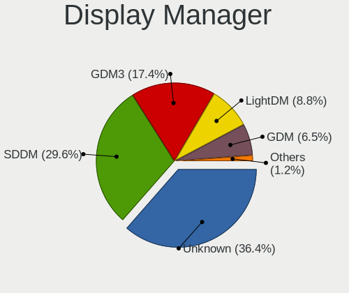
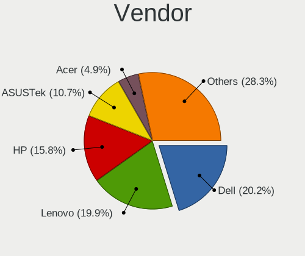
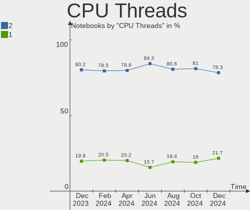
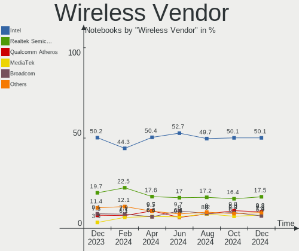
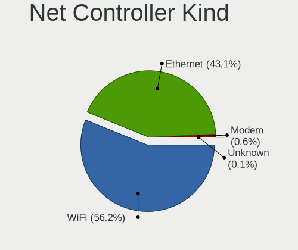
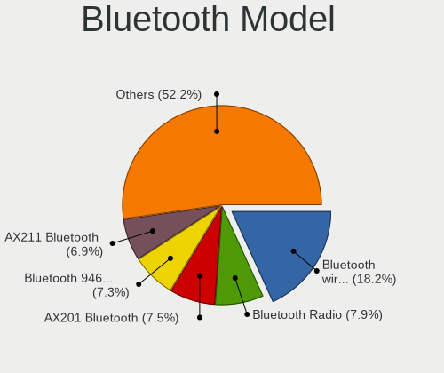
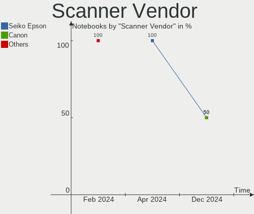

Linux in USA - Hardware Trends (Notebooks)
------------------------------------------

A project to identify most popular hardware characteristics and track their change
over time based on data collected by Linux users at https://Linux-Hardware.org.

Anyone can contribute to this report by the [hw-probe](https://github.com/linuxhw/hw-probe) tool:

    sudo -E hw-probe -all -upload

Period: Aug, 2023.

Contents
--------

* [ System ](#system)
  - [ OS                       ](#os)
  - [ OS Family                ](#os-family)
  - [ Kernel                   ](#kernel)
  - [ Kernel Family            ](#kernel-family)
  - [ Kernel Major Ver.        ](#kernel-major-ver)
  - [ Arch                     ](#arch)
  - [ DE                       ](#de)
  - [ Display Server           ](#display-server)
  - [ Display Manager          ](#display-manager)
  - [ OS Lang                  ](#os-lang)
  - [ Boot Mode                ](#boot-mode)
  - [ Filesystem               ](#filesystem)
  - [ Part. scheme             ](#part-scheme)
  - [ Dual Boot with Linux/BSD ](#dual-boot-with-linuxbsd)
  - [ Dual Boot (Win)          ](#dual-boot-win)

* [ Board ](#board)
  - [ Vendor                   ](#vendor)
  - [ Model                    ](#model)
  - [ Model Family             ](#model-family)
  - [ MFG Year                 ](#mfg-year)
  - [ Form Factor              ](#form-factor)
  - [ Secure Boot              ](#secure-boot)
  - [ Coreboot                 ](#coreboot)
  - [ RAM Size                 ](#ram-size)
  - [ RAM Used                 ](#ram-used)
  - [ Total Drives             ](#total-drives)
  - [ Has CD-ROM               ](#has-cd-rom)
  - [ Has Ethernet             ](#has-ethernet)
  - [ Has WiFi                 ](#has-wifi)
  - [ Has Bluetooth            ](#has-bluetooth)

* [ Location ](#location)
  - [ Country                  ](#country)
  - [ City                     ](#city)

* [ Drives ](#drives)
  - [ Drive Vendor             ](#drive-vendor)
  - [ Drive Model              ](#drive-model)
  - [ HDD Vendor               ](#hdd-vendor)
  - [ SSD Vendor               ](#ssd-vendor)
  - [ Drive Kind               ](#drive-kind)
  - [ Drive Connector          ](#drive-connector)
  - [ Drive Size               ](#drive-size)
  - [ Space Total              ](#space-total)
  - [ Space Used               ](#space-used)
  - [ Malfunc. Drives          ](#malfunc-drives)
  - [ Malfunc. Drive Vendor    ](#malfunc-drive-vendor)
  - [ Malfunc. HDD Vendor      ](#malfunc-hdd-vendor)
  - [ Malfunc. Drive Kind      ](#malfunc-drive-kind)
  - [ Failed Drives            ](#failed-drives)
  - [ Failed Drive Vendor      ](#failed-drive-vendor)
  - [ Drive Status             ](#drive-status)

* [ Storage controller ](#storage-controller)
  - [ Storage Vendor           ](#storage-vendor)
  - [ Storage Model            ](#storage-model)
  - [ Storage Kind             ](#storage-kind)

* [ Processor ](#processor)
  - [ CPU Vendor               ](#cpu-vendor)
  - [ CPU Model                ](#cpu-model)
  - [ CPU Model Family         ](#cpu-model-family)
  - [ CPU Cores                ](#cpu-cores)
  - [ CPU Sockets              ](#cpu-sockets)
  - [ CPU Threads              ](#cpu-threads)
  - [ CPU Op-Modes             ](#cpu-op-modes)
  - [ CPU Microcode            ](#cpu-microcode)
  - [ CPU Microarch            ](#cpu-microarch)

* [ Graphics ](#graphics)
  - [ GPU Vendor               ](#gpu-vendor)
  - [ GPU Model                ](#gpu-model)
  - [ GPU Combo                ](#gpu-combo)
  - [ GPU Driver               ](#gpu-driver)
  - [ GPU Memory               ](#gpu-memory)

* [ Monitor ](#monitor)
  - [ Monitor Vendor           ](#monitor-vendor)
  - [ Monitor Model            ](#monitor-model)
  - [ Monitor Resolution       ](#monitor-resolution)
  - [ Monitor Diagonal         ](#monitor-diagonal)
  - [ Monitor Width            ](#monitor-width)
  - [ Aspect Ratio             ](#aspect-ratio)
  - [ Monitor Area             ](#monitor-area)
  - [ Pixel Density            ](#pixel-density)
  - [ Multiple Monitors        ](#multiple-monitors)

* [ Network ](#network)
  - [ Net Controller Vendor    ](#net-controller-vendor)
  - [ Net Controller Model     ](#net-controller-model)
  - [ Wireless Vendor          ](#wireless-vendor)
  - [ Wireless Model           ](#wireless-model)
  - [ Ethernet Vendor          ](#ethernet-vendor)
  - [ Ethernet Model           ](#ethernet-model)
  - [ Net Controller Kind      ](#net-controller-kind)
  - [ Used Controller          ](#used-controller)
  - [ NICs                     ](#nics)
  - [ IPv6                     ](#ipv6)

* [ Bluetooth ](#bluetooth)
  - [ Bluetooth Vendor         ](#bluetooth-vendor)
  - [ Bluetooth Model          ](#bluetooth-model)

* [ Sound ](#sound)
  - [ Sound Vendor             ](#sound-vendor)
  - [ Sound Model              ](#sound-model)

* [ Memory ](#memory)
  - [ Memory Vendor            ](#memory-vendor)
  - [ Memory Model             ](#memory-model)
  - [ Memory Kind              ](#memory-kind)
  - [ Memory Form Factor       ](#memory-form-factor)
  - [ Memory Size              ](#memory-size)
  - [ Memory Speed             ](#memory-speed)

* [ Printers & scanners ](#printers--scanners)
  - [ Printer Vendor           ](#printer-vendor)
  - [ Printer Model            ](#printer-model)
  - [ Scanner Vendor           ](#scanner-vendor)
  - [ Scanner Model            ](#scanner-model)

* [ Camera ](#camera)
  - [ Camera Vendor            ](#camera-vendor)
  - [ Camera Model             ](#camera-model)

* [ Security ](#security)
  - [ Fingerprint Vendor       ](#fingerprint-vendor)
  - [ Fingerprint Model        ](#fingerprint-model)
  - [ Chipcard Vendor          ](#chipcard-vendor)
  - [ Chipcard Model           ](#chipcard-model)

* [ Unsupported ](#unsupported)
  - [ Unsupported Devices      ](#unsupported-devices)
  - [ Unsupported Device Types ](#unsupported-device-types)

System
------

OS
--

Installed operating systems

| Name                         | Notebooks | Percent |
|------------------------------|-----------|---------|
| Ubuntu 22.04                 | 66        | 13.87%  |
| Fedora 38                    | 40        | 8.4%    |
| Linux Mint 21.2              | 36        | 7.56%   |
| Pop!_OS 22.04                | 31        | 6.51%   |
| OpenMandriva 23.08           | 25        | 5.25%   |
| Debian 12                    | 25        | 5.25%   |
| Ubuntu 23.04                 | 24        | 5.04%   |
| SteamOS 3.4.8                | 20        | 4.2%    |
| Zorin 16                     | 14        | 2.94%   |
| Arch Rolling                 | 14        | 2.94%   |
| ArcoLinux Rolling            | 13        | 2.73%   |
| openSUSE Tumbleweed-XXXXXXXX | 9         | 1.89%   |
| KDE neon 22.04               | 9         | 1.89%   |
| Manjaro 23.0.0               | 8         | 1.68%   |
| Linux Mint 21.1              | 8         | 1.68%   |
| EndeavourOS Rolling          | 7         | 1.47%   |
| OpenMandriva 23.03           | 6         | 1.26%   |
| Kubuntu 22.04                | 6         | 1.26%   |
| Kali 2023.3                  | 6         | 1.26%   |
| Xubuntu 22.04                | 5         | 1.05%   |
| Ubuntu 20.04                 | 5         | 1.05%   |
| Fedora 37                    | 5         | 1.05%   |
| Xero Rolling                 | 4         | 0.84%   |
| Elementary 7                 | 4         | 0.84%   |
| Ubuntu 18.04                 | 3         | 0.63%   |
| Rocky Linux 9.2              | 3         | 0.63%   |
| openSUSE Microos-XXXXXXXX    | 3         | 0.63%   |
| MX 23                        | 3         | 0.63%   |
| Lubuntu 22.04                | 3         | 0.63%   |
| Linux Mint 20.3              | 3         | 0.63%   |
| Kubuntu 23.04                | 3         | 0.63%   |
| Gentoo 2.13                  | 3         | 0.63%   |
| Debian 11                    | 3         | 0.63%   |
| SteamOS 4                    | 2         | 0.42%   |
| SteamOS 3.4.9                | 2         | 0.42%   |
| ROSA 12.4                    | 2         | 0.42%   |
| Pop!_OS 20.04                | 2         | 0.42%   |
| Parrot 5.3                   | 2         | 0.42%   |
| OpenMandriva 23.07           | 2         | 0.42%   |
| Nobara 38                    | 2         | 0.42%   |

OS Family
---------

OS without a version

| Name          | Notebooks | Percent |
|---------------|-----------|---------|
| Ubuntu        | 99        | 20.8%   |
| Linux Mint    | 48        | 10.08%  |
| Fedora        | 46        | 9.66%   |
| OpenMandriva  | 37        | 7.77%   |
| Pop!_OS       | 34        | 7.14%   |
| Debian        | 29        | 6.09%   |
| SteamOS       | 26        | 5.46%   |
| Zorin         | 15        | 3.15%   |
| Arch          | 14        | 2.94%   |
| ArcoLinux     | 13        | 2.73%   |
| openSUSE      | 12        | 2.52%   |
| Manjaro       | 9         | 1.89%   |
| Kubuntu       | 9         | 1.89%   |
| KDE neon      | 9         | 1.89%   |
| Kali          | 7         | 1.47%   |
| EndeavourOS   | 7         | 1.47%   |
| Xubuntu       | 6         | 1.26%   |
| Xero          | 4         | 0.84%   |
| MX            | 4         | 0.84%   |
| Elementary    | 4         | 0.84%   |
| Rocky Linux   | 3         | 0.63%   |
| Parrot        | 3         | 0.63%   |
| Lubuntu       | 3         | 0.63%   |
| Gentoo        | 3         | 0.63%   |
| ROSA          | 2         | 0.42%   |
| Nobara        | 2         | 0.42%   |
| NixOS         | 2         | 0.42%   |
| Garuda Linux  | 2         | 0.42%   |
| CachyOS       | 2         | 0.42%   |
| BunsenLabs    | 2         | 0.42%   |
| BlackPanther  | 2         | 0.42%   |
| Ubuntu Studio | 1         | 0.21%   |
| TUXEDO OS     | 1         | 0.21%   |
| Trisquel      | 1         | 0.21%   |
| Sparky        | 1         | 0.21%   |
| Reborn OS     | 1         | 0.21%   |
| PureOS        | 1         | 0.21%   |
| Puppy         | 1         | 0.21%   |
| Peppermint    | 1         | 0.21%   |
| PCLinuxOS     | 1         | 0.21%   |

Kernel
------

Version of the Linux kernel

| Version                      | Notebooks | Percent |
|------------------------------|-----------|---------|
| 6.2.0-26-generic             | 68        | 14.29%  |
| 5.15.0-78-generic            | 29        | 6.09%   |
| 5.13.0-valve36-1-neptune     | 22        | 4.62%   |
| 6.4.6-76060406-generic       | 20        | 4.2%    |
| 6.4.11-desktop-1omv2390      | 17        | 3.57%   |
| 5.15.0-79-generic            | 16        | 3.36%   |
| 6.1.0-11-amd64               | 14        | 2.94%   |
| 6.1.0-10-amd64               | 13        | 2.73%   |
| 6.2.0-27-generic             | 12        | 2.52%   |
| 5.19.0-50-generic            | 11        | 2.31%   |
| 6.2.6-76060206-generic       | 10        | 2.1%    |
| 5.15.0-76-generic            | 10        | 2.1%    |
| 6.4.8-desktop-2omv2390       | 8         | 1.68%   |
| 6.4.6-200.fc38.x86_64        | 8         | 1.68%   |
| 6.4.12-arch1-1               | 8         | 1.68%   |
| 6.4.9-200.fc38.x86_64        | 7         | 1.47%   |
| 6.3.0-kali1-amd64            | 7         | 1.47%   |
| 6.4.12-200.fc38.x86_64       | 6         | 1.26%   |
| 6.4.10-200.fc38.x86_64       | 6         | 1.26%   |
| 6.2.6-desktop-1omv2390       | 6         | 1.26%   |
| 6.2.0-31-generic             | 6         | 1.26%   |
| 6.4.7-200.fc38.x86_64        | 4         | 0.84%   |
| 6.4.6-1-default              | 4         | 0.84%   |
| 6.4.11-arch2-1               | 4         | 0.84%   |
| 6.4.10-arch1-1               | 4         | 0.84%   |
| 6.2.9-300.fc38.x86_64        | 4         | 0.84%   |
| 5.15.0-82-generic            | 4         | 0.84%   |
| 6.4.9-1-default              | 3         | 0.63%   |
| 6.4.8-arch1-1                | 3         | 0.63%   |
| 6.4.11-200.fc38.x86_64       | 3         | 0.63%   |
| 6.4.11-1-default             | 3         | 0.63%   |
| 6.3.5-desktop-3omv2390       | 3         | 0.63%   |
| 6.2.0-20-generic             | 3         | 0.63%   |
| 6.1.44-1-MANJARO             | 3         | 0.63%   |
| 5.19.0-46-generic            | 3         | 0.63%   |
| 5.19.0-32-generic            | 3         | 0.63%   |
| 5.14.0-284.25.1.el9_2.x86_64 | 3         | 0.63%   |
| 5.10.0-24-amd64              | 3         | 0.63%   |
| 6.4.8-zen1-1-zen             | 2         | 0.42%   |
| 6.4.8-1-default              | 2         | 0.42%   |

Kernel Family
-------------

Linux kernel without a distro release

| Version | Notebooks | Percent |
|---------|-----------|---------|
| 6.2.0   | 93        | 19.54%  |
| 5.15.0  | 62        | 13.03%  |
| 6.4.6   | 33        | 6.93%   |
| 6.1.0   | 31        | 6.51%   |
| 6.4.11  | 29        | 6.09%   |
| 5.13.0  | 23        | 4.83%   |
| 5.19.0  | 20        | 4.2%    |
| 6.4.8   | 19        | 3.99%   |
| 6.4.12  | 19        | 3.99%   |
| 6.2.6   | 16        | 3.36%   |
| 6.4.10  | 15        | 3.15%   |
| 6.4.9   | 14        | 2.94%   |
| 6.4.7   | 11        | 2.31%   |
| 6.3.0   | 8         | 1.68%   |
| 5.10.0  | 7         | 1.47%   |
| 6.5.0   | 6         | 1.26%   |
| 5.4.0   | 5         | 1.05%   |
| 6.2.9   | 4         | 0.84%   |
| 6.1.44  | 4         | 0.84%   |
| 6.1.41  | 4         | 0.84%   |
| 6.3.5   | 3         | 0.63%   |
| 6.3.12  | 3         | 0.63%   |
| 6.1.46  | 3         | 0.63%   |
| 6.0.12  | 3         | 0.63%   |
| 5.14.0  | 3         | 0.63%   |
| 6.4.4   | 2         | 0.42%   |
| 6.4.0   | 2         | 0.42%   |
| 6.3.13  | 2         | 0.42%   |
| 6.1.47  | 2         | 0.42%   |
| 6.1.39  | 2         | 0.42%   |
| 5.17.0  | 2         | 0.42%   |
| 5.11.0  | 2         | 0.42%   |
| 4.18.16 | 2         | 0.42%   |
| 4.15.0  | 2         | 0.42%   |
| 6.4.2   | 1         | 0.21%   |
| 6.3.9   | 1         | 0.21%   |
| 6.3.8   | 1         | 0.21%   |
| 6.3.7   | 1         | 0.21%   |
| 6.1.48  | 1         | 0.21%   |
| 6.1.45  | 1         | 0.21%   |

Kernel Major Ver.
-----------------

Linux kernel major version

| Version | Notebooks | Percent |
|---------|-----------|---------|
| 6.4     | 145       | 30.46%  |
| 6.2     | 113       | 23.74%  |
| 5.15    | 64        | 13.45%  |
| 6.1     | 51        | 10.71%  |
| 5.13    | 23        | 4.83%   |
| 5.19    | 20        | 4.2%    |
| 6.3     | 19        | 3.99%   |
| 5.10    | 9         | 1.89%   |
| 5.4     | 7         | 1.47%   |
| 6.5     | 6         | 1.26%   |
| 6.0     | 4         | 0.84%   |
| 5.14    | 3         | 0.63%   |
| 5.17    | 2         | 0.42%   |
| 5.11    | 2         | 0.42%   |
| 4.18    | 2         | 0.42%   |
| 4.15    | 2         | 0.42%   |
| 5.8     | 1         | 0.21%   |
| 5.16    | 1         | 0.21%   |
| 4.9     | 1         | 0.21%   |
| 3.10    | 1         | 0.21%   |

Arch
----

OS architecture (x86_64, i586, etc.)

| Name   | Notebooks | Percent |
|--------|-----------|---------|
| x86_64 | 474       | 99.58%  |
| i686   | 2         | 0.42%   |

DE
--

Desktop Environment

| Name            | Notebooks | Percent |
|-----------------|-----------|---------|
| GNOME           | 204       | 42.86%  |
| KDE5            | 130       | 27.31%  |
| X-Cinnamon      | 49        | 10.29%  |
| XFCE            | 34        | 7.14%   |
| MATE            | 15        | 3.15%   |
| Unknown         | 15        | 3.15%   |
| LXQt            | 8         | 1.68%   |
| i3              | 5         | 1.05%   |
| Pantheon        | 4         | 0.84%   |
| Cinnamon        | 2         | 0.42%   |
| BunsenLabs      | 2         | 0.42%   |
| sway            | 1         | 0.21%   |
| OPENBOX         | 1         | 0.21%   |
| none+i3         | 1         | 0.21%   |
| LXDE            | 1         | 0.21%   |
| Hyprland        | 1         | 0.21%   |
| GNOME Flashback | 1         | 0.21%   |
| GNOME Classic   | 1         | 0.21%   |
| dwm             | 1         | 0.21%   |

Display Server
--------------

X11 or Wayland

| Name    | Notebooks | Percent |
|---------|-----------|---------|
| X11     | 291       | 61.13%  |
| Wayland | 166       | 34.87%  |
| Unknown | 12        | 2.52%   |
| Tty     | 7         | 1.47%   |

Display Manager
---------------

SDDM, LightDM, etc.

| Name    | Notebooks | Percent |
|---------|-----------|---------|
| Unknown | 196       | 41.18%  |
| GDM3    | 97        | 20.38%  |
| SDDM    | 89        | 18.7%   |
| LightDM | 61        | 12.82%  |
| GDM     | 26        | 5.46%   |
| SLiM    | 3         | 0.63%   |
| Ly      | 2         | 0.42%   |
| GREETD  | 1         | 0.21%   |
| EMPTTY  | 1         | 0.21%   |

OS Lang
-------

Language

| Lang    | Notebooks | Percent |
|---------|-----------|---------|
| en_US   | 443       | 93.07%  |
| Unknown | 12        | 2.52%   |
| C       | 6         | 1.26%   |
| en_CA   | 4         | 0.84%   |
| POSIX   | 2         | 0.42%   |
| en_GB   | 2         | 0.42%   |
| zh_CN   | 1         | 0.21%   |
| pl_PL   | 1         | 0.21%   |
| en_IE   | 1         | 0.21%   |
| en_BW   | 1         | 0.21%   |
| en_AU   | 1         | 0.21%   |
| de_DE   | 1         | 0.21%   |
| C.UTF8  | 1         | 0.21%   |

Boot Mode
---------

EFI or BIOS

| Mode | Notebooks | Percent |
|------|-----------|---------|
| BIOS | 239       | 50.21%  |
| EFI  | 237       | 49.79%  |

Filesystem
----------

Type of filesystem

| Type    | Notebooks | Percent |
|---------|-----------|---------|
| Ext4    | 255       | 53.57%  |
| Btrfs   | 101       | 21.22%  |
| Tmpfs   | 70        | 14.71%  |
| Overlay | 29        | 6.09%   |
| Xfs     | 13        | 2.73%   |
| Zfs     | 5         | 1.05%   |
| F2fs    | 2         | 0.42%   |
| Aufs    | 1         | 0.21%   |

Part. scheme
------------

Scheme of partitioning

| Type    | Notebooks | Percent |
|---------|-----------|---------|
| GPT     | 250       | 52.52%  |
| Unknown | 181       | 38.03%  |
| MBR     | 45        | 9.45%   |

Dual Boot with Linux/BSD
------------------------

Hosting more than one Linux/BSD

| Dual boot | Notebooks | Percent |
|-----------|-----------|---------|
| No        | 417       | 87.61%  |
| Yes       | 59        | 12.39%  |

Dual Boot (Win)
---------------

Hosting Linux and Windows

| Dual boot | Notebooks | Percent |
|-----------|-----------|---------|
| No        | 396       | 83.19%  |
| Yes       | 80        | 16.81%  |

Board
-----

Vendor
------

Motherboard manufacturer

| Name                | Notebooks | Percent |
|---------------------|-----------|---------|
| Dell                | 96        | 20.17%  |
| Hewlett-Packard     | 94        | 19.75%  |
| Lenovo              | 82        | 17.23%  |
| ASUSTek Computer    | 35        | 7.35%   |
| Apple               | 35        | 7.35%   |
| Valve               | 24        | 5.04%   |
| Acer                | 20        | 4.2%    |
| Google              | 16        | 3.36%   |
| Toshiba             | 13        | 2.73%   |
| System76            | 7         | 1.47%   |
| GPU Company         | 7         | 1.47%   |
| Framework           | 6         | 1.26%   |
| Alienware           | 5         | 1.05%   |
| Panasonic           | 4         | 0.84%   |
| Unknown             | 4         | 0.84%   |
| Sony                | 3         | 0.63%   |
| Samsung Electronics | 3         | 0.63%   |
| MSI                 | 3         | 0.63%   |
| Razer               | 2         | 0.42%   |
| Notebook            | 2         | 0.42%   |
| HUAWEI              | 2         | 0.42%   |
| Chuwi               | 2         | 0.42%   |
| Star Labs           | 1         | 0.21%   |
| Shuttle             | 1         | 0.21%   |
| RCA                 | 1         | 0.21%   |
| GPD                 | 1         | 0.21%   |
| Gigabyte Technology | 1         | 0.21%   |
| Gateway             | 1         | 0.21%   |
| Fujitsu             | 1         | 0.21%   |
| Compal              | 1         | 0.21%   |
| ASRock              | 1         | 0.21%   |
| Anbernic            | 1         | 0.21%   |
| ALLDOCUBE           | 1         | 0.21%   |

Model
-----

Motherboard model

| Name                                   | Notebooks | Percent |
|----------------------------------------|-----------|---------|
| Valve Jupiter                          | 24        | 5.04%   |
| Apple MacBookPro9,2                    | 6         | 1.26%   |
| Toshiba Satellite C55-A                | 4         | 0.84%   |
| Unknown                                | 4         | 0.84%   |
| Lenovo ThinkPad 13 2nd Gen 20J10046US  | 3         | 0.63%   |
| HP Notebook                            | 3         | 0.63%   |
| Dell Latitude E6420                    | 3         | 0.63%   |
| Dell Latitude E5470                    | 3         | 0.63%   |
| System76 Gazelle                       | 2         | 0.42%   |
| HP ProBook 450 G3                      | 2         | 0.42%   |
| HP Pavilion Laptop 15-cc5xx            | 2         | 0.42%   |
| HP Pavilion g7                         | 2         | 0.42%   |
| HP Pavilion 15                         | 2         | 0.42%   |
| HP Laptop 17-by0xxx                    | 2         | 0.42%   |
| HP Laptop 15-fc0xxx                    | 2         | 0.42%   |
| HP Laptop 14-dk1xxx                    | 2         | 0.42%   |
| HP ENVY Laptop 16-h1xxx                | 2         | 0.42%   |
| HP EliteBook 850 G3                    | 2         | 0.42%   |
| HP EliteBook 840 G6                    | 2         | 0.42%   |
| HP 2000                                | 2         | 0.42%   |
| HP 15                                  | 2         | 0.42%   |
| GPU Company GWTN156-5                  | 2         | 0.42%   |
| GPU Company GWNR71517                  | 2         | 0.42%   |
| Google Epaulette                       | 2         | 0.42%   |
| Google Enguarde                        | 2         | 0.42%   |
| Framework Laptop (13th Gen Intel Core) | 2         | 0.42%   |
| Framework Laptop (12th Gen Intel Core) | 2         | 0.42%   |
| Framework Laptop                       | 2         | 0.42%   |
| Dell XPS 15 7590                       | 2         | 0.42%   |
| Dell XPS 13 9370                       | 2         | 0.42%   |
| Dell Precision M4700                   | 2         | 0.42%   |
| Dell Latitude E6440                    | 2         | 0.42%   |
| Dell Latitude E6430                    | 2         | 0.42%   |
| Dell Latitude E5570                    | 2         | 0.42%   |
| Dell Latitude E5410                    | 2         | 0.42%   |
| Dell Latitude 5590                     | 2         | 0.42%   |
| Dell Latitude 5400                     | 2         | 0.42%   |
| Dell Inspiron 3537                     | 2         | 0.42%   |
| Dell Inspiron 3520                     | 2         | 0.42%   |
| Dell Inspiron 1545                     | 2         | 0.42%   |

Model Family
------------

Motherboard model prefix

| Name                  | Notebooks | Percent |
|-----------------------|-----------|---------|
| Lenovo ThinkPad       | 57        | 11.97%  |
| Dell Latitude         | 38        | 7.98%   |
| Dell Inspiron         | 27        | 5.67%   |
| Valve Jupiter         | 24        | 5.04%   |
| HP Laptop             | 23        | 4.83%   |
| HP Pavilion           | 18        | 3.78%   |
| Dell XPS              | 15        | 3.15%   |
| HP EliteBook          | 14        | 2.94%   |
| Toshiba Satellite     | 11        | 2.31%   |
| Lenovo IdeaPad        | 11        | 2.31%   |
| Acer Aspire           | 11        | 2.31%   |
| Dell Precision        | 10        | 2.1%    |
| HP ProBook            | 9         | 1.89%   |
| ASUS Zenbook          | 9         | 1.89%   |
| Lenovo Legion         | 8         | 1.68%   |
| ASUS ROG              | 8         | 1.68%   |
| Apple MacBookPro9     | 7         | 1.47%   |
| Framework Laptop      | 6         | 1.26%   |
| HP ZBook              | 5         | 1.05%   |
| Acer Nitro            | 5         | 1.05%   |
| HP ENVY               | 4         | 0.84%   |
| HP Compaq             | 4         | 0.84%   |
| HP 15                 | 4         | 0.84%   |
| ASUS VivoBook         | 4         | 0.84%   |
| Apple MacBookPro8     | 4         | 0.84%   |
| Unknown               | 4         | 0.84%   |
| HP Notebook           | 3         | 0.63%   |
| Apple MacBookPro14    | 3         | 0.63%   |
| Apple MacBookPro11    | 3         | 0.63%   |
| Apple MacBookAir6     | 3         | 0.63%   |
| Acer Predator         | 3         | 0.63%   |
| System76 Gazelle      | 2         | 0.42%   |
| Razer Blade           | 2         | 0.42%   |
| MSI Katana            | 2         | 0.42%   |
| Lenovo Yoga           | 2         | 0.42%   |
| HP Victus             | 2         | 0.42%   |
| HP OMEN               | 2         | 0.42%   |
| HP Dragonfly          | 2         | 0.42%   |
| HP 2000               | 2         | 0.42%   |
| GPU Company GWTN156-5 | 2         | 0.42%   |

MFG Year
--------

Motherboard manufacture year

| Year | Notebooks | Percent |
|------|-----------|---------|
| 2022 | 75        | 15.76%  |
| 2021 | 54        | 11.34%  |
| 2018 | 35        | 7.35%   |
| 2019 | 33        | 6.93%   |
| 2012 | 32        | 6.72%   |
| 2013 | 31        | 6.51%   |
| 2011 | 31        | 6.51%   |
| 2023 | 30        | 6.3%    |
| 2020 | 30        | 6.3%    |
| 2015 | 26        | 5.46%   |
| 2017 | 25        | 5.25%   |
| 2016 | 22        | 4.62%   |
| 2014 | 18        | 3.78%   |
| 2010 | 17        | 3.57%   |
| 2008 | 10        | 2.1%    |
| 2009 | 3         | 0.63%   |
| 2007 | 3         | 0.63%   |
| 2006 | 1         | 0.21%   |

Form Factor
-----------

Physical design of the computer

| Name     | Notebooks | Percent |
|----------|-----------|---------|
| Notebook | 476       | 100%    |

Secure Boot
-----------

Enabled or disabled

| State    | Notebooks | Percent |
|----------|-----------|---------|
| Disabled | 446       | 93.7%   |
| Enabled  | 30        | 6.3%    |

Coreboot
--------

Have coreboot on board

| Used | Notebooks | Percent |
|------|-----------|---------|
| No   | 453       | 95.17%  |
| Yes  | 23        | 4.83%   |

RAM Size
--------

Total RAM memory

| Size in GB  | Notebooks | Percent |
|-------------|-----------|---------|
| 4.01-8.0    | 131       | 27.52%  |
| 16.01-24.0  | 108       | 22.69%  |
| 8.01-16.0   | 108       | 22.69%  |
| 3.01-4.0    | 55        | 11.55%  |
| 32.01-64.0  | 47        | 9.87%   |
| 64.01-256.0 | 11        | 2.31%   |
| 24.01-32.0  | 8         | 1.68%   |
| 2.01-3.0    | 4         | 0.84%   |
| 1.01-2.0    | 4         | 0.84%   |

RAM Used
--------

Used RAM memory

| Used GB    | Notebooks | Percent |
|------------|-----------|---------|
| 1.01-2.0   | 132       | 27.73%  |
| 2.01-3.0   | 107       | 22.48%  |
| 4.01-8.0   | 104       | 21.85%  |
| 3.01-4.0   | 90        | 18.91%  |
| 8.01-16.0  | 25        | 5.25%   |
| 0.51-1.0   | 14        | 2.94%   |
| 0.01-0.5   | 2         | 0.42%   |
| 32.01-64.0 | 1         | 0.21%   |
| 16.01-24.0 | 1         | 0.21%   |

Total Drives
------------

Number of drives on board

| Drives | Notebooks | Percent |
|--------|-----------|---------|
| 1      | 333       | 69.96%  |
| 2      | 115       | 24.16%  |
| 3      | 22        | 4.62%   |
| 0      | 5         | 1.05%   |
| 4      | 1         | 0.21%   |

Has CD-ROM
----------

Has CD-ROM on board

| Presented | Notebooks | Percent |
|-----------|-----------|---------|
| No        | 349       | 73.32%  |
| Yes       | 127       | 26.68%  |

Has Ethernet
------------

Has Ethernet on board

| Presented | Notebooks | Percent |
|-----------|-----------|---------|
| Yes       | 336       | 70.59%  |
| No        | 140       | 29.41%  |

Has WiFi
--------

Has WiFi module

| Presented | Notebooks | Percent |
|-----------|-----------|---------|
| Yes       | 473       | 99.37%  |
| No        | 3         | 0.63%   |

Has Bluetooth
-------------

Has Bluetooth module

| Presented | Notebooks | Percent |
|-----------|-----------|---------|
| Yes       | 381       | 80.04%  |
| No        | 95        | 19.96%  |

Location
--------

Country
-------

Geographic location (country)

| Country | Notebooks | Percent |
|---------|-----------|---------|
| USA     | 476       | 100%    |

City
----

Geographic location (city)

| City             | Notebooks | Percent |
|------------------|-----------|---------|
| Seattle          | 9         | 1.89%   |
| New York         | 8         | 1.68%   |
| Bangor           | 8         | 1.68%   |
| Portland         | 6         | 1.26%   |
| Los Angeles      | 6         | 1.26%   |
| Las Vegas        | 6         | 1.26%   |
| Dallas           | 5         | 1.05%   |
| Chicago          | 5         | 1.05%   |
| Charlotte        | 5         | 1.05%   |
| Washington       | 4         | 0.84%   |
| Vancouver        | 4         | 0.84%   |
| Tucson           | 4         | 0.84%   |
| San Antonio      | 4         | 0.84%   |
| Lincoln          | 4         | 0.84%   |
| Fort Worth       | 4         | 0.84%   |
| Colorado Springs | 4         | 0.84%   |
| Brooklyn         | 4         | 0.84%   |
| Wichita          | 3         | 0.63%   |
| Springfield      | 3         | 0.63%   |
| San Jose         | 3         | 0.63%   |
| Raleigh          | 3         | 0.63%   |
| Phoenix          | 3         | 0.63%   |
| Newark           | 3         | 0.63%   |
| Nashville        | 3         | 0.63%   |
| Mesa             | 3         | 0.63%   |
| Jamestown        | 3         | 0.63%   |
| Jacksonville     | 3         | 0.63%   |
| Houston          | 3         | 0.63%   |
| Denver           | 3         | 0.63%   |
| Cupertino        | 3         | 0.63%   |
| Calvert Heights  | 3         | 0.63%   |
| Atlanta          | 3         | 0.63%   |
| Westminster      | 2         | 0.42%   |
| West Jordan      | 2         | 0.42%   |
| Vestal           | 2         | 0.42%   |
| Titusville       | 2         | 0.42%   |
| Sterling Heights | 2         | 0.42%   |
| St. Petersburg   | 2         | 0.42%   |
| St Louis         | 2         | 0.42%   |
| Silver Spring    | 2         | 0.42%   |

Drives
------

Drive Vendor
------------

Hard drive vendors

| Vendor                      | Notebooks | Drives | Percent |
|-----------------------------|-----------|--------|---------|
| Samsung Electronics         | 94        | 102    | 15.64%  |
| Sandisk                     | 65        | 69     | 10.82%  |
| Unknown                     | 47        | 53     | 7.82%   |
| WDC                         | 43        | 44     | 7.15%   |
| Seagate                     | 33        | 34     | 5.49%   |
| Toshiba                     | 30        | 31     | 4.99%   |
| SK hynix                    | 27        | 28     | 4.49%   |
| Crucial                     | 27        | 28     | 4.49%   |
| Apple                       | 21        | 25     | 3.49%   |
| Micron Technology           | 19        | 19     | 3.16%   |
| Intel                       | 16        | 17     | 2.66%   |
| Kingston                    | 12        | 12     | 2%      |
| KIOXIA                      | 11        | 11     | 1.83%   |
| Kingston Technology Company | 11        | 11     | 1.83%   |
| Unknown                     | 11        | 11     | 1.83%   |
| Phison Electronics          | 10        | 10     | 1.66%   |
| Hitachi                     | 10        | 10     | 1.66%   |
| Micron/Crucial Technology   | 9         | 9      | 1.5%    |
| China                       | 8         | 8      | 1.33%   |
| Team                        | 6         | 6      | 1%      |
| SPCC                        | 5         | 5      | 0.83%   |
| PNY                         | 5         | 6      | 0.83%   |
| HGST                        | 5         | 5      | 0.83%   |
| Wibtek                      | 4         | 4      | 0.67%   |
| O2 Micro                    | 4         | 4      | 0.67%   |
| Netac                       | 4         | 4      | 0.67%   |
| Silicon Motion              | 3         | 3      | 0.5%    |
| SABRENT                     | 3         | 4      | 0.5%    |
| Phison                      | 3         | 3      | 0.5%    |
| Mushkin                     | 3         | 3      | 0.5%    |
| A-DATA Technology           | 3         | 3      | 0.5%    |
| SSSTC                       | 2         | 2      | 0.33%   |
| Realtek Semiconductor       | 2         | 2      | 0.33%   |
| Realtek                     | 2         | 2      | 0.33%   |
| PNY CS90                    | 2         | 2      | 0.33%   |
| LITEON                      | 2         | 2      | 0.33%   |
| Lexar                       | 2         | 2      | 0.33%   |
| JMicron Technology          | 2         | 2      | 0.33%   |
| Hewlett-Packard             | 2         | 2      | 0.33%   |
| Fujitsu                     | 2         | 2      | 0.33%   |

Drive Model
-----------

Hard drive models

| Model                                                 | Notebooks | Percent |
|-------------------------------------------------------|-----------|---------|
| Samsung NVMe SSD Controller SM981/PM981/PM983 500GB   | 11        | 1.77%   |
| Samsung NVMe SSD Controller PM9A1/PM9A3/980PRO 1024GB | 11        | 1.77%   |
| Unknown                                               | 11        | 1.77%   |
| Sandisk WD Black SN750 / PC SN730 NVMe SSD 1024GB     | 10        | 1.61%   |
| Kingston Company OM3PDP3 NVMe SSD 256GB               | 9         | 1.45%   |
| Micron/Crucial P2 NVMe PCIe SSD 1TB                   | 8         | 1.29%   |
| Unknown MMC Card  64GB                                | 7         | 1.13%   |
| Unknown MMC Card  32GB                                | 7         | 1.13%   |
| Unknown MMC Card  256GB                               | 7         | 1.13%   |
| Unknown MMC Card  512GB                               | 6         | 0.97%   |
| Seagate ST1000LM035-1RK172 1TB                        | 6         | 0.97%   |
| Sandisk WD Blue SN550 NVMe SSD 250GB                  | 5         | 0.81%   |
| Sandisk WD Black SN850 256GB                          | 5         | 0.81%   |
| SanDisk SD8SN8U128G1001 128GB SSD                     | 5         | 0.81%   |
| Samsung SSD 860 EVO 500GB                             | 5         | 0.81%   |
| Crucial CT500MX500SSD1 500GB                          | 5         | 0.81%   |
| Samsung MZALQ256HBJD-00BL2 256GB                      | 4         | 0.64%   |
| Phison PS5013 E13 NVMe Controller 512GB               | 4         | 0.64%   |
| O2 Micro E2M2 64GB                                    | 4         | 0.64%   |
| KIOXIA KBG40ZNS256G NVMe 256GB                        | 4         | 0.64%   |
| Intel SSD 660P Series 512GB                           | 4         | 0.64%   |
| Crucial CT1000MX500SSD1 1TB                           | 4         | 0.64%   |
| Crucial CT1000BX500SSD1 1TB                           | 4         | 0.64%   |
| Wibtek W800S 512GB SSD                                | 3         | 0.48%   |
| WDC WD Blue SA510 2.5 1000GB                          | 3         | 0.48%   |
| Unknown MMC Card  128GB                               | 3         | 0.48%   |
| Unknown DA4032  32GB                                  | 3         | 0.48%   |
| Toshiba MQ01ABD075 752GB                              | 3         | 0.48%   |
| SK hynix BC501 NVMe Solid State Drive 512GB           | 3         | 0.48%   |
| Silicon Motion SM2263EN/SM2263XT SSD Controller 256GB | 3         | 0.48%   |
| Seagate ST500LT012-1DG142 500GB                       | 3         | 0.48%   |
| Seagate ST500LM021-1KJ152 500GB                       | 3         | 0.48%   |
| Seagate ST2000LM003 HN-M201RAD 2TB                    | 3         | 0.48%   |
| Sandisk WD Blue SN570 1TB                             | 3         | 0.48%   |
| SanDisk NVMe SSD Drive 1TB                            | 3         | 0.48%   |
| SanDisk Extreme 55AE 1TB SSD                          | 3         | 0.48%   |
| Samsung SSD 970 EVO Plus 2TB                          | 3         | 0.48%   |
| Samsung SSD 970 EVO Plus 1TB                          | 3         | 0.48%   |
| Samsung SSD 870 EVO 500GB                             | 3         | 0.48%   |
| Samsung MZ9LQ256HBJD-00BVL 256GB                      | 3         | 0.48%   |

HDD Vendor
----------

Hard disk drive vendors

| Vendor              | Notebooks | Drives | Percent |
|---------------------|-----------|--------|---------|
| Seagate             | 33        | 34     | 32.67%  |
| WDC                 | 20        | 20     | 19.8%   |
| Toshiba             | 20        | 21     | 19.8%   |
| Hitachi             | 10        | 10     | 9.9%    |
| HGST                | 5         | 5      | 4.95%   |
| Apple               | 4         | 4      | 3.96%   |
| SABRENT             | 3         | 4      | 2.97%   |
| Unknown             | 2         | 2      | 1.98%   |
| Fujitsu             | 2         | 2      | 1.98%   |
| Samsung Electronics | 1         | 1      | 0.99%   |
| LaCie               | 1         | 1      | 0.99%   |

SSD Vendor
----------

Solid state drive vendors

| Vendor              | Notebooks | Drives | Percent |
|---------------------|-----------|--------|---------|
| Samsung Electronics | 40        | 41     | 21.05%  |
| Crucial             | 23        | 24     | 12.11%  |
| SanDisk             | 20        | 21     | 10.53%  |
| WDC                 | 13        | 14     | 6.84%   |
| Kingston            | 10        | 10     | 5.26%   |
| China               | 8         | 8      | 4.21%   |
| Apple               | 7         | 7      | 3.68%   |
| Team                | 5         | 5      | 2.63%   |
| PNY                 | 5         | 6      | 2.63%   |
| Micron Technology   | 5         | 5      | 2.63%   |
| SPCC                | 4         | 4      | 2.11%   |
| SK hynix            | 4         | 4      | 2.11%   |
| Netac               | 4         | 4      | 2.11%   |
| Wibtek              | 3         | 3      | 1.58%   |
| Mushkin             | 3         | 3      | 1.58%   |
| Intel               | 3         | 3      | 1.58%   |
| Toshiba             | 2         | 2      | 1.05%   |
| PNY CS90            | 2         | 2      | 1.05%   |
| LITEON              | 2         | 2      | 1.05%   |
| JMicron Technology  | 2         | 2      | 1.05%   |
| Hewlett-Packard     | 2         | 2      | 1.05%   |
| BHT                 | 2         | 2      | 1.05%   |
| A-DATA Technology   | 2         | 2      | 1.05%   |
| Unknown             | 2         | 2      | 1.05%   |
| T-FORCE             | 1         | 1      | 0.53%   |
| Star                | 1         | 1      | 0.53%   |
| Plextor             | 1         | 1      | 0.53%   |
| Patriot             | 1         | 1      | 0.53%   |
| OWC                 | 1         | 1      | 0.53%   |
| NT-1TB              | 1         | 1      | 0.53%   |
| Neo                 | 1         | 1      | 0.53%   |
| Mercury             | 1         | 1      | 0.53%   |
| LITEONIT            | 1         | 1      | 0.53%   |
| Lexar               | 1         | 1      | 0.53%   |
| KingFast            | 1         | 1      | 0.53%   |
| KingDian            | 1         | 1      | 0.53%   |
| GOODRAM             | 1         | 1      | 0.53%   |
| FORESEE             | 1         | 1      | 0.53%   |
| Fanxiang            | 1         | 1      | 0.53%   |
| DATARAM             | 1         | 1      | 0.53%   |

Drive Kind
----------

HDD or SSD

| Kind    | Notebooks | Drives | Percent |
|---------|-----------|--------|---------|
| NVMe    | 228       | 270    | 40.86%  |
| SSD     | 177       | 195    | 31.72%  |
| HDD     | 97        | 104    | 17.38%  |
| MMC     | 53        | 59     | 9.5%    |
| Unknown | 3         | 3      | 0.54%   |

Drive Connector
---------------

SATA, SAS, NVMe, etc.

| Type | Notebooks | Drives | Percent |
|------|-----------|--------|---------|
| SATA | 250       | 275    | 44.96%  |
| NVMe | 227       | 268    | 40.83%  |
| MMC  | 53        | 59     | 9.53%   |
| SAS  | 26        | 29     | 4.68%   |

Drive Size
----------

Size of hard drive

| Size in TB | Notebooks | Drives | Percent |
|------------|-----------|--------|---------|
| 0.01-0.5   | 164       | 176    | 58.78%  |
| 0.51-1.0   | 99        | 107    | 35.48%  |
| 1.01-2.0   | 15        | 15     | 5.38%   |
| 4.01-10.0  | 1         | 1      | 0.36%   |

Space Total
-----------

Amount of disk space available on the file system

| Size in GB     | Notebooks | Percent |
|----------------|-----------|---------|
| 251-500        | 120       | 25.21%  |
| 101-250        | 107       | 22.48%  |
| 501-1000       | 82        | 17.23%  |
| 1001-2000      | 40        | 8.4%    |
| 1-20           | 35        | 7.35%   |
| 51-100         | 24        | 5.04%   |
| More than 3000 | 23        | 4.83%   |
| 2001-3000      | 16        | 3.36%   |
| Unknown        | 15        | 3.15%   |
| 21-50          | 14        | 2.94%   |

Space Used
----------

Amount of used disk space

| Used GB        | Notebooks | Percent |
|----------------|-----------|---------|
| 1-20           | 151       | 31.72%  |
| 21-50          | 111       | 23.32%  |
| 51-100         | 64        | 13.45%  |
| 101-250        | 59        | 12.39%  |
| 251-500        | 35        | 7.35%   |
| 501-1000       | 25        | 5.25%   |
| Unknown        | 15        | 3.15%   |
| 1001-2000      | 9         | 1.89%   |
| More than 3000 | 5         | 1.05%   |
| 2001-3000      | 2         | 0.42%   |

Malfunc. Drives
---------------

Drive models with a malfunction

| Model                                      | Notebooks | Drives | Percent |
|--------------------------------------------|-----------|--------|---------|
| WDC WD6400BEVT-75A0RT0 640GB               | 1         | 1      | 3.57%   |
| WDC WD3200BPVT-24JJ5T0 320GB               | 1         | 1      | 3.57%   |
| WDC WD10JPCX-24UE4T0 1TB                   | 1         | 1      | 3.57%   |
| WDC WD Blue SA510 2.5 500GB                | 1         | 2      | 3.57%   |
| WDC WD Blue SA510 2.5 1000GB               | 1         | 1      | 3.57%   |
| Toshiba MQ01ABD100 1TB                     | 1         | 1      | 3.57%   |
| Toshiba MQ01ABD075 752GB                   | 1         | 1      | 3.57%   |
| Toshiba MK3256GSY 320GB                    | 1         | 1      | 3.57%   |
| Toshiba MK2555GSX 250GB                    | 1         | 1      | 3.57%   |
| Toshiba KSG60ZMV256G M.2 2280 256GB SSD    | 1         | 1      | 3.57%   |
| Seagate ST9500325AS 500GB                  | 1         | 1      | 3.57%   |
| Seagate ST500LT012-9WS142 500GB            | 1         | 1      | 3.57%   |
| Seagate ST500LT012-1DG142 500GB            | 1         | 1      | 3.57%   |
| Seagate ST500LM021-1KJ152 500GB            | 1         | 1      | 3.57%   |
| Seagate ST500LM000-1EJ162 500GB            | 1         | 1      | 3.57%   |
| Seagate ST320LT009-9WC142 320GB            | 1         | 1      | 3.57%   |
| Seagate ST320LT007-9ZV142 320GB            | 1         | 1      | 3.57%   |
| Seagate ST1000LM035-1RK172 1TB             | 1         | 1      | 3.57%   |
| Seagate ST1000LM014-1EJ164 1TB             | 1         | 1      | 3.57%   |
| SanDisk SSD PLUS 240GB                     | 1         | 1      | 3.57%   |
| KingDian S280-120GB SSD                    | 1         | 1      | 3.57%   |
| Intel SSDSA2M080G2GC 80GB                  | 1         | 1      | 3.57%   |
| Intel SSDPEKKW128G7 BTPY63260JJU128A 128GB | 1         | 1      | 3.57%   |
| Hitachi HTS542512K9SA00 120GB              | 1         | 1      | 3.57%   |
| HGST HTS721010A9E630 1TB                   | 1         | 1      | 3.57%   |
| HGST HTS541010A9E680 1TB                   | 1         | 1      | 3.57%   |
| Fujitsu MHY2080BH 80GB                     | 1         | 1      | 3.57%   |
| Crucial CT1050MX300SSD1 1TB                | 1         | 1      | 3.57%   |

Malfunc. Drive Vendor
---------------------

Vendors of faulty drives

| Vendor   | Notebooks | Drives | Percent |
|----------|-----------|--------|---------|
| Seagate  | 9         | 9      | 32.14%  |
| WDC      | 5         | 6      | 17.86%  |
| Toshiba  | 5         | 5      | 17.86%  |
| Intel    | 2         | 2      | 7.14%   |
| HGST     | 2         | 2      | 7.14%   |
| SanDisk  | 1         | 1      | 3.57%   |
| KingDian | 1         | 1      | 3.57%   |
| Hitachi  | 1         | 1      | 3.57%   |
| Fujitsu  | 1         | 1      | 3.57%   |
| Crucial  | 1         | 1      | 3.57%   |

Malfunc. HDD Vendor
-------------------

Vendors of faulty HDD drives

| Vendor  | Notebooks | Drives | Percent |
|---------|-----------|--------|---------|
| Seagate | 9         | 9      | 45%     |
| Toshiba | 4         | 4      | 20%     |
| WDC     | 3         | 3      | 15%     |
| HGST    | 2         | 2      | 10%     |
| Hitachi | 1         | 1      | 5%      |
| Fujitsu | 1         | 1      | 5%      |

Malfunc. Drive Kind
-------------------

Kinds of faulty drives

| Kind | Notebooks | Drives | Percent |
|------|-----------|--------|---------|
| HDD  | 20        | 20     | 71.43%  |
| SSD  | 7         | 8      | 25%     |
| NVMe | 1         | 1      | 3.57%   |

Failed Drives
-------------

Failed drive models

Zero info for selected period =(

Failed Drive Vendor
-------------------

Failed drive vendors

Zero info for selected period =(

Drive Status
------------

Number of failed and malfunc. drives

| Status   | Notebooks | Drives | Percent |
|----------|-----------|--------|---------|
| Detected | 292       | 374    | 57.71%  |
| Works    | 186       | 228    | 36.76%  |
| Malfunc  | 28        | 29     | 5.53%   |

Storage controller
------------------

Storage Vendor
--------------

Storage controller vendors

| Vendor                                  | Notebooks | Percent |
|-----------------------------------------|-----------|---------|
| Intel                                   | 272       | 48.14%  |
| Samsung Electronics                     | 59        | 10.44%  |
| SanDisk                                 | 54        | 9.56%   |
| AMD                                     | 48        | 8.5%    |
| SK hynix                                | 23        | 4.07%   |
| Phison Electronics                      | 14        | 2.48%   |
| Micron Technology                       | 14        | 2.48%   |
| Kingston Technology Company             | 13        | 2.3%    |
| Micron/Crucial Technology               | 12        | 2.12%   |
| KIOXIA                                  | 11        | 1.95%   |
| Toshiba America Info Systems            | 9         | 1.59%   |
| Apple                                   | 8         | 1.42%   |
| Silicon Motion                          | 4         | 0.71%   |
| O2 Micro                                | 4         | 0.71%   |
| Nvidia                                  | 4         | 0.71%   |
| Solid State Storage Technology          | 3         | 0.53%   |
| Realtek Semiconductor                   | 2         | 0.35%   |
| Marvell Technology Group                | 2         | 0.35%   |
| Biwin Storage Technology                | 2         | 0.35%   |
| Union Memory (Shenzhen)                 | 1         | 0.18%   |
| Shenzhen Unionmemory Information System | 1         | 0.18%   |
| Shenzhen Longsys Electronics            | 1         | 0.18%   |
| MAXIO Technology (Hangzhou)             | 1         | 0.18%   |
| Lite-On Technology                      | 1         | 0.18%   |
| Lenovo                                  | 1         | 0.18%   |
| ADATA Technology                        | 1         | 0.18%   |

Storage Model
-------------

Storage controller models

| Model                                                                          | Notebooks | Percent |
|--------------------------------------------------------------------------------|-----------|---------|
| AMD FCH SATA Controller [AHCI mode]                                            | 40        | 6.6%    |
| Intel 82801 Mobile SATA Controller [RAID mode]                                 | 32        | 5.28%   |
| Intel 7 Series Chipset Family 6-port SATA Controller [AHCI mode]               | 32        | 5.28%   |
| Intel Sunrise Point-LP SATA Controller [AHCI mode]                             | 31        | 5.12%   |
| Intel Volume Management Device NVMe RAID Controller                            | 27        | 4.46%   |
| Intel 6 Series/C200 Series Chipset Family 6 port Mobile SATA AHCI Controller   | 20        | 3.3%    |
| Samsung NVMe SSD Controller SM981/PM981/PM983                                  | 19        | 3.14%   |
| Samsung NVMe SSD Controller PM9A1/PM9A3/980PRO                                 | 17        | 2.81%   |
| Intel Tiger Lake-LP SATA Controller                                            | 16        | 2.64%   |
| Samsung NVMe SSD Controller 980                                                | 15        | 2.48%   |
| Intel Wildcat Point-LP SATA Controller [AHCI Mode]                             | 14        | 2.31%   |
| Intel 8 Series SATA Controller 1 [AHCI mode]                                   | 13        | 2.15%   |
| SanDisk WD Black SN750 / PC SN730 NVMe SSD                                     | 12        | 1.98%   |
| SK hynix Gold P31/BC711/PC711 NVMe Solid State Drive                           | 11        | 1.82%   |
| Intel 8 Series/C220 Series Chipset Family 6-port SATA Controller 1 [AHCI mode] | 11        | 1.82%   |
| Intel 5 Series/3400 Series Chipset 4 port SATA AHCI Controller                 | 10        | 1.65%   |
| Micron/Crucial P2 [Nick P2] / P3 / P3 Plus NVMe PCIe SSD (DRAM-less)           | 9         | 1.49%   |
| Kingston Company OM3PDP3 NVMe SSD                                              | 9         | 1.49%   |
| KIOXIA NVMe SSD Controller BG4 (DRAM-less)                                     | 8         | 1.32%   |
| SanDisk WD PC SN810 / Black SN850 NVMe SSD                                     | 7         | 1.16%   |
| SanDisk WD Blue SN550 NVMe SSD                                                 | 7         | 1.16%   |
| Intel Cannon Lake Mobile PCH SATA AHCI Controller                              | 7         | 1.16%   |
| Intel Q170/Q150/B150/H170/H110/Z170/CM236 Chipset SATA Controller [AHCI Mode]  | 6         | 0.99%   |
| SK hynix Platinum P41/PC801 NVMe Solid State Drive                             | 5         | 0.83%   |
| SanDisk WD Black SN770 / PC SN740 256GB / PC SN560 (DRAM-less) NVMe SSD        | 5         | 0.83%   |
| SanDisk WD Black 2018/SN750 / PC SN720 NVMe SSD                                | 5         | 0.83%   |
| Intel Volume Management Device NVMe RAID Controller Intel Corporation          | 5         | 0.83%   |
| Intel Tiger Lake SATA AHCI Controller                                          | 5         | 0.83%   |
| Intel SSD 670p Series [Keystone Harbor]                                        | 5         | 0.83%   |
| Intel HM170/QM170 Chipset SATA Controller [AHCI Mode]                          | 5         | 0.83%   |
| Intel Celeron/Pentium Silver Processor SATA Controller                         | 5         | 0.83%   |
| SK hynix BC511 NVMe SSD                                                        | 4         | 0.66%   |
| Silicon Motion SM2263EN/SM2263XT (DRAM-less) NVMe SSD Controllers              | 4         | 0.66%   |
| SanDisk WD Blue SN570 NVMe SSD 1TB                                             | 4         | 0.66%   |
| SanDisk PC SN735 NVMe SSD (DRAM-less)                                          | 4         | 0.66%   |
| Samsung NVMe SSD Controller SM961/PM961/SM963                                  | 4         | 0.66%   |
| Phison PS5013 E13 NVMe Controller                                              | 4         | 0.66%   |
| O2 Micro FORESEE E2M2 NVMe SSD                                                 | 4         | 0.66%   |
| Micron 3400 NVMe SSD [Hendrix]                                                 | 4         | 0.66%   |
| Intel SSD 660P Series                                                          | 4         | 0.66%   |

Storage Kind
------------

Kind of storage controller (IDE, SATA, NVMe, SAS, ...)

| Kind | Notebooks | Percent |
|------|-----------|---------|
| SATA | 261       | 45.79%  |
| NVMe | 226       | 39.65%  |
| RAID | 67        | 11.75%  |
| IDE  | 16        | 2.81%   |

Processor
---------

CPU Vendor
----------

Processor vendors

| Vendor | Notebooks | Percent |
|--------|-----------|---------|
| Intel  | 363       | 76.26%  |
| AMD    | 113       | 23.74%  |

CPU Model
---------

Processor models

| Model                                   | Notebooks | Percent |
|-----------------------------------------|-----------|---------|
| AMD Custom APU 0405                     | 24        | 5.04%   |
| Intel 11th Gen Core i7-1165G7 @ 2.80GHz | 10        | 2.1%    |
| Intel 11th Gen Core i5-1135G7 @ 2.40GHz | 9         | 1.89%   |
| Intel Core i7-8650U CPU @ 1.90GHz       | 8         | 1.68%   |
| Intel Core i7-6820HQ CPU @ 2.70GHz      | 7         | 1.47%   |
| Intel Core i7-6600U CPU @ 2.60GHz       | 7         | 1.47%   |
| Intel Core i5-6200U CPU @ 2.30GHz       | 7         | 1.47%   |
| Intel Core i5-5300U CPU @ 2.30GHz       | 7         | 1.47%   |
| Intel Core i7-8550U CPU @ 1.80GHz       | 6         | 1.26%   |
| Intel Core i5-3210M CPU @ 2.50GHz       | 6         | 1.26%   |
| Intel 11th Gen Core i7-11800H @ 2.30GHz | 6         | 1.26%   |
| Intel 11th Gen Core i3-1115G4 @ 3.00GHz | 6         | 1.26%   |
| Intel Core i7-9750H CPU @ 2.60GHz       | 5         | 1.05%   |
| Intel 12th Gen Core i5-1240P            | 5         | 1.05%   |
| Intel Core i7-7700HQ CPU @ 2.80GHz      | 4         | 0.84%   |
| Intel Core i7-2670QM CPU @ 2.20GHz      | 4         | 0.84%   |
| Intel Core i5-9300H CPU @ 2.40GHz       | 4         | 0.84%   |
| Intel Core i5-8250U CPU @ 1.60GHz       | 4         | 0.84%   |
| Intel Core i5-6300U CPU @ 2.40GHz       | 4         | 0.84%   |
| Intel Core i5-3320M CPU @ 2.60GHz       | 4         | 0.84%   |
| Intel Core i5-3230M CPU @ 2.60GHz       | 4         | 0.84%   |
| Intel Core i5-2540M CPU @ 2.60GHz       | 4         | 0.84%   |
| Intel Core i5 CPU M 520 @ 2.40GHz       | 4         | 0.84%   |
| Intel Core i3-4010U CPU @ 1.70GHz       | 4         | 0.84%   |
| Intel Celeron CPU N2840 @ 2.16GHz       | 4         | 0.84%   |
| AMD Ryzen 7 5800H with Radeon Graphics  | 4         | 0.84%   |
| AMD Ryzen 5 5500U with Radeon Graphics  | 4         | 0.84%   |
| Intel Pentium CPU 2020M @ 2.40GHz       | 3         | 0.63%   |
| Intel Core i7-6500U CPU @ 2.50GHz       | 3         | 0.63%   |
| Intel Core i7-5600U CPU @ 2.60GHz       | 3         | 0.63%   |
| Intel Core i7-4810MQ CPU @ 2.80GHz      | 3         | 0.63%   |
| Intel Core i7-3520M CPU @ 2.90GHz       | 3         | 0.63%   |
| Intel Core i7-2620M CPU @ 2.70GHz       | 3         | 0.63%   |
| Intel Core i7-10750H CPU @ 2.60GHz      | 3         | 0.63%   |
| Intel Core i7-10510U CPU @ 1.80GHz      | 3         | 0.63%   |
| Intel Core i5-8365U CPU @ 1.60GHz       | 3         | 0.63%   |
| Intel Core i5-8350U CPU @ 1.70GHz       | 3         | 0.63%   |
| Intel Core i5-7200U CPU @ 2.50GHz       | 3         | 0.63%   |
| Intel Core i5-4260U CPU @ 1.40GHz       | 3         | 0.63%   |
| Intel Core i5-4210M CPU @ 2.60GHz       | 3         | 0.63%   |

CPU Model Family
----------------

Processor model prefix

| Model                   | Notebooks | Percent |
|-------------------------|-----------|---------|
| Intel Core i7           | 103       | 21.64%  |
| Intel Core i5           | 101       | 21.22%  |
| Other                   | 99        | 20.8%   |
| Intel Core i3           | 28        | 5.88%   |
| Intel Celeron           | 28        | 5.88%   |
| AMD Ryzen 7             | 21        | 4.41%   |
| AMD Ryzen 5             | 19        | 3.99%   |
| AMD Ryzen 9             | 12        | 2.52%   |
| Intel Core 2 Duo        | 9         | 1.89%   |
| Intel Pentium           | 8         | 1.68%   |
| AMD Ryzen 7 PRO         | 5         | 1.05%   |
| AMD Athlon              | 4         | 0.84%   |
| Intel Pentium Dual-Core | 3         | 0.63%   |
| AMD Ryzen 3             | 3         | 0.63%   |
| AMD E1                  | 3         | 0.63%   |
| AMD A6                  | 3         | 0.63%   |
| Intel Pentium Silver    | 2         | 0.42%   |
| Intel Core m3           | 2         | 0.42%   |
| Intel Core M            | 2         | 0.42%   |
| Intel Core i9           | 2         | 0.42%   |
| Intel Atom              | 2         | 0.42%   |
| AMD E2                  | 2         | 0.42%   |
| AMD E                   | 2         | 0.42%   |
| AMD Athlon II           | 2         | 0.42%   |
| AMD A4                  | 2         | 0.42%   |
| AMD A12                 | 2         | 0.42%   |
| Intel Xeon              | 1         | 0.21%   |
| AMD Turion 64 X2 Mobile | 1         | 0.21%   |
| AMD Turion 64 Mobile    | 1         | 0.21%   |
| AMD Sempron             | 1         | 0.21%   |
| AMD Ryzen 5 PRO         | 1         | 0.21%   |
| AMD Athlon X2           | 1         | 0.21%   |
| AMD A10                 | 1         | 0.21%   |

CPU Cores
---------

Number of processor cores

| Number | Notebooks | Percent |
|--------|-----------|---------|
| 2      | 208       | 43.7%   |
| 4      | 161       | 33.82%  |
| 8      | 39        | 8.19%   |
| 6      | 25        | 5.25%   |
| 14     | 11        | 2.31%   |
| 12     | 11        | 2.31%   |
| 10     | 8         | 1.68%   |
| 16     | 6         | 1.26%   |
| 1      | 5         | 1.05%   |
| 24     | 1         | 0.21%   |
| 3      | 1         | 0.21%   |

CPU Sockets
-----------

Number of sockets

| Number | Notebooks | Percent |
|--------|-----------|---------|
| 1      | 476       | 100%    |

CPU Threads
-----------

Threads per core (Hyper-Threading)

| Number | Notebooks | Percent |
|--------|-----------|---------|
| 2      | 392       | 82.35%  |
| 1      | 84        | 17.65%  |

CPU Op-Modes
------------

CPU Operation Modes (32-bit, 64-bit)

| Op mode        | Notebooks | Percent |
|----------------|-----------|---------|
| 32-bit, 64-bit | 476       | 100%    |

CPU Microcode
-------------

Microcode number

| Number     | Notebooks | Percent |
|------------|-----------|---------|
| Unknown    | 310       | 65.13%  |
| 0x206a7    | 13        | 2.73%   |
| 0x0a50000c | 9         | 1.89%   |
| 0x806c1    | 8         | 1.68%   |
| 0x806e9    | 7         | 1.47%   |
| 0x306d4    | 7         | 1.47%   |
| 0x306c3    | 7         | 1.47%   |
| 0x0a404102 | 7         | 1.47%   |
| 0x306a9    | 6         | 1.26%   |
| 0x806d1    | 5         | 1.05%   |
| 0x406e3    | 5         | 1.05%   |
| 0x0a50000d | 5         | 1.05%   |
| 0x08108109 | 5         | 1.05%   |
| 0x806ea    | 4         | 0.84%   |
| 0x40651    | 4         | 0.84%   |
| 0x0600611a | 4         | 0.84%   |
| 0xb06a2    | 3         | 0.63%   |
| 0x906c0    | 3         | 0.63%   |
| 0x30678    | 3         | 0.63%   |
| 0x20655    | 3         | 0.63%   |
| 0x1067a    | 3         | 0.63%   |
| 0x0a601203 | 3         | 0.63%   |
| 0x08608103 | 3         | 0.63%   |
| 0x08600106 | 3         | 0.63%   |
| 0x06006705 | 3         | 0.63%   |
| 0x906ea    | 2         | 0.42%   |
| 0x90672    | 2         | 0.42%   |
| 0x806ec    | 2         | 0.42%   |
| 0x706a1    | 2         | 0.42%   |
| 0x506e3    | 2         | 0.42%   |
| 0x0a404101 | 2         | 0.42%   |
| 0x08101007 | 2         | 0.42%   |
| 0x07030105 | 2         | 0.42%   |
| 0x010000c8 | 2         | 0.42%   |
| 0xb06f2    | 1         | 0.21%   |
| 0xb0671    | 1         | 0.21%   |
| 0x906e9    | 1         | 0.21%   |
| 0x706e5    | 1         | 0.21%   |
| 0x6fb      | 1         | 0.21%   |
| 0x506c9    | 1         | 0.21%   |

CPU Microarch
-------------

Microarchitecture

| Name             | Notebooks | Percent |
|------------------|-----------|---------|
| KabyLake         | 76        | 15.97%  |
| Unknown          | 62        | 13.03%  |
| Haswell          | 34        | 7.14%   |
| Skylake          | 33        | 6.93%   |
| IvyBridge        | 33        | 6.93%   |
| TigerLake        | 31        | 6.51%   |
| SandyBridge      | 30        | 6.3%    |
| Zen 3            | 23        | 4.83%   |
| Alderlake Hybrid | 20        | 4.2%    |
| Broadwell        | 19        | 3.99%   |
| Westmere         | 15        | 3.15%   |
| Zen+             | 10        | 2.1%    |
| Silvermont       | 10        | 2.1%    |
| Penryn           | 10        | 2.1%    |
| Icelake          | 8         | 1.68%   |
| Goldmont plus    | 8         | 1.68%   |
| Zen 2            | 7         | 1.47%   |
| Excavator        | 7         | 1.47%   |
| CometLake        | 6         | 1.26%   |
| Zen              | 5         | 1.05%   |
| Goldmont         | 5         | 1.05%   |
| Bobcat           | 4         | 0.84%   |
| Tremont          | 3         | 0.63%   |
| K8 Hammer        | 3         | 0.63%   |
| Puma             | 2         | 0.42%   |
| K8 & K10 hybrid  | 2         | 0.42%   |
| K10              | 2         | 0.42%   |
| Core             | 2         | 0.42%   |
| Steamroller      | 1         | 0.21%   |
| Piledriver       | 1         | 0.21%   |
| Nehalem          | 1         | 0.21%   |
| K10 Llano        | 1         | 0.21%   |
| Jaguar           | 1         | 0.21%   |
| Bonnell          | 1         | 0.21%   |

Graphics
--------

GPU Vendor
----------

Vendors of graphics cards

| Vendor | Notebooks | Percent |
|--------|-----------|---------|
| Intel  | 339       | 58.45%  |
| AMD    | 128       | 22.07%  |
| Nvidia | 113       | 19.48%  |

GPU Model
---------

Graphics card models

| Model                                                                                    | Notebooks | Percent |
|------------------------------------------------------------------------------------------|-----------|---------|
| Intel 3rd Gen Core processor Graphics Controller                                         | 31        | 5.29%   |
| Intel 2nd Generation Core Processor Family Integrated Graphics Controller                | 30        | 5.12%   |
| Intel TigerLake-LP GT2 [Iris Xe Graphics]                                                | 25        | 4.27%   |
| AMD VanGogh [AMD Custom GPU 0405]                                                        | 24        | 4.1%    |
| Intel UHD Graphics 620                                                                   | 21        | 3.58%   |
| Intel Skylake GT2 [HD Graphics 520]                                                      | 21        | 3.58%   |
| Intel Haswell-ULT Integrated Graphics Controller                                         | 18        | 3.07%   |
| Intel HD Graphics 5500                                                                   | 17        | 2.9%    |
| AMD Cezanne [Radeon Vega Series / Radeon Vega Mobile Series]                             | 14        | 2.39%   |
| Intel Core Processor Integrated Graphics Controller                                      | 13        | 2.22%   |
| Intel Alder Lake-P Integrated Graphics Controller                                        | 13        | 2.22%   |
| Intel 4th Gen Core Processor Integrated Graphics Controller                              | 13        | 2.22%   |
| Intel CoffeeLake-H GT2 [UHD Graphics 630]                                                | 12        | 2.05%   |
| AMD Picasso/Raven 2 [Radeon Vega Series / Radeon Vega Mobile Series]                     | 12        | 2.05%   |
| Intel Raptor Lake-P [Iris Xe Graphics]                                                   | 10        | 1.71%   |
| Intel HD Graphics 620                                                                    | 10        | 1.71%   |
| AMD Rembrandt [Radeon 680M]                                                              | 10        | 1.71%   |
| Intel WhiskeyLake-U GT2 [UHD Graphics 620]                                               | 9         | 1.54%   |
| Intel TigerLake-H GT1 [UHD Graphics]                                                     | 8         | 1.37%   |
| Nvidia TU117M [GeForce GTX 1650 Mobile / Max-Q]                                          | 7         | 1.19%   |
| AMD Renoir                                                                               | 7         | 1.19%   |
| Intel Tiger Lake-LP GT2 [UHD Graphics G4]                                                | 6         | 1.02%   |
| Intel HD Graphics 530                                                                    | 6         | 1.02%   |
| Intel GeminiLake [UHD Graphics 600]                                                      | 6         | 1.02%   |
| Intel CometLake-U GT2 [UHD Graphics]                                                     | 6         | 1.02%   |
| Intel Atom Processor Z36xxx/Z37xxx Series Graphics & Display                             | 6         | 1.02%   |
| AMD Barcelo                                                                              | 6         | 1.02%   |
| Nvidia GA107M [GeForce RTX 3050 Mobile]                                                  | 5         | 0.85%   |
| Nvidia GA106M [GeForce RTX 3060 Mobile / Max-Q]                                          | 5         | 0.85%   |
| Nvidia GA104M [GeForce RTX 3070 Mobile / Max-Q]                                          | 5         | 0.85%   |
| Intel Mobile 4 Series Chipset Integrated Graphics Controller                             | 5         | 0.85%   |
| Intel JasperLake [UHD Graphics]                                                          | 5         | 0.85%   |
| AMD Lucienne                                                                             | 5         | 0.85%   |
| Intel HD Graphics 630                                                                    | 4         | 0.68%   |
| Intel CometLake-H GT2 [UHD Graphics]                                                     | 4         | 0.68%   |
| Intel Atom/Celeron/Pentium Processor x5-E8000/J3xxx/N3xxx Integrated Graphics Controller | 4         | 0.68%   |
| AMD Wani [Radeon R5/R6/R7 Graphics]                                                      | 4         | 0.68%   |
| Nvidia TU117M [GeForce GTX 1650 Ti Mobile]                                               | 3         | 0.51%   |
| Nvidia TU106M [GeForce RTX 2060 Mobile]                                                  | 3         | 0.51%   |
| Nvidia GP107M [GeForce GTX 1050 Ti Mobile]                                               | 3         | 0.51%   |

GPU Combo
---------

Combinations of graphics cards

| Name           | Notebooks | Percent |
|----------------|-----------|---------|
| 1 x Intel      | 247       | 51.89%  |
| 1 x AMD        | 93        | 19.54%  |
| Intel + Nvidia | 71        | 14.92%  |
| 1 x Nvidia     | 23        | 4.83%   |
| AMD + Nvidia   | 18        | 3.78%   |
| Intel + AMD    | 14        | 2.94%   |
| Other          | 3         | 0.63%   |
| 2 x Intel      | 3         | 0.63%   |
| 2 x AMD        | 3         | 0.63%   |
| 2 x Nvidia     | 1         | 0.21%   |

GPU Driver
----------

Free vs proprietary

| Driver      | Notebooks | Percent |
|-------------|-----------|---------|
| Free        | 411       | 86.34%  |
| Proprietary | 61        | 12.82%  |
| Unknown     | 4         | 0.84%   |

GPU Memory
----------

Total video memory

| Size in GB | Notebooks | Percent |
|------------|-----------|---------|
| Unknown    | 362       | 76.05%  |
| 0.01-0.5   | 46        | 9.66%   |
| 1.01-2.0   | 23        | 4.83%   |
| 3.01-4.0   | 15        | 3.15%   |
| 0.51-1.0   | 13        | 2.73%   |
| 7.01-8.0   | 9         | 1.89%   |
| 5.01-6.0   | 4         | 0.84%   |
| 2.01-3.0   | 2         | 0.42%   |
| 8.01-16.0  | 2         | 0.42%   |

Monitor
-------

Monitor Vendor
--------------

Monitor vendors

| Vendor                  | Notebooks | Percent |
|-------------------------|-----------|---------|
| AU Optronics            | 108       | 19.71%  |
| BOE                     | 74        | 13.5%   |
| Chimei Innolux          | 61        | 11.13%  |
| LG Display              | 59        | 10.77%  |
| Samsung Electronics     | 48        | 8.76%   |
| Apple                   | 35        | 6.39%   |
| Valve                   | 24        | 4.38%   |
| Sharp                   | 19        | 3.47%   |
| Dell                    | 15        | 2.74%   |
| InfoVision              | 10        | 1.82%   |
| Hewlett-Packard         | 10        | 1.82%   |
| Goldstar                | 10        | 1.82%   |
| PANDA                   | 9         | 1.64%   |
| Chi Mei Optoelectronics | 6         | 1.09%   |
| Sceptre Tech            | 5         | 0.91%   |
| Lenovo                  | 5         | 0.91%   |
| ViewSonic               | 4         | 0.73%   |
| Sony                    | 4         | 0.73%   |
| CSO                     | 4         | 0.73%   |
| Vizio                   | 3         | 0.55%   |
| ASUSTek Computer        | 3         | 0.55%   |
| Ancor Communications    | 3         | 0.55%   |
| Panasonic               | 2         | 0.36%   |
| LG Philips              | 2         | 0.36%   |
| Gigabyte Technology     | 2         | 0.36%   |
| Videoseven              | 1         | 0.18%   |
| Toshiba                 | 1         | 0.18%   |
| Sun                     | 1         | 0.18%   |
| Seiki                   | 1         | 0.18%   |
| SANYO                   | 1         | 0.18%   |
| RTK                     | 1         | 0.18%   |
| Quanta Display          | 1         | 0.18%   |
| PRO                     | 1         | 0.18%   |
| Pixio                   | 1         | 0.18%   |
| MSI                     | 1         | 0.18%   |
| KDC                     | 1         | 0.18%   |
| Insignia                | 1         | 0.18%   |
| HKC                     | 1         | 0.18%   |
| Hitachi                 | 1         | 0.18%   |
| HannStar                | 1         | 0.18%   |

Monitor Model
-------------

Monitor models

| Model                                                                     | Notebooks | Percent |
|---------------------------------------------------------------------------|-----------|---------|
| Valve ANX7530 U VLV3001 800x1280 100x150mm 7.1-inch                       | 24        | 4.32%   |
| AU Optronics LCD Monitor AUO10EC 1366x768 344x193mm 15.5-inch             | 6         | 1.08%   |
| Chimei Innolux LCD Monitor CMN14D4 1920x1080 309x173mm 13.9-inch          | 4         | 0.72%   |
| BOE LCD Monitor BOE095F 2256x1504 285x190mm 13.5-inch                     | 4         | 0.72%   |
| Apple LCD Monitor APP9CC3 1280x800 286x179mm 13.3-inch                    | 4         | 0.72%   |
| Samsung Electronics LCD Monitor SDC4171 2880x1800 302x189mm 14.0-inch     | 3         | 0.54%   |
| LG Display LCD Monitor LGD04A7 1920x1080 344x194mm 15.5-inch              | 3         | 0.54%   |
| LG Display LCD Monitor LGD0395 1366x768 344x194mm 15.5-inch               | 3         | 0.54%   |
| InfoVision LCD Monitor IVO057D 1920x1080 309x174mm 14.0-inch              | 3         | 0.54%   |
| Chimei Innolux LCD Monitor CMN15E7 1920x1080 344x193mm 15.5-inch          | 3         | 0.54%   |
| Chimei Innolux LCD Monitor CMN1521 1920x1080 344x193mm 15.5-inch          | 3         | 0.54%   |
| AU Optronics LCD Monitor AUOA49A 1920x1200 301x188mm 14.0-inch            | 3         | 0.54%   |
| AU Optronics LCD Monitor AUO159E 1600x900 382x214mm 17.2-inch             | 3         | 0.54%   |
| AU Optronics LCD Monitor AUO123D 1920x1080 309x173mm 13.9-inch            | 3         | 0.54%   |
| AU Optronics LCD Monitor AUO106C 1366x768 276x155mm 12.5-inch             | 3         | 0.54%   |
| Sharp LQ140M1JW49 SHP1523 1920x1080 309x174mm 14.0-inch                   | 2         | 0.36%   |
| Sharp LCD Monitor SHP1453 1920x1080 346x194mm 15.6-inch                   | 2         | 0.36%   |
| Samsung Electronics LCD Monitor SEC544B 1600x900 382x214mm 17.2-inch      | 2         | 0.36%   |
| Samsung Electronics LCD Monitor SEC5441 1280x800 331x207mm 15.4-inch      | 2         | 0.36%   |
| Samsung Electronics LCD Monitor SEC3047 1366x768 277x156mm 12.5-inch      | 2         | 0.36%   |
| Samsung Electronics LCD Monitor SDC4A42 1366x768 309x174mm 14.0-inch      | 2         | 0.36%   |
| Samsung Electronics LCD Monitor SDC4951 1366x768 344x194mm 15.5-inch      | 2         | 0.36%   |
| Samsung Electronics LCD Monitor SDC4347 1366x768 344x193mm 15.5-inch      | 2         | 0.36%   |
| PANDA LCD Monitor NCP004D 1920x1080 344x194mm 15.5-inch                   | 2         | 0.36%   |
| PANDA LCD Monitor NCP0035 1920x1080 344x194mm 15.5-inch                   | 2         | 0.36%   |
| Panasonic TDM13O56 MEI96A2 3000x2000 285x190mm 13.5-inch                  | 2         | 0.36%   |
| LG Display LCD Monitor LGD059A 1920x1080 344x194mm 15.5-inch              | 2         | 0.36%   |
| LG Display LCD Monitor LGD033A 1366x768 344x194mm 15.5-inch               | 2         | 0.36%   |
| LG Display LCD Monitor LGD032C 1920x1080 344x194mm 15.5-inch              | 2         | 0.36%   |
| Chimei Innolux LCD Monitor CMN15DB 1366x768 344x193mm 15.5-inch           | 2         | 0.36%   |
| Chimei Innolux LCD Monitor CMN15C4 1920x1080 344x193mm 15.5-inch          | 2         | 0.36%   |
| Chimei Innolux LCD Monitor CMN15C3 1920x1080 344x193mm 15.5-inch          | 2         | 0.36%   |
| Chimei Innolux LCD Monitor CMN1540 2560x1440 344x193mm 15.5-inch          | 2         | 0.36%   |
| Chimei Innolux LCD Monitor CMN153B 1920x1080 344x193mm 15.5-inch          | 2         | 0.36%   |
| Chimei Innolux LCD Monitor CMN1538 1920x1080 344x193mm 15.5-inch          | 2         | 0.36%   |
| Chi Mei Optoelectronics LCD Monitor CMO1720 1920x1080 382x215mm 17.3-inch | 2         | 0.36%   |
| Chi Mei Optoelectronics LCD Monitor CMO15A7 1366x768 344x193mm 15.5-inch  | 2         | 0.36%   |
| BOE LCD Monitor BOE0BCA 2256x1504 285x190mm 13.5-inch                     | 2         | 0.36%   |
| BOE LCD Monitor BOE084E 1920x1080 382x215mm 17.3-inch                     | 2         | 0.36%   |
| BOE LCD Monitor BOE074F 1920x1080 309x173mm 13.9-inch                     | 2         | 0.36%   |

Monitor Resolution
------------------

Monitor screen resolution

| Resolution         | Notebooks | Percent |
|--------------------|-----------|---------|
| 1920x1080 (FHD)    | 209       | 40.35%  |
| 1366x768 (WXGA)    | 109       | 21.04%  |
| 1600x900 (HD+)     | 29        | 5.6%    |
| 800x1280           | 24        | 4.63%   |
| 3840x2160 (4K)     | 22        | 4.25%   |
| 2560x1440 (QHD)    | 17        | 3.28%   |
| 1920x1200 (WUXGA)  | 16        | 3.09%   |
| 1280x800 (WXGA)    | 16        | 3.09%   |
| 2560x1600          | 14        | 2.7%    |
| 2880x1800          | 12        | 2.32%   |
| 1440x900 (WXGA+)   | 9         | 1.74%   |
| 2256x1504          | 6         | 1.16%   |
| 3840x2400          | 4         | 0.77%   |
| 3072x1920          | 4         | 0.77%   |
| 2560x1080          | 4         | 0.77%   |
| 3440x1440          | 3         | 0.58%   |
| 2304x1440          | 3         | 0.58%   |
| 2240x1400          | 2         | 0.39%   |
| 2160x1440          | 2         | 0.39%   |
| 1680x1050 (WSXGA+) | 2         | 0.39%   |
| 1024x768 (XGA)     | 2         | 0.39%   |
| 3840x1100          | 1         | 0.19%   |
| 3456x2160          | 1         | 0.19%   |
| 2880x1620          | 1         | 0.19%   |
| 2520x1680          | 1         | 0.19%   |
| 1920x540           | 1         | 0.19%   |
| 1920x1280          | 1         | 0.19%   |
| 1366x912           | 1         | 0.19%   |
| 1280x1024 (SXGA)   | 1         | 0.19%   |
| 1024x600           | 1         | 0.19%   |

Monitor Diagonal
----------------

Diagonal size in inches

| Inches  | Notebooks | Percent |
|---------|-----------|---------|
| 15      | 189       | 34.43%  |
| 13      | 80        | 14.57%  |
| 14      | 74        | 13.48%  |
| 17      | 47        | 8.56%   |
| 7       | 24        | 4.37%   |
| 27      | 20        | 3.64%   |
| 16      | 20        | 3.64%   |
| 24      | 14        | 2.55%   |
| 12      | 14        | 2.55%   |
| 23      | 11        | 2%      |
| 11      | 9         | 1.64%   |
| 31      | 7         | 1.28%   |
| 21      | 7         | 1.28%   |
| 34      | 4         | 0.73%   |
| Unknown | 4         | 0.73%   |
| 29      | 3         | 0.55%   |
| 26      | 3         | 0.55%   |
| 72      | 2         | 0.36%   |
| 40      | 2         | 0.36%   |
| 19      | 2         | 0.36%   |
| 84      | 1         | 0.18%   |
| 57      | 1         | 0.18%   |
| 55      | 1         | 0.18%   |
| 54      | 1         | 0.18%   |
| 49      | 1         | 0.18%   |
| 39      | 1         | 0.18%   |
| 38      | 1         | 0.18%   |
| 36      | 1         | 0.18%   |
| 22      | 1         | 0.18%   |
| 20      | 1         | 0.18%   |
| 18      | 1         | 0.18%   |
| 10      | 1         | 0.18%   |
| 8       | 1         | 0.18%   |

Monitor Width
-------------

Physical width

| Width in mm | Notebooks | Percent |
|-------------|-----------|---------|
| 301-350     | 313       | 57.96%  |
| 201-300     | 66        | 12.22%  |
| 351-400     | 54        | 10%     |
| 501-600     | 41        | 7.59%   |
| 1-100       | 24        | 4.44%   |
| 401-500     | 11        | 2.04%   |
| 601-700     | 10        | 1.85%   |
| 701-800     | 6         | 1.11%   |
| 801-900     | 4         | 0.74%   |
| Unknown     | 4         | 0.74%   |
| 1501-2000   | 3         | 0.56%   |
| 1001-1500   | 3         | 0.56%   |
| 101-200     | 1         | 0.19%   |

Aspect Ratio
------------

Proportional relationship between the width and the height

| Ratio   | Notebooks | Percent |
|---------|-----------|---------|
| 16/9    | 359       | 72.67%  |
| 16/10   | 81        | 16.4%   |
| 0.67    | 24        | 4.86%   |
| 3/2     | 13        | 2.63%   |
| 21/9    | 5         | 1.01%   |
| 4/3     | 3         | 0.61%   |
| Unknown | 3         | 0.61%   |
| 6/5     | 1         | 0.2%    |
| 32/9    | 1         | 0.2%    |
| 3.40    | 1         | 0.2%    |
| 2.65    | 1         | 0.2%    |
| 0.62    | 1         | 0.2%    |
| 0.56    | 1         | 0.2%    |

Monitor Area
------------

Area in inch

| Area in inch | Notebooks | Percent |
|----------------|-----------|---------|
| 101-110        | 188       | 34.5%   |
| 81-90          | 130       | 23.85%  |
| 121-130        | 44        | 8.07%   |
| 1-40           | 25        | 4.59%   |
| 301-350        | 24        | 4.4%    |
| 201-250        | 23        | 4.22%   |
| 71-80          | 21        | 3.85%   |
| 111-120        | 21        | 3.85%   |
| 61-70          | 14        | 2.57%   |
| 351-500        | 11        | 2.02%   |
| 51-60          | 10        | 1.83%   |
| 251-300        | 7         | 1.28%   |
| More than 1000 | 6         | 1.1%    |
| 151-200        | 6         | 1.1%    |
| 501-1000       | 5         | 0.92%   |
| Unknown        | 4         | 0.73%   |
| 131-140        | 3         | 0.55%   |
| 41-50          | 1         | 0.18%   |
| 141-150        | 1         | 0.18%   |
| 91-100         | 1         | 0.18%   |

Pixel Density
-------------

Pixels per inch

| Density       | Notebooks | Percent |
|---------------|-----------|---------|
| 121-160       | 213       | 40.04%  |
| 101-120       | 141       | 26.5%   |
| 161-240       | 83        | 15.6%   |
| 51-100        | 61        | 11.47%  |
| More than 240 | 25        | 4.7%    |
| 1-50          | 5         | 0.94%   |
| Unknown       | 4         | 0.75%   |

Multiple Monitors
-----------------

Total monitors connected

| Total | Notebooks | Percent |
|-------|-----------|---------|
| 1     | 391       | 82.14%  |
| 2     | 65        | 13.66%  |
| 3     | 12        | 2.52%   |
| 0     | 6         | 1.26%   |
| 5     | 1         | 0.21%   |
| 4     | 1         | 0.21%   |

Network
-------

Net Controller Vendor
---------------------

Controller vendors

| Vendor                     | Notebooks | Percent |
|----------------------------|-----------|---------|
| Intel                      | 256       | 36.94%  |
| Realtek Semiconductor      | 225       | 32.47%  |
| Qualcomm Atheros           | 64        | 9.24%   |
| Broadcom                   | 49        | 7.07%   |
| MediaTek                   | 21        | 3.03%   |
| Broadcom Limited           | 14        | 2.02%   |
| ASIX Electronics           | 13        | 1.88%   |
| Marvell Technology Group   | 5         | 0.72%   |
| Qualcomm Technologies      | 4         | 0.58%   |
| Lenovo                     | 4         | 0.58%   |
| TP-Link                    | 3         | 0.43%   |
| Sierra Wireless            | 3         | 0.43%   |
| Samsung Electronics        | 3         | 0.43%   |
| Nvidia                     | 3         | 0.43%   |
| Motorola PCS               | 3         | 0.43%   |
| DisplayLink                | 3         | 0.43%   |
| Ralink Technology          | 2         | 0.29%   |
| Qualcomm                   | 2         | 0.29%   |
| Google                     | 2         | 0.29%   |
| Cypress Semiconductor      | 2         | 0.29%   |
| ASUSTek Computer           | 2         | 0.29%   |
| Apple                      | 2         | 0.29%   |
| ZTE WCDMA Technologies MSM | 1         | 0.14%   |
| U-Blox                     | 1         | 0.14%   |
| Ralink                     | 1         | 0.14%   |
| Microsoft                  | 1         | 0.14%   |
| Edimax Technology          | 1         | 0.14%   |
| Dell                       | 1         | 0.14%   |
| Belkin Components          | 1         | 0.14%   |
| Attansic Technology        | 1         | 0.14%   |

Net Controller Model
--------------------

Controller models

| Model                                                             | Notebooks | Percent |
|-------------------------------------------------------------------|-----------|---------|
| Realtek RTL8111/8168/8411 PCI Express Gigabit Ethernet Controller | 96        | 11.11%  |
| Realtek RTL8822CE 802.11ac PCIe Wireless Network Adapter          | 33        | 3.82%   |
| Realtek RTL810xE PCI Express Fast Ethernet controller             | 32        | 3.7%    |
| Realtek RTL8153 Gigabit Ethernet Adapter                          | 22        | 2.55%   |
| Intel Wireless 8260                                               | 22        | 2.55%   |
| Intel Wi-Fi 6 AX200                                               | 22        | 2.55%   |
| Intel 82579LM Gigabit Network Connection (Lewisville)             | 22        | 2.55%   |
| Intel Wireless 8265 / 8275                                        | 20        | 2.31%   |
| Realtek RTL8821CE 802.11ac PCIe Wireless Network Adapter          | 19        | 2.2%    |
| Intel Wireless 7265                                               | 17        | 1.97%   |
| Intel Wireless 7260                                               | 17        | 1.97%   |
| Intel Wi-Fi 6 AX201                                               | 15        | 1.74%   |
| Intel Centrino Advanced-N 6205 [Taylor Peak]                      | 15        | 1.74%   |
| Intel Wi-Fi 6 AX210/AX211/AX411 160MHz                            | 14        | 1.62%   |
| Intel Alder Lake-P PCH CNVi WiFi                                  | 14        | 1.62%   |
| Realtek RTL8188EE Wireless Network Adapter                        | 13        | 1.5%    |
| Qualcomm Atheros QCA6174 802.11ac Wireless Network Adapter        | 12        | 1.39%   |
| Qualcomm Atheros AR9485 Wireless Network Adapter                  | 12        | 1.39%   |
| Intel Ethernet Connection (4) I219-LM                             | 12        | 1.39%   |
| ASIX AX88179 Gigabit Ethernet                                     | 12        | 1.39%   |
| MediaTek MT7921 802.11ax PCI Express Wireless Network Adapter     | 11        | 1.27%   |
| Broadcom NetXtreme BCM57765 Gigabit Ethernet PCIe                 | 11        | 1.27%   |
| Broadcom BCM4331 802.11a/b/g/n                                    | 11        | 1.27%   |
| Realtek RTL8852BE PCIe 802.11ax Wireless Network Controller       | 10        | 1.16%   |
| Intel Ethernet Connection I219-LM                                 | 10        | 1.16%   |
| Qualcomm Atheros AR9285 Wireless Network Adapter (PCI-Express)    | 9         | 1.04%   |
| Intel Ethernet Connection (3) I218-LM                             | 9         | 1.04%   |
| Realtek RTL8125 2.5GbE Controller                                 | 8         | 0.93%   |
| Qualcomm Atheros QCA9377 802.11ac Wireless Network Adapter        | 8         | 0.93%   |
| MediaTek MT7922 802.11ax PCI Express Wireless Network Adapter     | 7         | 0.81%   |
| Intel Raptor Lake PCH CNVi WiFi                                   | 7         | 0.81%   |
| Intel Ethernet Connection (4) I219-V                              | 7         | 0.81%   |
| Intel Ethernet Connection (2) I219-LM                             | 7         | 0.81%   |
| Intel Cannon Point-LP CNVi [Wireless-AC]                          | 7         | 0.81%   |
| Intel Wireless 3165                                               | 6         | 0.69%   |
| Intel Ethernet Connection I217-LM                                 | 6         | 0.69%   |
| Intel Comet Lake PCH-LP CNVi WiFi                                 | 6         | 0.69%   |
| Intel Cannon Lake PCH CNVi WiFi                                   | 6         | 0.69%   |
| Realtek RTL8188CE 802.11b/g/n WiFi Adapter                        | 5         | 0.58%   |
| Qualcomm Atheros AR8151 v2.0 Gigabit Ethernet                     | 5         | 0.58%   |

Wireless Vendor
---------------

Wireless vendors

| Vendor                | Notebooks | Percent |
|-----------------------|-----------|---------|
| Intel                 | 239       | 48.58%  |
| Realtek Semiconductor | 102       | 20.73%  |
| Qualcomm Atheros      | 53        | 10.77%  |
| Broadcom              | 44        | 8.94%   |
| MediaTek              | 21        | 4.27%   |
| Broadcom Limited      | 13        | 2.64%   |
| Qualcomm Technologies | 4         | 0.81%   |
| Sierra Wireless       | 3         | 0.61%   |
| TP-Link               | 2         | 0.41%   |
| Ralink Technology     | 2         | 0.41%   |
| Qualcomm              | 2         | 0.41%   |
| ASUSTek Computer      | 2         | 0.41%   |
| Ralink                | 1         | 0.2%    |
| Microsoft             | 1         | 0.2%    |
| Edimax Technology     | 1         | 0.2%    |
| Dell                  | 1         | 0.2%    |
| Belkin Components     | 1         | 0.2%    |

Wireless Model
--------------

Wireless models

| Model                                                          | Notebooks | Percent |
|----------------------------------------------------------------|-----------|---------|
| Realtek RTL8822CE 802.11ac PCIe Wireless Network Adapter       | 33        | 6.63%   |
| Intel Wireless 8260                                            | 22        | 4.42%   |
| Intel Wi-Fi 6 AX200                                            | 22        | 4.42%   |
| Intel Wireless 8265 / 8275                                     | 20        | 4.02%   |
| Realtek RTL8821CE 802.11ac PCIe Wireless Network Adapter       | 19        | 3.82%   |
| Intel Wireless 7265                                            | 17        | 3.41%   |
| Intel Wireless 7260                                            | 17        | 3.41%   |
| Intel Wi-Fi 6 AX201                                            | 15        | 3.01%   |
| Intel Centrino Advanced-N 6205 [Taylor Peak]                   | 15        | 3.01%   |
| Intel Wi-Fi 6 AX210/AX211/AX411 160MHz                         | 14        | 2.81%   |
| Intel Alder Lake-P PCH CNVi WiFi                               | 14        | 2.81%   |
| Realtek RTL8188EE Wireless Network Adapter                     | 13        | 2.61%   |
| Qualcomm Atheros QCA6174 802.11ac Wireless Network Adapter     | 12        | 2.41%   |
| Qualcomm Atheros AR9485 Wireless Network Adapter               | 12        | 2.41%   |
| MediaTek MT7921 802.11ax PCI Express Wireless Network Adapter  | 11        | 2.21%   |
| Broadcom BCM4331 802.11a/b/g/n                                 | 11        | 2.21%   |
| Realtek RTL8852BE PCIe 802.11ax Wireless Network Controller    | 10        | 2.01%   |
| Qualcomm Atheros AR9285 Wireless Network Adapter (PCI-Express) | 9         | 1.81%   |
| Qualcomm Atheros QCA9377 802.11ac Wireless Network Adapter     | 8         | 1.61%   |
| MediaTek MT7922 802.11ax PCI Express Wireless Network Adapter  | 7         | 1.41%   |
| Intel Raptor Lake PCH CNVi WiFi                                | 7         | 1.41%   |
| Intel Cannon Point-LP CNVi [Wireless-AC]                       | 7         | 1.41%   |
| Intel Wireless 3165                                            | 6         | 1.2%    |
| Intel Comet Lake PCH-LP CNVi WiFi                              | 6         | 1.2%    |
| Intel Cannon Lake PCH CNVi WiFi                                | 6         | 1.2%    |
| Realtek RTL8188CE 802.11b/g/n WiFi Adapter                     | 5         | 1%      |
| Intel Tiger Lake PCH CNVi WiFi                                 | 5         | 1%      |
| Intel Centrino Ultimate-N 6300                                 | 5         | 1%      |
| Broadcom BCM4350 802.11ac Wireless Network Adapter             | 5         | 1%      |
| Realtek 802.11ac NIC                                           | 4         | 0.8%    |
| Qualcomm QCNFA765 Wireless Network Adapter                     | 4         | 0.8%    |
| Qualcomm Atheros QCA9565 / AR9565 Wireless Network Adapter     | 4         | 0.8%    |
| Qualcomm Atheros AR9462 Wireless Network Adapter               | 4         | 0.8%    |
| Intel Wireless-AC 9260                                         | 4         | 0.8%    |
| Intel Dual Band Wireless-AC 3168NGW [Stone Peak]               | 4         | 0.8%    |
| Intel Comet Lake PCH CNVi WiFi                                 | 4         | 0.8%    |
| Broadcom Limited BCM4360 802.11ac Wireless Network Adapter     | 4         | 0.8%    |
| Broadcom Limited BCM4312 802.11b/g LP-PHY                      | 4         | 0.8%    |
| Broadcom BCM43224 802.11a/b/g/n                                | 4         | 0.8%    |
| Broadcom BCM43142 802.11b/g/n                                  | 4         | 0.8%    |

Ethernet Vendor
---------------

Ethernet vendors

| Vendor                     | Notebooks | Percent |
|----------------------------|-----------|---------|
| Realtek Semiconductor      | 165       | 46.35%  |
| Intel                      | 107       | 30.06%  |
| Broadcom                   | 23        | 6.46%   |
| Qualcomm Atheros           | 17        | 4.78%   |
| ASIX Electronics           | 13        | 3.65%   |
| Marvell Technology Group   | 5         | 1.4%    |
| Lenovo                     | 4         | 1.12%   |
| Samsung Electronics        | 3         | 0.84%   |
| Nvidia                     | 3         | 0.84%   |
| DisplayLink                | 3         | 0.84%   |
| Motorola PCS               | 2         | 0.56%   |
| Google                     | 2         | 0.56%   |
| Cypress Semiconductor      | 2         | 0.56%   |
| Broadcom Limited           | 2         | 0.56%   |
| Apple                      | 2         | 0.56%   |
| ZTE WCDMA Technologies MSM | 1         | 0.28%   |
| TP-Link                    | 1         | 0.28%   |
| Attansic Technology        | 1         | 0.28%   |

Ethernet Model
--------------

Ethernet models

| Model                                                             | Notebooks | Percent |
|-------------------------------------------------------------------|-----------|---------|
| Realtek RTL8111/8168/8411 PCI Express Gigabit Ethernet Controller | 96        | 26.45%  |
| Realtek RTL810xE PCI Express Fast Ethernet controller             | 32        | 8.82%   |
| Realtek RTL8153 Gigabit Ethernet Adapter                          | 22        | 6.06%   |
| Intel 82579LM Gigabit Network Connection (Lewisville)             | 22        | 6.06%   |
| Intel Ethernet Connection (4) I219-LM                             | 12        | 3.31%   |
| ASIX AX88179 Gigabit Ethernet                                     | 12        | 3.31%   |
| Broadcom NetXtreme BCM57765 Gigabit Ethernet PCIe                 | 11        | 3.03%   |
| Intel Ethernet Connection I219-LM                                 | 10        | 2.75%   |
| Intel Ethernet Connection (3) I218-LM                             | 9         | 2.48%   |
| Realtek RTL8125 2.5GbE Controller                                 | 8         | 2.2%    |
| Intel Ethernet Connection (4) I219-V                              | 7         | 1.93%   |
| Intel Ethernet Connection (2) I219-LM                             | 7         | 1.93%   |
| Intel Ethernet Connection I217-LM                                 | 6         | 1.65%   |
| Qualcomm Atheros AR8151 v2.0 Gigabit Ethernet                     | 5         | 1.38%   |
| Realtek Killer E3000 2.5GbE Controller                            | 4         | 1.1%    |
| Qualcomm Atheros AR8162 Fast Ethernet                             | 4         | 1.1%    |
| Intel Ethernet Connection I218-LM                                 | 4         | 1.1%    |
| Intel Ethernet Connection (6) I219-LM                             | 4         | 1.1%    |
| Realtek RTL8152 Fast Ethernet Adapter                             | 3         | 0.83%   |
| Realtek Killer E2600 Gigabit Ethernet Controller                  | 3         | 0.83%   |
| Marvell Group 88E8040 PCI-E Fast Ethernet Controller              | 3         | 0.83%   |
| Intel 82577LM Gigabit Network Connection                          | 3         | 0.83%   |
| Broadcom NetXtreme BCM57786 Gigabit Ethernet PCIe                 | 3         | 0.83%   |
| Broadcom NetXtreme BCM5764M Gigabit Ethernet PCIe                 | 3         | 0.83%   |
| Broadcom NetXtreme BCM5761e Gigabit Ethernet PCIe                 | 3         | 0.83%   |
| Samsung Galaxy series, misc. (tethering mode)                     | 2         | 0.55%   |
| Realtek USB 10/100/1G/2.5G LAN                                    | 2         | 0.55%   |
| Qualcomm Atheros Killer E2500 Gigabit Ethernet Controller         | 2         | 0.55%   |
| Nvidia MCP77 Ethernet                                             | 2         | 0.55%   |
| Motorola PCS motorola edge 20 lite                                | 2         | 0.55%   |
| Lenovo ThinkPad TBT 3 Dock                                        | 2         | 0.55%   |
| Intel I211 Gigabit Network Connection                             | 2         | 0.55%   |
| Intel Ethernet Connection I219-V                                  | 2         | 0.55%   |
| Intel Ethernet Connection (7) I219-LM                             | 2         | 0.55%   |
| Intel Ethernet Connection (10) I219-LM                            | 2         | 0.55%   |
| Intel 82577LC Gigabit Network Connection                          | 2         | 0.55%   |
| Intel 82567LM Gigabit Network Connection                          | 2         | 0.55%   |
| Cypress K38231_03                                                 | 2         | 0.55%   |
| Apple iBridge                                                     | 2         | 0.55%   |
| ZTE WCDMA MSM SCSI CD-ROM 2.31                                    | 1         | 0.28%   |

Net Controller Kind
-------------------

Ethernet, WiFi or modem

| Kind     | Notebooks | Percent |
|----------|-----------|---------|
| WiFi     | 474       | 58.45%  |
| Ethernet | 334       | 41.18%  |
| Unknown  | 2         | 0.25%   |
| Modem    | 1         | 0.12%   |

Used Controller
---------------

Currently used network controller

| Kind     | Notebooks | Percent |
|----------|-----------|---------|
| WiFi     | 399       | 80.12%  |
| Ethernet | 99        | 19.88%  |

NICs
----

Total network controllers on board

| Total | Notebooks | Percent |
|-------|-----------|---------|
| 2     | 295       | 61.97%  |
| 1     | 172       | 36.13%  |
| 0     | 5         | 1.05%   |
| 3     | 4         | 0.84%   |

IPv6
----

IPv6 vs IPv4

| Used | Notebooks | Percent |
|------|-----------|---------|
| No   | 308       | 64.71%  |
| Yes  | 168       | 35.29%  |

Bluetooth
---------

Bluetooth Vendor
----------------

Controller vendors

| Vendor                          | Notebooks | Percent |
|---------------------------------|-----------|---------|
| Intel                           | 196       | 50.65%  |
| Realtek Semiconductor           | 45        | 11.63%  |
| IMC Networks                    | 39        | 10.08%  |
| Qualcomm Atheros Communications | 29        | 7.49%   |
| Apple                           | 24        | 6.2%    |
| Foxconn / Hon Hai               | 15        | 3.88%   |
| Dell                            | 8         | 2.07%   |
| Lite-On Technology              | 7         | 1.81%   |
| Broadcom                        | 7         | 1.81%   |
| ASUSTek Computer                | 3         | 0.78%   |
| USI                             | 2         | 0.52%   |
| Toshiba                         | 2         | 0.52%   |
| Hewlett-Packard                 | 2         | 0.52%   |
| Cambridge Silicon Radio         | 2         | 0.52%   |
| Alps Electric                   | 2         | 0.52%   |
| Realtek                         | 1         | 0.26%   |
| Ralink                          | 1         | 0.26%   |
| Fujitsu                         | 1         | 0.26%   |
| Dynex                           | 1         | 0.26%   |

Bluetooth Model
---------------

Controller models

| Model                                               | Notebooks | Percent |
|-----------------------------------------------------|-----------|---------|
| Intel Bluetooth wireless interface                  | 78        | 20.16%  |
| Realtek Bluetooth Radio                             | 32        | 8.27%   |
| Intel AX201 Bluetooth                               | 31        | 8.01%   |
| IMC Networks Bluetooth Radio                        | 28        | 7.24%   |
| Intel Bluetooth Device                              | 25        | 6.46%   |
| Intel AX200 Bluetooth                               | 22        | 5.68%   |
| Intel Bluetooth 9460/9560 Jefferson Peak (JfP)      | 20        | 5.17%   |
| Qualcomm Atheros  Bluetooth Device                  | 17        | 4.39%   |
| Intel AX210 Bluetooth                               | 13        | 3.36%   |
| Apple Bluetooth Host Controller                     | 12        | 3.1%    |
| Realtek  Bluetooth 4.2 Adapter                      | 11        | 2.84%   |
| Apple Bluetooth USB Host Controller                 | 10        | 2.58%   |
| IMC Networks Wireless_Device                        | 8         | 2.07%   |
| Foxconn / Hon Hai Bluetooth Device                  | 6         | 1.55%   |
| Foxconn / Hon Hai Wireless_Device                   | 5         | 1.29%   |
| Dell DW375 Bluetooth Module                         | 5         | 1.29%   |
| Intel Wireless-AC 9260 Bluetooth Adapter            | 4         | 1.03%   |
| Qualcomm Atheros QCA61x4 Bluetooth 4.0              | 3         | 0.78%   |
| Qualcomm Atheros AR3011 Bluetooth                   | 3         | 0.78%   |
| Lite-On Wireless_Device                             | 3         | 0.78%   |
| Intel Centrino Bluetooth Wireless Transceiver       | 3         | 0.78%   |
| Broadcom BCM2045B (BDC-2.1)                         | 3         | 0.78%   |
| USI Bluetooth Device                                | 2         | 0.52%   |
| Toshiba BCM43142A0                                  | 2         | 0.52%   |
| Qualcomm Atheros AR9462 Bluetooth                   | 2         | 0.52%   |
| Qualcomm Atheros AR3012 Bluetooth 4.0               | 2         | 0.52%   |
| Lite-On Bluetooth Device                            | 2         | 0.52%   |
| IMC Networks Atheros AR3012 Bluetooth 4.0 Adapter   | 2         | 0.52%   |
| HP Bluetooth 2.0 Interface [Broadcom BCM2045]       | 2         | 0.52%   |
| Cambridge Silicon Radio Bluetooth Dongle (HCI mode) | 2         | 0.52%   |
| ASUS ASUS USB-BT500                                 | 2         | 0.52%   |
| Alps Electric UGTZ4 Bluetooth                       | 2         | 0.52%   |
| Realtek RTL8822BE Bluetooth 4.2 Adapter             | 1         | 0.26%   |
| Realtek RTL8821A Bluetooth                          | 1         | 0.26%   |
| Realtek Bluetooth Radio                             | 1         | 0.26%   |
| Ralink RT3290 Bluetooth                             | 1         | 0.26%   |
| Qualcomm Atheros Bluetooth USB Host Controller      | 1         | 0.26%   |
| Qualcomm Atheros Bluetooth                          | 1         | 0.26%   |
| Lite-On Bluetooth Radio                             | 1         | 0.26%   |
| Lite-On BCM20702A0                                  | 1         | 0.26%   |

Sound
-----

Sound Vendor
------------

Sound card vendors

| Vendor                      | Notebooks | Percent |
|-----------------------------|-----------|---------|
| Intel                       | 359       | 59.44%  |
| AMD                         | 119       | 19.7%   |
| Nvidia                      | 80        | 13.25%  |
| Realtek Semiconductor       | 8         | 1.32%   |
| Lenovo                      | 5         | 0.83%   |
| GN Netcom                   | 3         | 0.5%    |
| C-Media Electronics         | 3         | 0.5%    |
| Apple                       | 3         | 0.5%    |
| Texas Instruments           | 2         | 0.33%   |
| Sony                        | 2         | 0.33%   |
| Plantronics                 | 2         | 0.33%   |
| Logitech                    | 2         | 0.33%   |
| JMTek                       | 2         | 0.33%   |
| Hewlett-Packard             | 2         | 0.33%   |
| Creative Technology         | 2         | 0.33%   |
| Turtle Beach                | 1         | 0.17%   |
| Plugable                    | 1         | 0.17%   |
| Nreal                       | 1         | 0.17%   |
| No brand                    | 1         | 0.17%   |
| Jieli Technology            | 1         | 0.17%   |
| Google                      | 1         | 0.17%   |
| FiiO Electronics Technology | 1         | 0.17%   |
| Anlya.cn                    | 1         | 0.17%   |
| AlfaPlus Semiconductor      | 1         | 0.17%   |
| AKAI Professional M.I.      | 1         | 0.17%   |

Sound Model
-----------

Sound card models

| Model                                                                      | Notebooks | Percent |
|----------------------------------------------------------------------------|-----------|---------|
| AMD Family 17h/19h HD Audio Controller                                     | 62        | 8.5%    |
| Intel Sunrise Point-LP HD Audio                                            | 61        | 8.37%   |
| Intel 7 Series/C216 Chipset Family High Definition Audio Controller        | 37        | 5.08%   |
| AMD Rembrandt Radeon High Definition Audio Controller                      | 36        | 4.94%   |
| Intel Tiger Lake-LP Smart Sound Technology Audio Controller                | 31        | 4.25%   |
| AMD Renoir Radeon High Definition Audio Controller                         | 28        | 3.84%   |
| Intel 6 Series/C200 Series Chipset Family High Definition Audio Controller | 26        | 3.57%   |
| Nvidia Audio device                                                        | 19        | 2.61%   |
| Intel Wildcat Point-LP High Definition Audio Controller                    | 19        | 2.61%   |
| Intel Broadwell-U Audio Controller                                         | 19        | 2.61%   |
| Intel Haswell-ULT HD Audio Controller                                      | 18        | 2.47%   |
| Intel 8 Series HD Audio Controller                                         | 18        | 2.47%   |
| Intel Alder Lake PCH-P High Definition Audio Controller                    | 16        | 2.19%   |
| Intel 8 Series/C220 Series Chipset High Definition Audio Controller        | 16        | 2.19%   |
| Intel 5 Series/3400 Series Chipset High Definition Audio                   | 16        | 2.19%   |
| AMD Raven/Raven2/Fenghuang HDMI/DP Audio Controller                        | 15        | 2.06%   |
| Intel Xeon E3-1200 v3/4th Gen Core Processor HD Audio Controller           | 12        | 1.65%   |
| Intel Cannon Lake PCH cAVS                                                 | 12        | 1.65%   |
| Intel 100 Series/C230 Series Chipset Family HD Audio Controller            | 12        | 1.65%   |
| Intel Raptor Lake-P/U/H cAVS                                               | 11        | 1.51%   |
| Intel Cannon Point-LP High Definition Audio Controller                     | 10        | 1.37%   |
| AMD FCH Azalia Controller                                                  | 9         | 1.23%   |
| Nvidia TU107 GeForce GTX 1650 High Definition Audio Controller             | 8         | 1.1%    |
| Intel Tiger Lake-H HD Audio Controller                                     | 8         | 1.1%    |
| Intel Celeron/Pentium Silver Processor High Definition Audio               | 8         | 1.1%    |
| Realtek Semiconductor USB Audio                                            | 7         | 0.96%   |
| Nvidia GK107 HDMI Audio Controller                                         | 7         | 0.96%   |
| Nvidia GA104 High Definition Audio Controller                              | 7         | 0.96%   |
| Intel Comet Lake PCH-LP cAVS                                               | 7         | 0.96%   |
| AMD Kabini HDMI/DP Audio                                                   | 7         | 0.96%   |
| Intel Comet Lake PCH cAVS                                                  | 6         | 0.82%   |
| Intel CM238 HD Audio Controller                                            | 6         | 0.82%   |
| Intel Atom Processor Z36xxx/Z37xxx Series High Definition Audio Controller | 6         | 0.82%   |
| Intel 82801I (ICH9 Family) HD Audio Controller                             | 6         | 0.82%   |
| AMD Family 15h (Models 60h-6fh) Audio Controller                           | 6         | 0.82%   |
| Nvidia GA106 High Definition Audio Controller                              | 5         | 0.69%   |
| Intel Jasper Lake HD Audio                                                 | 5         | 0.69%   |
| Intel Celeron N3350/Pentium N4200/Atom E3900 Series Audio Cluster          | 5         | 0.69%   |
| AMD SBx00 Azalia (Intel HDA)                                               | 5         | 0.69%   |
| Nvidia TU106 High Definition Audio Controller                              | 4         | 0.55%   |

Memory
------

Memory Vendor
-------------

Memory module vendors

| Vendor                       | Notebooks | Percent |
|------------------------------|-----------|---------|
| Samsung Electronics          | 77        | 26.83%  |
| SK hynix                     | 72        | 25.09%  |
| Micron Technology            | 43        | 14.98%  |
| Crucial                      | 27        | 9.41%   |
| Unknown                      | 14        | 4.88%   |
| A-DATA Technology            | 9         | 3.14%   |
| Kingston                     | 7         | 2.44%   |
| Unknown                      | 7         | 2.44%   |
| G.Skill                      | 5         | 1.74%   |
| Ramaxel Technology           | 4         | 1.39%   |
| Team                         | 3         | 1.05%   |
| Unknown (ABCD)               | 2         | 0.7%    |
| PNY                          | 2         | 0.7%    |
| Nanya Technology             | 2         | 0.7%    |
| Elpida                       | 2         | 0.7%    |
| ZIFEI                        | 1         | 0.35%   |
| Unknown (0x7F7FBA00FFFFFFFF) | 1         | 0.35%   |
| Timetec                      | 1         | 0.35%   |
| Super Talent                 | 1         | 0.35%   |
| Patriot                      | 1         | 0.35%   |
| KingFast                     | 1         | 0.35%   |
| Hewlett-Packard              | 1         | 0.35%   |
| Corsair                      | 1         | 0.35%   |
| Avant                        | 1         | 0.35%   |
| ASint Technology             | 1         | 0.35%   |
| 4ea5                         | 1         | 0.35%   |

Memory Model
------------

Memory module models

| Model                                                            | Notebooks | Percent |
|------------------------------------------------------------------|-----------|---------|
| Unknown                                                          | 7         | 2.3%    |
| Samsung RAM M471B5173QH0-YK0 4GB SODIMM DDR3 1600MT/s            | 5         | 1.64%   |
| Samsung RAM M471B5173EB0-YK0 4GB SODIMM DDR3 1600MT/s            | 5         | 1.64%   |
| SK hynix RAM HMT451S6BFR8A-PB 4GB SODIMM DDR3 1600MT/s           | 4         | 1.31%   |
| Samsung RAM M471A1G44AB0-CWE 8GB SODIMM DDR4 3200MT/s            | 4         | 1.31%   |
| Micron RAM MTC4C10163S1SC48BA1 8GB SODIMM DDR5 4800MT/s          | 4         | 1.31%   |
| SK hynix RAM Module 4GB SODIMM DDR3 1600MT/s                     | 3         | 0.98%   |
| SK hynix RAM Module 2GB SODIMM DDR3 1333MT/s                     | 3         | 0.98%   |
| SK hynix RAM HMT41GS6BFR8A-PB 8192MB SODIMM DDR3 1600MT/s        | 3         | 0.98%   |
| SK hynix RAM HMT351S6CFR8C-PB 4GB SODIMM DDR3 1600MT/s           | 3         | 0.98%   |
| SK hynix RAM HMA851S6DJR6N-XN 4GB SODIMM DDR4 3200MT/s           | 3         | 0.98%   |
| SK hynix RAM HMA81GS6JJR8N-VK 8GB SODIMM DDR4 2667MT/s           | 3         | 0.98%   |
| SK hynix RAM HMA81GS6AFR8N-UH 8GB SODIMM DDR4 2667MT/s           | 3         | 0.98%   |
| SK hynix RAM HMA41GS6AFR8N-TF 8GB SODIMM DDR4 2667MT/s           | 3         | 0.98%   |
| Samsung RAM M471B5273CH0-CH9 4GB SODIMM DDR3 1334MT/s            | 3         | 0.98%   |
| Samsung RAM M471B5173DB0-YK0 4GB SODIMM DDR3 1600MT/s            | 3         | 0.98%   |
| Samsung RAM M471B1G73DB0-YK0 8GB SODIMM DDR3 1600MT/s            | 3         | 0.98%   |
| Samsung RAM M471A5244CB0-CTD 4GB SODIMM DDR4 3266MT/s            | 3         | 0.98%   |
| Samsung RAM M471A1K43EB1-CWE 8GB SODIMM DDR4 3200MT/s            | 3         | 0.98%   |
| Crucial RAM CT8G4SFS824A.M8FE 8GB SODIMM DDR4 2667MT/s           | 3         | 0.98%   |
| Crucial RAM CT102464BF160B.C16 8GB SODIMM DDR3 1600MT/s          | 3         | 0.98%   |
| Unknown RAM Module 8GB SODIMM DDR3 1600MT/s                      | 2         | 0.66%   |
| Unknown RAM Module 4GB SODIMM DDR3 1333MT/s                      | 2         | 0.66%   |
| Unknown RAM Module 2GB SODIMM DRAM 667MT/s                       | 2         | 0.66%   |
| Unknown (ABCD) RAM 123456789012345678 4GB SODIMM LPDDR4 2400MT/s | 2         | 0.66%   |
| SK hynix RAM HMT451S6AFR8A-PB 4GB SODIMM DDR3 1600MT/s           | 2         | 0.66%   |
| SK hynix RAM HMT425S6AFR6A-PB 2GB SODIMM DDR3 1600MT/s           | 2         | 0.66%   |
| SK hynix RAM HMT41GS6AFR8A-PB 8GB SODIMM DDR3 1600MT/s           | 2         | 0.66%   |
| SK hynix RAM HMT351S6EFR8A-PB 4096MB SODIMM DDR3 1600MT/s        | 2         | 0.66%   |
| SK hynix RAM HMT351S6CFR8C-H9 4GB SODIMM DDR3 1334MT/s           | 2         | 0.66%   |
| SK hynix RAM HMT351S6BFR8C-H9 4GB SODIMM DDR3 1333MT/s           | 2         | 0.66%   |
| SK hynix RAM HMAA1GS6CJR6N-XN 8GB SODIMM DDR4 3200MT/s           | 2         | 0.66%   |
| SK hynix RAM HMA82GS6MFR8N-TF 16GB SODIMM DDR4 2133MT/s          | 2         | 0.66%   |
| SK hynix RAM HMA82GS6AFR8N-UH 16GB SODIMM DDR4 2667MT/s          | 2         | 0.66%   |
| SK hynix RAM HMA81GS6DJR8N-VK 8GB SODIMM DDR4 2667MT/s           | 2         | 0.66%   |
| SK hynix RAM H9JCNNNBK3MLYR-N6E 1GB Row Of Chips LPDDR5 6400MT/s | 2         | 0.66%   |
| Samsung RAM Module 8GB SODIMM DDR4 2133MT/s                      | 2         | 0.66%   |
| Samsung RAM Module 16GB SODIMM DDR4 2133MT/s                     | 2         | 0.66%   |
| Samsung RAM M471B5273DH0-CK0 4GB SODIMM DDR3 1600MT/s            | 2         | 0.66%   |
| Samsung RAM M471B5273DH0-CH9 4GB SODIMM DDR3 1334MT/s            | 2         | 0.66%   |

Memory Kind
-----------

Memory module kinds

| Kind    | Notebooks | Percent |
|---------|-----------|---------|
| DDR4    | 105       | 42.86%  |
| DDR3    | 75        | 30.61%  |
| LPDDR4  | 16        | 6.53%   |
| DDR5    | 15        | 6.12%   |
| LPDDR3  | 14        | 5.71%   |
| LPDDR5  | 10        | 4.08%   |
| DDR2    | 4         | 1.63%   |
| DRAM    | 3         | 1.22%   |
| SDRAM   | 2         | 0.82%   |
| Unknown | 1         | 0.41%   |

Memory Form Factor
------------------

Physical design of the memory module

| Name         | Notebooks | Percent |
|--------------|-----------|---------|
| SODIMM       | 211       | 85.08%  |
| Row Of Chips | 27        | 10.89%  |
| Unknown      | 8         | 3.23%   |
| Chip         | 2         | 0.81%   |

Memory Size
-----------

Memory module size

| Size  | Notebooks | Percent |
|-------|-----------|---------|
| 8192  | 111       | 40.81%  |
| 4096  | 80        | 29.41%  |
| 16384 | 38        | 13.97%  |
| 2048  | 27        | 9.93%   |
| 32768 | 12        | 4.41%   |
| 1024  | 3         | 1.1%    |
| 6144  | 1         | 0.37%   |

Memory Speed
------------

Memory module speed

| Speed   | Notebooks | Percent |
|---------|-----------|---------|
| 3200    | 54        | 20.77%  |
| 1600    | 54        | 20.77%  |
| 2667    | 33        | 12.69%  |
| 2133    | 22        | 8.46%   |
| 2400    | 15        | 5.77%   |
| 4800    | 13        | 5%      |
| 1333    | 13        | 5%      |
| 6400    | 8         | 3.08%   |
| 1334    | 8         | 3.08%   |
| 4267    | 7         | 2.69%   |
| 667     | 5         | 1.92%   |
| 1867    | 4         | 1.54%   |
| 5600    | 3         | 1.15%   |
| 3266    | 3         | 1.15%   |
| 5500    | 2         | 0.77%   |
| 4266    | 2         | 0.77%   |
| 2933    | 2         | 0.77%   |
| 1067    | 2         | 0.77%   |
| Unknown | 2         | 0.77%   |
| 4199    | 1         | 0.38%   |
| 3467    | 1         | 0.38%   |
| 3000    | 1         | 0.38%   |
| 2048    | 1         | 0.38%   |
| 1777    | 1         | 0.38%   |
| 1330    | 1         | 0.38%   |
| 975     | 1         | 0.38%   |
| 800     | 1         | 0.38%   |

Printers & scanners
-------------------

Printer Vendor
--------------

Printer device vendors

Zero info for selected period =(

Printer Model
-------------

Printer device models

Zero info for selected period =(

Scanner Vendor
--------------

Scanner device vendors

| Vendor | Notebooks | Percent |
|--------|-----------|---------|
| Canon  | 1         | 100%    |

Scanner Model
-------------

Scanner device models

| Model                   | Notebooks | Percent |
|-------------------------|-----------|---------|
| Canon CanoScan LiDE 110 | 1         | 100%    |

Camera
------

Camera Vendor
-------------

Camera device vendors

| Vendor                                 | Notebooks | Percent |
|----------------------------------------|-----------|---------|
| Chicony Electronics                    | 84        | 21.37%  |
| Microdia                               | 43        | 10.94%  |
| IMC Networks                           | 40        | 10.18%  |
| Realtek Semiconductor                  | 36        | 9.16%   |
| Sunplus Innovation Technology          | 30        | 7.63%   |
| Apple                                  | 25        | 6.36%   |
| Cheng Uei Precision Industry (Foxlink) | 21        | 5.34%   |
| Bison Electronics                      | 20        | 5.09%   |
| Quanta                                 | 18        | 4.58%   |
| Luxvisions Innotech Limited            | 18        | 4.58%   |
| Lite-On Technology                     | 11        | 2.8%    |
| Suyin                                  | 8         | 2.04%   |
| Syntek                                 | 6         | 1.53%   |
| Importek                               | 6         | 1.53%   |
| Sonix Technology                       | 4         | 1.02%   |
| Logitech                               | 4         | 1.02%   |
| Acer                                   | 4         | 1.02%   |
| Samsung Electronics                    | 2         | 0.51%   |
| HRY                                    | 2         | 0.51%   |
| Alcor Micro                            | 2         | 0.51%   |
| Silicon Motion                         | 1         | 0.25%   |
| Ricoh                                  | 1         | 0.25%   |
| Razer USA                              | 1         | 0.25%   |
| OmniVision Technologies                | 1         | 0.25%   |
| Microsoft                              | 1         | 0.25%   |
| Lenovo                                 | 1         | 0.25%   |
| HTC (High Tech Computer)               | 1         | 0.25%   |
| DigiTech                               | 1         | 0.25%   |
| ARC International                      | 1         | 0.25%   |

Camera Model
------------

Camera device models

| Model                                                   | Notebooks | Percent |
|---------------------------------------------------------|-----------|---------|
| Chicony Integrated Camera                               | 22        | 5.56%   |
| Microdia Integrated_Webcam_HD                           | 20        | 5.05%   |
| IMC Networks USB2.0 HD UVC WebCam                       | 17        | 4.29%   |
| Realtek Integrated_Webcam_HD                            | 15        | 3.79%   |
| Sunplus Integrated_Webcam_HD                            | 10        | 2.53%   |
| IMC Networks Integrated Camera                          | 10        | 2.53%   |
| Apple FaceTime HD Camera                                | 9         | 2.27%   |
| Bison Integrated Camera                                 | 8         | 2.02%   |
| Chicony HD WebCam                                       | 7         | 1.77%   |
| Microdia Integrated Webcam                              | 6         | 1.52%   |
| Luxvisions Innotech Limited HP TrueVision HD Camera     | 6         | 1.52%   |
| Chicony HD User Facing                                  | 6         | 1.52%   |
| Syntek Integrated Camera                                | 5         | 1.26%   |
| Realtek Laptop Camera                                   | 5         | 1.26%   |
| Quanta HP Wide Vision HD Camera                         | 5         | 1.26%   |
| Quanta HD User Facing                                   | 5         | 1.26%   |
| Luxvisions Innotech Limited HP Wide Vision HD Camera    | 5         | 1.26%   |
| Lite-On Integrated Camera                               | 5         | 1.26%   |
| Chicony HP TrueVision HD Camera                         | 5         | 1.26%   |
| Chicony HP HD Camera                                    | 5         | 1.26%   |
| Cheng Uei Precision Industry (Foxlink) HP TrueVision HD | 5         | 1.26%   |
| Apple iPhone 5/5C/5S/6/SE/7/8/X                         | 5         | 1.26%   |
| Importek TOSHIBA Web Camera - HD                        | 4         | 1.01%   |
| Chicony Integrated Camera (1280x720@30)                 | 4         | 1.01%   |
| Cheng Uei Precision Industry (Foxlink) HP HD Camera     | 4         | 1.01%   |
| Apple FaceTime HD Camera (Built-in)                     | 4         | 1.01%   |
| Apple Built-in iSight                                   | 4         | 1.01%   |
| Quanta HP HD Camera                                     | 3         | 0.76%   |
| Microdia Laptop_Integrated_Webcam_HD                    | 3         | 0.76%   |
| Microdia Integrated_Webcam_FHD                          | 3         | 0.76%   |
| Chicony thinkpad t430s camera                           | 3         | 0.76%   |
| Chicony HP Wide Vision HD Camera                        | 3         | 0.76%   |
| Chicony HP Webcam                                       | 3         | 0.76%   |
| Bison BisonCam,NB Pro                                   | 3         | 0.76%   |
| Bison BisonCam, NB Pro                                  | 3         | 0.76%   |
| Suyin HP Truevision HD                                  | 2         | 0.51%   |
| Sunplus MTD camera                                      | 2         | 0.51%   |
| Sunplus Laptop_Integrated_Webcam_FHD                    | 2         | 0.51%   |
| Sunplus HP X Camera                                     | 2         | 0.51%   |
| Sonix USB2.0 FHD UVC WebCam                             | 2         | 0.51%   |

Security
--------

Fingerprint Vendor
------------------

Fingerprint sensor vendors

| Vendor                             | Notebooks | Percent |
|------------------------------------|-----------|---------|
| Validity Sensors                   | 29        | 42.65%  |
| Synaptics                          | 24        | 35.29%  |
| Shenzhen Goodix Technology         | 4         | 5.88%   |
| Focal-systems.Corp                 | 4         | 5.88%   |
| Elan Microelectronics              | 2         | 2.94%   |
| AuthenTec                          | 2         | 2.94%   |
| Upek                               | 1         | 1.47%   |
| STMicroelectronics                 | 1         | 1.47%   |
| Realtek USB2.0 Finger Print Bridge | 1         | 1.47%   |

Fingerprint Model
-----------------

Fingerprint sensor models

| Model                                                                      | Notebooks | Percent |
|----------------------------------------------------------------------------|-----------|---------|
| Validity Sensors VFS495 Fingerprint Reader                                 | 9         | 13.24%  |
| Synaptics Metallica MIS Touch Fingerprint Reader                           | 7         | 10.29%  |
| Validity Sensors VFS 5011 fingerprint sensor                               | 6         | 8.82%   |
| Synaptics Prometheus MIS Touch Fingerprint Reader                          | 6         | 8.82%   |
| Validity Sensors VFS5011 Fingerprint Reader                                | 4         | 5.88%   |
| Synaptics FS7604 Touch Fingerprint Sensor with PurePrint                   | 4         | 5.88%   |
| Focal-systems.Corp FT9201Fingerprint.                                      | 4         | 5.88%   |
| Validity Sensors VFS7500 Touch Fingerprint Sensor                          | 3         | 4.41%   |
| Shenzhen Goodix  FingerPrint Device                                        | 3         | 4.41%   |
| Validity Sensors VFS491                                                    | 2         | 2.94%   |
| Synaptics UWP WBDI Device                                                  | 2         | 2.94%   |
| Elan ELAN:ARM-M4                                                           | 2         | 2.94%   |
| AuthenTec AES2501 Fingerprint Sensor                                       | 2         | 2.94%   |
| Validity Sensors VFS451 Fingerprint Reader                                 | 1         | 1.47%   |
| Validity Sensors VFS301 Fingerprint Reader                                 | 1         | 1.47%   |
| Validity Sensors Synaptics WBDI                                            | 1         | 1.47%   |
| Validity Sensors Synaptics VFS7552 Touch Fingerprint Sensor with PurePrint | 1         | 1.47%   |
| Validity Sensors Fingerprint scanner                                       | 1         | 1.47%   |
| Upek Biometric Touchchip/Touchstrip Fingerprint Sensor                     | 1         | 1.47%   |
| Synaptics  WBDI Fingerprint Reader - USB 052                               | 1         | 1.47%   |
| Synaptics  FS7604 Touch Fingerprint Sensor with PurePrint                  | 1         | 1.47%   |
| Synaptics Metallica MOH Touch Fingerprint Reader                           | 1         | 1.47%   |
| Synaptics Fingerprint reader [HP G6]                                       | 1         | 1.47%   |
| STMicroelectronics Fingerprint Reader                                      | 1         | 1.47%   |
| Shenzhen Goodix FingerPrint                                                | 1         | 1.47%   |
| Realtek USB2.0 Finger Print Bridge FocalTech Fingerprint Device            | 1         | 1.47%   |
| Unknown                                                                    | 1         | 1.47%   |

Chipcard Vendor
---------------

Chipcard module vendors

| Vendor                    | Notebooks | Percent |
|---------------------------|-----------|---------|
| Broadcom                  | 24        | 70.59%  |
| Alcor Micro               | 4         | 11.76%  |
| Upek                      | 2         | 5.88%   |
| SCM Microsystems          | 1         | 2.94%   |
| Realtek Semiconductor     | 1         | 2.94%   |
| NXP Semiconductors        | 1         | 2.94%   |
| Aladdin Knowledge Systems | 1         | 2.94%   |

Chipcard Model
--------------

Chipcard module models

| Model                                                                        | Notebooks | Percent |
|------------------------------------------------------------------------------|-----------|---------|
| Broadcom 5880                                                                | 9         | 26.47%  |
| Broadcom BCM5880 Secure Applications Processor                               | 8         | 23.53%  |
| Broadcom BCM5880 Secure Applications Processor with fingerprint swipe sensor | 4         | 11.76%  |
| Alcor Micro AU9540 Smartcard Reader                                          | 4         | 11.76%  |
| Broadcom 58200                                                               | 3         | 8.82%   |
| Upek TouchChip Fingerprint Coprocessor (WBF advanced mode)                   | 2         | 5.88%   |
| SCM Microsystems SCR331-LC1 / SCR3310 SmartCard Reader                       | 1         | 2.94%   |
| Realtek Semiconductor Smart Card Reader Interface                            | 1         | 2.94%   |
| NXP Semiconductors PR533                                                     | 1         | 2.94%   |
| Aladdin Knowledge Systems Token JC                                           | 1         | 2.94%   |

Unsupported
-----------

Unsupported Devices
-------------------

Total unsupported devices on board

| Total | Notebooks | Percent |
|-------|-----------|---------|
| 0     | 308       | 64.71%  |
| 1     | 149       | 31.3%   |
| 2     | 15        | 3.15%   |
| 3     | 2         | 0.42%   |
| 7     | 1         | 0.21%   |
| 4     | 1         | 0.21%   |

Unsupported Device Types
------------------------

Types of unsupported devices

| Type                     | Notebooks | Percent |
|--------------------------|-----------|---------|
| Fingerprint reader       | 68        | 35.05%  |
| Graphics card            | 29        | 14.95%  |
| Chipcard                 | 27        | 13.92%  |
| Multimedia controller    | 22        | 11.34%  |
| Net/wireless             | 17        | 8.76%   |
| Camera                   | 7         | 3.61%   |
| Storage                  | 5         | 2.58%   |
| Communication controller | 5         | 2.58%   |
| Net/ethernet             | 4         | 2.06%   |
| Bluetooth                | 4         | 2.06%   |
| Sound                    | 2         | 1.03%   |
| Card reader              | 2         | 1.03%   |
| Unassigned class         | 1         | 0.52%   |
| Modem                    | 1         | 0.52%   |

