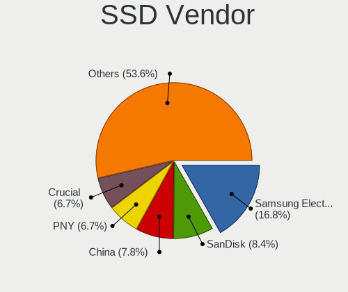
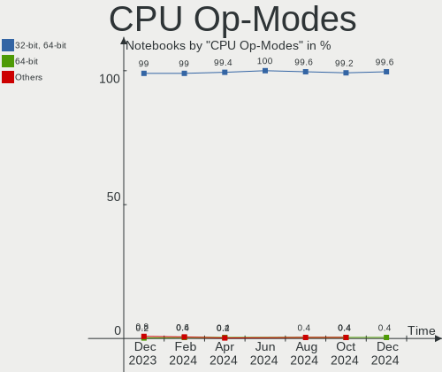

Linux in USA - Hardware Trends (Notebooks)
------------------------------------------

A project to identify most popular hardware characteristics and track their change
over time based on data collected by Linux users at https://Linux-Hardware.org.

Anyone can contribute to this report by the [hw-probe](https://github.com/linuxhw/hw-probe) tool:

    sudo -E hw-probe -all -upload

Period: Sep, 2022.

Contents
--------

* [ System ](#system)
  - [ OS                       ](#os)
  - [ OS Family                ](#os-family)
  - [ Kernel                   ](#kernel)
  - [ Kernel Family            ](#kernel-family)
  - [ Kernel Major Ver.        ](#kernel-major-ver)
  - [ Arch                     ](#arch)
  - [ DE                       ](#de)
  - [ Display Server           ](#display-server)
  - [ Display Manager          ](#display-manager)
  - [ OS Lang                  ](#os-lang)
  - [ Boot Mode                ](#boot-mode)
  - [ Filesystem               ](#filesystem)
  - [ Part. scheme             ](#part-scheme)
  - [ Dual Boot with Linux/BSD ](#dual-boot-with-linuxbsd)
  - [ Dual Boot (Win)          ](#dual-boot-win)

* [ Board ](#board)
  - [ Vendor                   ](#vendor)
  - [ Model                    ](#model)
  - [ Model Family             ](#model-family)
  - [ MFG Year                 ](#mfg-year)
  - [ Form Factor              ](#form-factor)
  - [ Secure Boot              ](#secure-boot)
  - [ Coreboot                 ](#coreboot)
  - [ RAM Size                 ](#ram-size)
  - [ RAM Used                 ](#ram-used)
  - [ Total Drives             ](#total-drives)
  - [ Has CD-ROM               ](#has-cd-rom)
  - [ Has Ethernet             ](#has-ethernet)
  - [ Has WiFi                 ](#has-wifi)
  - [ Has Bluetooth            ](#has-bluetooth)

* [ Location ](#location)
  - [ Country                  ](#country)
  - [ City                     ](#city)

* [ Drives ](#drives)
  - [ Drive Vendor             ](#drive-vendor)
  - [ Drive Model              ](#drive-model)
  - [ HDD Vendor               ](#hdd-vendor)
  - [ SSD Vendor               ](#ssd-vendor)
  - [ Drive Kind               ](#drive-kind)
  - [ Drive Connector          ](#drive-connector)
  - [ Drive Size               ](#drive-size)
  - [ Space Total              ](#space-total)
  - [ Space Used               ](#space-used)
  - [ Malfunc. Drives          ](#malfunc-drives)
  - [ Malfunc. Drive Vendor    ](#malfunc-drive-vendor)
  - [ Malfunc. HDD Vendor      ](#malfunc-hdd-vendor)
  - [ Malfunc. Drive Kind      ](#malfunc-drive-kind)
  - [ Failed Drives            ](#failed-drives)
  - [ Failed Drive Vendor      ](#failed-drive-vendor)
  - [ Drive Status             ](#drive-status)

* [ Storage controller ](#storage-controller)
  - [ Storage Vendor           ](#storage-vendor)
  - [ Storage Model            ](#storage-model)
  - [ Storage Kind             ](#storage-kind)

* [ Processor ](#processor)
  - [ CPU Vendor               ](#cpu-vendor)
  - [ CPU Model                ](#cpu-model)
  - [ CPU Model Family         ](#cpu-model-family)
  - [ CPU Cores                ](#cpu-cores)
  - [ CPU Sockets              ](#cpu-sockets)
  - [ CPU Threads              ](#cpu-threads)
  - [ CPU Op-Modes             ](#cpu-op-modes)
  - [ CPU Microcode            ](#cpu-microcode)
  - [ CPU Microarch            ](#cpu-microarch)

* [ Graphics ](#graphics)
  - [ GPU Vendor               ](#gpu-vendor)
  - [ GPU Model                ](#gpu-model)
  - [ GPU Combo                ](#gpu-combo)
  - [ GPU Driver               ](#gpu-driver)
  - [ GPU Memory               ](#gpu-memory)

* [ Monitor ](#monitor)
  - [ Monitor Vendor           ](#monitor-vendor)
  - [ Monitor Model            ](#monitor-model)
  - [ Monitor Resolution       ](#monitor-resolution)
  - [ Monitor Diagonal         ](#monitor-diagonal)
  - [ Monitor Width            ](#monitor-width)
  - [ Aspect Ratio             ](#aspect-ratio)
  - [ Monitor Area             ](#monitor-area)
  - [ Pixel Density            ](#pixel-density)
  - [ Multiple Monitors        ](#multiple-monitors)

* [ Network ](#network)
  - [ Net Controller Vendor    ](#net-controller-vendor)
  - [ Net Controller Model     ](#net-controller-model)
  - [ Wireless Vendor          ](#wireless-vendor)
  - [ Wireless Model           ](#wireless-model)
  - [ Ethernet Vendor          ](#ethernet-vendor)
  - [ Ethernet Model           ](#ethernet-model)
  - [ Net Controller Kind      ](#net-controller-kind)
  - [ Used Controller          ](#used-controller)
  - [ NICs                     ](#nics)
  - [ IPv6                     ](#ipv6)

* [ Bluetooth ](#bluetooth)
  - [ Bluetooth Vendor         ](#bluetooth-vendor)
  - [ Bluetooth Model          ](#bluetooth-model)

* [ Sound ](#sound)
  - [ Sound Vendor             ](#sound-vendor)
  - [ Sound Model              ](#sound-model)

* [ Memory ](#memory)
  - [ Memory Vendor            ](#memory-vendor)
  - [ Memory Model             ](#memory-model)
  - [ Memory Kind              ](#memory-kind)
  - [ Memory Form Factor       ](#memory-form-factor)
  - [ Memory Size              ](#memory-size)
  - [ Memory Speed             ](#memory-speed)

* [ Printers & scanners ](#printers--scanners)
  - [ Printer Vendor           ](#printer-vendor)
  - [ Printer Model            ](#printer-model)
  - [ Scanner Vendor           ](#scanner-vendor)
  - [ Scanner Model            ](#scanner-model)

* [ Camera ](#camera)
  - [ Camera Vendor            ](#camera-vendor)
  - [ Camera Model             ](#camera-model)

* [ Security ](#security)
  - [ Fingerprint Vendor       ](#fingerprint-vendor)
  - [ Fingerprint Model        ](#fingerprint-model)
  - [ Chipcard Vendor          ](#chipcard-vendor)
  - [ Chipcard Model           ](#chipcard-model)

* [ Unsupported ](#unsupported)
  - [ Unsupported Devices      ](#unsupported-devices)
  - [ Unsupported Device Types ](#unsupported-device-types)

System
------

OS
--

Installed operating systems

| Name                         | Notebooks | Percent |
|------------------------------|-----------|---------|
| Ubuntu 22.04                 | 70        | 14.29%  |
| Debian 11                    | 41        | 8.37%   |
| Fedora 36                    | 35        | 7.14%   |
| Pop!_OS 22.04                | 33        | 6.73%   |
| Linux Mint 21                | 29        | 5.92%   |
| SteamOS 3.3.1                | 28        | 5.71%   |
| Zorin 16                     | 22        | 4.49%   |
| OpenMandriva 4.3             | 16        | 3.27%   |
| Linux Mint 20.3              | 16        | 3.27%   |
| Manjaro                      | 15        | 3.06%   |
| Arch                         | 14        | 2.86%   |
| Ubuntu 20.04                 | 11        | 2.24%   |
| Kali 2022.3                  | 11        | 2.24%   |
| KDE neon 20.04               | 10        | 2.04%   |
| Nobara 36                    | 8         | 1.63%   |
| OpenMandriva 4.50            | 7         | 1.43%   |
| Kubuntu 22.04                | 7         | 1.43%   |
| Xubuntu 22.04                | 6         | 1.22%   |
| Manjaro 22.0.0               | 5         | 1.02%   |
| Gentoo 2.8                   | 5         | 1.02%   |
| Fedora 37                    | 5         | 1.02%   |
| EndeavourOS Rolling          | 5         | 1.02%   |
| Zorin 15                     | 4         | 0.82%   |
| Ubuntu 18.04                 | 4         | 0.82%   |
| Debian Testing               | 4         | 0.82%   |
| SteamOS 3.3.2                | 3         | 0.61%   |
| openSUSE Tumbleweed-XXXXXXXX | 3         | 0.61%   |
| Lubuntu 22.04                | 3         | 0.61%   |
| Garuda Linux Soaring         | 3         | 0.61%   |
| Garuda Linux                 | 3         | 0.61%   |
| EndeavourOS                  | 3         | 0.61%   |
| Elementary 6.1               | 3         | 0.61%   |
| Clear Linux 37000            | 3         | 0.61%   |
| ArcoLinux Rolling            | 3         | 0.61%   |
| Arch Rolling                 | 3         | 0.61%   |
| Xubuntu 20.04                | 2         | 0.41%   |
| Ubuntu Unity 20.04           | 2         | 0.41%   |
| Parrot 5.1                   | 2         | 0.41%   |
| NixOS 22.05                  | 2         | 0.41%   |
| MX 21                        | 2         | 0.41%   |

OS Family
---------

OS without a version

| Name              | Notebooks | Percent |
|-------------------|-----------|---------|
| Ubuntu            | 86        | 17.55%  |
| Linux Mint        | 48        | 9.8%    |
| Debian            | 45        | 9.18%   |
| Fedora            | 41        | 8.37%   |
| SteamOS           | 34        | 6.94%   |
| Pop!_OS           | 34        | 6.94%   |
| Zorin             | 26        | 5.31%   |
| OpenMandriva      | 23        | 4.69%   |
| Manjaro           | 22        | 4.49%   |
| Arch              | 17        | 3.47%   |
| KDE neon          | 11        | 2.24%   |
| Kali              | 11        | 2.24%   |
| Xubuntu           | 8         | 1.63%   |
| Nobara            | 8         | 1.63%   |
| Kubuntu           | 8         | 1.63%   |
| EndeavourOS       | 8         | 1.63%   |
| Garuda Linux      | 6         | 1.22%   |
| Clear Linux       | 6         | 1.22%   |
| Gentoo            | 5         | 1.02%   |
| Parrot            | 4         | 0.82%   |
| Ubuntu Unity      | 3         | 0.61%   |
| openSUSE          | 3         | 0.61%   |
| Lubuntu           | 3         | 0.61%   |
| Elementary        | 3         | 0.61%   |
| ArcoLinux         | 3         | 0.61%   |
| RHEL              | 2         | 0.41%   |
| NixOS             | 2         | 0.41%   |
| MX                | 2         | 0.41%   |
| Endless           | 2         | 0.41%   |
| BlackPanther      | 2         | 0.41%   |
| Ultramarine Linux | 1         | 0.2%    |
| Ubuntu Studio     | 1         | 0.2%    |
| Ubuntu MATE       | 1         | 0.2%    |
| Ubuntu Budgie     | 1         | 0.2%    |
| Trisquel          | 1         | 0.2%    |
| ROSA              | 1         | 0.2%    |
| PureOS            | 1         | 0.2%    |
| Peppermint        | 1         | 0.2%    |
| LMDE              | 1         | 0.2%    |
| LinuxFX           | 1         | 0.2%    |

Kernel
------

Version of the Linux kernel

| Version                                        | Notebooks | Percent |
|------------------------------------------------|-----------|---------|
| 5.15.0-47-generic                              | 64        | 13.06%  |
| 5.15.0-48-generic                              | 43        | 8.78%   |
| 5.15.0-46-generic                              | 35        | 7.14%   |
| 5.19.0-76051900-generic                        | 33        | 6.73%   |
| 5.13.0-valve21.1-1-neptune-02211-gc54cda5a36f3 | 29        | 5.92%   |
| 5.10.0-16-amd64                                | 26        | 5.31%   |
| 5.16.7-desktop-1omv4003                        | 16        | 3.27%   |
| 5.4.0-125-generic                              | 15        | 3.06%   |
| 5.19.8-200.fc36.x86_64                         | 10        | 2.04%   |
| 5.10.0-18-amd64                                | 8         | 1.63%   |
| 5.19.6-200.fc36.x86_64                         | 7         | 1.43%   |
| 5.19.5-desktop-1omv4090                        | 7         | 1.43%   |
| 5.15.0-41-generic                              | 7         | 1.43%   |
| 5.10.0-17-amd64                                | 7         | 1.43%   |
| 5.19.9-200.fc36.x86_64                         | 6         | 1.22%   |
| 5.15.65-1-MANJARO                              | 6         | 1.22%   |
| 5.15.0-43-generic                              | 6         | 1.22%   |
| 5.4.0-126-generic                              | 5         | 1.02%   |
| 5.19.6-arch1-1                                 | 5         | 1.02%   |
| 5.18.0-kali7-amd64                             | 5         | 1.02%   |
| 5.15.60-1-MANJARO                              | 5         | 1.02%   |
| 5.19.11-arch1-1                                | 4         | 0.82%   |
| 5.19.10-200.fc36.x86_64                        | 4         | 0.82%   |
| 5.4.0-124-generic                              | 3         | 0.61%   |
| 5.19.9-arch1-1                                 | 3         | 0.61%   |
| 5.19.9-201.fsync.fc36.x86_64                   | 3         | 0.61%   |
| 5.19.8-1-default                               | 3         | 0.61%   |
| 5.19.7-arch1-1                                 | 3         | 0.61%   |
| 5.19.7-204.fsync.fc36.x86_64                   | 3         | 0.61%   |
| 5.19.5-arch1-1                                 | 3         | 0.61%   |
| 5.19.4-200.fc36.x86_64                         | 3         | 0.61%   |
| 5.19.11-200.fc36.x86_64                        | 3         | 0.61%   |
| 5.18.0-kali5-amd64                             | 3         | 0.61%   |
| 5.13.0-valve21.2-1-neptune                     | 3         | 0.61%   |
| 6.0.0-060000rc3-generic                        | 2         | 0.41%   |
| 5.4.0-122-generic                              | 2         | 0.41%   |
| 5.19.9-zen1-1-zen                              | 2         | 0.41%   |
| 5.19.9-300.fc37.x86_64                         | 2         | 0.41%   |
| 5.19.7-1-MANJARO                               | 2         | 0.41%   |
| 5.19.6-zen1-1-zen                              | 2         | 0.41%   |

Kernel Family
-------------

Linux kernel without a distro release

| Version | Notebooks | Percent |
|---------|-----------|---------|
| 5.15.0  | 160       | 32.65%  |
| 5.10.0  | 42        | 8.57%   |
| 5.19.0  | 41        | 8.37%   |
| 5.13.0  | 38        | 7.76%   |
| 5.4.0   | 27        | 5.51%   |
| 5.19.9  | 17        | 3.47%   |
| 5.18.0  | 17        | 3.47%   |
| 5.19.8  | 16        | 3.27%   |
| 5.19.6  | 16        | 3.27%   |
| 5.16.7  | 16        | 3.27%   |
| 5.19.7  | 12        | 2.45%   |
| 5.19.5  | 12        | 2.45%   |
| 5.19.11 | 9         | 1.84%   |
| 5.15.65 | 8         | 1.63%   |
| 5.19.10 | 6         | 1.22%   |
| 6.0.0   | 5         | 1.02%   |
| 5.15.60 | 5         | 1.02%   |
| 5.19.4  | 4         | 0.82%   |
| 5.18.19 | 3         | 0.61%   |
| 5.14.0  | 3         | 0.61%   |
| 5.11.0  | 3         | 0.61%   |
| 5.19.1  | 2         | 0.41%   |
| 5.17.0  | 2         | 0.41%   |
| 5.16.13 | 2         | 0.41%   |
| 5.15.68 | 2         | 0.41%   |
| 5.15.59 | 2         | 0.41%   |
| 4.18.16 | 2         | 0.41%   |
| 4.15.0  | 2         | 0.41%   |
| 5.8.0   | 1         | 0.2%    |
| 5.5.9   | 1         | 0.2%    |
| 5.19.2  | 1         | 0.2%    |
| 5.18.17 | 1         | 0.2%    |
| 5.18.16 | 1         | 0.2%    |
| 5.18.15 | 1         | 0.2%    |
| 5.17.15 | 1         | 0.2%    |
| 5.16.0  | 1         | 0.2%    |
| 5.15.69 | 1         | 0.2%    |
| 5.15.64 | 1         | 0.2%    |
| 5.15.63 | 1         | 0.2%    |
| 5.15.62 | 1         | 0.2%    |

Kernel Major Ver.
-----------------

Linux kernel major version

| Version | Notebooks | Percent |
|---------|-----------|---------|
| 5.15    | 182       | 37.14%  |
| 5.19    | 136       | 27.76%  |
| 5.10    | 43        | 8.78%   |
| 5.13    | 38        | 7.76%   |
| 5.4     | 27        | 5.51%   |
| 5.18    | 23        | 4.69%   |
| 5.16    | 19        | 3.88%   |
| 6.0     | 5         | 1.02%   |
| 5.17    | 3         | 0.61%   |
| 5.14    | 3         | 0.61%   |
| 5.11    | 3         | 0.61%   |
| 4.18    | 3         | 0.61%   |
| 4.15    | 2         | 0.41%   |
| 5.8     | 1         | 0.2%    |
| 5.5     | 1         | 0.2%    |
| 4.16    | 1         | 0.2%    |

Arch
----

OS architecture (x86_64, i586, etc.)

| Name   | Notebooks | Percent |
|--------|-----------|---------|
| x86_64 | 485       | 98.98%  |
| i686   | 5         | 1.02%   |

DE
--

Desktop Environment

| Name             | Notebooks | Percent |
|------------------|-----------|---------|
| GNOME            | 204       | 41.63%  |
| KDE5             | 134       | 27.35%  |
| X-Cinnamon       | 41        | 8.37%   |
| Unknown          | 39        | 7.96%   |
| XFCE             | 36        | 7.35%   |
| MATE             | 10        | 2.04%   |
| Cinnamon         | 5         | 1.02%   |
| Pantheon         | 3         | 0.61%   |
| LXQt             | 3         | 0.61%   |
| Unity            | 2         | 0.41%   |
| KDE              | 2         | 0.41%   |
| Hyprland         | 2         | 0.41%   |
| GNOME Flashback  | 2         | 0.41%   |
| Budgie           | 2         | 0.41%   |
| sway             | 1         | 0.2%    |
| lightdm-xsession | 1         | 0.2%    |
| KDE4             | 1         | 0.2%    |
| i3               | 1         | 0.2%    |
| GNOME Classic    | 1         | 0.2%    |

Display Server
--------------

X11 or Wayland

| Name    | Notebooks | Percent |
|---------|-----------|---------|
| X11     | 338       | 68.98%  |
| Wayland | 118       | 24.08%  |
| Unknown | 30        | 6.12%   |
| Tty     | 4         | 0.82%   |

Display Manager
---------------

SDDM, LightDM, etc.

| Name    | Notebooks | Percent |
|---------|-----------|---------|
| Unknown | 240       | 48.98%  |
| GDM3    | 93        | 18.98%  |
| LightDM | 65        | 13.27%  |
| SDDM    | 61        | 12.45%  |
| GDM     | 26        | 5.31%   |
| LXDM    | 3         | 0.61%   |
| Ly      | 1         | 0.2%    |
| KDM     | 1         | 0.2%    |

OS Lang
-------

Language

| Lang    | Notebooks | Percent |
|---------|-----------|---------|
| en_US   | 440       | 89.8%   |
| Unknown | 33        | 6.73%   |
| C       | 5         | 1.02%   |
| en_CA   | 4         | 0.82%   |
| zh_CN   | 2         | 0.41%   |
| en_GB   | 2         | 0.41%   |
| fr_FR   | 1         | 0.2%    |
| es_MX   | 1         | 0.2%    |
| en_AU   | 1         | 0.2%    |
| C.UTF8  | 1         | 0.2%    |

Boot Mode
---------

EFI or BIOS

| Mode | Notebooks | Percent |
|------|-----------|---------|
| EFI  | 266       | 54.29%  |
| BIOS | 224       | 45.71%  |

Filesystem
----------

Type of filesystem

| Type    | Notebooks | Percent |
|---------|-----------|---------|
| Ext4    | 320       | 65.31%  |
| Btrfs   | 99        | 20.2%   |
| Overlay | 57        | 11.63%  |
| Zfs     | 7         | 1.43%   |
| Xfs     | 7         | 1.43%   |

Part. scheme
------------

Scheme of partitioning

| Type    | Notebooks | Percent |
|---------|-----------|---------|
| Unknown | 283       | 57.76%  |
| GPT     | 182       | 37.14%  |
| MBR     | 25        | 5.1%    |

Dual Boot with Linux/BSD
------------------------

Hosting more than one Linux/BSD

| Dual boot | Notebooks | Percent |
|-----------|-----------|---------|
| No        | 439       | 89.59%  |
| Yes       | 51        | 10.41%  |

Dual Boot (Win)
---------------

Hosting Linux and Windows

| Dual boot | Notebooks | Percent |
|-----------|-----------|---------|
| No        | 410       | 83.67%  |
| Yes       | 80        | 16.33%  |

Board
-----

Vendor
------

Motherboard manufacturer

| Name                | Notebooks | Percent |
|---------------------|-----------|---------|
| Dell                | 96        | 19.59%  |
| Lenovo              | 90        | 18.37%  |
| Hewlett-Packard     | 89        | 18.16%  |
| ASUSTek Computer    | 35        | 7.14%   |
| Valve               | 34        | 6.94%   |
| Google              | 31        | 6.33%   |
| Apple               | 23        | 4.69%   |
| Acer                | 21        | 4.29%   |
| Toshiba             | 13        | 2.65%   |
| MSI                 | 10        | 2.04%   |
| Alienware           | 7         | 1.43%   |
| System76            | 6         | 1.22%   |
| AZW                 | 4         | 0.82%   |
| Gigabyte Technology | 3         | 0.61%   |
| Framework           | 3         | 0.61%   |
| TUXEDO              | 2         | 0.41%   |
| Sony                | 2         | 0.41%   |
| Samsung Electronics | 2         | 0.41%   |
| Razer               | 2         | 0.41%   |
| GPU Company         | 2         | 0.41%   |
| Unknown             | 2         | 0.41%   |
| OriginPC            | 1         | 0.2%    |
| Jumper              | 1         | 0.2%    |
| Itronix             | 1         | 0.2%    |
| IPASON              | 1         | 0.2%    |
| HUAWEI              | 1         | 0.2%    |
| GPD                 | 1         | 0.2%    |
| Getac               | 1         | 0.2%    |
| Gateway             | 1         | 0.2%    |
| Fujitsu             | 1         | 0.2%    |
| Ematic              | 1         | 0.2%    |
| CyberPowerPC        | 1         | 0.2%    |
| Clevo               | 1         | 0.2%    |
| Chuwi               | 1         | 0.2%    |

Model
-----

Motherboard model

| Name                                  | Notebooks | Percent |
|---------------------------------------|-----------|---------|
| Valve Jupiter                         | 34        | 6.94%   |
| Google Enguarde                       | 15        | 3.06%   |
| Lenovo ThinkPad 13 2nd Gen 20J10046US | 4         | 0.82%   |
| Google Terra                          | 4         | 0.82%   |
| Dell Latitude E6520                   | 4         | 0.82%   |
| HP Laptop 15-da0xxx                   | 3         | 0.61%   |
| HP 15 Notebook PC                     | 3         | 0.61%   |
| Dell Inspiron 15-3567                 | 3         | 0.61%   |
| AZW SEi                               | 3         | 0.61%   |
| Apple MacBookPro9,2                   | 3         | 0.61%   |
| Apple MacBookAir7,2                   | 3         | 0.61%   |
| Acer Nitro AN515-54                   | 3         | 0.61%   |
| Unknown                               | 3         | 0.61%   |
| Toshiba Satellite C55D-B              | 2         | 0.41%   |
| System76 Oryx Pro                     | 2         | 0.41%   |
| System76 Galago Pro                   | 2         | 0.41%   |
| Lenovo ThinkPad E560 20EV002FUS       | 2         | 0.41%   |
| Lenovo Slim 7 ProX 14ARH7 82V2        | 2         | 0.41%   |
| Lenovo IdeaPad Slim 1-14AST-05 81VS   | 2         | 0.41%   |
| HP ProBook 4540s                      | 2         | 0.41%   |
| HP ProBook 4520s                      | 2         | 0.41%   |
| HP Pavilion g7                        | 2         | 0.41%   |
| HP Laptop 15-ef1xxx                   | 2         | 0.41%   |
| HP Laptop 15-dy1xxx                   | 2         | 0.41%   |
| HP Laptop 14-dk1xxx                   | 2         | 0.41%   |
| HP ENVY 17                            | 2         | 0.41%   |
| HP EliteBook 840 G6                   | 2         | 0.41%   |
| HP Dev One Notebook PC                | 2         | 0.41%   |
| HP Compaq Presario CQ60               | 2         | 0.41%   |
| HP 2000                               | 2         | 0.41%   |
| GPU Company GWTN141-10                | 2         | 0.41%   |
| Google Reks                           | 2         | 0.41%   |
| Google Akemi                          | 2         | 0.41%   |
| Framework Laptop                      | 2         | 0.41%   |
| Dell XPS 9320                         | 2         | 0.41%   |
| Dell XPS 15 9500                      | 2         | 0.41%   |
| Dell Latitude E6430                   | 2         | 0.41%   |
| Dell Latitude E6420                   | 2         | 0.41%   |
| Dell Latitude E6400                   | 2         | 0.41%   |
| Dell Latitude 5511                    | 2         | 0.41%   |

Model Family
------------

Motherboard model prefix

| Name              | Notebooks | Percent |
|-------------------|-----------|---------|
| Lenovo ThinkPad   | 50        | 10.2%   |
| Dell Latitude     | 37        | 7.55%   |
| Valve Jupiter     | 34        | 6.94%   |
| Dell Inspiron     | 29        | 5.92%   |
| Lenovo IdeaPad    | 21        | 4.29%   |
| HP Laptop         | 17        | 3.47%   |
| Google Enguarde   | 15        | 3.06%   |
| HP Pavilion       | 14        | 2.86%   |
| Dell XPS          | 14        | 2.86%   |
| Toshiba Satellite | 13        | 2.65%   |
| HP ENVY           | 11        | 2.24%   |
| Dell Precision    | 11        | 2.24%   |
| HP EliteBook      | 10        | 2.04%   |
| Acer Aspire       | 10        | 2.04%   |
| HP ProBook        | 9         | 1.84%   |
| ASUS VivoBook     | 8         | 1.63%   |
| Lenovo Legion     | 7         | 1.43%   |
| ASUS ROG          | 7         | 1.43%   |
| HP 15             | 5         | 1.02%   |
| Google Terra      | 4         | 0.82%   |
| Acer Nitro        | 4         | 0.82%   |
| Lenovo Slim       | 3         | 0.61%   |
| HP Stream         | 3         | 0.61%   |
| HP OMEN           | 3         | 0.61%   |
| HP Compaq         | 3         | 0.61%   |
| Framework Laptop  | 3         | 0.61%   |
| AZW SEi           | 3         | 0.61%   |
| ASUS ZenBook      | 3         | 0.61%   |
| ASUS TUF          | 3         | 0.61%   |
| Apple MacBookPro9 | 3         | 0.61%   |
| Apple MacBookPro8 | 3         | 0.61%   |
| Apple MacBookAir7 | 3         | 0.61%   |
| Acer Swift        | 3         | 0.61%   |
| Unknown           | 3         | 0.61%   |
| System76 Oryx     | 2         | 0.41%   |
| System76 Galago   | 2         | 0.41%   |
| Razer Blade       | 2         | 0.41%   |
| Lenovo ThinkBook  | 2         | 0.41%   |
| HP ZBook          | 2         | 0.41%   |
| HP Dev            | 2         | 0.41%   |

MFG Year
--------

Motherboard manufacture year

| Year    | Notebooks | Percent |
|---------|-----------|---------|
| 2022    | 93        | 18.98%  |
| 2021    | 55        | 11.22%  |
| 2019    | 51        | 10.41%  |
| 2020    | 45        | 9.18%   |
| 2018    | 33        | 6.73%   |
| 2012    | 32        | 6.53%   |
| 2015    | 30        | 6.12%   |
| 2017    | 25        | 5.1%    |
| 2011    | 24        | 4.9%    |
| 2014    | 20        | 4.08%   |
| 2016    | 19        | 3.88%   |
| 2013    | 18        | 3.67%   |
| 2008    | 15        | 3.06%   |
| 2010    | 13        | 2.65%   |
| 2009    | 8         | 1.63%   |
| 2007    | 4         | 0.82%   |
| 2005    | 3         | 0.61%   |
| 2003    | 1         | 0.2%    |
| Unknown | 1         | 0.2%    |

Form Factor
-----------

Physical design of the computer

| Name     | Notebooks | Percent |
|----------|-----------|---------|
| Notebook | 490       | 100%    |

Secure Boot
-----------

Enabled or disabled

| State    | Notebooks | Percent |
|----------|-----------|---------|
| Disabled | 447       | 91.22%  |
| Enabled  | 43        | 8.78%   |

Coreboot
--------

Have coreboot on board

| Used | Notebooks | Percent |
|------|-----------|---------|
| No   | 455       | 92.86%  |
| Yes  | 35        | 7.14%   |

RAM Size
--------

Total RAM memory

| Size in GB  | Notebooks | Percent |
|-------------|-----------|---------|
| 4.01-8.0    | 107       | 21.84%  |
| 3.01-4.0    | 104       | 21.22%  |
| 8.01-16.0   | 99        | 20.2%   |
| 16.01-24.0  | 89        | 18.16%  |
| 32.01-64.0  | 49        | 10%     |
| 24.01-32.0  | 16        | 3.27%   |
| 1.01-2.0    | 11        | 2.24%   |
| 64.01-256.0 | 9         | 1.84%   |
| 2.01-3.0    | 4         | 0.82%   |
| 0.51-1.0    | 1         | 0.2%    |
| 0.01-0.5    | 1         | 0.2%    |

RAM Used
--------

Used RAM memory

| Used GB    | Notebooks | Percent |
|------------|-----------|---------|
| 1.01-2.0   | 153       | 31.22%  |
| 2.01-3.0   | 120       | 24.49%  |
| 4.01-8.0   | 87        | 17.76%  |
| 3.01-4.0   | 86        | 17.55%  |
| 8.01-16.0  | 26        | 5.31%   |
| 0.51-1.0   | 14        | 2.86%   |
| 0.01-0.5   | 3         | 0.61%   |
| 32.01-64.0 | 1         | 0.2%    |

Total Drives
------------

Number of drives on board

| Drives | Notebooks | Percent |
|--------|-----------|---------|
| 1      | 353       | 72.04%  |
| 2      | 113       | 23.06%  |
| 3      | 19        | 3.88%   |
| 4      | 2         | 0.41%   |
| 0      | 2         | 0.41%   |
| 5      | 1         | 0.2%    |

Has CD-ROM
----------

Has CD-ROM on board

| Presented | Notebooks | Percent |
|-----------|-----------|---------|
| No        | 348       | 71.02%  |
| Yes       | 142       | 28.98%  |

Has Ethernet
------------

Has Ethernet on board

| Presented | Notebooks | Percent |
|-----------|-----------|---------|
| Yes       | 342       | 69.8%   |
| No        | 148       | 30.2%   |

Has WiFi
--------

Has WiFi module

| Presented | Notebooks | Percent |
|-----------|-----------|---------|
| Yes       | 486       | 99.18%  |
| No        | 4         | 0.82%   |

Has Bluetooth
-------------

Has Bluetooth module

| Presented | Notebooks | Percent |
|-----------|-----------|---------|
| Yes       | 399       | 81.43%  |
| No        | 91        | 18.57%  |

Location
--------

Country
-------

Geographic location (country)

| Country | Notebooks | Percent |
|---------|-----------|---------|
| USA     | 490       | 100%    |

City
----

Geographic location (city)

| City             | Notebooks | Percent |
|------------------|-----------|---------|
| Bangor           | 29        | 5.92%   |
| Los Angeles      | 12        | 2.45%   |
| Seattle          | 8         | 1.63%   |
| Dallas           | 8         | 1.63%   |
| Tucson           | 7         | 1.43%   |
| Denver           | 7         | 1.43%   |
| Chicago          | 7         | 1.43%   |
| Houston          | 6         | 1.22%   |
| Austin           | 6         | 1.22%   |
| San Diego        | 5         | 1.02%   |
| San Antonio      | 5         | 1.02%   |
| Philadelphia     | 5         | 1.02%   |
| New York         | 5         | 1.02%   |
| Mesa             | 5         | 1.02%   |
| Kansas City      | 5         | 1.02%   |
| Washington       | 4         | 0.82%   |
| Raleigh          | 4         | 0.82%   |
| Brooklyn         | 4         | 0.82%   |
| Phoenix          | 3         | 0.61%   |
| Louisville       | 3         | 0.61%   |
| Cambridge        | 3         | 0.61%   |
| Yuba City        | 2         | 0.41%   |
| Yorktown Heights | 2         | 0.41%   |
| Weatherford      | 2         | 0.41%   |
| The Bronx        | 2         | 0.41%   |
| St. Petersburg   | 2         | 0.41%   |
| Springfield      | 2         | 0.41%   |
| Spring           | 2         | 0.41%   |
| Schenectady      | 2         | 0.41%   |
| San Francisco    | 2         | 0.41%   |
| Saint Paul       | 2         | 0.41%   |
| Roseville        | 2         | 0.41%   |
| Richmond         | 2         | 0.41%   |
| Queens           | 2         | 0.41%   |
| Pullman          | 2         | 0.41%   |
| Portland         | 2         | 0.41%   |
| New Baltimore    | 2         | 0.41%   |
| Mount Pleasant   | 2         | 0.41%   |
| Minneapolis      | 2         | 0.41%   |
| Milwaukee        | 2         | 0.41%   |

Drives
------

Drive Vendor
------------

Hard drive vendors

| Vendor                         | Notebooks | Drives | Percent |
|--------------------------------|-----------|--------|---------|
| Samsung Electronics            | 92        | 108    | 15.06%  |
| Unknown                        | 73        | 81     | 11.95%  |
| WDC                            | 53        | 54     | 8.67%   |
| Seagate                        | 40        | 44     | 6.55%   |
| SanDisk                        | 40        | 43     | 6.55%   |
| Toshiba                        | 35        | 35     | 5.73%   |
| SK hynix                       | 34        | 35     | 5.56%   |
| Kingston                       | 23        | 24     | 3.76%   |
| Apple                          | 16        | 17     | 2.62%   |
| Micron Technology              | 15        | 16     | 2.45%   |
| Intel                          | 15        | 18     | 2.45%   |
| Hitachi                        | 15        | 15     | 2.45%   |
| Crucial                        | 14        | 14     | 2.29%   |
| Phison                         | 13        | 14     | 2.13%   |
| HGST                           | 13        | 13     | 2.13%   |
| Unknown                        | 10        | 10     | 1.64%   |
| PNY                            | 8         | 8      | 1.31%   |
| Phison Electronics             | 8         | 8      | 1.31%   |
| KIOXIA                         | 8         | 9      | 1.31%   |
| China                          | 8         | 8      | 1.31%   |
| Silicon Motion                 | 7         | 7      | 1.15%   |
| LITEON                         | 7         | 7      | 1.15%   |
| Micron/Crucial Technology      | 5         | 7      | 0.82%   |
| Kingston Technology Company    | 4         | 4      | 0.65%   |
| Team                           | 3         | 3      | 0.49%   |
| O2 Micro                       | 3         | 3      | 0.49%   |
| LITEONIT                       | 3         | 3      | 0.49%   |
| JMicron Technology             | 3         | 3      | 0.49%   |
| A-DATA Technology              | 3         | 3      | 0.49%   |
| W800S                          | 2         | 2      | 0.33%   |
| SSK                            | 2         | 2      | 0.33%   |
| Solid State Storage Technology | 2         | 2      | 0.33%   |
| SABRENT                        | 2         | 2      | 0.33%   |
| Realtek Semiconductor          | 2         | 2      | 0.33%   |
| Lexar                          | 2         | 2      | 0.33%   |
| Fujitsu                        | 2         | 2      | 0.33%   |
| Union Memory (Shenzhen)        | 1         | 1      | 0.16%   |
| Union Memory                   | 1         | 1      | 0.16%   |
| UMIS                           | 1         | 1      | 0.16%   |
| Transcend                      | 1         | 1      | 0.16%   |

Drive Model
-----------

Hard drive models

| Model                                                 | Notebooks | Percent |
|-------------------------------------------------------|-----------|---------|
| Unknown AGND3R  16GB                                  | 10        | 1.55%   |
| Unknown                                               | 10        | 1.55%   |
| Unknown MMC Card  512GB                               | 8         | 1.24%   |
| Unknown MMC Card  32GB                                | 8         | 1.24%   |
| Phison NVMe SSD Drive 512GB                           | 8         | 1.24%   |
| Unknown MMC Card  64GB                                | 7         | 1.08%   |
| Toshiba MQ01ABF050 500GB                              | 7         | 1.08%   |
| Toshiba MQ01ABD100 1TB                                | 7         | 1.08%   |
| Seagate ST1000LM035-1RK172 1TB                        | 6         | 0.93%   |
| SanDisk NVMe SSD Drive 1TB                            | 6         | 0.93%   |
| Unknown SDW16G  16GB                                  | 5         | 0.77%   |
| Unknown MMC Card  256GB                               | 5         | 0.77%   |
| Unknown HAG2e  16GB                                   | 5         | 0.77%   |
| Samsung NVMe SSD Drive 256GB                          | 5         | 0.77%   |
| Samsung NVMe SSD Drive 1TB                            | 5         | 0.77%   |
| Samsung NVMe SSD Controller SM981/PM981/PM983 256GB   | 5         | 0.77%   |
| Unknown MMC Card  128GB                               | 4         | 0.62%   |
| Silicon Motion NVMe SSD Drive 512GB                   | 4         | 0.62%   |
| Samsung SSD 860 EVO 1TB                               | 4         | 0.62%   |
| Samsung NVMe SSD Drive 512GB                          | 4         | 0.62%   |
| Samsung NVMe SSD Controller PM9A1/PM9A3/980PRO 1024GB | 4         | 0.62%   |
| Phison PS5013 E13 NVMe Controller 512GB               | 4         | 0.62%   |
| Kingston NVMe SSD Drive 512GB                         | 4         | 0.62%   |
| WDC WD10JPVX-75JC3T0 1TB                              | 3         | 0.46%   |
| Unknown SD/MMC/MS PRO 2GB                             | 3         | 0.46%   |
| Unknown MMC Card  393GB                               | 3         | 0.46%   |
| Toshiba MQ04ABF100 1TB                                | 3         | 0.46%   |
| SK hynix NVMe SSD Drive 256GB                         | 3         | 0.46%   |
| SK hynix NVMe SSD Drive 1024GB                        | 3         | 0.46%   |
| Seagate ST500LM021-1KJ152 500GB                       | 3         | 0.46%   |
| SanDisk NVMe SSD Drive 500GB                          | 3         | 0.46%   |
| Samsung SSD 850 EVO 500GB                             | 3         | 0.46%   |
| Samsung SSD 850 EVO 250GB                             | 3         | 0.46%   |
| Samsung NVMe SSD Drive 500GB                          | 3         | 0.46%   |
| Samsung NVMe SSD Drive 1024GB                         | 3         | 0.46%   |
| Kingston Company OM3PDP3 NVMe SSD 512GB               | 3         | 0.46%   |
| Kingston SA400S37120G 120GB SSD                       | 3         | 0.46%   |
| Kingston NVMe SSD Drive 256GB                         | 3         | 0.46%   |
| China SATA SSD 240GB                                  | 3         | 0.46%   |
| WDC WDBNCE5000PNC 500GB SSD                           | 2         | 0.31%   |

HDD Vendor
----------

Hard disk drive vendors

| Vendor              | Notebooks | Drives | Percent |
|---------------------|-----------|--------|---------|
| Seagate             | 39        | 43     | 29.1%   |
| WDC                 | 33        | 34     | 24.63%  |
| Toshiba             | 24        | 24     | 17.91%  |
| Hitachi             | 15        | 15     | 11.19%  |
| HGST                | 13        | 13     | 9.7%    |
| Unknown             | 3         | 3      | 2.24%   |
| Fujitsu             | 2         | 2      | 1.49%   |
| Samsung Electronics | 1         | 1      | 0.75%   |
| LaCie               | 1         | 1      | 0.75%   |
| IBM/Hitachi         | 1         | 1      | 0.75%   |
| HGST HTS            | 1         | 1      | 0.75%   |
| Apple               | 1         | 1      | 0.75%   |

SSD Vendor
----------

Solid state drive vendors

| Vendor              | Notebooks | Drives | Percent |
|---------------------|-----------|--------|---------|
| Samsung Electronics | 37        | 38     | 24.34%  |
| SanDisk             | 17        | 17     | 11.18%  |
| Crucial             | 13        | 13     | 8.55%   |
| Apple               | 10        | 10     | 6.58%   |
| WDC                 | 9         | 9      | 5.92%   |
| Kingston            | 8         | 8      | 5.26%   |
| China               | 8         | 8      | 5.26%   |
| LITEON              | 7         | 7      | 4.61%   |
| SK hynix            | 6         | 6      | 3.95%   |
| PNY                 | 6         | 6      | 3.95%   |
| Intel               | 5         | 6      | 3.29%   |
| Team                | 3         | 3      | 1.97%   |
| Micron Technology   | 3         | 3      | 1.97%   |
| LITEONIT            | 3         | 3      | 1.97%   |
| Toshiba             | 2         | 2      | 1.32%   |
| Lexar               | 2         | 2      | 1.32%   |
| A-DATA Technology   | 2         | 2      | 1.32%   |
| Unknown             | 2         | 2      | 1.32%   |
| Union Memory        | 1         | 1      | 0.66%   |
| Transcend           | 1         | 1      | 0.66%   |
| Super Talent        | 1         | 1      | 0.66%   |
| SSSTC               | 1         | 1      | 0.66%   |
| SPCC                | 1         | 1      | 0.66%   |
| OWC                 | 1         | 1      | 0.66%   |
| Netac               | 1         | 1      | 0.66%   |
| Leven               | 1         | 1      | 0.66%   |
| KingSpec            | 1         | 1      | 0.66%   |

Drive Kind
----------

HDD or SSD

| Kind    | Notebooks | Drives | Percent |
|---------|-----------|--------|---------|
| NVMe    | 218       | 260    | 37.46%  |
| SSD     | 140       | 154    | 24.05%  |
| HDD     | 130       | 139    | 22.34%  |
| MMC     | 79        | 85     | 13.57%  |
| Unknown | 15        | 16     | 2.58%   |

Drive Connector
---------------

SATA, SAS, NVMe, etc.

| Type | Notebooks | Drives | Percent |
|------|-----------|--------|---------|
| SATA | 251       | 273    | 42.91%  |
| NVMe | 217       | 255    | 37.09%  |
| MMC  | 79        | 85     | 13.5%   |
| SAS  | 38        | 41     | 6.5%    |

Drive Size
----------

Size of hard drive

| Size in TB | Notebooks | Drives | Percent |
|------------|-----------|--------|---------|
| 0.01-0.5   | 180       | 193    | 64.52%  |
| 0.51-1.0   | 76        | 77     | 27.24%  |
| 1.01-2.0   | 14        | 14     | 5.02%   |
| 4.01-10.0  | 5         | 5      | 1.79%   |
| 3.01-4.0   | 4         | 4      | 1.43%   |

Space Total
-----------

Amount of disk space available on the file system

| Size in GB     | Notebooks | Percent |
|----------------|-----------|---------|
| 101-250        | 123       | 25.1%   |
| 251-500        | 115       | 23.47%  |
| 501-1000       | 74        | 15.1%   |
| 1-20           | 48        | 9.8%    |
| 1001-2000      | 35        | 7.14%   |
| Unknown        | 31        | 6.33%   |
| 51-100         | 25        | 5.1%    |
| More than 3000 | 22        | 4.49%   |
| 2001-3000      | 9         | 1.84%   |
| 21-50          | 8         | 1.63%   |

Space Used
----------

Amount of used disk space

| Used GB        | Notebooks | Percent |
|----------------|-----------|---------|
| 1-20           | 174       | 35.51%  |
| 21-50          | 71        | 14.49%  |
| 101-250        | 68        | 13.88%  |
| 51-100         | 65        | 13.27%  |
| 251-500        | 40        | 8.16%   |
| Unknown        | 31        | 6.33%   |
| 501-1000       | 24        | 4.9%    |
| 1001-2000      | 10        | 2.04%   |
| More than 3000 | 5         | 1.02%   |
| 2001-3000      | 2         | 0.41%   |

Malfunc. Drives
---------------

Drive models with a malfunction

| Model                                               | Notebooks | Drives | Percent |
|-----------------------------------------------------|-----------|--------|---------|
| Kingston RBU-SNS8350DES3128GP 128GB SSD             | 2         | 2      | 7.14%   |
| WDC WD3200BEKT-60PVMT0 320GB                        | 1         | 1      | 3.57%   |
| WDC WD10SPZX-60Z10T0 1TB                            | 1         | 1      | 3.57%   |
| Toshiba THNSNK128GVN8 M.2 2280 128GB SSD            | 1         | 1      | 3.57%   |
| Toshiba MQ01ABF050 500GB                            | 1         | 1      | 3.57%   |
| SSSTC CVB-8D128-HP 128GB SSD                        | 1         | 1      | 3.57%   |
| SK hynix PC711 HFS512GDE9X073N 512GB                | 1         | 1      | 3.57%   |
| SK hynix HFS256G32TND-N210A 256GB SSD               | 1         | 1      | 3.57%   |
| Seagate ST9500420AS 500GB                           | 1         | 1      | 3.57%   |
| Seagate ST9320423AS 320GB                           | 1         | 1      | 3.57%   |
| Seagate ST9160314AS 160GB                           | 1         | 1      | 3.57%   |
| Seagate ST500LT012-9WS142 500GB                     | 1         | 1      | 3.57%   |
| Seagate ST320LT007-9ZV142 320GB                     | 1         | 1      | 3.57%   |
| Samsung Electronics SSD 980 1TB                     | 1         | 1      | 3.57%   |
| Samsung Electronics MZVLB512HAJQ-000L7 512GB        | 1         | 1      | 3.57%   |
| Micron Technology MTFDDAK256MAY-1AH1ZABHA 256GB SSD | 1         | 1      | 3.57%   |
| Intel SSDSC2BW240A4 240GB                           | 1         | 1      | 3.57%   |
| Intel HBRPEKNX0202AHO 32GB                          | 1         | 1      | 3.57%   |
| Hitachi HTS725050A7E630 500GB                       | 1         | 1      | 3.57%   |
| Hitachi HTS725025A9A364 250GB                       | 1         | 1      | 3.57%   |
| Hitachi HTS723232A7A364 320GB                       | 1         | 1      | 3.57%   |
| Hitachi HTS542512K9SA00 120GB                       | 1         | 1      | 3.57%   |
| HGST HTS725032A7E630 320GB                          | 1         | 1      | 3.57%   |
| HGST HTS545025A7E680 250GB                          | 1         | 1      | 3.57%   |
| HGST HTS541010A9E680 1TB                            | 1         | 1      | 3.57%   |
| HGST HTS 721010A9E630 1TB                           | 1         | 1      | 3.57%   |
| A-DATA Technology SX8200PNP 1TB                     | 1         | 1      | 3.57%   |

Malfunc. Drive Vendor
---------------------

Vendors of faulty drives

| Vendor              | Notebooks | Drives | Percent |
|---------------------|-----------|--------|---------|
| Seagate             | 5         | 5      | 17.86%  |
| Hitachi             | 4         | 4      | 14.29%  |
| HGST                | 3         | 3      | 10.71%  |
| WDC                 | 2         | 2      | 7.14%   |
| Toshiba             | 2         | 2      | 7.14%   |
| SK hynix            | 2         | 2      | 7.14%   |
| Samsung Electronics | 2         | 2      | 7.14%   |
| Kingston            | 2         | 2      | 7.14%   |
| Intel               | 2         | 2      | 7.14%   |
| SSSTC               | 1         | 1      | 3.57%   |
| Micron Technology   | 1         | 1      | 3.57%   |
| HGST HTS            | 1         | 1      | 3.57%   |
| A-DATA Technology   | 1         | 1      | 3.57%   |

Malfunc. HDD Vendor
-------------------

Vendors of faulty HDD drives

| Vendor   | Notebooks | Drives | Percent |
|----------|-----------|--------|---------|
| Seagate  | 5         | 5      | 31.25%  |
| Hitachi  | 4         | 4      | 25%     |
| HGST     | 3         | 3      | 18.75%  |
| WDC      | 2         | 2      | 12.5%   |
| Toshiba  | 1         | 1      | 6.25%   |
| HGST HTS | 1         | 1      | 6.25%   |

Malfunc. Drive Kind
-------------------

Kinds of faulty drives

| Kind | Notebooks | Drives | Percent |
|------|-----------|--------|---------|
| HDD  | 15        | 16     | 55.56%  |
| SSD  | 7         | 7      | 25.93%  |
| NVMe | 5         | 5      | 18.52%  |

Failed Drives
-------------

Failed drive models

Zero info for selected period =(

Failed Drive Vendor
-------------------

Failed drive vendors

Zero info for selected period =(

Drive Status
------------

Number of failed and malfunc. drives

| Status   | Notebooks | Drives | Percent |
|----------|-----------|--------|---------|
| Detected | 323       | 442    | 63.33%  |
| Works    | 160       | 184    | 31.37%  |
| Malfunc  | 27        | 28     | 5.29%   |

Storage controller
------------------

Storage Vendor
--------------

Storage controller vendors

| Vendor                           | Notebooks | Percent |
|----------------------------------|-----------|---------|
| Intel                            | 258       | 46.4%   |
| Samsung Electronics              | 67        | 12.05%  |
| AMD                              | 60        | 10.79%  |
| SanDisk                          | 34        | 6.12%   |
| SK hynix                         | 28        | 5.04%   |
| Phison Electronics               | 23        | 4.14%   |
| Kingston Technology Company      | 20        | 3.6%    |
| Micron Technology                | 12        | 2.16%   |
| Toshiba America Info Systems     | 11        | 1.98%   |
| Silicon Motion                   | 7         | 1.26%   |
| Nvidia                           | 6         | 1.08%   |
| Micron/Crucial Technology        | 6         | 1.08%   |
| KIOXIA                           | 6         | 1.08%   |
| Apple                            | 5         | 0.9%    |
| O2 Micro                         | 3         | 0.54%   |
| Solid State Storage Technology   | 2         | 0.36%   |
| Realtek Semiconductor            | 2         | 0.36%   |
| Union Memory (Shenzhen)          | 1         | 0.18%   |
| Silicon Integrated Systems [SiS] | 1         | 0.18%   |
| Silicon Image                    | 1         | 0.18%   |
| Marvell Technology Group         | 1         | 0.18%   |
| Biwin Storage Technology         | 1         | 0.18%   |
| ADATA Technology                 | 1         | 0.18%   |

Storage Model
-------------

Storage controller models

| Model                                                                            | Notebooks | Percent |
|----------------------------------------------------------------------------------|-----------|---------|
| AMD FCH SATA Controller [AHCI mode]                                              | 51        | 8.75%   |
| Intel 82801 Mobile SATA Controller [RAID mode]                                   | 36        | 6.17%   |
| Intel Sunrise Point-LP SATA Controller [AHCI mode]                               | 31        | 5.32%   |
| Intel 7 Series Chipset Family 6-port SATA Controller [AHCI mode]                 | 23        | 3.95%   |
| Samsung NVMe SSD Controller SM981/PM981/PM983                                    | 20        | 3.43%   |
| Intel 6 Series/C200 Series Chipset Family 6 port Mobile SATA AHCI Controller     | 19        | 3.26%   |
| Samsung NVMe SSD Controller PM9A1/PM9A3/980PRO                                   | 18        | 3.09%   |
| SK hynix Gold P31 SSD                                                            | 17        | 2.92%   |
| Samsung NVMe SSD Controller 980                                                  | 17        | 2.92%   |
| Intel Volume Management Device NVMe RAID Controller                              | 17        | 2.92%   |
| Phison PS5013 E13 NVMe Controller                                                | 14        | 2.4%    |
| Intel Cannon Lake Mobile PCH SATA AHCI Controller                                | 13        | 2.23%   |
| Micron Non-Volatile memory controller                                            | 12        | 2.06%   |
| Kingston Company OM3PDP3 NVMe SSD                                                | 12        | 2.06%   |
| Intel Wildcat Point-LP SATA Controller [AHCI Mode]                               | 11        | 1.89%   |
| Intel 8 Series/C220 Series Chipset Family 6-port SATA Controller 1 [AHCI mode]   | 10        | 1.72%   |
| SanDisk WD Blue SN550 NVMe SSD                                                   | 9         | 1.54%   |
| Intel HM170/QM170 Chipset SATA Controller [AHCI Mode]                            | 9         | 1.54%   |
| Silicon Motion SM2263EN/SM2263XT SSD Controller                                  | 7         | 1.2%    |
| Sandisk Non-Volatile memory controller                                           | 7         | 1.2%    |
| Phison E12 NVMe Controller                                                       | 7         | 1.2%    |
| Intel Comet Lake SATA AHCI Controller                                            | 7         | 1.2%    |
| Samsung NVMe SSD Controller SM961/PM961/SM963                                    | 6         | 1.03%   |
| Intel Tiger Lake-LP SATA Controller                                              | 6         | 1.03%   |
| Intel Celeron/Pentium Silver Processor SATA Controller                           | 6         | 1.03%   |
| Intel Celeron N3350/Pentium N4200/Atom E3900 Series SATA AHCI Controller         | 6         | 1.03%   |
| Intel Atom/Celeron/Pentium Processor x5-E8000/J3xxx/N3xxx Series SATA Controller | 6         | 1.03%   |
| Intel 82801IBM/IEM (ICH9M/ICH9M-E) 4 port SATA Controller [AHCI mode]            | 6         | 1.03%   |
| AMD SB7x0/SB8x0/SB9x0 SATA Controller [AHCI mode]                                | 6         | 1.03%   |
| Toshiba America Info Systems Toshiba America Info Non-Volatile memory controller | 5         | 0.86%   |
| SanDisk WD PC SN810 / Black SN850 NVMe SSD                                       | 5         | 0.86%   |
| SanDisk WD Black SN750 / PC SN730 NVMe SSD                                       | 5         | 0.86%   |
| Samsung Electronics SATA controller                                              | 5         | 0.86%   |
| Kingston Company Company Non-Volatile memory controller                          | 5         | 0.86%   |
| Intel Q170/Q150/B150/H170/H110/Z170/CM236 Chipset SATA Controller [AHCI Mode]    | 5         | 0.86%   |
| Intel Cannon Point-LP SATA Controller [AHCI Mode]                                | 5         | 0.86%   |
| Intel 8 Series SATA Controller 1 [AHCI mode]                                     | 5         | 0.86%   |
| Intel 500 Series Chipset Family SATA AHCI Controller                             | 5         | 0.86%   |
| SK hynix Non-Volatile memory controller                                          | 4         | 0.69%   |
| KIOXIA NVMe SSD Controller BG4                                                   | 4         | 0.69%   |

Storage Kind
------------

Kind of storage controller (IDE, SATA, NVMe, SAS, ...)

| Kind | Notebooks | Percent |
|------|-----------|---------|
| SATA | 261       | 47.11%  |
| NVMe | 217       | 39.17%  |
| RAID | 55        | 9.93%   |
| IDE  | 21        | 3.79%   |

Processor
---------

CPU Vendor
----------

Processor vendors

| Vendor | Notebooks | Percent |
|--------|-----------|---------|
| Intel  | 362       | 73.88%  |
| AMD    | 128       | 26.12%  |

CPU Model
---------

Processor models

| Model                                   | Notebooks | Percent |
|-----------------------------------------|-----------|---------|
| AMD Custom APU 0405                     | 34        | 6.94%   |
| Intel Celeron CPU N2840 @ 2.16GHz       | 17        | 3.47%   |
| Intel Celeron CPU N3060 @ 1.60GHz       | 12        | 2.45%   |
| Intel Core i7-9750H CPU @ 2.60GHz       | 11        | 2.24%   |
| Intel Core i7-7700HQ CPU @ 2.80GHz      | 8         | 1.63%   |
| Intel 11th Gen Core i7-11800H @ 2.30GHz | 6         | 1.22%   |
| Intel 11th Gen Core i7-1165G7 @ 2.80GHz | 6         | 1.22%   |
| Intel 11th Gen Core i5-1135G7 @ 2.40GHz | 6         | 1.22%   |
| AMD Ryzen 7 5800H with Radeon Graphics  | 6         | 1.22%   |
| Intel Core i7-7500U CPU @ 2.70GHz       | 5         | 1.02%   |
| Intel Core i5-3210M CPU @ 2.50GHz       | 5         | 1.02%   |
| Intel Celeron CPU N3350 @ 1.10GHz       | 5         | 1.02%   |
| Intel 12th Gen Core i7-12700H           | 5         | 1.02%   |
| Intel 12th Gen Core i7-1260P            | 5         | 1.02%   |
| Intel Core i7-8550U CPU @ 1.80GHz       | 4         | 0.82%   |
| Intel Core i7-6600U CPU @ 2.60GHz       | 4         | 0.82%   |
| Intel Core i7-1065G7 CPU @ 1.30GHz      | 4         | 0.82%   |
| Intel Core i5-9300H CPU @ 2.40GHz       | 4         | 0.82%   |
| Intel Core i5-8250U CPU @ 1.60GHz       | 4         | 0.82%   |
| Intel Core i5-3320M CPU @ 2.60GHz       | 4         | 0.82%   |
| Intel Core i5-2520M CPU @ 2.50GHz       | 4         | 0.82%   |
| Intel Core i5-10210U CPU @ 1.60GHz      | 4         | 0.82%   |
| Intel Celeron CPU 3865U @ 1.80GHz       | 4         | 0.82%   |
| AMD Ryzen 7 5700U with Radeon Graphics  | 4         | 0.82%   |
| AMD Ryzen 3 3250U with Radeon Graphics  | 4         | 0.82%   |
| Intel Core i9-8950HK CPU @ 2.90GHz      | 3         | 0.61%   |
| Intel Core i9-10885H CPU @ 2.40GHz      | 3         | 0.61%   |
| Intel Core i7-8650U CPU @ 1.90GHz       | 3         | 0.61%   |
| Intel Core i7-6700HQ CPU @ 2.60GHz      | 3         | 0.61%   |
| Intel Core i7-5600U CPU @ 2.60GHz       | 3         | 0.61%   |
| Intel Core i7-5500U CPU @ 2.40GHz       | 3         | 0.61%   |
| Intel Core i7-3630QM CPU @ 2.40GHz      | 3         | 0.61%   |
| Intel Core i7-2670QM CPU @ 2.20GHz      | 3         | 0.61%   |
| Intel Core i7-10850H CPU @ 2.70GHz      | 3         | 0.61%   |
| Intel Core i5-8365U CPU @ 1.60GHz       | 3         | 0.61%   |
| Intel Core i5-8265U CPU @ 1.60GHz       | 3         | 0.61%   |
| Intel Core i5-7200U CPU @ 2.50GHz       | 3         | 0.61%   |
| Intel Core i5-5250U CPU @ 1.60GHz       | 3         | 0.61%   |
| Intel Core i5-2540M CPU @ 2.60GHz       | 3         | 0.61%   |
| Intel Core i5-1035G1 CPU @ 1.00GHz      | 3         | 0.61%   |

CPU Model Family
----------------

Processor model prefix

| Model                   | Notebooks | Percent |
|-------------------------|-----------|---------|
| Intel Core i7           | 105       | 21.43%  |
| Other                   | 85        | 17.35%  |
| Intel Core i5           | 79        | 16.12%  |
| Intel Celeron           | 59        | 12.04%  |
| Intel Core i3           | 24        | 4.9%    |
| AMD Ryzen 7             | 22        | 4.49%   |
| AMD Ryzen 5             | 13        | 2.65%   |
| Intel Core 2 Duo        | 11        | 2.24%   |
| Intel Pentium           | 10        | 2.04%   |
| Intel Core i9           | 8         | 1.63%   |
| AMD A6                  | 8         | 1.63%   |
| AMD Ryzen 9             | 6         | 1.22%   |
| AMD Ryzen 7 PRO         | 6         | 1.22%   |
| AMD Ryzen 3             | 5         | 1.02%   |
| AMD A8                  | 5         | 1.02%   |
| Intel Atom              | 4         | 0.82%   |
| AMD Athlon              | 4         | 0.82%   |
| AMD A10                 | 4         | 0.82%   |
| AMD Turion 64 X2 Mobile | 3         | 0.61%   |
| AMD E2                  | 3         | 0.61%   |
| AMD E1                  | 3         | 0.61%   |
| Intel Xeon              | 2         | 0.41%   |
| Intel Pentium Dual-Core | 2         | 0.41%   |
| Intel Core m5           | 2         | 0.41%   |
| AMD E                   | 2         | 0.41%   |
| Intel Pentium Silver    | 1         | 0.2%    |
| Intel Pentium M         | 1         | 0.2%    |
| Intel Pentium 4         | 1         | 0.2%    |
| Intel Core m3           | 1         | 0.2%    |
| Intel Core M            | 1         | 0.2%    |
| Intel Core 2 Extreme    | 1         | 0.2%    |
| Intel Core 2            | 1         | 0.2%    |
| Intel Celeron M         | 1         | 0.2%    |
| AMD Turion II           | 1         | 0.2%    |
| AMD Sempron             | 1         | 0.2%    |
| AMD Ryzen 5 PRO         | 1         | 0.2%    |
| AMD Athlon X2           | 1         | 0.2%    |
| AMD Athlon II           | 1         | 0.2%    |
| AMD Athlon 64 X2        | 1         | 0.2%    |
| AMD A4                  | 1         | 0.2%    |

CPU Cores
---------

Number of processor cores

| Number | Notebooks | Percent |
|--------|-----------|---------|
| 2      | 210       | 42.86%  |
| 4      | 173       | 35.31%  |
| 8      | 48        | 9.8%    |
| 6      | 31        | 6.33%   |
| 1      | 11        | 2.24%   |
| 14     | 8         | 1.63%   |
| 12     | 6         | 1.22%   |
| 10     | 3         | 0.61%   |

CPU Sockets
-----------

Number of sockets

| Number | Notebooks | Percent |
|--------|-----------|---------|
| 1      | 490       | 100%    |

CPU Threads
-----------

Threads per core (Hyper-Threading)

| Number | Notebooks | Percent |
|--------|-----------|---------|
| 2      | 367       | 74.9%   |
| 1      | 123       | 25.1%   |

CPU Op-Modes
------------

CPU Operation Modes (32-bit, 64-bit)

| Op mode        | Notebooks | Percent |
|----------------|-----------|---------|
| 32-bit, 64-bit | 486       | 99.18%  |
| 32-bit         | 4         | 0.82%   |

CPU Microcode
-------------

Microcode number

| Number     | Notebooks | Percent |
|------------|-----------|---------|
| Unknown    | 170       | 34.69%  |
| 0x30678    | 22        | 4.49%   |
| 0x306a9    | 18        | 3.67%   |
| 0x206a7    | 18        | 3.67%   |
| 0x806ec    | 16        | 3.27%   |
| 0x806e9    | 15        | 3.06%   |
| 0x406c4    | 13        | 2.65%   |
| 0x0a50000c | 12        | 2.45%   |
| 0x806ea    | 11        | 2.24%   |
| 0x906ea    | 10        | 2.04%   |
| 0x406e3    | 10        | 2.04%   |
| 0x306d4    | 10        | 2.04%   |
| 0xa0652    | 9         | 1.84%   |
| 0x806c1    | 9         | 1.84%   |
| 0x306c3    | 9         | 1.84%   |
| 0x906a3    | 8         | 1.63%   |
| 0x706e5    | 8         | 1.63%   |
| 0x08108109 | 8         | 1.63%   |
| 0x806d1    | 7         | 1.43%   |
| 0x506c9    | 6         | 1.22%   |
| 0x1067a    | 6         | 1.22%   |
| 0x906ed    | 5         | 1.02%   |
| 0x906e9    | 5         | 1.02%   |
| 0x506e3    | 5         | 1.02%   |
| 0x40651    | 5         | 1.02%   |
| 0x08108102 | 5         | 1.02%   |
| 0x07030105 | 5         | 1.02%   |
| 0x10676    | 4         | 0.82%   |
| 0x706a8    | 3         | 0.61%   |
| 0x0a404101 | 3         | 0.61%   |
| 0x08600104 | 3         | 0.61%   |
| 0x06006704 | 3         | 0.61%   |
| 0x06001119 | 3         | 0.61%   |
| 0x05000119 | 3         | 0.61%   |
| 0xa0660    | 2         | 0.41%   |
| 0x906a4    | 2         | 0.41%   |
| 0x806eb    | 2         | 0.41%   |
| 0x706a1    | 2         | 0.41%   |
| 0x6d8      | 2         | 0.41%   |
| 0x406c3    | 2         | 0.41%   |

CPU Microarch
-------------

Microarchitecture

| Name             | Notebooks | Percent |
|------------------|-----------|---------|
| KabyLake         | 92        | 18.78%  |
| Unknown          | 57        | 11.63%  |
| Silvermont       | 40        | 8.16%   |
| IvyBridge        | 28        | 5.71%   |
| SandyBridge      | 26        | 5.31%   |
| Haswell          | 22        | 4.49%   |
| Zen 3            | 20        | 4.08%   |
| TigerLake        | 20        | 4.08%   |
| Skylake          | 20        | 4.08%   |
| Icelake          | 17        | 3.47%   |
| Broadwell        | 16        | 3.27%   |
| Zen+             | 15        | 3.06%   |
| Penryn           | 14        | 2.86%   |
| CometLake        | 14        | 2.86%   |
| Alderlake Hybrid | 10        | 2.04%   |
| Goldmont plus    | 8         | 1.63%   |
| Goldmont         | 8         | 1.63%   |
| Puma             | 7         | 1.43%   |
| Piledriver       | 7         | 1.43%   |
| Zen 2            | 6         | 1.22%   |
| Excavator        | 6         | 1.22%   |
| Westmere         | 5         | 1.02%   |
| K8 Hammer        | 5         | 1.02%   |
| Bobcat           | 5         | 1.02%   |
| Zen              | 4         | 0.82%   |
| K8 & K10 hybrid  | 3         | 0.61%   |
| Bonnell          | 3         | 0.61%   |
| P6               | 2         | 0.41%   |
| K10              | 2         | 0.41%   |
| Core             | 2         | 0.41%   |
| Tremont          | 1         | 0.2%    |
| Steamroller      | 1         | 0.2%    |
| NetBurst         | 1         | 0.2%    |
| Nehalem          | 1         | 0.2%    |
| K10 Llano        | 1         | 0.2%    |
| Jaguar           | 1         | 0.2%    |

Graphics
--------

GPU Vendor
----------

Vendors of graphics cards

| Vendor | Notebooks | Percent |
|--------|-----------|---------|
| Intel  | 332       | 55.52%  |
| AMD    | 139       | 23.24%  |
| Nvidia | 127       | 21.24%  |

GPU Model
---------

Graphics card models

| Model                                                                                    | Notebooks | Percent |
|------------------------------------------------------------------------------------------|-----------|---------|
| AMD VanGogh [AMD Custom GPU 0405]                                                        | 34        | 5.6%    |
| Intel 3rd Gen Core processor Graphics Controller                                         | 27        | 4.45%   |
| Intel Atom Processor Z36xxx/Z37xxx Series Graphics & Display                             | 22        | 3.62%   |
| Intel 2nd Generation Core Processor Family Integrated Graphics Controller                | 21        | 3.46%   |
| Intel CoffeeLake-H GT2 [UHD Graphics 630]                                                | 18        | 2.97%   |
| Intel Atom/Celeron/Pentium Processor x5-E8000/J3xxx/N3xxx Integrated Graphics Controller | 18        | 2.97%   |
| Intel TigerLake-LP GT2 [Iris Xe Graphics]                                                | 17        | 2.8%    |
| AMD Picasso/Raven 2 [Radeon Vega Series / Radeon Vega Mobile Series]                     | 16        | 2.64%   |
| Intel UHD Graphics 620                                                                   | 15        | 2.47%   |
| Intel HD Graphics 620                                                                    | 14        | 2.31%   |
| Intel Alder Lake-P Integrated Graphics Controller                                        | 14        | 2.31%   |
| AMD Cezanne                                                                              | 14        | 2.31%   |
| Intel 4th Gen Core Processor Integrated Graphics Controller                              | 13        | 2.14%   |
| Intel CometLake-U GT2 [UHD Graphics]                                                     | 12        | 1.98%   |
| Intel CometLake-H GT2 [UHD Graphics]                                                     | 11        | 1.81%   |
| Intel Skylake GT2 [HD Graphics 520]                                                      | 10        | 1.65%   |
| Intel HD Graphics 5500                                                                   | 10        | 1.65%   |
| Intel TigerLake-H GT1 [UHD Graphics]                                                     | 9         | 1.48%   |
| Nvidia GA104M [GeForce RTX 3070 Mobile / Max-Q]                                          | 8         | 1.32%   |
| Intel WhiskeyLake-U GT2 [UHD Graphics 620]                                               | 8         | 1.32%   |
| Intel Mobile 4 Series Chipset Integrated Graphics Controller                             | 8         | 1.32%   |
| Intel HD Graphics 630                                                                    | 8         | 1.32%   |
| Nvidia TU117M [GeForce GTX 1650 Mobile / Max-Q]                                          | 7         | 1.15%   |
| Intel HD Graphics 500                                                                    | 7         | 1.15%   |
| Intel GeminiLake [UHD Graphics 600]                                                      | 7         | 1.15%   |
| AMD Rembrandt [Radeon 680M]                                                              | 7         | 1.15%   |
| Intel Iris Plus Graphics G1 (Ice Lake)                                                   | 6         | 0.99%   |
| Intel Haswell-ULT Integrated Graphics Controller                                         | 6         | 0.99%   |
| AMD Stoney [Radeon R2/R3/R4/R5 Graphics]                                                 | 6         | 0.99%   |
| AMD Barcelo                                                                              | 6         | 0.99%   |
| Nvidia GA107M [GeForce RTX 3050 Mobile]                                                  | 5         | 0.82%   |
| Nvidia GA106M [GeForce RTX 3060 Mobile / Max-Q]                                          | 5         | 0.82%   |
| Intel Core Processor Integrated Graphics Controller                                      | 5         | 0.82%   |
| AMD Renoir                                                                               | 5         | 0.82%   |
| AMD Mullins [Radeon R4/R5 Graphics]                                                      | 5         | 0.82%   |
| Nvidia TU117M [GeForce GTX 1650 Ti Mobile]                                               | 4         | 0.66%   |
| Nvidia TU116M [GeForce GTX 1660 Ti Mobile]                                               | 4         | 0.66%   |
| Nvidia GP107M [GeForce GTX 1050 Mobile]                                                  | 4         | 0.66%   |
| Nvidia GM108M [GeForce 940MX]                                                            | 4         | 0.66%   |
| Nvidia GA107M [GeForce RTX 3050 Ti Mobile]                                               | 4         | 0.66%   |

GPU Combo
---------

Combinations of graphics cards

| Name           | Notebooks | Percent |
|----------------|-----------|---------|
| 1 x Intel      | 236       | 48.16%  |
| 1 x AMD        | 108       | 22.04%  |
| Intel + Nvidia | 81        | 16.53%  |
| 1 x Nvidia     | 30        | 6.12%   |
| AMD + Nvidia   | 16        | 3.27%   |
| Intel + AMD    | 9         | 1.84%   |
| 2 x AMD        | 6         | 1.22%   |
| Other          | 3         | 0.61%   |
| 2 x Intel      | 1         | 0.2%    |

GPU Driver
----------

Free vs proprietary

| Driver      | Notebooks | Percent |
|-------------|-----------|---------|
| Free        | 411       | 83.88%  |
| Proprietary | 72        | 14.69%  |
| Unknown     | 7         | 1.43%   |

GPU Memory
----------

Total video memory

| Size in GB | Notebooks | Percent |
|------------|-----------|---------|
| Unknown    | 376       | 76.73%  |
| 0.01-0.5   | 44        | 8.98%   |
| 1.01-2.0   | 30        | 6.12%   |
| 0.51-1.0   | 16        | 3.27%   |
| 3.01-4.0   | 10        | 2.04%   |
| 7.01-8.0   | 7         | 1.43%   |
| 5.01-6.0   | 4         | 0.82%   |
| 8.01-16.0  | 2         | 0.41%   |
| 2.01-3.0   | 1         | 0.2%    |

Monitor
-------

Monitor Vendor
--------------

Monitor vendors

| Vendor                                | Notebooks | Percent |
|---------------------------------------|-----------|---------|
| BOE                                   | 91        | 16.19%  |
| AU Optronics                          | 91        | 16.19%  |
| LG Display                            | 66        | 11.74%  |
| Chimei Innolux                        | 57        | 10.14%  |
| Samsung Electronics                   | 39        | 6.94%   |
| ANX                                   | 26        | 4.63%   |
| Sharp                                 | 23        | 4.09%   |
| Apple                                 | 22        | 3.91%   |
| Goldstar                              | 18        | 3.2%    |
| InfoVision                            | 11        | 1.96%   |
| Vizio                                 | 10        | 1.78%   |
| Chi Mei Optoelectronics               | 10        | 1.78%   |
| PANDA                                 | 9         | 1.6%    |
| Hewlett-Packard                       | 9         | 1.6%    |
| Dell                                  | 8         | 1.42%   |
| CSO                                   | 8         | 1.42%   |
| Analogix                              | 7         | 1.25%   |
| Acer                                  | 7         | 1.25%   |
| Lenovo                                | 6         | 1.07%   |
| LG Philips                            | 4         | 0.71%   |
| ViewSonic                             | 3         | 0.53%   |
| Pixio                                 | 3         | 0.53%   |
| Valve                                 | 2         | 0.36%   |
| Toshiba                               | 2         | 0.36%   |
| Sony                                  | 2         | 0.36%   |
| LGD                                   | 2         | 0.36%   |
| JDI                                   | 2         | 0.36%   |
| BenQ                                  | 2         | 0.36%   |
| ASUSTek Computer                      | 2         | 0.36%   |
| AOC                                   | 2         | 0.36%   |
| Toshiba Matsushita Display Technology | 1         | 0.18%   |
| STD                                   | 1         | 0.18%   |
| SGT                                   | 1         | 0.18%   |
| SDC                                   | 1         | 0.18%   |
| Sceptre Tech                          | 1         | 0.18%   |
| RTK                                   | 1         | 0.18%   |
| PRI                                   | 1         | 0.18%   |
| Philips                               | 1         | 0.18%   |
| Panasonic                             | 1         | 0.18%   |
| ONN                                   | 1         | 0.18%   |

Monitor Model
-------------

Monitor models

| Model                                                                    | Notebooks | Percent |
|--------------------------------------------------------------------------|-----------|---------|
| ANX ANX7530 U ANX7539 800x1280                                           | 26        | 4.59%   |
| BOE LCD Monitor BOE0609 1366x768 256x144mm 11.6-inch                     | 13        | 2.3%    |
| AU Optronics LCD Monitor AUO235C 1366x768 256x144mm 11.6-inch            | 9         | 1.59%   |
| Analogix ANX7530 U ANX7539 800x1280                                      | 7         | 1.24%   |
| Samsung Electronics LCD Monitor SEC5441 1366x768 353x198mm 15.9-inch     | 4         | 0.71%   |
| PANDA LCD Monitor NCP002D 1920x1080 344x194mm 15.5-inch                  | 4         | 0.71%   |
| LG Display LCD Monitor LGD046F 1920x1080 345x194mm 15.6-inch             | 4         | 0.71%   |
| Pixio U29I WAM2900 2560x1080 690x260mm 29.0-inch                         | 3         | 0.53%   |
| LG Display LCD Monitor LGD04E8 1920x1080 382x215mm 17.3-inch             | 3         | 0.53%   |
| LG Display LCD Monitor LGD033A 1366x768 344x194mm 15.5-inch              | 3         | 0.53%   |
| InfoVision LCD Monitor IVO8C78 1920x1080 309x174mm 14.0-inch             | 3         | 0.53%   |
| Goldstar FULL HD GSM5B55 1920x1080 480x270mm 21.7-inch                   | 3         | 0.53%   |
| Chimei Innolux LCD Monitor CMN14D6 1366x768 309x173mm 13.9-inch          | 3         | 0.53%   |
| Chimei Innolux LCD Monitor CMN14D5 1920x1080 309x173mm 13.9-inch         | 3         | 0.53%   |
| Chimei Innolux LCD Monitor CMN14D4 1920x1080 309x173mm 13.9-inch         | 3         | 0.53%   |
| Chimei Innolux LCD Monitor CMN1132 1366x768 256x144mm 11.6-inch          | 3         | 0.53%   |
| Chi Mei Optoelectronics LCD Monitor CMO15A7 1366x768 344x193mm 15.5-inch | 3         | 0.53%   |
| BOE LCD Monitor BOE095F 2256x1504 285x190mm 13.5-inch                    | 3         | 0.53%   |
| AU Optronics LCD Monitor AUO21ED 1920x1080 344x193mm 15.5-inch           | 3         | 0.53%   |
| Apple Color LCD APP9CDF 1440x900 286x179mm 13.3-inch                     | 3         | 0.53%   |
| Vizio E500i-B1 VIZ1004 1920x1080 1095x616mm 49.5-inch                    | 2         | 0.35%   |
| Valve ANX7530 U VLV3001 800x1280 100x150mm 7.1-inch                      | 2         | 0.35%   |
| Sharp LQ156M1JW03 SHP14C5 1920x1080 344x194mm 15.5-inch                  | 2         | 0.35%   |
| Sharp LCD Monitor SHP14D1 1920x1200 336x210mm 15.6-inch                  | 2         | 0.35%   |
| Sharp LCD Monitor SHP148D 3840x2160 344x194mm 15.5-inch                  | 2         | 0.35%   |
| Samsung Electronics LCD Monitor SEC304C 1366x768 353x198mm 15.9-inch     | 2         | 0.35%   |
| Samsung Electronics LCD Monitor SDC4159 1920x1080 344x194mm 15.5-inch    | 2         | 0.35%   |
| Samsung Electronics LCD Monitor SDC4141 1366x768 344x194mm 15.5-inch     | 2         | 0.35%   |
| LG Display LP156WH1-TLA3 LGD01C2 1366x768 344x194mm 15.5-inch            | 2         | 0.35%   |
| LG Display LCD Monitor LGD0625 1920x1080 344x194mm 15.5-inch             | 2         | 0.35%   |
| Lenovo LCD Monitor LEN4011 1280x800 261x163mm 12.1-inch                  | 2         | 0.35%   |
| InfoVision LCD Monitor IVO0533 1366x768 293x165mm 13.2-inch              | 2         | 0.35%   |
| InfoVision LCD Monitor IVO0489 1366x768 256x144mm 11.6-inch              | 2         | 0.35%   |
| Goldstar ULTRAWIDE GSM59F1 2560x1080 673x284mm 28.8-inch                 | 2         | 0.35%   |
| Goldstar TV SSCR2 GSMC0C8 3840x2160                                      | 2         | 0.35%   |
| Dell SE2717H/HX DELD0A1 1920x1080 598x336mm 27.0-inch                    | 2         | 0.35%   |
| CSO LCD Monitor CSO1606 2560x1600 345x215mm 16.0-inch                    | 2         | 0.35%   |
| CSO LCD Monitor CSO1410 3072x1920 312x195mm 14.5-inch                    | 2         | 0.35%   |
| Chimei Innolux LCD Monitor CMN15F5 1920x1080 344x193mm 15.5-inch         | 2         | 0.35%   |
| Chimei Innolux LCD Monitor CMN15DB 1366x768 344x193mm 15.5-inch          | 2         | 0.35%   |

Monitor Resolution
------------------

Monitor screen resolution

| Resolution         | Notebooks | Percent |
|--------------------|-----------|---------|
| 1920x1080 (FHD)    | 194       | 35.73%  |
| 1366x768 (WXGA)    | 153       | 28.18%  |
| 800x1280           | 34        | 6.26%   |
| 3840x2160 (4K)     | 34        | 6.26%   |
| 1280x800 (WXGA)    | 16        | 2.95%   |
| 1920x1200 (WUXGA)  | 15        | 2.76%   |
| 1600x900 (HD+)     | 15        | 2.76%   |
| 2560x1440 (QHD)    | 14        | 2.58%   |
| 2560x1600          | 10        | 1.84%   |
| 2560x1080          | 8         | 1.47%   |
| 2880x1800          | 7         | 1.29%   |
| 1440x900 (WXGA+)   | 7         | 1.29%   |
| 3072x1920          | 4         | 0.74%   |
| 1360x768           | 4         | 0.74%   |
| 3840x2400          | 3         | 0.55%   |
| 2256x1504          | 3         | 0.55%   |
| 1024x600           | 3         | 0.55%   |
| 3440x1440          | 2         | 0.37%   |
| 3200x1800 (QHD+)   | 2         | 0.37%   |
| 1920x540           | 2         | 0.37%   |
| 1920x1280          | 2         | 0.37%   |
| 1680x1050 (WSXGA+) | 2         | 0.37%   |
| 1280x1024 (SXGA)   | 2         | 0.37%   |
| 3840x1080          | 1         | 0.18%   |
| 3456x2160          | 1         | 0.18%   |
| 3000x2000          | 1         | 0.18%   |
| 2304x1440          | 1         | 0.18%   |
| 2160x1440          | 1         | 0.18%   |
| 1792x768           | 1         | 0.18%   |
| 1024x768 (XGA)     | 1         | 0.18%   |

Monitor Diagonal
----------------

Diagonal size in inches

| Inches  | Notebooks | Percent |
|---------|-----------|---------|
| 15      | 194       | 34.4%   |
| 13      | 76        | 13.48%  |
| 14      | 52        | 9.22%   |
| 17      | 43        | 7.62%   |
| Unknown | 39        | 6.91%   |
| 11      | 35        | 6.21%   |
| 27      | 17        | 3.01%   |
| 12      | 15        | 2.66%   |
| 23      | 14        | 2.48%   |
| 24      | 13        | 2.3%    |
| 16      | 10        | 1.77%   |
| 31      | 8         | 1.42%   |
| 21      | 8         | 1.42%   |
| 34      | 6         | 1.06%   |
| 29      | 5         | 0.89%   |
| 26      | 3         | 0.53%   |
| 72      | 2         | 0.35%   |
| 49      | 2         | 0.35%   |
| 32      | 2         | 0.35%   |
| 28      | 2         | 0.35%   |
| 22      | 2         | 0.35%   |
| 18      | 2         | 0.35%   |
| 10      | 2         | 0.35%   |
| 8       | 2         | 0.35%   |
| 7       | 2         | 0.35%   |
| 84      | 1         | 0.18%   |
| 69      | 1         | 0.18%   |
| 65      | 1         | 0.18%   |
| 47      | 1         | 0.18%   |
| 42      | 1         | 0.18%   |
| 40      | 1         | 0.18%   |
| 36      | 1         | 0.18%   |
| 35      | 1         | 0.18%   |

Monitor Width
-------------

Physical width

| Width in mm | Notebooks | Percent |
|-------------|-----------|---------|
| 301-350     | 279       | 49.91%  |
| 201-300     | 97        | 17.35%  |
| 351-400     | 51        | 9.12%   |
| 501-600     | 40        | 7.16%   |
| Unknown     | 39        | 6.98%   |
| 601-700     | 17        | 3.04%   |
| 401-500     | 12        | 2.15%   |
| 701-800     | 9         | 1.61%   |
| 1501-2000   | 4         | 0.72%   |
| 1001-1500   | 4         | 0.72%   |
| 801-900     | 2         | 0.36%   |
| 101-200     | 2         | 0.36%   |
| 1-100       | 2         | 0.36%   |
| 901-1000    | 1         | 0.18%   |

Aspect Ratio
------------

Proportional relationship between the width and the height

| Ratio   | Notebooks | Percent |
|---------|-----------|---------|
| 16/9    | 387       | 75.44%  |
| 16/10   | 60        | 11.7%   |
| 0.62    | 33        | 6.43%   |
| 3/2     | 9         | 1.75%   |
| 21/9    | 9         | 1.75%   |
| Unknown | 6         | 1.17%   |
| 4/3     | 3         | 0.58%   |
| 2.65    | 3         | 0.58%   |
| 0.67    | 2         | 0.39%   |
| 5/4     | 1         | 0.19%   |

Monitor Area
------------

Area in inch

| Area in inch | Notebooks | Percent |
|----------------|-----------|---------|
| 101-110        | 195       | 34.76%  |
| 81-90          | 93        | 16.58%  |
| Unknown        | 39        | 6.95%   |
| 121-130        | 38        | 6.77%   |
| 51-60          | 35        | 6.24%   |
| 71-80          | 32        | 5.7%    |
| 201-250        | 25        | 4.46%   |
| 351-500        | 20        | 3.57%   |
| 301-350        | 20        | 3.57%   |
| 61-70          | 15        | 2.67%   |
| 251-300        | 11        | 1.96%   |
| 111-120        | 8         | 1.43%   |
| More than 1000 | 7         | 1.25%   |
| 1-40           | 4         | 0.71%   |
| 131-140        | 4         | 0.71%   |
| 501-1000       | 4         | 0.71%   |
| 91-100         | 4         | 0.71%   |
| 141-150        | 3         | 0.53%   |
| 41-50          | 2         | 0.36%   |
| 151-200        | 2         | 0.36%   |

Pixel Density
-------------

Pixels per inch

| Density       | Notebooks | Percent |
|---------------|-----------|---------|
| 121-160       | 217       | 39.17%  |
| 101-120       | 128       | 23.1%   |
| 51-100        | 81        | 14.62%  |
| 161-240       | 54        | 9.75%   |
| Unknown       | 39        | 7.04%   |
| More than 240 | 29        | 5.23%   |
| 1-50          | 6         | 1.08%   |

Multiple Monitors
-----------------

Total monitors connected

| Total | Notebooks | Percent |
|-------|-----------|---------|
| 1     | 403       | 82.24%  |
| 2     | 70        | 14.29%  |
| 3     | 10        | 2.04%   |
| 0     | 7         | 1.43%   |

Network
-------

Net Controller Vendor
---------------------

Controller vendors

| Vendor                           | Notebooks | Percent |
|----------------------------------|-----------|---------|
| Intel                            | 264       | 35.44%  |
| Realtek Semiconductor            | 250       | 33.56%  |
| Qualcomm Atheros                 | 70        | 9.4%    |
| Broadcom                         | 48        | 6.44%   |
| Broadcom Limited                 | 20        | 2.68%   |
| ASIX Electronics                 | 16        | 2.15%   |
| MediaTek                         | 13        | 1.74%   |
| Qualcomm                         | 7         | 0.94%   |
| Nvidia                           | 7         | 0.94%   |
| Samsung Electronics              | 5         | 0.67%   |
| Ralink Technology                | 4         | 0.54%   |
| NetGear                          | 4         | 0.54%   |
| TP-Link                          | 3         | 0.4%    |
| T & A Mobile Phones              | 3         | 0.4%    |
| Marvell Technology Group         | 3         | 0.4%    |
| Lenovo                           | 3         | 0.4%    |
| Edimax Technology                | 3         | 0.4%    |
| DisplayLink                      | 3         | 0.4%    |
| Cypress Semiconductor            | 3         | 0.4%    |
| Apple                            | 3         | 0.4%    |
| Ralink                           | 2         | 0.27%   |
| Qualcomm Atheros Communications  | 2         | 0.27%   |
| Arduino SA                       | 2         | 0.27%   |
| U-Blox                           | 1         | 0.13%   |
| Silicon Integrated Systems [SiS] | 1         | 0.13%   |
| Sierra Wireless                  | 1         | 0.13%   |
| Motorola PCS                     | 1         | 0.13%   |
| Google                           | 1         | 0.13%   |
| Belkin Components                | 1         | 0.13%   |
| ASUSTek Computer                 | 1         | 0.13%   |

Net Controller Model
--------------------

Controller models

| Model                                                             | Notebooks | Percent |
|-------------------------------------------------------------------|-----------|---------|
| Realtek RTL8111/8168/8411 PCI Express Gigabit Ethernet Controller | 116       | 12.9%   |
| Realtek RTL8822CE 802.11ac PCIe Wireless Network Adapter          | 45        | 5.01%   |
| Realtek RTL810xE PCI Express Fast Ethernet controller             | 36        | 4%      |
| Realtek RTL8153 Gigabit Ethernet Adapter                          | 28        | 3.11%   |
| Intel Wi-Fi 6 AX200                                               | 27        | 3%      |
| Intel Wireless 7260                                               | 26        | 2.89%   |
| Intel 82579LM Gigabit Network Connection (Lewisville)             | 22        | 2.45%   |
| Intel Wireless 7265                                               | 21        | 2.34%   |
| Intel Wireless 8265 / 8275                                        | 19        | 2.11%   |
| Realtek RTL8821CE 802.11ac PCIe Wireless Network Adapter          | 18        | 2%      |
| ASIX AX88179 Gigabit Ethernet                                     | 14        | 1.56%   |
| Qualcomm Atheros AR9485 Wireless Network Adapter                  | 13        | 1.45%   |
| Intel Wireless 8260                                               | 13        | 1.45%   |
| Intel Wi-Fi 6 AX201                                               | 13        | 1.45%   |
| Intel Alder Lake-P PCH CNVi WiFi                                  | 13        | 1.45%   |
| Intel Wi-Fi 6 AX210/AX211/AX411 160MHz                            | 12        | 1.33%   |
| Intel Comet Lake PCH-LP CNVi WiFi                                 | 12        | 1.33%   |
| Intel Centrino Advanced-N 6205 [Taylor Peak]                      | 11        | 1.22%   |
| Intel Cannon Lake PCH CNVi WiFi                                   | 11        | 1.22%   |
| Qualcomm Atheros QCA9565 / AR9565 Wireless Network Adapter        | 10        | 1.11%   |
| Qualcomm Atheros QCA9377 802.11ac Wireless Network Adapter        | 10        | 1.11%   |
| Broadcom BCM4313 802.11bgn Wireless Network Adapter               | 9         | 1%      |
| Qualcomm Atheros QCA6174 802.11ac Wireless Network Adapter        | 8         | 0.89%   |
| MediaTek MT7921 802.11ax PCI Express Wireless Network Adapter     | 8         | 0.89%   |
| Intel Wireless 3165                                               | 8         | 0.89%   |
| Realtek RTL8188EE Wireless Network Adapter                        | 7         | 0.78%   |
| Realtek Realtek Network controller                                | 7         | 0.78%   |
| Realtek 802.11ac NIC                                              | 7         | 0.78%   |
| Intel Ethernet Connection (4) I219-LM                             | 7         | 0.78%   |
| Intel Comet Lake PCH CNVi WiFi                                    | 7         | 0.78%   |
| Broadcom BCM4331 802.11a/b/g/n                                    | 7         | 0.78%   |
| Realtek RTL8852AE 802.11ax PCIe Wireless Network Adapter          | 6         | 0.67%   |
| Qualcomm Atheros AR9285 Wireless Network Adapter (PCI-Express)    | 6         | 0.67%   |
| Intel Tiger Lake PCH CNVi WiFi                                    | 6         | 0.67%   |
| Intel Ethernet Connection I219-LM                                 | 6         | 0.67%   |
| Broadcom NetXtreme BCM57765 Gigabit Ethernet PCIe                 | 6         | 0.67%   |
| Intel Wireless-AC 9260                                            | 5         | 0.56%   |
| Intel Ethernet Connection I217-LM                                 | 5         | 0.56%   |
| Intel Ethernet Connection (4) I219-V                              | 5         | 0.56%   |
| Intel Dual Band Wireless-AC 3165 Plus Bluetooth                   | 5         | 0.56%   |

Wireless Vendor
---------------

Wireless vendors

| Vendor                          | Notebooks | Percent |
|---------------------------------|-----------|---------|
| Intel                           | 249       | 48.44%  |
| Realtek Semiconductor           | 111       | 21.6%   |
| Qualcomm Atheros                | 57        | 11.09%  |
| Broadcom                        | 45        | 8.75%   |
| Broadcom Limited                | 14        | 2.72%   |
| MediaTek                        | 13        | 2.53%   |
| Ralink Technology               | 4         | 0.78%   |
| Qualcomm                        | 4         | 0.78%   |
| TP-Link                         | 3         | 0.58%   |
| NetGear                         | 3         | 0.58%   |
| Edimax Technology               | 3         | 0.58%   |
| Ralink                          | 2         | 0.39%   |
| Qualcomm Atheros Communications | 2         | 0.39%   |
| Sierra Wireless                 | 1         | 0.19%   |
| Belkin Components               | 1         | 0.19%   |
| ASUSTek Computer                | 1         | 0.19%   |
| Arduino SA                      | 1         | 0.19%   |

Wireless Model
--------------

Wireless models

| Model                                                          | Notebooks | Percent |
|----------------------------------------------------------------|-----------|---------|
| Realtek RTL8822CE 802.11ac PCIe Wireless Network Adapter       | 45        | 8.67%   |
| Intel Wi-Fi 6 AX200                                            | 27        | 5.2%    |
| Intel Wireless 7260                                            | 26        | 5.01%   |
| Intel Wireless 7265                                            | 21        | 4.05%   |
| Intel Wireless 8265 / 8275                                     | 19        | 3.66%   |
| Realtek RTL8821CE 802.11ac PCIe Wireless Network Adapter       | 18        | 3.47%   |
| Qualcomm Atheros AR9485 Wireless Network Adapter               | 13        | 2.5%    |
| Intel Wireless 8260                                            | 13        | 2.5%    |
| Intel Wi-Fi 6 AX201                                            | 13        | 2.5%    |
| Intel Alder Lake-P PCH CNVi WiFi                               | 13        | 2.5%    |
| Intel Wi-Fi 6 AX210/AX211/AX411 160MHz                         | 12        | 2.31%   |
| Intel Comet Lake PCH-LP CNVi WiFi                              | 12        | 2.31%   |
| Intel Centrino Advanced-N 6205 [Taylor Peak]                   | 11        | 2.12%   |
| Intel Cannon Lake PCH CNVi WiFi                                | 11        | 2.12%   |
| Qualcomm Atheros QCA9565 / AR9565 Wireless Network Adapter     | 10        | 1.93%   |
| Qualcomm Atheros QCA9377 802.11ac Wireless Network Adapter     | 10        | 1.93%   |
| Broadcom BCM4313 802.11bgn Wireless Network Adapter            | 9         | 1.73%   |
| Qualcomm Atheros QCA6174 802.11ac Wireless Network Adapter     | 8         | 1.54%   |
| MediaTek MT7921 802.11ax PCI Express Wireless Network Adapter  | 8         | 1.54%   |
| Intel Wireless 3165                                            | 8         | 1.54%   |
| Realtek RTL8188EE Wireless Network Adapter                     | 7         | 1.35%   |
| Realtek 802.11ac NIC                                           | 7         | 1.35%   |
| Intel Comet Lake PCH CNVi WiFi                                 | 7         | 1.35%   |
| Broadcom BCM4331 802.11a/b/g/n                                 | 7         | 1.35%   |
| Realtek RTL8852AE 802.11ax PCIe Wireless Network Adapter       | 6         | 1.16%   |
| Realtek Realtek Network controller                             | 6         | 1.16%   |
| Qualcomm Atheros AR9285 Wireless Network Adapter (PCI-Express) | 6         | 1.16%   |
| Intel Tiger Lake PCH CNVi WiFi                                 | 6         | 1.16%   |
| Intel Wireless-AC 9260                                         | 5         | 0.96%   |
| Intel Dual Band Wireless-AC 3165 Plus Bluetooth                | 5         | 0.96%   |
| Broadcom BCM43142 802.11b/g/n                                  | 5         | 0.96%   |
| Realtek RTL8822BE 802.11a/b/g/n/ac WiFi adapter                | 4         | 0.77%   |
| Realtek RTL8723BE PCIe Wireless Network Adapter                | 4         | 0.77%   |
| Qualcomm QCA6390 Wireless Network Adapter                      | 4         | 0.77%   |
| Qualcomm Atheros AR9462 Wireless Network Adapter               | 4         | 0.77%   |
| Intel Wireless 3160                                            | 4         | 0.77%   |
| Intel Centrino Advanced-N 6200                                 | 4         | 0.77%   |
| Intel Cannon Point-LP CNVi [Wireless-AC]                       | 4         | 0.77%   |
| Broadcom Limited BCM4360 802.11ac Wireless Network Adapter     | 4         | 0.77%   |
| Broadcom BCM43228 802.11a/b/g/n                                | 4         | 0.77%   |

Ethernet Vendor
---------------

Ethernet vendors

| Vendor                           | Notebooks | Percent |
|----------------------------------|-----------|---------|
| Realtek Semiconductor            | 181       | 50.14%  |
| Intel                            | 88        | 24.38%  |
| Qualcomm Atheros                 | 24        | 6.65%   |
| ASIX Electronics                 | 16        | 4.43%   |
| Broadcom                         | 12        | 3.32%   |
| Broadcom Limited                 | 8         | 2.22%   |
| Nvidia                           | 6         | 1.66%   |
| Samsung Electronics              | 5         | 1.39%   |
| Qualcomm                         | 3         | 0.83%   |
| Marvell Technology Group         | 3         | 0.83%   |
| Lenovo                           | 3         | 0.83%   |
| DisplayLink                      | 3         | 0.83%   |
| Cypress Semiconductor            | 3         | 0.83%   |
| Apple                            | 3         | 0.83%   |
| Silicon Integrated Systems [SiS] | 1         | 0.28%   |
| NetGear                          | 1         | 0.28%   |
| Google                           | 1         | 0.28%   |

Ethernet Model
--------------

Ethernet models

| Model                                                             | Notebooks | Percent |
|-------------------------------------------------------------------|-----------|---------|
| Realtek RTL8111/8168/8411 PCI Express Gigabit Ethernet Controller | 116       | 31.52%  |
| Realtek RTL810xE PCI Express Fast Ethernet controller             | 36        | 9.78%   |
| Realtek RTL8153 Gigabit Ethernet Adapter                          | 28        | 7.61%   |
| Intel 82579LM Gigabit Network Connection (Lewisville)             | 22        | 5.98%   |
| ASIX AX88179 Gigabit Ethernet                                     | 14        | 3.8%    |
| Intel Ethernet Connection (4) I219-LM                             | 7         | 1.9%    |
| Intel Ethernet Connection I219-LM                                 | 6         | 1.63%   |
| Broadcom NetXtreme BCM57765 Gigabit Ethernet PCIe                 | 6         | 1.63%   |
| Intel Ethernet Connection I217-LM                                 | 5         | 1.36%   |
| Intel Ethernet Connection (4) I219-V                              | 5         | 1.36%   |
| Qualcomm Atheros Killer E220x Gigabit Ethernet Controller         | 4         | 1.09%   |
| Intel 82567LM Gigabit Network Connection                          | 4         | 1.09%   |
| Samsung GT-I9070 (network tethering, USB debugging enabled)       | 3         | 0.82%   |
| Qualcomm Atheros QCA8172 Fast Ethernet                            | 3         | 0.82%   |
| Qualcomm Atheros Killer E2400 Gigabit Ethernet Controller         | 3         | 0.82%   |
| Qualcomm Atheros AR8161 Gigabit Ethernet                          | 3         | 0.82%   |
| Qualcomm Atheros AR8132 Fast Ethernet                             | 3         | 0.82%   |
| Intel Ethernet Connection I219-V                                  | 3         | 0.82%   |
| Intel Ethernet Connection (7) I219-LM                             | 3         | 0.82%   |
| Intel Ethernet Connection (3) I218-LM                             | 3         | 0.82%   |
| Intel Ethernet Connection (2) I219-LM                             | 3         | 0.82%   |
| Intel Ethernet Connection (11) I219-LM                            | 3         | 0.82%   |
| Intel Ethernet Connection (10) I219-LM                            | 3         | 0.82%   |
| Intel 82577LM Gigabit Network Connection                          | 3         | 0.82%   |
| Cypress K38231_03                                                 | 3         | 0.82%   |
| Apple iBridge                                                     | 3         | 0.82%   |
| Samsung Galaxy series, misc. (tethering mode)                     | 2         | 0.54%   |
| Realtek Killer E2600 Gigabit Ethernet Controller                  | 2         | 0.54%   |
| Qualcomm MDM9207-MTP _SN:F0565CAE                                 | 2         | 0.54%   |
| Qualcomm Atheros Killer E2500 Gigabit Ethernet Controller         | 2         | 0.54%   |
| Qualcomm Atheros AR8152 v2.0 Fast Ethernet                        | 2         | 0.54%   |
| Nvidia MCP77 Ethernet                                             | 2         | 0.54%   |
| Lenovo USB-C Dock Ethernet                                        | 2         | 0.54%   |
| Intel WiMAX Connection 2400m                                      | 2         | 0.54%   |
| Intel Ethernet Connection (6) I219-V                              | 2         | 0.54%   |
| Intel Ethernet Connection (5) I219-LM                             | 2         | 0.54%   |
| Intel Ethernet Connection (13) I219-LM                            | 2         | 0.54%   |
| Intel Ethernet Connection (10) I219-V                             | 2         | 0.54%   |
| DisplayLink Dell Universal Dock D6000                             | 2         | 0.54%   |
| Broadcom NetXtreme BCM57786 Gigabit Ethernet PCIe                 | 2         | 0.54%   |

Net Controller Kind
-------------------

Ethernet, WiFi or modem

| Kind     | Notebooks | Percent |
|----------|-----------|---------|
| WiFi     | 486       | 57.93%  |
| Ethernet | 342       | 40.76%  |
| Modem    | 7         | 0.83%   |
| Unknown  | 4         | 0.48%   |

Used Controller
---------------

Currently used network controller

| Kind     | Notebooks | Percent |
|----------|-----------|---------|
| WiFi     | 414       | 81.34%  |
| Ethernet | 94        | 18.47%  |
| Modem    | 1         | 0.2%    |

NICs
----

Total network controllers on board

| Total | Notebooks | Percent |
|-------|-----------|---------|
| 2     | 291       | 59.39%  |
| 1     | 190       | 38.78%  |
| 3     | 5         | 1.02%   |
| 0     | 4         | 0.82%   |

IPv6
----

IPv6 vs IPv4

| Used | Notebooks | Percent |
|------|-----------|---------|
| No   | 326       | 66.53%  |
| Yes  | 164       | 33.47%  |

Bluetooth
---------

Bluetooth Vendor
----------------

Controller vendors

| Vendor                          | Notebooks | Percent |
|---------------------------------|-----------|---------|
| Intel                           | 213       | 52.85%  |
| IMC Networks                    | 52        | 12.9%   |
| Realtek Semiconductor           | 50        | 12.41%  |
| Qualcomm Atheros Communications | 23        | 5.71%   |
| Apple                           | 18        | 4.47%   |
| Broadcom                        | 10        | 2.48%   |
| Lite-On Technology              | 7         | 1.74%   |
| Dell                            | 7         | 1.74%   |
| Foxconn / Hon Hai               | 5         | 1.24%   |
| Cambridge Silicon Radio         | 5         | 1.24%   |
| Toshiba                         | 4         | 0.99%   |
| Hewlett-Packard                 | 3         | 0.74%   |
| ASUSTek Computer                | 2         | 0.5%    |
| Taiyo Yuden                     | 1         | 0.25%   |
| Ralink Technology               | 1         | 0.25%   |
| Ralink                          | 1         | 0.25%   |
| Edimax Technology               | 1         | 0.25%   |

Bluetooth Model
---------------

Controller models

| Model                                               | Notebooks | Percent |
|-----------------------------------------------------|-----------|---------|
| Intel Bluetooth wireless interface                  | 91        | 22.58%  |
| Intel AX201 Bluetooth                               | 36        | 8.93%   |
| IMC Networks 802.11ac WLAN Adapter                  | 34        | 8.44%   |
| Realtek Bluetooth Radio                             | 30        | 7.44%   |
| Intel AX200 Bluetooth                               | 27        | 6.7%    |
| Intel Bluetooth 9460/9560 Jefferson Peak (JfP)      | 22        | 5.46%   |
| Realtek  Bluetooth 4.2 Adapter                      | 16        | 3.97%   |
| Qualcomm Atheros  Bluetooth Device                  | 13        | 3.23%   |
| Intel Bluetooth Device                              | 11        | 2.73%   |
| Intel AX210 Bluetooth                               | 11        | 2.73%   |
| Apple Bluetooth Host Controller                     | 9         | 2.23%   |
| IMC Networks Wireless_Device                        | 8         | 1.99%   |
| Apple Bluetooth USB Host Controller                 | 7         | 1.74%   |
| Intel Wireless-AC 9260 Bluetooth Adapter            | 5         | 1.24%   |
| Intel Centrino Bluetooth Wireless Transceiver       | 5         | 1.24%   |
| Cambridge Silicon Radio Bluetooth Dongle (HCI mode) | 5         | 1.24%   |
| IMC Networks Bluetooth Radio                        | 4         | 0.99%   |
| Foxconn / Hon Hai Wireless_Device                   | 4         | 0.99%   |
| Toshiba BCM43142A0                                  | 3         | 0.74%   |
| Qualcomm Atheros AR3012 Bluetooth 4.0               | 3         | 0.74%   |
| Intel Wireless-AC 3168 Bluetooth                    | 3         | 0.74%   |
| IMC Networks Bluetooth Device                       | 3         | 0.74%   |
| HP Broadcom 2070 Bluetooth Combo                    | 3         | 0.74%   |
| Broadcom BCM20702 Bluetooth 4.0 [ThinkPad]          | 3         | 0.74%   |
| Realtek RTL8822BE Bluetooth 4.2 Adapter             | 2         | 0.5%    |
| Realtek RTL8723B Bluetooth                          | 2         | 0.5%    |
| Qualcomm Atheros QCA61x4 Bluetooth 4.0              | 2         | 0.5%    |
| Qualcomm Atheros AR9462 Bluetooth                   | 2         | 0.5%    |
| Lite-On Bluetooth Device                            | 2         | 0.5%    |
| Lite-On Atheros AR3012 Bluetooth                    | 2         | 0.5%    |
| Intel Centrino Advanced-N 6230 Bluetooth adapter    | 2         | 0.5%    |
| IMC Networks BCM20702A0                             | 2         | 0.5%    |
| Dell DW375 Bluetooth Module                         | 2         | 0.5%    |
| Dell BCM20702A0 Bluetooth Module                    | 2         | 0.5%    |
| Broadcom BCM2045B (BDC-2.1)                         | 2         | 0.5%    |
| ASUS ASUS USB-BT500                                 | 2         | 0.5%    |
| Toshiba RT Bluetooth Radio                          | 1         | 0.25%   |
| Taiyo Yuden Bluetooth Device                        | 1         | 0.25%   |
| Ralink CSR BS8510                                   | 1         | 0.25%   |
| Ralink RT3290 Bluetooth                             | 1         | 0.25%   |

Sound
-----

Sound Vendor
------------

Sound card vendors

| Vendor                           | Notebooks | Percent |
|----------------------------------|-----------|---------|
| Intel                            | 355       | 58.29%  |
| AMD                              | 134       | 22%     |
| Nvidia                           | 80        | 13.14%  |
| Texas Instruments                | 6         | 0.99%   |
| C-Media Electronics              | 5         | 0.82%   |
| Logitech                         | 4         | 0.66%   |
| Lenovo                           | 4         | 0.66%   |
| Apple                            | 4         | 0.66%   |
| Realtek Semiconductor            | 3         | 0.49%   |
| JMTek                            | 3         | 0.49%   |
| Corsair                          | 3         | 0.49%   |
| ASUSTek Computer                 | 2         | 0.33%   |
| SteelSeries ApS                  | 1         | 0.16%   |
| Sony                             | 1         | 0.16%   |
| Silicon Integrated Systems [SiS] | 1         | 0.16%   |
| Kingston Technology              | 1         | 0.16%   |
| Hewlett-Packard                  | 1         | 0.16%   |
| Focusrite-Novation               | 1         | 0.16%   |

Sound Model
-----------

Sound card models

| Model                                                                                             | Notebooks | Percent |
|---------------------------------------------------------------------------------------------------|-----------|---------|
| AMD Family 17h/19h HD Audio Controller                                                            | 54        | 7.46%   |
| Intel Sunrise Point-LP HD Audio                                                                   | 47        | 6.49%   |
| AMD Rembrandt Radeon High Definition Audio Controller                                             | 40        | 5.52%   |
| Intel 7 Series/C216 Chipset Family High Definition Audio Controller                               | 30        | 4.14%   |
| Intel 6 Series/C200 Series Chipset Family High Definition Audio Controller                        | 24        | 3.31%   |
| AMD Renoir Radeon High Definition Audio Controller                                                | 24        | 3.31%   |
| Intel Atom Processor Z36xxx/Z37xxx Series High Definition Audio Controller                        | 22        | 3.04%   |
| Intel Tiger Lake-LP Smart Sound Technology Audio Controller                                       | 20        | 2.76%   |
| AMD FCH Azalia Controller                                                                         | 20        | 2.76%   |
| Intel Cannon Lake PCH cAVS                                                                        | 19        | 2.62%   |
| Intel Atom/Celeron/Pentium Processor x5-E8000/J3xxx/N3xxx Series High Definition Audio Controller | 17        | 2.35%   |
| Intel Alder Lake PCH-P High Definition Audio Controller                                           | 17        | 2.35%   |
| AMD Raven/Raven2/Fenghuang HDMI/DP Audio Controller                                               | 17        | 2.35%   |
| Intel Broadwell-U Audio Controller                                                                | 16        | 2.21%   |
| Intel Wildcat Point-LP High Definition Audio Controller                                           | 15        | 2.07%   |
| Intel Comet Lake PCH-LP cAVS                                                                      | 15        | 2.07%   |
| Intel 8 Series/C220 Series Chipset High Definition Audio Controller                               | 15        | 2.07%   |
| Nvidia TU107 GeForce GTX 1650 High Definition Audio Controller                                    | 13        | 1.8%    |
| Intel Xeon E3-1200 v3/4th Gen Core Processor HD Audio Controller                                  | 13        | 1.8%    |
| Intel Cannon Point-LP High Definition Audio Controller                                            | 13        | 1.8%    |
| Intel Comet Lake PCH cAVS                                                                         | 12        | 1.66%   |
| Intel Tiger Lake-H HD Audio Controller                                                            | 11        | 1.52%   |
| Intel 82801I (ICH9 Family) HD Audio Controller                                                    | 11        | 1.52%   |
| Intel Ice Lake-LP Smart Sound Technology Audio Controller                                         | 10        | 1.38%   |
| Intel CM238 HD Audio Controller                                                                   | 10        | 1.38%   |
| Nvidia GA104 High Definition Audio Controller                                                     | 9         | 1.24%   |
| Intel Celeron/Pentium Silver Processor High Definition Audio                                      | 8         | 1.1%    |
| Intel Celeron N3350/Pentium N4200/Atom E3900 Series Audio Cluster                                 | 8         | 1.1%    |
| AMD SBx00 Azalia (Intel HDA)                                                                      | 8         | 1.1%    |
| AMD Kabini HDMI/DP Audio                                                                          | 8         | 1.1%    |
| Nvidia TU106 High Definition Audio Controller                                                     | 7         | 0.97%   |
| Intel 100 Series/C230 Series Chipset Family HD Audio Controller                                   | 7         | 0.97%   |
| AMD Trinity HDMI Audio Controller                                                                 | 7         | 0.97%   |
| Intel Haswell-ULT HD Audio Controller                                                             | 6         | 0.83%   |
| Intel 8 Series HD Audio Controller                                                                | 6         | 0.83%   |
| Intel 5 Series/3400 Series Chipset High Definition Audio                                          | 6         | 0.83%   |
| AMD High Definition Audio Controller                                                              | 6         | 0.83%   |
| AMD Family 15h (Models 60h-6fh) Audio Controller                                                  | 6         | 0.83%   |
| Nvidia GA106 High Definition Audio Controller                                                     | 5         | 0.69%   |
| Texas Instruments PCM2912A Audio Codec                                                            | 4         | 0.55%   |

Memory
------

Memory Vendor
-------------

Memory module vendors

| Vendor              | Notebooks | Percent |
|---------------------|-----------|---------|
| Samsung Electronics | 86        | 30.94%  |
| SK hynix            | 73        | 26.26%  |
| Micron Technology   | 37        | 13.31%  |
| Kingston            | 13        | 4.68%   |
| Crucial             | 13        | 4.68%   |
| Unknown             | 12        | 4.32%   |
| Unknown             | 12        | 4.32%   |
| G.Skill             | 5         | 1.8%    |
| Elpida              | 4         | 1.44%   |
| A-DATA Technology   | 4         | 1.44%   |
| Unknown (ABCD)      | 3         | 1.08%   |
| Timetec             | 3         | 1.08%   |
| Goldkey             | 3         | 1.08%   |
| Ramaxel Technology  | 2         | 0.72%   |
| Corsair             | 2         | 0.72%   |
| Transcend           | 1         | 0.36%   |
| Team                | 1         | 0.36%   |
| Sesame              | 1         | 0.36%   |
| PNY                 | 1         | 0.36%   |
| Patriot             | 1         | 0.36%   |
| Apacer              | 1         | 0.36%   |

Memory Model
------------

Memory module models

| Model                                                            | Notebooks | Percent |
|------------------------------------------------------------------|-----------|---------|
| Samsung RAM M471B5674QH0-YK0 2048MB SODIMM DDR3 1600MT/s         | 15        | 5.26%   |
| Unknown                                                          | 12        | 4.21%   |
| Samsung RAM M471A2K43DB1-CWE 16GB SODIMM DDR4 3200MT/s           | 5         | 1.75%   |
| SK hynix RAM Module 2GB SODIMM DDR3 1333MT/s                     | 4         | 1.4%    |
| SK hynix RAM HMAA1GS6CJR6N-XN 8GB SODIMM DDR4 3200MT/s           | 4         | 1.4%    |
| SK hynix RAM HMA81GS6DJR8N-XN 8GB SODIMM DDR4 3200MT/s           | 4         | 1.4%    |
| Samsung RAM M471A5244CB0-CWE 4GB SODIMM DDR4 3200MT/s            | 4         | 1.4%    |
| Samsung RAM M471A1K43CB1-CTD 8GB SODIMM DDR4 2667MT/s            | 4         | 1.4%    |
| Crucial RAM CT8G4SFS824A.M8FE 8GB SODIMM DDR4 2667MT/s           | 4         | 1.4%    |
| SK hynix RAM HMA81GS6AFR8N-UH 8192MB SODIMM DDR4 2667MT/s        | 3         | 1.05%   |
| Samsung RAM M471B5173QH0-YK0 4GB SODIMM DDR3 1600MT/s            | 3         | 1.05%   |
| Samsung RAM M471B5173DB0-YK0 4GB SODIMM DDR3 1600MT/s            | 3         | 1.05%   |
| Samsung RAM M471A5244CB0-CTD 4GB SODIMM DDR4 3266MT/s            | 3         | 1.05%   |
| Samsung RAM M471A1K43EB1-CWE 8GB SODIMM DDR4 3200MT/s            | 3         | 1.05%   |
| G.Skill RAM F4-3200C22-16GRS 16GB SODIMM DDR4 3200MT/s           | 3         | 1.05%   |
| Unknown (ABCD) RAM 123456789012345678 1GB SODIMM LPDDR4 2400MT/s | 2         | 0.7%    |
| SK hynix RAM HMT351S6EFR8A-PB 4GB SODIMM DDR3 1600MT/s           | 2         | 0.7%    |
| SK hynix RAM HMA851S6JJR6N-VK 4GB SODIMM DDR4 2667MT/s           | 2         | 0.7%    |
| SK hynix RAM HMA851S6DJR6N-XN 4GB SODIMM DDR4 3200MT/s           | 2         | 0.7%    |
| SK hynix RAM HMA851S6CJR6N-VK 4GB SODIMM DDR4 2667MT/s           | 2         | 0.7%    |
| SK hynix RAM HMA851S6AFR6N-UH 4GB SODIMM DDR4 2667MT/s           | 2         | 0.7%    |
| SK hynix RAM HMA82GS6AFR8N-UH 16GB SODIMM DDR4 2667MT/s          | 2         | 0.7%    |
| SK hynix RAM HMA81GS6JJR8N-VK 8GB SODIMM DDR4 2667MT/s           | 2         | 0.7%    |
| SK hynix RAM H9JCNNNFA5MLYR-N6E 8GB Row Of Chips LPDDR5 6400MT/s | 2         | 0.7%    |
| SK hynix RAM H9CCNNNCLGALAR-NVD 8GB Row Of Chips LPDDR3 2133MT/s | 2         | 0.7%    |
| Samsung RAM M471A5244BB0-CRC 4GB SODIMM DDR4 2667MT/s            | 2         | 0.7%    |
| Samsung RAM M471A2K43CB1-CRC 16GB SODIMM DDR4 2667MT/s           | 2         | 0.7%    |
| Samsung RAM M471A1K43DB1-CWE 8192MB SODIMM DDR4 3200MT/s         | 2         | 0.7%    |
| Samsung RAM M471A1G44BB0-CWE 8GB Row Of Chips DDR4 3200MT/s      | 2         | 0.7%    |
| Samsung RAM K4E8E324EB-EGCF 2GB LPDDR3 1867MT/s                  | 2         | 0.7%    |
| Micron RAM 8ATF1G64HZ-3G2J1 8GB SODIMM DDR4 3200MT/s             | 2         | 0.7%    |
| Micron RAM 4KTF25664HZ-1G6E 2GB SODIMM DDR3 1333MT/s             | 2         | 0.7%    |
| Micron RAM 16ATF2G64HZ-2G3E1 16GB SODIMM DDR4 2667MT/s           | 2         | 0.7%    |
| Unknown RAM V02L3SF8GB52852818 8192MB SODIMM DDR3 1866MT/s       | 1         | 0.35%   |
| Unknown RAM Module 8GB SODIMM DDR3 1067MT/s                      | 1         | 0.35%   |
| Unknown RAM Module 8GB Row Of Chips LPDDR4 4267MT/s              | 1         | 0.35%   |
| Unknown RAM Module 4GB SODIMM DDR4 2667MT/s                      | 1         | 0.35%   |
| Unknown RAM Module 4GB SODIMM DDR4 2400MT/s                      | 1         | 0.35%   |
| Unknown RAM Module 4096MB Row Of Chips LPDDR4 4267MT/s           | 1         | 0.35%   |
| Unknown RAM Module 2GB SODIMM DRAM 667MT/s                       | 1         | 0.35%   |

Memory Kind
-----------

Memory module kinds

| Kind    | Notebooks | Percent |
|---------|-----------|---------|
| DDR4    | 113       | 46.89%  |
| DDR3    | 69        | 28.63%  |
| LPDDR3  | 20        | 8.3%    |
| LPDDR4  | 12        | 4.98%   |
| LPDDR5  | 10        | 4.15%   |
| DDR2    | 8         | 3.32%   |
| DDR     | 3         | 1.24%   |
| Unknown | 3         | 1.24%   |
| DRAM    | 2         | 0.83%   |
| DDR5    | 1         | 0.41%   |

Memory Form Factor
------------------

Physical design of the memory module

| Name         | Notebooks | Percent |
|--------------|-----------|---------|
| SODIMM       | 196       | 81.67%  |
| Row Of Chips | 33        | 13.75%  |
| Unknown      | 8         | 3.33%   |
| Chip         | 2         | 0.83%   |
| DIMM         | 1         | 0.42%   |

Memory Size
-----------

Memory module size

| Size  | Notebooks | Percent |
|-------|-----------|---------|
| 8192  | 84        | 33.2%   |
| 4096  | 66        | 26.09%  |
| 2048  | 50        | 19.76%  |
| 16384 | 41        | 16.21%  |
| 32768 | 7         | 2.77%   |
| 1024  | 3         | 1.19%   |
| 512   | 1         | 0.4%    |
| 256   | 1         | 0.4%    |

Memory Speed
------------

Memory module speed

| Speed | Notebooks | Percent |
|-------|-----------|---------|
| 3200  | 59        | 23.23%  |
| 1600  | 56        | 22.05%  |
| 2667  | 46        | 18.11%  |
| 2400  | 18        | 7.09%   |
| 2133  | 14        | 5.51%   |
| 6400  | 10        | 3.94%   |
| 1333  | 9         | 3.54%   |
| 667   | 9         | 3.54%   |
| 1867  | 6         | 2.36%   |
| 4267  | 4         | 1.57%   |
| 1334  | 4         | 1.57%   |
| 1067  | 4         | 1.57%   |
| 3266  | 3         | 1.18%   |
| 4266  | 2         | 0.79%   |
| 1866  | 2         | 0.79%   |
| 4800  | 1         | 0.39%   |
| 3733  | 1         | 0.39%   |
| 1596  | 1         | 0.39%   |
| 975   | 1         | 0.39%   |
| 800   | 1         | 0.39%   |
| 533   | 1         | 0.39%   |
| 333   | 1         | 0.39%   |
| 133   | 1         | 0.39%   |

Printers & scanners
-------------------

Printer Vendor
--------------

Printer device vendors

| Vendor          | Notebooks | Percent |
|-----------------|-----------|---------|
| Hewlett-Packard | 3         | 100%    |

Printer Model
-------------

Printer device models

| Model                    | Notebooks | Percent |
|--------------------------|-----------|---------|
| HP Officejet 4630 series | 1         | 33.33%  |
| HP LaserJet 1300         | 1         | 33.33%  |
| HP Deskjet 3050A         | 1         | 33.33%  |

Scanner Vendor
--------------

Scanner device vendors

| Vendor          | Notebooks | Percent |
|-----------------|-----------|---------|
| Hewlett-Packard | 1         | 100%    |

Scanner Model
-------------

Scanner device models

| Model             | Notebooks | Percent |
|-------------------|-----------|---------|
| HP OfficeJet 6110 | 1         | 100%    |

Camera
------

Camera Vendor
-------------

Camera device vendors

| Vendor                                 | Notebooks | Percent |
|----------------------------------------|-----------|---------|
| Chicony Electronics                    | 84        | 20.9%   |
| Microdia                               | 46        | 11.44%  |
| Quanta                                 | 43        | 10.7%   |
| Realtek Semiconductor                  | 41        | 10.2%   |
| IMC Networks                           | 37        | 9.2%    |
| Sunplus Innovation Technology          | 25        | 6.22%   |
| Acer                                   | 22        | 5.47%   |
| Cheng Uei Precision Industry (Foxlink) | 14        | 3.48%   |
| Apple                                  | 14        | 3.48%   |
| Suyin                                  | 12        | 2.99%   |
| Luxvisions Innotech Limited            | 12        | 2.99%   |
| Syntek                                 | 9         | 2.24%   |
| Logitech                               | 7         | 1.74%   |
| Lite-On Technology                     | 6         | 1.49%   |
| Samsung Electronics                    | 3         | 0.75%   |
| Importek                               | 3         | 0.75%   |
| OmniVision Technologies                | 2         | 0.5%    |
| GEMBIRD                                | 2         | 0.5%    |
| Alcor Micro                            | 2         | 0.5%    |
| Z-Star Microelectronics                | 1         | 0.25%   |
| Unknown                                | 1         | 0.25%   |
| Tripath Technology                     | 1         | 0.25%   |
| Tobii Technology AB                    | 1         | 0.25%   |
| SunplusIT                              | 1         | 0.25%   |
| Sonix Technology                       | 1         | 0.25%   |
| Ricoh                                  | 1         | 0.25%   |
| Razer USA                              | 1         | 0.25%   |
| Primax Electronics                     | 1         | 0.25%   |
| Nebraska Furniture Mart                | 1         | 0.25%   |
| LG Electronics                         | 1         | 0.25%   |
| Lenovo                                 | 1         | 0.25%   |
| Jieli Technology                       | 1         | 0.25%   |
| icSpring                               | 1         | 0.25%   |
| Google                                 | 1         | 0.25%   |
| Goodong Industry                       | 1         | 0.25%   |
| Alpha Imaging Technology               | 1         | 0.25%   |
| 2M UVC CAMERA                          | 1         | 0.25%   |

Camera Model
------------

Camera device models

| Model                                                          | Notebooks | Percent |
|----------------------------------------------------------------|-----------|---------|
| Chicony Integrated Camera                                      | 26        | 6.39%   |
| Microdia Integrated_Webcam_HD                                  | 23        | 5.65%   |
| Quanta Chromebook HD Camera                                    | 16        | 3.93%   |
| Realtek Integrated_Webcam_HD                                   | 14        | 3.44%   |
| IMC Networks USB2.0 HD UVC WebCam                              | 14        | 3.44%   |
| Sunplus Integrated_Webcam_HD                                   | 8         | 1.97%   |
| IMC Networks Integrated Camera                                 | 8         | 1.97%   |
| Acer Integrated Camera                                         | 8         | 1.97%   |
| Syntek Integrated Camera                                       | 7         | 1.72%   |
| Quanta HP Wide Vision HD Camera                                | 7         | 1.72%   |
| Microdia Integrated Webcam                                     | 7         | 1.72%   |
| Quanta HP TrueVision HD Camera                                 | 6         | 1.47%   |
| Apple FaceTime HD Camera                                       | 6         | 1.47%   |
| Quanta HP HD Camera                                            | 5         | 1.23%   |
| Apple FaceTime HD Camera (Built-in)                            | 5         | 1.23%   |
| Realtek USB Camera                                             | 4         | 0.98%   |
| Microdia Integrated_Webcam_FHD                                 | 4         | 0.98%   |
| Luxvisions Innotech Limited HP TrueVision HD Camera            | 4         | 0.98%   |
| Chicony USB2.0 HD UVC WebCam                                   | 4         | 0.98%   |
| Chicony HP Truevision HD                                       | 4         | 0.98%   |
| Chicony HD WebCam                                              | 4         | 0.98%   |
| Cheng Uei Precision Industry (Foxlink) HP Webcam               | 4         | 0.98%   |
| Sunplus Laptop_Integrated_Webcam_FHD                           | 3         | 0.74%   |
| Sunplus HD WebCam                                              | 3         | 0.74%   |
| Samsung Galaxy A5 (MTP)                                        | 3         | 0.74%   |
| Realtek Laptop Camera                                          | 3         | 0.74%   |
| Realtek Integrated Webcam                                      | 3         | 0.74%   |
| Realtek HD WebCam                                              | 3         | 0.74%   |
| Luxvisions Innotech Limited HP Wide Vision HD Camera           | 3         | 0.74%   |
| Luxvisions Innotech Limited HP HD Camera                       | 3         | 0.74%   |
| Chicony USB2.0 Camera                                          | 3         | 0.74%   |
| Chicony Lenovo EasyCamera                                      | 3         | 0.74%   |
| Chicony Integrated Camera (1280x720@30)                        | 3         | 0.74%   |
| Chicony HP HD Webcam [Fixed]                                   | 3         | 0.74%   |
| Chicony EasyCamera                                             | 3         | 0.74%   |
| Cheng Uei Precision Industry (Foxlink) HP TrueVision HD Camera | 3         | 0.74%   |
| Acer Lenovo Integrated Webcam                                  | 3         | 0.74%   |
| Acer HD Webcam                                                 | 3         | 0.74%   |
| Syntek EasyCamera                                              | 2         | 0.49%   |
| Suyin Integrated_Webcam_HD                                     | 2         | 0.49%   |

Security
--------

Fingerprint Vendor
------------------

Fingerprint sensor vendors

| Vendor                     | Notebooks | Percent |
|----------------------------|-----------|---------|
| Validity Sensors           | 29        | 40.28%  |
| Synaptics                  | 23        | 31.94%  |
| Shenzhen Goodix Technology | 11        | 15.28%  |
| Upek                       | 3         | 4.17%   |
| Elan Microelectronics      | 3         | 4.17%   |
| LighTuning Technology      | 2         | 2.78%   |
| STMicroelectronics         | 1         | 1.39%   |

Fingerprint Model
-----------------

Fingerprint sensor models

| Model                                                                      | Notebooks | Percent |
|----------------------------------------------------------------------------|-----------|---------|
| Synaptics Prometheus MIS Touch Fingerprint Reader                          | 9         | 12.5%   |
| Validity Sensors VFS5011 Fingerprint Reader                                | 7         | 9.72%   |
| Synaptics Metallica MIS Touch Fingerprint Reader                           | 5         | 6.94%   |
| Shenzhen Goodix  FingerPrint Device                                        | 5         | 6.94%   |
| Unknown                                                                    | 5         | 6.94%   |
| Validity Sensors VFS495 Fingerprint Reader                                 | 4         | 5.56%   |
| Validity Sensors VFS 5011 fingerprint sensor                               | 4         | 5.56%   |
| Validity Sensors Synaptics WBDI                                            | 4         | 5.56%   |
| Validity Sensors Swipe Fingerprint Sensor                                  | 3         | 4.17%   |
| Upek Biometric Touchchip/Touchstrip Fingerprint Sensor                     | 3         | 4.17%   |
| Shenzhen Goodix Fingerprint Reader                                         | 3         | 4.17%   |
| Shenzhen Goodix FingerPrint                                                | 3         | 4.17%   |
| Validity Sensors VFS471 Fingerprint Reader                                 | 2         | 2.78%   |
| Synaptics  VFS7552 Touch Fingerprint Sensor with PurePrint                 | 2         | 2.78%   |
| LighTuning EgisTec Touch Fingerprint Sensor                                | 2         | 2.78%   |
| Elan ELAN:ARM-M4                                                           | 2         | 2.78%   |
| Validity Sensors VFS7500 Touch Fingerprint Sensor                          | 1         | 1.39%   |
| Validity Sensors VFS491                                                    | 1         | 1.39%   |
| Validity Sensors VFS451 Fingerprint Reader                                 | 1         | 1.39%   |
| Validity Sensors VFS Fingerprint sensor                                    | 1         | 1.39%   |
| Validity Sensors Synaptics VFS7552 Touch Fingerprint Sensor with PurePrint | 1         | 1.39%   |
| Synaptics WBDI Device                                                      | 1         | 1.39%   |
| Synaptics  FS7604 Touch Fingerprint Sensor with PurePrint                  | 1         | 1.39%   |
| STMicroelectronics Fingerprint Reader                                      | 1         | 1.39%   |
| Elan ELAN:Fingerprint                                                      | 1         | 1.39%   |

Chipcard Vendor
---------------

Chipcard module vendors

| Vendor           | Notebooks | Percent |
|------------------|-----------|---------|
| Broadcom         | 25        | 65.79%  |
| Alcor Micro      | 6         | 15.79%  |
| Upek             | 5         | 13.16%  |
| SCM Microsystems | 1         | 2.63%   |
| Lenovo           | 1         | 2.63%   |

Chipcard Model
--------------

Chipcard module models

| Model                                                                        | Notebooks | Percent |
|------------------------------------------------------------------------------|-----------|---------|
| Broadcom BCM5880 Secure Applications Processor                               | 10        | 26.32%  |
| Broadcom 5880                                                                | 6         | 15.79%  |
| Alcor Micro AU9540 Smartcard Reader                                          | 6         | 15.79%  |
| Upek TouchChip Fingerprint Coprocessor (WBF advanced mode)                   | 5         | 13.16%  |
| Broadcom BCM5880 Secure Applications Processor with fingerprint swipe sensor | 4         | 10.53%  |
| Broadcom 58200                                                               | 4         | 10.53%  |
| SCM Microsystems SCR3500 C Contact Reader                                    | 1         | 2.63%   |
| Lenovo Integrated Smart Card Reader                                          | 1         | 2.63%   |
| Broadcom BCM5880 Secure Applications Processor with fingerprint touch sensor | 1         | 2.63%   |

Unsupported
-----------

Unsupported Devices
-------------------

Total unsupported devices on board

| Total | Notebooks | Percent |
|-------|-----------|---------|
| 0     | 302       | 61.63%  |
| 1     | 150       | 30.61%  |
| 2     | 27        | 5.51%   |
| 3     | 8         | 1.63%   |
| 5     | 3         | 0.61%   |

Unsupported Device Types
------------------------

Types of unsupported devices

| Type                     | Notebooks | Percent |
|--------------------------|-----------|---------|
| Fingerprint reader       | 71        | 30.08%  |
| Graphics card            | 36        | 15.25%  |
| Chipcard                 | 34        | 14.41%  |
| Net/wireless             | 28        | 11.86%  |
| Multimedia controller    | 24        | 10.17%  |
| Communication controller | 10        | 4.24%   |
| Storage                  | 7         | 2.97%   |
| Camera                   | 7         | 2.97%   |
| Sound                    | 5         | 2.12%   |
| Card reader              | 3         | 1.27%   |
| Bluetooth                | 3         | 1.27%   |
| Network                  | 2         | 0.85%   |
| Net/ethernet             | 2         | 0.85%   |
| Modem                    | 2         | 0.85%   |
| Tv card                  | 1         | 0.42%   |
| Firewire controller      | 1         | 0.42%   |

