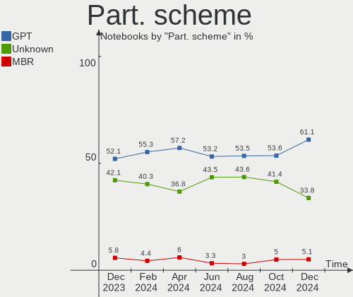
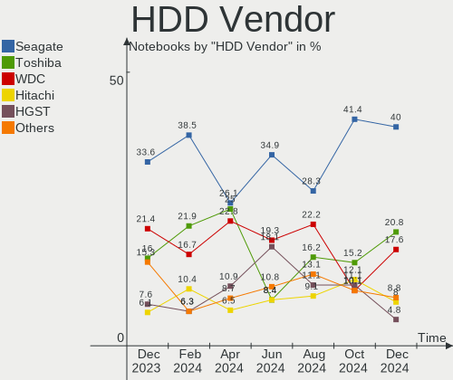
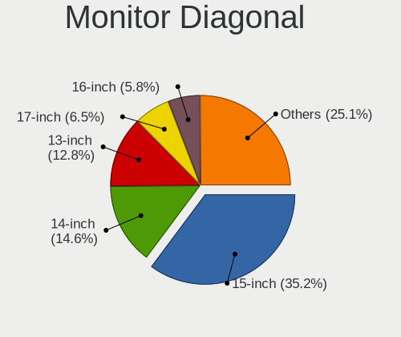
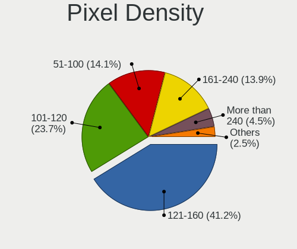
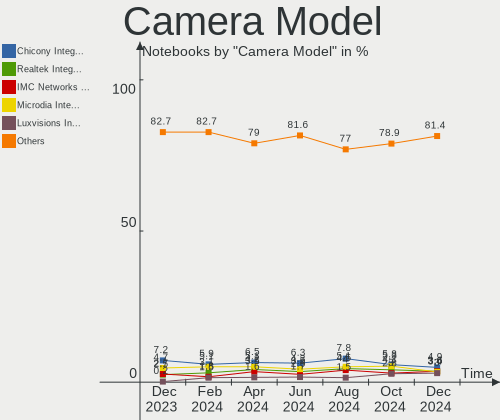

Linux in USA - Hardware Trends (Notebooks)
------------------------------------------

A project to identify most popular hardware characteristics and track their change
over time based on data collected by Linux users at https://Linux-Hardware.org.

Anyone can contribute to this report by the [hw-probe](https://github.com/linuxhw/hw-probe) tool:

    sudo -E hw-probe -all -upload

Period: Dec, 2022.

Contents
--------

* [ System ](#system)
  - [ OS                       ](#os)
  - [ OS Family                ](#os-family)
  - [ Kernel                   ](#kernel)
  - [ Kernel Family            ](#kernel-family)
  - [ Kernel Major Ver.        ](#kernel-major-ver)
  - [ Arch                     ](#arch)
  - [ DE                       ](#de)
  - [ Display Server           ](#display-server)
  - [ Display Manager          ](#display-manager)
  - [ OS Lang                  ](#os-lang)
  - [ Boot Mode                ](#boot-mode)
  - [ Filesystem               ](#filesystem)
  - [ Part. scheme             ](#part-scheme)
  - [ Dual Boot with Linux/BSD ](#dual-boot-with-linuxbsd)
  - [ Dual Boot (Win)          ](#dual-boot-win)

* [ Board ](#board)
  - [ Vendor                   ](#vendor)
  - [ Model                    ](#model)
  - [ Model Family             ](#model-family)
  - [ MFG Year                 ](#mfg-year)
  - [ Form Factor              ](#form-factor)
  - [ Secure Boot              ](#secure-boot)
  - [ Coreboot                 ](#coreboot)
  - [ RAM Size                 ](#ram-size)
  - [ RAM Used                 ](#ram-used)
  - [ Total Drives             ](#total-drives)
  - [ Has CD-ROM               ](#has-cd-rom)
  - [ Has Ethernet             ](#has-ethernet)
  - [ Has WiFi                 ](#has-wifi)
  - [ Has Bluetooth            ](#has-bluetooth)

* [ Location ](#location)
  - [ Country                  ](#country)
  - [ City                     ](#city)

* [ Drives ](#drives)
  - [ Drive Vendor             ](#drive-vendor)
  - [ Drive Model              ](#drive-model)
  - [ HDD Vendor               ](#hdd-vendor)
  - [ SSD Vendor               ](#ssd-vendor)
  - [ Drive Kind               ](#drive-kind)
  - [ Drive Connector          ](#drive-connector)
  - [ Drive Size               ](#drive-size)
  - [ Space Total              ](#space-total)
  - [ Space Used               ](#space-used)
  - [ Malfunc. Drives          ](#malfunc-drives)
  - [ Malfunc. Drive Vendor    ](#malfunc-drive-vendor)
  - [ Malfunc. HDD Vendor      ](#malfunc-hdd-vendor)
  - [ Malfunc. Drive Kind      ](#malfunc-drive-kind)
  - [ Failed Drives            ](#failed-drives)
  - [ Failed Drive Vendor      ](#failed-drive-vendor)
  - [ Drive Status             ](#drive-status)

* [ Storage controller ](#storage-controller)
  - [ Storage Vendor           ](#storage-vendor)
  - [ Storage Model            ](#storage-model)
  - [ Storage Kind             ](#storage-kind)

* [ Processor ](#processor)
  - [ CPU Vendor               ](#cpu-vendor)
  - [ CPU Model                ](#cpu-model)
  - [ CPU Model Family         ](#cpu-model-family)
  - [ CPU Cores                ](#cpu-cores)
  - [ CPU Sockets              ](#cpu-sockets)
  - [ CPU Threads              ](#cpu-threads)
  - [ CPU Op-Modes             ](#cpu-op-modes)
  - [ CPU Microcode            ](#cpu-microcode)
  - [ CPU Microarch            ](#cpu-microarch)

* [ Graphics ](#graphics)
  - [ GPU Vendor               ](#gpu-vendor)
  - [ GPU Model                ](#gpu-model)
  - [ GPU Combo                ](#gpu-combo)
  - [ GPU Driver               ](#gpu-driver)
  - [ GPU Memory               ](#gpu-memory)

* [ Monitor ](#monitor)
  - [ Monitor Vendor           ](#monitor-vendor)
  - [ Monitor Model            ](#monitor-model)
  - [ Monitor Resolution       ](#monitor-resolution)
  - [ Monitor Diagonal         ](#monitor-diagonal)
  - [ Monitor Width            ](#monitor-width)
  - [ Aspect Ratio             ](#aspect-ratio)
  - [ Monitor Area             ](#monitor-area)
  - [ Pixel Density            ](#pixel-density)
  - [ Multiple Monitors        ](#multiple-monitors)

* [ Network ](#network)
  - [ Net Controller Vendor    ](#net-controller-vendor)
  - [ Net Controller Model     ](#net-controller-model)
  - [ Wireless Vendor          ](#wireless-vendor)
  - [ Wireless Model           ](#wireless-model)
  - [ Ethernet Vendor          ](#ethernet-vendor)
  - [ Ethernet Model           ](#ethernet-model)
  - [ Net Controller Kind      ](#net-controller-kind)
  - [ Used Controller          ](#used-controller)
  - [ NICs                     ](#nics)
  - [ IPv6                     ](#ipv6)

* [ Bluetooth ](#bluetooth)
  - [ Bluetooth Vendor         ](#bluetooth-vendor)
  - [ Bluetooth Model          ](#bluetooth-model)

* [ Sound ](#sound)
  - [ Sound Vendor             ](#sound-vendor)
  - [ Sound Model              ](#sound-model)

* [ Memory ](#memory)
  - [ Memory Vendor            ](#memory-vendor)
  - [ Memory Model             ](#memory-model)
  - [ Memory Kind              ](#memory-kind)
  - [ Memory Form Factor       ](#memory-form-factor)
  - [ Memory Size              ](#memory-size)
  - [ Memory Speed             ](#memory-speed)

* [ Printers & scanners ](#printers--scanners)
  - [ Printer Vendor           ](#printer-vendor)
  - [ Printer Model            ](#printer-model)
  - [ Scanner Vendor           ](#scanner-vendor)
  - [ Scanner Model            ](#scanner-model)

* [ Camera ](#camera)
  - [ Camera Vendor            ](#camera-vendor)
  - [ Camera Model             ](#camera-model)

* [ Security ](#security)
  - [ Fingerprint Vendor       ](#fingerprint-vendor)
  - [ Fingerprint Model        ](#fingerprint-model)
  - [ Chipcard Vendor          ](#chipcard-vendor)
  - [ Chipcard Model           ](#chipcard-model)

* [ Unsupported ](#unsupported)
  - [ Unsupported Devices      ](#unsupported-devices)
  - [ Unsupported Device Types ](#unsupported-device-types)

System
------

OS
--

Installed operating systems

| Name                         | Notebooks | Percent |
|------------------------------|-----------|---------|
| Ubuntu 22.04                 | 72        | 15.29%  |
| Debian 11                    | 39        | 8.28%   |
| Linux Mint 21                | 28        | 5.94%   |
| Fedora 37                    | 27        | 5.73%   |
| Pop!_OS 22.04                | 24        | 5.1%    |
| Zorin 16                     | 20        | 4.25%   |
| Arch Rolling                 | 16        | 3.4%    |
| Ubuntu 22.10                 | 15        | 3.18%   |
| KDE neon 22.04               | 12        | 2.55%   |
| SteamOS 3.4.2                | 11        | 2.34%   |
| Linux Mint 20.3              | 11        | 2.34%   |
| SteamOS 3.3.2                | 9         | 1.91%   |
| Manjaro                      | 9         | 1.91%   |
| Linux Mint 21.1              | 8         | 1.7%    |
| Fedora 36                    | 8         | 1.7%    |
| Ubuntu 20.04                 | 7         | 1.49%   |
| Nobara 36                    | 7         | 1.49%   |
| Kubuntu 22.04                | 7         | 1.49%   |
| EndeavourOS Rolling          | 7         | 1.49%   |
| OpenMandriva 4.50            | 6         | 1.27%   |
| OpenMandriva 4.3             | 6         | 1.27%   |
| Manjaro 22.0.0               | 6         | 1.27%   |
| Kali 2022.4                  | 6         | 1.27%   |
| Gentoo 2.9                   | 6         | 1.27%   |
| Xubuntu 22.04                | 5         | 1.06%   |
| SteamOS 3.4.4                | 5         | 1.06%   |
| SteamOS 3.4                  | 5         | 1.06%   |
| SteamOS 3.3.3                | 5         | 1.06%   |
| SteamOS 3.4.3                | 4         | 0.85%   |
| Kubuntu 22.10                | 4         | 0.85%   |
| Garuda Linux Soaring         | 4         | 0.85%   |
| Ubuntu MATE 22.10            | 3         | 0.64%   |
| Ubuntu MATE 22.04            | 3         | 0.64%   |
| openSUSE Tumbleweed-XXXXXXXX | 3         | 0.64%   |
| MX 21                        | 3         | 0.64%   |
| LMDE 5                       | 3         | 0.64%   |
| Debian                       | 3         | 0.64%   |
| ArcoLinux Rolling            | 3         | 0.64%   |
| Xubuntu 20.04                | 2         | 0.42%   |
| Ubuntu 18.04                 | 2         | 0.42%   |

OS Family
---------

OS without a version

| Name              | Notebooks | Percent |
|-------------------|-----------|---------|
| Ubuntu            | 97        | 20.59%  |
| Linux Mint        | 52        | 11.04%  |
| Debian            | 43        | 9.13%   |
| SteamOS           | 40        | 8.49%   |
| Fedora            | 37        | 7.86%   |
| Pop!_OS           | 24        | 5.1%    |
| Zorin             | 20        | 4.25%   |
| Manjaro           | 16        | 3.4%    |
| Arch              | 16        | 3.4%    |
| OpenMandriva      | 15        | 3.18%   |
| KDE neon          | 13        | 2.76%   |
| Kubuntu           | 12        | 2.55%   |
| Xubuntu           | 9         | 1.91%   |
| Nobara            | 7         | 1.49%   |
| Kali              | 7         | 1.49%   |
| Gentoo            | 7         | 1.49%   |
| EndeavourOS       | 7         | 1.49%   |
| Ubuntu MATE       | 6         | 1.27%   |
| Garuda Linux      | 6         | 1.27%   |
| Lubuntu           | 5         | 1.06%   |
| Rocky Linux       | 3         | 0.64%   |
| RHEL              | 3         | 0.64%   |
| openSUSE          | 3         | 0.64%   |
| MX                | 3         | 0.64%   |
| LMDE              | 3         | 0.64%   |
| ArcoLinux         | 3         | 0.64%   |
| Elementary        | 2         | 0.42%   |
| Xero              | 1         | 0.21%   |
| Ultramarine Linux | 1         | 0.21%   |
| Ubuntu-buildvar   | 1         | 0.21%   |
| Ubuntu Unity      | 1         | 0.21%   |
| Q4OS              | 1         | 0.21%   |
| Parrot            | 1         | 0.21%   |
| Oracle Linux      | 1         | 0.21%   |
| Nitrux            | 1         | 0.21%   |
| Manjaro-ARM       | 1         | 0.21%   |
| Endless           | 1         | 0.21%   |
| Devuan            | 1         | 0.21%   |
| BunsenLabs        | 1         | 0.21%   |

Kernel
------

Version of the Linux kernel

| Version                    | Notebooks | Percent |
|----------------------------|-----------|---------|
| 5.15.0-56-generic          | 126       | 26.75%  |
| 5.10.0-20-amd64            | 23        | 4.88%   |
| 5.13.0-valve36-1-neptune   | 20        | 4.25%   |
| 5.19.0-26-generic          | 19        | 4.03%   |
| 5.13.0-valve21.3-1-neptune | 15        | 3.18%   |
| 6.0.6-76060006-generic     | 14        | 2.97%   |
| 5.4.0-135-generic          | 11        | 2.34%   |
| 5.15.0-53-generic          | 11        | 2.34%   |
| 6.0.12-76060006-generic    | 10        | 2.12%   |
| 5.10.0-18-amd64            | 10        | 2.12%   |
| 6.0.10-300.fc37.x86_64     | 8         | 1.7%    |
| 6.1.1-arch1-1              | 7         | 1.49%   |
| 6.0.15-300.fc37.x86_64     | 7         | 1.49%   |
| 5.15.0-41-generic          | 7         | 1.49%   |
| 5.10.0-19-amd64            | 7         | 1.49%   |
| 6.0.12-arch1-1             | 6         | 1.27%   |
| 6.0.10-201.fc36.x86_64     | 6         | 1.27%   |
| 5.16.7-desktop-1omv4003    | 6         | 1.27%   |
| 5.15.81-1-MANJARO          | 6         | 1.27%   |
| 5.15.0-57-generic          | 6         | 1.27%   |
| 5.15.0-52-generic          | 6         | 1.27%   |
| 5.15.0-43-generic          | 6         | 1.27%   |
| 5.19.12-desktop-2omv4090   | 5         | 1.06%   |
| 5.13.0-valve35-1-neptune   | 5         | 1.06%   |
| 6.0.12-300.fc37.x86_64     | 4         | 0.85%   |
| 6.1.1-zen1-1-zen           | 3         | 0.64%   |
| 6.0.12-1-default           | 3         | 0.64%   |
| 6.0.0-6-amd64              | 3         | 0.64%   |
| 5.15.80-gentoo-x86_64      | 3         | 0.64%   |
| 5.15.78-1-MANJARO          | 3         | 0.64%   |
| 6.1.1-1-MANJARO            | 2         | 0.42%   |
| 6.0.9-zen1-1-zen           | 2         | 0.42%   |
| 6.0.9-300.fc37.x86_64      | 2         | 0.42%   |
| 6.0.13-300.fc37.x86_64     | 2         | 0.42%   |
| 6.0.11-arch1-1             | 2         | 0.42%   |
| 6.0.11-300.fc37.x86_64     | 2         | 0.42%   |
| 6.0.10-desktop-2omv22090   | 2         | 0.42%   |
| 6.0.10-arch2-1             | 2         | 0.42%   |
| 6.0.10-200.fc36.x86_64     | 2         | 0.42%   |
| 6.0.0-kali5-amd64          | 2         | 0.42%   |

Kernel Family
-------------

Linux kernel without a distro release

| Version | Notebooks | Percent |
|---------|-----------|---------|
| 5.15.0  | 166       | 35.24%  |
| 5.10.0  | 44        | 9.34%   |
| 5.13.0  | 41        | 8.7%    |
| 5.19.0  | 26        | 5.52%   |
| 6.0.12  | 25        | 5.31%   |
| 6.0.10  | 21        | 4.46%   |
| 5.4.0   | 16        | 3.4%    |
| 6.1.1   | 14        | 2.97%   |
| 6.0.6   | 14        | 2.97%   |
| 6.0.0   | 14        | 2.97%   |
| 6.0.11  | 8         | 1.7%    |
| 6.0.15  | 7         | 1.49%   |
| 5.14.0  | 7         | 1.49%   |
| 6.0.9   | 6         | 1.27%   |
| 5.16.7  | 6         | 1.27%   |
| 5.15.81 | 6         | 1.27%   |
| 5.19.12 | 5         | 1.06%   |
| 5.15.80 | 4         | 0.85%   |
| 6.1.0   | 3         | 0.64%   |
| 5.18.0  | 3         | 0.64%   |
| 5.15.78 | 3         | 0.64%   |
| 6.0.2   | 2         | 0.42%   |
| 6.0.14  | 2         | 0.42%   |
| 6.0.13  | 2         | 0.42%   |
| 5.15.84 | 2         | 0.42%   |
| 5.15.83 | 2         | 0.42%   |
| 5.15.75 | 2         | 0.42%   |
| 4.18.0  | 2         | 0.42%   |
| 4.15.0  | 2         | 0.42%   |
| 6.0.8   | 1         | 0.21%   |
| 6.0.7   | 1         | 0.21%   |
| 5.19.5  | 1         | 0.21%   |
| 5.19.4  | 1         | 0.21%   |
| 5.19.13 | 1         | 0.21%   |
| 5.18.17 | 1         | 0.21%   |
| 5.18.12 | 1         | 0.21%   |
| 5.18.10 | 1         | 0.21%   |
| 5.17.5  | 1         | 0.21%   |
| 5.17.0  | 1         | 0.21%   |
| 5.16.20 | 1         | 0.21%   |

Kernel Major Ver.
-----------------

Linux kernel major version

| Version | Notebooks | Percent |
|---------|-----------|---------|
| 5.15    | 187       | 39.7%   |
| 6.0     | 103       | 21.87%  |
| 5.10    | 45        | 9.55%   |
| 5.13    | 41        | 8.7%    |
| 5.19    | 34        | 7.22%   |
| 6.1     | 17        | 3.61%   |
| 5.4     | 16        | 3.4%    |
| 5.16    | 8         | 1.7%    |
| 5.14    | 7         | 1.49%   |
| 5.18    | 6         | 1.27%   |
| 5.17    | 2         | 0.42%   |
| 4.18    | 2         | 0.42%   |
| 4.15    | 2         | 0.42%   |
| 5.11    | 1         | 0.21%   |

Arch
----

OS architecture (x86_64, i586, etc.)

| Name    | Notebooks | Percent |
|---------|-----------|---------|
| x86_64  | 468       | 99.36%  |
| i686    | 2         | 0.42%   |
| aarch64 | 1         | 0.21%   |

DE
--

Desktop Environment

| Name           | Notebooks | Percent |
|----------------|-----------|---------|
| GNOME          | 202       | 42.89%  |
| KDE5           | 128       | 27.18%  |
| X-Cinnamon     | 51        | 10.83%  |
| XFCE           | 39        | 8.28%   |
| Unknown        | 18        | 3.82%   |
| MATE           | 14        | 2.97%   |
| LXQt           | 5         | 1.06%   |
| Pantheon       | 2         | 0.42%   |
| Cinnamon       | 2         | 0.42%   |
| Budgie         | 2         | 0.42%   |
| Unity          | 1         | 0.21%   |
| Trinity        | 1         | 0.21%   |
| sway           | 1         | 0.21%   |
| LXDE           | 1         | 0.21%   |
| KDE            | 1         | 0.21%   |
| i3-with-shmlog | 1         | 0.21%   |
| i3             | 1         | 0.21%   |
| Enlightenment  | 1         | 0.21%   |

Display Server
--------------

X11 or Wayland

| Name    | Notebooks | Percent |
|---------|-----------|---------|
| X11     | 325       | 69%     |
| Wayland | 129       | 27.39%  |
| Unknown | 15        | 3.18%   |
| Tty     | 2         | 0.42%   |

Display Manager
---------------

SDDM, LightDM, etc.

| Name    | Notebooks | Percent |
|---------|-----------|---------|
| Unknown | 189       | 40.13%  |
| GDM3    | 101       | 21.44%  |
| LightDM | 75        | 15.92%  |
| SDDM    | 58        | 12.31%  |
| GDM     | 42        | 8.92%   |
| SLiM    | 2         | 0.42%   |
| XDM     | 1         | 0.21%   |
| TDM     | 1         | 0.21%   |
| LXDM    | 1         | 0.21%   |
| KDM     | 1         | 0.21%   |

OS Lang
-------

Language

| Lang    | Notebooks | Percent |
|---------|-----------|---------|
| en_US   | 456       | 96.82%  |
| Unknown | 6         | 1.27%   |
| es_US   | 2         | 0.42%   |
| en_CA   | 2         | 0.42%   |
| C       | 2         | 0.42%   |
| POSIX   | 1         | 0.21%   |
| fr_FR   | 1         | 0.21%   |
| C.UTF8  | 1         | 0.21%   |

Boot Mode
---------

EFI or BIOS

| Mode | Notebooks | Percent |
|------|-----------|---------|
| EFI  | 262       | 55.63%  |
| BIOS | 209       | 44.37%  |

Filesystem
----------

Type of filesystem

| Type    | Notebooks | Percent |
|---------|-----------|---------|
| Ext4    | 305       | 64.76%  |
| Btrfs   | 106       | 22.51%  |
| Overlay | 43        | 9.13%   |
| Xfs     | 13        | 2.76%   |
| Zfs     | 3         | 0.64%   |
| Rootfs  | 1         | 0.21%   |

Part. scheme
------------

Scheme of partitioning

| Type    | Notebooks | Percent |
|---------|-----------|---------|
| GPT     | 266       | 56.48%  |
| Unknown | 176       | 37.37%  |
| MBR     | 29        | 6.16%   |

Dual Boot with Linux/BSD
------------------------

Hosting more than one Linux/BSD

| Dual boot | Notebooks | Percent |
|-----------|-----------|---------|
| No        | 433       | 91.93%  |
| Yes       | 38        | 8.07%   |

Dual Boot (Win)
---------------

Hosting Linux and Windows

| Dual boot | Notebooks | Percent |
|-----------|-----------|---------|
| No        | 395       | 83.86%  |
| Yes       | 76        | 16.14%  |

Board
-----

Vendor
------

Motherboard manufacturer

| Name                           | Notebooks | Percent |
|--------------------------------|-----------|---------|
| Hewlett-Packard                | 90        | 19.11%  |
| Dell                           | 88        | 18.68%  |
| Lenovo                         | 78        | 16.56%  |
| Valve                          | 38        | 8.07%   |
| ASUSTek Computer               | 29        | 6.16%   |
| Apple                          | 24        | 5.1%    |
| Acer                           | 20        | 4.25%   |
| Google                         | 19        | 4.03%   |
| MSI                            | 15        | 3.18%   |
| GPU Company                    | 11        | 2.34%   |
| System76                       | 9         | 1.91%   |
| Toshiba                        | 6         | 1.27%   |
| Razer                          | 4         | 0.85%   |
| Unknown                        | 4         | 0.85%   |
| Alienware                      | 3         | 0.64%   |
| Sony                           | 2         | 0.42%   |
| Samsung Electronics            | 2         | 0.42%   |
| Panasonic                      | 2         | 0.42%   |
| Notebook                       | 2         | 0.42%   |
| LG Electronics                 | 2         | 0.42%   |
| GPD                            | 2         | 0.42%   |
| Gigabyte Technology            | 2         | 0.42%   |
| Framework                      | 2         | 0.42%   |
| Pine Microsystems              | 1         | 0.21%   |
| ONE-NETBOOK TECHNOLOGY         | 1         | 0.21%   |
| Matsushita Electric Industrial | 1         | 0.21%   |
| IPASON                         | 1         | 0.21%   |
| Intel                          | 1         | 0.21%   |
| In-Sing                        | 1         | 0.21%   |
| IBM                            | 1         | 0.21%   |
| Gateway                        | 1         | 0.21%   |
| Fujitsu                        | 1         | 0.21%   |
| Foxconn                        | 1         | 0.21%   |
| Dynabook                       | 1         | 0.21%   |
| Clevo                          | 1         | 0.21%   |
| Chuwi                          | 1         | 0.21%   |
| Carbon Systems                 | 1         | 0.21%   |
| ASRock                         | 1         | 0.21%   |
| AMI                            | 1         | 0.21%   |
| Acidanthera                    | 1         | 0.21%   |

Model
-----

Motherboard model

| Name                                    | Notebooks | Percent |
|-----------------------------------------|-----------|---------|
| Valve Jupiter                           | 38        | 8.07%   |
| Dell Latitude E7440                     | 8         | 1.7%    |
| GPU Company GWTC116-2                   | 5         | 1.06%   |
| HP Stream Laptop 14-cb1xxx              | 4         | 0.85%   |
| Dell Latitude E6430                     | 4         | 0.85%   |
| Apple MacBookAir7,2                     | 4         | 0.85%   |
| Unknown                                 | 4         | 0.85%   |
| System76 Gazelle                        | 3         | 0.64%   |
| HP Pavilion g7                          | 3         | 0.64%   |
| HP Pavilion dv7                         | 3         | 0.64%   |
| HP 15 Notebook PC                       | 3         | 0.64%   |
| GPU Company GWNR71517                   | 3         | 0.64%   |
| Apple MacBookPro9,2                     | 3         | 0.64%   |
| Apple MacBookPro10,1                    | 3         | 0.64%   |
| Apple MacBookAir7,1                     | 3         | 0.64%   |
| System76 Oryx Pro                       | 2         | 0.42%   |
| Razer Blade 15 (2022) - RZ09-0421       | 2         | 0.42%   |
| Lenovo ThinkPad 13 2nd Gen 20J10046US   | 2         | 0.42%   |
| Lenovo ThinkBook 15 G3 ACL 21A4         | 2         | 0.42%   |
| Lenovo IdeaPad Gaming 3 15ARH7 82SB     | 2         | 0.42%   |
| Lenovo IdeaPad 3 15ITL05 81X8           | 2         | 0.42%   |
| HP ProBook 440 14 inch G9 Notebook PC   | 2         | 0.42%   |
| HP Laptop 17-ca0xxx                     | 2         | 0.42%   |
| HP Laptop 15-dw0xxx                     | 2         | 0.42%   |
| HP Laptop 15-da0xxx                     | 2         | 0.42%   |
| HP EliteBook 8730w                      | 2         | 0.42%   |
| HP EliteBook 8470p                      | 2         | 0.42%   |
| HP EliteBook 8460p                      | 2         | 0.42%   |
| HP EliteBook 845 14 inch G9 Notebook PC | 2         | 0.42%   |
| HP Compaq Presario CQ60                 | 2         | 0.42%   |
| Google Reks                             | 2         | 0.42%   |
| Google Lick                             | 2         | 0.42%   |
| Google Babytiger                        | 2         | 0.42%   |
| Framework Laptop (12th Gen Intel Core)  | 2         | 0.42%   |
| Dell XPS 9320                           | 2         | 0.42%   |
| Dell XPS 15 9570                        | 2         | 0.42%   |
| Dell XPS 15 9520                        | 2         | 0.42%   |
| Dell XPS 15 9510                        | 2         | 0.42%   |
| Dell XPS 13 9370                        | 2         | 0.42%   |
| Dell XPS 13 9360                        | 2         | 0.42%   |

Model Family
------------

Motherboard model prefix

| Name                  | Notebooks | Percent |
|-----------------------|-----------|---------|
| Lenovo ThinkPad       | 47        | 9.98%   |
| Valve Jupiter         | 38        | 8.07%   |
| Dell Latitude         | 35        | 7.43%   |
| Dell Inspiron         | 23        | 4.88%   |
| HP Pavilion           | 16        | 3.4%    |
| HP EliteBook          | 16        | 3.4%    |
| HP Laptop             | 15        | 3.18%   |
| Dell XPS              | 15        | 3.18%   |
| Lenovo IdeaPad        | 14        | 2.97%   |
| Acer Aspire           | 11        | 2.34%   |
| HP Stream             | 9         | 1.91%   |
| HP ProBook            | 9         | 1.91%   |
| Apple MacBookAir7     | 7         | 1.49%   |
| Toshiba Satellite     | 6         | 1.27%   |
| HP ZBook              | 6         | 1.27%   |
| ASUS ROG              | 6         | 1.27%   |
| Lenovo Legion         | 5         | 1.06%   |
| GPU Company GWTC116-2 | 5         | 1.06%   |
| Dell Precision        | 5         | 1.06%   |
| Razer Blade           | 4         | 0.85%   |
| HP ENVY               | 4         | 0.85%   |
| HP Compaq             | 4         | 0.85%   |
| HP 15                 | 4         | 0.85%   |
| ASUS ZenBook          | 4         | 0.85%   |
| ASUS VivoBook         | 4         | 0.85%   |
| Apple MacBookPro8     | 4         | 0.85%   |
| Acer Nitro            | 4         | 0.85%   |
| Unknown               | 4         | 0.85%   |
| System76 Gazelle      | 3         | 0.64%   |
| MSI GF63              | 3         | 0.64%   |
| Lenovo ThinkBook      | 3         | 0.64%   |
| GPU Company GWNR71517 | 3         | 0.64%   |
| Dell G5               | 3         | 0.64%   |
| Apple MacBookPro9     | 3         | 0.64%   |
| Apple MacBookPro10    | 3         | 0.64%   |
| Acer Swift            | 3         | 0.64%   |
| System76 Oryx         | 2         | 0.42%   |
| MSI Summit            | 2         | 0.42%   |
| MSI Prestige          | 2         | 0.42%   |
| HP Victus             | 2         | 0.42%   |

MFG Year
--------

Motherboard manufacture year

| Year    | Notebooks | Percent |
|---------|-----------|---------|
| 2022    | 107       | 22.72%  |
| 2021    | 66        | 14.01%  |
| 2020    | 35        | 7.43%   |
| 2019    | 35        | 7.43%   |
| 2012    | 34        | 7.22%   |
| 2017    | 31        | 6.58%   |
| 2018    | 30        | 6.37%   |
| 2013    | 26        | 5.52%   |
| 2015    | 22        | 4.67%   |
| 2011    | 20        | 4.25%   |
| 2014    | 19        | 4.03%   |
| 2016    | 13        | 2.76%   |
| 2008    | 13        | 2.76%   |
| 2009    | 7         | 1.49%   |
| 2010    | 5         | 1.06%   |
| 2007    | 5         | 1.06%   |
| 2006    | 1         | 0.21%   |
| 2004    | 1         | 0.21%   |
| Unknown | 1         | 0.21%   |

Form Factor
-----------

Physical design of the computer

| Name     | Notebooks | Percent |
|----------|-----------|---------|
| Notebook | 471       | 100%    |

Secure Boot
-----------

Enabled or disabled

| State    | Notebooks | Percent |
|----------|-----------|---------|
| Disabled | 425       | 90.23%  |
| Enabled  | 46        | 9.77%   |

Coreboot
--------

Have coreboot on board

| Used | Notebooks | Percent |
|------|-----------|---------|
| No   | 449       | 95.33%  |
| Yes  | 22        | 4.67%   |

RAM Size
--------

Total RAM memory

| Size in GB  | Notebooks | Percent |
|-------------|-----------|---------|
| 8.01-16.0   | 111       | 23.57%  |
| 4.01-8.0    | 96        | 20.38%  |
| 16.01-24.0  | 93        | 19.75%  |
| 3.01-4.0    | 89        | 18.9%   |
| 32.01-64.0  | 53        | 11.25%  |
| 1.01-2.0    | 11        | 2.34%   |
| 24.01-32.0  | 10        | 2.12%   |
| 64.01-256.0 | 6         | 1.27%   |
| 2.01-3.0    | 2         | 0.42%   |

RAM Used
--------

Used RAM memory

| Used GB    | Notebooks | Percent |
|------------|-----------|---------|
| 1.01-2.0   | 132       | 28.03%  |
| 2.01-3.0   | 131       | 27.81%  |
| 3.01-4.0   | 92        | 19.53%  |
| 4.01-8.0   | 73        | 15.5%   |
| 8.01-16.0  | 20        | 4.25%   |
| 0.51-1.0   | 16        | 3.4%    |
| 0.01-0.5   | 4         | 0.85%   |
| 16.01-24.0 | 3         | 0.64%   |

Total Drives
------------

Number of drives on board

| Drives | Notebooks | Percent |
|--------|-----------|---------|
| 1      | 365       | 77.49%  |
| 2      | 91        | 19.32%  |
| 3      | 12        | 2.55%   |
| 4      | 2         | 0.42%   |
| 0      | 1         | 0.21%   |

Has CD-ROM
----------

Has CD-ROM on board

| Presented | Notebooks | Percent |
|-----------|-----------|---------|
| No        | 357       | 75.8%   |
| Yes       | 114       | 24.2%   |

Has Ethernet
------------

Has Ethernet on board

| Presented | Notebooks | Percent |
|-----------|-----------|---------|
| Yes       | 324       | 68.79%  |
| No        | 147       | 31.21%  |

Has WiFi
--------

Has WiFi module

| Presented | Notebooks | Percent |
|-----------|-----------|---------|
| Yes       | 467       | 99.15%  |
| No        | 4         | 0.85%   |

Has Bluetooth
-------------

Has Bluetooth module

| Presented | Notebooks | Percent |
|-----------|-----------|---------|
| Yes       | 390       | 82.8%   |
| No        | 81        | 17.2%   |

Location
--------

Country
-------

Geographic location (country)

| Country | Notebooks | Percent |
|---------|-----------|---------|
| USA     | 471       | 100%    |

City
----

Geographic location (city)

| City           | Notebooks | Percent |
|----------------|-----------|---------|
| Bangor         | 28        | 5.94%   |
| Chicago        | 8         | 1.7%    |
| Seattle        | 7         | 1.49%   |
| San Antonio    | 7         | 1.49%   |
| Pittsburgh     | 6         | 1.27%   |
| New York       | 6         | 1.27%   |
| Mesa           | 6         | 1.27%   |
| Portland       | 5         | 1.06%   |
| Miami          | 5         | 1.06%   |
| Las Vegas      | 5         | 1.06%   |
| Kansas City    | 5         | 1.06%   |
| Houston        | 5         | 1.06%   |
| Austin         | 5         | 1.06%   |
| Springfield    | 4         | 0.85%   |
| Minneapolis    | 4         | 0.85%   |
| Los Angeles    | 4         | 0.85%   |
| Kingston       | 4         | 0.85%   |
| Dallas         | 4         | 0.85%   |
| Cleveland      | 4         | 0.85%   |
| Charlotte      | 4         | 0.85%   |
| Atlanta        | 4         | 0.85%   |
| Virginia Beach | 3         | 0.64%   |
| Spokane        | 3         | 0.64%   |
| San Jose       | 3         | 0.64%   |
| Manitowoc      | 3         | 0.64%   |
| Madison        | 3         | 0.64%   |
| Leland         | 3         | 0.64%   |
| Denver         | 3         | 0.64%   |
| Beaverton      | 3         | 0.64%   |
| Valencia       | 2         | 0.42%   |
| The Bronx      | 2         | 0.42%   |
| Syracuse       | 2         | 0.42%   |
| Rochester      | 2         | 0.42%   |
| Redmond        | 2         | 0.42%   |
| Raleigh        | 2         | 0.42%   |
| Poway          | 2         | 0.42%   |
| Plano          | 2         | 0.42%   |
| Phoenix        | 2         | 0.42%   |
| Olympia        | 2         | 0.42%   |
| New Orleans    | 2         | 0.42%   |

Drives
------

Drive Vendor
------------

Hard drive vendors

| Vendor                         | Notebooks | Drives | Percent |
|--------------------------------|-----------|--------|---------|
| Samsung Electronics            | 105       | 114    | 18.13%  |
| Unknown                        | 68        | 70     | 11.74%  |
| SanDisk                        | 45        | 46     | 7.77%   |
| WDC                            | 34        | 37     | 5.87%   |
| Seagate                        | 29        | 32     | 5.01%   |
| Toshiba                        | 28        | 28     | 4.84%   |
| SK hynix                       | 27        | 29     | 4.66%   |
| Kingston                       | 24        | 24     | 4.15%   |
| Intel                          | 20        | 20     | 3.45%   |
| Phison Electronics             | 16        | 16     | 2.76%   |
| Apple                          | 16        | 16     | 2.76%   |
| Unknown                        | 15        | 15     | 2.59%   |
| Kingston Technology Company    | 14        | 14     | 2.42%   |
| HGST                           | 14        | 14     | 2.42%   |
| Hitachi                        | 13        | 13     | 2.25%   |
| Crucial                        | 13        | 14     | 2.25%   |
| PNY                            | 9         | 9      | 1.55%   |
| Micron Technology              | 9         | 9      | 1.55%   |
| A-DATA Technology              | 7         | 7      | 1.21%   |
| SPCC                           | 6         | 6      | 1.04%   |
| O2 Micro                       | 6         | 6      | 1.04%   |
| China                          | 6         | 6      | 1.04%   |
| KIOXIA                         | 4         | 4      | 0.69%   |
| Silicon Motion                 | 3         | 3      | 0.52%   |
| Micron/Crucial Technology      | 3         | 3      | 0.52%   |
| LITEONIT                       | 3         | 3      | 0.52%   |
| LITEON                         | 3         | 3      | 0.52%   |
| Fujitsu                        | 3         | 3      | 0.52%   |
| Solid State Storage Technology | 2         | 2      | 0.35%   |
| SABRENT                        | 2         | 2      | 0.35%   |
| Netac                          | 2         | 2      | 0.35%   |
| Mushkin                        | 2         | 2      | 0.35%   |
| KingSpec                       | 2         | 2      | 0.35%   |
| Inland                         | 2         | 2      | 0.35%   |
| Hewlett-Packard                | 2         | 2      | 0.35%   |
| YMTC                           | 1         | 1      | 0.17%   |
| W800S                          | 1         | 1      | 0.17%   |
| Union Memory                   | 1         | 1      | 0.17%   |
| TEAM T25                       | 1         | 1      | 0.17%   |
| Team                           | 1         | 1      | 0.17%   |

Drive Model
-----------

Hard drive models

| Model                                                  | Notebooks | Percent |
|--------------------------------------------------------|-----------|---------|
| Unknown                                                | 15        | 2.53%   |
| Unknown MMC Card  64GB                                 | 14        | 2.36%   |
| Kingston Company OM3PDP3 NVMe SSD 512GB                | 13        | 2.19%   |
| Samsung NVMe SSD Controller SM981/PM981/PM983 500GB    | 12        | 2.02%   |
| Unknown MMC Card  32GB                                 | 11        | 1.85%   |
| Phison PS5013 E13 NVMe Controller 512GB                | 10        | 1.69%   |
| Unknown MMC Card  128GB                                | 7         | 1.18%   |
| Sandisk WD Black SN750 / PC SN730 NVMe SSD 512GB       | 7         | 1.18%   |
| Unknown MMC Card  512GB                                | 6         | 1.01%   |
| O2 Micro E2M2 64GB                                     | 6         | 1.01%   |
| HGST HTS721010A9E630 1TB                               | 6         | 1.01%   |
| Toshiba MQ01ABD100 1TB                                 | 5         | 0.84%   |
| Sandisk WD Black SN850 1TB                             | 5         | 0.84%   |
| Samsung NVMe SSD Controller PM9A1/PM9A3/980PRO 2TB     | 5         | 0.84%   |
| Kingston SV300S37A120G 120GB SSD                       | 5         | 0.84%   |
| Kingston SA400S37240G 240GB SSD                        | 5         | 0.84%   |
| Unknown MMC Card  256GB                                | 4         | 0.67%   |
| Seagate ST1000LM024 HN-M101MBB 1TB                     | 4         | 0.67%   |
| Samsung NVMe SSD Controller SM961/PM961/SM963 256GB    | 4         | 0.67%   |
| Apple SSD SM0128G 121GB                                | 4         | 0.67%   |
| WDC WDS500G2B0B-00YS70 500GB SSD                       | 3         | 0.51%   |
| WDC WD10SPZX-60Z10T0 1TB                               | 3         | 0.51%   |
| Toshiba MQ04ABF100 1TB                                 | 3         | 0.51%   |
| Silicon Motion SM2263EN/SM2263XT SSD Controller 1024GB | 3         | 0.51%   |
| Seagate ST500LT012-1DG142 500GB                        | 3         | 0.51%   |
| Seagate BUP Slim 2TB                                   | 3         | 0.51%   |
| Sandisk WD Blue SN550 NVMe SSD 500GB                   | 3         | 0.51%   |
| Samsung SSD 970 EVO Plus 500GB                         | 3         | 0.51%   |
| Samsung SSD 850 EVO 500GB                              | 3         | 0.51%   |
| Samsung SSD 850 EVO 250GB                              | 3         | 0.51%   |
| Samsung MZVLQ512HBLU-00B00 512GB                       | 3         | 0.51%   |
| Samsung MZALQ512HBLU-00BL2 512GB                       | 3         | 0.51%   |
| Samsung MZ9LQ512HBLU-00BVL 512GB                       | 3         | 0.51%   |
| Phison E12 NVMe Controller 1TB                         | 3         | 0.51%   |
| Micron 3400_MTFDKBA512TFH 512GB                        | 3         | 0.51%   |
| Micron 1100_MTFDDAV256TBN 256GB SSD                    | 3         | 0.51%   |
| Intel SSDPEKNW010T8 1TB                                | 3         | 0.51%   |
| HGST HTS725050A7E630 500GB                             | 3         | 0.51%   |
| Apple SSD AP0128H 121GB                                | 3         | 0.51%   |
| WDC WD3200BEKT-75PVMT1 320GB                           | 2         | 0.34%   |

HDD Vendor
----------

Hard disk drive vendors

| Vendor  | Notebooks | Drives | Percent |
|---------|-----------|--------|---------|
| Seagate | 28        | 31     | 27.18%  |
| WDC     | 21        | 23     | 20.39%  |
| Toshiba | 20        | 20     | 19.42%  |
| HGST    | 14        | 14     | 13.59%  |
| Hitachi | 13        | 13     | 12.62%  |
| Fujitsu | 3         | 3      | 2.91%   |
| Unknown | 2         | 2      | 1.94%   |
| Apple   | 2         | 2      | 1.94%   |

SSD Vendor
----------

Solid state drive vendors

| Vendor              | Notebooks | Drives | Percent |
|---------------------|-----------|--------|---------|
| Samsung Electronics | 35        | 37     | 22.73%  |
| SanDisk             | 17        | 17     | 11.04%  |
| Kingston            | 15        | 15     | 9.74%   |
| Crucial             | 11        | 12     | 7.14%   |
| Apple               | 9         | 9      | 5.84%   |
| PNY                 | 7         | 7      | 4.55%   |
| WDC                 | 6         | 6      | 3.9%    |
| China               | 6         | 6      | 3.9%    |
| A-DATA Technology   | 6         | 6      | 3.9%    |
| SPCC                | 5         | 5      | 3.25%   |
| SK hynix            | 5         | 5      | 3.25%   |
| Micron Technology   | 4         | 4      | 2.6%    |
| LITEONIT            | 3         | 3      | 1.95%   |
| LITEON              | 3         | 3      | 1.95%   |
| Unknown             | 3         | 3      | 1.95%   |
| Netac               | 2         | 2      | 1.3%    |
| KingSpec            | 2         | 2      | 1.3%    |
| Intel               | 2         | 2      | 1.3%    |
| Inland              | 2         | 2      | 1.3%    |
| Hewlett-Packard     | 2         | 2      | 1.3%    |
| Toshiba             | 1         | 1      | 0.65%   |
| TEAM T25            | 1         | 1      | 0.65%   |
| Plextor             | 1         | 1      | 0.65%   |
| Patriot             | 1         | 1      | 0.65%   |
| Mushkin             | 1         | 1      | 0.65%   |
| KingFast            | 1         | 1      | 0.65%   |
| INDMEM              | 1         | 1      | 0.65%   |
| GLOWAY              | 1         | 1      | 0.65%   |
| Dogfish             | 1         | 1      | 0.65%   |

Drive Kind
----------

HDD or SSD

| Kind    | Notebooks | Drives | Percent |
|---------|-----------|--------|---------|
| NVMe    | 219       | 247    | 39.75%  |
| SSD     | 146       | 157    | 26.5%   |
| HDD     | 100       | 108    | 18.15%  |
| MMC     | 81        | 83     | 14.7%   |
| Unknown | 5         | 5      | 0.91%   |

Drive Connector
---------------

SATA, SAS, NVMe, etc.

| Type | Notebooks | Drives | Percent |
|------|-----------|--------|---------|
| SATA | 221       | 245    | 40.48%  |
| NVMe | 218       | 244    | 39.93%  |
| MMC  | 81        | 83     | 14.84%  |
| SAS  | 26        | 28     | 4.76%   |

Drive Size
----------

Size of hard drive

| Size in TB | Notebooks | Drives | Percent |
|------------|-----------|--------|---------|
| 0.01-0.5   | 154       | 164    | 62.1%   |
| 0.51-1.0   | 78        | 83     | 31.45%  |
| 1.01-2.0   | 13        | 15     | 5.24%   |
| 4.01-10.0  | 2         | 2      | 0.81%   |
| 3.01-4.0   | 1         | 1      | 0.4%    |

Space Total
-----------

Amount of disk space available on the file system

| Size in GB     | Notebooks | Percent |
|----------------|-----------|---------|
| 101-250        | 121       | 25.69%  |
| 251-500        | 114       | 24.2%   |
| 501-1000       | 75        | 15.92%  |
| 51-100         | 40        | 8.49%   |
| 1001-2000      | 37        | 7.86%   |
| 1-20           | 27        | 5.73%   |
| Unknown        | 21        | 4.46%   |
| More than 3000 | 18        | 3.82%   |
| 21-50          | 13        | 2.76%   |
| 2001-3000      | 5         | 1.06%   |

Space Used
----------

Amount of used disk space

| Used GB        | Notebooks | Percent |
|----------------|-----------|---------|
| 1-20           | 171       | 36.31%  |
| 21-50          | 83        | 17.62%  |
| 51-100         | 60        | 12.74%  |
| 101-250        | 57        | 12.1%   |
| 251-500        | 48        | 10.19%  |
| 501-1000       | 21        | 4.46%   |
| Unknown        | 21        | 4.46%   |
| More than 3000 | 6         | 1.27%   |
| 1001-2000      | 3         | 0.64%   |
| 2001-3000      | 1         | 0.21%   |

Malfunc. Drives
---------------

Drive models with a malfunction

| Model                                   | Notebooks | Drives | Percent |
|-----------------------------------------|-----------|--------|---------|
| Seagate ST500LT012-9WS142 500GB         | 2         | 2      | 13.33%  |
| Toshiba MQ02ABD100H 1TB                 | 1         | 1      | 6.67%   |
| SK hynix SH920 mSATA 128GB SSD          | 1         | 1      | 6.67%   |
| SK hynix PC711 HFS001TDE9X073N 1024GB   | 1         | 1      | 6.67%   |
| Seagate ST9750420AS 752GB               | 1         | 2      | 6.67%   |
| Seagate ST2000LM 007-1R8174 2TB         | 1         | 1      | 6.67%   |
| Samsung Electronics SSD 870 EVO 500GB   | 1         | 1      | 6.67%   |
| LITEON LCH-512V2S 512GB SSD             | 1         | 1      | 6.67%   |
| Kingston SV300S37A120G 120GB SSD        | 1         | 1      | 6.67%   |
| Kingston SNS4151S332GD 32GB SSD         | 1         | 1      | 6.67%   |
| Kingston RBU-SNS8350DES3128GP 128GB SSD | 1         | 1      | 6.67%   |
| Hitachi HTS721060G9SA00 64GB            | 1         | 1      | 6.67%   |
| HGST HTS545050A7E680 500GB              | 1         | 1      | 6.67%   |
| Crucial CT1050MX300SSD1 1TB             | 1         | 1      | 6.67%   |

Malfunc. Drive Vendor
---------------------

Vendors of faulty drives

| Vendor              | Notebooks | Drives | Percent |
|---------------------|-----------|--------|---------|
| Seagate             | 4         | 5      | 26.67%  |
| Kingston            | 3         | 3      | 20%     |
| SK hynix            | 2         | 2      | 13.33%  |
| Toshiba             | 1         | 1      | 6.67%   |
| Samsung Electronics | 1         | 1      | 6.67%   |
| LITEON              | 1         | 1      | 6.67%   |
| Hitachi             | 1         | 1      | 6.67%   |
| HGST                | 1         | 1      | 6.67%   |
| Crucial             | 1         | 1      | 6.67%   |

Malfunc. HDD Vendor
-------------------

Vendors of faulty HDD drives

| Vendor  | Notebooks | Drives | Percent |
|---------|-----------|--------|---------|
| Seagate | 4         | 5      | 57.14%  |
| Toshiba | 1         | 1      | 14.29%  |
| Hitachi | 1         | 1      | 14.29%  |
| HGST    | 1         | 1      | 14.29%  |

Malfunc. Drive Kind
-------------------

Kinds of faulty drives

| Kind | Notebooks | Drives | Percent |
|------|-----------|--------|---------|
| SSD  | 7         | 7      | 46.67%  |
| HDD  | 7         | 8      | 46.67%  |
| NVMe | 1         | 1      | 6.67%   |

Failed Drives
-------------

Failed drive models

Zero info for selected period =(

Failed Drive Vendor
-------------------

Failed drive vendors

Zero info for selected period =(

Drive Status
------------

Number of failed and malfunc. drives

| Status   | Notebooks | Drives | Percent |
|----------|-----------|--------|---------|
| Detected | 291       | 365    | 59.15%  |
| Works    | 186       | 219    | 37.8%   |
| Malfunc  | 15        | 16     | 3.05%   |

Storage controller
------------------

Storage Vendor
--------------

Storage controller vendors

| Vendor                         | Notebooks | Percent |
|--------------------------------|-----------|---------|
| Intel                          | 249       | 47.52%  |
| Samsung Electronics            | 78        | 14.89%  |
| AMD                            | 50        | 9.54%   |
| SanDisk                        | 31        | 5.92%   |
| SK hynix                       | 22        | 4.2%    |
| Kingston Technology Company    | 22        | 4.2%    |
| Phison Electronics             | 19        | 3.63%   |
| Toshiba America Info Systems   | 8         | 1.53%   |
| O2 Micro                       | 6         | 1.15%   |
| Micron/Crucial Technology      | 5         | 0.95%   |
| Micron Technology              | 5         | 0.95%   |
| Solid State Storage Technology | 4         | 0.76%   |
| Silicon Motion                 | 4         | 0.76%   |
| KIOXIA                         | 4         | 0.76%   |
| Apple                          | 3         | 0.57%   |
| Shenzhen Longsys Electronics   | 2         | 0.38%   |
| Nvidia                         | 2         | 0.38%   |
| MAXIO Technology (Hangzhou)    | 2         | 0.38%   |
| Biwin Storage Technology       | 2         | 0.38%   |
| Yangtze Memory Technologies    | 1         | 0.19%   |
| Union Memory (Shenzhen)        | 1         | 0.19%   |
| Realtek Semiconductor          | 1         | 0.19%   |
| Marvell Technology Group       | 1         | 0.19%   |
| INNOGRIT                       | 1         | 0.19%   |
| ADATA Technology               | 1         | 0.19%   |

Storage Model
-------------

Storage controller models

| Model                                                                          | Notebooks | Percent |
|--------------------------------------------------------------------------------|-----------|---------|
| AMD FCH SATA Controller [AHCI mode]                                            | 46        | 8.14%   |
| Intel 82801 Mobile SATA Controller [RAID mode]                                 | 32        | 5.66%   |
| Intel 7 Series Chipset Family 6-port SATA Controller [AHCI mode]               | 30        | 5.31%   |
| Samsung NVMe SSD Controller SM981/PM981/PM983                                  | 25        | 4.42%   |
| Samsung NVMe SSD Controller 980                                                | 24        | 4.25%   |
| Intel Sunrise Point-LP SATA Controller [AHCI mode]                             | 24        | 4.25%   |
| Intel Volume Management Device NVMe RAID Controller                            | 21        | 3.72%   |
| Intel Cannon Lake Mobile PCH SATA AHCI Controller                              | 16        | 2.83%   |
| Kingston Company OM3PDP3 NVMe SSD                                              | 15        | 2.65%   |
| Samsung NVMe SSD Controller PM9A1/PM9A3/980PRO                                 | 14        | 2.48%   |
| Intel Celeron/Pentium Silver Processor SATA Controller                         | 14        | 2.48%   |
| SK hynix Gold P31/PC711 NVMe Solid State Drive                                 | 13        | 2.3%    |
| Intel Wildcat Point-LP SATA Controller [AHCI Mode]                             | 11        | 1.95%   |
| Intel 82801IBM/IEM (ICH9M/ICH9M-E) 4 port SATA Controller [AHCI mode]          | 11        | 1.95%   |
| Intel 6 Series/C200 Series Chipset Family 6 port Mobile SATA AHCI Controller   | 11        | 1.95%   |
| SanDisk WD Black SN750 / PC SN730 NVMe SSD                                     | 10        | 1.77%   |
| Phison PS5013 E13 NVMe Controller                                              | 10        | 1.77%   |
| Intel 8 Series SATA Controller 1 [AHCI mode]                                   | 10        | 1.77%   |
| SanDisk Non-Volatile memory controller                                         | 8         | 1.42%   |
| Intel 8 Series/C220 Series Chipset Family 6-port SATA Controller 1 [AHCI mode] | 8         | 1.42%   |
| SanDisk WD Blue SN550 NVMe SSD                                                 | 7         | 1.24%   |
| Samsung NVMe SSD Controller SM961/PM961/SM963                                  | 7         | 1.24%   |
| Intel Tiger Lake-LP SATA Controller                                            | 7         | 1.24%   |
| Intel Non-Volatile memory controller                                           | 7         | 1.24%   |
| Intel 400 Series Chipset Family SATA AHCI Controller                           | 7         | 1.24%   |
| SK hynix Non-Volatile memory controller                                        | 6         | 1.06%   |
| O2 Micro Non-Volatile memory controller                                        | 6         | 1.06%   |
| Intel SSD 660P Series                                                          | 6         | 1.06%   |
| SanDisk WD PC SN810 / Black SN850 NVMe SSD                                     | 5         | 0.88%   |
| Samsung Electronics SATA controller                                            | 5         | 0.88%   |
| Phison E12 NVMe Controller                                                     | 5         | 0.88%   |
| Micron Non-Volatile memory controller                                          | 5         | 0.88%   |
| Kingston Company Company Non-Volatile memory controller                        | 5         | 0.88%   |
| Intel Alder Lake-P SATA AHCI Controller                                        | 5         | 0.88%   |
| Intel 82801HM/HEM (ICH8M/ICH8M-E) IDE Controller                               | 5         | 0.88%   |
| Intel 500 Series Chipset Family SATA AHCI Controller                           | 5         | 0.88%   |
| Solid State Storage Non-Volatile memory controller                             | 4         | 0.71%   |
| Silicon Motion SM2263EN/SM2263XT SSD Controller                                | 4         | 0.71%   |
| KIOXIA Non-Volatile memory controller                                          | 4         | 0.71%   |
| Intel Q170/Q150/B150/H170/H110/Z170/CM236 Chipset SATA Controller [AHCI Mode]  | 4         | 0.71%   |

Storage Kind
------------

Kind of storage controller (IDE, SATA, NVMe, SAS, ...)

| Kind | Notebooks | Percent |
|------|-----------|---------|
| SATA | 244       | 45.27%  |
| NVMe | 218       | 40.45%  |
| RAID | 54        | 10.02%  |
| IDE  | 23        | 4.27%   |

Processor
---------

CPU Vendor
----------

Processor vendors

| Vendor | Notebooks | Percent |
|--------|-----------|---------|
| Intel  | 349       | 74.1%   |
| AMD    | 121       | 25.69%  |
| ARM    | 1         | 0.21%   |

CPU Model
---------

Processor models

| Model                                      | Notebooks | Percent |
|--------------------------------------------|-----------|---------|
| AMD Custom APU 0405                        | 38        | 8.07%   |
| Intel Celeron N4020 CPU @ 1.10GHz          | 15        | 3.18%   |
| Intel 12th Gen Core i7-1260P               | 10        | 2.12%   |
| Intel Core i7-10750H CPU @ 2.60GHz         | 8         | 1.7%    |
| Intel 12th Gen Core i5-1235U               | 8         | 1.7%    |
| Intel Core i7-8750H CPU @ 2.20GHz          | 7         | 1.49%   |
| Intel Core i7-3630QM CPU @ 2.40GHz         | 7         | 1.49%   |
| Intel Core i5-4300U CPU @ 1.90GHz          | 7         | 1.49%   |
| Intel 11th Gen Core i5-1135G7 @ 2.40GHz    | 7         | 1.49%   |
| Intel Core i5-7200U CPU @ 2.50GHz          | 6         | 1.27%   |
| Intel Celeron CPU N2840 @ 2.16GHz          | 6         | 1.27%   |
| Intel Core i7-9750H CPU @ 2.60GHz          | 5         | 1.06%   |
| Intel Core i5-8250U CPU @ 1.60GHz          | 5         | 1.06%   |
| Intel Core i5-5250U CPU @ 1.60GHz          | 5         | 1.06%   |
| AMD Ryzen 7 5700U with Radeon Graphics     | 5         | 1.06%   |
| Intel Core i7-8550U CPU @ 1.80GHz          | 4         | 0.85%   |
| Intel Core i7-7700HQ CPU @ 2.80GHz         | 4         | 0.85%   |
| Intel Core i7-7600U CPU @ 2.80GHz          | 4         | 0.85%   |
| Intel Core i7-7500U CPU @ 2.70GHz          | 4         | 0.85%   |
| Intel Core i7-3520M CPU @ 2.90GHz          | 4         | 0.85%   |
| Intel Core i5-2520M CPU @ 2.50GHz          | 4         | 0.85%   |
| Intel Celeron CPU N3060 @ 1.60GHz          | 4         | 0.85%   |
| Intel 12th Gen Core i7-12700H              | 4         | 0.85%   |
| Intel 11th Gen Core i5-11400H @ 2.70GHz    | 4         | 0.85%   |
| Intel Core i7-8650U CPU @ 1.90GHz          | 3         | 0.64%   |
| Intel Core i7-7820HQ CPU @ 2.90GHz         | 3         | 0.64%   |
| Intel Core i7-5600U CPU @ 2.60GHz          | 3         | 0.64%   |
| Intel Core i7-4500U CPU @ 1.80GHz          | 3         | 0.64%   |
| Intel Core i5-4310U CPU @ 2.00GHz          | 3         | 0.64%   |
| Intel Core i5-4210U CPU @ 1.70GHz          | 3         | 0.64%   |
| Intel Core i5-3320M CPU @ 2.60GHz          | 3         | 0.64%   |
| Intel Core i5-3230M CPU @ 2.60GHz          | 3         | 0.64%   |
| Intel Core i5-3210M CPU @ 2.50GHz          | 3         | 0.64%   |
| Intel Core i5-10210U CPU @ 1.60GHz         | 3         | 0.64%   |
| Intel Celeron N4000 CPU @ 1.10GHz          | 3         | 0.64%   |
| Intel 12th Gen Core i9-12900H              | 3         | 0.64%   |
| Intel 12th Gen Core i7-1255U               | 3         | 0.64%   |
| Intel 12th Gen Core i5-1240P               | 3         | 0.64%   |
| Intel 11th Gen Core i3-1115G4 @ 3.00GHz    | 3         | 0.64%   |
| AMD Ryzen 7 PRO 5850U with Radeon Graphics | 3         | 0.64%   |

CPU Model Family
----------------

Processor model prefix

| Model                   | Notebooks | Percent |
|-------------------------|-----------|---------|
| Other                   | 108       | 22.93%  |
| Intel Core i7           | 106       | 22.51%  |
| Intel Core i5           | 79        | 16.77%  |
| Intel Celeron           | 44        | 9.34%   |
| AMD Ryzen 7             | 22        | 4.67%   |
| Intel Core 2 Duo        | 15        | 3.18%   |
| Intel Core i3           | 12        | 2.55%   |
| AMD Ryzen 5             | 12        | 2.55%   |
| AMD Ryzen 7 PRO         | 9         | 1.91%   |
| Intel Atom              | 6         | 1.27%   |
| AMD A6                  | 6         | 1.27%   |
| Intel Pentium           | 5         | 1.06%   |
| AMD A4                  | 5         | 1.06%   |
| Intel Pentium Silver    | 4         | 0.85%   |
| AMD Ryzen 9             | 4         | 0.85%   |
| AMD Ryzen 5 PRO         | 4         | 0.85%   |
| AMD A8                  | 4         | 0.85%   |
| Intel Core M            | 3         | 0.64%   |
| Intel Core i9           | 3         | 0.64%   |
| AMD Ryzen 3             | 3         | 0.64%   |
| AMD Athlon              | 3         | 0.64%   |
| AMD E                   | 2         | 0.42%   |
| AMD A10                 | 2         | 0.42%   |
| Intel Xeon              | 1         | 0.21%   |
| Intel Pentium M         | 1         | 0.21%   |
| Intel Pentium Gold      | 1         | 0.21%   |
| Intel Pentium Dual-Core | 1         | 0.21%   |
| Intel Pentium Dual      | 1         | 0.21%   |
| Intel Core m5           | 1         | 0.21%   |
| Intel Core 2 Quad       | 1         | 0.21%   |
| AMD Turion 64 X2 Mobile | 1         | 0.21%   |
| AMD Turion 64 Mobile    | 1         | 0.21%   |
| AMD Sempron             | 1         | 0.21%   |

CPU Cores
---------

Number of processor cores

| Number | Notebooks | Percent |
|--------|-----------|---------|
| 2      | 183       | 38.85%  |
| 4      | 159       | 33.76%  |
| 6      | 43        | 9.13%   |
| 8      | 40        | 8.49%   |
| 12     | 14        | 2.97%   |
| 10     | 13        | 2.76%   |
| 14     | 12        | 2.55%   |
| 1      | 6         | 1.27%   |
| 5      | 1         | 0.21%   |

CPU Sockets
-----------

Number of sockets

| Number | Notebooks | Percent |
|--------|-----------|---------|
| 1      | 471       | 100%    |

CPU Threads
-----------

Threads per core (Hyper-Threading)

| Number | Notebooks | Percent |
|--------|-----------|---------|
| 2      | 359       | 76.22%  |
| 1      | 112       | 23.78%  |

CPU Op-Modes
------------

CPU Operation Modes (32-bit, 64-bit)

| Op mode        | Notebooks | Percent |
|----------------|-----------|---------|
| 32-bit, 64-bit | 470       | 99.79%  |
| 32-bit         | 1         | 0.21%   |

CPU Microcode
-------------

Microcode number

| Number     | Notebooks | Percent |
|------------|-----------|---------|
| Unknown    | 178       | 37.79%  |
| 0x306a9    | 24        | 5.1%    |
| 0x906a3    | 19        | 4.03%   |
| 0x306d4    | 15        | 3.18%   |
| 0x806e9    | 14        | 2.97%   |
| 0x40651    | 13        | 2.76%   |
| 0x806c1    | 12        | 2.55%   |
| 0xa0652    | 11        | 2.34%   |
| 0x806ea    | 11        | 2.34%   |
| 0x206a7    | 11        | 2.34%   |
| 0x906a4    | 10        | 2.12%   |
| 0x706a8    | 10        | 2.12%   |
| 0x0a50000c | 10        | 2.12%   |
| 0x906ea    | 8         | 1.7%    |
| 0x906e9    | 7         | 1.49%   |
| 0x806ec    | 6         | 1.27%   |
| 0x30678    | 6         | 1.27%   |
| 0x1067a    | 6         | 1.27%   |
| 0x706a1    | 5         | 1.06%   |
| 0x406e3    | 5         | 1.06%   |
| 0x306c3    | 5         | 1.06%   |
| 0x0a404102 | 5         | 1.06%   |
| 0x06006705 | 5         | 1.06%   |
| 0x806d1    | 4         | 0.85%   |
| 0x506c9    | 4         | 0.85%   |
| 0x406c4    | 4         | 0.85%   |
| 0x08108109 | 4         | 0.85%   |
| 0xa0660    | 3         | 0.64%   |
| 0x906ed    | 3         | 0.64%   |
| 0x706e5    | 3         | 0.64%   |
| 0x0a50000d | 3         | 0.64%   |
| 0x0a404101 | 3         | 0.64%   |
| 0x08608103 | 3         | 0.64%   |
| 0x08600106 | 3         | 0.64%   |
| 0x07030105 | 3         | 0.64%   |
| 0x03000027 | 3         | 0.64%   |
| 0x906c0    | 2         | 0.42%   |
| 0x806eb    | 2         | 0.42%   |
| 0x6fd      | 2         | 0.42%   |
| 0x6fa      | 2         | 0.42%   |

CPU Microarch
-------------

Microarchitecture

| Name             | Notebooks | Percent |
|------------------|-----------|---------|
| KabyLake         | 76        | 16.14%  |
| Unknown          | 74        | 15.71%  |
| IvyBridge        | 35        | 7.43%   |
| Haswell          | 31        | 6.58%   |
| Alderlake Hybrid | 29        | 6.16%   |
| Goldmont plus    | 23        | 4.88%   |
| Silvermont       | 21        | 4.46%   |
| Zen 3            | 20        | 4.25%   |
| Broadwell        | 19        | 4.03%   |
| CometLake        | 17        | 3.61%   |
| TigerLake        | 16        | 3.4%    |
| SandyBridge      | 16        | 3.4%    |
| Penryn           | 13        | 2.76%   |
| Zen+             | 10        | 2.12%   |
| Skylake          | 10        | 2.12%   |
| Zen 2            | 7         | 1.49%   |
| Icelake          | 7         | 1.49%   |
| Excavator        | 7         | 1.49%   |
| Puma             | 5         | 1.06%   |
| Core             | 5         | 1.06%   |
| Piledriver       | 4         | 0.85%   |
| K10 Llano        | 4         | 0.85%   |
| Goldmont         | 4         | 0.85%   |
| Westmere         | 3         | 0.64%   |
| Zen              | 2         | 0.42%   |
| Tremont          | 2         | 0.42%   |
| Nehalem          | 2         | 0.42%   |
| K8 Hammer        | 2         | 0.42%   |
| K8 & K10 hybrid  | 2         | 0.42%   |
| Bobcat           | 2         | 0.42%   |
| P6               | 1         | 0.21%   |
| Jaguar           | 1         | 0.21%   |
| Bonnell          | 1         | 0.21%   |

Graphics
--------

GPU Vendor
----------

Vendors of graphics cards

| Vendor | Notebooks | Percent |
|--------|-----------|---------|
| Intel  | 316       | 55.15%  |
| AMD    | 143       | 24.96%  |
| Nvidia | 114       | 19.9%   |

GPU Model
---------

Graphics card models

| Model                                                                                    | Notebooks | Percent |
|------------------------------------------------------------------------------------------|-----------|---------|
| AMD VanGogh [AMD Custom GPU 0405]                                                        | 38        | 6.56%   |
| Intel 3rd Gen Core processor Graphics Controller                                         | 30        | 5.18%   |
| Intel Alder Lake-P Integrated Graphics Controller                                        | 25        | 4.32%   |
| Intel GeminiLake [UHD Graphics 600]                                                      | 21        | 3.63%   |
| Intel Haswell-ULT Integrated Graphics Controller                                         | 19        | 3.28%   |
| Intel CoffeeLake-H GT2 [UHD Graphics 630]                                                | 18        | 3.11%   |
| Intel UHD Graphics 620                                                                   | 16        | 2.76%   |
| Intel HD Graphics 620                                                                    | 16        | 2.76%   |
| Intel CometLake-H GT2 [UHD Graphics]                                                     | 14        | 2.42%   |
| AMD Cezanne [Radeon Vega Series / Radeon Vega Mobile Series]                             | 14        | 2.42%   |
| Intel TigerLake-LP GT2 [Iris Xe Graphics]                                                | 12        | 2.07%   |
| Intel 2nd Generation Core Processor Family Integrated Graphics Controller                | 12        | 2.07%   |
| Intel Atom/Celeron/Pentium Processor x5-E8000/J3xxx/N3xxx Integrated Graphics Controller | 11        | 1.9%    |
| Intel Alder Lake-UP3 GT2 [Iris Xe Graphics]                                              | 11        | 1.9%    |
| Intel Atom Processor Z36xxx/Z37xxx Series Graphics & Display                             | 10        | 1.73%   |
| AMD Rembrandt [Radeon 680M]                                                              | 10        | 1.73%   |
| AMD Picasso/Raven 2 [Radeon Vega Series / Radeon Vega Mobile Series]                     | 10        | 1.73%   |
| Intel 4th Gen Core Processor Integrated Graphics Controller                              | 9         | 1.55%   |
| Nvidia TU117M [GeForce GTX 1650 Mobile / Max-Q]                                          | 8         | 1.38%   |
| Nvidia GA107M [GeForce RTX 3050 Mobile]                                                  | 8         | 1.38%   |
| Intel TigerLake-H GT1 [UHD Graphics]                                                     | 7         | 1.21%   |
| Intel HD Graphics 6000                                                                   | 7         | 1.21%   |
| Intel HD Graphics 5500                                                                   | 7         | 1.21%   |
| AMD Renoir                                                                               | 7         | 1.21%   |
| AMD Lucienne                                                                             | 7         | 1.21%   |
| Nvidia GA107M [GeForce RTX 3050 Ti Mobile]                                               | 6         | 1.04%   |
| Intel Skylake GT2 [HD Graphics 520]                                                      | 6         | 1.04%   |
| Intel Mobile 4 Series Chipset Integrated Graphics Controller                             | 6         | 1.04%   |
| AMD Stoney [Radeon R2/R3/R4/R5 Graphics]                                                 | 6         | 1.04%   |
| Nvidia GP107M [GeForce GTX 1050 Ti Mobile]                                               | 5         | 0.86%   |
| Nvidia GA106M [GeForce RTX 3060 Mobile / Max-Q]                                          | 5         | 0.86%   |
| Intel HD Graphics 630                                                                    | 5         | 0.86%   |
| AMD Barcelo                                                                              | 5         | 0.86%   |
| Nvidia TU117M [GeForce GTX 1650 Ti Mobile]                                               | 4         | 0.69%   |
| Nvidia GP108M [GeForce MX150]                                                            | 4         | 0.69%   |
| Nvidia GP106M [GeForce GTX 1060 Mobile]                                                  | 4         | 0.69%   |
| Nvidia GA104M [GeForce RTX 3080 Mobile / Max-Q 8GB/16GB]                                 | 4         | 0.69%   |
| Intel WhiskeyLake-U GT2 [UHD Graphics 620]                                               | 4         | 0.69%   |
| Intel Tiger Lake-LP GT2 [UHD Graphics G4]                                                | 4         | 0.69%   |
| Intel HD Graphics 500                                                                    | 4         | 0.69%   |

GPU Combo
---------

Combinations of graphics cards

| Name           | Notebooks | Percent |
|----------------|-----------|---------|
| 1 x Intel      | 225       | 47.77%  |
| 1 x AMD        | 115       | 24.42%  |
| Intel + Nvidia | 78        | 16.56%  |
| 1 x Nvidia     | 22        | 4.67%   |
| AMD + Nvidia   | 14        | 2.97%   |
| Intel + AMD    | 11        | 2.34%   |
| Other          | 3         | 0.64%   |
| 2 x AMD        | 3         | 0.64%   |

GPU Driver
----------

Free vs proprietary

| Driver      | Notebooks | Percent |
|-------------|-----------|---------|
| Free        | 398       | 84.5%   |
| Proprietary | 63        | 13.38%  |
| Unknown     | 10        | 2.12%   |

GPU Memory
----------

Total video memory

| Size in GB | Notebooks | Percent |
|------------|-----------|---------|
| Unknown    | 370       | 78.56%  |
| 0.01-0.5   | 42        | 8.92%   |
| 3.01-4.0   | 18        | 3.82%   |
| 1.01-2.0   | 18        | 3.82%   |
| 0.51-1.0   | 11        | 2.34%   |
| 2.01-3.0   | 4         | 0.85%   |
| 7.01-8.0   | 3         | 0.64%   |
| 8.01-16.0  | 3         | 0.64%   |
| 5.01-6.0   | 2         | 0.42%   |

Monitor
-------

Monitor Vendor
--------------

Monitor vendors

| Vendor                  | Notebooks | Percent |
|-------------------------|-----------|---------|
| AU Optronics            | 95        | 17.86%  |
| BOE                     | 80        | 15.04%  |
| LG Display              | 64        | 12.03%  |
| Chimei Innolux          | 56        | 10.53%  |
| Samsung Electronics     | 32        | 6.02%   |
| Valve                   | 24        | 4.51%   |
| Apple                   | 24        | 4.51%   |
| Sharp                   | 22        | 4.14%   |
| Analogix                | 15        | 2.82%   |
| Dell                    | 14        | 2.63%   |
| InfoVision              | 9         | 1.69%   |
| PANDA                   | 7         | 1.32%   |
| Lenovo                  | 7         | 1.32%   |
| Hewlett-Packard         | 7         | 1.32%   |
| Ancor Communications    | 7         | 1.32%   |
| Goldstar                | 6         | 1.13%   |
| CSO                     | 6         | 1.13%   |
| ViewSonic               | 5         | 0.94%   |
| Chi Mei Optoelectronics | 5         | 0.94%   |
| Vizio                   | 4         | 0.75%   |
| Sceptre Tech            | 3         | 0.56%   |
| LG Philips              | 3         | 0.56%   |
| AOC                     | 3         | 0.56%   |
| Acer                    | 3         | 0.56%   |
| Sony                    | 2         | 0.38%   |
| Insignia                | 2         | 0.38%   |
| CTO                     | 2         | 0.38%   |
| Viotek                  | 1         | 0.19%   |
| Toshiba                 | 1         | 0.19%   |
| TMX                     | 1         | 0.19%   |
| Seiko/Epson             | 1         | 0.19%   |
| Ruijiang                | 1         | 0.19%   |
| Pixio                   | 1         | 0.19%   |
| Philips                 | 1         | 0.19%   |
| Panasonic               | 1         | 0.19%   |
| MSI                     | 1         | 0.19%   |
| LGD                     | 1         | 0.19%   |
| JDI                     | 1         | 0.19%   |
| INNOCN                  | 1         | 0.19%   |
| Huion                   | 1         | 0.19%   |

Monitor Model
-------------

Monitor models

| Model                                                                | Notebooks | Percent |
|----------------------------------------------------------------------|-----------|---------|
| Valve ANX7530 U VLV3001 800x1280 100x150mm 7.1-inch                  | 24        | 4.49%   |
| Analogix ANX7530 U ANX7539 800x1280                                  | 15        | 2.8%    |
| AU Optronics LCD Monitor AUO21ED 1920x1080 344x193mm 15.5-inch       | 4         | 0.75%   |
| LG Display LCD Monitor LGD06B3 1920x1200 336x210mm 15.6-inch         | 3         | 0.56%   |
| LG Display LCD Monitor LGD044F 1920x1080 345x194mm 15.6-inch         | 3         | 0.56%   |
| LG Display LCD Monitor LGD03D7 1366x768 309x174mm 14.0-inch          | 3         | 0.56%   |
| Chimei Innolux LCD Monitor CMN14D5 1920x1080 309x173mm 13.9-inch     | 3         | 0.56%   |
| BOE LCD Monitor BOE0771 1366x768 256x144mm 11.6-inch                 | 3         | 0.56%   |
| BOE LCD Monitor BOE0696 1366x768 309x173mm 13.9-inch                 | 3         | 0.56%   |
| AU Optronics LCD Monitor AUOAF90 1920x1080 344x193mm 15.5-inch       | 3         | 0.56%   |
| AU Optronics LCD Monitor AUO2D3C 1366x768 309x173mm 13.9-inch        | 3         | 0.56%   |
| AU Optronics LCD Monitor AUO235C 1366x768 256x144mm 11.6-inch        | 3         | 0.56%   |
| AU Optronics LCD Monitor AUO133D 1920x1080 309x173mm 13.9-inch       | 3         | 0.56%   |
| AU Optronics LCD Monitor AUO10EC 1366x768 344x193mm 15.5-inch        | 3         | 0.56%   |
| Apple Color LCD APP9CF3 1366x768 260x140mm 11.6-inch                 | 3         | 0.56%   |
| Vizio E320VT VIZ0067 1920x1080 698x392mm 31.5-inch                   | 2         | 0.37%   |
| Sharp LCD Monitor SHP1547 1920x1200 288x180mm 13.4-inch              | 2         | 0.37%   |
| Sceptre Tech Sceptre F24 SPT09AB 1920x1080 530x290mm 23.8-inch       | 2         | 0.37%   |
| Samsung Electronics LCD Monitor SDC5441 1366x768 309x174mm 14.0-inch | 2         | 0.37%   |
| PANDA LCD Monitor NCP004D 1920x1080 344x194mm 15.5-inch              | 2         | 0.37%   |
| LG Display LCD Monitor LGD0608 1920x1080 309x174mm 14.0-inch         | 2         | 0.37%   |
| LG Display LCD Monitor LGD033A 1366x768 344x194mm 15.5-inch          | 2         | 0.37%   |
| LG Display LCD Monitor LGD0335 1366x768 310x174mm 14.0-inch          | 2         | 0.37%   |
| LG Display LCD Monitor LGD02DC 1366x768 344x194mm 15.5-inch          | 2         | 0.37%   |
| InfoVision LCD Monitor IVO0533 1366x768 293x165mm 13.2-inch          | 2         | 0.37%   |
| Chimei Innolux LCD Monitor CMN176F 1920x1080 381x214mm 17.2-inch     | 2         | 0.37%   |
| Chimei Innolux LCD Monitor CMN1735 1920x1080 382x215mm 17.3-inch     | 2         | 0.37%   |
| Chimei Innolux LCD Monitor CMN1720 1920x1080 382x215mm 17.3-inch     | 2         | 0.37%   |
| Chimei Innolux LCD Monitor CMN15F5 1920x1080 344x193mm 15.5-inch     | 2         | 0.37%   |
| Chimei Innolux LCD Monitor CMN14F2 1920x1080 309x173mm 13.9-inch     | 2         | 0.37%   |
| Chimei Innolux LCD Monitor CMN14E5 1920x1080 309x173mm 13.9-inch     | 2         | 0.37%   |
| Chimei Innolux LCD Monitor CMN14D6 1366x768 309x173mm 13.9-inch      | 2         | 0.37%   |
| Chimei Innolux LCD Monitor CMN14C3 1366x768 309x173mm 13.9-inch      | 2         | 0.37%   |
| Chimei Innolux LCD Monitor CMN1492 1366x768 309x174mm 14.0-inch      | 2         | 0.37%   |
| Chimei Innolux LCD Monitor CMN1408 1920x1080 309x173mm 13.9-inch     | 2         | 0.37%   |
| BOE LCD Monitor BOE09F9 2560x1440 381x214mm 17.2-inch                | 2         | 0.37%   |
| BOE LCD Monitor BOE095F 2256x1504 285x190mm 13.5-inch                | 2         | 0.37%   |
| BOE LCD Monitor BOE084E 1920x1080 382x215mm 17.3-inch                | 2         | 0.37%   |
| BOE LCD Monitor BOE084A 1920x1080 344x194mm 15.5-inch                | 2         | 0.37%   |
| BOE LCD Monitor BOE0791 1920x1080 309x173mm 13.9-inch                | 2         | 0.37%   |

Monitor Resolution
------------------

Monitor screen resolution

| Resolution         | Notebooks | Percent |
|--------------------|-----------|---------|
| 1920x1080 (FHD)    | 192       | 38.02%  |
| 1366x768 (WXGA)    | 114       | 22.57%  |
| 800x1280           | 38        | 7.52%   |
| 1920x1200 (WUXGA)  | 26        | 5.15%   |
| 1600x900 (HD+)     | 26        | 5.15%   |
| 3840x2160 (4K)     | 24        | 4.75%   |
| 1280x800 (WXGA)    | 14        | 2.77%   |
| 2560x1600          | 11        | 2.18%   |
| 2560x1440 (QHD)    | 10        | 1.98%   |
| 2880x1800          | 8         | 1.58%   |
| 1440x900 (WXGA+)   | 8         | 1.58%   |
| 3840x2400          | 5         | 0.99%   |
| 3440x1440          | 3         | 0.59%   |
| 3200x1800 (QHD+)   | 3         | 0.59%   |
| 2240x1400          | 3         | 0.59%   |
| 1280x1024 (SXGA)   | 3         | 0.59%   |
| 3840x1600          | 2         | 0.4%    |
| 3840x1080          | 2         | 0.4%    |
| 2560x1080          | 2         | 0.4%    |
| 2256x1504          | 2         | 0.4%    |
| 3072x1920          | 1         | 0.2%    |
| 2400x1600          | 1         | 0.2%    |
| 2160x1350          | 1         | 0.2%    |
| 1920x540           | 1         | 0.2%    |
| 1680x1050 (WSXGA+) | 1         | 0.2%    |
| 1400x1050          | 1         | 0.2%    |
| 1024x768 (XGA)     | 1         | 0.2%    |
| 1024x600           | 1         | 0.2%    |
| Unknown            | 1         | 0.2%    |

Monitor Diagonal
----------------

Diagonal size in inches

| Inches  | Notebooks | Percent |
|---------|-----------|---------|
| 15      | 159       | 30%     |
| 13      | 83        | 15.66%  |
| 14      | 67        | 12.64%  |
| 17      | 53        | 10%     |
| 11      | 24        | 4.53%   |
| 7       | 24        | 4.53%   |
| Unknown | 20        | 3.77%   |
| 27      | 16        | 3.02%   |
| 16      | 11        | 2.08%   |
| 23      | 8         | 1.51%   |
| 21      | 8         | 1.51%   |
| 12      | 8         | 1.51%   |
| 31      | 7         | 1.32%   |
| 24      | 7         | 1.32%   |
| 34      | 4         | 0.75%   |
| 32      | 4         | 0.75%   |
| 84      | 3         | 0.57%   |
| 18      | 3         | 0.57%   |
| 54      | 2         | 0.38%   |
| 47      | 2         | 0.38%   |
| 37      | 2         | 0.38%   |
| 29      | 2         | 0.38%   |
| 26      | 2         | 0.38%   |
| 20      | 2         | 0.38%   |
| 61      | 1         | 0.19%   |
| 57      | 1         | 0.19%   |
| 49      | 1         | 0.19%   |
| 40      | 1         | 0.19%   |
| 36      | 1         | 0.19%   |
| 28      | 1         | 0.19%   |
| 19      | 1         | 0.19%   |
| 10      | 1         | 0.19%   |
| 8       | 1         | 0.19%   |

Monitor Width
-------------

Physical width

| Width in mm | Notebooks | Percent |
|-------------|-----------|---------|
| 301-350     | 276       | 52.37%  |
| 201-300     | 74        | 14.04%  |
| 351-400     | 56        | 10.63%  |
| 501-600     | 31        | 5.88%   |
| 1-100       | 24        | 4.55%   |
| Unknown     | 20        | 3.8%    |
| 401-500     | 13        | 2.47%   |
| 601-700     | 10        | 1.9%    |
| 701-800     | 9         | 1.71%   |
| 1001-1500   | 7         | 1.33%   |
| 801-900     | 3         | 0.57%   |
| 1501-2000   | 3         | 0.57%   |
| 101-200     | 1         | 0.19%   |

Aspect Ratio
------------

Proportional relationship between the width and the height

| Ratio   | Notebooks | Percent |
|---------|-----------|---------|
| 16/9    | 350       | 72.02%  |
| 16/10   | 71        | 14.61%  |
| 0.67    | 24        | 4.94%   |
| 0.62    | 16        | 3.29%   |
| 21/9    | 7         | 1.44%   |
| 3/2     | 6         | 1.23%   |
| Unknown | 5         | 1.03%   |
| 4/3     | 4         | 0.82%   |
| 5/4     | 2         | 0.41%   |
| 2.65    | 1         | 0.21%   |

Monitor Area
------------

Area in inch

| Area in inch | Notebooks | Percent |
|----------------|-----------|---------|
| 101-110        | 159       | 29.94%  |
| 81-90          | 121       | 22.79%  |
| 121-130        | 48        | 9.04%   |
| 71-80          | 27        | 5.08%   |
| 1-40           | 25        | 4.71%   |
| 51-60          | 24        | 4.52%   |
| 201-250        | 21        | 3.95%   |
| Unknown        | 20        | 3.77%   |
| 301-350        | 18        | 3.39%   |
| 351-500        | 16        | 3.01%   |
| 111-120        | 9         | 1.69%   |
| More than 1000 | 8         | 1.51%   |
| 61-70          | 8         | 1.51%   |
| 501-1000       | 6         | 1.13%   |
| 141-150        | 5         | 0.94%   |
| 91-100         | 5         | 0.94%   |
| 151-200        | 4         | 0.75%   |
| 251-300        | 3         | 0.56%   |
| 131-140        | 3         | 0.56%   |
| 41-50          | 1         | 0.19%   |

Pixel Density
-------------

Pixels per inch

| Density       | Notebooks | Percent |
|---------------|-----------|---------|
| 121-160       | 208       | 40%     |
| 101-120       | 133       | 25.58%  |
| 161-240       | 77        | 14.81%  |
| 51-100        | 54        | 10.38%  |
| More than 240 | 23        | 4.42%   |
| Unknown       | 20        | 3.85%   |
| 1-50          | 5         | 0.96%   |

Multiple Monitors
-----------------

Total monitors connected

| Total | Notebooks | Percent |
|-------|-----------|---------|
| 1     | 379       | 80.47%  |
| 2     | 68        | 14.44%  |
| 0     | 13        | 2.76%   |
| 3     | 9         | 1.91%   |
| 4     | 2         | 0.42%   |

Network
-------

Net Controller Vendor
---------------------

Controller vendors

| Vendor                     | Notebooks | Percent |
|----------------------------|-----------|---------|
| Intel                      | 263       | 38.28%  |
| Realtek Semiconductor      | 236       | 34.35%  |
| Qualcomm Atheros           | 63        | 9.17%   |
| Broadcom                   | 30        | 4.37%   |
| Broadcom Limited           | 18        | 2.62%   |
| MediaTek                   | 16        | 2.33%   |
| ASIX Electronics           | 15        | 2.18%   |
| Ralink Technology          | 4         | 0.58%   |
| Qualcomm                   | 4         | 0.58%   |
| NetGear                    | 4         | 0.58%   |
| Marvell Technology Group   | 3         | 0.44%   |
| Lenovo                     | 3         | 0.44%   |
| DisplayLink                | 3         | 0.44%   |
| TP-Link                    | 2         | 0.29%   |
| T & A Mobile Phones        | 2         | 0.29%   |
| Samsung Electronics        | 2         | 0.29%   |
| Ralink                     | 2         | 0.29%   |
| Nvidia                     | 2         | 0.29%   |
| Linksys                    | 2         | 0.29%   |
| Google                     | 2         | 0.29%   |
| ASUSTek Computer           | 2         | 0.29%   |
| ZTE WCDMA Technologies MSM | 1         | 0.15%   |
| Xiaomi                     | 1         | 0.15%   |
| Panasonic (Matsushita)     | 1         | 0.15%   |
| Motorola PCS               | 1         | 0.15%   |
| Microsoft                  | 1         | 0.15%   |
| ICS Advent                 | 1         | 0.15%   |
| GoPro                      | 1         | 0.15%   |
| D-Link                     | 1         | 0.15%   |
| Cypress Semiconductor      | 1         | 0.15%   |

Net Controller Model
--------------------

Controller models

| Model                                                             | Notebooks | Percent |
|-------------------------------------------------------------------|-----------|---------|
| Realtek RTL8111/8168/8411 PCI Express Gigabit Ethernet Controller | 103       | 12.28%  |
| Realtek RTL8822CE 802.11ac PCIe Wireless Network Adapter          | 52        | 6.2%    |
| Intel Alder Lake-P PCH CNVi WiFi                                  | 33        | 3.93%   |
| Realtek RTL810xE PCI Express Fast Ethernet controller             | 30        | 3.58%   |
| Realtek RTL8153 Gigabit Ethernet Adapter                          | 28        | 3.34%   |
| Intel Wireless 8265 / 8275                                        | 27        | 3.22%   |
| Intel Wireless 7260                                               | 22        | 2.62%   |
| Intel Wireless 7265                                               | 21        | 2.5%    |
| Intel Wi-Fi 6 AX200                                               | 18        | 2.15%   |
| Qualcomm Atheros AR9485 Wireless Network Adapter                  | 17        | 2.03%   |
| Intel 82579LM Gigabit Network Connection (Lewisville)             | 17        | 2.03%   |
| Qualcomm Atheros QCA6174 802.11ac Wireless Network Adapter        | 16        | 1.91%   |
| Realtek RTL8821CE 802.11ac PCIe Wireless Network Adapter          | 15        | 1.79%   |
| ASIX AX88179 Gigabit Ethernet                                     | 15        | 1.79%   |
| Intel Cannon Lake PCH CNVi WiFi                                   | 13        | 1.55%   |
| Intel Comet Lake PCH CNVi WiFi                                    | 12        | 1.43%   |
| MediaTek MT7921 802.11ax PCI Express Wireless Network Adapter     | 11        | 1.31%   |
| Intel Wi-Fi 6 AX210/AX211/AX411 160MHz                            | 11        | 1.31%   |
| Intel Wi-Fi 6 AX201                                               | 11        | 1.31%   |
| Intel Ethernet Connection I218-LM                                 | 10        | 1.19%   |
| Intel Ethernet Connection (4) I219-LM                             | 10        | 1.19%   |
| Realtek 802.11n WLAN Adapter                                      | 8         | 0.95%   |
| Broadcom Limited BCM4360 802.11ac Wireless Network Adapter        | 8         | 0.95%   |
| Realtek RTL8188EE Wireless Network Adapter                        | 7         | 0.83%   |
| Realtek Realtek Network controller                                | 7         | 0.83%   |
| Intel Wireless 3165                                               | 7         | 0.83%   |
| Intel Tiger Lake PCH CNVi WiFi                                    | 7         | 0.83%   |
| Intel Ethernet Connection (4) I219-V                              | 7         | 0.83%   |
| Intel Centrino Advanced-N 6205 [Taylor Peak]                      | 7         | 0.83%   |
| Broadcom NetXtreme BCM57765 Gigabit Ethernet PCIe                 | 7         | 0.83%   |
| Broadcom BCM4331 802.11a/b/g/n                                    | 7         | 0.83%   |
| Qualcomm Atheros QCA9565 / AR9565 Wireless Network Adapter        | 6         | 0.72%   |
| Intel Centrino Wireless-N 2230                                    | 6         | 0.72%   |
| Realtek 802.11ac NIC                                              | 5         | 0.6%    |
| Qualcomm Atheros AR8161 Gigabit Ethernet                          | 5         | 0.6%    |
| Intel Ethernet Connection I217-LM                                 | 5         | 0.6%    |
| Intel Ethernet Connection (3) I218-LM                             | 5         | 0.6%    |
| Intel Ethernet Connection (16) I219-V                             | 5         | 0.6%    |
| Intel Dual Band Wireless-AC 3168NGW [Stone Peak]                  | 5         | 0.6%    |
| Intel Comet Lake PCH-LP CNVi WiFi                                 | 5         | 0.6%    |

Wireless Vendor
---------------

Wireless vendors

| Vendor                 | Notebooks | Percent |
|------------------------|-----------|---------|
| Intel                  | 252       | 51.96%  |
| Realtek Semiconductor  | 111       | 22.89%  |
| Qualcomm Atheros       | 48        | 9.9%    |
| Broadcom               | 24        | 4.95%   |
| Broadcom Limited       | 16        | 3.3%    |
| MediaTek               | 14        | 2.89%   |
| Ralink Technology      | 4         | 0.82%   |
| NetGear                | 4         | 0.82%   |
| Qualcomm               | 3         | 0.62%   |
| Ralink                 | 2         | 0.41%   |
| Linksys                | 2         | 0.41%   |
| ASUSTek Computer       | 2         | 0.41%   |
| TP-Link                | 1         | 0.21%   |
| Panasonic (Matsushita) | 1         | 0.21%   |
| Microsoft              | 1         | 0.21%   |

Wireless Model
--------------

Wireless models

| Model                                                         | Notebooks | Percent |
|---------------------------------------------------------------|-----------|---------|
| Realtek RTL8822CE 802.11ac PCIe Wireless Network Adapter      | 52        | 10.61%  |
| Intel Alder Lake-P PCH CNVi WiFi                              | 33        | 6.73%   |
| Intel Wireless 8265 / 8275                                    | 27        | 5.51%   |
| Intel Wireless 7260                                           | 22        | 4.49%   |
| Intel Wireless 7265                                           | 21        | 4.29%   |
| Intel Wi-Fi 6 AX200                                           | 18        | 3.67%   |
| Qualcomm Atheros AR9485 Wireless Network Adapter              | 17        | 3.47%   |
| Qualcomm Atheros QCA6174 802.11ac Wireless Network Adapter    | 16        | 3.27%   |
| Realtek RTL8821CE 802.11ac PCIe Wireless Network Adapter      | 15        | 3.06%   |
| Intel Cannon Lake PCH CNVi WiFi                               | 13        | 2.65%   |
| Intel Comet Lake PCH CNVi WiFi                                | 12        | 2.45%   |
| MediaTek MT7921 802.11ax PCI Express Wireless Network Adapter | 11        | 2.24%   |
| Intel Wi-Fi 6 AX210/AX211/AX411 160MHz                        | 11        | 2.24%   |
| Intel Wi-Fi 6 AX201                                           | 11        | 2.24%   |
| Realtek 802.11n WLAN Adapter                                  | 8         | 1.63%   |
| Broadcom Limited BCM4360 802.11ac Wireless Network Adapter    | 8         | 1.63%   |
| Realtek RTL8188EE Wireless Network Adapter                    | 7         | 1.43%   |
| Realtek Realtek Network controller                            | 7         | 1.43%   |
| Intel Wireless 3165                                           | 7         | 1.43%   |
| Intel Tiger Lake PCH CNVi WiFi                                | 7         | 1.43%   |
| Intel Centrino Advanced-N 6205 [Taylor Peak]                  | 7         | 1.43%   |
| Broadcom BCM4331 802.11a/b/g/n                                | 7         | 1.43%   |
| Qualcomm Atheros QCA9565 / AR9565 Wireless Network Adapter    | 6         | 1.22%   |
| Intel Centrino Wireless-N 2230                                | 6         | 1.22%   |
| Realtek 802.11ac NIC                                          | 5         | 1.02%   |
| Intel Dual Band Wireless-AC 3168NGW [Stone Peak]              | 5         | 1.02%   |
| Intel Comet Lake PCH-LP CNVi WiFi                             | 5         | 1.02%   |
| Realtek RTL8852AE 802.11ax PCIe Wireless Network Adapter      | 4         | 0.82%   |
| Realtek RTL8188CE 802.11b/g/n WiFi Adapter                    | 4         | 0.82%   |
| Intel Wireless 8260                                           | 4         | 0.82%   |
| Intel Centrino Ultimate-N 6300                                | 4         | 0.82%   |
| Broadcom BCM4313 802.11bgn Wireless Network Adapter           | 4         | 0.82%   |
| Qualcomm Atheros QCA9377 802.11ac Wireless Network Adapter    | 3         | 0.61%   |
| Intel Wireless 3160                                           | 3         | 0.61%   |
| Intel Ultimate N WiFi Link 5300                               | 3         | 0.61%   |
| Intel PRO/Wireless 5100 AGN [Shiloh] Network Connection       | 3         | 0.61%   |
| Intel Ice Lake-LP PCH CNVi WiFi                               | 3         | 0.61%   |
| Intel Gemini Lake PCH CNVi WiFi                               | 3         | 0.61%   |
| Intel Centrino Advanced-N 6235                                | 3         | 0.61%   |
| Broadcom Limited BCM4331 802.11a/b/g/n                        | 3         | 0.61%   |

Ethernet Vendor
---------------

Ethernet vendors

| Vendor                   | Notebooks | Percent |
|--------------------------|-----------|---------|
| Realtek Semiconductor    | 168       | 49.41%  |
| Intel                    | 97        | 28.53%  |
| Qualcomm Atheros         | 19        | 5.59%   |
| ASIX Electronics         | 15        | 4.41%   |
| Broadcom                 | 14        | 4.12%   |
| Marvell Technology Group | 3         | 0.88%   |
| Lenovo                   | 3         | 0.88%   |
| DisplayLink              | 3         | 0.88%   |
| Samsung Electronics      | 2         | 0.59%   |
| Nvidia                   | 2         | 0.59%   |
| MediaTek                 | 2         | 0.59%   |
| Google                   | 2         | 0.59%   |
| Broadcom Limited         | 2         | 0.59%   |
| Xiaomi                   | 1         | 0.29%   |
| TP-Link                  | 1         | 0.29%   |
| Qualcomm                 | 1         | 0.29%   |
| Motorola PCS             | 1         | 0.29%   |
| ICS Advent               | 1         | 0.29%   |
| GoPro                    | 1         | 0.29%   |
| D-Link                   | 1         | 0.29%   |
| Cypress Semiconductor    | 1         | 0.29%   |

Ethernet Model
--------------

Ethernet models

| Model                                                             | Notebooks | Percent |
|-------------------------------------------------------------------|-----------|---------|
| Realtek RTL8111/8168/8411 PCI Express Gigabit Ethernet Controller | 103       | 29.86%  |
| Realtek RTL810xE PCI Express Fast Ethernet controller             | 30        | 8.7%    |
| Realtek RTL8153 Gigabit Ethernet Adapter                          | 28        | 8.12%   |
| Intel 82579LM Gigabit Network Connection (Lewisville)             | 17        | 4.93%   |
| ASIX AX88179 Gigabit Ethernet                                     | 15        | 4.35%   |
| Intel Ethernet Connection I218-LM                                 | 10        | 2.9%    |
| Intel Ethernet Connection (4) I219-LM                             | 10        | 2.9%    |
| Intel Ethernet Connection (4) I219-V                              | 7         | 2.03%   |
| Broadcom NetXtreme BCM57765 Gigabit Ethernet PCIe                 | 7         | 2.03%   |
| Qualcomm Atheros AR8161 Gigabit Ethernet                          | 5         | 1.45%   |
| Intel Ethernet Connection I217-LM                                 | 5         | 1.45%   |
| Intel Ethernet Connection (3) I218-LM                             | 5         | 1.45%   |
| Intel Ethernet Connection (16) I219-V                             | 5         | 1.45%   |
| Intel 82567LM Gigabit Network Connection                          | 5         | 1.45%   |
| Intel Ethernet Connection (7) I219-LM                             | 4         | 1.16%   |
| Intel Ethernet Connection (10) I219-V                             | 4         | 1.16%   |
| Realtek Killer E3000 2.5GbE Controller                            | 3         | 0.87%   |
| Qualcomm Atheros AR8151 v2.0 Gigabit Ethernet                     | 3         | 0.87%   |
| Intel Ethernet Connection (2) I219-LM                             | 3         | 0.87%   |
| Broadcom NetXtreme BCM57786 Gigabit Ethernet PCIe                 | 3         | 0.87%   |
| Realtek USB 10/100/1G/2.5G LAN                                    | 2         | 0.58%   |
| Realtek RTL8125 2.5GbE Controller                                 | 2         | 0.58%   |
| Realtek Killer E2600 Gigabit Ethernet Controller                  | 2         | 0.58%   |
| Qualcomm Atheros QCA8171 Gigabit Ethernet                         | 2         | 0.58%   |
| Qualcomm Atheros Killer E2500 Gigabit Ethernet Controller         | 2         | 0.58%   |
| Qualcomm Atheros AR8162 Fast Ethernet                             | 2         | 0.58%   |
| Qualcomm Atheros AR8131 Gigabit Ethernet                          | 2         | 0.58%   |
| MediaTek Infinix NOTE 11                                          | 2         | 0.58%   |
| Lenovo ThinkPad TBT 3 Dock                                        | 2         | 0.58%   |
| Intel WiMAX Connection 2400m                                      | 2         | 0.58%   |
| Intel Ethernet Connection I219-LM                                 | 2         | 0.58%   |
| Intel Ethernet Connection (6) I219-LM                             | 2         | 0.58%   |
| Intel Ethernet Connection (5) I219-LM                             | 2         | 0.58%   |
| Intel 82577LM Gigabit Network Connection                          | 2         | 0.58%   |
| Intel 82566MM Gigabit Network Connection                          | 2         | 0.58%   |
| Xiaomi Mi/Redmi series (RNDIS)                                    | 1         | 0.29%   |
| TP-Link UE300 10/100/1000 LAN (ethernet mode) [Realtek RTL8153]   | 1         | 0.29%   |
| Samsung GT-I9070 (network tethering, USB debugging enabled)       | 1         | 0.29%   |
| Samsung Galaxy series, misc. (tethering mode)                     | 1         | 0.29%   |
| Realtek RTL-8100/8101L/8139 PCI Fast Ethernet Adapter             | 1         | 0.29%   |

Net Controller Kind
-------------------

Ethernet, WiFi or modem

| Kind     | Notebooks | Percent |
|----------|-----------|---------|
| WiFi     | 467       | 58.82%  |
| Ethernet | 323       | 40.68%  |
| Modem    | 2         | 0.25%   |
| Unknown  | 2         | 0.25%   |

Used Controller
---------------

Currently used network controller

| Kind     | Notebooks | Percent |
|----------|-----------|---------|
| WiFi     | 403       | 83.78%  |
| Ethernet | 78        | 16.22%  |

NICs
----

Total network controllers on board

| Total | Notebooks | Percent |
|-------|-----------|---------|
| 2     | 269       | 57.11%  |
| 1     | 180       | 38.22%  |
| 0     | 16        | 3.4%    |
| 3     | 6         | 1.27%   |

IPv6
----

IPv6 vs IPv4

| Used | Notebooks | Percent |
|------|-----------|---------|
| No   | 320       | 67.94%  |
| Yes  | 151       | 32.06%  |

Bluetooth
---------

Bluetooth Vendor
----------------

Controller vendors

| Vendor                          | Notebooks | Percent |
|---------------------------------|-----------|---------|
| Intel                           | 208       | 52.93%  |
| IMC Networks                    | 49        | 12.47%  |
| Realtek Semiconductor           | 43        | 10.94%  |
| Apple                           | 22        | 5.6%    |
| Qualcomm Atheros Communications | 21        | 5.34%   |
| Broadcom                        | 14        | 3.56%   |
| Foxconn / Hon Hai               | 10        | 2.54%   |
| Lite-On Technology              | 7         | 1.78%   |
| Hewlett-Packard                 | 5         | 1.27%   |
| Cambridge Silicon Radio         | 3         | 0.76%   |
| ASUSTek Computer                | 3         | 0.76%   |
| Dell                            | 2         | 0.51%   |
| Alps Electric                   | 2         | 0.51%   |
| USI                             | 1         | 0.25%   |
| SINO WEALTH                     | 1         | 0.25%   |
| Ralink                          | 1         | 0.25%   |
| Edimax Technology               | 1         | 0.25%   |

Bluetooth Model
---------------

Controller models

| Model                                               | Notebooks | Percent |
|-----------------------------------------------------|-----------|---------|
| Intel Bluetooth wireless interface                  | 79        | 20.1%   |
| IMC Networks Bluetooth Radio                        | 41        | 10.43%  |
| Intel AX201 Bluetooth                               | 35        | 8.91%   |
| Realtek Bluetooth Radio                             | 31        | 7.89%   |
| Intel Bluetooth Device                              | 25        | 6.36%   |
| Intel Bluetooth 9460/9560 Jefferson Peak (JfP)      | 24        | 6.11%   |
| Intel AX200 Bluetooth                               | 17        | 4.33%   |
| Qualcomm Atheros  Bluetooth Device                  | 14        | 3.56%   |
| Realtek  Bluetooth 4.2 Adapter                      | 11        | 2.8%    |
| Intel AX210 Bluetooth                               | 11        | 2.8%    |
| Apple Bluetooth USB Host Controller                 | 11        | 2.8%    |
| Apple Bluetooth Host Controller                     | 10        | 2.54%   |
| Intel Centrino Bluetooth Wireless Transceiver       | 8         | 2.04%   |
| Foxconn / Hon Hai Wireless_Device                   | 6         | 1.53%   |
| Qualcomm Atheros QCA61x4 Bluetooth 4.0              | 5         | 1.27%   |
| Intel Wireless-AC 3168 Bluetooth                    | 5         | 1.27%   |
| Lite-On Wireless_Device                             | 4         | 1.02%   |
| HP Bluetooth 2.0 Interface [Broadcom BCM2045]       | 4         | 1.02%   |
| Broadcom BCM20702 Bluetooth 4.0 [ThinkPad]          | 4         | 1.02%   |
| Intel Centrino Advanced-N 6230 Bluetooth adapter    | 3         | 0.76%   |
| IMC Networks Wireless_Device                        | 3         | 0.76%   |
| IMC Networks Bluetooth USB Host Controller          | 3         | 0.76%   |
| Foxconn / Hon Hai Bluetooth Device                  | 3         | 0.76%   |
| Cambridge Silicon Radio Bluetooth Dongle (HCI mode) | 3         | 0.76%   |
| Broadcom HP Portable SoftSailing                    | 3         | 0.76%   |
| Lite-On Bluetooth Device                            | 2         | 0.51%   |
| Broadcom BCM43142A0 Bluetooth Device                | 2         | 0.51%   |
| ASUS Bluetooth Device                               | 2         | 0.51%   |
| Alps Electric UGTZ4 Bluetooth                       | 2         | 0.51%   |
| USI Bluetooth Device                                | 1         | 0.25%   |
| SINO WEALTH RK Bluetooth Keyboar                    | 1         | 0.25%   |
| Realtek RTL8723B Bluetooth                          | 1         | 0.25%   |
| Ralink RT3290 Bluetooth                             | 1         | 0.25%   |
| Qualcomm Atheros AR9462 Bluetooth                   | 1         | 0.25%   |
| Qualcomm Atheros AR3012 Bluetooth 4.0               | 1         | 0.25%   |
| Lite-On Qualcomm Atheros QCA9377 Bluetooth          | 1         | 0.25%   |
| Intel Wireless-AC 9260 Bluetooth Adapter            | 1         | 0.25%   |
| IMC Networks BCM20702A0                             | 1         | 0.25%   |
| IMC Networks Atheros AR3012 Bluetooth 4.0 Adapter   | 1         | 0.25%   |
| HP Broadcom 2070 Bluetooth Combo                    | 1         | 0.25%   |

Sound
-----

Sound Vendor
------------

Sound card vendors

| Vendor                | Notebooks | Percent |
|-----------------------|-----------|---------|
| Intel                 | 343       | 59.24%  |
| AMD                   | 131       | 22.63%  |
| Nvidia                | 74        | 12.78%  |
| Realtek Semiconductor | 5         | 0.86%   |
| Lenovo                | 5         | 0.86%   |
| Texas Instruments     | 3         | 0.52%   |
| Hewlett-Packard       | 3         | 0.52%   |
| C-Media Electronics   | 3         | 0.52%   |
| Plantronics           | 2         | 0.35%   |
| XMOS                  | 1         | 0.17%   |
| Sony                  | 1         | 0.17%   |
| Logitech              | 1         | 0.17%   |
| JMTek                 | 1         | 0.17%   |
| GN Netcom             | 1         | 0.17%   |
| Focusrite-Novation    | 1         | 0.17%   |
| Elgato Systems        | 1         | 0.17%   |
| Corsair               | 1         | 0.17%   |
| CMX Systems           | 1         | 0.17%   |
| Apple                 | 1         | 0.17%   |

Sound Model
-----------

Sound card models

| Model                                                                                             | Notebooks | Percent |
|---------------------------------------------------------------------------------------------------|-----------|---------|
| AMD Family 17h/19h HD Audio Controller                                                            | 56        | 7.98%   |
| AMD Rembrandt Radeon High Definition Audio Controller                                             | 48        | 6.84%   |
| Intel Sunrise Point-LP HD Audio                                                                   | 47        | 6.7%    |
| Intel Alder Lake PCH-P High Definition Audio Controller                                           | 41        | 5.84%   |
| Intel 7 Series/C216 Chipset Family High Definition Audio Controller                               | 36        | 5.13%   |
| AMD Renoir Radeon High Definition Audio Controller                                                | 31        | 4.42%   |
| Intel Celeron/Pentium Silver Processor High Definition Audio                                      | 23        | 3.28%   |
| Intel Haswell-ULT HD Audio Controller                                                             | 19        | 2.71%   |
| Intel Cannon Lake PCH cAVS                                                                        | 19        | 2.71%   |
| Intel Broadwell-U Audio Controller                                                                | 19        | 2.71%   |
| Intel 8 Series HD Audio Controller                                                                | 19        | 2.71%   |
| Intel Wildcat Point-LP High Definition Audio Controller                                           | 17        | 2.42%   |
| Intel Tiger Lake-LP Smart Sound Technology Audio Controller                                       | 16        | 2.28%   |
| Intel 6 Series/C200 Series Chipset Family High Definition Audio Controller                        | 15        | 2.14%   |
| AMD FCH Azalia Controller                                                                         | 15        | 2.14%   |
| Intel Comet Lake PCH cAVS                                                                         | 14        | 1.99%   |
| Intel 8 Series/C220 Series Chipset High Definition Audio Controller                               | 12        | 1.71%   |
| Nvidia Audio device                                                                               | 11        | 1.57%   |
| Intel 82801I (ICH9 Family) HD Audio Controller                                                    | 11        | 1.57%   |
| AMD Raven/Raven2/Fenghuang HDMI/DP Audio Controller                                               | 11        | 1.57%   |
| Nvidia GA104 High Definition Audio Controller                                                     | 9         | 1.28%   |
| Intel Xeon E3-1200 v3/4th Gen Core Processor HD Audio Controller                                  | 9         | 1.28%   |
| Intel Tiger Lake-H HD Audio Controller                                                            | 9         | 1.28%   |
| Intel CM238 HD Audio Controller                                                                   | 9         | 1.28%   |
| Intel Atom Processor Z36xxx/Z37xxx Series High Definition Audio Controller                        | 9         | 1.28%   |
| Nvidia TU107 GeForce GTX 1650 High Definition Audio Controller                                    | 8         | 1.14%   |
| Intel Atom/Celeron/Pentium Processor x5-E8000/J3xxx/N3xxx Series High Definition Audio Controller | 8         | 1.14%   |
| Intel Comet Lake PCH-LP cAVS                                                                      | 7         | 1%      |
| AMD Kabini HDMI/DP Audio                                                                          | 7         | 1%      |
| Intel 82801H (ICH8 Family) HD Audio Controller                                                    | 6         | 0.85%   |
| AMD High Definition Audio Controller                                                              | 6         | 0.85%   |
| Realtek Semiconductor USB Audio                                                                   | 5         | 0.71%   |
| Nvidia TU106 High Definition Audio Controller                                                     | 5         | 0.71%   |
| Nvidia GP107GL High Definition Audio Controller                                                   | 5         | 0.71%   |
| Nvidia GK107 HDMI Audio Controller                                                                | 5         | 0.71%   |
| Nvidia GA106 High Definition Audio Controller                                                     | 5         | 0.71%   |
| Intel 5 Series/3400 Series Chipset High Definition Audio                                          | 5         | 0.71%   |
| AMD Family 15h (Models 60h-6fh) Audio Controller                                                  | 5         | 0.71%   |
| Nvidia GP106 High Definition Audio Controller                                                     | 4         | 0.57%   |
| Intel Ice Lake-LP Smart Sound Technology Audio Controller                                         | 4         | 0.57%   |

Memory
------

Memory Vendor
-------------

Memory module vendors

| Vendor              | Notebooks | Percent |
|---------------------|-----------|---------|
| Samsung Electronics | 77        | 27.11%  |
| SK hynix            | 67        | 23.59%  |
| Micron Technology   | 46        | 16.2%   |
| Crucial             | 28        | 9.86%   |
| Unknown             | 13        | 4.58%   |
| Kingston            | 11        | 3.87%   |
| Unknown (ABCD)      | 6         | 2.11%   |
| Goldkey             | 4         | 1.41%   |
| A-DATA Technology   | 4         | 1.41%   |
| Unknown             | 4         | 1.41%   |
| Nanya Technology    | 3         | 1.06%   |
| G.Skill             | 3         | 1.06%   |
| Corsair             | 3         | 1.06%   |
| Team                | 2         | 0.7%    |
| Ramaxel Technology  | 2         | 0.7%    |
| fef5                | 2         | 0.7%    |
| Elpida              | 2         | 0.7%    |
| 4ea5                | 2         | 0.7%    |
| Unknown (0x0B6B)    | 1         | 0.35%   |
| Toshiba             | 1         | 0.35%   |
| Timetec             | 1         | 0.35%   |
| Goldenmars          | 1         | 0.35%   |
| 89AD000080AD        | 1         | 0.35%   |

Memory Model
------------

Memory module models

| Model                                                            | Notebooks | Percent |
|------------------------------------------------------------------|-----------|---------|
| Samsung RAM M471B5173DB0-YK0 4GB SODIMM DDR3 1600MT/s            | 8         | 2.75%   |
| Unknown (ABCD) RAM 123456789012345678 2GB SODIMM LPDDR4 2400MT/s | 6         | 2.06%   |
| Samsung RAM M471A1G44AB0-CWE 8GB SODIMM DDR4 3200MT/s            | 5         | 1.72%   |
| Samsung RAM M425R2GA3BB0-CQKOL 16GB SODIMM 4800MT/s              | 5         | 1.72%   |
| SK hynix RAM HMCG66MEBSA092N 8GB SODIMM DDR5 4800MT/s            | 4         | 1.37%   |
| SK hynix RAM HMAA1GS6CJR6N-XN 8GB SODIMM DDR4 3200MT/s           | 4         | 1.37%   |
| SK hynix RAM HMA81GS6AFR8N-UH 8GB SODIMM DDR4 2667MT/s           | 4         | 1.37%   |
| Unknown                                                          | 4         | 1.37%   |
| SK hynix RAM HMT451S6BFR8A-PB 4GB SODIMM DDR3 1600MT/s           | 3         | 1.03%   |
| SK hynix RAM HMT351S6CFR8C-PB 4GB SODIMM DDR3 1600MT/s           | 3         | 1.03%   |
| SK hynix RAM HMA81GS6CJR8N-VK 8GB SODIMM DDR4 2667MT/s           | 3         | 1.03%   |
| Samsung RAM Module 2GB SODIMM DDR3 1600MT/s                      | 3         | 1.03%   |
| Samsung RAM M471B5173QH0-YK0 4GB SODIMM DDR3 1600MT/s            | 3         | 1.03%   |
| Samsung RAM M471B5173EB0-YK0 4GB SODIMM DDR3 1600MT/s            | 3         | 1.03%   |
| Samsung RAM M471A5244CB0-CWE 4GB SODIMM DDR4 3200MT/s            | 3         | 1.03%   |
| Samsung RAM M471A5244CB0-CWE 4GB Row Of Chips DDR4 3200MT/s      | 3         | 1.03%   |
| Samsung RAM M471A1K43EB1-CWE 8GB SODIMM DDR4 3200MT/s            | 3         | 1.03%   |
| Micron RAM 16ATF2G64HZ-2G3E1 16GB SODIMM DDR4 2667MT/s           | 3         | 1.03%   |
| Crucial RAM CT8G4SFS824A.M8FE 8192MB SODIMM DDR4 2667MT/s        | 3         | 1.03%   |
| SK hynix RAM Module 8GB SODIMM DDR4 3200MT/s                     | 2         | 0.69%   |
| SK hynix RAM HMT425S6AFR6A-PB 2GB SODIMM DDR3 1600MT/s           | 2         | 0.69%   |
| SK hynix RAM HMT325S6CFR8C-PB 2GB SODIMM DDR3 1600MT/s           | 2         | 0.69%   |
| SK hynix RAM HMAA1GS6CJR6N-XN 8GB Row Of Chips DDR4 3200MT/s     | 2         | 0.69%   |
| SK hynix RAM HMA81GS6DJR8N-XN 8GB SODIMM DDR4 3200MT/s           | 2         | 0.69%   |
| SK hynix RAM HMA81GS6DJR8N-VK 8GB SODIMM DDR4 2667MT/s           | 2         | 0.69%   |
| SK hynix RAM H9JCNNNCP3MLYR-N6E 2GB Row Of Chips 6400MT/s        | 2         | 0.69%   |
| SK hynix RAM H5AN8G6NCJR-VKC 4GB SODIMM DDR4 933MT/s             | 2         | 0.69%   |
| Samsung RAM Module 8GB SODIMM DDR4 2133MT/s                      | 2         | 0.69%   |
| Samsung RAM Module 4GB SODIMM DDR3 1600MT/s                      | 2         | 0.69%   |
| Samsung RAM M471B5273DH0-CH9 4096MB SODIMM DDR3 1334MT/s         | 2         | 0.69%   |
| Samsung RAM M471B5173BH0-YK0 4GB SODIMM DDR3 1600MT/s            | 2         | 0.69%   |
| Samsung RAM M471A2G44AM0-CWE 16GB SODIMM DDR4 3200MT/s           | 2         | 0.69%   |
| Samsung RAM M471A1K43DB1-CWE 8GB SODIMM DDR4 3200MT/s            | 2         | 0.69%   |
| Samsung RAM M471A1K43BB1-CRC 8192MB SODIMM DDR4 2667MT/s         | 2         | 0.69%   |
| Micron RAM MT53E512M32D2NP 2GB LPDDR4 2933MT/s                   | 2         | 0.69%   |
| Micron RAM MT52L256M32D1PF107 2GB LPDDR3 1600MT/s                | 2         | 0.69%   |
| Micron RAM Module 4GB SODIMM DDR3 1600MT/s                       | 2         | 0.69%   |
| Micron RAM 4ATF51264HZ-3G2J1 4GB Row Of Chips DDR4 3200MT/s      | 2         | 0.69%   |
| Goldkey RAM GKE800SO102408-2666A 8GB SODIMM DDR4 2667MT/s        | 2         | 0.69%   |
| Crucial RAM CT8G4SFRA32A.C4FE 8GB SODIMM DDR4 3200MT/s           | 2         | 0.69%   |

Memory Kind
-----------

Memory module kinds

| Kind    | Notebooks | Percent |
|---------|-----------|---------|
| DDR4    | 96        | 39.18%  |
| DDR3    | 76        | 31.02%  |
| LPDDR4  | 17        | 6.94%   |
| LPDDR3  | 17        | 6.94%   |
| DDR5    | 15        | 6.12%   |
| LPDDR5  | 9         | 3.67%   |
| DDR2    | 7         | 2.86%   |
| Unknown | 3         | 1.22%   |
| SDRAM   | 2         | 0.82%   |
| DDR     | 2         | 0.82%   |
| DRAM    | 1         | 0.41%   |

Memory Form Factor
------------------

Physical design of the memory module

| Name         | Notebooks | Percent |
|--------------|-----------|---------|
| SODIMM       | 206       | 83.4%   |
| Row Of Chips | 28        | 11.34%  |
| Unknown      | 10        | 4.05%   |
| DIMM         | 2         | 0.81%   |
| Chip         | 1         | 0.4%    |

Memory Size
-----------

Memory module size

| Size  | Notebooks | Percent |
|-------|-----------|---------|
| 8192  | 98        | 37.55%  |
| 4096  | 70        | 26.82%  |
| 16384 | 44        | 16.86%  |
| 2048  | 34        | 13.03%  |
| 1024  | 9         | 3.45%   |
| 32768 | 6         | 2.3%    |

Memory Speed
------------

Memory module speed

| Speed   | Notebooks | Percent |
|---------|-----------|---------|
| 1600    | 67        | 26.59%  |
| 3200    | 52        | 20.63%  |
| 2667    | 34        | 13.49%  |
| 4800    | 15        | 5.95%   |
| 2400    | 15        | 5.95%   |
| 2133    | 11        | 4.37%   |
| 6400    | 10        | 3.97%   |
| 1867    | 7         | 2.78%   |
| 1334    | 5         | 1.98%   |
| 667     | 5         | 1.98%   |
| 4267    | 4         | 1.59%   |
| 1066    | 4         | 1.59%   |
| 4266    | 3         | 1.19%   |
| 2933    | 3         | 1.19%   |
| 1333    | 3         | 1.19%   |
| Unknown | 3         | 1.19%   |
| 1067    | 2         | 0.79%   |
| 933     | 2         | 0.79%   |
| 8400    | 1         | 0.4%    |
| 4199    | 1         | 0.4%    |
| 3266    | 1         | 0.4%    |
| 2048    | 1         | 0.4%    |
| 975     | 1         | 0.4%    |
| 800     | 1         | 0.4%    |
| 533     | 1         | 0.4%    |

Printers & scanners
-------------------

Printer Vendor
--------------

Printer device vendors

| Vendor             | Notebooks | Percent |
|--------------------|-----------|---------|
| Hewlett-Packard    | 1         | 33.33%  |
| Dymo-CoStar        | 1         | 33.33%  |
| Brother Industries | 1         | 33.33%  |

Printer Model
-------------

Printer device models

| Model                       | Notebooks | Percent |
|-----------------------------|-----------|---------|
| HP Color LaserJet CP2025dn  | 1         | 33.33%  |
| Dymo-CoStar LabelWriter 400 | 1         | 33.33%  |
| Brother HL-L2360D series    | 1         | 33.33%  |

Scanner Vendor
--------------

Scanner device vendors

Zero info for selected period =(

Scanner Model
-------------

Scanner device models

Zero info for selected period =(

Camera
------

Camera Vendor
-------------

Camera device vendors

| Vendor                                 | Notebooks | Percent |
|----------------------------------------|-----------|---------|
| Chicony Electronics                    | 62        | 16.53%  |
| Microdia                               | 41        | 10.93%  |
| Acer                                   | 40        | 10.67%  |
| Quanta                                 | 35        | 9.33%   |
| Realtek Semiconductor                  | 34        | 9.07%   |
| IMC Networks                           | 29        | 7.73%   |
| Sunplus Innovation Technology          | 20        | 5.33%   |
| Luxvisions Innotech Limited            | 17        | 4.53%   |
| Cheng Uei Precision Industry (Foxlink) | 15        | 4%      |
| Apple                                  | 15        | 4%      |
| Syntek                                 | 10        | 2.67%   |
| Lite-On Technology                     | 9         | 2.4%    |
| Suyin                                  | 6         | 1.6%    |
| USB Camera                             | 4         | 1.07%   |
| Samsung Electronics                    | 4         | 1.07%   |
| Primax Electronics                     | 4         | 1.07%   |
| Logitech                               | 4         | 1.07%   |
| SunplusIT                              | 3         | 0.8%    |
| Importek                               | 3         | 0.8%    |
| Alpha Imaging Technology               | 3         | 0.8%    |
| Sonix Technology                       | 2         | 0.53%   |
| HRY                                    | 2         | 0.53%   |
| Alcor Micro                            | 2         | 0.53%   |
| Z-Star Microelectronics                | 1         | 0.27%   |
| Tripath Technology                     | 1         | 0.27%   |
| Silicon Motion                         | 1         | 0.27%   |
| Remo Tech                              | 1         | 0.27%   |
| Razer USA                              | 1         | 0.27%   |
| Nebraska Furniture Mart                | 1         | 0.27%   |
| LG Electronics                         | 1         | 0.27%   |
| Lenovo                                 | 1         | 0.27%   |
| Generalplus Technology                 | 1         | 0.27%   |
| Dell                                   | 1         | 0.27%   |
| ARC International                      | 1         | 0.27%   |

Camera Model
------------

Camera device models

| Model                                                | Notebooks | Percent |
|------------------------------------------------------|-----------|---------|
| Realtek Integrated_Webcam_HD                         | 14        | 3.7%    |
| Chicony Integrated Camera                            | 14        | 3.7%    |
| Acer Integrated Camera                               | 14        | 3.7%    |
| Microdia Integrated_Webcam_HD                        | 13        | 3.44%   |
| IMC Networks Integrated Camera                       | 13        | 3.44%   |
| Syntek Integrated Camera                             | 9         | 2.38%   |
| Sunplus Integrated_Webcam_HD                         | 9         | 2.38%   |
| IMC Networks USB2.0 HD UVC WebCam                    | 7         | 1.85%   |
| Apple FaceTime HD Camera                             | 7         | 1.85%   |
| Quanta HD User Facing                                | 6         | 1.59%   |
| Microdia Integrated Webcam                           | 6         | 1.59%   |
| Chicony HD Webcam                                    | 6         | 1.59%   |
| Sunplus Laptop Integrated Webcam HD                  | 5         | 1.32%   |
| Quanta HD WebCam                                     | 5         | 1.32%   |
| Microdia Laptop_Integrated_Webcam_HD                 | 5         | 1.32%   |
| Lite-On HP HD Camera                                 | 5         | 1.32%   |
| Chicony USB2.0 Camera                                | 5         | 1.32%   |
| Acer HD Webcam                                       | 5         | 1.32%   |
| Acer BisonCam,NB Pro                                 | 5         | 1.32%   |
| USB Camera USB Camera                                | 4         | 1.06%   |
| Samsung Galaxy A5 (MTP)                              | 4         | 1.06%   |
| Quanta USB2.0 HD UVC WebCam                          | 4         | 1.06%   |
| Quanta HP Wide Vision HD Camera                      | 4         | 1.06%   |
| Microdia USB 2.0 Camera                              | 4         | 1.06%   |
| Microdia Integrated_Webcam_FHD                       | 4         | 1.06%   |
| IMC Networks USB2.0 UVC HD Webcam                    | 4         | 1.06%   |
| Chicony HP Webcam                                    | 4         | 1.06%   |
| Chicony HP TrueVision HD Camera                      | 4         | 1.06%   |
| SunplusIT MTD camera                                 | 3         | 0.79%   |
| Realtek Integrated_Webcam_FHD                        | 3         | 0.79%   |
| Quanta HP Webcam                                     | 3         | 0.79%   |
| Quanta HP TrueVision HD Camera                       | 3         | 0.79%   |
| Quanta ACER HD User Facing                           | 3         | 0.79%   |
| Microdia Webcam Vitade AF                            | 3         | 0.79%   |
| Luxvisions Innotech Limited Integrated Camera        | 3         | 0.79%   |
| Luxvisions Innotech Limited HP Wide Vision HD Camera | 3         | 0.79%   |
| Luxvisions Innotech Limited HP TrueVision HD Camera  | 3         | 0.79%   |
| Luxvisions Innotech Limited HP 5MP Camera            | 3         | 0.79%   |
| Importek TOSHIBA Web Camera - HD                     | 3         | 0.79%   |
| IMC Networks Integrated RGB Camera                   | 3         | 0.79%   |

Security
--------

Fingerprint Vendor
------------------

Fingerprint sensor vendors

| Vendor                             | Notebooks | Percent |
|------------------------------------|-----------|---------|
| Validity Sensors                   | 26        | 35.62%  |
| Synaptics                          | 24        | 32.88%  |
| Shenzhen Goodix Technology         | 6         | 8.22%   |
| AuthenTec                          | 6         | 8.22%   |
| Focal-systems.Corp                 | 4         | 5.48%   |
| Upek                               | 3         | 4.11%   |
| Elan Microelectronics              | 2         | 2.74%   |
| Realtek USB2.0 Finger Print Bridge | 1         | 1.37%   |
| LighTuning Technology              | 1         | 1.37%   |

Fingerprint Model
-----------------

Fingerprint sensor models

| Model                                                                      | Notebooks | Percent |
|----------------------------------------------------------------------------|-----------|---------|
| Synaptics Prometheus MIS Touch Fingerprint Reader                          | 11        | 15.07%  |
| Unknown                                                                    | 6         | 8.22%   |
| Validity Sensors VFS5011 Fingerprint Reader                                | 5         | 6.85%   |
| Validity Sensors Synaptics WBDI                                            | 5         | 6.85%   |
| Validity Sensors Fingerprint scanner                                       | 4         | 5.48%   |
| Synaptics Metallica MIS Touch Fingerprint Reader                           | 4         | 5.48%   |
| Shenzhen Goodix FingerPrint                                                | 4         | 5.48%   |
| Focal-systems.Corp FT9201Fingerprint.                                      | 4         | 5.48%   |
| AuthenTec AES2810                                                          | 4         | 5.48%   |
| Validity Sensors VFS495 Fingerprint Reader                                 | 3         | 4.11%   |
| Validity Sensors VFS471 Fingerprint Reader                                 | 3         | 4.11%   |
| Upek Biometric Touchchip/Touchstrip Fingerprint Sensor                     | 3         | 4.11%   |
| Validity Sensors VFS491                                                    | 2         | 2.74%   |
| Validity Sensors Synaptics VFS7552 Touch Fingerprint Sensor with PurePrint | 2         | 2.74%   |
| Shenzhen Goodix  FingerPrint Device                                        | 2         | 2.74%   |
| Elan ELAN:ARM-M4                                                           | 2         | 2.74%   |
| AuthenTec AES2501 Fingerprint Sensor                                       | 2         | 2.74%   |
| Validity Sensors VFS101 Fingerprint Reader                                 | 1         | 1.37%   |
| Validity Sensors Swipe Fingerprint Sensor                                  | 1         | 1.37%   |
| Synaptics WBDI Device                                                      | 1         | 1.37%   |
| Synaptics  VFS7552 Touch Fingerprint Sensor with PurePrint                 | 1         | 1.37%   |
| Synaptics  FS7604 Touch Fingerprint Sensor with PurePrint                  | 1         | 1.37%   |
| Realtek USB2.0 Finger Print Bridge FocalTech Fingerprint Device            | 1         | 1.37%   |
| LighTuning ES603 Swipe Fingerprint Sensor                                  | 1         | 1.37%   |

Chipcard Vendor
---------------

Chipcard module vendors

| Vendor           | Notebooks | Percent |
|------------------|-----------|---------|
| Broadcom         | 13        | 52%     |
| Upek             | 4         | 16%     |
| Alcor Micro      | 4         | 16%     |
| SCM Microsystems | 2         | 8%      |
| O2 Micro         | 1         | 4%      |
| Lenovo           | 1         | 4%      |

Chipcard Model
--------------

Chipcard module models

| Model                                                                        | Notebooks | Percent |
|------------------------------------------------------------------------------|-----------|---------|
| Broadcom BCM5880 Secure Applications Processor                               | 5         | 20%     |
| Broadcom 5880                                                                | 5         | 20%     |
| Upek TouchChip Fingerprint Coprocessor (WBF advanced mode)                   | 4         | 16%     |
| Alcor Micro AU9540 Smartcard Reader                                          | 4         | 16%     |
| Broadcom BCM5880 Secure Applications Processor with fingerprint swipe sensor | 3         | 12%     |
| SCM Microsystems SCR331-LC1 / SCR3310 SmartCard Reader                       | 1         | 4%      |
| SCM Microsystems CLOUD 2900 R Smart Card Reader                              | 1         | 4%      |
| O2 Micro OZ776 CCID Smartcard Reader                                         | 1         | 4%      |
| Lenovo Integrated Smart Card Reader                                          | 1         | 4%      |

Unsupported
-----------

Unsupported Devices
-------------------

Total unsupported devices on board

| Total | Notebooks | Percent |
|-------|-----------|---------|
| 0     | 304       | 64.54%  |
| 1     | 141       | 29.94%  |
| 2     | 22        | 4.67%   |
| 5     | 2         | 0.42%   |
| 6     | 1         | 0.21%   |
| 3     | 1         | 0.21%   |

Unsupported Device Types
------------------------

Types of unsupported devices

| Type                     | Notebooks | Percent |
|--------------------------|-----------|---------|
| Fingerprint reader       | 70        | 35%     |
| Graphics card            | 44        | 22%     |
| Chipcard                 | 21        | 10.5%   |
| Multimedia controller    | 20        | 10%     |
| Net/wireless             | 18        | 9%      |
| Camera                   | 8         | 4%      |
| Communication controller | 5         | 2.5%    |
| Net/ethernet             | 4         | 2%      |
| Bluetooth                | 4         | 2%      |
| Card reader              | 2         | 1%      |
| Storage/ide              | 1         | 0.5%    |
| Storage                  | 1         | 0.5%    |
| Network                  | 1         | 0.5%    |
| Flash memory             | 1         | 0.5%    |

