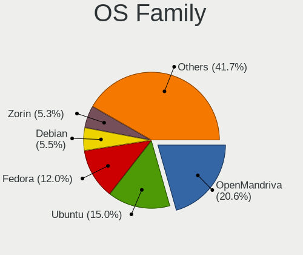
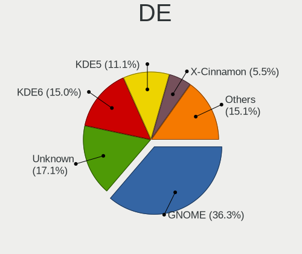
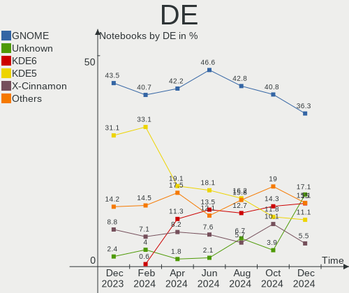
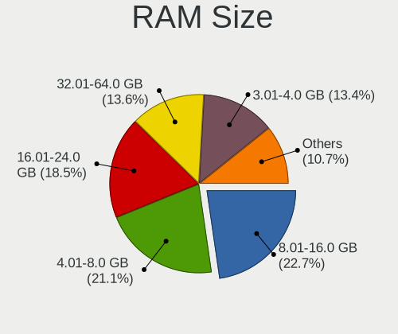
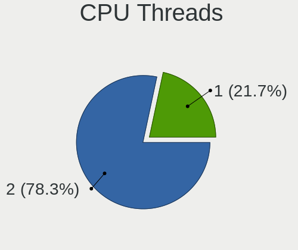
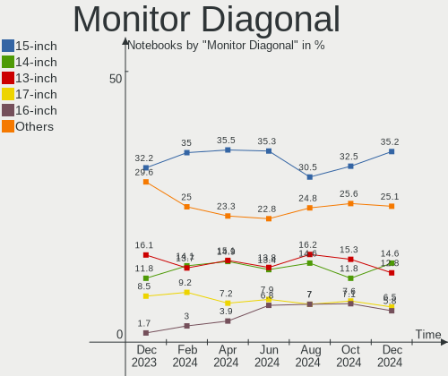
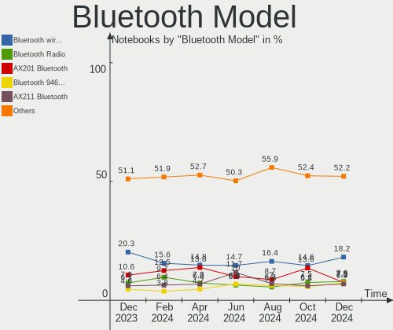
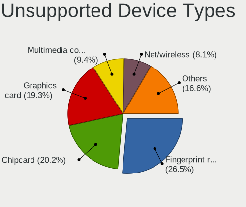

Linux in USA - Hardware Trends (Notebooks)
------------------------------------------

A project to identify most popular hardware characteristics and track their change
over time based on data collected by Linux users at https://Linux-Hardware.org.

Anyone can contribute to this report by the [hw-probe](https://github.com/linuxhw/hw-probe) tool:

    sudo -E hw-probe -all -upload

Period: Mar, 2023.

Contents
--------

* [ System ](#system)
  - [ OS                       ](#os)
  - [ OS Family                ](#os-family)
  - [ Kernel                   ](#kernel)
  - [ Kernel Family            ](#kernel-family)
  - [ Kernel Major Ver.        ](#kernel-major-ver)
  - [ Arch                     ](#arch)
  - [ DE                       ](#de)
  - [ Display Server           ](#display-server)
  - [ Display Manager          ](#display-manager)
  - [ OS Lang                  ](#os-lang)
  - [ Boot Mode                ](#boot-mode)
  - [ Filesystem               ](#filesystem)
  - [ Part. scheme             ](#part-scheme)
  - [ Dual Boot with Linux/BSD ](#dual-boot-with-linuxbsd)
  - [ Dual Boot (Win)          ](#dual-boot-win)

* [ Board ](#board)
  - [ Vendor                   ](#vendor)
  - [ Model                    ](#model)
  - [ Model Family             ](#model-family)
  - [ MFG Year                 ](#mfg-year)
  - [ Form Factor              ](#form-factor)
  - [ Secure Boot              ](#secure-boot)
  - [ Coreboot                 ](#coreboot)
  - [ RAM Size                 ](#ram-size)
  - [ RAM Used                 ](#ram-used)
  - [ Total Drives             ](#total-drives)
  - [ Has CD-ROM               ](#has-cd-rom)
  - [ Has Ethernet             ](#has-ethernet)
  - [ Has WiFi                 ](#has-wifi)
  - [ Has Bluetooth            ](#has-bluetooth)

* [ Location ](#location)
  - [ Country                  ](#country)
  - [ City                     ](#city)

* [ Drives ](#drives)
  - [ Drive Vendor             ](#drive-vendor)
  - [ Drive Model              ](#drive-model)
  - [ HDD Vendor               ](#hdd-vendor)
  - [ SSD Vendor               ](#ssd-vendor)
  - [ Drive Kind               ](#drive-kind)
  - [ Drive Connector          ](#drive-connector)
  - [ Drive Size               ](#drive-size)
  - [ Space Total              ](#space-total)
  - [ Space Used               ](#space-used)
  - [ Malfunc. Drives          ](#malfunc-drives)
  - [ Malfunc. Drive Vendor    ](#malfunc-drive-vendor)
  - [ Malfunc. HDD Vendor      ](#malfunc-hdd-vendor)
  - [ Malfunc. Drive Kind      ](#malfunc-drive-kind)
  - [ Failed Drives            ](#failed-drives)
  - [ Failed Drive Vendor      ](#failed-drive-vendor)
  - [ Drive Status             ](#drive-status)

* [ Storage controller ](#storage-controller)
  - [ Storage Vendor           ](#storage-vendor)
  - [ Storage Model            ](#storage-model)
  - [ Storage Kind             ](#storage-kind)

* [ Processor ](#processor)
  - [ CPU Vendor               ](#cpu-vendor)
  - [ CPU Model                ](#cpu-model)
  - [ CPU Model Family         ](#cpu-model-family)
  - [ CPU Cores                ](#cpu-cores)
  - [ CPU Sockets              ](#cpu-sockets)
  - [ CPU Threads              ](#cpu-threads)
  - [ CPU Op-Modes             ](#cpu-op-modes)
  - [ CPU Microcode            ](#cpu-microcode)
  - [ CPU Microarch            ](#cpu-microarch)

* [ Graphics ](#graphics)
  - [ GPU Vendor               ](#gpu-vendor)
  - [ GPU Model                ](#gpu-model)
  - [ GPU Combo                ](#gpu-combo)
  - [ GPU Driver               ](#gpu-driver)
  - [ GPU Memory               ](#gpu-memory)

* [ Monitor ](#monitor)
  - [ Monitor Vendor           ](#monitor-vendor)
  - [ Monitor Model            ](#monitor-model)
  - [ Monitor Resolution       ](#monitor-resolution)
  - [ Monitor Diagonal         ](#monitor-diagonal)
  - [ Monitor Width            ](#monitor-width)
  - [ Aspect Ratio             ](#aspect-ratio)
  - [ Monitor Area             ](#monitor-area)
  - [ Pixel Density            ](#pixel-density)
  - [ Multiple Monitors        ](#multiple-monitors)

* [ Network ](#network)
  - [ Net Controller Vendor    ](#net-controller-vendor)
  - [ Net Controller Model     ](#net-controller-model)
  - [ Wireless Vendor          ](#wireless-vendor)
  - [ Wireless Model           ](#wireless-model)
  - [ Ethernet Vendor          ](#ethernet-vendor)
  - [ Ethernet Model           ](#ethernet-model)
  - [ Net Controller Kind      ](#net-controller-kind)
  - [ Used Controller          ](#used-controller)
  - [ NICs                     ](#nics)
  - [ IPv6                     ](#ipv6)

* [ Bluetooth ](#bluetooth)
  - [ Bluetooth Vendor         ](#bluetooth-vendor)
  - [ Bluetooth Model          ](#bluetooth-model)

* [ Sound ](#sound)
  - [ Sound Vendor             ](#sound-vendor)
  - [ Sound Model              ](#sound-model)

* [ Memory ](#memory)
  - [ Memory Vendor            ](#memory-vendor)
  - [ Memory Model             ](#memory-model)
  - [ Memory Kind              ](#memory-kind)
  - [ Memory Form Factor       ](#memory-form-factor)
  - [ Memory Size              ](#memory-size)
  - [ Memory Speed             ](#memory-speed)

* [ Printers & scanners ](#printers--scanners)
  - [ Printer Vendor           ](#printer-vendor)
  - [ Printer Model            ](#printer-model)
  - [ Scanner Vendor           ](#scanner-vendor)
  - [ Scanner Model            ](#scanner-model)

* [ Camera ](#camera)
  - [ Camera Vendor            ](#camera-vendor)
  - [ Camera Model             ](#camera-model)

* [ Security ](#security)
  - [ Fingerprint Vendor       ](#fingerprint-vendor)
  - [ Fingerprint Model        ](#fingerprint-model)
  - [ Chipcard Vendor          ](#chipcard-vendor)
  - [ Chipcard Model           ](#chipcard-model)

* [ Unsupported ](#unsupported)
  - [ Unsupported Devices      ](#unsupported-devices)
  - [ Unsupported Device Types ](#unsupported-device-types)

System
------

OS
--

Installed operating systems

| Name                         | Notebooks | Percent |
|------------------------------|-----------|---------|
| Debian 11                    | 69        | 12.17%  |
| Pop!_OS 22.04                | 55        | 9.7%    |
| Ubuntu 22.04                 | 54        | 9.52%   |
| Linux Mint 21.1              | 38        | 6.7%    |
| Fedora 37                    | 26        | 4.59%   |
| Ubuntu 22.10                 | 23        | 4.06%   |
| Arch Rolling                 | 23        | 4.06%   |
| OpenMandriva 23.03           | 22        | 3.88%   |
| OpenMandriva 23.01           | 17        | 3%      |
| Zorin 16                     | 14        | 2.47%   |
| Manjaro                      | 12        | 2.12%   |
| KDE neon 22.04               | 12        | 2.12%   |
| SteamOS 3.4.6                | 11        | 1.94%   |
| SteamOS 3.4.4                | 11        | 1.94%   |
| Kubuntu 22.04                | 11        | 1.94%   |
| Kali 2023.1                  | 11        | 1.94%   |
| Ubuntu 20.04                 | 9         | 1.59%   |
| Kubuntu 22.10                | 8         | 1.41%   |
| Gentoo 2.13                  | 8         | 1.41%   |
| EndeavourOS Rolling          | 8         | 1.41%   |
| Xubuntu 22.04                | 6         | 1.06%   |
| Parrot 5.2                   | 5         | 0.88%   |
| openSUSE Tumbleweed-XXXXXXXX | 5         | 0.88%   |
| Nobara 37                    | 5         | 0.88%   |
| Lubuntu 22.04                | 5         | 0.88%   |
| Linux Mint 20.3              | 5         | 0.88%   |
| ArcoLinux Rolling            | 5         | 0.88%   |
| Manjaro 22.0.5               | 4         | 0.71%   |
| Elementary 7                 | 4         | 0.71%   |
| Manjaro 22.0.4               | 3         | 0.53%   |
| Elementary 6.1               | 3         | 0.53%   |
| Ubuntu Budgie 22.10          | 2         | 0.35%   |
| Ubuntu Budgie 22.04          | 2         | 0.35%   |
| Ubuntu 18.04                 | 2         | 0.35%   |
| TUXEDO OS 22.04              | 2         | 0.35%   |
| ROSA 12.3                    | 2         | 0.35%   |
| Lubuntu 22.10                | 2         | 0.35%   |
| LMDE 5                       | 2         | 0.35%   |
| Linux Mint 21                | 2         | 0.35%   |
| Garuda Linux Soaring         | 2         | 0.35%   |

OS Family
---------

OS without a version

| Name              | Notebooks | Percent |
|-------------------|-----------|---------|
| Ubuntu            | 89        | 15.7%   |
| Debian            | 73        | 12.87%  |
| Pop!_OS           | 56        | 9.88%   |
| Linux Mint        | 46        | 8.11%   |
| OpenMandriva      | 39        | 6.88%   |
| Fedora            | 30        | 5.29%   |
| SteamOS           | 23        | 4.06%   |
| Arch              | 23        | 4.06%   |
| Manjaro           | 19        | 3.35%   |
| Kubuntu           | 19        | 3.35%   |
| Zorin             | 15        | 2.65%   |
| KDE neon          | 12        | 2.12%   |
| Kali              | 11        | 1.94%   |
| Gentoo            | 9         | 1.59%   |
| Xubuntu           | 8         | 1.41%   |
| Lubuntu           | 8         | 1.41%   |
| EndeavourOS       | 8         | 1.41%   |
| Elementary        | 7         | 1.23%   |
| openSUSE          | 6         | 1.06%   |
| Parrot            | 5         | 0.88%   |
| Nobara            | 5         | 0.88%   |
| ArcoLinux         | 5         | 0.88%   |
| Ubuntu Budgie     | 4         | 0.71%   |
| Ubuntu MATE       | 3         | 0.53%   |
| Garuda Linux      | 3         | 0.53%   |
| Endless           | 3         | 0.53%   |
| Devuan            | 3         | 0.53%   |
| TUXEDO OS         | 2         | 0.35%   |
| ROSA              | 2         | 0.35%   |
| LMDE              | 2         | 0.35%   |
| Clear Linux       | 2         | 0.35%   |
| ChimeraOS         | 2         | 0.35%   |
| CachyOS           | 2         | 0.35%   |
| BunsenLabs        | 2         | 0.35%   |
| AlmaLinux         | 2         | 0.35%   |
| Xero              | 1         | 0.18%   |
| Ultramarine Linux | 1         | 0.18%   |
| Ubuntu Studio     | 1         | 0.18%   |
| SystemRescue      | 1         | 0.18%   |
| Siduction         | 1         | 0.18%   |

Kernel
------

Version of the Linux kernel

| Version                      | Notebooks | Percent |
|------------------------------|-----------|---------|
| 5.19.0-35-generic            | 64        | 11.29%  |
| 5.10.0-20-amd64              | 53        | 9.35%   |
| 5.15.0-67-generic            | 47        | 8.29%   |
| 6.2.0-76060200-generic       | 23        | 4.06%   |
| 5.13.0-valve36-1-neptune     | 22        | 3.88%   |
| 6.2.6-desktop-1omv2390       | 20        | 3.53%   |
| 5.19.0-32-generic            | 15        | 2.65%   |
| 6.1.11-76060111-generic      | 14        | 2.47%   |
| 6.1.1-desktop-1omv2290       | 14        | 2.47%   |
| 5.19.0-38-generic            | 13        | 2.29%   |
| 5.10.0-21-amd64              | 12        | 2.12%   |
| 6.1.0-kali5-amd64            | 10        | 1.76%   |
| 6.1.12-1-MANJARO             | 9         | 1.59%   |
| 5.4.0-144-generic            | 9         | 1.59%   |
| 5.15.0-69-generic            | 9         | 1.59%   |
| 5.15.0-60-generic            | 9         | 1.59%   |
| 6.2.6-76060206-generic       | 8         | 1.41%   |
| 6.1.14-200.fc37.x86_64       | 8         | 1.41%   |
| 6.0.12-76060006-generic      | 8         | 1.41%   |
| 6.2.8-arch1-1                | 7         | 1.23%   |
| 6.2.6-arch1-1                | 6         | 1.06%   |
| 6.0.0-12parrot1-amd64        | 5         | 0.88%   |
| 5.19.0-37-generic            | 5         | 0.88%   |
| 5.15.0-56-generic            | 5         | 0.88%   |
| 6.2.7-arch1-1                | 4         | 0.71%   |
| 6.2.7-200.fc37.x86_64        | 4         | 0.71%   |
| 6.2.7-2-MANJARO              | 4         | 0.71%   |
| 6.2.5-zen1-1-zen             | 4         | 0.71%   |
| 6.2.2-arch1-1                | 4         | 0.71%   |
| 6.1.19-1-MANJARO             | 4         | 0.71%   |
| 6.1.18-200.fc37.x86_64       | 4         | 0.71%   |
| 6.0.0-0.deb11.6-amd64        | 4         | 0.71%   |
| 6.2.8-200.fc37.x86_64        | 3         | 0.53%   |
| 6.2.5-arch1-1                | 3         | 0.53%   |
| 6.1.14-201.fsync.fc37.x86_64 | 3         | 0.53%   |
| 6.1.0-6-amd64                | 3         | 0.53%   |
| 5.15.0-58-generic            | 3         | 0.53%   |
| 6.2.6-1-default              | 2         | 0.35%   |
| 6.2.3-060203-generic         | 2         | 0.35%   |
| 6.2.2-desktop-1omv2390       | 2         | 0.35%   |

Kernel Family
-------------

Linux kernel without a distro release

| Version | Notebooks | Percent |
|---------|-----------|---------|
| 5.19.0  | 102       | 17.99%  |
| 5.15.0  | 80        | 14.11%  |
| 5.10.0  | 68        | 11.99%  |
| 6.2.6   | 40        | 7.05%   |
| 6.2.0   | 24        | 4.23%   |
| 6.1.11  | 22        | 3.88%   |
| 5.13.0  | 22        | 3.88%   |
| 6.1.0   | 21        | 3.7%    |
| 6.2.7   | 15        | 2.65%   |
| 6.1.1   | 15        | 2.65%   |
| 6.2.8   | 14        | 2.47%   |
| 6.1.12  | 14        | 2.47%   |
| 5.4.0   | 14        | 2.47%   |
| 6.2.2   | 12        | 2.12%   |
| 6.2.1   | 11        | 1.94%   |
| 6.1.14  | 11        | 1.94%   |
| 6.2.5   | 10        | 1.76%   |
| 6.0.0   | 10        | 1.76%   |
| 6.0.12  | 9         | 1.59%   |
| 6.1.19  | 8         | 1.41%   |
| 5.14.0  | 5         | 0.88%   |
| 6.1.18  | 4         | 0.71%   |
| 6.1.15  | 3         | 0.53%   |
| 6.2.3   | 2         | 0.35%   |
| 6.1.4   | 2         | 0.35%   |
| 6.1.13  | 2         | 0.35%   |
| 6.0.7   | 2         | 0.35%   |
| 6.0.6   | 2         | 0.35%   |
| 5.17.0  | 2         | 0.35%   |
| 5.15.94 | 2         | 0.35%   |
| 6.3.0   | 1         | 0.18%   |
| 6.2.4   | 1         | 0.18%   |
| 6.1.7   | 1         | 0.18%   |
| 6.1.20  | 1         | 0.18%   |
| 6.0.11  | 1         | 0.18%   |
| 5.19.8  | 1         | 0.18%   |
| 5.19.17 | 1         | 0.18%   |
| 5.17.12 | 1         | 0.18%   |
| 5.16.0  | 1         | 0.18%   |
| 5.15.98 | 1         | 0.18%   |

Kernel Major Ver.
-----------------

Linux kernel major version

| Version | Notebooks | Percent |
|---------|-----------|---------|
| 6.2     | 129       | 22.75%  |
| 6.1     | 104       | 18.34%  |
| 5.19    | 104       | 18.34%  |
| 5.15    | 87        | 15.34%  |
| 5.10    | 69        | 12.17%  |
| 6.0     | 24        | 4.23%   |
| 5.13    | 22        | 3.88%   |
| 5.4     | 14        | 2.47%   |
| 5.14    | 6         | 1.06%   |
| 5.17    | 3         | 0.53%   |
| 6.3     | 1         | 0.18%   |
| 5.16    | 1         | 0.18%   |
| 5.11    | 1         | 0.18%   |
| 4.18    | 1         | 0.18%   |
| 4.15    | 1         | 0.18%   |

Arch
----

OS architecture (x86_64, i586, etc.)

| Name    | Notebooks | Percent |
|---------|-----------|---------|
| x86_64  | 560       | 98.77%  |
| i686    | 4         | 0.71%   |
| aarch64 | 3         | 0.53%   |

DE
--

Desktop Environment

| Name            | Notebooks | Percent |
|-----------------|-----------|---------|
| GNOME           | 204       | 35.98%  |
| KDE5            | 158       | 27.87%  |
| Unknown         | 60        | 10.58%  |
| X-Cinnamon      | 52        | 9.17%   |
| XFCE            | 39        | 6.88%   |
| MATE            | 15        | 2.65%   |
| LXQt            | 12        | 2.12%   |
| Pantheon        | 7         | 1.23%   |
| Budgie          | 4         | 0.71%   |
| i3              | 3         | 0.53%   |
| sway            | 2         | 0.35%   |
| Hyprland        | 2         | 0.35%   |
| DWM             | 2         | 0.35%   |
| BunsenLabs      | 2         | 0.35%   |
| Trinity         | 1         | 0.18%   |
| ratpoison       | 1         | 0.18%   |
| openbox         | 1         | 0.18%   |
| onyx:GNOME      | 1         | 0.18%   |
| GNOME Flashback | 1         | 0.18%   |

Display Server
--------------

X11 or Wayland

| Name    | Notebooks | Percent |
|---------|-----------|---------|
| X11     | 374       | 65.96%  |
| Wayland | 126       | 22.22%  |
| Unknown | 58        | 10.23%  |
| Tty     | 9         | 1.59%   |

Display Manager
---------------

SDDM, LightDM, etc.

| Name    | Notebooks | Percent |
|---------|-----------|---------|
| Unknown | 264       | 46.56%  |
| SDDM    | 101       | 17.81%  |
| GDM3    | 88        | 15.52%  |
| LightDM | 83        | 14.64%  |
| GDM     | 24        | 4.23%   |
| SLiM    | 4         | 0.71%   |
| LXDM    | 1         | 0.18%   |
| GREETD  | 1         | 0.18%   |
| EMPTTY  | 1         | 0.18%   |

OS Lang
-------

Language

| Lang    | Notebooks | Percent |
|---------|-----------|---------|
| en_US   | 494       | 87.13%  |
| Unknown | 56        | 9.88%   |
| C       | 8         | 1.41%   |
| en_GB   | 5         | 0.88%   |
| zh_CN   | 1         | 0.18%   |
| ru_RU   | 1         | 0.18%   |
| pl_PL   | 1         | 0.18%   |
| en_CA   | 1         | 0.18%   |

Boot Mode
---------

EFI or BIOS

| Mode | Notebooks | Percent |
|------|-----------|---------|
| EFI  | 303       | 53.44%  |
| BIOS | 264       | 46.56%  |

Filesystem
----------

Type of filesystem

| Type    | Notebooks | Percent |
|---------|-----------|---------|
| Ext4    | 370       | 65.26%  |
| Btrfs   | 101       | 17.81%  |
| Overlay | 75        | 13.23%  |
| Xfs     | 16        | 2.82%   |
| Zfs     | 5         | 0.88%   |

Part. scheme
------------

Scheme of partitioning

| Type    | Notebooks | Percent |
|---------|-----------|---------|
| GPT     | 317       | 55.91%  |
| Unknown | 200       | 35.27%  |
| MBR     | 50        | 8.82%   |

Dual Boot with Linux/BSD
------------------------

Hosting more than one Linux/BSD

| Dual boot | Notebooks | Percent |
|-----------|-----------|---------|
| No        | 509       | 89.77%  |
| Yes       | 58        | 10.23%  |

Dual Boot (Win)
---------------

Hosting Linux and Windows

| Dual boot | Notebooks | Percent |
|-----------|-----------|---------|
| No        | 478       | 84.3%   |
| Yes       | 89        | 15.7%   |

Board
-----

Vendor
------

Motherboard manufacturer

| Name                 | Notebooks | Percent |
|----------------------|-----------|---------|
| Dell                 | 111       | 19.58%  |
| Hewlett-Packard      | 97        | 17.11%  |
| Lenovo               | 94        | 16.58%  |
| Apple                | 73        | 12.87%  |
| ASUSTek Computer     | 40        | 7.05%   |
| Acer                 | 26        | 4.59%   |
| Valve                | 23        | 4.06%   |
| Google               | 15        | 2.65%   |
| MSI                  | 14        | 2.47%   |
| Toshiba              | 13        | 2.29%   |
| System76             | 6         | 1.06%   |
| Razer                | 5         | 0.88%   |
| Star Labs            | 4         | 0.71%   |
| Sony                 | 4         | 0.71%   |
| GPU Company          | 4         | 0.71%   |
| Gigabyte Technology  | 4         | 0.71%   |
| Framework            | 4         | 0.71%   |
| TUXEDO               | 2         | 0.35%   |
| Purism               | 2         | 0.35%   |
| Gateway              | 2         | 0.35%   |
| Unknown              | 2         | 0.35%   |
| Venom                | 1         | 0.18%   |
| Timi                 | 1         | 0.18%   |
| Thomson              | 1         | 0.18%   |
| SAGER                | 1         | 0.18%   |
| Pine Microsystems    | 1         | 0.18%   |
| Panasonic            | 1         | 0.18%   |
| Notebook             | 1         | 0.18%   |
| Jumper               | 1         | 0.18%   |
| Intel Client Systems | 1         | 0.18%   |
| Intel                | 1         | 0.18%   |
| IBM                  | 1         | 0.18%   |
| HUAWEI               | 1         | 0.18%   |
| GPD                  | 1         | 0.18%   |
| Getac                | 1         | 0.18%   |
| Fujitsu              | 1         | 0.18%   |
| Core Innovations     | 1         | 0.18%   |
| Carbon Systems       | 1         | 0.18%   |
| AZW                  | 1         | 0.18%   |
| AWOW                 | 1         | 0.18%   |

Model
-----

Motherboard model

| Name                                   | Notebooks | Percent |
|----------------------------------------|-----------|---------|
| Apple MacBook5,2                       | 47        | 8.29%   |
| Valve Jupiter                          | 23        | 4.06%   |
| Dell XPS 15 9520                       | 4         | 0.71%   |
| Dell Latitude E6430                    | 4         | 0.71%   |
| Star Labs StarBook                     | 3         | 0.53%   |
| Lenovo ThinkPad 13 2nd Gen 20J10046US  | 3         | 0.53%   |
| HP Pavilion dv7                        | 3         | 0.53%   |
| HP Notebook                            | 3         | 0.53%   |
| HP Laptop 15-dw0xxx                    | 3         | 0.53%   |
| HP EliteBook 8560w                     | 3         | 0.53%   |
| Google Lillipup                        | 3         | 0.53%   |
| Google Kefka                           | 3         | 0.53%   |
| Dell XPS 13 9310                       | 3         | 0.53%   |
| Dell Precision M3800                   | 3         | 0.53%   |
| Dell Latitude E5570                    | 3         | 0.53%   |
| Dell Latitude 7480                     | 3         | 0.53%   |
| Apple MacBookPro14,1                   | 3         | 0.53%   |
| System76 Pangolin                      | 2         | 0.35%   |
| System76 Lemur Pro                     | 2         | 0.35%   |
| Lenovo ThinkPad X220 4286CTO           | 2         | 0.35%   |
| Lenovo IdeaPad 5 14ARE05 81YM          | 2         | 0.35%   |
| HP ZBook Studio G3                     | 2         | 0.35%   |
| HP Presario CQ62                       | 2         | 0.35%   |
| HP Pavilion Notebook                   | 2         | 0.35%   |
| HP Pavilion Laptop 15-eh2xxx           | 2         | 0.35%   |
| HP Laptop 17-cp2xxx                    | 2         | 0.35%   |
| HP Laptop 17-by3xxx                    | 2         | 0.35%   |
| HP Laptop 15-ef2xxx                    | 2         | 0.35%   |
| HP Laptop 15-dy2xxx                    | 2         | 0.35%   |
| HP Laptop 15-dy1xxx                    | 2         | 0.35%   |
| HP Laptop 14-fq0xxx                    | 2         | 0.35%   |
| HP Laptop 14-dk0xxx                    | 2         | 0.35%   |
| HP EliteBook 8460p                     | 2         | 0.35%   |
| HP EliteBook 2560p                     | 2         | 0.35%   |
| HP Dev One Notebook PC                 | 2         | 0.35%   |
| GPU Company GWTN156-11                 | 2         | 0.35%   |
| Google Celes                           | 2         | 0.35%   |
| Framework Laptop (12th Gen Intel Core) | 2         | 0.35%   |
| Framework Laptop                       | 2         | 0.35%   |
| Dell XPS 15 9570                       | 2         | 0.35%   |

Model Family
------------

Motherboard model prefix

| Name               | Notebooks | Percent |
|--------------------|-----------|---------|
| Lenovo ThinkPad    | 68        | 11.99%  |
| Apple MacBook5     | 48        | 8.47%   |
| Dell Latitude      | 44        | 7.76%   |
| HP Laptop          | 28        | 4.94%   |
| Dell Inspiron      | 27        | 4.76%   |
| Valve Jupiter      | 23        | 4.06%   |
| Dell XPS           | 19        | 3.35%   |
| HP Pavilion        | 17        | 3%      |
| HP EliteBook       | 17        | 3%      |
| Dell Precision     | 16        | 2.82%   |
| Acer Aspire        | 16        | 2.82%   |
| Toshiba Satellite  | 12        | 2.12%   |
| Lenovo IdeaPad     | 12        | 2.12%   |
| HP ZBook           | 9         | 1.59%   |
| HP ProBook         | 9         | 1.59%   |
| ASUS VivoBook      | 9         | 1.59%   |
| ASUS ROG           | 6         | 1.06%   |
| Razer Blade        | 5         | 0.88%   |
| ASUS ASUS          | 5         | 0.88%   |
| Lenovo ThinkBook   | 4         | 0.71%   |
| Lenovo Legion      | 4         | 0.71%   |
| Framework Laptop   | 4         | 0.71%   |
| ASUS ZenBook       | 4         | 0.71%   |
| Apple MacBookPro11 | 4         | 0.71%   |
| Star Labs StarBook | 3         | 0.53%   |
| HP Notebook        | 3         | 0.53%   |
| HP ENVY            | 3         | 0.53%   |
| Google Lillipup    | 3         | 0.53%   |
| Google Kefka       | 3         | 0.53%   |
| ASUS TUF           | 3         | 0.53%   |
| Apple MacBookPro9  | 3         | 0.53%   |
| Apple MacBookPro5  | 3         | 0.53%   |
| Apple MacBookPro15 | 3         | 0.53%   |
| Apple MacBookPro14 | 3         | 0.53%   |
| Acer Swift         | 3         | 0.53%   |
| Acer Nitro         | 3         | 0.53%   |
| System76 Pangolin  | 2         | 0.35%   |
| System76 Lemur     | 2         | 0.35%   |
| Purism Librem      | 2         | 0.35%   |
| MSI GS63VR         | 2         | 0.35%   |

MFG Year
--------

Motherboard manufacture year

| Year    | Notebooks | Percent |
|---------|-----------|---------|
| 2022    | 85        | 14.99%  |
| 2009    | 58        | 10.23%  |
| 2021    | 57        | 10.05%  |
| 2020    | 53        | 9.35%   |
| 2019    | 42        | 7.41%   |
| 2012    | 36        | 6.35%   |
| 2018    | 35        | 6.17%   |
| 2017    | 35        | 6.17%   |
| 2011    | 28        | 4.94%   |
| 2013    | 25        | 4.41%   |
| 2015    | 24        | 4.23%   |
| 2016    | 20        | 3.53%   |
| 2014    | 19        | 3.35%   |
| 2010    | 15        | 2.65%   |
| 2023    | 14        | 2.47%   |
| 2008    | 8         | 1.41%   |
| 2007    | 6         | 1.06%   |
| Unknown | 4         | 0.71%   |
| 2006    | 2         | 0.35%   |
| 2004    | 1         | 0.18%   |

Form Factor
-----------

Physical design of the computer

| Name     | Notebooks | Percent |
|----------|-----------|---------|
| Notebook | 567       | 100%    |

Secure Boot
-----------

Enabled or disabled

| State    | Notebooks | Percent |
|----------|-----------|---------|
| Disabled | 532       | 93.83%  |
| Enabled  | 35        | 6.17%   |

Coreboot
--------

Have coreboot on board

| Used | Notebooks | Percent |
|------|-----------|---------|
| No   | 543       | 95.77%  |
| Yes  | 24        | 4.23%   |

RAM Size
--------

Total RAM memory

| Size in GB  | Notebooks | Percent |
|-------------|-----------|---------|
| 4.01-8.0    | 129       | 22.75%  |
| 16.01-24.0  | 107       | 18.87%  |
| 8.01-16.0   | 105       | 18.52%  |
| 3.01-4.0    | 102       | 17.99%  |
| 32.01-64.0  | 69        | 12.17%  |
| 1.01-2.0    | 16        | 2.82%   |
| 64.01-256.0 | 15        | 2.65%   |
| 24.01-32.0  | 14        | 2.47%   |
| 2.01-3.0    | 7         | 1.23%   |
| 0.51-1.0    | 3         | 0.53%   |

RAM Used
--------

Used RAM memory

| Used GB    | Notebooks | Percent |
|------------|-----------|---------|
| 1.01-2.0   | 176       | 31.04%  |
| 2.01-3.0   | 153       | 26.98%  |
| 4.01-8.0   | 105       | 18.52%  |
| 3.01-4.0   | 88        | 15.52%  |
| 8.01-16.0  | 21        | 3.7%    |
| 0.51-1.0   | 15        | 2.65%   |
| 0.01-0.5   | 6         | 1.06%   |
| 16.01-24.0 | 3         | 0.53%   |

Total Drives
------------

Number of drives on board

| Drives | Notebooks | Percent |
|--------|-----------|---------|
| 1      | 409       | 72.13%  |
| 2      | 125       | 22.05%  |
| 3      | 23        | 4.06%   |
| 4      | 6         | 1.06%   |
| 0      | 4         | 0.71%   |

Has CD-ROM
----------

Has CD-ROM on board

| Presented | Notebooks | Percent |
|-----------|-----------|---------|
| No        | 395       | 69.66%  |
| Yes       | 172       | 30.34%  |

Has Ethernet
------------

Has Ethernet on board

| Presented | Notebooks | Percent |
|-----------|-----------|---------|
| Yes       | 419       | 73.9%   |
| No        | 148       | 26.1%   |

Has WiFi
--------

Has WiFi module

| Presented | Notebooks | Percent |
|-----------|-----------|---------|
| Yes       | 558       | 98.41%  |
| No        | 9         | 1.59%   |

Has Bluetooth
-------------

Has Bluetooth module

| Presented | Notebooks | Percent |
|-----------|-----------|---------|
| Yes       | 471       | 83.07%  |
| No        | 96        | 16.93%  |

Location
--------

Country
-------

Geographic location (country)

| Country | Notebooks | Percent |
|---------|-----------|---------|
| USA     | 567       | 100%    |

City
----

Geographic location (city)

| City          | Notebooks | Percent |
|---------------|-----------|---------|
| Bangor        | 53        | 9.35%   |
| New York      | 11        | 1.94%   |
| Chicago       | 10        | 1.76%   |
| Houston       | 8         | 1.41%   |
| Denver        | 8         | 1.41%   |
| Seattle       | 7         | 1.23%   |
| Los Angeles   | 7         | 1.23%   |
| Kansas City   | 6         | 1.06%   |
| San Francisco | 5         | 0.88%   |
| Portland      | 5         | 0.88%   |
| Philadelphia  | 5         | 0.88%   |
| Minneapolis   | 5         | 0.88%   |
| San Antonio   | 4         | 0.71%   |
| Phoenix       | 4         | 0.71%   |
| Orlando       | 4         | 0.71%   |
| Fayetteville  | 4         | 0.71%   |
| Dallas        | 4         | 0.71%   |
| Columbia      | 4         | 0.71%   |
| Austin        | 4         | 0.71%   |
| Sumter        | 3         | 0.53%   |
| San Jose      | 3         | 0.53%   |
| Reno          | 3         | 0.53%   |
| Queens        | 3         | 0.53%   |
| Pittsburgh    | 3         | 0.53%   |
| Miami         | 3         | 0.53%   |
| Madison       | 3         | 0.53%   |
| Gilbert       | 3         | 0.53%   |
| Farmington    | 3         | 0.53%   |
| Brooklyn      | 3         | 0.53%   |
| Bellingham    | 3         | 0.53%   |
| Beaverton     | 3         | 0.53%   |
| Ballwin       | 3         | 0.53%   |
| Atlanta       | 3         | 0.53%   |
| Winsted       | 2         | 0.35%   |
| Wilmington    | 2         | 0.35%   |
| Westwood      | 2         | 0.35%   |
| Vancouver     | 2         | 0.35%   |
| St Louis      | 2         | 0.35%   |
| Springfield   | 2         | 0.35%   |
| Spokane       | 2         | 0.35%   |

Drives
------

Drive Vendor
------------

Hard drive vendors

| Vendor                      | Notebooks | Drives | Percent |
|-----------------------------|-----------|--------|---------|
| Samsung Electronics         | 121       | 132    | 16.81%  |
| SanDisk                     | 63        | 64     | 8.75%   |
| WDC                         | 62        | 65     | 8.61%   |
| Unknown                     | 56        | 62     | 7.78%   |
| Seagate                     | 39        | 41     | 5.42%   |
| Toshiba                     | 37        | 38     | 5.14%   |
| Fujitsu                     | 36        | 36     | 5%      |
| SK hynix                    | 27        | 27     | 3.75%   |
| Crucial                     | 26        | 27     | 3.61%   |
| Micron Technology           | 25        | 25     | 3.47%   |
| Intel                       | 22        | 24     | 3.06%   |
| Apple                       | 16        | 20     | 2.22%   |
| Phison Electronics          | 15        | 15     | 2.08%   |
| Hitachi                     | 15        | 15     | 2.08%   |
| PNY                         | 12        | 12     | 1.67%   |
| Micron/Crucial Technology   | 11        | 11     | 1.53%   |
| HGST                        | 11        | 11     | 1.53%   |
| Kingston Technology Company | 10        | 10     | 1.39%   |
| Kingston                    | 10        | 10     | 1.39%   |
| Unknown                     | 9         | 9      | 1.25%   |
| KIOXIA                      | 8         | 8      | 1.11%   |
| Silicon Motion              | 6         | 6      | 0.83%   |
| Team                        | 5         | 5      | 0.69%   |
| A-DATA Technology           | 5         | 5      | 0.69%   |
| SABRENT                     | 4         | 6      | 0.56%   |
| Hewlett-Packard             | 4         | 4      | 0.56%   |
| SPCC                        | 3         | 3      | 0.42%   |
| Phison                      | 3         | 3      | 0.42%   |
| O2 Micro                    | 3         | 3      | 0.42%   |
| LITEONIT                    | 3         | 3      | 0.42%   |
| China                       | 3         | 3      | 0.42%   |
| T-FORCE                     | 2         | 2      | 0.28%   |
| Realtek Semiconductor       | 2         | 2      | 0.28%   |
| Plextor                     | 2         | 2      | 0.28%   |
| PHD 3.0                     | 2         | 2      | 0.28%   |
| OCZ                         | 2         | 2      | 0.28%   |
| Mushkin                     | 2         | 3      | 0.28%   |
| LITEON                      | 2         | 2      | 0.28%   |
| KingFast                    | 2         | 2      | 0.28%   |
| Dogfish                     | 2         | 2      | 0.28%   |

Drive Model
-----------

Hard drive models

| Model                                                  | Notebooks | Percent |
|--------------------------------------------------------|-----------|---------|
| Fujitsu MHZ2160BH FFS G1 160GB                         | 36        | 4.87%   |
| Samsung NVMe SSD Controller SM981/PM981/PM983 250GB    | 21        | 2.84%   |
| Unknown MMC Card  512GB                                | 13        | 1.76%   |
| Unknown MMC Card  64GB                                 | 11        | 1.49%   |
| Samsung NVMe SSD Controller PM9A1/PM9A3/980PRO 1TB     | 9         | 1.22%   |
| Phison PS5013 E13 NVMe Controller 256GB                | 9         | 1.22%   |
| Unknown                                                | 9         | 1.22%   |
| Samsung NVMe SSD Controller SM961/PM961/SM963 256GB    | 7         | 0.95%   |
| Micron/Crucial P2 NVMe PCIe SSD 1TB                    | 7         | 0.95%   |
| Kingston Company OM3PDP3 NVMe SSD 256GB                | 7         | 0.95%   |
| Crucial CT1000MX500SSD1 1TB                            | 7         | 0.95%   |
| Toshiba MK1655GSXF 160GB                               | 6         | 0.81%   |
| Seagate ST1000LM024 HN-M101MBB 1TB                     | 6         | 0.81%   |
| Toshiba MQ04ABF100 1TB                                 | 5         | 0.68%   |
| Toshiba MQ01ABD100 1TB                                 | 5         | 0.68%   |
| Silicon Motion SM2263EN/SM2263XT SSD Controller 1024GB | 5         | 0.68%   |
| Sandisk WD Black SN750 / PC SN730 NVMe SSD 1TB         | 5         | 0.68%   |
| Hitachi HTS543216L9SA02 160GB                          | 5         | 0.68%   |
| Unknown MMC Card  32GB                                 | 4         | 0.54%   |
| Unknown MMC Card  256GB                                | 4         | 0.54%   |
| Unknown MMC Card  128GB                                | 4         | 0.54%   |
| Toshiba MQ01ABF050 500GB                               | 4         | 0.54%   |
| Samsung SSD 970 EVO Plus 1TB                           | 4         | 0.54%   |
| Samsung SSD 850 EVO 250GB                              | 4         | 0.54%   |
| SABRENT Disk 160GB                                     | 4         | 0.54%   |
| HGST HTS545050A7E680 500GB                             | 4         | 0.54%   |
| WDC WD10SPZX-60Z10T0 1TB                               | 3         | 0.41%   |
| Unknown MMC Card  16GB                                 | 3         | 0.41%   |
| Unknown DA4064  64GB                                   | 3         | 0.41%   |
| SK hynix PC801 NVMe 2TB                                | 3         | 0.41%   |
| Seagate ST500LT012-1DG142 500GB                        | 3         | 0.41%   |
| Sandisk WD Blue SN550 NVMe SSD 256GB                   | 3         | 0.41%   |
| Sandisk WD Blue SN500 / PC SN520 NVMe SSD 512GB        | 3         | 0.41%   |
| SanDisk NVMe SSD Drive 2TB                             | 3         | 0.41%   |
| Samsung SSD 980 PRO 1TB                                | 3         | 0.41%   |
| Samsung SSD 870 EVO 1TB                                | 3         | 0.41%   |
| Samsung PM991a NVMe 256GB                              | 3         | 0.41%   |
| Samsung MZVL21T0HCLR-00BL2 1TB                         | 3         | 0.41%   |
| O2 Micro E2M2 64GB                                     | 3         | 0.41%   |
| Micron 2300 NVMe 512GB                                 | 3         | 0.41%   |

HDD Vendor
----------

Hard disk drive vendors

| Vendor              | Notebooks | Drives | Percent |
|---------------------|-----------|--------|---------|
| WDC                 | 38        | 40     | 21.35%  |
| Fujitsu             | 36        | 36     | 20.22%  |
| Seagate             | 35        | 37     | 19.66%  |
| Toshiba             | 30        | 30     | 16.85%  |
| Hitachi             | 15        | 15     | 8.43%   |
| HGST                | 11        | 11     | 6.18%   |
| SABRENT             | 4         | 6      | 2.25%   |
| Unknown             | 2         | 2      | 1.12%   |
| PHD 3.0             | 2         | 2      | 1.12%   |
| USB3.0              | 1         | 1      | 0.56%   |
| Samsung Electronics | 1         | 1      | 0.56%   |
| Generic-            | 1         | 1      | 0.56%   |
| ASMT                | 1         | 1      | 0.56%   |
| Apple               | 1         | 1      | 0.56%   |

SSD Vendor
----------

Solid state drive vendors

| Vendor              | Notebooks | Drives | Percent |
|---------------------|-----------|--------|---------|
| Samsung Electronics | 31        | 31     | 17.71%  |
| SanDisk             | 25        | 25     | 14.29%  |
| Crucial             | 22        | 23     | 12.57%  |
| PNY                 | 12        | 12     | 6.86%   |
| WDC                 | 7         | 7      | 4%      |
| Apple               | 7         | 7      | 4%      |
| Kingston            | 6         | 6      | 3.43%   |
| Intel               | 6         | 6      | 3.43%   |
| SK hynix            | 5         | 5      | 2.86%   |
| Micron Technology   | 5         | 5      | 2.86%   |
| Team                | 4         | 4      | 2.29%   |
| Hewlett-Packard     | 4         | 4      | 2.29%   |
| LITEONIT            | 3         | 3      | 1.71%   |
| China               | 3         | 3      | 1.71%   |
| A-DATA Technology   | 3         | 3      | 1.71%   |
| Toshiba             | 2         | 2      | 1.14%   |
| Plextor             | 2         | 2      | 1.14%   |
| OCZ                 | 2         | 2      | 1.14%   |
| Mushkin             | 2         | 3      | 1.14%   |
| LITEON              | 2         | 2      | 1.14%   |
| KingFast            | 2         | 2      | 1.14%   |
| Dogfish             | 2         | 2      | 1.14%   |
| WDC WDS1            | 1         | 1      | 0.57%   |
| Timetec             | 1         | 1      | 0.57%   |
| TEAM TM8            | 1         | 1      | 0.57%   |
| T-FORCE             | 1         | 1      | 0.57%   |
| Super Talent        | 1         | 1      | 0.57%   |
| Star                | 1         | 1      | 0.57%   |
| SPCC                | 1         | 1      | 0.57%   |
| ShiJi               | 1         | 1      | 0.57%   |
| PNY CS90            | 1         | 1      | 0.57%   |
| Kimtigo             | 1         | 1      | 0.57%   |
| Intenso             | 1         | 1      | 0.57%   |
| Inland              | 1         | 1      | 0.57%   |
| GOODRAM             | 1         | 1      | 0.57%   |
| FORESEE             | 1         | 1      | 0.57%   |
| Corsair             | 1         | 1      | 0.57%   |
| BUFFALO             | 1         | 1      | 0.57%   |
| BHT                 | 1         | 1      | 0.57%   |
| 240G                | 1         | 1      | 0.57%   |

Drive Kind
----------

HDD or SSD

| Kind    | Notebooks | Drives | Percent |
|---------|-----------|--------|---------|
| NVMe    | 263       | 310    | 39.25%  |
| HDD     | 169       | 184    | 25.22%  |
| SSD     | 162       | 177    | 24.18%  |
| MMC     | 64        | 72     | 9.55%   |
| Unknown | 12        | 11     | 1.79%   |

Drive Connector
---------------

SATA, SAS, NVMe, etc.

| Type | Notebooks | Drives | Percent |
|------|-----------|--------|---------|
| SATA | 302       | 338    | 45.55%  |
| NVMe | 263       | 307    | 39.67%  |
| MMC  | 64        | 72     | 9.65%   |
| SAS  | 34        | 37     | 5.13%   |

Drive Size
----------

Size of hard drive

| Size in TB | Notebooks | Drives | Percent |
|------------|-----------|--------|---------|
| 0.01-0.5   | 220       | 239    | 65.67%  |
| 0.51-1.0   | 89        | 95     | 26.57%  |
| 1.01-2.0   | 22        | 23     | 6.57%   |
| 4.01-10.0  | 4         | 4      | 1.19%   |

Space Total
-----------

Amount of disk space available on the file system

| Size in GB     | Notebooks | Percent |
|----------------|-----------|---------|
| 101-250        | 123       | 21.69%  |
| 251-500        | 117       | 20.63%  |
| 501-1000       | 103       | 18.17%  |
| Unknown        | 67        | 11.82%  |
| 1001-2000      | 52        | 9.17%   |
| 1-20           | 32        | 5.64%   |
| 51-100         | 29        | 5.11%   |
| More than 3000 | 21        | 3.7%    |
| 2001-3000      | 13        | 2.29%   |
| 21-50          | 10        | 1.76%   |

Space Used
----------

Amount of used disk space

| Used GB        | Notebooks | Percent |
|----------------|-----------|---------|
| 1-20           | 164       | 28.92%  |
| 21-50          | 104       | 18.34%  |
| 51-100         | 76        | 13.4%   |
| Unknown        | 67        | 11.82%  |
| 101-250        | 66        | 11.64%  |
| 251-500        | 47        | 8.29%   |
| 501-1000       | 23        | 4.06%   |
| 1001-2000      | 13        | 2.29%   |
| More than 3000 | 4         | 0.71%   |
| 2001-3000      | 3         | 0.53%   |

Malfunc. Drives
---------------

Drive models with a malfunction

| Model                                            | Notebooks | Drives | Percent |
|--------------------------------------------------|-----------|--------|---------|
| Hitachi HTS543216L9SA02 160GB                    | 5         | 5      | 11.9%   |
| Fujitsu MHZ2160BH FFS G1 160GB                   | 5         | 5      | 11.9%   |
| Seagate ST1000LM024 HN-M101MBB 1TB               | 3         | 3      | 7.14%   |
| Crucial CT1050MX300SSD1 1TB                      | 2         | 2      | 4.76%   |
| WDC WDS240G2G0B-00EPW0 240GB SSD                 | 1         | 1      | 2.38%   |
| WDC WD5000BPKT-60PK4T0 500GB                     | 1         | 1      | 2.38%   |
| WDC WD10SPZX-60Z10T0 1TB                         | 1         | 1      | 2.38%   |
| Toshiba MQ02ABD100H 1TB                          | 1         | 1      | 2.38%   |
| Toshiba MQ01ABF050 500GB                         | 1         | 1      | 2.38%   |
| Toshiba MQ01ABD100 1TB                           | 1         | 1      | 2.38%   |
| Toshiba MK1655GSXF 160GB                         | 1         | 1      | 2.38%   |
| SK hynix PC711 HFS001TDE9X073N 1TB               | 1         | 1      | 2.38%   |
| SK hynix PC401 NVMe 256GB                        | 1         | 1      | 2.38%   |
| Seagate ST9500325AS 500GB                        | 1         | 1      | 2.38%   |
| Seagate ST9320423AS 320GB                        | 1         | 1      | 2.38%   |
| Seagate ST9320325AS 320GB                        | 1         | 1      | 2.38%   |
| Seagate ST1000LM 035-1RK172 1TB                  | 1         | 1      | 2.38%   |
| SanDisk SD7UB3Q256G1001 256GB SSD                | 1         | 1      | 2.38%   |
| Samsung Electronics SSD PM810 mSATA 128GB        | 1         | 1      | 2.38%   |
| Samsung Electronics MZNLH128HBHQ-000H1 128GB SSD | 1         | 1      | 2.38%   |
| OCZ AGILITY3 120GB SSD                           | 1         | 1      | 2.38%   |
| LITEON LCH-256V2S-11 2.5 7mm 256GB SSD           | 1         | 1      | 2.38%   |
| Intel SSDSA2M080G2LE 80GB                        | 1         | 1      | 2.38%   |
| Hitachi HTS727550A9E364 500GB                    | 1         | 1      | 2.38%   |
| Hitachi HTS723216L9SA60 160GB                    | 1         | 1      | 2.38%   |
| HGST HTS721010A9E630 1TB                         | 1         | 1      | 2.38%   |
| Hewlett-Packard SSD S700 Pro 1TB                 | 1         | 1      | 2.38%   |
| Crucial CT275MX300SSD4 275GB                     | 1         | 1      | 2.38%   |
| Crucial CT275MX300SSD1 275GB                     | 1         | 1      | 2.38%   |
| Apple SSD TS128E 121GB                           | 1         | 1      | 2.38%   |
| A-DATA Technology IM2P33F3A NVMe 256GB           | 1         | 1      | 2.38%   |

Malfunc. Drive Vendor
---------------------

Vendors of faulty drives

| Vendor              | Notebooks | Drives | Percent |
|---------------------|-----------|--------|---------|
| Seagate             | 7         | 7      | 16.67%  |
| Hitachi             | 7         | 7      | 16.67%  |
| Fujitsu             | 5         | 5      | 11.9%   |
| Toshiba             | 4         | 4      | 9.52%   |
| Crucial             | 4         | 4      | 9.52%   |
| WDC                 | 3         | 3      | 7.14%   |
| SK hynix            | 2         | 2      | 4.76%   |
| Samsung Electronics | 2         | 2      | 4.76%   |
| SanDisk             | 1         | 1      | 2.38%   |
| OCZ                 | 1         | 1      | 2.38%   |
| LITEON              | 1         | 1      | 2.38%   |
| Intel               | 1         | 1      | 2.38%   |
| HGST                | 1         | 1      | 2.38%   |
| Hewlett-Packard     | 1         | 1      | 2.38%   |
| Apple               | 1         | 1      | 2.38%   |
| A-DATA Technology   | 1         | 1      | 2.38%   |

Malfunc. HDD Vendor
-------------------

Vendors of faulty HDD drives

| Vendor  | Notebooks | Drives | Percent |
|---------|-----------|--------|---------|
| Seagate | 7         | 7      | 26.92%  |
| Hitachi | 7         | 7      | 26.92%  |
| Fujitsu | 5         | 5      | 19.23%  |
| Toshiba | 4         | 4      | 15.38%  |
| WDC     | 2         | 2      | 7.69%   |
| HGST    | 1         | 1      | 3.85%   |

Malfunc. Drive Kind
-------------------

Kinds of faulty drives

| Kind | Notebooks | Drives | Percent |
|------|-----------|--------|---------|
| HDD  | 26        | 26     | 61.9%   |
| SSD  | 13        | 13     | 30.95%  |
| NVMe | 3         | 3      | 7.14%   |

Failed Drives
-------------

Failed drive models

Zero info for selected period =(

Failed Drive Vendor
-------------------

Failed drive vendors

Zero info for selected period =(

Drive Status
------------

Number of failed and malfunc. drives

| Status   | Notebooks | Drives | Percent |
|----------|-----------|--------|---------|
| Detected | 319       | 432    | 53.52%  |
| Works    | 235       | 280    | 39.43%  |
| Malfunc  | 42        | 42     | 7.05%   |

Storage controller
------------------

Storage Vendor
--------------

Storage controller vendors

| Vendor                         | Notebooks | Percent |
|--------------------------------|-----------|---------|
| Intel                          | 288       | 42.86%  |
| Samsung Electronics            | 95        | 14.14%  |
| AMD                            | 53        | 7.89%   |
| SanDisk                        | 51        | 7.59%   |
| Nvidia                         | 51        | 7.59%   |
| SK hynix                       | 22        | 3.27%   |
| Micron Technology              | 20        | 2.98%   |
| Phison Electronics             | 18        | 2.68%   |
| Micron/Crucial Technology      | 15        | 2.23%   |
| Kingston Technology Company    | 14        | 2.08%   |
| Toshiba America Info Systems   | 8         | 1.19%   |
| KIOXIA                         | 7         | 1.04%   |
| Apple                          | 7         | 1.04%   |
| Silicon Motion                 | 6         | 0.89%   |
| Realtek Semiconductor          | 5         | 0.74%   |
| O2 Micro                       | 3         | 0.45%   |
| Seagate Technology             | 2         | 0.3%    |
| ADATA Technology               | 2         | 0.3%    |
| Union Memory (Shenzhen)        | 1         | 0.15%   |
| Solid State Storage Technology | 1         | 0.15%   |
| Shenzhen Longsys Electronics   | 1         | 0.15%   |
| Biwin Storage Technology       | 1         | 0.15%   |
| ASMedia Technology             | 1         | 0.15%   |

Storage Model
-------------

Storage controller models

| Model                                                                          | Notebooks | Percent |
|--------------------------------------------------------------------------------|-----------|---------|
| Nvidia MCP79 AHCI Controller                                                   | 51        | 7.2%    |
| AMD FCH SATA Controller [AHCI mode]                                            | 47        | 6.64%   |
| Samsung NVMe SSD Controller SM981/PM981/PM983                                  | 37        | 5.23%   |
| Intel 82801 Mobile SATA Controller [RAID mode]                                 | 37        | 5.23%   |
| Intel Sunrise Point-LP SATA Controller [AHCI mode]                             | 32        | 4.52%   |
| Intel Volume Management Device NVMe RAID Controller                            | 27        | 3.81%   |
| Intel 6 Series/C200 Series Chipset Family 6 port Mobile SATA AHCI Controller   | 26        | 3.67%   |
| Samsung NVMe SSD Controller 980                                                | 23        | 3.25%   |
| Intel 7 Series Chipset Family 6-port SATA Controller [AHCI mode]               | 22        | 3.11%   |
| Samsung NVMe SSD Controller PM9A1/PM9A3/980PRO                                 | 21        | 2.97%   |
| Micron NVMe Storage Controller                                                 | 20        | 2.82%   |
| Intel 8 Series/C220 Series Chipset Family 6-port SATA Controller 1 [AHCI mode] | 15        | 2.12%   |
| Intel Cannon Lake Mobile PCH SATA AHCI Controller                              | 14        | 1.98%   |
| SK hynix Gold P31/PC711 NVMe Solid State Drive                                 | 12        | 1.69%   |
| Intel Wildcat Point-LP SATA Controller [AHCI Mode]                             | 12        | 1.69%   |
| SanDisk Non-Volatile memory controller                                         | 11        | 1.55%   |
| Samsung NVMe SSD Controller SM961/PM961/SM963                                  | 10        | 1.41%   |
| Phison PS5013 E13 NVMe Controller                                              | 10        | 1.41%   |
| SanDisk NVMe Controller                                                        | 9         | 1.27%   |
| Micron/Crucial P2 NVMe PCIe SSD                                                | 9         | 1.27%   |
| Intel Q170/Q150/B150/H170/H110/Z170/CM236 Chipset SATA Controller [AHCI Mode]  | 9         | 1.27%   |
| Intel 82801IBM/IEM (ICH9M/ICH9M-E) 4 port SATA Controller [AHCI mode]          | 9         | 1.27%   |
| SanDisk WD Blue SN550 NVMe SSD                                                 | 8         | 1.13%   |
| SanDisk WD Black SN750 / PC SN730 NVMe SSD                                     | 8         | 1.13%   |
| Kingston Company OM3PDP3 NVMe SSD                                              | 8         | 1.13%   |
| Intel 8 Series SATA Controller 1 [AHCI mode]                                   | 8         | 1.13%   |
| Intel Tiger Lake-LP SATA Controller                                            | 7         | 0.99%   |
| Intel Celeron/Pentium Silver Processor SATA Controller                         | 7         | 0.99%   |
| Intel 5 Series/3400 Series Chipset 6 port SATA AHCI Controller                 | 7         | 0.99%   |
| KIOXIA NVMe SSD Controller BG4                                                 | 6         | 0.85%   |
| Intel 7 Series Chipset Family 4-port SATA Controller [IDE mode]                | 6         | 0.85%   |
| Intel 7 Series Chipset Family 2-port SATA Controller [IDE mode]                | 6         | 0.85%   |
| SK hynix Platinum P41 NVMe Solid State Drive 2TB                               | 5         | 0.71%   |
| Silicon Motion SM2263EN/SM2263XT SSD Controller                                | 5         | 0.71%   |
| Realtek NVMe Controller                                                        | 5         | 0.71%   |
| Intel HM170/QM170 Chipset SATA Controller [AHCI Mode]                          | 5         | 0.71%   |
| Intel Celeron N3350/Pentium N4200/Atom E3900 Series SATA AHCI Controller       | 5         | 0.71%   |
| Intel Alder Lake-P SATA AHCI Controller                                        | 5         | 0.71%   |
| Intel 5 Series/3400 Series Chipset 4 port SATA AHCI Controller                 | 5         | 0.71%   |
| Apple ANS2 NVMe Controller                                                     | 5         | 0.71%   |

Storage Kind
------------

Kind of storage controller (IDE, SATA, NVMe, SAS, ...)

| Kind | Notebooks | Percent |
|------|-----------|---------|
| SATA | 317       | 47.53%  |
| NVMe | 263       | 39.43%  |
| RAID | 69        | 10.34%  |
| IDE  | 18        | 2.7%    |

Processor
---------

CPU Vendor
----------

Processor vendors

| Vendor  | Notebooks | Percent |
|---------|-----------|---------|
| Intel   | 448       | 79.01%  |
| AMD     | 116       | 20.46%  |
| Unknown | 2         | 0.35%   |
| ARM     | 1         | 0.18%   |

CPU Model
---------

Processor models

| Model                                      | Notebooks | Percent |
|--------------------------------------------|-----------|---------|
| Intel Core 2 Duo CPU P7450 @ 2.13GHz       | 47        | 8.29%   |
| AMD Custom APU 0405                        | 23        | 4.06%   |
| Intel Core i7-9750H CPU @ 2.60GHz          | 12        | 2.12%   |
| Intel 11th Gen Core i5-1135G7 @ 2.40GHz    | 9         | 1.59%   |
| Intel Core i5-6300U CPU @ 2.40GHz          | 7         | 1.23%   |
| Intel 12th Gen Core i7-12700H              | 7         | 1.23%   |
| Intel 11th Gen Core i7-1165G7 @ 2.80GHz    | 7         | 1.23%   |
| Intel Core i7-6700HQ CPU @ 2.60GHz         | 6         | 1.06%   |
| Intel Core i7-10750H CPU @ 2.60GHz         | 6         | 1.06%   |
| Intel Core i5-8350U CPU @ 1.70GHz          | 6         | 1.06%   |
| Intel Core i5-8250U CPU @ 1.60GHz          | 6         | 1.06%   |
| Intel Core i5-3320M CPU @ 2.60GHz          | 6         | 1.06%   |
| Intel 12th Gen Core i7-1260P               | 6         | 1.06%   |
| Intel 11th Gen Core i7-11800H @ 2.30GHz    | 6         | 1.06%   |
| AMD Ryzen 7 5700U with Radeon Graphics     | 6         | 1.06%   |
| Intel Core i7-8750H CPU @ 2.20GHz          | 5         | 0.88%   |
| Intel Core i7-2620M CPU @ 2.70GHz          | 5         | 0.88%   |
| Intel Core i5-7300U CPU @ 2.60GHz          | 5         | 0.88%   |
| Intel Core i5-3210M CPU @ 2.50GHz          | 5         | 0.88%   |
| Intel Core i5-2520M CPU @ 2.50GHz          | 5         | 0.88%   |
| Intel Celeron CPU N3060 @ 1.60GHz          | 5         | 0.88%   |
| Intel 12th Gen Core i9-12900H              | 5         | 0.88%   |
| Intel 11th Gen Core i3-1115G4 @ 3.00GHz    | 5         | 0.88%   |
| AMD Ryzen 7 PRO 5850U with Radeon Graphics | 5         | 0.88%   |
| AMD Ryzen 5 5500U with Radeon Graphics     | 5         | 0.88%   |
| Intel Core i9-10885H CPU @ 2.40GHz         | 4         | 0.71%   |
| Intel Core i7-8650U CPU @ 1.90GHz          | 4         | 0.71%   |
| Intel Core i7-7600U CPU @ 2.80GHz          | 4         | 0.71%   |
| Intel Core i7-6820HQ CPU @ 2.70GHz         | 4         | 0.71%   |
| Intel Core i7-4500U CPU @ 1.80GHz          | 4         | 0.71%   |
| Intel Core i7-10510U CPU @ 1.80GHz         | 4         | 0.71%   |
| Intel Core i5-10210U CPU @ 1.60GHz         | 4         | 0.71%   |
| Intel Core i3-1005G1 CPU @ 1.20GHz         | 4         | 0.71%   |
| Intel 12th Gen Core i5-12500H              | 4         | 0.71%   |
| Intel 11th Gen Core i7-1185G7 @ 3.00GHz    | 4         | 0.71%   |
| AMD Ryzen 7 PRO 6850U with Radeon Graphics | 4         | 0.71%   |
| AMD Ryzen 7 6800H with Radeon Graphics     | 4         | 0.71%   |
| Intel Pentium Silver N5030 CPU @ 1.10GHz   | 3         | 0.53%   |
| Intel Core i7-8665U CPU @ 1.90GHz          | 3         | 0.53%   |
| Intel Core i7-8565U CPU @ 1.80GHz          | 3         | 0.53%   |

CPU Model Family
----------------

Processor model prefix

| Model                   | Notebooks | Percent |
|-------------------------|-----------|---------|
| Intel Core i7           | 129       | 22.75%  |
| Other                   | 99        | 17.46%  |
| Intel Core i5           | 95        | 16.75%  |
| Intel Core 2 Duo        | 59        | 10.41%  |
| Intel Celeron           | 28        | 4.94%   |
| Intel Core i3           | 27        | 4.76%   |
| AMD Ryzen 7             | 27        | 4.76%   |
| AMD Ryzen 5             | 20        | 3.53%   |
| AMD Ryzen 7 PRO         | 11        | 1.94%   |
| AMD Ryzen 3             | 7         | 1.23%   |
| Intel Xeon              | 6         | 1.06%   |
| Intel Pentium Silver    | 5         | 0.88%   |
| Intel Pentium           | 5         | 0.88%   |
| Intel Core i9           | 5         | 0.88%   |
| Intel Atom              | 5         | 0.88%   |
| AMD Ryzen 9             | 4         | 0.71%   |
| AMD A6                  | 3         | 0.53%   |
| AMD A10                 | 3         | 0.53%   |
| Intel Pentium Gold      | 2         | 0.35%   |
| Intel Pentium Dual      | 2         | 0.35%   |
| Intel Core m3           | 2         | 0.35%   |
| AMD Turion 64 X2 Mobile | 2         | 0.35%   |
| AMD E2                  | 2         | 0.35%   |
| AMD E1                  | 2         | 0.35%   |
| AMD Athlon              | 2         | 0.35%   |
| AMD A8                  | 2         | 0.35%   |
| Intel Pentium M         | 1         | 0.18%   |
| Intel Pentium Dual-Core | 1         | 0.18%   |
| Intel Genuine           | 1         | 0.18%   |
| Intel Core m5           | 1         | 0.18%   |
| Intel Core M            | 1         | 0.18%   |
| Intel Core Duo          | 1         | 0.18%   |
| Intel Core 2            | 1         | 0.18%   |
| AMD Turion II Dual-Core | 1         | 0.18%   |
| AMD Ryzen 5 PRO         | 1         | 0.18%   |
| AMD Phenom II           | 1         | 0.18%   |
| AMD E                   | 1         | 0.18%   |
| AMD A4                  | 1         | 0.18%   |
| AMD A12                 | 1         | 0.18%   |

CPU Cores
---------

Number of processor cores

| Number | Notebooks | Percent |
|--------|-----------|---------|
| 2      | 247       | 43.56%  |
| 4      | 179       | 31.57%  |
| 8      | 54        | 9.52%   |
| 6      | 45        | 7.94%   |
| 14     | 16        | 2.82%   |
| 12     | 10        | 1.76%   |
| 1      | 7         | 1.23%   |
| 10     | 6         | 1.06%   |
| 16     | 2         | 0.35%   |
| 5      | 1         | 0.18%   |

CPU Sockets
-----------

Number of sockets

| Number | Notebooks | Percent |
|--------|-----------|---------|
| 1      | 567       | 100%    |

CPU Threads
-----------

Threads per core (Hyper-Threading)

| Number | Notebooks | Percent |
|--------|-----------|---------|
| 2      | 424       | 74.78%  |
| 1      | 143       | 25.22%  |

CPU Op-Modes
------------

CPU Operation Modes (32-bit, 64-bit)

| Op mode        | Notebooks | Percent |
|----------------|-----------|---------|
| 32-bit, 64-bit | 562       | 99.12%  |
| 32-bit         | 4         | 0.71%   |
| 64-bit         | 1         | 0.18%   |

CPU Microcode
-------------

Microcode number

| Number     | Notebooks | Percent |
|------------|-----------|---------|
| Unknown    | 263       | 46.38%  |
| 0x1067a    | 52        | 9.17%   |
| 0x306a9    | 17        | 3%      |
| 0x806ea    | 16        | 2.82%   |
| 0x206a7    | 16        | 2.82%   |
| 0x906a3    | 13        | 2.29%   |
| 0x806c1    | 11        | 1.94%   |
| 0x806ec    | 10        | 1.76%   |
| 0x306c3    | 10        | 1.76%   |
| 0x806e9    | 9         | 1.59%   |
| 0x406e3    | 9         | 1.59%   |
| 0x0a50000c | 9         | 1.59%   |
| 0x40651    | 8         | 1.41%   |
| 0x906ea    | 7         | 1.23%   |
| 0xa0652    | 6         | 1.06%   |
| 0x08108109 | 6         | 1.06%   |
| 0x0a404102 | 5         | 0.88%   |
| 0x806d1    | 4         | 0.71%   |
| 0x706e5    | 4         | 0.71%   |
| 0x706a8    | 4         | 0.71%   |
| 0x506e3    | 4         | 0.71%   |
| 0x406c4    | 4         | 0.71%   |
| 0x20655    | 4         | 0.71%   |
| 0x106e5    | 4         | 0.71%   |
| 0x08608103 | 4         | 0.71%   |
| 0x08608102 | 4         | 0.71%   |
| 0x906ed    | 3         | 0.53%   |
| 0x906e9    | 3         | 0.53%   |
| 0x906a4    | 3         | 0.53%   |
| 0x506c9    | 3         | 0.53%   |
| 0x30678    | 3         | 0.53%   |
| 0x20652    | 3         | 0.53%   |
| 0x0a50000d | 3         | 0.53%   |
| 0x0a404101 | 3         | 0.53%   |
| 0x08a00006 | 3         | 0.53%   |
| 0x08600106 | 3         | 0.53%   |
| 0x07030105 | 3         | 0.53%   |
| 0x806eb    | 2         | 0.35%   |
| 0x806c2    | 2         | 0.35%   |
| 0x706a1    | 2         | 0.35%   |

CPU Microarch
-------------

Microarchitecture

| Name             | Notebooks | Percent |
|------------------|-----------|---------|
| KabyLake         | 91        | 16.05%  |
| Unknown          | 62        | 10.93%  |
| Penryn           | 61        | 10.76%  |
| IvyBridge        | 33        | 5.82%   |
| SandyBridge      | 32        | 5.64%   |
| Skylake          | 31        | 5.47%   |
| Haswell          | 31        | 5.47%   |
| TigerLake        | 29        | 5.11%   |
| Alderlake Hybrid | 27        | 4.76%   |
| Zen 3            | 20        | 3.53%   |
| IceLake          | 17        | 3%      |
| CometLake        | 16        | 2.82%   |
| Broadwell        | 15        | 2.65%   |
| Zen+             | 14        | 2.47%   |
| Silvermont       | 11        | 1.94%   |
| Zen 2            | 10        | 1.76%   |
| Goldmont plus    | 10        | 1.76%   |
| Westmere         | 9         | 1.59%   |
| Goldmont         | 7         | 1.23%   |
| Nehalem          | 6         | 1.06%   |
| Zen              | 5         | 0.88%   |
| Puma             | 5         | 0.88%   |
| Excavator        | 5         | 0.88%   |
| Core             | 5         | 0.88%   |
| P6               | 3         | 0.53%   |
| Piledriver       | 2         | 0.35%   |
| K8 Hammer        | 2         | 0.35%   |
| K10              | 2         | 0.35%   |
| Jaguar           | 2         | 0.35%   |
| Bonnell          | 2         | 0.35%   |
| K10 Llano        | 1         | 0.18%   |
| Bobcat           | 1         | 0.18%   |

Graphics
--------

GPU Vendor
----------

Vendors of graphics cards

| Vendor | Notebooks | Percent |
|--------|-----------|---------|
| Intel  | 359       | 52.64%  |
| Nvidia | 199       | 29.18%  |
| AMD    | 124       | 18.18%  |

GPU Model
---------

Graphics card models

| Model                                                                                    | Notebooks | Percent |
|------------------------------------------------------------------------------------------|-----------|---------|
| Nvidia C79 [GeForce 9400M G]                                                             | 47        | 6.78%   |
| Intel 3rd Gen Core processor Graphics Controller                                         | 31        | 4.47%   |
| Intel Alder Lake-P Integrated Graphics Controller                                        | 26        | 3.75%   |
| Intel 2nd Generation Core Processor Family Integrated Graphics Controller                | 26        | 3.75%   |
| AMD VanGogh [AMD Custom GPU 0405]                                                        | 23        | 3.32%   |
| Intel TigerLake-LP GT2 [Iris Xe Graphics]                                                | 22        | 3.17%   |
| Intel UHD Graphics 620                                                                   | 21        | 3.03%   |
| Intel CoffeeLake-H GT2 [UHD Graphics 630]                                                | 17        | 2.45%   |
| Intel 4th Gen Core Processor Integrated Graphics Controller                              | 17        | 2.45%   |
| Intel HD Graphics 620                                                                    | 15        | 2.16%   |
| AMD Picasso/Raven 2 [Radeon Vega Series / Radeon Vega Mobile Series]                     | 15        | 2.16%   |
| Intel Skylake GT2 [HD Graphics 520]                                                      | 14        | 2.02%   |
| AMD Cezanne [Radeon Vega Series / Radeon Vega Mobile Series]                             | 13        | 1.88%   |
| Intel HD Graphics 5500                                                                   | 12        | 1.73%   |
| Intel CometLake-H GT2 [UHD Graphics]                                                     | 12        | 1.73%   |
| Nvidia GA107M [GeForce RTX 3050 Ti Mobile]                                               | 11        | 1.59%   |
| AMD Lucienne                                                                             | 11        | 1.59%   |
| Intel Haswell-ULT Integrated Graphics Controller                                         | 10        | 1.44%   |
| Intel CometLake-U GT2 [UHD Graphics]                                                     | 10        | 1.44%   |
| AMD Rembrandt [Radeon 680M]                                                              | 10        | 1.44%   |
| Intel WhiskeyLake-U GT2 [UHD Graphics 620]                                               | 9         | 1.3%    |
| AMD Renoir                                                                               | 9         | 1.3%    |
| Nvidia GA106M [GeForce RTX 3060 Mobile / Max-Q]                                          | 8         | 1.15%   |
| Intel TigerLake-H GT1 [UHD Graphics]                                                     | 8         | 1.15%   |
| Intel Mobile 4 Series Chipset Integrated Graphics Controller                             | 8         | 1.15%   |
| Intel HD Graphics 530                                                                    | 8         | 1.15%   |
| Intel Tiger Lake-LP GT2 [UHD Graphics G4]                                                | 7         | 1.01%   |
| Intel Iris Plus Graphics G1 (Ice Lake)                                                   | 7         | 1.01%   |
| Nvidia TU106M [GeForce RTX 2060 Mobile]                                                  | 6         | 0.87%   |
| Intel Core Processor Integrated Graphics Controller                                      | 6         | 0.87%   |
| Intel Atom/Celeron/Pentium Processor x5-E8000/J3xxx/N3xxx Integrated Graphics Controller | 6         | 0.87%   |
| Nvidia TU117M [GeForce GTX 1650 Ti Mobile]                                               | 5         | 0.72%   |
| Nvidia GM107GLM [Quadro M1000M]                                                          | 5         | 0.72%   |
| Nvidia GK107GLM [Quadro K1100M]                                                          | 5         | 0.72%   |
| Intel HD Graphics 500                                                                    | 5         | 0.72%   |
| Intel GeminiLake [UHD Graphics 605]                                                      | 5         | 0.72%   |
| Intel GeminiLake [UHD Graphics 600]                                                      | 5         | 0.72%   |
| Intel Atom Processor Z36xxx/Z37xxx Series Graphics & Display                             | 5         | 0.72%   |
| Nvidia GP108M [GeForce MX250]                                                            | 4         | 0.58%   |
| Nvidia GP106M [GeForce GTX 1060 Mobile]                                                  | 4         | 0.58%   |

GPU Combo
---------

Combinations of graphics cards

| Name           | Notebooks | Percent |
|----------------|-----------|---------|
| 1 x Intel      | 250       | 44.09%  |
| 1 x AMD        | 105       | 18.52%  |
| Intel + Nvidia | 103       | 18.17%  |
| 1 x Nvidia     | 82        | 14.46%  |
| AMD + Nvidia   | 13        | 2.29%   |
| Other          | 4         | 0.71%   |
| 2 x AMD        | 4         | 0.71%   |
| 2 x Intel      | 3         | 0.53%   |
| Intel + AMD    | 2         | 0.35%   |
| 2 x Nvidia     | 1         | 0.18%   |

GPU Driver
----------

Free vs proprietary

| Driver      | Notebooks | Percent |
|-------------|-----------|---------|
| Free        | 484       | 85.36%  |
| Proprietary | 74        | 13.05%  |
| Unknown     | 9         | 1.59%   |

GPU Memory
----------

Total video memory

| Size in GB | Notebooks | Percent |
|------------|-----------|---------|
| Unknown    | 396       | 69.84%  |
| 0.01-0.5   | 87        | 15.34%  |
| 3.01-4.0   | 26        | 4.59%   |
| 1.01-2.0   | 24        | 4.23%   |
| 0.51-1.0   | 15        | 2.65%   |
| 5.01-6.0   | 8         | 1.41%   |
| 8.01-16.0  | 6         | 1.06%   |
| 7.01-8.0   | 5         | 0.88%   |

Monitor
-------

Monitor Vendor
--------------

Monitor vendors

| Vendor                  | Notebooks | Percent |
|-------------------------|-----------|---------|
| AU Optronics            | 106       | 16.8%   |
| Chimei Innolux          | 75        | 11.89%  |
| BOE                     | 75        | 11.89%  |
| LG Display              | 74        | 11.73%  |
| Apple                   | 72        | 11.41%  |
| Samsung Electronics     | 39        | 6.18%   |
| Sharp                   | 29        | 4.6%    |
| Valve                   | 23        | 3.65%   |
| InfoVision              | 16        | 2.54%   |
| Dell                    | 15        | 2.38%   |
| Hewlett-Packard         | 14        | 2.22%   |
| PANDA                   | 9         | 1.43%   |
| Lenovo                  | 9         | 1.43%   |
| Goldstar                | 9         | 1.43%   |
| Chi Mei Optoelectronics | 9         | 1.43%   |
| Acer                    | 5         | 0.79%   |
| ViewSonic               | 4         | 0.63%   |
| Ancor Communications    | 4         | 0.63%   |
| Sony                    | 3         | 0.48%   |
| Sceptre Tech            | 3         | 0.48%   |
| Toshiba                 | 2         | 0.32%   |
| TMX                     | 2         | 0.32%   |
| HannStar                | 2         | 0.32%   |
| G-Story                 | 2         | 0.32%   |
| CSO                     | 2         | 0.32%   |
| Unknown                 | 2         | 0.32%   |
| Westinghouse            | 1         | 0.16%   |
| Vizio                   | 1         | 0.16%   |
| VIZ                     | 1         | 0.16%   |
| Unknown (XXX)           | 1         | 0.16%   |
| TCL                     | 1         | 0.16%   |
| SANYO                   | 1         | 0.16%   |
| RTK                     | 1         | 0.16%   |
| Quanta Display          | 1         | 0.16%   |
| Planar                  | 1         | 0.16%   |
| ONN                     | 1         | 0.16%   |
| Onkyo                   | 1         | 0.16%   |
| NEC Computers           | 1         | 0.16%   |
| LGD                     | 1         | 0.16%   |
| LG Philips              | 1         | 0.16%   |

Monitor Model
-------------

Monitor models

| Model                                                                 | Notebooks | Percent |
|-----------------------------------------------------------------------|-----------|---------|
| Apple LCD Monitor APP9C5F 1280x800 286x179mm 13.3-inch                | 36        | 5.66%   |
| Valve ANX7530 U VLV3001 800x1280 100x150mm 7.1-inch                   | 23        | 3.62%   |
| Apple Color LCD APP9C5B 1280x800 286x179mm 13.3-inch                  | 10        | 1.57%   |
| AU Optronics LCD Monitor AUO22EC 1366x768 344x193mm 15.5-inch         | 5         | 0.79%   |
| Chimei Innolux LCD Monitor CMN15DC 1366x768 344x193mm 15.5-inch       | 4         | 0.63%   |
| Chimei Innolux LCD Monitor CMN1521 1920x1080 344x193mm 15.5-inch      | 4         | 0.63%   |
| BOE LCD Monitor BOE095F 2256x1504 285x190mm 13.5-inch                 | 4         | 0.63%   |
| AU Optronics LCD Monitor AUO235C 1366x768 256x144mm 11.6-inch         | 4         | 0.63%   |
| AU Optronics LCD Monitor AUO10EC 1366x768 344x193mm 15.5-inch         | 4         | 0.63%   |
| Samsung Electronics LCD Monitor SEC5441 1366x768 344x194mm 15.5-inch  | 3         | 0.47%   |
| LG Display LCD Monitor LGD02D8 1366x768 277x156mm 12.5-inch           | 3         | 0.47%   |
| InfoVision LCD Monitor IVO8C78 1920x1080 309x174mm 14.0-inch          | 3         | 0.47%   |
| Chimei Innolux LCD Monitor CMN15FD 1366x768 344x193mm 15.5-inch       | 3         | 0.47%   |
| Chimei Innolux LCD Monitor CMN15DB 1366x768 344x193mm 15.5-inch       | 3         | 0.47%   |
| Chimei Innolux LCD Monitor CMN15C5 1366x768 344x193mm 15.5-inch       | 3         | 0.47%   |
| Chimei Innolux LCD Monitor CMN153B 1920x1080 344x193mm 15.5-inch      | 3         | 0.47%   |
| Chimei Innolux LCD Monitor CMN14F2 1920x1080 309x173mm 13.9-inch      | 3         | 0.47%   |
| Chimei Innolux LCD Monitor CMN14D4 1920x1080 309x173mm 13.9-inch      | 3         | 0.47%   |
| AU Optronics LCD Monitor AUO733C 1366x768 309x173mm 13.9-inch         | 3         | 0.47%   |
| AU Optronics LCD Monitor AUO313D 1920x1080 309x174mm 14.0-inch        | 3         | 0.47%   |
| AU Optronics LCD Monitor AUO226D 1920x1080 276x155mm 12.5-inch        | 3         | 0.47%   |
| AU Optronics LCD Monitor AUO21ED 1920x1080 344x194mm 15.5-inch        | 3         | 0.47%   |
| Sharp LQ156M1JW25 SHP152C 1920x1080 344x194mm 15.5-inch               | 2         | 0.31%   |
| Sharp LQ156M1JW09 SHP14D3 1920x1080 344x194mm 15.5-inch               | 2         | 0.31%   |
| Sharp LCD Monitor SHP1516 3840x2400 336x210mm 15.6-inch               | 2         | 0.31%   |
| Sharp LCD Monitor SHP14F9 1920x1200 288x180mm 13.4-inch               | 2         | 0.31%   |
| Samsung Electronics LCD Monitor SEC3051 1600x900 398x232mm 18.1-inch  | 2         | 0.31%   |
| Samsung Electronics LCD Monitor SDC414D 3456x2160 336x210mm 15.6-inch | 2         | 0.31%   |
| PANDA LM156LF1L03 NCP001C 1920x1080 344x194mm 15.5-inch               | 2         | 0.31%   |
| PANDA LCD Monitor NCP004D 1920x1080 344x194mm 15.5-inch               | 2         | 0.31%   |
| PANDA LCD Monitor NCP0046 1920x1080 344x194mm 15.5-inch               | 2         | 0.31%   |
| PANDA LCD Monitor NCP0035 1920x1080 309x174mm 14.0-inch               | 2         | 0.31%   |
| LG Display LCD Monitor LGD40A0 1366x768 310x174mm 14.0-inch           | 2         | 0.31%   |
| LG Display LCD Monitor LGD068D 1920x1080 309x174mm 14.0-inch          | 2         | 0.31%   |
| LG Display LCD Monitor LGD05F2 1920x1080 344x194mm 15.5-inch          | 2         | 0.31%   |
| LG Display LCD Monitor LGD05E5 1920x1080 344x194mm 15.5-inch          | 2         | 0.31%   |
| LG Display LCD Monitor LGD05C0 1920x1080 344x194mm 15.5-inch          | 2         | 0.31%   |
| LG Display LCD Monitor LGD04A7 1920x1080 344x194mm 15.5-inch          | 2         | 0.31%   |
| LG Display LCD Monitor LGD040E 1920x1080 345x194mm 15.6-inch          | 2         | 0.31%   |
| LG Display LCD Monitor LGD033A 1366x768 344x194mm 15.5-inch           | 2         | 0.31%   |

Monitor Resolution
------------------

Monitor screen resolution

| Resolution         | Notebooks | Percent |
|--------------------|-----------|---------|
| 1920x1080 (FHD)    | 248       | 41.06%  |
| 1366x768 (WXGA)    | 131       | 21.69%  |
| 1280x800 (WXGA)    | 61        | 10.1%   |
| 800x1280           | 23        | 3.81%   |
| 1600x900 (HD+)     | 21        | 3.48%   |
| 3840x2160 (4K)     | 17        | 2.81%   |
| 1920x1200 (WUXGA)  | 16        | 2.65%   |
| 2560x1600          | 15        | 2.48%   |
| 2880x1800          | 10        | 1.66%   |
| 2560x1440 (QHD)    | 9         | 1.49%   |
| 1440x900 (WXGA+)   | 9         | 1.49%   |
| 3840x2400          | 5         | 0.83%   |
| 2256x1504          | 4         | 0.66%   |
| 1680x1050 (WSXGA+) | 4         | 0.66%   |
| 3456x2160          | 3         | 0.5%    |
| 3072x1920          | 3         | 0.5%    |
| Unknown            | 3         | 0.5%    |
| 3200x1800 (QHD+)   | 2         | 0.33%   |
| 2560x1080          | 2         | 0.33%   |
| 1024x768 (XGA)     | 2         | 0.33%   |
| 1024x600           | 2         | 0.33%   |
| 3840x1200          | 1         | 0.17%   |
| 3840x1100          | 1         | 0.17%   |
| 3840x1080          | 1         | 0.17%   |
| 3520x1080          | 1         | 0.17%   |
| 3440x1440          | 1         | 0.17%   |
| 3200x2000          | 1         | 0.17%   |
| 3200x1080          | 1         | 0.17%   |
| 2880x1920          | 1         | 0.17%   |
| 2400x1600          | 1         | 0.17%   |
| 2240x1400          | 1         | 0.17%   |
| 1920x540           | 1         | 0.17%   |
| 1920x1280          | 1         | 0.17%   |
| 1792x768           | 1         | 0.17%   |
| 1280x1024 (SXGA)   | 1         | 0.17%   |

Monitor Diagonal
----------------

Diagonal size in inches

| Inches  | Notebooks | Percent |
|---------|-----------|---------|
| 15      | 214       | 34.08%  |
| 13      | 137       | 21.82%  |
| 14      | 69        | 10.99%  |
| 17      | 45        | 7.17%   |
| 7       | 23        | 3.66%   |
| 24      | 20        | 3.18%   |
| 12      | 18        | 2.87%   |
| 16      | 15        | 2.39%   |
| 11      | 14        | 2.23%   |
| 27      | 13        | 2.07%   |
| 23      | 10        | 1.59%   |
| 21      | 8         | 1.27%   |
| Unknown | 6         | 0.96%   |
| 18      | 5         | 0.8%    |
| 32      | 4         | 0.64%   |
| 22      | 4         | 0.64%   |
| 34      | 3         | 0.48%   |
| 31      | 3         | 0.48%   |
| 10      | 3         | 0.48%   |
| 72      | 2         | 0.32%   |
| 19      | 2         | 0.32%   |
| 74      | 1         | 0.16%   |
| 65      | 1         | 0.16%   |
| 58      | 1         | 0.16%   |
| 49      | 1         | 0.16%   |
| 48      | 1         | 0.16%   |
| 42      | 1         | 0.16%   |
| 40      | 1         | 0.16%   |
| 36      | 1         | 0.16%   |
| 29      | 1         | 0.16%   |
| 20      | 1         | 0.16%   |

Monitor Width
-------------

Physical width

| Width in mm | Notebooks | Percent |
|-------------|-----------|---------|
| 301-350     | 327       | 52.4%   |
| 201-300     | 134       | 21.47%  |
| 351-400     | 54        | 8.65%   |
| 501-600     | 42        | 6.73%   |
| 1-100       | 23        | 3.69%   |
| 401-500     | 17        | 2.72%   |
| 701-800     | 8         | 1.28%   |
| Unknown     | 6         | 0.96%   |
| 601-700     | 4         | 0.64%   |
| 1001-1500   | 4         | 0.64%   |
| 1501-2000   | 3         | 0.48%   |
| 801-900     | 1         | 0.16%   |
| 901-1000    | 1         | 0.16%   |

Aspect Ratio
------------

Proportional relationship between the width and the height

| Ratio   | Notebooks | Percent |
|---------|-----------|---------|
| 16/9    | 412       | 71.28%  |
| 16/10   | 121       | 20.93%  |
| 0.67    | 23        | 3.98%   |
| 3/2     | 7         | 1.21%   |
| Unknown | 5         | 0.87%   |
| 21/9    | 4         | 0.69%   |
| 4/3     | 2         | 0.35%   |
| 32/9    | 2         | 0.35%   |
| 5/4     | 1         | 0.17%   |
| 3.40    | 1         | 0.17%   |

Monitor Area
------------

Area in inch

| Area in inch | Notebooks | Percent |
|----------------|-----------|---------|
| 101-110        | 214       | 34.19%  |
| 81-90          | 162       | 25.88%  |
| 121-130        | 43        | 6.87%   |
| 71-80          | 39        | 6.23%   |
| 201-250        | 33        | 5.27%   |
| 1-40           | 23        | 3.67%   |
| 61-70          | 18        | 2.88%   |
| 51-60          | 15        | 2.4%    |
| 111-120        | 15        | 2.4%    |
| 301-350        | 13        | 2.08%   |
| 351-500        | 11        | 1.76%   |
| More than 1000 | 6         | 0.96%   |
| 251-300        | 6         | 0.96%   |
| 141-150        | 6         | 0.96%   |
| Unknown        | 6         | 0.96%   |
| 151-200        | 5         | 0.8%    |
| 501-1000       | 4         | 0.64%   |
| 41-50          | 3         | 0.48%   |
| 91-100         | 3         | 0.48%   |
| 131-140        | 1         | 0.16%   |

Pixel Density
-------------

Pixels per inch

| Density       | Notebooks | Percent |
|---------------|-----------|---------|
| 121-160       | 240       | 39.28%  |
| 101-120       | 189       | 30.93%  |
| 161-240       | 84        | 13.75%  |
| 51-100        | 65        | 10.64%  |
| More than 240 | 24        | 3.93%   |
| Unknown       | 6         | 0.98%   |
| 1-50          | 3         | 0.49%   |

Multiple Monitors
-----------------

Total monitors connected

| Total | Notebooks | Percent |
|-------|-----------|---------|
| 1     | 475       | 83.77%  |
| 2     | 72        | 12.7%   |
| 3     | 10        | 1.76%   |
| 0     | 10        | 1.76%   |

Network
-------

Net Controller Vendor
---------------------

Controller vendors

| Vendor                                | Notebooks | Percent |
|---------------------------------------|-----------|---------|
| Intel                                 | 311       | 36.37%  |
| Realtek Semiconductor                 | 235       | 27.49%  |
| Broadcom                              | 104       | 12.16%  |
| Qualcomm Atheros                      | 61        | 7.13%   |
| Nvidia                                | 51        | 5.96%   |
| MediaTek                              | 15        | 1.75%   |
| ASIX Electronics                      | 13        | 1.52%   |
| Broadcom Limited                      | 12        | 1.4%    |
| Qualcomm                              | 7         | 0.82%   |
| Marvell Technology Group              | 6         | 0.7%    |
| Ralink                                | 4         | 0.47%   |
| Motorola PCS                          | 4         | 0.47%   |
| Dell                                  | 4         | 0.47%   |
| Samsung Electronics                   | 3         | 0.35%   |
| Ralink Technology                     | 3         | 0.35%   |
| DisplayLink                           | 3         | 0.35%   |
| NetGear                               | 2         | 0.23%   |
| Lenovo                                | 2         | 0.23%   |
| U-Blox                                | 1         | 0.12%   |
| TP-Link                               | 1         | 0.12%   |
| Toshiba                               | 1         | 0.12%   |
| Research In Motion                    | 1         | 0.12%   |
| Qualcomm Atheros Communications       | 1         | 0.12%   |
| OnePlus Technology (Shenzhen)         | 1         | 0.12%   |
| Microchip Technology                  | 1         | 0.12%   |
| Linksys                               | 1         | 0.12%   |
| ICS Advent                            | 1         | 0.12%   |
| Hewlett-Packard                       | 1         | 0.12%   |
| Google                                | 1         | 0.12%   |
| Cisco Aironet Wireless Communications | 1         | 0.12%   |
| ASUSTek Computer                      | 1         | 0.12%   |
| Apple                                 | 1         | 0.12%   |
| 802.11g Adapter [Linksys WUSB54GC v3] | 1         | 0.12%   |

Net Controller Model
--------------------

Controller models

| Model                                                             | Notebooks | Percent |
|-------------------------------------------------------------------|-----------|---------|
| Realtek RTL8111/8168/8411 PCI Express Gigabit Ethernet Controller | 105       | 10.18%  |
| Nvidia MCP79 Ethernet                                             | 51        | 4.95%   |
| Broadcom BCM4322 802.11a/b/g/n Wireless LAN Controller            | 51        | 4.95%   |
| Realtek RTL8822CE 802.11ac PCIe Wireless Network Adapter          | 37        | 3.59%   |
| Intel Wireless 8265 / 8275                                        | 34        | 3.3%    |
| Realtek RTL8153 Gigabit Ethernet Adapter                          | 31        | 3.01%   |
| Realtek RTL810xE PCI Express Fast Ethernet controller             | 30        | 2.91%   |
| Intel 82579LM Gigabit Network Connection (Lewisville)             | 30        | 2.91%   |
| Intel Wi-Fi 6 AX200                                               | 27        | 2.62%   |
| Intel Alder Lake-P PCH CNVi WiFi                                  | 27        | 2.62%   |
| Intel Wi-Fi 6 AX201                                               | 22        | 2.13%   |
| Intel Wireless 7265                                               | 20        | 1.94%   |
| Realtek RTL8821CE 802.11ac PCIe Wireless Network Adapter          | 18        | 1.75%   |
| Intel Wireless 8260                                               | 18        | 1.75%   |
| Intel Ethernet Connection (4) I219-LM                             | 17        | 1.65%   |
| Intel Wi-Fi 6 AX210/AX211/AX411 160MHz                            | 16        | 1.55%   |
| Qualcomm Atheros QCA6174 802.11ac Wireless Network Adapter        | 15        | 1.45%   |
| Intel Wireless 7260                                               | 15        | 1.45%   |
| Intel Comet Lake PCH CNVi WiFi                                    | 12        | 1.16%   |
| Intel Centrino Ultimate-N 6300                                    | 12        | 1.16%   |
| Intel Centrino Advanced-N 6205 [Taylor Peak]                      | 12        | 1.16%   |
| ASIX AX88179 Gigabit Ethernet                                     | 12        | 1.16%   |
| MediaTek MT7921 802.11ax PCI Express Wireless Network Adapter     | 11        | 1.07%   |
| Intel Ethernet Connection I219-LM                                 | 9         | 0.87%   |
| Intel Cannon Lake PCH CNVi WiFi                                   | 9         | 0.87%   |
| Realtek RTL8852BE PCIe 802.11ax Wireless Network Controller       | 8         | 0.78%   |
| Qualcomm Atheros AR9485 Wireless Network Adapter                  | 8         | 0.78%   |
| Intel Comet Lake PCH-LP CNVi WiFi                                 | 7         | 0.68%   |
| Realtek RTL8188EE Wireless Network Adapter                        | 6         | 0.58%   |
| Intel Ethernet Connection I217-LM                                 | 6         | 0.58%   |
| Intel Ethernet Connection (2) I219-LM                             | 6         | 0.58%   |
| Intel 82577LM Gigabit Network Connection                          | 6         | 0.58%   |
| Broadcom BCM4331 802.11a/b/g/n                                    | 6         | 0.58%   |
| Broadcom BCM4313 802.11bgn Wireless Network Adapter               | 6         | 0.58%   |
| Realtek RTL8125 2.5GbE Controller                                 | 5         | 0.48%   |
| Qualcomm Atheros QCA9377 802.11ac Wireless Network Adapter        | 5         | 0.48%   |
| Qualcomm Atheros AR9285 Wireless Network Adapter (PCI-Express)    | 5         | 0.48%   |
| Intel Wireless 3165                                               | 5         | 0.48%   |
| Intel Wireless 3160                                               | 5         | 0.48%   |
| Intel Tiger Lake PCH CNVi WiFi                                    | 5         | 0.48%   |

Wireless Vendor
---------------

Wireless vendors

| Vendor                                | Notebooks | Percent |
|---------------------------------------|-----------|---------|
| Intel                                 | 294       | 50.69%  |
| Broadcom                              | 97        | 16.72%  |
| Realtek Semiconductor                 | 94        | 16.21%  |
| Qualcomm Atheros                      | 44        | 7.59%   |
| MediaTek                              | 15        | 2.59%   |
| Broadcom Limited                      | 10        | 1.72%   |
| Qualcomm                              | 6         | 1.03%   |
| Ralink                                | 4         | 0.69%   |
| Dell                                  | 4         | 0.69%   |
| Ralink Technology                     | 3         | 0.52%   |
| NetGear                               | 2         | 0.34%   |
| TP-Link                               | 1         | 0.17%   |
| Toshiba                               | 1         | 0.17%   |
| Qualcomm Atheros Communications       | 1         | 0.17%   |
| Linksys                               | 1         | 0.17%   |
| Hewlett-Packard                       | 1         | 0.17%   |
| Cisco Aironet Wireless Communications | 1         | 0.17%   |
| 802.11g Adapter [Linksys WUSB54GC v3] | 1         | 0.17%   |

Wireless Model
--------------

Wireless models

| Model                                                          | Notebooks | Percent |
|----------------------------------------------------------------|-----------|---------|
| Broadcom BCM4322 802.11a/b/g/n Wireless LAN Controller         | 51        | 8.64%   |
| Realtek RTL8822CE 802.11ac PCIe Wireless Network Adapter       | 37        | 6.27%   |
| Intel Wireless 8265 / 8275                                     | 34        | 5.76%   |
| Intel Wi-Fi 6 AX200                                            | 27        | 4.58%   |
| Intel Alder Lake-P PCH CNVi WiFi                               | 27        | 4.58%   |
| Intel Wi-Fi 6 AX201                                            | 22        | 3.73%   |
| Intel Wireless 7265                                            | 20        | 3.39%   |
| Realtek RTL8821CE 802.11ac PCIe Wireless Network Adapter       | 18        | 3.05%   |
| Intel Wireless 8260                                            | 18        | 3.05%   |
| Intel Wi-Fi 6 AX210/AX211/AX411 160MHz                         | 16        | 2.71%   |
| Qualcomm Atheros QCA6174 802.11ac Wireless Network Adapter     | 15        | 2.54%   |
| Intel Wireless 7260                                            | 15        | 2.54%   |
| Intel Comet Lake PCH CNVi WiFi                                 | 12        | 2.03%   |
| Intel Centrino Ultimate-N 6300                                 | 12        | 2.03%   |
| Intel Centrino Advanced-N 6205 [Taylor Peak]                   | 12        | 2.03%   |
| MediaTek MT7921 802.11ax PCI Express Wireless Network Adapter  | 11        | 1.86%   |
| Intel Cannon Lake PCH CNVi WiFi                                | 9         | 1.53%   |
| Realtek RTL8852BE PCIe 802.11ax Wireless Network Controller    | 8         | 1.36%   |
| Qualcomm Atheros AR9485 Wireless Network Adapter               | 8         | 1.36%   |
| Intel Comet Lake PCH-LP CNVi WiFi                              | 7         | 1.19%   |
| Realtek RTL8188EE Wireless Network Adapter                     | 6         | 1.02%   |
| Broadcom BCM4331 802.11a/b/g/n                                 | 6         | 1.02%   |
| Broadcom BCM4313 802.11bgn Wireless Network Adapter            | 6         | 1.02%   |
| Qualcomm Atheros QCA9377 802.11ac Wireless Network Adapter     | 5         | 0.85%   |
| Qualcomm Atheros AR9285 Wireless Network Adapter (PCI-Express) | 5         | 0.85%   |
| Intel Wireless 3165                                            | 5         | 0.85%   |
| Intel Wireless 3160                                            | 5         | 0.85%   |
| Intel Tiger Lake PCH CNVi WiFi                                 | 5         | 0.85%   |
| Broadcom Limited BCM43224 802.11a/b/g/n                        | 5         | 0.85%   |
| Broadcom BCM4364 802.11ac Wireless Network Adapter             | 5         | 0.85%   |
| Broadcom BCM43228 802.11a/b/g/n                                | 5         | 0.85%   |
| Broadcom BCM43142 802.11b/g/n                                  | 5         | 0.85%   |
| Realtek RTL8852AE 802.11ax PCIe Wireless Network Adapter       | 4         | 0.68%   |
| Qualcomm QCNFA765 Wireless Network Adapter                     | 4         | 0.68%   |
| Qualcomm Atheros QCA9565 / AR9565 Wireless Network Adapter     | 4         | 0.68%   |
| Intel Wireless-AC 9260                                         | 4         | 0.68%   |
| Intel Ice Lake-LP PCH CNVi WiFi                                | 4         | 0.68%   |
| Intel Gemini Lake PCH CNVi WiFi                                | 4         | 0.68%   |
| Intel Cannon Point-LP CNVi [Wireless-AC]                       | 4         | 0.68%   |
| Broadcom BCM4350 802.11ac Wireless Network Adapter             | 4         | 0.68%   |

Ethernet Vendor
---------------

Ethernet vendors

| Vendor                        | Notebooks | Percent |
|-------------------------------|-----------|---------|
| Realtek Semiconductor         | 182       | 41.94%  |
| Intel                         | 125       | 28.8%   |
| Nvidia                        | 51        | 11.75%  |
| Qualcomm Atheros              | 20        | 4.61%   |
| Broadcom                      | 17        | 3.92%   |
| ASIX Electronics              | 13        | 3%      |
| Marvell Technology Group      | 6         | 1.38%   |
| Samsung Electronics           | 3         | 0.69%   |
| DisplayLink                   | 3         | 0.69%   |
| Motorola PCS                  | 2         | 0.46%   |
| Lenovo                        | 2         | 0.46%   |
| Broadcom Limited              | 2         | 0.46%   |
| Research In Motion            | 1         | 0.23%   |
| Qualcomm                      | 1         | 0.23%   |
| OnePlus Technology (Shenzhen) | 1         | 0.23%   |
| Microchip Technology          | 1         | 0.23%   |
| ICS Advent                    | 1         | 0.23%   |
| Google                        | 1         | 0.23%   |
| ASUSTek Computer              | 1         | 0.23%   |
| Apple                         | 1         | 0.23%   |

Ethernet Model
--------------

Ethernet models

| Model                                                             | Notebooks | Percent |
|-------------------------------------------------------------------|-----------|---------|
| Realtek RTL8111/8168/8411 PCI Express Gigabit Ethernet Controller | 105       | 24.08%  |
| Nvidia MCP79 Ethernet                                             | 51        | 11.7%   |
| Realtek RTL8153 Gigabit Ethernet Adapter                          | 31        | 7.11%   |
| Realtek RTL810xE PCI Express Fast Ethernet controller             | 30        | 6.88%   |
| Intel 82579LM Gigabit Network Connection (Lewisville)             | 30        | 6.88%   |
| Intel Ethernet Connection (4) I219-LM                             | 17        | 3.9%    |
| ASIX AX88179 Gigabit Ethernet                                     | 12        | 2.75%   |
| Intel Ethernet Connection I219-LM                                 | 9         | 2.06%   |
| Intel Ethernet Connection I217-LM                                 | 6         | 1.38%   |
| Intel Ethernet Connection (2) I219-LM                             | 6         | 1.38%   |
| Intel 82577LM Gigabit Network Connection                          | 6         | 1.38%   |
| Realtek RTL8125 2.5GbE Controller                                 | 5         | 1.15%   |
| Intel Ethernet Connection (5) I219-LM                             | 5         | 1.15%   |
| Intel Ethernet Connection (4) I219-V                              | 5         | 1.15%   |
| Intel Ethernet Connection (3) I218-LM                             | 5         | 1.15%   |
| Broadcom NetXtreme BCM57765 Gigabit Ethernet PCIe                 | 5         | 1.15%   |
| Realtek Killer E2600 Gigabit Ethernet Controller                  | 4         | 0.92%   |
| Intel Ethernet Connection (6) I219-LM                             | 4         | 0.92%   |
| Samsung Galaxy series, misc. (tethering mode)                     | 3         | 0.69%   |
| Qualcomm Atheros Killer E2500 Gigabit Ethernet Controller         | 3         | 0.69%   |
| Qualcomm Atheros AR8162 Fast Ethernet                             | 3         | 0.69%   |
| Qualcomm Atheros AR8161 Gigabit Ethernet                          | 3         | 0.69%   |
| Marvell Group 88E8057 PCI-E Gigabit Ethernet Controller           | 3         | 0.69%   |
| Intel Ethernet Connection I218-LM                                 | 3         | 0.69%   |
| Intel Ethernet Connection (7) I219-LM                             | 3         | 0.69%   |
| Intel Ethernet Connection (16) I219-V                             | 3         | 0.69%   |
| Realtek USB 10/100/1G/2.5G LAN                                    | 2         | 0.46%   |
| Realtek Killer E3000 2.5GbE Controller                            | 2         | 0.46%   |
| Realtek Killer E2500 Gigabit Ethernet Controller                  | 2         | 0.46%   |
| Qualcomm Atheros QCA8171 Gigabit Ethernet                         | 2         | 0.46%   |
| Qualcomm Atheros AR8151 v2.0 Gigabit Ethernet                     | 2         | 0.46%   |
| Qualcomm Atheros AR8131 Gigabit Ethernet                          | 2         | 0.46%   |
| Motorola PCS moto g pure                                          | 2         | 0.46%   |
| Intel Killer E3100X 2.5 Gigabit Ethernet Controller               | 2         | 0.46%   |
| Intel Ethernet Connection (3) I218-V                              | 2         | 0.46%   |
| Intel Ethernet Connection (17) I219-LM                            | 2         | 0.46%   |
| Intel Ethernet Connection (16) I219-LM                            | 2         | 0.46%   |
| Intel Ethernet Connection (13) I219-LM                            | 2         | 0.46%   |
| Intel Ethernet Connection (11) I219-LM                            | 2         | 0.46%   |
| DisplayLink Dell Universal Dock D6000                             | 2         | 0.46%   |

Net Controller Kind
-------------------

Ethernet, WiFi or modem

| Kind     | Notebooks | Percent |
|----------|-----------|---------|
| WiFi     | 558       | 57%     |
| Ethernet | 416       | 42.49%  |
| Unknown  | 3         | 0.31%   |
| Modem    | 2         | 0.2%    |

Used Controller
---------------

Currently used network controller

| Kind     | Notebooks | Percent |
|----------|-----------|---------|
| WiFi     | 474       | 82.29%  |
| Ethernet | 102       | 17.71%  |

NICs
----

Total network controllers on board

| Total | Notebooks | Percent |
|-------|-----------|---------|
| 2     | 359       | 63.32%  |
| 1     | 187       | 32.98%  |
| 0     | 12        | 2.12%   |
| 3     | 9         | 1.59%   |

IPv6
----

IPv6 vs IPv4

| Used | Notebooks | Percent |
|------|-----------|---------|
| No   | 358       | 63.14%  |
| Yes  | 209       | 36.86%  |

Bluetooth
---------

Bluetooth Vendor
----------------

Controller vendors

| Vendor                          | Notebooks | Percent |
|---------------------------------|-----------|---------|
| Intel                           | 240       | 50.74%  |
| Apple                           | 65        | 13.74%  |
| Realtek Semiconductor           | 40        | 8.46%   |
| IMC Networks                    | 36        | 7.61%   |
| Qualcomm Atheros Communications | 18        | 3.81%   |
| Broadcom                        | 16        | 3.38%   |
| Lite-On Technology              | 12        | 2.54%   |
| Hewlett-Packard                 | 11        | 2.33%   |
| Dell                            | 11        | 2.33%   |
| Foxconn / Hon Hai               | 7         | 1.48%   |
| Cambridge Silicon Radio         | 5         | 1.06%   |
| USI                             | 3         | 0.63%   |
| Realtek                         | 2         | 0.42%   |
| Ralink Technology               | 2         | 0.42%   |
| Alps Electric                   | 2         | 0.42%   |
| Toshiba                         | 1         | 0.21%   |
| Foxconn International           | 1         | 0.21%   |
| ASUSTek Computer                | 1         | 0.21%   |

Bluetooth Model
---------------

Controller models

| Model                                               | Notebooks | Percent |
|-----------------------------------------------------|-----------|---------|
| Intel Bluetooth wireless interface                  | 90        | 19.03%  |
| Intel AX201 Bluetooth                               | 54        | 11.42%  |
| Apple Built-in Bluetooth 2.0+EDR HCI                | 49        | 10.36%  |
| Realtek Bluetooth Radio                             | 30        | 6.34%   |
| Intel AX200 Bluetooth                               | 26        | 5.5%    |
| IMC Networks Bluetooth Radio                        | 26        | 5.5%    |
| Intel Bluetooth 9460/9560 Jefferson Peak (JfP)      | 25        | 5.29%   |
| Intel AX210 Bluetooth                               | 16        | 3.38%   |
| Intel Bluetooth Device                              | 15        | 3.17%   |
| Qualcomm Atheros  Bluetooth Device                  | 12        | 2.54%   |
| HP Broadcom 2070 Bluetooth Combo                    | 11        | 2.33%   |
| Apple Bluetooth Host Controller                     | 11        | 2.33%   |
| Realtek  Bluetooth 4.2 Adapter                      | 10        | 2.11%   |
| IMC Networks Wireless_Device                        | 8         | 1.69%   |
| Intel Centrino Bluetooth Wireless Transceiver       | 5         | 1.06%   |
| Dell BCM20702A0 Bluetooth Module                    | 5         | 1.06%   |
| Cambridge Silicon Radio Bluetooth Dongle (HCI mode) | 5         | 1.06%   |
| Apple Bluetooth USB Host Controller                 | 5         | 1.06%   |
| Lite-On Wireless_Device                             | 4         | 0.85%   |
| Intel Wireless-AC 9260 Bluetooth Adapter            | 4         | 0.85%   |
| Foxconn / Hon Hai Bluetooth Device                  | 4         | 0.85%   |
| Broadcom BCM2045B (BDC-2.1)                         | 4         | 0.85%   |
| USI Bluetooth Device                                | 3         | 0.63%   |
| Intel Centrino Advanced-N 6230 Bluetooth adapter    | 3         | 0.63%   |
| Dell DW375 Bluetooth Module                         | 3         | 0.63%   |
| Broadcom BCM20702 Bluetooth 4.0 [ThinkPad]          | 3         | 0.63%   |
| Realtek Bluetooth Radio                             | 2         | 0.42%   |
| Qualcomm Atheros QCA61x4 Bluetooth 4.0              | 2         | 0.42%   |
| Lite-On Qualcomm Atheros QCA9377 Bluetooth          | 2         | 0.42%   |
| Lite-On Bluetooth Radio                             | 2         | 0.42%   |
| Lite-On Bluetooth Device                            | 2         | 0.42%   |
| Intel Wireless-AC 3168 Bluetooth                    | 2         | 0.42%   |
| Broadcom HP Portable SoftSailing                    | 2         | 0.42%   |
| Broadcom BCM43142 Bluetooth 4.0                     | 2         | 0.42%   |
| Toshiba BCM43142A0                                  | 1         | 0.21%   |
| Ralink Motorola BC4 Bluetooth 3.0+HS Adapter        | 1         | 0.21%   |
| Ralink CSR BS8510                                   | 1         | 0.21%   |
| Qualcomm Atheros AR9462 Bluetooth                   | 1         | 0.21%   |
| Qualcomm Atheros AR3012 Bluetooth 4.0               | 1         | 0.21%   |
| Qualcomm Atheros AR3012 Bluetooth                   | 1         | 0.21%   |

Sound
-----

Sound Vendor
------------

Sound card vendors

| Vendor                               | Notebooks | Percent |
|--------------------------------------|-----------|---------|
| Intel                                | 391       | 54.99%  |
| Nvidia                               | 146       | 20.53%  |
| AMD                                  | 125       | 17.58%  |
| Apple                                | 5         | 0.7%    |
| Sony                                 | 4         | 0.56%   |
| C-Media Electronics                  | 4         | 0.56%   |
| Texas Instruments                    | 2         | 0.28%   |
| Realtek Semiconductor                | 2         | 0.28%   |
| Razer USA                            | 2         | 0.28%   |
| Logitech                             | 2         | 0.28%   |
| Lenovo                               | 2         | 0.28%   |
| Kingston Technology                  | 2         | 0.28%   |
| JMTek                                | 2         | 0.28%   |
| Hewlett-Packard                      | 2         | 0.28%   |
| GN Netcom                            | 2         | 0.28%   |
| Generalplus Technology               | 2         | 0.28%   |
| Blue Microphones                     | 2         | 0.28%   |
| ASUSTek Computer                     | 2         | 0.28%   |
| Turtle Beach                         | 1         | 0.14%   |
| Thesycon Systemsoftware & Consulting | 1         | 0.14%   |
| Samson Technologies                  | 1         | 0.14%   |
| Princeton Technology                 | 1         | 0.14%   |
| Plantronics                          | 1         | 0.14%   |
| FiiO Electronics Technology          | 1         | 0.14%   |
| Creative Technology                  | 1         | 0.14%   |
| Corsair                              | 1         | 0.14%   |
| Comtrue                              | 1         | 0.14%   |
| Best Buy                             | 1         | 0.14%   |
| Astro Gaming                         | 1         | 0.14%   |
| Anlya.cn                             | 1         | 0.14%   |

Sound Model
-----------

Sound card models

| Model                                                                      | Notebooks | Percent |
|----------------------------------------------------------------------------|-----------|---------|
| AMD Family 17h/19h HD Audio Controller                                     | 70        | 8.35%   |
| Intel Sunrise Point-LP HD Audio                                            | 60        | 7.16%   |
| Nvidia MCP79 High Definition Audio                                         | 51        | 6.09%   |
| Intel 7 Series/C216 Chipset Family High Definition Audio Controller        | 36        | 4.3%    |
| AMD Renoir Radeon High Definition Audio Controller                         | 35        | 4.18%   |
| Intel Alder Lake PCH-P High Definition Audio Controller                    | 34        | 4.06%   |
| AMD Rembrandt Radeon High Definition Audio Controller                      | 33        | 3.94%   |
| Intel Tiger Lake-LP Smart Sound Technology Audio Controller                | 29        | 3.46%   |
| Intel 6 Series/C200 Series Chipset Family High Definition Audio Controller | 29        | 3.46%   |
| Intel 8 Series/C220 Series Chipset High Definition Audio Controller        | 21        | 2.51%   |
| Intel Cannon Lake PCH cAVS                                                 | 19        | 2.27%   |
| AMD Raven/Raven2/Fenghuang HDMI/DP Audio Controller                        | 17        | 2.03%   |
| Intel Xeon E3-1200 v3/4th Gen Core Processor HD Audio Controller           | 15        | 1.79%   |
| Intel Wildcat Point-LP High Definition Audio Controller                    | 15        | 1.79%   |
| Intel Comet Lake PCH cAVS                                                  | 15        | 1.79%   |
| Intel Broadwell-U Audio Controller                                         | 15        | 1.79%   |
| Intel 5 Series/3400 Series Chipset High Definition Audio                   | 15        | 1.79%   |
| Intel 100 Series/C230 Series Chipset Family HD Audio Controller            | 13        | 1.55%   |
| Nvidia TU106 High Definition Audio Controller                              | 12        | 1.43%   |
| Intel Comet Lake PCH-LP cAVS                                               | 11        | 1.31%   |
| Nvidia TU107 GeForce GTX 1650 High Definition Audio Controller             | 10        | 1.19%   |
| Nvidia Audio device                                                        | 10        | 1.19%   |
| Intel Haswell-ULT HD Audio Controller                                      | 10        | 1.19%   |
| Intel Celeron/Pentium Silver Processor High Definition Audio               | 10        | 1.19%   |
| Intel Cannon Point-LP High Definition Audio Controller                     | 10        | 1.19%   |
| Intel 82801I (ICH9 Family) HD Audio Controller                             | 10        | 1.19%   |
| Intel 8 Series HD Audio Controller                                         | 10        | 1.19%   |
| AMD Kabini HDMI/DP Audio                                                   | 10        | 1.19%   |
| AMD FCH Azalia Controller                                                  | 10        | 1.19%   |
| Nvidia GF108 High Definition Audio Controller                              | 9         | 1.07%   |
| Intel Tiger Lake-H HD Audio Controller                                     | 9         | 1.07%   |
| Intel Ice Lake-LP Smart Sound Technology Audio Controller                  | 9         | 1.07%   |
| Nvidia GA106 High Definition Audio Controller                              | 8         | 0.95%   |
| Nvidia GA104 High Definition Audio Controller                              | 8         | 0.95%   |
| Nvidia GM107 High Definition Audio Controller [GeForce 940MX]              | 7         | 0.84%   |
| Intel CM238 HD Audio Controller                                            | 7         | 0.84%   |
| Intel Celeron N3350/Pentium N4200/Atom E3900 Series Audio Cluster          | 7         | 0.84%   |
| Nvidia GK107 HDMI Audio Controller                                         | 6         | 0.72%   |
| Nvidia GT216 HDMI Audio Controller                                         | 5         | 0.6%    |
| Intel NM10/ICH7 Family High Definition Audio Controller                    | 5         | 0.6%    |

Memory
------

Memory Vendor
-------------

Memory module vendors

| Vendor              | Notebooks | Percent |
|---------------------|-----------|---------|
| Samsung Electronics | 85        | 24.85%  |
| SK hynix            | 79        | 23.1%   |
| Micron Technology   | 54        | 15.79%  |
| Unknown             | 33        | 9.65%   |
| Crucial             | 31        | 9.06%   |
| Kingston            | 10        | 2.92%   |
| Unknown (ABCD)      | 6         | 1.75%   |
| Ramaxel Technology  | 6         | 1.75%   |
| A-DATA Technology   | 5         | 1.46%   |
| Corsair             | 4         | 1.17%   |
| Unknown             | 4         | 1.17%   |
| GSkill              | 3         | 0.88%   |
| G.Skill             | 3         | 0.88%   |
| PNY                 | 2         | 0.58%   |
| Nanya Technology    | 2         | 0.58%   |
| Elpida              | 2         | 0.58%   |
| Avant               | 2         | 0.58%   |
| V-Color             | 1         | 0.29%   |
| Unknown (F785)      | 1         | 0.29%   |
| Timetec             | 1         | 0.29%   |
| Team                | 1         | 0.29%   |
| Sesame              | 1         | 0.29%   |
| fef5                | 1         | 0.29%   |
| CSX                 | 1         | 0.29%   |
| Centon              | 1         | 0.29%   |
| Apacer              | 1         | 0.29%   |
| 8945000080AD        | 1         | 0.29%   |
| 4ea5                | 1         | 0.29%   |

Memory Model
------------

Memory module models

| Model                                                            | Notebooks | Percent |
|------------------------------------------------------------------|-----------|---------|
| Unknown RAM Module 2GB SODIMM DDR2 800MT/s                       | 23        | 6.42%   |
| Micron RAM Module 2GB SODIMM DDR2 800MT/s                        | 17        | 4.75%   |
| Unknown (ABCD) RAM 123456789012345678 2GB SODIMM LPDDR4 2400MT/s | 6         | 1.68%   |
| SK hynix RAM Module 1GB SODIMM DDR2 800MT/s                      | 6         | 1.68%   |
| SK hynix RAM HMCG78MEBSA092N 16GB SODIMM DDR5 4800MT/s           | 6         | 1.68%   |
| Samsung RAM K4E8E324EB-EGCF 2GB LPDDR3 1867MT/s                  | 6         | 1.68%   |
| Samsung RAM M471A1K43BB1-CRC 8GB SODIMM DDR4 2667MT/s            | 5         | 1.4%    |
| SK hynix RAM HMT351S6EFR8A-PB 4GB SODIMM DDR3 1600MT/s           | 4         | 1.12%   |
| Unknown                                                          | 4         | 1.12%   |
| SK hynix RAM HMT351S6CFR8C-PB 4GB SODIMM DDR3 1600MT/s           | 3         | 0.84%   |
| SK hynix RAM HMT351S6BFR8C-H9 4GB SODIMM DDR3 1333MT/s           | 3         | 0.84%   |
| SK hynix RAM HMAA1GS6CJR6N-XN 8GB SODIMM DDR4 3200MT/s           | 3         | 0.84%   |
| SK hynix RAM HMA82GS6JJR8N-VK 16GB SODIMM DDR4 2667MT/s          | 3         | 0.84%   |
| SK hynix RAM HMA81GS6DJR8N-XN 8GB SODIMM DDR4 3200MT/s           | 3         | 0.84%   |
| Samsung RAM M471A2K43DB1-CWE 16GB SODIMM DDR4 3200MT/s           | 3         | 0.84%   |
| Samsung RAM M471A1K43EB1-CWE 8GB SODIMM DDR4 3200MT/s            | 3         | 0.84%   |
| Samsung RAM M471A1K43DB1-CWE 8GB SODIMM DDR4 3200MT/s            | 3         | 0.84%   |
| Samsung RAM M471A1K43CB1-CRC 8GB SODIMM DDR4 2667MT/s            | 3         | 0.84%   |
| Crucial RAM CT8G4SFS824A.M8FE 8GB SODIMM DDR4 2667MT/s           | 3         | 0.84%   |
| A-DATA RAM Module 16GB SODIMM DDR4 3200MT/s                      | 3         | 0.84%   |
| Unknown RAM Module 2GB Row Of Chips LPDDR4 4267MT/s              | 2         | 0.56%   |
| SK hynix RAM HMT451S6BFR8A-PB 4GB SODIMM DDR3 1600MT/s           | 2         | 0.56%   |
| SK hynix RAM HMT451S6AFR8A-PB 4GB SODIMM DDR3 1600MT/s           | 2         | 0.56%   |
| SK hynix RAM HMAA4GS6AJR8N-XN 32GB SODIMM DDR4 3200MT/s          | 2         | 0.56%   |
| SK hynix RAM HMAA1GS6CJR6N-XN 8GB Row Of Chips DDR4 3200MT/s     | 2         | 0.56%   |
| SK hynix RAM HMA81GS6JJR8N-VK 8GB SODIMM DDR4 2667MT/s           | 2         | 0.56%   |
| SK hynix RAM HMA81GS6CJR8N-XN 8GB SODIMM DDR4 3200MT/s           | 2         | 0.56%   |
| SK hynix RAM HMA81GS6AFR8N-UH 8GB SODIMM DDR4 2667MT/s           | 2         | 0.56%   |
| Samsung RAM Module 8GB SODIMM DDR4 2133MT/s                      | 2         | 0.56%   |
| Samsung RAM Module 16GB SODIMM DDR4 3200MT/s                     | 2         | 0.56%   |
| Samsung RAM M471B5773CHS-CH9 2GB SODIMM DDR3 4199MT/s            | 2         | 0.56%   |
| Samsung RAM M471B5273DH0-CH9 4GB SODIMM DDR3 1334MT/s            | 2         | 0.56%   |
| Samsung RAM M471B5273CH0-CH9 4GB SODIMM DDR3 1334MT/s            | 2         | 0.56%   |
| Samsung RAM M471B5173QH0-YK0 4GB SODIMM DDR3 1600MT/s            | 2         | 0.56%   |
| Samsung RAM M471A5244CB0-CWE 4GB SODIMM DDR4 3200MT/s            | 2         | 0.56%   |
| Samsung RAM M471A4G43AB1-CWE 32GB SODIMM DDR4 3200MT/s           | 2         | 0.56%   |
| Samsung RAM M471A2G43AB2-CWE 16384MB SODIMM DDR4 3200MT/s        | 2         | 0.56%   |
| Samsung RAM M471A1K43DB1-CTD 8GB SODIMM DDR4 2667MT/s            | 2         | 0.56%   |
| Samsung RAM M471A1G44AB0-CWE 8GB SODIMM DDR4 3200MT/s            | 2         | 0.56%   |
| Samsung RAM M425R2GA3BB0-CQKOL 16GB SODIMM DDR5 4800MT/s         | 2         | 0.56%   |

Memory Kind
-----------

Memory module kinds

| Kind    | Notebooks | Percent |
|---------|-----------|---------|
| DDR4    | 127       | 40.97%  |
| DDR3    | 63        | 20.32%  |
| DDR2    | 50        | 16.13%  |
| LPDDR3  | 20        | 6.45%   |
| LPDDR4  | 18        | 5.81%   |
| DDR5    | 15        | 4.84%   |
| LPDDR5  | 8         | 2.58%   |
| SDRAM   | 4         | 1.29%   |
| Unknown | 3         | 0.97%   |
| DDR     | 2         | 0.65%   |

Memory Form Factor
------------------

Physical design of the memory module

| Name         | Notebooks | Percent |
|--------------|-----------|---------|
| SODIMM       | 270       | 86.82%  |
| Row Of Chips | 25        | 8.04%   |
| Unknown      | 10        | 3.22%   |
| DIMM         | 3         | 0.96%   |
| Chip         | 3         | 0.96%   |

Memory Size
-----------

Memory module size

| Size  | Notebooks | Percent |
|-------|-----------|---------|
| 8192  | 109       | 33.44%  |
| 16384 | 64        | 19.63%  |
| 4096  | 63        | 19.33%  |
| 2048  | 61        | 18.71%  |
| 1024  | 16        | 4.91%   |
| 32768 | 13        | 3.99%   |

Memory Speed
------------

Memory module speed

| Speed   | Notebooks | Percent |
|---------|-----------|---------|
| 3200    | 63        | 19.69%  |
| 2667    | 50        | 15.63%  |
| 800     | 49        | 15.31%  |
| 1600    | 40        | 12.5%   |
| 2400    | 23        | 7.19%   |
| 4800    | 17        | 5.31%   |
| 2133    | 13        | 4.06%   |
| 1867    | 13        | 4.06%   |
| 1333    | 13        | 4.06%   |
| 1334    | 7         | 2.19%   |
| 6400    | 6         | 1.88%   |
| 4267    | 5         | 1.56%   |
| 4266    | 3         | 0.94%   |
| 4199    | 3         | 0.94%   |
| Unknown | 3         | 0.94%   |
| 5500    | 2         | 0.63%   |
| 1777    | 2         | 0.63%   |
| 1067    | 2         | 0.63%   |
| 3733    | 1         | 0.31%   |
| 3266    | 1         | 0.31%   |
| 2933    | 1         | 0.31%   |
| 1066    | 1         | 0.31%   |
| 667     | 1         | 0.31%   |
| 533     | 1         | 0.31%   |

Printers & scanners
-------------------

Printer Vendor
--------------

Printer device vendors

| Vendor             | Notebooks | Percent |
|--------------------|-----------|---------|
| Canon              | 1         | 50%     |
| Brother Industries | 1         | 50%     |

Printer Model
-------------

Printer device models

| Model                   | Notebooks | Percent |
|-------------------------|-----------|---------|
| Canon PRO-100 series    | 1         | 50%     |
| Brother HL-2170W series | 1         | 50%     |

Scanner Vendor
--------------

Scanner device vendors

Zero info for selected period =(

Scanner Model
-------------

Scanner device models

Zero info for selected period =(

Camera
------

Camera Vendor
-------------

Camera device vendors

| Vendor                                 | Notebooks | Percent |
|----------------------------------------|-----------|---------|
| Chicony Electronics                    | 91        | 20.92%  |
| Microdia                               | 48        | 11.03%  |
| Realtek Semiconductor                  | 42        | 9.66%   |
| IMC Networks                           | 39        | 8.97%   |
| Quanta                                 | 30        | 6.9%    |
| Sunplus Innovation Technology          | 29        | 6.67%   |
| Acer                                   | 26        | 5.98%   |
| Apple                                  | 23        | 5.29%   |
| Luxvisions Innotech Limited            | 13        | 2.99%   |
| Logitech                               | 12        | 2.76%   |
| Lite-On Technology                     | 11        | 2.53%   |
| Cheng Uei Precision Industry (Foxlink) | 10        | 2.3%    |
| Suyin                                  | 9         | 2.07%   |
| Syntek                                 | 8         | 1.84%   |
| Bison Electronics                      | 6         | 1.38%   |
| Ricoh                                  | 5         | 1.15%   |
| USB Camera                             | 4         | 0.92%   |
| Primax Electronics                     | 4         | 0.92%   |
| Importek                               | 3         | 0.69%   |
| Alcor Micro                            | 3         | 0.69%   |
| Sonix Technology                       | 2         | 0.46%   |
| Silicon Motion                         | 2         | 0.46%   |
| Samsung Electronics                    | 2         | 0.46%   |
| Lenovo                                 | 2         | 0.46%   |
| Z-Star Microelectronics                | 1         | 0.23%   |
| Tripath Technology                     | 1         | 0.23%   |
| Sensor Technology                      | 1         | 0.23%   |
| Huawei Technologies                    | 1         | 0.23%   |
| HD USB Camera                          | 1         | 0.23%   |
| Google                                 | 1         | 0.23%   |
| Goodong                                | 1         | 0.23%   |
| Creative Technology                    | 1         | 0.23%   |
| BRS 2Mp Camera                         | 1         | 0.23%   |
| Arkmicro Technologies                  | 1         | 0.23%   |
| ALi                                    | 1         | 0.23%   |

Camera Model
------------

Camera device models

| Model                                                          | Notebooks | Percent |
|----------------------------------------------------------------|-----------|---------|
| Microdia Integrated_Webcam_HD                                  | 23        | 5.26%   |
| Chicony Integrated Camera                                      | 23        | 5.26%   |
| Realtek Integrated_Webcam_HD                                   | 22        | 5.03%   |
| IMC Networks USB2.0 HD UVC WebCam                              | 17        | 3.89%   |
| Sunplus Integrated_Webcam_HD                                   | 12        | 2.75%   |
| IMC Networks Integrated Camera                                 | 11        | 2.52%   |
| Chicony HD WebCam                                              | 11        | 2.52%   |
| Acer Integrated Camera                                         | 10        | 2.29%   |
| Quanta HP TrueVision HD Camera                                 | 9         | 2.06%   |
| Syntek Integrated Camera                                       | 7         | 1.6%    |
| Chicony HP TrueVision HD Camera                                | 6         | 1.37%   |
| Chicony HP HD Camera                                           | 6         | 1.37%   |
| Apple Built-in iSight [Micron]                                 | 6         | 1.37%   |
| Acer HD Webcam                                                 | 6         | 1.37%   |
| Quanta HD User Facing                                          | 5         | 1.14%   |
| Microdia Webcam Vitade AF                                      | 5         | 1.14%   |
| Chicony HP Truevision HD                                       | 5         | 1.14%   |
| Apple FaceTime HD Camera                                       | 5         | 1.14%   |
| Acer BisonCam,NB Pro                                           | 5         | 1.14%   |
| USB Camera USB Camera                                          | 4         | 0.92%   |
| Quanta HP HD Camera                                            | 4         | 0.92%   |
| Primax HP HD Webcam [Fixed]                                    | 4         | 0.92%   |
| Microdia Laptop_Integrated_Webcam_HD                           | 4         | 0.92%   |
| Microdia Dell Integrated HD Webcam                             | 4         | 0.92%   |
| Logitech HD Pro Webcam C920                                    | 4         | 0.92%   |
| Chicony Lenovo Integrated Camera (0.3MP)                       | 4         | 0.92%   |
| Cheng Uei Precision Industry (Foxlink) HP TrueVision HD Camera | 4         | 0.92%   |
| Apple iPhone 5/5C/5S/6/SE/7/8/X                                | 4         | 0.92%   |
| Apple Built-in iSight                                          | 4         | 0.92%   |
| Sunplus HD WebCam                                              | 3         | 0.69%   |
| Realtek USB Camera                                             | 3         | 0.69%   |
| Realtek Laptop Camera                                          | 3         | 0.69%   |
| Realtek Integrated Webcam                                      | 3         | 0.69%   |
| Quanta HP Wide Vision HD Camera                                | 3         | 0.69%   |
| Quanta HP Webcam                                               | 3         | 0.69%   |
| Microdia Integrated_Webcam_FHD                                 | 3         | 0.69%   |
| Microdia Integrated HD Webcam                                  | 3         | 0.69%   |
| Luxvisions Innotech Limited Integrated RGB Camera              | 3         | 0.69%   |
| Luxvisions Innotech Limited HP TrueVision HD Camera            | 3         | 0.69%   |
| Lite-On Integrated Camera                                      | 3         | 0.69%   |

Security
--------

Fingerprint Vendor
------------------

Fingerprint sensor vendors

| Vendor                             | Notebooks | Percent |
|------------------------------------|-----------|---------|
| Validity Sensors                   | 36        | 40.45%  |
| Synaptics                          | 30        | 33.71%  |
| Shenzhen Goodix Technology         | 11        | 12.36%  |
| Elan Microelectronics              | 6         | 6.74%   |
| Upek                               | 1         | 1.12%   |
| STMicroelectronics                 | 1         | 1.12%   |
| Realtek USB2.0 Finger Print Bridge | 1         | 1.12%   |
| LighTuning Technology              | 1         | 1.12%   |
| Focal-systems.Corp                 | 1         | 1.12%   |
| AuthenTec                          | 1         | 1.12%   |

Fingerprint Model
-----------------

Fingerprint sensor models

| Model                                                                      | Notebooks | Percent |
|----------------------------------------------------------------------------|-----------|---------|
| Validity Sensors VFS471 Fingerprint Reader                                 | 8         | 8.99%   |
| Synaptics Prometheus MIS Touch Fingerprint Reader                          | 8         | 8.99%   |
| Shenzhen Goodix  Fingerprint Device                                        | 6         | 6.74%   |
| Validity Sensors Synaptics WBDI                                            | 5         | 5.62%   |
| Synaptics UWP WBDI Device                                                  | 5         | 5.62%   |
| Synaptics Metallica MIS Touch Fingerprint Reader                           | 5         | 5.62%   |
| Synaptics FS7604 Touch Fingerprint Sensor with PurePrint                   | 5         | 5.62%   |
| Shenzhen Goodix FingerPrint                                                | 5         | 5.62%   |
| Validity Sensors VFS7500 Touch Fingerprint Sensor                          | 4         | 4.49%   |
| Validity Sensors VFS5011 Fingerprint Reader                                | 4         | 4.49%   |
| Validity Sensors VFS491                                                    | 3         | 3.37%   |
| Validity Sensors Fingerprint scanner                                       | 3         | 3.37%   |
| Synaptics  VFS7552 Touch Fingerprint Sensor with PurePrint                 | 3         | 3.37%   |
| Elan ELAN:Fingerprint                                                      | 3         | 3.37%   |
| Elan ELAN:ARM-M4                                                           | 3         | 3.37%   |
| Validity Sensors VFS495 Fingerprint Reader                                 | 2         | 2.25%   |
| Validity Sensors VFS301 Fingerprint Reader                                 | 2         | 2.25%   |
| Validity Sensors VFS 5011 fingerprint sensor                               | 2         | 2.25%   |
| Validity Sensors Synaptics VFS7552 Touch Fingerprint Sensor with PurePrint | 2         | 2.25%   |
| Synaptics UWP WBDI                                                         | 2         | 2.25%   |
| Validity Sensors Swipe Fingerprint Sensor                                  | 1         | 1.12%   |
| Upek Biometric Touchchip/Touchstrip Fingerprint Sensor                     | 1         | 1.12%   |
| Synaptics  FS7604 Touch Fingerprint Sensor with PurePrint                  | 1         | 1.12%   |
| Synaptics Metallica MOH Touch Fingerprint Reader                           | 1         | 1.12%   |
| STMicroelectronics Fingerprint Reader                                      | 1         | 1.12%   |
| Realtek USB2.0 Finger Print Bridge FocalTech Fingerprint Device            | 1         | 1.12%   |
| LighTuning Fingerprint Reader                                              | 1         | 1.12%   |
| Focal-systems.Corp FT9201Fingerprint.                                      | 1         | 1.12%   |
| AuthenTec AES2550 Fingerprint Sensor                                       | 1         | 1.12%   |

Chipcard Vendor
---------------

Chipcard module vendors

| Vendor                | Notebooks | Percent |
|-----------------------|-----------|---------|
| Broadcom              | 32        | 65.31%  |
| Alcor Micro           | 6         | 12.24%  |
| Upek                  | 5         | 10.2%   |
| O2 Micro              | 2         | 4.08%   |
| Realtek Semiconductor | 1         | 2.04%   |
| Purism, SPC           | 1         | 2.04%   |
| Lenovo                | 1         | 2.04%   |
| Gemalto (was Gemplus) | 1         | 2.04%   |

Chipcard Model
--------------

Chipcard module models

| Model                                                                        | Notebooks | Percent |
|------------------------------------------------------------------------------|-----------|---------|
| Broadcom 5880                                                                | 12        | 24.49%  |
| Broadcom 58200                                                               | 8         | 16.33%  |
| Broadcom BCM5880 Secure Applications Processor with fingerprint swipe sensor | 7         | 14.29%  |
| Upek TouchChip Fingerprint Coprocessor (WBF advanced mode)                   | 5         | 10.2%   |
| Broadcom BCM5880 Secure Applications Processor                               | 5         | 10.2%   |
| Alcor Micro AU9540 Smartcard Reader                                          | 5         | 10.2%   |
| O2 Micro OZ776 CCID Smartcard Reader                                         | 2         | 4.08%   |
| Realtek Semiconductor Smart Card Reader Interface                            | 1         | 2.04%   |
| Purism, SPC Librem Key                                                       | 1         | 2.04%   |
| Lenovo Integrated Smart Card Reader                                          | 1         | 2.04%   |
| Gemalto (was Gemplus) GemPC Twin SmartCard Reader                            | 1         | 2.04%   |
| Alcor Micro EMV Smartcard Reader                                             | 1         | 2.04%   |

Unsupported
-----------

Unsupported Devices
-------------------

Total unsupported devices on board

| Total | Notebooks | Percent |
|-------|-----------|---------|
| 0     | 372       | 65.61%  |
| 1     | 163       | 28.75%  |
| 2     | 25        | 4.41%   |
| 3     | 5         | 0.88%   |
| 8     | 1         | 0.18%   |
| 4     | 1         | 0.18%   |

Unsupported Device Types
------------------------

Types of unsupported devices

| Type                     | Notebooks | Percent |
|--------------------------|-----------|---------|
| Fingerprint reader       | 85        | 36.17%  |
| Chipcard                 | 43        | 18.3%   |
| Graphics card            | 32        | 13.62%  |
| Multimedia controller    | 25        | 10.64%  |
| Net/wireless             | 23        | 9.79%   |
| Sound                    | 7         | 2.98%   |
| Camera                   | 6         | 2.55%   |
| Communication controller | 4         | 1.7%    |
| Storage                  | 2         | 0.85%   |
| Card reader              | 2         | 0.85%   |
| Bluetooth                | 2         | 0.85%   |
| Storage/nvme             | 1         | 0.43%   |
| Net/ethernet             | 1         | 0.43%   |
| Modem                    | 1         | 0.43%   |
| Flash memory             | 1         | 0.43%   |

