Linux in USA - Hardware Trends
------------------------------

A project to identify most popular hardware characteristics and track their change
over time based on data collected by Linux users at https://Linux-Hardware.org.

Anyone can contribute to this report by the [hw-probe](https://github.com/linuxhw/hw-probe) tool:

    sudo -E hw-probe -all -upload

This is a report for all computer types. See also reports for [desktops](/Location/USA/Desktop/README.md) and [notebooks](/Location/USA/Notebook/README.md).

Period: Dec, 2025.

Contents
--------

* [ System ](#system)
  - [ OS                       ](#os)
  - [ OS Family                ](#os-family)
  - [ Kernel                   ](#kernel)
  - [ Kernel Family            ](#kernel-family)
  - [ Kernel Major Ver.        ](#kernel-major-ver)
  - [ Arch                     ](#arch)
  - [ DE                       ](#de)
  - [ Display Server           ](#display-server)
  - [ Display Manager          ](#display-manager)
  - [ OS Lang                  ](#os-lang)
  - [ Boot Mode                ](#boot-mode)
  - [ Filesystem               ](#filesystem)
  - [ Part. scheme             ](#part-scheme)
  - [ Dual Boot with Linux/BSD ](#dual-boot-with-linuxbsd)
  - [ Dual Boot (Win)          ](#dual-boot-win)

* [ Board ](#board)
  - [ Vendor                   ](#vendor)
  - [ Model                    ](#model)
  - [ Model Family             ](#model-family)
  - [ MFG Year                 ](#mfg-year)
  - [ Form Factor              ](#form-factor)
  - [ Secure Boot              ](#secure-boot)
  - [ Coreboot                 ](#coreboot)
  - [ RAM Size                 ](#ram-size)
  - [ RAM Used                 ](#ram-used)
  - [ Total Drives             ](#total-drives)
  - [ Has CD-ROM               ](#has-cd-rom)
  - [ Has Ethernet             ](#has-ethernet)
  - [ Has WiFi                 ](#has-wifi)
  - [ Has Bluetooth            ](#has-bluetooth)

* [ Location ](#location)
  - [ Country                  ](#country)
  - [ City                     ](#city)

* [ Drives ](#drives)
  - [ Drive Vendor             ](#drive-vendor)
  - [ Drive Model              ](#drive-model)
  - [ HDD Vendor               ](#hdd-vendor)
  - [ SSD Vendor               ](#ssd-vendor)
  - [ Drive Kind               ](#drive-kind)
  - [ Drive Connector          ](#drive-connector)
  - [ Drive Size               ](#drive-size)
  - [ Space Total              ](#space-total)
  - [ Space Used               ](#space-used)
  - [ Malfunc. Drives          ](#malfunc-drives)
  - [ Malfunc. Drive Vendor    ](#malfunc-drive-vendor)
  - [ Malfunc. HDD Vendor      ](#malfunc-hdd-vendor)
  - [ Malfunc. Drive Kind      ](#malfunc-drive-kind)
  - [ Failed Drives            ](#failed-drives)
  - [ Failed Drive Vendor      ](#failed-drive-vendor)
  - [ Drive Status             ](#drive-status)

* [ Storage controller ](#storage-controller)
  - [ Storage Vendor           ](#storage-vendor)
  - [ Storage Model            ](#storage-model)
  - [ Storage Kind             ](#storage-kind)

* [ Processor ](#processor)
  - [ CPU Vendor               ](#cpu-vendor)
  - [ CPU Model                ](#cpu-model)
  - [ CPU Model Family         ](#cpu-model-family)
  - [ CPU Cores                ](#cpu-cores)
  - [ CPU Sockets              ](#cpu-sockets)
  - [ CPU Threads              ](#cpu-threads)
  - [ CPU Op-Modes             ](#cpu-op-modes)
  - [ CPU Microcode            ](#cpu-microcode)
  - [ CPU Microarch            ](#cpu-microarch)

* [ Graphics ](#graphics)
  - [ GPU Vendor               ](#gpu-vendor)
  - [ GPU Model                ](#gpu-model)
  - [ GPU Combo                ](#gpu-combo)
  - [ GPU Driver               ](#gpu-driver)
  - [ GPU Memory               ](#gpu-memory)

* [ Monitor ](#monitor)
  - [ Monitor Vendor           ](#monitor-vendor)
  - [ Monitor Model            ](#monitor-model)
  - [ Monitor Resolution       ](#monitor-resolution)
  - [ Monitor Diagonal         ](#monitor-diagonal)
  - [ Monitor Width            ](#monitor-width)
  - [ Aspect Ratio             ](#aspect-ratio)
  - [ Monitor Area             ](#monitor-area)
  - [ Pixel Density            ](#pixel-density)
  - [ Multiple Monitors        ](#multiple-monitors)

* [ Network ](#network)
  - [ Net Controller Vendor    ](#net-controller-vendor)
  - [ Net Controller Model     ](#net-controller-model)
  - [ Wireless Vendor          ](#wireless-vendor)
  - [ Wireless Model           ](#wireless-model)
  - [ Ethernet Vendor          ](#ethernet-vendor)
  - [ Ethernet Model           ](#ethernet-model)
  - [ Net Controller Kind      ](#net-controller-kind)
  - [ Used Controller          ](#used-controller)
  - [ NICs                     ](#nics)
  - [ IPv6                     ](#ipv6)

* [ Bluetooth ](#bluetooth)
  - [ Bluetooth Vendor         ](#bluetooth-vendor)
  - [ Bluetooth Model          ](#bluetooth-model)

* [ Sound ](#sound)
  - [ Sound Vendor             ](#sound-vendor)
  - [ Sound Model              ](#sound-model)

* [ Memory ](#memory)
  - [ Memory Vendor            ](#memory-vendor)
  - [ Memory Model             ](#memory-model)
  - [ Memory Kind              ](#memory-kind)
  - [ Memory Form Factor       ](#memory-form-factor)
  - [ Memory Size              ](#memory-size)
  - [ Memory Speed             ](#memory-speed)

* [ Printers & scanners ](#printers--scanners)
  - [ Printer Vendor           ](#printer-vendor)
  - [ Printer Model            ](#printer-model)
  - [ Scanner Vendor           ](#scanner-vendor)
  - [ Scanner Model            ](#scanner-model)

* [ Camera ](#camera)
  - [ Camera Vendor            ](#camera-vendor)
  - [ Camera Model             ](#camera-model)

* [ Security ](#security)
  - [ Fingerprint Vendor       ](#fingerprint-vendor)
  - [ Fingerprint Model        ](#fingerprint-model)
  - [ Chipcard Vendor          ](#chipcard-vendor)
  - [ Chipcard Model           ](#chipcard-model)

* [ Unsupported ](#unsupported)
  - [ Unsupported Devices      ](#unsupported-devices)
  - [ Unsupported Device Types ](#unsupported-device-types)

System
------

OS
--

Installed operating systems

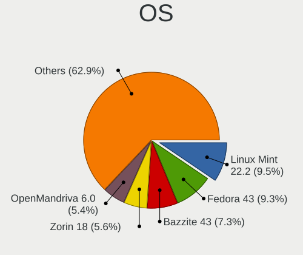

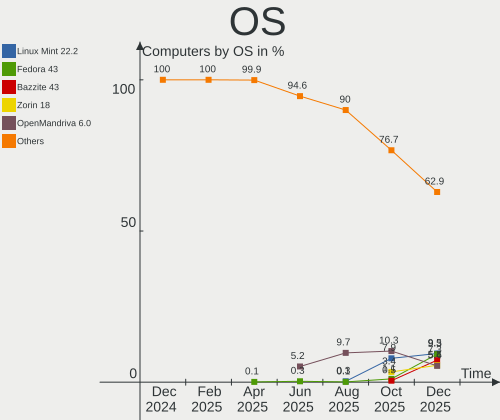

| Name                         | Computers | Percent |
|------------------------------|-----------|---------|
| Linux Mint 22.2              | 152       | 9.45%   |
| Fedora 43                    | 149       | 9.27%   |
| Bazzite 43                   | 118       | 7.34%   |
| Zorin 18                     | 90        | 5.6%    |
| OpenMandriva 6.0             | 87        | 5.41%   |
| Ubuntu 24.04                 | 84        | 5.22%   |
| Arch Rolling                 | 73        | 4.54%   |
| OpenMandriva 25.11           | 72        | 4.48%   |
| Debian 13                    | 57        | 3.54%   |
| Pop!_OS 24.04                | 56        | 3.48%   |
| OpenMandriva 25.90           | 54        | 3.36%   |
| Ubuntu 25.10                 | 36        | 2.24%   |
| Pop!_OS 22.04                | 33        | 2.05%   |
| Bazzite 42                   | 32        | 1.99%   |
| Kubuntu 25.10                | 29        | 1.8%    |
| CachyOS Rolling              | 29        | 1.8%    |
| Zorin 17                     | 26        | 1.62%   |
| OpenMandriva 25.06           | 26        | 1.62%   |
| Fedora 42                    | 25        | 1.55%   |
| SteamOS 3.7.17               | 23        | 1.43%   |
| KDE neon 24.04               | 19        | 1.18%   |
| Linux Mint 22.1              | 18        | 1.12%   |
| OpenMandriva 24.12           | 15        | 0.93%   |
| CachyOS                      | 15        | 0.93%   |
| Kubuntu 24.04                | 14        | 0.87%   |
| EndeavourOS Rolling          | 14        | 0.87%   |
| Nobara 43                    | 13        | 0.81%   |
| Gentoo 2.18                  | 12        | 0.75%   |
| Manjaro                      | 10        | 0.62%   |
| Garuda Linux Rolling         | 10        | 0.62%   |
| Manjaro 25.1.0               | 9         | 0.56%   |
| Kali 2025.4                  | 9         | 0.56%   |
| Ubuntu 22.04                 | 8         | 0.5%    |
| openSUSE Tumbleweed-XXXXXXXX | 8         | 0.5%    |
| NixOS 26.05                  | 7         | 0.44%   |
| LMDE 7                       | 7         | 0.44%   |
| Elementary 8                 | 6         | 0.37%   |
| SteamOS 3.7.19               | 5         | 0.31%   |
| OpenMandriva 5.0             | 5         | 0.31%   |
| Lubuntu 24.04                | 5         | 0.31%   |

OS Family
---------

OS without a version

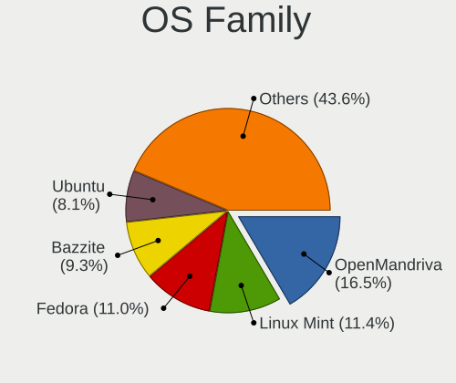

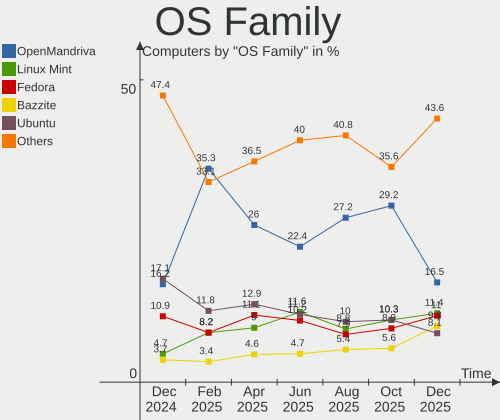

| Name         | Computers | Percent |
|--------------|-----------|---------|
| OpenMandriva | 266       | 16.53%  |
| Linux Mint   | 183       | 11.37%  |
| Fedora       | 177       | 11%     |
| Bazzite      | 150       | 9.32%   |
| Ubuntu       | 131       | 8.14%   |
| Zorin        | 118       | 7.33%   |
| Pop!_OS      | 89        | 5.53%   |
| Arch         | 73        | 4.54%   |
| Debian       | 64        | 3.98%   |
| Kubuntu      | 44        | 2.73%   |
| CachyOS      | 44        | 2.73%   |
| SteamOS      | 34        | 2.11%   |
| Manjaro      | 23        | 1.43%   |
| KDE neon     | 19        | 1.18%   |
| Nobara       | 15        | 0.93%   |
| Gentoo       | 14        | 0.87%   |
| EndeavourOS  | 14        | 0.87%   |
| openSUSE     | 13        | 0.81%   |
| NixOS        | 12        | 0.75%   |
| Garuda Linux | 12        | 0.75%   |
| Lubuntu      | 11        | 0.68%   |
| Xubuntu      | 9         | 0.56%   |
| Kali         | 9         | 0.56%   |
| LMDE         | 8         | 0.5%    |
| Elementary   | 6         | 0.37%   |
| AlmaLinux    | 6         | 0.37%   |
| Ubuntu MATE  | 5         | 0.31%   |
| Solus        | 4         | 0.25%   |
| Bluefin      | 4         | 0.25%   |
| Anduinos     | 4         | 0.25%   |
| ROSA         | 3         | 0.19%   |
| Pikaos       | 3         | 0.19%   |
| Dts-distro   | 3         | 0.19%   |
| Athenaos     | 3         | 0.19%   |
| Unraid OS    | 2         | 0.12%   |
| TUXEDO OS    | 2         | 0.12%   |
| Rocky Linux  | 2         | 0.12%   |
| Q4OS         | 2         | 0.12%   |
| Parrot       | 2         | 0.12%   |
| MX           | 2         | 0.12%   |

Kernel
------

Version of the Linux kernel

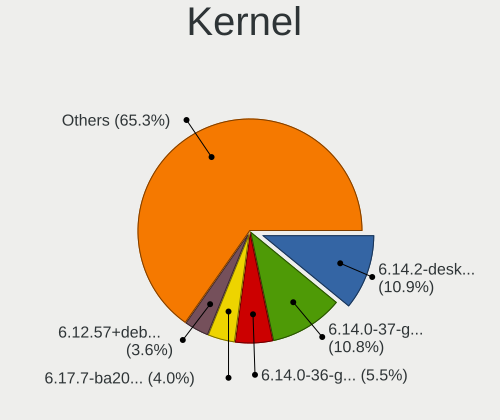

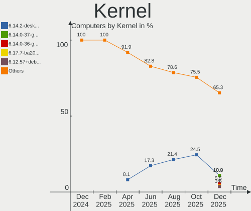

| Version                                     | Computers | Percent |
|---------------------------------------------|-----------|---------|
| 6.14.2-desktop-3omv2590                     | 176       | 10.94%  |
| 6.14.0-37-generic                           | 173       | 10.75%  |
| 6.14.0-36-generic                           | 88        | 5.47%   |
| 6.17.7-ba20.fc43.x86_64                     | 64        | 3.98%   |
| 6.12.57+deb13-amd64                         | 58        | 3.6%    |
| 6.17.7-ba19.fc43.x86_64                     | 51        | 3.17%   |
| 6.8.0-90-generic                            | 45        | 2.8%    |
| 6.17.9-arch1-1                              | 45        | 2.8%    |
| 6.17.9-76061709-generic                     | 44        | 2.73%   |
| 6.17.12-300.fc43.x86_64                     | 43        | 2.67%   |
| 6.17.9-300.fc43.x86_64                      | 39        | 2.42%   |
| 6.17.4-76061704-generic                     | 35        | 2.18%   |
| 6.8.0-88-generic                            | 34        | 2.11%   |
| 6.17.0-8-generic                            | 33        | 2.05%   |
| 6.18.0-desktop-1omv2590                     | 30        | 1.86%   |
| 6.16.4-116.bazzite.fc42.x86_64              | 30        | 1.86%   |
| 6.17.0-7-generic                            | 29        | 1.8%    |
| 6.17.7-desktop-1omv2590                     | 28        | 1.74%   |
| 6.14.0-29-generic                           | 25        | 1.55%   |
| 6.11.11-valve24-2-neptune-611-gfd0dd251480d | 21        | 1.31%   |
| 6.17.1-300.fc43.x86_64                      | 19        | 1.18%   |
| 6.8.0-87-generic                            | 17        | 1.06%   |
| 6.17.11-300.fc43.x86_64                     | 17        | 1.06%   |
| 6.17.10-300.fc43.x86_64                     | 17        | 1.06%   |
| 6.17.9-zen1-1-zen                           | 15        | 0.93%   |
| 6.17.8-300.fc43.x86_64                      | 15        | 0.93%   |
| 6.12.1-desktop-1omv2490                     | 15        | 0.93%   |
| 6.18.2-arch2-1                              | 11        | 0.68%   |
| 6.18.0-3-cachyos                            | 10        | 0.62%   |
| 6.17.9-2-cachyos                            | 10        | 0.62%   |
| 6.16.3-76061603-generic                     | 8         | 0.5%    |
| 6.14.0-27-generic                           | 8         | 0.5%    |
| 6.11.11-valve26-1-neptune-611-gb3afa9aa9ae7 | 8         | 0.5%    |
| 6.17.10-200.nobara.fc43.x86_64              | 7         | 0.44%   |
| 6.18.1-arch1-2                              | 6         | 0.37%   |
| 6.17.10+kali-amd64                          | 6         | 0.37%   |
| 6.17.0-5-generic                            | 6         | 0.37%   |
| 6.14.0-33-generic                           | 6         | 0.37%   |
| 6.6.2-desktop-1omv2390                      | 5         | 0.31%   |
| 6.18.2-zen2-1-zen                           | 5         | 0.31%   |

Kernel Family
-------------

Linux kernel without a distro release

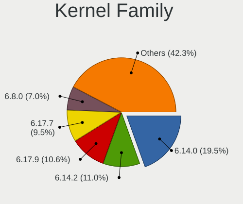

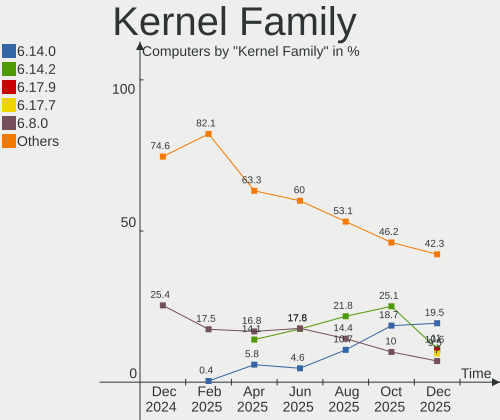

| Version | Computers | Percent |
|---------|-----------|---------|
| 6.14.0  | 314       | 19.52%  |
| 6.14.2  | 177       | 11%     |
| 6.17.9  | 171       | 10.63%  |
| 6.17.7  | 153       | 9.51%   |
| 6.8.0   | 113       | 7.02%   |
| 6.17.0  | 74        | 4.6%    |
| 6.18.0  | 68        | 4.23%   |
| 6.12.57 | 60        | 3.73%   |
| 6.17.12 | 46        | 2.86%   |
| 6.17.4  | 37        | 2.3%    |
| 6.17.10 | 37        | 2.3%    |
| 6.18.2  | 33        | 2.05%   |
| 6.16.4  | 32        | 1.99%   |
| 6.17.8  | 31        | 1.93%   |
| 6.11.11 | 29        | 1.8%    |
| 6.18.1  | 24        | 1.49%   |
| 6.17.1  | 24        | 1.49%   |
| 6.17.11 | 23        | 1.43%   |
| 6.12.1  | 16        | 0.99%   |
| 5.15.0  | 13        | 0.81%   |
| 6.16.3  | 8         | 0.5%    |
| 6.12.63 | 8         | 0.5%    |
| 6.12.48 | 8         | 0.5%    |
| 6.16.12 | 7         | 0.44%   |
| 6.12.47 | 7         | 0.44%   |
| 6.12.0  | 7         | 0.44%   |
| 6.12.58 | 6         | 0.37%   |
| 6.1.0   | 6         | 0.37%   |
| 6.6.2   | 5         | 0.31%   |
| 6.12.61 | 5         | 0.31%   |
| 6.6.21  | 3         | 0.19%   |
| 6.17.5  | 3         | 0.19%   |
| 6.16.8  | 3         | 0.19%   |
| 6.15.0  | 3         | 0.19%   |
| 6.12.62 | 3         | 0.19%   |
| 6.12.60 | 3         | 0.19%   |
| 6.11.0  | 3         | 0.19%   |
| 4.18.0  | 3         | 0.19%   |
| 6.5.0   | 2         | 0.12%   |
| 6.4.8   | 2         | 0.12%   |

Kernel Major Ver.
-----------------

Linux kernel major version

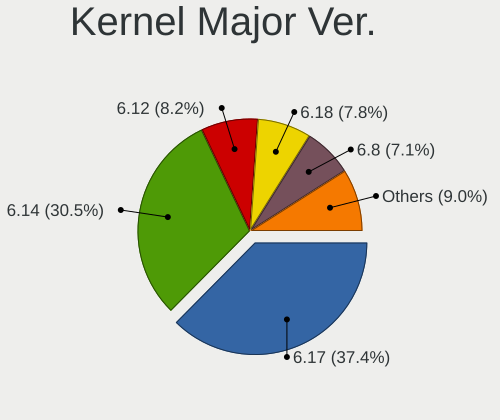

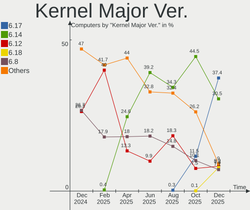

| Version | Computers | Percent |
|---------|-----------|---------|
| 6.17    | 602       | 37.41%  |
| 6.14    | 491       | 30.52%  |
| 6.12    | 132       | 8.2%    |
| 6.18    | 125       | 7.77%   |
| 6.8     | 114       | 7.09%   |
| 6.16    | 52        | 3.23%   |
| 6.11    | 33        | 2.05%   |
| 6.6     | 14        | 0.87%   |
| 5.15    | 13        | 0.81%   |
| 6.1     | 9         | 0.56%   |
| 6.15    | 6         | 0.37%   |
| 6.4     | 3         | 0.19%   |
| 4.18    | 3         | 0.19%   |
| 6.5     | 2         | 0.12%   |
| 6.13    | 2         | 0.12%   |
| 5.14    | 2         | 0.12%   |
| 6.9     | 1         | 0.06%   |
| 6.19    | 1         | 0.06%   |
| 5.4     | 1         | 0.06%   |
| 5.19    | 1         | 0.06%   |
| 5.10    | 1         | 0.06%   |
| 4.19    | 1         | 0.06%   |

Arch
----

OS architecture (x86_64, i586, etc.)

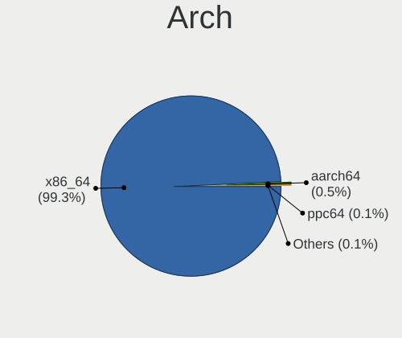

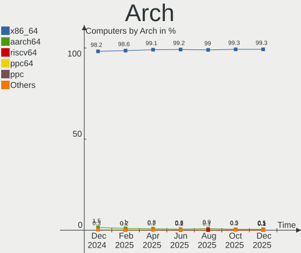

| Name    | Computers | Percent |
|---------|-----------|---------|
| x86_64  | 1597      | 99.25%  |
| aarch64 | 8         | 0.5%    |
| riscv64 | 1         | 0.06%   |
| ppc64   | 1         | 0.06%   |
| ppc     | 1         | 0.06%   |
| i686    | 1         | 0.06%   |

DE
--

Desktop Environment

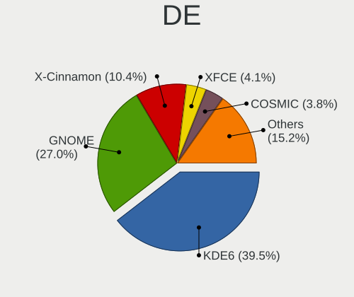

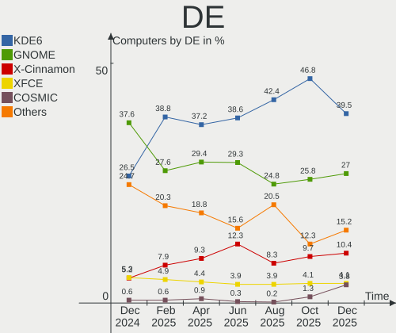

| Name            | Computers | Percent |
|-----------------|-----------|---------|
| KDE6            | 636       | 39.53%  |
| GNOME           | 434       | 26.97%  |
| X-Cinnamon      | 167       | 10.38%  |
| XFCE            | 66        | 4.1%    |
| COSMIC          | 61        | 3.79%   |
| Unknown         | 53        | 3.29%   |
| LXQt            | 41        | 2.55%   |
| KDE5            | 31        | 1.93%   |
| KDE             | 27        | 1.68%   |
| MATE            | 18        | 1.12%   |
| Hyprland        | 14        | 0.87%   |
| niri            | 9         | 0.56%   |
| KDE4            | 9         | 0.56%   |
| i3              | 7         | 0.44%   |
| Pantheon        | 6         | 0.37%   |
| Budgie          | 6         | 0.37%   |
| Cinnamon        | 5         | 0.31%   |
| sway:wlroots    | 3         | 0.19%   |
| sway            | 3         | 0.19%   |
| LXDE            | 3         | 0.19%   |
| Trinity         | 2         | 0.12%   |
| labwc:wlroots   | 2         | 0.12%   |
| LeftWM          | 1         | 0.06%   |
| GNOME Flashback | 1         | 0.06%   |
| GNOME Classic   | 1         | 0.06%   |
| Enlightenment   | 1         | 0.06%   |
| e16-session     | 1         | 0.06%   |
| bspwm           | 1         | 0.06%   |

Display Server
--------------

X11 or Wayland

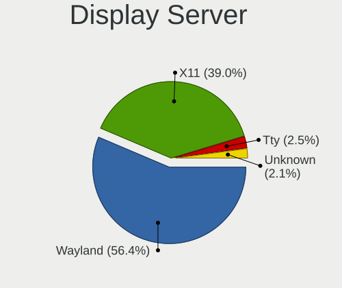

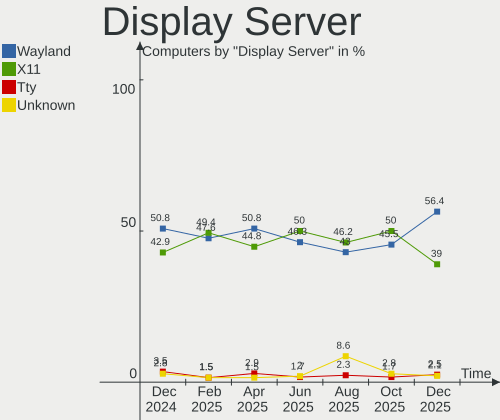

| Name    | Computers | Percent |
|---------|-----------|---------|
| Wayland | 907       | 56.37%  |
| X11     | 627       | 38.97%  |
| Tty     | 41        | 2.55%   |
| Unknown | 34        | 2.11%   |

Display Manager
---------------

SDDM, LightDM, etc.

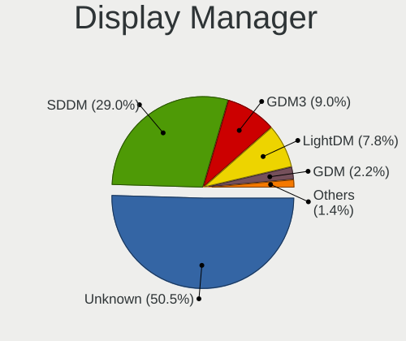

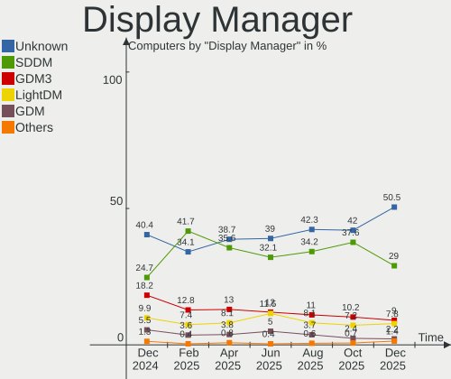

| Name                  | Computers | Percent |
|-----------------------|-----------|---------|
| Unknown               | 812       | 50.47%  |
| SDDM                  | 467       | 29.02%  |
| GDM3                  | 145       | 9.01%   |
| LightDM               | 126       | 7.83%   |
| GDM                   | 36        | 2.24%   |
| COSMIC-GREETER        | 9         | 0.56%   |
| GREETD                | 7         | 0.44%   |
| TDM                   | 2         | 0.12%   |
| LY-DM                 | 2         | 0.12%   |
| XDM                   | 1         | 0.06%   |
| Ly                    | 1         | 0.06%   |
| DISPLAY-MANAGER-START | 1         | 0.06%   |

OS Lang
-------

Language

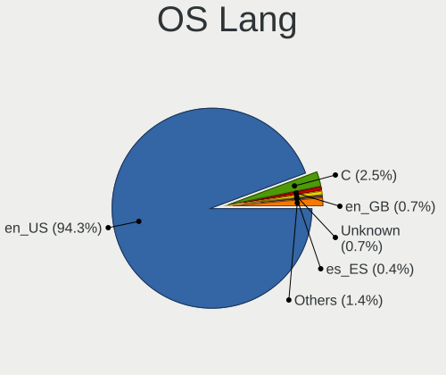

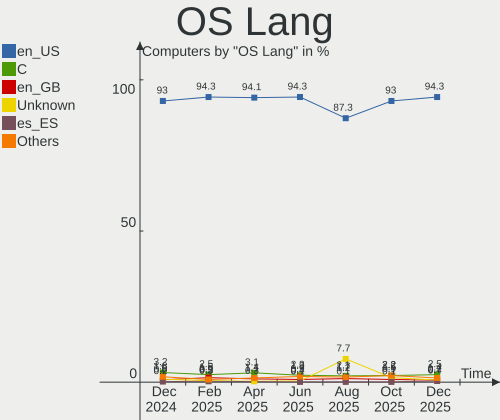

| Lang    | Computers | Percent |
|---------|-----------|---------|
| en_US   | 1518      | 94.34%  |
| C       | 40        | 2.49%   |
| en_GB   | 11        | 0.68%   |
| Unknown | 11        | 0.68%   |
| es_ES   | 6         | 0.37%   |
| en_CA   | 4         | 0.25%   |
| de_AT   | 4         | 0.25%   |
| es_US   | 3         | 0.19%   |
| ru_RU   | 2         | 0.12%   |
| de_DE   | 2         | 0.12%   |
| C.UTF8  | 2         | 0.12%   |
| zh_CN   | 1         | 0.06%   |
| uk_UA   | 1         | 0.06%   |
| POSIX   | 1         | 0.06%   |
| nl_NL   | 1         | 0.06%   |
| fr_FR   | 1         | 0.06%   |
| da_DK   | 1         | 0.06%   |

Boot Mode
---------

EFI or BIOS

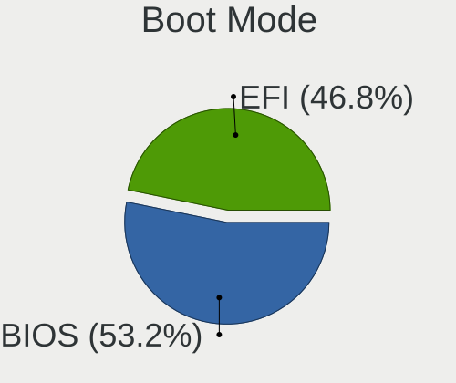

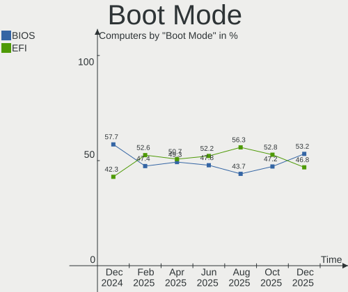

| Mode | Computers | Percent |
|------|-----------|---------|
| BIOS | 856       | 53.2%   |
| EFI  | 753       | 46.8%   |

Filesystem
----------

Type of filesystem

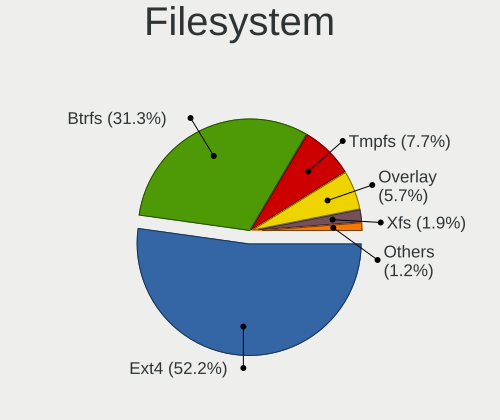

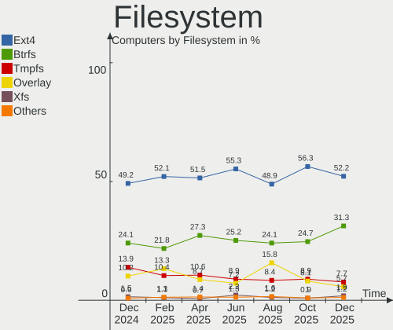

| Type    | Computers | Percent |
|---------|-----------|---------|
| Ext4    | 840       | 52.21%  |
| Btrfs   | 503       | 31.26%  |
| Tmpfs   | 124       | 7.71%   |
| Overlay | 92        | 5.72%   |
| Xfs     | 30        | 1.86%   |
| Zfs     | 7         | 0.44%   |
| Rootfs  | 4         | 0.25%   |
| XXXXX   | 2         | 0.12%   |
| F2fs    | 2         | 0.12%   |
| Ext2    | 2         | 0.12%   |
| XXX4    | 1         | 0.06%   |
| Ext3    | 1         | 0.06%   |
| Unknown | 1         | 0.06%   |

Part. scheme
------------

Scheme of partitioning

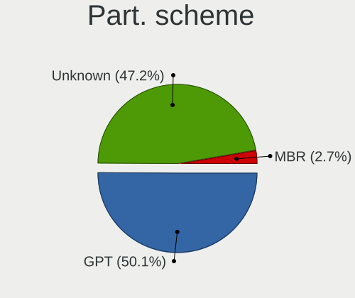

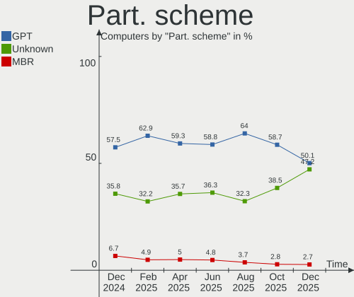

| Type    | Computers | Percent |
|---------|-----------|---------|
| GPT     | 806       | 50.09%  |
| Unknown | 759       | 47.17%  |
| MBR     | 44        | 2.73%   |

Dual Boot with Linux/BSD
------------------------

Hosting more than one Linux/BSD

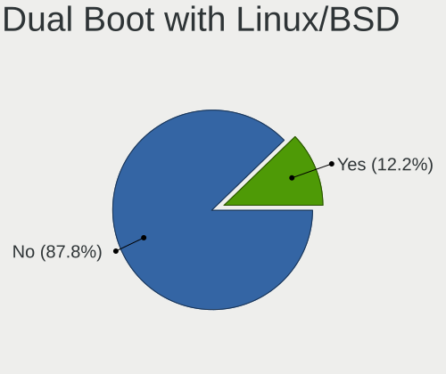

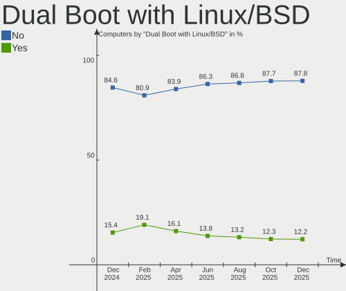

| Dual boot | Computers | Percent |
|-----------|-----------|---------|
| No        | 1412      | 87.76%  |
| Yes       | 197       | 12.24%  |

Dual Boot (Win)
---------------

Hosting Linux and Windows

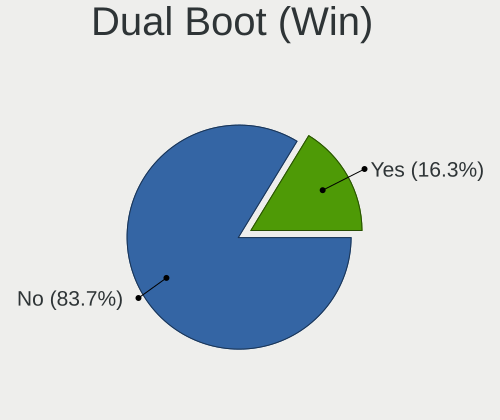

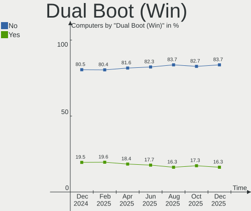

| Dual boot | Computers | Percent |
|-----------|-----------|---------|
| No        | 1347      | 83.72%  |
| Yes       | 262       | 16.28%  |

Board
-----

Vendor
------

Motherboard manufacturer

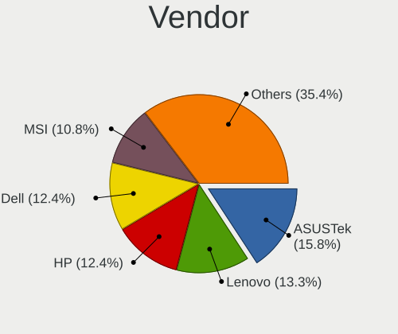

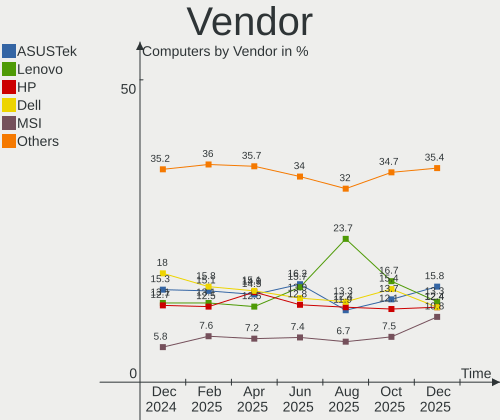

| Name                                 | Computers | Percent |
|--------------------------------------|-----------|---------|
| ASUSTek Computer                     | 254       | 15.79%  |
| Lenovo                               | 214       | 13.3%   |
| Hewlett-Packard                      | 199       | 12.37%  |
| Dell                                 | 199       | 12.37%  |
| MSI                                  | 174       | 10.81%  |
| Gigabyte Technology                  | 128       | 7.96%   |
| ASRock                               | 78        | 4.85%   |
| Apple                                | 67        | 4.16%   |
| Acer                                 | 35        | 2.18%   |
| Framework                            | 22        | 1.37%   |
| Microsoft                            | 20        | 1.24%   |
| Intel                                | 20        | 1.24%   |
| Valve                                | 17        | 1.06%   |
| Google                               | 14        | 0.87%   |
| Toshiba                              | 13        | 0.81%   |
| Unknown                              | 12        | 0.75%   |
| Alienware                            | 11        | 0.68%   |
| System76                             | 9         | 0.56%   |
| AZW                                  | 9         | 0.56%   |
| Supermicro                           | 8         | 0.5%    |
| Shenzhen Meigao Electronic Equipment | 8         | 0.5%    |
| Pegatron                             | 8         | 0.5%    |
| Raspberry Pi Foundation              | 6         | 0.37%   |
| GMKtec                               | 6         | 0.37%   |
| Samsung Electronics                  | 5         | 0.31%   |
| Sony                                 | 4         | 0.25%   |
| GEEKOM                               | 4         | 0.25%   |
| AMD                                  | 4         | 0.25%   |
| Razer                                | 3         | 0.19%   |
| PELADN                               | 3         | 0.19%   |
| Gateway                              | 3         | 0.19%   |
| Core Innovations                     | 3         | 0.19%   |
| Biostar                              | 3         | 0.19%   |
| American Megatrends                  | 3         | 0.19%   |
| TianBei                              | 2         | 0.12%   |
| Notebook                             | 2         | 0.12%   |
| Minix                                | 2         | 0.12%   |
| LG Electronics                       | 2         | 0.12%   |
| GPU Company                          | 2         | 0.12%   |
| Fujitsu                              | 2         | 0.12%   |

Model
-----

Motherboard model

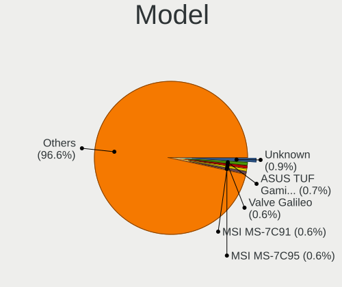

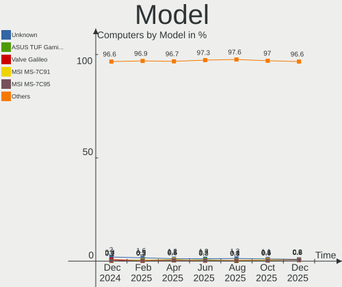

| Name                                                  | Computers | Percent |
|-------------------------------------------------------|-----------|---------|
| Unknown                                               | 14        | 0.87%   |
| ASUS TUF Gaming X570-PLUS                             | 12        | 0.75%   |
| Valve Galileo                                         | 10        | 0.62%   |
| MSI MS-7C91                                           | 10        | 0.62%   |
| MSI MS-7C95                                           | 9         | 0.56%   |
| ASUS All Series                                       | 9         | 0.56%   |
| Valve Jupiter                                         | 7         | 0.44%   |
| MSI MS-7C37                                           | 7         | 0.44%   |
| Lenovo Yoga 7 2-in-1 14AKP10 83JR                     | 7         | 0.44%   |
| Apple MacBookAir7,2                                   | 7         | 0.44%   |
| Lenovo Legion Go S 8APU1 83N6                         | 6         | 0.37%   |
| MSI MS-7E12                                           | 5         | 0.31%   |
| MSI MS-7D75                                           | 5         | 0.31%   |
| HP Laptop 15-fd0xxx                                   | 5         | 0.31%   |
| Framework Laptop 16 (AMD Ryzen 7040 Series)           | 5         | 0.31%   |
| Framework Laptop 13 (AMD Ryzen AI 300 Series)         | 5         | 0.31%   |
| Framework Laptop 13 (AMD Ryzen 7040Series)            | 5         | 0.31%   |
| Dell Latitude E6430                                   | 5         | 0.31%   |
| AZW SER                                               | 5         | 0.31%   |
| ASUS ROG STRIX B550-F GAMING WIFI II                  | 5         | 0.31%   |
| Supermicro Super Server                               | 4         | 0.25%   |
| Shenzhen Meigao Electronic Equipment EliteMini Series | 4         | 0.25%   |
| MSI MS-7E51                                           | 4         | 0.25%   |
| MSI MS-7C56                                           | 4         | 0.25%   |
| MSI MS-7B24                                           | 4         | 0.25%   |
| Lenovo ThinkCentre M72e 0967B5U                       | 4         | 0.25%   |
| HP Notebook                                           | 4         | 0.25%   |
| HP Laptop 15-dy2xxx                                   | 4         | 0.25%   |
| Dell XPS 8700                                         | 4         | 0.25%   |
| Dell Precision Tower 5810                             | 4         | 0.25%   |
| ASUS ROG STRIX X870E-E GAMING WIFI                    | 4         | 0.25%   |
| Apple MacBookPro9,2                                   | 4         | 0.25%   |
| Toshiba Satellite C55-C                               | 3         | 0.19%   |
| MSI MS-7E59                                           | 3         | 0.19%   |
| MSI MS-7E49                                           | 3         | 0.19%   |
| MSI MS-7D78                                           | 3         | 0.19%   |
| MSI MS-7C02                                           | 3         | 0.19%   |
| MSI MS-7B87                                           | 3         | 0.19%   |
| MSI MS-7B85                                           | 3         | 0.19%   |
| MSI MS-7A34                                           | 3         | 0.19%   |

Model Family
------------

Motherboard model prefix

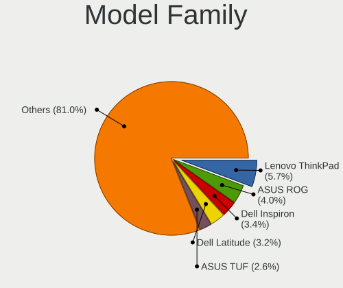

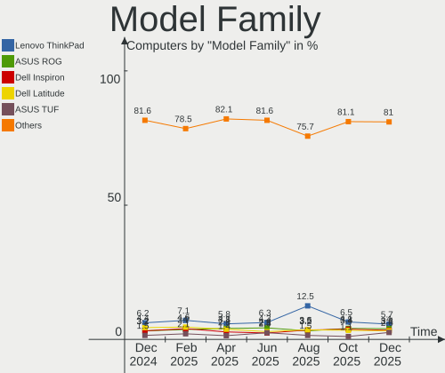

| Name               | Computers | Percent |
|--------------------|-----------|---------|
| Lenovo ThinkPad    | 92        | 5.72%   |
| ASUS ROG           | 65        | 4.04%   |
| Dell Inspiron      | 54        | 3.36%   |
| Dell Latitude      | 52        | 3.23%   |
| ASUS TUF           | 42        | 2.61%   |
| ASUS PRIME         | 39        | 2.42%   |
| HP Laptop          | 29        | 1.8%    |
| Lenovo Legion      | 28        | 1.74%   |
| Lenovo IdeaPad     | 28        | 1.74%   |
| Dell OptiPlex      | 28        | 1.74%   |
| HP Pavilion        | 26        | 1.62%   |
| Dell Precision     | 26        | 1.62%   |
| Dell XPS           | 25        | 1.55%   |
| Framework Laptop   | 22        | 1.37%   |
| Lenovo Yoga        | 21        | 1.31%   |
| Microsoft Surface  | 20        | 1.24%   |
| HP EliteBook       | 20        | 1.24%   |
| Acer Aspire        | 19        | 1.18%   |
| Lenovo ThinkCentre | 16        | 0.99%   |
| ASUS VivoBook      | 16        | 0.99%   |
| HP ENVY            | 14        | 0.87%   |
| Unknown            | 14        | 0.87%   |
| HP Victus          | 12        | 0.75%   |
| HP ProBook         | 12        | 0.75%   |
| ASUS ASUS          | 12        | 0.75%   |
| HP Compaq          | 11        | 0.68%   |
| Gigabyte X570      | 11        | 0.68%   |
| Valve Galileo      | 10        | 0.62%   |
| Toshiba Satellite  | 10        | 0.62%   |
| MSI MS-7C91        | 10        | 0.62%   |
| Gigabyte B650      | 10        | 0.62%   |
| MSI MS-7C95        | 9         | 0.56%   |
| ASUS All           | 9         | 0.56%   |
| Apple MacBookAir7  | 9         | 0.56%   |
| Gigabyte X870E     | 8         | 0.5%    |
| Valve Jupiter      | 7         | 0.44%   |
| MSI MS-7C37        | 7         | 0.44%   |
| HP OMEN            | 7         | 0.44%   |
| HP EliteDesk       | 7         | 0.44%   |
| Gigabyte B650M     | 7         | 0.44%   |

MFG Year
--------

Motherboard manufacture year

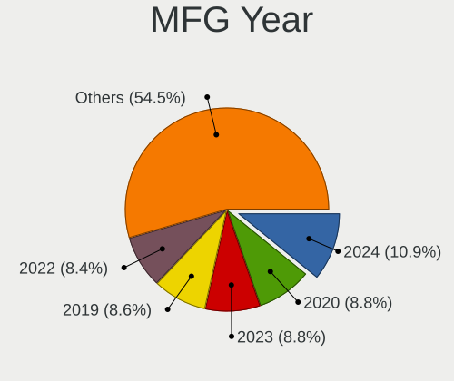

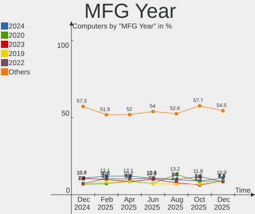

| Year    | Computers | Percent |
|---------|-----------|---------|
| 2024    | 175       | 10.88%  |
| 2020    | 142       | 8.83%   |
| 2023    | 141       | 8.76%   |
| 2019    | 139       | 8.64%   |
| 2022    | 135       | 8.39%   |
| 2025    | 129       | 8.02%   |
| 2021    | 129       | 8.02%   |
| 2018    | 101       | 6.28%   |
| 2017    | 73        | 4.54%   |
| 2012    | 70        | 4.35%   |
| 2013    | 69        | 4.29%   |
| 2016    | 67        | 4.16%   |
| 2015    | 63        | 3.92%   |
| 2014    | 53        | 3.29%   |
| 2011    | 51        | 3.17%   |
| 2009    | 21        | 1.31%   |
| 2010    | 18        | 1.12%   |
| Unknown | 10        | 0.62%   |
| 2008    | 9         | 0.56%   |
| 2006    | 7         | 0.44%   |
| 2007    | 6         | 0.37%   |
| 2003    | 1         | 0.06%   |

Form Factor
-----------

Physical design of the computer

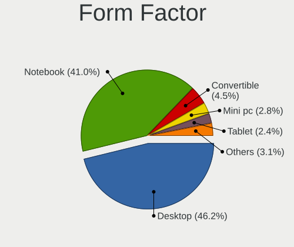

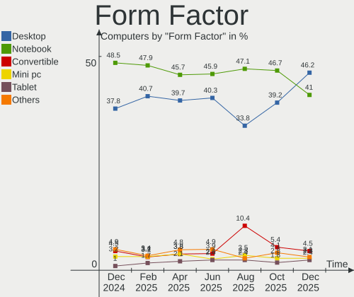

| Name           | Computers | Percent |
|----------------|-----------|---------|
| Desktop        | 743       | 46.18%  |
| Notebook       | 660       | 41.02%  |
| Convertible    | 72        | 4.47%   |
| Mini pc        | 45        | 2.8%    |
| Tablet         | 39        | 2.42%   |
| All in one     | 26        | 1.62%   |
| Server         | 16        | 0.99%   |
| System on chip | 7         | 0.44%   |
| Other          | 1         | 0.06%   |

Secure Boot
-----------

Enabled or disabled

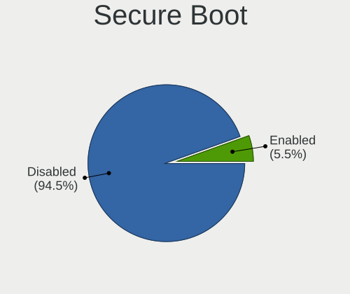

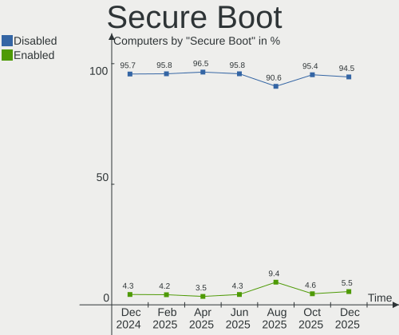

| State    | Computers | Percent |
|----------|-----------|---------|
| Disabled | 1521      | 94.53%  |
| Enabled  | 88        | 5.47%   |

Coreboot
--------

Have coreboot on board

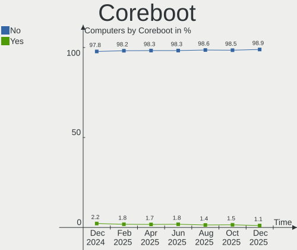

| Used | Computers | Percent |
|------|-----------|---------|
| No   | 1591      | 98.88%  |
| Yes  | 18        | 1.12%   |

RAM Size
--------

Total RAM memory

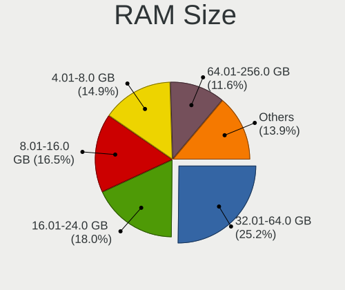

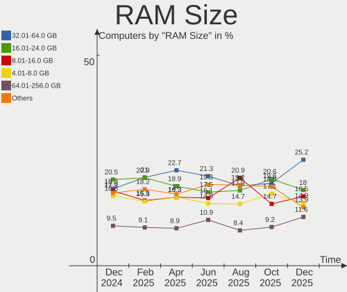

| Size in GB      | Computers | Percent |
|-----------------|-----------|---------|
| 32.01-64.0      | 405       | 25.17%  |
| 16.01-24.0      | 289       | 17.96%  |
| 8.01-16.0       | 265       | 16.47%  |
| 4.01-8.0        | 240       | 14.92%  |
| 64.01-256.0     | 187       | 11.62%  |
| 24.01-32.0      | 119       | 7.4%    |
| 3.01-4.0        | 78        | 4.85%   |
| More than 256.0 | 10        | 0.62%   |
| 1.01-2.0        | 8         | 0.5%    |
| 2.01-3.0        | 6         | 0.37%   |
| 0.01-0.5        | 2         | 0.12%   |

RAM Used
--------

Used RAM memory

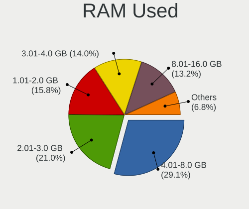

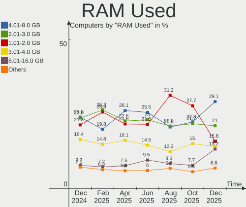

| Used GB         | Computers | Percent |
|-----------------|-----------|---------|
| 4.01-8.0        | 469       | 29.15%  |
| 2.01-3.0        | 338       | 21.01%  |
| 1.01-2.0        | 254       | 15.79%  |
| 3.01-4.0        | 226       | 14.05%  |
| 8.01-16.0       | 212       | 13.18%  |
| 0.51-1.0        | 49        | 3.05%   |
| 16.01-24.0      | 30        | 1.86%   |
| 32.01-64.0      | 9         | 0.56%   |
| 24.01-32.0      | 9         | 0.56%   |
| 0.01-0.5        | 7         | 0.44%   |
| 64.01-256.0     | 4         | 0.25%   |
| More than 256.0 | 1         | 0.06%   |
| 0               | 1         | 0.06%   |

Total Drives
------------

Number of drives on board

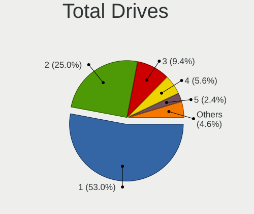

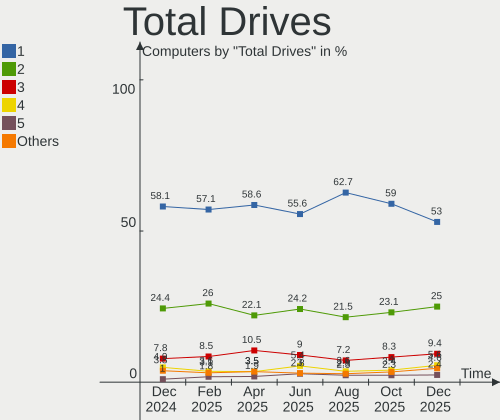

| Drives | Computers | Percent |
|--------|-----------|---------|
| 1      | 852       | 52.95%  |
| 2      | 403       | 25.05%  |
| 3      | 151       | 9.38%   |
| 4      | 90        | 5.59%   |
| 5      | 39        | 2.42%   |
| 6      | 33        | 2.05%   |
| 7      | 13        | 0.81%   |
| 0      | 11        | 0.68%   |
| 9      | 4         | 0.25%   |
| 10     | 3         | 0.19%   |
| 8      | 3         | 0.19%   |
| 16     | 2         | 0.12%   |
| 13     | 2         | 0.12%   |
| 33     | 1         | 0.06%   |
| 18     | 1         | 0.06%   |
| 14     | 1         | 0.06%   |

Has CD-ROM
----------

Has CD-ROM on board

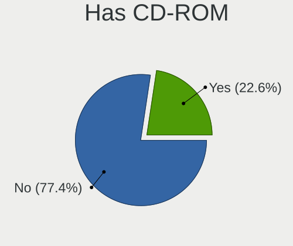

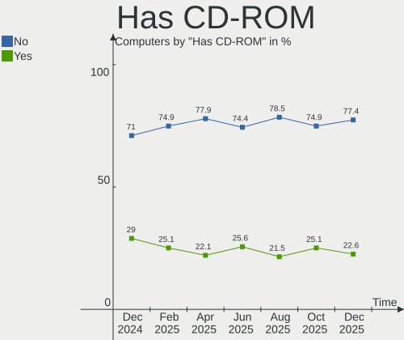

| Presented | Computers | Percent |
|-----------|-----------|---------|
| No        | 1245      | 77.38%  |
| Yes       | 364       | 22.62%  |

Has Ethernet
------------

Has Ethernet on board

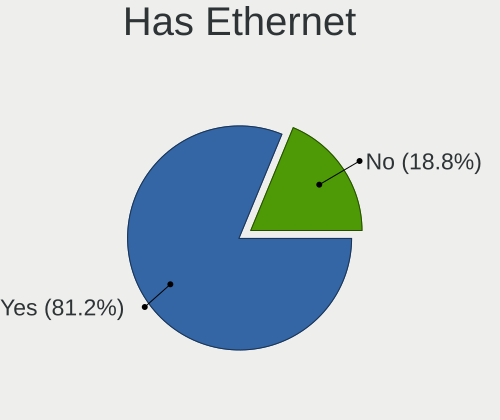

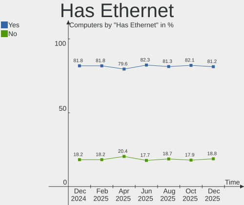

| Presented | Computers | Percent |
|-----------|-----------|---------|
| Yes       | 1307      | 81.23%  |
| No        | 302       | 18.77%  |

Has WiFi
--------

Has WiFi module

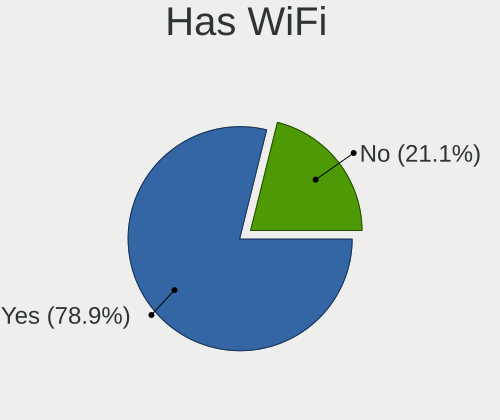

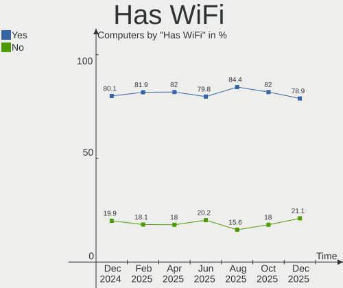

| Presented | Computers | Percent |
|-----------|-----------|---------|
| Yes       | 1269      | 78.87%  |
| No        | 340       | 21.13%  |

Has Bluetooth
-------------

Has Bluetooth module

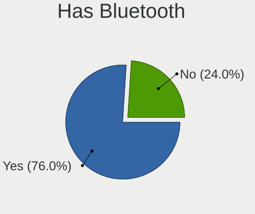

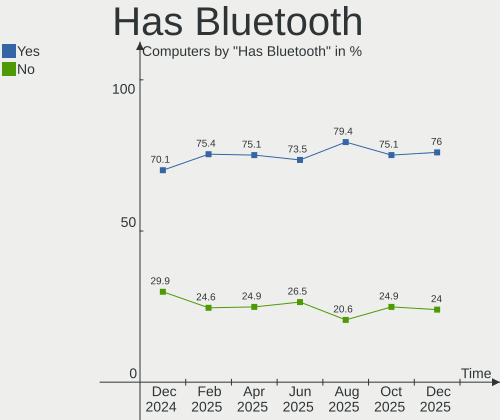

| Presented | Computers | Percent |
|-----------|-----------|---------|
| Yes       | 1223      | 76.01%  |
| No        | 386       | 23.99%  |

Location
--------

Country
-------

Geographic location (country)

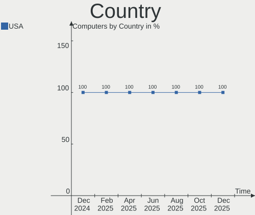

| Country | Computers | Percent |
|---------|-----------|---------|
| USA     | 1609      | 100%    |

City
----

Geographic location (city)

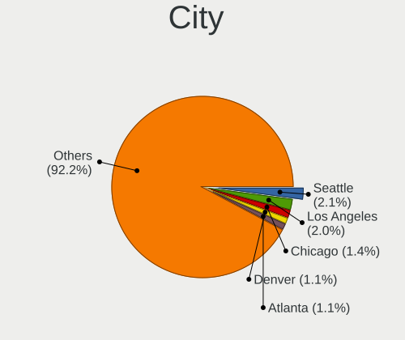

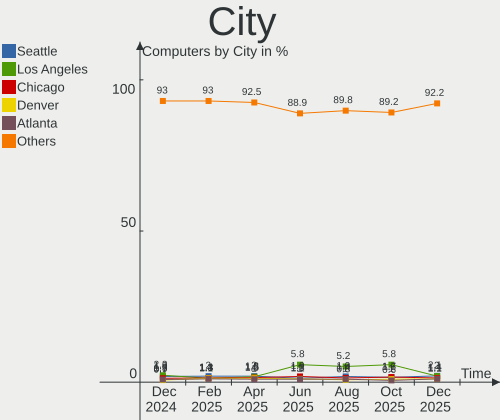

| City             | Computers | Percent |
|------------------|-----------|---------|
| Seattle          | 34        | 2.11%   |
| Los Angeles      | 32        | 1.99%   |
| Chicago          | 23        | 1.43%   |
| Denver           | 18        | 1.12%   |
| Atlanta          | 18        | 1.12%   |
| Portland         | 16        | 0.99%   |
| New York         | 16        | 0.99%   |
| Indianapolis     | 13        | 0.81%   |
| Houston          | 13        | 0.81%   |
| San Francisco    | 12        | 0.75%   |
| Brooklyn         | 12        | 0.75%   |
| San Antonio      | 11        | 0.68%   |
| Phoenix          | 11        | 0.68%   |
| Minneapolis      | 11        | 0.68%   |
| Las Vegas        | 11        | 0.68%   |
| Dallas           | 11        | 0.68%   |
| Salt Lake City   | 10        | 0.62%   |
| St Louis         | 9         | 0.56%   |
| San Diego        | 9         | 0.56%   |
| Miami            | 9         | 0.56%   |
| Knoxville        | 9         | 0.56%   |
| Jacksonville     | 9         | 0.56%   |
| Kansas City      | 8         | 0.5%    |
| Sacramento       | 7         | 0.44%   |
| Louisville       | 7         | 0.44%   |
| Columbus         | 7         | 0.44%   |
| Colorado Springs | 7         | 0.44%   |
| Cleveland        | 7         | 0.44%   |
| Austin           | 7         | 0.44%   |
| Ashburn          | 7         | 0.44%   |
| Warminster       | 6         | 0.37%   |
| Sterling         | 6         | 0.37%   |
| Spokane          | 6         | 0.37%   |
| Olympia          | 6         | 0.37%   |
| Milwaukee        | 6         | 0.37%   |
| Gresham          | 6         | 0.37%   |
| Dayton           | 6         | 0.37%   |
| Washington       | 5         | 0.31%   |
| Virginia Beach   | 5         | 0.31%   |
| Stoughton        | 5         | 0.31%   |

Drives
------

Drive Vendor
------------

Hard drive vendors

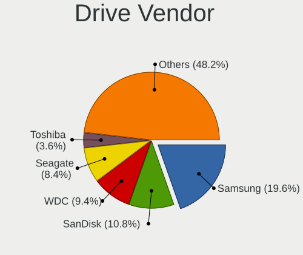

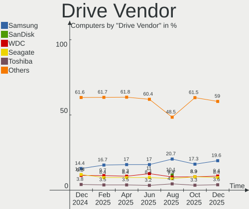

| Vendor                       | Computers | Drives | Percent |
|------------------------------|-----------|--------|---------|
| Samsung Electronics          | 498       | 712    | 19.6%   |
| SanDisk                      | 275       | 314    | 10.82%  |
| WDC                          | 238       | 333    | 9.37%   |
| Seagate                      | 214       | 308    | 8.42%   |
| Toshiba                      | 92        | 97     | 3.62%   |
| SK hynix                     | 90        | 102    | 3.54%   |
| Crucial                      | 90        | 103    | 3.54%   |
| Unknown                      | 83        | 98     | 3.27%   |
| Micron/Crucial Technology    | 82        | 96     | 3.23%   |
| Micron Technology            | 70        | 71     | 2.75%   |
| Phison Electronics           | 56        | 66     | 2.2%    |
| Kingston                     | 54        | 62     | 2.13%   |
| Intel                        | 50        | 64     | 1.97%   |
| MAXIO Technology (Hangzhou)  | 42        | 46     | 1.65%   |
| China                        | 38        | 40     | 1.5%    |
| Apple                        | 38        | 49     | 1.5%    |
| KIOXIA                       | 36        | 42     | 1.42%   |
| PNY                          | 35        | 41     | 1.38%   |
| Hitachi                      | 32        | 37     | 1.26%   |
| Kingston Technology Company  | 29        | 31     | 1.14%   |
| HGST                         | 28        | 48     | 1.1%    |
| SPCC                         | 25        | 31     | 0.98%   |
| Realtek Semiconductor        | 21        | 23     | 0.83%   |
| Silicon Motion               | 16        | 16     | 0.63%   |
| T-FORCE                      | 15        | 18     | 0.59%   |
| Unknown                      | 15        | 15     | 0.59%   |
| Team                         | 13        | 13     | 0.51%   |
| Shenzhen Longsys Electronics | 12        | 12     | 0.47%   |
| SABRENT                      | 11        | 13     | 0.43%   |
| KingSpec                     | 10        | 10     | 0.39%   |
| USB                          | 9         | 9      | 0.35%   |
| Solidigm                     | 9         | 11     | 0.35%   |
| Hewlett-Packard              | 9         | 16     | 0.35%   |
| Seagate Technology           | 8         | 8      | 0.31%   |
| OCZ                          | 8         | 8      | 0.31%   |
| ADATA Technology             | 8         | 8      | 0.31%   |
| SSK                          | 6         | 7      | 0.24%   |
| Patriot                      | 6         | 6      | 0.24%   |
| Phison                       | 5         | 5      | 0.2%    |
| OWC                          | 5         | 5      | 0.2%    |

Drive Model
-----------

Hard drive models

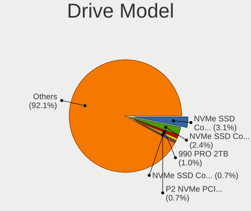

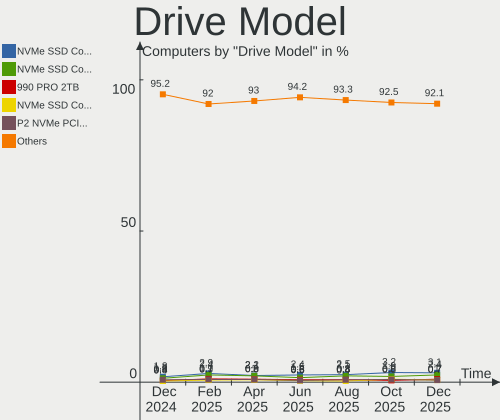

| Model                                                                   | Computers | Percent |
|-------------------------------------------------------------------------|-----------|---------|
| Samsung NVMe SSD Controller SM981/PM981/PM983 1TB                       | 92        | 3.13%   |
| Samsung NVMe SSD Controller PM9A1/PM9A3/980PRO 1TB                      | 70        | 2.38%   |
| Samsung SSD 990 PRO 2TB                                                 | 28        | 0.95%   |
| MAXIO (Hangzhou) NVMe SSD Controller MAP1202 2TB                        | 22        | 0.75%   |
| Micron/Crucial P2 NVMe PCIe SSD 2TB                                     | 21        | 0.72%   |
| Samsung SSD 860 EVO 500GB                                               | 20        | 0.68%   |
| Sandisk WD Blue SN550 NVMe SSD 1024GB                                   | 18        | 0.61%   |
| Unknown MMC Card  64GB                                                  | 17        | 0.58%   |
| Samsung SSD 870 EVO 1TB                                                 | 17        | 0.58%   |
| Samsung NVMe SSD Controller SM961/PM961/SM963 1024GB                    | 17        | 0.58%   |
| Samsung SSD 980 1TB                                                     | 16        | 0.54%   |
| Phison E12 NVMe Controller 1TB                                          | 16        | 0.54%   |
| Sandisk WD_BLACK SN850X 2000GB                                          | 15        | 0.51%   |
| Samsung SSD 990 EVO Plus 1TB                                            | 15        | 0.51%   |
| Samsung SSD 850 EVO 500GB                                               | 15        | 0.51%   |
| Crucial CT1000MX500SSD1 1TB                                             | 15        | 0.51%   |
| Unknown                                                                 | 15        | 0.51%   |
| Seagate ST1000DM003-1CH162 1TB                                          | 14        | 0.48%   |
| Sandisk WD Black SN770 / PC SN740 256GB / PC SN560 (DRAM-less) NVMe SSD | 14        | 0.48%   |
| Sandisk WD Black SN750 / PC SN730 NVMe SSD 500GB                        | 14        | 0.48%   |
| WDC WD10EZEX-08WN4A0 1TB                                                | 13        | 0.44%   |
| Sandisk WD_BLACK SN770 1TB                                              | 13        | 0.44%   |
| Sandisk WD Blue SN580 1TB                                               | 13        | 0.44%   |
| Kingston SA400S37240G 240GB SSD                                         | 13        | 0.44%   |
| Unknown MMC Card  32GB                                                  | 12        | 0.41%   |
| SanDisk NVMe SSD Drive 1TB                                              | 12        | 0.41%   |
| Samsung SSD 990 PRO 4TB                                                 | 12        | 0.41%   |
| Unknown SD/MMC/MS PRO 2GB                                               | 11        | 0.37%   |
| Unknown MMC Card  128GB                                                 | 11        | 0.37%   |
| Samsung SSD 860 EVO 1TB                                                 | 11        | 0.37%   |
| Samsung NVMe SSD Controller S4LV008[Pascal] 4TB                         | 11        | 0.37%   |
| PNY CS900 1TB SSD                                                       | 11        | 0.37%   |
| Seagate ST2000DM008-2FR102 2TB                                          | 10        | 0.34%   |
| Sandisk WD_BLACK SN850X 1000GB                                          | 10        | 0.34%   |
| Sandisk WD_BLACK SN770 2TB                                              | 10        | 0.34%   |
| Samsung SSD 990 EVO 1TB                                                 | 10        | 0.34%   |
| Samsung SSD 870 EVO 4TB                                                 | 10        | 0.34%   |
| Samsung SSD 870 EVO 2TB                                                 | 10        | 0.34%   |
| Phison E16 PCIe4 NVMe Controller 1TB                                    | 10        | 0.34%   |
| Micron/Crucial CT1000P310SSD8 1TB                                       | 10        | 0.34%   |

HDD Vendor
----------

Hard disk drive vendors

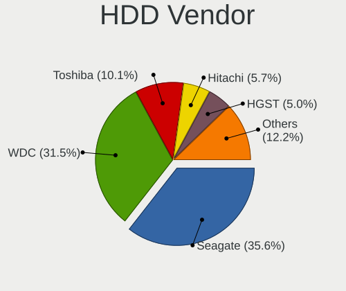

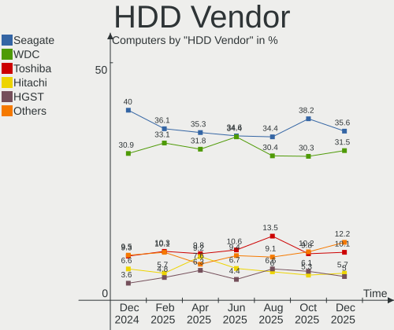

| Vendor              | Computers | Drives | Percent |
|---------------------|-----------|--------|---------|
| Seagate             | 201       | 286    | 35.58%  |
| WDC                 | 178       | 252    | 31.5%   |
| Toshiba             | 57        | 62     | 10.09%  |
| Hitachi             | 32        | 37     | 5.66%   |
| HGST                | 28        | 48     | 4.96%   |
| Apple               | 13        | 13     | 2.3%    |
| Unknown             | 12        | 12     | 2.12%   |
| Samsung Electronics | 10        | 13     | 1.77%   |
| T-FORCE             | 5         | 6      | 0.88%   |
| HPE                 | 5         | 7      | 0.88%   |
| SSK                 | 4         | 4      | 0.71%   |
| JMicron Technology  | 2         | 2      | 0.35%   |
| HGST HTS            | 2         | 2      | 0.35%   |
| Hewlett-Packard     | 2         | 8      | 0.35%   |
| Fujitsu             | 2         | 2      | 0.35%   |
| External            | 2         | 2      | 0.35%   |
| TO Exter            | 1         | 1      | 0.18%   |
| TerraMas            | 1         | 3      | 0.18%   |
| SABRENT             | 1         | 2      | 0.18%   |
| PRO-T5              | 1         | 1      | 0.18%   |
| PRO Z               | 1         | 1      | 0.18%   |
| Maxone              | 1         | 1      | 0.18%   |
| HGST HUH            | 1         | 2      | 0.18%   |
| Elite               | 1         | 2      | 0.18%   |
| Apricorn            | 1         | 1      | 0.18%   |
| Unknown             | 1         | 1      | 0.18%   |

SSD Vendor
----------

Solid state drive vendors

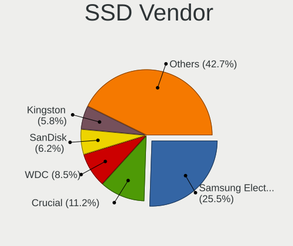

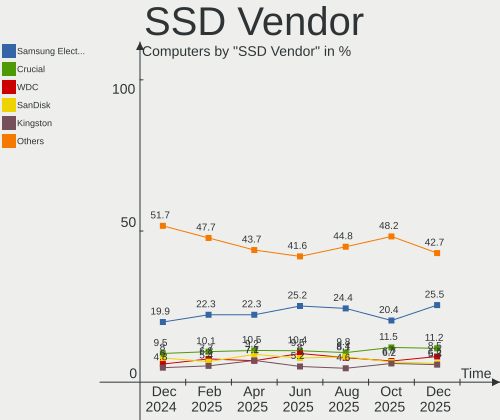

| Vendor              | Computers | Drives | Percent |
|---------------------|-----------|--------|---------|
| Samsung Electronics | 180       | 212    | 25.53%  |
| Crucial             | 79        | 85     | 11.21%  |
| WDC                 | 60        | 67     | 8.51%   |
| SanDisk             | 44        | 51     | 6.24%   |
| Kingston            | 41        | 48     | 5.82%   |
| China               | 37        | 39     | 5.25%   |
| PNY                 | 33        | 39     | 4.68%   |
| SPCC                | 24        | 29     | 3.4%    |
| Apple               | 16        | 16     | 2.27%   |
| Micron Technology   | 15        | 15     | 2.13%   |
| SK hynix            | 14        | 21     | 1.99%   |
| Intel               | 12        | 12     | 1.7%    |
| Toshiba             | 11        | 11     | 1.56%   |
| Team                | 10        | 10     | 1.42%   |
| SABRENT             | 10        | 11     | 1.42%   |
| T-FORCE             | 8         | 8      | 1.13%   |
| OCZ                 | 8         | 8      | 1.13%   |
| KingSpec            | 8         | 8      | 1.13%   |
| Seagate             | 5         | 5      | 0.71%   |
| Patriot             | 5         | 5      | 0.71%   |
| Mushkin             | 5         | 6      | 0.71%   |
| LITEONIT            | 5         | 5      | 0.71%   |
| A-DATA Technology   | 5         | 5      | 0.71%   |
| X12                 | 4         | 4      | 0.57%   |
| OWC                 | 4         | 4      | 0.57%   |
| Lexar               | 4         | 4      | 0.57%   |
| Hewlett-Packard     | 4         | 4      | 0.57%   |
| Corsair             | 4         | 5      | 0.57%   |
| LITEON              | 3         | 3      | 0.43%   |
| Fanxiang            | 3         | 3      | 0.43%   |
| Wibtek              | 2         | 2      | 0.28%   |
| Timetec             | 2         | 2      | 0.28%   |
| ThinkPlus           | 2         | 4      | 0.28%   |
| Rayson              | 2         | 2      | 0.28%   |
| MicroFrom           | 2         | 2      | 0.28%   |
| KingFast            | 2         | 2      | 0.28%   |
| Kimtigo             | 2         | 2      | 0.28%   |
| Inland              | 2         | 3      | 0.28%   |
| BIWIN               | 2         | 2      | 0.28%   |
| WALRAM              | 1         | 1      | 0.14%   |

Drive Kind
----------

HDD or SSD

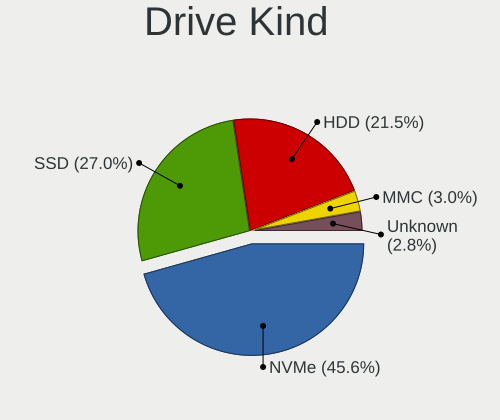

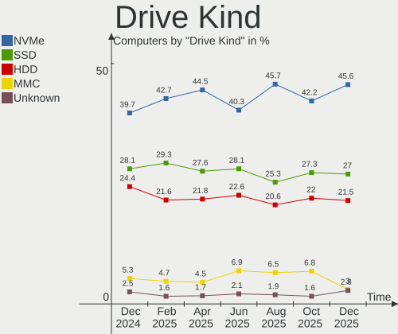

| Kind    | Computers | Drives | Percent |
|---------|-----------|--------|---------|
| NVMe    | 1022      | 1464   | 45.65%  |
| SSD     | 604       | 791    | 26.98%  |
| HDD     | 482       | 771    | 21.53%  |
| MMC     | 68        | 74     | 3.04%   |
| Unknown | 63        | 74     | 2.81%   |

Drive Connector
---------------

SATA, SAS, NVMe, etc.

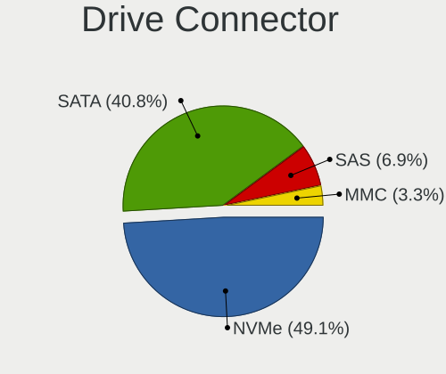

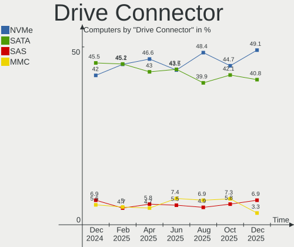

| Type | Computers | Drives | Percent |
|------|-----------|--------|---------|
| NVMe | 1022      | 1452   | 49.06%  |
| SATA | 850       | 1446   | 40.81%  |
| SAS  | 143       | 202    | 6.87%   |
| MMC  | 68        | 74     | 3.26%   |

Drive Size
----------

Size of hard drive

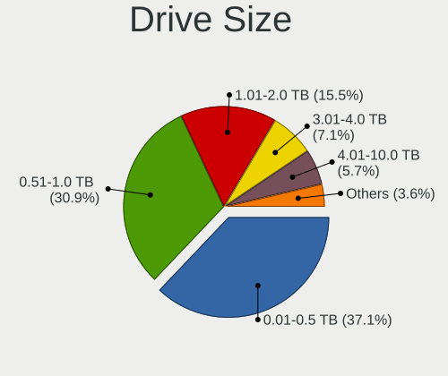

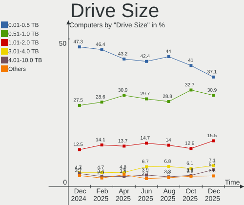

| Size in TB | Computers | Drives | Percent |
|------------|-----------|--------|---------|
| 0.01-0.5   | 458       | 552    | 37.09%  |
| 0.51-1.0   | 382       | 466    | 30.93%  |
| 1.01-2.0   | 191       | 236    | 15.47%  |
| 3.01-4.0   | 88        | 126    | 7.13%   |
| 4.01-10.0  | 71        | 107    | 5.75%   |
| 2.01-3.0   | 22        | 33     | 1.78%   |
| 10.01-20.0 | 20        | 39     | 1.62%   |
| 20.01-50.0 | 3         | 3      | 0.24%   |

Space Total
-----------

Amount of disk space available on the file system

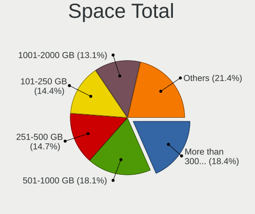

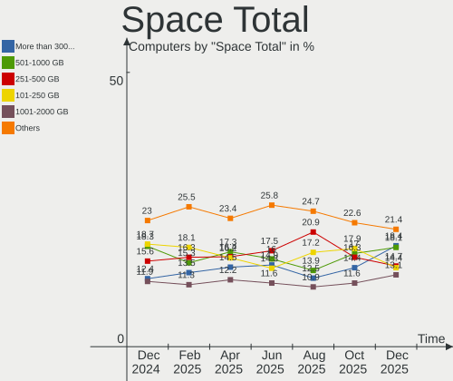

| Size in GB     | Computers | Percent |
|----------------|-----------|---------|
| More than 3000 | 296       | 18.4%   |
| 501-1000       | 292       | 18.15%  |
| 251-500        | 236       | 14.67%  |
| 101-250        | 231       | 14.36%  |
| 1001-2000      | 210       | 13.05%  |
| 2001-3000      | 106       | 6.59%   |
| 1-20           | 92        | 5.72%   |
| Unknown        | 90        | 5.59%   |
| 51-100         | 36        | 2.24%   |
| 21-50          | 19        | 1.18%   |
| 0              | 1         | 0.06%   |

Space Used
----------

Amount of used disk space

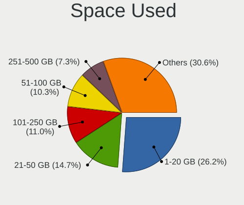

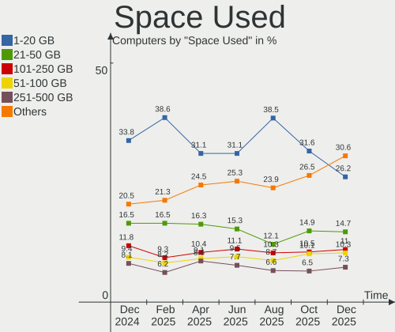

| Used GB        | Computers | Percent |
|----------------|-----------|---------|
| 1-20           | 421       | 26.17%  |
| 21-50          | 236       | 14.67%  |
| 101-250        | 177       | 11%     |
| 51-100         | 165       | 10.25%  |
| 251-500        | 118       | 7.33%   |
| 501-1000       | 114       | 7.09%   |
| More than 3000 | 110       | 6.84%   |
| 1001-2000      | 110       | 6.84%   |
| Unknown        | 90        | 5.59%   |
| 2001-3000      | 59        | 3.67%   |
| 0              | 9         | 0.56%   |

Malfunc. Drives
---------------

Drive models with a malfunction

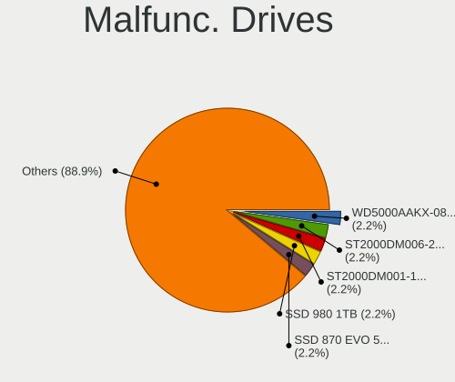

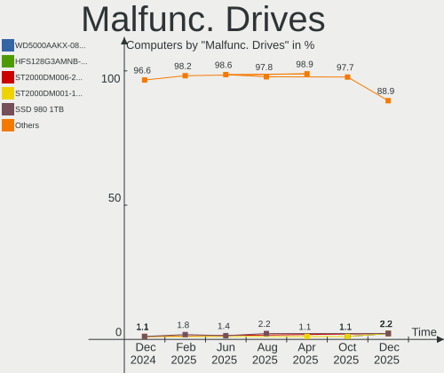

| Model                                                         | Computers | Drives | Percent |
|---------------------------------------------------------------|-----------|--------|---------|
| WDC WD5000AAKX-08U6AA0 500GB                                  | 2         | 2      | 2.22%   |
| SK hynix HFS128G3AMNB-2200A 128GB SSD                         | 2         | 2      | 2.22%   |
| Seagate ST2000DM006-2DM164 2TB                                | 2         | 2      | 2.22%   |
| Seagate ST2000DM001-1ER164 2TB                                | 2         | 3      | 2.22%   |
| Samsung Electronics SSD 980 1TB                               | 2         | 2      | 2.22%   |
| Samsung Electronics SSD 870 EVO 500GB                         | 2         | 3      | 2.22%   |
| Samsung Electronics NVMe SSD Controller SM981/PM981/PM983 1TB | 2         | 3      | 2.22%   |
| HGST HTS541010A9E680 1TB                                      | 2         | 2      | 2.22%   |
| WDC WDS240G2G0A-00JH30 240GB SSD                              | 1         | 1      | 1.11%   |
| WDC WD5000AAKX-7 500GB                                        | 1         | 1      | 1.11%   |
| WDC WD40EFRX-68N32N0 4TB                                      | 1         | 1      | 1.11%   |
| WDC WD30EFRX-68AX9N0 3TB                                      | 1         | 1      | 1.11%   |
| WDC WD3003FZEX-00Z4SA0 3TB                                    | 1         | 1      | 1.11%   |
| WDC WD20EZRX-00D8PB0 2TB                                      | 1         | 1      | 1.11%   |
| WDC WD20EARS-00MVWB0 2TB                                      | 1         | 1      | 1.11%   |
| WDC WD2003FYYS-05T9B0 2TB                                     | 1         | 1      | 1.11%   |
| WDC WD1600AAJS-00L7A0 160GB                                   | 1         | 1      | 1.11%   |
| WDC WD15EARS-60MVWB0 1TB                                      | 1         | 1      | 1.11%   |
| WDC WD10EZEX-75M2NA0 1TB                                      | 1         | 1      | 1.11%   |
| WDC WD10EZEX-60WN4A1 1TB                                      | 1         | 1      | 1.11%   |
| WDC WD10EZEX-60WN4A0 1TB                                      | 1         | 1      | 1.11%   |
| WDC WD10EZEX-08WN4A0 1TB                                      | 1         | 1      | 1.11%   |
| WDC WD10EZEX-08M2NA0 1TB                                      | 1         | 1      | 1.11%   |
| WDC WD10EURS-630AB1 1TB                                       | 1         | 1      | 1.11%   |
| WDC WD10EADS-00L5B1 1TB                                       | 1         | 1      | 1.11%   |
| Toshiba MQ04ABF100 1TB                                        | 1         | 1      | 1.11%   |
| Toshiba MQ01ABD100 1TB                                        | 1         | 1      | 1.11%   |
| SK hynix HFS256G3AMNB-2200A 256GB SSD                         | 1         | 1      | 1.11%   |
| SK hynix HFS128G39TND-N210A 128GB SSD                         | 1         | 1      | 1.11%   |
| Seagate ST9500420ASG 500GB                                    | 1         | 1      | 1.11%   |
| Seagate ST9320423AS 320GB                                     | 1         | 1      | 1.11%   |
| Seagate ST9200827AS 200GB                                     | 1         | 1      | 1.11%   |
| Seagate ST750LM022 HN-M750MBB 752GB                           | 1         | 1      | 1.11%   |
| Seagate ST500DM009-2F110A 500GB                               | 1         | 1      | 1.11%   |
| Seagate ST5000DM000-1FK178 5TB                                | 1         | 1      | 1.11%   |
| Seagate ST4000DX001-1CE168 4TB                                | 1         | 1      | 1.11%   |
| Seagate ST4000DM000-1F2168 4TB                                | 1         | 1      | 1.11%   |
| Seagate ST3500620AS 500GB                                     | 1         | 1      | 1.11%   |
| Seagate ST3500418AS 500GB                                     | 1         | 1      | 1.11%   |
| Seagate ST31000524AS 1TB                                      | 1         | 1      | 1.11%   |

Malfunc. Drive Vendor
---------------------

Vendors of faulty drives

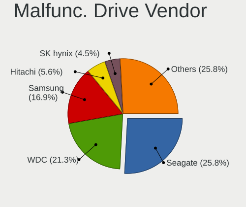

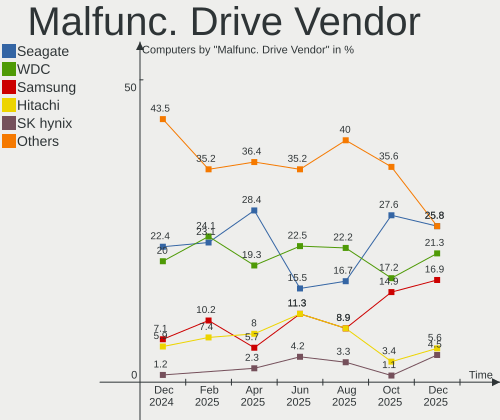

| Vendor                      | Computers | Drives | Percent |
|-----------------------------|-----------|--------|---------|
| Seagate                     | 23        | 26     | 25.84%  |
| WDC                         | 19        | 19     | 21.35%  |
| Samsung Electronics         | 15        | 19     | 16.85%  |
| Hitachi                     | 5         | 5      | 5.62%   |
| SK hynix                    | 4         | 4      | 4.49%   |
| HGST                        | 4         | 4      | 4.49%   |
| Intel                       | 3         | 3      | 3.37%   |
| Crucial                     | 3         | 3      | 3.37%   |
| Toshiba                     | 2         | 2      | 2.25%   |
| SanDisk                     | 1         | 2      | 1.12%   |
| SABRENT                     | 1         | 1      | 1.12%   |
| Realtek Semiconductor       | 1         | 1      | 1.12%   |
| Patriot                     | 1         | 1      | 1.12%   |
| OCZ                         | 1         | 1      | 1.12%   |
| Mushkin                     | 1         | 1      | 1.12%   |
| MAXIO Technology (Hangzhou) | 1         | 1      | 1.12%   |
| Kingston                    | 1         | 1      | 1.12%   |
| China                       | 1         | 1      | 1.12%   |
| Apple                       | 1         | 1      | 1.12%   |
| A-DATA Technology           | 1         | 1      | 1.12%   |

Malfunc. HDD Vendor
-------------------

Vendors of faulty HDD drives

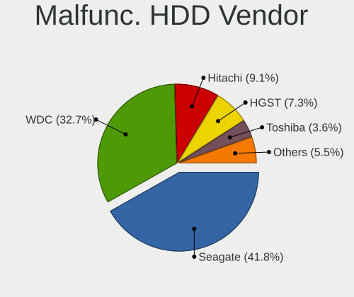

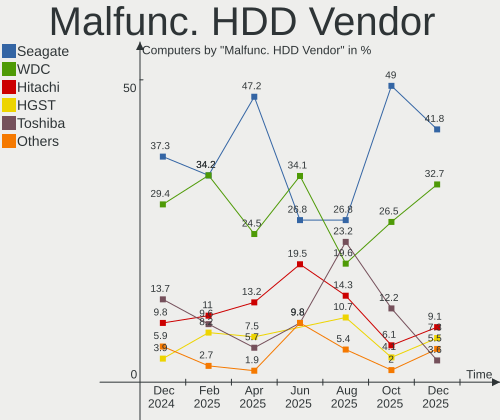

| Vendor              | Computers | Drives | Percent |
|---------------------|-----------|--------|---------|
| Seagate             | 23        | 25     | 41.82%  |
| WDC                 | 18        | 18     | 32.73%  |
| Hitachi             | 5         | 5      | 9.09%   |
| HGST                | 4         | 4      | 7.27%   |
| Toshiba             | 2         | 2      | 3.64%   |
| Samsung Electronics | 2         | 2      | 3.64%   |
| Apple               | 1         | 1      | 1.82%   |

Malfunc. Drive Kind
-------------------

Kinds of faulty drives

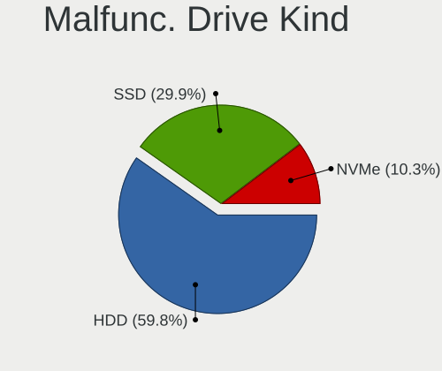

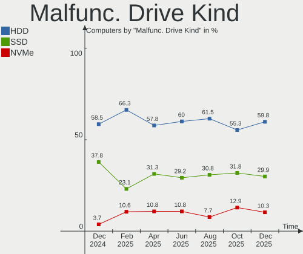

| Kind | Computers | Drives | Percent |
|------|-----------|--------|---------|
| HDD  | 52        | 57     | 59.77%  |
| SSD  | 26        | 30     | 29.89%  |
| NVMe | 9         | 10     | 10.34%  |

Failed Drives
-------------

Failed drive models

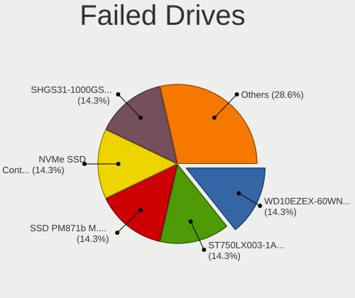

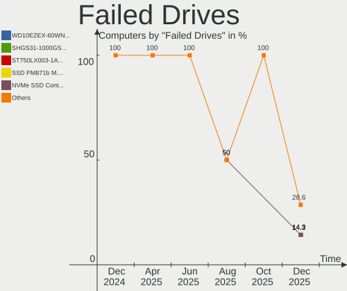

| Model                                                          | Computers | Drives | Percent |
|----------------------------------------------------------------|-----------|--------|---------|
| WDC WD10EZEX-60WN4A0 1TB                                       | 1         | 1      | 14.29%  |
| SK hynix SHGS31-1000GS-2 1TB SSD                               | 1         | 8      | 14.29%  |
| Seagate ST750LX003-1AC154 752GB                                | 1         | 1      | 14.29%  |
| Samsung Electronics SSD PM871b M.2 2280 128GB                  | 1         | 1      | 14.29%  |
| Samsung Electronics NVMe SSD Controller PM9A1/PM9A3/980PRO 1TB | 1         | 1      | 14.29%  |
| Hitachi HUA722020ALA330 2TB                                    | 1         | 1      | 14.29%  |
| Unknown                                                        | 1         | 1      | 14.29%  |

Failed Drive Vendor
-------------------

Failed drive vendors

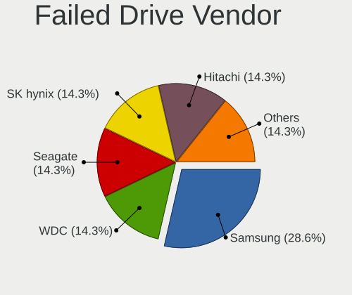

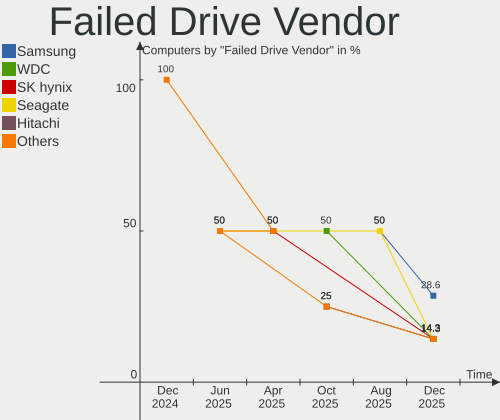

| Vendor              | Computers | Drives | Percent |
|---------------------|-----------|--------|---------|
| Samsung Electronics | 2         | 2      | 28.57%  |
| WDC                 | 1         | 1      | 14.29%  |
| SK hynix            | 1         | 8      | 14.29%  |
| Seagate             | 1         | 1      | 14.29%  |
| Hitachi             | 1         | 1      | 14.29%  |
| Unknown             | 1         | 1      | 14.29%  |

Drive Status
------------

Number of failed and malfunc. drives

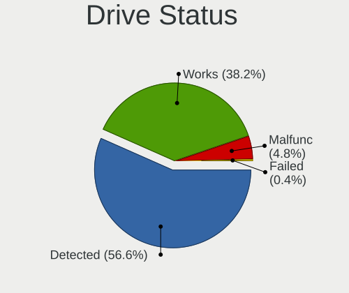

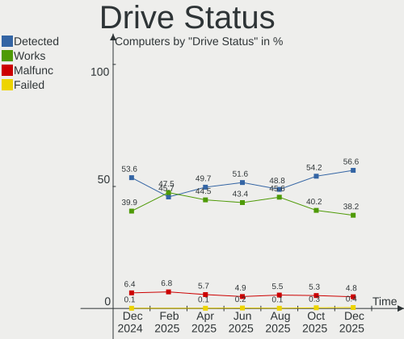

| Status   | Computers | Drives | Percent |
|----------|-----------|--------|---------|
| Detected | 966       | 1859   | 56.62%  |
| Works    | 651       | 1204   | 38.16%  |
| Malfunc  | 82        | 97     | 4.81%   |
| Failed   | 7         | 14     | 0.41%   |

Storage controller
------------------

Storage Vendor
--------------

Storage controller vendors

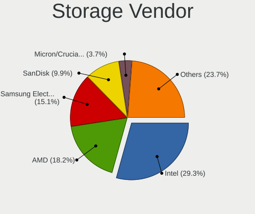

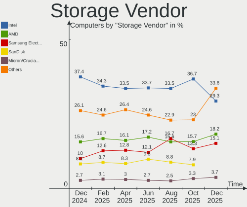

| Vendor                                  | Computers | Percent |
|-----------------------------------------|-----------|---------|
| Intel                                   | 744       | 29.3%   |
| AMD                                     | 463       | 18.24%  |
| Samsung Electronics                     | 384       | 15.12%  |
| SanDisk                                 | 251       | 9.89%   |
| Micron/Crucial Technology               | 94        | 3.7%    |
| ASMedia Technology                      | 77        | 3.03%   |
| SK hynix                                | 76        | 2.99%   |
| Phison Electronics                      | 67        | 2.64%   |
| Micron Technology                       | 57        | 2.24%   |
| MAXIO Technology (Hangzhou)             | 45        | 1.77%   |
| Kingston Technology Company             | 43        | 1.69%   |
| KIOXIA                                  | 36        | 1.42%   |
| Toshiba America Info Systems            | 23        | 0.91%   |
| Realtek Semiconductor                   | 23        | 0.91%   |
| Silicon Motion                          | 19        | 0.75%   |
| Shenzhen Longsys Electronics            | 15        | 0.59%   |
| Broadcom / LSI                          | 14        | 0.55%   |
| Seagate Technology                      | 12        | 0.47%   |
| INNOGRIT                                | 12        | 0.47%   |
| Apple                                   | 10        | 0.39%   |
| Solidigm                                | 9         | 0.35%   |
| Nvidia                                  | 9         | 0.35%   |
| Marvell Technology Group                | 9         | 0.35%   |
| ADATA Technology                        | 8         | 0.32%   |
| JMicron Technology                      | 6         | 0.24%   |
| Nextorage                               | 5         | 0.2%    |
| LSI Logic / Symbios Logic               | 4         | 0.16%   |
| Biwin Storage Technology                | 3         | 0.12%   |
| Union Memory (Shenzhen)                 | 2         | 0.08%   |
| Solid State Storage Technology          | 2         | 0.08%   |
| Hosin Global Electronics                | 2         | 0.08%   |
| Yangtze Memory Technologies             | 1         | 0.04%   |
| Western Digital                         | 1         | 0.04%   |
| Toshiba                                 | 1         | 0.04%   |
| Sony                                    | 1         | 0.04%   |
| Silicon Image                           | 1         | 0.04%   |
| Shenzhen Unionmemory Information System | 1         | 0.04%   |
| Shenzhen Techwinsemi Technology         | 1         | 0.04%   |
| Shenzhen Shichuangyi Electronics        | 1         | 0.04%   |
| OCZ Technology Group                    | 1         | 0.04%   |

Storage Model
-------------

Storage controller models

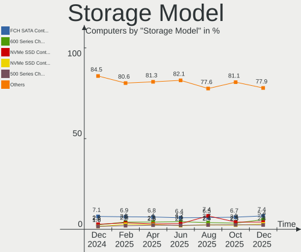

| Model                                                                          | Computers | Percent |
|--------------------------------------------------------------------------------|-----------|---------|
| AMD FCH SATA Controller [AHCI mode]                                            | 204       | 7.35%   |
| AMD 600 Series Chipset SATA Controller                                         | 150       | 5.41%   |
| Samsung NVMe SSD Controller SM981/PM981/PM983                                  | 110       | 3.97%   |
| Samsung NVMe SSD Controller PM9A1/PM9A3/980PRO                                 | 82        | 2.96%   |
| AMD 500 Series Chipset SATA Controller                                         | 67        | 2.42%   |
| Samsung NVMe SSD Controller S4LV008[Pascal]                                    | 65        | 2.34%   |
| Samsung NVMe SSD Controller PM9C1a (DRAM-less)                                 | 61        | 2.2%    |
| SanDisk WD SN560/SN740/SN770/SN5000 NVMe SSD                                   | 60        | 2.16%   |
| ASMedia ASM1061/ASM1062 Serial ATA Controller                                  | 58        | 2.09%   |
| Intel Volume Management Device NVMe RAID Controller                            | 52        | 1.87%   |
| Intel 8 Series/C220 Series Chipset Family 6-port SATA Controller 1 [AHCI mode] | 50        | 1.8%    |
| AMD 400 Series Chipset SATA Controller                                         | 47        | 1.69%   |
| Intel Sunrise Point-LP SATA Controller [AHCI mode]                             | 43        | 1.55%   |
| Intel SATA Controller [RAID Mode]                                              | 42        | 1.51%   |
| Sandisk WD Black SN850X NVMe SSD                                               | 41        | 1.48%   |
| Intel Cannon Lake PCH SATA AHCI Controller                                     | 38        | 1.37%   |
| Intel Raptor Lake SATA AHCI Controller                                         | 34        | 1.23%   |
| Intel 82801 Mobile SATA Controller [RAID mode]                                 | 33        | 1.19%   |
| Samsung NVMe SSD Controller 980 (DRAM-less)                                    | 32        | 1.15%   |
| Intel Alder Lake-S PCH SATA Controller [AHCI Mode]                             | 31        | 1.12%   |
| MAXIO (Hangzhou) NVMe SSD Controller MAP1202 (DRAM-less)                       | 29        | 1.05%   |
| Intel Q170/Q150/B150/H170/H110/Z170/CM236 Chipset SATA Controller [AHCI Mode]  | 29        | 1.05%   |
| Intel 7 Series Chipset Family 6-port SATA Controller [AHCI mode]               | 29        | 1.05%   |
| Micron/Crucial P2 [Nick P2] / P3 / P3 Plus NVMe PCIe SSD (DRAM-less)           | 27        | 0.97%   |
| Intel 200 Series PCH SATA controller [AHCI mode]                               | 26        | 0.94%   |
| Micron/Crucial P310 NVMe PCIe SSD (DRAM-less)                                  | 25        | 0.9%    |
| Intel 6 Series/C200 Series Chipset Family 6 port Desktop SATA AHCI Controller  | 24        | 0.87%   |
| Intel Comet Lake SATA AHCI Controller                                          | 23        | 0.83%   |
| SanDisk Ultra 3D / WD PC SN530, IX SN530, Blue SN550 NVMe SSD (DRAM-less)      | 22        | 0.79%   |
| SanDisk Extreme Pro / WD Black SN750 / PC SN730 / Red SN700 NVMe SSD           | 22        | 0.79%   |
| Samsung NVMe SSD Controller SM961/PM961/SM963                                  | 21        | 0.76%   |
| Intel 6 Series/C200 Series Chipset Family 6 port Mobile SATA AHCI Controller   | 21        | 0.76%   |
| Intel Wildcat Point-LP SATA Controller [AHCI Mode]                             | 20        | 0.72%   |
| Intel Cannon Lake Mobile PCH SATA AHCI Controller                              | 20        | 0.72%   |
| AMD SB7x0/SB8x0/SB9x0 SATA Controller [AHCI mode]                              | 20        | 0.72%   |
| SK hynix Platinum P41/PC801 NVMe Solid State Drive                             | 19        | 0.68%   |
| Intel RST Volume Management Device Controller                                  | 19        | 0.68%   |
| Intel 8 Series SATA Controller 1 [AHCI mode]                                   | 19        | 0.68%   |
| SK hynix Gold P31/BC711/PC711 NVMe Solid State Drive                           | 18        | 0.65%   |
| Samsung NVMe SSD 9100 PRO [PM9E1]                                              | 18        | 0.65%   |

Storage Kind
------------

Kind of storage controller (IDE, SATA, NVMe, SAS, ...)

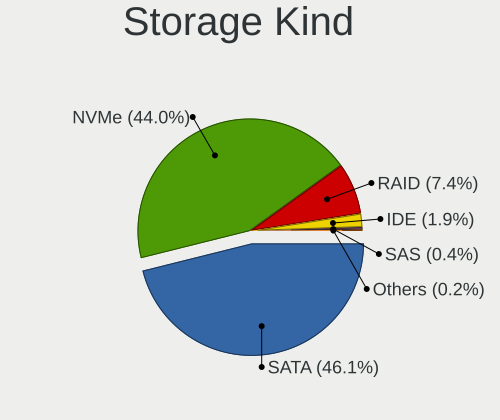

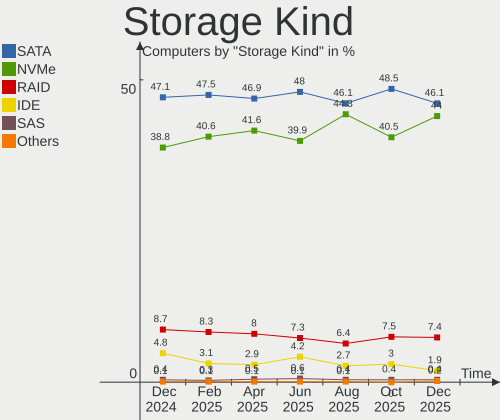

| Kind | Computers | Percent |
|------|-----------|---------|
| SATA | 1072      | 46.11%  |
| NVMe | 1022      | 43.96%  |
| RAID | 173       | 7.44%   |
| IDE  | 45        | 1.94%   |
| SAS  | 9         | 0.39%   |
| SCSI | 4         | 0.17%   |

Processor
---------

CPU Vendor
----------

Processor vendors

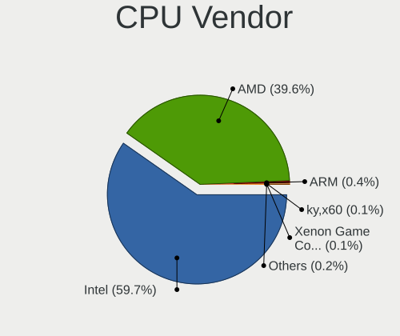

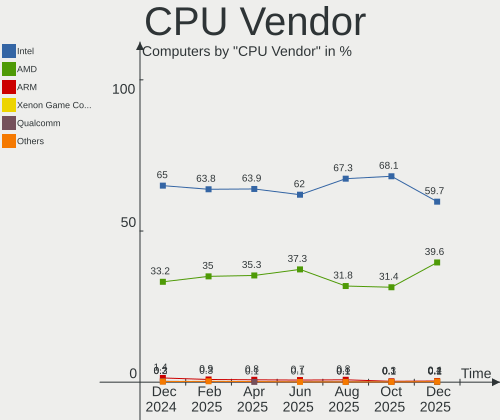

| Vendor             | Computers | Percent |
|--------------------|-----------|---------|
| Intel              | 961       | 59.73%  |
| AMD                | 637       | 39.59%  |
| ARM                | 6         | 0.37%   |
| Xenon Game Console | 1         | 0.06%   |
| Qualcomm           | 1         | 0.06%   |
| Nintendo Wii       | 1         | 0.06%   |
| ky,x60             | 1         | 0.06%   |
| Unknown            | 1         | 0.06%   |

CPU Model
---------

Processor models

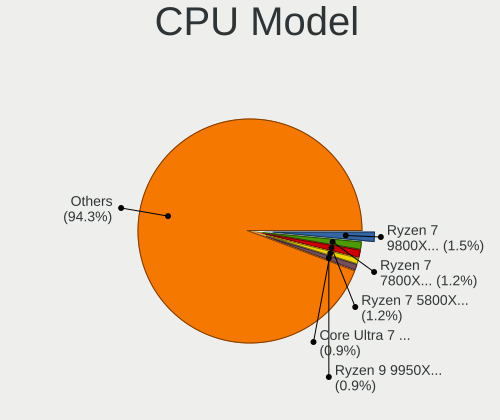

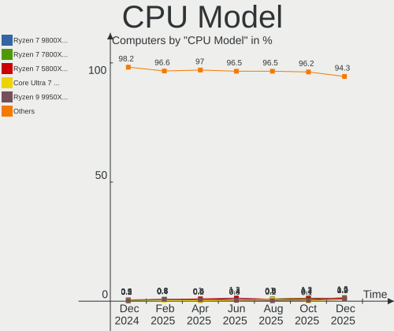

| Model                                   | Computers | Percent |
|-----------------------------------------|-----------|---------|
| AMD Ryzen 7 9800X3D 8-Core Processor    | 24        | 1.49%   |
| AMD Ryzen 7 7800X3D 8-Core Processor    | 19        | 1.18%   |
| AMD Ryzen 7 5800X 8-Core Processor      | 19        | 1.18%   |
| Intel Core Ultra 7 155H                 | 15        | 0.93%   |
| AMD Ryzen 9 9950X 16-Core Processor     | 15        | 0.93%   |
| AMD Ryzen 9 5950X 16-Core Processor     | 15        | 0.93%   |
| AMD Ryzen 5 5600X 6-Core Processor      | 15        | 0.93%   |
| AMD Ryzen 9 9950X3D 16-Core Processor   | 14        | 0.87%   |
| Intel 11th Gen Core i7-1165G7 @ 2.80GHz | 13        | 0.81%   |
| AMD Ryzen 7 7700X 8-Core Processor      | 13        | 0.81%   |
| Intel Core Ultra 9 275HX                | 12        | 0.75%   |
| Intel 11th Gen Core i5-1135G7 @ 2.40GHz | 12        | 0.75%   |
| AMD Ryzen 9 5900X 12-Core Processor     | 12        | 0.75%   |
| AMD Ryzen 5 7600X 6-Core Processor      | 12        | 0.75%   |
| AMD Ryzen AI 9 HX 370 w/ Radeon 890M    | 11        | 0.68%   |
| Intel Core i7-1065G7 CPU @ 1.30GHz      | 10        | 0.62%   |
| Intel Core i5-8500 CPU @ 3.00GHz        | 10        | 0.62%   |
| AMD Ryzen Z1 Extreme                    | 10        | 0.62%   |
| AMD Ryzen 7 7730U with Radeon Graphics  | 10        | 0.62%   |
| AMD Custom APU 0932                     | 10        | 0.62%   |
| Intel Core i5-6200U CPU @ 2.30GHz       | 9         | 0.56%   |
| Intel Core i5-3470 CPU @ 3.20GHz        | 9         | 0.56%   |
| AMD Ryzen 7 9700X 8-Core Processor      | 9         | 0.56%   |
| AMD Ryzen 7 5700G with Radeon Graphics  | 9         | 0.56%   |
| AMD Ryzen 7 3700X 8-Core Processor      | 9         | 0.56%   |
| AMD Ryzen 7 2700X Eight-Core Processor  | 9         | 0.56%   |
| Intel Core i7-8700 CPU @ 3.20GHz        | 8         | 0.5%    |
| Intel Core i7-10750H CPU @ 2.60GHz      | 8         | 0.5%    |
| AMD Ryzen 7 5800X3D 8-Core Processor    | 8         | 0.5%    |
| AMD Ryzen 7 5700X 8-Core Processor      | 8         | 0.5%    |
| AMD Ryzen 5 5600G with Radeon Graphics  | 8         | 0.5%    |
| AMD Ryzen 5 3600 6-Core Processor       | 8         | 0.5%    |
| Intel Core i7-7700HQ CPU @ 2.80GHz      | 7         | 0.44%   |
| Intel Core i7-6700 CPU @ 3.40GHz        | 7         | 0.44%   |
| Intel Core i5-7200U CPU @ 2.50GHz       | 7         | 0.44%   |
| Intel Core i5-6500 CPU @ 3.20GHz        | 7         | 0.44%   |
| Intel 12th Gen Core i5-12600K           | 7         | 0.44%   |
| Intel 12th Gen Core i5-1235U            | 7         | 0.44%   |
| Intel 11th Gen Core i7-1185G7 @ 3.00GHz | 7         | 0.44%   |
| AMD Ryzen AI 7 350 w/ Radeon 860M       | 7         | 0.44%   |

CPU Model Family
----------------

Processor model prefix

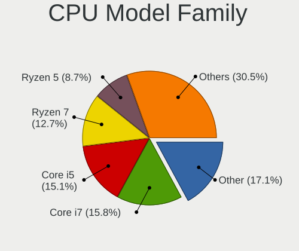

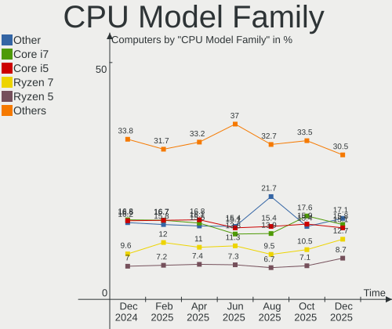

| Model                   | Computers | Percent |
|-------------------------|-----------|---------|
| Other                   | 275       | 17.09%  |
| Intel Core i7           | 255       | 15.85%  |
| Intel Core i5           | 243       | 15.1%   |
| AMD Ryzen 7             | 205       | 12.74%  |
| AMD Ryzen 5             | 140       | 8.7%    |
| AMD Ryzen 9             | 111       | 6.9%    |
| Intel Core              | 70        | 4.35%   |
| Intel Core i3           | 50        | 3.11%   |
| Intel Celeron           | 34        | 2.11%   |
| Intel Xeon              | 33        | 2.05%   |
| Intel Core i9           | 23        | 1.43%   |
| AMD Ryzen 3             | 19        | 1.18%   |
| Intel Core 2 Duo        | 17        | 1.06%   |
| Intel Pentium           | 12        | 0.75%   |
| AMD A6                  | 11        | 0.68%   |
| AMD Ryzen 5 PRO         | 10        | 0.62%   |
| AMD FX                  | 10        | 0.62%   |
| AMD A8                  | 10        | 0.62%   |
| AMD Ryzen 7 PRO         | 9         | 0.56%   |
| Intel Core m3           | 7         | 0.44%   |
| Intel Atom              | 6         | 0.37%   |
| AMD Ryzen Threadripper  | 6         | 0.37%   |
| AMD A10                 | 5         | 0.31%   |
| AMD Athlon              | 4         | 0.25%   |
| AMD A4                  | 4         | 0.25%   |
| Intel Xeon Silver       | 3         | 0.19%   |
| AMD Phenom II X6        | 3         | 0.19%   |
| AMD EPYC                | 3         | 0.19%   |
| AMD E                   | 3         | 0.19%   |
| Intel Pentium Silver    | 2         | 0.12%   |
| Intel Pentium Dual      | 2         | 0.12%   |
| Intel Core 2 Quad       | 2         | 0.12%   |
| AMD Phenom II X4        | 2         | 0.12%   |
| AMD E1                  | 2         | 0.12%   |
| Intel Xeon Platinum     | 1         | 0.06%   |
| Intel Pentium M         | 1         | 0.06%   |
| Intel Pentium Dual-Core | 1         | 0.06%   |
| Intel Core m7           | 1         | 0.06%   |
| Intel Core M            | 1         | 0.06%   |
| Intel Core 2 Extreme    | 1         | 0.06%   |

CPU Cores
---------

Number of processor cores

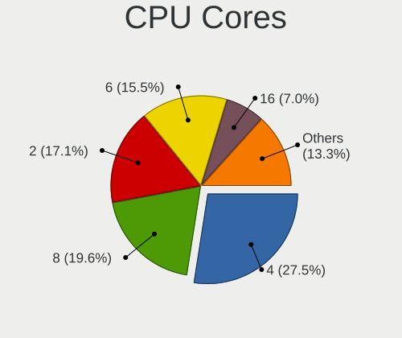

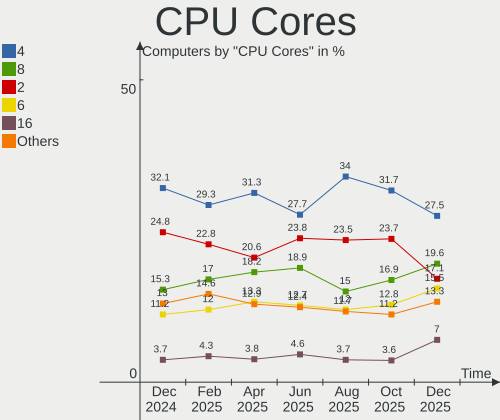

| Number  | Computers | Percent |
|---------|-----------|---------|
| 4       | 442       | 27.47%  |
| 8       | 315       | 19.58%  |
| 2       | 275       | 17.09%  |
| 6       | 250       | 15.54%  |
| 16      | 113       | 7.02%   |
| 12      | 70        | 4.35%   |
| 10      | 49        | 3.05%   |
| 24      | 37        | 2.3%    |
| 14      | 24        | 1.49%   |
| 20      | 13        | 0.81%   |
| Unknown | 6         | 0.37%   |
| 1       | 4         | 0.25%   |
| 3       | 3         | 0.19%   |
| 40      | 2         | 0.12%   |
| 32      | 2         | 0.12%   |
| 96      | 1         | 0.06%   |
| 64      | 1         | 0.06%   |
| 48      | 1         | 0.06%   |
| 28      | 1         | 0.06%   |

CPU Sockets
-----------

Number of sockets

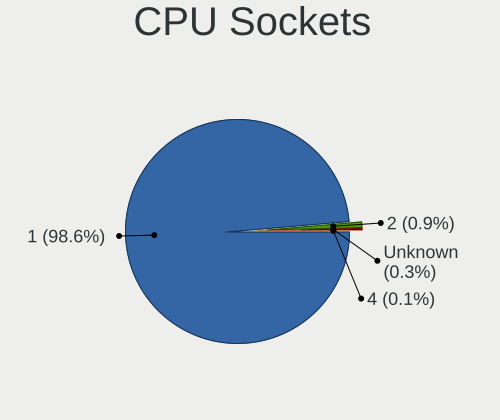

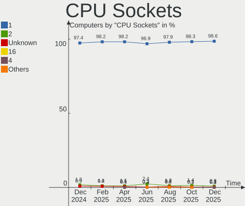

| Number  | Computers | Percent |
|---------|-----------|---------|
| 1       | 1587      | 98.63%  |
| 2       | 15        | 0.93%   |
| Unknown | 5         | 0.31%   |
| 16      | 1         | 0.06%   |
| 4       | 1         | 0.06%   |

CPU Threads
-----------

Threads per core (Hyper-Threading)

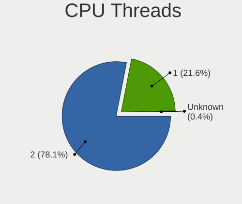

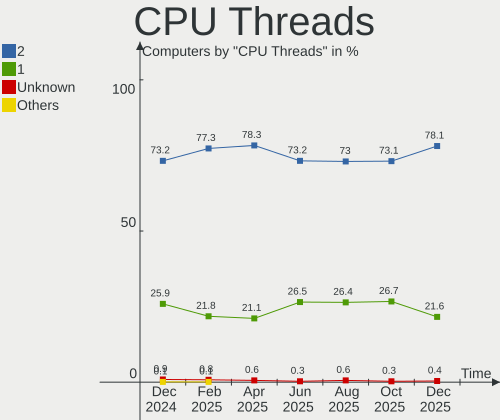

| Number  | Computers | Percent |
|---------|-----------|---------|
| 2       | 1256      | 78.06%  |
| 1       | 347       | 21.57%  |
| Unknown | 6         | 0.37%   |

CPU Op-Modes
------------

CPU Operation Modes (32-bit, 64-bit)

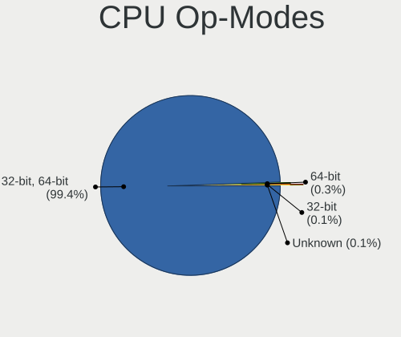

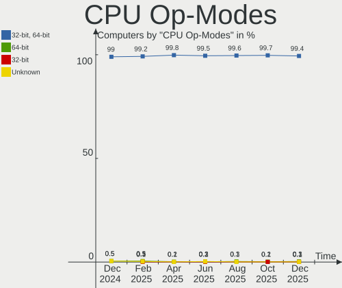

| Op mode        | Computers | Percent |
|----------------|-----------|---------|
| 32-bit, 64-bit | 1600      | 99.44%  |
| 64-bit         | 5         | 0.31%   |
| 32-bit         | 2         | 0.12%   |
| Unknown        | 2         | 0.12%   |

CPU Microcode
-------------

Microcode number

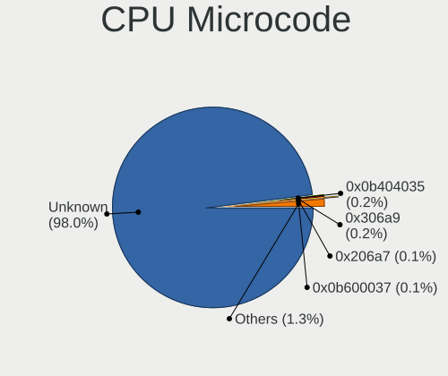

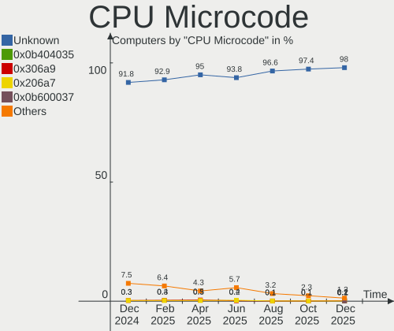

| Number     | Computers | Percent |
|------------|-----------|---------|
| Unknown    | 1577      | 98.01%  |
| 0x0b404035 | 4         | 0.25%   |
| 0x306a9    | 3         | 0.19%   |
| 0x206a7    | 2         | 0.12%   |
| 0x0b600037 | 2         | 0.12%   |
| 0x0a500011 | 2         | 0.12%   |
| 0xb06e0    | 1         | 0.06%   |
| 0xa0655    | 1         | 0.06%   |
| 0x906ed    | 1         | 0.06%   |
| 0x906ea    | 1         | 0.06%   |
| 0x906e9    | 1         | 0.06%   |
| 0x906c0    | 1         | 0.06%   |
| 0x806ec    | 1         | 0.06%   |
| 0x6d6      | 1         | 0.06%   |
| 0x506e3    | 1         | 0.06%   |
| 0x40651    | 1         | 0.06%   |
| 0x0b204037 | 1         | 0.06%   |
| 0x0a500014 | 1         | 0.06%   |
| 0x0a50000f | 1         | 0.06%   |
| 0x0a20120e | 1         | 0.06%   |
| 0x0a20120a | 1         | 0.06%   |
| 0x08108109 | 1         | 0.06%   |
| 0x08001138 | 1         | 0.06%   |
| 0x06006705 | 1         | 0.06%   |
| 0x05000119 | 1         | 0.06%   |

CPU Microarch
-------------

Microarchitecture

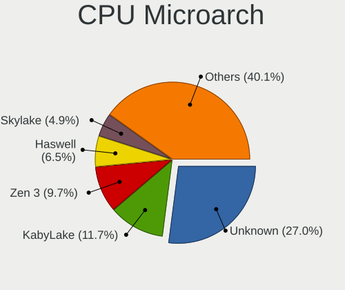

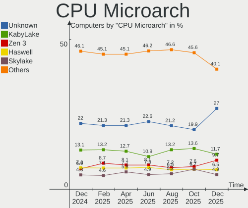

| Name               | Computers | Percent |
|--------------------|-----------|---------|
| Unknown            | 435       | 27.04%  |
| KabyLake           | 189       | 11.75%  |
| Zen 3              | 156       | 9.7%    |
| Haswell            | 104       | 6.46%   |
| Skylake            | 79        | 4.91%   |
| IvyBridge          | 65        | 4.04%   |
| Alderlake Hybrid   | 65        | 4.04%   |
| Zen 2              | 53        | 3.29%   |
| SandyBridge        | 51        | 3.17%   |
| Zen+               | 47        | 2.92%   |
| TigerLake          | 44        | 2.73%   |
| CometLake          | 41        | 2.55%   |
| Broadwell          | 39        | 2.42%   |
| Icelake            | 25        | 1.55%   |
| Zen                | 21        | 1.31%   |
| Piledriver         | 21        | 1.31%   |
| Penryn             | 17        | 1.06%   |
| Lunarlake Hybrid   | 17        | 1.06%   |
| Meteorlake Hybrid  | 15        | 0.93%   |
| Silvermont         | 14        | 0.87%   |
| Goldmont plus      | 12        | 0.75%   |
| Puma               | 11        | 0.68%   |
| K10                | 11        | 0.68%   |
| Gracemont          | 11        | 0.68%   |
| Nehalem            | 10        | 0.62%   |
| Westmere           | 8         | 0.5%    |
| Goldmont           | 8         | 0.5%    |
| Excavator          | 7         | 0.44%   |
| Core               | 7         | 0.44%   |
| Bobcat             | 6         | 0.37%   |
| Sapphire Rapids    | 3         | 0.19%   |
| K10 Llano          | 3         | 0.19%   |
| Jaguar             | 3         | 0.19%   |
| ArrowLake-H Hybrid | 3         | 0.19%   |
| Tremont            | 2         | 0.12%   |
| P6                 | 1         | 0.06%   |
| K8 Hammer          | 1         | 0.06%   |
| K8 & K10 hybrid    | 1         | 0.06%   |
| Granite Rapids     | 1         | 0.06%   |
| Bulldozer          | 1         | 0.06%   |

Graphics
--------

GPU Vendor
----------

Vendors of graphics cards

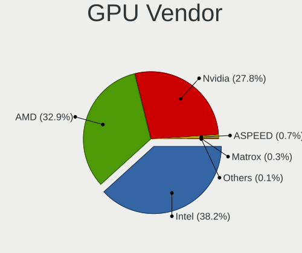

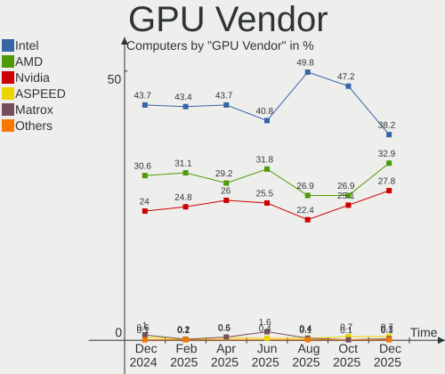

| Vendor                     | Computers | Percent |
|----------------------------|-----------|---------|
| Intel                      | 724       | 38.25%  |
| AMD                        | 623       | 32.91%  |
| Nvidia                     | 526       | 27.79%  |
| ASPEED Technology          | 14        | 0.74%   |
| Matrox Electronics Systems | 5         | 0.26%   |
| Microsoft                  | 1         | 0.05%   |

GPU Model
---------

Graphics card models

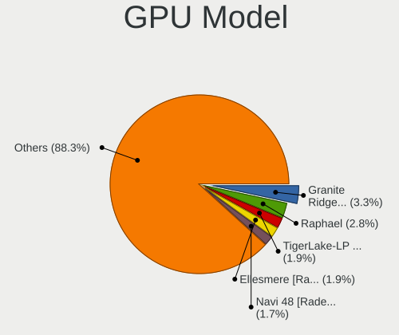

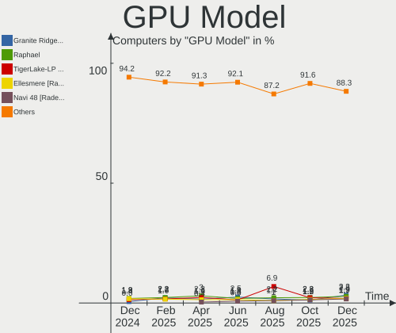

| Model                                                                       | Computers | Percent |
|-----------------------------------------------------------------------------|-----------|---------|
| AMD Granite Ridge [Radeon Graphics]                                         | 67        | 3.34%   |
| AMD Raphael                                                                 | 57        | 2.85%   |
| Intel TigerLake-LP GT2 [Iris Xe Graphics]                                   | 38        | 1.9%    |
| AMD Ellesmere [Radeon RX 470/480/570/570X/580/580X/590]                     | 38        | 1.9%    |
| AMD Navi 48 [Radeon RX 9070/9070 XT/9070 GRE]                               | 35        | 1.75%   |
| AMD Navi 31 [Radeon RX 7900 XT/7900 XTX/7900 GRE/7900M]                     | 35        | 1.75%   |
| Intel 2nd Generation Core Processor Family Integrated Graphics Controller   | 34        | 1.7%    |
| AMD Phoenix1                                                                | 32        | 1.6%    |
| Intel 3rd Gen Core processor Graphics Controller                            | 29        | 1.45%   |
| AMD Cezanne [Radeon Vega Series / Radeon Vega Mobile Series]                | 29        | 1.45%   |
| AMD Picasso/Raven 2 [Radeon Vega Series / Radeon Vega Mobile Series]        | 28        | 1.4%    |
| Intel CoffeeLake-H GT2 [UHD Graphics 630]                                   | 23        | 1.15%   |
| Intel Meteor Lake-P [Intel Arc Graphics]                                    | 22        | 1.1%    |
| Intel Haswell-ULT Integrated Graphics Controller                            | 22        | 1.1%    |
| Intel Skylake-U GT2 [HD Graphics 520]                                       | 21        | 1.05%   |
| Intel Xeon E3-1200 v3/4th Gen Core Processor Integrated Graphics Controller | 20        | 1%      |
| Intel Kaby Lake-U GT2 [HD Graphics 620]                                     | 20        | 1%      |
| Intel CoffeeLake-S GT2 [UHD Graphics 630]                                   | 19        | 0.95%   |
| Intel Broadwell-U GT2 [HD Graphics 5500]                                    | 19        | 0.95%   |
| AMD Navi 23 [Radeon RX 6600/6600 XT/6600M]                                  | 19        | 0.95%   |
| AMD Barcelo                                                                 | 19        | 0.95%   |
| Intel Skylake-S GT2 [HD Graphics 530]                                       | 18        | 0.9%    |
| Intel Arrow Lake-S [Intel Graphics]                                         | 18        | 0.9%    |
| AMD Rembrandt [Radeon 680M]                                                 | 18        | 0.9%    |
| AMD Navi 22 [Radeon RX 6700/6700 XT/6750 XT / 6800M/6850M XT]               | 18        | 0.9%    |
| Intel Alder Lake-P GT2 [Iris Xe Graphics]                                   | 17        | 0.85%   |
| AMD Krackan [Radeon 840M / 860M Graphics]                                   | 17        | 0.85%   |
| Intel 4th Gen Core Processor Integrated Graphics Controller                 | 16        | 0.8%    |
| AMD Navi 44 [Radeon RX 9060 XT]                                             | 16        | 0.8%    |
| AMD Navi 33 [Radeon RX 7600/7600 XT/7600M XT/7600S/7700S / PRO W7600]       | 16        | 0.8%    |
| AMD Navi 21 [Radeon RX 6800/6800 XT / 6900 XT]                              | 16        | 0.8%    |
| Nvidia GA106 [GeForce RTX 3060 Lite Hash Rate]                              | 15        | 0.75%   |
| Intel Kaby Lake-R GT2 [UHD Graphics 620]                                    | 15        | 0.75%   |
| AMD Strix [Radeon 880M / 890M]                                              | 15        | 0.75%   |
| Intel CometLake-U GT2 [UHD Graphics]                                        | 14        | 0.7%    |
| ASPEED Technology ASPEED Graphics Family                                    | 14        | 0.7%    |
| AMD Renoir [Radeon Vega Series / Radeon Vega Mobile Series]                 | 14        | 0.7%    |
| AMD HawkPoint1                                                              | 14        | 0.7%    |
| Intel CometLake-H GT2 [UHD Graphics]                                        | 13        | 0.65%   |
| Intel Alder Lake-N [UHD Graphics]                                           | 13        | 0.65%   |

GPU Combo
---------

Combinations of graphics cards

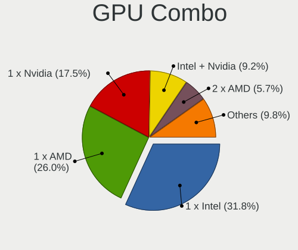

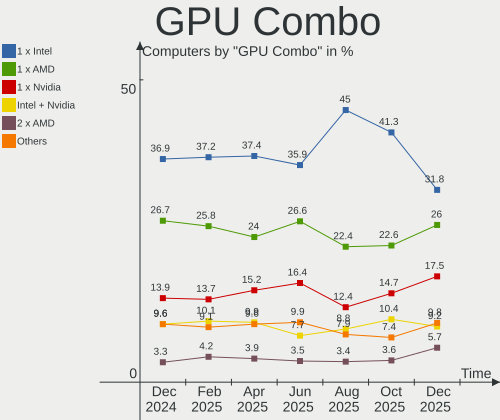

| Name                        | Computers | Percent |
|-----------------------------|-----------|---------|
| 1 x Intel                   | 512       | 31.82%  |
| 1 x AMD                     | 418       | 25.98%  |
| 1 x Nvidia                  | 281       | 17.46%  |
| Intel + Nvidia              | 148       | 9.2%    |
| 2 x AMD                     | 92        | 5.72%   |
| AMD + Nvidia                | 75        | 4.66%   |
| Intel + AMD                 | 29        | 1.8%    |
| Other                       | 14        | 0.87%   |
| 2 x Nvidia                  | 7         | 0.44%   |
| 2 x Intel                   | 7         | 0.44%   |
| Nvidia + ASPEED             | 6         | 0.37%   |
| 1 x ASPEED                  | 5         | 0.31%   |
| 1 x Matrox                  | 3         | 0.19%   |
| 2 x AMD + 1 x Nvidia        | 2         | 0.12%   |
| AMD + Matrox                | 2         | 0.12%   |
| 4 x AMD                     | 1         | 0.06%   |
| 3 x AMD                     | 1         | 0.06%   |
| 1 x Microsoft               | 1         | 0.06%   |
| Intel + 2 x Nvidia          | 1         | 0.06%   |
| Intel + Nvidia + 1 x ASPEED | 1         | 0.06%   |
| Intel + ASPEED              | 1         | 0.06%   |
| AMD + 2 x Nvidia            | 1         | 0.06%   |
| AMD + ASPEED                | 1         | 0.06%   |

GPU Driver
----------

Free vs proprietary

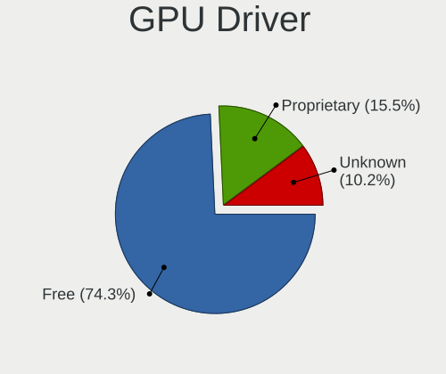

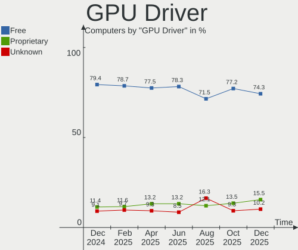

| Driver      | Computers | Percent |
|-------------|-----------|---------|
| Free        | 1195      | 74.27%  |
| Proprietary | 250       | 15.54%  |
| Unknown     | 164       | 10.19%  |

GPU Memory
----------

Total video memory

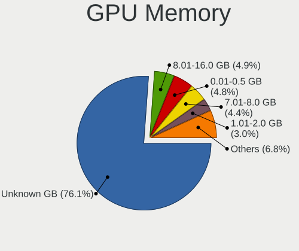

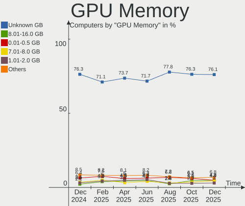

| Size in GB | Computers | Percent |
|------------|-----------|---------|
| Unknown    | 1225      | 76.13%  |
| 8.01-16.0  | 79        | 4.91%   |
| 0.01-0.5   | 77        | 4.79%   |
| 7.01-8.0   | 70        | 4.35%   |
| 1.01-2.0   | 49        | 3.05%   |
| 0.51-1.0   | 30        | 1.86%   |
| 3.01-4.0   | 25        | 1.55%   |
| 5.01-6.0   | 23        | 1.43%   |
| 16.01-24.0 | 19        | 1.18%   |
| 2.01-3.0   | 10        | 0.62%   |
| 32.01-64.0 | 1         | 0.06%   |
| 24.01-32.0 | 1         | 0.06%   |

Monitor
-------

Monitor Vendor
--------------

Monitor vendors

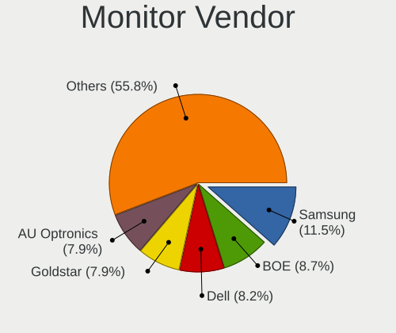

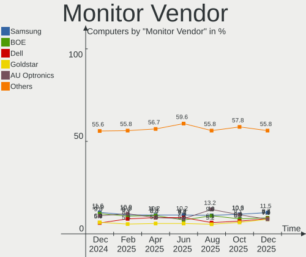

| Vendor                  | Computers | Percent |
|-------------------------|-----------|---------|
| Samsung Electronics     | 207       | 11.5%   |
| BOE                     | 157       | 8.72%   |
| Dell                    | 147       | 8.17%   |
| Goldstar                | 142       | 7.89%   |
| AU Optronics            | 142       | 7.89%   |
| Chimei Innolux          | 98        | 5.44%   |
| Acer                    | 98        | 5.44%   |
| LG Display              | 78        | 4.33%   |
| Hewlett-Packard         | 70        | 3.89%   |
| Apple                   | 61        | 3.39%   |
| Lenovo                  | 51        | 2.83%   |
| ASUSTek Computer        | 45        | 2.5%    |
| Ancor Communications    | 42        | 2.33%   |
| MSI                     | 33        | 1.83%   |
| AOC                     | 30        | 1.67%   |
| Vizio                   | 28        | 1.56%   |
| Sceptre Tech            | 27        | 1.5%    |
| Sharp                   | 25        | 1.39%   |
| ViewSonic               | 24        | 1.33%   |
| Valve                   | 21        | 1.17%   |
| Gigabyte Technology     | 18        | 1%      |
| BenQ                    | 13        | 0.72%   |
| PANDA                   | 12        | 0.67%   |
| CSW                     | 12        | 0.67%   |
| InfoVision              | 11        | 0.61%   |
| Insignia                | 10        | 0.56%   |
| Sony                    | 9         | 0.5%    |
| Chi Mei Optoelectronics | 9         | 0.5%    |
| Unknown                 | 8         | 0.44%   |
| Toshiba                 | 8         | 0.44%   |
| ONN                     | 8         | 0.44%   |
| CSOT                    | 8         | 0.44%   |
| SKG                     | 7         | 0.39%   |
| Roku                    | 7         | 0.39%   |
| Planar                  | 5         | 0.28%   |
| Pixio                   | 5         | 0.28%   |
| Philips                 | 5         | 0.28%   |
| Panasonic               | 5         | 0.28%   |
| Element                 | 5         | 0.28%   |
| Wacom                   | 4         | 0.22%   |

Monitor Model
-------------

Monitor models

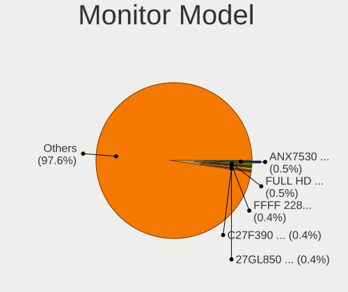

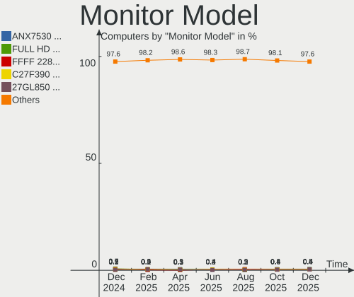

| Model                                                                  | Computers | Percent |
|------------------------------------------------------------------------|-----------|---------|
| Valve ANX7530 U VLV3003 800x1280 100x160mm 7.4-inch                    | 10        | 0.54%   |
| Goldstar FULL HD GSM5B55 1920x1080 480x270mm 21.7-inch                 | 10        | 0.54%   |
| Unknown LCD Monitor FFFF 2288x1287 2550x2550mm 142.0-inch              | 8         | 0.43%   |
| Samsung Electronics C27F390 SAM0D32 1920x1080 598x336mm 27.0-inch      | 8         | 0.43%   |
| Goldstar 27GL850 GSM5B7F 2560x1440 597x336mm 27.0-inch                 | 8         | 0.43%   |
| Valve ANX7530 U VLV3001 800x1280 100x150mm 7.1-inch                    | 7         | 0.37%   |
| Sceptre Tech Sceptre F24 SPT09AB 1920x1080 530x290mm 23.8-inch         | 7         | 0.37%   |
| Samsung Electronics LCD Monitor SDC4208 1920x1200 302x189mm 14.0-inch  | 7         | 0.37%   |
| AU Optronics LCD Monitor AUO10EC 1366x768 344x193mm 15.5-inch          | 7         | 0.37%   |
| Goldstar Ultra HD GSM5B09 3840x2160 600x340mm 27.2-inch                | 6         | 0.32%   |
| Goldstar HDR 4K GSM7707 3840x2160 600x340mm 27.2-inch                  | 6         | 0.32%   |
| BOE NE135A1M-NY1 BOE0CB4 2880x1920 285x190mm 13.5-inch                 | 6         | 0.32%   |
| BOE LCD Monitor BOE0BCA 2256x1504 285x190mm 13.5-inch                  | 6         | 0.32%   |
| ONN ONA18HO015 ONN0101 1920x1080 698x393mm 31.5-inch                   | 5         | 0.27%   |
| MSI G274QPF E2 MSI8CC2 2560x1440 597x336mm 27.0-inch                   | 5         | 0.27%   |
| Lenovo LCD Monitor LEN40A9 1920x1080 309x173mm 13.9-inch               | 5         | 0.27%   |
| Goldstar LG TV SSCR2 GSMC0C8 3840x2160                                 | 5         | 0.27%   |
| Chimei Innolux LCD Monitor CMN14D4 1920x1080 309x173mm 13.9-inch       | 5         | 0.27%   |
| BOE NS080WUM-LX1 BOE0CFF 1920x1200 172x108mm 8.0-inch                  | 5         | 0.27%   |
| BOE LCD Monitor BOE0BC9 2560x1600 345x215mm 16.0-inch                  | 5         | 0.27%   |
| BOE LCD Monitor BOE084E 1920x1080 382x215mm 17.3-inch                  | 5         | 0.27%   |
| ASUSTek Computer VG245 AUS24A1 1920x1080 531x299mm 24.0-inch           | 5         | 0.27%   |
| Valve Index HMD VLV91A8                                                | 4         | 0.21%   |
| Sceptre Tech Sceptre F27 SPT0AD7 1920x1080 600x330mm 27.0-inch         | 4         | 0.21%   |
| Sceptre Tech Sceptre E22 SPT08D5 1920x1080 470x300mm 22.0-inch         | 4         | 0.21%   |
| Samsung Electronics LCD Monitor SAM0F13 3840x2160 950x540mm 43.0-inch  | 4         | 0.21%   |
| Samsung Electronics C24F390 SAM0D2C 1920x1080 521x293mm 23.5-inch      | 4         | 0.21%   |
| Samsung Electronics ATNA60HU01-0  SDC420B                              | 4         | 0.21%   |
| Samsung Electronics ATNA40CU05-0 SDC419C 2880x1800 302x189mm 14.0-inch | 4         | 0.21%   |
| LG Display LCD Monitor LGD0555 2736x1824 260x173mm 12.3-inch           | 4         | 0.21%   |
| Gigabyte Technology M27Q GBT270D 2560x1440 597x336mm 27.0-inch         | 4         | 0.21%   |
| Dell SE2717H/HX DELD0A1 1920x1080 598x336mm 27.0-inch                  | 4         | 0.21%   |
| Chimei Innolux LCD Monitor CMN1738 1920x1080 381x214mm 17.2-inch       | 4         | 0.21%   |
| AU Optronics LCD Monitor AUO10ED 1920x1080 344x193mm 15.5-inch         | 4         | 0.21%   |
| Apple iMac APPB005 2560x1440 597x336mm 27.0-inch                       | 4         | 0.21%   |
| Apple Color LCD APPA01B 1440x900 286x179mm 13.3-inch                   | 4         | 0.21%   |
| Apple Color LCD APP9CC7 1280x800 286x179mm 13.3-inch                   | 4         | 0.21%   |
| Ancor Communications VG248 ACI24A5 1920x1080 531x299mm 24.0-inch       | 4         | 0.21%   |
| Vizio V505-J09 VIZ1039 3840x2160 1096x616mm 49.5-inch                  | 3         | 0.16%   |
| ViewSonic VX2250 SERIES VSCCB25 1920x1080 477x268mm 21.5-inch          | 3         | 0.16%   |

Monitor Resolution
------------------

Monitor screen resolution

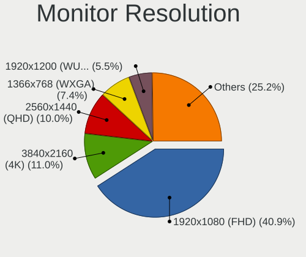

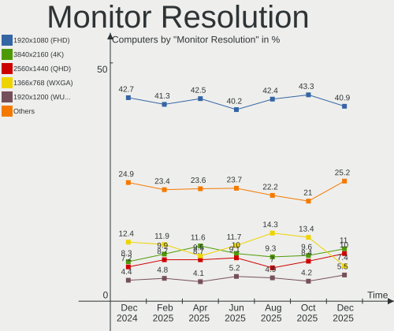

| Resolution         | Computers | Percent |
|--------------------|-----------|---------|
| 1920x1080 (FHD)    | 706       | 40.9%   |
| 3840x2160 (4K)     | 189       | 10.95%  |
| 2560x1440 (QHD)    | 173       | 10.02%  |
| 1366x768 (WXGA)    | 128       | 7.42%   |
| 1920x1200 (WUXGA)  | 95        | 5.5%    |
| 3440x1440          | 47        | 2.72%   |
| 2560x1600          | 43        | 2.49%   |
| 1600x900 (HD+)     | 39        | 2.26%   |
| 2880x1800          | 30        | 1.74%   |
| 2560x1080          | 27        | 1.56%   |
| 1440x900 (WXGA+)   | 25        | 1.45%   |
| Unknown            | 24        | 1.39%   |
| 3840x1080          | 23        | 1.33%   |
| 1680x1050 (WSXGA+) | 19        | 1.1%    |
| 800x1280           | 18        | 1.04%   |
| 1280x800 (WXGA)    | 18        | 1.04%   |
| 1280x1024 (SXGA)   | 17        | 0.98%   |
| 2256x1504          | 12        | 0.7%    |
| 2880x1920          | 11        | 0.64%   |
| 2288x1287          | 8         | 0.46%   |
| 1920x540           | 8         | 0.46%   |
| 3840x1600          | 7         | 0.41%   |
| 3840x2400          | 6         | 0.35%   |
| 1360x768           | 6         | 0.35%   |
| 1024x768 (XGA)     | 6         | 0.35%   |
| 3200x1800 (QHD+)   | 3         | 0.17%   |
| 2736x1824          | 3         | 0.17%   |
| 2560x2880          | 3         | 0.17%   |
| 2400x1600          | 3         | 0.17%   |
| 2160x1440          | 3         | 0.17%   |
| 3456x2160          | 2         | 0.12%   |
| 2304x1440          | 2         | 0.12%   |
| 2240x1400          | 2         | 0.12%   |
| 2160x1350          | 2         | 0.12%   |
| 1280x720 (HD)      | 2         | 0.12%   |
| 6400x1440          | 1         | 0.06%   |
| 5760x1080          | 1         | 0.06%   |
| 3240x2160          | 1         | 0.06%   |
| 3200x2000          | 1         | 0.06%   |
| 3072x1920          | 1         | 0.06%   |

Monitor Diagonal
----------------

Diagonal size in inches

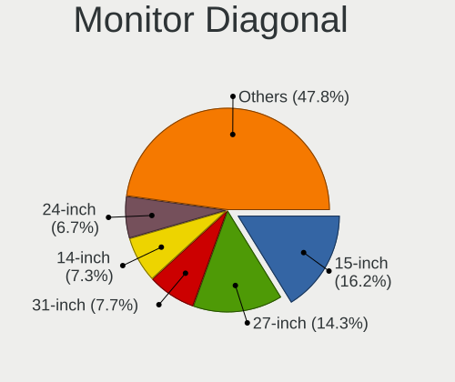

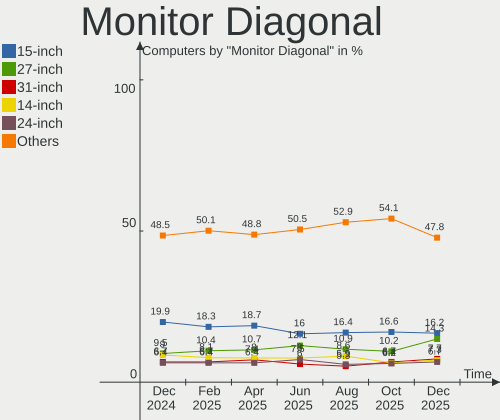

| Inches  | Computers | Percent |
|---------|-----------|---------|
| 15      | 294       | 16.21%  |
| 27      | 259       | 14.28%  |
| 31      | 140       | 7.72%   |
| 14      | 133       | 7.33%   |
| 24      | 121       | 6.67%   |
| 13      | 119       | 6.56%   |
| 23      | 99        | 5.46%   |
| 16      | 79        | 4.36%   |
| 21      | 62        | 3.42%   |
| 17      | 60        | 3.31%   |
| 34      | 55        | 3.03%   |
| Unknown | 42        | 2.32%   |
| 32      | 23        | 1.27%   |
| 19      | 22        | 1.21%   |
| 84      | 18        | 0.99%   |
| 40      | 18        | 0.99%   |
| 20      | 18        | 0.99%   |
| 7       | 18        | 0.99%   |
| 48      | 17        | 0.94%   |
| 11      | 17        | 0.94%   |
| 49      | 15        | 0.83%   |
| 26      | 15        | 0.83%   |
| 12      | 14        | 0.77%   |
| 72      | 13        | 0.72%   |
| 22      | 13        | 0.72%   |
| 54      | 12        | 0.66%   |
| 18      | 11        | 0.61%   |
| 8       | 11        | 0.61%   |
| 74      | 9         | 0.5%    |
| 28      | 9         | 0.5%    |
| 142     | 8         | 0.44%   |
| 63      | 7         | 0.39%   |
| 42      | 7         | 0.39%   |
| 37      | 7         | 0.39%   |
| 36      | 6         | 0.33%   |
| 29      | 6         | 0.33%   |
| 39      | 4         | 0.22%   |
| 44      | 3         | 0.17%   |
| 35      | 3         | 0.17%   |
| 25      | 3         | 0.17%   |

Monitor Width
-------------

Physical width

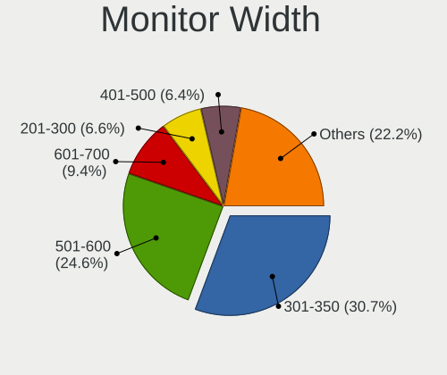

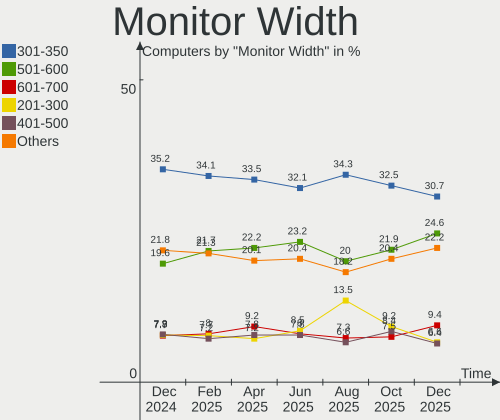

| Width in mm    | Computers | Percent |
|----------------|-----------|---------|
| 301-350        | 539       | 30.68%  |
| 501-600        | 433       | 24.64%  |
| 601-700        | 166       | 9.45%   |
| 201-300        | 116       | 6.6%    |
| 401-500        | 113       | 6.43%   |
| 701-800        | 80        | 4.55%   |
| 351-400        | 73        | 4.15%   |
| 1001-1500      | 69        | 3.93%   |
| 1501-2000      | 44        | 2.5%    |
| Unknown        | 42        | 2.39%   |
| 801-900        | 32        | 1.82%   |
| 1-100          | 17        | 0.97%   |
| 901-1000       | 13        | 0.74%   |
| 101-200        | 12        | 0.68%   |
| More than 2000 | 8         | 0.46%   |

Aspect Ratio
------------

Proportional relationship between the width and the height

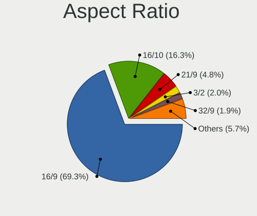

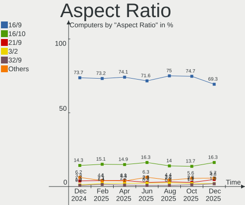

| Ratio   | Computers | Percent |
|---------|-----------|---------|
| 16/9    | 1124      | 69.34%  |
| 16/10   | 264       | 16.29%  |
| 21/9    | 78        | 4.81%   |
| 3/2     | 33        | 2.04%   |
| 32/9    | 30        | 1.85%   |
| Unknown | 24        | 1.48%   |
| 5/4     | 15        | 0.93%   |
| 4/3     | 12        | 0.74%   |
| 0.62    | 11        | 0.68%   |
| 1.00    | 8         | 0.49%   |
| 0.67    | 7         | 0.43%   |
| 0.89    | 3         | 0.19%   |
| 0.63    | 3         | 0.19%   |
| 0.56    | 3         | 0.19%   |
| 1.96    | 2         | 0.12%   |
| 6/5     | 1         | 0.06%   |
| 3.75    | 1         | 0.06%   |
| 2.69    | 1         | 0.06%   |
| 2.64    | 1         | 0.06%   |

Monitor Area
------------

Area in inch²

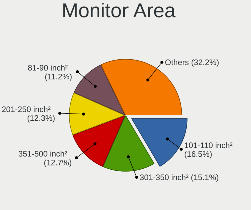

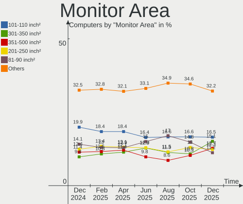

| Area in inch² | Computers | Percent |
|----------------|-----------|---------|
| 101-110        | 293       | 16.49%  |
| 301-350        | 268       | 15.08%  |
| 351-500        | 226       | 12.72%  |
| 201-250        | 219       | 12.32%  |
| 81-90          | 199       | 11.2%   |
| More than 1000 | 84        | 4.73%   |
| 111-120        | 78        | 4.39%   |
| 501-1000       | 74        | 4.16%   |
| 151-200        | 57        | 3.21%   |
| 251-300        | 49        | 2.76%   |
| 71-80          | 48        | 2.7%    |
| 121-130        | 47        | 2.64%   |
| Unknown        | 42        | 2.36%   |
| 1-40           | 29        | 1.63%   |
| 51-60          | 18        | 1.01%   |
| 141-150        | 18        | 1.01%   |
| 61-70          | 15        | 0.84%   |
| 131-140        | 7         | 0.39%   |
| 91-100         | 4         | 0.23%   |
| 41-50          | 2         | 0.11%   |

Pixel Density
-------------

Pixels per inch

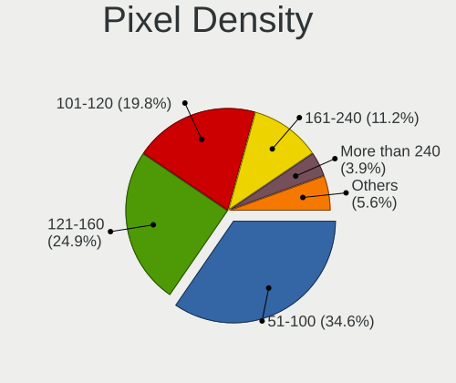

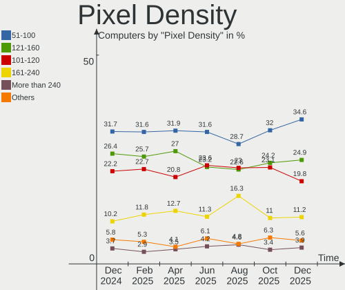

| Density       | Computers | Percent |
|---------------|-----------|---------|
| 51-100        | 591       | 34.58%  |
| 121-160       | 425       | 24.87%  |
| 101-120       | 339       | 19.84%  |
| 161-240       | 192       | 11.23%  |
| More than 240 | 67        | 3.92%   |
| 1-50          | 53        | 3.1%    |
| Unknown       | 42        | 2.46%   |

Multiple Monitors
-----------------

Total monitors connected

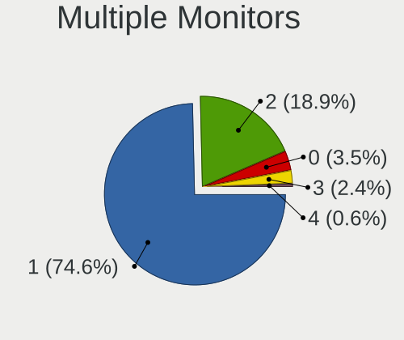

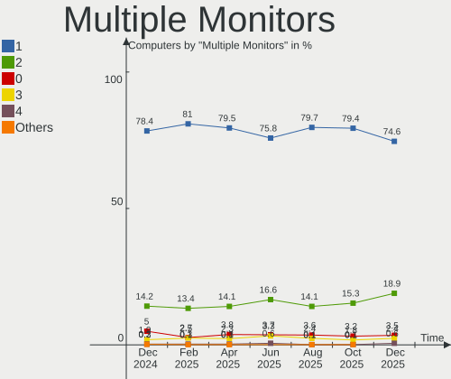

| Total | Computers | Percent |
|-------|-----------|---------|
| 1     | 1201      | 74.64%  |
| 2     | 304       | 18.89%  |
| 0     | 56        | 3.48%   |
| 3     | 38        | 2.36%   |
| 4     | 10        | 0.62%   |

Network
-------

Net Controller Vendor
---------------------

Controller vendors

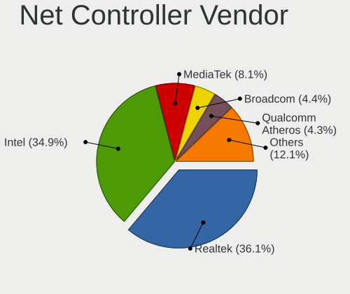

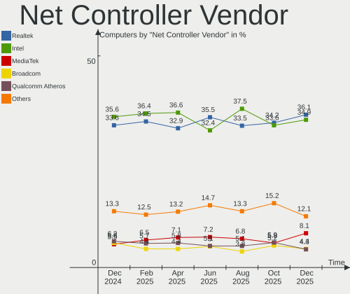

| Vendor                          | Computers | Percent |
|---------------------------------|-----------|---------|
| Realtek Semiconductor           | 869       | 36.15%  |
| Intel                           | 838       | 34.86%  |
| MediaTek                        | 195       | 8.11%   |
| Broadcom                        | 106       | 4.41%   |
| Qualcomm Atheros                | 104       | 4.33%   |
| ASIX Electronics                | 27        | 1.12%   |
| Broadcom Limited                | 25        | 1.04%   |
| Qualcomm Technologies           | 20        | 0.83%   |
| Aquantia                        | 18        | 0.75%   |
| Qualcomm                        | 16        | 0.67%   |
| TP-Link                         | 14        | 0.58%   |
| Microsoft                       | 13        | 0.54%   |
| Marvell Technology Group        | 13        | 0.54%   |
| NetGear                         | 11        | 0.46%   |
| Ralink                          | 9         | 0.37%   |
| Samsung Electronics             | 8         | 0.33%   |
| Ralink Technology               | 8         | 0.33%   |
| Nvidia                          | 8         | 0.33%   |
| Realtek                         | 7         | 0.29%   |
| ASUSTek Computer                | 7         | 0.29%   |
| Shenzhen Goodix Technology      | 6         | 0.25%   |
| DisplayLink                     | 6         | 0.25%   |
| American Megatrends             | 6         | 0.25%   |
| Raspberry Pi                    | 5         | 0.21%   |
| Motorola PCS                    | 4         | 0.17%   |
| Insyde Software                 | 4         | 0.17%   |
| Google                          | 4         | 0.17%   |
| Edimax Technology               | 4         | 0.17%   |
| Linksys                         | 3         | 0.12%   |
| Lenovo                          | 3         | 0.12%   |
| U-Blox                          | 2         | 0.08%   |
| Qualcomm Atheros Communications | 2         | 0.08%   |
| InterBiometrics                 | 2         | 0.08%   |
| HYTE                            | 2         | 0.08%   |
| Framework Computer              | 2         | 0.08%   |
| D-Link System                   | 2         | 0.08%   |
| Belkin Components               | 2         | 0.08%   |
| Apple                           | 2         | 0.08%   |
| American Future Technology      | 2         | 0.08%   |
| aicsemi                         | 2         | 0.08%   |

Net Controller Model
--------------------

Controller models

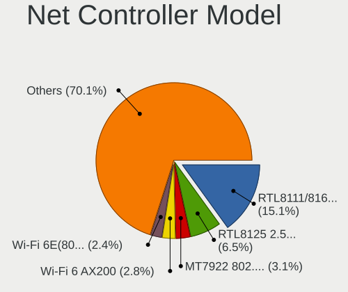

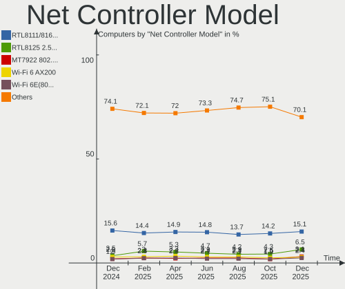

| Model                                                                           | Computers | Percent |
|---------------------------------------------------------------------------------|-----------|---------|
| Realtek RTL8111/8168/8211/8411 PCI Express Gigabit Ethernet Controller          | 435       | 15.05%  |
| Realtek RTL8125 2.5GbE Controller                                               | 189       | 6.54%   |
| MediaTek MT7922 802.11ax PCI Express Wireless Network Adapter                   | 89        | 3.08%   |
| Intel Wi-Fi 6 AX200                                                             | 81        | 2.8%    |
| Intel Wi-Fi 6E(802.11ax) AX210/AX1675* 2x2 [Typhoon Peak]                       | 70        | 2.42%   |
| Realtek RTL810xE PCI Express Fast Ethernet controller                           | 56        | 1.94%   |
| Intel I211 Gigabit Network Connection                                           | 51        | 1.76%   |
| Realtek RTL8821CE 802.11ac PCIe Wireless Network Adapter                        | 47        | 1.63%   |
| Realtek RTL8153 Gigabit Ethernet Adapter                                        | 45        | 1.56%   |
| Intel Ethernet Controller I225-V                                                | 45        | 1.56%   |
| Intel 82579LM Gigabit Network Connection (Lewisville)                           | 45        | 1.56%   |
| Realtek RTL8852BE PCIe 802.11ax Wireless Network Controller                     | 38        | 1.31%   |
| Intel Wireless 7265                                                             | 35        | 1.21%   |
| Realtek RTL8126 5GbE Controller                                                 | 33        | 1.14%   |
| MediaTek MT7925 802.11be 160MHz 2x2 PCIe Wireless Network Adapter [Filogic 360] | 32        | 1.11%   |
| Intel Wi-Fi 5(802.11ac) Wireless-AC 9x6x [Thunder Peak]                         | 32        | 1.11%   |
| Intel Wi-Fi 6 AX201                                                             | 31        | 1.07%   |
| Intel Ethernet Connection (2) I219-V                                            | 31        | 1.07%   |
| Intel Alder Lake-P PCH CNVi WiFi                                                | 31        | 1.07%   |
| Intel Wireless 8265 / 8275                                                      | 30        | 1.04%   |
| Realtek RTL8822CE 802.11ac PCIe Wireless Network Adapter                        | 28        | 0.97%   |
| Intel Ethernet Controller I226-V                                                | 28        | 0.97%   |
| ASIX AX88179 Gigabit Ethernet                                                   | 24        | 0.83%   |
| Intel Wi-Fi 7(802.11be) AX1775*/AX1790*/BE20*/BE401/BE1750* 2x2                 | 23        | 0.8%    |
| Intel Comet Lake PCH CNVi WiFi                                                  | 23        | 0.8%    |
| MediaTek MT7921 802.11ax PCIe Wireless Network Adapter [Filogic 330]            | 22        | 0.76%   |
| Intel Wireless 8260                                                             | 22        | 0.76%   |
| Intel Dual Band Wireless-AC 3168NGW [Stone Peak]                                | 22        | 0.76%   |
| Intel 700 Series Chipset CNVi WiFi                                              | 22        | 0.76%   |
| Intel Wireless 7260                                                             | 21        | 0.73%   |
| Intel Ethernet Connection I217-LM                                               | 21        | 0.73%   |
| Qualcomm Atheros QCA6174 802.11ac Wireless Network Adapter                      | 20        | 0.69%   |
| Broadcom NetXtreme BCM57766 Gigabit Ethernet PCIe                               | 20        | 0.69%   |
| Realtek RTL8922AE 802.11be PCIe Wireless Network Adapter                        | 19        | 0.66%   |
| Qualcomm Atheros QCA9377 802.11ac Wireless Network Adapter                      | 19        | 0.66%   |
| Qualcomm WCN785x Wi-Fi 7(802.11be) 320MHz 2x2 [FastConnect 7800]                | 18        | 0.62%   |
| Intel Ethernet Connection (7) I219-V                                            | 17        | 0.59%   |
| Intel Ethernet Connection (7) I219-LM                                           | 17        | 0.59%   |
| Intel Centrino Advanced-N 6205 [Taylor Peak]                                    | 17        | 0.59%   |
| Realtek Killer E3000 2.5GbE Controller                                          | 16        | 0.55%   |

Wireless Vendor
---------------

Wireless vendors

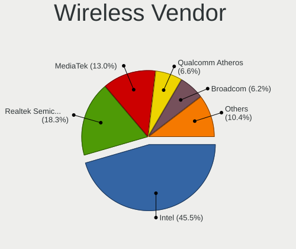

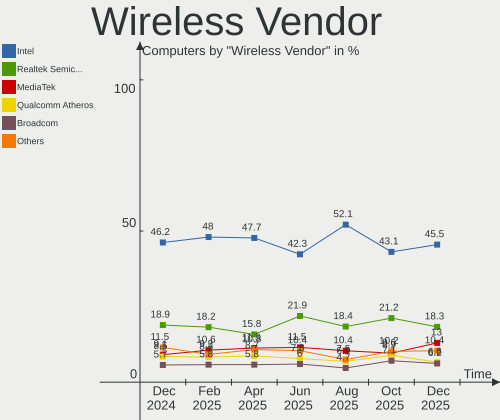

| Vendor                          | Computers | Percent |
|---------------------------------|-----------|---------|
| Intel                           | 605       | 45.52%  |
| Realtek Semiconductor           | 243       | 18.28%  |
| MediaTek                        | 173       | 13.02%  |
| Qualcomm Atheros                | 88        | 6.62%   |
| Broadcom                        | 82        | 6.17%   |
| Broadcom Limited                | 23        | 1.73%   |
| Qualcomm                        | 16        | 1.2%    |
| TP-Link                         | 14        | 1.05%   |
| NetGear                         | 11        | 0.83%   |
| Microsoft                       | 10        | 0.75%   |
| Marvell Technology Group        | 10        | 0.75%   |
| Ralink                          | 9         | 0.68%   |
| Ralink Technology               | 8         | 0.6%    |
| Realtek                         | 7         | 0.53%   |
| ASUSTek Computer                | 7         | 0.53%   |
| Qualcomm Technologies           | 5         | 0.38%   |
| Edimax Technology               | 4         | 0.3%    |
| Linksys                         | 3         | 0.23%   |
| Qualcomm Atheros Communications | 2         | 0.15%   |
| D-Link System                   | 2         | 0.15%   |
| Belkin Components               | 2         | 0.15%   |
| TRENDnet                        | 1         | 0.08%   |
| Sierra Wireless                 | 1         | 0.08%   |
| Gemtek                          | 1         | 0.08%   |
| Dell                            | 1         | 0.08%   |
| 3Com                            | 1         | 0.08%   |

Wireless Model
--------------

Wireless models

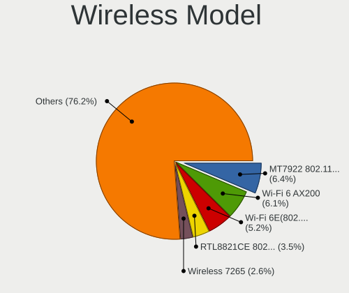

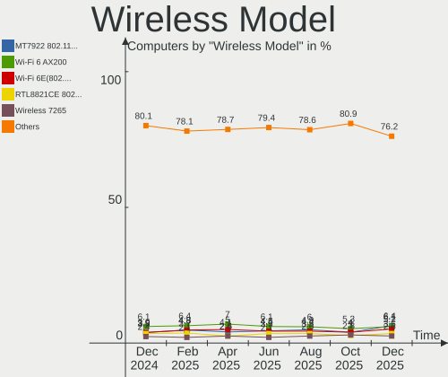

| Model                                                                           | Computers | Percent |
|---------------------------------------------------------------------------------|-----------|---------|
| MediaTek MT7922 802.11ax PCI Express Wireless Network Adapter                   | 85        | 6.37%   |
| Intel Wi-Fi 6 AX200                                                             | 81        | 6.07%   |
| Intel Wi-Fi 6E(802.11ax) AX210/AX1675* 2x2 [Typhoon Peak]                       | 70        | 5.24%   |
| Realtek RTL8821CE 802.11ac PCIe Wireless Network Adapter                        | 47        | 3.52%   |
| Intel Wireless 7265                                                             | 35        | 2.62%   |
| Realtek RTL8852BE PCIe 802.11ax Wireless Network Controller                     | 33        | 2.47%   |
| Intel Wi-Fi 5(802.11ac) Wireless-AC 9x6x [Thunder Peak]                         | 32        | 2.4%    |
| Intel Wi-Fi 6 AX201                                                             | 31        | 2.32%   |
| Intel Wireless 8265 / 8275                                                      | 30        | 2.25%   |
| Realtek RTL8822CE 802.11ac PCIe Wireless Network Adapter                        | 28        | 2.1%    |
| Intel Comet Lake PCH CNVi WiFi                                                  | 23        | 1.72%   |
| MediaTek MT7921 802.11ax PCIe Wireless Network Adapter [Filogic 330]            | 22        | 1.65%   |
| Intel Wireless 8260                                                             | 22        | 1.65%   |
| Intel Dual Band Wireless-AC 3168NGW [Stone Peak]                                | 22        | 1.65%   |
| Intel Alder Lake-P PCH CNVi WiFi                                                | 22        | 1.65%   |
| Intel Wireless 7260                                                             | 21        | 1.57%   |
| Intel 700 Series Chipset CNVi WiFi                                              | 21        | 1.57%   |
| Qualcomm Atheros QCA6174 802.11ac Wireless Network Adapter                      | 20        | 1.5%    |
| Qualcomm Atheros QCA9377 802.11ac Wireless Network Adapter                      | 19        | 1.42%   |
| MediaTek MT7925 802.11be 160MHz 2x2 PCIe Wireless Network Adapter [Filogic 360] | 19        | 1.42%   |
| Intel Wi-Fi 7(802.11be) AX1775*/AX1790*/BE20*/BE401/BE1750* 2x2                 | 17        | 1.27%   |
| Intel Centrino Advanced-N 6205 [Taylor Peak]                                    | 17        | 1.27%   |
| Realtek 802.11ac NIC                                                            | 16        | 1.2%    |
| Qualcomm QCNFA765 Wireless Network Adapter                                      | 16        | 1.2%    |
| Qualcomm Atheros QCA9565 / AR9565 Wireless Network Adapter                      | 16        | 1.2%    |
| Intel Cannon Lake PCH CNVi WiFi                                                 | 16        | 1.2%    |
| Broadcom BCM4360 802.11ac Dual Band Wireless Network Adapter                    | 16        | 1.2%    |
| Intel Comet Lake PCH-LP CNVi WiFi                                               | 15        | 1.12%   |
| Realtek RTL88x2bu [AC1200 Techkey]                                              | 14        | 1.05%   |
| Intel Wireless 3165                                                             | 14        | 1.05%   |
| Intel Meteor Lake PCH CNVi WiFi                                                 | 14        | 1.05%   |
| Qualcomm Atheros AR9485 Wireless Network Adapter                                | 13        | 0.97%   |
| MediaTek MT7925 (RZ717) Wi-Fi 7 160MHz                                          | 13        | 0.97%   |
| MediaTek MT7921K (RZ608) Wi-Fi 6E 80MHz                                         | 13        | 0.97%   |
| Intel Tiger Lake PCH CNVi WiFi                                                  | 13        | 0.97%   |
| Broadcom Limited BCM4360 802.11ac Dual Band Wireless Network Adapter            | 12        | 0.9%    |
| Broadcom BCM4331 802.11a/b/g/n                                                  | 12        | 0.9%    |
| Realtek RTL8852CE PCIe 802.11ax Wireless Network Controller                     | 11        | 0.82%   |
| Realtek RTL8188EE Wireless Network Adapter                                      | 11        | 0.82%   |
| Broadcom BCM43602 802.11ac Wireless LAN SoC                                     | 11        | 0.82%   |

Ethernet Vendor
---------------

Ethernet vendors

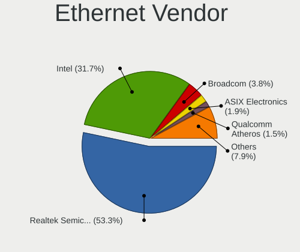

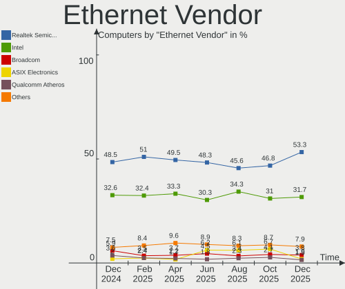

| Vendor                                 | Computers | Percent |
|----------------------------------------|-----------|---------|
| Realtek Semiconductor                  | 767       | 53.3%   |
| Intel                                  | 456       | 31.69%  |
| Broadcom                               | 55        | 3.82%   |
| ASIX Electronics                       | 27        | 1.88%   |
| Qualcomm Atheros                       | 21        | 1.46%   |
| Aquantia                               | 18        | 1.25%   |
| MediaTek                               | 17        | 1.18%   |
| Qualcomm Technologies                  | 15        | 1.04%   |
| Samsung Electronics                    | 8         | 0.56%   |
| Nvidia                                 | 8         | 0.56%   |
| DisplayLink                            | 6         | 0.42%   |
| American Megatrends                    | 6         | 0.42%   |
| Raspberry Pi                           | 5         | 0.35%   |
| Motorola PCS                           | 4         | 0.28%   |
| Insyde Software                        | 4         | 0.28%   |
| Marvell Technology Group               | 3         | 0.21%   |
| Lenovo                                 | 3         | 0.21%   |
| Google                                 | 3         | 0.21%   |
| Microsoft                              | 2         | 0.14%   |
| Broadcom Limited                       | 2         | 0.14%   |
| Apple                                  | 2         | 0.14%   |
| Xiaomi                                 | 1         | 0.07%   |
| Suzhou Motorcomm Electronic Technology | 1         | 0.07%   |
| Motorcomm Microelectronics.            | 1         | 0.07%   |
| Mellanox Technologies                  | 1         | 0.07%   |
| ICS Advent                             | 1         | 0.07%   |
| Hewlett-Packard                        | 1         | 0.07%   |
| 3Com                                   | 1         | 0.07%   |

Ethernet Model
--------------

Ethernet models

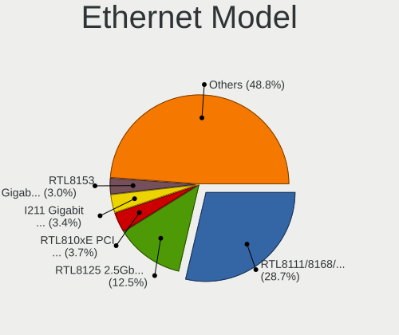

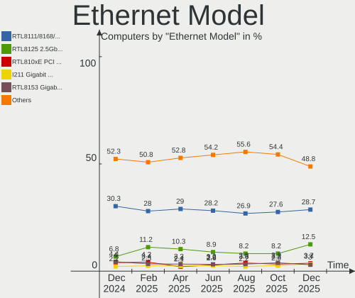

| Model                                                                           | Computers | Percent |
|---------------------------------------------------------------------------------|-----------|---------|
| Realtek RTL8111/8168/8211/8411 PCI Express Gigabit Ethernet Controller          | 435       | 28.68%  |
| Realtek RTL8125 2.5GbE Controller                                               | 189       | 12.46%  |
| Realtek RTL810xE PCI Express Fast Ethernet controller                           | 56        | 3.69%   |
| Intel I211 Gigabit Network Connection                                           | 51        | 3.36%   |
| Realtek RTL8153 Gigabit Ethernet Adapter                                        | 45        | 2.97%   |
| Intel Ethernet Controller I225-V                                                | 45        | 2.97%   |
| Intel 82579LM Gigabit Network Connection (Lewisville)                           | 45        | 2.97%   |
| Realtek RTL8126 5GbE Controller                                                 | 33        | 2.18%   |
| Intel Ethernet Connection (2) I219-V                                            | 31        | 2.04%   |
| Intel Ethernet Controller I226-V                                                | 28        | 1.85%   |
| ASIX AX88179 Gigabit Ethernet                                                   | 24        | 1.58%   |
| Intel Ethernet Connection I217-LM                                               | 21        | 1.38%   |
| Broadcom NetXtreme BCM57766 Gigabit Ethernet PCIe                               | 20        | 1.32%   |
| Intel Ethernet Connection (7) I219-V                                            | 17        | 1.12%   |
| Intel Ethernet Connection (7) I219-LM                                           | 17        | 1.12%   |
| Realtek Killer E3000 2.5GbE Controller                                          | 16        | 1.05%   |
| Qualcomm WCN785x Wi-Fi 7(802.11be) 320MHz 2x2 [FastConnect 7800]                | 15        | 0.99%   |
| MediaTek MT7925 802.11be 160MHz 2x2 PCIe Wireless Network Adapter [Filogic 360] | 13        | 0.86%   |
| Intel I210 Gigabit Network Connection                                           | 12        | 0.79%   |
| Intel Ethernet Connection (4) I219-LM                                           | 12        | 0.79%   |
| Intel Ethernet Connection (2) I219-LM                                           | 12        | 0.79%   |
| Broadcom NetXtreme BCM57765 Gigabit Ethernet PCIe                               | 11        | 0.73%   |
| Realtek RTL8922AE 802.11be PCIe Wireless Network Adapter                        | 9         | 0.59%   |
| Intel Ethernet Connection I217-V                                                | 9         | 0.59%   |
| Intel Alder Lake-P PCH CNVi WiFi                                                | 9         | 0.59%   |
| Broadcom NetXtreme BCM5764M Gigabit Ethernet PCIe                               | 9         | 0.59%   |
| Realtek Killer E2600 GbE Controller                                             | 8         | 0.53%   |
| Intel Ethernet Connection (13) I219-V                                           | 8         | 0.53%   |
| Intel Ethernet Connection (11) I219-LM                                          | 8         | 0.53%   |
| Intel Ethernet Connection (10) I219-V                                           | 8         | 0.53%   |
| Intel Alder Lake-S PCH CNVi WiFi                                                | 8         | 0.53%   |
| Intel Ethernet Connection I219-LM                                               | 7         | 0.46%   |
| Intel Ethernet Connection (2) I218-V                                            | 7         | 0.46%   |
| Realtek USB 10/100/1G/2.5 LAN                                                   | 6         | 0.4%    |
| Qualcomm Atheros Killer E220x Gigabit Ethernet Controller                       | 6         | 0.4%    |
| Intel Wi-Fi 7(802.11be) AX1775*/AX1790*/BE20*/BE401/BE1750* 2x2                 | 6         | 0.4%    |
| Intel I350 Gigabit Network Connection                                           | 6         | 0.4%    |
| Intel Ethernet Connection (6) I219-LM                                           | 6         | 0.4%    |
| Intel Ethernet Connection (3) I218-LM                                           | 6         | 0.4%    |
| Intel Ethernet Connection (18) I219-LM                                          | 6         | 0.4%    |

Net Controller Kind
-------------------

Ethernet, WiFi or modem

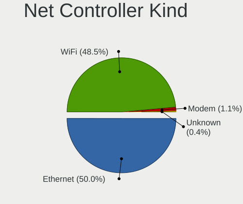

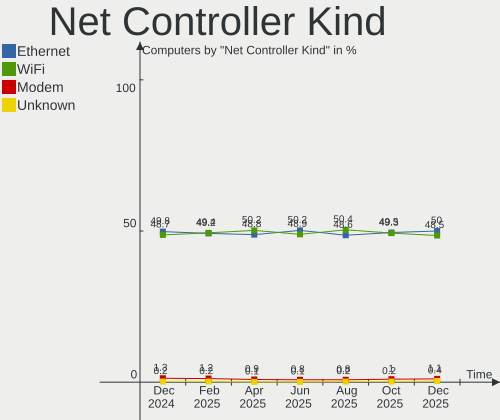

| Kind     | Computers | Percent |
|----------|-----------|---------|
| Ethernet | 1304      | 50.02%  |
| WiFi     | 1265      | 48.52%  |
| Modem    | 28        | 1.07%   |
| Unknown  | 10        | 0.38%   |

Used Controller
---------------

Currently used network controller

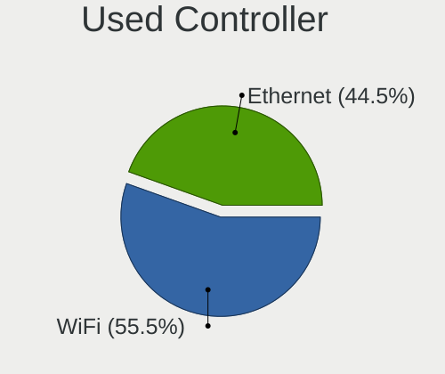

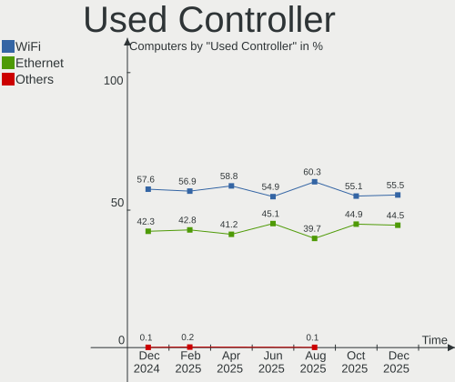

| Kind     | Computers | Percent |
|----------|-----------|---------|
| WiFi     | 910       | 55.45%  |
| Ethernet | 731       | 44.55%  |

NICs
----

Total network controllers on board

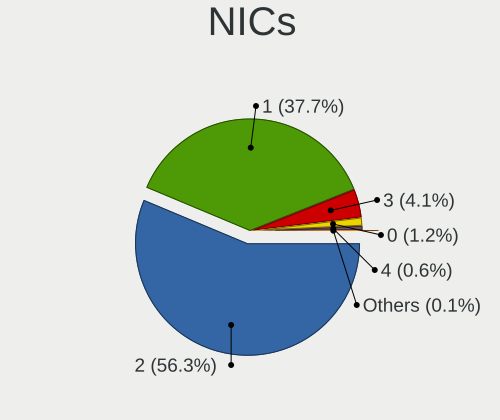

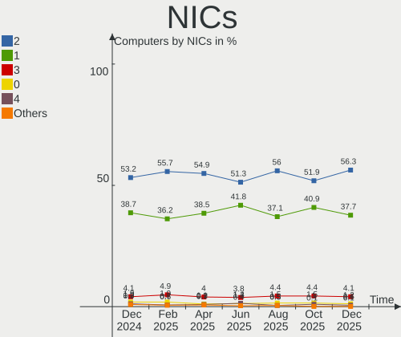

| Total | Computers | Percent |
|-------|-----------|---------|
| 2     | 906       | 56.31%  |
| 1     | 606       | 37.66%  |
| 3     | 66        | 4.1%    |
| 0     | 19        | 1.18%   |
| 4     | 10        | 0.62%   |
| 6     | 2         | 0.12%   |

IPv6
----

IPv6 vs IPv4

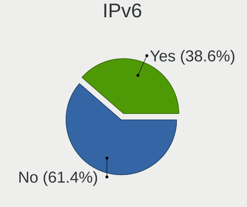

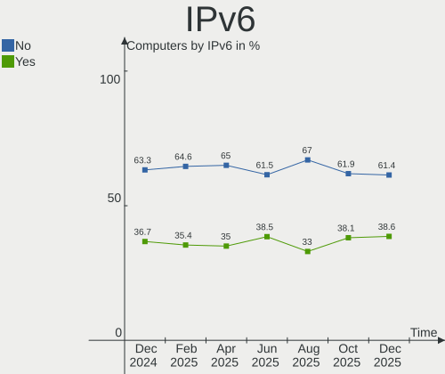

| Used | Computers | Percent |
|------|-----------|---------|
| No   | 988       | 61.4%   |
| Yes  | 621       | 38.6%   |

Bluetooth
---------

Bluetooth Vendor
----------------

Controller vendors

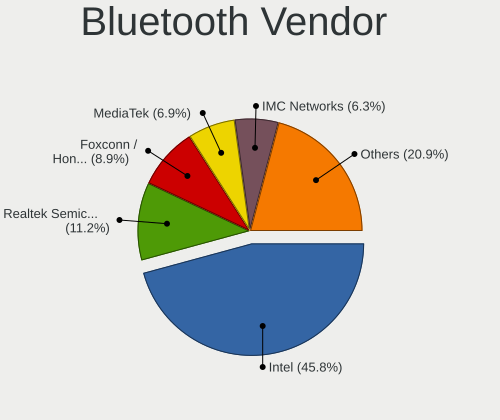

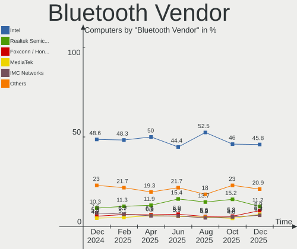

| Vendor                          | Computers | Percent |
|---------------------------------|-----------|---------|
| Intel                           | 574       | 45.77%  |
| Realtek Semiconductor           | 141       | 11.24%  |
| Foxconn / Hon Hai               | 112       | 8.93%   |
| MediaTek                        | 86        | 6.86%   |
| IMC Networks                    | 79        | 6.3%    |
| Apple                           | 55        | 4.39%   |
| Qualcomm Atheros Communications | 47        | 3.75%   |
| Broadcom                        | 25        | 1.99%   |
| Cambridge Silicon Radio         | 24        | 1.91%   |
| ASUSTek Computer                | 24        | 1.91%   |
| TP-Link                         | 17        | 1.36%   |
| Marvell Semiconductor           | 12        | 0.96%   |
| Lite-On Technology              | 12        | 0.96%   |
| Realtek                         | 7         | 0.56%   |
| Toshiba                         | 6         | 0.48%   |
| Dell                            | 6         | 0.48%   |
| Actions                         | 6         | 0.48%   |
| Ralink                          | 3         | 0.24%   |
| Hewlett-Packard                 | 3         | 0.24%   |
| Edimax Technology               | 3         | 0.24%   |
| Dynex                           | 3         | 0.24%   |
| USI                             | 2         | 0.16%   |
| Quectel Wireless Solutions      | 1         | 0.08%   |
| Primax Electronics              | 1         | 0.08%   |
| Nintendo                        | 1         | 0.08%   |
| Kensington                      | 1         | 0.08%   |
| Integrated System Solution      | 1         | 0.08%   |
| HTC (High Tech Computer)        | 1         | 0.08%   |
| Unknown                         | 1         | 0.08%   |

Bluetooth Model
---------------

Controller models

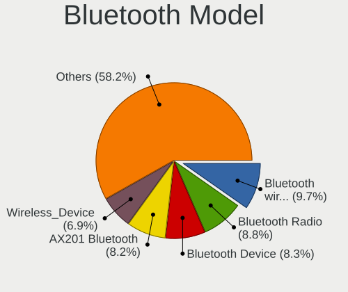

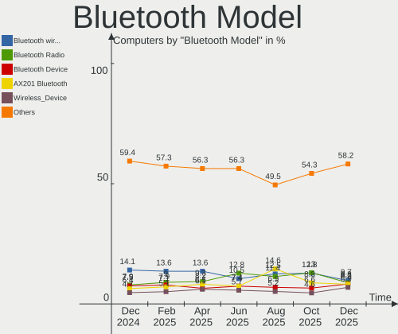

| Model                                               | Computers | Percent |
|-----------------------------------------------------|-----------|---------|
| Intel Bluetooth wireless interface                  | 122       | 9.72%   |
| Realtek Bluetooth Radio                             | 110       | 8.76%   |
| Intel Bluetooth Device                              | 104       | 8.29%   |
| Intel AX201 Bluetooth                               | 103       | 8.21%   |
| MediaTek Wireless_Device                            | 86        | 6.85%   |
| Intel AX200 Bluetooth                               | 79        | 6.29%   |
| Intel AX210 Bluetooth                               | 62        | 4.94%   |
| Foxconn / Hon Hai Wireless_Device                   | 61        | 4.86%   |
| IMC Networks Bluetooth Radio                        | 44        | 3.51%   |
| Intel Bluetooth 9460/9560 Jefferson Peak (JfP)      | 40        | 3.19%   |
| Qualcomm Atheros  Bluetooth Device                  | 34        | 2.71%   |
| Foxconn / Hon Hai Bluetooth Device                  | 33        | 2.63%   |
| IMC Networks Wireless_Device                        | 32        | 2.55%   |
| Intel Wireless-AC 9260 Bluetooth Adapter            | 31        | 2.47%   |
| Apple Bluetooth Host Controller                     | 27        | 2.15%   |
| Cambridge Silicon Radio Bluetooth Dongle (HCI mode) | 24        | 1.91%   |
| Intel Wireless-AC 3168 Bluetooth                    | 21        | 1.67%   |
| Apple Bluetooth USB Host Controller                 | 21        | 1.67%   |
| TP-Link TP-T@- UB500 Adapter                        | 17        | 1.35%   |
| Realtek  Bluetooth 4.2 Adapter                      | 17        | 1.35%   |
| ASUS ASUS USB-BT500                                 | 11        | 0.88%   |
| Broadcom BCM20702A0 Bluetooth 4.0                   | 8         | 0.64%   |
| Realtek Bluetooth Radio                             | 7         | 0.56%   |
| Marvell Bluetooth and Wireless LAN Composite        | 7         | 0.56%   |
| Foxconn / Hon Hai MediaTek Bluetooth Adapter        | 6         | 0.48%   |
| Foxconn / Hon Hai Bluetooth Radio                   | 6         | 0.48%   |
| Apple Built-in Bluetooth 2.0+EDR HCI                | 6         | 0.48%   |
| Actions general adapter                             | 6         | 0.48%   |
| Realtek Bluetooth 5.4 Radio                         | 5         | 0.4%    |
| Qualcomm Atheros AR9462 Bluetooth                   | 5         | 0.4%    |
| Marvell Bluetooth and Wireless LAN Composite Device | 5         | 0.4%    |
| Intel Centrino Bluetooth Wireless Transceiver       | 5         | 0.4%    |
| Intel Bluetooth                                     | 5         | 0.4%    |
| Toshiba BCM43142A0                                  | 4         | 0.32%   |
| Realtek 802.11ac WLAN Adapter                       | 4         | 0.32%   |
| ASUS Broadcom BCM20702A0 Bluetooth                  | 4         | 0.32%   |
| Ralink RT3290 Bluetooth                             | 3         | 0.24%   |
| Qualcomm Atheros QCA61x4 Bluetooth 4.0              | 3         | 0.24%   |
| Lite-On Wireless_Device                             | 3         | 0.24%   |
| Lite-On Bluetooth Radio                             | 3         | 0.24%   |

Sound
-----

Sound Vendor
------------

Sound card vendors

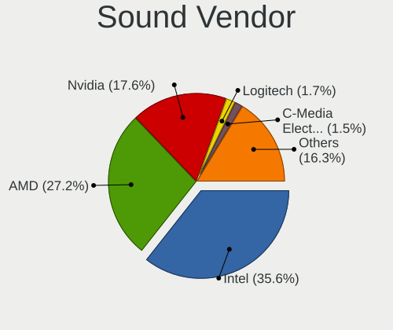

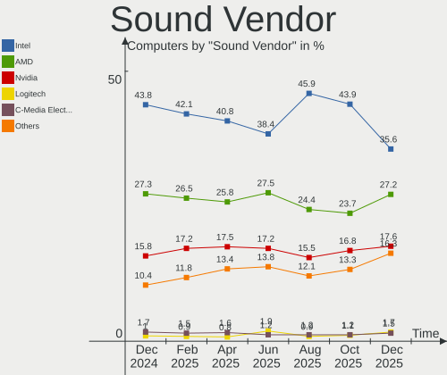

| Vendor                                       | Computers | Percent |
|----------------------------------------------|-----------|---------|
| Intel                                        | 937       | 35.63%  |
| AMD                                          | 716       | 27.22%  |
| Nvidia                                       | 464       | 17.64%  |
| Logitech                                     | 45        | 1.71%   |
| C-Media Electronics                          | 39        | 1.48%   |
| ASUSTek Computer                             | 28        | 1.06%   |
| SteelSeries ApS                              | 25        | 0.95%   |
| Micro Star International                     | 24        | 0.91%   |
| Razer USA                                    | 23        | 0.87%   |
| JMTek                                        | 20        | 0.76%   |
| Texas Instruments                            | 16        | 0.61%   |
| Hewlett-Packard                              | 16        | 0.61%   |
| Sony                                         | 14        | 0.53%   |
| Focusrite-Novation                           | 12        | 0.46%   |
| Audio-Technica                               | 12        | 0.46%   |
| Creative Labs                                | 11        | 0.42%   |
| Corsair                                      | 10        | 0.38%   |
| Kingston Technology                          | 9         | 0.34%   |
| ASRock                                       | 9         | 0.34%   |
| Generalplus Technology                       | 8         | 0.3%    |
| Valve Software                               | 7         | 0.27%   |
| Jieli Technology                             | 7         | 0.27%   |
| Blue Microphones                             | 6         | 0.23%   |
| Apple                                        | 6         | 0.23%   |
| Zoran Co. Personal Media Division (Nogatech) | 5         | 0.19%   |
| Walmart                                      | 5         | 0.19%   |
| Thesycon Systemsoftware & Consulting         | 5         | 0.19%   |
| Samson Technologies                          | 5         | 0.19%   |
| Realtek Semiconductor                        | 5         | 0.19%   |
| PreSonus Audio Electronics                   | 5         | 0.19%   |
| Astro Gaming                                 | 5         | 0.19%   |
| Unknown                                      | 5         | 0.19%   |
| XMOS                                         | 4         | 0.15%   |
| Turtle Beach                                 | 4         | 0.15%   |
| TC Electronic                                | 4         | 0.15%   |
| Shure                                        | 4         | 0.15%   |
| MV-SILICON                                   | 4         | 0.15%   |
| Lenovo                                       | 4         | 0.15%   |
| KTMicro                                      | 4         | 0.15%   |
| BEHRINGER International                      | 4         | 0.15%   |

Sound Model
-----------

Sound card models

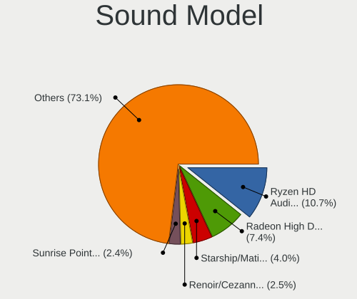

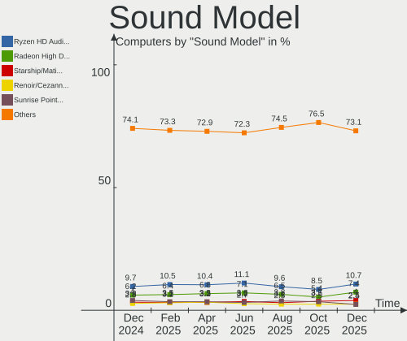

| Model                                                                      | Computers | Percent |
|----------------------------------------------------------------------------|-----------|---------|
| AMD Ryzen HD Audio Controller                                              | 356       | 10.74%  |
| AMD Radeon High Definition Audio Controller                                | 244       | 7.36%   |
| AMD Starship/Matisse HD Audio Controller                                   | 133       | 4.01%   |
| AMD Renoir/Cezanne HDMI/DP Audio Controller                                | 82        | 2.47%   |
| Intel Sunrise Point-LP HD Audio                                            | 78        | 2.35%   |
| AMD Navi 21/23 HDMI/DP Audio Controller                                    | 71        | 2.14%   |
| Intel Cannon Lake PCH cAVS                                                 | 70        | 2.11%   |
| Intel 8 Series/C220 Series Chipset High Definition Audio Controller        | 65        | 1.96%   |
| AMD Navi 31 HDMI/DP Audio                                                  | 60        | 1.81%   |
| Intel 7 Series/C216 Chipset Family High Definition Audio Controller        | 54        | 1.63%   |
| Intel 6 Series/C200 Series Chipset Family High Definition Audio Controller | 52        | 1.57%   |
| AMD Navi 48 HDMI/DP Audio Controller                                       | 52        | 1.57%   |
| Nvidia GA104 High Definition Audio Controller                              | 50        | 1.51%   |
| Intel 100 Series/C230 Series Chipset Family HD Audio Controller            | 45        | 1.36%   |
| AMD Ellesmere HDMI Audio [Radeon RX 470/480 / 570/580/590]                 | 45        | 1.36%   |
| Intel Tiger Lake-LP Smart Sound Technology Audio Controller                | 43        | 1.3%    |
| Intel Xeon E3-1200 v3/4th Gen Core Processor HD Audio Controller           | 41        | 1.24%   |
| Intel Raptor Lake High Definition Audio Controller                         | 40        | 1.21%   |
| Intel Alder Lake PCH-P High Definition Audio Controller                    | 38        | 1.15%   |
| Intel Alder Lake-S HD Audio Controller                                     | 35        | 1.06%   |
| AMD Raven/Raven2/Fenghuang HDMI/DP Audio Controller                        | 34        | 1.03%   |
| Intel 200 Series PCH HD Audio                                              | 33        | 1%      |
| Intel Wildcat Point-LP High Definition Audio Controller                    | 31        | 0.93%   |
| Intel Broadwell-U Audio Controller                                         | 31        | 0.93%   |
| AMD FCH Azalia Controller                                                  | 30        | 0.9%    |
| AMD Family 17h (Models 00h-0fh) HD Audio Controller                        | 30        | 0.9%    |
| Intel Meteor Lake-P HD Audio Controller                                    | 28        | 0.84%   |
| Intel Comet Lake PCH cAVS                                                  | 28        | 0.84%   |
| Nvidia GP104 High Definition Audio Controller                              | 26        | 0.78%   |
| Nvidia AD104 High Definition Audio Controller                              | 25        | 0.75%   |
| Nvidia GA106 High Definition Audio Controller                              | 24        | 0.72%   |
| Nvidia GA102 High Definition Audio Controller                              | 24        | 0.72%   |
| Micro Star International USB Audio                                         | 24        | 0.72%   |
| ASUSTek Computer USB Audio                                                 | 24        | 0.72%   |
| AMD SBx00 Azalia (Intel HDA)                                               | 24        | 0.72%   |
| Nvidia AD107 High Definition Audio Controller                              | 22        | 0.66%   |
| Intel Haswell-ULT HD Audio Controller                                      | 22        | 0.66%   |
| Intel 8 Series HD Audio Controller                                         | 22        | 0.66%   |
| Intel Tiger Lake-H HD Audio Controller                                     | 21        | 0.63%   |
| Nvidia GP107GL High Definition Audio Controller                            | 20        | 0.6%    |

Memory
------

Memory Vendor
-------------

Memory module vendors

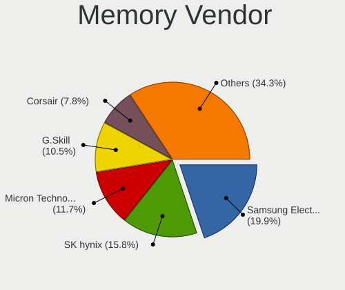

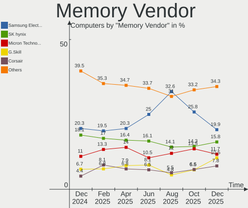

| Vendor                               | Computers | Percent |
|--------------------------------------|-----------|---------|
| Samsung Electronics                  | 168       | 19.86%  |
| SK hynix                             | 134       | 15.84%  |
| Micron Technology                    | 99        | 11.7%   |
| G.Skill                              | 89        | 10.52%  |
| Corsair                              | 66        | 7.8%    |
| Crucial                              | 51        | 6.03%   |
| Kingston                             | 46        | 5.44%   |
| Unknown                              | 35        | 4.14%   |
| A-DATA Technology                    | 27        | 3.19%   |
| Unknown                              | 25        | 2.96%   |
| Team                                 | 18        | 2.13%   |
| Ramaxel Technology                   | 16        | 1.89%   |
| Patriot                              | 9         | 1.06%   |
| TeamGroup                            | 7         | 0.83%   |
| Unknown (ABCD)                       | 5         | 0.59%   |
| Timetec                              | 5         | 0.59%   |
| Silicon Power                        | 5         | 0.59%   |
| PNY                                  | 4         | 0.47%   |
| Nanya Technology                     | 4         | 0.47%   |
| Elpida                               | 2         | 0.24%   |
| Chun Well Technology Holding Limited | 2         | 0.24%   |
| Avant                                | 2         | 0.24%   |
| ASint Technology                     | 2         | 0.24%   |
| Unknown (0x1057)                     | 1         | 0.12%   |
| Unknown (0x0E9D)                     | 1         | 0.12%   |
| Unknown (0x0CC7)                     | 1         | 0.12%   |
| Unknown (0x0BEC)                     | 1         | 0.12%   |
| Transcend                            | 1         | 0.12%   |
| T-FORCE                              | 1         | 0.12%   |
| Shenzhen Longsys                     | 1         | 0.12%   |
| Sesame                               | 1         | 0.12%   |
| Patriot Memory (PDP Systems)         | 1         | 0.12%   |
| Patriot Memory                       | 1         | 0.12%   |
| Neo Forza                            | 1         | 0.12%   |
| Lexar                                | 1         | 0.12%   |
| KingFast                             | 1         | 0.12%   |
| KINGBANK                             | 1         | 0.12%   |
| Juhor                                | 1         | 0.12%   |
| Hewlett-Packard                      | 1         | 0.12%   |
| GOODRAM                              | 1         | 0.12%   |

Memory Model
------------

Memory module models

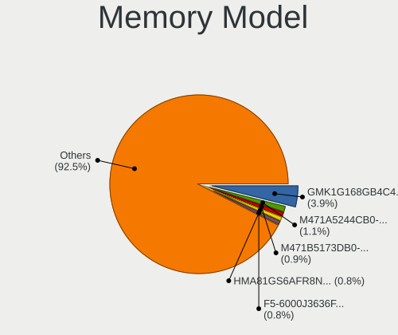

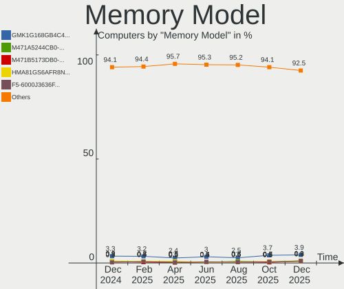

| Model                                                            | Computers | Percent |
|------------------------------------------------------------------|-----------|---------|
| Unknown                                                          | 35        | 3.93%   |
| Samsung RAM M471A5244CB0-CWE 4GB SODIMM DDR4 3200MT/s            | 10        | 1.12%   |
| Samsung RAM M471B5173DB0-YK0 4GB SODIMM DDR3 1600MT/s            | 8         | 0.9%    |
| SK hynix RAM HMA81GS6AFR8N-UH 8GB SODIMM DDR4 2667MT/s           | 7         | 0.79%   |
| G.Skill RAM F5-6000J3636F16G 16GB DIMM DDR5 6400MT/s             | 7         | 0.79%   |
| Corsair RAM CMK32GX4M2E3200C16 16GB DIMM DDR4 3600MT/s           | 7         | 0.79%   |
| Samsung RAM M471A1G44AB0-CWE 8GiB SODIMM DDR4 3200MT/s           | 6         | 0.67%   |
| Samsung RAM K3KL8L80DM-MGCU 4GiB Row Of Chips LPDDR5 7500MT/s    | 6         | 0.67%   |
| G.Skill RAM F5-6400J3239G32G 32GB DIMM DDR5 6400MT/s             | 6         | 0.67%   |
| G.Skill RAM F4-3600C18-32GVK 32GiB DIMM DDR4 3600MT/s            | 6         | 0.67%   |
| G.Skill RAM F4-3200C16-16GVK 16GB DIMM DDR4 3600MT/s             | 5         | 0.56%   |
| Team RAM UD5-6000 16GB DIMM DDR5 6000MT/s                        | 4         | 0.45%   |
| SK hynix RAM HMA851S6JJR6N-VK 4GB SODIMM DDR4 2667MT/s           | 4         | 0.45%   |
| SK hynix RAM HMA81GS6CJR8N-VK 8GB SODIMM DDR4 2667MT/s           | 4         | 0.45%   |
| Samsung RAM M471B5273DH0-CH9 4GB SODIMM DDR3 1600MT/s            | 4         | 0.45%   |
| Samsung RAM M471A1K43BB1-CRC 8GB SODIMM DDR4 2667MT/s            | 4         | 0.45%   |
| Samsung RAM M378B5173QH0-CK0 4GB DIMM DDR3                       | 4         | 0.45%   |
| Samsung RAM K3LKBKB0BM-MGCP 2GB Row Of Chips LPDDR5 6400MT/s     | 4         | 0.45%   |
| Samsung RAM K3KL8L80CM-MGCT 2GB Row Of Chips LPDDR5 7500MT/s     | 4         | 0.45%   |
| Micron RAM 4ATF1G64HZ-3G2F1 8GB SODIMM DDR4 3200MT/s             | 4         | 0.45%   |
| G.Skill RAM F4-3600C16-16GTZNC 16GiB DIMM DDR4 3600MT/s          | 4         | 0.45%   |
| Crucial RAM Module 4GB DIMM DDR3 1600MT/s                        | 4         | 0.45%   |
| Crucial RAM CT32G4SFD832A.M16FF 32GB SODIMM DDR4 3200MT/s        | 4         | 0.45%   |
| A-DATA RAM AD5S560032G-SFW 32GB SODIMM DDR5 5600MT/s             | 4         | 0.45%   |
| Unknown RAM Module 4GB SODIMM DDR3 1600MT/s                      | 3         | 0.34%   |
| Unknown RAM Module 2GB SODIMM DDR3 1600MT/s                      | 3         | 0.34%   |
| Unknown (ABCD) RAM 123456789012345678 2GB SODIMM LPDDR4 2400MT/s | 3         | 0.34%   |
| TeamGroup RAM UD5-6400 16GB DIMM DDR5 6400MT/s                   | 3         | 0.34%   |
| SK hynix RAM HMCG78AGBSA095N 16GB SODIMM DDR5 5600MT/s           | 3         | 0.34%   |
| SK hynix RAM HMAA1GS6CJR6N-XN 8GB SODIMM DDR4 3200MT/s           | 3         | 0.34%   |
| SK hynix RAM HMA82GS6AFR8N-UH 16GB SODIMM DDR4 2667MT/s          | 3         | 0.34%   |
| SK hynix RAM HMA41GS6AFR8N-TF 8GB SODIMM DDR4 2667MT/s           | 3         | 0.34%   |
| SK hynix RAM H9JCNNNBK3MLYR-N6E 1GB Row Of Chips LPDDR5 6400MT/s | 3         | 0.34%   |
| Samsung RAM Module 8GB Row Of Chips LPDDR3 2133MT/s              | 3         | 0.34%   |
| Samsung RAM M471B1G73EB0-YK0 8192MB SODIMM DDR3 1600MT/s         | 3         | 0.34%   |
| Samsung RAM M471A1K43DB1-CWE 8GB SODIMM DDR4 3200MT/s            | 3         | 0.34%   |
| Samsung RAM M471A1G44BB0-CWE 8GB SODIMM DDR4 3200MT/s            | 3         | 0.34%   |
| Samsung RAM K4E8E324EB-EGCF 2GB LPDDR3 1867MT/s                  | 3         | 0.34%   |
| Micron RAM MTC4C10163S1SC56BD1 8GB SODIMM DDR5 5600MT/s          | 3         | 0.34%   |
| Micron RAM MT52L1G32D4PG-093 8GB Row Of Chips LPDDR3 2133MT/s    | 3         | 0.34%   |

Memory Kind
-----------

Memory module kinds

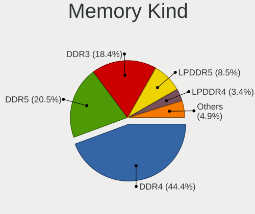

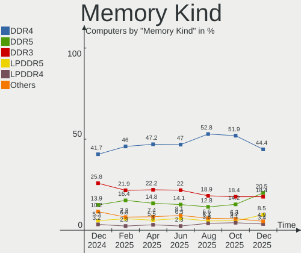

| Kind    | Computers | Percent |
|---------|-----------|---------|
| DDR4    | 338       | 44.36%  |
| DDR5    | 156       | 20.47%  |
| DDR3    | 140       | 18.37%  |
| LPDDR5  | 65        | 8.53%   |
| LPDDR4  | 26        | 3.41%   |
| LPDDR3  | 18        | 2.36%   |
| Unknown | 7         | 0.92%   |
| SDRAM   | 6         | 0.79%   |
| DDR2    | 4         | 0.52%   |
| DRAM    | 1         | 0.13%   |
| DDR     | 1         | 0.13%   |

Memory Form Factor
------------------

Physical design of the memory module

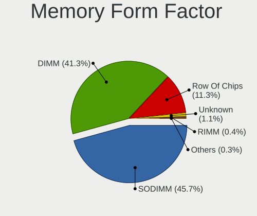

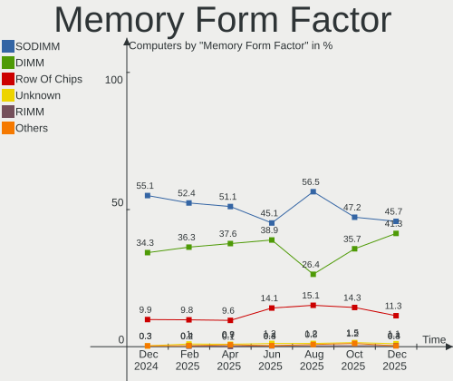

| Name         | Computers | Percent |
|--------------|-----------|---------|
| SODIMM       | 348       | 45.73%  |
| DIMM         | 314       | 41.26%  |
| Row Of Chips | 86        | 11.3%   |
| Unknown      | 8         | 1.05%   |
| RIMM         | 3         | 0.39%   |
| Chip         | 2         | 0.26%   |

Memory Size
-----------

Memory module size

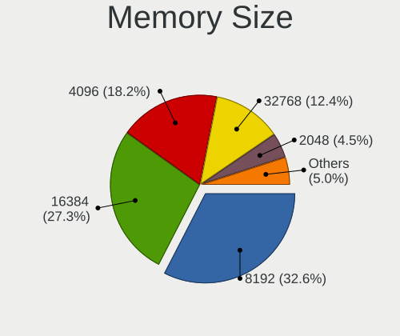

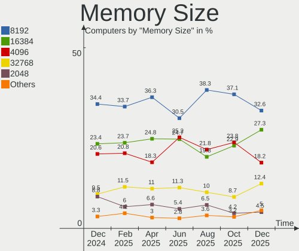

| Size  | Computers | Percent |
|-------|-----------|---------|
| 8192  | 267       | 32.56%  |
| 16384 | 224       | 27.32%  |
| 4096  | 149       | 18.17%  |
| 32768 | 102       | 12.44%  |
| 2048  | 37        | 4.51%   |
| 65536 | 13        | 1.59%   |
| 49152 | 13        | 1.59%   |
| 1024  | 8         | 0.98%   |
| 24576 | 4         | 0.49%   |
| 6144  | 1         | 0.12%   |
| 3072  | 1         | 0.12%   |
| 512   | 1         | 0.12%   |

Memory Speed
------------

Memory module speed

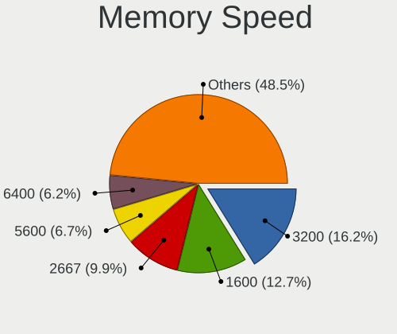

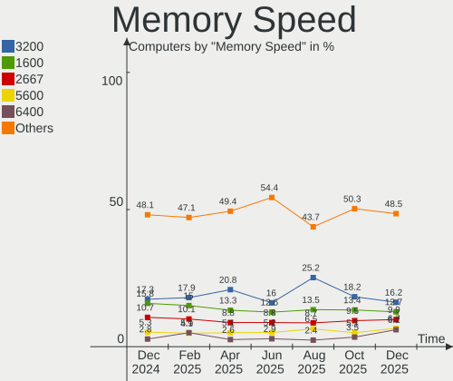

| Speed   | Computers | Percent |
|---------|-----------|---------|
| 3200    | 131       | 16.15%  |
| 1600    | 103       | 12.7%   |
| 2667    | 80        | 9.86%   |
| 5600    | 54        | 6.66%   |
| 6400    | 50        | 6.17%   |
| 3600    | 47        | 5.8%    |
| 2400    | 40        | 4.93%   |
| 6000    | 30        | 3.7%    |
| 4800    | 28        | 3.45%   |
| 2133    | 28        | 3.45%   |
| 7500    | 23        | 2.84%   |
| 1333    | 18        | 2.22%   |
| 8533    | 13        | 1.6%    |
| 4267    | 13        | 1.6%    |
| 1867    | 12        | 1.48%   |
| 3733    | 11        | 1.36%   |
| 1334    | 9         | 1.11%   |
| 5200    | 7         | 0.86%   |
| 4000    | 7         | 0.86%   |
| 3866    | 7         | 0.86%   |
| 3400    | 7         | 0.86%   |
| 1866    | 7         | 0.86%   |
| 3800    | 6         | 0.74%   |
| 4266    | 5         | 0.62%   |
| 3266    | 5         | 0.62%   |
| 2666    | 5         | 0.62%   |
| 1800    | 5         | 0.62%   |
| 3000    | 4         | 0.49%   |
| 1067    | 4         | 0.49%   |
| Unknown | 4         | 0.49%   |
| 8400    | 3         | 0.37%   |
| 7467    | 3         | 0.37%   |
| 6200    | 3         | 0.37%   |
| 2933    | 3         | 0.37%   |
| 667     | 3         | 0.37%   |
| 12800   | 2         | 0.25%   |
| 8000    | 2         | 0.25%   |
| 7200    | 2         | 0.25%   |
| 6800    | 2         | 0.25%   |
| 4199    | 2         | 0.25%   |

Printers & scanners
-------------------

Printer Vendor
--------------

Printer device vendors

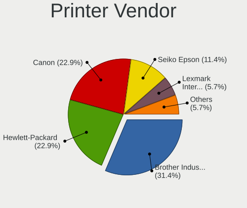

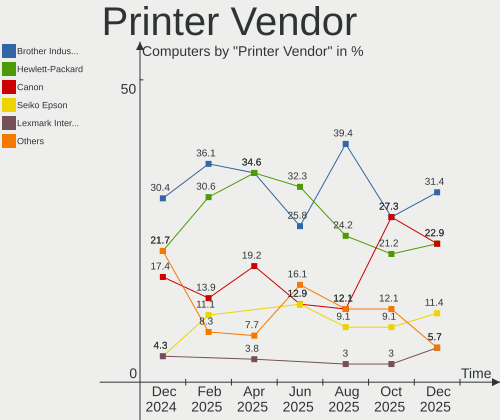

| Vendor                   | Computers | Percent |
|--------------------------|-----------|---------|
| Brother Industries       | 11        | 31.43%  |
| Hewlett-Packard          | 8         | 22.86%  |
| Canon                    | 8         | 22.86%  |
| Seiko Epson              | 4         | 11.43%  |
| Lexmark International    | 2         | 5.71%   |
| Zhuhai Poskey Technology | 1         | 2.86%   |
| Pantum                   | 1         | 2.86%   |

Printer Model
-------------

Printer device models

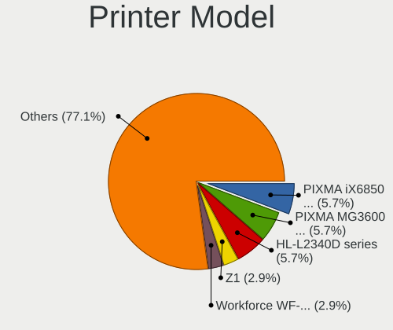

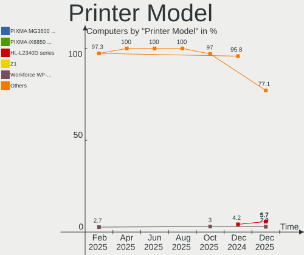

| Model                                                      | Computers | Percent |
|------------------------------------------------------------|-----------|---------|
| Canon PIXMA MG3600 Series                                  | 2         | 5.71%   |
| Canon PIXMA iX6850 Printer                                 | 2         | 5.71%   |
| Brother HL-L2340D series                                   | 2         | 5.71%   |
| Zhuhai Poskey Z1                                           | 1         | 2.86%   |
| Seiko Epson Workforce WF-7820/7840 Series                  | 1         | 2.86%   |
| Seiko Epson Printer                                        | 1         | 2.86%   |
| Seiko Epson ET-4750 [WorkForce ET-4750 EcoTank All-in-One] | 1         | 2.86%   |
| Seiko Epson ET-2800 Series                                 | 1         | 2.86%   |
| Pantum P2500W-series                                       | 1         | 2.86%   |
| Lexmark International Lexmark CX331adwe                    | 1         | 2.86%   |
| Lexmark International Lexmark CS510de                      | 1         | 2.86%   |
| HP LaserJet Pro 4001                                       | 1         | 2.86%   |
| HP LaserJet P2035                                          | 1         | 2.86%   |
| HP LaserJet P1006                                          | 1         | 2.86%   |
| HP LaserJet M109-M112                                      | 1         | 2.86%   |
| HP LaserJet 400 M401dne                                    | 1         | 2.86%   |
| HP LaserJet 1320                                           | 1         | 2.86%   |
| HP LaserJet 1200                                           | 1         | 2.86%   |
| HP DeskJet 2700 series                                     | 1         | 2.86%   |
| Canon TS3700 series                                        | 1         | 2.86%   |
| Canon TR8600 series                                        | 1         | 2.86%   |
| Canon MF741C/743C                                          | 1         | 2.86%   |
| Canon LiDE 400                                             | 1         | 2.86%   |
| Brother PT-1500PC                                          | 1         | 2.86%   |
| Brother MFC-L3770CDW                                       | 1         | 2.86%   |
| Brother MFC-L2690DW                                        | 1         | 2.86%   |
| Brother MFC-J491DW                                         | 1         | 2.86%   |
| Brother MFC-7340                                           | 1         | 2.86%   |
| Brother HL-L3280CDW series                                 | 1         | 2.86%   |
| Brother HL-3140CW series                                   | 1         | 2.86%   |
| Brother HL-2240D series                                    | 1         | 2.86%   |
| Brother DCP-7065DN                                         | 1         | 2.86%   |

Scanner Vendor
--------------

Scanner device vendors

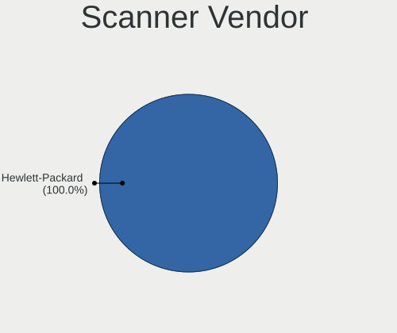

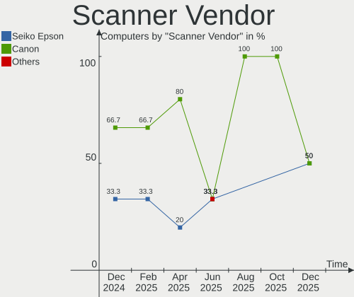

| Vendor      | Computers | Percent |
|-------------|-----------|---------|
| Seiko Epson | 1         | 50%     |
| Canon       | 1         | 50%     |

Scanner Model
-------------

Scanner device models

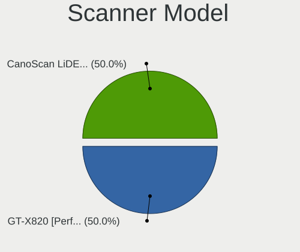

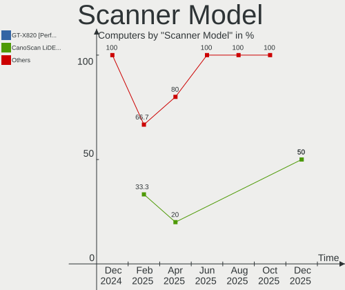

| Model                                       | Computers | Percent |
|---------------------------------------------|-----------|---------|
| Seiko Epson GT-X820 [Perfection V600 Photo] | 1         | 50%     |
| Canon CanoScan LiDE 220                     | 1         | 50%     |

Camera
------

Camera Vendor
-------------

Camera device vendors

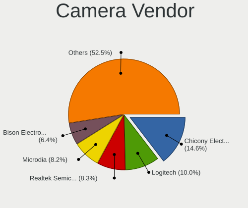

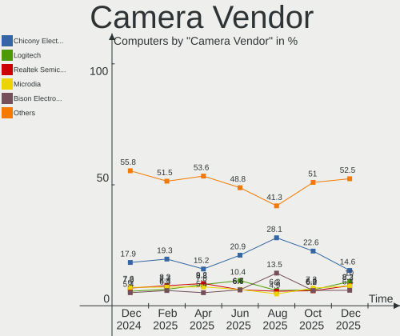

| Vendor                                 | Computers | Percent |
|----------------------------------------|-----------|---------|
| Chicony Electronics                    | 125       | 14.59%  |
| Logitech                               | 86        | 10.04%  |
| Realtek Semiconductor                  | 71        | 8.28%   |
| Microdia                               | 70        | 8.17%   |
| Bison Electronics                      | 55        | 6.42%   |
| Quanta                                 | 51        | 5.95%   |
| Apple                                  | 51        | 5.95%   |
| IMC Networks                           | 48        | 5.6%    |
| Sunplus Innovation Technology          | 45        | 5.25%   |
| Luxvisions Innotech Limited            | 42        | 4.9%    |
| Syntek                                 | 23        | 2.68%   |
| Suyin                                  | 16        | 1.87%   |
| Cheng Uei Precision Industry (Foxlink) | 15        | 1.75%   |
| Shinetech                              | 11        | 1.28%   |
| Razer USA                              | 11        | 1.28%   |
| Sonix Technology                       | 10        | 1.17%   |
| Samsung Electronics                    | 8         | 0.93%   |
| Lite-On Technology                     | 8         | 0.93%   |
| Framework                              | 8         | 0.93%   |
| Microsoft                              | 7         | 0.82%   |
| Valve Software                         | 6         | 0.7%    |
| eMeet                                  | 6         | 0.7%    |
| webcam                                 | 5         | 0.58%   |
| Elgato Systems                         | 5         | 0.58%   |
| webcamvendor                           | 4         | 0.47%   |
| Unknown                                | 4         | 0.47%   |
| Tobii Technology AB                    | 3         | 0.35%   |
| Silicon Motion                         | 3         | 0.35%   |
| Ruision                                | 3         | 0.35%   |
| kingcome                               | 3         | 0.35%   |
| icSpring                               | 3         | 0.35%   |
| Alcor Micro                            | 3         | 0.35%   |
| Z-Star Microelectronics                | 2         | 0.23%   |
| SunplusIT                              | 2         | 0.23%   |
| Ricoh                                  | 2         | 0.23%   |
| Remo Tech                              | 2         | 0.23%   |
| Primax Electronics                     | 2         | 0.23%   |
| MacroSilicon                           | 2         | 0.23%   |
| Insta360                               | 2         | 0.23%   |
| Generalplus Technology                 | 2         | 0.23%   |

Camera Model
------------

Camera device models

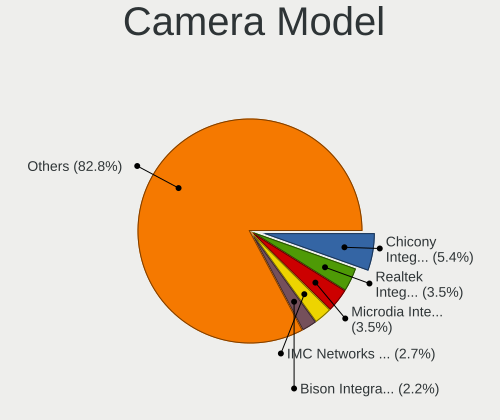

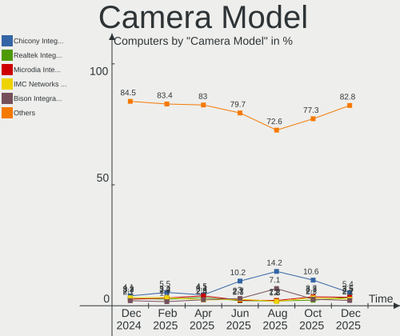

| Model                                               | Computers | Percent |
|-----------------------------------------------------|-----------|---------|
| Chicony Integrated Camera                           | 47        | 5.43%   |
| Realtek Integrated_Webcam_HD                        | 30        | 3.47%   |
| Microdia Integrated_Webcam_HD                       | 30        | 3.47%   |
| IMC Networks USB2.0 HD UVC WebCam                   | 23        | 2.66%   |
| Bison Integrated Camera                             | 19        | 2.2%    |
| Luxvisions Innotech Limited Integrated Camera       | 18        | 2.08%   |
| Syntek Integrated Camera                            | 17        | 1.97%   |
| IMC Networks Integrated Camera                      | 16        | 1.85%   |
| Apple FaceTime HD Camera (Built-in)                 | 16        | 1.85%   |
| Logitech HD Pro Webcam C920                         | 14        | 1.62%   |
| Sunplus Integrated_Webcam_HD                        | 12        | 1.39%   |
| Realtek Integrated_Webcam_FHD                       | 11        | 1.27%   |
| Apple iPhone 5/5C/5S/6/SE/7/8/X                     | 11        | 1.27%   |
| Logitech Webcam C270                                | 10        | 1.16%   |
| Logitech BRIO Ultra HD Webcam                       | 10        | 1.16%   |
| Apple FaceTime HD Camera                            | 10        | 1.16%   |
| Apple Built-in iSight                               | 10        | 1.16%   |
| Logitech C922 Pro Stream Webcam                     | 9         | 1.04%   |
| Samsung Galaxy series, misc. (MTP mode)             | 8         | 0.92%   |
| Razer USA Gaming Webcam [Kiyo]                      | 8         | 0.92%   |
| Framework Laptop Webcam Module (2nd Gen)            | 8         | 0.92%   |
| Quanta HP TrueVision HD Camera                      | 7         | 0.81%   |
| Quanta HP HD Camera                                 | 7         | 0.81%   |
| Microdia Webcam Vitade AF                           | 7         | 0.81%   |
| Chicony TOSHIBA Web Camera - HD                     | 7         | 0.81%   |
| Bison Integrated RGB Camera                         | 7         | 0.81%   |
| Valve Software 3D Camera                            | 6         | 0.69%   |
| Suyin HP Truevision HD                              | 6         | 0.69%   |
| Bison FHD Camera                                    | 6         | 0.69%   |
| webcam webcam                                       | 5         | 0.58%   |
| Sunplus Integrated_Webcam_FHD                       | 5         | 0.58%   |
| Sonix USB2.0 HD UVC WebCam                          | 5         | 0.58%   |
| Quanta HP Wide Vision HD Camera                     | 5         | 0.58%   |
| Quanta HD User Facing                               | 5         | 0.58%   |
| Quanta Acer FHD User Facing                         | 5         | 0.58%   |
| Microdia USB 2.0 Camera                             | 5         | 0.58%   |
| Luxvisions Innotech Limited HP TrueVision HD Camera | 5         | 0.58%   |
| Logitech HD Webcam C910                             | 5         | 0.58%   |
| Logitech HD Webcam C615                             | 5         | 0.58%   |
| Logitech HD Webcam C525                             | 5         | 0.58%   |

Security
--------

Fingerprint Vendor
------------------

Fingerprint sensor vendors

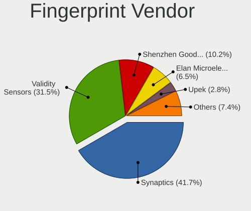

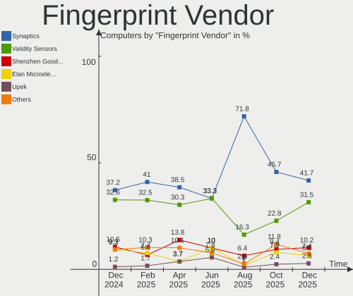

| Vendor                     | Computers | Percent |
|----------------------------|-----------|---------|
| Synaptics                  | 45        | 41.67%  |
| Validity Sensors           | 34        | 31.48%  |
| Shenzhen Goodix Technology | 11        | 10.19%  |
| Elan Microelectronics      | 7         | 6.48%   |
| Upek                       | 3         | 2.78%   |
| LighTuning Technology      | 3         | 2.78%   |
| Focal-systems.Corp         | 2         | 1.85%   |
| AuthenTec                  | 2         | 1.85%   |
| DigitalPersona             | 1         | 0.93%   |

Fingerprint Model
-----------------

Fingerprint sensor models

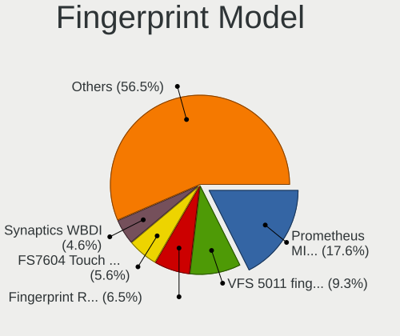

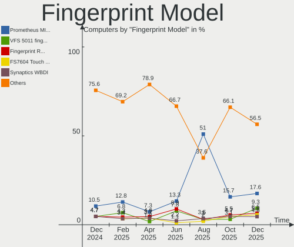

| Model                                                                      | Computers | Percent |
|----------------------------------------------------------------------------|-----------|---------|
| Synaptics Prometheus MIS Touch Fingerprint Reader                          | 19        | 17.59%  |
| Validity Sensors VFS 5011 fingerprint sensor                               | 10        | 9.26%   |
| Shenzhen Goodix Fingerprint Reader                                         | 7         | 6.48%   |
| Synaptics FS7604 Touch Fingerprint Sensor with PurePrint                   | 6         | 5.56%   |
| Validity Sensors Synaptics WBDI                                            | 5         | 4.63%   |
| Synaptics UWP WBDI Device                                                  | 5         | 4.63%   |
| Synaptics Prometheus Fingerprint Reader                                    | 5         | 4.63%   |
| Validity Sensors VFS495 Fingerprint Reader                                 | 4         | 3.7%    |
| Validity Sensors Swipe Fingerprint Sensor                                  | 4         | 3.7%    |
| Elan ELAN:Fingerprint                                                      | 4         | 3.7%    |
| Validity Sensors VFS491                                                    | 3         | 2.78%   |
| Upek Biometric Touchchip/Touchstrip Fingerprint Sensor                     | 3         | 2.78%   |
| Synaptics Metallica MIS Touch Fingerprint Reader                           | 3         | 2.78%   |
| Shenzhen Goodix  FingerPrint Device                                        | 3         | 2.78%   |
| Elan ELAN:ARM-M4                                                           | 3         | 2.78%   |
| Validity Sensors VFS7552 Touch Fingerprint Sensor                          | 2         | 1.85%   |
| Validity Sensors VFS7500 Touch Fingerprint Sensor                          | 2         | 1.85%   |
| Validity Sensors Fingerprint scanner                                       | 2         | 1.85%   |
| Synaptics WBDI                                                             | 2         | 1.85%   |
| Synaptics  WBDI                                                            | 2         | 1.85%   |
| Synaptics Fingerprint reader [HP G6]                                       | 2         | 1.85%   |
| LighTuning Fingerprint Sensor                                              | 2         | 1.85%   |
| Focal-systems.Corp FT9201Fingerprint.                                      | 2         | 1.85%   |
| AuthenTec Fingerprint Sensor                                               | 2         | 1.85%   |
| Validity Sensors VFS471 Fingerprint Reader                                 | 1         | 0.93%   |
| Validity Sensors Synaptics VFS7552 Touch Fingerprint Sensor with PurePrint | 1         | 0.93%   |
| Synaptics  FS7604 Touch Fingerprint Sensor with PurePrint                  | 1         | 0.93%   |
| Shenzhen Goodix FingerPrint                                                | 1         | 0.93%   |
| LighTuning EgisTec Touch Fingerprint Sensor                                | 1         | 0.93%   |
| DigitalPersona Fingerprint Reader                                          | 1         | 0.93%   |

Chipcard Vendor
---------------

Chipcard module vendors

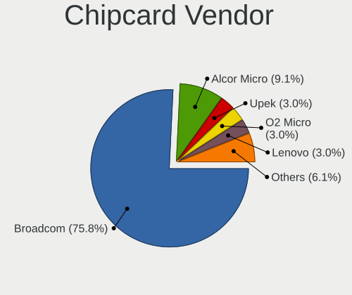

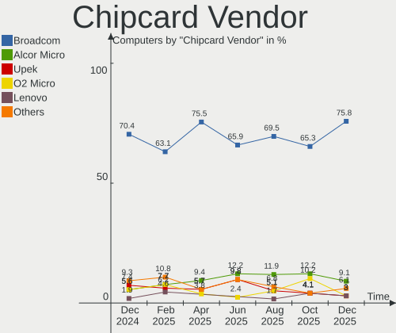

| Vendor                | Computers | Percent |
|-----------------------|-----------|---------|
| Broadcom              | 25        | 75.76%  |
| Alcor Micro           | 3         | 9.09%   |
| Upek                  | 1         | 3.03%   |
| O2 Micro              | 1         | 3.03%   |
| Lenovo                | 1         | 3.03%   |
| Gemalto (was Gemplus) | 1         | 3.03%   |
| Advanced Card Systems | 1         | 3.03%   |

Chipcard Model
--------------

Chipcard module models

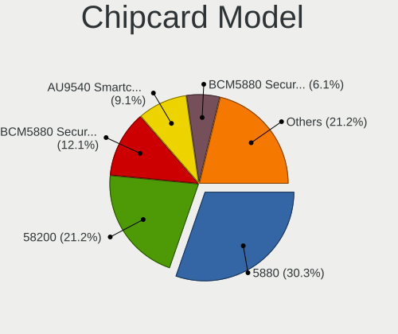

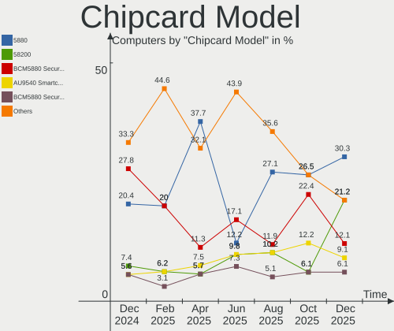

| Model                                                                        | Computers | Percent |
|------------------------------------------------------------------------------|-----------|---------|
| Broadcom 5880                                                                | 10        | 30.3%   |
| Broadcom 58200                                                               | 7         | 21.21%  |
| Broadcom BCM5880 Secure Applications Processor                               | 4         | 12.12%  |
| Alcor Micro AU9540 Smartcard Reader                                          | 3         | 9.09%   |
| Broadcom BCM5880 Secure Applications Processor with fingerprint swipe sensor | 2         | 6.06%   |
| Broadcom BCM58200 ControlVault 3 (FingerPrint sensor + Contacted SmartCard)  | 2         | 6.06%   |
| Upek TouchChip Fingerprint Coprocessor (WBF advanced mode)                   | 1         | 3.03%   |
| O2 Micro OZ776 CCID Smartcard Reader                                         | 1         | 3.03%   |
| Lenovo Integrated Smart Card Reader                                          | 1         | 3.03%   |
| Gemalto (was Gemplus) GemPC Twin SmartCard Reader                            | 1         | 3.03%   |
| Advanced Card Systems ACR39U                                                 | 1         | 3.03%   |

Unsupported
-----------

Unsupported Devices
-------------------

Total unsupported devices on board

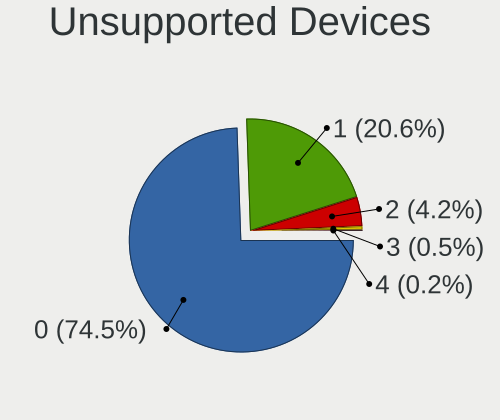

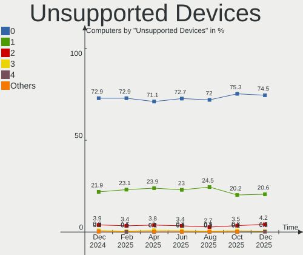

| Total | Computers | Percent |
|-------|-----------|---------|
| 0     | 1198      | 74.46%  |
| 1     | 332       | 20.63%  |
| 2     | 68        | 4.23%   |
| 3     | 8         | 0.5%    |
| 4     | 3         | 0.19%   |

Unsupported Device Types
------------------------

Types of unsupported devices

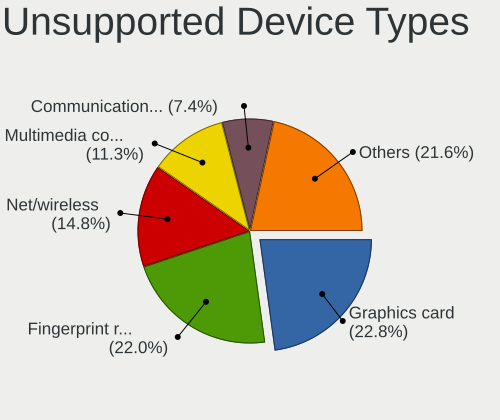

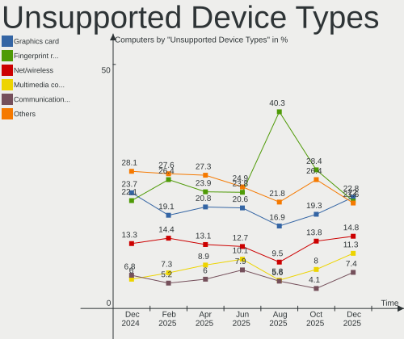

| Type                     | Computers | Percent |
|--------------------------|-----------|---------|
| Graphics card            | 111       | 22.84%  |
| Fingerprint reader       | 107       | 22.02%  |
| Net/wireless             | 72        | 14.81%  |
| Multimedia controller    | 55        | 11.32%  |
| Communication controller | 36        | 7.41%   |
| Chipcard                 | 29        | 5.97%   |
| Unassigned class         | 16        | 3.29%   |
| Sound                    | 11        | 2.26%   |
| Camera                   | 11        | 2.26%   |
| Network                  | 10        | 2.06%   |
| Bluetooth                | 10        | 2.06%   |
| Storage                  | 5         | 1.03%   |
| Net/ethernet             | 5         | 1.03%   |
| Card reader              | 3         | 0.62%   |
| Storage/raid             | 2         | 0.41%   |
| Storage/ata              | 2         | 0.41%   |
| Modem                    | 1         | 0.21%   |

