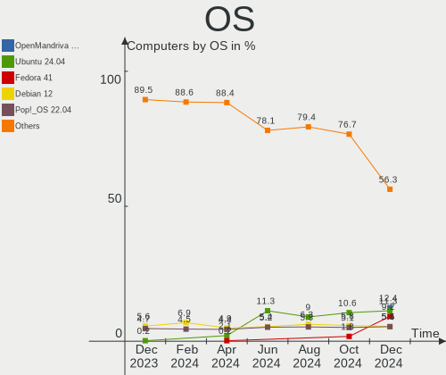
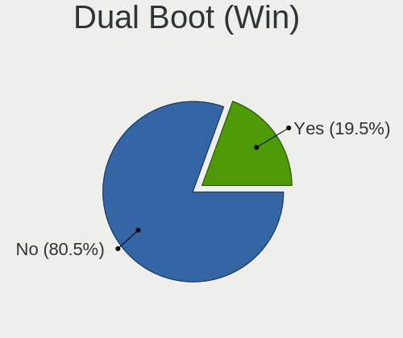
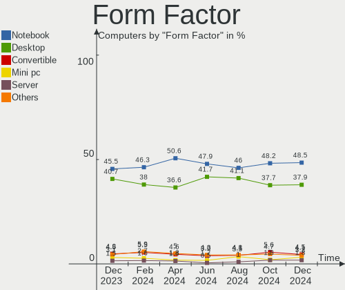
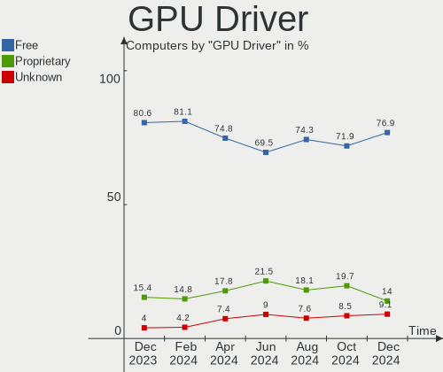

Linux in USA - Hardware Trends
------------------------------

A project to identify most popular hardware characteristics and track their change
over time based on data collected by Linux users at https://Linux-Hardware.org.

Anyone can contribute to this report by the [hw-probe](https://github.com/linuxhw/hw-probe) tool:

    sudo -E hw-probe -all -upload

This is a report for all computer types. See also reports for [desktops](/Location/USA/Desktop/README.md) and [notebooks](/Location/USA/Notebook/README.md).

Period: Feb, 2023.

Contents
--------

* [ System ](#system)
  - [ OS                       ](#os)
  - [ OS Family                ](#os-family)
  - [ Kernel                   ](#kernel)
  - [ Kernel Family            ](#kernel-family)
  - [ Kernel Major Ver.        ](#kernel-major-ver)
  - [ Arch                     ](#arch)
  - [ DE                       ](#de)
  - [ Display Server           ](#display-server)
  - [ Display Manager          ](#display-manager)
  - [ OS Lang                  ](#os-lang)
  - [ Boot Mode                ](#boot-mode)
  - [ Filesystem               ](#filesystem)
  - [ Part. scheme             ](#part-scheme)
  - [ Dual Boot with Linux/BSD ](#dual-boot-with-linuxbsd)
  - [ Dual Boot (Win)          ](#dual-boot-win)

* [ Board ](#board)
  - [ Vendor                   ](#vendor)
  - [ Model                    ](#model)
  - [ Model Family             ](#model-family)
  - [ MFG Year                 ](#mfg-year)
  - [ Form Factor              ](#form-factor)
  - [ Secure Boot              ](#secure-boot)
  - [ Coreboot                 ](#coreboot)
  - [ RAM Size                 ](#ram-size)
  - [ RAM Used                 ](#ram-used)
  - [ Total Drives             ](#total-drives)
  - [ Has CD-ROM               ](#has-cd-rom)
  - [ Has Ethernet             ](#has-ethernet)
  - [ Has WiFi                 ](#has-wifi)
  - [ Has Bluetooth            ](#has-bluetooth)

* [ Location ](#location)
  - [ Country                  ](#country)
  - [ City                     ](#city)

* [ Drives ](#drives)
  - [ Drive Vendor             ](#drive-vendor)
  - [ Drive Model              ](#drive-model)
  - [ HDD Vendor               ](#hdd-vendor)
  - [ SSD Vendor               ](#ssd-vendor)
  - [ Drive Kind               ](#drive-kind)
  - [ Drive Connector          ](#drive-connector)
  - [ Drive Size               ](#drive-size)
  - [ Space Total              ](#space-total)
  - [ Space Used               ](#space-used)
  - [ Malfunc. Drives          ](#malfunc-drives)
  - [ Malfunc. Drive Vendor    ](#malfunc-drive-vendor)
  - [ Malfunc. HDD Vendor      ](#malfunc-hdd-vendor)
  - [ Malfunc. Drive Kind      ](#malfunc-drive-kind)
  - [ Failed Drives            ](#failed-drives)
  - [ Failed Drive Vendor      ](#failed-drive-vendor)
  - [ Drive Status             ](#drive-status)

* [ Storage controller ](#storage-controller)
  - [ Storage Vendor           ](#storage-vendor)
  - [ Storage Model            ](#storage-model)
  - [ Storage Kind             ](#storage-kind)

* [ Processor ](#processor)
  - [ CPU Vendor               ](#cpu-vendor)
  - [ CPU Model                ](#cpu-model)
  - [ CPU Model Family         ](#cpu-model-family)
  - [ CPU Cores                ](#cpu-cores)
  - [ CPU Sockets              ](#cpu-sockets)
  - [ CPU Threads              ](#cpu-threads)
  - [ CPU Op-Modes             ](#cpu-op-modes)
  - [ CPU Microcode            ](#cpu-microcode)
  - [ CPU Microarch            ](#cpu-microarch)

* [ Graphics ](#graphics)
  - [ GPU Vendor               ](#gpu-vendor)
  - [ GPU Model                ](#gpu-model)
  - [ GPU Combo                ](#gpu-combo)
  - [ GPU Driver               ](#gpu-driver)
  - [ GPU Memory               ](#gpu-memory)

* [ Monitor ](#monitor)
  - [ Monitor Vendor           ](#monitor-vendor)
  - [ Monitor Model            ](#monitor-model)
  - [ Monitor Resolution       ](#monitor-resolution)
  - [ Monitor Diagonal         ](#monitor-diagonal)
  - [ Monitor Width            ](#monitor-width)
  - [ Aspect Ratio             ](#aspect-ratio)
  - [ Monitor Area             ](#monitor-area)
  - [ Pixel Density            ](#pixel-density)
  - [ Multiple Monitors        ](#multiple-monitors)

* [ Network ](#network)
  - [ Net Controller Vendor    ](#net-controller-vendor)
  - [ Net Controller Model     ](#net-controller-model)
  - [ Wireless Vendor          ](#wireless-vendor)
  - [ Wireless Model           ](#wireless-model)
  - [ Ethernet Vendor          ](#ethernet-vendor)
  - [ Ethernet Model           ](#ethernet-model)
  - [ Net Controller Kind      ](#net-controller-kind)
  - [ Used Controller          ](#used-controller)
  - [ NICs                     ](#nics)
  - [ IPv6                     ](#ipv6)

* [ Bluetooth ](#bluetooth)
  - [ Bluetooth Vendor         ](#bluetooth-vendor)
  - [ Bluetooth Model          ](#bluetooth-model)

* [ Sound ](#sound)
  - [ Sound Vendor             ](#sound-vendor)
  - [ Sound Model              ](#sound-model)

* [ Memory ](#memory)
  - [ Memory Vendor            ](#memory-vendor)
  - [ Memory Model             ](#memory-model)
  - [ Memory Kind              ](#memory-kind)
  - [ Memory Form Factor       ](#memory-form-factor)
  - [ Memory Size              ](#memory-size)
  - [ Memory Speed             ](#memory-speed)

* [ Printers & scanners ](#printers--scanners)
  - [ Printer Vendor           ](#printer-vendor)
  - [ Printer Model            ](#printer-model)
  - [ Scanner Vendor           ](#scanner-vendor)
  - [ Scanner Model            ](#scanner-model)

* [ Camera ](#camera)
  - [ Camera Vendor            ](#camera-vendor)
  - [ Camera Model             ](#camera-model)

* [ Security ](#security)
  - [ Fingerprint Vendor       ](#fingerprint-vendor)
  - [ Fingerprint Model        ](#fingerprint-model)
  - [ Chipcard Vendor          ](#chipcard-vendor)
  - [ Chipcard Model           ](#chipcard-model)

* [ Unsupported ](#unsupported)
  - [ Unsupported Devices      ](#unsupported-devices)
  - [ Unsupported Device Types ](#unsupported-device-types)

System
------

OS
--

Installed operating systems

| Name                         | Computers | Percent |
|------------------------------|-----------|---------|
| Ubuntu 22.04                 | 194       | 18.48%  |
| Pop!_OS 22.04                | 83        | 7.9%    |
| Fedora 37                    | 67        | 6.38%   |
| Linux Mint 21.1              | 63        | 6%      |
| Ubuntu 22.10                 | 55        | 5.24%   |
| Debian 11                    | 55        | 5.24%   |
| OpenMandriva 23.01           | 49        | 4.67%   |
| Zorin 16                     | 44        | 4.19%   |
| Arch Rolling                 | 39        | 3.71%   |
| SteamOS 3.4.4                | 25        | 2.38%   |
| Ubuntu 20.04                 | 23        | 2.19%   |
| KDE neon 22.04               | 23        | 2.19%   |
| Kubuntu 22.10                | 18        | 1.71%   |
| Manjaro                      | 17        | 1.62%   |
| Linux Mint 20.3              | 17        | 1.62%   |
| Nobara 37                    | 15        | 1.43%   |
| OpenMandriva 4.3             | 13        | 1.24%   |
| Kubuntu 22.04                | 13        | 1.24%   |
| Linux Mint 21                | 11        | 1.05%   |
| ArcoLinux Rolling            | 10        | 0.95%   |
| MX 21                        | 9         | 0.86%   |
| EndeavourOS Rolling          | 9         | 0.86%   |
| openSUSE Tumbleweed-XXXXXXXX | 8         | 0.76%   |
| Elementary 7                 | 7         | 0.67%   |
| SteamOS 3.4                  | 6         | 0.57%   |
| Manjaro 22.0.3               | 6         | 0.57%   |
| Lubuntu 22.04                | 6         | 0.57%   |
| LMDE 5                       | 6         | 0.57%   |
| Gentoo 2.13                  | 6         | 0.57%   |
| Fedora 36                    | 6         | 0.57%   |
| Debian                       | 6         | 0.57%   |
| Kali 2022.4                  | 5         | 0.48%   |
| Ubuntu 18.04                 | 4         | 0.38%   |
| Rocky Linux 9.1              | 4         | 0.38%   |
| Parrot 5.2                   | 4         | 0.38%   |
| Parrot 5.1                   | 4         | 0.38%   |
| Manjaro 22.0.2               | 4         | 0.38%   |
| Ubuntu MATE 22.04            | 3         | 0.29%   |
| SteamOS                      | 3         | 0.29%   |
| OpenMandriva 23.90           | 3         | 0.29%   |

OS Family
---------

OS without a version

| Name         | Computers | Percent |
|--------------|-----------|---------|
| Ubuntu       | 281       | 26.76%  |
| Linux Mint   | 93        | 8.86%   |
| Pop!_OS      | 83        | 7.9%    |
| Fedora       | 74        | 7.05%   |
| OpenMandriva | 68        | 6.48%   |
| Debian       | 62        | 5.9%    |
| Zorin        | 46        | 4.38%   |
| Arch         | 39        | 3.71%   |
| SteamOS      | 36        | 3.43%   |
| Kubuntu      | 35        | 3.33%   |
| Manjaro      | 30        | 2.86%   |
| KDE neon     | 23        | 2.19%   |
| Nobara       | 17        | 1.62%   |
| ArcoLinux    | 12        | 1.14%   |
| openSUSE     | 11        | 1.05%   |
| Lubuntu      | 11        | 1.05%   |
| Parrot       | 9         | 0.86%   |
| MX           | 9         | 0.86%   |
| Gentoo       | 9         | 0.86%   |
| EndeavourOS  | 9         | 0.86%   |
| Elementary   | 9         | 0.86%   |
| Xubuntu      | 6         | 0.57%   |
| LMDE         | 6         | 0.57%   |
| Kali         | 6         | 0.57%   |
| Rocky Linux  | 5         | 0.48%   |
| Ubuntu MATE  | 4         | 0.38%   |
| Endless      | 4         | 0.38%   |
| Ubuntu Unity | 3         | 0.29%   |
| Kaisen       | 3         | 0.29%   |
| Garuda Linux | 3         | 0.29%   |
| Void Linux   | 2         | 0.19%   |
| TUXEDO OS    | 2         | 0.19%   |
| Raspbian     | 2         | 0.19%   |
| Q4OS         | 2         | 0.19%   |
| NixOS        | 2         | 0.19%   |
| Devuan       | 2         | 0.19%   |
| ChimeraOS    | 2         | 0.19%   |
| BunsenLabs   | 2         | 0.19%   |
| BlackArch    | 2         | 0.19%   |
| Athena       | 2         | 0.19%   |

Kernel
------

Version of the Linux kernel

| Version                      | Computers | Percent |
|------------------------------|-----------|---------|
| 5.15.0-60-generic            | 132       | 12.57%  |
| 5.15.0-58-generic            | 111       | 10.57%  |
| 5.19.0-32-generic            | 81        | 7.71%   |
| 6.0.12-76060006-generic      | 63        | 6%      |
| 5.19.0-31-generic            | 48        | 4.57%   |
| 6.1.1-desktop-1omv2290       | 39        | 3.71%   |
| 5.10.0-21-amd64              | 33        | 3.14%   |
| 5.13.0-valve36-1-neptune     | 26        | 2.48%   |
| 6.1.11-200.fc37.x86_64       | 16        | 1.52%   |
| 6.1.11-76060111-generic      | 14        | 1.33%   |
| 5.19.0-29-generic            | 14        | 1.33%   |
| 5.15.0-43-generic            | 14        | 1.33%   |
| 5.15.0-56-generic            | 13        | 1.24%   |
| 6.1.9-200.fc37.x86_64        | 12        | 1.14%   |
| 6.1.11-arch1-1               | 12        | 1.14%   |
| 6.1.12-arch1-1               | 11        | 1.05%   |
| 5.4.0-139-generic            | 11        | 1.05%   |
| 5.16.13-desktop-1omv4003     | 10        | 0.95%   |
| 5.10.0-20-amd64              | 10        | 0.95%   |
| 6.1.8-200.fc37.x86_64        | 9         | 0.86%   |
| 5.19.0-35-generic            | 9         | 0.86%   |
| 6.1.13-200.fc37.x86_64       | 8         | 0.76%   |
| 6.1.11-1-MANJARO             | 8         | 0.76%   |
| 6.1.10-200.fc37.x86_64       | 8         | 0.76%   |
| 5.4.0-137-generic            | 8         | 0.76%   |
| 6.1.7-1-MANJARO              | 7         | 0.67%   |
| 6.1.4-desktop-1omv2301       | 7         | 0.67%   |
| 6.1.9-200.fsync.fc37.x86_64  | 6         | 0.57%   |
| 6.0.0-12parrot1-amd64        | 6         | 0.57%   |
| 6.0.0-0.deb11.6-amd64        | 6         | 0.57%   |
| 5.13.0-valve21.3-1-neptune   | 6         | 0.57%   |
| 6.1.11-201.fsync.fc37.x86_64 | 5         | 0.48%   |
| 6.0.0-kali6-amd64            | 5         | 0.48%   |
| 6.2.1-desktop-1omv2390       | 4         | 0.38%   |
| 6.1.9-arch1-1                | 4         | 0.38%   |
| 6.1.9-1-MANJARO              | 4         | 0.38%   |
| 6.1.12-zen1-1-zen            | 4         | 0.38%   |
| 6.1.12-1-default             | 4         | 0.38%   |
| 6.1.1-arch1-1                | 4         | 0.38%   |
| 6.0.7-301.fc37.x86_64        | 4         | 0.38%   |

Kernel Family
-------------

Linux kernel without a distro release

| Version | Computers | Percent |
|---------|-----------|---------|
| 5.15.0  | 302       | 28.76%  |
| 5.19.0  | 160       | 15.24%  |
| 6.0.12  | 64        | 6.1%    |
| 6.1.11  | 63        | 6%      |
| 5.10.0  | 48        | 4.57%   |
| 6.1.9   | 44        | 4.19%   |
| 6.1.1   | 44        | 4.19%   |
| 5.13.0  | 35        | 3.33%   |
| 6.0.0   | 32        | 3.05%   |
| 6.1.12  | 31        | 2.95%   |
| 5.4.0   | 30        | 2.86%   |
| 6.1.8   | 21        | 2%      |
| 6.1.10  | 18        | 1.71%   |
| 6.2.0   | 13        | 1.24%   |
| 6.1.7   | 11        | 1.05%   |
| 6.1.13  | 10        | 0.95%   |
| 6.1.0   | 10        | 0.95%   |
| 5.16.13 | 10        | 0.95%   |
| 6.1.4   | 9         | 0.86%   |
| 6.2.1   | 8         | 0.76%   |
| 5.14.0  | 6         | 0.57%   |
| 5.15.94 | 5         | 0.48%   |
| 4.15.0  | 5         | 0.48%   |
| 6.1.6   | 4         | 0.38%   |
| 6.0.7   | 4         | 0.38%   |
| 5.16.7  | 4         | 0.38%   |
| 5.15.93 | 4         | 0.38%   |
| 5.15.91 | 4         | 0.38%   |
| 4.18.0  | 4         | 0.38%   |
| 5.18.0  | 3         | 0.29%   |
| 5.15.84 | 3         | 0.29%   |
| 5.15.74 | 3         | 0.29%   |
| 5.14.21 | 3         | 0.29%   |
| 6.0.6   | 2         | 0.19%   |
| 6.0.14  | 2         | 0.19%   |
| 5.8.0   | 2         | 0.19%   |
| 5.18.12 | 2         | 0.19%   |
| 5.18.10 | 2         | 0.19%   |
| 5.15.89 | 2         | 0.19%   |
| 4.19.0  | 2         | 0.19%   |

Kernel Major Ver.
-----------------

Linux kernel major version

| Version | Computers | Percent |
|---------|-----------|---------|
| 5.15    | 330       | 31.43%  |
| 6.1     | 266       | 25.33%  |
| 5.19    | 163       | 15.52%  |
| 6.0     | 106       | 10.1%   |
| 5.10    | 50        | 4.76%   |
| 5.13    | 35        | 3.33%   |
| 5.4     | 30        | 2.86%   |
| 6.2     | 21        | 2%      |
| 5.16    | 15        | 1.43%   |
| 5.14    | 9         | 0.86%   |
| 5.18    | 8         | 0.76%   |
| 4.15    | 5         | 0.48%   |
| 4.18    | 4         | 0.38%   |
| 5.8     | 2         | 0.19%   |
| 4.19    | 2         | 0.19%   |
| 5.17    | 1         | 0.1%    |
| 5.11    | 1         | 0.1%    |
| 4.9     | 1         | 0.1%    |
| 4.4     | 1         | 0.1%    |

Arch
----

OS architecture (x86_64, i586, etc.)

| Name    | Computers | Percent |
|---------|-----------|---------|
| x86_64  | 1032      | 98.29%  |
| aarch64 | 8         | 0.76%   |
| i686    | 4         | 0.38%   |
| armv7l  | 3         | 0.29%   |
| riscv64 | 2         | 0.19%   |
| i586    | 1         | 0.1%    |

DE
--

Desktop Environment

| Name             | Computers | Percent |
|------------------|-----------|---------|
| GNOME            | 510       | 48.57%  |
| KDE5             | 252       | 24%     |
| X-Cinnamon       | 88        | 8.38%   |
| XFCE             | 61        | 5.81%   |
| Unknown          | 46        | 4.38%   |
| MATE             | 28        | 2.67%   |
| LXQt             | 11        | 1.05%   |
| Pantheon         | 9         | 0.86%   |
| Cinnamon         | 8         | 0.76%   |
| sway             | 5         | 0.48%   |
| i3               | 5         | 0.48%   |
| Deepin           | 5         | 0.48%   |
| GNOME Classic    | 4         | 0.38%   |
| Unity            | 3         | 0.29%   |
| Hyprland         | 3         | 0.29%   |
| awesome          | 2         | 0.19%   |
| xinitrc          | 1         | 0.1%    |
| X-Generic        | 1         | 0.1%    |
| none+i3          | 1         | 0.1%    |
| LXDE             | 1         | 0.1%    |
| lightdm-xsession | 1         | 0.1%    |
| LeftWM           | 1         | 0.1%    |
| KDE              | 1         | 0.1%    |
| GNOME Flashback  | 1         | 0.1%    |
| dot-xsession     | 1         | 0.1%    |
| BunsenLabs       | 1         | 0.1%    |

Display Server
--------------

X11 or Wayland

| Name    | Computers | Percent |
|---------|-----------|---------|
| X11     | 717       | 68.29%  |
| Wayland | 273       | 26%     |
| Tty     | 30        | 2.86%   |
| Unknown | 30        | 2.86%   |

Display Manager
---------------

SDDM, LightDM, etc.

| Name    | Computers | Percent |
|---------|-----------|---------|
| Unknown | 440       | 41.9%   |
| GDM3    | 258       | 24.57%  |
| SDDM    | 149       | 14.19%  |
| LightDM | 134       | 12.76%  |
| GDM     | 64        | 6.1%    |
| SLiM    | 2         | 0.19%   |
| GREETD  | 2         | 0.19%   |
| Ly      | 1         | 0.1%    |

OS Lang
-------

Language

| Lang        | Computers | Percent |
|-------------|-----------|---------|
| en_US       | 1002      | 95.43%  |
| Unknown     | 15        | 1.43%   |
| C           | 13        | 1.24%   |
| en_GB       | 5         | 0.48%   |
| en_CA       | 3         | 0.29%   |
| zh_CN       | 2         | 0.19%   |
| es_ES       | 2         | 0.19%   |
| pt_BR       | 1         | 0.1%    |
| POSIX       | 1         | 0.1%    |
| fr_FR       | 1         | 0.1%    |
| es_US       | 1         | 0.1%    |
| en_US.utf-8 | 1         | 0.1%    |
| en_IE       | 1         | 0.1%    |
| en-US.UTF8  | 1         | 0.1%    |
| C.UTF8      | 1         | 0.1%    |

Boot Mode
---------

EFI or BIOS

| Mode | Computers | Percent |
|------|-----------|---------|
| BIOS | 557       | 53.05%  |
| EFI  | 493       | 46.95%  |

Filesystem
----------

Type of filesystem

| Type    | Computers | Percent |
|---------|-----------|---------|
| Ext4    | 756       | 72%     |
| Btrfs   | 192       | 18.29%  |
| Overlay | 57        | 5.43%   |
| Xfs     | 21        | 2%      |
| Zfs     | 18        | 1.71%   |
| Tmpfs   | 4         | 0.38%   |
| Ext3    | 1         | 0.1%    |
| Ext2    | 1         | 0.1%    |

Part. scheme
------------

Scheme of partitioning

| Type    | Computers | Percent |
|---------|-----------|---------|
| GPT     | 581       | 55.33%  |
| Unknown | 394       | 37.52%  |
| MBR     | 75        | 7.14%   |

Dual Boot with Linux/BSD
------------------------

Hosting more than one Linux/BSD

| Dual boot | Computers | Percent |
|-----------|-----------|---------|
| No        | 906       | 86.29%  |
| Yes       | 144       | 13.71%  |

Dual Boot (Win)
---------------

Hosting Linux and Windows

| Dual boot | Computers | Percent |
|-----------|-----------|---------|
| No        | 840       | 80%     |
| Yes       | 210       | 20%     |

Board
-----

Vendor
------

Motherboard manufacturer

| Name                    | Computers | Percent |
|-------------------------|-----------|---------|
| Dell                    | 184       | 17.52%  |
| ASUSTek Computer        | 154       | 14.67%  |
| Hewlett-Packard         | 148       | 14.1%   |
| Lenovo                  | 137       | 13.05%  |
| MSI                     | 61        | 5.81%   |
| Gigabyte Technology     | 61        | 5.81%   |
| ASRock                  | 42        | 4%      |
| Apple                   | 40        | 3.81%   |
| Acer                    | 28        | 2.67%   |
| Valve                   | 27        | 2.57%   |
| Google                  | 19        | 1.81%   |
| Unknown                 | 15        | 1.43%   |
| AZW                     | 13        | 1.24%   |
| Intel                   | 11        | 1.05%   |
| Toshiba                 | 9         | 0.86%   |
| Microsoft               | 9         | 0.86%   |
| Gateway                 | 8         | 0.76%   |
| Alienware               | 8         | 0.76%   |
| System76                | 7         | 0.67%   |
| Supermicro              | 5         | 0.48%   |
| Samsung Electronics     | 5         | 0.48%   |
| Raspberry Pi Foundation | 5         | 0.48%   |
| Foxconn                 | 5         | 0.48%   |
| GPU Company             | 4         | 0.38%   |
| Sony                    | 3         | 0.29%   |
| Pegatron                | 3         | 0.29%   |
| ONE-NETBOOK TECHNOLOGY  | 2         | 0.19%   |
| eMachines               | 2         | 0.19%   |
| ATOPNUC                 | 2         | 0.19%   |
| AMD                     | 2         | 0.19%   |
| Wortmann AG             | 1         | 0.1%    |
| Star Labs               | 1         | 0.1%    |
| SK hynix                | 1         | 0.1%    |
| SiS Technology          | 1         | 0.1%    |
| retsamarret             | 1         | 0.1%    |
| Quanta                  | 1         | 0.1%    |
| Pine Microsystems       | 1         | 0.1%    |
| Panasonic               | 1         | 0.1%    |
| OriginPC                | 1         | 0.1%    |
| ONN                     | 1         | 0.1%    |

Model
-----

Motherboard model

| Name                             | Computers | Percent |
|----------------------------------|-----------|---------|
| Valve Jupiter                    | 27        | 2.57%   |
| Unknown                          | 15        | 1.43%   |
| ASUS All Series                  | 9         | 0.86%   |
| ASUS TUF Gaming X570-PLUS        | 8         | 0.76%   |
| Dell OptiPlex 7010               | 5         | 0.48%   |
| HP 2000                          | 4         | 0.38%   |
| HP 15 Notebook PC                | 4         | 0.38%   |
| Dell XPS 8700                    | 4         | 0.38%   |
| Dell Precision M4800             | 4         | 0.38%   |
| Dell OptiPlex 3020               | 4         | 0.38%   |
| AZW SER                          | 4         | 0.38%   |
| AZW GTR                          | 4         | 0.38%   |
| ASUS ROG STRIX X570-E GAMING     | 4         | 0.38%   |
| ASUS PRIME B550M-A               | 4         | 0.38%   |
| MSI MS-7C75                      | 3         | 0.29%   |
| MSI MS-7C02                      | 3         | 0.29%   |
| HP Compaq Pro 6300 SFF           | 3         | 0.29%   |
| GPU Company GWTC116-2            | 3         | 0.29%   |
| Dell OptiPlex 9010               | 3         | 0.29%   |
| Dell OptiPlex 7050               | 3         | 0.29%   |
| Dell OptiPlex 7040               | 3         | 0.29%   |
| Dell OptiPlex 7020               | 3         | 0.29%   |
| ASUS TUF Gaming B550-PLUS        | 3         | 0.29%   |
| ASUS ROG STRIX B550-F GAMING     | 3         | 0.29%   |
| ASUS ROG STRIX B450-F GAMING     | 3         | 0.29%   |
| Apple MacBookPro9,2              | 3         | 0.29%   |
| Apple MacBookPro8,1              | 3         | 0.29%   |
| RPi Raspberry Pi                 | 2         | 0.19%   |
| MSI MS-7D31                      | 2         | 0.19%   |
| MSI MS-7D30                      | 2         | 0.19%   |
| MSI MS-7C56                      | 2         | 0.19%   |
| MSI MS-7C37                      | 2         | 0.19%   |
| MSI MS-7B17                      | 2         | 0.19%   |
| MSI MS-7693                      | 2         | 0.19%   |
| MSI MS-7641                      | 2         | 0.19%   |
| Microsoft Surface Pro 3          | 2         | 0.19%   |
| Lenovo Yoga 7 16IAH7 82UF        | 2         | 0.19%   |
| Lenovo Yoga 6 13ALC6 82ND        | 2         | 0.19%   |
| Lenovo IdeaPadFlex 5 14IAU7 82R7 | 2         | 0.19%   |
| Lenovo IdeaPad 5 15IAL7 82SF     | 2         | 0.19%   |

Model Family
------------

Motherboard model prefix

| Name                | Computers | Percent |
|---------------------|-----------|---------|
| Lenovo ThinkPad     | 72        | 6.86%   |
| Dell Inspiron       | 44        | 4.19%   |
| Dell OptiPlex       | 39        | 3.71%   |
| ASUS ROG            | 36        | 3.43%   |
| Dell Latitude       | 31        | 2.95%   |
| Valve Jupiter       | 27        | 2.57%   |
| Dell XPS            | 27        | 2.57%   |
| HP Pavilion         | 26        | 2.48%   |
| ASUS TUF            | 22        | 2.1%    |
| Dell Precision      | 20        | 1.9%    |
| ASUS PRIME          | 20        | 1.9%    |
| Lenovo IdeaPad      | 18        | 1.71%   |
| HP Laptop           | 15        | 1.43%   |
| Acer Aspire         | 15        | 1.43%   |
| Unknown             | 15        | 1.43%   |
| ASUS VivoBook       | 13        | 1.24%   |
| HP EliteBook        | 12        | 1.14%   |
| HP ENVY             | 11        | 1.05%   |
| Lenovo ThinkCentre  | 10        | 0.95%   |
| Microsoft Surface   | 9         | 0.86%   |
| ASUS ZenBook        | 9         | 0.86%   |
| ASUS All            | 9         | 0.86%   |
| Lenovo Yoga         | 8         | 0.76%   |
| HP ProBook          | 8         | 0.76%   |
| HP EliteDesk        | 8         | 0.76%   |
| HP Compaq           | 8         | 0.76%   |
| Toshiba Satellite   | 7         | 0.67%   |
| Lenovo Legion       | 6         | 0.57%   |
| HP 15               | 6         | 0.57%   |
| Gigabyte X570       | 6         | 0.57%   |
| RPi Raspberry       | 5         | 0.48%   |
| Lenovo IdeaPadFlex  | 5         | 0.48%   |
| HP ProDesk          | 5         | 0.48%   |
| Dell Vostro         | 5         | 0.48%   |
| MSI GF63            | 4         | 0.38%   |
| Lenovo ThinkStation | 4         | 0.38%   |
| HP OMEN             | 4         | 0.38%   |
| HP 2000             | 4         | 0.38%   |
| Gigabyte B550M      | 4         | 0.38%   |
| Gigabyte B450M      | 4         | 0.38%   |

MFG Year
--------

Motherboard manufacture year

| Year    | Computers | Percent |
|---------|-----------|---------|
| 2022    | 150       | 14.29%  |
| 2021    | 106       | 10.1%   |
| 2020    | 102       | 9.71%   |
| 2019    | 96        | 9.14%   |
| 2018    | 87        | 8.29%   |
| 2013    | 74        | 7.05%   |
| 2012    | 71        | 6.76%   |
| 2017    | 62        | 5.9%    |
| 2011    | 54        | 5.14%   |
| 2015    | 52        | 4.95%   |
| 2014    | 47        | 4.48%   |
| 2016    | 39        | 3.71%   |
| 2010    | 30        | 2.86%   |
| 2009    | 23        | 2.19%   |
| 2023    | 15        | 1.43%   |
| 2008    | 12        | 1.14%   |
| 2007    | 12        | 1.14%   |
| Unknown | 12        | 1.14%   |
| 2006    | 4         | 0.38%   |
| 2004    | 2         | 0.19%   |

Form Factor
-----------

Physical design of the computer

| Name           | Computers | Percent |
|----------------|-----------|---------|
| Notebook       | 492       | 46.86%  |
| Desktop        | 442       | 42.1%   |
| Convertible    | 43        | 4.1%    |
| Mini pc        | 25        | 2.38%   |
| All in one     | 16        | 1.52%   |
| Tablet         | 12        | 1.14%   |
| Server         | 10        | 0.95%   |
| System on chip | 8         | 0.76%   |
| Phone          | 1         | 0.1%    |
| Stick pc       | 1         | 0.1%    |

Secure Boot
-----------

Enabled or disabled

| State    | Computers | Percent |
|----------|-----------|---------|
| Disabled | 984       | 93.71%  |
| Enabled  | 66        | 6.29%   |

Coreboot
--------

Have coreboot on board

| Used | Computers | Percent |
|------|-----------|---------|
| No   | 1027      | 97.81%  |
| Yes  | 23        | 2.19%   |

RAM Size
--------

Total RAM memory

| Size in GB      | Computers | Percent |
|-----------------|-----------|---------|
| 16.01-24.0      | 244       | 23.24%  |
| 4.01-8.0        | 209       | 19.9%   |
| 8.01-16.0       | 188       | 17.9%   |
| 32.01-64.0      | 173       | 16.48%  |
| 3.01-4.0        | 112       | 10.67%  |
| 64.01-256.0     | 70        | 6.67%   |
| 24.01-32.0      | 27        | 2.57%   |
| 1.01-2.0        | 15        | 1.43%   |
| 2.01-3.0        | 6         | 0.57%   |
| More than 256.0 | 4         | 0.38%   |
| 0.51-1.0        | 1         | 0.1%    |
| 0.01-0.5        | 1         | 0.1%    |

RAM Used
--------

Used RAM memory

| Used GB     | Computers | Percent |
|-------------|-----------|---------|
| 1.01-2.0    | 291       | 27.71%  |
| 2.01-3.0    | 254       | 24.19%  |
| 4.01-8.0    | 234       | 22.29%  |
| 3.01-4.0    | 169       | 16.1%   |
| 8.01-16.0   | 46        | 4.38%   |
| 0.51-1.0    | 23        | 2.19%   |
| 16.01-24.0  | 13        | 1.24%   |
| 0.01-0.5    | 12        | 1.14%   |
| 32.01-64.0  | 4         | 0.38%   |
| 24.01-32.0  | 2         | 0.19%   |
| 64.01-256.0 | 2         | 0.19%   |

Total Drives
------------

Number of drives on board

| Drives | Computers | Percent |
|--------|-----------|---------|
| 1      | 594       | 56.57%  |
| 2      | 253       | 24.1%   |
| 3      | 94        | 8.95%   |
| 4      | 47        | 4.48%   |
| 5      | 31        | 2.95%   |
| 6      | 10        | 0.95%   |
| 7      | 6         | 0.57%   |
| 0      | 5         | 0.48%   |
| 9      | 3         | 0.29%   |
| 8      | 3         | 0.29%   |
| 11     | 2         | 0.19%   |
| 38     | 1         | 0.1%    |
| 19     | 1         | 0.1%    |

Has CD-ROM
----------

Has CD-ROM on board

| Presented | Computers | Percent |
|-----------|-----------|---------|
| No        | 705       | 67.14%  |
| Yes       | 345       | 32.86%  |

Has Ethernet
------------

Has Ethernet on board

| Presented | Computers | Percent |
|-----------|-----------|---------|
| Yes       | 846       | 80.57%  |
| No        | 204       | 19.43%  |

Has WiFi
--------

Has WiFi module

| Presented | Computers | Percent |
|-----------|-----------|---------|
| Yes       | 851       | 81.05%  |
| No        | 199       | 18.95%  |

Has Bluetooth
-------------

Has Bluetooth module

| Presented | Computers | Percent |
|-----------|-----------|---------|
| Yes       | 712       | 67.81%  |
| No        | 338       | 32.19%  |

Location
--------

Country
-------

Geographic location (country)

| Country | Computers | Percent |
|---------|-----------|---------|
| USA     | 1050      | 100%    |

City
----

Geographic location (city)

| City             | Computers | Percent |
|------------------|-----------|---------|
| Chicago          | 17        | 1.62%   |
| Los Angeles      | 15        | 1.43%   |
| Houston          | 15        | 1.43%   |
| Denver           | 15        | 1.43%   |
| Seattle          | 14        | 1.33%   |
| Miami            | 13        | 1.24%   |
| New York         | 12        | 1.14%   |
| Dallas           | 11        | 1.05%   |
| Atlanta          | 10        | 0.95%   |
| San Jose         | 9         | 0.86%   |
| Bangor           | 9         | 0.86%   |
| Lansing          | 8         | 0.76%   |
| Kansas City      | 8         | 0.76%   |
| Portland         | 7         | 0.67%   |
| Phoenix          | 7         | 0.67%   |
| Memphis          | 7         | 0.67%   |
| Colorado Springs | 7         | 0.67%   |
| San Francisco    | 6         | 0.57%   |
| San Antonio      | 6         | 0.57%   |
| Philadelphia     | 6         | 0.57%   |
| Columbus         | 6         | 0.57%   |
| St Louis         | 5         | 0.48%   |
| Springfield      | 5         | 0.48%   |
| Everett          | 5         | 0.48%   |
| Baton Rouge      | 5         | 0.48%   |
| Austin           | 5         | 0.48%   |
| Vancouver        | 4         | 0.38%   |
| San Diego        | 4         | 0.38%   |
| Salt Lake City   | 4         | 0.38%   |
| Saint Paul       | 4         | 0.38%   |
| Rochester        | 4         | 0.38%   |
| Richmond         | 4         | 0.38%   |
| Queens           | 4         | 0.38%   |
| Pittsburgh       | 4         | 0.38%   |
| Orlando          | 4         | 0.38%   |
| Omaha            | 4         | 0.38%   |
| Lincoln          | 4         | 0.38%   |
| Lancaster        | 4         | 0.38%   |
| Indianapolis     | 4         | 0.38%   |
| El Paso          | 4         | 0.38%   |

Drives
------

Drive Vendor
------------

Hard drive vendors

| Vendor                       | Computers | Drives | Percent |
|------------------------------|-----------|--------|---------|
| Samsung Electronics          | 267       | 326    | 16.61%  |
| WDC                          | 203       | 306    | 12.63%  |
| Seagate                      | 197       | 291    | 12.26%  |
| Sandisk                      | 137       | 155    | 8.53%   |
| Unknown                      | 93        | 105    | 5.79%   |
| Toshiba                      | 74        | 78     | 4.6%    |
| Crucial                      | 55        | 65     | 3.42%   |
| SK hynix                     | 46        | 52     | 2.86%   |
| Intel                        | 46        | 56     | 2.86%   |
| Kingston                     | 43        | 44     | 2.68%   |
| Hitachi                      | 39        | 42     | 2.43%   |
| HGST                         | 34        | 37     | 2.12%   |
| Phison Electronics           | 29        | 31     | 1.8%    |
| Micron Technology            | 28        | 29     | 1.74%   |
| China                        | 27        | 29     | 1.68%   |
| Apple                        | 25        | 30     | 1.56%   |
| PNY                          | 19        | 20     | 1.18%   |
| Kingston Technology Company  | 17        | 18     | 1.06%   |
| Unknown                      | 17        | 17     | 1.06%   |
| SPCC                         | 16        | 16     | 1%      |
| KIOXIA                       | 16        | 16     | 1%      |
| A-DATA Technology            | 13        | 14     | 0.81%   |
| Silicon Motion               | 11        | 11     | 0.68%   |
| Micron/Crucial Technology    | 10        | 10     | 0.62%   |
| Team                         | 7         | 8      | 0.44%   |
| Phison                       | 6         | 6      | 0.37%   |
| O2 Micro                     | 6         | 6      | 0.37%   |
| KingFast                     | 6         | 6      | 0.37%   |
| ASMT                         | 6         | 9      | 0.37%   |
| SABRENT                      | 5         | 5      | 0.31%   |
| OCZ                          | 5         | 5      | 0.31%   |
| Mushkin                      | 5         | 5      | 0.31%   |
| JMicron Technology           | 5         | 5      | 0.31%   |
| Fujitsu                      | 5         | 5      | 0.31%   |
| Timetec                      | 4         | 4      | 0.25%   |
| T-FORCE                      | 4         | 4      | 0.25%   |
| Realtek Semiconductor        | 4         | 4      | 0.25%   |
| SSK                          | 3         | 3      | 0.19%   |
| Shenzhen Longsys Electronics | 3         | 3      | 0.19%   |
| LITEON                       | 3         | 3      | 0.19%   |

Drive Model
-----------

Hard drive models

| Model                                                 | Computers | Percent |
|-------------------------------------------------------|-----------|---------|
| Samsung NVMe SSD Controller SM981/PM981/PM983 250GB   | 50        | 2.77%   |
| Samsung NVMe SSD Controller PM9A1/PM9A3/980PRO 960GB  | 34        | 1.89%   |
| Samsung SSD 850 EVO 500GB                             | 20        | 1.11%   |
| Sandisk WD Blue SN550 NVMe SSD 1TB                    | 17        | 0.94%   |
| Unknown                                               | 17        | 0.94%   |
| Unknown MMC Card  64GB                                | 16        | 0.89%   |
| Seagate ST2000DM008-2FR102 2TB                        | 16        | 0.89%   |
| Crucial CT1000MX500SSD1 1TB                           | 14        | 0.78%   |
| Samsung SSD 860 EVO 500GB                             | 13        | 0.72%   |
| Unknown MMC Card  128GB                               | 12        | 0.67%   |
| Sandisk WD Black SN750 / PC SN730 NVMe SSD 512GB      | 12        | 0.67%   |
| Samsung SSD 980 1TB                                   | 12        | 0.67%   |
| Kingston Company OM3PDP3 NVMe SSD 512GB               | 12        | 0.67%   |
| Unknown MMC Card  32GB                                | 11        | 0.61%   |
| Sandisk WD_BLACK SN770 1TB                            | 11        | 0.61%   |
| WDC WD10EZEX-08WN4A0 1TB                              | 10        | 0.55%   |
| Samsung SSD 860 EVO 1TB                               | 10        | 0.55%   |
| Samsung SSD 850 EVO 250GB                             | 10        | 0.55%   |
| Phison E12 NVMe Controller 1024GB                     | 10        | 0.55%   |
| HGST HTS721010A9E630 1TB                              | 10        | 0.55%   |
| Unknown MMC Card  512GB                               | 9         | 0.5%    |
| Seagate ST1000LM035-1RK172 1TB                        | 9         | 0.5%    |
| Samsung SSD 970 EVO Plus 500GB                        | 9         | 0.5%    |
| Samsung SSD 970 EVO Plus 2TB                          | 9         | 0.5%    |
| Samsung NVMe SSD Controller SM961/PM961/SM963 512GB   | 9         | 0.5%    |
| Kingston SA400S37240G 240GB SSD                       | 9         | 0.5%    |
| Intel SSD 660P Series 1024GB                          | 9         | 0.5%    |
| Unknown SD/MMC/MS PRO 16GB                            | 8         | 0.44%   |
| Seagate ST500DM002-1BD142 500GB                       | 8         | 0.44%   |
| Seagate ST1000LM024 HN-M101MBB 1TB                    | 8         | 0.44%   |
| Sandisk WD Blue SN570 1TB                             | 8         | 0.44%   |
| Toshiba MQ01ABD100 1TB                                | 7         | 0.39%   |
| Silicon Motion SM2263EN/SM2263XT SSD Controller 512GB | 7         | 0.39%   |
| Phison PS5013 E13 NVMe Controller 500GB               | 7         | 0.39%   |
| Phison PCIe SSD 256GB                                 | 7         | 0.39%   |
| HGST HTS545050A7E680 500GB                            | 7         | 0.39%   |
| Crucial CT500MX500SSD1 500GB                          | 7         | 0.39%   |
| WDC WD10EZEX-00WN4A0 1TB                              | 6         | 0.33%   |
| Toshiba DT01ACA200 2TB                                | 6         | 0.33%   |
| SPCC Solid State Disk 256GB                           | 6         | 0.33%   |

HDD Vendor
----------

Hard disk drive vendors

| Vendor              | Computers | Drives | Percent |
|---------------------|-----------|--------|---------|
| Seagate             | 191       | 282    | 37.23%  |
| WDC                 | 157       | 239    | 30.6%   |
| Toshiba             | 51        | 54     | 9.94%   |
| Hitachi             | 39        | 42     | 7.6%    |
| HGST                | 34        | 37     | 6.63%   |
| Unknown             | 8         | 8      | 1.56%   |
| Apple               | 7         | 7      | 1.36%   |
| SABRENT             | 5         | 5      | 0.97%   |
| JMicron Technology  | 5         | 5      | 0.97%   |
| Fujitsu             | 5         | 5      | 0.97%   |
| Samsung Electronics | 4         | 4      | 0.78%   |
| ASMT                | 4         | 7      | 0.78%   |
| WD MediaMax         | 1         | 1      | 0.19%   |
| Synology            | 1         | 2      | 0.19%   |
| PHD 3.0             | 1         | 1      | 0.19%   |

SSD Vendor
----------

Solid state drive vendors

| Vendor              | Computers | Drives | Percent |
|---------------------|-----------|--------|---------|
| Samsung Electronics | 118       | 131    | 25.16%  |
| SanDisk             | 50        | 51     | 10.66%  |
| Crucial             | 43        | 52     | 9.17%   |
| WDC                 | 41        | 43     | 8.74%   |
| Kingston            | 37        | 38     | 7.89%   |
| China               | 27        | 29     | 5.76%   |
| PNY                 | 18        | 19     | 3.84%   |
| SPCC                | 15        | 15     | 3.2%    |
| A-DATA Technology   | 13        | 13     | 2.77%   |
| SK hynix            | 10        | 12     | 2.13%   |
| Micron Technology   | 10        | 10     | 2.13%   |
| Toshiba             | 8         | 8      | 1.71%   |
| Intel               | 8         | 11     | 1.71%   |
| Apple               | 8         | 8      | 1.71%   |
| Team                | 7         | 8      | 1.49%   |
| OCZ                 | 5         | 5      | 1.07%   |
| LITEON              | 3         | 3      | 0.64%   |
| Dogfish             | 3         | 3      | 0.64%   |
| Timetec             | 2         | 2      | 0.43%   |
| T-FORCE             | 2         | 2      | 0.43%   |
| SCY                 | 2         | 2      | 0.43%   |
| Plextor             | 2         | 2      | 0.43%   |
| OWC                 | 2         | 2      | 0.43%   |
| Mushkin             | 2         | 2      | 0.43%   |
| LITEONIT            | 2         | 2      | 0.43%   |
| Lexar               | 2         | 2      | 0.43%   |
| KingFast            | 2         | 2      | 0.43%   |
| Hewlett-Packard     | 2         | 2      | 0.43%   |
| Corsair             | 2         | 2      | 0.43%   |
| Acer                | 2         | 2      | 0.43%   |
| Unknown             | 2         | 2      | 0.43%   |
| Zheino              | 1         | 1      | 0.21%   |
| Vaseky              | 1         | 1      | 0.21%   |
| TO Exter            | 1         | 1      | 0.21%   |
| TCSUNBOW            | 1         | 1      | 0.21%   |
| SemsoTai            | 1         | 1      | 0.21%   |
| Seagate             | 1         | 1      | 0.21%   |
| SD                  | 1         | 1      | 0.21%   |
| PNY CS90            | 1         | 1      | 0.21%   |
| Patriot             | 1         | 1      | 0.21%   |

Drive Kind
----------

HDD or SSD

| Kind    | Computers | Drives | Percent |
|---------|-----------|--------|---------|
| NVMe    | 472       | 600    | 32.91%  |
| HDD     | 429       | 699    | 29.92%  |
| SSD     | 400       | 504    | 27.89%  |
| MMC     | 100       | 108    | 6.97%   |
| Unknown | 33        | 39     | 2.3%    |

Drive Connector
---------------

SATA, SAS, NVMe, etc.

| Type | Computers | Drives | Percent |
|------|-----------|--------|---------|
| SATA | 666       | 1138   | 50.45%  |
| NVMe | 471       | 597    | 35.68%  |
| MMC  | 100       | 108    | 7.58%   |
| SAS  | 83        | 107    | 6.29%   |

Drive Size
----------

Size of hard drive

| Size in TB | Computers | Drives | Percent |
|------------|-----------|--------|---------|
| 0.01-0.5   | 421       | 512    | 46.52%  |
| 0.51-1.0   | 261       | 345    | 28.84%  |
| 1.01-2.0   | 111       | 140    | 12.27%  |
| 3.01-4.0   | 43        | 67     | 4.75%   |
| 4.01-10.0  | 41        | 83     | 4.53%   |
| 2.01-3.0   | 18        | 22     | 1.99%   |
| 10.01-20.0 | 10        | 34     | 1.1%    |

Space Total
-----------

Amount of disk space available on the file system

| Size in GB     | Computers | Percent |
|----------------|-----------|---------|
| 251-500        | 215       | 20.48%  |
| 101-250        | 214       | 20.38%  |
| 501-1000       | 191       | 18.19%  |
| More than 3000 | 114       | 10.86%  |
| 1001-2000      | 101       | 9.62%   |
| 1-20           | 62        | 5.9%    |
| 51-100         | 48        | 4.57%   |
| Unknown        | 41        | 3.9%    |
| 2001-3000      | 37        | 3.52%   |
| 21-50          | 27        | 2.57%   |

Space Used
----------

Amount of used disk space

| Used GB        | Computers | Percent |
|----------------|-----------|---------|
| 1-20           | 333       | 31.71%  |
| 21-50          | 194       | 18.48%  |
| 51-100         | 134       | 12.76%  |
| 101-250        | 109       | 10.38%  |
| 251-500        | 91        | 8.67%   |
| 501-1000       | 57        | 5.43%   |
| 1001-2000      | 43        | 4.1%    |
| Unknown        | 41        | 3.9%    |
| More than 3000 | 35        | 3.33%   |
| 2001-3000      | 11        | 1.05%   |
| 0              | 2         | 0.19%   |

Malfunc. Drives
---------------

Drive models with a malfunction

| Model                                    | Computers | Drives | Percent |
|------------------------------------------|-----------|--------|---------|
| HGST HTS541010A9E680 1TB                 | 3         | 3      | 3.85%   |
| WDC WD30EFRX-68EUZN0 3TB                 | 2         | 2      | 2.56%   |
| Hitachi HTS545050A7E380 500GB            | 2         | 2      | 2.56%   |
| HGST HTS541075A9E680 752GB               | 2         | 2      | 2.56%   |
| WDC WDS200T2G0A-00JH30 2TB SSD           | 1         | 1      | 1.28%   |
| WDC WD7500BPVT-24HXZT3 752GB             | 1         | 1      | 1.28%   |
| WDC WD60EZRX-00MVLB1 6TB                 | 1         | 1      | 1.28%   |
| WDC WD5001FZWX-00ZHUA0 5TB               | 1         | 1      | 1.28%   |
| WDC WD5000AAKX-75U6AA0 500GB             | 1         | 1      | 1.28%   |
| WDC WD40EFRX-68WT0N0 4TB                 | 1         | 2      | 1.28%   |
| WDC WD40EFRX-68N32N0 4TB                 | 1         | 3      | 1.28%   |
| WDC WD3200BEKT-60PVMT0 320GB             | 1         | 1      | 1.28%   |
| WDC WD3200AAKS-00UU3A0 320GB             | 1         | 1      | 1.28%   |
| WDC WD2500AAJS-00B4A0 250GB              | 1         | 1      | 1.28%   |
| WDC WD20NPVZ-82WFZT0 2TB                 | 1         | 1      | 1.28%   |
| WDC WD20EZRZ-00Z5HB0 2TB                 | 1         | 1      | 1.28%   |
| WDC WD2003FYYS-02W0B1 2TB                | 1         | 1      | 1.28%   |
| WDC WD15EARS-60MVWB0 1TB                 | 1         | 1      | 1.28%   |
| WDC WD15EARS-00MVWB0 1TB                 | 1         | 1      | 1.28%   |
| WDC WD10EZEX-60ZF5A0 1TB                 | 1         | 1      | 1.28%   |
| WDC WD10EZEX-00WN4A0 1TB                 | 1         | 1      | 1.28%   |
| WDC WD10EADX-22TDHB0 1TB                 | 1         | 1      | 1.28%   |
| Toshiba THNSNK256GVN8 M.2 2280 256GB SSD | 1         | 1      | 1.28%   |
| Toshiba MQ04ABF100 1TB                   | 1         | 1      | 1.28%   |
| Toshiba MQ01ACF032 320GB                 | 1         | 1      | 1.28%   |
| Toshiba DT01ACA100 1TB                   | 1         | 1      | 1.28%   |
| Timetec MS05 256GB SSD                   | 1         | 1      | 1.28%   |
| SK hynix PC711 HFS001TDE9X073N 1TB       | 1         | 1      | 1.28%   |
| SK hynix HFS256G3AMNB-2200A 256GB SSD    | 1         | 1      | 1.28%   |
| SK hynix HFS256G39TND-N210A 256GB SSD    | 1         | 1      | 1.28%   |
| SK hynix HFS256G39MND-2300A 256GB SSD    | 1         | 1      | 1.28%   |
| SK hynix BC711 HFM256GD3JX013N 256GB     | 1         | 1      | 1.28%   |
| Seagate ST9160411ASG 160GB               | 1         | 1      | 1.28%   |
| Seagate ST9120822AS 120GB                | 1         | 2      | 1.28%   |
| Seagate ST500LT012-1DG142 500GB          | 1         | 1      | 1.28%   |
| Seagate ST500LM021-1KJ152 500GB          | 1         | 1      | 1.28%   |
| Seagate ST500DM002-1BD142 500GB          | 1         | 1      | 1.28%   |
| Seagate ST5000VN0001-1SF17X 5TB          | 1         | 1      | 1.28%   |
| Seagate ST5000NM0024-1HT170 5TB          | 1         | 1      | 1.28%   |
| Seagate ST4000NM0033-9ZM170 4TB          | 1         | 2      | 1.28%   |

Malfunc. Drive Vendor
---------------------

Vendors of faulty drives

| Vendor                | Computers | Drives | Percent |
|-----------------------|-----------|--------|---------|
| WDC                   | 19        | 23     | 25.33%  |
| Seagate               | 18        | 23     | 24%     |
| HGST                  | 6         | 6      | 8%      |
| SK hynix              | 5         | 5      | 6.67%   |
| Hitachi               | 5         | 5      | 6.67%   |
| Toshiba               | 4         | 4      | 5.33%   |
| Kingston              | 3         | 3      | 4%      |
| SanDisk               | 2         | 2      | 2.67%   |
| Intel                 | 2         | 5      | 2.67%   |
| Crucial               | 2         | 2      | 2.67%   |
| A-DATA Technology     | 2         | 2      | 2.67%   |
| Timetec               | 1         | 1      | 1.33%   |
| Samsung Electronics   | 1         | 1      | 1.33%   |
| Realtek Semiconductor | 1         | 1      | 1.33%   |
| Micron Technology     | 1         | 1      | 1.33%   |
| ASMT                  | 1         | 1      | 1.33%   |
| Apacer                | 1         | 1      | 1.33%   |
| Unknown               | 1         | 1      | 1.33%   |

Malfunc. HDD Vendor
-------------------

Vendors of faulty HDD drives

| Vendor  | Computers | Drives | Percent |
|---------|-----------|--------|---------|
| WDC     | 18        | 22     | 35.29%  |
| Seagate | 18        | 23     | 35.29%  |
| HGST    | 6         | 6      | 11.76%  |
| Hitachi | 5         | 5      | 9.8%    |
| Toshiba | 3         | 3      | 5.88%   |
| ASMT    | 1         | 1      | 1.96%   |

Malfunc. Drive Kind
-------------------

Kinds of faulty drives

| Kind | Computers | Drives | Percent |
|------|-----------|--------|---------|
| HDD  | 50        | 60     | 68.49%  |
| SSD  | 18        | 22     | 24.66%  |
| NVMe | 5         | 5      | 6.85%   |

Failed Drives
-------------

Failed drive models

Zero info for selected period =(

Failed Drive Vendor
-------------------

Failed drive vendors

Zero info for selected period =(

Drive Status
------------

Number of failed and malfunc. drives

| Status   | Computers | Drives | Percent |
|----------|-----------|--------|---------|
| Detected | 690       | 1182   | 60.74%  |
| Works    | 374       | 681    | 32.92%  |
| Malfunc  | 72        | 87     | 6.34%   |

Storage controller
------------------

Storage Vendor
--------------

Storage controller vendors

| Vendor                           | Computers | Percent |
|----------------------------------|-----------|---------|
| Intel                            | 612       | 43.37%  |
| AMD                              | 225       | 15.95%  |
| Samsung Electronics              | 166       | 11.76%  |
| SanDisk                          | 105       | 7.44%   |
| ASMedia Technology               | 41        | 2.91%   |
| SK hynix                         | 37        | 2.62%   |
| Phison Electronics               | 37        | 2.62%   |
| Kingston Technology Company      | 23        | 1.63%   |
| Micron/Crucial Technology        | 22        | 1.56%   |
| Micron Technology                | 18        | 1.28%   |
| KIOXIA                           | 17        | 1.2%    |
| Marvell Technology Group         | 15        | 1.06%   |
| Toshiba America Info Systems     | 14        | 0.99%   |
| Silicon Motion                   | 14        | 0.99%   |
| Nvidia                           | 11        | 0.78%   |
| Apple                            | 8         | 0.57%   |
| O2 Micro                         | 6         | 0.43%   |
| Broadcom / LSI                   | 6         | 0.43%   |
| Realtek Semiconductor            | 5         | 0.35%   |
| Shenzhen Longsys Electronics     | 4         | 0.28%   |
| ADATA Technology                 | 4         | 0.28%   |
| LSI Logic / Symbios Logic        | 3         | 0.21%   |
| JMicron Technology               | 3         | 0.21%   |
| Silicon Image                    | 2         | 0.14%   |
| Lenovo                           | 2         | 0.14%   |
| Western Digital                  | 1         | 0.07%   |
| VIA Technologies                 | 1         | 0.07%   |
| Union Memory (Shenzhen)          | 1         | 0.07%   |
| Solid State Storage Technology   | 1         | 0.07%   |
| Silicon Integrated Systems [SiS] | 1         | 0.07%   |
| OCZ Technology Group             | 1         | 0.07%   |
| MAXIO Technology (Hangzhou)      | 1         | 0.07%   |
| Integrated Technology Express    | 1         | 0.07%   |
| INNOGRIT                         | 1         | 0.07%   |
| Hewlett-Packard                  | 1         | 0.07%   |
| Biwin Storage Technology         | 1         | 0.07%   |

Storage Model
-------------

Storage controller models

| Model                                                                          | Computers | Percent |
|--------------------------------------------------------------------------------|-----------|---------|
| AMD FCH SATA Controller [AHCI mode]                                            | 141       | 8.83%   |
| Samsung NVMe SSD Controller SM981/PM981/PM983                                  | 76        | 4.76%   |
| Intel 8 Series/C220 Series Chipset Family 6-port SATA Controller 1 [AHCI mode] | 59        | 3.7%    |
| Samsung NVMe SSD Controller PM9A1/PM9A3/980PRO                                 | 46        | 2.88%   |
| Intel Volume Management Device NVMe RAID Controller                            | 39        | 2.44%   |
| SanDisk Non-Volatile memory controller                                         | 37        | 2.32%   |
| ASMedia ASM1062 Serial ATA Controller                                          | 35        | 2.19%   |
| Intel 7 Series Chipset Family 6-port SATA Controller [AHCI mode]               | 34        | 2.13%   |
| Intel Sunrise Point-LP SATA Controller [AHCI mode]                             | 33        | 2.07%   |
| Samsung NVMe SSD Controller 980                                                | 32        | 2.01%   |
| Intel 82801 Mobile SATA Controller [RAID mode]                                 | 31        | 1.94%   |
| AMD 400 Series Chipset SATA Controller                                         | 29        | 1.82%   |
| AMD 500 Series Chipset SATA Controller                                         | 28        | 1.75%   |
| SanDisk WD Blue SN550 NVMe SSD                                                 | 26        | 1.63%   |
| Intel SATA Controller [RAID mode]                                              | 26        | 1.63%   |
| SK hynix Gold P31/PC711 NVMe Solid State Drive                                 | 25        | 1.57%   |
| AMD SB7x0/SB8x0/SB9x0 SATA Controller [AHCI mode]                              | 23        | 1.44%   |
| AMD SB7x0/SB8x0/SB9x0 IDE Controller                                           | 23        | 1.44%   |
| Intel Cannon Lake PCH SATA AHCI Controller                                     | 20        | 1.25%   |
| Intel 6 Series/C200 Series Chipset Family 6 port Desktop SATA AHCI Controller  | 20        | 1.25%   |
| Intel 200 Series PCH SATA controller [AHCI mode]                               | 20        | 1.25%   |
| Intel Q170/Q150/B150/H170/H110/Z170/CM236 Chipset SATA Controller [AHCI Mode]  | 19        | 1.19%   |
| Intel Alder Lake-S PCH SATA Controller [AHCI Mode]                             | 19        | 1.19%   |
| SanDisk WD Black SN750 / PC SN730 NVMe SSD                                     | 17        | 1.07%   |
| Micron Non-Volatile memory controller                                          | 17        | 1.07%   |
| Intel Comet Lake SATA AHCI Controller                                          | 17        | 1.07%   |
| Intel 6 Series/C200 Series Chipset Family 6 port Mobile SATA AHCI Controller   | 17        | 1.07%   |
| Intel Celeron/Pentium Silver Processor SATA Controller                         | 16        | 1%      |
| SanDisk WD Blue SN570 NVMe SSD                                                 | 15        | 0.94%   |
| Intel SSD 660P Series                                                          | 15        | 0.94%   |
| Intel Cannon Lake Mobile PCH SATA AHCI Controller                              | 15        | 0.94%   |
| Intel 8 Series SATA Controller 1 [AHCI mode]                                   | 15        | 0.94%   |
| Intel 7 Series/C210 Series Chipset Family 6-port SATA Controller [AHCI mode]   | 15        | 0.94%   |
| Phison E12 NVMe Controller                                                     | 14        | 0.88%   |
| Intel Wildcat Point-LP SATA Controller [AHCI Mode]                             | 14        | 0.88%   |
| Intel Non-Volatile memory controller                                           | 14        | 0.88%   |
| AMD SB7x0/SB8x0/SB9x0 SATA Controller [IDE mode]                               | 14        | 0.88%   |
| Samsung NVMe SSD Controller SM961/PM961/SM963                                  | 13        | 0.81%   |
| Micron/Crucial P2 NVMe PCIe SSD                                                | 13        | 0.81%   |
| Kingston Company OM3PDP3 NVMe SSD                                              | 13        | 0.81%   |

Storage Kind
------------

Kind of storage controller (IDE, SATA, NVMe, SAS, ...)

| Kind | Computers | Percent |
|------|-----------|---------|
| SATA | 714       | 51.18%  |
| NVMe | 469       | 33.62%  |
| RAID | 111       | 7.96%   |
| IDE  | 92        | 6.59%   |
| SAS  | 8         | 0.57%   |
| SCSI | 1         | 0.07%   |

Processor
---------

CPU Vendor
----------

Processor vendors

| Vendor        | Computers | Percent |
|---------------|-----------|---------|
| Intel         | 731       | 69.62%  |
| AMD           | 306       | 29.14%  |
| ARM           | 9         | 0.86%   |
| sifive,u74-mc | 2         | 0.19%   |
| Unknown       | 2         | 0.19%   |

CPU Model
---------

Processor models

| Model                                   | Computers | Percent |
|-----------------------------------------|-----------|---------|
| AMD Custom APU 0405                     | 27        | 2.57%   |
| Intel 11th Gen Core i7-1165G7 @ 2.80GHz | 12        | 1.14%   |
| Intel 11th Gen Core i5-1135G7 @ 2.40GHz | 12        | 1.14%   |
| AMD Ryzen 5 3600 6-Core Processor       | 11        | 1.05%   |
| Intel 12th Gen Core i7-12700H           | 10        | 0.95%   |
| AMD Ryzen 7 3700X 8-Core Processor      | 10        | 0.95%   |
| Intel Core i7-9750H CPU @ 2.60GHz       | 9         | 0.86%   |
| Intel Core i5-3470 CPU @ 3.20GHz        | 9         | 0.86%   |
| Intel Celeron N4020 CPU @ 1.10GHz       | 9         | 0.86%   |
| AMD Ryzen 7 5700U with Radeon Graphics  | 9         | 0.86%   |
| Intel Core i7-8550U CPU @ 1.80GHz       | 8         | 0.76%   |
| Intel Core i5-6500 CPU @ 3.20GHz        | 8         | 0.76%   |
| AMD Ryzen 5 5600G with Radeon Graphics  | 8         | 0.76%   |
| Intel Core i7-8750H CPU @ 2.20GHz       | 7         | 0.67%   |
| Intel Core i5-7200U CPU @ 2.50GHz       | 7         | 0.67%   |
| Intel Core i5-3320M CPU @ 2.60GHz       | 7         | 0.67%   |
| Intel 12th Gen Core i7-1260P            | 7         | 0.67%   |
| AMD Ryzen 9 5950X 16-Core Processor     | 7         | 0.67%   |
| AMD Ryzen 9 5900X 12-Core Processor     | 7         | 0.67%   |
| AMD Ryzen 5 2600 Six-Core Processor     | 7         | 0.67%   |
| Intel Core i7-6700 CPU @ 3.40GHz        | 6         | 0.57%   |
| Intel Core i7-10750H CPU @ 2.60GHz      | 6         | 0.57%   |
| Intel Core i5-6300U CPU @ 2.40GHz       | 6         | 0.57%   |
| Intel Core i5-5300U CPU @ 2.30GHz       | 6         | 0.57%   |
| Intel Celeron CPU N3350 @ 1.10GHz       | 6         | 0.57%   |
| Intel Celeron CPU N3060 @ 1.60GHz       | 6         | 0.57%   |
| ARM Processor                           | 6         | 0.57%   |
| AMD Ryzen 9 3900X 12-Core Processor     | 6         | 0.57%   |
| Intel Core i7-8700K CPU @ 3.70GHz       | 5         | 0.48%   |
| Intel Core i7-8650U CPU @ 1.90GHz       | 5         | 0.48%   |
| Intel Core i7-8565U CPU @ 1.80GHz       | 5         | 0.48%   |
| Intel Core i7-6500U CPU @ 2.50GHz       | 5         | 0.48%   |
| Intel Core i7-4770 CPU @ 3.40GHz        | 5         | 0.48%   |
| Intel Core i7-3770 CPU @ 3.40GHz        | 5         | 0.48%   |
| Intel Core i5-8265U CPU @ 1.60GHz       | 5         | 0.48%   |
| Intel Core i5-4590 CPU @ 3.30GHz        | 5         | 0.48%   |
| Intel Core i5-4570 CPU @ 3.20GHz        | 5         | 0.48%   |
| Intel Core i5-3210M CPU @ 2.50GHz       | 5         | 0.48%   |
| Intel 12th Gen Core i7-1255U            | 5         | 0.48%   |
| Intel 11th Gen Core i7-11800H @ 2.30GHz | 5         | 0.48%   |

CPU Model Family
----------------

Processor model prefix

| Model                   | Computers | Percent |
|-------------------------|-----------|---------|
| Intel Core i7           | 199       | 18.95%  |
| Intel Core i5           | 192       | 18.29%  |
| Other                   | 158       | 15.05%  |
| AMD Ryzen 5             | 69        | 6.57%   |
| Intel Celeron           | 58        | 5.52%   |
| AMD Ryzen 7             | 56        | 5.33%   |
| Intel Core i3           | 44        | 4.19%   |
| AMD Ryzen 9             | 39        | 3.71%   |
| Intel Xeon              | 31        | 2.95%   |
| Intel Core 2 Duo        | 26        | 2.48%   |
| AMD FX                  | 21        | 2%      |
| Intel Pentium           | 20        | 1.9%    |
| AMD Ryzen 3             | 15        | 1.43%   |
| Intel Core i9           | 14        | 1.33%   |
| AMD A8                  | 8         | 0.76%   |
| AMD A10                 | 8         | 0.76%   |
| Intel Core 2 Quad       | 6         | 0.57%   |
| AMD Ryzen Threadripper  | 6         | 0.57%   |
| AMD Ryzen 7 PRO         | 6         | 0.57%   |
| Intel Atom              | 5         | 0.48%   |
| AMD Athlon II X2        | 5         | 0.48%   |
| Intel Pentium Silver    | 4         | 0.38%   |
| Intel Pentium Dual-Core | 4         | 0.38%   |
| AMD Athlon II X4        | 4         | 0.38%   |
| AMD Athlon              | 4         | 0.38%   |
| AMD A6                  | 4         | 0.38%   |
| AMD A4                  | 4         | 0.38%   |
| Intel Xeon Gold         | 3         | 0.29%   |
| Intel Core M            | 3         | 0.29%   |
| Intel Core 2            | 3         | 0.29%   |
| AMD Phenom II           | 3         | 0.29%   |
| AMD E1                  | 3         | 0.29%   |
| ARM BCM                 | 2         | 0.19%   |
| AMD Ryzen 5 PRO         | 2         | 0.19%   |
| AMD Phenom II X6        | 2         | 0.19%   |
| AMD Phenom II X4        | 2         | 0.19%   |
| AMD E                   | 2         | 0.19%   |
| AMD Athlon X4           | 2         | 0.19%   |
| Intel Genuine           | 1         | 0.1%    |
| AMD Sempron             | 1         | 0.1%    |

CPU Cores
---------

Number of processor cores

| Number  | Computers | Percent |
|---------|-----------|---------|
| 4       | 374       | 35.62%  |
| 2       | 300       | 28.57%  |
| 6       | 130       | 12.38%  |
| 8       | 116       | 11.05%  |
| 12      | 33        | 3.14%   |
| 16      | 26        | 2.48%   |
| 10      | 21        | 2%      |
| 14      | 18        | 1.71%   |
| 3       | 9         | 0.86%   |
| 1       | 9         | 0.86%   |
| Unknown | 4         | 0.38%   |
| 28      | 3         | 0.29%   |
| 24      | 3         | 0.29%   |
| 40      | 2         | 0.19%   |
| 36      | 1         | 0.1%    |
| 26      | 1         | 0.1%    |

CPU Sockets
-----------

Number of sockets

| Number  | Computers | Percent |
|---------|-----------|---------|
| 1       | 1032      | 98.29%  |
| 2       | 14        | 1.33%   |
| Unknown | 4         | 0.38%   |

CPU Threads
-----------

Threads per core (Hyper-Threading)

| Number  | Computers | Percent |
|---------|-----------|---------|
| 2       | 746       | 71.05%  |
| 1       | 300       | 28.57%  |
| Unknown | 4         | 0.38%   |

CPU Op-Modes
------------

CPU Operation Modes (32-bit, 64-bit)

| Op mode        | Computers | Percent |
|----------------|-----------|---------|
| 32-bit, 64-bit | 1038      | 98.86%  |
| Unknown        | 6         | 0.57%   |
| 64-bit         | 4         | 0.38%   |
| 32-bit         | 2         | 0.19%   |

CPU Microcode
-------------

Microcode number

| Number     | Computers | Percent |
|------------|-----------|---------|
| Unknown    | 442       | 42.1%   |
| 0x306a9    | 42        | 4%      |
| 0x306c3    | 38        | 3.62%   |
| 0x906ea    | 26        | 2.48%   |
| 0x206a7    | 26        | 2.48%   |
| 0x08701021 | 18        | 1.71%   |
| 0x806ea    | 17        | 1.62%   |
| 0x906a3    | 16        | 1.52%   |
| 0x806e9    | 16        | 1.52%   |
| 0x806c1    | 16        | 1.52%   |
| 0x506e3    | 16        | 1.52%   |
| 0x1067a    | 15        | 1.43%   |
| 0x906a4    | 13        | 1.24%   |
| 0x406e3    | 13        | 1.24%   |
| 0x0a50000c | 13        | 1.24%   |
| 0x806ec    | 12        | 1.14%   |
| 0x90672    | 11        | 1.05%   |
| 0x306d4    | 11        | 1.05%   |
| 0x08108109 | 11        | 1.05%   |
| 0x506c9    | 10        | 0.95%   |
| 0xa0652    | 9         | 0.86%   |
| 0x906e9    | 9         | 0.86%   |
| 0x0a201016 | 9         | 0.86%   |
| 0x0800820d | 9         | 0.86%   |
| 0x706a8    | 8         | 0.76%   |
| 0x40651    | 8         | 0.76%   |
| 0x20655    | 8         | 0.76%   |
| 0x0a404102 | 8         | 0.76%   |
| 0x706e5    | 7         | 0.67%   |
| 0x0a50000d | 7         | 0.67%   |
| 0x0a20120a | 7         | 0.67%   |
| 0x06000852 | 7         | 0.67%   |
| 0xa0655    | 6         | 0.57%   |
| 0x10676    | 6         | 0.57%   |
| 0x08608103 | 6         | 0.57%   |
| 0x906c0    | 5         | 0.48%   |
| 0x806d1    | 5         | 0.48%   |
| 0xb0671    | 4         | 0.38%   |
| 0x906ed    | 4         | 0.38%   |
| 0x806eb    | 4         | 0.38%   |

CPU Microarch
-------------

Microarchitecture

| Name             | Computers | Percent |
|------------------|-----------|---------|
| KabyLake         | 149       | 14.19%  |
| Unknown          | 114       | 10.86%  |
| Haswell          | 99        | 9.43%   |
| IvyBridge        | 70        | 6.67%   |
| Zen 3            | 59        | 5.62%   |
| Skylake          | 53        | 5.05%   |
| SandyBridge      | 47        | 4.48%   |
| Zen 2            | 44        | 4.19%   |
| Zen+             | 41        | 3.9%    |
| Alderlake Hybrid | 40        | 3.81%   |
| TigerLake        | 34        | 3.24%   |
| CometLake        | 34        | 3.24%   |
| Penryn           | 30        | 2.86%   |
| Piledriver       | 26        | 2.48%   |
| Broadwell        | 22        | 2.1%    |
| Westmere         | 21        | 2%      |
| Goldmont plus    | 20        | 1.9%    |
| K10              | 19        | 1.81%   |
| Silvermont       | 18        | 1.71%   |
| IceLake          | 18        | 1.71%   |
| Zen              | 17        | 1.62%   |
| Goldmont         | 14        | 1.33%   |
| Core             | 14        | 1.33%   |
| Excavator        | 9         | 0.86%   |
| Tremont          | 6         | 0.57%   |
| Puma             | 6         | 0.57%   |
| K10 Llano        | 5         | 0.48%   |
| Bobcat           | 5         | 0.48%   |
| Nehalem          | 4         | 0.38%   |
| Steamroller      | 3         | 0.29%   |
| Jaguar           | 3         | 0.29%   |
| Bulldozer        | 3         | 0.29%   |
| K6               | 1         | 0.1%    |
| Geode            | 1         | 0.1%    |
| Bonnell          | 1         | 0.1%    |

Graphics
--------

GPU Vendor
----------

Vendors of graphics cards

| Vendor                           | Computers | Percent |
|----------------------------------|-----------|---------|
| Intel                            | 559       | 46.74%  |
| Nvidia                           | 325       | 27.17%  |
| AMD                              | 301       | 25.17%  |
| Matrox Electronics Systems       | 5         | 0.42%   |
| ASPEED Technology                | 5         | 0.42%   |
| Silicon Integrated Systems [SiS] | 1         | 0.08%   |

GPU Model
---------

Graphics card models

| Model                                                                                    | Computers | Percent |
|------------------------------------------------------------------------------------------|-----------|---------|
| Intel 3rd Gen Core processor Graphics Controller                                         | 37        | 3.02%   |
| Intel 2nd Generation Core Processor Family Integrated Graphics Controller                | 30        | 2.45%   |
| Intel Xeon E3-1200 v3/4th Gen Core Processor Integrated Graphics Controller              | 29        | 2.37%   |
| Intel TigerLake-LP GT2 [Iris Xe Graphics]                                                | 28        | 2.28%   |
| AMD VanGogh [AMD Custom GPU 0405]                                                        | 27        | 2.2%    |
| Intel Alder Lake-P Integrated Graphics Controller                                        | 25        | 2.04%   |
| AMD Picasso/Raven 2 [Radeon Vega Series / Radeon Vega Mobile Series]                     | 24        | 1.96%   |
| AMD Ellesmere [Radeon RX 470/480/570/570X/580/580X/590]                                  | 24        | 1.96%   |
| AMD Cezanne [Radeon Vega Series / Radeon Vega Mobile Series]                             | 23        | 1.88%   |
| Intel UHD Graphics 620                                                                   | 22        | 1.79%   |
| Intel CoffeeLake-H GT2 [UHD Graphics 630]                                                | 21        | 1.71%   |
| Intel HD Graphics 530                                                                    | 20        | 1.63%   |
| Intel HD Graphics 620                                                                    | 19        | 1.55%   |
| Intel Skylake GT2 [HD Graphics 520]                                                      | 18        | 1.47%   |
| Intel 4th Gen Core Processor Integrated Graphics Controller                              | 17        | 1.39%   |
| AMD Rembrandt [Radeon 680M]                                                              | 17        | 1.39%   |
| Intel Haswell-ULT Integrated Graphics Controller                                         | 16        | 1.31%   |
| Intel GeminiLake [UHD Graphics 600]                                                      | 16        | 1.31%   |
| Intel CometLake-H GT2 [UHD Graphics]                                                     | 15        | 1.22%   |
| Intel Core Processor Integrated Graphics Controller                                      | 14        | 1.14%   |
| AMD Navi 22 [Radeon RX 6700/6700 XT/6750 XT / 6800M/6850M XT]                            | 14        | 1.14%   |
| Intel WhiskeyLake-U GT2 [UHD Graphics 620]                                               | 13        | 1.06%   |
| Intel Atom/Celeron/Pentium Processor x5-E8000/J3xxx/N3xxx Integrated Graphics Controller | 13        | 1.06%   |
| Nvidia GP106 [GeForce GTX 1060 6GB]                                                      | 12        | 0.98%   |
| Intel Xeon E3-1200 v2/3rd Gen Core processor Graphics Controller                         | 12        | 0.98%   |
| Intel HD Graphics 500                                                                    | 12        | 0.98%   |
| Intel CoffeeLake-S GT2 [UHD Graphics 630]                                                | 12        | 0.98%   |
| Intel Alder Lake-UP3 GT2 [Iris Xe Graphics]                                              | 12        | 0.98%   |
| AMD Lucienne                                                                             | 12        | 0.98%   |
| Intel HD Graphics 5500                                                                   | 11        | 0.9%    |
| Intel HD Graphics 630                                                                    | 10        | 0.82%   |
| AMD Navi 10 [Radeon RX 5600 OEM/5600 XT / 5700/5700 XT]                                  | 10        | 0.82%   |
| Nvidia TU117M [GeForce GTX 1650 Mobile / Max-Q]                                          | 9         | 0.73%   |
| Nvidia GP107 [GeForce GTX 1050 Ti]                                                       | 9         | 0.73%   |
| Nvidia GP104 [GeForce GTX 1070]                                                          | 9         | 0.73%   |
| Nvidia GM206 [GeForce GTX 960]                                                           | 8         | 0.65%   |
| Intel Mobile 4 Series Chipset Integrated Graphics Controller                             | 8         | 0.65%   |
| Intel CometLake-U GT2 [UHD Graphics]                                                     | 8         | 0.65%   |
| AMD Renoir                                                                               | 8         | 0.65%   |
| Nvidia GK208B [GeForce GT 710]                                                           | 7         | 0.57%   |

GPU Combo
---------

Combinations of graphics cards

| Name             | Computers | Percent |
|------------------|-----------|---------|
| 1 x Intel        | 422       | 40.19%  |
| 1 x AMD          | 242       | 23.05%  |
| 1 x Nvidia       | 193       | 18.38%  |
| Intel + Nvidia   | 99        | 9.43%   |
| AMD + Nvidia     | 25        | 2.38%   |
| Other            | 17        | 1.62%   |
| Intel + AMD      | 17        | 1.62%   |
| 2 x AMD          | 15        | 1.43%   |
| 2 x Intel        | 5         | 0.48%   |
| 1 x Matrox       | 4         | 0.38%   |
| 2 x Nvidia       | 3         | 0.29%   |
| 1 x ASPEED       | 3         | 0.29%   |
| 1 x SiS          | 1         | 0.1%    |
| Nvidia + Matrox  | 1         | 0.1%    |
| Nvidia + ASPEED  | 1         | 0.1%    |
| AMD + 2 x Nvidia | 1         | 0.1%    |
| AMD + ASPEED     | 1         | 0.1%    |

GPU Driver
----------

Free vs proprietary

| Driver      | Computers | Percent |
|-------------|-----------|---------|
| Free        | 810       | 77.14%  |
| Proprietary | 194       | 18.48%  |
| Unknown     | 46        | 4.38%   |

GPU Memory
----------

Total video memory

| Size in GB | Computers | Percent |
|------------|-----------|---------|
| Unknown    | 737       | 70.19%  |
| 3.01-4.0   | 55        | 5.24%   |
| 1.01-2.0   | 55        | 5.24%   |
| 0.01-0.5   | 55        | 5.24%   |
| 7.01-8.0   | 52        | 4.95%   |
| 0.51-1.0   | 42        | 4%      |
| 5.01-6.0   | 21        | 2%      |
| 8.01-16.0  | 21        | 2%      |
| 16.01-24.0 | 6         | 0.57%   |
| 2.01-3.0   | 5         | 0.48%   |
| 24.01-32.0 | 1         | 0.1%    |

Monitor
-------

Monitor Vendor
--------------

Monitor vendors

| Vendor                  | Computers | Percent |
|-------------------------|-----------|---------|
| AU Optronics            | 113       | 10.27%  |
| Samsung Electronics     | 108       | 9.82%   |
| Dell                    | 91        | 8.27%   |
| BOE                     | 88        | 8%      |
| LG Display              | 78        | 7.09%   |
| Chimei Innolux          | 74        | 6.73%   |
| Goldstar                | 59        | 5.36%   |
| Acer                    | 54        | 4.91%   |
| Hewlett-Packard         | 49        | 4.45%   |
| Apple                   | 31        | 2.82%   |
| Valve                   | 27        | 2.45%   |
| Ancor Communications    | 25        | 2.27%   |
| Sharp                   | 24        | 2.18%   |
| ViewSonic               | 23        | 2.09%   |
| ASUSTek Computer        | 21        | 1.91%   |
| Sceptre Tech            | 18        | 1.64%   |
| Vizio                   | 16        | 1.45%   |
| AOC                     | 16        | 1.45%   |
| PANDA                   | 11        | 1%      |
| Lenovo                  | 11        | 1%      |
| Unknown                 | 10        | 0.91%   |
| MSI                     | 8         | 0.73%   |
| Philips                 | 7         | 0.64%   |
| Insignia                | 7         | 0.64%   |
| CSO                     | 7         | 0.64%   |
| Unknown                 | 6         | 0.55%   |
| Gigabyte Technology     | 6         | 0.55%   |
| Chi Mei Optoelectronics | 6         | 0.55%   |
| Toshiba                 | 5         | 0.45%   |
| Sony                    | 5         | 0.45%   |
| InfoVision              | 5         | 0.45%   |
| HannStar                | 5         | 0.45%   |
| BOE Technology Group    | 5         | 0.45%   |
| BenQ                    | 5         | 0.45%   |
| Planar                  | 4         | 0.36%   |
| Westinghouse            | 3         | 0.27%   |
| Roku                    | 3         | 0.27%   |
| Pixio                   | 3         | 0.27%   |
| NEC Computers           | 3         | 0.27%   |
| LG Electronics          | 3         | 0.27%   |

Monitor Model
-------------

Monitor models

| Model                                                                    | Computers | Percent |
|--------------------------------------------------------------------------|-----------|---------|
| Valve ANX7530 U VLV3001 800x1280 100x150mm 7.1-inch                      | 26        | 2.28%   |
| Unknown                                                                  | 10        | 0.88%   |
| Chimei Innolux LCD Monitor CMN14D4 1920x1080 309x173mm 13.9-inch         | 8         | 0.7%    |
| Goldstar Ultra HD GSM5B09 3840x2160 600x340mm 27.2-inch                  | 7         | 0.61%   |
| Ancor Communications VG248 ACI24A4 1920x1080 531x299mm 24.0-inch         | 7         | 0.61%   |
| AU Optronics LCD Monitor AUO21ED 1920x1080 344x193mm 15.5-inch           | 5         | 0.44%   |
| Apple Color LCD APP9CC7 1280x800 286x179mm 13.3-inch                     | 5         | 0.44%   |
| LG Display LCD Monitor LGD046F 1920x1080 344x194mm 15.5-inch             | 4         | 0.35%   |
| Goldstar ULTRAWIDE GSM59F1 2560x1080 798x334mm 34.1-inch                 | 4         | 0.35%   |
| Chimei Innolux LCD Monitor CMN1735 1920x1080 382x215mm 17.3-inch         | 4         | 0.35%   |
| Chi Mei Optoelectronics LCD Monitor CMO15A2 1366x768 344x193mm 15.5-inch | 4         | 0.35%   |
| Unknown LCD Monitor FFFF 2288x1287 2550x2550mm 142.0-inch                | 3         | 0.26%   |
| Sceptre Tech Sceptre B34 SPT0D52 2560x1080 797x334mm 34.0-inch           | 3         | 0.26%   |
| Samsung Electronics LCD Monitor SDC4159 1920x1080 344x194mm 15.5-inch    | 3         | 0.26%   |
| Samsung Electronics C27F390 SAM0D32 1920x1080 598x336mm 27.0-inch        | 3         | 0.26%   |
| LG Display LCD Monitor LGD03FB 1920x1080 382x215mm 17.3-inch             | 3         | 0.26%   |
| LG Display LCD Monitor LGD02D8 1366x768 277x156mm 12.5-inch              | 3         | 0.26%   |
| Goldstar IPS FULLHD GSM5AB8 1920x1080 480x270mm 21.7-inch                | 3         | 0.26%   |
| Chimei Innolux LCD Monitor CMN15B6 1366x768 344x194mm 15.5-inch          | 3         | 0.26%   |
| Chimei Innolux LCD Monitor CMN1490 1366x768 309x173mm 13.9-inch          | 3         | 0.26%   |
| Chimei Innolux LCD Monitor CMN1132 1366x768 256x144mm 11.6-inch          | 3         | 0.26%   |
| BOE Technology Group LCD Monitor 1920x1080                               | 3         | 0.26%   |
| BOE LCD Monitor BOE09DE 1920x1080 309x174mm 14.0-inch                    | 3         | 0.26%   |
| BOE LCD Monitor BOE08C2 1920x1080 344x194mm 15.5-inch                    | 3         | 0.26%   |
| BOE LCD Monitor BOE0771 1366x768 256x144mm 11.6-inch                     | 3         | 0.26%   |
| AU Optronics LCD Monitor AUO5F2D 1920x1080 293x165mm 13.2-inch           | 3         | 0.26%   |
| AU Optronics LCD Monitor AUO403D 1920x1080 309x173mm 13.9-inch           | 3         | 0.26%   |
| AU Optronics LCD Monitor AUO226D 1920x1080 276x155mm 12.5-inch           | 3         | 0.26%   |
| AU Optronics LCD Monitor AUO139D 1920x1080 381x214mm 17.2-inch           | 3         | 0.26%   |
| AU Optronics LCD Monitor AUO10EC 1366x768 344x193mm 15.5-inch            | 3         | 0.26%   |
| Apple LCD Monitor APP9C5F 1280x800 286x179mm 13.3-inch                   | 3         | 0.26%   |
| Vizio E3D320VX VIZ0079 1920x1080 698x393mm 31.5-inch                     | 2         | 0.18%   |
| Unknown LCD Monitor SAMSUNG 1920x1080                                    | 2         | 0.18%   |
| Toshiba TV TSB0206 1920x1080 886x498mm 40.0-inch                         | 2         | 0.18%   |
| Sharp LCD Monitor SHP1453 1920x1080 346x194mm 15.6-inch                  | 2         | 0.18%   |
| Sceptre Tech Sceptre M24 SPT098C 1920x1080 544x303mm 24.5-inch           | 2         | 0.18%   |
| Sceptre Tech Sceptre C27 SPT0AD7 1920x1080 598x336mm 27.0-inch           | 2         | 0.18%   |
| Sceptre Tech E24 SPT099D 1920x1080 521x293mm 23.5-inch                   | 2         | 0.18%   |
| Samsung Electronics U32J59x SAM0F52 3840x2160 697x392mm 31.5-inch        | 2         | 0.18%   |
| Samsung Electronics U28E590 SAM0C4E 3840x2160 608x345mm 27.5-inch        | 2         | 0.18%   |

Monitor Resolution
------------------

Monitor screen resolution

| Resolution         | Computers | Percent |
|--------------------|-----------|---------|
| 1920x1080 (FHD)    | 463       | 43.76%  |
| 1366x768 (WXGA)    | 139       | 13.14%  |
| 3840x2160 (4K)     | 86        | 8.13%   |
| 2560x1440 (QHD)    | 68        | 6.43%   |
| 1600x900 (HD+)     | 41        | 3.88%   |
| 800x1280           | 27        | 2.55%   |
| 1920x1200 (WUXGA)  | 26        | 2.46%   |
| 3440x1440          | 21        | 1.98%   |
| 1680x1050 (WSXGA+) | 19        | 1.8%    |
| 1280x1024 (SXGA)   | 18        | 1.7%    |
| 1280x800 (WXGA)    | 16        | 1.51%   |
| 1440x900 (WXGA+)   | 15        | 1.42%   |
| 2560x1600          | 14        | 1.32%   |
| Unknown            | 13        | 1.23%   |
| 2880x1800          | 11        | 1.04%   |
| 2560x1080          | 11        | 1.04%   |
| 3840x1080          | 9         | 0.85%   |
| 1920x540           | 6         | 0.57%   |
| 3840x2400          | 5         | 0.47%   |
| 1360x768           | 5         | 0.47%   |
| 3840x1600          | 4         | 0.38%   |
| 1600x1200          | 4         | 0.38%   |
| 3072x1920          | 3         | 0.28%   |
| 2736x1824          | 3         | 0.28%   |
| 2288x1287          | 3         | 0.28%   |
| 2256x1504          | 3         | 0.28%   |
| 2240x1400          | 3         | 0.28%   |
| 5760x1080          | 2         | 0.19%   |
| 4480x1440          | 2         | 0.19%   |
| 3456x2160          | 2         | 0.19%   |
| 2160x1440          | 2         | 0.19%   |
| 6400x1440          | 1         | 0.09%   |
| 4096x2160          | 1         | 0.09%   |
| 3840x1100          | 1         | 0.09%   |
| 3520x1080          | 1         | 0.09%   |
| 3300x2200          | 1         | 0.09%   |
| 3200x900           | 1         | 0.09%   |
| 3200x1800 (QHD+)   | 1         | 0.09%   |
| 2880x1620          | 1         | 0.09%   |
| 2496x1664          | 1         | 0.09%   |

Monitor Diagonal
----------------

Diagonal size in inches

| Inches  | Computers | Percent |
|---------|-----------|---------|
| 15      | 188       | 17.22%  |
| 27      | 112       | 10.26%  |
| 13      | 93        | 8.52%   |
| 14      | 78        | 7.14%   |
| 24      | 72        | 6.59%   |
| 17      | 68        | 6.23%   |
| 23      | 63        | 5.77%   |
| Unknown | 58        | 5.31%   |
| 31      | 53        | 4.85%   |
| 21      | 43        | 3.94%   |
| 34      | 30        | 2.75%   |
| 11      | 27        | 2.47%   |
| 7       | 26        | 2.38%   |
| 19      | 22        | 2.01%   |
| 12      | 19        | 1.74%   |
| 16      | 17        | 1.56%   |
| 20      | 15        | 1.37%   |
| 22      | 13        | 1.19%   |
| 32      | 10        | 0.92%   |
| 18      | 7         | 0.64%   |
| 54      | 6         | 0.55%   |
| 48      | 6         | 0.55%   |
| 37      | 5         | 0.46%   |
| 36      | 5         | 0.46%   |
| 84      | 4         | 0.37%   |
| 72      | 4         | 0.37%   |
| 49      | 4         | 0.37%   |
| 40      | 4         | 0.37%   |
| 142     | 3         | 0.27%   |
| 46      | 3         | 0.27%   |
| 43      | 3         | 0.27%   |
| 42      | 3         | 0.27%   |
| 29      | 3         | 0.27%   |
| 26      | 3         | 0.27%   |
| 25      | 3         | 0.27%   |
| 74      | 2         | 0.18%   |
| 69      | 2         | 0.18%   |
| 60      | 2         | 0.18%   |
| 39      | 2         | 0.18%   |
| 28      | 2         | 0.18%   |

Monitor Width
-------------

Physical width

| Width in mm    | Computers | Percent |
|----------------|-----------|---------|
| 301-350        | 320       | 29.93%  |
| 501-600        | 220       | 20.58%  |
| 201-300        | 104       | 9.73%   |
| 401-500        | 88        | 8.23%   |
| 351-400        | 78        | 7.3%    |
| 601-700        | 72        | 6.74%   |
| Unknown        | 58        | 5.43%   |
| 701-800        | 43        | 4.02%   |
| 1-100          | 26        | 2.43%   |
| 1001-1500      | 24        | 2.25%   |
| 801-900        | 13        | 1.22%   |
| 1501-2000      | 12        | 1.12%   |
| 901-1000       | 6         | 0.56%   |
| More than 2000 | 3         | 0.28%   |
| 101-200        | 2         | 0.19%   |

Aspect Ratio
------------

Proportional relationship between the width and the height

| Ratio   | Computers | Percent |
|---------|-----------|---------|
| 16/9    | 721       | 71.96%  |
| 16/10   | 125       | 12.48%  |
| Unknown | 46        | 4.59%   |
| 21/9    | 34        | 3.39%   |
| 0.67    | 26        | 2.59%   |
| 5/4     | 17        | 1.7%    |
| 3/2     | 12        | 1.2%    |
| 32/9    | 9         | 0.9%    |
| 4/3     | 4         | 0.4%    |
| 1.00    | 3         | 0.3%    |
| 0.62    | 2         | 0.2%    |
| 3.40    | 1         | 0.1%    |
| 1.96    | 1         | 0.1%    |
| 0.63    | 1         | 0.1%    |

Monitor Area
------------

Area in inch

| Area in inch | Computers | Percent |
|----------------|-----------|---------|
| 101-110        | 189       | 17.42%  |
| 201-250        | 145       | 13.36%  |
| 81-90          | 127       | 11.71%  |
| 301-350        | 117       | 10.78%  |
| 351-500        | 94        | 8.66%   |
| 121-130        | 60        | 5.53%   |
| Unknown        | 58        | 5.35%   |
| 151-200        | 57        | 5.25%   |
| 71-80          | 41        | 3.78%   |
| 501-1000       | 33        | 3.04%   |
| More than 1000 | 29        | 2.67%   |
| 51-60          | 29        | 2.67%   |
| 1-40           | 28        | 2.58%   |
| 251-300        | 27        | 2.49%   |
| 61-70          | 17        | 1.57%   |
| 111-120        | 15        | 1.38%   |
| 141-150        | 11        | 1.01%   |
| 91-100         | 4         | 0.37%   |
| 131-140        | 3         | 0.28%   |
| 41-50          | 1         | 0.09%   |

Pixel Density
-------------

Pixels per inch

| Density       | Computers | Percent |
|---------------|-----------|---------|
| 51-100        | 320       | 30.33%  |
| 121-160       | 273       | 25.88%  |
| 101-120       | 217       | 20.57%  |
| 161-240       | 114       | 10.81%  |
| Unknown       | 58        | 5.5%    |
| 1-50          | 39        | 3.7%    |
| More than 240 | 34        | 3.22%   |

Multiple Monitors
-----------------

Total monitors connected

| Total | Computers | Percent |
|-------|-----------|---------|
| 1     | 827       | 78.76%  |
| 2     | 145       | 13.81%  |
| 0     | 51        | 4.86%   |
| 3     | 24        | 2.29%   |
| 4     | 3         | 0.29%   |

Network
-------

Net Controller Vendor
---------------------

Controller vendors

| Vendor                           | Computers | Percent |
|----------------------------------|-----------|---------|
| Intel                            | 607       | 38.99%  |
| Realtek Semiconductor            | 513       | 32.95%  |
| Qualcomm Atheros                 | 127       | 8.16%   |
| Broadcom                         | 79        | 5.07%   |
| MediaTek                         | 40        | 2.57%   |
| Broadcom Limited                 | 23        | 1.48%   |
| ASIX Electronics                 | 21        | 1.35%   |
| Ralink Technology                | 14        | 0.9%    |
| Marvell Technology Group         | 14        | 0.9%    |
| TP-Link                          | 12        | 0.77%   |
| NetGear                          | 11        | 0.71%   |
| Samsung Electronics              | 10        | 0.64%   |
| Ralink                           | 9         | 0.58%   |
| Nvidia                           | 8         | 0.51%   |
| Microsoft                        | 6         | 0.39%   |
| Qualcomm                         | 5         | 0.32%   |
| Motorola PCS                     | 5         | 0.32%   |
| Linksys                          | 5         | 0.32%   |
| ASUSTek Computer                 | 5         | 0.32%   |
| Qualcomm Atheros Communications  | 3         | 0.19%   |
| Aquantia                         | 3         | 0.19%   |
| ZyDAS                            | 2         | 0.13%   |
| T & A Mobile Phones              | 2         | 0.13%   |
| Raspberry Pi                     | 2         | 0.13%   |
| Microchip Technology             | 2         | 0.13%   |
| Lenovo                           | 2         | 0.13%   |
| DisplayLink                      | 2         | 0.13%   |
| D-Link System                    | 2         | 0.13%   |
| D-Link                           | 2         | 0.13%   |
| Belkin Components                | 2         | 0.13%   |
| Yulong                           | 1         | 0.06%   |
| U.S. Robotics                    | 1         | 0.06%   |
| U-Blox                           | 1         | 0.06%   |
| Silicon Integrated Systems [SiS] | 1         | 0.06%   |
| Sierra Wireless                  | 1         | 0.06%   |
| ROCCAT                           | 1         | 0.06%   |
| Prolific Technology              | 1         | 0.06%   |
| OPPO                             | 1         | 0.06%   |
| Micro Star International         | 1         | 0.06%   |
| LSI                              | 1         | 0.06%   |

Net Controller Model
--------------------

Controller models

| Model                                                             | Computers | Percent |
|-------------------------------------------------------------------|-----------|---------|
| Realtek RTL8111/8168/8411 PCI Express Gigabit Ethernet Controller | 281       | 15.09%  |
| Intel Wi-Fi 6 AX200                                               | 60        | 3.22%   |
| Realtek RTL8125 2.5GbE Controller                                 | 49        | 2.63%   |
| Intel 82579LM Gigabit Network Connection (Lewisville)             | 47        | 2.52%   |
| Realtek RTL810xE PCI Express Fast Ethernet controller             | 46        | 2.47%   |
| Realtek RTL8822CE 802.11ac PCIe Wireless Network Adapter          | 40        | 2.15%   |
| Intel Ethernet Controller I225-V                                  | 38        | 2.04%   |
| Intel Wireless 7265                                               | 37        | 1.99%   |
| Intel Alder Lake-P PCH CNVi WiFi                                  | 36        | 1.93%   |
| Intel I211 Gigabit Network Connection                             | 35        | 1.88%   |
| Intel Wireless 8265 / 8275                                        | 33        | 1.77%   |
| Realtek RTL8153 Gigabit Ethernet Adapter                          | 31        | 1.66%   |
| Intel Ethernet Connection I217-LM                                 | 30        | 1.61%   |
| Intel Wi-Fi 6 AX210/AX211/AX411 160MHz                            | 27        | 1.45%   |
| Realtek RTL8821CE 802.11ac PCIe Wireless Network Adapter          | 24        | 1.29%   |
| Intel Wi-Fi 6 AX201                                               | 24        | 1.29%   |
| Intel Cannon Lake PCH CNVi WiFi                                   | 22        | 1.18%   |
| Intel Dual Band Wireless-AC 3168NGW [Stone Peak]                  | 20        | 1.07%   |
| Qualcomm Atheros QCA9565 / AR9565 Wireless Network Adapter        | 19        | 1.02%   |
| Intel Wireless 7260                                               | 18        | 0.97%   |
| Intel Wireless-AC 9260                                            | 17        | 0.91%   |
| ASIX AX88179 Gigabit Ethernet                                     | 17        | 0.91%   |
| Qualcomm Atheros AR9485 Wireless Network Adapter                  | 16        | 0.86%   |
| MediaTek MT7921 802.11ax PCI Express Wireless Network Adapter     | 16        | 0.86%   |
| Intel Wireless 8260                                               | 16        | 0.86%   |
| Intel Comet Lake PCH CNVi WiFi                                    | 16        | 0.86%   |
| Realtek RTL88x2bu [AC1200 Techkey]                                | 15        | 0.81%   |
| Qualcomm Atheros QCA6174 802.11ac Wireless Network Adapter        | 15        | 0.81%   |
| Intel Centrino Advanced-N 6205 [Taylor Peak]                      | 15        | 0.81%   |
| Qualcomm Atheros Killer E2500 Gigabit Ethernet Controller         | 14        | 0.75%   |
| Intel Ethernet Connection (2) I219-V                              | 14        | 0.75%   |
| Intel Alder Lake-S PCH CNVi WiFi                                  | 14        | 0.75%   |
| Realtek 802.11ac NIC                                              | 13        | 0.7%    |
| Qualcomm Atheros QCA9377 802.11ac Wireless Network Adapter        | 13        | 0.7%    |
| Intel Wireless 3165                                               | 13        | 0.7%    |
| Intel Ethernet Connection (4) I219-LM                             | 13        | 0.7%    |
| Intel Ethernet Connection (2) I219-LM                             | 13        | 0.7%    |
| MediaTek MT7922 802.11ax PCI Express Wireless Network Adapter     | 12        | 0.64%   |
| Intel Ethernet Connection (7) I219-V                              | 11        | 0.59%   |
| Realtek RTL8822BE 802.11a/b/g/n/ac WiFi adapter                   | 10        | 0.54%   |

Wireless Vendor
---------------

Wireless vendors

| Vendor                                | Computers | Percent |
|---------------------------------------|-----------|---------|
| Intel                                 | 447       | 49.5%   |
| Realtek Semiconductor                 | 173       | 19.16%  |
| Qualcomm Atheros                      | 92        | 10.19%  |
| Broadcom                              | 53        | 5.87%   |
| MediaTek                              | 36        | 3.99%   |
| Broadcom Limited                      | 15        | 1.66%   |
| Ralink Technology                     | 14        | 1.55%   |
| TP-Link                               | 11        | 1.22%   |
| NetGear                               | 11        | 1.22%   |
| Ralink                                | 9         | 1%      |
| Qualcomm                              | 5         | 0.55%   |
| Microsoft                             | 5         | 0.55%   |
| Marvell Technology Group              | 5         | 0.55%   |
| Linksys                               | 5         | 0.55%   |
| ASUSTek Computer                      | 5         | 0.55%   |
| Qualcomm Atheros Communications       | 3         | 0.33%   |
| ZyDAS                                 | 2         | 0.22%   |
| D-Link System                         | 2         | 0.22%   |
| D-Link                                | 2         | 0.22%   |
| Belkin Components                     | 2         | 0.22%   |
| Sierra Wireless                       | 1         | 0.11%   |
| Micro Star International              | 1         | 0.11%   |
| Edimax Technology                     | 1         | 0.11%   |
| Dell                                  | 1         | 0.11%   |
| AboCom Systems                        | 1         | 0.11%   |
| 802.11g Adapter [Linksys WUSB54GC v3] | 1         | 0.11%   |

Wireless Model
--------------

Wireless models

| Model                                                          | Computers | Percent |
|----------------------------------------------------------------|-----------|---------|
| Intel Wi-Fi 6 AX200                                            | 60        | 6.56%   |
| Realtek RTL8822CE 802.11ac PCIe Wireless Network Adapter       | 40        | 4.38%   |
| Intel Wireless 7265                                            | 37        | 4.05%   |
| Intel Alder Lake-P PCH CNVi WiFi                               | 36        | 3.94%   |
| Intel Wireless 8265 / 8275                                     | 33        | 3.61%   |
| Intel Wi-Fi 6 AX210/AX211/AX411 160MHz                         | 27        | 2.95%   |
| Realtek RTL8821CE 802.11ac PCIe Wireless Network Adapter       | 24        | 2.63%   |
| Intel Wi-Fi 6 AX201                                            | 24        | 2.63%   |
| Intel Cannon Lake PCH CNVi WiFi                                | 22        | 2.41%   |
| Intel Dual Band Wireless-AC 3168NGW [Stone Peak]               | 20        | 2.19%   |
| Qualcomm Atheros QCA9565 / AR9565 Wireless Network Adapter     | 19        | 2.08%   |
| Intel Wireless 7260                                            | 18        | 1.97%   |
| Intel Wireless-AC 9260                                         | 17        | 1.86%   |
| Qualcomm Atheros AR9485 Wireless Network Adapter               | 16        | 1.75%   |
| Intel Wireless 8260                                            | 16        | 1.75%   |
| Intel Comet Lake PCH CNVi WiFi                                 | 16        | 1.75%   |
| Realtek RTL88x2bu [AC1200 Techkey]                             | 15        | 1.64%   |
| Qualcomm Atheros QCA6174 802.11ac Wireless Network Adapter     | 15        | 1.64%   |
| Intel Centrino Advanced-N 6205 [Taylor Peak]                   | 15        | 1.64%   |
| Intel Alder Lake-S PCH CNVi WiFi                               | 14        | 1.53%   |
| Realtek 802.11ac NIC                                           | 13        | 1.42%   |
| Qualcomm Atheros QCA9377 802.11ac Wireless Network Adapter     | 13        | 1.42%   |
| Intel Wireless 3165                                            | 13        | 1.42%   |
| MediaTek MT7922 802.11ax PCI Express Wireless Network Adapter  | 12        | 1.31%   |
| MediaTek MT7921 802.11ax PCI Express Wireless Network Adapter  | 12        | 1.31%   |
| Realtek RTL8822BE 802.11a/b/g/n/ac WiFi adapter                | 10        | 1.09%   |
| Intel Comet Lake PCH-LP CNVi WiFi                              | 10        | 1.09%   |
| Realtek RTL8188EE Wireless Network Adapter                     | 9         | 0.98%   |
| Intel Centrino Wireless-N 2230                                 | 9         | 0.98%   |
| Intel Cannon Point-LP CNVi [Wireless-AC]                       | 9         | 0.98%   |
| Realtek Realtek Network controller                             | 8         | 0.88%   |
| Qualcomm Atheros AR9285 Wireless Network Adapter (PCI-Express) | 8         | 0.88%   |
| MediaTek MT7921K (RZ608) Wi-Fi 6E 80MHz                        | 8         | 0.88%   |
| Broadcom BCM4331 802.11a/b/g/n                                 | 8         | 0.88%   |
| Ralink MT7601U Wireless Adapter                                | 7         | 0.77%   |
| Intel Tiger Lake PCH CNVi WiFi                                 | 7         | 0.77%   |
| Broadcom BCM4360 802.11ac Wireless Network Adapter             | 7         | 0.77%   |
| Broadcom BCM4313 802.11bgn Wireless Network Adapter            | 7         | 0.77%   |
| Realtek RTL8821AE 802.11ac PCIe Wireless Network Adapter       | 6         | 0.66%   |
| Realtek RTL8723DE Wireless Network Adapter                     | 6         | 0.66%   |

Ethernet Vendor
---------------

Ethernet vendors

| Vendor                           | Computers | Percent |
|----------------------------------|-----------|---------|
| Realtek Semiconductor            | 413       | 45.69%  |
| Intel                            | 328       | 36.28%  |
| Qualcomm Atheros                 | 42        | 4.65%   |
| Broadcom                         | 42        | 4.65%   |
| ASIX Electronics                 | 21        | 2.32%   |
| Samsung Electronics              | 10        | 1.11%   |
| Marvell Technology Group         | 9         | 1%      |
| Broadcom Limited                 | 9         | 1%      |
| Nvidia                           | 8         | 0.88%   |
| MediaTek                         | 4         | 0.44%   |
| Aquantia                         | 3         | 0.33%   |
| Motorola PCS                     | 2         | 0.22%   |
| DisplayLink                      | 2         | 0.22%   |
| Yulong                           | 1         | 0.11%   |
| TP-Link                          | 1         | 0.11%   |
| T & A Mobile Phones              | 1         | 0.11%   |
| Silicon Integrated Systems [SiS] | 1         | 0.11%   |
| Prolific Technology              | 1         | 0.11%   |
| OPPO                             | 1         | 0.11%   |
| Microsoft                        | 1         | 0.11%   |
| Microchip Technology             | 1         | 0.11%   |
| Lenovo                           | 1         | 0.11%   |
| Insyde Software                  | 1         | 0.11%   |
| ADMtek                           | 1         | 0.11%   |

Ethernet Model
--------------

Ethernet models

| Model                                                             | Computers | Percent |
|-------------------------------------------------------------------|-----------|---------|
| Realtek RTL8111/8168/8411 PCI Express Gigabit Ethernet Controller | 281       | 30.22%  |
| Realtek RTL8125 2.5GbE Controller                                 | 49        | 5.27%   |
| Intel 82579LM Gigabit Network Connection (Lewisville)             | 47        | 5.05%   |
| Realtek RTL810xE PCI Express Fast Ethernet controller             | 46        | 4.95%   |
| Intel Ethernet Controller I225-V                                  | 38        | 4.09%   |
| Intel I211 Gigabit Network Connection                             | 35        | 3.76%   |
| Realtek RTL8153 Gigabit Ethernet Adapter                          | 31        | 3.33%   |
| Intel Ethernet Connection I217-LM                                 | 30        | 3.23%   |
| ASIX AX88179 Gigabit Ethernet                                     | 17        | 1.83%   |
| Qualcomm Atheros Killer E2500 Gigabit Ethernet Controller         | 14        | 1.51%   |
| Intel Ethernet Connection (2) I219-V                              | 14        | 1.51%   |
| Intel Ethernet Connection (4) I219-LM                             | 13        | 1.4%    |
| Intel Ethernet Connection (2) I219-LM                             | 13        | 1.4%    |
| Intel Ethernet Connection (7) I219-V                              | 11        | 1.18%   |
| Intel I210 Gigabit Network Connection                             | 10        | 1.08%   |
| Intel Ethernet Connection (3) I218-LM                             | 8         | 0.86%   |
| Broadcom NetXtreme BCM57765 Gigabit Ethernet PCIe                 | 8         | 0.86%   |
| Intel Ethernet Connection I219-LM                                 | 7         | 0.75%   |
| Intel Ethernet Connection (7) I219-LM                             | 7         | 0.75%   |
| Intel Ethernet Connection (4) I219-V                              | 7         | 0.75%   |
| Intel Ethernet Connection (2) I218-V                              | 7         | 0.75%   |
| Intel 82579V Gigabit Network Connection                           | 7         | 0.75%   |
| Realtek Killer E2600 Gigabit Ethernet Controller                  | 6         | 0.65%   |
| Intel Ethernet Connection (5) I219-LM                             | 6         | 0.65%   |
| Broadcom NetXtreme BCM57766 Gigabit Ethernet PCIe                 | 6         | 0.65%   |
| Samsung GT-I9070 (network tethering, USB debugging enabled)       | 5         | 0.54%   |
| Samsung Galaxy series, misc. (tethering mode)                     | 5         | 0.54%   |
| Qualcomm Atheros AR8161 Gigabit Ethernet                          | 5         | 0.54%   |
| Intel 82574L Gigabit Network Connection                           | 5         | 0.54%   |
| Qualcomm Atheros Killer E220x Gigabit Ethernet Controller         | 4         | 0.43%   |
| MediaTek MT7921 802.11ax PCI Express Wireless Network Adapter     | 4         | 0.43%   |
| Intel Ethernet Controller I226-V                                  | 4         | 0.43%   |
| Intel Ethernet Connection (2) I218-LM                             | 4         | 0.43%   |
| Intel 82577LM Gigabit Network Connection                          | 4         | 0.43%   |
| Realtek Killer E3000 2.5GbE Controller                            | 3         | 0.32%   |
| Qualcomm Atheros AR8151 v2.0 Gigabit Ethernet                     | 3         | 0.32%   |
| Qualcomm Atheros AR8131 Gigabit Ethernet                          | 3         | 0.32%   |
| Nvidia MCP79 Ethernet                                             | 3         | 0.32%   |
| Nvidia MCP61 Ethernet                                             | 3         | 0.32%   |
| Marvell Group 88E8058 PCI-E Gigabit Ethernet Controller           | 3         | 0.32%   |

Net Controller Kind
-------------------

Ethernet, WiFi or modem

| Kind     | Computers | Percent |
|----------|-----------|---------|
| WiFi     | 850       | 49.62%  |
| Ethernet | 845       | 49.33%  |
| Modem    | 10        | 0.58%   |
| Unknown  | 8         | 0.47%   |

Used Controller
---------------

Currently used network controller

| Kind     | Computers | Percent |
|----------|-----------|---------|
| WiFi     | 615       | 56.42%  |
| Ethernet | 475       | 43.58%  |

NICs
----

Total network controllers on board

| Total | Computers | Percent |
|-------|-----------|---------|
| 2     | 528       | 50.29%  |
| 1     | 449       | 42.76%  |
| 3     | 44        | 4.19%   |
| 0     | 19        | 1.81%   |
| 4     | 5         | 0.48%   |
| 6     | 2         | 0.19%   |
| 5     | 2         | 0.19%   |
| 7     | 1         | 0.1%    |

IPv6
----

IPv6 vs IPv4

| Used | Computers | Percent |
|------|-----------|---------|
| No   | 670       | 63.81%  |
| Yes  | 380       | 36.19%  |

Bluetooth
---------

Bluetooth Vendor
----------------

Controller vendors

| Vendor                          | Computers | Percent |
|---------------------------------|-----------|---------|
| Intel                           | 392       | 54.07%  |
| Realtek Semiconductor           | 64        | 8.83%   |
| IMC Networks                    | 43        | 5.93%   |
| Qualcomm Atheros Communications | 37        | 5.1%    |
| Apple                           | 32        | 4.41%   |
| Broadcom                        | 28        | 3.86%   |
| Cambridge Silicon Radio         | 25        | 3.45%   |
| Foxconn / Hon Hai               | 24        | 3.31%   |
| ASUSTek Computer                | 18        | 2.48%   |
| Lite-On Technology              | 17        | 2.34%   |
| MediaTek                        | 10        | 1.38%   |
| Dell                            | 8         | 1.1%    |
| TP-Link                         | 5         | 0.69%   |
| Marvell Semiconductor           | 5         | 0.69%   |
| Hewlett-Packard                 | 3         | 0.41%   |
| Dynex                           | 3         | 0.41%   |
| USI                             | 2         | 0.28%   |
| Toshiba                         | 1         | 0.14%   |
| SINO WEALTH                     | 1         | 0.14%   |
| Realtek                         | 1         | 0.14%   |
| Ralink                          | 1         | 0.14%   |
| Micro Star International        | 1         | 0.14%   |
| HTC (High Tech Computer)        | 1         | 0.14%   |
| Edimax Technology               | 1         | 0.14%   |
| Cypress Semiconductor           | 1         | 0.14%   |
| Alps Electric                   | 1         | 0.14%   |

Bluetooth Model
---------------

Controller models

| Model                                                    | Computers | Percent |
|----------------------------------------------------------|-----------|---------|
| Intel Bluetooth wireless interface                       | 108       | 14.88%  |
| Intel AX201 Bluetooth                                    | 70        | 9.64%   |
| Intel AX200 Bluetooth                                    | 59        | 8.13%   |
| Intel Bluetooth Device                                   | 39        | 5.37%   |
| Intel Bluetooth 9460/9560 Jefferson Peak (JfP)           | 39        | 5.37%   |
| Realtek Bluetooth Radio                                  | 34        | 4.68%   |
| IMC Networks Bluetooth Radio                             | 33        | 4.55%   |
| Intel AX210 Bluetooth                                    | 26        | 3.58%   |
| Cambridge Silicon Radio Bluetooth Dongle (HCI mode)      | 25        | 3.44%   |
| Realtek  Bluetooth 4.2 Adapter                           | 24        | 3.31%   |
| Qualcomm Atheros  Bluetooth Device                       | 23        | 3.17%   |
| Intel Wireless-AC 3168 Bluetooth                         | 20        | 2.75%   |
| Intel Wireless-AC 9260 Bluetooth Adapter                 | 16        | 2.2%    |
| Foxconn / Hon Hai Wireless_Device                        | 13        | 1.79%   |
| Intel Centrino Bluetooth Wireless Transceiver            | 12        | 1.65%   |
| Broadcom BCM20702A0 Bluetooth 4.0                        | 12        | 1.65%   |
| Apple Bluetooth Host Controller                          | 12        | 1.65%   |
| ASUS ASUS USB-BT500                                      | 11        | 1.52%   |
| Apple Bluetooth USB Host Controller                      | 11        | 1.52%   |
| MediaTek Wireless_Device                                 | 10        | 1.38%   |
| Lite-On Bluetooth Device                                 | 8         | 1.1%    |
| Foxconn / Hon Hai Bluetooth Device                       | 7         | 0.96%   |
| Qualcomm Atheros AR9462 Bluetooth                        | 6         | 0.83%   |
| IMC Networks Wireless_Device                             | 6         | 0.83%   |
| TP-Link TPuLink UB500 Adapter                            | 5         | 0.69%   |
| Lite-On Wireless_Device                                  | 5         | 0.69%   |
| Broadcom BCM20702 Bluetooth 4.0 [ThinkPad]               | 5         | 0.69%   |
| Qualcomm Atheros Bluetooth USB Host Controller           | 4         | 0.55%   |
| Intel Centrino Advanced-N 6230 Bluetooth adapter         | 4         | 0.55%   |
| ASUS Bluetooth Radio                                     | 4         | 0.55%   |
| Apple Built-in Bluetooth 2.0+EDR HCI                     | 4         | 0.55%   |
| Apple Bluetooth HCI                                      | 4         | 0.55%   |
| Realtek RTL8821A Bluetooth                               | 3         | 0.41%   |
| Marvell Bluetooth and Wireless LAN Composite             | 3         | 0.41%   |
| IMC Networks Bluetooth Device                            | 3         | 0.41%   |
| Dynex Bluetooth 4.0 Adapter [Broadcom, 1.12, BCM20702A0] | 3         | 0.41%   |
| USI Bluetooth Device                                     | 2         | 0.28%   |
| Realtek RTL8822BE Bluetooth 4.2 Adapter                  | 2         | 0.28%   |
| Marvell Bluetooth and Wireless LAN Composite Device      | 2         | 0.28%   |
| Lite-On Atheros AR3012 Bluetooth                         | 2         | 0.28%   |

Sound
-----

Sound Vendor
------------

Sound card vendors

| Vendor                                       | Computers | Percent |
|----------------------------------------------|-----------|---------|
| Intel                                        | 708       | 46.55%  |
| AMD                                          | 353       | 23.21%  |
| Nvidia                                       | 265       | 17.42%  |
| C-Media Electronics                          | 25        | 1.64%   |
| Logitech                                     | 15        | 0.99%   |
| Kingston Technology                          | 8         | 0.53%   |
| ASUSTek Computer                             | 8         | 0.53%   |
| Razer USA                                    | 7         | 0.46%   |
| Creative Labs                                | 7         | 0.46%   |
| SteelSeries ApS                              | 6         | 0.39%   |
| Micro Star International                     | 6         | 0.39%   |
| Apple                                        | 6         | 0.39%   |
| Samson Technologies                          | 5         | 0.33%   |
| Realtek Semiconductor                        | 5         | 0.33%   |
| Blue Microphones                             | 5         | 0.33%   |
| Audio-Technica                               | 5         | 0.33%   |
| Tenx Technology                              | 4         | 0.26%   |
| Lenovo                                       | 4         | 0.26%   |
| KTMicro                                      | 4         | 0.26%   |
| Hewlett-Packard                              | 4         | 0.26%   |
| Corsair                                      | 4         | 0.26%   |
| Schiit Audio                                 | 3         | 0.2%    |
| Plantronics                                  | 3         | 0.2%    |
| GN Netcom                                    | 3         | 0.2%    |
| Generalplus Technology                       | 3         | 0.2%    |
| Focusrite-Novation                           | 3         | 0.2%    |
| Cambridge Silicon Radio                      | 3         | 0.2%    |
| Thesycon Systemsoftware & Consulting         | 2         | 0.13%   |
| Texas Instruments                            | 2         | 0.13%   |
| Sony                                         | 2         | 0.13%   |
| Solid State Logic                            | 2         | 0.13%   |
| SAVITECH                                     | 2         | 0.13%   |
| Mark of the Unicorn                          | 2         | 0.13%   |
| JMTek                                        | 2         | 0.13%   |
| Jieli Technology                             | 2         | 0.13%   |
| Giga-Byte Technology                         | 2         | 0.13%   |
| FDUCE PRO AUDIO MADE                         | 2         | 0.13%   |
| Astro Gaming                                 | 2         | 0.13%   |
| Zoran Co. Personal Media Division (Nogatech) | 1         | 0.07%   |
| Valve Software                               | 1         | 0.07%   |

Sound Model
-----------

Sound card models

| Model                                                                      | Computers | Percent |
|----------------------------------------------------------------------------|-----------|---------|
| AMD Family 17h/19h HD Audio Controller                                     | 102       | 5.61%   |
| Intel Sunrise Point-LP HD Audio                                            | 68        | 3.74%   |
| Intel 8 Series/C220 Series Chipset High Definition Audio Controller        | 66        | 3.63%   |
| Intel 7 Series/C216 Chipset Family High Definition Audio Controller        | 64        | 3.52%   |
| AMD Starship/Matisse HD Audio Controller                                   | 64        | 3.52%   |
| AMD Rembrandt Radeon High Definition Audio Controller                      | 50        | 2.75%   |
| Intel Xeon E3-1200 v3/4th Gen Core Processor HD Audio Controller           | 49        | 2.69%   |
| AMD Renoir Radeon High Definition Audio Controller                         | 48        | 2.64%   |
| Intel Cannon Lake PCH cAVS                                                 | 46        | 2.53%   |
| Intel 6 Series/C200 Series Chipset Family High Definition Audio Controller | 42        | 2.31%   |
| Intel Alder Lake PCH-P High Definition Audio Controller                    | 39        | 2.14%   |
| AMD Navi 21/23 HDMI/DP Audio Controller                                    | 37        | 2.03%   |
| AMD SBx00 Azalia (Intel HDA)                                               | 36        | 1.98%   |
| Intel Tiger Lake-LP Smart Sound Technology Audio Controller                | 34        | 1.87%   |
| AMD FCH Azalia Controller                                                  | 29        | 1.59%   |
| Nvidia GA104 High Definition Audio Controller                              | 28        | 1.54%   |
| AMD Family 17h (Models 00h-0fh) HD Audio Controller                        | 28        | 1.54%   |
| Intel 200 Series PCH HD Audio                                              | 27        | 1.48%   |
| AMD Ellesmere HDMI Audio [Radeon RX 470/480 / 570/580/590]                 | 27        | 1.48%   |
| AMD Raven/Raven2/Fenghuang HDMI/DP Audio Controller                        | 26        | 1.43%   |
| Intel Comet Lake PCH cAVS                                                  | 25        | 1.37%   |
| Intel 100 Series/C230 Series Chipset Family HD Audio Controller            | 24        | 1.32%   |
| Nvidia GP104 High Definition Audio Controller                              | 22        | 1.21%   |
| Intel Alder Lake-S HD Audio Controller                                     | 22        | 1.21%   |
| Intel Celeron/Pentium Silver Processor High Definition Audio               | 20        | 1.1%    |
| Intel 5 Series/3400 Series Chipset High Definition Audio                   | 20        | 1.1%    |
| Intel Broadwell-U Audio Controller                                         | 18        | 0.99%   |
| Nvidia GP106 High Definition Audio Controller                              | 17        | 0.93%   |
| Intel Haswell-ULT HD Audio Controller                                      | 17        | 0.93%   |
| Intel 8 Series HD Audio Controller                                         | 17        | 0.93%   |
| Nvidia GP107GL High Definition Audio Controller                            | 16        | 0.88%   |
| Intel Wildcat Point-LP High Definition Audio Controller                    | 16        | 0.88%   |
| Intel Cannon Point-LP High Definition Audio Controller                     | 16        | 0.88%   |
| AMD Navi 10 HDMI Audio                                                     | 16        | 0.88%   |
| Nvidia TU116 High Definition Audio Controller                              | 15        | 0.82%   |
| Nvidia TU106 High Definition Audio Controller                              | 15        | 0.82%   |
| AMD Kabini HDMI/DP Audio                                                   | 15        | 0.82%   |
| Nvidia GK208 HDMI/DP Audio Controller                                      | 14        | 0.77%   |
| Nvidia GK107 HDMI Audio Controller                                         | 14        | 0.77%   |
| Intel Tiger Lake-H HD Audio Controller                                     | 14        | 0.77%   |

Memory
------

Memory Vendor
-------------

Memory module vendors

| Vendor                       | Computers | Percent |
|------------------------------|-----------|---------|
| Samsung Electronics          | 115       | 20.35%  |
| SK hynix                     | 104       | 18.41%  |
| Micron Technology            | 73        | 12.92%  |
| Crucial                      | 46        | 8.14%   |
| G.Skill                      | 37        | 6.55%   |
| Kingston                     | 34        | 6.02%   |
| Corsair                      | 34        | 6.02%   |
| Unknown                      | 28        | 4.96%   |
| Unknown                      | 12        | 2.12%   |
| Ramaxel Technology           | 11        | 1.95%   |
| A-DATA Technology            | 11        | 1.95%   |
| Unknown (ABCD)               | 9         | 1.59%   |
| Team                         | 9         | 1.59%   |
| Patriot                      | 7         | 1.24%   |
| PNY                          | 4         | 0.71%   |
| Nanya Technology             | 4         | 0.71%   |
| Elpida                       | 4         | 0.71%   |
| Neo Forza                    | 2         | 0.35%   |
| fef5                         | 2         | 0.35%   |
| Avant                        | 2         | 0.35%   |
| V-Color                      | 1         | 0.18%   |
| Unknown (89F7)               | 1         | 0.18%   |
| Unknown (0x02BA)             | 1         | 0.18%   |
| Unknown (0B38)               | 1         | 0.18%   |
| Unknown (09B6)               | 1         | 0.18%   |
| Unknown (09A4)               | 1         | 0.18%   |
| Unifosa                      | 1         | 0.18%   |
| Transcend                    | 1         | 0.18%   |
| Timetec                      | 1         | 0.18%   |
| Silicon Power                | 1         | 0.18%   |
| Sesame                       | 1         | 0.18%   |
| Qimonda                      | 1         | 0.18%   |
| pqi                          | 1         | 0.18%   |
| Patriot Memory (PDP Systems) | 1         | 0.18%   |
| Hewlett-Packard              | 1         | 0.18%   |
| GSkill                       | 1         | 0.18%   |
| Goldkey                      | 1         | 0.18%   |

Memory Model
------------

Memory module models

| Model                                                            | Computers | Percent |
|------------------------------------------------------------------|-----------|---------|
| Unknown                                                          | 12        | 2%      |
| Unknown (ABCD) RAM 123456789012345678 2GB SODIMM LPDDR4 2400MT/s | 7         | 1.17%   |
| Samsung RAM M471B5273CH0-CH9 4GB SODIMM DDR3 1334MT/s            | 6         | 1%      |
| SK hynix RAM HMT351S6CFR8C-PB 4GB SODIMM DDR3 1600MT/s           | 5         | 0.83%   |
| Samsung RAM M471A5244CB0-CTD 4GB SODIMM DDR4 3266MT/s            | 5         | 0.83%   |
| Corsair RAM CMK32GX4M2D3600C18 16GB DIMM DDR4 3800MT/s           | 5         | 0.83%   |
| SK hynix RAM HMT451S6BFR8A-PB 4GB SODIMM DDR3 1600MT/s           | 4         | 0.67%   |
| SK hynix RAM HMAA1GS6CJR6N-XN 8GB Row Of Chips DDR4 3200MT/s     | 4         | 0.67%   |
| SK hynix RAM HMA81GS6CJR8N-VK 8GB SODIMM DDR4 2667MT/s           | 4         | 0.67%   |
| SK hynix RAM HMA81GS6AFR8N-UH 8GB SODIMM DDR4 2667MT/s           | 4         | 0.67%   |
| Samsung RAM M471B5173DB0-YK0 4GB SODIMM DDR3 1600MT/s            | 4         | 0.67%   |
| Samsung RAM M471A1G44BB0-CWE 8GB SODIMM DDR4 3200MT/s            | 4         | 0.67%   |
| Samsung RAM M425R2GA3BB0-CQKOL 16GB SODIMM DDR5 4800MT/s         | 4         | 0.67%   |
| Samsung RAM K4EBE304EB-EGCG 8GB Row Of Chips LPDDR3 2133MT/s     | 4         | 0.67%   |
| Samsung RAM K4E8E324EB-EGCF 2GB LPDDR3 1867MT/s                  | 4         | 0.67%   |
| Team RAM TEAMGROUP-UD4-3200 8GB DIMM DDR4 3800MT/s               | 3         | 0.5%    |
| SK hynix RAM HMAA1GS6CJR6N-XN 8192MB SODIMM DDR4 3200MT/s        | 3         | 0.5%    |
| Samsung RAM U6E3S4AA-MGCR 1GB Row Of Chips LPDDR4 4267MT/s       | 3         | 0.5%    |
| Samsung RAM M471A5244CB0-CWE 4GB SODIMM DDR4 3200MT/s            | 3         | 0.5%    |
| Samsung RAM M471A1K43EB1-CWE 8GB SODIMM DDR4 3200MT/s            | 3         | 0.5%    |
| Samsung RAM M378B5173DB0-CK0 4096MB DIMM DDR3 1600MT/s           | 3         | 0.5%    |
| Micron RAM 4ATF1G64HZ-3G2E2 8GB SODIMM DDR4 3200MT/s             | 3         | 0.5%    |
| G.Skill RAM F4-3600C16-16GVKC 16GB DIMM DDR4 3866MT/s            | 3         | 0.5%    |
| G.Skill RAM F4-3200C16-16GVK 16GB DIMM DDR4 3600MT/s             | 3         | 0.5%    |
| Corsair RAM CMW16GX4M2C3200C16 8GB DIMM DDR4 3733MT/s            | 3         | 0.5%    |
| A-DATA RAM DDR4 3200 8GB DIMM DDR4 3400MT/s                      | 3         | 0.5%    |
| Unknown RAM Module 4GB SODIMM DDR4 2667MT/s                      | 2         | 0.33%   |
| Unknown RAM Module 4GB SODIMM DDR3 1600MT/s                      | 2         | 0.33%   |
| Unknown RAM Module 4GB DIMM 1333MT/s                             | 2         | 0.33%   |
| Unknown RAM Module 2GB DIMM 1333MT/s                             | 2         | 0.33%   |
| Unknown RAM DDR4 NB 8G 2666 8GB SODIMM DDR4 2667MT/s             | 2         | 0.33%   |
| Unknown (ABCD) RAM 123456789012345678 2GB DIMM LPDDR4 2400MT/s   | 2         | 0.33%   |
| Team RAM TEAMGROUP-SD4-2666 16GB SODIMM DDR4 2667MT/s            | 2         | 0.33%   |
| SK hynix RAM Module 4GB SODIMM DDR3 1600MT/s                     | 2         | 0.33%   |
| SK hynix RAM HMT451S6AFR8C-PB 4GB SODIMM DDR3 1600MT/s           | 2         | 0.33%   |
| SK hynix RAM HMT351U6CFR8C-PB 4GB DIMM DDR3 1800MT/s             | 2         | 0.33%   |
| SK hynix RAM HMT351S6EFR8C-PB 4GB SODIMM DDR3 1600MT/s           | 2         | 0.33%   |
| SK hynix RAM HMCG78MEBSA092N 16GB SODIMM DDR5 4800MT/s           | 2         | 0.33%   |
| SK hynix RAM HMAA1GS6CJR6N-XN 8GB SODIMM DDR4 3200MT/s           | 2         | 0.33%   |
| SK hynix RAM HMA851S6DJR6N-XN 4GB SODIMM DDR4 3200MT/s           | 2         | 0.33%   |

Memory Kind
-----------

Memory module kinds

| Kind    | Computers | Percent |
|---------|-----------|---------|
| DDR4    | 237       | 48.77%  |
| DDR3    | 134       | 27.57%  |
| LPDDR4  | 27        | 5.56%   |
| LPDDR3  | 23        | 4.73%   |
| DDR5    | 20        | 4.12%   |
| DDR2    | 15        | 3.09%   |
| LPDDR5  | 12        | 2.47%   |
| Unknown | 11        | 2.26%   |
| SDRAM   | 7         | 1.44%   |

Memory Form Factor
------------------

Physical design of the memory module

| Name         | Computers | Percent |
|--------------|-----------|---------|
| SODIMM       | 239       | 49.18%  |
| DIMM         | 181       | 37.24%  |
| Row Of Chips | 52        | 10.7%   |
| Unknown      | 10        | 2.06%   |
| Chip         | 2         | 0.41%   |
| RIMM         | 1         | 0.21%   |
| FB-DIMM      | 1         | 0.21%   |

Memory Size
-----------

Memory module size

| Size    | Computers | Percent |
|---------|-----------|---------|
| 8192    | 187       | 34.63%  |
| 4096    | 148       | 27.41%  |
| 16384   | 93        | 17.22%  |
| 2048    | 61        | 11.3%   |
| 32768   | 38        | 7.04%   |
| 1024    | 12        | 2.22%   |
| Unknown | 1         | 0.19%   |

Memory Speed
------------

Memory module speed

| Speed   | Computers | Percent |
|---------|-----------|---------|
| 1600    | 99        | 18.89%  |
| 3200    | 89        | 16.98%  |
| 2667    | 66        | 12.6%   |
| 2400    | 40        | 7.63%   |
| 1333    | 28        | 5.34%   |
| 2133    | 21        | 4.01%   |
| 3600    | 16        | 3.05%   |
| 4800    | 15        | 2.86%   |
| 6400    | 14        | 2.67%   |
| 1867    | 14        | 2.67%   |
| 4267    | 11        | 2.1%    |
| 1334    | 11        | 2.1%    |
| 3800    | 10        | 1.91%   |
| 1067    | 9         | 1.72%   |
| 667     | 8         | 1.53%   |
| 3733    | 6         | 1.15%   |
| 3266    | 6         | 1.15%   |
| 3866    | 5         | 0.95%   |
| 3666    | 4         | 0.76%   |
| 3000    | 4         | 0.76%   |
| 2666    | 4         | 0.76%   |
| 1066    | 4         | 0.76%   |
| 800     | 4         | 0.76%   |
| 3466    | 3         | 0.57%   |
| 3400    | 3         | 0.57%   |
| 2933    | 3         | 0.57%   |
| Unknown | 3         | 0.57%   |
| 6000    | 2         | 0.38%   |
| 4266    | 2         | 0.38%   |
| 4199    | 2         | 0.38%   |
| 1866    | 2         | 0.38%   |
| 1800    | 2         | 0.38%   |
| 1648    | 2         | 0.38%   |
| 49926   | 1         | 0.19%   |
| 5800    | 1         | 0.19%   |
| 3534    | 1         | 0.19%   |
| 3333    | 1         | 0.19%   |
| 2800    | 1         | 0.19%   |
| 2465    | 1         | 0.19%   |
| 2134    | 1         | 0.19%   |

Printers & scanners
-------------------

Printer Vendor
--------------

Printer device vendors

| Vendor             | Computers | Percent |
|--------------------|-----------|---------|
| Hewlett-Packard    | 9         | 31.03%  |
| Brother Industries | 9         | 31.03%  |
| Canon              | 7         | 24.14%  |
| Seiko Epson        | 2         | 6.9%    |
| Kyocera            | 1         | 3.45%   |
| BESTEASY           | 1         | 3.45%   |

Printer Model
-------------

Printer device models

| Model                           | Computers | Percent |
|---------------------------------|-----------|---------|
| Brother HL-L2305 series         | 2         | 6.67%   |
| Seiko Epson WF-3520 Series      | 1         | 3.33%   |
| Seiko Epson ET-2720 Series      | 1         | 3.33%   |
| Kyocera ECOSYS P3045dn          | 1         | 3.33%   |
| HP OfficeJet Pro 9020 series    | 1         | 3.33%   |
| HP OfficeJet Pro 7740 series    | 1         | 3.33%   |
| HP OfficeJet 6960               | 1         | 3.33%   |
| HP Officejet 4500 G510n-z       | 1         | 3.33%   |
| HP LaserJet P1005               | 1         | 3.33%   |
| HP LaserJet 4250                | 1         | 3.33%   |
| HP ENVY Inspire 7900 series     | 1         | 3.33%   |
| HP ENVY Inspire 7200 series     | 1         | 3.33%   |
| HP Color LaserJet CP1215        | 1         | 3.33%   |
| HP color LaserJet 5550          | 1         | 3.33%   |
| Canon TS6100 series             | 1         | 3.33%   |
| Canon TR4500 series             | 1         | 3.33%   |
| Canon PIXMA MX920 Series        | 1         | 3.33%   |
| Canon PIXMA MX490 Series        | 1         | 3.33%   |
| Canon PIXMA MG3200 Series       | 1         | 3.33%   |
| Canon PIXMA MG2500 Series       | 1         | 3.33%   |
| Canon MF240 Series UFRII LT     | 1         | 3.33%   |
| Brother PT-9500PC               | 1         | 3.33%   |
| Brother Printer                 | 1         | 3.33%   |
| Brother MFC-J480DW              | 1         | 3.33%   |
| Brother MFC-J4535DW             | 1         | 3.33%   |
| Brother HL-2270DW Laser Printer | 1         | 3.33%   |
| Brother HL-2140 series          | 1         | 3.33%   |
| Brother DCP-L2540DW             | 1         | 3.33%   |
| BESTEASY BE-G42S                | 1         | 3.33%   |

Scanner Vendor
--------------

Scanner device vendors

| Vendor      | Computers | Percent |
|-------------|-----------|---------|
| Seiko Epson | 2         | 66.67%  |
| Canon       | 1         | 33.33%  |

Scanner Model
-------------

Scanner device models

| Model                                         | Computers | Percent |
|-----------------------------------------------|-----------|---------|
| Seiko Epson GT-X770 [Perfection V500]         | 1         | 33.33%  |
| Seiko Epson GT-9300UF [Perfection 2400 PHOTO] | 1         | 33.33%  |
| Canon CanoScan LiDE 120                       | 1         | 33.33%  |

Camera
------

Camera Vendor
-------------

Camera device vendors

| Vendor                                 | Computers | Percent |
|----------------------------------------|-----------|---------|
| Chicony Electronics                    | 111       | 19.17%  |
| Microdia                               | 68        | 11.74%  |
| IMC Networks                           | 50        | 8.64%   |
| Realtek Semiconductor                  | 41        | 7.08%   |
| Logitech                               | 41        | 7.08%   |
| Quanta                                 | 33        | 5.7%    |
| Sunplus Innovation Technology          | 31        | 5.35%   |
| Apple                                  | 25        | 4.32%   |
| Acer                                   | 25        | 4.32%   |
| Cheng Uei Precision Industry (Foxlink) | 22        | 3.8%    |
| Luxvisions Innotech Limited            | 15        | 2.59%   |
| Lite-On Technology                     | 15        | 2.59%   |
| Suyin                                  | 14        | 2.42%   |
| Microsoft                              | 11        | 1.9%    |
| Samsung Electronics                    | 8         | 1.38%   |
| Syntek                                 | 7         | 1.21%   |
| Sonix Technology                       | 5         | 0.86%   |
| Lenovo                                 | 3         | 0.52%   |
| icSpring                               | 3         | 0.52%   |
| Generalplus Technology                 | 3         | 0.52%   |
| Alcor Micro                            | 3         | 0.52%   |
| Unknown                                | 2         | 0.35%   |
| Silicon Motion                         | 2         | 0.35%   |
| Ruision                                | 2         | 0.35%   |
| Ricoh                                  | 2         | 0.35%   |
| Importek                               | 2         | 0.35%   |
| Huawei Technologies                    | 2         | 0.35%   |
| GEMBIRD                                | 2         | 0.35%   |
| Alpha Imaging Technology               | 2         | 0.35%   |
| 2M UVC CAMERA                          | 2         | 0.35%   |
| Unknown                                | 2         | 0.35%   |
| Z-Star Microelectronics                | 1         | 0.17%   |
| Y Media                                | 1         | 0.17%   |
| WaveRider Communications               | 1         | 0.17%   |
| Valve Software                         | 1         | 0.17%   |
| USB3.0 HD Audio Capture                | 1         | 0.17%   |
| USB Camera CS                          | 1         | 0.17%   |
| Tobii Technology AB                    | 1         | 0.17%   |
| SunplusIT                              | 1         | 0.17%   |
| Sony Ericsson Mobile Communications AB | 1         | 0.17%   |

Camera Model
------------

Camera device models

| Model                                                           | Computers | Percent |
|-----------------------------------------------------------------|-----------|---------|
| Chicony Integrated Camera                                       | 32        | 5.45%   |
| Microdia Integrated_Webcam_HD                                   | 31        | 5.28%   |
| IMC Networks USB2.0 HD UVC WebCam                               | 19        | 3.24%   |
| IMC Networks Integrated Camera                                  | 16        | 2.73%   |
| Realtek Integrated_Webcam_HD                                    | 11        | 1.87%   |
| Quanta HP Wide Vision HD Camera                                 | 9         | 1.53%   |
| Acer Integrated Camera                                          | 9         | 1.53%   |
| Sunplus Integrated_Webcam_HD                                    | 8         | 1.36%   |
| Samsung Galaxy A5 (MTP)                                         | 8         | 1.36%   |
| Logitech HD Pro Webcam C920                                     | 8         | 1.36%   |
| Apple iPhone 5/5C/5S/6/SE                                       | 8         | 1.36%   |
| Syntek Integrated Camera                                        | 6         | 1.02%   |
| Quanta HD User Facing                                           | 6         | 1.02%   |
| Microdia Webcam Vitade AF                                       | 6         | 1.02%   |
| Microdia Integrated_Webcam_FHD                                  | 6         | 1.02%   |
| Microdia Integrated Webcam                                      | 6         | 1.02%   |
| Lite-On Integrated Camera                                       | 6         | 1.02%   |
| Chicony HD Webcam                                               | 6         | 1.02%   |
| Chicony HD User Facing                                          | 6         | 1.02%   |
| Apple FaceTime HD Camera                                        | 6         | 1.02%   |
| Logitech HD Webcam C615                                         | 5         | 0.85%   |
| Logitech C922 Pro Stream Webcam                                 | 5         | 0.85%   |
| Logitech C920 PRO HD Webcam                                     | 5         | 0.85%   |
| Lite-On HP HD Camera                                            | 5         | 0.85%   |
| Chicony USB2.0 HD UVC WebCam                                    | 5         | 0.85%   |
| Chicony HP TrueVision HD Camera                                 | 5         | 0.85%   |
| Chicony HP Truevision HD                                        | 5         | 0.85%   |
| Cheng Uei Precision Industry (Foxlink) HP Wide Vision HD Camera | 5         | 0.85%   |
| Cheng Uei Precision Industry (Foxlink) HP Webcam                | 5         | 0.85%   |
| Apple FaceTime HD Camera (Built-in)                             | 5         | 0.85%   |
| Sunplus HD WebCam                                               | 4         | 0.68%   |
| Luxvisions Innotech Limited Integrated RGB Camera               | 4         | 0.68%   |
| Luxvisions Innotech Limited Integrated Camera                   | 4         | 0.68%   |
| Luxvisions Innotech Limited HP TrueVision HD Camera             | 4         | 0.68%   |
| Logitech Webcam C270                                            | 4         | 0.68%   |
| Logitech HD Webcam C525                                         | 4         | 0.68%   |
| Cheng Uei Precision Industry (Foxlink) HP TrueVision HD Camera  | 4         | 0.68%   |
| Apple Built-in iSight                                           | 4         | 0.68%   |
| Acer ThinkPad Integrated Camera                                 | 4         | 0.68%   |
| Acer BisonCam,NB Pro                                            | 4         | 0.68%   |

Security
--------

Fingerprint Vendor
------------------

Fingerprint sensor vendors

| Vendor                     | Computers | Percent |
|----------------------------|-----------|---------|
| Synaptics                  | 35        | 38.46%  |
| Validity Sensors           | 23        | 25.27%  |
| Shenzhen Goodix Technology | 15        | 16.48%  |
| LighTuning Technology      | 6         | 6.59%   |
| Elan Microelectronics      | 4         | 4.4%    |
| Upek                       | 2         | 2.2%    |
| STMicroelectronics         | 2         | 2.2%    |
| Samsung Electronics        | 1         | 1.1%    |
| Microsoft                  | 1         | 1.1%    |
| Gingytech                  | 1         | 1.1%    |
| AuthenTec                  | 1         | 1.1%    |

Fingerprint Model
-----------------

Fingerprint sensor models

| Model                                                                      | Computers | Percent |
|----------------------------------------------------------------------------|-----------|---------|
| Synaptics Prometheus MIS Touch Fingerprint Reader                          | 15        | 16.48%  |
| Unknown                                                                    | 8         | 8.79%   |
| Synaptics Metallica MIS Touch Fingerprint Reader                           | 7         | 7.69%   |
| Shenzhen Goodix Fingerprint Reader                                         | 7         | 7.69%   |
| Shenzhen Goodix  FingerPrint Device                                        | 6         | 6.59%   |
| Validity Sensors Synaptics WBDI                                            | 5         | 5.49%   |
| Validity Sensors VFS495 Fingerprint Reader                                 | 4         | 4.4%    |
| Validity Sensors VFS 5011 fingerprint sensor                               | 4         | 4.4%    |
| LighTuning Fingerprint Sensor                                              | 4         | 4.4%    |
| Validity Sensors VFS471 Fingerprint Reader                                 | 2         | 2.2%    |
| Validity Sensors Swipe Fingerprint Sensor                                  | 2         | 2.2%    |
| Upek Biometric Touchchip/Touchstrip Fingerprint Sensor                     | 2         | 2.2%    |
| Synaptics Metallica MOH Touch Fingerprint Reader                           | 2         | 2.2%    |
| STMicroelectronics Fingerprint Reader                                      | 2         | 2.2%    |
| Shenzhen Goodix FingerPrint                                                | 2         | 2.2%    |
| Elan ELAN:Fingerprint                                                      | 2         | 2.2%    |
| Elan ELAN:ARM-M4                                                           | 2         | 2.2%    |
| Validity Sensors VFS7552 Touch Fingerprint Sensor                          | 1         | 1.1%    |
| Validity Sensors VFS5011 Fingerprint Reader                                | 1         | 1.1%    |
| Validity Sensors VFS491                                                    | 1         | 1.1%    |
| Validity Sensors VFS301 Fingerprint Reader                                 | 1         | 1.1%    |
| Validity Sensors Synaptics VFS7552 Touch Fingerprint Sensor with PurePrint | 1         | 1.1%    |
| Validity Sensors Fingerprint scanner                                       | 1         | 1.1%    |
| Synaptics WBDI Device                                                      | 1         | 1.1%    |
| Synaptics  WBDI                                                            | 1         | 1.1%    |
| Synaptics  FS7604 Touch Fingerprint Sensor with PurePrint                  | 1         | 1.1%    |
| Samsung Fingerprint Sensor Device - 730B                                   | 1         | 1.1%    |
| Microsoft Fingerprint Reader                                               | 1         | 1.1%    |
| LighTuning Fingerprint Reader                                              | 1         | 1.1%    |
| LighTuning EgisTec Touch Fingerprint Sensor                                | 1         | 1.1%    |
| Gingytech Fingerprint sensor                                               | 1         | 1.1%    |
| AuthenTec Fingerprint Sensor                                               | 1         | 1.1%    |

Chipcard Vendor
---------------

Chipcard module vendors

| Vendor                    | Computers | Percent |
|---------------------------|-----------|---------|
| Broadcom                  | 24        | 54.55%  |
| Alcor Micro               | 5         | 11.36%  |
| Upek                      | 4         | 9.09%   |
| SCM Microsystems          | 3         | 6.82%   |
| O2 Micro                  | 3         | 6.82%   |
| Realtek Semiconductor     | 1         | 2.27%   |
| OmniKey                   | 1         | 2.27%   |
| Lenovo                    | 1         | 2.27%   |
| Chicony Electronics       | 1         | 2.27%   |
| Aladdin Knowledge Systems | 1         | 2.27%   |

Chipcard Model
--------------

Chipcard module models

| Model                                                                        | Computers | Percent |
|------------------------------------------------------------------------------|-----------|---------|
| Broadcom BCM5880 Secure Applications Processor                               | 10        | 22.73%  |
| Broadcom 5880                                                                | 7         | 15.91%  |
| Alcor Micro AU9540 Smartcard Reader                                          | 5         | 11.36%  |
| Upek TouchChip Fingerprint Coprocessor (WBF advanced mode)                   | 4         | 9.09%   |
| Broadcom BCM5880 Secure Applications Processor with fingerprint swipe sensor | 4         | 9.09%   |
| SCM Microsystems SCR331-LC1 / SCR3310 SmartCard Reader                       | 3         | 6.82%   |
| Broadcom 58200                                                               | 3         | 6.82%   |
| O2 Micro OZ776 CCID Smartcard Reader                                         | 2         | 4.55%   |
| Realtek Semiconductor Smart Card Reader Interface                            | 1         | 2.27%   |
| OmniKey CardMan 3021 / 3121                                                  | 1         | 2.27%   |
| O2 Micro Oz776 SmartCard Reader                                              | 1         | 2.27%   |
| Lenovo Integrated Smart Card Reader                                          | 1         | 2.27%   |
| Chicony Electronics HP Skylab USB Smartcard Keyboard                         | 1         | 2.27%   |
| Aladdin Knowledge Systems Token JC                                           | 1         | 2.27%   |

Unsupported
-----------

Unsupported Devices
-------------------

Total unsupported devices on board

| Total | Computers | Percent |
|-------|-----------|---------|
| 0     | 746       | 71.05%  |
| 1     | 251       | 23.9%   |
| 2     | 44        | 4.19%   |
| 3     | 5         | 0.48%   |
| 4     | 3         | 0.29%   |
| 5     | 1         | 0.1%    |

Unsupported Device Types
------------------------

Types of unsupported devices

| Type                     | Computers | Percent |
|--------------------------|-----------|---------|
| Fingerprint reader       | 90        | 25.14%  |
| Graphics card            | 82        | 22.91%  |
| Net/wireless             | 54        | 15.08%  |
| Chipcard                 | 37        | 10.34%  |
| Multimedia controller    | 25        | 6.98%   |
| Unassigned class         | 14        | 3.91%   |
| Sound                    | 12        | 3.35%   |
| Communication controller | 12        | 3.35%   |
| Camera                   | 12        | 3.35%   |
| Storage                  | 3         | 0.84%   |
| Network                  | 3         | 0.84%   |
| Net/ethernet             | 3         | 0.84%   |
| Bluetooth                | 3         | 0.84%   |
| Storage/raid             | 2         | 0.56%   |
| Storage/nvme             | 1         | 0.28%   |
| Storage/ide              | 1         | 0.28%   |
| Storage/ata              | 1         | 0.28%   |
| Modem                    | 1         | 0.28%   |
| Dvb card                 | 1         | 0.28%   |
| Card reader              | 1         | 0.28%   |

