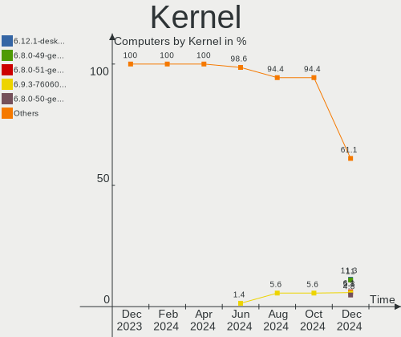
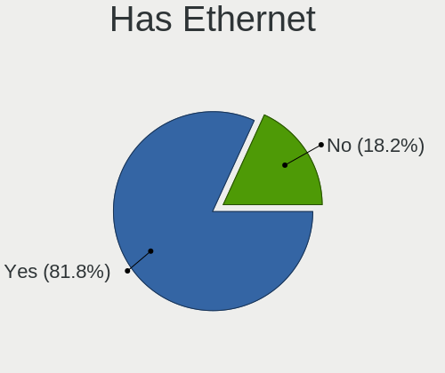
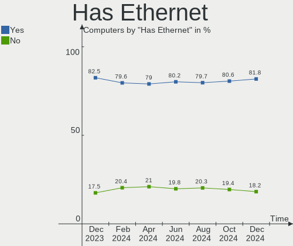
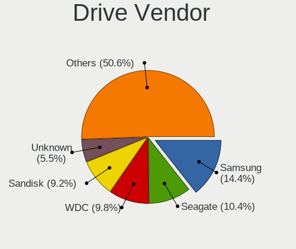
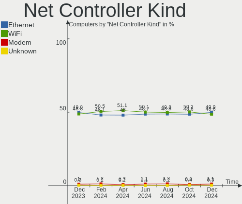
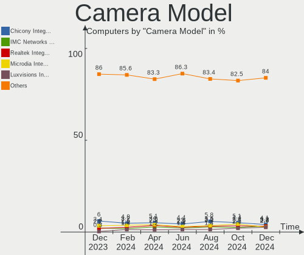

Linux in USA - Hardware Trends
------------------------------

A project to identify most popular hardware characteristics and track their change
over time based on data collected by Linux users at https://Linux-Hardware.org.

Anyone can contribute to this report by the [hw-probe](https://github.com/linuxhw/hw-probe) tool:

    sudo -E hw-probe -all -upload

This is a report for all computer types. See also reports for [desktops](/Location/USA/Desktop/README.md) and [notebooks](/Location/USA/Notebook/README.md).

Period: Apr, 2024.

Contents
--------

* [ System ](#system)
  - [ OS                       ](#os)
  - [ OS Family                ](#os-family)
  - [ Kernel                   ](#kernel)
  - [ Kernel Family            ](#kernel-family)
  - [ Kernel Major Ver.        ](#kernel-major-ver)
  - [ Arch                     ](#arch)
  - [ DE                       ](#de)
  - [ Display Server           ](#display-server)
  - [ Display Manager          ](#display-manager)
  - [ OS Lang                  ](#os-lang)
  - [ Boot Mode                ](#boot-mode)
  - [ Filesystem               ](#filesystem)
  - [ Part. scheme             ](#part-scheme)
  - [ Dual Boot with Linux/BSD ](#dual-boot-with-linuxbsd)
  - [ Dual Boot (Win)          ](#dual-boot-win)

* [ Board ](#board)
  - [ Vendor                   ](#vendor)
  - [ Model                    ](#model)
  - [ Model Family             ](#model-family)
  - [ MFG Year                 ](#mfg-year)
  - [ Form Factor              ](#form-factor)
  - [ Secure Boot              ](#secure-boot)
  - [ Coreboot                 ](#coreboot)
  - [ RAM Size                 ](#ram-size)
  - [ RAM Used                 ](#ram-used)
  - [ Total Drives             ](#total-drives)
  - [ Has CD-ROM               ](#has-cd-rom)
  - [ Has Ethernet             ](#has-ethernet)
  - [ Has WiFi                 ](#has-wifi)
  - [ Has Bluetooth            ](#has-bluetooth)

* [ Location ](#location)
  - [ Country                  ](#country)
  - [ City                     ](#city)

* [ Drives ](#drives)
  - [ Drive Vendor             ](#drive-vendor)
  - [ Drive Model              ](#drive-model)
  - [ HDD Vendor               ](#hdd-vendor)
  - [ SSD Vendor               ](#ssd-vendor)
  - [ Drive Kind               ](#drive-kind)
  - [ Drive Connector          ](#drive-connector)
  - [ Drive Size               ](#drive-size)
  - [ Space Total              ](#space-total)
  - [ Space Used               ](#space-used)
  - [ Malfunc. Drives          ](#malfunc-drives)
  - [ Malfunc. Drive Vendor    ](#malfunc-drive-vendor)
  - [ Malfunc. HDD Vendor      ](#malfunc-hdd-vendor)
  - [ Malfunc. Drive Kind      ](#malfunc-drive-kind)
  - [ Failed Drives            ](#failed-drives)
  - [ Failed Drive Vendor      ](#failed-drive-vendor)
  - [ Drive Status             ](#drive-status)

* [ Storage controller ](#storage-controller)
  - [ Storage Vendor           ](#storage-vendor)
  - [ Storage Model            ](#storage-model)
  - [ Storage Kind             ](#storage-kind)

* [ Processor ](#processor)
  - [ CPU Vendor               ](#cpu-vendor)
  - [ CPU Model                ](#cpu-model)
  - [ CPU Model Family         ](#cpu-model-family)
  - [ CPU Cores                ](#cpu-cores)
  - [ CPU Sockets              ](#cpu-sockets)
  - [ CPU Threads              ](#cpu-threads)
  - [ CPU Op-Modes             ](#cpu-op-modes)
  - [ CPU Microcode            ](#cpu-microcode)
  - [ CPU Microarch            ](#cpu-microarch)

* [ Graphics ](#graphics)
  - [ GPU Vendor               ](#gpu-vendor)
  - [ GPU Model                ](#gpu-model)
  - [ GPU Combo                ](#gpu-combo)
  - [ GPU Driver               ](#gpu-driver)
  - [ GPU Memory               ](#gpu-memory)

* [ Monitor ](#monitor)
  - [ Monitor Vendor           ](#monitor-vendor)
  - [ Monitor Model            ](#monitor-model)
  - [ Monitor Resolution       ](#monitor-resolution)
  - [ Monitor Diagonal         ](#monitor-diagonal)
  - [ Monitor Width            ](#monitor-width)
  - [ Aspect Ratio             ](#aspect-ratio)
  - [ Monitor Area             ](#monitor-area)
  - [ Pixel Density            ](#pixel-density)
  - [ Multiple Monitors        ](#multiple-monitors)

* [ Network ](#network)
  - [ Net Controller Vendor    ](#net-controller-vendor)
  - [ Net Controller Model     ](#net-controller-model)
  - [ Wireless Vendor          ](#wireless-vendor)
  - [ Wireless Model           ](#wireless-model)
  - [ Ethernet Vendor          ](#ethernet-vendor)
  - [ Ethernet Model           ](#ethernet-model)
  - [ Net Controller Kind      ](#net-controller-kind)
  - [ Used Controller          ](#used-controller)
  - [ NICs                     ](#nics)
  - [ IPv6                     ](#ipv6)

* [ Bluetooth ](#bluetooth)
  - [ Bluetooth Vendor         ](#bluetooth-vendor)
  - [ Bluetooth Model          ](#bluetooth-model)

* [ Sound ](#sound)
  - [ Sound Vendor             ](#sound-vendor)
  - [ Sound Model              ](#sound-model)

* [ Memory ](#memory)
  - [ Memory Vendor            ](#memory-vendor)
  - [ Memory Model             ](#memory-model)
  - [ Memory Kind              ](#memory-kind)
  - [ Memory Form Factor       ](#memory-form-factor)
  - [ Memory Size              ](#memory-size)
  - [ Memory Speed             ](#memory-speed)

* [ Printers & scanners ](#printers--scanners)
  - [ Printer Vendor           ](#printer-vendor)
  - [ Printer Model            ](#printer-model)
  - [ Scanner Vendor           ](#scanner-vendor)
  - [ Scanner Model            ](#scanner-model)

* [ Camera ](#camera)
  - [ Camera Vendor            ](#camera-vendor)
  - [ Camera Model             ](#camera-model)

* [ Security ](#security)
  - [ Fingerprint Vendor       ](#fingerprint-vendor)
  - [ Fingerprint Model        ](#fingerprint-model)
  - [ Chipcard Vendor          ](#chipcard-vendor)
  - [ Chipcard Model           ](#chipcard-model)

* [ Unsupported ](#unsupported)
  - [ Unsupported Devices      ](#unsupported-devices)
  - [ Unsupported Device Types ](#unsupported-device-types)

System
------

OS
--

Installed operating systems

| Name                         | Computers | Percent |
|------------------------------|-----------|---------|
| Ubuntu 22.04                 | 117       | 11.52%  |
| Fedora 39                    | 102       | 10.04%  |
| Fedora 40                    | 59        | 5.81%   |
| Debian 12                    | 50        | 4.92%   |
| Arch Rolling                 | 46        | 4.53%   |
| Pop!_OS 22.04                | 45        | 4.43%   |
| Linux Mint 21.3              | 44        | 4.33%   |
| Ubuntu 23.10                 | 42        | 4.13%   |
| ArcoLinux Rolling            | 41        | 4.04%   |
| Zorin 17                     | 37        | 3.64%   |
| KDE neon 22.04               | 24        | 2.36%   |
| Ubuntu 24.04                 | 21        | 2.07%   |
| Nobara 39                    | 21        | 2.07%   |
| Kali 2024.1                  | 21        | 2.07%   |
| OpenMandriva 23.08           | 20        | 1.97%   |
| openSUSE Tumbleweed-XXXXXXXX | 16        | 1.57%   |
| Manjaro                      | 16        | 1.57%   |
| EndeavourOS Rolling          | 16        | 1.57%   |
| SteamOS 3.5.17               | 14        | 1.38%   |
| Ubuntu 20.04                 | 13        | 1.28%   |
| Xubuntu 22.04                | 12        | 1.18%   |
| OpenMandriva 5.0             | 12        | 1.18%   |
| Kubuntu 23.10                | 10        | 0.98%   |
| Elementary 7.1               | 10        | 0.98%   |
| Linux Mint 21.2              | 9         | 0.89%   |
| Kubuntu 22.04                | 9         | 0.89%   |
| Manjaro 23.1.4               | 8         | 0.79%   |
| Zorin 16                     | 6         | 0.59%   |
| NixOS 24.05                  | 6         | 0.59%   |
| MX 23                        | 6         | 0.59%   |
| openSUSE Leap-15.5           | 5         | 0.49%   |
| Linux Mint 21.1              | 5         | 0.49%   |
| Kubuntu 24.04                | 5         | 0.49%   |
| Dts-distro 1.2.21            | 5         | 0.49%   |
| Ubuntu 23.04                 | 4         | 0.39%   |
| RHEL 9                       | 4         | 0.39%   |
| OpenMandriva 24.03           | 4         | 0.39%   |
| Gentoo 2.14                  | 4         | 0.39%   |
| Fedora 38                    | 4         | 0.39%   |
| Debian 11                    | 4         | 0.39%   |

OS Family
---------

OS without a version

| Name             | Computers | Percent |
|------------------|-----------|---------|
| Ubuntu           | 199       | 19.59%  |
| Fedora           | 168       | 16.54%  |
| Linux Mint       | 65        | 6.4%    |
| Debian           | 58        | 5.71%   |
| OpenMandriva     | 47        | 4.63%   |
| Pop!_OS          | 46        | 4.53%   |
| Arch             | 46        | 4.53%   |
| Zorin            | 44        | 4.33%   |
| ArcoLinux        | 44        | 4.33%   |
| Kubuntu          | 27        | 2.66%   |
| Manjaro          | 25        | 2.46%   |
| KDE neon         | 24        | 2.36%   |
| openSUSE         | 23        | 2.26%   |
| Nobara           | 23        | 2.26%   |
| Kali             | 22        | 2.17%   |
| SteamOS          | 19        | 1.87%   |
| EndeavourOS      | 16        | 1.57%   |
| Xubuntu          | 13        | 1.28%   |
| Elementary       | 11        | 1.08%   |
| NixOS            | 9         | 0.89%   |
| MX               | 7         | 0.69%   |
| Garuda Linux     | 6         | 0.59%   |
| Gentoo           | 5         | 0.49%   |
| Dts-distro       | 5         | 0.49%   |
| RHEL             | 4         | 0.39%   |
| ChimeraOS        | 4         | 0.39%   |
| Arch ARM         | 4         | 0.39%   |
| Ubuntu Unity     | 3         | 0.3%    |
| Ubuntu Studio    | 3         | 0.3%    |
| Ubuntu MATE      | 3         | 0.3%    |
| Redcore          | 3         | 0.3%    |
| Parrot           | 3         | 0.3%    |
| Lubuntu          | 3         | 0.3%    |
| LMDE             | 3         | 0.3%    |
| Void Linux       | 2         | 0.2%    |
| Rocky Linux      | 2         | 0.2%    |
| Raspbian         | 2         | 0.2%    |
| org.kde.Platform | 2         | 0.2%    |
| Clear Linux      | 2         | 0.2%    |
| CachyOS          | 2         | 0.2%    |

Kernel
------

Version of the Linux kernel

| Version                             | Computers | Percent |
|-------------------------------------|-----------|---------|
| 6.5.0-26-generic                    | 83        | 8.17%   |
| 6.5.0-27-generic                    | 72        | 7.09%   |
| 6.5.0-28-generic                    | 64        | 6.3%    |
| 6.8.0-76060800daily20240311-generic | 39        | 3.84%   |
| 6.8.7-300.fc40.x86_64               | 34        | 3.35%   |
| 5.15.0-101-generic                  | 33        | 3.25%   |
| 6.1.0-18-amd64                      | 24        | 2.36%   |
| 5.15.0-102-generic                  | 24        | 2.36%   |
| 6.8.0-31-generic                    | 21        | 2.07%   |
| 6.4.11-desktop-1omv2390             | 20        | 1.97%   |
| 6.8.4-200.fc39.x86_64               | 19        | 1.87%   |
| 6.7.11-200.fc39.x86_64              | 19        | 1.87%   |
| 6.1.0-20-amd64                      | 17        | 1.67%   |
| 5.15.0-105-generic                  | 17        | 1.67%   |
| 6.8.2-arch2-1                       | 16        | 1.57%   |
| 6.6.2-desktop-1omv2390              | 16        | 1.57%   |
| 6.1.52-valve16-1-neptune-61         | 16        | 1.57%   |
| 6.8.7-arch1-1                       | 15        | 1.48%   |
| 6.8.6-200.fc39.x86_64               | 15        | 1.48%   |
| 6.5.6-300.fc39.x86_64               | 14        | 1.38%   |
| 6.8.5-201.fc39.x86_64               | 13        | 1.28%   |
| 6.6.9-amd64                         | 11        | 1.08%   |
| 6.8.5-arch1-1                       | 10        | 0.98%   |
| 6.8.5-201.fsync.fc39.x86_64         | 10        | 0.98%   |
| 6.6.15-amd64                        | 10        | 0.98%   |
| 6.8.7-zen1-1-zen                    | 9         | 0.89%   |
| 6.8.5-301.fc40.x86_64               | 9         | 0.89%   |
| 6.8.7-arch1-2                       | 8         | 0.79%   |
| 6.8.7-200.fc39.x86_64               | 8         | 0.79%   |
| 6.8.5-1-MANJARO                     | 8         | 0.79%   |
| 6.8.4-arch1-1                       | 7         | 0.69%   |
| 6.8.2-300.fc40.x86_64               | 7         | 0.69%   |
| 6.8.4-zen1-1-zen                    | 6         | 0.59%   |
| 6.8.4-300.fc40.x86_64               | 6         | 0.59%   |
| 6.6.26-1-MANJARO                    | 6         | 0.59%   |
| 6.8.4-rc1-1-default                 | 5         | 0.49%   |
| 6.8.0-22-generic                    | 5         | 0.49%   |
| 6.6.25-1-MANJARO                    | 5         | 0.49%   |
| 6.5.0-21-generic                    | 5         | 0.49%   |
| 6.2.0-39-generic                    | 5         | 0.49%   |

Kernel Family
-------------

Linux kernel without a distro release

| Version | Computers | Percent |
|---------|-----------|---------|
| 6.5.0   | 251       | 24.7%   |
| 6.8.7   | 94        | 9.25%   |
| 5.15.0  | 89        | 8.76%   |
| 6.8.0   | 69        | 6.79%   |
| 6.8.5   | 57        | 5.61%   |
| 6.1.0   | 50        | 4.92%   |
| 6.8.4   | 46        | 4.53%   |
| 6.8.2   | 33        | 3.25%   |
| 6.8.6   | 29        | 2.85%   |
| 6.7.11  | 22        | 2.17%   |
| 6.4.11  | 20        | 1.97%   |
| 6.1.52  | 17        | 1.67%   |
| 6.6.2   | 16        | 1.57%   |
| 6.5.6   | 14        | 1.38%   |
| 6.8.1   | 13        | 1.28%   |
| 6.6.9   | 12        | 1.18%   |
| 6.7.9   | 11        | 1.08%   |
| 6.2.0   | 11        | 1.08%   |
| 6.6.25  | 10        | 0.98%   |
| 6.6.15  | 10        | 0.98%   |
| 6.6.10  | 10        | 0.98%   |
| 5.4.0   | 8         | 0.79%   |
| 5.14.0  | 8         | 0.79%   |
| 6.6.26  | 7         | 0.69%   |
| 6.7.6   | 5         | 0.49%   |
| 6.7.12  | 5         | 0.49%   |
| 5.15.36 | 5         | 0.49%   |
| 5.14.21 | 5         | 0.49%   |
| 6.9.0   | 4         | 0.39%   |
| 6.7.4   | 4         | 0.39%   |
| 6.7.10  | 4         | 0.39%   |
| 6.6.21  | 4         | 0.39%   |
| 6.6.13  | 4         | 0.39%   |
| 6.7.7   | 3         | 0.3%    |
| 6.6.19  | 3         | 0.3%    |
| 6.1.31  | 3         | 0.3%    |
| 5.10.0  | 3         | 0.3%    |
| 6.7.0   | 2         | 0.2%    |
| 6.6.28  | 2         | 0.2%    |
| 6.6.20  | 2         | 0.2%    |

Kernel Major Ver.
-----------------

Linux kernel major version

| Version | Computers | Percent |
|---------|-----------|---------|
| 6.8     | 343       | 33.76%  |
| 6.5     | 268       | 26.38%  |
| 5.15    | 96        | 9.45%   |
| 6.6     | 90        | 8.86%   |
| 6.1     | 77        | 7.58%   |
| 6.7     | 58        | 5.71%   |
| 6.4     | 24        | 2.36%   |
| 5.14    | 13        | 1.28%   |
| 6.2     | 12        | 1.18%   |
| 5.4     | 8         | 0.79%   |
| 5.10    | 7         | 0.69%   |
| 6.9     | 4         | 0.39%   |
| 6.0     | 2         | 0.2%    |
| 5.16    | 2         | 0.2%    |
| 4.18    | 2         | 0.2%    |
| 4.15    | 2         | 0.2%    |
| 6.3     | 1         | 0.1%    |
| 5.9     | 1         | 0.1%    |
| 5.19    | 1         | 0.1%    |
| 5.18    | 1         | 0.1%    |
| 5.17    | 1         | 0.1%    |
| 5.11    | 1         | 0.1%    |
| 4.9     | 1         | 0.1%    |
| 3.10    | 1         | 0.1%    |

Arch
----

OS architecture (x86_64, i586, etc.)

| Name    | Computers | Percent |
|---------|-----------|---------|
| x86_64  | 993       | 97.74%  |
| aarch64 | 16        | 1.57%   |
| i686    | 5         | 0.49%   |
| armv7l  | 1         | 0.1%    |
| armv6l  | 1         | 0.1%    |

DE
--

Desktop Environment

| Name            | Computers | Percent |
|-----------------|-----------|---------|
| GNOME           | 431       | 42.42%  |
| KDE5            | 171       | 16.83%  |
| KDE6            | 127       | 12.5%   |
| X-Cinnamon      | 74        | 7.28%   |
| XFCE            | 67        | 6.59%   |
| Unknown         | 53        | 5.22%   |
| MATE            | 18        | 1.77%   |
| LXQt            | 13        | 1.28%   |
| Pantheon        | 11        | 1.08%   |
| i3              | 10        | 0.98%   |
| Hyprland        | 10        | 0.98%   |
| KDE             | 5         | 0.49%   |
| Cinnamon        | 5         | 0.49%   |
| Unity           | 3         | 0.3%    |
| awesome         | 3         | 0.3%    |
| LXDE            | 2         | 0.2%    |
| icewm           | 2         | 0.2%    |
| GNOME Flashback | 2         | 0.2%    |
| GNOME Classic   | 2         | 0.2%    |
| Deepin          | 2         | 0.2%    |
| plasma          | 1         | 0.1%    |
| Openbox         | 1         | 0.1%    |
| GNOME-Classic   | 1         | 0.1%    |
| Endless:GNOME   | 1         | 0.1%    |
| Budgie          | 1         | 0.1%    |

Display Server
--------------

X11 or Wayland

| Name    | Computers | Percent |
|---------|-----------|---------|
| Wayland | 506       | 49.8%   |
| X11     | 452       | 44.49%  |
| Unknown | 32        | 3.15%   |
| Tty     | 26        | 2.56%   |

Display Manager
---------------

SDDM, LightDM, etc.

| Name    | Computers | Percent |
|---------|-----------|---------|
| Unknown | 455       | 44.78%  |
| GDM3    | 200       | 19.69%  |
| SDDM    | 191       | 18.8%   |
| LightDM | 121       | 11.91%  |
| GDM     | 44        | 4.33%   |
| SLIMSKI | 1         | 0.1%    |
| SLiM    | 1         | 0.1%    |
| LY-DM   | 1         | 0.1%    |
| Ly      | 1         | 0.1%    |
| GREETD  | 1         | 0.1%    |

OS Lang
-------

Language

| Lang    | Computers | Percent |
|---------|-----------|---------|
| en_US   | 931       | 91.63%  |
| C       | 36        | 3.54%   |
| Unknown | 18        | 1.77%   |
| en_GB   | 7         | 0.69%   |
| zh_CN   | 5         | 0.49%   |
| en_CA   | 5         | 0.49%   |
| fr_FR   | 2         | 0.2%    |
| en_AU   | 2         | 0.2%    |
| de_DE   | 2         | 0.2%    |
| zh_TW   | 1         | 0.1%    |
| ru_RU   | 1         | 0.1%    |
| pt_PT   | 1         | 0.1%    |
| pt_BR   | 1         | 0.1%    |
| POSIX   | 1         | 0.1%    |
| es_MX   | 1         | 0.1%    |
| es_ES   | 1         | 0.1%    |
| en_ZW   | 1         | 0.1%    |

Boot Mode
---------

EFI or BIOS

| Mode | Computers | Percent |
|------|-----------|---------|
| BIOS | 545       | 53.64%  |
| EFI  | 471       | 46.36%  |

Filesystem
----------

Type of filesystem

| Type    | Computers | Percent |
|---------|-----------|---------|
| Ext4    | 547       | 53.84%  |
| Btrfs   | 275       | 27.07%  |
| Tmpfs   | 146       | 14.37%  |
| Overlay | 30        | 2.95%   |
| Xfs     | 9         | 0.89%   |
| Zfs     | 5         | 0.49%   |
| F2fs    | 4         | 0.39%   |

Part. scheme
------------

Scheme of partitioning

| Type    | Computers | Percent |
|---------|-----------|---------|
| GPT     | 545       | 53.64%  |
| Unknown | 409       | 40.26%  |
| MBR     | 62        | 6.1%    |

Dual Boot with Linux/BSD
------------------------

Hosting more than one Linux/BSD

| Dual boot | Computers | Percent |
|-----------|-----------|---------|
| No        | 891       | 87.7%   |
| Yes       | 125       | 12.3%   |

Dual Boot (Win)
---------------

Hosting Linux and Windows

| Dual boot | Computers | Percent |
|-----------|-----------|---------|
| No        | 830       | 81.69%  |
| Yes       | 186       | 18.31%  |

Board
-----

Vendor
------

Motherboard manufacturer

| Name                                 | Computers | Percent |
|--------------------------------------|-----------|---------|
| Dell                                 | 164       | 16.14%  |
| Hewlett-Packard                      | 138       | 13.58%  |
| ASUSTek Computer                     | 135       | 13.29%  |
| Lenovo                               | 132       | 12.99%  |
| MSI                                  | 74        | 7.28%   |
| Gigabyte Technology                  | 55        | 5.41%   |
| Apple                                | 55        | 5.41%   |
| ASRock                               | 34        | 3.35%   |
| Acer                                 | 27        | 2.66%   |
| Valve                                | 18        | 1.77%   |
| Unknown                              | 18        | 1.77%   |
| Google                               | 14        | 1.38%   |
| Toshiba                              | 12        | 1.18%   |
| Microsoft                            | 10        | 0.98%   |
| AZW                                  | 10        | 0.98%   |
| Intel                                | 9         | 0.89%   |
| Alienware                            | 9         | 0.89%   |
| Supermicro                           | 8         | 0.79%   |
| Raspberry Pi Foundation              | 7         | 0.69%   |
| Framework                            | 7         | 0.69%   |
| System76                             | 5         | 0.49%   |
| Shenzhen Meigao Electronic Equipment | 5         | 0.49%   |
| Samsung Electronics                  | 4         | 0.39%   |
| Notebook                             | 4         | 0.39%   |
| GPU Company                          | 4         | 0.39%   |
| Biostar                              | 4         | 0.39%   |
| Pegatron                             | 3         | 0.3%    |
| OrangePi                             | 3         | 0.3%    |
| Chuwi                                | 3         | 0.3%    |
| Razer                                | 2         | 0.2%    |
| GMKtec                               | 2         | 0.2%    |
| Fujitsu                              | 2         | 0.2%    |
| eMachines                            | 2         | 0.2%    |
| Carbon Systems                       | 2         | 0.2%    |
| BESSTAR Tech                         | 2         | 0.2%    |
| AMI                                  | 2         | 0.2%    |
| Win element                          | 1         | 0.1%    |
| Vizio                                | 1         | 0.1%    |
| Timi                                 | 1         | 0.1%    |
| STGAUBRON                            | 1         | 0.1%    |

Model
-----

Motherboard model

| Name                                  | Computers | Percent |
|---------------------------------------|-----------|---------|
| Unknown                               | 18        | 1.77%   |
| Valve Jupiter                         | 13        | 1.28%   |
| Valve Galileo                         | 5         | 0.49%   |
| MSI MS-7C91                           | 5         | 0.49%   |
| MSI MS-7C56                           | 5         | 0.49%   |
| Dell Latitude 7490                    | 5         | 0.49%   |
| AZW SER                               | 5         | 0.49%   |
| Apple MacBookPro9,2                   | 5         | 0.49%   |
| MSI MS-7D78                           | 4         | 0.39%   |
| MSI MS-7C95                           | 4         | 0.39%   |
| HP Laptop 14-fq0xxx                   | 4         | 0.39%   |
| Dell Latitude E6400                   | 4         | 0.39%   |
| Apple iMac12,1                        | 4         | 0.39%   |
| MSI MS-7E06                           | 3         | 0.3%    |
| MSI MS-7D25                           | 3         | 0.3%    |
| Lenovo IdeaPad 1 14IGL7 82V6          | 3         | 0.3%    |
| HP Notebook                           | 3         | 0.3%    |
| HP Laptop 15-dy5xxx                   | 3         | 0.3%    |
| HP Laptop 15-dy2xxx                   | 3         | 0.3%    |
| HP EliteBook 840 G6                   | 3         | 0.3%    |
| HP 15                                 | 3         | 0.3%    |
| Gigabyte Z790 UD AC                   | 3         | 0.3%    |
| Gigabyte X570 AORUS ELITE WIFI        | 3         | 0.3%    |
| Dell OptiPlex 9020                    | 3         | 0.3%    |
| Dell OptiPlex 7050                    | 3         | 0.3%    |
| Dell OptiPlex 7010                    | 3         | 0.3%    |
| Dell Latitude E6420                   | 3         | 0.3%    |
| Dell Inspiron 5555                    | 3         | 0.3%    |
| Dell Inspiron 3847                    | 3         | 0.3%    |
| ASUS TUF Gaming X570-PRO              | 3         | 0.3%    |
| ASUS ROG Zephyrus G14 GA401QM_GA401QM | 3         | 0.3%    |
| ASUS All Series                       | 3         | 0.3%    |
| ASRock X570 Taichi                    | 3         | 0.3%    |
| Apple iMac16,2                        | 3         | 0.3%    |
| Acer Aspire A515-43                   | 3         | 0.3%    |
| System76 Lemur Pro                    | 2         | 0.2%    |
| RPi Raspberry Pi                      | 2         | 0.2%    |
| OrangePi Zero3                        | 2         | 0.2%    |
| MSI MS-7D91                           | 2         | 0.2%    |
| MSI MS-7D85                           | 2         | 0.2%    |

Model Family
------------

Motherboard model prefix

| Name               | Computers | Percent |
|--------------------|-----------|---------|
| Lenovo ThinkPad    | 67        | 6.59%   |
| Dell Latitude      | 47        | 4.63%   |
| ASUS ROG           | 44        | 4.33%   |
| Dell Inspiron      | 38        | 3.74%   |
| Dell OptiPlex      | 27        | 2.66%   |
| Dell XPS           | 23        | 2.26%   |
| HP Laptop          | 22        | 2.17%   |
| HP Pavilion        | 21        | 2.07%   |
| HP EliteBook       | 21        | 2.07%   |
| Acer Aspire        | 18        | 1.77%   |
| Unknown            | 18        | 1.77%   |
| Lenovo IdeaPad     | 15        | 1.48%   |
| Dell Precision     | 15        | 1.48%   |
| ASUS PRIME         | 15        | 1.48%   |
| ASUS VivoBook      | 14        | 1.38%   |
| Valve Jupiter      | 13        | 1.28%   |
| ASUS TUF           | 13        | 1.28%   |
| Toshiba Satellite  | 11        | 1.08%   |
| Lenovo Yoga        | 11        | 1.08%   |
| HP ENVY            | 11        | 1.08%   |
| Microsoft Surface  | 10        | 0.98%   |
| HP OMEN            | 9         | 0.89%   |
| Gigabyte Z790      | 9         | 0.89%   |
| HP EliteDesk       | 8         | 0.79%   |
| RPi Raspberry      | 7         | 0.69%   |
| Lenovo IdeaPadFlex | 7         | 0.69%   |
| Framework Laptop   | 7         | 0.69%   |
| ASUS ASUS          | 7         | 0.69%   |
| Apple MacBookPro9  | 6         | 0.59%   |
| Valve Galileo      | 5         | 0.49%   |
| MSI MS-7C91        | 5         | 0.49%   |
| MSI MS-7C56        | 5         | 0.49%   |
| Lenovo ThinkCentre | 5         | 0.49%   |
| Lenovo Legion      | 5         | 0.49%   |
| HP ZBook           | 5         | 0.49%   |
| HP ProBook         | 5         | 0.49%   |
| Gigabyte X570      | 5         | 0.49%   |
| AZW SER            | 5         | 0.49%   |
| Apple MacBookPro11 | 5         | 0.49%   |
| MSI MS-7D78        | 4         | 0.39%   |

MFG Year
--------

Motherboard manufacture year

| Year    | Computers | Percent |
|---------|-----------|---------|
| 2022    | 130       | 12.8%   |
| 2023    | 126       | 12.4%   |
| 2020    | 104       | 10.24%  |
| 2021    | 103       | 10.14%  |
| 2018    | 69        | 6.79%   |
| 2019    | 67        | 6.59%   |
| 2012    | 62        | 6.1%    |
| 2013    | 60        | 5.91%   |
| 2017    | 46        | 4.53%   |
| 2011    | 43        | 4.23%   |
| 2015    | 36        | 3.54%   |
| 2014    | 31        | 3.05%   |
| 2016    | 28        | 2.76%   |
| 2010    | 24        | 2.36%   |
| 2024    | 21        | 2.07%   |
| 2008    | 19        | 1.87%   |
| Unknown | 17        | 1.67%   |
| 2009    | 15        | 1.48%   |
| 2007    | 8         | 0.79%   |
| 2006    | 4         | 0.39%   |
| 2004    | 2         | 0.2%    |
| 2002    | 1         | 0.1%    |

Form Factor
-----------

Physical design of the computer

| Name           | Computers | Percent |
|----------------|-----------|---------|
| Notebook       | 517       | 50.89%  |
| Desktop        | 369       | 36.32%  |
| Convertible    | 47        | 4.63%   |
| All in one     | 21        | 2.07%   |
| Mini pc        | 18        | 1.77%   |
| System on chip | 15        | 1.48%   |
| Tablet         | 15        | 1.48%   |
| Server         | 14        | 1.38%   |

Secure Boot
-----------

Enabled or disabled

| State    | Computers | Percent |
|----------|-----------|---------|
| Disabled | 963       | 94.78%  |
| Enabled  | 53        | 5.22%   |

Coreboot
--------

Have coreboot on board

| Used | Computers | Percent |
|------|-----------|---------|
| No   | 998       | 98.23%  |
| Yes  | 18        | 1.77%   |

RAM Size
--------

Total RAM memory

| Size in GB      | Computers | Percent |
|-----------------|-----------|---------|
| 16.01-24.0      | 217       | 21.36%  |
| 32.01-64.0      | 202       | 19.88%  |
| 4.01-8.0        | 173       | 17.03%  |
| 8.01-16.0       | 173       | 17.03%  |
| 3.01-4.0        | 94        | 9.25%   |
| 64.01-256.0     | 93        | 9.15%   |
| 24.01-32.0      | 41        | 4.04%   |
| 2.01-3.0        | 9         | 0.89%   |
| 1.01-2.0        | 7         | 0.69%   |
| More than 256.0 | 3         | 0.3%    |
| 0.51-1.0        | 3         | 0.3%    |
| 0.01-0.5        | 1         | 0.1%    |

RAM Used
--------

Used RAM memory

| Used GB     | Computers | Percent |
|-------------|-----------|---------|
| 2.01-3.0    | 261       | 25.69%  |
| 4.01-8.0    | 248       | 24.41%  |
| 1.01-2.0    | 209       | 20.57%  |
| 3.01-4.0    | 161       | 15.85%  |
| 8.01-16.0   | 80        | 7.87%   |
| 0.51-1.0    | 32        | 3.15%   |
| 16.01-24.0  | 10        | 0.98%   |
| 0.01-0.5    | 8         | 0.79%   |
| 32.01-64.0  | 3         | 0.3%    |
| 24.01-32.0  | 2         | 0.2%    |
| 64.01-256.0 | 2         | 0.2%    |

Total Drives
------------

Number of drives on board

| Drives | Computers | Percent |
|--------|-----------|---------|
| 1      | 605       | 59.55%  |
| 2      | 239       | 23.52%  |
| 3      | 73        | 7.19%   |
| 4      | 43        | 4.23%   |
| 5      | 22        | 2.17%   |
| 6      | 9         | 0.89%   |
| 0      | 9         | 0.89%   |
| 7      | 7         | 0.69%   |
| 8      | 3         | 0.3%    |
| 9      | 2         | 0.2%    |
| 24     | 1         | 0.1%    |
| 23     | 1         | 0.1%    |
| 13     | 1         | 0.1%    |
| 10     | 1         | 0.1%    |

Has CD-ROM
----------

Has CD-ROM on board

| Presented | Computers | Percent |
|-----------|-----------|---------|
| No        | 763       | 75.1%   |
| Yes       | 253       | 24.9%   |

Has Ethernet
------------

Has Ethernet on board

| Presented | Computers | Percent |
|-----------|-----------|---------|
| Yes       | 797       | 78.44%  |
| No        | 219       | 21.56%  |

Has WiFi
--------

Has WiFi module

| Presented | Computers | Percent |
|-----------|-----------|---------|
| Yes       | 867       | 85.33%  |
| No        | 149       | 14.67%  |

Has Bluetooth
-------------

Has Bluetooth module

| Presented | Computers | Percent |
|-----------|-----------|---------|
| Yes       | 759       | 74.7%   |
| No        | 257       | 25.3%   |

Location
--------

Country
-------

Geographic location (country)

| Country | Computers | Percent |
|---------|-----------|---------|
| USA     | 1016      | 100%    |

City
----

Geographic location (city)

| City           | Computers | Percent |
|----------------|-----------|---------|
| Los Angeles    | 30        | 2.95%   |
| New York       | 18        | 1.77%   |
| Chicago        | 16        | 1.57%   |
| Portland       | 14        | 1.38%   |
| Austin         | 14        | 1.38%   |
| Seattle        | 13        | 1.28%   |
| Dallas         | 12        | 1.18%   |
| Miami          | 10        | 0.98%   |
| Denver         | 10        | 0.98%   |
| Washington     | 9         | 0.89%   |
| Minneapolis    | 9         | 0.89%   |
| Atlanta        | 8         | 0.79%   |
| Tulsa          | 7         | 0.69%   |
| Salt Lake City | 7         | 0.69%   |
| Las Vegas      | 7         | 0.69%   |
| Tucson         | 6         | 0.59%   |
| San Francisco  | 6         | 0.59%   |
| Phoenix        | 6         | 0.59%   |
| Philadelphia   | 6         | 0.59%   |
| Orlando        | 6         | 0.59%   |
| Flushing       | 6         | 0.59%   |
| Charlotte      | 6         | 0.59%   |
| Brooklyn       | 6         | 0.59%   |
| Athens         | 6         | 0.59%   |
| San Antonio    | 5         | 0.49%   |
| Rochester      | 5         | 0.49%   |
| Kansas City    | 5         | 0.49%   |
| Jacksonville   | 5         | 0.49%   |
| Houston        | 5         | 0.49%   |
| Bangor         | 5         | 0.49%   |
| Albuquerque    | 5         | 0.49%   |
| St Louis       | 4         | 0.39%   |
| Secaucus       | 4         | 0.39%   |
| San Jose       | 4         | 0.39%   |
| Richmond       | 4         | 0.39%   |
| Raleigh        | 4         | 0.39%   |
| Mesa           | 4         | 0.39%   |
| Johnson City   | 4         | 0.39%   |
| Irvine         | 4         | 0.39%   |
| Herndon        | 4         | 0.39%   |

Drives
------

Drive Vendor
------------

Hard drive vendors

| Vendor                       | Computers | Drives | Percent |
|------------------------------|-----------|--------|---------|
| Samsung Electronics          | 256       | 327    | 16.85%  |
| WDC                          | 149       | 201    | 9.81%   |
| Seagate                      | 140       | 213    | 9.22%   |
| Sandisk                      | 137       | 150    | 9.02%   |
| Unknown                      | 88        | 101    | 5.79%   |
| Toshiba                      | 66        | 71     | 4.34%   |
| SK hynix                     | 61        | 62     | 4.02%   |
| Crucial                      | 55        | 58     | 3.62%   |
| Micron Technology            | 49        | 52     | 3.23%   |
| Intel                        | 46        | 51     | 3.03%   |
| Kingston                     | 36        | 38     | 2.37%   |
| Apple                        | 35        | 41     | 2.3%    |
| Phison Electronics           | 32        | 34     | 2.11%   |
| Micron/Crucial Technology    | 25        | 27     | 1.65%   |
| Hitachi                      | 24        | 26     | 1.58%   |
| China                        | 24        | 28     | 1.58%   |
| HGST                         | 23        | 25     | 1.51%   |
| KIOXIA                       | 17        | 17     | 1.12%   |
| Team                         | 16        | 18     | 1.05%   |
| SPCC                         | 16        | 16     | 1.05%   |
| PNY                          | 16        | 17     | 1.05%   |
| Unknown                      | 16        | 17     | 1.05%   |
| Kingston Technology Company  | 13        | 14     | 0.86%   |
| Realtek Semiconductor        | 11        | 12     | 0.72%   |
| Silicon Motion               | 10        | 12     | 0.66%   |
| A-DATA Technology            | 10        | 13     | 0.66%   |
| Lexar                        | 8         | 9      | 0.53%   |
| Hewlett-Packard              | 7         | 7      | 0.46%   |
| MAXIO Technology (Hangzhou)  | 5         | 5      | 0.33%   |
| Fanxiang                     | 5         | 5      | 0.33%   |
| ADATA Technology             | 5         | 6      | 0.33%   |
| T-FORCE                      | 4         | 4      | 0.26%   |
| LITEON                       | 4         | 4      | 0.26%   |
| Union Memory                 | 3         | 3      | 0.2%    |
| Transcend                    | 3         | 3      | 0.2%    |
| Shenzhen Longsys Electronics | 3         | 3      | 0.2%    |
| SABRENT                      | 3         | 3      | 0.2%    |
| Phison                       | 3         | 4      | 0.2%    |
| OCZ                          | 3         | 3      | 0.2%    |
| Netac                        | 3         | 3      | 0.2%    |

Drive Model
-----------

Hard drive models

| Model                                                 | Computers | Percent |
|-------------------------------------------------------|-----------|---------|
| Samsung NVMe SSD Controller SM981/PM981/PM983 1TB     | 52        | 3.13%   |
| Samsung NVMe SSD Controller PM9A1/PM9A3/980PRO 1TB    | 29        | 1.75%   |
| Samsung SSD 990 PRO 2TB                               | 17        | 1.02%   |
| Unknown MMC Card  64GB                                | 16        | 0.96%   |
| Unknown                                               | 16        | 0.96%   |
| Unknown MMC Card  128GB                               | 15        | 0.9%    |
| Sandisk WD Blue SN550 NVMe SSD 2TB                    | 14        | 0.84%   |
| Sandisk WD Black SN750 / PC SN730 NVMe SSD 512GB      | 13        | 0.78%   |
| Micron/Crucial P2 NVMe PCIe SSD 4TB                   | 13        | 0.78%   |
| Samsung NVMe SSD Controller SM961/PM961/SM963 1TB     | 11        | 0.66%   |
| Crucial CT1000MX500SSD1 1TB                           | 11        | 0.66%   |
| Samsung SSD 980 1TB                                   | 10        | 0.6%    |
| HGST HTS721010A9E630 1TB                              | 10        | 0.6%    |
| Unknown SD/MMC/MS PRO 128GB                           | 9         | 0.54%   |
| Toshiba XG6 NVMe SSD Controller 1024GB                | 9         | 0.54%   |
| Unknown NVMe SSD Drive 1TB                            | 8         | 0.48%   |
| Toshiba MQ01ABD100 1TB                                | 8         | 0.48%   |
| Silicon Motion SM2263EN/SM2263XT SSD Controller 256GB | 8         | 0.48%   |
| Seagate ST2000DM008-2FR102 2TB                        | 8         | 0.48%   |
| Samsung SSD 860 EVO 500GB                             | 8         | 0.48%   |
| Intel SSDPEKNU512GZ 512GB                             | 8         | 0.48%   |
| Unknown MMC Card  512GB                               | 7         | 0.42%   |
| Unknown MMC Card  32GB                                | 7         | 0.42%   |
| Seagate ST3500418AS 500GB                             | 7         | 0.42%   |
| Sandisk WD_BLACK SN770 2TB                            | 7         | 0.42%   |
| Samsung SSD 870 EVO 1TB                               | 7         | 0.42%   |
| Phison PCIe SSD 2TB                                   | 7         | 0.42%   |
| Crucial CT2000MX500SSD1 2TB                           | 7         | 0.42%   |
| WDC WD10EZEX-08WN4A0 1TB                              | 6         | 0.36%   |
| WDC WD10EZEX-00BN5A0 1TB                              | 6         | 0.36%   |
| Unknown MMC Card  256GB                               | 6         | 0.36%   |
| SK hynix BC501 NVMe Solid State Drive 512GB           | 6         | 0.36%   |
| Seagate ST4000DM004-2CV104 4TB                        | 6         | 0.36%   |
| Sandisk WD_BLACK SN770 1TB                            | 6         | 0.36%   |
| SanDisk NVMe SSD Drive 1TB                            | 6         | 0.36%   |
| SanDisk Extreme 55AE 1TB SSD                          | 6         | 0.36%   |
| Samsung SSD 980 PRO 2TB                               | 6         | 0.36%   |
| Samsung SSD 980 PRO 1TB                               | 6         | 0.36%   |
| Samsung SSD 860 EVO 1TB                               | 6         | 0.36%   |
| Samsung SSD 850 EVO 500GB                             | 6         | 0.36%   |

HDD Vendor
----------

Hard disk drive vendors

| Vendor              | Computers | Drives | Percent |
|---------------------|-----------|--------|---------|
| Seagate             | 134       | 202    | 34.9%   |
| WDC                 | 117       | 154    | 30.47%  |
| Toshiba             | 43        | 46     | 11.2%   |
| Hitachi             | 24        | 26     | 6.25%   |
| HGST                | 22        | 24     | 5.73%   |
| Apple               | 11        | 11     | 2.86%   |
| Unknown             | 10        | 10     | 2.6%    |
| Samsung Electronics | 5         | 5      | 1.3%    |
| SABRENT             | 3         | 3      | 0.78%   |
| Hewlett-Packard     | 2         | 2      | 0.52%   |
| WD MediaMax         | 1         | 1      | 0.26%   |
| TO Exter            | 1         | 1      | 0.26%   |
| SSK                 | 1         | 1      | 0.26%   |
| QUANTUM             | 1         | 1      | 0.26%   |
| Maxtor              | 1         | 1      | 0.26%   |
| Maxone              | 1         | 1      | 0.26%   |
| LaCie               | 1         | 1      | 0.26%   |
| JMicron Technology  | 1         | 1      | 0.26%   |
| HPE                 | 1         | 1      | 0.26%   |
| Fujitsu             | 1         | 6      | 0.26%   |
| Config              | 1         | 1      | 0.26%   |
| ASMT                | 1         | 2      | 0.26%   |
| ACASIS              | 1         | 1      | 0.26%   |

SSD Vendor
----------

Solid state drive vendors

| Vendor              | Computers | Drives | Percent |
|---------------------|-----------|--------|---------|
| Samsung Electronics | 86        | 99     | 20.62%  |
| Crucial             | 51        | 54     | 12.23%  |
| SanDisk             | 32        | 34     | 7.67%   |
| WDC                 | 31        | 38     | 7.43%   |
| China               | 24        | 28     | 5.76%   |
| Kingston            | 23        | 24     | 5.52%   |
| Apple               | 16        | 16     | 3.84%   |
| SPCC                | 15        | 15     | 3.6%    |
| PNY                 | 15        | 16     | 3.6%    |
| Intel               | 14        | 15     | 3.36%   |
| Micron Technology   | 11        | 14     | 2.64%   |
| Team                | 10        | 11     | 2.4%    |
| A-DATA Technology   | 8         | 10     | 1.92%   |
| Toshiba             | 7         | 7      | 1.68%   |
| Lexar               | 6         | 6      | 1.44%   |
| SK hynix            | 4         | 4      | 0.96%   |
| LITEON              | 4         | 4      | 0.96%   |
| Hewlett-Packard     | 4         | 4      | 0.96%   |
| Transcend           | 3         | 3      | 0.72%   |
| OCZ                 | 3         | 3      | 0.72%   |
| Netac               | 3         | 3      | 0.72%   |
| KingSpec            | 3         | 3      | 0.72%   |
| Fanxiang            | 3         | 3      | 0.72%   |
| Unknown             | 3         | 3      | 0.72%   |
| Patriot             | 2         | 2      | 0.48%   |
| Mushkin             | 2         | 2      | 0.48%   |
| Zheino              | 1         | 1      | 0.24%   |
| X12                 | 1         | 1      | 0.24%   |
| Wibtek              | 1         | 1      | 0.24%   |
| USB3.0              | 1         | 1      | 0.24%   |
| Timetec             | 1         | 2      | 0.24%   |
| Teclast             | 1         | 1      | 0.24%   |
| SSSTC               | 1         | 1      | 0.24%   |
| Seagate             | 1         | 2      | 0.24%   |
| SCCTS-603-256G      | 1         | 1      | 0.24%   |
| SBe                 | 1         | 1      | 0.24%   |
| SATADOM-ML          | 1         | 1      | 0.24%   |
| QUANXING            | 1         | 1      | 0.24%   |
| PNY USB             | 1         | 1      | 0.24%   |
| Plextor             | 1         | 1      | 0.24%   |

Drive Kind
----------

HDD or SSD

| Kind    | Computers | Drives | Percent |
|---------|-----------|--------|---------|
| NVMe    | 557       | 720    | 42.04%  |
| SSD     | 354       | 457    | 26.72%  |
| HDD     | 307       | 502    | 23.17%  |
| MMC     | 75        | 83     | 5.66%   |
| Unknown | 32        | 39     | 2.42%   |

Drive Connector
---------------

SATA, SAS, NVMe, etc.

| Type | Computers | Drives | Percent |
|------|-----------|--------|---------|
| NVMe | 557       | 717    | 44.42%  |
| SATA | 544       | 891    | 43.38%  |
| SAS  | 78        | 110    | 6.22%   |
| MMC  | 75        | 83     | 5.98%   |

Drive Size
----------

Size of hard drive

| Size in TB | Computers | Drives | Percent |
|------------|-----------|--------|---------|
| 0.01-0.5   | 324       | 421    | 44.69%  |
| 0.51-1.0   | 238       | 305    | 32.83%  |
| 1.01-2.0   | 82        | 100    | 11.31%  |
| 3.01-4.0   | 40        | 76     | 5.52%   |
| 4.01-10.0  | 24        | 32     | 3.31%   |
| 2.01-3.0   | 9         | 16     | 1.24%   |
| 10.01-20.0 | 8         | 9      | 1.1%    |

Space Total
-----------

Amount of disk space available on the file system

| Size in GB     | Computers | Percent |
|----------------|-----------|---------|
| 101-250        | 197       | 19.39%  |
| 251-500        | 185       | 18.21%  |
| 501-1000       | 185       | 18.21%  |
| 1001-2000      | 131       | 12.89%  |
| More than 3000 | 123       | 12.11%  |
| 1-20           | 53        | 5.22%   |
| 51-100         | 43        | 4.23%   |
| 2001-3000      | 42        | 4.13%   |
| Unknown        | 40        | 3.94%   |
| 21-50          | 17        | 1.67%   |

Space Used
----------

Amount of used disk space

| Used GB        | Computers | Percent |
|----------------|-----------|---------|
| 1-20           | 303       | 29.82%  |
| 21-50          | 201       | 19.78%  |
| 101-250        | 126       | 12.4%   |
| 51-100         | 108       | 10.63%  |
| 251-500        | 83        | 8.17%   |
| 501-1000       | 66        | 6.5%    |
| Unknown        | 40        | 3.94%   |
| More than 3000 | 35        | 3.44%   |
| 1001-2000      | 35        | 3.44%   |
| 2001-3000      | 19        | 1.87%   |

Malfunc. Drives
---------------

Drive models with a malfunction

| Model                                               | Computers | Drives | Percent |
|-----------------------------------------------------|-----------|--------|---------|
| Toshiba MQ01ABD100 1TB                              | 4         | 4      | 7.14%   |
| WDC WD6004FZWX-00BKVA0 6TB                          | 2         | 2      | 3.57%   |
| Toshiba MQ01ABD050 500GB                            | 2         | 2      | 3.57%   |
| HGST HTS541010A9E680 1TB                            | 2         | 2      | 3.57%   |
| WDC WD60EZRZ-00RWYB1 6TB                            | 1         | 1      | 1.79%   |
| WDC WD5000AAKX-60U6AA0 500GB                        | 1         | 3      | 1.79%   |
| WDC WD5000AADS-00S9B0 500GB                         | 1         | 1      | 1.79%   |
| WDC WD50 00LPLX-08ZNTT0 500GB                       | 1         | 1      | 1.79%   |
| WDC WD2500BEVT-22ZCT0 250GB                         | 1         | 1      | 1.79%   |
| WDC WD1600BEVE-00WZT0 160GB                         | 1         | 1      | 1.79%   |
| Toshiba THNSNK256GVN8 M.2 2280 256GB SSD            | 1         | 1      | 1.79%   |
| Toshiba MQ02ABF050H 500GB                           | 1         | 1      | 1.79%   |
| Toshiba MQ01ACF050 500GB                            | 1         | 1      | 1.79%   |
| Toshiba MK6475GSX 640GB                             | 1         | 1      | 1.79%   |
| Toshiba HDWE160 6TB                                 | 1         | 1      | 1.79%   |
| SK hynix HFS256G3AMNB-2200A 256GB SSD               | 1         | 1      | 1.79%   |
| SK hynix BC711 HFM512GD3JX013N 512GB                | 1         | 1      | 1.79%   |
| Seagate ST9500325AS 500GB                           | 1         | 1      | 1.79%   |
| Seagate ST9250315AS 250GB                           | 1         | 6      | 1.79%   |
| Seagate ST8000DM004-2CX188 8TB                      | 1         | 1      | 1.79%   |
| Seagate ST500LT012-1DG142 500GB                     | 1         | 1      | 1.79%   |
| Seagate ST3500418AS 500GB                           | 1         | 1      | 1.79%   |
| Seagate ST3500413AS 500GB                           | 1         | 1      | 1.79%   |
| Seagate ST31000524AS 1TB                            | 1         | 1      | 1.79%   |
| Seagate ST2000LM015-2E8174 2TB                      | 1         | 1      | 1.79%   |
| Seagate ST2000DX002-2DV164 2TB                      | 1         | 1      | 1.79%   |
| Seagate ST2000DM008-2FR102 2TB                      | 1         | 1      | 1.79%   |
| Seagate ST1000LM048-2E7172 1TB                      | 1         | 1      | 1.79%   |
| SanDisk SDSSDA120G 120GB                            | 1         | 1      | 1.79%   |
| Samsung Electronics SSD 980 1TB                     | 1         | 1      | 1.79%   |
| Samsung Electronics SSD 870 EVO 2TB                 | 1         | 1      | 1.79%   |
| Samsung Electronics SSD 870 EVO 1TB                 | 1         | 1      | 1.79%   |
| Samsung Electronics PM9A1 NVMe 2048GB               | 1         | 1      | 1.79%   |
| Samsung Electronics HD103SI 1TB                     | 1         | 1      | 1.79%   |
| Phison Electronics E16 PCIe4 NVMe Controller 1TB    | 1         | 1      | 1.79%   |
| Mushkin MKNSSDEC240GB                               | 1         | 1      | 1.79%   |
| Mushkin MKNSSDCR240GB                               | 1         | 1      | 1.79%   |
| Micron Technology MTFDDAV256TDL-1AW1ZABHA 256GB SSD | 1         | 1      | 1.79%   |
| Micron Technology C400 RealSSD mSATA 128GB          | 1         | 1      | 1.79%   |
| Micron Technology 1100_MTFDDAK1T0TBN 1024GB SSD     | 1         | 1      | 1.79%   |

Malfunc. Drive Vendor
---------------------

Vendors of faulty drives

| Vendor              | Computers | Drives | Percent |
|---------------------|-----------|--------|---------|
| Toshiba             | 11        | 11     | 19.64%  |
| Seagate             | 11        | 16     | 19.64%  |
| WDC                 | 8         | 10     | 14.29%  |
| Samsung Electronics | 5         | 5      | 8.93%   |
| Micron Technology   | 3         | 3      | 5.36%   |
| Hitachi             | 3         | 3      | 5.36%   |
| SK hynix            | 2         | 2      | 3.57%   |
| Mushkin             | 2         | 2      | 3.57%   |
| HGST                | 2         | 2      | 3.57%   |
| Crucial             | 2         | 2      | 3.57%   |
| A-DATA Technology   | 2         | 2      | 3.57%   |
| SanDisk             | 1         | 1      | 1.79%   |
| Phison Electronics  | 1         | 1      | 1.79%   |
| Kingston            | 1         | 1      | 1.79%   |
| Intel               | 1         | 1      | 1.79%   |
| Apple               | 1         | 1      | 1.79%   |

Malfunc. HDD Vendor
-------------------

Vendors of faulty HDD drives

| Vendor              | Computers | Drives | Percent |
|---------------------|-----------|--------|---------|
| Seagate             | 11        | 16     | 31.43%  |
| Toshiba             | 10        | 10     | 28.57%  |
| WDC                 | 8         | 10     | 22.86%  |
| Hitachi             | 3         | 3      | 8.57%   |
| HGST                | 2         | 2      | 5.71%   |
| Samsung Electronics | 1         | 1      | 2.86%   |

Malfunc. Drive Kind
-------------------

Kinds of faulty drives

| Kind | Computers | Drives | Percent |
|------|-----------|--------|---------|
| HDD  | 33        | 42     | 61.11%  |
| SSD  | 17        | 17     | 31.48%  |
| NVMe | 4         | 4      | 7.41%   |

Failed Drives
-------------

Failed drive models

| Model                       | Computers | Drives | Percent |
|-----------------------------|-----------|--------|---------|
| WDC WD3200AAJS-60Z0A0 320GB | 1         | 3      | 100%    |

Failed Drive Vendor
-------------------

Failed drive vendors

| Vendor | Computers | Drives | Percent |
|--------|-----------|--------|---------|
| WDC    | 1         | 3      | 100%    |

Drive Status
------------

Number of failed and malfunc. drives

| Status   | Computers | Drives | Percent |
|----------|-----------|--------|---------|
| Detected | 638       | 1075   | 58.37%  |
| Works    | 402       | 660    | 36.78%  |
| Malfunc  | 52        | 63     | 4.76%   |
| Failed   | 1         | 3      | 0.09%   |

Storage controller
------------------

Storage Vendor
--------------

Storage controller vendors

| Vendor                         | Computers | Percent |
|--------------------------------|-----------|---------|
| Intel                          | 550       | 38.12%  |
| AMD                            | 194       | 13.44%  |
| Samsung Electronics            | 193       | 13.37%  |
| SanDisk                        | 115       | 7.97%   |
| SK hynix                       | 57        | 3.95%   |
| Phison Electronics             | 38        | 2.63%   |
| Micron Technology              | 38        | 2.63%   |
| ASMedia Technology             | 38        | 2.63%   |
| Micron/Crucial Technology      | 28        | 1.94%   |
| Kingston Technology Company    | 25        | 1.73%   |
| Toshiba America Info Systems   | 19        | 1.32%   |
| KIOXIA                         | 16        | 1.11%   |
| Silicon Motion                 | 15        | 1.04%   |
| Realtek Semiconductor          | 14        | 0.97%   |
| Nvidia                         | 9         | 0.62%   |
| MAXIO Technology (Hangzhou)    | 8         | 0.55%   |
| Apple                          | 8         | 0.55%   |
| Solidigm                       | 7         | 0.49%   |
| Marvell Technology Group       | 7         | 0.49%   |
| Shenzhen Longsys Electronics   | 6         | 0.42%   |
| LSI Logic / Symbios Logic      | 6         | 0.42%   |
| Broadcom / LSI                 | 6         | 0.42%   |
| ADATA Technology               | 6         | 0.42%   |
| Seagate Technology             | 5         | 0.35%   |
| JMicron Technology             | 5         | 0.35%   |
| Union Memory (Shenzhen)        | 4         | 0.28%   |
| INNOGRIT                       | 4         | 0.28%   |
| Solid State Storage Technology | 3         | 0.21%   |
| Hosin Global Electronics       | 3         | 0.21%   |
| Biwin Storage Technology       | 3         | 0.21%   |
| Yangtze Memory Technologies    | 2         | 0.14%   |
| O2 Micro                       | 2         | 0.14%   |
| Nextorage                      | 2         | 0.14%   |
| TenaFe                         | 1         | 0.07%   |
| Silicon Image                  | 1         | 0.07%   |
| Promise Technology             | 1         | 0.07%   |
| Lite-On Technology             | 1         | 0.07%   |
| HighPoint Technologies         | 1         | 0.07%   |
| Hewlett-Packard                | 1         | 0.07%   |
| Artop Electronic               | 1         | 0.07%   |

Storage Model
-------------

Storage controller models

| Model                                                                          | Computers | Percent |
|--------------------------------------------------------------------------------|-----------|---------|
| AMD FCH SATA Controller [AHCI mode]                                            | 98        | 6.09%   |
| Samsung NVMe SSD Controller SM981/PM981/PM983                                  | 67        | 4.17%   |
| Intel Volume Management Device NVMe RAID Controller                            | 48        | 2.99%   |
| Samsung NVMe SSD Controller PM9A1/PM9A3/980PRO                                 | 46        | 2.86%   |
| Intel Sunrise Point-LP SATA Controller [AHCI mode]                             | 35        | 2.18%   |
| Intel Raptor Lake SATA AHCI Controller                                         | 34        | 2.11%   |
| AMD 500 Series Chipset SATA Controller                                         | 33        | 2.05%   |
| ASMedia ASM1061/ASM1062 Serial ATA Controller                                  | 32        | 1.99%   |
| Intel 7 Series Chipset Family 6-port SATA Controller [AHCI mode]               | 31        | 1.93%   |
| Samsung NVMe SSD Controller S4LV008[Pascal]                                    | 29        | 1.8%    |
| Samsung NVMe SSD Controller 980 (DRAM-less)                                    | 29        | 1.8%    |
| Intel 82801 Mobile SATA Controller [RAID mode]                                 | 29        | 1.8%    |
| SanDisk WD Black SN770 / PC SN740 256GB / PC SN560 (DRAM-less) NVMe SSD        | 28        | 1.74%   |
| Intel SATA Controller [RAID mode]                                              | 28        | 1.74%   |
| Intel 8 Series/C220 Series Chipset Family 6-port SATA Controller 1 [AHCI mode] | 28        | 1.74%   |
| AMD 600 Series Chipset SATA Controller                                         | 27        | 1.68%   |
| SK hynix Gold P31/BC711/PC711 NVMe Solid State Drive                           | 21        | 1.31%   |
| Intel Alder Lake-S PCH SATA Controller [AHCI Mode]                             | 20        | 1.24%   |
| Intel 6 Series/C200 Series Chipset Family 6 port Mobile SATA AHCI Controller   | 20        | 1.24%   |
| AMD SB7x0/SB8x0/SB9x0 SATA Controller [AHCI mode]                              | 18        | 1.12%   |
| Intel Volume Management Device NVMe RAID Controller Intel Corporation          | 17        | 1.06%   |
| SanDisk Ultra 3D / WD Blue SN550 NVMe SSD                                      | 16        | 1%      |
| Micron/Crucial P2 [Nick P2] / P3 / P3 Plus NVMe PCIe SSD (DRAM-less)           | 16        | 1%      |
| Intel Celeron/Pentium Silver Processor SATA Controller                         | 16        | 1%      |
| Intel 8 Series SATA Controller 1 [AHCI mode]                                   | 16        | 1%      |
| AMD 400 Series Chipset SATA Controller                                         | 16        | 1%      |
| SanDisk Extreme Pro / WD Black SN750 / PC SN730 / Red SN700 NVMe SSD           | 15        | 0.93%   |
| Intel Cannon Lake PCH SATA AHCI Controller                                     | 15        | 0.93%   |
| Intel Cannon Lake Mobile PCH SATA AHCI Controller                              | 15        | 0.93%   |
| Intel 7 Series/C210 Series Chipset Family 6-port SATA Controller [AHCI mode]   | 15        | 0.93%   |
| Samsung NVMe SSD Controller SM961/PM961/SM963                                  | 14        | 0.87%   |
| Intel SSD 670p Series [Keystone Harbor]                                        | 14        | 0.87%   |
| SK hynix Platinum P41/PC801 NVMe Solid State Drive                             | 13        | 0.81%   |
| Sandisk WD Black SN850X NVMe SSD                                               | 13        | 0.81%   |
| KIOXIA NVMe SSD Controller BG4 (DRAM-less)                                     | 13        | 0.81%   |
| Intel 200 Series PCH SATA controller [AHCI mode]                               | 13        | 0.81%   |
| Toshiba America Info Systems XG6 NVMe SSD Controller                           | 12        | 0.75%   |
| Silicon Motion SM2263EN/SM2263XT (DRAM-less) NVMe SSD Controllers              | 12        | 0.75%   |
| SanDisk Ultra 3D / WD Blue SN570 NVMe SSD (DRAM-less)                          | 11        | 0.68%   |
| Micron 2450 NVMe SSD [HendrixV] (DRAM-less)                                    | 11        | 0.68%   |

Storage Kind
------------

Kind of storage controller (IDE, SATA, NVMe, SAS, ...)

| Kind | Computers | Percent |
|------|-----------|---------|
| SATA | 630       | 44.97%  |
| NVMe | 557       | 39.76%  |
| RAID | 139       | 9.92%   |
| IDE  | 67        | 4.78%   |
| SAS  | 7         | 0.5%    |
| SCSI | 1         | 0.07%   |

Processor
---------

CPU Vendor
----------

Processor vendors

| Vendor  | Computers | Percent |
|---------|-----------|---------|
| Intel   | 712       | 70.08%  |
| AMD     | 286       | 28.15%  |
| ARM     | 17        | 1.67%   |
| Unknown | 1         | 0.1%    |

CPU Model
---------

Processor models

| Model                                      | Computers | Percent |
|--------------------------------------------|-----------|---------|
| Intel 11th Gen Core i7-1165G7 @ 2.80GHz    | 17        | 1.67%   |
| ARM Processor                              | 15        | 1.48%   |
| AMD Custom APU 0405                        | 13        | 1.28%   |
| Intel 11th Gen Core i5-1135G7 @ 2.40GHz    | 11        | 1.08%   |
| Intel Core i7-8650U CPU @ 1.90GHz          | 10        | 0.98%   |
| AMD Ryzen 9 5950X 16-Core Processor        | 9         | 0.89%   |
| AMD Ryzen 5 5600X 6-Core Processor         | 9         | 0.89%   |
| Intel Core i7-8750H CPU @ 2.20GHz          | 8         | 0.79%   |
| Intel Core i7-8550U CPU @ 1.80GHz          | 8         | 0.79%   |
| Intel Core i5-2520M CPU @ 2.50GHz          | 8         | 0.79%   |
| AMD Ryzen 9 7950X 16-Core Processor        | 8         | 0.79%   |
| AMD Ryzen 9 7940HS w/ Radeon 780M Graphics | 8         | 0.79%   |
| Intel N100                                 | 7         | 0.69%   |
| Intel Core i7-9750H CPU @ 2.60GHz          | 7         | 0.69%   |
| Intel Core i7-3770 CPU @ 3.40GHz           | 7         | 0.69%   |
| Intel Core i5-7200U CPU @ 2.50GHz          | 7         | 0.69%   |
| Intel Core i5-3210M CPU @ 2.50GHz          | 7         | 0.69%   |
| Intel 12th Gen Core i7-12700H              | 7         | 0.69%   |
| Intel 11th Gen Core i7-1185G7 @ 3.00GHz    | 7         | 0.69%   |
| AMD Ryzen 7 5800X 8-Core Processor         | 7         | 0.69%   |
| Intel Core i7-8565U CPU @ 1.80GHz          | 6         | 0.59%   |
| Intel Core i7-6700 CPU @ 3.40GHz           | 6         | 0.59%   |
| Intel Core i7-10750H CPU @ 2.60GHz         | 6         | 0.59%   |
| Intel Celeron N4020 CPU @ 1.10GHz          | 6         | 0.59%   |
| Intel 12th Gen Core i5-12600K              | 6         | 0.59%   |
| Intel 12th Gen Core i3-1215U               | 6         | 0.59%   |
| AMD Ryzen 7 5700U with Radeon Graphics     | 6         | 0.59%   |
| AMD Ryzen 7 3700X 8-Core Processor         | 6         | 0.59%   |
| Intel Core i9-14900K                       | 5         | 0.49%   |
| Intel Core i7-7700HQ CPU @ 2.80GHz         | 5         | 0.49%   |
| Intel Core i7-7500U CPU @ 2.70GHz          | 5         | 0.49%   |
| Intel Core i5-8350U CPU @ 1.70GHz          | 5         | 0.49%   |
| Intel Core i5-6200U CPU @ 2.30GHz          | 5         | 0.49%   |
| Intel Core i5-2400 CPU @ 3.10GHz           | 5         | 0.49%   |
| Intel Core i5-10210U CPU @ 1.60GHz         | 5         | 0.49%   |
| Intel Celeron N4500 @ 1.10GHz              | 5         | 0.49%   |
| Intel Atom x5-Z8350 CPU @ 1.44GHz          | 5         | 0.49%   |
| Intel 11th Gen Core i7-11800H @ 2.30GHz    | 5         | 0.49%   |
| Intel 11th Gen Core i3-1115G4 @ 3.00GHz    | 5         | 0.49%   |
| AMD Ryzen 9 5900X 12-Core Processor        | 5         | 0.49%   |

CPU Model Family
----------------

Processor model prefix

| Model                   | Computers | Percent |
|-------------------------|-----------|---------|
| Other                   | 210       | 20.67%  |
| Intel Core i7           | 191       | 18.8%   |
| Intel Core i5           | 166       | 16.34%  |
| AMD Ryzen 7             | 77        | 7.58%   |
| AMD Ryzen 9             | 58        | 5.71%   |
| AMD Ryzen 5             | 47        | 4.63%   |
| Intel Celeron           | 43        | 4.23%   |
| Intel Xeon              | 28        | 2.76%   |
| Intel Core i3           | 26        | 2.56%   |
| Intel Core 2 Duo        | 19        | 1.87%   |
| Intel Core i9           | 17        | 1.67%   |
| AMD FX                  | 13        | 1.28%   |
| Intel Pentium           | 12        | 1.18%   |
| AMD A10                 | 9         | 0.89%   |
| Intel Core              | 7         | 0.69%   |
| AMD Ryzen 7 PRO         | 7         | 0.69%   |
| AMD A8                  | 7         | 0.69%   |
| Intel Atom              | 6         | 0.59%   |
| AMD A6                  | 6         | 0.59%   |
| AMD Ryzen 3             | 5         | 0.49%   |
| AMD Athlon              | 5         | 0.49%   |
| Intel Pentium Silver    | 4         | 0.39%   |
| Intel Pentium Dual-Core | 4         | 0.39%   |
| Intel Core 2 Quad       | 4         | 0.39%   |
| AMD Ryzen 5 PRO         | 4         | 0.39%   |
| AMD E                   | 3         | 0.3%    |
| Intel Xeon Silver       | 2         | 0.2%    |
| Intel Pentium 4         | 2         | 0.2%    |
| Intel Core 2            | 2         | 0.2%    |
| ARM BCM                 | 2         | 0.2%    |
| AMD Turion 64 X2 Mobile | 2         | 0.2%    |
| AMD Ryzen Threadripper  | 2         | 0.2%    |
| AMD EPYC                | 2         | 0.2%    |
| AMD E2                  | 2         | 0.2%    |
| AMD Athlon X4           | 2         | 0.2%    |
| AMD A4                  | 2         | 0.2%    |
| Intel Xeon Gold         | 1         | 0.1%    |
| Intel Pentium M         | 1         | 0.1%    |
| Intel Pentium Gold      | 1         | 0.1%    |
| Intel Pentium Dual      | 1         | 0.1%    |

CPU Cores
---------

Number of processor cores

| Number  | Computers | Percent |
|---------|-----------|---------|
| 4       | 326       | 32.09%  |
| 2       | 246       | 24.21%  |
| 8       | 145       | 14.27%  |
| 6       | 112       | 11.02%  |
| 16      | 44        | 4.33%   |
| 12      | 40        | 3.94%   |
| 10      | 32        | 3.15%   |
| 14      | 18        | 1.77%   |
| 24      | 17        | 1.67%   |
| Unknown | 12        | 1.18%   |
| 1       | 7         | 0.69%   |
| 20      | 5         | 0.49%   |
| 3       | 5         | 0.49%   |
| 28      | 2         | 0.2%    |
| 18      | 2         | 0.2%    |
| 64      | 1         | 0.1%    |
| 36      | 1         | 0.1%    |
| 32      | 1         | 0.1%    |

CPU Sockets
-----------

Number of sockets

| Number  | Computers | Percent |
|---------|-----------|---------|
| 1       | 988       | 97.24%  |
| 2       | 16        | 1.57%   |
| Unknown | 12        | 1.18%   |

CPU Threads
-----------

Threads per core (Hyper-Threading)

| Number  | Computers | Percent |
|---------|-----------|---------|
| 2       | 778       | 76.57%  |
| 1       | 226       | 22.24%  |
| Unknown | 12        | 1.18%   |

CPU Op-Modes
------------

CPU Operation Modes (32-bit, 64-bit)

| Op mode        | Computers | Percent |
|----------------|-----------|---------|
| 32-bit, 64-bit | 998       | 98.23%  |
| 64-bit         | 12        | 1.18%   |
| 32-bit         | 3         | 0.3%    |
| Unknown        | 3         | 0.3%    |

CPU Microcode
-------------

Microcode number

| Number     | Computers | Percent |
|------------|-----------|---------|
| Unknown    | 835       | 82.19%  |
| 0x306c3    | 8         | 0.79%   |
| 0x1067a    | 7         | 0.69%   |
| 0xb0671    | 6         | 0.59%   |
| 0x806c1    | 6         | 0.59%   |
| 0x40651    | 6         | 0.59%   |
| 0x306a9    | 6         | 0.59%   |
| 0x0a601206 | 6         | 0.59%   |
| 0x90672    | 5         | 0.49%   |
| 0x206a7    | 5         | 0.49%   |
| 0x906c0    | 4         | 0.39%   |
| 0x0a50000f | 4         | 0.39%   |
| 0x0800820d | 4         | 0.39%   |
| 0x806ec    | 3         | 0.3%    |
| 0x806ea    | 3         | 0.3%    |
| 0x806e9    | 3         | 0.3%    |
| 0x706a8    | 3         | 0.3%    |
| 0x506e3    | 3         | 0.3%    |
| 0x406e3    | 3         | 0.3%    |
| 0x406c4    | 3         | 0.3%    |
| 0x0a20120a | 3         | 0.3%    |
| 0x08701021 | 3         | 0.3%    |
| 0x08001138 | 3         | 0.3%    |
| 0x07030105 | 3         | 0.3%    |
| 0x06000852 | 3         | 0.3%    |
| 0xa0653    | 2         | 0.2%    |
| 0x906ed    | 2         | 0.2%    |
| 0x906ea    | 2         | 0.2%    |
| 0x806d1    | 2         | 0.2%    |
| 0x40661    | 2         | 0.2%    |
| 0x306d4    | 2         | 0.2%    |
| 0x10676    | 2         | 0.2%    |
| 0x0a704103 | 2         | 0.2%    |
| 0x0a601203 | 2         | 0.2%    |
| 0x0a50000c | 2         | 0.2%    |
| 0x0a404102 | 2         | 0.2%    |
| 0x08a00008 | 2         | 0.2%    |
| 0x08600109 | 2         | 0.2%    |
| 0x0700010f | 2         | 0.2%    |
| 0x06001119 | 2         | 0.2%    |

CPU Microarch
-------------

Microarchitecture

| Name              | Computers | Percent |
|-------------------|-----------|---------|
| Unknown           | 176       | 17.32%  |
| KabyLake          | 139       | 13.68%  |
| Zen 3             | 73        | 7.19%   |
| Haswell           | 72        | 7.09%   |
| Alderlake Hybrid  | 66        | 6.5%    |
| IvyBridge         | 55        | 5.41%   |
| TigerLake         | 46        | 4.53%   |
| SandyBridge       | 46        | 4.53%   |
| Skylake           | 42        | 4.13%   |
| Zen 2             | 35        | 3.44%   |
| Penryn            | 23        | 2.26%   |
| Zen+              | 22        | 2.17%   |
| Broadwell         | 22        | 2.17%   |
| Goldmont plus     | 21        | 2.07%   |
| CometLake         | 21        | 2.07%   |
| Silvermont        | 17        | 1.67%   |
| Piledriver        | 17        | 1.67%   |
| Icelake           | 17        | 1.67%   |
| Westmere          | 16        | 1.57%   |
| Tremont           | 9         | 0.89%   |
| Excavator         | 9         | 0.89%   |
| Core              | 9         | 0.89%   |
| Zen               | 7         | 0.69%   |
| K10               | 7         | 0.69%   |
| Puma              | 5         | 0.49%   |
| Nehalem           | 5         | 0.49%   |
| Goldmont          | 5         | 0.49%   |
| Bulldozer         | 5         | 0.49%   |
| Meteorlake Hybrid | 4         | 0.39%   |
| K8 Hammer         | 4         | 0.39%   |
| K10 Llano         | 4         | 0.39%   |
| Gracemont         | 4         | 0.39%   |
| Bobcat            | 4         | 0.39%   |
| Steamroller       | 3         | 0.3%    |
| NetBurst          | 3         | 0.3%    |
| Jaguar            | 2         | 0.2%    |
| P6                | 1         | 0.1%    |

Graphics
--------

GPU Vendor
----------

Vendors of graphics cards

| Vendor                     | Computers | Percent |
|----------------------------|-----------|---------|
| Intel                      | 557       | 47.04%  |
| Nvidia                     | 307       | 25.93%  |
| AMD                        | 306       | 25.84%  |
| Matrox Electronics Systems | 8         | 0.68%   |
| ASPEED Technology          | 6         | 0.51%   |

GPU Model
---------

Graphics card models

| Model                                                                                    | Computers | Percent |
|------------------------------------------------------------------------------------------|-----------|---------|
| Intel TigerLake-LP GT2 [Iris Xe Graphics]                                                | 39        | 3.18%   |
| Intel 2nd Generation Core Processor Family Integrated Graphics Controller                | 35        | 2.85%   |
| Intel 3rd Gen Core processor Graphics Controller                                         | 34        | 2.77%   |
| Intel UHD Graphics 620                                                                   | 28        | 2.28%   |
| AMD Raphael                                                                              | 24        | 1.96%   |
| AMD Cezanne [Radeon Vega Series / Radeon Vega Mobile Series]                             | 24        | 1.96%   |
| Intel Haswell-ULT Integrated Graphics Controller                                         | 20        | 1.63%   |
| Intel HD Graphics 620                                                                    | 18        | 1.47%   |
| Intel GeminiLake [UHD Graphics 600]                                                      | 18        | 1.47%   |
| Intel CoffeeLake-H GT2 [UHD Graphics 630]                                                | 18        | 1.47%   |
| Intel Alder Lake-P GT2 [Iris Xe Graphics]                                                | 17        | 1.39%   |
| Nvidia GA106 [GeForce RTX 3060 Lite Hash Rate]                                           | 16        | 1.31%   |
| Nvidia AD102 [GeForce RTX 4090]                                                          | 14        | 1.14%   |
| Intel WhiskeyLake-U GT2 [UHD Graphics 620]                                               | 14        | 1.14%   |
| Intel Raptor Lake-S GT1 [UHD Graphics 770]                                               | 14        | 1.14%   |
| Intel Raptor Lake-P [Iris Xe Graphics]                                                   | 14        | 1.14%   |
| AMD Renoir [Radeon RX Vega 6 (Ryzen 4000/5000 Mobile Series)]                            | 14        | 1.14%   |
| AMD Rembrandt [Radeon 680M]                                                              | 14        | 1.14%   |
| AMD Picasso/Raven 2 [Radeon Vega Series / Radeon Vega Mobile Series]                     | 14        | 1.14%   |
| Intel TigerLake-H GT1 [UHD Graphics]                                                     | 13        | 1.06%   |
| Intel Skylake GT2 [HD Graphics 520]                                                      | 13        | 1.06%   |
| Intel CoffeeLake-S GT2 [UHD Graphics 630]                                                | 13        | 1.06%   |
| AMD VanGogh [AMD Custom GPU 0405]                                                        | 13        | 1.06%   |
| AMD Phoenix1                                                                             | 13        | 1.06%   |
| AMD Ellesmere [Radeon RX 470/480/570/570X/580/580X/590]                                  | 13        | 1.06%   |
| Intel Xeon E3-1200 v3/4th Gen Core Processor Integrated Graphics Controller              | 12        | 0.98%   |
| Intel HD Graphics 530                                                                    | 12        | 0.98%   |
| Intel CometLake-U GT2 [UHD Graphics]                                                     | 12        | 0.98%   |
| AMD Navi 31 [Radeon RX 7900 XT/7900 XTX/7900M]                                           | 12        | 0.98%   |
| Nvidia GA106M [GeForce RTX 3060 Mobile / Max-Q]                                          | 11        | 0.9%    |
| Intel HD Graphics 630                                                                    | 11        | 0.9%    |
| Intel Atom/Celeron/Pentium Processor x5-E8000/J3xxx/N3xxx Integrated Graphics Controller | 11        | 0.9%    |
| Intel AlderLake-S GT1                                                                    | 11        | 0.9%    |
| Intel JasperLake [UHD Graphics]                                                          | 10        | 0.82%   |
| Intel Core Processor Integrated Graphics Controller                                      | 10        | 0.82%   |
| Intel Alder Lake-UP3 GT2 [Iris Xe Graphics]                                              | 10        | 0.82%   |
| Nvidia TU117M [GeForce GTX 1650 Mobile / Max-Q]                                          | 9         | 0.73%   |
| Intel 4th Gen Core Processor Integrated Graphics Controller                              | 9         | 0.73%   |
| AMD Navi 22 [Radeon RX 6700/6700 XT/6750 XT / 6800M/6850M XT]                            | 9         | 0.73%   |
| Intel HD Graphics 5500                                                                   | 8         | 0.65%   |

GPU Combo
---------

Combinations of graphics cards

| Name                 | Computers | Percent |
|----------------------|-----------|---------|
| 1 x Intel            | 400       | 39.37%  |
| 1 x AMD              | 227       | 22.34%  |
| 1 x Nvidia           | 153       | 15.06%  |
| Intel + Nvidia       | 113       | 11.12%  |
| AMD + Nvidia         | 31        | 3.05%   |
| 2 x AMD              | 28        | 2.76%   |
| Other                | 21        | 2.07%   |
| Intel + AMD          | 16        | 1.57%   |
| 1 x Matrox           | 6         | 0.59%   |
| 2 x Intel            | 5         | 0.49%   |
| 2 x Nvidia           | 4         | 0.39%   |
| 1 x ASPEED           | 4         | 0.39%   |
| Nvidia + Matrox      | 2         | 0.2%    |
| 3 x AMD              | 1         | 0.1%    |
| 2 x AMD + 1 x Nvidia | 1         | 0.1%    |
| Nvidia + ASPEED      | 1         | 0.1%    |
| Intel + 2 x Nvidia   | 1         | 0.1%    |
| AMD + 2 x Nvidia     | 1         | 0.1%    |
| AMD + ASPEED         | 1         | 0.1%    |

GPU Driver
----------

Free vs proprietary

| Driver      | Computers | Percent |
|-------------|-----------|---------|
| Free        | 760       | 74.8%   |
| Proprietary | 181       | 17.81%  |
| Unknown     | 75        | 7.38%   |

GPU Memory
----------

Total video memory

| Size in GB | Computers | Percent |
|------------|-----------|---------|
| Unknown    | 755       | 74.31%  |
| 0.01-0.5   | 60        | 5.91%   |
| 7.01-8.0   | 43        | 4.23%   |
| 8.01-16.0  | 35        | 3.44%   |
| 3.01-4.0   | 33        | 3.25%   |
| 1.01-2.0   | 30        | 2.95%   |
| 0.51-1.0   | 27        | 2.66%   |
| 16.01-24.0 | 17        | 1.67%   |
| 5.01-6.0   | 13        | 1.28%   |
| 2.01-3.0   | 3         | 0.3%    |

Monitor
-------

Monitor Vendor
--------------

Monitor vendors

| Vendor                  | Computers | Percent |
|-------------------------|-----------|---------|
| AU Optronics            | 119       | 10.87%  |
| Samsung Electronics     | 112       | 10.23%  |
| Dell                    | 101       | 9.22%   |
| BOE                     | 92        | 8.4%    |
| LG Display              | 75        | 6.85%   |
| Chimei Innolux          | 74        | 6.76%   |
| Goldstar                | 59        | 5.39%   |
| Acer                    | 51        | 4.66%   |
| Hewlett-Packard         | 45        | 4.11%   |
| Apple                   | 45        | 4.11%   |
| Sharp                   | 28        | 2.56%   |
| Ancor Communications    | 23        | 2.1%    |
| Valve                   | 17        | 1.55%   |
| ViewSonic               | 16        | 1.46%   |
| ASUSTek Computer        | 16        | 1.46%   |
| Sceptre Tech            | 13        | 1.19%   |
| InfoVision              | 13        | 1.19%   |
| Lenovo                  | 11        | 1%      |
| Insignia                | 11        | 1%      |
| BenQ                    | 11        | 1%      |
| TMX                     | 9         | 0.82%   |
| MSI                     | 9         | 0.82%   |
| Chi Mei Optoelectronics | 9         | 0.82%   |
| AOC                     | 9         | 0.82%   |
| Vizio                   | 7         | 0.64%   |
| PANDA                   | 7         | 0.64%   |
| CSO                     | 7         | 0.64%   |
| Toshiba                 | 5         | 0.46%   |
| Unknown                 | 4         | 0.37%   |
| Pixio                   | 4         | 0.37%   |
| LG Philips              | 4         | 0.37%   |
| Hitachi                 | 4         | 0.37%   |
| Unknown (XXX)           | 3         | 0.27%   |
| Sony                    | 3         | 0.27%   |
| Panasonic               | 3         | 0.27%   |
| Huion                   | 3         | 0.27%   |
| Gigabyte Technology     | 3         | 0.27%   |
| Unknown                 | 3         | 0.27%   |
| Westinghouse            | 2         | 0.18%   |
| SANYO                   | 2         | 0.18%   |

Monitor Model
-------------

Monitor models

| Model                                                                    | Computers | Percent |
|--------------------------------------------------------------------------|-----------|---------|
| Valve ANX7530 U VLV3001 800x1280 100x150mm 7.1-inch                      | 10        | 0.89%   |
| AU Optronics LCD Monitor AUO21ED 1920x1080 344x193mm 15.5-inch           | 7         | 0.62%   |
| Samsung Electronics LCD Monitor SEC5441 1366x768 344x194mm 15.5-inch     | 5         | 0.44%   |
| Goldstar TV SSCR2 GSMC0C8 3840x2160                                      | 5         | 0.44%   |
| Valve ANX7530 U VLV3003 800x1280 100x160mm 7.4-inch                      | 4         | 0.36%   |
| Sceptre Tech Sceptre F24 SPT09AB 1920x1080 530x290mm 23.8-inch           | 4         | 0.36%   |
| Samsung Electronics LCD Monitor SEC544B 1600x900 310x174mm 14.0-inch     | 4         | 0.36%   |
| Samsung Electronics C27F390 SAM0D32 1920x1080 598x336mm 27.0-inch        | 4         | 0.36%   |
| LG Display LCD Monitor LGD0555 2736x1824 260x170mm 12.2-inch             | 4         | 0.36%   |
| Goldstar HDR 4K GSM7707 3840x2160 600x340mm 27.2-inch                    | 4         | 0.36%   |
| Goldstar FULL HD GSM5B55 1920x1080 480x270mm 21.7-inch                   | 4         | 0.36%   |
| Chimei Innolux LCD Monitor CMN14E3 1366x768 309x173mm 13.9-inch          | 4         | 0.36%   |
| BOE LCD Monitor BOE095F 2256x1504 285x190mm 13.5-inch                    | 4         | 0.36%   |
| AU Optronics LCD Monitor AUO978F 1920x1080 382x215mm 17.3-inch           | 4         | 0.36%   |
| AU Optronics LCD Monitor AUO61ED 1920x1080 344x194mm 15.5-inch           | 4         | 0.36%   |
| AU Optronics LCD Monitor AUO109D 1920x1080 381x214mm 17.2-inch           | 4         | 0.36%   |
| Apple iMac APPA00C 1920x1080 475x267mm 21.5-inch                         | 4         | 0.36%   |
| Apple Color LCD APP9CF2 1366x768 256x144mm 11.6-inch                     | 4         | 0.36%   |
| Ancor Communications VE228 ACI22FA 1920x1080 477x268mm 21.5-inch         | 4         | 0.36%   |
| Sharp LCD Monitor SHP1476 3840x2160 346x194mm 15.6-inch                  | 3         | 0.27%   |
| Samsung Electronics LF27T35 SAM707F 1920x1080 598x337mm 27.0-inch        | 3         | 0.27%   |
| Samsung Electronics LCD Monitor SDC4161 1920x1080 344x194mm 15.5-inch    | 3         | 0.27%   |
| LG Display LCD Monitor LGD05C0 1920x1080 344x194mm 15.5-inch             | 3         | 0.27%   |
| LG Display LCD Monitor LGD046F 1920x1080 340x190mm 15.3-inch             | 3         | 0.27%   |
| Goldstar HDR WQHD GSM7755 3440x1440 820x346mm 35.0-inch                  | 3         | 0.27%   |
| Dell U2518D DEL413A 2560x1440 553x311mm 25.0-inch                        | 3         | 0.27%   |
| Dell P2419H DELD0DA 1920x1080 527x296mm 23.8-inch                        | 3         | 0.27%   |
| Chimei Innolux LCD Monitor CMN1618 1920x1200 344x215mm 16.0-inch         | 3         | 0.27%   |
| Chimei Innolux LCD Monitor CMN1521 1920x1080 344x193mm 15.5-inch         | 3         | 0.27%   |
| Chimei Innolux LCD Monitor CMN14D6 1366x768 309x173mm 13.9-inch          | 3         | 0.27%   |
| Chi Mei Optoelectronics LCD Monitor CMO15A7 1366x768 344x193mm 15.5-inch | 3         | 0.27%   |
| BOE LCD Monitor BOE0BCA 2256x1504 285x190mm 13.5-inch                    | 3         | 0.27%   |
| BenQ GW2480 BNQ78E7 1920x1080 527x296mm 23.8-inch                        | 3         | 0.27%   |
| AU Optronics LCD Monitor AUO219D 1920x1080 381x214mm 17.2-inch           | 3         | 0.27%   |
| AU Optronics LCD Monitor AUO213E 1600x900 309x174mm 14.0-inch            | 3         | 0.27%   |
| AU Optronics LCD Monitor AUO20EC 1366x768 344x193mm 15.5-inch            | 3         | 0.27%   |
| AU Optronics LCD Monitor AUO10EC 1366x768 344x193mm 15.5-inch            | 3         | 0.27%   |
| Apple Color LCD APP9CC7 1280x800 286x179mm 13.3-inch                     | 3         | 0.27%   |
| AOC 27G2G3 AOC2702 1920x1080 598x336mm 27.0-inch                         | 3         | 0.27%   |
| Ancor Communications VE247 ACI2493 1920x1080 531x299mm 24.0-inch         | 3         | 0.27%   |

Monitor Resolution
------------------

Monitor screen resolution

| Resolution         | Computers | Percent |
|--------------------|-----------|---------|
| 1920x1080 (FHD)    | 454       | 43.74%  |
| 1366x768 (WXGA)    | 127       | 12.24%  |
| 3840x2160 (4K)     | 105       | 10.12%  |
| 2560x1440 (QHD)    | 62        | 5.97%   |
| 1920x1200 (WUXGA)  | 35        | 3.37%   |
| 1600x900 (HD+)     | 33        | 3.18%   |
| 3440x1440          | 30        | 2.89%   |
| 2560x1600          | 22        | 2.12%   |
| 800x1280           | 16        | 1.54%   |
| 1280x1024 (SXGA)   | 16        | 1.54%   |
| 1440x900 (WXGA+)   | 15        | 1.45%   |
| 2880x1800          | 14        | 1.35%   |
| 1280x800 (WXGA)    | 14        | 1.35%   |
| 1680x1050 (WSXGA+) | 11        | 1.06%   |
| 2560x1080          | 10        | 0.96%   |
| 2256x1504          | 9         | 0.87%   |
| Unknown            | 7         | 0.67%   |
| 3840x2400          | 6         | 0.58%   |
| 2736x1824          | 5         | 0.48%   |
| 3840x1080          | 4         | 0.39%   |
| 1360x768           | 4         | 0.39%   |
| 3200x2000          | 3         | 0.29%   |
| 3072x1920          | 3         | 0.29%   |
| 2880x1920          | 3         | 0.29%   |
| 2288x1287          | 3         | 0.29%   |
| 2240x1400          | 3         | 0.29%   |
| 1920x1280          | 3         | 0.29%   |
| 1024x768 (XGA)     | 3         | 0.29%   |
| 3200x1800 (QHD+)   | 2         | 0.19%   |
| 2880x1620          | 2         | 0.19%   |
| 1920x540           | 2         | 0.19%   |
| 8960x2160          | 1         | 0.1%    |
| 5206x1080          | 1         | 0.1%    |
| 3840x1200          | 1         | 0.1%    |
| 3840x1100          | 1         | 0.1%    |
| 3456x2160          | 1         | 0.1%    |
| 3000x2000          | 1         | 0.1%    |
| 2560x2880          | 1         | 0.1%    |
| 2560x1024          | 1         | 0.1%    |
| 2160x1440          | 1         | 0.1%    |

Monitor Diagonal
----------------

Diagonal size in inches

| Inches  | Computers | Percent |
|---------|-----------|---------|
| 15      | 228       | 21.01%  |
| 13      | 105       | 9.68%   |
| 14      | 101       | 9.31%   |
| 27      | 99        | 9.12%   |
| 24      | 86        | 7.93%   |
| 23      | 54        | 4.98%   |
| 31      | 49        | 4.52%   |
| 17      | 49        | 4.52%   |
| 21      | 45        | 4.15%   |
| 34      | 34        | 3.13%   |
| 16      | 26        | 2.4%    |
| 19      | 21        | 1.94%   |
| Unknown | 20        | 1.84%   |
| 11      | 19        | 1.75%   |
| 7       | 17        | 1.57%   |
| 32      | 12        | 1.11%   |
| 20      | 11        | 1.01%   |
| 12      | 11        | 1.01%   |
| 18      | 9         | 0.83%   |
| 72      | 8         | 0.74%   |
| 54      | 8         | 0.74%   |
| 22      | 8         | 0.74%   |
| 84      | 7         | 0.65%   |
| 29      | 7         | 0.65%   |
| 49      | 5         | 0.46%   |
| 48      | 5         | 0.46%   |
| 40      | 5         | 0.46%   |
| 38      | 5         | 0.46%   |
| 28      | 4         | 0.37%   |
| 26      | 4         | 0.37%   |
| 52      | 3         | 0.28%   |
| 35      | 3         | 0.28%   |
| 25      | 3         | 0.28%   |
| 142     | 2         | 0.18%   |
| 74      | 2         | 0.18%   |
| 42      | 2         | 0.18%   |
| 36      | 2         | 0.18%   |
| 69      | 1         | 0.09%   |
| 59      | 1         | 0.09%   |
| 47      | 1         | 0.09%   |

Monitor Width
-------------

Physical width

| Width in mm    | Computers | Percent |
|----------------|-----------|---------|
| 301-350        | 394       | 37.17%  |
| 501-600        | 212       | 20%     |
| 201-300        | 93        | 8.77%   |
| 401-500        | 81        | 7.64%   |
| 601-700        | 72        | 6.79%   |
| 351-400        | 62        | 5.85%   |
| 701-800        | 47        | 4.43%   |
| 1001-1500      | 25        | 2.36%   |
| Unknown        | 20        | 1.89%   |
| 1501-2000      | 18        | 1.7%    |
| 1-100          | 16        | 1.51%   |
| 801-900        | 15        | 1.42%   |
| More than 2000 | 2         | 0.19%   |
| 901-1000       | 2         | 0.19%   |
| 101-200        | 1         | 0.09%   |

Aspect Ratio
------------

Proportional relationship between the width and the height

| Ratio   | Computers | Percent |
|---------|-----------|---------|
| 16/9    | 723       | 73.63%  |
| 16/10   | 138       | 14.05%  |
| 21/9    | 40        | 4.07%   |
| 3/2     | 21        | 2.14%   |
| 5/4     | 17        | 1.73%   |
| 0.67    | 11        | 1.12%   |
| Unknown | 11        | 1.12%   |
| 32/9    | 6         | 0.61%   |
| 0.62    | 5         | 0.51%   |
| 4/3     | 3         | 0.31%   |
| 1.00    | 2         | 0.2%    |
| 3.40    | 1         | 0.1%    |
| 3.20    | 1         | 0.1%    |
| 2.50    | 1         | 0.1%    |
| 0.89    | 1         | 0.1%    |
| 0.56    | 1         | 0.1%    |

Monitor Area
------------

Area in inch

| Area in inch | Computers | Percent |
|----------------|-----------|---------|
| 101-110        | 226       | 21%     |
| 81-90          | 163       | 15.15%  |
| 201-250        | 154       | 14.31%  |
| 301-350        | 105       | 9.76%   |
| 351-500        | 104       | 9.67%   |
| 151-200        | 44        | 4.09%   |
| 71-80          | 43        | 4%      |
| 121-130        | 39        | 3.62%   |
| More than 1000 | 37        | 3.44%   |
| 111-120        | 28        | 2.6%    |
| 251-300        | 25        | 2.32%   |
| 501-1000       | 23        | 2.14%   |
| 51-60          | 20        | 1.86%   |
| Unknown        | 20        | 1.86%   |
| 1-40           | 17        | 1.58%   |
| 141-150        | 13        | 1.21%   |
| 61-70          | 6         | 0.56%   |
| 131-140        | 5         | 0.46%   |
| 91-100         | 4         | 0.37%   |

Pixel Density
-------------

Pixels per inch

| Density       | Computers | Percent |
|---------------|-----------|---------|
| 51-100        | 321       | 30.57%  |
| 121-160       | 301       | 28.67%  |
| 101-120       | 212       | 20.19%  |
| 161-240       | 127       | 12.1%   |
| More than 240 | 44        | 4.19%   |
| 1-50          | 25        | 2.38%   |
| Unknown       | 20        | 1.9%    |

Multiple Monitors
-----------------

Total monitors connected

| Total | Computers | Percent |
|-------|-----------|---------|
| 1     | 772       | 75.98%  |
| 2     | 164       | 16.14%  |
| 0     | 52        | 5.12%   |
| 3     | 28        | 2.76%   |

Network
-------

Net Controller Vendor
---------------------

Controller vendors

| Vendor                          | Computers | Percent |
|---------------------------------|-----------|---------|
| Intel                           | 572       | 37.76%  |
| Realtek Semiconductor           | 492       | 32.48%  |
| Qualcomm Atheros                | 99        | 6.53%   |
| Broadcom                        | 85        | 5.61%   |
| MediaTek                        | 71        | 4.69%   |
| Broadcom Limited                | 22        | 1.45%   |
| TP-Link                         | 16        | 1.06%   |
| ASIX Electronics                | 16        | 1.06%   |
| Qualcomm                        | 15        | 0.99%   |
| Aquantia                        | 13        | 0.86%   |
| Ralink Technology               | 9         | 0.59%   |
| Microsoft                       | 9         | 0.59%   |
| Samsung Electronics             | 7         | 0.46%   |
| Ralink                          | 7         | 0.46%   |
| Marvell Technology Group        | 7         | 0.46%   |
| Nvidia                          | 6         | 0.4%    |
| Google                          | 6         | 0.4%    |
| NetGear                         | 5         | 0.33%   |
| Linksys                         | 5         | 0.33%   |
| DisplayLink                     | 4         | 0.26%   |
| Raspberry Pi                    | 3         | 0.2%    |
| QinHeng Electronics             | 3         | 0.2%    |
| U-Blox                          | 2         | 0.13%   |
| Qualcomm Technologies           | 2         | 0.13%   |
| Motorola PCS                    | 2         | 0.13%   |
| Microchip Technology            | 2         | 0.13%   |
| Mellanox Technologies           | 2         | 0.13%   |
| Lenovo                          | 2         | 0.13%   |
| Insyde Software                 | 2         | 0.13%   |
| Dell                            | 2         | 0.13%   |
| ASUSTek Computer                | 2         | 0.13%   |
| TRENDnet                        | 1         | 0.07%   |
| Texas Instruments               | 1         | 0.07%   |
| Tehuti Networks                 | 1         | 0.07%   |
| STMicroelectronics              | 1         | 0.07%   |
| Solarflare Communications       | 1         | 0.07%   |
| Sierra Wireless                 | 1         | 0.07%   |
| Qualcomm Atheros Communications | 1         | 0.07%   |
| QLogic                          | 1         | 0.07%   |
| Panini                          | 1         | 0.07%   |

Net Controller Model
--------------------

Controller models

| Model                                                                  | Computers | Percent |
|------------------------------------------------------------------------|-----------|---------|
| Realtek RTL8111/8168/8211/8411 PCI Express Gigabit Ethernet Controller | 264       | 14.39%  |
| Realtek RTL8125 2.5GbE Controller                                      | 66        | 3.6%    |
| Intel Wi-Fi 6 AX200                                                    | 46        | 2.51%   |
| Intel Wi-Fi 6E(802.11ax) AX210/AX1675* 2x2 [Typhoon Peak]              | 43        | 2.34%   |
| Intel Ethernet Controller I225-V                                       | 42        | 2.29%   |
| Realtek RTL8153 Gigabit Ethernet Adapter                               | 38        | 2.07%   |
| Realtek RTL8821CE 802.11ac PCIe Wireless Network Adapter               | 36        | 1.96%   |
| Realtek RTL810xE PCI Express Fast Ethernet controller                  | 36        | 1.96%   |
| Intel 82579LM Gigabit Network Connection (Lewisville)                  | 36        | 1.96%   |
| Intel Wireless 8265 / 8275                                             | 32        | 1.74%   |
| Realtek RTL8822CE 802.11ac PCIe Wireless Network Adapter               | 31        | 1.69%   |
| Intel Wi-Fi 6 AX201                                                    | 30        | 1.63%   |
| Intel Alder Lake-P PCH CNVi WiFi                                       | 30        | 1.63%   |
| MediaTek MT7922 802.11ax PCI Express Wireless Network Adapter          | 27        | 1.47%   |
| Intel Raptor Lake-S PCH CNVi WiFi                                      | 22        | 1.2%    |
| Intel Ethernet Connection I217-LM                                      | 22        | 1.2%    |
| Qualcomm Atheros QCA6174 802.11ac Wireless Network Adapter             | 20        | 1.09%   |
| MediaTek MT7921 802.11ax PCI Express Wireless Network Adapter          | 19        | 1.04%   |
| Intel Wireless 7260                                                    | 19        | 1.04%   |
| Intel I211 Gigabit Network Connection                                  | 19        | 1.04%   |
| Intel Wireless 7265                                                    | 18        | 0.98%   |
| Intel Dual Band Wireless-AC 3168NGW [Stone Peak]                       | 18        | 0.98%   |
| Intel Cannon Lake PCH CNVi WiFi                                        | 17        | 0.93%   |
| Realtek RTL8852BE PCIe 802.11ax Wireless Network Controller            | 16        | 0.87%   |
| ASIX AX88179 Gigabit Ethernet                                          | 16        | 0.87%   |
| Qualcomm Atheros QCA9565 / AR9565 Wireless Network Adapter             | 14        | 0.76%   |
| Intel Ethernet Controller I226-V                                       | 14        | 0.76%   |
| Intel Ethernet Connection (4) I219-LM                                  | 14        | 0.76%   |
| Qualcomm QCNFA765 Wireless Network Adapter                             | 13        | 0.71%   |
| Realtek Killer E3000 2.5GbE Controller                                 | 12        | 0.65%   |
| Qualcomm Atheros AR9485 Wireless Network Adapter                       | 12        | 0.65%   |
| Intel Comet Lake PCH-LP CNVi WiFi                                      | 12        | 0.65%   |
| Intel Centrino Advanced-N 6205 [Taylor Peak]                           | 12        | 0.65%   |
| Broadcom NetXtreme BCM57766 Gigabit Ethernet PCIe                      | 12        | 0.65%   |
| Broadcom NetXtreme BCM57765 Gigabit Ethernet PCIe                      | 12        | 0.65%   |
| Intel Wireless 8260                                                    | 11        | 0.6%    |
| Intel Tiger Lake PCH CNVi WiFi                                         | 11        | 0.6%    |
| Intel Ethernet Connection (2) I219-LM                                  | 11        | 0.6%    |
| Intel Comet Lake PCH CNVi WiFi                                         | 11        | 0.6%    |
| Intel Alder Lake-S PCH CNVi WiFi                                       | 11        | 0.6%    |

Wireless Vendor
---------------

Wireless vendors

| Vendor                                | Computers | Percent |
|---------------------------------------|-----------|---------|
| Intel                                 | 447       | 49.17%  |
| Realtek Semiconductor                 | 166       | 18.26%  |
| Qualcomm Atheros                      | 77        | 8.47%   |
| MediaTek                              | 69        | 7.59%   |
| Broadcom                              | 55        | 6.05%   |
| Broadcom Limited                      | 19        | 2.09%   |
| TP-Link                               | 15        | 1.65%   |
| Qualcomm                              | 14        | 1.54%   |
| Ralink Technology                     | 9         | 0.99%   |
| Ralink                                | 7         | 0.77%   |
| Microsoft                             | 6         | 0.66%   |
| NetGear                               | 5         | 0.55%   |
| Linksys                               | 5         | 0.55%   |
| Marvell Technology Group              | 4         | 0.44%   |
| Qualcomm Technologies                 | 2         | 0.22%   |
| TRENDnet                              | 1         | 0.11%   |
| Sierra Wireless                       | 1         | 0.11%   |
| Qualcomm Atheros Communications       | 1         | 0.11%   |
| Edimax Technology                     | 1         | 0.11%   |
| Dell                                  | 1         | 0.11%   |
| D-Link                                | 1         | 0.11%   |
| Cisco Aironet Wireless Communications | 1         | 0.11%   |
| ASUSTek Computer                      | 1         | 0.11%   |
| AboCom Systems                        | 1         | 0.11%   |

Wireless Model
--------------

Wireless models

| Model                                                                | Computers | Percent |
|----------------------------------------------------------------------|-----------|---------|
| Intel Wi-Fi 6 AX200                                                  | 46        | 5.03%   |
| Intel Wi-Fi 6E(802.11ax) AX210/AX1675* 2x2 [Typhoon Peak]            | 43        | 4.7%    |
| Realtek RTL8821CE 802.11ac PCIe Wireless Network Adapter             | 36        | 3.94%   |
| Intel Wireless 8265 / 8275                                           | 32        | 3.5%    |
| Realtek RTL8822CE 802.11ac PCIe Wireless Network Adapter             | 31        | 3.39%   |
| Intel Wi-Fi 6 AX201                                                  | 30        | 3.28%   |
| Intel Alder Lake-P PCH CNVi WiFi                                     | 30        | 3.28%   |
| MediaTek MT7922 802.11ax PCI Express Wireless Network Adapter        | 27        | 2.95%   |
| Intel Raptor Lake-S PCH CNVi WiFi                                    | 22        | 2.41%   |
| Qualcomm Atheros QCA6174 802.11ac Wireless Network Adapter           | 20        | 2.19%   |
| MediaTek MT7921 802.11ax PCI Express Wireless Network Adapter        | 19        | 2.08%   |
| Intel Wireless 7260                                                  | 19        | 2.08%   |
| Intel Wireless 7265                                                  | 18        | 1.97%   |
| Intel Dual Band Wireless-AC 3168NGW [Stone Peak]                     | 18        | 1.97%   |
| Intel Cannon Lake PCH CNVi WiFi                                      | 17        | 1.86%   |
| Realtek RTL8852BE PCIe 802.11ax Wireless Network Controller          | 16        | 1.75%   |
| Qualcomm Atheros QCA9565 / AR9565 Wireless Network Adapter           | 14        | 1.53%   |
| Qualcomm QCNFA765 Wireless Network Adapter                           | 13        | 1.42%   |
| Qualcomm Atheros AR9485 Wireless Network Adapter                     | 12        | 1.31%   |
| Intel Comet Lake PCH-LP CNVi WiFi                                    | 12        | 1.31%   |
| Intel Centrino Advanced-N 6205 [Taylor Peak]                         | 12        | 1.31%   |
| Intel Wireless 8260                                                  | 11        | 1.2%    |
| Intel Tiger Lake PCH CNVi WiFi                                       | 11        | 1.2%    |
| Intel Comet Lake PCH CNVi WiFi                                       | 11        | 1.2%    |
| Intel Alder Lake-S PCH CNVi WiFi                                     | 11        | 1.2%    |
| MediaTek MT7921K (RZ608) Wi-Fi 6E 80MHz                              | 10        | 1.09%   |
| Intel Raptor Lake PCH CNVi WiFi                                      | 10        | 1.09%   |
| Broadcom Limited BCM4360 802.11ac Dual Band Wireless Network Adapter | 10        | 1.09%   |
| Realtek 802.11ac NIC                                                 | 9         | 0.98%   |
| Intel Wireless 3165                                                  | 9         | 0.98%   |
| Intel Wi-Fi 5(802.11ac) Wireless-AC 9x6x [Thunder Peak]              | 9         | 0.98%   |
| Realtek RTL8188CE 802.11b/g/n WiFi Adapter                           | 8         | 0.88%   |
| MediaTek Wi-Fi 6E MT7902 Wireless Network Adapter                    | 8         | 0.88%   |
| Intel Ice Lake-LP PCH CNVi WiFi                                      | 8         | 0.88%   |
| Broadcom BCM4360 802.11ac Dual Band Wireless Network Adapter         | 8         | 0.88%   |
| Broadcom BCM4331 802.11a/b/g/n                                       | 8         | 0.88%   |
| Realtek RTL88x2bu [AC1200 Techkey]                                   | 7         | 0.77%   |
| Realtek RTL8188EE Wireless Network Adapter                           | 7         | 0.77%   |
| Qualcomm Atheros AR9462 Wireless Network Adapter                     | 7         | 0.77%   |
| Broadcom BCM43602 802.11ac Wireless LAN SoC                          | 7         | 0.77%   |

Ethernet Vendor
---------------

Ethernet vendors

| Vendor                    | Computers | Percent |
|---------------------------|-----------|---------|
| Realtek Semiconductor     | 416       | 48.04%  |
| Intel                     | 280       | 32.33%  |
| Broadcom                  | 51        | 5.89%   |
| Qualcomm Atheros          | 29        | 3.35%   |
| ASIX Electronics          | 16        | 1.85%   |
| Aquantia                  | 13        | 1.5%    |
| Samsung Electronics       | 7         | 0.81%   |
| Nvidia                    | 6         | 0.69%   |
| Google                    | 6         | 0.69%   |
| DisplayLink               | 4         | 0.46%   |
| Raspberry Pi              | 3         | 0.35%   |
| Marvell Technology Group  | 3         | 0.35%   |
| Broadcom Limited          | 3         | 0.35%   |
| Motorola PCS              | 2         | 0.23%   |
| Microsoft                 | 2         | 0.23%   |
| Microchip Technology      | 2         | 0.23%   |
| Mellanox Technologies     | 2         | 0.23%   |
| Lenovo                    | 2         | 0.23%   |
| Insyde Software           | 2         | 0.23%   |
| TP-Link                   | 1         | 0.12%   |
| Tehuti Networks           | 1         | 0.12%   |
| Solarflare Communications | 1         | 0.12%   |
| Qualcomm                  | 1         | 0.12%   |
| QLogic                    | 1         | 0.12%   |
| Panini                    | 1         | 0.12%   |
| OPPO Electronics          | 1         | 0.12%   |
| Netchip Technology        | 1         | 0.12%   |
| MYRICOM                   | 1         | 0.12%   |
| MediaTek                  | 1         | 0.12%   |
| JMicron Technology        | 1         | 0.12%   |
| Dell                      | 1         | 0.12%   |
| Davicom Semiconductor     | 1         | 0.12%   |
| ASUSTek Computer          | 1         | 0.12%   |
| Apple                     | 1         | 0.12%   |
| American Megatrends       | 1         | 0.12%   |
| Accton Technology         | 1         | 0.12%   |

Ethernet Model
--------------

Ethernet models

| Model                                                                           | Computers | Percent |
|---------------------------------------------------------------------------------|-----------|---------|
| Realtek RTL8111/8168/8211/8411 PCI Express Gigabit Ethernet Controller          | 264       | 29.14%  |
| Realtek RTL8125 2.5GbE Controller                                               | 66        | 7.28%   |
| Intel Ethernet Controller I225-V                                                | 42        | 4.64%   |
| Realtek RTL8153 Gigabit Ethernet Adapter                                        | 38        | 4.19%   |
| Realtek RTL810xE PCI Express Fast Ethernet controller                           | 36        | 3.97%   |
| Intel 82579LM Gigabit Network Connection (Lewisville)                           | 36        | 3.97%   |
| Intel Ethernet Connection I217-LM                                               | 22        | 2.43%   |
| Intel I211 Gigabit Network Connection                                           | 19        | 2.1%    |
| ASIX AX88179 Gigabit Ethernet                                                   | 16        | 1.77%   |
| Intel Ethernet Controller I226-V                                                | 14        | 1.55%   |
| Intel Ethernet Connection (4) I219-LM                                           | 14        | 1.55%   |
| Realtek Killer E3000 2.5GbE Controller                                          | 12        | 1.32%   |
| Broadcom NetXtreme BCM57766 Gigabit Ethernet PCIe                               | 12        | 1.32%   |
| Broadcom NetXtreme BCM57765 Gigabit Ethernet PCIe                               | 12        | 1.32%   |
| Intel Ethernet Connection (2) I219-LM                                           | 11        | 1.21%   |
| Intel Ethernet Connection (2) I219-V                                            | 10        | 1.1%    |
| Intel 82574L Gigabit Network Connection                                         | 10        | 1.1%    |
| Intel Ethernet Connection (7) I219-LM                                           | 9         | 0.99%   |
| Aquantia AQtion AQC113CS NBase-T/IEEE 802.3an Ethernet Controller [Antigua 10G] | 9         | 0.99%   |
| Intel I210 Gigabit Network Connection                                           | 8         | 0.88%   |
| Intel 82567LM Gigabit Network Connection                                        | 7         | 0.77%   |
| Samsung Galaxy series, misc. (tethering mode)                                   | 6         | 0.66%   |
| Intel Ethernet Connection (7) I219-V                                            | 6         | 0.66%   |
| Intel Ethernet Connection (4) I219-V                                            | 6         | 0.66%   |
| Realtek USB 10/100/1G/2.5G LAN                                                  | 5         | 0.55%   |
| Qualcomm Atheros Killer E2500 Gigabit Ethernet Controller                       | 5         | 0.55%   |
| Intel Ethernet Connection (6) I219-LM                                           | 5         | 0.55%   |
| Intel Ethernet Connection (5) I219-LM                                           | 5         | 0.55%   |
| Intel Ethernet Connection (2) I218-V                                            | 5         | 0.55%   |
| Intel Ethernet Connection (10) I219-LM                                          | 5         | 0.55%   |
| Realtek RTL8169 PCI Gigabit Ethernet Controller                                 | 4         | 0.44%   |
| Qualcomm Atheros QCA8171 Gigabit Ethernet                                       | 4         | 0.44%   |
| Qualcomm Atheros Killer E2400 Gigabit Ethernet Controller                       | 4         | 0.44%   |
| Qualcomm Atheros Killer E220x Gigabit Ethernet Controller                       | 4         | 0.44%   |
| Qualcomm Atheros AR8151 v2.0 Gigabit Ethernet                                   | 4         | 0.44%   |
| Intel Ethernet Connection I218-LM                                               | 4         | 0.44%   |
| Intel Ethernet Connection (13) I219-V                                           | 4         | 0.44%   |
| Intel 82567LM-3 Gigabit Network Connection                                      | 4         | 0.44%   |
| Broadcom NetXtreme BCM5720 Gigabit Ethernet PCIe                                | 4         | 0.44%   |
| Raspberry Pi RP1 PCIe 2.0 South Bridge                                          | 3         | 0.33%   |

Net Controller Kind
-------------------

Ethernet, WiFi or modem

| Kind     | Computers | Percent |
|----------|-----------|---------|
| WiFi     | 865       | 51.8%   |
| Ethernet | 791       | 47.37%  |
| Modem    | 11        | 0.66%   |
| Unknown  | 3         | 0.18%   |

Used Controller
---------------

Currently used network controller

| Kind     | Computers | Percent |
|----------|-----------|---------|
| WiFi     | 608       | 59.09%  |
| Ethernet | 421       | 40.91%  |

NICs
----

Total network controllers on board

| Total | Computers | Percent |
|-------|-----------|---------|
| 2     | 532       | 52.36%  |
| 1     | 391       | 38.48%  |
| 3     | 56        | 5.51%   |
| 0     | 23        | 2.26%   |
| 4     | 7         | 0.69%   |
| 5     | 3         | 0.3%    |
| 6     | 2         | 0.2%    |
| 12    | 1         | 0.1%    |
| 8     | 1         | 0.1%    |

IPv6
----

IPv6 vs IPv4

| Used | Computers | Percent |
|------|-----------|---------|
| No   | 660       | 64.96%  |
| Yes  | 356       | 35.04%  |

Bluetooth
---------

Bluetooth Vendor
----------------

Controller vendors

| Vendor                          | Computers | Percent |
|---------------------------------|-----------|---------|
| Intel                           | 405       | 52.67%  |
| Realtek Semiconductor           | 87        | 11.31%  |
| Apple                           | 46        | 5.98%   |
| IMC Networks                    | 44        | 5.72%   |
| Qualcomm Atheros Communications | 36        | 4.68%   |
| MediaTek                        | 28        | 3.64%   |
| Broadcom                        | 26        | 3.38%   |
| Foxconn / Hon Hai               | 22        | 2.86%   |
| Cambridge Silicon Radio         | 18        | 2.34%   |
| Lite-On Technology              | 12        | 1.56%   |
| Dell                            | 10        | 1.3%    |
| ASUSTek Computer                | 10        | 1.3%    |
| USI                             | 4         | 0.52%   |
| Marvell Semiconductor           | 4         | 0.52%   |
| Hewlett-Packard                 | 4         | 0.52%   |
| TP-Link                         | 3         | 0.39%   |
| Toshiba                         | 3         | 0.39%   |
| Ralink                          | 2         | 0.26%   |
| Taiyo Yuden                     | 1         | 0.13%   |
| SINO WEALTH                     | 1         | 0.13%   |
| Edimax Technology               | 1         | 0.13%   |
| Dynex                           | 1         | 0.13%   |
| Actions                         | 1         | 0.13%   |

Bluetooth Model
---------------

Controller models

| Model                                               | Computers | Percent |
|-----------------------------------------------------|-----------|---------|
| Intel AX201 Bluetooth                               | 92        | 11.96%  |
| Intel AX211 Bluetooth                               | 57        | 7.41%   |
| Realtek Bluetooth Radio                             | 51        | 6.63%   |
| Intel Bluetooth wireless interface                  | 51        | 6.63%   |
| Intel Bluetooth Device                              | 46        | 5.98%   |
| Intel AX200 Bluetooth                               | 46        | 5.98%   |
| Intel AX210 Bluetooth                               | 43        | 5.59%   |
| Intel Bluetooth 9460/9560 Jefferson Peak (JfP)      | 34        | 4.42%   |
| MediaTek Wireless_Device                            | 28        | 3.64%   |
| IMC Networks Wireless_Device                        | 23        | 2.99%   |
| Apple Bluetooth USB Host Controller                 | 20        | 2.6%    |
| Intel Wireless-AC 3168 Bluetooth                    | 18        | 2.34%   |
| Cambridge Silicon Radio Bluetooth Dongle (HCI mode) | 18        | 2.34%   |
| Qualcomm Atheros  Bluetooth Device                  | 17        | 2.21%   |
| IMC Networks Bluetooth Radio                        | 17        | 2.21%   |
| Apple Bluetooth Host Controller                     | 16        | 2.08%   |
| Realtek  Bluetooth 4.2 Adapter                      | 15        | 1.95%   |
| Realtek 802.11ac WLAN Adapter                       | 13        | 1.69%   |
| Intel Wireless-AC 9260 Bluetooth Adapter            | 10        | 1.3%    |
| Foxconn / Hon Hai Wireless_Device                   | 10        | 1.3%    |
| Broadcom BCM20702A0 Bluetooth 4.0                   | 9         | 1.17%   |
| Apple Built-in Bluetooth 2.0+EDR HCI                | 9         | 1.17%   |
| Foxconn / Hon Hai Bluetooth Device                  | 8         | 1.04%   |
| Broadcom BCM2045B (BDC-2.1)                         | 8         | 1.04%   |
| Qualcomm Atheros QCA61x4 Bluetooth 4.0              | 7         | 0.91%   |
| Intel Centrino Bluetooth Wireless Transceiver       | 7         | 0.91%   |
| Lite-On Bluetooth Device                            | 6         | 0.78%   |
| Realtek Bluetooth 5.3 Radio                         | 5         | 0.65%   |
| Qualcomm Atheros AR9462 Bluetooth                   | 5         | 0.65%   |
| USI Bluetooth Device                                | 4         | 0.52%   |
| Dell BCM20702A0 Bluetooth Module                    | 4         | 0.52%   |
| Broadcom BCM20702A0                                 | 4         | 0.52%   |
| ASUS ASUS USB-BT500                                 | 4         | 0.52%   |
| TP-Link UB500 Adapter                               | 3         | 0.39%   |
| Qualcomm Atheros AR3012 Bluetooth 4.0               | 3         | 0.39%   |
| Marvell Bluetooth and Wireless LAN Composite        | 3         | 0.39%   |
| Lite-On Wireless_Device                             | 3         | 0.39%   |
| Broadcom BCM20702 Bluetooth 4.0 [ThinkPad]          | 3         | 0.39%   |
| Realtek RTL8822BE Bluetooth 4.2 Adapter             | 2         | 0.26%   |
| Ralink RT3290 Bluetooth                             | 2         | 0.26%   |

Sound
-----

Sound Vendor
------------

Sound card vendors

| Vendor                                       | Computers | Percent |
|----------------------------------------------|-----------|---------|
| Intel                                        | 680       | 45.64%  |
| AMD                                          | 336       | 22.55%  |
| Nvidia                                       | 266       | 17.85%  |
| C-Media Electronics                          | 18        | 1.21%   |
| Creative Labs                                | 13        | 0.87%   |
| ASUSTek Computer                             | 13        | 0.87%   |
| Micro Star International                     | 10        | 0.67%   |
| Kingston Technology                          | 9         | 0.6%    |
| Sony                                         | 8         | 0.54%   |
| Razer USA                                    | 8         | 0.54%   |
| Plantronics                                  | 8         | 0.54%   |
| JMTek                                        | 7         | 0.47%   |
| Hewlett-Packard                              | 7         | 0.47%   |
| Focusrite-Novation                           | 7         | 0.47%   |
| Logitech                                     | 6         | 0.4%    |
| GN Netcom                                    | 6         | 0.4%    |
| Apple                                        | 6         | 0.4%    |
| Texas Instruments                            | 5         | 0.34%   |
| Generalplus Technology                       | 5         | 0.34%   |
| SteelSeries ApS                              | 4         | 0.27%   |
| Audio-Technica                               | 4         | 0.27%   |
| Unknown                                      | 4         | 0.27%   |
| Realtek Semiconductor                        | 3         | 0.2%    |
| Lenovo                                       | 3         | 0.2%    |
| VIA Technologies                             | 2         | 0.13%   |
| Valve Software                               | 2         | 0.13%   |
| Tenx Technology                              | 2         | 0.13%   |
| Native Instruments                           | 2         | 0.13%   |
| M-Audio                                      | 2         | 0.13%   |
| KTMicro                                      | 2         | 0.13%   |
| Elgato Systems                               | 2         | 0.13%   |
| Corsair                                      | 2         | 0.13%   |
| Cooler Master                                | 2         | 0.13%   |
| Bose                                         | 2         | 0.13%   |
| Blue Microphones                             | 2         | 0.13%   |
| AudioQuest                                   | 2         | 0.13%   |
| Zoran Co. Personal Media Division (Nogatech) | 1         | 0.07%   |
| Yamaha                                       | 1         | 0.07%   |
| XMOS                                         | 1         | 0.07%   |
| USB-MIC                                      | 1         | 0.07%   |

Sound Model
-----------

Sound card models

| Model                                                                      | Computers | Percent |
|----------------------------------------------------------------------------|-----------|---------|
| AMD Family 17h/19h HD Audio Controller                                     | 131       | 7.34%   |
| AMD Rembrandt Radeon High Definition Audio Controller                      | 72        | 4.03%   |
| Intel Sunrise Point-LP HD Audio                                            | 65        | 3.64%   |
| AMD Renoir Radeon High Definition Audio Controller                         | 56        | 3.14%   |
| Intel 7 Series/C216 Chipset Family High Definition Audio Controller        | 51        | 2.86%   |
| AMD Starship/Matisse HD Audio Controller                                   | 51        | 2.86%   |
| Intel Tiger Lake-LP Smart Sound Technology Audio Controller                | 46        | 2.58%   |
| Intel 6 Series/C200 Series Chipset Family High Definition Audio Controller | 41        | 2.3%    |
| Intel Raptor Lake High Definition Audio Controller                         | 38        | 2.13%   |
| Intel Cannon Lake PCH cAVS                                                 | 38        | 2.13%   |
| Intel Alder Lake PCH-P High Definition Audio Controller                    | 38        | 2.13%   |
| Intel 8 Series/C220 Series Chipset High Definition Audio Controller        | 38        | 2.13%   |
| Nvidia Audio device                                                        | 37        | 2.07%   |
| AMD Navi 21/23 HDMI/DP Audio Controller                                    | 35        | 1.96%   |
| Nvidia GA106 High Definition Audio Controller                              | 29        | 1.62%   |
| AMD FCH Azalia Controller                                                  | 24        | 1.34%   |
| Intel Xeon E3-1200 v3/4th Gen Core Processor HD Audio Controller           | 23        | 1.29%   |
| Intel Celeron/Pentium Silver Processor High Definition Audio               | 21        | 1.18%   |
| Nvidia GA104 High Definition Audio Controller                              | 20        | 1.12%   |
| Intel 8 Series HD Audio Controller                                         | 20        | 1.12%   |
| AMD SBx00 Azalia (Intel HDA)                                               | 20        | 1.12%   |
| AMD Navi 31 HDMI/DP Audio                                                  | 20        | 1.12%   |
| Intel Haswell-ULT HD Audio Controller                                      | 19        | 1.06%   |
| Intel Alder Lake-S HD Audio Controller                                     | 19        | 1.06%   |
| Intel Tiger Lake-H HD Audio Controller                                     | 18        | 1.01%   |
| Intel 200 Series PCH HD Audio                                              | 18        | 1.01%   |
| Intel 100 Series/C230 Series Chipset Family HD Audio Controller            | 18        | 1.01%   |
| AMD Ellesmere HDMI Audio [Radeon RX 470/480 / 570/580/590]                 | 18        | 1.01%   |
| Intel Raptor Lake-P/U/H cAVS                                               | 17        | 0.95%   |
| Intel Broadwell-U Audio Controller                                         | 17        | 0.95%   |
| Nvidia GA102 High Definition Audio Controller                              | 16        | 0.9%    |
| Intel Comet Lake PCH cAVS                                                  | 16        | 0.9%    |
| Intel Cannon Point-LP High Definition Audio Controller                     | 16        | 0.9%    |
| Nvidia TU116 High Definition Audio Controller                              | 15        | 0.84%   |
| Nvidia TU106 High Definition Audio Controller                              | 15        | 0.84%   |
| Nvidia AD102 High Definition Audio Controller                              | 15        | 0.84%   |
| Intel 5 Series/3400 Series Chipset High Definition Audio                   | 15        | 0.84%   |
| Nvidia GK107 HDMI Audio Controller                                         | 14        | 0.78%   |
| AMD Raven/Raven2/Fenghuang HDMI/DP Audio Controller                        | 14        | 0.78%   |
| Intel Wildcat Point-LP High Definition Audio Controller                    | 13        | 0.73%   |

Memory
------

Memory Vendor
-------------

Memory module vendors

| Vendor                       | Computers | Percent |
|------------------------------|-----------|---------|
| Samsung Electronics          | 117       | 20.45%  |
| SK hynix                     | 116       | 20.28%  |
| Micron Technology            | 67        | 11.71%  |
| Corsair                      | 46        | 8.04%   |
| Kingston                     | 37        | 6.47%   |
| G.Skill                      | 37        | 6.47%   |
| Crucial                      | 36        | 6.29%   |
| Unknown                      | 32        | 5.59%   |
| Team                         | 11        | 1.92%   |
| Unknown                      | 11        | 1.92%   |
| Unknown (ABCD)               | 9         | 1.57%   |
| A-DATA Technology            | 8         | 1.4%    |
| Ramaxel Technology           | 7         | 1.22%   |
| Elpida                       | 6         | 1.05%   |
| Neo Forza                    | 4         | 0.7%    |
| Nanya Technology             | 4         | 0.7%    |
| Timetec                      | 3         | 0.52%   |
| Unknown (0x0DD5)             | 2         | 0.35%   |
| Sesame                       | 2         | 0.35%   |
| PNY                          | 2         | 0.35%   |
| Patriot                      | 2         | 0.35%   |
| Goldkey                      | 2         | 0.35%   |
| Unknown (0x0B45)             | 1         | 0.17%   |
| Unknown (00007FB380CE)       | 1         | 0.17%   |
| Transcend                    | 1         | 0.17%   |
| RZX                          | 1         | 0.17%   |
| Patriot Memory (PDP Systems) | 1         | 0.17%   |
| Mushkin                      | 1         | 0.17%   |
| KLEVV                        | 1         | 0.17%   |
| KingTiger                    | 1         | 0.17%   |
| Avant                        | 1         | 0.17%   |
| ASint Technology             | 1         | 0.17%   |
| Apacer                       | 1         | 0.17%   |

Memory Model
------------

Memory module models

| Model                                                            | Computers | Percent |
|------------------------------------------------------------------|-----------|---------|
| Unknown                                                          | 11        | 1.83%   |
| SK hynix RAM HMAA1GS6CJR6N-XN 8GB SODIMM DDR4 3200MT/s           | 7         | 1.16%   |
| SK hynix RAM HMT451S6AFR8A-PB 4096MB SODIMM DDR3 1600MT/s        | 6         | 1%      |
| Unknown (ABCD) RAM 123456789012345678 2GB SODIMM LPDDR4 2400MT/s | 5         | 0.83%   |
| SK hynix RAM HMA81GS6AFR8N-UH 8GB SODIMM DDR4 2667MT/s           | 5         | 0.83%   |
| SK hynix RAM H9CCNNNCLGALAR-NVD 8GB Row Of Chips LPDDR3 2133MT/s | 5         | 0.83%   |
| Samsung RAM M471A1K43CB1-CTD 8GB SODIMM DDR4 2667MT/s            | 5         | 0.83%   |
| Samsung RAM M471A1G44AB0-CWE 8192MB SODIMM DDR4 3200MT/s         | 5         | 0.83%   |
| Unknown (ABCD) RAM 123456789012345678 4GB DIMM DDR4 2400MT/s     | 4         | 0.66%   |
| SK hynix RAM Module 8GB SODIMM DDR3 1600MT/s                     | 4         | 0.66%   |
| Samsung RAM M471B5173DB0-YK0 4GB SODIMM DDR3 1600MT/s            | 4         | 0.66%   |
| Samsung RAM M471A5244CB0-CTD 4GB SODIMM DDR4 3266MT/s            | 4         | 0.66%   |
| Samsung RAM M425R1GB4BB0-CQKOD 8GB SODIMM DDR5 4800MT/s          | 4         | 0.66%   |
| Micron RAM MTC4C10163S1SC48BA1 8GB SODIMM DDR5 4800MT/s          | 4         | 0.66%   |
| Micron RAM 4ATF1G64HZ-3G2F1 8GB SODIMM DDR4 3200MT/s             | 4         | 0.66%   |
| G.Skill RAM F4-3200C16-16GVK 16GB DIMM DDR4 3600MT/s             | 4         | 0.66%   |
| Corsair RAM CMK32GX4M2E3200C16 16GB DIMM DDR4 3534MT/s           | 4         | 0.66%   |
| Unknown RAM Module 8GB DIMM DDR3 1600MT/s                        | 3         | 0.5%    |
| Unknown RAM Module 2GB SODIMM DDR2 667MT/s                       | 3         | 0.5%    |
| Team RAM TEAMGROUP-UD4-3200 16GB DIMM DDR4 3733MT/s              | 3         | 0.5%    |
| SK hynix RAM Module 4GB SODIMM DDR3 1600MT/s                     | 3         | 0.5%    |
| SK hynix RAM HMT451S6BFR8A-PB 4GB SODIMM DDR3 1600MT/s           | 3         | 0.5%    |
| SK hynix RAM HMA82GS6CJR8N-VK 16GB SODIMM DDR4 2667MT/s          | 3         | 0.5%    |
| SK hynix RAM HMA81GS6DJR8N-XN 8192MB SODIMM DDR4 3200MT/s        | 3         | 0.5%    |
| Samsung RAM M471B5173QH0-YK0 4GB SODIMM DDR3 1600MT/s            | 3         | 0.5%    |
| Samsung RAM M471A2K43DB1-CWE 16GB SODIMM DDR4 3200MT/s           | 3         | 0.5%    |
| Samsung RAM M471A2K43CB1-CTD 16GB SODIMM DDR4 8400MT/s           | 3         | 0.5%    |
| Samsung RAM M471A1K43EB1-CWE 8GB SODIMM DDR4 3200MT/s            | 3         | 0.5%    |
| Samsung RAM M471A1K43DB1-CWE 8GB SODIMM DDR4 3200MT/s            | 3         | 0.5%    |
| Samsung RAM M471A1K43DB1-CTD 8GB SODIMM DDR4 2667MT/s            | 3         | 0.5%    |
| Samsung RAM M425R1GB4BB0-CQKOL 8GB SODIMM 4800MT/s               | 3         | 0.5%    |
| Samsung RAM K4UBE3D4AA-MGCR 2GB Row Of Chips LPDDR4 4267MT/s     | 3         | 0.5%    |
| Micron RAM 4ATF1G64HZ-3G2E2 8GB SODIMM DDR4 3200MT/s             | 3         | 0.5%    |
| Micron RAM 4ATF1G64HZ-3G2E1 8GB SODIMM DDR4 3200MT/s             | 3         | 0.5%    |
| Kingston RAM TSB16D3LS1KBG/4G 4GB SODIMM DDR3 1600MT/s           | 3         | 0.5%    |
| G.Skill RAM F5-6400J3239G32G 32GB DIMM DDR5 6400MT/s             | 3         | 0.5%    |
| G.Skill RAM F5-6000J3040G32G 32GB DIMM DDR5 6000MT/s             | 3         | 0.5%    |
| Crucial RAM CT16G56C46S5.M8G1 16GB SODIMM DDR5 5600MT/s          | 3         | 0.5%    |
| Corsair RAM CMK32GX4M2D3600C18 16GB DIMM DDR4 3800MT/s           | 3         | 0.5%    |
| Corsair RAM CMK16GX4M2D3600C18 8GB DIMM DDR4 3600MT/s            | 3         | 0.5%    |

Memory Kind
-----------

Memory module kinds

| Kind    | Computers | Percent |
|---------|-----------|---------|
| DDR4    | 221       | 44.47%  |
| DDR3    | 112       | 22.54%  |
| DDR5    | 66        | 13.28%  |
| LPDDR4  | 34        | 6.84%   |
| LPDDR5  | 21        | 4.23%   |
| LPDDR3  | 18        | 3.62%   |
| DDR2    | 12        | 2.41%   |
| DDR     | 5         | 1.01%   |
| SDRAM   | 4         | 0.8%    |
| DRAM    | 2         | 0.4%    |
| Unknown | 2         | 0.4%    |

Memory Form Factor
------------------

Physical design of the memory module

| Name         | Computers | Percent |
|--------------|-----------|---------|
| SODIMM       | 269       | 54.23%  |
| DIMM         | 163       | 32.86%  |
| Row Of Chips | 57        | 11.49%  |
| Unknown      | 4         | 0.81%   |
| Chip         | 2         | 0.4%    |
| FB-DIMM      | 1         | 0.2%    |

Memory Size
-----------

Memory module size

| Size  | Computers | Percent |
|-------|-----------|---------|
| 8192  | 198       | 37.71%  |
| 16384 | 114       | 21.71%  |
| 4096  | 105       | 20%     |
| 32768 | 58        | 11.05%  |
| 2048  | 30        | 5.71%   |
| 1024  | 9         | 1.71%   |
| 49152 | 6         | 1.14%   |
| 512   | 4         | 0.76%   |
| 65536 | 1         | 0.19%   |

Memory Speed
------------

Memory module speed

| Speed   | Computers | Percent |
|---------|-----------|---------|
| 3200    | 97        | 18.34%  |
| 1600    | 79        | 14.93%  |
| 2667    | 57        | 10.78%  |
| 2133    | 29        | 5.48%   |
| 4800    | 26        | 4.91%   |
| 2400    | 26        | 4.91%   |
| 6400    | 23        | 4.35%   |
| 1333    | 21        | 3.97%   |
| 4267    | 20        | 3.78%   |
| 3600    | 19        | 3.59%   |
| 5600    | 18        | 3.4%    |
| 1867    | 14        | 2.65%   |
| 6000    | 10        | 1.89%   |
| 3800    | 7         | 1.32%   |
| 667     | 7         | 1.32%   |
| 3733    | 5         | 0.95%   |
| 3000    | 5         | 0.95%   |
| 1334    | 5         | 0.95%   |
| 7467    | 4         | 0.76%   |
| 3666    | 4         | 0.76%   |
| 3534    | 4         | 0.76%   |
| 3266    | 4         | 0.76%   |
| 800     | 4         | 0.76%   |
| 8400    | 3         | 0.57%   |
| 975     | 3         | 0.57%   |
| Unknown | 3         | 0.57%   |
| 5200    | 2         | 0.38%   |
| 4266    | 2         | 0.38%   |
| 3866    | 2         | 0.38%   |
| 3400    | 2         | 0.38%   |
| 2048    | 2         | 0.38%   |
| 1866    | 2         | 0.38%   |
| 1648    | 2         | 0.38%   |
| 1067    | 2         | 0.38%   |
| 533     | 2         | 0.38%   |
| 8533    | 1         | 0.19%   |
| 7000    | 1         | 0.19%   |
| 5808    | 1         | 0.19%   |
| 5800    | 1         | 0.19%   |
| 4199    | 1         | 0.19%   |

Printers & scanners
-------------------

Printer Vendor
--------------

Printer device vendors

| Vendor                   | Computers | Percent |
|--------------------------|-----------|---------|
| Brother Industries       | 8         | 44.44%  |
| Hewlett-Packard          | 3         | 16.67%  |
| Canon                    | 2         | 11.11%  |
| Zhuhai Poskey Technology | 1         | 5.56%   |
| Xerox                    | 1         | 5.56%   |
| QinHeng Electronics      | 1         | 5.56%   |
| Pantum                   | 1         | 5.56%   |
| Lexmark International    | 1         | 5.56%   |

Printer Model
-------------

Printer device models

| Model                       | Computers | Percent |
|-----------------------------|-----------|---------|
| Brother HL-L2320D series    | 3         | 16.67%  |
| Zhuhai Poskey DT426B        | 1         | 5.56%   |
| Xerox Phaser 3260           | 1         | 5.56%   |
| QinHeng CH340S              | 1         | 5.56%   |
| Pantum P2500W series        | 1         | 5.56%   |
| Lexmark International MS710 | 1         | 5.56%   |
| HP PSC-1315/PSC-1317        | 1         | 5.56%   |
| HP LaserJet 1020            | 1         | 5.56%   |
| HP HP LaserJet M14-M17      | 1         | 5.56%   |
| Canon PIXMA MG2500 Series   | 1         | 5.56%   |
| Canon MF230 Series UFRII LT | 1         | 5.56%   |
| Brother MFC-7360N           | 1         | 5.56%   |
| Brother HL-L2380DW          | 1         | 5.56%   |
| Brother HL-L2315D series    | 1         | 5.56%   |
| Brother HL-L2300D series    | 1         | 5.56%   |
| Brother DCP-9020CDW         | 1         | 5.56%   |

Scanner Vendor
--------------

Scanner device vendors

| Vendor      | Computers | Percent |
|-------------|-----------|---------|
| Seiko Epson | 1         | 100%    |

Scanner Model
-------------

Scanner device models

| Model                                       | Computers | Percent |
|---------------------------------------------|-----------|---------|
| Seiko Epson GT-X820 [Perfection V600 Photo] | 1         | 100%    |

Camera
------

Camera Vendor
-------------

Camera device vendors

| Vendor                                 | Computers | Percent |
|----------------------------------------|-----------|---------|
| Chicony Electronics                    | 101       | 16.86%  |
| Microdia                               | 54        | 9.02%   |
| Logitech                               | 47        | 7.85%   |
| IMC Networks                           | 45        | 7.51%   |
| Realtek Semiconductor                  | 42        | 7.01%   |
| Apple                                  | 36        | 6.01%   |
| Quanta                                 | 34        | 5.68%   |
| Bison Electronics                      | 33        | 5.51%   |
| Sunplus Innovation Technology          | 31        | 5.18%   |
| Cheng Uei Precision Industry (Foxlink) | 22        | 3.67%   |
| Luxvisions Innotech Limited            | 18        | 3.01%   |
| Lite-On Technology                     | 13        | 2.17%   |
| Sonix Technology                       | 11        | 1.84%   |
| Acer                                   | 11        | 1.84%   |
| Suyin                                  | 10        | 1.67%   |
| Samsung Electronics                    | 8         | 1.34%   |
| Syntek                                 | 7         | 1.17%   |
| SunplusIT                              | 4         | 0.67%   |
| Microsoft                              | 4         | 0.67%   |
| icSpring                               | 4         | 0.67%   |
| Alcor Micro                            | 4         | 0.67%   |
| Z-Star Microelectronics                | 3         | 0.5%    |
| ShineTech                              | 3         | 0.5%    |
| Ricoh                                  | 3         | 0.5%    |
| ARC International                      | 3         | 0.5%    |
| 2M UVC CAMERA                          | 3         | 0.5%    |
| WaveRider Communications               | 2         | 0.33%   |
| Valve Software                         | 2         | 0.33%   |
| Shine-optics                           | 2         | 0.33%   |
| OmniVision Technologies                | 2         | 0.33%   |
| Jieli Technology                       | 2         | 0.33%   |
| Importek                               | 2         | 0.33%   |
| HYGD-220831-A                          | 2         | 0.33%   |
| GEMBIRD                                | 2         | 0.33%   |
| eMeet                                  | 2         | 0.33%   |
| BillionPixels                          | 2         | 0.33%   |
| AVerMedia Technologies                 | 2         | 0.33%   |
| webcamvendor                           | 1         | 0.17%   |
| Web Camera                             | 1         | 0.17%   |
| ValueHD                                | 1         | 0.17%   |

Camera Model
------------

Camera device models

| Model                                               | Computers | Percent |
|-----------------------------------------------------|-----------|---------|
| Chicony Integrated Camera                           | 31        | 5.13%   |
| Microdia Integrated_Webcam_HD                       | 24        | 3.97%   |
| Realtek Integrated_Webcam_HD                        | 22        | 3.64%   |
| IMC Networks USB2.0 HD UVC WebCam                   | 17        | 2.81%   |
| Apple FaceTime HD Camera (Built-in)                 | 15        | 2.48%   |
| IMC Networks Integrated Camera                      | 13        | 2.15%   |
| Bison Integrated Camera                             | 13        | 2.15%   |
| Logitech C922 Pro Stream Webcam                     | 11        | 1.82%   |
| Apple iPhone 5/5C/5S/6/SE/7/8/X                     | 9         | 1.49%   |
| Samsung Galaxy series, misc. (MTP mode)             | 8         | 1.32%   |
| Logitech Webcam C270                                | 8         | 1.32%   |
| Logitech HD Pro Webcam C920                         | 8         | 1.32%   |
| Sunplus Integrated_Webcam_HD                        | 7         | 1.16%   |
| Quanta HD User Facing                               | 7         | 1.16%   |
| Luxvisions Innotech Limited Integrated Camera       | 7         | 1.16%   |
| Acer Integrated Camera                              | 7         | 1.16%   |
| Syntek Integrated Camera                            | 6         | 0.99%   |
| Sonix USB2.0 FHD UVC WebCam                         | 6         | 0.99%   |
| Quanta HP TrueVision HD Camera                      | 6         | 0.99%   |
| Logitech C920 PRO HD Webcam                         | 6         | 0.99%   |
| Apple FaceTime HD Camera                            | 6         | 0.99%   |
| Sunplus Laptop_Integrated_Webcam_FHD                | 5         | 0.83%   |
| Sonix USB2.0 HD UVC WebCam                          | 5         | 0.83%   |
| Microdia Integrated Webcam HD                       | 5         | 0.83%   |
| Microdia Integrated Webcam                          | 5         | 0.83%   |
| Luxvisions Innotech Limited HP TrueVision HD Camera | 5         | 0.83%   |
| Chicony HP TrueVision HD Camera                     | 5         | 0.83%   |
| Chicony HP HD Camera                                | 5         | 0.83%   |
| Chicony HD User Facing                              | 5         | 0.83%   |
| Cheng Uei Precision Industry (Foxlink) HP HD Camera | 5         | 0.83%   |
| Bison HD Webcam                                     | 5         | 0.83%   |
| Apple Built-in iSight                               | 5         | 0.83%   |
| Microdia Webcam Vitade AF                           | 4         | 0.66%   |
| Lite-On HP HD Camera                                | 4         | 0.66%   |
| IMC Networks USB2.0 UVC HD Webcam                   | 4         | 0.66%   |
| icSpring camera                                     | 4         | 0.66%   |
| Chicony HP Wide Vision HD Camera                    | 4         | 0.66%   |
| Chicony HD WebCam                                   | 4         | 0.66%   |
| Cheng Uei Precision Industry (Foxlink) HP Webcam    | 4         | 0.66%   |
| Bison BisonCam,NB Pro                               | 4         | 0.66%   |

Security
--------

Fingerprint Vendor
------------------

Fingerprint sensor vendors

| Vendor                     | Computers | Percent |
|----------------------------|-----------|---------|
| Synaptics                  | 41        | 41.84%  |
| Validity Sensors           | 24        | 24.49%  |
| Shenzhen Goodix Technology | 12        | 12.24%  |
| Upek                       | 6         | 6.12%   |
| Elan Microelectronics      | 5         | 5.1%    |
| AuthenTec                  | 4         | 4.08%   |
| Samsung Electronics        | 2         | 2.04%   |
| STMicroelectronics         | 1         | 1.02%   |
| LighTuning Technology      | 1         | 1.02%   |
| FocalTech                  | 1         | 1.02%   |
| Focal-systems.Corp         | 1         | 1.02%   |

Fingerprint Model
-----------------

Fingerprint sensor models

| Model                                                                      | Computers | Percent |
|----------------------------------------------------------------------------|-----------|---------|
| Synaptics Prometheus MIS Touch Fingerprint Reader                          | 9         | 9.18%   |
| Validity Sensors VFS495 Fingerprint Reader                                 | 6         | 6.12%   |
| Upek Biometric Touchchip/Touchstrip Fingerprint Sensor                     | 6         | 6.12%   |
| Synaptics  WBDI                                                            | 5         | 5.1%    |
| Shenzhen Goodix FingerPrint                                                | 5         | 5.1%    |
| Synaptics UWP WBDI Device                                                  | 4         | 4.08%   |
| Synaptics Metallica MIS Touch Fingerprint Reader                           | 4         | 4.08%   |
| Synaptics FS7604 Touch Fingerprint Sensor with PurePrint                   | 4         | 4.08%   |
| Synaptics Fingerprint reader [HP G6]                                       | 4         | 4.08%   |
| Shenzhen Goodix Fingerprint Reader                                         | 4         | 4.08%   |
| Elan ELAN:Fingerprint                                                      | 4         | 4.08%   |
| Validity Sensors Synaptics WBDI                                            | 3         | 3.06%   |
| Validity Sensors Swipe Fingerprint Sensor                                  | 3         | 3.06%   |
| Synaptics WBDI                                                             | 3         | 3.06%   |
| Shenzhen Goodix  FingerPrint Device                                        | 3         | 3.06%   |
| Validity Sensors VFS7552 Touch Fingerprint Sensor                          | 2         | 2.04%   |
| Validity Sensors VFS 5011 fingerprint sensor                               | 2         | 2.04%   |
| Validity Sensors Fingerprint scanner                                       | 2         | 2.04%   |
| Synaptics WBDI Fingerprint Reader USB 086                                  | 2         | 2.04%   |
| Synaptics UWP WBDI                                                         | 2         | 2.04%   |
| Synaptics  FS7604 Touch Fingerprint Sensor with PurePrint                  | 2         | 2.04%   |
| Samsung Fingerprint Sensor Device - 730B                                   | 2         | 2.04%   |
| AuthenTec AES2810                                                          | 2         | 2.04%   |
| Validity Sensors VFS7500 Touch Fingerprint Sensor                          | 1         | 1.02%   |
| Validity Sensors VFS5011 Fingerprint Reader                                | 1         | 1.02%   |
| Validity Sensors VFS491                                                    | 1         | 1.02%   |
| Validity Sensors VFS451 Fingerprint Reader                                 | 1         | 1.02%   |
| Validity Sensors Synaptics VFS7552 Touch Fingerprint Sensor with PurePrint | 1         | 1.02%   |
| Validity Sensors Synaptics VFS7552 Touch Fingerprint Sensor                | 1         | 1.02%   |
| Synaptics WBDI Device                                                      | 1         | 1.02%   |
| Synaptics Metallica MOH Touch Fingerprint Reader                           | 1         | 1.02%   |
| STMicroelectronics Fingerprint Reader                                      | 1         | 1.02%   |
| LighTuning Fingerprint Sensor                                              | 1         | 1.02%   |
| FocalTech Fingerprint Device                                               | 1         | 1.02%   |
| Focal-systems.Corp FT9201Fingerprint.                                      | 1         | 1.02%   |
| Elan ELAN:ARM-M4                                                           | 1         | 1.02%   |
| AuthenTec Fingerprint Sensor                                               | 1         | 1.02%   |
| AuthenTec AES2550 Fingerprint Sensor                                       | 1         | 1.02%   |

Chipcard Vendor
---------------

Chipcard module vendors

| Vendor                   | Computers | Percent |
|--------------------------|-----------|---------|
| Broadcom                 | 28        | 63.64%  |
| Alcor Micro              | 8         | 18.18%  |
| Upek                     | 3         | 6.82%   |
| O2 Micro                 | 2         | 4.55%   |
| Reiner SCT Kartensysteme | 1         | 2.27%   |
| Lenovo                   | 1         | 2.27%   |
| Chicony Electronics      | 1         | 2.27%   |

Chipcard Model
--------------

Chipcard module models

| Model                                                                        | Computers | Percent |
|------------------------------------------------------------------------------|-----------|---------|
| Broadcom BCM5880 Secure Applications Processor                               | 10        | 22.73%  |
| Broadcom 5880                                                                | 8         | 18.18%  |
| Alcor Micro AU9540 Smartcard Reader                                          | 8         | 18.18%  |
| Broadcom 58200                                                               | 6         | 13.64%  |
| Upek TouchChip Fingerprint Coprocessor (WBF advanced mode)                   | 3         | 6.82%   |
| Broadcom BCM5880 Secure Applications Processor with fingerprint swipe sensor | 3         | 6.82%   |
| Reiner SCT Kartensysteme cyberJack RFID basis contactless smartcard reader   | 1         | 2.27%   |
| O2 Micro Oz776 SmartCard Reader                                              | 1         | 2.27%   |
| O2 Micro OZ776 CCID Smartcard Reader                                         | 1         | 2.27%   |
| Lenovo Integrated Smart Card Reader                                          | 1         | 2.27%   |
| Chicony Electronics HP Skylab USB Smartcard Keyboard                         | 1         | 2.27%   |
| Broadcom BCM5880 Secure Applications Processor with fingerprint touch sensor | 1         | 2.27%   |

Unsupported
-----------

Unsupported Devices
-------------------

Total unsupported devices on board

| Total | Computers | Percent |
|-------|-----------|---------|
| 0     | 687       | 67.62%  |
| 1     | 255       | 25.1%   |
| 2     | 60        | 5.91%   |
| 3     | 6         | 0.59%   |
| 4     | 4         | 0.39%   |
| 5     | 2         | 0.2%    |
| 8     | 1         | 0.1%    |
| 7     | 1         | 0.1%    |

Unsupported Device Types
------------------------

Types of unsupported devices

| Type                     | Computers | Percent |
|--------------------------|-----------|---------|
| Fingerprint reader       | 98        | 23.73%  |
| Graphics card            | 88        | 21.31%  |
| Net/wireless             | 54        | 13.08%  |
| Multimedia controller    | 49        | 11.86%  |
| Chipcard                 | 36        | 8.72%   |
| Communication controller | 19        | 4.6%    |
| Unassigned class         | 14        | 3.39%   |
| Sound                    | 10        | 2.42%   |
| Bluetooth                | 10        | 2.42%   |
| Camera                   | 9         | 2.18%   |
| Storage                  | 8         | 1.94%   |
| Net/ethernet             | 6         | 1.45%   |
| Storage/raid             | 5         | 1.21%   |
| Card reader              | 3         | 0.73%   |
| Modem                    | 2         | 0.48%   |
| Storage/ide              | 1         | 0.24%   |
| Network                  | 1         | 0.24%   |

