Linux in USA - Hardware Trends
------------------------------

A project to identify most popular hardware characteristics and track their change
over time based on data collected by Linux users at https://Linux-Hardware.org.

Anyone can contribute to this report by the [hw-probe](https://github.com/linuxhw/hw-probe) tool:

    sudo -E hw-probe -all -upload

This is a report for all computer types. See also reports for [desktops](/Location/USA/Desktop/README.md) and [notebooks](/Location/USA/Notebook/README.md).

Period: Aug, 2022.

Contents
--------

* [ System ](#system)
  - [ OS                       ](#os)
  - [ OS Family                ](#os-family)
  - [ Kernel                   ](#kernel)
  - [ Kernel Family            ](#kernel-family)
  - [ Kernel Major Ver.        ](#kernel-major-ver)
  - [ Arch                     ](#arch)
  - [ DE                       ](#de)
  - [ Display Server           ](#display-server)
  - [ Display Manager          ](#display-manager)
  - [ OS Lang                  ](#os-lang)
  - [ Boot Mode                ](#boot-mode)
  - [ Filesystem               ](#filesystem)
  - [ Part. scheme             ](#part-scheme)
  - [ Dual Boot with Linux/BSD ](#dual-boot-with-linuxbsd)
  - [ Dual Boot (Win)          ](#dual-boot-win)

* [ Board ](#board)
  - [ Vendor                   ](#vendor)
  - [ Model                    ](#model)
  - [ Model Family             ](#model-family)
  - [ MFG Year                 ](#mfg-year)
  - [ Form Factor              ](#form-factor)
  - [ Secure Boot              ](#secure-boot)
  - [ Coreboot                 ](#coreboot)
  - [ RAM Size                 ](#ram-size)
  - [ RAM Used                 ](#ram-used)
  - [ Total Drives             ](#total-drives)
  - [ Has CD-ROM               ](#has-cd-rom)
  - [ Has Ethernet             ](#has-ethernet)
  - [ Has WiFi                 ](#has-wifi)
  - [ Has Bluetooth            ](#has-bluetooth)

* [ Location ](#location)
  - [ Country                  ](#country)
  - [ City                     ](#city)

* [ Drives ](#drives)
  - [ Drive Vendor             ](#drive-vendor)
  - [ Drive Model              ](#drive-model)
  - [ HDD Vendor               ](#hdd-vendor)
  - [ SSD Vendor               ](#ssd-vendor)
  - [ Drive Kind               ](#drive-kind)
  - [ Drive Connector          ](#drive-connector)
  - [ Drive Size               ](#drive-size)
  - [ Space Total              ](#space-total)
  - [ Space Used               ](#space-used)
  - [ Malfunc. Drives          ](#malfunc-drives)
  - [ Malfunc. Drive Vendor    ](#malfunc-drive-vendor)
  - [ Malfunc. HDD Vendor      ](#malfunc-hdd-vendor)
  - [ Malfunc. Drive Kind      ](#malfunc-drive-kind)
  - [ Failed Drives            ](#failed-drives)
  - [ Failed Drive Vendor      ](#failed-drive-vendor)
  - [ Drive Status             ](#drive-status)

* [ Storage controller ](#storage-controller)
  - [ Storage Vendor           ](#storage-vendor)
  - [ Storage Model            ](#storage-model)
  - [ Storage Kind             ](#storage-kind)

* [ Processor ](#processor)
  - [ CPU Vendor               ](#cpu-vendor)
  - [ CPU Model                ](#cpu-model)
  - [ CPU Model Family         ](#cpu-model-family)
  - [ CPU Cores                ](#cpu-cores)
  - [ CPU Sockets              ](#cpu-sockets)
  - [ CPU Threads              ](#cpu-threads)
  - [ CPU Op-Modes             ](#cpu-op-modes)
  - [ CPU Microcode            ](#cpu-microcode)
  - [ CPU Microarch            ](#cpu-microarch)

* [ Graphics ](#graphics)
  - [ GPU Vendor               ](#gpu-vendor)
  - [ GPU Model                ](#gpu-model)
  - [ GPU Combo                ](#gpu-combo)
  - [ GPU Driver               ](#gpu-driver)
  - [ GPU Memory               ](#gpu-memory)

* [ Monitor ](#monitor)
  - [ Monitor Vendor           ](#monitor-vendor)
  - [ Monitor Model            ](#monitor-model)
  - [ Monitor Resolution       ](#monitor-resolution)
  - [ Monitor Diagonal         ](#monitor-diagonal)
  - [ Monitor Width            ](#monitor-width)
  - [ Aspect Ratio             ](#aspect-ratio)
  - [ Monitor Area             ](#monitor-area)
  - [ Pixel Density            ](#pixel-density)
  - [ Multiple Monitors        ](#multiple-monitors)

* [ Network ](#network)
  - [ Net Controller Vendor    ](#net-controller-vendor)
  - [ Net Controller Model     ](#net-controller-model)
  - [ Wireless Vendor          ](#wireless-vendor)
  - [ Wireless Model           ](#wireless-model)
  - [ Ethernet Vendor          ](#ethernet-vendor)
  - [ Ethernet Model           ](#ethernet-model)
  - [ Net Controller Kind      ](#net-controller-kind)
  - [ Used Controller          ](#used-controller)
  - [ NICs                     ](#nics)
  - [ IPv6                     ](#ipv6)

* [ Bluetooth ](#bluetooth)
  - [ Bluetooth Vendor         ](#bluetooth-vendor)
  - [ Bluetooth Model          ](#bluetooth-model)

* [ Sound ](#sound)
  - [ Sound Vendor             ](#sound-vendor)
  - [ Sound Model              ](#sound-model)

* [ Memory ](#memory)
  - [ Memory Vendor            ](#memory-vendor)
  - [ Memory Model             ](#memory-model)
  - [ Memory Kind              ](#memory-kind)
  - [ Memory Form Factor       ](#memory-form-factor)
  - [ Memory Size              ](#memory-size)
  - [ Memory Speed             ](#memory-speed)

* [ Printers & scanners ](#printers--scanners)
  - [ Printer Vendor           ](#printer-vendor)
  - [ Printer Model            ](#printer-model)
  - [ Scanner Vendor           ](#scanner-vendor)
  - [ Scanner Model            ](#scanner-model)

* [ Camera ](#camera)
  - [ Camera Vendor            ](#camera-vendor)
  - [ Camera Model             ](#camera-model)

* [ Security ](#security)
  - [ Fingerprint Vendor       ](#fingerprint-vendor)
  - [ Fingerprint Model        ](#fingerprint-model)
  - [ Chipcard Vendor          ](#chipcard-vendor)
  - [ Chipcard Model           ](#chipcard-model)

* [ Unsupported ](#unsupported)
  - [ Unsupported Devices      ](#unsupported-devices)
  - [ Unsupported Device Types ](#unsupported-device-types)

System
------

OS
--

Installed operating systems

| Name                         | Computers | Percent |
|------------------------------|-----------|---------|
| Debian 11                    | 171       | 16.35%  |
| Ubuntu 22.04                 | 143       | 13.67%  |
| Fedora 36                    | 81        | 7.74%   |
| Pop!_OS 22.04                | 73        | 6.98%   |
| Ubuntu 20.04                 | 52        | 4.97%   |
| OpenMandriva 4.3             | 37        | 3.54%   |
| Arch                         | 36        | 3.44%   |
| Linux Mint 20.3              | 33        | 3.15%   |
| Zorin 16                     | 28        | 2.68%   |
| SteamOS 3.3                  | 26        | 2.49%   |
| KDE neon 20.04               | 26        | 2.49%   |
| Linux Mint 21                | 23        | 2.2%    |
| OpenMandriva 4.90            | 19        | 1.82%   |
| Manjaro                      | 18        | 1.72%   |
| Nobara 36                    | 16        | 1.53%   |
| SteamOS 3.3.1                | 15        | 1.43%   |
| Manjaro 21.3.6               | 15        | 1.43%   |
| Kubuntu 22.04                | 14        | 1.34%   |
| Kali 2022.3                  | 14        | 1.34%   |
| Arch Rolling                 | 14        | 1.34%   |
| Elementary 6.1               | 11        | 1.05%   |
| Ubuntu 18.04                 | 10        | 0.96%   |
| ArcoLinux Rolling            | 10        | 0.96%   |
| Debian Testing               | 8         | 0.76%   |
| EndeavourOS Rolling          | 7         | 0.67%   |
| Gentoo 2.8                   | 6         | 0.57%   |
| Ubuntu MATE 22.04            | 5         | 0.48%   |
| openSUSE Tumbleweed-XXXXXXXX | 5         | 0.48%   |
| Debian Unstable              | 5         | 0.48%   |
| Xubuntu 22.04                | 4         | 0.38%   |
| Lubuntu 22.04                | 4         | 0.38%   |
| Linux Mint 19.3              | 4         | 0.38%   |
| Lilidog 22                   | 4         | 0.38%   |
| KDE neon 22.04               | 4         | 0.38%   |
| Xubuntu 20.04                | 3         | 0.29%   |
| Ubuntu Budgie 22.04          | 3         | 0.29%   |
| Trisquel 10.0.1              | 3         | 0.29%   |
| Linux Mint 20.2              | 3         | 0.29%   |
| Linux Mint 20.1              | 3         | 0.29%   |
| Kali 2022.2                  | 3         | 0.29%   |
| Garuda Linux Soaring         | 3         | 0.29%   |
| Garuda Linux                 | 3         | 0.29%   |
| Ubuntu MATE 20.04            | 2         | 0.19%   |
| Ubuntu 21.10                 | 2         | 0.19%   |
| SteamOS 3.2                  | 2         | 0.19%   |
| Pop!_OS 21.10                | 2         | 0.19%   |
| Pop!_OS 20.04                | 2         | 0.19%   |
| Parrot 5.1                   | 2         | 0.19%   |
| Parrot 5.0                   | 2         | 0.19%   |
| openSUSE Leap-15.4           | 2         | 0.19%   |
| NixOS 22.05                  | 2         | 0.19%   |
| MX 21                        | 2         | 0.19%   |
| Manjaro-ARM                  | 2         | 0.19%   |
| Manjaro 21.3.7               | 2         | 0.19%   |
| LMDE 5                       | 2         | 0.19%   |
| Linux Mint 20                | 2         | 0.19%   |
| Kubuntu 11.1                 | 2         | 0.19%   |
| Kubuntu 11                   | 2         | 0.19%   |
| Fedora 35                    | 2         | 0.19%   |
| Debian 10                    | 2         | 0.19%   |

OS Family
---------

OS without a version

| Name          | Computers | Percent |
|---------------|-----------|---------|
| Ubuntu        | 209       | 19.98%  |
| Debian        | 187       | 17.88%  |
| Fedora        | 85        | 8.13%   |
| Pop!_OS       | 77        | 7.36%   |
| Linux Mint    | 68        | 6.5%    |
| OpenMandriva  | 56        | 5.35%   |
| Arch          | 50        | 4.78%   |
| SteamOS       | 44        | 4.21%   |
| Manjaro       | 35        | 3.35%   |
| KDE neon      | 30        | 2.87%   |
| Zorin         | 29        | 2.77%   |
| Kubuntu       | 21        | 2.01%   |
| Kali          | 18        | 1.72%   |
| Nobara        | 16        | 1.53%   |
| Elementary    | 11        | 1.05%   |
| ArcoLinux     | 11        | 1.05%   |
| Xubuntu       | 8         | 0.76%   |
| openSUSE      | 8         | 0.76%   |
| EndeavourOS   | 8         | 0.76%   |
| Ubuntu MATE   | 7         | 0.67%   |
| Gentoo        | 6         | 0.57%   |
| Garuda Linux  | 6         | 0.57%   |
| Parrot        | 5         | 0.48%   |
| Lubuntu       | 4         | 0.38%   |
| Lilidog       | 4         | 0.38%   |
| Endless       | 4         | 0.38%   |
| Ubuntu Budgie | 3         | 0.29%   |
| Trisquel      | 3         | 0.29%   |
| Clear Linux   | 3         | 0.29%   |
| Xero          | 2         | 0.19%   |
| RHEL          | 2         | 0.19%   |
| NixOS         | 2         | 0.19%   |
| MX            | 2         | 0.19%   |
| Manjaro-ARM   | 2         | 0.19%   |
| LMDE          | 2         | 0.19%   |
| CentOS        | 2         | 0.19%   |
| Bottlerocket  | 2         | 0.19%   |
| Ubuntu Studio | 1         | 0.1%    |
| Slackware     | 1         | 0.1%    |
| Sabayon       | 1         | 0.1%    |
| ROSA          | 1         | 0.1%    |
| Rocky Linux   | 1         | 0.1%    |
| Reborn OS     | 1         | 0.1%    |
| Raspbian      | 1         | 0.1%    |
| LinuxFX       | 1         | 0.1%    |
| Linux Lite    | 1         | 0.1%    |
| FLFS          | 1         | 0.1%    |
| BlackPanther  | 1         | 0.1%    |
| Archcraft     | 1         | 0.1%    |
| Alpine        | 1         | 0.1%    |
| AlmaLinux     | 1         | 0.1%    |

Kernel
------

Version of the Linux kernel

| Version                                        | Computers | Percent |
|------------------------------------------------|-----------|---------|
| 5.15.0-46-generic                              | 156       | 14.91%  |
| 5.10.0-16-amd64                                | 156       | 14.91%  |
| 5.15.0-43-generic                              | 87        | 8.32%   |
| 5.18.10-76051810-generic                       | 52        | 4.97%   |
| 5.16.7-desktop-1omv4003                        | 36        | 3.44%   |
| 5.15.0-41-generic                              | 23        | 2.2%    |
| 5.19.0-76051900-generic                        | 20        | 1.91%   |
| 5.13.0-valve21-1-neptune-02209-g2a5bdc1102a0   | 20        | 1.91%   |
| 5.18.16-200.fc36.x86_64                        | 19        | 1.82%   |
| 5.18.16-arch1-1                                | 18        | 1.72%   |
| 5.18.12-desktop-3omv4090                       | 18        | 1.72%   |
| 5.4.0-124-generic                              | 16        | 1.53%   |
| 5.4.0-122-generic                              | 15        | 1.43%   |
| 5.18.13-200.fc36.x86_64                        | 15        | 1.43%   |
| 5.18.0-kali5-amd64                             | 15        | 1.43%   |
| 5.13.0-valve21.1-1-neptune-02211-gc54cda5a36f3 | 15        | 1.43%   |
| 5.18.18-200.fc36.x86_64                        | 11        | 1.05%   |
| 5.18.19-200.fc36.x86_64                        | 10        | 0.96%   |
| 5.19.3-arch1-1                                 | 9         | 0.86%   |
| 5.18.17-200.fc36.x86_64                        | 8         | 0.76%   |
| 5.10.0-17-amd64                                | 8         | 0.76%   |
| 5.19.1-arch2-1                                 | 7         | 0.67%   |
| 5.18.0-3-amd64                                 | 7         | 0.67%   |
| 5.15.0-47-generic                              | 7         | 0.67%   |
| 5.4.0-125-generic                              | 6         | 0.57%   |
| 5.18.16-zen1-1-zen                             | 6         | 0.57%   |
| 5.18.0-4-amd64                                 | 6         | 0.57%   |
| 5.15.60-1-MANJARO                              | 6         | 0.57%   |
| 5.15.0-25-generic                              | 6         | 0.57%   |
| 5.15.0-1012-raspi                              | 6         | 0.57%   |
| 5.4.0-91-generic                               | 5         | 0.48%   |
| 5.18.15-200.fc36.x86_64                        | 5         | 0.48%   |
| 5.17.5-76051705-generic                        | 5         | 0.48%   |
| 5.15.59-2-lts                                  | 5         | 0.48%   |
| 5.19.2-arch1-1                                 | 4         | 0.38%   |
| 5.19.0-051900-generic                          | 4         | 0.38%   |
| 5.18.17-201.fsync.fc36.x86_64                  | 4         | 0.38%   |
| 5.18.16-201.fsync.fc36.x86_64                  | 4         | 0.38%   |
| 5.18.15-arch1-1                                | 4         | 0.38%   |
| 5.13.0-valve24-1-neptune-02226-g5b8545e4c5a1   | 4         | 0.38%   |
| 5.11.0-35-generic                              | 4         | 0.38%   |
| 5.19.1-3-MANJARO                               | 3         | 0.29%   |
| 5.19.0-2-MANJARO                               | 3         | 0.29%   |
| 5.19.0-1-MANJARO                               | 3         | 0.29%   |
| 5.18.14-1-MANJARO                              | 3         | 0.29%   |
| 5.18.13-201.fsync.fc36.x86_64                  | 3         | 0.29%   |
| 5.17.5-300.fc36.x86_64                         | 3         | 0.29%   |
| 5.15.60-1-lts                                  | 3         | 0.29%   |
| 5.15.59-1-MANJARO                              | 3         | 0.29%   |
| 5.15.57-2-MANJARO                              | 3         | 0.29%   |
| 5.15.0-46-lowlatency                           | 3         | 0.29%   |
| 5.15.0-1013-raspi                              | 3         | 0.29%   |
| 5.13.0-30-generic                              | 3         | 0.29%   |
| 5.4.0-26-generic                               | 2         | 0.19%   |
| 5.19.5-zen1-1-zen                              | 2         | 0.19%   |
| 5.19.4-arch1-1                                 | 2         | 0.19%   |
| 5.19.4-200.fc36.x86_64                         | 2         | 0.19%   |
| 5.19.2-arch1-2                                 | 2         | 0.19%   |
| 5.19.1-1-default                               | 2         | 0.19%   |
| 5.18.19-201.fsync.fc36.x86_64                  | 2         | 0.19%   |

Kernel Family
-------------

Linux kernel without a distro release

| Version  | Computers | Percent |
|----------|-----------|---------|
| 5.15.0   | 304       | 29.06%  |
| 5.10.0   | 169       | 16.16%  |
| 5.18.10  | 55        | 5.26%   |
| 5.13.0   | 53        | 5.07%   |
| 5.4.0    | 52        | 4.97%   |
| 5.18.16  | 52        | 4.97%   |
| 5.19.0   | 44        | 4.21%   |
| 5.18.0   | 39        | 3.73%   |
| 5.16.7   | 36        | 3.44%   |
| 5.18.13  | 18        | 1.72%   |
| 5.18.12  | 18        | 1.72%   |
| 5.19.1   | 14        | 1.34%   |
| 5.18.17  | 14        | 1.34%   |
| 5.18.15  | 14        | 1.34%   |
| 5.18.18  | 13        | 1.24%   |
| 5.18.19  | 12        | 1.15%   |
| 5.19.3   | 11        | 1.05%   |
| 5.19.2   | 11        | 1.05%   |
| 5.15.59  | 11        | 1.05%   |
| 5.15.60  | 10        | 0.96%   |
| 5.19.4   | 8         | 0.76%   |
| 5.17.5   | 8         | 0.76%   |
| 5.11.0   | 8         | 0.76%   |
| 5.18.14  | 6         | 0.57%   |
| 5.14.0   | 6         | 0.57%   |
| 5.17.0   | 4         | 0.38%   |
| 4.15.0   | 4         | 0.38%   |
| 5.19.5   | 3         | 0.29%   |
| 5.15.57  | 3         | 0.29%   |
| 4.19.0   | 3         | 0.29%   |
| 5.8.0    | 2         | 0.19%   |
| 5.3.0    | 2         | 0.19%   |
| 5.18.9   | 2         | 0.19%   |
| 5.16.13  | 2         | 0.19%   |
| 5.16.0   | 2         | 0.19%   |
| 5.15.55  | 2         | 0.19%   |
| 5.15.43  | 2         | 0.19%   |
| 5.15.32  | 2         | 0.19%   |
| 5.14.21  | 2         | 0.19%   |
| 4.18.0   | 2         | 0.19%   |
| 5.7.0    | 1         | 0.1%    |
| 5.6.13   | 1         | 0.1%    |
| 5.4.209  | 1         | 0.1%    |
| 5.3.18   | 1         | 0.1%    |
| 5.18.8   | 1         | 0.1%    |
| 5.18.7   | 1         | 0.1%    |
| 5.18.11  | 1         | 0.1%    |
| 5.17.4   | 1         | 0.1%    |
| 5.17.15  | 1         | 0.1%    |
| 5.17.12  | 1         | 0.1%    |
| 5.17.1   | 1         | 0.1%    |
| 5.15.58  | 1         | 0.1%    |
| 5.15.53  | 1         | 0.1%    |
| 5.15.52  | 1         | 0.1%    |
| 5.15.50  | 1         | 0.1%    |
| 5.15.30  | 1         | 0.1%    |
| 5.15.19  | 1         | 0.1%    |
| 5.10.88  | 1         | 0.1%    |
| 5.10.43  | 1         | 0.1%    |
| 5.10.136 | 1         | 0.1%    |

Kernel Major Ver.
-----------------

Linux kernel major version

| Version | Computers | Percent |
|---------|-----------|---------|
| 5.15    | 340       | 32.5%   |
| 5.18    | 246       | 23.52%  |
| 5.10    | 173       | 16.54%  |
| 5.19    | 91        | 8.7%    |
| 5.4     | 53        | 5.07%   |
| 5.13    | 53        | 5.07%   |
| 5.16    | 40        | 3.82%   |
| 5.17    | 16        | 1.53%   |
| 5.14    | 8         | 0.76%   |
| 5.11    | 8         | 0.76%   |
| 4.15    | 4         | 0.38%   |
| 5.3     | 3         | 0.29%   |
| 4.19    | 3         | 0.29%   |
| 4.18    | 3         | 0.29%   |
| 5.8     | 2         | 0.19%   |
| 5.7     | 1         | 0.1%    |
| 5.6     | 1         | 0.1%    |
| 5.0     | 1         | 0.1%    |

Arch
----

OS architecture (x86_64, i586, etc.)

| Name    | Computers | Percent |
|---------|-----------|---------|
| x86_64  | 1025      | 97.99%  |
| aarch64 | 18        | 1.72%   |
| i686    | 2         | 0.19%   |
| armv7l  | 1         | 0.1%    |

DE
--

Desktop Environment

| Name             | Computers | Percent |
|------------------|-----------|---------|
| GNOME            | 408       | 39.01%  |
| KDE5             | 266       | 25.43%  |
| Unknown          | 170       | 16.25%  |
| X-Cinnamon       | 61        | 5.83%   |
| XFCE             | 57        | 5.45%   |
| MATE             | 22        | 2.1%    |
| Pantheon         | 10        | 0.96%   |
| LXQt             | 8         | 0.76%   |
| LXDE             | 5         | 0.48%   |
| Cinnamon         | 5         | 0.48%   |
| Budgie           | 5         | 0.48%   |
| lightdm-xsession | 4         | 0.38%   |
| Unity            | 3         | 0.29%   |
| sway             | 3         | 0.29%   |
| i3               | 3         | 0.29%   |
| KDE              | 2         | 0.19%   |
| GNOME Flashback  | 2         | 0.19%   |
| GNOME Classic    | 2         | 0.19%   |
| bspwm            | 2         | 0.19%   |
| awesome          | 2         | 0.19%   |
| none+xmonad      | 1         | 0.1%    |
| i3-with-shmlog   | 1         | 0.1%    |
| gamescope        | 1         | 0.1%    |
| Enlightenment    | 1         | 0.1%    |
| dusk             | 1         | 0.1%    |
| Deepin           | 1         | 0.1%    |

Display Server
--------------

X11 or Wayland

| Name    | Computers | Percent |
|---------|-----------|---------|
| X11     | 640       | 61.19%  |
| Wayland | 226       | 21.61%  |
| Unknown | 155       | 14.82%  |
| Tty     | 25        | 2.39%   |

Display Manager
---------------

SDDM, LightDM, etc.

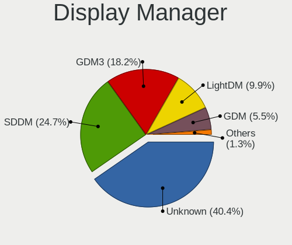

| Name    | Computers | Percent |
|---------|-----------|---------|
| Unknown | 516       | 49.33%  |
| GDM3    | 197       | 18.83%  |
| SDDM    | 143       | 13.67%  |
| LightDM | 117       | 11.19%  |
| GDM     | 68        | 6.5%    |
| Ly      | 3         | 0.29%   |
| XDM     | 2         | 0.19%   |

OS Lang
-------

Language

| Lang    | Computers | Percent |
|---------|-----------|---------|
| en_US   | 878       | 83.94%  |
| Unknown | 136       | 13%     |
| C       | 15        | 1.43%   |
| es_US   | 5         | 0.48%   |
| zh_CN   | 3         | 0.29%   |
| en_CA   | 3         | 0.29%   |
| ru_UA   | 1         | 0.1%    |
| ro_RO   | 1         | 0.1%    |
| pt_BR   | 1         | 0.1%    |
| es_ES   | 1         | 0.1%    |
| en_GB   | 1         | 0.1%    |
| C.UTF8  | 1         | 0.1%    |

Boot Mode
---------

EFI or BIOS

| Mode | Computers | Percent |
|------|-----------|---------|
| EFI  | 586       | 56.02%  |
| BIOS | 460       | 43.98%  |

Filesystem
----------

Type of filesystem

| Type    | Computers | Percent |
|---------|-----------|---------|
| Ext4    | 640       | 61.19%  |
| Overlay | 202       | 19.31%  |
| Btrfs   | 177       | 16.92%  |
| Xfs     | 16        | 1.53%   |
| Zfs     | 5         | 0.48%   |
| Ext2    | 2         | 0.19%   |
| XXXXXXX | 1         | 0.1%    |
| XXXXX   | 1         | 0.1%    |
| Tmpfs   | 1         | 0.1%    |
| F2fs    | 1         | 0.1%    |

Part. scheme
------------

Scheme of partitioning

| Type    | Computers | Percent |
|---------|-----------|---------|
| Unknown | 526       | 50.29%  |
| GPT     | 469       | 44.84%  |
| MBR     | 51        | 4.88%   |

Dual Boot with Linux/BSD
------------------------

Hosting more than one Linux/BSD

| Dual boot | Computers | Percent |
|-----------|-----------|---------|
| No        | 907       | 86.71%  |
| Yes       | 139       | 13.29%  |

Dual Boot (Win)
---------------

Hosting Linux and Windows

| Dual boot | Computers | Percent |
|-----------|-----------|---------|
| No        | 867       | 82.89%  |
| Yes       | 179       | 17.11%  |

Board
-----

Vendor
------

Motherboard manufacturer

| Name                           | Computers | Percent |
|--------------------------------|-----------|---------|
| Lenovo                         | 211       | 20.17%  |
| Dell                           | 143       | 13.67%  |
| Hewlett-Packard                | 141       | 13.48%  |
| ASUSTek Computer               | 130       | 12.43%  |
| MSI                            | 70        | 6.69%   |
| Gigabyte Technology            | 39        | 3.73%   |
| Apple                          | 38        | 3.63%   |
| Valve                          | 36        | 3.44%   |
| Google                         | 33        | 3.15%   |
| ASRock                         | 27        | 2.58%   |
| Acer                           | 23        | 2.2%    |
| Intel                          | 16        | 1.53%   |
| Raspberry Pi Foundation        | 15        | 1.43%   |
| Toshiba                        | 10        | 0.96%   |
| System76                       | 8         | 0.76%   |
| Microsoft                      | 8         | 0.76%   |
| AZW                            | 8         | 0.76%   |
| Unknown                        | 7         | 0.67%   |
| Alienware                      | 6         | 0.57%   |
| Samsung Electronics            | 5         | 0.48%   |
| GPU Company                    | 5         | 0.48%   |
| Pegatron                       | 4         | 0.38%   |
| Foxconn                        | 4         | 0.38%   |
| Supermicro                     | 3         | 0.29%   |
| Sony                           | 3         | 0.29%   |
| Protectli                      | 3         | 0.29%   |
| Panasonic                      | 3         | 0.29%   |
| Gateway                        | 3         | 0.29%   |
| Framework                      | 3         | 0.29%   |
| BESSTAR Tech                   | 3         | 0.29%   |
| Razer                          | 2         | 0.19%   |
| Pine Microsystems              | 2         | 0.19%   |
| OnLogic                        | 2         | 0.19%   |
| MECHREVO                       | 2         | 0.19%   |
| LattePanda                     | 2         | 0.19%   |
| GMKtec                         | 2         | 0.19%   |
| Eluktronics                    | 2         | 0.19%   |
| Acidanthera                    | 2         | 0.19%   |
| Xplore                         | 1         | 0.1%    |
| TUXEDO                         | 1         | 0.1%    |
| Timi                           | 1         | 0.1%    |
| Quanta                         | 1         | 0.1%    |
| Purism                         | 1         | 0.1%    |
| Notebook                       | 1         | 0.1%    |
| NCR                            | 1         | 0.1%    |
| MicroByte                      | 1         | 0.1%    |
| MAXSUN                         | 1         | 0.1%    |
| Matsushita Electric Industrial | 1         | 0.1%    |
| IPASON                         | 1         | 0.1%    |
| HUAWEI                         | 1         | 0.1%    |
| Hardkernel                     | 1         | 0.1%    |
| GPD                            | 1         | 0.1%    |
| Fujitsu                        | 1         | 0.1%    |
| Ematic                         | 1         | 0.1%    |
| eMachines                      | 1         | 0.1%    |
| ECS                            | 1         | 0.1%    |
| Biostar                        | 1         | 0.1%    |
| ASRockRack                     | 1         | 0.1%    |
| AMI                            | 1         | 0.1%    |
| 16512-2316-22801               | 1         | 0.1%    |

Model
-----

Motherboard model

| Name                                      | Computers | Percent |
|-------------------------------------------|-----------|---------|
| Lenovo ThinkPad L13 Yoga Gen 2 20VK0019US | 104       | 9.94%   |
| Valve Jupiter                             | 36        | 3.44%   |
| Google Terra                              | 14        | 1.34%   |
| RPi Raspberry Pi                          | 8         | 0.76%   |
| Unknown                                   | 8         | 0.76%   |
| MSI MS-7C37                               | 7         | 0.67%   |
| Google Reks                               | 7         | 0.67%   |
| ASUS TUF Gaming X570-PLUS                 | 6         | 0.57%   |
| ASUS All Series                           | 6         | 0.57%   |
| Dell OptiPlex 7010                        | 5         | 0.48%   |
| Dell Latitude E6400                       | 5         | 0.48%   |
| MSI MS-7C02                               | 4         | 0.38%   |
| HP Laptop 15-dy2xxx                       | 4         | 0.38%   |
| Apple MacBookAir7,2                       | 4         | 0.38%   |
| System76 Oryx Pro                         | 3         | 0.29%   |
| RPi Raspberry Pi 4 Model B Rev 1.4        | 3         | 0.29%   |
| MSI MS-7C91                               | 3         | 0.29%   |
| MSI MS-7B86                               | 3         | 0.29%   |
| MSI MS-7693                               | 3         | 0.29%   |
| Microsoft Surface Pro 4                   | 3         | 0.29%   |
| Lenovo ThinkPad 13 2nd Gen 20J10046US     | 3         | 0.29%   |
| HP Stream Laptop 14-ax0XX                 | 3         | 0.29%   |
| HP Laptop 15-dy1xxx                       | 3         | 0.29%   |
| HP ENVY x360 2-in-1 Laptop 15-ey0xxx      | 3         | 0.29%   |
| HP EliteDesk 800 G1 SFF                   | 3         | 0.29%   |
| HP EliteBook 840 G5                       | 3         | 0.29%   |
| HP 2000                                   | 3         | 0.29%   |
| GPU Company GWTC116-2                     | 3         | 0.29%   |
| Gigabyte B450M DS3H                       | 3         | 0.29%   |
| Dell XPS 8700                             | 3         | 0.29%   |
| Dell XPS 15 9570                          | 3         | 0.29%   |
| Dell OptiPlex 790                         | 3         | 0.29%   |
| Dell Latitude E6430                       | 3         | 0.29%   |
| Dell Inspiron 7506 2n1                    | 3         | 0.29%   |
| AZW SER                                   | 3         | 0.29%   |
| ASUS TUF Gaming X570-PRO                  | 3         | 0.29%   |
| ASUS ROG STRIX B550-F GAMING              | 3         | 0.29%   |
| ASUS ROG STRIX B450-F GAMING              | 3         | 0.29%   |
| ASUS PRIME X570-P                         | 3         | 0.29%   |
| ASRock B450M Pro4                         | 3         | 0.29%   |
| Apple MacBookPro14,1                      | 3         | 0.29%   |
| Toshiba Satellite C55-B                   | 2         | 0.19%   |
| Toshiba Satellite C55-A                   | 2         | 0.19%   |
| System76 Gazelle                          | 2         | 0.19%   |
| Razer Blade                               | 2         | 0.19%   |
| Protectli FW4B                            | 2         | 0.19%   |
| Pine Microsystems Pine64 PinePhone (1.2)  | 2         | 0.19%   |
| OnLogic Helix3X0                          | 2         | 0.19%   |
| MSI MS-7C95                               | 2         | 0.19%   |
| MSI MS-7C84                               | 2         | 0.19%   |
| MSI MS-7B85                               | 2         | 0.19%   |
| MSI MS-7758                               | 2         | 0.19%   |
| MSI MS-7751                               | 2         | 0.19%   |
| Lenovo Yoga C940-14IIL 81Q9               | 2         | 0.19%   |
| Lenovo ThinkPad Edge E530 62724FU         | 2         | 0.19%   |
| Lenovo Legion 5 Pro 16ARH7H 82RG          | 2         | 0.19%   |
| Lenovo Legion 5 15IMH05H 81Y6             | 2         | 0.19%   |
| Lenovo IdeaPad 5 15IIL05 81YK             | 2         | 0.19%   |
| Lenovo IdeaPad 320-15ABR 80XS             | 2         | 0.19%   |
| Lenovo IdeaPad 3 15ITL05 81X8             | 2         | 0.19%   |

Model Family
------------

Motherboard model prefix

| Name                  | Computers | Percent |
|-----------------------|-----------|---------|
| Lenovo ThinkPad       | 147       | 14.05%  |
| Dell Inspiron         | 37        | 3.54%   |
| Valve Jupiter         | 36        | 3.44%   |
| Dell Latitude         | 33        | 3.15%   |
| ASUS ROG              | 32        | 3.06%   |
| Dell OptiPlex         | 25        | 2.39%   |
| Lenovo IdeaPad        | 23        | 2.2%    |
| Dell XPS              | 22        | 2.1%    |
| HP Laptop             | 21        | 2.01%   |
| ASUS TUF              | 17        | 1.63%   |
| Acer Aspire           | 17        | 1.63%   |
| HP Pavilion           | 16        | 1.53%   |
| HP ENVY               | 16        | 1.53%   |
| RPi Raspberry         | 15        | 1.43%   |
| Google Terra          | 14        | 1.34%   |
| Dell Precision        | 14        | 1.34%   |
| ASUS PRIME            | 12        | 1.15%   |
| HP EliteBook          | 11        | 1.05%   |
| Toshiba Satellite     | 10        | 0.96%   |
| Lenovo Legion         | 9         | 0.86%   |
| HP Stream             | 9         | 0.86%   |
| HP ProBook            | 9         | 0.86%   |
| Microsoft Surface     | 8         | 0.76%   |
| Lenovo ThinkCentre    | 8         | 0.76%   |
| HP EliteDesk          | 8         | 0.76%   |
| ASUS VivoBook         | 8         | 0.76%   |
| Unknown               | 8         | 0.76%   |
| MSI MS-7C37           | 7         | 0.67%   |
| HP Compaq             | 7         | 0.67%   |
| Google Reks           | 7         | 0.67%   |
| ASUS ZenBook          | 7         | 0.67%   |
| Lenovo Yoga           | 6         | 0.57%   |
| HP ZBook              | 6         | 0.57%   |
| ASUS All              | 6         | 0.57%   |
| Apple MacBookPro11    | 5         | 0.48%   |
| Apple MacBookAir7     | 5         | 0.48%   |
| MSI MS-7C02           | 4         | 0.38%   |
| HP OMEN               | 4         | 0.38%   |
| Gigabyte B450M        | 4         | 0.38%   |
| Gigabyte B450         | 4         | 0.38%   |
| Dell PowerEdge        | 4         | 0.38%   |
| ASRock B450M          | 4         | 0.38%   |
| Apple MacBookPro14    | 4         | 0.38%   |
| Apple iMac14          | 4         | 0.38%   |
| Acer Nitro            | 4         | 0.38%   |
| System76 Oryx         | 3         | 0.29%   |
| MSI MS-7C91           | 3         | 0.29%   |
| MSI MS-7B86           | 3         | 0.29%   |
| MSI MS-7693           | 3         | 0.29%   |
| Lenovo ThinkBook      | 3         | 0.29%   |
| Lenovo IdeaPadFlex    | 3         | 0.29%   |
| HP Spectre            | 3         | 0.29%   |
| HP ProDesk            | 3         | 0.29%   |
| HP 2000               | 3         | 0.29%   |
| HP 15                 | 3         | 0.29%   |
| GPU Company GWTC116-2 | 3         | 0.29%   |
| Gigabyte X570         | 3         | 0.29%   |
| Gigabyte B550M        | 3         | 0.29%   |
| Gigabyte B550         | 3         | 0.29%   |
| Framework Laptop      | 3         | 0.29%   |

MFG Year
--------

Motherboard manufacture year

| Year    | Computers | Percent |
|---------|-----------|---------|
| 2020    | 223       | 21.32%  |
| 2022    | 111       | 10.61%  |
| 2021    | 108       | 10.33%  |
| 2019    | 90        | 8.6%    |
| 2018    | 83        | 7.93%   |
| 2012    | 52        | 4.97%   |
| 2017    | 50        | 4.78%   |
| 2016    | 50        | 4.78%   |
| 2014    | 49        | 4.68%   |
| 2015    | 47        | 4.49%   |
| 2011    | 45        | 4.3%    |
| 2013    | 43        | 4.11%   |
| 2010    | 26        | 2.49%   |
| 2008    | 21        | 2.01%   |
| Unknown | 19        | 1.82%   |
| 2009    | 13        | 1.24%   |
| 2007    | 13        | 1.24%   |
| 2006    | 2         | 0.19%   |
| 2005    | 1         | 0.1%    |

Form Factor
-----------

Physical design of the computer

| Name           | Computers | Percent |
|----------------|-----------|---------|
| Notebook       | 476       | 45.51%  |
| Desktop        | 347       | 33.17%  |
| Convertible    | 145       | 13.86%  |
| Mini pc        | 26        | 2.49%   |
| All in one     | 18        | 1.72%   |
| System on chip | 17        | 1.63%   |
| Tablet         | 11        | 1.05%   |
| Server         | 4         | 0.38%   |
| Phone          | 2         | 0.19%   |

Secure Boot
-----------

Enabled or disabled

| State    | Computers | Percent |
|----------|-----------|---------|
| Disabled | 984       | 94.07%  |
| Enabled  | 62        | 5.93%   |

Coreboot
--------

Have coreboot on board

| Used | Computers | Percent |
|------|-----------|---------|
| No   | 1006      | 96.18%  |
| Yes  | 40        | 3.82%   |

RAM Size
--------

Total RAM memory

| Size in GB      | Computers | Percent |
|-----------------|-----------|---------|
| 16.01-24.0      | 323       | 30.88%  |
| 8.01-16.0       | 188       | 17.97%  |
| 4.01-8.0        | 182       | 17.4%   |
| 3.01-4.0        | 133       | 12.72%  |
| 32.01-64.0      | 121       | 11.57%  |
| 64.01-256.0     | 47        | 4.49%   |
| 24.01-32.0      | 20        | 1.91%   |
| 1.01-2.0        | 17        | 1.63%   |
| 2.01-3.0        | 9         | 0.86%   |
| More than 256.0 | 3         | 0.29%   |
| 0.51-1.0        | 2         | 0.19%   |
| 0.01-0.5        | 1         | 0.1%    |

RAM Used
--------

Used RAM memory

| Used GB    | Computers | Percent |
|------------|-----------|---------|
| 1.01-2.0   | 396       | 37.86%  |
| 2.01-3.0   | 229       | 21.89%  |
| 4.01-8.0   | 170       | 16.25%  |
| 3.01-4.0   | 156       | 14.91%  |
| 8.01-16.0  | 44        | 4.21%   |
| 0.51-1.0   | 36        | 3.44%   |
| 0.01-0.5   | 8         | 0.76%   |
| 16.01-24.0 | 5         | 0.48%   |
| 32.01-64.0 | 1         | 0.1%    |
| 24.01-32.0 | 1         | 0.1%    |

Total Drives
------------

Number of drives on board

| Drives | Computers | Percent |
|--------|-----------|---------|
| 1      | 645       | 61.66%  |
| 2      | 248       | 23.71%  |
| 3      | 65        | 6.21%   |
| 4      | 39        | 3.73%   |
| 6      | 18        | 1.72%   |
| 5      | 18        | 1.72%   |
| 0      | 7         | 0.67%   |
| 7      | 5         | 0.48%   |
| 8      | 1         | 0.1%    |

Has CD-ROM
----------

Has CD-ROM on board

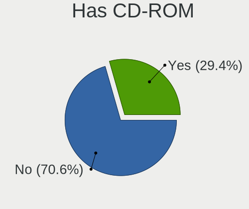

| Presented | Computers | Percent |
|-----------|-----------|---------|
| No        | 733       | 70.08%  |
| Yes       | 313       | 29.92%  |

Has Ethernet
------------

Has Ethernet on board

| Presented | Computers | Percent |
|-----------|-----------|---------|
| Yes       | 818       | 78.2%   |
| No        | 228       | 21.8%   |

Has WiFi
--------

Has WiFi module

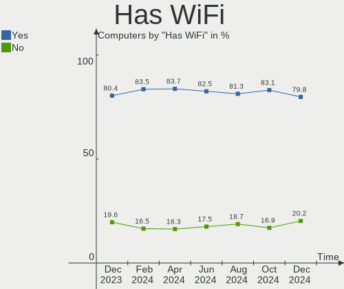

| Presented | Computers | Percent |
|-----------|-----------|---------|
| Yes       | 876       | 83.75%  |
| No        | 170       | 16.25%  |

Has Bluetooth
-------------

Has Bluetooth module

| Presented | Computers | Percent |
|-----------|-----------|---------|
| Yes       | 744       | 71.13%  |
| No        | 302       | 28.87%  |

Location
--------

Country
-------

Geographic location (country)

| Country | Computers | Percent |
|---------|-----------|---------|
| USA     | 1046      | 100%    |

City
----

Geographic location (city)

| City           | Computers | Percent |
|----------------|-----------|---------|
| Bangor         | 143       | 13.67%  |
| Dallas         | 17        | 1.63%   |
| Portland       | 13        | 1.24%   |
| New York       | 11        | 1.05%   |
| Atlanta        | 11        | 1.05%   |
| Seattle        | 10        | 0.96%   |
| Los Angeles    | 10        | 0.96%   |
| Denver         | 10        | 0.96%   |
| San Antonio    | 8         | 0.76%   |
| Minneapolis    | 8         | 0.76%   |
| San Diego      | 7         | 0.67%   |
| Louisville     | 7         | 0.67%   |
| Las Vegas      | 7         | 0.67%   |
| Kansas City    | 7         | 0.67%   |
| Houston        | 7         | 0.67%   |
| Chicago        | 7         | 0.67%   |
| Jacksonville   | 6         | 0.57%   |
| Cypress        | 6         | 0.57%   |
| Albuquerque    | 6         | 0.57%   |
| Washington     | 5         | 0.48%   |
| San Jose       | 5         | 0.48%   |
| Salt Lake City | 5         | 0.48%   |
| Queens         | 5         | 0.48%   |
| Phoenix        | 5         | 0.48%   |
| Milwaukee      | 5         | 0.48%   |
| Miami          | 5         | 0.48%   |
| Malden         | 5         | 0.48%   |
| Columbus       | 5         | 0.48%   |
| Aurora         | 5         | 0.48%   |
| Tucson         | 4         | 0.38%   |
| Travelers Rest | 4         | 0.38%   |
| Southampton    | 4         | 0.38%   |
| Raleigh        | 4         | 0.38%   |
| Philadelphia   | 4         | 0.38%   |
| Madison        | 4         | 0.38%   |
| Lancaster      | 4         | 0.38%   |
| Gaithersburg   | 4         | 0.38%   |
| Fort Collins   | 4         | 0.38%   |
| Farmington     | 4         | 0.38%   |
| Danville       | 4         | 0.38%   |
| Cincinnati     | 4         | 0.38%   |
| Brooklyn       | 4         | 0.38%   |
| Ashburn        | 4         | 0.38%   |
| Tulsa          | 3         | 0.29%   |
| Tampa          | 3         | 0.29%   |
| Santa Clara    | 3         | 0.29%   |
| San Francisco  | 3         | 0.29%   |
| Saint Paul     | 3         | 0.29%   |
| Saint Joseph   | 3         | 0.29%   |
| New Braunfels  | 3         | 0.29%   |
| Nashville      | 3         | 0.29%   |
| Muncie         | 3         | 0.29%   |
| Manassas       | 3         | 0.29%   |
| Indianapolis   | 3         | 0.29%   |
| Henderson      | 3         | 0.29%   |
| Garland        | 3         | 0.29%   |
| Fairfax        | 3         | 0.29%   |
| Erie           | 3         | 0.29%   |
| El Cajon       | 3         | 0.29%   |
| Culver City    | 3         | 0.29%   |

Drives
------

Drive Vendor
------------

Hard drive vendors

| Vendor                         | Computers | Drives | Percent |
|--------------------------------|-----------|--------|---------|
| Samsung Electronics            | 328       | 384    | 21.77%  |
| WDC                            | 172       | 212    | 11.41%  |
| Seagate                        | 163       | 207    | 10.82%  |
| Unknown                        | 116       | 131    | 7.7%    |
| Sandisk                        | 91        | 100    | 6.04%   |
| Toshiba                        | 68        | 78     | 4.51%   |
| SK hynix                       | 51        | 54     | 3.38%   |
| Kingston                       | 51        | 52     | 3.38%   |
| Crucial                        | 50        | 57     | 3.32%   |
| Phison                         | 39        | 41     | 2.59%   |
| Hitachi                        | 36        | 38     | 2.39%   |
| Intel                          | 35        | 45     | 2.32%   |
| PNY                            | 29        | 32     | 1.92%   |
| Apple                          | 27        | 32     | 1.79%   |
| HGST                           | 21        | 26     | 1.39%   |
| China                          | 20        | 25     | 1.33%   |
| Unknown                        | 20        | 20     | 1.33%   |
| Micron Technology              | 18        | 18     | 1.19%   |
| A-DATA Technology              | 15        | 16     | 1%      |
| KIOXIA                         | 14        | 19     | 0.93%   |
| Team                           | 11        | 12     | 0.73%   |
| Micron/Crucial Technology      | 10        | 10     | 0.66%   |
| Silicon Motion                 | 9         | 9      | 0.6%    |
| JMicron Technology             | 7         | 7      | 0.46%   |
| SPCC                           | 5         | 6      | 0.33%   |
| Phison Electronics             | 4         | 4      | 0.27%   |
| OCZ                            | 4         | 4      | 0.27%   |
| Transcend                      | 3         | 3      | 0.2%    |
| Realtek Semiconductor          | 3         | 3      | 0.2%    |
| LITEON                         | 3         | 3      | 0.2%    |
| Hewlett-Packard                | 3         | 3      | 0.2%    |
| XPG                            | 2         | 2      | 0.13%   |
| W800S                          | 2         | 2      | 0.13%   |
| Union Memory (Shenzhen)        | 2         | 2      | 0.13%   |
| Solid State Storage Technology | 2         | 2      | 0.13%   |
| SABRENT                        | 2         | 2      | 0.13%   |
| Protectli                      | 2         | 2      | 0.13%   |
| O2 Micro                       | 2         | 2      | 0.13%   |
| NGFF                           | 2         | 2      | 0.13%   |
| Mushkin                        | 2         | 2      | 0.13%   |
| KingFast                       | 2         | 2      | 0.13%   |
| HGST HTS                       | 2         | 2      | 0.13%   |
| Corsair                        | 2         | 2      | 0.13%   |
| ASMT                           | 2         | 2      | 0.13%   |
| Argon                          | 2         | 2      | 0.13%   |
| AMD                            | 2         | 2      | 0.13%   |
| ADATA SU                       | 2         | 2      | 0.13%   |
| Zheino                         | 1         | 1      | 0.07%   |
| WDS100T3                       | 1         | 1      | 0.07%   |
| WDC WDBN                       | 1         | 1      | 0.07%   |
| WD MediaMax                    | 1         | 1      | 0.07%   |
| Verbatim                       | 1         | 1      | 0.07%   |
| USB3.0                         | 1         | 1      | 0.07%   |
| UMIS                           | 1         | 1      | 0.07%   |
| TrekStor                       | 1         | 1      | 0.07%   |
| Timetec                        | 1         | 1      | 0.07%   |
| T-FORCE                        | 1         | 1      | 0.07%   |
| Super Talent                   | 1         | 1      | 0.07%   |
| SSK                            | 1         | 1      | 0.07%   |
| RSH-339                        | 1         | 1      | 0.07%   |

Drive Model
-----------

Hard drive models

| Model                                              | Computers | Percent |
|----------------------------------------------------|-----------|---------|
| Samsung MZVLB512HBJQ-000L7 512GB                   | 101       | 6.09%   |
| Unknown                                            | 20        | 1.21%   |
| Samsung SSD 860 EVO 500GB                          | 17        | 1.02%   |
| Samsung NVMe SSD Drive 1TB                         | 17        | 1.02%   |
| Phison NVMe SSD Drive 512GB                        | 14        | 0.84%   |
| Unknown SDW16G  16GB                               | 13        | 0.78%   |
| Unknown MMC Card  32GB                             | 13        | 0.78%   |
| Unknown MMC Card  128GB                            | 13        | 0.78%   |
| SanDisk NVMe SSD Drive 1TB                         | 13        | 0.78%   |
| Samsung SSD 860 EVO 1TB                            | 13        | 0.78%   |
| Seagate ST2000DM008-2FR102 2TB                     | 12        | 0.72%   |
| WDC WD10EZEX-08WN4A0 1TB                           | 11        | 0.66%   |
| Crucial CT1000MX500SSD1 1TB                        | 10        | 0.6%    |
| SanDisk NVMe SSD Drive 500GB                       | 9         | 0.54%   |
| Samsung SSD 850 EVO 250GB                          | 9         | 0.54%   |
| Samsung NVMe SSD Drive 500GB                       | 9         | 0.54%   |
| Samsung NVMe SSD Drive 2TB                         | 9         | 0.54%   |
| Samsung NVMe SSD Controller SM981/PM981/PM983 1TB  | 9         | 0.54%   |
| PNY CS900 500GB SSD                                | 9         | 0.54%   |
| WDC WDBNCE0010PNC 1TB SSD                          | 8         | 0.48%   |
| Unknown SD/MMC/MS PRO 128GB                        | 8         | 0.48%   |
| Unknown MMC Card  64GB                             | 8         | 0.48%   |
| Seagate ST1000DM003-1SB102 1TB                     | 8         | 0.48%   |
| Samsung SSD 980 PRO 1TB                            | 8         | 0.48%   |
| Samsung SSD 970 EVO Plus 500GB                     | 8         | 0.48%   |
| Samsung NVMe SSD Drive 256GB                       | 8         | 0.48%   |
| Kingston NVMe SSD Drive 512GB                      | 8         | 0.48%   |
| Kingston NVMe SSD Drive 256GB                      | 8         | 0.48%   |
| Toshiba DT01ACA200 2TB                             | 7         | 0.42%   |
| Seagate ST500DM002-1BD142 500GB                    | 7         | 0.42%   |
| Seagate ST2000DM001-1ER164 2TB                     | 7         | 0.42%   |
| Seagate ST1000LM035-1RK172 1TB                     | 7         | 0.42%   |
| Seagate ST1000LM024 HN-M101MBB 1TB                 | 7         | 0.42%   |
| Samsung NVMe SSD Drive 512GB                       | 7         | 0.42%   |
| Intel NVMe SSD Drive 512GB                         | 7         | 0.42%   |
| WDC WDBNCE5000PNC 500GB SSD                        | 6         | 0.36%   |
| Unknown MMC Card  512GB                            | 6         | 0.36%   |
| Toshiba MQ01ABD100 1TB                             | 6         | 0.36%   |
| SK hynix NVMe SSD Drive 1024GB                     | 6         | 0.36%   |
| Silicon Motion NVMe SSD Drive 512GB                | 6         | 0.36%   |
| Seagate ST1000DM010-2EP102 1TB                     | 6         | 0.36%   |
| SanDisk NVMe SSD Drive 256GB                       | 6         | 0.36%   |
| Samsung NVMe SSD Controller PM9A1/PM9A3/980PRO 1TB | 6         | 0.36%   |
| Phison NVMe SSD Drive 2TB                          | 6         | 0.36%   |
| Kingston SA400S37240G 240GB SSD                    | 6         | 0.36%   |
| China SATA SSD 120GB                               | 6         | 0.36%   |
| Unknown SD/MMC 16GB                                | 5         | 0.3%    |
| Unknown M.S./M.S.Pro/HG 16GB                       | 5         | 0.3%    |
| SK hynix NVMe SSD Drive 512GB                      | 5         | 0.3%    |
| Sandisk WD Blue SN550 NVMe SSD 256GB               | 5         | 0.3%    |
| SanDisk SSD PLUS 240GB                             | 5         | 0.3%    |
| Samsung SSD 970 EVO Plus 1TB                       | 5         | 0.3%    |
| Samsung SSD 870 EVO 500GB                          | 5         | 0.3%    |
| Samsung SM963 2.5" NVMe PCIe SSD 1024GB            | 5         | 0.3%    |
| Phison NVMe SSD Drive 1TB                          | 5         | 0.3%    |
| Kingston SA400S37120G 120GB SSD                    | 5         | 0.3%    |
| HGST HTS721010A9E630 1TB                           | 5         | 0.3%    |
| Crucial CT2000MX500SSD1 2TB                        | 5         | 0.3%    |
| WDC WDS500G2B0B-00YS70 500GB SSD                   | 4         | 0.24%   |
| WDC WDS500G2B0A-00SM50 500GB SSD                   | 4         | 0.24%   |

HDD Vendor
----------

Hard disk drive vendors

| Vendor              | Computers | Drives | Percent |
|---------------------|-----------|--------|---------|
| Seagate             | 157       | 198    | 37.74%  |
| WDC                 | 120       | 152    | 28.85%  |
| Toshiba             | 50        | 58     | 12.02%  |
| Hitachi             | 36        | 38     | 8.65%   |
| HGST                | 21        | 26     | 5.05%   |
| Unknown             | 9         | 12     | 2.16%   |
| Apple               | 6         | 6      | 1.44%   |
| Samsung Electronics | 3         | 3      | 0.72%   |
| SABRENT             | 2         | 2      | 0.48%   |
| HGST HTS            | 2         | 2      | 0.48%   |
| WD MediaMax         | 1         | 1      | 0.24%   |
| USB3.0              | 1         | 1      | 0.24%   |
| RSH-339             | 1         | 1      | 0.24%   |
| RSH-319             | 1         | 1      | 0.24%   |
| PHD 3.0             | 1         | 1      | 0.24%   |
| Maxone              | 1         | 1      | 0.24%   |
| JMicron Technology  | 1         | 1      | 0.24%   |
| Fujitsu             | 1         | 1      | 0.24%   |
| ASMT                | 1         | 1      | 0.24%   |
| Asm                 | 1         | 1      | 0.24%   |

SSD Vendor
----------

Solid state drive vendors

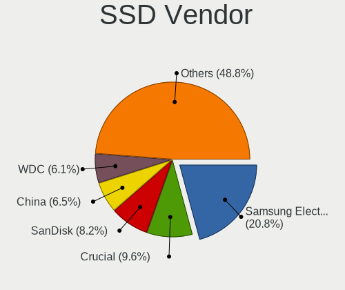

| Vendor              | Computers | Drives | Percent |
|---------------------|-----------|--------|---------|
| Samsung Electronics | 109       | 122    | 25.65%  |
| Crucial             | 43        | 50     | 10.12%  |
| SanDisk             | 41        | 45     | 9.65%   |
| WDC                 | 35        | 36     | 8.24%   |
| PNY                 | 29        | 32     | 6.82%   |
| Kingston            | 25        | 26     | 5.88%   |
| China               | 20        | 25     | 4.71%   |
| Apple               | 14        | 14     | 3.29%   |
| A-DATA Technology   | 14        | 14     | 3.29%   |
| SK hynix            | 9         | 10     | 2.12%   |
| Team                | 8         | 9      | 1.88%   |
| Toshiba             | 6         | 6      | 1.41%   |
| Micron Technology   | 6         | 6      | 1.41%   |
| Intel               | 6         | 6      | 1.41%   |
| SPCC                | 5         | 6      | 1.18%   |
| Unknown             | 5         | 5      | 1.18%   |
| OCZ                 | 4         | 4      | 0.94%   |
| Transcend           | 3         | 3      | 0.71%   |
| LITEON              | 3         | 3      | 0.71%   |
| Seagate             | 2         | 2      | 0.47%   |
| NGFF                | 2         | 2      | 0.47%   |
| Mushkin             | 2         | 2      | 0.47%   |
| JMicron Technology  | 2         | 2      | 0.47%   |
| Hewlett-Packard     | 2         | 2      | 0.47%   |
| Corsair             | 2         | 2      | 0.47%   |
| Argon               | 2         | 2      | 0.47%   |
| ADATA SU            | 2         | 2      | 0.47%   |
| WDC WDBN            | 1         | 1      | 0.24%   |
| Verbatim            | 1         | 1      | 0.24%   |
| TrekStor            | 1         | 1      | 0.24%   |
| T-FORCE             | 1         | 1      | 0.24%   |
| Super Talent        | 1         | 1      | 0.24%   |
| Plextor             | 1         | 1      | 0.24%   |
| Patriot             | 1         | 1      | 0.24%   |
| ORTIAL              | 1         | 1      | 0.24%   |
| OCZ-VERTEX3         | 1         | 1      | 0.24%   |
| Netac               | 1         | 1      | 0.24%   |
| MyDigitalSSD        | 1         | 1      | 0.24%   |
| LITEONIT            | 1         | 1      | 0.24%   |
| Leven               | 1         | 1      | 0.24%   |
| KingFast            | 1         | 1      | 0.24%   |
| Kingchuxing         | 1         | 1      | 0.24%   |
| Intenso             | 1         | 1      | 0.24%   |
| Inland              | 1         | 1      | 0.24%   |
| HP Phison           | 1         | 1      | 0.24%   |
| Hoodisk             | 1         | 1      | 0.24%   |
| DUEX                | 1         | 1      | 0.24%   |
| BHT                 | 1         | 1      | 0.24%   |
| ASMT                | 1         | 1      | 0.24%   |
| Apacer              | 1         | 1      | 0.24%   |
| Acer                | 1         | 1      | 0.24%   |

Drive Kind
----------

HDD or SSD

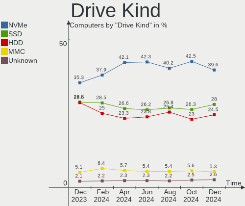

| Kind    | Computers | Drives | Percent |
|---------|-----------|--------|---------|
| NVMe    | 497       | 593    | 36.38%  |
| SSD     | 371       | 462    | 27.16%  |
| HDD     | 345       | 507    | 25.26%  |
| MMC     | 119       | 128    | 8.71%   |
| Unknown | 34        | 42     | 2.49%   |

Drive Connector
---------------

SATA, SAS, NVMe, etc.

| Type | Computers | Drives | Percent |
|------|-----------|--------|---------|
| SATA | 568       | 903    | 44.62%  |
| NVMe | 496       | 591    | 38.96%  |
| MMC  | 119       | 128    | 9.35%   |
| SAS  | 90        | 110    | 7.07%   |

Drive Size
----------

Size of hard drive

| Size in TB | Computers | Drives | Percent |
|------------|-----------|--------|---------|
| 0.01-0.5   | 386       | 489    | 49.23%  |
| 0.51-1.0   | 222       | 265    | 28.32%  |
| 1.01-2.0   | 89        | 98     | 11.35%  |
| 3.01-4.0   | 35        | 41     | 4.46%   |
| 4.01-10.0  | 30        | 42     | 3.83%   |
| 2.01-3.0   | 18        | 24     | 2.3%    |
| 10.01-20.0 | 4         | 10     | 0.51%   |

Space Total
-----------

Amount of disk space available on the file system

| Size in GB     | Computers | Percent |
|----------------|-----------|---------|
| 251-500        | 283       | 27.06%  |
| 101-250        | 198       | 18.93%  |
| 501-1000       | 167       | 15.97%  |
| More than 3000 | 93        | 8.89%   |
| 1001-2000      | 83        | 7.93%   |
| 1-20           | 66        | 6.31%   |
| 51-100         | 49        | 4.68%   |
| Unknown        | 49        | 4.68%   |
| 21-50          | 31        | 2.96%   |
| 2001-3000      | 26        | 2.49%   |
| 0              | 1         | 0.1%    |

Space Used
----------

Amount of used disk space

| Used GB        | Computers | Percent |
|----------------|-----------|---------|
| 1-20           | 438       | 41.87%  |
| 21-50          | 146       | 13.96%  |
| 101-250        | 103       | 9.85%   |
| 51-100         | 97        | 9.27%   |
| 251-500        | 75        | 7.17%   |
| 501-1000       | 49        | 4.68%   |
| Unknown        | 49        | 4.68%   |
| 1001-2000      | 43        | 4.11%   |
| More than 3000 | 29        | 2.77%   |
| 2001-3000      | 15        | 1.43%   |
| 0              | 2         | 0.19%   |

Malfunc. Drives
---------------

Drive models with a malfunction

| Model                                            | Computers | Drives | Percent |
|--------------------------------------------------|-----------|--------|---------|
| Samsung Electronics SSD 870 EVO 1TB              | 2         | 2      | 3.85%   |
| Hitachi HDT725032VLA360 320GB                    | 2         | 2      | 3.85%   |
| HGST HTS 721010A9E630 1TB                        | 2         | 2      | 3.85%   |
| Crucial CT1050MX300SSD1 1050GB                   | 2         | 2      | 3.85%   |
| WDC WD5000LPZX-60Z10T0 500GB                     | 1         | 1      | 1.92%   |
| WDC WD40EFRX-68WT0N0 4TB                         | 1         | 1      | 1.92%   |
| WDC WD4000FYYZ-01UL1B2 4TB                       | 1         | 2      | 1.92%   |
| WDC WD10SPZX-60Z10T0 1TB                         | 1         | 1      | 1.92%   |
| WDC WD10EZEX-75M2NA0 1TB                         | 1         | 1      | 1.92%   |
| WDC WD1003FBYX-01Y7B1 1TB                        | 1         | 1      | 1.92%   |
| Toshiba DT01ACA200 2TB                           | 1         | 1      | 1.92%   |
| Team TM8FP4004T 4TB                              | 1         | 1      | 1.92%   |
| SK hynix HFS256G39TND-N210A 256GB SSD            | 1         | 1      | 1.92%   |
| SK hynix BC711 HFM512GD3JX013N 512GB             | 1         | 1      | 1.92%   |
| Seagate ST9320310AS 320GB                        | 1         | 1      | 1.92%   |
| Seagate ST9120823AS 120GB                        | 1         | 1      | 1.92%   |
| Seagate ST500LT012-9WS142 500GB                  | 1         | 1      | 1.92%   |
| Seagate ST3500418AS 500GB                        | 1         | 1      | 1.92%   |
| Seagate ST320LT007-9ZV142 320GB                  | 1         | 1      | 1.92%   |
| Seagate ST2000LM007-1R8174 2TB                   | 1         | 1      | 1.92%   |
| Seagate ST2000DX002-2DV164 2TB                   | 1         | 1      | 1.92%   |
| Seagate ST1000DM003-9YN162 1TB                   | 1         | 1      | 1.92%   |
| Seagate ST10000NM0086-2AA101 10TB                | 1         | 1      | 1.92%   |
| SanDisk SSD PLUS 1000GB                          | 1         | 1      | 1.92%   |
| SanDisk SD6SB1M128G1022 128GB SSD                | 1         | 1      | 1.92%   |
| Samsung Electronics SSD 980 1TB                  | 1         | 1      | 1.92%   |
| Samsung Electronics SSD 870 EVO 500GB            | 1         | 1      | 1.92%   |
| Samsung Electronics MZNLH128HBHQ-000H1 128GB SSD | 1         | 1      | 1.92%   |
| NGFF 2280 256GB SSD                              | 1         | 1      | 1.92%   |
| Netac SSD 256GB                                  | 1         | 1      | 1.92%   |
| Kingston SV300S37A120G 120GB SSD                 | 1         | 1      | 1.92%   |
| Kingston SNS4151S332GD 32GB SSD                  | 1         | 1      | 1.92%   |
| JMicron Technology Disk 250GB                    | 1         | 1      | 1.92%   |
| Intel SSDSC2BA800G4R 800GB                       | 1         | 1      | 1.92%   |
| Intel SSDPEKKW128G7 128GB                        | 1         | 1      | 1.92%   |
| HP Phison PSSBN016GA27MC0 16GB SSD               | 1         | 1      | 1.92%   |
| Hitachi HTS725050A9A360 500GB                    | 1         | 1      | 1.92%   |
| Hitachi HTS541616J9SA00 160GB                    | 1         | 1      | 1.92%   |
| Hitachi HDT721064SLA360 640GB                    | 1         | 1      | 1.92%   |
| Hitachi HDS721010DLE630 1TB                      | 1         | 1      | 1.92%   |
| HGST HTS545025A7E680 250GB                       | 1         | 1      | 1.92%   |
| HGST HTS541010A7E630 1TB                         | 1         | 1      | 1.92%   |
| Hewlett-Packard SSD EX900 500GB                  | 1         | 1      | 1.92%   |
| DUEX DX300256A5xnEMLC 256GB SSD                  | 1         | 1      | 1.92%   |
| Corsair Force LS SSD 64GB                        | 1         | 1      | 1.92%   |
| A-DATA Technology SU650 120GB SSD                | 1         | 1      | 1.92%   |
| A-DATA Technology SP900 256GB SSD                | 1         | 1      | 1.92%   |
| Unknown                                          | 1         | 1      | 1.92%   |

Malfunc. Drive Vendor
---------------------

Vendors of faulty drives

| Vendor              | Computers | Drives | Percent |
|---------------------|-----------|--------|---------|
| Seagate             | 8         | 9      | 15.69%  |
| WDC                 | 6         | 7      | 11.76%  |
| Hitachi             | 6         | 6      | 11.76%  |
| Samsung Electronics | 5         | 5      | 9.8%    |
| SK hynix            | 2         | 2      | 3.92%   |
| SanDisk             | 2         | 2      | 3.92%   |
| Kingston            | 2         | 2      | 3.92%   |
| Intel               | 2         | 2      | 3.92%   |
| HGST HTS            | 2         | 2      | 3.92%   |
| HGST                | 2         | 2      | 3.92%   |
| Crucial             | 2         | 2      | 3.92%   |
| A-DATA Technology   | 2         | 2      | 3.92%   |
| Toshiba             | 1         | 1      | 1.96%   |
| Team                | 1         | 1      | 1.96%   |
| NGFF                | 1         | 1      | 1.96%   |
| Netac               | 1         | 1      | 1.96%   |
| JMicron Technology  | 1         | 1      | 1.96%   |
| HP Phison           | 1         | 1      | 1.96%   |
| Hewlett-Packard     | 1         | 1      | 1.96%   |
| DUEX                | 1         | 1      | 1.96%   |
| Corsair             | 1         | 1      | 1.96%   |
| Unknown             | 1         | 1      | 1.96%   |

Malfunc. HDD Vendor
-------------------

Vendors of faulty HDD drives

| Vendor             | Computers | Drives | Percent |
|--------------------|-----------|--------|---------|
| Seagate            | 8         | 9      | 30.77%  |
| WDC                | 6         | 7      | 23.08%  |
| Hitachi            | 6         | 6      | 23.08%  |
| HGST HTS           | 2         | 2      | 7.69%   |
| HGST               | 2         | 2      | 7.69%   |
| Toshiba            | 1         | 1      | 3.85%   |
| JMicron Technology | 1         | 1      | 3.85%   |

Malfunc. Drive Kind
-------------------

Kinds of faulty drives

| Kind | Computers | Drives | Percent |
|------|-----------|--------|---------|
| HDD  | 24        | 28     | 48.98%  |
| SSD  | 20        | 20     | 40.82%  |
| NVMe | 5         | 5      | 10.2%   |

Failed Drives
-------------

Failed drive models

Zero info for selected period =(

Failed Drive Vendor
-------------------

Failed drive vendors

Zero info for selected period =(

Drive Status
------------

Number of failed and malfunc. drives

| Status   | Computers | Drives | Percent |
|----------|-----------|--------|---------|
| Detected | 608       | 1048   | 54.68%  |
| Works    | 457       | 631    | 41.1%   |
| Malfunc  | 47        | 53     | 4.23%   |

Storage controller
------------------

Storage Vendor
--------------

Storage controller vendors

| Vendor                         | Computers | Percent |
|--------------------------------|-----------|---------|
| Intel                          | 508       | 38.54%  |
| Samsung Electronics            | 250       | 18.97%  |
| AMD                            | 218       | 16.54%  |
| SanDisk                        | 66        | 5.01%   |
| Phison Electronics             | 43        | 3.26%   |
| SK hynix                       | 41        | 3.11%   |
| ASMedia Technology             | 36        | 2.73%   |
| Kingston Technology Company    | 26        | 1.97%   |
| Micron/Crucial Technology      | 16        | 1.21%   |
| Toshiba America Info Systems   | 14        | 1.06%   |
| KIOXIA                         | 12        | 0.91%   |
| Micron Technology              | 11        | 0.83%   |
| Marvell Technology Group       | 11        | 0.83%   |
| Silicon Motion                 | 10        | 0.76%   |
| Nvidia                         | 10        | 0.76%   |
| Apple                          | 7         | 0.53%   |
| Realtek Semiconductor          | 5         | 0.38%   |
| LSI Logic / Symbios Logic      | 5         | 0.38%   |
| JMicron Technology             | 5         | 0.38%   |
| Silicon Image                  | 4         | 0.3%    |
| Union Memory (Shenzhen)        | 3         | 0.23%   |
| Broadcom / LSI                 | 3         | 0.23%   |
| Unknown                        | 2         | 0.15%   |
| Solid State Storage Technology | 2         | 0.15%   |
| O2 Micro                       | 2         | 0.15%   |
| ADATA Technology               | 2         | 0.15%   |
| Seagate Technology             | 1         | 0.08%   |
| MAXIO Technology (Hangzhou)    | 1         | 0.08%   |
| Lenovo                         | 1         | 0.08%   |
| HighPoint Technologies         | 1         | 0.08%   |
| Biwin Storage Technology       | 1         | 0.08%   |
| Adaptec                        | 1         | 0.08%   |

Storage Model
-------------

Storage controller models

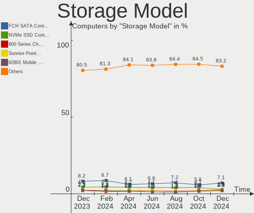

| Model                                                                                   | Computers | Percent |
|-----------------------------------------------------------------------------------------|-----------|---------|
| Samsung NVMe SSD Controller SM981/PM981/PM983                                           | 165       | 11.3%   |
| AMD FCH SATA Controller [AHCI mode]                                                     | 142       | 9.73%   |
| Intel 82801 Mobile SATA Controller [RAID mode]                                          | 44        | 3.01%   |
| Intel Sunrise Point-LP SATA Controller [AHCI mode]                                      | 42        | 2.88%   |
| Intel Volume Management Device NVMe RAID Controller                                     | 40        | 2.74%   |
| Samsung NVMe SSD Controller PM9A1/PM9A3/980PRO                                          | 36        | 2.47%   |
| ASMedia ASM1062 Serial ATA Controller                                                   | 36        | 2.47%   |
| AMD 400 Series Chipset SATA Controller                                                  | 35        | 2.4%    |
| Intel 8 Series/C220 Series Chipset Family 6-port SATA Controller 1 [AHCI mode]          | 34        | 2.33%   |
| Intel 7 Series Chipset Family 6-port SATA Controller [AHCI mode]                        | 33        | 2.26%   |
| AMD 500 Series Chipset SATA Controller                                                  | 32        | 2.19%   |
| SK hynix Gold P31 SSD                                                                   | 23        | 1.58%   |
| Intel Q170/Q150/B150/H170/H110/Z170/CM236 Chipset SATA Controller [AHCI Mode]           | 23        | 1.58%   |
| Samsung NVMe SSD Controller 980                                                         | 22        | 1.51%   |
| SanDisk WD Blue SN550 NVMe SSD                                                          | 21        | 1.44%   |
| Phison PS5013 E13 NVMe Controller                                                       | 19        | 1.3%    |
| Intel SATA Controller [RAID mode]                                                       | 19        | 1.3%    |
| Kingston Company OM3PDP3 NVMe SSD                                                       | 18        | 1.23%   |
| SanDisk Non-Volatile memory controller                                                  | 17        | 1.16%   |
| AMD SB7x0/SB8x0/SB9x0 SATA Controller [AHCI mode]                                       | 17        | 1.16%   |
| Intel Non-Volatile memory controller                                                    | 14        | 0.96%   |
| Intel Celeron/Pentium Silver Processor SATA Controller                                  | 14        | 0.96%   |
| AMD SB7x0/SB8x0/SB9x0 IDE Controller                                                    | 14        | 0.96%   |
| SanDisk WD Black SN750 / PC SN730 NVMe SSD                                              | 13        | 0.89%   |
| Intel Wildcat Point-LP SATA Controller [AHCI Mode]                                      | 13        | 0.89%   |
| Intel Cannon Lake PCH SATA AHCI Controller                                              | 13        | 0.89%   |
| Intel 7 Series/C210 Series Chipset Family 6-port SATA Controller [AHCI mode]            | 13        | 0.89%   |
| Intel Tiger Lake-LP SATA Controller                                                     | 12        | 0.82%   |
| Intel 200 Series PCH SATA controller [AHCI mode]                                        | 12        | 0.82%   |
| Micron Non-Volatile memory controller                                                   | 11        | 0.75%   |
| Intel SSD 660P Series                                                                   | 11        | 0.75%   |
| Intel 8 Series SATA Controller 1 [AHCI mode]                                            | 11        | 0.75%   |
| Intel 6 Series/C200 Series Chipset Family 6 port Desktop SATA AHCI Controller           | 11        | 0.75%   |
| Intel 400 Series Chipset Family SATA AHCI Controller                                    | 11        | 0.75%   |
| Samsung Electronics SATA controller                                                     | 10        | 0.68%   |
| Intel Cannon Lake Mobile PCH SATA AHCI Controller                                       | 10        | 0.68%   |
| Intel 6 Series/C200 Series Chipset Family 6 port Mobile SATA AHCI Controller            | 10        | 0.68%   |
| Intel 500 Series Chipset Family SATA AHCI Controller                                    | 10        | 0.68%   |
| Toshiba America Info Systems XG6 NVMe SSD Controller                                    | 9         | 0.62%   |
| Samsung NVMe SSD Controller SM961/PM961/SM963                                           | 9         | 0.62%   |
| Phison E12 NVMe Controller                                                              | 9         | 0.62%   |
| AMD 300 Series Chipset SATA Controller                                                  | 9         | 0.62%   |
| Silicon Motion SM2263EN/SM2263XT SSD Controller                                         | 8         | 0.55%   |
| Intel Celeron N3350/Pentium N4200/Atom E3900 Series SATA AHCI Controller                | 8         | 0.55%   |
| Intel Atom/Celeron/Pentium Processor x5-E8000/J3xxx/N3xxx Series SATA Controller        | 8         | 0.55%   |
| Intel 82801HM/HEM (ICH8M/ICH8M-E) SATA Controller [AHCI mode]                           | 8         | 0.55%   |
| Intel 82801HM/HEM (ICH8M/ICH8M-E) IDE Controller                                        | 8         | 0.55%   |
| Intel 5 Series/3400 Series Chipset 4 port SATA AHCI Controller                          | 8         | 0.55%   |
| AMD SB7x0/SB8x0/SB9x0 SATA Controller [IDE mode]                                        | 8         | 0.55%   |
| Samsung NVMe SSD Controller SM951/PM951                                                 | 7         | 0.48%   |
| Micron/Crucial P2 NVMe PCIe SSD                                                         | 7         | 0.48%   |
| KIOXIA NVMe SSD Controller BG4                                                          | 7         | 0.48%   |
| Intel HM170/QM170 Chipset SATA Controller [AHCI Mode]                                   | 7         | 0.48%   |
| Intel Comet Lake SATA AHCI Controller                                                   | 7         | 0.48%   |
| SK hynix PC401 NVMe Solid State Drive 256GB                                             | 6         | 0.41%   |
| SanDisk WD PC SN810 / Black SN850 NVMe SSD                                              | 6         | 0.41%   |
| Phison E16 PCIe4 NVMe Controller                                                        | 6         | 0.41%   |
| Intel 9 Series Chipset Family SATA Controller [AHCI Mode]                               | 6         | 0.41%   |
| Intel 82801IBM/IEM (ICH9M/ICH9M-E) 4 port SATA Controller [AHCI mode]                   | 6         | 0.41%   |
| Intel 6 Series/C200 Series Chipset Family Desktop SATA Controller (IDE mode, ports 4-5) | 6         | 0.41%   |

Storage Kind
------------

Kind of storage controller (IDE, SATA, NVMe, SAS, ...)

| Kind | Computers | Percent |
|------|-----------|---------|
| SATA | 609       | 47.06%  |
| NVMe | 495       | 38.25%  |
| RAID | 117       | 9.04%   |
| IDE  | 67        | 5.18%   |
| SAS  | 3         | 0.23%   |
| SCSI | 3         | 0.23%   |

Processor
---------

CPU Vendor
----------

Processor vendors

| Vendor | Computers | Percent |
|--------|-----------|---------|
| Intel  | 737       | 70.46%  |
| AMD    | 290       | 27.72%  |
| ARM    | 19        | 1.82%   |

CPU Model
---------

Processor models

| Model                                           | Computers | Percent |
|-------------------------------------------------|-----------|---------|
| Intel 11th Gen Core i7-1165G7 @ 2.80GHz         | 112       | 10.71%  |
| AMD Custom APU 0405                             | 36        | 3.44%   |
| Intel Celeron CPU N3060 @ 1.60GHz               | 26        | 2.49%   |
| ARM Processor                                   | 18        | 1.72%   |
| Intel 11th Gen Core i5-1135G7 @ 2.40GHz         | 17        | 1.63%   |
| AMD Ryzen 5 3600 6-Core Processor               | 12        | 1.15%   |
| AMD Ryzen 9 5900X 12-Core Processor             | 11        | 1.05%   |
| AMD Ryzen 5 5600X 6-Core Processor              | 11        | 1.05%   |
| AMD Ryzen 7 5800X 8-Core Processor              | 9         | 0.86%   |
| AMD Ryzen 7 3700X 8-Core Processor              | 9         | 0.86%   |
| Intel Core i7-1065G7 CPU @ 1.30GHz              | 8         | 0.76%   |
| Intel Core i5-8250U CPU @ 1.60GHz               | 8         | 0.76%   |
| Intel Core i5-3210M CPU @ 2.50GHz               | 8         | 0.76%   |
| AMD Ryzen 9 5950X 16-Core Processor             | 8         | 0.76%   |
| Intel Core i7-8550U CPU @ 1.80GHz               | 7         | 0.67%   |
| Intel 11th Gen Core i7-11800H @ 2.30GHz         | 7         | 0.67%   |
| AMD Ryzen 9 3900X 12-Core Processor             | 7         | 0.67%   |
| Intel Core i7-4790 CPU @ 3.60GHz                | 6         | 0.57%   |
| Intel Core i7-10750H CPU @ 2.60GHz              | 6         | 0.57%   |
| Intel Core i5-7200U CPU @ 2.50GHz               | 6         | 0.57%   |
| Intel Core i5-3320M CPU @ 2.60GHz               | 6         | 0.57%   |
| Intel Celeron J4125 CPU @ 2.00GHz               | 6         | 0.57%   |
| Intel 11th Gen Core i3-1115G4 @ 3.00GHz         | 6         | 0.57%   |
| AMD Ryzen 5 5600G with Radeon Graphics          | 6         | 0.57%   |
| Intel Core i7-9700K CPU @ 3.60GHz               | 5         | 0.48%   |
| Intel Core i7-8750H CPU @ 2.20GHz               | 5         | 0.48%   |
| Intel Core i7-8565U CPU @ 1.80GHz               | 5         | 0.48%   |
| Intel Core i7-7700HQ CPU @ 2.80GHz              | 5         | 0.48%   |
| Intel Core i5-6500 CPU @ 3.20GHz                | 5         | 0.48%   |
| Intel Core i5-6200U CPU @ 2.30GHz               | 5         | 0.48%   |
| Intel Core i3-1005G1 CPU @ 1.20GHz              | 5         | 0.48%   |
| Intel Celeron N4020 CPU @ 1.10GHz               | 5         | 0.48%   |
| Intel Celeron CPU N3450 @ 1.10GHz               | 5         | 0.48%   |
| AMD Ryzen 7 5700U with Radeon Graphics          | 5         | 0.48%   |
| AMD Ryzen 5 5600H with Radeon Graphics          | 5         | 0.48%   |
| AMD Ryzen 5 2600 Six-Core Processor             | 5         | 0.48%   |
| Intel Core i7-8700 CPU @ 3.20GHz                | 4         | 0.38%   |
| Intel Core i7-6500U CPU @ 2.50GHz               | 4         | 0.38%   |
| Intel Core i7-5500U CPU @ 2.40GHz               | 4         | 0.38%   |
| Intel Core i7-4790K CPU @ 4.00GHz               | 4         | 0.38%   |
| Intel Core i7-3770 CPU @ 3.40GHz                | 4         | 0.38%   |
| Intel Core i5-7500 CPU @ 3.40GHz                | 4         | 0.38%   |
| Intel Core i5-6300U CPU @ 2.40GHz               | 4         | 0.38%   |
| Intel Core i5-4590 CPU @ 3.30GHz                | 4         | 0.38%   |
| Intel Core i5-4460 CPU @ 3.20GHz                | 4         | 0.38%   |
| Intel Core i5-2400 CPU @ 3.10GHz                | 4         | 0.38%   |
| Intel Core i3-7100U CPU @ 2.40GHz               | 4         | 0.38%   |
| Intel Core 2 Duo CPU P8600 @ 2.40GHz            | 4         | 0.38%   |
| Intel Celeron CPU N2840 @ 2.16GHz               | 4         | 0.38%   |
| AMD Ryzen 7 5825U with Radeon Graphics          | 4         | 0.38%   |
| AMD Ryzen 7 3800X 8-Core Processor              | 4         | 0.38%   |
| AMD Ryzen 5 5500U with Radeon Graphics          | 4         | 0.38%   |
| AMD A10-7850K Radeon R7, 12 Compute Cores 4C+8G | 4         | 0.38%   |
| Intel Core i9-10900K CPU @ 3.70GHz              | 3         | 0.29%   |
| Intel Core i7-9750H CPU @ 2.60GHz               | 3         | 0.29%   |
| Intel Core i7-7700 CPU @ 3.60GHz                | 3         | 0.29%   |
| Intel Core i7-7500U CPU @ 2.70GHz               | 3         | 0.29%   |
| Intel Core i7-6820HQ CPU @ 2.70GHz              | 3         | 0.29%   |
| Intel Core i7-6700HQ CPU @ 2.60GHz              | 3         | 0.29%   |
| Intel Core i7-6600U CPU @ 2.60GHz               | 3         | 0.29%   |

CPU Model Family
----------------

Processor model prefix

| Model                   | Computers | Percent |
|-------------------------|-----------|---------|
| Other                   | 236       | 22.56%  |
| Intel Core i7           | 178       | 17.02%  |
| Intel Core i5           | 169       | 16.16%  |
| Intel Celeron           | 74        | 7.07%   |
| AMD Ryzen 5             | 63        | 6.02%   |
| AMD Ryzen 7             | 58        | 5.54%   |
| Intel Core i3           | 41        | 3.92%   |
| AMD Ryzen 9             | 36        | 3.44%   |
| Intel Core 2 Duo        | 25        | 2.39%   |
| Intel Xeon              | 20        | 1.91%   |
| Intel Pentium           | 15        | 1.43%   |
| AMD Ryzen 3             | 11        | 1.05%   |
| AMD FX                  | 11        | 1.05%   |
| Intel Core i9           | 10        | 0.96%   |
| AMD A10                 | 10        | 0.96%   |
| AMD A6                  | 8         | 0.76%   |
| AMD Phenom II X4        | 7         | 0.67%   |
| Intel Pentium Dual-Core | 6         | 0.57%   |
| AMD A4                  | 6         | 0.57%   |
| AMD Athlon              | 5         | 0.48%   |
| Intel Atom              | 4         | 0.38%   |
| AMD Ryzen 7 PRO         | 4         | 0.38%   |
| AMD Ryzen Threadripper  | 3         | 0.29%   |
| AMD PRO A10             | 3         | 0.29%   |
| AMD Phenom II X6        | 3         | 0.29%   |
| AMD A8                  | 3         | 0.29%   |
| Intel Pentium Dual      | 2         | 0.19%   |
| Intel Core m5           | 2         | 0.19%   |
| Intel Core m3           | 2         | 0.19%   |
| Intel Core 2 Quad       | 2         | 0.19%   |
| AMD EPYC                | 2         | 0.19%   |
| AMD E                   | 2         | 0.19%   |
| AMD Athlon II X2        | 2         | 0.19%   |
| AMD A12                 | 2         | 0.19%   |
| Intel Pentium Silver    | 1         | 0.1%    |
| Intel Pentium M         | 1         | 0.1%    |
| Intel Pentium D         | 1         | 0.1%    |
| Intel Genuine           | 1         | 0.1%    |
| Intel Core M            | 1         | 0.1%    |
| Intel Core 2            | 1         | 0.1%    |
| ARM BCM                 | 1         | 0.1%    |
| AMD Ryzen 5 PRO         | 1         | 0.1%    |
| AMD Phenom II X3        | 1         | 0.1%    |
| AMD Phenom II X2        | 1         | 0.1%    |
| AMD Phenom II           | 1         | 0.1%    |
| AMD Phenom              | 1         | 0.1%    |
| AMD GX                  | 1         | 0.1%    |
| AMD Embedded            | 1         | 0.1%    |
| AMD E2                  | 1         | 0.1%    |
| AMD E1                  | 1         | 0.1%    |
| AMD Athlon X4           | 1         | 0.1%    |
| AMD Athlon II X4        | 1         | 0.1%    |
| AMD Athlon II           | 1         | 0.1%    |
| AMD Athlon 64 X2        | 1         | 0.1%    |
| AMD Athlon 64           | 1         | 0.1%    |

CPU Cores
---------

Number of processor cores

| Number  | Computers | Percent |
|---------|-----------|---------|
| 4       | 456       | 43.59%  |
| 2       | 305       | 29.16%  |
| 6       | 108       | 10.33%  |
| 8       | 92        | 8.8%    |
| 12      | 24        | 2.29%   |
| 16      | 16        | 1.53%   |
| 1       | 10        | 0.96%   |
| 10      | 9         | 0.86%   |
| 14      | 8         | 0.76%   |
| Unknown | 6         | 0.57%   |
| 3       | 5         | 0.48%   |
| 32      | 4         | 0.38%   |
| 28      | 1         | 0.1%    |
| 24      | 1         | 0.1%    |
| 20      | 1         | 0.1%    |

CPU Sockets
-----------

Number of sockets

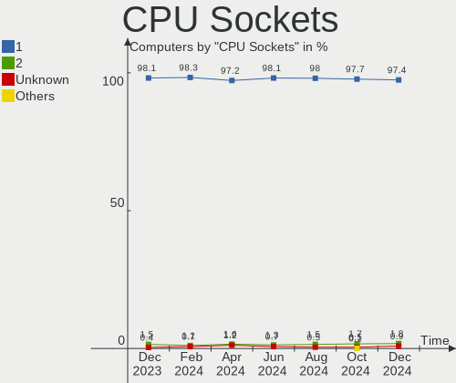

| Number  | Computers | Percent |
|---------|-----------|---------|
| 1       | 1034      | 98.85%  |
| 2       | 6         | 0.57%   |
| Unknown | 6         | 0.57%   |

CPU Threads
-----------

Threads per core (Hyper-Threading)

| Number  | Computers | Percent |
|---------|-----------|---------|
| 2       | 772       | 73.8%   |
| 1       | 267       | 25.53%  |
| Unknown | 6         | 0.57%   |
| 4       | 1         | 0.1%    |

CPU Op-Modes
------------

CPU Operation Modes (32-bit, 64-bit)

| Op mode        | Computers | Percent |
|----------------|-----------|---------|
| 32-bit, 64-bit | 1030      | 98.47%  |
| Unknown        | 12        | 1.15%   |
| 64-bit         | 3         | 0.29%   |
| 32-bit         | 1         | 0.1%    |

CPU Microcode
-------------

Microcode number

| Number     | Computers | Percent |
|------------|-----------|---------|
| Unknown    | 329       | 31.45%  |
| 0x806c1    | 134       | 12.81%  |
| 0x306a9    | 36        | 3.44%   |
| 0x406c4    | 29        | 2.77%   |
| 0x306c3    | 28        | 2.68%   |
| 0x806e9    | 22        | 2.1%    |
| 0x206a7    | 22        | 2.1%    |
| 0x0a50000c | 20        | 1.91%   |
| 0x506e3    | 18        | 1.72%   |
| 0x08701021 | 18        | 1.72%   |
| 0x906ea    | 17        | 1.63%   |
| 0x406e3    | 16        | 1.53%   |
| 0x1067a    | 16        | 1.53%   |
| 0x806ea    | 15        | 1.43%   |
| 0x906e9    | 14        | 1.34%   |
| 0x806ec    | 13        | 1.24%   |
| 0x306d4    | 13        | 1.24%   |
| 0x0a201016 | 12        | 1.15%   |
| 0x08108109 | 11        | 1.05%   |
| 0xa0652    | 10        | 0.96%   |
| 0x706a8    | 10        | 0.96%   |
| 0x40651    | 10        | 0.96%   |
| 0x906a3    | 9         | 0.86%   |
| 0x806d1    | 9         | 0.86%   |
| 0x706e5    | 8         | 0.76%   |
| 0x506c9    | 8         | 0.76%   |
| 0x20655    | 8         | 0.76%   |
| 0x0800820d | 8         | 0.76%   |
| 0xa0655    | 7         | 0.67%   |
| 0x08608103 | 7         | 0.67%   |
| 0x06000852 | 7         | 0.67%   |
| 0x6fd      | 6         | 0.57%   |
| 0x08701013 | 6         | 0.57%   |
| 0x406c3    | 5         | 0.48%   |
| 0x0a201009 | 5         | 0.48%   |
| 0x0600611a | 5         | 0.48%   |
| 0xa0653    | 4         | 0.38%   |
| 0x906c0    | 4         | 0.38%   |
| 0x706a1    | 4         | 0.38%   |
| 0x0a404101 | 4         | 0.38%   |
| 0x0a20120a | 4         | 0.38%   |
| 0x0a201204 | 4         | 0.38%   |
| 0x06003106 | 4         | 0.38%   |
| 0x010000c8 | 4         | 0.38%   |
| 0x906ed    | 3         | 0.29%   |
| 0x906a4    | 3         | 0.29%   |
| 0x406f1    | 3         | 0.29%   |
| 0x40661    | 3         | 0.29%   |
| 0x306e4    | 3         | 0.29%   |
| 0x30678    | 3         | 0.29%   |
| 0x20652    | 3         | 0.29%   |
| 0x08001138 | 3         | 0.29%   |
| 0x010000db | 3         | 0.29%   |
| 0xa0671    | 2         | 0.19%   |
| 0x90672    | 2         | 0.19%   |
| 0x806eb    | 2         | 0.19%   |
| 0x306f2    | 2         | 0.19%   |
| 0x106e5    | 2         | 0.19%   |
| 0x106a5    | 2         | 0.19%   |
| 0x10676    | 2         | 0.19%   |

CPU Microarch
-------------

Microarchitecture

| Name             | Computers | Percent |
|------------------|-----------|---------|
| TigerLake        | 147       | 14.05%  |
| KabyLake         | 122       | 11.66%  |
| Unknown          | 86        | 8.22%   |
| Zen 3            | 71        | 6.79%   |
| Haswell          | 68        | 6.5%    |
| IvyBridge        | 60        | 5.74%   |
| Skylake          | 50        | 4.78%   |
| Silvermont       | 47        | 4.49%   |
| Zen 2            | 46        | 4.4%    |
| SandyBridge      | 37        | 3.54%   |
| Zen+             | 33        | 3.15%   |
| IceLake          | 30        | 2.87%   |
| CometLake        | 29        | 2.77%   |
| Penryn           | 26        | 2.49%   |
| Broadwell        | 24        | 2.29%   |
| Westmere         | 18        | 1.72%   |
| K10              | 18        | 1.72%   |
| Goldmont plus    | 17        | 1.63%   |
| Piledriver       | 16        | 1.53%   |
| Excavator        | 16        | 1.53%   |
| Zen              | 13        | 1.24%   |
| Core             | 13        | 1.24%   |
| Alderlake Hybrid | 13        | 1.24%   |
| Goldmont         | 10        | 0.96%   |
| Steamroller      | 8         | 0.76%   |
| Nehalem          | 7         | 0.67%   |
| Tremont          | 4         | 0.38%   |
| Puma             | 3         | 0.29%   |
| K10 Llano        | 3         | 0.29%   |
| K8 Hammer        | 2         | 0.19%   |
| Jaguar           | 2         | 0.19%   |
| Bobcat           | 2         | 0.19%   |
| P6               | 1         | 0.1%    |
| NetBurst         | 1         | 0.1%    |
| K8 & K10 hybrid  | 1         | 0.1%    |
| Bulldozer        | 1         | 0.1%    |
| Bonnell          | 1         | 0.1%    |

Graphics
--------

GPU Vendor
----------

Vendors of graphics cards

| Vendor                     | Computers | Percent |
|----------------------------|-----------|---------|
| Intel                      | 613       | 52.89%  |
| AMD                        | 278       | 23.99%  |
| Nvidia                     | 261       | 22.52%  |
| ASPEED Technology          | 4         | 0.35%   |
| Matrox Electronics Systems | 3         | 0.26%   |

GPU Model
---------

Graphics card models

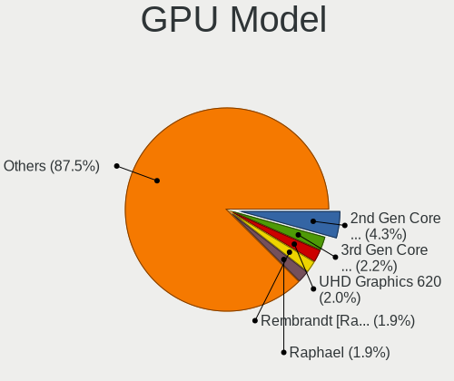

| Model                                                                                    | Computers | Percent |
|------------------------------------------------------------------------------------------|-----------|---------|
| Intel TigerLake-LP GT2 [Iris Xe Graphics]                                                | 139       | 11.77%  |
| Intel Atom/Celeron/Pentium Processor x5-E8000/J3xxx/N3xxx Integrated Graphics Controller | 38        | 3.22%   |
| Intel 3rd Gen Core processor Graphics Controller                                         | 37        | 3.13%   |
| AMD VanGogh [AMD Custom GPU 0405]                                                        | 36        | 3.05%   |
| AMD Ellesmere [Radeon RX 470/480/570/570X/580/580X/590]                                  | 29        | 2.46%   |
| Intel 2nd Generation Core Processor Family Integrated Graphics Controller                | 24        | 2.03%   |
| Intel UHD Graphics 620                                                                   | 21        | 1.78%   |
| AMD Cezanne                                                                              | 21        | 1.78%   |
| Intel Skylake GT2 [HD Graphics 520]                                                      | 18        | 1.52%   |
| Intel HD Graphics 530                                                                    | 18        | 1.52%   |
| Intel Xeon E3-1200 v3/4th Gen Core Processor Integrated Graphics Controller              | 16        | 1.35%   |
| Intel GeminiLake [UHD Graphics 600]                                                      | 16        | 1.35%   |
| AMD Picasso/Raven 2 [Radeon Vega Series / Radeon Vega Mobile Series]                     | 16        | 1.35%   |
| Intel HD Graphics 620                                                                    | 15        | 1.27%   |
| Intel Haswell-ULT Integrated Graphics Controller                                         | 15        | 1.27%   |
| Intel Core Processor Integrated Graphics Controller                                      | 14        | 1.19%   |
| Intel WhiskeyLake-U GT2 [UHD Graphics 620]                                               | 13        | 1.1%    |
| Intel HD Graphics 5500                                                                   | 13        | 1.1%    |
| Intel HD Graphics 630                                                                    | 12        | 1.02%   |
| Intel CometLake-H GT2 [UHD Graphics]                                                     | 12        | 1.02%   |
| Intel Alder Lake-P Integrated Graphics Controller                                        | 12        | 1.02%   |
| Intel TigerLake-H GT1 [UHD Graphics]                                                     | 11        | 0.93%   |
| Intel CoffeeLake-S GT2 [UHD Graphics 630]                                                | 11        | 0.93%   |
| Intel Mobile 4 Series Chipset Integrated Graphics Controller                             | 10        | 0.85%   |
| Intel CoffeeLake-H GT2 [UHD Graphics 630]                                                | 10        | 0.85%   |
| AMD Navi 22 [Radeon RX 6700/6700 XT/6750 XT / 6800M]                                     | 10        | 0.85%   |
| Nvidia GP107 [GeForce GTX 1050 Ti]                                                       | 9         | 0.76%   |
| Intel Iris Plus Graphics G7                                                              | 9         | 0.76%   |
| Intel HD Graphics 500                                                                    | 9         | 0.76%   |
| Intel Atom Processor Z36xxx/Z37xxx Series Graphics & Display                             | 9         | 0.76%   |
| AMD Navi 10 [Radeon RX 5600 OEM/5600 XT / 5700/5700 XT]                                  | 9         | 0.76%   |
| AMD Lucienne                                                                             | 9         | 0.76%   |
| Intel Tiger Lake UHD Graphics                                                            | 8         | 0.68%   |
| Intel Iris Plus Graphics G1 (Ice Lake)                                                   | 8         | 0.68%   |
| Intel CometLake-U GT2 [UHD Graphics]                                                     | 8         | 0.68%   |
| Intel 4th Gen Core Processor Integrated Graphics Controller                              | 8         | 0.68%   |
| AMD Wani [Radeon R5/R6/R7 Graphics]                                                      | 8         | 0.68%   |
| AMD Rembrandt [Radeon 680M]                                                              | 8         | 0.68%   |
| Nvidia GA106M [GeForce RTX 3060 Mobile / Max-Q]                                          | 7         | 0.59%   |
| AMD Stoney [Radeon R2/R3/R4/R5 Graphics]                                                 | 7         | 0.59%   |
| AMD Renoir                                                                               | 7         | 0.59%   |
| AMD Navi 23 [Radeon RX 6600/6600 XT/6600M]                                               | 7         | 0.59%   |
| AMD Navi 21 [Radeon RX 6800/6800 XT / 6900 XT]                                           | 7         | 0.59%   |
| Nvidia GP108 [GeForce GT 1030]                                                           | 6         | 0.51%   |
| Nvidia GM204 [GeForce GTX 970]                                                           | 6         | 0.51%   |
| Intel Xeon E3-1200 v2/3rd Gen Core processor Graphics Controller                         | 6         | 0.51%   |
| Intel Mobile GM965/GL960 Integrated Graphics Controller (secondary)                      | 6         | 0.51%   |
| Intel Mobile GM965/GL960 Integrated Graphics Controller (primary)                        | 6         | 0.51%   |
| AMD Baffin [Radeon RX 460/560D / Pro 450/455/460/555/555X/560/560X]                      | 6         | 0.51%   |
| Nvidia TU117M [GeForce GTX 1650 Mobile / Max-Q]                                          | 5         | 0.42%   |
| Nvidia GP106 [GeForce GTX 1060 6GB]                                                      | 5         | 0.42%   |
| Nvidia GM206 [GeForce GTX 960]                                                           | 5         | 0.42%   |
| Nvidia GM107 [GeForce GTX 750 Ti]                                                        | 5         | 0.42%   |
| Intel VGA compatible controller                                                          | 5         | 0.42%   |
| Intel IvyBridge GT2 [HD Graphics 4000]                                                   | 5         | 0.42%   |
| Intel Iris Plus Graphics 640                                                             | 5         | 0.42%   |
| Intel HD Graphics 6000                                                                   | 5         | 0.42%   |
| Intel CometLake-S GT2 [UHD Graphics 630]                                                 | 5         | 0.42%   |
| AMD Kaveri [Radeon R7 Graphics]                                                          | 5         | 0.42%   |
| AMD Barcelo                                                                              | 5         | 0.42%   |

GPU Combo
---------

Combinations of graphics cards

| Name                     | Computers | Percent |
|--------------------------|-----------|---------|
| 1 x Intel                | 494       | 47.23%  |
| 1 x AMD                  | 236       | 22.56%  |
| 1 x Nvidia               | 156       | 14.91%  |
| Intel + Nvidia           | 87        | 8.32%   |
| Other                    | 21        | 2.01%   |
| AMD + Nvidia             | 15        | 1.43%   |
| Intel + AMD              | 14        | 1.34%   |
| 2 x AMD                  | 11        | 1.05%   |
| 2 x Intel                | 3         | 0.29%   |
| 1 x Matrox               | 3         | 0.29%   |
| 1 x ASPEED               | 3         | 0.29%   |
| 2 x Nvidia               | 1         | 0.1%    |
| Nvidia + ASPEED          | 1         | 0.1%    |
| Intel + AMD + 1 x Nvidia | 1         | 0.1%    |

GPU Driver
----------

Free vs proprietary

| Driver      | Computers | Percent |
|-------------|-----------|---------|
| Free        | 851       | 81.36%  |
| Proprietary | 155       | 14.82%  |
| Unknown     | 40        | 3.82%   |

GPU Memory
----------

Total video memory

| Size in GB | Computers | Percent |
|------------|-----------|---------|
| Unknown    | 741       | 70.84%  |
| 1.01-2.0   | 62        | 5.93%   |
| 0.01-0.5   | 59        | 5.64%   |
| 3.01-4.0   | 51        | 4.88%   |
| 7.01-8.0   | 41        | 3.92%   |
| 0.51-1.0   | 38        | 3.63%   |
| 5.01-6.0   | 25        | 2.39%   |
| 8.01-16.0  | 21        | 2.01%   |
| 2.01-3.0   | 4         | 0.38%   |
| 16.01-24.0 | 3         | 0.29%   |
| 32.01-64.0 | 1         | 0.1%    |

Monitor
-------

Monitor Vendor
--------------

Monitor vendors

| Vendor                  | Computers | Percent |
|-------------------------|-----------|---------|
| AU Optronics            | 207       | 18.02%  |
| Samsung Electronics     | 98        | 8.53%   |
| Dell                    | 87        | 7.57%   |
| BOE                     | 85        | 7.4%    |
| LG Display              | 74        | 6.44%   |
| Chimei Innolux          | 68        | 5.92%   |
| Hewlett-Packard         | 60        | 5.22%   |
| Goldstar                | 43        | 3.74%   |
| ANX                     | 34        | 2.96%   |
| Apple                   | 33        | 2.87%   |
| Acer                    | 32        | 2.79%   |
| Ancor Communications    | 30        | 2.61%   |
| Sharp                   | 28        | 2.44%   |
| AOC                     | 20        | 1.74%   |
| Lenovo                  | 19        | 1.65%   |
| ViewSonic               | 18        | 1.57%   |
| Sceptre Tech            | 18        | 1.57%   |
| Vizio                   | 15        | 1.31%   |
| ASUSTek Computer        | 15        | 1.31%   |
| InfoVision              | 11        | 0.96%   |
| BenQ                    | 10        | 0.87%   |
| PANDA                   | 9         | 0.78%   |
| Chi Mei Optoelectronics | 9         | 0.78%   |
| Sony                    | 6         | 0.52%   |
| MSI                     | 5         | 0.44%   |
| LG Electronics          | 5         | 0.44%   |
| Gigabyte Technology     | 5         | 0.44%   |
| Gateway                 | 5         | 0.44%   |
| CSO                     | 5         | 0.44%   |
| Toshiba                 | 4         | 0.35%   |
| RTK                     | 4         | 0.35%   |
| LG Philips              | 4         | 0.35%   |
| HannStar                | 4         | 0.35%   |
| Microstep               | 3         | 0.26%   |
| Elgato                  | 3         | 0.26%   |
| Unknown                 | 3         | 0.26%   |
| ___                     | 2         | 0.17%   |
| Westinghouse            | 2         | 0.17%   |
| VIZ                     | 2         | 0.17%   |
| Unknown                 | 2         | 0.17%   |
| TMX                     | 2         | 0.17%   |
| SANYO                   | 2         | 0.17%   |
| Planar                  | 2         | 0.17%   |
| Pixio                   | 2         | 0.17%   |
| Philips                 | 2         | 0.17%   |
| NEC Computers           | 2         | 0.17%   |
| JDI                     | 2         | 0.17%   |
| Insignia                | 2         | 0.17%   |
| HKC                     | 2         | 0.17%   |
| Hitachi                 | 2         | 0.17%   |
| AUS                     | 2         | 0.17%   |
| Zoran                   | 1         | 0.09%   |
| YCT                     | 1         | 0.09%   |
| Vita                    | 1         | 0.09%   |
| Viotek                  | 1         | 0.09%   |
| Valve                   | 1         | 0.09%   |
| UpStar                  | 1         | 0.09%   |
| Unknown (XXX)           | 1         | 0.09%   |
| STD                     | 1         | 0.09%   |
| SKK                     | 1         | 0.09%   |

Monitor Model
-------------

Monitor models

| Model                                                                   | Computers | Percent |
|-------------------------------------------------------------------------|-----------|---------|
| AU Optronics LCD Monitor AUO592D 1920x1080 293x165mm 13.2-inch          | 99        | 8.35%   |
| ANX ANX7530 U ANX7539 800x1280                                          | 34        | 2.87%   |
| AU Optronics LCD Monitor AUO235C 1366x768 256x144mm 11.6-inch           | 16        | 1.35%   |
| Samsung Electronics LCD Monitor SEC5441 1366x768 344x194mm 15.5-inch    | 5         | 0.42%   |
| Chimei Innolux LCD Monitor CMN1132 1366x768 256x144mm 11.6-inch         | 5         | 0.42%   |
| Sharp LCD Monitor SHP148D 3840x2160 344x194mm 15.5-inch                 | 4         | 0.34%   |
| Sceptre Tech Sceptre C27 SPT0AD7 1920x1080 598x336mm 27.0-inch          | 4         | 0.34%   |
| Hewlett-Packard W2072a HWP3000 1600x900 443x249mm 20.0-inch             | 4         | 0.34%   |
| Goldstar ULTRAWIDE GSM59F1 2560x1080 673x284mm 28.8-inch                | 4         | 0.34%   |
| Goldstar FULL HD GSM5B55 1920x1080 480x270mm 21.7-inch                  | 4         | 0.34%   |
| Chimei Innolux LCD Monitor CMN1387 1920x1080 293x165mm 13.2-inch        | 4         | 0.34%   |
| AU Optronics LCD Monitor AUOD1ED 1920x1080 344x193mm 15.5-inch          | 4         | 0.34%   |
| Apple iMac APPA012 1920x1080 475x267mm 21.5-inch                        | 4         | 0.34%   |
| Apple Color LCD APPA034 2880x1800 286x179mm 13.3-inch                   | 4         | 0.34%   |
| Acer SB220Q ACR06AB 1920x1080 476x268mm 21.5-inch                       | 4         | 0.34%   |
| Samsung Electronics LCD Monitor SDC3853 2736x1824 260x173mm 12.3-inch   | 3         | 0.25%   |
| PANDA LCD Monitor NCP004D 1920x1080 344x194mm 15.5-inch                 | 3         | 0.25%   |
| LG Display LCD Monitor LGD0555 1536x1024 263x175mm 12.4-inch            | 3         | 0.25%   |
| LG Display LCD Monitor LGD033A 1366x768 344x194mm 15.5-inch             | 3         | 0.25%   |
| Hewlett-Packard 2009 HWP2828 1600x900 443x250mm 20.0-inch               | 3         | 0.25%   |
| Goldstar Ultra HD GSM5B08 3840x2160 600x340mm 27.2-inch                 | 3         | 0.25%   |
| Goldstar 27GL850 GSM5B7F 2560x1440 597x336mm 27.0-inch                  | 3         | 0.25%   |
| Elgato HD60 S+ EGA006A 1920x1080 708x398mm 32.0-inch                    | 3         | 0.25%   |
| Dell SE2417HG DELD08C 1920x1080 521x293mm 23.5-inch                     | 3         | 0.25%   |
| Chimei Innolux LCD Monitor CMN15DB 1366x768 344x193mm 15.5-inch         | 3         | 0.25%   |
| Chimei Innolux LCD Monitor CMN14E5 1920x1080 309x173mm 13.9-inch        | 3         | 0.25%   |
| Chimei Innolux LCD Monitor CMN1406 1920x1080 309x173mm 13.9-inch        | 3         | 0.25%   |
| BOE LCD Monitor BOE09D3 1920x1080 344x194mm 15.5-inch                   | 3         | 0.25%   |
| BOE LCD Monitor BOE095F 2256x1504 285x190mm 13.5-inch                   | 3         | 0.25%   |
| BOE LCD Monitor BOE08A8 1920x1080 344x194mm 15.5-inch                   | 3         | 0.25%   |
| AU Optronics LCD Monitor AUO48EC 1366x768 344x193mm 15.5-inch           | 3         | 0.25%   |
| AU Optronics LCD Monitor AUO22EC 1366x768 344x193mm 15.5-inch           | 3         | 0.25%   |
| AU Optronics LCD Monitor AUO10EC 1366x768 344x193mm 15.5-inch           | 3         | 0.25%   |
| AU Optronics LCD Monitor AUO106C 1366x768 277x156mm 12.5-inch           | 3         | 0.25%   |
| Ancor Communications ASUS VH236H ACI23F2 1920x1080 521x293mm 23.5-inch  | 3         | 0.25%   |
| Unknown                                                                 | 3         | 0.25%   |
| ___ LCDTV16 ___9000 1360x768                                            | 2         | 0.17%   |
| Vizio E400i-C2 VIZ1004 1920x1080 477x268mm 21.5-inch                    | 2         | 0.17%   |
| Vizio D32x-D1 VIZ1005 1920x1080 700x390mm 31.5-inch                     | 2         | 0.17%   |
| Toshiba ScreenXpert TSB8888 1080x2160                                   | 2         | 0.17%   |
| Sony TV SNY8200 1920x1080 560x420mm 27.6-inch                           | 2         | 0.17%   |
| Sharp LQ156M1JW25 SHP152C 1920x1080 344x194mm 15.5-inch                 | 2         | 0.17%   |
| Sharp LCD Monitor SHP1449 1920x1080 294x165mm 13.3-inch                 | 2         | 0.17%   |
| Sceptre Tech Sceptre J20 SPT080D 1600x900 435x237mm 19.5-inch           | 2         | 0.17%   |
| Sceptre Tech Sceptre F24 SPT09AB 1920x1080 522x293mm 23.6-inch          | 2         | 0.17%   |
| Sceptre Tech H32 SPT0CB8 1920x1080 575x323mm 26.0-inch                  | 2         | 0.17%   |
| Samsung Electronics S34J55x SAM0F72 1720x1440                           | 2         | 0.17%   |
| Samsung Electronics S23B550 SAM0919 1920x1080 510x287mm 23.0-inch       | 2         | 0.17%   |
| Samsung Electronics LCD Monitor SEC5442 1440x900 303x190mm 14.1-inch    | 2         | 0.17%   |
| Samsung Electronics LCD Monitor SDC4C48 1920x1080 344x194mm 15.5-inch   | 2         | 0.17%   |
| Samsung Electronics LCD Monitor SDC4347 1366x768 344x193mm 15.5-inch    | 2         | 0.17%   |
| Samsung Electronics LCD Monitor SDC4171 2880x1800 302x189mm 14.0-inch   | 2         | 0.17%   |
| Samsung Electronics LCD Monitor SAM7017 3840x2160 1872x1053mm 84.6-inch | 2         | 0.17%   |
| Samsung Electronics LCD Monitor SAM0F14 3840x2160 1872x1053mm 84.6-inch | 2         | 0.17%   |
| Samsung Electronics LCD Monitor SAM0C39 1920x1080 885x498mm 40.0-inch   | 2         | 0.17%   |
| Samsung Electronics LCD Monitor SAM08FE 1920x1080                       | 2         | 0.17%   |
| Samsung Electronics LCD Monitor SAM07BA 1920x1080 480x270mm 21.7-inch   | 2         | 0.17%   |
| Samsung Electronics LCD Monitor SAM0667 1920x1080                       | 2         | 0.17%   |
| Samsung Electronics LC27G5xT SAM707A 2560x1440 698x393mm 31.5-inch      | 2         | 0.17%   |
| Samsung Electronics C24F390 SAM0D2C 1920x1080 520x290mm 23.4-inch       | 2         | 0.17%   |

Monitor Resolution
------------------

Monitor screen resolution

| Resolution         | Computers | Percent |
|--------------------|-----------|---------|
| 1920x1080 (FHD)    | 503       | 45.11%  |
| 1366x768 (WXGA)    | 167       | 14.98%  |
| 3840x2160 (4K)     | 85        | 7.62%   |
| 2560x1440 (QHD)    | 52        | 4.66%   |
| 1600x900 (HD+)     | 38        | 3.41%   |
| 800x1280           | 35        | 3.14%   |
| 1280x1024 (SXGA)   | 28        | 2.51%   |
| 1440x900 (WXGA+)   | 25        | 2.24%   |
| 1920x1200 (WUXGA)  | 21        | 1.88%   |
| 1680x1050 (WSXGA+) | 21        | 1.88%   |
| 3440x1440          | 15        | 1.35%   |
| Unknown            | 13        | 1.17%   |
| 2560x1080          | 12        | 1.08%   |
| 2880x1800          | 11        | 0.99%   |
| 1280x800 (WXGA)    | 11        | 0.99%   |
| 2560x1600          | 10        | 0.9%    |
| 1360x768           | 7         | 0.63%   |
| 3840x1080          | 6         | 0.54%   |
| 2736x1824          | 6         | 0.54%   |
| 3840x2400          | 5         | 0.45%   |
| 1920x540           | 5         | 0.45%   |
| 1024x768 (XGA)     | 5         | 0.45%   |
| 3840x1600          | 3         | 0.27%   |
| 2256x1504          | 3         | 0.27%   |
| 3200x1800 (QHD+)   | 2         | 0.18%   |
| 3000x2000          | 2         | 0.18%   |
| 2160x1440          | 2         | 0.18%   |
| 1280x960           | 2         | 0.18%   |
| 1280x720 (HD)      | 2         | 0.18%   |
| 7120x1080          | 1         | 0.09%   |
| 6400x2160          | 1         | 0.09%   |
| 6400x1440          | 1         | 0.09%   |
| 6400x1080          | 1         | 0.09%   |
| 5760x2160          | 1         | 0.09%   |
| 5760x1080          | 1         | 0.09%   |
| 4240x1080          | 1         | 0.09%   |
| 3456x2160          | 1         | 0.09%   |
| 3200x2000          | 1         | 0.09%   |
| 3072x1920          | 1         | 0.09%   |
| 2944x1080          | 1         | 0.09%   |
| 2880x1620          | 1         | 0.09%   |
| 2200x1650          | 1         | 0.09%   |
| 2048x1152          | 1         | 0.09%   |
| 1920x515           | 1         | 0.09%   |
| 1920x1280          | 1         | 0.09%   |
| 1400x1050          | 1         | 0.09%   |
| 1024x600           | 1         | 0.09%   |

Monitor Diagonal
----------------

Diagonal size in inches

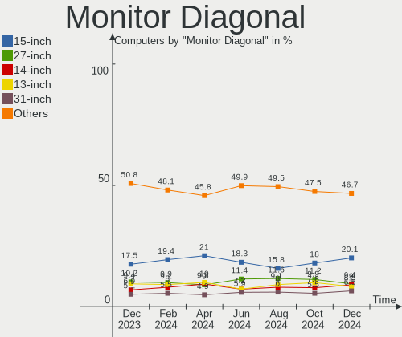

| Inches  | Computers | Percent |
|---------|-----------|---------|
| 15      | 218       | 19.09%  |
| 13      | 193       | 16.9%   |
| 27      | 82        | 7.18%   |
| Unknown | 80        | 7.01%   |
| 23      | 67        | 5.87%   |
| 14      | 62        | 5.43%   |
| 24      | 61        | 5.34%   |
| 31      | 55        | 4.82%   |
| 17      | 52        | 4.55%   |
| 21      | 42        | 3.68%   |
| 11      | 36        | 3.15%   |
| 19      | 26        | 2.28%   |
| 34      | 23        | 2.01%   |
| 20      | 20        | 1.75%   |
| 12      | 20        | 1.75%   |
| 22      | 14        | 1.23%   |
| 32      | 12        | 1.05%   |
| 18      | 9         | 0.79%   |
| 16      | 9         | 0.79%   |
| 84      | 7         | 0.61%   |
| 26      | 5         | 0.44%   |
| 49      | 4         | 0.35%   |
| 42      | 4         | 0.35%   |
| 40      | 4         | 0.35%   |
| 72      | 3         | 0.26%   |
| 46      | 3         | 0.26%   |
| 37      | 3         | 0.26%   |
| 74      | 2         | 0.18%   |
| 55      | 2         | 0.18%   |
| 54      | 2         | 0.18%   |
| 52      | 2         | 0.18%   |
| 47      | 2         | 0.18%   |
| 38      | 2         | 0.18%   |
| 29      | 2         | 0.18%   |
| 28      | 2         | 0.18%   |
| 10      | 2         | 0.18%   |
| 69      | 1         | 0.09%   |
| 65      | 1         | 0.09%   |
| 64      | 1         | 0.09%   |
| 60      | 1         | 0.09%   |
| 44      | 1         | 0.09%   |
| 43      | 1         | 0.09%   |
| 41      | 1         | 0.09%   |
| 30      | 1         | 0.09%   |
| 25      | 1         | 0.09%   |
| 7       | 1         | 0.09%   |

Monitor Width
-------------

Physical width

| Width in mm | Computers | Percent |
|-------------|-----------|---------|
| 301-350     | 328       | 29.34%  |
| 201-300     | 211       | 18.87%  |
| 501-600     | 185       | 16.55%  |
| 401-500     | 91        | 8.14%   |
| Unknown     | 80        | 7.16%   |
| 601-700     | 73        | 6.53%   |
| 351-400     | 67        | 5.99%   |
| 701-800     | 35        | 3.13%   |
| 1001-1500   | 18        | 1.61%   |
| 1501-2000   | 13        | 1.16%   |
| 801-900     | 9         | 0.81%   |
| 901-1000    | 7         | 0.63%   |
| 1-100       | 1         | 0.09%   |

Aspect Ratio
------------

Proportional relationship between the width and the height

| Ratio   | Computers | Percent |
|---------|-----------|---------|
| 16/9    | 792       | 75.29%  |
| 16/10   | 108       | 10.27%  |
| 0.62    | 34        | 3.23%   |
| Unknown | 33        | 3.14%   |
| 21/9    | 27        | 2.57%   |
| 5/4     | 23        | 2.19%   |
| 3/2     | 14        | 1.33%   |
| 4/3     | 11        | 1.05%   |
| 32/9    | 5         | 0.48%   |
| 6/5     | 2         | 0.19%   |
| 3.73    | 1         | 0.1%    |
| 11/10   | 1         | 0.1%    |
| 0.67    | 1         | 0.1%    |

Monitor Area
------------

Area in inch

| Area in inch | Computers | Percent |
|----------------|-----------|---------|
| 101-110        | 218       | 19.38%  |
| 71-80          | 147       | 13.07%  |
| 201-250        | 139       | 12.36%  |
| 81-90          | 111       | 9.87%   |
| 351-500        | 88        | 7.82%   |
| 301-350        | 87        | 7.73%   |
| Unknown        | 80        | 7.11%   |
| 151-200        | 62        | 5.51%   |
| 51-60          | 37        | 3.29%   |
| 121-130        | 37        | 3.29%   |
| More than 1000 | 25        | 2.22%   |
| 251-300        | 25        | 2.22%   |
| 501-1000       | 21        | 1.87%   |
| 61-70          | 16        | 1.42%   |
| 141-150        | 16        | 1.42%   |
| 111-120        | 7         | 0.62%   |
| 131-140        | 5         | 0.44%   |
| 91-100         | 2         | 0.18%   |
| 41-50          | 1         | 0.09%   |
| 1-40           | 1         | 0.09%   |

Pixel Density
-------------

Pixels per inch

| Density       | Computers | Percent |
|---------------|-----------|---------|
| 51-100        | 339       | 30.76%  |
| 121-160       | 235       | 21.32%  |
| 101-120       | 205       | 18.6%   |
| 161-240       | 169       | 15.34%  |
| Unknown       | 80        | 7.26%   |
| More than 240 | 48        | 4.36%   |
| 1-50          | 26        | 2.36%   |

Multiple Monitors
-----------------

Total monitors connected

| Total | Computers | Percent |
|-------|-----------|---------|
| 1     | 843       | 80.59%  |
| 2     | 138       | 13.19%  |
| 3     | 31        | 2.96%   |
| 0     | 30        | 2.87%   |
| 4     | 4         | 0.38%   |

Network
-------

Net Controller Vendor
---------------------

Controller vendors

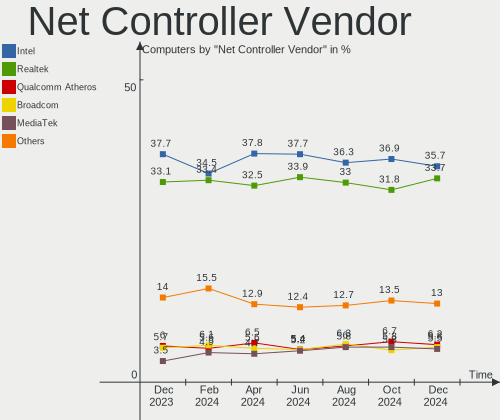

| Vendor                          | Computers | Percent |
|---------------------------------|-----------|---------|
| Intel                           | 614       | 41.21%  |
| Realtek Semiconductor           | 490       | 32.89%  |
| Qualcomm Atheros                | 99        | 6.64%   |
| Broadcom                        | 79        | 5.3%    |
| MediaTek                        | 24        | 1.61%   |
| Ralink Technology               | 23        | 1.54%   |
| Broadcom Limited                | 22        | 1.48%   |
| ASIX Electronics                | 18        | 1.21%   |
| NetGear                         | 13        | 0.87%   |
| Marvell Technology Group        | 12        | 0.81%   |
| TP-Link                         | 7         | 0.47%   |
| Ralink                          | 7         | 0.47%   |
| Qualcomm Atheros Communications | 7         | 0.47%   |
| Nvidia                          | 6         | 0.4%    |
| Samsung Electronics             | 5         | 0.34%   |
| U-Blox                          | 4         | 0.27%   |
| Sierra Wireless                 | 4         | 0.27%   |
| Motorola PCS                    | 4         | 0.27%   |
| Google                          | 4         | 0.27%   |
| Aquantia                        | 4         | 0.27%   |
| Qualcomm                        | 3         | 0.2%    |
| Microsoft                       | 3         | 0.2%    |
| Microchip Technology            | 3         | 0.2%    |
| Lenovo                          | 3         | 0.2%    |
| DisplayLink                     | 3         | 0.2%    |
| Belkin Components               | 3         | 0.2%    |
| Linksys                         | 2         | 0.13%   |
| LeafLabs                        | 2         | 0.13%   |
| InterBiometrics                 | 2         | 0.13%   |
| IMC Networks                    | 2         | 0.13%   |
| ICS Advent                      | 2         | 0.13%   |
| Exar                            | 2         | 0.13%   |
| D-Link                          | 2         | 0.13%   |
| ASUSTek Computer                | 2         | 0.13%   |
| Spreadtrum Communications       | 1         | 0.07%   |
| Provo Craft & Novelty           | 1         | 0.07%   |
| JMicron Technology              | 1         | 0.07%   |
| Hewlett-Packard                 | 1         | 0.07%   |
| Edimax Technology               | 1         | 0.07%   |
| D-Link System                   | 1         | 0.07%   |
| Cypress Semiconductor           | 1         | 0.07%   |
| Attansic Technology             | 1         | 0.07%   |
| Apple                           | 1         | 0.07%   |
| Unknown                         | 1         | 0.07%   |

Net Controller Model
--------------------

Controller models

| Model                                                             | Computers | Percent |
|-------------------------------------------------------------------|-----------|---------|
| Realtek RTL8111/8168/8411 PCI Express Gigabit Ethernet Controller | 286       | 15.54%  |
| Intel Wi-Fi 6 AX201                                               | 134       | 7.28%   |
| Intel Ethernet Connection (13) I219-V                             | 104       | 5.65%   |
| Intel Wi-Fi 6 AX200                                               | 56        | 3.04%   |
| Intel Wireless 7265                                               | 55        | 2.99%   |
| Realtek RTL8822CE 802.11ac PCIe Wireless Network Adapter          | 45        | 2.45%   |
| Realtek RTL810xE PCI Express Fast Ethernet controller             | 38        | 2.07%   |
| Intel 82579LM Gigabit Network Connection (Lewisville)             | 37        | 2.01%   |
| Realtek RTL8153 Gigabit Ethernet Adapter                          | 34        | 1.85%   |
| Realtek RTL8125 2.5GbE Controller                                 | 30        | 1.63%   |
| Intel I211 Gigabit Network Connection                             | 28        | 1.52%   |
| Intel Wireless 8265 / 8275                                        | 27        | 1.47%   |
| Realtek RTL8821CE 802.11ac PCIe Wireless Network Adapter          | 25        | 1.36%   |
| Qualcomm Atheros QCA6174 802.11ac Wireless Network Adapter        | 24        | 1.3%    |
| Intel Dual Band Wireless-AC 3168NGW [Stone Peak]                  | 22        | 1.2%    |
| Intel Wi-Fi 6 AX210/AX211/AX411 160MHz                            | 19        | 1.03%   |
| Intel Ethernet Controller I225-V                                  | 19        | 1.03%   |
| ASIX AX88179 Gigabit Ethernet                                     | 17        | 0.92%   |
| Intel Comet Lake PCH CNVi WiFi                                    | 16        | 0.87%   |
| Intel Wireless-AC 9260                                            | 15        | 0.82%   |
| Intel Wireless 8260                                               | 15        | 0.82%   |
| Realtek RTL88x2bu [AC1200 Techkey]                                | 14        | 0.76%   |
| Intel Wireless 7260                                               | 14        | 0.76%   |
| Intel Alder Lake-P PCH CNVi WiFi                                  | 14        | 0.76%   |
| Qualcomm Atheros QCA9565 / AR9565 Wireless Network Adapter        | 12        | 0.65%   |
| Qualcomm Atheros QCA9377 802.11ac Wireless Network Adapter        | 12        | 0.65%   |
| Qualcomm Atheros AR9485 Wireless Network Adapter                  | 12        | 0.65%   |
| Intel Ethernet Connection I217-LM                                 | 12        | 0.65%   |
| Intel Centrino Advanced-N 6205 [Taylor Peak]                      | 12        | 0.65%   |
| Broadcom BCM4360 802.11ac Wireless Network Adapter                | 12        | 0.65%   |
| Intel Ice Lake-LP PCH CNVi WiFi                                   | 11        | 0.6%    |
| Broadcom NetXtreme BCM57766 Gigabit Ethernet PCIe                 | 11        | 0.6%    |
| Realtek RTL8188EE Wireless Network Adapter                        | 10        | 0.54%   |
| Intel Wireless 3165                                               | 10        | 0.54%   |
| Intel Tiger Lake PCH CNVi WiFi                                    | 10        | 0.54%   |
| Intel Ethernet Connection (7) I219-V                              | 10        | 0.54%   |
| Intel Ethernet Connection (4) I219-V                              | 10        | 0.54%   |
| Intel Ethernet Connection (2) I219-V                              | 10        | 0.54%   |
| Intel Ethernet Connection (2) I219-LM                             | 10        | 0.54%   |
| Realtek 802.11ac NIC                                              | 9         | 0.49%   |
| Intel Comet Lake PCH-LP CNVi WiFi                                 | 9         | 0.49%   |
| Intel Cannon Lake PCH CNVi WiFi                                   | 9         | 0.49%   |
| Realtek Killer E2600 Gigabit Ethernet Controller                  | 8         | 0.43%   |
| Ralink RT5370 Wireless Adapter                                    | 8         | 0.43%   |
| Intel Ethernet Connection I219-LM                                 | 8         | 0.43%   |
| Realtek 802.11n WLAN Adapter                                      | 7         | 0.38%   |
| Ralink MT7601U Wireless Adapter                                   | 7         | 0.38%   |
| Qualcomm Atheros AR9285 Wireless Network Adapter (PCI-Express)    | 7         | 0.38%   |
| MediaTek MT7921 802.11ax PCI Express Wireless Network Adapter     | 7         | 0.38%   |
| Intel Cannon Point-LP CNVi [Wireless-AC]                          | 7         | 0.38%   |
| Intel 82567LM Gigabit Network Connection                          | 7         | 0.38%   |
| Broadcom Limited BCM4360 802.11ac Wireless Network Adapter        | 7         | 0.38%   |
| Realtek RTL8822BE 802.11a/b/g/n/ac WiFi adapter                   | 6         | 0.33%   |
| Realtek RTL8821AE 802.11ac PCIe Wireless Network Adapter          | 6         | 0.33%   |
| Realtek RTL8723BE PCIe Wireless Network Adapter                   | 6         | 0.33%   |
| Qualcomm Atheros Killer E220x Gigabit Ethernet Controller         | 6         | 0.33%   |
| Qualcomm Atheros AR9271 802.11n                                   | 6         | 0.33%   |
| MediaTek MT7921K (RZ608) Wi-Fi 6E 80MHz                           | 6         | 0.33%   |
| Marvell Group 88W8897 [AVASTAR] 802.11ac Wireless                 | 6         | 0.33%   |
| Intel I210 Gigabit Network Connection                             | 6         | 0.33%   |

Wireless Vendor
---------------

Wireless vendors

| Vendor                          | Computers | Percent |
|---------------------------------|-----------|---------|
| Intel                           | 502       | 53.8%   |
| Realtek Semiconductor           | 169       | 18.11%  |
| Qualcomm Atheros                | 83        | 8.9%    |
| Broadcom                        | 57        | 6.11%   |
| Ralink Technology               | 23        | 2.47%   |
| MediaTek                        | 22        | 2.36%   |
| Broadcom Limited                | 19        | 2.04%   |
| NetGear                         | 13        | 1.39%   |
| Ralink                          | 7         | 0.75%   |
| Qualcomm Atheros Communications | 7         | 0.75%   |
| Marvell Technology Group        | 6         | 0.64%   |
| TP-Link                         | 5         | 0.54%   |
| Sierra Wireless                 | 4         | 0.43%   |
| Microsoft                       | 3         | 0.32%   |
| Belkin Components               | 3         | 0.32%   |
| Qualcomm                        | 2         | 0.21%   |
| Linksys                         | 2         | 0.21%   |
| IMC Networks                    | 2         | 0.21%   |
| D-Link                          | 2         | 0.21%   |
| Edimax Technology               | 1         | 0.11%   |
| ASUSTek Computer                | 1         | 0.11%   |

Wireless Model
--------------

Wireless models

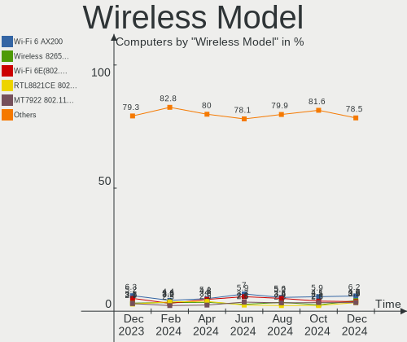

| Model                                                                                         | Computers | Percent |
|-----------------------------------------------------------------------------------------------|-----------|---------|
| Intel Wi-Fi 6 AX201                                                                           | 134       | 14.24%  |
| Intel Wi-Fi 6 AX200                                                                           | 56        | 5.95%   |
| Intel Wireless 7265                                                                           | 55        | 5.84%   |
| Realtek RTL8822CE 802.11ac PCIe Wireless Network Adapter                                      | 45        | 4.78%   |
| Intel Wireless 8265 / 8275                                                                    | 27        | 2.87%   |
| Realtek RTL8821CE 802.11ac PCIe Wireless Network Adapter                                      | 25        | 2.66%   |
| Qualcomm Atheros QCA6174 802.11ac Wireless Network Adapter                                    | 24        | 2.55%   |
| Intel Dual Band Wireless-AC 3168NGW [Stone Peak]                                              | 22        | 2.34%   |
| Intel Wi-Fi 6 AX210/AX211/AX411 160MHz                                                        | 19        | 2.02%   |
| Intel Comet Lake PCH CNVi WiFi                                                                | 16        | 1.7%    |
| Intel Wireless-AC 9260                                                                        | 15        | 1.59%   |
| Intel Wireless 8260                                                                           | 15        | 1.59%   |
| Realtek RTL88x2bu [AC1200 Techkey]                                                            | 14        | 1.49%   |
| Intel Wireless 7260                                                                           | 14        | 1.49%   |
| Intel Alder Lake-P PCH CNVi WiFi                                                              | 14        | 1.49%   |
| Qualcomm Atheros QCA9565 / AR9565 Wireless Network Adapter                                    | 12        | 1.28%   |
| Qualcomm Atheros QCA9377 802.11ac Wireless Network Adapter                                    | 12        | 1.28%   |
| Qualcomm Atheros AR9485 Wireless Network Adapter                                              | 12        | 1.28%   |
| Intel Centrino Advanced-N 6205 [Taylor Peak]                                                  | 12        | 1.28%   |
| Broadcom BCM4360 802.11ac Wireless Network Adapter                                            | 12        | 1.28%   |
| Intel Ice Lake-LP PCH CNVi WiFi                                                               | 11        | 1.17%   |
| Realtek RTL8188EE Wireless Network Adapter                                                    | 10        | 1.06%   |
| Intel Wireless 3165                                                                           | 10        | 1.06%   |
| Intel Tiger Lake PCH CNVi WiFi                                                                | 10        | 1.06%   |
| Realtek 802.11ac NIC                                                                          | 9         | 0.96%   |
| Intel Comet Lake PCH-LP CNVi WiFi                                                             | 9         | 0.96%   |
| Intel Cannon Lake PCH CNVi WiFi                                                               | 9         | 0.96%   |
| Ralink RT5370 Wireless Adapter                                                                | 8         | 0.85%   |
| Realtek 802.11n WLAN Adapter                                                                  | 7         | 0.74%   |
| Ralink MT7601U Wireless Adapter                                                               | 7         | 0.74%   |
| Qualcomm Atheros AR9285 Wireless Network Adapter (PCI-Express)                                | 7         | 0.74%   |
| MediaTek MT7921 802.11ax PCI Express Wireless Network Adapter                                 | 7         | 0.74%   |
| Intel Cannon Point-LP CNVi [Wireless-AC]                                                      | 7         | 0.74%   |
| Broadcom Limited BCM4360 802.11ac Wireless Network Adapter                                    | 7         | 0.74%   |
| Realtek RTL8822BE 802.11a/b/g/n/ac WiFi adapter                                               | 6         | 0.64%   |
| Realtek RTL8821AE 802.11ac PCIe Wireless Network Adapter                                      | 6         | 0.64%   |
| Realtek RTL8723BE PCIe Wireless Network Adapter                                               | 6         | 0.64%   |
| Qualcomm Atheros AR9271 802.11n                                                               | 6         | 0.64%   |
| MediaTek MT7921K (RZ608) Wi-Fi 6E 80MHz                                                       | 6         | 0.64%   |
| Marvell Group 88W8897 [AVASTAR] 802.11ac Wireless                                             | 6         | 0.64%   |
| Intel Centrino Wireless-N 2230                                                                | 6         | 0.64%   |
| Broadcom BCM4322 802.11a/b/g/n Wireless LAN Controller                                        | 6         | 0.64%   |
| Broadcom BCM43142 802.11b/g/n                                                                 | 6         | 0.64%   |
| Realtek RTL8852AE 802.11ax PCIe Wireless Network Adapter                                      | 5         | 0.53%   |
| Qualcomm Atheros AR928X Wireless Network Adapter (PCI-Express)                                | 5         | 0.53%   |
| MediaTek MT7922 802.11ax PCI Express Wireless Network Adapter                                 | 5         | 0.53%   |
| Intel Wireless 3160                                                                           | 5         | 0.53%   |
| Intel Centrino Ultimate-N 6300                                                                | 5         | 0.53%   |
| Broadcom BCM43602 802.11ac Wireless LAN SoC                                                   | 5         | 0.53%   |
| Broadcom BCM4331 802.11a/b/g/n                                                                | 5         | 0.53%   |
| Broadcom BCM43224 802.11a/b/g/n                                                               | 5         | 0.53%   |
| Broadcom BCM4313 802.11bgn Wireless Network Adapter                                           | 5         | 0.53%   |
| Realtek RTL8188FTV 802.11b/g/n 1T1R 2.4G WLAN Adapter                                         | 4         | 0.43%   |
| Realtek Realtek 8812AU/8821AU 802.11ac WLAN Adapter [USB Wireless Dual-Band Adapter 2.4/5Ghz] | 4         | 0.43%   |
| Qualcomm Atheros AR9462 Wireless Network Adapter                                              | 4         | 0.43%   |
| NetGear A6210                                                                                 | 4         | 0.43%   |
| Broadcom Limited BCM4352 802.11ac Wireless Network Adapter                                    | 4         | 0.43%   |
| Broadcom Limited BCM4312 802.11b/g LP-PHY                                                     | 4         | 0.43%   |
| Broadcom BCM4350 802.11ac Wireless Network Adapter                                            | 4         | 0.43%   |
| Realtek RTL8812AU 802.11a/b/g/n/ac 2T2R DB WLAN Adapter                                       | 3         | 0.32%   |

Ethernet Vendor
---------------

Ethernet vendors

| Vendor                    | Computers | Percent |
|---------------------------|-----------|---------|
| Realtek Semiconductor     | 391       | 45.31%  |
| Intel                     | 343       | 39.75%  |
| Broadcom                  | 38        | 4.4%    |
| Qualcomm Atheros          | 21        | 2.43%   |
| ASIX Electronics          | 18        | 2.09%   |
| Nvidia                    | 6         | 0.7%    |
| Marvell Technology Group  | 6         | 0.7%    |
| Samsung Electronics       | 5         | 0.58%   |
| Google                    | 4         | 0.46%   |
| Aquantia                  | 4         | 0.46%   |
| Motorola PCS              | 3         | 0.35%   |
| Lenovo                    | 3         | 0.35%   |
| DisplayLink               | 3         | 0.35%   |
| Broadcom Limited          | 3         | 0.35%   |
| TP-Link                   | 2         | 0.23%   |
| Microchip Technology      | 2         | 0.23%   |
| MediaTek                  | 2         | 0.23%   |
| ICS Advent                | 2         | 0.23%   |
| Spreadtrum Communications | 1         | 0.12%   |
| Qualcomm                  | 1         | 0.12%   |
| JMicron Technology        | 1         | 0.12%   |
| D-Link System             | 1         | 0.12%   |
| Attansic Technology       | 1         | 0.12%   |
| ASUSTek Computer          | 1         | 0.12%   |
| Apple                     | 1         | 0.12%   |

Ethernet Model
--------------

Ethernet models

| Model                                                             | Computers | Percent |
|-------------------------------------------------------------------|-----------|---------|
| Realtek RTL8111/8168/8411 PCI Express Gigabit Ethernet Controller | 286       | 32.46%  |
| Intel Ethernet Connection (13) I219-V                             | 104       | 11.8%   |
| Realtek RTL810xE PCI Express Fast Ethernet controller             | 38        | 4.31%   |
| Intel 82579LM Gigabit Network Connection (Lewisville)             | 37        | 4.2%    |
| Realtek RTL8153 Gigabit Ethernet Adapter                          | 34        | 3.86%   |
| Realtek RTL8125 2.5GbE Controller                                 | 30        | 3.41%   |
| Intel I211 Gigabit Network Connection                             | 28        | 3.18%   |
| Intel Ethernet Controller I225-V                                  | 19        | 2.16%   |
| ASIX AX88179 Gigabit Ethernet                                     | 17        | 1.93%   |
| Intel Ethernet Connection I217-LM                                 | 12        | 1.36%   |
| Broadcom NetXtreme BCM57766 Gigabit Ethernet PCIe                 | 11        | 1.25%   |
| Intel Ethernet Connection (7) I219-V                              | 10        | 1.14%   |
| Intel Ethernet Connection (4) I219-V                              | 10        | 1.14%   |
| Intel Ethernet Connection (2) I219-V                              | 10        | 1.14%   |
| Intel Ethernet Connection (2) I219-LM                             | 10        | 1.14%   |
| Realtek Killer E2600 Gigabit Ethernet Controller                  | 8         | 0.91%   |
| Intel Ethernet Connection I219-LM                                 | 8         | 0.91%   |
| Intel 82567LM Gigabit Network Connection                          | 7         | 0.79%   |
| Qualcomm Atheros Killer E220x Gigabit Ethernet Controller         | 6         | 0.68%   |
| Intel I210 Gigabit Network Connection                             | 6         | 0.68%   |
| Intel 82579V Gigabit Network Connection                           | 6         | 0.68%   |
| Intel Ethernet Connection (5) I219-LM                             | 5         | 0.57%   |
| Intel Ethernet Connection (4) I219-LM                             | 5         | 0.57%   |
| Intel Ethernet Connection (2) I218-V                              | 5         | 0.57%   |
| Broadcom NetXtreme BCM57765 Gigabit Ethernet PCIe                 | 5         | 0.57%   |
| Realtek Killer E3000 2.5GbE Controller                            | 4         | 0.45%   |
| Intel Ethernet Connection I217-V                                  | 4         | 0.45%   |
| Intel Ethernet Connection (3) I218-LM                             | 4         | 0.45%   |
| Samsung Galaxy series, misc. (tethering mode)                     | 3         | 0.34%   |
| Qualcomm Atheros Killer E2500 Gigabit Ethernet Controller         | 3         | 0.34%   |
| Nvidia MCP61 Ethernet                                             | 3         | 0.34%   |
| Motorola PCS Moto E (4) Plus                                      | 3         | 0.34%   |
| Intel WiMAX Connection 2400m                                      | 3         | 0.34%   |
| Intel Ethernet Controller 10-Gigabit X540-AT2                     | 3         | 0.34%   |
| Intel Ethernet controller                                         | 3         | 0.34%   |
| Intel Ethernet Connection (7) I219-LM                             | 3         | 0.34%   |
| Intel Ethernet Connection (10) I219-LM                            | 3         | 0.34%   |
| Broadcom NetXtreme BCM5761 Gigabit Ethernet PCIe                  | 3         | 0.34%   |
| Broadcom NetLink BCM57780 Gigabit Ethernet PCIe                   | 3         | 0.34%   |
| Aquantia AQC107 NBase-T/IEEE 802.3bz Ethernet Controller [AQtion] | 3         | 0.34%   |
| TP-Link UE300 10/100/1000 LAN (ethernet mode) [Realtek RTL8153]   | 2         | 0.23%   |
| Samsung GT-I9070 (network tethering, USB debugging enabled)       | 2         | 0.23%   |
| Qualcomm Atheros QCA8171 Gigabit Ethernet                         | 2         | 0.23%   |
| Qualcomm Atheros Killer E2400 Gigabit Ethernet Controller         | 2         | 0.23%   |
| Qualcomm Atheros AR8162 Fast Ethernet                             | 2         | 0.23%   |
| Qualcomm Atheros AR8161 Gigabit Ethernet                          | 2         | 0.23%   |
| MediaTek Infinix HOT 9                                            | 2         | 0.23%   |
| Marvell Group 88E8056 PCI-E Gigabit Ethernet Controller           | 2         | 0.23%   |
| Marvell Group 88E8040 PCI-E Fast Ethernet Controller              | 2         | 0.23%   |
| Lenovo ThinkPad Lan                                               | 2         | 0.23%   |
| Intel Ethernet Controller X550                                    | 2         | 0.23%   |
| Intel Ethernet Controller I225-LM                                 | 2         | 0.23%   |
| Intel Ethernet Connection I219-V                                  | 2         | 0.23%   |
| Intel Ethernet Connection I218-LM                                 | 2         | 0.23%   |
| Intel Ethernet Connection (6) I219-LM                             | 2         | 0.23%   |
| Intel Ethernet Connection (3) I218-V                              | 2         | 0.23%   |
| Intel Ethernet Connection (14) I219-LM                            | 2         | 0.23%   |
| Intel Ethernet Connection (13) I219-LM                            | 2         | 0.23%   |
| Intel Ethernet Connection (12) I219-V                             | 2         | 0.23%   |
| Intel Ethernet Connection (11) I219-LM                            | 2         | 0.23%   |

Net Controller Kind
-------------------

Ethernet, WiFi or modem

| Kind     | Computers | Percent |
|----------|-----------|---------|
| WiFi     | 874       | 51.2%   |
| Ethernet | 817       | 47.86%  |
| Modem    | 14        | 0.82%   |
| Unknown  | 2         | 0.12%   |

Used Controller
---------------

Currently used network controller

| Kind     | Computers | Percent |
|----------|-----------|---------|
| WiFi     | 689       | 64.57%  |
| Ethernet | 378       | 35.43%  |

NICs
----

Total network controllers on board

| Total | Computers | Percent |
|-------|-----------|---------|
| 2     | 554       | 52.96%  |
| 1     | 429       | 41.01%  |
| 0     | 30        | 2.87%   |
| 3     | 23        | 2.2%    |
| 4     | 8         | 0.76%   |
| 5     | 2         | 0.19%   |

IPv6
----

IPv6 vs IPv4

| Used | Computers | Percent |
|------|-----------|---------|
| No   | 727       | 69.5%   |
| Yes  | 319       | 30.5%   |

Bluetooth
---------

Bluetooth Vendor
----------------

Controller vendors

| Vendor                          | Computers | Percent |
|---------------------------------|-----------|---------|
| Intel                           | 454       | 60.61%  |
| IMC Networks                    | 53        | 7.08%   |
| Realtek Semiconductor           | 51        | 6.81%   |
| Qualcomm Atheros Communications | 44        | 5.87%   |
| Apple                           | 31        | 4.14%   |
| Broadcom                        | 27        | 3.6%    |
| Cambridge Silicon Radio         | 22        | 2.94%   |
| Foxconn / Hon Hai               | 15        | 2%      |
| ASUSTek Computer                | 10        | 1.34%   |
| Lite-On Technology              | 8         | 1.07%   |
| Dell                            | 7         | 0.93%   |
| MediaTek                        | 6         | 0.8%    |
| Marvell Semiconductor           | 5         | 0.67%   |
| Toshiba                         | 3         | 0.4%    |
| Dynex                           | 3         | 0.4%    |
| Ralink                          | 2         | 0.27%   |
| Hewlett-Packard                 | 2         | 0.27%   |
| USI                             | 1         | 0.13%   |
| SINO WEALTH                     | 1         | 0.13%   |
| Opticis                         | 1         | 0.13%   |
| Kensington                      | 1         | 0.13%   |
| Edimax Technology               | 1         | 0.13%   |
| Alps Electric                   | 1         | 0.13%   |

Bluetooth Model
---------------

Controller models

| Model                                                    | Computers | Percent |
|----------------------------------------------------------|-----------|---------|
| Intel AX201 Bluetooth                                    | 169       | 22.53%  |
| Intel Bluetooth wireless interface                       | 123       | 16.4%   |
| Intel AX200 Bluetooth                                    | 56        | 7.47%   |
| IMC Networks Bluetooth Radio                             | 43        | 5.73%   |
| Realtek Bluetooth Radio                                  | 30        | 4%      |
| Intel Bluetooth 9460/9560 Jefferson Peak (JfP)           | 30        | 4%      |
| Intel Wireless-AC 3168 Bluetooth                         | 22        | 2.93%   |
| Cambridge Silicon Radio Bluetooth Dongle (HCI mode)      | 22        | 2.93%   |
| Qualcomm Atheros  Bluetooth Device                       | 21        | 2.8%    |
| Apple Bluetooth USB Host Controller                      | 18        | 2.4%    |
| Intel AX210 Bluetooth                                    | 17        | 2.27%   |
| Realtek  Bluetooth 4.2 Adapter                           | 16        | 2.13%   |
| Intel Wireless-AC 9260 Bluetooth Adapter                 | 15        | 2%      |
| Intel Bluetooth Device                                   | 14        | 1.87%   |
| Qualcomm Atheros QCA61x4 Bluetooth 4.0                   | 10        | 1.33%   |
| Broadcom BCM20702A0 Bluetooth 4.0                        | 9         | 1.2%    |
| Apple Bluetooth Host Controller                          | 9         | 1.2%    |
| Intel Centrino Bluetooth Wireless Transceiver            | 7         | 0.93%   |
| Foxconn / Hon Hai Wireless_Device                        | 7         | 0.93%   |
| MediaTek Wireless_Device                                 | 6         | 0.8%    |
| IMC Networks Wireless_Device                             | 6         | 0.8%    |
| ASUS Broadcom BCM20702A0 Bluetooth                       | 6         | 0.8%    |
| Qualcomm Atheros AR3011 Bluetooth                        | 5         | 0.67%   |
| Marvell Bluetooth and Wireless LAN Composite             | 4         | 0.53%   |
| Lite-On Bluetooth Device                                 | 4         | 0.53%   |
| Dell Wireless 370 Bluetooth Mini-card                    | 4         | 0.53%   |
| Realtek RTL8821A Bluetooth                               | 3         | 0.4%    |
| Qualcomm Atheros AR9462 Bluetooth                        | 3         | 0.4%    |
| Qualcomm Atheros AR3012 Bluetooth 4.0                    | 3         | 0.4%    |
| Foxconn / Hon Hai Bluetooth Device                       | 3         | 0.4%    |
| Dynex Bluetooth 4.0 Adapter [Broadcom, 1.12, BCM20702A0] | 3         | 0.4%    |
| Broadcom BCM2045B (BDC-2.1)                              | 3         | 0.4%    |
| ASUS Bluetooth Radio                                     | 3         | 0.4%    |
| Apple Built-in Bluetooth 2.0+EDR HCI                     | 3         | 0.4%    |
| Toshiba RT Bluetooth Radio                               | 2         | 0.27%   |
| Realtek RTL8723B Bluetooth                               | 2         | 0.27%   |
| Ralink RT3290 Bluetooth                                  | 2         | 0.27%   |
| Lite-On Qualcomm Atheros QCA9377 Bluetooth               | 2         | 0.27%   |
| Lite-On Atheros AR3012 Bluetooth                         | 2         | 0.27%   |
| Intel Centrino Advanced-N 6230 Bluetooth adapter         | 2         | 0.27%   |
| IMC Networks Bluetooth Device                            | 2         | 0.27%   |
| Foxconn / Hon Hai BCM20702A0                             | 2         | 0.27%   |
| Dell DW375 Bluetooth Module                              | 2         | 0.27%   |
| Broadcom BCM43142A0 Bluetooth Device                     | 2         | 0.27%   |
| Broadcom BCM43142A0 Bluetooth 4.0                        | 2         | 0.27%   |
| Broadcom BCM20702 Bluetooth 4.0 [ThinkPad]               | 2         | 0.27%   |
| USI Bluetooth Device                                     | 1         | 0.13%   |
| Toshiba Bluetooth Device                                 | 1         | 0.13%   |
| SINO WEALTH RK Bluetooth Keyboar                         | 1         | 0.13%   |
| Qualcomm Atheros Dell Wireless 1802 Bluetooth 4.0 LE     | 1         | 0.13%   |
| Qualcomm Atheros Bluetooth USB Host Controller           | 1         | 0.13%   |
| Opticis Bluetooth Radio                                  | 1         | 0.13%   |
| Marvell Bluetooth and Wireless LAN Composite Device      | 1         | 0.13%   |
| Kensington Bluetooth EDR Dongle                          | 1         | 0.13%   |
| IMC Networks Bluetooth USB Host Controller               | 1         | 0.13%   |
| IMC Networks Atheros AR3012 Bluetooth 4.0 Adapter        | 1         | 0.13%   |
| HP Broadcom 2070 Bluetooth Combo                         | 1         | 0.13%   |
| HP Bluetooth 2.0 Interface [Broadcom BCM2045]            | 1         | 0.13%   |
| Foxconn / Hon Hai BT                                     | 1         | 0.13%   |
| Foxconn / Hon Hai Broadcom Bluetooth 2.1 Device          | 1         | 0.13%   |

Sound
-----

Sound Vendor
------------

Sound card vendors

| Vendor                                       | Computers | Percent |
|----------------------------------------------|-----------|---------|
| Intel                                        | 721       | 51.5%   |
| AMD                                          | 322       | 23%     |
| Nvidia                                       | 209       | 14.93%  |
| C-Media Electronics                          | 23        | 1.64%   |
| Logitech                                     | 12        | 0.86%   |
| Creative Labs                                | 11        | 0.79%   |
| Blue Microphones                             | 7         | 0.5%    |
| Lenovo                                       | 5         | 0.36%   |
| JMTek                                        | 5         | 0.36%   |
| Generalplus Technology                       | 5         | 0.36%   |
| Corsair                                      | 5         | 0.36%   |
| SteelSeries ApS                              | 4         | 0.29%   |
| Razer USA                                    | 4         | 0.29%   |
| Plantronics                                  | 4         | 0.29%   |
| GN Netcom                                    | 4         | 0.29%   |
| Focusrite-Novation                           | 4         | 0.29%   |
| ASUSTek Computer                             | 4         | 0.29%   |
| Apple                                        | 4         | 0.29%   |
| Valve Software                               | 3         | 0.21%   |
| Texas Instruments                            | 3         | 0.21%   |
| Realtek Semiconductor                        | 3         | 0.21%   |
| Sony                                         | 2         | 0.14%   |
| PreSonus Audio Electronics                   | 2         | 0.14%   |
| ONN                                          | 2         | 0.14%   |
| Micro Star International                     | 2         | 0.14%   |
| M-Audio                                      | 2         | 0.14%   |
| Hewlett-Packard                              | 2         | 0.14%   |
| Cambridge Silicon Radio                      | 2         | 0.14%   |
| Zoran Co. Personal Media Division (Nogatech) | 1         | 0.07%   |
| Unknown                                      | 1         | 0.07%   |
| Tenx Technology                              | 1         | 0.07%   |
| Shure                                        | 1         | 0.07%   |
| Sennheiser Communications                    | 1         | 0.07%   |
| Schiit Audio                                 | 1         | 0.07%   |
| SAVITECH                                     | 1         | 0.07%   |
| RODE Microphones                             | 1         | 0.07%   |
| ROCCAT                                       | 1         | 0.07%   |
| Pioneer DJ                                   | 1         | 0.07%   |
| Midiplus                                     | 1         | 0.07%   |
| Lautsprecher Teufel                          | 1         | 0.07%   |
| KTMicro                                      | 1         | 0.07%   |
| Kingston Technology                          | 1         | 0.07%   |
| JOUNIVO                                      | 1         | 0.07%   |
| Giga-Byte Technology                         | 1         | 0.07%   |
| Elgato Systems                               | 1         | 0.07%   |
| Conexant Systems                             | 1         | 0.07%   |
| Cisco Systems                                | 1         | 0.07%   |
| BY EDIFIER                                   | 1         | 0.07%   |
| BR25                                         | 1         | 0.07%   |
| Bose                                         | 1         | 0.07%   |
| Audio-Technica                               | 1         | 0.07%   |
| Ableton                                      | 1         | 0.07%   |

Sound Model
-----------

Sound card models

| Model                                                                                             | Computers | Percent |
|---------------------------------------------------------------------------------------------------|-----------|---------|
| Intel Tiger Lake-LP Smart Sound Technology Audio Controller                                       | 147       | 8.92%   |
| AMD Family 17h/19h HD Audio Controller                                                            | 79        | 4.79%   |
| AMD Starship/Matisse HD Audio Controller                                                          | 73        | 4.43%   |
| Intel Sunrise Point-LP HD Audio                                                                   | 68        | 4.13%   |
| Intel 7 Series/C216 Chipset Family High Definition Audio Controller                               | 57        | 3.46%   |
| AMD Renoir Radeon High Definition Audio Controller                                                | 45        | 2.73%   |
| AMD Rembrandt Radeon High Definition Audio Controller                                             | 43        | 2.61%   |
| Intel 8 Series/C220 Series Chipset High Definition Audio Controller                               | 41        | 2.49%   |
| Intel Atom/Celeron/Pentium Processor x5-E8000/J3xxx/N3xxx Series High Definition Audio Controller | 34        | 2.06%   |
| Intel 6 Series/C200 Series Chipset Family High Definition Audio Controller                        | 33        | 2%      |
| AMD Navi 21/23 HDMI/DP Audio Controller                                                           | 29        | 1.76%   |
| AMD Ellesmere HDMI Audio [Radeon RX 470/480 / 570/580/590]                                        | 29        | 1.76%   |
| Intel Cannon Lake PCH cAVS                                                                        | 27        | 1.64%   |
| Intel 100 Series/C230 Series Chipset Family HD Audio Controller                                   | 27        | 1.64%   |
| AMD FCH Azalia Controller                                                                         | 24        | 1.46%   |
| AMD Family 17h (Models 00h-0fh) HD Audio Controller                                               | 24        | 1.46%   |
| Intel Xeon E3-1200 v3/4th Gen Core Processor HD Audio Controller                                  | 23        | 1.4%    |
| AMD SBx00 Azalia (Intel HDA)                                                                      | 23        | 1.4%    |
| Intel Comet Lake PCH cAVS                                                                         | 21        | 1.27%   |
| Intel Broadwell-U Audio Controller                                                                | 21        | 1.27%   |
| Intel Wildcat Point-LP High Definition Audio Controller                                           | 20        | 1.21%   |
| Intel Ice Lake-LP Smart Sound Technology Audio Controller                                         | 18        | 1.09%   |
| Intel 5 Series/3400 Series Chipset High Definition Audio                                          | 18        | 1.09%   |
| AMD Raven/Raven2/Fenghuang HDMI/DP Audio Controller                                               | 18        | 1.09%   |
| Intel Celeron/Pentium Silver Processor High Definition Audio                                      | 17        | 1.03%   |
| Nvidia TU116 High Definition Audio Controller                                                     | 16        | 0.97%   |
| Nvidia GA104 High Definition Audio Controller                                                     | 16        | 0.97%   |
| Intel 82801I (ICH9 Family) HD Audio Controller                                                    | 16        | 0.97%   |
| Intel Haswell-ULT HD Audio Controller                                                             | 15        | 0.91%   |
| Intel Cannon Point-LP High Definition Audio Controller                                            | 15        | 0.91%   |
| Intel 8 Series HD Audio Controller                                                                | 15        | 0.91%   |
| Intel 200 Series PCH HD Audio                                                                     | 15        | 0.91%   |
| AMD Family 15h (Models 60h-6fh) Audio Controller                                                  | 15        | 0.91%   |
| Nvidia GP106 High Definition Audio Controller                                                     | 14        | 0.85%   |
| Nvidia GA106 High Definition Audio Controller                                                     | 14        | 0.85%   |
| Intel Tiger Lake-H HD Audio Controller                                                            | 14        | 0.85%   |
| Intel Alder Lake PCH-P High Definition Audio Controller                                           | 14        | 0.85%   |
| AMD Oland/Hainan/Cape Verde/Pitcairn HDMI Audio [Radeon HD 7000 Series]                           | 13        | 0.79%   |
| AMD Navi 10 HDMI Audio                                                                            | 13        | 0.79%   |
| AMD Kabini HDMI/DP Audio                                                                          | 13        | 0.79%   |
| Nvidia TU106 High Definition Audio Controller                                                     | 12        | 0.73%   |
| Nvidia GP107GL High Definition Audio Controller                                                   | 11        | 0.67%   |
| Intel Celeron N3350/Pentium N4200/Atom E3900 Series Audio Cluster                                 | 10        | 0.61%   |
| AMD Baffin HDMI/DP Audio [Radeon RX 550 640SP / RX 560/560X]                                      | 10        | 0.61%   |
| Nvidia GP104 High Definition Audio Controller                                                     | 9         | 0.55%   |
| Nvidia GM107 High Definition Audio Controller [GeForce 940MX]                                     | 9         | 0.55%   |
| Nvidia GA102 High Definition Audio Controller                                                     | 9         | 0.55%   |
| Intel Comet Lake PCH-LP cAVS                                                                      | 9         | 0.55%   |
| Intel CM238 HD Audio Controller                                                                   | 9         | 0.55%   |
| Intel Atom Processor Z36xxx/Z37xxx Series High Definition Audio Controller                        | 9         | 0.55%   |
| Intel 82801JI (ICH10 Family) HD Audio Controller                                                  | 9         | 0.55%   |
| Intel 82801H (ICH8 Family) HD Audio Controller                                                    | 9         | 0.55%   |
| C-Media Electronics Audio Adapter (Unitek Y-247A)                                                 | 9         | 0.55%   |
| Nvidia TU107 GeForce GTX 1650 High Definition Audio Controller                                    | 8         | 0.49%   |
| Nvidia GK104 HDMI Audio Controller                                                                | 8         | 0.49%   |
| Nvidia GF108 High Definition Audio Controller                                                     | 8         | 0.49%   |
| Nvidia GM206 High Definition Audio Controller                                                     | 7         | 0.42%   |
| Nvidia GM204 High Definition Audio Controller                                                     | 7         | 0.42%   |
| Nvidia GK107 HDMI Audio Controller                                                                | 7         | 0.42%   |
| Intel 9 Series Chipset Family HD Audio Controller                                                 | 7         | 0.42%   |

Memory
------

Memory Vendor
-------------

Memory module vendors

| Vendor                             | Computers | Percent |
|------------------------------------|-----------|---------|
| Samsung Electronics                | 220       | 35.66%  |
| SK hynix                           | 92        | 14.91%  |
| Micron Technology                  | 52        | 8.43%   |
| G.Skill                            | 37        | 6%      |
| Crucial                            | 33        | 5.35%   |
| Corsair                            | 31        | 5.02%   |
| Unknown                            | 28        | 4.54%   |
| Kingston                           | 28        | 4.54%   |
| Unknown                            | 20        | 3.24%   |
| A-DATA Technology                  | 14        | 2.27%   |
| Team                               | 13        | 2.11%   |
| Unknown (ABCD)                     | 9         | 1.46%   |
| PNY                                | 6         | 0.97%   |
| Nanya Technology                   | 5         | 0.81%   |
| Ramaxel Technology                 | 4         | 0.65%   |
| Patriot                            | 4         | 0.65%   |
| Elpida                             | 3         | 0.49%   |
| Sesame                             | 2         | 0.32%   |
| Qimonda                            | 2         | 0.32%   |
| Goldkey                            | 2         | 0.32%   |
| Avant                              | 2         | 0.32%   |
| Apacer                             | 2         | 0.32%   |
| Unknown (0x038A)                   | 1         | 0.16%   |
| Transcend                          | 1         | 0.16%   |
| Timetec                            | 1         | 0.16%   |
| Kimtigo Semiconductor (HK) Limited | 1         | 0.16%   |
| GSkill                             | 1         | 0.16%   |
| fef5                               | 1         | 0.16%   |
| CSX                                | 1         | 0.16%   |
| 09490000802C                       | 1         | 0.16%   |

Memory Model
------------

Memory module models

| Model                                                               | Computers | Percent |
|---------------------------------------------------------------------|-----------|---------|
| Samsung RAM M471A1G44AB0-CWE 8GB SODIMM DDR4 3200MT/s               | 108       | 16.72%  |
| Unknown                                                             | 20        | 3.1%    |
| Samsung RAM K4E8E324EB-EGCF 2GB LPDDR3 1867MT/s                     | 8         | 1.24%   |
| Samsung RAM M471A5244CB0-CWE 4GB SODIMM DDR4 3200MT/s               | 7         | 1.08%   |
| Unknown (ABCD) RAM 123456789012345678 2048MB SODIMM LPDDR4 2400MT/s | 6         | 0.93%   |
| SK hynix RAM HMA81GS6AFR8N-UH 8GB SODIMM DDR4 2667MT/s              | 6         | 0.93%   |
| Samsung RAM M471B5173DB0-YK0 4096MB SODIMM DDR3 1600MT/s            | 6         | 0.93%   |
| SK hynix RAM Module 4GB SODIMM DDR3 1600MT/s                        | 5         | 0.77%   |
| SK hynix RAM HMA851S6DJR6N-XN 4GB SODIMM DDR4 3200MT/s              | 5         | 0.77%   |
| Corsair RAM CMK32GX4M2B3200C16 16GB DIMM DDR4 3400MT/s              | 5         | 0.77%   |
| Corsair RAM CMK16GX4M2B3200C16 8GB DIMM DDR4 3600MT/s               | 5         | 0.77%   |
| SK hynix RAM HMA81GS6DJR8N-XN 8GB SODIMM DDR4 3200MT/s              | 4         | 0.62%   |
| Samsung RAM M471A5244CB0-CTD 4096MB SODIMM DDR4 3266MT/s            | 4         | 0.62%   |
| Samsung RAM M471A5244BB0-CRC 4GB SODIMM DDR4 2667MT/s               | 4         | 0.62%   |
| Samsung RAM M471A1K43EB1-CWE 8GB SODIMM DDR4 3200MT/s               | 4         | 0.62%   |
| Micron RAM 4ATF51264HZ-3G2J1 4GB SODIMM DDR4 3200MT/s               | 4         | 0.62%   |
| Crucial RAM CT8G4SFS824A.M8FE 8GB SODIMM DDR4 2667MT/s              | 4         | 0.62%   |
| Corsair RAM CMK16GX4M2B3000C15 8GB DIMM DDR4 3000MT/s               | 4         | 0.62%   |
| Unknown (ABCD) RAM 123456789012345678 1GB DIMM DDR3 2400MT/s        | 3         | 0.46%   |
| Team RAM TEAMGROUP-SD3-1600 8192MB SODIMM DDR3 1600MT/s             | 3         | 0.46%   |
| SK hynix RAM HMT41GS6BFR8A-PB 8GB SODIMM DDR3 1600MT/s              | 3         | 0.46%   |
| SK hynix RAM H9HCNNNBKMMLXR-NEE 4096MB SODIMM LPDDR4 4266MT/s       | 3         | 0.46%   |
| Samsung RAM M471B5273DH0-CK0 4GB SODIMM DDR3 1600MT/s               | 3         | 0.46%   |
| Samsung RAM M471A5244CB0-CWE 4GB Row Of Chips DDR4 3200MT/s         | 3         | 0.46%   |
| Samsung RAM M471A5244CB0-CRC 4GB SODIMM DDR4 2667MT/s               | 3         | 0.46%   |
| Samsung RAM M471A1K43CB1-CRC 8GB SODIMM DDR4 2667MT/s               | 3         | 0.46%   |
| Micron RAM 8ATF1G64HZ-3G2J1 8GB SODIMM DDR4 3200MT/s                | 3         | 0.46%   |
| G.Skill RAM F4-3200C16-16GVK 16GB DIMM DDR4 3600MT/s                | 3         | 0.46%   |
| Corsair RAM CMK16GX4M2D3600C18 8GB DIMM DDR4 3600MT/s               | 3         | 0.46%   |
| Unknown RAM Module 2GB DIMM DDR2 800MT/s                            | 2         | 0.31%   |
| Team RAM TEAMGROUP-UD4-3200 16GB DIMM DDR4 3733MT/s                 | 2         | 0.31%   |
| Team RAM TEAMGROUP-UD3-1600 8GB DIMM DDR3 1600MT/s                  | 2         | 0.31%   |
| SK hynix RAM Module 8GB SODIMM DDR4 2133MT/s                        | 2         | 0.31%   |
| SK hynix RAM HMT351S6EFR8A-PB 4GB SODIMM DDR3 1600MT/s              | 2         | 0.31%   |
| SK hynix RAM HMT351S6CFR8C-PB 4GB SODIMM DDR3 1600MT/s              | 2         | 0.31%   |
| SK hynix RAM HMA81GS6JJR8N-VK 8GB SODIMM DDR4 2667MT/s              | 2         | 0.31%   |
| SK hynix RAM HMA81GS6CJR8N-VK 8GB SODIMM DDR4 2667MT/s              | 2         | 0.31%   |
| Sesame RAM S939A2SGS-ITR 8GB SODIMM DDR3 1600MT/s                   | 2         | 0.31%   |
| Samsung RAM UBE3D4AA-MGCR 2GB Row Of Chips LPDDR4 4267MT/s          | 2         | 0.31%   |
| Samsung RAM Module 8GB DIMM DDR4 2400MT/s                           | 2         | 0.31%   |
| Samsung RAM M471B5773DH0-CH9 2048MB SODIMM DDR3 1600MT/s            | 2         | 0.31%   |
| Samsung RAM M471B5773CHS-CH9 2GB SODIMM DDR3 4199MT/s               | 2         | 0.31%   |
| Samsung RAM M471B5273CH0-CH9 4096MB SODIMM DDR3 1334MT/s            | 2         | 0.31%   |
| Samsung RAM M471B1G73QH0-YK0 8GB SODIMM DDR3 1600MT/s               | 2         | 0.31%   |
| Samsung RAM M471B1G73EB0-YK0 8GB SODIMM DDR3 1600MT/s               | 2         | 0.31%   |
| Samsung RAM M471A2K43DB1-CWE 16GB SODIMM DDR4 3200MT/s              | 2         | 0.31%   |
| Samsung RAM M471A2K43CB1-CTD 16GB SODIMM DDR4 8400MT/s              | 2         | 0.31%   |
| Samsung RAM M471A1K43DB1-CWE 8GB SODIMM DDR4 3200MT/s               | 2         | 0.31%   |
| Samsung RAM M471A1G44AB0-CWE 8GB Row Of Chips DDR4 3200MT/s         | 2         | 0.31%   |
| Samsung RAM M425R2GA3BB0-CQKOL 16GB SODIMM DDR5 4800MT/s            | 2         | 0.31%   |
| Samsung RAM M378B5273DH0-CK0 4GB DIMM DDR3 2200MT/s                 | 2         | 0.31%   |
| Samsung RAM M378B5173EB0-CK0 4GB DIMM DDR3 1600MT/s                 | 2         | 0.31%   |
| Samsung RAM K4UBE3D4AA-MGCL 8GB Row Of Chips LPDDR4 4267MT/s        | 2         | 0.31%   |
| PNY RAM 8GBU1X08JGGG39-12-K 8GB SODIMM DDR4 2400MT/s                | 2         | 0.31%   |
| PNY RAM 16GF2X16QFHH36-135-K 16GB DIMM DDR4 3200MT/s                | 2         | 0.31%   |
| Micron RAM 8JTF51264AZ-1G6E1 4096MB DIMM DDR3 1600MT/s              | 2         | 0.31%   |
| Micron RAM 4ATF51264HZ-3G2R1 4GB SODIMM DDR4 3200MT/s               | 2         | 0.31%   |
| Micron RAM 4ATF1G64HZ-3G2E2 8GB SODIMM DDR4 3200MT/s                | 2         | 0.31%   |
| Micron RAM 4ATF1G64HZ-3G2E1 8GB SODIMM DDR4 3200MT/s                | 2         | 0.31%   |
| Micron RAM 16KTF1G64AZ-1G6E1 8GB DIMM DDR3 1600MT/s                 | 2         | 0.31%   |

Memory Kind
-----------

Memory module kinds

| Kind    | Computers | Percent |
|---------|-----------|---------|
| DDR4    | 334       | 59.01%  |
| DDR3    | 124       | 21.91%  |
| LPDDR3  | 33        | 5.83%   |
| LPDDR4  | 28        | 4.95%   |
| Unknown | 13        | 2.3%    |
| DDR2    | 11        | 1.94%   |
| SDRAM   | 7         | 1.24%   |
| LPDDR5  | 6         | 1.06%   |
| DDR5    | 6         | 1.06%   |
| DRAM    | 2         | 0.35%   |
| DDR     | 2         | 0.35%   |

Memory Form Factor
------------------

Physical design of the memory module

| Name         | Computers | Percent |
|--------------|-----------|---------|
| SODIMM       | 351       | 62.23%  |
| DIMM         | 144       | 25.53%  |
| Row Of Chips | 42        | 7.45%   |
| Unknown      | 24        | 4.26%   |
| Chip         | 3         | 0.53%   |

Memory Size
-----------

Memory module size

| Size  | Computers | Percent |
|-------|-----------|---------|
| 8192  | 290       | 48.33%  |
| 4096  | 135       | 22.5%   |
| 16384 | 77        | 12.83%  |
| 2048  | 60        | 10%     |
| 32768 | 24        | 4%      |
| 1024  | 12        | 2%      |
| 65536 | 2         | 0.33%   |

Memory Speed
------------

Memory module speed

| Speed   | Computers | Percent |
|---------|-----------|---------|
| 3200    | 196       | 33.05%  |
| 1600    | 102       | 17.2%   |
| 2667    | 57        | 9.61%   |
| 2400    | 38        | 6.41%   |
| 3600    | 24        | 4.05%   |
| 2133    | 24        | 4.05%   |
| 1867    | 17        | 2.87%   |
| 1333    | 16        | 2.7%    |
| 4267    | 10        | 1.69%   |
| 4800    | 9         | 1.52%   |
| 6400    | 8         | 1.35%   |
| 1334    | 8         | 1.35%   |
| 3466    | 6         | 1.01%   |
| 3400    | 6         | 1.01%   |
| 4266    | 5         | 0.84%   |
| 800     | 5         | 0.84%   |
| 667     | 5         | 0.84%   |
| 3733    | 4         | 0.67%   |
| 3266    | 4         | 0.67%   |
| 2933    | 4         | 0.67%   |
| 1800    | 4         | 0.67%   |
| 1067    | 4         | 0.67%   |
| 1066    | 4         | 0.67%   |
| 4199    | 3         | 0.51%   |
| 3000    | 3         | 0.51%   |
| 2666    | 3         | 0.51%   |
| 1866    | 3         | 0.51%   |
| 533     | 3         | 0.51%   |
| 8400    | 2         | 0.34%   |
| 2200    | 2         | 0.34%   |
| Unknown | 2         | 0.34%   |
| 6000    | 1         | 0.17%   |
| 4040    | 1         | 0.17%   |
| 3800    | 1         | 0.17%   |
| 3666    | 1         | 0.17%   |
| 3333    | 1         | 0.17%   |
| 3067    | 1         | 0.17%   |
| 2800    | 1         | 0.17%   |
| 2267    | 1         | 0.17%   |
| 2134    | 1         | 0.17%   |
| 2000    | 1         | 0.17%   |
| 400     | 1         | 0.17%   |
| 333     | 1         | 0.17%   |

Printers & scanners
-------------------

Printer Vendor
--------------

Printer device vendors

| Vendor              | Computers | Percent |
|---------------------|-----------|---------|
| Hewlett-Packard     | 13        | 43.33%  |
| Canon               | 6         | 20%     |
| Brother Industries  | 4         | 13.33%  |
| Zebra               | 1         | 3.33%   |
| Xerox               | 1         | 3.33%   |
| Seiko Epson         | 1         | 3.33%   |
| Samsung Electronics | 1         | 3.33%   |
| Prolific Technology | 1         | 3.33%   |
| Pantum              | 1         | 3.33%   |
| Dell                | 1         | 3.33%   |

Printer Model
-------------

Printer device models

| Model                                 | Computers | Percent |
|---------------------------------------|-----------|---------|
| HP ENVY 4500 series                   | 2         | 6.67%   |
| Zebra ZP 450 Printer                  | 1         | 3.33%   |
| Xerox Phaser 6022                     | 1         | 3.33%   |
| Seiko Epson ET-2800 Series            | 1         | 3.33%   |
| Samsung ML-191x/ML-252x Laser Printer | 1         | 3.33%   |
| Prolific PL2305 Parallel Port         | 1         | 3.33%   |
| Pantum P2500W-series                  | 1         | 3.33%   |
| HP Officejet Pro 8630                 | 1         | 3.33%   |
| HP OfficeJet 5600 (USBHUB)            | 1         | 3.33%   |
| HP OfficeJet 5500 series              | 1         | 3.33%   |
| HP LaserJet Pro M428f-M429f           | 1         | 3.33%   |
| HP LaserJet M14-M17                   | 1         | 3.33%   |
| HP LaserJet 1320                      | 1         | 3.33%   |
| HP DeskJet 6122                       | 1         | 3.33%   |
| HP DeskJet 4100 series                | 1         | 3.33%   |
| HP DeskJet 3700 series                | 1         | 3.33%   |
| HP DeskJet 2130 series                | 1         | 3.33%   |
| HP DeskJet 1110 series                | 1         | 3.33%   |
| Dell Laser Printer 1720dn             | 1         | 3.33%   |
| Canon TR4500 series                   | 1         | 3.33%   |
| Canon TR150 series                    | 1         | 3.33%   |
| Canon PIXMA MG3500 Series             | 1         | 3.33%   |
| Canon PIXMA MG2500 Series             | 1         | 3.33%   |
| Canon imageCLASS D300                 | 1         | 3.33%   |
| Canon G3000 series                    | 1         | 3.33%   |
| Brother MFC-J460DW                    | 1         | 3.33%   |
| Brother MFC-9330CDW                   | 1         | 3.33%   |
| Brother HL-L2360D series              | 1         | 3.33%   |
| Brother DCP-L2540DW                   | 1         | 3.33%   |

Scanner Vendor
--------------

Scanner device vendors

| Vendor      | Computers | Percent |
|-------------|-----------|---------|
| Seiko Epson | 1         | 50%     |
| Canon       | 1         | 50%     |

Scanner Model
-------------

Scanner device models

| Model                                                   | Computers | Percent |
|---------------------------------------------------------|-----------|---------|
| Seiko Epson GT-F720 [GT-S620/Perfection V30/V300 Photo] | 1         | 50%     |
| Canon CanoScan LiDE 210                                 | 1         | 50%     |

Camera
------

Camera Vendor
-------------

Camera device vendors

| Vendor                                 | Computers | Percent |
|----------------------------------------|-----------|---------|
| Chicony Electronics                    | 170       | 23.81%  |
| Acer                                   | 130       | 18.21%  |
| Logitech                               | 51        | 7.14%   |
| Microdia                               | 45        | 6.3%    |
| IMC Networks                           | 45        | 6.3%    |
| Realtek Semiconductor                  | 39        | 5.46%   |
| Quanta                                 | 35        | 4.9%    |
| Sunplus Innovation Technology          | 30        | 4.2%    |
| Cheng Uei Precision Industry (Foxlink) | 29        | 4.06%   |
| Apple                                  | 17        | 2.38%   |
| Syntek                                 | 15        | 2.1%    |
| Microsoft                              | 12        | 1.68%   |
| Lite-On Technology                     | 11        | 1.54%   |
| Suyin                                  | 10        | 1.4%    |
| Luxvisions Innotech Limited            | 6         | 0.84%   |
| Alcor Micro                            | 6         | 0.84%   |
| Silicon Motion                         | 5         | 0.7%    |
| Samsung Electronics                    | 5         | 0.7%    |
| Importek                               | 4         | 0.56%   |
| GEMBIRD                                | 4         | 0.56%   |
| webcam                                 | 3         | 0.42%   |
| Valve Software                         | 3         | 0.42%   |
| SunplusIT                              | 3         | 0.42%   |
| Ricoh                                  | 3         | 0.42%   |
| Unknown                                | 2         | 0.28%   |
| Sonix Technology                       | 2         | 0.28%   |
| Cubeternet                             | 2         | 0.28%   |
| ARC International                      | 2         | 0.28%   |
| Z-Star Microelectronics                | 1         | 0.14%   |
| Y Media                                | 1         | 0.14%   |
| Trust                                  | 1         | 0.14%   |
| SHENZHEN EMEET TECHNOLOGY              | 1         | 0.14%   |
| Razer USA                              | 1         | 0.14%   |
| Primax Electronics                     | 1         | 0.14%   |
| OmniVision Technologies                | 1         | 0.14%   |
| Oculus VR                              | 1         | 0.14%   |
| Novatek Microelectronics               | 1         | 0.14%   |
| Magic Control Technology               | 1         | 0.14%   |
| MacroSilicon                           | 1         | 0.14%   |
| LG Electronics                         | 1         | 0.14%   |
| Lenovo                                 | 1         | 0.14%   |
| KYE Systems (Mouse Systems)            | 1         | 0.14%   |
| icSpring                               | 1         | 0.14%   |
| Huawei Technologies                    | 1         | 0.14%   |
| Hewlett-Packard                        | 1         | 0.14%   |
| Generalplus Technology                 | 1         | 0.14%   |
| Foxconn / Hon Hai                      | 1         | 0.14%   |
| Dynex                                  | 1         | 0.14%   |
| AVerMedia Technologies                 | 1         | 0.14%   |
| Arkmicro Technologies                  | 1         | 0.14%   |
| Anchor Chips                           | 1         | 0.14%   |
| Alpha Imaging Technology               | 1         | 0.14%   |
| Unknown                                | 1         | 0.14%   |

Camera Model
------------

Camera device models

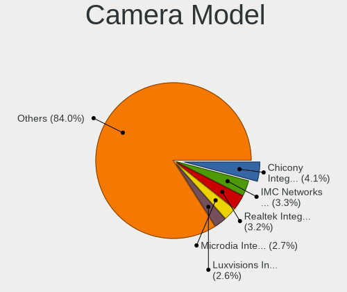

| Model                                                           | Computers | Percent |
|-----------------------------------------------------------------|-----------|---------|
| Acer Integrated Camera                                          | 74        | 9.95%   |
| Acer Integrated 5M Camera                                       | 63        | 8.47%   |
| Chicony Integrated Camera                                       | 61        | 8.2%    |
| Chicony Integrated 5M Camera                                    | 41        | 5.51%   |
| Microdia Integrated_Webcam_HD                                   | 18        | 2.42%   |
| Realtek Integrated_Webcam_HD                                    | 16        | 2.15%   |
| IMC Networks USB2.0 HD UVC WebCam                               | 15        | 2.02%   |
| IMC Networks Integrated Camera                                  | 15        | 2.02%   |
| Chicony USB2.0 HD UVC WebCam                                    | 15        | 2.02%   |
| Logitech Webcam C270                                            | 14        | 1.88%   |
| Syntek Integrated Camera                                        | 11        | 1.48%   |
| Logitech HD Pro Webcam C920                                     | 10        | 1.34%   |
| Quanta Chromebook HD Camera                                     | 8         | 1.08%   |
| Sunplus Integrated_Webcam_HD                                    | 7         | 0.94%   |
| Chicony HD Webcam                                               | 7         | 0.94%   |
| Cheng Uei Precision Industry (Foxlink) HP Webcam                | 7         | 0.94%   |
| Apple FaceTime HD Camera (Built-in)                             | 7         | 0.94%   |
| Microdia Integrated Webcam                                      | 6         | 0.81%   |
| Logitech C922 Pro Stream Webcam                                 | 6         | 0.81%   |
| Samsung Galaxy series, misc. (MTP mode)                         | 5         | 0.67%   |
| Realtek USB Camera                                              | 5         | 0.67%   |
| Quanta HP TrueVision HD Camera                                  | 5         | 0.67%   |
| Quanta HD User Facing                                           | 5         | 0.67%   |
| Chicony USB 2.0 Camera                                          | 5         | 0.67%   |
| Quanta HP Wide Vision HD Camera                                 | 4         | 0.54%   |
| Quanta HD WebCam                                                | 4         | 0.54%   |
| Luxvisions Innotech Limited HP TrueVision HD Camera             | 4         | 0.54%   |
| Chicony HP Truevision HD camera                                 | 4         | 0.54%   |
| Chicony HP HD Camera                                            | 4         | 0.54%   |
| Apple Built-in iSight                                           | 4         | 0.54%   |
| Alcor Micro USB 2.0 Camera                                      | 4         | 0.54%   |
| webcam webcam                                                   | 3         | 0.4%    |
| Valve Software 3D Camera                                        | 3         | 0.4%    |
| Suyin HP Truevision HD                                          | 3         | 0.4%    |
| Sunplus HP Universal Camera                                     | 3         | 0.4%    |
| Sunplus HD WebCam                                               | 3         | 0.4%    |
| Realtek HD WebCam                                               | 3         | 0.4%    |
| Quanta HP True Vision 5MP Camera                                | 3         | 0.4%    |
| Microsoft LifeCam HD-3000                                       | 3         | 0.4%    |
| Microdia Webcam Vitade AF                                       | 3         | 0.4%    |
| Microdia USB 2.0 Camera                                         | 3         | 0.4%    |
| Microdia Integrated_Webcam_FHD                                  | 3         | 0.4%    |
| Microdia Integrated Webcam HD                                   | 3         | 0.4%    |
| Logitech HD Webcam C615                                         | 3         | 0.4%    |
| Logitech CrystalCam                                             | 3         | 0.4%    |
| Lite-On Integrated Camera                                       | 3         | 0.4%    |
| Importek TOSHIBA Web Camera - HD                                | 3         | 0.4%    |
| IMC Networks HP TrueVision HD Camera                            | 3         | 0.4%    |
| Chicony HP Wide Vision HD Camera                                | 3         | 0.4%    |
| Chicony HP Webcam                                               | 3         | 0.4%    |
| Cheng Uei Precision Industry (Foxlink) Webcam                   | 3         | 0.4%    |
| Cheng Uei Precision Industry (Foxlink) HP Wide Vision HD Camera | 3         | 0.4%    |
| Cheng Uei Precision Industry (Foxlink) HP TrueVision HD Camera  | 3         | 0.4%    |
| Apple FaceTime HD Camera                                        | 3         | 0.4%    |
| Acer HD Webcam                                                  | 3         | 0.4%    |
| Acer BisonCam,NB Pro                                            | 3         | 0.4%    |
| Unknown 720p HD Camera                                          | 2         | 0.27%   |
| Suyin HP TrueVision HD Integrated Webcam                        | 2         | 0.27%   |
| Sunplus USB 2.0 Camera                                          | 2         | 0.27%   |
| Sunplus Laptop_Integrated_Webcam_FHD                            | 2         | 0.27%   |

Security
--------

Fingerprint Vendor
------------------

Fingerprint sensor vendors

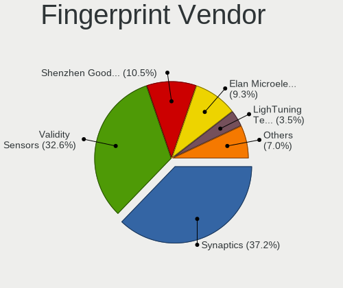

| Vendor                     | Computers | Percent |
|----------------------------|-----------|---------|
| Synaptics                  | 130       | 69.52%  |
| Validity Sensors           | 31        | 16.58%  |
| Shenzhen Goodix Technology | 10        | 5.35%   |
| Elan Microelectronics      | 6         | 3.21%   |
| Upek                       | 3         | 1.6%    |
| Samsung Electronics        | 2         | 1.07%   |
| AuthenTec                  | 2         | 1.07%   |
| STMicroelectronics         | 1         | 0.53%   |
| LighTuning Technology      | 1         | 0.53%   |
| DigitalPersona             | 1         | 0.53%   |

Fingerprint Model
-----------------

Fingerprint sensor models

| Model                                                                      | Computers | Percent |
|----------------------------------------------------------------------------|-----------|---------|
| Synaptics Prometheus MIS Touch Fingerprint Reader                          | 112       | 59.89%  |
| Unknown                                                                    | 10        | 5.35%   |
| Validity Sensors VFS495 Fingerprint Reader                                 | 7         | 3.74%   |
| Shenzhen Goodix  FingerPrint Device                                        | 5         | 2.67%   |
| Validity Sensors VFS5011 Fingerprint Reader                                | 4         | 2.14%   |
| Validity Sensors Synaptics VFS7552 Touch Fingerprint Sensor with PurePrint | 4         | 2.14%   |
| Elan ELAN:ARM-M4                                                           | 4         | 2.14%   |
| Validity Sensors VFS491                                                    | 3         | 1.6%    |
| Validity Sensors VFS471 Fingerprint Reader                                 | 3         | 1.6%    |
| Validity Sensors VFS 5011 fingerprint sensor                               | 3         | 1.6%    |
| Upek Biometric Touchchip/Touchstrip Fingerprint Sensor                     | 3         | 1.6%    |
| Synaptics WBDI Device                                                      | 3         | 1.6%    |
| Shenzhen Goodix Fingerprint Reader                                         | 3         | 1.6%    |
| Validity Sensors VFS7552 Touch Fingerprint Sensor                          | 2         | 1.07%   |
| Validity Sensors Swipe Fingerprint Sensor                                  | 2         | 1.07%   |
| Shenzhen Goodix FingerPrint                                                | 2         | 1.07%   |
| Elan ELAN:Fingerprint                                                      | 2         | 1.07%   |
| AuthenTec Fingerprint Sensor                                               | 2         | 1.07%   |
| Validity Sensors VFS451 Fingerprint Reader                                 | 1         | 0.53%   |
| Validity Sensors VFS101 Fingerprint Reader                                 | 1         | 0.53%   |
| Validity Sensors Fingerprint scanner                                       | 1         | 0.53%   |
| Synaptics  WBDI                                                            | 1         | 0.53%   |
| Synaptics  VFS7552 Touch Fingerprint Sensor with PurePrint                 | 1         | 0.53%   |
| Synaptics  FS7604 Touch Fingerprint Sensor with PurePrint                  | 1         | 0.53%   |
| Synaptics Metallica MOH Touch Fingerprint Reader                           | 1         | 0.53%   |
| Synaptics Metallica MIS Touch Fingerprint Reader                           | 1         | 0.53%   |
| STMicroelectronics Fingerprint Reader                                      | 1         | 0.53%   |
| Samsung Fingerprint Sensor Device - 730B                                   | 1         | 0.53%   |
| Samsung Fingerprint Device                                                 | 1         | 0.53%   |
| LighTuning Fingerprint Sensor                                              | 1         | 0.53%   |
| DigitalPersona Fingerprint Reader                                          | 1         | 0.53%   |

Chipcard Vendor
---------------

Chipcard module vendors

| Vendor                | Computers | Percent |
|-----------------------|-----------|---------|
| Broadcom              | 25        | 62.5%   |
| SCM Microsystems      | 5         | 12.5%   |
| Alcor Micro           | 4         | 10%     |
| Yubico.com            | 2         | 5%      |
| Upek                  | 2         | 5%      |
| O2 Micro              | 1         | 2.5%    |
| Gemalto (was Gemplus) | 1         | 2.5%    |

Chipcard Model
--------------

Chipcard module models

| Model                                                                        | Computers | Percent |
|------------------------------------------------------------------------------|-----------|---------|
| Broadcom BCM5880 Secure Applications Processor                               | 9         | 22.5%   |
| Broadcom 5880                                                                | 7         | 17.5%   |
| Broadcom BCM5880 Secure Applications Processor with fingerprint swipe sensor | 5         | 12.5%   |
| SCM Microsystems SCR331-LC1 / SCR3310 SmartCard Reader                       | 4         | 10%     |
| Broadcom 58200                                                               | 4         | 10%     |
| Alcor Micro AU9540 Smartcard Reader                                          | 4         | 10%     |
| Yubico.com Yubikey 4 U2F+CCID                                                | 2         | 5%      |
| Upek TouchChip Fingerprint Coprocessor (WBF advanced mode)                   | 2         | 5%      |
| SCM Microsystems SCR3500 A Contact Reader                                    | 1         | 2.5%    |
| O2 Micro Oz776 SmartCard Reader                                              | 1         | 2.5%    |
| Gemalto (was Gemplus) Compact Smart Card Reader Writer                       | 1         | 2.5%    |

Unsupported
-----------

Unsupported Devices
-------------------

Total unsupported devices on board

| Total | Computers | Percent |
|-------|-----------|---------|
| 0     | 673       | 64.34%  |
| 1     | 321       | 30.69%  |
| 2     | 38        | 3.63%   |
| 3     | 8         | 0.76%   |
| 4     | 4         | 0.38%   |
| 5     | 2         | 0.19%   |

Unsupported Device Types
------------------------

Types of unsupported devices

| Type                     | Computers | Percent |
|--------------------------|-----------|---------|
| Fingerprint reader       | 187       | 42.79%  |
| Graphics card            | 58        | 13.27%  |
| Net/wireless             | 56        | 12.81%  |
| Chipcard                 | 32        | 7.32%   |
| Multimedia controller    | 28        | 6.41%   |
| Communication controller | 15        | 3.43%   |
| Camera                   | 14        | 3.2%    |
| Bluetooth                | 12        | 2.75%   |
| Sound                    | 11        | 2.52%   |
| Unassigned class         | 8         | 1.83%   |
| Storage/raid             | 3         | 0.69%   |
| Network                  | 3         | 0.69%   |
| Storage                  | 2         | 0.46%   |
| Net/ethernet             | 2         | 0.46%   |
| Modem                    | 2         | 0.46%   |
| Dvb card                 | 2         | 0.46%   |
| Firewire controller      | 1         | 0.23%   |
| Card reader              | 1         | 0.23%   |

