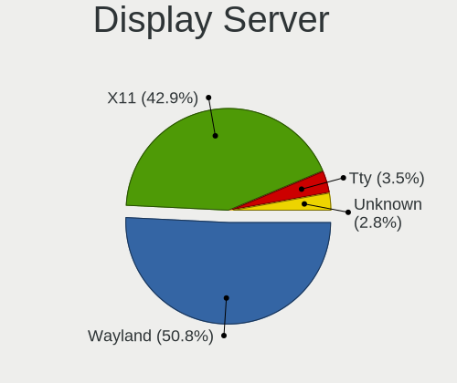
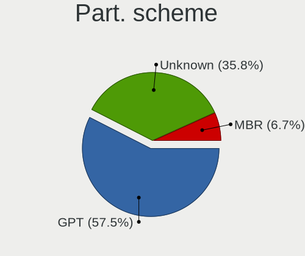
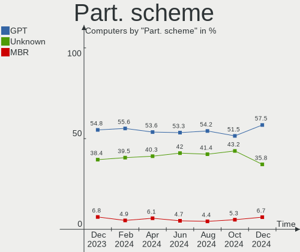
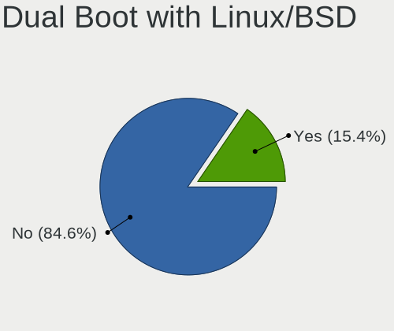
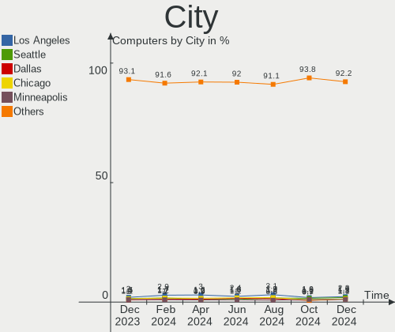
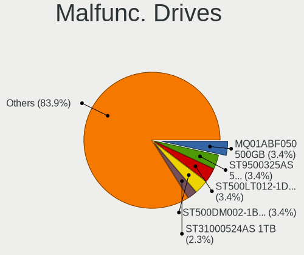
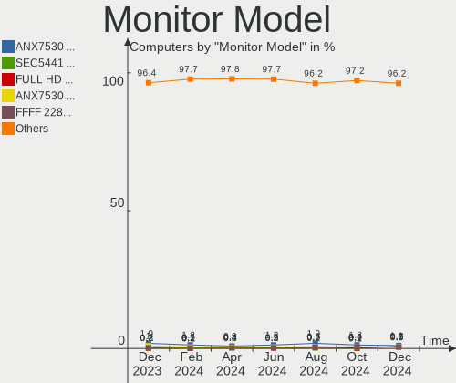
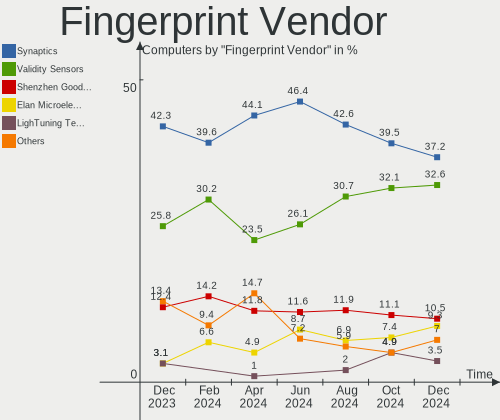
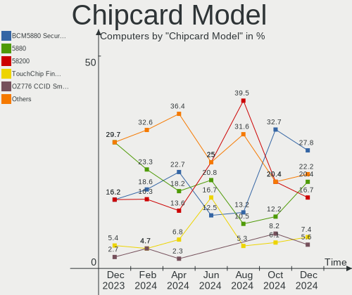

Linux in USA - Hardware Trends
------------------------------

A project to identify most popular hardware characteristics and track their change
over time based on data collected by Linux users at https://Linux-Hardware.org.

Anyone can contribute to this report by the [hw-probe](https://github.com/linuxhw/hw-probe) tool:

    sudo -E hw-probe -all -upload

This is a report for all computer types. See also reports for [desktops](/Location/USA/Desktop/README.md) and [notebooks](/Location/USA/Notebook/README.md).

Period: Dec, 2023.

Contents
--------

* [ System ](#system)
  - [ OS                       ](#os)
  - [ OS Family                ](#os-family)
  - [ Kernel                   ](#kernel)
  - [ Kernel Family            ](#kernel-family)
  - [ Kernel Major Ver.        ](#kernel-major-ver)
  - [ Arch                     ](#arch)
  - [ DE                       ](#de)
  - [ Display Server           ](#display-server)
  - [ Display Manager          ](#display-manager)
  - [ OS Lang                  ](#os-lang)
  - [ Boot Mode                ](#boot-mode)
  - [ Filesystem               ](#filesystem)
  - [ Part. scheme             ](#part-scheme)
  - [ Dual Boot with Linux/BSD ](#dual-boot-with-linuxbsd)
  - [ Dual Boot (Win)          ](#dual-boot-win)

* [ Board ](#board)
  - [ Vendor                   ](#vendor)
  - [ Model                    ](#model)
  - [ Model Family             ](#model-family)
  - [ MFG Year                 ](#mfg-year)
  - [ Form Factor              ](#form-factor)
  - [ Secure Boot              ](#secure-boot)
  - [ Coreboot                 ](#coreboot)
  - [ RAM Size                 ](#ram-size)
  - [ RAM Used                 ](#ram-used)
  - [ Total Drives             ](#total-drives)
  - [ Has CD-ROM               ](#has-cd-rom)
  - [ Has Ethernet             ](#has-ethernet)
  - [ Has WiFi                 ](#has-wifi)
  - [ Has Bluetooth            ](#has-bluetooth)

* [ Location ](#location)
  - [ Country                  ](#country)
  - [ City                     ](#city)

* [ Drives ](#drives)
  - [ Drive Vendor             ](#drive-vendor)
  - [ Drive Model              ](#drive-model)
  - [ HDD Vendor               ](#hdd-vendor)
  - [ SSD Vendor               ](#ssd-vendor)
  - [ Drive Kind               ](#drive-kind)
  - [ Drive Connector          ](#drive-connector)
  - [ Drive Size               ](#drive-size)
  - [ Space Total              ](#space-total)
  - [ Space Used               ](#space-used)
  - [ Malfunc. Drives          ](#malfunc-drives)
  - [ Malfunc. Drive Vendor    ](#malfunc-drive-vendor)
  - [ Malfunc. HDD Vendor      ](#malfunc-hdd-vendor)
  - [ Malfunc. Drive Kind      ](#malfunc-drive-kind)
  - [ Failed Drives            ](#failed-drives)
  - [ Failed Drive Vendor      ](#failed-drive-vendor)
  - [ Drive Status             ](#drive-status)

* [ Storage controller ](#storage-controller)
  - [ Storage Vendor           ](#storage-vendor)
  - [ Storage Model            ](#storage-model)
  - [ Storage Kind             ](#storage-kind)

* [ Processor ](#processor)
  - [ CPU Vendor               ](#cpu-vendor)
  - [ CPU Model                ](#cpu-model)
  - [ CPU Model Family         ](#cpu-model-family)
  - [ CPU Cores                ](#cpu-cores)
  - [ CPU Sockets              ](#cpu-sockets)
  - [ CPU Threads              ](#cpu-threads)
  - [ CPU Op-Modes             ](#cpu-op-modes)
  - [ CPU Microcode            ](#cpu-microcode)
  - [ CPU Microarch            ](#cpu-microarch)

* [ Graphics ](#graphics)
  - [ GPU Vendor               ](#gpu-vendor)
  - [ GPU Model                ](#gpu-model)
  - [ GPU Combo                ](#gpu-combo)
  - [ GPU Driver               ](#gpu-driver)
  - [ GPU Memory               ](#gpu-memory)

* [ Monitor ](#monitor)
  - [ Monitor Vendor           ](#monitor-vendor)
  - [ Monitor Model            ](#monitor-model)
  - [ Monitor Resolution       ](#monitor-resolution)
  - [ Monitor Diagonal         ](#monitor-diagonal)
  - [ Monitor Width            ](#monitor-width)
  - [ Aspect Ratio             ](#aspect-ratio)
  - [ Monitor Area             ](#monitor-area)
  - [ Pixel Density            ](#pixel-density)
  - [ Multiple Monitors        ](#multiple-monitors)

* [ Network ](#network)
  - [ Net Controller Vendor    ](#net-controller-vendor)
  - [ Net Controller Model     ](#net-controller-model)
  - [ Wireless Vendor          ](#wireless-vendor)
  - [ Wireless Model           ](#wireless-model)
  - [ Ethernet Vendor          ](#ethernet-vendor)
  - [ Ethernet Model           ](#ethernet-model)
  - [ Net Controller Kind      ](#net-controller-kind)
  - [ Used Controller          ](#used-controller)
  - [ NICs                     ](#nics)
  - [ IPv6                     ](#ipv6)

* [ Bluetooth ](#bluetooth)
  - [ Bluetooth Vendor         ](#bluetooth-vendor)
  - [ Bluetooth Model          ](#bluetooth-model)

* [ Sound ](#sound)
  - [ Sound Vendor             ](#sound-vendor)
  - [ Sound Model              ](#sound-model)

* [ Memory ](#memory)
  - [ Memory Vendor            ](#memory-vendor)
  - [ Memory Model             ](#memory-model)
  - [ Memory Kind              ](#memory-kind)
  - [ Memory Form Factor       ](#memory-form-factor)
  - [ Memory Size              ](#memory-size)
  - [ Memory Speed             ](#memory-speed)

* [ Printers & scanners ](#printers--scanners)
  - [ Printer Vendor           ](#printer-vendor)
  - [ Printer Model            ](#printer-model)
  - [ Scanner Vendor           ](#scanner-vendor)
  - [ Scanner Model            ](#scanner-model)

* [ Camera ](#camera)
  - [ Camera Vendor            ](#camera-vendor)
  - [ Camera Model             ](#camera-model)

* [ Security ](#security)
  - [ Fingerprint Vendor       ](#fingerprint-vendor)
  - [ Fingerprint Model        ](#fingerprint-model)
  - [ Chipcard Vendor          ](#chipcard-vendor)
  - [ Chipcard Model           ](#chipcard-model)

* [ Unsupported ](#unsupported)
  - [ Unsupported Devices      ](#unsupported-devices)
  - [ Unsupported Device Types ](#unsupported-device-types)

System
------

OS
--

Installed operating systems

| Name                         | Computers | Percent |
|------------------------------|-----------|---------|
| Ubuntu 22.04                 | 159       | 14.44%  |
| Fedora 39                    | 100       | 9.08%   |
| Linux Mint 21.2              | 78        | 7.08%   |
| Debian 12                    | 62        | 5.63%   |
| Ubuntu 23.10                 | 58        | 5.27%   |
| OpenMandriva 5.0             | 54        | 4.9%    |
| Pop!_OS 22.04                | 52        | 4.72%   |
| Arch Rolling                 | 42        | 3.81%   |
| ArcoLinux Rolling            | 34        | 3.09%   |
| SteamOS 3.5.7                | 33        | 3%      |
| Zorin 16                     | 32        | 2.91%   |
| Nobara 38                    | 19        | 1.73%   |
| OpenMandriva 23.11           | 18        | 1.63%   |
| Ubuntu 20.04                 | 15        | 1.36%   |
| OpenMandriva 23.08           | 15        | 1.36%   |
| Zorin 17                     | 14        | 1.27%   |
| KDE neon 22.04               | 14        | 1.27%   |
| Gentoo 2.14                  | 14        | 1.27%   |
| Fedora 38                    | 12        | 1.09%   |
| Manjaro                      | 11        | 1%      |
| EndeavourOS Rolling          | 11        | 1%      |
| Linux Mint 20.3              | 10        | 0.91%   |
| Kubuntu 23.10                | 10        | 0.91%   |
| Kubuntu 22.04                | 10        | 0.91%   |
| Kali 2023.4                  | 10        | 0.91%   |
| Ubuntu 23.04                 | 9         | 0.82%   |
| Xero Rolling                 | 8         | 0.73%   |
| openSUSE Tumbleweed-XXXXXXXX | 8         | 0.73%   |
| LMDE 6                       | 8         | 0.73%   |
| Debian 11                    | 8         | 0.73%   |
| Xubuntu 22.04                | 7         | 0.64%   |
| NixOS 23.11                  | 7         | 0.64%   |
| Ultramarine 39               | 6         | 0.54%   |
| openSUSE Leap-15.5           | 6         | 0.54%   |
| MX 23                        | 6         | 0.54%   |
| OpenMandriva 23.03           | 5         | 0.45%   |
| Linux Mint 21.1              | 5         | 0.45%   |
| Elementary 7.1               | 5         | 0.45%   |
| Debian                       | 5         | 0.45%   |
| Ubuntu MATE 22.04            | 4         | 0.36%   |

OS Family
---------

OS without a version

| Name         | Computers | Percent |
|--------------|-----------|---------|
| Ubuntu       | 249       | 22.62%  |
| Fedora       | 117       | 10.63%  |
| Linux Mint   | 101       | 9.17%   |
| OpenMandriva | 97        | 8.81%   |
| Debian       | 76        | 6.9%    |
| Pop!_OS      | 53        | 4.81%   |
| Zorin        | 49        | 4.45%   |
| Arch         | 42        | 3.81%   |
| SteamOS      | 39        | 3.54%   |
| ArcoLinux    | 34        | 3.09%   |
| Nobara       | 22        | 2%      |
| Kubuntu      | 22        | 2%      |
| openSUSE     | 15        | 1.36%   |
| Manjaro      | 15        | 1.36%   |
| KDE neon     | 14        | 1.27%   |
| Gentoo       | 14        | 1.27%   |
| Kali         | 13        | 1.18%   |
| EndeavourOS  | 11        | 1%      |
| Xubuntu      | 10        | 0.91%   |
| NixOS        | 10        | 0.91%   |
| Xero         | 8         | 0.73%   |
| LMDE         | 8         | 0.73%   |
| MX           | 7         | 0.64%   |
| Ultramarine  | 6         | 0.54%   |
| Ubuntu MATE  | 6         | 0.54%   |
| Lubuntu      | 6         | 0.54%   |
| Elementary   | 6         | 0.54%   |
| Garuda Linux | 5         | 0.45%   |
| Parrot       | 3         | 0.27%   |
| ChimeraOS    | 3         | 0.27%   |
| Artix        | 3         | 0.27%   |
| Alpine       | 3         | 0.27%   |
| Ubuntu Unity | 2         | 0.18%   |
| TUXEDO OS    | 2         | 0.18%   |
| Rocky Linux  | 2         | 0.18%   |
| RHEL         | 2         | 0.18%   |
| Raspbian     | 2         | 0.18%   |
| Oracle Linux | 2         | 0.18%   |
| Endless      | 2         | 0.18%   |
| Archcraft    | 2         | 0.18%   |

Kernel
------

Version of the Linux kernel

| Version                    | Computers | Percent |
|----------------------------|-----------|---------|
| 6.2.0-39-generic           | 95        | 8.63%   |
| 5.15.0-91-generic          | 91        | 8.27%   |
| 6.2.0-37-generic           | 70        | 6.36%   |
| 6.6.2-desktop-1omv2390     | 68        | 6.18%   |
| 6.5.0-14-generic           | 56        | 5.09%   |
| 6.1.52-valve9-1-neptune-61 | 33        | 3%      |
| 5.15.0-89-generic          | 28        | 2.54%   |
| 6.6.6-76060606-generic     | 25        | 2.27%   |
| 6.6.6-200.fc39.x86_64      | 25        | 2.27%   |
| 6.5.6-76060506-generic     | 25        | 2.27%   |
| 6.1.0-16-amd64             | 20        | 1.82%   |
| 6.1.0-13-amd64             | 16        | 1.45%   |
| 6.6.8-200.fc39.x86_64      | 15        | 1.36%   |
| 6.6.3-arch1-1              | 15        | 1.36%   |
| 6.4.11-desktop-1omv2390    | 15        | 1.36%   |
| 6.6.4-200.fc39.x86_64      | 14        | 1.27%   |
| 6.5.6-300.fc39.x86_64      | 14        | 1.27%   |
| 6.1.0-15-amd64             | 14        | 1.27%   |
| 6.6.7-arch1-1              | 13        | 1.18%   |
| 6.6.7-200.fc39.x86_64      | 13        | 1.18%   |
| 6.6.2-201.fc39.x86_64      | 13        | 1.18%   |
| 6.6.1-arch1-1              | 10        | 0.91%   |
| 6.2.0-26-generic           | 10        | 0.91%   |
| 5.4.0-169-generic          | 10        | 0.91%   |
| 6.5.0-kali3-amd64          | 9         | 0.82%   |
| 6.5.0-13-generic           | 9         | 0.82%   |
| 6.6.8-arch1-1              | 8         | 0.73%   |
| 6.6.4-arch1-1              | 8         | 0.73%   |
| 5.4.0-150-generic          | 8         | 0.73%   |
| 5.15.0-76-generic          | 8         | 0.73%   |
| 6.6.7-zen1-1-zen           | 7         | 0.64%   |
| 6.6.3-200.fc39.x86_64      | 7         | 0.64%   |
| 6.5.0-9-generic            | 7         | 0.64%   |
| 6.6.6-100.fc38.x86_64      | 6         | 0.54%   |
| 6.5.9-arch2-1              | 6         | 0.54%   |
| 6.2.0-36-generic           | 6         | 0.54%   |
| 6.6.8-zen1-1-zen           | 5         | 0.45%   |
| 6.6.6-arch1-1              | 5         | 0.45%   |
| 6.2.6-desktop-1omv2390     | 5         | 0.45%   |
| 5.15.0-88-generic          | 5         | 0.45%   |

Kernel Family
-------------

Linux kernel without a distro release

| Version | Computers | Percent |
|---------|-----------|---------|
| 6.2.0   | 192       | 17.44%  |
| 5.15.0  | 145       | 13.17%  |
| 6.5.0   | 104       | 9.45%   |
| 6.6.2   | 89        | 8.08%   |
| 6.1.0   | 73        | 6.63%   |
| 6.6.6   | 72        | 6.54%   |
| 6.6.7   | 47        | 4.27%   |
| 6.5.6   | 42        | 3.81%   |
| 6.6.8   | 37        | 3.36%   |
| 6.1.52  | 36        | 3.27%   |
| 6.6.3   | 34        | 3.09%   |
| 6.6.4   | 33        | 3%      |
| 5.4.0   | 28        | 2.54%   |
| 6.4.11  | 15        | 1.36%   |
| 6.6.1   | 11        | 1%      |
| 6.5.9   | 8         | 0.73%   |
| 6.5.11  | 8         | 0.73%   |
| 6.5.13  | 7         | 0.64%   |
| 6.1.67  | 6         | 0.54%   |
| 6.1.64  | 6         | 0.54%   |
| 6.7.0   | 5         | 0.45%   |
| 6.6.5   | 5         | 0.45%   |
| 6.2.6   | 5         | 0.45%   |
| 6.1.69  | 5         | 0.45%   |
| 5.14.21 | 5         | 0.45%   |
| 5.14.0  | 5         | 0.45%   |
| 5.10.0  | 5         | 0.45%   |
| 4.15.0  | 5         | 0.45%   |
| 5.19.0  | 4         | 0.36%   |
| 6.6.0   | 3         | 0.27%   |
| 6.4.10  | 3         | 0.27%   |
| 6.1.63  | 3         | 0.27%   |
| 4.18.0  | 3         | 0.27%   |
| 6.5.5   | 2         | 0.18%   |
| 6.5.12  | 2         | 0.18%   |
| 6.4.12  | 2         | 0.18%   |
| 6.3.7   | 2         | 0.18%   |
| 6.3.0   | 2         | 0.18%   |
| 6.2.9   | 2         | 0.18%   |
| 6.2.16  | 2         | 0.18%   |

Kernel Major Ver.
-----------------

Linux kernel major version

| Version | Computers | Percent |
|---------|-----------|---------|
| 6.6     | 331       | 30.06%  |
| 6.2     | 205       | 18.62%  |
| 6.5     | 176       | 15.99%  |
| 5.15    | 147       | 13.35%  |
| 6.1     | 141       | 12.81%  |
| 5.4     | 29        | 2.63%   |
| 6.4     | 22        | 2%      |
| 5.14    | 10        | 0.91%   |
| 6.3     | 7         | 0.64%   |
| 6.7     | 5         | 0.45%   |
| 5.19    | 5         | 0.45%   |
| 5.10    | 5         | 0.45%   |
| 4.15    | 5         | 0.45%   |
| 5.17    | 3         | 0.27%   |
| 4.18    | 3         | 0.27%   |
| 6.0     | 2         | 0.18%   |
| 5.13    | 2         | 0.18%   |
| 5.8     | 1         | 0.09%   |
| 5.11    | 1         | 0.09%   |
| 4.19    | 1         | 0.09%   |

Arch
----

OS architecture (x86_64, i586, etc.)

| Name    | Computers | Percent |
|---------|-----------|---------|
| x86_64  | 1084      | 98.46%  |
| i686    | 8         | 0.73%   |
| aarch64 | 7         | 0.64%   |
| armv7l  | 2         | 0.18%   |

DE
--

Desktop Environment

| Name             | Computers | Percent |
|------------------|-----------|---------|
| GNOME            | 477       | 43.32%  |
| KDE5             | 311       | 28.25%  |
| X-Cinnamon       | 99        | 8.99%   |
| XFCE             | 62        | 5.63%   |
| Unknown          | 51        | 4.63%   |
| MATE             | 23        | 2.09%   |
| LXQt             | 13        | 1.18%   |
| Pantheon         | 8         | 0.73%   |
| Cinnamon         | 8         | 0.73%   |
| Budgie           | 7         | 0.64%   |
| i3               | 6         | 0.54%   |
| Hyprland         | 4         | 0.36%   |
| GNOME Classic    | 4         | 0.36%   |
| sway             | 3         | 0.27%   |
| LXDE             | 3         | 0.27%   |
| GNOME Flashback  | 3         | 0.27%   |
| Unity            | 2         | 0.18%   |
| Trinity          | 2         | 0.18%   |
| Openbox          | 2         | 0.18%   |
| lightdm-xsession | 2         | 0.18%   |
| KDE              | 2         | 0.18%   |
| Endless:GNOME    | 2         | 0.18%   |
| xsession         | 1         | 0.09%   |
| X-Generic        | 1         | 0.09%   |
| qtile            | 1         | 0.09%   |
| plasmawayland    | 1         | 0.09%   |
| LXDE-pi-wayfire  | 1         | 0.09%   |
| GNOME-Classic    | 1         | 0.09%   |
| Deepin           | 1         | 0.09%   |

Display Server
--------------

X11 or Wayland

| Name    | Computers | Percent |
|---------|-----------|---------|
| X11     | 587       | 53.32%  |
| Wayland | 448       | 40.69%  |
| Tty     | 34        | 3.09%   |
| Unknown | 32        | 2.91%   |

Display Manager
---------------

SDDM, LightDM, etc.

| Name    | Computers | Percent |
|---------|-----------|---------|
| Unknown | 475       | 43.14%  |
| GDM3    | 245       | 22.25%  |
| SDDM    | 208       | 18.89%  |
| LightDM | 118       | 10.72%  |
| GDM     | 50        | 4.54%   |
| LY-DM   | 2         | 0.18%   |
| TDM     | 1         | 0.09%   |
| GREETD  | 1         | 0.09%   |
| EMPTTY  | 1         | 0.09%   |

OS Lang
-------

Language

| Lang        | Computers | Percent |
|-------------|-----------|---------|
| en_US       | 1021      | 92.73%  |
| C           | 31        | 2.82%   |
| Unknown     | 17        | 1.54%   |
| en_CA       | 8         | 0.73%   |
| en_GB       | 4         | 0.36%   |
| it_IT       | 3         | 0.27%   |
| es_US       | 3         | 0.27%   |
| es_ES       | 3         | 0.27%   |
| pl_PL       | 2         | 0.18%   |
| zh_CN       | 1         | 0.09%   |
| POSIX       | 1         | 0.09%   |
| fr_FR       | 1         | 0.09%   |
| es_VE       | 1         | 0.09%   |
| es_MX       | 1         | 0.09%   |
| es_CO       | 1         | 0.09%   |
| en_US_UTF-8 | 1         | 0.09%   |
| de_DE       | 1         | 0.09%   |
| C.UTF8      | 1         | 0.09%   |

Boot Mode
---------

EFI or BIOS

| Mode | Computers | Percent |
|------|-----------|---------|
| EFI  | 569       | 51.68%  |
| BIOS | 532       | 48.32%  |

Filesystem
----------

Type of filesystem

| Type    | Computers | Percent |
|---------|-----------|---------|
| Ext4    | 582       | 52.86%  |
| Btrfs   | 238       | 21.62%  |
| Tmpfs   | 191       | 17.35%  |
| Overlay | 55        | 5%      |
| Xfs     | 16        | 1.45%   |
| Zfs     | 12        | 1.09%   |
| F2fs    | 3         | 0.27%   |
| Ext3    | 2         | 0.18%   |
| Jfs     | 1         | 0.09%   |
| Ext2    | 1         | 0.09%   |

Part. scheme
------------

Scheme of partitioning

| Type    | Computers | Percent |
|---------|-----------|---------|
| GPT     | 596       | 54.13%  |
| Unknown | 430       | 39.06%  |
| MBR     | 75        | 6.81%   |

Dual Boot with Linux/BSD
------------------------

Hosting more than one Linux/BSD

| Dual boot | Computers | Percent |
|-----------|-----------|---------|
| No        | 956       | 86.83%  |
| Yes       | 145       | 13.17%  |

Dual Boot (Win)
---------------

Hosting Linux and Windows

| Dual boot | Computers | Percent |
|-----------|-----------|---------|
| No        | 869       | 78.93%  |
| Yes       | 232       | 21.07%  |

Board
-----

Vendor
------

Motherboard manufacturer

| Name                    | Computers | Percent |
|-------------------------|-----------|---------|
| Hewlett-Packard         | 172       | 15.62%  |
| Dell                    | 166       | 15.08%  |
| ASUSTek Computer        | 165       | 14.99%  |
| Lenovo                  | 137       | 12.44%  |
| Gigabyte Technology     | 65        | 5.9%    |
| MSI                     | 55        | 5%      |
| Apple                   | 47        | 4.27%   |
| ASRock                  | 40        | 3.63%   |
| Valve                   | 37        | 3.36%   |
| Acer                    | 25        | 2.27%   |
| Unknown                 | 15        | 1.36%   |
| Google                  | 14        | 1.27%   |
| Toshiba                 | 12        | 1.09%   |
| AZW                     | 12        | 1.09%   |
| System76                | 10        | 0.91%   |
| Intel                   | 9         | 0.82%   |
| Supermicro              | 8         | 0.73%   |
| Framework               | 8         | 0.73%   |
| Alienware               | 8         | 0.73%   |
| Microsoft               | 7         | 0.64%   |
| Raspberry Pi Foundation | 6         | 0.54%   |
| Pegatron                | 6         | 0.54%   |
| Samsung Electronics     | 5         | 0.45%   |
| Panasonic               | 4         | 0.36%   |
| GPU Company             | 4         | 0.36%   |
| Foxconn                 | 4         | 0.36%   |
| Sony                    | 3         | 0.27%   |
| LG Electronics          | 3         | 0.27%   |
| Fujitsu                 | 3         | 0.27%   |
| eMachines               | 3         | 0.27%   |
| ECS                     | 3         | 0.27%   |
| Chuwi                   | 3         | 0.27%   |
| BESSTAR Tech            | 3         | 0.27%   |
| IBM                     | 2         | 0.18%   |
| Gateway                 | 2         | 0.18%   |
| EVGA                    | 2         | 0.18%   |
| XFX                     | 1         | 0.09%   |
| Wiltronic               | 1         | 0.09%   |
| Trigkey                 | 1         | 0.09%   |
| SK hynix                | 1         | 0.09%   |

Model
-----

Motherboard model

| Name                                       | Computers | Percent |
|--------------------------------------------|-----------|---------|
| Valve Jupiter                              | 24        | 2.18%   |
| Unknown                                    | 15        | 1.36%   |
| Valve Galileo                              | 13        | 1.18%   |
| ASUS All Series                            | 8         | 0.73%   |
| AZW SER                                    | 7         | 0.64%   |
| ASUS TUF Gaming X570-PLUS                  | 7         | 0.64%   |
| Dell OptiPlex 7040                         | 6         | 0.54%   |
| HP ENVY x360 2-in-1 Laptop 15-ey0xxx       | 5         | 0.45%   |
| HP 15 Notebook PC                          | 5         | 0.45%   |
| Dell OptiPlex 7010                         | 5         | 0.45%   |
| Dell OptiPlex 3010                         | 5         | 0.45%   |
| MSI MS-7C02                                | 4         | 0.36%   |
| HP Notebook                                | 4         | 0.36%   |
| HP Laptop 15-da0xxx                        | 4         | 0.36%   |
| Google Garg                                | 4         | 0.36%   |
| Framework Laptop 13 (AMD Ryzen 7040Series) | 4         | 0.36%   |
| Dell OptiPlex 5050                         | 4         | 0.36%   |
| System76 Serval WS                         | 3         | 0.27%   |
| MSI MS-7C56                                | 3         | 0.27%   |
| MSI MS-7C37                                | 3         | 0.27%   |
| MSI MS-7B79                                | 3         | 0.27%   |
| HP Z440 Workstation                        | 3         | 0.27%   |
| HP Victus by Gaming Laptop 15-fa0xxx       | 3         | 0.27%   |
| HP Pavilion dv6                            | 3         | 0.27%   |
| HP Laptop 15-bw0xx                         | 3         | 0.27%   |
| HP EliteDesk 800 G1 SFF                    | 3         | 0.27%   |
| Gigabyte X570 AORUS PRO WIFI               | 3         | 0.27%   |
| Gigabyte B650 AORUS ELITE AX               | 3         | 0.27%   |
| Gigabyte B550M DS3H AC                     | 3         | 0.27%   |
| Dell OptiPlex 9020                         | 3         | 0.27%   |
| Dell Latitude 7490                         | 3         | 0.27%   |
| Dell Inspiron 1545                         | 3         | 0.27%   |
| ASUS ROG STRIX X670E-E GAMING WIFI         | 3         | 0.27%   |
| ASUS ROG STRIX X570-E GAMING               | 3         | 0.27%   |
| ASUS ROG STRIX B550-F GAMING               | 3         | 0.27%   |
| ASUS PRIME B550-PLUS                       | 3         | 0.27%   |
| ASUS M5A99FX PRO R2.0                      | 3         | 0.27%   |
| ASRock B450M Pro4                          | 3         | 0.27%   |
| Apple MacBookPro9,2                        | 3         | 0.27%   |
| Apple MacBookAir9,1                        | 3         | 0.27%   |

Model Family
------------

Motherboard model prefix

| Name               | Computers | Percent |
|--------------------|-----------|---------|
| Lenovo ThinkPad    | 73        | 6.63%   |
| ASUS ROG           | 44        | 4%      |
| Dell OptiPlex      | 42        | 3.81%   |
| Dell Latitude      | 39        | 3.54%   |
| Dell Inspiron      | 35        | 3.18%   |
| HP Pavilion        | 25        | 2.27%   |
| Valve Jupiter      | 24        | 2.18%   |
| Lenovo IdeaPad     | 20        | 1.82%   |
| HP Laptop          | 20        | 1.82%   |
| ASUS PRIME         | 20        | 1.82%   |
| Dell Precision     | 16        | 1.45%   |
| ASUS TUF           | 16        | 1.45%   |
| Acer Aspire        | 16        | 1.45%   |
| Dell XPS           | 15        | 1.36%   |
| Unknown            | 15        | 1.36%   |
| HP ENVY            | 14        | 1.27%   |
| Valve Galileo      | 13        | 1.18%   |
| HP Compaq          | 13        | 1.18%   |
| HP EliteBook       | 12        | 1.09%   |
| Toshiba Satellite  | 10        | 0.91%   |
| HP EliteDesk       | 10        | 0.91%   |
| Lenovo ThinkCentre | 9         | 0.82%   |
| HP OMEN            | 9         | 0.82%   |
| Lenovo IdeaPadFlex | 8         | 0.73%   |
| HP ProBook         | 8         | 0.73%   |
| Framework Laptop   | 8         | 0.73%   |
| ASUS All           | 8         | 0.73%   |
| Microsoft Surface  | 7         | 0.64%   |
| Lenovo Yoga        | 7         | 0.64%   |
| Gigabyte B550M     | 7         | 0.64%   |
| AZW SER            | 7         | 0.64%   |
| ASUS VivoBook      | 7         | 0.64%   |
| RPi Raspberry      | 6         | 0.54%   |
| Dell PowerEdge     | 6         | 0.54%   |
| ASUS ASUS          | 6         | 0.54%   |
| Acer Nitro         | 6         | 0.54%   |
| Lenovo Legion      | 5         | 0.45%   |
| HP Stream          | 5         | 0.45%   |
| HP 15              | 5         | 0.45%   |
| Gigabyte X570      | 5         | 0.45%   |

MFG Year
--------

Motherboard manufacture year

| Year    | Computers | Percent |
|---------|-----------|---------|
| 2023    | 133       | 12.08%  |
| 2022    | 127       | 11.53%  |
| 2020    | 90        | 8.17%   |
| 2019    | 90        | 8.17%   |
| 2018    | 86        | 7.81%   |
| 2021    | 78        | 7.08%   |
| 2012    | 72        | 6.54%   |
| 2015    | 59        | 5.36%   |
| 2017    | 58        | 5.27%   |
| 2013    | 54        | 4.9%    |
| 2011    | 51        | 4.63%   |
| 2016    | 50        | 4.54%   |
| 2014    | 39        | 3.54%   |
| 2010    | 28        | 2.54%   |
| 2008    | 25        | 2.27%   |
| 2009    | 24        | 2.18%   |
| 2007    | 19        | 1.73%   |
| Unknown | 10        | 0.91%   |
| 2006    | 4         | 0.36%   |
| 2005    | 2         | 0.18%   |
| 2001    | 2         | 0.18%   |

Form Factor
-----------

Physical design of the computer

| Name           | Computers | Percent |
|----------------|-----------|---------|
| Notebook       | 500       | 45.41%  |
| Desktop        | 449       | 40.78%  |
| Convertible    | 53        | 4.81%   |
| Mini pc        | 34        | 3.09%   |
| All in one     | 24        | 2.18%   |
| Tablet         | 16        | 1.45%   |
| Server         | 16        | 1.45%   |
| System on chip | 8         | 0.73%   |
| Other          | 1         | 0.09%   |

Secure Boot
-----------

Enabled or disabled

| State    | Computers | Percent |
|----------|-----------|---------|
| Disabled | 1022      | 92.82%  |
| Enabled  | 79        | 7.18%   |

Coreboot
--------

Have coreboot on board

| Used | Computers | Percent |
|------|-----------|---------|
| No   | 1080      | 98.09%  |
| Yes  | 21        | 1.91%   |

RAM Size
--------

Total RAM memory

| Size in GB      | Computers | Percent |
|-----------------|-----------|---------|
| 4.01-8.0        | 216       | 19.62%  |
| 16.01-24.0      | 215       | 19.53%  |
| 8.01-16.0       | 204       | 18.53%  |
| 32.01-64.0      | 190       | 17.26%  |
| 3.01-4.0        | 109       | 9.9%    |
| 64.01-256.0     | 85        | 7.72%   |
| 24.01-32.0      | 46        | 4.18%   |
| 1.01-2.0        | 16        | 1.45%   |
| More than 256.0 | 8         | 0.73%   |
| 2.01-3.0        | 6         | 0.54%   |
| 0.51-1.0        | 4         | 0.36%   |
| 0.01-0.5        | 2         | 0.18%   |

RAM Used
--------

Used RAM memory

| Used GB     | Computers | Percent |
|-------------|-----------|---------|
| 1.01-2.0    | 282       | 25.61%  |
| 2.01-3.0    | 256       | 23.25%  |
| 4.01-8.0    | 251       | 22.8%   |
| 3.01-4.0    | 175       | 15.89%  |
| 8.01-16.0   | 67        | 6.09%   |
| 0.51-1.0    | 31        | 2.82%   |
| 0.01-0.5    | 13        | 1.18%   |
| 16.01-24.0  | 12        | 1.09%   |
| 32.01-64.0  | 6         | 0.54%   |
| 64.01-256.0 | 5         | 0.45%   |
| 24.01-32.0  | 2         | 0.18%   |
| 0           | 1         | 0.09%   |

Total Drives
------------

Number of drives on board

| Drives | Computers | Percent |
|--------|-----------|---------|
| 1      | 633       | 57.49%  |
| 2      | 258       | 23.43%  |
| 3      | 95        | 8.63%   |
| 4      | 52        | 4.72%   |
| 5      | 24        | 2.18%   |
| 6      | 15        | 1.36%   |
| 0      | 7         | 0.64%   |
| 13     | 3         | 0.27%   |
| 10     | 3         | 0.27%   |
| 9      | 2         | 0.18%   |
| 7      | 2         | 0.18%   |
| 101    | 1         | 0.09%   |
| 26     | 1         | 0.09%   |
| 18     | 1         | 0.09%   |
| 15     | 1         | 0.09%   |
| 12     | 1         | 0.09%   |
| 11     | 1         | 0.09%   |
| 8      | 1         | 0.09%   |

Has CD-ROM
----------

Has CD-ROM on board

| Presented | Computers | Percent |
|-----------|-----------|---------|
| No        | 754       | 68.48%  |
| Yes       | 347       | 31.52%  |

Has Ethernet
------------

Has Ethernet on board

| Presented | Computers | Percent |
|-----------|-----------|---------|
| Yes       | 899       | 81.65%  |
| No        | 202       | 18.35%  |

Has WiFi
--------

Has WiFi module

| Presented | Computers | Percent |
|-----------|-----------|---------|
| Yes       | 894       | 81.2%   |
| No        | 207       | 18.8%   |

Has Bluetooth
-------------

Has Bluetooth module

| Presented | Computers | Percent |
|-----------|-----------|---------|
| Yes       | 743       | 67.48%  |
| No        | 358       | 32.52%  |

Location
--------

Country
-------

Geographic location (country)

| Country | Computers | Percent |
|---------|-----------|---------|
| USA     | 1101      | 100%    |

City
----

Geographic location (city)

| City           | Computers | Percent |
|----------------|-----------|---------|
| Los Angeles    | 22        | 2%      |
| New York       | 18        | 1.63%   |
| Seattle        | 16        | 1.45%   |
| Chicago        | 15        | 1.36%   |
| Las Vegas      | 13        | 1.18%   |
| Portland       | 12        | 1.09%   |
| Minneapolis    | 12        | 1.09%   |
| San Antonio    | 11        | 1%      |
| Dallas         | 11        | 1%      |
| Miami          | 10        | 0.91%   |
| Phoenix        | 9         | 0.82%   |
| Atlanta        | 9         | 0.82%   |
| Salt Lake City | 7         | 0.64%   |
| Jacksonville   | 7         | 0.64%   |
| Harrisonburg   | 7         | 0.64%   |
| Thornton       | 6         | 0.54%   |
| Rochester      | 6         | 0.54%   |
| Oklahoma City  | 6         | 0.54%   |
| Houston        | 6         | 0.54%   |
| Flushing       | 6         | 0.54%   |
| Riverside      | 5         | 0.45%   |
| Fayetteville   | 5         | 0.45%   |
| Denver         | 5         | 0.45%   |
| Columbus       | 5         | 0.45%   |
| Citrus Heights | 5         | 0.45%   |
| Bangor         | 5         | 0.45%   |
| Aurora         | 5         | 0.45%   |
| Tacoma         | 4         | 0.36%   |
| San Jose       | 4         | 0.36%   |
| San Francisco  | 4         | 0.36%   |
| San Diego      | 4         | 0.36%   |
| Philadelphia   | 4         | 0.36%   |
| Omaha          | 4         | 0.36%   |
| Ocala          | 4         | 0.36%   |
| Nashville      | 4         | 0.36%   |
| Lexington      | 4         | 0.36%   |
| Iowa City      | 4         | 0.36%   |
| Duncan         | 4         | 0.36%   |
| Columbia       | 4         | 0.36%   |
| Cleveland      | 4         | 0.36%   |

Drives
------

Drive Vendor
------------

Hard drive vendors

| Vendor                      | Computers | Drives | Percent |
|-----------------------------|-----------|--------|---------|
| Samsung Electronics         | 278       | 389    | 16.68%  |
| WDC                         | 208       | 303    | 12.48%  |
| Seagate                     | 179       | 283    | 10.74%  |
| Sandisk                     | 115       | 134    | 6.9%    |
| Crucial                     | 77        | 85     | 4.62%   |
| Unknown                     | 75        | 84     | 4.5%    |
| Toshiba                     | 70        | 79     | 4.2%    |
| SK hynix                    | 56        | 58     | 3.36%   |
| Phison Electronics          | 40        | 48     | 2.4%    |
| Micron Technology           | 37        | 39     | 2.22%   |
| Micron/Crucial Technology   | 35        | 39     | 2.1%    |
| Hitachi                     | 34        | 44     | 2.04%   |
| Kingston                    | 32        | 34     | 1.92%   |
| Intel                       | 32        | 38     | 1.92%   |
| Unknown                     | 30        | 33     | 1.8%    |
| PNY                         | 27        | 28     | 1.62%   |
| Apple                       | 26        | 27     | 1.56%   |
| China                       | 25        | 30     | 1.5%    |
| Kingston Technology Company | 22        | 23     | 1.32%   |
| HGST                        | 18        | 54     | 1.08%   |
| Team                        | 13        | 13     | 0.78%   |
| SPCC                        | 13        | 15     | 0.78%   |
| KIOXIA                      | 12        | 12     | 0.72%   |
| SABRENT                     | 10        | 10     | 0.6%    |
| T-FORCE                     | 8         | 9      | 0.48%   |
| Realtek Semiconductor       | 8         | 8      | 0.48%   |
| Hewlett-Packard             | 8         | 9      | 0.48%   |
| A-DATA Technology           | 8         | 11     | 0.48%   |
| Silicon Motion              | 7         | 7      | 0.42%   |
| OCZ                         | 7         | 7      | 0.42%   |
| MAXIO Technology (Hangzhou) | 7         | 7      | 0.42%   |
| O2 Micro                    | 6         | 6      | 0.36%   |
| Netac                       | 6         | 7      | 0.36%   |
| Lexar                       | 6         | 6      | 0.36%   |
| LITEON                      | 5         | 5      | 0.3%    |
| ASMT                        | 5         | 19     | 0.3%    |
| WD MediaMax                 | 4         | 5      | 0.24%   |
| Phison                      | 4         | 5      | 0.24%   |
| LITEONIT                    | 4         | 4      | 0.24%   |
| LaCie                       | 4         | 4      | 0.24%   |

Drive Model
-----------

Hard drive models

| Model                                               | Computers | Percent |
|-----------------------------------------------------|-----------|---------|
| Samsung NVMe SSD Controller SM981/PM981/PM983 512GB | 50        | 2.65%   |
| Samsung NVMe SSD Controller PM9A1/PM9A3/980PRO 2TB  | 39        | 2.07%   |
| Unknown                                             | 30        | 1.59%   |
| Micron/Crucial P2 NVMe PCIe SSD 4TB                 | 21        | 1.11%   |
| Crucial CT1000MX500SSD1 1TB                         | 19        | 1.01%   |
| Unknown SD/MMC/MS PRO 512GB                         | 15        | 0.8%    |
| Seagate ST2000DM008-2FR102 2TB                      | 15        | 0.8%    |
| Samsung SSD 870 EVO 1TB                             | 15        | 0.8%    |
| WDC WD10EZEX-08WN4A0 1TB                            | 14        | 0.74%   |
| Samsung SSD 860 EVO 1TB                             | 14        | 0.74%   |
| Samsung SSD 850 EVO 500GB                           | 14        | 0.74%   |
| Unknown MMC Card  32GB                              | 11        | 0.58%   |
| Phison PS5013 E13 NVMe Controller 512GB             | 11        | 0.58%   |
| Seagate ST4000DM004-2CV104 4TB                      | 10        | 0.53%   |
| Sandisk WD_BLACK SN770 1TB                          | 10        | 0.53%   |
| Sandisk WD Blue SN550 NVMe SSD 1TB                  | 10        | 0.53%   |
| Samsung SSD 980 1TB                                 | 10        | 0.53%   |
| Phison E12 NVMe Controller 1TB                      | 10        | 0.53%   |
| Unknown MMC Card  64GB                              | 9         | 0.48%   |
| Unknown MMC Card  128GB                             | 9         | 0.48%   |
| Samsung SSD 990 PRO 2TB                             | 9         | 0.48%   |
| Samsung NVMe SSD Controller SM961/PM961/SM963 250GB | 9         | 0.48%   |
| SABRENT Disk 2TB                                    | 9         | 0.48%   |
| Sandisk WD Black SN750 / PC SN730 NVMe SSD 2TB      | 8         | 0.42%   |
| Samsung SSD 860 EVO 500GB                           | 8         | 0.42%   |
| Samsung SSD 850 EVO 250GB                           | 8         | 0.42%   |
| Kingston Company SNV2S1000G 1TB                     | 8         | 0.42%   |
| Kingston Company OM3PDP3 NVMe SSD 512GB             | 8         | 0.42%   |
| Crucial CT500MX500SSD1 500GB                        | 8         | 0.42%   |
| Seagate ST1000LM024 HN-M101MBB 1TB                  | 7         | 0.37%   |
| Sandisk WD Black SN850 1024GB                       | 7         | 0.37%   |
| Samsung SSD 990 PRO 1TB                             | 7         | 0.37%   |
| PNY CS900 500GB SSD                                 | 7         | 0.37%   |
| Crucial CT2000MX500SSD1 2TB                         | 7         | 0.37%   |
| Toshiba MQ01ABD100 1TB                              | 6         | 0.32%   |
| Phison E16 PCIe4 NVMe Controller 2TB                | 6         | 0.32%   |
| O2 Micro E2M2 64GB                                  | 6         | 0.32%   |
| Intel SSD 660P Series 1TB                           | 6         | 0.32%   |
| HGST HTS721010A9E630 1TB                            | 6         | 0.32%   |
| WDC WDS500G2B0A-00SM50 500GB SSD                    | 5         | 0.27%   |

HDD Vendor
----------

Hard disk drive vendors

| Vendor              | Computers | Drives | Percent |
|---------------------|-----------|--------|---------|
| Seagate             | 172       | 274    | 33.4%   |
| WDC                 | 164       | 243    | 31.84%  |
| Toshiba             | 53        | 62     | 10.29%  |
| Hitachi             | 34        | 44     | 6.6%    |
| HGST                | 17        | 31     | 3.3%    |
| Unknown             | 16        | 16     | 3.11%   |
| Samsung Electronics | 10        | 10     | 1.94%   |
| SABRENT             | 10        | 10     | 1.94%   |
| Apple               | 8         | 8      | 1.55%   |
| ASMT                | 5         | 19     | 0.97%   |
| HPQ                 | 4         | 4      | 0.78%   |
| WD MediaMax         | 3         | 4      | 0.58%   |
| KESU                | 2         | 2      | 0.39%   |
| Fujitsu             | 2         | 2      | 0.39%   |
| USB                 | 1         | 2      | 0.19%   |
| OOS16000            | 1         | 1      | 0.19%   |
| NETAPP              | 1         | 12     | 0.19%   |
| Maxtor              | 1         | 1      | 0.19%   |
| Maxone              | 1         | 1      | 0.19%   |
| MaxDigital          | 1         | 1      | 0.19%   |
| MARVELL             | 1         | 1      | 0.19%   |
| KINGWIN             | 1         | 1      | 0.19%   |
| Inateck             | 1         | 2      | 0.19%   |
| Hewlett-Packard     | 1         | 2      | 0.19%   |
| Generic-            | 1         | 1      | 0.19%   |
| Fantom              | 1         | 1      | 0.19%   |
| Elite               | 1         | 1      | 0.19%   |
| Apricorn            | 1         | 1      | 0.19%   |
| Unknown             | 1         | 1      | 0.19%   |

SSD Vendor
----------

Solid state drive vendors

| Vendor              | Computers | Drives | Percent |
|---------------------|-----------|--------|---------|
| Samsung Electronics | 125       | 172    | 25.2%   |
| Crucial             | 62        | 69     | 12.5%   |
| WDC                 | 37        | 40     | 7.46%   |
| SanDisk             | 28        | 29     | 5.65%   |
| PNY                 | 27        | 28     | 5.44%   |
| China               | 25        | 30     | 5.04%   |
| Kingston            | 23        | 24     | 4.64%   |
| SK hynix            | 17        | 17     | 3.43%   |
| Team                | 12        | 12     | 2.42%   |
| Intel               | 12        | 12     | 2.42%   |
| SPCC                | 11        | 12     | 2.22%   |
| Micron Technology   | 9         | 9      | 1.81%   |
| Apple               | 9         | 9      | 1.81%   |
| A-DATA Technology   | 8         | 11     | 1.61%   |
| OCZ                 | 7         | 7      | 1.41%   |
| Lexar               | 6         | 6      | 1.21%   |
| Toshiba             | 5         | 5      | 1.01%   |
| Netac               | 5         | 6      | 1.01%   |
| LITEON              | 5         | 5      | 1.01%   |
| LITEONIT            | 4         | 4      | 0.81%   |
| Hewlett-Packard     | 4         | 4      | 0.81%   |
| Seagate             | 3         | 3      | 0.6%    |
| Mushkin             | 3         | 3      | 0.6%    |
| Inland              | 3         | 3      | 0.6%    |
| Dogfish             | 3         | 3      | 0.6%    |
| Corsair             | 3         | 3      | 0.6%    |
| Acer                | 3         | 3      | 0.6%    |
| VICKTER             | 2         | 2      | 0.4%    |
| T-FORCE             | 2         | 2      | 0.4%    |
| SUNEAST             | 2         | 2      | 0.4%    |
| PNY USB             | 2         | 2      | 0.4%    |
| NGFF                | 2         | 2      | 0.4%    |
| KingFast            | 2         | 2      | 0.4%    |
| JMicron Technology  | 2         | 2      | 0.4%    |
| Fanxiang            | 2         | 2      | 0.4%    |
| Wibtek              | 1         | 1      | 0.2%    |
| Vaseky              | 1         | 1      | 0.2%    |
| Transcend           | 1         | 1      | 0.2%    |
| Timetec             | 1         | 1      | 0.2%    |
| tecmiyo             | 1         | 1      | 0.2%    |

Drive Kind
----------

HDD or SSD

| Kind    | Computers | Drives | Percent |
|---------|-----------|--------|---------|
| NVMe    | 516       | 675    | 35.42%  |
| SSD     | 418       | 567    | 28.69%  |
| HDD     | 416       | 758    | 28.55%  |
| MMC     | 75        | 79     | 5.15%   |
| Unknown | 32        | 71     | 2.2%    |

Drive Connector
---------------

SATA, SAS, NVMe, etc.

| Type | Computers | Drives | Percent |
|------|-----------|--------|---------|
| SATA | 676       | 1180   | 49.34%  |
| NVMe | 515       | 671    | 37.59%  |
| SAS  | 104       | 220    | 7.59%   |
| MMC  | 75        | 79     | 5.47%   |

Drive Size
----------

Size of hard drive

| Size in TB | Computers | Drives | Percent |
|------------|-----------|--------|---------|
| 0.01-0.5   | 392       | 471    | 41.61%  |
| 0.51-1.0   | 305       | 410    | 32.38%  |
| 1.01-2.0   | 123       | 174    | 13.06%  |
| 3.01-4.0   | 44        | 71     | 4.67%   |
| 4.01-10.0  | 38        | 81     | 4.03%   |
| 2.01-3.0   | 21        | 43     | 2.23%   |
| 10.01-20.0 | 19        | 75     | 2.02%   |

Space Total
-----------

Amount of disk space available on the file system

| Size in GB     | Computers | Percent |
|----------------|-----------|---------|
| 501-1000       | 214       | 19.44%  |
| 251-500        | 207       | 18.8%   |
| 101-250        | 165       | 14.99%  |
| More than 3000 | 134       | 12.17%  |
| 1001-2000      | 126       | 11.44%  |
| 1-20           | 81        | 7.36%   |
| 51-100         | 52        | 4.72%   |
| Unknown        | 47        | 4.27%   |
| 2001-3000      | 44        | 4%      |
| 21-50          | 31        | 2.82%   |

Space Used
----------

Amount of used disk space

| Used GB        | Computers | Percent |
|----------------|-----------|---------|
| 1-20           | 349       | 31.7%   |
| 21-50          | 214       | 19.44%  |
| 101-250        | 135       | 12.26%  |
| 51-100         | 102       | 9.26%   |
| 251-500        | 80        | 7.27%   |
| 501-1000       | 65        | 5.9%    |
| 1001-2000      | 50        | 4.54%   |
| Unknown        | 47        | 4.27%   |
| More than 3000 | 40        | 3.63%   |
| 2001-3000      | 16        | 1.45%   |
| 0              | 3         | 0.27%   |

Malfunc. Drives
---------------

Drive models with a malfunction

| Model                                    | Computers | Drives | Percent |
|------------------------------------------|-----------|--------|---------|
| WDC WD5000AAKX-001CA0 500GB              | 3         | 3      | 4%      |
| WDC WD40EZRZ-00WN9B0 4TB                 | 2         | 2      | 2.67%   |
| WDC WD30EZRZ-00Z5HB0 3TB                 | 2         | 3      | 2.67%   |
| Hitachi HUA722020ALA331 2TB              | 2         | 5      | 2.67%   |
| WDC WD6401AALS-00L3B2 640GB              | 1         | 1      | 1.33%   |
| WDC WD6400AAKS-40H2B0 640GB              | 1         | 1      | 1.33%   |
| WDC WD40EFRX-68WT0N0 4TB                 | 1         | 1      | 1.33%   |
| WDC WD3200BPVT-22JJ5T0 320GB             | 1         | 1      | 1.33%   |
| WDC WD3200BEVT-75A23T0 320GB             | 1         | 1      | 1.33%   |
| WDC WD3200AAKS-75B3A0 320GB              | 1         | 1      | 1.33%   |
| WDC WD30EURS-63R8UY0 3TB                 | 1         | 1      | 1.33%   |
| WDC WD30 EZRX-00SPEB0 3TB                | 1         | 1      | 1.33%   |
| WDC WD2500AAJS-00B4A0 250GB              | 1         | 1      | 1.33%   |
| WDC WD20 EZRX-00D8PB0 2TB                | 1         | 1      | 1.33%   |
| WDC WD1600AAJS-00B4A0 160GB              | 1         | 1      | 1.33%   |
| WDC WD10SPZX-08Z10 1TB                   | 1         | 1      | 1.33%   |
| WDC WD10EZEX-00BN5A0 1TB                 | 1         | 1      | 1.33%   |
| WDC WD10EURS-630AB1 1TB                  | 1         | 1      | 1.33%   |
| WDC WD10EADS-00P8B0 1TB                  | 1         | 1      | 1.33%   |
| WDC WD1002FBYS-02A6B0 1TB                | 1         | 1      | 1.33%   |
| Toshiba THNSNK256GVN8 M.2 2280 256GB SSD | 1         | 1      | 1.33%   |
| Toshiba THNSN5512GPUK NVMe 512GB         | 1         | 1      | 1.33%   |
| Toshiba MQ01ABD100 1TB                   | 1         | 1      | 1.33%   |
| Toshiba MQ01ABD050 500GB                 | 1         | 1      | 1.33%   |
| Toshiba HDWD130 3TB                      | 1         | 1      | 1.33%   |
| SK hynix BC511 HFM512GDJTNI-82A0A 512GB  | 1         | 1      | 1.33%   |
| Seagate ST8000DM004-2CX188 8TB           | 1         | 1      | 1.33%   |
| Seagate ST8000DM0004-1ZC11G 8TB          | 1         | 1      | 1.33%   |
| Seagate ST500LT012-1DG142 500GB          | 1         | 1      | 1.33%   |
| Seagate ST500DM002-1BD142 500GB          | 1         | 1      | 1.33%   |
| Seagate ST4000VN008-2DR166 4TB           | 1         | 1      | 1.33%   |
| Seagate ST3500413AS 500GB                | 1         | 1      | 1.33%   |
| Seagate ST3250312AS 250GB                | 1         | 1      | 1.33%   |
| Seagate ST31000524NS 1TB                 | 1         | 4      | 1.33%   |
| Seagate ST2000LM003 HN-M201RAD 2TB       | 1         | 1      | 1.33%   |
| Seagate ST2000DM008-2FR102 2TB           | 1         | 1      | 1.33%   |
| Seagate ST2000DM001-1ER164 2TB           | 1         | 1      | 1.33%   |
| Seagate ST1000LX015-1U7172 1TB           | 1         | 1      | 1.33%   |
| Seagate ST1000DX001-1NS162 1TB           | 1         | 1      | 1.33%   |
| Seagate ST1000DM003-1ER162 1TB           | 1         | 3      | 1.33%   |

Malfunc. Drive Vendor
---------------------

Vendors of faulty drives

| Vendor              | Computers | Drives | Percent |
|---------------------|-----------|--------|---------|
| WDC                 | 22        | 24     | 30.14%  |
| Seagate             | 14        | 19     | 19.18%  |
| Hitachi             | 6         | 11     | 8.22%   |
| Toshiba             | 5         | 5      | 6.85%   |
| Samsung Electronics | 4         | 4      | 5.48%   |
| HGST                | 3         | 10     | 4.11%   |
| SanDisk             | 2         | 2      | 2.74%   |
| PNY                 | 2         | 2      | 2.74%   |
| Hewlett-Packard     | 2         | 3      | 2.74%   |
| Crucial             | 2         | 2      | 2.74%   |
| SK hynix            | 1         | 1      | 1.37%   |
| SABRENT             | 1         | 1      | 1.37%   |
| ORTIAL              | 1         | 1      | 1.37%   |
| OCZ                 | 1         | 1      | 1.37%   |
| Maxtor              | 1         | 1      | 1.37%   |
| LITEONIT            | 1         | 1      | 1.37%   |
| Lexar               | 1         | 1      | 1.37%   |
| Intel               | 1         | 1      | 1.37%   |
| Corsair             | 1         | 1      | 1.37%   |
| Aura                | 1         | 1      | 1.37%   |
| Apple               | 1         | 1      | 1.37%   |

Malfunc. HDD Vendor
-------------------

Vendors of faulty HDD drives

| Vendor              | Computers | Drives | Percent |
|---------------------|-----------|--------|---------|
| WDC                 | 22        | 24     | 41.51%  |
| Seagate             | 14        | 19     | 26.42%  |
| Hitachi             | 6         | 11     | 11.32%  |
| Toshiba             | 3         | 3      | 5.66%   |
| HGST                | 3         | 10     | 5.66%   |
| Samsung Electronics | 1         | 1      | 1.89%   |
| SABRENT             | 1         | 1      | 1.89%   |
| Maxtor              | 1         | 1      | 1.89%   |
| Hewlett-Packard     | 1         | 2      | 1.89%   |
| Apple               | 1         | 1      | 1.89%   |

Malfunc. Drive Kind
-------------------

Kinds of faulty drives

| Kind | Computers | Drives | Percent |
|------|-----------|--------|---------|
| HDD  | 48        | 73     | 70.59%  |
| SSD  | 17        | 17     | 25%     |
| NVMe | 3         | 3      | 4.41%   |

Failed Drives
-------------

Failed drive models

| Model                     | Computers | Drives | Percent |
|---------------------------|-----------|--------|---------|
| WDC WD30 EZRS-00J99B0 3TB | 1         | 1      | 50%     |
| Seagate ST2000NM0011 2TB  | 1         | 1      | 50%     |

Failed Drive Vendor
-------------------

Failed drive vendors

| Vendor  | Computers | Drives | Percent |
|---------|-----------|--------|---------|
| WDC     | 1         | 1      | 50%     |
| Seagate | 1         | 1      | 50%     |

Drive Status
------------

Number of failed and malfunc. drives

| Status   | Computers | Drives | Percent |
|----------|-----------|--------|---------|
| Detected | 688       | 1227   | 58.31%  |
| Works    | 424       | 828    | 35.93%  |
| Malfunc  | 66        | 93     | 5.59%   |
| Failed   | 2         | 2      | 0.17%   |

Storage controller
------------------

Storage Vendor
--------------

Storage controller vendors

| Vendor                                  | Computers | Percent |
|-----------------------------------------|-----------|---------|
| Intel                                   | 600       | 39.32%  |
| AMD                                     | 254       | 16.64%  |
| Samsung Electronics                     | 175       | 11.47%  |
| SanDisk                                 | 102       | 6.68%   |
| Micron/Crucial Technology               | 50        | 3.28%   |
| Phison Electronics                      | 49        | 3.21%   |
| ASMedia Technology                      | 46        | 3.01%   |
| SK hynix                                | 39        | 2.56%   |
| Kingston Technology Company             | 32        | 2.1%    |
| Micron Technology                       | 28        | 1.83%   |
| Marvell Technology Group                | 15        | 0.98%   |
| Nvidia                                  | 14        | 0.92%   |
| Broadcom / LSI                          | 14        | 0.92%   |
| KIOXIA                                  | 13        | 0.85%   |
| Toshiba America Info Systems            | 11        | 0.72%   |
| Silicon Motion                          | 10        | 0.66%   |
| Realtek Semiconductor                   | 10        | 0.66%   |
| Apple                                   | 9         | 0.59%   |
| MAXIO Technology (Hangzhou)             | 8         | 0.52%   |
| O2 Micro                                | 6         | 0.39%   |
| LSI Logic / Symbios Logic               | 6         | 0.39%   |
| Union Memory (Shenzhen)                 | 4         | 0.26%   |
| Solidigm                                | 4         | 0.26%   |
| JMicron Technology                      | 4         | 0.26%   |
| INNOGRIT                                | 4         | 0.26%   |
| ADATA Technology                        | 4         | 0.26%   |
| VIA Technologies                        | 2         | 0.13%   |
| Shenzhen Longsys Electronics            | 2         | 0.13%   |
| Seagate Technology                      | 2         | 0.13%   |
| Nextorage                               | 2         | 0.13%   |
| Silicon Image                           | 1         | 0.07%   |
| Shenzhen Unionmemory Information System | 1         | 0.07%   |
| Netac Technology                        | 1         | 0.07%   |
| Integrated Technology Express           | 1         | 0.07%   |
| HighPoint Technologies                  | 1         | 0.07%   |
| Enmotus                                 | 1         | 0.07%   |
| ATTO Technology                         | 1         | 0.07%   |

Storage Model
-------------

Storage controller models

| Model                                                                          | Computers | Percent |
|--------------------------------------------------------------------------------|-----------|---------|
| AMD FCH SATA Controller [AHCI mode]                                            | 178       | 10.41%  |
| Samsung NVMe SSD Controller SM981/PM981/PM983                                  | 73        | 4.27%   |
| Samsung NVMe SSD Controller PM9A1/PM9A3/980PRO                                 | 49        | 2.87%   |
| Intel Sunrise Point-LP SATA Controller [AHCI mode]                             | 42        | 2.46%   |
| Intel 82801 Mobile SATA Controller [RAID mode]                                 | 40        | 2.34%   |
| ASMedia ASM1062 Serial ATA Controller                                          | 40        | 2.34%   |
| Intel 8 Series/C220 Series Chipset Family 6-port SATA Controller 1 [AHCI mode] | 36        | 2.11%   |
| Intel 7 Series Chipset Family 6-port SATA Controller [AHCI mode]               | 35        | 2.05%   |
| AMD 400 Series Chipset SATA Controller                                         | 33        | 1.93%   |
| AMD 500 Series Chipset SATA Controller                                         | 32        | 1.87%   |
| Micron/Crucial P2 [Nick P2] / P3 / P3 Plus NVMe PCIe SSD (DRAM-less)           | 31        | 1.81%   |
| Intel Volume Management Device NVMe RAID Controller                            | 30        | 1.75%   |
| SanDisk WD Black SN770 / PC SN740 256GB / PC SN560 (DRAM-less) NVMe SSD        | 26        | 1.52%   |
| Samsung NVMe SSD Controller 980 (DRAM-less)                                    | 25        | 1.46%   |
| Intel Q170/Q150/B150/H170/H110/Z170/CM236 Chipset SATA Controller [AHCI Mode]  | 25        | 1.46%   |
| Intel 6 Series/C200 Series Chipset Family 6 port Mobile SATA AHCI Controller   | 25        | 1.46%   |
| AMD SB7x0/SB8x0/SB9x0 SATA Controller [AHCI mode]                              | 25        | 1.46%   |
| Intel SATA Controller [RAID mode]                                              | 22        | 1.29%   |
| Intel 8 Series SATA Controller 1 [AHCI mode]                                   | 20        | 1.17%   |
| Intel 6 Series/C200 Series Chipset Family 6 port Desktop SATA AHCI Controller  | 20        | 1.17%   |
| Intel 7 Series/C210 Series Chipset Family 6-port SATA Controller [AHCI mode]   | 19        | 1.11%   |
| Intel 200 Series PCH SATA controller [AHCI mode]                               | 19        | 1.11%   |
| Intel Wildcat Point-LP SATA Controller [AHCI Mode]                             | 18        | 1.05%   |
| SanDisk Ultra 3D / WD Blue SN550 NVMe SSD                                      | 17        | 0.99%   |
| Samsung NVMe SSD Controller S4LV008[Pascal]                                    | 17        | 0.99%   |
| Intel Alder Lake-S PCH SATA Controller [AHCI Mode]                             | 17        | 0.99%   |
| Intel Celeron/Pentium Silver Processor SATA Controller                         | 16        | 0.94%   |
| AMD SB7x0/SB8x0/SB9x0 IDE Controller                                           | 15        | 0.88%   |
| Intel Volume Management Device NVMe RAID Controller Intel Corporation          | 14        | 0.82%   |
| Intel 700 Series Chipset Family SATA AHCI Controller                           | 14        | 0.82%   |
| SK hynix Gold P31/BC711/PC711 NVMe Solid State Drive                           | 13        | 0.76%   |
| Sandisk WD Black SN850X NVMe SSD                                               | 12        | 0.7%    |
| SanDisk Extreme Pro / WD Black SN750 / PC SN730 / Red SN700 NVMe SSD           | 12        | 0.7%    |
| Phison PS5013-E13 PCIe3 NVMe Controller (DRAM-less)                            | 12        | 0.7%    |
| Intel C610/X99 series chipset 6-Port SATA Controller [AHCI mode]               | 12        | 0.7%    |
| Samsung NVMe SSD Controller SM961/PM961/SM963                                  | 11        | 0.64%   |
| Phison E12 NVMe Controller                                                     | 10        | 0.58%   |
| Intel 9 Series Chipset Family SATA Controller [AHCI Mode]                      | 10        | 0.58%   |
| AMD 300 Series Chipset SATA Controller                                         | 10        | 0.58%   |
| SK hynix Platinum P41/PC801 NVMe Solid State Drive                             | 9         | 0.53%   |

Storage Kind
------------

Kind of storage controller (IDE, SATA, NVMe, SAS, ...)

| Kind | Computers | Percent |
|------|-----------|---------|
| SATA | 740       | 50.34%  |
| NVMe | 515       | 35.03%  |
| RAID | 119       | 8.1%    |
| IDE  | 80        | 5.44%   |
| SAS  | 14        | 0.95%   |
| SCSI | 2         | 0.14%   |

Processor
---------

CPU Vendor
----------

Processor vendors

| Vendor       | Computers | Percent |
|--------------|-----------|---------|
| Intel        | 737       | 66.94%  |
| AMD          | 354       | 32.15%  |
| ARM          | 9         | 0.82%   |
| CentaurHauls | 1         | 0.09%   |

CPU Model
---------

Processor models

| Model                                   | Computers | Percent |
|-----------------------------------------|-----------|---------|
| AMD Custom APU 0405                     | 37        | 3.36%   |
| Intel Celeron N4020 CPU @ 1.10GHz       | 12        | 1.09%   |
| AMD Ryzen 5 5600X 6-Core Processor      | 12        | 1.09%   |
| Intel 11th Gen Core i7-1165G7 @ 2.80GHz | 10        | 0.91%   |
| AMD Ryzen 9 7950X 16-Core Processor     | 10        | 0.91%   |
| AMD Ryzen 7 3700X 8-Core Processor      | 10        | 0.91%   |
| Intel Core i7-6700 CPU @ 3.40GHz        | 9         | 0.82%   |
| Intel 11th Gen Core i5-1135G7 @ 2.40GHz | 9         | 0.82%   |
| AMD Ryzen 5 5600G with Radeon Graphics  | 9         | 0.82%   |
| Intel Core i7-8650U CPU @ 1.90GHz       | 8         | 0.73%   |
| Intel N100                              | 7         | 0.64%   |
| Intel Core i7-3770 CPU @ 3.40GHz        | 7         | 0.64%   |
| Intel Core i5-8350U CPU @ 1.70GHz       | 7         | 0.64%   |
| Intel Core i5-6200U CPU @ 2.30GHz       | 7         | 0.64%   |
| Intel Core i5-4300U CPU @ 1.90GHz       | 7         | 0.64%   |
| ARM Processor                           | 7         | 0.64%   |
| AMD Ryzen 9 5900X 12-Core Processor     | 7         | 0.64%   |
| AMD Ryzen 7 7800X3D 8-Core Processor    | 7         | 0.64%   |
| AMD Ryzen 7 7700X 8-Core Processor      | 7         | 0.64%   |
| AMD Ryzen 7 5800X 8-Core Processor      | 7         | 0.64%   |
| AMD Ryzen 7 5800H with Radeon Graphics  | 7         | 0.64%   |
| AMD Ryzen 7 5700G with Radeon Graphics  | 7         | 0.64%   |
| AMD Ryzen 5 3600 6-Core Processor       | 7         | 0.64%   |
| Intel Core i7-6600U CPU @ 2.60GHz       | 6         | 0.54%   |
| Intel Core i7-6500U CPU @ 2.50GHz       | 6         | 0.54%   |
| Intel Core i7-10750H CPU @ 2.60GHz      | 6         | 0.54%   |
| Intel Core i5-8265U CPU @ 1.60GHz       | 6         | 0.54%   |
| Intel Core i5-6300U CPU @ 2.40GHz       | 6         | 0.54%   |
| Intel Core i5-4590 CPU @ 3.30GHz        | 6         | 0.54%   |
| Intel Core i5-3470 CPU @ 3.20GHz        | 6         | 0.54%   |
| Intel Core i5-2400 CPU @ 3.10GHz        | 6         | 0.54%   |
| Intel 13th Gen Core i9-13900K           | 6         | 0.54%   |
| Intel 13th Gen Core i9-13900H           | 6         | 0.54%   |
| Intel 12th Gen Core i5-1235U            | 6         | 0.54%   |
| AMD Ryzen 7 5700X 8-Core Processor      | 6         | 0.54%   |
| AMD Ryzen 5 5625U with Radeon Graphics  | 6         | 0.54%   |
| Intel Core i7-9750H CPU @ 2.60GHz       | 5         | 0.45%   |
| Intel Core i7-8700K CPU @ 3.70GHz       | 5         | 0.45%   |
| Intel Core i7-8550U CPU @ 1.80GHz       | 5         | 0.45%   |
| Intel Core i7-7700HQ CPU @ 2.80GHz      | 5         | 0.45%   |

CPU Model Family
----------------

Processor model prefix

| Model                   | Computers | Percent |
|-------------------------|-----------|---------|
| Intel Core i5           | 198       | 17.98%  |
| Intel Core i7           | 194       | 17.62%  |
| Other                   | 181       | 16.44%  |
| AMD Ryzen 7             | 90        | 8.17%   |
| AMD Ryzen 5             | 73        | 6.63%   |
| Intel Core i3           | 56        | 5.09%   |
| Intel Celeron           | 52        | 4.72%   |
| AMD Ryzen 9             | 46        | 4.18%   |
| Intel Xeon              | 33        | 3%      |
| Intel Core 2 Duo        | 23        | 2.09%   |
| AMD FX                  | 20        | 1.82%   |
| AMD Ryzen 3             | 15        | 1.36%   |
| Intel Pentium           | 11        | 1%      |
| AMD A6                  | 9         | 0.82%   |
| Intel Core i9           | 8         | 0.73%   |
| AMD Ryzen Threadripper  | 8         | 0.73%   |
| AMD A8                  | 8         | 0.73%   |
| Intel Pentium Dual-Core | 6         | 0.54%   |
| Intel Atom              | 5         | 0.45%   |
| AMD A4                  | 5         | 0.45%   |
| Intel Core 2            | 4         | 0.36%   |
| AMD Ryzen 7 PRO         | 4         | 0.36%   |
| AMD EPYC                | 4         | 0.36%   |
| AMD Athlon II X2        | 4         | 0.36%   |
| AMD Phenom II X4        | 3         | 0.27%   |
| AMD Athlon 64 X2        | 3         | 0.27%   |
| AMD A10                 | 3         | 0.27%   |
| Intel Pentium M         | 2         | 0.18%   |
| Intel Pentium Dual      | 2         | 0.18%   |
| Intel Genuine           | 2         | 0.18%   |
| Intel Core M            | 2         | 0.18%   |
| ARM BCM                 | 2         | 0.18%   |
| AMD Ryzen 5 PRO         | 2         | 0.18%   |
| Intel Xeon Gold         | 1         | 0.09%   |
| Intel Pentium Silver    | 1         | 0.09%   |
| Intel Pentium III       | 1         | 0.09%   |
| Intel Core m5           | 1         | 0.09%   |
| Intel Core m3           | 1         | 0.09%   |
| Intel Core Duo          | 1         | 0.09%   |
| Intel Core 2 Quad       | 1         | 0.09%   |

CPU Cores
---------

Number of processor cores

| Number  | Computers | Percent |
|---------|-----------|---------|
| 4       | 381       | 34.6%   |
| 2       | 311       | 28.25%  |
| 8       | 129       | 11.72%  |
| 6       | 121       | 10.99%  |
| 12      | 39        | 3.54%   |
| 16      | 34        | 3.09%   |
| 10      | 20        | 1.82%   |
| 14      | 18        | 1.63%   |
| 24      | 17        | 1.54%   |
| 1       | 10        | 0.91%   |
| 3       | 7         | 0.64%   |
| Unknown | 4         | 0.36%   |
| 32      | 3         | 0.27%   |
| 64      | 2         | 0.18%   |
| 36      | 2         | 0.18%   |
| 40      | 1         | 0.09%   |
| 28      | 1         | 0.09%   |
| 20      | 1         | 0.09%   |

CPU Sockets
-----------

Number of sockets

| Number  | Computers | Percent |
|---------|-----------|---------|
| 1       | 1080      | 98.09%  |
| 2       | 17        | 1.54%   |
| Unknown | 4         | 0.36%   |

CPU Threads
-----------

Threads per core (Hyper-Threading)

| Number  | Computers | Percent |
|---------|-----------|---------|
| 2       | 821       | 74.57%  |
| 1       | 276       | 25.07%  |
| Unknown | 4         | 0.36%   |

CPU Op-Modes
------------

CPU Operation Modes (32-bit, 64-bit)

| Op mode        | Computers | Percent |
|----------------|-----------|---------|
| 32-bit, 64-bit | 1089      | 98.91%  |
| Unknown        | 5         | 0.45%   |
| 32-bit         | 4         | 0.36%   |
| 64-bit         | 3         | 0.27%   |

CPU Microcode
-------------

Microcode number

| Number     | Computers | Percent |
|------------|-----------|---------|
| Unknown    | 706       | 64.12%  |
| 0x306a9    | 22        | 2%      |
| 0x0a50000d | 21        | 1.91%   |
| 0x0a601203 | 16        | 1.45%   |
| 0x206a7    | 13        | 1.18%   |
| 0x08701021 | 12        | 1.09%   |
| 0x306c3    | 10        | 0.91%   |
| 0x0a601206 | 10        | 0.91%   |
| 0x0a20120a | 10        | 0.91%   |
| 0x0a404102 | 9         | 0.82%   |
| 0x08701030 | 9         | 0.82%   |
| 0x0800820d | 9         | 0.82%   |
| 0x506e3    | 8         | 0.73%   |
| 0x406e3    | 8         | 0.73%   |
| 0x08600106 | 8         | 0.73%   |
| 0x806ea    | 7         | 0.64%   |
| 0x806c1    | 7         | 0.64%   |
| 0x306d4    | 7         | 0.64%   |
| 0x906e9    | 6         | 0.54%   |
| 0x0a201016 | 6         | 0.54%   |
| 0x08108109 | 6         | 0.54%   |
| 0x06000852 | 6         | 0.54%   |
| 0xb0671    | 5         | 0.45%   |
| 0x806ec    | 5         | 0.45%   |
| 0x40651    | 5         | 0.45%   |
| 0x0a704103 | 5         | 0.45%   |
| 0x0a20120e | 5         | 0.45%   |
| 0x08608103 | 5         | 0.45%   |
| 0x906ea    | 4         | 0.36%   |
| 0x706e5    | 4         | 0.36%   |
| 0x406c4    | 4         | 0.36%   |
| 0x20652    | 4         | 0.36%   |
| 0x0a50000c | 4         | 0.36%   |
| 0x08108102 | 4         | 0.36%   |
| 0xb06e0    | 3         | 0.27%   |
| 0x906ed    | 3         | 0.27%   |
| 0x90672    | 3         | 0.27%   |
| 0x706a8    | 3         | 0.27%   |
| 0x306f2    | 3         | 0.27%   |
| 0x106e5    | 3         | 0.27%   |

CPU Microarch
-------------

Microarchitecture

| Name             | Computers | Percent |
|------------------|-----------|---------|
| Unknown          | 158       | 14.35%  |
| KabyLake         | 128       | 11.63%  |
| Zen 3            | 85        | 7.72%   |
| Haswell          | 83        | 7.54%   |
| IvyBridge        | 66        | 5.99%   |
| Skylake          | 65        | 5.9%    |
| SandyBridge      | 60        | 5.45%   |
| Alderlake Hybrid | 51        | 4.63%   |
| Zen 2            | 48        | 4.36%   |
| TigerLake        | 37        | 3.36%   |
| Penryn           | 32        | 2.91%   |
| Broadwell        | 31        | 2.82%   |
| Zen+             | 26        | 2.36%   |
| Silvermont       | 23        | 2.09%   |
| Goldmont plus    | 22        | 2%      |
| IceLake          | 21        | 1.91%   |
| Piledriver       | 20        | 1.82%   |
| Zen              | 19        | 1.73%   |
| Westmere         | 17        | 1.54%   |
| CometLake        | 17        | 1.54%   |
| Nehalem          | 14        | 1.27%   |
| K10              | 12        | 1.09%   |
| Excavator        | 12        | 1.09%   |
| Core             | 12        | 1.09%   |
| Puma             | 7         | 0.64%   |
| Tremont          | 6         | 0.54%   |
| P6               | 5         | 0.45%   |
| K8 Hammer        | 5         | 0.45%   |
| Jaguar           | 5         | 0.45%   |
| K10 Llano        | 4         | 0.36%   |
| Gracemont        | 3         | 0.27%   |
| Bulldozer        | 3         | 0.27%   |
| Steamroller      | 2         | 0.18%   |
| Goldmont         | 1         | 0.09%   |
| Bobcat           | 1         | 0.09%   |

Graphics
--------

GPU Vendor
----------

Vendors of graphics cards

| Vendor                               | Computers | Percent |
|--------------------------------------|-----------|---------|
| Intel                                | 584       | 46.76%  |
| AMD                                  | 341       | 27.3%   |
| Nvidia                               | 301       | 24.1%   |
| Matrox Electronics Systems           | 10        | 0.8%    |
| ASPEED Technology                    | 9         | 0.72%   |
| NVidia / SGS Thomson (Joint Venture) | 2         | 0.16%   |
| VIA Technologies                     | 1         | 0.08%   |
| S3 Graphics                          | 1         | 0.08%   |

GPU Model
---------

Graphics card models

| Model                                                                                    | Computers | Percent |
|------------------------------------------------------------------------------------------|-----------|---------|
| Intel 2nd Generation Core Processor Family Integrated Graphics Controller                | 47        | 3.64%   |
| Intel 3rd Gen Core processor Graphics Controller                                         | 37        | 2.86%   |
| AMD Raphael                                                                              | 31        | 2.4%    |
| AMD Cezanne [Radeon Vega Series / Radeon Vega Mobile Series]                             | 30        | 2.32%   |
| Intel UHD Graphics 620                                                                   | 29        | 2.24%   |
| Intel TigerLake-LP GT2 [Iris Xe Graphics]                                                | 28        | 2.17%   |
| Intel Skylake GT2 [HD Graphics 520]                                                      | 27        | 2.09%   |
| Intel Xeon E3-1200 v3/4th Gen Core Processor Integrated Graphics Controller              | 25        | 1.93%   |
| AMD VanGogh [AMD Custom GPU 0405]                                                        | 24        | 1.86%   |
| Intel HD Graphics 530                                                                    | 23        | 1.78%   |
| Intel Haswell-ULT Integrated Graphics Controller                                         | 22        | 1.7%    |
| Intel GeminiLake [UHD Graphics 600]                                                      | 21        | 1.63%   |
| Intel Raptor Lake-P [Iris Xe Graphics]                                                   | 20        | 1.55%   |
| Intel Atom/Celeron/Pentium Processor x5-E8000/J3xxx/N3xxx Integrated Graphics Controller | 18        | 1.39%   |
| Intel HD Graphics 620                                                                    | 17        | 1.32%   |
| AMD Navi 23 [Radeon RX 6600/6600 XT/6600M]                                               | 17        | 1.32%   |
| Nvidia GA106 [GeForce RTX 3060 Lite Hash Rate]                                           | 15        | 1.16%   |
| Intel HD Graphics 5500                                                                   | 14        | 1.08%   |
| AMD Renoir [Radeon RX Vega 6 (Ryzen 4000/5000 Mobile Series)]                            | 14        | 1.08%   |
| AMD Picasso/Raven 2 [Radeon Vega Series / Radeon Vega Mobile Series]                     | 14        | 1.08%   |
| AMD Navi 22 [Radeon RX 6700/6700 XT/6750 XT / 6800M/6850M XT]                            | 14        | 1.08%   |
| Intel HD Graphics 630                                                                    | 13        | 1.01%   |
| AMD VGA compatible controller                                                            | 13        | 1.01%   |
| Nvidia GK208B [GeForce GT 710]                                                           | 12        | 0.93%   |
| Intel WhiskeyLake-U GT2 [UHD Graphics 620]                                               | 12        | 0.93%   |
| Intel CometLake-U GT2 [UHD Graphics]                                                     | 12        | 0.93%   |
| Intel CoffeeLake-H GT2 [UHD Graphics 630]                                                | 12        | 0.93%   |
| Intel Alder Lake-P GT2 [Iris Xe Graphics]                                                | 12        | 0.93%   |
| AMD Ellesmere [Radeon RX 470/480/570/570X/580/580X/590]                                  | 12        | 0.93%   |
| Nvidia TU117M [GeForce GTX 1650 Mobile / Max-Q]                                          | 11        | 0.85%   |
| Intel Mobile 4 Series Chipset Integrated Graphics Controller                             | 11        | 0.85%   |
| Intel Core Processor Integrated Graphics Controller                                      | 11        | 0.85%   |
| AMD Navi 10 [Radeon RX 5600 OEM/5600 XT / 5700/5700 XT]                                  | 11        | 0.85%   |
| Intel Alder Lake-N [UHD Graphics]                                                        | 10        | 0.77%   |
| AMD Rembrandt [Radeon 680M]                                                              | 10        | 0.77%   |
| AMD Navi 31 [Radeon RX 7900 XT/7900 XTX]                                                 | 10        | 0.77%   |
| AMD Barcelo                                                                              | 10        | 0.77%   |
| Intel Raptor Lake-S GT1 [UHD Graphics 770]                                               | 9         | 0.7%    |
| Intel CometLake-H GT2 [UHD Graphics]                                                     | 9         | 0.7%    |
| Intel CoffeeLake-S GT2 [UHD Graphics 630]                                                | 9         | 0.7%    |

GPU Combo
---------

Combinations of graphics cards

| Name                                          | Computers | Percent |
|-----------------------------------------------|-----------|---------|
| 1 x Intel                                     | 458       | 41.6%   |
| 1 x AMD                                       | 257       | 23.34%  |
| 1 x Nvidia                                    | 175       | 15.89%  |
| Intel + Nvidia                                | 85        | 7.72%   |
| 2 x AMD                                       | 31        | 2.82%   |
| AMD + Nvidia                                  | 29        | 2.63%   |
| Intel + AMD                                   | 18        | 1.63%   |
| Other                                         | 9         | 0.82%   |
| 1 x Matrox                                    | 9         | 0.82%   |
| 2 x Intel                                     | 8         | 0.73%   |
| 2 x Nvidia                                    | 6         | 0.54%   |
| AMD + ASPEED                                  | 5         | 0.45%   |
| 1 x ASPEED                                    | 3         | 0.27%   |
| Intel + 2 x Nvidia                            | 2         | 0.18%   |
| 2 x Nvidia + 1 x Matrox                       | 1         | 0.09%   |
| 1 x S3 Graphics                               | 1         | 0.09%   |
| 1 x NVidia / SGS Thomson (Joint Venture)      | 1         | 0.09%   |
| Nvidia + NVidia / SGS Thomson (Joint Venture) | 1         | 0.09%   |
| Nvidia + ASPEED                               | 1         | 0.09%   |
| AMD + VIA                                     | 1         | 0.09%   |

GPU Driver
----------

Free vs proprietary

| Driver      | Computers | Percent |
|-------------|-----------|---------|
| Free        | 887       | 80.56%  |
| Proprietary | 170       | 15.44%  |
| Unknown     | 44        | 4%      |

GPU Memory
----------

Total video memory

| Size in GB | Computers | Percent |
|------------|-----------|---------|
| Unknown    | 759       | 68.94%  |
| 0.01-0.5   | 84        | 7.63%   |
| 1.01-2.0   | 59        | 5.36%   |
| 7.01-8.0   | 48        | 4.36%   |
| 8.01-16.0  | 41        | 3.72%   |
| 3.01-4.0   | 36        | 3.27%   |
| 0.51-1.0   | 27        | 2.45%   |
| 5.01-6.0   | 20        | 1.82%   |
| 16.01-24.0 | 15        | 1.36%   |
| 2.01-3.0   | 12        | 1.09%   |

Monitor
-------

Monitor Vendor
--------------

Monitor vendors

| Vendor                  | Computers | Percent |
|-------------------------|-----------|---------|
| Samsung Electronics     | 123       | 10.23%  |
| Dell                    | 111       | 9.23%   |
| AU Optronics            | 95        | 7.9%    |
| Chimei Innolux          | 91        | 7.57%   |
| BOE                     | 90        | 7.49%   |
| LG Display              | 84        | 6.99%   |
| Goldstar                | 66        | 5.49%   |
| Acer                    | 65        | 5.41%   |
| Hewlett-Packard         | 54        | 4.49%   |
| Valve                   | 37        | 3.08%   |
| Apple                   | 36        | 3%      |
| Ancor Communications    | 34        | 2.83%   |
| Vizio                   | 24        | 2%      |
| Lenovo                  | 23        | 1.91%   |
| ViewSonic               | 22        | 1.83%   |
| ASUSTek Computer        | 21        | 1.75%   |
| Sharp                   | 19        | 1.58%   |
| Sceptre Tech            | 17        | 1.41%   |
| AOC                     | 13        | 1.08%   |
| InfoVision              | 11        | 0.92%   |
| BenQ                    | 9         | 0.75%   |
| Sony                    | 8         | 0.67%   |
| Panasonic               | 8         | 0.67%   |
| Chi Mei Optoelectronics | 8         | 0.67%   |
| MSI                     | 7         | 0.58%   |
| Westinghouse            | 6         | 0.5%    |
| PANDA                   | 6         | 0.5%    |
| Gigabyte Technology     | 6         | 0.5%    |
| Unknown                 | 5         | 0.42%   |
| Philips                 | 5         | 0.42%   |
| NEC Computers           | 5         | 0.42%   |
| Insignia                | 5         | 0.42%   |
| Toshiba                 | 4         | 0.33%   |
| CSO                     | 4         | 0.33%   |
| Viotek                  | 3         | 0.25%   |
| Unknown (XXX)           | 3         | 0.25%   |
| TMX                     | 3         | 0.25%   |
| LG Philips              | 3         | 0.25%   |
| HannStar                | 3         | 0.25%   |
| CHR                     | 3         | 0.25%   |

Monitor Model
-------------

Monitor models

| Model                                                                 | Computers | Percent |
|-----------------------------------------------------------------------|-----------|---------|
| Valve ANX7530 U VLV3001 800x1280 100x150mm 7.1-inch                   | 23        | 1.86%   |
| Valve ANX7530 U VLV3003 800x1280 100x160mm 7.4-inch                   | 12        | 0.97%   |
| LG Display LCD Monitor LGD0493 1366x768 344x194mm 15.5-inch           | 5         | 0.4%    |
| Goldstar ULTRAWIDE GSM59F1 2560x1080 673x284mm 28.8-inch              | 5         | 0.4%    |
| Goldstar LG Ultra HD GSM5B09 3840x2160 600x340mm 27.2-inch            | 5         | 0.4%    |
| Chimei Innolux LCD Monitor CMN1521 1920x1080 344x193mm 15.5-inch      | 5         | 0.4%    |
| Chimei Innolux LCD Monitor CMN14D4 1920x1080 309x173mm 13.9-inch      | 5         | 0.4%    |
| BOE LCD Monitor BOE0BCA 2256x1504 285x190mm 13.5-inch                 | 5         | 0.4%    |
| Apple iMac APPA012 1920x1080 475x267mm 21.5-inch                      | 5         | 0.4%    |
| Unknown LCD Monitor FFFF 2288x1287 2550x2550mm 142.0-inch             | 4         | 0.32%   |
| Sceptre Tech Sceptre F27 SPT0AD7 1920x1080 600x330mm 27.0-inch        | 4         | 0.32%   |
| Samsung Electronics LCD Monitor SEC544B 1600x900 382x215mm 17.3-inch  | 4         | 0.32%   |
| Samsung Electronics C27F390 SAM0D32 1920x1080 598x336mm 27.0-inch     | 4         | 0.32%   |
| Panasonic TV MEIA0AE 1920x540                                         | 4         | 0.32%   |
| Hewlett-Packard 25x HPN357F 1920x1080 544x303mm 24.5-inch             | 4         | 0.32%   |
| BOE LCD Monitor BOE06A4 1366x768 344x194mm 15.5-inch                  | 4         | 0.32%   |
| Acer SB220Q ACR06AB 1920x1080 476x268mm 21.5-inch                     | 4         | 0.32%   |
| Vizio V505-H1 VIZ1039 3840x2160 941x529mm 42.5-inch                   | 3         | 0.24%   |
| Vizio M220VA VIZ0070 1920x1080 476x268mm 21.5-inch                    | 3         | 0.24%   |
| Vizio E480i-C2 VIZ1004 1920x1080 477x268mm 21.5-inch                  | 3         | 0.24%   |
| Vizio E24-C1 VIZ1005 1920x1080 521x293mm 23.5-inch                    | 3         | 0.24%   |
| Unknown (XXX) Beyond TV XXX2851 1920x1080 1209x680mm 54.6-inch        | 3         | 0.24%   |
| Sharp LCD Monitor SHP1453 1920x1080 346x194mm 15.6-inch               | 3         | 0.24%   |
| Sceptre Tech Sceptre C24 SPT09AB 1920x1080 530x300mm 24.0-inch        | 3         | 0.24%   |
| Samsung Electronics LCD Monitor SEC3150 1366x768 344x193mm 15.5-inch  | 3         | 0.24%   |
| Samsung Electronics LCD Monitor SDCA029 3840x2160 344x194mm 15.5-inch | 3         | 0.24%   |
| Samsung Electronics LCD Monitor SDC4180 2880x1620 344x194mm 15.5-inch | 3         | 0.24%   |
| Samsung Electronics C49HG9x SAM0E5E 1280x1080 1196x336mm 48.9-inch    | 3         | 0.24%   |
| LG Display LCD Monitor LGD0555 2736x1824 260x173mm 12.3-inch          | 3         | 0.24%   |
| InfoVision LCD Monitor IVO057D 1920x1080 309x174mm 14.0-inch          | 3         | 0.24%   |
| Hewlett-Packard w1907 HWP26A3 1440x900 408x255mm 18.9-inch            | 3         | 0.24%   |
| Goldstar HDR 4K GSM774F 3840x2160 697x392mm 31.5-inch                 | 3         | 0.24%   |
| Goldstar HDR 4K GSM7707 3840x2160 600x340mm 27.2-inch                 | 3         | 0.24%   |
| Goldstar FULL HD GSM5B55 1920x1080 480x270mm 21.7-inch                | 3         | 0.24%   |
| Chimei Innolux LCD Monitor CMN15CC 1366x768 344x193mm 15.5-inch       | 3         | 0.24%   |
| Chimei Innolux LCD Monitor CMN14F5 1920x1080 309x173mm 13.9-inch      | 3         | 0.24%   |
| Chimei Innolux LCD Monitor CMN14D6 1366x768 309x173mm 13.9-inch       | 3         | 0.24%   |
| Chimei Innolux LCD Monitor CMN14C4 1366x768 309x173mm 13.9-inch       | 3         | 0.24%   |
| Chimei Innolux LCD Monitor CMN14C0 1920x1080 308x173mm 13.9-inch      | 3         | 0.24%   |
| Chimei Innolux LCD Monitor CMN1406 1920x1080 309x173mm 13.9-inch      | 3         | 0.24%   |

Monitor Resolution
------------------

Monitor screen resolution

| Resolution         | Computers | Percent |
|--------------------|-----------|---------|
| 1920x1080 (FHD)    | 508       | 44.48%  |
| 1366x768 (WXGA)    | 133       | 11.65%  |
| 3840x2160 (4K)     | 90        | 7.88%   |
| 2560x1440 (QHD)    | 69        | 6.04%   |
| 1600x900 (HD+)     | 48        | 4.2%    |
| 1920x1200 (WUXGA)  | 39        | 3.42%   |
| 800x1280           | 36        | 3.15%   |
| 3440x1440          | 28        | 2.45%   |
| 1680x1050 (WSXGA+) | 22        | 1.93%   |
| 1440x900 (WXGA+)   | 21        | 1.84%   |
| 2560x1600          | 20        | 1.75%   |
| 1280x1024 (SXGA)   | 17        | 1.49%   |
| 1280x800 (WXGA)    | 13        | 1.14%   |
| 2880x1800          | 9         | 0.79%   |
| 2560x1080          | 9         | 0.79%   |
| 2256x1504          | 8         | 0.7%    |
| 1920x540           | 8         | 0.7%    |
| 3840x1080          | 7         | 0.61%   |
| 2160x1440          | 7         | 0.61%   |
| Unknown            | 7         | 0.61%   |
| 1360x768           | 5         | 0.44%   |
| 2736x1824          | 4         | 0.35%   |
| 2288x1287          | 4         | 0.35%   |
| 3840x2400          | 3         | 0.26%   |
| 3840x1600          | 3         | 0.26%   |
| 3072x1920          | 3         | 0.26%   |
| 2880x1620          | 3         | 0.26%   |
| 3200x1800 (QHD+)   | 2         | 0.18%   |
| 1600x1200          | 2         | 0.18%   |
| 1280x720 (HD)      | 2         | 0.18%   |
| 7680x1080          | 1         | 0.09%   |
| 7280x1440          | 1         | 0.09%   |
| 5760x2160          | 1         | 0.09%   |
| 3200x2000          | 1         | 0.09%   |
| 3040x900           | 1         | 0.09%   |
| 2240x1400          | 1         | 0.09%   |
| 2048x1152          | 1         | 0.09%   |
| 1920x720           | 1         | 0.09%   |
| 1920x1280          | 1         | 0.09%   |
| 1400x1050          | 1         | 0.09%   |

Monitor Diagonal
----------------

Diagonal size in inches

| Inches  | Computers | Percent |
|---------|-----------|---------|
| 15      | 212       | 17.61%  |
| 27      | 123       | 10.22%  |
| 13      | 110       | 9.14%   |
| 24      | 100       | 8.31%   |
| 14      | 85        | 7.06%   |
| 23      | 76        | 6.31%   |
| 31      | 60        | 4.98%   |
| 21      | 59        | 4.9%    |
| 17      | 55        | 4.57%   |
| 7       | 38        | 3.16%   |
| 34      | 32        | 2.66%   |
| Unknown | 30        | 2.49%   |
| 19      | 24        | 1.99%   |
| 12      | 19        | 1.58%   |
| 20      | 17        | 1.41%   |
| 32      | 14        | 1.16%   |
| 22      | 14        | 1.16%   |
| 16      | 14        | 1.16%   |
| 54      | 13        | 1.08%   |
| 11      | 12        | 1%      |
| 40      | 10        | 0.83%   |
| 18      | 9         | 0.75%   |
| 84      | 8         | 0.66%   |
| 72      | 7         | 0.58%   |
| 49      | 6         | 0.5%    |
| 42      | 5         | 0.42%   |
| 26      | 5         | 0.42%   |
| 142     | 4         | 0.33%   |
| 48      | 4         | 0.33%   |
| 44      | 4         | 0.33%   |
| 37      | 4         | 0.33%   |
| 25      | 4         | 0.33%   |
| 69      | 3         | 0.25%   |
| 74      | 2         | 0.17%   |
| 52      | 2         | 0.17%   |
| 47      | 2         | 0.17%   |
| 46      | 2         | 0.17%   |
| 43      | 2         | 0.17%   |
| 38      | 2         | 0.17%   |
| 36      | 2         | 0.17%   |

Monitor Width
-------------

Physical width

| Width in mm    | Computers | Percent |
|----------------|-----------|---------|
| 301-350        | 363       | 30.81%  |
| 501-600        | 273       | 23.17%  |
| 401-500        | 111       | 9.42%   |
| 201-300        | 88        | 7.47%   |
| 601-700        | 74        | 6.28%   |
| 351-400        | 67        | 5.69%   |
| 701-800        | 47        | 3.99%   |
| 1-100          | 37        | 3.14%   |
| 1001-1500      | 33        | 2.8%    |
| Unknown        | 30        | 2.55%   |
| 801-900        | 20        | 1.7%    |
| 1501-2000      | 20        | 1.7%    |
| 901-1000       | 10        | 0.85%   |
| More than 2000 | 4         | 0.34%   |
| 101-200        | 1         | 0.08%   |

Aspect Ratio
------------

Proportional relationship between the width and the height

| Ratio   | Computers | Percent |
|---------|-----------|---------|
| 16/9    | 778       | 72.51%  |
| 16/10   | 141       | 13.14%  |
| 21/9    | 37        | 3.45%   |
| 0.67    | 24        | 2.24%   |
| Unknown | 22        | 2.05%   |
| 3/2     | 21        | 1.96%   |
| 5/4     | 15        | 1.4%    |
| 0.62    | 13        | 1.21%   |
| 32/9    | 10        | 0.93%   |
| 4/3     | 5         | 0.47%   |
| 1.00    | 5         | 0.47%   |
| 6/5     | 1         | 0.09%   |
| 2.69    | 1         | 0.09%   |

Monitor Area
------------

Area in inch

| Area in inch | Computers | Percent |
|----------------|-----------|---------|
| 101-110        | 210       | 17.6%   |
| 201-250        | 182       | 15.26%  |
| 81-90          | 152       | 12.74%  |
| 301-350        | 125       | 10.48%  |
| 351-500        | 110       | 9.22%   |
| 151-200        | 69        | 5.78%   |
| More than 1000 | 45        | 3.77%   |
| 121-130        | 45        | 3.77%   |
| 251-300        | 42        | 3.52%   |
| 71-80          | 40        | 3.35%   |
| 501-1000       | 39        | 3.27%   |
| 1-40           | 38        | 3.19%   |
| Unknown        | 30        | 2.51%   |
| 61-70          | 16        | 1.34%   |
| 51-60          | 13        | 1.09%   |
| 111-120        | 12        | 1.01%   |
| 141-150        | 11        | 0.92%   |
| 131-140        | 7         | 0.59%   |
| 91-100         | 7         | 0.59%   |

Pixel Density
-------------

Pixels per inch

| Density       | Computers | Percent |
|---------------|-----------|---------|
| 51-100        | 387       | 33.48%  |
| 101-120       | 271       | 23.44%  |
| 121-160       | 262       | 22.66%  |
| 161-240       | 135       | 11.68%  |
| 1-50          | 44        | 3.81%   |
| Unknown       | 30        | 2.6%    |
| More than 240 | 27        | 2.34%   |

Multiple Monitors
-----------------

Total monitors connected

| Total | Computers | Percent |
|-------|-----------|---------|
| 1     | 850       | 77.2%   |
| 2     | 157       | 14.26%  |
| 0     | 55        | 5%      |
| 3     | 37        | 3.36%   |
| 6     | 1         | 0.09%   |
| 4     | 1         | 0.09%   |

Network
-------

Net Controller Vendor
---------------------

Controller vendors

| Vendor                   | Computers | Percent |
|--------------------------|-----------|---------|
| Intel                    | 615       | 37.71%  |
| Realtek Semiconductor    | 540       | 33.11%  |
| Qualcomm Atheros         | 98        | 6.01%   |
| Broadcom                 | 93        | 5.7%    |
| MediaTek                 | 57        | 3.49%   |
| ASIX Electronics         | 20        | 1.23%   |
| Marvell Technology Group | 17        | 1.04%   |
| Qualcomm                 | 16        | 0.98%   |
| Broadcom Limited         | 16        | 0.98%   |
| NetGear                  | 13        | 0.8%    |
| Ralink                   | 12        | 0.74%   |
| DisplayLink              | 12        | 0.74%   |
| Ralink Technology        | 11        | 0.67%   |
| Nvidia                   | 10        | 0.61%   |
| TP-Link                  | 8         | 0.49%   |
| Aquantia                 | 8         | 0.49%   |
| Linksys                  | 6         | 0.37%   |
| ASUSTek Computer         | 6         | 0.37%   |
| Sierra Wireless          | 4         | 0.25%   |
| Motorola PCS             | 4         | 0.25%   |
| Lenovo                   | 4         | 0.25%   |
| Edimax Technology        | 4         | 0.25%   |
| Dell                     | 4         | 0.25%   |
| U-Blox                   | 3         | 0.18%   |
| Microsoft                | 3         | 0.18%   |
| D-Link System            | 3         | 0.18%   |
| D-Link                   | 3         | 0.18%   |
| Apple                    | 3         | 0.18%   |
| American Megatrends      | 3         | 0.18%   |
| Sigma Designs            | 2         | 0.12%   |
| Samsung Electronics      | 2         | 0.12%   |
| Qualcomm Technologies    | 2         | 0.12%   |
| Oculus VR                | 2         | 0.12%   |
| Mellanox Technologies    | 2         | 0.12%   |
| Insyde Software          | 2         | 0.12%   |
| Google                   | 2         | 0.12%   |
| Belkin Components        | 2         | 0.12%   |
| Arduino SA               | 2         | 0.12%   |
| VIA Technologies         | 1         | 0.06%   |
| STMicroelectronics       | 1         | 0.06%   |

Net Controller Model
--------------------

Controller models

| Model                                                             | Computers | Percent |
|-------------------------------------------------------------------|-----------|---------|
| Realtek RTL8111/8168/8411 PCI Express Gigabit Ethernet Controller | 310       | 15.66%  |
| Intel Wi-Fi 6 AX200                                               | 60        | 3.03%   |
| Realtek RTL8125 2.5GbE Controller                                 | 55        | 2.78%   |
| Intel Wi-Fi 6 AX210/AX211/AX411 160MHz                            | 49        | 2.48%   |
| Realtek RTL8822CE 802.11ac PCIe Wireless Network Adapter          | 48        | 2.43%   |
| Intel 82579LM Gigabit Network Connection (Lewisville)             | 44        | 2.22%   |
| Realtek RTL810xE PCI Express Fast Ethernet controller             | 41        | 2.07%   |
| Realtek RTL8153 Gigabit Ethernet Adapter                          | 38        | 1.92%   |
| MediaTek MT7922 802.11ax PCI Express Wireless Network Adapter     | 37        | 1.87%   |
| Intel I211 Gigabit Network Connection                             | 36        | 1.82%   |
| Intel Ethernet Controller I225-V                                  | 32        | 1.62%   |
| Intel Wireless 8265 / 8275                                        | 31        | 1.57%   |
| Intel Wireless 7265                                               | 31        | 1.57%   |
| Intel Wi-Fi 6 AX201                                               | 29        | 1.47%   |
| Intel Dual Band Wireless-AC 3168NGW [Stone Peak]                  | 29        | 1.47%   |
| Realtek RTL8821CE 802.11ac PCIe Wireless Network Adapter          | 27        | 1.36%   |
| Intel Ethernet Connection I217-LM                                 | 24        | 1.21%   |
| Intel Wireless 8260                                               | 20        | 1.01%   |
| Intel Wireless 7260                                               | 20        | 1.01%   |
| Intel Ethernet Connection (4) I219-LM                             | 19        | 0.96%   |
| Intel Raptor Lake PCH CNVi WiFi                                   | 17        | 0.86%   |
| Intel Alder Lake-P PCH CNVi WiFi                                  | 17        | 0.86%   |
| ASIX AX88179 Gigabit Ethernet                                     | 17        | 0.86%   |
| Realtek RTL88x2bu [AC1200 Techkey]                                | 15        | 0.76%   |
| Qualcomm QCNFA765 Wireless Network Adapter                        | 15        | 0.76%   |
| Intel Cannon Lake PCH CNVi WiFi                                   | 15        | 0.76%   |
| Intel Wireless 3165                                               | 14        | 0.71%   |
| Qualcomm Atheros AR9485 Wireless Network Adapter                  | 13        | 0.66%   |
| Intel Centrino Advanced-N 6205 [Taylor Peak]                      | 13        | 0.66%   |
| Qualcomm Atheros QCA9377 802.11ac Wireless Network Adapter        | 12        | 0.61%   |
| Qualcomm Atheros QCA6174 802.11ac Wireless Network Adapter        | 12        | 0.61%   |
| MediaTek MT7921 802.11ax PCI Express Wireless Network Adapter     | 12        | 0.61%   |
| Intel Comet Lake PCH CNVi WiFi                                    | 12        | 0.61%   |
| Intel 700 Series Chipset Family Wi-Fi                             | 12        | 0.61%   |
| Broadcom BCM4331 802.11a/b/g/n                                    | 12        | 0.61%   |
| Realtek RTL8852BE PCIe 802.11ax Wireless Network Controller       | 11        | 0.56%   |
| Intel Wireless-AC 9260                                            | 11        | 0.56%   |
| Intel I210 Gigabit Network Connection                             | 11        | 0.56%   |
| Intel Ethernet Connection I219-LM                                 | 11        | 0.56%   |
| Intel Ethernet Connection (2) I219-LM                             | 11        | 0.56%   |

Wireless Vendor
---------------

Wireless vendors

| Vendor                   | Computers | Percent |
|--------------------------|-----------|---------|
| Intel                    | 462       | 48.84%  |
| Realtek Semiconductor    | 181       | 19.13%  |
| Qualcomm Atheros         | 72        | 7.61%   |
| Broadcom                 | 64        | 6.77%   |
| MediaTek                 | 56        | 5.92%   |
| Qualcomm                 | 15        | 1.59%   |
| Broadcom Limited         | 14        | 1.48%   |
| NetGear                  | 13        | 1.37%   |
| Ralink                   | 12        | 1.27%   |
| Ralink Technology        | 11        | 1.16%   |
| TP-Link                  | 8         | 0.85%   |
| Marvell Technology Group | 5         | 0.53%   |
| ASUSTek Computer         | 5         | 0.53%   |
| Sierra Wireless          | 4         | 0.42%   |
| Linksys                  | 4         | 0.42%   |
| Edimax Technology        | 4         | 0.42%   |
| Dell                     | 4         | 0.42%   |
| Microsoft                | 3         | 0.32%   |
| D-Link                   | 3         | 0.32%   |
| D-Link System            | 2         | 0.21%   |
| Belkin Components        | 2         | 0.21%   |
| IMC Networks             | 1         | 0.11%   |
| Comneon                  | 1         | 0.11%   |

Wireless Model
--------------

Wireless models

| Model                                                          | Computers | Percent |
|----------------------------------------------------------------|-----------|---------|
| Intel Wi-Fi 6 AX200                                            | 60        | 6.28%   |
| Intel Wi-Fi 6 AX210/AX211/AX411 160MHz                         | 49        | 5.13%   |
| Realtek RTL8822CE 802.11ac PCIe Wireless Network Adapter       | 48        | 5.02%   |
| MediaTek MT7922 802.11ax PCI Express Wireless Network Adapter  | 37        | 3.87%   |
| Intel Wireless 8265 / 8275                                     | 31        | 3.24%   |
| Intel Wireless 7265                                            | 31        | 3.24%   |
| Intel Wi-Fi 6 AX201                                            | 29        | 3.03%   |
| Intel Dual Band Wireless-AC 3168NGW [Stone Peak]               | 29        | 3.03%   |
| Realtek RTL8821CE 802.11ac PCIe Wireless Network Adapter       | 27        | 2.82%   |
| Intel Wireless 8260                                            | 20        | 2.09%   |
| Intel Wireless 7260                                            | 20        | 2.09%   |
| Intel Raptor Lake PCH CNVi WiFi                                | 17        | 1.78%   |
| Intel Alder Lake-P PCH CNVi WiFi                               | 17        | 1.78%   |
| Realtek RTL88x2bu [AC1200 Techkey]                             | 15        | 1.57%   |
| Qualcomm QCNFA765 Wireless Network Adapter                     | 15        | 1.57%   |
| Intel Cannon Lake PCH CNVi WiFi                                | 15        | 1.57%   |
| Intel Wireless 3165                                            | 14        | 1.46%   |
| Qualcomm Atheros AR9485 Wireless Network Adapter               | 13        | 1.36%   |
| Intel Centrino Advanced-N 6205 [Taylor Peak]                   | 13        | 1.36%   |
| Qualcomm Atheros QCA9377 802.11ac Wireless Network Adapter     | 12        | 1.26%   |
| Qualcomm Atheros QCA6174 802.11ac Wireless Network Adapter     | 12        | 1.26%   |
| MediaTek MT7921 802.11ax PCI Express Wireless Network Adapter  | 12        | 1.26%   |
| Intel Comet Lake PCH CNVi WiFi                                 | 12        | 1.26%   |
| Intel 700 Series Chipset Family Wi-Fi                          | 12        | 1.26%   |
| Broadcom BCM4331 802.11a/b/g/n                                 | 12        | 1.26%   |
| Realtek RTL8852BE PCIe 802.11ax Wireless Network Controller    | 11        | 1.15%   |
| Intel Wireless-AC 9260                                         | 11        | 1.15%   |
| Broadcom BCM4313 802.11bgn Wireless Network Adapter            | 11        | 1.15%   |
| Realtek 802.11ac NIC                                           | 10        | 1.05%   |
| Intel Comet Lake PCH-LP CNVi WiFi                              | 10        | 1.05%   |
| Realtek RTL8723BE PCIe Wireless Network Adapter                | 9         | 0.94%   |
| Qualcomm Atheros QCA9565 / AR9565 Wireless Network Adapter     | 9         | 0.94%   |
| Realtek RTL8188EE Wireless Network Adapter                     | 8         | 0.84%   |
| Qualcomm Atheros AR9285 Wireless Network Adapter (PCI-Express) | 8         | 0.84%   |
| Intel Ice Lake-LP PCH CNVi WiFi                                | 8         | 0.84%   |
| Realtek Realtek WLAN controller                                | 7         | 0.73%   |
| Qualcomm Atheros AR9462 Wireless Network Adapter               | 7         | 0.73%   |
| Intel Wireless 3160                                            | 7         | 0.73%   |
| Broadcom BCM43602 802.11ac Wireless LAN SoC                    | 7         | 0.73%   |
| Broadcom BCM4360 802.11ac Dual Band Wireless Network Adapter   | 7         | 0.73%   |

Ethernet Vendor
---------------

Ethernet vendors

| Vendor                   | Computers | Percent |
|--------------------------|-----------|---------|
| Realtek Semiconductor    | 456       | 47.4%   |
| Intel                    | 334       | 34.72%  |
| Broadcom                 | 50        | 5.2%    |
| Qualcomm Atheros         | 30        | 3.12%   |
| ASIX Electronics         | 20        | 2.08%   |
| Marvell Technology Group | 12        | 1.25%   |
| DisplayLink              | 12        | 1.25%   |
| Nvidia                   | 10        | 1.04%   |
| Aquantia                 | 8         | 0.83%   |
| Lenovo                   | 3         | 0.31%   |
| Apple                    | 3         | 0.31%   |
| American Megatrends      | 3         | 0.31%   |
| Samsung Electronics      | 2         | 0.21%   |
| Linksys                  | 2         | 0.21%   |
| Insyde Software          | 2         | 0.21%   |
| Google                   | 2         | 0.21%   |
| Broadcom Limited         | 2         | 0.21%   |
| VIA Technologies         | 1         | 0.1%    |
| Standard Microsystems    | 1         | 0.1%    |
| Qualcomm                 | 1         | 0.1%    |
| QLogic                   | 1         | 0.1%    |
| Microchip Technology     | 1         | 0.1%    |
| Mellanox Technologies    | 1         | 0.1%    |
| MediaTek                 | 1         | 0.1%    |
| Hewlett-Packard          | 1         | 0.1%    |
| D-Link System            | 1         | 0.1%    |
| ASUSTek Computer         | 1         | 0.1%    |
| Accton Technology        | 1         | 0.1%    |

Ethernet Model
--------------

Ethernet models

| Model                                                             | Computers | Percent |
|-------------------------------------------------------------------|-----------|---------|
| Realtek RTL8111/8168/8411 PCI Express Gigabit Ethernet Controller | 310       | 31.25%  |
| Realtek RTL8125 2.5GbE Controller                                 | 55        | 5.54%   |
| Intel 82579LM Gigabit Network Connection (Lewisville)             | 44        | 4.44%   |
| Realtek RTL810xE PCI Express Fast Ethernet controller             | 41        | 4.13%   |
| Realtek RTL8153 Gigabit Ethernet Adapter                          | 38        | 3.83%   |
| Intel I211 Gigabit Network Connection                             | 36        | 3.63%   |
| Intel Ethernet Controller I225-V                                  | 32        | 3.23%   |
| Intel Ethernet Connection I217-LM                                 | 24        | 2.42%   |
| Intel Ethernet Connection (4) I219-LM                             | 19        | 1.92%   |
| ASIX AX88179 Gigabit Ethernet                                     | 17        | 1.71%   |
| Intel I210 Gigabit Network Connection                             | 11        | 1.11%   |
| Intel Ethernet Connection I219-LM                                 | 11        | 1.11%   |
| Intel Ethernet Connection (2) I219-LM                             | 11        | 1.11%   |
| Broadcom NetXtreme BCM57766 Gigabit Ethernet PCIe                 | 11        | 1.11%   |
| Intel Ethernet Connection (5) I219-LM                             | 10        | 1.01%   |
| Broadcom NetXtreme BCM57765 Gigabit Ethernet PCIe                 | 10        | 1.01%   |
| Intel I350 Gigabit Network Connection                             | 9         | 0.91%   |
| Intel Ethernet Controller I226-V                                  | 8         | 0.81%   |
| Intel Ethernet Connection I218-LM                                 | 7         | 0.71%   |
| Intel Ethernet Connection (2) I219-V                              | 7         | 0.71%   |
| Qualcomm Atheros AR8151 v2.0 Gigabit Ethernet                     | 6         | 0.6%    |
| Intel Ethernet Connection (2) I218-V                              | 6         | 0.6%    |
| Intel 82579V Gigabit Network Connection                           | 6         | 0.6%    |
| Realtek Killer E3000 2.5GbE Controller                            | 5         | 0.5%    |
| Intel Ethernet Connection I219-V                                  | 5         | 0.5%    |
| Intel Ethernet Connection I217-V                                  | 5         | 0.5%    |
| Intel Ethernet Connection (7) I219-V                              | 5         | 0.5%    |
| Intel Ethernet Connection (3) I218-LM                             | 5         | 0.5%    |
| Realtek RTL8152 Fast Ethernet Adapter                             | 4         | 0.4%    |
| Realtek Killer E2600 Gigabit Ethernet Controller                  | 4         | 0.4%    |
| Qualcomm Atheros QCA8171 Gigabit Ethernet                         | 4         | 0.4%    |
| Qualcomm Atheros Killer E220x Gigabit Ethernet Controller         | 4         | 0.4%    |
| Qualcomm Atheros AR8162 Fast Ethernet                             | 4         | 0.4%    |
| Nvidia MCP79 Ethernet                                             | 4         | 0.4%    |
| Intel Ethernet Connection (7) I219-LM                             | 4         | 0.4%    |
| Intel Ethernet Connection (5) I219-V                              | 4         | 0.4%    |
| Intel Ethernet Connection (16) I219-V                             | 4         | 0.4%    |
| Intel Ethernet Connection (10) I219-LM                            | 4         | 0.4%    |
| Intel 82574L Gigabit Network Connection                           | 4         | 0.4%    |
| Intel 82567LM Gigabit Network Connection                          | 4         | 0.4%    |

Net Controller Kind
-------------------

Ethernet, WiFi or modem

| Kind     | Computers | Percent |
|----------|-----------|---------|
| WiFi     | 894       | 49.2%   |
| Ethernet | 893       | 49.15%  |
| Modem    | 18        | 0.99%   |
| Unknown  | 12        | 0.66%   |

Used Controller
---------------

Currently used network controller

| Kind     | Computers | Percent |
|----------|-----------|---------|
| WiFi     | 658       | 58.13%  |
| Ethernet | 473       | 41.78%  |
| Unknown  | 1         | 0.09%   |

NICs
----

Total network controllers on board

| Total | Computers | Percent |
|-------|-----------|---------|
| 2     | 593       | 53.86%  |
| 1     | 430       | 39.06%  |
| 3     | 41        | 3.72%   |
| 0     | 19        | 1.73%   |
| 4     | 10        | 0.91%   |
| 6     | 5         | 0.45%   |
| 5     | 3         | 0.27%   |

IPv6
----

IPv6 vs IPv4

| Used | Computers | Percent |
|------|-----------|---------|
| No   | 704       | 63.94%  |
| Yes  | 397       | 36.06%  |

Bluetooth
---------

Bluetooth Vendor
----------------

Controller vendors

| Vendor                          | Computers | Percent |
|---------------------------------|-----------|---------|
| Intel                           | 399       | 53.13%  |
| Realtek Semiconductor           | 79        | 10.52%  |
| IMC Networks                    | 54        | 7.19%   |
| Apple                           | 38        | 5.06%   |
| Qualcomm Atheros Communications | 28        | 3.73%   |
| Broadcom                        | 27        | 3.6%    |
| Foxconn / Hon Hai               | 25        | 3.33%   |
| Cambridge Silicon Radio         | 22        | 2.93%   |
| MediaTek                        | 21        | 2.8%    |
| Lite-On Technology              | 14        | 1.86%   |
| ASUSTek Computer                | 11        | 1.46%   |
| Marvell Semiconductor           | 5         | 0.67%   |
| Dell                            | 5         | 0.67%   |
| TP-Link                         | 4         | 0.53%   |
| Realtek                         | 4         | 0.53%   |
| Ralink                          | 4         | 0.53%   |
| Toshiba                         | 3         | 0.4%    |
| Hewlett-Packard                 | 2         | 0.27%   |
| Alps Electric                   | 2         | 0.27%   |
| Actions                         | 2         | 0.27%   |
| Taiyo Yuden                     | 1         | 0.13%   |
| Dynex                           | 1         | 0.13%   |

Bluetooth Model
---------------

Controller models

| Model                                               | Computers | Percent |
|-----------------------------------------------------|-----------|---------|
| Intel Bluetooth wireless interface                  | 114       | 15.16%  |
| Intel Bluetooth Device                              | 111       | 14.76%  |
| Realtek Bluetooth Radio                             | 58        | 7.71%   |
| Intel AX200 Bluetooth                               | 58        | 7.71%   |
| Intel AX210 Bluetooth                               | 43        | 5.72%   |
| Intel Wireless-AC 3168 Bluetooth                    | 29        | 3.86%   |
| Intel Bluetooth 9460/9560 Jefferson Peak (JfP)      | 28        | 3.72%   |
| IMC Networks 802.11ac WLAN Adapter                  | 24        | 3.19%   |
| Cambridge Silicon Radio Bluetooth Dongle (HCI mode) | 22        | 2.93%   |
| MediaTek Wireless_Device                            | 21        | 2.79%   |
| Apple Bluetooth USB Host Controller                 | 18        | 2.39%   |
| Realtek  Bluetooth 4.2 Adapter                      | 16        | 2.13%   |
| Qualcomm Atheros  Bluetooth Device                  | 14        | 1.86%   |
| IMC Networks Wireless_Device                        | 14        | 1.86%   |
| Foxconn / Hon Hai Wireless_Device                   | 13        | 1.73%   |
| Apple Bluetooth Host Controller                     | 13        | 1.73%   |
| Intel Wireless-AC 9260 Bluetooth Adapter            | 11        | 1.46%   |
| IMC Networks Bluetooth Radio                        | 9         | 1.2%    |
| Broadcom BCM20702A0 Bluetooth 4.0                   | 9         | 1.2%    |
| ASUS Bluetooth Device                               | 7         | 0.93%   |
| Lite-On Qualcomm Atheros QCA9377 Bluetooth          | 6         | 0.8%    |
| Intel Centrino Bluetooth Wireless Transceiver       | 5         | 0.66%   |
| Foxconn / Hon Hai Bluetooth Device                  | 5         | 0.66%   |
| Apple Built-in Bluetooth 2.0+EDR HCI                | 5         | 0.66%   |
| TP-Link UB500 Adapter                               | 4         | 0.53%   |
| Realtek Bluetooth Radio                             | 4         | 0.53%   |
| Ralink RT3290 Bluetooth                             | 4         | 0.53%   |
| Qualcomm Atheros QCA61x4 Bluetooth 4.0              | 4         | 0.53%   |
| Qualcomm Atheros AR9462 Bluetooth                   | 4         | 0.53%   |
| IMC Networks Bluetooth Device                       | 4         | 0.53%   |
| Realtek RTL8822BE Bluetooth 4.2 Adapter             | 3         | 0.4%    |
| Qualcomm Atheros AR3011 Bluetooth                   | 3         | 0.4%    |
| Marvell Bluetooth and Wireless LAN Composite        | 3         | 0.4%    |
| Lite-On Bluetooth Device                            | 3         | 0.4%    |
| Foxconn / Hon Hai Bluetooth Adapter                 | 3         | 0.4%    |
| Dell DW375 Bluetooth Module                         | 3         | 0.4%    |
| Broadcom BCM20702 Bluetooth 4.0 [ThinkPad]          | 3         | 0.4%    |
| Broadcom BCM2045B (BDC-2.1)                         | 3         | 0.4%    |
| Realtek RTL8723B Bluetooth                          | 2         | 0.27%   |
| Qualcomm Atheros AR3012 Bluetooth 4.0               | 2         | 0.27%   |

Sound
-----

Sound Vendor
------------

Sound card vendors

| Vendor                                       | Computers | Percent |
|----------------------------------------------|-----------|---------|
| Intel                                        | 702       | 44.68%  |
| AMD                                          | 396       | 25.21%  |
| Nvidia                                       | 254       | 16.17%  |
| C-Media Electronics                          | 19        | 1.21%   |
| Creative Labs                                | 16        | 1.02%   |
| ASUSTek Computer                             | 16        | 1.02%   |
| Logitech                                     | 11        | 0.7%    |
| Micro Star International                     | 9         | 0.57%   |
| Apple                                        | 9         | 0.57%   |
| Kingston Technology                          | 8         | 0.51%   |
| JMTek                                        | 8         | 0.51%   |
| Texas Instruments                            | 6         | 0.38%   |
| SteelSeries ApS                              | 6         | 0.38%   |
| Razer USA                                    | 6         | 0.38%   |
| Focusrite-Novation                           | 6         | 0.38%   |
| Corsair                                      | 6         | 0.38%   |
| Blue Microphones                             | 6         | 0.38%   |
| Zoran Co. Personal Media Division (Nogatech) | 5         | 0.32%   |
| Sony                                         | 5         | 0.32%   |
| GN Netcom                                    | 5         | 0.32%   |
| Generalplus Technology                       | 5         | 0.32%   |
| ASRock                                       | 5         | 0.32%   |
| FIFINE Microphones                           | 4         | 0.25%   |
| Samson Technologies                          | 3         | 0.19%   |
| Realtek Semiconductor                        | 3         | 0.19%   |
| Plantronics                                  | 3         | 0.19%   |
| DCMT Technology                              | 3         | 0.19%   |
| Creative Technology                          | 3         | 0.19%   |
| Schiit Audio                                 | 2         | 0.13%   |
| Nordic Semiconductor ASA                     | 2         | 0.13%   |
| Lenovo                                       | 2         | 0.13%   |
| KTMicro                                      | 2         | 0.13%   |
| Dell                                         | 2         | 0.13%   |
| BR23                                         | 2         | 0.13%   |
| AudioQuest                                   | 2         | 0.13%   |
| Astro Gaming                                 | 2         | 0.13%   |
| Unknown                                      | 2         | 0.13%   |
| XMOS                                         | 1         | 0.06%   |
| VIA Technologies                             | 1         | 0.06%   |
| Valve Software                               | 1         | 0.06%   |

Sound Model
-----------

Sound card models

| Model                                                                      | Computers | Percent |
|----------------------------------------------------------------------------|-----------|---------|
| AMD Family 17h/19h HD Audio Controller                                     | 137       | 7.19%   |
| AMD Rembrandt Radeon High Definition Audio Controller                      | 85        | 4.46%   |
| Intel Sunrise Point-LP HD Audio                                            | 77        | 4.04%   |
| AMD Starship/Matisse HD Audio Controller                                   | 72        | 3.78%   |
| AMD Renoir Radeon High Definition Audio Controller                         | 66        | 3.46%   |
| Intel 7 Series/C216 Chipset Family High Definition Audio Controller        | 63        | 3.31%   |
| Intel 6 Series/C200 Series Chipset Family High Definition Audio Controller | 55        | 2.89%   |
| AMD Navi 21/23 HDMI/DP Audio Controller                                    | 50        | 2.62%   |
| Intel 8 Series/C220 Series Chipset High Definition Audio Controller        | 43        | 2.26%   |
| Intel Tiger Lake-LP Smart Sound Technology Audio Controller                | 37        | 1.94%   |
| Intel Xeon E3-1200 v3/4th Gen Core Processor HD Audio Controller           | 32        | 1.68%   |
| Intel 100 Series/C230 Series Chipset Family HD Audio Controller            | 29        | 1.52%   |
| AMD SBx00 Azalia (Intel HDA)                                               | 29        | 1.52%   |
| Intel Cannon Lake PCH cAVS                                                 | 26        | 1.36%   |
| Intel Alder Lake PCH-P High Definition Audio Controller                    | 25        | 1.31%   |
| Nvidia Audio device                                                        | 24        | 1.26%   |
| Intel Broadwell-U Audio Controller                                         | 24        | 1.26%   |
| Nvidia GA106 High Definition Audio Controller                              | 22        | 1.15%   |
| Intel Raptor Lake-P/U/H cAVS                                               | 22        | 1.15%   |
| Intel Haswell-ULT HD Audio Controller                                      | 22        | 1.15%   |
| Intel Celeron/Pentium Silver Processor High Definition Audio               | 22        | 1.15%   |
| Intel 5 Series/3400 Series Chipset High Definition Audio                   | 22        | 1.15%   |
| Intel 200 Series PCH HD Audio                                              | 22        | 1.15%   |
| AMD Family 17h (Models 00h-0fh) HD Audio Controller                        | 22        | 1.15%   |
| Intel 8 Series HD Audio Controller                                         | 21        | 1.1%    |
| AMD FCH Azalia Controller                                                  | 21        | 1.1%    |
| AMD Raven/Raven2/Fenghuang HDMI/DP Audio Controller                        | 20        | 1.05%   |
| Nvidia GA104 High Definition Audio Controller                              | 19        | 1%      |
| Intel Wildcat Point-LP High Definition Audio Controller                    | 19        | 1%      |
| Intel 700 Series Chipset Family Precise Touch and Stylus Port #1           | 18        | 0.94%   |
| Intel Alder Lake-S HD Audio Controller                                     | 17        | 0.89%   |
| Intel 82801I (ICH9 Family) HD Audio Controller                             | 17        | 0.89%   |
| ASUSTek Computer USB Audio                                                 | 16        | 0.84%   |
| AMD Navi 31 HDMI/DP Audio                                                  | 16        | 0.84%   |
| AMD Kabini HDMI/DP Audio                                                   | 16        | 0.84%   |
| AMD Navi 10 HDMI Audio                                                     | 15        | 0.79%   |
| AMD Ellesmere HDMI Audio [Radeon RX 470/480 / 570/580/590]                 | 15        | 0.79%   |
| Nvidia GA102 High Definition Audio Controller                              | 13        | 0.68%   |
| Intel Cannon Point-LP High Definition Audio Controller                     | 13        | 0.68%   |
| Nvidia TU116 High Definition Audio Controller                              | 12        | 0.63%   |

Memory
------

Memory Vendor
-------------

Memory module vendors

| Vendor                                  | Computers | Percent |
|-----------------------------------------|-----------|---------|
| SK hynix                                | 116       | 19.11%  |
| Samsung Electronics                     | 107       | 17.63%  |
| Micron Technology                       | 75        | 12.36%  |
| G.Skill                                 | 49        | 8.07%   |
| Crucial                                 | 48        | 7.91%   |
| Corsair                                 | 38        | 6.26%   |
| Kingston                                | 36        | 5.93%   |
| Unknown                                 | 35        | 5.77%   |
| Unknown                                 | 17        | 2.8%    |
| A-DATA Technology                       | 10        | 1.65%   |
| Team                                    | 9         | 1.48%   |
| Elpida                                  | 9         | 1.48%   |
| Unknown (ABCD)                          | 8         | 1.32%   |
| Nanya Technology                        | 8         | 1.32%   |
| Ramaxel Technology                      | 7         | 1.15%   |
| PNY                                     | 5         | 0.82%   |
| Timetec                                 | 3         | 0.49%   |
| Silicon Power                           | 3         | 0.49%   |
| Sesame                                  | 3         | 0.49%   |
| Avant                                   | 3         | 0.49%   |
| Patriot                                 | 2         | 0.33%   |
| ASint Technology                        | 2         | 0.33%   |
| Unknown (7A89)                          | 1         | 0.16%   |
| Unknown (458A)                          | 1         | 0.16%   |
| Unknown (0x5846)                        | 1         | 0.16%   |
| Unknown (0x0C26)                        | 1         | 0.16%   |
| Unknown (00007A100000)                  | 1         | 0.16%   |
| Transcend                               | 1         | 0.16%   |
| Silicon Power Computer & Communications | 1         | 0.16%   |
| Neo Forza                               | 1         | 0.16%   |
| Lexar                                   | 1         | 0.16%   |
| Hewlett-Packard                         | 1         | 0.16%   |
| Goldkey                                 | 1         | 0.16%   |
| Chun Well                               | 1         | 0.16%   |
| Apacer                                  | 1         | 0.16%   |
| Acer                                    | 1         | 0.16%   |

Memory Model
------------

Memory module models

| Model                                                            | Computers | Percent |
|------------------------------------------------------------------|-----------|---------|
| Unknown                                                          | 17        | 2.63%   |
| Unknown (ABCD) RAM 123456789012345678 2GB SODIMM LPDDR4 2400MT/s | 6         | 0.93%   |
| Samsung RAM M471A5244CB0-CWE 4GB SODIMM DDR4 3200MT/s            | 5         | 0.77%   |
| Samsung RAM M471A5244CB0-CTD 4GB SODIMM DDR4 3266MT/s            | 5         | 0.77%   |
| G.Skill RAM F4-3200C16-16GVK 16GB DIMM DDR4 3600MT/s             | 5         | 0.77%   |
| SK hynix RAM HMT451S6BFR8A-PB 4GB SODIMM DDR3 1600MT/s           | 4         | 0.62%   |
| SK hynix RAM HMA851S6AFR6N-UH 4096MB SODIMM DDR4 2667MT/s        | 4         | 0.62%   |
| SK hynix RAM HMA81GS6AFR8N-UH 8GB SODIMM DDR4 2667MT/s           | 4         | 0.62%   |
| Samsung RAM M471B1G73EB0-YK0 8192MB SODIMM DDR3 1600MT/s         | 4         | 0.62%   |
| Samsung RAM M471A1G44AB0-CWE 8GB SODIMM DDR4 3200MT/s            | 4         | 0.62%   |
| Samsung RAM K4F8E304HB-MGCJ 1GB LPDDR4 2400MT/s                  | 4         | 0.62%   |
| G.Skill RAM F4-3200C16-8GVKB 8GB DIMM DDR4 3866MT/s              | 4         | 0.62%   |
| Team RAM TEAMGROUP-SD4-3200 16GB SODIMM DDR4 3200MT/s            | 3         | 0.46%   |
| SK hynix RAM Module 8GB Row Of Chips LPDDR3 2133MT/s             | 3         | 0.46%   |
| SK hynix RAM Module 4GB SODIMM DDR3 1600MT/s                     | 3         | 0.46%   |
| SK hynix RAM Module 2GB SODIMM DDR3 1333MT/s                     | 3         | 0.46%   |
| SK hynix RAM HMT451S6AFR8A-PB 4096MB SODIMM DDR3 1600MT/s        | 3         | 0.46%   |
| SK hynix RAM HMT351S6CFR8C-PB 4GB SODIMM DDR3 1600MT/s           | 3         | 0.46%   |
| SK hynix RAM HMA851S6CJR6N-VK 4GB SODIMM DDR4 2667MT/s           | 3         | 0.46%   |
| SK hynix RAM HMA81GS6DJR8N-XN 8GB SODIMM DDR4 3200MT/s           | 3         | 0.46%   |
| Samsung RAM Module 8GB SODIMM DDR4 2133MT/s                      | 3         | 0.46%   |
| Micron RAM MTC4C10163S1SC48BA1 8GB SODIMM DDR5 4800MT/s          | 3         | 0.46%   |
| Micron RAM 8KTF51264HZ-1G6E1 4096MB SODIMM DDR3 1600MT/s         | 3         | 0.46%   |
| Micron RAM 8ATF1G64HZ-3G2R1 8GB SODIMM DDR4 3200MT/s             | 3         | 0.46%   |
| Micron RAM 8ATF1G64HZ-3G2J1 8GB SODIMM DDR4 3200MT/s             | 3         | 0.46%   |
| Micron RAM 4ATF51264HZ-3G2R1 4GB SODIMM DDR4 3200MT/s            | 3         | 0.46%   |
| Micron RAM 4ATF1G64HZ-3G2F1 8GB SODIMM DDR4 3200MT/s             | 3         | 0.46%   |
| Crucial RAM CT102464BF160B.M16 8GB SODIMM DDR3 1600MT/s          | 3         | 0.46%   |
| Crucial RAM BLS8G3D1609DS1S00. 8GB DIMM DDR3 1800MT/s            | 3         | 0.46%   |
| Corsair RAM CMK16GX4M2B3000C15 8GB DIMM DDR4 3533MT/s            | 3         | 0.46%   |
| Unknown RAM Module 8GB SODIMM DDR3 1600MT/s                      | 2         | 0.31%   |
| Unknown RAM Module 8GB DIMM 1333MT/s                             | 2         | 0.31%   |
| Unknown RAM Module 4GB SODIMM DDR3 1333MT/s                      | 2         | 0.31%   |
| Unknown RAM Module 2GB SODIMM DDR2                               | 2         | 0.31%   |
| Unknown (ABCD) RAM 123456789012345678 2GB DIMM LPDDR4 2400MT/s   | 2         | 0.31%   |
| Team RAM TEAMGROUP-UD4-3200 32GB DIMM DDR4 3800MT/s              | 2         | 0.31%   |
| SK hynix RAM Module 4GB SODIMM DDR3 1867MT/s                     | 2         | 0.31%   |
| SK hynix RAM HMT451U6AFR8C-PB 4GB DIMM DDR3 1600MT/s             | 2         | 0.31%   |
| SK hynix RAM HMT41GU6MFR8C-PB 8GB DIMM DDR3 1600MT/s             | 2         | 0.31%   |
| SK hynix RAM HMA851S6CJR6N-XN 4GB SODIMM DDR4 3200MT/s           | 2         | 0.31%   |

Memory Kind
-----------

Memory module kinds

| Kind    | Computers | Percent |
|---------|-----------|---------|
| DDR4    | 240       | 45.89%  |
| DDR3    | 140       | 26.77%  |
| DDR5    | 42        | 8.03%   |
| LPDDR4  | 34        | 6.5%    |
| LPDDR5  | 21        | 4.02%   |
| DDR2    | 14        | 2.68%   |
| Unknown | 11        | 2.1%    |
| LPDDR3  | 8         | 1.53%   |
| SDRAM   | 7         | 1.34%   |
| DDR     | 6         | 1.15%   |

Memory Form Factor
------------------

Physical design of the memory module

| Name         | Computers | Percent |
|--------------|-----------|---------|
| SODIMM       | 241       | 46.17%  |
| DIMM         | 220       | 42.15%  |
| Row Of Chips | 44        | 8.43%   |
| Unknown      | 8         | 1.53%   |
| Chip         | 6         | 1.15%   |
| RIMM         | 2         | 0.38%   |
| FB-DIMM      | 1         | 0.19%   |

Memory Size
-----------

Memory module size

| Size  | Computers | Percent |
|-------|-----------|---------|
| 8192  | 206       | 36.59%  |
| 4096  | 129       | 22.91%  |
| 16384 | 114       | 20.25%  |
| 32768 | 45        | 7.99%   |
| 2048  | 43        | 7.64%   |
| 1024  | 18        | 3.2%    |
| 65536 | 3         | 0.53%   |
| 49152 | 2         | 0.36%   |
| 512   | 2         | 0.36%   |
| 128   | 1         | 0.18%   |

Memory Speed
------------

Memory module speed

| Speed   | Computers | Percent |
|---------|-----------|---------|
| 3200    | 103       | 18.43%  |
| 1600    | 94        | 16.82%  |
| 2667    | 56        | 10.02%  |
| 2400    | 43        | 7.69%   |
| 1333    | 29        | 5.19%   |
| 6400    | 22        | 3.94%   |
| 2133    | 22        | 3.94%   |
| 3600    | 19        | 3.4%    |
| 4800    | 18        | 3.22%   |
| 1867    | 12        | 2.15%   |
| 5600    | 9         | 1.61%   |
| 4267    | 9         | 1.61%   |
| 1334    | 8         | 1.43%   |
| 800     | 8         | 1.43%   |
| 667     | 8         | 1.43%   |
| Unknown | 8         | 1.43%   |
| 3733    | 7         | 1.25%   |
| 3266    | 7         | 1.25%   |
| 6000    | 6         | 1.07%   |
| 4266    | 6         | 1.07%   |
| 1066    | 6         | 1.07%   |
| 3800    | 5         | 0.89%   |
| 1800    | 5         | 0.89%   |
| 5200    | 4         | 0.72%   |
| 3866    | 4         | 0.72%   |
| 2933    | 4         | 0.72%   |
| 3666    | 3         | 0.54%   |
| 3533    | 3         | 0.54%   |
| 3000    | 3         | 0.54%   |
| 2048    | 3         | 0.54%   |
| 4000    | 2         | 0.36%   |
| 2733    | 2         | 0.36%   |
| 1866    | 2         | 0.36%   |
| 333     | 2         | 0.36%   |
| 7000    | 1         | 0.18%   |
| 4199    | 1         | 0.18%   |
| 3534    | 1         | 0.18%   |
| 3500    | 1         | 0.18%   |
| 3400    | 1         | 0.18%   |
| 3333    | 1         | 0.18%   |

Printers & scanners
-------------------

Printer Vendor
--------------

Printer device vendors

| Vendor             | Computers | Percent |
|--------------------|-----------|---------|
| Hewlett-Packard    | 13        | 34.21%  |
| Brother Industries | 13        | 34.21%  |
| Canon              | 8         | 21.05%  |
| Seiko Epson        | 2         | 5.26%   |
| Zebra              | 1         | 2.63%   |
| Dymo-CoStar        | 1         | 2.63%   |

Printer Model
-------------

Printer device models

| Model                           | Computers | Percent |
|---------------------------------|-----------|---------|
| HP DeskJet 3700 series          | 2         | 5.26%   |
| Canon MF230 Series UFRII LT     | 2         | 5.26%   |
| Zebra Thrmal 2844               | 1         | 2.63%   |
| Seiko Epson WF-2530 Series      | 1         | 2.63%   |
| Seiko Epson ET-4800 Series      | 1         | 2.63%   |
| HP Smart Tank 7300 series       | 1         | 2.63%   |
| HP LaserJet Pro M404-M405       | 1         | 2.63%   |
| HP LaserJet Pro M118-M119       | 1         | 2.63%   |
| HP LaserJet CP1525nw/x          | 1         | 2.63%   |
| HP LaserJet CM1415fnw           | 1         | 2.63%   |
| HP HP OfficeJet Pro 8020 series | 1         | 2.63%   |
| HP ENVY 5540 series             | 1         | 2.63%   |
| HP DeskJet 3940                 | 1         | 2.63%   |
| HP Deskjet 3520 series          | 1         | 2.63%   |
| HP DeskJet 2600 series          | 1         | 2.63%   |
| HP Deskjet 2540 series          | 1         | 2.63%   |
| Dymo-CoStar LabelWriter 400     | 1         | 2.63%   |
| Canon TS5100 series             | 1         | 2.63%   |
| Canon TR4700 series             | 1         | 2.63%   |
| Canon PIXMA MG3600 Series       | 1         | 2.63%   |
| Canon PIXMA MG3500 Series       | 1         | 2.63%   |
| Canon MG2200 series             | 1         | 2.63%   |
| Canon CanoScan LiDE 300         | 1         | 2.63%   |
| Brother QL-570 Label Printer    | 1         | 2.63%   |
| Brother MFC-L2740DW             | 1         | 2.63%   |
| Brother MFC-L2710DW series      | 1         | 2.63%   |
| Brother MFC-L2690DW             | 1         | 2.63%   |
| Brother MFC-J1010DW             | 1         | 2.63%   |
| Brother MFC-9325CW              | 1         | 2.63%   |
| Brother HL-L2370DW series       | 1         | 2.63%   |
| Brother HL-L2320D series        | 1         | 2.63%   |
| Brother HL-L2305 series         | 1         | 2.63%   |
| Brother HL-L2300D series        | 1         | 2.63%   |
| Brother HL-2270DW Laser Printer | 1         | 2.63%   |
| Brother HL-2240 series          | 1         | 2.63%   |
| Brother HL-2140 series          | 1         | 2.63%   |

Scanner Vendor
--------------

Scanner device vendors

| Vendor      | Computers | Percent |
|-------------|-----------|---------|
| Canon       | 2         | 66.67%  |
| Seiko Epson | 1         | 33.33%  |

Scanner Model
-------------

Scanner device models

| Model                                         | Computers | Percent |
|-----------------------------------------------|-----------|---------|
| Seiko Epson GT-8300UF [Perfection 1660 PHOTO] | 1         | 33.33%  |
| Canon CanoScan LiDE 210                       | 1         | 33.33%  |
| Canon CanoScan 1220U                          | 1         | 33.33%  |

Camera
------

Camera Vendor
-------------

Camera device vendors

| Vendor                                 | Computers | Percent |
|----------------------------------------|-----------|---------|
| Chicony Electronics                    | 110       | 18.9%   |
| Microdia                               | 63        | 10.82%  |
| Logitech                               | 46        | 7.9%    |
| IMC Networks                           | 42        | 7.22%   |
| Realtek Semiconductor                  | 40        | 6.87%   |
| Sunplus Innovation Technology          | 37        | 6.36%   |
| Quanta                                 | 36        | 6.19%   |
| Bison Electronics                      | 28        | 4.81%   |
| Apple                                  | 28        | 4.81%   |
| Suyin                                  | 19        | 3.26%   |
| Cheng Uei Precision Industry (Foxlink) | 17        | 2.92%   |
| Luxvisions Innotech Limited            | 13        | 2.23%   |
| Syntek                                 | 11        | 1.89%   |
| Sonix Technology                       | 10        | 1.72%   |
| Acer                                   | 8         | 1.37%   |
| Samsung Electronics                    | 6         | 1.03%   |
| Microsoft                              | 6         | 1.03%   |
| Ricoh                                  | 5         | 0.86%   |
| Lite-On Technology                     | 5         | 0.86%   |
| ARC International                      | 5         | 0.86%   |
| SunplusIT                              | 4         | 0.69%   |
| ShineTech                              | 3         | 0.52%   |
| Importek                               | 3         | 0.52%   |
| GEMBIRD                                | 3         | 0.52%   |
| USB Camera CS                          | 2         | 0.34%   |
| Tobii Technology AB                    | 2         | 0.34%   |
| Razer USA                              | 2         | 0.34%   |
| Primax Electronics                     | 2         | 0.34%   |
| MacroSilicon                           | 2         | 0.34%   |
| Linux Foundation                       | 2         | 0.34%   |
| icSpring                               | 2         | 0.34%   |
| eMeet                                  | 2         | 0.34%   |
| Z-Star Microelectronics                | 1         | 0.17%   |
| YT-230810-H                            | 1         | 0.17%   |
| Valve Software                         | 1         | 0.17%   |
| Sunplus Technology                     | 1         | 0.17%   |
| Magic Control Technology               | 1         | 0.17%   |
| KYE Systems (Mouse Systems)            | 1         | 0.17%   |
| Jieli Technology                       | 1         | 0.17%   |
| HYGD-220831-A                          | 1         | 0.17%   |

Camera Model
------------

Camera device models

| Model                                   | Computers | Percent |
|-----------------------------------------|-----------|---------|
| Chicony Integrated Camera               | 35        | 5.96%   |
| Microdia Integrated_Webcam_HD           | 20        | 3.41%   |
| IMC Networks Integrated Camera          | 15        | 2.56%   |
| Bison Integrated Camera                 | 14        | 2.39%   |
| IMC Networks USB2.0 HD UVC WebCam       | 13        | 2.21%   |
| Realtek Integrated_Webcam_HD            | 12        | 2.04%   |
| Sunplus Integrated_Webcam_HD            | 9         | 1.53%   |
| Chicony Integrated Camera (1280x720@30) | 9         | 1.53%   |
| Apple FaceTime HD Camera (Built-in)     | 9         | 1.53%   |
| Quanta HD User Facing                   | 8         | 1.36%   |
| Logitech HD Pro Webcam C920             | 8         | 1.36%   |
| Syntek Integrated Camera                | 7         | 1.19%   |
| Realtek USB camera                      | 7         | 1.19%   |
| Apple iPhone 5/5C/5S/6/SE               | 7         | 1.19%   |
| Apple FaceTime HD Camera                | 7         | 1.19%   |
| Samsung Galaxy series, misc. (MTP mode) | 6         | 1.02%   |
| Quanta HP TrueVision HD Camera          | 6         | 1.02%   |
| Microdia Webcam Vitade AF               | 6         | 1.02%   |
| Microdia USB Camera                     | 5         | 0.85%   |
| Microdia HP Webcam                      | 5         | 0.85%   |
| Logitech Webcam C270                    | 5         | 0.85%   |
| Logitech C922 Pro Stream Webcam         | 5         | 0.85%   |
| Chicony HP TrueVision HD Camera         | 5         | 0.85%   |
| Chicony HP HD Camera                    | 5         | 0.85%   |
| ARC International Camera                | 5         | 0.85%   |
| Suyin Integrated_Webcam_HD              | 4         | 0.68%   |
| Suyin HP Truevision HD                  | 4         | 0.68%   |
| Quanta HP Wide Vision HD Camera         | 4         | 0.68%   |
| Quanta HP HD Camera                     | 4         | 0.68%   |
| Chicony HD WebCam                       | 4         | 0.68%   |
| Bison Lenovo EasyCamera                 | 4         | 0.68%   |
| Apple Built-in iSight                   | 4         | 0.68%   |
| Sunplus USB 2.0 Camera                  | 3         | 0.51%   |
| Sonix USB2.0 HD UVC WebCam              | 3         | 0.51%   |
| Sonix USB2.0 FHD UVC WebCam             | 3         | 0.51%   |
| Realtek Laptop Camera                   | 3         | 0.51%   |
| Realtek Integrated_Webcam_FHD           | 3         | 0.51%   |
| Quanta ACER HD User Facing              | 3         | 0.51%   |
| Microdia Integrated_Webcam_FHD          | 3         | 0.51%   |
| Microdia Integrated_Webcam_1.3M         | 3         | 0.51%   |

Security
--------

Fingerprint Vendor
------------------

Fingerprint sensor vendors

| Vendor                     | Computers | Percent |
|----------------------------|-----------|---------|
| Synaptics                  | 36        | 39.13%  |
| Validity Sensors           | 25        | 27.17%  |
| Shenzhen Goodix Technology | 12        | 13.04%  |
| Upek                       | 4         | 4.35%   |
| STMicroelectronics         | 4         | 4.35%   |
| AuthenTec                  | 4         | 4.35%   |
| LighTuning Technology      | 3         | 3.26%   |
| Elan Microelectronics      | 3         | 3.26%   |
| DigitalPersona             | 1         | 1.09%   |

Fingerprint Model
-----------------

Fingerprint sensor models

| Model                                                    | Computers | Percent |
|----------------------------------------------------------|-----------|---------|
| Synaptics Prometheus MIS Touch Fingerprint Reader        | 8         | 8.7%    |
| Synaptics Metallica MIS Touch Fingerprint Reader         | 8         | 8.7%    |
| Validity Sensors VFS 5011 fingerprint sensor             | 6         | 6.52%   |
| Shenzhen Goodix Fingerprint Reader                       | 6         | 6.52%   |
| Validity Sensors VFS495 Fingerprint Reader               | 5         | 5.43%   |
| Validity Sensors Synaptics WBDI                          | 5         | 5.43%   |
| Synaptics WBDI                                           | 5         | 5.43%   |
| Shenzhen Goodix  FingerPrint Device                      | 5         | 5.43%   |
| Upek Biometric Touchchip/Touchstrip Fingerprint Sensor   | 4         | 4.35%   |
| STMicroelectronics Fingerprint Reader                    | 4         | 4.35%   |
| Validity Sensors Fingerprint scanner                     | 3         | 3.26%   |
| Synaptics UWP WBDI                                       | 3         | 3.26%   |
| Synaptics  WBDI                                          | 3         | 3.26%   |
| Synaptics FS7604 Touch Fingerprint Sensor with PurePrint | 3         | 3.26%   |
| Elan ELAN:ARM-M4                                         | 3         | 3.26%   |
| Validity Sensors VFS5011 Fingerprint Reader              | 2         | 2.17%   |
| Validity Sensors VFS301 Fingerprint Reader               | 2         | 2.17%   |
| Synaptics Metallica MOH Touch Fingerprint Reader         | 2         | 2.17%   |
| Validity Sensors VFS491                                  | 1         | 1.09%   |
| Validity Sensors VFS471 Fingerprint Reader               | 1         | 1.09%   |
| Synaptics WBDI Fingerprint Reader USB 102                | 1         | 1.09%   |
| Synaptics WBDI Device                                    | 1         | 1.09%   |
| Synaptics UWP WBDI Device                                | 1         | 1.09%   |
| Synaptics TouchPad                                       | 1         | 1.09%   |
| Shenzhen Goodix FingerPrint                              | 1         | 1.09%   |
| LighTuning Fingerprint Sensor                            | 1         | 1.09%   |
| LighTuning ES603 Swipe Fingerprint Sensor                | 1         | 1.09%   |
| LighTuning EgisTec Touch Fingerprint Sensor              | 1         | 1.09%   |
| DigitalPersona Fingerprint Reader                        | 1         | 1.09%   |
| AuthenTec Fingerprint Sensor                             | 1         | 1.09%   |
| AuthenTec AES2810                                        | 1         | 1.09%   |
| AuthenTec AES2550 Fingerprint Sensor                     | 1         | 1.09%   |
| AuthenTec AES2501 Fingerprint Sensor                     | 1         | 1.09%   |

Chipcard Vendor
---------------

Chipcard module vendors

| Vendor                | Computers | Percent |
|-----------------------|-----------|---------|
| Broadcom              | 28        | 75.68%  |
| Upek                  | 2         | 5.41%   |
| Alcor Micro           | 2         | 5.41%   |
| Realtek Semiconductor | 1         | 2.7%    |
| O2 Micro              | 1         | 2.7%    |
| NXP Semiconductors    | 1         | 2.7%    |
| Gemalto (was Gemplus) | 1         | 2.7%    |
| Cherry                | 1         | 2.7%    |

Chipcard Model
--------------

Chipcard module models

| Model                                                                        | Computers | Percent |
|------------------------------------------------------------------------------|-----------|---------|
| Broadcom 5880                                                                | 11        | 29.73%  |
| Broadcom BCM5880 Secure Applications Processor                               | 6         | 16.22%  |
| Broadcom 58200                                                               | 6         | 16.22%  |
| Broadcom BCM5880 Secure Applications Processor with fingerprint swipe sensor | 5         | 13.51%  |
| Upek TouchChip Fingerprint Coprocessor (WBF advanced mode)                   | 2         | 5.41%   |
| Alcor Micro AU9540 Smartcard Reader                                          | 2         | 5.41%   |
| Realtek Semiconductor Smart Card Reader Interface                            | 1         | 2.7%    |
| O2 Micro OZ776 CCID Smartcard Reader                                         | 1         | 2.7%    |
| NXP Semiconductors PR533                                                     | 1         | 2.7%    |
| Gemalto (was Gemplus) GemPC Twin SmartCard Reader                            | 1         | 2.7%    |
| Cherry SmartCard Reader Keyboard KC 1000 SC                                  | 1         | 2.7%    |

Unsupported
-----------

Unsupported Devices
-------------------

Total unsupported devices on board

| Total | Computers | Percent |
|-------|-----------|---------|
| 0     | 781       | 70.94%  |
| 1     | 260       | 23.61%  |
| 2     | 45        | 4.09%   |
| 3     | 12        | 1.09%   |
| 4     | 2         | 0.18%   |
| 5     | 1         | 0.09%   |

Unsupported Device Types
------------------------

Types of unsupported devices

| Type                     | Computers | Percent |
|--------------------------|-----------|---------|
| Fingerprint reader       | 91        | 23.7%   |
| Graphics card            | 88        | 22.92%  |
| Net/wireless             | 48        | 12.5%   |
| Chipcard                 | 34        | 8.85%   |
| Multimedia controller    | 33        | 8.59%   |
| Unassigned class         | 17        | 4.43%   |
| Communication controller | 17        | 4.43%   |
| Camera                   | 12        | 3.13%   |
| Bluetooth                | 12        | 3.13%   |
| Sound                    | 8         | 2.08%   |
| Storage                  | 6         | 1.56%   |
| Network                  | 5         | 1.3%    |
| Storage/raid             | 4         | 1.04%   |
| Card reader              | 4         | 1.04%   |
| Net/ethernet             | 3         | 0.78%   |
| Storage/ide              | 1         | 0.26%   |
| Modem                    | 1         | 0.26%   |

