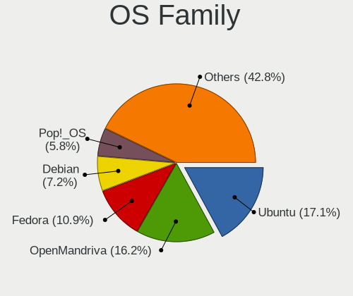
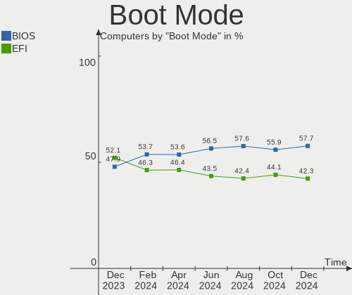
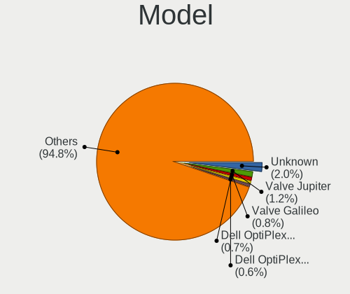
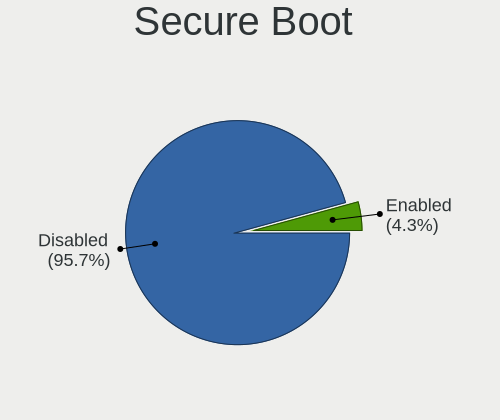
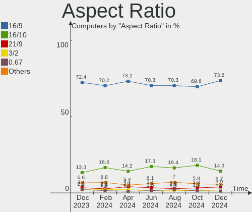
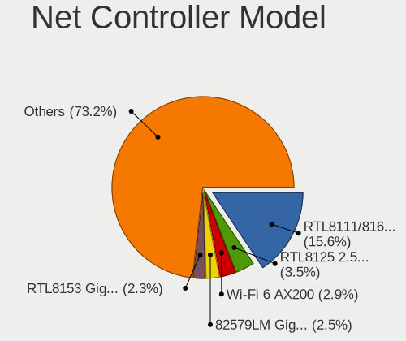
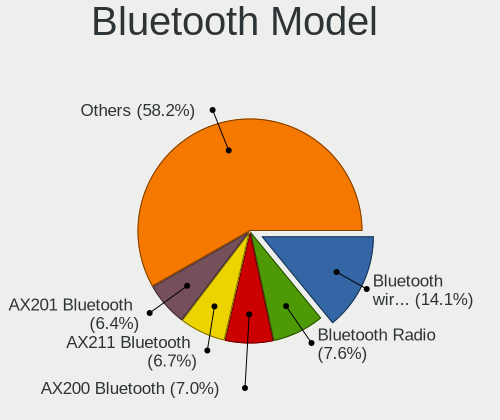

Linux in USA - Hardware Trends
------------------------------

A project to identify most popular hardware characteristics and track their change
over time based on data collected by Linux users at https://Linux-Hardware.org.

Anyone can contribute to this report by the [hw-probe](https://github.com/linuxhw/hw-probe) tool:

    sudo -E hw-probe -all -upload

This is a report for all computer types. See also reports for [desktops](/Location/USA/Desktop/README.md) and [notebooks](/Location/USA/Notebook/README.md).

Period: Nov, 2022.

Contents
--------

* [ System ](#system)
  - [ OS                       ](#os)
  - [ OS Family                ](#os-family)
  - [ Kernel                   ](#kernel)
  - [ Kernel Family            ](#kernel-family)
  - [ Kernel Major Ver.        ](#kernel-major-ver)
  - [ Arch                     ](#arch)
  - [ DE                       ](#de)
  - [ Display Server           ](#display-server)
  - [ Display Manager          ](#display-manager)
  - [ OS Lang                  ](#os-lang)
  - [ Boot Mode                ](#boot-mode)
  - [ Filesystem               ](#filesystem)
  - [ Part. scheme             ](#part-scheme)
  - [ Dual Boot with Linux/BSD ](#dual-boot-with-linuxbsd)
  - [ Dual Boot (Win)          ](#dual-boot-win)

* [ Board ](#board)
  - [ Vendor                   ](#vendor)
  - [ Model                    ](#model)
  - [ Model Family             ](#model-family)
  - [ MFG Year                 ](#mfg-year)
  - [ Form Factor              ](#form-factor)
  - [ Secure Boot              ](#secure-boot)
  - [ Coreboot                 ](#coreboot)
  - [ RAM Size                 ](#ram-size)
  - [ RAM Used                 ](#ram-used)
  - [ Total Drives             ](#total-drives)
  - [ Has CD-ROM               ](#has-cd-rom)
  - [ Has Ethernet             ](#has-ethernet)
  - [ Has WiFi                 ](#has-wifi)
  - [ Has Bluetooth            ](#has-bluetooth)

* [ Location ](#location)
  - [ Country                  ](#country)
  - [ City                     ](#city)

* [ Drives ](#drives)
  - [ Drive Vendor             ](#drive-vendor)
  - [ Drive Model              ](#drive-model)
  - [ HDD Vendor               ](#hdd-vendor)
  - [ SSD Vendor               ](#ssd-vendor)
  - [ Drive Kind               ](#drive-kind)
  - [ Drive Connector          ](#drive-connector)
  - [ Drive Size               ](#drive-size)
  - [ Space Total              ](#space-total)
  - [ Space Used               ](#space-used)
  - [ Malfunc. Drives          ](#malfunc-drives)
  - [ Malfunc. Drive Vendor    ](#malfunc-drive-vendor)
  - [ Malfunc. HDD Vendor      ](#malfunc-hdd-vendor)
  - [ Malfunc. Drive Kind      ](#malfunc-drive-kind)
  - [ Failed Drives            ](#failed-drives)
  - [ Failed Drive Vendor      ](#failed-drive-vendor)
  - [ Drive Status             ](#drive-status)

* [ Storage controller ](#storage-controller)
  - [ Storage Vendor           ](#storage-vendor)
  - [ Storage Model            ](#storage-model)
  - [ Storage Kind             ](#storage-kind)

* [ Processor ](#processor)
  - [ CPU Vendor               ](#cpu-vendor)
  - [ CPU Model                ](#cpu-model)
  - [ CPU Model Family         ](#cpu-model-family)
  - [ CPU Cores                ](#cpu-cores)
  - [ CPU Sockets              ](#cpu-sockets)
  - [ CPU Threads              ](#cpu-threads)
  - [ CPU Op-Modes             ](#cpu-op-modes)
  - [ CPU Microcode            ](#cpu-microcode)
  - [ CPU Microarch            ](#cpu-microarch)

* [ Graphics ](#graphics)
  - [ GPU Vendor               ](#gpu-vendor)
  - [ GPU Model                ](#gpu-model)
  - [ GPU Combo                ](#gpu-combo)
  - [ GPU Driver               ](#gpu-driver)
  - [ GPU Memory               ](#gpu-memory)

* [ Monitor ](#monitor)
  - [ Monitor Vendor           ](#monitor-vendor)
  - [ Monitor Model            ](#monitor-model)
  - [ Monitor Resolution       ](#monitor-resolution)
  - [ Monitor Diagonal         ](#monitor-diagonal)
  - [ Monitor Width            ](#monitor-width)
  - [ Aspect Ratio             ](#aspect-ratio)
  - [ Monitor Area             ](#monitor-area)
  - [ Pixel Density            ](#pixel-density)
  - [ Multiple Monitors        ](#multiple-monitors)

* [ Network ](#network)
  - [ Net Controller Vendor    ](#net-controller-vendor)
  - [ Net Controller Model     ](#net-controller-model)
  - [ Wireless Vendor          ](#wireless-vendor)
  - [ Wireless Model           ](#wireless-model)
  - [ Ethernet Vendor          ](#ethernet-vendor)
  - [ Ethernet Model           ](#ethernet-model)
  - [ Net Controller Kind      ](#net-controller-kind)
  - [ Used Controller          ](#used-controller)
  - [ NICs                     ](#nics)
  - [ IPv6                     ](#ipv6)

* [ Bluetooth ](#bluetooth)
  - [ Bluetooth Vendor         ](#bluetooth-vendor)
  - [ Bluetooth Model          ](#bluetooth-model)

* [ Sound ](#sound)
  - [ Sound Vendor             ](#sound-vendor)
  - [ Sound Model              ](#sound-model)

* [ Memory ](#memory)
  - [ Memory Vendor            ](#memory-vendor)
  - [ Memory Model             ](#memory-model)
  - [ Memory Kind              ](#memory-kind)
  - [ Memory Form Factor       ](#memory-form-factor)
  - [ Memory Size              ](#memory-size)
  - [ Memory Speed             ](#memory-speed)

* [ Printers & scanners ](#printers--scanners)
  - [ Printer Vendor           ](#printer-vendor)
  - [ Printer Model            ](#printer-model)
  - [ Scanner Vendor           ](#scanner-vendor)
  - [ Scanner Model            ](#scanner-model)

* [ Camera ](#camera)
  - [ Camera Vendor            ](#camera-vendor)
  - [ Camera Model             ](#camera-model)

* [ Security ](#security)
  - [ Fingerprint Vendor       ](#fingerprint-vendor)
  - [ Fingerprint Model        ](#fingerprint-model)
  - [ Chipcard Vendor          ](#chipcard-vendor)
  - [ Chipcard Model           ](#chipcard-model)

* [ Unsupported ](#unsupported)
  - [ Unsupported Devices      ](#unsupported-devices)
  - [ Unsupported Device Types ](#unsupported-device-types)

System
------

OS
--

Installed operating systems

| Name                         | Computers | Percent |
|------------------------------|-----------|---------|
| Ubuntu 22.04                 | 147       | 16.74%  |
| Debian 11                    | 59        | 6.72%   |
| Pop!_OS 22.04                | 57        | 6.49%   |
| Fedora 37                    | 54        | 6.15%   |
| Linux Mint 21                | 44        | 5.01%   |
| Ubuntu 22.10                 | 43        | 4.9%    |
| Fedora 36                    | 33        | 3.76%   |
| Arch Rolling                 | 33        | 3.76%   |
| Zorin 16                     | 30        | 3.42%   |
| Ubuntu 20.04                 | 28        | 3.19%   |
| Linux Mint 20.3              | 22        | 2.51%   |
| KDE neon 22.04               | 21        | 2.39%   |
| OpenMandriva 4.3             | 20        | 2.28%   |
| Kubuntu 22.04                | 20        | 2.28%   |
| Manjaro                      | 16        | 1.82%   |
| Kubuntu 22.10                | 14        | 1.59%   |
| Nobara 36                    | 13        | 1.48%   |
| SteamOS 3.3.2                | 12        | 1.37%   |
| openSUSE Tumbleweed-XXXXXXXX | 12        | 1.37%   |
| ArcoLinux Rolling            | 10        | 1.14%   |
| Elementary 6.1               | 9         | 1.03%   |
| SteamOS 3.4                  | 8         | 0.91%   |
| Kali 2022.4                  | 8         | 0.91%   |
| Kali 2022.3                  | 8         | 0.91%   |
| EndeavourOS Rolling          | 7         | 0.8%    |
| Xubuntu 20.04                | 6         | 0.68%   |
| Manjaro 22.0.0               | 6         | 0.68%   |
| LMDE 5                       | 6         | 0.68%   |
| Debian                       | 6         | 0.68%   |
| Xubuntu 22.04                | 5         | 0.57%   |
| Ubuntu 18.04                 | 4         | 0.46%   |
| OpenMandriva 4.50            | 4         | 0.46%   |
| Gentoo 2.9                   | 4         | 0.46%   |
| Gentoo 2.8                   | 4         | 0.46%   |
| Ubuntu Budgie 22.04          | 3         | 0.34%   |
| Parrot 5.1                   | 3         | 0.34%   |
| openSUSE Leap-15.4           | 3         | 0.34%   |
| NixOS 22.11                  | 3         | 0.34%   |
| MX 21                        | 3         | 0.34%   |
| Linux Mint 20.2              | 3         | 0.34%   |

OS Family
---------

OS without a version

| Name          | Computers | Percent |
|---------------|-----------|---------|
| Ubuntu        | 224       | 25.51%  |
| Fedora        | 89        | 10.14%  |
| Linux Mint    | 74        | 8.43%   |
| Debian        | 68        | 7.74%   |
| Pop!_OS       | 59        | 6.72%   |
| Kubuntu       | 39        | 4.44%   |
| Arch          | 33        | 3.76%   |
| Zorin         | 30        | 3.42%   |
| SteamOS       | 26        | 2.96%   |
| OpenMandriva  | 25        | 2.85%   |
| Manjaro       | 22        | 2.51%   |
| KDE neon      | 22        | 2.51%   |
| Kali          | 16        | 1.82%   |
| openSUSE      | 15        | 1.71%   |
| Nobara        | 13        | 1.48%   |
| ArcoLinux     | 13        | 1.48%   |
| Xubuntu       | 11        | 1.25%   |
| Elementary    | 9         | 1.03%   |
| Gentoo        | 8         | 0.91%   |
| EndeavourOS   | 7         | 0.8%    |
| LMDE          | 6         | 0.68%   |
| Ubuntu Unity  | 5         | 0.57%   |
| Lubuntu       | 5         | 0.57%   |
| Garuda Linux  | 5         | 0.57%   |
| Ubuntu Budgie | 4         | 0.46%   |
| Clear Linux   | 4         | 0.46%   |
| CentOS        | 4         | 0.46%   |
| Parrot        | 3         | 0.34%   |
| NixOS         | 3         | 0.34%   |
| MX            | 3         | 0.34%   |
| Ubuntu Studio | 2         | 0.23%   |
| Ubuntu MATE   | 2         | 0.23%   |
| Rocky Linux   | 2         | 0.23%   |
| RHEL          | 2         | 0.23%   |
| Oracle Linux  | 2         | 0.23%   |
| Endless       | 2         | 0.23%   |
| antiX         | 2         | 0.23%   |
| Void Linux    | 1         | 0.11%   |
| Trisquel      | 1         | 0.11%   |
| Shark         | 1         | 0.11%   |

Kernel
------

Version of the Linux kernel

| Version                     | Computers | Percent |
|-----------------------------|-----------|---------|
| 5.15.0-52-generic           | 154       | 17.54%  |
| 5.15.0-53-generic           | 122       | 13.9%   |
| 5.19.0-23-generic           | 46        | 5.24%   |
| 6.0.6-76060006-generic      | 31        | 3.53%   |
| 5.10.0-18-amd64             | 26        | 2.96%   |
| 5.4.0-131-generic           | 25        | 2.85%   |
| 5.10.0-19-amd64             | 22        | 2.51%   |
| 6.0.8-300.fc37.x86_64       | 20        | 2.28%   |
| 5.16.7-desktop-1omv4003     | 18        | 2.05%   |
| 6.0.5-200.fc36.x86_64       | 17        | 1.94%   |
| 6.0.9-300.fc37.x86_64       | 16        | 1.82%   |
| 5.13.0-valve21.3-1-neptune  | 16        | 1.82%   |
| 6.0.9-arch1-1               | 11        | 1.25%   |
| 6.0.8-arch1-1               | 10        | 1.14%   |
| 5.15.78-1-MANJARO           | 10        | 1.14%   |
| 6.0.3-76060003-generic      | 9         | 1.03%   |
| 6.0.2-76060002-generic      | 9         | 1.03%   |
| 5.4.0-132-generic           | 9         | 1.03%   |
| 5.19.16-301.fc37.x86_64     | 9         | 1.03%   |
| 5.15.0-43-generic           | 8         | 0.91%   |
| 6.0.8-1-default             | 7         | 0.8%    |
| 6.0.7-301.fc37.x86_64       | 7         | 0.8%    |
| 5.19.0-kali2-amd64          | 7         | 0.8%    |
| 6.0.10-arch2-1              | 6         | 0.68%   |
| 6.0.0-kali3-amd64           | 6         | 0.68%   |
| 5.19.0-24-generic           | 6         | 0.68%   |
| 5.15.0-48-generic           | 6         | 0.68%   |
| 6.0.8-200.fc36.x86_64       | 5         | 0.57%   |
| 6.0.7-arch1-1               | 5         | 0.57%   |
| 6.0.7-200.fc36.x86_64       | 5         | 0.57%   |
| 5.15.0-41-generic           | 5         | 0.57%   |
| 5.19.0-76051900-generic     | 4         | 0.46%   |
| 5.15.74-3-MANJARO           | 4         | 0.46%   |
| 5.13.0-valve31-1-neptune    | 4         | 0.46%   |
| 6.0.9-201.fc36.x86_64       | 3         | 0.34%   |
| 6.0.7-201.fsync.fc36.x86_64 | 3         | 0.34%   |
| 6.0.6-zen1-1-zen            | 3         | 0.34%   |
| 6.0.6-arch1-1               | 3         | 0.34%   |
| 6.0.0-3-amd64               | 3         | 0.34%   |
| 6.0.0-2parrot1-amd64        | 3         | 0.34%   |

Kernel Family
-------------

Linux kernel without a distro release

| Version | Computers | Percent |
|---------|-----------|---------|
| 5.15.0  | 307       | 34.97%  |
| 5.19.0  | 74        | 8.43%   |
| 5.10.0  | 55        | 6.26%   |
| 6.0.8   | 49        | 5.58%   |
| 6.0.6   | 45        | 5.13%   |
| 6.0.9   | 38        | 4.33%   |
| 5.4.0   | 37        | 4.21%   |
| 6.0.7   | 31        | 3.53%   |
| 5.13.0  | 29        | 3.3%    |
| 6.0.5   | 20        | 2.28%   |
| 6.0.0   | 19        | 2.16%   |
| 5.16.7  | 18        | 2.05%   |
| 6.0.2   | 14        | 1.59%   |
| 5.19.16 | 13        | 1.48%   |
| 6.0.3   | 12        | 1.37%   |
| 5.15.78 | 10        | 1.14%   |
| 5.14.0  | 9         | 1.03%   |
| 6.0.10  | 8         | 0.91%   |
| 5.15.75 | 6         | 0.68%   |
| 5.15.74 | 6         | 0.68%   |
| 5.11.0  | 5         | 0.57%   |
| 5.18.10 | 4         | 0.46%   |
| 5.17.5  | 4         | 0.46%   |
| 5.15.76 | 4         | 0.46%   |
| 4.15.0  | 4         | 0.46%   |
| 6.1.0   | 3         | 0.34%   |
| 5.19.12 | 3         | 0.34%   |
| 5.18.0  | 3         | 0.34%   |
| 5.17.0  | 3         | 0.34%   |
| 5.16.13 | 3         | 0.34%   |
| 5.14.21 | 3         | 0.34%   |
| 5.4.17  | 2         | 0.23%   |
| 5.19.17 | 2         | 0.23%   |
| 5.15.79 | 2         | 0.23%   |
| 5.15.77 | 2         | 0.23%   |
| 4.9.0   | 2         | 0.23%   |
| 4.4.0   | 2         | 0.23%   |
| 4.19.0  | 2         | 0.23%   |
| 3.10.0  | 2         | 0.23%   |
| 6.0.1   | 1         | 0.11%   |

Kernel Major Ver.
-----------------

Linux kernel major version

| Version | Computers | Percent |
|---------|-----------|---------|
| 5.15    | 340       | 38.72%  |
| 6.0     | 237       | 26.99%  |
| 5.19    | 98        | 11.16%  |
| 5.10    | 56        | 6.38%   |
| 5.4     | 39        | 4.44%   |
| 5.13    | 29        | 3.3%    |
| 5.16    | 22        | 2.51%   |
| 5.14    | 13        | 1.48%   |
| 5.18    | 10        | 1.14%   |
| 5.17    | 8         | 0.91%   |
| 5.11    | 5         | 0.57%   |
| 4.15    | 5         | 0.57%   |
| 6.1     | 3         | 0.34%   |
| 4.9     | 3         | 0.34%   |
| 4.4     | 2         | 0.23%   |
| 4.19    | 2         | 0.23%   |
| 3.10    | 2         | 0.23%   |
| 5.9     | 1         | 0.11%   |
| 5.7     | 1         | 0.11%   |
| 5.5     | 1         | 0.11%   |
| 2.6.32  | 1         | 0.11%   |

Arch
----

OS architecture (x86_64, i586, etc.)

| Name    | Computers | Percent |
|---------|-----------|---------|
| x86_64  | 864       | 98.41%  |
| aarch64 | 7         | 0.8%    |
| i686    | 4         | 0.46%   |
| armv7l  | 3         | 0.34%   |

DE
--

Desktop Environment

| Name                         | Computers | Percent |
|------------------------------|-----------|---------|
| GNOME                        | 416       | 47.38%  |
| KDE5                         | 193       | 21.98%  |
| XFCE                         | 66        | 7.52%   |
| X-Cinnamon                   | 63        | 7.18%   |
| Unknown                      | 57        | 6.49%   |
| MATE                         | 18        | 2.05%   |
| Pantheon                     | 8         | 0.91%   |
| LXQt                         | 7         | 0.8%    |
| LXDE                         | 7         | 0.8%    |
| Budgie                       | 7         | 0.8%    |
| Unity                        | 5         | 0.57%   |
| i3                           | 5         | 0.57%   |
| Cinnamon                     | 5         | 0.57%   |
| GNOME Flashback              | 4         | 0.46%   |
| sway                         | 3         | 0.34%   |
| KDE                          | 3         | 0.34%   |
| GNOME Classic                | 3         | 0.34%   |
| icewm                        | 2         | 0.23%   |
| Phosh:GNOME                  | 1         | 0.11%   |
| lightdm-xsession             | 1         | 0.11%   |
| fluxbox                      | 1         | 0.11%   |
| Enlightenment                | 1         | 0.11%   |
| e16-session                  | 1         | 0.11%   |
| ${XDG_CURRENT_DESKTOP:-sway} | 1         | 0.11%   |

Display Server
--------------

X11 or Wayland

| Name    | Computers | Percent |
|---------|-----------|---------|
| X11     | 572       | 65.15%  |
| Wayland | 241       | 27.45%  |
| Unknown | 39        | 4.44%   |
| Tty     | 25        | 2.85%   |
| Web     | 1         | 0.11%   |

Display Manager
---------------

SDDM, LightDM, etc.

| Name    | Computers | Percent |
|---------|-----------|---------|
| Unknown | 376       | 42.82%  |
| GDM3    | 203       | 23.12%  |
| LightDM | 121       | 13.78%  |
| SDDM    | 114       | 12.98%  |
| GDM     | 59        | 6.72%   |
| XDM     | 2         | 0.23%   |
| Ly      | 1         | 0.11%   |
| LXDM    | 1         | 0.11%   |
| GREETD  | 1         | 0.11%   |

OS Lang
-------

Language

| Lang    | Computers | Percent |
|---------|-----------|---------|
| en_US   | 813       | 92.6%   |
| Unknown | 31        | 3.53%   |
| C       | 13        | 1.48%   |
| en_CA   | 7         | 0.8%    |
| C.UTF8  | 3         | 0.34%   |
| POSIX   | 2         | 0.23%   |
| it_IT   | 2         | 0.23%   |
| ru_RU   | 1         | 0.11%   |
| fr_FR   | 1         | 0.11%   |
| es_VE   | 1         | 0.11%   |
| es_MX   | 1         | 0.11%   |
| es_ES   | 1         | 0.11%   |
| en_GB   | 1         | 0.11%   |
| de_DE   | 1         | 0.11%   |

Boot Mode
---------

EFI or BIOS

| Mode | Computers | Percent |
|------|-----------|---------|
| EFI  | 447       | 50.91%  |
| BIOS | 431       | 49.09%  |

Filesystem
----------

Type of filesystem

| Type    | Computers | Percent |
|---------|-----------|---------|
| Ext4    | 619       | 70.5%   |
| Btrfs   | 164       | 18.68%  |
| Overlay | 56        | 6.38%   |
| Xfs     | 18        | 2.05%   |
| Zfs     | 16        | 1.82%   |
| XXXXXXX | 1         | 0.11%   |
| Tmpfs   | 1         | 0.11%   |
| Jfs     | 1         | 0.11%   |
| Ext3    | 1         | 0.11%   |
| Ext2    | 1         | 0.11%   |

Part. scheme
------------

Scheme of partitioning

| Type    | Computers | Percent |
|---------|-----------|---------|
| GPT     | 488       | 55.58%  |
| Unknown | 321       | 36.56%  |
| MBR     | 69        | 7.86%   |

Dual Boot with Linux/BSD
------------------------

Hosting more than one Linux/BSD

| Dual boot | Computers | Percent |
|-----------|-----------|---------|
| No        | 774       | 88.15%  |
| Yes       | 104       | 11.85%  |

Dual Boot (Win)
---------------

Hosting Linux and Windows

| Dual boot | Computers | Percent |
|-----------|-----------|---------|
| No        | 694       | 79.04%  |
| Yes       | 184       | 20.96%  |

Board
-----

Vendor
------

Motherboard manufacturer

| Name                    | Computers | Percent |
|-------------------------|-----------|---------|
| Dell                    | 141       | 16.06%  |
| Lenovo                  | 130       | 14.81%  |
| Hewlett-Packard         | 123       | 14.01%  |
| ASUSTek Computer        | 119       | 13.55%  |
| MSI                     | 56        | 6.38%   |
| Gigabyte Technology     | 41        | 4.67%   |
| Apple                   | 36        | 4.1%    |
| ASRock                  | 30        | 3.42%   |
| Google                  | 20        | 2.28%   |
| Valve                   | 19        | 2.16%   |
| Acer                    | 18        | 2.05%   |
| Intel                   | 14        | 1.59%   |
| Toshiba                 | 10        | 1.14%   |
| Unknown                 | 10        | 1.14%   |
| GPU Company             | 8         | 0.91%   |
| Gateway                 | 8         | 0.91%   |
| Foxconn                 | 7         | 0.8%    |
| Alienware               | 7         | 0.8%    |
| System76                | 6         | 0.68%   |
| Samsung Electronics     | 6         | 0.68%   |
| Pegatron                | 5         | 0.57%   |
| Sony                    | 4         | 0.46%   |
| Raspberry Pi Foundation | 4         | 0.46%   |
| Microsoft               | 4         | 0.46%   |
| AZW                     | 4         | 0.46%   |
| Supermicro              | 3         | 0.34%   |
| Razer                   | 3         | 0.34%   |
| Panasonic               | 3         | 0.34%   |
| IBM                     | 3         | 0.34%   |
| BESSTAR Tech            | 3         | 0.34%   |
| LattePanda              | 2         | 0.23%   |
| IP3 Tech                | 2         | 0.23%   |
| Hardkernel              | 2         | 0.23%   |
| Framework               | 2         | 0.23%   |
| ATOPNUC                 | 2         | 0.23%   |
| Xunlong                 | 1         | 0.11%   |
| SK hynix                | 1         | 0.11%   |
| Shuttle                 | 1         | 0.11%   |
| SAGER                   | 1         | 0.11%   |
| raspberrypi,4-model-b   | 1         | 0.11%   |

Model
-----

Motherboard model

| Name                                      | Computers | Percent |
|-------------------------------------------|-----------|---------|
| Valve Jupiter                             | 19        | 2.16%   |
| Unknown                                   | 11        | 1.25%   |
| Lenovo ThinkPad E475 20H40006US           | 8         | 0.91%   |
| Google Terra                              | 6         | 0.68%   |
| Gigabyte GA-78LMT-USB3                    | 6         | 0.68%   |
| Lenovo ThinkPad L13 Yoga Gen 2 20VK0019US | 5         | 0.57%   |
| Lenovo ThinkPad 13 2nd Gen 20J10046US     | 5         | 0.57%   |
| HP 15 Notebook PC                         | 5         | 0.57%   |
| Dell OptiPlex 990                         | 5         | 0.57%   |
| ASUS All Series                           | 5         | 0.57%   |
| Lenovo ThinkPad P70 20ESS04S00            | 4         | 0.46%   |
| Dell OptiPlex 3050                        | 4         | 0.46%   |
| ASUS TUF Gaming X570-PLUS                 | 4         | 0.46%   |
| MSI MS-7C56                               | 3         | 0.34%   |
| Lenovo ThinkPad W541 20EGS1PL00           | 3         | 0.34%   |
| Lenovo Legion S7 15ACH6 82K8              | 3         | 0.34%   |
| HP Stream Laptop 14-cb1xxx                | 3         | 0.34%   |
| HP Notebook                               | 3         | 0.34%   |
| HP Laptop 15-da0xxx                       | 3         | 0.34%   |
| HP Compaq Elite 8300 SFF                  | 3         | 0.34%   |
| GPU Company GWTC116-2                     | 3         | 0.34%   |
| Google Lick                               | 3         | 0.34%   |
| Dell OptiPlex 3020                        | 3         | 0.34%   |
| Dell Inspiron 7506 2n1                    | 3         | 0.34%   |
| Dell Inspiron 3521                        | 3         | 0.34%   |
| ASUS ROG STRIX B550-F GAMING              | 3         | 0.34%   |
| ASUS ROG STRIX B450-F GAMING              | 3         | 0.34%   |
| ASUS PRIME X570-PRO                       | 3         | 0.34%   |
| Apple MacBookPro9,2                       | 3         | 0.34%   |
| Apple MacBookPro8,1                       | 3         | 0.34%   |
| Toshiba Satellite L775                    | 2         | 0.23%   |
| System76 Gazelle                          | 2         | 0.23%   |
| Samsung 950QED                            | 2         | 0.23%   |
| RPi Raspberry Pi 4 Model B Rev 1.5        | 2         | 0.23%   |
| Pegatron AY028AA-ABA CQ5300Y              | 2         | 0.23%   |
| MSI MS-7D54                               | 2         | 0.23%   |
| MSI MS-7D31                               | 2         | 0.23%   |
| MSI MS-7C95                               | 2         | 0.23%   |
| MSI MS-7C91                               | 2         | 0.23%   |
| MSI MS-7C37                               | 2         | 0.23%   |

Model Family
------------

Motherboard model prefix

| Name                   | Computers | Percent |
|------------------------|-----------|---------|
| Lenovo ThinkPad        | 85        | 9.68%   |
| Dell Inspiron          | 36        | 4.1%    |
| Dell OptiPlex          | 33        | 3.76%   |
| Dell Latitude          | 23        | 2.62%   |
| ASUS ROG               | 23        | 2.62%   |
| Valve Jupiter          | 19        | 2.16%   |
| Dell Precision         | 19        | 2.16%   |
| HP Pavilion            | 17        | 1.94%   |
| Dell XPS               | 17        | 1.94%   |
| ASUS PRIME             | 17        | 1.94%   |
| HP EliteBook           | 14        | 1.59%   |
| ASUS TUF               | 12        | 1.37%   |
| Lenovo IdeaPad         | 11        | 1.25%   |
| HP Laptop              | 11        | 1.25%   |
| Unknown                | 11        | 1.25%   |
| Lenovo Legion          | 10        | 1.14%   |
| HP ENVY                | 10        | 1.14%   |
| Toshiba Satellite      | 9         | 1.03%   |
| HP EliteDesk           | 8         | 0.91%   |
| ASUS ZenBook           | 8         | 0.91%   |
| Acer Aspire            | 8         | 0.91%   |
| HP Compaq              | 7         | 0.8%    |
| Gigabyte X570          | 7         | 0.8%    |
| Gigabyte GA-78LMT-USB3 | 7         | 0.8%    |
| ASUS VivoBook          | 7         | 0.8%    |
| Lenovo Yoga            | 6         | 0.68%   |
| Lenovo ThinkCentre     | 6         | 0.68%   |
| HP 15                  | 6         | 0.68%   |
| Google Terra           | 6         | 0.68%   |
| Dell PowerEdge         | 6         | 0.68%   |
| HP ZBook               | 5         | 0.57%   |
| HP Stream              | 5         | 0.57%   |
| HP Spectre             | 5         | 0.57%   |
| HP ProDesk             | 5         | 0.57%   |
| HP ProBook             | 5         | 0.57%   |
| Gigabyte B450          | 5         | 0.57%   |
| ASUS ASUS              | 5         | 0.57%   |
| ASUS All               | 5         | 0.57%   |
| RPi Raspberry          | 4         | 0.46%   |
| Microsoft Surface      | 4         | 0.46%   |

MFG Year
--------

Motherboard manufacture year

| Year    | Computers | Percent |
|---------|-----------|---------|
| 2021    | 107       | 12.19%  |
| 2022    | 106       | 12.07%  |
| 2019    | 96        | 10.93%  |
| 2020    | 94        | 10.71%  |
| 2018    | 64        | 7.29%   |
| 2012    | 60        | 6.83%   |
| 2013    | 51        | 5.81%   |
| 2017    | 50        | 5.69%   |
| 2015    | 50        | 5.69%   |
| 2014    | 40        | 4.56%   |
| 2011    | 39        | 4.44%   |
| 2016    | 33        | 3.76%   |
| 2010    | 30        | 3.42%   |
| 2009    | 18        | 2.05%   |
| 2008    | 17        | 1.94%   |
| 2007    | 9         | 1.03%   |
| Unknown | 9         | 1.03%   |
| 2006    | 2         | 0.23%   |
| 2005    | 2         | 0.23%   |
| 2004    | 1         | 0.11%   |

Form Factor
-----------

Physical design of the computer

| Name           | Computers | Percent |
|----------------|-----------|---------|
| Notebook       | 422       | 48.06%  |
| Desktop        | 344       | 39.18%  |
| Convertible    | 41        | 4.67%   |
| Mini pc        | 21        | 2.39%   |
| All in one     | 19        | 2.16%   |
| Server         | 13        | 1.48%   |
| System on chip | 8         | 0.91%   |
| Tablet         | 8         | 0.91%   |
| Phone          | 1         | 0.11%   |
| Firewall       | 1         | 0.11%   |

Secure Boot
-----------

Enabled or disabled

| State    | Computers | Percent |
|----------|-----------|---------|
| Disabled | 804       | 91.57%  |
| Enabled  | 74        | 8.43%   |

Coreboot
--------

Have coreboot on board

| Used | Computers | Percent |
|------|-----------|---------|
| No   | 854       | 97.27%  |
| Yes  | 24        | 2.73%   |

RAM Size
--------

Total RAM memory

| Size in GB      | Computers | Percent |
|-----------------|-----------|---------|
| 16.01-24.0      | 222       | 25.28%  |
| 4.01-8.0        | 179       | 20.39%  |
| 8.01-16.0       | 136       | 15.49%  |
| 32.01-64.0      | 132       | 15.03%  |
| 3.01-4.0        | 105       | 11.96%  |
| 64.01-256.0     | 56        | 6.38%   |
| 24.01-32.0      | 20        | 2.28%   |
| 1.01-2.0        | 13        | 1.48%   |
| 2.01-3.0        | 7         | 0.8%    |
| More than 256.0 | 5         | 0.57%   |
| 0.51-1.0        | 2         | 0.23%   |
| 0.01-0.5        | 1         | 0.11%   |

RAM Used
--------

Used RAM memory

| Used GB    | Computers | Percent |
|------------|-----------|---------|
| 1.01-2.0   | 236       | 26.88%  |
| 2.01-3.0   | 216       | 24.6%   |
| 4.01-8.0   | 182       | 20.73%  |
| 3.01-4.0   | 144       | 16.4%   |
| 8.01-16.0  | 55        | 6.26%   |
| 0.51-1.0   | 25        | 2.85%   |
| 0.01-0.5   | 8         | 0.91%   |
| 16.01-24.0 | 7         | 0.8%    |
| 32.01-64.0 | 2         | 0.23%   |
| 24.01-32.0 | 2         | 0.23%   |
| Unknown    | 1         | 0.11%   |

Total Drives
------------

Number of drives on board

| Drives | Computers | Percent |
|--------|-----------|---------|
| 1      | 469       | 53.42%  |
| 2      | 249       | 28.36%  |
| 3      | 81        | 9.23%   |
| 4      | 31        | 3.53%   |
| 5      | 17        | 1.94%   |
| 7      | 8         | 0.91%   |
| 6      | 8         | 0.91%   |
| 8      | 6         | 0.68%   |
| 0      | 6         | 0.68%   |
| 10     | 2         | 0.23%   |
| 16     | 1         | 0.11%   |

Has CD-ROM
----------

Has CD-ROM on board

| Presented | Computers | Percent |
|-----------|-----------|---------|
| No        | 619       | 70.5%   |
| Yes       | 259       | 29.5%   |

Has Ethernet
------------

Has Ethernet on board

| Presented | Computers | Percent |
|-----------|-----------|---------|
| Yes       | 705       | 80.3%   |
| No        | 173       | 19.7%   |

Has WiFi
--------

Has WiFi module

| Presented | Computers | Percent |
|-----------|-----------|---------|
| Yes       | 723       | 82.35%  |
| No        | 155       | 17.65%  |

Has Bluetooth
-------------

Has Bluetooth module

| Presented | Computers | Percent |
|-----------|-----------|---------|
| Yes       | 595       | 67.77%  |
| No        | 283       | 32.23%  |

Location
--------

Country
-------

Geographic location (country)

| Country | Computers | Percent |
|---------|-----------|---------|
| USA     | 878       | 100%    |

City
----

Geographic location (city)

| City           | Computers | Percent |
|----------------|-----------|---------|
| Bangor         | 25        | 2.85%   |
| New York       | 12        | 1.37%   |
| Los Angeles    | 12        | 1.37%   |
| Seattle        | 11        | 1.25%   |
| Houston        | 11        | 1.25%   |
| Dallas         | 11        | 1.25%   |
| Chicago        | 11        | 1.25%   |
| San Diego      | 10        | 1.14%   |
| Miami          | 10        | 1.14%   |
| Portland       | 9         | 1.03%   |
| Philadelphia   | 9         | 1.03%   |
| San Francisco  | 7         | 0.8%    |
| Fort Worth     | 7         | 0.8%    |
| Phoenix        | 6         | 0.68%   |
| Oklahoma City  | 6         | 0.68%   |
| Denver         | 6         | 0.68%   |
| Springfield    | 5         | 0.57%   |
| Santa Clara    | 5         | 0.57%   |
| Minneapolis    | 5         | 0.57%   |
| Washington     | 4         | 0.46%   |
| St Louis       | 4         | 0.46%   |
| Plainfield     | 4         | 0.46%   |
| Pittsburgh     | 4         | 0.46%   |
| Madison        | 4         | 0.46%   |
| Lincoln        | 4         | 0.46%   |
| Fayetteville   | 4         | 0.46%   |
| Des Moines     | 4         | 0.46%   |
| Charlotte      | 4         | 0.46%   |
| Brooklyn       | 4         | 0.46%   |
| Atlanta        | 4         | 0.46%   |
| Virginia Beach | 3         | 0.34%   |
| Valencia       | 3         | 0.34%   |
| Tulsa          | 3         | 0.34%   |
| Tacoma         | 3         | 0.34%   |
| St. Petersburg | 3         | 0.34%   |
| Sheboygan      | 3         | 0.34%   |
| San Jose       | 3         | 0.34%   |
| San Antonio    | 3         | 0.34%   |
| Queens         | 3         | 0.34%   |
| Pensacola      | 3         | 0.34%   |

Drives
------

Drive Vendor
------------

Hard drive vendors

| Vendor                      | Computers | Drives | Percent |
|-----------------------------|-----------|--------|---------|
| Samsung Electronics         | 229       | 291    | 17.06%  |
| WDC                         | 170       | 215    | 12.67%  |
| Seagate                     | 149       | 201    | 11.1%   |
| SanDisk                     | 100       | 109    | 7.45%   |
| Unknown                     | 88        | 93     | 6.56%   |
| Toshiba                     | 67        | 72     | 4.99%   |
| SK hynix                    | 46        | 48     | 3.43%   |
| Kingston                    | 41        | 48     | 3.06%   |
| Intel                       | 34        | 45     | 2.53%   |
| Hitachi                     | 33        | 37     | 2.46%   |
| Crucial                     | 32        | 35     | 2.38%   |
| Phison Electronics          | 29        | 31     | 2.16%   |
| Apple                       | 24        | 29     | 1.79%   |
| PNY                         | 22        | 22     | 1.64%   |
| HGST                        | 21        | 28     | 1.56%   |
| Micron Technology           | 18        | 21     | 1.34%   |
| China                       | 18        | 23     | 1.34%   |
| Unknown                     | 17        | 18     | 1.27%   |
| A-DATA Technology           | 14        | 17     | 1.04%   |
| SPCC                        | 12        | 15     | 0.89%   |
| Phison                      | 12        | 13     | 0.89%   |
| Kingston Technology Company | 12        | 12     | 0.89%   |
| KIOXIA                      | 9         | 9      | 0.67%   |
| Hewlett-Packard             | 7         | 7      | 0.52%   |
| Team                        | 6         | 6      | 0.45%   |
| Silicon Motion              | 6         | 6      | 0.45%   |
| SABRENT                     | 6         | 6      | 0.45%   |
| Micron/Crucial Technology   | 6         | 6      | 0.45%   |
| ADATA Technology            | 6         | 7      | 0.45%   |
| Transcend                   | 4         | 4      | 0.3%    |
| T-FORCE                     | 4         | 9      | 0.3%    |
| Mushkin                     | 4         | 5      | 0.3%    |
| Corsair                     | 4         | 4      | 0.3%    |
| O2 Micro                    | 3         | 3      | 0.22%   |
| Netac                       | 3         | 3      | 0.22%   |
| Maxtor                      | 3         | 3      | 0.22%   |
| LITEONIT                    | 3         | 3      | 0.22%   |
| LITEON                      | 3         | 3      | 0.22%   |
| KingFast                    | 3         | 3      | 0.22%   |
| JMicron Technology          | 3         | 3      | 0.22%   |

Drive Model
-----------

Hard drive models

| Model                                                 | Computers | Percent |
|-------------------------------------------------------|-----------|---------|
| Samsung NVMe SSD Controller SM981/PM981/PM983 1TB     | 39        | 2.62%   |
| Samsung NVMe SSD Controller PM9A1/PM9A3/980PRO 250GB  | 23        | 1.55%   |
| Unknown                                               | 17        | 1.14%   |
| Phison E12 NVMe Controller 2TB                        | 15        | 1.01%   |
| Unknown MMC Card  32GB                                | 13        | 0.87%   |
| Seagate ST2000DM008-2FR102 2TB                        | 12        | 0.81%   |
| Sandisk WD Blue SN550 NVMe SSD 1TB                    | 12        | 0.81%   |
| Samsung SSD 860 EVO 1TB                               | 12        | 0.81%   |
| Kingston SA400S37240G 240GB SSD                       | 12        | 0.81%   |
| Unknown MMC Card  64GB                                | 11        | 0.74%   |
| Samsung NVMe SSD Controller SM961/PM961/SM963 250GB   | 10        | 0.67%   |
| Toshiba DT01ACA100 1TB                                | 9         | 0.6%    |
| Samsung SSD 860 EVO 500GB                             | 9         | 0.6%    |
| Phison PS5013 E13 NVMe Controller 256GB               | 9         | 0.6%    |
| Kingston Company OM3PDP3 NVMe SSD 256GB               | 9         | 0.6%    |
| Crucial CT1000MX500SSD1 1TB                           | 9         | 0.6%    |
| Kingston SA400S37120G 120GB SSD                       | 8         | 0.54%   |
| WDC WDBNCE0010PNC 1TB SSD                             | 7         | 0.47%   |
| WDC WD10EZEX-08WN4A0 1TB                              | 7         | 0.47%   |
| Unknown MMC Card  512GB                               | 7         | 0.47%   |
| Seagate ST1000LM035-1RK172 1TB                        | 7         | 0.47%   |
| Sandisk WD Black SN750 / PC SN730 NVMe SSD 1024GB     | 7         | 0.47%   |
| Samsung MZVLB512HBJQ-000L7 512GB                      | 7         | 0.47%   |
| Seagate Portable 5TB                                  | 6         | 0.4%    |
| Sandisk WD Black SN850 256GB                          | 6         | 0.4%    |
| Samsung SSD 970 EVO Plus 1TB                          | 6         | 0.4%    |
| SABRENT Disk 500GB                                    | 6         | 0.4%    |
| PNY CS900 500GB SSD                                   | 6         | 0.4%    |
| China SATA SSD 240GB                                  | 6         | 0.4%    |
| Unknown SDW16G  16GB                                  | 5         | 0.34%   |
| Unknown SD/MMC/MS PRO 8GB                             | 5         | 0.34%   |
| Unknown MMC Card  16GB                                | 5         | 0.34%   |
| Unknown MMC Card  128GB                               | 5         | 0.34%   |
| Unknown Biwin  64GB                                   | 5         | 0.34%   |
| Toshiba MQ01ABF050 500GB                              | 5         | 0.34%   |
| Toshiba MQ01ABD100 1TB                                | 5         | 0.34%   |
| Silicon Motion SM2263EN/SM2263XT SSD Controller 128GB | 5         | 0.34%   |
| Seagate ST1000DM003-1SB102 1TB                        | 5         | 0.34%   |
| SanDisk NVMe SSD Drive 1TB                            | 5         | 0.34%   |
| SanDisk Extreme 55AE 500GB SSD                        | 5         | 0.34%   |

HDD Vendor
----------

Hard disk drive vendors

| Vendor              | Computers | Drives | Percent |
|---------------------|-----------|--------|---------|
| Seagate             | 141       | 188    | 34.9%   |
| WDC                 | 128       | 161    | 31.68%  |
| Toshiba             | 45        | 50     | 11.14%  |
| Hitachi             | 33        | 37     | 8.17%   |
| HGST                | 21        | 28     | 5.2%    |
| Apple               | 12        | 12     | 2.97%   |
| Unknown             | 6         | 7      | 1.49%   |
| Samsung Electronics | 4         | 4      | 0.99%   |
| Maxtor              | 3         | 3      | 0.74%   |
| ASMT                | 3         | 6      | 0.74%   |
| Hewlett-Packard     | 2         | 2      | 0.5%    |
| Fujitsu             | 2         | 2      | 0.5%    |
| USB3.0              | 1         | 2      | 0.25%   |
| HPE                 | 1         | 2      | 0.25%   |
| External            | 1         | 1      | 0.25%   |
| Dyconn H            | 1         | 1      | 0.25%   |

SSD Vendor
----------

Solid state drive vendors

| Vendor              | Computers | Drives | Percent |
|---------------------|-----------|--------|---------|
| Samsung Electronics | 96        | 123    | 23.7%   |
| SanDisk             | 43        | 47     | 10.62%  |
| Kingston            | 33        | 39     | 8.15%   |
| WDC                 | 29        | 30     | 7.16%   |
| Crucial             | 27        | 30     | 6.67%   |
| PNY                 | 21        | 21     | 5.19%   |
| China               | 18        | 23     | 4.44%   |
| A-DATA Technology   | 12        | 15     | 2.96%   |
| SPCC                | 10        | 13     | 2.47%   |
| Intel               | 10        | 10     | 2.47%   |
| Apple               | 9         | 9      | 2.22%   |
| SK hynix            | 8         | 8      | 1.98%   |
| Toshiba             | 7         | 7      | 1.73%   |
| Micron Technology   | 7         | 10     | 1.73%   |
| Team                | 5         | 5      | 1.23%   |
| Transcend           | 4         | 4      | 0.99%   |
| Mushkin             | 4         | 5      | 0.99%   |
| Hewlett-Packard     | 4         | 4      | 0.99%   |
| Unknown             | 4         | 4      | 0.99%   |
| T-FORCE             | 3         | 8      | 0.74%   |
| Netac               | 3         | 3      | 0.74%   |
| LITEONIT            | 3         | 3      | 0.74%   |
| LITEON              | 3         | 3      | 0.74%   |
| TO Exter            | 2         | 2      | 0.49%   |
| Seagate             | 2         | 2      | 0.49%   |
| Patriot             | 2         | 2      | 0.49%   |
| NGFF                | 2         | 2      | 0.49%   |
| MyDigitalSSD        | 2         | 2      | 0.49%   |
| Lexar               | 2         | 3      | 0.49%   |
| KingSpec            | 2         | 2      | 0.49%   |
| KingFast            | 2         | 2      | 0.49%   |
| Dogfish             | 2         | 2      | 0.49%   |
| Apacer              | 2         | 2      | 0.49%   |
| Zheino              | 1         | 1      | 0.25%   |
| WDC WDS             | 1         | 1      | 0.25%   |
| W800SH              | 1         | 1      | 0.25%   |
| Vaseky              | 1         | 1      | 0.25%   |
| Super Talent        | 1         | 1      | 0.25%   |
| SCCTS-603-128G      | 1         | 1      | 0.25%   |
| Plextor             | 1         | 1      | 0.25%   |

Drive Kind
----------

HDD or SSD

| Kind    | Computers | Drives | Percent |
|---------|-----------|--------|---------|
| NVMe    | 394       | 488    | 32.94%  |
| SSD     | 350       | 468    | 29.26%  |
| HDD     | 328       | 506    | 27.42%  |
| MMC     | 92        | 97     | 7.69%   |
| Unknown | 32        | 34     | 2.68%   |

Drive Connector
---------------

SATA, SAS, NVMe, etc.

| Type | Computers | Drives | Percent |
|------|-----------|--------|---------|
| SATA | 557       | 924    | 50.41%  |
| NVMe | 388       | 481    | 35.11%  |
| MMC  | 92        | 97     | 8.33%   |
| SAS  | 68        | 91     | 6.15%   |

Drive Size
----------

Size of hard drive

| Size in TB | Computers | Drives | Percent |
|------------|-----------|--------|---------|
| 0.01-0.5   | 362       | 464    | 49.73%  |
| 0.51-1.0   | 221       | 299    | 30.36%  |
| 1.01-2.0   | 79        | 101    | 10.85%  |
| 4.01-10.0  | 27        | 56     | 3.71%   |
| 3.01-4.0   | 24        | 30     | 3.3%    |
| 2.01-3.0   | 12        | 20     | 1.65%   |
| 10.01-20.0 | 3         | 4      | 0.41%   |

Space Total
-----------

Amount of disk space available on the file system

| Size in GB     | Computers | Percent |
|----------------|-----------|---------|
| 101-250        | 188       | 21.41%  |
| 251-500        | 163       | 18.56%  |
| 501-1000       | 139       | 15.83%  |
| 1001-2000      | 94        | 10.71%  |
| More than 3000 | 90        | 10.25%  |
| 51-100         | 52        | 5.92%   |
| 1-20           | 51        | 5.81%   |
| Unknown        | 43        | 4.9%    |
| 2001-3000      | 36        | 4.1%    |
| 21-50          | 22        | 2.51%   |

Space Used
----------

Amount of used disk space

| Used GB        | Computers | Percent |
|----------------|-----------|---------|
| 1-20           | 272       | 30.98%  |
| 21-50          | 144       | 16.4%   |
| 101-250        | 109       | 12.41%  |
| 51-100         | 102       | 11.62%  |
| 251-500        | 64        | 7.29%   |
| 501-1000       | 64        | 7.29%   |
| Unknown        | 43        | 4.9%    |
| 1001-2000      | 38        | 4.33%   |
| More than 3000 | 30        | 3.42%   |
| 2001-3000      | 12        | 1.37%   |

Malfunc. Drives
---------------

Drive models with a malfunction

| Model                                                      | Computers | Drives | Percent |
|------------------------------------------------------------|-----------|--------|---------|
| Seagate ST3320418AS 320GB                                  | 3         | 3      | 6.25%   |
| Seagate ST320LT007-9ZV142 320GB                            | 2         | 2      | 4.17%   |
| WDC WD7500BPKT-75PK4T0 752GB                               | 1         | 1      | 2.08%   |
| WDC WD5000AADS-00S9B0 500GB                                | 1         | 1      | 2.08%   |
| WDC WD3200BEVT-75ZCT2 320GB                                | 1         | 1      | 2.08%   |
| WDC WD30 EFRX-68EUZN0 3TB                                  | 1         | 1      | 2.08%   |
| WDC WD20EARX-00PASB0 2TB                                   | 1         | 1      | 2.08%   |
| WDC WD10JPVX-60JC3T0 1TB                                   | 1         | 1      | 2.08%   |
| Toshiba DT01ACA050 500GB                                   | 1         | 1      | 2.08%   |
| SPCC SPCCSolidStateDisk 128GB SSD                          | 1         | 1      | 2.08%   |
| SPCC Solid State Disk 1TB                                  | 1         | 1      | 2.08%   |
| SK hynix PC711 HFS512GDE9X073N 512GB                       | 1         | 1      | 2.08%   |
| SK hynix BC711 HFM512GD3JX013N 512GB                       | 1         | 1      | 2.08%   |
| Seagate ST9500325AS 500GB                                  | 1         | 1      | 2.08%   |
| Seagate ST9160412AS 160GB                                  | 1         | 1      | 2.08%   |
| Seagate ST8000DM004-2CX1 8TB                               | 1         | 6      | 2.08%   |
| Seagate ST500LT012-1DG142 500GB                            | 1         | 1      | 2.08%   |
| Seagate ST3750528AS 752GB                                  | 1         | 1      | 2.08%   |
| Seagate ST3250820AS 250GB                                  | 1         | 1      | 2.08%   |
| Seagate ST3200822AS 200GB                                  | 1         | 1      | 2.08%   |
| Seagate ST32000641AS 2TB                                   | 1         | 1      | 2.08%   |
| Seagate ST2000DM008-2FR102 2TB                             | 1         | 1      | 2.08%   |
| Seagate ST2000DM001-1ER164 2TB                             | 1         | 1      | 2.08%   |
| Seagate ST1000LM035-1RK172 1TB                             | 1         | 1      | 2.08%   |
| SanDisk SSD U100 24GB                                      | 1         | 1      | 2.08%   |
| SanDisk SSD PLUS 1000GB                                    | 1         | 1      | 2.08%   |
| Samsung Electronics SSD 980 1TB                            | 1         | 1      | 2.08%   |
| Samsung Electronics SSD 840 Series 500GB                   | 1         | 1      | 2.08%   |
| Realtek Semiconductor RTS5763DL NVMe SSD Controller 1024GB | 1         | 2      | 2.08%   |
| Kingston SH103S3240G 240GB SSD                             | 1         | 1      | 2.08%   |
| Intel SSDSC2KW512G8 512GB                                  | 1         | 1      | 2.08%   |
| Intel SSDSC2BW120A4 120GB                                  | 1         | 1      | 2.08%   |
| Hitachi HTS722080K9A300 80GB                               | 1         | 1      | 2.08%   |
| Hitachi HTS547575A9E384 752GB                              | 1         | 1      | 2.08%   |
| Hitachi HTS547564A9E384 640GB                              | 1         | 1      | 2.08%   |
| Hitachi HDS725050KLA360 500GB                              | 1         | 2      | 2.08%   |
| HGST HUH728080ALE600 8TB                                   | 1         | 1      | 2.08%   |
| HGST HTS721010A9E630 1TB                                   | 1         | 1      | 2.08%   |
| HGST HTS541010A7E630 1TB                                   | 1         | 2      | 2.08%   |
| Crucial CT525MX300SSD1 528GB                               | 1         | 1      | 2.08%   |

Malfunc. Drive Vendor
---------------------

Vendors of faulty drives

| Vendor                | Computers | Drives | Percent |
|-----------------------|-----------|--------|---------|
| Seagate               | 16        | 21     | 33.33%  |
| WDC                   | 6         | 6      | 12.5%   |
| Hitachi               | 4         | 5      | 8.33%   |
| HGST                  | 3         | 4      | 6.25%   |
| Crucial               | 3         | 3      | 6.25%   |
| SPCC                  | 2         | 2      | 4.17%   |
| SK hynix              | 2         | 2      | 4.17%   |
| SanDisk               | 2         | 2      | 4.17%   |
| Samsung Electronics   | 2         | 2      | 4.17%   |
| Intel                 | 2         | 2      | 4.17%   |
| Toshiba               | 1         | 1      | 2.08%   |
| Realtek Semiconductor | 1         | 2      | 2.08%   |
| Kingston              | 1         | 1      | 2.08%   |
| ASMT                  | 1         | 4      | 2.08%   |
| Apple                 | 1         | 1      | 2.08%   |
| Unknown               | 1         | 1      | 2.08%   |

Malfunc. HDD Vendor
-------------------

Vendors of faulty HDD drives

| Vendor  | Computers | Drives | Percent |
|---------|-----------|--------|---------|
| Seagate | 16        | 21     | 51.61%  |
| WDC     | 6         | 6      | 19.35%  |
| Hitachi | 4         | 5      | 12.9%   |
| HGST    | 3         | 4      | 9.68%   |
| Toshiba | 1         | 1      | 3.23%   |
| ASMT    | 1         | 4      | 3.23%   |

Malfunc. Drive Kind
-------------------

Kinds of faulty drives

| Kind | Computers | Drives | Percent |
|------|-----------|--------|---------|
| HDD  | 31        | 41     | 64.58%  |
| SSD  | 13        | 13     | 27.08%  |
| NVMe | 4         | 5      | 8.33%   |

Failed Drives
-------------

Failed drive models

| Model                                 | Computers | Drives | Percent |
|---------------------------------------|-----------|--------|---------|
| Samsung Electronics SSD 960 EVO 250GB | 1         | 1      | 100%    |

Failed Drive Vendor
-------------------

Failed drive vendors

| Vendor              | Computers | Drives | Percent |
|---------------------|-----------|--------|---------|
| Samsung Electronics | 1         | 1      | 100%    |

Drive Status
------------

Number of failed and malfunc. drives

| Status   | Computers | Drives | Percent |
|----------|-----------|--------|---------|
| Detected | 553       | 958    | 58.89%  |
| Works    | 338       | 575    | 36%     |
| Malfunc  | 47        | 59     | 5.01%   |
| Failed   | 1         | 1      | 0.11%   |

Storage controller
------------------

Storage Vendor
--------------

Storage controller vendors

| Vendor                         | Computers | Percent |
|--------------------------------|-----------|---------|
| Intel                          | 480       | 41.34%  |
| AMD                            | 198       | 17.05%  |
| Samsung Electronics            | 151       | 13.01%  |
| SanDisk                        | 74        | 6.37%   |
| Phison Electronics             | 47        | 4.05%   |
| SK hynix                       | 38        | 3.27%   |
| ASMedia Technology             | 27        | 2.33%   |
| Kingston Technology Company    | 20        | 1.72%   |
| Toshiba America Info Systems   | 16        | 1.38%   |
| Marvell Technology Group       | 12        | 1.03%   |
| Micron/Crucial Technology      | 11        | 0.95%   |
| Micron Technology              | 11        | 0.95%   |
| Nvidia                         | 10        | 0.86%   |
| LSI Logic / Symbios Logic      | 8         | 0.69%   |
| KIOXIA                         | 8         | 0.69%   |
| Broadcom / LSI                 | 8         | 0.69%   |
| ADATA Technology               | 8         | 0.69%   |
| Silicon Motion                 | 7         | 0.6%    |
| Solid State Storage Technology | 4         | 0.34%   |
| Apple                          | 4         | 0.34%   |
| O2 Micro                       | 3         | 0.26%   |
| MAXIO Technology (Hangzhou)    | 3         | 0.26%   |
| JMicron Technology             | 3         | 0.26%   |
| VIA Technologies               | 2         | 0.17%   |
| Union Memory (Shenzhen)        | 2         | 0.17%   |
| Seagate Technology             | 2         | 0.17%   |
| Hewlett-Packard                | 2         | 0.17%   |
| Realtek Semiconductor          | 1         | 0.09%   |
| Lite-On Technology             | 1         | 0.09%   |

Storage Model
-------------

Storage controller models

| Model                                                                          | Computers | Percent |
|--------------------------------------------------------------------------------|-----------|---------|
| AMD FCH SATA Controller [AHCI mode]                                            | 126       | 9.71%   |
| Samsung NVMe SSD Controller SM981/PM981/PM983                                  | 63        | 4.85%   |
| Intel 8 Series/C220 Series Chipset Family 6-port SATA Controller 1 [AHCI mode] | 37        | 2.85%   |
| Samsung NVMe SSD Controller PM9A1/PM9A3/980PRO                                 | 34        | 2.62%   |
| Intel 82801 Mobile SATA Controller [RAID mode]                                 | 31        | 2.39%   |
| Samsung NVMe SSD Controller 980                                                | 30        | 2.31%   |
| Intel Volume Management Device NVMe RAID Controller                            | 30        | 2.31%   |
| AMD 400 Series Chipset SATA Controller                                         | 29        | 2.23%   |
| Intel Q170/Q150/B150/H170/H110/Z170/CM236 Chipset SATA Controller [AHCI Mode]  | 28        | 2.16%   |
| Intel 7 Series Chipset Family 6-port SATA Controller [AHCI mode]               | 26        | 2%      |
| Intel Sunrise Point-LP SATA Controller [AHCI mode]                             | 25        | 1.93%   |
| ASMedia ASM1062 Serial ATA Controller                                          | 25        | 1.93%   |
| Intel SATA Controller [RAID mode]                                              | 24        | 1.85%   |
| AMD 500 Series Chipset SATA Controller                                         | 24        | 1.85%   |
| Phison E12 NVMe Controller                                                     | 21        | 1.62%   |
| SK hynix Gold P31/PC711 NVMe Solid State Drive                                 | 19        | 1.46%   |
| SanDisk Non-Volatile memory controller                                         | 18        | 1.39%   |
| AMD SB7x0/SB8x0/SB9x0 IDE Controller                                           | 18        | 1.39%   |
| SanDisk WD Blue SN550 NVMe SSD                                                 | 17        | 1.31%   |
| AMD SB7x0/SB8x0/SB9x0 SATA Controller [AHCI mode]                              | 17        | 1.31%   |
| Intel 6 Series/C200 Series Chipset Family 6 port Mobile SATA AHCI Controller   | 15        | 1.16%   |
| Intel 6 Series/C200 Series Chipset Family 6 port Desktop SATA AHCI Controller  | 15        | 1.16%   |
| Intel 500 Series Chipset Family SATA AHCI Controller                           | 15        | 1.16%   |
| Samsung NVMe SSD Controller SM961/PM961/SM963                                  | 14        | 1.08%   |
| Intel Cannon Lake PCH SATA AHCI Controller                                     | 14        | 1.08%   |
| Intel Non-Volatile memory controller                                           | 13        | 1%      |
| Intel Cannon Lake Mobile PCH SATA AHCI Controller                              | 13        | 1%      |
| Intel 8 Series SATA Controller 1 [AHCI mode]                                   | 13        | 1%      |
| SanDisk WD Black SN750 / PC SN730 NVMe SSD                                     | 12        | 0.92%   |
| Intel Wildcat Point-LP SATA Controller [AHCI Mode]                             | 12        | 0.92%   |
| Intel 7 Series/C210 Series Chipset Family 6-port SATA Controller [AHCI mode]   | 12        | 0.92%   |
| AMD SB7x0/SB8x0/SB9x0 SATA Controller [IDE mode]                               | 12        | 0.92%   |
| Phison PS5013 E13 NVMe Controller                                              | 11        | 0.85%   |
| Micron Non-Volatile memory controller                                          | 11        | 0.85%   |
| Intel Tiger Lake-LP SATA Controller                                            | 11        | 0.85%   |
| Intel Celeron/Pentium Silver Processor SATA Controller                         | 11        | 0.85%   |
| Kingston Company OM3PDP3 NVMe SSD                                              | 10        | 0.77%   |
| Intel Alder Lake-S PCH SATA Controller [AHCI Mode]                             | 10        | 0.77%   |
| SanDisk WD PC SN810 / Black SN850 NVMe SSD                                     | 9         | 0.69%   |
| Intel 400 Series Chipset Family SATA AHCI Controller                           | 9         | 0.69%   |

Storage Kind
------------

Kind of storage controller (IDE, SATA, NVMe, SAS, ...)

| Kind | Computers | Percent |
|------|-----------|---------|
| SATA | 564       | 49.26%  |
| NVMe | 388       | 33.89%  |
| RAID | 108       | 9.43%   |
| IDE  | 80        | 6.99%   |
| SCSI | 3         | 0.26%   |
| SAS  | 2         | 0.17%   |

Processor
---------

CPU Vendor
----------

Processor vendors

| Vendor       | Computers | Percent |
|--------------|-----------|---------|
| Intel        | 606       | 69.02%  |
| AMD          | 261       | 29.73%  |
| ARM          | 9         | 1.03%   |
| CentaurHauls | 1         | 0.11%   |
| Unknown      | 1         | 0.11%   |

CPU Model
---------

Processor models

| Model                                      | Computers | Percent |
|--------------------------------------------|-----------|---------|
| AMD Custom APU 0405                        | 19        | 2.16%   |
| Intel 11th Gen Core i7-1165G7 @ 2.80GHz    | 16        | 1.82%   |
| Intel Celeron N4020 CPU @ 1.10GHz          | 11        | 1.25%   |
| AMD Ryzen 9 5950X 16-Core Processor        | 11        | 1.25%   |
| AMD Ryzen 5 5600X 6-Core Processor         | 10        | 1.14%   |
| Intel Celeron CPU N3060 @ 1.60GHz          | 9         | 1.03%   |
| Intel 11th Gen Core i5-1135G7 @ 2.40GHz    | 9         | 1.03%   |
| AMD Ryzen 5 5600G with Radeon Graphics     | 9         | 1.03%   |
| AMD Ryzen 9 5900X 12-Core Processor        | 8         | 0.91%   |
| AMD PRO A6-9500B R5, 6 COMPUTE CORES 2C+4G | 8         | 0.91%   |
| Intel Core i7-9750H CPU @ 2.60GHz          | 7         | 0.8%    |
| Intel Core i7-6820HQ CPU @ 2.70GHz         | 7         | 0.8%    |
| Intel Core i5-2400 CPU @ 3.10GHz           | 7         | 0.8%    |
| Intel 11th Gen Core i3-1115G4 @ 3.00GHz    | 7         | 0.8%    |
| AMD Ryzen 7 5800X 8-Core Processor         | 7         | 0.8%    |
| AMD Ryzen 7 3700X 8-Core Processor         | 7         | 0.8%    |
| Intel Core i7-8750H CPU @ 2.20GHz          | 6         | 0.68%   |
| Intel Core i7-10750H CPU @ 2.60GHz         | 6         | 0.68%   |
| Intel Atom x5-Z8350 CPU @ 1.44GHz          | 6         | 0.68%   |
| ARM Processor                              | 6         | 0.68%   |
| Intel Core i7-8700 CPU @ 3.20GHz           | 5         | 0.57%   |
| Intel Core i7-7700HQ CPU @ 2.80GHz         | 5         | 0.57%   |
| Intel Core i7-10510U CPU @ 1.80GHz         | 5         | 0.57%   |
| Intel Core i5-6500 CPU @ 3.20GHz           | 5         | 0.57%   |
| Intel Core i5-3320M CPU @ 2.60GHz          | 5         | 0.57%   |
| Intel Core i5-3210M CPU @ 2.50GHz          | 5         | 0.57%   |
| Intel Celeron CPU 3865U @ 1.80GHz          | 5         | 0.57%   |
| Intel 11th Gen Core i7-11800H @ 2.30GHz    | 5         | 0.57%   |
| AMD Ryzen 7 5800H with Radeon Graphics     | 5         | 0.57%   |
| AMD Ryzen 7 5700U with Radeon Graphics     | 5         | 0.57%   |
| AMD Ryzen 5 5500U with Radeon Graphics     | 5         | 0.57%   |
| AMD FX-8350 Eight-Core Processor           | 5         | 0.57%   |
| AMD FX-6300 Six-Core Processor             | 5         | 0.57%   |
| Intel Core i7-8565U CPU @ 1.80GHz          | 4         | 0.46%   |
| Intel Core i7-8550U CPU @ 1.80GHz          | 4         | 0.46%   |
| Intel Core i7-7500U CPU @ 2.70GHz          | 4         | 0.46%   |
| Intel Core i7-5600U CPU @ 2.60GHz          | 4         | 0.46%   |
| Intel Core i7-3520M CPU @ 2.90GHz          | 4         | 0.46%   |
| Intel Core i5-9300H CPU @ 2.40GHz          | 4         | 0.46%   |
| Intel Core i5-8250U CPU @ 1.60GHz          | 4         | 0.46%   |

CPU Model Family
----------------

Processor model prefix

| Model                   | Computers | Percent |
|-------------------------|-----------|---------|
| Intel Core i7           | 170       | 19.36%  |
| Intel Core i5           | 149       | 16.97%  |
| Other                   | 128       | 14.58%  |
| Intel Celeron           | 56        | 6.38%   |
| AMD Ryzen 5             | 54        | 6.15%   |
| AMD Ryzen 7             | 46        | 5.24%   |
| Intel Xeon              | 38        | 4.33%   |
| Intel Core i3           | 37        | 4.21%   |
| AMD Ryzen 9             | 36        | 4.1%    |
| AMD FX                  | 17        | 1.94%   |
| Intel Core 2 Duo        | 15        | 1.71%   |
| Intel Pentium           | 12        | 1.37%   |
| Intel Atom              | 8         | 0.91%   |
| AMD Ryzen 7 PRO         | 8         | 0.91%   |
| AMD Ryzen 3             | 8         | 0.91%   |
| AMD A6                  | 7         | 0.8%    |
| Intel Core i9           | 6         | 0.68%   |
| Intel Core 2 Quad       | 6         | 0.68%   |
| AMD A8                  | 6         | 0.68%   |
| AMD Athlon II X4        | 5         | 0.57%   |
| Intel Core 2            | 4         | 0.46%   |
| AMD Phenom II X6        | 4         | 0.46%   |
| AMD A4                  | 4         | 0.46%   |
| AMD A10                 | 4         | 0.46%   |
| Intel Pentium Silver    | 3         | 0.34%   |
| Intel Pentium Dual-Core | 3         | 0.34%   |
| Intel Pentium Dual      | 3         | 0.34%   |
| Intel Core m3           | 3         | 0.34%   |
| AMD Ryzen 5 PRO         | 3         | 0.34%   |
| AMD E2                  | 3         | 0.34%   |
| AMD Turion 64 X2 Mobile | 2         | 0.23%   |
| AMD Sempron             | 2         | 0.23%   |
| AMD Ryzen Threadripper  | 2         | 0.23%   |
| AMD Ryzen 3 PRO         | 2         | 0.23%   |
| AMD Phenom II X4        | 2         | 0.23%   |
| AMD E1                  | 2         | 0.23%   |
| AMD Athlon II X2        | 2         | 0.23%   |
| AMD Athlon 64 X2        | 2         | 0.23%   |
| AMD Athlon 64           | 2         | 0.23%   |
| AMD A12                 | 2         | 0.23%   |

CPU Cores
---------

Number of processor cores

| Number  | Computers | Percent |
|---------|-----------|---------|
| 4       | 326       | 37.13%  |
| 2       | 244       | 27.79%  |
| 6       | 108       | 12.3%   |
| 8       | 93        | 10.59%  |
| 12      | 37        | 4.21%   |
| 16      | 23        | 2.62%   |
| 1       | 18        | 2.05%   |
| 10      | 9         | 1.03%   |
| 14      | 6         | 0.68%   |
| 3       | 5         | 0.57%   |
| Unknown | 3         | 0.34%   |
| 32      | 2         | 0.23%   |
| 20      | 2         | 0.23%   |
| 48      | 1         | 0.11%   |
| 40      | 1         | 0.11%   |

CPU Sockets
-----------

Number of sockets

| Number  | Computers | Percent |
|---------|-----------|---------|
| 1       | 853       | 97.15%  |
| 2       | 21        | 2.39%   |
| Unknown | 3         | 0.34%   |
| 4       | 1         | 0.11%   |

CPU Threads
-----------

Threads per core (Hyper-Threading)

| Number  | Computers | Percent |
|---------|-----------|---------|
| 2       | 622       | 70.84%  |
| 1       | 253       | 28.82%  |
| Unknown | 3         | 0.34%   |

CPU Op-Modes
------------

CPU Operation Modes (32-bit, 64-bit)

| Op mode        | Computers | Percent |
|----------------|-----------|---------|
| 32-bit, 64-bit | 870       | 99.09%  |
| Unknown        | 4         | 0.46%   |
| 64-bit         | 2         | 0.23%   |
| 32-bit         | 2         | 0.23%   |

CPU Microcode
-------------

Microcode number

| Number     | Computers | Percent |
|------------|-----------|---------|
| Unknown    | 340       | 38.72%  |
| 0x306c3    | 33        | 3.76%   |
| 0x806c1    | 30        | 3.42%   |
| 0x306a9    | 24        | 2.73%   |
| 0x206a7    | 23        | 2.62%   |
| 0x506e3    | 22        | 2.51%   |
| 0x906ea    | 20        | 2.28%   |
| 0x806ec    | 19        | 2.16%   |
| 0x806e9    | 17        | 1.94%   |
| 0x806ea    | 15        | 1.71%   |
| 0x906a3    | 13        | 1.48%   |
| 0x706a8    | 13        | 1.48%   |
| 0xa0652    | 12        | 1.37%   |
| 0x906e9    | 12        | 1.37%   |
| 0x406c4    | 12        | 1.37%   |
| 0x1067a    | 11        | 1.25%   |
| 0x0a201016 | 11        | 1.25%   |
| 0x40651    | 10        | 1.14%   |
| 0x0600611a | 10        | 1.14%   |
| 0x906ed    | 9         | 1.03%   |
| 0x08701021 | 9         | 1.03%   |
| 0x406e3    | 8         | 0.91%   |
| 0x306d4    | 8         | 0.91%   |
| 0x30678    | 8         | 0.91%   |
| 0x0a50000d | 8         | 0.91%   |
| 0x0a50000c | 8         | 0.91%   |
| 0x806d1    | 7         | 0.8%    |
| 0x0a20120a | 7         | 0.8%    |
| 0x206c2    | 6         | 0.68%   |
| 0x0a404102 | 6         | 0.68%   |
| 0x906c0    | 5         | 0.57%   |
| 0x90672    | 5         | 0.57%   |
| 0x506c9    | 5         | 0.57%   |
| 0xa0671    | 4         | 0.46%   |
| 0xa0655    | 4         | 0.46%   |
| 0x706e5    | 4         | 0.46%   |
| 0x106a5    | 4         | 0.46%   |
| 0x0a201205 | 4         | 0.46%   |
| 0x08108109 | 4         | 0.46%   |
| 0x06000852 | 4         | 0.46%   |

CPU Microarch
-------------

Microarchitecture

| Name             | Computers | Percent |
|------------------|-----------|---------|
| KabyLake         | 125       | 14.24%  |
| Unknown          | 77        | 8.77%   |
| Zen 3            | 73        | 8.31%   |
| Haswell          | 67        | 7.63%   |
| IvyBridge        | 55        | 6.26%   |
| Skylake          | 47        | 5.35%   |
| TigerLake        | 42        | 4.78%   |
| SandyBridge      | 42        | 4.78%   |
| Zen 2            | 30        | 3.42%   |
| Silvermont       | 30        | 3.42%   |
| CometLake        | 27        | 3.08%   |
| Zen+             | 23        | 2.62%   |
| Piledriver       | 22        | 2.51%   |
| Penryn           | 21        | 2.39%   |
| Broadwell        | 21        | 2.39%   |
| Goldmont plus    | 20        | 2.28%   |
| Alderlake Hybrid | 19        | 2.16%   |
| Excavator        | 18        | 2.05%   |
| Westmere         | 17        | 1.94%   |
| IceLake          | 16        | 1.82%   |
| K10              | 15        | 1.71%   |
| Core             | 12        | 1.37%   |
| Zen              | 11        | 1.25%   |
| Nehalem          | 9         | 1.03%   |
| K8 Hammer        | 8         | 0.91%   |
| Puma             | 7         | 0.8%    |
| Goldmont         | 5         | 0.57%   |
| Tremont          | 4         | 0.46%   |
| K10 Llano        | 4         | 0.46%   |
| Bulldozer        | 3         | 0.34%   |
| Bobcat           | 3         | 0.34%   |
| Steamroller      | 2         | 0.23%   |
| P6               | 1         | 0.11%   |
| NetBurst         | 1         | 0.11%   |
| Bonnell          | 1         | 0.11%   |

Graphics
--------

GPU Vendor
----------

Vendors of graphics cards

| Vendor                     | Computers | Percent |
|----------------------------|-----------|---------|
| Intel                      | 469       | 46.44%  |
| Nvidia                     | 277       | 27.43%  |
| AMD                        | 252       | 24.95%  |
| Matrox Electronics Systems | 8         | 0.79%   |
| ASPEED Technology          | 3         | 0.3%    |
| VIA Technologies           | 1         | 0.1%    |

GPU Model
---------

Graphics card models

| Model                                                                                    | Computers | Percent |
|------------------------------------------------------------------------------------------|-----------|---------|
| Intel TigerLake-LP GT2 [Iris Xe Graphics]                                                | 33        | 3.19%   |
| Intel 3rd Gen Core processor Graphics Controller                                         | 26        | 2.51%   |
| Intel 2nd Generation Core Processor Family Integrated Graphics Controller                | 25        | 2.41%   |
| Intel HD Graphics 530                                                                    | 22        | 2.12%   |
| Intel CoffeeLake-H GT2 [UHD Graphics 630]                                                | 22        | 2.12%   |
| AMD Cezanne [Radeon Vega Series / Radeon Vega Mobile Series]                             | 22        | 2.12%   |
| Intel GeminiLake [UHD Graphics 600]                                                      | 19        | 1.83%   |
| Intel Atom/Celeron/Pentium Processor x5-E8000/J3xxx/N3xxx Integrated Graphics Controller | 19        | 1.83%   |
| Intel 4th Gen Core Processor Integrated Graphics Controller                              | 19        | 1.83%   |
| AMD VanGogh [AMD Custom GPU 0405]                                                        | 19        | 1.83%   |
| AMD Ellesmere [Radeon RX 470/480/570/570X/580/580X/590]                                  | 19        | 1.83%   |
| Intel UHD Graphics 620                                                                   | 16        | 1.54%   |
| Intel Haswell-ULT Integrated Graphics Controller                                         | 16        | 1.54%   |
| Intel Alder Lake-P Integrated Graphics Controller                                        | 15        | 1.45%   |
| Intel HD Graphics 5500                                                                   | 14        | 1.35%   |
| AMD Picasso/Raven 2 [Radeon Vega Series / Radeon Vega Mobile Series]                     | 14        | 1.35%   |
| Intel HD Graphics 620                                                                    | 13        | 1.25%   |
| Intel CometLake-H GT2 [UHD Graphics]                                                     | 13        | 1.25%   |
| Intel Xeon E3-1200 v3/4th Gen Core Processor Integrated Graphics Controller              | 12        | 1.16%   |
| Intel CometLake-U GT2 [UHD Graphics]                                                     | 12        | 1.16%   |
| Intel Xeon E3-1200 v2/3rd Gen Core processor Graphics Controller                         | 11        | 1.06%   |
| Intel WhiskeyLake-U GT2 [UHD Graphics 620]                                               | 11        | 1.06%   |
| Intel Atom Processor Z36xxx/Z37xxx Series Graphics & Display                             | 11        | 1.06%   |
| AMD Wani [Radeon R5/R6/R7 Graphics]                                                      | 11        | 1.06%   |
| AMD Navi 23 [Radeon RX 6600/6600 XT/6600M]                                               | 11        | 1.06%   |
| Intel HD Graphics 630                                                                    | 10        | 0.97%   |
| AMD Lucienne                                                                             | 10        | 0.97%   |
| Intel Skylake GT2 [HD Graphics 520]                                                      | 9         | 0.87%   |
| AMD Rembrandt [Radeon 680M]                                                              | 9         | 0.87%   |
| Nvidia TU117M [GeForce GTX 1650 Mobile / Max-Q]                                          | 8         | 0.77%   |
| Nvidia GP107 [GeForce GTX 1050 Ti]                                                       | 8         | 0.77%   |
| Nvidia GP104 [GeForce GTX 1070]                                                          | 8         | 0.77%   |
| Intel Tiger Lake-LP GT2 [UHD Graphics G4]                                                | 8         | 0.77%   |
| Intel 4 Series Chipset Integrated Graphics Controller                                    | 8         | 0.77%   |
| AMD Renoir                                                                               | 8         | 0.77%   |
| AMD Baffin [Radeon RX 460/560D / Pro 450/455/460/555/555X/560/560X]                      | 8         | 0.77%   |
| Nvidia GA106M [GeForce RTX 3060 Mobile / Max-Q]                                          | 7         | 0.68%   |
| Intel TigerLake-H GT1 [UHD Graphics]                                                     | 7         | 0.68%   |
| Intel Core Processor Integrated Graphics Controller                                      | 7         | 0.68%   |
| Intel CometLake-S GT2 [UHD Graphics 630]                                                 | 7         | 0.68%   |

GPU Combo
---------

Combinations of graphics cards

| Name               | Computers | Percent |
|--------------------|-----------|---------|
| 1 x Intel          | 351       | 39.98%  |
| 1 x AMD            | 204       | 23.23%  |
| 1 x Nvidia         | 151       | 17.2%   |
| Intel + Nvidia     | 89        | 10.14%  |
| AMD + Nvidia       | 25        | 2.85%   |
| Other              | 13        | 1.48%   |
| 2 x AMD            | 12        | 1.37%   |
| Intel + AMD        | 11        | 1.25%   |
| 2 x Nvidia         | 5         | 0.57%   |
| 1 x Matrox         | 5         | 0.57%   |
| 2 x Intel          | 3         | 0.34%   |
| Nvidia + Matrox    | 3         | 0.34%   |
| 1 x ASPEED         | 2         | 0.23%   |
| 3 x Nvidia         | 1         | 0.11%   |
| 1 x VIA            | 1         | 0.11%   |
| Nvidia + ASPEED    | 1         | 0.11%   |
| Intel + 2 x Nvidia | 1         | 0.11%   |

GPU Driver
----------

Free vs proprietary

| Driver      | Computers | Percent |
|-------------|-----------|---------|
| Free        | 681       | 77.56%  |
| Proprietary | 171       | 19.48%  |
| Unknown     | 26        | 2.96%   |

GPU Memory
----------

Total video memory

| Size in GB | Computers | Percent |
|------------|-----------|---------|
| Unknown    | 600       | 68.34%  |
| 0.01-0.5   | 53        | 6.04%   |
| 3.01-4.0   | 50        | 5.69%   |
| 7.01-8.0   | 47        | 5.35%   |
| 1.01-2.0   | 44        | 5.01%   |
| 0.51-1.0   | 40        | 4.56%   |
| 5.01-6.0   | 19        | 2.16%   |
| 8.01-16.0  | 14        | 1.59%   |
| 16.01-24.0 | 6         | 0.68%   |
| 2.01-3.0   | 4         | 0.46%   |
| 4.01-5.0   | 1         | 0.11%   |

Monitor
-------

Monitor Vendor
--------------

Monitor vendors

| Vendor                  | Computers | Percent |
|-------------------------|-----------|---------|
| AU Optronics            | 108       | 11.3%   |
| BOE                     | 88        | 9.21%   |
| Dell                    | 82        | 8.58%   |
| Samsung Electronics     | 78        | 8.16%   |
| LG Display              | 54        | 5.65%   |
| Chimei Innolux          | 50        | 5.23%   |
| Acer                    | 48        | 5.02%   |
| Goldstar                | 44        | 4.6%    |
| Hewlett-Packard         | 41        | 4.29%   |
| Apple                   | 31        | 3.24%   |
| Ancor Communications    | 29        | 3.03%   |
| Sharp                   | 23        | 2.41%   |
| Sceptre Tech            | 22        | 2.3%    |
| ASUSTek Computer        | 21        | 2.2%    |
| InfoVision              | 18        | 1.88%   |
| AOC                     | 17        | 1.78%   |
| Analogix                | 15        | 1.57%   |
| ViewSonic               | 12        | 1.26%   |
| Vizio                   | 11        | 1.15%   |
| PANDA                   | 11        | 1.15%   |
| Lenovo                  | 8         | 0.84%   |
| BenQ                    | 8         | 0.84%   |
| Toshiba                 | 7         | 0.73%   |
| Sony                    | 6         | 0.63%   |
| MSI                     | 6         | 0.63%   |
| LG Electronics          | 6         | 0.63%   |
| CSO                     | 6         | 0.63%   |
| Philips                 | 5         | 0.52%   |
| Panasonic               | 5         | 0.52%   |
| Valve                   | 4         | 0.42%   |
| ONN                     | 4         | 0.42%   |
| eMachines               | 4         | 0.42%   |
| Chi Mei Optoelectronics | 4         | 0.42%   |
| Unknown                 | 3         | 0.31%   |
| Insignia                | 3         | 0.31%   |
| HKC                     | 3         | 0.31%   |
| HannStar                | 3         | 0.31%   |
| Gigabyte Technology     | 3         | 0.31%   |
| Gateway                 | 3         | 0.31%   |
| Viotek                  | 2         | 0.21%   |

Monitor Model
-------------

Monitor models

| Model                                                                 | Computers | Percent |
|-----------------------------------------------------------------------|-----------|---------|
| Analogix ANX7530 U ANX7539 800x1280                                   | 15        | 1.52%   |
| BOE LCD Monitor BOE06B3 1920x1080 310x170mm 13.9-inch                 | 8         | 0.81%   |
| AU Optronics LCD Monitor AUO235C 1366x768 256x144mm 11.6-inch         | 8         | 0.81%   |
| Goldstar FULL HD GSM5B55 1920x1080 480x270mm 21.7-inch                | 5         | 0.51%   |
| Chimei Innolux LCD Monitor CMN14D4 1920x1080 309x173mm 13.9-inch      | 5         | 0.51%   |
| Vizio E241i-B1 VIZ1005 1920x1080 521x293mm 23.5-inch                  | 4         | 0.41%   |
| Valve ANX7530 U VLV3001 800x1280 100x150mm 7.1-inch                   | 4         | 0.41%   |
| Sceptre Tech Sceptre E24 SPT099D 1920x1080 521x293mm 23.5-inch        | 4         | 0.41%   |
| Samsung Electronics LCD Monitor SDC3256 1920x1080 382x215mm 17.3-inch | 4         | 0.41%   |
| Samsung Electronics C24F390 SAM0D2C 1920x1080 520x290mm 23.4-inch     | 4         | 0.41%   |
| LG Display LCD Monitor LGD046F 1920x1080 345x194mm 15.6-inch          | 4         | 0.41%   |
| AU Optronics LCD Monitor AUO592D 1920x1080 293x165mm 13.2-inch        | 4         | 0.41%   |
| Ancor Communications ASUS VS228 ACI22FD 1920x1080 476x268mm 21.5-inch | 4         | 0.41%   |
| Sceptre Tech Sceptre F24 SPT09AB 1920x1080 530x290mm 23.8-inch        | 3         | 0.3%    |
| Sceptre Tech E20 SPT080D 1600x900 434x236mm 19.4-inch                 | 3         | 0.3%    |
| Samsung Electronics C27F390 SAM0D32 1920x1080 598x336mm 27.0-inch     | 3         | 0.3%    |
| Philips PHL 276E8V PHLC18F 3840x2160 597x336mm 27.0-inch              | 3         | 0.3%    |
| PANDA LCD Monitor NCP0046 1920x1080 344x194mm 15.5-inch               | 3         | 0.3%    |
| Panasonic LCD Monitor MEI96A2 2560x1440 309x173mm 13.9-inch           | 3         | 0.3%    |
| LG Display LCD Monitor LGD0259 1920x1080 345x194mm 15.6-inch          | 3         | 0.3%    |
| InfoVision LCD Monitor IVO0533 1366x768 293x165mm 13.2-inch           | 3         | 0.3%    |
| InfoVision LCD Monitor IVO048E 1366x768 256x144mm 11.6-inch           | 3         | 0.3%    |
| Goldstar Ultra HD GSM5B08 3840x2160 600x340mm 27.2-inch               | 3         | 0.3%    |
| Chimei Innolux LCD Monitor CMN15E7 1920x1080 344x193mm 15.5-inch      | 3         | 0.3%    |
| Chimei Innolux LCD Monitor CMN15C3 1920x1080 344x193mm 15.5-inch      | 3         | 0.3%    |
| Chimei Innolux LCD Monitor CMN1490 1366x768 309x173mm 13.9-inch       | 3         | 0.3%    |
| AU Optronics LCD Monitor AUO978F 1920x1080 382x215mm 17.3-inch        | 3         | 0.3%    |
| AU Optronics LCD Monitor AUO139E 1600x900 382x214mm 17.2-inch         | 3         | 0.3%    |
| AU Optronics LCD Monitor AUO10EC 1366x768 344x193mm 15.5-inch         | 3         | 0.3%    |
| ASUSTek Computer VG245 AUS24A1 1920x1080 530x300mm 24.0-inch          | 3         | 0.3%    |
| Apple iMac APPAE19 3840x2160 475x267mm 21.5-inch                      | 3         | 0.3%    |
| Apple Color LCD APP9CF0 1440x900 290x180mm 13.4-inch                  | 3         | 0.3%    |
| Apple Color LCD APP9CC7 1280x800 286x179mm 13.3-inch                  | 3         | 0.3%    |
| Acer SA230 ACR057E 1920x1080 509x286mm 23.0-inch                      | 3         | 0.3%    |
| ViewSonic VG730m VSC951E 1280x1024 338x270mm 17.0-inch                | 2         | 0.2%    |
| Toshiba TV TSB0206 1920x1080                                          | 2         | 0.2%    |
| Toshiba ScreenXpert TSB8888 1080x2160                                 | 2         | 0.2%    |
| Sharp LCD Monitor SHP149A 1920x1080 344x194mm 15.5-inch               | 2         | 0.2%    |
| Sceptre Tech Sceptre M27 SPT0ACD 1920x1080 598x336mm 27.0-inch        | 2         | 0.2%    |
| Sceptre Tech Sceptre M25 SPT0A05 1920x1080 597x336mm 27.0-inch        | 2         | 0.2%    |

Monitor Resolution
------------------

Monitor screen resolution

| Resolution         | Computers | Percent |
|--------------------|-----------|---------|
| 1920x1080 (FHD)    | 417       | 45.28%  |
| 1366x768 (WXGA)    | 116       | 12.6%   |
| 3840x2160 (4K)     | 76        | 8.25%   |
| 2560x1440 (QHD)    | 58        | 6.3%    |
| 1600x900 (HD+)     | 42        | 4.56%   |
| 1920x1200 (WUXGA)  | 26        | 2.82%   |
| 1280x1024 (SXGA)   | 22        | 2.39%   |
| 800x1280           | 19        | 2.06%   |
| 1440x900 (WXGA+)   | 15        | 1.63%   |
| 1280x800 (WXGA)    | 14        | 1.52%   |
| 1680x1050 (WSXGA+) | 13        | 1.41%   |
| 3440x1440          | 12        | 1.3%    |
| 2560x1600          | 12        | 1.3%    |
| 1360x768           | 9         | 0.98%   |
| Unknown            | 8         | 0.87%   |
| 2560x1080          | 7         | 0.76%   |
| 1920x540           | 6         | 0.65%   |
| 2880x1800          | 4         | 0.43%   |
| 2240x1400          | 4         | 0.43%   |
| 1024x768 (XGA)     | 4         | 0.43%   |
| 3840x1600          | 3         | 0.33%   |
| 2256x1504          | 3         | 0.33%   |
| 1600x1200          | 3         | 0.33%   |
| 7280x2160          | 2         | 0.22%   |
| 3840x2400          | 2         | 0.22%   |
| 3840x1080          | 2         | 0.22%   |
| 3200x1800 (QHD+)   | 2         | 0.22%   |
| 2736x1824          | 2         | 0.22%   |
| 2160x1440          | 2         | 0.22%   |
| 1920x1280          | 2         | 0.22%   |
| 1280x720 (HD)      | 2         | 0.22%   |
| 7680x4320          | 1         | 0.11%   |
| 5760x2160          | 1         | 0.11%   |
| 3840x1200          | 1         | 0.11%   |
| 3200x2000          | 1         | 0.11%   |
| 3000x2000          | 1         | 0.11%   |
| 2944x1080          | 1         | 0.11%   |
| 2880x1620          | 1         | 0.11%   |
| 2880x1600          | 1         | 0.11%   |
| 2160x1350          | 1         | 0.11%   |

Monitor Diagonal
----------------

Diagonal size in inches

| Inches  | Computers | Percent |
|---------|-----------|---------|
| 15      | 179       | 18.7%   |
| 13      | 96        | 10.03%  |
| 27      | 95        | 9.93%   |
| 24      | 65        | 6.79%   |
| 17      | 63        | 6.58%   |
| 23      | 62        | 6.48%   |
| 14      | 56        | 5.85%   |
| 21      | 50        | 5.22%   |
| Unknown | 49        | 5.12%   |
| 31      | 43        | 4.49%   |
| 19      | 27        | 2.82%   |
| 11      | 27        | 2.82%   |
| 34      | 18        | 1.88%   |
| 18      | 12        | 1.25%   |
| 22      | 11        | 1.15%   |
| 16      | 11        | 1.15%   |
| 12      | 11        | 1.15%   |
| 20      | 10        | 1.04%   |
| 32      | 9         | 0.94%   |
| 26      | 9         | 0.94%   |
| 84      | 6         | 0.63%   |
| 72      | 5         | 0.52%   |
| 40      | 4         | 0.42%   |
| 37      | 4         | 0.42%   |
| 25      | 4         | 0.42%   |
| 7       | 4         | 0.42%   |
| 43      | 3         | 0.31%   |
| 74      | 2         | 0.21%   |
| 54      | 2         | 0.21%   |
| 49      | 2         | 0.21%   |
| 29      | 2         | 0.21%   |
| 10      | 2         | 0.21%   |
| 129     | 1         | 0.1%    |
| 86      | 1         | 0.1%    |
| 69      | 1         | 0.1%    |
| 65      | 1         | 0.1%    |
| 60      | 1         | 0.1%    |
| 48      | 1         | 0.1%    |
| 46      | 1         | 0.1%    |
| 44      | 1         | 0.1%    |

Monitor Width
-------------

Physical width

| Width in mm    | Computers | Percent |
|----------------|-----------|---------|
| 301-350        | 287       | 30.6%   |
| 501-600        | 211       | 22.49%  |
| 201-300        | 101       | 10.77%  |
| 401-500        | 99        | 10.55%  |
| 351-400        | 68        | 7.25%   |
| 601-700        | 51        | 5.44%   |
| Unknown        | 49        | 5.22%   |
| 701-800        | 26        | 2.77%   |
| 1501-2000      | 15        | 1.6%    |
| 801-900        | 13        | 1.39%   |
| 1001-1500      | 8         | 0.85%   |
| 901-1000       | 5         | 0.53%   |
| 1-100          | 4         | 0.43%   |
| More than 2000 | 1         | 0.11%   |

Aspect Ratio
------------

Proportional relationship between the width and the height

| Ratio   | Computers | Percent |
|---------|-----------|---------|
| 16/9    | 645       | 75.17%  |
| 16/10   | 99        | 11.54%  |
| Unknown | 23        | 2.68%   |
| 5/4     | 22        | 2.56%   |
| 21/9    | 22        | 2.56%   |
| 0.62    | 15        | 1.75%   |
| 4/3     | 14        | 1.63%   |
| 3/2     | 11        | 1.28%   |
| 0.67    | 4         | 0.47%   |
| 32/9    | 3         | 0.35%   |

Monitor Area
------------

Area in inch

| Area in inch | Computers | Percent |
|----------------|-----------|---------|
| 101-110        | 179       | 18.86%  |
| 201-250        | 149       | 15.7%   |
| 81-90          | 105       | 11.06%  |
| 301-350        | 102       | 10.75%  |
| 351-500        | 74        | 7.8%    |
| 151-200        | 53        | 5.58%   |
| 121-130        | 50        | 5.27%   |
| 71-80          | 49        | 5.16%   |
| Unknown        | 49        | 5.16%   |
| 51-60          | 28        | 2.95%   |
| 251-300        | 23        | 2.42%   |
| More than 1000 | 22        | 2.32%   |
| 141-150        | 21        | 2.21%   |
| 501-1000       | 17        | 1.79%   |
| 111-120        | 11        | 1.16%   |
| 61-70          | 9         | 0.95%   |
| 1-40           | 4         | 0.42%   |
| 131-140        | 3         | 0.32%   |
| 41-50          | 1         | 0.11%   |

Pixel Density
-------------

Pixels per inch

| Density       | Computers | Percent |
|---------------|-----------|---------|
| 51-100        | 300       | 33.08%  |
| 121-160       | 234       | 25.8%   |
| 101-120       | 190       | 20.95%  |
| 161-240       | 88        | 9.7%    |
| Unknown       | 49        | 5.4%    |
| More than 240 | 28        | 3.09%   |
| 1-50          | 18        | 1.98%   |

Multiple Monitors
-----------------

Total monitors connected

| Total | Computers | Percent |
|-------|-----------|---------|
| 1     | 686       | 78.13%  |
| 2     | 142       | 16.17%  |
| 0     | 29        | 3.3%    |
| 3     | 18        | 2.05%   |
| 4     | 3         | 0.34%   |

Network
-------

Net Controller Vendor
---------------------

Controller vendors

| Vendor                          | Computers | Percent |
|---------------------------------|-----------|---------|
| Intel                           | 519       | 40.05%  |
| Realtek Semiconductor           | 413       | 31.87%  |
| Qualcomm Atheros                | 101       | 7.79%   |
| Broadcom                        | 71        | 5.48%   |
| MediaTek                        | 20        | 1.54%   |
| ASIX Electronics                | 16        | 1.23%   |
| Broadcom Limited                | 15        | 1.16%   |
| NetGear                         | 13        | 1%      |
| Ralink Technology               | 12        | 0.93%   |
| Ralink                          | 9         | 0.69%   |
| TP-Link                         | 8         | 0.62%   |
| Nvidia                          | 8         | 0.62%   |
| Marvell Technology Group        | 8         | 0.62%   |
| Samsung Electronics             | 7         | 0.54%   |
| Qualcomm                        | 7         | 0.54%   |
| Linksys                         | 6         | 0.46%   |
| DisplayLink                     | 6         | 0.46%   |
| Microsoft                       | 4         | 0.31%   |
| Aquantia                        | 4         | 0.31%   |
| Qualcomm Atheros Communications | 3         | 0.23%   |
| Lenovo                          | 3         | 0.23%   |
| Belkin Components               | 3         | 0.23%   |
| Arduino SA                      | 3         | 0.23%   |
| Apple                           | 3         | 0.23%   |
| U-Blox                          | 2         | 0.15%   |
| OnePlus Technology (Shenzhen)   | 2         | 0.15%   |
| LG Electronics                  | 2         | 0.15%   |
| IBM                             | 2         | 0.15%   |
| Hewlett-Packard                 | 2         | 0.15%   |
| Google                          | 2         | 0.15%   |
| ZyDAS                           | 1         | 0.08%   |
| Wacom                           | 1         | 0.08%   |
| Tehuti Networks                 | 1         | 0.08%   |
| T & A Mobile Phones             | 1         | 0.08%   |
| STMicroelectronics              | 1         | 0.08%   |
| Sierra Wireless                 | 1         | 0.08%   |
| Quectel Wireless Solutions      | 1         | 0.08%   |
| Pulse-Eight                     | 1         | 0.08%   |
| Novatel Wireless                | 1         | 0.08%   |
| Motorola PCS                    | 1         | 0.08%   |

Net Controller Model
--------------------

Controller models

| Model                                                             | Computers | Percent |
|-------------------------------------------------------------------|-----------|---------|
| Realtek RTL8111/8168/8411 PCI Express Gigabit Ethernet Controller | 246       | 15.69%  |
| Intel Wi-Fi 6 AX200                                               | 67        | 4.27%   |
| Intel 82579LM Gigabit Network Connection (Lewisville)             | 41        | 2.61%   |
| Realtek RTL810xE PCI Express Fast Ethernet controller             | 38        | 2.42%   |
| Intel I211 Gigabit Network Connection                             | 35        | 2.23%   |
| Intel Wi-Fi 6 AX201                                               | 31        | 1.98%   |
| Realtek RTL8822CE 802.11ac PCIe Wireless Network Adapter          | 28        | 1.79%   |
| Intel Wireless 7265                                               | 28        | 1.79%   |
| Realtek RTL8125 2.5GbE Controller                                 | 26        | 1.66%   |
| Realtek RTL8153 Gigabit Ethernet Adapter                          | 25        | 1.59%   |
| Intel Wi-Fi 6 AX210/AX211/AX411 160MHz                            | 24        | 1.53%   |
| Intel Wireless 8265 / 8275                                        | 22        | 1.4%    |
| Intel Wireless 7260                                               | 22        | 1.4%    |
| Intel Ethernet Controller I225-V                                  | 22        | 1.4%    |
| Intel Ethernet Connection I217-LM                                 | 22        | 1.4%    |
| Realtek RTL8821CE 802.11ac PCIe Wireless Network Adapter          | 20        | 1.28%   |
| Intel Alder Lake-P PCH CNVi WiFi                                  | 20        | 1.28%   |
| Qualcomm Atheros QCA9377 802.11ac Wireless Network Adapter        | 19        | 1.21%   |
| Intel Cannon Lake PCH CNVi WiFi                                   | 19        | 1.21%   |
| Intel Wireless-AC 9260                                            | 18        | 1.15%   |
| Intel Wireless 8260                                               | 18        | 1.15%   |
| Intel Dual Band Wireless-AC 3168NGW [Stone Peak]                  | 17        | 1.08%   |
| Qualcomm Atheros QCA6174 802.11ac Wireless Network Adapter        | 15        | 0.96%   |
| Intel Comet Lake PCH CNVi WiFi                                    | 15        | 0.96%   |
| Realtek 802.11ac NIC                                              | 14        | 0.89%   |
| Intel Ethernet Connection (2) I219-LM                             | 14        | 0.89%   |
| ASIX AX88179 Gigabit Ethernet                                     | 13        | 0.83%   |
| Qualcomm Atheros QCA9565 / AR9565 Wireless Network Adapter        | 12        | 0.77%   |
| Intel Comet Lake PCH-LP CNVi WiFi                                 | 12        | 0.77%   |
| Intel Centrino Ultimate-N 6300                                    | 12        | 0.77%   |
| Realtek RTL8188EE Wireless Network Adapter                        | 10        | 0.64%   |
| Realtek RTL8188CE 802.11b/g/n WiFi Adapter                        | 10        | 0.64%   |
| MediaTek MT7921 802.11ax PCI Express Wireless Network Adapter     | 9         | 0.57%   |
| Intel Wireless 3165                                               | 9         | 0.57%   |
| Intel Tiger Lake PCH CNVi WiFi                                    | 9         | 0.57%   |
| Intel Ethernet Connection (7) I219-LM                             | 9         | 0.57%   |
| Intel Ethernet Connection (4) I219-LM                             | 9         | 0.57%   |
| Intel Ethernet Connection (2) I219-V                              | 9         | 0.57%   |
| Realtek 802.11n WLAN Adapter                                      | 8         | 0.51%   |
| Qualcomm Atheros AR9485 Wireless Network Adapter                  | 8         | 0.51%   |

Wireless Vendor
---------------

Wireless vendors

| Vendor                          | Computers | Percent |
|---------------------------------|-----------|---------|
| Intel                           | 405       | 53.29%  |
| Realtek Semiconductor           | 129       | 16.97%  |
| Qualcomm Atheros                | 78        | 10.26%  |
| Broadcom                        | 45        | 5.92%   |
| MediaTek                        | 20        | 2.63%   |
| NetGear                         | 13        | 1.71%   |
| Broadcom Limited                | 13        | 1.71%   |
| Ralink Technology               | 12        | 1.58%   |
| Ralink                          | 9         | 1.18%   |
| TP-Link                         | 7         | 0.92%   |
| Qualcomm                        | 5         | 0.66%   |
| Linksys                         | 5         | 0.66%   |
| Microsoft                       | 4         | 0.53%   |
| Qualcomm Atheros Communications | 3         | 0.39%   |
| Marvell Technology Group        | 2         | 0.26%   |
| Belkin Components               | 2         | 0.26%   |
| ZyDAS                           | 1         | 0.13%   |
| Wacom                           | 1         | 0.13%   |
| Sierra Wireless                 | 1         | 0.13%   |
| Quectel Wireless Solutions      | 1         | 0.13%   |
| LG Electronics                  | 1         | 0.13%   |
| Edimax Technology               | 1         | 0.13%   |
| Dell                            | 1         | 0.13%   |
| D-Link                          | 1         | 0.13%   |

Wireless Model
--------------

Wireless models

| Model                                                          | Computers | Percent |
|----------------------------------------------------------------|-----------|---------|
| Intel Wi-Fi 6 AX200                                            | 67        | 8.74%   |
| Intel Wi-Fi 6 AX201                                            | 31        | 4.04%   |
| Realtek RTL8822CE 802.11ac PCIe Wireless Network Adapter       | 28        | 3.65%   |
| Intel Wireless 7265                                            | 28        | 3.65%   |
| Intel Wi-Fi 6 AX210/AX211/AX411 160MHz                         | 24        | 3.13%   |
| Intel Wireless 8265 / 8275                                     | 22        | 2.87%   |
| Intel Wireless 7260                                            | 22        | 2.87%   |
| Realtek RTL8821CE 802.11ac PCIe Wireless Network Adapter       | 20        | 2.61%   |
| Intel Alder Lake-P PCH CNVi WiFi                               | 20        | 2.61%   |
| Qualcomm Atheros QCA9377 802.11ac Wireless Network Adapter     | 19        | 2.48%   |
| Intel Cannon Lake PCH CNVi WiFi                                | 19        | 2.48%   |
| Intel Wireless-AC 9260                                         | 18        | 2.35%   |
| Intel Wireless 8260                                            | 18        | 2.35%   |
| Intel Dual Band Wireless-AC 3168NGW [Stone Peak]               | 17        | 2.22%   |
| Qualcomm Atheros QCA6174 802.11ac Wireless Network Adapter     | 15        | 1.96%   |
| Intel Comet Lake PCH CNVi WiFi                                 | 15        | 1.96%   |
| Realtek 802.11ac NIC                                           | 14        | 1.83%   |
| Qualcomm Atheros QCA9565 / AR9565 Wireless Network Adapter     | 12        | 1.56%   |
| Intel Comet Lake PCH-LP CNVi WiFi                              | 12        | 1.56%   |
| Intel Centrino Ultimate-N 6300                                 | 12        | 1.56%   |
| Realtek RTL8188EE Wireless Network Adapter                     | 10        | 1.3%    |
| Realtek RTL8188CE 802.11b/g/n WiFi Adapter                     | 10        | 1.3%    |
| MediaTek MT7921 802.11ax PCI Express Wireless Network Adapter  | 9         | 1.17%   |
| Intel Wireless 3165                                            | 9         | 1.17%   |
| Intel Tiger Lake PCH CNVi WiFi                                 | 9         | 1.17%   |
| Realtek 802.11n WLAN Adapter                                   | 8         | 1.04%   |
| Qualcomm Atheros AR9485 Wireless Network Adapter               | 8         | 1.04%   |
| Qualcomm Atheros AR93xx Wireless Network Adapter               | 7         | 0.91%   |
| Intel Alder Lake-S PCH CNVi WiFi                               | 7         | 0.91%   |
| Broadcom BCM4331 802.11a/b/g/n                                 | 7         | 0.91%   |
| NetGear A6100 AC600 DB Wireless Adapter [Realtek RTL8811AU]    | 6         | 0.78%   |
| Intel Ice Lake-LP PCH CNVi WiFi                                | 6         | 0.78%   |
| Intel Gemini Lake PCH CNVi WiFi                                | 6         | 0.78%   |
| Intel Centrino Advanced-N 6205 [Taylor Peak]                   | 6         | 0.78%   |
| Intel Cannon Point-LP CNVi [Wireless-AC]                       | 6         | 0.78%   |
| Realtek RTL8852AE 802.11ax PCIe Wireless Network Adapter       | 5         | 0.65%   |
| Qualcomm QCNFA765 Wireless Network Adapter                     | 5         | 0.65%   |
| Qualcomm Atheros AR928X Wireless Network Adapter (PCI-Express) | 5         | 0.65%   |
| Intel Wireless 3160                                            | 5         | 0.65%   |
| Broadcom Limited BCM4360 802.11ac Wireless Network Adapter     | 5         | 0.65%   |

Ethernet Vendor
---------------

Ethernet vendors

| Vendor                        | Computers | Percent |
|-------------------------------|-----------|---------|
| Realtek Semiconductor         | 344       | 45.44%  |
| Intel                         | 273       | 36.06%  |
| Broadcom                      | 41        | 5.42%   |
| Qualcomm Atheros              | 28        | 3.7%    |
| ASIX Electronics              | 16        | 2.11%   |
| Nvidia                        | 8         | 1.06%   |
| Samsung Electronics           | 7         | 0.92%   |
| Marvell Technology Group      | 6         | 0.79%   |
| DisplayLink                   | 6         | 0.79%   |
| Aquantia                      | 4         | 0.53%   |
| Lenovo                        | 3         | 0.4%    |
| Apple                         | 3         | 0.4%    |
| Qualcomm                      | 2         | 0.26%   |
| OnePlus Technology (Shenzhen) | 2         | 0.26%   |
| IBM                           | 2         | 0.26%   |
| Broadcom Limited              | 2         | 0.26%   |
| TP-Link                       | 1         | 0.13%   |
| Tehuti Networks               | 1         | 0.13%   |
| Novatel Wireless              | 1         | 0.13%   |
| Motorola PCS                  | 1         | 0.13%   |
| Microchip Technology          | 1         | 0.13%   |
| Linksys                       | 1         | 0.13%   |
| LG Electronics                | 1         | 0.13%   |
| Google                        | 1         | 0.13%   |
| Ceton Technologies            | 1         | 0.13%   |
| Belkin Components             | 1         | 0.13%   |

Ethernet Model
--------------

Ethernet models

| Model                                                             | Computers | Percent |
|-------------------------------------------------------------------|-----------|---------|
| Realtek RTL8111/8168/8411 PCI Express Gigabit Ethernet Controller | 246       | 31.5%   |
| Intel 82579LM Gigabit Network Connection (Lewisville)             | 41        | 5.25%   |
| Realtek RTL810xE PCI Express Fast Ethernet controller             | 38        | 4.87%   |
| Intel I211 Gigabit Network Connection                             | 35        | 4.48%   |
| Realtek RTL8125 2.5GbE Controller                                 | 26        | 3.33%   |
| Realtek RTL8153 Gigabit Ethernet Adapter                          | 25        | 3.2%    |
| Intel Ethernet Controller I225-V                                  | 22        | 2.82%   |
| Intel Ethernet Connection I217-LM                                 | 22        | 2.82%   |
| Intel Ethernet Connection (2) I219-LM                             | 14        | 1.79%   |
| ASIX AX88179 Gigabit Ethernet                                     | 13        | 1.66%   |
| Intel Ethernet Connection (7) I219-LM                             | 9         | 1.15%   |
| Intel Ethernet Connection (4) I219-LM                             | 9         | 1.15%   |
| Intel Ethernet Connection (2) I219-V                              | 9         | 1.15%   |
| Intel Ethernet Connection (7) I219-V                              | 8         | 1.02%   |
| Intel Ethernet Connection (3) I218-LM                             | 8         | 1.02%   |
| Intel 82574L Gigabit Network Connection                           | 8         | 1.02%   |
| Broadcom NetXtreme BCM57766 Gigabit Ethernet PCIe                 | 8         | 1.02%   |
| Broadcom NetXtreme BCM57765 Gigabit Ethernet PCIe                 | 8         | 1.02%   |
| Intel Ethernet Connection I218-LM                                 | 7         | 0.9%    |
| Intel Ethernet Connection (4) I219-V                              | 7         | 0.9%    |
| Qualcomm Atheros Killer E2400 Gigabit Ethernet Controller         | 6         | 0.77%   |
| Intel Ethernet Connection (13) I219-V                             | 6         | 0.77%   |
| Realtek Killer E2600 Gigabit Ethernet Controller                  | 5         | 0.64%   |
| Qualcomm Atheros Killer E2500 Gigabit Ethernet Controller         | 5         | 0.64%   |
| Intel 82579V Gigabit Network Connection                           | 5         | 0.64%   |
| Broadcom NetXtreme II BCM5709 Gigabit Ethernet                    | 5         | 0.64%   |
| Samsung Galaxy series, misc. (tethering mode)                     | 4         | 0.51%   |
| Realtek Killer E3000 2.5GbE Controller                            | 4         | 0.51%   |
| Qualcomm Atheros QCA8171 Gigabit Ethernet                         | 4         | 0.51%   |
| Intel I350 Gigabit Network Connection                             | 4         | 0.51%   |
| Intel I210 Gigabit Network Connection                             | 4         | 0.51%   |
| Intel Ethernet Connection I219-LM                                 | 4         | 0.51%   |
| Intel Ethernet Connection (14) I219-V                             | 4         | 0.51%   |
| Intel 82567LM-3 Gigabit Network Connection                        | 4         | 0.51%   |
| DisplayLink USB 3.0 DOCK                                          | 4         | 0.51%   |
| Broadcom NetLink BCM57780 Gigabit Ethernet PCIe                   | 4         | 0.51%   |
| Samsung GT-I9070 (network tethering, USB debugging enabled)       | 3         | 0.38%   |
| Realtek RTL-8100/8101L/8139 PCI Fast Ethernet Adapter             | 3         | 0.38%   |
| Qualcomm Atheros AR8161 Gigabit Ethernet                          | 3         | 0.38%   |
| Nvidia MCP79 Ethernet                                             | 3         | 0.38%   |

Net Controller Kind
-------------------

Ethernet, WiFi or modem

| Kind     | Computers | Percent |
|----------|-----------|---------|
| WiFi     | 721       | 49.86%  |
| Ethernet | 705       | 48.76%  |
| Modem    | 17        | 1.18%   |
| Unknown  | 3         | 0.21%   |

Used Controller
---------------

Currently used network controller

| Kind     | Computers | Percent |
|----------|-----------|---------|
| WiFi     | 537       | 58.75%  |
| Ethernet | 377       | 41.25%  |

NICs
----

Total network controllers on board

| Total | Computers | Percent |
|-------|-----------|---------|
| 2     | 468       | 53.3%   |
| 1     | 340       | 38.72%  |
| 3     | 32        | 3.64%   |
| 0     | 27        | 3.08%   |
| 4     | 7         | 0.8%    |
| 5     | 3         | 0.34%   |
| 10    | 1         | 0.11%   |

IPv6
----

IPv6 vs IPv4

| Used | Computers | Percent |
|------|-----------|---------|
| No   | 589       | 67.08%  |
| Yes  | 289       | 32.92%  |

Bluetooth
---------

Bluetooth Vendor
----------------

Controller vendors

| Vendor                          | Computers | Percent |
|---------------------------------|-----------|---------|
| Intel                           | 346       | 57.38%  |
| Realtek Semiconductor           | 43        | 7.13%   |
| Qualcomm Atheros Communications | 40        | 6.63%   |
| IMC Networks                    | 37        | 6.14%   |
| Apple                           | 31        | 5.14%   |
| Broadcom                        | 27        | 4.48%   |
| Cambridge Silicon Radio         | 20        | 3.32%   |
| Foxconn / Hon Hai               | 11        | 1.82%   |
| ASUSTek Computer                | 9         | 1.49%   |
| Lite-On Technology              | 6         | 1%      |
| Dell                            | 6         | 1%      |
| TP-Link                         | 4         | 0.66%   |
| Hewlett-Packard                 | 4         | 0.66%   |
| USI                             | 3         | 0.5%    |
| MediaTek                        | 3         | 0.5%    |
| Edimax Technology               | 3         | 0.5%    |
| Alps Electric                   | 3         | 0.5%    |
| Toshiba                         | 2         | 0.33%   |
| Ralink                          | 2         | 0.33%   |
| Marvell Semiconductor           | 2         | 0.33%   |
| Logitech                        | 1         | 0.17%   |

Bluetooth Model
---------------

Controller models

| Model                                               | Computers | Percent |
|-----------------------------------------------------|-----------|---------|
| Intel Bluetooth wireless interface                  | 93        | 15.4%   |
| Intel AX201 Bluetooth                               | 77        | 12.75%  |
| Intel AX200 Bluetooth                               | 58        | 9.6%    |
| Intel Bluetooth 9460/9560 Jefferson Peak (JfP)      | 37        | 6.13%   |
| Realtek Bluetooth Radio                             | 28        | 4.64%   |
| Qualcomm Atheros  Bluetooth Device                  | 24        | 3.97%   |
| Intel AX210 Bluetooth                               | 24        | 3.97%   |
| IMC Networks Bluetooth Radio                        | 23        | 3.81%   |
| Cambridge Silicon Radio Bluetooth Dongle (HCI mode) | 20        | 3.31%   |
| Intel Bluetooth Device                              | 18        | 2.98%   |
| Intel Wireless-AC 9260 Bluetooth Adapter            | 17        | 2.81%   |
| Intel Wireless-AC 3168 Bluetooth                    | 17        | 2.81%   |
| Apple Bluetooth USB Host Controller                 | 14        | 2.32%   |
| Realtek  Bluetooth 4.2 Adapter                      | 12        | 1.99%   |
| Broadcom BCM20702A0 Bluetooth 4.0                   | 9         | 1.49%   |
| Foxconn / Hon Hai Wireless_Device                   | 8         | 1.32%   |
| Apple Bluetooth Host Controller                     | 8         | 1.32%   |
| Qualcomm Atheros QCA61x4 Bluetooth 4.0              | 7         | 1.16%   |
| Apple Built-in Bluetooth 2.0+EDR HCI                | 7         | 1.16%   |
| Qualcomm Atheros AR9462 Bluetooth                   | 6         | 0.99%   |
| IMC Networks Wireless_Device                        | 6         | 0.99%   |
| TP-Link UB500 Adapter                               | 4         | 0.66%   |
| Dell BCM20702A0 Bluetooth Module                    | 4         | 0.66%   |
| Broadcom HP Portable SoftSailing                    | 4         | 0.66%   |
| USI Bluetooth Device                                | 3         | 0.5%    |
| MediaTek Wireless_Device                            | 3         | 0.5%    |
| Intel Centrino Bluetooth Wireless Transceiver       | 3         | 0.5%    |
| Intel Centrino Advanced-N 6230 Bluetooth adapter    | 3         | 0.5%    |
| IMC Networks Bluetooth Device                       | 3         | 0.5%    |
| HP Broadcom 2070 Bluetooth Combo                    | 3         | 0.5%    |
| Foxconn / Hon Hai Bluetooth Device                  | 3         | 0.5%    |
| ASUS ASUS USB-BT500                                 | 3         | 0.5%    |
| Realtek Bluetooth 5.1 Radio                         | 2         | 0.33%   |
| Ralink RT3290 Bluetooth                             | 2         | 0.33%   |
| Marvell Bluetooth and Wireless LAN Composite        | 2         | 0.33%   |
| Lite-On Wireless_Device                             | 2         | 0.33%   |
| Lite-On Qualcomm Atheros QCA9377 Bluetooth          | 2         | 0.33%   |
| IMC Networks Bluetooth USB Host Controller          | 2         | 0.33%   |
| IMC Networks BCM20702A0                             | 2         | 0.33%   |
| Edimax Bluetooth Adapter                            | 2         | 0.33%   |

Sound
-----

Sound Vendor
------------

Sound card vendors

| Vendor                                       | Computers | Percent |
|----------------------------------------------|-----------|---------|
| Intel                                        | 575       | 44.82%  |
| AMD                                          | 307       | 23.93%  |
| Nvidia                                       | 234       | 18.24%  |
| C-Media Electronics                          | 21        | 1.64%   |
| Logitech                                     | 10        | 0.78%   |
| Creative Labs                                | 9         | 0.7%    |
| Realtek Semiconductor                        | 6         | 0.47%   |
| Micro Star International                     | 6         | 0.47%   |
| Blue Microphones                             | 6         | 0.47%   |
| Razer USA                                    | 5         | 0.39%   |
| Lenovo                                       | 5         | 0.39%   |
| JMTek                                        | 5         | 0.39%   |
| Apple                                        | 5         | 0.39%   |
| Samson Technologies                          | 4         | 0.31%   |
| GN Netcom                                    | 4         | 0.31%   |
| Generalplus Technology                       | 4         | 0.31%   |
| Focusrite-Novation                           | 4         | 0.31%   |
| Samsung Electronics                          | 3         | 0.23%   |
| KTMicro                                      | 3         | 0.23%   |
| Kingston Technology                          | 3         | 0.23%   |
| Corsair                                      | 3         | 0.23%   |
| ASUSTek Computer                             | 3         | 0.23%   |
| Astro Gaming                                 | 3         | 0.23%   |
| WL80                                         | 2         | 0.16%   |
| Valve Software                               | 2         | 0.16%   |
| Texas Instruments                            | 2         | 0.16%   |
| Tenx Technology                              | 2         | 0.16%   |
| SteelSeries ApS                              | 2         | 0.16%   |
| Sony                                         | 2         | 0.16%   |
| PreSonus Audio Electronics                   | 2         | 0.16%   |
| Plantronics                                  | 2         | 0.16%   |
| KORG                                         | 2         | 0.16%   |
| Cambridge Silicon Radio                      | 2         | 0.16%   |
| AKAI Professional M.I.                       | 2         | 0.16%   |
| Zoran Co. Personal Media Division (Nogatech) | 1         | 0.08%   |
| XMOS                                         | 1         | 0.08%   |
| VIA Technologies                             | 1         | 0.08%   |
| Unknown                                      | 1         | 0.08%   |
| Thesycon Systemsoftware & Consulting         | 1         | 0.08%   |
| Silicon Motion                               | 1         | 0.08%   |

Sound Model
-----------

Sound card models

| Model                                                                                             | Computers | Percent |
|---------------------------------------------------------------------------------------------------|-----------|---------|
| AMD Family 17h/19h HD Audio Controller                                                            | 80        | 5.24%   |
| AMD Starship/Matisse HD Audio Controller                                                          | 64        | 4.19%   |
| Intel 7 Series/C216 Chipset Family High Definition Audio Controller                               | 49        | 3.21%   |
| Intel Sunrise Point-LP HD Audio                                                                   | 48        | 3.15%   |
| AMD Renoir Radeon High Definition Audio Controller                                                | 45        | 2.95%   |
| Intel 8 Series/C220 Series Chipset High Definition Audio Controller                               | 43        | 2.82%   |
| Intel Tiger Lake-LP Smart Sound Technology Audio Controller                                       | 42        | 2.75%   |
| Intel Cannon Lake PCH cAVS                                                                        | 41        | 2.69%   |
| Intel 6 Series/C200 Series Chipset Family High Definition Audio Controller                        | 38        | 2.49%   |
| Intel Xeon E3-1200 v3/4th Gen Core Processor HD Audio Controller                                  | 33        | 2.16%   |
| AMD SBx00 Azalia (Intel HDA)                                                                      | 33        | 2.16%   |
| Intel 100 Series/C230 Series Chipset Family HD Audio Controller                                   | 31        | 2.03%   |
| AMD Rembrandt Radeon High Definition Audio Controller                                             | 29        | 1.9%    |
| AMD Navi 21/23 HDMI/DP Audio Controller                                                           | 23        | 1.51%   |
| AMD FCH Azalia Controller                                                                         | 21        | 1.38%   |
| Nvidia GP104 High Definition Audio Controller                                                     | 20        | 1.31%   |
| Nvidia GA104 High Definition Audio Controller                                                     | 20        | 1.31%   |
| Intel Celeron/Pentium Silver Processor High Definition Audio                                      | 20        | 1.31%   |
| Intel Alder Lake PCH-P High Definition Audio Controller                                           | 20        | 1.31%   |
| Nvidia GA102 High Definition Audio Controller                                                     | 19        | 1.25%   |
| AMD Ellesmere HDMI Audio [Radeon RX 470/480 / 570/580/590]                                        | 19        | 1.25%   |
| Nvidia TU116 High Definition Audio Controller                                                     | 18        | 1.18%   |
| Nvidia TU107 GeForce GTX 1650 High Definition Audio Controller                                    | 18        | 1.18%   |
| AMD Kabini HDMI/DP Audio                                                                          | 18        | 1.18%   |
| Intel Broadwell-U Audio Controller                                                                | 17        | 1.11%   |
| AMD Raven/Raven2/Fenghuang HDMI/DP Audio Controller                                               | 17        | 1.11%   |
| AMD Family 15h (Models 60h-6fh) Audio Controller                                                  | 17        | 1.11%   |
| Intel Wildcat Point-LP High Definition Audio Controller                                           | 16        | 1.05%   |
| Intel Haswell-ULT HD Audio Controller                                                             | 16        | 1.05%   |
| Intel Comet Lake PCH cAVS                                                                         | 16        | 1.05%   |
| Intel 8 Series HD Audio Controller                                                                | 16        | 1.05%   |
| Nvidia TU106 High Definition Audio Controller                                                     | 15        | 0.98%   |
| Nvidia GP107GL High Definition Audio Controller                                                   | 15        | 0.98%   |
| Intel Tiger Lake-H HD Audio Controller                                                            | 15        | 0.98%   |
| AMD Family 17h (Models 00h-0fh) HD Audio Controller                                               | 15        | 0.98%   |
| Intel Comet Lake PCH-LP cAVS                                                                      | 14        | 0.92%   |
| Intel Cannon Point-LP High Definition Audio Controller                                            | 14        | 0.92%   |
| AMD Baffin HDMI/DP Audio [Radeon RX 550 640SP / RX 560/560X]                                      | 14        | 0.92%   |
| Intel Atom/Celeron/Pentium Processor x5-E8000/J3xxx/N3xxx Series High Definition Audio Controller | 13        | 0.85%   |
| Intel 82801JI (ICH10 Family) HD Audio Controller                                                  | 13        | 0.85%   |

Memory
------

Memory Vendor
-------------

Memory module vendors

| Vendor                       | Computers | Percent |
|------------------------------|-----------|---------|
| Samsung Electronics          | 129       | 26.6%   |
| SK hynix                     | 84        | 17.32%  |
| Micron Technology            | 62        | 12.78%  |
| Crucial                      | 36        | 7.42%   |
| G.Skill                      | 29        | 5.98%   |
| Kingston                     | 25        | 5.15%   |
| Corsair                      | 23        | 4.74%   |
| Unknown                      | 21        | 4.33%   |
| Unknown (ABCD)               | 13        | 2.68%   |
| Unknown                      | 13        | 2.68%   |
| A-DATA Technology            | 8         | 1.65%   |
| Team                         | 7         | 1.44%   |
| Elpida                       | 6         | 1.24%   |
| Patriot                      | 4         | 0.82%   |
| Nanya Technology             | 4         | 0.82%   |
| Ramaxel Technology           | 3         | 0.62%   |
| PNY                          | 3         | 0.62%   |
| Timetec                      | 2         | 0.41%   |
| Neo Forza                    | 2         | 0.41%   |
| Avant                        | 2         | 0.41%   |
| Silicon Power                | 1         | 0.21%   |
| Patriot Memory (PDP Systems) | 1         | 0.21%   |
| OLOY                         | 1         | 0.21%   |
| Mircon                       | 1         | 0.21%   |
| Goldkey                      | 1         | 0.21%   |
| Golden Empire                | 1         | 0.21%   |
| ASint Technology             | 1         | 0.21%   |
| AMD                          | 1         | 0.21%   |
| 4ea5                         | 1         | 0.21%   |

Memory Model
------------

Memory module models

| Model                                                               | Computers | Percent |
|---------------------------------------------------------------------|-----------|---------|
| Unknown                                                             | 13        | 2.54%   |
| Samsung RAM M471A1G44AB0-CWE 8GB SODIMM DDR4 3200MT/s               | 9         | 1.76%   |
| Unknown (ABCD) RAM 123456789012345678 2GB SODIMM LPDDR4 2400MT/s    | 8         | 1.57%   |
| Samsung RAM M471A1K43DB1-CWE 8192MB SODIMM DDR4 3200MT/s            | 8         | 1.57%   |
| Crucial RAM CT8G4SFS824A.M8FE 8GB SODIMM DDR4 2667MT/s              | 8         | 1.57%   |
| Samsung RAM M471B1G73DB0-YK0 8GB SODIMM DDR3 1600MT/s               | 7         | 1.37%   |
| Unknown (ABCD) RAM 123456789012345678 4GB DIMM DDR4 2400MT/s        | 5         | 0.98%   |
| SK hynix RAM HMT451S6BFR8A-PB 4GB SODIMM DDR3 1600MT/s              | 4         | 0.78%   |
| Samsung RAM M471B5173DB0-YK0 4096MB SODIMM DDR3 1600MT/s            | 4         | 0.78%   |
| Samsung RAM M471A5244CB0-CWE 4096MB SODIMM DDR4 3200MT/s            | 4         | 0.78%   |
| Samsung RAM M471A5244CB0-CTD 4GB SODIMM DDR4 3266MT/s               | 4         | 0.78%   |
| Samsung RAM M471A5143SB1-CRC 4GB SODIMM DDR4 2400MT/s               | 4         | 0.78%   |
| Micron RAM 16ATF2G64HZ-2G1A1 16384MB SODIMM DDR4 2133MT/s           | 4         | 0.78%   |
| G.Skill RAM F4-3200C16-16GVK 16GB DIMM DDR4 3600MT/s                | 4         | 0.78%   |
| Team RAM TEAMGROUP-SD4-3200 8GB SODIMM DDR4 3200MT/s                | 3         | 0.59%   |
| SK hynix RAM Module 4GB SODIMM DDR3 1600MT/s                        | 3         | 0.59%   |
| SK hynix RAM HMAA1GS6CJR6N-XN 8GB SODIMM DDR4 3200MT/s              | 3         | 0.59%   |
| SK hynix RAM HMA851S6AFR6N-UH 4GB SODIMM DDR4 2667MT/s              | 3         | 0.59%   |
| SK hynix RAM HMA82GS6CJR8N-VK 16GB SODIMM DDR4 2667MT/s             | 3         | 0.59%   |
| SK hynix RAM HMA41GS6AFR8N-TF 8GB SODIMM DDR4 2667MT/s              | 3         | 0.59%   |
| Samsung RAM U6E3S4AA-MGCR 1GB Row Of Chips LPDDR4 4267MT/s          | 3         | 0.59%   |
| Samsung RAM M471B5173QH0-YK0 4GB SODIMM DDR3 1600MT/s               | 3         | 0.59%   |
| Samsung RAM M471A5244BB0-CRC 4096MB SODIMM DDR4 2667MT/s            | 3         | 0.59%   |
| Samsung RAM M471A4G43AB1-CWE 32GB SODIMM DDR4 3200MT/s              | 3         | 0.59%   |
| Samsung RAM K4UBE3D4AA-MGCR 2GB Row Of Chips LPDDR4 4267MT/s        | 3         | 0.59%   |
| Unknown RAM Module 4GB SODIMM DDR2 667MT/s                          | 2         | 0.39%   |
| Unknown RAM Module 4GB DIMM DDR3 1333MT/s                           | 2         | 0.39%   |
| Unknown RAM Module 2GB DIMM DDR2 800MT/s                            | 2         | 0.39%   |
| Team RAM TEAMGROUP-UD4-3600 16GB DIMM DDR4 3600MT/s                 | 2         | 0.39%   |
| SK hynix RAM HMT351S6BFR8C-H9 4GB SODIMM 1334MT/s                   | 2         | 0.39%   |
| SK hynix RAM HMAB2GS6AMR6N-XN 16GB SODIMM DDR4 3200MT/s             | 2         | 0.39%   |
| SK hynix RAM HMA81GU6DJR8N-XN 8GB DIMM DDR4 3200MT/s                | 2         | 0.39%   |
| SK hynix RAM HMA81GS6CJR8N-VK 8GB SODIMM DDR4 2667MT/s              | 2         | 0.39%   |
| SK hynix RAM HMA81GS6AFR8N-UH 8GB SODIMM DDR4 2667MT/s              | 2         | 0.39%   |
| SK hynix RAM H9HCNNNCPMALHR-NEE 8GB Row Of Chips LPDDR4 4800MT/s    | 2         | 0.39%   |
| SK hynix RAM H9CCNNNCLGALAR-NVD 8GB Row Of Chips LPDDR3 2133MT/s    | 2         | 0.39%   |
| SK hynix RAM H9CCNNNBJTALAR-NVD 4096MB Row Of Chips LPDDR3 2133MT/s | 2         | 0.39%   |
| Samsung RAM M471B5273DH0-CK0 4GB SODIMM DDR3 1600MT/s               | 2         | 0.39%   |
| Samsung RAM M471B5173EB0-YK0 4GB SODIMM DDR3 1600MT/s               | 2         | 0.39%   |
| Samsung RAM M471B1G73QH0-YK0 8GB SODIMM DDR3 1600MT/s               | 2         | 0.39%   |

Memory Kind
-----------

Memory module kinds

| Kind    | Computers | Percent |
|---------|-----------|---------|
| DDR4    | 219       | 50.93%  |
| DDR3    | 108       | 25.12%  |
| LPDDR4  | 39        | 9.07%   |
| LPDDR3  | 25        | 5.81%   |
| DDR2    | 11        | 2.56%   |
| DDR5    | 8         | 1.86%   |
| SDRAM   | 7         | 1.63%   |
| LPDDR5  | 7         | 1.63%   |
| Unknown | 5         | 1.16%   |
| DDR     | 1         | 0.23%   |

Memory Form Factor
------------------

Physical design of the memory module

| Name         | Computers | Percent |
|--------------|-----------|---------|
| SODIMM       | 231       | 53.72%  |
| DIMM         | 139       | 32.33%  |
| Row Of Chips | 45        | 10.47%  |
| Unknown      | 11        | 2.56%   |
| Chip         | 2         | 0.47%   |
| RIMM         | 1         | 0.23%   |
| FB-DIMM      | 1         | 0.23%   |

Memory Size
-----------

Memory module size

| Size  | Computers | Percent |
|-------|-----------|---------|
| 8192  | 186       | 39.83%  |
| 4096  | 111       | 23.77%  |
| 16384 | 83        | 17.77%  |
| 2048  | 48        | 10.28%  |
| 32768 | 28        | 6%      |
| 1024  | 9         | 1.93%   |
| 65536 | 1         | 0.21%   |
| 512   | 1         | 0.21%   |

Memory Speed
------------

Memory module speed

| Speed   | Computers | Percent |
|---------|-----------|---------|
| 3200    | 95        | 20.74%  |
| 1600    | 78        | 17.03%  |
| 2667    | 61        | 13.32%  |
| 2400    | 39        | 8.52%   |
| 2133    | 32        | 6.99%   |
| 3600    | 19        | 4.15%   |
| 1333    | 17        | 3.71%   |
| 4267    | 14        | 3.06%   |
| 1867    | 12        | 2.62%   |
| 4800    | 11        | 2.4%    |
| 6400    | 7         | 1.53%   |
| 1334    | 6         | 1.31%   |
| 1066    | 6         | 1.31%   |
| 667     | 6         | 1.31%   |
| 3266    | 4         | 0.87%   |
| 800     | 4         | 0.87%   |
| 3733    | 3         | 0.66%   |
| 2933    | 3         | 0.66%   |
| 2666    | 3         | 0.66%   |
| 2048    | 3         | 0.66%   |
| 1067    | 3         | 0.66%   |
| 49926   | 2         | 0.44%   |
| 4266    | 2         | 0.44%   |
| 4199    | 2         | 0.44%   |
| 3866    | 2         | 0.44%   |
| 3466    | 2         | 0.44%   |
| 3400    | 2         | 0.44%   |
| 1800    | 2         | 0.44%   |
| 533     | 2         | 0.44%   |
| Unknown | 2         | 0.44%   |
| 8400    | 1         | 0.22%   |
| 4333    | 1         | 0.22%   |
| 3666    | 1         | 0.22%   |
| 3533    | 1         | 0.22%   |
| 3500    | 1         | 0.22%   |
| 3333    | 1         | 0.22%   |
| 3151    | 1         | 0.22%   |
| 3100    | 1         | 0.22%   |
| 3000    | 1         | 0.22%   |
| 2800    | 1         | 0.22%   |

Printers & scanners
-------------------

Printer Vendor
--------------

Printer device vendors

| Vendor                | Computers | Percent |
|-----------------------|-----------|---------|
| Brother Industries    | 9         | 32.14%  |
| Canon                 | 6         | 21.43%  |
| Hewlett-Packard       | 4         | 14.29%  |
| Seiko Epson           | 3         | 10.71%  |
| Prolific Technology   | 3         | 10.71%  |
| Samsung Electronics   | 1         | 3.57%   |
| Lexmark International | 1         | 3.57%   |
| Gprinter              | 1         | 3.57%   |

Printer Model
-------------

Printer device models

| Model                               | Computers | Percent |
|-------------------------------------|-----------|---------|
| Prolific PL2305 Parallel Port       | 3         | 10.71%  |
| Canon TR4500 series                 | 2         | 7.14%   |
| Brother Printer                     | 2         | 7.14%   |
| Brother HL-L2320D series            | 2         | 7.14%   |
| Seiko Epson XP-200 Series           | 1         | 3.57%   |
| Seiko Epson WF-3520 Series          | 1         | 3.57%   |
| Seiko Epson Printer                 | 1         | 3.57%   |
| Samsung CLP-310 Color Laser Printer | 1         | 3.57%   |
| Lexmark International C3224dw       | 1         | 3.57%   |
| HP OfficeJet 4650 series            | 1         | 3.57%   |
| HP LaserJet P1006                   | 1         | 3.57%   |
| HP LaserJet M14-M17                 | 1         | 3.57%   |
| HP Color LaserJet CP1215            | 1         | 3.57%   |
| Gprinter GP-58                      | 1         | 3.57%   |
| Canon PIXMA MX490 Series            | 1         | 3.57%   |
| Canon PIXMA MG2500 Series           | 1         | 3.57%   |
| Canon imageCLASS D300               | 1         | 3.57%   |
| Canon D400-450                      | 1         | 3.57%   |
| Brother HL-L2390DW                  | 1         | 3.57%   |
| Brother HL-L2350DW series           | 1         | 3.57%   |
| Brother HL-3180CDW                  | 1         | 3.57%   |
| Brother HL-2270DW Laser Printer     | 1         | 3.57%   |
| Brother DCP-7040                    | 1         | 3.57%   |

Scanner Vendor
--------------

Scanner device vendors

| Vendor      | Computers | Percent |
|-------------|-----------|---------|
| Seiko Epson | 3         | 75%     |
| Canon       | 1         | 25%     |

Scanner Model
-------------

Scanner device models

| Model                                       | Computers | Percent |
|---------------------------------------------|-----------|---------|
| Seiko Epson GT-X820 [Perfection V600 Photo] | 1         | 25%     |
| Seiko Epson GT-7700U [Perfection 1240U]     | 1         | 25%     |
| Seiko Epson ES-D200 [GT-S50]                | 1         | 25%     |
| Canon CanoScan LiDE 60                      | 1         | 25%     |

Camera
------

Camera Vendor
-------------

Camera device vendors

| Vendor                                 | Computers | Percent |
|----------------------------------------|-----------|---------|
| Chicony Electronics                    | 92        | 18.66%  |
| IMC Networks                           | 49        | 9.94%   |
| Microdia                               | 45        | 9.13%   |
| Acer                                   | 40        | 8.11%   |
| Logitech                               | 37        | 7.51%   |
| Apple                                  | 28        | 5.68%   |
| Realtek Semiconductor                  | 27        | 5.48%   |
| Sunplus Innovation Technology          | 24        | 4.87%   |
| Cheng Uei Precision Industry (Foxlink) | 19        | 3.85%   |
| Quanta                                 | 18        | 3.65%   |
| Luxvisions Innotech Limited            | 17        | 3.45%   |
| Lite-On Technology                     | 12        | 2.43%   |
| Syntek                                 | 8         | 1.62%   |
| Microsoft                              | 8         | 1.62%   |
| Samsung Electronics                    | 6         | 1.22%   |
| Z-Star Microelectronics                | 5         | 1.01%   |
| Suyin                                  | 4         | 0.81%   |
| Silicon Motion                         | 4         | 0.81%   |
| SunplusIT                              | 3         | 0.61%   |
| Sonix Technology                       | 3         | 0.61%   |
| Ricoh                                  | 3         | 0.61%   |
| Lenovo                                 | 3         | 0.61%   |
| Valve Software                         | 2         | 0.41%   |
| Unknown                                | 2         | 0.41%   |
| Primax Electronics                     | 2         | 0.41%   |
| Generalplus Technology                 | 2         | 0.41%   |
| Elgato Systems                         | 2         | 0.41%   |
| Alcor Micro                            | 2         | 0.41%   |
| 2M UVC CAMERA                          | 2         | 0.41%   |
| WCM_USB                                | 1         | 0.2%    |
| USB Camera CS                          | 1         | 0.2%    |
| USB Camera                             | 1         | 0.2%    |
| TANDBERG                               | 1         | 0.2%    |
| Razer USA                              | 1         | 0.2%    |
| Linux Foundation                       | 1         | 0.2%    |
| Leap Motion                            | 1         | 0.2%    |
| KYE Systems (Mouse Systems)            | 1         | 0.2%    |
| kingcome                               | 1         | 0.2%    |
| Intel                                  | 1         | 0.2%    |
| Importek                               | 1         | 0.2%    |

Camera Model
------------

Camera device models

| Model                                               | Computers | Percent |
|-----------------------------------------------------|-----------|---------|
| Chicony Integrated Camera                           | 31        | 6.2%    |
| IMC Networks USB2.0 HD UVC WebCam                   | 19        | 3.8%    |
| Microdia Integrated_Webcam_HD                       | 18        | 3.6%    |
| Acer Integrated Camera                              | 18        | 3.6%    |
| Realtek Integrated_Webcam_HD                        | 13        | 2.6%    |
| IMC Networks Integrated Camera                      | 13        | 2.6%    |
| Apple FaceTime HD Camera (Built-in)                 | 11        | 2.2%    |
| Logitech Webcam C270                                | 10        | 2%      |
| Logitech HD Pro Webcam C920                         | 9         | 1.8%    |
| Lite-On Integrated Camera                           | 9         | 1.8%    |
| Sunplus Integrated_Webcam_HD                        | 8         | 1.6%    |
| Syntek Integrated Camera                            | 7         | 1.4%    |
| Samsung Galaxy series, misc. (MTP mode)             | 6         | 1.2%    |
| Apple iPhone 5/5C/5S/6/SE                           | 6         | 1.2%    |
| Apple FaceTime HD Camera                            | 6         | 1.2%    |
| Acer HD Webcam                                      | 6         | 1.2%    |
| Microdia Hy-HD-Camera                               | 5         | 1%      |
| Luxvisions Innotech Limited HP TrueVision HD Camera | 5         | 1%      |
| Chicony USB2.0 HD UVC WebCam                        | 5         | 1%      |
| Chicony HD WebCam                                   | 5         | 1%      |
| Cheng Uei Precision Industry (Foxlink) HP Webcam    | 5         | 1%      |
| Acer Lenovo EasyCamera                              | 5         | 1%      |
| Realtek USB Camera                                  | 4         | 0.8%    |
| Chicony USB2.0 Camera                               | 4         | 0.8%    |
| Chicony Integrated 5M Camera                        | 4         | 0.8%    |
| Chicony HD User Facing                              | 4         | 0.8%    |
| Realtek Integrated Webcam HD                        | 3         | 0.6%    |
| Quanta HP Webcam                                    | 3         | 0.6%    |
| Quanta HP HD Camera                                 | 3         | 0.6%    |
| Microdia Webcam Vitade AF                           | 3         | 0.6%    |
| Microdia Laptop_Integrated_Webcam_HD                | 3         | 0.6%    |
| Microdia Integrated_Webcam_FHD                      | 3         | 0.6%    |
| Microdia Integrated Webcam                          | 3         | 0.6%    |
| Luxvisions Innotech Limited Integrated RGB Camera   | 3         | 0.6%    |
| Luxvisions Innotech Limited Integrated Camera       | 3         | 0.6%    |
| IMC Networks USB2.0 HD IR UVC WebCam                | 3         | 0.6%    |
| IMC Networks Integrated RGB Camera                  | 3         | 0.6%    |
| Chicony Integrated HP HD Webcam                     | 3         | 0.6%    |
| Chicony HP Webcam                                   | 3         | 0.6%    |
| Chicony HP TrueVision HD                            | 3         | 0.6%    |

Security
--------

Fingerprint Vendor
------------------

Fingerprint sensor vendors

| Vendor                     | Computers | Percent |
|----------------------------|-----------|---------|
| Validity Sensors           | 37        | 37.37%  |
| Synaptics                  | 37        | 37.37%  |
| Shenzhen Goodix Technology | 8         | 8.08%   |
| Elan Microelectronics      | 7         | 7.07%   |
| Focal-systems.Corp         | 3         | 3.03%   |
| Upek                       | 2         | 2.02%   |
| Samsung Electronics        | 2         | 2.02%   |
| AuthenTec                  | 2         | 2.02%   |
| STMicroelectronics         | 1         | 1.01%   |

Fingerprint Model
-----------------

Fingerprint sensor models

| Model                                                                      | Computers | Percent |
|----------------------------------------------------------------------------|-----------|---------|
| Synaptics Prometheus MIS Touch Fingerprint Reader                          | 19        | 19.19%  |
| Unknown                                                                    | 11        | 11.11%  |
| Validity Sensors VFS 5011 fingerprint sensor                               | 10        | 10.1%   |
| Validity Sensors VFS5011 Fingerprint Reader                                | 6         | 6.06%   |
| Validity Sensors VFS7500 Touch Fingerprint Sensor                          | 4         | 4.04%   |
| Synaptics Metallica MIS Touch Fingerprint Reader                           | 4         | 4.04%   |
| Shenzhen Goodix FingerPrint                                                | 4         | 4.04%   |
| Elan ELAN:ARM-M4                                                           | 4         | 4.04%   |
| Validity Sensors VFS495 Fingerprint Reader                                 | 3         | 3.03%   |
| Validity Sensors Synaptics WBDI                                            | 3         | 3.03%   |
| Focal-systems.Corp FT9201Fingerprint.                                      | 3         | 3.03%   |
| Elan ELAN:Fingerprint                                                      | 3         | 3.03%   |
| Validity Sensors VFS491                                                    | 2         | 2.02%   |
| Validity Sensors VFS471 Fingerprint Reader                                 | 2         | 2.02%   |
| Validity Sensors Swipe Fingerprint Sensor                                  | 2         | 2.02%   |
| Validity Sensors Fingerprint scanner                                       | 2         | 2.02%   |
| Upek Biometric Touchchip/Touchstrip Fingerprint Sensor                     | 2         | 2.02%   |
| Synaptics  WBDI                                                            | 2         | 2.02%   |
| Shenzhen Goodix  FingerPrint Device                                        | 2         | 2.02%   |
| Shenzhen Goodix Fingerprint Reader                                         | 2         | 2.02%   |
| Validity Sensors VFS7552 Touch Fingerprint Sensor                          | 1         | 1.01%   |
| Validity Sensors VFS301 Fingerprint Reader                                 | 1         | 1.01%   |
| Validity Sensors Synaptics VFS7552 Touch Fingerprint Sensor with PurePrint | 1         | 1.01%   |
| Synaptics  FS7604 Touch Fingerprint Sensor with PurePrint                  | 1         | 1.01%   |
| STMicroelectronics Fingerprint Reader                                      | 1         | 1.01%   |
| Samsung Fingerprint Sensor Device - 730B                                   | 1         | 1.01%   |
| Samsung Fingerprint Device                                                 | 1         | 1.01%   |
| AuthenTec AES2810                                                          | 1         | 1.01%   |
| AuthenTec AES1600                                                          | 1         | 1.01%   |

Chipcard Vendor
---------------

Chipcard module vendors

| Vendor                | Computers | Percent |
|-----------------------|-----------|---------|
| Broadcom              | 16        | 61.54%  |
| Alcor Micro           | 4         | 15.38%  |
| SCM Microsystems      | 2         | 7.69%   |
| Upek                  | 1         | 3.85%   |
| Realtek Semiconductor | 1         | 3.85%   |
| O2 Micro              | 1         | 3.85%   |
| Lenovo                | 1         | 3.85%   |

Chipcard Model
--------------

Chipcard module models

| Model                                                                        | Computers | Percent |
|------------------------------------------------------------------------------|-----------|---------|
| Broadcom BCM5880 Secure Applications Processor                               | 6         | 23.08%  |
| Broadcom 5880                                                                | 5         | 19.23%  |
| Alcor Micro AU9540 Smartcard Reader                                          | 4         | 15.38%  |
| Broadcom 58200                                                               | 3         | 11.54%  |
| Upek TouchChip Fingerprint Coprocessor (WBF advanced mode)                   | 1         | 3.85%   |
| SCM Microsystems SCR331-LC1 / SCR3310 SmartCard Reader                       | 1         | 3.85%   |
| SCM Microsystems SCR331 SmartCard Reader                                     | 1         | 3.85%   |
| Realtek Semiconductor Smart Card Reader Interface                            | 1         | 3.85%   |
| O2 Micro OZ776 CCID Smartcard Reader                                         | 1         | 3.85%   |
| Lenovo Integrated Smart Card Reader                                          | 1         | 3.85%   |
| Broadcom BCM5880 Secure Applications Processor with fingerprint touch sensor | 1         | 3.85%   |
| Broadcom BCM5880 Secure Applications Processor with fingerprint swipe sensor | 1         | 3.85%   |

Unsupported
-----------

Unsupported Devices
-------------------

Total unsupported devices on board

| Total | Computers | Percent |
|-------|-----------|---------|
| 0     | 623       | 70.96%  |
| 1     | 209       | 23.8%   |
| 2     | 38        | 4.33%   |
| 4     | 6         | 0.68%   |
| 7     | 1         | 0.11%   |
| 3     | 1         | 0.11%   |

Unsupported Device Types
------------------------

Types of unsupported devices

| Type                     | Computers | Percent |
|--------------------------|-----------|---------|
| Fingerprint reader       | 99        | 32.25%  |
| Graphics card            | 46        | 14.98%  |
| Net/wireless             | 42        | 13.68%  |
| Multimedia controller    | 21        | 6.84%   |
| Chipcard                 | 21        | 6.84%   |
| Communication controller | 18        | 5.86%   |
| Unassigned class         | 9         | 2.93%   |
| Sound                    | 9         | 2.93%   |
| Camera                   | 8         | 2.61%   |
| Network                  | 7         | 2.28%   |
| Bluetooth                | 7         | 2.28%   |
| Net/ethernet             | 6         | 1.95%   |
| Modem                    | 5         | 1.63%   |
| Firewire controller      | 2         | 0.65%   |
| Card reader              | 2         | 0.65%   |
| Storage/raid             | 1         | 0.33%   |
| Storage/nvme             | 1         | 0.33%   |
| Storage/ide              | 1         | 0.33%   |
| Storage/ata              | 1         | 0.33%   |
| Storage                  | 1         | 0.33%   |

