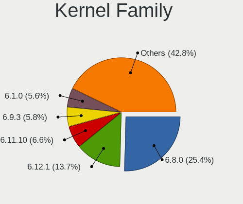
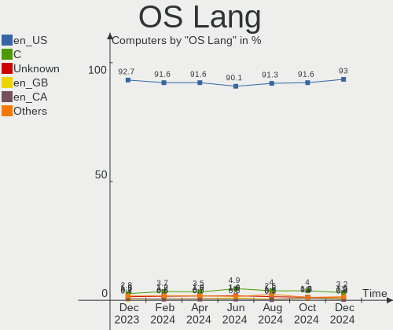
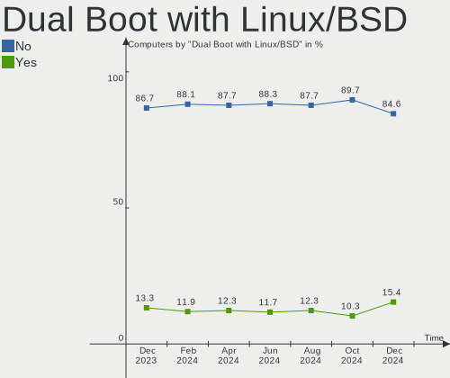
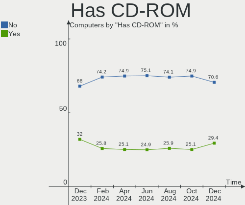
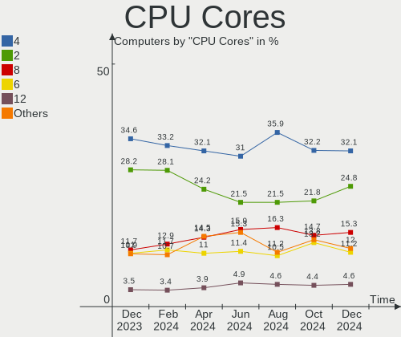
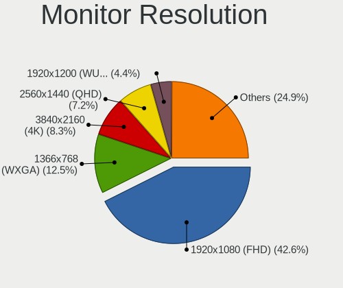
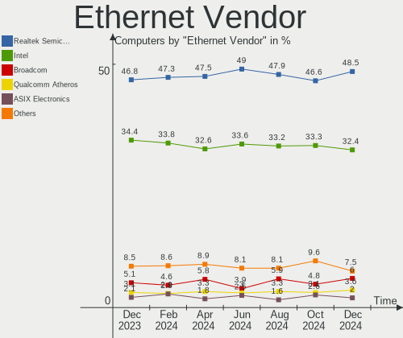
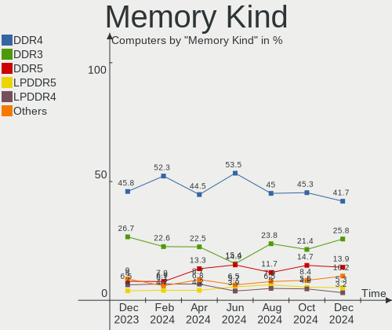
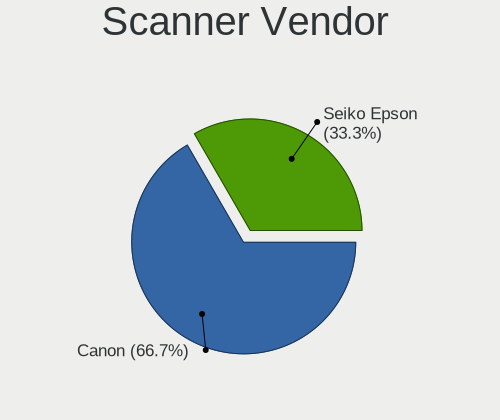
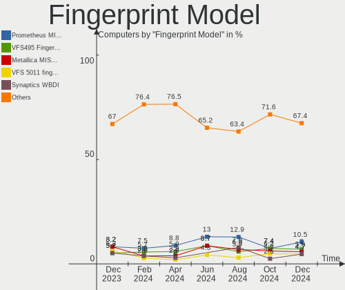

Linux in USA - Hardware Trends
------------------------------

A project to identify most popular hardware characteristics and track their change
over time based on data collected by Linux users at https://Linux-Hardware.org.

Anyone can contribute to this report by the [hw-probe](https://github.com/linuxhw/hw-probe) tool:

    sudo -E hw-probe -all -upload

This is a report for all computer types. See also reports for [desktops](/Location/USA/Desktop/README.md) and [notebooks](/Location/USA/Notebook/README.md).

Period: Sep, 2023.

Contents
--------

* [ System ](#system)
  - [ OS                       ](#os)
  - [ OS Family                ](#os-family)
  - [ Kernel                   ](#kernel)
  - [ Kernel Family            ](#kernel-family)
  - [ Kernel Major Ver.        ](#kernel-major-ver)
  - [ Arch                     ](#arch)
  - [ DE                       ](#de)
  - [ Display Server           ](#display-server)
  - [ Display Manager          ](#display-manager)
  - [ OS Lang                  ](#os-lang)
  - [ Boot Mode                ](#boot-mode)
  - [ Filesystem               ](#filesystem)
  - [ Part. scheme             ](#part-scheme)
  - [ Dual Boot with Linux/BSD ](#dual-boot-with-linuxbsd)
  - [ Dual Boot (Win)          ](#dual-boot-win)

* [ Board ](#board)
  - [ Vendor                   ](#vendor)
  - [ Model                    ](#model)
  - [ Model Family             ](#model-family)
  - [ MFG Year                 ](#mfg-year)
  - [ Form Factor              ](#form-factor)
  - [ Secure Boot              ](#secure-boot)
  - [ Coreboot                 ](#coreboot)
  - [ RAM Size                 ](#ram-size)
  - [ RAM Used                 ](#ram-used)
  - [ Total Drives             ](#total-drives)
  - [ Has CD-ROM               ](#has-cd-rom)
  - [ Has Ethernet             ](#has-ethernet)
  - [ Has WiFi                 ](#has-wifi)
  - [ Has Bluetooth            ](#has-bluetooth)

* [ Location ](#location)
  - [ Country                  ](#country)
  - [ City                     ](#city)

* [ Drives ](#drives)
  - [ Drive Vendor             ](#drive-vendor)
  - [ Drive Model              ](#drive-model)
  - [ HDD Vendor               ](#hdd-vendor)
  - [ SSD Vendor               ](#ssd-vendor)
  - [ Drive Kind               ](#drive-kind)
  - [ Drive Connector          ](#drive-connector)
  - [ Drive Size               ](#drive-size)
  - [ Space Total              ](#space-total)
  - [ Space Used               ](#space-used)
  - [ Malfunc. Drives          ](#malfunc-drives)
  - [ Malfunc. Drive Vendor    ](#malfunc-drive-vendor)
  - [ Malfunc. HDD Vendor      ](#malfunc-hdd-vendor)
  - [ Malfunc. Drive Kind      ](#malfunc-drive-kind)
  - [ Failed Drives            ](#failed-drives)
  - [ Failed Drive Vendor      ](#failed-drive-vendor)
  - [ Drive Status             ](#drive-status)

* [ Storage controller ](#storage-controller)
  - [ Storage Vendor           ](#storage-vendor)
  - [ Storage Model            ](#storage-model)
  - [ Storage Kind             ](#storage-kind)

* [ Processor ](#processor)
  - [ CPU Vendor               ](#cpu-vendor)
  - [ CPU Model                ](#cpu-model)
  - [ CPU Model Family         ](#cpu-model-family)
  - [ CPU Cores                ](#cpu-cores)
  - [ CPU Sockets              ](#cpu-sockets)
  - [ CPU Threads              ](#cpu-threads)
  - [ CPU Op-Modes             ](#cpu-op-modes)
  - [ CPU Microcode            ](#cpu-microcode)
  - [ CPU Microarch            ](#cpu-microarch)

* [ Graphics ](#graphics)
  - [ GPU Vendor               ](#gpu-vendor)
  - [ GPU Model                ](#gpu-model)
  - [ GPU Combo                ](#gpu-combo)
  - [ GPU Driver               ](#gpu-driver)
  - [ GPU Memory               ](#gpu-memory)

* [ Monitor ](#monitor)
  - [ Monitor Vendor           ](#monitor-vendor)
  - [ Monitor Model            ](#monitor-model)
  - [ Monitor Resolution       ](#monitor-resolution)
  - [ Monitor Diagonal         ](#monitor-diagonal)
  - [ Monitor Width            ](#monitor-width)
  - [ Aspect Ratio             ](#aspect-ratio)
  - [ Monitor Area             ](#monitor-area)
  - [ Pixel Density            ](#pixel-density)
  - [ Multiple Monitors        ](#multiple-monitors)

* [ Network ](#network)
  - [ Net Controller Vendor    ](#net-controller-vendor)
  - [ Net Controller Model     ](#net-controller-model)
  - [ Wireless Vendor          ](#wireless-vendor)
  - [ Wireless Model           ](#wireless-model)
  - [ Ethernet Vendor          ](#ethernet-vendor)
  - [ Ethernet Model           ](#ethernet-model)
  - [ Net Controller Kind      ](#net-controller-kind)
  - [ Used Controller          ](#used-controller)
  - [ NICs                     ](#nics)
  - [ IPv6                     ](#ipv6)

* [ Bluetooth ](#bluetooth)
  - [ Bluetooth Vendor         ](#bluetooth-vendor)
  - [ Bluetooth Model          ](#bluetooth-model)

* [ Sound ](#sound)
  - [ Sound Vendor             ](#sound-vendor)
  - [ Sound Model              ](#sound-model)

* [ Memory ](#memory)
  - [ Memory Vendor            ](#memory-vendor)
  - [ Memory Model             ](#memory-model)
  - [ Memory Kind              ](#memory-kind)
  - [ Memory Form Factor       ](#memory-form-factor)
  - [ Memory Size              ](#memory-size)
  - [ Memory Speed             ](#memory-speed)

* [ Printers & scanners ](#printers--scanners)
  - [ Printer Vendor           ](#printer-vendor)
  - [ Printer Model            ](#printer-model)
  - [ Scanner Vendor           ](#scanner-vendor)
  - [ Scanner Model            ](#scanner-model)

* [ Camera ](#camera)
  - [ Camera Vendor            ](#camera-vendor)
  - [ Camera Model             ](#camera-model)

* [ Security ](#security)
  - [ Fingerprint Vendor       ](#fingerprint-vendor)
  - [ Fingerprint Model        ](#fingerprint-model)
  - [ Chipcard Vendor          ](#chipcard-vendor)
  - [ Chipcard Model           ](#chipcard-model)

* [ Unsupported ](#unsupported)
  - [ Unsupported Devices      ](#unsupported-devices)
  - [ Unsupported Device Types ](#unsupported-device-types)

System
------

OS
--

Installed operating systems

| Name                         | Computers | Percent |
|------------------------------|-----------|---------|
| Ubuntu 22.04                 | 154       | 15.98%  |
| Fedora 38                    | 94        | 9.75%   |
| Debian 12                    | 71        | 7.37%   |
| Linux Mint 21.2              | 54        | 5.6%    |
| OpenMandriva 23.08           | 49        | 5.08%   |
| Pop!_OS 22.04                | 42        | 4.36%   |
| Ubuntu 23.04                 | 40        | 4.15%   |
| Arch Rolling                 | 36        | 3.73%   |
| Zorin 16                     | 32        | 3.32%   |
| OpenMandriva 23.09           | 23        | 2.39%   |
| ArcoLinux Rolling            | 19        | 1.97%   |
| KDE neon 22.04               | 17        | 1.76%   |
| EndeavourOS Rolling          | 17        | 1.76%   |
| SteamOS 3.4.10               | 16        | 1.66%   |
| Ubuntu 20.04                 | 15        | 1.56%   |
| Kali 2023.3                  | 14        | 1.45%   |
| Kubuntu 23.04                | 13        | 1.35%   |
| Manjaro                      | 12        | 1.24%   |
| openSUSE Tumbleweed-XXXXXXXX | 11        | 1.14%   |
| Kubuntu 22.04                | 11        | 1.14%   |
| Nobara 38                    | 9         | 0.93%   |
| Linux Mint 21.1              | 9         | 0.93%   |
| Xero Rolling                 | 8         | 0.83%   |
| Debian 11                    | 8         | 0.83%   |
| MX 23                        | 7         | 0.73%   |
| openSUSE Leap-15.5           | 6         | 0.62%   |
| OpenMandriva 23.90           | 6         | 0.62%   |
| LMDE 5                       | 6         | 0.62%   |
| Linux Mint 20.3              | 6         | 0.62%   |
| ChimeraOS 43-1               | 6         | 0.62%   |
| Xubuntu 22.04                | 5         | 0.52%   |
| Parrot 5.3                   | 5         | 0.52%   |
| OpenMandriva 23.03           | 5         | 0.52%   |
| NixOS 23.05                  | 5         | 0.52%   |
| Manjaro 23.0.2               | 5         | 0.52%   |
| Gentoo 2.14                  | 5         | 0.52%   |
| Debian                       | 5         | 0.52%   |
| Xubuntu 18.04                | 4         | 0.41%   |
| Ubuntu MATE 22.04            | 4         | 0.41%   |
| Ubuntu 18.04                 | 4         | 0.41%   |

OS Family
---------

OS without a version

| Name          | Computers | Percent |
|---------------|-----------|---------|
| Ubuntu        | 218       | 22.61%  |
| Fedora        | 99        | 10.27%  |
| OpenMandriva  | 88        | 9.13%   |
| Debian        | 84        | 8.71%   |
| Linux Mint    | 73        | 7.57%   |
| Pop!_OS       | 42        | 4.36%   |
| Arch          | 36        | 3.73%   |
| Zorin         | 32        | 3.32%   |
| Kubuntu       | 25        | 2.59%   |
| SteamOS       | 23        | 2.39%   |
| Manjaro       | 22        | 2.28%   |
| ArcoLinux     | 20        | 2.07%   |
| openSUSE      | 17        | 1.76%   |
| KDE neon      | 17        | 1.76%   |
| EndeavourOS   | 17        | 1.76%   |
| Kali          | 14        | 1.45%   |
| Xubuntu       | 13        | 1.35%   |
| Nobara        | 10        | 1.04%   |
| Lubuntu       | 9         | 0.93%   |
| Xero          | 8         | 0.83%   |
| MX            | 8         | 0.83%   |
| NixOS         | 6         | 0.62%   |
| LMDE          | 6         | 0.62%   |
| ChimeraOS     | 6         | 0.62%   |
| Ubuntu MATE   | 5         | 0.52%   |
| Parrot        | 5         | 0.52%   |
| Gentoo        | 5         | 0.52%   |
| Elementary    | 5         | 0.52%   |
| Clear Linux   | 4         | 0.41%   |
| blendOS       | 4         | 0.41%   |
| Ubuntu Studio | 3         | 0.31%   |
| Devuan        | 3         | 0.31%   |
| AlmaLinux     | 3         | 0.31%   |
| Rocky Linux   | 2         | 0.21%   |
| Raspbian      | 2         | 0.21%   |
| Garuda Linux  | 2         | 0.21%   |
| CachyOS       | 2         | 0.21%   |
| Artix         | 2         | 0.21%   |
| Ubuntu Unity  | 1         | 0.1%    |
| Ubuntu Budgie | 1         | 0.1%    |

Kernel
------

Version of the Linux kernel

| Version                      | Computers | Percent |
|------------------------------|-----------|---------|
| 6.2.0-32-generic             | 94        | 9.75%   |
| 6.2.0-33-generic             | 69        | 7.16%   |
| 5.15.0-83-generic            | 52        | 5.39%   |
| 6.4.11-desktop-1omv2390      | 46        | 4.77%   |
| 6.4.6-76060406-generic       | 34        | 3.53%   |
| 6.1.0-11-amd64               | 33        | 3.42%   |
| 5.15.0-84-generic            | 31        | 3.22%   |
| 6.4.12-arch1-1               | 28        | 2.9%    |
| 6.1.0-12-amd64               | 26        | 2.7%    |
| 6.4.15-200.fc38.x86_64       | 23        | 2.39%   |
| 5.15.0-82-generic            | 22        | 2.28%   |
| 6.4.14-200.fc38.x86_64       | 19        | 1.97%   |
| 6.2.0-31-generic             | 19        | 1.97%   |
| 5.13.0-valve37-1-neptune     | 17        | 1.76%   |
| 6.4.13-200.fc38.x86_64       | 13        | 1.35%   |
| 6.5.3-arch1-1                | 12        | 1.24%   |
| 6.2.9-300.fc38.x86_64        | 11        | 1.14%   |
| 6.2.0-26-generic             | 11        | 1.14%   |
| 5.10.0-25-amd64              | 11        | 1.14%   |
| 6.5.1-desktop-1omv2390       | 9         | 0.93%   |
| 6.4.12-200.fc38.x86_64       | 9         | 0.93%   |
| 6.1.0-10-amd64               | 9         | 0.93%   |
| 6.5.5-200.fc38.x86_64        | 8         | 0.83%   |
| 6.5.3-1-MANJARO              | 7         | 0.73%   |
| 6.2.6-76060206-generic       | 7         | 0.73%   |
| 5.19.0-46-generic            | 7         | 0.73%   |
| 5.15.0-76-generic            | 7         | 0.73%   |
| 6.5.4-arch2-1                | 6         | 0.62%   |
| 6.5.3-desktop-1omv2390       | 6         | 0.62%   |
| 6.5.0-desktop-1omv2390       | 6         | 0.62%   |
| 6.4.8-desktop-2omv2390       | 6         | 0.62%   |
| 6.3.9-chimeraos-1            | 6         | 0.62%   |
| 5.14.21-150500.55.19-default | 6         | 0.62%   |
| 6.4.12-zen1-1-zen            | 5         | 0.52%   |
| 6.4.0-kali3-amd64            | 5         | 0.52%   |
| 6.2.6-desktop-1omv2390       | 5         | 0.52%   |
| 6.1.49-1-MANJARO             | 5         | 0.52%   |
| 6.1.0-1parrot1-amd64         | 5         | 0.52%   |
| 5.15.0-79-generic            | 5         | 0.52%   |
| 6.5.3-200.fsync.fc38.x86_64  | 4         | 0.41%   |

Kernel Family
-------------

Linux kernel without a distro release

| Version | Computers | Percent |
|---------|-----------|---------|
| 6.2.0   | 210       | 21.78%  |
| 5.15.0  | 130       | 13.49%  |
| 6.1.0   | 80        | 8.3%    |
| 6.4.11  | 55        | 5.71%   |
| 6.4.12  | 48        | 4.98%   |
| 6.5.3   | 42        | 4.36%   |
| 6.4.6   | 36        | 3.73%   |
| 6.4.15  | 25        | 2.59%   |
| 6.4.14  | 21        | 2.18%   |
| 5.13.0  | 20        | 2.07%   |
| 6.5.0   | 17        | 1.76%   |
| 6.4.13  | 17        | 1.76%   |
| 6.5.5   | 16        | 1.66%   |
| 6.5.1   | 16        | 1.66%   |
| 5.4.0   | 16        | 1.66%   |
| 6.2.6   | 12        | 1.24%   |
| 5.19.0  | 12        | 1.24%   |
| 5.10.0  | 12        | 1.24%   |
| 6.5.4   | 11        | 1.14%   |
| 6.5.2   | 11        | 1.14%   |
| 6.4.0   | 11        | 1.14%   |
| 6.2.9   | 11        | 1.14%   |
| 6.3.9   | 9         | 0.93%   |
| 6.4.10  | 8         | 0.83%   |
| 6.1.51  | 8         | 0.83%   |
| 6.3.0   | 7         | 0.73%   |
| 6.4.8   | 6         | 0.62%   |
| 5.14.21 | 6         | 0.62%   |
| 4.15.0  | 6         | 0.62%   |
| 6.1.49  | 5         | 0.52%   |
| 6.3.8   | 4         | 0.41%   |
| 6.1.21  | 4         | 0.41%   |
| 6.4.3   | 3         | 0.31%   |
| 6.3.5   | 3         | 0.31%   |
| 6.1.52  | 3         | 0.31%   |
| 6.1.1   | 3         | 0.31%   |
| 5.14.0  | 3         | 0.31%   |
| 4.18.0  | 3         | 0.31%   |
| 6.4.7   | 2         | 0.21%   |
| 6.3.1   | 2         | 0.21%   |

Kernel Major Ver.
-----------------

Linux kernel major version

| Version | Computers | Percent |
|---------|-----------|---------|
| 6.2     | 241       | 25%     |
| 6.4     | 234       | 24.27%  |
| 5.15    | 134       | 13.9%   |
| 6.1     | 118       | 12.24%  |
| 6.5     | 113       | 11.72%  |
| 6.3     | 27        | 2.8%    |
| 5.13    | 21        | 2.18%   |
| 5.4     | 16        | 1.66%   |
| 5.10    | 14        | 1.45%   |
| 5.19    | 12        | 1.24%   |
| 5.14    | 9         | 0.93%   |
| 4.15    | 6         | 0.62%   |
| 6.0     | 5         | 0.52%   |
| 5.16    | 3         | 0.31%   |
| 4.18    | 3         | 0.31%   |
| 6.6     | 1         | 0.1%    |
| 5.8     | 1         | 0.1%    |
| 5.6     | 1         | 0.1%    |
| 5.18    | 1         | 0.1%    |
| 5.17    | 1         | 0.1%    |
| 5.11    | 1         | 0.1%    |
| 4       | 1         | 0.1%    |
| 3.10    | 1         | 0.1%    |

Arch
----

OS architecture (x86_64, i586, etc.)

| Name    | Computers | Percent |
|---------|-----------|---------|
| x86_64  | 950       | 98.55%  |
| aarch64 | 10        | 1.04%   |
| i686    | 2         | 0.21%   |
| armv7l  | 2         | 0.21%   |

DE
--

Desktop Environment

| Name            | Computers | Percent |
|-----------------|-----------|---------|
| GNOME           | 411       | 42.63%  |
| KDE5            | 254       | 26.35%  |
| X-Cinnamon      | 80        | 8.3%    |
| XFCE            | 66        | 6.85%   |
| Unknown         | 63        | 6.54%   |
| LXQt            | 20        | 2.07%   |
| MATE            | 12        | 1.24%   |
| Budgie          | 10        | 1.04%   |
| i3              | 7         | 0.73%   |
| Pantheon        | 5         | 0.52%   |
| LXDE            | 5         | 0.52%   |
| GNOME Classic   | 5         | 0.52%   |
| KDE             | 4         | 0.41%   |
| Hyprland        | 4         | 0.41%   |
| sway            | 3         | 0.31%   |
| openbox         | 3         | 0.31%   |
| GNOME Flashback | 2         | 0.21%   |
| Enlightenment   | 2         | 0.21%   |
| Unity           | 1         | 0.1%    |
| Unicorn:XFCE    | 1         | 0.1%    |
| UKUI            | 1         | 0.1%    |
| Trinity         | 1         | 0.1%    |
| Phosh:GNOME     | 1         | 0.1%    |
| KDE6            | 1         | 0.1%    |
| DWM             | 1         | 0.1%    |
| Cinnamon        | 1         | 0.1%    |

Display Server
--------------

X11 or Wayland

| Name    | Computers | Percent |
|---------|-----------|---------|
| X11     | 530       | 54.98%  |
| Wayland | 357       | 37.03%  |
| Unknown | 52        | 5.39%   |
| Tty     | 25        | 2.59%   |

Display Manager
---------------

SDDM, LightDM, etc.

| Name    | Computers | Percent |
|---------|-----------|---------|
| Unknown | 387       | 40.15%  |
| GDM3    | 220       | 22.82%  |
| SDDM    | 200       | 20.75%  |
| LightDM | 98        | 10.17%  |
| GDM     | 49        | 5.08%   |
| SLiM    | 4         | 0.41%   |
| GREETD  | 4         | 0.41%   |
| TDM     | 1         | 0.1%    |
| LXDM    | 1         | 0.1%    |

OS Lang
-------

Language

| Lang            | Computers | Percent |
|-----------------|-----------|---------|
| en_US           | 873       | 90.56%  |
| Unknown         | 42        | 4.36%   |
| C               | 28        | 2.9%    |
| en_GB           | 6         | 0.62%   |
| en_CA           | 4         | 0.41%   |
| POSIX           | 2         | 0.21%   |
| fr_FR           | 2         | 0.21%   |
| zh_CN           | 1         | 0.1%    |
| pt_BR           | 1         | 0.1%    |
| es_US           | 1         | 0.1%    |
| es_ES           | 1         | 0.1%    |
| es_CO           | 1         | 0.1%    |
| en_US.UTF8      | 1         | 0.1%    |
| en_US.ISO8859-1 | 1         | 0.1%    |

Boot Mode
---------

EFI or BIOS

| Mode | Computers | Percent |
|------|-----------|---------|
| EFI  | 515       | 53.42%  |
| BIOS | 449       | 46.58%  |

Filesystem
----------

Type of filesystem

| Type    | Computers | Percent |
|---------|-----------|---------|
| Ext4    | 479       | 49.69%  |
| Btrfs   | 188       | 19.5%   |
| Tmpfs   | 181       | 18.78%  |
| Overlay | 82        | 8.51%   |
| Xfs     | 19        | 1.97%   |
| Zfs     | 9         | 0.93%   |
| F2fs    | 4         | 0.41%   |
| Nilfs2  | 1         | 0.1%    |
| Jfs     | 1         | 0.1%    |

Part. scheme
------------

Scheme of partitioning

| Type    | Computers | Percent |
|---------|-----------|---------|
| GPT     | 555       | 57.57%  |
| Unknown | 327       | 33.92%  |
| MBR     | 82        | 8.51%   |

Dual Boot with Linux/BSD
------------------------

Hosting more than one Linux/BSD

| Dual boot | Computers | Percent |
|-----------|-----------|---------|
| No        | 814       | 84.44%  |
| Yes       | 150       | 15.56%  |

Dual Boot (Win)
---------------

Hosting Linux and Windows

| Dual boot | Computers | Percent |
|-----------|-----------|---------|
| No        | 783       | 81.22%  |
| Yes       | 181       | 18.78%  |

Board
-----

Vendor
------

Motherboard manufacturer

| Name                                 | Computers | Percent |
|--------------------------------------|-----------|---------|
| Dell                                 | 161       | 16.7%   |
| Hewlett-Packard                      | 136       | 14.11%  |
| ASUSTek Computer                     | 133       | 13.8%   |
| Lenovo                               | 124       | 12.86%  |
| MSI                                  | 56        | 5.81%   |
| Apple                                | 45        | 4.67%   |
| Gigabyte Technology                  | 44        | 4.56%   |
| ASRock                               | 31        | 3.22%   |
| Acer                                 | 24        | 2.49%   |
| Valve                                | 23        | 2.39%   |
| Google                               | 23        | 2.39%   |
| AZW                                  | 14        | 1.45%   |
| Intel                                | 13        | 1.35%   |
| Microsoft                            | 11        | 1.14%   |
| Unknown                              | 10        | 1.04%   |
| Toshiba                              | 9         | 0.93%   |
| System76                             | 8         | 0.83%   |
| Pegatron                             | 7         | 0.73%   |
| Samsung Electronics                  | 6         | 0.62%   |
| Raspberry Pi Foundation              | 6         | 0.62%   |
| Gateway                              | 6         | 0.62%   |
| Foxconn                              | 6         | 0.62%   |
| Panasonic                            | 5         | 0.52%   |
| Framework                            | 5         | 0.52%   |
| GPU Company                          | 4         | 0.41%   |
| Alienware                            | 4         | 0.41%   |
| Supermicro                           | 3         | 0.31%   |
| Shenzhen Meigao Electronic Equipment | 3         | 0.31%   |
| Notebook                             | 3         | 0.31%   |
| Hardkernel                           | 3         | 0.31%   |
| ATOPNUC                              | 3         | 0.31%   |
| ASRockRack                           | 3         | 0.31%   |
| ALLDOCUBE                            | 3         | 0.31%   |
| Sony                                 | 2         | 0.21%   |
| Razer                                | 2         | 0.21%   |
| NZXT                                 | 2         | 0.21%   |
| Fujitsu                              | 2         | 0.21%   |
| BESSTAR Tech                         | 2         | 0.21%   |
| VPU Company                          | 1         | 0.1%    |
| Seeed Studio                         | 1         | 0.1%    |

Model
-----

Motherboard model

| Name                                      | Computers | Percent |
|-------------------------------------------|-----------|---------|
| Valve Jupiter                             | 23        | 2.39%   |
| Google Enguarde                           | 15        | 1.56%   |
| Unknown                                   | 10        | 1.04%   |
| Lenovo ThinkPad L13 Yoga Gen 2 20VK0019US | 9         | 0.93%   |
| Dell OptiPlex 7010                        | 7         | 0.73%   |
| MSI MS-7C37                               | 6         | 0.62%   |
| AZW SER                                   | 5         | 0.52%   |
| ASUS TUF Gaming X570-PLUS                 | 5         | 0.52%   |
| AZW GTR                                   | 4         | 0.41%   |
| ASUS ROG CROSSHAIR VIII HERO              | 4         | 0.41%   |
| ASUS All Series                           | 4         | 0.41%   |
| Apple MacBookPro10,1                      | 4         | 0.41%   |
| MSI MS-7D25                               | 3         | 0.31%   |
| Lenovo ThinkPad 13 2nd Gen 20J10046US     | 3         | 0.31%   |
| HP Notebook                               | 3         | 0.31%   |
| HP Laptop 15-dy2xxx                       | 3         | 0.31%   |
| HP Dev One Notebook PC                    | 3         | 0.31%   |
| GPU Company GWTC116-2                     | 3         | 0.31%   |
| Gigabyte 970A-DS3P                        | 3         | 0.31%   |
| Framework Laptop (13th Gen Intel Core)    | 3         | 0.31%   |
| Dell OptiPlex 9020                        | 3         | 0.31%   |
| Dell Inspiron 1545                        | 3         | 0.31%   |
| AZW MINI S                                | 3         | 0.31%   |
| ASUS TUF Gaming X570-PRO                  | 3         | 0.31%   |
| ASUS ROG STRIX Z790-E GAMING WIFI         | 3         | 0.31%   |
| ASUS ROG STRIX B650E-I GAMING WIFI        | 3         | 0.31%   |
| ASUS ROG STRIX B450-F GAMING              | 3         | 0.31%   |
| ASRock B550M Pro4                         | 3         | 0.31%   |
| Apple MacBookPro9,2                       | 3         | 0.31%   |
| System76 Pangolin                         | 2         | 0.21%   |
| System76 Darter Pro                       | 2         | 0.21%   |
| MSI MS-7C95                               | 2         | 0.21%   |
| MSI MS-7C94                               | 2         | 0.21%   |
| MSI MS-7B79                               | 2         | 0.21%   |
| MSI MS-7B24                               | 2         | 0.21%   |
| MSI MS-7B09                               | 2         | 0.21%   |
| MSI MS-7A38                               | 2         | 0.21%   |
| Microsoft Surface Pro 7                   | 2         | 0.21%   |
| Lenovo ThinkSystem SR570 -[7Y03CTO1WW]-   | 2         | 0.21%   |
| Lenovo IdeaPad Slim 5 16IRL8 82XF         | 2         | 0.21%   |

Model Family
------------

Motherboard model prefix

| Name               | Computers | Percent |
|--------------------|-----------|---------|
| Lenovo ThinkPad    | 65        | 6.74%   |
| Dell Latitude      | 39        | 4.05%   |
| Dell OptiPlex      | 36        | 3.73%   |
| Dell Inspiron      | 36        | 3.73%   |
| ASUS ROG           | 34        | 3.53%   |
| Lenovo IdeaPad     | 27        | 2.8%    |
| Valve Jupiter      | 23        | 2.39%   |
| HP Laptop          | 23        | 2.39%   |
| ASUS PRIME         | 22        | 2.28%   |
| Dell Precision     | 20        | 2.07%   |
| HP Pavilion        | 19        | 1.97%   |
| ASUS TUF           | 18        | 1.87%   |
| HP ENVY            | 16        | 1.66%   |
| Dell XPS           | 16        | 1.66%   |
| Google Enguarde    | 15        | 1.56%   |
| Acer Aspire        | 15        | 1.56%   |
| HP EliteBook       | 14        | 1.45%   |
| Microsoft Surface  | 11        | 1.14%   |
| HP ProBook         | 10        | 1.04%   |
| Unknown            | 10        | 1.04%   |
| Lenovo ThinkCentre | 9         | 0.93%   |
| Toshiba Satellite  | 8         | 0.83%   |
| HP OMEN            | 8         | 0.83%   |
| HP EliteDesk       | 8         | 0.83%   |
| ASUS VivoBook      | 7         | 0.73%   |
| RPi Raspberry      | 6         | 0.62%   |
| MSI MS-7C37        | 6         | 0.62%   |
| Lenovo Legion      | 6         | 0.62%   |
| Lenovo IdeaPadFlex | 6         | 0.62%   |
| Gigabyte 970A-DS3P | 5         | 0.52%   |
| Framework Laptop   | 5         | 0.52%   |
| Dell PowerEdge     | 5         | 0.52%   |
| AZW SER            | 5         | 0.52%   |
| Apple MacBookPro10 | 5         | 0.52%   |
| HP Stream          | 4         | 0.41%   |
| HP Compaq          | 4         | 0.41%   |
| Gigabyte X570      | 4         | 0.41%   |
| Gigabyte B450M     | 4         | 0.41%   |
| Dell Vostro        | 4         | 0.41%   |
| AZW GTR            | 4         | 0.41%   |

MFG Year
--------

Motherboard manufacture year

| Year    | Computers | Percent |
|---------|-----------|---------|
| 2022    | 130       | 13.49%  |
| 2020    | 108       | 11.2%   |
| 2021    | 82        | 8.51%   |
| 2019    | 82        | 8.51%   |
| 2018    | 71        | 7.37%   |
| 2012    | 69        | 7.16%   |
| 2023    | 61        | 6.33%   |
| 2017    | 60        | 6.22%   |
| 2011    | 48        | 4.98%   |
| 2014    | 45        | 4.67%   |
| 2015    | 44        | 4.56%   |
| 2013    | 42        | 4.36%   |
| 2016    | 35        | 3.63%   |
| 2010    | 30        | 3.11%   |
| 2009    | 19        | 1.97%   |
| 2008    | 18        | 1.87%   |
| Unknown | 11        | 1.14%   |
| 2007    | 5         | 0.52%   |
| 2006    | 4         | 0.41%   |

Form Factor
-----------

Physical design of the computer

| Name           | Computers | Percent |
|----------------|-----------|---------|
| Notebook       | 446       | 46.27%  |
| Desktop        | 387       | 40.15%  |
| Convertible    | 43        | 4.46%   |
| Mini pc        | 25        | 2.59%   |
| Server         | 20        | 2.07%   |
| Tablet         | 16        | 1.66%   |
| All in one     | 16        | 1.66%   |
| System on chip | 11        | 1.14%   |

Secure Boot
-----------

Enabled or disabled

| State    | Computers | Percent |
|----------|-----------|---------|
| Disabled | 906       | 93.98%  |
| Enabled  | 58        | 6.02%   |

Coreboot
--------

Have coreboot on board

| Used | Computers | Percent |
|------|-----------|---------|
| No   | 938       | 97.3%   |
| Yes  | 26        | 2.7%    |

RAM Size
--------

Total RAM memory

| Size in GB      | Computers | Percent |
|-----------------|-----------|---------|
| 16.01-24.0      | 205       | 21.27%  |
| 4.01-8.0        | 177       | 18.36%  |
| 8.01-16.0       | 174       | 18.05%  |
| 32.01-64.0      | 163       | 16.91%  |
| 3.01-4.0        | 99        | 10.27%  |
| 64.01-256.0     | 84        | 8.71%   |
| 24.01-32.0      | 37        | 3.84%   |
| 1.01-2.0        | 15        | 1.56%   |
| 2.01-3.0        | 5         | 0.52%   |
| More than 256.0 | 4         | 0.41%   |
| 0.51-1.0        | 1         | 0.1%    |

RAM Used
--------

Used RAM memory

| Used GB     | Computers | Percent |
|-------------|-----------|---------|
| 2.01-3.0    | 264       | 27.39%  |
| 1.01-2.0    | 244       | 25.31%  |
| 4.01-8.0    | 175       | 18.15%  |
| 3.01-4.0    | 147       | 15.25%  |
| 8.01-16.0   | 74        | 7.68%   |
| 0.51-1.0    | 34        | 3.53%   |
| 16.01-24.0  | 12        | 1.24%   |
| 0.01-0.5    | 6         | 0.62%   |
| 32.01-64.0  | 4         | 0.41%   |
| 24.01-32.0  | 2         | 0.21%   |
| 64.01-256.0 | 2         | 0.21%   |

Total Drives
------------

Number of drives on board

| Drives | Computers | Percent |
|--------|-----------|---------|
| 1      | 540       | 56.02%  |
| 2      | 250       | 25.93%  |
| 3      | 79        | 8.2%    |
| 4      | 39        | 4.05%   |
| 5      | 22        | 2.28%   |
| 6      | 9         | 0.93%   |
| 0      | 7         | 0.73%   |
| 7      | 5         | 0.52%   |
| 8      | 4         | 0.41%   |
| 10     | 3         | 0.31%   |
| 9      | 3         | 0.31%   |
| 11     | 2         | 0.21%   |
| 19     | 1         | 0.1%    |

Has CD-ROM
----------

Has CD-ROM on board

| Presented | Computers | Percent |
|-----------|-----------|---------|
| No        | 657       | 68.15%  |
| Yes       | 307       | 31.85%  |

Has Ethernet
------------

Has Ethernet on board

| Presented | Computers | Percent |
|-----------|-----------|---------|
| Yes       | 803       | 83.3%   |
| No        | 161       | 16.7%   |

Has WiFi
--------

Has WiFi module

| Presented | Computers | Percent |
|-----------|-----------|---------|
| Yes       | 768       | 79.67%  |
| No        | 196       | 20.33%  |

Has Bluetooth
-------------

Has Bluetooth module

| Presented | Computers | Percent |
|-----------|-----------|---------|
| Yes       | 657       | 68.15%  |
| No        | 307       | 31.85%  |

Location
--------

Country
-------

Geographic location (country)

| Country | Computers | Percent |
|---------|-----------|---------|
| USA     | 964       | 100%    |

City
----

Geographic location (city)

| City             | Computers | Percent |
|------------------|-----------|---------|
| Bangor           | 32        | 3.32%   |
| Los Angeles      | 19        | 1.97%   |
| Seattle          | 17        | 1.76%   |
| New York         | 13        | 1.35%   |
| Dallas           | 12        | 1.24%   |
| Houston          | 11        | 1.14%   |
| San Antonio      | 10        | 1.04%   |
| Phoenix          | 10        | 1.04%   |
| Miami            | 10        | 1.04%   |
| Portland         | 9         | 0.93%   |
| Springfield      | 8         | 0.83%   |
| Orlando          | 7         | 0.73%   |
| Minneapolis      | 7         | 0.73%   |
| Chicago          | 7         | 0.73%   |
| Austin           | 7         | 0.73%   |
| Charlotte        | 6         | 0.62%   |
| Atlanta          | 6         | 0.62%   |
| Tucson           | 5         | 0.52%   |
| Tampa            | 5         | 0.52%   |
| San Francisco    | 5         | 0.52%   |
| Rochester        | 5         | 0.52%   |
| Philadelphia     | 5         | 0.52%   |
| Alexandria       | 5         | 0.52%   |
| Virginia Beach   | 4         | 0.41%   |
| St Louis         | 4         | 0.41%   |
| Rogers           | 4         | 0.41%   |
| Rancho Cordova   | 4         | 0.41%   |
| Raleigh          | 4         | 0.41%   |
| Pittsburgh       | 4         | 0.41%   |
| Pine Island      | 4         | 0.41%   |
| Oklahoma City    | 4         | 0.41%   |
| Mesa             | 4         | 0.41%   |
| Lincoln          | 4         | 0.41%   |
| Lancaster        | 4         | 0.41%   |
| Jacksonville     | 4         | 0.41%   |
| Cumming          | 4         | 0.41%   |
| Columbus         | 4         | 0.41%   |
| Wappingers Falls | 3         | 0.31%   |
| Tullahoma        | 3         | 0.31%   |
| Sanford          | 3         | 0.31%   |

Drives
------

Drive Vendor
------------

Hard drive vendors

| Vendor                      | Computers | Drives | Percent |
|-----------------------------|-----------|--------|---------|
| Samsung Electronics         | 246       | 332    | 16.9%   |
| Seagate                     | 166       | 224    | 11.4%   |
| WDC                         | 161       | 217    | 11.06%  |
| SanDisk                     | 136       | 151    | 9.34%   |
| Unknown                     | 87        | 93     | 5.98%   |
| Toshiba                     | 58        | 58     | 3.98%   |
| SK hynix                    | 55        | 60     | 3.78%   |
| Crucial                     | 55        | 61     | 3.78%   |
| Intel                       | 41        | 50     | 2.82%   |
| Hitachi                     | 34        | 41     | 2.34%   |
| Apple                       | 34        | 35     | 2.34%   |
| Kingston                    | 30        | 31     | 2.06%   |
| Phison Electronics          | 26        | 31     | 1.79%   |
| Micron/Crucial Technology   | 22        | 24     | 1.51%   |
| China                       | 22        | 23     | 1.51%   |
| Micron Technology           | 21        | 21     | 1.44%   |
| PNY                         | 20        | 22     | 1.37%   |
| KIOXIA                      | 20        | 20     | 1.37%   |
| SPCC                        | 17        | 19     | 1.17%   |
| Kingston Technology Company | 16        | 17     | 1.1%    |
| HGST                        | 16        | 30     | 1.1%    |
| Silicon Motion              | 9         | 9      | 0.62%   |
| Team                        | 8         | 9      | 0.55%   |
| SABRENT                     | 8         | 11     | 0.55%   |
| JMicron Technology          | 8         | 8      | 0.55%   |
| ASMT                        | 8         | 9      | 0.55%   |
| Hewlett-Packard             | 7         | 8      | 0.48%   |
| A-DATA Technology           | 7         | 7      | 0.48%   |
| Unknown                     | 7         | 12     | 0.48%   |
| T-FORCE                     | 5         | 6      | 0.34%   |
| Fujitsu                     | 5         | 6      | 0.34%   |
| Patriot                     | 4         | 4      | 0.27%   |
| LITEON                      | 4         | 4      | 0.27%   |
| Union Memory                | 3         | 3      | 0.21%   |
| Transcend                   | 3         | 3      | 0.21%   |
| MAXIO Technology (Hangzhou) | 3         | 3      | 0.21%   |
| LITEONIT                    | 3         | 3      | 0.21%   |
| Lexar                       | 3         | 3      | 0.21%   |
| KingFast                    | 3         | 3      | 0.21%   |
| Super Talent                | 2         | 2      | 0.14%   |

Drive Model
-----------

Hard drive models

| Model                                                 | Computers | Percent |
|-------------------------------------------------------|-----------|---------|
| Samsung NVMe SSD Controller SM981/PM981/PM983 256GB   | 43        | 2.67%   |
| Samsung NVMe SSD Controller PM9A1/PM9A3/980PRO 1TB    | 37        | 2.3%    |
| Samsung SSD 860 EVO 1TB                               | 15        | 0.93%   |
| Micron/Crucial P2 NVMe PCIe SSD 1TB                   | 14        | 0.87%   |
| Seagate ST2000DM008-2FR102 2TB                        | 13        | 0.81%   |
| Crucial CT1000MX500SSD1 1TB                           | 13        | 0.81%   |
| Unknown MMC Card  32GB                                | 11        | 0.68%   |
| Toshiba DT01ACA100 1TB                                | 11        | 0.68%   |
| Samsung SSD 980 1TB                                   | 10        | 0.62%   |
| Samsung MZVLB512HBJQ-000L7 512GB                      | 10        | 0.62%   |
| Unknown AGND3R  16GB                                  | 9         | 0.56%   |
| Sandisk WD Black SN750 / PC SN730 NVMe SSD 512GB      | 9         | 0.56%   |
| Samsung SSD 870 EVO 1TB                               | 9         | 0.56%   |
| Samsung SSD 850 EVO 250GB                             | 9         | 0.56%   |
| Kingston Company OM3PDP3 NVMe SSD 512GB               | 9         | 0.56%   |
| Unknown SD/MMC/MS PRO 128GB                           | 8         | 0.5%    |
| Unknown MMC Card  64GB                                | 8         | 0.5%    |
| Unknown MMC Card  512GB                               | 8         | 0.5%    |
| Sandisk WD Black 2018/SN750 / PC SN720 NVMe SSD 1TB   | 8         | 0.5%    |
| Samsung SSD 860 EVO 500GB                             | 8         | 0.5%    |
| Intel SSD 660P Series 1024GB                          | 8         | 0.5%    |
| WDC WD10EZEX-08WN4A0 1TB                              | 7         | 0.43%   |
| Unknown MMC Card  128GB                               | 7         | 0.43%   |
| SK hynix SHPP41-2000GM 2TB                            | 7         | 0.43%   |
| Seagate ST1000LM035-1RK172 1TB                        | 7         | 0.43%   |
| Seagate ST1000DM003-1ER162 1TB                        | 7         | 0.43%   |
| Sandisk WD Blue SN570 500GB                           | 7         | 0.43%   |
| SanDisk SSD PLUS 1000GB                               | 7         | 0.43%   |
| Samsung SSD 970 EVO Plus 1TB                          | 7         | 0.43%   |
| Samsung SSD 870 EVO 500GB                             | 7         | 0.43%   |
| Unknown                                               | 7         | 0.43%   |
| WDC WD Blue SA510 2.5 1TB                             | 6         | 0.37%   |
| Silicon Motion SM2263EN/SM2263XT SSD Controller 512GB | 6         | 0.37%   |
| Sandisk WD_BLACK SN770 500GB                          | 6         | 0.37%   |
| Samsung SSD 850 EVO 500GB                             | 6         | 0.37%   |
| Samsung NVMe SSD Controller SM961/PM961/SM963 500GB   | 6         | 0.37%   |
| SABRENT Disk 752GB                                    | 6         | 0.37%   |
| PNY CS900 500GB SSD                                   | 6         | 0.37%   |
| Phison E12 NVMe Controller 2TB                        | 6         | 0.37%   |
| WDC WDS100T2B0A-00SM50 1TB SSD                        | 5         | 0.31%   |

HDD Vendor
----------

Hard disk drive vendors

| Vendor              | Computers | Drives | Percent |
|---------------------|-----------|--------|---------|
| Seagate             | 158       | 209    | 38.07%  |
| WDC                 | 118       | 163    | 28.43%  |
| Toshiba             | 41        | 41     | 9.88%   |
| Hitachi             | 34        | 41     | 8.19%   |
| HGST                | 16        | 30     | 3.86%   |
| Apple               | 13        | 13     | 3.13%   |
| Unknown             | 8         | 8      | 1.93%   |
| SABRENT             | 8         | 11     | 1.93%   |
| Fujitsu             | 5         | 6      | 1.2%    |
| Hewlett-Packard     | 3         | 3      | 0.72%   |
| Samsung Electronics | 2         | 3      | 0.48%   |
| Maxtor              | 2         | 2      | 0.48%   |
| Lenovo              | 2         | 8      | 0.48%   |
| Synology            | 1         | 1      | 0.24%   |
| SSK                 | 1         | 1      | 0.24%   |
| Space ke            | 1         | 2      | 0.24%   |
| IBM-ESXS            | 1         | 6      | 0.24%   |
| ASMT                | 1         | 1      | 0.24%   |

SSD Vendor
----------

Solid state drive vendors

| Vendor              | Computers | Drives | Percent |
|---------------------|-----------|--------|---------|
| Samsung Electronics | 101       | 120    | 22.85%  |
| SanDisk             | 58        | 61     | 13.12%  |
| Crucial             | 48        | 52     | 10.86%  |
| WDC                 | 43        | 44     | 9.73%   |
| China               | 22        | 23     | 4.98%   |
| PNY                 | 20        | 22     | 4.52%   |
| Kingston            | 18        | 19     | 4.07%   |
| SPCC                | 13        | 14     | 2.94%   |
| Apple               | 13        | 13     | 2.94%   |
| SK hynix            | 12        | 13     | 2.71%   |
| Intel               | 9         | 12     | 2.04%   |
| A-DATA Technology   | 7         | 7      | 1.58%   |
| Team                | 6         | 7      | 1.36%   |
| Micron Technology   | 6         | 6      | 1.36%   |
| Toshiba             | 5         | 5      | 1.13%   |
| ASMT                | 5         | 6      | 1.13%   |
| Patriot             | 4         | 4      | 0.9%    |
| LITEON              | 4         | 4      | 0.9%    |
| LITEONIT            | 3         | 3      | 0.68%   |
| Lexar               | 3         | 3      | 0.68%   |
| JMicron Technology  | 3         | 3      | 0.68%   |
| Hewlett-Packard     | 3         | 4      | 0.68%   |
| Transcend           | 2         | 2      | 0.45%   |
| Super Talent        | 2         | 2      | 0.45%   |
| Netac               | 2         | 2      | 0.45%   |
| Hised               | 2         | 2      | 0.45%   |
| Dogfish             | 2         | 2      | 0.45%   |
| Corsair             | 2         | 2      | 0.45%   |
| X12                 | 1         | 1      | 0.23%   |
| Wodposit            | 1         | 1      | 0.23%   |
| Wibtek              | 1         | 1      | 0.23%   |
| Vaseky              | 1         | 1      | 0.23%   |
| USB30               | 1         | 1      | 0.23%   |
| T-FORCE             | 1         | 1      | 0.23%   |
| SSSTC               | 1         | 1      | 0.23%   |
| SOLIDIGM            | 1         | 1      | 0.23%   |
| Seagate             | 1         | 1      | 0.23%   |
| SCY                 | 1         | 1      | 0.23%   |
| PNY USB             | 1         | 1      | 0.23%   |
| NGFF                | 1         | 1      | 0.23%   |

Drive Kind
----------

HDD or SSD

| Kind    | Computers | Drives | Percent |
|---------|-----------|--------|---------|
| NVMe    | 458       | 598    | 35.61%  |
| SSD     | 371       | 484    | 28.85%  |
| HDD     | 340       | 549    | 26.44%  |
| MMC     | 79        | 83     | 6.14%   |
| Unknown | 38        | 49     | 2.95%   |

Drive Connector
---------------

SATA, SAS, NVMe, etc.

| Type | Computers | Drives | Percent |
|------|-----------|--------|---------|
| SATA | 587       | 956    | 48.88%  |
| NVMe | 457       | 595    | 38.05%  |
| MMC  | 79        | 83     | 6.58%   |
| SAS  | 78        | 129    | 6.49%   |

Drive Size
----------

Size of hard drive

| Size in TB | Computers | Drives | Percent |
|------------|-----------|--------|---------|
| 0.01-0.5   | 360       | 445    | 45.74%  |
| 0.51-1.0   | 255       | 328    | 32.4%   |
| 1.01-2.0   | 95        | 122    | 12.07%  |
| 3.01-4.0   | 29        | 44     | 3.68%   |
| 4.01-10.0  | 26        | 43     | 3.3%    |
| 2.01-3.0   | 14        | 30     | 1.78%   |
| 10.01-20.0 | 8         | 21     | 1.02%   |

Space Total
-----------

Amount of disk space available on the file system

| Size in GB     | Computers | Percent |
|----------------|-----------|---------|
| 101-250        | 199       | 20.64%  |
| 501-1000       | 187       | 19.4%   |
| 251-500        | 161       | 16.7%   |
| 1001-2000      | 104       | 10.79%  |
| More than 3000 | 99        | 10.27%  |
| 1-20           | 82        | 8.51%   |
| 2001-3000      | 41        | 4.25%   |
| 51-100         | 40        | 4.15%   |
| Unknown        | 28        | 2.9%    |
| 21-50          | 23        | 2.39%   |

Space Used
----------

Amount of used disk space

| Used GB        | Computers | Percent |
|----------------|-----------|---------|
| 1-20           | 338       | 35.06%  |
| 21-50          | 168       | 17.43%  |
| 101-250        | 125       | 12.97%  |
| 51-100         | 101       | 10.48%  |
| 251-500        | 74        | 7.68%   |
| 501-1000       | 40        | 4.15%   |
| More than 3000 | 39        | 4.05%   |
| 1001-2000      | 35        | 3.63%   |
| Unknown        | 28        | 2.9%    |
| 2001-3000      | 16        | 1.66%   |

Malfunc. Drives
---------------

Drive models with a malfunction

| Model                                                           | Computers | Drives | Percent |
|-----------------------------------------------------------------|-----------|--------|---------|
| WDC WD40EZRX-00SPEB0 4TB                                        | 2         | 2      | 2.86%   |
| Toshiba MQ01ABD100 1TB                                          | 2         | 2      | 2.86%   |
| Seagate ST320LT012-9WS14C 320GB                                 | 2         | 2      | 2.86%   |
| Seagate ST31000528AS 1TB                                        | 2         | 2      | 2.86%   |
| Seagate ST2000DM001-9YN164 2TB                                  | 2         | 2      | 2.86%   |
| Seagate ST1000LM035-1RK172 1TB                                  | 2         | 2      | 2.86%   |
| Samsung Electronics NVMe SSD Controller SM981/PM981/PM983 256GB | 2         | 2      | 2.86%   |
| Crucial CT525MX300SSD1 528GB                                    | 2         | 2      | 2.86%   |
| Wibtek W800S 512GB SSD                                          | 1         | 1      | 1.43%   |
| WDC WD7502ABYS-02A6B0 752GB                                     | 1         | 1      | 1.43%   |
| WDC WD6400AAKS-22A7B2 640GB                                     | 1         | 1      | 1.43%   |
| WDC WD5000AVCS-632DY1 500GB                                     | 1         | 1      | 1.43%   |
| WDC WD30EZRX-00MMMB0 3TB                                        | 1         | 1      | 1.43%   |
| WDC WD30EZRX-00DC0B0 3TB                                        | 1         | 1      | 1.43%   |
| WDC WD2500AAJS-00B4A0 250GB                                     | 1         | 1      | 1.43%   |
| WDC WD20EZRZ-22Z5HB0 2TB                                        | 1         | 1      | 1.43%   |
| WDC WD20EADS-00S2B0 2TB                                         | 1         | 1      | 1.43%   |
| WDC WD1600JD-75HBB0 160GB                                       | 1         | 1      | 1.43%   |
| WDC WD10EZEX-75M2NA0 1TB                                        | 1         | 1      | 1.43%   |
| Toshiba MQ01ABD064 640GB                                        | 1         | 1      | 1.43%   |
| Toshiba MK1234GSX 120GB                                         | 1         | 1      | 1.43%   |
| Toshiba DT01ACA100 1TB                                          | 1         | 1      | 1.43%   |
| Toshiba DT01ABA200V 2TB                                         | 1         | 1      | 1.43%   |
| Super Talent FTM48N325H 480GB SSD                               | 1         | 1      | 1.43%   |
| SSSTC CA6-8D2048-Q11 NVMe 2048GB                                | 1         | 1      | 1.43%   |
| SK hynix SHGS31-1000GS-2 1TB SSD                                | 1         | 1      | 1.43%   |
| SK hynix SC401 SATA 512GB SSD                                   | 1         | 1      | 1.43%   |
| SK hynix PC711 HFS001TDE9X073N 1TB                              | 1         | 1      | 1.43%   |
| Seagate ST95005620AS 500GB                                      | 1         | 1      | 1.43%   |
| Seagate ST9500325AS 500GB                                       | 1         | 1      | 1.43%   |
| Seagate ST9200420ASG 200GB                                      | 1         | 1      | 1.43%   |
| Seagate ST6000VN0033-2EE110 6TB                                 | 1         | 1      | 1.43%   |
| Seagate ST3640623AS 640GB                                       | 1         | 1      | 1.43%   |
| Seagate ST3500630AS 500GB                                       | 1         | 1      | 1.43%   |
| Seagate ST3500418AS 500GB                                       | 1         | 1      | 1.43%   |
| Seagate ST33000651NS 3TB                                        | 1         | 1      | 1.43%   |
| Seagate ST3120811AS 120GB                                       | 1         | 1      | 1.43%   |
| Seagate ST2000LM007-1R8174 2TB                                  | 1         | 1      | 1.43%   |
| Seagate ST2000DM001-1CH164 2TB                                  | 1         | 1      | 1.43%   |
| Seagate ST1000DX001-1NS162-SSHD 1TB                             | 1         | 1      | 1.43%   |

Malfunc. Drive Vendor
---------------------

Vendors of faulty drives

| Vendor              | Computers | Drives | Percent |
|---------------------|-----------|--------|---------|
| Seagate             | 21        | 22     | 30%     |
| WDC                 | 12        | 12     | 17.14%  |
| Samsung Electronics | 7         | 8      | 10%     |
| Toshiba             | 6         | 6      | 8.57%   |
| Crucial             | 4         | 4      | 5.71%   |
| SK hynix            | 3         | 3      | 4.29%   |
| Intel               | 3         | 3      | 4.29%   |
| Hitachi             | 3         | 3      | 4.29%   |
| Maxtor              | 2         | 2      | 2.86%   |
| HGST                | 2         | 2      | 2.86%   |
| Wibtek              | 1         | 1      | 1.43%   |
| Super Talent        | 1         | 1      | 1.43%   |
| SSSTC               | 1         | 1      | 1.43%   |
| Kingston            | 1         | 1      | 1.43%   |
| Hewlett-Packard     | 1         | 1      | 1.43%   |
| Fujitsu             | 1         | 1      | 1.43%   |
| Corsair             | 1         | 1      | 1.43%   |

Malfunc. HDD Vendor
-------------------

Vendors of faulty HDD drives

| Vendor              | Computers | Drives | Percent |
|---------------------|-----------|--------|---------|
| Seagate             | 21        | 22     | 43.75%  |
| WDC                 | 12        | 12     | 25%     |
| Toshiba             | 6         | 6      | 12.5%   |
| Hitachi             | 3         | 3      | 6.25%   |
| Maxtor              | 2         | 2      | 4.17%   |
| HGST                | 2         | 2      | 4.17%   |
| Samsung Electronics | 1         | 2      | 2.08%   |
| Fujitsu             | 1         | 1      | 2.08%   |

Malfunc. Drive Kind
-------------------

Kinds of faulty drives

| Kind | Computers | Drives | Percent |
|------|-----------|--------|---------|
| HDD  | 45        | 50     | 68.18%  |
| SSD  | 15        | 16     | 22.73%  |
| NVMe | 6         | 6      | 9.09%   |

Failed Drives
-------------

Failed drive models

| Model                    | Computers | Drives | Percent |
|--------------------------|-----------|--------|---------|
| WDC WD10EZEX-00BN5A0 1TB | 1         | 1      | 50%     |
| Intenso JAJP600M1TB      | 1         | 1      | 50%     |

Failed Drive Vendor
-------------------

Failed drive vendors

| Vendor  | Computers | Drives | Percent |
|---------|-----------|--------|---------|
| WDC     | 1         | 1      | 50%     |
| Intenso | 1         | 1      | 50%     |

Drive Status
------------

Number of failed and malfunc. drives

| Status   | Computers | Drives | Percent |
|----------|-----------|--------|---------|
| Detected | 575       | 1015   | 55.34%  |
| Works    | 397       | 674    | 38.21%  |
| Malfunc  | 65        | 72     | 6.26%   |
| Failed   | 2         | 2      | 0.19%   |

Storage controller
------------------

Storage Vendor
--------------

Storage controller vendors

| Vendor                         | Computers | Percent |
|--------------------------------|-----------|---------|
| Intel                          | 523       | 39.5%   |
| AMD                            | 227       | 17.15%  |
| Samsung Electronics            | 170       | 12.84%  |
| SanDisk                        | 92        | 6.95%   |
| SK hynix                       | 43        | 3.25%   |
| ASMedia Technology             | 38        | 2.87%   |
| Phison Electronics             | 32        | 2.42%   |
| Micron/Crucial Technology      | 29        | 2.19%   |
| Kingston Technology Company    | 28        | 2.11%   |
| KIOXIA                         | 18        | 1.36%   |
| Micron Technology              | 15        | 1.13%   |
| Toshiba America Info Systems   | 13        | 0.98%   |
| Silicon Motion                 | 13        | 0.98%   |
| Broadcom / LSI                 | 10        | 0.76%   |
| Marvell Technology Group       | 9         | 0.68%   |
| Nvidia                         | 8         | 0.6%    |
| JMicron Technology             | 8         | 0.6%    |
| Apple                          | 8         | 0.6%    |
| Realtek Semiconductor          | 6         | 0.45%   |
| MAXIO Technology (Hangzhou)    | 5         | 0.38%   |
| Union Memory (Shenzhen)        | 4         | 0.3%    |
| LSI Logic / Symbios Logic      | 4         | 0.3%    |
| Solidigm                       | 3         | 0.23%   |
| Solid State Storage Technology | 3         | 0.23%   |
| Seagate Technology             | 2         | 0.15%   |
| O2 Micro                       | 2         | 0.15%   |
| Nextorage                      | 2         | 0.15%   |
| ADATA Technology               | 2         | 0.15%   |
| Transcend                      | 1         | 0.08%   |
| Shenzhen Longsys Electronics   | 1         | 0.08%   |
| INNOGRIT                       | 1         | 0.08%   |
| HighPoint Technologies         | 1         | 0.08%   |
| Hewlett-Packard                | 1         | 0.08%   |
| Biwin Storage Technology       | 1         | 0.08%   |
| Adaptec                        | 1         | 0.08%   |

Storage Model
-------------

Storage controller models

| Model                                                                          | Computers | Percent |
|--------------------------------------------------------------------------------|-----------|---------|
| AMD FCH SATA Controller [AHCI mode]                                            | 151       | 10.19%  |
| Samsung NVMe SSD Controller SM981/PM981/PM983                                  | 75        | 5.06%   |
| Samsung NVMe SSD Controller PM9A1/PM9A3/980PRO                                 | 49        | 3.31%   |
| Intel 82801 Mobile SATA Controller [RAID mode]                                 | 36        | 2.43%   |
| Intel 8 Series/C220 Series Chipset Family 6-port SATA Controller 1 [AHCI mode] | 35        | 2.36%   |
| ASMedia ASM1062 Serial ATA Controller                                          | 34        | 2.29%   |
| Intel Volume Management Device NVMe RAID Controller                            | 33        | 2.23%   |
| Intel Sunrise Point-LP SATA Controller [AHCI mode]                             | 31        | 2.09%   |
| Intel 7 Series Chipset Family 6-port SATA Controller [AHCI mode]               | 29        | 1.96%   |
| AMD 500 Series Chipset SATA Controller                                         | 28        | 1.89%   |
| AMD 400 Series Chipset SATA Controller                                         | 28        | 1.89%   |
| Samsung NVMe SSD Controller 980                                                | 25        | 1.69%   |
| AMD SB7x0/SB8x0/SB9x0 SATA Controller [AHCI mode]                              | 24        | 1.62%   |
| Intel 200 Series PCH SATA controller [AHCI mode]                               | 23        | 1.55%   |
| Intel SATA Controller [RAID mode]                                              | 22        | 1.48%   |
| SanDisk WD Black SN770 / PC SN740 256GB / PC SN560 (DRAM-less) NVMe SSD        | 18        | 1.21%   |
| Micron/Crucial P2 [Nick P2] / P3 / P3 Plus NVMe PCIe SSD (DRAM-less)           | 18        | 1.21%   |
| Intel 6 Series/C200 Series Chipset Family 6 port Desktop SATA AHCI Controller  | 18        | 1.21%   |
| Intel Q170/Q150/B150/H170/H110/Z170/CM236 Chipset SATA Controller [AHCI Mode]  | 17        | 1.15%   |
| Intel Cannon Lake PCH SATA AHCI Controller                                     | 17        | 1.15%   |
| Intel 7 Series/C210 Series Chipset Family 6-port SATA Controller [AHCI mode]   | 17        | 1.15%   |
| Intel 6 Series/C200 Series Chipset Family 6 port Mobile SATA AHCI Controller   | 17        | 1.15%   |
| Intel Wildcat Point-LP SATA Controller [AHCI Mode]                             | 16        | 1.08%   |
| Intel Alder Lake-S PCH SATA Controller [AHCI Mode]                             | 15        | 1.01%   |
| Sandisk Western Digital WD Black SN850X NVMe SSD                               | 14        | 0.94%   |
| Intel Celeron/Pentium Silver Processor SATA Controller                         | 14        | 0.94%   |
| Intel 8 Series SATA Controller 1 [AHCI mode]                                   | 14        | 0.94%   |
| Intel 5 Series/3400 Series Chipset 6 port SATA AHCI Controller                 | 14        | 0.94%   |
| SK hynix Platinum P41/PC801 NVMe Solid State Drive                             | 13        | 0.88%   |
| AMD SB7x0/SB8x0/SB9x0 IDE Controller                                           | 13        | 0.88%   |
| SanDisk WD Blue SN570 NVMe SSD 1TB                                             | 12        | 0.81%   |
| Samsung NVMe SSD Controller SM961/PM961/SM963                                  | 12        | 0.81%   |
| KIOXIA NVMe SSD Controller BG4 (DRAM-less)                                     | 12        | 0.81%   |
| Intel SSD 660P Series                                                          | 11        | 0.74%   |
| SK hynix Gold P31/BC711/PC711 NVMe Solid State Drive                           | 10        | 0.67%   |
| Silicon Motion SM2263EN/SM2263XT (DRAM-less) NVMe SSD Controllers              | 10        | 0.67%   |
| SanDisk WD Blue SN550 NVMe SSD                                                 | 10        | 0.67%   |
| SanDisk WD Black SN750 / PC SN730 NVMe SSD                                     | 10        | 0.67%   |
| Phison PS5021-E21 PCIe4 NVMe Controller (DRAM-less)                            | 10        | 0.67%   |
| Kingston Company OM3PDP3 NVMe SSD                                              | 10        | 0.67%   |

Storage Kind
------------

Kind of storage controller (IDE, SATA, NVMe, SAS, ...)

| Kind | Computers | Percent |
|------|-----------|---------|
| SATA | 638       | 49.46%  |
| NVMe | 459       | 35.58%  |
| RAID | 118       | 9.15%   |
| IDE  | 68        | 5.27%   |
| SAS  | 6         | 0.47%   |
| SCSI | 1         | 0.08%   |

Processor
---------

CPU Vendor
----------

Processor vendors

| Vendor   | Computers | Percent |
|----------|-----------|---------|
| Intel    | 654       | 67.84%  |
| AMD      | 298       | 30.91%  |
| ARM      | 11        | 1.14%   |
| Qualcomm | 1         | 0.1%    |

CPU Model
---------

Processor models

| Model                                   | Computers | Percent |
|-----------------------------------------|-----------|---------|
| AMD Custom APU 0405                     | 23        | 2.39%   |
| Intel Celeron CPU N2840 @ 2.16GHz       | 18        | 1.87%   |
| Intel 11th Gen Core i7-1165G7 @ 2.80GHz | 14        | 1.45%   |
| AMD Ryzen 5 3600 6-Core Processor       | 13        | 1.35%   |
| Intel Core i7-2600 CPU @ 3.40GHz        | 10        | 1.04%   |
| Intel 11th Gen Core i5-1135G7 @ 2.40GHz | 8         | 0.83%   |
| ARM Processor                           | 8         | 0.83%   |
| AMD Ryzen 5 5600X 6-Core Processor      | 8         | 0.83%   |
| AMD Ryzen 5 2600 Six-Core Processor     | 8         | 0.83%   |
| Intel Core i7-9750H CPU @ 2.60GHz       | 7         | 0.73%   |
| Intel Core i7-3770 CPU @ 3.40GHz        | 7         | 0.73%   |
| Intel 13th Gen Core i9-13900K           | 7         | 0.73%   |
| Intel 11th Gen Core i3-1115G4 @ 3.00GHz | 7         | 0.73%   |
| Intel Core i7-8700K CPU @ 3.70GHz       | 6         | 0.62%   |
| Intel Core i7-8650U CPU @ 1.90GHz       | 6         | 0.62%   |
| Intel Core i5-6500 CPU @ 3.20GHz        | 6         | 0.62%   |
| Intel Core i5-6200U CPU @ 2.30GHz       | 6         | 0.62%   |
| Intel Celeron N4020 CPU @ 1.10GHz       | 6         | 0.62%   |
| AMD Ryzen 9 5900X 12-Core Processor     | 6         | 0.62%   |
| AMD Ryzen 9 3900X 12-Core Processor     | 6         | 0.62%   |
| AMD Ryzen 7 5700G with Radeon Graphics  | 6         | 0.62%   |
| AMD FX-8350 Eight-Core Processor        | 6         | 0.62%   |
| Intel Core i7-7700HQ CPU @ 2.80GHz      | 5         | 0.52%   |
| Intel Core i7-7500U CPU @ 2.70GHz       | 5         | 0.52%   |
| Intel Core i7-6700HQ CPU @ 2.60GHz      | 5         | 0.52%   |
| Intel Core i7-5500U CPU @ 2.40GHz       | 5         | 0.52%   |
| Intel Core i7-10750H CPU @ 2.60GHz      | 5         | 0.52%   |
| Intel Core i5-7200U CPU @ 2.50GHz       | 5         | 0.52%   |
| Intel Core i5-6300U CPU @ 2.40GHz       | 5         | 0.52%   |
| Intel Core i5-3470 CPU @ 3.20GHz        | 5         | 0.52%   |
| Intel Core i5-10400 CPU @ 2.90GHz       | 5         | 0.52%   |
| Intel 13th Gen Core i7-1355U            | 5         | 0.52%   |
| Intel 12th Gen Core i7-1255U            | 5         | 0.52%   |
| AMD Ryzen 9 5900HX with Radeon Graphics | 5         | 0.52%   |
| AMD Ryzen 7 5800X 8-Core Processor      | 5         | 0.52%   |
| AMD Ryzen 7 5700U with Radeon Graphics  | 5         | 0.52%   |
| AMD Ryzen 5 4500U with Radeon Graphics  | 5         | 0.52%   |
| AMD FX-6300 Six-Core Processor          | 5         | 0.52%   |
| Intel Core i7-9700K CPU @ 3.60GHz       | 4         | 0.41%   |
| Intel Core i7-8565U CPU @ 1.80GHz       | 4         | 0.41%   |

CPU Model Family
----------------

Processor model prefix

| Model                   | Computers | Percent |
|-------------------------|-----------|---------|
| Intel Core i7           | 189       | 19.61%  |
| Intel Core i5           | 165       | 17.12%  |
| Other                   | 161       | 16.7%   |
| AMD Ryzen 7             | 69        | 7.16%   |
| AMD Ryzen 5             | 69        | 7.16%   |
| Intel Celeron           | 61        | 6.33%   |
| Intel Core i3           | 36        | 3.73%   |
| AMD Ryzen 9             | 33        | 3.42%   |
| Intel Xeon              | 26        | 2.7%    |
| AMD FX                  | 19        | 1.97%   |
| Intel Core 2 Duo        | 15        | 1.56%   |
| AMD A6                  | 12        | 1.24%   |
| AMD Ryzen 7 PRO         | 11        | 1.14%   |
| AMD Ryzen 3             | 10        | 1.04%   |
| Intel Core i9           | 7         | 0.73%   |
| Intel Xeon Gold         | 6         | 0.62%   |
| Intel Core 2 Quad       | 6         | 0.62%   |
| AMD A10                 | 6         | 0.62%   |
| Intel Pentium           | 5         | 0.52%   |
| AMD A8                  | 5         | 0.52%   |
| Intel Core 2            | 4         | 0.41%   |
| AMD Ryzen Threadripper  | 4         | 0.41%   |
| AMD A4                  | 4         | 0.41%   |
| Intel Pentium Silver    | 3         | 0.31%   |
| Intel Pentium Dual-Core | 3         | 0.31%   |
| AMD Athlon II X2        | 3         | 0.31%   |
| AMD A12                 | 3         | 0.31%   |
| Intel Xeon Silver       | 2         | 0.21%   |
| Intel Atom              | 2         | 0.21%   |
| ARM BCM                 | 2         | 0.21%   |
| AMD Phenom II X4        | 2         | 0.21%   |
| AMD EPYC                | 2         | 0.21%   |
| AMD E                   | 2         | 0.21%   |
| AMD Athlon 64 X2        | 2         | 0.21%   |
| Intel Pentium D         | 1         | 0.1%    |
| Intel Genuine           | 1         | 0.1%    |
| Intel Core m5           | 1         | 0.1%    |
| AMD Turion II           | 1         | 0.1%    |
| AMD Turion 64 X2 Mobile | 1         | 0.1%    |
| AMD Sempron             | 1         | 0.1%    |

CPU Cores
---------

Number of processor cores

| Number  | Computers | Percent |
|---------|-----------|---------|
| 4       | 317       | 32.88%  |
| 2       | 262       | 27.18%  |
| 6       | 128       | 13.28%  |
| 8       | 115       | 11.93%  |
| 12      | 37        | 3.84%   |
| 10      | 26        | 2.7%    |
| 16      | 18        | 1.87%   |
| 24      | 14        | 1.45%   |
| 14      | 13        | 1.35%   |
| 1       | 12        | 1.24%   |
| 3       | 9         | 0.93%   |
| Unknown | 5         | 0.52%   |
| 40      | 4         | 0.41%   |
| 48      | 1         | 0.1%    |
| 36      | 1         | 0.1%    |
| 32      | 1         | 0.1%    |
| 28      | 1         | 0.1%    |

CPU Sockets
-----------

Number of sockets

| Number  | Computers | Percent |
|---------|-----------|---------|
| 1       | 938       | 97.3%   |
| 2       | 19        | 1.97%   |
| Unknown | 5         | 0.52%   |
| 4       | 1         | 0.1%    |
| 3       | 1         | 0.1%    |

CPU Threads
-----------

Threads per core (Hyper-Threading)

| Number  | Computers | Percent |
|---------|-----------|---------|
| 2       | 713       | 73.96%  |
| 1       | 246       | 25.52%  |
| Unknown | 5         | 0.52%   |

CPU Op-Modes
------------

CPU Operation Modes (32-bit, 64-bit)

| Op mode        | Computers | Percent |
|----------------|-----------|---------|
| 32-bit, 64-bit | 954       | 98.96%  |
| 64-bit         | 4         | 0.41%   |
| Unknown        | 4         | 0.41%   |
| 32-bit         | 2         | 0.21%   |

CPU Microcode
-------------

Microcode number

| Number     | Computers | Percent |
|------------|-----------|---------|
| Unknown    | 599       | 62.14%  |
| 0x806c1    | 17        | 1.76%   |
| 0x0a50000d | 15        | 1.56%   |
| 0x306a9    | 14        | 1.45%   |
| 0x206a7    | 14        | 1.45%   |
| 0x30678    | 13        | 1.35%   |
| 0x0a50000c | 13        | 1.35%   |
| 0x0a601203 | 12        | 1.24%   |
| 0x08701021 | 11        | 1.14%   |
| 0x306c3    | 10        | 1.04%   |
| 0x0a20120a | 9         | 0.93%   |
| 0x08108109 | 9         | 0.93%   |
| 0x806e9    | 7         | 0.73%   |
| 0x40651    | 7         | 0.73%   |
| 0x08600106 | 7         | 0.73%   |
| 0x06000852 | 7         | 0.73%   |
| 0x806ec    | 6         | 0.62%   |
| 0x0a404102 | 6         | 0.62%   |
| 0x0800820d | 6         | 0.62%   |
| 0x906ea    | 5         | 0.52%   |
| 0x906a3    | 5         | 0.52%   |
| 0x306d4    | 5         | 0.52%   |
| 0x1067a    | 5         | 0.52%   |
| 0x806ea    | 4         | 0.41%   |
| 0x706e5    | 4         | 0.41%   |
| 0x406e3    | 4         | 0.41%   |
| 0x0a201016 | 4         | 0.41%   |
| 0x08900201 | 4         | 0.41%   |
| 0x08701030 | 4         | 0.41%   |
| 0x08608103 | 4         | 0.41%   |
| 0x06006118 | 4         | 0.41%   |
| 0x010000c8 | 4         | 0.41%   |
| 0xb06a2    | 3         | 0.31%   |
| 0x906e9    | 3         | 0.31%   |
| 0x906c0    | 3         | 0.31%   |
| 0x506e3    | 3         | 0.31%   |
| 0x50654    | 3         | 0.31%   |
| 0x0a704103 | 3         | 0.31%   |
| 0x0a201025 | 3         | 0.31%   |
| 0x0a201009 | 3         | 0.31%   |

CPU Microarch
-------------

Microarchitecture

| Name             | Computers | Percent |
|------------------|-----------|---------|
| KabyLake         | 118       | 12.24%  |
| Unknown          | 105       | 10.89%  |
| Zen 3            | 67        | 6.95%   |
| Haswell          | 66        | 6.85%   |
| IvyBridge        | 59        | 6.12%   |
| Skylake          | 57        | 5.91%   |
| Alderlake Hybrid | 51        | 5.29%   |
| SandyBridge      | 48        | 4.98%   |
| Zen 2            | 45        | 4.67%   |
| TigerLake        | 36        | 3.73%   |
| Zen+             | 30        | 3.11%   |
| CometLake        | 28        | 2.9%    |
| Piledriver       | 27        | 2.8%    |
| Silvermont       | 26        | 2.7%    |
| Icelake          | 23        | 2.39%   |
| Broadwell        | 23        | 2.39%   |
| Penryn           | 21        | 2.18%   |
| Westmere         | 19        | 1.97%   |
| Goldmont plus    | 18        | 1.87%   |
| Zen              | 15        | 1.56%   |
| Excavator        | 12        | 1.24%   |
| Nehalem          | 10        | 1.04%   |
| K10              | 10        | 1.04%   |
| Core             | 10        | 1.04%   |
| Goldmont         | 7         | 0.73%   |
| Tremont          | 6         | 0.62%   |
| Steamroller      | 5         | 0.52%   |
| K10 Llano        | 5         | 0.52%   |
| Bobcat           | 4         | 0.41%   |
| K8 Hammer        | 3         | 0.31%   |
| Jaguar           | 3         | 0.31%   |
| Puma             | 2         | 0.21%   |
| P6               | 1         | 0.1%    |
| NetBurst         | 1         | 0.1%    |
| K8 & K10 hybrid  | 1         | 0.1%    |
| Bulldozer        | 1         | 0.1%    |
| Bonnell          | 1         | 0.1%    |

Graphics
--------

GPU Vendor
----------

Vendors of graphics cards

| Vendor                     | Computers | Percent |
|----------------------------|-----------|---------|
| Intel                      | 488       | 44.36%  |
| AMD                        | 312       | 28.36%  |
| Nvidia                     | 282       | 25.64%  |
| Matrox Electronics Systems | 10        | 0.91%   |
| ASPEED Technology          | 8         | 0.73%   |

GPU Model
---------

Graphics card models

| Model                                                                       | Computers | Percent |
|-----------------------------------------------------------------------------|-----------|---------|
| Intel 3rd Gen Core processor Graphics Controller                            | 29        | 2.57%   |
| Intel TigerLake-LP GT2 [Iris Xe Graphics]                                   | 28        | 2.48%   |
| Intel 2nd Generation Core Processor Family Integrated Graphics Controller   | 28        | 2.48%   |
| AMD Ellesmere [Radeon RX 470/480/570/570X/580/580X/590]                     | 25        | 2.22%   |
| AMD Cezanne [Radeon Vega Series / Radeon Vega Mobile Series]                | 24        | 2.13%   |
| AMD VanGogh [AMD Custom GPU 0405]                                           | 23        | 2.04%   |
| Intel Atom Processor Z36xxx/Z37xxx Series Graphics & Display                | 21        | 1.86%   |
| Intel Skylake GT2 [HD Graphics 520]                                         | 18        | 1.6%    |
| Intel HD Graphics 620                                                       | 18        | 1.6%    |
| Intel HD Graphics 530                                                       | 18        | 1.6%    |
| AMD Renoir                                                                  | 18        | 1.6%    |
| Intel Raptor Lake-P [Iris Xe Graphics]                                      | 17        | 1.51%   |
| Intel Haswell-ULT Integrated Graphics Controller                            | 17        | 1.51%   |
| Intel HD Graphics 5500                                                      | 16        | 1.42%   |
| Intel GeminiLake [UHD Graphics 600]                                         | 16        | 1.42%   |
| AMD Picasso/Raven 2 [Radeon Vega Series / Radeon Vega Mobile Series]        | 16        | 1.42%   |
| Intel UHD Graphics 620                                                      | 15        | 1.33%   |
| Intel CoffeeLake-S GT2 [UHD Graphics 630]                                   | 15        | 1.33%   |
| AMD Raphael                                                                 | 15        | 1.33%   |
| Intel Xeon E3-1200 v3/4th Gen Core Processor Integrated Graphics Controller | 13        | 1.15%   |
| Intel 4th Gen Core Processor Integrated Graphics Controller                 | 13        | 1.15%   |
| Intel Core Processor Integrated Graphics Controller                         | 12        | 1.06%   |
| Intel CometLake-H GT2 [UHD Graphics]                                        | 11        | 0.98%   |
| Intel CoffeeLake-H GT2 [UHD Graphics 630]                                   | 11        | 0.98%   |
| Intel Alder Lake-P Integrated Graphics Controller                           | 11        | 0.98%   |
| AMD Rembrandt [Radeon 680M]                                                 | 11        | 0.98%   |
| AMD Navi 22 [Radeon RX 6700/6700 XT/6750 XT / 6800M/6850M XT]               | 10        | 0.89%   |
| Intel Xeon E3-1200 v2/3rd Gen Core processor Graphics Controller            | 9         | 0.8%    |
| Intel WhiskeyLake-U GT2 [UHD Graphics 620]                                  | 9         | 0.8%    |
| AMD Lucienne                                                                | 9         | 0.8%    |
| Nvidia GA107M [GeForce RTX 3050 Ti Mobile]                                  | 8         | 0.71%   |
| Nvidia GA106 [GeForce RTX 3060 Lite Hash Rate]                              | 8         | 0.71%   |
| Intel HD Graphics 630                                                       | 8         | 0.71%   |
| ASPEED Technology ASPEED Graphics Family                                    | 8         | 0.71%   |
| AMD Navi 23 [Radeon RX 6600/6600 XT/6600M]                                  | 8         | 0.71%   |
| Nvidia TU116M [GeForce GTX 1660 Ti Mobile]                                  | 7         | 0.62%   |
| Nvidia GP106 [GeForce GTX 1060 6GB]                                         | 7         | 0.62%   |
| Nvidia GP106 [GeForce GTX 1060 3GB]                                         | 7         | 0.62%   |
| Nvidia GA104 [GeForce RTX 3060 Ti Lite Hash Rate]                           | 7         | 0.62%   |
| Intel TigerLake-H GT1 [UHD Graphics]                                        | 7         | 0.62%   |

GPU Combo
---------

Combinations of graphics cards

| Name            | Computers | Percent |
|-----------------|-----------|---------|
| 1 x Intel       | 365       | 37.86%  |
| 1 x AMD         | 251       | 26.04%  |
| 1 x Nvidia      | 172       | 17.84%  |
| Intel + Nvidia  | 82        | 8.51%   |
| Intel + AMD     | 24        | 2.49%   |
| AMD + Nvidia    | 17        | 1.76%   |
| 2 x AMD         | 15        | 1.56%   |
| Other           | 14        | 1.45%   |
| 1 x Matrox      | 8         | 0.83%   |
| 2 x Nvidia      | 4         | 0.41%   |
| Nvidia + ASPEED | 3         | 0.31%   |
| 2 x Intel       | 2         | 0.21%   |
| 1 x ASPEED      | 2         | 0.21%   |
| AMD + ASPEED    | 2         | 0.21%   |
| Nvidia + Matrox | 1         | 0.1%    |
| Intel + ASPEED  | 1         | 0.1%    |
| AMD + Matrox    | 1         | 0.1%    |

GPU Driver
----------

Free vs proprietary

| Driver      | Computers | Percent |
|-------------|-----------|---------|
| Free        | 747       | 77.49%  |
| Proprietary | 175       | 18.15%  |
| Unknown     | 42        | 4.36%   |

GPU Memory
----------

Total video memory

| Size in GB | Computers | Percent |
|------------|-----------|---------|
| Unknown    | 622       | 64.52%  |
| 0.01-0.5   | 64        | 6.64%   |
| 7.01-8.0   | 60        | 6.22%   |
| 1.01-2.0   | 56        | 5.81%   |
| 3.01-4.0   | 51        | 5.29%   |
| 0.51-1.0   | 44        | 4.56%   |
| 5.01-6.0   | 23        | 2.39%   |
| 8.01-16.0  | 23        | 2.39%   |
| 2.01-3.0   | 12        | 1.24%   |
| 16.01-24.0 | 8         | 0.83%   |
| 4.01-5.0   | 1         | 0.1%    |

Monitor
-------

Monitor Vendor
--------------

Monitor vendors

| Vendor                  | Computers | Percent |
|-------------------------|-----------|---------|
| Samsung Electronics     | 120       | 11.41%  |
| AU Optronics            | 107       | 10.17%  |
| BOE                     | 95        | 9.03%   |
| Dell                    | 76        | 7.22%   |
| Chimei Innolux          | 73        | 6.94%   |
| LG Display              | 62        | 5.89%   |
| Hewlett-Packard         | 59        | 5.61%   |
| Goldstar                | 56        | 5.32%   |
| Acer                    | 46        | 4.37%   |
| Apple                   | 38        | 3.61%   |
| Ancor Communications    | 26        | 2.47%   |
| ViewSonic               | 25        | 2.38%   |
| Valve                   | 24        | 2.28%   |
| ASUSTek Computer        | 21        | 2%      |
| Sharp                   | 19        | 1.81%   |
| Sceptre Tech            | 17        | 1.62%   |
| Vizio                   | 15        | 1.43%   |
| AOC                     | 14        | 1.33%   |
| Lenovo                  | 13        | 1.24%   |
| InfoVision              | 11        | 1.05%   |
| Chi Mei Optoelectronics | 9         | 0.86%   |
| PANDA                   | 7         | 0.67%   |
| BenQ                    | 7         | 0.67%   |
| Sony                    | 6         | 0.57%   |
| Insignia                | 6         | 0.57%   |
| HKC                     | 6         | 0.57%   |
| MSI                     | 5         | 0.48%   |
| Gigabyte Technology     | 5         | 0.48%   |
| Philips                 | 4         | 0.38%   |
| NEC Computers           | 4         | 0.38%   |
| HannStar                | 4         | 0.38%   |
| Unknown                 | 3         | 0.29%   |
| Toshiba                 | 3         | 0.29%   |
| LG Philips              | 3         | 0.29%   |
| Hitachi                 | 3         | 0.29%   |
| CSO                     | 3         | 0.29%   |
| Westinghouse            | 2         | 0.19%   |
| Seiki                   | 2         | 0.19%   |
| Sceptre                 | 2         | 0.19%   |
| Quanta Display          | 2         | 0.19%   |

Monitor Model
-------------

Monitor models

| Model                                                                  | Computers | Percent |
|------------------------------------------------------------------------|-----------|---------|
| Valve ANX7530 U VLV3001 800x1280 100x150mm 7.1-inch                    | 23        | 2.11%   |
| BOE LCD Monitor BOE0609 1366x768 256x144mm 11.6-inch                   | 11        | 1.01%   |
| Samsung Electronics LCD Monitor SEC5441 1366x768 344x194mm 15.5-inch   | 9         | 0.83%   |
| AU Optronics LCD Monitor AUO592D 1920x1080 293x165mm 13.2-inch         | 9         | 0.83%   |
| Chimei Innolux LCD Monitor CMN15DB 1366x768 344x193mm 15.5-inch        | 6         | 0.55%   |
| Sceptre Tech Sceptre F24 SPT09AB 1920x1080 530x290mm 23.8-inch         | 5         | 0.46%   |
| LG Display LCD Monitor LGD0555 2736x1824 260x173mm 12.3-inch           | 5         | 0.46%   |
| Goldstar Ultra HD GSM5B09 3840x2160 600x340mm 27.2-inch                | 4         | 0.37%   |
| Dell U2412M DELA07A 1920x1200 518x324mm 24.1-inch                      | 4         | 0.37%   |
| Dell S3221QS DELD107 3840x2160 697x392mm 31.5-inch                     | 4         | 0.37%   |
| Chimei Innolux LCD Monitor CMN14D4 1920x1080 309x173mm 13.9-inch       | 4         | 0.37%   |
| Chimei Innolux LCD Monitor CMN14C9 1920x1080 309x173mm 13.9-inch       | 4         | 0.37%   |
| AU Optronics LCD Monitor AUO21ED 1920x1080 344x194mm 15.5-inch         | 4         | 0.37%   |
| AU Optronics LCD Monitor AUO10EC 1366x768 344x193mm 15.5-inch          | 4         | 0.37%   |
| Apple iMac APPA012 1920x1080 475x267mm 21.5-inch                       | 4         | 0.37%   |
| ViewSonic VA2012wSERIES VSC6A1C 1680x1050 433x271mm 20.1-inch          | 3         | 0.28%   |
| Samsung Electronics C27F390 SAM0D32 1920x1080 598x336mm 27.0-inch      | 3         | 0.28%   |
| InfoVision LCD Monitor IVO8C78 1920x1080 309x174mm 14.0-inch           | 3         | 0.28%   |
| Goldstar ULTRAWIDE GSM59F1 2560x1080 673x284mm 28.8-inch               | 3         | 0.28%   |
| Goldstar ULTRAGEAR GSM7766 2560x1440 697x392mm 31.5-inch               | 3         | 0.28%   |
| Goldstar FULL HD GSM5B55 1920x1080 480x270mm 21.7-inch                 | 3         | 0.28%   |
| Chimei Innolux LCD Monitor CMN1521 1920x1080 344x193mm 15.5-inch       | 3         | 0.28%   |
| Chimei Innolux LCD Monitor CMN1512 1920x1080 344x193mm 15.5-inch       | 3         | 0.28%   |
| Chimei Innolux LCD Monitor CMN1132 1366x768 256x144mm 11.6-inch        | 3         | 0.28%   |
| BOE LCD Monitor BOE0BCA 2256x1504 285x190mm 13.5-inch                  | 3         | 0.28%   |
| BOE LCD Monitor BOE06CF 1366x768 277x156mm 12.5-inch                   | 3         | 0.28%   |
| BOE LCD Monitor BOE06A4 1366x768 344x194mm 15.5-inch                   | 3         | 0.28%   |
| AU Optronics LCD Monitor AUOA08B 1920x1080 344x193mm 15.5-inch         | 3         | 0.28%   |
| AU Optronics LCD Monitor AUO226D 1920x1080 276x155mm 12.5-inch         | 3         | 0.28%   |
| ASUSTek Computer VG245 AUS24A1 1920x1080 530x300mm 24.0-inch           | 3         | 0.28%   |
| Apple Color LCD APP9CC7 1280x800 286x179mm 13.3-inch                   | 3         | 0.28%   |
| Ancor Communications ASUS VS247 ACI249A 1920x1080 521x293mm 23.5-inch  | 3         | 0.28%   |
| Ancor Communications ASUS VH236H ACI23F2 1920x1080 521x293mm 23.5-inch | 3         | 0.28%   |
| Acer X223W ACR000D 1680x1050 474x296mm 22.0-inch                       | 3         | 0.28%   |
| Vizio V405-H9 VIZ1039 3840x2160 878x485mm 39.5-inch                    | 2         | 0.18%   |
| Vizio E280i-A1 VIZ1002 1360x768 607x345mm 27.5-inch                    | 2         | 0.18%   |
| Vizio D24f-F1 VIZ1027 1920x1080 527x296mm 23.8-inch                    | 2         | 0.18%   |
| ViewSonic VX2452 Series VSCDE2E 1920x1080 521x293mm 23.5-inch          | 2         | 0.18%   |
| Unknown LCD Monitor FFFF 2288x1287 2550x2550mm 142.0-inch              | 2         | 0.18%   |
| Toshiba TV TSB0206 1920x1080                                           | 2         | 0.18%   |

Monitor Resolution
------------------

Monitor screen resolution

| Resolution         | Computers | Percent |
|--------------------|-----------|---------|
| 1920x1080 (FHD)    | 442       | 43.25%  |
| 1366x768 (WXGA)    | 136       | 13.31%  |
| 3840x2160 (4K)     | 89        | 8.71%   |
| 2560x1440 (QHD)    | 51        | 4.99%   |
| 1920x1200 (WUXGA)  | 36        | 3.52%   |
| 1600x900 (HD+)     | 32        | 3.13%   |
| 3440x1440          | 28        | 2.74%   |
| 1680x1050 (WSXGA+) | 27        | 2.64%   |
| 1440x900 (WXGA+)   | 25        | 2.45%   |
| 800x1280           | 23        | 2.25%   |
| 1280x1024 (SXGA)   | 19        | 1.86%   |
| 2560x1600          | 14        | 1.37%   |
| 2560x1080          | 10        | 0.98%   |
| 1280x800 (WXGA)    | 10        | 0.98%   |
| 3840x1080          | 8         | 0.78%   |
| 2880x1800          | 8         | 0.78%   |
| Unknown            | 8         | 0.78%   |
| 2736x1824          | 6         | 0.59%   |
| 3840x2400          | 5         | 0.49%   |
| 2256x1504          | 5         | 0.49%   |
| 1920x1280          | 5         | 0.49%   |
| 1360x768           | 4         | 0.39%   |
| 1920x540           | 3         | 0.29%   |
| 1600x1200          | 3         | 0.29%   |
| 1024x768 (XGA)     | 3         | 0.29%   |
| 3840x1600          | 2         | 0.2%    |
| 2288x1287          | 2         | 0.2%    |
| 1024x600           | 2         | 0.2%    |
| 5200x1080          | 1         | 0.1%    |
| 5120x1440          | 1         | 0.1%    |
| 3520x1080          | 1         | 0.1%    |
| 3280x1050          | 1         | 0.1%    |
| 3240x2160          | 1         | 0.1%    |
| 3200x2000          | 1         | 0.1%    |
| 3072x1920          | 1         | 0.1%    |
| 2880x1620          | 1         | 0.1%    |
| 2800x1752          | 1         | 0.1%    |
| 2496x1664          | 1         | 0.1%    |
| 2240x1400          | 1         | 0.1%    |
| 2160x1440          | 1         | 0.1%    |

Monitor Diagonal
----------------

Diagonal size in inches

| Inches  | Computers | Percent |
|---------|-----------|---------|
| 15      | 189       | 17.91%  |
| 27      | 98        | 9.29%   |
| 13      | 82        | 7.77%   |
| 24      | 69        | 6.54%   |
| 23      | 69        | 6.54%   |
| 14      | 68        | 6.45%   |
| 17      | 62        | 5.88%   |
| 31      | 53        | 5.02%   |
| 21      | 46        | 4.36%   |
| 34      | 32        | 3.03%   |
| Unknown | 29        | 2.75%   |
| 11      | 26        | 2.46%   |
| 19      | 25        | 2.37%   |
| 12      | 25        | 2.37%   |
| 7       | 24        | 2.27%   |
| 16      | 19        | 1.8%    |
| 22      | 17        | 1.61%   |
| 20      | 16        | 1.52%   |
| 84      | 15        | 1.42%   |
| 32      | 10        | 0.95%   |
| 18      | 7         | 0.66%   |
| 49      | 6         | 0.57%   |
| 40      | 6         | 0.57%   |
| 54      | 5         | 0.47%   |
| 28      | 5         | 0.47%   |
| 10      | 5         | 0.47%   |
| 72      | 4         | 0.38%   |
| 26      | 4         | 0.38%   |
| 25      | 4         | 0.38%   |
| 74      | 3         | 0.28%   |
| 69      | 3         | 0.28%   |
| 48      | 3         | 0.28%   |
| 46      | 3         | 0.28%   |
| 29      | 3         | 0.28%   |
| 142     | 2         | 0.19%   |
| 52      | 2         | 0.19%   |
| 42      | 2         | 0.19%   |
| 38      | 2         | 0.19%   |
| 37      | 2         | 0.19%   |
| 35      | 2         | 0.19%   |

Monitor Width
-------------

Physical width

| Width in mm    | Computers | Percent |
|----------------|-----------|---------|
| 301-350        | 302       | 29.04%  |
| 501-600        | 219       | 21.06%  |
| 201-300        | 102       | 9.81%   |
| 401-500        | 97        | 9.33%   |
| 351-400        | 83        | 7.98%   |
| 601-700        | 74        | 7.12%   |
| 701-800        | 43        | 4.13%   |
| Unknown        | 29        | 2.79%   |
| 1501-2000      | 25        | 2.4%    |
| 1001-1500      | 24        | 2.31%   |
| 1-100          | 23        | 2.21%   |
| 801-900        | 14        | 1.35%   |
| More than 2000 | 2         | 0.19%   |
| 901-1000       | 2         | 0.19%   |
| 101-200        | 1         | 0.1%    |

Aspect Ratio
------------

Proportional relationship between the width and the height

| Ratio   | Computers | Percent |
|---------|-----------|---------|
| 16/9    | 696       | 71.9%   |
| 16/10   | 134       | 13.84%  |
| 21/9    | 37        | 3.82%   |
| 0.67    | 23        | 2.38%   |
| Unknown | 22        | 2.27%   |
| 3/2     | 21        | 2.17%   |
| 5/4     | 17        | 1.76%   |
| 4/3     | 8         | 0.83%   |
| 32/9    | 6         | 0.62%   |
| 1.00    | 2         | 0.21%   |
| 2.65    | 1         | 0.1%    |
| 0.45    | 1         | 0.1%    |

Monitor Area
------------

Area in inch

| Area in inch | Computers | Percent |
|----------------|-----------|---------|
| 101-110        | 185       | 17.72%  |
| 201-250        | 156       | 14.94%  |
| 81-90          | 117       | 11.21%  |
| 351-500        | 102       | 9.77%   |
| 301-350        | 98        | 9.39%   |
| 151-200        | 57        | 5.46%   |
| 121-130        | 46        | 4.41%   |
| More than 1000 | 43        | 4.12%   |
| 71-80          | 36        | 3.45%   |
| 251-300        | 34        | 3.26%   |
| Unknown        | 29        | 2.78%   |
| 51-60          | 28        | 2.68%   |
| 1-40           | 24        | 2.3%    |
| 501-1000       | 21        | 2.01%   |
| 61-70          | 20        | 1.92%   |
| 111-120        | 20        | 1.92%   |
| 141-150        | 11        | 1.05%   |
| 131-140        | 10        | 0.96%   |
| 91-100         | 4         | 0.38%   |
| 41-50          | 3         | 0.29%   |

Pixel Density
-------------

Pixels per inch

| Density       | Computers | Percent |
|---------------|-----------|---------|
| 51-100        | 339       | 33.6%   |
| 121-160       | 272       | 26.96%  |
| 101-120       | 201       | 19.92%  |
| 161-240       | 114       | 11.3%   |
| 1-50          | 34        | 3.37%   |
| Unknown       | 29        | 2.87%   |
| More than 240 | 20        | 1.98%   |

Multiple Monitors
-----------------

Total monitors connected

| Total | Computers | Percent |
|-------|-----------|---------|
| 1     | 748       | 77.59%  |
| 2     | 154       | 15.98%  |
| 0     | 38        | 3.94%   |
| 3     | 22        | 2.28%   |
| 4     | 2         | 0.21%   |

Network
-------

Net Controller Vendor
---------------------

Controller vendors

| Vendor                          | Computers | Percent |
|---------------------------------|-----------|---------|
| Intel                           | 552       | 38.55%  |
| Realtek Semiconductor           | 469       | 32.75%  |
| Qualcomm Atheros                | 85        | 5.94%   |
| Broadcom                        | 85        | 5.94%   |
| MediaTek                        | 46        | 3.21%   |
| Broadcom Limited                | 25        | 1.75%   |
| ASIX Electronics                | 23        | 1.61%   |
| Ralink Technology               | 16        | 1.12%   |
| Ralink                          | 13        | 0.91%   |
| Marvell Technology Group        | 12        | 0.84%   |
| TP-Link                         | 11        | 0.77%   |
| Aquantia                        | 9         | 0.63%   |
| Qualcomm                        | 8         | 0.56%   |
| Nvidia                          | 7         | 0.49%   |
| Microsoft                       | 6         | 0.42%   |
| NetGear                         | 5         | 0.35%   |
| Motorola PCS                    | 5         | 0.35%   |
| Linksys                         | 4         | 0.28%   |
| DisplayLink                     | 4         | 0.28%   |
| Samsung Electronics             | 3         | 0.21%   |
| Qualcomm Atheros Communications | 3         | 0.21%   |
| Google                          | 3         | 0.21%   |
| ASUSTek Computer                | 3         | 0.21%   |
| Apple                           | 3         | 0.21%   |
| American Megatrends             | 3         | 0.21%   |
| QinHeng Electronics             | 2         | 0.14%   |
| Insyde Software                 | 2         | 0.14%   |
| IBM                             | 2         | 0.14%   |
| Edimax Technology               | 2         | 0.14%   |
| Dell                            | 2         | 0.14%   |
| D-Link                          | 2         | 0.14%   |
| Belkin Components               | 2         | 0.14%   |
| ZyXEL Communications            | 1         | 0.07%   |
| ZyDAS                           | 1         | 0.07%   |
| U-Blox                          | 1         | 0.07%   |
| Sierra Wireless                 | 1         | 0.07%   |
| SEGGER                          | 1         | 0.07%   |
| Seeed Technology                | 1         | 0.07%   |
| Microchip Technology            | 1         | 0.07%   |
| Mellanox Technologies           | 1         | 0.07%   |

Net Controller Model
--------------------

Controller models

| Model                                                             | Computers | Percent |
|-------------------------------------------------------------------|-----------|---------|
| Realtek RTL8111/8168/8411 PCI Express Gigabit Ethernet Controller | 276       | 16.01%  |
| Intel Wi-Fi 6 AX200                                               | 64        | 3.71%   |
| Realtek RTL8822CE 802.11ac PCIe Wireless Network Adapter          | 45        | 2.61%   |
| Realtek RTL8153 Gigabit Ethernet Adapter                          | 37        | 2.15%   |
| Intel 82579LM Gigabit Network Connection (Lewisville)             | 37        | 2.15%   |
| Realtek RTL810xE PCI Express Fast Ethernet controller             | 35        | 2.03%   |
| Intel Ethernet Controller I225-V                                  | 35        | 2.03%   |
| Realtek RTL8125 2.5GbE Controller                                 | 33        | 1.91%   |
| Intel Wireless 7260                                               | 33        | 1.91%   |
| Intel Wi-Fi 6 AX210/AX211/AX411 160MHz                            | 31        | 1.8%    |
| Intel Wireless 8265 / 8275                                        | 28        | 1.62%   |
| Intel I211 Gigabit Network Connection                             | 27        | 1.57%   |
| Intel Wi-Fi 6 AX201                                               | 26        | 1.51%   |
| Realtek RTL8821CE 802.11ac PCIe Wireless Network Adapter          | 22        | 1.28%   |
| Intel Ethernet Connection I217-LM                                 | 22        | 1.28%   |
| Intel Wireless 7265                                               | 21        | 1.22%   |
| Intel Dual Band Wireless-AC 3168NGW [Stone Peak]                  | 20        | 1.16%   |
| ASIX AX88179 Gigabit Ethernet                                     | 20        | 1.16%   |
| MediaTek MT7922 802.11ax PCI Express Wireless Network Adapter     | 17        | 0.99%   |
| Intel Wireless 8260                                               | 17        | 0.99%   |
| Intel Ethernet Connection (2) I219-V                              | 16        | 0.93%   |
| Intel Alder Lake-P PCH CNVi WiFi                                  | 16        | 0.93%   |
| Intel Raptor Lake PCH CNVi WiFi                                   | 15        | 0.87%   |
| Qualcomm Atheros QCA9377 802.11ac Wireless Network Adapter        | 14        | 0.81%   |
| MediaTek MT7921K (RZ608) Wi-Fi 6E 80MHz                           | 13        | 0.75%   |
| Intel Ethernet Connection (4) I219-LM                             | 13        | 0.75%   |
| Intel Cannon Lake PCH CNVi WiFi                                   | 13        | 0.75%   |
| Qualcomm Atheros AR9485 Wireless Network Adapter                  | 11        | 0.64%   |
| Intel Wireless 3165                                               | 11        | 0.64%   |
| Intel Ethernet Controller I226-V                                  | 11        | 0.64%   |
| Intel Ethernet Connection (13) I219-V                             | 11        | 0.64%   |
| Intel Centrino Advanced-N 6205 [Taylor Peak]                      | 11        | 0.64%   |
| Qualcomm Atheros QCA6174 802.11ac Wireless Network Adapter        | 10        | 0.58%   |
| Intel Wireless 3160                                               | 10        | 0.58%   |
| Intel I210 Gigabit Network Connection                             | 10        | 0.58%   |
| Intel Comet Lake PCH CNVi WiFi                                    | 10        | 0.58%   |
| Intel 82579V Gigabit Network Connection                           | 10        | 0.58%   |
| Broadcom NetXtreme BCM57766 Gigabit Ethernet PCIe                 | 10        | 0.58%   |
| Realtek RTL88x2bu [AC1200 Techkey]                                | 9         | 0.52%   |
| Realtek 802.11ac NIC                                              | 9         | 0.52%   |

Wireless Vendor
---------------

Wireless vendors

| Vendor                                | Computers | Percent |
|---------------------------------------|-----------|---------|
| Intel                                 | 407       | 49.69%  |
| Realtek Semiconductor                 | 147       | 17.95%  |
| Qualcomm Atheros                      | 67        | 8.18%   |
| Broadcom                              | 49        | 5.98%   |
| MediaTek                              | 46        | 5.62%   |
| Broadcom Limited                      | 21        | 2.56%   |
| Ralink Technology                     | 16        | 1.95%   |
| Ralink                                | 13        | 1.59%   |
| TP-Link                               | 11        | 1.34%   |
| Qualcomm                              | 6         | 0.73%   |
| NetGear                               | 5         | 0.61%   |
| Marvell Technology Group              | 5         | 0.61%   |
| Linksys                               | 4         | 0.49%   |
| Qualcomm Atheros Communications       | 3         | 0.37%   |
| Microsoft                             | 3         | 0.37%   |
| ASUSTek Computer                      | 3         | 0.37%   |
| Edimax Technology                     | 2         | 0.24%   |
| Dell                                  | 2         | 0.24%   |
| D-Link                                | 2         | 0.24%   |
| Belkin Components                     | 2         | 0.24%   |
| ZyXEL Communications                  | 1         | 0.12%   |
| ZyDAS                                 | 1         | 0.12%   |
| Sierra Wireless                       | 1         | 0.12%   |
| D-Link System                         | 1         | 0.12%   |
| 802.11g Adapter [Linksys WUSB54GC v3] | 1         | 0.12%   |

Wireless Model
--------------

Wireless models

| Model                                                          | Computers | Percent |
|----------------------------------------------------------------|-----------|---------|
| Intel Wi-Fi 6 AX200                                            | 64        | 7.74%   |
| Realtek RTL8822CE 802.11ac PCIe Wireless Network Adapter       | 45        | 5.44%   |
| Intel Wireless 7260                                            | 33        | 3.99%   |
| Intel Wi-Fi 6 AX210/AX211/AX411 160MHz                         | 31        | 3.75%   |
| Intel Wireless 8265 / 8275                                     | 28        | 3.39%   |
| Intel Wi-Fi 6 AX201                                            | 26        | 3.14%   |
| Realtek RTL8821CE 802.11ac PCIe Wireless Network Adapter       | 22        | 2.66%   |
| Intel Wireless 7265                                            | 21        | 2.54%   |
| Intel Dual Band Wireless-AC 3168NGW [Stone Peak]               | 20        | 2.42%   |
| MediaTek MT7922 802.11ax PCI Express Wireless Network Adapter  | 17        | 2.06%   |
| Intel Wireless 8260                                            | 17        | 2.06%   |
| Intel Alder Lake-P PCH CNVi WiFi                               | 16        | 1.93%   |
| Intel Raptor Lake PCH CNVi WiFi                                | 15        | 1.81%   |
| Qualcomm Atheros QCA9377 802.11ac Wireless Network Adapter     | 14        | 1.69%   |
| MediaTek MT7921K (RZ608) Wi-Fi 6E 80MHz                        | 13        | 1.57%   |
| Intel Cannon Lake PCH CNVi WiFi                                | 13        | 1.57%   |
| Qualcomm Atheros AR9485 Wireless Network Adapter               | 11        | 1.33%   |
| Intel Wireless 3165                                            | 11        | 1.33%   |
| Intel Centrino Advanced-N 6205 [Taylor Peak]                   | 11        | 1.33%   |
| Qualcomm Atheros QCA6174 802.11ac Wireless Network Adapter     | 10        | 1.21%   |
| Intel Wireless 3160                                            | 10        | 1.21%   |
| Intel Comet Lake PCH CNVi WiFi                                 | 10        | 1.21%   |
| Realtek RTL88x2bu [AC1200 Techkey]                             | 9         | 1.09%   |
| Realtek 802.11ac NIC                                           | 9         | 1.09%   |
| MediaTek MT7921 802.11ax PCI Express Wireless Network Adapter  | 9         | 1.09%   |
| Intel 700 Series Chipset Family Wi-Fi                          | 9         | 1.09%   |
| Qualcomm Atheros AR9285 Wireless Network Adapter (PCI-Express) | 8         | 0.97%   |
| Intel Wireless-AC 9260                                         | 8         | 0.97%   |
| Intel Alder Lake-S PCH CNVi WiFi                               | 8         | 0.97%   |
| Broadcom BCM4360 802.11ac Wireless Network Adapter             | 8         | 0.97%   |
| Realtek RTL8852BE PCIe 802.11ax Wireless Network Controller    | 7         | 0.85%   |
| Realtek RTL8852AE 802.11ax PCIe Wireless Network Adapter       | 7         | 0.85%   |
| Realtek RTL8822BE 802.11a/b/g/n/ac WiFi adapter                | 7         | 0.85%   |
| Qualcomm Atheros QCA9565 / AR9565 Wireless Network Adapter     | 7         | 0.85%   |
| Intel Ice Lake-LP PCH CNVi WiFi                                | 7         | 0.85%   |
| Intel Centrino Advanced-N 6235                                 | 7         | 0.85%   |
| Intel Cannon Point-LP CNVi [Wireless-AC]                       | 7         | 0.85%   |
| Broadcom Limited BCM4312 802.11b/g LP-PHY                      | 7         | 0.85%   |
| Broadcom BCM43602 802.11ac Wireless LAN SoC                    | 7         | 0.85%   |
| Broadcom BCM4331 802.11a/b/g/n                                 | 7         | 0.85%   |

Ethernet Vendor
---------------

Ethernet vendors

| Vendor                   | Computers | Percent |
|--------------------------|-----------|---------|
| Realtek Semiconductor    | 388       | 45.12%  |
| Intel                    | 315       | 36.63%  |
| Broadcom                 | 53        | 6.16%   |
| ASIX Electronics         | 23        | 2.67%   |
| Qualcomm Atheros         | 22        | 2.56%   |
| Aquantia                 | 9         | 1.05%   |
| Nvidia                   | 7         | 0.81%   |
| Marvell Technology Group | 7         | 0.81%   |
| Motorola PCS             | 4         | 0.47%   |
| DisplayLink              | 4         | 0.47%   |
| Broadcom Limited         | 4         | 0.47%   |
| Samsung Electronics      | 3         | 0.35%   |
| Microsoft                | 3         | 0.35%   |
| Google                   | 3         | 0.35%   |
| Apple                    | 3         | 0.35%   |
| American Megatrends      | 3         | 0.35%   |
| Qualcomm                 | 2         | 0.23%   |
| Insyde Software          | 2         | 0.23%   |
| IBM                      | 2         | 0.23%   |
| Microchip Technology     | 1         | 0.12%   |
| Foxconn / Hon Hai        | 1         | 0.12%   |
| Cypress Semiconductor    | 1         | 0.12%   |

Ethernet Model
--------------

Ethernet models

| Model                                                             | Computers | Percent |
|-------------------------------------------------------------------|-----------|---------|
| Realtek RTL8111/8168/8411 PCI Express Gigabit Ethernet Controller | 276       | 31.19%  |
| Realtek RTL8153 Gigabit Ethernet Adapter                          | 37        | 4.18%   |
| Intel 82579LM Gigabit Network Connection (Lewisville)             | 37        | 4.18%   |
| Realtek RTL810xE PCI Express Fast Ethernet controller             | 35        | 3.95%   |
| Intel Ethernet Controller I225-V                                  | 35        | 3.95%   |
| Realtek RTL8125 2.5GbE Controller                                 | 33        | 3.73%   |
| Intel I211 Gigabit Network Connection                             | 27        | 3.05%   |
| Intel Ethernet Connection I217-LM                                 | 22        | 2.49%   |
| ASIX AX88179 Gigabit Ethernet                                     | 20        | 2.26%   |
| Intel Ethernet Connection (2) I219-V                              | 16        | 1.81%   |
| Intel Ethernet Connection (4) I219-LM                             | 13        | 1.47%   |
| Intel Ethernet Controller I226-V                                  | 11        | 1.24%   |
| Intel Ethernet Connection (13) I219-V                             | 11        | 1.24%   |
| Intel I210 Gigabit Network Connection                             | 10        | 1.13%   |
| Intel 82579V Gigabit Network Connection                           | 10        | 1.13%   |
| Broadcom NetXtreme BCM57766 Gigabit Ethernet PCIe                 | 10        | 1.13%   |
| Intel Ethernet Connection I219-LM                                 | 9         | 1.02%   |
| Intel Ethernet Connection (7) I219-V                              | 9         | 1.02%   |
| Intel Ethernet Connection (2) I219-LM                             | 9         | 1.02%   |
| Broadcom NetXtreme BCM57765 Gigabit Ethernet PCIe                 | 9         | 1.02%   |
| Intel 82577LM Gigabit Network Connection                          | 6         | 0.68%   |
| Realtek Killer E2600 Gigabit Ethernet Controller                  | 5         | 0.56%   |
| Intel Ethernet Connection (7) I219-LM                             | 5         | 0.56%   |
| Intel Ethernet Connection (5) I219-LM                             | 5         | 0.56%   |
| Intel Ethernet Connection (3) I218-LM                             | 5         | 0.56%   |
| Broadcom NetXtreme BCM57786 Gigabit Ethernet PCIe                 | 5         | 0.56%   |
| Broadcom NetXtreme BCM5764M Gigabit Ethernet PCIe                 | 5         | 0.56%   |
| Qualcomm Atheros Killer E2500 Gigabit Ethernet Controller         | 4         | 0.45%   |
| Qualcomm Atheros AR8161 Gigabit Ethernet                          | 4         | 0.45%   |
| Motorola PCS moto g51 5G                                          | 4         | 0.45%   |
| Marvell Group 88E8040 PCI-E Fast Ethernet Controller              | 4         | 0.45%   |
| Intel Ethernet Connection (4) I219-V                              | 4         | 0.45%   |
| Intel Ethernet Connection (3) I219-LM                             | 4         | 0.45%   |
| Intel 82574L Gigabit Network Connection                           | 4         | 0.45%   |
| Intel 82567LM Gigabit Network Connection                          | 4         | 0.45%   |
| Broadcom NetXtreme BCM5720 Gigabit Ethernet PCIe                  | 4         | 0.45%   |
| Realtek RTL8152 Fast Ethernet Adapter                             | 3         | 0.34%   |
| Realtek Killer E3000 2.5GbE Controller                            | 3         | 0.34%   |
| Nvidia MCP79 Ethernet                                             | 3         | 0.34%   |
| Microsoft RTL8153 GigE [Surface Ethernet Adapter]                 | 3         | 0.34%   |

Net Controller Kind
-------------------

Ethernet, WiFi or modem

| Kind     | Computers | Percent |
|----------|-----------|---------|
| Ethernet | 801       | 50.66%  |
| WiFi     | 768       | 48.58%  |
| Modem    | 7         | 0.44%   |
| Unknown  | 5         | 0.32%   |

Used Controller
---------------

Currently used network controller

| Kind     | Computers | Percent |
|----------|-----------|---------|
| WiFi     | 572       | 57.66%  |
| Ethernet | 420       | 42.34%  |

NICs
----

Total network controllers on board

| Total | Computers | Percent |
|-------|-----------|---------|
| 2     | 518       | 53.73%  |
| 1     | 378       | 39.21%  |
| 3     | 37        | 3.84%   |
| 0     | 20        | 2.07%   |
| 4     | 6         | 0.62%   |
| 5     | 3         | 0.31%   |
| 6     | 2         | 0.21%   |

IPv6
----

IPv6 vs IPv4

| Used | Computers | Percent |
|------|-----------|---------|
| No   | 619       | 64.21%  |
| Yes  | 345       | 35.79%  |

Bluetooth
---------

Bluetooth Vendor
----------------

Controller vendors

| Vendor                          | Computers | Percent |
|---------------------------------|-----------|---------|
| Intel                           | 358       | 53.59%  |
| Realtek Semiconductor           | 70        | 10.48%  |
| Apple                           | 39        | 5.84%   |
| IMC Networks                    | 37        | 5.54%   |
| Qualcomm Atheros Communications | 29        | 4.34%   |
| MediaTek                        | 20        | 2.99%   |
| Cambridge Silicon Radio         | 19        | 2.84%   |
| Foxconn / Hon Hai               | 18        | 2.69%   |
| Broadcom                        | 17        | 2.54%   |
| ASUSTek Computer                | 13        | 1.95%   |
| Lite-On Technology              | 12        | 1.8%    |
| Dell                            | 7         | 1.05%   |
| TP-Link                         | 5         | 0.75%   |
| Marvell Semiconductor           | 5         | 0.75%   |
| USI                             | 3         | 0.45%   |
| Ralink                          | 3         | 0.45%   |
| Alps Electric                   | 3         | 0.45%   |
| Realtek                         | 2         | 0.3%    |
| Edimax Technology               | 2         | 0.3%    |
| Dynex                           | 2         | 0.3%    |
| Logitech                        | 1         | 0.15%   |
| Hewlett-Packard                 | 1         | 0.15%   |
| Askey Computer                  | 1         | 0.15%   |
| Actions                         | 1         | 0.15%   |

Bluetooth Model
---------------

Controller models

| Model                                                 | Computers | Percent |
|-------------------------------------------------------|-----------|---------|
| Intel Bluetooth wireless interface                    | 113       | 16.89%  |
| Intel AX200 Bluetooth                                 | 61        | 9.12%   |
| Intel AX201 Bluetooth                                 | 52        | 7.77%   |
| Realtek Bluetooth Radio                               | 51        | 7.62%   |
| Intel Bluetooth Device                                | 37        | 5.53%   |
| Intel Bluetooth 9460/9560 Jefferson Peak (JfP)        | 32        | 4.78%   |
| IMC Networks Bluetooth Radio                          | 31        | 4.63%   |
| Intel AX210 Bluetooth                                 | 28        | 4.19%   |
| MediaTek Wireless_Device                              | 20        | 2.99%   |
| Apple Bluetooth Host Controller                       | 20        | 2.99%   |
| Intel Wireless-AC 3168 Bluetooth                      | 19        | 2.84%   |
| Cambridge Silicon Radio Bluetooth Dongle (HCI mode)   | 19        | 2.84%   |
| Qualcomm Atheros  Bluetooth Device                    | 16        | 2.39%   |
| Realtek  Bluetooth 4.2 Adapter                        | 15        | 2.24%   |
| Apple Bluetooth USB Host Controller                   | 12        | 1.79%   |
| Intel Centrino Bluetooth Wireless Transceiver         | 10        | 1.49%   |
| Foxconn / Hon Hai Wireless_Device                     | 9         | 1.35%   |
| Intel Wireless-AC 9260 Bluetooth Adapter              | 7         | 1.05%   |
| Broadcom BCM20702A0 Bluetooth 4.0                     | 7         | 1.05%   |
| Apple Built-in Bluetooth 2.0+EDR HCI                  | 6         | 0.9%    |
| TP-Link UB5A Adapter                                  | 5         | 0.75%   |
| Marvell Bluetooth and Wireless LAN Composite          | 4         | 0.6%    |
| IMC Networks Wireless_Device                          | 4         | 0.6%    |
| Foxconn / Hon Hai Bluetooth Device                    | 4         | 0.6%    |
| ASUS Bluetooth Radio                                  | 4         | 0.6%    |
| ASUS ASUS USB-BT500                                   | 4         | 0.6%    |
| USI Bluetooth Device                                  | 3         | 0.45%   |
| Ralink RT3290 Bluetooth                               | 3         | 0.45%   |
| Qualcomm Atheros Bluetooth USB Host Controller        | 3         | 0.45%   |
| Qualcomm Atheros AR9462 Bluetooth                     | 3         | 0.45%   |
| Lite-On Wireless_Device                               | 3         | 0.45%   |
| Lite-On Qualcomm Atheros QCA9377 Bluetooth            | 3         | 0.45%   |
| Lite-On Bluetooth Device                              | 3         | 0.45%   |
| Broadcom HP Portable SoftSailing                      | 3         | 0.45%   |
| Broadcom BCM2045B (BDC-2.1)                           | 3         | 0.45%   |
| ASUS Broadcom BCM20702 Single-Chip Bluetooth 4.0 + LE | 3         | 0.45%   |
| Alps Electric UGTZ4 Bluetooth                         | 3         | 0.45%   |
| Realtek RTL8821A Bluetooth                            | 2         | 0.3%    |
| Realtek Bluetooth Radio                               | 2         | 0.3%    |
| Qualcomm Atheros QCA61x4 Bluetooth 4.0                | 2         | 0.3%    |

Sound
-----

Sound Vendor
------------

Sound card vendors

| Vendor                               | Computers | Percent |
|--------------------------------------|-----------|---------|
| Intel                                | 632       | 44.44%  |
| AMD                                  | 349       | 24.54%  |
| Nvidia                               | 239       | 16.81%  |
| C-Media Electronics                  | 20        | 1.41%   |
| ASUSTek Computer                     | 15        | 1.05%   |
| Logitech                             | 14        | 0.98%   |
| Kingston Technology                  | 11        | 0.77%   |
| Razer USA                            | 9         | 0.63%   |
| JMTek                                | 9         | 0.63%   |
| Apple                                | 9         | 0.63%   |
| SteelSeries ApS                      | 8         | 0.56%   |
| Micro Star International             | 7         | 0.49%   |
| Creative Technology                  | 7         | 0.49%   |
| Texas Instruments                    | 6         | 0.42%   |
| Realtek Semiconductor                | 6         | 0.42%   |
| Generalplus Technology               | 6         | 0.42%   |
| Focusrite-Novation                   | 6         | 0.42%   |
| Creative Labs                        | 5         | 0.35%   |
| Turtle Beach                         | 4         | 0.28%   |
| Schiit Audio                         | 4         | 0.28%   |
| Microsoft                            | 4         | 0.28%   |
| GN Netcom                            | 4         | 0.28%   |
| Corsair                              | 4         | 0.28%   |
| Blue Microphones                     | 4         | 0.28%   |
| KTMicro                              | 3         | 0.21%   |
| BR23                                 | 3         | 0.21%   |
| Tenx Technology                      | 2         | 0.14%   |
| Sony                                 | 2         | 0.14%   |
| PreSonus Audio Electronics           | 2         | 0.14%   |
| Plantronics                          | 2         | 0.14%   |
| Lenovo                               | 2         | 0.14%   |
| BlackWeb                             | 2         | 0.14%   |
| Valve Software                       | 1         | 0.07%   |
| Universal Audio                      | 1         | 0.07%   |
| Thesycon Systemsoftware & Consulting | 1         | 0.07%   |
| SAVITECH                             | 1         | 0.07%   |
| Samson Technologies                  | 1         | 0.07%   |
| Pyle USB Microphone                  | 1         | 0.07%   |
| Plugable                             | 1         | 0.07%   |
| M-Audio                              | 1         | 0.07%   |

Sound Model
-----------

Sound card models

| Model                                                                      | Computers | Percent |
|----------------------------------------------------------------------------|-----------|---------|
| AMD Family 17h/19h HD Audio Controller                                     | 116       | 6.77%   |
| Intel Sunrise Point-LP HD Audio                                            | 59        | 3.44%   |
| AMD Renoir Radeon High Definition Audio Controller                         | 58        | 3.38%   |
| Intel 7 Series/C216 Chipset Family High Definition Audio Controller        | 55        | 3.21%   |
| AMD Starship/Matisse HD Audio Controller                                   | 54        | 3.15%   |
| AMD Rembrandt Radeon High Definition Audio Controller                      | 54        | 3.15%   |
| Intel 6 Series/C200 Series Chipset Family High Definition Audio Controller | 45        | 2.63%   |
| Intel 8 Series/C220 Series Chipset High Definition Audio Controller        | 40        | 2.33%   |
| Intel Tiger Lake-LP Smart Sound Technology Audio Controller                | 36        | 2.1%    |
| Intel Cannon Lake PCH cAVS                                                 | 33        | 1.93%   |
| AMD Navi 21/23 HDMI/DP Audio Controller                                    | 32        | 1.87%   |
| AMD SBx00 Azalia (Intel HDA)                                               | 31        | 1.81%   |
| Intel Xeon E3-1200 v3/4th Gen Core Processor HD Audio Controller           | 30        | 1.75%   |
| AMD Ellesmere HDMI Audio [Radeon RX 470/480 / 570/580/590]                 | 28        | 1.63%   |
| Intel 200 Series PCH HD Audio                                              | 25        | 1.46%   |
| AMD FCH Azalia Controller                                                  | 25        | 1.46%   |
| Intel 100 Series/C230 Series Chipset Family HD Audio Controller            | 24        | 1.4%    |
| Intel Alder Lake PCH-P High Definition Audio Controller                    | 23        | 1.34%   |
| Nvidia GA104 High Definition Audio Controller                              | 22        | 1.28%   |
| Intel Broadwell-U Audio Controller                                         | 22        | 1.28%   |
| Intel Wildcat Point-LP High Definition Audio Controller                    | 21        | 1.23%   |
| Intel Comet Lake PCH cAVS                                                  | 21        | 1.23%   |
| Intel Atom Processor Z36xxx/Z37xxx Series High Definition Audio Controller | 21        | 1.23%   |
| AMD Family 17h (Models 00h-0fh) HD Audio Controller                        | 21        | 1.23%   |
| Nvidia GP106 High Definition Audio Controller                              | 20        | 1.17%   |
| Intel Raptor Lake-P/U/H cAVS                                               | 20        | 1.17%   |
| AMD Raven/Raven2/Fenghuang HDMI/DP Audio Controller                        | 20        | 1.17%   |
| Nvidia Audio device                                                        | 18        | 1.05%   |
| Intel Celeron/Pentium Silver Processor High Definition Audio               | 18        | 1.05%   |
| Intel Haswell-ULT HD Audio Controller                                      | 17        | 0.99%   |
| Intel Alder Lake-S HD Audio Controller                                     | 17        | 0.99%   |
| Intel 8 Series HD Audio Controller                                         | 17        | 0.99%   |
| Intel 5 Series/3400 Series Chipset High Definition Audio                   | 17        | 0.99%   |
| Nvidia GK107 HDMI Audio Controller                                         | 15        | 0.88%   |
| Nvidia GA106 High Definition Audio Controller                              | 15        | 0.88%   |
| Nvidia TU106 High Definition Audio Controller                              | 14        | 0.82%   |
| Nvidia TU116 High Definition Audio Controller                              | 13        | 0.76%   |
| Nvidia GK208 HDMI/DP Audio Controller                                      | 13        | 0.76%   |
| Intel 82801I (ICH9 Family) HD Audio Controller                             | 13        | 0.76%   |
| Intel Ice Lake-LP Smart Sound Technology Audio Controller                  | 12        | 0.7%    |

Memory
------

Memory Vendor
-------------

Memory module vendors

| Vendor                                  | Computers | Percent |
|-----------------------------------------|-----------|---------|
| Samsung Electronics                     | 136       | 23.99%  |
| SK hynix                                | 99        | 17.46%  |
| Micron Technology                       | 58        | 10.23%  |
| Kingston                                | 40        | 7.05%   |
| G.Skill                                 | 39        | 6.88%   |
| Corsair                                 | 39        | 6.88%   |
| Crucial                                 | 38        | 6.7%    |
| Unknown                                 | 26        | 4.59%   |
| Unknown (ABCD)                          | 10        | 1.76%   |
| Unknown                                 | 10        | 1.76%   |
| Team                                    | 9         | 1.59%   |
| Ramaxel Technology                      | 8         | 1.41%   |
| Patriot                                 | 7         | 1.23%   |
| Elpida                                  | 7         | 1.23%   |
| A-DATA Technology                       | 5         | 0.88%   |
| PNY                                     | 3         | 0.53%   |
| Nanya Technology                        | 3         | 0.53%   |
| Lexar                                   | 3         | 0.53%   |
| Unknown (0x0DD5)                        | 2         | 0.35%   |
| Silicon Power                           | 2         | 0.35%   |
| Avant                                   | 2         | 0.35%   |
| 2B0B00000000                            | 2         | 0.35%   |
| V-GeN                                   | 1         | 0.18%   |
| Unknown (AB)                            | 1         | 0.18%   |
| Unknown (8AF1)                          | 1         | 0.18%   |
| Unknown (0x7FFF)                        | 1         | 0.18%   |
| Unknown (0x5846)                        | 1         | 0.18%   |
| Unknown (0x4000000000000000)            | 1         | 0.18%   |
| Unknown (0x0C26)                        | 1         | 0.18%   |
| Silicon Power Computer & Communications | 1         | 0.18%   |
| Qimonda                                 | 1         | 0.18%   |
| OLOY                                    | 1         | 0.18%   |
| Neo Forza                               | 1         | 0.18%   |
| Mushkin                                 | 1         | 0.18%   |
| Goldkey                                 | 1         | 0.18%   |
| Gold Key                                | 1         | 0.18%   |
| ff                                      | 1         | 0.18%   |
| fef5                                    | 1         | 0.18%   |
| ASint Technology                        | 1         | 0.18%   |
| Apacer                                  | 1         | 0.18%   |

Memory Model
------------

Memory module models

| Model                                                            | Computers | Percent |
|------------------------------------------------------------------|-----------|---------|
| Samsung RAM M471B5674QH0-YK0 2GB SODIMM DDR3 1600MT/s            | 13        | 2.15%   |
| Samsung RAM M471A1G44AB0-CWE 8GB SODIMM DDR4 3200MT/s            | 12        | 1.98%   |
| Unknown                                                          | 10        | 1.65%   |
| Unknown (ABCD) RAM 123456789012345678 1GB SODIMM LPDDR4 2400MT/s | 7         | 1.16%   |
| SK hynix RAM Module 4GB SODIMM DDR3 1600MT/s                     | 5         | 0.83%   |
| SK hynix RAM HMT451S6BFR8A-PB 4GB SODIMM DDR3 1600MT/s           | 5         | 0.83%   |
| Corsair RAM CMK16GX4M2B3200C16 8GB DIMM DDR4 3600MT/s            | 5         | 0.83%   |
| SK hynix RAM HMA81GS6AFR8N-UH 8GB SODIMM DDR4 2667MT/s           | 4         | 0.66%   |
| Samsung RAM M471A5244CB0-CWE 4GB SODIMM DDR4 3200MT/s            | 4         | 0.66%   |
| Samsung RAM M471A5244CB0-CTD 4GB SODIMM DDR4 3266MT/s            | 4         | 0.66%   |
| Samsung RAM M471A2G43BB2-CWE 16GB SODIMM DDR4 3200MT/s           | 4         | 0.66%   |
| Samsung RAM M471A1K43EB1-CWE 8GB SODIMM DDR4 3200MT/s            | 4         | 0.66%   |
| Corsair RAM CMK16GX4M2B3000C15 8GB DIMM DDR4 3533MT/s            | 4         | 0.66%   |
| Unknown (ABCD) RAM 123456789012345678 4GB DIMM LPDDR4 2400MT/s   | 3         | 0.5%    |
| Team RAM TEAMGROUP-UD4-3200 8GB DIMM DDR4 3733MT/s               | 3         | 0.5%    |
| Team RAM TEAMGROUP-SD4-3200 16GB SODIMM DDR4 3200MT/s            | 3         | 0.5%    |
| SK hynix RAM HMT451U6AFR8C-PB 4GB DIMM DDR3 1600MT/s             | 3         | 0.5%    |
| SK hynix RAM HMT41GS6BFR8A-PB 8GB SODIMM DDR3 1600MT/s           | 3         | 0.5%    |
| SK hynix RAM HMA84GR7AFR4N-VK 32GB DIMM DDR4 2666MT/s            | 3         | 0.5%    |
| SK hynix RAM HMA81GS6JJR8N-VK 8GB SODIMM DDR4 2667MT/s           | 3         | 0.5%    |
| Samsung RAM M471B5173QH0-YK0 4GB SODIMM DDR3 1600MT/s            | 3         | 0.5%    |
| Samsung RAM M471A1K43DB1-CWE 8GB SODIMM DDR4 3200MT/s            | 3         | 0.5%    |
| Samsung RAM M471A1K43DB1-CTD 8GB SODIMM DDR4 2667MT/s            | 3         | 0.5%    |
| Samsung RAM M471A1G44AB0-CWE 8GB Row Of Chips DDR4 3200MT/s      | 3         | 0.5%    |
| Samsung RAM M378B5173DB0-CK0 4GB DIMM DDR3 1600MT/s              | 3         | 0.5%    |
| Samsung RAM K3LKBKB@BM-MGCP 2048MB Row Of Chips 6400MT/s         | 3         | 0.5%    |
| Samsung RAM K3LK7K70BM-BGCP000 4GB SODIMM LPDDR5 4266MT/s        | 3         | 0.5%    |
| Micron RAM MT62F2G32D8DR-031 WT 8GB SODIMM LPDDR5 6400MT/s       | 3         | 0.5%    |
| Micron RAM 8ATF1G64HZ-3G2R1 8GB SODIMM DDR4 3200MT/s             | 3         | 0.5%    |
| G.Skill RAM F5-6400J3239G16G 16GB DIMM DDR5 7000MT/s             | 3         | 0.5%    |
| G.Skill RAM F4-3600C16-16GVKC 16GB DIMM DDR4 3866MT/s            | 3         | 0.5%    |
| G.Skill RAM F4-3200C16-16GVK 16GB DIMM DDR4 3600MT/s             | 3         | 0.5%    |
| Crucial RAM CT8G4SFS824A.M8FE 8GB SODIMM DDR4 2667MT/s           | 3         | 0.5%    |
| Crucial RAM CT102464BF160B.M16 8GB SODIMM DDR3 1600MT/s          | 3         | 0.5%    |
| Corsair RAM CMK32GX4M2D3600C18 16GB DIMM DDR4 3800MT/s           | 3         | 0.5%    |
| Unknown RAM Module 8GB DIMM DDR3 1600MT/s                        | 2         | 0.33%   |
| Unknown RAM Module 4GB SODIMM DDR3                               | 2         | 0.33%   |
| Unknown (0x0DD5) RAM AZ8G4SW266-8G 8GB SODIMM DDR4 2667MT/s      | 2         | 0.33%   |
| SK hynix RAM HYMP125S64CP8-S6 2GB SODIMM DDR2 975MT/s            | 2         | 0.33%   |
| SK hynix RAM HMT351U6CFR8C-PB 4GB DIMM DDR3 1800MT/s             | 2         | 0.33%   |

Memory Kind
-----------

Memory module kinds

| Kind    | Computers | Percent |
|---------|-----------|---------|
| DDR4    | 256       | 50.2%   |
| DDR3    | 142       | 27.84%  |
| DDR5    | 30        | 5.88%   |
| LPDDR4  | 29        | 5.69%   |
| LPDDR5  | 19        | 3.73%   |
| DDR2    | 11        | 2.16%   |
| LPDDR3  | 9         | 1.76%   |
| SDRAM   | 7         | 1.37%   |
| Unknown | 6         | 1.18%   |
| DDR     | 1         | 0.2%    |

Memory Form Factor
------------------

Physical design of the memory module

| Name         | Computers | Percent |
|--------------|-----------|---------|
| SODIMM       | 287       | 56.27%  |
| DIMM         | 173       | 33.92%  |
| Row Of Chips | 40        | 7.84%   |
| Chip         | 5         | 0.98%   |
| Unknown      | 5         | 0.98%   |

Memory Size
-----------

Memory module size

| Size  | Computers | Percent |
|-------|-----------|---------|
| 8192  | 199       | 36.65%  |
| 4096  | 120       | 22.1%   |
| 16384 | 114       | 20.99%  |
| 2048  | 53        | 9.76%   |
| 32768 | 41        | 7.55%   |
| 1024  | 10        | 1.84%   |
| 49152 | 3         | 0.55%   |
| 65536 | 2         | 0.37%   |
| 6144  | 1         | 0.18%   |

Memory Speed
------------

Memory module speed

| Speed   | Computers | Percent |
|---------|-----------|---------|
| 3200    | 108       | 19.93%  |
| 1600    | 94        | 17.34%  |
| 2667    | 55        | 10.15%  |
| 2400    | 38        | 7.01%   |
| 1333    | 26        | 4.8%    |
| 2133    | 23        | 4.24%   |
| 3600    | 22        | 4.06%   |
| 4800    | 20        | 3.69%   |
| 6400    | 19        | 3.51%   |
| 4267    | 10        | 1.85%   |
| 3733    | 9         | 1.66%   |
| 667     | 9         | 1.66%   |
| 2666    | 8         | 1.48%   |
| 1867    | 8         | 1.48%   |
| 3000    | 7         | 1.29%   |
| 1334    | 7         | 1.29%   |
| 3266    | 6         | 1.11%   |
| 3800    | 5         | 0.92%   |
| 4266    | 4         | 0.74%   |
| 3866    | 4         | 0.74%   |
| 3533    | 4         | 0.74%   |
| 1866    | 4         | 0.74%   |
| 800     | 4         | 0.74%   |
| Unknown | 4         | 0.74%   |
| 7000    | 3         | 0.55%   |
| 5200    | 3         | 0.55%   |
| 4199    | 3         | 0.55%   |
| 2933    | 3         | 0.55%   |
| 1800    | 3         | 0.55%   |
| 5600    | 2         | 0.37%   |
| 3666    | 2         | 0.37%   |
| 3534    | 2         | 0.37%   |
| 3400    | 2         | 0.37%   |
| 2733    | 2         | 0.37%   |
| 1067    | 2         | 0.37%   |
| 1066    | 2         | 0.37%   |
| 975     | 2         | 0.37%   |
| 533     | 2         | 0.37%   |
| 8400    | 1         | 0.18%   |
| 5800    | 1         | 0.18%   |

Printers & scanners
-------------------

Printer Vendor
--------------

Printer device vendors

| Vendor              | Computers | Percent |
|---------------------|-----------|---------|
| Brother Industries  | 8         | 28.57%  |
| Hewlett-Packard     | 7         | 25%     |
| Dymo-CoStar         | 5         | 17.86%  |
| Canon               | 5         | 17.86%  |
| Seiko Epson         | 1         | 3.57%   |
| Samsung Electronics | 1         | 3.57%   |
| Prolific Technology | 1         | 3.57%   |

Printer Model
-------------

Printer device models

| Model                                  | Computers | Percent |
|----------------------------------------|-----------|---------|
| Dymo-CoStar DYMO LabelWriter 450 Turbo | 3         | 10.34%  |
| Seiko Epson ET-2850 Series             | 1         | 3.45%   |
| Samsung ML-2250 Series                 | 1         | 3.45%   |
| Prolific PL2305 Parallel Port          | 1         | 3.45%   |
| HP LaserJet M203-M206                  | 1         | 3.45%   |
| HP LaserJet M14-M17                    | 1         | 3.45%   |
| HP ENVY 6400 series                    | 1         | 3.45%   |
| HP ENVY 4520 series                    | 1         | 3.45%   |
| HP DeskJet 5440                        | 1         | 3.45%   |
| HP DeskJet 2700 series                 | 1         | 3.45%   |
| HP Color LaserJet CP1215               | 1         | 3.45%   |
| Dymo-CoStar LabelWriter 400            | 1         | 3.45%   |
| Dymo-CoStar DYMO XTL                   | 1         | 3.45%   |
| Dymo-CoStar DYMO LabelWriter 4XL       | 1         | 3.45%   |
| Canon TS6100 series                    | 1         | 3.45%   |
| Canon TS5300 series                    | 1         | 3.45%   |
| Canon TS3100 series                    | 1         | 3.45%   |
| Canon TR4500 series                    | 1         | 3.45%   |
| Canon PIXMA MP250                      | 1         | 3.45%   |
| Brother QL-570 Label Printer           | 1         | 3.45%   |
| Brother HL-L5000D series               | 1         | 3.45%   |
| Brother HL-L2390DW                     | 1         | 3.45%   |
| Brother HL-L2360D series               | 1         | 3.45%   |
| Brother HL-L2320D series               | 1         | 3.45%   |
| Brother HL-L2300D series               | 1         | 3.45%   |
| Brother HL-2270DW Laser Printer        | 1         | 3.45%   |
| Brother HL-1440 Laser Printer          | 1         | 3.45%   |

Scanner Vendor
--------------

Scanner device vendors

| Vendor      | Computers | Percent |
|-------------|-----------|---------|
| Seiko Epson | 2         | 66.67%  |
| Canon       | 1         | 33.33%  |

Scanner Model
-------------

Scanner device models

| Model                                   | Computers | Percent |
|-----------------------------------------|-----------|---------|
| Seiko Epson Scanner                     | 1         | 33.33%  |
| Seiko Epson GT-7700U [Perfection 1240U] | 1         | 33.33%  |
| Canon CanoScan LiDE 210                 | 1         | 33.33%  |

Camera
------

Camera Vendor
-------------

Camera device vendors

| Vendor                                 | Computers | Percent |
|----------------------------------------|-----------|---------|
| Chicony Electronics                    | 90        | 16.89%  |
| Microdia                               | 51        | 9.57%   |
| Quanta                                 | 47        | 8.82%   |
| Logitech                               | 42        | 7.88%   |
| Bison Electronics                      | 41        | 7.69%   |
| Apple                                  | 36        | 6.75%   |
| Sunplus Innovation Technology          | 29        | 5.44%   |
| Realtek Semiconductor                  | 29        | 5.44%   |
| IMC Networks                           | 27        | 5.07%   |
| Cheng Uei Precision Industry (Foxlink) | 18        | 3.38%   |
| Luxvisions Innotech Limited            | 15        | 2.81%   |
| Acer                                   | 12        | 2.25%   |
| Lite-On Technology                     | 11        | 2.06%   |
| Samsung Electronics                    | 10        | 1.88%   |
| Syntek                                 | 9         | 1.69%   |
| Microsoft                              | 8         | 1.5%    |
| Suyin                                  | 5         | 0.94%   |
| SunplusIT                              | 5         | 0.94%   |
| Sonix Technology                       | 4         | 0.75%   |
| webcamvendor                           | 3         | 0.56%   |
| Ricoh                                  | 3         | 0.56%   |
| Importek                               | 3         | 0.56%   |
| Hewlett-Packard                        | 3         | 0.56%   |
| Z-Star Microelectronics                | 2         | 0.38%   |
| Sony Electronics                       | 2         | 0.38%   |
| Silicon Motion                         | 2         | 0.38%   |
| MacroSilicon                           | 2         | 0.38%   |
| Generalplus Technology                 | 2         | 0.38%   |
| Foxconn / Hon Hai                      | 2         | 0.38%   |
| eMeet                                  | 2         | 0.38%   |
| Cubeternet                             | 2         | 0.38%   |
| WaveRider Communications               | 1         | 0.19%   |
| Valve Software                         | 1         | 0.19%   |
| Trust                                  | 1         | 0.19%   |
| Shinetech                              | 1         | 0.19%   |
| Razer USA                              | 1         | 0.19%   |
| Pyle                                   | 1         | 0.19%   |
| Primax Electronics                     | 1         | 0.19%   |
| OmniVision Technologies                | 1         | 0.19%   |
| Jieli Technology                       | 1         | 0.19%   |

Camera Model
------------

Camera device models

| Model                                                                      | Computers | Percent |
|----------------------------------------------------------------------------|-----------|---------|
| Chicony Integrated Camera                                                  | 31        | 5.77%   |
| Bison Integrated Camera                                                    | 18        | 3.35%   |
| Apple FaceTime HD Camera (Built-in)                                        | 18        | 3.35%   |
| Microdia Integrated_Webcam_HD                                              | 15        | 2.79%   |
| Logitech HD Pro Webcam C920                                                | 14        | 2.61%   |
| Quanta Chromebook HD Camera                                                | 13        | 2.42%   |
| Realtek Integrated_Webcam_HD                                               | 12        | 2.23%   |
| IMC Networks Integrated Camera                                             | 12        | 2.23%   |
| Samsung Galaxy series, misc. (MTP mode)                                    | 10        | 1.86%   |
| IMC Networks USB2.0 HD UVC WebCam                                          | 9         | 1.68%   |
| Sunplus Integrated_Webcam_HD                                               | 8         | 1.49%   |
| Luxvisions Innotech Limited HP TrueVision HD Camera                        | 8         | 1.49%   |
| Apple iPhone 5/5C/5S/6/SE/7/8/X/XR                                         | 8         | 1.49%   |
| Syntek Integrated Camera                                                   | 6         | 1.12%   |
| Microdia USB 2.0 Camera                                                    | 6         | 1.12%   |
| Logitech C922 Pro Stream Webcam                                            | 6         | 1.12%   |
| Chicony HP TrueVision HD Camera                                            | 6         | 1.12%   |
| Bison HD Webcam                                                            | 6         | 1.12%   |
| Quanta HP Wide Vision HD Camera                                            | 5         | 0.93%   |
| Quanta HP TrueVision HD Camera                                             | 5         | 0.93%   |
| Quanta HP HD Camera                                                        | 5         | 0.93%   |
| Quanta HD User Facing                                                      | 5         | 0.93%   |
| Microdia Laptop_Integrated_Webcam_HD                                       | 5         | 0.93%   |
| Chicony HD Webcam                                                          | 5         | 0.93%   |
| Bison Integrated 5M Camera                                                 | 5         | 0.93%   |
| Apple FaceTime HD Camera                                                   | 5         | 0.93%   |
| Acer Integrated Camera                                                     | 5         | 0.93%   |
| Logitech Webcam C270                                                       | 4         | 0.74%   |
| Chicony Integrated 5M Camera                                               | 4         | 0.74%   |
| Chicony HP Wide Vision HD Camera                                           | 4         | 0.74%   |
| Chicony HP TrueVision HD                                                   | 4         | 0.74%   |
| Cheng Uei Precision Industry (Foxlink) HP Wide Vision HD Integrated Webcam | 4         | 0.74%   |
| Acer BisonCam,NB Pro                                                       | 4         | 0.74%   |
| webcamvendor webcamproduct                                                 | 3         | 0.56%   |
| Suyin HP Truevision HD                                                     | 3         | 0.56%   |
| Sunplus HD720P Webcam                                                      | 3         | 0.56%   |
| Realtek Integrated Webcam HD                                               | 3         | 0.56%   |
| Microdia Webcam Vitade AF                                                  | 3         | 0.56%   |
| Microdia Integrated Webcam HD                                              | 3         | 0.56%   |
| Microdia Integrated Webcam                                                 | 3         | 0.56%   |

Security
--------

Fingerprint Vendor
------------------

Fingerprint sensor vendors

| Vendor                             | Computers | Percent |
|------------------------------------|-----------|---------|
| Synaptics                          | 40        | 38.1%   |
| Validity Sensors                   | 29        | 27.62%  |
| Shenzhen Goodix Technology         | 13        | 12.38%  |
| LighTuning Technology              | 5         | 4.76%   |
| Upek                               | 4         | 3.81%   |
| Elan Microelectronics              | 4         | 3.81%   |
| AuthenTec                          | 3         | 2.86%   |
| STMicroelectronics                 | 2         | 1.9%    |
| Samsung Electronics                | 1         | 0.95%   |
| Realtek USB2.0 Finger Print Bridge | 1         | 0.95%   |
| Microsoft                          | 1         | 0.95%   |
| HOLTEK                             | 1         | 0.95%   |
| Focal-systems.Corp                 | 1         | 0.95%   |

Fingerprint Model
-----------------

Fingerprint sensor models

| Model                                                                      | Computers | Percent |
|----------------------------------------------------------------------------|-----------|---------|
| Synaptics Prometheus MIS Touch Fingerprint Reader                          | 18        | 17.14%  |
| Validity Sensors VFS5011 Fingerprint Reader                                | 6         | 5.71%   |
| Shenzhen Goodix Fingerprint Reader                                         | 6         | 5.71%   |
| Validity Sensors VFS495 Fingerprint Reader                                 | 5         | 4.76%   |
| Validity Sensors VFS 5011 fingerprint sensor                               | 5         | 4.76%   |
| Synaptics WBDI                                                             | 5         | 4.76%   |
| Upek Biometric Touchchip/Touchstrip Fingerprint Sensor                     | 4         | 3.81%   |
| Synaptics UWP WBDI Device                                                  | 4         | 3.81%   |
| Synaptics Metallica MIS Touch Fingerprint Reader                           | 4         | 3.81%   |
| Shenzhen Goodix FingerPrint                                                | 4         | 3.81%   |
| LighTuning Fingerprint Sensor                                              | 4         | 3.81%   |
| Validity Sensors Synaptics WBDI                                            | 3         | 2.86%   |
| Shenzhen Goodix  FingerPrint Device                                        | 3         | 2.86%   |
| Validity Sensors VFS491                                                    | 2         | 1.9%    |
| Validity Sensors VFS471 Fingerprint Reader                                 | 2         | 1.9%    |
| Validity Sensors Swipe Fingerprint Sensor                                  | 2         | 1.9%    |
| Synaptics UWP WBDI                                                         | 2         | 1.9%    |
| Synaptics  FS7604 Touch Fingerprint Sensor with PurePrint                  | 2         | 1.9%    |
| Synaptics FS7604 Touch Fingerprint Sensor with PurePrint                   | 2         | 1.9%    |
| STMicroelectronics Fingerprint Reader                                      | 2         | 1.9%    |
| Elan ELAN:Fingerprint                                                      | 2         | 1.9%    |
| Elan ELAN:ARM-M4                                                           | 2         | 1.9%    |
| Validity Sensors VFS7500 Touch Fingerprint Sensor                          | 1         | 0.95%   |
| Validity Sensors VFS451 Fingerprint Reader                                 | 1         | 0.95%   |
| Validity Sensors VFS Fingerprint sensor                                    | 1         | 0.95%   |
| Validity Sensors Synaptics VFS7552 Touch Fingerprint Sensor with PurePrint | 1         | 0.95%   |
| Synaptics  WBDI                                                            | 1         | 0.95%   |
| Synaptics Metallica MOH Touch Fingerprint Reader                           | 1         | 0.95%   |
| Synaptics Fingerprint reader [HP G6]                                       | 1         | 0.95%   |
| Samsung Fingerprint Device                                                 | 1         | 0.95%   |
| Realtek USB2.0 Finger Print Bridge FocalTech Fingerprint Device            | 1         | 0.95%   |
| Microsoft Fingerprint Reader                                               | 1         | 0.95%   |
| LighTuning ES603 Swipe Fingerprint Sensor                                  | 1         | 0.95%   |
| HOLTEK FocalTech Fingerprint Device                                        | 1         | 0.95%   |
| Focal-systems.Corp FT9201Fingerprint.                                      | 1         | 0.95%   |
| AuthenTec Fingerprint Sensor                                               | 1         | 0.95%   |
| AuthenTec AES2550 Fingerprint Sensor                                       | 1         | 0.95%   |
| AuthenTec AES2501 Fingerprint Sensor                                       | 1         | 0.95%   |

Chipcard Vendor
---------------

Chipcard module vendors

| Vendor                | Computers | Percent |
|-----------------------|-----------|---------|
| Broadcom              | 29        | 64.44%  |
| Alcor Micro           | 5         | 11.11%  |
| SCM Microsystems      | 3         | 6.67%   |
| O2 Micro              | 2         | 4.44%   |
| Yubico.com            | 1         | 2.22%   |
| Upek                  | 1         | 2.22%   |
| OmniKey               | 1         | 2.22%   |
| Gemalto (was Gemplus) | 1         | 2.22%   |
| Cherry                | 1         | 2.22%   |
| Advanced Card Systems | 1         | 2.22%   |

Chipcard Model
--------------

Chipcard module models

| Model                                                                        | Computers | Percent |
|------------------------------------------------------------------------------|-----------|---------|
| Broadcom 5880                                                                | 11        | 24.44%  |
| Broadcom BCM5880 Secure Applications Processor                               | 8         | 17.78%  |
| Broadcom 58200                                                               | 7         | 15.56%  |
| Alcor Micro AU9540 Smartcard Reader                                          | 5         | 11.11%  |
| Broadcom BCM5880 Secure Applications Processor with fingerprint swipe sensor | 3         | 6.67%   |
| SCM Microsystems SCR331-LC1 / SCR3310 SmartCard Reader                       | 2         | 4.44%   |
| Yubico.com Yubikey 4/5 U2F+CCID                                              | 1         | 2.22%   |
| Upek TouchChip Fingerprint Coprocessor (WBF advanced mode)                   | 1         | 2.22%   |
| SCM Microsystems SCR3340 - ExpressCard54 Smart Card Reader                   | 1         | 2.22%   |
| OmniKey CardMan 3021 / 3121                                                  | 1         | 2.22%   |
| O2 Micro Oz776 SmartCard Reader                                              | 1         | 2.22%   |
| O2 Micro OZ776 CCID Smartcard Reader                                         | 1         | 2.22%   |
| Gemalto (was Gemplus) Compact Smart Card Reader Writer                       | 1         | 2.22%   |
| Cherry SmartCard Reader Keyboard KC 1000 SC                                  | 1         | 2.22%   |
| Advanced Card Systems ACR38 SmartCard Reader                                 | 1         | 2.22%   |

Unsupported
-----------

Unsupported Devices
-------------------

Total unsupported devices on board

| Total | Computers | Percent |
|-------|-----------|---------|
| 0     | 668       | 69.29%  |
| 1     | 236       | 24.48%  |
| 2     | 43        | 4.46%   |
| 3     | 11        | 1.14%   |
| 4     | 4         | 0.41%   |
| 6     | 1         | 0.1%    |
| 5     | 1         | 0.1%    |

Unsupported Device Types
------------------------

Types of unsupported devices

| Type                     | Computers | Percent |
|--------------------------|-----------|---------|
| Fingerprint reader       | 103       | 28.22%  |
| Graphics card            | 60        | 16.44%  |
| Net/wireless             | 40        | 10.96%  |
| Chipcard                 | 40        | 10.96%  |
| Multimedia controller    | 34        | 9.32%   |
| Communication controller | 23        | 6.3%    |
| Unassigned class         | 16        | 4.38%   |
| Sound                    | 11        | 3.01%   |
| Net/ethernet             | 10        | 2.74%   |
| Bluetooth                | 9         | 2.47%   |
| Storage                  | 8         | 2.19%   |
| Camera                   | 4         | 1.1%    |
| Network                  | 2         | 0.55%   |
| Storage/raid             | 1         | 0.27%   |
| Storage/nvme             | 1         | 0.27%   |
| Storage/ide              | 1         | 0.27%   |
| Modem                    | 1         | 0.27%   |
| Dvb card                 | 1         | 0.27%   |

