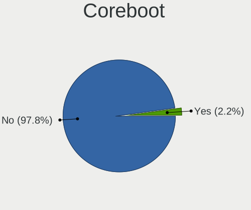
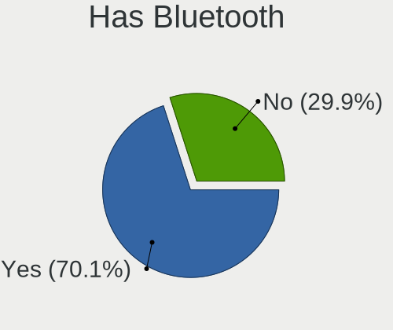
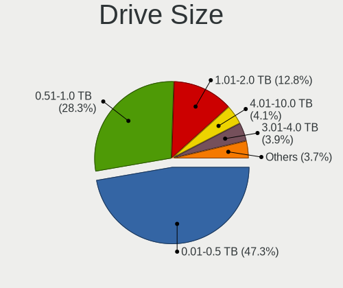
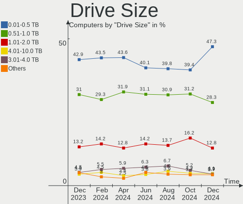
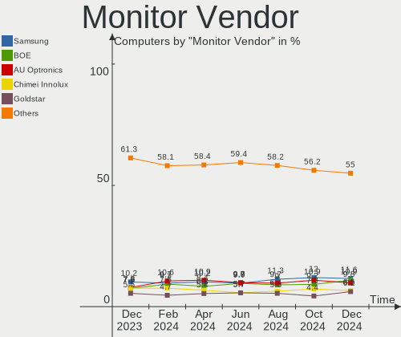
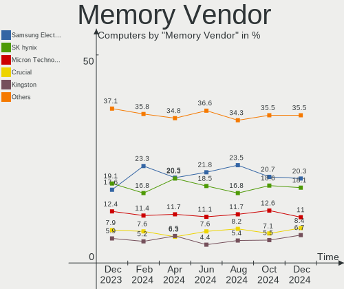
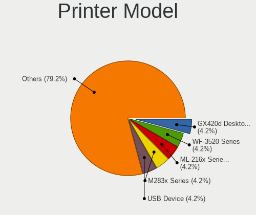
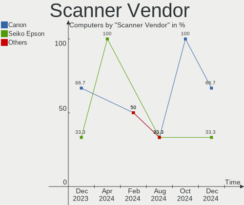
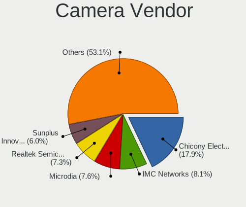
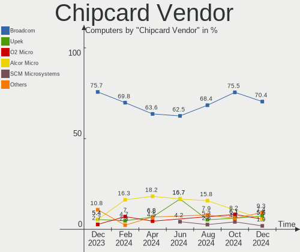

Linux in USA - Hardware Trends
------------------------------

A project to identify most popular hardware characteristics and track their change
over time based on data collected by Linux users at https://Linux-Hardware.org.

Anyone can contribute to this report by the [hw-probe](https://github.com/linuxhw/hw-probe) tool:

    sudo -E hw-probe -all -upload

This is a report for all computer types. See also reports for [desktops](/Location/USA/Desktop/README.md) and [notebooks](/Location/USA/Notebook/README.md).

Period: Dec, 2022.

Contents
--------

* [ System ](#system)
  - [ OS                       ](#os)
  - [ OS Family                ](#os-family)
  - [ Kernel                   ](#kernel)
  - [ Kernel Family            ](#kernel-family)
  - [ Kernel Major Ver.        ](#kernel-major-ver)
  - [ Arch                     ](#arch)
  - [ DE                       ](#de)
  - [ Display Server           ](#display-server)
  - [ Display Manager          ](#display-manager)
  - [ OS Lang                  ](#os-lang)
  - [ Boot Mode                ](#boot-mode)
  - [ Filesystem               ](#filesystem)
  - [ Part. scheme             ](#part-scheme)
  - [ Dual Boot with Linux/BSD ](#dual-boot-with-linuxbsd)
  - [ Dual Boot (Win)          ](#dual-boot-win)

* [ Board ](#board)
  - [ Vendor                   ](#vendor)
  - [ Model                    ](#model)
  - [ Model Family             ](#model-family)
  - [ MFG Year                 ](#mfg-year)
  - [ Form Factor              ](#form-factor)
  - [ Secure Boot              ](#secure-boot)
  - [ Coreboot                 ](#coreboot)
  - [ RAM Size                 ](#ram-size)
  - [ RAM Used                 ](#ram-used)
  - [ Total Drives             ](#total-drives)
  - [ Has CD-ROM               ](#has-cd-rom)
  - [ Has Ethernet             ](#has-ethernet)
  - [ Has WiFi                 ](#has-wifi)
  - [ Has Bluetooth            ](#has-bluetooth)

* [ Location ](#location)
  - [ Country                  ](#country)
  - [ City                     ](#city)

* [ Drives ](#drives)
  - [ Drive Vendor             ](#drive-vendor)
  - [ Drive Model              ](#drive-model)
  - [ HDD Vendor               ](#hdd-vendor)
  - [ SSD Vendor               ](#ssd-vendor)
  - [ Drive Kind               ](#drive-kind)
  - [ Drive Connector          ](#drive-connector)
  - [ Drive Size               ](#drive-size)
  - [ Space Total              ](#space-total)
  - [ Space Used               ](#space-used)
  - [ Malfunc. Drives          ](#malfunc-drives)
  - [ Malfunc. Drive Vendor    ](#malfunc-drive-vendor)
  - [ Malfunc. HDD Vendor      ](#malfunc-hdd-vendor)
  - [ Malfunc. Drive Kind      ](#malfunc-drive-kind)
  - [ Failed Drives            ](#failed-drives)
  - [ Failed Drive Vendor      ](#failed-drive-vendor)
  - [ Drive Status             ](#drive-status)

* [ Storage controller ](#storage-controller)
  - [ Storage Vendor           ](#storage-vendor)
  - [ Storage Model            ](#storage-model)
  - [ Storage Kind             ](#storage-kind)

* [ Processor ](#processor)
  - [ CPU Vendor               ](#cpu-vendor)
  - [ CPU Model                ](#cpu-model)
  - [ CPU Model Family         ](#cpu-model-family)
  - [ CPU Cores                ](#cpu-cores)
  - [ CPU Sockets              ](#cpu-sockets)
  - [ CPU Threads              ](#cpu-threads)
  - [ CPU Op-Modes             ](#cpu-op-modes)
  - [ CPU Microcode            ](#cpu-microcode)
  - [ CPU Microarch            ](#cpu-microarch)

* [ Graphics ](#graphics)
  - [ GPU Vendor               ](#gpu-vendor)
  - [ GPU Model                ](#gpu-model)
  - [ GPU Combo                ](#gpu-combo)
  - [ GPU Driver               ](#gpu-driver)
  - [ GPU Memory               ](#gpu-memory)

* [ Monitor ](#monitor)
  - [ Monitor Vendor           ](#monitor-vendor)
  - [ Monitor Model            ](#monitor-model)
  - [ Monitor Resolution       ](#monitor-resolution)
  - [ Monitor Diagonal         ](#monitor-diagonal)
  - [ Monitor Width            ](#monitor-width)
  - [ Aspect Ratio             ](#aspect-ratio)
  - [ Monitor Area             ](#monitor-area)
  - [ Pixel Density            ](#pixel-density)
  - [ Multiple Monitors        ](#multiple-monitors)

* [ Network ](#network)
  - [ Net Controller Vendor    ](#net-controller-vendor)
  - [ Net Controller Model     ](#net-controller-model)
  - [ Wireless Vendor          ](#wireless-vendor)
  - [ Wireless Model           ](#wireless-model)
  - [ Ethernet Vendor          ](#ethernet-vendor)
  - [ Ethernet Model           ](#ethernet-model)
  - [ Net Controller Kind      ](#net-controller-kind)
  - [ Used Controller          ](#used-controller)
  - [ NICs                     ](#nics)
  - [ IPv6                     ](#ipv6)

* [ Bluetooth ](#bluetooth)
  - [ Bluetooth Vendor         ](#bluetooth-vendor)
  - [ Bluetooth Model          ](#bluetooth-model)

* [ Sound ](#sound)
  - [ Sound Vendor             ](#sound-vendor)
  - [ Sound Model              ](#sound-model)

* [ Memory ](#memory)
  - [ Memory Vendor            ](#memory-vendor)
  - [ Memory Model             ](#memory-model)
  - [ Memory Kind              ](#memory-kind)
  - [ Memory Form Factor       ](#memory-form-factor)
  - [ Memory Size              ](#memory-size)
  - [ Memory Speed             ](#memory-speed)

* [ Printers & scanners ](#printers--scanners)
  - [ Printer Vendor           ](#printer-vendor)
  - [ Printer Model            ](#printer-model)
  - [ Scanner Vendor           ](#scanner-vendor)
  - [ Scanner Model            ](#scanner-model)

* [ Camera ](#camera)
  - [ Camera Vendor            ](#camera-vendor)
  - [ Camera Model             ](#camera-model)

* [ Security ](#security)
  - [ Fingerprint Vendor       ](#fingerprint-vendor)
  - [ Fingerprint Model        ](#fingerprint-model)
  - [ Chipcard Vendor          ](#chipcard-vendor)
  - [ Chipcard Model           ](#chipcard-model)

* [ Unsupported ](#unsupported)
  - [ Unsupported Devices      ](#unsupported-devices)
  - [ Unsupported Device Types ](#unsupported-device-types)

System
------

OS
--

Installed operating systems

| Name                         | Computers | Percent |
|------------------------------|-----------|---------|
| Ubuntu 22.04                 | 177       | 17.65%  |
| Fedora 37                    | 73        | 7.28%   |
| Pop!_OS 22.04                | 62        | 6.18%   |
| Debian 11                    | 62        | 6.18%   |
| Linux Mint 21                | 51        | 5.08%   |
| Zorin 16                     | 49        | 4.89%   |
| Ubuntu 22.10                 | 40        | 3.99%   |
| Arch Rolling                 | 31        | 3.09%   |
| Ubuntu 20.04                 | 30        | 2.99%   |
| Linux Mint 20.3              | 26        | 2.59%   |
| KDE neon 22.04               | 22        | 2.19%   |
| Gentoo 2.9                   | 19        | 1.89%   |
| Linux Mint 21.1              | 17        | 1.69%   |
| OpenMandriva 4.3             | 16        | 1.6%    |
| Manjaro                      | 16        | 1.6%    |
| openSUSE Tumbleweed-XXXXXXXX | 15        | 1.5%    |
| Nobara 36                    | 15        | 1.5%    |
| Manjaro 22.0.0               | 15        | 1.5%    |
| OpenMandriva 4.50            | 14        | 1.4%    |
| Kubuntu 22.10                | 13        | 1.3%    |
| Kubuntu 22.04                | 13        | 1.3%    |
| SteamOS 3.4.2                | 11        | 1.1%    |
| Kali 2022.4                  | 10        | 1%      |
| SteamOS 3.3.2                | 9         | 0.9%    |
| OpenMandriva 22.12           | 9         | 0.9%    |
| Fedora 36                    | 9         | 0.9%    |
| ArcoLinux Rolling            | 9         | 0.9%    |
| EndeavourOS Rolling          | 8         | 0.8%    |
| Ubuntu 18.04                 | 7         | 0.7%    |
| SteamOS 3.4                  | 7         | 0.7%    |
| Garuda Linux Soaring         | 7         | 0.7%    |
| Debian                       | 7         | 0.7%    |
| Xubuntu 22.04                | 6         | 0.6%    |
| Ubuntu MATE 22.04            | 6         | 0.6%    |
| SteamOS 3.4.4                | 5         | 0.5%    |
| SteamOS 3.3.3                | 5         | 0.5%    |
| MX 21                        | 5         | 0.5%    |
| LMDE 5                       | 5         | 0.5%    |
| Ubuntu MATE 22.10            | 4         | 0.4%    |
| SteamOS 3.4.3                | 4         | 0.4%    |

OS Family
---------

OS without a version

| Name              | Computers | Percent |
|-------------------|-----------|---------|
| Ubuntu            | 255       | 25.42%  |
| Linux Mint        | 103       | 10.27%  |
| Fedora            | 85        | 8.47%   |
| Debian            | 72        | 7.18%   |
| Pop!_OS           | 62        | 6.18%   |
| Zorin             | 49        | 4.89%   |
| SteamOS           | 42        | 4.19%   |
| OpenMandriva      | 42        | 4.19%   |
| Manjaro           | 32        | 3.19%   |
| Arch              | 31        | 3.09%   |
| Kubuntu           | 29        | 2.89%   |
| KDE neon          | 23        | 2.29%   |
| Gentoo            | 20        | 1.99%   |
| openSUSE          | 18        | 1.79%   |
| Nobara            | 15        | 1.5%    |
| Kali              | 12        | 1.2%    |
| Xubuntu           | 11        | 1.1%    |
| Ubuntu MATE       | 10        | 1%      |
| ArcoLinux         | 10        | 1%      |
| Garuda Linux      | 9         | 0.9%    |
| EndeavourOS       | 8         | 0.8%    |
| Lubuntu           | 7         | 0.7%    |
| Ubuntu Unity      | 5         | 0.5%    |
| MX                | 5         | 0.5%    |
| LMDE              | 5         | 0.5%    |
| Rocky Linux       | 4         | 0.4%    |
| RHEL              | 3         | 0.3%    |
| Elementary        | 3         | 0.3%    |
| Ubuntu Studio     | 2         | 0.2%    |
| Ubuntu Budgie     | 2         | 0.2%    |
| Parrot            | 2         | 0.2%    |
| Endless           | 2         | 0.2%    |
| Clear Linux       | 2         | 0.2%    |
| ChimeraOS         | 2         | 0.2%    |
| Xero              | 1         | 0.1%    |
| Void Linux        | 1         | 0.1%    |
| Ultramarine Linux | 1         | 0.1%    |
| Ubuntu-buildvar   | 1         | 0.1%    |
| Ubuntu Kylin      | 1         | 0.1%    |
| Trisquel          | 1         | 0.1%    |

Kernel
------

Version of the Linux kernel

| Version                    | Computers | Percent |
|----------------------------|-----------|---------|
| 5.15.0-56-generic          | 291       | 29.01%  |
| 5.19.0-26-generic          | 41        | 4.09%   |
| 6.0.6-76060006-generic     | 39        | 3.89%   |
| 5.4.0-135-generic          | 27        | 2.69%   |
| 5.10.0-20-amd64            | 27        | 2.69%   |
| 6.0.12-76060006-generic    | 21        | 2.09%   |
| 5.15.0-53-generic          | 21        | 2.09%   |
| 6.0.12-300.fc37.x86_64     | 20        | 1.99%   |
| 5.13.0-valve36-1-neptune   | 20        | 1.99%   |
| 5.13.0-valve21.3-1-neptune | 17        | 1.69%   |
| 5.16.7-desktop-1omv4003    | 16        | 1.6%    |
| 6.0.10-300.fc37.x86_64     | 15        | 1.5%    |
| 5.10.0-19-amd64            | 14        | 1.4%    |
| 5.10.0-18-amd64            | 14        | 1.4%    |
| 6.0.15-300.fc37.x86_64     | 13        | 1.3%    |
| 6.0.12-arch1-1             | 13        | 1.3%    |
| 6.0.10-201.fc36.x86_64     | 13        | 1.3%    |
| 5.15.0-43-generic          | 12        | 1.2%    |
| 5.15.0-41-generic          | 12        | 1.2%    |
| 6.1.1-arch1-1              | 10        | 1%      |
| 6.0.11-300.fc37.x86_64     | 10        | 1%      |
| 5.19.12-desktop-2omv4090   | 10        | 1%      |
| 5.15.0-57-generic          | 10        | 1%      |
| 6.0.12-1-default           | 9         | 0.9%    |
| 6.0.10-desktop-2omv22090   | 9         | 0.9%    |
| 5.15.81-1-MANJARO          | 9         | 0.9%    |
| 5.4.0-132-generic          | 8         | 0.8%    |
| 5.15.0-52-generic          | 8         | 0.8%    |
| 5.19.0-21-generic          | 7         | 0.7%    |
| 5.15.78-1-MANJARO          | 6         | 0.6%    |
| 6.1.1-zen1-1-zen           | 5         | 0.5%    |
| 6.0.14-300.fc37.x86_64     | 5         | 0.5%    |
| 6.0.0-6-amd64              | 5         | 0.5%    |
| 5.19.0-28-generic          | 5         | 0.5%    |
| 5.13.0-valve35-1-neptune   | 5         | 0.5%    |
| 6.1.1-1-MANJARO            | 4         | 0.4%    |
| 6.0.9-arch1-1              | 4         | 0.4%    |
| 6.0.10-arch2-1             | 4         | 0.4%    |
| 6.0.0-kali6-amd64          | 4         | 0.4%    |
| 5.15.80-gentoo-x86_64      | 4         | 0.4%    |

Kernel Family
-------------

Linux kernel without a distro release

| Version | Computers | Percent |
|---------|-----------|---------|
| 5.15.0  | 369       | 36.79%  |
| 6.0.12  | 68        | 6.78%   |
| 5.19.0  | 62        | 6.18%   |
| 5.10.0  | 61        | 6.08%   |
| 6.0.10  | 50        | 4.99%   |
| 5.4.0   | 44        | 4.39%   |
| 5.13.0  | 44        | 4.39%   |
| 6.0.6   | 39        | 3.89%   |
| 6.0.0   | 27        | 2.69%   |
| 6.1.1   | 23        | 2.29%   |
| 6.0.11  | 21        | 2.09%   |
| 5.16.7  | 16        | 1.6%    |
| 6.0.15  | 14        | 1.4%    |
| 6.0.9   | 12        | 1.2%    |
| 5.19.12 | 10        | 1%      |
| 5.15.81 | 10        | 1%      |
| 5.14.0  | 9         | 0.9%    |
| 6.0.14  | 8         | 0.8%    |
| 6.1.0   | 7         | 0.7%    |
| 6.0.8   | 7         | 0.7%    |
| 5.15.80 | 6         | 0.6%    |
| 5.15.78 | 6         | 0.6%    |
| 4.15.0  | 6         | 0.6%    |
| 6.0.13  | 5         | 0.5%    |
| 5.15.75 | 5         | 0.5%    |
| 5.18.0  | 4         | 0.4%    |
| 5.15.85 | 4         | 0.4%    |
| 5.15.74 | 4         | 0.4%    |
| 6.0.7   | 3         | 0.3%    |
| 5.19.11 | 3         | 0.3%    |
| 5.17.0  | 3         | 0.3%    |
| 5.15.84 | 3         | 0.3%    |
| 5.15.83 | 3         | 0.3%    |
| 5.15.82 | 3         | 0.3%    |
| 5.14.21 | 3         | 0.3%    |
| 6.0.2   | 2         | 0.2%    |
| 5.19.5  | 2         | 0.2%    |
| 5.19.17 | 2         | 0.2%    |
| 5.19.16 | 2         | 0.2%    |
| 5.19.13 | 2         | 0.2%    |

Kernel Major Ver.
-----------------

Linux kernel major version

| Version | Computers | Percent |
|---------|-----------|---------|
| 5.15    | 418       | 41.67%  |
| 6.0     | 257       | 25.62%  |
| 5.19    | 85        | 8.47%   |
| 5.10    | 66        | 6.58%   |
| 5.4     | 45        | 4.49%   |
| 5.13    | 44        | 4.39%   |
| 6.1     | 30        | 2.99%   |
| 5.16    | 19        | 1.89%   |
| 5.14    | 12        | 1.2%    |
| 5.18    | 9         | 0.9%    |
| 4.15    | 6         | 0.6%    |
| 5.17    | 4         | 0.4%    |
| 5.11    | 3         | 0.3%    |
| 4.4     | 2         | 0.2%    |
| 4.18    | 2         | 0.2%    |
| 4.19    | 1         | 0.1%    |

Arch
----

OS architecture (x86_64, i586, etc.)

| Name    | Computers | Percent |
|---------|-----------|---------|
| x86_64  | 988       | 98.5%   |
| aarch64 | 10        | 1%      |
| i686    | 4         | 0.4%    |
| armv7l  | 1         | 0.1%    |

DE
--

Desktop Environment

| Name                   | Computers | Percent |
|------------------------|-----------|---------|
| GNOME                  | 482       | 48.06%  |
| KDE5                   | 239       | 23.83%  |
| X-Cinnamon             | 98        | 9.77%   |
| XFCE                   | 66        | 6.58%   |
| Unknown                | 44        | 4.39%   |
| MATE                   | 28        | 2.79%   |
| LXQt                   | 6         | 0.6%    |
| Cinnamon               | 6         | 0.6%    |
| Unity                  | 4         | 0.4%    |
| i3                     | 4         | 0.4%    |
| Budgie                 | 4         | 0.4%    |
| Pantheon               | 3         | 0.3%    |
| Trinity                | 2         | 0.2%    |
| sway                   | 2         | 0.2%    |
| Openbox                | 2         | 0.2%    |
| GNOME Classic          | 2         | 0.2%    |
| awesome                | 2         | 0.2%    |
| UKUI                   | 1         | 0.1%    |
| LXDE                   | 1         | 0.1%    |
| LeftWM                 | 1         | 0.1%    |
| KDE                    | 1         | 0.1%    |
| i3-with-shmlog         | 1         | 0.1%    |
| graphite:Wayfire:GNOME | 1         | 0.1%    |
| fvwm                   | 1         | 0.1%    |
| Enlightenment          | 1         | 0.1%    |
| Deepin                 | 1         | 0.1%    |

Display Server
--------------

X11 or Wayland

| Name    | Computers | Percent |
|---------|-----------|---------|
| X11     | 662       | 66%     |
| Wayland | 283       | 28.22%  |
| Unknown | 33        | 3.29%   |
| Tty     | 25        | 2.49%   |

Display Manager
---------------

SDDM, LightDM, etc.

| Name    | Computers | Percent |
|---------|-----------|---------|
| Unknown | 394       | 39.28%  |
| GDM3    | 254       | 25.32%  |
| LightDM | 142       | 14.16%  |
| SDDM    | 129       | 12.86%  |
| GDM     | 76        | 7.58%   |
| XDM     | 3         | 0.3%    |
| SLiM    | 2         | 0.2%    |
| TDM     | 1         | 0.1%    |
| LXDM    | 1         | 0.1%    |
| KDM     | 1         | 0.1%    |

OS Lang
-------

Language

| Lang    | Computers | Percent |
|---------|-----------|---------|
| en_US   | 957       | 95.41%  |
| C       | 16        | 1.6%    |
| Unknown | 10        | 1%      |
| en_CA   | 5         | 0.5%    |
| POSIX   | 4         | 0.4%    |
| es_US   | 4         | 0.4%    |
| C.UTF8  | 2         | 0.2%    |
| ru_RU   | 1         | 0.1%    |
| fr_FR   | 1         | 0.1%    |
| en_PH   | 1         | 0.1%    |
| en_GB   | 1         | 0.1%    |
| en_AU   | 1         | 0.1%    |

Boot Mode
---------

EFI or BIOS

| Mode | Computers | Percent |
|------|-----------|---------|
| EFI  | 538       | 53.64%  |
| BIOS | 465       | 46.36%  |

Filesystem
----------

Type of filesystem

| Type    | Computers | Percent |
|---------|-----------|---------|
| Ext4    | 696       | 69.39%  |
| Btrfs   | 198       | 19.74%  |
| Overlay | 77        | 7.68%   |
| Xfs     | 16        | 1.6%    |
| Zfs     | 13        | 1.3%    |
| Rootfs  | 1         | 0.1%    |
| F2fs    | 1         | 0.1%    |
| Ext3    | 1         | 0.1%    |

Part. scheme
------------

Scheme of partitioning

| Type    | Computers | Percent |
|---------|-----------|---------|
| GPT     | 572       | 57.03%  |
| Unknown | 351       | 35%     |
| MBR     | 80        | 7.98%   |

Dual Boot with Linux/BSD
------------------------

Hosting more than one Linux/BSD

| Dual boot | Computers | Percent |
|-----------|-----------|---------|
| No        | 889       | 88.63%  |
| Yes       | 114       | 11.37%  |

Dual Boot (Win)
---------------

Hosting Linux and Windows

| Dual boot | Computers | Percent |
|-----------|-----------|---------|
| No        | 793       | 79.06%  |
| Yes       | 210       | 20.94%  |

Board
-----

Vendor
------

Motherboard manufacturer

| Name                    | Computers | Percent |
|-------------------------|-----------|---------|
| Dell                    | 169       | 16.85%  |
| Hewlett-Packard         | 163       | 16.25%  |
| Lenovo                  | 123       | 12.26%  |
| ASUSTek Computer        | 118       | 11.76%  |
| MSI                     | 74        | 7.38%   |
| Apple                   | 47        | 4.69%   |
| Gigabyte Technology     | 41        | 4.09%   |
| Valve                   | 38        | 3.79%   |
| Acer                    | 29        | 2.89%   |
| ASRock                  | 27        | 2.69%   |
| Google                  | 22        | 2.19%   |
| Intel                   | 15        | 1.5%    |
| System76                | 12        | 1.2%    |
| GPU Company             | 11        | 1.1%    |
| Unknown                 | 9         | 0.9%    |
| Supermicro              | 8         | 0.8%    |
| AZW                     | 8         | 0.8%    |
| Toshiba                 | 6         | 0.6%    |
| Samsung Electronics     | 6         | 0.6%    |
| Raspberry Pi Foundation | 6         | 0.6%    |
| Pegatron                | 6         | 0.6%    |
| Alienware               | 5         | 0.5%    |
| Razer                   | 4         | 0.4%    |
| Gateway                 | 3         | 0.3%    |
| Biostar                 | 3         | 0.3%    |
| BESSTAR Tech            | 3         | 0.3%    |
| Sony                    | 2         | 0.2%    |
| Panasonic               | 2         | 0.2%    |
| Notebook                | 2         | 0.2%    |
| Microsoft               | 2         | 0.2%    |
| LG Electronics          | 2         | 0.2%    |
| GPD                     | 2         | 0.2%    |
| Fujitsu                 | 2         | 0.2%    |
| Framework               | 2         | 0.2%    |
| ECS                     | 2         | 0.2%    |
| ATOPNUC                 | 2         | 0.2%    |
| SK hynix                | 1         | 0.1%    |
| Shuttle                 | 1         | 0.1%    |
| Radxa                   | 1         | 0.1%    |
| Pine Microsystems       | 1         | 0.1%    |

Model
-----

Motherboard model

| Name                                  | Computers | Percent |
|---------------------------------------|-----------|---------|
| Valve Jupiter                         | 38        | 3.79%   |
| ASUS All Series                       | 9         | 0.9%    |
| Unknown                               | 9         | 0.9%    |
| Dell Latitude E7440                   | 8         | 0.8%    |
| ASUS TUF Gaming X570-PLUS             | 7         | 0.7%    |
| GPU Company GWTC116-2                 | 5         | 0.5%    |
| ASUS ROG STRIX B450-F GAMING          | 5         | 0.5%    |
| MSI MS-7C91                           | 4         | 0.4%    |
| HP Stream Laptop 14-cb1xxx            | 4         | 0.4%    |
| Dell OptiPlex 790                     | 4         | 0.4%    |
| Dell OptiPlex 7010                    | 4         | 0.4%    |
| Dell Latitude E6430                   | 4         | 0.4%    |
| Apple MacPro5,1                       | 4         | 0.4%    |
| Apple MacBookAir7,2                   | 4         | 0.4%    |
| System76 Thelio                       | 3         | 0.3%    |
| System76 Gazelle                      | 3         | 0.3%    |
| RPi Raspberry Pi 4 Model B Rev 1.4    | 3         | 0.3%    |
| MSI MS-7C95                           | 3         | 0.3%    |
| MSI MS-7C56                           | 3         | 0.3%    |
| Lenovo Yoga 7 15ITL5 82BJ             | 3         | 0.3%    |
| HP Spectre x360 Convertible 13t-aw100 | 3         | 0.3%    |
| HP Pavilion g7                        | 3         | 0.3%    |
| HP Pavilion dv7                       | 3         | 0.3%    |
| HP EliteDesk 800 G1 SFF               | 3         | 0.3%    |
| HP 15 Notebook PC                     | 3         | 0.3%    |
| GPU Company GWNR71517                 | 3         | 0.3%    |
| Dell OptiPlex 3050                    | 3         | 0.3%    |
| Dell OptiPlex 3020                    | 3         | 0.3%    |
| Dell Inspiron 530                     | 3         | 0.3%    |
| ASUS PRIME B550M-A                    | 3         | 0.3%    |
| Apple MacBookPro9,2                   | 3         | 0.3%    |
| Apple MacBookPro10,1                  | 3         | 0.3%    |
| Apple MacBookAir7,1                   | 3         | 0.3%    |
| Apple iMac12,2                        | 3         | 0.3%    |
| System76 Oryx Pro                     | 2         | 0.2%    |
| Supermicro Super Server               | 2         | 0.2%    |
| Razer Blade 15 (2022) - RZ09-0421     | 2         | 0.2%    |
| MSI MS-7C75                           | 2         | 0.2%    |
| MSI MS-7C37                           | 2         | 0.2%    |
| MSI MS-7B86                           | 2         | 0.2%    |

Model Family
------------

Motherboard model prefix

| Name                  | Computers | Percent |
|-----------------------|-----------|---------|
| Lenovo ThinkPad       | 51        | 5.08%   |
| Dell Inspiron         | 48        | 4.79%   |
| Valve Jupiter         | 38        | 3.79%   |
| Dell Latitude         | 35        | 3.49%   |
| ASUS ROG              | 30        | 2.99%   |
| Dell OptiPlex         | 29        | 2.89%   |
| HP Pavilion           | 28        | 2.79%   |
| Dell XPS              | 24        | 2.39%   |
| ASUS PRIME            | 22        | 2.19%   |
| HP EliteBook          | 17        | 1.69%   |
| Acer Aspire           | 17        | 1.69%   |
| HP Laptop             | 15        | 1.5%    |
| Lenovo ThinkCentre    | 14        | 1.4%    |
| Lenovo IdeaPad        | 14        | 1.4%    |
| Dell Precision        | 13        | 1.3%    |
| HP Spectre            | 12        | 1.2%    |
| HP Compaq             | 11        | 1.1%    |
| ASUS TUF              | 11        | 1.1%    |
| Lenovo Yoga           | 10        | 1%      |
| HP Stream             | 10        | 1%      |
| HP ProBook            | 10        | 1%      |
| HP EliteDesk          | 9         | 0.9%    |
| ASUS All              | 9         | 0.9%    |
| Unknown               | 9         | 0.9%    |
| HP ENVY               | 8         | 0.8%    |
| HP ProDesk            | 7         | 0.7%    |
| Dell Vostro           | 7         | 0.7%    |
| Apple MacBookAir7     | 7         | 0.7%    |
| Toshiba Satellite     | 6         | 0.6%    |
| RPi Raspberry         | 6         | 0.6%    |
| Lenovo Legion         | 6         | 0.6%    |
| HP ZBook              | 6         | 0.6%    |
| Apple iMac14          | 6         | 0.6%    |
| Lenovo IdeaPadFlex    | 5         | 0.5%    |
| GPU Company GWTC116-2 | 5         | 0.5%    |
| Razer Blade           | 4         | 0.4%    |
| MSI MS-7C91           | 4         | 0.4%    |
| HP 15                 | 4         | 0.4%    |
| Gigabyte X570         | 4         | 0.4%    |
| ASUS ZenBook          | 4         | 0.4%    |

MFG Year
--------

Motherboard manufacture year

| Year    | Computers | Percent |
|---------|-----------|---------|
| 2022    | 152       | 15.15%  |
| 2021    | 128       | 12.76%  |
| 2020    | 95        | 9.47%   |
| 2019    | 86        | 8.57%   |
| 2017    | 76        | 7.58%   |
| 2018    | 71        | 7.08%   |
| 2012    | 70        | 6.98%   |
| 2013    | 64        | 6.38%   |
| 2011    | 49        | 4.89%   |
| 2015    | 45        | 4.49%   |
| 2014    | 43        | 4.29%   |
| 2016    | 30        | 2.99%   |
| 2010    | 26        | 2.59%   |
| 2009    | 23        | 2.29%   |
| 2008    | 19        | 1.89%   |
| 2007    | 10        | 1%      |
| Unknown | 10        | 1%      |
| 2006    | 3         | 0.3%    |
| 2005    | 1         | 0.1%    |
| 2004    | 1         | 0.1%    |
| 2002    | 1         | 0.1%    |

Form Factor
-----------

Physical design of the computer

| Name           | Computers | Percent |
|----------------|-----------|---------|
| Notebook       | 471       | 46.96%  |
| Desktop        | 400       | 39.88%  |
| Convertible    | 57        | 5.68%   |
| Mini pc        | 26        | 2.59%   |
| All in one     | 21        | 2.09%   |
| Server         | 11        | 1.1%    |
| System on chip | 10        | 1%      |
| Tablet         | 7         | 0.7%    |

Secure Boot
-----------

Enabled or disabled

| State    | Computers | Percent |
|----------|-----------|---------|
| Disabled | 933       | 93.02%  |
| Enabled  | 70        | 6.98%   |

Coreboot
--------

Have coreboot on board

| Used | Computers | Percent |
|------|-----------|---------|
| No   | 978       | 97.51%  |
| Yes  | 25        | 2.49%   |

RAM Size
--------

Total RAM memory

| Size in GB      | Computers | Percent |
|-----------------|-----------|---------|
| 16.01-24.0      | 259       | 25.82%  |
| 8.01-16.0       | 193       | 19.24%  |
| 4.01-8.0        | 177       | 17.65%  |
| 32.01-64.0      | 144       | 14.36%  |
| 3.01-4.0        | 128       | 12.76%  |
| 64.01-256.0     | 44        | 4.39%   |
| 24.01-32.0      | 30        | 2.99%   |
| 1.01-2.0        | 18        | 1.79%   |
| 2.01-3.0        | 4         | 0.4%    |
| 0.51-1.0        | 3         | 0.3%    |
| More than 256.0 | 2         | 0.2%    |
| 0.01-0.5        | 1         | 0.1%    |

RAM Used
--------

Used RAM memory

| Used GB    | Computers | Percent |
|------------|-----------|---------|
| 2.01-3.0   | 277       | 27.62%  |
| 1.01-2.0   | 267       | 26.62%  |
| 4.01-8.0   | 171       | 17.05%  |
| 3.01-4.0   | 170       | 16.95%  |
| 8.01-16.0  | 61        | 6.08%   |
| 0.51-1.0   | 33        | 3.29%   |
| 16.01-24.0 | 11        | 1.1%    |
| 0.01-0.5   | 10        | 1%      |
| 24.01-32.0 | 2         | 0.2%    |
| 32.01-64.0 | 1         | 0.1%    |

Total Drives
------------

Number of drives on board

| Drives | Computers | Percent |
|--------|-----------|---------|
| 1      | 601       | 59.92%  |
| 2      | 239       | 23.83%  |
| 3      | 81        | 8.08%   |
| 4      | 34        | 3.39%   |
| 5      | 22        | 2.19%   |
| 7      | 6         | 0.6%    |
| 6      | 6         | 0.6%    |
| 8      | 5         | 0.5%    |
| 9      | 3         | 0.3%    |
| 0      | 3         | 0.3%    |
| 21     | 1         | 0.1%    |
| 12     | 1         | 0.1%    |
| 11     | 1         | 0.1%    |

Has CD-ROM
----------

Has CD-ROM on board

| Presented | Computers | Percent |
|-----------|-----------|---------|
| No        | 694       | 69.19%  |
| Yes       | 309       | 30.81%  |

Has Ethernet
------------

Has Ethernet on board

| Presented | Computers | Percent |
|-----------|-----------|---------|
| Yes       | 793       | 79.06%  |
| No        | 210       | 20.94%  |

Has WiFi
--------

Has WiFi module

| Presented | Computers | Percent |
|-----------|-----------|---------|
| Yes       | 826       | 82.35%  |
| No        | 177       | 17.65%  |

Has Bluetooth
-------------

Has Bluetooth module

| Presented | Computers | Percent |
|-----------|-----------|---------|
| Yes       | 693       | 69.09%  |
| No        | 310       | 30.91%  |

Location
--------

Country
-------

Geographic location (country)

| Country | Computers | Percent |
|---------|-----------|---------|
| USA     | 1003      | 100%    |

City
----

Geographic location (city)

| City           | Computers | Percent |
|----------------|-----------|---------|
| Bangor         | 30        | 2.99%   |
| Seattle        | 24        | 2.39%   |
| Chicago        | 16        | 1.6%    |
| New York       | 15        | 1.5%    |
| San Antonio    | 13        | 1.3%    |
| Miami          | 12        | 1.2%    |
| Los Angeles    | 11        | 1.1%    |
| Portland       | 10        | 1%      |
| Phoenix        | 9         | 0.9%    |
| Houston        | 9         | 0.9%    |
| Springfield    | 8         | 0.8%    |
| Pittsburgh     | 8         | 0.8%    |
| Kansas City    | 8         | 0.8%    |
| Austin         | 8         | 0.8%    |
| Mesa           | 7         | 0.7%    |
| Las Vegas      | 7         | 0.7%    |
| Denver         | 7         | 0.7%    |
| Dallas         | 7         | 0.7%    |
| Charlotte      | 7         | 0.7%    |
| Philadelphia   | 6         | 0.6%    |
| Atlanta        | 6         | 0.6%    |
| Spokane        | 5         | 0.5%    |
| San Jose       | 5         | 0.5%    |
| Minneapolis    | 5         | 0.5%    |
| Milwaukee      | 5         | 0.5%    |
| Jacksonville   | 5         | 0.5%    |
| Indianapolis   | 5         | 0.5%    |
| Cleveland      | 5         | 0.5%    |
| Beaverton      | 5         | 0.5%    |
| Virginia Beach | 4         | 0.4%    |
| Tampa          | 4         | 0.4%    |
| Santa Clara    | 4         | 0.4%    |
| Rochester      | 4         | 0.4%    |
| Raleigh        | 4         | 0.4%    |
| Olathe         | 4         | 0.4%    |
| Ocala          | 4         | 0.4%    |
| Madison        | 4         | 0.4%    |
| Lincoln        | 4         | 0.4%    |
| Kingston       | 4         | 0.4%    |
| Gainesville    | 4         | 0.4%    |

Drives
------

Drive Vendor
------------

Hard drive vendors

| Vendor                      | Computers | Drives | Percent |
|-----------------------------|-----------|--------|---------|
| Samsung Electronics         | 253       | 305    | 16.92%  |
| WDC                         | 173       | 235    | 11.57%  |
| Seagate                     | 169       | 240    | 11.3%   |
| Sandisk                     | 110       | 121    | 7.36%   |
| Unknown                     | 99        | 108    | 6.62%   |
| Toshiba                     | 70        | 79     | 4.68%   |
| Crucial                     | 50        | 57     | 3.34%   |
| Intel                       | 48        | 58     | 3.21%   |
| SK hynix                    | 47        | 53     | 3.14%   |
| Kingston                    | 47        | 48     | 3.14%   |
| Phison Electronics          | 39        | 41     | 2.61%   |
| Hitachi                     | 38        | 43     | 2.54%   |
| HGST                        | 24        | 30     | 1.61%   |
| Apple                       | 24        | 26     | 1.61%   |
| A-DATA Technology           | 22        | 24     | 1.47%   |
| PNY                         | 21        | 22     | 1.4%    |
| China                       | 21        | 22     | 1.4%    |
| Unknown                     | 19        | 20     | 1.27%   |
| SPCC                        | 18        | 18     | 1.2%    |
| Micron Technology           | 18        | 19     | 1.2%    |
| Kingston Technology Company | 18        | 18     | 1.2%    |
| Silicon Motion              | 13        | 14     | 0.87%   |
| KIOXIA                      | 12        | 12     | 0.8%    |
| Team                        | 9         | 10     | 0.6%    |
| Phison                      | 8         | 9      | 0.54%   |
| Micron/Crucial Technology   | 8         | 9      | 0.54%   |
| Hewlett-Packard             | 8         | 8      | 0.54%   |
| SABRENT                     | 6         | 6      | 0.4%    |
| O2 Micro                    | 6         | 6      | 0.4%    |
| Mushkin                     | 6         | 6      | 0.4%    |
| LITEON                      | 6         | 6      | 0.4%    |
| Inland                      | 5         | 5      | 0.33%   |
| Patriot                     | 4         | 4      | 0.27%   |
| Corsair                     | 4         | 5      | 0.27%   |
| T-FORCE                     | 3         | 3      | 0.2%    |
| Realtek Semiconductor       | 3         | 3      | 0.2%    |
| NGFF                        | 3         | 3      | 0.2%    |
| Mercury                     | 3         | 3      | 0.2%    |
| Maxtor                      | 3         | 3      | 0.2%    |
| LITEONIT                    | 3         | 3      | 0.2%    |

Drive Model
-----------

Hard drive models

| Model                                                  | Computers | Percent |
|--------------------------------------------------------|-----------|---------|
| Samsung NVMe SSD Controller SM981/PM981/PM983 500GB    | 36        | 2.19%   |
| Samsung NVMe SSD Controller PM9A1/PM9A3/980PRO 2TB     | 24        | 1.46%   |
| Unknown                                                | 19        | 1.16%   |
| Unknown MMC Card  64GB                                 | 17        | 1.03%   |
| Unknown MMC Card  32GB                                 | 14        | 0.85%   |
| Seagate ST2000DM008-2FR102 2TB                         | 14        | 0.85%   |
| Kingston Company OM3PDP3 NVMe SSD 512GB                | 14        | 0.85%   |
| Phison PS5013 E13 NVMe Controller 512GB                | 13        | 0.79%   |
| Unknown SD/MMC/MS PRO 64GB                             | 12        | 0.73%   |
| Silicon Motion SM2263EN/SM2263XT SSD Controller 1024GB | 12        | 0.73%   |
| Phison E12 NVMe Controller 1TB                         | 12        | 0.73%   |
| Unknown MMC Card  128GB                                | 11        | 0.67%   |
| Seagate ST500DM002-1BD142 500GB                        | 11        | 0.67%   |
| Samsung SSD 860 EVO 1TB                                | 11        | 0.67%   |
| Kingston SA400S37240G 240GB SSD                        | 11        | 0.67%   |
| WDC WD10EZEX-08WN4A0 1TB                               | 10        | 0.61%   |
| Samsung SSD 850 EVO 500GB                              | 10        | 0.61%   |
| Samsung NVMe SSD Controller SM961/PM961/SM963 256GB    | 10        | 0.61%   |
| Phison E16 PCIe4 NVMe Controller 512GB                 | 10        | 0.61%   |
| Sandisk WD Black SN750 / PC SN730 NVMe SSD 512GB       | 9         | 0.55%   |
| Sandisk WD Black SN850 1TB                             | 8         | 0.49%   |
| SanDisk Extreme SSD 500GB                              | 8         | 0.49%   |
| HGST HTS721010A9E630 1TB                               | 8         | 0.49%   |
| Crucial CT1000MX500SSD1 1TB                            | 8         | 0.49%   |
| Toshiba MQ01ABD100 1TB                                 | 7         | 0.43%   |
| Sandisk WD Blue SN550 NVMe SSD 500GB                   | 7         | 0.43%   |
| Samsung SSD 970 EVO Plus 500GB                         | 7         | 0.43%   |
| Samsung SSD 860 EVO 500GB                              | 7         | 0.43%   |
| Kingston SV300S37A120G 120GB SSD                       | 7         | 0.43%   |
| Unknown MMC Card  512GB                                | 6         | 0.36%   |
| Toshiba XG6 NVMe SSD Controller 256GB                  | 6         | 0.36%   |
| Toshiba DT01ACA100 1TB                                 | 6         | 0.36%   |
| Seagate ST1000LM035-1RK172 1TB                         | 6         | 0.36%   |
| Seagate ST1000LM024 HN-M101MBB 1TB                     | 6         | 0.36%   |
| Seagate ST1000DM003-1SB102 1TB                         | 6         | 0.36%   |
| Samsung SSD 970 EVO Plus 2TB                           | 6         | 0.36%   |
| Samsung SSD 870 QVO 2TB                                | 6         | 0.36%   |
| SABRENT Disk 1TB                                       | 6         | 0.36%   |
| O2 Micro E2M2 64GB                                     | 6         | 0.36%   |
| Intel SSD 660P Series 1024GB                           | 6         | 0.36%   |

HDD Vendor
----------

Hard disk drive vendors

| Vendor              | Computers | Drives | Percent |
|---------------------|-----------|--------|---------|
| Seagate             | 163       | 226    | 36.3%   |
| WDC                 | 134       | 184    | 29.84%  |
| Toshiba             | 52        | 61     | 11.58%  |
| Hitachi             | 38        | 43     | 8.46%   |
| HGST                | 23        | 28     | 5.12%   |
| Unknown             | 13        | 14     | 2.9%    |
| Apple               | 9         | 9      | 2%      |
| Samsung Electronics | 4         | 4      | 0.89%   |
| Maxtor              | 3         | 3      | 0.67%   |
| Fujitsu             | 3         | 3      | 0.67%   |
| USB3.0              | 2         | 2      | 0.45%   |
| ASMT                | 2         | 3      | 0.45%   |
| WD MediaMax         | 1         | 1      | 0.22%   |
| PHD 3.0             | 1         | 1      | 0.22%   |
| Unknown             | 1         | 2      | 0.22%   |

SSD Vendor
----------

Solid state drive vendors

| Vendor              | Computers | Drives | Percent |
|---------------------|-----------|--------|---------|
| Samsung Electronics | 101       | 119    | 21.86%  |
| SanDisk             | 55        | 61     | 11.9%   |
| Crucial             | 45        | 51     | 9.74%   |
| Kingston            | 35        | 36     | 7.58%   |
| WDC                 | 32        | 33     | 6.93%   |
| China               | 21        | 22     | 4.55%   |
| A-DATA Technology   | 20        | 22     | 4.33%   |
| PNY                 | 19        | 20     | 4.11%   |
| SPCC                | 14        | 14     | 3.03%   |
| SK hynix            | 12        | 12     | 2.6%    |
| Apple               | 11        | 11     | 2.38%   |
| Intel               | 10        | 10     | 2.16%   |
| Micron Technology   | 9         | 9      | 1.95%   |
| Team                | 8         | 9      | 1.73%   |
| Hewlett-Packard     | 7         | 7      | 1.52%   |
| LITEON              | 6         | 6      | 1.3%    |
| Mushkin             | 5         | 5      | 1.08%   |
| Inland              | 5         | 5      | 1.08%   |
| Patriot             | 4         | 4      | 0.87%   |
| Unknown             | 4         | 4      | 0.87%   |
| NGFF                | 3         | 3      | 0.65%   |
| Mercury             | 3         | 3      | 0.65%   |
| LITEONIT            | 3         | 3      | 0.65%   |
| Toshiba             | 2         | 2      | 0.43%   |
| TO Exter            | 2         | 2      | 0.43%   |
| Netac               | 2         | 2      | 0.43%   |
| KingSpec            | 2         | 2      | 0.43%   |
| Corsair             | 2         | 2      | 0.43%   |
| VICKTER             | 1         | 1      | 0.22%   |
| Transcend           | 1         | 1      | 0.22%   |
| TEAM T25            | 1         | 1      | 0.22%   |
| T-FORCE             | 1         | 1      | 0.22%   |
| SSSTC               | 1         | 1      | 0.22%   |
| Seagate             | 1         | 1      | 0.22%   |
| SCY                 | 1         | 1      | 0.22%   |
| Plextor             | 1         | 1      | 0.22%   |
| OWC                 | 1         | 1      | 0.22%   |
| Lexar               | 1         | 1      | 0.22%   |
| KingFast            | 1         | 1      | 0.22%   |
| KingDian            | 1         | 1      | 0.22%   |

Drive Kind
----------

HDD or SSD

| Kind    | Computers | Drives | Percent |
|---------|-----------|--------|---------|
| NVMe    | 448       | 541    | 33.26%  |
| SSD     | 405       | 499    | 30.07%  |
| HDD     | 370       | 584    | 27.47%  |
| MMC     | 98        | 102    | 7.28%   |
| Unknown | 26        | 35     | 1.93%   |

Drive Connector
---------------

SATA, SAS, NVMe, etc.

| Type | Computers | Drives | Percent |
|------|-----------|--------|---------|
| SATA | 625       | 986    | 49.64%  |
| NVMe | 444       | 534    | 35.27%  |
| MMC  | 98        | 102    | 7.78%   |
| SAS  | 92        | 139    | 7.31%   |

Drive Size
----------

Size of hard drive

| Size in TB | Computers | Drives | Percent |
|------------|-----------|--------|---------|
| 0.01-0.5   | 399       | 482    | 47.11%  |
| 0.51-1.0   | 263       | 330    | 31.05%  |
| 1.01-2.0   | 93        | 116    | 10.98%  |
| 3.01-4.0   | 37        | 61     | 4.37%   |
| 4.01-10.0  | 30        | 46     | 3.54%   |
| 2.01-3.0   | 18        | 28     | 2.13%   |
| 10.01-20.0 | 7         | 20     | 0.83%   |

Space Total
-----------

Amount of disk space available on the file system

| Size in GB     | Computers | Percent |
|----------------|-----------|---------|
| 101-250        | 219       | 21.83%  |
| 251-500        | 202       | 20.14%  |
| 501-1000       | 174       | 17.35%  |
| More than 3000 | 98        | 9.77%   |
| 1001-2000      | 97        | 9.67%   |
| 51-100         | 66        | 6.58%   |
| 1-20           | 59        | 5.88%   |
| Unknown        | 39        | 3.89%   |
| 2001-3000      | 26        | 2.59%   |
| 21-50          | 23        | 2.29%   |

Space Used
----------

Amount of used disk space

| Used GB        | Computers | Percent |
|----------------|-----------|---------|
| 1-20           | 330       | 32.9%   |
| 21-50          | 175       | 17.45%  |
| 101-250        | 126       | 12.56%  |
| 51-100         | 121       | 12.06%  |
| 251-500        | 82        | 8.18%   |
| 501-1000       | 57        | 5.68%   |
| Unknown        | 39        | 3.89%   |
| More than 3000 | 30        | 2.99%   |
| 1001-2000      | 29        | 2.89%   |
| 2001-3000      | 14        | 1.4%    |

Malfunc. Drives
---------------

Drive models with a malfunction

| Model                                 | Computers | Drives | Percent |
|---------------------------------------|-----------|--------|---------|
| Seagate ST500LT012-9WS142 500GB       | 2         | 2      | 3.08%   |
| Seagate ST500DM002-1BD142 500GB       | 2         | 2      | 3.08%   |
| Kingston SV300S37A120G 120GB SSD      | 2         | 2      | 3.08%   |
| WDC WDS480G2G0A-00JH30 480GB SSD      | 1         | 1      | 1.54%   |
| WDC WD800AAJS-00PSA0 80GB             | 1         | 1      | 1.54%   |
| WDC WD6400AAKS-65A7B0 640GB           | 1         | 1      | 1.54%   |
| WDC WD5000AAKX-08U6AA0 500GB          | 1         | 1      | 1.54%   |
| WDC WD5000AADS-00M2B0 500GB           | 1         | 1      | 1.54%   |
| WDC WD40EZRX-00SPEB0 4TB              | 1         | 1      | 1.54%   |
| WDC WD40EFRX-68N32N0 4TB              | 1         | 1      | 1.54%   |
| WDC WD30EFRX-68EUZN0 3TB              | 1         | 1      | 1.54%   |
| WDC WD30EFRX-68AX9N0 3TB              | 1         | 1      | 1.54%   |
| WDC WD2500BEVS-60UST0 250GB           | 1         | 1      | 1.54%   |
| WDC WD20SPZX-00CRAT0 2TB              | 1         | 1      | 1.54%   |
| WDC WD2000F9YZ-09N20L0 2TB            | 1         | 1      | 1.54%   |
| WDC WD140EDFZ-11A0VA0 14TB            | 1         | 2      | 1.54%   |
| WDC WD10SPZX-24Z10T0 1TB              | 1         | 1      | 1.54%   |
| WDC WD10EZEX-60M2NA0 1TB              | 1         | 1      | 1.54%   |
| WDC WD10EZEX-22RKKA0 1TB              | 1         | 1      | 1.54%   |
| WDC WD10EZEX-08WN4A0 1TB              | 1         | 1      | 1.54%   |
| Toshiba MQ02ABD100H 1TB               | 1         | 1      | 1.54%   |
| Toshiba MK2561GSYN 250GB              | 1         | 1      | 1.54%   |
| Toshiba MK2002TSKB 2TB                | 1         | 6      | 1.54%   |
| Toshiba DT01ACA300 3TB                | 1         | 1      | 1.54%   |
| SPCC Solid State Disk 512GB           | 1         | 1      | 1.54%   |
| SK hynix SH920 mSATA 128GB SSD        | 1         | 1      | 1.54%   |
| SK hynix PC711 HFS001TDE9X073N 1024GB | 1         | 1      | 1.54%   |
| Seagate ST9750420AS 752GB             | 1         | 2      | 1.54%   |
| Seagate ST6000DM003-2CY186 6TB        | 1         | 1      | 1.54%   |
| Seagate ST500LM021-1KJ152 500GB       | 1         | 1      | 1.54%   |
| Seagate ST32000644NS 2TB              | 1         | 1      | 1.54%   |
| Seagate ST31000528AS 1TB              | 1         | 1      | 1.54%   |
| Seagate ST31000524AS 1TB              | 1         | 1      | 1.54%   |
| Seagate ST2000LM 007-1R8174 2TB       | 1         | 1      | 1.54%   |
| Seagate ST2000DM006-2DM164 2TB        | 1         | 1      | 1.54%   |
| Seagate ST1000LM035-1RK172 1TB        | 1         | 1      | 1.54%   |
| Seagate ST1000LM014-1EJ164-SSHD 1TB   | 1         | 1      | 1.54%   |
| Seagate ST1000DM010-2EP102 1TB        | 1         | 1      | 1.54%   |
| Seagate ST1000DM003-9YN162 1TB        | 1         | 1      | 1.54%   |
| SanDisk SSD PLUS 240GB                | 1         | 1      | 1.54%   |

Malfunc. Drive Vendor
---------------------

Vendors of faulty drives

| Vendor              | Computers | Drives | Percent |
|---------------------|-----------|--------|---------|
| Seagate             | 15        | 17     | 25%     |
| WDC                 | 14        | 18     | 23.33%  |
| Hitachi             | 5         | 6      | 8.33%   |
| Toshiba             | 4         | 9      | 6.67%   |
| Samsung Electronics | 4         | 5      | 6.67%   |
| Kingston            | 4         | 4      | 6.67%   |
| SK hynix            | 2         | 2      | 3.33%   |
| SanDisk             | 2         | 2      | 3.33%   |
| Maxtor              | 2         | 2      | 3.33%   |
| Crucial             | 2         | 2      | 3.33%   |
| SPCC                | 1         | 1      | 1.67%   |
| Micron Technology   | 1         | 1      | 1.67%   |
| LITEON              | 1         | 1      | 1.67%   |
| Intel               | 1         | 1      | 1.67%   |
| HGST                | 1         | 1      | 1.67%   |
| Apple               | 1         | 1      | 1.67%   |

Malfunc. HDD Vendor
-------------------

Vendors of faulty HDD drives

| Vendor  | Computers | Drives | Percent |
|---------|-----------|--------|---------|
| Seagate | 15        | 17     | 36.59%  |
| WDC     | 13        | 17     | 31.71%  |
| Hitachi | 5         | 6      | 12.2%   |
| Toshiba | 4         | 9      | 9.76%   |
| Maxtor  | 2         | 2      | 4.88%   |
| HGST    | 1         | 1      | 2.44%   |
| Apple   | 1         | 1      | 2.44%   |

Malfunc. Drive Kind
-------------------

Kinds of faulty drives

| Kind | Computers | Drives | Percent |
|------|-----------|--------|---------|
| HDD  | 37        | 53     | 66.07%  |
| SSD  | 15        | 15     | 26.79%  |
| NVMe | 4         | 5      | 7.14%   |

Failed Drives
-------------

Failed drive models

Zero info for selected period =(

Failed Drive Vendor
-------------------

Failed drive vendors

Zero info for selected period =(

Drive Status
------------

Number of failed and malfunc. drives

| Status   | Computers | Drives | Percent |
|----------|-----------|--------|---------|
| Detected | 623       | 1064   | 58.33%  |
| Works    | 391       | 624    | 36.61%  |
| Malfunc  | 54        | 73     | 5.06%   |

Storage controller
------------------

Storage Vendor
--------------

Storage controller vendors

| Vendor                           | Computers | Percent |
|----------------------------------|-----------|---------|
| Intel                            | 550       | 42.15%  |
| AMD                              | 226       | 17.32%  |
| Samsung Electronics              | 167       | 12.8%   |
| SanDisk                          | 71        | 5.44%   |
| Phison Electronics               | 51        | 3.91%   |
| SK hynix                         | 35        | 2.68%   |
| Kingston Technology Company      | 29        | 2.22%   |
| ASMedia Technology               | 26        | 1.99%   |
| Toshiba America Info Systems     | 16        | 1.23%   |
| Marvell Technology Group         | 16        | 1.23%   |
| Silicon Motion                   | 15        | 1.15%   |
| Micron/Crucial Technology        | 14        | 1.07%   |
| Nvidia                           | 12        | 0.92%   |
| KIOXIA                           | 12        | 0.92%   |
| JMicron Technology               | 10        | 0.77%   |
| Micron Technology                | 9         | 0.69%   |
| Broadcom / LSI                   | 7         | 0.54%   |
| Realtek Semiconductor            | 6         | 0.46%   |
| O2 Micro                         | 6         | 0.46%   |
| Solid State Storage Technology   | 4         | 0.31%   |
| Biwin Storage Technology         | 4         | 0.31%   |
| Apple                            | 3         | 0.23%   |
| Shenzhen Longsys Electronics     | 2         | 0.15%   |
| MAXIO Technology (Hangzhou)      | 2         | 0.15%   |
| LSI Logic / Symbios Logic        | 2         | 0.15%   |
| Hewlett-Packard                  | 2         | 0.15%   |
| ADATA Technology                 | 2         | 0.15%   |
| Yangtze Memory Technologies      | 1         | 0.08%   |
| VIA Technologies                 | 1         | 0.08%   |
| Union Memory (Shenzhen)          | 1         | 0.08%   |
| Silicon Integrated Systems [SiS] | 1         | 0.08%   |
| Silicon Image                    | 1         | 0.08%   |
| INNOGRIT                         | 1         | 0.08%   |

Storage Model
-------------

Storage controller models

| Model                                                                          | Computers | Percent |
|--------------------------------------------------------------------------------|-----------|---------|
| AMD FCH SATA Controller [AHCI mode]                                            | 153       | 10.37%  |
| Samsung NVMe SSD Controller SM981/PM981/PM983                                  | 63        | 4.27%   |
| Intel 8 Series/C220 Series Chipset Family 6-port SATA Controller 1 [AHCI mode] | 47        | 3.19%   |
| Samsung NVMe SSD Controller PM9A1/PM9A3/980PRO                                 | 40        | 2.71%   |
| Samsung NVMe SSD Controller 980                                                | 37        | 2.51%   |
| Intel Volume Management Device NVMe RAID Controller                            | 37        | 2.51%   |
| Intel 82801 Mobile SATA Controller [RAID mode]                                 | 37        | 2.51%   |
| AMD 400 Series Chipset SATA Controller                                         | 32        | 2.17%   |
| Intel 7 Series Chipset Family 6-port SATA Controller [AHCI mode]               | 31        | 2.1%    |
| Intel Sunrise Point-LP SATA Controller [AHCI mode]                             | 30        | 2.03%   |
| Intel 6 Series/C200 Series Chipset Family 6 port Desktop SATA AHCI Controller  | 24        | 1.63%   |
| ASMedia ASM1062 Serial ATA Controller                                          | 24        | 1.63%   |
| Intel Q170/Q150/B150/H170/H110/Z170/CM236 Chipset SATA Controller [AHCI Mode]  | 23        | 1.56%   |
| AMD 500 Series Chipset SATA Controller                                         | 23        | 1.56%   |
| Intel Celeron/Pentium Silver Processor SATA Controller                         | 22        | 1.49%   |
| Intel 200 Series PCH SATA controller [AHCI mode]                               | 22        | 1.49%   |
| SK hynix Gold P31/PC711 NVMe Solid State Drive                                 | 20        | 1.36%   |
| SanDisk Non-Volatile memory controller                                         | 19        | 1.29%   |
| Phison E12 NVMe Controller                                                     | 19        | 1.29%   |
| Intel Non-Volatile memory controller                                           | 19        | 1.29%   |
| AMD SB7x0/SB8x0/SB9x0 IDE Controller                                           | 19        | 1.29%   |
| Intel SATA Controller [RAID mode]                                              | 18        | 1.22%   |
| Kingston Company OM3PDP3 NVMe SSD                                              | 17        | 1.15%   |
| Samsung NVMe SSD Controller SM961/PM961/SM963                                  | 16        | 1.08%   |
| Intel Cannon Lake Mobile PCH SATA AHCI Controller                              | 16        | 1.08%   |
| SanDisk WD Black SN750 / PC SN730 NVMe SSD                                     | 15        | 1.02%   |
| AMD SB7x0/SB8x0/SB9x0 SATA Controller [IDE mode]                               | 15        | 1.02%   |
| SanDisk WD Blue SN550 NVMe SSD                                                 | 14        | 0.95%   |
| Phison E16 PCIe4 NVMe Controller                                               | 14        | 0.95%   |
| Intel Comet Lake SATA AHCI Controller                                          | 14        | 0.95%   |
| Intel 7 Series/C210 Series Chipset Family 6-port SATA Controller [AHCI mode]   | 14        | 0.95%   |
| Silicon Motion SM2263EN/SM2263XT SSD Controller                                | 13        | 0.88%   |
| Phison PS5013 E13 NVMe Controller                                              | 13        | 0.88%   |
| Intel Wildcat Point-LP SATA Controller [AHCI Mode]                             | 13        | 0.88%   |
| Intel 8 Series SATA Controller 1 [AHCI mode]                                   | 13        | 0.88%   |
| Intel 500 Series Chipset Family SATA AHCI Controller                           | 13        | 0.88%   |
| Intel SSD 660P Series                                                          | 12        | 0.81%   |
| Intel Alder Lake-S PCH SATA Controller [AHCI Mode]                             | 12        | 0.81%   |
| Intel 82801IBM/IEM (ICH9M/ICH9M-E) 4 port SATA Controller [AHCI mode]          | 12        | 0.81%   |
| Intel 6 Series/C200 Series Chipset Family 6 port Mobile SATA AHCI Controller   | 12        | 0.81%   |

Storage Kind
------------

Kind of storage controller (IDE, SATA, NVMe, SAS, ...)

| Kind | Computers | Percent |
|------|-----------|---------|
| SATA | 658       | 50.38%  |
| NVMe | 444       | 34%     |
| RAID | 108       | 8.27%   |
| IDE  | 86        | 6.58%   |
| SAS  | 10        | 0.77%   |

Processor
---------

CPU Vendor
----------

Processor vendors

| Vendor   | Computers | Percent |
|----------|-----------|---------|
| Intel    | 681       | 67.9%   |
| AMD      | 311       | 31.01%  |
| ARM      | 10        | 1%      |
| Qualcomm | 1         | 0.1%    |

CPU Model
---------

Processor models

| Model                                   | Computers | Percent |
|-----------------------------------------|-----------|---------|
| AMD Custom APU 0405                     | 38        | 3.79%   |
| Intel Celeron N4020 CPU @ 1.10GHz       | 17        | 1.69%   |
| Intel 12th Gen Core i7-1260P            | 14        | 1.4%    |
| Intel 11th Gen Core i5-1135G7 @ 2.40GHz | 12        | 1.2%    |
| Intel 11th Gen Core i7-1165G7 @ 2.80GHz | 11        | 1.1%    |
| Intel Core i5-2400 CPU @ 3.10GHz        | 9         | 0.9%    |
| Intel 12th Gen Core i5-1235U            | 9         | 0.9%    |
| ARM Processor                           | 9         | 0.9%    |
| AMD Ryzen 7 5700U with Radeon Graphics  | 9         | 0.9%    |
| AMD Ryzen 5 5600G with Radeon Graphics  | 9         | 0.9%    |
| Intel Core i7-10750H CPU @ 2.60GHz      | 8         | 0.8%    |
| AMD Ryzen 5 3600 6-Core Processor       | 8         | 0.8%    |
| Intel Core i7-8750H CPU @ 2.20GHz       | 7         | 0.7%    |
| Intel Core i7-3630QM CPU @ 2.40GHz      | 7         | 0.7%    |
| Intel Core i5-7200U CPU @ 2.50GHz       | 7         | 0.7%    |
| Intel Core i5-4300U CPU @ 1.90GHz       | 7         | 0.7%    |
| AMD Ryzen 9 5950X 16-Core Processor     | 7         | 0.7%    |
| AMD Ryzen 9 5900X 12-Core Processor     | 7         | 0.7%    |
| AMD Ryzen 7 5800X 8-Core Processor      | 7         | 0.7%    |
| AMD Ryzen 7 3700X 8-Core Processor      | 7         | 0.7%    |
| Intel Core i7-9750H CPU @ 2.60GHz       | 6         | 0.6%    |
| Intel Core i7-3770 CPU @ 3.40GHz        | 6         | 0.6%    |
| Intel Core i5-8250U CPU @ 1.60GHz       | 6         | 0.6%    |
| Intel Core i5-10210U CPU @ 1.60GHz      | 6         | 0.6%    |
| Intel Celeron CPU N2840 @ 2.16GHz       | 6         | 0.6%    |
| AMD Ryzen 5 2600 Six-Core Processor     | 6         | 0.6%    |
| Intel Core i7-8550U CPU @ 1.80GHz       | 5         | 0.5%    |
| Intel Core i7-4790K CPU @ 4.00GHz       | 5         | 0.5%    |
| Intel Core i7-2600 CPU @ 3.40GHz        | 5         | 0.5%    |
| Intel Core i5-5250U CPU @ 1.60GHz       | 5         | 0.5%    |
| Intel Core i5-4570 CPU @ 3.20GHz        | 5         | 0.5%    |
| Intel Celeron J4125 CPU @ 2.00GHz       | 5         | 0.5%    |
| Intel 12th Gen Core i7-12700H           | 5         | 0.5%    |
| Intel 12th Gen Core i7-1255U            | 5         | 0.5%    |
| AMD Ryzen 9 3900X 12-Core Processor     | 5         | 0.5%    |
| Intel Pentium Silver N6000 @ 1.10GHz    | 4         | 0.4%    |
| Intel Core i7-8700K CPU @ 3.70GHz       | 4         | 0.4%    |
| Intel Core i7-8665U CPU @ 1.90GHz       | 4         | 0.4%    |
| Intel Core i7-7700HQ CPU @ 2.80GHz      | 4         | 0.4%    |
| Intel Core i7-7700 CPU @ 3.60GHz        | 4         | 0.4%    |

CPU Model Family
----------------

Processor model prefix

| Model                   | Computers | Percent |
|-------------------------|-----------|---------|
| Intel Core i7           | 184       | 18.34%  |
| Intel Core i5           | 172       | 17.15%  |
| Other                   | 165       | 16.45%  |
| AMD Ryzen 7             | 67        | 6.68%   |
| Intel Celeron           | 62        | 6.18%   |
| AMD Ryzen 5             | 59        | 5.88%   |
| Intel Core i3           | 37        | 3.69%   |
| AMD Ryzen 9             | 35        | 3.49%   |
| Intel Xeon              | 27        | 2.69%   |
| Intel Core 2 Duo        | 23        | 2.29%   |
| Intel Pentium           | 14        | 1.4%    |
| AMD FX                  | 11        | 1.1%    |
| AMD Ryzen 7 PRO         | 10        | 1%      |
| AMD A6                  | 10        | 1%      |
| Intel Core i9           | 9         | 0.9%    |
| Intel Atom              | 9         | 0.9%    |
| AMD Ryzen 3             | 9         | 0.9%    |
| Intel Pentium Silver    | 8         | 0.8%    |
| AMD A4                  | 8         | 0.8%    |
| AMD A10                 | 8         | 0.8%    |
| AMD A8                  | 7         | 0.7%    |
| Intel Core 2 Quad       | 6         | 0.6%    |
| AMD Ryzen 5 PRO         | 6         | 0.6%    |
| AMD Phenom II X6        | 5         | 0.5%    |
| Intel Pentium Dual-Core | 4         | 0.4%    |
| AMD Ryzen Threadripper  | 4         | 0.4%    |
| AMD Athlon II X2        | 4         | 0.4%    |
| AMD Athlon              | 4         | 0.4%    |
| Intel Core M            | 3         | 0.3%    |
| Intel Core 2            | 3         | 0.3%    |
| AMD E                   | 3         | 0.3%    |
| AMD Athlon 64 X2        | 3         | 0.3%    |
| Intel Pentium Gold      | 2         | 0.2%    |
| AMD Phenom II X4        | 2         | 0.2%    |
| AMD Opteron             | 2         | 0.2%    |
| Intel Xeon Gold         | 1         | 0.1%    |
| Intel Pentium M         | 1         | 0.1%    |
| Intel Pentium Dual      | 1         | 0.1%    |
| Intel Pentium 4         | 1         | 0.1%    |
| Intel Genuine           | 1         | 0.1%    |

CPU Cores
---------

Number of processor cores

| Number  | Computers | Percent |
|---------|-----------|---------|
| 4       | 365       | 36.39%  |
| 2       | 277       | 27.62%  |
| 6       | 122       | 12.16%  |
| 8       | 111       | 11.07%  |
| 12      | 45        | 4.49%   |
| 10      | 22        | 2.19%   |
| 16      | 18        | 1.79%   |
| 1       | 16        | 1.6%    |
| 14      | 15        | 1.5%    |
| 32      | 3         | 0.3%    |
| Unknown | 3         | 0.3%    |
| 24      | 2         | 0.2%    |
| 40      | 1         | 0.1%    |
| 28      | 1         | 0.1%    |
| 5       | 1         | 0.1%    |
| 3       | 1         | 0.1%    |

CPU Sockets
-----------

Number of sockets

| Number  | Computers | Percent |
|---------|-----------|---------|
| 1       | 984       | 98.11%  |
| 2       | 14        | 1.4%    |
| Unknown | 3         | 0.3%    |
| 4       | 1         | 0.1%    |
| 3       | 1         | 0.1%    |

CPU Threads
-----------

Threads per core (Hyper-Threading)

| Number  | Computers | Percent |
|---------|-----------|---------|
| 2       | 701       | 69.89%  |
| 1       | 299       | 29.81%  |
| Unknown | 3         | 0.3%    |

CPU Op-Modes
------------

CPU Operation Modes (32-bit, 64-bit)

| Op mode        | Computers | Percent |
|----------------|-----------|---------|
| 32-bit, 64-bit | 1000      | 99.7%   |
| 32-bit         | 2         | 0.2%    |
| Unknown        | 1         | 0.1%    |

CPU Microcode
-------------

Microcode number

| Number     | Computers | Percent |
|------------|-----------|---------|
| Unknown    | 374       | 37.29%  |
| 0x306c3    | 40        | 3.99%   |
| 0x306a9    | 33        | 3.29%   |
| 0x206a7    | 28        | 2.79%   |
| 0x906a3    | 24        | 2.39%   |
| 0x806c1    | 22        | 2.19%   |
| 0x906e9    | 19        | 1.89%   |
| 0x806e9    | 18        | 1.79%   |
| 0x906ea    | 17        | 1.69%   |
| 0x306d4    | 17        | 1.69%   |
| 0x506e3    | 16        | 1.6%    |
| 0x0a50000c | 16        | 1.6%    |
| 0x08701021 | 16        | 1.6%    |
| 0x40651    | 15        | 1.5%    |
| 0x806ea    | 14        | 1.4%    |
| 0x1067a    | 14        | 1.4%    |
| 0x706a8    | 13        | 1.3%    |
| 0x906a4    | 12        | 1.2%    |
| 0x806ec    | 12        | 1.2%    |
| 0xa0652    | 11        | 1.1%    |
| 0x0800820d | 11        | 1.1%    |
| 0x0a50000d | 9         | 0.9%    |
| 0x08608103 | 8         | 0.8%    |
| 0xa0671    | 7         | 0.7%    |
| 0x30678    | 7         | 0.7%    |
| 0x0a601203 | 7         | 0.7%    |
| 0x906ed    | 6         | 0.6%    |
| 0x706a1    | 6         | 0.6%    |
| 0x406e3    | 6         | 0.6%    |
| 0x206d7    | 6         | 0.6%    |
| 0x08108109 | 6         | 0.6%    |
| 0x06006705 | 6         | 0.6%    |
| 0x06001119 | 6         | 0.6%    |
| 0x90672    | 5         | 0.5%    |
| 0x406c4    | 5         | 0.5%    |
| 0x206c2    | 5         | 0.5%    |
| 0x0a404102 | 5         | 0.5%    |
| 0x0a201016 | 5         | 0.5%    |
| 0x08600106 | 5         | 0.5%    |
| 0xa0655    | 4         | 0.4%    |

CPU Microarch
-------------

Microarchitecture

| Name             | Computers | Percent |
|------------------|-----------|---------|
| KabyLake         | 140       | 13.96%  |
| Unknown          | 113       | 11.27%  |
| Haswell          | 87        | 8.67%   |
| Zen 3            | 66        | 6.58%   |
| SandyBridge      | 55        | 5.48%   |
| IvyBridge        | 54        | 5.38%   |
| Zen 2            | 45        | 4.49%   |
| Alderlake Hybrid | 41        | 4.09%   |
| Skylake          | 35        | 3.49%   |
| Zen+             | 33        | 3.29%   |
| TigerLake        | 31        | 3.09%   |
| Goldmont plus    | 31        | 3.09%   |
| CometLake        | 29        | 2.89%   |
| Penryn           | 27        | 2.69%   |
| Silvermont       | 26        | 2.59%   |
| Broadwell        | 25        | 2.49%   |
| Piledriver       | 22        | 2.19%   |
| Zen              | 20        | 1.99%   |
| IceLake          | 17        | 1.69%   |
| Westmere         | 15        | 1.5%    |
| K10              | 13        | 1.3%    |
| Core             | 12        | 1.2%    |
| Excavator        | 11        | 1.1%    |
| Nehalem          | 9         | 0.9%    |
| Puma             | 7         | 0.7%    |
| K8 Hammer        | 6         | 0.6%    |
| Goldmont         | 6         | 0.6%    |
| K10 Llano        | 5         | 0.5%    |
| Tremont          | 4         | 0.4%    |
| Bulldozer        | 4         | 0.4%    |
| Steamroller      | 3         | 0.3%    |
| Bobcat           | 3         | 0.3%    |
| NetBurst         | 2         | 0.2%    |
| K8 & K10 hybrid  | 2         | 0.2%    |
| Jaguar           | 2         | 0.2%    |
| P6               | 1         | 0.1%    |
| Bonnell          | 1         | 0.1%    |

Graphics
--------

GPU Vendor
----------

Vendors of graphics cards

| Vendor                     | Computers | Percent |
|----------------------------|-----------|---------|
| Intel                      | 526       | 46.26%  |
| AMD                        | 334       | 29.38%  |
| Nvidia                     | 269       | 23.66%  |
| Matrox Electronics Systems | 5         | 0.44%   |
| ASPEED Technology          | 3         | 0.26%   |

GPU Model
---------

Graphics card models

| Model                                                                                    | Computers | Percent |
|------------------------------------------------------------------------------------------|-----------|---------|
| AMD VanGogh [AMD Custom GPU 0405]                                                        | 38        | 3.28%   |
| Intel 2nd Generation Core Processor Family Integrated Graphics Controller                | 32        | 2.76%   |
| Intel 3rd Gen Core processor Graphics Controller                                         | 31        | 2.67%   |
| Intel Alder Lake-P Integrated Graphics Controller                                        | 30        | 2.59%   |
| AMD Cezanne [Radeon Vega Series / Radeon Vega Mobile Series]                             | 29        | 2.5%    |
| Intel GeminiLake [UHD Graphics 600]                                                      | 27        | 2.33%   |
| AMD Ellesmere [Radeon RX 470/480/570/570X/580/580X/590]                                  | 27        | 2.33%   |
| Intel TigerLake-LP GT2 [Iris Xe Graphics]                                                | 26        | 2.24%   |
| Intel Xeon E3-1200 v3/4th Gen Core Processor Integrated Graphics Controller              | 24        | 2.07%   |
| Intel Haswell-ULT Integrated Graphics Controller                                         | 22        | 1.9%    |
| Intel HD Graphics 620                                                                    | 20        | 1.73%   |
| Intel CoffeeLake-H GT2 [UHD Graphics 630]                                                | 19        | 1.64%   |
| Intel UHD Graphics 620                                                                   | 18        | 1.55%   |
| Intel HD Graphics 530                                                                    | 15        | 1.29%   |
| Intel CoffeeLake-S GT2 [UHD Graphics 630]                                                | 15        | 1.29%   |
| AMD Picasso/Raven 2 [Radeon Vega Series / Radeon Vega Mobile Series]                     | 15        | 1.29%   |
| Intel CometLake-H GT2 [UHD Graphics]                                                     | 14        | 1.21%   |
| Intel Alder Lake-UP3 GT2 [Iris Xe Graphics]                                              | 14        | 1.21%   |
| AMD Navi 10 [Radeon RX 5600 OEM/5600 XT / 5700/5700 XT]                                  | 14        | 1.21%   |
| Intel HD Graphics 630                                                                    | 13        | 1.12%   |
| Intel Atom/Celeron/Pentium Processor x5-E8000/J3xxx/N3xxx Integrated Graphics Controller | 13        | 1.12%   |
| Intel Atom Processor Z36xxx/Z37xxx Series Graphics & Display                             | 13        | 1.12%   |
| AMD Lucienne                                                                             | 13        | 1.12%   |
| AMD Renoir                                                                               | 12        | 1.04%   |
| Intel CometLake-U GT2 [UHD Graphics]                                                     | 11        | 0.95%   |
| Intel Xeon E3-1200 v2/3rd Gen Core processor Graphics Controller                         | 10        | 0.86%   |
| AMD Rembrandt [Radeon 680M]                                                              | 10        | 0.86%   |
| Nvidia TU117M [GeForce GTX 1650 Mobile / Max-Q]                                          | 9         | 0.78%   |
| Nvidia GA106 [GeForce RTX 3060 Lite Hash Rate]                                           | 9         | 0.78%   |
| Intel WhiskeyLake-U GT2 [UHD Graphics 620]                                               | 9         | 0.78%   |
| Intel HD Graphics 5500                                                                   | 9         | 0.78%   |
| Intel 4th Gen Core Processor Integrated Graphics Controller                              | 9         | 0.78%   |
| Nvidia GP104 [GeForce GTX 1070]                                                          | 8         | 0.69%   |
| Nvidia GA107M [GeForce RTX 3050 Mobile]                                                  | 8         | 0.69%   |
| AMD Raven Ridge [Radeon Vega Series / Radeon Vega Mobile Series]                         | 8         | 0.69%   |
| Intel TigerLake-H GT1 [UHD Graphics]                                                     | 7         | 0.6%    |
| Intel Skylake GT2 [HD Graphics 520]                                                      | 7         | 0.6%    |
| Intel Mobile 4 Series Chipset Integrated Graphics Controller                             | 7         | 0.6%    |
| Intel JasperLake [UHD Graphics]                                                          | 7         | 0.6%    |
| Intel HD Graphics 6000                                                                   | 7         | 0.6%    |

GPU Combo
---------

Combinations of graphics cards

| Name            | Computers | Percent |
|-----------------|-----------|---------|
| 1 x Intel       | 400       | 39.88%  |
| 1 x AMD         | 279       | 27.82%  |
| 1 x Nvidia      | 154       | 15.35%  |
| Intel + Nvidia  | 92        | 9.17%   |
| AMD + Nvidia    | 19        | 1.89%   |
| Intel + AMD     | 18        | 1.79%   |
| 2 x AMD         | 15        | 1.5%    |
| Other           | 13        | 1.3%    |
| 2 x Intel       | 4         | 0.4%    |
| 1 x Matrox      | 3         | 0.3%    |
| Nvidia + Matrox | 2         | 0.2%    |
| 1 x ASPEED      | 2         | 0.2%    |
| 2 x Nvidia      | 1         | 0.1%    |
| AMD + ASPEED    | 1         | 0.1%    |

GPU Driver
----------

Free vs proprietary

| Driver      | Computers | Percent |
|-------------|-----------|---------|
| Free        | 805       | 80.26%  |
| Proprietary | 152       | 15.15%  |
| Unknown     | 46        | 4.59%   |

GPU Memory
----------

Total video memory

| Size in GB | Computers | Percent |
|------------|-----------|---------|
| Unknown    | 684       | 68.2%   |
| 0.01-0.5   | 77        | 7.68%   |
| 7.01-8.0   | 57        | 5.68%   |
| 1.01-2.0   | 52        | 5.18%   |
| 3.01-4.0   | 49        | 4.89%   |
| 0.51-1.0   | 37        | 3.69%   |
| 8.01-16.0  | 26        | 2.59%   |
| 5.01-6.0   | 11        | 1.1%    |
| 2.01-3.0   | 8         | 0.8%    |
| 24.01-32.0 | 1         | 0.1%    |
| 16.01-24.0 | 1         | 0.1%    |

Monitor
-------

Monitor Vendor
--------------

Monitor vendors

| Vendor                  | Computers | Percent |
|-------------------------|-----------|---------|
| AU Optronics            | 104       | 9.6%    |
| BOE                     | 96        | 8.86%   |
| Samsung Electronics     | 93        | 8.59%   |
| Dell                    | 92        | 8.49%   |
| LG Display              | 71        | 6.56%   |
| Chimei Innolux          | 67        | 6.19%   |
| Hewlett-Packard         | 56        | 5.17%   |
| Goldstar                | 47        | 4.34%   |
| Acer                    | 45        | 4.16%   |
| Apple                   | 38        | 3.51%   |
| Ancor Communications    | 32        | 2.95%   |
| Valve                   | 25        | 2.31%   |
| Sharp                   | 25        | 2.31%   |
| Vizio                   | 18        | 1.66%   |
| InfoVision              | 18        | 1.66%   |
| Lenovo                  | 17        | 1.57%   |
| ViewSonic               | 15        | 1.39%   |
| Analogix                | 15        | 1.39%   |
| Sceptre Tech            | 14        | 1.29%   |
| ASUSTek Computer        | 13        | 1.2%    |
| Sony                    | 12        | 1.11%   |
| MSI                     | 11        | 1.02%   |
| AOC                     | 10        | 0.92%   |
| Philips                 | 9         | 0.83%   |
| PANDA                   | 9         | 0.83%   |
| CSO                     | 7         | 0.65%   |
| Insignia                | 6         | 0.55%   |
| NEC Computers           | 5         | 0.46%   |
| Gigabyte Technology     | 5         | 0.46%   |
| Chi Mei Optoelectronics | 5         | 0.46%   |
| Pixio                   | 4         | 0.37%   |
| LG Electronics          | 4         | 0.37%   |
| Gateway                 | 4         | 0.37%   |
| Element                 | 4         | 0.37%   |
| Viotek                  | 3         | 0.28%   |
| Unknown                 | 3         | 0.28%   |
| ONN                     | 3         | 0.28%   |
| LG Philips              | 3         | 0.28%   |
| Hitachi                 | 3         | 0.28%   |
| BenQ                    | 3         | 0.28%   |

Monitor Model
-------------

Monitor models

| Model                                                                 | Computers | Percent |
|-----------------------------------------------------------------------|-----------|---------|
| Valve ANX7530 U VLV3001 800x1280 100x150mm 7.1-inch                   | 24        | 2.15%   |
| Analogix ANX7530 U ANX7539 800x1280                                   | 15        | 1.34%   |
| InfoVision LCD Monitor IVO8584 1920x1080 294x165mm 13.3-inch          | 5         | 0.45%   |
| Goldstar HDR 4K GSM7707 3840x2160 600x340mm 27.2-inch                 | 5         | 0.45%   |
| Vizio E241i-B1 VIZ1005 1920x1080 521x293mm 23.5-inch                  | 4         | 0.36%   |
| AU Optronics LCD Monitor AUO21ED 1920x1080 344x193mm 15.5-inch        | 4         | 0.36%   |
| Apple iMac APPA012 1920x1080 475x267mm 21.5-inch                      | 4         | 0.36%   |
| Ancor Communications ASUS VE278 ACI27F6 1920x1080 598x336mm 27.0-inch | 4         | 0.36%   |
| LG Display LCD Monitor LGD06B3 1920x1200 336x210mm 15.6-inch          | 3         | 0.27%   |
| LG Display LCD Monitor LGD044F 1920x1080 345x194mm 15.6-inch          | 3         | 0.27%   |
| LG Display LCD Monitor LGD03D7 1366x768 309x174mm 14.0-inch           | 3         | 0.27%   |
| Hitachi HISENSE HEC002F 3840x2160 1872x1053mm 84.6-inch               | 3         | 0.27%   |
| Goldstar IPS FULLHD GSM5AB8 1920x1080 480x270mm 21.7-inch             | 3         | 0.27%   |
| Dell SE2717H/HX DELD0A1 1920x1080 600x340mm 27.2-inch                 | 3         | 0.27%   |
| Chimei Innolux LCD Monitor CMN14D6 1366x768 309x173mm 13.9-inch       | 3         | 0.27%   |
| Chimei Innolux LCD Monitor CMN14D5 1920x1080 309x173mm 13.9-inch      | 3         | 0.27%   |
| BOE LCD Monitor BOE0771 1366x768 256x144mm 11.6-inch                  | 3         | 0.27%   |
| BOE LCD Monitor BOE0696 1366x768 309x173mm 13.9-inch                  | 3         | 0.27%   |
| AU Optronics LCD Monitor AUOAF90 1920x1080 344x193mm 15.5-inch        | 3         | 0.27%   |
| AU Optronics LCD Monitor AUO405C 1366x768 256x144mm 11.6-inch         | 3         | 0.27%   |
| AU Optronics LCD Monitor AUO2D3C 1366x768 309x173mm 13.9-inch         | 3         | 0.27%   |
| AU Optronics LCD Monitor AUO235C 1366x768 256x144mm 11.6-inch         | 3         | 0.27%   |
| AU Optronics LCD Monitor AUO133D 1920x1080 309x173mm 13.9-inch        | 3         | 0.27%   |
| AU Optronics LCD Monitor AUO10EC 1366x768 344x193mm 15.5-inch         | 3         | 0.27%   |
| Apple Color LCD APP9CF3 1366x768 260x140mm 11.6-inch                  | 3         | 0.27%   |
| Ancor Communications ASUS VN247 ACI24C3 1920x1080 521x293mm 23.5-inch | 3         | 0.27%   |
| Acer K272HL H ACR087E 1920x1080 600x330mm 27.0-inch                   | 3         | 0.27%   |
| Vizio E320VT VIZ0067 1920x1080 698x392mm 31.5-inch                    | 2         | 0.18%   |
| Vizio D24h-G9 VIZ1028 1360x768 521x293mm 23.5-inch                    | 2         | 0.18%   |
| Sharp LQ123P1JX32 SHP148A 2400x1600 259x173mm 12.3-inch               | 2         | 0.18%   |
| Sharp LCD Monitor SHP1547 1920x1200 288x180mm 13.4-inch               | 2         | 0.18%   |
| Sceptre Tech Sceptre M25 SPT0A05 1920x1080 560x300mm 25.0-inch        | 2         | 0.18%   |
| Sceptre Tech Sceptre F24 SPT09AB 1920x1080 530x290mm 23.8-inch        | 2         | 0.18%   |
| Sceptre Tech Sceptre C27 SPT0AD7 1920x1080 598x336mm 27.0-inch        | 2         | 0.18%   |
| Samsung Electronics LCD Monitor SDC5441 1366x768 309x174mm 14.0-inch  | 2         | 0.18%   |
| Samsung Electronics LCD Monitor SDC415A 3840x2400 302x189mm 14.0-inch | 2         | 0.18%   |
| Samsung Electronics LCD Monitor SDC4159 1920x1080 344x194mm 15.5-inch | 2         | 0.18%   |
| Samsung Electronics LCD Monitor SAM094E 1920x1080 700x390mm 31.5-inch | 2         | 0.18%   |
| Samsung Electronics LC27T55 SAM701E 1920x1080 609x349mm 27.6-inch     | 2         | 0.18%   |
| Samsung Electronics C32HG7x SAM0E13 2560x1440 697x392mm 31.5-inch     | 2         | 0.18%   |

Monitor Resolution
------------------

Monitor screen resolution

| Resolution         | Computers | Percent |
|--------------------|-----------|---------|
| 1920x1080 (FHD)    | 442       | 42.79%  |
| 1366x768 (WXGA)    | 129       | 12.49%  |
| 3840x2160 (4K)     | 84        | 8.13%   |
| 2560x1440 (QHD)    | 54        | 5.23%   |
| 1920x1200 (WUXGA)  | 53        | 5.13%   |
| 1600x900 (HD+)     | 43        | 4.16%   |
| 800x1280           | 38        | 3.68%   |
| 1280x1024 (SXGA)   | 25        | 2.42%   |
| 1680x1050 (WSXGA+) | 17        | 1.65%   |
| 1440x900 (WXGA+)   | 17        | 1.65%   |
| 3440x1440          | 15        | 1.45%   |
| 2560x1600          | 15        | 1.45%   |
| 1280x800 (WXGA)    | 14        | 1.36%   |
| 2560x1080          | 9         | 0.87%   |
| 2880x1800          | 8         | 0.77%   |
| 1360x768           | 8         | 0.77%   |
| 3840x2400          | 7         | 0.68%   |
| 1920x540           | 7         | 0.68%   |
| Unknown            | 7         | 0.68%   |
| 3840x1080          | 6         | 0.58%   |
| 3840x1600          | 4         | 0.39%   |
| 2240x1400          | 4         | 0.39%   |
| 3200x1800 (QHD+)   | 3         | 0.29%   |
| 2400x1600          | 2         | 0.19%   |
| 2256x1504          | 2         | 0.19%   |
| 2160x1440          | 2         | 0.19%   |
| 2048x1152          | 2         | 0.19%   |
| 1600x1200          | 2         | 0.19%   |
| 1024x768 (XGA)     | 2         | 0.19%   |
| 7680x4320          | 1         | 0.1%    |
| 480x1920           | 1         | 0.1%    |
| 3840x1200          | 1         | 0.1%    |
| 3600x1080          | 1         | 0.1%    |
| 3072x1920          | 1         | 0.1%    |
| 3000x2000          | 1         | 0.1%    |
| 2736x1824          | 1         | 0.1%    |
| 2288x1287          | 1         | 0.1%    |
| 2160x1350          | 1         | 0.1%    |
| 1920x1280          | 1         | 0.1%    |
| 1400x1050          | 1         | 0.1%    |

Monitor Diagonal
----------------

Diagonal size in inches

| Inches  | Computers | Percent |
|---------|-----------|---------|
| 15      | 179       | 16.5%   |
| 27      | 110       | 10.14%  |
| 13      | 108       | 9.95%   |
| 14      | 76        | 7%      |
| 23      | 71        | 6.54%   |
| 17      | 65        | 5.99%   |
| 21      | 57        | 5.25%   |
| 31      | 54        | 4.98%   |
| 24      | 54        | 4.98%   |
| Unknown | 50        | 4.61%   |
| 11      | 29        | 2.67%   |
| 7       | 24        | 2.21%   |
| 34      | 21        | 1.94%   |
| 19      | 21        | 1.94%   |
| 20      | 20        | 1.84%   |
| 16      | 16        | 1.47%   |
| 22      | 15        | 1.38%   |
| 32      | 11        | 1.01%   |
| 12      | 11        | 1.01%   |
| 72      | 10        | 0.92%   |
| 26      | 10        | 0.92%   |
| 25      | 9         | 0.83%   |
| 18      | 8         | 0.74%   |
| 84      | 7         | 0.65%   |
| 37      | 5         | 0.46%   |
| 28      | 5         | 0.46%   |
| 54      | 4         | 0.37%   |
| 48      | 4         | 0.37%   |
| 29      | 4         | 0.37%   |
| 69      | 2         | 0.18%   |
| 61      | 2         | 0.18%   |
| 57      | 2         | 0.18%   |
| 49      | 2         | 0.18%   |
| 47      | 2         | 0.18%   |
| 42      | 2         | 0.18%   |
| 40      | 2         | 0.18%   |
| 39      | 2         | 0.18%   |
| 36      | 2         | 0.18%   |
| 8       | 2         | 0.18%   |
| 142     | 1         | 0.09%   |

Monitor Width
-------------

Physical width

| Width in mm    | Computers | Percent |
|----------------|-----------|---------|
| 301-350        | 323       | 30.5%   |
| 501-600        | 228       | 21.53%  |
| 401-500        | 108       | 10.2%   |
| 201-300        | 103       | 9.73%   |
| 601-700        | 68        | 6.42%   |
| 351-400        | 67        | 6.33%   |
| Unknown        | 50        | 4.72%   |
| 701-800        | 35        | 3.31%   |
| 1-100          | 24        | 2.27%   |
| 1501-2000      | 20        | 1.89%   |
| 1001-1500      | 19        | 1.79%   |
| 801-900        | 9         | 0.85%   |
| 101-200        | 2         | 0.19%   |
| 901-1000       | 2         | 0.19%   |
| More than 2000 | 1         | 0.09%   |

Aspect Ratio
------------

Proportional relationship between the width and the height

| Ratio   | Computers | Percent |
|---------|-----------|---------|
| 16/9    | 714       | 71.98%  |
| 16/10   | 134       | 13.51%  |
| 21/9    | 27        | 2.72%   |
| 0.67    | 24        | 2.42%   |
| Unknown | 22        | 2.22%   |
| 5/4     | 20        | 2.02%   |
| 0.62    | 16        | 1.61%   |
| 3/2     | 14        | 1.41%   |
| 4/3     | 10        | 1.01%   |
| 32/9    | 6         | 0.6%    |
| 6/5     | 1         | 0.1%    |
| 2.65    | 1         | 0.1%    |
| 1.96    | 1         | 0.1%    |
| 1.00    | 1         | 0.1%    |
| 0.25    | 1         | 0.1%    |

Monitor Area
------------

Area in inch

| Area in inch | Computers | Percent |
|----------------|-----------|---------|
| 101-110        | 178       | 16.48%  |
| 201-250        | 157       | 14.54%  |
| 81-90          | 136       | 12.59%  |
| 301-350        | 118       | 10.93%  |
| 351-500        | 90        | 8.33%   |
| 151-200        | 56        | 5.19%   |
| 121-130        | 50        | 4.63%   |
| Unknown        | 50        | 4.63%   |
| 71-80          | 47        | 4.35%   |
| 251-300        | 38        | 3.52%   |
| More than 1000 | 33        | 3.06%   |
| 51-60          | 29        | 2.69%   |
| 1-40           | 26        | 2.41%   |
| 501-1000       | 20        | 1.85%   |
| 141-150        | 18        | 1.67%   |
| 111-120        | 14        | 1.3%    |
| 61-70          | 10        | 0.93%   |
| 91-100         | 5         | 0.46%   |
| 131-140        | 4         | 0.37%   |
| 41-50          | 1         | 0.09%   |

Pixel Density
-------------

Pixels per inch

| Density       | Computers | Percent |
|---------------|-----------|---------|
| 51-100        | 326       | 31.26%  |
| 121-160       | 255       | 24.45%  |
| 101-120       | 221       | 21.19%  |
| 161-240       | 123       | 11.79%  |
| Unknown       | 50        | 4.79%   |
| More than 240 | 35        | 3.36%   |
| 1-50          | 33        | 3.16%   |

Multiple Monitors
-----------------

Total monitors connected

| Total | Computers | Percent |
|-------|-----------|---------|
| 1     | 786       | 78.36%  |
| 2     | 145       | 14.46%  |
| 0     | 44        | 4.39%   |
| 3     | 26        | 2.59%   |
| 4     | 2         | 0.2%    |

Network
-------

Net Controller Vendor
---------------------

Controller vendors

| Vendor                          | Computers | Percent |
|---------------------------------|-----------|---------|
| Intel                           | 571       | 38.19%  |
| Realtek Semiconductor           | 509       | 34.05%  |
| Qualcomm Atheros                | 114       | 7.63%   |
| Broadcom                        | 75        | 5.02%   |
| MediaTek                        | 42        | 2.81%   |
| Broadcom Limited                | 27        | 1.81%   |
| ASIX Electronics                | 16        | 1.07%   |
| Ralink Technology               | 15        | 1%      |
| NetGear                         | 12        | 0.8%    |
| Ralink                          | 10        | 0.67%   |
| Nvidia                          | 9         | 0.6%    |
| TP-Link                         | 7         | 0.47%   |
| Samsung Electronics             | 7         | 0.47%   |
| DisplayLink                     | 7         | 0.47%   |
| Marvell Technology Group        | 6         | 0.4%    |
| Lenovo                          | 5         | 0.33%   |
| Qualcomm                        | 4         | 0.27%   |
| Linksys                         | 4         | 0.27%   |
| Google                          | 4         | 0.27%   |
| D-Link                          | 4         | 0.27%   |
| Aquantia                        | 4         | 0.27%   |
| T & A Mobile Phones             | 3         | 0.2%    |
| Motorola PCS                    | 3         | 0.2%    |
| Microsoft                       | 3         | 0.2%    |
| InterBiometrics                 | 3         | 0.2%    |
| Edimax Technology               | 3         | 0.2%    |
| ASUSTek Computer                | 3         | 0.2%    |
| ICS Advent                      | 2         | 0.13%   |
| Belkin Components               | 2         | 0.13%   |
| ZTE WCDMA Technologies MSM      | 1         | 0.07%   |
| Xiaomi                          | 1         | 0.07%   |
| STMicroelectronics              | 1         | 0.07%   |
| Standard Microsystems           | 1         | 0.07%   |
| Senao                           | 1         | 0.07%   |
| Qualcomm Atheros Communications | 1         | 0.07%   |
| Polar Electro Oy                | 1         | 0.07%   |
| Panasonic (Matsushita)          | 1         | 0.07%   |
| OPPO Electronics                | 1         | 0.07%   |
| OpenMoko                        | 1         | 0.07%   |
| Oculus VR                       | 1         | 0.07%   |

Net Controller Model
--------------------

Controller models

| Model                                                             | Computers | Percent |
|-------------------------------------------------------------------|-----------|---------|
| Realtek RTL8111/8168/8411 PCI Express Gigabit Ethernet Controller | 302       | 16.88%  |
| Intel Wi-Fi 6 AX200                                               | 63        | 3.52%   |
| Realtek RTL8822CE 802.11ac PCIe Wireless Network Adapter          | 57        | 3.19%   |
| Realtek RTL8153 Gigabit Ethernet Adapter                          | 42        | 2.35%   |
| Intel Alder Lake-P PCH CNVi WiFi                                  | 41        | 2.29%   |
| Intel I211 Gigabit Network Connection                             | 38        | 2.12%   |
| Realtek RTL8125 2.5GbE Controller                                 | 37        | 2.07%   |
| Intel 82579LM Gigabit Network Connection (Lewisville)             | 37        | 2.07%   |
| Realtek RTL810xE PCI Express Fast Ethernet controller             | 33        | 1.84%   |
| Intel Wireless 7265                                               | 33        | 1.84%   |
| Intel Wireless 8265 / 8275                                        | 31        | 1.73%   |
| Realtek RTL8821CE 802.11ac PCIe Wireless Network Adapter          | 28        | 1.57%   |
| Intel Wireless 7260                                               | 27        | 1.51%   |
| Qualcomm Atheros AR9485 Wireless Network Adapter                  | 25        | 1.4%    |
| Intel Wi-Fi 6 AX210/AX211/AX411 160MHz                            | 25        | 1.4%    |
| Intel Wi-Fi 6 AX201                                               | 25        | 1.4%    |
| Qualcomm Atheros QCA6174 802.11ac Wireless Network Adapter        | 24        | 1.34%   |
| Intel Ethernet Controller I225-V                                  | 22        | 1.23%   |
| Intel Dual Band Wireless-AC 3168NGW [Stone Peak]                  | 22        | 1.23%   |
| Intel Ethernet Connection I217-LM                                 | 19        | 1.06%   |
| Intel Wireless 3165                                               | 18        | 1.01%   |
| Intel Comet Lake PCH CNVi WiFi                                    | 16        | 0.89%   |
| ASIX AX88179 Gigabit Ethernet                                     | 16        | 0.89%   |
| Intel Cannon Lake PCH CNVi WiFi                                   | 15        | 0.84%   |
| MediaTek MT7921 802.11ax PCI Express Wireless Network Adapter     | 13        | 0.73%   |
| Intel Ethernet Connection (2) I219-V                              | 13        | 0.73%   |
| Intel Ethernet Connection (2) I219-LM                             | 13        | 0.73%   |
| Broadcom NetXtreme BCM57765 Gigabit Ethernet PCIe                 | 13        | 0.73%   |
| Qualcomm Atheros QCA9565 / AR9565 Wireless Network Adapter        | 12        | 0.67%   |
| Intel Wireless-AC 9260                                            | 12        | 0.67%   |
| Intel Tiger Lake PCH CNVi WiFi                                    | 12        | 0.67%   |
| Broadcom BCM4360 802.11ac Wireless Network Adapter                | 12        | 0.67%   |
| MediaTek MT7921K (RZ608) Wi-Fi 6E 80MHz                           | 11        | 0.61%   |
| Intel Comet Lake PCH-LP CNVi WiFi                                 | 11        | 0.61%   |
| MediaTek MT7922 802.11ax PCI Express Wireless Network Adapter     | 10        | 0.56%   |
| Intel Ethernet Connection I218-LM                                 | 10        | 0.56%   |
| Intel Ethernet Connection (4) I219-LM                             | 10        | 0.56%   |
| Intel 82574L Gigabit Network Connection                           | 10        | 0.56%   |
| Broadcom Limited BCM4360 802.11ac Wireless Network Adapter        | 10        | 0.56%   |
| Realtek 802.11n WLAN Adapter                                      | 9         | 0.5%    |

Wireless Vendor
---------------

Wireless vendors

| Vendor                          | Computers | Percent |
|---------------------------------|-----------|---------|
| Intel                           | 425       | 49.13%  |
| Realtek Semiconductor           | 165       | 19.08%  |
| Qualcomm Atheros                | 94        | 10.87%  |
| Broadcom                        | 49        | 5.66%   |
| MediaTek                        | 38        | 4.39%   |
| Broadcom Limited                | 23        | 2.66%   |
| Ralink Technology               | 15        | 1.73%   |
| NetGear                         | 12        | 1.39%   |
| Ralink                          | 10        | 1.16%   |
| TP-Link                         | 6         | 0.69%   |
| Linksys                         | 4         | 0.46%   |
| Qualcomm                        | 3         | 0.35%   |
| Microsoft                       | 3         | 0.35%   |
| Edimax Technology               | 3         | 0.35%   |
| D-Link                          | 3         | 0.35%   |
| ASUSTek Computer                | 3         | 0.35%   |
| Belkin Components               | 2         | 0.23%   |
| Senao                           | 1         | 0.12%   |
| Qualcomm Atheros Communications | 1         | 0.12%   |
| Panasonic (Matsushita)          | 1         | 0.12%   |
| Micro Star International        | 1         | 0.12%   |
| Marvell Technology Group        | 1         | 0.12%   |
| LG Electronics                  | 1         | 0.12%   |
| D-Link System                   | 1         | 0.12%   |

Wireless Model
--------------

Wireless models

| Model                                                         | Computers | Percent |
|---------------------------------------------------------------|-----------|---------|
| Intel Wi-Fi 6 AX200                                           | 63        | 7.17%   |
| Realtek RTL8822CE 802.11ac PCIe Wireless Network Adapter      | 57        | 6.48%   |
| Intel Alder Lake-P PCH CNVi WiFi                              | 41        | 4.66%   |
| Intel Wireless 7265                                           | 33        | 3.75%   |
| Intel Wireless 8265 / 8275                                    | 31        | 3.53%   |
| Realtek RTL8821CE 802.11ac PCIe Wireless Network Adapter      | 28        | 3.19%   |
| Intel Wireless 7260                                           | 27        | 3.07%   |
| Qualcomm Atheros AR9485 Wireless Network Adapter              | 25        | 2.84%   |
| Intel Wi-Fi 6 AX210/AX211/AX411 160MHz                        | 25        | 2.84%   |
| Intel Wi-Fi 6 AX201                                           | 25        | 2.84%   |
| Qualcomm Atheros QCA6174 802.11ac Wireless Network Adapter    | 24        | 2.73%   |
| Intel Dual Band Wireless-AC 3168NGW [Stone Peak]              | 22        | 2.5%    |
| Intel Wireless 3165                                           | 18        | 2.05%   |
| Intel Comet Lake PCH CNVi WiFi                                | 16        | 1.82%   |
| Intel Cannon Lake PCH CNVi WiFi                               | 15        | 1.71%   |
| MediaTek MT7921 802.11ax PCI Express Wireless Network Adapter | 13        | 1.48%   |
| Qualcomm Atheros QCA9565 / AR9565 Wireless Network Adapter    | 12        | 1.37%   |
| Intel Wireless-AC 9260                                        | 12        | 1.37%   |
| Intel Tiger Lake PCH CNVi WiFi                                | 12        | 1.37%   |
| Broadcom BCM4360 802.11ac Wireless Network Adapter            | 12        | 1.37%   |
| MediaTek MT7921K (RZ608) Wi-Fi 6E 80MHz                       | 11        | 1.25%   |
| Intel Comet Lake PCH-LP CNVi WiFi                             | 11        | 1.25%   |
| MediaTek MT7922 802.11ax PCI Express Wireless Network Adapter | 10        | 1.14%   |
| Broadcom Limited BCM4360 802.11ac Wireless Network Adapter    | 10        | 1.14%   |
| Realtek 802.11n WLAN Adapter                                  | 9         | 1.02%   |
| Realtek 802.11ac NIC                                          | 9         | 1.02%   |
| Realtek RTL88x2bu [AC1200 Techkey]                            | 8         | 0.91%   |
| Realtek RTL8188EE Wireless Network Adapter                    | 8         | 0.91%   |
| Realtek Realtek Network controller                            | 8         | 0.91%   |
| Qualcomm Atheros QCA9377 802.11ac Wireless Network Adapter    | 8         | 0.91%   |
| Intel Wireless 8260                                           | 8         | 0.91%   |
| Intel Centrino Advanced-N 6205 [Taylor Peak]                  | 7         | 0.8%    |
| Broadcom BCM4331 802.11a/b/g/n                                | 7         | 0.8%    |
| Realtek RTL8852AE 802.11ax PCIe Wireless Network Adapter      | 6         | 0.68%   |
| Qualcomm Atheros AR9462 Wireless Network Adapter              | 6         | 0.68%   |
| Intel Ice Lake-LP PCH CNVi WiFi                               | 6         | 0.68%   |
| Intel Centrino Wireless-N 2230                                | 6         | 0.68%   |
| Realtek RTL8188EUS 802.11n Wireless Network Adapter           | 5         | 0.57%   |
| Realtek RTL8188CE 802.11b/g/n WiFi Adapter                    | 5         | 0.57%   |
| Qualcomm Atheros AR93xx Wireless Network Adapter              | 5         | 0.57%   |

Ethernet Vendor
---------------

Ethernet vendors

| Vendor                   | Computers | Percent |
|--------------------------|-----------|---------|
| Realtek Semiconductor    | 418       | 48.6%   |
| Intel                    | 291       | 33.84%  |
| Broadcom                 | 43        | 5%      |
| Qualcomm Atheros         | 28        | 3.26%   |
| ASIX Electronics         | 16        | 1.86%   |
| Nvidia                   | 9         | 1.05%   |
| Samsung Electronics      | 7         | 0.81%   |
| DisplayLink              | 7         | 0.81%   |
| Marvell Technology Group | 5         | 0.58%   |
| MediaTek                 | 4         | 0.47%   |
| Lenovo                   | 4         | 0.47%   |
| Google                   | 4         | 0.47%   |
| Broadcom Limited         | 4         | 0.47%   |
| Aquantia                 | 4         | 0.47%   |
| Motorola PCS             | 2         | 0.23%   |
| ICS Advent               | 2         | 0.23%   |
| Xiaomi                   | 1         | 0.12%   |
| TP-Link                  | 1         | 0.12%   |
| T & A Mobile Phones      | 1         | 0.12%   |
| Standard Microsystems    | 1         | 0.12%   |
| Qualcomm                 | 1         | 0.12%   |
| OPPO Electronics         | 1         | 0.12%   |
| Mellanox Technologies    | 1         | 0.12%   |
| Insyde Software          | 1         | 0.12%   |
| GoPro                    | 1         | 0.12%   |
| Foxconn / Hon Hai        | 1         | 0.12%   |
| D-Link                   | 1         | 0.12%   |
| Cypress Semiconductor    | 1         | 0.12%   |

Ethernet Model
--------------

Ethernet models

| Model                                                             | Computers | Percent |
|-------------------------------------------------------------------|-----------|---------|
| Realtek RTL8111/8168/8411 PCI Express Gigabit Ethernet Controller | 302       | 33.78%  |
| Realtek RTL8153 Gigabit Ethernet Adapter                          | 42        | 4.7%    |
| Intel I211 Gigabit Network Connection                             | 38        | 4.25%   |
| Realtek RTL8125 2.5GbE Controller                                 | 37        | 4.14%   |
| Intel 82579LM Gigabit Network Connection (Lewisville)             | 37        | 4.14%   |
| Realtek RTL810xE PCI Express Fast Ethernet controller             | 33        | 3.69%   |
| Intel Ethernet Controller I225-V                                  | 22        | 2.46%   |
| Intel Ethernet Connection I217-LM                                 | 19        | 2.13%   |
| ASIX AX88179 Gigabit Ethernet                                     | 16        | 1.79%   |
| Intel Ethernet Connection (2) I219-V                              | 13        | 1.45%   |
| Intel Ethernet Connection (2) I219-LM                             | 13        | 1.45%   |
| Broadcom NetXtreme BCM57765 Gigabit Ethernet PCIe                 | 13        | 1.45%   |
| Intel Ethernet Connection I218-LM                                 | 10        | 1.12%   |
| Intel Ethernet Connection (4) I219-LM                             | 10        | 1.12%   |
| Intel 82574L Gigabit Network Connection                           | 10        | 1.12%   |
| Intel Ethernet Connection (10) I219-V                             | 9         | 1.01%   |
| Broadcom NetXtreme BCM57766 Gigabit Ethernet PCIe                 | 9         | 1.01%   |
| Intel Ethernet Connection (4) I219-V                              | 8         | 0.89%   |
| Intel I210 Gigabit Network Connection                             | 7         | 0.78%   |
| Intel Ethernet Connection (7) I219-LM                             | 7         | 0.78%   |
| Intel 82579V Gigabit Network Connection                           | 7         | 0.78%   |
| Intel Ethernet Connection I217-V                                  | 6         | 0.67%   |
| Intel Ethernet Connection (7) I219-V                              | 6         | 0.67%   |
| Qualcomm Atheros Killer E2500 Gigabit Ethernet Controller         | 5         | 0.56%   |
| Qualcomm Atheros AR8161 Gigabit Ethernet                          | 5         | 0.56%   |
| Intel Ethernet Connection (3) I218-LM                             | 5         | 0.56%   |
| Intel Ethernet Connection (16) I219-V                             | 5         | 0.56%   |
| Intel 82567LM Gigabit Network Connection                          | 5         | 0.56%   |
| Samsung Galaxy series, misc. (tethering mode)                     | 4         | 0.45%   |
| Realtek RTL-8100/8101L/8139 PCI Fast Ethernet Adapter             | 4         | 0.45%   |
| Realtek Killer E3000 2.5GbE Controller                            | 4         | 0.45%   |
| Realtek Killer E2600 Gigabit Ethernet Controller                  | 4         | 0.45%   |
| Qualcomm Atheros QCA8171 Gigabit Ethernet                         | 4         | 0.45%   |
| Intel Ethernet Connection (5) I219-LM                             | 4         | 0.45%   |
| Intel Ethernet Connection (2) I218-V                              | 4         | 0.45%   |
| Broadcom NetXtreme II BCM5709 Gigabit Ethernet                    | 4         | 0.45%   |
| Samsung GT-I9070 (network tethering, USB debugging enabled)       | 3         | 0.34%   |
| Qualcomm Atheros Killer E2400 Gigabit Ethernet Controller         | 3         | 0.34%   |
| Qualcomm Atheros AR8151 v2.0 Gigabit Ethernet                     | 3         | 0.34%   |
| Nvidia MCP79 Ethernet                                             | 3         | 0.34%   |

Net Controller Kind
-------------------

Ethernet, WiFi or modem

| Kind     | Computers | Percent |
|----------|-----------|---------|
| WiFi     | 826       | 50.55%  |
| Ethernet | 792       | 48.47%  |
| Modem    | 12        | 0.73%   |
| Unknown  | 4         | 0.24%   |

Used Controller
---------------

Currently used network controller

| Kind     | Computers | Percent |
|----------|-----------|---------|
| WiFi     | 619       | 59.75%  |
| Ethernet | 416       | 40.15%  |
| Unknown  | 1         | 0.1%    |

NICs
----

Total network controllers on board

| Total | Computers | Percent |
|-------|-----------|---------|
| 2     | 510       | 50.85%  |
| 1     | 405       | 40.38%  |
| 3     | 44        | 4.39%   |
| 0     | 30        | 2.99%   |
| 4     | 8         | 0.8%    |
| 5     | 3         | 0.3%    |
| 20    | 2         | 0.2%    |
| 10    | 1         | 0.1%    |

IPv6
----

IPv6 vs IPv4

| Used | Computers | Percent |
|------|-----------|---------|
| No   | 681       | 67.9%   |
| Yes  | 322       | 32.1%   |

Bluetooth
---------

Bluetooth Vendor
----------------

Controller vendors

| Vendor                          | Computers | Percent |
|---------------------------------|-----------|---------|
| Intel                           | 369       | 52.41%  |
| Realtek Semiconductor           | 67        | 9.52%   |
| IMC Networks                    | 54        | 7.67%   |
| Apple                           | 45        | 6.39%   |
| Qualcomm Atheros Communications | 38        | 5.4%    |
| Broadcom                        | 29        | 4.12%   |
| Cambridge Silicon Radio         | 24        | 3.41%   |
| Foxconn / Hon Hai               | 16        | 2.27%   |
| MediaTek                        | 13        | 1.85%   |
| Lite-On Technology              | 13        | 1.85%   |
| ASUSTek Computer                | 9         | 1.28%   |
| Hewlett-Packard                 | 6         | 0.85%   |
| Realtek                         | 3         | 0.43%   |
| SINO WEALTH                     | 2         | 0.28%   |
| Marvell Semiconductor           | 2         | 0.28%   |
| Edimax Technology               | 2         | 0.28%   |
| Dell                            | 2         | 0.28%   |
| Alps Electric                   | 2         | 0.28%   |
| USI                             | 1         | 0.14%   |
| TP-Link                         | 1         | 0.14%   |
| Ralink                          | 1         | 0.14%   |
| Micro Star International        | 1         | 0.14%   |
| Logitech                        | 1         | 0.14%   |
| Dynex                           | 1         | 0.14%   |
| Belkin Components               | 1         | 0.14%   |
| Actions                         | 1         | 0.14%   |

Bluetooth Model
---------------

Controller models

| Model                                               | Computers | Percent |
|-----------------------------------------------------|-----------|---------|
| Intel Bluetooth wireless interface                  | 111       | 15.72%  |
| Intel AX201 Bluetooth                               | 67        | 9.49%   |
| Intel AX200 Bluetooth                               | 57        | 8.07%   |
| Realtek Bluetooth Radio                             | 43        | 6.09%   |
| IMC Networks Bluetooth Radio                        | 43        | 6.09%   |
| Intel Bluetooth Device                              | 36        | 5.1%    |
| Intel Bluetooth 9460/9560 Jefferson Peak (JfP)      | 30        | 4.25%   |
| Intel AX210 Bluetooth                               | 25        | 3.54%   |
| Cambridge Silicon Radio Bluetooth Dongle (HCI mode) | 24        | 3.4%    |
| Realtek  Bluetooth 4.2 Adapter                      | 21        | 2.97%   |
| Intel Wireless-AC 3168 Bluetooth                    | 21        | 2.97%   |
| Apple Bluetooth USB Host Controller                 | 21        | 2.97%   |
| Qualcomm Atheros  Bluetooth Device                  | 17        | 2.41%   |
| MediaTek Wireless_Device                            | 13        | 1.84%   |
| Intel Wireless-AC 9260 Bluetooth Adapter            | 12        | 1.7%    |
| Apple Bluetooth Host Controller                     | 12        | 1.7%    |
| Foxconn / Hon Hai Wireless_Device                   | 11        | 1.56%   |
| Qualcomm Atheros QCA61x4 Bluetooth 4.0              | 10        | 1.42%   |
| Apple Built-in Bluetooth 2.0+EDR HCI                | 10        | 1.42%   |
| Intel Centrino Bluetooth Wireless Transceiver       | 9         | 1.27%   |
| Broadcom BCM20702A0 Bluetooth 4.0                   | 8         | 1.13%   |
| Qualcomm Atheros AR9462 Bluetooth                   | 6         | 0.85%   |
| Lite-On Bluetooth Device                            | 6         | 0.85%   |
| HP Bluetooth 2.0 Interface [Broadcom BCM2045]       | 5         | 0.71%   |
| Lite-On Wireless_Device                             | 4         | 0.57%   |
| Foxconn / Hon Hai Bluetooth Device                  | 4         | 0.57%   |
| Broadcom BCM20702 Bluetooth 4.0 [ThinkPad]          | 4         | 0.57%   |
| ASUS Bluetooth Device                               | 4         | 0.57%   |
| Realtek Bluetooth Radio                             | 3         | 0.42%   |
| Qualcomm Atheros Bluetooth USB Host Controller      | 3         | 0.42%   |
| Intel Centrino Advanced-N 6230 Bluetooth adapter    | 3         | 0.42%   |
| IMC Networks Wireless_Device                        | 3         | 0.42%   |
| IMC Networks Bluetooth USB Host Controller          | 3         | 0.42%   |
| IMC Networks Bluetooth Device                       | 3         | 0.42%   |
| Broadcom HP Portable SoftSailing                    | 3         | 0.42%   |
| Broadcom BCM43142A0 Bluetooth Device                | 3         | 0.42%   |
| SINO WEALTH RK Bluetooth Keyboar                    | 2         | 0.28%   |
| Realtek RTL8723B Bluetooth                          | 2         | 0.28%   |
| Lite-On Qualcomm Atheros QCA9377 Bluetooth          | 2         | 0.28%   |
| Edimax Bluetooth Adapter                            | 2         | 0.28%   |

Sound
-----

Sound Vendor
------------

Sound card vendors

| Vendor                           | Computers | Percent |
|----------------------------------|-----------|---------|
| Intel                            | 649       | 46.32%  |
| AMD                              | 369       | 26.34%  |
| Nvidia                           | 220       | 15.7%   |
| C-Media Electronics              | 30        | 2.14%   |
| Texas Instruments                | 8         | 0.57%   |
| Lenovo                           | 8         | 0.57%   |
| Creative Labs                    | 8         | 0.57%   |
| Realtek Semiconductor            | 7         | 0.5%    |
| Plantronics                      | 6         | 0.43%   |
| Logitech                         | 6         | 0.43%   |
| Kingston Technology              | 6         | 0.43%   |
| SteelSeries ApS                  | 5         | 0.36%   |
| GN Netcom                        | 5         | 0.36%   |
| KTMicro                          | 4         | 0.29%   |
| JMTek                            | 4         | 0.29%   |
| Giga-Byte Technology             | 4         | 0.29%   |
| Generalplus Technology           | 4         | 0.29%   |
| Corsair                          | 4         | 0.29%   |
| Razer USA                        | 3         | 0.21%   |
| Micro Star International         | 3         | 0.21%   |
| Hewlett-Packard                  | 3         | 0.21%   |
| Focusrite-Novation               | 3         | 0.21%   |
| ASUSTek Computer                 | 3         | 0.21%   |
| XMOS                             | 2         | 0.14%   |
| VIA Technologies                 | 2         | 0.14%   |
| Tenx Technology                  | 2         | 0.14%   |
| Samson Technologies              | 2         | 0.14%   |
| ONN                              | 2         | 0.14%   |
| FiiO Electronics Technology      | 2         | 0.14%   |
| Blue Microphones                 | 2         | 0.14%   |
| Apple                            | 2         | 0.14%   |
| TEAC                             | 1         | 0.07%   |
| Studiologic                      | 1         | 0.07%   |
| Sony                             | 1         | 0.07%   |
| Silicon Integrated Systems [SiS] | 1         | 0.07%   |
| Schiit Audio                     | 1         | 0.07%   |
| Samsung Electronics              | 1         | 0.07%   |
| No brand                         | 1         | 0.07%   |
| MVSI                             | 1         | 0.07%   |
| miniDSP                          | 1         | 0.07%   |

Sound Model
-----------

Sound card models

| Model                                                                      | Computers | Percent |
|----------------------------------------------------------------------------|-----------|---------|
| AMD Family 17h/19h HD Audio Controller                                     | 103       | 6.09%   |
| AMD Renoir Radeon High Definition Audio Controller                         | 60        | 3.55%   |
| Intel Sunrise Point-LP HD Audio                                            | 58        | 3.43%   |
| AMD Starship/Matisse HD Audio Controller                                   | 56        | 3.31%   |
| AMD Rembrandt Radeon High Definition Audio Controller                      | 55        | 3.25%   |
| Intel 8 Series/C220 Series Chipset High Definition Audio Controller        | 53        | 3.13%   |
| Intel 7 Series/C216 Chipset Family High Definition Audio Controller        | 50        | 2.96%   |
| Intel Alder Lake PCH-P High Definition Audio Controller                    | 49        | 2.9%    |
| Intel 6 Series/C200 Series Chipset Family High Definition Audio Controller | 47        | 2.78%   |
| Intel Xeon E3-1200 v3/4th Gen Core Processor HD Audio Controller           | 36        | 2.13%   |
| Intel Cannon Lake PCH cAVS                                                 | 32        | 1.89%   |
| AMD FCH Azalia Controller                                                  | 32        | 1.89%   |
| Intel Tiger Lake-LP Smart Sound Technology Audio Controller                | 31        | 1.83%   |
| Intel Celeron/Pentium Silver Processor High Definition Audio               | 31        | 1.83%   |
| AMD Ellesmere HDMI Audio [Radeon RX 470/480 / 570/580/590]                 | 29        | 1.71%   |
| Intel 200 Series PCH HD Audio                                              | 28        | 1.66%   |
| AMD Family 17h (Models 00h-0fh) HD Audio Controller                        | 28        | 1.66%   |
| AMD Navi 21/23 HDMI/DP Audio Controller                                    | 27        | 1.6%    |
| AMD SBx00 Azalia (Intel HDA)                                               | 25        | 1.48%   |
| Intel 100 Series/C230 Series Chipset Family HD Audio Controller            | 23        | 1.36%   |
| Intel Haswell-ULT HD Audio Controller                                      | 22        | 1.3%    |
| Intel Broadwell-U Audio Controller                                         | 22        | 1.3%    |
| Intel 8 Series HD Audio Controller                                         | 22        | 1.3%    |
| AMD Raven/Raven2/Fenghuang HDMI/DP Audio Controller                        | 22        | 1.3%    |
| Nvidia GA104 High Definition Audio Controller                              | 21        | 1.24%   |
| Intel Comet Lake PCH cAVS                                                  | 20        | 1.18%   |
| AMD Baffin HDMI/DP Audio [Radeon RX 550 640SP / RX 560/560X]               | 20        | 1.18%   |
| Intel Wildcat Point-LP High Definition Audio Controller                    | 18        | 1.06%   |
| Nvidia GP104 High Definition Audio Controller                              | 17        | 1.01%   |
| Intel Tiger Lake-H HD Audio Controller                                     | 17        | 1.01%   |
| Intel 82801I (ICH9 Family) HD Audio Controller                             | 17        | 1.01%   |
| AMD Navi 10 HDMI Audio                                                     | 17        | 1.01%   |
| Nvidia GA106 High Definition Audio Controller                              | 15        | 0.89%   |
| Nvidia GM107 High Definition Audio Controller [GeForce 940MX]              | 13        | 0.77%   |
| Nvidia GK107 HDMI Audio Controller                                         | 13        | 0.77%   |
| Nvidia Audio device                                                        | 13        | 0.77%   |
| Intel Comet Lake PCH-LP cAVS                                               | 13        | 0.77%   |
| Nvidia GP107GL High Definition Audio Controller                            | 12        | 0.71%   |
| Intel Alder Lake-S HD Audio Controller                                     | 12        | 0.71%   |
| Intel 82801JI (ICH10 Family) HD Audio Controller                           | 12        | 0.71%   |

Memory
------

Memory Vendor
-------------

Memory module vendors

| Vendor                       | Computers | Percent |
|------------------------------|-----------|---------|
| Samsung Electronics          | 127       | 21.6%   |
| SK hynix                     | 116       | 19.73%  |
| Micron Technology            | 68        | 11.56%  |
| Crucial                      | 57        | 9.69%   |
| Kingston                     | 35        | 5.95%   |
| Unknown                      | 34        | 5.78%   |
| Corsair                      | 32        | 5.44%   |
| G.Skill                      | 31        | 5.27%   |
| Unknown                      | 17        | 2.89%   |
| Unknown (ABCD)               | 10        | 1.7%    |
| A-DATA Technology            | 9         | 1.53%   |
| Team                         | 6         | 1.02%   |
| Nanya Technology             | 6         | 1.02%   |
| Ramaxel Technology           | 5         | 0.85%   |
| Goldkey                      | 4         | 0.68%   |
| Elpida                       | 4         | 0.68%   |
| Silicon Power                | 3         | 0.51%   |
| PNY                          | 3         | 0.51%   |
| Patriot                      | 3         | 0.51%   |
| fef5                         | 2         | 0.34%   |
| Avant                        | 2         | 0.34%   |
| 4ea5                         | 2         | 0.34%   |
| Unknown (AB)                 | 1         | 0.17%   |
| Unknown (0x0B6B)             | 1         | 0.17%   |
| Unifosa                      | 1         | 0.17%   |
| Toshiba                      | 1         | 0.17%   |
| Timetec                      | 1         | 0.17%   |
| Super Talent                 | 1         | 0.17%   |
| Patriot Memory (PDP Systems) | 1         | 0.17%   |
| Patriot Memory               | 1         | 0.17%   |
| Neo Forza                    | 1         | 0.17%   |
| GOODRAM                      | 1         | 0.17%   |
| Goldenmars                   | 1         | 0.17%   |
| 89AD000080AD                 | 1         | 0.17%   |

Memory Model
------------

Memory module models

| Model                                                            | Computers | Percent |
|------------------------------------------------------------------|-----------|---------|
| Unknown                                                          | 17        | 2.72%   |
| Samsung RAM M471B5173DB0-YK0 4GB SODIMM DDR3 1600MT/s            | 9         | 1.44%   |
| Samsung RAM M471A1G44AB0-CWE 8GB SODIMM DDR4 3200MT/s            | 8         | 1.28%   |
| Unknown (ABCD) RAM 123456789012345678 2GB SODIMM LPDDR4 2400MT/s | 6         | 0.96%   |
| SK hynix RAM HMAA1GS6CJR6N-XN 8GB SODIMM DDR4 3200MT/s           | 6         | 0.96%   |
| SK hynix RAM HMA81GS6AFR8N-UH 8GB SODIMM DDR4 2667MT/s           | 6         | 0.96%   |
| Samsung RAM M425R2GA3BB0-CQKOL 16GB SODIMM 4800MT/s              | 5         | 0.8%    |
| Corsair RAM CMK16GX4M2B3200C16 8GB DIMM DDR4 3600MT/s            | 5         | 0.8%    |
| Unknown (ABCD) RAM 123456789012345678 4GB DIMM DDR4 2400MT/s     | 4         | 0.64%   |
| SK hynix RAM HMCG66MEBSA092N 8GB SODIMM DDR5 4800MT/s            | 4         | 0.64%   |
| SK hynix RAM HMA81GS6CJR8N-VK 8GB SODIMM DDR4 2667MT/s           | 4         | 0.64%   |
| Samsung RAM M471A5244CB0-CWE 4GB Row Of Chips DDR4 3200MT/s      | 4         | 0.64%   |
| Corsair RAM CMK32GX4M2D3600C18 16GB DIMM DDR4 3600MT/s           | 4         | 0.64%   |
| Unknown RAM Module 2GB DIMM DDR2 800MT/s                         | 3         | 0.48%   |
| Unknown RAM 1866 CL10 Series 8192MB DIMM DDR3 933MT/s            | 3         | 0.48%   |
| SK hynix RAM HMT451S6BFR8A-PB 4GB SODIMM DDR3 1600MT/s           | 3         | 0.48%   |
| SK hynix RAM HMT351S6CFR8C-PB 4GB SODIMM DDR3 1600MT/s           | 3         | 0.48%   |
| SK hynix RAM HMAA1GS6CJR6N-XN 8GB Row Of Chips DDR4 3200MT/s     | 3         | 0.48%   |
| SK hynix RAM H9HCNNNCPMMLXR-NEE 8GB Row Of Chips LPDDR4 4267MT/s | 3         | 0.48%   |
| SK hynix RAM H9CCNNNCLGALAR-NVD 8GB Row Of Chips LPDDR3 2133MT/s | 3         | 0.48%   |
| Samsung RAM Module 2GB SODIMM DDR3 1600MT/s                      | 3         | 0.48%   |
| Samsung RAM M471B5173QH0-YK0 4GB SODIMM DDR3 1600MT/s            | 3         | 0.48%   |
| Samsung RAM M471B5173EB0-YK0 4GB SODIMM DDR3 1600MT/s            | 3         | 0.48%   |
| Samsung RAM M471A5244CB0-CWE 4GB SODIMM DDR4 3200MT/s            | 3         | 0.48%   |
| Samsung RAM M471A1K43EB1-CWE 8GB SODIMM DDR4 3200MT/s            | 3         | 0.48%   |
| Samsung RAM M378A1K43BB2-CRC 8GB DIMM DDR4 3400MT/s              | 3         | 0.48%   |
| Micron RAM 4ATF51264HZ-3G2J1 4GB Row Of Chips DDR4 3200MT/s      | 3         | 0.48%   |
| Micron RAM 4ATF1G64HZ-3G2E1 8GB SODIMM DDR4 3200MT/s             | 3         | 0.48%   |
| Micron RAM 16ATF2G64HZ-2G3E1 16GB SODIMM DDR4 2667MT/s           | 3         | 0.48%   |
| G.Skill RAM F4-3200C16-16GVK 16GB DIMM DDR4 3600MT/s             | 3         | 0.48%   |
| Crucial RAM CT8G4SFS824A.M8FE 8192MB SODIMM DDR4 2667MT/s        | 3         | 0.48%   |
| Corsair RAM CMK16GX4M2B3000C15 8GB DIMM DDR4 3200MT/s            | 3         | 0.48%   |
| Unknown RAM Module 8GB DIMM DDR4 2667MT/s                        | 2         | 0.32%   |
| Unknown RAM 3000 C16 Series 8192MB DIMM DDR4 2133MT/s            | 2         | 0.32%   |
| Team RAM TEAMGROUP-UD4-3200 16GB DIMM DDR4 3733MT/s              | 2         | 0.32%   |
| SK hynix RAM Module 8GB SODIMM DDR4 3200MT/s                     | 2         | 0.32%   |
| SK hynix RAM Module 8GB Row Of Chips LPDDR3 2133MT/s             | 2         | 0.32%   |
| SK hynix RAM Module 4GB SODIMM DDR3 1600MT/s                     | 2         | 0.32%   |
| SK hynix RAM Module 4GB DIMM DDR3 1066MT/s                       | 2         | 0.32%   |
| SK hynix RAM HMT451U6BFR8C-PB 4GB DIMM DDR3 1600MT/s             | 2         | 0.32%   |

Memory Kind
-----------

Memory module kinds

| Kind    | Computers | Percent |
|---------|-----------|---------|
| DDR4    | 233       | 45.51%  |
| DDR3    | 154       | 30.08%  |
| LPDDR4  | 28        | 5.47%   |
| DDR5    | 26        | 5.08%   |
| LPDDR3  | 25        | 4.88%   |
| DDR2    | 17        | 3.32%   |
| LPDDR5  | 11        | 2.15%   |
| SDRAM   | 7         | 1.37%   |
| Unknown | 5         | 0.98%   |
| DDR     | 4         | 0.78%   |
| DRAM    | 2         | 0.39%   |

Memory Form Factor
------------------

Physical design of the memory module

| Name         | Computers | Percent |
|--------------|-----------|---------|
| SODIMM       | 258       | 50.69%  |
| DIMM         | 192       | 37.72%  |
| Row Of Chips | 45        | 8.84%   |
| Unknown      | 12        | 2.36%   |
| RIMM         | 1         | 0.2%    |
| Chip         | 1         | 0.2%    |

Memory Size
-----------

Memory module size

| Size  | Computers | Percent |
|-------|-----------|---------|
| 8192  | 218       | 40.22%  |
| 4096  | 124       | 22.88%  |
| 16384 | 96        | 17.71%  |
| 2048  | 65        | 11.99%  |
| 32768 | 23        | 4.24%   |
| 1024  | 15        | 2.77%   |
| 512   | 1         | 0.18%   |

Memory Speed
------------

Memory module speed

| Speed   | Computers | Percent |
|---------|-----------|---------|
| 1600    | 115       | 21.22%  |
| 3200    | 100       | 18.45%  |
| 2667    | 58        | 10.7%   |
| 2400    | 39        | 7.2%    |
| 2133    | 29        | 5.35%   |
| 1333    | 27        | 4.98%   |
| 4800    | 23        | 4.24%   |
| 3600    | 21        | 3.87%   |
| 1867    | 14        | 2.58%   |
| 6400    | 12        | 2.21%   |
| 4267    | 10        | 1.85%   |
| 1066    | 8         | 1.48%   |
| 800     | 8         | 1.48%   |
| 667     | 8         | 1.48%   |
| 2933    | 5         | 0.92%   |
| 1866    | 5         | 0.92%   |
| 1334    | 5         | 0.92%   |
| 4266    | 4         | 0.74%   |
| 3466    | 4         | 0.74%   |
| Unknown | 4         | 0.74%   |
| 3733    | 3         | 0.55%   |
| 3400    | 3         | 0.55%   |
| 3000    | 3         | 0.55%   |
| 1067    | 3         | 0.55%   |
| 6000    | 2         | 0.37%   |
| 4199    | 2         | 0.37%   |
| 3500    | 2         | 0.37%   |
| 3266    | 2         | 0.37%   |
| 2666    | 2         | 0.37%   |
| 1800    | 2         | 0.37%   |
| 1639    | 2         | 0.37%   |
| 933     | 2         | 0.37%   |
| 533     | 2         | 0.37%   |
| 49926   | 1         | 0.18%   |
| 8400    | 1         | 0.18%   |
| 5600    | 1         | 0.18%   |
| 3866    | 1         | 0.18%   |
| 3800    | 1         | 0.18%   |
| 3666    | 1         | 0.18%   |
| 3333    | 1         | 0.18%   |

Printers & scanners
-------------------

Printer Vendor
--------------

Printer device vendors

| Vendor              | Computers | Percent |
|---------------------|-----------|---------|
| Hewlett-Packard     | 10        | 35.71%  |
| Brother Industries  | 6         | 21.43%  |
| Canon               | 5         | 17.86%  |
| Samsung Electronics | 3         | 10.71%  |
| Dymo-CoStar         | 2         | 7.14%   |
| Seiko Epson         | 1         | 3.57%   |
| Prolific Technology | 1         | 3.57%   |

Printer Model
-------------

Printer device models

| Model                                 | Computers | Percent |
|---------------------------------------|-----------|---------|
| Seiko Epson WF-7310 Series            | 1         | 3.57%   |
| Samsung ML-2855 Series                | 1         | 3.57%   |
| Samsung ML-191x/ML-252x Laser Printer | 1         | 3.57%   |
| Samsung C460 Series                   | 1         | 3.57%   |
| Prolific PL2305 Parallel Port         | 1         | 3.57%   |
| HP OfficeJet Pro 8020 series          | 1         | 3.57%   |
| HP OfficeJet Pro 7740 series          | 1         | 3.57%   |
| HP Officejet J4500 series             | 1         | 3.57%   |
| HP LaserJet Professional P1102w       | 1         | 3.57%   |
| HP LaserJet P2015 series              | 1         | 3.57%   |
| HP LaserJet 400 M401n                 | 1         | 3.57%   |
| HP LaserJet 1012                      | 1         | 3.57%   |
| HP DeskJet 3940                       | 1         | 3.57%   |
| HP Color LaserJet CP2025dn            | 1         | 3.57%   |
| HP Color LaserJet CP1215              | 1         | 3.57%   |
| Dymo-CoStar LabelWriter 400           | 1         | 3.57%   |
| Dymo-CoStar LabelWriter 330           | 1         | 3.57%   |
| Canon TS3500 series                   | 1         | 3.57%   |
| Canon PIXMA MX920 Series              | 1         | 3.57%   |
| Canon MF4800 Series                   | 1         | 3.57%   |
| Canon MF230 Series UFRII LT           | 1         | 3.57%   |
| Canon LiDE 400                        | 1         | 3.57%   |
| Brother MFC-J475DW                    | 1         | 3.57%   |
| Brother HL-L2390DW                    | 1         | 3.57%   |
| Brother HL-L2360D series              | 1         | 3.57%   |
| Brother HL-L2300D series              | 1         | 3.57%   |
| Brother HL-3180CDW                    | 1         | 3.57%   |
| Brother HL-2270DW Laser Printer       | 1         | 3.57%   |

Scanner Vendor
--------------

Scanner device vendors

| Vendor      | Computers | Percent |
|-------------|-----------|---------|
| Canon       | 3         | 60%     |
| Seiko Epson | 2         | 40%     |

Scanner Model
-------------

Scanner device models

| Model                                       | Computers | Percent |
|---------------------------------------------|-----------|---------|
| Canon CanoScan LiDE 210                     | 2         | 40%     |
| Seiko Epson GT-X820 [Perfection V600 Photo] | 1         | 20%     |
| Seiko Epson GT-7700U [Perfection 1240U]     | 1         | 20%     |
| Canon CanoScan LiDE 120                     | 1         | 20%     |

Camera
------

Camera Vendor
-------------

Camera device vendors

| Vendor                                 | Computers | Percent |
|----------------------------------------|-----------|---------|
| Chicony Electronics                    | 77        | 13.97%  |
| Microdia                               | 54        | 9.8%    |
| Acer                                   | 51        | 9.26%   |
| Logitech                               | 45        | 8.17%   |
| Realtek Semiconductor                  | 42        | 7.62%   |
| Quanta                                 | 42        | 7.62%   |
| Apple                                  | 36        | 6.53%   |
| IMC Networks                           | 33        | 5.99%   |
| Sunplus Innovation Technology          | 28        | 5.08%   |
| Luxvisions Innotech Limited            | 19        | 3.45%   |
| Cheng Uei Precision Industry (Foxlink) | 18        | 3.27%   |
| Syntek                                 | 12        | 2.18%   |
| Microsoft                              | 9         | 1.63%   |
| Lite-On Technology                     | 9         | 1.63%   |
| Samsung Electronics                    | 8         | 1.45%   |
| Suyin                                  | 6         | 1.09%   |
| Generalplus Technology                 | 5         | 0.91%   |
| USB Camera                             | 4         | 0.73%   |
| Primax Electronics                     | 4         | 0.73%   |
| ARC International                      | 4         | 0.73%   |
| SunplusIT                              | 3         | 0.54%   |
| Sonix Technology                       | 3         | 0.54%   |
| Silicon Motion                         | 3         | 0.54%   |
| Importek                               | 3         | 0.54%   |
| Alpha Imaging Technology               | 3         | 0.54%   |
| Unknown                                | 2         | 0.36%   |
| Razer USA                              | 2         | 0.36%   |
| Huawei Technologies                    | 2         | 0.36%   |
| HRY                                    | 2         | 0.36%   |
| Hewlett-Packard                        | 2         | 0.36%   |
| Alcor Micro                            | 2         | 0.36%   |
| Z-Star Microelectronics                | 1         | 0.18%   |
| USB3.0 HD Audio Capture                | 1         | 0.18%   |
| Trust                                  | 1         | 0.18%   |
| Tripath Technology                     | 1         | 0.18%   |
| SJ-180517-N                            | 1         | 0.18%   |
| Remo Tech                              | 1         | 0.18%   |
| Nebraska Furniture Mart                | 1         | 0.18%   |
| LG Electronics                         | 1         | 0.18%   |
| Lenovo                                 | 1         | 0.18%   |

Camera Model
------------

Camera device models

| Model                                                           | Computers | Percent |
|-----------------------------------------------------------------|-----------|---------|
| Acer Integrated Camera                                          | 20        | 3.6%    |
| Realtek Integrated_Webcam_HD                                    | 17        | 3.06%   |
| Chicony Integrated Camera                                       | 17        | 3.06%   |
| IMC Networks Integrated Camera                                  | 16        | 2.88%   |
| Apple FaceTime HD Camera (Built-in)                             | 16        | 2.88%   |
| Microdia Integrated_Webcam_HD                                   | 15        | 2.7%    |
| Syntek Integrated Camera                                        | 11        | 1.98%   |
| Sunplus Integrated_Webcam_HD                                    | 9         | 1.62%   |
| Samsung Galaxy A5 (MTP)                                         | 8         | 1.44%   |
| Microdia Webcam Vitade AF                                       | 8         | 1.44%   |
| Logitech Webcam C270                                            | 8         | 1.44%   |
| Logitech HD Webcam C615                                         | 7         | 1.26%   |
| IMC Networks USB2.0 HD UVC WebCam                               | 7         | 1.26%   |
| Chicony HD Webcam                                               | 7         | 1.26%   |
| Apple iPhone5/5C/5S/6                                           | 7         | 1.26%   |
| Apple FaceTime HD Camera                                        | 7         | 1.26%   |
| Quanta HD User Facing                                           | 6         | 1.08%   |
| Microdia Integrated_Webcam_FHD                                  | 6         | 1.08%   |
| Microdia Integrated Webcam                                      | 6         | 1.08%   |
| Sunplus Laptop Integrated Webcam HD                             | 5         | 0.9%    |
| Quanta HP Wide Vision HD Camera                                 | 5         | 0.9%    |
| Quanta HD WebCam                                                | 5         | 0.9%    |
| Microdia USB 2.0 Camera                                         | 5         | 0.9%    |
| Microdia Laptop_Integrated_Webcam_HD                            | 5         | 0.9%    |
| Luxvisions Innotech Limited Integrated Camera                   | 5         | 0.9%    |
| Logitech HD Pro Webcam C920                                     | 5         | 0.9%    |
| Logitech C922 Pro Stream Webcam                                 | 5         | 0.9%    |
| Lite-On HP HD Camera                                            | 5         | 0.9%    |
| Chicony USB2.0 Camera                                           | 5         | 0.9%    |
| Acer Integrated RGB Camera                                      | 5         | 0.9%    |
| Acer HD Webcam                                                  | 5         | 0.9%    |
| Acer BisonCam,NB Pro                                            | 5         | 0.9%    |
| USB Camera USB Camera                                           | 4         | 0.72%   |
| Quanta USB2.0 HD UVC WebCam                                     | 4         | 0.72%   |
| Microsoft LifeCam HD-3000                                       | 4         | 0.72%   |
| Logitech BRIO Ultra HD Webcam                                   | 4         | 0.72%   |
| IMC Networks USB2.0 UVC HD Webcam                               | 4         | 0.72%   |
| Chicony HP Webcam                                               | 4         | 0.72%   |
| Chicony HP TrueVision HD Camera                                 | 4         | 0.72%   |
| Cheng Uei Precision Industry (Foxlink) HP Wide Vision HD Camera | 4         | 0.72%   |

Security
--------

Fingerprint Vendor
------------------

Fingerprint sensor vendors

| Vendor                             | Computers | Percent |
|------------------------------------|-----------|---------|
| Synaptics                          | 43        | 40.57%  |
| Validity Sensors                   | 28        | 26.42%  |
| Shenzhen Goodix Technology         | 13        | 12.26%  |
| AuthenTec                          | 6         | 5.66%   |
| Focal-systems.Corp                 | 4         | 3.77%   |
| Upek                               | 3         | 2.83%   |
| LighTuning Technology              | 3         | 2.83%   |
| Samsung Electronics                | 2         | 1.89%   |
| Elan Microelectronics              | 2         | 1.89%   |
| Realtek USB2.0 Finger Print Bridge | 1         | 0.94%   |
| Next Biometrics                    | 1         | 0.94%   |

Fingerprint Model
-----------------

Fingerprint sensor models

| Model                                                                      | Computers | Percent |
|----------------------------------------------------------------------------|-----------|---------|
| Unknown                                                                    | 21        | 19.81%  |
| Synaptics Prometheus MIS Touch Fingerprint Reader                          | 14        | 13.21%  |
| Shenzhen Goodix Fingerprint Reader                                         | 7         | 6.6%    |
| Validity Sensors Synaptics WBDI                                            | 6         | 5.66%   |
| Validity Sensors VFS5011 Fingerprint Reader                                | 5         | 4.72%   |
| Validity Sensors Fingerprint scanner                                       | 4         | 3.77%   |
| Synaptics Metallica MIS Touch Fingerprint Reader                           | 4         | 3.77%   |
| Shenzhen Goodix FingerPrint                                                | 4         | 3.77%   |
| Focal-systems.Corp FT9201Fingerprint.                                      | 4         | 3.77%   |
| AuthenTec AES2810                                                          | 4         | 3.77%   |
| Validity Sensors VFS495 Fingerprint Reader                                 | 3         | 2.83%   |
| Validity Sensors VFS471 Fingerprint Reader                                 | 3         | 2.83%   |
| Upek Biometric Touchchip/Touchstrip Fingerprint Sensor                     | 3         | 2.83%   |
| Validity Sensors VFS491                                                    | 2         | 1.89%   |
| Validity Sensors Synaptics VFS7552 Touch Fingerprint Sensor with PurePrint | 2         | 1.89%   |
| Synaptics  VFS7552 Touch Fingerprint Sensor with PurePrint                 | 2         | 1.89%   |
| Shenzhen Goodix  FingerPrint Device                                        | 2         | 1.89%   |
| Samsung Fingerprint Device                                                 | 2         | 1.89%   |
| LighTuning Fingerprint Sensor                                              | 2         | 1.89%   |
| Elan ELAN:ARM-M4                                                           | 2         | 1.89%   |
| AuthenTec AES2501 Fingerprint Sensor                                       | 2         | 1.89%   |
| Validity Sensors VFS7552 Touch Fingerprint Sensor                          | 1         | 0.94%   |
| Validity Sensors VFS101 Fingerprint Reader                                 | 1         | 0.94%   |
| Validity Sensors Swipe Fingerprint Sensor                                  | 1         | 0.94%   |
| Synaptics WBDI Device                                                      | 1         | 0.94%   |
| Synaptics  FS7604 Touch Fingerprint Sensor with PurePrint                  | 1         | 0.94%   |
| Realtek USB2.0 Finger Print Bridge FocalTech Fingerprint Device            | 1         | 0.94%   |
| Next Biometrics NB-2020-U Fingerprint Reader                               | 1         | 0.94%   |
| LighTuning ES603 Swipe Fingerprint Sensor                                  | 1         | 0.94%   |

Chipcard Vendor
---------------

Chipcard module vendors

| Vendor           | Computers | Percent |
|------------------|-----------|---------|
| Broadcom         | 13        | 44.83%  |
| Upek             | 4         | 13.79%  |
| Alcor Micro      | 4         | 13.79%  |
| SCM Microsystems | 3         | 10.34%  |
| Yubico.com       | 2         | 6.9%    |
| OmniKey          | 1         | 3.45%   |
| O2 Micro         | 1         | 3.45%   |
| Lenovo           | 1         | 3.45%   |

Chipcard Model
--------------

Chipcard module models

| Model                                                                        | Computers | Percent |
|------------------------------------------------------------------------------|-----------|---------|
| Broadcom BCM5880 Secure Applications Processor                               | 5         | 17.24%  |
| Broadcom 5880                                                                | 5         | 17.24%  |
| Upek TouchChip Fingerprint Coprocessor (WBF advanced mode)                   | 4         | 13.79%  |
| Alcor Micro AU9540 Smartcard Reader                                          | 4         | 13.79%  |
| Broadcom BCM5880 Secure Applications Processor with fingerprint swipe sensor | 3         | 10.34%  |
| SCM Microsystems SCR331-LC1 / SCR3310 SmartCard Reader                       | 2         | 6.9%    |
| Yubico.com Yubikey 4/5 U2F+CCID                                              | 1         | 3.45%   |
| Yubico.com Yubikey 4/5 CCID                                                  | 1         | 3.45%   |
| SCM Microsystems CLOUD 2900 R Smart Card Reader                              | 1         | 3.45%   |
| OmniKey 3x21 Smart Card Reader                                               | 1         | 3.45%   |
| O2 Micro OZ776 CCID Smartcard Reader                                         | 1         | 3.45%   |
| Lenovo Integrated Smart Card Reader                                          | 1         | 3.45%   |

Unsupported
-----------

Unsupported Devices
-------------------

Total unsupported devices on board

| Total | Computers | Percent |
|-------|-----------|---------|
| 0     | 697       | 69.49%  |
| 1     | 256       | 25.52%  |
| 2     | 37        | 3.69%   |
| 5     | 4         | 0.4%    |
| 3     | 4         | 0.4%    |
| 6     | 3         | 0.3%    |
| 4     | 2         | 0.2%    |

Unsupported Device Types
------------------------

Types of unsupported devices

| Type                     | Computers | Percent |
|--------------------------|-----------|---------|
| Fingerprint reader       | 103       | 27.84%  |
| Graphics card            | 86        | 23.24%  |
| Net/wireless             | 52        | 14.05%  |
| Multimedia controller    | 28        | 7.57%   |
| Chipcard                 | 23        | 6.22%   |
| Communication controller | 16        | 4.32%   |
| Camera                   | 14        | 3.78%   |
| Unassigned class         | 10        | 2.7%    |
| Bluetooth                | 10        | 2.7%    |
| Network                  | 7         | 1.89%   |
| Net/ethernet             | 7         | 1.89%   |
| Sound                    | 4         | 1.08%   |
| Storage/ide              | 2         | 0.54%   |
| Card reader              | 2         | 0.54%   |
| Tv card                  | 1         | 0.27%   |
| Storage/raid             | 1         | 0.27%   |
| Storage/ata              | 1         | 0.27%   |
| Storage                  | 1         | 0.27%   |
| Modem                    | 1         | 0.27%   |
| Flash memory             | 1         | 0.27%   |

