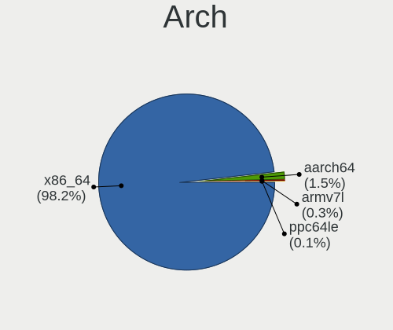
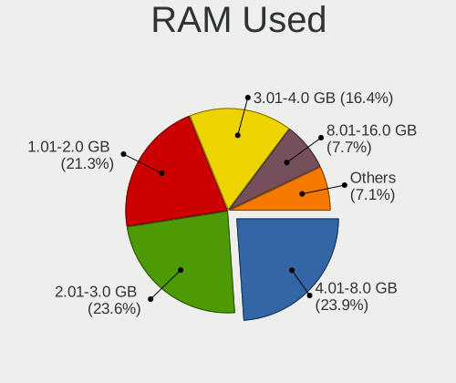
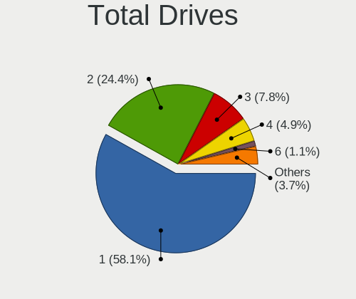
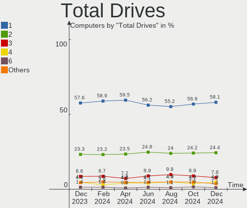
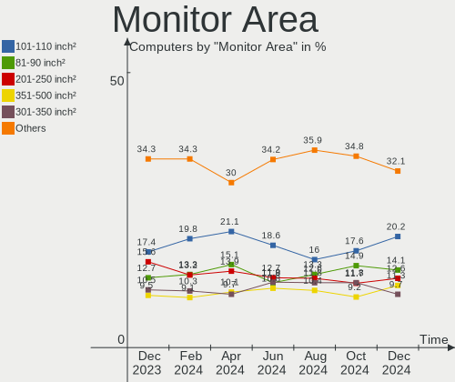
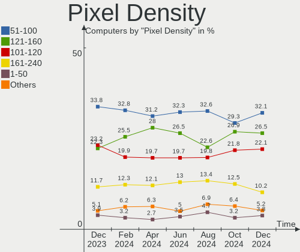
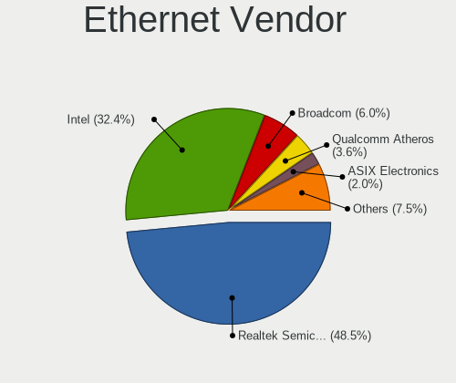
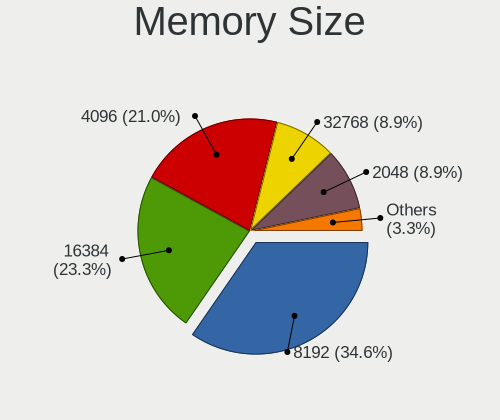
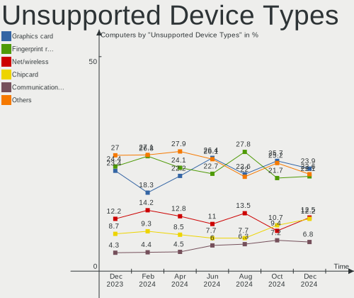

Linux in USA - Hardware Trends
------------------------------

A project to identify most popular hardware characteristics and track their change
over time based on data collected by Linux users at https://Linux-Hardware.org.

Anyone can contribute to this report by the [hw-probe](https://github.com/linuxhw/hw-probe) tool:

    sudo -E hw-probe -all -upload

This is a report for all computer types. See also reports for [desktops](/Location/USA/Desktop/README.md) and [notebooks](/Location/USA/Notebook/README.md).

Contents
--------

* [ System ](#system)
  - [ OS                       ](#os)
  - [ OS Family                ](#os-family)
  - [ Kernel                   ](#kernel)
  - [ Kernel Family            ](#kernel-family)
  - [ Kernel Major Ver.        ](#kernel-major-ver)
  - [ Arch                     ](#arch)
  - [ DE                       ](#de)
  - [ Display Server           ](#display-server)
  - [ Display Manager          ](#display-manager)
  - [ OS Lang                  ](#os-lang)
  - [ Boot Mode                ](#boot-mode)
  - [ Filesystem               ](#filesystem)
  - [ Part. scheme             ](#part-scheme)
  - [ Dual Boot with Linux/BSD ](#dual-boot-with-linuxbsd)
  - [ Dual Boot (Win)          ](#dual-boot-win)

* [ Board ](#board)
  - [ Vendor                   ](#vendor)
  - [ Model                    ](#model)
  - [ Model Family             ](#model-family)
  - [ MFG Year                 ](#mfg-year)
  - [ Form Factor              ](#form-factor)
  - [ Secure Boot              ](#secure-boot)
  - [ Coreboot                 ](#coreboot)
  - [ RAM Size                 ](#ram-size)
  - [ RAM Used                 ](#ram-used)
  - [ Total Drives             ](#total-drives)
  - [ Has CD-ROM               ](#has-cd-rom)
  - [ Has Ethernet             ](#has-ethernet)
  - [ Has WiFi                 ](#has-wifi)
  - [ Has Bluetooth            ](#has-bluetooth)

* [ Location ](#location)
  - [ Country                  ](#country)
  - [ City                     ](#city)

* [ Drives ](#drives)
  - [ Drive Vendor             ](#drive-vendor)
  - [ Drive Model              ](#drive-model)
  - [ HDD Vendor               ](#hdd-vendor)
  - [ SSD Vendor               ](#ssd-vendor)
  - [ Drive Kind               ](#drive-kind)
  - [ Drive Connector          ](#drive-connector)
  - [ Drive Size               ](#drive-size)
  - [ Space Total              ](#space-total)
  - [ Space Used               ](#space-used)
  - [ Malfunc. Drives          ](#malfunc-drives)
  - [ Malfunc. Drive Vendor    ](#malfunc-drive-vendor)
  - [ Malfunc. HDD Vendor      ](#malfunc-hdd-vendor)
  - [ Malfunc. Drive Kind      ](#malfunc-drive-kind)
  - [ Failed Drives            ](#failed-drives)
  - [ Failed Drive Vendor      ](#failed-drive-vendor)
  - [ Drive Status             ](#drive-status)

* [ Storage controller ](#storage-controller)
  - [ Storage Vendor           ](#storage-vendor)
  - [ Storage Model            ](#storage-model)
  - [ Storage Kind             ](#storage-kind)

* [ Processor ](#processor)
  - [ CPU Vendor               ](#cpu-vendor)
  - [ CPU Model                ](#cpu-model)
  - [ CPU Model Family         ](#cpu-model-family)
  - [ CPU Cores                ](#cpu-cores)
  - [ CPU Sockets              ](#cpu-sockets)
  - [ CPU Threads              ](#cpu-threads)
  - [ CPU Op-Modes             ](#cpu-op-modes)
  - [ CPU Microcode            ](#cpu-microcode)
  - [ CPU Microarch            ](#cpu-microarch)

* [ Graphics ](#graphics)
  - [ GPU Vendor               ](#gpu-vendor)
  - [ GPU Model                ](#gpu-model)
  - [ GPU Combo                ](#gpu-combo)
  - [ GPU Driver               ](#gpu-driver)
  - [ GPU Memory               ](#gpu-memory)

* [ Monitor ](#monitor)
  - [ Monitor Vendor           ](#monitor-vendor)
  - [ Monitor Model            ](#monitor-model)
  - [ Monitor Resolution       ](#monitor-resolution)
  - [ Monitor Diagonal         ](#monitor-diagonal)
  - [ Monitor Width            ](#monitor-width)
  - [ Aspect Ratio             ](#aspect-ratio)
  - [ Monitor Area             ](#monitor-area)
  - [ Pixel Density            ](#pixel-density)
  - [ Multiple Monitors        ](#multiple-monitors)

* [ Network ](#network)
  - [ Net Controller Vendor    ](#net-controller-vendor)
  - [ Net Controller Model     ](#net-controller-model)
  - [ Wireless Vendor          ](#wireless-vendor)
  - [ Wireless Model           ](#wireless-model)
  - [ Ethernet Vendor          ](#ethernet-vendor)
  - [ Ethernet Model           ](#ethernet-model)
  - [ Net Controller Kind      ](#net-controller-kind)
  - [ Used Controller          ](#used-controller)
  - [ NICs                     ](#nics)
  - [ IPv6                     ](#ipv6)

* [ Bluetooth ](#bluetooth)
  - [ Bluetooth Vendor         ](#bluetooth-vendor)
  - [ Bluetooth Model          ](#bluetooth-model)

* [ Sound ](#sound)
  - [ Sound Vendor             ](#sound-vendor)
  - [ Sound Model              ](#sound-model)

* [ Memory ](#memory)
  - [ Memory Vendor            ](#memory-vendor)
  - [ Memory Model             ](#memory-model)
  - [ Memory Kind              ](#memory-kind)
  - [ Memory Form Factor       ](#memory-form-factor)
  - [ Memory Size              ](#memory-size)
  - [ Memory Speed             ](#memory-speed)

* [ Printers & scanners ](#printers--scanners)
  - [ Printer Vendor           ](#printer-vendor)
  - [ Printer Model            ](#printer-model)
  - [ Scanner Vendor           ](#scanner-vendor)
  - [ Scanner Model            ](#scanner-model)

* [ Camera ](#camera)
  - [ Camera Vendor            ](#camera-vendor)
  - [ Camera Model             ](#camera-model)

* [ Security ](#security)
  - [ Fingerprint Vendor       ](#fingerprint-vendor)
  - [ Fingerprint Model        ](#fingerprint-model)
  - [ Chipcard Vendor          ](#chipcard-vendor)
  - [ Chipcard Model           ](#chipcard-model)

* [ Unsupported ](#unsupported)
  - [ Unsupported Devices      ](#unsupported-devices)
  - [ Unsupported Device Types ](#unsupported-device-types)

System
------

OS
--

Installed operating systems

| Name                 | Computers | Percent |
|----------------------|-----------|---------|
| Ubuntu 20.04         | 133       | 12.37%  |
| Debian 11            | 107       | 9.95%   |
| Pop!_OS 21.10        | 73        | 6.79%   |
| Fedora 35            | 73        | 6.79%   |
| Linux Mint 20.3      | 65        | 6.05%   |
| Ubuntu 21.10         | 58        | 5.4%    |
| Ubuntu 22.04         | 51        | 4.74%   |
| Manjaro              | 37        | 3.44%   |
| Zorin 16             | 36        | 3.35%   |
| KDE neon 20.04       | 36        | 3.35%   |
| OpenMandriva 4.3     | 30        | 2.79%   |
| Pop!_OS 22.04        | 23        | 2.14%   |
| Fedora 36            | 23        | 2.14%   |
| ArcoLinux Rolling    | 22        | 2.05%   |
| Arch                 | 19        | 1.77%   |
| Xubuntu 20.04        | 15        | 1.4%    |
| LMDE 5               | 12        | 1.12%   |
| Kali 2022.1          | 10        | 0.93%   |
| Arch Rolling         | 10        | 0.93%   |
| Ubuntu 18.04         | 9         | 0.84%   |
| Manjaro 21.2.5       | 9         | 0.84%   |
| Gentoo 2.6           | 9         | 0.84%   |
| Fedora 34            | 9         | 0.84%   |
| Parrot 5.0           | 8         | 0.74%   |
| Manjaro 21.2.6       | 8         | 0.74%   |
| Kubuntu 21.10        | 8         | 0.74%   |
| Gentoo 2.8           | 7         | 0.65%   |
| EndeavourOS Rolling  | 7         | 0.65%   |
| MX 21                | 6         | 0.56%   |
| Xubuntu 21.10        | 5         | 0.47%   |
| Lubuntu 20.04        | 5         | 0.47%   |
| Linux Mint 20        | 5         | 0.47%   |
| EndeavourOS          | 5         | 0.47%   |
| Elementary 6.1       | 5         | 0.47%   |
| SteamOS Snapshot     | 4         | 0.37%   |
| Pop!_OS 20.04        | 4         | 0.37%   |
| Linux Mint 20.2      | 4         | 0.37%   |
| Kubuntu 20.04        | 4         | 0.37%   |
| Garuda Linux Soaring | 4         | 0.37%   |
| Garuda Linux         | 4         | 0.37%   |
| Debian Testing       | 4         | 0.37%   |
| Zorin 15             | 3         | 0.28%   |
| Ubuntu MATE 21.10    | 3         | 0.28%   |
| Ubuntu MATE 20.04    | 3         | 0.28%   |
| Trisquel 10.0.1      | 3         | 0.28%   |
| Pop!_OS 21.04        | 3         | 0.28%   |
| Oracle Linux 8.5     | 3         | 0.28%   |
| openSUSE Leap-15.3   | 3         | 0.28%   |
| OpenMandriva 4.2     | 3         | 0.28%   |
| Lubuntu 21.10        | 3         | 0.28%   |
| Linux Mint 20.1      | 3         | 0.28%   |
| Linux Mint 19.3      | 3         | 0.28%   |
| Lilidog 22           | 3         | 0.28%   |
| Debian Unstable      | 3         | 0.28%   |
| Debian 10            | 3         | 0.28%   |
| Xero                 | 2         | 0.19%   |
| Ubuntu MATE 22.04    | 2         | 0.19%   |
| Ubuntu Budgie 20.04  | 2         | 0.19%   |
| Slackware 15.0       | 2         | 0.19%   |
| NixOS 21.11          | 2         | 0.19%   |

OS Family
---------

OS without a version

| Name             | Computers | Percent |
|------------------|-----------|---------|
| Ubuntu           | 254       | 23.63%  |
| Debian           | 117       | 10.88%  |
| Fedora           | 107       | 9.95%   |
| Pop!_OS          | 103       | 9.58%   |
| Linux Mint       | 81        | 7.53%   |
| Manjaro          | 54        | 5.02%   |
| Zorin            | 39        | 3.63%   |
| KDE neon         | 36        | 3.35%   |
| OpenMandriva     | 33        | 3.07%   |
| Arch             | 29        | 2.7%    |
| Xubuntu          | 22        | 2.05%   |
| ArcoLinux        | 22        | 2.05%   |
| Gentoo           | 18        | 1.67%   |
| Kubuntu          | 16        | 1.49%   |
| LMDE             | 13        | 1.21%   |
| Kali             | 12        | 1.12%   |
| EndeavourOS      | 12        | 1.12%   |
| Ubuntu MATE      | 8         | 0.74%   |
| Parrot           | 8         | 0.74%   |
| Lubuntu          | 8         | 0.74%   |
| Garuda Linux     | 8         | 0.74%   |
| openSUSE         | 6         | 0.56%   |
| MX               | 6         | 0.56%   |
| Elementary       | 5         | 0.47%   |
| Ubuntu Budgie    | 4         | 0.37%   |
| Trisquel         | 4         | 0.37%   |
| SteamOS          | 4         | 0.37%   |
| Endless          | 4         | 0.37%   |
| Oracle Linux     | 3         | 0.28%   |
| NixOS            | 3         | 0.28%   |
| Lilidog          | 3         | 0.28%   |
| CentOS           | 3         | 0.28%   |
| Xero             | 2         | 0.19%   |
| Ubuntu Studio    | 2         | 0.19%   |
| Slackware        | 2         | 0.19%   |
| RHEL             | 2         | 0.19%   |
| Linux Lite       | 2         | 0.19%   |
| Devuan           | 2         | 0.19%   |
| Clear Linux      | 2         | 0.19%   |
| Storm OS         | 1         | 0.09%   |
| ROSA             | 1         | 0.09%   |
| Redcore          | 1         | 0.09%   |
| PureOS           | 1         | 0.09%   |
| Peppermint       | 1         | 0.09%   |
| org.kde.Platform | 1         | 0.09%   |
| MassOS           | 1         | 0.09%   |
| Manjaro-ARM      | 1         | 0.09%   |
| Mageia           | 1         | 0.09%   |
| LinuxFX          | 1         | 0.09%   |
| LibertyOS        | 1         | 0.09%   |
| Guix             | 1         | 0.09%   |
| Calculate        | 1         | 0.09%   |
| BunsenLabs       | 1         | 0.09%   |
| BlackPanther     | 1         | 0.09%   |
| Artix            | 1         | 0.09%   |

Kernel
------

Version of the Linux kernel

| Version                                        | Computers | Percent |
|------------------------------------------------|-----------|---------|
| 5.13.0-39-generic                              | 159       | 14.79%  |
| 5.4.0-107-generic                              | 69        | 6.42%   |
| 5.10.0-13-amd64                                | 58        | 5.4%    |
| 5.13.0-40-generic                              | 57        | 5.3%    |
| 5.16.15-76051615-generic                       | 50        | 4.65%   |
| 5.16.19-76051619-generic                       | 33        | 3.07%   |
| 5.16.18-200.fc35.x86_64                        | 30        | 2.79%   |
| 5.15.0-25-generic                              | 30        | 2.79%   |
| 5.16.7-desktop-1omv4003                        | 29        | 2.7%    |
| 5.10.0-10-amd64                                | 29        | 2.7%    |
| 5.4.0-109-generic                              | 19        | 1.77%   |
| 5.17.1-arch1-1                                 | 19        | 1.77%   |
| 5.13.0-30-generic                              | 16        | 1.49%   |
| 5.16.19-200.fc35.x86_64                        | 14        | 1.3%    |
| 5.15.32-1-MANJARO                              | 13        | 1.21%   |
| 5.15.28-1-MANJARO                              | 13        | 1.21%   |
| 5.15.0-27-generic                              | 13        | 1.21%   |
| 5.10.0-13-686-pae                              | 13        | 1.21%   |
| 5.4.0-91-generic                               | 11        | 1.02%   |
| 5.16.11-76051611-generic                       | 11        | 1.02%   |
| 5.17.1-zen1-1-zen                              | 10        | 0.93%   |
| 5.16.11-arch1-1                                | 10        | 0.93%   |
| 5.17.1-3-MANJARO                               | 9         | 0.84%   |
| 5.17.3-arch1-1                                 | 8         | 0.74%   |
| 5.16.20-200.fc35.x86_64                        | 8         | 0.74%   |
| 5.16.0-12parrot1-amd64                         | 8         | 0.74%   |
| 5.17.2-300.fc36.x86_64                         | 7         | 0.65%   |
| 5.15.0-23-generic                              | 7         | 0.65%   |
| 5.13.0-35-generic                              | 7         | 0.65%   |
| 5.16.14-1-MANJARO                              | 6         | 0.56%   |
| 5.14.10-300.fc35.x86_64                        | 6         | 0.56%   |
| 5.13.0-37-generic                              | 6         | 0.56%   |
| 5.4.0-105-generic                              | 5         | 0.47%   |
| 5.17.4-200.fc35.x86_64                         | 5         | 0.47%   |
| 5.16.16-200.fc35.x86_64                        | 5         | 0.47%   |
| 5.10.0-12-amd64                                | 5         | 0.47%   |
| 5.4.0-107-lowlatency                           | 4         | 0.37%   |
| 5.17.2-arch3-1                                 | 4         | 0.37%   |
| 5.17.2-051702-generic                          | 4         | 0.37%   |
| 5.16.0-6-amd64                                 | 4         | 0.37%   |
| 5.15.32-gentoo-r1-x86_64                       | 4         | 0.37%   |
| 5.13.0-valve10.1-1-neptune-02144-g7fffaf925dfb | 4         | 0.37%   |
| 5.11.0-35-generic                              | 4         | 0.37%   |
| 5.11.0-27-generic                              | 4         | 0.37%   |
| 5.4.0-96-generic                               | 3         | 0.28%   |
| 5.17.3-zen1-1-zen                              | 3         | 0.28%   |
| 5.17.1-051701-generic                          | 3         | 0.28%   |
| 5.17.0-0.rc7.116.fc36.x86_64                   | 3         | 0.28%   |
| 5.16.18-100.fc34.x86_64                        | 3         | 0.28%   |
| 5.15.32-gentoo-r1                              | 3         | 0.28%   |
| 5.15.19-2-pve                                  | 3         | 0.28%   |
| 5.14.0-1031-oem                                | 3         | 0.28%   |
| 5.13.0-41-generic                              | 3         | 0.28%   |
| 5.13.0-39-lowlatency                           | 3         | 0.28%   |
| 5.13.0-28-generic                              | 3         | 0.28%   |
| 5.13.0-1024-raspi                              | 3         | 0.28%   |
| 5.10.14-desktop-1omv4002                       | 3         | 0.28%   |
| 5.4.184-1-MANJARO                              | 2         | 0.19%   |
| 5.4.0-99-generic                               | 2         | 0.19%   |
| 5.4.0-26-generic                               | 2         | 0.19%   |

Kernel Family
-------------

Linux kernel without a distro release

| Version  | Computers | Percent |
|----------|-----------|---------|
| 5.13.0   | 272       | 25.3%   |
| 5.4.0    | 124       | 11.53%  |
| 5.10.0   | 113       | 10.51%  |
| 5.15.0   | 58        | 5.4%    |
| 5.17.1   | 52        | 4.84%   |
| 5.16.15  | 51        | 4.74%   |
| 5.16.19  | 47        | 4.37%   |
| 5.16.18  | 39        | 3.63%   |
| 5.16.7   | 29        | 2.7%    |
| 5.15.32  | 26        | 2.42%   |
| 5.17.2   | 24        | 2.23%   |
| 5.16.0   | 22        | 2.05%   |
| 5.16.11  | 21        | 1.95%   |
| 5.17.3   | 18        | 1.67%   |
| 5.17.4   | 14        | 1.3%    |
| 5.15.28  | 13        | 1.21%   |
| 5.11.0   | 13        | 1.21%   |
| 5.17.0   | 10        | 0.93%   |
| 5.16.20  | 10        | 0.93%   |
| 5.16.16  | 7         | 0.65%   |
| 5.16.14  | 7         | 0.65%   |
| 5.14.0   | 7         | 0.65%   |
| 5.14.10  | 6         | 0.56%   |
| 5.15.33  | 5         | 0.47%   |
| 4.15.0   | 5         | 0.47%   |
| 5.8.0    | 4         | 0.37%   |
| 5.18.0   | 4         | 0.37%   |
| 5.15.5   | 4         | 0.37%   |
| 5.13.19  | 4         | 0.37%   |
| 5.4.17   | 3         | 0.28%   |
| 5.15.19  | 3         | 0.28%   |
| 5.15.11  | 3         | 0.28%   |
| 5.10.14  | 3         | 0.28%   |
| 4.19.0   | 3         | 0.28%   |
| 3.10.0   | 3         | 0.28%   |
| 5.4.184  | 2         | 0.19%   |
| 5.3.18   | 2         | 0.19%   |
| 5.17.5   | 2         | 0.19%   |
| 5.16.13  | 2         | 0.19%   |
| 5.15.35  | 2         | 0.19%   |
| 5.15.26  | 2         | 0.19%   |
| 5.15.23  | 2         | 0.19%   |
| 5.15.16  | 2         | 0.19%   |
| 5.15.15  | 2         | 0.19%   |
| 5.10.109 | 2         | 0.19%   |
| 5.10.105 | 2         | 0.19%   |
| 4.19.219 | 2         | 0.19%   |
| 5.6.15   | 1         | 0.09%   |
| 5.6.14   | 1         | 0.09%   |
| 5.4.83   | 1         | 0.09%   |
| 5.4.187  | 1         | 0.09%   |
| 5.4.174  | 1         | 0.09%   |
| 5.4.15   | 1         | 0.09%   |
| 5.16.8   | 1         | 0.09%   |
| 5.16.5   | 1         | 0.09%   |
| 5.16.17  | 1         | 0.09%   |
| 5.15.7   | 1         | 0.09%   |
| 5.15.29  | 1         | 0.09%   |
| 5.15.12  | 1         | 0.09%   |
| 5.14.21  | 1         | 0.09%   |

Kernel Major Ver.
-----------------

Linux kernel major version

| Version | Computers | Percent |
|---------|-----------|---------|
| 5.13    | 277       | 25.77%  |
| 5.16    | 238       | 22.14%  |
| 5.4     | 133       | 12.37%  |
| 5.15    | 125       | 11.63%  |
| 5.10    | 124       | 11.53%  |
| 5.17    | 120       | 11.16%  |
| 5.14    | 15        | 1.4%    |
| 5.11    | 14        | 1.3%    |
| 4.19    | 5         | 0.47%   |
| 4.15    | 5         | 0.47%   |
| 5.8     | 4         | 0.37%   |
| 5.18    | 4         | 0.37%   |
| 3.10    | 3         | 0.28%   |
| 5.6     | 2         | 0.19%   |
| 5.3     | 2         | 0.19%   |
| 4.9     | 1         | 0.09%   |
| 4.4     | 1         | 0.09%   |
| 4.18    | 1         | 0.09%   |
| 4.14    | 1         | 0.09%   |

Arch
----

OS architecture (x86_64, i586, etc.)

| Name    | Computers | Percent |
|---------|-----------|---------|
| x86_64  | 1039      | 96.65%  |
| i686    | 19        | 1.77%   |
| aarch64 | 16        | 1.49%   |
| armv7l  | 1         | 0.09%   |

DE
--

Desktop Environment

| Name             | Computers | Percent |
|------------------|-----------|---------|
| GNOME            | 482       | 44.84%  |
| KDE5             | 187       | 17.4%   |
| Unknown          | 124       | 11.53%  |
| XFCE             | 92        | 8.56%   |
| X-Cinnamon       | 80        | 7.44%   |
| MATE             | 37        | 3.44%   |
| i3               | 12        | 1.12%   |
| Cinnamon         | 11        | 1.02%   |
| LXQt             | 8         | 0.74%   |
| GNOME Flashback  | 6         | 0.56%   |
| Pantheon         | 5         | 0.47%   |
| Budgie           | 5         | 0.47%   |
| Unity            | 4         | 0.37%   |
| LXDE             | 3         | 0.28%   |
| GNOME Classic    | 3         | 0.28%   |
| Sway             | 2         | 0.19%   |
| openbox          | 2         | 0.19%   |
| lightdm-xsession | 2         | 0.19%   |
| ICEWM            | 2         | 0.19%   |
| xwmconfig        | 1         | 0.09%   |
| plasma5          | 1         | 0.09%   |
| Phosh:GNOME      | 1         | 0.09%   |
| none+xmonad      | 1         | 0.09%   |
| none+i3          | 1         | 0.09%   |
| KDE              | 1         | 0.09%   |
| Enlightenment    | 1         | 0.09%   |
| awesome          | 1         | 0.09%   |

Display Server
--------------

X11 or Wayland

| Name    | Computers | Percent |
|---------|-----------|---------|
| X11     | 755       | 70.23%  |
| Wayland | 187       | 17.4%   |
| Unknown | 101       | 9.4%    |
| Tty     | 32        | 2.98%   |

Display Manager
---------------

SDDM, LightDM, etc.

| Name    | Computers | Percent |
|---------|-----------|---------|
| Unknown | 458       | 42.6%   |
| GDM3    | 173       | 16.09%  |
| GDM     | 163       | 15.16%  |
| LightDM | 147       | 13.67%  |
| SDDM    | 130       | 12.09%  |
| SLiM    | 2         | 0.19%   |
| MDM     | 1         | 0.09%   |
| EMPTTY  | 1         | 0.09%   |

OS Lang
-------

Language

| Lang       | Computers | Percent |
|------------|-----------|---------|
| en_US      | 961       | 89.4%   |
| Unknown    | 67        | 6.23%   |
| C          | 17        | 1.58%   |
| en_CA      | 8         | 0.74%   |
| en_GB      | 5         | 0.47%   |
| es_US      | 4         | 0.37%   |
| zh_CN      | 3         | 0.28%   |
| en_IN      | 3         | 0.28%   |
| es_CL      | 1         | 0.09%   |
| eo_US      | 1         | 0.09%   |
| en_US.UTF8 | 1         | 0.09%   |
| en_IL      | 1         | 0.09%   |
| en_AU      | 1         | 0.09%   |
| de_DE      | 1         | 0.09%   |
| C.UTF8     | 1         | 0.09%   |

Boot Mode
---------

EFI or BIOS

| Mode | Computers | Percent |
|------|-----------|---------|
| EFI  | 538       | 50.05%  |
| BIOS | 537       | 49.95%  |

Filesystem
----------

Type of filesystem

| Type    | Computers | Percent |
|---------|-----------|---------|
| Ext4    | 768       | 71.44%  |
| Btrfs   | 150       | 13.95%  |
| Overlay | 114       | 10.6%   |
| Xfs     | 21        | 1.95%   |
| Zfs     | 11        | 1.02%   |
| Unknown | 4         | 0.37%   |
| Tmpfs   | 3         | 0.28%   |
| Ext3    | 2         | 0.19%   |
| XXX     | 1         | 0.09%   |
| Ext2    | 1         | 0.09%   |

Part. scheme
------------

Scheme of partitioning

| Type    | Computers | Percent |
|---------|-----------|---------|
| Unknown | 539       | 50.14%  |
| GPT     | 445       | 41.4%   |
| MBR     | 91        | 8.47%   |

Dual Boot with Linux/BSD
------------------------

Hosting more than one Linux/BSD

| Dual boot | Computers | Percent |
|-----------|-----------|---------|
| No        | 929       | 86.42%  |
| Yes       | 146       | 13.58%  |

Dual Boot (Win)
---------------

Hosting Linux and Windows

| Dual boot | Computers | Percent |
|-----------|-----------|---------|
| No        | 869       | 80.84%  |
| Yes       | 206       | 19.16%  |

Board
-----

Vendor
------

Motherboard manufacturer

| Name                    | Computers | Percent |
|-------------------------|-----------|---------|
| Dell                    | 207       | 19.26%  |
| ASUSTek Computer        | 142       | 13.21%  |
| Lenovo                  | 138       | 12.84%  |
| Hewlett-Packard         | 130       | 12.09%  |
| MSI                     | 72        | 6.7%    |
| Apple                   | 58        | 5.4%    |
| Gigabyte Technology     | 49        | 4.56%   |
| ASRock                  | 36        | 3.35%   |
| Google                  | 35        | 3.26%   |
| Supermicro              | 22        | 2.05%   |
| Acer                    | 20        | 1.86%   |
| Intel                   | 17        | 1.58%   |
| Toshiba                 | 16        | 1.49%   |
| Alienware               | 14        | 1.3%    |
| System76                | 11        | 1.02%   |
| Framework               | 10        | 0.93%   |
| Raspberry Pi Foundation | 9         | 0.84%   |
| Unknown                 | 9         | 0.84%   |
| Foxconn                 | 7         | 0.65%   |
| Microsoft               | 6         | 0.56%   |
| Samsung Electronics     | 5         | 0.47%   |
| Pegatron                | 5         | 0.47%   |
| Valve                   | 4         | 0.37%   |
| Sony                    | 4         | 0.37%   |
| TUXEDO                  | 3         | 0.28%   |
| Razer                   | 3         | 0.28%   |
| Biostar                 | 3         | 0.28%   |
| Pine Microsystems       | 2         | 0.19%   |
| Hardkernel              | 2         | 0.19%   |
| GPU Company             | 2         | 0.19%   |
| Gateway                 | 2         | 0.19%   |
| EVGA                    | 2         | 0.19%   |
| eMachines               | 2         | 0.19%   |
| AZW                     | 2         | 0.19%   |
| ASRockRack              | 2         | 0.19%   |
| Wiltronic               | 1         | 0.09%   |
| Timi                    | 1         | 0.09%   |
| Sun Microsystems        | 1         | 0.09%   |
| SiS Technology          | 1         | 0.09%   |
| Shuttle                 | 1         | 0.09%   |
| Seco                    | 1         | 0.09%   |
| Qualcomm Technologies   | 1         | 0.09%   |
| Purism                  | 1         | 0.09%   |
| Pepper Jobs             | 1         | 0.09%   |
| NZXT                    | 1         | 0.09%   |
| Nvidia                  | 1         | 0.09%   |
| Notebook                | 1         | 0.09%   |
| MOTILE                  | 1         | 0.09%   |
| LattePanda              | 1         | 0.09%   |
| IBM                     | 1         | 0.09%   |
| Howard Computers        | 1         | 0.09%   |
| GMKTEC                  | 1         | 0.09%   |
| Getac                   | 1         | 0.09%   |
| Fanless Mini PC         | 1         | 0.09%   |
| ECS                     | 1         | 0.09%   |
| CompuLab                | 1         | 0.09%   |
| Chuwi                   | 1         | 0.09%   |
| AWOW                    | 1         | 0.09%   |
| A-DATA Technology       | 1         | 0.09%   |

Model
-----

Motherboard model

| Name                                  | Computers | Percent |
|---------------------------------------|-----------|---------|
| Google Enguarde                       | 27        | 2.51%   |
| Apple MacBook5,2                      | 18        | 1.67%   |
| ASUS All Series                       | 12        | 1.12%   |
| ASUS 1005HA                           | 11        | 1.02%   |
| Supermicro SYS-5019A-FTN4             | 10        | 0.93%   |
| Framework Laptop                      | 10        | 0.93%   |
| Unknown                               | 10        | 0.93%   |
| Dell OptiPlex 7010                    | 8         | 0.74%   |
| RPi Raspberry Pi                      | 6         | 0.56%   |
| HP Pavilion Notebook                  | 5         | 0.47%   |
| Dell OptiPlex 9020                    | 5         | 0.47%   |
| ASUS TUF Gaming X570-PLUS             | 5         | 0.47%   |
| ASUS ROG STRIX B450-F GAMING          | 5         | 0.47%   |
| Valve Jupiter                         | 4         | 0.37%   |
| MSI MS-7D09                           | 4         | 0.37%   |
| Gigabyte B450M DS3H                   | 4         | 0.37%   |
| Dell XPS 13 9300                      | 4         | 0.37%   |
| Dell Latitude E6540                   | 4         | 0.37%   |
| Dell Latitude E6430                   | 4         | 0.37%   |
| ASUS ROG CROSSHAIR VIII HERO          | 4         | 0.37%   |
| System76 Oryx Pro                     | 3         | 0.28%   |
| RPi Raspberry Pi 4 Model B Rev 1.4    | 3         | 0.28%   |
| MSI MS-7B79                           | 3         | 0.28%   |
| MSI MS-7B48                           | 3         | 0.28%   |
| MSI MS-7977                           | 3         | 0.28%   |
| MSI MS-7917                           | 3         | 0.28%   |
| HP Laptop 15-db0xxx                   | 3         | 0.28%   |
| HP 15                                 | 3         | 0.28%   |
| Gigabyte B450 AORUS M                 | 3         | 0.28%   |
| Dell XPS 15 9560                      | 3         | 0.28%   |
| Dell XPS 13 9360                      | 3         | 0.28%   |
| Dell Precision WorkStation T3500      | 3         | 0.28%   |
| Dell OptiPlex 990                     | 3         | 0.28%   |
| Dell OptiPlex 790                     | 3         | 0.28%   |
| Dell OptiPlex 7040                    | 3         | 0.28%   |
| Dell OptiPlex 390                     | 3         | 0.28%   |
| Dell OptiPlex 3010                    | 3         | 0.28%   |
| Dell Latitude E5440                   | 3         | 0.28%   |
| Dell Inspiron 3847                    | 3         | 0.28%   |
| ASUS ROG Zephyrus G14 GA402RJ_GA402RJ | 3         | 0.28%   |
| ASRock B550M Pro4                     | 3         | 0.28%   |
| Apple MacBookPro9,2                   | 3         | 0.28%   |
| Apple MacBookPro14,1                  | 3         | 0.28%   |
| Apple MacBookPro10,2                  | 3         | 0.28%   |
| Apple MacBook2,1                      | 3         | 0.28%   |
| System76 Thelio Mira                  | 2         | 0.19%   |
| System76 Thelio                       | 2         | 0.19%   |
| Supermicro X5DP8                      | 2         | 0.19%   |
| Supermicro Super Server               | 2         | 0.19%   |
| Samsung 950QDB                        | 2         | 0.19%   |
| Samsung 730QDA                        | 2         | 0.19%   |
| Pegatron p7-1110                      | 2         | 0.19%   |
| MSI MS-7C80                           | 2         | 0.19%   |
| MSI MS-7C56                           | 2         | 0.19%   |
| MSI MS-7C02                           | 2         | 0.19%   |
| MSI MS-7B98                           | 2         | 0.19%   |
| MSI MS-7A38                           | 2         | 0.19%   |
| MSI MS-7721                           | 2         | 0.19%   |
| MSI MS-7693                           | 2         | 0.19%   |
| MSI MS-7641                           | 2         | 0.19%   |

Model Family
------------

Motherboard model prefix

| Name                      | Computers | Percent |
|---------------------------|-----------|---------|
| Lenovo ThinkPad           | 71        | 6.6%    |
| Dell Inspiron             | 51        | 4.74%   |
| Dell OptiPlex             | 42        | 3.91%   |
| Dell Latitude             | 35        | 3.26%   |
| ASUS ROG                  | 35        | 3.26%   |
| Dell Precision            | 32        | 2.98%   |
| Dell XPS                  | 29        | 2.7%    |
| Google Enguarde           | 27        | 2.51%   |
| HP Pavilion               | 25        | 2.33%   |
| Lenovo IdeaPad            | 18        | 1.67%   |
| Apple MacBook5            | 18        | 1.67%   |
| Toshiba Satellite         | 14        | 1.3%    |
| Lenovo ThinkCentre        | 14        | 1.3%    |
| HP Laptop                 | 14        | 1.3%    |
| ASUS PRIME                | 14        | 1.3%    |
| ASUS TUF                  | 12        | 1.12%   |
| ASUS All                  | 12        | 1.12%   |
| HP ENVY                   | 11        | 1.02%   |
| ASUS 1005HA               | 11        | 1.02%   |
| Supermicro SYS-5019A-FTN4 | 10        | 0.93%   |
| Framework Laptop          | 10        | 0.93%   |
| Unknown                   | 10        | 0.93%   |
| RPi Raspberry             | 9         | 0.84%   |
| Acer Aspire               | 9         | 0.84%   |
| Lenovo Yoga               | 8         | 0.74%   |
| HP EliteBook              | 8         | 0.74%   |
| Microsoft Surface         | 6         | 0.56%   |
| HP ZBook                  | 6         | 0.56%   |
| HP EliteDesk              | 6         | 0.56%   |
| HP 15                     | 6         | 0.56%   |
| Alienware Aurora          | 6         | 0.56%   |
| System76 Thelio           | 5         | 0.47%   |
| HP Stream                 | 5         | 0.47%   |
| HP ProBook                | 5         | 0.47%   |
| HP Compaq                 | 5         | 0.47%   |
| Gigabyte B450             | 5         | 0.47%   |
| Valve Jupiter             | 4         | 0.37%   |
| MSI MS-7D09               | 4         | 0.37%   |
| Lenovo ThinkBook          | 4         | 0.37%   |
| Lenovo IdeaPadFlex        | 4         | 0.37%   |
| HP Spectre                | 4         | 0.37%   |
| HP OMEN                   | 4         | 0.37%   |
| Gigabyte X570             | 4         | 0.37%   |
| Gigabyte B450M            | 4         | 0.37%   |
| ASUS VivoBook             | 4         | 0.37%   |
| ASRock X570               | 4         | 0.37%   |
| Apple MacBookPro8         | 4         | 0.37%   |
| Apple MacBookPro11        | 4         | 0.37%   |
| Acer Nitro                | 4         | 0.37%   |
| System76 Oryx             | 3         | 0.28%   |
| Razer Blade               | 3         | 0.28%   |
| MSI MS-7B79               | 3         | 0.28%   |
| MSI MS-7B48               | 3         | 0.28%   |
| MSI MS-7977               | 3         | 0.28%   |
| MSI MS-7917               | 3         | 0.28%   |
| HP Presario               | 3         | 0.28%   |
| Dell Vostro               | 3         | 0.28%   |
| ASUS M5A97                | 3         | 0.28%   |
| ASUS M5A78L-M             | 3         | 0.28%   |
| ASUS ASUS                 | 3         | 0.28%   |

MFG Year
--------

Motherboard manufacture year

| Year    | Computers | Percent |
|---------|-----------|---------|
| 2021    | 142       | 13.21%  |
| 2020    | 112       | 10.42%  |
| 2018    | 95        | 8.84%   |
| 2019    | 83        | 7.72%   |
| 2013    | 82        | 7.63%   |
| 2011    | 72        | 6.7%    |
| 2017    | 62        | 5.77%   |
| 2012    | 60        | 5.58%   |
| 2015    | 54        | 5.02%   |
| 2014    | 54        | 5.02%   |
| 2016    | 51        | 4.74%   |
| 2022    | 50        | 4.65%   |
| 2009    | 46        | 4.28%   |
| 2010    | 44        | 4.09%   |
| 2007    | 21        | 1.95%   |
| Unknown | 19        | 1.77%   |
| 2008    | 17        | 1.58%   |
| 2006    | 6         | 0.56%   |
| 2005    | 2         | 0.19%   |
| 2003    | 2         | 0.19%   |
| 2004    | 1         | 0.09%   |

Form Factor
-----------

Physical design of the computer

| Name           | Computers | Percent |
|----------------|-----------|---------|
| Notebook       | 523       | 48.65%  |
| Desktop        | 447       | 41.58%  |
| Convertible    | 36        | 3.35%   |
| Mini pc        | 18        | 1.67%   |
| System on chip | 15        | 1.4%    |
| Server         | 15        | 1.4%    |
| Tablet         | 11        | 1.02%   |
| All in one     | 9         | 0.84%   |
| Phone          | 1         | 0.09%   |

Secure Boot
-----------

Enabled or disabled

| State    | Computers | Percent |
|----------|-----------|---------|
| Disabled | 1017      | 94.6%   |
| Enabled  | 58        | 5.4%    |

Coreboot
--------

Have coreboot on board

| Used | Computers | Percent |
|------|-----------|---------|
| No   | 1033      | 96.09%  |
| Yes  | 42        | 3.91%   |

RAM Size
--------

Total RAM memory

| Size in GB      | Computers | Percent |
|-----------------|-----------|---------|
| 16.01-24.0      | 248       | 23.07%  |
| 4.01-8.0        | 199       | 18.51%  |
| 8.01-16.0       | 165       | 15.35%  |
| 32.01-64.0      | 157       | 14.6%   |
| 3.01-4.0        | 134       | 12.47%  |
| 64.01-256.0     | 83        | 7.72%   |
| 1.01-2.0        | 36        | 3.35%   |
| 24.01-32.0      | 20        | 1.86%   |
| 0.51-1.0        | 16        | 1.49%   |
| 2.01-3.0        | 13        | 1.21%   |
| More than 256.0 | 3         | 0.28%   |
| 0.01-0.5        | 1         | 0.09%   |

RAM Used
--------

Used RAM memory

| Used GB     | Computers | Percent |
|-------------|-----------|---------|
| 1.01-2.0    | 353       | 32.84%  |
| 2.01-3.0    | 250       | 23.26%  |
| 4.01-8.0    | 178       | 16.56%  |
| 3.01-4.0    | 138       | 12.84%  |
| 8.01-16.0   | 71        | 6.6%    |
| 0.51-1.0    | 47        | 4.37%   |
| 16.01-24.0  | 12        | 1.12%   |
| 0.01-0.5    | 12        | 1.12%   |
| 32.01-64.0  | 7         | 0.65%   |
| 24.01-32.0  | 6         | 0.56%   |
| 64.01-256.0 | 1         | 0.09%   |

Total Drives
------------

Number of drives on board

| Drives | Computers | Percent |
|--------|-----------|---------|
| 1      | 631       | 58.7%   |
| 2      | 233       | 21.67%  |
| 3      | 95        | 8.84%   |
| 4      | 51        | 4.74%   |
| 5      | 28        | 2.6%    |
| 6      | 10        | 0.93%   |
| 0      | 8         | 0.74%   |
| 11     | 4         | 0.37%   |
| 8      | 4         | 0.37%   |
| 7      | 4         | 0.37%   |
| 13     | 2         | 0.19%   |
| 45     | 1         | 0.09%   |
| 19     | 1         | 0.09%   |
| 16     | 1         | 0.09%   |
| 15     | 1         | 0.09%   |
| 14     | 1         | 0.09%   |

Has CD-ROM
----------

Has CD-ROM on board

| Presented | Computers | Percent |
|-----------|-----------|---------|
| No        | 677       | 62.98%  |
| Yes       | 398       | 37.02%  |

Has Ethernet
------------

Has Ethernet on board

| Presented | Computers | Percent |
|-----------|-----------|---------|
| Yes       | 876       | 81.49%  |
| No        | 199       | 18.51%  |

Has WiFi
--------

Has WiFi module

| Presented | Computers | Percent |
|-----------|-----------|---------|
| Yes       | 811       | 75.44%  |
| No        | 264       | 24.56%  |

Has Bluetooth
-------------

Has Bluetooth module

| Presented | Computers | Percent |
|-----------|-----------|---------|
| Yes       | 662       | 61.58%  |
| No        | 413       | 38.42%  |

Location
--------

Country
-------

Geographic location (country)

| Country | Computers | Percent |
|---------|-----------|---------|
| USA     | 1075      | 100%    |

City
----

Geographic location (city)

| City           | Computers | Percent |
|----------------|-----------|---------|
| Bangor         | 74        | 6.88%   |
| Chicago        | 20        | 1.86%   |
| Portland       | 16        | 1.49%   |
| San Jose       | 14        | 1.3%    |
| Dallas         | 13        | 1.21%   |
| Durham         | 12        | 1.12%   |
| San Diego      | 11        | 1.02%   |
| Pittsburgh     | 10        | 0.93%   |
| New York       | 10        | 0.93%   |
| Miami          | 9         | 0.84%   |
| Hudson         | 9         | 0.84%   |
| Brooklyn       | 9         | 0.84%   |
| Seattle        | 8         | 0.74%   |
| Houston        | 8         | 0.74%   |
| Atlanta        | 8         | 0.74%   |
| Salt Lake City | 7         | 0.65%   |
| Los Angeles    | 7         | 0.65%   |
| Kansas City    | 7         | 0.65%   |
| Denver         | 7         | 0.65%   |
| St Louis       | 6         | 0.56%   |
| Richmond       | 6         | 0.56%   |
| Minneapolis    | 6         | 0.56%   |
| Washington     | 5         | 0.47%   |
| Saint Paul     | 5         | 0.47%   |
| Rochester      | 5         | 0.47%   |
| Boise          | 5         | 0.47%   |
| Walled Lake    | 4         | 0.37%   |
| Tampa          | 4         | 0.37%   |
| Springfield    | 4         | 0.37%   |
| Scottsdale     | 4         | 0.37%   |
| San Francisco  | 4         | 0.37%   |
| Rockville      | 4         | 0.37%   |
| Queens         | 4         | 0.37%   |
| Orlando        | 4         | 0.37%   |
| Moses Lake     | 4         | 0.37%   |
| Medford        | 4         | 0.37%   |
| Lincoln        | 4         | 0.37%   |
| Lebanon        | 4         | 0.37%   |
| Las Vegas      | 4         | 0.37%   |
| Inman          | 4         | 0.37%   |
| Fayetteville   | 4         | 0.37%   |
| Decatur        | 4         | 0.37%   |
| Chandler       | 4         | 0.37%   |
| Buffalo        | 4         | 0.37%   |
| Ashburn        | 4         | 0.37%   |
| Allen          | 4         | 0.37%   |
| Wichita        | 3         | 0.28%   |
| Wasilla        | 3         | 0.28%   |
| Tulsa          | 3         | 0.28%   |
| Schenectady    | 3         | 0.28%   |
| San Antonio    | 3         | 0.28%   |
| Sacramento     | 3         | 0.28%   |
| Richardson     | 3         | 0.28%   |
| Phoenix        | 3         | 0.28%   |
| Oakland        | 3         | 0.28%   |
| North Bend     | 3         | 0.28%   |
| Newton         | 3         | 0.28%   |
| New Orleans    | 3         | 0.28%   |
| Milwaukee      | 3         | 0.28%   |
| Longmont       | 3         | 0.28%   |

Drives
------

Drive Vendor
------------

Hard drive vendors

| Vendor                         | Computers | Drives | Percent |
|--------------------------------|-----------|--------|---------|
| Samsung Electronics            | 274       | 354    | 17.13%  |
| WDC                            | 229       | 339    | 14.31%  |
| Seagate                        | 229       | 287    | 14.31%  |
| Unknown                        | 103       | 116    | 6.44%   |
| Toshiba                        | 99        | 114    | 6.19%   |
| SanDisk                        | 90        | 93     | 5.63%   |
| Crucial                        | 69        | 76     | 4.31%   |
| SK Hynix                       | 51        | 59     | 3.19%   |
| Intel                          | 45        | 60     | 2.81%   |
| Hitachi                        | 42        | 48     | 2.63%   |
| Kingston                       | 37        | 39     | 2.31%   |
| PNY                            | 28        | 31     | 1.75%   |
| HGST                           | 28        | 33     | 1.75%   |
| Phison                         | 22        | 24     | 1.38%   |
| Micron Technology              | 20        | 20     | 1.25%   |
| Fujitsu                        | 19        | 19     | 1.19%   |
| Apple                          | 19        | 22     | 1.19%   |
| A-DATA Technology              | 19        | 20     | 1.19%   |
| China                          | 14        | 17     | 0.88%   |
| Hewlett-Packard                | 12        | 30     | 0.75%   |
| Micron/Crucial Technology      | 7         | 7      | 0.44%   |
| Silicon Motion                 | 6         | 7      | 0.38%   |
| OCZ                            | 6         | 6      | 0.38%   |
| Mushkin                        | 6         | 9      | 0.38%   |
| KIOXIA                         | 6         | 6      | 0.38%   |
| Team                           | 5         | 6      | 0.31%   |
| SABRENT                        | 5         | 5      | 0.31%   |
| LITEON                         | 5         | 5      | 0.31%   |
| Corsair                        | 5         | 7      | 0.31%   |
| Unknown                        | 5         | 5      | 0.31%   |
| SPCC                           | 4         | 4      | 0.25%   |
| Phison Electronics             | 4         | 5      | 0.25%   |
| Patriot                        | 4         | 4      | 0.25%   |
| JMicron                        | 4         | 4      | 0.25%   |
| XPG                            | 3         | 3      | 0.19%   |
| T-FORCE                        | 3         | 3      | 0.19%   |
| LITEONIT                       | 3         | 3      | 0.19%   |
| Union Memory (Shenzhen)        | 2         | 2      | 0.13%   |
| Solid State Storage Technology | 2         | 2      | 0.13%   |
| OWC                            | 2         | 2      | 0.13%   |
| Mercury                        | 2         | 2      | 0.13%   |
| MAXTOR                         | 2         | 2      | 0.13%   |
| MARVELL                        | 2         | 3      | 0.13%   |
| Goldkey                        | 2         | 2      | 0.13%   |
| External                       | 2         | 2      | 0.13%   |
| Dogfish                        | 2         | 2      | 0.13%   |
| Dell                           | 2         | 2      | 0.13%   |
| BIWIN                          | 2         | 2      | 0.13%   |
| ASMT                           | 2         | 2      | 0.13%   |
| ZTC-SM20                       | 1         | 1      | 0.06%   |
| Zozt                           | 1         | 1      | 0.06%   |
| ZHITAI                         | 1         | 1      | 0.06%   |
| Zheino                         | 1         | 1      | 0.06%   |
| W800S                          | 1         | 1      | 0.06%   |
| UMIS                           | 1         | 1      | 0.06%   |
| TrueNAS                        | 1         | 1      | 0.06%   |
| Transcend                      | 1         | 1      | 0.06%   |
| TO Exter                       | 1         | 1      | 0.06%   |
| Timetec                        | 1         | 1      | 0.06%   |
| TEAM L3                        | 1         | 1      | 0.06%   |

Drive Model
-----------

Hard drive models

| Model                              | Computers | Percent |
|------------------------------------|-----------|---------|
| Seagate ST2000DM008-2FR102 2TB     | 19        | 1.05%   |
| Samsung SSD 850 EVO 500GB          | 18        | 1%      |
| Sandisk NVMe SSD Drive 1TB         | 15        | 0.83%   |
| Samsung SSD 860 EVO 500GB          | 15        | 0.83%   |
| Samsung SSD 850 EVO 250GB          | 15        | 0.83%   |
| Fujitsu MHZ2160BH FFS G1 160GB     | 15        | 0.83%   |
| Crucial CT1000MX500SSD1 1TB        | 15        | 0.83%   |
| Unknown AGND3R  16GB               | 14        | 0.77%   |
| Samsung SSD 970 EVO Plus 1TB       | 14        | 0.77%   |
| Samsung NVMe SSD Drive 500GB       | 13        | 0.72%   |
| Unknown SD/MMC/MS PRO 128GB        | 12        | 0.66%   |
| Samsung SSD 860 EVO 1TB            | 12        | 0.66%   |
| Samsung NVMe SSD Drive 1TB         | 12        | 0.66%   |
| Crucial CT500MX500SSD1 500GB       | 12        | 0.66%   |
| Unknown MMC Card  32GB             | 11        | 0.61%   |
| Unknown HAG2e  16GB                | 11        | 0.61%   |
| Seagate ST500DM002-1BD142 500GB    | 11        | 0.61%   |
| Samsung NVMe SSD Drive 2TB         | 11        | 0.61%   |
| Unknown MMC Card  128GB            | 10        | 0.55%   |
| Toshiba KXG60ZNV1T02 1TB           | 10        | 0.55%   |
| WDC WDS500G2B0A-00SM50 500GB SSD   | 9         | 0.5%    |
| WDC WD10EZEX-08WN4A0 1TB           | 9         | 0.5%    |
| Seagate ST1000LM035-1RK172 1TB     | 9         | 0.5%    |
| Samsung NVMe SSD Drive 1024GB      | 9         | 0.5%    |
| Intel NVMe SSD Drive 512GB         | 9         | 0.5%    |
| Unknown MMC Card  64GB             | 8         | 0.44%   |
| Samsung SSD 870 EVO 1TB            | 8         | 0.44%   |
| Samsung NVMe SSD Drive 250GB       | 8         | 0.44%   |
| Toshiba MQ01ABD100 1TB             | 7         | 0.39%   |
| Samsung SSD 980 PRO 1TB            | 7         | 0.39%   |
| Samsung SSD 980 1TB                | 7         | 0.39%   |
| Samsung NVMe SSD Drive 512GB       | 7         | 0.39%   |
| Samsung NVMe SSD Drive 256GB       | 7         | 0.39%   |
| Unknown MMC Card  16GB             | 6         | 0.33%   |
| Toshiba MQ04ABF100 1TB             | 6         | 0.33%   |
| SanDisk SDSSDA240G 240GB           | 6         | 0.33%   |
| Sandisk NVMe SSD Drive 512GB       | 6         | 0.33%   |
| Sandisk NVMe SSD Drive 500GB       | 6         | 0.33%   |
| Samsung SSD 970 EVO Plus 500GB     | 6         | 0.33%   |
| PNY CS900 500GB SSD                | 6         | 0.33%   |
| Kingston SA400S37240G 240GB SSD    | 6         | 0.33%   |
| Kingston SA400S37120G 120GB SSD    | 6         | 0.33%   |
| Hitachi HDS721010CLA332 1TB        | 6         | 0.33%   |
| HGST HTS721010A9E630 1TB           | 6         | 0.33%   |
| WDC WDS100T2B0C-00PXH0 1TB         | 5         | 0.28%   |
| WDC WDS100T2B0A-00SM50 1TB SSD     | 5         | 0.28%   |
| WDC WD20EZRZ-00Z5HB0 2TB           | 5         | 0.28%   |
| WDC WD10EZEX-60WN4A0 1TB           | 5         | 0.28%   |
| WDC WD10EZEX-08M2NA0 1TB           | 5         | 0.28%   |
| SK Hynix SHGS31-500GS-2 500GB SSD  | 5         | 0.28%   |
| SK Hynix NVMe SSD Drive 256GB      | 5         | 0.28%   |
| Seagate ST9160301AS 160GB          | 5         | 0.28%   |
| Seagate ST8000DM004-2CX188 8TB     | 5         | 0.28%   |
| Seagate ST31000528AS 1TB           | 5         | 0.28%   |
| Seagate ST1000LM024 HN-M101MBB 1TB | 5         | 0.28%   |
| Seagate ST1000DM003-1ER162 1TB     | 5         | 0.28%   |
| Seagate ST1000DM003-1CH162 1TB     | 5         | 0.28%   |
| Samsung SSD 860 EVO 250GB          | 5         | 0.28%   |
| Samsung SSD 850 EVO 1TB            | 5         | 0.28%   |
| SABRENT Disk 250GB                 | 5         | 0.28%   |

HDD Vendor
----------

Hard disk drive vendors

| Vendor              | Computers | Drives | Percent |
|---------------------|-----------|--------|---------|
| Seagate             | 221       | 275    | 38.17%  |
| WDC                 | 160       | 253    | 27.63%  |
| Toshiba             | 69        | 81     | 11.92%  |
| Hitachi             | 42        | 48     | 7.25%   |
| HGST                | 28        | 33     | 4.84%   |
| Fujitsu             | 19        | 19     | 3.28%   |
| Unknown             | 13        | 13     | 2.25%   |
| Samsung Electronics | 5         | 5      | 0.86%   |
| SABRENT             | 5         | 5      | 0.86%   |
| Hewlett-Packard     | 4         | 20     | 0.69%   |
| MAXTOR              | 2         | 2      | 0.35%   |
| MARVELL             | 2         | 3      | 0.35%   |
| Apple               | 2         | 2      | 0.35%   |
| TrueNAS             | 1         | 1      | 0.17%   |
| PHD 3.0             | 1         | 1      | 0.17%   |
| LaCie               | 1         | 1      | 0.17%   |
| IBM                 | 1         | 1      | 0.17%   |
| ASMT                | 1         | 1      | 0.17%   |
| Apricorn            | 1         | 1      | 0.17%   |
| 3ware               | 1         | 4      | 0.17%   |

SSD Vendor
----------

Solid state drive vendors

| Vendor              | Computers | Drives | Percent |
|---------------------|-----------|--------|---------|
| Samsung Electronics | 133       | 163    | 26.08%  |
| Crucial             | 62        | 69     | 12.16%  |
| SanDisk             | 56        | 57     | 10.98%  |
| WDC                 | 40        | 43     | 7.84%   |
| PNY                 | 27        | 30     | 5.29%   |
| Kingston            | 24        | 25     | 4.71%   |
| A-DATA Technology   | 16        | 17     | 3.14%   |
| SK Hynix            | 14        | 16     | 2.75%   |
| China               | 14        | 17     | 2.75%   |
| Apple               | 14        | 14     | 2.75%   |
| Intel               | 13        | 14     | 2.55%   |
| Micron Technology   | 8         | 8      | 1.57%   |
| Hewlett-Packard     | 7         | 8      | 1.37%   |
| Seagate             | 6         | 6      | 1.18%   |
| OCZ                 | 6         | 6      | 1.18%   |
| Toshiba             | 5         | 5      | 0.98%   |
| Team                | 5         | 6      | 0.98%   |
| Mushkin             | 5         | 8      | 0.98%   |
| LITEON              | 5         | 5      | 0.98%   |
| Patriot             | 4         | 4      | 0.78%   |
| SPCC                | 3         | 3      | 0.59%   |
| LITEONIT            | 3         | 3      | 0.59%   |
| Corsair             | 3         | 4      | 0.59%   |
| T-FORCE             | 2         | 2      | 0.39%   |
| OWC                 | 2         | 2      | 0.39%   |
| Mercury             | 2         | 2      | 0.39%   |
| JMicron             | 2         | 2      | 0.39%   |
| Goldkey             | 2         | 2      | 0.39%   |
| Dogfish             | 2         | 2      | 0.39%   |
| Dell                | 2         | 2      | 0.39%   |
| BIWIN               | 2         | 2      | 0.39%   |
| Zozt                | 1         | 1      | 0.2%    |
| Unknown             | 1         | 1      | 0.2%    |
| Transcend           | 1         | 1      | 0.2%    |
| TO Exter            | 1         | 1      | 0.2%    |
| TEAM L3             | 1         | 1      | 0.2%    |
| StoreJet            | 1         | 1      | 0.2%    |
| Pioneer             | 1         | 1      | 0.2%    |
| NGFF                | 1         | 1      | 0.2%    |
| Netac               | 1         | 1      | 0.2%    |
| N600                | 1         | 1      | 0.2%    |
| KingSpec            | 1         | 1      | 0.2%    |
| KingDian            | 1         | 1      | 0.2%    |
| FORESEE             | 1         | 1      | 0.2%    |
| External            | 1         | 1      | 0.2%    |
| BHT                 | 1         | 1      | 0.2%    |
| Avant               | 1         | 1      | 0.2%    |
| Argon               | 1         | 1      | 0.2%    |
| Apacer              | 1         | 1      | 0.2%    |
| ADATA SU            | 1         | 1      | 0.2%    |
| Acer                | 1         | 1      | 0.2%    |
| Unknown             | 1         | 1      | 0.2%    |

Drive Kind
----------

HDD or SSD

| Kind    | Computers | Drives | Percent |
|---------|-----------|--------|---------|
| HDD     | 480       | 769    | 33.47%  |
| SSD     | 433       | 568    | 30.2%   |
| NVMe    | 405       | 498    | 28.24%  |
| MMC     | 92        | 104    | 6.42%   |
| Unknown | 24        | 27     | 1.67%   |

Drive Connector
---------------

SATA, SAS, NVMe, etc.

| Type | Computers | Drives | Percent |
|------|-----------|--------|---------|
| SATA | 729       | 1262   | 56.21%  |
| NVMe | 405       | 497    | 31.23%  |
| MMC  | 92        | 104    | 7.09%   |
| SAS  | 71        | 103    | 5.47%   |

Drive Size
----------

Size of hard drive

| Size in TB | Computers | Drives | Percent |
|------------|-----------|--------|---------|
| 0.01-0.5   | 518       | 662    | 52.59%  |
| 0.51-1.0   | 270       | 352    | 27.41%  |
| 1.01-2.0   | 110       | 145    | 11.17%  |
| 3.01-4.0   | 35        | 64     | 3.55%   |
| 4.01-10.0  | 29        | 73     | 2.94%   |
| 2.01-3.0   | 14        | 21     | 1.42%   |
| 10.01-20.0 | 9         | 20     | 0.91%   |

Space Total
-----------

Amount of disk space available on the file system

| Size in GB     | Computers | Percent |
|----------------|-----------|---------|
| 101-250        | 206       | 19.16%  |
| 251-500        | 200       | 18.6%   |
| 501-1000       | 176       | 16.37%  |
| 1-20           | 106       | 9.86%   |
| 1001-2000      | 104       | 9.67%   |
| More than 3000 | 92        | 8.56%   |
| Unknown        | 79        | 7.35%   |
| 2001-3000      | 56        | 5.21%   |
| 51-100         | 34        | 3.16%   |
| 21-50          | 22        | 2.05%   |

Space Used
----------

Amount of used disk space

| Used GB        | Computers | Percent |
|----------------|-----------|---------|
| 1-20           | 353       | 32.84%  |
| 21-50          | 161       | 14.98%  |
| 101-250        | 129       | 12%     |
| 51-100         | 104       | 9.67%   |
| 251-500        | 98        | 9.12%   |
| Unknown        | 79        | 7.35%   |
| 501-1000       | 59        | 5.49%   |
| 1001-2000      | 46        | 4.28%   |
| More than 3000 | 29        | 2.7%    |
| 2001-3000      | 17        | 1.58%   |

Malfunc. Drives
---------------

Drive models with a malfunction

| Model                                | Computers | Drives | Percent |
|--------------------------------------|-----------|--------|---------|
| Toshiba MQ01ABD100 1TB               | 3         | 3      | 3.16%   |
| Seagate ST2000DM008-2FR102 2TB       | 3         | 3      | 3.16%   |
| Toshiba MQ01ABD075 752GB             | 2         | 2      | 2.11%   |
| Seagate ST9500420AS 500GB            | 2         | 2      | 2.11%   |
| Seagate ST31500341AS 1TB             | 2         | 2      | 2.11%   |
| Samsung Electronics SSD 980 1TB      | 2         | 2      | 2.11%   |
| HGST HTS541010A9E680 1TB             | 2         | 2      | 2.11%   |
| HGST HTS541010A7E630 1TB             | 2         | 3      | 2.11%   |
| WDC WD800JD-60LSA0 80GB              | 1         | 1      | 1.05%   |
| WDC WD7500BPKT-22PK4T0 752GB         | 1         | 1      | 1.05%   |
| WDC WD5000AAKS-65V0A0 500GB          | 1         | 1      | 1.05%   |
| WDC WD30EZRX-00SPEB0 3TB             | 1         | 1      | 1.05%   |
| WDC WD2500JD-00HBC0 250GB            | 1         | 1      | 1.05%   |
| WDC WD2500AAJS-75M0A0 249GB          | 1         | 1      | 1.05%   |
| WDC WD20EZRZ-00Z5HB0 2TB             | 1         | 1      | 1.05%   |
| WDC WD20EFRX-68EUZN0 2TB             | 1         | 2      | 1.05%   |
| WDC WD2003FYYS-05T9B0 2TB            | 1         | 1      | 1.05%   |
| WDC WD2003FYYS-02W0B1 2TB            | 1         | 6      | 1.05%   |
| WDC WD2002FYPS-01U1B1 2TB            | 1         | 1      | 1.05%   |
| WDC WD15EVDS-73V9B0 1TB              | 1         | 1      | 1.05%   |
| WDC WD10JPVX-60JC3T0 1TB             | 1         | 1      | 1.05%   |
| WDC WD10EZEX-60WN4A0 1TB             | 1         | 1      | 1.05%   |
| WDC WD10EALX-009BA0 1TB              | 1         | 1      | 1.05%   |
| WDC WD10EADS-11M2B2 1TB              | 1         | 1      | 1.05%   |
| WDC WD1003FZEX-00MK2A0 1TB           | 1         | 1      | 1.05%   |
| WDC WD1002FBYS-02A6B0 1TB            | 1         | 1      | 1.05%   |
| Toshiba MQ04ABF100 1TB               | 1         | 1      | 1.05%   |
| Toshiba MQ01ABD050 500GB             | 1         | 1      | 1.05%   |
| Toshiba MK5061GSYN 500GB             | 1         | 1      | 1.05%   |
| Toshiba MK5055GSXF 500GB             | 1         | 1      | 1.05%   |
| Toshiba MK1655GSXF 160GB             | 1         | 1      | 1.05%   |
| Toshiba DT01ACA050 500GB             | 1         | 1      | 1.05%   |
| SPCC Solid State Disk 120GB          | 1         | 1      | 1.05%   |
| SK Hynix SH920 mSATA 128GB SSD       | 1         | 1      | 1.05%   |
| SK Hynix SC308 SATA 128GB SSD        | 1         | 1      | 1.05%   |
| SK Hynix BC711 HFM512GD3JX013N 512GB | 1         | 1      | 1.05%   |
| Silicon Motion Inland NVMe SSD 256GB | 1         | 1      | 1.05%   |
| Seagate ST9750420AS 752GB            | 1         | 1      | 1.05%   |
| Seagate ST960822A 64GB               | 1         | 1      | 1.05%   |
| Seagate ST9500325AS 500GB            | 1         | 1      | 1.05%   |
| Seagate ST8000DM004-2CX188 8TB       | 1         | 1      | 1.05%   |
| Seagate ST6000VN0033-2EE110 6TB      | 1         | 2      | 1.05%   |
| Seagate ST500LM012 HN-M500MBB 500GB  | 1         | 1      | 1.05%   |
| Seagate ST3808110AS 41N3267 LEN 80GB | 1         | 1      | 1.05%   |
| Seagate ST3500413AS 500GB            | 1         | 1      | 1.05%   |
| Seagate ST31000528AS 1TB             | 1         | 1      | 1.05%   |
| Seagate ST3000DM001-1ER166 3TB       | 1         | 1      | 1.05%   |
| Seagate ST2000DM001-9YN164 2TB       | 1         | 1      | 1.05%   |
| Seagate ST2000DM001-1ER164 2TB       | 1         | 1      | 1.05%   |
| Seagate ST2000DM001-1CH164 2TB       | 1         | 1      | 1.05%   |
| Seagate ST2000DL003-9VT166 2TB       | 1         | 1      | 1.05%   |
| Seagate ST1500DM003-9YN16G 1TB       | 1         | 1      | 1.05%   |
| Seagate ST1000LX015-1U7172 1TB       | 1         | 1      | 1.05%   |
| Seagate ST1000LM035-1RK172 1TB       | 1         | 1      | 1.05%   |
| Seagate ST1000LM024 HN-M101MBB 1TB   | 1         | 1      | 1.05%   |
| Seagate ST1000DM003-1SB102 1TB       | 1         | 1      | 1.05%   |
| SanDisk SSD PLUS 240GB               | 1         | 1      | 1.05%   |
| SanDisk SSD PLUS 1000GB              | 1         | 1      | 1.05%   |
| SanDisk SDSA6MM-016G-1006 16GB SSD   | 1         | 1      | 1.05%   |
| Samsung Electronics SSD 980 PRO 2TB  | 1         | 1      | 1.05%   |

Malfunc. Drive Vendor
---------------------

Vendors of faulty drives

| Vendor              | Computers | Drives | Percent |
|---------------------|-----------|--------|---------|
| Seagate             | 25        | 27     | 26.88%  |
| WDC                 | 18        | 24     | 19.35%  |
| Toshiba             | 11        | 11     | 11.83%  |
| Samsung Electronics | 9         | 9      | 9.68%   |
| HGST                | 4         | 5      | 4.3%    |
| Crucial             | 4         | 4      | 4.3%    |
| SK Hynix            | 3         | 3      | 3.23%   |
| SanDisk             | 3         | 3      | 3.23%   |
| Intel               | 3         | 3      | 3.23%   |
| Hitachi             | 2         | 3      | 2.15%   |
| SPCC                | 1         | 1      | 1.08%   |
| Silicon Motion      | 1         | 1      | 1.08%   |
| PNY                 | 1         | 1      | 1.08%   |
| Micron Technology   | 1         | 1      | 1.08%   |
| LITEONIT            | 1         | 1      | 1.08%   |
| Kingston            | 1         | 1      | 1.08%   |
| KingSpec            | 1         | 1      | 1.08%   |
| IBM                 | 1         | 1      | 1.08%   |
| Hewlett-Packard     | 1         | 1      | 1.08%   |
| Fujitsu             | 1         | 1      | 1.08%   |
| Apricorn            | 1         | 1      | 1.08%   |

Malfunc. HDD Vendor
-------------------

Vendors of faulty HDD drives

| Vendor   | Computers | Drives | Percent |
|----------|-----------|--------|---------|
| Seagate  | 25        | 27     | 39.68%  |
| WDC      | 18        | 24     | 28.57%  |
| Toshiba  | 11        | 11     | 17.46%  |
| HGST     | 4         | 5      | 6.35%   |
| Hitachi  | 2         | 3      | 3.17%   |
| IBM      | 1         | 1      | 1.59%   |
| Fujitsu  | 1         | 1      | 1.59%   |
| Apricorn | 1         | 1      | 1.59%   |

Malfunc. Drive Kind
-------------------

Kinds of faulty drives

| Kind | Computers | Drives | Percent |
|------|-----------|--------|---------|
| HDD  | 59        | 73     | 67.82%  |
| SSD  | 21        | 23     | 24.14%  |
| NVMe | 7         | 7      | 8.05%   |

Failed Drives
-------------

Failed drive models

| Model                       | Computers | Drives | Percent |
|-----------------------------|-----------|--------|---------|
| Toshiba THNSN5512GPU7 512GB | 1         | 1      | 50%     |
| Patriot Pyro SSD 120GB      | 1         | 1      | 50%     |

Failed Drive Vendor
-------------------

Failed drive vendors

| Vendor  | Computers | Drives | Percent |
|---------|-----------|--------|---------|
| Toshiba | 1         | 1      | 50%     |
| Patriot | 1         | 1      | 50%     |

Drive Status
------------

Number of failed and malfunc. drives

| Status   | Computers | Drives | Percent |
|----------|-----------|--------|---------|
| Detected | 617       | 1075   | 53.33%  |
| Works    | 453       | 786    | 39.15%  |
| Malfunc  | 85        | 103    | 7.35%   |
| Failed   | 2         | 2      | 0.17%   |

Storage controller
------------------

Storage Vendor
--------------

Storage controller vendors

| Vendor                           | Computers | Percent |
|----------------------------------|-----------|---------|
| Intel                            | 624       | 45.75%  |
| AMD                              | 225       | 16.5%   |
| Samsung Electronics              | 161       | 11.8%   |
| Sandisk                          | 71        | 5.21%   |
| SK Hynix                         | 39        | 2.86%   |
| Phison Electronics               | 30        | 2.2%    |
| Toshiba America Info Systems     | 27        | 1.98%   |
| Nvidia                           | 27        | 1.98%   |
| ASMedia Technology               | 25        | 1.83%   |
| Marvell Technology Group         | 16        | 1.17%   |
| Micron/Crucial Technology        | 14        | 1.03%   |
| Kingston Technology Company      | 13        | 0.95%   |
| Micron Technology                | 12        | 0.88%   |
| Silicon Motion                   | 11        | 0.81%   |
| JMicron Technology               | 10        | 0.73%   |
| Broadcom / LSI                   | 10        | 0.73%   |
| LSI Logic / Symbios Logic        | 9         | 0.66%   |
| Silicon Image                    | 5         | 0.37%   |
| KIOXIA                           | 4         | 0.29%   |
| Apple                            | 4         | 0.29%   |
| ADATA Technology                 | 4         | 0.29%   |
| Union Memory (Shenzhen)          | 3         | 0.22%   |
| Realtek Semiconductor            | 3         | 0.22%   |
| Adaptec                          | 3         | 0.22%   |
| Solid State Storage Technology   | 2         | 0.15%   |
| Seagate Technology               | 2         | 0.15%   |
| 3ware                            | 2         | 0.15%   |
| Yangtze Memory Technologies      | 1         | 0.07%   |
| Unknown                          | 1         | 0.07%   |
| Silicon Integrated Systems [SiS] | 1         | 0.07%   |
| MAXIO Technology (Hangzhou)      | 1         | 0.07%   |
| Lite-On Technology               | 1         | 0.07%   |
| Lenovo                           | 1         | 0.07%   |
| Hewlett-Packard                  | 1         | 0.07%   |
| Unknown                          | 1         | 0.07%   |

Storage Model
-------------

Storage controller models

| Model                                                                                   | Computers | Percent |
|-----------------------------------------------------------------------------------------|-----------|---------|
| AMD FCH SATA Controller [AHCI mode]                                                     | 158       | 10.02%  |
| Samsung NVMe SSD Controller SM981/PM981/PM983                                           | 75        | 4.76%   |
| Intel 8 Series/C220 Series Chipset Family 6-port SATA Controller 1 [AHCI mode]          | 50        | 3.17%   |
| Intel 82801 Mobile SATA Controller [RAID mode]                                          | 48        | 3.04%   |
| AMD 400 Series Chipset SATA Controller                                                  | 37        | 2.35%   |
| Samsung NVMe SSD Controller PM9A1/PM9A3/980PRO                                          | 33        | 2.09%   |
| Intel Sunrise Point-LP SATA Controller [AHCI mode]                                      | 33        | 2.09%   |
| Samsung NVMe SSD Controller 980                                                         | 32        | 2.03%   |
| Intel Volume Management Device NVMe RAID Controller                                     | 29        | 1.84%   |
| Intel Q170/Q150/B150/H170/H110/Z170/CM236 Chipset SATA Controller [AHCI Mode]           | 26        | 1.65%   |
| Intel 6 Series/C200 Series Chipset Family 6 port Desktop SATA AHCI Controller           | 26        | 1.65%   |
| ASMedia ASM1062 Serial ATA Controller                                                   | 25        | 1.59%   |
| Sandisk WD Black SN750 / PC SN730 NVMe SSD                                              | 23        | 1.46%   |
| Intel 7 Series Chipset Family 6-port SATA Controller [AHCI mode]                        | 23        | 1.46%   |
| Intel 6 Series/C200 Series Chipset Family 6 port Mobile SATA AHCI Controller            | 23        | 1.46%   |
| AMD SB7x0/SB8x0/SB9x0 SATA Controller [AHCI mode]                                       | 23        | 1.46%   |
| Intel 200 Series PCH SATA controller [AHCI mode]                                        | 22        | 1.4%    |
| Samsung NVMe SSD Controller SM961/PM961/SM963                                           | 21        | 1.33%   |
| Intel SATA Controller [RAID mode]                                                       | 21        | 1.33%   |
| SK Hynix Gold P31 SSD                                                                   | 20        | 1.27%   |
| Sandisk WD Blue SN550 NVMe SSD                                                          | 19        | 1.2%    |
| Nvidia MCP79 AHCI Controller                                                            | 18        | 1.14%   |
| Intel 500 Series Chipset Family SATA AHCI Controller                                    | 18        | 1.14%   |
| AMD 500 Series Chipset SATA Controller                                                  | 18        | 1.14%   |
| Intel Non-Volatile memory controller                                                    | 17        | 1.08%   |
| AMD SB7x0/SB8x0/SB9x0 IDE Controller                                                    | 16        | 1.01%   |
| Toshiba America Info Systems XG6 NVMe SSD Controller                                    | 15        | 0.95%   |
| Intel 82801GBM/GHM (ICH7-M Family) SATA Controller [AHCI mode]                          | 15        | 0.95%   |
| Intel 82801G (ICH7 Family) IDE Controller                                               | 15        | 0.95%   |
| Phison E12 NVMe Controller                                                              | 14        | 0.89%   |
| Intel Cannon Lake PCH SATA AHCI Controller                                              | 14        | 0.89%   |
| Intel 7 Series/C210 Series Chipset Family 6-port SATA Controller [AHCI mode]            | 14        | 0.89%   |
| Intel Cannon Lake Mobile PCH SATA AHCI Controller                                       | 13        | 0.82%   |
| Intel 8 Series SATA Controller 1 [AHCI mode]                                            | 13        | 0.82%   |
| Sandisk Non-Volatile memory controller                                                  | 12        | 0.76%   |
| Micron Non-Volatile memory controller                                                   | 12        | 0.76%   |
| Intel NM10/ICH7 Family SATA Controller [IDE mode]                                       | 12        | 0.76%   |
| Intel Comet Lake SATA AHCI Controller                                                   | 12        | 0.76%   |
| AMD 300 Series Chipset SATA Controller                                                  | 12        | 0.76%   |
| Intel Tiger Lake-LP SATA Controller [AHCI mode]                                         | 11        | 0.7%    |
| Intel SSD 660P Series                                                                   | 11        | 0.7%    |
| Intel C610/X99 series chipset sSATA Controller [AHCI mode]                              | 11        | 0.7%    |
| Intel 82801JI (ICH10 Family) SATA AHCI Controller                                       | 11        | 0.7%    |
| Intel 82801IBM/IEM (ICH9M/ICH9M-E) 4 port SATA Controller [AHCI mode]                   | 11        | 0.7%    |
| AMD SB7x0/SB8x0/SB9x0 SATA Controller [IDE mode]                                        | 11        | 0.7%    |
| Intel Atom Processor C3000 Series SATA Controller 1                                     | 10        | 0.63%   |
| Intel Atom Processor C3000 Series SATA Controller 0                                     | 10        | 0.63%   |
| Intel 400 Series Chipset Family SATA AHCI Controller                                    | 10        | 0.63%   |
| Phison E16 PCIe4 NVMe Controller                                                        | 9         | 0.57%   |
| Intel Wildcat Point-LP SATA Controller [AHCI Mode]                                      | 9         | 0.57%   |
| Intel C610/X99 series chipset 6-Port SATA Controller [AHCI mode]                        | 9         | 0.57%   |
| Intel C600/X79 series chipset 6-Port SATA AHCI Controller                               | 9         | 0.57%   |
| Intel 6 Series/C200 Series Chipset Family Desktop SATA Controller (IDE mode, ports 4-5) | 9         | 0.57%   |
| Intel 6 Series/C200 Series Chipset Family Desktop SATA Controller (IDE mode, ports 0-3) | 9         | 0.57%   |
| Sandisk WD PC SN810 / Black SN850 NVMe SSD                                              | 8         | 0.51%   |
| Intel 82801JI (ICH10 Family) 4 port SATA IDE Controller #1                              | 8         | 0.51%   |
| SK Hynix BC501 NVMe Solid State Drive                                                   | 7         | 0.44%   |
| Intel HM170/QM170 Chipset SATA Controller [AHCI Mode]                                   | 7         | 0.44%   |
| Intel 82801JI (ICH10 Family) 2 port SATA IDE Controller #2                              | 7         | 0.44%   |
| Intel 5 Series/3400 Series Chipset 4 port SATA AHCI Controller                          | 7         | 0.44%   |

Storage Kind
------------

Kind of storage controller (IDE, SATA, NVMe, SAS, ...)

| Kind | Computers | Percent |
|------|-----------|---------|
| SATA | 713       | 51.78%  |
| NVMe | 406       | 29.48%  |
| RAID | 123       | 8.93%   |
| IDE  | 119       | 8.64%   |
| SAS  | 13        | 0.94%   |
| SCSI | 3         | 0.22%   |

Processor
---------

CPU Vendor
----------

Processor vendors

| Vendor   | Computers | Percent |
|----------|-----------|---------|
| Intel    | 798       | 74.23%  |
| AMD      | 260       | 24.19%  |
| ARM      | 14        | 1.3%    |
| QUALCOMM | 2         | 0.19%   |
| Unknown  | 1         | 0.09%   |

CPU Model
---------

Processor models

| Model                                       | Computers | Percent |
|---------------------------------------------|-----------|---------|
| Intel Celeron CPU N2840 @ 2.16GHz           | 29        | 2.7%    |
| Intel 11th Gen Core i7-1165G7 @ 2.80GHz     | 27        | 2.51%   |
| Intel Core 2 Duo CPU P7450 @ 2.13GHz        | 18        | 1.67%   |
| Intel 11th Gen Core i5-1135G7 @ 2.40GHz     | 15        | 1.4%    |
| ARM Processor                               | 13        | 1.21%   |
| Intel Core i7-1065G7 CPU @ 1.30GHz          | 11        | 1.02%   |
| Intel Atom CPU N270 @ 1.60GHz               | 11        | 1.02%   |
| Intel Atom CPU C3758 @ 2.20GHz              | 10        | 0.93%   |
| AMD Ryzen 7 5800X 8-Core Processor          | 10        | 0.93%   |
| AMD Ryzen 7 3700X 8-Core Processor          | 10        | 0.93%   |
| Intel Core i7-8550U CPU @ 1.80GHz           | 9         | 0.84%   |
| Intel Core i5-2400 CPU @ 3.10GHz            | 9         | 0.84%   |
| AMD Ryzen 5 3600 6-Core Processor           | 9         | 0.84%   |
| Intel Core i7-9750H CPU @ 2.60GHz           | 8         | 0.74%   |
| Intel Core i5-4590 CPU @ 3.30GHz            | 8         | 0.74%   |
| Intel Core i5-3470 CPU @ 3.20GHz            | 8         | 0.74%   |
| Intel Core i5-10400 CPU @ 2.90GHz           | 8         | 0.74%   |
| Intel Core i7-8700K CPU @ 3.70GHz           | 7         | 0.65%   |
| Intel Core i7-6500U CPU @ 2.50GHz           | 7         | 0.65%   |
| Intel Core i7-4790 CPU @ 3.60GHz            | 7         | 0.65%   |
| Intel Core i7-4700MQ CPU @ 2.40GHz          | 7         | 0.65%   |
| Intel Core i7-3770 CPU @ 3.40GHz            | 7         | 0.65%   |
| Intel Core i7-10510U CPU @ 1.80GHz          | 7         | 0.65%   |
| Intel Core i5-8250U CPU @ 1.60GHz           | 7         | 0.65%   |
| Intel Core i5-6300U CPU @ 2.40GHz           | 7         | 0.65%   |
| Intel 11th Gen Core i7-11800H @ 2.30GHz     | 7         | 0.65%   |
| AMD Ryzen 9 3900X 12-Core Processor         | 7         | 0.65%   |
| Intel Core i7-7700HQ CPU @ 2.80GHz          | 6         | 0.56%   |
| Intel Core i7-7500U CPU @ 2.70GHz           | 6         | 0.56%   |
| Intel Core i7-2600 CPU @ 3.40GHz            | 6         | 0.56%   |
| Intel Celeron CPU N3060 @ 1.60GHz           | 6         | 0.56%   |
| Intel Core i9-9900K CPU @ 3.60GHz           | 5         | 0.47%   |
| Intel Core i7-6700K CPU @ 4.00GHz           | 5         | 0.47%   |
| Intel Core i7-6700 CPU @ 3.40GHz            | 5         | 0.47%   |
| Intel Core i7-6600U CPU @ 2.60GHz           | 5         | 0.47%   |
| Intel Core i7-4770 CPU @ 3.40GHz            | 5         | 0.47%   |
| Intel Core i5-6200U CPU @ 2.30GHz           | 5         | 0.47%   |
| Intel Core i5-3210M CPU @ 2.50GHz           | 5         | 0.47%   |
| Intel Core i3-2120 CPU @ 3.30GHz            | 5         | 0.47%   |
| AMD Ryzen 9 5950X 16-Core Processor         | 5         | 0.47%   |
| AMD Ryzen 9 5900X 12-Core Processor         | 5         | 0.47%   |
| AMD Ryzen 7 5800H with Radeon Graphics      | 5         | 0.47%   |
| AMD Ryzen 7 5700U with Radeon Graphics      | 5         | 0.47%   |
| AMD Ryzen 5 5600X 6-Core Processor          | 5         | 0.47%   |
| AMD Ryzen 5 2600 Six-Core Processor         | 5         | 0.47%   |
| AMD Ryzen 5 1600 Six-Core Processor         | 5         | 0.47%   |
| AMD Ryzen 3 3200G with Radeon Vega Graphics | 5         | 0.47%   |
| Intel Core i9-9880H CPU @ 2.30GHz           | 4         | 0.37%   |
| Intel Core i9-10900K CPU @ 3.70GHz          | 4         | 0.37%   |
| Intel Core i7-8750H CPU @ 2.20GHz           | 4         | 0.37%   |
| Intel Core i7-6700HQ CPU @ 2.60GHz          | 4         | 0.37%   |
| Intel Core i5-8265U CPU @ 1.60GHz           | 4         | 0.37%   |
| Intel Core i5-7360U CPU @ 2.30GHz           | 4         | 0.37%   |
| Intel Core i5-5300U CPU @ 2.30GHz           | 4         | 0.37%   |
| Intel Core i5-4690K CPU @ 3.50GHz           | 4         | 0.37%   |
| Intel Core i5-4670K CPU @ 3.40GHz           | 4         | 0.37%   |
| Intel Core i5-4300U CPU @ 1.90GHz           | 4         | 0.37%   |
| Intel Core i5-4210U CPU @ 1.70GHz           | 4         | 0.37%   |
| Intel Core i5-3320M CPU @ 2.60GHz           | 4         | 0.37%   |
| Intel Core i5-2450M CPU @ 2.50GHz           | 4         | 0.37%   |

CPU Model Family
----------------

Processor model prefix

| Model                   | Computers | Percent |
|-------------------------|-----------|---------|
| Intel Core i7           | 228       | 21.21%  |
| Intel Core i5           | 190       | 17.67%  |
| Other                   | 106       | 9.86%   |
| Intel Celeron           | 58        | 5.4%    |
| AMD Ryzen 7             | 58        | 5.4%    |
| AMD Ryzen 5             | 54        | 5.02%   |
| Intel Core i3           | 51        | 4.74%   |
| Intel Xeon              | 46        | 4.28%   |
| Intel Core 2 Duo        | 45        | 4.19%   |
| AMD Ryzen 9             | 28        | 2.6%    |
| Intel Atom              | 26        | 2.42%   |
| Intel Core i9           | 17        | 1.58%   |
| AMD FX                  | 17        | 1.58%   |
| Intel Pentium           | 16        | 1.49%   |
| AMD A6                  | 14        | 1.3%    |
| AMD Ryzen 3             | 13        | 1.21%   |
| Intel Core 2            | 12        | 1.12%   |
| AMD A8                  | 11        | 1.02%   |
| Intel Pentium Dual-Core | 6         | 0.56%   |
| AMD A4                  | 6         | 0.56%   |
| AMD Phenom II X4        | 5         | 0.47%   |
| AMD Athlon II X4        | 5         | 0.47%   |
| AMD A10                 | 5         | 0.47%   |
| Intel Genuine           | 4         | 0.37%   |
| Intel Core 2 Quad       | 4         | 0.37%   |
| AMD Ryzen Threadripper  | 4         | 0.37%   |
| AMD Athlon II           | 3         | 0.28%   |
| QUALCOMM AArch64        | 2         | 0.19%   |
| Intel Xeon Gold         | 2         | 0.19%   |
| AMD Ryzen 7 PRO         | 2         | 0.19%   |
| AMD Phenom II X6        | 2         | 0.19%   |
| AMD GX                  | 2         | 0.19%   |
| AMD E                   | 2         | 0.19%   |
| AMD C-50                | 2         | 0.19%   |
| AMD Athlon X4           | 2         | 0.19%   |
| AMD Athlon 64           | 2         | 0.19%   |
| AMD Athlon              | 2         | 0.19%   |
| AMD A12                 | 2         | 0.19%   |
| Intel Xeon Silver       | 1         | 0.09%   |
| Intel Pentium Silver    | 1         | 0.09%   |
| Intel Pentium Gold      | 1         | 0.09%   |
| Intel Pentium Dual      | 1         | 0.09%   |
| Intel Pentium D         | 1         | 0.09%   |
| Intel Pentium 4         | 1         | 0.09%   |
| Intel Core m3           | 1         | 0.09%   |
| Intel Celeron M         | 1         | 0.09%   |
| ARM BCM                 | 1         | 0.09%   |
| AMD Turion 64 X2 Mobile | 1         | 0.09%   |
| AMD Turion 64 Mobile    | 1         | 0.09%   |
| AMD Ryzen Embedded      | 1         | 0.09%   |
| AMD Ryzen 3 PRO         | 1         | 0.09%   |
| AMD Phenom II X2        | 1         | 0.09%   |
| AMD Phenom              | 1         | 0.09%   |
| AMD Opteron             | 1         | 0.09%   |
| AMD EPYC                | 1         | 0.09%   |
| AMD E2                  | 1         | 0.09%   |
| AMD Athlon XP           | 1         | 0.09%   |
| AMD Athlon II X2        | 1         | 0.09%   |
| AMD Athlon 64 X2        | 1         | 0.09%   |

CPU Cores
---------

Number of processor cores

| Number  | Computers | Percent |
|---------|-----------|---------|
| 4       | 395       | 36.74%  |
| 2       | 335       | 31.16%  |
| 8       | 128       | 11.91%  |
| 6       | 119       | 11.07%  |
| 12      | 26        | 2.42%   |
| 1       | 26        | 2.42%   |
| 16      | 12        | 1.12%   |
| 10      | 12        | 1.12%   |
| 14      | 5         | 0.47%   |
| 3       | 5         | 0.47%   |
| 24      | 4         | 0.37%   |
| Unknown | 4         | 0.37%   |
| 44      | 1         | 0.09%   |
| 40      | 1         | 0.09%   |
| 32      | 1         | 0.09%   |
| 20      | 1         | 0.09%   |

CPU Sockets
-----------

Number of sockets

| Number  | Computers | Percent |
|---------|-----------|---------|
| 1       | 1042      | 96.93%  |
| 2       | 29        | 2.7%    |
| Unknown | 4         | 0.37%   |

CPU Threads
-----------

Threads per core (Hyper-Threading)

| Number  | Computers | Percent |
|---------|-----------|---------|
| 2       | 733       | 68.19%  |
| 1       | 338       | 31.44%  |
| Unknown | 4         | 0.37%   |

CPU Op-Modes
------------

CPU Operation Modes (32-bit, 64-bit)

| Op mode        | Computers | Percent |
|----------------|-----------|---------|
| 32-bit, 64-bit | 1049      | 97.58%  |
| 32-bit         | 16        | 1.49%   |
| Unknown        | 8         | 0.74%   |
| 64-bit         | 2         | 0.19%   |

CPU Microcode
-------------

Microcode number

| Number     | Computers | Percent |
|------------|-----------|---------|
| Unknown    | 327       | 30.42%  |
| 0x306c3    | 45        | 4.19%   |
| 0x306a9    | 42        | 3.91%   |
| 0x206a7    | 40        | 3.72%   |
| 0x806c1    | 38        | 3.53%   |
| 0x1067a    | 38        | 3.53%   |
| 0x30678    | 33        | 3.07%   |
| 0x906ea    | 21        | 1.95%   |
| 0x506e3    | 19        | 1.77%   |
| 0x406e3    | 17        | 1.58%   |
| 0x806e9    | 16        | 1.49%   |
| 0x806ec    | 15        | 1.4%    |
| 0x806ea    | 15        | 1.4%    |
| 0x0a50000c | 15        | 1.4%    |
| 0x08701021 | 15        | 1.4%    |
| 0x40651    | 14        | 1.3%    |
| 0x706e5    | 12        | 1.12%   |
| 0xa0653    | 11        | 1.02%   |
| 0x906e9    | 11        | 1.02%   |
| 0x806d1    | 11        | 1.02%   |
| 0x20655    | 11        | 1.02%   |
| 0x106c2    | 11        | 1.02%   |
| 0xa0652    | 10        | 0.93%   |
| 0x6f6      | 10        | 0.93%   |
| 0x506f1    | 10        | 0.93%   |
| 0x08600106 | 10        | 0.93%   |
| 0x0800820d | 10        | 0.93%   |
| 0x06001119 | 10        | 0.93%   |
| 0x0a201016 | 9         | 0.84%   |
| 0x06000852 | 9         | 0.84%   |
| 0xa0655    | 8         | 0.74%   |
| 0x906ed    | 8         | 0.74%   |
| 0x106a5    | 8         | 0.74%   |
| 0x10676    | 8         | 0.74%   |
| 0x08108109 | 7         | 0.65%   |
| 0x706a8    | 6         | 0.56%   |
| 0x406f1    | 6         | 0.56%   |
| 0x306d4    | 6         | 0.56%   |
| 0x06006705 | 6         | 0.56%   |
| 0x010000c8 | 6         | 0.56%   |
| 0x6fd      | 5         | 0.47%   |
| 0x406c4    | 5         | 0.47%   |
| 0x206d7    | 5         | 0.47%   |
| 0x206c2    | 5         | 0.47%   |
| 0x0a201009 | 5         | 0.47%   |
| 0x08701013 | 5         | 0.47%   |
| 0xa0671    | 4         | 0.37%   |
| 0x906a3    | 4         | 0.37%   |
| 0x406c3    | 4         | 0.37%   |
| 0x306f2    | 4         | 0.37%   |
| 0x08001138 | 4         | 0.37%   |
| 0x07030105 | 4         | 0.37%   |
| 0x06006704 | 4         | 0.37%   |
| 0x906ec    | 3         | 0.28%   |
| 0x90672    | 3         | 0.28%   |
| 0x6f2      | 3         | 0.28%   |
| 0x50654    | 3         | 0.28%   |
| 0x306e4    | 3         | 0.28%   |
| 0x20652    | 3         | 0.28%   |
| 0x0a404101 | 3         | 0.28%   |

CPU Microarch
-------------

Microarchitecture

| Name             | Computers | Percent |
|------------------|-----------|---------|
| KabyLake         | 139       | 12.93%  |
| Haswell          | 96        | 8.93%   |
| IvyBridge        | 65        | 6.05%   |
| Skylake          | 63        | 5.86%   |
| SandyBridge      | 62        | 5.77%   |
| Zen 2            | 57        | 5.3%    |
| Penryn           | 54        | 5.02%   |
| TigerLake        | 52        | 4.84%   |
| Silvermont       | 49        | 4.56%   |
| Unknown          | 47        | 4.37%   |
| Zen 3            | 44        | 4.09%   |
| CometLake        | 44        | 4.09%   |
| Zen+             | 35        | 3.26%   |
| Icelake          | 30        | 2.79%   |
| Piledriver       | 28        | 2.6%    |
| Westmere         | 26        | 2.42%   |
| Core             | 23        | 2.14%   |
| Broadwell        | 20        | 1.86%   |
| K10              | 18        | 1.67%   |
| Zen              | 17        | 1.58%   |
| Excavator        | 16        | 1.49%   |
| Nehalem          | 13        | 1.21%   |
| Goldmont         | 13        | 1.21%   |
| Bonnell          | 13        | 1.21%   |
| Goldmont plus    | 10        | 0.93%   |
| Puma             | 7         | 0.65%   |
| K8 Hammer        | 6         | 0.56%   |
| Jaguar           | 6         | 0.56%   |
| Alderlake Hybrid | 6         | 0.56%   |
| NetBurst         | 4         | 0.37%   |
| Bulldozer        | 4         | 0.37%   |
| Bobcat           | 4         | 0.37%   |
| Steamroller      | 1         | 0.09%   |
| P6               | 1         | 0.09%   |
| K6               | 1         | 0.09%   |
| K10 Llano        | 1         | 0.09%   |

Graphics
--------

GPU Vendor
----------

Vendors of graphics cards

| Vendor                           | Computers | Percent |
|----------------------------------|-----------|---------|
| Intel                            | 572       | 47.23%  |
| Nvidia                           | 342       | 28.24%  |
| AMD                              | 271       | 22.38%  |
| ASPEED Technology                | 15        | 1.24%   |
| Matrox Electronics Systems       | 9         | 0.74%   |
| Silicon Integrated Systems [SiS] | 1         | 0.08%   |
| ATI Technologies                 | 1         | 0.08%   |

GPU Model
---------

Graphics card models

| Model                                                                                    | Computers | Percent |
|------------------------------------------------------------------------------------------|-----------|---------|
| Intel TigerLake-LP GT2 [Iris Xe Graphics]                                                | 48        | 3.85%   |
| Intel 2nd Generation Core Processor Family Integrated Graphics Controller                | 42        | 3.37%   |
| Intel Atom Processor Z36xxx/Z37xxx Series Graphics & Display                             | 37        | 2.97%   |
| Intel 3rd Gen Core processor Graphics Controller                                         | 31        | 2.49%   |
| Intel Skylake GT2 [HD Graphics 520]                                                      | 25        | 2%      |
| Intel Xeon E3-1200 v3/4th Gen Core Processor Integrated Graphics Controller              | 24        | 1.92%   |
| Intel 4th Gen Core Processor Integrated Graphics Controller                              | 24        | 1.92%   |
| AMD Ellesmere [Radeon RX 470/480/570/570X/580/580X/590]                                  | 23        | 1.84%   |
| Intel UHD Graphics 620                                                                   | 21        | 1.68%   |
| Intel Haswell-ULT Integrated Graphics Controller                                         | 21        | 1.68%   |
| Intel CoffeeLake-H GT2 [UHD Graphics 630]                                                | 19        | 1.52%   |
| Nvidia C79 [GeForce 9400M G]                                                             | 18        | 1.44%   |
| Intel HD Graphics 530                                                                    | 17        | 1.36%   |
| AMD Cezanne                                                                              | 17        | 1.36%   |
| Intel Mobile 945GM/GMS/GME, 943/940GML Express Integrated Graphics Controller            | 16        | 1.28%   |
| AMD Renoir                                                                               | 16        | 1.28%   |
| AMD Picasso/Raven 2 [Radeon Vega Series / Radeon Vega Mobile Series]                     | 16        | 1.28%   |
| ASPEED Technology ASPEED Graphics Family                                                 | 15        | 1.2%    |
| Intel TigerLake-H GT1 [UHD Graphics]                                                     | 14        | 1.12%   |
| Intel Core Processor Integrated Graphics Controller                                      | 14        | 1.12%   |
| Intel CometLake-S GT2 [UHD Graphics 630]                                                 | 14        | 1.12%   |
| Intel HD Graphics 630                                                                    | 13        | 1.04%   |
| Intel HD Graphics 620                                                                    | 13        | 1.04%   |
| AMD Navi 10 [Radeon RX 5600 OEM/5600 XT / 5700/5700 XT]                                  | 13        | 1.04%   |
| Intel CometLake-U GT2 [UHD Graphics]                                                     | 12        | 0.96%   |
| Intel Atom/Celeron/Pentium Processor x5-E8000/J3xxx/N3xxx Integrated Graphics Controller | 12        | 0.96%   |
| Nvidia GP106 [GeForce GTX 1060 6GB]                                                      | 11        | 0.88%   |
| Intel Xeon E3-1200 v2/3rd Gen Core processor Graphics Controller                         | 11        | 0.88%   |
| Intel Mobile 945GSE Express Integrated Graphics Controller                               | 11        | 0.88%   |
| Intel Iris Plus Graphics G7                                                              | 11        | 0.88%   |
| Intel HD Graphics 5500                                                                   | 11        | 0.88%   |
| Intel CometLake-H GT2 [UHD Graphics]                                                     | 11        | 0.88%   |
| AMD Stoney [Radeon R2/R3/R4/R5 Graphics]                                                 | 11        | 0.88%   |
| Intel WhiskeyLake-U GT2 [UHD Graphics 620]                                               | 10        | 0.8%    |
| Intel 4 Series Chipset Integrated Graphics Controller                                    | 10        | 0.8%    |
| Nvidia GP104 [GeForce GTX 1080]                                                          | 9         | 0.72%   |
| Nvidia GP102 [GeForce GTX 1080 Ti]                                                       | 9         | 0.72%   |
| Intel GeminiLake [UHD Graphics 600]                                                      | 9         | 0.72%   |
| AMD Baffin [Radeon RX 460/560D / Pro 450/455/460/555/555X/560/560X]                      | 9         | 0.72%   |
| Nvidia GP104 [GeForce GTX 1070]                                                          | 8         | 0.64%   |
| Intel Mobile 4 Series Chipset Integrated Graphics Controller                             | 8         | 0.64%   |
| AMD Lucienne                                                                             | 8         | 0.64%   |
| Nvidia TU106M [GeForce RTX 2060 Mobile]                                                  | 7         | 0.56%   |
| Nvidia GP107 [GeForce GTX 1050 Ti]                                                       | 7         | 0.56%   |
| Nvidia GM204 [GeForce GTX 970]                                                           | 7         | 0.56%   |
| Nvidia GA107M [GeForce RTX 3050 Ti Mobile]                                               | 7         | 0.56%   |
| Nvidia GA104M [GeForce RTX 3070 Mobile / Max-Q]                                          | 7         | 0.56%   |
| Matrox Electronics Systems MGA G200eW WPCM450                                            | 7         | 0.56%   |
| Nvidia TU117M [GeForce GTX 1650 Mobile / Max-Q]                                          | 6         | 0.48%   |
| Nvidia TU117 [GeForce GTX 1650]                                                          | 6         | 0.48%   |
| Nvidia GP108 [GeForce GT 1030]                                                           | 6         | 0.48%   |
| Nvidia GA104 [GeForce RTX 3060 Ti Lite Hash Rate]                                        | 6         | 0.48%   |
| Intel IvyBridge GT2 [HD Graphics 4000]                                                   | 6         | 0.48%   |
| Intel CoffeeLake-S GT2 [UHD Graphics 630]                                                | 6         | 0.48%   |
| AMD Navi 22 [Radeon RX 6700/6700 XT/6750 XT / 6800M]                                     | 6         | 0.48%   |
| Nvidia GK208B [GeForce GT 710]                                                           | 5         | 0.4%    |
| Nvidia GA106M [GeForce RTX 3060 Mobile / Max-Q]                                          | 5         | 0.4%    |
| Intel Mobile 945GM/GMS, 943/940GML Express Integrated Graphics Controller                | 5         | 0.4%    |
| Intel Iris Plus Graphics G1 (Ice Lake)                                                   | 5         | 0.4%    |
| AMD Wani [Radeon R5/R6/R7 Graphics]                                                      | 5         | 0.4%    |

GPU Combo
---------

Combinations of graphics cards

| Name                     | Computers | Percent |
|--------------------------|-----------|---------|
| 1 x Intel                | 437       | 40.65%  |
| 1 x AMD                  | 231       | 21.49%  |
| 1 x Nvidia               | 219       | 20.37%  |
| Intel + Nvidia           | 101       | 9.4%    |
| Other                    | 20        | 1.86%   |
| 2 x AMD                  | 14        | 1.3%    |
| 1 x ASPEED               | 14        | 1.3%    |
| AMD + Nvidia             | 13        | 1.21%   |
| Intel + AMD              | 9         | 0.84%   |
| 1 x Matrox               | 7         | 0.65%   |
| 2 x Nvidia               | 3         | 0.28%   |
| Intel + AMD + 1 x Nvidia | 2         | 0.19%   |
| 2 x Intel                | 1         | 0.09%   |
| 1 x SiS                  | 1         | 0.09%   |
| Nvidia + Matrox          | 1         | 0.09%   |
| AMD + Matrox             | 1         | 0.09%   |
| AMD + ASPEED             | 1         | 0.09%   |

GPU Driver
----------

Free vs proprietary

| Driver      | Computers | Percent |
|-------------|-----------|---------|
| Free        | 830       | 77.21%  |
| Proprietary | 203       | 18.88%  |
| Unknown     | 42        | 3.91%   |

GPU Memory
----------

Total video memory

| Size in GB | Computers | Percent |
|------------|-----------|---------|
| Unknown    | 661       | 61.49%  |
| 0.01-0.5   | 102       | 9.49%   |
| 1.01-2.0   | 76        | 7.07%   |
| 7.01-8.0   | 73        | 6.79%   |
| 3.01-4.0   | 65        | 6.05%   |
| 0.51-1.0   | 44        | 4.09%   |
| 5.01-6.0   | 28        | 2.6%    |
| 8.01-16.0  | 21        | 1.95%   |
| 2.01-3.0   | 4         | 0.37%   |
| 32.01-64.0 | 1         | 0.09%   |

Monitor
-------

Monitor Vendor
--------------

Monitor vendors

| Vendor                  | Computers | Percent |
|-------------------------|-----------|---------|
| Dell                    | 122       | 10.45%  |
| BOE                     | 108       | 9.25%   |
| Samsung Electronics     | 107       | 9.17%   |
| AU Optronics            | 97        | 8.31%   |
| LG Display              | 87        | 7.46%   |
| Chimei Innolux          | 73        | 6.26%   |
| Hewlett-Packard         | 57        | 4.88%   |
| Goldstar                | 53        | 4.54%   |
| Apple                   | 53        | 4.54%   |
| Acer                    | 53        | 4.54%   |
| Sharp                   | 38        | 3.26%   |
| Ancor Communications    | 36        | 3.08%   |
| ViewSonic               | 25        | 2.14%   |
| AOC                     | 23        | 1.97%   |
| Vizio                   | 17        | 1.46%   |
| HannStar                | 13        | 1.11%   |
| Chi Mei Optoelectronics | 13        | 1.11%   |
| Sceptre Tech            | 12        | 1.03%   |
| BenQ                    | 10        | 0.86%   |
| ASUSTek Computer        | 10        | 0.86%   |
| LG Electronics          | 9         | 0.77%   |
| Lenovo                  | 9         | 0.77%   |
| InfoVision              | 9         | 0.77%   |
| Unknown                 | 8         | 0.69%   |
| Sony                    | 6         | 0.51%   |
| PANDA                   | 6         | 0.51%   |
| Philips                 | 5         | 0.43%   |
| Insignia                | 5         | 0.43%   |
| ONN                     | 4         | 0.34%   |
| Gigabyte Technology     | 4         | 0.34%   |
| CPT                     | 4         | 0.34%   |
| ANX                     | 4         | 0.34%   |
| VIZ                     | 3         | 0.26%   |
| Pixio                   | 3         | 0.26%   |
| NEC Computers           | 3         | 0.26%   |
| MSI                     | 3         | 0.26%   |
| Microstep               | 3         | 0.26%   |
| InnoLux Display         | 3         | 0.26%   |
| CSO                     | 3         | 0.26%   |
| Westinghouse            | 2         | 0.17%   |
| Viotek                  | 2         | 0.17%   |
| Toshiba                 | 2         | 0.17%   |
| STD                     | 2         | 0.17%   |
| Skyworth                | 2         | 0.17%   |
| QCM                     | 2         | 0.17%   |
| Panasonic               | 2         | 0.17%   |
| Marantz                 | 2         | 0.17%   |
| LG Philips              | 2         | 0.17%   |
| HPN                     | 2         | 0.17%   |
| FNI                     | 2         | 0.17%   |
| Envision                | 2         | 0.17%   |
| Element                 | 2         | 0.17%   |
| Unknown                 | 2         | 0.17%   |
| WYT                     | 1         | 0.09%   |
| Videoseven              | 1         | 0.09%   |
| Valve                   | 1         | 0.09%   |
| Unknown (ADA)           | 1         | 0.09%   |
| TMX                     | 1         | 0.09%   |
| SLN                     | 1         | 0.09%   |
| Seiki                   | 1         | 0.09%   |

Monitor Model
-------------

Monitor models

| Model                                                                 | Computers | Percent |
|-----------------------------------------------------------------------|-----------|---------|
| BOE LCD Monitor BOE0609 1366x768 256x144mm 11.6-inch                  | 19        | 1.58%   |
| HannStar HSD100IFW1 HSD03E9 1024x600 220x129mm 10.0-inch              | 11        | 0.91%   |
| Apple Color LCD APP9C5B 1280x800 286x179mm 13.3-inch                  | 11        | 0.91%   |
| BOE LCD Monitor BOE095F 2256x1504 285x190mm 13.5-inch                 | 10        | 0.83%   |
| Dell SE2416H DELD081 1920x1080 527x296mm 23.8-inch                    | 7         | 0.58%   |
| Apple LCD Monitor APP9C5F 1280x800 286x179mm 13.3-inch                | 7         | 0.58%   |
| Samsung Electronics LCD Monitor SEC5441 1366x768 309x174mm 14.0-inch  | 6         | 0.5%    |
| Chimei Innolux LCD Monitor CMN14D4 1920x1080 309x173mm 13.9-inch      | 6         | 0.5%    |
| Goldstar FULL HD GSM5B55 1920x1080 480x270mm 21.7-inch                | 5         | 0.42%   |
| Chimei Innolux LCD Monitor CMN1132 1366x768 256x144mm 11.6-inch       | 5         | 0.42%   |
| AU Optronics LCD Monitor AUO235C 1366x768 256x144mm 11.6-inch         | 5         | 0.42%   |
| AU Optronics LCD Monitor AUO21ED 1920x1080 344x193mm 15.5-inch        | 5         | 0.42%   |
| Vizio M260VA VIZ0067 1360x768 575x323mm 26.0-inch                     | 4         | 0.33%   |
| Vizio D32x-D1 VIZ1005 1920x1080 700x390mm 31.5-inch                   | 4         | 0.33%   |
| LG Display LCD Monitor LGD0555 1536x1024 263x175mm 12.4-inch          | 4         | 0.33%   |
| Chimei Innolux LCD Monitor CMN1482 1600x900 309x174mm 14.0-inch       | 4         | 0.33%   |
| BOE LCD Monitor BOE08A8 1920x1080 344x194mm 15.5-inch                 | 4         | 0.33%   |
| BOE LCD Monitor BOE05F4 1366x768 277x156mm 12.5-inch                  | 4         | 0.33%   |
| ANX ANX7530 U ANX7539 800x1280                                        | 4         | 0.33%   |
| Vizio E420VO VIZ0070 1920x1080 930x523mm 42.0-inch                    | 3         | 0.25%   |
| ViewSonic VG730m VSC951E 1280x1024 338x270mm 17.0-inch                | 3         | 0.25%   |
| Sharp LCD Monitor SHP14D1 1920x1200 336x210mm 15.6-inch               | 3         | 0.25%   |
| Sharp LCD Monitor SHP14CB 1920x1200 288x180mm 13.4-inch               | 3         | 0.25%   |
| Samsung Electronics C32F391 SAM0D34 1920x1080 698x393mm 31.5-inch     | 3         | 0.25%   |
| Samsung Electronics C27F390 SAM0D32 1920x1080 600x340mm 27.2-inch     | 3         | 0.25%   |
| ONN 100002487 ONN0101 1920x1080 517x323mm 24.0-inch                   | 3         | 0.25%   |
| LG Display LCD Monitor LGD0493 1366x768 344x194mm 15.5-inch           | 3         | 0.25%   |
| LG Display LCD Monitor LGD046F 1920x1080 344x194mm 15.5-inch          | 3         | 0.25%   |
| InfoVision LCD Monitor IVO057D 1920x1080 309x174mm 14.0-inch          | 3         | 0.25%   |
| Goldstar Ultra HD GSM5B09 3840x2160 600x340mm 27.2-inch               | 3         | 0.25%   |
| Goldstar Ultra HD GSM5B08 3840x2160 600x340mm 27.2-inch               | 3         | 0.25%   |
| Goldstar LG ULTRAWIDE GSM59F1 2560x1080 800x340mm 34.2-inch           | 3         | 0.25%   |
| Gigabyte Technology M27Q GBT270D 2560x1440 596x335mm 26.9-inch        | 3         | 0.25%   |
| Dell P2219H DELA115 1920x1080 476x267mm 21.5-inch                     | 3         | 0.25%   |
| Dell IN1910N DELA04C 1366x768 410x230mm 18.5-inch                     | 3         | 0.25%   |
| Dell 1908FP DEL4026 1280x1024 376x301mm 19.0-inch                     | 3         | 0.25%   |
| Chimei Innolux LCD Monitor CMN14C9 1920x1080 309x173mm 13.9-inch      | 3         | 0.25%   |
| Chimei Innolux LCD Monitor CMN1490 1366x768 309x173mm 13.9-inch       | 3         | 0.25%   |
| BOE LCD Monitor BOE0A1D 2560x1600 302x189mm 14.0-inch                 | 3         | 0.25%   |
| AU Optronics LCD Monitor AUO22EC 1366x768 344x193mm 15.5-inch         | 3         | 0.25%   |
| Apple Color LCD APPA014 2560x1600 286x179mm 13.3-inch                 | 3         | 0.25%   |
| Apple Color LCD APP9CC7 1280x800 286x179mm 13.3-inch                  | 3         | 0.25%   |
| Ancor Communications VE248 ACI2494 1920x1080 531x299mm 24.0-inch      | 3         | 0.25%   |
| Ancor Communications ASUS VS247 ACI249A 1920x1080 521x293mm 23.5-inch | 3         | 0.25%   |
| Ancor Communications ASUS VE278 ACI27F6 1920x1080 598x336mm 27.0-inch | 3         | 0.25%   |
| Acer V173 ACR0053 1280x1024 338x270mm 17.0-inch                       | 3         | 0.25%   |
| Acer SB220Q ACR06AB 1920x1080 476x268mm 21.5-inch                     | 3         | 0.25%   |
| Vizio E40-D0 VIZ2001 1920x1080 885x498mm 40.0-inch                    | 2         | 0.17%   |
| Vizio E320-B2 VIZ0095 1360x768 700x400mm 31.7-inch                    | 2         | 0.17%   |
| ViewSonic VX3276-FHD VSCE735 1920x1080 698x393mm 31.5-inch            | 2         | 0.17%   |
| ViewSonic LCD Monitor VSCBB31 1920x1080 530x300mm 24.0-inch           | 2         | 0.17%   |
| Unknown LCD Monitor SAMSUNG 1920x1080                                 | 2         | 0.17%   |
| STD HDMI TV STD00C7 1920x1080 698x392mm 31.5-inch                     | 2         | 0.17%   |
| Skyworth SII SPRT RPT SII9575 1920x1080 698x392mm 31.5-inch           | 2         | 0.17%   |
| Sharp LQ156M1JW01 SHP14C3 1920x1080 344x194mm 15.5-inch               | 2         | 0.17%   |
| Sharp LCD Monitor SHP14B9 3840x2160 344x194mm 15.5-inch               | 2         | 0.17%   |
| Sharp LCD Monitor SHP1453 1920x1080 346x194mm 15.6-inch               | 2         | 0.17%   |
| Sharp LCD Monitor SHP144A 3200x1800 294x165mm 13.3-inch               | 2         | 0.17%   |
| Sharp LCD Monitor SHP1420 1920x1080 294x165mm 13.3-inch               | 2         | 0.17%   |
| Sceptre Tech X325BV-FMQR SPT0CB8 1920x1080 700x390mm 31.5-inch        | 2         | 0.17%   |

Monitor Resolution
------------------

Monitor screen resolution

| Resolution         | Computers | Percent |
|--------------------|-----------|---------|
| 1920x1080 (FHD)    | 452       | 40.21%  |
| 1366x768 (WXGA)    | 191       | 16.99%  |
| 3840x2160 (4K)     | 94        | 8.36%   |
| 2560x1440 (QHD)    | 67        | 5.96%   |
| 1600x900 (HD+)     | 41        | 3.65%   |
| 1280x800 (WXGA)    | 37        | 3.29%   |
| 1280x1024 (SXGA)   | 31        | 2.76%   |
| 1920x1200 (WUXGA)  | 25        | 2.22%   |
| 1440x900 (WXGA+)   | 25        | 2.22%   |
| Unknown            | 16        | 1.42%   |
| 2560x1080          | 14        | 1.25%   |
| 1680x1050 (WSXGA+) | 13        | 1.16%   |
| 1024x600           | 13        | 1.16%   |
| 2560x1600          | 12        | 1.07%   |
| 2256x1504          | 10        | 0.89%   |
| 1360x768           | 10        | 0.89%   |
| 3440x1440          | 8         | 0.71%   |
| 2880x1800          | 7         | 0.62%   |
| 3840x1080          | 6         | 0.53%   |
| 2736x1824          | 5         | 0.44%   |
| 800x1280           | 4         | 0.36%   |
| 3840x2400          | 4         | 0.36%   |
| 1920x540           | 4         | 0.36%   |
| 1024x768 (XGA)     | 4         | 0.36%   |
| 3200x1800 (QHD+)   | 3         | 0.27%   |
| 1920x1280          | 3         | 0.27%   |
| 7680x2160          | 2         | 0.18%   |
| 5760x2160          | 2         | 0.18%   |
| 3840x1600          | 2         | 0.18%   |
| 2800x1752          | 2         | 0.18%   |
| 1600x1200          | 2         | 0.18%   |
| 9600x2160          | 1         | 0.09%   |
| 800x480            | 1         | 0.09%   |
| 5760x1080          | 1         | 0.09%   |
| 4480x1440          | 1         | 0.09%   |
| 4000x1440          | 1         | 0.09%   |
| 3520x1080          | 1         | 0.09%   |
| 3456x2160          | 1         | 0.09%   |
| 3280x1080          | 1         | 0.09%   |
| 3000x2000          | 1         | 0.09%   |
| 2240x1400          | 1         | 0.09%   |
| 2160x1440          | 1         | 0.09%   |
| 1920x800           | 1         | 0.09%   |
| 1400x1050          | 1         | 0.09%   |
| 1280x960           | 1         | 0.09%   |
| 1280x720 (HD)      | 1         | 0.09%   |

Monitor Diagonal
----------------

Diagonal size in inches

| Inches  | Computers | Percent |
|---------|-----------|---------|
| 15      | 216       | 18.7%   |
| 13      | 132       | 11.43%  |
| 27      | 102       | 8.83%   |
| 24      | 87        | 7.53%   |
| 23      | 75        | 6.49%   |
| 14      | 70        | 6.06%   |
| 17      | 67        | 5.8%    |
| 31      | 60        | 5.19%   |
| Unknown | 58        | 5.02%   |
| 21      | 46        | 3.98%   |
| 11      | 45        | 3.9%    |
| 19      | 34        | 2.94%   |
| 18      | 21        | 1.82%   |
| 20      | 20        | 1.73%   |
| 34      | 19        | 1.65%   |
| 12      | 17        | 1.47%   |
| 10      | 13        | 1.13%   |
| 84      | 8         | 0.69%   |
| 32      | 7         | 0.61%   |
| 22      | 7         | 0.61%   |
| 72      | 4         | 0.35%   |
| 26      | 4         | 0.35%   |
| 16      | 4         | 0.35%   |
| 54      | 3         | 0.26%   |
| 42      | 3         | 0.26%   |
| 40      | 3         | 0.26%   |
| 37      | 3         | 0.26%   |
| 100     | 2         | 0.17%   |
| 66      | 2         | 0.17%   |
| 57      | 2         | 0.17%   |
| 48      | 2         | 0.17%   |
| 46      | 2         | 0.17%   |
| 43      | 2         | 0.17%   |
| 35      | 2         | 0.17%   |
| 29      | 2         | 0.17%   |
| 25      | 2         | 0.17%   |
| 75      | 1         | 0.09%   |
| 69      | 1         | 0.09%   |
| 52      | 1         | 0.09%   |
| 49      | 1         | 0.09%   |
| 47      | 1         | 0.09%   |
| 36      | 1         | 0.09%   |
| 30      | 1         | 0.09%   |
| 28      | 1         | 0.09%   |
| 6       | 1         | 0.09%   |

Monitor Width
-------------

Physical width

| Width in mm    | Computers | Percent |
|----------------|-----------|---------|
| 301-350        | 337       | 29.56%  |
| 501-600        | 243       | 21.32%  |
| 201-300        | 168       | 14.74%  |
| 401-500        | 112       | 9.82%   |
| 601-700        | 78        | 6.84%   |
| 351-400        | 75        | 6.58%   |
| Unknown        | 58        | 5.09%   |
| 701-800        | 28        | 2.46%   |
| 1501-2000      | 14        | 1.23%   |
| 1001-1500      | 12        | 1.05%   |
| 801-900        | 7         | 0.61%   |
| 901-1000       | 5         | 0.44%   |
| More than 2000 | 2         | 0.18%   |
| 101-200        | 1         | 0.09%   |

Aspect Ratio
------------

Proportional relationship between the width and the height

| Ratio   | Computers | Percent |
|---------|-----------|---------|
| 16/9    | 774       | 74.14%  |
| 16/10   | 131       | 12.55%  |
| Unknown | 45        | 4.31%   |
| 5/4     | 32        | 3.07%   |
| 21/9    | 22        | 2.11%   |
| 3/2     | 21        | 2.01%   |
| 4/3     | 7         | 0.67%   |
| 32/9    | 4         | 0.38%   |
| 0.62    | 4         | 0.38%   |
| 0.45    | 2         | 0.19%   |
| 2.01    | 1         | 0.1%    |
| 1.96    | 1         | 0.1%    |

Monitor Area
------------

Area in inch

| Area in inch | Computers | Percent |
|----------------|-----------|---------|
| 101-110        | 217       | 18.94%  |
| 201-250        | 173       | 15.1%   |
| 81-90          | 148       | 12.91%  |
| 301-350        | 105       | 9.16%   |
| 351-500        | 89        | 7.77%   |
| 151-200        | 69        | 6.02%   |
| 71-80          | 59        | 5.15%   |
| Unknown        | 58        | 5.06%   |
| 121-130        | 46        | 4.01%   |
| 51-60          | 45        | 3.93%   |
| 141-150        | 33        | 2.88%   |
| More than 1000 | 25        | 2.18%   |
| 251-300        | 25        | 2.18%   |
| 501-1000       | 18        | 1.57%   |
| 61-70          | 13        | 1.13%   |
| 41-50          | 13        | 1.13%   |
| 131-140        | 5         | 0.44%   |
| 111-120        | 4         | 0.35%   |
| 1-40           | 1         | 0.09%   |

Pixel Density
-------------

Pixels per inch

| Density       | Computers | Percent |
|---------------|-----------|---------|
| 51-100        | 382       | 34.26%  |
| 121-160       | 275       | 24.66%  |
| 101-120       | 252       | 22.6%   |
| 161-240       | 84        | 7.53%   |
| Unknown       | 58        | 5.2%    |
| More than 240 | 38        | 3.41%   |
| 1-50          | 26        | 2.33%   |

Multiple Monitors
-----------------

Total monitors connected

| Total | Computers | Percent |
|-------|-----------|---------|
| 1     | 836       | 77.77%  |
| 2     | 170       | 15.81%  |
| 0     | 48        | 4.47%   |
| 3     | 20        | 1.86%   |
| 5     | 1         | 0.09%   |

Network
-------

Net Controller Vendor
---------------------

Controller vendors

| Vendor                           | Computers | Percent |
|----------------------------------|-----------|---------|
| Intel                            | 649       | 41.87%  |
| Realtek Semiconductor            | 449       | 28.97%  |
| Qualcomm Atheros                 | 125       | 8.06%   |
| Broadcom                         | 104       | 6.71%   |
| Nvidia                           | 25        | 1.61%   |
| Broadcom Limited                 | 22        | 1.42%   |
| Marvell Technology Group         | 17        | 1.1%    |
| MediaTek                         | 16        | 1.03%   |
| Ralink Technology                | 15        | 0.97%   |
| ASIX Electronics                 | 14        | 0.9%    |
| NetGear                          | 10        | 0.65%   |
| Ralink                           | 9         | 0.58%   |
| TP-Link                          | 7         | 0.45%   |
| Samsung Electronics              | 6         | 0.39%   |
| Microsoft                        | 6         | 0.39%   |
| InterBiometrics                  | 5         | 0.32%   |
| Motorola PCS                     | 4         | 0.26%   |
| DisplayLink                      | 4         | 0.26%   |
| ASUSTek Computer                 | 4         | 0.26%   |
| Sierra Wireless                  | 3         | 0.19%   |
| Qualcomm Atheros Communications  | 3         | 0.19%   |
| Microchip Technology             | 3         | 0.19%   |
| Mellanox Technologies            | 3         | 0.19%   |
| Lenovo                           | 3         | 0.19%   |
| Aquantia                         | 3         | 0.19%   |
| Qualcomm                         | 2         | 0.13%   |
| NetXen Incorporated              | 2         | 0.13%   |
| Linksys                          | 2         | 0.13%   |
| Google                           | 2         | 0.13%   |
| D-Link System                    | 2         | 0.13%   |
| Belkin Components                | 2         | 0.13%   |
| Arduino SA                       | 2         | 0.13%   |
| Apple                            | 2         | 0.13%   |
| ADMtek                           | 2         | 0.13%   |
| ZyDAS                            | 1         | 0.06%   |
| ZTE WCDMA Technologies MSM       | 1         | 0.06%   |
| Wilocity                         | 1         | 0.06%   |
| U-Blox                           | 1         | 0.06%   |
| Silicon Integrated Systems [SiS] | 1         | 0.06%   |
| Sigma Designs                    | 1         | 0.06%   |
| OpenMoko                         | 1         | 0.06%   |
| OnePlus                          | 1         | 0.06%   |
| Oculus VR                        | 1         | 0.06%   |
| Motorola                         | 1         | 0.06%   |
| MicroPython                      | 1         | 0.06%   |
| Micro Star International         | 1         | 0.06%   |
| Kyocera                          | 1         | 0.06%   |
| IBM                              | 1         | 0.06%   |
| Huawei Technologies              | 1         | 0.06%   |
| Gemtek                           | 1         | 0.06%   |
| Foxconn / Hon Hai                | 1         | 0.06%   |
| Exar                             | 1         | 0.06%   |
| Edimax Technology                | 1         | 0.06%   |
| Dresden Elektronik               | 1         | 0.06%   |
| Dell                             | 1         | 0.06%   |
| D-Link                           | 1         | 0.06%   |
| AMD                              | 1         | 0.06%   |

Net Controller Model
--------------------

Controller models

| Model                                                             | Computers | Percent |
|-------------------------------------------------------------------|-----------|---------|
| Realtek RTL8111/8168/8411 PCI Express Gigabit Ethernet Controller | 267       | 14.27%  |
| Intel Wi-Fi 6 AX200                                               | 72        | 3.85%   |
| Intel Wireless 7260                                               | 61        | 3.26%   |
| Realtek RTL810xE PCI Express Fast Ethernet controller             | 55        | 2.94%   |
| Intel 82579LM Gigabit Network Connection (Lewisville)             | 51        | 2.73%   |
| Intel I211 Gigabit Network Connection                             | 42        | 2.24%   |
| Intel Wi-Fi 6 AX201                                               | 37        | 1.98%   |
| Intel Wi-Fi 6 AX210/AX211/AX411 160MHz                            | 34        | 1.82%   |
| Realtek RTL8153 Gigabit Ethernet Adapter                          | 31        | 1.66%   |
| Realtek RTL8125 2.5GbE Controller                                 | 30        | 1.6%    |
| Intel Ethernet Connection I217-LM                                 | 28        | 1.5%    |
| Intel Wireless 8265 / 8275                                        | 27        | 1.44%   |
| Intel Ethernet Controller I225-V                                  | 24        | 1.28%   |
| Qualcomm Atheros QCA6174 802.11ac Wireless Network Adapter        | 20        | 1.07%   |
| Nvidia MCP79 Ethernet                                             | 20        | 1.07%   |
| Intel Wireless 8260                                               | 20        | 1.07%   |
| Intel Wireless 7265                                               | 20        | 1.07%   |
| Intel Wireless 3165                                               | 20        | 1.07%   |
| Intel Dual Band Wireless-AC 3168NGW [Stone Peak]                  | 19        | 1.02%   |
| Broadcom BCM4322 802.11a/b/g/n Wireless LAN Controller            | 19        | 1.02%   |
| Realtek RTL8822CE 802.11ac PCIe Wireless Network Adapter          | 18        | 0.96%   |
| Qualcomm Atheros QCA9565 / AR9565 Wireless Network Adapter        | 16        | 0.86%   |
| Intel Comet Lake PCH CNVi WiFi                                    | 16        | 0.86%   |
| Qualcomm Atheros AR9285 Wireless Network Adapter (PCI-Express)    | 15        | 0.8%    |
| Realtek 802.11ac NIC                                              | 14        | 0.75%   |
| Qualcomm Atheros QCA9377 802.11ac Wireless Network Adapter        | 14        | 0.75%   |
| Intel Ethernet Connection (2) I219-V                              | 14        | 0.75%   |
| Intel Cannon Lake PCH CNVi WiFi                                   | 14        | 0.75%   |
| Realtek RTL8821CE 802.11ac PCIe Wireless Network Adapter          | 13        | 0.69%   |
| Intel Ethernet Connection (7) I219-V                              | 13        | 0.69%   |
| Intel Ethernet Connection (2) I219-LM                             | 13        | 0.69%   |
| Qualcomm Atheros AR8132 Fast Ethernet                             | 12        | 0.64%   |
| Intel Tiger Lake PCH CNVi WiFi                                    | 12        | 0.64%   |
| Intel I210 Gigabit Network Connection                             | 12        | 0.64%   |
| Intel Comet Lake PCH-LP CNVi WiFi                                 | 12        | 0.64%   |
| Intel Centrino Advanced-N 6205 [Taylor Peak]                      | 12        | 0.64%   |
| Qualcomm Atheros AR9485 Wireless Network Adapter                  | 11        | 0.59%   |
| Intel Wireless-AC 9260                                            | 11        | 0.59%   |
| Intel Ice Lake-LP PCH CNVi WiFi                                   | 11        | 0.59%   |
| Intel Ethernet Connection I219-LM                                 | 11        | 0.59%   |
| Intel 82574L Gigabit Network Connection                           | 11        | 0.59%   |
| Broadcom BCM4331 802.11a/b/g/n                                    | 11        | 0.59%   |
| Realtek Killer E3000 2.5GbE Controller                            | 10        | 0.53%   |
| Qualcomm Atheros Killer E220x Gigabit Ethernet Controller         | 10        | 0.53%   |
| Intel Ethernet Connection X553 1GbE                               | 10        | 0.53%   |
| Intel Ethernet Connection (7) I219-LM                             | 10        | 0.53%   |
| Broadcom BCM4313 802.11bgn Wireless Network Adapter               | 10        | 0.53%   |
| Realtek RTL8188EE Wireless Network Adapter                        | 9         | 0.48%   |
| Intel Ethernet Connection I218-LM                                 | 9         | 0.48%   |
| Intel Cannon Point-LP CNVi [Wireless-AC]                          | 9         | 0.48%   |
| Broadcom NetXtreme BCM57765 Gigabit Ethernet PCIe                 | 9         | 0.48%   |
| ASIX AX88179 Gigabit Ethernet                                     | 9         | 0.48%   |
| Realtek RTL8822BE 802.11a/b/g/n/ac WiFi adapter                   | 8         | 0.43%   |
| Realtek RTL8812AU 802.11a/b/g/n/ac 2T2R DB WLAN Adapter           | 8         | 0.43%   |
| Realtek RTL8188CE 802.11b/g/n WiFi Adapter                        | 8         | 0.43%   |
| Realtek RTL8852AE 802.11ax PCIe Wireless Network Adapter          | 7         | 0.37%   |
| Qualcomm Atheros Killer E2400 Gigabit Ethernet Controller         | 7         | 0.37%   |
| Intel Ethernet Connection I217-V                                  | 7         | 0.37%   |
| Intel Ethernet Connection (2) I218-V                              | 7         | 0.37%   |
| Broadcom BCM43224 802.11a/b/g/n                                   | 7         | 0.37%   |

Wireless Vendor
---------------

Wireless vendors

| Vendor                          | Computers | Percent |
|---------------------------------|-----------|---------|
| Intel                           | 461       | 53.86%  |
| Realtek Semiconductor           | 122       | 14.25%  |
| Qualcomm Atheros                | 91        | 10.63%  |
| Broadcom                        | 82        | 9.58%   |
| Broadcom Limited                | 16        | 1.87%   |
| Ralink Technology               | 15        | 1.75%   |
| MEDIATEK                        | 14        | 1.64%   |
| NetGear                         | 10        | 1.17%   |
| Ralink                          | 9         | 1.05%   |
| TP-Link                         | 6         | 0.7%    |
| Microsoft                       | 4         | 0.47%   |
| ASUSTek Computer                | 4         | 0.47%   |
| Sierra Wireless                 | 3         | 0.35%   |
| Qualcomm Atheros Communications | 3         | 0.35%   |
| Marvell Technology Group        | 3         | 0.35%   |
| Linksys                         | 2         | 0.23%   |
| Belkin Components               | 2         | 0.23%   |
| ZyDAS                           | 1         | 0.12%   |
| Wilocity                        | 1         | 0.12%   |
| Samsung Electronics             | 1         | 0.12%   |
| Qualcomm                        | 1         | 0.12%   |
| Micro Star International        | 1         | 0.12%   |
| Gemtek                          | 1         | 0.12%   |
| Edimax Technology               | 1         | 0.12%   |
| Dell                            | 1         | 0.12%   |
| D-Link                          | 1         | 0.12%   |

Wireless Model
--------------

Wireless models

| Model                                                          | Computers | Percent |
|----------------------------------------------------------------|-----------|---------|
| Intel Wi-Fi 6 AX200                                            | 72        | 8.31%   |
| Intel Wireless 7260                                            | 61        | 7.04%   |
| Intel Wi-Fi 6 AX201                                            | 37        | 4.27%   |
| Intel Wi-Fi 6 AX210/AX211/AX411 160MHz                         | 34        | 3.93%   |
| Intel Wireless 8265 / 8275                                     | 27        | 3.12%   |
| Qualcomm Atheros QCA6174 802.11ac Wireless Network Adapter     | 20        | 2.31%   |
| Intel Wireless 8260                                            | 20        | 2.31%   |
| Intel Wireless 7265                                            | 20        | 2.31%   |
| Intel Wireless 3165                                            | 20        | 2.31%   |
| Intel Dual Band Wireless-AC 3168NGW [Stone Peak]               | 19        | 2.19%   |
| Broadcom BCM4322 802.11a/b/g/n Wireless LAN Controller         | 19        | 2.19%   |
| Realtek RTL8822CE 802.11ac PCIe Wireless Network Adapter       | 18        | 2.08%   |
| Qualcomm Atheros QCA9565 / AR9565 Wireless Network Adapter     | 16        | 1.85%   |
| Intel Comet Lake PCH CNVi WiFi                                 | 16        | 1.85%   |
| Qualcomm Atheros AR9285 Wireless Network Adapter (PCI-Express) | 15        | 1.73%   |
| Realtek 802.11ac NIC                                           | 14        | 1.62%   |
| Qualcomm Atheros QCA9377 802.11ac Wireless Network Adapter     | 14        | 1.62%   |
| Intel Cannon Lake PCH CNVi WiFi                                | 14        | 1.62%   |
| Realtek RTL8821CE 802.11ac PCIe Wireless Network Adapter       | 13        | 1.5%    |
| Intel Tiger Lake PCH CNVi WiFi                                 | 12        | 1.39%   |
| Intel Comet Lake PCH-LP CNVi WiFi                              | 12        | 1.39%   |
| Intel Centrino Advanced-N 6205 [Taylor Peak]                   | 12        | 1.39%   |
| Qualcomm Atheros AR9485 Wireless Network Adapter               | 11        | 1.27%   |
| Intel Wireless-AC 9260                                         | 11        | 1.27%   |
| Intel Ice Lake-LP PCH CNVi WiFi                                | 11        | 1.27%   |
| Broadcom BCM4331 802.11a/b/g/n                                 | 11        | 1.27%   |
| Broadcom BCM4313 802.11bgn Wireless Network Adapter            | 10        | 1.15%   |
| Realtek RTL8188EE Wireless Network Adapter                     | 9         | 1.04%   |
| Intel Cannon Point-LP CNVi [Wireless-AC]                       | 9         | 1.04%   |
| Realtek RTL8822BE 802.11a/b/g/n/ac WiFi adapter                | 8         | 0.92%   |
| Realtek RTL8812AU 802.11a/b/g/n/ac 2T2R DB WLAN Adapter        | 8         | 0.92%   |
| Realtek RTL8188CE 802.11b/g/n WiFi Adapter                     | 8         | 0.92%   |
| Realtek RTL8852AE 802.11ax PCIe Wireless Network Adapter       | 7         | 0.81%   |
| Broadcom BCM43224 802.11a/b/g/n                                | 7         | 0.81%   |
| Intel Alder Lake-S PCH CNVi WiFi                               | 6         | 0.69%   |
| Broadcom Limited BCM4360 802.11ac Wireless Network Adapter     | 6         | 0.69%   |
| Realtek RTL8821AE 802.11ac PCIe Wireless Network Adapter       | 5         | 0.58%   |
| MEDIATEK MT7921K (RZ608) Wi-Fi 6E 80MHz                        | 5         | 0.58%   |
| Intel Centrino Wireless-N 2230                                 | 5         | 0.58%   |
| Intel Centrino Wireless-N 1030 [Rainbow Peak]                  | 5         | 0.58%   |
| Intel Centrino Wireless-N 1000 [Condor Peak]                   | 5         | 0.58%   |
| Broadcom BCM4350 802.11ac Wireless Network Adapter             | 5         | 0.58%   |
| Realtek RTL8192CU 802.11n WLAN Adapter                         | 4         | 0.46%   |
| Ralink RT5372 Wireless Adapter                                 | 4         | 0.46%   |
| Qualcomm Atheros AR9462 Wireless Network Adapter               | 4         | 0.46%   |
| Qualcomm Atheros AR93xx Wireless Network Adapter               | 4         | 0.46%   |
| Intel Wireless 3160                                            | 4         | 0.46%   |
| Intel Centrino Advanced-N 6235                                 | 4         | 0.46%   |
| Intel Centrino Advanced-N + WiMAX 6250 [Kilmer Peak]           | 4         | 0.46%   |
| Intel Alder Lake-P PCH CNVi WiFi                               | 4         | 0.46%   |
| Broadcom Limited BCM4312 802.11b/g LP-PHY                      | 4         | 0.46%   |
| Broadcom BCM4360 802.11ac Wireless Network Adapter             | 4         | 0.46%   |
| Broadcom BCM43228 802.11a/b/g/n                                | 4         | 0.46%   |
| Broadcom BCM4321 802.11a/b/g/n                                 | 4         | 0.46%   |
| Broadcom BCM43142 802.11b/g/n                                  | 4         | 0.46%   |
| Broadcom BCM4311 802.11b/g WLAN                                | 4         | 0.46%   |
| Realtek RTL88x2bu [AC1200 Techkey]                             | 3         | 0.35%   |
| Realtek RTL8814AU 802.11a/b/g/n/ac Wireless Adapter            | 3         | 0.35%   |
| Realtek RTL8723DE Wireless Network Adapter                     | 3         | 0.35%   |
| Realtek RTL8723BE PCIe Wireless Network Adapter                | 3         | 0.35%   |

Ethernet Vendor
---------------

Ethernet vendors

| Vendor                           | Computers | Percent |
|----------------------------------|-----------|---------|
| Realtek Semiconductor            | 391       | 41.55%  |
| Intel                            | 359       | 38.15%  |
| Qualcomm Atheros                 | 52        | 5.53%   |
| Broadcom                         | 40        | 4.25%   |
| Nvidia                           | 25        | 2.66%   |
| Marvell Technology Group         | 14        | 1.49%   |
| ASIX Electronics                 | 14        | 1.49%   |
| Broadcom Limited                 | 7         | 0.74%   |
| Samsung Electronics              | 5         | 0.53%   |
| DisplayLink                      | 4         | 0.43%   |
| Lenovo                           | 3         | 0.32%   |
| Aquantia                         | 3         | 0.32%   |
| NetXen Incorporated              | 2         | 0.21%   |
| Microsoft                        | 2         | 0.21%   |
| Mellanox Technologies            | 2         | 0.21%   |
| Google                           | 2         | 0.21%   |
| D-Link System                    | 2         | 0.21%   |
| Apple                            | 2         | 0.21%   |
| ADMtek                           | 2         | 0.21%   |
| ZTE WCDMA Technologies MSM       | 1         | 0.11%   |
| TP-Link                          | 1         | 0.11%   |
| Silicon Integrated Systems [SiS] | 1         | 0.11%   |
| Qualcomm                         | 1         | 0.11%   |
| Motorola PCS                     | 1         | 0.11%   |
| Microchip Technology             | 1         | 0.11%   |
| MediaTek                         | 1         | 0.11%   |
| Kyocera                          | 1         | 0.11%   |
| IBM                              | 1         | 0.11%   |
| Foxconn / Hon Hai                | 1         | 0.11%   |

Ethernet Model
--------------

Ethernet models

| Model                                                             | Computers | Percent |
|-------------------------------------------------------------------|-----------|---------|
| Realtek RTL8111/8168/8411 PCI Express Gigabit Ethernet Controller | 267       | 27.24%  |
| Realtek RTL810xE PCI Express Fast Ethernet controller             | 55        | 5.61%   |
| Intel 82579LM Gigabit Network Connection (Lewisville)             | 51        | 5.2%    |
| Intel I211 Gigabit Network Connection                             | 42        | 4.29%   |
| Realtek RTL8153 Gigabit Ethernet Adapter                          | 31        | 3.16%   |
| Realtek RTL8125 2.5GbE Controller                                 | 30        | 3.06%   |
| Intel Ethernet Connection I217-LM                                 | 28        | 2.86%   |
| Intel Ethernet Controller I225-V                                  | 24        | 2.45%   |
| Nvidia MCP79 Ethernet                                             | 20        | 2.04%   |
| Intel Ethernet Connection (2) I219-V                              | 14        | 1.43%   |
| Intel Ethernet Connection (7) I219-V                              | 13        | 1.33%   |
| Intel Ethernet Connection (2) I219-LM                             | 13        | 1.33%   |
| Qualcomm Atheros AR8132 Fast Ethernet                             | 12        | 1.22%   |
| Intel I210 Gigabit Network Connection                             | 12        | 1.22%   |
| Intel Ethernet Connection I219-LM                                 | 11        | 1.12%   |
| Intel 82574L Gigabit Network Connection                           | 11        | 1.12%   |
| Realtek Killer E3000 2.5GbE Controller                            | 10        | 1.02%   |
| Qualcomm Atheros Killer E220x Gigabit Ethernet Controller         | 10        | 1.02%   |
| Intel Ethernet Connection X553 1GbE                               | 10        | 1.02%   |
| Intel Ethernet Connection (7) I219-LM                             | 10        | 1.02%   |
| Intel Ethernet Connection I218-LM                                 | 9         | 0.92%   |
| Broadcom NetXtreme BCM57765 Gigabit Ethernet PCIe                 | 9         | 0.92%   |
| ASIX AX88179 Gigabit Ethernet                                     | 9         | 0.92%   |
| Qualcomm Atheros Killer E2400 Gigabit Ethernet Controller         | 7         | 0.71%   |
| Intel Ethernet Connection I217-V                                  | 7         | 0.71%   |
| Intel Ethernet Connection (2) I218-V                              | 7         | 0.71%   |
| Intel I350 Gigabit Network Connection                             | 6         | 0.61%   |
| Intel Ethernet Connection (4) I219-LM                             | 6         | 0.61%   |
| Intel 82579V Gigabit Network Connection                           | 6         | 0.61%   |
| Qualcomm Atheros Killer E2500 Gigabit Ethernet Controller         | 5         | 0.51%   |
| Qualcomm Atheros AR8161 Gigabit Ethernet                          | 5         | 0.51%   |
| Intel Ethernet Connection (6) I219-V                              | 5         | 0.51%   |
| Intel Ethernet Connection (3) I218-LM                             | 5         | 0.51%   |
| Intel Ethernet Connection (2) I218-LM                             | 5         | 0.51%   |
| Intel 82576 Gigabit Network Connection                            | 5         | 0.51%   |
| Realtek RTL-8100/8101L/8139 PCI Fast Ethernet Adapter             | 4         | 0.41%   |
| Qualcomm Atheros AR8151 v2.0 Gigabit Ethernet                     | 4         | 0.41%   |
| Intel WiMAX Connection 2400m                                      | 4         | 0.41%   |
| Intel Ethernet Connection (4) I219-V                              | 4         | 0.41%   |
| Intel Ethernet Connection (13) I219-V                             | 4         | 0.41%   |
| Intel Ethernet Connection (11) I219-V                             | 4         | 0.41%   |
| Intel Ethernet Connection (11) I219-LM                            | 4         | 0.41%   |
| Intel 82577LM Gigabit Network Connection                          | 4         | 0.41%   |
| Broadcom NetXtreme BCM5761 Gigabit Ethernet PCIe                  | 4         | 0.41%   |
| Broadcom NetLink BCM5784M Gigabit Ethernet PCIe                   | 4         | 0.41%   |
| ASIX AX88772                                                      | 4         | 0.41%   |
| Samsung GT-I9070 (network tethering, USB debugging enabled)       | 3         | 0.31%   |
| Realtek RTL8169 PCI Gigabit Ethernet Controller                   | 3         | 0.31%   |
| Realtek Killer E2600 Gigabit Ethernet Controller                  | 3         | 0.31%   |
| Qualcomm Atheros AR8152 v1.1 Fast Ethernet                        | 3         | 0.31%   |
| Nvidia MCP61 Ethernet                                             | 3         | 0.31%   |
| Marvell Group 88E8056 PCI-E Gigabit Ethernet Controller           | 3         | 0.31%   |
| Marvell Group 88E8053 PCI-E Gigabit Ethernet Controller           | 3         | 0.31%   |
| Marvell Group 88E8040 PCI-E Fast Ethernet Controller              | 3         | 0.31%   |
| Intel Ethernet Controller I225-LM                                 | 3         | 0.31%   |
| Intel Ethernet Connection I219-V                                  | 3         | 0.31%   |
| Intel Ethernet Connection (6) I219-LM                             | 3         | 0.31%   |
| Intel Ethernet Connection (5) I219-LM                             | 3         | 0.31%   |
| Intel Ethernet Connection (3) I219-LM                             | 3         | 0.31%   |
| Intel Ethernet Connection (10) I219-V                             | 3         | 0.31%   |

Net Controller Kind
-------------------

Ethernet, WiFi or modem

| Kind     | Computers | Percent |
|----------|-----------|---------|
| Ethernet | 875       | 51.2%   |
| WiFi     | 810       | 47.4%   |
| Modem    | 19        | 1.11%   |
| Unknown  | 5         | 0.29%   |

Used Controller
---------------

Currently used network controller

| Kind     | Computers | Percent |
|----------|-----------|---------|
| WiFi     | 634       | 57.38%  |
| Ethernet | 470       | 42.53%  |
| Unknown  | 1         | 0.09%   |

NICs
----

Total network controllers on board

| Total | Computers | Percent |
|-------|-----------|---------|
| 2     | 563       | 52.37%  |
| 1     | 431       | 40.09%  |
| 3     | 33        | 3.07%   |
| 0     | 27        | 2.51%   |
| 4     | 16        | 1.49%   |
| 6     | 3         | 0.28%   |
| 13    | 1         | 0.09%   |
| 5     | 1         | 0.09%   |

IPv6
----

IPv6 vs IPv4

| Used | Computers | Percent |
|------|-----------|---------|
| No   | 750       | 69.77%  |
| Yes  | 325       | 30.23%  |

Bluetooth
---------

Bluetooth Vendor
----------------

Controller vendors

| Vendor                          | Computers | Percent |
|---------------------------------|-----------|---------|
| Intel                           | 395       | 58.87%  |
| Apple                           | 52        | 7.75%   |
| Realtek Semiconductor           | 51        | 7.6%    |
| Qualcomm Atheros Communications | 42        | 6.26%   |
| Broadcom                        | 34        | 5.07%   |
| IMC Networks                    | 18        | 2.68%   |
| Cambridge Silicon Radio         | 17        | 2.53%   |
| ASUSTek Computer                | 11        | 1.64%   |
| Dell                            | 10        | 1.49%   |
| Foxconn / Hon Hai               | 8         | 1.19%   |
| MediaTek                        | 6         | 0.89%   |
| Lite-On Technology              | 6         | 0.89%   |
| Dynex                           | 5         | 0.75%   |
| TP-Link                         | 2         | 0.3%    |
| Ralink                          | 2         | 0.3%    |
| Marvell Semiconductor           | 2         | 0.3%    |
| HTC (High Tech Computer)        | 2         | 0.3%    |
| Toshiba                         | 1         | 0.15%   |
| Opticis                         | 1         | 0.15%   |
| Mobile Action Technology        | 1         | 0.15%   |
| Micro Star International        | 1         | 0.15%   |
| Integrated System Solution      | 1         | 0.15%   |
| Hewlett-Packard                 | 1         | 0.15%   |
| Edimax Technology               | 1         | 0.15%   |
| Alps Electric                   | 1         | 0.15%   |

Bluetooth Model
---------------

Controller models

| Model                                                                               | Computers | Percent |
|-------------------------------------------------------------------------------------|-----------|---------|
| Intel Bluetooth wireless interface                                                  | 132       | 19.67%  |
| Intel AX201 Bluetooth                                                               | 81        | 12.07%  |
| Intel AX200 Bluetooth                                                               | 69        | 10.28%  |
| Intel Bluetooth 9460/9560 Jefferson Peak (JfP)                                      | 34        | 5.07%   |
| Intel AX210 Bluetooth                                                               | 33        | 4.92%   |
| Realtek Bluetooth Radio                                                             | 31        | 4.62%   |
| Qualcomm Atheros  Bluetooth Device                                                  | 25        | 3.73%   |
| Apple Built-in Bluetooth 2.0+EDR HCI                                                | 24        | 3.58%   |
| Intel Wireless-AC 3168 Bluetooth                                                    | 18        | 2.68%   |
| Cambridge Silicon Radio Bluetooth Dongle (HCI mode)                                 | 17        | 2.53%   |
| Realtek  Bluetooth 4.2 Adapter                                                      | 12        | 1.79%   |
| Intel Wireless-AC 9260 Bluetooth Adapter                                            | 12        | 1.79%   |
| Apple Bluetooth USB Host Controller                                                 | 11        | 1.64%   |
| Apple Bluetooth Host Controller                                                     | 11        | 1.64%   |
| Broadcom BCM20702A0 Bluetooth 4.0                                                   | 10        | 1.49%   |
| IMC Networks Bluetooth Radio                                                        | 9         | 1.34%   |
| Intel Centrino Bluetooth Wireless Transceiver                                       | 8         | 1.19%   |
| Intel Bluetooth Device                                                              | 8         | 1.19%   |
| Broadcom BCM2045B (BDC-2.1)                                                         | 7         | 1.04%   |
| Qualcomm Atheros QCA61x4 Bluetooth 4.0                                              | 6         | 0.89%   |
| Qualcomm Atheros AR9462 Bluetooth                                                   | 6         | 0.89%   |
| MediaTek Wireless_Device                                                            | 6         | 0.89%   |
| Foxconn / Hon Hai Bluetooth Device                                                  | 6         | 0.89%   |
| IMC Networks Wireless_Device                                                        | 5         | 0.75%   |
| Dynex Bluetooth 4.0 Adapter [Broadcom, 1.12, BCM20702A0]                            | 5         | 0.75%   |
| ASUS ASUS USB-BT500                                                                 | 4         | 0.6%    |
| Apple Bluetooth HCI MacBookPro (HID mode)                                           | 4         | 0.6%    |
| Realtek RTL8821A Bluetooth                                                          | 3         | 0.45%   |
| Realtek 802.11n WLAN Adapter                                                        | 3         | 0.45%   |
| Dell DW375 Bluetooth Module                                                         | 3         | 0.45%   |
| TP-Link TP-TR- UB500 Adapter                                                       | 2         | 0.3%    |
| Realtek RTL8723B Bluetooth                                                          | 2         | 0.3%    |
| Ralink RT3290 Bluetooth                                                             | 2         | 0.3%    |
| Qualcomm Atheros Bluetooth USB Host Controller                                      | 2         | 0.3%    |
| Qualcomm Atheros AR3012 Bluetooth 4.0                                               | 2         | 0.3%    |
| Marvell Bluetooth and Wireless LAN Composite                                        | 2         | 0.3%    |
| Lite-On Qualcomm Atheros QCA9377 Bluetooth                                          | 2         | 0.3%    |
| Lite-On Bluetooth Radio                                                             | 2         | 0.3%    |
| Lite-On Bluetooth Device                                                            | 2         | 0.3%    |
| IMC Networks Bluetooth Device                                                       | 2         | 0.3%    |
| IMC Networks Atheros AR3012 Bluetooth 4.0 Adapter                                   | 2         | 0.3%    |
| HTC (High Tech Computer) Vive Hub Bluetooth 4.1 (Broadcom BCM920703)                | 2         | 0.3%    |
| Dell Wireless 370 Bluetooth Mini-card                                               | 2         | 0.3%    |
| Dell Wireless 365 Bluetooth                                                         | 2         | 0.3%    |
| Dell BT Mini-Receiver                                                               | 2         | 0.3%    |
| Broadcom BCM20702A0 Bluetooth                                                       | 2         | 0.3%    |
| Broadcom BCM20702A0                                                                 | 2         | 0.3%    |
| Broadcom BCM20702 Bluetooth 4.0 [ThinkPad]                                          | 2         | 0.3%    |
| ASUS Broadcom BCM20702A0 Bluetooth                                                  | 2         | 0.3%    |
| ASUS Bluetooth Device                                                               | 2         | 0.3%    |
| Apple Bluetooth HCI                                                                 | 2         | 0.3%    |
| Toshiba BCM43142A0                                                                  | 1         | 0.15%   |
| Qualcomm Atheros AR3011 Bluetooth                                                   | 1         | 0.15%   |
| Opticis Bluetooth Radio                                                             | 1         | 0.15%   |
| Mobile Action MA-700 Bluetooth Adapter                                              | 1         | 0.15%   |
| Micro Star International Bluetooth Device                                           | 1         | 0.15%   |
| Integrated System Solution KY-BT100 Bluetooth Adapter                               | 1         | 0.15%   |
| HP Broadcom 2070 Bluetooth Combo                                                    | 1         | 0.15%   |
| Foxconn / Hon Hai Foxconn T77H114 BCM2070 [Single-Chip Bluetooth 2.1 + EDR Adapter] | 1         | 0.15%   |
| Foxconn / Hon Hai Broadcom Bluetooth 2.1 Device                                     | 1         | 0.15%   |

Sound
-----

Sound Vendor
------------

Sound card vendors

| Vendor                                          | Computers | Percent |
|-------------------------------------------------|-----------|---------|
| Intel                                           | 731       | 47.78%  |
| AMD                                             | 319       | 20.85%  |
| Nvidia                                          | 298       | 19.48%  |
| C-Media Electronics                             | 20        | 1.31%   |
| Logitech                                        | 14        | 0.92%   |
| Texas Instruments                               | 12        | 0.78%   |
| Creative Labs                                   | 11        | 0.72%   |
| Corsair                                         | 10        | 0.65%   |
| SteelSeries ApS                                 | 8         | 0.52%   |
| Blue Microphones                                | 7         | 0.46%   |
| ASUSTek Computer                                | 7         | 0.46%   |
| Focusrite-Novation                              | 6         | 0.39%   |
| Realtek Semiconductor                           | 5         | 0.33%   |
| Plantronics                                     | 5         | 0.33%   |
| JMTek                                           | 5         | 0.33%   |
| Kingston Technology                             | 4         | 0.26%   |
| Generalplus Technology                          | 4         | 0.26%   |
| Apple                                           | 4         | 0.26%   |
| Razer USA                                       | 3         | 0.2%    |
| Lenovo                                          | 3         | 0.2%    |
| GN Netcom                                       | 3         | 0.2%    |
| Valve Software                                  | 2         | 0.13%   |
| Sony                                            | 2         | 0.13%   |
| Sennheiser Communications                       | 2         | 0.13%   |
| Schiit Audio                                    | 2         | 0.13%   |
| Samson Technologies                             | 2         | 0.13%   |
| Microsoft                                       | 2         | 0.13%   |
| Micro Star International                        | 2         | 0.13%   |
| Cambridge Silicon Radio                         | 2         | 0.13%   |
| Audio-Technica                                  | 2         | 0.13%   |
| Yamaha                                          | 1         | 0.07%   |
| XMOS                                            | 1         | 0.07%   |
| VIA Technologies                                | 1         | 0.07%   |
| Tenx Technology                                 | 1         | 0.07%   |
| Syntek                                          | 1         | 0.07%   |
| Silicon Integrated Systems [SiS]                | 1         | 0.07%   |
| Shure                                           | 1         | 0.07%   |
| SAVITECH                                        | 1         | 0.07%   |
| Qualcomm                                        | 1         | 0.07%   |
| Prototype product Vendor ID                     | 1         | 0.07%   |
| PreSonus Audio Electronics                      | 1         | 0.07%   |
| Orbbec 3D Technology International              | 1         | 0.07%   |
| ONN                                             | 1         | 0.07%   |
| OLKB                                            | 1         | 0.07%   |
| No brand                                        | 1         | 0.07%   |
| Native Instruments                              | 1         | 0.07%   |
| Meridian                                        | 1         | 0.07%   |
| Medeli Electronics                              | 1         | 0.07%   |
| Mackie Designs                                  | 1         | 0.07%   |
| M-Audio                                         | 1         | 0.07%   |
| Licensed by Sony Computer Entertainment America | 1         | 0.07%   |
| KTMicro                                         | 1         | 0.07%   |
| GYROCOM C&C                                     | 1         | 0.07%   |
| FIFINE Microphones                              | 1         | 0.07%   |
| Dell                                            | 1         | 0.07%   |
| Creative Technology                             | 1         | 0.07%   |
| Conexant                                        | 1         | 0.07%   |
| Comtrue                                         | 1         | 0.07%   |
| Casio Computer                                  | 1         | 0.07%   |
| BR25                                            | 1         | 0.07%   |

Sound Model
-----------

Sound card models

| Model                                                                                             | Computers | Percent |
|---------------------------------------------------------------------------------------------------|-----------|---------|
| AMD Family 17h/19h HD Audio Controller                                                            | 68        | 3.82%   |
| Intel Sunrise Point-LP HD Audio                                                                   | 66        | 3.71%   |
| AMD Starship/Matisse HD Audio Controller                                                          | 63        | 3.54%   |
| Intel 8 Series/C220 Series Chipset High Definition Audio Controller                               | 62        | 3.49%   |
| Intel 6 Series/C200 Series Chipset Family High Definition Audio Controller                        | 60        | 3.37%   |
| Intel Tiger Lake-LP Smart Sound Technology Audio Controller                                       | 52        | 2.92%   |
| Intel 7 Series/C216 Chipset Family High Definition Audio Controller                               | 50        | 2.81%   |
| Intel Xeon E3-1200 v3/4th Gen Core Processor HD Audio Controller                                  | 47        | 2.64%   |
| AMD Renoir Radeon High Definition Audio Controller                                                | 40        | 2.25%   |
| Intel Cannon Lake PCH cAVS                                                                        | 39        | 2.19%   |
| Intel Atom Processor Z36xxx/Z37xxx Series High Definition Audio Controller                        | 35        | 1.97%   |
| Intel NM10/ICH7 Family High Definition Audio Controller                                           | 34        | 1.91%   |
| AMD SBx00 Azalia (Intel HDA)                                                                      | 33        | 1.85%   |
| AMD FCH Azalia Controller                                                                         | 31        | 1.74%   |
| Intel 100 Series/C230 Series Chipset Family HD Audio Controller                                   | 27        | 1.52%   |
| AMD Ellesmere HDMI Audio [Radeon RX 470/480 / 570/580/590]                                        | 27        | 1.52%   |
| AMD Family 17h (Models 00h-0fh) HD Audio Controller                                               | 26        | 1.46%   |
| Intel Comet Lake PCH cAVS                                                                         | 24        | 1.35%   |
| Nvidia GP104 High Definition Audio Controller                                                     | 22        | 1.24%   |
| Nvidia GA104 High Definition Audio Controller                                                     | 22        | 1.24%   |
| Intel Tiger Lake-H HD Audio Controller                                                            | 22        | 1.24%   |
| Intel 200 Series PCH HD Audio                                                                     | 22        | 1.24%   |
| Intel Haswell-ULT HD Audio Controller                                                             | 21        | 1.18%   |
| Intel 8 Series HD Audio Controller                                                                | 21        | 1.18%   |
| Nvidia MCP79 High Definition Audio                                                                | 20        | 1.12%   |
| Nvidia GP107GL High Definition Audio Controller                                                   | 19        | 1.07%   |
| AMD Raven/Raven2/Fenghuang HDMI/DP Audio Controller                                               | 19        | 1.07%   |
| AMD Navi 21/23 HDMI/DP Audio Controller                                                           | 19        | 1.07%   |
| Intel 82801I (ICH9 Family) HD Audio Controller                                                    | 18        | 1.01%   |
| Intel 5 Series/3400 Series Chipset High Definition Audio                                          | 18        | 1.01%   |
| AMD Kabini HDMI/DP Audio                                                                          | 18        | 1.01%   |
| Nvidia GP106 High Definition Audio Controller                                                     | 16        | 0.9%    |
| Nvidia GM107 High Definition Audio Controller [GeForce 940MX]                                     | 16        | 0.9%    |
| Intel Ice Lake-LP Smart Sound Technology Audio Controller                                         | 16        | 0.9%    |
| Intel 82801JI (ICH10 Family) HD Audio Controller                                                  | 16        | 0.9%    |
| AMD Oland/Hainan/Cape Verde/Pitcairn HDMI Audio [Radeon HD 7000 Series]                           | 16        | 0.9%    |
| AMD Navi 10 HDMI Audio                                                                            | 15        | 0.84%   |
| AMD Family 15h (Models 60h-6fh) Audio Controller                                                  | 15        | 0.84%   |
| Nvidia TU107 GeForce GTX 1650 High Definition Audio Controller                                    | 14        | 0.79%   |
| Nvidia Audio device                                                                               | 14        | 0.79%   |
| Intel Comet Lake PCH-LP cAVS                                                                      | 14        | 0.79%   |
| Intel Cannon Point-LP High Definition Audio Controller                                            | 14        | 0.79%   |
| AMD Baffin HDMI/DP Audio [Radeon RX 550 640SP / RX 560/560X]                                      | 14        | 0.79%   |
| Nvidia TU106 High Definition Audio Controller                                                     | 13        | 0.73%   |
| Nvidia TU104 HD Audio Controller                                                                  | 13        | 0.73%   |
| Nvidia GM204 High Definition Audio Controller                                                     | 13        | 0.73%   |
| AMD Caicos HDMI Audio [Radeon HD 6450 / 7450/8450/8490 OEM / R5 230/235/235X OEM]                 | 13        | 0.73%   |
| Nvidia TU116 High Definition Audio Controller                                                     | 12        | 0.67%   |
| Intel Wildcat Point-LP High Definition Audio Controller                                           | 12        | 0.67%   |
| Intel C610/X99 series chipset HD Audio Controller                                                 | 12        | 0.67%   |
| Intel Broadwell-U Audio Controller                                                                | 12        | 0.67%   |
| Nvidia GK107 HDMI Audio Controller                                                                | 11        | 0.62%   |
| Intel Atom/Celeron/Pentium Processor x5-E8000/J3xxx/N3xxx Series High Definition Audio Controller | 11        | 0.62%   |
| AMD High Definition Audio Controller                                                              | 11        | 0.62%   |
| Nvidia GK208 HDMI/DP Audio Controller                                                             | 10        | 0.56%   |
| Intel Comet Lake PCH-V cAVS                                                                       | 10        | 0.56%   |
| Intel Celeron/Pentium Silver Processor High Definition Audio                                      | 10        | 0.56%   |
| Intel Audio device                                                                                | 10        | 0.56%   |
| Intel 82801H (ICH8 Family) HD Audio Controller                                                    | 10        | 0.56%   |
| Nvidia GP102 HDMI Audio Controller                                                                | 9         | 0.51%   |

Memory
------

Memory Vendor
-------------

Memory module vendors

| Vendor                       | Computers | Percent |
|------------------------------|-----------|---------|
| Samsung Electronics          | 159       | 23.8%   |
| SK Hynix                     | 126       | 18.86%  |
| Micron Technology            | 82        | 12.28%  |
| Crucial                      | 58        | 8.68%   |
| Unknown                      | 45        | 6.74%   |
| G.Skill                      | 43        | 6.44%   |
| Corsair                      | 41        | 6.14%   |
| Kingston                     | 37        | 5.54%   |
| A-DATA Technology            | 11        | 1.65%   |
| Ramaxel Technology           | 8         | 1.2%    |
| Team                         | 6         | 0.9%    |
| Unknown                      | 6         | 0.9%    |
| Nanya Technology             | 5         | 0.75%   |
| Elpida                       | 5         | 0.75%   |
| Patriot                      | 4         | 0.6%    |
| Unknown (ABCD)               | 3         | 0.45%   |
| TIMETEC                      | 2         | 0.3%    |
| Silicon Power                | 2         | 0.3%    |
| Neo Forza                    | 2         | 0.3%    |
| Goldkey                      | 2         | 0.3%    |
| Unknown (AB)                 | 1         | 0.15%   |
| Unknown (0xF7F7F7F7F7F7E300) | 1         | 0.15%   |
| Unknown (0x02BA)             | 1         | 0.15%   |
| Unknown (00009B050000)       | 1         | 0.15%   |
| Undefined-00FE               | 1         | 0.15%   |
| Transcend                    | 1         | 0.15%   |
| Sesame                       | 1         | 0.15%   |
| Samsung 1                    | 1         | 0.15%   |
| Ramos Technology             | 1         | 0.15%   |
| Patriot Memory               | 1         | 0.15%   |
| OLOY                         | 1         | 0.15%   |
| M                            | 1         | 0.15%   |
| Infineon                     | 1         | 0.15%   |
| Hyundai Elect                | 1         | 0.15%   |
| GSkill                       | 1         | 0.15%   |
| Golden Empire                | 1         | 0.15%   |
| GEIL                         | 1         | 0.15%   |
| Essencore                    | 1         | 0.15%   |
| Avant                        | 1         | 0.15%   |
| Apacer                       | 1         | 0.15%   |
| A-TECH                       | 1         | 0.15%   |

Memory Model
------------

Memory module models

| Model                                                               | Computers | Percent |
|---------------------------------------------------------------------|-----------|---------|
| Samsung RAM M471B5674QH0-YK0 2GB SODIMM DDR3 1600MT/s               | 21        | 2.98%   |
| SK Hynix RAM Module 1GB SODIMM DDR2 800MT/s                         | 17        | 2.41%   |
| Unknown RAM Module 1GB SODIMM SDRAM                                 | 11        | 1.56%   |
| SK Hynix RAM HMA82GR7DJR8N-XN 16GB DIMM DDR4 3200MT/s               | 10        | 1.42%   |
| Samsung RAM M471B5173DB0-YK0 4096MB SODIMM DDR3 1600MT/s            | 6         | 0.85%   |
| Micron RAM 4KTF25664HZ-1G6E 2GB SODIMM DDR3 1333MT/s                | 6         | 0.85%   |
| G.Skill RAM F4-3200C16-8GVKB 8192MB DIMM DDR4 3200MT/s              | 6         | 0.85%   |
| Unknown                                                             | 6         | 0.85%   |
| Samsung RAM M471B1G73DB0-YK0 8GB SODIMM DDR3 1600MT/s               | 5         | 0.71%   |
| Samsung RAM M471A1G44AB0-CWE 8GB Row Of Chips DDR4 3200MT/s         | 5         | 0.71%   |
| Micron RAM 8JTF51264AZ-1G6E1 4GB DIMM DDR3 1600MT/s                 | 5         | 0.71%   |
| G.Skill RAM F4-3200C16-16GVK 16GB DIMM DDR4 3600MT/s                | 5         | 0.71%   |
| Crucial RAM CT32G4SFD832A.C16FE 32GB SODIMM DDR4 3200MT/s           | 5         | 0.71%   |
| Corsair RAM CMK32GX4M2D3600C18 16GB DIMM DDR4 3600MT/s              | 5         | 0.71%   |
| SK Hynix RAM HMT451U6AFR8C-PB 4096MB DIMM DDR3 1600MT/s             | 4         | 0.57%   |
| Samsung RAM M471A5244CB0-CWE 4GB SODIMM DDR4 3200MT/s               | 4         | 0.57%   |
| Samsung RAM M471A1K43CB1-CRC 8GB SODIMM DDR4 2667MT/s               | 4         | 0.57%   |
| Micron RAM 8ATF2G64HZ-3G2E2 16GB SODIMM DDR4 3200MT/s               | 4         | 0.57%   |
| Micron RAM 4ATF1G64HZ-3G2E1 8GB SODIMM DDR4 3200MT/s                | 4         | 0.57%   |
| Corsair RAM CMK16GX4M2B3000C15 8GB DIMM DDR4 3000MT/s               | 4         | 0.57%   |
| Unknown RAM Module 8GB SODIMM DDR3 1600MT/s                         | 3         | 0.43%   |
| Unknown RAM Module 8192MB Row Of Chips LPDDR4 4267MT/s              | 3         | 0.43%   |
| SK Hynix RAM HMT41GS6BFR8A-PB 8GB SODIMM DDR3 1600MT/s              | 3         | 0.43%   |
| SK Hynix RAM HMT351S6EFR8A-PB 4GB SODIMM DDR3 1600MT/s              | 3         | 0.43%   |
| SK Hynix RAM HMAA1GS6CJR6N-XN 8GB SODIMM DDR4 3200MT/s              | 3         | 0.43%   |
| SK Hynix RAM HMA81GS6DJR8N-VK 8GB SODIMM DDR4 2667MT/s              | 3         | 0.43%   |
| SK Hynix RAM HMA81GS6AFR8N-UH 8GB SODIMM DDR4 2667MT/s              | 3         | 0.43%   |
| SK Hynix RAM H9CCNNNCLGALAR-NVD 8192MB Row Of Chips LPDDR3 2133MT/s | 3         | 0.43%   |
| Samsung RAM UBE3D4AA-MGCR 2GB Row Of Chips LPDDR4 4267MT/s          | 3         | 0.43%   |
| Samsung RAM Module 8GB Row Of Chips LPDDR3 2133MT/s                 | 3         | 0.43%   |
| Samsung RAM M471B5773DH0-CH9 2GB SODIMM DDR3 1600MT/s               | 3         | 0.43%   |
| Samsung RAM M471B5273DH0-CH9 4GB SODIMM DDR3 1334MT/s               | 3         | 0.43%   |
| Samsung RAM M471B5273CH0-CH9 4096MB SODIMM DDR3 1334MT/s            | 3         | 0.43%   |
| Samsung RAM M471B5173QH0-YK0 4GB SODIMM DDR3 1600MT/s               | 3         | 0.43%   |
| Samsung RAM M471B5173EB0-YK0 4GB SODIMM DDR3 1600MT/s               | 3         | 0.43%   |
| Samsung RAM M471A5244CB0-CWE 4GB Row Of Chips DDR4 3200MT/s         | 3         | 0.43%   |
| Samsung RAM M471A2K43DB1-CWE 16GB SODIMM DDR4 3200MT/s              | 3         | 0.43%   |
| Samsung RAM M471A1K43DB1-CWE 8GB SODIMM DDR4 3200MT/s               | 3         | 0.43%   |
| Samsung RAM M471A1K43CB1-CTD 8GB SODIMM DDR4 2667MT/s               | 3         | 0.43%   |
| Samsung RAM M471A1K43BB1-CRC 8GB SODIMM DDR4 2667MT/s               | 3         | 0.43%   |
| Samsung RAM M471A1G44AB0-CWE 8GB SODIMM DDR4 3200MT/s               | 3         | 0.43%   |
| Samsung RAM M378B5273DH0-CK0 4GB DIMM DDR3 2200MT/s                 | 3         | 0.43%   |
| Micron RAM 8ATF1G64HZ-3G2J1 8192MB SODIMM DDR4 3200MT/s             | 3         | 0.43%   |
| G.Skill RAM F3-1600C9-8GRSL 8GB SODIMM DDR3 1600MT/s                | 3         | 0.43%   |
| Unknown RAM Module 8192MB DIMM DDR3 1600MT/s                        | 2         | 0.28%   |
| Unknown RAM Module 512MB DIMM DDR 266MT/s                           | 2         | 0.28%   |
| Unknown RAM Module 4GB DIMM DDR3 1333MT/s                           | 2         | 0.28%   |
| Unknown (ABCD) RAM 123456789012345678 8GB DIMM DDR4 2400MT/s        | 2         | 0.28%   |
| Team RAM TEAMGROUP-UD4-3200 8GB DIMM DDR4 3200MT/s                  | 2         | 0.28%   |
| SK Hynix RAM Module 8GB Row Of Chips LPDDR3 2133MT/s                | 2         | 0.28%   |
| SK Hynix RAM Module 1GB SODIMM DDR2 667MT/s                         | 2         | 0.28%   |
| SK Hynix RAM HMT451U6BFR8A-PB 4GB DIMM DDR3 1600MT/s                | 2         | 0.28%   |
| SK Hynix RAM HMT451S6BFR8A-PB 4GB SODIMM DDR3 1600MT/s              | 2         | 0.28%   |
| SK Hynix RAM HMT351U6CFR8C-H9 4GB DIMM DDR3 1600MT/s                | 2         | 0.28%   |
| SK Hynix RAM HMA851S6DJR6N-XN 4GB SODIMM DDR4 3200MT/s              | 2         | 0.28%   |
| SK Hynix RAM HMA851S6AFR6N-UH 4GB SODIMM DDR4 2400MT/s              | 2         | 0.28%   |
| SK Hynix RAM HMA82GS6JJR8N-VK 16GB SODIMM DDR4 2667MT/s             | 2         | 0.28%   |
| SK Hynix RAM HMA82GS6DJR8N-XN 16384MB SODIMM DDR4 3200MT/s          | 2         | 0.28%   |
| SK Hynix RAM HMA81GS6DJR8N-XN 8GB SODIMM DDR4 3200MT/s              | 2         | 0.28%   |
| SK Hynix RAM HMA41GU6AFR8N-TF 8GB DIMM DDR4 2465MT/s                | 2         | 0.28%   |

Memory Kind
-----------

Memory module kinds

| Kind    | Computers | Percent |
|---------|-----------|---------|
| DDR4    | 285       | 47.66%  |
| DDR3    | 193       | 32.27%  |
| DDR2    | 37        | 6.19%   |
| LPDDR4  | 26        | 4.35%   |
| LPDDR3  | 22        | 3.68%   |
| SDRAM   | 20        | 3.34%   |
| Unknown | 10        | 1.67%   |
| DDR     | 4         | 0.67%   |
| DRAM    | 1         | 0.17%   |

Memory Form Factor
------------------

Physical design of the memory module

| Name         | Computers | Percent |
|--------------|-----------|---------|
| SODIMM       | 307       | 51.6%   |
| DIMM         | 228       | 38.32%  |
| Row Of Chips | 51        | 8.57%   |
| Chip         | 3         | 0.5%    |
| RIMM         | 2         | 0.34%   |
| FB-DIMM      | 2         | 0.34%   |
| Unknown      | 2         | 0.34%   |

Memory Size
-----------

Memory module size

| Size  | Computers | Percent |
|-------|-----------|---------|
| 8192  | 232       | 36.31%  |
| 4096  | 139       | 21.75%  |
| 16384 | 113       | 17.68%  |
| 2048  | 65        | 10.17%  |
| 1024  | 45        | 7.04%   |
| 32768 | 40        | 6.26%   |
| 512   | 5         | 0.78%   |

Memory Speed
------------

Memory module speed

| Speed   | Computers | Percent |
|---------|-----------|---------|
| 1600    | 131       | 20.76%  |
| 3200    | 119       | 18.86%  |
| 2667    | 70        | 11.09%  |
| 1333    | 41        | 6.5%    |
| 2400    | 35        | 5.55%   |
| 2133    | 34        | 5.39%   |
| 800     | 26        | 4.12%   |
| 3600    | 22        | 3.49%   |
| 4267    | 18        | 2.85%   |
| 1867    | 14        | 2.22%   |
| Unknown | 14        | 2.22%   |
| 3466    | 12        | 1.9%    |
| 1334    | 10        | 1.58%   |
| 667     | 9         | 1.43%   |
| 3000    | 8         | 1.27%   |
| 1067    | 8         | 1.27%   |
| 2933    | 5         | 0.79%   |
| 2666    | 5         | 0.79%   |
| 4800    | 4         | 0.63%   |
| 3733    | 3         | 0.48%   |
| 2800    | 3         | 0.48%   |
| 2200    | 3         | 0.48%   |
| 1866    | 3         | 0.48%   |
| 4199    | 2         | 0.32%   |
| 3400    | 2         | 0.32%   |
| 3266    | 2         | 0.32%   |
| 2465    | 2         | 0.32%   |
| 1800    | 2         | 0.32%   |
| 1639    | 2         | 0.32%   |
| 1066    | 2         | 0.32%   |
| 533     | 2         | 0.32%   |
| 266     | 2         | 0.32%   |
| 49926   | 1         | 0.16%   |
| 6400    | 1         | 0.16%   |
| 4333    | 1         | 0.16%   |
| 4266    | 1         | 0.16%   |
| 3866    | 1         | 0.16%   |
| 3800    | 1         | 0.16%   |
| 3467    | 1         | 0.16%   |
| 3333    | 1         | 0.16%   |
| 3134    | 1         | 0.16%   |
| 3100    | 1         | 0.16%   |
| 2600    | 1         | 0.16%   |
| 2132    | 1         | 0.16%   |
| 2000    | 1         | 0.16%   |
| 976     | 1         | 0.16%   |
| 975     | 1         | 0.16%   |
| 666     | 1         | 0.16%   |

Printers & scanners
-------------------

Printer Vendor
--------------

Printer device vendors

| Vendor              | Computers | Percent |
|---------------------|-----------|---------|
| Hewlett-Packard     | 12        | 31.58%  |
| Brother Industries  | 11        | 28.95%  |
| Canon               | 6         | 15.79%  |
| Dymo-CoStar         | 3         | 7.89%   |
| Samsung Electronics | 2         | 5.26%   |
| Prolific Technology | 2         | 5.26%   |
| Kyocera             | 1         | 2.63%   |
| ICS Advent          | 1         | 2.63%   |

Printer Model
-------------

Printer device models

| Model                                                 | Computers | Percent |
|-------------------------------------------------------|-----------|---------|
| Prolific PL2305 Parallel Port                         | 2         | 5%      |
| Dymo-CoStar DYMO LabelWriter 450 Turbo                | 2         | 5%      |
| Canon MF632C/634C                                     | 2         | 5%      |
| Brother MFC-J485DW                                    | 2         | 5%      |
| Samsung M2070 Series                                  | 1         | 2.5%    |
| Samsung C48x Series Color Laser Multifunction Printer | 1         | 2.5%    |
| Kyocera ECOSYS P2040dw                                | 1         | 2.5%    |
| ICS Advent Parallel Adapter                           | 1         | 2.5%    |
| HP PSC-1315/PSC-1317                                  | 1         | 2.5%    |
| HP Printing Support                                   | 1         | 2.5%    |
| HP OfficeJet Pro 7740 series                          | 1         | 2.5%    |
| HP OfficeJet 8700                                     | 1         | 2.5%    |
| HP OfficeJet 5200 series                              | 1         | 2.5%    |
| HP OfficeJet 3830 series                              | 1         | 2.5%    |
| HP LaserJet Pro M148f-M149f                           | 1         | 2.5%    |
| HP LaserJet M402dn                                    | 1         | 2.5%    |
| HP LaserJet M14-M17                                   | 1         | 2.5%    |
| HP LaserJet 1320                                      | 1         | 2.5%    |
| HP LaserJet 1020                                      | 1         | 2.5%    |
| HP ENVY 6000 series                                   | 1         | 2.5%    |
| HP Deskjet 1050 J410                                  | 1         | 2.5%    |
| Dymo-CoStar LabelWriter 400 Turbo                     | 1         | 2.5%    |
| Canon TR8500 series                                   | 1         | 2.5%    |
| Canon TR4500 series                                   | 1         | 2.5%    |
| Canon PIXMA MX920 Series                              | 1         | 2.5%    |
| Canon MF4320-4350                                     | 1         | 2.5%    |
| Canon MF230 Series UFRII LT                           | 1         | 2.5%    |
| Brother MFC-L8600CDW                                  | 1         | 2.5%    |
| Brother MFC-L2685DW                                   | 1         | 2.5%    |
| Brother MFC-5440CN                                    | 1         | 2.5%    |
| Brother HL-L2300D series                              | 1         | 2.5%    |
| Brother HL-3180CDW                                    | 1         | 2.5%    |
| Brother HL-3170CDW series                             | 1         | 2.5%    |
| Brother HL-2270DW Laser Printer                       | 1         | 2.5%    |
| Brother FAX-2940                                      | 1         | 2.5%    |
| Brother DCP-L2540DW                                   | 1         | 2.5%    |

Scanner Vendor
--------------

Scanner device vendors

| Vendor | Computers | Percent |
|--------|-----------|---------|
| Canon  | 2         | 100%    |

Scanner Model
-------------

Scanner device models

| Model                   | Computers | Percent |
|-------------------------|-----------|---------|
| Canon CanoScan LiDE 220 | 1         | 50%     |
| Canon CanoScan LiDE 110 | 1         | 50%     |

Camera
------

Camera Vendor
-------------

Camera device vendors

| Vendor                                 | Computers | Percent |
|----------------------------------------|-----------|---------|
| Chicony Electronics                    | 99        | 16.23%  |
| Microdia                               | 72        | 11.8%   |
| Logitech                               | 62        | 10.16%  |
| Realtek Semiconductor                  | 57        | 9.34%   |
| IMC Networks                           | 46        | 7.54%   |
| Acer                                   | 44        | 7.21%   |
| Quanta                                 | 40        | 6.56%   |
| Apple                                  | 30        | 4.92%   |
| Sunplus Innovation Technology          | 27        | 4.43%   |
| Cheng Uei Precision Industry (Foxlink) | 18        | 2.95%   |
| Suyin                                  | 16        | 2.62%   |
| Lite-On Technology                     | 11        | 1.8%    |
| Syntek                                 | 7         | 1.15%   |
| Samsung Electronics                    | 7         | 1.15%   |
| Microsoft                              | 7         | 1.15%   |
| Unknown                                | 5         | 0.82%   |
| MacroSilicon                           | 5         | 0.82%   |
| Luxvisions Innotech Limited            | 5         | 0.82%   |
| ARC International                      | 5         | 0.82%   |
| Ricoh                                  | 4         | 0.66%   |
| Importek                               | 4         | 0.66%   |
| Alcor Micro                            | 4         | 0.66%   |
| Silicon Motion                         | 3         | 0.49%   |
| Hewlett-Packard                        | 3         | 0.49%   |
| Valve Software                         | 2         | 0.33%   |
| Tobii Technology AB                    | 2         | 0.33%   |
| Sonix Technology                       | 2         | 0.33%   |
| OmniVision Technologies                | 2         | 0.33%   |
| Lenovo                                 | 2         | 0.33%   |
| HD USB Camera                          | 2         | 0.33%   |
| Generalplus Technology                 | 2         | 0.33%   |
| Cubeternet                             | 2         | 0.33%   |
| Z-Star Microelectronics                | 1         | 0.16%   |
| YJX                                    | 1         | 0.16%   |
| WaveRider Communications               | 1         | 0.16%   |
| SJ-180517-N                            | 1         | 0.16%   |
| Razer USA                              | 1         | 0.16%   |
| Orbbec 3D Technology International     | 1         | 0.16%   |
| Oculus VR                              | 1         | 0.16%   |
| LG Electronics                         | 1         | 0.16%   |
| Goertek Electronics                    | 1         | 0.16%   |
| EMEET                                  | 1         | 0.16%   |
| DJJHFA1BIF5CB0                         | 1         | 0.16%   |
| Creative Technology                    | 1         | 0.16%   |
| ALi                                    | 1         | 0.16%   |

Camera Model
------------

Camera device models

| Model                                                          | Computers | Percent |
|----------------------------------------------------------------|-----------|---------|
| Realtek Integrated_Webcam_HD                                   | 31        | 5.03%   |
| Chicony integrated camera                                      | 28        | 4.55%   |
| Microdia Integrated_Webcam_HD                                  | 27        | 4.38%   |
| Quanta Chromebook HD Camera                                    | 21        | 3.41%   |
| Acer Integrated Camera                                         | 20        | 3.25%   |
| IMC Networks Integrated Camera                                 | 14        | 2.27%   |
| Logitech HD Pro Webcam C920                                    | 13        | 2.11%   |
| Sunplus Integrated_Webcam_HD                                   | 11        | 1.79%   |
| IMC Networks USB 2.0 Camera                                    | 11        | 1.79%   |
| Microdia Webcam Vitade AF                                      | 10        | 1.62%   |
| Logitech Webcam C270                                           | 10        | 1.62%   |
| Apple FaceTime HD Camera (Built-in)                            | 10        | 1.62%   |
| IMC Networks USB2.0 HD UVC WebCam                              | 9         | 1.46%   |
| Chicony HP HD Camera                                           | 9         | 1.46%   |
| Apple iPhone 5/5C/5S/6/SE                                      | 8         | 1.3%    |
| Apple FaceTime HD Camera                                       | 7         | 1.14%   |
| Suyin HP Truevision HD                                         | 6         | 0.97%   |
| Samsung Galaxy A5 (MTP)                                        | 6         | 0.97%   |
| Logitech HD Webcam C615                                        | 6         | 0.97%   |
| Logitech C922 Pro Stream Webcam                                | 6         | 0.97%   |
| Lite-On Integrated Camera                                      | 6         | 0.97%   |
| Cheng Uei Precision Industry (Foxlink) HP Webcam               | 6         | 0.97%   |
| Acer HD Webcam                                                 | 6         | 0.97%   |
| Acer BisonCam,NB Pro                                           | 6         | 0.97%   |
| Realtek Laptop Camera                                          | 5         | 0.81%   |
| Microdia Laptop_Integrated_Webcam_HD                           | 5         | 0.81%   |
| Microdia Integrated Webcam HD                                  | 5         | 0.81%   |
| MacroSilicon USB Video                                         | 5         | 0.81%   |
| Chicony HP Truevision HD camera                                | 5         | 0.81%   |
| Chicony HD WebCam                                              | 5         | 0.81%   |
| Chicony Chromebook HD Camera                                   | 5         | 0.81%   |
| ARC International Camera                                       | 5         | 0.81%   |
| Unknown 720p HD Camera                                         | 4         | 0.65%   |
| Syntek Integrated Camera                                       | 4         | 0.65%   |
| Quanta HP Wide Vision HD Camera                                | 4         | 0.65%   |
| Quanta HP TrueVision HD Camera                                 | 4         | 0.65%   |
| Microsoft LifeCam HD-3000                                      | 4         | 0.65%   |
| Microdia USB 2.0 Camera                                        | 4         | 0.65%   |
| Microdia Integrated Webcam                                     | 4         | 0.65%   |
| Logitech Webcam C310                                           | 4         | 0.65%   |
| IMC Networks EasyCamera                                        | 4         | 0.65%   |
| Chicony USB2.0 Camera                                          | 4         | 0.65%   |
| Chicony HP TrueVision HD                                       | 4         | 0.65%   |
| Chicony EasyCamera                                             | 4         | 0.65%   |
| Cheng Uei Precision Industry (Foxlink) Webcam                  | 4         | 0.65%   |
| Microdia Dell Integrated HD Webcam                             | 3         | 0.49%   |
| Microdia 1.3 MPixel Integrated Webcam                          | 3         | 0.49%   |
| Logitech HD Webcam C910                                        | 3         | 0.49%   |
| Logitech CrystalCam                                            | 3         | 0.49%   |
| Logitech C920 PRO HD Webcam                                    | 3         | 0.49%   |
| Logitech BRIO Ultra HD Webcam                                  | 3         | 0.49%   |
| Chicony USB2.0 HD UVC WebCam                                   | 3         | 0.49%   |
| Chicony TOSHIBA Web Camera - HD                                | 3         | 0.49%   |
| Chicony HP Webcam                                              | 3         | 0.49%   |
| Chicony HP HD Webcam                                           | 3         | 0.49%   |
| Cheng Uei Precision Industry (Foxlink) HP TrueVision HD Camera | 3         | 0.49%   |
| Apple Built-in iSight                                          | 3         | 0.49%   |
| Valve Software 3D Camera                                       | 2         | 0.32%   |
| Tobii AB EyeChip                                               | 2         | 0.32%   |
| Syntek Lenovo EasyCamera                                       | 2         | 0.32%   |

Security
--------

Fingerprint Vendor
------------------

Fingerprint sensor vendors

| Vendor                     | Computers | Percent |
|----------------------------|-----------|---------|
| Validity Sensors           | 40        | 37.04%  |
| Synaptics                  | 35        | 32.41%  |
| Shenzhen Goodix Technology | 15        | 13.89%  |
| Upek                       | 5         | 4.63%   |
| Elan Microelectronics      | 4         | 3.7%    |
| STMicroelectronics         | 2         | 1.85%   |
| Samsung Electronics        | 2         | 1.85%   |
| LighTuning Technology      | 2         | 1.85%   |
| DigitalPersona             | 2         | 1.85%   |
| AuthenTec                  | 1         | 0.93%   |

Fingerprint Model
-----------------

Fingerprint sensor models

| Model                                                                      | Computers | Percent |
|----------------------------------------------------------------------------|-----------|---------|
| Synaptics Prometheus MIS Touch Fingerprint Reader                          | 17        | 15.74%  |
| Unknown                                                                    | 10        | 9.26%   |
| Validity Sensors VFS 5011 fingerprint sensor                               | 9         | 8.33%   |
| Validity Sensors VFS495 Fingerprint Reader                                 | 8         | 7.41%   |
| Shenzhen Goodix FingerPrint                                                | 8         | 7.41%   |
| Validity Sensors Synaptics WBDI                                            | 6         | 5.56%   |
| Upek Biometric Touchchip/Touchstrip Fingerprint Sensor                     | 5         | 4.63%   |
| Validity Sensors Synaptics VFS7552 Touch Fingerprint Sensor with PurePrint | 4         | 3.7%    |
| Synaptics  WBDI                                                            | 4         | 3.7%    |
| Shenzhen Goodix  FingerPrint Device                                        | 4         | 3.7%    |
| Validity Sensors VFS7500 Touch Fingerprint Sensor                          | 3         | 2.78%   |
| Validity Sensors VFS5011 Fingerprint Reader                                | 3         | 2.78%   |
| Shenzhen Goodix Fingerprint Reader                                         | 3         | 2.78%   |
| Validity Sensors VFS7552 Touch Fingerprint Sensor                          | 2         | 1.85%   |
| Validity Sensors Swipe Fingerprint Sensor                                  | 2         | 1.85%   |
| Synaptics Metallica MIS Touch Fingerprint Reader                           | 2         | 1.85%   |
| STMicroelectronics Fingerprint Reader                                      | 2         | 1.85%   |
| Samsung Fingerprint Sensor Device - 730B                                   | 2         | 1.85%   |
| Elan ELAN:Fingerprint                                                      | 2         | 1.85%   |
| Elan ELAN:ARM-M4                                                           | 2         | 1.85%   |
| DigitalPersona Fingerprint Reader                                          | 2         | 1.85%   |
| Validity Sensors VFS491                                                    | 1         | 0.93%   |
| Validity Sensors VFS301 Fingerprint Reader                                 | 1         | 0.93%   |
| Validity Sensors Fingerprint scanner                                       | 1         | 0.93%   |
| Synaptics  VFS7552 Touch Fingerprint Sensor with PurePrint                 | 1         | 0.93%   |
| Synaptics  FS7604 Touch Fingerprint Sensor with PurePrint                  | 1         | 0.93%   |
| LighTuning Fingerprint Sensor                                              | 1         | 0.93%   |
| LighTuning EgisTec Touch Fingerprint Sensor                                | 1         | 0.93%   |
| AuthenTec AES2810                                                          | 1         | 0.93%   |

Chipcard Vendor
---------------

Chipcard module vendors

| Vendor              | Computers | Percent |
|---------------------|-----------|---------|
| Broadcom            | 31        | 65.96%  |
| Alcor Micro         | 7         | 14.89%  |
| Upek                | 3         | 6.38%   |
| Lenovo              | 3         | 6.38%   |
| OmniKey             | 1         | 2.13%   |
| Chicony Electronics | 1         | 2.13%   |
| BLUTRONICS          | 1         | 2.13%   |

Chipcard Model
--------------

Chipcard module models

| Model                                                                        | Computers | Percent |
|------------------------------------------------------------------------------|-----------|---------|
| Broadcom BCM5880 Secure Applications Processor                               | 14        | 29.79%  |
| Alcor Micro AU9540 Smartcard Reader                                          | 7         | 14.89%  |
| Broadcom 5880                                                                | 6         | 12.77%  |
| Broadcom 58200                                                               | 6         | 12.77%  |
| Broadcom BCM5880 Secure Applications Processor with fingerprint swipe sensor | 4         | 8.51%   |
| Upek TouchChip Fingerprint Coprocessor (WBF advanced mode)                   | 3         | 6.38%   |
| Lenovo Integrated Smart Card Reader                                          | 3         | 6.38%   |
| OmniKey 3x21 Smart Card Reader                                               | 1         | 2.13%   |
| Chicony Electronics HP Skylab USB Smartcard Keyboard                         | 1         | 2.13%   |
| Broadcom BCM5880 Secure Applications Processor with fingerprint touch sensor | 1         | 2.13%   |
| BLUTRONICS BLUDRIVE II CCID                                                  | 1         | 2.13%   |

Unsupported
-----------

Unsupported Devices
-------------------

Total unsupported devices on board

| Total | Computers | Percent |
|-------|-----------|---------|
| 0     | 748       | 69.58%  |
| 1     | 271       | 25.21%  |
| 2     | 44        | 4.09%   |
| 3     | 8         | 0.74%   |
| 4     | 3         | 0.28%   |
| 6     | 1         | 0.09%   |

Unsupported Device Types
------------------------

Types of unsupported devices

| Type                     | Computers | Percent |
|--------------------------|-----------|---------|
| Fingerprint reader       | 106       | 28.12%  |
| Graphics card            | 59        | 15.65%  |
| Net/wireless             | 48        | 12.73%  |
| Chipcard                 | 39        | 10.34%  |
| Communication controller | 31        | 8.22%   |
| Multimedia controller    | 28        | 7.43%   |
| Unassigned class         | 17        | 4.51%   |
| Camera                   | 11        | 2.92%   |
| Bluetooth                | 10        | 2.65%   |
| Storage                  | 6         | 1.59%   |
| Sound                    | 6         | 1.59%   |
| Net/ethernet             | 6         | 1.59%   |
| Modem                    | 4         | 1.06%   |
| Card reader              | 3         | 0.8%    |
| Storage/ide              | 2         | 0.53%   |
| Storage/ata              | 1         | 0.27%   |

