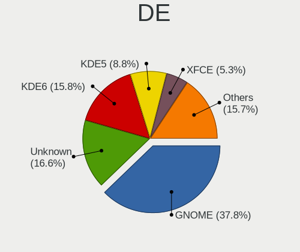
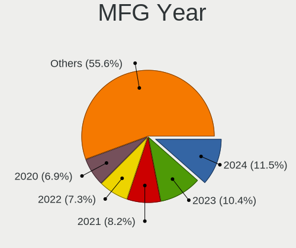
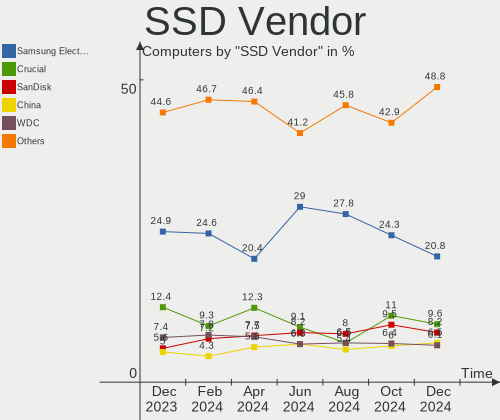
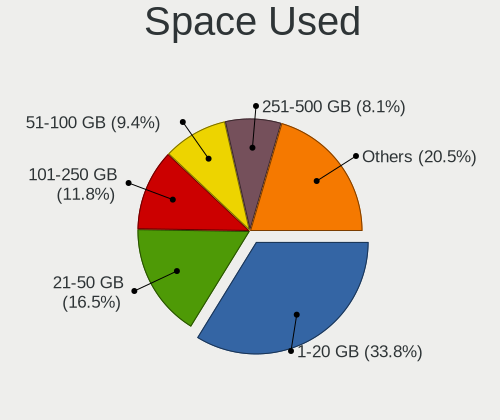
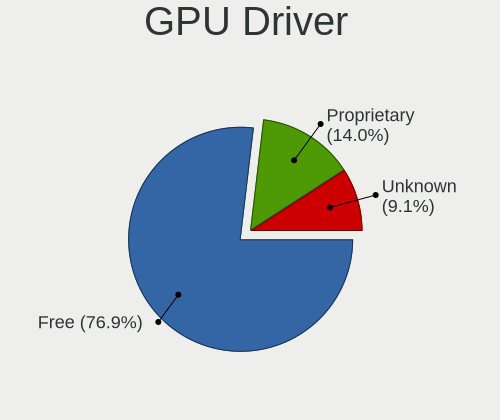
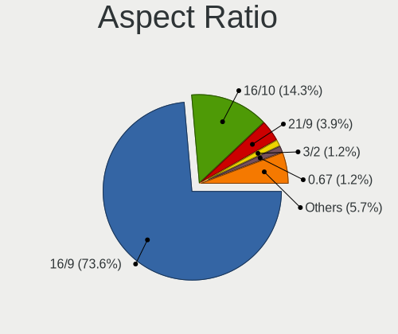
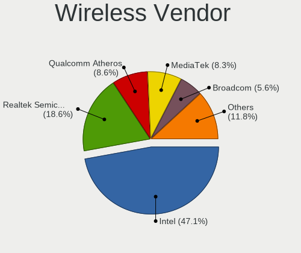
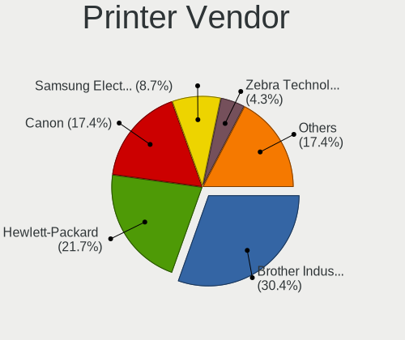
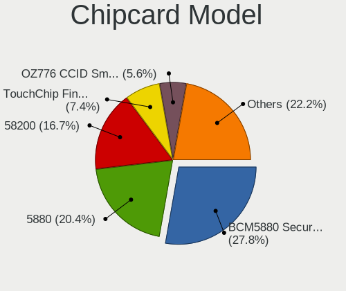
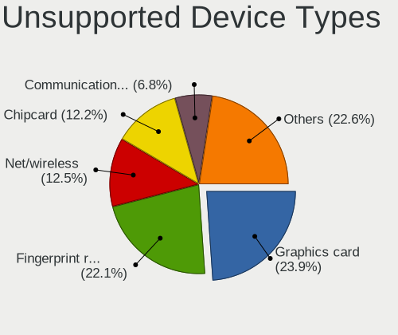

Linux in USA - Hardware Trends
------------------------------

A project to identify most popular hardware characteristics and track their change
over time based on data collected by Linux users at https://Linux-Hardware.org.

Anyone can contribute to this report by the [hw-probe](https://github.com/linuxhw/hw-probe) tool:

    sudo -E hw-probe -all -upload

This is a report for all computer types. See also reports for [desktops](/Location/USA/Desktop/README.md) and [notebooks](/Location/USA/Notebook/README.md).

Period: Nov, 2023.

Contents
--------

* [ System ](#system)
  - [ OS                       ](#os)
  - [ OS Family                ](#os-family)
  - [ Kernel                   ](#kernel)
  - [ Kernel Family            ](#kernel-family)
  - [ Kernel Major Ver.        ](#kernel-major-ver)
  - [ Arch                     ](#arch)
  - [ DE                       ](#de)
  - [ Display Server           ](#display-server)
  - [ Display Manager          ](#display-manager)
  - [ OS Lang                  ](#os-lang)
  - [ Boot Mode                ](#boot-mode)
  - [ Filesystem               ](#filesystem)
  - [ Part. scheme             ](#part-scheme)
  - [ Dual Boot with Linux/BSD ](#dual-boot-with-linuxbsd)
  - [ Dual Boot (Win)          ](#dual-boot-win)

* [ Board ](#board)
  - [ Vendor                   ](#vendor)
  - [ Model                    ](#model)
  - [ Model Family             ](#model-family)
  - [ MFG Year                 ](#mfg-year)
  - [ Form Factor              ](#form-factor)
  - [ Secure Boot              ](#secure-boot)
  - [ Coreboot                 ](#coreboot)
  - [ RAM Size                 ](#ram-size)
  - [ RAM Used                 ](#ram-used)
  - [ Total Drives             ](#total-drives)
  - [ Has CD-ROM               ](#has-cd-rom)
  - [ Has Ethernet             ](#has-ethernet)
  - [ Has WiFi                 ](#has-wifi)
  - [ Has Bluetooth            ](#has-bluetooth)

* [ Location ](#location)
  - [ Country                  ](#country)
  - [ City                     ](#city)

* [ Drives ](#drives)
  - [ Drive Vendor             ](#drive-vendor)
  - [ Drive Model              ](#drive-model)
  - [ HDD Vendor               ](#hdd-vendor)
  - [ SSD Vendor               ](#ssd-vendor)
  - [ Drive Kind               ](#drive-kind)
  - [ Drive Connector          ](#drive-connector)
  - [ Drive Size               ](#drive-size)
  - [ Space Total              ](#space-total)
  - [ Space Used               ](#space-used)
  - [ Malfunc. Drives          ](#malfunc-drives)
  - [ Malfunc. Drive Vendor    ](#malfunc-drive-vendor)
  - [ Malfunc. HDD Vendor      ](#malfunc-hdd-vendor)
  - [ Malfunc. Drive Kind      ](#malfunc-drive-kind)
  - [ Failed Drives            ](#failed-drives)
  - [ Failed Drive Vendor      ](#failed-drive-vendor)
  - [ Drive Status             ](#drive-status)

* [ Storage controller ](#storage-controller)
  - [ Storage Vendor           ](#storage-vendor)
  - [ Storage Model            ](#storage-model)
  - [ Storage Kind             ](#storage-kind)

* [ Processor ](#processor)
  - [ CPU Vendor               ](#cpu-vendor)
  - [ CPU Model                ](#cpu-model)
  - [ CPU Model Family         ](#cpu-model-family)
  - [ CPU Cores                ](#cpu-cores)
  - [ CPU Sockets              ](#cpu-sockets)
  - [ CPU Threads              ](#cpu-threads)
  - [ CPU Op-Modes             ](#cpu-op-modes)
  - [ CPU Microcode            ](#cpu-microcode)
  - [ CPU Microarch            ](#cpu-microarch)

* [ Graphics ](#graphics)
  - [ GPU Vendor               ](#gpu-vendor)
  - [ GPU Model                ](#gpu-model)
  - [ GPU Combo                ](#gpu-combo)
  - [ GPU Driver               ](#gpu-driver)
  - [ GPU Memory               ](#gpu-memory)

* [ Monitor ](#monitor)
  - [ Monitor Vendor           ](#monitor-vendor)
  - [ Monitor Model            ](#monitor-model)
  - [ Monitor Resolution       ](#monitor-resolution)
  - [ Monitor Diagonal         ](#monitor-diagonal)
  - [ Monitor Width            ](#monitor-width)
  - [ Aspect Ratio             ](#aspect-ratio)
  - [ Monitor Area             ](#monitor-area)
  - [ Pixel Density            ](#pixel-density)
  - [ Multiple Monitors        ](#multiple-monitors)

* [ Network ](#network)
  - [ Net Controller Vendor    ](#net-controller-vendor)
  - [ Net Controller Model     ](#net-controller-model)
  - [ Wireless Vendor          ](#wireless-vendor)
  - [ Wireless Model           ](#wireless-model)
  - [ Ethernet Vendor          ](#ethernet-vendor)
  - [ Ethernet Model           ](#ethernet-model)
  - [ Net Controller Kind      ](#net-controller-kind)
  - [ Used Controller          ](#used-controller)
  - [ NICs                     ](#nics)
  - [ IPv6                     ](#ipv6)

* [ Bluetooth ](#bluetooth)
  - [ Bluetooth Vendor         ](#bluetooth-vendor)
  - [ Bluetooth Model          ](#bluetooth-model)

* [ Sound ](#sound)
  - [ Sound Vendor             ](#sound-vendor)
  - [ Sound Model              ](#sound-model)

* [ Memory ](#memory)
  - [ Memory Vendor            ](#memory-vendor)
  - [ Memory Model             ](#memory-model)
  - [ Memory Kind              ](#memory-kind)
  - [ Memory Form Factor       ](#memory-form-factor)
  - [ Memory Size              ](#memory-size)
  - [ Memory Speed             ](#memory-speed)

* [ Printers & scanners ](#printers--scanners)
  - [ Printer Vendor           ](#printer-vendor)
  - [ Printer Model            ](#printer-model)
  - [ Scanner Vendor           ](#scanner-vendor)
  - [ Scanner Model            ](#scanner-model)

* [ Camera ](#camera)
  - [ Camera Vendor            ](#camera-vendor)
  - [ Camera Model             ](#camera-model)

* [ Security ](#security)
  - [ Fingerprint Vendor       ](#fingerprint-vendor)
  - [ Fingerprint Model        ](#fingerprint-model)
  - [ Chipcard Vendor          ](#chipcard-vendor)
  - [ Chipcard Model           ](#chipcard-model)

* [ Unsupported ](#unsupported)
  - [ Unsupported Devices      ](#unsupported-devices)
  - [ Unsupported Device Types ](#unsupported-device-types)

System
------

OS
--

Installed operating systems

| Name                         | Computers | Percent |
|------------------------------|-----------|---------|
| Ubuntu 22.04                 | 144       | 13.14%  |
| Linux Mint 21.2              | 84        | 7.66%   |
| Fedora 39                    | 74        | 6.75%   |
| Debian 12                    | 64        | 5.84%   |
| Arch Rolling                 | 61        | 5.57%   |
| Pop!_OS 22.04                | 50        | 4.56%   |
| Ubuntu 23.10                 | 45        | 4.11%   |
| OpenMandriva 5.0             | 39        | 3.56%   |
| OpenMandriva 23.08           | 31        | 2.83%   |
| Zorin 16                     | 28        | 2.55%   |
| Fedora 38                    | 28        | 2.55%   |
| Ubuntu 20.04                 | 24        | 2.19%   |
| ArcoLinux Rolling            | 23        | 2.1%    |
| openSUSE Tumbleweed-XXXXXXXX | 19        | 1.73%   |
| OpenMandriva 23.11           | 18        | 1.64%   |
| KDE neon 22.04               | 17        | 1.55%   |
| Kubuntu 22.04                | 14        | 1.28%   |
| EndeavourOS Rolling          | 14        | 1.28%   |
| Kubuntu 23.10                | 13        | 1.19%   |
| ChimeraOS 44-1               | 13        | 1.19%   |
| Ubuntu 23.04                 | 11        | 1%      |
| Nobara 38                    | 11        | 1%      |
| Kali 2023.3                  | 11        | 1%      |
| SteamOS 3.5.7                | 10        | 0.91%   |
| NixOS 23.05                  | 10        | 0.91%   |
| Manjaro                      | 10        | 0.91%   |
| Debian                       | 10        | 0.91%   |
| Xero Rolling                 | 9         | 0.82%   |
| Gentoo 2.14                  | 9         | 0.82%   |
| SteamOS 3.5.5                | 7         | 0.64%   |
| Manjaro 23.1.0               | 7         | 0.64%   |
| LMDE 6                       | 7         | 0.64%   |
| Elementary 7.1               | 7         | 0.64%   |
| Xubuntu 22.04                | 6         | 0.55%   |
| SteamOS 3.4.11               | 6         | 0.55%   |
| Linux Mint 21.1              | 6         | 0.55%   |
| Parrot 5.3                   | 5         | 0.46%   |
| OpenMandriva 4.3             | 5         | 0.46%   |
| OpenMandriva 23.03           | 5         | 0.46%   |
| Debian 11                    | 5         | 0.46%   |

OS Family
---------

OS without a version

| Name             | Computers | Percent |
|------------------|-----------|---------|
| Ubuntu           | 229       | 20.89%  |
| Fedora           | 105       | 9.58%   |
| OpenMandriva     | 103       | 9.4%    |
| Linux Mint       | 103       | 9.4%    |
| Debian           | 79        | 7.21%   |
| Arch             | 61        | 5.57%   |
| Pop!_OS          | 50        | 4.56%   |
| SteamOS          | 35        | 3.19%   |
| Kubuntu          | 30        | 2.74%   |
| Zorin            | 29        | 2.65%   |
| ArcoLinux        | 23        | 2.1%    |
| openSUSE         | 22        | 2.01%   |
| Manjaro          | 18        | 1.64%   |
| KDE neon         | 17        | 1.55%   |
| EndeavourOS      | 14        | 1.28%   |
| ChimeraOS        | 13        | 1.19%   |
| Xubuntu          | 12        | 1.09%   |
| Nobara           | 12        | 1.09%   |
| NixOS            | 12        | 1.09%   |
| Kali             | 12        | 1.09%   |
| LMDE             | 11        | 1%      |
| Gentoo           | 11        | 1%      |
| Xero             | 9         | 0.82%   |
| Rocky Linux      | 7         | 0.64%   |
| Elementary       | 7         | 0.64%   |
| Parrot           | 6         | 0.55%   |
| Garuda Linux     | 6         | 0.55%   |
| Ubuntu MATE      | 5         | 0.46%   |
| MX               | 4         | 0.36%   |
| AlmaLinux        | 4         | 0.36%   |
| Ubuntu Unity     | 3         | 0.27%   |
| Raspbian         | 3         | 0.27%   |
| Lubuntu          | 3         | 0.27%   |
| Devuan           | 3         | 0.27%   |
| Clear Linux      | 3         | 0.27%   |
| Void Linux       | 2         | 0.18%   |
| RHEL             | 2         | 0.18%   |
| Pear OS          | 2         | 0.18%   |
| org.kde.Platform | 2         | 0.18%   |
| Manjaro-ARM      | 2         | 0.18%   |

Kernel
------

Version of the Linux kernel

| Version                      | Computers | Percent |
|------------------------------|-----------|---------|
| 6.2.0-36-generic             | 108       | 9.85%   |
| 5.15.0-88-generic            | 89        | 8.12%   |
| 6.1.0-13-amd64               | 58        | 5.29%   |
| 6.6.2-desktop-1omv2390       | 43        | 3.92%   |
| 6.2.0-37-generic             | 43        | 3.92%   |
| 6.5.6-76060506-generic       | 39        | 3.56%   |
| 5.15.0-89-generic            | 37        | 3.38%   |
| 6.5.0-10-generic             | 34        | 3.1%    |
| 6.5.11-300.fc39.x86_64       | 33        | 3.01%   |
| 6.6.1-arch1-1                | 30        | 2.74%   |
| 6.4.11-desktop-1omv2390      | 29        | 2.65%   |
| 6.5.9-arch2-1                | 24        | 2.19%   |
| 6.5.0-13-generic             | 16        | 1.46%   |
| 6.5.6-chos1-chimeraos-1      | 13        | 1.19%   |
| 6.5.12-300.fc39.x86_64       | 12        | 1.09%   |
| 6.5.10-300.fc39.x86_64       | 12        | 1.09%   |
| 6.6.2-arch1-1                | 11        | 1%      |
| 6.5.6-300.fc39.x86_64        | 11        | 1%      |
| 6.6.2-1-default              | 10        | 0.91%   |
| 6.6.1-zen1-1-zen             | 10        | 0.91%   |
| 6.1.52-valve9-1-neptune-61   | 10        | 0.91%   |
| 6.5.10-200.fc38.x86_64       | 9         | 0.82%   |
| 6.5.0-kali3-amd64            | 9         | 0.82%   |
| 6.1.52-valve7-1-neptune-61   | 9         | 0.82%   |
| 6.5.9-200.fc38.x86_64        | 8         | 0.73%   |
| 6.2.0-26-generic             | 8         | 0.73%   |
| 5.4.0-166-generic            | 8         | 0.73%   |
| 5.15.0-76-generic            | 8         | 0.73%   |
| 6.6.1-desktop-1omv2390       | 7         | 0.64%   |
| 6.5.9-zen2-1-zen             | 7         | 0.64%   |
| 6.5.9-1-default              | 7         | 0.64%   |
| 6.5.8-arch1-1                | 7         | 0.64%   |
| 6.5.0-4-amd64                | 7         | 0.64%   |
| 6.2.0-35-generic             | 6         | 0.55%   |
| 5.15.0-86-generic            | 6         | 0.55%   |
| 5.13.0-valve37-1-neptune     | 6         | 0.55%   |
| 6.6.2-zen1-1-zen             | 5         | 0.46%   |
| 6.5.11-1-MANJARO             | 5         | 0.46%   |
| 6.4.10-202.fsync.fc38.x86_64 | 5         | 0.46%   |
| 6.2.6-desktop-1omv2390       | 5         | 0.46%   |

Kernel Family
-------------

Linux kernel without a distro release

| Version | Computers | Percent |
|---------|-----------|---------|
| 6.2.0   | 177       | 16.15%  |
| 5.15.0  | 160       | 14.6%   |
| 6.5.0   | 80        | 7.3%    |
| 6.6.2   | 74        | 6.75%   |
| 6.1.0   | 74        | 6.75%   |
| 6.5.6   | 64        | 5.84%   |
| 6.6.1   | 59        | 5.38%   |
| 6.5.9   | 59        | 5.38%   |
| 6.5.11  | 42        | 3.83%   |
| 6.4.11  | 29        | 2.65%   |
| 6.1.52  | 25        | 2.28%   |
| 6.5.10  | 24        | 2.19%   |
| 5.4.0   | 20        | 1.82%   |
| 6.5.12  | 16        | 1.46%   |
| 6.5.8   | 14        | 1.28%   |
| 6.6.0   | 11        | 1%      |
| 6.5.5   | 11        | 1%      |
| 5.19.0  | 10        | 0.91%   |
| 5.10.0  | 10        | 0.91%   |
| 6.5.7   | 9         | 0.82%   |
| 5.13.0  | 7         | 0.64%   |
| 4.18.0  | 7         | 0.64%   |
| 6.2.6   | 6         | 0.55%   |
| 6.2.16  | 6         | 0.55%   |
| 6.1.61  | 6         | 0.55%   |
| 5.14.0  | 6         | 0.55%   |
| 6.4.10  | 5         | 0.46%   |
| 6.1.62  | 5         | 0.46%   |
| 6.1.57  | 5         | 0.46%   |
| 6.4.8   | 4         | 0.36%   |
| 6.4.12  | 4         | 0.36%   |
| 5.16.7  | 4         | 0.36%   |
| 6.2.9   | 3         | 0.27%   |
| 6.1.60  | 3         | 0.27%   |
| 6.1.21  | 3         | 0.27%   |
| 5.14.21 | 3         | 0.27%   |
| 6.6.3   | 2         | 0.18%   |
| 6.5.4   | 2         | 0.18%   |
| 6.5.3   | 2         | 0.18%   |
| 6.5.2   | 2         | 0.18%   |

Kernel Major Ver.
-----------------

Linux kernel major version

| Version | Computers | Percent |
|---------|-----------|---------|
| 6.5     | 325       | 29.65%  |
| 6.2     | 193       | 17.61%  |
| 5.15    | 164       | 14.96%  |
| 6.6     | 146       | 13.32%  |
| 6.1     | 129       | 11.77%  |
| 6.4     | 48        | 4.38%   |
| 5.4     | 21        | 1.92%   |
| 5.19    | 11        | 1%      |
| 5.10    | 11        | 1%      |
| 5.14    | 10        | 0.91%   |
| 4.18    | 8         | 0.73%   |
| 5.13    | 7         | 0.64%   |
| 5.16    | 5         | 0.46%   |
| 6.3     | 4         | 0.36%   |
| 6.0     | 4         | 0.36%   |
| 5.18    | 2         | 0.18%   |
| 5.11    | 2         | 0.18%   |
| 3.10    | 2         | 0.18%   |
| 5.8     | 1         | 0.09%   |
| 5.3     | 1         | 0.09%   |
| 5.17    | 1         | 0.09%   |
| 4.15    | 1         | 0.09%   |

Arch
----

OS architecture (x86_64, i586, etc.)

| Name    | Computers | Percent |
|---------|-----------|---------|
| x86_64  | 1076      | 98.18%  |
| aarch64 | 15        | 1.37%   |
| i686    | 3         | 0.27%   |
| armv7l  | 1         | 0.09%   |
| armv6l  | 1         | 0.09%   |

DE
--

Desktop Environment

| Name                    | Computers | Percent |
|-------------------------|-----------|---------|
| GNOME                   | 452       | 41.24%  |
| KDE5                    | 309       | 28.19%  |
| X-Cinnamon              | 98        | 8.94%   |
| XFCE                    | 68        | 6.2%    |
| Unknown                 | 56        | 5.11%   |
| MATE                    | 31        | 2.83%   |
| LXQt                    | 16        | 1.46%   |
| Budgie                  | 9         | 0.82%   |
| Cinnamon                | 8         | 0.73%   |
| Pantheon                | 7         | 0.64%   |
| i3                      | 7         | 0.64%   |
| sway                    | 5         | 0.46%   |
| Hyprland                | 5         | 0.46%   |
| Unity                   | 3         | 0.27%   |
| GNOME Flashback         | 3         | 0.27%   |
| openbox                 | 2         | 0.18%   |
| LXDE-pi-wayfire         | 2         | 0.18%   |
| LXDE                    | 2         | 0.18%   |
| KDE6                    | 2         | 0.18%   |
| KDE                     | 2         | 0.18%   |
| Deepin                  | 2         | 0.18%   |
| X-Generic               | 1         | 0.09%   |
| Wayfire:wayfire:wlroots | 1         | 0.09%   |
| qtile                   | 1         | 0.09%   |
| MakuluGameR             | 1         | 0.09%   |
| lightdm-xsession        | 1         | 0.09%   |
| e16-session             | 1         | 0.09%   |
| bspwm                   | 1         | 0.09%   |

Display Server
--------------

X11 or Wayland

| Name    | Computers | Percent |
|---------|-----------|---------|
| X11     | 611       | 55.75%  |
| Wayland | 420       | 38.32%  |
| Tty     | 34        | 3.1%    |
| Unknown | 31        | 2.83%   |

Display Manager
---------------

SDDM, LightDM, etc.

| Name    | Computers | Percent |
|---------|-----------|---------|
| Unknown | 451       | 41.15%  |
| SDDM    | 231       | 21.08%  |
| GDM3    | 221       | 20.16%  |
| LightDM | 121       | 11.04%  |
| GDM     | 65        | 5.93%   |
| SLiM    | 3         | 0.27%   |
| LY-DM   | 2         | 0.18%   |
| LXDM    | 1         | 0.09%   |
| GREETD  | 1         | 0.09%   |

OS Lang
-------

Language

| Lang    | Computers | Percent |
|---------|-----------|---------|
| en_US   | 1019      | 92.97%  |
| C       | 38        | 3.47%   |
| Unknown | 11        | 1%      |
| en_GB   | 9         | 0.82%   |
| en_CA   | 7         | 0.64%   |
| POSIX   | 2         | 0.18%   |
| zh_CN   | 1         | 0.09%   |
| pl_PL   | 1         | 0.09%   |
| it_IT   | 1         | 0.09%   |
| fr_FR   | 1         | 0.09%   |
| es_US   | 1         | 0.09%   |
| es_MX   | 1         | 0.09%   |
| eo      | 1         | 0.09%   |
| en_AU   | 1         | 0.09%   |
| en-US   | 1         | 0.09%   |
| de_DE   | 1         | 0.09%   |

Boot Mode
---------

EFI or BIOS

| Mode | Computers | Percent |
|------|-----------|---------|
| EFI  | 596       | 54.38%  |
| BIOS | 500       | 45.62%  |

Filesystem
----------

Type of filesystem

| Type    | Computers | Percent |
|---------|-----------|---------|
| Ext4    | 568       | 51.82%  |
| Btrfs   | 248       | 22.63%  |
| Tmpfs   | 156       | 14.23%  |
| Overlay | 87        | 7.94%   |
| Xfs     | 22        | 2.01%   |
| Zfs     | 6         | 0.55%   |
| F2fs    | 4         | 0.36%   |
| Ext2    | 3         | 0.27%   |
| Ext3    | 1         | 0.09%   |
| Aufs    | 1         | 0.09%   |

Part. scheme
------------

Scheme of partitioning

| Type    | Computers | Percent |
|---------|-----------|---------|
| GPT     | 607       | 55.38%  |
| Unknown | 397       | 36.22%  |
| MBR     | 92        | 8.39%   |

Dual Boot with Linux/BSD
------------------------

Hosting more than one Linux/BSD

| Dual boot | Computers | Percent |
|-----------|-----------|---------|
| No        | 920       | 83.94%  |
| Yes       | 176       | 16.06%  |

Dual Boot (Win)
---------------

Hosting Linux and Windows

| Dual boot | Computers | Percent |
|-----------|-----------|---------|
| No        | 889       | 81.11%  |
| Yes       | 207       | 18.89%  |

Board
-----

Vendor
------

Motherboard manufacturer

| Name                                 | Computers | Percent |
|--------------------------------------|-----------|---------|
| Hewlett-Packard                      | 179       | 16.33%  |
| Dell                                 | 158       | 14.42%  |
| ASUSTek Computer                     | 157       | 14.32%  |
| Lenovo                               | 140       | 12.77%  |
| MSI                                  | 64        | 5.84%   |
| Gigabyte Technology                  | 51        | 4.65%   |
| Apple                                | 51        | 4.65%   |
| ASRock                               | 43        | 3.92%   |
| Valve                                | 33        | 3.01%   |
| Google                               | 23        | 2.1%    |
| Acer                                 | 22        | 2.01%   |
| Unknown                              | 13        | 1.19%   |
| Toshiba                              | 11        | 1%      |
| Raspberry Pi Foundation              | 10        | 0.91%   |
| Intel                                | 10        | 0.91%   |
| AZW                                  | 10        | 0.91%   |
| Samsung Electronics                  | 9         | 0.82%   |
| Pegatron                             | 8         | 0.73%   |
| Framework                            | 8         | 0.73%   |
| GPU Company                          | 7         | 0.64%   |
| Foxconn                              | 7         | 0.64%   |
| Alienware                            | 7         | 0.64%   |
| Supermicro                           | 6         | 0.55%   |
| Gateway                              | 6         | 0.55%   |
| Microsoft                            | 5         | 0.46%   |
| System76                             | 4         | 0.36%   |
| Shenzhen Meigao Electronic Equipment | 4         | 0.36%   |
| Sony                                 | 3         | 0.27%   |
| eMachines                            | 3         | 0.27%   |
| BESSTAR Tech                         | 3         | 0.27%   |
| ASRockRack                           | 3         | 0.27%   |
| AMI                                  | 3         | 0.27%   |
| Trigkey                              | 2         | 0.18%   |
| SGIN                                 | 2         | 0.18%   |
| Pine Microsystems                    | 2         | 0.18%   |
| Notebook                             | 2         | 0.18%   |
| LG Electronics                       | 2         | 0.18%   |
| Fujitsu                              | 2         | 0.18%   |
| ECS                                  | 2         | 0.18%   |
| ZOTAC                                | 1         | 0.09%   |

Model
-----

Motherboard model

| Name                                              | Computers | Percent |
|---------------------------------------------------|-----------|---------|
| Valve Jupiter                                     | 29        | 2.65%   |
| Unknown                                           | 15        | 1.37%   |
| ASUS TUF Gaming X570-PLUS                         | 7         | 0.64%   |
| MSI MS-7C37                                       | 5         | 0.46%   |
| Apple MacBookPro11,1                              | 5         | 0.46%   |
| Valve Galileo                                     | 4         | 0.36%   |
| MSI MS-7C02                                       | 4         | 0.36%   |
| MSI MS-7B86                                       | 4         | 0.36%   |
| HP Pavilion dv6                                   | 4         | 0.36%   |
| HP Notebook                                       | 4         | 0.36%   |
| HP Laptop 15-dy2xxx                               | 4         | 0.36%   |
| Dell OptiPlex 7040                                | 4         | 0.36%   |
| AZW MINI S                                        | 4         | 0.36%   |
| ASUS ROG STRIX B650E-F GAMING WIFI                | 4         | 0.36%   |
| ASUS All Series                                   | 4         | 0.36%   |
| MSI MS-7C56                                       | 3         | 0.27%   |
| HP EliteDesk 800 G2 DM 35W                        | 3         | 0.27%   |
| GPU Company GWTC116-2                             | 3         | 0.27%   |
| Gigabyte B550I AORUS PRO AX                       | 3         | 0.27%   |
| Framework Laptop (13th Gen Intel Core)            | 3         | 0.27%   |
| Dell OptiPlex 9020                                | 3         | 0.27%   |
| AZW SER                                           | 3         | 0.27%   |
| ASUS ROG STRIX B550-F GAMING                      | 3         | 0.27%   |
| ASUS PRIME B550-PLUS AC-HES                       | 3         | 0.27%   |
| ASUS PRIME B450M-A II                             | 3         | 0.27%   |
| Apple MacBookPro9,2                               | 3         | 0.27%   |
| AMI Intel                                         | 3         | 0.27%   |
| Trigkey S5                                        | 2         | 0.18%   |
| Toshiba Satellite L855                            | 2         | 0.18%   |
| Shenzhen Meigao Electronic Equipment Venus series | 2         | 0.18%   |
| SGIN M15                                          | 2         | 0.18%   |
| Samsung 760XDA                                    | 2         | 0.18%   |
| RPi Raspberry Pi 5 Model B Rev 1.0                | 2         | 0.18%   |
| RPi Raspberry Pi                                  | 2         | 0.18%   |
| Pine Microsystems Pine64 Pinebook Pro             | 2         | 0.18%   |
| Notebook PA70Hx                                   | 2         | 0.18%   |
| MSI MS-7E12                                       | 2         | 0.18%   |
| MSI MS-7D75                                       | 2         | 0.18%   |
| MSI MS-7D25                                       | 2         | 0.18%   |
| MSI MS-7C95                                       | 2         | 0.18%   |

Model Family
------------

Motherboard model prefix

| Name               | Computers | Percent |
|--------------------|-----------|---------|
| Lenovo ThinkPad    | 72        | 6.57%   |
| ASUS ROG           | 40        | 3.65%   |
| Dell Latitude      | 38        | 3.47%   |
| Dell Inspiron      | 34        | 3.1%    |
| Dell OptiPlex      | 30        | 2.74%   |
| Valve Jupiter      | 29        | 2.65%   |
| ASUS PRIME         | 28        | 2.55%   |
| HP Pavilion        | 26        | 2.37%   |
| Dell Precision     | 24        | 2.19%   |
| HP Laptop          | 23        | 2.1%    |
| ASUS TUF           | 21        | 1.92%   |
| Dell XPS           | 18        | 1.64%   |
| HP ENVY            | 16        | 1.46%   |
| HP EliteDesk       | 16        | 1.46%   |
| Unknown            | 15        | 1.37%   |
| Lenovo IdeaPad     | 14        | 1.28%   |
| HP EliteBook       | 13        | 1.19%   |
| Acer Aspire        | 13        | 1.19%   |
| ASUS VivoBook      | 11        | 1%      |
| RPi Raspberry      | 10        | 0.91%   |
| Lenovo ThinkCentre | 10        | 0.91%   |
| Lenovo Legion      | 9         | 0.82%   |
| HP Compaq          | 9         | 0.82%   |
| Toshiba Satellite  | 8         | 0.73%   |
| Lenovo IdeaPadFlex | 8         | 0.73%   |
| Framework Laptop   | 8         | 0.73%   |
| Lenovo Yoga        | 7         | 0.64%   |
| HP ProBook         | 7         | 0.64%   |
| Dell PowerEdge     | 7         | 0.64%   |
| ASUS ASUS          | 6         | 0.55%   |
| Apple MacBookPro11 | 6         | 0.55%   |
| MSI MS-7C37        | 5         | 0.46%   |
| Microsoft Surface  | 5         | 0.46%   |
| Lenovo ThinkBook   | 5         | 0.46%   |
| HP ZBook           | 5         | 0.46%   |
| HP Stream          | 5         | 0.46%   |
| ASRock X570        | 5         | 0.46%   |
| Apple MacBookPro9  | 5         | 0.46%   |
| Valve Galileo      | 4         | 0.36%   |
| MSI MS-7C02        | 4         | 0.36%   |

MFG Year
--------

Motherboard manufacture year

| Year    | Computers | Percent |
|---------|-----------|---------|
| 2022    | 121       | 11.04%  |
| 2023    | 119       | 10.86%  |
| 2020    | 100       | 9.12%   |
| 2019    | 93        | 8.49%   |
| 2018    | 93        | 8.49%   |
| 2021    | 91        | 8.3%    |
| 2017    | 77        | 7.03%   |
| 2012    | 63        | 5.75%   |
| 2013    | 53        | 4.84%   |
| 2014    | 49        | 4.47%   |
| 2011    | 48        | 4.38%   |
| 2015    | 46        | 4.2%    |
| 2016    | 32        | 2.92%   |
| 2010    | 32        | 2.92%   |
| 2009    | 26        | 2.37%   |
| 2008    | 18        | 1.64%   |
| Unknown | 18        | 1.64%   |
| 2007    | 13        | 1.19%   |
| 2006    | 2         | 0.18%   |
| 2004    | 1         | 0.09%   |
| 2001    | 1         | 0.09%   |

Form Factor
-----------

Physical design of the computer

| Name           | Computers | Percent |
|----------------|-----------|---------|
| Notebook       | 483       | 44.07%  |
| Desktop        | 456       | 41.61%  |
| Convertible    | 55        | 5.02%   |
| All in one     | 30        | 2.74%   |
| Mini pc        | 24        | 2.19%   |
| Tablet         | 17        | 1.55%   |
| Server         | 17        | 1.55%   |
| System on chip | 14        | 1.28%   |

Secure Boot
-----------

Enabled or disabled

| State    | Computers | Percent |
|----------|-----------|---------|
| Disabled | 1024      | 93.43%  |
| Enabled  | 72        | 6.57%   |

Coreboot
--------

Have coreboot on board

| Used | Computers | Percent |
|------|-----------|---------|
| No   | 1071      | 97.72%  |
| Yes  | 25        | 2.28%   |

RAM Size
--------

Total RAM memory

| Size in GB      | Computers | Percent |
|-----------------|-----------|---------|
| 16.01-24.0      | 236       | 21.53%  |
| 32.01-64.0      | 204       | 18.61%  |
| 4.01-8.0        | 191       | 17.43%  |
| 8.01-16.0       | 186       | 16.97%  |
| 3.01-4.0        | 122       | 11.13%  |
| 64.01-256.0     | 91        | 8.3%    |
| 24.01-32.0      | 41        | 3.74%   |
| 1.01-2.0        | 15        | 1.37%   |
| 2.01-3.0        | 5         | 0.46%   |
| More than 256.0 | 2         | 0.18%   |
| 0.51-1.0        | 2         | 0.18%   |
| 0.01-0.5        | 1         | 0.09%   |

RAM Used
--------

Used RAM memory

| Used GB     | Computers | Percent |
|-------------|-----------|---------|
| 1.01-2.0    | 283       | 25.82%  |
| 2.01-3.0    | 252       | 22.99%  |
| 4.01-8.0    | 241       | 21.99%  |
| 3.01-4.0    | 185       | 16.88%  |
| 8.01-16.0   | 67        | 6.11%   |
| 0.51-1.0    | 27        | 2.46%   |
| 16.01-24.0  | 13        | 1.19%   |
| 0.01-0.5    | 13        | 1.19%   |
| 24.01-32.0  | 7         | 0.64%   |
| 32.01-64.0  | 6         | 0.55%   |
| 64.01-256.0 | 2         | 0.18%   |

Total Drives
------------

Number of drives on board

| Drives | Computers | Percent |
|--------|-----------|---------|
| 1      | 615       | 56.11%  |
| 2      | 272       | 24.82%  |
| 3      | 100       | 9.12%   |
| 4      | 51        | 4.65%   |
| 5      | 23        | 2.1%    |
| 6      | 13        | 1.19%   |
| 0      | 9         | 0.82%   |
| 7      | 4         | 0.36%   |
| 9      | 3         | 0.27%   |
| 8      | 3         | 0.27%   |
| 27     | 1         | 0.09%   |
| 12     | 1         | 0.09%   |
| 10     | 1         | 0.09%   |

Has CD-ROM
----------

Has CD-ROM on board

| Presented | Computers | Percent |
|-----------|-----------|---------|
| No        | 748       | 68.25%  |
| Yes       | 348       | 31.75%  |

Has Ethernet
------------

Has Ethernet on board

| Presented | Computers | Percent |
|-----------|-----------|---------|
| Yes       | 886       | 80.84%  |
| No        | 210       | 19.16%  |

Has WiFi
--------

Has WiFi module

| Presented | Computers | Percent |
|-----------|-----------|---------|
| Yes       | 907       | 82.76%  |
| No        | 189       | 17.24%  |

Has Bluetooth
-------------

Has Bluetooth module

| Presented | Computers | Percent |
|-----------|-----------|---------|
| Yes       | 747       | 68.16%  |
| No        | 349       | 31.84%  |

Location
--------

Country
-------

Geographic location (country)

| Country | Computers | Percent |
|---------|-----------|---------|
| USA     | 1096      | 100%    |

City
----

Geographic location (city)

| City         | Computers | Percent |
|--------------|-----------|---------|
| Los Angeles  | 19        | 1.73%   |
| Seattle      | 14        | 1.28%   |
| New York     | 14        | 1.28%   |
| Portland     | 12        | 1.09%   |
| Minneapolis  | 12        | 1.09%   |
| Dallas       | 11        | 1%      |
| Chicago      | 11        | 1%      |
| Charlotte    | 11        | 1%      |
| Atlanta      | 11        | 1%      |
| Bangor       | 10        | 0.91%   |
| Phoenix      | 8         | 0.73%   |
| Denver       | 8         | 0.73%   |
| Springfield  | 7         | 0.64%   |
| San Diego    | 7         | 0.64%   |
| Rochester    | 7         | 0.64%   |
| Miami        | 7         | 0.64%   |
| Las Vegas    | 7         | 0.64%   |
| Knoxville    | 7         | 0.64%   |
| Houston      | 7         | 0.64%   |
| Columbia     | 7         | 0.64%   |
| San Jose     | 6         | 0.55%   |
| San Antonio  | 6         | 0.55%   |
| Detroit      | 6         | 0.55%   |
| Columbus     | 6         | 0.55%   |
| Vancouver    | 5         | 0.46%   |
| Tucson       | 5         | 0.46%   |
| Skokie       | 5         | 0.46%   |
| Richmond     | 5         | 0.46%   |
| Raleigh      | 5         | 0.46%   |
| Olympia      | 5         | 0.46%   |
| Kansas City  | 5         | 0.46%   |
| Jacksonville | 5         | 0.46%   |
| Indianapolis | 5         | 0.46%   |
| Boston       | 5         | 0.46%   |
| Bellevue     | 5         | 0.46%   |
| Austin       | 5         | 0.46%   |
| Tampa        | 4         | 0.36%   |
| Pittsburgh   | 4         | 0.36%   |
| Pensacola    | 4         | 0.36%   |
| Parker       | 4         | 0.36%   |

Drives
------

Drive Vendor
------------

Hard drive vendors

| Vendor                      | Computers | Drives | Percent |
|-----------------------------|-----------|--------|---------|
| Samsung Electronics         | 288       | 384    | 17.31%  |
| WDC                         | 204       | 276    | 12.26%  |
| Seagate                     | 174       | 230    | 10.46%  |
| SanDisk                     | 135       | 148    | 8.11%   |
| Unknown                     | 93        | 100    | 5.59%   |
| Toshiba                     | 66        | 69     | 3.97%   |
| Crucial                     | 49        | 56     | 2.94%   |
| SK hynix                    | 47        | 47     | 2.82%   |
| Intel                       | 46        | 58     | 2.76%   |
| Micron Technology           | 39        | 39     | 2.34%   |
| Hitachi                     | 39        | 46     | 2.34%   |
| Kingston                    | 38        | 42     | 2.28%   |
| Phison Electronics          | 35        | 36     | 2.1%    |
| HGST                        | 31        | 35     | 1.86%   |
| Apple                       | 31        | 36     | 1.86%   |
| Micron/Crucial Technology   | 29        | 30     | 1.74%   |
| PNY                         | 28        | 32     | 1.68%   |
| China                       | 28        | 35     | 1.68%   |
| Unknown                     | 22        | 24     | 1.32%   |
| KIOXIA                      | 20        | 20     | 1.2%    |
| SPCC                        | 19        | 19     | 1.14%   |
| A-DATA Technology           | 12        | 12     | 0.72%   |
| Team                        | 8         | 9      | 0.48%   |
| LITEON                      | 8         | 8      | 0.48%   |
| Kingston Technology Company | 8         | 9      | 0.48%   |
| Hewlett-Packard             | 8         | 9      | 0.48%   |
| Silicon Motion              | 7         | 7      | 0.42%   |
| Realtek Semiconductor       | 7         | 7      | 0.42%   |
| SABRENT                     | 6         | 6      | 0.36%   |
| Fanxiang                    | 6         | 7      | 0.36%   |
| T-FORCE                     | 5         | 5      | 0.3%    |
| Phison                      | 5         | 5      | 0.3%    |
| O2 Micro                    | 5         | 5      | 0.3%    |
| KingFast                    | 5         | 6      | 0.3%    |
| Transcend                   | 4         | 4      | 0.24%   |
| SSSTC                       | 4         | 4      | 0.24%   |
| Patriot                     | 4         | 4      | 0.24%   |
| MAXIO Technology (Hangzhou) | 4         | 4      | 0.24%   |
| JMicron Technology          | 4         | 4      | 0.24%   |
| Fujitsu                     | 4         | 4      | 0.24%   |

Drive Model
-----------

Hard drive models

| Model                                                 | Computers | Percent |
|-------------------------------------------------------|-----------|---------|
| Samsung NVMe SSD Controller SM981/PM981/PM983 250GB   | 58        | 3.14%   |
| Samsung NVMe SSD Controller PM9A1/PM9A3/980PRO 2TB    | 31        | 1.68%   |
| Unknown                                               | 22        | 1.19%   |
| Micron/Crucial P2 NVMe PCIe SSD 1TB                   | 19        | 1.03%   |
| Seagate ST2000DM008-2FR102 2TB                        | 16        | 0.87%   |
| Unknown MMC Card  64GB                                | 15        | 0.81%   |
| Samsung SSD 870 EVO 1TB                               | 15        | 0.81%   |
| Samsung SSD 860 EVO 1TB                               | 14        | 0.76%   |
| Phison PS5013 E13 NVMe Controller 512GB               | 14        | 0.76%   |
| Unknown SD/MMC/MS PRO 128GB                           | 13        | 0.7%    |
| Samsung SSD 860 EVO 500GB                             | 11        | 0.59%   |
| Sandisk WD_BLACK SN770 1TB                            | 10        | 0.54%   |
| Sandisk WD Blue SN550 NVMe SSD 512GB                  | 10        | 0.54%   |
| Unknown MMC Card  128GB                               | 9         | 0.49%   |
| Toshiba DT01ACA100 1TB                                | 9         | 0.49%   |
| Seagate ST1000LM035-1RK172 1TB                        | 9         | 0.49%   |
| Sandisk WD Black SN750 / PC SN730 NVMe SSD 500GB      | 9         | 0.49%   |
| Samsung SSD 980 1TB                                   | 9         | 0.49%   |
| WDC WDBNCE5000PNC 500GB SSD                           | 8         | 0.43%   |
| Unknown MMC Card  512GB                               | 8         | 0.43%   |
| Unknown MMC Card  256GB                               | 8         | 0.43%   |
| Samsung SSD 850 EVO 500GB                             | 8         | 0.43%   |
| Samsung SSD 850 EVO 250GB                             | 8         | 0.43%   |
| PNY CS900 500GB SSD                                   | 8         | 0.43%   |
| Kingston SA400S37240G 240GB SSD                       | 8         | 0.43%   |
| WDC WD10EZEX-08WN4A0 1TB                              | 7         | 0.38%   |
| Silicon Motion SM2263EN/SM2263XT SSD Controller 256GB | 7         | 0.38%   |
| Sandisk WD Blue SN570 500GB                           | 7         | 0.38%   |
| Samsung SSD 990 PRO 2TB                               | 7         | 0.38%   |
| Samsung SSD 870 EVO 2TB                               | 7         | 0.38%   |
| Phison E12 NVMe Controller 512GB                      | 7         | 0.38%   |
| Kingston SA400S37480G 480GB SSD                       | 7         | 0.38%   |
| Intel SSD 660P Series 512GB                           | 7         | 0.38%   |
| Crucial CT500MX500SSD1 500GB                          | 7         | 0.38%   |
| Unknown MMC Card  32GB                                | 6         | 0.32%   |
| Toshiba XG6 NVMe SSD Controller 512GB                 | 6         | 0.32%   |
| Toshiba MQ04ABF100 1TB                                | 6         | 0.32%   |
| SPCC Solid State Disk 512GB                           | 6         | 0.32%   |
| Seagate ST500DM002-1BD142 500GB                       | 6         | 0.32%   |
| Seagate ST2000DM006-2DM164 2TB                        | 6         | 0.32%   |

HDD Vendor
----------

Hard disk drive vendors

| Vendor              | Computers | Drives | Percent |
|---------------------|-----------|--------|---------|
| Seagate             | 169       | 223    | 33.47%  |
| WDC                 | 165       | 227    | 32.67%  |
| Toshiba             | 46        | 48     | 9.11%   |
| Hitachi             | 39        | 46     | 7.72%   |
| HGST                | 31        | 35     | 6.14%   |
| Unknown             | 13        | 13     | 2.57%   |
| Apple               | 12        | 12     | 2.38%   |
| Samsung Electronics | 6         | 7      | 1.19%   |
| Fujitsu             | 4         | 4      | 0.79%   |
| TO Exter            | 2         | 2      | 0.4%    |
| Maxone              | 2         | 2      | 0.4%    |
| Hewlett-Packard     | 2         | 2      | 0.4%    |
| ASMT                | 2         | 3      | 0.4%    |
| Unknown             | 2         | 3      | 0.4%    |
| USB3.0              | 1         | 1      | 0.2%    |
| TDAS                | 1         | 3      | 0.2%    |
| SABRENT             | 1         | 1      | 0.2%    |
| Mobius              | 1         | 2      | 0.2%    |
| Maxtor              | 1         | 1      | 0.2%    |
| Inateck             | 1         | 1      | 0.2%    |
| HPQ                 | 1         | 1      | 0.2%    |
| External            | 1         | 1      | 0.2%    |
| ASMedia             | 1         | 1      | 0.2%    |
| ACASIS              | 1         | 2      | 0.2%    |

SSD Vendor
----------

Solid state drive vendors

| Vendor              | Computers | Drives | Percent |
|---------------------|-----------|--------|---------|
| Samsung Electronics | 116       | 149    | 25.66%  |
| WDC                 | 33        | 33     | 7.3%    |
| SanDisk             | 33        | 34     | 7.3%    |
| Crucial             | 33        | 36     | 7.3%    |
| PNY                 | 28        | 32     | 6.19%   |
| China               | 28        | 35     | 6.19%   |
| Kingston            | 26        | 30     | 5.75%   |
| SPCC                | 17        | 17     | 3.76%   |
| Micron Technology   | 13        | 13     | 2.88%   |
| Apple               | 11        | 11     | 2.43%   |
| A-DATA Technology   | 11        | 11     | 2.43%   |
| Intel               | 10        | 12     | 2.21%   |
| SK hynix            | 7         | 7      | 1.55%   |
| LITEON              | 7         | 7      | 1.55%   |
| Team                | 6         | 7      | 1.33%   |
| Hewlett-Packard     | 5         | 6      | 1.11%   |
| Fanxiang            | 5         | 6      | 1.11%   |
| Transcend           | 4         | 4      | 0.88%   |
| Toshiba             | 4         | 4      | 0.88%   |
| Patriot             | 4         | 4      | 0.88%   |
| PNY USB             | 3         | 3      | 0.66%   |
| OCZ                 | 3         | 3      | 0.66%   |
| Mushkin             | 3         | 4      | 0.66%   |
| Leven               | 3         | 8      | 0.66%   |
| Corsair             | 3         | 3      | 0.66%   |
| Wibtek              | 2         | 2      | 0.44%   |
| Timetec             | 2         | 3      | 0.44%   |
| T-FORCE             | 2         | 2      | 0.44%   |
| SSSTC               | 2         | 2      | 0.44%   |
| Netac               | 2         | 2      | 0.44%   |
| LITEONIT            | 2         | 2      | 0.44%   |
| Lexar               | 2         | 2      | 0.44%   |
| KingFast            | 2         | 2      | 0.44%   |
| Acer                | 2         | 2      | 0.44%   |
| X12                 | 1         | 1      | 0.22%   |
| Union Memory        | 1         | 1      | 0.22%   |
| SUNEAST             | 1         | 1      | 0.22%   |
| SCY                 | 1         | 1      | 0.22%   |
| OWC                 | 1         | 1      | 0.22%   |
| NGFF                | 1         | 1      | 0.22%   |

Drive Kind
----------

HDD or SSD

| Kind    | Computers | Drives | Percent |
|---------|-----------|--------|---------|
| NVMe    | 553       | 697    | 37.49%  |
| HDD     | 409       | 641    | 27.73%  |
| SSD     | 396       | 516    | 26.85%  |
| MMC     | 85        | 93     | 5.76%   |
| Unknown | 32        | 36     | 2.17%   |

Drive Connector
---------------

SATA, SAS, NVMe, etc.

| Type | Computers | Drives | Percent |
|------|-----------|--------|---------|
| SATA | 662       | 1088   | 47.83%  |
| NVMe | 545       | 689    | 39.38%  |
| SAS  | 92        | 113    | 6.65%   |
| MMC  | 85        | 93     | 6.14%   |

Drive Size
----------

Size of hard drive

| Size in TB | Computers | Drives | Percent |
|------------|-----------|--------|---------|
| 0.01-0.5   | 404       | 501    | 44.99%  |
| 0.51-1.0   | 269       | 331    | 29.96%  |
| 1.01-2.0   | 104       | 139    | 11.58%  |
| 3.01-4.0   | 47        | 69     | 5.23%   |
| 4.01-10.0  | 41        | 72     | 4.57%   |
| 2.01-3.0   | 21        | 25     | 2.34%   |
| 10.01-20.0 | 11        | 18     | 1.22%   |
| 20.01-50.0 | 1         | 2      | 0.11%   |

Space Total
-----------

Amount of disk space available on the file system

| Size in GB     | Computers | Percent |
|----------------|-----------|---------|
| 501-1000       | 212       | 19.34%  |
| 251-500        | 205       | 18.7%   |
| 101-250        | 192       | 17.52%  |
| More than 3000 | 138       | 12.59%  |
| 1001-2000      | 122       | 11.13%  |
| 1-20           | 80        | 7.3%    |
| 51-100         | 42        | 3.83%   |
| 2001-3000      | 40        | 3.65%   |
| Unknown        | 35        | 3.19%   |
| 21-50          | 30        | 2.74%   |

Space Used
----------

Amount of used disk space

| Used GB        | Computers | Percent |
|----------------|-----------|---------|
| 1-20           | 342       | 31.2%   |
| 21-50          | 173       | 15.78%  |
| 101-250        | 134       | 12.23%  |
| 51-100         | 124       | 11.31%  |
| 501-1000       | 93        | 8.49%   |
| 251-500        | 86        | 7.85%   |
| 1001-2000      | 54        | 4.93%   |
| More than 3000 | 43        | 3.92%   |
| Unknown        | 35        | 3.19%   |
| 2001-3000      | 9         | 0.82%   |
| 0              | 3         | 0.27%   |

Malfunc. Drives
---------------

Drive models with a malfunction

| Model                                   | Computers | Drives | Percent |
|-----------------------------------------|-----------|--------|---------|
| Seagate ST4000DM004-2CV104 4TB          | 2         | 3      | 2.53%   |
| Seagate ST33000651NS 3TB                | 2         | 2      | 2.53%   |
| SanDisk SSD PLUS 240GB                  | 2         | 2      | 2.53%   |
| Samsung Electronics SSD 870 EVO 2TB     | 2         | 2      | 2.53%   |
| Samsung Electronics SSD 870 EVO 1TB     | 2         | 2      | 2.53%   |
| HGST HTS541010A9E680 1TB                | 2         | 2      | 2.53%   |
| WDC WD80EMAZ-00WJTA0 8TB                | 1         | 11     | 1.27%   |
| WDC WD60EFRX-68MYMN1 6TB                | 1         | 1      | 1.27%   |
| WDC WD40EZRZ-00WN9B0 4TB                | 1         | 1      | 1.27%   |
| WDC WD3200BEKT-08PVMT1 320GB            | 1         | 1      | 1.27%   |
| WDC WD3200AAKS-75B3A0 320GB             | 1         | 1      | 1.27%   |
| WDC WD20EZRZ-00Z5HB0 2TB                | 1         | 1      | 1.27%   |
| WDC WD20EARS-00MVWB0 2TB                | 1         | 1      | 1.27%   |
| WDC WD1600JS-00NCB1 160GB               | 1         | 1      | 1.27%   |
| WDC WD1600AAJS-00L7A0 160GB             | 1         | 1      | 1.27%   |
| WDC WD15EADS-22P8B0 1TB                 | 1         | 1      | 1.27%   |
| WDC WD10EZEX-00BN5A0 1TB                | 1         | 1      | 1.27%   |
| WDC WD10EARS-22Y5B1 1TB                 | 1         | 1      | 1.27%   |
| WDC WD Green 2.5 240GB SSD              | 1         | 1      | 1.27%   |
| Transcend TS128GMTS430S 128GB SSD       | 1         | 1      | 1.27%   |
| Toshiba MQ01ABD100 1TB                  | 1         | 1      | 1.27%   |
| Toshiba MK5056GSY 500GB                 | 1         | 1      | 1.27%   |
| Toshiba MK3261GSYN 320GB                | 1         | 1      | 1.27%   |
| Toshiba KSG60ZMV256G M.2 2280 256GB SSD | 1         | 1      | 1.27%   |
| SSSTC CVB-8D128-HP 128GB SSD            | 1         | 1      | 1.27%   |
| SK hynix BC711 HFM512GD3JX013N 512GB    | 1         | 1      | 1.27%   |
| Seagate ST9640320AS 640GB               | 1         | 1      | 1.27%   |
| Seagate ST9500325AS 500GB               | 1         | 1      | 1.27%   |
| Seagate ST940210AS 40GB                 | 1         | 1      | 1.27%   |
| Seagate ST500DM002-1BD142 500GB         | 1         | 1      | 1.27%   |
| Seagate ST4000DM005-2DP166 4TB          | 1         | 1      | 1.27%   |
| Seagate ST3750528AS 752GB               | 1         | 1      | 1.27%   |
| Seagate ST3500631NS 500GB               | 1         | 1      | 1.27%   |
| Seagate ST3500418AS 500GB               | 1         | 1      | 1.27%   |
| Seagate ST340014AS 40GB                 | 1         | 1      | 1.27%   |
| Seagate ST3250310AS 250GB               | 1         | 1      | 1.27%   |
| Seagate ST320LT007-9ZV142 320GB         | 1         | 1      | 1.27%   |
| Seagate ST3000NM0033-9ZM178 3TB         | 1         | 1      | 1.27%   |
| Seagate ST3000DM008-2DM166 3TB          | 1         | 1      | 1.27%   |
| Seagate ST2000LM007-1R8174 2TB          | 1         | 1      | 1.27%   |

Malfunc. Drive Vendor
---------------------

Vendors of faulty drives

| Vendor              | Computers | Drives | Percent |
|---------------------|-----------|--------|---------|
| Seagate             | 19        | 21     | 25%     |
| Samsung Electronics | 13        | 14     | 17.11%  |
| WDC                 | 12        | 23     | 15.79%  |
| Hitachi             | 5         | 5      | 6.58%   |
| Toshiba             | 4         | 4      | 5.26%   |
| Sandisk             | 4         | 4      | 5.26%   |
| HGST                | 4         | 4      | 5.26%   |
| Apple               | 3         | 3      | 3.95%   |
| Intel               | 2         | 4      | 2.63%   |
| Crucial             | 2         | 3      | 2.63%   |
| Transcend           | 1         | 1      | 1.32%   |
| SSSTC               | 1         | 1      | 1.32%   |
| SK hynix            | 1         | 1      | 1.32%   |
| LITEON              | 1         | 1      | 1.32%   |
| GLOWAY              | 1         | 1      | 1.32%   |
| Aura                | 1         | 1      | 1.32%   |
| ASMedia             | 1         | 1      | 1.32%   |
| A-DATA Technology   | 1         | 1      | 1.32%   |

Malfunc. HDD Vendor
-------------------

Vendors of faulty HDD drives

| Vendor              | Computers | Drives | Percent |
|---------------------|-----------|--------|---------|
| Seagate             | 19        | 21     | 41.3%   |
| WDC                 | 11        | 22     | 23.91%  |
| Hitachi             | 5         | 5      | 10.87%  |
| HGST                | 4         | 4      | 8.7%    |
| Toshiba             | 3         | 3      | 6.52%   |
| Apple               | 2         | 2      | 4.35%   |
| Samsung Electronics | 1         | 1      | 2.17%   |
| ASMedia             | 1         | 1      | 2.17%   |

Malfunc. Drive Kind
-------------------

Kinds of faulty drives

| Kind | Computers | Drives | Percent |
|------|-----------|--------|---------|
| HDD  | 44        | 59     | 59.46%  |
| SSD  | 25        | 29     | 33.78%  |
| NVMe | 5         | 5      | 6.76%   |

Failed Drives
-------------

Failed drive models

| Model                          | Computers | Drives | Percent |
|--------------------------------|-----------|--------|---------|
| Mushkin MKNSSDEC120GB          | 1         | 1      | 33.33%  |
| Intel SSDSCKKF256H6 SATA 256GB | 1         | 1      | 33.33%  |
| Hitachi HUS724040ALE640 4TB    | 1         | 1      | 33.33%  |

Failed Drive Vendor
-------------------

Failed drive vendors

| Vendor  | Computers | Drives | Percent |
|---------|-----------|--------|---------|
| Mushkin | 1         | 1      | 33.33%  |
| Intel   | 1         | 1      | 33.33%  |
| Hitachi | 1         | 1      | 33.33%  |

Drive Status
------------

Number of failed and malfunc. drives

| Status   | Computers | Drives | Percent |
|----------|-----------|--------|---------|
| Detected | 653       | 1089   | 54.97%  |
| Works    | 460       | 798    | 38.72%  |
| Malfunc  | 72        | 93     | 6.06%   |
| Failed   | 3         | 3      | 0.25%   |

Storage controller
------------------

Storage Vendor
--------------

Storage controller vendors

| Vendor                         | Computers | Percent |
|--------------------------------|-----------|---------|
| Intel                          | 591       | 39.32%  |
| AMD                            | 254       | 16.9%   |
| Samsung Electronics            | 191       | 12.71%  |
| SanDisk                        | 119       | 7.92%   |
| Micron/Crucial Technology      | 44        | 2.93%   |
| Phison Electronics             | 43        | 2.86%   |
| SK hynix                       | 40        | 2.66%   |
| ASMedia Technology             | 30        | 2%      |
| Micron Technology              | 27        | 1.8%    |
| KIOXIA                         | 20        | 1.33%   |
| Kingston Technology Company    | 20        | 1.33%   |
| Toshiba America Info Systems   | 17        | 1.13%   |
| Nvidia                         | 13        | 0.86%   |
| Broadcom / LSI                 | 10        | 0.67%   |
| Silicon Motion                 | 8         | 0.53%   |
| Realtek Semiconductor          | 8         | 0.53%   |
| Marvell Technology Group       | 8         | 0.53%   |
| Apple                          | 8         | 0.53%   |
| LSI Logic / Symbios Logic      | 6         | 0.4%    |
| JMicron Technology             | 6         | 0.4%    |
| O2 Micro                       | 5         | 0.33%   |
| MAXIO Technology (Hangzhou)    | 5         | 0.33%   |
| Solidigm                       | 4         | 0.27%   |
| Nextorage                      | 4         | 0.27%   |
| Solid State Storage Technology | 3         | 0.2%    |
| Lite-On Technology             | 3         | 0.2%    |
| INNOGRIT                       | 3         | 0.2%    |
| ADATA Technology               | 3         | 0.2%    |
| Silicon Image                  | 2         | 0.13%   |
| VIA Technologies               | 1         | 0.07%   |
| Shenzhen Longsys Electronics   | 1         | 0.07%   |
| Seagate Technology             | 1         | 0.07%   |
| Radian Memory Systems          | 1         | 0.07%   |
| OCZ Technology Group           | 1         | 0.07%   |
| Hosin Global Electronics       | 1         | 0.07%   |
| HighPoint Technologies         | 1         | 0.07%   |
| Biwin Storage Technology       | 1         | 0.07%   |

Storage Model
-------------

Storage controller models

| Model                                                                          | Computers | Percent |
|--------------------------------------------------------------------------------|-----------|---------|
| AMD FCH SATA Controller [AHCI mode]                                            | 173       | 10.22%  |
| Samsung NVMe SSD Controller SM981/PM981/PM983                                  | 87        | 5.14%   |
| Samsung NVMe SSD Controller PM9A1/PM9A3/980PRO                                 | 44        | 2.6%    |
| Intel Volume Management Device NVMe RAID Controller                            | 43        | 2.54%   |
| AMD 500 Series Chipset SATA Controller                                         | 42        | 2.48%   |
| Intel Sunrise Point-LP SATA Controller [AHCI mode]                             | 40        | 2.36%   |
| Intel 8 Series/C220 Series Chipset Family 6-port SATA Controller 1 [AHCI mode] | 40        | 2.36%   |
| AMD 400 Series Chipset SATA Controller                                         | 34        | 2.01%   |
| Samsung NVMe SSD Controller 980 (DRAM-less)                                    | 33        | 1.95%   |
| Intel 82801 Mobile SATA Controller [RAID mode]                                 | 33        | 1.95%   |
| SanDisk WD Black SN770 / PC SN740 256GB / PC SN560 (DRAM-less) NVMe SSD        | 31        | 1.83%   |
| Micron/Crucial P2 [Nick P2] / P3 / P3 Plus NVMe PCIe SSD (DRAM-less)           | 30        | 1.77%   |
| Intel SATA Controller [RAID mode]                                              | 30        | 1.77%   |
| Intel Q170/Q150/B150/H170/H110/Z170/CM236 Chipset SATA Controller [AHCI Mode]  | 28        | 1.65%   |
| ASMedia ASM1062 Serial ATA Controller                                          | 28        | 1.65%   |
| Intel 7 Series Chipset Family 6-port SATA Controller [AHCI mode]               | 25        | 1.48%   |
| Intel 6 Series/C200 Series Chipset Family 6 port Desktop SATA AHCI Controller  | 24        | 1.42%   |
| Intel 200 Series PCH SATA controller [AHCI mode]                               | 23        | 1.36%   |
| AMD SB7x0/SB8x0/SB9x0 SATA Controller [AHCI mode]                              | 20        | 1.18%   |
| Intel 6 Series/C200 Series Chipset Family 6 port Mobile SATA AHCI Controller   | 19        | 1.12%   |
| SK hynix Gold P31/BC711/PC711 NVMe Solid State Drive                           | 18        | 1.06%   |
| SanDisk Ultra 3D / WD Blue SN550 NVMe SSD                                      | 17        | 1%      |
| Phison PS5013-E13 PCIe3 NVMe Controller (DRAM-less)                            | 17        | 1%      |
| AMD SB7x0/SB8x0/SB9x0 IDE Controller                                           | 16        | 0.95%   |
| SK hynix Platinum P41/PC801 NVMe Solid State Drive                             | 14        | 0.83%   |
| Intel Alder Lake-S PCH SATA Controller [AHCI Mode]                             | 14        | 0.83%   |
| SanDisk Ultra 3D / WD Blue SN570 NVMe SSD (DRAM-less)                          | 13        | 0.77%   |
| SanDisk Extreme Pro / WD Black SN750 / PC SN730 / Red SN700 NVMe SSD           | 13        | 0.77%   |
| Samsung NVMe SSD Controller S4LV008[Pascal]                                    | 13        | 0.77%   |
| Intel Volume Management Device NVMe RAID Controller Intel Corporation          | 13        | 0.77%   |
| Intel Cannon Lake PCH SATA AHCI Controller                                     | 13        | 0.77%   |
| Intel 7 Series/C210 Series Chipset Family 6-port SATA Controller [AHCI mode]   | 13        | 0.77%   |
| Phison E12 NVMe Controller                                                     | 12        | 0.71%   |
| KIOXIA NVMe SSD Controller BG4 (DRAM-less)                                     | 12        | 0.71%   |
| Intel Wildcat Point-LP SATA Controller [AHCI Mode]                             | 12        | 0.71%   |
| Intel Celeron/Pentium Silver Processor SATA Controller                         | 12        | 0.71%   |
| Sandisk WD Black SN850X NVMe SSD                                               | 11        | 0.65%   |
| Intel Cannon Lake Mobile PCH SATA AHCI Controller                              | 11        | 0.65%   |
| Intel 8 Series SATA Controller 1 [AHCI mode]                                   | 11        | 0.65%   |
| Intel Tiger Lake-LP SATA Controller                                            | 10        | 0.59%   |

Storage Kind
------------

Kind of storage controller (IDE, SATA, NVMe, SAS, ...)

| Kind | Computers | Percent |
|------|-----------|---------|
| SATA | 698       | 47.35%  |
| NVMe | 544       | 36.91%  |
| RAID | 137       | 9.29%   |
| IDE  | 78        | 5.29%   |
| SAS  | 12        | 0.81%   |
| SCSI | 5         | 0.34%   |

Processor
---------

CPU Vendor
----------

Processor vendors

| Vendor       | Computers | Percent |
|--------------|-----------|---------|
| Intel        | 735       | 67.06%  |
| AMD          | 343       | 31.3%   |
| ARM          | 16        | 1.46%   |
| CentaurHauls | 1         | 0.09%   |
| Unknown      | 1         | 0.09%   |

CPU Model
---------

Processor models

| Model                                   | Computers | Percent |
|-----------------------------------------|-----------|---------|
| AMD Custom APU 0405                     | 33        | 3.01%   |
| Intel 11th Gen Core i7-1165G7 @ 2.80GHz | 15        | 1.37%   |
| ARM Processor                           | 13        | 1.19%   |
| Intel Core i7-8650U CPU @ 1.90GHz       | 12        | 1.09%   |
| AMD Ryzen 9 5900X 12-Core Processor     | 12        | 1.09%   |
| AMD Ryzen 5 5600X 6-Core Processor      | 11        | 1%      |
| AMD Ryzen 5 3600 6-Core Processor       | 10        | 0.91%   |
| Intel Celeron N4020 CPU @ 1.10GHz       | 9         | 0.82%   |
| Intel Core i7-8550U CPU @ 1.80GHz       | 8         | 0.73%   |
| Intel Core i5-6500 CPU @ 3.20GHz        | 8         | 0.73%   |
| AMD Ryzen 9 3900X 12-Core Processor     | 8         | 0.73%   |
| AMD Ryzen 5 5600G with Radeon Graphics  | 8         | 0.73%   |
| Intel N100                              | 7         | 0.64%   |
| Intel Core i7-3770 CPU @ 3.40GHz        | 7         | 0.64%   |
| Intel Core i7-2600 CPU @ 3.40GHz        | 7         | 0.64%   |
| Intel Core i5-8250U CPU @ 1.60GHz       | 7         | 0.64%   |
| Intel Core i5-3210M CPU @ 2.50GHz       | 7         | 0.64%   |
| Intel 13th Gen Core i9-13900H           | 7         | 0.64%   |
| Intel 12th Gen Core i7-12700H           | 7         | 0.64%   |
| Intel 11th Gen Core i5-1135G7 @ 2.40GHz | 7         | 0.64%   |
| Intel 11th Gen Core i3-1115G4 @ 3.00GHz | 7         | 0.64%   |
| AMD Ryzen 7 5700G with Radeon Graphics  | 7         | 0.64%   |
| AMD Ryzen 7 3700X 8-Core Processor      | 7         | 0.64%   |
| Intel Core i7-10750H CPU @ 2.60GHz      | 6         | 0.55%   |
| Intel Core i5-7500 CPU @ 3.40GHz        | 6         | 0.55%   |
| Intel 12th Gen Core i7-1260P            | 6         | 0.55%   |
| Intel 12th Gen Core i5-1235U            | 6         | 0.55%   |
| Intel 11th Gen Core i7-11800H @ 2.30GHz | 6         | 0.55%   |
| AMD Ryzen 9 7900X 12-Core Processor     | 6         | 0.55%   |
| AMD Ryzen 7 7800X3D 8-Core Processor    | 6         | 0.55%   |
| AMD FX-6300 Six-Core Processor          | 6         | 0.55%   |
| Intel Core i7-6700 CPU @ 3.40GHz        | 5         | 0.46%   |
| Intel Core i7-6600U CPU @ 2.60GHz       | 5         | 0.46%   |
| Intel Core i7-4790K CPU @ 4.00GHz       | 5         | 0.46%   |
| Intel Core i7-4790 CPU @ 3.60GHz        | 5         | 0.46%   |
| Intel Core i5-6500T CPU @ 2.50GHz       | 5         | 0.46%   |
| Intel Core i3-8130U CPU @ 2.20GHz       | 5         | 0.46%   |
| Intel Core 2 Duo CPU E8400 @ 3.00GHz    | 5         | 0.46%   |
| Intel 12th Gen Core i7-1255U            | 5         | 0.46%   |
| AMD Ryzen 9 5950X 16-Core Processor     | 5         | 0.46%   |

CPU Model Family
----------------

Processor model prefix

| Model                   | Computers | Percent |
|-------------------------|-----------|---------|
| Other                   | 216       | 19.71%  |
| Intel Core i5           | 192       | 17.52%  |
| Intel Core i7           | 174       | 15.88%  |
| AMD Ryzen 7             | 77        | 7.03%   |
| AMD Ryzen 5             | 73        | 6.66%   |
| Intel Celeron           | 46        | 4.2%    |
| AMD Ryzen 9             | 45        | 4.11%   |
| Intel Core i3           | 43        | 3.92%   |
| Intel Xeon              | 37        | 3.38%   |
| Intel Core 2 Duo        | 26        | 2.37%   |
| AMD Ryzen 3             | 17        | 1.55%   |
| AMD FX                  | 16        | 1.46%   |
| AMD A6                  | 16        | 1.46%   |
| Intel Core i9           | 15        | 1.37%   |
| Intel Pentium           | 13        | 1.19%   |
| AMD Ryzen 7 PRO         | 7         | 0.64%   |
| AMD A8                  | 6         | 0.55%   |
| Intel Pentium Dual-Core | 5         | 0.46%   |
| AMD E1                  | 5         | 0.46%   |
| AMD A10                 | 5         | 0.46%   |
| Intel Xeon Gold         | 4         | 0.36%   |
| Intel Atom              | 4         | 0.36%   |
| AMD A4                  | 4         | 0.36%   |
| Intel Core 2 Quad       | 3         | 0.27%   |
| ARM BCM                 | 3         | 0.27%   |
| AMD Ryzen 5 PRO         | 3         | 0.27%   |
| AMD EPYC                | 3         | 0.27%   |
| AMD E2                  | 3         | 0.27%   |
| AMD Athlon 64 X2        | 3         | 0.27%   |
| AMD Athlon              | 3         | 0.27%   |
| Intel Pentium Silver    | 2         | 0.18%   |
| Intel Pentium Dual      | 2         | 0.18%   |
| Intel Pentium D         | 2         | 0.18%   |
| Intel Core m3           | 2         | 0.18%   |
| Intel Core M            | 2         | 0.18%   |
| AMD PRO A10             | 2         | 0.18%   |
| AMD E                   | 2         | 0.18%   |
| AMD Athlon II X4        | 2         | 0.18%   |
| AMD A12                 | 2         | 0.18%   |
| Intel Pentium 4         | 1         | 0.09%   |

CPU Cores
---------

Number of processor cores

| Number  | Computers | Percent |
|---------|-----------|---------|
| 4       | 369       | 33.67%  |
| 2       | 288       | 26.28%  |
| 8       | 132       | 12.04%  |
| 6       | 131       | 11.95%  |
| 12      | 56        | 5.11%   |
| 10      | 31        | 2.83%   |
| 14      | 26        | 2.37%   |
| 16      | 20        | 1.82%   |
| 1       | 14        | 1.28%   |
| Unknown | 9         | 0.82%   |
| 24      | 7         | 0.64%   |
| 3       | 7         | 0.64%   |
| 48      | 1         | 0.09%   |
| 40      | 1         | 0.09%   |
| 32      | 1         | 0.09%   |
| 28      | 1         | 0.09%   |
| 20      | 1         | 0.09%   |
| 18      | 1         | 0.09%   |

CPU Sockets
-----------

Number of sockets

| Number  | Computers | Percent |
|---------|-----------|---------|
| 1       | 1068      | 97.45%  |
| 2       | 17        | 1.55%   |
| Unknown | 9         | 0.82%   |
| 4       | 2         | 0.18%   |

CPU Threads
-----------

Threads per core (Hyper-Threading)

| Number  | Computers | Percent |
|---------|-----------|---------|
| 2       | 811       | 74%     |
| 1       | 276       | 25.18%  |
| Unknown | 9         | 0.82%   |

CPU Op-Modes
------------

CPU Operation Modes (32-bit, 64-bit)

| Op mode        | Computers | Percent |
|----------------|-----------|---------|
| 32-bit, 64-bit | 1084      | 98.91%  |
| 64-bit         | 6         | 0.55%   |
| Unknown        | 5         | 0.46%   |
| 32-bit         | 1         | 0.09%   |

CPU Microcode
-------------

Microcode number

| Number     | Computers | Percent |
|------------|-----------|---------|
| Unknown    | 686       | 62.59%  |
| 0x0a50000d | 19        | 1.73%   |
| 0x306c3    | 18        | 1.64%   |
| 0x206a7    | 18        | 1.64%   |
| 0x306a9    | 16        | 1.46%   |
| 0x08108109 | 13        | 1.19%   |
| 0x0a601203 | 12        | 1.09%   |
| 0x0a20120a | 11        | 1%      |
| 0x1067a    | 10        | 0.91%   |
| 0x08701021 | 10        | 0.91%   |
| 0x08701030 | 9         | 0.82%   |
| 0x706a8    | 8         | 0.73%   |
| 0x506e3    | 8         | 0.73%   |
| 0x0a404102 | 8         | 0.73%   |
| 0x806c1    | 7         | 0.64%   |
| 0x40651    | 7         | 0.64%   |
| 0x0a50000c | 7         | 0.64%   |
| 0x06001119 | 7         | 0.64%   |
| 0x806ea    | 6         | 0.55%   |
| 0x806e9    | 6         | 0.55%   |
| 0x0800820d | 6         | 0.55%   |
| 0x06003106 | 6         | 0.55%   |
| 0x06000852 | 6         | 0.55%   |
| 0x906ea    | 5         | 0.46%   |
| 0x90672    | 5         | 0.46%   |
| 0x06006705 | 5         | 0.46%   |
| 0xb06e0    | 4         | 0.36%   |
| 0xb06a2    | 4         | 0.36%   |
| 0xb0671    | 4         | 0.36%   |
| 0x806ec    | 4         | 0.36%   |
| 0x806d1    | 4         | 0.36%   |
| 0x406e3    | 4         | 0.36%   |
| 0x0a704103 | 4         | 0.36%   |
| 0x0a201016 | 4         | 0.36%   |
| 0x08701013 | 4         | 0.36%   |
| 0x08608104 | 4         | 0.36%   |
| 0x08608103 | 4         | 0.36%   |
| 0x08600106 | 4         | 0.36%   |
| 0x010000c8 | 4         | 0.36%   |
| 0xa0671    | 3         | 0.27%   |

CPU Microarch
-------------

Microarchitecture

| Name             | Computers | Percent |
|------------------|-----------|---------|
| KabyLake         | 146       | 13.32%  |
| Unknown          | 146       | 13.32%  |
| Zen 3            | 77        | 7.03%   |
| Haswell          | 75        | 6.84%   |
| Skylake          | 70        | 6.39%   |
| Alderlake Hybrid | 68        | 6.2%    |
| IvyBridge        | 56        | 5.11%   |
| SandyBridge      | 53        | 4.84%   |
| Zen 2            | 46        | 4.2%    |
| TigerLake        | 39        | 3.56%   |
| Zen+             | 37        | 3.38%   |
| Penryn           | 36        | 3.28%   |
| CometLake        | 30        | 2.74%   |
| Piledriver       | 21        | 1.92%   |
| Broadwell        | 21        | 1.92%   |
| Icelake          | 20        | 1.82%   |
| Goldmont plus    | 18        | 1.64%   |
| Westmere         | 17        | 1.55%   |
| Zen              | 15        | 1.37%   |
| Silvermont       | 13        | 1.19%   |
| Excavator        | 11        | 1%      |
| Nehalem          | 9         | 0.82%   |
| Steamroller      | 8         | 0.73%   |
| K10              | 8         | 0.73%   |
| Core             | 8         | 0.73%   |
| Jaguar           | 7         | 0.64%   |
| Goldmont         | 7         | 0.64%   |
| Bobcat           | 6         | 0.55%   |
| Puma             | 5         | 0.46%   |
| K10 Llano        | 5         | 0.46%   |
| K8 Hammer        | 4         | 0.36%   |
| Tremont          | 3         | 0.27%   |
| NetBurst         | 3         | 0.27%   |
| Bulldozer        | 3         | 0.27%   |
| Gracemont        | 2         | 0.18%   |
| Bonnell          | 2         | 0.18%   |
| K8 & K10 hybrid  | 1         | 0.09%   |

Graphics
--------

GPU Vendor
----------

Vendors of graphics cards

| Vendor                     | Computers | Percent |
|----------------------------|-----------|---------|
| Intel                      | 562       | 45.4%   |
| AMD                        | 357       | 28.84%  |
| Nvidia                     | 305       | 24.64%  |
| Matrox Electronics Systems | 8         | 0.65%   |
| ASPEED Technology          | 4         | 0.32%   |
| VIA Technologies           | 1         | 0.08%   |
| Red Hat                    | 1         | 0.08%   |

GPU Model
---------

Graphics card models

| Model                                                                       | Computers | Percent |
|-----------------------------------------------------------------------------|-----------|---------|
| Intel 2nd Generation Core Processor Family Integrated Graphics Controller   | 40        | 3.12%   |
| Intel UHD Graphics 620                                                      | 35        | 2.73%   |
| AMD VanGogh [AMD Custom GPU 0405]                                           | 29        | 2.26%   |
| Intel TigerLake-LP GT2 [Iris Xe Graphics]                                   | 28        | 2.18%   |
| Intel HD Graphics 530                                                       | 25        | 1.95%   |
| Intel 3rd Gen Core processor Graphics Controller                            | 24        | 1.87%   |
| AMD Ellesmere [Radeon RX 470/480/570/570X/580/580X/590]                     | 24        | 1.87%   |
| AMD Cezanne [Radeon Vega Series / Radeon Vega Mobile Series]                | 23        | 1.79%   |
| Intel Alder Lake-P GT2 [Iris Xe Graphics]                                   | 22        | 1.72%   |
| AMD Picasso/Raven 2 [Radeon Vega Series / Radeon Vega Mobile Series]        | 21        | 1.64%   |
| Intel Xeon E3-1200 v3/4th Gen Core Processor Integrated Graphics Controller | 19        | 1.48%   |
| Intel Skylake GT2 [HD Graphics 520]                                         | 19        | 1.48%   |
| Intel Raptor Lake-P [Iris Xe Graphics]                                      | 19        | 1.48%   |
| Intel Haswell-ULT Integrated Graphics Controller                            | 18        | 1.4%    |
| AMD Raphael                                                                 | 17        | 1.33%   |
| Intel GeminiLake [UHD Graphics 600]                                         | 16        | 1.25%   |
| Intel HD Graphics 620                                                       | 15        | 1.17%   |
| AMD Navi 23 [Radeon RX 6600/6600 XT/6600M]                                  | 14        | 1.09%   |
| Intel WhiskeyLake-U GT2 [UHD Graphics 620]                                  | 13        | 1.01%   |
| Intel 4th Gen Core Processor Integrated Graphics Controller                 | 13        | 1.01%   |
| AMD Rembrandt [Radeon 680M]                                                 | 13        | 1.01%   |
| AMD Navi 22 [Radeon RX 6700/6700 XT/6750 XT / 6800M/6850M XT]               | 13        | 1.01%   |
| Intel Xeon E3-1200 v2/3rd Gen Core processor Graphics Controller            | 12        | 0.94%   |
| Intel HD Graphics 630                                                       | 12        | 0.94%   |
| Intel HD Graphics 5500                                                      | 12        | 0.94%   |
| Intel CoffeeLake-H GT2 [UHD Graphics 630]                                   | 12        | 0.94%   |
| Intel CometLake-H GT2 [UHD Graphics]                                        | 11        | 0.86%   |
| Intel CoffeeLake-S GT2 [UHD Graphics 630]                                   | 11        | 0.86%   |
| Intel Alder Lake-UP3 GT2 [Iris Xe Graphics]                                 | 11        | 0.86%   |
| AMD Renoir [Radeon RX Vega 6 (Ryzen 4000/5000 Mobile Series)]               | 11        | 0.86%   |
| Intel Alder Lake-N [UHD Graphics]                                           | 10        | 0.78%   |
| Intel 4 Series Chipset Integrated Graphics Controller                       | 10        | 0.78%   |
| AMD Navi 10 [Radeon RX 5600 OEM/5600 XT / 5700/5700 XT]                     | 10        | 0.78%   |
| Intel TigerLake-H GT1 [UHD Graphics]                                        | 9         | 0.7%    |
| Intel Tiger Lake-LP GT2 [UHD Graphics G4]                                   | 9         | 0.7%    |
| Intel Mobile 4 Series Chipset Integrated Graphics Controller                | 9         | 0.7%    |
| AMD Phoenix1                                                                | 9         | 0.7%    |
| AMD Navi 31 [Radeon RX 7900 XT/7900 XTX]                                    | 9         | 0.7%    |
| AMD Lucienne                                                                | 9         | 0.7%    |
| Nvidia TU117M [GeForce GTX 1650 Mobile / Max-Q]                             | 8         | 0.62%   |

GPU Combo
---------

Combinations of graphics cards

| Name                    | Computers | Percent |
|-------------------------|-----------|---------|
| 1 x Intel               | 428       | 39.05%  |
| 1 x AMD                 | 284       | 25.91%  |
| 1 x Nvidia              | 171       | 15.6%   |
| Intel + Nvidia          | 97        | 8.85%   |
| 2 x AMD                 | 25        | 2.28%   |
| AMD + Nvidia            | 24        | 2.19%   |
| Other                   | 21        | 1.92%   |
| Intel + AMD             | 16        | 1.46%   |
| 2 x Nvidia              | 8         | 0.73%   |
| 2 x Intel               | 6         | 0.55%   |
| 1 x Matrox              | 4         | 0.36%   |
| Nvidia + Matrox         | 2         | 0.18%   |
| 1 x ASPEED              | 2         | 0.18%   |
| AMD + ASPEED            | 2         | 0.18%   |
| 3 x AMD                 | 1         | 0.09%   |
| 2 x Nvidia + 1 x Matrox | 1         | 0.09%   |
| 1 x Red Hat             | 1         | 0.09%   |
| AMD + 2 x Nvidia        | 1         | 0.09%   |
| AMD + VIA               | 1         | 0.09%   |
| AMD + Matrox            | 1         | 0.09%   |

GPU Driver
----------

Free vs proprietary

| Driver      | Computers | Percent |
|-------------|-----------|---------|
| Free        | 860       | 78.47%  |
| Proprietary | 185       | 16.88%  |
| Unknown     | 51        | 4.65%   |

GPU Memory
----------

Total video memory

| Size in GB | Computers | Percent |
|------------|-----------|---------|
| Unknown    | 740       | 67.52%  |
| 0.01-0.5   | 77        | 7.03%   |
| 7.01-8.0   | 60        | 5.47%   |
| 1.01-2.0   | 52        | 4.74%   |
| 3.01-4.0   | 46        | 4.2%    |
| 0.51-1.0   | 42        | 3.83%   |
| 8.01-16.0  | 36        | 3.28%   |
| 5.01-6.0   | 23        | 2.1%    |
| 16.01-24.0 | 13        | 1.19%   |
| 2.01-3.0   | 7         | 0.64%   |

Monitor
-------

Monitor Vendor
--------------

Monitor vendors

| Vendor                  | Computers | Percent |
|-------------------------|-----------|---------|
| Samsung Electronics     | 130       | 10.83%  |
| AU Optronics            | 115       | 9.58%   |
| BOE                     | 109       | 9.08%   |
| Dell                    | 98        | 8.17%   |
| Chimei Innolux          | 79        | 6.58%   |
| Hewlett-Packard         | 76        | 6.33%   |
| LG Display              | 59        | 4.92%   |
| Acer                    | 58        | 4.83%   |
| Goldstar                | 51        | 4.25%   |
| Apple                   | 44        | 3.67%   |
| Ancor Communications    | 35        | 2.92%   |
| Valve                   | 34        | 2.83%   |
| Sceptre Tech            | 24        | 2%      |
| ViewSonic               | 22        | 1.83%   |
| Sharp                   | 22        | 1.83%   |
| ASUSTek Computer        | 20        | 1.67%   |
| Lenovo                  | 19        | 1.58%   |
| MSI                     | 12        | 1%      |
| AOC                     | 12        | 1%      |
| PANDA                   | 11        | 0.92%   |
| Vizio                   | 10        | 0.83%   |
| InfoVision              | 10        | 0.83%   |
| Unknown                 | 9         | 0.75%   |
| Insignia                | 7         | 0.58%   |
| CSO                     | 7         | 0.58%   |
| Chi Mei Optoelectronics | 7         | 0.58%   |
| BenQ                    | 7         | 0.58%   |
| Sony                    | 6         | 0.5%    |
| Philips                 | 6         | 0.5%    |
| Toshiba                 | 5         | 0.42%   |
| LG Electronics          | 5         | 0.42%   |
| Hitachi                 | 5         | 0.42%   |
| TMX                     | 4         | 0.33%   |
| LG Philips              | 4         | 0.33%   |
| HannStar                | 4         | 0.33%   |
| Gigabyte Technology     | 4         | 0.33%   |
| Gateway                 | 4         | 0.33%   |
| Pixio                   | 3         | 0.25%   |
| Element                 | 3         | 0.25%   |
| Unknown                 | 3         | 0.25%   |

Monitor Model
-------------

Monitor models

| Model                                                                 | Computers | Percent |
|-----------------------------------------------------------------------|-----------|---------|
| Valve ANX7530 U VLV3001 800x1280 100x150mm 7.1-inch                   | 28        | 2.3%    |
| Unknown LCD Monitor FFFF 2288x1287 2550x2550mm 142.0-inch             | 9         | 0.74%   |
| Goldstar FULL HD GSM5B55 1920x1080 480x270mm 21.7-inch                | 6         | 0.49%   |
| Ancor Communications ASUS VS228 ACI22FD 1920x1080 480x270mm 21.7-inch | 6         | 0.49%   |
| Hitachi HDMI HEC0030 1920x1080 580x330mm 26.3-inch                    | 5         | 0.41%   |
| Goldstar LG Ultra HD GSM5B09 3840x2160 600x340mm 27.2-inch            | 5         | 0.41%   |
| BOE LCD Monitor BOE0BCA 2256x1504 285x190mm 13.5-inch                 | 5         | 0.41%   |
| Sceptre Tech Sceptre F24 SPT09AB 1920x1080 520x320mm 24.0-inch        | 4         | 0.33%   |
| Samsung Electronics C24F390 SAM0D2C 1920x1080 521x293mm 23.5-inch     | 4         | 0.33%   |
| Goldstar HDR 4K GSM7707 3840x2160 600x340mm 27.2-inch                 | 4         | 0.33%   |
| Dell P2419H DELD0DA 1920x1080 527x296mm 23.8-inch                     | 4         | 0.33%   |
| Chimei Innolux LCD Monitor CMN15DB 1366x768 344x193mm 15.5-inch       | 4         | 0.33%   |
| AU Optronics LCD Monitor AUO10EC 1366x768 344x193mm 15.5-inch         | 4         | 0.33%   |
| Apple iMac APPA012 1920x1080 475x267mm 21.5-inch                      | 4         | 0.33%   |
| Apple Color LCD APPA020 2560x1600 286x179mm 13.3-inch                 | 4         | 0.33%   |
| Acer SB220Q ACR06AB 1920x1080 476x268mm 21.5-inch                     | 4         | 0.33%   |
| Valve ANX7530 U VLV3004 800x1280 100x160mm 7.4-inch                   | 3         | 0.25%   |
| Samsung Electronics U28E590 SAM0C4D 3840x2160 610x350mm 27.7-inch     | 3         | 0.25%   |
| Samsung Electronics LCD Monitor SEC5441 1366x768 309x174mm 14.0-inch  | 3         | 0.25%   |
| Samsung Electronics LCD Monitor SDCA029 3840x2160 344x194mm 15.5-inch | 3         | 0.25%   |
| Samsung Electronics C27F398 SAM0D44 1920x1080 598x336mm 27.0-inch     | 3         | 0.25%   |
| Samsung Electronics C27F390 SAM0D32 1920x1080 598x336mm 27.0-inch     | 3         | 0.25%   |
| MSI G32C4 MSI3DA6 1920x1080 698x393mm 31.5-inch                       | 3         | 0.25%   |
| LG Display LCD Monitor LGD046F 1920x1080 344x194mm 15.5-inch          | 3         | 0.25%   |
| InfoVision LCD Monitor IVO061F 1920x1080 344x194mm 15.5-inch          | 3         | 0.25%   |
| Goldstar ULTRAWIDE GSM59F1 2560x1080 798x334mm 34.1-inch              | 3         | 0.25%   |
| Chimei Innolux LCD Monitor CMN1521 1920x1080 344x193mm 15.5-inch      | 3         | 0.25%   |
| Chimei Innolux LCD Monitor CMN14D4 1920x1080 309x173mm 13.9-inch      | 3         | 0.25%   |
| Chimei Innolux LCD Monitor CMN1132 1366x768 256x144mm 11.6-inch       | 3         | 0.25%   |
| BOE LCD Monitor BOE095F 2256x1504 285x190mm 13.5-inch                 | 3         | 0.25%   |
| BOE LCD Monitor BOE08C2 1920x1080 344x194mm 15.5-inch                 | 3         | 0.25%   |
| AU Optronics LCD Monitor AUOC48A 1920x1080 344x194mm 15.5-inch        | 3         | 0.25%   |
| AU Optronics LCD Monitor AUOA08B 1920x1080 344x193mm 15.5-inch        | 3         | 0.25%   |
| AU Optronics LCD Monitor AUO978F 1920x1080 382x215mm 17.3-inch        | 3         | 0.25%   |
| AU Optronics LCD Monitor AUO30ED 1920x1080 344x193mm 15.5-inch        | 3         | 0.25%   |
| AU Optronics LCD Monitor AUO2D3C 1366x768 309x173mm 13.9-inch         | 3         | 0.25%   |
| AU Optronics LCD Monitor AUO22EC 1366x768 344x193mm 15.5-inch         | 3         | 0.25%   |
| AU Optronics LCD Monitor AUO21ED 1920x1080 344x194mm 15.5-inch        | 3         | 0.25%   |
| AU Optronics LCD Monitor AUO213E 1600x900 309x174mm 14.0-inch         | 3         | 0.25%   |
| AU Optronics LCD Monitor AUO133D 1920x1080 309x173mm 13.9-inch        | 3         | 0.25%   |

Monitor Resolution
------------------

Monitor screen resolution

| Resolution         | Computers | Percent |
|--------------------|-----------|---------|
| 1920x1080 (FHD)    | 489       | 42.97%  |
| 1366x768 (WXGA)    | 142       | 12.48%  |
| 3840x2160 (4K)     | 107       | 9.4%    |
| 2560x1440 (QHD)    | 71        | 6.24%   |
| 1920x1200 (WUXGA)  | 55        | 4.83%   |
| 800x1280           | 32        | 2.81%   |
| 1600x900 (HD+)     | 30        | 2.64%   |
| 3440x1440          | 26        | 2.28%   |
| 1280x1024 (SXGA)   | 22        | 1.93%   |
| 1440x900 (WXGA+)   | 20        | 1.76%   |
| 2560x1600          | 18        | 1.58%   |
| 1680x1050 (WSXGA+) | 16        | 1.41%   |
| 2560x1080          | 13        | 1.14%   |
| 1280x800 (WXGA)    | 12        | 1.05%   |
| 2288x1287          | 9         | 0.79%   |
| 2256x1504          | 8         | 0.7%    |
| Unknown            | 8         | 0.7%    |
| 2880x1800          | 7         | 0.62%   |
| 1920x1280          | 6         | 0.53%   |
| 1360x768           | 5         | 0.44%   |
| 3840x1080          | 4         | 0.35%   |
| 3200x1800 (QHD+)   | 3         | 0.26%   |
| 3000x2000          | 3         | 0.26%   |
| 2736x1824          | 3         | 0.26%   |
| 2048x1152          | 3         | 0.26%   |
| 1024x768 (XGA)     | 3         | 0.26%   |
| 3840x1100          | 2         | 0.18%   |
| 3072x1920          | 2         | 0.18%   |
| 2240x1400          | 2         | 0.18%   |
| 1920x540           | 2         | 0.18%   |
| 1600x1200          | 2         | 0.18%   |
| 8320x2160          | 1         | 0.09%   |
| 3840x2400          | 1         | 0.09%   |
| 3840x1600          | 1         | 0.09%   |
| 3840x1200          | 1         | 0.09%   |
| 3360x1050          | 1         | 0.09%   |
| 3200x2000          | 1         | 0.09%   |
| 2880x1920          | 1         | 0.09%   |
| 2560x2880          | 1         | 0.09%   |
| 2560x1700          | 1         | 0.09%   |

Monitor Diagonal
----------------

Diagonal size in inches

| Inches  | Computers | Percent |
|---------|-----------|---------|
| 15      | 209       | 17.55%  |
| 27      | 127       | 10.66%  |
| 13      | 104       | 8.73%   |
| 24      | 83        | 6.97%   |
| 14      | 79        | 6.63%   |
| 21      | 71        | 5.96%   |
| 23      | 66        | 5.54%   |
| 17      | 56        | 4.7%    |
| 31      | 45        | 3.78%   |
| 7       | 35        | 2.94%   |
| 34      | 30        | 2.52%   |
| 16      | 30        | 2.52%   |
| 19      | 29        | 2.43%   |
| Unknown | 27        | 2.27%   |
| 11      | 23        | 1.93%   |
| 32      | 19        | 1.6%    |
| 84      | 17        | 1.43%   |
| 20      | 16        | 1.34%   |
| 22      | 14        | 1.18%   |
| 12      | 12        | 1.01%   |
| 72      | 11        | 0.92%   |
| 142     | 9         | 0.76%   |
| 54      | 8         | 0.67%   |
| 40      | 8         | 0.67%   |
| 26      | 8         | 0.67%   |
| 18      | 8         | 0.67%   |
| 25      | 5         | 0.42%   |
| 38      | 4         | 0.34%   |
| 74      | 3         | 0.25%   |
| 49      | 3         | 0.25%   |
| 48      | 3         | 0.25%   |
| 42      | 3         | 0.25%   |
| 37      | 3         | 0.25%   |
| 28      | 3         | 0.25%   |
| 10      | 3         | 0.25%   |
| 43      | 2         | 0.17%   |
| 35      | 2         | 0.17%   |
| 29      | 2         | 0.17%   |
| 86      | 1         | 0.08%   |
| 85      | 1         | 0.08%   |

Monitor Width
-------------

Physical width

| Width in mm    | Computers | Percent |
|----------------|-----------|---------|
| 301-350        | 356       | 30.64%  |
| 501-600        | 248       | 21.34%  |
| 401-500        | 125       | 10.76%  |
| 201-300        | 104       | 8.95%   |
| 601-700        | 68        | 5.85%   |
| 351-400        | 63        | 5.42%   |
| 701-800        | 48        | 4.13%   |
| 1501-2000      | 33        | 2.84%   |
| 1-100          | 32        | 2.75%   |
| Unknown        | 27        | 2.32%   |
| 1001-1500      | 22        | 1.89%   |
| 801-900        | 19        | 1.64%   |
| More than 2000 | 9         | 0.77%   |
| 101-200        | 4         | 0.34%   |
| 901-1000       | 4         | 0.34%   |

Aspect Ratio
------------

Proportional relationship between the width and the height

| Ratio   | Computers | Percent |
|---------|-----------|---------|
| 16/9    | 765       | 71.03%  |
| 16/10   | 155       | 14.39%  |
| 21/9    | 36        | 3.34%   |
| 0.67    | 28        | 2.6%    |
| 3/2     | 23        | 2.14%   |
| Unknown | 21        | 1.95%   |
| 5/4     | 20        | 1.86%   |
| 1.00    | 9         | 0.84%   |
| 4/3     | 8         | 0.74%   |
| 0.62    | 4         | 0.37%   |
| 32/9    | 2         | 0.19%   |
| 3.40    | 2         | 0.19%   |
| 3.20    | 1         | 0.09%   |
| 1.96    | 1         | 0.09%   |
| 0.89    | 1         | 0.09%   |
| 0.56    | 1         | 0.09%   |

Monitor Area
------------

Area in inch

| Area in inch | Computers | Percent |
|----------------|-----------|---------|
| 101-110        | 210       | 17.84%  |
| 201-250        | 177       | 15.04%  |
| 81-90          | 134       | 11.38%  |
| 301-350        | 131       | 11.13%  |
| 351-500        | 96        | 8.16%   |
| 151-200        | 67        | 5.69%   |
| More than 1000 | 55        | 4.67%   |
| 71-80          | 47        | 3.99%   |
| 121-130        | 42        | 3.57%   |
| 251-300        | 37        | 3.14%   |
| 1-40           | 36        | 3.06%   |
| 111-120        | 29        | 2.46%   |
| 501-1000       | 28        | 2.38%   |
| 51-60          | 27        | 2.29%   |
| Unknown        | 27        | 2.29%   |
| 141-150        | 17        | 1.44%   |
| 61-70          | 8         | 0.68%   |
| 131-140        | 5         | 0.42%   |
| 91-100         | 3         | 0.25%   |
| 41-50          | 1         | 0.08%   |

Pixel Density
-------------

Pixels per inch

| Density       | Computers | Percent |
|---------------|-----------|---------|
| 51-100        | 372       | 32.29%  |
| 121-160       | 281       | 24.39%  |
| 101-120       | 255       | 22.14%  |
| 161-240       | 139       | 12.07%  |
| 1-50          | 42        | 3.65%   |
| More than 240 | 36        | 3.13%   |
| Unknown       | 27        | 2.34%   |

Multiple Monitors
-----------------

Total monitors connected

| Total | Computers | Percent |
|-------|-----------|---------|
| 1     | 857       | 78.19%  |
| 2     | 159       | 14.51%  |
| 0     | 49        | 4.47%   |
| 3     | 26        | 2.37%   |
| 4     | 5         | 0.46%   |

Network
-------

Net Controller Vendor
---------------------

Controller vendors

| Vendor                          | Computers | Percent |
|---------------------------------|-----------|---------|
| Intel                           | 599       | 36.04%  |
| Realtek Semiconductor           | 569       | 34.24%  |
| Qualcomm Atheros                | 111       | 6.68%   |
| Broadcom                        | 99        | 5.96%   |
| MediaTek                        | 59        | 3.55%   |
| ASIX Electronics                | 28        | 1.68%   |
| Broadcom Limited                | 22        | 1.32%   |
| Ralink Technology               | 14        | 0.84%   |
| Marvell Technology Group        | 13        | 0.78%   |
| NetGear                         | 12        | 0.72%   |
| Ralink                          | 11        | 0.66%   |
| Nvidia                          | 11        | 0.66%   |
| TP-Link                         | 10        | 0.6%    |
| Qualcomm                        | 8         | 0.48%   |
| Linksys                         | 8         | 0.48%   |
| ASUSTek Computer                | 7         | 0.42%   |
| Microsoft                       | 6         | 0.36%   |
| DisplayLink                     | 6         | 0.36%   |
| Edimax Technology               | 5         | 0.3%    |
| Aquantia                        | 5         | 0.3%    |
| Samsung Electronics             | 4         | 0.24%   |
| ICS Advent                      | 3         | 0.18%   |
| Dell                            | 3         | 0.18%   |
| D-Link System                   | 3         | 0.18%   |
| D-Link                          | 3         | 0.18%   |
| Belkin Components               | 3         | 0.18%   |
| American Megatrends             | 3         | 0.18%   |
| Unknown                         | 3         | 0.18%   |
| Qualcomm Atheros Communications | 2         | 0.12%   |
| QinHeng Electronics             | 2         | 0.12%   |
| Microchip Technology            | 2         | 0.12%   |
| Lenovo                          | 2         | 0.12%   |
| Google                          | 2         | 0.12%   |
| Conexant Systems                | 2         | 0.12%   |
| Apple                           | 2         | 0.12%   |
| ZyXEL Communications            | 1         | 0.06%   |
| ZyDAS                           | 1         | 0.06%   |
| Xiaomi                          | 1         | 0.06%   |
| Wilocity                        | 1         | 0.06%   |
| VIA Technologies                | 1         | 0.06%   |

Net Controller Model
--------------------

Controller models

| Model                                                             | Computers | Percent |
|-------------------------------------------------------------------|-----------|---------|
| Realtek RTL8111/8168/8411 PCI Express Gigabit Ethernet Controller | 307       | 15.41%  |
| Realtek RTL8125 2.5GbE Controller                                 | 52        | 2.61%   |
| Intel Wi-Fi 6 AX200                                               | 52        | 2.61%   |
| Realtek RTL810xE PCI Express Fast Ethernet controller             | 45        | 2.26%   |
| Realtek RTL8822CE 802.11ac PCIe Wireless Network Adapter          | 43        | 2.16%   |
| Intel Wi-Fi 6 AX210/AX211/AX411 160MHz                            | 40        | 2.01%   |
| Realtek RTL8821CE 802.11ac PCIe Wireless Network Adapter          | 38        | 1.91%   |
| Intel 82579LM Gigabit Network Connection (Lewisville)             | 37        | 1.86%   |
| Intel Ethernet Controller I225-V                                  | 36        | 1.81%   |
| Intel Wireless 8265 / 8275                                        | 35        | 1.76%   |
| Intel Wireless 7265                                               | 35        | 1.76%   |
| Intel Alder Lake-P PCH CNVi WiFi                                  | 35        | 1.76%   |
| Realtek RTL8153 Gigabit Ethernet Adapter                          | 33        | 1.66%   |
| Intel I211 Gigabit Network Connection                             | 29        | 1.46%   |
| ASIX AX88179 Gigabit Ethernet                                     | 26        | 1.31%   |
| Intel Wi-Fi 6 AX201                                               | 25        | 1.26%   |
| Intel Dual Band Wireless-AC 3168NGW [Stone Peak]                  | 23        | 1.15%   |
| Intel Wireless 7260                                               | 21        | 1.05%   |
| Intel Comet Lake PCH CNVi WiFi                                    | 20        | 1%      |
| Realtek RTL88x2bu [AC1200 Techkey]                                | 19        | 0.95%   |
| Intel Ethernet Connection I217-LM                                 | 19        | 0.95%   |
| MediaTek MT7922 802.11ax PCI Express Wireless Network Adapter     | 18        | 0.9%    |
| Qualcomm Atheros QCA6174 802.11ac Wireless Network Adapter        | 17        | 0.85%   |
| MediaTek MT7921K (RZ608) Wi-Fi 6E 80MHz                           | 17        | 0.85%   |
| Intel Wireless 8260                                               | 17        | 0.85%   |
| Intel Ethernet Connection (4) I219-LM                             | 17        | 0.85%   |
| MediaTek MT7921 802.11ax PCI Express Wireless Network Adapter     | 15        | 0.75%   |
| Intel Ethernet Connection (2) I219-V                              | 15        | 0.75%   |
| Intel Ethernet Connection (2) I219-LM                             | 15        | 0.75%   |
| Intel Raptor Lake PCH CNVi WiFi                                   | 14        | 0.7%    |
| Intel Cannon Lake PCH CNVi WiFi                                   | 14        | 0.7%    |
| Qualcomm Atheros AR9485 Wireless Network Adapter                  | 13        | 0.65%   |
| Intel I210 Gigabit Network Connection                             | 13        | 0.65%   |
| Broadcom BCM4313 802.11bgn Wireless Network Adapter               | 12        | 0.6%    |
| Realtek RTL8852BE PCIe 802.11ax Wireless Network Controller       | 11        | 0.55%   |
| Realtek Killer E3000 2.5GbE Controller                            | 11        | 0.55%   |
| Realtek 802.11ac NIC                                              | 11        | 0.55%   |
| Qualcomm Atheros QCA9377 802.11ac Wireless Network Adapter        | 11        | 0.55%   |
| Intel Wireless-AC 9260                                            | 11        | 0.55%   |
| Intel Ethernet Connection (5) I219-LM                             | 11        | 0.55%   |

Wireless Vendor
---------------

Wireless vendors

| Vendor                          | Computers | Percent |
|---------------------------------|-----------|---------|
| Intel                           | 445       | 46.02%  |
| Realtek Semiconductor           | 202       | 20.89%  |
| Qualcomm Atheros                | 80        | 8.27%   |
| Broadcom                        | 64        | 6.62%   |
| MediaTek                        | 58        | 6%      |
| Broadcom Limited                | 18        | 1.86%   |
| Ralink Technology               | 14        | 1.45%   |
| NetGear                         | 12        | 1.24%   |
| Ralink                          | 11        | 1.14%   |
| TP-Link                         | 9         | 0.93%   |
| Qualcomm                        | 8         | 0.83%   |
| Linksys                         | 7         | 0.72%   |
| ASUSTek Computer                | 6         | 0.62%   |
| Edimax Technology               | 5         | 0.52%   |
| Microsoft                       | 4         | 0.41%   |
| Marvell Technology Group        | 4         | 0.41%   |
| Dell                            | 3         | 0.31%   |
| D-Link                          | 3         | 0.31%   |
| Belkin Components               | 3         | 0.31%   |
| Qualcomm Atheros Communications | 2         | 0.21%   |
| ZyXEL Communications            | 1         | 0.1%    |
| ZyDAS                           | 1         | 0.1%    |
| Wilocity                        | 1         | 0.1%    |
| Texas Instruments               | 1         | 0.1%    |
| Sierra Wireless                 | 1         | 0.1%    |
| Samsung Electronics             | 1         | 0.1%    |
| Qualcomm Technologies           | 1         | 0.1%    |
| D-Link System                   | 1         | 0.1%    |
| BUFFALO                         | 1         | 0.1%    |

Wireless Model
--------------

Wireless models

| Model                                                                | Computers | Percent |
|----------------------------------------------------------------------|-----------|---------|
| Intel Wi-Fi 6 AX200                                                  | 52        | 5.33%   |
| Realtek RTL8822CE 802.11ac PCIe Wireless Network Adapter             | 43        | 4.41%   |
| Intel Wi-Fi 6 AX210/AX211/AX411 160MHz                               | 40        | 4.1%    |
| Realtek RTL8821CE 802.11ac PCIe Wireless Network Adapter             | 38        | 3.9%    |
| Intel Wireless 8265 / 8275                                           | 35        | 3.59%   |
| Intel Wireless 7265                                                  | 35        | 3.59%   |
| Intel Alder Lake-P PCH CNVi WiFi                                     | 35        | 3.59%   |
| Intel Wi-Fi 6 AX201                                                  | 25        | 2.56%   |
| Intel Dual Band Wireless-AC 3168NGW [Stone Peak]                     | 23        | 2.36%   |
| Intel Wireless 7260                                                  | 21        | 2.15%   |
| Intel Comet Lake PCH CNVi WiFi                                       | 20        | 2.05%   |
| Realtek RTL88x2bu [AC1200 Techkey]                                   | 19        | 1.95%   |
| MediaTek MT7922 802.11ax PCI Express Wireless Network Adapter        | 18        | 1.85%   |
| Qualcomm Atheros QCA6174 802.11ac Wireless Network Adapter           | 17        | 1.74%   |
| MediaTek MT7921K (RZ608) Wi-Fi 6E 80MHz                              | 17        | 1.74%   |
| Intel Wireless 8260                                                  | 17        | 1.74%   |
| MediaTek MT7921 802.11ax PCI Express Wireless Network Adapter        | 15        | 1.54%   |
| Intel Raptor Lake PCH CNVi WiFi                                      | 14        | 1.44%   |
| Intel Cannon Lake PCH CNVi WiFi                                      | 14        | 1.44%   |
| Qualcomm Atheros AR9485 Wireless Network Adapter                     | 13        | 1.33%   |
| Broadcom BCM4313 802.11bgn Wireless Network Adapter                  | 12        | 1.23%   |
| Realtek 802.11ac NIC                                                 | 11        | 1.13%   |
| Qualcomm Atheros QCA9377 802.11ac Wireless Network Adapter           | 11        | 1.13%   |
| Intel Wireless-AC 9260                                               | 11        | 1.13%   |
| Realtek RTL8852BE PCIe 802.11ax Wireless Network Controller          | 10        | 1.03%   |
| Intel Tiger Lake PCH CNVi WiFi                                       | 10        | 1.03%   |
| Intel Cannon Point-LP CNVi [Wireless-AC]                             | 10        | 1.03%   |
| Qualcomm Atheros QCA9565 / AR9565 Wireless Network Adapter           | 9         | 0.92%   |
| Intel Wireless 3165                                                  | 9         | 0.92%   |
| Intel Comet Lake PCH-LP CNVi WiFi                                    | 9         | 0.92%   |
| Intel Centrino Advanced-N 6205 [Taylor Peak]                         | 9         | 0.92%   |
| Intel 700 Series Chipset Family Wi-Fi                                | 9         | 0.92%   |
| Broadcom BCM4331 802.11a/b/g/n                                       | 9         | 0.92%   |
| Broadcom BCM43142 802.11b/g/n                                        | 9         | 0.92%   |
| Realtek RTL8188EE Wireless Network Adapter                           | 8         | 0.82%   |
| Realtek RTL8188CE 802.11b/g/n WiFi Adapter                           | 8         | 0.82%   |
| Qualcomm QCNFA765 Wireless Network Adapter                           | 8         | 0.82%   |
| Qualcomm Atheros AR93xx Wireless Network Adapter                     | 8         | 0.82%   |
| Broadcom Limited BCM4360 802.11ac Dual Band Wireless Network Adapter | 8         | 0.82%   |
| Qualcomm Atheros AR928X Wireless Network Adapter (PCI-Express)       | 7         | 0.72%   |

Ethernet Vendor
---------------

Ethernet vendors

| Vendor                    | Computers | Percent |
|---------------------------|-----------|---------|
| Realtek Semiconductor     | 454       | 46.8%   |
| Intel                     | 330       | 34.02%  |
| Broadcom                  | 55        | 5.67%   |
| Qualcomm Atheros          | 37        | 3.81%   |
| ASIX Electronics          | 28        | 2.89%   |
| Nvidia                    | 11        | 1.13%   |
| Marvell Technology Group  | 9         | 0.93%   |
| DisplayLink               | 6         | 0.62%   |
| Aquantia                  | 5         | 0.52%   |
| Broadcom Limited          | 4         | 0.41%   |
| ICS Advent                | 3         | 0.31%   |
| American Megatrends       | 3         | 0.31%   |
| Unknown                   | 3         | 0.31%   |
| Microchip Technology      | 2         | 0.21%   |
| Lenovo                    | 2         | 0.21%   |
| Google                    | 2         | 0.21%   |
| D-Link System             | 2         | 0.21%   |
| Apple                     | 2         | 0.21%   |
| Xiaomi                    | 1         | 0.1%    |
| VIA Technologies          | 1         | 0.1%    |
| TP-Link                   | 1         | 0.1%    |
| Solarflare Communications | 1         | 0.1%    |
| Samsung Electronics       | 1         | 0.1%    |
| Motorola PCS              | 1         | 0.1%    |
| Microsoft                 | 1         | 0.1%    |
| Mellanox Technologies     | 1         | 0.1%    |
| MediaTek                  | 1         | 0.1%    |
| Linksys                   | 1         | 0.1%    |
| Insyde Software           | 1         | 0.1%    |
| ASUSTek Computer          | 1         | 0.1%    |

Ethernet Model
--------------

Ethernet models

| Model                                                             | Computers | Percent |
|-------------------------------------------------------------------|-----------|---------|
| Realtek RTL8111/8168/8411 PCI Express Gigabit Ethernet Controller | 307       | 30.64%  |
| Realtek RTL8125 2.5GbE Controller                                 | 52        | 5.19%   |
| Realtek RTL810xE PCI Express Fast Ethernet controller             | 45        | 4.49%   |
| Intel 82579LM Gigabit Network Connection (Lewisville)             | 37        | 3.69%   |
| Intel Ethernet Controller I225-V                                  | 36        | 3.59%   |
| Realtek RTL8153 Gigabit Ethernet Adapter                          | 33        | 3.29%   |
| Intel I211 Gigabit Network Connection                             | 29        | 2.89%   |
| ASIX AX88179 Gigabit Ethernet                                     | 26        | 2.59%   |
| Intel Ethernet Connection I217-LM                                 | 19        | 1.9%    |
| Intel Ethernet Connection (4) I219-LM                             | 17        | 1.7%    |
| Intel Ethernet Connection (2) I219-V                              | 15        | 1.5%    |
| Intel Ethernet Connection (2) I219-LM                             | 15        | 1.5%    |
| Intel I210 Gigabit Network Connection                             | 13        | 1.3%    |
| Realtek Killer E3000 2.5GbE Controller                            | 11        | 1.1%    |
| Intel Ethernet Connection (5) I219-LM                             | 11        | 1.1%    |
| Broadcom NetXtreme BCM57766 Gigabit Ethernet PCIe                 | 11        | 1.1%    |
| Intel Ethernet Connection (7) I219-V                              | 9         | 0.9%    |
| Broadcom NetXtreme BCM57765 Gigabit Ethernet PCIe                 | 9         | 0.9%    |
| Intel Ethernet Controller I226-V                                  | 8         | 0.8%    |
| Intel Ethernet Connection I219-LM                                 | 8         | 0.8%    |
| Intel 82574L Gigabit Network Connection                           | 8         | 0.8%    |
| Intel Ethernet Connection (4) I219-V                              | 7         | 0.7%    |
| Qualcomm Atheros Killer E2400 Gigabit Ethernet Controller         | 6         | 0.6%    |
| Qualcomm Atheros AR8161 Gigabit Ethernet                          | 6         | 0.6%    |
| Nvidia MCP79 Ethernet                                             | 6         | 0.6%    |
| Intel Ethernet Connection I218-LM                                 | 6         | 0.6%    |
| Intel Ethernet Connection I217-V                                  | 6         | 0.6%    |
| Intel Ethernet Connection (3) I218-LM                             | 6         | 0.6%    |
| Qualcomm Atheros Killer E220x Gigabit Ethernet Controller         | 5         | 0.5%    |
| Intel Ethernet Connection (7) I219-LM                             | 5         | 0.5%    |
| Intel Ethernet Connection (2) I218-V                              | 5         | 0.5%    |
| Intel Ethernet Connection (17) I219-V                             | 5         | 0.5%    |
| Intel 82577LM Gigabit Network Connection                          | 5         | 0.5%    |
| Intel 82567LM-3 Gigabit Network Connection                        | 5         | 0.5%    |
| Realtek USB 10/100/1G/2.5G LAN                                    | 4         | 0.4%    |
| Qualcomm Atheros QCA8171 Gigabit Ethernet                         | 4         | 0.4%    |
| Qualcomm Atheros Killer E2500 Gigabit Ethernet Controller         | 4         | 0.4%    |
| Qualcomm Atheros AR8151 v2.0 Gigabit Ethernet                     | 4         | 0.4%    |
| Intel Ethernet Connection I219-V                                  | 4         | 0.4%    |
| Intel Ethernet Connection (6) I219-V                              | 4         | 0.4%    |

Net Controller Kind
-------------------

Ethernet, WiFi or modem

| Kind     | Computers | Percent |
|----------|-----------|---------|
| WiFi     | 908       | 50.22%  |
| Ethernet | 885       | 48.95%  |
| Modem    | 12        | 0.66%   |
| Unknown  | 3         | 0.17%   |

Used Controller
---------------

Currently used network controller

| Kind     | Computers | Percent |
|----------|-----------|---------|
| WiFi     | 671       | 60.18%  |
| Ethernet | 443       | 39.73%  |
| Modem    | 1         | 0.09%   |

NICs
----

Total network controllers on board

| Total | Computers | Percent |
|-------|-----------|---------|
| 2     | 582       | 53.1%   |
| 1     | 433       | 39.51%  |
| 3     | 44        | 4.01%   |
| 0     | 23        | 2.1%    |
| 4     | 8         | 0.73%   |
| 5     | 5         | 0.46%   |
| 11    | 1         | 0.09%   |

IPv6
----

IPv6 vs IPv4

| Used | Computers | Percent |
|------|-----------|---------|
| No   | 664       | 60.58%  |
| Yes  | 432       | 39.42%  |

Bluetooth
---------

Bluetooth Vendor
----------------

Controller vendors

| Vendor                          | Computers | Percent |
|---------------------------------|-----------|---------|
| Intel                           | 399       | 52.29%  |
| Realtek Semiconductor           | 82        | 10.75%  |
| IMC Networks                    | 54        | 7.08%   |
| Apple                           | 43        | 5.64%   |
| Qualcomm Atheros Communications | 28        | 3.67%   |
| Broadcom                        | 26        | 3.41%   |
| MediaTek                        | 24        | 3.15%   |
| Foxconn / Hon Hai               | 22        | 2.88%   |
| Cambridge Silicon Radio         | 21        | 2.75%   |
| ASUSTek Computer                | 15        | 1.97%   |
| Lite-On Technology              | 12        | 1.57%   |
| Dell                            | 6         | 0.79%   |
| TP-Link                         | 5         | 0.66%   |
| Hewlett-Packard                 | 5         | 0.66%   |
| USI                             | 3         | 0.39%   |
| Realtek                         | 3         | 0.39%   |
| Marvell Semiconductor           | 3         | 0.39%   |
| Dynex                           | 3         | 0.39%   |
| Ralink                          | 2         | 0.26%   |
| Edimax Technology               | 2         | 0.26%   |
| Toshiba                         | 1         | 0.13%   |
| Kensington                      | 1         | 0.13%   |
| HTC (High Tech Computer)        | 1         | 0.13%   |
| Actions                         | 1         | 0.13%   |
| Unknown                         | 1         | 0.13%   |

Bluetooth Model
---------------

Controller models

| Model                                                    | Computers | Percent |
|----------------------------------------------------------|-----------|---------|
| Intel Bluetooth wireless interface                       | 113       | 14.81%  |
| Intel AX201 Bluetooth                                    | 75        | 9.83%   |
| Intel Bluetooth Device                                   | 50        | 6.55%   |
| Realtek Bluetooth Radio                                  | 49        | 6.42%   |
| Intel AX200 Bluetooth                                    | 48        | 6.29%   |
| Intel AX210 Bluetooth                                    | 39        | 5.11%   |
| IMC Networks Bluetooth Radio                             | 37        | 4.85%   |
| Intel Bluetooth 9460/9560 Jefferson Peak (JfP)           | 35        | 4.59%   |
| MediaTek Wireless_Device                                 | 24        | 3.15%   |
| Intel Wireless-AC 3168 Bluetooth                         | 23        | 3.01%   |
| Cambridge Silicon Radio Bluetooth Dongle (HCI mode)      | 21        | 2.75%   |
| Realtek  Bluetooth 4.2 Adapter                           | 19        | 2.49%   |
| Qualcomm Atheros  Bluetooth Device                       | 16        | 2.1%    |
| Apple Bluetooth USB Host Controller                      | 15        | 1.97%   |
| Apple Bluetooth Host Controller                          | 15        | 1.97%   |
| Apple Built-in Bluetooth 2.0+EDR HCI                     | 13        | 1.7%    |
| IMC Networks Wireless_Device                             | 12        | 1.57%   |
| Intel Wireless-AC 9260 Bluetooth Adapter                 | 10        | 1.31%   |
| Realtek 802.11ac WLAN Adapter                            | 9         | 1.18%   |
| Foxconn / Hon Hai Wireless_Device                        | 8         | 1.05%   |
| Broadcom BCM20702A0 Bluetooth 4.0                        | 8         | 1.05%   |
| Lite-On Bluetooth Device                                 | 6         | 0.79%   |
| TP-Link TP-Cdj+ UB5A Adapter                             | 5         | 0.66%   |
| Intel Centrino Bluetooth Wireless Transceiver            | 5         | 0.66%   |
| Foxconn / Hon Hai MediaTek Bluetooth Adapter             | 5         | 0.66%   |
| Foxconn / Hon Hai Bluetooth Device                       | 5         | 0.66%   |
| Qualcomm Atheros QCA61x4 Bluetooth 4.0                   | 4         | 0.52%   |
| Qualcomm Atheros AR9462 Bluetooth                        | 4         | 0.52%   |
| Broadcom BCM2045B (BDC-2.1)                              | 4         | 0.52%   |
| ASUS Bluetooth Radio                                     | 4         | 0.52%   |
| ASUS ASUS USB-BT500                                      | 4         | 0.52%   |
| USI Bluetooth Device                                     | 3         | 0.39%   |
| Realtek Bluetooth 5.1 Radio                              | 3         | 0.39%   |
| Realtek Bluetooth Radio                                  | 3         | 0.39%   |
| Qualcomm Atheros Bluetooth USB Host Controller           | 3         | 0.39%   |
| Marvell Bluetooth and Wireless LAN Composite             | 3         | 0.39%   |
| IMC Networks BCM20702A0                                  | 3         | 0.39%   |
| HP Broadcom 2070 Bluetooth Combo                         | 3         | 0.39%   |
| Dynex Bluetooth 4.0 Adapter [Broadcom, 1.12, BCM20702A0] | 3         | 0.39%   |
| Dell BCM20702A0 Bluetooth Module                         | 3         | 0.39%   |

Sound
-----

Sound Vendor
------------

Sound card vendors

| Vendor                                       | Computers | Percent |
|----------------------------------------------|-----------|---------|
| Intel                                        | 704       | 44.76%  |
| AMD                                          | 402       | 25.56%  |
| Nvidia                                       | 260       | 16.53%  |
| Logitech                                     | 18        | 1.14%   |
| C-Media Electronics                          | 17        | 1.08%   |
| ASUSTek Computer                             | 10        | 0.64%   |
| Kingston Technology                          | 8         | 0.51%   |
| JMTek                                        | 8         | 0.51%   |
| Generalplus Technology                       | 8         | 0.51%   |
| Texas Instruments                            | 7         | 0.45%   |
| SteelSeries ApS                              | 7         | 0.45%   |
| Micro Star International                     | 7         | 0.45%   |
| Focusrite-Novation                           | 7         | 0.45%   |
| Creative Labs                                | 7         | 0.45%   |
| Sony                                         | 5         | 0.32%   |
| Realtek Semiconductor                        | 5         | 0.32%   |
| Razer USA                                    | 5         | 0.32%   |
| Plantronics                                  | 5         | 0.32%   |
| Blue Microphones                             | 5         | 0.32%   |
| GN Netcom                                    | 4         | 0.25%   |
| DCMT Technology                              | 4         | 0.25%   |
| Apple                                        | 4         | 0.25%   |
| Zoran Co. Personal Media Division (Nogatech) | 3         | 0.19%   |
| Thesycon Systemsoftware & Consulting         | 3         | 0.19%   |
| Lenovo                                       | 3         | 0.19%   |
| Creative Technology                          | 3         | 0.19%   |
| Corsair                                      | 3         | 0.19%   |
| Cambridge Silicon Radio                      | 3         | 0.19%   |
| Astro Gaming                                 | 3         | 0.19%   |
| ASRock                                       | 3         | 0.19%   |
| Valve Software                               | 2         | 0.13%   |
| Tenx Technology                              | 2         | 0.13%   |
| RME                                          | 2         | 0.13%   |
| Hewlett-Packard                              | 2         | 0.13%   |
| FDUCE PRO AUDIO MADE                         | 2         | 0.13%   |
| Dell                                         | 2         | 0.13%   |
| Yamaha                                       | 1         | 0.06%   |
| VIA Technologies                             | 1         | 0.06%   |
| TC Electronic                                | 1         | 0.06%   |
| Stadium USB microphone                       | 1         | 0.06%   |

Sound Model
-----------

Sound card models

| Model                                                                      | Computers | Percent |
|----------------------------------------------------------------------------|-----------|---------|
| AMD Family 17h/19h HD Audio Controller                                     | 121       | 6.38%   |
| Intel Sunrise Point-LP HD Audio                                            | 81        | 4.27%   |
| AMD Rembrandt Radeon High Definition Audio Controller                      | 73        | 3.85%   |
| AMD Starship/Matisse HD Audio Controller                                   | 71        | 3.74%   |
| AMD Renoir Radeon High Definition Audio Controller                         | 54        | 2.85%   |
| Intel 7 Series/C216 Chipset Family High Definition Audio Controller        | 51        | 2.69%   |
| Intel 8 Series/C220 Series Chipset High Definition Audio Controller        | 47        | 2.48%   |
| Intel 6 Series/C200 Series Chipset Family High Definition Audio Controller | 46        | 2.42%   |
| AMD Navi 21/23 HDMI/DP Audio Controller                                    | 40        | 2.11%   |
| Intel Tiger Lake-LP Smart Sound Technology Audio Controller                | 39        | 2.06%   |
| Intel Alder Lake PCH-P High Definition Audio Controller                    | 37        | 1.95%   |
| AMD FCH Azalia Controller                                                  | 37        | 1.95%   |
| Intel Cannon Lake PCH cAVS                                                 | 34        | 1.79%   |
| Intel 100 Series/C230 Series Chipset Family HD Audio Controller            | 34        | 1.79%   |
| Intel Xeon E3-1200 v3/4th Gen Core Processor HD Audio Controller           | 32        | 1.69%   |
| Nvidia Audio device                                                        | 29        | 1.53%   |
| AMD Ellesmere HDMI Audio [Radeon RX 470/480 / 570/580/590]                 | 28        | 1.48%   |
| Intel 200 Series PCH HD Audio                                              | 26        | 1.37%   |
| AMD SBx00 Azalia (Intel HDA)                                               | 25        | 1.32%   |
| AMD Raven/Raven2/Fenghuang HDMI/DP Audio Controller                        | 25        | 1.32%   |
| AMD Family 17h (Models 00h-0fh) HD Audio Controller                        | 25        | 1.32%   |
| Intel Raptor Lake-P/U/H cAVS                                               | 24        | 1.27%   |
| Intel Comet Lake PCH cAVS                                                  | 22        | 1.16%   |
| Nvidia GA104 High Definition Audio Controller                              | 19        | 1%      |
| Nvidia TU116 High Definition Audio Controller                              | 18        | 0.95%   |
| Nvidia GA106 High Definition Audio Controller                              | 18        | 0.95%   |
| Intel Tiger Lake-H HD Audio Controller                                     | 18        | 0.95%   |
| Intel Haswell-ULT HD Audio Controller                                      | 18        | 0.95%   |
| Intel Celeron/Pentium Silver Processor High Definition Audio               | 18        | 0.95%   |
| Intel Cannon Point-LP High Definition Audio Controller                     | 18        | 0.95%   |
| Intel Broadwell-U Audio Controller                                         | 18        | 0.95%   |
| Intel 8 Series HD Audio Controller                                         | 18        | 0.95%   |
| Intel Wildcat Point-LP High Definition Audio Controller                    | 17        | 0.9%    |
| Intel Alder Lake-S HD Audio Controller                                     | 16        | 0.84%   |
| AMD Oland/Hainan/Cape Verde/Pitcairn HDMI Audio [Radeon HD 7000 Series]    | 16        | 0.84%   |
| AMD Navi 31 HDMI/DP Audio                                                  | 16        | 0.84%   |
| Nvidia TU107 GeForce GTX 1650 High Definition Audio Controller             | 15        | 0.79%   |
| Nvidia GP104 High Definition Audio Controller                              | 15        | 0.79%   |
| Intel 5 Series/3400 Series Chipset High Definition Audio                   | 15        | 0.79%   |
| Nvidia GP107GL High Definition Audio Controller                            | 14        | 0.74%   |

Memory
------

Memory Vendor
-------------

Memory module vendors

| Vendor                                  | Computers | Percent |
|-----------------------------------------|-----------|---------|
| Samsung Electronics                     | 144       | 22.68%  |
| SK hynix                                | 104       | 16.38%  |
| Micron Technology                       | 76        | 11.97%  |
| Crucial                                 | 55        | 8.66%   |
| Corsair                                 | 53        | 8.35%   |
| G.Skill                                 | 42        | 6.61%   |
| Kingston                                | 40        | 6.3%    |
| Unknown                                 | 21        | 3.31%   |
| Team                                    | 16        | 2.52%   |
| Unknown                                 | 13        | 2.05%   |
| Ramaxel Technology                      | 10        | 1.57%   |
| Elpida                                  | 9         | 1.42%   |
| Nanya Technology                        | 7         | 1.1%    |
| Unknown (ABCD)                          | 6         | 0.94%   |
| A-DATA Technology                       | 5         | 0.79%   |
| Sesame                                  | 3         | 0.47%   |
| Patriot                                 | 3         | 0.47%   |
| Transcend                               | 2         | 0.31%   |
| Silicon Power                           | 2         | 0.31%   |
| Apacer                                  | 2         | 0.31%   |
| Unknown (AB)                            | 1         | 0.16%   |
| Unknown (0x5846)                        | 1         | 0.16%   |
| Unknown (0x2C0C)                        | 1         | 0.16%   |
| Unknown (0x0E9D)                        | 1         | 0.16%   |
| Unknown (0x0DD5)                        | 1         | 0.16%   |
| Toshiba                                 | 1         | 0.16%   |
| Timetec                                 | 1         | 0.16%   |
| Silicon Power Computer & Communications | 1         | 0.16%   |
| Red Hat                                 | 1         | 0.16%   |
| Ramos Technology                        | 1         | 0.16%   |
| Qimonda                                 | 1         | 0.16%   |
| Patriot Memory (PDP Systems)            | 1         | 0.16%   |
| Mushkin                                 | 1         | 0.16%   |
| Juhor                                   | 1         | 0.16%   |
| fef5                                    | 1         | 0.16%   |
| d386                                    | 1         | 0.16%   |
| BANK 2                                  | 1         | 0.16%   |
| BANK 0                                  | 1         | 0.16%   |
| Axiom                                   | 1         | 0.16%   |
| 8CFD000080CE                            | 1         | 0.16%   |

Memory Model
------------

Memory module models

| Model                                                            | Computers | Percent |
|------------------------------------------------------------------|-----------|---------|
| Unknown                                                          | 13        | 1.88%   |
| SK hynix RAM Module 4GB SODIMM DDR3 1600MT/s                     | 6         | 0.87%   |
| Samsung RAM M471B5273DH0-CH9 4GB SODIMM DDR3 1334MT/s            | 6         | 0.87%   |
| Samsung RAM M471B5173DB0-YK0 4GB SODIMM DDR3 1600MT/s            | 6         | 0.87%   |
| Samsung RAM M471A1G44AB0-CWE 8GB SODIMM DDR4 3200MT/s            | 6         | 0.87%   |
| Unknown (ABCD) RAM 123456789012345678 2GB SODIMM LPDDR4 2400MT/s | 5         | 0.72%   |
| Samsung RAM M471A5244CB0-CTD 4GB SODIMM DDR4 3266MT/s            | 5         | 0.72%   |
| Samsung RAM M471A1K43CB1-CRC 8GB SODIMM DDR4 2667MT/s            | 5         | 0.72%   |
| Team RAM TEAMGROUP-SD4-3200 16GB SODIMM DDR4 3200MT/s            | 4         | 0.58%   |
| SK hynix RAM HMT451S6BFR8A-PB 4GB SODIMM DDR3 1600MT/s           | 4         | 0.58%   |
| SK hynix RAM HMA82GS6JJR8N-VK 16GB SODIMM DDR4 2667MT/s          | 4         | 0.58%   |
| SK hynix RAM HMA81GS6AFR8N-UH 8GB SODIMM DDR4 2667MT/s           | 4         | 0.58%   |
| Samsung RAM M471A1K43BB1-CRC 8192MB SODIMM DDR4 2667MT/s         | 4         | 0.58%   |
| Samsung RAM M471A1G44AB0-CWE 8GB Row Of Chips DDR4 3200MT/s      | 4         | 0.58%   |
| Micron RAM MTC4C10163S1SC48BA1 8GB SODIMM DDR5 4800MT/s          | 4         | 0.58%   |
| Micron RAM 8ATF1G64HZ-3G2R1 8GB SODIMM DDR4 3200MT/s             | 4         | 0.58%   |
| G.Skill RAM F4-3200C16-16GVK 16GB DIMM DDR4 3600MT/s             | 4         | 0.58%   |
| Crucial RAM CT16G4SFD824A.C16FDD 16GB SODIMM DDR4 2400MT/s       | 4         | 0.58%   |
| Corsair RAM CMK32GX4M2E3200C16 16GB DIMM DDR4 3534MT/s           | 4         | 0.58%   |
| Corsair RAM CMK16GX4M2B3200C16 8GB DIMM DDR4 3600MT/s            | 4         | 0.58%   |
| Corsair RAM CMK16GX4M2B3000C15 8GB DIMM DDR4 3533MT/s            | 4         | 0.58%   |
| Team RAM TEAMGROUP-UD4-3200 8GB DIMM DDR4 3733MT/s               | 3         | 0.43%   |
| SK hynix RAM HMT41GS6BFR8A-PB 8GB SODIMM DDR3 1600MT/s           | 3         | 0.43%   |
| SK hynix RAM HMAA1GS6CJR6N-XN 8GB SODIMM DDR4 3200MT/s           | 3         | 0.43%   |
| SK hynix RAM HMA81GS6DJR8N-XN 8GB SODIMM DDR4 3200MT/s           | 3         | 0.43%   |
| Samsung RAM Module 8GB SODIMM DDR4 2133MT/s                      | 3         | 0.43%   |
| Samsung RAM M471B5273CH0-YK0 4GB SODIMM DDR3 1600MT/s            | 3         | 0.43%   |
| Samsung RAM M471A5244CB0-CWE 4GB Row Of Chips DDR4 3200MT/s      | 3         | 0.43%   |
| Samsung RAM M471A2K43CB1-CTD 16GB SODIMM DDR4 8400MT/s           | 3         | 0.43%   |
| Samsung RAM M425R1GB4BB0-CQKOL 8GB SODIMM 4800MT/s               | 3         | 0.43%   |
| Samsung RAM K4EBE304EB-EGCG 8GB Row Of Chips LPDDR3 2133MT/s     | 3         | 0.43%   |
| Ramaxel RAM RMSA3260ME78HAF-2666 8GB SODIMM DDR4 2667MT/s        | 3         | 0.43%   |
| Micron RAM 16JTF1G64AZ-1G6E1 8GB DIMM DDR3 1600MT/s              | 3         | 0.43%   |
| G.Skill RAM F5-6000J3040G32G 32GB DIMM DDR5 6000MT/s             | 3         | 0.43%   |
| Crucial RAM CT16G4SFRA32A.C8FF 16GB SODIMM DDR4 3200MT/s         | 3         | 0.43%   |
| Crucial RAM CT16G4SFD824A.M16FE 16GB SODIMM DDR4 2400MT/s        | 3         | 0.43%   |
| Crucial RAM BLS8G3D1609DS1S00. 8GB DIMM DDR3 1800MT/s            | 3         | 0.43%   |
| Corsair RAM CMW32GX4M2D3600C18 16GB DIMM DDR4 3600MT/s           | 3         | 0.43%   |
| Corsair RAM CMW32GX4M2C3200C16 16GB DIMM DDR4 3400MT/s           | 3         | 0.43%   |
| Unknown RAM Module 8GB DIMM 1600MT/s                             | 2         | 0.29%   |

Memory Kind
-----------

Memory module kinds

| Kind    | Computers | Percent |
|---------|-----------|---------|
| DDR4    | 273       | 48.75%  |
| DDR3    | 139       | 24.82%  |
| DDR5    | 42        | 7.5%    |
| LPDDR4  | 25        | 4.46%   |
| LPDDR5  | 23        | 4.11%   |
| LPDDR3  | 22        | 3.93%   |
| DDR2    | 12        | 2.14%   |
| SDRAM   | 11        | 1.96%   |
| Unknown | 11        | 1.96%   |
| RAM     | 1         | 0.18%   |
| DRAM    | 1         | 0.18%   |

Memory Form Factor
------------------

Physical design of the memory module

| Name            | Computers | Percent |
|-----------------|-----------|---------|
| SODIMM          | 268       | 48.2%   |
| DIMM            | 217       | 39.03%  |
| Row Of Chips    | 55        | 9.89%   |
| Unknown         | 12        | 2.16%   |
| Chip            | 2         | 0.36%   |
| Proprietary Car | 1         | 0.18%   |
| FB-DIMM         | 1         | 0.18%   |

Memory Size
-----------

Memory module size

| Size  | Computers | Percent |
|-------|-----------|---------|
| 8192  | 223       | 36.8%   |
| 4096  | 138       | 22.77%  |
| 16384 | 124       | 20.46%  |
| 32768 | 53        | 8.75%   |
| 2048  | 45        | 7.43%   |
| 1024  | 17        | 2.81%   |
| 65536 | 3         | 0.5%    |
| 49152 | 3         | 0.5%    |

Memory Speed
------------

Memory module speed

| Speed   | Computers | Percent |
|---------|-----------|---------|
| 3200    | 103       | 16.89%  |
| 1600    | 100       | 16.39%  |
| 2667    | 74        | 12.13%  |
| 2400    | 41        | 6.72%   |
| 2133    | 31        | 5.08%   |
| 1333    | 26        | 4.26%   |
| 6400    | 25        | 4.1%    |
| 4800    | 22        | 3.61%   |
| 3600    | 21        | 3.44%   |
| 4267    | 12        | 1.97%   |
| 1867    | 12        | 1.97%   |
| 1334    | 10        | 1.64%   |
| 5600    | 9         | 1.48%   |
| 3733    | 9         | 1.48%   |
| 1800    | 8         | 1.31%   |
| 2666    | 7         | 1.15%   |
| 800     | 7         | 1.15%   |
| 6000    | 6         | 0.98%   |
| 1866    | 6         | 0.98%   |
| 3533    | 5         | 0.82%   |
| 3266    | 5         | 0.82%   |
| 3000    | 5         | 0.82%   |
| 2933    | 5         | 0.82%   |
| 667     | 5         | 0.82%   |
| Unknown | 5         | 0.82%   |
| 3800    | 4         | 0.66%   |
| 3534    | 4         | 0.66%   |
| 2048    | 4         | 0.66%   |
| 1066    | 4         | 0.66%   |
| 8400    | 3         | 0.49%   |
| 3666    | 3         | 0.49%   |
| 3400    | 3         | 0.49%   |
| 3866    | 2         | 0.33%   |
| 2800    | 2         | 0.33%   |
| 2733    | 2         | 0.33%   |
| 1331    | 2         | 0.33%   |
| 1067    | 2         | 0.33%   |
| 12800   | 1         | 0.16%   |
| 7467    | 1         | 0.16%   |
| 6600    | 1         | 0.16%   |

Printers & scanners
-------------------

Printer Vendor
--------------

Printer device vendors

| Vendor                | Computers | Percent |
|-----------------------|-----------|---------|
| Hewlett-Packard       | 7         | 29.17%  |
| Brother Industries    | 7         | 29.17%  |
| Canon                 | 4         | 16.67%  |
| Prolific Technology   | 2         | 8.33%   |
| Seiko Epson           | 1         | 4.17%   |
| Samsung Electronics   | 1         | 4.17%   |
| Lexmark International | 1         | 4.17%   |
| Dymo-CoStar           | 1         | 4.17%   |

Printer Model
-------------

Printer device models

| Model                                       | Computers | Percent |
|---------------------------------------------|-----------|---------|
| HP Color LaserJet CP1215                    | 3         | 12.5%   |
| Prolific PL2305 Parallel Port               | 2         | 8.33%   |
| Brother MFC-7360N                           | 2         | 8.33%   |
| Seiko Epson ET-3760 Series                  | 1         | 4.17%   |
| Samsung CLP-310 Color Laser Printer         | 1         | 4.17%   |
| Lexmark International Z35 Printer           | 1         | 4.17%   |
| HP LaserJet Pro M404-M405                   | 1         | 4.17%   |
| HP LaserJet Pro M201dw                      | 1         | 4.17%   |
| HP ENVY 4500 series                         | 1         | 4.17%   |
| HP DeskJet 2700 series                      | 1         | 4.17%   |
| Dymo-CoStar DYMO LabelWriter 450 Twin Turbo | 1         | 4.17%   |
| Canon PIXMA MX920 Series                    | 1         | 4.17%   |
| Canon PIXMA MG2500 Series                   | 1         | 4.17%   |
| Canon MF4700 Series                         | 1         | 4.17%   |
| Canon G2000 series                          | 1         | 4.17%   |
| Brother Printer                             | 1         | 4.17%   |
| Brother MFC-L2740DW                         | 1         | 4.17%   |
| Brother MFC-L2700DW                         | 1         | 4.17%   |
| Brother MFC-8440                            | 1         | 4.17%   |
| Brother HL-2270DW Laser Printer             | 1         | 4.17%   |

Scanner Vendor
--------------

Scanner device vendors

| Vendor          | Computers | Percent |
|-----------------|-----------|---------|
| Seiko Epson     | 2         | 66.67%  |
| Hewlett-Packard | 1         | 33.33%  |

Scanner Model
-------------

Scanner device models

| Model                                       | Computers | Percent |
|---------------------------------------------|-----------|---------|
| Seiko Epson GT-X820 [Perfection V600 Photo] | 2         | 66.67%  |
| HP ScanJet 82x0C                            | 1         | 33.33%  |

Camera
------

Camera Vendor
-------------

Camera device vendors

| Vendor                                 | Computers | Percent |
|----------------------------------------|-----------|---------|
| Chicony Electronics                    | 97        | 16.39%  |
| Logitech                               | 48        | 8.11%   |
| Microdia                               | 44        | 7.43%   |
| Realtek Semiconductor                  | 43        | 7.26%   |
| Bison Electronics                      | 43        | 7.26%   |
| Sunplus Innovation Technology          | 40        | 6.76%   |
| IMC Networks                           | 38        | 6.42%   |
| Apple                                  | 33        | 5.57%   |
| Quanta                                 | 30        | 5.07%   |
| Cheng Uei Precision Industry (Foxlink) | 23        | 3.89%   |
| Luxvisions Innotech Limited            | 20        | 3.38%   |
| Lite-On Technology                     | 11        | 1.86%   |
| Syntek                                 | 10        | 1.69%   |
| Sonix Technology                       | 10        | 1.69%   |
| Suyin                                  | 9         | 1.52%   |
| Samsung Electronics                    | 7         | 1.18%   |
| Acer                                   | 7         | 1.18%   |
| SunplusIT                              | 6         | 1.01%   |
| Silicon Motion                         | 6         | 1.01%   |
| MacroSilicon                           | 6         | 1.01%   |
| Microsoft                              | 5         | 0.84%   |
| Importek                               | 5         | 0.84%   |
| Ricoh                                  | 3         | 0.51%   |
| Razer USA                              | 3         | 0.51%   |
| Lenovo                                 | 3         | 0.51%   |
| ARC International                      | 3         | 0.51%   |
| Valve Software                         | 2         | 0.34%   |
| Shenzhen Kingcome Optoelectronic       | 2         | 0.34%   |
| Linux Foundation                       | 2         | 0.34%   |
| kingcome                               | 2         | 0.34%   |
| Hewlett-Packard                        | 2         | 0.34%   |
| HDR webcam                             | 2         | 0.34%   |
| GEMBIRD                                | 2         | 0.34%   |
| Alcor Micro                            | 2         | 0.34%   |
| Z-Star Microelectronics                | 1         | 0.17%   |
| YT-221117-J                            | 1         | 0.17%   |
| YGTek                                  | 1         | 0.17%   |
| webcamvendor                           | 1         | 0.17%   |
| USB Camera CS                          | 1         | 0.17%   |
| Tobii Technology AB                    | 1         | 0.17%   |

Camera Model
------------

Camera device models

| Model                                               | Computers | Percent |
|-----------------------------------------------------|-----------|---------|
| Chicony Integrated Camera                           | 33        | 5.53%   |
| Bison Integrated Camera                             | 22        | 3.69%   |
| Realtek Integrated_Webcam_HD                        | 21        | 3.52%   |
| IMC Networks USB2.0 HD UVC WebCam                   | 16        | 2.68%   |
| Microdia Integrated_Webcam_HD                       | 13        | 2.18%   |
| Apple FaceTime HD Camera (Built-in)                 | 13        | 2.18%   |
| IMC Networks Integrated Camera                      | 11        | 1.84%   |
| Sunplus Integrated_Webcam_HD                        | 10        | 1.68%   |
| Logitech HD Pro Webcam C920                         | 10        | 1.68%   |
| Syntek Integrated Camera                            | 8         | 1.34%   |
| Logitech Webcam C270                                | 8         | 1.34%   |
| Apple iPhone 5/5C/5S/6/SE/7/8/X/XR                  | 8         | 1.34%   |
| Samsung Galaxy series, misc. (MTP mode)             | 7         | 1.17%   |
| Logitech C920 PRO HD Webcam                         | 7         | 1.17%   |
| Chicony HD Webcam                                   | 7         | 1.17%   |
| Sonix USB2.0 FHD UVC WebCam                         | 6         | 1.01%   |
| Quanta HP Wide Vision HD Camera                     | 6         | 1.01%   |
| Lite-On Integrated Camera                           | 6         | 1.01%   |
| Chicony HP TrueVision HD Camera                     | 6         | 1.01%   |
| Apple Built-in iSight                               | 6         | 1.01%   |
| MacroSilicon USB Video                              | 5         | 0.84%   |
| Chicony HP HD Camera                                | 5         | 0.84%   |
| Bison SunplusIT Integrated Camera                   | 5         | 0.84%   |
| Apple FaceTime HD Camera                            | 5         | 0.84%   |
| Sunplus FHD Camera Microphone                       | 4         | 0.67%   |
| Quanta HP True Vision 5MP Camera                    | 4         | 0.67%   |
| Quanta HP HD Camera                                 | 4         | 0.67%   |
| Quanta HD Webcam                                    | 4         | 0.67%   |
| Quanta HD User Facing                               | 4         | 0.67%   |
| Microdia Webcam Vitade AF                           | 4         | 0.67%   |
| Microdia USB Camera                                 | 4         | 0.67%   |
| Microdia Laptop_Integrated_Webcam_HD                | 4         | 0.67%   |
| Luxvisions Innotech Limited HP TrueVision HD Camera | 4         | 0.67%   |
| Logitech CrystalCam                                 | 4         | 0.67%   |
| Importek TOSHIBA Web Camera - HD                    | 4         | 0.67%   |
| Chicony Integrated Camera (1280x720@30)             | 4         | 0.67%   |
| Chicony HP Wide Vision HD Camera                    | 4         | 0.67%   |
| Chicony HP TrueVision HD                            | 4         | 0.67%   |
| Chicony HP High Definition 1MP Webcam               | 4         | 0.67%   |
| Cheng Uei Precision Industry (Foxlink) Webcam       | 4         | 0.67%   |

Security
--------

Fingerprint Vendor
------------------

Fingerprint sensor vendors

| Vendor                             | Computers | Percent |
|------------------------------------|-----------|---------|
| Synaptics                          | 34        | 36.17%  |
| Validity Sensors                   | 30        | 31.91%  |
| Shenzhen Goodix Technology         | 10        | 10.64%  |
| Elan Microelectronics              | 5         | 5.32%   |
| Upek                               | 4         | 4.26%   |
| LighTuning Technology              | 2         | 2.13%   |
| HOLTEK                             | 2         | 2.13%   |
| AuthenTec                          | 2         | 2.13%   |
| Samsung Electronics                | 1         | 1.06%   |
| Realtek USB2.0 Finger Print Bridge | 1         | 1.06%   |
| Microsoft                          | 1         | 1.06%   |
| Focal-systems.Corp                 | 1         | 1.06%   |
| DigitalPersona                     | 1         | 1.06%   |

Fingerprint Model
-----------------

Fingerprint sensor models

| Model                                                           | Computers | Percent |
|-----------------------------------------------------------------|-----------|---------|
| Synaptics Metallica MIS Touch Fingerprint Reader                | 9         | 9.57%   |
| Synaptics Prometheus MIS Touch Fingerprint Reader               | 8         | 8.51%   |
| Validity Sensors VFS495 Fingerprint Reader                      | 6         | 6.38%   |
| Shenzhen Goodix Fingerprint Reader                              | 6         | 6.38%   |
| Validity Sensors Synaptics WBDI                                 | 5         | 5.32%   |
| Validity Sensors VFS5011 Fingerprint Reader                     | 4         | 4.26%   |
| Validity Sensors Fingerprint scanner                            | 4         | 4.26%   |
| Upek Biometric Touchchip/Touchstrip Fingerprint Sensor          | 4         | 4.26%   |
| Synaptics UWP WBDI                                              | 4         | 4.26%   |
| Shenzhen Goodix  FingerPrint Device                             | 4         | 4.26%   |
| Elan ELAN:ARM-M4                                                | 3         | 3.19%   |
| Validity Sensors VFS7500 Touch Fingerprint Sensor               | 2         | 2.13%   |
| Validity Sensors VFS491                                         | 2         | 2.13%   |
| Validity Sensors VFS Fingerprint sensor                         | 2         | 2.13%   |
| Validity Sensors VFS 5011 fingerprint sensor                    | 2         | 2.13%   |
| Synaptics WBDI Device                                           | 2         | 2.13%   |
| Synaptics WBDI                                                  | 2         | 2.13%   |
| Synaptics UWP WBDI Device                                       | 2         | 2.13%   |
| Synaptics  WBDI                                                 | 2         | 2.13%   |
| Synaptics FS7604 Touch Fingerprint Sensor with PurePrint        | 2         | 2.13%   |
| HOLTEK FocalTech Fingerprint Device                             | 2         | 2.13%   |
| Elan ELAN:Fingerprint                                           | 2         | 2.13%   |
| Validity Sensors VFS471 Fingerprint Reader                      | 1         | 1.06%   |
| Validity Sensors VFS451 Fingerprint Reader                      | 1         | 1.06%   |
| Validity Sensors Swipe Fingerprint Sensor                       | 1         | 1.06%   |
| Synaptics WBDI Fingerprint Reader USB 086                       | 1         | 1.06%   |
| Synaptics  FS7604 Touch Fingerprint Sensor with PurePrint       | 1         | 1.06%   |
| Synaptics Fingerprint reader [HP G6]                            | 1         | 1.06%   |
| Samsung Fingerprint Sensor Device - 730B                        | 1         | 1.06%   |
| Realtek USB2.0 Finger Print Bridge FocalTech Fingerprint Device | 1         | 1.06%   |
| Microsoft Fingerprint Reader                                    | 1         | 1.06%   |
| LighTuning Fingerprint Reader                                   | 1         | 1.06%   |
| LighTuning ES603 Swipe Fingerprint Sensor                       | 1         | 1.06%   |
| Focal-systems.Corp FT9201Fingerprint.                           | 1         | 1.06%   |
| DigitalPersona Fingerprint Reader                               | 1         | 1.06%   |
| AuthenTec AES2810                                               | 1         | 1.06%   |
| AuthenTec AES1660 Fingerprint Sensor                            | 1         | 1.06%   |

Chipcard Vendor
---------------

Chipcard module vendors

| Vendor      | Computers | Percent |
|-------------|-----------|---------|
| Broadcom    | 25        | 75.76%  |
| Alcor Micro | 5         | 15.15%  |
| O2 Micro    | 2         | 6.06%   |
| Lenovo      | 1         | 3.03%   |

Chipcard Model
--------------

Chipcard module models

| Model                                                                        | Computers | Percent |
|------------------------------------------------------------------------------|-----------|---------|
| Broadcom BCM5880 Secure Applications Processor                               | 7         | 21.21%  |
| Broadcom 5880                                                                | 7         | 21.21%  |
| Broadcom 58200                                                               | 7         | 21.21%  |
| Alcor Micro AU9540 Smartcard Reader                                          | 5         | 15.15%  |
| Broadcom BCM5880 Secure Applications Processor with fingerprint swipe sensor | 4         | 12.12%  |
| O2 Micro OZ776 CCID Smartcard Reader                                         | 2         | 6.06%   |
| Lenovo Integrated Smart Card Reader                                          | 1         | 3.03%   |

Unsupported
-----------

Unsupported Devices
-------------------

Total unsupported devices on board

| Total | Computers | Percent |
|-------|-----------|---------|
| 0     | 764       | 69.71%  |
| 1     | 287       | 26.19%  |
| 2     | 38        | 3.47%   |
| 3     | 4         | 0.36%   |
| 7     | 1         | 0.09%   |
| 6     | 1         | 0.09%   |
| 4     | 1         | 0.09%   |

Unsupported Device Types
------------------------

Types of unsupported devices

| Type                     | Computers | Percent |
|--------------------------|-----------|---------|
| Fingerprint reader       | 93        | 24.6%   |
| Graphics card            | 86        | 22.75%  |
| Net/wireless             | 62        | 16.4%   |
| Multimedia controller    | 33        | 8.73%   |
| Chipcard                 | 29        | 7.67%   |
| Communication controller | 12        | 3.17%   |
| Camera                   | 12        | 3.17%   |
| Unassigned class         | 11        | 2.91%   |
| Bluetooth                | 9         | 2.38%   |
| Sound                    | 8         | 2.12%   |
| Storage                  | 5         | 1.32%   |
| Network                  | 4         | 1.06%   |
| Net/ethernet             | 4         | 1.06%   |
| Storage/raid             | 3         | 0.79%   |
| Modem                    | 3         | 0.79%   |
| Card reader              | 2         | 0.53%   |
| Storage/ide              | 1         | 0.26%   |
| Firewire controller      | 1         | 0.26%   |

