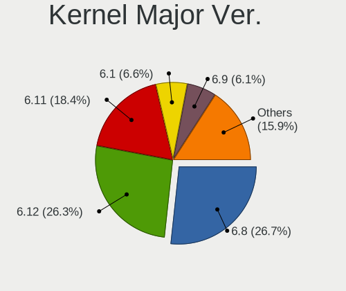
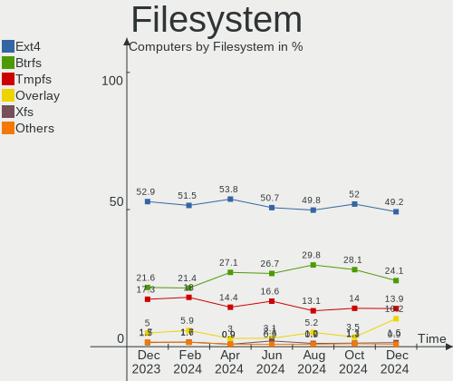
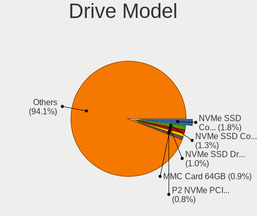
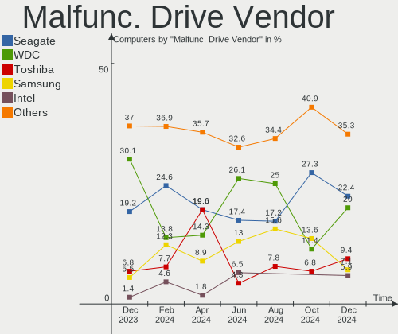
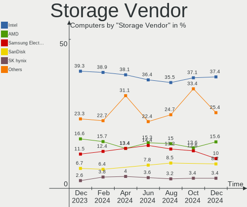
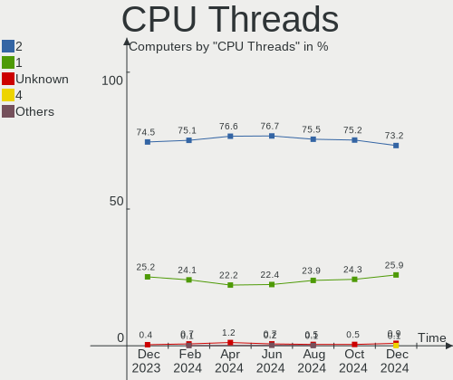
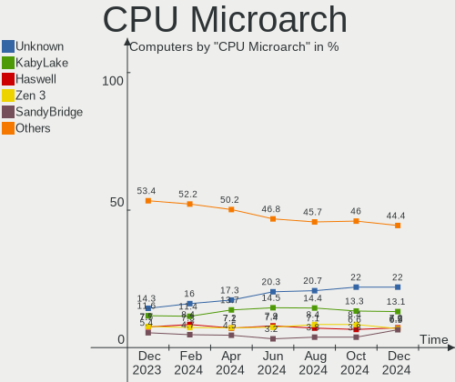
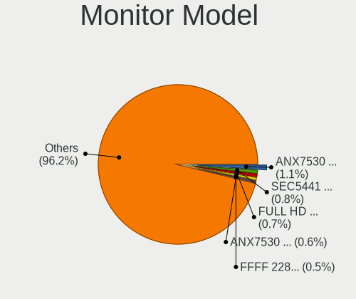
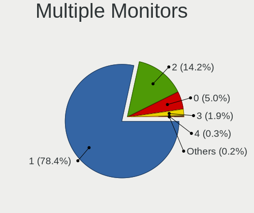
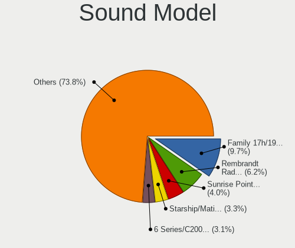

Linux in USA - Hardware Trends
------------------------------

A project to identify most popular hardware characteristics and track their change
over time based on data collected by Linux users at https://Linux-Hardware.org.

Anyone can contribute to this report by the [hw-probe](https://github.com/linuxhw/hw-probe) tool:

    sudo -E hw-probe -all -upload

This is a report for all computer types. See also reports for [desktops](/Location/USA/Desktop/README.md) and [notebooks](/Location/USA/Notebook/README.md).

Period: Oct, 2022.

Contents
--------

* [ System ](#system)
  - [ OS                       ](#os)
  - [ OS Family                ](#os-family)
  - [ Kernel                   ](#kernel)
  - [ Kernel Family            ](#kernel-family)
  - [ Kernel Major Ver.        ](#kernel-major-ver)
  - [ Arch                     ](#arch)
  - [ DE                       ](#de)
  - [ Display Server           ](#display-server)
  - [ Display Manager          ](#display-manager)
  - [ OS Lang                  ](#os-lang)
  - [ Boot Mode                ](#boot-mode)
  - [ Filesystem               ](#filesystem)
  - [ Part. scheme             ](#part-scheme)
  - [ Dual Boot with Linux/BSD ](#dual-boot-with-linuxbsd)
  - [ Dual Boot (Win)          ](#dual-boot-win)

* [ Board ](#board)
  - [ Vendor                   ](#vendor)
  - [ Model                    ](#model)
  - [ Model Family             ](#model-family)
  - [ MFG Year                 ](#mfg-year)
  - [ Form Factor              ](#form-factor)
  - [ Secure Boot              ](#secure-boot)
  - [ Coreboot                 ](#coreboot)
  - [ RAM Size                 ](#ram-size)
  - [ RAM Used                 ](#ram-used)
  - [ Total Drives             ](#total-drives)
  - [ Has CD-ROM               ](#has-cd-rom)
  - [ Has Ethernet             ](#has-ethernet)
  - [ Has WiFi                 ](#has-wifi)
  - [ Has Bluetooth            ](#has-bluetooth)

* [ Location ](#location)
  - [ Country                  ](#country)
  - [ City                     ](#city)

* [ Drives ](#drives)
  - [ Drive Vendor             ](#drive-vendor)
  - [ Drive Model              ](#drive-model)
  - [ HDD Vendor               ](#hdd-vendor)
  - [ SSD Vendor               ](#ssd-vendor)
  - [ Drive Kind               ](#drive-kind)
  - [ Drive Connector          ](#drive-connector)
  - [ Drive Size               ](#drive-size)
  - [ Space Total              ](#space-total)
  - [ Space Used               ](#space-used)
  - [ Malfunc. Drives          ](#malfunc-drives)
  - [ Malfunc. Drive Vendor    ](#malfunc-drive-vendor)
  - [ Malfunc. HDD Vendor      ](#malfunc-hdd-vendor)
  - [ Malfunc. Drive Kind      ](#malfunc-drive-kind)
  - [ Failed Drives            ](#failed-drives)
  - [ Failed Drive Vendor      ](#failed-drive-vendor)
  - [ Drive Status             ](#drive-status)

* [ Storage controller ](#storage-controller)
  - [ Storage Vendor           ](#storage-vendor)
  - [ Storage Model            ](#storage-model)
  - [ Storage Kind             ](#storage-kind)

* [ Processor ](#processor)
  - [ CPU Vendor               ](#cpu-vendor)
  - [ CPU Model                ](#cpu-model)
  - [ CPU Model Family         ](#cpu-model-family)
  - [ CPU Cores                ](#cpu-cores)
  - [ CPU Sockets              ](#cpu-sockets)
  - [ CPU Threads              ](#cpu-threads)
  - [ CPU Op-Modes             ](#cpu-op-modes)
  - [ CPU Microcode            ](#cpu-microcode)
  - [ CPU Microarch            ](#cpu-microarch)

* [ Graphics ](#graphics)
  - [ GPU Vendor               ](#gpu-vendor)
  - [ GPU Model                ](#gpu-model)
  - [ GPU Combo                ](#gpu-combo)
  - [ GPU Driver               ](#gpu-driver)
  - [ GPU Memory               ](#gpu-memory)

* [ Monitor ](#monitor)
  - [ Monitor Vendor           ](#monitor-vendor)
  - [ Monitor Model            ](#monitor-model)
  - [ Monitor Resolution       ](#monitor-resolution)
  - [ Monitor Diagonal         ](#monitor-diagonal)
  - [ Monitor Width            ](#monitor-width)
  - [ Aspect Ratio             ](#aspect-ratio)
  - [ Monitor Area             ](#monitor-area)
  - [ Pixel Density            ](#pixel-density)
  - [ Multiple Monitors        ](#multiple-monitors)

* [ Network ](#network)
  - [ Net Controller Vendor    ](#net-controller-vendor)
  - [ Net Controller Model     ](#net-controller-model)
  - [ Wireless Vendor          ](#wireless-vendor)
  - [ Wireless Model           ](#wireless-model)
  - [ Ethernet Vendor          ](#ethernet-vendor)
  - [ Ethernet Model           ](#ethernet-model)
  - [ Net Controller Kind      ](#net-controller-kind)
  - [ Used Controller          ](#used-controller)
  - [ NICs                     ](#nics)
  - [ IPv6                     ](#ipv6)

* [ Bluetooth ](#bluetooth)
  - [ Bluetooth Vendor         ](#bluetooth-vendor)
  - [ Bluetooth Model          ](#bluetooth-model)

* [ Sound ](#sound)
  - [ Sound Vendor             ](#sound-vendor)
  - [ Sound Model              ](#sound-model)

* [ Memory ](#memory)
  - [ Memory Vendor            ](#memory-vendor)
  - [ Memory Model             ](#memory-model)
  - [ Memory Kind              ](#memory-kind)
  - [ Memory Form Factor       ](#memory-form-factor)
  - [ Memory Size              ](#memory-size)
  - [ Memory Speed             ](#memory-speed)

* [ Printers & scanners ](#printers--scanners)
  - [ Printer Vendor           ](#printer-vendor)
  - [ Printer Model            ](#printer-model)
  - [ Scanner Vendor           ](#scanner-vendor)
  - [ Scanner Model            ](#scanner-model)

* [ Camera ](#camera)
  - [ Camera Vendor            ](#camera-vendor)
  - [ Camera Model             ](#camera-model)

* [ Security ](#security)
  - [ Fingerprint Vendor       ](#fingerprint-vendor)
  - [ Fingerprint Model        ](#fingerprint-model)
  - [ Chipcard Vendor          ](#chipcard-vendor)
  - [ Chipcard Model           ](#chipcard-model)

* [ Unsupported ](#unsupported)
  - [ Unsupported Devices      ](#unsupported-devices)
  - [ Unsupported Device Types ](#unsupported-device-types)

System
------

OS
--

Installed operating systems

| Name                         | Computers | Percent |
|------------------------------|-----------|---------|
| Ubuntu 22.04                 | 155       | 16.63%  |
| Debian 11                    | 75        | 8.05%   |
| Fedora 36                    | 60        | 6.44%   |
| Pop!_OS 22.04                | 59        | 6.33%   |
| Linux Mint 21                | 46        | 4.94%   |
| Arch Rolling                 | 42        | 4.51%   |
| Zorin 16                     | 31        | 3.33%   |
| Ubuntu 20.04                 | 29        | 3.11%   |
| Linux Mint 20.3              | 26        | 2.79%   |
| OpenMandriva 4.3             | 22        | 2.36%   |
| Manjaro                      | 20        | 2.15%   |
| Kali 2022.3                  | 20        | 2.15%   |
| SteamOS 3.3.2                | 19        | 2.04%   |
| Kubuntu 22.04                | 18        | 1.93%   |
| Nobara 36                    | 17        | 1.82%   |
| KDE neon 22.04               | 14        | 1.5%    |
| ArcoLinux Rolling            | 14        | 1.5%    |
| Ubuntu 22.10                 | 13        | 1.39%   |
| OpenMandriva 4.50            | 13        | 1.39%   |
| KDE neon 20.04               | 13        | 1.39%   |
| Fedora 37                    | 12        | 1.29%   |
| SteamOS 3.3.1                | 10        | 1.07%   |
| Manjaro 22.0.0               | 10        | 1.07%   |
| Gentoo 2.8                   | 9         | 0.97%   |
| EndeavourOS Rolling          | 9         | 0.97%   |
| Xubuntu 20.04                | 8         | 0.86%   |
| Xubuntu 22.04                | 7         | 0.75%   |
| Parrot 5.1                   | 6         | 0.64%   |
| openSUSE Tumbleweed-XXXXXXXX | 6         | 0.64%   |
| OpenMandriva 4.90            | 6         | 0.64%   |
| MX 21                        | 5         | 0.54%   |
| Garuda Linux Rolling         | 5         | 0.54%   |
| Elementary 6.1               | 5         | 0.54%   |
| Ubuntu 18.04                 | 4         | 0.43%   |
| SteamOS 3.3                  | 4         | 0.43%   |
| LMDE 5                       | 4         | 0.43%   |
| Linux Mint 20.2              | 4         | 0.43%   |
| Kubuntu 20.04                | 4         | 0.43%   |
| Kubuntu 11                   | 4         | 0.43%   |
| Ubuntu MATE 22.04            | 3         | 0.32%   |

OS Family
---------

OS without a version

| Name              | Computers | Percent |
|-------------------|-----------|---------|
| Ubuntu            | 205       | 22%     |
| Linux Mint        | 82        | 8.8%    |
| Debian            | 77        | 8.26%   |
| Fedora            | 73        | 7.83%   |
| Pop!_OS           | 61        | 6.55%   |
| OpenMandriva      | 42        | 4.51%   |
| Arch              | 42        | 4.51%   |
| SteamOS           | 39        | 4.18%   |
| Zorin             | 33        | 3.54%   |
| Manjaro           | 30        | 3.22%   |
| Kubuntu           | 28        | 3%      |
| KDE neon          | 27        | 2.9%    |
| Kali              | 21        | 2.25%   |
| Nobara            | 17        | 1.82%   |
| Xubuntu           | 16        | 1.72%   |
| ArcoLinux         | 15        | 1.61%   |
| Gentoo            | 14        | 1.5%    |
| openSUSE          | 11        | 1.18%   |
| EndeavourOS       | 9         | 0.97%   |
| Garuda Linux      | 7         | 0.75%   |
| Clear Linux       | 7         | 0.75%   |
| Parrot            | 6         | 0.64%   |
| Elementary        | 6         | 0.64%   |
| Ubuntu Unity      | 5         | 0.54%   |
| Ubuntu MATE       | 5         | 0.54%   |
| MX                | 5         | 0.54%   |
| Endless           | 5         | 0.54%   |
| LMDE              | 4         | 0.43%   |
| NixOS             | 3         | 0.32%   |
| Linux Lite        | 3         | 0.32%   |
| Ubuntu Budgie     | 2         | 0.21%   |
| ROSA              | 2         | 0.21%   |
| Raspbian          | 2         | 0.21%   |
| Peppermint        | 2         | 0.21%   |
| Lubuntu           | 2         | 0.21%   |
| Artix             | 2         | 0.21%   |
| Alpine            | 2         | 0.21%   |
| Xero              | 1         | 0.11%   |
| Ultramarine Linux | 1         | 0.11%   |
| Trisquel          | 1         | 0.11%   |

Kernel
------

Version of the Linux kernel

| Version                                        | Computers | Percent |
|------------------------------------------------|-----------|---------|
| 5.15.0-52-generic                              | 98        | 10.52%  |
| 5.15.0-48-generic                              | 97        | 10.41%  |
| 5.15.0-50-generic                              | 85        | 9.12%   |
| 5.10.0-18-amd64                                | 42        | 4.51%   |
| 5.19.0-76051900-generic                        | 36        | 3.86%   |
| 5.4.0-126-generic                              | 20        | 2.15%   |
| 5.16.7-desktop-1omv4003                        | 20        | 2.15%   |
| 5.13.0-valve21.3-1-neptune                     | 18        | 1.93%   |
| 5.19.16-200.fc36.x86_64                        | 17        | 1.82%   |
| 6.0.2-arch1-1                                  | 14        | 1.5%    |
| 5.10.0-16-amd64                                | 14        | 1.5%    |
| 6.0.2-76060002-generic                         | 10        | 1.07%   |
| 5.4.0-128-generic                              | 10        | 1.07%   |
| 5.19.5-desktop-1omv4090                        | 10        | 1.07%   |
| 5.19.13-200.fc36.x86_64                        | 10        | 1.07%   |
| 5.19.12-arch1-1                                | 10        | 1.07%   |
| 5.13.0-valve21.1-1-neptune-02211-gc54cda5a36f3 | 10        | 1.07%   |
| 5.19.16-76051916-generic                       | 9         | 0.97%   |
| 5.19.13-arch1-1                                | 9         | 0.97%   |
| 5.19.12-200.fc36.x86_64                        | 9         | 0.97%   |
| 5.19.0-23-generic                              | 9         | 0.97%   |
| 5.10.0-19-amd64                                | 9         | 0.97%   |
| 6.0.1-arch2-1                                  | 8         | 0.86%   |
| 6.0.0-060000-generic                           | 7         | 0.75%   |
| 5.19.14-200.fc36.x86_64                        | 7         | 0.75%   |
| 5.19.0-kali2-amd64                             | 7         | 0.75%   |
| 5.18.0-kali7-amd64                             | 7         | 0.75%   |
| 5.19.15-201.fc36.x86_64                        | 6         | 0.64%   |
| 5.18.0-0.deb11.4-amd64                         | 6         | 0.64%   |
| 5.15.65-1-MANJARO                              | 6         | 0.64%   |
| 6.0.2-zen1-1-zen                               | 5         | 0.54%   |
| 5.4.0-131-generic                              | 5         | 0.54%   |
| 5.19.7-1-MANJARO                               | 5         | 0.54%   |
| 5.19.16-301.fc37.x86_64                        | 5         | 0.54%   |
| 5.19.14-201.fsync.fc36.x86_64                  | 5         | 0.54%   |
| 5.18.12-desktop-3omv4090                       | 5         | 0.54%   |
| 5.15.74-3-MANJARO                              | 5         | 0.54%   |
| 5.15.0-46-generic                              | 5         | 0.54%   |
| 5.15.0-43-generic                              | 5         | 0.54%   |
| 5.15.0-41-generic                              | 5         | 0.54%   |

Kernel Family
-------------

Linux kernel without a distro release

| Version | Computers | Percent |
|---------|-----------|---------|
| 5.15.0  | 311       | 33.37%  |
| 5.10.0  | 68        | 7.3%    |
| 5.19.0  | 66        | 7.08%   |
| 5.4.0   | 46        | 4.94%   |
| 5.13.0  | 43        | 4.61%   |
| 5.19.16 | 37        | 3.97%   |
| 6.0.2   | 36        | 3.86%   |
| 5.19.12 | 28        | 3%      |
| 5.19.13 | 26        | 2.79%   |
| 5.18.0  | 24        | 2.58%   |
| 5.16.7  | 20        | 2.15%   |
| 6.0.1   | 17        | 1.82%   |
| 6.0.0   | 16        | 1.72%   |
| 5.19.14 | 15        | 1.61%   |
| 5.15.72 | 12        | 1.29%   |
| 5.19.7  | 11        | 1.18%   |
| 5.19.5  | 10        | 1.07%   |
| 6.0.5   | 9         | 0.97%   |
| 5.19.15 | 9         | 0.97%   |
| 5.19.11 | 8         | 0.86%   |
| 5.15.74 | 8         | 0.86%   |
| 5.11.0  | 8         | 0.86%   |
| 5.15.71 | 7         | 0.75%   |
| 5.15.65 | 7         | 0.75%   |
| 5.17.0  | 6         | 0.64%   |
| 5.18.12 | 5         | 0.54%   |
| 5.14.0  | 5         | 0.54%   |
| 4.15.0  | 5         | 0.54%   |
| 6.0.3   | 4         | 0.43%   |
| 5.17.5  | 4         | 0.43%   |
| 5.19.8  | 3         | 0.32%   |
| 5.19.10 | 3         | 0.32%   |
| 5.16.13 | 3         | 0.32%   |
| 5.16.0  | 3         | 0.32%   |
| 5.15.60 | 3         | 0.32%   |
| 5.14.21 | 3         | 0.32%   |
| 6.1.0   | 2         | 0.21%   |
| 5.3.18  | 2         | 0.21%   |
| 5.17.1  | 2         | 0.21%   |
| 5.16.19 | 2         | 0.21%   |

Kernel Major Ver.
-----------------

Linux kernel major version

| Version | Computers | Percent |
|---------|-----------|---------|
| 5.15    | 361       | 38.73%  |
| 5.19    | 217       | 23.28%  |
| 6.0     | 82        | 8.8%    |
| 5.10    | 73        | 7.83%   |
| 5.4     | 48        | 5.15%   |
| 5.13    | 43        | 4.61%   |
| 5.18    | 34        | 3.65%   |
| 5.16    | 28        | 3%      |
| 5.17    | 12        | 1.29%   |
| 5.14    | 8         | 0.86%   |
| 5.11    | 8         | 0.86%   |
| 4.15    | 5         | 0.54%   |
| 6.1     | 2         | 0.21%   |
| 5.3     | 2         | 0.21%   |
| 4.4     | 2         | 0.21%   |
| 4.18    | 2         | 0.21%   |
| 5.6     | 1         | 0.11%   |
| 5.5     | 1         | 0.11%   |
| 4.19    | 1         | 0.11%   |
| 3.4     | 1         | 0.11%   |
| 2.6.32  | 1         | 0.11%   |

Arch
----

OS architecture (x86_64, i586, etc.)

| Name    | Computers | Percent |
|---------|-----------|---------|
| x86_64  | 915       | 98.18%  |
| i686    | 8         | 0.86%   |
| aarch64 | 6         | 0.64%   |
| armv7l  | 3         | 0.32%   |

DE
--

Desktop Environment

| Name             | Computers | Percent |
|------------------|-----------|---------|
| GNOME            | 396       | 42.49%  |
| KDE5             | 238       | 25.54%  |
| X-Cinnamon       | 78        | 8.37%   |
| Unknown          | 70        | 7.51%   |
| XFCE             | 68        | 7.3%    |
| MATE             | 22        | 2.36%   |
| Pantheon         | 6         | 0.64%   |
| LXQt             | 6         | 0.64%   |
| LXDE             | 6         | 0.64%   |
| Cinnamon         | 6         | 0.64%   |
| Unity            | 5         | 0.54%   |
| i3               | 5         | 0.54%   |
| Budgie           | 5         | 0.54%   |
| GNOME Flashback  | 4         | 0.43%   |
| openbox          | 3         | 0.32%   |
| Hyprland         | 2         | 0.21%   |
| awesome          | 2         | 0.21%   |
| xmonad           | 1         | 0.11%   |
| trinity          | 1         | 0.11%   |
| sway             | 1         | 0.11%   |
| none+xmonad      | 1         | 0.11%   |
| lightdm-xsession | 1         | 0.11%   |
| LeftWM           | 1         | 0.11%   |
| KDE4             | 1         | 0.11%   |
| GNOME Classic    | 1         | 0.11%   |
| Deepin           | 1         | 0.11%   |
| bspwm            | 1         | 0.11%   |

Display Server
--------------

X11 or Wayland

| Name    | Computers | Percent |
|---------|-----------|---------|
| X11     | 637       | 68.35%  |
| Wayland | 221       | 23.71%  |
| Unknown | 49        | 5.26%   |
| Tty     | 25        | 2.68%   |

Display Manager
---------------

SDDM, LightDM, etc.

| Name    | Computers | Percent |
|---------|-----------|---------|
| Unknown | 428       | 45.92%  |
| GDM3    | 196       | 21.03%  |
| LightDM | 130       | 13.95%  |
| SDDM    | 123       | 13.2%   |
| GDM     | 49        | 5.26%   |
| XDM     | 1         | 0.11%   |
| SLiM    | 1         | 0.11%   |
| NODM    | 1         | 0.11%   |
| LXDM    | 1         | 0.11%   |
| KDM     | 1         | 0.11%   |
| EMPTTY  | 1         | 0.11%   |

OS Lang
-------

Language

| Lang       | Computers | Percent |
|------------|-----------|---------|
| en_US      | 857       | 91.95%  |
| Unknown    | 37        | 3.97%   |
| C          | 14        | 1.5%    |
| en_GB      | 4         | 0.43%   |
| en_US.UTF8 | 3         | 0.32%   |
| zh_CN      | 2         | 0.21%   |
| it_IT      | 2         | 0.21%   |
| en_CA      | 2         | 0.21%   |
| C.UTF8     | 2         | 0.21%   |
| uk_UA      | 1         | 0.11%   |
| POSIX      | 1         | 0.11%   |
| es_US      | 1         | 0.11%   |
| es_ES      | 1         | 0.11%   |
| en_PH      | 1         | 0.11%   |
| en_AU      | 1         | 0.11%   |
| en_AG      | 1         | 0.11%   |
| de_DE      | 1         | 0.11%   |
| Default    | 1         | 0.11%   |

Boot Mode
---------

EFI or BIOS

| Mode | Computers | Percent |
|------|-----------|---------|
| BIOS | 511       | 54.83%  |
| EFI  | 421       | 45.17%  |

Filesystem
----------

Type of filesystem

| Type    | Computers | Percent |
|---------|-----------|---------|
| Ext4    | 643       | 68.99%  |
| Btrfs   | 176       | 18.88%  |
| Overlay | 77        | 8.26%   |
| Xfs     | 16        | 1.72%   |
| Zfs     | 14        | 1.5%    |
| Tmpfs   | 2         | 0.21%   |
| Ext3    | 2         | 0.21%   |
| F2fs    | 1         | 0.11%   |
| Ext2    | 1         | 0.11%   |

Part. scheme
------------

Scheme of partitioning

| Type    | Computers | Percent |
|---------|-----------|---------|
| GPT     | 470       | 50.43%  |
| Unknown | 369       | 39.59%  |
| MBR     | 93        | 9.98%   |

Dual Boot with Linux/BSD
------------------------

Hosting more than one Linux/BSD

| Dual boot | Computers | Percent |
|-----------|-----------|---------|
| No        | 831       | 89.16%  |
| Yes       | 101       | 10.84%  |

Dual Boot (Win)
---------------

Hosting Linux and Windows

| Dual boot | Computers | Percent |
|-----------|-----------|---------|
| No        | 752       | 80.69%  |
| Yes       | 180       | 19.31%  |

Board
-----

Vendor
------

Motherboard manufacturer

| Name                    | Computers | Percent |
|-------------------------|-----------|---------|
| Hewlett-Packard         | 162       | 17.38%  |
| Dell                    | 155       | 16.63%  |
| ASUSTek Computer        | 133       | 14.27%  |
| Lenovo                  | 112       | 12.02%  |
| MSI                     | 51        | 5.47%   |
| Gigabyte Technology     | 48        | 5.15%   |
| Apple                   | 38        | 4.08%   |
| Valve                   | 33        | 3.54%   |
| ASRock                  | 28        | 3%      |
| Acer                    | 21        | 2.25%   |
| Intel                   | 16        | 1.72%   |
| Toshiba                 | 14        | 1.5%    |
| Google                  | 13        | 1.39%   |
| System76                | 12        | 1.29%   |
| AZW                     | 8         | 0.86%   |
| Unknown                 | 8         | 0.86%   |
| Framework               | 7         | 0.75%   |
| Raspberry Pi Foundation | 6         | 0.64%   |
| Alienware               | 6         | 0.64%   |
| GPU Company             | 5         | 0.54%   |
| Sony                    | 4         | 0.43%   |
| Microsoft               | 4         | 0.43%   |
| Supermicro              | 3         | 0.32%   |
| Samsung Electronics     | 3         | 0.32%   |
| Gateway                 | 3         | 0.32%   |
| Razer                   | 2         | 0.21%   |
| LG Electronics          | 2         | 0.21%   |
| IBM                     | 2         | 0.21%   |
| Fujitsu                 | 2         | 0.21%   |
| Foxconn                 | 2         | 0.21%   |
| Acidanthera             | 2         | 0.21%   |
| Timi                    | 1         | 0.11%   |
| Techvision              | 1         | 0.11%   |
| Star Labs               | 1         | 0.11%   |
| Soyo                    | 1         | 0.11%   |
| Shuttle                 | 1         | 0.11%   |
| Quanta                  | 1         | 0.11%   |
| Pegatron                | 1         | 0.11%   |
| NZXT                    | 1         | 0.11%   |
| Notebook                | 1         | 0.11%   |

Model
-----

Motherboard model

| Name                                   | Computers | Percent |
|----------------------------------------|-----------|---------|
| Valve Jupiter                          | 33        | 3.54%   |
| Lenovo ThinkPad E475 20H40006US        | 14        | 1.5%    |
| Unknown                                | 10        | 1.07%   |
| MSI MS-7B86                            | 6         | 0.64%   |
| ASUS TUF Gaming X570-PLUS              | 6         | 0.64%   |
| ASUS All Series                        | 6         | 0.64%   |
| HP EliteBook 8470p                     | 5         | 0.54%   |
| Apple MacBookAir7,2                    | 5         | 0.54%   |
| System76 Lemur Pro                     | 4         | 0.43%   |
| RPi Raspberry Pi 4 Model B Rev 1.4     | 4         | 0.43%   |
| MSI MS-7C56                            | 4         | 0.43%   |
| HP Laptop 14-dk1xxx                    | 4         | 0.43%   |
| HP EliteBook 8460p                     | 4         | 0.43%   |
| Framework Laptop (12th Gen Intel Core) | 4         | 0.43%   |
| Dell OptiPlex 9020                     | 4         | 0.43%   |
| Dell OptiPlex 790                      | 4         | 0.43%   |
| Dell OptiPlex 7010                     | 4         | 0.43%   |
| ASUS M5A99FX PRO R2.0                  | 4         | 0.43%   |
| Apple iMac12,1                         | 4         | 0.43%   |
| Toshiba Satellite C75D-B               | 3         | 0.32%   |
| System76 Oryx Pro                      | 3         | 0.32%   |
| MSI MS-7B79                            | 3         | 0.32%   |
| Lenovo ThinkPad 13 2nd Gen 20J10046US  | 3         | 0.32%   |
| HP Pavilion g6                         | 3         | 0.32%   |
| HP Pavilion dv7                        | 3         | 0.32%   |
| HP Laptop 17-by4xxx                    | 3         | 0.32%   |
| HP Laptop 15-bs2xx                     | 3         | 0.32%   |
| HP ENVY x360 2-in-1 Laptop 15-ey0xxx   | 3         | 0.32%   |
| HP Compaq 8000 Elite USDT PC           | 3         | 0.32%   |
| HP 15                                  | 3         | 0.32%   |
| Gigabyte B450M DS3H V2                 | 3         | 0.32%   |
| Framework Laptop                       | 3         | 0.32%   |
| Dell OptiPlex 3020                     | 3         | 0.32%   |
| Dell OptiPlex 3010                     | 3         | 0.32%   |
| AZW GTR                                | 3         | 0.32%   |
| ASUS TUF Gaming B550M-PLUS             | 3         | 0.32%   |
| ASUS SABERTOOTH 990FX R2.0             | 3         | 0.32%   |
| ASUS ROG STRIX B550-F GAMING           | 3         | 0.32%   |
| ASRock B450M Pro4                      | 3         | 0.32%   |
| ASRock 970M Pro3                       | 3         | 0.32%   |

Model Family
------------

Motherboard model prefix

| Name               | Computers | Percent |
|--------------------|-----------|---------|
| Lenovo ThinkPad    | 66        | 7.08%   |
| Dell OptiPlex      | 36        | 3.86%   |
| Valve Jupiter      | 33        | 3.54%   |
| Dell Inspiron      | 32        | 3.43%   |
| ASUS ROG           | 29        | 3.11%   |
| HP Pavilion        | 27        | 2.9%    |
| HP Laptop          | 26        | 2.79%   |
| Dell Latitude      | 26        | 2.79%   |
| Dell XPS           | 24        | 2.58%   |
| HP EliteBook       | 20        | 2.15%   |
| Dell Precision     | 20        | 2.15%   |
| ASUS TUF           | 18        | 1.93%   |
| HP ENVY            | 17        | 1.82%   |
| Lenovo IdeaPad     | 16        | 1.72%   |
| HP Compaq          | 16        | 1.72%   |
| Acer Aspire        | 15        | 1.61%   |
| Toshiba Satellite  | 12        | 1.29%   |
| ASUS PRIME         | 12        | 1.29%   |
| Lenovo ThinkCentre | 10        | 1.07%   |
| Unknown            | 10        | 1.07%   |
| Framework Laptop   | 7         | 0.75%   |
| ASUS VivoBook      | 7         | 0.75%   |
| RPi Raspberry      | 6         | 0.64%   |
| MSI MS-7B86        | 6         | 0.64%   |
| HP ProBook         | 6         | 0.64%   |
| HP EliteDesk       | 6         | 0.64%   |
| Dell PowerEdge     | 6         | 0.64%   |
| ASUS All           | 6         | 0.64%   |
| Apple iMac12       | 6         | 0.64%   |
| HP ZBook           | 5         | 0.54%   |
| Gigabyte B450M     | 5         | 0.54%   |
| Apple MacBookAir7  | 5         | 0.54%   |
| System76 Lemur     | 4         | 0.43%   |
| MSI MS-7C56        | 4         | 0.43%   |
| Microsoft Surface  | 4         | 0.43%   |
| Lenovo Legion      | 4         | 0.43%   |
| Gigabyte B550M     | 4         | 0.43%   |
| Dell Vostro        | 4         | 0.43%   |
| ASUS ZenBook       | 4         | 0.43%   |
| ASUS M5A99FX       | 4         | 0.43%   |

MFG Year
--------

Motherboard manufacture year

| Year    | Computers | Percent |
|---------|-----------|---------|
| 2020    | 109       | 11.7%   |
| 2022    | 107       | 11.48%  |
| 2019    | 89        | 9.55%   |
| 2021    | 84        | 9.01%   |
| 2018    | 80        | 8.58%   |
| 2012    | 75        | 8.05%   |
| 2011    | 61        | 6.55%   |
| 2013    | 51        | 5.47%   |
| 2017    | 47        | 5.04%   |
| 2015    | 42        | 4.51%   |
| 2010    | 42        | 4.51%   |
| 2014    | 41        | 4.4%    |
| 2016    | 28        | 3%      |
| 2009    | 26        | 2.79%   |
| 2008    | 25        | 2.68%   |
| 2007    | 10        | 1.07%   |
| Unknown | 9         | 0.97%   |
| 2005    | 3         | 0.32%   |
| 2006    | 1         | 0.11%   |
| 2004    | 1         | 0.11%   |
| 2003    | 1         | 0.11%   |

Form Factor
-----------

Physical design of the computer

| Name           | Computers | Percent |
|----------------|-----------|---------|
| Notebook       | 469       | 50.32%  |
| Desktop        | 355       | 38.09%  |
| Convertible    | 38        | 4.08%   |
| Mini pc        | 22        | 2.36%   |
| All in one     | 20        | 2.15%   |
| Server         | 12        | 1.29%   |
| System on chip | 8         | 0.86%   |
| Tablet         | 7         | 0.75%   |
| Firewall       | 1         | 0.11%   |

Secure Boot
-----------

Enabled or disabled

| State    | Computers | Percent |
|----------|-----------|---------|
| Disabled | 873       | 93.67%  |
| Enabled  | 59        | 6.33%   |

Coreboot
--------

Have coreboot on board

| Used | Computers | Percent |
|------|-----------|---------|
| No   | 912       | 97.85%  |
| Yes  | 20        | 2.15%   |

RAM Size
--------

Total RAM memory

| Size in GB      | Computers | Percent |
|-----------------|-----------|---------|
| 16.01-24.0      | 216       | 23.18%  |
| 4.01-8.0        | 210       | 22.53%  |
| 8.01-16.0       | 161       | 17.27%  |
| 32.01-64.0      | 135       | 14.48%  |
| 3.01-4.0        | 104       | 11.16%  |
| 64.01-256.0     | 47        | 5.04%   |
| 24.01-32.0      | 25        | 2.68%   |
| 1.01-2.0        | 20        | 2.15%   |
| 2.01-3.0        | 7         | 0.75%   |
| 0.51-1.0        | 4         | 0.43%   |
| More than 256.0 | 2         | 0.21%   |
| 0.01-0.5        | 1         | 0.11%   |

RAM Used
--------

Used RAM memory

| Used GB         | Computers | Percent |
|-----------------|-----------|---------|
| 1.01-2.0        | 278       | 29.83%  |
| 2.01-3.0        | 259       | 27.79%  |
| 4.01-8.0        | 167       | 17.92%  |
| 3.01-4.0        | 119       | 12.77%  |
| 8.01-16.0       | 48        | 5.15%   |
| 0.51-1.0        | 43        | 4.61%   |
| 16.01-24.0      | 5         | 0.54%   |
| 0.01-0.5        | 5         | 0.54%   |
| 24.01-32.0      | 4         | 0.43%   |
| Unknown         | 2         | 0.21%   |
| More than 256.0 | 1         | 0.11%   |
| 32.01-64.0      | 1         | 0.11%   |

Total Drives
------------

Number of drives on board

| Drives | Computers | Percent |
|--------|-----------|---------|
| 1      | 520       | 55.79%  |
| 2      | 238       | 25.54%  |
| 3      | 81        | 8.69%   |
| 4      | 38        | 4.08%   |
| 5      | 28        | 3%      |
| 6      | 10        | 1.07%   |
| 7      | 6         | 0.64%   |
| 11     | 3         | 0.32%   |
| 0      | 3         | 0.32%   |
| 9      | 2         | 0.21%   |
| 19     | 1         | 0.11%   |
| 15     | 1         | 0.11%   |
| 14     | 1         | 0.11%   |

Has CD-ROM
----------

Has CD-ROM on board

| Presented | Computers | Percent |
|-----------|-----------|---------|
| No        | 592       | 63.52%  |
| Yes       | 340       | 36.48%  |

Has Ethernet
------------

Has Ethernet on board

| Presented | Computers | Percent |
|-----------|-----------|---------|
| Yes       | 773       | 82.94%  |
| No        | 159       | 17.06%  |

Has WiFi
--------

Has WiFi module

| Presented | Computers | Percent |
|-----------|-----------|---------|
| Yes       | 737       | 79.08%  |
| No        | 195       | 20.92%  |

Has Bluetooth
-------------

Has Bluetooth module

| Presented | Computers | Percent |
|-----------|-----------|---------|
| Yes       | 595       | 63.84%  |
| No        | 337       | 36.16%  |

Location
--------

Country
-------

Geographic location (country)

| Country | Computers | Percent |
|---------|-----------|---------|
| USA     | 932       | 100%    |

City
----

Geographic location (city)

| City             | Computers | Percent |
|------------------|-----------|---------|
| Bangor           | 32        | 3.43%   |
| Seattle          | 19        | 2.04%   |
| Dallas           | 19        | 2.04%   |
| Los Angeles      | 18        | 1.93%   |
| New York         | 14        | 1.5%    |
| Chicago          | 12        | 1.29%   |
| Miami            | 11        | 1.18%   |
| Portland         | 10        | 1.07%   |
| Phoenix          | 8         | 0.86%   |
| San Jose         | 7         | 0.75%   |
| Kansas City      | 7         | 0.75%   |
| Jacksonville     | 7         | 0.75%   |
| Arlington        | 7         | 0.75%   |
| Minneapolis      | 6         | 0.64%   |
| Milwaukee        | 6         | 0.64%   |
| Houston          | 6         | 0.64%   |
| Denver           | 6         | 0.64%   |
| Cincinnati       | 6         | 0.64%   |
| Charlotte        | 6         | 0.64%   |
| Tucson           | 5         | 0.54%   |
| St Louis         | 5         | 0.54%   |
| San Antonio      | 5         | 0.54%   |
| Philadelphia     | 5         | 0.54%   |
| Newark           | 5         | 0.54%   |
| Lincoln          | 5         | 0.54%   |
| Bothell          | 5         | 0.54%   |
| Austin           | 5         | 0.54%   |
| Albuquerque      | 5         | 0.54%   |
| Winter Park      | 4         | 0.43%   |
| Tulsa            | 4         | 0.43%   |
| The Bronx        | 4         | 0.43%   |
| San Diego        | 4         | 0.43%   |
| Salt Lake City   | 4         | 0.43%   |
| Indianapolis     | 4         | 0.43%   |
| Hudson           | 4         | 0.43%   |
| Gainesville      | 4         | 0.43%   |
| Fort Worth       | 4         | 0.43%   |
| Colorado Springs | 4         | 0.43%   |
| Aurora           | 4         | 0.43%   |
| Weatherford      | 3         | 0.32%   |

Drives
------

Drive Vendor
------------

Hard drive vendors

| Vendor                      | Computers | Drives | Percent |
|-----------------------------|-----------|--------|---------|
| Samsung Electronics         | 237       | 303    | 16.49%  |
| Seagate                     | 189       | 261    | 13.15%  |
| WDC                         | 177       | 236    | 12.32%  |
| Sandisk                     | 109       | 114    | 7.59%   |
| Unknown                     | 90        | 105    | 6.26%   |
| Toshiba                     | 89        | 96     | 6.19%   |
| Crucial                     | 51        | 56     | 3.55%   |
| Kingston                    | 46        | 49     | 3.2%    |
| SK hynix                    | 44        | 48     | 3.06%   |
| Phison Electronics          | 39        | 46     | 2.71%   |
| Hitachi                     | 35        | 37     | 2.44%   |
| PNY                         | 34        | 34     | 2.37%   |
| Intel                       | 26        | 29     | 1.81%   |
| HGST                        | 19        | 22     | 1.32%   |
| China                       | 18        | 22     | 1.25%   |
| Apple                       | 17        | 18     | 1.18%   |
| Micron Technology           | 15        | 15     | 1.04%   |
| Micron/Crucial Technology   | 14        | 14     | 0.97%   |
| Kingston Technology Company | 14        | 14     | 0.97%   |
| A-DATA Technology           | 14        | 17     | 0.97%   |
| Silicon Motion              | 12        | 13     | 0.84%   |
| KIOXIA                      | 11        | 11     | 0.77%   |
| Team                        | 8         | 8      | 0.56%   |
| OCZ                         | 8         | 9      | 0.56%   |
| Unknown                     | 7         | 8      | 0.49%   |
| SPCC                        | 6         | 7      | 0.42%   |
| SABRENT                     | 6         | 9      | 0.42%   |
| ASMT                        | 5         | 7      | 0.35%   |
| Phison                      | 4         | 4      | 0.28%   |
| OWC                         | 4         | 4      | 0.28%   |
| Hewlett-Packard             | 4         | 5      | 0.28%   |
| Fujitsu                     | 4         | 4      | 0.28%   |
| Corsair                     | 4         | 4      | 0.28%   |
| SSSTC                       | 3         | 3      | 0.21%   |
| Realtek Semiconductor       | 3         | 3      | 0.21%   |
| NGFF                        | 3         | 3      | 0.21%   |
| Lexar                       | 3         | 3      | 0.21%   |
| KingFast                    | 3         | 3      | 0.21%   |
| JMicron Technology          | 3         | 12     | 0.21%   |
| Transcend                   | 2         | 2      | 0.14%   |

Drive Model
-----------

Hard drive models

| Model                                                 | Computers | Percent |
|-------------------------------------------------------|-----------|---------|
| Samsung NVMe SSD Controller SM981/PM981/PM983 500GB   | 39        | 2.45%   |
| Sandisk WD Black SN750 / PC SN730 NVMe SSD 1TB        | 19        | 1.19%   |
| Samsung NVMe SSD Controller PM9A1/PM9A3/980PRO 250GB  | 19        | 1.19%   |
| Phison E12 NVMe Controller 2TB                        | 19        | 1.19%   |
| Samsung SSD 860 EVO 1TB                               | 17        | 1.07%   |
| Seagate ST2000DM008-2FR102 2TB                        | 15        | 0.94%   |
| Kingston SA400S37120G 120GB SSD                       | 15        | 0.94%   |
| Samsung SSD 980 1TB                                   | 14        | 0.88%   |
| Kingston Company OM3PDP3 NVMe SSD 512GB               | 14        | 0.88%   |
| Sandisk WD Blue SN550 NVMe SSD 1TB                    | 13        | 0.82%   |
| Unknown SD/MMC/MS PRO 1TB                             | 12        | 0.75%   |
| Unknown MMC Card  32GB                                | 12        | 0.75%   |
| Phison PS5013 E13 NVMe Controller 256GB               | 11        | 0.69%   |
| Unknown MMC Card  64GB                                | 10        | 0.63%   |
| Samsung SSD 860 EVO 500GB                             | 10        | 0.63%   |
| Samsung NVMe SSD Controller SM961/PM961/SM963 250GB   | 10        | 0.63%   |
| PNY CS900 500GB SSD                                   | 10        | 0.63%   |
| Unknown MMC Card  128GB                               | 9         | 0.57%   |
| Crucial CT500MX500SSD1 500GB                          | 9         | 0.57%   |
| Crucial CT1000MX500SSD1 1TB                           | 9         | 0.57%   |
| WDC WD10EZEX-08WN4A0 1TB                              | 8         | 0.5%    |
| Seagate ST31000528AS 1TB                              | 8         | 0.5%    |
| Kingston SA400S37240G 240GB SSD                       | 8         | 0.5%    |
| Unknown MMC Card  256GB                               | 7         | 0.44%   |
| Toshiba MQ04ABF100 1TB                                | 7         | 0.44%   |
| Toshiba DT01ACA100 1TB                                | 7         | 0.44%   |
| Silicon Motion SM2263EN/SM2263XT SSD Controller 256GB | 7         | 0.44%   |
| Samsung SSD 850 EVO 250GB                             | 7         | 0.44%   |
| Intel SSD 660P Series 1024GB                          | 7         | 0.44%   |
| Unknown                                               | 7         | 0.44%   |
| Toshiba MQ01ABF050 500GB                              | 6         | 0.38%   |
| Seagate ST500LT012-1DG142 500GB                       | 6         | 0.38%   |
| Seagate ST1000LM024 HN-M101MBB 1TB                    | 6         | 0.38%   |
| Sandisk WD Black SN850 1TB                            | 6         | 0.38%   |
| Samsung SSD 970 EVO Plus 1TB                          | 6         | 0.38%   |
| Samsung SSD 870 QVO 2TB                               | 6         | 0.38%   |
| Samsung SSD 860 EVO 250GB                             | 6         | 0.38%   |
| Samsung SSD 850 EVO 500GB                             | 6         | 0.38%   |
| PNY CS900 240GB SSD                                   | 6         | 0.38%   |
| Micron/Crucial P2 NVMe PCIe SSD 500GB                 | 6         | 0.38%   |

HDD Vendor
----------

Hard disk drive vendors

| Vendor              | Computers | Drives | Percent |
|---------------------|-----------|--------|---------|
| Seagate             | 187       | 257    | 37.18%  |
| WDC                 | 147       | 193    | 29.22%  |
| Toshiba             | 67        | 74     | 13.32%  |
| Hitachi             | 35        | 37     | 6.96%   |
| HGST                | 19        | 22     | 3.78%   |
| Unknown             | 14        | 18     | 2.78%   |
| SABRENT             | 6         | 9      | 1.19%   |
| Samsung Electronics | 5         | 5      | 0.99%   |
| Fujitsu             | 4         | 4      | 0.8%    |
| ASMT                | 4         | 6      | 0.8%    |
| Apple               | 3         | 3      | 0.6%    |
| USB3.0              | 1         | 1      | 0.2%    |
| SAGE                | 1         | 1      | 0.2%    |
| RSH-319             | 1         | 1      | 0.2%    |
| QUANTUM             | 1         | 1      | 0.2%    |
| NETAPP              | 1         | 2      | 0.2%    |
| Maxtor              | 1         | 1      | 0.2%    |
| Maxone              | 1         | 1      | 0.2%    |
| JMicron Technology  | 1         | 6      | 0.2%    |
| IBM/Hitachi         | 1         | 1      | 0.2%    |
| HPE                 | 1         | 2      | 0.2%    |
| Hewlett-Packard     | 1         | 2      | 0.2%    |
| Fantom              | 1         | 1      | 0.2%    |

SSD Vendor
----------

Solid state drive vendors

| Vendor              | Computers | Drives | Percent |
|---------------------|-----------|--------|---------|
| Samsung Electronics | 111       | 134    | 25.17%  |
| SanDisk             | 49        | 50     | 11.11%  |
| Crucial             | 48        | 52     | 10.88%  |
| Kingston            | 38        | 41     | 8.62%   |
| PNY                 | 33        | 33     | 7.48%   |
| WDC                 | 29        | 34     | 6.58%   |
| China               | 18        | 22     | 4.08%   |
| Apple               | 11        | 11     | 2.49%   |
| A-DATA Technology   | 11        | 11     | 2.49%   |
| Team                | 8         | 8      | 1.81%   |
| SK hynix            | 8         | 10     | 1.81%   |
| OCZ                 | 8         | 9      | 1.81%   |
| Toshiba             | 7         | 7      | 1.59%   |
| SPCC                | 4         | 5      | 0.91%   |
| OWC                 | 4         | 4      | 0.91%   |
| Micron Technology   | 4         | 4      | 0.91%   |
| Intel               | 4         | 4      | 0.91%   |
| NGFF                | 3         | 3      | 0.68%   |
| Lexar               | 3         | 3      | 0.68%   |
| Hewlett-Packard     | 3         | 3      | 0.68%   |
| Unknown             | 2         | 2      | 0.45%   |
| Transcend           | 2         | 2      | 0.45%   |
| SSSTC               | 2         | 2      | 0.45%   |
| Seagate             | 2         | 2      | 0.45%   |
| Patriot             | 2         | 2      | 0.45%   |
| KingSpec            | 2         | 2      | 0.45%   |
| Corsair             | 2         | 2      | 0.45%   |
| BUFFALO             | 2         | 2      | 0.45%   |
| Unknown             | 2         | 2      | 0.45%   |
| tecmiyo             | 1         | 1      | 0.23%   |
| T-FORCE             | 1         | 1      | 0.23%   |
| Super Talent        | 1         | 1      | 0.23%   |
| Star                | 1         | 1      | 0.23%   |
| PNY USB             | 1         | 1      | 0.23%   |
| Pioneer             | 1         | 1      | 0.23%   |
| Netac               | 1         | 1      | 0.23%   |
| MyDigitalSSD        | 1         | 1      | 0.23%   |
| LITEONIT            | 1         | 1      | 0.23%   |
| KingFast            | 1         | 1      | 0.23%   |
| Hoodisk             | 1         | 1      | 0.23%   |

Drive Kind
----------

HDD or SSD

| Kind    | Computers | Drives | Percent |
|---------|-----------|--------|---------|
| HDD     | 409       | 648    | 32.49%  |
| SSD     | 374       | 485    | 29.71%  |
| NVMe    | 372       | 467    | 29.55%  |
| MMC     | 79        | 85     | 6.27%   |
| Unknown | 25        | 33     | 1.99%   |

Drive Connector
---------------

SATA, SAS, NVMe, etc.

| Type | Computers | Drives | Percent |
|------|-----------|--------|---------|
| SATA | 634       | 1040   | 54.05%  |
| NVMe | 372       | 466    | 31.71%  |
| SAS  | 88        | 127    | 7.5%    |
| MMC  | 79        | 85     | 6.73%   |

Drive Size
----------

Size of hard drive

| Size in TB | Computers | Drives | Percent |
|------------|-----------|--------|---------|
| 0.01-0.5   | 429       | 551    | 49.2%   |
| 0.51-1.0   | 270       | 331    | 30.96%  |
| 1.01-2.0   | 88        | 109    | 10.09%  |
| 3.01-4.0   | 38        | 56     | 4.36%   |
| 4.01-10.0  | 23        | 34     | 2.64%   |
| 2.01-3.0   | 19        | 34     | 2.18%   |
| 10.01-20.0 | 5         | 18     | 0.57%   |

Space Total
-----------

Amount of disk space available on the file system

| Size in GB     | Computers | Percent |
|----------------|-----------|---------|
| 251-500        | 197       | 21.14%  |
| 101-250        | 187       | 20.06%  |
| 501-1000       | 172       | 18.45%  |
| More than 3000 | 86        | 9.23%   |
| 1001-2000      | 74        | 7.94%   |
| 1-20           | 59        | 6.33%   |
| Unknown        | 53        | 5.69%   |
| 2001-3000      | 38        | 4.08%   |
| 51-100         | 38        | 4.08%   |
| 21-50          | 28        | 3%      |

Space Used
----------

Amount of used disk space

| Used GB        | Computers | Percent |
|----------------|-----------|---------|
| 1-20           | 294       | 31.55%  |
| 21-50          | 164       | 17.6%   |
| 101-250        | 118       | 12.66%  |
| 51-100         | 108       | 11.59%  |
| 251-500        | 79        | 8.48%   |
| Unknown        | 53        | 5.69%   |
| 501-1000       | 42        | 4.51%   |
| More than 3000 | 33        | 3.54%   |
| 1001-2000      | 30        | 3.22%   |
| 2001-3000      | 10        | 1.07%   |
| 0              | 1         | 0.11%   |

Malfunc. Drives
---------------

Drive models with a malfunction

| Model                                    | Computers | Drives | Percent |
|------------------------------------------|-----------|--------|---------|
| WDC WD5000BEVT-75ZAT0 500GB              | 2         | 2      | 3.77%   |
| Seagate ST9750420AS 752GB                | 2         | 2      | 3.77%   |
| WDC WD5000LPCX-24VHAT0 500GB             | 1         | 1      | 1.89%   |
| WDC WD5000BPVT-22HXZT3 500GB             | 1         | 1      | 1.89%   |
| WDC WD5000AAKS-00H2B0 500GB              | 1         | 1      | 1.89%   |
| WDC WD40EFRX-68WT0N0 4TB                 | 1         | 1      | 1.89%   |
| WDC WD3200AAJS-60Z0A0 320GB              | 1         | 1      | 1.89%   |
| WDC WD2500BEVS-60UST0 250GB              | 1         | 1      | 1.89%   |
| WDC WD1600BEVT-22A23T0 160GB             | 1         | 1      | 1.89%   |
| WDC WD10EARS-00MVWB0 1TB                 | 1         | 1      | 1.89%   |
| WDC WD1002FBYS-05A6B0 1TB                | 1         | 1      | 1.89%   |
| Toshiba MK6475GSX 640GB                  | 1         | 1      | 1.89%   |
| Toshiba MK5065GSXN 500GB                 | 1         | 1      | 1.89%   |
| Toshiba HDWE140 4TB                      | 1         | 1      | 1.89%   |
| Toshiba DT01ACA100 1TB                   | 1         | 1      | 1.89%   |
| tecmiyo SATA SSD 256GB                   | 1         | 1      | 1.89%   |
| SPCC M.2 PCIe SSD 1TB                    | 1         | 1      | 1.89%   |
| SK hynix HFS256G3AMNB-2200A 256GB SSD    | 1         | 1      | 1.89%   |
| Seagate ST9640320AS 640GB                | 1         | 1      | 1.89%   |
| Seagate ST9500420AS 500GB                | 1         | 1      | 1.89%   |
| Seagate ST9320423AS 320GB                | 1         | 1      | 1.89%   |
| Seagate ST500LT012-1DG142 500GB          | 1         | 1      | 1.89%   |
| Seagate ST500DM002-1BD142 500GB          | 1         | 1      | 1.89%   |
| Seagate ST3750528AS 752GB                | 1         | 1      | 1.89%   |
| Seagate ST3320620AS 320GB                | 1         | 1      | 1.89%   |
| Seagate ST32000641AS 2TB                 | 1         | 1      | 1.89%   |
| Seagate ST31500341AS 1TB                 | 1         | 1      | 1.89%   |
| Seagate ST31000528AS 1TB                 | 1         | 1      | 1.89%   |
| Seagate ST31000524AS 1TB                 | 1         | 1      | 1.89%   |
| Seagate ST2000DM008-2FR102 2TB           | 1         | 1      | 1.89%   |
| Seagate ST1000NM0011 1TB                 | 1         | 1      | 1.89%   |
| Seagate ST1000LM049-2GH172 1TB           | 1         | 1      | 1.89%   |
| Seagate ST1000DM003-9YN162 1TB           | 1         | 1      | 1.89%   |
| Seagate ST1000DM003-1CH162 1TB           | 1         | 1      | 1.89%   |
| SanDisk SSD U110 16GB                    | 1         | 1      | 1.89%   |
| SanDisk SD8SBAT256G1122 256GB SSD        | 1         | 1      | 1.89%   |
| Samsung Electronics SSD 980 1TB          | 1         | 1      | 1.89%   |
| Samsung Electronics SSD 970 EVO 500GB    | 1         | 1      | 1.89%   |
| Samsung Electronics SSD 840 EVO 120GB    | 1         | 1      | 1.89%   |
| Samsung Electronics SSD 830 Series 128GB | 1         | 1      | 1.89%   |

Malfunc. Drive Vendor
---------------------

Vendors of faulty drives

| Vendor              | Computers | Drives | Percent |
|---------------------|-----------|--------|---------|
| Seagate             | 18        | 18     | 33.96%  |
| WDC                 | 11        | 11     | 20.75%  |
| Samsung Electronics | 6         | 6      | 11.32%  |
| Toshiba             | 4         | 4      | 7.55%   |
| Kingston            | 4         | 5      | 7.55%   |
| SanDisk             | 2         | 2      | 3.77%   |
| Hitachi             | 2         | 2      | 3.77%   |
| tecmiyo             | 1         | 1      | 1.89%   |
| SPCC                | 1         | 1      | 1.89%   |
| SK hynix            | 1         | 1      | 1.89%   |
| HGST                | 1         | 1      | 1.89%   |
| Crucial             | 1         | 1      | 1.89%   |
| A-DATA Technology   | 1         | 1      | 1.89%   |

Malfunc. HDD Vendor
-------------------

Vendors of faulty HDD drives

| Vendor              | Computers | Drives | Percent |
|---------------------|-----------|--------|---------|
| Seagate             | 18        | 18     | 47.37%  |
| WDC                 | 11        | 11     | 28.95%  |
| Toshiba             | 4         | 4      | 10.53%  |
| Samsung Electronics | 2         | 2      | 5.26%   |
| Hitachi             | 2         | 2      | 5.26%   |
| HGST                | 1         | 1      | 2.63%   |

Malfunc. Drive Kind
-------------------

Kinds of faulty drives

| Kind | Computers | Drives | Percent |
|------|-----------|--------|---------|
| HDD  | 37        | 38     | 71.15%  |
| SSD  | 12        | 13     | 23.08%  |
| NVMe | 3         | 3      | 5.77%   |

Failed Drives
-------------

Failed drive models

| Model                         | Computers | Drives | Percent |
|-------------------------------|-----------|--------|---------|
| Hitachi HDS721050CLA362 500GB | 1         | 1      | 100%    |

Failed Drive Vendor
-------------------

Failed drive vendors

| Vendor  | Computers | Drives | Percent |
|---------|-----------|--------|---------|
| Hitachi | 1         | 1      | 100%    |

Drive Status
------------

Number of failed and malfunc. drives

| Status   | Computers | Drives | Percent |
|----------|-----------|--------|---------|
| Detected | 588       | 1070   | 59.76%  |
| Works    | 344       | 593    | 34.96%  |
| Malfunc  | 51        | 54     | 5.18%   |
| Failed   | 1         | 1      | 0.1%    |

Storage controller
------------------

Storage Vendor
--------------

Storage controller vendors

| Vendor                           | Computers | Percent |
|----------------------------------|-----------|---------|
| Intel                            | 491       | 39.63%  |
| AMD                              | 248       | 20.02%  |
| Samsung Electronics              | 145       | 11.7%   |
| SanDisk                          | 67        | 5.41%   |
| Phison Electronics               | 48        | 3.87%   |
| SK hynix                         | 35        | 2.82%   |
| ASMedia Technology               | 30        | 2.42%   |
| Kingston Technology Company      | 22        | 1.78%   |
| Marvell Technology Group         | 20        | 1.61%   |
| Toshiba America Info Systems     | 18        | 1.45%   |
| Nvidia                           | 18        | 1.45%   |
| Micron/Crucial Technology        | 17        | 1.37%   |
| Silicon Motion                   | 12        | 0.97%   |
| Micron Technology                | 11        | 0.89%   |
| LSI Logic / Symbios Logic        | 9         | 0.73%   |
| KIOXIA                           | 9         | 0.73%   |
| Realtek Semiconductor            | 5         | 0.4%    |
| JMicron Technology               | 5         | 0.4%    |
| Silicon Image                    | 3         | 0.24%   |
| Broadcom / LSI                   | 3         | 0.24%   |
| Apple                            | 3         | 0.24%   |
| Union Memory (Shenzhen)          | 2         | 0.16%   |
| Solid State Storage Technology   | 2         | 0.16%   |
| O2 Micro                         | 2         | 0.16%   |
| Lite-On Technology               | 2         | 0.16%   |
| Hewlett-Packard                  | 2         | 0.16%   |
| ADATA Technology                 | 2         | 0.16%   |
| Adaptec                          | 2         | 0.16%   |
| Yangtze Memory Technologies      | 1         | 0.08%   |
| VIA Technologies                 | 1         | 0.08%   |
| Silicon Integrated Systems [SiS] | 1         | 0.08%   |
| OCZ Technology Group             | 1         | 0.08%   |
| Biwin Storage Technology         | 1         | 0.08%   |
| Unknown                          | 1         | 0.08%   |

Storage Model
-------------

Storage controller models

| Model                                                                          | Computers | Percent |
|--------------------------------------------------------------------------------|-----------|---------|
| AMD FCH SATA Controller [AHCI mode]                                            | 164       | 11.71%  |
| Samsung NVMe SSD Controller SM981/PM981/PM983                                  | 63        | 4.5%    |
| AMD 400 Series Chipset SATA Controller                                         | 42        | 3%      |
| Intel 8 Series/C220 Series Chipset Family 6-port SATA Controller 1 [AHCI mode] | 40        | 2.86%   |
| Samsung NVMe SSD Controller 980                                                | 36        | 2.57%   |
| Intel 82801 Mobile SATA Controller [RAID mode]                                 | 34        | 2.43%   |
| Intel Sunrise Point-LP SATA Controller [AHCI mode]                             | 33        | 2.36%   |
| Intel 7 Series Chipset Family 6-port SATA Controller [AHCI mode]               | 32        | 2.28%   |
| Samsung NVMe SSD Controller PM9A1/PM9A3/980PRO                                 | 28        | 2%      |
| Intel Volume Management Device NVMe RAID Controller                            | 28        | 2%      |
| ASMedia ASM1062 Serial ATA Controller                                          | 28        | 2%      |
| AMD SB7x0/SB8x0/SB9x0 SATA Controller [AHCI mode]                              | 27        | 1.93%   |
| Intel 6 Series/C200 Series Chipset Family 6 port Desktop SATA AHCI Controller  | 24        | 1.71%   |
| AMD 500 Series Chipset SATA Controller                                         | 24        | 1.71%   |
| SanDisk WD Black SN750 / PC SN730 NVMe SSD                                     | 23        | 1.64%   |
| Phison E12 NVMe Controller                                                     | 23        | 1.64%   |
| AMD SB7x0/SB8x0/SB9x0 IDE Controller                                           | 21        | 1.5%    |
| Intel SATA Controller [RAID mode]                                              | 17        | 1.21%   |
| Intel Q170/Q150/B150/H170/H110/Z170/CM236 Chipset SATA Controller [AHCI Mode]  | 17        | 1.21%   |
| Intel 7 Series/C210 Series Chipset Family 6-port SATA Controller [AHCI mode]   | 17        | 1.21%   |
| SK hynix Gold P31 SSD                                                          | 16        | 1.14%   |
| Kingston Company OM3PDP3 NVMe SSD                                              | 16        | 1.14%   |
| SanDisk WD Blue SN550 NVMe SSD                                                 | 15        | 1.07%   |
| SanDisk Non-Volatile memory controller                                         | 15        | 1.07%   |
| Intel 6 Series/C200 Series Chipset Family 6 port Mobile SATA AHCI Controller   | 15        | 1.07%   |
| Samsung NVMe SSD Controller SM961/PM961/SM963                                  | 14        | 1%      |
| Intel Celeron/Pentium Silver Processor SATA Controller                         | 14        | 1%      |
| Intel Cannon Lake PCH SATA AHCI Controller                                     | 14        | 1%      |
| Intel 8 Series SATA Controller 1 [AHCI mode]                                   | 14        | 1%      |
| AMD SB7x0/SB8x0/SB9x0 SATA Controller [IDE mode]                               | 14        | 1%      |
| Intel 5 Series/3400 Series Chipset 6 port SATA AHCI Controller                 | 13        | 0.93%   |
| Intel 200 Series PCH SATA controller [AHCI mode]                               | 13        | 0.93%   |
| Phison PS5013 E13 NVMe Controller                                              | 11        | 0.79%   |
| Micron Non-Volatile memory controller                                          | 11        | 0.79%   |
| Intel Cannon Lake Mobile PCH SATA AHCI Controller                              | 11        | 0.79%   |
| Intel 82801IBM/IEM (ICH9M/ICH9M-E) 4 port SATA Controller [AHCI mode]          | 11        | 0.79%   |
| Intel Tiger Lake-LP SATA Controller                                            | 10        | 0.71%   |
| Intel SSD 660P Series                                                          | 10        | 0.71%   |
| Intel Comet Lake SATA AHCI Controller                                          | 10        | 0.71%   |
| Phison E16 PCIe4 NVMe Controller                                               | 9         | 0.64%   |

Storage Kind
------------

Kind of storage controller (IDE, SATA, NVMe, SAS, ...)

| Kind | Computers | Percent |
|------|-----------|---------|
| SATA | 641       | 53.06%  |
| NVMe | 374       | 30.96%  |
| RAID | 96        | 7.95%   |
| IDE  | 85        | 7.04%   |
| SAS  | 9         | 0.75%   |
| SCSI | 3         | 0.25%   |

Processor
---------

CPU Vendor
----------

Processor vendors

| Vendor       | Computers | Percent |
|--------------|-----------|---------|
| Intel        | 602       | 64.59%  |
| AMD          | 320       | 34.33%  |
| ARM          | 7         | 0.75%   |
| Qualcomm     | 2         | 0.21%   |
| CentaurHauls | 1         | 0.11%   |

CPU Model
---------

Processor models

| Model                                      | Computers | Percent |
|--------------------------------------------|-----------|---------|
| AMD Custom APU 0405                        | 33        | 3.54%   |
| Intel 11th Gen Core i7-1165G7 @ 2.80GHz    | 17        | 1.82%   |
| AMD PRO A6-9500B R5, 6 COMPUTE CORES 2C+4G | 14        | 1.5%    |
| Intel 11th Gen Core i5-1135G7 @ 2.40GHz    | 10        | 1.07%   |
| AMD Ryzen 5 5600X 6-Core Processor         | 10        | 1.07%   |
| AMD Ryzen 5 3600 6-Core Processor          | 10        | 1.07%   |
| Intel Core i7-8550U CPU @ 1.80GHz          | 9         | 0.97%   |
| Intel Core i5-2400 CPU @ 3.10GHz           | 9         | 0.97%   |
| Intel Core i5-2520M CPU @ 2.50GHz          | 8         | 0.86%   |
| Intel 12th Gen Core i7-12700H              | 8         | 0.86%   |
| AMD Ryzen 5 5600G with Radeon Graphics     | 8         | 0.86%   |
| Intel Core i7-3770 CPU @ 3.40GHz           | 7         | 0.75%   |
| Intel Core i7-10750H CPU @ 2.60GHz         | 7         | 0.75%   |
| Intel Core i5-7200U CPU @ 2.50GHz          | 7         | 0.75%   |
| Intel Core i5-3320M CPU @ 2.60GHz          | 7         | 0.75%   |
| AMD Ryzen 7 5800X 8-Core Processor         | 7         | 0.75%   |
| AMD Ryzen 7 3700X 8-Core Processor         | 7         | 0.75%   |
| AMD Ryzen 7 2700X Eight-Core Processor     | 7         | 0.75%   |
| AMD FX-8350 Eight-Core Processor           | 7         | 0.75%   |
| Intel Core i7-4770 CPU @ 3.40GHz           | 6         | 0.64%   |
| Intel Celeron N4020 CPU @ 1.10GHz          | 6         | 0.64%   |
| Intel 11th Gen Core i7-11800H @ 2.30GHz    | 6         | 0.64%   |
| Intel 11th Gen Core i3-1115G4 @ 3.00GHz    | 6         | 0.64%   |
| AMD Ryzen 5 2600 Six-Core Processor        | 6         | 0.64%   |
| AMD FX-6300 Six-Core Processor             | 6         | 0.64%   |
| Intel Core i7-9750H CPU @ 2.60GHz          | 5         | 0.54%   |
| Intel Core i7-8750H CPU @ 2.20GHz          | 5         | 0.54%   |
| Intel Core i5-7300U CPU @ 2.60GHz          | 5         | 0.54%   |
| Intel Core i5-6500 CPU @ 3.20GHz           | 5         | 0.54%   |
| Intel Core i5-3470 CPU @ 3.20GHz           | 5         | 0.54%   |
| Intel Celeron N4000 CPU @ 1.10GHz          | 5         | 0.54%   |
| ARM Processor                              | 5         | 0.54%   |
| AMD Ryzen 9 5950X 16-Core Processor        | 5         | 0.54%   |
| AMD Ryzen 7 5700G with Radeon Graphics     | 5         | 0.54%   |
| Intel Core i9-9900K CPU @ 3.60GHz          | 4         | 0.43%   |
| Intel Core i7-8650U CPU @ 1.90GHz          | 4         | 0.43%   |
| Intel Core i7-7700HQ CPU @ 2.80GHz         | 4         | 0.43%   |
| Intel Core i7-7500U CPU @ 2.70GHz          | 4         | 0.43%   |
| Intel Core i7-4790 CPU @ 3.60GHz           | 4         | 0.43%   |
| Intel Core i7-10510U CPU @ 1.80GHz         | 4         | 0.43%   |

CPU Model Family
----------------

Processor model prefix

| Model                   | Computers | Percent |
|-------------------------|-----------|---------|
| Intel Core i7           | 161       | 17.27%  |
| Intel Core i5           | 157       | 16.85%  |
| Other                   | 147       | 15.77%  |
| AMD Ryzen 5             | 65        | 6.97%   |
| AMD Ryzen 7             | 49        | 5.26%   |
| Intel Core i3           | 42        | 4.51%   |
| Intel Celeron           | 42        | 4.51%   |
| Intel Xeon              | 32        | 3.43%   |
| AMD Ryzen 9             | 28        | 3%      |
| Intel Core 2 Duo        | 25        | 2.68%   |
| AMD FX                  | 22        | 2.36%   |
| AMD Ryzen 3             | 12        | 1.29%   |
| Intel Pentium           | 10        | 1.07%   |
| AMD A8                  | 10        | 1.07%   |
| AMD A6                  | 10        | 1.07%   |
| AMD A10                 | 9         | 0.97%   |
| Intel Core i9           | 8         | 0.86%   |
| Intel Core 2 Quad       | 7         | 0.75%   |
| Intel Pentium Dual-Core | 6         | 0.64%   |
| AMD Ryzen Threadripper  | 6         | 0.64%   |
| Intel Pentium Silver    | 5         | 0.54%   |
| Intel Atom              | 5         | 0.54%   |
| AMD A4                  | 5         | 0.54%   |
| AMD Ryzen 7 PRO         | 4         | 0.43%   |
| AMD Ryzen 5 PRO         | 4         | 0.43%   |
| AMD Phenom II X4        | 4         | 0.43%   |
| AMD Athlon 64 X2        | 4         | 0.43%   |
| Intel Pentium Dual      | 3         | 0.32%   |
| AMD PRO A10             | 3         | 0.32%   |
| AMD E1                  | 3         | 0.32%   |
| AMD E                   | 3         | 0.32%   |
| AMD Athlon II X4        | 3         | 0.32%   |
| AMD Athlon              | 3         | 0.32%   |
| Intel Pentium M         | 2         | 0.21%   |
| Intel Pentium 4         | 2         | 0.21%   |
| ARM BCM                 | 2         | 0.21%   |
| AMD Turion 64 X2 Mobile | 2         | 0.21%   |
| AMD Phenom II X3        | 2         | 0.21%   |
| AMD GX                  | 2         | 0.21%   |
| AMD Athlon II X2        | 2         | 0.21%   |

CPU Cores
---------

Number of processor cores

| Number  | Computers | Percent |
|---------|-----------|---------|
| 4       | 340       | 36.48%  |
| 2       | 282       | 30.26%  |
| 6       | 102       | 10.94%  |
| 8       | 98        | 10.52%  |
| 1       | 32        | 3.43%   |
| 12      | 22        | 2.36%   |
| 16      | 14        | 1.5%    |
| 14      | 14        | 1.5%    |
| 3       | 12        | 1.29%   |
| 10      | 7         | 0.75%   |
| 20      | 3         | 0.32%   |
| Unknown | 3         | 0.32%   |
| 32      | 2         | 0.21%   |
| 24      | 1         | 0.11%   |

CPU Sockets
-----------

Number of sockets

| Number  | Computers | Percent |
|---------|-----------|---------|
| 1       | 917       | 98.39%  |
| 2       | 12        | 1.29%   |
| Unknown | 3         | 0.32%   |

CPU Threads
-----------

Threads per core (Hyper-Threading)

| Number  | Computers | Percent |
|---------|-----------|---------|
| 2       | 671       | 72%     |
| 1       | 258       | 27.68%  |
| Unknown | 3         | 0.32%   |

CPU Op-Modes
------------

CPU Operation Modes (32-bit, 64-bit)

| Op mode        | Computers | Percent |
|----------------|-----------|---------|
| 32-bit, 64-bit | 921       | 98.82%  |
| 32-bit         | 5         | 0.54%   |
| Unknown        | 5         | 0.54%   |
| 64-bit         | 1         | 0.11%   |

CPU Microcode
-------------

Microcode number

| Number     | Computers | Percent |
|------------|-----------|---------|
| Unknown    | 365       | 39.16%  |
| 0x306a9    | 42        | 4.51%   |
| 0x806c1    | 30        | 3.22%   |
| 0x206a7    | 29        | 3.11%   |
| 0x1067a    | 22        | 2.36%   |
| 0x306c3    | 21        | 2.25%   |
| 0x806e9    | 20        | 2.15%   |
| 0x0600611a | 19        | 2.04%   |
| 0x506e3    | 17        | 1.82%   |
| 0x0a50000c | 17        | 1.82%   |
| 0x906ea    | 16        | 1.72%   |
| 0x806ec    | 14        | 1.5%    |
| 0x0800820d | 13        | 1.39%   |
| 0x906a3    | 12        | 1.29%   |
| 0x806ea    | 12        | 1.29%   |
| 0x906e9    | 11        | 1.18%   |
| 0x40651    | 11        | 1.18%   |
| 0x08701021 | 10        | 1.07%   |
| 0x306d4    | 9         | 0.97%   |
| 0x706a8    | 8         | 0.86%   |
| 0x0a50000d | 7         | 0.75%   |
| 0x07030105 | 7         | 0.75%   |
| 0x06001119 | 7         | 0.75%   |
| 0x806d1    | 6         | 0.64%   |
| 0x706a1    | 6         | 0.64%   |
| 0x106e5    | 6         | 0.64%   |
| 0x08600106 | 6         | 0.64%   |
| 0x08108109 | 6         | 0.64%   |
| 0x06000852 | 6         | 0.64%   |
| 0x06000822 | 6         | 0.64%   |
| 0x010000c8 | 6         | 0.64%   |
| 0xa0652    | 5         | 0.54%   |
| 0x906ed    | 5         | 0.54%   |
| 0x6fd      | 5         | 0.54%   |
| 0x206c2    | 5         | 0.54%   |
| 0x20655    | 5         | 0.54%   |
| 0x08001137 | 5         | 0.54%   |
| 0xa0655    | 4         | 0.43%   |
| 0x906c0    | 4         | 0.43%   |
| 0x906a4    | 4         | 0.43%   |

CPU Microarch
-------------

Microarchitecture

| Name             | Computers | Percent |
|------------------|-----------|---------|
| KabyLake         | 127       | 13.63%  |
| Unknown          | 89        | 9.55%   |
| Haswell          | 70        | 7.51%   |
| Zen 3            | 62        | 6.65%   |
| IvyBridge        | 60        | 6.44%   |
| SandyBridge      | 53        | 5.69%   |
| TigerLake        | 41        | 4.4%    |
| Zen 2            | 40        | 4.29%   |
| Penryn           | 37        | 3.97%   |
| Zen+             | 36        | 3.86%   |
| Skylake          | 34        | 3.65%   |
| Piledriver       | 34        | 3.65%   |
| Excavator        | 28        | 3%      |
| Westmere         | 21        | 2.25%   |
| CometLake        | 20        | 2.15%   |
| Alderlake Hybrid | 19        | 2.04%   |
| Zen              | 17        | 1.82%   |
| Goldmont plus    | 17        | 1.82%   |
| K10              | 16        | 1.72%   |
| Broadwell        | 16        | 1.72%   |
| Silvermont       | 12        | 1.29%   |
| Icelake          | 11        | 1.18%   |
| Puma             | 10        | 1.07%   |
| Nehalem          | 9         | 0.97%   |
| Core             | 9         | 0.97%   |
| K8 Hammer        | 8         | 0.86%   |
| Bobcat           | 6         | 0.64%   |
| Goldmont         | 5         | 0.54%   |
| Tremont          | 4         | 0.43%   |
| Steamroller      | 3         | 0.32%   |
| P6               | 3         | 0.32%   |
| NetBurst         | 3         | 0.32%   |
| K10 Llano        | 3         | 0.32%   |
| Jaguar           | 3         | 0.32%   |
| Bonnell          | 3         | 0.32%   |
| Bulldozer        | 2         | 0.21%   |
| K8 & K10 hybrid  | 1         | 0.11%   |

Graphics
--------

GPU Vendor
----------

Vendors of graphics cards

| Vendor                     | Computers | Percent |
|----------------------------|-----------|---------|
| Intel                      | 458       | 42.84%  |
| AMD                        | 312       | 29.19%  |
| Nvidia                     | 289       | 27.03%  |
| ASPEED Technology          | 5         | 0.47%   |
| Matrox Electronics Systems | 4         | 0.37%   |
| VIA Technologies           | 1         | 0.09%   |

GPU Model
---------

Graphics card models

| Model                                                                                    | Computers | Percent |
|------------------------------------------------------------------------------------------|-----------|---------|
| Intel TigerLake-LP GT2 [Iris Xe Graphics]                                                | 35        | 3.23%   |
| Intel 2nd Generation Core Processor Family Integrated Graphics Controller                | 34        | 3.14%   |
| AMD VanGogh [AMD Custom GPU 0405]                                                        | 33        | 3.04%   |
| Intel 3rd Gen Core processor Graphics Controller                                         | 30        | 2.77%   |
| AMD Wani [Radeon R5/R6/R7 Graphics]                                                      | 21        | 1.94%   |
| Intel UHD Graphics 620                                                                   | 20        | 1.85%   |
| Intel Alder Lake-P Integrated Graphics Controller                                        | 20        | 1.85%   |
| AMD Cezanne                                                                              | 20        | 1.85%   |
| Intel HD Graphics 620                                                                    | 19        | 1.75%   |
| Intel Xeon E3-1200 v3/4th Gen Core Processor Integrated Graphics Controller              | 18        | 1.66%   |
| AMD Picasso/Raven 2 [Radeon Vega Series / Radeon Vega Mobile Series]                     | 18        | 1.66%   |
| Intel Haswell-ULT Integrated Graphics Controller                                         | 17        | 1.57%   |
| Intel Mobile 4 Series Chipset Integrated Graphics Controller                             | 14        | 1.29%   |
| Intel HD Graphics 630                                                                    | 14        | 1.29%   |
| Intel GeminiLake [UHD Graphics 600]                                                      | 13        | 1.2%    |
| Intel CometLake-U GT2 [UHD Graphics]                                                     | 13        | 1.2%    |
| Intel CoffeeLake-H GT2 [UHD Graphics 630]                                                | 13        | 1.2%    |
| AMD Renoir                                                                               | 13        | 1.2%    |
| AMD Ellesmere [Radeon RX 470/480/570/570X/580/580X/590]                                  | 13        | 1.2%    |
| Nvidia GP107 [GeForce GTX 1050 Ti]                                                       | 12        | 1.11%   |
| Intel CometLake-H GT2 [UHD Graphics]                                                     | 12        | 1.11%   |
| Intel HD Graphics 530                                                                    | 11        | 1.01%   |
| Intel 4th Gen Core Processor Integrated Graphics Controller                              | 11        | 1.01%   |
| AMD Navi 23 [Radeon RX 6600/6600 XT/6600M]                                               | 11        | 1.01%   |
| Nvidia GP108 [GeForce GT 1030]                                                           | 10        | 0.92%   |
| Intel TigerLake-H GT1 [UHD Graphics]                                                     | 10        | 0.92%   |
| Intel Core Processor Integrated Graphics Controller                                      | 10        | 0.92%   |
| AMD Navi 22 [Radeon RX 6700/6700 XT/6750 XT / 6800M]                                     | 10        | 0.92%   |
| Nvidia GP104 [GeForce GTX 1070]                                                          | 9         | 0.83%   |
| Nvidia GA106M [GeForce RTX 3060 Mobile / Max-Q]                                          | 9         | 0.83%   |
| Intel Xeon E3-1200 v2/3rd Gen Core processor Graphics Controller                         | 9         | 0.83%   |
| Intel JasperLake [UHD Graphics]                                                          | 9         | 0.83%   |
| AMD Navi 10 [Radeon RX 5600 OEM/5600 XT / 5700/5700 XT]                                  | 9         | 0.83%   |
| Intel WhiskeyLake-U GT2 [UHD Graphics 620]                                               | 8         | 0.74%   |
| Intel Skylake GT2 [HD Graphics 520]                                                      | 8         | 0.74%   |
| AMD Mullins [Radeon R4/R5 Graphics]                                                      | 8         | 0.74%   |
| Nvidia GA107M [GeForce RTX 3050 Ti Mobile]                                               | 7         | 0.65%   |
| Intel Atom/Celeron/Pentium Processor x5-E8000/J3xxx/N3xxx Integrated Graphics Controller | 7         | 0.65%   |
| Intel 4 Series Chipset Integrated Graphics Controller                                    | 7         | 0.65%   |
| AMD Stoney [Radeon R2/R3/R4/R5 Graphics]                                                 | 7         | 0.65%   |

GPU Combo
---------

Combinations of graphics cards

| Name            | Computers | Percent |
|-----------------|-----------|---------|
| 1 x Intel       | 322       | 34.55%  |
| 1 x AMD         | 280       | 30.04%  |
| 1 x Nvidia      | 168       | 18.03%  |
| Intel + Nvidia  | 99        | 10.62%  |
| AMD + Nvidia    | 17        | 1.82%   |
| Other           | 13        | 1.39%   |
| 2 x Intel       | 8         | 0.86%   |
| Intel + AMD     | 7         | 0.75%   |
| 2 x AMD         | 5         | 0.54%   |
| 1 x ASPEED      | 4         | 0.43%   |
| 1 x Matrox      | 3         | 0.32%   |
| 2 x Nvidia      | 2         | 0.21%   |
| 3 x AMD         | 1         | 0.11%   |
| 1 x VIA         | 1         | 0.11%   |
| Nvidia + Matrox | 1         | 0.11%   |
| Nvidia + ASPEED | 1         | 0.11%   |

GPU Driver
----------

Free vs proprietary

| Driver      | Computers | Percent |
|-------------|-----------|---------|
| Free        | 738       | 79.18%  |
| Proprietary | 155       | 16.63%  |
| Unknown     | 39        | 4.18%   |

GPU Memory
----------

Total video memory

| Size in GB | Computers | Percent |
|------------|-----------|---------|
| Unknown    | 614       | 65.88%  |
| 0.01-0.5   | 92        | 9.87%   |
| 0.51-1.0   | 57        | 6.12%   |
| 7.01-8.0   | 49        | 5.26%   |
| 1.01-2.0   | 40        | 4.29%   |
| 3.01-4.0   | 39        | 4.18%   |
| 5.01-6.0   | 19        | 2.04%   |
| 8.01-16.0  | 15        | 1.61%   |
| 2.01-3.0   | 5         | 0.54%   |
| 4.01-5.0   | 1         | 0.11%   |
| 16.01-24.0 | 1         | 0.11%   |

Monitor
-------

Monitor Vendor
--------------

Monitor vendors

| Vendor                  | Computers | Percent |
|-------------------------|-----------|---------|
| Samsung Electronics     | 110       | 10.78%  |
| BOE                     | 93        | 9.12%   |
| AU Optronics            | 87        | 8.53%   |
| Dell                    | 82        | 8.04%   |
| LG Display              | 72        | 7.06%   |
| Acer                    | 60        | 5.88%   |
| Chimei Innolux          | 59        | 5.78%   |
| Goldstar                | 55        | 5.39%   |
| Hewlett-Packard         | 44        | 4.31%   |
| Apple                   | 31        | 3.04%   |
| Sharp                   | 30        | 2.94%   |
| Ancor Communications    | 29        | 2.84%   |
| Analogix                | 27        | 2.65%   |
| ViewSonic               | 23        | 2.25%   |
| Vizio                   | 17        | 1.67%   |
| ASUSTek Computer        | 14        | 1.37%   |
| AOC                     | 12        | 1.18%   |
| Chi Mei Optoelectronics | 10        | 0.98%   |
| PANDA                   | 9         | 0.88%   |
| MSI                     | 9         | 0.88%   |
| InfoVision              | 8         | 0.78%   |
| Sceptre Tech            | 7         | 0.69%   |
| Philips                 | 7         | 0.69%   |
| Lenovo                  | 7         | 0.69%   |
| BenQ                    | 7         | 0.69%   |
| Sony                    | 6         | 0.59%   |
| Gigabyte Technology     | 6         | 0.59%   |
| Valve                   | 5         | 0.49%   |
| Unknown                 | 5         | 0.49%   |
| Panasonic               | 5         | 0.49%   |
| Toshiba                 | 4         | 0.39%   |
| HannStar                | 4         | 0.39%   |
| Seiki                   | 3         | 0.29%   |
| RTK                     | 3         | 0.29%   |
| Pixio                   | 3         | 0.29%   |
| LG Electronics          | 3         | 0.29%   |
| Insignia                | 3         | 0.29%   |
| STD                     | 2         | 0.2%    |
| LLL                     | 2         | 0.2%    |
| LG Philips              | 2         | 0.2%    |

Monitor Model
-------------

Monitor models

| Model                                                                    | Computers | Percent |
|--------------------------------------------------------------------------|-----------|---------|
| Analogix ANX7530 U ANX7539 800x1280                                      | 27        | 2.57%   |
| BOE LCD Monitor BOE06B3 1366x768 309x173mm 13.9-inch                     | 14        | 1.33%   |
| Samsung Electronics LCD Monitor SEC5441 1366x768 344x194mm 15.5-inch     | 9         | 0.86%   |
| BOE LCD Monitor BOE095F 2256x1504 285x190mm 13.5-inch                    | 7         | 0.67%   |
| AU Optronics LCD Monitor AUO10EC 1366x768 344x193mm 15.5-inch            | 6         | 0.57%   |
| Valve ANX7530 U VLV3001 800x1280 100x150mm 7.1-inch                      | 5         | 0.48%   |
| Samsung Electronics C27F390 SAM0D32 1920x1080 598x336mm 27.0-inch        | 5         | 0.48%   |
| Chimei Innolux LCD Monitor CMN14D5 1920x1080 309x173mm 13.9-inch         | 5         | 0.48%   |
| Goldstar ULTRAWIDE GSM59F1 2560x1080 798x334mm 34.1-inch                 | 4         | 0.38%   |
| Apple iMac APPA00C 1920x1080 475x267mm 21.5-inch                         | 4         | 0.38%   |
| ViewSonic VG730m VSC951E 1280x1024 338x270mm 17.0-inch                   | 3         | 0.29%   |
| Sharp LCD Monitor SHP149A 1920x1080 344x194mm 15.5-inch                  | 3         | 0.29%   |
| Sharp LCD Monitor SHP1449 1920x1080 294x165mm 13.3-inch                  | 3         | 0.29%   |
| Samsung Electronics LCD Monitor SEC544B 1600x900 344x194mm 15.5-inch     | 3         | 0.29%   |
| Samsung Electronics LCD Monitor SAM08FC 1366x768                         | 3         | 0.29%   |
| LG Display LCD Monitor LGD0335 1366x768 310x174mm 14.0-inch              | 3         | 0.29%   |
| LG Display LCD Monitor LGD032C 1920x1080 344x194mm 15.5-inch             | 3         | 0.29%   |
| Goldstar Ultra HD GSM5B09 3840x2160 600x340mm 27.2-inch                  | 3         | 0.29%   |
| Goldstar TV SSCR2 GSMC0C8 3840x2160                                      | 3         | 0.29%   |
| Goldstar IPS FULLHD GSM5AB8 1920x1080 480x270mm 21.7-inch                | 3         | 0.29%   |
| Goldstar FULL HD GSM5B55 1920x1080 480x270mm 21.7-inch                   | 3         | 0.29%   |
| Goldstar 27GL850 GSM5B7F 2560x1440 597x336mm 27.0-inch                   | 3         | 0.29%   |
| Dell SE2717H/HX DELD0A1 1920x1080 598x336mm 27.0-inch                    | 3         | 0.29%   |
| Dell S2716DG DELA0D1 2560x1440 598x336mm 27.0-inch                       | 3         | 0.29%   |
| Chimei Innolux LCD Monitor CMN14E3 1366x768 309x173mm 13.9-inch          | 3         | 0.29%   |
| Chi Mei Optoelectronics LCD Monitor CMO15A2 1366x768 344x193mm 15.5-inch | 3         | 0.29%   |
| AU Optronics LCD Monitor AUO61ED 1920x1080 344x194mm 15.5-inch           | 3         | 0.29%   |
| AU Optronics LCD Monitor AUO313C 1366x768 309x173mm 13.9-inch            | 3         | 0.29%   |
| AU Optronics LCD Monitor AUO2E3C 1366x768 309x173mm 13.9-inch            | 3         | 0.29%   |
| Apple Color LCD APPA01B 1440x900 286x179mm 13.3-inch                     | 3         | 0.29%   |
| Ancor Communications VG248 ACI24E1 1920x1080 531x299mm 24.0-inch         | 3         | 0.29%   |
| Ancor Communications VG248 ACI24A5 1920x1080 531x299mm 24.0-inch         | 3         | 0.29%   |
| Ancor Communications ASUS VS228 ACI22FD 1920x1080 476x268mm 21.5-inch    | 3         | 0.29%   |
| Acer R240HY ACR046F 1920x1080 527x296mm 23.8-inch                        | 3         | 0.29%   |
| Acer H236HL ACR0318 1920x1080 509x286mm 23.0-inch                        | 3         | 0.29%   |
| Vizio E370VL VIZ0070 1920x1080 820x461mm 37.0-inch                       | 2         | 0.19%   |
| Vizio E280i-B1 VIZ1002 1360x768 607x345mm 27.5-inch                      | 2         | 0.19%   |
| Vizio D55x-G1 VIZ1033 3840x2160                                          | 2         | 0.19%   |
| ViewSonic VA2246 SERIES VSC6F2E 1920x1080 477x268mm 21.5-inch            | 2         | 0.19%   |
| Toshiba TV TSB0206 1920x1080                                             | 2         | 0.19%   |

Monitor Resolution
------------------

Monitor screen resolution

| Resolution         | Computers | Percent |
|--------------------|-----------|---------|
| 1920x1080 (FHD)    | 415       | 42.7%   |
| 1366x768 (WXGA)    | 149       | 15.33%  |
| 3840x2160 (4K)     | 68        | 7%      |
| 2560x1440 (QHD)    | 59        | 6.07%   |
| 1600x900 (HD+)     | 44        | 4.53%   |
| 800x1280           | 32        | 3.29%   |
| 1920x1200 (WUXGA)  | 29        | 2.98%   |
| 1440x900 (WXGA+)   | 20        | 2.06%   |
| 1280x1024 (SXGA)   | 20        | 2.06%   |
| 1680x1050 (WSXGA+) | 18        | 1.85%   |
| 1280x800 (WXGA)    | 16        | 1.65%   |
| 3440x1440          | 14        | 1.44%   |
| 2560x1080          | 13        | 1.34%   |
| 2560x1600          | 11        | 1.13%   |
| 2256x1504          | 8         | 0.82%   |
| Unknown            | 7         | 0.72%   |
| 2880x1800          | 6         | 0.62%   |
| 1360x768           | 5         | 0.51%   |
| 3840x2400          | 4         | 0.41%   |
| 3840x1080          | 4         | 0.41%   |
| 1920x540           | 4         | 0.41%   |
| 1024x600           | 3         | 0.31%   |
| 3456x2160          | 2         | 0.21%   |
| 2736x1824          | 2         | 0.21%   |
| 2288x1287          | 2         | 0.21%   |
| 2160x1440          | 2         | 0.21%   |
| 2048x1152          | 2         | 0.21%   |
| 1920x1280          | 2         | 0.21%   |
| 1600x1200          | 2         | 0.21%   |
| 6400x1440          | 1         | 0.1%    |
| 5760x2160          | 1         | 0.1%    |
| 5504x1440          | 1         | 0.1%    |
| 5120x1440          | 1         | 0.1%    |
| 4480x1440          | 1         | 0.1%    |
| 3840x1100          | 1         | 0.1%    |
| 2240x1400          | 1         | 0.1%    |
| 1280x720 (HD)      | 1         | 0.1%    |
| 1024x768 (XGA)     | 1         | 0.1%    |

Monitor Diagonal
----------------

Diagonal size in inches

| Inches  | Computers | Percent |
|---------|-----------|---------|
| 15      | 191       | 18.91%  |
| 13      | 107       | 10.59%  |
| 27      | 91        | 9.01%   |
| 24      | 78        | 7.72%   |
| 14      | 65        | 6.44%   |
| 17      | 64        | 6.34%   |
| 23      | 63        | 6.24%   |
| Unknown | 57        | 5.64%   |
| 31      | 52        | 5.15%   |
| 21      | 46        | 4.55%   |
| 19      | 25        | 2.48%   |
| 34      | 23        | 2.28%   |
| 11      | 17        | 1.68%   |
| 22      | 13        | 1.29%   |
| 20      | 13        | 1.29%   |
| 18      | 9         | 0.89%   |
| 16      | 9         | 0.89%   |
| 32      | 8         | 0.79%   |
| 12      | 8         | 0.79%   |
| 72      | 6         | 0.59%   |
| 29      | 6         | 0.59%   |
| 7       | 6         | 0.59%   |
| 42      | 5         | 0.5%    |
| 74      | 4         | 0.4%    |
| 47      | 4         | 0.4%    |
| 40      | 4         | 0.4%    |
| 10      | 4         | 0.4%    |
| 84      | 3         | 0.3%    |
| 69      | 3         | 0.3%    |
| 54      | 3         | 0.3%    |
| 46      | 3         | 0.3%    |
| 37      | 3         | 0.3%    |
| 36      | 3         | 0.3%    |
| 49      | 2         | 0.2%    |
| 44      | 2         | 0.2%    |
| 38      | 2         | 0.2%    |
| 75      | 1         | 0.1%    |
| 57      | 1         | 0.1%    |
| 52      | 1         | 0.1%    |
| 43      | 1         | 0.1%    |

Monitor Width
-------------

Physical width

| Width in mm | Computers | Percent |
|-------------|-----------|---------|
| 301-350     | 308       | 31.02%  |
| 501-600     | 210       | 21.15%  |
| 401-500     | 94        | 9.47%   |
| 201-300     | 89        | 8.96%   |
| 351-400     | 76        | 7.65%   |
| 601-700     | 69        | 6.95%   |
| Unknown     | 57        | 5.74%   |
| 701-800     | 33        | 3.32%   |
| 1501-2000   | 17        | 1.71%   |
| 1001-1500   | 14        | 1.41%   |
| 801-900     | 12        | 1.21%   |
| 901-1000    | 8         | 0.81%   |
| 1-100       | 5         | 0.5%    |
| 101-200     | 1         | 0.1%    |

Aspect Ratio
------------

Proportional relationship between the width and the height

| Ratio   | Computers | Percent |
|---------|-----------|---------|
| 16/9    | 683       | 73.84%  |
| 16/10   | 113       | 12.22%  |
| 0.62    | 27        | 2.92%   |
| Unknown | 25        | 2.7%    |
| 21/9    | 24        | 2.59%   |
| 5/4     | 20        | 2.16%   |
| 3/2     | 18        | 1.95%   |
| 0.67    | 5         | 0.54%   |
| 32/9    | 3         | 0.32%   |
| 4/3     | 2         | 0.22%   |
| 2.65    | 2         | 0.22%   |
| 6/5     | 1         | 0.11%   |
| 3.40    | 1         | 0.11%   |
| 2.12    | 1         | 0.11%   |

Monitor Area
------------

Area in inch

| Area in inch | Computers | Percent |
|----------------|-----------|---------|
| 101-110        | 189       | 18.86%  |
| 201-250        | 149       | 14.87%  |
| 81-90          | 130       | 12.97%  |
| 301-350        | 92        | 9.18%   |
| 351-500        | 84        | 8.38%   |
| 151-200        | 59        | 5.89%   |
| Unknown        | 57        | 5.69%   |
| 121-130        | 51        | 5.09%   |
| 71-80          | 41        | 4.09%   |
| 251-300        | 31        | 3.09%   |
| 501-1000       | 31        | 3.09%   |
| More than 1000 | 23        | 2.3%    |
| 51-60          | 19        | 1.9%    |
| 141-150        | 15        | 1.5%    |
| 111-120        | 11        | 1.1%    |
| 61-70          | 7         | 0.7%    |
| 1-40           | 6         | 0.6%    |
| 41-50          | 3         | 0.3%    |
| 131-140        | 3         | 0.3%    |
| 91-100         | 1         | 0.1%    |

Pixel Density
-------------

Pixels per inch

| Density       | Computers | Percent |
|---------------|-----------|---------|
| 51-100        | 324       | 33.4%   |
| 101-120       | 238       | 24.54%  |
| 121-160       | 212       | 21.86%  |
| 161-240       | 82        | 8.45%   |
| Unknown       | 57        | 5.88%   |
| 1-50          | 35        | 3.61%   |
| More than 240 | 22        | 2.27%   |

Multiple Monitors
-----------------

Total monitors connected

| Total | Computers | Percent |
|-------|-----------|---------|
| 1     | 722       | 77.47%  |
| 2     | 148       | 15.88%  |
| 0     | 40        | 4.29%   |
| 3     | 20        | 2.15%   |
| 4     | 2         | 0.21%   |

Network
-------

Net Controller Vendor
---------------------

Controller vendors

| Vendor                           | Computers | Percent |
|----------------------------------|-----------|---------|
| Intel                            | 507       | 35.75%  |
| Realtek Semiconductor            | 482       | 33.99%  |
| Qualcomm Atheros                 | 111       | 7.83%   |
| Broadcom                         | 82        | 5.78%   |
| MediaTek                         | 26        | 1.83%   |
| ASIX Electronics                 | 26        | 1.83%   |
| Broadcom Limited                 | 25        | 1.76%   |
| Ralink Technology                | 18        | 1.27%   |
| TP-Link                          | 14        | 0.99%   |
| Nvidia                           | 14        | 0.99%   |
| NetGear                          | 11        | 0.78%   |
| Samsung Electronics              | 10        | 0.71%   |
| Microsoft                        | 9         | 0.63%   |
| Ralink                           | 7         | 0.49%   |
| Marvell Technology Group         | 7         | 0.49%   |
| Aquantia                         | 7         | 0.49%   |
| DisplayLink                      | 6         | 0.42%   |
| Qualcomm Atheros Communications  | 5         | 0.35%   |
| Qualcomm                         | 5         | 0.35%   |
| Linksys                          | 5         | 0.35%   |
| ASUSTek Computer                 | 4         | 0.28%   |
| Apple                            | 4         | 0.28%   |
| Mellanox Technologies            | 3         | 0.21%   |
| Google                           | 3         | 0.21%   |
| STMicroelectronics               | 2         | 0.14%   |
| Lenovo                           | 2         | 0.14%   |
| Dell                             | 2         | 0.14%   |
| D-Link                           | 2         | 0.14%   |
| Cypress Semiconductor            | 2         | 0.14%   |
| ZyDAS                            | 1         | 0.07%   |
| Wilocity                         | 1         | 0.07%   |
| Tehuti Networks                  | 1         | 0.07%   |
| SparkFun                         | 1         | 0.07%   |
| Silicon Integrated Systems [SiS] | 1         | 0.07%   |
| Sierra Wireless                  | 1         | 0.07%   |
| Motorola PCS                     | 1         | 0.07%   |
| Microchip Technology             | 1         | 0.07%   |
| LG Electronics                   | 1         | 0.07%   |
| InterBiometrics                  | 1         | 0.07%   |
| Hewlett-Packard                  | 1         | 0.07%   |

Net Controller Model
--------------------

Controller models

| Model                                                             | Computers | Percent |
|-------------------------------------------------------------------|-----------|---------|
| Realtek RTL8111/8168/8411 PCI Express Gigabit Ethernet Controller | 289       | 17.41%  |
| Intel Wi-Fi 6 AX200                                               | 51        | 3.07%   |
| Intel 82579LM Gigabit Network Connection (Lewisville)             | 50        | 3.01%   |
| Realtek RTL8822CE 802.11ac PCIe Wireless Network Adapter          | 45        | 2.71%   |
| Realtek RTL810xE PCI Express Fast Ethernet controller             | 41        | 2.47%   |
| Realtek RTL8153 Gigabit Ethernet Adapter                          | 33        | 1.99%   |
| Intel Wi-Fi 6 AX210/AX211/AX411 160MHz                            | 31        | 1.87%   |
| Realtek RTL8125 2.5GbE Controller                                 | 30        | 1.81%   |
| Intel I211 Gigabit Network Connection                             | 26        | 1.57%   |
| Intel Wireless 7260                                               | 25        | 1.51%   |
| Intel Wi-Fi 6 AX201                                               | 25        | 1.51%   |
| Intel Ethernet Controller I225-V                                  | 25        | 1.51%   |
| Realtek RTL8821CE 802.11ac PCIe Wireless Network Adapter          | 24        | 1.45%   |
| Qualcomm Atheros QCA9377 802.11ac Wireless Network Adapter        | 23        | 1.39%   |
| Intel Ethernet Connection I217-LM                                 | 23        | 1.39%   |
| ASIX AX88179 Gigabit Ethernet                                     | 23        | 1.39%   |
| Intel Wireless 8265 / 8275                                        | 22        | 1.33%   |
| Intel Alder Lake-P PCH CNVi WiFi                                  | 20        | 1.2%    |
| Intel Wireless-AC 9260                                            | 17        | 1.02%   |
| Intel Cannon Lake PCH CNVi WiFi                                   | 16        | 0.96%   |
| Intel Wireless 8260                                               | 15        | 0.9%    |
| Intel Ethernet Connection (2) I219-V                              | 14        | 0.84%   |
| Intel Comet Lake PCH-LP CNVi WiFi                                 | 14        | 0.84%   |
| Intel Comet Lake PCH CNVi WiFi                                    | 14        | 0.84%   |
| Intel Wireless 7265                                               | 13        | 0.78%   |
| Intel Dual Band Wireless-AC 3168NGW [Stone Peak]                  | 13        | 0.78%   |
| Realtek 802.11ac NIC                                              | 12        | 0.72%   |
| Qualcomm Atheros AR9485 Wireless Network Adapter                  | 12        | 0.72%   |
| Intel Centrino Advanced-N 6205 [Taylor Peak]                      | 12        | 0.72%   |
| Broadcom NetXtreme BCM57765 Gigabit Ethernet PCIe                 | 12        | 0.72%   |
| Qualcomm Atheros QCA9565 / AR9565 Wireless Network Adapter        | 11        | 0.66%   |
| Intel Wireless 3165                                               | 11        | 0.66%   |
| Realtek RTL8188CE 802.11b/g/n WiFi Adapter                        | 10        | 0.6%    |
| Intel Wireless 3160                                               | 10        | 0.6%    |
| Qualcomm Atheros AR93xx Wireless Network Adapter                  | 9         | 0.54%   |
| Intel Centrino Ultimate-N 6300                                    | 9         | 0.54%   |
| Realtek RTL88x2bu [AC1200 Techkey]                                | 8         | 0.48%   |
| Realtek RTL8188EE Wireless Network Adapter                        | 8         | 0.48%   |
| Intel Ethernet Connection (7) I219-V                              | 8         | 0.48%   |
| Broadcom Limited BCM4360 802.11ac Wireless Network Adapter        | 8         | 0.48%   |

Wireless Vendor
---------------

Wireless vendors

| Vendor                          | Computers | Percent |
|---------------------------------|-----------|---------|
| Intel                           | 361       | 45.93%  |
| Realtek Semiconductor           | 151       | 19.21%  |
| Qualcomm Atheros                | 90        | 11.45%  |
| Broadcom                        | 51        | 6.49%   |
| MediaTek                        | 26        | 3.31%   |
| Broadcom Limited                | 22        | 2.8%    |
| Ralink Technology               | 18        | 2.29%   |
| TP-Link                         | 13        | 1.65%   |
| NetGear                         | 11        | 1.4%    |
| Microsoft                       | 8         | 1.02%   |
| Ralink                          | 7         | 0.89%   |
| Qualcomm Atheros Communications | 5         | 0.64%   |
| Linksys                         | 5         | 0.64%   |
| Qualcomm                        | 4         | 0.51%   |
| ASUSTek Computer                | 3         | 0.38%   |
| Marvell Technology Group        | 2         | 0.25%   |
| Dell                            | 2         | 0.25%   |
| D-Link                          | 2         | 0.25%   |
| ZyDAS                           | 1         | 0.13%   |
| Wilocity                        | 1         | 0.13%   |
| Sierra Wireless                 | 1         | 0.13%   |
| Edimax Technology               | 1         | 0.13%   |
| Belkin Components               | 1         | 0.13%   |

Wireless Model
--------------

Wireless models

| Model                                                          | Computers | Percent |
|----------------------------------------------------------------|-----------|---------|
| Intel Wi-Fi 6 AX200                                            | 51        | 6.41%   |
| Realtek RTL8822CE 802.11ac PCIe Wireless Network Adapter       | 45        | 5.65%   |
| Intel Wi-Fi 6 AX210/AX211/AX411 160MHz                         | 31        | 3.89%   |
| Intel Wireless 7260                                            | 25        | 3.14%   |
| Intel Wi-Fi 6 AX201                                            | 25        | 3.14%   |
| Realtek RTL8821CE 802.11ac PCIe Wireless Network Adapter       | 24        | 3.02%   |
| Qualcomm Atheros QCA9377 802.11ac Wireless Network Adapter     | 23        | 2.89%   |
| Intel Wireless 8265 / 8275                                     | 22        | 2.76%   |
| Intel Alder Lake-P PCH CNVi WiFi                               | 20        | 2.51%   |
| Intel Wireless-AC 9260                                         | 17        | 2.14%   |
| Intel Cannon Lake PCH CNVi WiFi                                | 16        | 2.01%   |
| Intel Wireless 8260                                            | 15        | 1.88%   |
| Intel Comet Lake PCH-LP CNVi WiFi                              | 14        | 1.76%   |
| Intel Comet Lake PCH CNVi WiFi                                 | 14        | 1.76%   |
| Intel Wireless 7265                                            | 13        | 1.63%   |
| Intel Dual Band Wireless-AC 3168NGW [Stone Peak]               | 13        | 1.63%   |
| Realtek 802.11ac NIC                                           | 12        | 1.51%   |
| Qualcomm Atheros AR9485 Wireless Network Adapter               | 12        | 1.51%   |
| Intel Centrino Advanced-N 6205 [Taylor Peak]                   | 12        | 1.51%   |
| Qualcomm Atheros QCA9565 / AR9565 Wireless Network Adapter     | 11        | 1.38%   |
| Intel Wireless 3165                                            | 11        | 1.38%   |
| Realtek RTL8188CE 802.11b/g/n WiFi Adapter                     | 10        | 1.26%   |
| Intel Wireless 3160                                            | 10        | 1.26%   |
| Qualcomm Atheros AR93xx Wireless Network Adapter               | 9         | 1.13%   |
| Intel Centrino Ultimate-N 6300                                 | 9         | 1.13%   |
| Realtek RTL88x2bu [AC1200 Techkey]                             | 8         | 1.01%   |
| Realtek RTL8188EE Wireless Network Adapter                     | 8         | 1.01%   |
| Broadcom Limited BCM4360 802.11ac Wireless Network Adapter     | 8         | 1.01%   |
| Broadcom BCM4322 802.11a/b/g/n Wireless LAN Controller         | 8         | 1.01%   |
| Broadcom BCM4313 802.11bgn Wireless Network Adapter            | 8         | 1.01%   |
| Realtek RTL8822BE 802.11a/b/g/n/ac WiFi adapter                | 7         | 0.88%   |
| Qualcomm Atheros QCA6174 802.11ac Wireless Network Adapter     | 7         | 0.88%   |
| Qualcomm Atheros AR928X Wireless Network Adapter (PCI-Express) | 7         | 0.88%   |
| Qualcomm Atheros AR9285 Wireless Network Adapter (PCI-Express) | 7         | 0.88%   |
| MediaTek MT7922 802.11ax PCI Express Wireless Network Adapter  | 7         | 0.88%   |
| MediaTek MT7921K (RZ608) Wi-Fi 6E 80MHz                        | 7         | 0.88%   |
| MediaTek MT7921 802.11ax PCI Express Wireless Network Adapter  | 7         | 0.88%   |
| Broadcom BCM43142 802.11b/g/n                                  | 7         | 0.88%   |
| Realtek RTL8821AE 802.11ac PCIe Wireless Network Adapter       | 6         | 0.75%   |
| Realtek 802.11n WLAN Adapter                                   | 6         | 0.75%   |

Ethernet Vendor
---------------

Ethernet vendors

| Vendor                           | Computers | Percent |
|----------------------------------|-----------|---------|
| Realtek Semiconductor            | 402       | 48.38%  |
| Intel                            | 272       | 32.73%  |
| Broadcom                         | 39        | 4.69%   |
| Qualcomm Atheros                 | 26        | 3.13%   |
| ASIX Electronics                 | 26        | 3.13%   |
| Nvidia                           | 14        | 1.68%   |
| Samsung Electronics              | 10        | 1.2%    |
| Aquantia                         | 7         | 0.84%   |
| DisplayLink                      | 6         | 0.72%   |
| Marvell Technology Group         | 5         | 0.6%    |
| Mellanox Technologies            | 3         | 0.36%   |
| Google                           | 3         | 0.36%   |
| Broadcom Limited                 | 3         | 0.36%   |
| Apple                            | 3         | 0.36%   |
| Lenovo                           | 2         | 0.24%   |
| Cypress Semiconductor            | 2         | 0.24%   |
| TP-Link                          | 1         | 0.12%   |
| Tehuti Networks                  | 1         | 0.12%   |
| Silicon Integrated Systems [SiS] | 1         | 0.12%   |
| Qualcomm                         | 1         | 0.12%   |
| Microchip Technology             | 1         | 0.12%   |
| LG Electronics                   | 1         | 0.12%   |
| D-Link System                    | 1         | 0.12%   |
| ASUSTek Computer                 | 1         | 0.12%   |

Ethernet Model
--------------

Ethernet models

| Model                                                             | Computers | Percent |
|-------------------------------------------------------------------|-----------|---------|
| Realtek RTL8111/8168/8411 PCI Express Gigabit Ethernet Controller | 289       | 34.04%  |
| Intel 82579LM Gigabit Network Connection (Lewisville)             | 50        | 5.89%   |
| Realtek RTL810xE PCI Express Fast Ethernet controller             | 41        | 4.83%   |
| Realtek RTL8153 Gigabit Ethernet Adapter                          | 33        | 3.89%   |
| Realtek RTL8125 2.5GbE Controller                                 | 30        | 3.53%   |
| Intel I211 Gigabit Network Connection                             | 26        | 3.06%   |
| Intel Ethernet Controller I225-V                                  | 25        | 2.94%   |
| Intel Ethernet Connection I217-LM                                 | 23        | 2.71%   |
| ASIX AX88179 Gigabit Ethernet                                     | 23        | 2.71%   |
| Intel Ethernet Connection (2) I219-V                              | 14        | 1.65%   |
| Broadcom NetXtreme BCM57765 Gigabit Ethernet PCIe                 | 12        | 1.41%   |
| Intel Ethernet Connection (7) I219-V                              | 8         | 0.94%   |
| Intel Ethernet Connection (4) I219-LM                             | 7         | 0.82%   |
| Intel Ethernet Connection (2) I219-LM                             | 7         | 0.82%   |
| Intel 82579V Gigabit Network Connection                           | 7         | 0.82%   |
| Intel 82567LM-3 Gigabit Network Connection                        | 7         | 0.82%   |
| Intel I210 Gigabit Network Connection                             | 6         | 0.71%   |
| Intel Ethernet Connection (5) I219-LM                             | 6         | 0.71%   |
| Intel 82577LM Gigabit Network Connection                          | 6         | 0.71%   |
| Intel 82567LM Gigabit Network Connection                          | 6         | 0.71%   |
| Samsung GT-I9070 (network tethering, USB debugging enabled)       | 5         | 0.59%   |
| Samsung Galaxy series, misc. (tethering mode)                     | 5         | 0.59%   |
| Intel Ethernet Connection I218-LM                                 | 5         | 0.59%   |
| Intel Ethernet Connection (4) I219-V                              | 5         | 0.59%   |
| Intel 82578DM Gigabit Network Connection                          | 5         | 0.59%   |
| Intel 82574L Gigabit Network Connection                           | 5         | 0.59%   |
| Realtek Killer E3000 2.5GbE Controller                            | 4         | 0.47%   |
| Qualcomm Atheros Killer E2500 Gigabit Ethernet Controller         | 4         | 0.47%   |
| Nvidia MCP79 Ethernet                                             | 4         | 0.47%   |
| Intel Ethernet Connection (13) I219-V                             | 4         | 0.47%   |
| Realtek RTL8152 Fast Ethernet Adapter                             | 3         | 0.35%   |
| Qualcomm Atheros Killer E220x Gigabit Ethernet Controller         | 3         | 0.35%   |
| Qualcomm Atheros AR8151 v2.0 Gigabit Ethernet                     | 3         | 0.35%   |
| Qualcomm Atheros AR8132 Fast Ethernet                             | 3         | 0.35%   |
| Nvidia MCP51 Ethernet Controller                                  | 3         | 0.35%   |
| Intel Ethernet Controller X550                                    | 3         | 0.35%   |
| Intel Ethernet Connection I219-LM                                 | 3         | 0.35%   |
| Intel Ethernet Connection I217-V                                  | 3         | 0.35%   |
| Intel Ethernet Connection (6) I219-V                              | 3         | 0.35%   |
| Intel Ethernet Connection (2) I218-V                              | 3         | 0.35%   |

Net Controller Kind
-------------------

Ethernet, WiFi or modem

| Kind     | Computers | Percent |
|----------|-----------|---------|
| Ethernet | 772       | 50.69%  |
| WiFi     | 737       | 48.39%  |
| Modem    | 12        | 0.79%   |
| Unknown  | 2         | 0.13%   |

Used Controller
---------------

Currently used network controller

| Kind     | Computers | Percent |
|----------|-----------|---------|
| WiFi     | 559       | 58.29%  |
| Ethernet | 400       | 41.71%  |

NICs
----

Total network controllers on board

| Total | Computers | Percent |
|-------|-----------|---------|
| 2     | 464       | 49.79%  |
| 1     | 400       | 42.92%  |
| 3     | 36        | 3.86%   |
| 0     | 18        | 1.93%   |
| 4     | 9         | 0.97%   |
| 6     | 2         | 0.21%   |
| 5     | 2         | 0.21%   |
| 7     | 1         | 0.11%   |

IPv6
----

IPv6 vs IPv4

| Used | Computers | Percent |
|------|-----------|---------|
| No   | 607       | 65.13%  |
| Yes  | 325       | 34.87%  |

Bluetooth
---------

Bluetooth Vendor
----------------

Controller vendors

| Vendor                          | Computers | Percent |
|---------------------------------|-----------|---------|
| Intel                           | 303       | 50.17%  |
| Realtek Semiconductor           | 58        | 9.6%    |
| IMC Networks                    | 47        | 7.78%   |
| Qualcomm Atheros Communications | 36        | 5.96%   |
| Broadcom                        | 33        | 5.46%   |
| Apple                           | 33        | 5.46%   |
| Cambridge Silicon Radio         | 23        | 3.81%   |
| Foxconn / Hon Hai               | 15        | 2.48%   |
| Dell                            | 10        | 1.66%   |
| ASUSTek Computer                | 10        | 1.66%   |
| Lite-On Technology              | 7         | 1.16%   |
| MediaTek                        | 6         | 0.99%   |
| Hewlett-Packard                 | 5         | 0.83%   |
| Toshiba                         | 3         | 0.5%    |
| TP-Link                         | 2         | 0.33%   |
| Taiyo Yuden                     | 2         | 0.33%   |
| Realtek                         | 2         | 0.33%   |
| Marvell Semiconductor           | 2         | 0.33%   |
| Edimax Technology               | 2         | 0.33%   |
| Dynex                           | 2         | 0.33%   |
| USI                             | 1         | 0.17%   |
| Alps Electric                   | 1         | 0.17%   |
| Actiontec Electronics           | 1         | 0.17%   |

Bluetooth Model
---------------

Controller models

| Model                                               | Computers | Percent |
|-----------------------------------------------------|-----------|---------|
| Intel Bluetooth wireless interface                  | 84        | 13.88%  |
| Intel AX201 Bluetooth                               | 51        | 8.43%   |
| Intel AX200 Bluetooth                               | 45        | 7.44%   |
| IMC Networks Bluetooth Radio                        | 38        | 6.28%   |
| Intel Bluetooth 9460/9560 Jefferson Peak (JfP)      | 36        | 5.95%   |
| Realtek Bluetooth Radio                             | 34        | 5.62%   |
| Intel AX210 Bluetooth                               | 33        | 5.45%   |
| Qualcomm Atheros  Bluetooth Device                  | 25        | 4.13%   |
| Cambridge Silicon Radio Bluetooth Dongle (HCI mode) | 23        | 3.8%    |
| Realtek  Bluetooth 4.2 Adapter                      | 19        | 3.14%   |
| Intel Bluetooth Device                              | 19        | 3.14%   |
| Intel Wireless-AC 9260 Bluetooth Adapter            | 18        | 2.98%   |
| Intel Wireless-AC 3168 Bluetooth                    | 11        | 1.82%   |
| Broadcom BCM20702A0 Bluetooth 4.0                   | 11        | 1.82%   |
| Apple Bluetooth USB Host Controller                 | 11        | 1.82%   |
| Apple Bluetooth Host Controller                     | 11        | 1.82%   |
| Foxconn / Hon Hai Wireless_Device                   | 10        | 1.65%   |
| Apple Built-in Bluetooth 2.0+EDR HCI                | 10        | 1.65%   |
| IMC Networks Wireless_Device                        | 7         | 1.16%   |
| MediaTek Wireless_Device                            | 6         | 0.99%   |
| Intel Centrino Bluetooth Wireless Transceiver       | 6         | 0.99%   |
| Broadcom HP Portable SoftSailing                    | 6         | 0.99%   |
| Foxconn / Hon Hai Bluetooth Device                  | 4         | 0.66%   |
| Broadcom BCM2045B (BDC-2.1)                         | 4         | 0.66%   |
| ASUS ASUS USB-BT500                                 | 4         | 0.66%   |
| Realtek RTL8821A Bluetooth                          | 3         | 0.5%    |
| Qualcomm Atheros AR9462 Bluetooth                   | 3         | 0.5%    |
| Qualcomm Atheros AR3012 Bluetooth 4.0               | 3         | 0.5%    |
| HP Broadcom 2070 Bluetooth Combo                    | 3         | 0.5%    |
| Dell DW375 Bluetooth Module                         | 3         | 0.5%    |
| TP-Link TPuLink UB500 Adapter                       | 2         | 0.33%   |
| Toshiba BCM43142A0                                  | 2         | 0.33%   |
| Taiyo Yuden Bluetooth Device                        | 2         | 0.33%   |
| Realtek Bluetooth Radio                             | 2         | 0.33%   |
| Qualcomm Atheros Bluetooth USB Host Controller      | 2         | 0.33%   |
| Qualcomm Atheros AR3011 Bluetooth                   | 2         | 0.33%   |
| Lite-On Qualcomm Atheros QCA9377 Bluetooth          | 2         | 0.33%   |
| Lite-On Bluetooth Device                            | 2         | 0.33%   |
| IMC Networks Bluetooth Device                       | 2         | 0.33%   |
| HP Bluetooth 2.0 Interface [Broadcom BCM2045]       | 2         | 0.33%   |

Sound
-----

Sound Vendor
------------

Sound card vendors

| Vendor                           | Computers | Percent |
|----------------------------------|-----------|---------|
| Intel                            | 572       | 42.46%  |
| AMD                              | 360       | 26.73%  |
| Nvidia                           | 241       | 17.89%  |
| C-Media Electronics              | 19        | 1.41%   |
| Texas Instruments                | 13        | 0.97%   |
| Creative Labs                    | 11        | 0.82%   |
| ASUSTek Computer                 | 9         | 0.67%   |
| Razer USA                        | 7         | 0.52%   |
| Logitech                         | 7         | 0.52%   |
| Generalplus Technology           | 7         | 0.52%   |
| Focusrite-Novation               | 7         | 0.52%   |
| Corsair                          | 7         | 0.52%   |
| Realtek Semiconductor            | 6         | 0.45%   |
| JMTek                            | 6         | 0.45%   |
| Tenx Technology                  | 5         | 0.37%   |
| Lenovo                           | 5         | 0.37%   |
| Kingston Technology              | 5         | 0.37%   |
| Blue Microphones                 | 4         | 0.3%    |
| Samson Technologies              | 3         | 0.22%   |
| Plantronics                      | 3         | 0.22%   |
| KTMicro                          | 3         | 0.22%   |
| Creative Technology              | 3         | 0.22%   |
| Apple                            | 3         | 0.22%   |
| SteelSeries ApS                  | 2         | 0.15%   |
| Sony                             | 2         | 0.15%   |
| Micro Star International         | 2         | 0.15%   |
| GN Netcom                        | 2         | 0.15%   |
| Giga-Byte Technology             | 2         | 0.15%   |
| DSEA A/S                         | 2         | 0.15%   |
| BEHRINGER International          | 2         | 0.15%   |
| ZOOM                             | 1         | 0.07%   |
| XMOS                             | 1         | 0.07%   |
| VIA Technologies                 | 1         | 0.07%   |
| Textech International            | 1         | 0.07%   |
| Silicon Integrated Systems [SiS] | 1         | 0.07%   |
| Schiit Audio                     | 1         | 0.07%   |
| SAVITECH                         | 1         | 0.07%   |
| miniDSP                          | 1         | 0.07%   |
| Microchip Technology             | 1         | 0.07%   |
| JOUNIVO                          | 1         | 0.07%   |

Sound Model
-----------

Sound card models

| Model                                                                      | Computers | Percent |
|----------------------------------------------------------------------------|-----------|---------|
| AMD Family 17h/19h HD Audio Controller                                     | 82        | 5.04%   |
| Intel 7 Series/C216 Chipset Family High Definition Audio Controller        | 56        | 3.44%   |
| Intel Sunrise Point-LP HD Audio                                            | 55        | 3.38%   |
| AMD Starship/Matisse HD Audio Controller                                   | 54        | 3.32%   |
| Intel 6 Series/C200 Series Chipset Family High Definition Audio Controller | 50        | 3.07%   |
| AMD Renoir Radeon High Definition Audio Controller                         | 50        | 3.07%   |
| Intel 8 Series/C220 Series Chipset High Definition Audio Controller        | 43        | 2.64%   |
| AMD Rembrandt Radeon High Definition Audio Controller                      | 42        | 2.58%   |
| Intel Tiger Lake-LP Smart Sound Technology Audio Controller                | 41        | 2.52%   |
| AMD SBx00 Azalia (Intel HDA)                                               | 38        | 2.34%   |
| AMD FCH Azalia Controller                                                  | 35        | 2.15%   |
| AMD Kabini HDMI/DP Audio                                                   | 34        | 2.09%   |
| Intel Xeon E3-1200 v3/4th Gen Core Processor HD Audio Controller           | 32        | 1.97%   |
| Intel Cannon Lake PCH cAVS                                                 | 32        | 1.97%   |
| AMD Navi 21/23 HDMI/DP Audio Controller                                    | 30        | 1.84%   |
| AMD Family 17h (Models 00h-0fh) HD Audio Controller                        | 29        | 1.78%   |
| AMD Family 15h (Models 60h-6fh) Audio Controller                           | 27        | 1.66%   |
| Intel Alder Lake PCH-P High Definition Audio Controller                    | 25        | 1.54%   |
| AMD Raven/Raven2/Fenghuang HDMI/DP Audio Controller                        | 23        | 1.41%   |
| Intel 5 Series/3400 Series Chipset High Definition Audio                   | 21        | 1.29%   |
| Intel 100 Series/C230 Series Chipset Family HD Audio Controller            | 20        | 1.23%   |
| Nvidia TU106 High Definition Audio Controller                              | 18        | 1.11%   |
| Intel 82801I (ICH9 Family) HD Audio Controller                             | 18        | 1.11%   |
| Nvidia GP107GL High Definition Audio Controller                            | 17        | 1.04%   |
| Nvidia GA104 High Definition Audio Controller                              | 17        | 1.04%   |
| Intel Haswell-ULT HD Audio Controller                                      | 17        | 1.04%   |
| Intel Celeron/Pentium Silver Processor High Definition Audio               | 17        | 1.04%   |
| Intel 8 Series HD Audio Controller                                         | 17        | 1.04%   |
| Nvidia GA106 High Definition Audio Controller                              | 16        | 0.98%   |
| Intel Comet Lake PCH cAVS                                                  | 16        | 0.98%   |
| Intel Tiger Lake-H HD Audio Controller                                     | 14        | 0.86%   |
| Intel Comet Lake PCH-LP cAVS                                               | 14        | 0.86%   |
| Intel 200 Series PCH HD Audio                                              | 14        | 0.86%   |
| AMD Turks HDMI Audio [Radeon HD 6500/6600 / 6700M Series]                  | 14        | 0.86%   |
| Nvidia GP106 High Definition Audio Controller                              | 13        | 0.8%    |
| Nvidia GP104 High Definition Audio Controller                              | 13        | 0.8%    |
| Intel Broadwell-U Audio Controller                                         | 13        | 0.8%    |
| AMD Ellesmere HDMI Audio [Radeon RX 470/480 / 570/580/590]                 | 13        | 0.8%    |
| Nvidia TU116 High Definition Audio Controller                              | 12        | 0.74%   |
| Nvidia GK107 HDMI Audio Controller                                         | 12        | 0.74%   |

Memory
------

Memory Vendor
-------------

Memory module vendors

| Vendor              | Computers | Percent |
|---------------------|-----------|---------|
| Samsung Electronics | 121       | 24.35%  |
| SK hynix            | 73        | 14.69%  |
| Crucial             | 54        | 10.87%  |
| Micron Technology   | 52        | 10.46%  |
| Unknown             | 34        | 6.84%   |
| Corsair             | 30        | 6.04%   |
| Kingston            | 27        | 5.43%   |
| G.Skill             | 23        | 4.63%   |
| Unknown             | 11        | 2.21%   |
| Nanya Technology    | 10        | 2.01%   |
| Elpida              | 9         | 1.81%   |
| Unknown (ABCD)      | 7         | 1.41%   |
| Team                | 7         | 1.41%   |
| A-DATA Technology   | 7         | 1.41%   |
| Timetec             | 6         | 1.21%   |
| Ramaxel Technology  | 6         | 1.21%   |
| PNY                 | 3         | 0.6%    |
| Qimonda             | 2         | 0.4%    |
| fef5                | 2         | 0.4%    |
| Avant               | 2         | 0.4%    |
| Unknown (0x8394)    | 1         | 0.2%    |
| Unknown (0x0DD5)    | 1         | 0.2%    |
| Unknown (0x0C26)    | 1         | 0.2%    |
| Unknown (0x0080)    | 1         | 0.2%    |
| Sesame              | 1         | 0.2%    |
| Patriot Memory      | 1         | 0.2%    |
| Neo Forza           | 1         | 0.2%    |
| Goldkey             | 1         | 0.2%    |
| GeIL                | 1         | 0.2%    |
| CSX                 | 1         | 0.2%    |
| Apacer              | 1         | 0.2%    |

Memory Model
------------

Memory module models

| Model                                                            | Computers | Percent |
|------------------------------------------------------------------|-----------|---------|
| Unknown                                                          | 11        | 2.05%   |
| Samsung RAM M471A5143SB1-CRC 4GB SODIMM DDR4 2400MT/s            | 8         | 1.49%   |
| SK hynix RAM HMT351S6CFR8C-PB 4GB SODIMM DDR3 1600MT/s           | 6         | 1.12%   |
| Samsung RAM M471A5244BB0-CRC 4GB SODIMM DDR4 2667MT/s            | 6         | 1.12%   |
| Unknown (ABCD) RAM 123456789012345678 2GB SODIMM LPDDR4 2400MT/s | 5         | 0.93%   |
| SK hynix RAM HMA81GS6CJR8N-VK 8GB SODIMM DDR4 2667MT/s           | 5         | 0.93%   |
| SK hynix RAM HMA81GS6AFR8N-UH 8GB SODIMM DDR4 2667MT/s           | 5         | 0.93%   |
| Samsung RAM M471B5173QH0-YK0 4GB SODIMM DDR3 1600MT/s            | 4         | 0.75%   |
| Samsung RAM M471B5173DB0-YK0 4GB SODIMM DDR3 1600MT/s            | 4         | 0.75%   |
| Samsung RAM M471B1G73DB0-YK0 8GB SODIMM DDR3 1600MT/s            | 4         | 0.75%   |
| Samsung RAM M471A1K43CB1-CTD 8GB SODIMM DDR4 2667MT/s            | 4         | 0.75%   |
| Samsung RAM M471A1K43CB1-CRC 8GB SODIMM DDR4 2667MT/s            | 4         | 0.75%   |
| Samsung RAM M471A1G44AB0-CWE 8GB SODIMM DDR4 3200MT/s            | 4         | 0.75%   |
| Corsair RAM CMK16GX4M2B3200C16 8192MB DIMM DDR4 3600MT/s         | 4         | 0.75%   |
| Corsair RAM CMK16GX4M2B3000C15 8GB DIMM DDR4 3200MT/s            | 4         | 0.75%   |
| SK hynix RAM HMCG78MEBSA095N 16GB SODIMM DDR5 4800MT/s           | 3         | 0.56%   |
| Samsung RAM UBE3D4AA-MGCR 8GB Row Of Chips LPDDR4 4267MT/s       | 3         | 0.56%   |
| Samsung RAM M471A5244CB0-CTD 4GB SODIMM DDR4 3266MT/s            | 3         | 0.56%   |
| Samsung RAM M471A5244CB0-CRC 4GB SODIMM DDR4 2667MT/s            | 3         | 0.56%   |
| Samsung RAM M471A2K43DB1-CWE 16GB SODIMM DDR4 3200MT/s           | 3         | 0.56%   |
| Samsung RAM M471A1G44BB0-CWE 8GB SODIMM DDR4 3200MT/s            | 3         | 0.56%   |
| Samsung RAM M425R1GB4BB0-CQKOL 8GB SODIMM DDR5 4800MT/s          | 3         | 0.56%   |
| Crucial RAM CT8G4SFS824A.M8FE 8GB SODIMM DDR4 2667MT/s           | 3         | 0.56%   |
| Unknown RAM Module 8GB DIMM DDR3 1333MT/s                        | 2         | 0.37%   |
| Unknown RAM Module 4GB SODIMM DDR4 2667MT/s                      | 2         | 0.37%   |
| Unknown RAM Module 4GB DIMM DDR3 1333MT/s                        | 2         | 0.37%   |
| Unknown RAM Module 2GB DIMM DDR2 800MT/s                         | 2         | 0.37%   |
| Unknown (ABCD) RAM 123456789012345678 8GB DIMM DDR4 2400MT/s     | 2         | 0.37%   |
| Timetec RAM UD3-1600 8GB DIMM DDR3 1600MT/s                      | 2         | 0.37%   |
| Timetec RAM SD3-1600 8GB SODIMM DDR3 1600MT/s                    | 2         | 0.37%   |
| SK hynix RAM HMT451S6BFR8A-PB 4GB SODIMM DDR3 1600MT/s           | 2         | 0.37%   |
| SK hynix RAM HMT451S6AFR8A-PB 4GB SODIMM DDR3 1600MT/s           | 2         | 0.37%   |
| SK hynix RAM HMT325S6CFR8C-PB 2GB SODIMM DDR3 1600MT/s           | 2         | 0.37%   |
| SK hynix RAM HMAA1GS6CJR6N-XN 8GB SODIMM DDR4 3200MT/s           | 2         | 0.37%   |
| SK hynix RAM HMA851S6CJR6N-XN 4GB SODIMM DDR4 3200MT/s           | 2         | 0.37%   |
| SK hynix RAM HMA851S6AFR6N-UH 4GB SODIMM DDR4 2667MT/s           | 2         | 0.37%   |
| SK hynix RAM HMA82GS6JJR8N-VK 16GB SODIMM DDR4 2667MT/s          | 2         | 0.37%   |
| SK hynix RAM HMA82GS6CJR8N-VK 16GB SODIMM DDR4 2667MT/s          | 2         | 0.37%   |
| SK hynix RAM HMA81GS6DJR8N-XN 8GB SODIMM DDR4 3200MT/s           | 2         | 0.37%   |
| Samsung RAM Module 8GB SODIMM DDR3 1600MT/s                      | 2         | 0.37%   |

Memory Kind
-----------

Memory module kinds

| Kind    | Computers | Percent |
|---------|-----------|---------|
| DDR4    | 221       | 51.04%  |
| DDR3    | 124       | 28.64%  |
| LPDDR4  | 21        | 4.85%   |
| DDR5    | 14        | 3.23%   |
| DDR2    | 14        | 3.23%   |
| SDRAM   | 11        | 2.54%   |
| Unknown | 11        | 2.54%   |
| LPDDR3  | 8         | 1.85%   |
| LPDDR5  | 5         | 1.15%   |
| DDR     | 3         | 0.69%   |
| DRAM    | 1         | 0.23%   |

Memory Form Factor
------------------

Physical design of the memory module

| Name         | Computers | Percent |
|--------------|-----------|---------|
| SODIMM       | 243       | 56.78%  |
| DIMM         | 155       | 36.21%  |
| Row Of Chips | 19        | 4.44%   |
| Unknown      | 5         | 1.17%   |
| Chip         | 4         | 0.93%   |
| RIMM         | 2         | 0.47%   |

Memory Size
-----------

Memory module size

| Size  | Computers | Percent |
|-------|-----------|---------|
| 8192  | 175       | 38.21%  |
| 4096  | 124       | 27.07%  |
| 16384 | 70        | 15.28%  |
| 2048  | 42        | 9.17%   |
| 32768 | 26        | 5.68%   |
| 1024  | 18        | 3.93%   |
| 65536 | 2         | 0.44%   |
| 256   | 1         | 0.22%   |

Memory Speed
------------

Memory module speed

| Speed   | Computers | Percent |
|---------|-----------|---------|
| 1600    | 88        | 19.01%  |
| 3200    | 77        | 16.63%  |
| 2667    | 69        | 14.9%   |
| 2400    | 44        | 9.5%    |
| 1333    | 30        | 6.48%   |
| 2133    | 16        | 3.46%   |
| 3600    | 15        | 3.24%   |
| 4800    | 14        | 3.02%   |
| 800     | 10        | 2.16%   |
| 667     | 10        | 2.16%   |
| 1334    | 9         | 1.94%   |
| 1867    | 8         | 1.73%   |
| 1067    | 7         | 1.51%   |
| 4267    | 6         | 1.3%    |
| 6400    | 5         | 1.08%   |
| 3266    | 5         | 1.08%   |
| 3733    | 4         | 0.86%   |
| 3466    | 4         | 0.86%   |
| 3000    | 4         | 0.86%   |
| 2933    | 4         | 0.86%   |
| 1066    | 4         | 0.86%   |
| 3800    | 3         | 0.65%   |
| 2666    | 3         | 0.65%   |
| 1866    | 3         | 0.65%   |
| Unknown | 3         | 0.65%   |
| 8400    | 2         | 0.43%   |
| 4199    | 2         | 0.43%   |
| 3400    | 2         | 0.43%   |
| 1800    | 2         | 0.43%   |
| 533     | 2         | 0.43%   |
| 4266    | 1         | 0.22%   |
| 3100    | 1         | 0.22%   |
| 3067    | 1         | 0.22%   |
| 2800    | 1         | 0.22%   |
| 2733    | 1         | 0.22%   |
| 2048    | 1         | 0.22%   |
| 975     | 1         | 0.22%   |
| 133     | 1         | 0.22%   |

Printers & scanners
-------------------

Printer Vendor
--------------

Printer device vendors

| Vendor              | Computers | Percent |
|---------------------|-----------|---------|
| Brother Industries  | 11        | 42.31%  |
| Hewlett-Packard     | 5         | 19.23%  |
| Canon               | 5         | 19.23%  |
| Dymo-CoStar         | 3         | 11.54%  |
| Star Micronics      | 1         | 3.85%   |
| Samsung Electronics | 1         | 3.85%   |

Printer Model
-------------

Printer device models

| Model                             | Computers | Percent |
|-----------------------------------|-----------|---------|
| Dymo-CoStar LabelWriter 450       | 2         | 7.69%   |
| Brother HL-2230 series            | 2         | 7.69%   |
| Star Micronics TSP100ECO/TSP100II | 1         | 3.85%   |
| Samsung ML-1740 Printer           | 1         | 3.85%   |
| HP OfficeJet Pro 9010 series      | 1         | 3.85%   |
| HP OfficeJet Pro 8020 series      | 1         | 3.85%   |
| HP Officejet 6600                 | 1         | 3.85%   |
| HP ENVY Photo 7800 series         | 1         | 3.85%   |
| HP DeskJet 4100 series            | 1         | 3.85%   |
| Dymo-CoStar LabelWriter 330       | 1         | 3.85%   |
| Canon TS3500 series               | 1         | 3.85%   |
| Canon MF642C/643C/644C            | 1         | 3.85%   |
| Canon MF4800 Series               | 1         | 3.85%   |
| Canon MF3010                      | 1         | 3.85%   |
| Canon D400-450                    | 1         | 3.85%   |
| Brother MFC-L2710DW series        | 1         | 3.85%   |
| Brother MFC-J430W                 | 1         | 3.85%   |
| Brother MFC-J1010DW               | 1         | 3.85%   |
| Brother MFC-7460DN                | 1         | 3.85%   |
| Brother HL-L2350DW series         | 1         | 3.85%   |
| Brother HL-L2300D series          | 1         | 3.85%   |
| Brother DCP-L2540DW               | 1         | 3.85%   |
| Brother DCP-8085DN                | 1         | 3.85%   |
| Brother DCP-7040                  | 1         | 3.85%   |

Scanner Vendor
--------------

Scanner device vendors

| Vendor      | Computers | Percent |
|-------------|-----------|---------|
| Seiko Epson | 1         | 50%     |
| Canon       | 1         | 50%     |

Scanner Model
-------------

Scanner device models

| Model                                       | Computers | Percent |
|---------------------------------------------|-----------|---------|
| Seiko Epson GT-X820 [Perfection V600 Photo] | 1         | 50%     |
| Canon CanoScan LiDE 120                     | 1         | 50%     |

Camera
------

Camera Vendor
-------------

Camera device vendors

| Vendor                                 | Computers | Percent |
|----------------------------------------|-----------|---------|
| Chicony Electronics                    | 120       | 24.14%  |
| Microdia                               | 54        | 10.87%  |
| Logitech                               | 40        | 8.05%   |
| IMC Networks                           | 38        | 7.65%   |
| Realtek Semiconductor                  | 31        | 6.24%   |
| Acer                                   | 28        | 5.63%   |
| Quanta                                 | 25        | 5.03%   |
| Apple                                  | 25        | 5.03%   |
| Sunplus Innovation Technology          | 23        | 4.63%   |
| Suyin                                  | 16        | 3.22%   |
| Cheng Uei Precision Industry (Foxlink) | 14        | 2.82%   |
| Lite-On Technology                     | 9         | 1.81%   |
| Luxvisions Innotech Limited            | 7         | 1.41%   |
| Microsoft                              | 6         | 1.21%   |
| Importek                               | 5         | 1.01%   |
| Primax Electronics                     | 4         | 0.8%    |
| Unknown                                | 3         | 0.6%    |
| Syntek                                 | 3         | 0.6%    |
| Sonix Technology                       | 3         | 0.6%    |
| Ricoh                                  | 3         | 0.6%    |
| Razer USA                              | 3         | 0.6%    |
| AVerMedia Technologies                 | 3         | 0.6%    |
| Alcor Micro                            | 3         | 0.6%    |
| 2M UVC CAMERA                          | 3         | 0.6%    |
| Z-Star Microelectronics                | 2         | 0.4%    |
| Samsung Electronics                    | 2         | 0.4%    |
| Lenovo                                 | 2         | 0.4%    |
| icSpring                               | 2         | 0.4%    |
| ARC International                      | 2         | 0.4%    |
| WCM_USB                                | 1         | 0.2%    |
| Tobii Technology AB                    | 1         | 0.2%    |
| SunplusIT                              | 1         | 0.2%    |
| SHENZHEN EMEET TECHNOLOGY              | 1         | 0.2%    |
| Philips (or NXP)                       | 1         | 0.2%    |
| Oculus VR                              | 1         | 0.2%    |
| MacroSilicon                           | 1         | 0.2%    |
| Huawei Technologies                    | 1         | 0.2%    |
| HRY                                    | 1         | 0.2%    |
| Holitech                               | 1         | 0.2%    |
| Hewlett-Packard                        | 1         | 0.2%    |

Camera Model
------------

Camera device models

| Model                                               | Computers | Percent |
|-----------------------------------------------------|-----------|---------|
| Chicony Integrated Camera                           | 39        | 7.74%   |
| Microdia Integrated_Webcam_HD                       | 18        | 3.57%   |
| Realtek Integrated_Webcam_HD                        | 16        | 3.17%   |
| IMC Networks USB2.0 HD UVC WebCam                   | 13        | 2.58%   |
| Logitech Webcam C270                                | 11        | 2.18%   |
| Logitech HD Pro Webcam C920                         | 9         | 1.79%   |
| IMC Networks Integrated Camera                      | 9         | 1.79%   |
| Apple FaceTime HD Camera (Built-in)                 | 9         | 1.79%   |
| Acer Integrated Camera                              | 9         | 1.79%   |
| Chicony USB2.0 Camera                               | 8         | 1.59%   |
| Apple iPhone 5/5C/5S/6/SE                           | 8         | 1.59%   |
| Sunplus Integrated_Webcam_HD                        | 7         | 1.39%   |
| Chicony HP HD Camera                                | 7         | 1.39%   |
| Microdia Webcam Vitade AF                           | 6         | 1.19%   |
| Microdia Integrated_Webcam_FHD                      | 6         | 1.19%   |
| Chicony HD Webcam                                   | 6         | 1.19%   |
| Quanta HP Wide Vision HD Camera                     | 5         | 0.99%   |
| Quanta HP TrueVision HD Camera                      | 5         | 0.99%   |
| IMC Networks USB2.0 VGA UVC WebCam                  | 5         | 0.99%   |
| Chicony HP TrueVision HD Camera                     | 5         | 0.99%   |
| Chicony HP Truevision HD                            | 5         | 0.99%   |
| Apple FaceTime HD Camera                            | 5         | 0.99%   |
| Microdia Integrated Webcam                          | 4         | 0.79%   |
| Chicony HP True Vision 5MP Camera                   | 4         | 0.79%   |
| Apple Built-in iSight                               | 4         | 0.79%   |
| Acer HD Webcam                                      | 4         | 0.79%   |
| Acer BisonCam,NB Pro                                | 4         | 0.79%   |
| Unknown 720p HD Camera                              | 3         | 0.6%    |
| Suyin HP TrueVision HD Integrated Webcam            | 3         | 0.6%    |
| Sunplus Full HD webcam                              | 3         | 0.6%    |
| Razer USA Gaming Webcam [Kiyo]                      | 3         | 0.6%    |
| Quanta HP Webcam                                    | 3         | 0.6%    |
| Quanta HD User Facing                               | 3         | 0.6%    |
| Primax HP HD Webcam [Fixed]                         | 3         | 0.6%    |
| Microdia Laptop_Integrated_Webcam_2M                | 3         | 0.6%    |
| Microdia Integrated Webcam HD                       | 3         | 0.6%    |
| Luxvisions Innotech Limited HP TrueVision HD Camera | 3         | 0.6%    |
| Logitech HD Webcam C615                             | 3         | 0.6%    |
| Logitech C922 Pro Stream Webcam                     | 3         | 0.6%    |
| Lite-On Integrated Camera                           | 3         | 0.6%    |

Security
--------

Fingerprint Vendor
------------------

Fingerprint sensor vendors

| Vendor                     | Computers | Percent |
|----------------------------|-----------|---------|
| Validity Sensors           | 34        | 42.5%   |
| Synaptics                  | 20        | 25%     |
| Shenzhen Goodix Technology | 9         | 11.25%  |
| Elan Microelectronics      | 6         | 7.5%    |
| LighTuning Technology      | 4         | 5%      |
| Upek                       | 2         | 2.5%    |
| STMicroelectronics         | 1         | 1.25%   |
| Microsoft                  | 1         | 1.25%   |
| Focal-systems.Corp         | 1         | 1.25%   |
| DigitalPersona             | 1         | 1.25%   |
| AuthenTec                  | 1         | 1.25%   |

Fingerprint Model
-----------------

Fingerprint sensor models

| Model                                                                      | Computers | Percent |
|----------------------------------------------------------------------------|-----------|---------|
| Synaptics Prometheus MIS Touch Fingerprint Reader                          | 9         | 11.25%  |
| Validity Sensors VFS495 Fingerprint Reader                                 | 6         | 7.5%    |
| Validity Sensors VFS491                                                    | 6         | 7.5%    |
| Unknown                                                                    | 6         | 7.5%    |
| Shenzhen Goodix FingerPrint                                                | 5         | 6.25%   |
| Validity Sensors VFS471 Fingerprint Reader                                 | 4         | 5%      |
| Elan ELAN:Fingerprint                                                      | 4         | 5%      |
| Validity Sensors VFS5011 Fingerprint Reader                                | 3         | 3.75%   |
| Validity Sensors VFS 5011 fingerprint sensor                               | 3         | 3.75%   |
| LighTuning Fingerprint Sensor                                              | 3         | 3.75%   |
| Validity Sensors VFS7500 Touch Fingerprint Sensor                          | 2         | 2.5%    |
| Validity Sensors VFS301 Fingerprint Reader                                 | 2         | 2.5%    |
| Validity Sensors Synaptics WBDI                                            | 2         | 2.5%    |
| Validity Sensors Fingerprint scanner                                       | 2         | 2.5%    |
| Upek Biometric Touchchip/Touchstrip Fingerprint Sensor                     | 2         | 2.5%    |
| Synaptics  WBDI                                                            | 2         | 2.5%    |
| Synaptics  VFS7552 Touch Fingerprint Sensor with PurePrint                 | 2         | 2.5%    |
| Shenzhen Goodix  FingerPrint Device                                        | 2         | 2.5%    |
| Shenzhen Goodix Fingerprint Reader                                         | 2         | 2.5%    |
| Validity Sensors VFS451 Fingerprint Reader                                 | 1         | 1.25%   |
| Validity Sensors Synaptics VFS7552 Touch Fingerprint Sensor with PurePrint | 1         | 1.25%   |
| Validity Sensors Synaptics VFS7552 Touch Fingerprint Sensor                | 1         | 1.25%   |
| Validity Sensors Swipe Fingerprint Sensor                                  | 1         | 1.25%   |
| Synaptics Metallica MIS Touch Fingerprint Reader                           | 1         | 1.25%   |
| STMicroelectronics Fingerprint Reader                                      | 1         | 1.25%   |
| Microsoft Fingerprint Reader                                               | 1         | 1.25%   |
| LighTuning EgisTec_ES603                                                   | 1         | 1.25%   |
| Focal-systems.Corp FT9201Fingerprint.                                      | 1         | 1.25%   |
| Elan fingerprint sensor [FeinTech FPS00200]                                | 1         | 1.25%   |
| Elan ELAN:ARM-M4                                                           | 1         | 1.25%   |
| DigitalPersona Fingerprint Reader                                          | 1         | 1.25%   |
| AuthenTec AES2550 Fingerprint Sensor                                       | 1         | 1.25%   |

Chipcard Vendor
---------------

Chipcard module vendors

| Vendor                | Computers | Percent |
|-----------------------|-----------|---------|
| Broadcom              | 22        | 64.71%  |
| Alcor Micro           | 7         | 20.59%  |
| Upek                  | 2         | 5.88%   |
| SCM Microsystems      | 2         | 5.88%   |
| Gemalto (was Gemplus) | 1         | 2.94%   |

Chipcard Model
--------------

Chipcard module models

| Model                                                                        | Computers | Percent |
|------------------------------------------------------------------------------|-----------|---------|
| Broadcom BCM5880 Secure Applications Processor                               | 11        | 32.35%  |
| Alcor Micro AU9540 Smartcard Reader                                          | 7         | 20.59%  |
| Broadcom BCM5880 Secure Applications Processor with fingerprint swipe sensor | 4         | 11.76%  |
| Broadcom 5880                                                                | 4         | 11.76%  |
| Broadcom 58200                                                               | 3         | 8.82%   |
| Upek TouchChip Fingerprint Coprocessor (WBF advanced mode)                   | 2         | 5.88%   |
| SCM Microsystems SCR331-LC1 / SCR3310 SmartCard Reader                       | 2         | 5.88%   |
| Gemalto (was Gemplus) GemPC Key SmartCard Reader                             | 1         | 2.94%   |

Unsupported
-----------

Unsupported Devices
-------------------

Total unsupported devices on board

| Total | Computers | Percent |
|-------|-----------|---------|
| 0     | 665       | 71.35%  |
| 1     | 216       | 23.18%  |
| 2     | 41        | 4.4%    |
| 3     | 5         | 0.54%   |
| 4     | 3         | 0.32%   |
| 6     | 2         | 0.21%   |

Unsupported Device Types
------------------------

Types of unsupported devices

| Type                     | Computers | Percent |
|--------------------------|-----------|---------|
| Fingerprint reader       | 80        | 24.84%  |
| Graphics card            | 64        | 19.88%  |
| Net/wireless             | 46        | 14.29%  |
| Chipcard                 | 30        | 9.32%   |
| Multimedia controller    | 22        | 6.83%   |
| Communication controller | 13        | 4.04%   |
| Unassigned class         | 11        | 3.42%   |
| Sound                    | 9         | 2.8%    |
| Net/ethernet             | 9         | 2.8%    |
| Camera                   | 9         | 2.8%    |
| Storage                  | 5         | 1.55%   |
| Modem                    | 5         | 1.55%   |
| Network                  | 4         | 1.24%   |
| Bluetooth                | 4         | 1.24%   |
| Firewire controller      | 3         | 0.93%   |
| Storage/raid             | 2         | 0.62%   |
| Dvb card                 | 2         | 0.62%   |
| Unclassified device      | 1         | 0.31%   |
| Storage/nvme             | 1         | 0.31%   |
| Storage/ide              | 1         | 0.31%   |
| Card reader              | 1         | 0.31%   |

