Linux in USA - Hardware Trends
------------------------------

A project to identify most popular hardware characteristics and track their change
over time based on data collected by Linux users at https://Linux-Hardware.org.

Anyone can contribute to this report by the [hw-probe](https://github.com/linuxhw/hw-probe) tool:

    sudo -E hw-probe -all -upload

This is a report for all computer types. See also reports for [desktops](/Location/USA/Desktop/README.md) and [notebooks](/Location/USA/Notebook/README.md).

Period: Apr, 2023.

Contents
--------

* [ System ](#system)
  - [ OS                       ](#os)
  - [ OS Family                ](#os-family)
  - [ Kernel                   ](#kernel)
  - [ Kernel Family            ](#kernel-family)
  - [ Kernel Major Ver.        ](#kernel-major-ver)
  - [ Arch                     ](#arch)
  - [ DE                       ](#de)
  - [ Display Server           ](#display-server)
  - [ Display Manager          ](#display-manager)
  - [ OS Lang                  ](#os-lang)
  - [ Boot Mode                ](#boot-mode)
  - [ Filesystem               ](#filesystem)
  - [ Part. scheme             ](#part-scheme)
  - [ Dual Boot with Linux/BSD ](#dual-boot-with-linuxbsd)
  - [ Dual Boot (Win)          ](#dual-boot-win)

* [ Board ](#board)
  - [ Vendor                   ](#vendor)
  - [ Model                    ](#model)
  - [ Model Family             ](#model-family)
  - [ MFG Year                 ](#mfg-year)
  - [ Form Factor              ](#form-factor)
  - [ Secure Boot              ](#secure-boot)
  - [ Coreboot                 ](#coreboot)
  - [ RAM Size                 ](#ram-size)
  - [ RAM Used                 ](#ram-used)
  - [ Total Drives             ](#total-drives)
  - [ Has CD-ROM               ](#has-cd-rom)
  - [ Has Ethernet             ](#has-ethernet)
  - [ Has WiFi                 ](#has-wifi)
  - [ Has Bluetooth            ](#has-bluetooth)

* [ Location ](#location)
  - [ Country                  ](#country)
  - [ City                     ](#city)

* [ Drives ](#drives)
  - [ Drive Vendor             ](#drive-vendor)
  - [ Drive Model              ](#drive-model)
  - [ HDD Vendor               ](#hdd-vendor)
  - [ SSD Vendor               ](#ssd-vendor)
  - [ Drive Kind               ](#drive-kind)
  - [ Drive Connector          ](#drive-connector)
  - [ Drive Size               ](#drive-size)
  - [ Space Total              ](#space-total)
  - [ Space Used               ](#space-used)
  - [ Malfunc. Drives          ](#malfunc-drives)
  - [ Malfunc. Drive Vendor    ](#malfunc-drive-vendor)
  - [ Malfunc. HDD Vendor      ](#malfunc-hdd-vendor)
  - [ Malfunc. Drive Kind      ](#malfunc-drive-kind)
  - [ Failed Drives            ](#failed-drives)
  - [ Failed Drive Vendor      ](#failed-drive-vendor)
  - [ Drive Status             ](#drive-status)

* [ Storage controller ](#storage-controller)
  - [ Storage Vendor           ](#storage-vendor)
  - [ Storage Model            ](#storage-model)
  - [ Storage Kind             ](#storage-kind)

* [ Processor ](#processor)
  - [ CPU Vendor               ](#cpu-vendor)
  - [ CPU Model                ](#cpu-model)
  - [ CPU Model Family         ](#cpu-model-family)
  - [ CPU Cores                ](#cpu-cores)
  - [ CPU Sockets              ](#cpu-sockets)
  - [ CPU Threads              ](#cpu-threads)
  - [ CPU Op-Modes             ](#cpu-op-modes)
  - [ CPU Microcode            ](#cpu-microcode)
  - [ CPU Microarch            ](#cpu-microarch)

* [ Graphics ](#graphics)
  - [ GPU Vendor               ](#gpu-vendor)
  - [ GPU Model                ](#gpu-model)
  - [ GPU Combo                ](#gpu-combo)
  - [ GPU Driver               ](#gpu-driver)
  - [ GPU Memory               ](#gpu-memory)

* [ Monitor ](#monitor)
  - [ Monitor Vendor           ](#monitor-vendor)
  - [ Monitor Model            ](#monitor-model)
  - [ Monitor Resolution       ](#monitor-resolution)
  - [ Monitor Diagonal         ](#monitor-diagonal)
  - [ Monitor Width            ](#monitor-width)
  - [ Aspect Ratio             ](#aspect-ratio)
  - [ Monitor Area             ](#monitor-area)
  - [ Pixel Density            ](#pixel-density)
  - [ Multiple Monitors        ](#multiple-monitors)

* [ Network ](#network)
  - [ Net Controller Vendor    ](#net-controller-vendor)
  - [ Net Controller Model     ](#net-controller-model)
  - [ Wireless Vendor          ](#wireless-vendor)
  - [ Wireless Model           ](#wireless-model)
  - [ Ethernet Vendor          ](#ethernet-vendor)
  - [ Ethernet Model           ](#ethernet-model)
  - [ Net Controller Kind      ](#net-controller-kind)
  - [ Used Controller          ](#used-controller)
  - [ NICs                     ](#nics)
  - [ IPv6                     ](#ipv6)

* [ Bluetooth ](#bluetooth)
  - [ Bluetooth Vendor         ](#bluetooth-vendor)
  - [ Bluetooth Model          ](#bluetooth-model)

* [ Sound ](#sound)
  - [ Sound Vendor             ](#sound-vendor)
  - [ Sound Model              ](#sound-model)

* [ Memory ](#memory)
  - [ Memory Vendor            ](#memory-vendor)
  - [ Memory Model             ](#memory-model)
  - [ Memory Kind              ](#memory-kind)
  - [ Memory Form Factor       ](#memory-form-factor)
  - [ Memory Size              ](#memory-size)
  - [ Memory Speed             ](#memory-speed)

* [ Printers & scanners ](#printers--scanners)
  - [ Printer Vendor           ](#printer-vendor)
  - [ Printer Model            ](#printer-model)
  - [ Scanner Vendor           ](#scanner-vendor)
  - [ Scanner Model            ](#scanner-model)

* [ Camera ](#camera)
  - [ Camera Vendor            ](#camera-vendor)
  - [ Camera Model             ](#camera-model)

* [ Security ](#security)
  - [ Fingerprint Vendor       ](#fingerprint-vendor)
  - [ Fingerprint Model        ](#fingerprint-model)
  - [ Chipcard Vendor          ](#chipcard-vendor)
  - [ Chipcard Model           ](#chipcard-model)

* [ Unsupported ](#unsupported)
  - [ Unsupported Devices      ](#unsupported-devices)
  - [ Unsupported Device Types ](#unsupported-device-types)

System
------

OS
--

Installed operating systems

| Name                         | Computers | Percent |
|------------------------------|-----------|---------|
| Ubuntu 22.04                 | 117       | 12.25%  |
| OpenMandriva 23.03           | 109       | 11.41%  |
| Pop!_OS 22.04                | 68        | 7.12%   |
| Linux Mint 21.1              | 56        | 5.86%   |
| Fedora 38                    | 56        | 5.86%   |
| Debian 11                    | 43        | 4.5%    |
| Zorin 16                     | 40        | 4.19%   |
| Fedora 37                    | 31        | 3.25%   |
| Ubuntu 22.10                 | 27        | 2.83%   |
| Arch Rolling                 | 27        | 2.83%   |
| Ubuntu 20.04                 | 22        | 2.3%    |
| Ubuntu 23.04                 | 21        | 2.2%    |
| Kubuntu 22.04                | 21        | 2.2%    |
| SteamOS 3.4.6                | 19        | 1.99%   |
| Nobara 37                    | 17        | 1.78%   |
| KDE neon 22.04               | 17        | 1.78%   |
| Gentoo 2.13                  | 17        | 1.78%   |
| Kali 2023.1                  | 16        | 1.68%   |
| ArcoLinux Rolling            | 15        | 1.57%   |
| Manjaro                      | 14        | 1.47%   |
| Xubuntu 22.04                | 10        | 1.05%   |
| OpenMandriva 4.3             | 10        | 1.05%   |
| Elementary 7                 | 10        | 1.05%   |
| Manjaro 22.1.0               | 9         | 0.94%   |
| openSUSE Tumbleweed-XXXXXXXX | 8         | 0.84%   |
| Debian 12                    | 8         | 0.84%   |
| Linux Mint 20.3              | 7         | 0.73%   |
| EndeavourOS Rolling          | 7         | 0.73%   |
| OpenMandriva 23.01           | 6         | 0.63%   |
| LMDE 5                       | 6         | 0.63%   |
| Linux Mint 21                | 6         | 0.63%   |
| MX 21                        | 5         | 0.52%   |
| Lubuntu 22.04                | 5         | 0.52%   |
| Ubuntu 18.04                 | 4         | 0.42%   |
| Xubuntu 20.04                | 3         | 0.31%   |
| RHEL 9                       | 3         | 0.31%   |
| Parrot 5.2                   | 3         | 0.31%   |
| NixOS 23.05                  | 3         | 0.31%   |
| Linux Mint 20.2              | 3         | 0.31%   |
| Kubuntu 22.10                | 3         | 0.31%   |

OS Family
---------

OS without a version

| Name              | Computers | Percent |
|-------------------|-----------|---------|
| Ubuntu            | 191       | 20%     |
| OpenMandriva      | 131       | 13.72%  |
| Fedora            | 93        | 9.74%   |
| Linux Mint        | 74        | 7.75%   |
| Pop!_OS           | 68        | 7.12%   |
| Debian            | 52        | 5.45%   |
| Zorin             | 40        | 4.19%   |
| Arch              | 27        | 2.83%   |
| Kubuntu           | 26        | 2.72%   |
| SteamOS           | 24        | 2.51%   |
| Manjaro           | 23        | 2.41%   |
| Nobara            | 17        | 1.78%   |
| KDE neon          | 17        | 1.78%   |
| Kali              | 17        | 1.78%   |
| Gentoo            | 17        | 1.78%   |
| ArcoLinux         | 15        | 1.57%   |
| Xubuntu           | 14        | 1.47%   |
| openSUSE          | 11        | 1.15%   |
| Elementary        | 11        | 1.15%   |
| EndeavourOS       | 7         | 0.73%   |
| Lubuntu           | 6         | 0.63%   |
| LMDE              | 6         | 0.63%   |
| MX                | 5         | 0.52%   |
| Garuda Linux      | 5         | 0.52%   |
| Ubuntu MATE       | 4         | 0.42%   |
| Parrot            | 4         | 0.42%   |
| NixOS             | 4         | 0.42%   |
| Devuan            | 4         | 0.42%   |
| RHEL              | 3         | 0.31%   |
| Lilidog           | 3         | 0.31%   |
| ChimeraOS         | 3         | 0.31%   |
| blendOS           | 3         | 0.31%   |
| Ultramarine Linux | 2         | 0.21%   |
| Ubuntu Studio     | 2         | 0.21%   |
| Ubuntu Budgie     | 2         | 0.21%   |
| Linux Lite        | 2         | 0.21%   |
| Endless           | 2         | 0.21%   |
| BunsenLabs        | 2         | 0.21%   |
| Ubuntu Unity      | 1         | 0.1%    |
| Trisquel          | 1         | 0.1%    |

Kernel
------

Version of the Linux kernel

| Version                      | Computers | Percent |
|------------------------------|-----------|---------|
| 6.2.6-desktop-1omv2390       | 108       | 11.31%  |
| 5.19.0-38-generic            | 101       | 10.58%  |
| 5.15.0-69-generic            | 98        | 10.26%  |
| 6.2.6-76060206-generic       | 63        | 6.6%    |
| 5.19.0-40-generic            | 40        | 4.19%   |
| 5.10.0-21-amd64              | 32        | 3.35%   |
| 6.2.0-20-generic             | 21        | 2.2%    |
| 5.19.0-41-generic            | 21        | 2.2%    |
| 5.13.0-valve36-1-neptune     | 20        | 2.09%   |
| 6.2.11-300.fc38.x86_64       | 19        | 1.99%   |
| 6.2.12-arch1-1               | 15        | 1.57%   |
| 6.2.12-300.fc38.x86_64       | 13        | 1.36%   |
| 5.15.0-70-generic            | 13        | 1.36%   |
| 5.15.0-71-generic            | 12        | 1.26%   |
| 6.2.13-300.fc38.x86_64       | 11        | 1.15%   |
| 6.1.0-kali7-amd64            | 11        | 1.15%   |
| 5.19.0-32-generic            | 11        | 1.15%   |
| 6.2.9-200.fc37.x86_64        | 10        | 1.05%   |
| 6.2.8-200.fc37.x86_64        | 9         | 0.94%   |
| 6.2.10-arch1-1               | 9         | 0.94%   |
| 6.2.9-300.fc38.x86_64        | 8         | 0.84%   |
| 6.2.10-200.fsync.fc37.x86_64 | 8         | 0.84%   |
| 5.4.0-146-generic            | 8         | 0.84%   |
| 5.16.7-desktop-1omv4003      | 8         | 0.84%   |
| 5.15.0-67-generic            | 8         | 0.84%   |
| 6.1.0-7-amd64                | 7         | 0.73%   |
| 6.2.9-arch1-1                | 6         | 0.63%   |
| 5.10.0-20-amd64              | 6         | 0.63%   |
| 6.1.0-kali5-amd64            | 5         | 0.52%   |
| 5.4.0-147-generic            | 5         | 0.52%   |
| 5.15.0-56-generic            | 5         | 0.52%   |
| 6.2.12-1-default             | 4         | 0.42%   |
| 6.2.10-200.fc37.x86_64       | 4         | 0.42%   |
| 6.1.19-gentoo-x86_64         | 4         | 0.42%   |
| 6.1.1-desktop-1omv2290       | 4         | 0.42%   |
| 5.15.0-58-generic            | 4         | 0.42%   |
| 6.2.9-060209-generic         | 3         | 0.31%   |
| 6.2.12-zen1-1-zen            | 3         | 0.31%   |
| 6.2.12-200.fc37.x86_64       | 3         | 0.31%   |
| 6.2.12-1-MANJARO             | 3         | 0.31%   |

Kernel Family
-------------

Linux kernel without a distro release

| Version  | Computers | Percent |
|----------|-----------|---------|
| 5.19.0   | 181       | 18.95%  |
| 6.2.6    | 175       | 18.32%  |
| 5.15.0   | 151       | 15.81%  |
| 6.2.12   | 45        | 4.71%   |
| 6.2.11   | 41        | 4.29%   |
| 5.10.0   | 41        | 4.29%   |
| 6.2.9    | 40        | 4.19%   |
| 6.2.10   | 32        | 3.35%   |
| 6.1.0    | 29        | 3.04%   |
| 6.2.0    | 26        | 2.72%   |
| 5.13.0   | 21        | 2.2%    |
| 5.4.0    | 20        | 2.09%   |
| 6.2.8    | 16        | 1.68%   |
| 6.2.13   | 11        | 1.15%   |
| 6.1.21   | 10        | 1.05%   |
| 6.1.19   | 10        | 1.05%   |
| 5.16.7   | 8         | 0.84%   |
| 6.3.0    | 6         | 0.63%   |
| 5.14.0   | 6         | 0.63%   |
| 5.15.104 | 5         | 0.52%   |
| 6.1.12   | 4         | 0.42%   |
| 6.1.1    | 4         | 0.42%   |
| 6.0.12   | 4         | 0.42%   |
| 6.2.7    | 3         | 0.31%   |
| 6.1.4    | 3         | 0.31%   |
| 6.1.25   | 3         | 0.31%   |
| 6.0.0    | 3         | 0.31%   |
| 5.14.21  | 3         | 0.31%   |
| 6.1.7    | 2         | 0.21%   |
| 6.1.24   | 2         | 0.21%   |
| 6.1.23   | 2         | 0.21%   |
| 6.1.22   | 2         | 0.21%   |
| 6.0.9    | 2         | 0.21%   |
| 6.0.7    | 2         | 0.21%   |
| 5.16.13  | 2         | 0.21%   |
| 5.15.106 | 2         | 0.21%   |
| 5.10.14  | 2         | 0.21%   |
| 5.10.110 | 2         | 0.21%   |
| 4.18.0   | 2         | 0.21%   |
| 6.2.5    | 1         | 0.1%    |

Kernel Major Ver.
-----------------

Linux kernel major version

| Version | Computers | Percent |
|---------|-----------|---------|
| 6.2     | 390       | 40.84%  |
| 5.19    | 182       | 19.06%  |
| 5.15    | 170       | 17.8%   |
| 6.1     | 77        | 8.06%   |
| 5.10    | 45        | 4.71%   |
| 5.4     | 21        | 2.2%    |
| 5.13    | 21        | 2.2%    |
| 6.0     | 14        | 1.47%   |
| 5.16    | 10        | 1.05%   |
| 5.14    | 9         | 0.94%   |
| 6.3     | 6         | 0.63%   |
| 5.18    | 3         | 0.31%   |
| 5.17    | 2         | 0.21%   |
| 4.19    | 2         | 0.21%   |
| 4.18    | 2         | 0.21%   |
| 5.9     | 1         | 0.1%    |

Arch
----

OS architecture (x86_64, i586, etc.)

| Name    | Computers | Percent |
|---------|-----------|---------|
| x86_64  | 937       | 98.12%  |
| aarch64 | 14        | 1.47%   |
| i686    | 2         | 0.21%   |
| riscv64 | 1         | 0.1%    |
| armv7l  | 1         | 0.1%    |

DE
--

Desktop Environment

| Name             | Computers | Percent |
|------------------|-----------|---------|
| GNOME            | 406       | 42.51%  |
| KDE5             | 283       | 29.63%  |
| X-Cinnamon       | 69        | 7.23%   |
| XFCE             | 58        | 6.07%   |
| Unknown          | 51        | 5.34%   |
| MATE             | 22        | 2.3%    |
| LXQt             | 16        | 1.68%   |
| Pantheon         | 11        | 1.15%   |
| Hyprland         | 7         | 0.73%   |
| Cinnamon         | 7         | 0.73%   |
| Budgie           | 4         | 0.42%   |
| sway             | 2         | 0.21%   |
| openbox          | 2         | 0.21%   |
| LXDE             | 2         | 0.21%   |
| i3               | 2         | 0.21%   |
| Unity            | 1         | 0.1%    |
| none+i3          | 1         | 0.1%    |
| lightdm-xsession | 1         | 0.1%    |
| KDE              | 1         | 0.1%    |
| i3-with-shmlog   | 1         | 0.1%    |
| GNOME Classic    | 1         | 0.1%    |
| gamescope        | 1         | 0.1%    |
| Enlightenment    | 1         | 0.1%    |
| dwm              | 1         | 0.1%    |
| Deepin           | 1         | 0.1%    |
| custom           | 1         | 0.1%    |
| BunsenLabs       | 1         | 0.1%    |
| awesome          | 1         | 0.1%    |

Display Server
--------------

X11 or Wayland

| Name        | Computers | Percent |
|-------------|-----------|---------|
| X11         | 649       | 67.96%  |
| Wayland     | 243       | 25.45%  |
| Tty         | 33        | 3.46%   |
| Unknown     | 28        | 2.93%   |
| Unspecified | 2         | 0.21%   |

Display Manager
---------------

SDDM, LightDM, etc.

| Name    | Computers | Percent |
|---------|-----------|---------|
| Unknown | 373       | 39.06%  |
| SDDM    | 211       | 22.09%  |
| GDM3    | 185       | 19.37%  |
| LightDM | 120       | 12.57%  |
| GDM     | 55        | 5.76%   |
| XDM     | 3         | 0.31%   |
| SLiM    | 3         | 0.31%   |
| TDM     | 1         | 0.1%    |
| SU      | 1         | 0.1%    |
| SLIMSKI | 1         | 0.1%    |
| LXDM    | 1         | 0.1%    |
| EMPTTY  | 1         | 0.1%    |

OS Lang
-------

Language

| Lang    | Computers | Percent |
|---------|-----------|---------|
| en_US   | 896       | 93.82%  |
| C       | 21        | 2.2%    |
| Unknown | 11        | 1.15%   |
| en_GB   | 10        | 1.05%   |
| en_CA   | 5         | 0.52%   |
| es_MX   | 2         | 0.21%   |
| de_DE   | 2         | 0.21%   |
| zh_CN   | 1         | 0.1%    |
| ru_RU   | 1         | 0.1%    |
| pl_PL   | 1         | 0.1%    |
| it_IT   | 1         | 0.1%    |
| es_VE   | 1         | 0.1%    |
| es_US   | 1         | 0.1%    |
| en_AU   | 1         | 0.1%    |
| C.UTF8  | 1         | 0.1%    |

Boot Mode
---------

EFI or BIOS

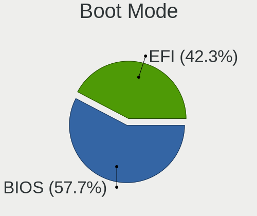

| Mode | Computers | Percent |
|------|-----------|---------|
| EFI  | 513       | 53.72%  |
| BIOS | 442       | 46.28%  |

Filesystem
----------

Type of filesystem

| Type    | Computers | Percent |
|---------|-----------|---------|
| Ext4    | 597       | 62.51%  |
| Btrfs   | 204       | 21.36%  |
| Tmpfs   | 59        | 6.18%   |
| Overlay | 59        | 6.18%   |
| Xfs     | 20        | 2.09%   |
| Zfs     | 12        | 1.26%   |
| F2fs    | 2         | 0.21%   |
| Aufs    | 1         | 0.1%    |
| Unknown | 1         | 0.1%    |

Part. scheme
------------

Scheme of partitioning

| Type    | Computers | Percent |
|---------|-----------|---------|
| GPT     | 548       | 57.38%  |
| Unknown | 327       | 34.24%  |
| MBR     | 80        | 8.38%   |

Dual Boot with Linux/BSD
------------------------

Hosting more than one Linux/BSD

| Dual boot | Computers | Percent |
|-----------|-----------|---------|
| No        | 803       | 84.08%  |
| Yes       | 152       | 15.92%  |

Dual Boot (Win)
---------------

Hosting Linux and Windows

| Dual boot | Computers | Percent |
|-----------|-----------|---------|
| No        | 744       | 77.91%  |
| Yes       | 211       | 22.09%  |

Board
-----

Vendor
------

Motherboard manufacturer

| Name                    | Computers | Percent |
|-------------------------|-----------|---------|
| Dell                    | 148       | 15.5%   |
| Hewlett-Packard         | 147       | 15.39%  |
| ASUSTek Computer        | 142       | 14.87%  |
| Lenovo                  | 116       | 12.15%  |
| MSI                     | 55        | 5.76%   |
| Gigabyte Technology     | 46        | 4.82%   |
| Apple                   | 36        | 3.77%   |
| Acer                    | 30        | 3.14%   |
| ASRock                  | 22        | 2.3%    |
| Valve                   | 21        | 2.2%    |
| Google                  | 15        | 1.57%   |
| Intel                   | 14        | 1.47%   |
| Microsoft               | 12        | 1.26%   |
| GPU Company             | 12        | 1.26%   |
| Unknown                 | 10        | 1.05%   |
| System76                | 9         | 0.94%   |
| Toshiba                 | 8         | 0.84%   |
| Raspberry Pi Foundation | 8         | 0.84%   |
| Supermicro              | 6         | 0.63%   |
| Gateway                 | 6         | 0.63%   |
| Alienware               | 6         | 0.63%   |
| Framework               | 5         | 0.52%   |
| Foxconn                 | 5         | 0.52%   |
| AZW                     | 5         | 0.52%   |
| Sony                    | 4         | 0.42%   |
| Samsung Electronics     | 4         | 0.42%   |
| Pegatron                | 4         | 0.42%   |
| Razer                   | 3         | 0.31%   |
| Notebook                | 3         | 0.31%   |
| Fujitsu                 | 3         | 0.31%   |
| eMachines               | 3         | 0.31%   |
| HUAWEI                  | 2         | 0.21%   |
| GMKtec                  | 2         | 0.21%   |
| Getac                   | 2         | 0.21%   |
| Fanless Mini PC         | 2         | 0.21%   |
| Dynabook                | 2         | 0.21%   |
| Chuwi                   | 2         | 0.21%   |
| Biostar                 | 2         | 0.21%   |
| ASRockRack              | 2         | 0.21%   |
| AMI                     | 2         | 0.21%   |

Model
-----

Motherboard model

| Name                                        | Computers | Percent |
|---------------------------------------------|-----------|---------|
| Valve Jupiter                               | 21        | 2.2%    |
| Unknown                                     | 11        | 1.15%   |
| Dell OptiPlex 7010                          | 9         | 0.94%   |
| ASUS TUF Gaming X570-PLUS                   | 8         | 0.84%   |
| ASUS All Series                             | 8         | 0.84%   |
| HP Laptop 15-db0xxx                         | 5         | 0.52%   |
| HP Notebook                                 | 4         | 0.42%   |
| GPU Company GWTC116-2                       | 4         | 0.42%   |
| Framework Laptop                            | 4         | 0.42%   |
| Dell Latitude E6430                         | 4         | 0.42%   |
| ASUS ROG STRIX X670E-E GAMING WIFI          | 4         | 0.42%   |
| MSI MS-7D25                                 | 3         | 0.31%   |
| MSI MS-7C56                                 | 3         | 0.31%   |
| MSI MS-7C02                                 | 3         | 0.31%   |
| Microsoft Surface Pro 3                     | 3         | 0.31%   |
| Lenovo ThinkPad X1 Extreme Gen 3 20TK001HUS | 3         | 0.31%   |
| HP Laptop 15-bs2xx                          | 3         | 0.31%   |
| GPU Company GWNR71517                       | 3         | 0.31%   |
| Google Chell                                | 3         | 0.31%   |
| Dell XPS 8700                               | 3         | 0.31%   |
| Dell Precision Tower 5810                   | 3         | 0.31%   |
| Dell OptiPlex 990                           | 3         | 0.31%   |
| Dell OptiPlex 7020                          | 3         | 0.31%   |
| Dell Latitude E7440                         | 3         | 0.31%   |
| ASUS TUF Gaming B550M-PLUS                  | 3         | 0.31%   |
| ASUS PRIME Z490-A                           | 3         | 0.31%   |
| ASUS PRIME B450M-A II                       | 3         | 0.31%   |
| Apple MacBookPro8,1                         | 3         | 0.31%   |
| Apple MacBookAir7,2                         | 3         | 0.31%   |
| Acer Aspire A515-45                         | 3         | 0.31%   |
| System76 Thelio                             | 2         | 0.21%   |
| System76 Pangolin                           | 2         | 0.21%   |
| System76 Gazelle                            | 2         | 0.21%   |
| Supermicro Super Server                     | 2         | 0.21%   |
| Samsung 950QDB                              | 2         | 0.21%   |
| RPi Raspberry Pi 4 Model B Rev 1.5          | 2         | 0.21%   |
| RPi Raspberry Pi 4 Model B Rev 1.4          | 2         | 0.21%   |
| MSI MS-7D73                                 | 2         | 0.21%   |
| MSI MS-7D52                                 | 2         | 0.21%   |
| MSI MS-7D30                                 | 2         | 0.21%   |

Model Family
------------

Motherboard model prefix

| Name                  | Computers | Percent |
|-----------------------|-----------|---------|
| Lenovo ThinkPad       | 60        | 6.28%   |
| Dell OptiPlex         | 38        | 3.98%   |
| Dell Inspiron         | 38        | 3.98%   |
| ASUS ROG              | 33        | 3.46%   |
| Dell Latitude         | 28        | 2.93%   |
| HP Pavilion           | 22        | 2.3%    |
| ASUS PRIME            | 22        | 2.3%    |
| Acer Aspire           | 22        | 2.3%    |
| Valve Jupiter         | 21        | 2.2%    |
| Lenovo IdeaPad        | 21        | 2.2%    |
| ASUS TUF              | 21        | 2.2%    |
| HP Laptop             | 20        | 2.09%   |
| Dell Precision        | 19        | 1.99%   |
| Dell XPS              | 18        | 1.88%   |
| Microsoft Surface     | 12        | 1.26%   |
| Unknown               | 11        | 1.15%   |
| HP ProBook            | 10        | 1.05%   |
| HP Compaq             | 10        | 1.05%   |
| HP EliteDesk          | 9         | 0.94%   |
| RPi Raspberry         | 8         | 0.84%   |
| HP ENVY               | 8         | 0.84%   |
| HP EliteBook          | 8         | 0.84%   |
| ASUS VivoBook         | 8         | 0.84%   |
| ASUS All              | 8         | 0.84%   |
| Toshiba Satellite     | 7         | 0.73%   |
| Lenovo IdeaPadFlex    | 7         | 0.73%   |
| Lenovo ThinkBook      | 6         | 0.63%   |
| Lenovo Legion         | 6         | 0.63%   |
| Gigabyte X570         | 6         | 0.63%   |
| Lenovo ThinkCentre    | 5         | 0.52%   |
| HP Spectre            | 5         | 0.52%   |
| Framework Laptop      | 5         | 0.52%   |
| ASUS Zenbook          | 5         | 0.52%   |
| ASUS ASUS             | 5         | 0.52%   |
| Lenovo Yoga           | 4         | 0.42%   |
| HP ZBook              | 4         | 0.42%   |
| HP ProDesk            | 4         | 0.42%   |
| HP OMEN               | 4         | 0.42%   |
| HP Notebook           | 4         | 0.42%   |
| GPU Company GWTC116-2 | 4         | 0.42%   |

MFG Year
--------

Motherboard manufacture year

| Year    | Computers | Percent |
|---------|-----------|---------|
| 2022    | 141       | 14.76%  |
| 2020    | 114       | 11.94%  |
| 2021    | 96        | 10.05%  |
| 2019    | 75        | 7.85%   |
| 2018    | 72        | 7.54%   |
| 2013    | 60        | 6.28%   |
| 2011    | 54        | 5.65%   |
| 2012    | 53        | 5.55%   |
| 2016    | 51        | 5.34%   |
| 2017    | 44        | 4.61%   |
| 2015    | 42        | 4.4%    |
| 2014    | 32        | 3.35%   |
| 2010    | 27        | 2.83%   |
| 2023    | 25        | 2.62%   |
| 2009    | 21        | 2.2%    |
| 2008    | 17        | 1.78%   |
| Unknown | 16        | 1.68%   |
| 2007    | 12        | 1.26%   |
| 2005    | 2         | 0.21%   |
| 2006    | 1         | 0.1%    |

Form Factor
-----------

Physical design of the computer

| Name           | Computers | Percent |
|----------------|-----------|---------|
| Notebook       | 470       | 49.21%  |
| Desktop        | 368       | 38.53%  |
| Convertible    | 36        | 3.77%   |
| Mini pc        | 24        | 2.51%   |
| Tablet         | 21        | 2.2%    |
| System on chip | 15        | 1.57%   |
| All in one     | 12        | 1.26%   |
| Server         | 9         | 0.94%   |

Secure Boot
-----------

Enabled or disabled

| State    | Computers | Percent |
|----------|-----------|---------|
| Disabled | 902       | 94.45%  |
| Enabled  | 53        | 5.55%   |

Coreboot
--------

Have coreboot on board

| Used | Computers | Percent |
|------|-----------|---------|
| No   | 932       | 97.59%  |
| Yes  | 23        | 2.41%   |

RAM Size
--------

Total RAM memory

| Size in GB      | Computers | Percent |
|-----------------|-----------|---------|
| 16.01-24.0      | 198       | 20.73%  |
| 4.01-8.0        | 195       | 20.42%  |
| 32.01-64.0      | 161       | 16.86%  |
| 8.01-16.0       | 143       | 14.97%  |
| 3.01-4.0        | 115       | 12.04%  |
| 64.01-256.0     | 79        | 8.27%   |
| 24.01-32.0      | 30        | 3.14%   |
| 1.01-2.0        | 21        | 2.2%    |
| 2.01-3.0        | 8         | 0.84%   |
| More than 256.0 | 3         | 0.31%   |
| 0.51-1.0        | 1         | 0.1%    |
| 0.01-0.5        | 1         | 0.1%    |

RAM Used
--------

Used RAM memory

| Used GB     | Computers | Percent |
|-------------|-----------|---------|
| 1.01-2.0    | 262       | 27.43%  |
| 2.01-3.0    | 249       | 26.07%  |
| 4.01-8.0    | 178       | 18.64%  |
| 3.01-4.0    | 153       | 16.02%  |
| 8.01-16.0   | 56        | 5.86%   |
| 0.51-1.0    | 33        | 3.46%   |
| 0.01-0.5    | 13        | 1.36%   |
| 16.01-24.0  | 5         | 0.52%   |
| 24.01-32.0  | 3         | 0.31%   |
| 64.01-256.0 | 3         | 0.31%   |

Total Drives
------------

Number of drives on board

| Drives | Computers | Percent |
|--------|-----------|---------|
| 1      | 552       | 57.8%   |
| 2      | 244       | 25.55%  |
| 3      | 78        | 8.17%   |
| 4      | 31        | 3.25%   |
| 5      | 25        | 2.62%   |
| 6      | 8         | 0.84%   |
| 7      | 7         | 0.73%   |
| 0      | 3         | 0.31%   |
| 11     | 2         | 0.21%   |
| 8      | 2         | 0.21%   |
| 25     | 1         | 0.1%    |
| 10     | 1         | 0.1%    |
| 9      | 1         | 0.1%    |

Has CD-ROM
----------

Has CD-ROM on board

| Presented | Computers | Percent |
|-----------|-----------|---------|
| No        | 654       | 68.48%  |
| Yes       | 301       | 31.52%  |

Has Ethernet
------------

Has Ethernet on board

| Presented | Computers | Percent |
|-----------|-----------|---------|
| Yes       | 743       | 77.8%   |
| No        | 212       | 22.2%   |

Has WiFi
--------

Has WiFi module

| Presented | Computers | Percent |
|-----------|-----------|---------|
| Yes       | 783       | 81.99%  |
| No        | 172       | 18.01%  |

Has Bluetooth
-------------

Has Bluetooth module

| Presented | Computers | Percent |
|-----------|-----------|---------|
| Yes       | 642       | 67.23%  |
| No        | 313       | 32.77%  |

Location
--------

Country
-------

Geographic location (country)

| Country | Computers | Percent |
|---------|-----------|---------|
| USA     | 955       | 100%    |

City
----

Geographic location (city)

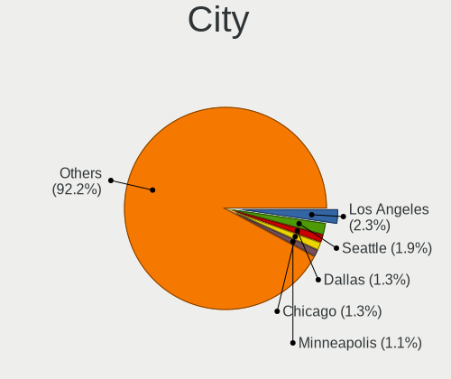

| City             | Computers | Percent |
|------------------|-----------|---------|
| New York         | 19        | 1.99%   |
| Los Angeles      | 17        | 1.78%   |
| Seattle          | 12        | 1.26%   |
| Denver           | 12        | 1.26%   |
| Houston          | 11        | 1.15%   |
| Las Vegas        | 10        | 1.05%   |
| Riverside        | 9         | 0.94%   |
| Dallas           | 9         | 0.94%   |
| San Diego        | 7         | 0.73%   |
| Queens           | 7         | 0.73%   |
| Portland         | 7         | 0.73%   |
| Kansas City      | 7         | 0.73%   |
| Chicago          | 7         | 0.73%   |
| Atlanta          | 7         | 0.73%   |
| Tampa            | 6         | 0.63%   |
| Philadelphia     | 6         | 0.63%   |
| Tucson           | 5         | 0.52%   |
| San Francisco    | 5         | 0.52%   |
| San Antonio      | 5         | 0.52%   |
| Salt Lake City   | 5         | 0.52%   |
| Phoenix          | 5         | 0.52%   |
| Orlando          | 5         | 0.52%   |
| Lynnwood         | 5         | 0.52%   |
| Eugene           | 5         | 0.52%   |
| Columbus         | 5         | 0.52%   |
| Charlotte        | 5         | 0.52%   |
| Ashburn          | 5         | 0.52%   |
| Tulsa            | 4         | 0.42%   |
| St Louis         | 4         | 0.42%   |
| Springfield      | 4         | 0.42%   |
| Pittsburgh       | 4         | 0.42%   |
| Minneapolis      | 4         | 0.42%   |
| Miami            | 4         | 0.42%   |
| Lexington        | 4         | 0.42%   |
| Jamestown        | 4         | 0.42%   |
| Freeport         | 4         | 0.42%   |
| Fort Lauderdale  | 4         | 0.42%   |
| Colorado Springs | 4         | 0.42%   |
| Brooklyn         | 4         | 0.42%   |
| Boynton Beach    | 4         | 0.42%   |

Drives
------

Drive Vendor
------------

Hard drive vendors

| Vendor                      | Computers | Drives | Percent |
|-----------------------------|-----------|--------|---------|
| Samsung Electronics         | 252       | 324    | 17.46%  |
| WDC                         | 186       | 240    | 12.89%  |
| Seagate                     | 152       | 195    | 10.53%  |
| SanDisk                     | 129       | 143    | 8.94%   |
| Unknown                     | 97        | 103    | 6.72%   |
| Toshiba                     | 59        | 64     | 4.09%   |
| Crucial                     | 54        | 61     | 3.74%   |
| SK hynix                    | 45        | 45     | 3.12%   |
| Intel                       | 37        | 40     | 2.56%   |
| Hitachi                     | 36        | 37     | 2.49%   |
| Kingston                    | 34        | 40     | 2.36%   |
| Phison Electronics          | 32        | 39     | 2.22%   |
| Micron Technology           | 23        | 25     | 1.59%   |
| HGST                        | 20        | 20     | 1.39%   |
| China                       | 20        | 22     | 1.39%   |
| PNY                         | 18        | 19     | 1.25%   |
| Micron/Crucial Technology   | 16        | 18     | 1.11%   |
| Apple                       | 16        | 18     | 1.11%   |
| Unknown                     | 16        | 16     | 1.11%   |
| Kingston Technology Company | 13        | 14     | 0.9%    |
| SPCC                        | 12        | 13     | 0.83%   |
| A-DATA Technology           | 12        | 13     | 0.83%   |
| Phison                      | 11        | 12     | 0.76%   |
| KIOXIA                      | 10        | 10     | 0.69%   |
| Team                        | 9         | 10     | 0.62%   |
| Silicon Motion              | 7         | 7      | 0.49%   |
| Mushkin                     | 6         | 6      | 0.42%   |
| LITEON                      | 6         | 6      | 0.42%   |
| T-FORCE                     | 5         | 5      | 0.35%   |
| SABRENT                     | 5         | 7      | 0.35%   |
| FORESEE                     | 5         | 5      | 0.35%   |
| Realtek Semiconductor       | 4         | 5      | 0.28%   |
| O2 Micro                    | 4         | 4      | 0.28%   |
| KingFast                    | 4         | 4      | 0.28%   |
| Corsair                     | 4         | 6      | 0.28%   |
| Wibtek                      | 3         | 3      | 0.21%   |
| Transcend                   | 3         | 3      | 0.21%   |
| SPCC Sol                    | 3         | 3      | 0.21%   |
| Patriot                     | 3         | 3      | 0.21%   |
| Netac                       | 3         | 3      | 0.21%   |

Drive Model
-----------

Hard drive models

| Model                                               | Computers | Percent |
|-----------------------------------------------------|-----------|---------|
| Samsung NVMe SSD Controller SM981/PM981/PM983 1TB   | 40        | 2.53%   |
| Samsung NVMe SSD Controller PM9A1/PM9A3/980PRO 2TB  | 27        | 1.71%   |
| Unknown                                             | 16        | 1.01%   |
| Crucial CT1000MX500SSD1 1TB                         | 13        | 0.82%   |
| Unknown MMC Card  32GB                              | 12        | 0.76%   |
| Seagate ST2000DM008-2FR102 2TB                      | 12        | 0.76%   |
| Unknown MMC Card  64GB                              | 11        | 0.7%    |
| Samsung SSD 850 EVO 500GB                           | 11        | 0.7%    |
| Micron/Crucial P2 NVMe PCIe SSD 1TB                 | 11        | 0.7%    |
| Toshiba DT01ACA100 1TB                              | 10        | 0.63%   |
| Samsung SSD 980 PRO 2TB                             | 10        | 0.63%   |
| Samsung SSD 980 1TB                                 | 10        | 0.63%   |
| Samsung SSD 860 EVO 1TB                             | 10        | 0.63%   |
| Sandisk WD Blue SN550 NVMe SSD 1024GB               | 9         | 0.57%   |
| SanDisk NVMe SSD Drive 1TB                          | 9         | 0.57%   |
| Kingston SA400S37240G 240GB SSD                     | 9         | 0.57%   |
| Unknown MMC Card  128GB                             | 8         | 0.51%   |
| Seagate ST1000LM035-1RK172 970GB                    | 8         | 0.51%   |
| Sandisk WD Black SN750 / PC SN730 NVMe SSD 512GB    | 8         | 0.51%   |
| Samsung SSD 870 EVO 1TB                             | 8         | 0.51%   |
| Samsung SSD 860 EVO 500GB                           | 8         | 0.51%   |
| Phison E16 PCIe4 NVMe Controller 500GB              | 8         | 0.51%   |
| Phison E12 NVMe Controller 512GB                    | 8         | 0.51%   |
| Crucial CT500MX500SSD1 500GB                        | 8         | 0.51%   |
| Unknown SD/MMC/MS PRO 249GB                         | 7         | 0.44%   |
| Unknown MMC Card  512GB                             | 7         | 0.44%   |
| Sandisk WD Blue SN570 1TB                           | 7         | 0.44%   |
| Samsung NVMe SSD Controller SM961/PM961/SM963 500GB | 7         | 0.44%   |
| Kingston Company OM3PDP3 NVMe SSD 512GB             | 7         | 0.44%   |
| WDC WDBNCE5000PNC 500GB SSD                         | 6         | 0.38%   |
| WDC WDBNCE0010PNC 1TB SSD                           | 6         | 0.38%   |
| Unknown MMC Card  256GB                             | 6         | 0.38%   |
| Sandisk WD Black SN850 1TB                          | 6         | 0.38%   |
| Samsung SSD 860 EVO 250GB                           | 6         | 0.38%   |
| Phison PCIe SSD 8TB                                 | 6         | 0.38%   |
| WDC WD10EZEX-60WN4A0 1TB                            | 5         | 0.32%   |
| WDC WD10EZEX-08WN4A0 1TB                            | 5         | 0.32%   |
| WDC WD10EZEX-00BN5A0 1TB                            | 5         | 0.32%   |
| Unknown SD32G  32GB                                 | 5         | 0.32%   |
| Unknown MMC Card  16GB                              | 5         | 0.32%   |

HDD Vendor
----------

Hard disk drive vendors

| Vendor              | Computers | Drives | Percent |
|---------------------|-----------|--------|---------|
| Seagate             | 142       | 179    | 35.24%  |
| WDC                 | 137       | 181    | 34%     |
| Toshiba             | 47        | 51     | 11.66%  |
| Hitachi             | 36        | 37     | 8.93%   |
| HGST                | 20        | 20     | 4.96%   |
| Unknown             | 7         | 7      | 1.74%   |
| Samsung Electronics | 3         | 3      | 0.74%   |
| Apple               | 3         | 3      | 0.74%   |
| ASMT                | 2         | 3      | 0.5%    |
| WD MediaMax         | 1         | 1      | 0.25%   |
| RSH-319             | 1         | 1      | 0.25%   |
| KESU                | 1         | 1      | 0.25%   |
| Inateck             | 1         | 2      | 0.25%   |
| Hewlett-Packard     | 1         | 6      | 0.25%   |
| Generic-            | 1         | 1      | 0.25%   |

SSD Vendor
----------

Solid state drive vendors

| Vendor              | Computers | Drives | Percent |
|---------------------|-----------|--------|---------|
| Samsung Electronics | 115       | 137    | 26.68%  |
| SanDisk             | 45        | 47     | 10.44%  |
| Crucial             | 41        | 46     | 9.51%   |
| WDC                 | 30        | 31     | 6.96%   |
| Kingston            | 24        | 28     | 5.57%   |
| China               | 20        | 22     | 4.64%   |
| PNY                 | 18        | 19     | 4.18%   |
| SPCC                | 11        | 11     | 2.55%   |
| Apple               | 11        | 11     | 2.55%   |
| A-DATA Technology   | 10        | 11     | 2.32%   |
| Micron Technology   | 9         | 11     | 2.09%   |
| Intel               | 8         | 10     | 1.86%   |
| Team                | 7         | 7      | 1.62%   |
| SK hynix            | 7         | 7      | 1.62%   |
| Mushkin             | 6         | 6      | 1.39%   |
| LITEON              | 6         | 6      | 1.39%   |
| Seagate             | 5         | 6      | 1.16%   |
| Wibtek              | 3         | 3      | 0.7%    |
| SPCC Sol            | 3         | 3      | 0.7%    |
| Patriot             | 3         | 3      | 0.7%    |
| Netac               | 3         | 3      | 0.7%    |
| Lexar               | 3         | 3      | 0.7%    |
| Leven               | 3         | 4      | 0.7%    |
| KingFast            | 3         | 3      | 0.7%    |
| FORESEE             | 3         | 3      | 0.7%    |
| Dogfish             | 3         | 3      | 0.7%    |
| Transcend           | 2         | 2      | 0.46%   |
| Toshiba             | 2         | 2      | 0.46%   |
| T-FORCE             | 2         | 2      | 0.46%   |
| OWC                 | 2         | 2      | 0.46%   |
| Inland              | 2         | 2      | 0.46%   |
| Unknown             | 2         | 2      | 0.46%   |
| TO Exter            | 1         | 1      | 0.23%   |
| ShiJi               | 1         | 1      | 0.23%   |
| PNY CS90            | 1         | 1      | 0.23%   |
| Plextor             | 1         | 1      | 0.23%   |
| OCZ-VERTEX3         | 1         | 1      | 0.23%   |
| LITEONIT            | 1         | 1      | 0.23%   |
| KingSpec            | 1         | 1      | 0.23%   |
| INTEL SS            | 1         | 1      | 0.23%   |

Drive Kind
----------

HDD or SSD

| Kind    | Computers | Drives | Percent |
|---------|-----------|--------|---------|
| NVMe    | 458       | 583    | 35.7%   |
| SSD     | 366       | 477    | 28.53%  |
| HDD     | 335       | 496    | 26.11%  |
| MMC     | 98        | 107    | 7.64%   |
| Unknown | 26        | 30     | 2.03%   |

Drive Connector
---------------

SATA, SAS, NVMe, etc.

| Type | Computers | Drives | Percent |
|------|-----------|--------|---------|
| SATA | 585       | 922    | 48.43%  |
| NVMe | 454       | 574    | 37.58%  |
| MMC  | 98        | 107    | 8.11%   |
| SAS  | 71        | 90     | 5.88%   |

Drive Size
----------

Size of hard drive

| Size in TB | Computers | Drives | Percent |
|------------|-----------|--------|---------|
| 0.01-0.5   | 340       | 433    | 44.62%  |
| 0.51-1.0   | 264       | 338    | 34.65%  |
| 1.01-2.0   | 82        | 104    | 10.76%  |
| 3.01-4.0   | 43        | 52     | 5.64%   |
| 4.01-10.0  | 16        | 23     | 2.1%    |
| 2.01-3.0   | 14        | 18     | 1.84%   |
| 10.01-20.0 | 3         | 5      | 0.39%   |

Space Total
-----------

Amount of disk space available on the file system

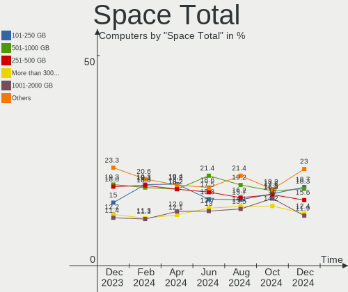

| Size in GB     | Computers | Percent |
|----------------|-----------|---------|
| 101-250        | 188       | 19.69%  |
| 501-1000       | 177       | 18.53%  |
| 251-500        | 176       | 18.43%  |
| 1001-2000      | 118       | 12.36%  |
| More than 3000 | 101       | 10.58%  |
| 1-20           | 60        | 6.28%   |
| 51-100         | 39        | 4.08%   |
| 21-50          | 37        | 3.87%   |
| 2001-3000      | 34        | 3.56%   |
| Unknown        | 25        | 2.62%   |

Space Used
----------

Amount of used disk space

| Used GB        | Computers | Percent |
|----------------|-----------|---------|
| 1-20           | 339       | 35.5%   |
| 21-50          | 171       | 17.91%  |
| 101-250        | 109       | 11.41%  |
| 51-100         | 91        | 9.53%   |
| 251-500        | 82        | 8.59%   |
| 501-1000       | 62        | 6.49%   |
| 1001-2000      | 34        | 3.56%   |
| Unknown        | 25        | 2.62%   |
| 2001-3000      | 21        | 2.2%    |
| More than 3000 | 20        | 2.09%   |
| 0              | 1         | 0.1%    |

Malfunc. Drives
---------------

Drive models with a malfunction

| Model                               | Computers | Drives | Percent |
|-------------------------------------|-----------|--------|---------|
| Toshiba MQ01ABD100 1TB              | 2         | 2      | 2.56%   |
| Seagate ST9500325AS 500GB           | 2         | 2      | 2.56%   |
| Hitachi HTS723232A7A364 320GB       | 2         | 2      | 2.56%   |
| Hitachi HTS547575A9E384 752GB       | 2         | 2      | 2.56%   |
| WDC WD5000LPCX-60VHAT1 500GB        | 1         | 1      | 1.28%   |
| WDC WD40EFRX-68WT0N0 4TB            | 1         | 2      | 1.28%   |
| WDC WD3200BPVT-80ZEST0 320GB        | 1         | 1      | 1.28%   |
| WDC WD3200BEKT-66PVMT0 320GB        | 1         | 1      | 1.28%   |
| WDC WD3200AAJS-56M0A0 320GB         | 1         | 1      | 1.28%   |
| WDC WD2500AAKX-001CA0 250GB         | 1         | 1      | 1.28%   |
| WDC WD20EFRX-68AX9N0 2TB            | 1         | 1      | 1.28%   |
| WDC WD15EZRX-00DC0B0 1TB            | 1         | 1      | 1.28%   |
| WDC WD10EZEX-08M2NA0 1TB            | 1         | 1      | 1.28%   |
| WDC WD10EZEX-00BN5A0 1TB            | 1         | 1      | 1.28%   |
| WDC WD10EARS-00MVWB0 1TB            | 1         | 1      | 1.28%   |
| WDC WD10EADX-22TDHB0 1TB            | 1         | 1      | 1.28%   |
| WDC WD1002FAEX-00Z3A0 1TB           | 1         | 1      | 1.28%   |
| Toshiba MQ04ABF100 1TB              | 1         | 1      | 1.28%   |
| Toshiba MK1656GSY 160GB             | 1         | 1      | 1.28%   |
| SK hynix SH920 mSATA 256GB SSD      | 1         | 1      | 1.28%   |
| SK hynix PC711 HFS001TDE9X073N 1TB  | 1         | 1      | 1.28%   |
| ShiJi SSD 128GB                     | 1         | 1      | 1.28%   |
| Seagate ST9320325AS 320GB           | 1         | 1      | 1.28%   |
| Seagate ST750LM022 HN-M750MBB 752GB | 1         | 1      | 1.28%   |
| Seagate ST500LM021-1KJ152 500GB     | 1         | 1      | 1.28%   |
| Seagate ST4000LM024-2AN17V 4TB      | 1         | 1      | 1.28%   |
| Seagate ST3750528AS 752GB           | 1         | 1      | 1.28%   |
| Seagate ST3500641AS 500GB           | 1         | 1      | 1.28%   |
| Seagate ST3500630NS 500GB           | 1         | 2      | 1.28%   |
| Seagate ST33000651AS 3TB            | 1         | 1      | 1.28%   |
| Seagate ST320LT007-9ZV142 320GB     | 1         | 1      | 1.28%   |
| Seagate ST31500341AS 1TB            | 1         | 1      | 1.28%   |
| Seagate ST31000528AS 1TB            | 1         | 1      | 1.28%   |
| Seagate ST31000340NS 1TB            | 1         | 1      | 1.28%   |
| Seagate ST2000VM003-1CT164 2TB      | 1         | 1      | 1.28%   |
| Seagate ST2000NP0011 2TB            | 1         | 1      | 1.28%   |
| Seagate ST2000NM0055-1V4104 2TB     | 1         | 1      | 1.28%   |
| Seagate ST2000LX001-1RG174 2TB      | 1         | 1      | 1.28%   |
| Seagate ST2000DM008-2FR102 2TB      | 1         | 1      | 1.28%   |
| Seagate ST1000VM002-1ET162 1TB      | 1         | 1      | 1.28%   |

Malfunc. Drive Vendor
---------------------

Vendors of faulty drives

| Vendor                    | Computers | Drives | Percent |
|---------------------------|-----------|--------|---------|
| Seagate                   | 21        | 22     | 26.92%  |
| WDC                       | 13        | 14     | 16.67%  |
| Hitachi                   | 10        | 10     | 12.82%  |
| Toshiba                   | 4         | 4      | 5.13%   |
| Samsung Electronics       | 4         | 4      | 5.13%   |
| Intel                     | 3         | 3      | 3.85%   |
| HGST                      | 3         | 3      | 3.85%   |
| Crucial                   | 3         | 3      | 3.85%   |
| SK hynix                  | 2         | 2      | 2.56%   |
| A-DATA Technology         | 2         | 2      | 2.56%   |
| ShiJi                     | 1         | 1      | 1.28%   |
| SanDisk                   | 1         | 1      | 1.28%   |
| RSH-319                   | 1         | 1      | 1.28%   |
| Phison Electronics        | 1         | 1      | 1.28%   |
| OWC                       | 1         | 1      | 1.28%   |
| Netac                     | 1         | 1      | 1.28%   |
| Micron/Crucial Technology | 1         | 1      | 1.28%   |
| Micron Technology         | 1         | 1      | 1.28%   |
| LITEON                    | 1         | 1      | 1.28%   |
| Kingston                  | 1         | 1      | 1.28%   |
| G.Skill                   | 1         | 1      | 1.28%   |
| China                     | 1         | 1      | 1.28%   |
| Apple                     | 1         | 1      | 1.28%   |

Malfunc. HDD Vendor
-------------------

Vendors of faulty HDD drives

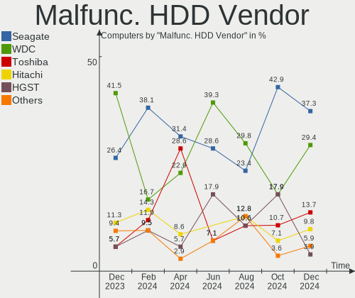

| Vendor  | Computers | Drives | Percent |
|---------|-----------|--------|---------|
| Seagate | 21        | 22     | 40.38%  |
| WDC     | 13        | 14     | 25%     |
| Hitachi | 10        | 10     | 19.23%  |
| Toshiba | 4         | 4      | 7.69%   |
| HGST    | 3         | 3      | 5.77%   |
| RSH-319 | 1         | 1      | 1.92%   |

Malfunc. Drive Kind
-------------------

Kinds of faulty drives

| Kind | Computers | Drives | Percent |
|------|-----------|--------|---------|
| HDD  | 49        | 54     | 66.22%  |
| SSD  | 20        | 21     | 27.03%  |
| NVMe | 5         | 5      | 6.76%   |

Failed Drives
-------------

Failed drive models

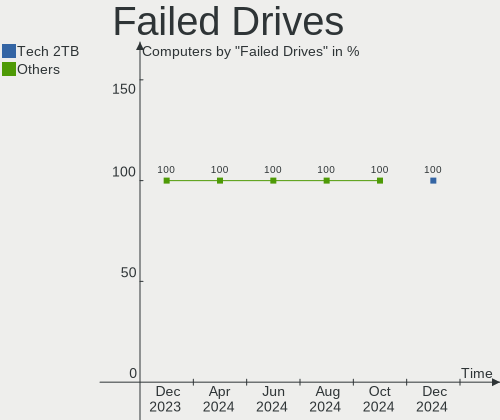

| Model                    | Computers | Drives | Percent |
|--------------------------|-----------|--------|---------|
| Toshiba MK3261GSYN 320GB | 1         | 1      | 33.33%  |
| Seagate ST31000528AS 1TB | 1         | 1      | 33.33%  |
| Inland SATA SSD 128GB    | 1         | 1      | 33.33%  |

Failed Drive Vendor
-------------------

Failed drive vendors

| Vendor  | Computers | Drives | Percent |
|---------|-----------|--------|---------|
| Toshiba | 1         | 1      | 33.33%  |
| Seagate | 1         | 1      | 33.33%  |
| Inland  | 1         | 1      | 33.33%  |

Drive Status
------------

Number of failed and malfunc. drives

| Status   | Computers | Drives | Percent |
|----------|-----------|--------|---------|
| Detected | 566       | 923    | 54.11%  |
| Works    | 408       | 687    | 39.01%  |
| Malfunc  | 69        | 80     | 6.6%    |
| Failed   | 3         | 3      | 0.29%   |

Storage controller
------------------

Storage Vendor
--------------

Storage controller vendors

| Vendor                           | Computers | Percent |
|----------------------------------|-----------|---------|
| Intel                            | 501       | 38.99%  |
| AMD                              | 234       | 18.21%  |
| Samsung Electronics              | 162       | 12.61%  |
| SanDisk                          | 105       | 8.17%   |
| Phison Electronics               | 48        | 3.74%   |
| SK hynix                         | 37        | 2.88%   |
| ASMedia Technology               | 31        | 2.41%   |
| Micron/Crucial Technology        | 28        | 2.18%   |
| Kingston Technology Company      | 23        | 1.79%   |
| Micron Technology                | 14        | 1.09%   |
| Silicon Motion                   | 12        | 0.93%   |
| Nvidia                           | 11        | 0.86%   |
| KIOXIA                           | 11        | 0.86%   |
| Toshiba America Info Systems     | 10        | 0.78%   |
| Realtek Semiconductor            | 8         | 0.62%   |
| LSI Logic / Symbios Logic        | 7         | 0.54%   |
| JMicron Technology               | 6         | 0.47%   |
| O2 Micro                         | 4         | 0.31%   |
| Marvell Technology Group         | 4         | 0.31%   |
| Shenzhen Longsys Electronics     | 3         | 0.23%   |
| Seagate Technology               | 3         | 0.23%   |
| MAXIO Technology (Hangzhou)      | 3         | 0.23%   |
| Union Memory (Shenzhen)          | 2         | 0.16%   |
| Solidigm                         | 2         | 0.16%   |
| Hewlett-Packard                  | 2         | 0.16%   |
| Broadcom / LSI                   | 2         | 0.16%   |
| Apple                            | 2         | 0.16%   |
| ADATA Technology                 | 2         | 0.16%   |
| Yangtze Memory Technologies      | 1         | 0.08%   |
| Solid State Storage Technology   | 1         | 0.08%   |
| Silicon Integrated Systems [SiS] | 1         | 0.08%   |
| Silicon Image                    | 1         | 0.08%   |
| PMC-Sierra                       | 1         | 0.08%   |
| Lite-On Technology               | 1         | 0.08%   |
| INNOGRIT                         | 1         | 0.08%   |
| Biwin Storage Technology         | 1         | 0.08%   |

Storage Model
-------------

Storage controller models

| Model                                                                          | Computers | Percent |
|--------------------------------------------------------------------------------|-----------|---------|
| AMD FCH SATA Controller [AHCI mode]                                            | 166       | 11.72%  |
| Samsung NVMe SSD Controller SM981/PM981/PM983                                  | 55        | 3.88%   |
| Samsung NVMe SSD Controller PM9A1/PM9A3/980PRO                                 | 50        | 3.53%   |
| Samsung NVMe SSD Controller 980                                                | 37        | 2.61%   |
| Intel Sunrise Point-LP SATA Controller [AHCI mode]                             | 32        | 2.26%   |
| Intel 8 Series/C220 Series Chipset Family 6-port SATA Controller 1 [AHCI mode] | 32        | 2.26%   |
| Intel Volume Management Device NVMe RAID Controller                            | 30        | 2.12%   |
| AMD 500 Series Chipset SATA Controller                                         | 29        | 2.05%   |
| Intel 82801 Mobile SATA Controller [RAID mode]                                 | 28        | 1.98%   |
| ASMedia ASM1062 Serial ATA Controller                                          | 27        | 1.91%   |
| Intel 6 Series/C200 Series Chipset Family 6 port Mobile SATA AHCI Controller   | 25        | 1.77%   |
| Intel SATA Controller [RAID mode]                                              | 24        | 1.69%   |
| Intel 7 Series Chipset Family 6-port SATA Controller [AHCI mode]               | 24        | 1.69%   |
| SK hynix Gold P31/PC711 NVMe Solid State Drive                                 | 22        | 1.55%   |
| Micron/Crucial P2 NVMe PCIe SSD                                                | 21        | 1.48%   |
| AMD 400 Series Chipset SATA Controller                                         | 21        | 1.48%   |
| SanDisk WD Blue SN550 NVMe SSD                                                 | 20        | 1.41%   |
| SanDisk WD Black SN770 NVMe SSD                                                | 20        | 1.41%   |
| Intel Q170/Q150/B150/H170/H110/Z170/CM236 Chipset SATA Controller [AHCI Mode]  | 19        | 1.34%   |
| Intel 7 Series/C210 Series Chipset Family 6-port SATA Controller [AHCI mode]   | 19        | 1.34%   |
| Intel 6 Series/C200 Series Chipset Family 6 port Desktop SATA AHCI Controller  | 18        | 1.27%   |
| Intel Celeron/Pentium Silver Processor SATA Controller                         | 17        | 1.2%    |
| Intel Alder Lake-S PCH SATA Controller [AHCI Mode]                             | 17        | 1.2%    |
| AMD SB7x0/SB8x0/SB9x0 SATA Controller [AHCI mode]                              | 17        | 1.2%    |
| SanDisk WD Black SN750 / PC SN730 NVMe SSD                                     | 16        | 1.13%   |
| Samsung NVMe SSD Controller SM961/PM961/SM963                                  | 14        | 0.99%   |
| Micron NVMe Storage Controller                                                 | 14        | 0.99%   |
| Intel 8 Series SATA Controller 1 [AHCI mode]                                   | 14        | 0.99%   |
| Intel 200 Series PCH SATA controller [AHCI mode]                               | 14        | 0.99%   |
| Phison E16 PCIe4 NVMe Controller                                               | 13        | 0.92%   |
| SanDisk WD Blue SN570 NVMe SSD 1TB                                             | 12        | 0.85%   |
| Phison E12 NVMe Controller                                                     | 12        | 0.85%   |
| Intel Tiger Lake-LP SATA Controller                                            | 12        | 0.85%   |
| Intel Cannon Lake PCH SATA AHCI Controller                                     | 12        | 0.85%   |
| SanDisk Non-Volatile memory controller                                         | 10        | 0.71%   |
| Kingston Company OM3PDP3 NVMe SSD                                              | 10        | 0.71%   |
| Intel Wildcat Point-LP SATA Controller [AHCI Mode]                             | 10        | 0.71%   |
| Intel Comet Lake SATA AHCI Controller                                          | 10        | 0.71%   |
| Intel Cannon Lake Mobile PCH SATA AHCI Controller                              | 10        | 0.71%   |
| Silicon Motion SM2263EN/SM2263XT SSD Controller                                | 9         | 0.64%   |

Storage Kind
------------

Kind of storage controller (IDE, SATA, NVMe, SAS, ...)

| Kind | Computers | Percent |
|------|-----------|---------|
| SATA | 632       | 50.12%  |
| NVMe | 454       | 36%     |
| RAID | 104       | 8.25%   |
| IDE  | 61        | 4.84%   |
| SAS  | 5         | 0.4%    |
| SCSI | 5         | 0.4%    |

Processor
---------

CPU Vendor
----------

Processor vendors

| Vendor        | Computers | Percent |
|---------------|-----------|---------|
| Intel         | 643       | 67.33%  |
| AMD           | 296       | 30.99%  |
| ARM           | 15        | 1.57%   |
| sifive,u74-mc | 1         | 0.1%    |

CPU Model
---------

Processor models

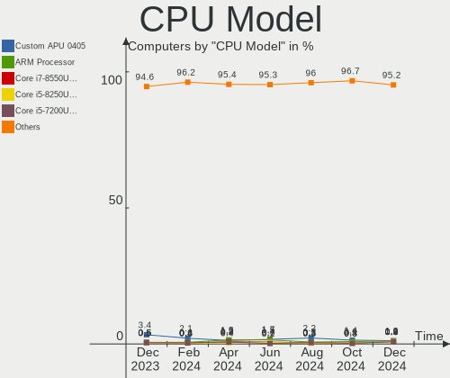

| Model                                         | Computers | Percent |
|-----------------------------------------------|-----------|---------|
| AMD Custom APU 0405                           | 21        | 2.2%    |
| ARM Processor                                 | 14        | 1.47%   |
| Intel Core i5-3470 CPU @ 3.20GHz              | 13        | 1.36%   |
| AMD Ryzen 5 5600X 6-Core Processor            | 12        | 1.26%   |
| Intel Celeron N4020 CPU @ 1.10GHz             | 11        | 1.15%   |
| Intel 11th Gen Core i7-1165G7 @ 2.80GHz       | 11        | 1.15%   |
| AMD Ryzen 9 5900X 12-Core Processor           | 10        | 1.05%   |
| AMD Ryzen 7 3700X 8-Core Processor            | 10        | 1.05%   |
| Intel Core i5-7200U CPU @ 2.50GHz             | 9         | 0.94%   |
| Intel 12th Gen Core i7-1255U                  | 9         | 0.94%   |
| Intel 11th Gen Core i5-1135G7 @ 2.40GHz       | 9         | 0.94%   |
| Intel 11th Gen Core i3-1115G4 @ 3.00GHz       | 9         | 0.94%   |
| Intel Core i5-2400 CPU @ 3.10GHz              | 8         | 0.84%   |
| AMD Ryzen 5 3600 6-Core Processor             | 8         | 0.84%   |
| Intel Core i7-8700K CPU @ 3.70GHz             | 7         | 0.73%   |
| Intel Core i7-4790 CPU @ 3.60GHz              | 7         | 0.73%   |
| Intel Core i5-10210U CPU @ 1.60GHz            | 7         | 0.73%   |
| Intel Celeron CPU N3060 @ 1.60GHz             | 7         | 0.73%   |
| Intel Atom x5-Z8350 CPU @ 1.44GHz             | 7         | 0.73%   |
| Intel 12th Gen Core i7-1260P                  | 7         | 0.73%   |
| AMD Ryzen 9 7950X 16-Core Processor           | 7         | 0.73%   |
| AMD Ryzen 7 5800X 8-Core Processor            | 7         | 0.73%   |
| AMD Ryzen 7 5700G with Radeon Graphics        | 7         | 0.73%   |
| AMD Ryzen 5 5500U with Radeon Graphics        | 7         | 0.73%   |
| Intel Core i7-9750H CPU @ 2.60GHz             | 6         | 0.63%   |
| Intel Core i7-6700HQ CPU @ 2.60GHz            | 6         | 0.63%   |
| Intel Core i7-2600 CPU @ 3.40GHz              | 6         | 0.63%   |
| Intel Core i5-6500 CPU @ 3.20GHz              | 6         | 0.63%   |
| Intel Celeron N5105 @ 2.00GHz                 | 6         | 0.63%   |
| Intel 12th Gen Core i7-12700H                 | 6         | 0.63%   |
| AMD Ryzen 5 2500U with Radeon Vega Mobile Gfx | 6         | 0.63%   |
| Intel Core i7-7700HQ CPU @ 2.80GHz            | 5         | 0.52%   |
| Intel Core i7-3770 CPU @ 3.40GHz              | 5         | 0.52%   |
| Intel Core i7-10750H CPU @ 2.60GHz            | 5         | 0.52%   |
| Intel Core i7-1065G7 CPU @ 1.30GHz            | 5         | 0.52%   |
| Intel Core i5-8250U CPU @ 1.60GHz             | 5         | 0.52%   |
| Intel Core i5-4300U CPU @ 1.90GHz             | 5         | 0.52%   |
| Intel Core i5-3320M CPU @ 2.60GHz             | 5         | 0.52%   |
| Intel Core i5-3210M CPU @ 2.50GHz             | 5         | 0.52%   |
| Intel Core i5-2520M CPU @ 2.50GHz             | 5         | 0.52%   |

CPU Model Family
----------------

Processor model prefix

| Model                   | Computers | Percent |
|-------------------------|-----------|---------|
| Intel Core i7           | 169       | 17.7%   |
| Intel Core i5           | 163       | 17.07%  |
| Other                   | 154       | 16.13%  |
| AMD Ryzen 7             | 71        | 7.43%   |
| AMD Ryzen 5             | 68        | 7.12%   |
| Intel Celeron           | 50        | 5.24%   |
| AMD Ryzen 9             | 42        | 4.4%    |
| Intel Core i3           | 37        | 3.87%   |
| Intel Xeon              | 27        | 2.83%   |
| Intel Core 2 Duo        | 22        | 2.3%    |
| Intel Pentium           | 19        | 1.99%   |
| Intel Atom              | 10        | 1.05%   |
| AMD FX                  | 10        | 1.05%   |
| AMD A6                  | 9         | 0.94%   |
| AMD A10                 | 9         | 0.94%   |
| Intel Core i9           | 8         | 0.84%   |
| AMD Ryzen 3             | 8         | 0.84%   |
| AMD A8                  | 7         | 0.73%   |
| Intel Pentium Dual-Core | 5         | 0.52%   |
| AMD Ryzen Threadripper  | 5         | 0.52%   |
| AMD Athlon              | 5         | 0.52%   |
| Intel Core 2 Quad       | 4         | 0.42%   |
| AMD Ryzen 7 PRO         | 4         | 0.42%   |
| AMD EPYC                | 4         | 0.42%   |
| AMD Athlon II X2        | 4         | 0.42%   |
| Intel Pentium Silver    | 3         | 0.31%   |
| AMD Ryzen 5 PRO         | 3         | 0.31%   |
| AMD PRO A10             | 3         | 0.31%   |
| Intel Pentium Dual      | 2         | 0.21%   |
| Intel Core m5           | 2         | 0.21%   |
| AMD Phenom II X4        | 2         | 0.21%   |
| AMD E2                  | 2         | 0.21%   |
| AMD E                   | 2         | 0.21%   |
| AMD Athlon II X4        | 2         | 0.21%   |
| AMD Athlon 64 X2        | 2         | 0.21%   |
| AMD A4                  | 2         | 0.21%   |
| Intel Pentium M         | 1         | 0.1%    |
| Intel Pentium D         | 1         | 0.1%    |
| Intel Pentium 4         | 1         | 0.1%    |
| Intel Genuine           | 1         | 0.1%    |

CPU Cores
---------

Number of processor cores

| Number  | Computers | Percent |
|---------|-----------|---------|
| 4       | 340       | 35.6%   |
| 2       | 283       | 29.63%  |
| 8       | 109       | 11.41%  |
| 6       | 101       | 10.58%  |
| 12      | 37        | 3.87%   |
| 16      | 27        | 2.83%   |
| 14      | 15        | 1.57%   |
| 10      | 15        | 1.57%   |
| 1       | 8         | 0.84%   |
| 24      | 6         | 0.63%   |
| 32      | 5         | 0.52%   |
| 3       | 4         | 0.42%   |
| Unknown | 3         | 0.31%   |
| 20      | 1         | 0.1%    |
| 18      | 1         | 0.1%    |

CPU Sockets
-----------

Number of sockets

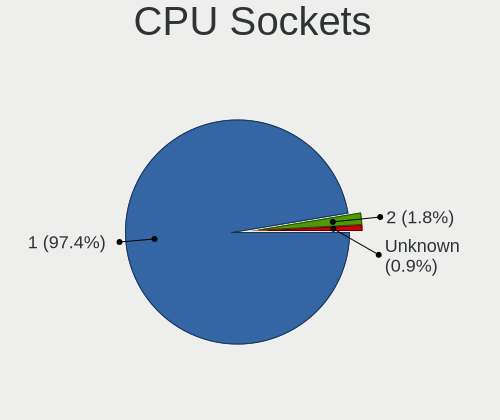

| Number  | Computers | Percent |
|---------|-----------|---------|
| 1       | 940       | 98.43%  |
| 2       | 12        | 1.26%   |
| Unknown | 3         | 0.31%   |

CPU Threads
-----------

Threads per core (Hyper-Threading)

| Number  | Computers | Percent |
|---------|-----------|---------|
| 2       | 685       | 71.73%  |
| 1       | 266       | 27.85%  |
| Unknown | 3         | 0.31%   |
| 16      | 1         | 0.1%    |

CPU Op-Modes
------------

CPU Operation Modes (32-bit, 64-bit)

| Op mode        | Computers | Percent |
|----------------|-----------|---------|
| 32-bit, 64-bit | 948       | 99.27%  |
| Unknown        | 3         | 0.31%   |
| 64-bit         | 2         | 0.21%   |
| 32-bit         | 2         | 0.21%   |

CPU Microcode
-------------

Microcode number

| Number     | Computers | Percent |
|------------|-----------|---------|
| Unknown    | 519       | 54.35%  |
| 0x206a7    | 25        | 2.62%   |
| 0x306a9    | 19        | 1.99%   |
| 0x306c3    | 18        | 1.88%   |
| 0x806ec    | 16        | 1.68%   |
| 0x0a50000c | 13        | 1.36%   |
| 0x08701021 | 13        | 1.36%   |
| 0x806c1    | 12        | 1.26%   |
| 0x406c4    | 12        | 1.26%   |
| 0x08108109 | 12        | 1.26%   |
| 0x0a20120a | 11        | 1.15%   |
| 0x906e9    | 10        | 1.05%   |
| 0x906a3    | 10        | 1.05%   |
| 0x806e9    | 10        | 1.05%   |
| 0x1067a    | 10        | 1.05%   |
| 0x0a601203 | 10        | 1.05%   |
| 0x0a50000d | 9         | 0.94%   |
| 0x806ea    | 8         | 0.84%   |
| 0x0a404102 | 8         | 0.84%   |
| 0x90672    | 7         | 0.73%   |
| 0xb0671    | 6         | 0.63%   |
| 0x906c0    | 6         | 0.63%   |
| 0x706a8    | 6         | 0.63%   |
| 0x506e3    | 6         | 0.63%   |
| 0x306d4    | 6         | 0.63%   |
| 0x06001119 | 6         | 0.63%   |
| 0x906ea    | 5         | 0.52%   |
| 0x706e5    | 5         | 0.52%   |
| 0x406e3    | 5         | 0.52%   |
| 0x40651    | 5         | 0.52%   |
| 0x0a201025 | 5         | 0.52%   |
| 0x0a201016 | 5         | 0.52%   |
| 0x0a201204 | 4         | 0.42%   |
| 0x08608103 | 4         | 0.42%   |
| 0x0800820d | 4         | 0.42%   |
| 0x06006705 | 4         | 0.42%   |
| 0xa0671    | 3         | 0.31%   |
| 0x906ed    | 3         | 0.31%   |
| 0x906a4    | 3         | 0.31%   |
| 0x706a1    | 3         | 0.31%   |

CPU Microarch
-------------

Microarchitecture

| Name             | Computers | Percent |
|------------------|-----------|---------|
| KabyLake         | 118       | 12.36%  |
| Unknown          | 109       | 11.41%  |
| Zen 3            | 78        | 8.17%   |
| Haswell          | 75        | 7.85%   |
| SandyBridge      | 58        | 6.07%   |
| IvyBridge        | 53        | 5.55%   |
| Skylake          | 46        | 4.82%   |
| TigerLake        | 43        | 4.5%    |
| Alderlake Hybrid | 43        | 4.5%    |
| Zen 2            | 40        | 4.19%   |
| Zen+             | 30        | 3.14%   |
| Penryn           | 30        | 3.14%   |
| Silvermont       | 23        | 2.41%   |
| Goldmont plus    | 23        | 2.41%   |
| IceLake          | 21        | 2.2%    |
| CometLake        | 20        | 2.09%   |
| Broadwell        | 19        | 1.99%   |
| Piledriver       | 18        | 1.88%   |
| Zen              | 16        | 1.68%   |
| Westmere         | 14        | 1.47%   |
| Excavator        | 12        | 1.26%   |
| K10              | 11        | 1.15%   |
| Core             | 10        | 1.05%   |
| Tremont          | 8         | 0.84%   |
| Puma             | 5         | 0.52%   |
| Nehalem          | 5         | 0.52%   |
| K8 Hammer        | 5         | 0.52%   |
| Steamroller      | 4         | 0.42%   |
| Goldmont         | 4         | 0.42%   |
| Jaguar           | 3         | 0.31%   |
| Bobcat           | 3         | 0.31%   |
| NetBurst         | 2         | 0.21%   |
| Bulldozer        | 2         | 0.21%   |
| P6               | 1         | 0.1%    |
| K8 & K10 hybrid  | 1         | 0.1%    |
| K10 Llano        | 1         | 0.1%    |
| Bonnell          | 1         | 0.1%    |

Graphics
--------

GPU Vendor
----------

Vendors of graphics cards

| Vendor                     | Computers | Percent |
|----------------------------|-----------|---------|
| Intel                      | 519       | 47.53%  |
| AMD                        | 293       | 26.83%  |
| Nvidia                     | 271       | 24.82%  |
| ASPEED Technology          | 5         | 0.46%   |
| Matrox Electronics Systems | 4         | 0.37%   |

GPU Model
---------

Graphics card models

| Model                                                                                    | Computers | Percent |
|------------------------------------------------------------------------------------------|-----------|---------|
| Intel 2nd Generation Core Processor Family Integrated Graphics Controller                | 39        | 3.5%    |
| Intel TigerLake-LP GT2 [Iris Xe Graphics]                                                | 34        | 3.05%   |
| AMD Ellesmere [Radeon RX 470/480/570/570X/580/580X/590]                                  | 24        | 2.15%   |
| Intel HD Graphics 620                                                                    | 22        | 1.97%   |
| Intel GeminiLake [UHD Graphics 600]                                                      | 22        | 1.97%   |
| Intel 3rd Gen Core processor Graphics Controller                                         | 22        | 1.97%   |
| AMD Picasso/Raven 2 [Radeon Vega Series / Radeon Vega Mobile Series]                     | 22        | 1.97%   |
| Intel Alder Lake-P Integrated Graphics Controller                                        | 21        | 1.88%   |
| AMD VanGogh [AMD Custom GPU 0405]                                                        | 21        | 1.88%   |
| Intel Haswell-ULT Integrated Graphics Controller                                         | 20        | 1.79%   |
| Intel HD Graphics 530                                                                    | 19        | 1.7%    |
| Intel Atom/Celeron/Pentium Processor x5-E8000/J3xxx/N3xxx Integrated Graphics Controller | 19        | 1.7%    |
| AMD Cezanne [Radeon Vega Series / Radeon Vega Mobile Series]                             | 17        | 1.52%   |
| Intel Xeon E3-1200 v3/4th Gen Core Processor Integrated Graphics Controller              | 16        | 1.43%   |
| Intel CometLake-U GT2 [UHD Graphics]                                                     | 16        | 1.43%   |
| AMD Raphael                                                                              | 16        | 1.43%   |
| Intel Xeon E3-1200 v2/3rd Gen Core processor Graphics Controller                         | 15        | 1.35%   |
| Intel 4th Gen Core Processor Integrated Graphics Controller                              | 15        | 1.35%   |
| Intel UHD Graphics 620                                                                   | 14        | 1.26%   |
| Intel Skylake GT2 [HD Graphics 520]                                                      | 13        | 1.17%   |
| AMD Rembrandt [Radeon 680M]                                                              | 13        | 1.17%   |
| Intel CometLake-H GT2 [UHD Graphics]                                                     | 12        | 1.08%   |
| Intel CoffeeLake-H GT2 [UHD Graphics 630]                                                | 12        | 1.08%   |
| AMD Navi 22 [Radeon RX 6700/6700 XT/6750 XT / 6800M/6850M XT]                            | 12        | 1.08%   |
| Intel JasperLake [UHD Graphics]                                                          | 11        | 0.99%   |
| Intel HD Graphics 630                                                                    | 11        | 0.99%   |
| Intel Alder Lake-UP3 GT2 [Iris Xe Graphics]                                              | 11        | 0.99%   |
| Intel HD Graphics 5500                                                                   | 10        | 0.9%    |
| AMD Renoir                                                                               | 10        | 0.9%    |
| AMD Lucienne                                                                             | 10        | 0.9%    |
| Intel Tiger Lake-LP GT2 [UHD Graphics G4]                                                | 9         | 0.81%   |
| Intel Core Processor Integrated Graphics Controller                                      | 9         | 0.81%   |
| Intel CoffeeLake-S GT2 [UHD Graphics 630]                                                | 9         | 0.81%   |
| AMD Barcelo                                                                              | 9         | 0.81%   |
| AMD Raven Ridge [Radeon Vega Series / Radeon Vega Mobile Series]                         | 8         | 0.72%   |
| AMD Navi 21 [Radeon RX 6800/6800 XT / 6900 XT]                                           | 8         | 0.72%   |
| Nvidia TU117 [GeForce GTX 1650]                                                          | 7         | 0.63%   |
| Nvidia GA106M [GeForce RTX 3060 Mobile / Max-Q]                                          | 7         | 0.63%   |
| Intel Mobile 4 Series Chipset Integrated Graphics Controller                             | 7         | 0.63%   |
| Intel Iris Plus Graphics G1 (Ice Lake)                                                   | 7         | 0.63%   |

GPU Combo
---------

Combinations of graphics cards

| Name            | Computers | Percent |
|-----------------|-----------|---------|
| 1 x Intel       | 391       | 40.94%  |
| 1 x AMD         | 233       | 24.4%   |
| 1 x Nvidia      | 151       | 15.81%  |
| Intel + Nvidia  | 88        | 9.21%   |
| AMD + Nvidia    | 29        | 3.04%   |
| Intel + AMD     | 19        | 1.99%   |
| Other           | 16        | 1.68%   |
| 2 x AMD         | 10        | 1.05%   |
| 2 x Intel       | 6         | 0.63%   |
| 1 x ASPEED      | 4         | 0.42%   |
| 1 x Matrox      | 3         | 0.31%   |
| 2 x Nvidia      | 2         | 0.21%   |
| 3 x AMD         | 1         | 0.1%    |
| Nvidia + Matrox | 1         | 0.1%    |
| AMD + ASPEED    | 1         | 0.1%    |

GPU Driver
----------

Free vs proprietary

| Driver      | Computers | Percent |
|-------------|-----------|---------|
| Free        | 763       | 79.9%   |
| Proprietary | 148       | 15.5%   |
| Unknown     | 44        | 4.61%   |

GPU Memory
----------

Total video memory

| Size in GB | Computers | Percent |
|------------|-----------|---------|
| Unknown    | 650       | 68.06%  |
| 0.01-0.5   | 64        | 6.7%    |
| 7.01-8.0   | 55        | 5.76%   |
| 1.01-2.0   | 50        | 5.24%   |
| 0.51-1.0   | 43        | 4.5%    |
| 3.01-4.0   | 40        | 4.19%   |
| 8.01-16.0  | 28        | 2.93%   |
| 5.01-6.0   | 15        | 1.57%   |
| 2.01-3.0   | 5         | 0.52%   |
| 16.01-24.0 | 5         | 0.52%   |

Monitor
-------

Monitor Vendor
--------------

Monitor vendors

| Vendor               | Computers | Percent |
|----------------------|-----------|---------|
| AU Optronics         | 108       | 10.87%  |
| Samsung Electronics  | 96        | 9.66%   |
| BOE                  | 86        | 8.65%   |
| Chimei Innolux       | 81        | 8.15%   |
| Dell                 | 75        | 7.55%   |
| LG Display           | 62        | 6.24%   |
| Acer                 | 44        | 4.43%   |
| Goldstar             | 42        | 4.23%   |
| Hewlett-Packard      | 35        | 3.52%   |
| Apple                | 28        | 2.82%   |
| Sharp                | 27        | 2.72%   |
| Sceptre Tech         | 27        | 2.72%   |
| Valve                | 22        | 2.21%   |
| Ancor Communications | 21        | 2.11%   |
| Vizio                | 18        | 1.81%   |
| PANDA                | 15        | 1.51%   |
| AOC                  | 13        | 1.31%   |
| ViewSonic            | 11        | 1.11%   |
| BenQ                 | 10        | 1.01%   |
| ASUSTek Computer     | 10        | 1.01%   |
| Unknown              | 10        | 1.01%   |
| LG Electronics       | 9         | 0.91%   |
| Lenovo               | 9         | 0.91%   |
| MSI                  | 8         | 0.8%    |
| InfoVision           | 7         | 0.7%    |
| CSO                  | 7         | 0.7%    |
| Sony                 | 6         | 0.6%    |
| Insignia             | 6         | 0.6%    |
| Unknown              | 5         | 0.5%    |
| Gigabyte Technology  | 5         | 0.5%    |
| Viotek               | 4         | 0.4%    |
| Toshiba              | 4         | 0.4%    |
| Panasonic            | 4         | 0.4%    |
| ONN                  | 4         | 0.4%    |
| Pixio                | 3         | 0.3%    |
| Philips              | 3         | 0.3%    |
| LG Philips           | 3         | 0.3%    |
| HKC                  | 3         | 0.3%    |
| HannStar             | 3         | 0.3%    |
| Element              | 3         | 0.3%    |

Monitor Model
-------------

Monitor models

| Model                                                                 | Computers | Percent |
|-----------------------------------------------------------------------|-----------|---------|
| Valve ANX7530 U VLV3001 800x1280 100x150mm 7.1-inch                   | 21        | 2.06%   |
| Unknown                                                               | 10        | 0.98%   |
| Sceptre Tech E248W-19203S SPT099D 1920x1080 443x249mm 20.0-inch       | 6         | 0.59%   |
| Samsung Electronics LCD Monitor SEC5441 1366x768 344x194mm 15.5-inch  | 6         | 0.59%   |
| AU Optronics LCD Monitor AUO10EC 1366x768 344x193mm 15.5-inch         | 6         | 0.59%   |
| LG Display LCD Monitor LGD0555 2736x1824 260x173mm 12.3-inch          | 5         | 0.49%   |
| Chimei Innolux LCD Monitor CMN1132 1366x768 256x144mm 11.6-inch       | 5         | 0.49%   |
| BOE LCD Monitor BOE095F 2256x1504 285x190mm 13.5-inch                 | 5         | 0.49%   |
| AU Optronics LCD Monitor AUO21ED 1920x1080 344x193mm 15.5-inch        | 5         | 0.49%   |
| Sceptre Tech Sceptre F27 SPT0AD7 1920x1080 600x330mm 27.0-inch        | 4         | 0.39%   |
| ONN ONA18HO015 ONN0101 1920x1080 698x393mm 31.5-inch                  | 4         | 0.39%   |
| Goldstar Ultra HD GSM5B09 3840x2160 600x340mm 27.2-inch               | 4         | 0.39%   |
| Chimei Innolux LCD Monitor CMN15DB 1366x768 344x193mm 15.5-inch       | 4         | 0.39%   |
| BOE LCD Monitor BOE06A4 1366x768 344x194mm 15.5-inch                  | 4         | 0.39%   |
| Vizio V405-H9 VIZ1039 3840x2160 878x485mm 39.5-inch                   | 3         | 0.29%   |
| Vizio D24f4-J01 VIZ1044 1920x1080 527x296mm 23.8-inch                 | 3         | 0.29%   |
| Viotek GN34CW VTK3400 3440x1440 795x334mm 33.9-inch                   | 3         | 0.29%   |
| Sceptre Tech Sceptre Z27 SPT6B0B 3840x2160 597x336mm 27.0-inch        | 3         | 0.29%   |
| Sceptre Tech Sceptre T24 SPT09AB 1920x1080 520x320mm 24.0-inch        | 3         | 0.29%   |
| Samsung Electronics LCD Monitor SEC3542 2160x1440 254x169mm 12.0-inch | 3         | 0.29%   |
| Samsung Electronics LCD Monitor SDC415A 3840x2400 302x189mm 14.0-inch | 3         | 0.29%   |
| Samsung Electronics LCD Monitor SDC4141 3840x2160 344x194mm 15.5-inch | 3         | 0.29%   |
| MSI MAG341CQ MSI1462 3440x1440 797x333mm 34.0-inch                    | 3         | 0.29%   |
| LG Display LCD Monitor LGD02D8 1366x768 277x156mm 12.5-inch           | 3         | 0.29%   |
| Hewlett-Packard 27m HPN3579 1920x1080 598x336mm 27.0-inch             | 3         | 0.29%   |
| Goldstar ULTRAWIDE GSM59F1 2560x1080 673x284mm 28.8-inch              | 3         | 0.29%   |
| Dell U2415 DELA0BC 1920x1080 518x324mm 24.1-inch                      | 3         | 0.29%   |
| Chimei Innolux LCD Monitor CMN15D2 1920x1080 344x193mm 15.5-inch      | 3         | 0.29%   |
| Chimei Innolux LCD Monitor CMN15C5 1366x768 344x193mm 15.5-inch       | 3         | 0.29%   |
| Chimei Innolux LCD Monitor CMN1521 1920x1080 344x193mm 15.5-inch      | 3         | 0.29%   |
| Chimei Innolux LCD Monitor CMN14D6 1366x768 309x173mm 13.9-inch       | 3         | 0.29%   |
| Chimei Innolux LCD Monitor CMN14D4 1920x1080 309x173mm 13.9-inch      | 3         | 0.29%   |
| AU Optronics LCD Monitor AUO70EC 1366x768 344x193mm 15.5-inch         | 3         | 0.29%   |
| AU Optronics LCD Monitor AUO38ED 1920x1080 344x193mm 15.5-inch        | 3         | 0.29%   |
| AU Optronics LCD Monitor AUO22EC 1366x768 344x193mm 15.5-inch         | 3         | 0.29%   |
| AU Optronics LCD Monitor AUO159E 1600x900 382x214mm 17.2-inch         | 3         | 0.29%   |
| AU Optronics LCD Monitor AUO119D 1920x1080 381x214mm 17.2-inch        | 3         | 0.29%   |
| Apple Color LCD APPA01B 1440x900 286x179mm 13.3-inch                  | 3         | 0.29%   |
| Ancor Communications ASUS VS247 ACI249A 1920x1080 521x293mm 23.5-inch | 3         | 0.29%   |
| Vizio VA26LHDTV10T VIZ0035 1360x768 576x324mm 26.0-inch               | 2         | 0.2%    |

Monitor Resolution
------------------

Monitor screen resolution

| Resolution         | Computers | Percent |
|--------------------|-----------|---------|
| 1920x1080 (FHD)    | 396       | 41.47%  |
| 1366x768 (WXGA)    | 141       | 14.76%  |
| 3840x2160 (4K)     | 82        | 8.59%   |
| 2560x1440 (QHD)    | 54        | 5.65%   |
| 1600x900 (HD+)     | 35        | 3.66%   |
| 1920x1200 (WUXGA)  | 26        | 2.72%   |
| 800x1280           | 21        | 2.2%    |
| 1440x900 (WXGA+)   | 18        | 1.88%   |
| 1280x800 (WXGA)    | 17        | 1.78%   |
| 3440x1440          | 16        | 1.68%   |
| Unknown            | 16        | 1.68%   |
| 2560x1600          | 12        | 1.26%   |
| 2560x1080          | 12        | 1.26%   |
| 1680x1050 (WSXGA+) | 12        | 1.26%   |
| 3840x2400          | 10        | 1.05%   |
| 3840x1080          | 9         | 0.94%   |
| 1280x1024 (SXGA)   | 9         | 0.94%   |
| 2880x1800          | 7         | 0.73%   |
| 2256x1504          | 7         | 0.73%   |
| 1920x540           | 6         | 0.63%   |
| 1024x768 (XGA)     | 6         | 0.63%   |
| 2736x1824          | 5         | 0.52%   |
| 2160x1440          | 4         | 0.42%   |
| 1360x768           | 4         | 0.42%   |
| 3200x1800 (QHD+)   | 3         | 0.31%   |
| 1600x1200          | 3         | 0.31%   |
| 2160x1350          | 2         | 0.21%   |
| 2048x1152          | 2         | 0.21%   |
| 7680x1080          | 1         | 0.1%    |
| 6000x1440          | 1         | 0.1%    |
| 5760x1080          | 1         | 0.1%    |
| 5120x1080          | 1         | 0.1%    |
| 4480x3600          | 1         | 0.1%    |
| 4480x1080          | 1         | 0.1%    |
| 3840x1600          | 1         | 0.1%    |
| 3840x1200          | 1         | 0.1%    |
| 3200x2000          | 1         | 0.1%    |
| 3072x1920          | 1         | 0.1%    |
| 3000x2000          | 1         | 0.1%    |
| 2560x2880          | 1         | 0.1%    |

Monitor Diagonal
----------------

Diagonal size in inches

| Inches  | Computers | Percent |
|---------|-----------|---------|
| 15      | 229       | 23.32%  |
| 27      | 88        | 8.96%   |
| 13      | 83        | 8.45%   |
| 14      | 65        | 6.62%   |
| 24      | 62        | 6.31%   |
| 31      | 52        | 5.3%    |
| Unknown | 50        | 5.09%   |
| 17      | 46        | 4.68%   |
| 23      | 40        | 4.07%   |
| 21      | 35        | 3.56%   |
| 11      | 27        | 2.75%   |
| 34      | 21        | 2.14%   |
| 7       | 21        | 2.14%   |
| 12      | 17        | 1.73%   |
| 16      | 14        | 1.43%   |
| 84      | 13        | 1.32%   |
| 20      | 12        | 1.22%   |
| 32      | 11        | 1.12%   |
| 19      | 11        | 1.12%   |
| 22      | 9         | 0.92%   |
| 72      | 8         | 0.81%   |
| 18      | 8         | 0.81%   |
| 54      | 7         | 0.71%   |
| 26      | 5         | 0.51%   |
| 48      | 4         | 0.41%   |
| 40      | 4         | 0.41%   |
| 74      | 3         | 0.31%   |
| 69      | 3         | 0.31%   |
| 49      | 3         | 0.31%   |
| 10      | 3         | 0.31%   |
| 52      | 2         | 0.2%    |
| 46      | 2         | 0.2%    |
| 42      | 2         | 0.2%    |
| 38      | 2         | 0.2%    |
| 37      | 2         | 0.2%    |
| 36      | 2         | 0.2%    |
| 35      | 2         | 0.2%    |
| 30      | 2         | 0.2%    |
| 29      | 2         | 0.2%    |
| 142     | 1         | 0.1%    |

Monitor Width
-------------

Physical width

| Width in mm    | Computers | Percent |
|----------------|-----------|---------|
| 301-350        | 342       | 35.55%  |
| 501-600        | 166       | 17.26%  |
| 201-300        | 94        | 9.77%   |
| 401-500        | 72        | 7.48%   |
| 601-700        | 67        | 6.96%   |
| 351-400        | 52        | 5.41%   |
| Unknown        | 50        | 5.2%    |
| 701-800        | 34        | 3.53%   |
| 1501-2000      | 27        | 2.81%   |
| 1-100          | 21        | 2.18%   |
| 1001-1500      | 20        | 2.08%   |
| 801-900        | 11        | 1.14%   |
| 901-1000       | 4         | 0.42%   |
| More than 2000 | 1         | 0.1%    |
| 101-200        | 1         | 0.1%    |

Aspect Ratio
------------

Proportional relationship between the width and the height

| Ratio   | Computers | Percent |
|---------|-----------|---------|
| 16/9    | 645       | 71.67%  |
| 16/10   | 116       | 12.89%  |
| Unknown | 41        | 4.56%   |
| 21/9    | 24        | 2.67%   |
| 0.67    | 21        | 2.33%   |
| 3/2     | 18        | 2%      |
| 5/4     | 9         | 1%      |
| 4/3     | 9         | 1%      |
| 32/9    | 7         | 0.78%   |
| 2.12    | 3         | 0.33%   |
| 0.62    | 2         | 0.22%   |
| 6/5     | 1         | 0.11%   |
| 2.65    | 1         | 0.11%   |
| 1.96    | 1         | 0.11%   |
| 1.00    | 1         | 0.11%   |
| 0.89    | 1         | 0.11%   |

Monitor Area
------------

Area in inch

| Area in inch | Computers | Percent |
|----------------|-----------|---------|
| 101-110        | 227       | 23.26%  |
| 81-90          | 117       | 11.99%  |
| 201-250        | 110       | 11.27%  |
| 351-500        | 87        | 8.91%   |
| 301-350        | 86        | 8.81%   |
| Unknown        | 50        | 5.12%   |
| 151-200        | 44        | 4.51%   |
| More than 1000 | 41        | 4.2%    |
| 71-80          | 35        | 3.59%   |
| 121-130        | 35        | 3.59%   |
| 51-60          | 27        | 2.77%   |
| 251-300        | 24        | 2.46%   |
| 501-1000       | 24        | 2.46%   |
| 1-40           | 22        | 2.25%   |
| 111-120        | 13        | 1.33%   |
| 61-70          | 12        | 1.23%   |
| 141-150        | 9         | 0.92%   |
| 131-140        | 8         | 0.82%   |
| 41-50          | 3         | 0.31%   |
| 91-100         | 2         | 0.2%    |

Pixel Density
-------------

Pixels per inch

| Density       | Computers | Percent |
|---------------|-----------|---------|
| 51-100        | 288       | 30.25%  |
| 121-160       | 256       | 26.89%  |
| 101-120       | 203       | 21.32%  |
| 161-240       | 91        | 9.56%   |
| Unknown       | 50        | 5.25%   |
| More than 240 | 34        | 3.57%   |
| 1-50          | 30        | 3.15%   |

Multiple Monitors
-----------------

Total monitors connected

| Total | Computers | Percent |
|-------|-----------|---------|
| 1     | 760       | 79.58%  |
| 2     | 127       | 13.3%   |
| 0     | 50        | 5.24%   |
| 3     | 17        | 1.78%   |
| 4     | 1         | 0.1%    |

Network
-------

Net Controller Vendor
---------------------

Controller vendors

| Vendor                           | Computers | Percent |
|----------------------------------|-----------|---------|
| Intel                            | 538       | 38.35%  |
| Realtek Semiconductor            | 467       | 33.29%  |
| Qualcomm Atheros                 | 93        | 6.63%   |
| Broadcom                         | 71        | 5.06%   |
| MediaTek                         | 50        | 3.56%   |
| Ralink Technology                | 19        | 1.35%   |
| Broadcom Limited                 | 19        | 1.35%   |
| NetGear                          | 12        | 0.86%   |
| TP-Link                          | 11        | 0.78%   |
| ASIX Electronics                 | 11        | 0.78%   |
| Marvell Technology Group         | 10        | 0.71%   |
| Ralink                           | 9         | 0.64%   |
| Nvidia                           | 7         | 0.5%    |
| Aquantia                         | 7         | 0.5%    |
| Samsung Electronics              | 5         | 0.36%   |
| Microsoft                        | 5         | 0.36%   |
| D-Link System                    | 5         | 0.36%   |
| Qualcomm Atheros Communications  | 4         | 0.29%   |
| Qualcomm                         | 4         | 0.29%   |
| DisplayLink                      | 4         | 0.29%   |
| Belkin Components                | 4         | 0.29%   |
| ASUSTek Computer                 | 4         | 0.29%   |
| Motorola PCS                     | 3         | 0.21%   |
| Arduino SA                       | 3         | 0.21%   |
| Mellanox Technologies            | 2         | 0.14%   |
| LSI                              | 2         | 0.14%   |
| Linksys                          | 2         | 0.14%   |
| InterBiometrics                  | 2         | 0.14%   |
| Insyde Software                  | 2         | 0.14%   |
| Google                           | 2         | 0.14%   |
| Dell                             | 2         | 0.14%   |
| D-Link                           | 2         | 0.14%   |
| American Megatrends              | 2         | 0.14%   |
| Zoom Telephonics                 | 1         | 0.07%   |
| Wilocity                         | 1         | 0.07%   |
| T & A Mobile Phones              | 1         | 0.07%   |
| Silicon Integrated Systems [SiS] | 1         | 0.07%   |
| Qualcomm Technologies            | 1         | 0.07%   |
| Padix (Rockfire)                 | 1         | 0.07%   |
| OpenMoko                         | 1         | 0.07%   |

Net Controller Model
--------------------

Controller models

| Model                                                             | Computers | Percent |
|-------------------------------------------------------------------|-----------|---------|
| Realtek RTL8111/8168/8411 PCI Express Gigabit Ethernet Controller | 253       | 15.18%  |
| Realtek RTL8125 2.5GbE Controller                                 | 47        | 2.82%   |
| Realtek RTL810xE PCI Express Fast Ethernet controller             | 47        | 2.82%   |
| Intel 82579LM Gigabit Network Connection (Lewisville)             | 47        | 2.82%   |
| Intel Wi-Fi 6 AX200                                               | 45        | 2.7%    |
| Intel Ethernet Controller I225-V                                  | 43        | 2.58%   |
| Realtek RTL8153 Gigabit Ethernet Adapter                          | 40        | 2.4%    |
| Realtek RTL8822CE 802.11ac PCIe Wireless Network Adapter          | 36        | 2.16%   |
| Intel Wireless 7265                                               | 31        | 1.86%   |
| Intel Wi-Fi 6 AX201                                               | 31        | 1.86%   |
| Intel Alder Lake-P PCH CNVi WiFi                                  | 30        | 1.8%    |
| Intel Wi-Fi 6 AX210/AX211/AX411 160MHz                            | 29        | 1.74%   |
| Intel Ethernet Connection I217-LM                                 | 26        | 1.56%   |
| Intel Wireless 8265 / 8275                                        | 25        | 1.5%    |
| Intel I211 Gigabit Network Connection                             | 21        | 1.26%   |
| Realtek RTL8821CE 802.11ac PCIe Wireless Network Adapter          | 20        | 1.2%    |
| Intel Dual Band Wireless-AC 3168NGW [Stone Peak]                  | 19        | 1.14%   |
| MediaTek MT7921 802.11ax PCI Express Wireless Network Adapter     | 18        | 1.08%   |
| Intel Wireless 7260                                               | 18        | 1.08%   |
| Realtek 802.11ac NIC                                              | 17        | 1.02%   |
| Qualcomm Atheros QCA6174 802.11ac Wireless Network Adapter        | 16        | 0.96%   |
| MediaTek MT7921K (RZ608) Wi-Fi 6E 80MHz                           | 14        | 0.84%   |
| Intel Comet Lake PCH-LP CNVi WiFi                                 | 14        | 0.84%   |
| MediaTek MT7922 802.11ax PCI Express Wireless Network Adapter     | 13        | 0.78%   |
| Intel Wireless 8260                                               | 13        | 0.78%   |
| Intel Ethernet Connection (2) I219-V                              | 13        | 0.78%   |
| Intel Comet Lake PCH CNVi WiFi                                    | 13        | 0.78%   |
| Intel Centrino Advanced-N 6205 [Taylor Peak]                      | 13        | 0.78%   |
| Intel Alder Lake-S PCH CNVi WiFi                                  | 13        | 0.78%   |
| Qualcomm Atheros AR9485 Wireless Network Adapter                  | 12        | 0.72%   |
| Intel Wireless 3165                                               | 12        | 0.72%   |
| Intel Ice Lake-LP PCH CNVi WiFi                                   | 12        | 0.72%   |
| Realtek RTL88x2bu [AC1200 Techkey]                                | 11        | 0.66%   |
| Qualcomm Atheros QCA9377 802.11ac Wireless Network Adapter        | 11        | 0.66%   |
| Intel Wireless-AC 9260                                            | 11        | 0.66%   |
| Intel Ethernet Connection (4) I219-LM                             | 10        | 0.6%    |
| Intel Cannon Lake PCH CNVi WiFi                                   | 10        | 0.6%    |
| ASIX AX88179 Gigabit Ethernet                                     | 10        | 0.6%    |
| Realtek RTL8852BE PCIe 802.11ax Wireless Network Controller       | 9         | 0.54%   |
| Realtek RTL8188EE Wireless Network Adapter                        | 9         | 0.54%   |

Wireless Vendor
---------------

Wireless vendors

| Vendor                          | Computers | Percent |
|---------------------------------|-----------|---------|
| Intel                           | 404       | 48.91%  |
| Realtek Semiconductor           | 152       | 18.4%   |
| Qualcomm Atheros                | 75        | 9.08%   |
| MediaTek                        | 50        | 6.05%   |
| Broadcom                        | 43        | 5.21%   |
| Ralink Technology               | 19        | 2.3%    |
| Broadcom Limited                | 14        | 1.69%   |
| NetGear                         | 12        | 1.45%   |
| TP-Link                         | 10        | 1.21%   |
| Ralink                          | 9         | 1.09%   |
| Microsoft                       | 5         | 0.61%   |
| Marvell Technology Group        | 5         | 0.61%   |
| Qualcomm Atheros Communications | 4         | 0.48%   |
| Belkin Components               | 4         | 0.48%   |
| Qualcomm                        | 3         | 0.36%   |
| D-Link System                   | 3         | 0.36%   |
| ASUSTek Computer                | 3         | 0.36%   |
| Linksys                         | 2         | 0.24%   |
| Dell                            | 2         | 0.24%   |
| D-Link                          | 2         | 0.24%   |
| Wilocity                        | 1         | 0.12%   |
| Qualcomm Technologies           | 1         | 0.12%   |
| Intersil                        | 1         | 0.12%   |
| Hewlett-Packard                 | 1         | 0.12%   |
| Edimax Technology               | 1         | 0.12%   |

Wireless Model
--------------

Wireless models

| Model                                                          | Computers | Percent |
|----------------------------------------------------------------|-----------|---------|
| Intel Wi-Fi 6 AX200                                            | 45        | 5.4%    |
| Realtek RTL8822CE 802.11ac PCIe Wireless Network Adapter       | 36        | 4.32%   |
| Intel Wireless 7265                                            | 31        | 3.72%   |
| Intel Wi-Fi 6 AX201                                            | 31        | 3.72%   |
| Intel Alder Lake-P PCH CNVi WiFi                               | 30        | 3.6%    |
| Intel Wi-Fi 6 AX210/AX211/AX411 160MHz                         | 29        | 3.48%   |
| Intel Wireless 8265 / 8275                                     | 25        | 3%      |
| Realtek RTL8821CE 802.11ac PCIe Wireless Network Adapter       | 20        | 2.4%    |
| Intel Dual Band Wireless-AC 3168NGW [Stone Peak]               | 19        | 2.28%   |
| MediaTek MT7921 802.11ax PCI Express Wireless Network Adapter  | 18        | 2.16%   |
| Intel Wireless 7260                                            | 18        | 2.16%   |
| Realtek 802.11ac NIC                                           | 17        | 2.04%   |
| Qualcomm Atheros QCA6174 802.11ac Wireless Network Adapter     | 16        | 1.92%   |
| MediaTek MT7921K (RZ608) Wi-Fi 6E 80MHz                        | 14        | 1.68%   |
| Intel Comet Lake PCH-LP CNVi WiFi                              | 14        | 1.68%   |
| MediaTek MT7922 802.11ax PCI Express Wireless Network Adapter  | 13        | 1.56%   |
| Intel Wireless 8260                                            | 13        | 1.56%   |
| Intel Comet Lake PCH CNVi WiFi                                 | 13        | 1.56%   |
| Intel Centrino Advanced-N 6205 [Taylor Peak]                   | 13        | 1.56%   |
| Intel Alder Lake-S PCH CNVi WiFi                               | 13        | 1.56%   |
| Qualcomm Atheros AR9485 Wireless Network Adapter               | 12        | 1.44%   |
| Intel Wireless 3165                                            | 12        | 1.44%   |
| Intel Ice Lake-LP PCH CNVi WiFi                                | 12        | 1.44%   |
| Realtek RTL88x2bu [AC1200 Techkey]                             | 11        | 1.32%   |
| Qualcomm Atheros QCA9377 802.11ac Wireless Network Adapter     | 11        | 1.32%   |
| Intel Wireless-AC 9260                                         | 11        | 1.32%   |
| Intel Cannon Lake PCH CNVi WiFi                                | 10        | 1.2%    |
| Realtek RTL8852BE PCIe 802.11ax Wireless Network Controller    | 9         | 1.08%   |
| Realtek RTL8188EE Wireless Network Adapter                     | 9         | 1.08%   |
| Intel Gemini Lake PCH CNVi WiFi                                | 9         | 1.08%   |
| Qualcomm Atheros QCA9565 / AR9565 Wireless Network Adapter     | 8         | 0.96%   |
| Broadcom BCM4331 802.11a/b/g/n                                 | 8         | 0.96%   |
| Ralink RT5370 Wireless Adapter                                 | 7         | 0.84%   |
| Qualcomm Atheros AR9285 Wireless Network Adapter (PCI-Express) | 7         | 0.84%   |
| Intel Centrino Ultimate-N 6300                                 | 7         | 0.84%   |
| Broadcom Limited BCM4360 802.11ac Wireless Network Adapter     | 7         | 0.84%   |
| Realtek 802.11n WLAN Adapter                                   | 6         | 0.72%   |
| Qualcomm Atheros AR928X Wireless Network Adapter (PCI-Express) | 6         | 0.72%   |
| Realtek RTL8812AE 802.11ac PCIe Wireless Network Adapter       | 5         | 0.6%    |
| Ralink RT5390 Wireless 802.11n 1T/1R PCIe                      | 5         | 0.6%    |

Ethernet Vendor
---------------

Ethernet vendors

| Vendor                           | Computers | Percent |
|----------------------------------|-----------|---------|
| Realtek Semiconductor            | 386       | 48.43%  |
| Intel                            | 281       | 35.26%  |
| Broadcom                         | 43        | 5.4%    |
| Qualcomm Atheros                 | 23        | 2.89%   |
| ASIX Electronics                 | 11        | 1.38%   |
| Nvidia                           | 7         | 0.88%   |
| Aquantia                         | 7         | 0.88%   |
| Broadcom Limited                 | 6         | 0.75%   |
| Marvell Technology Group         | 5         | 0.63%   |
| DisplayLink                      | 4         | 0.5%    |
| Samsung Electronics              | 2         | 0.25%   |
| Motorola PCS                     | 2         | 0.25%   |
| Mellanox Technologies            | 2         | 0.25%   |
| Insyde Software                  | 2         | 0.25%   |
| Google                           | 2         | 0.25%   |
| D-Link System                    | 2         | 0.25%   |
| American Megatrends              | 2         | 0.25%   |
| TP-Link                          | 1         | 0.13%   |
| Silicon Integrated Systems [SiS] | 1         | 0.13%   |
| Microchip Technology             | 1         | 0.13%   |
| Lenovo                           | 1         | 0.13%   |
| Davicom Semiconductor            | 1         | 0.13%   |
| Cypress Semiconductor            | 1         | 0.13%   |
| Cisco Systems                    | 1         | 0.13%   |
| Chelsio Communications           | 1         | 0.13%   |
| Attansic Technology              | 1         | 0.13%   |
| ASUSTek Computer                 | 1         | 0.13%   |

Ethernet Model
--------------

Ethernet models

| Model                                                             | Computers | Percent |
|-------------------------------------------------------------------|-----------|---------|
| Realtek RTL8111/8168/8411 PCI Express Gigabit Ethernet Controller | 253       | 31.12%  |
| Realtek RTL8125 2.5GbE Controller                                 | 47        | 5.78%   |
| Realtek RTL810xE PCI Express Fast Ethernet controller             | 47        | 5.78%   |
| Intel 82579LM Gigabit Network Connection (Lewisville)             | 47        | 5.78%   |
| Intel Ethernet Controller I225-V                                  | 43        | 5.29%   |
| Realtek RTL8153 Gigabit Ethernet Adapter                          | 40        | 4.92%   |
| Intel Ethernet Connection I217-LM                                 | 26        | 3.2%    |
| Intel I211 Gigabit Network Connection                             | 21        | 2.58%   |
| Intel Ethernet Connection (2) I219-V                              | 13        | 1.6%    |
| Intel Ethernet Connection (4) I219-LM                             | 10        | 1.23%   |
| ASIX AX88179 Gigabit Ethernet                                     | 10        | 1.23%   |
| Intel Ethernet Connection (2) I219-LM                             | 9         | 1.11%   |
| Intel Ethernet Connection (7) I219-V                              | 8         | 0.98%   |
| Broadcom NetXtreme BCM57765 Gigabit Ethernet PCIe                 | 8         | 0.98%   |
| Intel Ethernet Connection I218-LM                                 | 7         | 0.86%   |
| Qualcomm Atheros AR8151 v2.0 Gigabit Ethernet                     | 6         | 0.74%   |
| Intel Ethernet Connection I217-V                                  | 6         | 0.74%   |
| Intel Ethernet Controller I226-V                                  | 5         | 0.62%   |
| Intel Ethernet Connection I219-LM                                 | 5         | 0.62%   |
| Intel Ethernet Connection (2) I218-V                              | 5         | 0.62%   |
| Intel 82579V Gigabit Network Connection                           | 5         | 0.62%   |
| Broadcom NetXtreme BCM57766 Gigabit Ethernet PCIe                 | 5         | 0.62%   |
| Qualcomm Atheros Killer E2500 Gigabit Ethernet Controller         | 4         | 0.49%   |
| Nvidia MCP79 Ethernet                                             | 4         | 0.49%   |
| Intel I210 Gigabit Network Connection                             | 4         | 0.49%   |
| Intel Ethernet Controller X550                                    | 4         | 0.49%   |
| Intel Ethernet Connection (5) I219-LM                             | 4         | 0.49%   |
| Intel Ethernet Connection (16) I219-V                             | 4         | 0.49%   |
| Intel Ethernet Connection (13) I219-V                             | 4         | 0.49%   |
| Broadcom NetXtreme BCM5764M Gigabit Ethernet PCIe                 | 4         | 0.49%   |
| Broadcom NetXtreme BCM5762 Gigabit Ethernet PCIe                  | 4         | 0.49%   |
| Broadcom NetLink BCM57788 Gigabit Ethernet PCIe                   | 4         | 0.49%   |
| Qualcomm Atheros Killer E220x Gigabit Ethernet Controller         | 3         | 0.37%   |
| Intel Ethernet Connection (4) I219-V                              | 3         | 0.37%   |
| Intel Ethernet Connection (3) I218-LM                             | 3         | 0.37%   |
| Intel Ethernet Connection (17) I219-LM                            | 3         | 0.37%   |
| Intel Ethernet Connection (13) I219-LM                            | 3         | 0.37%   |
| Intel Ethernet Connection (11) I219-LM                            | 3         | 0.37%   |
| Intel Ethernet Connection (10) I219-LM                            | 3         | 0.37%   |
| Intel 82574L Gigabit Network Connection                           | 3         | 0.37%   |

Net Controller Kind
-------------------

Ethernet, WiFi or modem

| Kind     | Computers | Percent |
|----------|-----------|---------|
| WiFi     | 783       | 50.78%  |
| Ethernet | 740       | 47.99%  |
| Modem    | 14        | 0.91%   |
| Unknown  | 5         | 0.32%   |

Used Controller
---------------

Currently used network controller

| Kind     | Computers | Percent |
|----------|-----------|---------|
| WiFi     | 604       | 61.76%  |
| Ethernet | 373       | 38.14%  |
| Unknown  | 1         | 0.1%    |

NICs
----

Total network controllers on board

| Total | Computers | Percent |
|-------|-----------|---------|
| 2     | 483       | 50.58%  |
| 1     | 403       | 42.2%   |
| 0     | 32        | 3.35%   |
| 3     | 23        | 2.41%   |
| 4     | 9         | 0.94%   |
| 6     | 2         | 0.21%   |
| 5     | 2         | 0.21%   |
| 7     | 1         | 0.1%    |

IPv6
----

IPv6 vs IPv4

| Used | Computers | Percent |
|------|-----------|---------|
| No   | 605       | 63.35%  |
| Yes  | 350       | 36.65%  |

Bluetooth
---------

Bluetooth Vendor
----------------

Controller vendors

| Vendor                          | Computers | Percent |
|---------------------------------|-----------|---------|
| Intel                           | 355       | 54.28%  |
| Realtek Semiconductor           | 60        | 9.17%   |
| IMC Networks                    | 34        | 5.2%    |
| Apple                           | 33        | 5.05%   |
| Qualcomm Atheros Communications | 30        | 4.59%   |
| Cambridge Silicon Radio         | 24        | 3.67%   |
| Foxconn / Hon Hai               | 20        | 3.06%   |
| Broadcom                        | 20        | 3.06%   |
| Lite-On Technology              | 19        | 2.91%   |
| MediaTek                        | 17        | 2.6%    |
| ASUSTek Computer                | 12        | 1.83%   |
| Marvell Semiconductor           | 5         | 0.76%   |
| Dell                            | 5         | 0.76%   |
| TP-Link                         | 4         | 0.61%   |
| USI                             | 3         | 0.46%   |
| Toshiba                         | 3         | 0.46%   |
| Hewlett-Packard                 | 2         | 0.31%   |
| Dynex                           | 2         | 0.31%   |
| Realtek                         | 1         | 0.15%   |
| Ralink                          | 1         | 0.15%   |
| Primax Electronics              | 1         | 0.15%   |
| Edimax Technology               | 1         | 0.15%   |
| Belkin Components               | 1         | 0.15%   |
| Actions                         | 1         | 0.15%   |

Bluetooth Model
---------------

Controller models

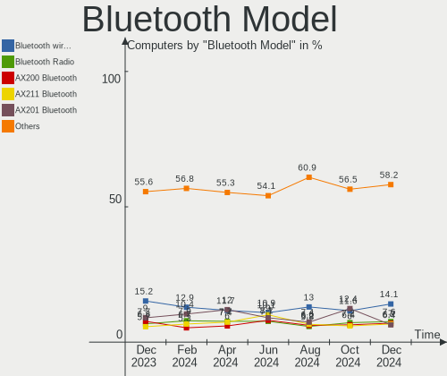

| Model                                                                               | Computers | Percent |
|-------------------------------------------------------------------------------------|-----------|---------|
| Intel Bluetooth wireless interface                                                  | 104       | 15.9%   |
| Intel AX201 Bluetooth                                                               | 69        | 10.55%  |
| Intel AX200 Bluetooth                                                               | 45        | 6.88%   |
| Realtek Bluetooth Radio                                                             | 39        | 5.96%   |
| Intel Bluetooth Device                                                              | 39        | 5.96%   |
| Intel Bluetooth 9460/9560 Jefferson Peak (JfP)                                      | 35        | 5.35%   |
| Intel AX210 Bluetooth                                                               | 29        | 4.43%   |
| IMC Networks Bluetooth Radio                                                        | 27        | 4.13%   |
| Cambridge Silicon Radio Bluetooth Dongle (HCI mode)                                 | 24        | 3.67%   |
| Qualcomm Atheros  Bluetooth Device                                                  | 21        | 3.21%   |
| MediaTek Wireless_Device                                                            | 17        | 2.6%    |
| Intel Wireless-AC 3168 Bluetooth                                                    | 17        | 2.6%    |
| Apple Bluetooth Host Controller                                                     | 15        | 2.29%   |
| Realtek  Bluetooth 4.2 Adapter                                                      | 14        | 2.14%   |
| Intel Wireless-AC 9260 Bluetooth Adapter                                            | 10        | 1.53%   |
| Broadcom BCM20702A0 Bluetooth 4.0                                                   | 10        | 1.53%   |
| Lite-On Wireless_Device                                                             | 9         | 1.38%   |
| Foxconn / Hon Hai Wireless_Device                                                   | 9         | 1.38%   |
| Apple Bluetooth USB Host Controller                                                 | 9         | 1.38%   |
| IMC Networks Wireless_Device                                                        | 7         | 1.07%   |
| ASUS ASUS USB-BT500                                                                 | 7         | 1.07%   |
| Apple Built-in Bluetooth 2.0+EDR HCI                                                | 7         | 1.07%   |
| Intel Centrino Bluetooth Wireless Transceiver                                       | 5         | 0.76%   |
| TP-Link UB500 Adapter                                                               | 4         | 0.61%   |
| Qualcomm Atheros Bluetooth USB Host Controller                                      | 4         | 0.61%   |
| Lite-On Qualcomm Atheros QCA9377 Bluetooth                                          | 4         | 0.61%   |
| Foxconn / Hon Hai Bluetooth Device                                                  | 4         | 0.61%   |
| USI Bluetooth Device                                                                | 3         | 0.46%   |
| Realtek Bluetooth 5.1 Radio                                                         | 3         | 0.46%   |
| Marvell Bluetooth and Wireless LAN Composite Device                                 | 3         | 0.46%   |
| Lite-On Bluetooth Device                                                            | 3         | 0.46%   |
| Foxconn / Hon Hai Foxconn T77H114 BCM2070 [Single-Chip Bluetooth 2.1 + EDR Adapter] | 3         | 0.46%   |
| Dell DW375 Bluetooth Module                                                         | 3         | 0.46%   |
| Realtek RTL8821A Bluetooth                                                          | 2         | 0.31%   |
| Qualcomm Atheros AR9462 Bluetooth                                                   | 2         | 0.31%   |
| Qualcomm Atheros AR3011 Bluetooth                                                   | 2         | 0.31%   |
| Marvell Bluetooth and Wireless LAN Composite                                        | 2         | 0.31%   |
| Lite-On Bluetooth Radio                                                             | 2         | 0.31%   |
| Intel Centrino Advanced-N 6230 Bluetooth adapter                                    | 2         | 0.31%   |
| HP Broadcom 2070 Bluetooth Combo                                                    | 2         | 0.31%   |

Sound
-----

Sound Vendor
------------

Sound card vendors

| Vendor                                       | Computers | Percent |
|----------------------------------------------|-----------|---------|
| Intel                                        | 616       | 45.94%  |
| AMD                                          | 329       | 24.53%  |
| Nvidia                                       | 228       | 17%     |
| C-Media Electronics                          | 23        | 1.72%   |
| ASUSTek Computer                             | 15        | 1.12%   |
| Logitech                                     | 14        | 1.04%   |
| Creative Labs                                | 14        | 1.04%   |
| Micro Star International                     | 8         | 0.6%    |
| Texas Instruments                            | 7         | 0.52%   |
| Realtek Semiconductor                        | 7         | 0.52%   |
| JMTek                                        | 7         | 0.52%   |
| Focusrite-Novation                           | 7         | 0.52%   |
| SteelSeries ApS                              | 4         | 0.3%    |
| Samson Technologies                          | 3         | 0.22%   |
| Hewlett-Packard                              | 3         | 0.22%   |
| GN Netcom                                    | 3         | 0.22%   |
| Cambridge Silicon Radio                      | 3         | 0.22%   |
| Astro Gaming                                 | 3         | 0.22%   |
| Zoran Co. Personal Media Division (Nogatech) | 2         | 0.15%   |
| Yamaha                                       | 2         | 0.15%   |
| Kingston Technology                          | 2         | 0.15%   |
| Giga-Byte Technology                         | 2         | 0.15%   |
| Generalplus Technology                       | 2         | 0.15%   |
| Dell                                         | 2         | 0.15%   |
| Creative Technology                          | 2         | 0.15%   |
| Blue Microphones                             | 2         | 0.15%   |
| Valve Software                               | 1         | 0.07%   |
| Turtle Beach                                 | 1         | 0.07%   |
| Syntek                                       | 1         | 0.07%   |
| Sony                                         | 1         | 0.07%   |
| Solid State Logic                            | 1         | 0.07%   |
| Silicon Motion                               | 1         | 0.07%   |
| Silicon Integrated Systems [SiS]             | 1         | 0.07%   |
| Shure                                        | 1         | 0.07%   |
| Schiit Audio                                 | 1         | 0.07%   |
| Razer USA                                    | 1         | 0.07%   |
| Plantronics                                  | 1         | 0.07%   |
| MosArt Semiconductor                         | 1         | 0.07%   |
| Microchip Technology                         | 1         | 0.07%   |
| Mackie Designs                               | 1         | 0.07%   |

Sound Model
-----------

Sound card models

| Model                                                                      | Computers | Percent |
|----------------------------------------------------------------------------|-----------|---------|
| AMD Family 17h/19h HD Audio Controller                                     | 110       | 6.83%   |
| AMD Starship/Matisse HD Audio Controller                                   | 69        | 4.29%   |
| Intel Sunrise Point-LP HD Audio                                            | 58        | 3.6%    |
| Intel 6 Series/C200 Series Chipset Family High Definition Audio Controller | 55        | 3.42%   |
| Intel 7 Series/C216 Chipset Family High Definition Audio Controller        | 51        | 3.17%   |
| AMD Renoir Radeon High Definition Audio Controller                         | 49        | 3.04%   |
| AMD Rembrandt Radeon High Definition Audio Controller                      | 47        | 2.92%   |
| Intel Tiger Lake-LP Smart Sound Technology Audio Controller                | 42        | 2.61%   |
| Intel 8 Series/C220 Series Chipset High Definition Audio Controller        | 41        | 2.55%   |
| Intel Alder Lake PCH-P High Definition Audio Controller                    | 35        | 2.17%   |
| AMD Navi 21/23 HDMI/DP Audio Controller                                    | 34        | 2.11%   |
| Intel Xeon E3-1200 v3/4th Gen Core Processor HD Audio Controller           | 31        | 1.93%   |
| AMD Raven/Raven2/Fenghuang HDMI/DP Audio Controller                        | 28        | 1.74%   |
| Intel Cannon Lake PCH cAVS                                                 | 26        | 1.61%   |
| Intel 100 Series/C230 Series Chipset Family HD Audio Controller            | 26        | 1.61%   |
| AMD SBx00 Azalia (Intel HDA)                                               | 25        | 1.55%   |
| AMD Ellesmere HDMI Audio [Radeon RX 470/480 / 570/580/590]                 | 24        | 1.49%   |
| Intel Celeron/Pentium Silver Processor High Definition Audio               | 23        | 1.43%   |
| AMD FCH Azalia Controller                                                  | 23        | 1.43%   |
| Intel Haswell-ULT HD Audio Controller                                      | 21        | 1.3%    |
| Intel 8 Series HD Audio Controller                                         | 21        | 1.3%    |
| Nvidia TU107 GeForce GTX 1650 High Definition Audio Controller             | 20        | 1.24%   |
| Intel Alder Lake-S HD Audio Controller                                     | 19        | 1.18%   |
| Nvidia GA104 High Definition Audio Controller                              | 18        | 1.12%   |
| Intel Comet Lake PCH-LP cAVS                                               | 17        | 1.06%   |
| Intel Comet Lake PCH cAVS                                                  | 17        | 1.06%   |
| Intel 200 Series PCH HD Audio                                              | 17        | 1.06%   |
| Nvidia GA106 High Definition Audio Controller                              | 16        | 0.99%   |
| Intel Wildcat Point-LP High Definition Audio Controller                    | 15        | 0.93%   |
| Intel Broadwell-U Audio Controller                                         | 15        | 0.93%   |
| Intel 82801I (ICH9 Family) HD Audio Controller                             | 15        | 0.93%   |
| AMD Oland/Hainan/Cape Verde/Pitcairn HDMI Audio [Radeon HD 7000 Series]    | 15        | 0.93%   |
| Intel Ice Lake-LP Smart Sound Technology Audio Controller                  | 14        | 0.87%   |
| AMD Family 17h (Models 00h-0fh) HD Audio Controller                        | 14        | 0.87%   |
| Nvidia TU106 High Definition Audio Controller                              | 13        | 0.81%   |
| AMD Kabini HDMI/DP Audio                                                   | 13        | 0.81%   |
| Nvidia TU116 High Definition Audio Controller                              | 12        | 0.75%   |
| Nvidia TU104 HD Audio Controller                                           | 12        | 0.75%   |
| ASUSTek Computer USB Audio                                                 | 12        | 0.75%   |
| AMD Family 15h (Models 60h-6fh) Audio Controller                           | 12        | 0.75%   |

Memory
------

Memory Vendor
-------------

Memory module vendors

| Vendor                                           | Computers | Percent |
|--------------------------------------------------|-----------|---------|
| Samsung Electronics                              | 136       | 22.41%  |
| SK hynix                                         | 124       | 20.43%  |
| Micron Technology                                | 59        | 9.72%   |
| Crucial                                          | 50        | 8.24%   |
| G.Skill                                          | 49        | 8.07%   |
| Kingston                                         | 33        | 5.44%   |
| Corsair                                          | 32        | 5.27%   |
| Unknown                                          | 24        | 3.95%   |
| Team                                             | 13        | 2.14%   |
| Ramaxel Technology                               | 9         | 1.48%   |
| A-DATA Technology                                | 9         | 1.48%   |
| Unknown                                          | 9         | 1.48%   |
| Unknown (ABCD)                                   | 8         | 1.32%   |
| Nanya Technology                                 | 7         | 1.15%   |
| Elpida                                           | 6         | 0.99%   |
| Unifosa                                          | 4         | 0.66%   |
| Timetec                                          | 4         | 0.66%   |
| PNY                                              | 4         | 0.66%   |
| Silicon Power                                    | 3         | 0.49%   |
| Sesame                                           | 2         | 0.33%   |
| Patriot                                          | 2         | 0.33%   |
| 4ea5                                             | 2         | 0.33%   |
| V-Color                                          | 1         | 0.16%   |
| Unknown (0xD306)                                 | 1         | 0.16%   |
| Unknown (0x31364854463235363634485A2D3830304831) | 1         | 0.16%   |
| Unknown (0x0DA2)                                 | 1         | 0.16%   |
| Unknown (09B6)                                   | 1         | 0.16%   |
| Unknown (09A4)                                   | 1         | 0.16%   |
| Qumo                                             | 1         | 0.16%   |
| Qimonda                                          | 1         | 0.16%   |
| PUSKILL                                          | 1         | 0.16%   |
| Neo Forza                                        | 1         | 0.16%   |
| Innodisk                                         | 1         | 0.16%   |
| Hewlett-Packard                                  | 1         | 0.16%   |
| Goldkey                                          | 1         | 0.16%   |
| Golden Empire                                    | 1         | 0.16%   |
| Gold Key                                         | 1         | 0.16%   |
| ff                                               | 1         | 0.16%   |
| Avant                                            | 1         | 0.16%   |
| Acer                                             | 1         | 0.16%   |

Memory Model
------------

Memory module models

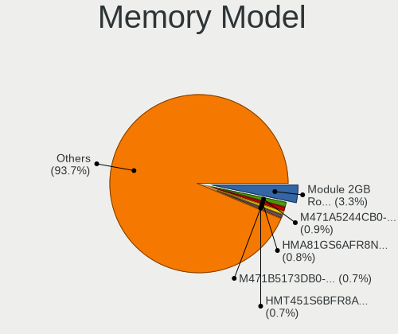

| Model                                                            | Computers | Percent |
|------------------------------------------------------------------|-----------|---------|
| Unknown                                                          | 9         | 1.39%   |
| SK hynix RAM HMA81GS6AFR8N-UH 8GB SODIMM DDR4 2667MT/s           | 8         | 1.23%   |
| SK hynix RAM HMAA1GS6CJR6N-XN 8GB SODIMM DDR4 3200MT/s           | 7         | 1.08%   |
| Unknown (ABCD) RAM 123456789012345678 3GB SODIMM LPDDR4 2400MT/s | 6         | 0.93%   |
| Samsung RAM M471A5244CB0-CWE 4GB SODIMM DDR4 3200MT/s            | 6         | 0.93%   |
| Samsung RAM M471A1K43EB1-CWE 8GB SODIMM DDR4 3200MT/s            | 6         | 0.93%   |
| G.Skill RAM F4-3200C16-16GVK 16GB DIMM DDR4 3600MT/s             | 6         | 0.93%   |
| Samsung RAM M471A5244CB0-CTD 4GB SODIMM DDR4 3266MT/s            | 5         | 0.77%   |
| Samsung RAM M471A1K43DB1-CTD 8GB SODIMM DDR4 2667MT/s            | 5         | 0.77%   |
| Samsung RAM M471A1K43BB1-CRC 8GB SODIMM DDR4 2667MT/s            | 5         | 0.77%   |
| Team RAM TEAMGROUP-UD4-3200 8GB DIMM DDR4 3800MT/s               | 4         | 0.62%   |
| SK hynix RAM HMA82GS6AFR8N-UH 16GB SODIMM DDR4 2667MT/s          | 4         | 0.62%   |
| Samsung RAM UBE3D4AA-MGCR 2GB Row Of Chips LPDDR4 4267MT/s       | 4         | 0.62%   |
| Samsung RAM M471B5173DB0-YK0 4GB SODIMM DDR3 1600MT/s            | 4         | 0.62%   |
| Samsung RAM M471A1G44AB0-CWE 8GB SODIMM DDR4 3200MT/s            | 4         | 0.62%   |
| Micron RAM 8JTF51264AZ-1G6E1 4GB DIMM DDR3 1600MT/s              | 4         | 0.62%   |
| G.Skill RAM F5-6000J3040G32G 32GB DIMM DDR5 6000MT/s             | 4         | 0.62%   |
| G.Skill RAM F4-3200C22-32GRS 32GB SODIMM DDR4 3200MT/s           | 4         | 0.62%   |
| SK hynix RAM HMT451U6AFR8C-PB 4096MB DIMM DDR3 1600MT/s          | 3         | 0.46%   |
| SK hynix RAM HMT351S6CFR8C-PB 4GB SODIMM DDR3 1600MT/s           | 3         | 0.46%   |
| SK hynix RAM HMCG78MEBSA092N 16GB SODIMM DDR5 4800MT/s           | 3         | 0.46%   |
| SK hynix RAM HMAA4GS6AJR8N-XN 32GB SODIMM DDR4 3200MT/s          | 3         | 0.46%   |
| SK hynix RAM H9JCNNNFA5MLYR-N6E 8GB SODIMM LPDDR5 6400MT/s       | 3         | 0.46%   |
| SK hynix RAM H9JCNNNFA5MLYR-N6E 4096MB Row Of Chips 6400MT/s     | 3         | 0.46%   |
| Samsung RAM M471A1K43CB1-CTD 8GB SODIMM DDR4 2667MT/s            | 3         | 0.46%   |
| Micron RAM 4ATF51264HZ-2G6E1 4GB SODIMM DDR4 2667MT/s            | 3         | 0.46%   |
| G.Skill RAM F4-3600C18-32GVK 32GB DIMM DDR4 3600MT/s             | 3         | 0.46%   |
| Corsair RAM CMK64GX5M2B5600C40 32GB DIMM 4800MT/s                | 3         | 0.46%   |
| Unknown RAM Module 8GB DIMM DDR3 1333MT/s                        | 2         | 0.31%   |
| Unknown RAM Module 2GB SODIMM DDR3 1600MT/s                      | 2         | 0.31%   |
| Unknown RAM Module 2GB SODIMM DDR3 1333MT/s                      | 2         | 0.31%   |
| Unknown RAM Module 2GB Row Of Chips LPDDR4 4267MT/s              | 2         | 0.31%   |
| Unknown (ABCD) RAM 123456789012345678 2GB DIMM LPDDR4 2400MT/s   | 2         | 0.31%   |
| Timetec RAM SD4-3200 16GB SODIMM DDR4 3200MT/s                   | 2         | 0.31%   |
| Timetec RAM Module 4GB SODIMM DDR3 1067MT/s                      | 2         | 0.31%   |
| Team RAM TEAMGROUP-UD4-3200 8GB DIMM DDR4 3733MT/s               | 2         | 0.31%   |
| SK hynix RAM Module 8GB SODIMM DDR4 2400MT/s                     | 2         | 0.31%   |
| SK hynix RAM Module 4GB SODIMM DDR3 1600MT/s                     | 2         | 0.31%   |
| SK hynix RAM HMT451S6BFR8A-PB 4GB SODIMM DDR3 1600MT/s           | 2         | 0.31%   |
| SK hynix RAM HMT451S6AFR8A-PB 4GB SODIMM DDR3 1600MT/s           | 2         | 0.31%   |

Memory Kind
-----------

Memory module kinds

| Kind    | Computers | Percent |
|---------|-----------|---------|
| DDR4    | 257       | 49.61%  |
| DDR3    | 135       | 26.06%  |
| LPDDR4  | 36        | 6.95%   |
| DDR5    | 27        | 5.21%   |
| LPDDR5  | 16        | 3.09%   |
| LPDDR3  | 16        | 3.09%   |
| DDR2    | 12        | 2.32%   |
| SDRAM   | 11        | 2.12%   |
| Unknown | 5         | 0.97%   |
| DDR     | 3         | 0.58%   |

Memory Form Factor
------------------

Physical design of the memory module

| Name         | Computers | Percent |
|--------------|-----------|---------|
| SODIMM       | 276       | 53.7%   |
| DIMM         | 176       | 34.24%  |
| Row Of Chips | 45        | 8.75%   |
| Unknown      | 12        | 2.33%   |
| RIMM         | 4         | 0.78%   |
| Chip         | 1         | 0.19%   |

Memory Size
-----------

Memory module size

| Size  | Computers | Percent |
|-------|-----------|---------|
| 8192  | 201       | 36.09%  |
| 4096  | 120       | 21.54%  |
| 16384 | 108       | 19.39%  |
| 2048  | 62        | 11.13%  |
| 32768 | 50        | 8.98%   |
| 1024  | 14        | 2.51%   |
| 256   | 1         | 0.18%   |
| 64    | 1         | 0.18%   |

Memory Speed
------------

Memory module speed

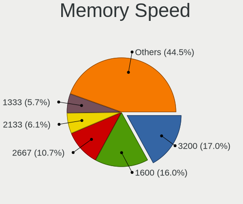

| Speed   | Computers | Percent |
|---------|-----------|---------|
| 3200    | 92        | 16.25%  |
| 1600    | 89        | 15.72%  |
| 2667    | 70        | 12.37%  |
| 2400    | 45        | 7.95%   |
| 2133    | 34        | 6.01%   |
| 1333    | 30        | 5.3%    |
| 3600    | 21        | 3.71%   |
| 4800    | 20        | 3.53%   |
| 4267    | 19        | 3.36%   |
| 6400    | 17        | 3%      |
| 1867    | 14        | 2.47%   |
| 1334    | 8         | 1.41%   |
| 800     | 8         | 1.41%   |
| 3800    | 7         | 1.24%   |
| 1067    | 7         | 1.24%   |
| 3733    | 6         | 1.06%   |
| 3266    | 6         | 1.06%   |
| 6000    | 5         | 0.88%   |
| 2933    | 5         | 0.88%   |
| 667     | 5         | 0.88%   |
| 4199    | 4         | 0.71%   |
| 3000    | 4         | 0.71%   |
| 2666    | 4         | 0.71%   |
| 1800    | 4         | 0.71%   |
| 1066    | 4         | 0.71%   |
| Unknown | 4         | 0.71%   |
| 4266    | 3         | 0.53%   |
| 3866    | 2         | 0.35%   |
| 3666    | 2         | 0.35%   |
| 3534    | 2         | 0.35%   |
| 3466    | 2         | 0.35%   |
| 2733    | 2         | 0.35%   |
| 2200    | 2         | 0.35%   |
| 2048    | 2         | 0.35%   |
| 1866    | 2         | 0.35%   |
| 1639    | 2         | 0.35%   |
| 975     | 2         | 0.35%   |
| 8400    | 1         | 0.18%   |
| 5800    | 1         | 0.18%   |
| 5600    | 1         | 0.18%   |

Printers & scanners
-------------------

Printer Vendor
--------------

Printer device vendors

| Vendor              | Computers | Percent |
|---------------------|-----------|---------|
| Brother Industries  | 12        | 40%     |
| Hewlett-Packard     | 9         | 30%     |
| Canon               | 4         | 13.33%  |
| Seiko Epson         | 2         | 6.67%   |
| Samsung Electronics | 2         | 6.67%   |
| Dell                | 1         | 3.33%   |

Printer Model
-------------

Printer device models

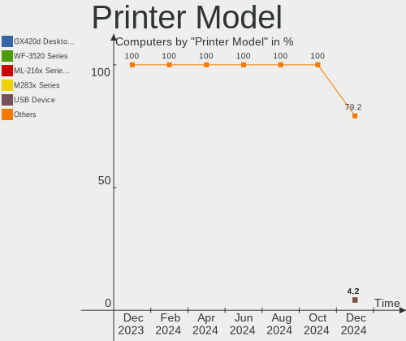

| Model                            | Computers | Percent |
|----------------------------------|-----------|---------|
| HP LaserJet 1012                 | 2         | 6.67%   |
| Brother HL-L2390DW               | 2         | 6.67%   |
| Seiko Epson XP-4100 Series       | 1         | 3.33%   |
| Seiko Epson WF-2860 Series       | 1         | 3.33%   |
| Samsung ML-371x Series           | 1         | 3.33%   |
| Samsung CLP-680 Series           | 1         | 3.33%   |
| HP OfficeJet 5600 (USBHUB)       | 1         | 3.33%   |
| HP LaserJet Professional P 1102w | 1         | 3.33%   |
| HP LaserJet Pro M118-M119        | 1         | 3.33%   |
| HP ENVY 5000 series              | 1         | 3.33%   |
| HP ENVY 4520 series              | 1         | 3.33%   |
| HP ColorLaserJet M253-M254       | 1         | 3.33%   |
| HP Color LaserJet CP2025dn       | 1         | 3.33%   |
| Dell 1110 Laser Printer          | 1         | 3.33%   |
| Canon TS9100 series              | 1         | 3.33%   |
| Canon TR4700 series              | 1         | 3.33%   |
| Canon MF230 Series UFRII LT      | 1         | 3.33%   |
| Canon D400-450                   | 1         | 3.33%   |
| Brother Printer                  | 1         | 3.33%   |
| Brother MFC-J6535DW              | 1         | 3.33%   |
| Brother MFC-J460DW               | 1         | 3.33%   |
| Brother MFC-7360N                | 1         | 3.33%   |
| Brother MFC-7340                 | 1         | 3.33%   |
| Brother HL-3140CW series         | 1         | 3.33%   |
| Brother HL-2270DW Laser Printer  | 1         | 3.33%   |
| Brother HL-2240 series           | 1         | 3.33%   |
| Brother HL-2140 series           | 1         | 3.33%   |
| Brother FAX-2940                 | 1         | 3.33%   |

Scanner Vendor
--------------

Scanner device vendors

| Vendor      | Computers | Percent |
|-------------|-----------|---------|
| Seiko Epson | 1         | 100%    |

Scanner Model
-------------

Scanner device models

| Model                        | Computers | Percent |
|------------------------------|-----------|---------|
| Seiko Epson ES-D200 [GT-S50] | 1         | 100%    |

Camera
------

Camera Vendor
-------------

Camera device vendors

| Vendor                                 | Computers | Percent |
|----------------------------------------|-----------|---------|
| Chicony Electronics                    | 83        | 15.6%   |
| Microdia                               | 50        | 9.4%    |
| Logitech                               | 43        | 8.08%   |
| IMC Networks                           | 43        | 8.08%   |
| Realtek Semiconductor                  | 35        | 6.58%   |
| Sunplus Innovation Technology          | 30        | 5.64%   |
| Quanta                                 | 28        | 5.26%   |
| Bison Electronics                      | 28        | 5.26%   |
| Apple                                  | 23        | 4.32%   |
| Luxvisions Innotech Limited            | 20        | 3.76%   |
| Cheng Uei Precision Industry (Foxlink) | 18        | 3.38%   |
| Lite-On Technology                     | 15        | 2.82%   |
| Acer                                   | 12        | 2.26%   |
| Suyin                                  | 11        | 2.07%   |
| Microsoft                              | 11        | 2.07%   |
| Syntek                                 | 10        | 1.88%   |
| Alcor Micro                            | 6         | 1.13%   |
| SunplusIT                              | 5         | 0.94%   |
| Ricoh                                  | 5         | 0.94%   |
| Samsung Electronics                    | 4         | 0.75%   |
| AVerMedia Technologies                 | 4         | 0.75%   |
| Sonix Technology                       | 3         | 0.56%   |
| BKX                                    | 3         | 0.56%   |
| ARC International                      | 3         | 0.56%   |
| Silicon Motion                         | 2         | 0.38%   |
| Shenzhen Kingcome Optoelectronic       | 2         | 0.38%   |
| icSpring                               | 2         | 0.38%   |
| Google                                 | 2         | 0.38%   |
| Generalplus Technology                 | 2         | 0.38%   |
| eMeet                                  | 2         | 0.38%   |
| Z-Star Microelectronics                | 1         | 0.19%   |
| WaveRider Communications               | 1         | 0.19%   |
| vivo                                   | 1         | 0.19%   |
| Valve Software                         | 1         | 0.19%   |
| USB Camera CS                          | 1         | 0.19%   |
| Sunplus IT                             | 1         | 0.19%   |
| Razer USA                              | 1         | 0.19%   |
| Primax Electronics                     | 1         | 0.19%   |
| OmniVision Technologies                | 1         | 0.19%   |
| Mimaki Engineering                     | 1         | 0.19%   |

Camera Model
------------

Camera device models

| Model                                                   | Computers | Percent |
|---------------------------------------------------------|-----------|---------|
| Microdia Integrated_Webcam_HD                           | 24        | 4.44%   |
| Chicony Integrated Camera                               | 22        | 4.07%   |
| IMC Networks USB2.0 HD UVC WebCam                       | 17        | 3.14%   |
| Chicony HD Webcam                                       | 13        | 2.4%    |
| Realtek Integrated_Webcam_HD                            | 11        | 2.03%   |
| IMC Networks Integrated Camera                          | 11        | 2.03%   |
| Syntek Integrated Camera                                | 9         | 1.66%   |
| Bison Integrated Camera                                 | 9         | 1.66%   |
| Logitech C922 Pro Stream Webcam                         | 7         | 1.29%   |
| Apple Built-in iSight                                   | 7         | 1.29%   |
| Acer Integrated Camera                                  | 7         | 1.29%   |
| Sunplus Integrated_Webcam_HD                            | 6         | 1.11%   |
| Luxvisions Innotech Limited Integrated RGB Camera       | 6         | 1.11%   |
| Logitech Webcam C270                                    | 6         | 1.11%   |
| Realtek USB Camera                                      | 5         | 0.92%   |
| Quanta HP TrueVision HD Camera                          | 5         | 0.92%   |
| Microdia USB 2.0 Camera                                 | 5         | 0.92%   |
| Luxvisions Innotech Limited HP TrueVision HD Camera     | 5         | 0.92%   |
| IMC Networks EasyCamera                                 | 5         | 0.92%   |
| Chicony HD User Facing                                  | 5         | 0.92%   |
| Apple iPhone 5/5C/5S/6/SE/7/8/X                         | 5         | 0.92%   |
| Apple FaceTime HD Camera                                | 5         | 0.92%   |
| Sunplus FHD Camera Microphone                           | 4         | 0.74%   |
| Samsung Galaxy series, misc. (MTP mode)                 | 4         | 0.74%   |
| Quanta HP Wide Vision HD Camera                         | 4         | 0.74%   |
| Quanta HD User Facing                                   | 4         | 0.74%   |
| Logitech HD Webcam C615                                 | 4         | 0.74%   |
| Logitech HD Pro Webcam C920                             | 4         | 0.74%   |
| Logitech BRIO Ultra HD Webcam                           | 4         | 0.74%   |
| Lite-On HP HD Camera                                    | 4         | 0.74%   |
| Cheng Uei Precision Industry (Foxlink) HP Webcam        | 4         | 0.74%   |
| Cheng Uei Precision Industry (Foxlink) HP Truevision HD | 4         | 0.74%   |
| Bison SunplusIT Integrated Camera                       | 4         | 0.74%   |
| Apple FaceTime HD Camera (Built-in)                     | 4         | 0.74%   |
| SunplusIT USB camera                                    | 3         | 0.55%   |
| Sunplus HD WebCam                                       | 3         | 0.55%   |
| Realtek Integrated Webcam HD                            | 3         | 0.55%   |
| Realtek HD WebCam                                       | 3         | 0.55%   |
| Quanta HP Truevision HD                                 | 3         | 0.55%   |
| Microsoft LifeCam Rear                                  | 3         | 0.55%   |

Security
--------

Fingerprint Vendor
------------------

Fingerprint sensor vendors

| Vendor                     | Computers | Percent |
|----------------------------|-----------|---------|
| Synaptics                  | 26        | 30.59%  |
| Validity Sensors           | 23        | 27.06%  |
| Shenzhen Goodix Technology | 11        | 12.94%  |
| LighTuning Technology      | 5         | 5.88%   |
| Focal-systems.Corp         | 5         | 5.88%   |
| Elan Microelectronics      | 4         | 4.71%   |
| Upek                       | 3         | 3.53%   |
| AuthenTec                  | 3         | 3.53%   |
| Next Biometrics            | 1         | 1.18%   |
| HOLTEK                     | 1         | 1.18%   |
| Gingytech                  | 1         | 1.18%   |
| DigitalPersona             | 1         | 1.18%   |
| Dell                       | 1         | 1.18%   |

Fingerprint Model
-----------------

Fingerprint sensor models

| Model                                                       | Computers | Percent |
|-------------------------------------------------------------|-----------|---------|
| Synaptics Prometheus MIS Touch Fingerprint Reader           | 10        | 11.76%  |
| Validity Sensors VFS495 Fingerprint Reader                  | 7         | 8.24%   |
| Shenzhen Goodix Fingerprint Reader                          | 6         | 7.06%   |
| Focal-systems.Corp FT9201Fingerprint.                       | 5         | 5.88%   |
| Validity Sensors VFS 5011 fingerprint sensor                | 4         | 4.71%   |
| Synaptics Metallica MIS Touch Fingerprint Reader            | 4         | 4.71%   |
| Validity Sensors Synaptics WBDI                             | 3         | 3.53%   |
| Upek Biometric Touchchip/Touchstrip Fingerprint Sensor      | 3         | 3.53%   |
| Synaptics UWP WBDI                                          | 3         | 3.53%   |
| Shenzhen Goodix FingerPrint                                 | 3         | 3.53%   |
| LighTuning ES603 Swipe Fingerprint Sensor                   | 3         | 3.53%   |
| Validity Sensors VFS7500 Touch Fingerprint Sensor           | 2         | 2.35%   |
| Validity Sensors VFS471 Fingerprint Reader                  | 2         | 2.35%   |
| Synaptics WBDI Fingerprint Reader USB 086                   | 2         | 2.35%   |
| Synaptics WBDI                                              | 2         | 2.35%   |
| Synaptics UWP WBDI Device                                   | 2         | 2.35%   |
| Shenzhen Goodix  FingerPrint Device                         | 2         | 2.35%   |
| Elan ELAN:Fingerprint                                       | 2         | 2.35%   |
| Elan ELAN:ARM-M4                                            | 2         | 2.35%   |
| AuthenTec AES2810                                           | 2         | 2.35%   |
| Validity Sensors VFS5011 Fingerprint Reader                 | 1         | 1.18%   |
| Validity Sensors VFS491                                     | 1         | 1.18%   |
| Validity Sensors VFS451 Fingerprint Reader                  | 1         | 1.18%   |
| Validity Sensors Synaptics VFS7552 Touch Fingerprint Sensor | 1         | 1.18%   |
| Validity Sensors Swipe Fingerprint Sensor                   | 1         | 1.18%   |
| Synaptics  WBDI                                             | 1         | 1.18%   |
| Synaptics  FS7604 Touch Fingerprint Sensor with PurePrint   | 1         | 1.18%   |
| Synaptics FS7604 Touch Fingerprint Sensor with PurePrint    | 1         | 1.18%   |
| Next Biometrics NB-2020-U                                   | 1         | 1.18%   |
| LighTuning Fingerprint Sensor                               | 1         | 1.18%   |
| LighTuning EgisTec Touch Fingerprint Sensor                 | 1         | 1.18%   |
| HOLTEK FocalTech Fingerprint Device                         | 1         | 1.18%   |
| Gingytech Fingerprint sensor                                | 1         | 1.18%   |
| DigitalPersona Fingerprint Reader                           | 1         | 1.18%   |
| Dell MS819 Wired Mouse With Fingerprint Reader              | 1         | 1.18%   |
| AuthenTec Fingerprint Sensor                                | 1         | 1.18%   |

Chipcard Vendor
---------------

Chipcard module vendors

| Vendor                | Computers | Percent |
|-----------------------|-----------|---------|
| Broadcom              | 17        | 48.57%  |
| Alcor Micro           | 9         | 25.71%  |
| Upek                  | 3         | 8.57%   |
| O2 Micro              | 3         | 8.57%   |
| Realtek Semiconductor | 1         | 2.86%   |
| Lenovo                | 1         | 2.86%   |
| Gemalto (was Gemplus) | 1         | 2.86%   |

Chipcard Model
--------------

Chipcard module models

| Model                                                                        | Computers | Percent |
|------------------------------------------------------------------------------|-----------|---------|
| Alcor Micro AU9540 Smartcard Reader                                          | 8         | 22.86%  |
| Broadcom 5880                                                                | 7         | 20%     |
| Broadcom BCM5880 Secure Applications Processor                               | 5         | 14.29%  |
| Upek TouchChip Fingerprint Coprocessor (WBF advanced mode)                   | 3         | 8.57%   |
| O2 Micro OZ776 CCID Smartcard Reader                                         | 3         | 8.57%   |
| Broadcom BCM5880 Secure Applications Processor with fingerprint swipe sensor | 3         | 8.57%   |
| Broadcom 58200                                                               | 2         | 5.71%   |
| Realtek Semiconductor Smart Card Reader Interface                            | 1         | 2.86%   |
| Lenovo Integrated Smart Card Reader                                          | 1         | 2.86%   |
| Gemalto (was Gemplus) GemPC Twin SmartCard Reader                            | 1         | 2.86%   |
| Alcor Micro Watchdata W 1981                                                 | 1         | 2.86%   |

Unsupported
-----------

Unsupported Devices
-------------------

Total unsupported devices on board

| Total | Computers | Percent |
|-------|-----------|---------|
| 0     | 679       | 71.1%   |
| 1     | 218       | 22.83%  |
| 2     | 45        | 4.71%   |
| 3     | 10        | 1.05%   |
| 7     | 1         | 0.1%    |
| 6     | 1         | 0.1%    |
| 4     | 1         | 0.1%    |

Unsupported Device Types
------------------------

Types of unsupported devices

| Type                     | Computers | Percent |
|--------------------------|-----------|---------|
| Fingerprint reader       | 83        | 24.41%  |
| Graphics card            | 71        | 20.88%  |
| Net/wireless             | 50        | 14.71%  |
| Multimedia controller    | 31        | 9.12%   |
| Chipcard                 | 27        | 7.94%   |
| Communication controller | 14        | 4.12%   |
| Camera                   | 12        | 3.53%   |
| Unassigned class         | 10        | 2.94%   |
| Bluetooth                | 9         | 2.65%   |
| Network                  | 8         | 2.35%   |
| Sound                    | 5         | 1.47%   |
| Storage                  | 4         | 1.18%   |
| Modem                    | 4         | 1.18%   |
| Dvb card                 | 3         | 0.88%   |
| Storage/raid             | 2         | 0.59%   |
| Net/ethernet             | 2         | 0.59%   |
| Wireless                 | 1         | 0.29%   |
| Unclassified device      | 1         | 0.29%   |
| Storage/ide              | 1         | 0.29%   |
| Firewire controller      | 1         | 0.29%   |
| Card reader              | 1         | 0.29%   |

