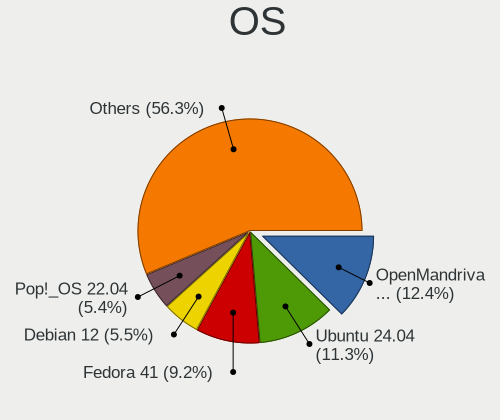
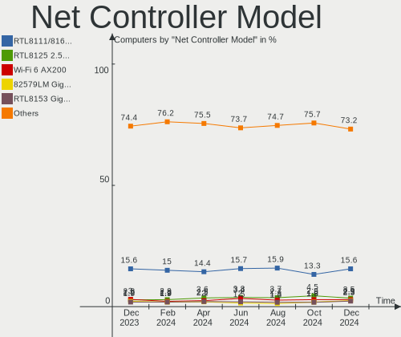
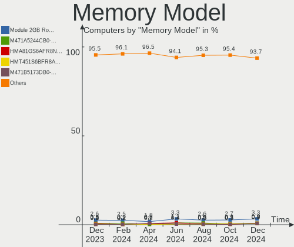

Linux in USA - Hardware Trends
------------------------------

A project to identify most popular hardware characteristics and track their change
over time based on data collected by Linux users at https://Linux-Hardware.org.

Anyone can contribute to this report by the [hw-probe](https://github.com/linuxhw/hw-probe) tool:

    sudo -E hw-probe -all -upload

This is a report for all computer types. See also reports for [desktops](/Location/USA/Desktop/README.md) and [notebooks](/Location/USA/Notebook/README.md).

Period: Sep, 2022.

Contents
--------

* [ System ](#system)
  - [ OS                       ](#os)
  - [ OS Family                ](#os-family)
  - [ Kernel                   ](#kernel)
  - [ Kernel Family            ](#kernel-family)
  - [ Kernel Major Ver.        ](#kernel-major-ver)
  - [ Arch                     ](#arch)
  - [ DE                       ](#de)
  - [ Display Server           ](#display-server)
  - [ Display Manager          ](#display-manager)
  - [ OS Lang                  ](#os-lang)
  - [ Boot Mode                ](#boot-mode)
  - [ Filesystem               ](#filesystem)
  - [ Part. scheme             ](#part-scheme)
  - [ Dual Boot with Linux/BSD ](#dual-boot-with-linuxbsd)
  - [ Dual Boot (Win)          ](#dual-boot-win)

* [ Board ](#board)
  - [ Vendor                   ](#vendor)
  - [ Model                    ](#model)
  - [ Model Family             ](#model-family)
  - [ MFG Year                 ](#mfg-year)
  - [ Form Factor              ](#form-factor)
  - [ Secure Boot              ](#secure-boot)
  - [ Coreboot                 ](#coreboot)
  - [ RAM Size                 ](#ram-size)
  - [ RAM Used                 ](#ram-used)
  - [ Total Drives             ](#total-drives)
  - [ Has CD-ROM               ](#has-cd-rom)
  - [ Has Ethernet             ](#has-ethernet)
  - [ Has WiFi                 ](#has-wifi)
  - [ Has Bluetooth            ](#has-bluetooth)

* [ Location ](#location)
  - [ Country                  ](#country)
  - [ City                     ](#city)

* [ Drives ](#drives)
  - [ Drive Vendor             ](#drive-vendor)
  - [ Drive Model              ](#drive-model)
  - [ HDD Vendor               ](#hdd-vendor)
  - [ SSD Vendor               ](#ssd-vendor)
  - [ Drive Kind               ](#drive-kind)
  - [ Drive Connector          ](#drive-connector)
  - [ Drive Size               ](#drive-size)
  - [ Space Total              ](#space-total)
  - [ Space Used               ](#space-used)
  - [ Malfunc. Drives          ](#malfunc-drives)
  - [ Malfunc. Drive Vendor    ](#malfunc-drive-vendor)
  - [ Malfunc. HDD Vendor      ](#malfunc-hdd-vendor)
  - [ Malfunc. Drive Kind      ](#malfunc-drive-kind)
  - [ Failed Drives            ](#failed-drives)
  - [ Failed Drive Vendor      ](#failed-drive-vendor)
  - [ Drive Status             ](#drive-status)

* [ Storage controller ](#storage-controller)
  - [ Storage Vendor           ](#storage-vendor)
  - [ Storage Model            ](#storage-model)
  - [ Storage Kind             ](#storage-kind)

* [ Processor ](#processor)
  - [ CPU Vendor               ](#cpu-vendor)
  - [ CPU Model                ](#cpu-model)
  - [ CPU Model Family         ](#cpu-model-family)
  - [ CPU Cores                ](#cpu-cores)
  - [ CPU Sockets              ](#cpu-sockets)
  - [ CPU Threads              ](#cpu-threads)
  - [ CPU Op-Modes             ](#cpu-op-modes)
  - [ CPU Microcode            ](#cpu-microcode)
  - [ CPU Microarch            ](#cpu-microarch)

* [ Graphics ](#graphics)
  - [ GPU Vendor               ](#gpu-vendor)
  - [ GPU Model                ](#gpu-model)
  - [ GPU Combo                ](#gpu-combo)
  - [ GPU Driver               ](#gpu-driver)
  - [ GPU Memory               ](#gpu-memory)

* [ Monitor ](#monitor)
  - [ Monitor Vendor           ](#monitor-vendor)
  - [ Monitor Model            ](#monitor-model)
  - [ Monitor Resolution       ](#monitor-resolution)
  - [ Monitor Diagonal         ](#monitor-diagonal)
  - [ Monitor Width            ](#monitor-width)
  - [ Aspect Ratio             ](#aspect-ratio)
  - [ Monitor Area             ](#monitor-area)
  - [ Pixel Density            ](#pixel-density)
  - [ Multiple Monitors        ](#multiple-monitors)

* [ Network ](#network)
  - [ Net Controller Vendor    ](#net-controller-vendor)
  - [ Net Controller Model     ](#net-controller-model)
  - [ Wireless Vendor          ](#wireless-vendor)
  - [ Wireless Model           ](#wireless-model)
  - [ Ethernet Vendor          ](#ethernet-vendor)
  - [ Ethernet Model           ](#ethernet-model)
  - [ Net Controller Kind      ](#net-controller-kind)
  - [ Used Controller          ](#used-controller)
  - [ NICs                     ](#nics)
  - [ IPv6                     ](#ipv6)

* [ Bluetooth ](#bluetooth)
  - [ Bluetooth Vendor         ](#bluetooth-vendor)
  - [ Bluetooth Model          ](#bluetooth-model)

* [ Sound ](#sound)
  - [ Sound Vendor             ](#sound-vendor)
  - [ Sound Model              ](#sound-model)

* [ Memory ](#memory)
  - [ Memory Vendor            ](#memory-vendor)
  - [ Memory Model             ](#memory-model)
  - [ Memory Kind              ](#memory-kind)
  - [ Memory Form Factor       ](#memory-form-factor)
  - [ Memory Size              ](#memory-size)
  - [ Memory Speed             ](#memory-speed)

* [ Printers & scanners ](#printers--scanners)
  - [ Printer Vendor           ](#printer-vendor)
  - [ Printer Model            ](#printer-model)
  - [ Scanner Vendor           ](#scanner-vendor)
  - [ Scanner Model            ](#scanner-model)

* [ Camera ](#camera)
  - [ Camera Vendor            ](#camera-vendor)
  - [ Camera Model             ](#camera-model)

* [ Security ](#security)
  - [ Fingerprint Vendor       ](#fingerprint-vendor)
  - [ Fingerprint Model        ](#fingerprint-model)
  - [ Chipcard Vendor          ](#chipcard-vendor)
  - [ Chipcard Model           ](#chipcard-model)

* [ Unsupported ](#unsupported)
  - [ Unsupported Devices      ](#unsupported-devices)
  - [ Unsupported Device Types ](#unsupported-device-types)

System
------

OS
--

Installed operating systems

| Name                         | Computers | Percent |
|------------------------------|-----------|---------|
| Ubuntu 22.04                 | 162       | 17.57%  |
| Pop!_OS 22.04                | 74        | 8.03%   |
| Debian 11                    | 68        | 7.38%   |
| Fedora 36                    | 62        | 6.72%   |
| Linux Mint 21                | 52        | 5.64%   |
| Zorin 16                     | 38        | 4.12%   |
| OpenMandriva 4.3             | 31        | 3.36%   |
| Arch                         | 29        | 3.15%   |
| Ubuntu 20.04                 | 28        | 3.04%   |
| SteamOS 3.3.1                | 28        | 3.04%   |
| Linux Mint 20.3              | 27        | 2.93%   |
| KDE neon 20.04               | 20        | 2.17%   |
| Manjaro                      | 18        | 1.95%   |
| Kubuntu 22.04                | 18        | 1.95%   |
| Kali 2022.3                  | 18        | 1.95%   |
| OpenMandriva 4.50            | 13        | 1.41%   |
| Nobara 36                    | 13        | 1.41%   |
| ArcoLinux Rolling            | 10        | 1.08%   |
| Fedora 37                    | 9         | 0.98%   |
| Manjaro 22.0.0               | 8         | 0.87%   |
| Gentoo 2.8                   | 8         | 0.87%   |
| Elementary 6.1               | 8         | 0.87%   |
| Arch Rolling                 | 8         | 0.87%   |
| Xubuntu 22.04                | 7         | 0.76%   |
| Ubuntu 18.04                 | 7         | 0.76%   |
| LMDE 5                       | 7         | 0.76%   |
| EndeavourOS Rolling          | 7         | 0.76%   |
| SteamOS 3.3                  | 6         | 0.65%   |
| Lubuntu 22.04                | 6         | 0.65%   |
| Zorin 15                     | 5         | 0.54%   |
| openSUSE Tumbleweed-XXXXXXXX | 5         | 0.54%   |
| Debian Testing               | 5         | 0.54%   |
| Xubuntu 20.04                | 4         | 0.43%   |
| EndeavourOS                  | 4         | 0.43%   |
| Clear Linux 37000            | 4         | 0.43%   |
| Ubuntu Studio 20.04          | 3         | 0.33%   |
| Ubuntu MATE 22.04            | 3         | 0.33%   |
| SteamOS 3.3.2                | 3         | 0.33%   |
| Parrot 5.1                   | 3         | 0.33%   |
| OpenMandriva 4.90            | 3         | 0.33%   |

OS Family
---------

OS without a version

| Name              | Computers | Percent |
|-------------------|-----------|---------|
| Ubuntu            | 200       | 21.69%  |
| Linux Mint        | 89        | 9.65%   |
| Debian            | 77        | 8.35%   |
| Fedora            | 76        | 8.24%   |
| Pop!_OS           | 75        | 8.13%   |
| OpenMandriva      | 47        | 5.1%    |
| Zorin             | 44        | 4.77%   |
| SteamOS           | 39        | 4.23%   |
| Arch              | 37        | 4.01%   |
| Manjaro           | 29        | 3.15%   |
| KDE neon          | 22        | 2.39%   |
| Kubuntu           | 19        | 2.06%   |
| Kali              | 18        | 1.95%   |
| Nobara            | 13        | 1.41%   |
| Xubuntu           | 11        | 1.19%   |
| EndeavourOS       | 11        | 1.19%   |
| ArcoLinux         | 10        | 1.08%   |
| Lubuntu           | 9         | 0.98%   |
| Gentoo            | 8         | 0.87%   |
| Elementary        | 8         | 0.87%   |
| LMDE              | 7         | 0.76%   |
| Clear Linux       | 7         | 0.76%   |
| openSUSE          | 6         | 0.65%   |
| Garuda Linux      | 6         | 0.65%   |
| Ubuntu Unity      | 5         | 0.54%   |
| Parrot            | 5         | 0.54%   |
| Ubuntu Studio     | 3         | 0.33%   |
| Ubuntu MATE       | 3         | 0.33%   |
| Ubuntu Budgie     | 3         | 0.33%   |
| NixOS             | 3         | 0.33%   |
| Linux Lite        | 3         | 0.33%   |
| Ultramarine Linux | 2         | 0.22%   |
| RHEL              | 2         | 0.22%   |
| Raspbian          | 2         | 0.22%   |
| MX                | 2         | 0.22%   |
| Lilidog           | 2         | 0.22%   |
| Endless           | 2         | 0.22%   |
| BlackPanther      | 2         | 0.22%   |
| Alpine            | 2         | 0.22%   |
| Trisquel          | 1         | 0.11%   |

Kernel
------

Version of the Linux kernel

| Version                                        | Computers | Percent |
|------------------------------------------------|-----------|---------|
| 5.15.0-47-generic                              | 123       | 13.34%  |
| 5.15.0-48-generic                              | 102       | 11.06%  |
| 5.19.0-76051900-generic                        | 70        | 7.59%   |
| 5.15.0-46-generic                              | 68        | 7.38%   |
| 5.10.0-16-amd64                                | 33        | 3.58%   |
| 5.16.7-desktop-1omv4003                        | 29        | 3.15%   |
| 5.13.0-valve21.1-1-neptune-02211-gc54cda5a36f3 | 29        | 3.15%   |
| 5.4.0-125-generic                              | 26        | 2.82%   |
| 5.19.9-200.fc36.x86_64                         | 16        | 1.74%   |
| 5.10.0-18-amd64                                | 15        | 1.63%   |
| 5.19.8-200.fc36.x86_64                         | 13        | 1.41%   |
| 5.10.0-17-amd64                                | 13        | 1.41%   |
| 5.19.5-desktop-1omv4090                        | 12        | 1.3%    |
| 5.15.0-43-generic                              | 12        | 1.3%    |
| 5.19.6-200.fc36.x86_64                         | 10        | 1.08%   |
| 5.15.65-1-MANJARO                              | 10        | 1.08%   |
| 5.15.0-41-generic                              | 10        | 1.08%   |
| 5.18.0-kali7-amd64                             | 9         | 0.98%   |
| 5.19.7-arch1-1                                 | 8         | 0.87%   |
| 5.19.6-arch1-1                                 | 8         | 0.87%   |
| 5.4.0-126-generic                              | 7         | 0.76%   |
| 5.19.4-200.fc36.x86_64                         | 7         | 0.76%   |
| 5.13.0-valve24-1-neptune-02226-g5b8545e4c5a1   | 7         | 0.76%   |
| 5.19.9-arch1-1                                 | 6         | 0.65%   |
| 5.19.11-arch1-1                                | 6         | 0.65%   |
| 5.19.10-200.fc36.x86_64                        | 6         | 0.65%   |
| 5.19.9-201.fsync.fc36.x86_64                   | 5         | 0.54%   |
| 5.19.5-arch1-1                                 | 5         | 0.54%   |
| 5.18.0-kali5-amd64                             | 5         | 0.54%   |
| 5.15.60-1-MANJARO                              | 5         | 0.54%   |
| 5.4.0-124-generic                              | 4         | 0.43%   |
| 5.4.0-122-generic                              | 4         | 0.43%   |
| 5.19.9-300.fc37.x86_64                         | 4         | 0.43%   |
| 5.19.7-204.fsync.fc36.x86_64                   | 4         | 0.43%   |
| 5.19.7-1-MANJARO                               | 4         | 0.43%   |
| 5.15.53-1-pve                                  | 4         | 0.43%   |
| 5.19.9-zen1-1-zen                              | 3         | 0.33%   |
| 5.19.8-arch1-1                                 | 3         | 0.33%   |
| 5.19.8-1-default                               | 3         | 0.33%   |
| 5.19.7-zen2-1-zen                              | 3         | 0.33%   |

Kernel Family
-------------

Linux kernel without a distro release

| Version  | Computers | Percent |
|----------|-----------|---------|
| 5.15.0   | 330       | 35.79%  |
| 5.19.0   | 83        | 9%      |
| 5.10.0   | 65        | 7.05%   |
| 5.4.0    | 53        | 5.75%   |
| 5.13.0   | 47        | 5.1%    |
| 5.19.9   | 37        | 4.01%   |
| 5.16.7   | 29        | 3.15%   |
| 5.19.7   | 28        | 3.04%   |
| 5.18.0   | 28        | 3.04%   |
| 5.19.6   | 26        | 2.82%   |
| 5.19.8   | 24        | 2.6%    |
| 5.19.5   | 21        | 2.28%   |
| 5.19.10  | 14        | 1.52%   |
| 5.15.65  | 12        | 1.3%    |
| 5.19.11  | 11        | 1.19%   |
| 5.19.4   | 10        | 1.08%   |
| 6.0.0    | 6         | 0.65%   |
| 5.15.60  | 6         | 0.65%   |
| 5.14.0   | 6         | 0.65%   |
| 5.16.13  | 5         | 0.54%   |
| 4.15.0   | 5         | 0.54%   |
| 5.19.1   | 4         | 0.43%   |
| 5.18.19  | 4         | 0.43%   |
| 5.17.0   | 4         | 0.43%   |
| 5.15.59  | 4         | 0.43%   |
| 5.15.53  | 4         | 0.43%   |
| 5.11.0   | 4         | 0.43%   |
| 5.19.2   | 3         | 0.33%   |
| 5.18.10  | 3         | 0.33%   |
| 5.18.17  | 2         | 0.22%   |
| 5.17.5   | 2         | 0.22%   |
| 5.16.0   | 2         | 0.22%   |
| 5.15.68  | 2         | 0.22%   |
| 5.15.64  | 2         | 0.22%   |
| 5.15.63  | 2         | 0.22%   |
| 5.15.61  | 2         | 0.22%   |
| 5.10.103 | 2         | 0.22%   |
| 4.18.16  | 2         | 0.22%   |
| 5.9.1    | 1         | 0.11%   |
| 5.8.0    | 1         | 0.11%   |

Kernel Major Ver.
-----------------

Linux kernel major version

| Version | Computers | Percent |
|---------|-----------|---------|
| 5.15    | 369       | 40.02%  |
| 5.19    | 261       | 28.31%  |
| 5.10    | 69        | 7.48%   |
| 5.4     | 55        | 5.97%   |
| 5.13    | 47        | 5.1%    |
| 5.18    | 43        | 4.66%   |
| 5.16    | 36        | 3.9%    |
| 5.17    | 7         | 0.76%   |
| 5.14    | 7         | 0.76%   |
| 6.0     | 6         | 0.65%   |
| 5.11    | 5         | 0.54%   |
| 4.15    | 5         | 0.54%   |
| 4.18    | 3         | 0.33%   |
| 5.5     | 2         | 0.22%   |
| 5.9     | 1         | 0.11%   |
| 5.8     | 1         | 0.11%   |
| 4.9     | 1         | 0.11%   |
| 4.19    | 1         | 0.11%   |
| 4.16    | 1         | 0.11%   |
| 4       | 1         | 0.11%   |
| 3.13    | 1         | 0.11%   |

Arch
----

OS architecture (x86_64, i586, etc.)

| Name    | Computers | Percent |
|---------|-----------|---------|
| x86_64  | 900       | 97.61%  |
| aarch64 | 12        | 1.3%    |
| i686    | 5         | 0.54%   |
| armv7l  | 3         | 0.33%   |
| s390x   | 1         | 0.11%   |
| armv6l  | 1         | 0.11%   |

DE
--

Desktop Environment

| Name             | Computers | Percent |
|------------------|-----------|---------|
| GNOME            | 394       | 42.73%  |
| KDE5             | 227       | 24.62%  |
| X-Cinnamon       | 82        | 8.89%   |
| Unknown          | 79        | 8.57%   |
| XFCE             | 60        | 6.51%   |
| MATE             | 19        | 2.06%   |
| Cinnamon         | 10        | 1.08%   |
| Pantheon         | 9         | 0.98%   |
| LXQt             | 9         | 0.98%   |
| Budgie           | 5         | 0.54%   |
| Unity            | 4         | 0.43%   |
| LXDE             | 4         | 0.43%   |
| GNOME Flashback  | 3         | 0.33%   |
| sway             | 2         | 0.22%   |
| lightdm-xsession | 2         | 0.22%   |
| KDE              | 2         | 0.22%   |
| i3               | 2         | 0.22%   |
| Hyprland         | 2         | 0.22%   |
| GNOME Classic    | 2         | 0.22%   |
| xmonad           | 1         | 0.11%   |
| Phosh:GNOME      | 1         | 0.11%   |
| LeftWM           | 1         | 0.11%   |
| KDE4             | 1         | 0.11%   |
| awesome          | 1         | 0.11%   |

Display Server
--------------

X11 or Wayland

| Name    | Computers | Percent |
|---------|-----------|---------|
| X11     | 631       | 68.44%  |
| Wayland | 213       | 23.1%   |
| Unknown | 46        | 4.99%   |
| Tty     | 32        | 3.47%   |

Display Manager
---------------

SDDM, LightDM, etc.

| Name    | Computers | Percent |
|---------|-----------|---------|
| Unknown | 433       | 46.96%  |
| GDM3    | 190       | 20.61%  |
| LightDM | 130       | 14.1%   |
| SDDM    | 117       | 12.69%  |
| GDM     | 44        | 4.77%   |
| LXDM    | 4         | 0.43%   |
| XDM     | 2         | 0.22%   |
| Ly      | 1         | 0.11%   |
| KDM     | 1         | 0.11%   |

OS Lang
-------

Language

| Lang    | Computers | Percent |
|---------|-----------|---------|
| en_US   | 840       | 91.11%  |
| Unknown | 44        | 4.77%   |
| C       | 15        | 1.63%   |
| en_CA   | 7         | 0.76%   |
| en_GB   | 5         | 0.54%   |
| zh_CN   | 3         | 0.33%   |
| pt_BR   | 1         | 0.11%   |
| nb_NO   | 1         | 0.11%   |
| fr_FR   | 1         | 0.11%   |
| fr_CA   | 1         | 0.11%   |
| es_MX   | 1         | 0.11%   |
| en_AU   | 1         | 0.11%   |
| en_AG   | 1         | 0.11%   |
| C.UTF8  | 1         | 0.11%   |

Boot Mode
---------

EFI or BIOS

| Mode | Computers | Percent |
|------|-----------|---------|
| EFI  | 479       | 51.95%  |
| BIOS | 443       | 48.05%  |

Filesystem
----------

Type of filesystem

| Type    | Computers | Percent |
|---------|-----------|---------|
| Ext4    | 660       | 71.58%  |
| Btrfs   | 148       | 16.05%  |
| Overlay | 83        | 9%      |
| Zfs     | 17        | 1.84%   |
| Xfs     | 11        | 1.19%   |
| Ext2    | 2         | 0.22%   |
| Ext3    | 1         | 0.11%   |

Part. scheme
------------

Scheme of partitioning

| Type    | Computers | Percent |
|---------|-----------|---------|
| Unknown | 529       | 57.38%  |
| GPT     | 339       | 36.77%  |
| MBR     | 54        | 5.86%   |

Dual Boot with Linux/BSD
------------------------

Hosting more than one Linux/BSD

| Dual boot | Computers | Percent |
|-----------|-----------|---------|
| No        | 798       | 86.55%  |
| Yes       | 124       | 13.45%  |

Dual Boot (Win)
---------------

Hosting Linux and Windows

| Dual boot | Computers | Percent |
|-----------|-----------|---------|
| No        | 744       | 80.69%  |
| Yes       | 178       | 19.31%  |

Board
-----

Vendor
------

Motherboard manufacturer

| Name                    | Computers | Percent |
|-------------------------|-----------|---------|
| Dell                    | 157       | 17.03%  |
| Hewlett-Packard         | 147       | 15.94%  |
| Lenovo                  | 119       | 12.91%  |
| ASUSTek Computer        | 112       | 12.15%  |
| MSI                     | 48        | 5.21%   |
| Gigabyte Technology     | 43        | 4.66%   |
| Apple                   | 37        | 4.01%   |
| Valve                   | 34        | 3.69%   |
| Google                  | 32        | 3.47%   |
| Acer                    | 29        | 3.15%   |
| ASRock                  | 25        | 2.71%   |
| Toshiba                 | 13        | 1.41%   |
| Raspberry Pi Foundation | 10        | 1.08%   |
| AZW                     | 10        | 1.08%   |
| System76                | 9         | 0.98%   |
| Alienware               | 9         | 0.98%   |
| Intel                   | 7         | 0.76%   |
| Unknown                 | 6         | 0.65%   |
| Samsung Electronics     | 5         | 0.54%   |
| Gateway                 | 5         | 0.54%   |
| BESSTAR Tech            | 5         | 0.54%   |
| Pegatron                | 4         | 0.43%   |
| Microsoft               | 4         | 0.43%   |
| Foxconn                 | 4         | 0.43%   |
| Supermicro              | 3         | 0.33%   |
| Framework               | 3         | 0.33%   |
| ECS                     | 3         | 0.33%   |
| ZOTAC                   | 2         | 0.22%   |
| TUXEDO                  | 2         | 0.22%   |
| Sony                    | 2         | 0.22%   |
| Razer                   | 2         | 0.22%   |
| GPU Company             | 2         | 0.22%   |
| AMI                     | 2         | 0.22%   |
| Sun Microsystems        | 1         | 0.11%   |
| SolidRun                | 1         | 0.11%   |
| Protectli               | 1         | 0.11%   |
| Pine Microsystems       | 1         | 0.11%   |
| OriginPC                | 1         | 0.11%   |
| NZXT                    | 1         | 0.11%   |
| MiTAC                   | 1         | 0.11%   |

Model
-----

Motherboard model

| Name                                      | Computers | Percent |
|-------------------------------------------|-----------|---------|
| Valve Jupiter                             | 34        | 3.69%   |
| Google Enguarde                           | 15        | 1.63%   |
| Lenovo ThinkPad L13 Yoga Gen 2 20VK0019US | 7         | 0.76%   |
| Unknown                                   | 7         | 0.76%   |
| RPi Raspberry Pi                          | 4         | 0.43%   |
| MSI MS-7C91                               | 4         | 0.43%   |
| Lenovo ThinkPad 13 2nd Gen 20J10046US     | 4         | 0.43%   |
| Google Terra                              | 4         | 0.43%   |
| Dell OptiPlex 755                         | 4         | 0.43%   |
| Dell Latitude E6520                       | 4         | 0.43%   |
| AZW SEi                                   | 4         | 0.43%   |
| ASUS TUF Gaming X570-PLUS                 | 4         | 0.43%   |
| ASUS Pro WS WRX80E-SAGE SE WIFI           | 4         | 0.43%   |
| MSI MS-7C37                               | 3         | 0.33%   |
| MSI MS-7721                               | 3         | 0.33%   |
| HP Laptop 15-da0xxx                       | 3         | 0.33%   |
| HP 15 Notebook PC                         | 3         | 0.33%   |
| Dell XPS 8700                             | 3         | 0.33%   |
| Dell OptiPlex 9020                        | 3         | 0.33%   |
| Dell Inspiron 15-3567                     | 3         | 0.33%   |
| ASUS TUF Gaming B550-PLUS                 | 3         | 0.33%   |
| ASUS ROG CROSSHAIR VIII HERO              | 3         | 0.33%   |
| ASUS PRIME B550M-A                        | 3         | 0.33%   |
| ASUS All Series                           | 3         | 0.33%   |
| Apple MacBookPro9,2                       | 3         | 0.33%   |
| Apple MacBookAir7,2                       | 3         | 0.33%   |
| Acer Nitro AN515-54                       | 3         | 0.33%   |
| Toshiba Satellite C55D-B                  | 2         | 0.22%   |
| System76 Thelio Mira                      | 2         | 0.22%   |
| System76 Oryx Pro                         | 2         | 0.22%   |
| System76 Galago Pro                       | 2         | 0.22%   |
| RPi Raspberry Pi 4 Model B Rev 1.4        | 2         | 0.22%   |
| MSI MS-7B79                               | 2         | 0.22%   |
| MSI MS-7A34                               | 2         | 0.22%   |
| MSI MS-7693                               | 2         | 0.22%   |
| Lenovo ThinkPad E560 20EV002FUS           | 2         | 0.22%   |
| Lenovo Slim 7 ProX 14ARH7 82V2            | 2         | 0.22%   |
| Lenovo IdeaPad Slim 1-14AST-05 81VS       | 2         | 0.22%   |
| HP Spectre x360 2-in-1 Laptop 14-ef0xxx   | 2         | 0.22%   |
| HP ProBook 4540s                          | 2         | 0.22%   |

Model Family
------------

Motherboard model prefix

| Name               | Computers | Percent |
|--------------------|-----------|---------|
| Lenovo ThinkPad    | 59        | 6.4%    |
| Dell Inspiron      | 40        | 4.34%   |
| Dell Latitude      | 38        | 4.12%   |
| Valve Jupiter      | 34        | 3.69%   |
| Dell OptiPlex      | 25        | 2.71%   |
| ASUS ROG           | 23        | 2.49%   |
| Lenovo IdeaPad     | 21        | 2.28%   |
| HP Pavilion        | 21        | 2.28%   |
| HP ENVY            | 21        | 2.28%   |
| Dell Precision     | 21        | 2.28%   |
| Dell XPS           | 20        | 2.17%   |
| HP Laptop          | 17        | 1.84%   |
| ASUS TUF           | 17        | 1.84%   |
| Acer Aspire        | 16        | 1.74%   |
| Google Enguarde    | 15        | 1.63%   |
| Toshiba Satellite  | 13        | 1.41%   |
| HP Compaq          | 13        | 1.41%   |
| RPi Raspberry      | 10        | 1.08%   |
| HP ProBook         | 10        | 1.08%   |
| HP EliteBook       | 10        | 1.08%   |
| ASUS VivoBook      | 9         | 0.98%   |
| ASUS PRIME         | 9         | 0.98%   |
| Lenovo ThinkCentre | 8         | 0.87%   |
| Lenovo Legion      | 7         | 0.76%   |
| Unknown            | 7         | 0.76%   |
| Gigabyte X570      | 6         | 0.65%   |
| HP Spectre         | 5         | 0.54%   |
| HP EliteDesk       | 5         | 0.54%   |
| HP 15              | 5         | 0.54%   |
| MSI MS-7C91        | 4         | 0.43%   |
| Microsoft Surface  | 4         | 0.43%   |
| Lenovo Yoga        | 4         | 0.43%   |
| Lenovo IdeaCentre  | 4         | 0.43%   |
| Google Terra       | 4         | 0.43%   |
| Dell Studio        | 4         | 0.43%   |
| AZW SEi            | 4         | 0.43%   |
| ASUS Pro           | 4         | 0.43%   |
| Acer Nitro         | 4         | 0.43%   |
| System76 Thelio    | 3         | 0.33%   |
| MSI MS-7C37        | 3         | 0.33%   |

MFG Year
--------

Motherboard manufacture year

| Year    | Computers | Percent |
|---------|-----------|---------|
| 2022    | 118       | 12.8%   |
| 2020    | 109       | 11.82%  |
| 2021    | 100       | 10.85%  |
| 2019    | 93        | 10.09%  |
| 2018    | 65        | 7.05%   |
| 2012    | 54        | 5.86%   |
| 2015    | 52        | 5.64%   |
| 2017    | 47        | 5.1%    |
| 2014    | 47        | 5.1%    |
| 2011    | 45        | 4.88%   |
| 2013    | 41        | 4.45%   |
| 2016    | 39        | 4.23%   |
| 2010    | 30        | 3.25%   |
| 2008    | 29        | 3.15%   |
| 2009    | 16        | 1.74%   |
| Unknown | 16        | 1.74%   |
| 2007    | 10        | 1.08%   |
| 2006    | 7         | 0.76%   |
| 2005    | 3         | 0.33%   |
| 2003    | 1         | 0.11%   |

Form Factor
-----------

Physical design of the computer

| Name           | Computers | Percent |
|----------------|-----------|---------|
| Notebook       | 490       | 53.15%  |
| Desktop        | 325       | 35.25%  |
| Convertible    | 43        | 4.66%   |
| Mini pc        | 20        | 2.17%   |
| System on chip | 15        | 1.63%   |
| All in one     | 15        | 1.63%   |
| Server         | 7         | 0.76%   |
| Tablet         | 6         | 0.65%   |
| Other          | 1         | 0.11%   |

Secure Boot
-----------

Enabled or disabled

| State    | Computers | Percent |
|----------|-----------|---------|
| Disabled | 858       | 93.06%  |
| Enabled  | 64        | 6.94%   |

Coreboot
--------

Have coreboot on board

| Used | Computers | Percent |
|------|-----------|---------|
| No   | 885       | 95.99%  |
| Yes  | 37        | 4.01%   |

RAM Size
--------

Total RAM memory

| Size in GB      | Computers | Percent |
|-----------------|-----------|---------|
| 16.01-24.0      | 204       | 22.13%  |
| 4.01-8.0        | 168       | 18.22%  |
| 8.01-16.0       | 166       | 18%     |
| 3.01-4.0        | 152       | 16.49%  |
| 32.01-64.0      | 119       | 12.91%  |
| 64.01-256.0     | 45        | 4.88%   |
| 24.01-32.0      | 25        | 2.71%   |
| 1.01-2.0        | 25        | 2.71%   |
| 2.01-3.0        | 7         | 0.76%   |
| More than 256.0 | 5         | 0.54%   |
| 0.51-1.0        | 4         | 0.43%   |
| 0.01-0.5        | 2         | 0.22%   |

RAM Used
--------

Used RAM memory

| Used GB     | Computers | Percent |
|-------------|-----------|---------|
| 1.01-2.0    | 277       | 30.04%  |
| 2.01-3.0    | 207       | 22.45%  |
| 4.01-8.0    | 173       | 18.76%  |
| 3.01-4.0    | 153       | 16.59%  |
| 8.01-16.0   | 50        | 5.42%   |
| 0.51-1.0    | 35        | 3.8%    |
| 0.01-0.5    | 15        | 1.63%   |
| 24.01-32.0  | 5         | 0.54%   |
| 64.01-256.0 | 3         | 0.33%   |
| 16.01-24.0  | 2         | 0.22%   |
| 32.01-64.0  | 1         | 0.11%   |
| Unknown     | 1         | 0.11%   |

Total Drives
------------

Number of drives on board

| Drives | Computers | Percent |
|--------|-----------|---------|
| 1      | 532       | 57.7%   |
| 2      | 233       | 25.27%  |
| 3      | 70        | 7.59%   |
| 4      | 33        | 3.58%   |
| 5      | 26        | 2.82%   |
| 6      | 7         | 0.76%   |
| 0      | 6         | 0.65%   |
| 9      | 4         | 0.43%   |
| 7      | 4         | 0.43%   |
| 10     | 3         | 0.33%   |
| 11     | 2         | 0.22%   |
| 12     | 1         | 0.11%   |
| 8      | 1         | 0.11%   |

Has CD-ROM
----------

Has CD-ROM on board

| Presented | Computers | Percent |
|-----------|-----------|---------|
| No        | 616       | 66.81%  |
| Yes       | 306       | 33.19%  |

Has Ethernet
------------

Has Ethernet on board

| Presented | Computers | Percent |
|-----------|-----------|---------|
| Yes       | 722       | 78.31%  |
| No        | 200       | 21.69%  |

Has WiFi
--------

Has WiFi module

| Presented | Computers | Percent |
|-----------|-----------|---------|
| Yes       | 772       | 83.73%  |
| No        | 150       | 16.27%  |

Has Bluetooth
-------------

Has Bluetooth module

| Presented | Computers | Percent |
|-----------|-----------|---------|
| Yes       | 638       | 69.2%   |
| No        | 284       | 30.8%   |

Location
--------

Country
-------

Geographic location (country)

| Country | Computers | Percent |
|---------|-----------|---------|
| USA     | 922       | 100%    |

City
----

Geographic location (city)

| City           | Computers | Percent |
|----------------|-----------|---------|
| Bangor         | 37        | 4.01%   |
| Los Angeles    | 20        | 2.17%   |
| Seattle        | 14        | 1.52%   |
| Denver         | 14        | 1.52%   |
| Chicago        | 14        | 1.52%   |
| Dallas         | 13        | 1.41%   |
| San Diego      | 10        | 1.08%   |
| Phoenix        | 9         | 0.98%   |
| Philadelphia   | 9         | 0.98%   |
| New York       | 9         | 0.98%   |
| Austin         | 9         | 0.98%   |
| San Francisco  | 8         | 0.87%   |
| Kansas City    | 8         | 0.87%   |
| Houston        | 8         | 0.87%   |
| Washington     | 7         | 0.76%   |
| Tucson         | 7         | 0.76%   |
| San Antonio    | 7         | 0.76%   |
| Springfield    | 5         | 0.54%   |
| Raleigh        | 5         | 0.54%   |
| Portland       | 5         | 0.54%   |
| Mesa           | 5         | 0.54%   |
| Las Vegas      | 5         | 0.54%   |
| Aurora         | 5         | 0.54%   |
| St Louis       | 4         | 0.43%   |
| Peoria         | 4         | 0.43%   |
| Milwaukee      | 4         | 0.43%   |
| Miami          | 4         | 0.43%   |
| Louisville     | 4         | 0.43%   |
| Fort Worth     | 4         | 0.43%   |
| Fayetteville   | 4         | 0.43%   |
| Dayton         | 4         | 0.43%   |
| Columbus       | 4         | 0.43%   |
| Cincinnati     | 4         | 0.43%   |
| Brooklyn       | 4         | 0.43%   |
| Arlington      | 4         | 0.43%   |
| West Chester   | 3         | 0.33%   |
| Walled Lake    | 3         | 0.33%   |
| St. Petersburg | 3         | 0.33%   |
| San Jose       | 3         | 0.33%   |
| Richmond       | 3         | 0.33%   |

Drives
------

Drive Vendor
------------

Hard drive vendors

| Vendor                      | Computers | Drives | Percent |
|-----------------------------|-----------|--------|---------|
| Samsung Electronics         | 216       | 297    | 15.58%  |
| WDC                         | 179       | 217    | 12.91%  |
| Seagate                     | 165       | 223    | 11.9%   |
| Unknown                     | 111       | 128    | 8.01%   |
| SanDisk                     | 84        | 94     | 6.06%   |
| Toshiba                     | 61        | 63     | 4.4%    |
| SK hynix                    | 52        | 53     | 3.75%   |
| Kingston                    | 45        | 51     | 3.25%   |
| Hitachi                     | 41        | 44     | 2.96%   |
| Intel                       | 36        | 47     | 2.6%    |
| Crucial                     | 36        | 39     | 2.6%    |
| Apple                       | 26        | 28     | 1.88%   |
| HGST                        | 22        | 23     | 1.59%   |
| PNY                         | 21        | 21     | 1.52%   |
| Phison                      | 21        | 29     | 1.52%   |
| Micron Technology           | 20        | 21     | 1.44%   |
| China                       | 20        | 25     | 1.44%   |
| Phison Electronics          | 18        | 18     | 1.3%    |
| Silicon Motion              | 14        | 14     | 1.01%   |
| Unknown                     | 13        | 13     | 0.94%   |
| KIOXIA                      | 12        | 14     | 0.87%   |
| Team                        | 9         | 13     | 0.65%   |
| SPCC                        | 9         | 10     | 0.65%   |
| Micron/Crucial Technology   | 9         | 11     | 0.65%   |
| A-DATA Technology           | 9         | 11     | 0.65%   |
| LITEON                      | 7         | 7      | 0.51%   |
| JMicron Technology          | 7         | 7      | 0.51%   |
| Kingston Technology Company | 6         | 6      | 0.43%   |
| SABRENT                     | 5         | 5      | 0.36%   |
| Patriot                     | 5         | 5      | 0.36%   |
| OCZ                         | 4         | 4      | 0.29%   |
| LITEONIT                    | 4         | 4      | 0.29%   |
| KingFast                    | 4         | 4      | 0.29%   |
| Transcend                   | 3         | 3      | 0.22%   |
| SSK                         | 3         | 3      | 0.22%   |
| Realtek Semiconductor       | 3         | 3      | 0.22%   |
| OWC                         | 3         | 3      | 0.22%   |
| O2 Micro                    | 3         | 3      | 0.22%   |
| Netac                       | 3         | 3      | 0.22%   |
| Lexar                       | 3         | 4      | 0.22%   |

Drive Model
-----------

Hard drive models

| Model                                                 | Computers | Percent |
|-------------------------------------------------------|-----------|---------|
| Samsung SSD 860 EVO 1TB                               | 19        | 1.22%   |
| SanDisk NVMe SSD Drive 1TB                            | 15        | 0.96%   |
| Samsung NVMe SSD Controller SM981/PM981/PM983 256GB   | 15        | 0.96%   |
| Unknown MMC Card  32GB                                | 13        | 0.83%   |
| Seagate ST2000DM008-2FR102 2TB                        | 13        | 0.83%   |
| Unknown                                               | 13        | 0.83%   |
| Samsung NVMe SSD Controller PM9A1/PM9A3/980PRO 1024GB | 12        | 0.77%   |
| Unknown SD/MMC/MS PRO 2GB                             | 11        | 0.71%   |
| Samsung NVMe SSD Drive 1TB                            | 11        | 0.71%   |
| Unknown MMC Card  64GB                                | 10        | 0.64%   |
| Unknown AGND3R  16GB                                  | 10        | 0.64%   |
| Samsung SSD 850 EVO 500GB                             | 10        | 0.64%   |
| Samsung SSD 850 EVO 250GB                             | 10        | 0.64%   |
| Phison NVMe SSD Drive 512GB                           | 10        | 0.64%   |
| China SATA SSD 240GB                                  | 10        | 0.64%   |
| Toshiba MQ01ABF050 500GB                              | 9         | 0.58%   |
| Samsung SSD 860 EVO 500GB                             | 9         | 0.58%   |
| Samsung NVMe SSD Drive 500GB                          | 9         | 0.58%   |
| Unknown MMC Card  512GB                               | 8         | 0.51%   |
| Toshiba MQ01ABD100 1TB                                | 8         | 0.51%   |
| Seagate ST1000LM035-1RK172 1TB                        | 8         | 0.51%   |
| Seagate ST1000DM003-1SB102 1TB                        | 8         | 0.51%   |
| Seagate ST1000DM003-1ER162 1TB                        | 8         | 0.51%   |
| Samsung NVMe SSD Drive 512GB                          | 8         | 0.51%   |
| Samsung MZVLB512HBJQ-000L7 512GB                      | 8         | 0.51%   |
| Phison E12 NVMe Controller 1024GB                     | 8         | 0.51%   |
| Unknown MMC Card  128GB                               | 7         | 0.45%   |
| Seagate ST500DM002-1BD142 500GB                       | 7         | 0.45%   |
| SanDisk NVMe SSD Drive 500GB                          | 7         | 0.45%   |
| Samsung SSD 870 EVO 1TB                               | 7         | 0.45%   |
| HGST HTS721010A9E630 1TB                              | 7         | 0.45%   |
| Unknown MMC Card  256GB                               | 6         | 0.38%   |
| Seagate Backup+ Hub BK 8TB                            | 6         | 0.38%   |
| Samsung SSD 970 EVO Plus 1TB                          | 6         | 0.38%   |
| Samsung SSD 850 PRO 256GB                             | 6         | 0.38%   |
| Samsung NVMe SSD Drive 256GB                          | 6         | 0.38%   |
| Samsung NVMe SSD Drive 250GB                          | 6         | 0.38%   |
| Samsung NVMe SSD Controller SM961/PM961/SM963 256GB   | 6         | 0.38%   |
| Crucial CT500MX500SSD1 500GB                          | 6         | 0.38%   |
| WDC WD40EZAZ-00SF3B0 4TB                              | 5         | 0.32%   |

HDD Vendor
----------

Hard disk drive vendors

| Vendor              | Computers | Drives | Percent |
|---------------------|-----------|--------|---------|
| Seagate             | 160       | 217    | 36.04%  |
| WDC                 | 136       | 166    | 30.63%  |
| Toshiba             | 46        | 48     | 10.36%  |
| Hitachi             | 41        | 44     | 9.23%   |
| HGST                | 22        | 23     | 4.95%   |
| Unknown             | 13        | 13     | 2.93%   |
| Apple               | 8         | 8      | 1.8%    |
| Samsung Electronics | 4         | 4      | 0.9%    |
| Fujitsu             | 3         | 3      | 0.68%   |
| RSH-319             | 2         | 2      | 0.45%   |
| WD MediaMax         | 1         | 1      | 0.23%   |
| SAGE                | 1         | 1      | 0.23%   |
| Maxtor              | 1         | 1      | 0.23%   |
| MARVELL             | 1         | 1      | 0.23%   |
| LaCie               | 1         | 1      | 0.23%   |
| JMicron Technology  | 1         | 1      | 0.23%   |
| IBM/Hitachi         | 1         | 1      | 0.23%   |
| HGST HTS            | 1         | 1      | 0.23%   |
| External            | 1         | 1      | 0.23%   |

SSD Vendor
----------

Solid state drive vendors

| Vendor              | Computers | Drives | Percent |
|---------------------|-----------|--------|---------|
| Samsung Electronics | 105       | 126    | 26.58%  |
| SanDisk             | 36        | 37     | 9.11%   |
| Crucial             | 34        | 37     | 8.61%   |
| WDC                 | 26        | 27     | 6.58%   |
| Kingston            | 26        | 30     | 6.58%   |
| China               | 20        | 25     | 5.06%   |
| PNY                 | 18        | 18     | 4.56%   |
| SK hynix            | 13        | 13     | 3.29%   |
| Apple               | 11        | 11     | 2.78%   |
| Intel               | 10        | 13     | 2.53%   |
| SPCC                | 9         | 10     | 2.28%   |
| Team                | 8         | 11     | 2.03%   |
| A-DATA Technology   | 8         | 10     | 2.03%   |
| LITEON              | 7         | 7      | 1.77%   |
| Micron Technology   | 6         | 6      | 1.52%   |
| Patriot             | 5         | 5      | 1.27%   |
| OCZ                 | 4         | 4      | 1.01%   |
| LITEONIT            | 4         | 4      | 1.01%   |
| OWC                 | 3         | 3      | 0.76%   |
| Netac               | 3         | 3      | 0.76%   |
| Lexar               | 3         | 4      | 0.76%   |
| KingFast            | 3         | 3      | 0.76%   |
| Transcend           | 2         | 2      | 0.51%   |
| Toshiba             | 2         | 2      | 0.51%   |
| TO Exter            | 2         | 2      | 0.51%   |
| MyDigitalSSD        | 2         | 2      | 0.51%   |
| Mushkin             | 2         | 2      | 0.51%   |
| Unknown             | 2         | 2      | 0.51%   |
| Unknown             | 1         | 1      | 0.25%   |
| Union Memory        | 1         | 1      | 0.25%   |
| Supermicro          | 1         | 1      | 0.25%   |
| Super Talent        | 1         | 1      | 0.25%   |
| SSSTC               | 1         | 1      | 0.25%   |
| SPCC M.2            | 1         | 1      | 0.25%   |
| Protectli           | 1         | 1      | 0.25%   |
| PNY USB             | 1         | 1      | 0.25%   |
| Phison              | 1         | 1      | 0.25%   |
| NGFF                | 1         | 1      | 0.25%   |
| Leven               | 1         | 1      | 0.25%   |
| KingSpec            | 1         | 1      | 0.25%   |

Drive Kind
----------

HDD or SSD

| Kind    | Computers | Drives | Percent |
|---------|-----------|--------|---------|
| NVMe    | 406       | 514    | 32.51%  |
| HDD     | 364       | 537    | 29.14%  |
| SSD     | 340       | 440    | 27.22%  |
| MMC     | 102       | 110    | 8.17%   |
| Unknown | 37        | 47     | 2.96%   |

Drive Connector
---------------

SATA, SAS, NVMe, etc.

| Type | Computers | Drives | Percent |
|------|-----------|--------|---------|
| SATA | 572       | 907    | 48.56%  |
| NVMe | 404       | 504    | 34.3%   |
| MMC  | 102       | 110    | 8.66%   |
| SAS  | 100       | 127    | 8.49%   |

Drive Size
----------

Size of hard drive

| Size in TB | Computers | Drives | Percent |
|------------|-----------|--------|---------|
| 0.01-0.5   | 384       | 486    | 49.36%  |
| 0.51-1.0   | 235       | 283    | 30.21%  |
| 1.01-2.0   | 77        | 99     | 9.9%    |
| 3.01-4.0   | 39        | 48     | 5.01%   |
| 4.01-10.0  | 26        | 37     | 3.34%   |
| 2.01-3.0   | 10        | 13     | 1.29%   |
| 10.01-20.0 | 7         | 11     | 0.9%    |

Space Total
-----------

Amount of disk space available on the file system

| Size in GB     | Computers | Percent |
|----------------|-----------|---------|
| 101-250        | 213       | 23.1%   |
| 251-500        | 188       | 20.39%  |
| 501-1000       | 149       | 16.16%  |
| More than 3000 | 79        | 8.57%   |
| 1001-2000      | 79        | 8.57%   |
| 1-20           | 73        | 7.92%   |
| Unknown        | 49        | 5.31%   |
| 51-100         | 40        | 4.34%   |
| 2001-3000      | 29        | 3.15%   |
| 21-50          | 23        | 2.49%   |

Space Used
----------

Amount of used disk space

| Used GB        | Computers | Percent |
|----------------|-----------|---------|
| 1-20           | 317       | 34.38%  |
| 21-50          | 147       | 15.94%  |
| 101-250        | 111       | 12.04%  |
| 51-100         | 105       | 11.39%  |
| 251-500        | 73        | 7.92%   |
| 501-1000       | 51        | 5.53%   |
| Unknown        | 49        | 5.31%   |
| More than 3000 | 32        | 3.47%   |
| 1001-2000      | 30        | 3.25%   |
| 2001-3000      | 7         | 0.76%   |

Malfunc. Drives
---------------

Drive models with a malfunction

| Model                                               | Computers | Drives | Percent |
|-----------------------------------------------------|-----------|--------|---------|
| Toshiba MQ01ABF050 500GB                            | 2         | 2      | 2.94%   |
| Seagate ST500LT012-9WS142 500GB                     | 2         | 2      | 2.94%   |
| Seagate ST2000DM008-2FR102 2TB                      | 2         | 2      | 2.94%   |
| Kingston RBU-SNS8350DES3128GP 128GB SSD             | 2         | 2      | 2.94%   |
| HGST HTS721010A9E630 1TB                            | 2         | 2      | 2.94%   |
| WDC WD6400AAKS-00A7B2 640GB                         | 1         | 1      | 1.47%   |
| WDC WD4005FZBX-00K5WB0 4TB                          | 1         | 1      | 1.47%   |
| WDC WD3200BEKT-60PVMT0 320GB                        | 1         | 1      | 1.47%   |
| WDC WD3200AAJS-61B4A0 320GB                         | 1         | 1      | 1.47%   |
| WDC WD2500JB-00REA0 250GB                           | 1         | 1      | 1.47%   |
| WDC WD2003FYYS-18W0B0 2TB                           | 1         | 6      | 1.47%   |
| WDC WD10SPZX-60Z10T0 1TB                            | 1         | 1      | 1.47%   |
| WDC WD10EZEX-21M2NA0 1TB                            | 1         | 1      | 1.47%   |
| Toshiba THNSNK128GVN8 M.2 2280 128GB SSD            | 1         | 1      | 1.47%   |
| Toshiba HDWE140 4TB                                 | 1         | 1      | 1.47%   |
| SSSTC CVB-8D128-HP 128GB SSD                        | 1         | 1      | 1.47%   |
| SK hynix SH920 2.5 7MM 256GB SSD                    | 1         | 1      | 1.47%   |
| SK hynix PC711 HFS512GDE9X073N 512GB                | 1         | 1      | 1.47%   |
| SK hynix HFS256G32TND-N210A 256GB SSD               | 1         | 1      | 1.47%   |
| SK hynix BC711 HFM512GD3JX013N 512GB                | 1         | 1      | 1.47%   |
| Seagate ST9500420AS 500GB                           | 1         | 1      | 1.47%   |
| Seagate ST9500325AS 500GB                           | 1         | 1      | 1.47%   |
| Seagate ST9320423AS 320GB                           | 1         | 1      | 1.47%   |
| Seagate ST9160314AS 160GB                           | 1         | 1      | 1.47%   |
| Seagate ST500DM002-1BD142 500GB                     | 1         | 1      | 1.47%   |
| Seagate ST3500418AS 500GB                           | 1         | 1      | 1.47%   |
| Seagate ST320LT007-9ZV142 320GB                     | 1         | 1      | 1.47%   |
| Seagate ST31000528AS 1TB                            | 1         | 1      | 1.47%   |
| Seagate ST2000DM006-2DM164 2TB                      | 1         | 1      | 1.47%   |
| Seagate ST1000DM003-1SB102 1TB                      | 1         | 1      | 1.47%   |
| Seagate Expansion Desk 2TB                          | 1         | 1      | 1.47%   |
| SanDisk SSD PLUS 240GB                              | 1         | 1      | 1.47%   |
| Samsung Electronics SSD 980 1TB                     | 1         | 1      | 1.47%   |
| Samsung Electronics SSD 870 EVO 500GB               | 1         | 1      | 1.47%   |
| Samsung Electronics SSD 870 EVO 1TB                 | 1         | 1      | 1.47%   |
| Samsung Electronics MZVLB512HAJQ-000L7 512GB        | 1         | 1      | 1.47%   |
| Samsung Electronics HD103SJ 1TB                     | 1         | 1      | 1.47%   |
| SABRENT Disk 1TB                                    | 1         | 1      | 1.47%   |
| OWC Mercury EXTREME Pro 6G SSD                      | 1         | 1      | 1.47%   |
| Micron Technology MTFDDAK256MAY-1AH1ZABHA 256GB SSD | 1         | 1      | 1.47%   |

Malfunc. Drive Vendor
---------------------

Vendors of faulty drives

| Vendor              | Computers | Drives | Percent |
|---------------------|-----------|--------|---------|
| Seagate             | 15        | 15     | 22.39%  |
| WDC                 | 8         | 13     | 11.94%  |
| Hitachi             | 8         | 8      | 11.94%  |
| HGST                | 6         | 6      | 8.96%   |
| Toshiba             | 4         | 4      | 5.97%   |
| SK hynix            | 4         | 4      | 5.97%   |
| Samsung Electronics | 4         | 5      | 5.97%   |
| Kingston            | 4         | 5      | 5.97%   |
| Micron Technology   | 3         | 3      | 4.48%   |
| Intel               | 3         | 3      | 4.48%   |
| SSSTC               | 1         | 1      | 1.49%   |
| SanDisk             | 1         | 1      | 1.49%   |
| SABRENT             | 1         | 1      | 1.49%   |
| OWC                 | 1         | 1      | 1.49%   |
| HGST HTS            | 1         | 1      | 1.49%   |
| Avant               | 1         | 1      | 1.49%   |
| Apple               | 1         | 1      | 1.49%   |
| A-DATA Technology   | 1         | 1      | 1.49%   |

Malfunc. HDD Vendor
-------------------

Vendors of faulty HDD drives

| Vendor              | Computers | Drives | Percent |
|---------------------|-----------|--------|---------|
| Seagate             | 15        | 15     | 34.88%  |
| WDC                 | 8         | 13     | 18.6%   |
| Hitachi             | 8         | 8      | 18.6%   |
| HGST                | 6         | 6      | 13.95%  |
| Toshiba             | 3         | 3      | 6.98%   |
| Samsung Electronics | 1         | 1      | 2.33%   |
| HGST HTS            | 1         | 1      | 2.33%   |
| Apple               | 1         | 1      | 2.33%   |

Malfunc. Drive Kind
-------------------

Kinds of faulty drives

| Kind | Computers | Drives | Percent |
|------|-----------|--------|---------|
| HDD  | 40        | 48     | 62.5%   |
| SSD  | 17        | 19     | 26.56%  |
| NVMe | 7         | 7      | 10.94%  |

Failed Drives
-------------

Failed drive models

Zero info for selected period =(

Failed Drive Vendor
-------------------

Failed drive vendors

Zero info for selected period =(

Drive Status
------------

Number of failed and malfunc. drives

| Status   | Computers | Drives | Percent |
|----------|-----------|--------|---------|
| Detected | 604       | 1042   | 60.7%   |
| Works    | 329       | 532    | 33.07%  |
| Malfunc  | 62        | 74     | 6.23%   |

Storage controller
------------------

Storage Vendor
--------------

Storage controller vendors

| Vendor                           | Computers | Percent |
|----------------------------------|-----------|---------|
| Intel                            | 497       | 42.08%  |
| AMD                              | 190       | 16.09%  |
| Samsung Electronics              | 143       | 12.11%  |
| SanDisk                          | 74        | 6.27%   |
| Phison Electronics               | 42        | 3.56%   |
| SK hynix                         | 39        | 3.3%    |
| Kingston Technology Company      | 27        | 2.29%   |
| ASMedia Technology               | 23        | 1.95%   |
| Nvidia                           | 19        | 1.61%   |
| Toshiba America Info Systems     | 16        | 1.35%   |
| Silicon Motion                   | 15        | 1.27%   |
| Micron Technology                | 14        | 1.19%   |
| Micron/Crucial Technology        | 11        | 0.93%   |
| KIOXIA                           | 9         | 0.76%   |
| Marvell Technology Group         | 8         | 0.68%   |
| Apple                            | 8         | 0.68%   |
| LSI Logic / Symbios Logic        | 6         | 0.51%   |
| JMicron Technology               | 6         | 0.51%   |
| Broadcom / LSI                   | 5         | 0.42%   |
| Silicon Image                    | 4         | 0.34%   |
| ADATA Technology                 | 4         | 0.34%   |
| Unknown                          | 3         | 0.25%   |
| Seagate Technology               | 3         | 0.25%   |
| Realtek Semiconductor            | 3         | 0.25%   |
| O2 Micro                         | 3         | 0.25%   |
| Solid State Storage Technology   | 2         | 0.17%   |
| Biwin Storage Technology         | 2         | 0.17%   |
| Yangtze Memory Technologies      | 1         | 0.08%   |
| Union Memory (Shenzhen)          | 1         | 0.08%   |
| Silicon Integrated Systems [SiS] | 1         | 0.08%   |
| Lite-On Technology               | 1         | 0.08%   |
| Hewlett-Packard                  | 1         | 0.08%   |

Storage Model
-------------

Storage controller models

| Model                                                                            | Computers | Percent |
|----------------------------------------------------------------------------------|-----------|---------|
| AMD FCH SATA Controller [AHCI mode]                                              | 139       | 10.58%  |
| Samsung NVMe SSD Controller SM981/PM981/PM983                                    | 60        | 4.57%   |
| Intel 82801 Mobile SATA Controller [RAID mode]                                   | 42        | 3.2%    |
| Samsung NVMe SSD Controller PM9A1/PM9A3/980PRO                                   | 37        | 2.82%   |
| Intel Sunrise Point-LP SATA Controller [AHCI mode]                               | 34        | 2.59%   |
| Intel 8 Series/C220 Series Chipset Family 6-port SATA Controller 1 [AHCI mode]   | 31        | 2.36%   |
| Samsung NVMe SSD Controller 980                                                  | 27        | 2.05%   |
| Intel Volume Management Device NVMe RAID Controller                              | 24        | 1.83%   |
| Intel 7 Series Chipset Family 6-port SATA Controller [AHCI mode]                 | 24        | 1.83%   |
| SK hynix Gold P31 SSD                                                            | 23        | 1.75%   |
| AMD 400 Series Chipset SATA Controller                                           | 23        | 1.75%   |
| ASMedia ASM1062 Serial ATA Controller                                            | 22        | 1.67%   |
| Intel Q170/Q150/B150/H170/H110/Z170/CM236 Chipset SATA Controller [AHCI Mode]    | 21        | 1.6%    |
| Intel 6 Series/C200 Series Chipset Family 6 port Mobile SATA AHCI Controller     | 21        | 1.6%    |
| AMD 500 Series Chipset SATA Controller                                           | 21        | 1.6%    |
| Intel SATA Controller [RAID mode]                                                | 19        | 1.45%   |
| SanDisk Non-Volatile memory controller                                           | 18        | 1.37%   |
| Phison PS5013 E13 NVMe Controller                                                | 17        | 1.29%   |
| Phison E12 NVMe Controller                                                       | 16        | 1.22%   |
| Intel 6 Series/C200 Series Chipset Family 6 port Desktop SATA AHCI Controller    | 16        | 1.22%   |
| SanDisk WD Blue SN550 NVMe SSD                                                   | 15        | 1.14%   |
| Kingston Company OM3PDP3 NVMe SSD                                                | 15        | 1.14%   |
| SanDisk WD Black SN750 / PC SN730 NVMe SSD                                       | 14        | 1.07%   |
| Micron Non-Volatile memory controller                                            | 14        | 1.07%   |
| Intel Cannon Lake Mobile PCH SATA AHCI Controller                                | 14        | 1.07%   |
| Intel 7 Series/C210 Series Chipset Family 6-port SATA Controller [AHCI mode]     | 14        | 1.07%   |
| AMD SB7x0/SB8x0/SB9x0 SATA Controller [AHCI mode]                                | 14        | 1.07%   |
| Silicon Motion SM2263EN/SM2263XT SSD Controller                                  | 13        | 0.99%   |
| Samsung NVMe SSD Controller SM961/PM961/SM963                                    | 13        | 0.99%   |
| Intel Cannon Lake PCH SATA AHCI Controller                                       | 13        | 0.99%   |
| Intel 500 Series Chipset Family SATA AHCI Controller                             | 13        | 0.99%   |
| Intel Wildcat Point-LP SATA Controller [AHCI Mode]                               | 11        | 0.84%   |
| SanDisk WD PC SN810 / Black SN850 NVMe SSD                                       | 10        | 0.76%   |
| Intel Tiger Lake-LP SATA Controller                                              | 10        | 0.76%   |
| Intel Non-Volatile memory controller                                             | 10        | 0.76%   |
| Intel Comet Lake SATA AHCI Controller                                            | 10        | 0.76%   |
| Intel Atom/Celeron/Pentium Processor x5-E8000/J3xxx/N3xxx Series SATA Controller | 10        | 0.76%   |
| Intel 200 Series PCH SATA controller [AHCI mode]                                 | 10        | 0.76%   |
| Intel SSD 660P Series                                                            | 9         | 0.68%   |
| Intel HM170/QM170 Chipset SATA Controller [AHCI Mode]                            | 9         | 0.68%   |

Storage Kind
------------

Kind of storage controller (IDE, SATA, NVMe, SAS, ...)

| Kind | Computers | Percent |
|------|-----------|---------|
| SATA | 573       | 49.14%  |
| NVMe | 404       | 34.65%  |
| RAID | 98        | 8.4%    |
| IDE  | 80        | 6.86%   |
| SAS  | 11        | 0.94%   |

Processor
---------

CPU Vendor
----------

Processor vendors

| Vendor   | Computers | Percent |
|----------|-----------|---------|
| Intel    | 628       | 68.11%  |
| AMD      | 277       | 30.04%  |
| ARM      | 15        | 1.63%   |
| Qualcomm | 1         | 0.11%   |
| IBM/S390 | 1         | 0.11%   |

CPU Model
---------

Processor models

| Model                                   | Computers | Percent |
|-----------------------------------------|-----------|---------|
| AMD Custom APU 0405                     | 34        | 3.69%   |
| Intel Celeron CPU N2840 @ 2.16GHz       | 17        | 1.84%   |
| Intel 11th Gen Core i7-1165G7 @ 2.80GHz | 17        | 1.84%   |
| Intel Core i7-9750H CPU @ 2.60GHz       | 12        | 1.3%    |
| Intel Celeron CPU N3060 @ 1.60GHz       | 12        | 1.3%    |
| ARM Processor                           | 11        | 1.19%   |
| Intel 11th Gen Core i5-1135G7 @ 2.40GHz | 9         | 0.98%   |
| Intel Core i7-7700HQ CPU @ 2.80GHz      | 8         | 0.87%   |
| AMD Ryzen 9 5900X 12-Core Processor     | 8         | 0.87%   |
| Intel Core i7-4790 CPU @ 3.60GHz        | 7         | 0.76%   |
| Intel Core i7-1065G7 CPU @ 1.30GHz      | 7         | 0.76%   |
| AMD Ryzen 7 5800X 8-Core Processor      | 7         | 0.76%   |
| AMD Ryzen 7 5700U with Radeon Graphics  | 7         | 0.76%   |
| AMD Ryzen 7 3700X 8-Core Processor      | 7         | 0.76%   |
| AMD Ryzen 5 5600X 6-Core Processor      | 7         | 0.76%   |
| AMD Ryzen 5 5600G with Radeon Graphics  | 7         | 0.76%   |
| Intel Core i7-7500U CPU @ 2.70GHz       | 6         | 0.65%   |
| Intel 12th Gen Core i7-1260P            | 6         | 0.65%   |
| Intel 12th Gen Core i7-1255U            | 6         | 0.65%   |
| Intel 11th Gen Core i7-11800H @ 2.30GHz | 6         | 0.65%   |
| AMD Ryzen 9 3900X 12-Core Processor     | 6         | 0.65%   |
| AMD Ryzen 7 5800H with Radeon Graphics  | 6         | 0.65%   |
| AMD Ryzen 5 3600 6-Core Processor       | 6         | 0.65%   |
| AMD Ryzen 5 2600 Six-Core Processor     | 6         | 0.65%   |
| Intel Core i7-4770 CPU @ 3.40GHz        | 5         | 0.54%   |
| Intel Core i5-8250U CPU @ 1.60GHz       | 5         | 0.54%   |
| Intel Core i5-4590 CPU @ 3.30GHz        | 5         | 0.54%   |
| Intel Core i5-3210M CPU @ 2.50GHz       | 5         | 0.54%   |
| Intel Core i5-10210U CPU @ 1.60GHz      | 5         | 0.54%   |
| Intel Core 2 Duo CPU E8400 @ 3.00GHz    | 5         | 0.54%   |
| Intel Celeron CPU N3350 @ 1.10GHz       | 5         | 0.54%   |
| Intel 12th Gen Core i7-12700H           | 5         | 0.54%   |
| AMD Ryzen 7 2700X Eight-Core Processor  | 5         | 0.54%   |
| Intel Core i7-8550U CPU @ 1.80GHz       | 4         | 0.43%   |
| Intel Core i7-6600U CPU @ 2.60GHz       | 4         | 0.43%   |
| Intel Core i7-10510U CPU @ 1.80GHz      | 4         | 0.43%   |
| Intel Core i5-9300H CPU @ 2.40GHz       | 4         | 0.43%   |
| Intel Core i5-8265U CPU @ 1.60GHz       | 4         | 0.43%   |
| Intel Core i5-7200U CPU @ 2.50GHz       | 4         | 0.43%   |
| Intel Core i5-3320M CPU @ 2.60GHz       | 4         | 0.43%   |

CPU Model Family
----------------

Processor model prefix

| Model                   | Computers | Percent |
|-------------------------|-----------|---------|
| Intel Core i7           | 156       | 16.92%  |
| Intel Core i5           | 143       | 15.51%  |
| Other                   | 140       | 15.18%  |
| Intel Celeron           | 75        | 8.13%   |
| AMD Ryzen 5             | 56        | 6.07%   |
| AMD Ryzen 7             | 54        | 5.86%   |
| Intel Core i3           | 47        | 5.1%    |
| Intel Xeon              | 28        | 3.04%   |
| AMD Ryzen 9             | 24        | 2.6%    |
| Intel Core 2 Duo        | 23        | 2.49%   |
| Intel Core i9           | 17        | 1.84%   |
| Intel Pentium           | 16        | 1.74%   |
| AMD A6                  | 12        | 1.3%    |
| AMD A8                  | 10        | 1.08%   |
| AMD Ryzen Threadripper  | 8         | 0.87%   |
| AMD Ryzen 3             | 8         | 0.87%   |
| AMD Ryzen 7 PRO         | 7         | 0.76%   |
| AMD Athlon              | 7         | 0.76%   |
| AMD A10                 | 7         | 0.76%   |
| Intel Atom              | 6         | 0.65%   |
| AMD FX                  | 6         | 0.65%   |
| Intel Pentium Dual-Core | 5         | 0.54%   |
| AMD Athlon II X2        | 5         | 0.54%   |
| Intel Pentium Dual      | 4         | 0.43%   |
| Intel Core 2            | 4         | 0.43%   |
| AMD Turion 64 X2 Mobile | 4         | 0.43%   |
| AMD E1                  | 4         | 0.43%   |
| Intel Core m5           | 3         | 0.33%   |
| Intel Core 2 Quad       | 3         | 0.33%   |
| AMD E2                  | 3         | 0.33%   |
| AMD Athlon II X4        | 3         | 0.33%   |
| AMD Athlon 64 X2        | 3         | 0.33%   |
| Intel Pentium Silver    | 2         | 0.22%   |
| Intel Pentium Gold      | 2         | 0.22%   |
| Intel Pentium D         | 2         | 0.22%   |
| ARM BCM                 | 2         | 0.22%   |
| AMD Sempron             | 2         | 0.22%   |
| AMD Ryzen Embedded      | 2         | 0.22%   |
| AMD Ryzen 5 PRO         | 2         | 0.22%   |
| AMD Phenom II X4        | 2         | 0.22%   |

CPU Cores
---------

Number of processor cores

| Number  | Computers | Percent |
|---------|-----------|---------|
| 4       | 350       | 37.96%  |
| 2       | 296       | 32.1%   |
| 8       | 96        | 10.41%  |
| 6       | 90        | 9.76%   |
| 12      | 28        | 3.04%   |
| 1       | 17        | 1.84%   |
| 16      | 13        | 1.41%   |
| 10      | 13        | 1.41%   |
| 14      | 8         | 0.87%   |
| 32      | 4         | 0.43%   |
| Unknown | 3         | 0.33%   |
| 44      | 1         | 0.11%   |
| 24      | 1         | 0.11%   |
| 18      | 1         | 0.11%   |
| 3       | 1         | 0.11%   |

CPU Sockets
-----------

Number of sockets

| Number  | Computers | Percent |
|---------|-----------|---------|
| 1       | 906       | 98.26%  |
| 2       | 13        | 1.41%   |
| Unknown | 3         | 0.33%   |

CPU Threads
-----------

Threads per core (Hyper-Threading)

| Number  | Computers | Percent |
|---------|-----------|---------|
| 2       | 640       | 69.41%  |
| 1       | 279       | 30.26%  |
| Unknown | 3         | 0.33%   |

CPU Op-Modes
------------

CPU Operation Modes (32-bit, 64-bit)

| Op mode        | Computers | Percent |
|----------------|-----------|---------|
| 32-bit, 64-bit | 904       | 98.05%  |
| Unknown        | 13        | 1.41%   |
| 32-bit         | 4         | 0.43%   |
| 64-bit         | 1         | 0.11%   |

CPU Microcode
-------------

Microcode number

| Number     | Computers | Percent |
|------------|-----------|---------|
| Unknown    | 330       | 35.79%  |
| 0x306c3    | 31        | 3.36%   |
| 0x306a9    | 31        | 3.36%   |
| 0x206a7    | 28        | 3.04%   |
| 0x30678    | 25        | 2.71%   |
| 0x806c1    | 22        | 2.39%   |
| 0x906ea    | 20        | 2.17%   |
| 0x806ec    | 20        | 2.17%   |
| 0x506e3    | 18        | 1.95%   |
| 0x406c4    | 16        | 1.74%   |
| 0x1067a    | 16        | 1.74%   |
| 0x806e9    | 15        | 1.63%   |
| 0x0a50000c | 15        | 1.63%   |
| 0x806ea    | 14        | 1.52%   |
| 0x906e9    | 12        | 1.3%    |
| 0x08701021 | 12        | 1.3%    |
| 0x08108109 | 11        | 1.19%   |
| 0x0800820d | 11        | 1.19%   |
| 0x706e5    | 10        | 1.08%   |
| 0x406e3    | 10        | 1.08%   |
| 0x306d4    | 10        | 1.08%   |
| 0xa0652    | 9         | 0.98%   |
| 0x906a3    | 9         | 0.98%   |
| 0x906ed    | 7         | 0.76%   |
| 0x806d1    | 7         | 0.76%   |
| 0x506c9    | 7         | 0.76%   |
| 0xa0671    | 6         | 0.65%   |
| 0x906a4    | 6         | 0.65%   |
| 0x706a8    | 6         | 0.65%   |
| 0x40651    | 6         | 0.65%   |
| 0x0a201016 | 6         | 0.65%   |
| 0x08108102 | 6         | 0.65%   |
| 0x06003106 | 6         | 0.65%   |
| 0x906c0    | 5         | 0.54%   |
| 0x206d7    | 5         | 0.54%   |
| 0x10676    | 5         | 0.54%   |
| 0x08608103 | 5         | 0.54%   |
| 0x08600106 | 5         | 0.54%   |
| 0x07030105 | 5         | 0.54%   |
| 0x06001119 | 5         | 0.54%   |

CPU Microarch
-------------

Microarchitecture

| Name             | Computers | Percent |
|------------------|-----------|---------|
| KabyLake         | 135       | 14.64%  |
| Unknown          | 92        | 9.98%   |
| Haswell          | 65        | 7.05%   |
| Zen 3            | 60        | 6.51%   |
| IvyBridge        | 52        | 5.64%   |
| SandyBridge      | 50        | 5.42%   |
| Silvermont       | 49        | 5.31%   |
| Skylake          | 42        | 4.56%   |
| TigerLake        | 39        | 4.23%   |
| Zen 2            | 37        | 4.01%   |
| Zen+             | 36        | 3.9%    |
| Penryn           | 30        | 3.25%   |
| Icelake          | 25        | 2.71%   |
| CometLake        | 20        | 2.17%   |
| Broadwell        | 18        | 1.95%   |
| Piledriver       | 17        | 1.84%   |
| Alderlake Hybrid | 17        | 1.84%   |
| K10              | 15        | 1.63%   |
| Zen              | 13        | 1.41%   |
| Core             | 12        | 1.3%    |
| Goldmont plus    | 11        | 1.19%   |
| Goldmont         | 11        | 1.19%   |
| Westmere         | 10        | 1.08%   |
| K8 Hammer        | 10        | 1.08%   |
| Puma             | 8         | 0.87%   |
| Nehalem          | 8         | 0.87%   |
| Excavator        | 7         | 0.76%   |
| Steamroller      | 6         | 0.65%   |
| Bobcat           | 5         | 0.54%   |
| Tremont          | 4         | 0.43%   |
| Jaguar           | 4         | 0.43%   |
| NetBurst         | 3         | 0.33%   |
| K8 & K10 hybrid  | 3         | 0.33%   |
| K10 Llano        | 3         | 0.33%   |
| Bonnell          | 3         | 0.33%   |
| P6               | 2         | 0.22%   |

Graphics
--------

GPU Vendor
----------

Vendors of graphics cards

| Vendor                     | Computers | Percent |
|----------------------------|-----------|---------|
| Intel                      | 495       | 47.46%  |
| AMD                        | 281       | 26.94%  |
| Nvidia                     | 257       | 24.64%  |
| Matrox Electronics Systems | 5         | 0.48%   |
| ASPEED Technology          | 5         | 0.48%   |

GPU Model
---------

Graphics card models

| Model                                                                                    | Computers | Percent |
|------------------------------------------------------------------------------------------|-----------|---------|
| Intel TigerLake-LP GT2 [Iris Xe Graphics]                                                | 36        | 3.39%   |
| Intel 2nd Generation Core Processor Family Integrated Graphics Controller                | 34        | 3.2%    |
| AMD VanGogh [AMD Custom GPU 0405]                                                        | 34        | 3.2%    |
| Intel 3rd Gen Core processor Graphics Controller                                         | 28        | 2.64%   |
| Intel Atom Processor Z36xxx/Z37xxx Series Graphics & Display                             | 25        | 2.36%   |
| Intel Atom/Celeron/Pentium Processor x5-E8000/J3xxx/N3xxx Integrated Graphics Controller | 24        | 2.26%   |
| AMD Cezanne                                                                              | 24        | 2.26%   |
| AMD Picasso/Raven 2 [Radeon Vega Series / Radeon Vega Mobile Series]                     | 22        | 2.07%   |
| AMD Ellesmere [Radeon RX 470/480/570/570X/580/580X/590]                                  | 22        | 2.07%   |
| Intel Xeon E3-1200 v3/4th Gen Core Processor Integrated Graphics Controller              | 19        | 1.79%   |
| Intel CoffeeLake-H GT2 [UHD Graphics 630]                                                | 19        | 1.79%   |
| Intel UHD Graphics 620                                                                   | 16        | 1.51%   |
| Intel HD Graphics 620                                                                    | 16        | 1.51%   |
| Intel CometLake-U GT2 [UHD Graphics]                                                     | 16        | 1.51%   |
| Intel Alder Lake-P Integrated Graphics Controller                                        | 15        | 1.41%   |
| Intel HD Graphics 530                                                                    | 13        | 1.23%   |
| Intel 4th Gen Core Processor Integrated Graphics Controller                              | 13        | 1.23%   |
| Intel WhiskeyLake-U GT2 [UHD Graphics 620]                                               | 11        | 1.04%   |
| Intel Skylake GT2 [HD Graphics 520]                                                      | 11        | 1.04%   |
| Intel CometLake-H GT2 [UHD Graphics]                                                     | 11        | 1.04%   |
| AMD Renoir                                                                               | 11        | 1.04%   |
| Intel HD Graphics 630                                                                    | 10        | 0.94%   |
| Intel HD Graphics 5500                                                                   | 10        | 0.94%   |
| Intel GeminiLake [UHD Graphics 600]                                                      | 10        | 0.94%   |
| Intel Xeon E3-1200 v2/3rd Gen Core processor Graphics Controller                         | 9         | 0.85%   |
| Intel TigerLake-H GT1 [UHD Graphics]                                                     | 9         | 0.85%   |
| Intel HD Graphics 500                                                                    | 9         | 0.85%   |
| Intel Haswell-ULT Integrated Graphics Controller                                         | 9         | 0.85%   |
| Intel 4 Series Chipset Integrated Graphics Controller                                    | 9         | 0.85%   |
| Nvidia GA104M [GeForce RTX 3070 Mobile / Max-Q]                                          | 8         | 0.75%   |
| Intel Mobile 4 Series Chipset Integrated Graphics Controller                             | 8         | 0.75%   |
| Intel CoffeeLake-S GT2 [UHD Graphics 630]                                                | 8         | 0.75%   |
| AMD Navi 22 [Radeon RX 6700/6700 XT/6750 XT / 6800M]                                     | 8         | 0.75%   |
| AMD Lucienne                                                                             | 8         | 0.75%   |
| AMD Barcelo                                                                              | 8         | 0.75%   |
| Nvidia TU117M [GeForce GTX 1650 Mobile / Max-Q]                                          | 7         | 0.66%   |
| Nvidia GP108 [GeForce GT 1030]                                                           | 7         | 0.66%   |
| Intel VGA compatible controller                                                          | 7         | 0.66%   |
| Intel Iris Plus Graphics G7                                                              | 7         | 0.66%   |
| Intel Iris Plus Graphics G1 (Ice Lake)                                                   | 7         | 0.66%   |

GPU Combo
---------

Combinations of graphics cards

| Name                    | Computers | Percent |
|-------------------------|-----------|---------|
| 1 x Intel               | 375       | 40.67%  |
| 1 x AMD                 | 239       | 25.92%  |
| 1 x Nvidia              | 138       | 14.97%  |
| Intel + Nvidia          | 92        | 9.98%   |
| AMD + Nvidia            | 20        | 2.17%   |
| Other                   | 19        | 2.06%   |
| Intel + AMD             | 11        | 1.19%   |
| 2 x AMD                 | 10        | 1.08%   |
| 2 x Nvidia              | 4         | 0.43%   |
| 2 x Intel               | 4         | 0.43%   |
| 1 x Matrox              | 4         | 0.43%   |
| Nvidia + ASPEED         | 2         | 0.22%   |
| 1 x ASPEED              | 2         | 0.22%   |
| 2 x Nvidia + 1 x ASPEED | 1         | 0.11%   |
| AMD + Matrox            | 1         | 0.11%   |

GPU Driver
----------

Free vs proprietary

| Driver      | Computers | Percent |
|-------------|-----------|---------|
| Free        | 731       | 79.28%  |
| Proprietary | 157       | 17.03%  |
| Unknown     | 34        | 3.69%   |

GPU Memory
----------

Total video memory

| Size in GB | Computers | Percent |
|------------|-----------|---------|
| Unknown    | 633       | 68.66%  |
| 0.01-0.5   | 79        | 8.57%   |
| 1.01-2.0   | 56        | 6.07%   |
| 7.01-8.0   | 44        | 4.77%   |
| 3.01-4.0   | 37        | 4.01%   |
| 0.51-1.0   | 33        | 3.58%   |
| 8.01-16.0  | 22        | 2.39%   |
| 5.01-6.0   | 13        | 1.41%   |
| 16.01-24.0 | 3         | 0.33%   |
| 2.01-3.0   | 2         | 0.22%   |

Monitor
-------

Monitor Vendor
--------------

Monitor vendors

| Vendor                  | Computers | Percent |
|-------------------------|-----------|---------|
| AU Optronics            | 109       | 11.05%  |
| BOE                     | 100       | 10.14%  |
| Samsung Electronics     | 92        | 9.33%   |
| LG Display              | 68        | 6.9%    |
| Dell                    | 63        | 6.39%   |
| Chimei Innolux          | 61        | 6.19%   |
| Goldstar                | 54        | 5.48%   |
| Hewlett-Packard         | 47        | 4.77%   |
| Acer                    | 41        | 4.16%   |
| Apple                   | 30        | 3.04%   |
| Sharp                   | 26        | 2.64%   |
| ANX                     | 26        | 2.64%   |
| Vizio                   | 25        | 2.54%   |
| Ancor Communications    | 19        | 1.93%   |
| InfoVision              | 15        | 1.52%   |
| AOC                     | 15        | 1.52%   |
| ViewSonic               | 14        | 1.42%   |
| Lenovo                  | 12        | 1.22%   |
| BenQ                    | 11        | 1.12%   |
| Chi Mei Optoelectronics | 10        | 1.01%   |
| ASUSTek Computer        | 10        | 1.01%   |
| Sceptre Tech            | 9         | 0.91%   |
| PANDA                   | 9         | 0.91%   |
| CSO                     | 8         | 0.81%   |
| MSI                     | 7         | 0.71%   |
| Analogix                | 7         | 0.71%   |
| Philips                 | 6         | 0.61%   |
| Sony                    | 5         | 0.51%   |
| RTK                     | 5         | 0.51%   |
| Toshiba                 | 4         | 0.41%   |
| LG Philips              | 4         | 0.41%   |
| Insignia                | 4         | 0.41%   |
| Hitachi                 | 4         | 0.41%   |
| Gateway                 | 4         | 0.41%   |
| Pixio                   | 3         | 0.3%    |
| ONN                     | 3         | 0.3%    |
| Unknown                 | 3         | 0.3%    |
| Valve                   | 2         | 0.2%    |
| SANYO                   | 2         | 0.2%    |
| Roku                    | 2         | 0.2%    |

Monitor Model
-------------

Monitor models

| Model                                                                    | Computers | Percent |
|--------------------------------------------------------------------------|-----------|---------|
| ANX ANX7530 U ANX7539 800x1280                                           | 26        | 2.56%   |
| BOE LCD Monitor BOE0609 1366x768 256x144mm 11.6-inch                     | 13        | 1.28%   |
| AU Optronics LCD Monitor AUO235C 1366x768 256x144mm 11.6-inch            | 9         | 0.89%   |
| Goldstar FULL HD GSM5B55 1920x1080 480x270mm 21.7-inch                   | 7         | 0.69%   |
| AU Optronics LCD Monitor AUO592D 1920x1080 293x165mm 13.2-inch           | 7         | 0.69%   |
| Analogix ANX7530 U ANX7539 800x1280                                      | 7         | 0.69%   |
| Vizio M322i-B1 VIZ1005 1920x1080 698x392mm 31.5-inch                     | 5         | 0.49%   |
| Vizio E500i-B1 VIZ1004 1920x1080 1095x616mm 49.5-inch                    | 4         | 0.39%   |
| Samsung Electronics LCD Monitor SEC5441 1366x768 353x198mm 15.9-inch     | 4         | 0.39%   |
| PANDA LCD Monitor NCP002D 1920x1080 344x194mm 15.5-inch                  | 4         | 0.39%   |
| LG Display LCD Monitor LGD046F 1920x1080 345x194mm 15.6-inch             | 4         | 0.39%   |
| Goldstar ULTRAWIDE GSM59F1 2560x1080 673x284mm 28.8-inch                 | 4         | 0.39%   |
| Chimei Innolux LCD Monitor CMN14D6 1366x768 309x173mm 13.9-inch          | 4         | 0.39%   |
| BOE LCD Monitor BOE08A8 1920x1080 344x194mm 15.5-inch                    | 4         | 0.39%   |
| AU Optronics LCD Monitor AUO21ED 1920x1080 344x193mm 15.5-inch           | 4         | 0.39%   |
| Acer R240HY ACR046F 1920x1080 527x296mm 23.8-inch                        | 4         | 0.39%   |
| Samsung Electronics LU28R55 SAM1015 3840x2160 632x360mm 28.6-inch        | 3         | 0.3%    |
| Pixio U29I WAM2900 2560x1080 690x260mm 29.0-inch                         | 3         | 0.3%    |
| MSI G273 MSI3CA7 1920x1080 597x336mm 27.0-inch                           | 3         | 0.3%    |
| LG Display LCD Monitor LGD04E8 1920x1080 382x215mm 17.3-inch             | 3         | 0.3%    |
| LG Display LCD Monitor LGD033A 1366x768 344x194mm 15.5-inch              | 3         | 0.3%    |
| InfoVision LCD Monitor IVO8C78 1920x1080 309x174mm 14.0-inch             | 3         | 0.3%    |
| Hitachi HISENSE HEC002F 3840x2160 1872x1053mm 84.6-inch                  | 3         | 0.3%    |
| Goldstar Ultra HD GSM5B08 3840x2160 600x340mm 27.2-inch                  | 3         | 0.3%    |
| Goldstar TV SSCR2 GSMC0C8 3840x2160                                      | 3         | 0.3%    |
| Goldstar LG HDR 4K GSM7706 3840x2160 600x340mm 27.2-inch                 | 3         | 0.3%    |
| Chimei Innolux LCD Monitor CMN14D5 1920x1080 309x173mm 13.9-inch         | 3         | 0.3%    |
| Chimei Innolux LCD Monitor CMN14D4 1920x1080 309x173mm 13.9-inch         | 3         | 0.3%    |
| Chimei Innolux LCD Monitor CMN1132 1366x768 256x144mm 11.6-inch          | 3         | 0.3%    |
| Chi Mei Optoelectronics LCD Monitor CMO15A7 1366x768 344x193mm 15.5-inch | 3         | 0.3%    |
| BOE LCD Monitor BOE095F 2256x1504 285x190mm 13.5-inch                    | 3         | 0.3%    |
| Apple Color LCD APP9CDF 1440x900 286x179mm 13.3-inch                     | 3         | 0.3%    |
| Ancor Communications ASUS VB175 ACI17B8 1280x1024 340x270mm 17.1-inch    | 3         | 0.3%    |
| Unknown                                                                  | 3         | 0.3%    |
| Valve ANX7530 U VLV3001 800x1280 100x150mm 7.1-inch                      | 2         | 0.2%    |
| Sharp LQ156M1JW03 SHP14C5 1920x1080 344x194mm 15.5-inch                  | 2         | 0.2%    |
| Sharp LCD Monitor SHP14D1 1920x1200 336x210mm 15.6-inch                  | 2         | 0.2%    |
| Sharp LCD Monitor SHP148D 3840x2160 344x194mm 15.5-inch                  | 2         | 0.2%    |
| Sceptre Tech Sceptre F27 SPT0AD7 1920x1080 600x330mm 27.0-inch           | 2         | 0.2%    |
| Sceptre Tech Sceptre F24 SPT09AB 1920x1080 521x293mm 23.5-inch           | 2         | 0.2%    |

Monitor Resolution
------------------

Monitor screen resolution

| Resolution         | Computers | Percent |
|--------------------|-----------|---------|
| 1920x1080 (FHD)    | 402       | 42.01%  |
| 1366x768 (WXGA)    | 159       | 16.61%  |
| 3840x2160 (4K)     | 94        | 9.82%   |
| 2560x1440 (QHD)    | 40        | 4.18%   |
| 800x1280           | 34        | 3.55%   |
| 1600x900 (HD+)     | 27        | 2.82%   |
| 1920x1200 (WUXGA)  | 24        | 2.51%   |
| 1440x900 (WXGA+)   | 18        | 1.88%   |
| 1680x1050 (WSXGA+) | 17        | 1.78%   |
| 1280x800 (WXGA)    | 16        | 1.67%   |
| 2560x1080          | 14        | 1.46%   |
| 2560x1600          | 12        | 1.25%   |
| 1280x1024 (SXGA)   | 12        | 1.25%   |
| 3440x1440          | 9         | 0.94%   |
| 1920x540           | 9         | 0.94%   |
| 1360x768           | 9         | 0.94%   |
| 2880x1800          | 7         | 0.73%   |
| 3840x2400          | 4         | 0.42%   |
| 3072x1920          | 4         | 0.42%   |
| 1600x1200          | 4         | 0.42%   |
| Unknown            | 4         | 0.42%   |
| 3000x2000          | 3         | 0.31%   |
| 2288x1287          | 3         | 0.31%   |
| 2256x1504          | 3         | 0.31%   |
| 2160x1440          | 3         | 0.31%   |
| 1280x720 (HD)      | 3         | 0.31%   |
| 1024x600           | 3         | 0.31%   |
| 3840x1080          | 2         | 0.21%   |
| 3200x1800 (QHD+)   | 2         | 0.21%   |
| 2736x1824          | 2         | 0.21%   |
| 1920x1280          | 2         | 0.21%   |
| 1024x768 (XGA)     | 2         | 0.21%   |
| 8320x1440          | 1         | 0.1%    |
| 800x480            | 1         | 0.1%    |
| 6400x1080          | 1         | 0.1%    |
| 5760x2160          | 1         | 0.1%    |
| 5760x1080          | 1         | 0.1%    |
| 3456x2160          | 1         | 0.1%    |
| 3280x1080          | 1         | 0.1%    |
| 2304x1440          | 1         | 0.1%    |

Monitor Diagonal
----------------

Diagonal size in inches

| Inches  | Computers | Percent |
|---------|-----------|---------|
| 15      | 212       | 21.46%  |
| 13      | 98        | 9.92%   |
| 27      | 78        | 7.89%   |
| Unknown | 67        | 6.78%   |
| 24      | 64        | 6.48%   |
| 14      | 56        | 5.67%   |
| 23      | 53        | 5.36%   |
| 17      | 51        | 5.16%   |
| 21      | 46        | 4.66%   |
| 31      | 38        | 3.85%   |
| 11      | 36        | 3.64%   |
| 34      | 18        | 1.82%   |
| 12      | 18        | 1.82%   |
| 19      | 17        | 1.72%   |
| 20      | 16        | 1.62%   |
| 84      | 11        | 1.11%   |
| 16      | 11        | 1.11%   |
| 22      | 10        | 1.01%   |
| 32      | 7         | 0.71%   |
| 29      | 7         | 0.71%   |
| 18      | 7         | 0.71%   |
| 28      | 6         | 0.61%   |
| 72      | 5         | 0.51%   |
| 54      | 5         | 0.51%   |
| 26      | 5         | 0.51%   |
| 49      | 4         | 0.4%    |
| 36      | 4         | 0.4%    |
| 64      | 3         | 0.3%    |
| 48      | 3         | 0.3%    |
| 47      | 3         | 0.3%    |
| 69      | 2         | 0.2%    |
| 65      | 2         | 0.2%    |
| 42      | 2         | 0.2%    |
| 41      | 2         | 0.2%    |
| 40      | 2         | 0.2%    |
| 25      | 2         | 0.2%    |
| 10      | 2         | 0.2%    |
| 8       | 2         | 0.2%    |
| 7       | 2         | 0.2%    |
| 142     | 1         | 0.1%    |

Monitor Width
-------------

Physical width

| Width in mm    | Computers | Percent |
|----------------|-----------|---------|
| 301-350        | 313       | 32.04%  |
| 501-600        | 179       | 18.32%  |
| 201-300        | 119       | 12.18%  |
| 401-500        | 88        | 9.01%   |
| Unknown        | 67        | 6.86%   |
| 601-700        | 64        | 6.55%   |
| 351-400        | 61        | 6.24%   |
| 701-800        | 29        | 2.97%   |
| 1001-1500      | 23        | 2.35%   |
| 1501-2000      | 19        | 1.94%   |
| 801-900        | 5         | 0.51%   |
| 901-1000       | 5         | 0.51%   |
| 101-200        | 2         | 0.2%    |
| 1-100          | 2         | 0.2%    |
| More than 2000 | 1         | 0.1%    |

Aspect Ratio
------------

Proportional relationship between the width and the height

| Ratio   | Computers | Percent |
|---------|-----------|---------|
| 16/9    | 672       | 74.25%  |
| 16/10   | 102       | 11.27%  |
| 0.62    | 33        | 3.65%   |
| Unknown | 26        | 2.87%   |
| 21/9    | 21        | 2.32%   |
| 3/2     | 15        | 1.66%   |
| 5/4     | 13        | 1.44%   |
| 4/3     | 7         | 0.77%   |
| 32/9    | 4         | 0.44%   |
| 2.65    | 3         | 0.33%   |
| 6/5     | 2         | 0.22%   |
| 1.96    | 2         | 0.22%   |
| 0.67    | 2         | 0.22%   |
| 1.98    | 1         | 0.11%   |
| 1.00    | 1         | 0.11%   |
| 0.80    | 1         | 0.11%   |

Monitor Area
------------

Area in inch

| Area in inch | Computers | Percent |
|----------------|-----------|---------|
| 101-110        | 213       | 21.87%  |
| 201-250        | 128       | 13.14%  |
| 81-90          | 103       | 10.57%  |
| 301-350        | 82        | 8.42%   |
| 351-500        | 72        | 7.39%   |
| Unknown        | 67        | 6.88%   |
| 151-200        | 51        | 5.24%   |
| 71-80          | 49        | 5.03%   |
| 121-130        | 39        | 4%      |
| More than 1000 | 36        | 3.7%    |
| 51-60          | 36        | 3.7%    |
| 251-300        | 27        | 2.77%   |
| 501-1000       | 19        | 1.95%   |
| 61-70          | 17        | 1.75%   |
| 141-150        | 11        | 1.13%   |
| 111-120        | 9         | 0.92%   |
| 131-140        | 5         | 0.51%   |
| 1-40           | 4         | 0.41%   |
| 91-100         | 4         | 0.41%   |
| 41-50          | 2         | 0.21%   |

Pixel Density
-------------

Pixels per inch

| Density       | Computers | Percent |
|---------------|-----------|---------|
| 51-100        | 295       | 30.76%  |
| 121-160       | 257       | 26.8%   |
| 101-120       | 183       | 19.08%  |
| 161-240       | 88        | 9.18%   |
| Unknown       | 67        | 6.99%   |
| More than 240 | 37        | 3.86%   |
| 1-50          | 32        | 3.34%   |

Multiple Monitors
-----------------

Total monitors connected

| Total | Computers | Percent |
|-------|-----------|---------|
| 1     | 734       | 79.61%  |
| 2     | 131       | 14.21%  |
| 0     | 37        | 4.01%   |
| 3     | 18        | 1.95%   |
| 4     | 2         | 0.22%   |

Network
-------

Net Controller Vendor
---------------------

Controller vendors

| Vendor                           | Computers | Percent |
|----------------------------------|-----------|---------|
| Intel                            | 510       | 36.96%  |
| Realtek Semiconductor            | 473       | 34.28%  |
| Qualcomm Atheros                 | 95        | 6.88%   |
| Broadcom                         | 79        | 5.72%   |
| MediaTek                         | 28        | 2.03%   |
| Broadcom Limited                 | 25        | 1.81%   |
| Ralink Technology                | 21        | 1.52%   |
| ASIX Electronics                 | 20        | 1.45%   |
| Nvidia                           | 17        | 1.23%   |
| NetGear                          | 10        | 0.72%   |
| TP-Link                          | 8         | 0.58%   |
| Ralink                           | 8         | 0.58%   |
| Marvell Technology Group         | 8         | 0.58%   |
| Samsung Electronics              | 7         | 0.51%   |
| Qualcomm                         | 7         | 0.51%   |
| Apple                            | 5         | 0.36%   |
| U-Blox                           | 4         | 0.29%   |
| InterBiometrics                  | 4         | 0.29%   |
| T & A Mobile Phones              | 3         | 0.22%   |
| Qualcomm Atheros Communications  | 3         | 0.22%   |
| Microsoft                        | 3         | 0.22%   |
| Linksys                          | 3         | 0.22%   |
| Lenovo                           | 3         | 0.22%   |
| Edimax Technology                | 3         | 0.22%   |
| DisplayLink                      | 3         | 0.22%   |
| Cypress Semiconductor            | 3         | 0.22%   |
| Aquantia                         | 3         | 0.22%   |
| NetXen Incorporated              | 2         | 0.14%   |
| Microchip Technology             | 2         | 0.14%   |
| Google                           | 2         | 0.14%   |
| Belkin Components                | 2         | 0.14%   |
| ASUSTek Computer                 | 2         | 0.14%   |
| Arduino SA                       | 2         | 0.14%   |
| ZyDAS                            | 1         | 0.07%   |
| Wilocity                         | 1         | 0.07%   |
| VIA Technologies                 | 1         | 0.07%   |
| VEX                              | 1         | 0.07%   |
| Silicon Integrated Systems [SiS] | 1         | 0.07%   |
| Sierra Wireless                  | 1         | 0.07%   |
| Pulse-Eight                      | 1         | 0.07%   |

Net Controller Model
--------------------

Controller models

| Model                                                             | Computers | Percent |
|-------------------------------------------------------------------|-----------|---------|
| Realtek RTL8111/8168/8411 PCI Express Gigabit Ethernet Controller | 270       | 16.34%  |
| Intel Wi-Fi 6 AX200                                               | 65        | 3.93%   |
| Realtek RTL8822CE 802.11ac PCIe Wireless Network Adapter          | 48        | 2.91%   |
| Intel 82579LM Gigabit Network Connection (Lewisville)             | 40        | 2.42%   |
| Realtek RTL8153 Gigabit Ethernet Adapter                          | 39        | 2.36%   |
| Realtek RTL810xE PCI Express Fast Ethernet controller             | 37        | 2.24%   |
| Realtek RTL8125 2.5GbE Controller                                 | 35        | 2.12%   |
| Intel I211 Gigabit Network Connection                             | 31        | 1.88%   |
| Intel Wireless 7265                                               | 30        | 1.82%   |
| Intel Wi-Fi 6 AX201                                               | 29        | 1.76%   |
| Intel Wireless 7260                                               | 27        | 1.63%   |
| Realtek RTL8821CE 802.11ac PCIe Wireless Network Adapter          | 23        | 1.39%   |
| Intel Ethernet Connection I217-LM                                 | 22        | 1.33%   |
| Intel Wireless 8265 / 8275                                        | 21        | 1.27%   |
| Intel Wireless 8260                                               | 20        | 1.21%   |
| Realtek 802.11ac NIC                                              | 19        | 1.15%   |
| Intel Wi-Fi 6 AX210/AX211/AX411 160MHz                            | 19        | 1.15%   |
| Intel Alder Lake-P PCH CNVi WiFi                                  | 19        | 1.15%   |
| Intel Ethernet Controller I225-V                                  | 18        | 1.09%   |
| ASIX AX88179 Gigabit Ethernet                                     | 18        | 1.09%   |
| Qualcomm Atheros AR9485 Wireless Network Adapter                  | 17        | 1.03%   |
| Intel Cannon Lake PCH CNVi WiFi                                   | 17        | 1.03%   |
| Intel Comet Lake PCH-LP CNVi WiFi                                 | 16        | 0.97%   |
| Qualcomm Atheros QCA9377 802.11ac Wireless Network Adapter        | 14        | 0.85%   |
| Intel Dual Band Wireless-AC 3168NGW [Stone Peak]                  | 14        | 0.85%   |
| Intel Wireless-AC 9260                                            | 13        | 0.79%   |
| Intel Ethernet Connection (2) I219-V                              | 13        | 0.79%   |
| Qualcomm Atheros QCA9565 / AR9565 Wireless Network Adapter        | 12        | 0.73%   |
| Intel Wireless 3165                                               | 12        | 0.73%   |
| Intel Tiger Lake PCH CNVi WiFi                                    | 11        | 0.67%   |
| Intel Centrino Advanced-N 6205 [Taylor Peak]                      | 11        | 0.67%   |
| Qualcomm Atheros QCA6174 802.11ac Wireless Network Adapter        | 10        | 0.61%   |
| MediaTek MT7921 802.11ax PCI Express Wireless Network Adapter     | 10        | 0.61%   |
| Realtek RTL8852AE 802.11ax PCIe Wireless Network Adapter          | 9         | 0.54%   |
| MediaTek MT7921K (RZ608) Wi-Fi 6E 80MHz                           | 9         | 0.54%   |
| Intel Ethernet Connection (2) I219-LM                             | 9         | 0.54%   |
| Intel Comet Lake PCH CNVi WiFi                                    | 9         | 0.54%   |
| Broadcom BCM4331 802.11a/b/g/n                                    | 9         | 0.54%   |
| Broadcom BCM4313 802.11bgn Wireless Network Adapter               | 9         | 0.54%   |
| Realtek RTL8723BE PCIe Wireless Network Adapter                   | 8         | 0.48%   |

Wireless Vendor
---------------

Wireless vendors

| Vendor                          | Computers | Percent |
|---------------------------------|-----------|---------|
| Intel                           | 395       | 48.65%  |
| Realtek Semiconductor           | 162       | 19.95%  |
| Qualcomm Atheros                | 76        | 9.36%   |
| Broadcom                        | 63        | 7.76%   |
| MediaTek                        | 27        | 3.33%   |
| Ralink Technology               | 21        | 2.59%   |
| Broadcom Limited                | 18        | 2.22%   |
| NetGear                         | 9         | 1.11%   |
| TP-Link                         | 8         | 0.99%   |
| Ralink                          | 8         | 0.99%   |
| Qualcomm                        | 4         | 0.49%   |
| Qualcomm Atheros Communications | 3         | 0.37%   |
| Linksys                         | 3         | 0.37%   |
| Edimax Technology               | 3         | 0.37%   |
| Microsoft                       | 2         | 0.25%   |
| Marvell Technology Group        | 2         | 0.25%   |
| Belkin Components               | 2         | 0.25%   |
| ASUSTek Computer                | 2         | 0.25%   |
| ZyDAS                           | 1         | 0.12%   |
| Wilocity                        | 1         | 0.12%   |
| Sierra Wireless                 | 1         | 0.12%   |
| Arduino SA                      | 1         | 0.12%   |

Wireless Model
--------------

Wireless models

| Model                                                          | Computers | Percent |
|----------------------------------------------------------------|-----------|---------|
| Intel Wi-Fi 6 AX200                                            | 65        | 7.94%   |
| Realtek RTL8822CE 802.11ac PCIe Wireless Network Adapter       | 48        | 5.86%   |
| Intel Wireless 7265                                            | 30        | 3.66%   |
| Intel Wi-Fi 6 AX201                                            | 29        | 3.54%   |
| Intel Wireless 7260                                            | 27        | 3.3%    |
| Realtek RTL8821CE 802.11ac PCIe Wireless Network Adapter       | 23        | 2.81%   |
| Intel Wireless 8265 / 8275                                     | 21        | 2.56%   |
| Intel Wireless 8260                                            | 20        | 2.44%   |
| Realtek 802.11ac NIC                                           | 19        | 2.32%   |
| Intel Wi-Fi 6 AX210/AX211/AX411 160MHz                         | 19        | 2.32%   |
| Intel Alder Lake-P PCH CNVi WiFi                               | 19        | 2.32%   |
| Qualcomm Atheros AR9485 Wireless Network Adapter               | 17        | 2.08%   |
| Intel Cannon Lake PCH CNVi WiFi                                | 17        | 2.08%   |
| Intel Comet Lake PCH-LP CNVi WiFi                              | 16        | 1.95%   |
| Qualcomm Atheros QCA9377 802.11ac Wireless Network Adapter     | 14        | 1.71%   |
| Intel Dual Band Wireless-AC 3168NGW [Stone Peak]               | 14        | 1.71%   |
| Intel Wireless-AC 9260                                         | 13        | 1.59%   |
| Qualcomm Atheros QCA9565 / AR9565 Wireless Network Adapter     | 12        | 1.47%   |
| Intel Wireless 3165                                            | 12        | 1.47%   |
| Intel Tiger Lake PCH CNVi WiFi                                 | 11        | 1.34%   |
| Intel Centrino Advanced-N 6205 [Taylor Peak]                   | 11        | 1.34%   |
| Qualcomm Atheros QCA6174 802.11ac Wireless Network Adapter     | 10        | 1.22%   |
| MediaTek MT7921 802.11ax PCI Express Wireless Network Adapter  | 10        | 1.22%   |
| Realtek RTL8852AE 802.11ax PCIe Wireless Network Adapter       | 9         | 1.1%    |
| MediaTek MT7921K (RZ608) Wi-Fi 6E 80MHz                        | 9         | 1.1%    |
| Intel Comet Lake PCH CNVi WiFi                                 | 9         | 1.1%    |
| Broadcom BCM4331 802.11a/b/g/n                                 | 9         | 1.1%    |
| Broadcom BCM4313 802.11bgn Wireless Network Adapter            | 9         | 1.1%    |
| Realtek RTL8723BE PCIe Wireless Network Adapter                | 8         | 0.98%   |
| Realtek RTL8188EE Wireless Network Adapter                     | 8         | 0.98%   |
| Intel Wireless 3160                                            | 8         | 0.98%   |
| Intel Cannon Point-LP CNVi [Wireless-AC]                       | 8         | 0.98%   |
| Realtek RTL8822BE 802.11a/b/g/n/ac WiFi adapter                | 7         | 0.85%   |
| Ralink MT7601U Wireless Adapter                                | 7         | 0.85%   |
| Qualcomm Atheros AR9285 Wireless Network Adapter (PCI-Express) | 7         | 0.85%   |
| Intel Ice Lake-LP PCH CNVi WiFi                                | 7         | 0.85%   |
| Intel Dual Band Wireless-AC 3165 Plus Bluetooth                | 7         | 0.85%   |
| Realtek Realtek Network controller                             | 6         | 0.73%   |
| Qualcomm Atheros AR9462 Wireless Network Adapter               | 6         | 0.73%   |
| Broadcom Limited BCM4360 802.11ac Wireless Network Adapter     | 6         | 0.73%   |

Ethernet Vendor
---------------

Ethernet vendors

| Vendor                           | Computers | Percent |
|----------------------------------|-----------|---------|
| Realtek Semiconductor            | 380       | 48.47%  |
| Intel                            | 250       | 31.89%  |
| Qualcomm Atheros                 | 32        | 4.08%   |
| Broadcom                         | 32        | 4.08%   |
| ASIX Electronics                 | 20        | 2.55%   |
| Nvidia                           | 16        | 2.04%   |
| Broadcom Limited                 | 9         | 1.15%   |
| Samsung Electronics              | 7         | 0.89%   |
| Marvell Technology Group         | 6         | 0.77%   |
| Apple                            | 5         | 0.64%   |
| Qualcomm                         | 3         | 0.38%   |
| Lenovo                           | 3         | 0.38%   |
| DisplayLink                      | 3         | 0.38%   |
| Cypress Semiconductor            | 3         | 0.38%   |
| Aquantia                         | 3         | 0.38%   |
| NetXen Incorporated              | 2         | 0.26%   |
| Google                           | 2         | 0.26%   |
| VIA Technologies                 | 1         | 0.13%   |
| Silicon Integrated Systems [SiS] | 1         | 0.13%   |
| OPPO Electronics                 | 1         | 0.13%   |
| NetGear                          | 1         | 0.13%   |
| Microsoft                        | 1         | 0.13%   |
| Microchip Technology             | 1         | 0.13%   |
| Mellanox Technologies            | 1         | 0.13%   |
| IBM                              | 1         | 0.13%   |

Ethernet Model
--------------

Ethernet models

| Model                                                             | Computers | Percent |
|-------------------------------------------------------------------|-----------|---------|
| Realtek RTL8111/8168/8411 PCI Express Gigabit Ethernet Controller | 270       | 33.37%  |
| Intel 82579LM Gigabit Network Connection (Lewisville)             | 40        | 4.94%   |
| Realtek RTL8153 Gigabit Ethernet Adapter                          | 39        | 4.82%   |
| Realtek RTL810xE PCI Express Fast Ethernet controller             | 37        | 4.57%   |
| Realtek RTL8125 2.5GbE Controller                                 | 35        | 4.33%   |
| Intel I211 Gigabit Network Connection                             | 31        | 3.83%   |
| Intel Ethernet Connection I217-LM                                 | 22        | 2.72%   |
| Intel Ethernet Controller I225-V                                  | 18        | 2.22%   |
| ASIX AX88179 Gigabit Ethernet                                     | 18        | 2.22%   |
| Intel Ethernet Connection (2) I219-V                              | 13        | 1.61%   |
| Intel Ethernet Connection (2) I219-LM                             | 9         | 1.11%   |
| Intel Ethernet Connection (13) I219-V                             | 8         | 0.99%   |
| Broadcom NetXtreme BCM57765 Gigabit Ethernet PCIe                 | 8         | 0.99%   |
| Intel Ethernet Connection (4) I219-LM                             | 7         | 0.87%   |
| Broadcom NetXtreme BCM57766 Gigabit Ethernet PCIe                 | 7         | 0.87%   |
| Intel Ethernet Connection I219-LM                                 | 6         | 0.74%   |
| Intel 82574L Gigabit Network Connection                           | 6         | 0.74%   |
| Realtek Killer E2600 Gigabit Ethernet Controller                  | 5         | 0.62%   |
| Qualcomm Atheros Killer E2400 Gigabit Ethernet Controller         | 5         | 0.62%   |
| Qualcomm Atheros Killer E220x Gigabit Ethernet Controller         | 5         | 0.62%   |
| Intel Ethernet Controller X550                                    | 5         | 0.62%   |
| Intel Ethernet Connection (7) I219-V                              | 5         | 0.62%   |
| Intel Ethernet Connection (4) I219-V                              | 5         | 0.62%   |
| Intel Ethernet Connection (2) I218-V                              | 5         | 0.62%   |
| Samsung Galaxy series, misc. (tethering mode)                     | 4         | 0.49%   |
| Qualcomm Atheros Killer E2500 Gigabit Ethernet Controller         | 4         | 0.49%   |
| Qualcomm Atheros AR8161 Gigabit Ethernet                          | 4         | 0.49%   |
| Nvidia MCP61 Ethernet                                             | 4         | 0.49%   |
| Intel Ethernet Connection I217-V                                  | 4         | 0.49%   |
| Intel Ethernet Connection (7) I219-LM                             | 4         | 0.49%   |
| Intel 82579V Gigabit Network Connection                           | 4         | 0.49%   |
| Intel 82567LM Gigabit Network Connection                          | 4         | 0.49%   |
| Intel 82566DM-2 Gigabit Network Connection                        | 4         | 0.49%   |
| Apple iBridge                                                     | 4         | 0.49%   |
| Samsung GT-I9070 (network tethering, USB debugging enabled)       | 3         | 0.37%   |
| Qualcomm Atheros QCA8172 Fast Ethernet                            | 3         | 0.37%   |
| Qualcomm Atheros AR8151 v2.0 Gigabit Ethernet                     | 3         | 0.37%   |
| Qualcomm Atheros AR8132 Fast Ethernet                             | 3         | 0.37%   |
| Nvidia MCP79 Ethernet                                             | 3         | 0.37%   |
| Intel I350 Gigabit Network Connection                             | 3         | 0.37%   |

Net Controller Kind
-------------------

Ethernet, WiFi or modem

| Kind     | Computers | Percent |
|----------|-----------|---------|
| WiFi     | 771       | 50.89%  |
| Ethernet | 721       | 47.59%  |
| Modem    | 19        | 1.25%   |
| Unknown  | 4         | 0.26%   |

Used Controller
---------------

Currently used network controller

| Kind     | Computers | Percent |
|----------|-----------|---------|
| WiFi     | 587       | 62.38%  |
| Ethernet | 353       | 37.51%  |
| Modem    | 1         | 0.11%   |

NICs
----

Total network controllers on board

| Total | Computers | Percent |
|-------|-----------|---------|
| 2     | 489       | 53.04%  |
| 1     | 367       | 39.8%   |
| 3     | 37        | 4.01%   |
| 0     | 23        | 2.49%   |
| 6     | 3         | 0.33%   |
| 4     | 2         | 0.22%   |
| 8     | 1         | 0.11%   |

IPv6
----

IPv6 vs IPv4

| Used | Computers | Percent |
|------|-----------|---------|
| No   | 628       | 68.11%  |
| Yes  | 294       | 31.89%  |

Bluetooth
---------

Bluetooth Vendor
----------------

Controller vendors

| Vendor                          | Computers | Percent |
|---------------------------------|-----------|---------|
| Intel                           | 350       | 53.76%  |
| Realtek Semiconductor           | 70        | 10.75%  |
| IMC Networks                    | 57        | 8.76%   |
| Apple                           | 31        | 4.76%   |
| Qualcomm Atheros Communications | 29        | 4.45%   |
| Cambridge Silicon Radio         | 28        | 4.3%    |
| Broadcom                        | 20        | 3.07%   |
| ASUSTek Computer                | 12        | 1.84%   |
| MediaTek                        | 9         | 1.38%   |
| Lite-On Technology              | 9         | 1.38%   |
| Foxconn / Hon Hai               | 9         | 1.38%   |
| Dell                            | 7         | 1.08%   |
| Toshiba                         | 4         | 0.61%   |
| Hewlett-Packard                 | 4         | 0.61%   |
| Edimax Technology               | 3         | 0.46%   |
| Marvell Semiconductor           | 2         | 0.31%   |
| Taiyo Yuden                     | 1         | 0.15%   |
| Realtek                         | 1         | 0.15%   |
| Ralink Technology               | 1         | 0.15%   |
| Ralink                          | 1         | 0.15%   |
| Logitech                        | 1         | 0.15%   |
| Integrated System Solution      | 1         | 0.15%   |
| HTC (High Tech Computer)        | 1         | 0.15%   |

Bluetooth Model
---------------

Controller models

| Model                                               | Computers | Percent |
|-----------------------------------------------------|-----------|---------|
| Intel Bluetooth wireless interface                  | 117       | 17.97%  |
| Intel AX201 Bluetooth                               | 65        | 9.98%   |
| Intel AX200 Bluetooth                               | 63        | 9.68%   |
| Realtek Bluetooth Radio                             | 43        | 6.61%   |
| Intel Bluetooth 9460/9560 Jefferson Peak (JfP)      | 38        | 5.84%   |
| IMC Networks 802.11ac WLAN Adapter                  | 34        | 5.22%   |
| Cambridge Silicon Radio Bluetooth Dongle (HCI mode) | 28        | 4.3%    |
| Realtek  Bluetooth 4.2 Adapter                      | 22        | 3.38%   |
| Intel AX210 Bluetooth                               | 18        | 2.76%   |
| Intel Bluetooth Device                              | 17        | 2.61%   |
| Qualcomm Atheros  Bluetooth Device                  | 15        | 2.3%    |
| Apple Bluetooth Host Controller                     | 14        | 2.15%   |
| Intel Wireless-AC 9260 Bluetooth Adapter            | 13        | 2%      |
| Intel Wireless-AC 3168 Bluetooth                    | 12        | 1.84%   |
| Apple Bluetooth USB Host Controller                 | 11        | 1.69%   |
| MediaTek Wireless_Device                            | 9         | 1.38%   |
| IMC Networks Wireless_Device                        | 9         | 1.38%   |
| Broadcom BCM20702A0 Bluetooth 4.0                   | 8         | 1.23%   |
| IMC Networks Bluetooth Radio                        | 6         | 0.92%   |
| Foxconn / Hon Hai Wireless_Device                   | 6         | 0.92%   |
| ASUS ASUS USB-BT500                                 | 6         | 0.92%   |
| Intel Centrino Bluetooth Wireless Transceiver       | 5         | 0.77%   |
| Qualcomm Atheros AR9462 Bluetooth                   | 4         | 0.61%   |
| IMC Networks Bluetooth Device                       | 4         | 0.61%   |
| Apple Built-in Bluetooth 2.0+EDR HCI                | 4         | 0.61%   |
| Toshiba BCM43142A0                                  | 3         | 0.46%   |
| Realtek RTL8723B Bluetooth                          | 3         | 0.46%   |
| Qualcomm Atheros QCA61x4 Bluetooth 4.0              | 3         | 0.46%   |
| Qualcomm Atheros AR3012 Bluetooth 4.0               | 3         | 0.46%   |
| Lite-On Bluetooth Device                            | 3         | 0.46%   |
| HP Broadcom 2070 Bluetooth Combo                    | 3         | 0.46%   |
| Foxconn / Hon Hai Bluetooth Device                  | 3         | 0.46%   |
| Broadcom BCM20702 Bluetooth 4.0 [ThinkPad]          | 3         | 0.46%   |
| Realtek RTL8822BE Bluetooth 4.2 Adapter             | 2         | 0.31%   |
| Lite-On Qualcomm Atheros QCA9377 Bluetooth          | 2         | 0.31%   |
| Lite-On Atheros AR3012 Bluetooth                    | 2         | 0.31%   |
| Intel Centrino Advanced-N 6230 Bluetooth adapter    | 2         | 0.31%   |
| IMC Networks Bluetooth USB Host Controller          | 2         | 0.31%   |
| IMC Networks BCM20702A0                             | 2         | 0.31%   |
| Edimax Bluetooth Adapter                            | 2         | 0.31%   |

Sound
-----

Sound Vendor
------------

Sound card vendors

| Vendor                           | Computers | Percent |
|----------------------------------|-----------|---------|
| Intel                            | 603       | 47.26%  |
| AMD                              | 315       | 24.69%  |
| Nvidia                           | 202       | 15.83%  |
| C-Media Electronics              | 26        | 2.04%   |
| Logitech                         | 14        | 1.1%    |
| Texas Instruments                | 13        | 1.02%   |
| Razer USA                        | 9         | 0.71%   |
| Realtek Semiconductor            | 6         | 0.47%   |
| JMTek                            | 6         | 0.47%   |
| Corsair                          | 6         | 0.47%   |
| Apple                            | 6         | 0.47%   |
| SteelSeries ApS                  | 5         | 0.39%   |
| Lenovo                           | 5         | 0.39%   |
| Creative Labs                    | 5         | 0.39%   |
| Blue Microphones                 | 5         | 0.39%   |
| ASUSTek Computer                 | 5         | 0.39%   |
| Focusrite-Novation               | 4         | 0.31%   |
| Samson Technologies              | 3         | 0.24%   |
| Kingston Technology              | 3         | 0.24%   |
| Generalplus Technology           | 3         | 0.24%   |
| Creative Technology              | 3         | 0.24%   |
| Hewlett-Packard                  | 2         | 0.16%   |
| GHW Micro                        | 2         | 0.16%   |
| ZOOM                             | 1         | 0.08%   |
| Sony                             | 1         | 0.08%   |
| Solid State Logic                | 1         | 0.08%   |
| Silicon Integrated Systems [SiS] | 1         | 0.08%   |
| Shure                            | 1         | 0.08%   |
| Sennheiser Communications        | 1         | 0.08%   |
| SAVITECH                         | 1         | 0.08%   |
| Plantronics                      | 1         | 0.08%   |
| Nordic Semiconductor ASA         | 1         | 0.08%   |
| Nektar                           | 1         | 0.08%   |
| miniDSP                          | 1         | 0.08%   |
| Microsoft                        | 1         | 0.08%   |
| Micro Star International         | 1         | 0.08%   |
| Mackie Designs                   | 1         | 0.08%   |
| M-Audio                          | 1         | 0.08%   |
| Hangzhou Worlde                  | 1         | 0.08%   |
| GN Netcom                        | 1         | 0.08%   |

Sound Model
-----------

Sound card models

| Model                                                                                             | Computers | Percent |
|---------------------------------------------------------------------------------------------------|-----------|---------|
| AMD Family 17h/19h HD Audio Controller                                                            | 90        | 5.95%   |
| Intel Sunrise Point-LP HD Audio                                                                   | 53        | 3.51%   |
| AMD Starship/Matisse HD Audio Controller                                                          | 52        | 3.44%   |
| AMD Renoir Radeon High Definition Audio Controller                                                | 50        | 3.31%   |
| Intel 7 Series/C216 Chipset Family High Definition Audio Controller                               | 48        | 3.17%   |
| Intel 6 Series/C200 Series Chipset Family High Definition Audio Controller                        | 44        | 2.91%   |
| Intel 8 Series/C220 Series Chipset High Definition Audio Controller                               | 42        | 2.78%   |
| AMD Rembrandt Radeon High Definition Audio Controller                                             | 40        | 2.65%   |
| Intel Tiger Lake-LP Smart Sound Technology Audio Controller                                       | 39        | 2.58%   |
| Intel Cannon Lake PCH cAVS                                                                        | 36        | 2.38%   |
| AMD FCH Azalia Controller                                                                         | 35        | 2.31%   |
| Intel Xeon E3-1200 v3/4th Gen Core Processor HD Audio Controller                                  | 33        | 2.18%   |
| Intel 100 Series/C230 Series Chipset Family HD Audio Controller                                   | 26        | 1.72%   |
| AMD Raven/Raven2/Fenghuang HDMI/DP Audio Controller                                               | 26        | 1.72%   |
| Intel Atom Processor Z36xxx/Z37xxx Series High Definition Audio Controller                        | 25        | 1.65%   |
| Intel Alder Lake PCH-P High Definition Audio Controller                                           | 23        | 1.52%   |
| AMD Navi 21/23 HDMI/DP Audio Controller                                                           | 22        | 1.46%   |
| AMD Ellesmere HDMI Audio [Radeon RX 470/480 / 570/580/590]                                        | 22        | 1.46%   |
| Intel Atom/Celeron/Pentium Processor x5-E8000/J3xxx/N3xxx Series High Definition Audio Controller | 21        | 1.39%   |
| AMD SBx00 Azalia (Intel HDA)                                                                      | 21        | 1.39%   |
| Intel Comet Lake PCH-LP cAVS                                                                      | 19        | 1.26%   |
| Intel Cannon Point-LP High Definition Audio Controller                                            | 18        | 1.19%   |
| Intel 82801I (ICH9 Family) HD Audio Controller                                                    | 18        | 1.19%   |
| AMD Family 17h (Models 00h-0fh) HD Audio Controller                                               | 18        | 1.19%   |
| Nvidia TU107 GeForce GTX 1650 High Definition Audio Controller                                    | 17        | 1.12%   |
| Intel Tiger Lake-H HD Audio Controller                                                            | 17        | 1.12%   |
| Nvidia GA104 High Definition Audio Controller                                                     | 16        | 1.06%   |
| Intel Broadwell-U Audio Controller                                                                | 16        | 1.06%   |
| Intel Wildcat Point-LP High Definition Audio Controller                                           | 15        | 0.99%   |
| Intel Comet Lake PCH cAVS                                                                         | 15        | 0.99%   |
| Intel Ice Lake-LP Smart Sound Technology Audio Controller                                         | 14        | 0.93%   |
| Nvidia GP107GL High Definition Audio Controller                                                   | 13        | 0.86%   |
| Nvidia GA102 High Definition Audio Controller                                                     | 13        | 0.86%   |
| Intel 200 Series PCH HD Audio                                                                     | 13        | 0.86%   |
| AMD Navi 10 HDMI Audio                                                                            | 13        | 0.86%   |
| AMD Oland/Hainan/Cape Verde/Pitcairn HDMI Audio [Radeon HD 7000 Series]                           | 12        | 0.79%   |
| AMD Kabini HDMI/DP Audio                                                                          | 12        | 0.79%   |
| Nvidia TU116 High Definition Audio Controller                                                     | 11        | 0.73%   |
| Nvidia TU106 High Definition Audio Controller                                                     | 11        | 0.73%   |
| Nvidia GP104 High Definition Audio Controller                                                     | 11        | 0.73%   |

Memory
------

Memory Vendor
-------------

Memory module vendors

| Vendor                                  | Computers | Percent |
|-----------------------------------------|-----------|---------|
| Samsung Electronics                     | 133       | 26.23%  |
| SK hynix                                | 107       | 21.1%   |
| Micron Technology                       | 57        | 11.24%  |
| Crucial                                 | 33        | 6.51%   |
| Kingston                                | 29        | 5.72%   |
| Corsair                                 | 29        | 5.72%   |
| G.Skill                                 | 23        | 4.54%   |
| Unknown                                 | 20        | 3.94%   |
| Unknown                                 | 17        | 3.35%   |
| A-DATA Technology                       | 11        | 2.17%   |
| Team                                    | 8         | 1.58%   |
| Elpida                                  | 6         | 1.18%   |
| Unknown (ABCD)                          | 5         | 0.99%   |
| PNY                                     | 5         | 0.99%   |
| Timetec                                 | 3         | 0.59%   |
| Ramaxel Technology                      | 3         | 0.59%   |
| Patriot                                 | 3         | 0.59%   |
| Nanya Technology                        | 3         | 0.59%   |
| Goldkey                                 | 3         | 0.59%   |
| Sesame                                  | 2         | 0.39%   |
| Unknown (0000EF0010C8)                  | 1         | 0.2%    |
| Transcend                               | 1         | 0.2%    |
| Silicon Power Computer & Communications | 1         | 0.2%    |
| Neo Forza                               | 1         | 0.2%    |
| Innodisk                                | 1         | 0.2%    |
| Chun Well                               | 1         | 0.2%    |
| Apacer                                  | 1         | 0.2%    |

Memory Model
------------

Memory module models

| Model                                                            | Computers | Percent |
|------------------------------------------------------------------|-----------|---------|
| Unknown                                                          | 17        | 3.2%    |
| Samsung RAM M471B5674QH0-YK0 2048MB SODIMM DDR3 1600MT/s         | 15        | 2.82%   |
| Samsung RAM M471A1G44AB0-CWE 8GB SODIMM DDR4 3200MT/s            | 8         | 1.5%    |
| Samsung RAM M471A5244CB0-CWE 4GB SODIMM DDR4 3200MT/s            | 7         | 1.32%   |
| Samsung RAM M471A1K43CB1-CTD 8GB SODIMM DDR4 2667MT/s            | 6         | 1.13%   |
| SK hynix RAM HMAA1GS6CJR6N-XN 8GB SODIMM DDR4 3200MT/s           | 5         | 0.94%   |
| SK hynix RAM HMA81GS6DJR8N-XN 8GB SODIMM DDR4 3200MT/s           | 5         | 0.94%   |
| Samsung RAM M471A2K43DB1-CWE 16GB SODIMM DDR4 3200MT/s           | 5         | 0.94%   |
| SK hynix RAM Module 2GB SODIMM DDR3 1333MT/s                     | 4         | 0.75%   |
| SK hynix RAM HMA851S6DJR6N-XN 4GB SODIMM DDR4 3200MT/s           | 4         | 0.75%   |
| Samsung RAM M471B5173DB0-YK0 4GB SODIMM DDR3 1600MT/s            | 4         | 0.75%   |
| Samsung RAM M471A5244CB0-CTD 4GB SODIMM DDR4 3266MT/s            | 4         | 0.75%   |
| Samsung RAM M471A1K43EB1-CWE 8GB SODIMM DDR4 3200MT/s            | 4         | 0.75%   |
| G.Skill RAM F4-3200C16-16GVK 16GB DIMM DDR4 3600MT/s             | 4         | 0.75%   |
| Crucial RAM CT8G4SFS824A.M8FE 8GB SODIMM DDR4 2667MT/s           | 4         | 0.75%   |
| Unknown (ABCD) RAM 123456789012345678 2048MB DIMM DDR3 2133MT/s  | 3         | 0.56%   |
| SK hynix RAM HMA851S6JJR6N-VK 4GB SODIMM DDR4 2667MT/s           | 3         | 0.56%   |
| SK hynix RAM HMA851S6AFR6N-UH 4GB SODIMM DDR4 2667MT/s           | 3         | 0.56%   |
| SK hynix RAM HMA81GS6AFR8N-UH 8192MB SODIMM DDR4 2667MT/s        | 3         | 0.56%   |
| Samsung RAM M471B5173QH0-YK0 4GB SODIMM DDR3 1600MT/s            | 3         | 0.56%   |
| G.Skill RAM F4-3200C22-16GRS 16GB SODIMM DDR4 3200MT/s           | 3         | 0.56%   |
| Corsair RAM CMK16GX4M2B3000C15 8GB DIMM DDR4 3200MT/s            | 3         | 0.56%   |
| Unknown (ABCD) RAM 123456789012345678 1GB SODIMM LPDDR4 2400MT/s | 2         | 0.38%   |
| Team RAM TEAMGROUP-UD4-3200 8GB DIMM DDR4 3200MT/s               | 2         | 0.38%   |
| Team RAM TEAMGROUP-SD4-3200 16GB SODIMM DDR4 3200MT/s            | 2         | 0.38%   |
| SK hynix RAM Module 4GB SODIMM DDR3 1333MT/s                     | 2         | 0.38%   |
| SK hynix RAM HMT451U6BFR8C-PB 4GB DIMM DDR3 1600MT/s             | 2         | 0.38%   |
| SK hynix RAM HMT451U6AFR8C-PB 4GB DIMM DDR3 1600MT/s             | 2         | 0.38%   |
| SK hynix RAM HMT451S6BFR8A-PB 4GB SODIMM DDR3 1600MT/s           | 2         | 0.38%   |
| SK hynix RAM HMT351S6EFR8A-PB 4GB SODIMM DDR3 1600MT/s           | 2         | 0.38%   |
| SK hynix RAM HMA851S6CJR6N-VK 4GB SODIMM DDR4 2667MT/s           | 2         | 0.38%   |
| SK hynix RAM HMA82GS6AFR8N-UH 16GB SODIMM DDR4 2667MT/s          | 2         | 0.38%   |
| SK hynix RAM HMA81GS6JJR8N-VK 8GB SODIMM DDR4 2667MT/s           | 2         | 0.38%   |
| SK hynix RAM HMA81GS6DJR8N-VK 8GB SODIMM DDR4 2667MT/s           | 2         | 0.38%   |
| SK hynix RAM HKNNNFBMAVAR-NEH 2GB Row Of Chips LPDDR4 3200MT/s   | 2         | 0.38%   |
| SK hynix RAM H9JCNNNFA5MLYR-N6E 8GB Row Of Chips LPDDR5 6400MT/s | 2         | 0.38%   |
| SK hynix RAM H9CCNNNCLGALAR-NVD 8GB Row Of Chips LPDDR3 2133MT/s | 2         | 0.38%   |
| Samsung RAM UBE3D4AA-MGCR 2GB Row Of Chips LPDDR4 4267MT/s       | 2         | 0.38%   |
| Samsung RAM Module 4GB SODIMM DDR3 1333MT/s                      | 2         | 0.38%   |
| Samsung RAM M471A5244CB0-CRC 4GB SODIMM DDR4 2667MT/s            | 2         | 0.38%   |

Memory Kind
-----------

Memory module kinds

| Kind    | Computers | Percent |
|---------|-----------|---------|
| DDR4    | 222       | 49.78%  |
| DDR3    | 131       | 29.37%  |
| LPDDR4  | 26        | 5.83%   |
| LPDDR3  | 20        | 4.48%   |
| DDR2    | 19        | 4.26%   |
| LPDDR5  | 10        | 2.24%   |
| SDRAM   | 6         | 1.35%   |
| Unknown | 6         | 1.35%   |
| DDR     | 3         | 0.67%   |
| DRAM    | 2         | 0.45%   |
| DDR5    | 1         | 0.22%   |

Memory Form Factor
------------------

Physical design of the memory module

| Name         | Computers | Percent |
|--------------|-----------|---------|
| SODIMM       | 249       | 56.59%  |
| DIMM         | 137       | 31.14%  |
| Row Of Chips | 43        | 9.77%   |
| Unknown      | 9         | 2.05%   |
| Chip         | 2         | 0.45%   |

Memory Size
-----------

Memory module size

| Size  | Computers | Percent |
|-------|-----------|---------|
| 8192  | 164       | 35.04%  |
| 4096  | 124       | 26.5%   |
| 2048  | 72        | 15.38%  |
| 16384 | 69        | 14.74%  |
| 32768 | 24        | 5.13%   |
| 1024  | 11        | 2.35%   |
| 65536 | 2         | 0.43%   |
| 512   | 1         | 0.21%   |
| 256   | 1         | 0.21%   |

Memory Speed
------------

Memory module speed

| Speed   | Computers | Percent |
|---------|-----------|---------|
| 3200    | 111       | 23.32%  |
| 1600    | 95        | 19.96%  |
| 2667    | 66        | 13.87%  |
| 2400    | 35        | 7.35%   |
| 1333    | 27        | 5.67%   |
| 2133    | 20        | 4.2%    |
| 667     | 14        | 2.94%   |
| 3600    | 12        | 2.52%   |
| 4267    | 11        | 2.31%   |
| 6400    | 10        | 2.1%    |
| 1867    | 8         | 1.68%   |
| 1334    | 6         | 1.26%   |
| 1067    | 6         | 1.26%   |
| 3266    | 5         | 1.05%   |
| 800     | 5         | 1.05%   |
| 1866    | 4         | 0.84%   |
| 3466    | 3         | 0.63%   |
| 3000    | 3         | 0.63%   |
| 2933    | 3         | 0.63%   |
| 2666    | 3         | 0.63%   |
| 1800    | 3         | 0.63%   |
| 1066    | 3         | 0.63%   |
| 533     | 3         | 0.63%   |
| 4266    | 2         | 0.42%   |
| 3733    | 2         | 0.42%   |
| 2200    | 2         | 0.42%   |
| 333     | 2         | 0.42%   |
| Unknown | 2         | 0.42%   |
| 4800    | 1         | 0.21%   |
| 3866    | 1         | 0.21%   |
| 3800    | 1         | 0.21%   |
| 2800    | 1         | 0.21%   |
| 2472    | 1         | 0.21%   |
| 2048    | 1         | 0.21%   |
| 1596    | 1         | 0.21%   |
| 975     | 1         | 0.21%   |
| 266     | 1         | 0.21%   |
| 133     | 1         | 0.21%   |

Printers & scanners
-------------------

Printer Vendor
--------------

Printer device vendors

| Vendor                | Computers | Percent |
|-----------------------|-----------|---------|
| Hewlett-Packard       | 10        | 37.04%  |
| Brother Industries    | 6         | 22.22%  |
| Seiko Epson           | 3         | 11.11%  |
| Canon                 | 2         | 7.41%   |
| Xerox                 | 1         | 3.7%    |
| Samsung Electronics   | 1         | 3.7%    |
| QinHeng Electronics   | 1         | 3.7%    |
| Lexmark International | 1         | 3.7%    |
| GCC                   | 1         | 3.7%    |
| Dymo-CoStar           | 1         | 3.7%    |

Printer Model
-------------

Printer device models

| Model                                 | Computers | Percent |
|---------------------------------------|-----------|---------|
| Xerox Phaser 3250                     | 1         | 3.7%    |
| Seiko Epson XP-7100 Series            | 1         | 3.7%    |
| Seiko Epson WF-7310 Series            | 1         | 3.7%    |
| Seiko Epson ET-2850 Series            | 1         | 3.7%    |
| Samsung ML-191x/ML-252x Laser Printer | 1         | 3.7%    |
| QinHeng CH340S                        | 1         | 3.7%    |
| Lexmark International MS710           | 1         | 3.7%    |
| HP OfficeJet Pro 8020 series          | 1         | 3.7%    |
| HP OfficeJet Pro 7740 series          | 1         | 3.7%    |
| HP OfficeJet 5200 series              | 1         | 3.7%    |
| HP Officejet 4630 series              | 1         | 3.7%    |
| HP OfficeJet 3830 series              | 1         | 3.7%    |
| HP LaserJet M14-M17                   | 1         | 3.7%    |
| HP LaserJet 1300                      | 1         | 3.7%    |
| HP LaserJet 1012                      | 1         | 3.7%    |
| HP DeskJet 3700 series                | 1         | 3.7%    |
| HP Deskjet 3050A                      | 1         | 3.7%    |
| GCC USB-PRINTER                       | 1         | 3.7%    |
| Dymo-CoStar DYMO LabelWriter 450 DUO  | 1         | 3.7%    |
| Canon TS3500 series                   | 1         | 3.7%    |
| Canon TS3100 series                   | 1         | 3.7%    |
| Brother HL-L2360D series              | 1         | 3.7%    |
| Brother HL-L2315D series              | 1         | 3.7%    |
| Brother HL-4040CN                     | 1         | 3.7%    |
| Brother HL-3140CW series              | 1         | 3.7%    |
| Brother HL-2270DW Laser Printer       | 1         | 3.7%    |
| Brother HL-1440 Laser Printer         | 1         | 3.7%    |

Scanner Vendor
--------------

Scanner device vendors

| Vendor          | Computers | Percent |
|-----------------|-----------|---------|
| Hewlett-Packard | 1         | 100%    |

Scanner Model
-------------

Scanner device models

| Model             | Computers | Percent |
|-------------------|-----------|---------|
| HP OfficeJet 6110 | 1         | 100%    |

Camera
------

Camera Vendor
-------------

Camera device vendors

| Vendor                                 | Computers | Percent |
|----------------------------------------|-----------|---------|
| Chicony Electronics                    | 100       | 18.73%  |
| Microdia                               | 59        | 11.05%  |
| Realtek Semiconductor                  | 48        | 8.99%   |
| Quanta                                 | 47        | 8.8%    |
| IMC Networks                           | 40        | 7.49%   |
| Logitech                               | 39        | 7.3%    |
| Acer                                   | 32        | 5.99%   |
| Sunplus Innovation Technology          | 28        | 5.24%   |
| Apple                                  | 24        | 4.49%   |
| Cheng Uei Precision Industry (Foxlink) | 17        | 3.18%   |
| Suyin                                  | 12        | 2.25%   |
| Luxvisions Innotech Limited            | 12        | 2.25%   |
| Syntek                                 | 10        | 1.87%   |
| Samsung Electronics                    | 7         | 1.31%   |
| Microsoft                              | 6         | 1.12%   |
| Lite-On Technology                     | 6         | 1.12%   |
| Importek                               | 3         | 0.56%   |
| Alcor Micro                            | 3         | 0.56%   |
| 2M UVC CAMERA                          | 3         | 0.56%   |
| Unknown                                | 2         | 0.37%   |
| Tobii Technology AB                    | 2         | 0.37%   |
| SunplusIT                              | 2         | 0.37%   |
| Sonix Technology                       | 2         | 0.37%   |
| OmniVision Technologies                | 2         | 0.37%   |
| MacroSilicon                           | 2         | 0.37%   |
| GEMBIRD                                | 2         | 0.37%   |
| Z-Star Microelectronics                | 1         | 0.19%   |
| WaveRider Communications               | 1         | 0.19%   |
| Tripath Technology                     | 1         | 0.19%   |
| SHENZHEN AONI ELECTRONIC               | 1         | 0.19%   |
| Ricoh                                  | 1         | 0.19%   |
| Razer USA                              | 1         | 0.19%   |
| Primax Electronics                     | 1         | 0.19%   |
| Novatek Microelectronics               | 1         | 0.19%   |
| Nebraska Furniture Mart                | 1         | 0.19%   |
| Motorola PCS                           | 1         | 0.19%   |
| Magic Control Technology               | 1         | 0.19%   |
| Linux Foundation                       | 1         | 0.19%   |
| LG Electronics                         | 1         | 0.19%   |
| Lenovo                                 | 1         | 0.19%   |

Camera Model
------------

Camera device models

| Model                                                | Computers | Percent |
|------------------------------------------------------|-----------|---------|
| Chicony Integrated Camera                            | 32        | 5.88%   |
| Microdia Integrated_Webcam_HD                        | 23        | 4.23%   |
| Realtek Integrated_Webcam_HD                         | 18        | 3.31%   |
| Quanta Chromebook HD Camera                          | 16        | 2.94%   |
| IMC Networks USB2.0 HD UVC WebCam                    | 14        | 2.57%   |
| Acer Integrated Camera                               | 14        | 2.57%   |
| IMC Networks Integrated Camera                       | 9         | 1.65%   |
| Apple FaceTime HD Camera (Built-in)                  | 9         | 1.65%   |
| Sunplus Integrated_Webcam_HD                         | 8         | 1.47%   |
| Quanta HP Wide Vision HD Camera                      | 8         | 1.47%   |
| Syntek Integrated Camera                             | 7         | 1.29%   |
| Samsung Galaxy A5 (MTP)                              | 7         | 1.29%   |
| Microdia Integrated Webcam                           | 7         | 1.29%   |
| Apple iPhone5/5C/5S/6                                | 7         | 1.29%   |
| Quanta HP TrueVision HD Camera                       | 6         | 1.1%    |
| Microdia CameraA                                     | 6         | 1.1%    |
| Logitech HD Pro Webcam C920                          | 6         | 1.1%    |
| Logitech C922 Pro Stream Webcam                      | 6         | 1.1%    |
| Logitech BRIO Ultra HD Webcam                        | 6         | 1.1%    |
| Apple FaceTime HD Camera                             | 6         | 1.1%    |
| Acer Integrated 5M Camera                            | 6         | 1.1%    |
| Quanta HP HD Camera                                  | 5         | 0.92%   |
| Microdia Webcam Vitade AF                            | 5         | 0.92%   |
| Microdia Integrated_Webcam_FHD                       | 5         | 0.92%   |
| Logitech HD Webcam C615                              | 5         | 0.92%   |
| Chicony USB2.0 HD UVC WebCam                         | 5         | 0.92%   |
| Chicony HP Wide Vision HD Camera                     | 5         | 0.92%   |
| Chicony HD WebCam                                    | 5         | 0.92%   |
| Realtek USB Camera                                   | 4         | 0.74%   |
| Luxvisions Innotech Limited HP TrueVision HD Camera  | 4         | 0.74%   |
| Chicony HP Truevision HD                             | 4         | 0.74%   |
| Cheng Uei Precision Industry (Foxlink) HP Webcam     | 4         | 0.74%   |
| Sunplus Laptop_Integrated_Webcam_FHD                 | 3         | 0.55%   |
| Sunplus Integrated_Webcam_FHD                        | 3         | 0.55%   |
| Sunplus HD WebCam                                    | 3         | 0.55%   |
| Realtek Laptop Camera                                | 3         | 0.55%   |
| Realtek Integrated Webcam                            | 3         | 0.55%   |
| Realtek HD WebCam                                    | 3         | 0.55%   |
| Microsoft LifeCam HD-3000                            | 3         | 0.55%   |
| Luxvisions Innotech Limited HP Wide Vision HD Camera | 3         | 0.55%   |

Security
--------

Fingerprint Vendor
------------------

Fingerprint sensor vendors

| Vendor                     | Computers | Percent |
|----------------------------|-----------|---------|
| Synaptics                  | 38        | 39.58%  |
| Validity Sensors           | 30        | 31.25%  |
| Shenzhen Goodix Technology | 14        | 14.58%  |
| Upek                       | 4         | 4.17%   |
| LighTuning Technology      | 3         | 3.13%   |
| Elan Microelectronics      | 3         | 3.13%   |
| STMicroelectronics         | 1         | 1.04%   |
| Samsung Electronics        | 1         | 1.04%   |
| DigitalPersona             | 1         | 1.04%   |
| Dell                       | 1         | 1.04%   |

Fingerprint Model
-----------------

Fingerprint sensor models

| Model                                                                      | Computers | Percent |
|----------------------------------------------------------------------------|-----------|---------|
| Synaptics Prometheus MIS Touch Fingerprint Reader                          | 16        | 16.67%  |
| Unknown                                                                    | 13        | 13.54%  |
| Validity Sensors VFS5011 Fingerprint Reader                                | 7         | 7.29%   |
| Shenzhen Goodix Fingerprint Reader                                         | 6         | 6.25%   |
| Validity Sensors Synaptics WBDI                                            | 5         | 5.21%   |
| Synaptics Metallica MIS Touch Fingerprint Reader                           | 5         | 5.21%   |
| Shenzhen Goodix  FingerPrint Device                                        | 5         | 5.21%   |
| Validity Sensors VFS495 Fingerprint Reader                                 | 4         | 4.17%   |
| Validity Sensors VFS 5011 fingerprint sensor                               | 4         | 4.17%   |
| Upek Biometric Touchchip/Touchstrip Fingerprint Sensor                     | 4         | 4.17%   |
| Validity Sensors Swipe Fingerprint Sensor                                  | 3         | 3.13%   |
| Shenzhen Goodix FingerPrint                                                | 3         | 3.13%   |
| Validity Sensors VFS471 Fingerprint Reader                                 | 2         | 2.08%   |
| Synaptics  VFS7552 Touch Fingerprint Sensor with PurePrint                 | 2         | 2.08%   |
| LighTuning EgisTec Touch Fingerprint Sensor                                | 2         | 2.08%   |
| Elan ELAN:ARM-M4                                                           | 2         | 2.08%   |
| Validity Sensors VFS7500 Touch Fingerprint Sensor                          | 1         | 1.04%   |
| Validity Sensors VFS491                                                    | 1         | 1.04%   |
| Validity Sensors VFS451 Fingerprint Reader                                 | 1         | 1.04%   |
| Validity Sensors VFS Fingerprint sensor                                    | 1         | 1.04%   |
| Validity Sensors Synaptics VFS7552 Touch Fingerprint Sensor with PurePrint | 1         | 1.04%   |
| Synaptics WBDI Device                                                      | 1         | 1.04%   |
| Synaptics  FS7604 Touch Fingerprint Sensor with PurePrint                  | 1         | 1.04%   |
| STMicroelectronics Fingerprint Reader                                      | 1         | 1.04%   |
| Samsung Fingerprint Device                                                 | 1         | 1.04%   |
| LighTuning Fingerprint Sensor                                              | 1         | 1.04%   |
| Elan ELAN:Fingerprint                                                      | 1         | 1.04%   |
| DigitalPersona Fingerprint Reader                                          | 1         | 1.04%   |
| Dell MS819 Wired Mouse With Fingerprint Reader                             | 1         | 1.04%   |

Chipcard Vendor
---------------

Chipcard module vendors

| Vendor                | Computers | Percent |
|-----------------------|-----------|---------|
| Broadcom              | 25        | 59.52%  |
| Alcor Micro           | 7         | 16.67%  |
| Upek                  | 5         | 11.9%   |
| SCM Microsystems      | 3         | 7.14%   |
| Realtek Semiconductor | 1         | 2.38%   |
| Lenovo                | 1         | 2.38%   |

Chipcard Model
--------------

Chipcard module models

| Model                                                                        | Computers | Percent |
|------------------------------------------------------------------------------|-----------|---------|
| Broadcom BCM5880 Secure Applications Processor                               | 10        | 23.26%  |
| Broadcom 5880                                                                | 6         | 13.95%  |
| Alcor Micro AU9540 Smartcard Reader                                          | 6         | 13.95%  |
| Upek TouchChip Fingerprint Coprocessor (WBF advanced mode)                   | 5         | 11.63%  |
| Broadcom BCM5880 Secure Applications Processor with fingerprint swipe sensor | 4         | 9.3%    |
| Broadcom 58200                                                               | 4         | 9.3%    |
| SCM Microsystems SCR3500 C Contact Reader                                    | 1         | 2.33%   |
| SCM Microsystems SCR331-LC1 / SCR3310 SmartCard Reader                       | 1         | 2.33%   |
| SCM Microsystems Elektra331-USB SmartCard Reader                             | 1         | 2.33%   |
| SCM Microsystems CLOUD 2700 F Smart Card Reader                              | 1         | 2.33%   |
| Realtek Semiconductor Smart Card Reader Interface                            | 1         | 2.33%   |
| Lenovo Integrated Smart Card Reader                                          | 1         | 2.33%   |
| Broadcom BCM5880 Secure Applications Processor with fingerprint touch sensor | 1         | 2.33%   |
| Alcor Micro Watchdata W 1981                                                 | 1         | 2.33%   |

Unsupported
-----------

Unsupported Devices
-------------------

Total unsupported devices on board

| Total | Computers | Percent |
|-------|-----------|---------|
| 0     | 631       | 68.44%  |
| 1     | 232       | 25.16%  |
| 2     | 42        | 4.56%   |
| 3     | 13        | 1.41%   |
| 5     | 3         | 0.33%   |
| 7     | 1         | 0.11%   |

Unsupported Device Types
------------------------

Types of unsupported devices

| Type                     | Computers | Percent |
|--------------------------|-----------|---------|
| Fingerprint reader       | 94        | 26.04%  |
| Graphics card            | 62        | 17.17%  |
| Net/wireless             | 55        | 15.24%  |
| Chipcard                 | 37        | 10.25%  |
| Multimedia controller    | 33        | 9.14%   |
| Communication controller | 19        | 5.26%   |
| Sound                    | 12        | 3.32%   |
| Camera                   | 10        | 2.77%   |
| Storage                  | 7         | 1.94%   |
| Bluetooth                | 7         | 1.94%   |
| Unassigned class         | 6         | 1.66%   |
| Net/ethernet             | 6         | 1.66%   |
| Card reader              | 4         | 1.11%   |
| Modem                    | 3         | 0.83%   |
| Network                  | 2         | 0.55%   |
| Firewire controller      | 2         | 0.55%   |
| Tv card                  | 1         | 0.28%   |
| Dvb card                 | 1         | 0.28%   |

