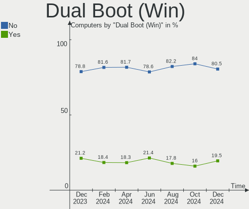
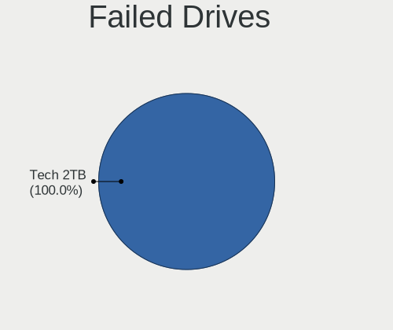
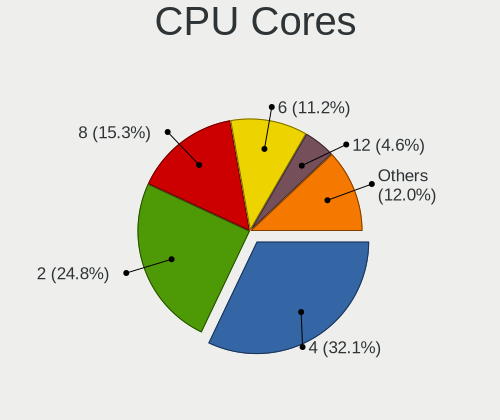
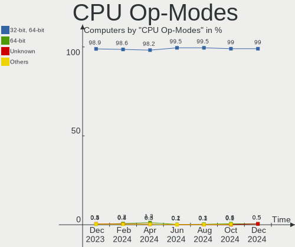
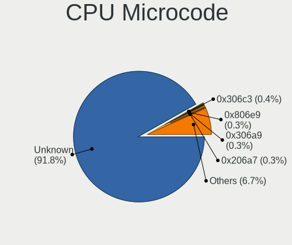
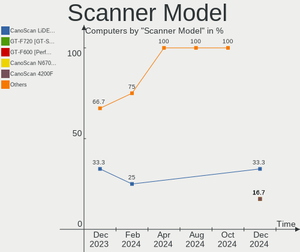
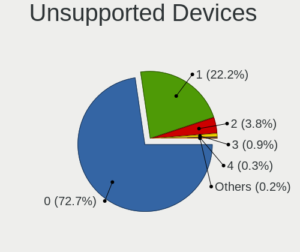

Linux in USA - Hardware Trends
------------------------------

A project to identify most popular hardware characteristics and track their change
over time based on data collected by Linux users at https://Linux-Hardware.org.

Anyone can contribute to this report by the [hw-probe](https://github.com/linuxhw/hw-probe) tool:

    sudo -E hw-probe -all -upload

This is a report for all computer types. See also reports for [desktops](/Location/USA/Desktop/README.md) and [notebooks](/Location/USA/Notebook/README.md).

Period: Oct, 2023.

Contents
--------

* [ System ](#system)
  - [ OS                       ](#os)
  - [ OS Family                ](#os-family)
  - [ Kernel                   ](#kernel)
  - [ Kernel Family            ](#kernel-family)
  - [ Kernel Major Ver.        ](#kernel-major-ver)
  - [ Arch                     ](#arch)
  - [ DE                       ](#de)
  - [ Display Server           ](#display-server)
  - [ Display Manager          ](#display-manager)
  - [ OS Lang                  ](#os-lang)
  - [ Boot Mode                ](#boot-mode)
  - [ Filesystem               ](#filesystem)
  - [ Part. scheme             ](#part-scheme)
  - [ Dual Boot with Linux/BSD ](#dual-boot-with-linuxbsd)
  - [ Dual Boot (Win)          ](#dual-boot-win)

* [ Board ](#board)
  - [ Vendor                   ](#vendor)
  - [ Model                    ](#model)
  - [ Model Family             ](#model-family)
  - [ MFG Year                 ](#mfg-year)
  - [ Form Factor              ](#form-factor)
  - [ Secure Boot              ](#secure-boot)
  - [ Coreboot                 ](#coreboot)
  - [ RAM Size                 ](#ram-size)
  - [ RAM Used                 ](#ram-used)
  - [ Total Drives             ](#total-drives)
  - [ Has CD-ROM               ](#has-cd-rom)
  - [ Has Ethernet             ](#has-ethernet)
  - [ Has WiFi                 ](#has-wifi)
  - [ Has Bluetooth            ](#has-bluetooth)

* [ Location ](#location)
  - [ Country                  ](#country)
  - [ City                     ](#city)

* [ Drives ](#drives)
  - [ Drive Vendor             ](#drive-vendor)
  - [ Drive Model              ](#drive-model)
  - [ HDD Vendor               ](#hdd-vendor)
  - [ SSD Vendor               ](#ssd-vendor)
  - [ Drive Kind               ](#drive-kind)
  - [ Drive Connector          ](#drive-connector)
  - [ Drive Size               ](#drive-size)
  - [ Space Total              ](#space-total)
  - [ Space Used               ](#space-used)
  - [ Malfunc. Drives          ](#malfunc-drives)
  - [ Malfunc. Drive Vendor    ](#malfunc-drive-vendor)
  - [ Malfunc. HDD Vendor      ](#malfunc-hdd-vendor)
  - [ Malfunc. Drive Kind      ](#malfunc-drive-kind)
  - [ Failed Drives            ](#failed-drives)
  - [ Failed Drive Vendor      ](#failed-drive-vendor)
  - [ Drive Status             ](#drive-status)

* [ Storage controller ](#storage-controller)
  - [ Storage Vendor           ](#storage-vendor)
  - [ Storage Model            ](#storage-model)
  - [ Storage Kind             ](#storage-kind)

* [ Processor ](#processor)
  - [ CPU Vendor               ](#cpu-vendor)
  - [ CPU Model                ](#cpu-model)
  - [ CPU Model Family         ](#cpu-model-family)
  - [ CPU Cores                ](#cpu-cores)
  - [ CPU Sockets              ](#cpu-sockets)
  - [ CPU Threads              ](#cpu-threads)
  - [ CPU Op-Modes             ](#cpu-op-modes)
  - [ CPU Microcode            ](#cpu-microcode)
  - [ CPU Microarch            ](#cpu-microarch)

* [ Graphics ](#graphics)
  - [ GPU Vendor               ](#gpu-vendor)
  - [ GPU Model                ](#gpu-model)
  - [ GPU Combo                ](#gpu-combo)
  - [ GPU Driver               ](#gpu-driver)
  - [ GPU Memory               ](#gpu-memory)

* [ Monitor ](#monitor)
  - [ Monitor Vendor           ](#monitor-vendor)
  - [ Monitor Model            ](#monitor-model)
  - [ Monitor Resolution       ](#monitor-resolution)
  - [ Monitor Diagonal         ](#monitor-diagonal)
  - [ Monitor Width            ](#monitor-width)
  - [ Aspect Ratio             ](#aspect-ratio)
  - [ Monitor Area             ](#monitor-area)
  - [ Pixel Density            ](#pixel-density)
  - [ Multiple Monitors        ](#multiple-monitors)

* [ Network ](#network)
  - [ Net Controller Vendor    ](#net-controller-vendor)
  - [ Net Controller Model     ](#net-controller-model)
  - [ Wireless Vendor          ](#wireless-vendor)
  - [ Wireless Model           ](#wireless-model)
  - [ Ethernet Vendor          ](#ethernet-vendor)
  - [ Ethernet Model           ](#ethernet-model)
  - [ Net Controller Kind      ](#net-controller-kind)
  - [ Used Controller          ](#used-controller)
  - [ NICs                     ](#nics)
  - [ IPv6                     ](#ipv6)

* [ Bluetooth ](#bluetooth)
  - [ Bluetooth Vendor         ](#bluetooth-vendor)
  - [ Bluetooth Model          ](#bluetooth-model)

* [ Sound ](#sound)
  - [ Sound Vendor             ](#sound-vendor)
  - [ Sound Model              ](#sound-model)

* [ Memory ](#memory)
  - [ Memory Vendor            ](#memory-vendor)
  - [ Memory Model             ](#memory-model)
  - [ Memory Kind              ](#memory-kind)
  - [ Memory Form Factor       ](#memory-form-factor)
  - [ Memory Size              ](#memory-size)
  - [ Memory Speed             ](#memory-speed)

* [ Printers & scanners ](#printers--scanners)
  - [ Printer Vendor           ](#printer-vendor)
  - [ Printer Model            ](#printer-model)
  - [ Scanner Vendor           ](#scanner-vendor)
  - [ Scanner Model            ](#scanner-model)

* [ Camera ](#camera)
  - [ Camera Vendor            ](#camera-vendor)
  - [ Camera Model             ](#camera-model)

* [ Security ](#security)
  - [ Fingerprint Vendor       ](#fingerprint-vendor)
  - [ Fingerprint Model        ](#fingerprint-model)
  - [ Chipcard Vendor          ](#chipcard-vendor)
  - [ Chipcard Model           ](#chipcard-model)

* [ Unsupported ](#unsupported)
  - [ Unsupported Devices      ](#unsupported-devices)
  - [ Unsupported Device Types ](#unsupported-device-types)

System
------

OS
--

Installed operating systems

| Name                         | Computers | Percent |
|------------------------------|-----------|---------|
| Ubuntu 22.04                 | 145       | 13.35%  |
| Debian 12                    | 116       | 10.68%  |
| Fedora 38                    | 87        | 8.01%   |
| Linux Mint 21.2              | 74        | 6.81%   |
| Pop!_OS 22.04                | 57        | 5.25%   |
| Ubuntu 23.04                 | 43        | 3.96%   |
| Arch Rolling                 | 33        | 3.04%   |
| Zorin 16                     | 28        | 2.58%   |
| ArcoLinux Rolling            | 28        | 2.58%   |
| Ubuntu 23.10                 | 24        | 2.21%   |
| Manjaro                      | 23        | 2.12%   |
| KDE neon 22.04               | 22        | 2.03%   |
| Ubuntu 20.04                 | 19        | 1.75%   |
| Kubuntu 22.04                | 16        | 1.47%   |
| Kali 2023.3                  | 16        | 1.47%   |
| OpenMandriva 23.10           | 13        | 1.2%    |
| EndeavourOS Rolling          | 13        | 1.2%    |
| SteamOS 3.4.11               | 12        | 1.1%    |
| OpenMandriva 23.08           | 12        | 1.1%    |
| Linux Mint 21.1              | 12        | 1.1%    |
| Kubuntu 23.04                | 11        | 1.01%   |
| Debian 11                    | 11        | 1.01%   |
| openSUSE Tumbleweed-XXXXXXXX | 10        | 0.92%   |
| NixOS 23.05                  | 10        | 0.92%   |
| blendOS                      | 10        | 0.92%   |
| Linux Mint 20.3              | 9         | 0.83%   |
| SteamOS 3.4.10               | 7         | 0.64%   |
| LMDE 6                       | 7         | 0.64%   |
| Gentoo 2.14                  | 7         | 0.64%   |
| Debian                       | 7         | 0.64%   |
| Xero Rolling                 | 6         | 0.55%   |
| Void Linux Rolling           | 6         | 0.55%   |
| Ubuntu 18.04                 | 6         | 0.55%   |
| BunsenLabs 11                | 6         | 0.55%   |
| Xubuntu 22.04                | 5         | 0.46%   |
| SteamOS 3.5.1                | 5         | 0.46%   |
| Parrot 5.3                   | 5         | 0.46%   |
| Nobara 38                    | 5         | 0.46%   |
| MX 23                        | 5         | 0.46%   |
| Garuda Linux Soaring         | 5         | 0.46%   |

OS Family
---------

OS without a version

| Name          | Computers | Percent |
|---------------|-----------|---------|
| Ubuntu        | 243       | 22.38%  |
| Debian        | 134       | 12.34%  |
| Linux Mint    | 102       | 9.39%   |
| Fedora        | 93        | 8.56%   |
| Pop!_OS       | 57        | 5.25%   |
| OpenMandriva  | 37        | 3.41%   |
| SteamOS       | 33        | 3.04%   |
| Arch          | 33        | 3.04%   |
| Kubuntu       | 31        | 2.85%   |
| Manjaro       | 30        | 2.76%   |
| Zorin         | 28        | 2.58%   |
| ArcoLinux     | 28        | 2.58%   |
| KDE neon      | 22        | 2.03%   |
| Kali          | 16        | 1.47%   |
| openSUSE      | 15        | 1.38%   |
| EndeavourOS   | 13        | 1.2%    |
| Xubuntu       | 11        | 1.01%   |
| NixOS         | 10        | 0.92%   |
| Garuda Linux  | 10        | 0.92%   |
| blendOS       | 10        | 0.92%   |
| LMDE          | 9         | 0.83%   |
| Gentoo        | 7         | 0.64%   |
| Xero          | 6         | 0.55%   |
| Void Linux    | 6         | 0.55%   |
| Rocky Linux   | 6         | 0.55%   |
| Nobara        | 6         | 0.55%   |
| MX            | 6         | 0.55%   |
| Lubuntu       | 6         | 0.55%   |
| Elementary    | 6         | 0.55%   |
| BunsenLabs    | 6         | 0.55%   |
| Ubuntu Budgie | 5         | 0.46%   |
| Parrot        | 5         | 0.46%   |
| ChimeraOS     | 5         | 0.46%   |
| RHEL          | 4         | 0.37%   |
| BigLinux      | 4         | 0.37%   |
| AlmaLinux     | 4         | 0.37%   |
| Ubuntu Unity  | 3         | 0.28%   |
| Clear Linux   | 3         | 0.28%   |
| Ubuntu Studio | 2         | 0.18%   |
| Ubuntu MATE   | 2         | 0.18%   |

Kernel
------

Version of the Linux kernel

| Version                    | Computers | Percent |
|----------------------------|-----------|---------|
| 6.2.0-34-generic           | 101       | 9.3%    |
| 6.1.0-13-amd64             | 69        | 6.35%   |
| 5.15.0-86-generic          | 55        | 5.06%   |
| 6.2.0-33-generic           | 48        | 4.42%   |
| 6.2.0-35-generic           | 47        | 4.33%   |
| 6.1.0-12-amd64             | 42        | 3.87%   |
| 5.15.0-87-generic          | 34        | 3.13%   |
| 6.5.4-76060504-generic     | 31        | 2.85%   |
| 6.5.5-200.fc38.x86_64      | 29        | 2.67%   |
| 5.15.0-84-generic          | 28        | 2.58%   |
| 6.5.0-9-generic            | 22        | 2.03%   |
| 5.13.0-valve37-1-neptune   | 19        | 1.75%   |
| 6.5.5-1-MANJARO            | 17        | 1.57%   |
| 6.5.7-arch1-1              | 16        | 1.47%   |
| 6.5.7-200.fc38.x86_64      | 16        | 1.47%   |
| 6.5.6-200.fc38.x86_64      | 16        | 1.47%   |
| 6.5.5-desktop-1omv2390     | 14        | 1.29%   |
| 6.5.8-arch1-1              | 12        | 1.1%    |
| 6.5.6-76060506-generic     | 12        | 1.1%    |
| 6.5.5-arch1-1              | 12        | 1.1%    |
| 6.4.11-desktop-1omv2390    | 11        | 1.01%   |
| 6.4.6-76060406-generic     | 9         | 0.83%   |
| 6.2.9-300.fc38.x86_64      | 9         | 0.83%   |
| 6.2.0-26-generic           | 9         | 0.83%   |
| 6.5.5-zen1-1-zen           | 8         | 0.74%   |
| 6.5.0-10-generic           | 8         | 0.74%   |
| 6.5.8-200.fc38.x86_64      | 7         | 0.64%   |
| 6.5.6-1-default            | 7         | 0.64%   |
| 6.5.0-kali2-amd64          | 7         | 0.64%   |
| 6.3.9-zen1-1-zen           | 7         | 0.64%   |
| 5.15.0-76-generic          | 7         | 0.64%   |
| 6.5.6-arch2-1              | 6         | 0.55%   |
| 6.1.55-1-MANJARO           | 6         | 0.55%   |
| 5.10.0-25-amd64            | 6         | 0.55%   |
| 6.5.8-zen1-1-zen           | 5         | 0.46%   |
| 6.5.7-zen2-1-zen           | 5         | 0.46%   |
| 6.2.0-20-generic           | 5         | 0.46%   |
| 6.1.52-valve3-1-neptune-61 | 5         | 0.46%   |
| 6.1.0-1parrot1-amd64       | 5         | 0.46%   |
| 5.15.0-78-generic          | 5         | 0.46%   |

Kernel Family
-------------

Linux kernel without a distro release

| Version | Computers | Percent |
|---------|-----------|---------|
| 6.2.0   | 227       | 20.9%   |
| 5.15.0  | 153       | 14.09%  |
| 6.1.0   | 129       | 11.88%  |
| 6.5.5   | 92        | 8.47%   |
| 6.5.6   | 58        | 5.34%   |
| 6.5.7   | 52        | 4.79%   |
| 6.5.0   | 52        | 4.79%   |
| 6.5.4   | 35        | 3.22%   |
| 6.5.8   | 28        | 2.58%   |
| 5.13.0  | 22        | 2.03%   |
| 5.4.0   | 19        | 1.75%   |
| 6.4.11  | 15        | 1.38%   |
| 6.1.55  | 14        | 1.29%   |
| 5.10.0  | 13        | 1.2%    |
| 6.5.9   | 11        | 1.01%   |
| 6.5.3   | 10        | 0.92%   |
| 6.4.6   | 10        | 0.92%   |
| 6.2.9   | 9         | 0.83%   |
| 6.1.52  | 8         | 0.74%   |
| 5.19.0  | 8         | 0.74%   |
| 4.18.0  | 8         | 0.74%   |
| 6.4.0   | 7         | 0.64%   |
| 6.3.9   | 7         | 0.64%   |
| 5.14.0  | 7         | 0.64%   |
| 6.2.16  | 6         | 0.55%   |
| 6.6.0   | 5         | 0.46%   |
| 4.15.0  | 5         | 0.46%   |
| 6.4.15  | 4         | 0.37%   |
| 6.4.12  | 4         | 0.37%   |
| 6.2.6   | 4         | 0.37%   |
| 6.1.58  | 4         | 0.37%   |
| 6.1.1   | 4         | 0.37%   |
| 6.4.8   | 3         | 0.28%   |
| 6.3.0   | 3         | 0.28%   |
| 5.16.7  | 3         | 0.28%   |
| 5.14.21 | 3         | 0.28%   |
| 6.5.2   | 2         | 0.18%   |
| 6.3.7   | 2         | 0.18%   |
| 6.3.5   | 2         | 0.18%   |
| 6.3.13  | 2         | 0.18%   |

Kernel Major Ver.
-----------------

Linux kernel major version

| Version | Computers | Percent |
|---------|-----------|---------|
| 6.5     | 341       | 31.4%   |
| 6.2     | 248       | 22.84%  |
| 6.1     | 169       | 15.56%  |
| 5.15    | 154       | 14.18%  |
| 6.4     | 47        | 4.33%   |
| 5.13    | 22        | 2.03%   |
| 5.4     | 21        | 1.93%   |
| 6.3     | 20        | 1.84%   |
| 5.10    | 14        | 1.29%   |
| 5.14    | 10        | 0.92%   |
| 4.18    | 10        | 0.92%   |
| 5.19    | 8         | 0.74%   |
| 6.6     | 5         | 0.46%   |
| 4.15    | 5         | 0.46%   |
| 5.16    | 3         | 0.28%   |
| 4.4     | 3         | 0.28%   |
| 6.0     | 2         | 0.18%   |
| 5.8     | 2         | 0.18%   |
| 6.5.2   | 1         | 0.09%   |
| 5.11    | 1         | 0.09%   |

Arch
----

OS architecture (x86_64, i586, etc.)

| Name    | Computers | Percent |
|---------|-----------|---------|
| x86_64  | 1073      | 98.8%   |
| i686    | 7         | 0.64%   |
| aarch64 | 6         | 0.55%   |

DE
--

Desktop Environment

| Name                    | Computers | Percent |
|-------------------------|-----------|---------|
| GNOME                   | 468       | 43.09%  |
| KDE5                    | 248       | 22.84%  |
| Unknown                 | 114       | 10.5%   |
| X-Cinnamon              | 90        | 8.29%   |
| XFCE                    | 67        | 6.17%   |
| MATE                    | 34        | 3.13%   |
| Budgie                  | 8         | 0.74%   |
| LXQt                    | 7         | 0.64%   |
| Pantheon                | 6         | 0.55%   |
| Hyprland                | 6         | 0.55%   |
| Cinnamon                | 6         | 0.55%   |
| i3                      | 5         | 0.46%   |
| GNOME Classic           | 4         | 0.37%   |
| Unity                   | 3         | 0.28%   |
| LXDE                    | 3         | 0.28%   |
| KDE                     | 3         | 0.28%   |
| GNOME Flashback         | 2         | 0.18%   |
| x-session-manager       | 1         | 0.09%   |
| Wayfire:wayfire:wlroots | 1         | 0.09%   |
| Unicorn:XFCE            | 1         | 0.09%   |
| swayland                | 1         | 0.09%   |
| onyx:GNOME              | 1         | 0.09%   |
| LXDE-pi-wayfire         | 1         | 0.09%   |
| lightdm-xsession        | 1         | 0.09%   |
| icewm                   | 1         | 0.09%   |
| fluxbox                 | 1         | 0.09%   |
| Enlightenment           | 1         | 0.09%   |
| DDE                     | 1         | 0.09%   |
| BunsenLabs              | 1         | 0.09%   |

Display Server
--------------

X11 or Wayland

| Name    | Computers | Percent |
|---------|-----------|---------|
| X11     | 635       | 58.47%  |
| Wayland | 336       | 30.94%  |
| Unknown | 87        | 8.01%   |
| Tty     | 28        | 2.58%   |

Display Manager
---------------

SDDM, LightDM, etc.

| Name    | Computers | Percent |
|---------|-----------|---------|
| Unknown | 494       | 45.49%  |
| GDM3    | 243       | 22.38%  |
| SDDM    | 156       | 14.36%  |
| LightDM | 127       | 11.69%  |
| GDM     | 61        | 5.62%   |
| SLIMSKI | 1         | 0.09%   |
| SLiM    | 1         | 0.09%   |
| LXDM    | 1         | 0.09%   |
| LEMURS  | 1         | 0.09%   |
| GREETD  | 1         | 0.09%   |

OS Lang
-------

Language

| Lang        | Computers | Percent |
|-------------|-----------|---------|
| en_US       | 950       | 87.48%  |
| Unknown     | 69        | 6.35%   |
| C           | 42        | 3.87%   |
| en_GB       | 6         | 0.55%   |
| en_CA       | 5         | 0.46%   |
| C.UTF8      | 3         | 0.28%   |
| ru_RU       | 2         | 0.18%   |
| de_DE       | 2         | 0.18%   |
| zh_TW       | 1         | 0.09%   |
| ru_UA       | 1         | 0.09%   |
| POSIX       | 1         | 0.09%   |
| it_IT       | 1         | 0.09%   |
| es_US       | 1         | 0.09%   |
| en_US.utf-8 | 1         | 0.09%   |
| en_DK       | 1         | 0.09%   |

Boot Mode
---------

EFI or BIOS

| Mode | Computers | Percent |
|------|-----------|---------|
| EFI  | 548       | 50.46%  |
| BIOS | 538       | 49.54%  |

Filesystem
----------

Type of filesystem

| Type    | Computers | Percent |
|---------|-----------|---------|
| Ext4    | 553       | 50.92%  |
| Btrfs   | 207       | 19.06%  |
| Tmpfs   | 195       | 17.96%  |
| Overlay | 93        | 8.56%   |
| Xfs     | 22        | 2.03%   |
| Zfs     | 7         | 0.64%   |
| F2fs    | 5         | 0.46%   |
| Ext3    | 2         | 0.18%   |
| Ext2    | 1         | 0.09%   |
| Aufs    | 1         | 0.09%   |

Part. scheme
------------

Scheme of partitioning

| Type    | Computers | Percent |
|---------|-----------|---------|
| GPT     | 626       | 57.64%  |
| Unknown | 393       | 36.19%  |
| MBR     | 67        | 6.17%   |

Dual Boot with Linux/BSD
------------------------

Hosting more than one Linux/BSD

| Dual boot | Computers | Percent |
|-----------|-----------|---------|
| No        | 963       | 88.67%  |
| Yes       | 123       | 11.33%  |

Dual Boot (Win)
---------------

Hosting Linux and Windows

| Dual boot | Computers | Percent |
|-----------|-----------|---------|
| No        | 856       | 78.82%  |
| Yes       | 230       | 21.18%  |

Board
-----

Vendor
------

Motherboard manufacturer

| Name                                 | Computers | Percent |
|--------------------------------------|-----------|---------|
| Hewlett-Packard                      | 174       | 16.02%  |
| Dell                                 | 162       | 14.92%  |
| Lenovo                               | 147       | 13.54%  |
| ASUSTek Computer                     | 142       | 13.08%  |
| MSI                                  | 62        | 5.71%   |
| Google                               | 52        | 4.79%   |
| Gigabyte Technology                  | 51        | 4.7%    |
| Apple                                | 38        | 3.5%    |
| Valve                                | 30        | 2.76%   |
| ASRock                               | 27        | 2.49%   |
| Acer                                 | 26        | 2.39%   |
| Intel                                | 18        | 1.66%   |
| AZW                                  | 16        | 1.47%   |
| Toshiba                              | 13        | 1.2%    |
| Unknown                              | 13        | 1.2%    |
| Microsoft                            | 11        | 1.01%   |
| System76                             | 8         | 0.74%   |
| Framework                            | 7         | 0.64%   |
| Supermicro                           | 6         | 0.55%   |
| Samsung Electronics                  | 5         | 0.46%   |
| GPU Company                          | 5         | 0.46%   |
| Alienware                            | 5         | 0.46%   |
| Razer                                | 4         | 0.37%   |
| Panasonic                            | 4         | 0.37%   |
| Gateway                              | 4         | 0.37%   |
| Notebook                             | 3         | 0.28%   |
| Foxconn                              | 3         | 0.28%   |
| ASRockRack                           | 3         | 0.28%   |
| Shenzhen Meigao Electronic Equipment | 2         | 0.18%   |
| Raspberry Pi Foundation              | 2         | 0.18%   |
| Pegatron                             | 2         | 0.18%   |
| Fujitsu                              | 2         | 0.18%   |
| eMachines                            | 2         | 0.18%   |
| Biostar                              | 2         | 0.18%   |
| ATOPNUC                              | 2         | 0.18%   |
| XFX                                  | 1         | 0.09%   |
| TrekStor                             | 1         | 0.09%   |
| Thomson                              | 1         | 0.09%   |
| Techvision                           | 1         | 0.09%   |
| SYWZ                                 | 1         | 0.09%   |

Model
-----

Motherboard model

| Name                                       | Computers | Percent |
|--------------------------------------------|-----------|---------|
| Google Reks                                | 32        | 2.95%   |
| Valve Jupiter                              | 30        | 2.76%   |
| Lenovo ThinkPad E475 20H40006US            | 22        | 2.03%   |
| Unknown                                    | 13        | 1.2%    |
| HP Notebook                                | 7         | 0.64%   |
| AZW SER                                    | 7         | 0.64%   |
| Dell OptiPlex 9020                         | 6         | 0.55%   |
| Dell OptiPlex 7010                         | 6         | 0.55%   |
| ASUS TUF Gaming X570-PLUS                  | 6         | 0.55%   |
| ASUS All Series                            | 6         | 0.55%   |
| Apple MacBookPro9,2                        | 6         | 0.55%   |
| Dell OptiPlex 7050                         | 5         | 0.46%   |
| MSI MS-7D25                                | 4         | 0.37%   |
| MSI MS-7C56                                | 4         | 0.37%   |
| Lenovo ThinkPad 13 2nd Gen 20J10046US      | 4         | 0.37%   |
| AZW SEi                                    | 4         | 0.37%   |
| MSI MS-7C37                                | 3         | 0.28%   |
| MSI MS-7C02                                | 3         | 0.28%   |
| HP Pavilion Desktop 590-p0xxx              | 3         | 0.28%   |
| Gigabyte B450M DS3H                        | 3         | 0.28%   |
| Framework Laptop 13 (AMD Ryzen 7040Series) | 3         | 0.28%   |
| Framework Laptop                           | 3         | 0.28%   |
| Dell XPS 8940                              | 3         | 0.28%   |
| Dell OptiPlex 780                          | 3         | 0.28%   |
| AZW GTR                                    | 3         | 0.28%   |
| ASUS TUF Gaming B550-PLUS WIFI II          | 3         | 0.28%   |
| ASUS ROG STRIX B550-F GAMING               | 3         | 0.28%   |
| ASUS PRIME B450M-A II                      | 3         | 0.28%   |
| Toshiba Satellite L755                     | 2         | 0.18%   |
| System76 Gazelle                           | 2         | 0.18%   |
| Razer Blade                                | 2         | 0.18%   |
| MSI MS-7D78                                | 2         | 0.18%   |
| MSI MS-7D30                                | 2         | 0.18%   |
| MSI MS-7C95                                | 2         | 0.18%   |
| Microsoft Surface Pro                      | 2         | 0.18%   |
| Microsoft Surface Laptop                   | 2         | 0.18%   |
| Lenovo ThinkPad X220 4286CTO               | 2         | 0.18%   |
| Lenovo ThinkPad T450 20BUS50Q16            | 2         | 0.18%   |
| Lenovo ThinkPad T440p 20AN0069US           | 2         | 0.18%   |
| Lenovo ThinkPad L13 Yoga Gen 2 20VK0019US  | 2         | 0.18%   |

Model Family
------------

Motherboard model prefix

| Name               | Computers | Percent |
|--------------------|-----------|---------|
| Lenovo ThinkPad    | 83        | 7.64%   |
| ASUS ROG           | 37        | 3.41%   |
| Dell OptiPlex      | 35        | 3.22%   |
| Dell Inspiron      | 34        | 3.13%   |
| Google Reks        | 32        | 2.95%   |
| Valve Jupiter      | 30        | 2.76%   |
| HP Pavilion        | 28        | 2.58%   |
| Dell Latitude      | 26        | 2.39%   |
| Dell Precision     | 24        | 2.21%   |
| HP EliteBook       | 22        | 2.03%   |
| HP Laptop          | 20        | 1.84%   |
| Lenovo IdeaPad     | 19        | 1.75%   |
| ASUS PRIME         | 19        | 1.75%   |
| Acer Aspire        | 18        | 1.66%   |
| Dell XPS           | 17        | 1.57%   |
| ASUS TUF           | 15        | 1.38%   |
| Unknown            | 13        | 1.2%    |
| Toshiba Satellite  | 12        | 1.1%    |
| Microsoft Surface  | 11        | 1.01%   |
| HP EliteDesk       | 11        | 1.01%   |
| ASUS VivoBook      | 11        | 1.01%   |
| Lenovo Legion      | 10        | 0.92%   |
| HP ENVY            | 10        | 0.92%   |
| HP ZBook           | 9         | 0.83%   |
| HP ProBook         | 9         | 0.83%   |
| Lenovo Yoga        | 8         | 0.74%   |
| Dell PowerEdge     | 8         | 0.74%   |
| Lenovo ThinkCentre | 7         | 0.64%   |
| HP Notebook        | 7         | 0.64%   |
| HP Compaq          | 7         | 0.64%   |
| Framework Laptop   | 7         | 0.64%   |
| Dell Vostro        | 7         | 0.64%   |
| AZW SER            | 7         | 0.64%   |
| Apple MacBookPro9  | 7         | 0.64%   |
| ASUS ASUS          | 6         | 0.55%   |
| ASUS All           | 6         | 0.55%   |
| ASUS Zenbook       | 5         | 0.46%   |
| Razer Blade        | 4         | 0.37%   |
| MSI MS-7D25        | 4         | 0.37%   |
| MSI MS-7C56        | 4         | 0.37%   |

MFG Year
--------

Motherboard manufacture year

| Year    | Computers | Percent |
|---------|-----------|---------|
| 2023    | 133       | 12.25%  |
| 2022    | 124       | 11.42%  |
| 2021    | 106       | 9.76%   |
| 2020    | 100       | 9.21%   |
| 2019    | 93        | 8.56%   |
| 2018    | 93        | 8.56%   |
| 2012    | 67        | 6.17%   |
| 2011    | 60        | 5.52%   |
| 2017    | 55        | 5.06%   |
| 2013    | 49        | 4.51%   |
| 2014    | 48        | 4.42%   |
| 2015    | 45        | 4.14%   |
| 2016    | 32        | 2.95%   |
| 2010    | 26        | 2.39%   |
| 2008    | 22        | 2.03%   |
| 2009    | 14        | 1.29%   |
| 2007    | 8         | 0.74%   |
| Unknown | 5         | 0.46%   |
| 2006    | 2         | 0.18%   |
| 2005    | 2         | 0.18%   |
| 2004    | 1         | 0.09%   |
| 2001    | 1         | 0.09%   |

Form Factor
-----------

Physical design of the computer

| Name           | Computers | Percent |
|----------------|-----------|---------|
| Notebook       | 547       | 50.37%  |
| Desktop        | 409       | 37.66%  |
| Convertible    | 51        | 4.7%    |
| Mini pc        | 26        | 2.39%   |
| Tablet         | 18        | 1.66%   |
| Server         | 18        | 1.66%   |
| All in one     | 13        | 1.2%    |
| System on chip | 4         | 0.37%   |

Secure Boot
-----------

Enabled or disabled

| State    | Computers | Percent |
|----------|-----------|---------|
| Disabled | 1008      | 92.82%  |
| Enabled  | 78        | 7.18%   |

Coreboot
--------

Have coreboot on board

| Used | Computers | Percent |
|------|-----------|---------|
| No   | 1026      | 94.48%  |
| Yes  | 60        | 5.52%   |

RAM Size
--------

Total RAM memory

| Size in GB      | Computers | Percent |
|-----------------|-----------|---------|
| 16.01-24.0      | 233       | 21.45%  |
| 4.01-8.0        | 210       | 19.34%  |
| 32.01-64.0      | 191       | 17.59%  |
| 8.01-16.0       | 167       | 15.38%  |
| 3.01-4.0        | 138       | 12.71%  |
| 64.01-256.0     | 89        | 8.2%    |
| 24.01-32.0      | 30        | 2.76%   |
| 1.01-2.0        | 12        | 1.1%    |
| 2.01-3.0        | 9         | 0.83%   |
| More than 256.0 | 4         | 0.37%   |
| 0.51-1.0        | 2         | 0.18%   |
| 0.01-0.5        | 1         | 0.09%   |

RAM Used
--------

Used RAM memory

| Used GB     | Computers | Percent |
|-------------|-----------|---------|
| 1.01-2.0    | 283       | 26.06%  |
| 2.01-3.0    | 272       | 25.05%  |
| 4.01-8.0    | 256       | 23.57%  |
| 3.01-4.0    | 144       | 13.26%  |
| 8.01-16.0   | 61        | 5.62%   |
| 0.51-1.0    | 32        | 2.95%   |
| 16.01-24.0  | 15        | 1.38%   |
| 0.01-0.5    | 8         | 0.74%   |
| 32.01-64.0  | 6         | 0.55%   |
| 24.01-32.0  | 5         | 0.46%   |
| 64.01-256.0 | 4         | 0.37%   |

Total Drives
------------

Number of drives on board

| Drives | Computers | Percent |
|--------|-----------|---------|
| 1      | 621       | 57.18%  |
| 2      | 278       | 25.6%   |
| 3      | 92        | 8.47%   |
| 4      | 34        | 3.13%   |
| 5      | 22        | 2.03%   |
| 6      | 18        | 1.66%   |
| 9      | 5         | 0.46%   |
| 0      | 5         | 0.46%   |
| 7      | 4         | 0.37%   |
| 8      | 3         | 0.28%   |
| 19     | 1         | 0.09%   |
| 13     | 1         | 0.09%   |
| 12     | 1         | 0.09%   |
| 11     | 1         | 0.09%   |

Has CD-ROM
----------

Has CD-ROM on board

| Presented | Computers | Percent |
|-----------|-----------|---------|
| No        | 774       | 71.27%  |
| Yes       | 312       | 28.73%  |

Has Ethernet
------------

Has Ethernet on board

| Presented | Computers | Percent |
|-----------|-----------|---------|
| Yes       | 855       | 78.73%  |
| No        | 231       | 21.27%  |

Has WiFi
--------

Has WiFi module

| Presented | Computers | Percent |
|-----------|-----------|---------|
| Yes       | 916       | 84.35%  |
| No        | 170       | 15.65%  |

Has Bluetooth
-------------

Has Bluetooth module

| Presented | Computers | Percent |
|-----------|-----------|---------|
| Yes       | 781       | 71.92%  |
| No        | 305       | 28.08%  |

Location
--------

Country
-------

Geographic location (country)

| Country | Computers | Percent |
|---------|-----------|---------|
| USA     | 1086      | 100%    |

City
----

Geographic location (city)

| City             | Computers | Percent |
|------------------|-----------|---------|
| Bangor           | 63        | 5.8%    |
| Los Angeles      | 20        | 1.84%   |
| New York         | 18        | 1.66%   |
| Seattle          | 13        | 1.2%    |
| Las Vegas        | 12        | 1.1%    |
| Charlotte        | 12        | 1.1%    |
| Houston          | 11        | 1.01%   |
| Dallas           | 11        | 1.01%   |
| Atlanta          | 11        | 1.01%   |
| Portland         | 9         | 0.83%   |
| Kansas City      | 9         | 0.83%   |
| Columbus         | 9         | 0.83%   |
| Phoenix          | 8         | 0.74%   |
| Miami            | 8         | 0.74%   |
| Chicago          | 8         | 0.74%   |
| Austin           | 8         | 0.74%   |
| Pittsburgh       | 7         | 0.64%   |
| Nashville        | 6         | 0.55%   |
| Harrisonburg     | 6         | 0.55%   |
| Denver           | 6         | 0.55%   |
| Springfield      | 5         | 0.46%   |
| San Jose         | 5         | 0.46%   |
| Reno             | 5         | 0.46%   |
| Minneapolis      | 5         | 0.46%   |
| Mesa             | 5         | 0.46%   |
| Jacksonville     | 5         | 0.46%   |
| Gainesville      | 5         | 0.46%   |
| Flushing         | 5         | 0.46%   |
| Tucson           | 4         | 0.37%   |
| Spring           | 4         | 0.37%   |
| San Diego        | 4         | 0.37%   |
| Salt Lake City   | 4         | 0.37%   |
| Sacramento       | 4         | 0.37%   |
| Fort Wayne       | 4         | 0.37%   |
| Columbia         | 4         | 0.37%   |
| Clinton Township | 4         | 0.37%   |
| Baltimore        | 4         | 0.37%   |
| Ashburn          | 4         | 0.37%   |
| Alexandria       | 4         | 0.37%   |
| Westminster      | 3         | 0.28%   |

Drives
------

Drive Vendor
------------

Hard drive vendors

| Vendor                      | Computers | Drives | Percent |
|-----------------------------|-----------|--------|---------|
| Samsung Electronics         | 268       | 343    | 16.44%  |
| Seagate                     | 182       | 246    | 11.17%  |
| WDC                         | 179       | 230    | 10.98%  |
| Sandisk                     | 129       | 148    | 7.91%   |
| Unknown                     | 113       | 128    | 6.93%   |
| Toshiba                     | 66        | 78     | 4.05%   |
| Crucial                     | 63        | 68     | 3.87%   |
| Kingston                    | 53        | 56     | 3.25%   |
| Intel                       | 47        | 57     | 2.88%   |
| SK hynix                    | 46        | 51     | 2.82%   |
| Phison Electronics          | 35        | 38     | 2.15%   |
| Hitachi                     | 35        | 38     | 2.15%   |
| Micron Technology           | 32        | 32     | 1.96%   |
| PNY                         | 29        | 34     | 1.78%   |
| Unknown                     | 29        | 30     | 1.78%   |
| Micron/Crucial Technology   | 27        | 38     | 1.66%   |
| HGST                        | 25        | 43     | 1.53%   |
| SPCC                        | 21        | 22     | 1.29%   |
| Kingston Technology Company | 19        | 20     | 1.17%   |
| KIOXIA                      | 17        | 17     | 1.04%   |
| Apple                       | 17        | 20     | 1.04%   |
| China                       | 16        | 18     | 0.98%   |
| Team                        | 13        | 14     | 0.8%    |
| SABRENT                     | 11        | 11     | 0.67%   |
| Silicon Motion              | 9         | 9      | 0.55%   |
| Hewlett-Packard             | 9         | 9      | 0.55%   |
| Realtek Semiconductor       | 8         | 8      | 0.49%   |
| ADATA Technology            | 6         | 7      | 0.37%   |
| T-FORCE                     | 5         | 5      | 0.31%   |
| Fanxiang                    | 5         | 5      | 0.31%   |
| A-DATA Technology           | 5         | 5      | 0.31%   |
| Transcend                   | 4         | 4      | 0.25%   |
| Realtek                     | 4         | 5      | 0.25%   |
| Patriot                     | 4         | 4      | 0.25%   |
| KingFast                    | 4         | 5      | 0.25%   |
| Corsair                     | 4         | 15     | 0.25%   |
| Wibtek                      | 3         | 3      | 0.18%   |
| SSSTC                       | 3         | 3      | 0.18%   |
| Phison                      | 3         | 3      | 0.18%   |
| Mushkin                     | 3         | 3      | 0.18%   |

Drive Model
-----------

Hard drive models

| Model                                                 | Computers | Percent |
|-------------------------------------------------------|-----------|---------|
| Samsung NVMe SSD Controller SM981/PM981/PM983 1TB     | 43        | 2.39%   |
| Unknown                                               | 29        | 1.61%   |
| Samsung NVMe SSD Controller PM9A1/PM9A3/980PRO 1TB    | 28        | 1.56%   |
| Kingston SA400S37120G 120GB SSD                       | 24        | 1.33%   |
| Unknown DF4016  16GB                                  | 22        | 1.22%   |
| Micron/Crucial P2 NVMe PCIe SSD 500GB                 | 21        | 1.17%   |
| Unknown MMC Card  64GB                                | 18        | 1%      |
| Seagate ST2000DM008-2FR102 2TB                        | 17        | 0.95%   |
| Samsung SSD 980 1TB                                   | 16        | 0.89%   |
| Unknown MMC Card  512GB                               | 13        | 0.72%   |
| Sandisk WD Black SN750 / PC SN730 NVMe SSD 1024GB     | 13        | 0.72%   |
| Samsung SSD 850 EVO 250GB                             | 12        | 0.67%   |
| Sandisk WD_BLACK SN770 1TB                            | 11        | 0.61%   |
| Crucial CT1000MX500SSD1 1TB                           | 11        | 0.61%   |
| Unknown MMC Card  128GB                               | 10        | 0.56%   |
| Samsung SSD 860 EVO 500GB                             | 10        | 0.56%   |
| Samsung NVMe SSD Controller SM961/PM961/SM963 121GB   | 10        | 0.56%   |
| PNY CS900 500GB SSD                                   | 10        | 0.56%   |
| Kingston Company OM3PDP3 NVMe SSD 512GB               | 10        | 0.56%   |
| Unknown SD/MMC/MS PRO 16GB                            | 9         | 0.5%    |
| Samsung SSD 870 EVO 1TB                               | 9         | 0.5%    |
| SABRENT Disk 240GB SSD                                | 9         | 0.5%    |
| Phison PS5013 E13 NVMe Controller 256GB               | 9         | 0.5%    |
| Unknown MMC Card  256GB                               | 8         | 0.44%   |
| Seagate Backup+ Hub BK 8TB                            | 8         | 0.44%   |
| Sandisk WD Blue SN550 NVMe SSD 1TB                    | 8         | 0.44%   |
| Samsung SSD 850 EVO 500GB                             | 8         | 0.44%   |
| PNY CS900 1TB SSD                                     | 8         | 0.44%   |
| Phison E16 PCIe4 NVMe Controller 500GB                | 8         | 0.44%   |
| Unknown MMC Card  16GB                                | 7         | 0.39%   |
| Toshiba DT01ACA100 1TB                                | 7         | 0.39%   |
| SPCC Solid State Disk 1TB                             | 7         | 0.39%   |
| Samsung SSD 980 PRO 2TB                               | 7         | 0.39%   |
| Samsung SSD 860 EVO 250GB                             | 7         | 0.39%   |
| Kingston SA400S37240G 240GB SSD                       | 7         | 0.39%   |
| Silicon Motion SM2263EN/SM2263XT SSD Controller 256GB | 6         | 0.33%   |
| Seagate ST2000DM006-2DM164 2TB                        | 6         | 0.33%   |
| Seagate ST1000LM035-1RK172 1TB                        | 6         | 0.33%   |
| Seagate ST1000DM003-1CH162 1TB                        | 6         | 0.33%   |
| Sandisk WD_BLACK SN850X 2000GB                        | 6         | 0.33%   |

HDD Vendor
----------

Hard disk drive vendors

| Vendor              | Computers | Drives | Percent |
|---------------------|-----------|--------|---------|
| Seagate             | 172       | 233    | 37.97%  |
| WDC                 | 142       | 185    | 31.35%  |
| Toshiba             | 41        | 53     | 9.05%   |
| Hitachi             | 35        | 38     | 7.73%   |
| HGST                | 24        | 42     | 5.3%    |
| Unknown             | 10        | 10     | 2.21%   |
| Samsung Electronics | 10        | 10     | 2.21%   |
| Fujitsu             | 3         | 3      | 0.66%   |
| Apple               | 3         | 3      | 0.66%   |
| SSK                 | 2         | 2      | 0.44%   |
| Hewlett-Packard     | 2         | 2      | 0.44%   |
| DELLBOSS            | 2         | 2      | 0.44%   |
| SABRENT             | 1         | 1      | 0.22%   |
| Maxtor              | 1         | 1      | 0.22%   |
| Maxone              | 1         | 1      | 0.22%   |
| KESU                | 1         | 1      | 0.22%   |
| IBM/Hitachi         | 1         | 1      | 0.22%   |
| HPE                 | 1         | 1      | 0.22%   |
| ASMedia             | 1         | 1      | 0.22%   |

SSD Vendor
----------

Solid state drive vendors

| Vendor              | Computers | Drives | Percent |
|---------------------|-----------|--------|---------|
| Samsung Electronics | 101       | 120    | 21.4%   |
| Crucial             | 49        | 50     | 10.38%  |
| SanDisk             | 41        | 46     | 8.69%   |
| Kingston            | 40        | 43     | 8.47%   |
| PNY                 | 29        | 34     | 6.14%   |
| WDC                 | 26        | 27     | 5.51%   |
| SPCC                | 19        | 19     | 4.03%   |
| China               | 16        | 18     | 3.39%   |
| Team                | 13        | 14     | 2.75%   |
| Micron Technology   | 13        | 13     | 2.75%   |
| Intel               | 10        | 12     | 2.12%   |
| Apple               | 10        | 10     | 2.12%   |
| SK hynix            | 9         | 9      | 1.91%   |
| SABRENT             | 9         | 9      | 1.91%   |
| Toshiba             | 7         | 7      | 1.48%   |
| Hewlett-Packard     | 5         | 5      | 1.06%   |
| A-DATA Technology   | 5         | 5      | 1.06%   |
| Transcend           | 4         | 4      | 0.85%   |
| Seagate             | 4         | 4      | 0.85%   |
| Wibtek              | 3         | 3      | 0.64%   |
| T-FORCE             | 3         | 3      | 0.64%   |
| SSSTC               | 3         | 3      | 0.64%   |
| Patriot             | 3         | 3      | 0.64%   |
| Mushkin             | 3         | 3      | 0.64%   |
| KingFast            | 3         | 3      | 0.64%   |
| Fanxiang            | 3         | 3      | 0.64%   |
| Corsair             | 3         | 11     | 0.64%   |
| TO Exter            | 2         | 3      | 0.42%   |
| Timetec             | 2         | 2      | 0.42%   |
| SCY                 | 2         | 2      | 0.42%   |
| Dogfish             | 2         | 2      | 0.42%   |
| BHT                 | 2         | 2      | 0.42%   |
| Acer                | 2         | 2      | 0.42%   |
| ZTC                 | 1         | 1      | 0.21%   |
| X12                 | 1         | 1      | 0.21%   |
| SATAFIRM            | 1         | 1      | 0.21%   |
| OWC                 | 1         | 1      | 0.21%   |
| ORTIAL              | 1         | 1      | 0.21%   |
| OCZ                 | 1         | 1      | 0.21%   |
| Netac               | 1         | 1      | 0.21%   |

Drive Kind
----------

HDD or SSD

| Kind    | Computers | Drives | Percent |
|---------|-----------|--------|---------|
| NVMe    | 507       | 673    | 35.18%  |
| SSD     | 402       | 524    | 27.9%   |
| HDD     | 379       | 590    | 26.3%   |
| MMC     | 119       | 132    | 8.26%   |
| Unknown | 34        | 38     | 2.36%   |

Drive Connector
---------------

SATA, SAS, NVMe, etc.

| Type | Computers | Drives | Percent |
|------|-----------|--------|---------|
| SATA | 640       | 1001   | 46.92%  |
| NVMe | 502       | 663    | 36.8%   |
| MMC  | 119       | 132    | 8.72%   |
| SAS  | 103       | 161    | 7.55%   |

Drive Size
----------

Size of hard drive

| Size in TB | Computers | Drives | Percent |
|------------|-----------|--------|---------|
| 0.01-0.5   | 417       | 495    | 47.82%  |
| 0.51-1.0   | 247       | 313    | 28.33%  |
| 1.01-2.0   | 102       | 122    | 11.7%   |
| 3.01-4.0   | 45        | 80     | 5.16%   |
| 4.01-10.0  | 27        | 39     | 3.1%    |
| 2.01-3.0   | 24        | 41     | 2.75%   |
| 10.01-20.0 | 10        | 24     | 1.15%   |

Space Total
-----------

Amount of disk space available on the file system

| Size in GB     | Computers | Percent |
|----------------|-----------|---------|
| 101-250        | 210       | 19.34%  |
| 251-500        | 197       | 18.14%  |
| 501-1000       | 189       | 17.4%   |
| 1001-2000      | 121       | 11.14%  |
| More than 3000 | 120       | 11.05%  |
| 1-20           | 77        | 7.09%   |
| Unknown        | 58        | 5.34%   |
| 2001-3000      | 50        | 4.6%    |
| 51-100         | 45        | 4.14%   |
| 21-50          | 19        | 1.75%   |

Space Used
----------

Amount of used disk space

| Used GB        | Computers | Percent |
|----------------|-----------|---------|
| 1-20           | 334       | 30.76%  |
| 21-50          | 191       | 17.59%  |
| 101-250        | 127       | 11.69%  |
| 51-100         | 121       | 11.14%  |
| 251-500        | 81        | 7.46%   |
| 501-1000       | 62        | 5.71%   |
| Unknown        | 58        | 5.34%   |
| 1001-2000      | 56        | 5.16%   |
| More than 3000 | 37        | 3.41%   |
| 2001-3000      | 19        | 1.75%   |

Malfunc. Drives
---------------

Drive models with a malfunction

| Model                                                          | Computers | Drives | Percent |
|----------------------------------------------------------------|-----------|--------|---------|
| WDC WD20EZRX-00D8PB0 2TB                                       | 2         | 2      | 3.13%   |
| Seagate ST9500325AS 500GB                                      | 2         | 2      | 3.13%   |
| Samsung Electronics SSD 970 EVO 500GB                          | 2         | 2      | 3.13%   |
| WDC WD5000LPLX-75ZNTT0 500GB                                   | 1         | 1      | 1.56%   |
| WDC WD3200BPVT-80ZEST0 320GB                                   | 1         | 1      | 1.56%   |
| WDC WD30EZRZ-00WN9B0 3TB                                       | 1         | 1      | 1.56%   |
| WDC WD30EZRX-00SPEB0 3TB                                       | 1         | 1      | 1.56%   |
| WDC WD2500AAJS-00B4A0 250GB                                    | 1         | 1      | 1.56%   |
| WDC WD2002FAEX-007BA0 2TB                                      | 1         | 1      | 1.56%   |
| WDC WD15EARS-00Z5B1 1TB                                        | 1         | 1      | 1.56%   |
| WDC WD15EADS-22P8B0 1TB                                        | 1         | 1      | 1.56%   |
| WDC WD1502FAEX-007BA0 1TB                                      | 1         | 1      | 1.56%   |
| WDC WD10SPZX-60Z10T0 1TB                                       | 1         | 1      | 1.56%   |
| WDC WD10EURX-63C57Y0 1TB                                       | 1         | 1      | 1.56%   |
| WDC WD10EADX-22TDHB0 1TB                                       | 1         | 1      | 1.56%   |
| Toshiba MK6465GSXN 640GB                                       | 1         | 1      | 1.56%   |
| Toshiba MK3265GSXN 320GB                                       | 1         | 1      | 1.56%   |
| Toshiba DT01ACA100 1TB                                         | 1         | 1      | 1.56%   |
| SK hynix BC711 HFM256GD3JX013N 256GB                           | 1         | 1      | 1.56%   |
| Seagate ST9500420AS 500GB                                      | 1         | 1      | 1.56%   |
| Seagate ST9250315AS 250GB                                      | 1         | 1      | 1.56%   |
| Seagate ST500DM002-1BD142 500GB                                | 1         | 1      | 1.56%   |
| Seagate ST4000DM000-1F2168 4TB                                 | 1         | 1      | 1.56%   |
| Seagate ST3320820AS 320GB                                      | 1         | 1      | 1.56%   |
| Seagate ST31000524NS 1TB                                       | 1         | 1      | 1.56%   |
| Seagate ST31000524AS 1TB                                       | 1         | 1      | 1.56%   |
| Seagate ST3000DM008-2DM166 3TB                                 | 1         | 1      | 1.56%   |
| Seagate ST2000LX001-1RG174 2TB                                 | 1         | 1      | 1.56%   |
| Seagate ST2000DX001-1CM164 2TB                                 | 1         | 1      | 1.56%   |
| Seagate ST1500DL003-9VT16L 1TB                                 | 1         | 1      | 1.56%   |
| Seagate ST1000LX015-1U7172 1TB                                 | 1         | 1      | 1.56%   |
| Seagate ST1000LM049-2GH172 1TB                                 | 1         | 1      | 1.56%   |
| Seagate ST1000LM024 HN-M101MBB 1TB                             | 1         | 1      | 1.56%   |
| Seagate ST1000DM003-1SB102 1TB                                 | 1         | 1      | 1.56%   |
| SanDisk SSD PLUS 1000GB                                        | 1         | 1      | 1.56%   |
| Samsung Electronics SSD 980 1TB                                | 1         | 1      | 1.56%   |
| Samsung Electronics SSD 970 EVO 500GB S5H7NS0N586263N          | 1         | 1      | 1.56%   |
| Samsung Electronics SSD 850 EVO 1TB                            | 1         | 1      | 1.56%   |
| Samsung Electronics SSD 840 Series 500GB                       | 1         | 1      | 1.56%   |
| Samsung Electronics NVMe SSD Controller PM9A1/PM9A3/980PRO 1TB | 1         | 1      | 1.56%   |

Malfunc. Drive Vendor
---------------------

Vendors of faulty drives

| Vendor              | Computers | Drives | Percent |
|---------------------|-----------|--------|---------|
| Seagate             | 17        | 17     | 26.98%  |
| WDC                 | 14        | 14     | 22.22%  |
| Samsung Electronics | 7         | 7      | 11.11%  |
| Hitachi             | 7         | 8      | 11.11%  |
| Toshiba             | 3         | 3      | 4.76%   |
| Intel               | 2         | 4      | 3.17%   |
| HGST                | 2         | 2      | 3.17%   |
| Corsair             | 2         | 2      | 3.17%   |
| SK hynix            | 1         | 1      | 1.59%   |
| SanDisk             | 1         | 1      | 1.59%   |
| PNY                 | 1         | 1      | 1.59%   |
| KingFast            | 1         | 1      | 1.59%   |
| IBM/Hitachi         | 1         | 1      | 1.59%   |
| Gigastone           | 1         | 1      | 1.59%   |
| Crucial             | 1         | 1      | 1.59%   |
| ASMedia             | 1         | 1      | 1.59%   |
| Apple               | 1         | 1      | 1.59%   |

Malfunc. HDD Vendor
-------------------

Vendors of faulty HDD drives

| Vendor      | Computers | Drives | Percent |
|-------------|-----------|--------|---------|
| Seagate     | 17        | 17     | 36.96%  |
| WDC         | 14        | 14     | 30.43%  |
| Hitachi     | 7         | 8      | 15.22%  |
| Toshiba     | 3         | 3      | 6.52%   |
| HGST        | 2         | 2      | 4.35%   |
| IBM/Hitachi | 1         | 1      | 2.17%   |
| ASMedia     | 1         | 1      | 2.17%   |
| Apple       | 1         | 1      | 2.17%   |

Malfunc. Drive Kind
-------------------

Kinds of faulty drives

| Kind | Computers | Drives | Percent |
|------|-----------|--------|---------|
| HDD  | 44        | 47     | 72.13%  |
| SSD  | 10        | 12     | 16.39%  |
| NVMe | 7         | 7      | 11.48%  |

Failed Drives
-------------

Failed drive models

| Model                                       | Computers | Drives | Percent |
|---------------------------------------------|-----------|--------|---------|
| SK hynix PC401 NVMe Solid State Drive 256GB | 1         | 1      | 100%    |

Failed Drive Vendor
-------------------

Failed drive vendors

| Vendor   | Computers | Drives | Percent |
|----------|-----------|--------|---------|
| SK hynix | 1         | 1      | 100%    |

Drive Status
------------

Number of failed and malfunc. drives

| Status   | Computers | Drives | Percent |
|----------|-----------|--------|---------|
| Detected | 702       | 1219   | 59.95%  |
| Works    | 407       | 670    | 34.76%  |
| Malfunc  | 60        | 66     | 5.12%   |
| Fixed    | 1         | 1      | 0.09%   |
| Failed   | 1         | 1      | 0.09%   |

Storage controller
------------------

Storage Vendor
--------------

Storage controller vendors

| Vendor                         | Computers | Percent |
|--------------------------------|-----------|---------|
| Intel                          | 571       | 39.63%  |
| AMD                            | 239       | 16.59%  |
| Samsung Electronics            | 177       | 12.28%  |
| SanDisk                        | 101       | 7.01%   |
| Phison Electronics             | 42        | 2.91%   |
| Micron/Crucial Technology      | 42        | 2.91%   |
| SK hynix                       | 37        | 2.57%   |
| Kingston Technology Company    | 32        | 2.22%   |
| ASMedia Technology             | 31        | 2.15%   |
| Marvell Technology Group       | 24        | 1.67%   |
| Micron Technology              | 19        | 1.32%   |
| KIOXIA                         | 18        | 1.25%   |
| Toshiba America Info Systems   | 17        | 1.18%   |
| Nvidia                         | 13        | 0.9%    |
| Realtek Semiconductor          | 11        | 0.76%   |
| Silicon Motion                 | 10        | 0.69%   |
| Broadcom / LSI                 | 9         | 0.62%   |
| LSI Logic / Symbios Logic      | 7         | 0.49%   |
| JMicron Technology             | 6         | 0.42%   |
| ADATA Technology               | 6         | 0.42%   |
| Apple                          | 4         | 0.28%   |
| VIA Technologies               | 3         | 0.21%   |
| Solidigm                       | 3         | 0.21%   |
| MAXIO Technology (Hangzhou)    | 3         | 0.21%   |
| Biwin Storage Technology       | 3         | 0.21%   |
| Shenzhen Longsys Electronics   | 2         | 0.14%   |
| Seagate Technology             | 2         | 0.14%   |
| O2 Micro                       | 2         | 0.14%   |
| Union Memory (Shenzhen)        | 1         | 0.07%   |
| Solid State Storage Technology | 1         | 0.07%   |
| Nextorage                      | 1         | 0.07%   |
| Lite-On Technology             | 1         | 0.07%   |
| Lenovo                         | 1         | 0.07%   |
| INNOGRIT                       | 1         | 0.07%   |
| HGST                           | 1         | 0.07%   |

Storage Model
-------------

Storage controller models

| Model                                                                          | Computers | Percent |
|--------------------------------------------------------------------------------|-----------|---------|
| AMD FCH SATA Controller [AHCI mode]                                            | 172       | 10.62%  |
| Samsung NVMe SSD Controller SM981/PM981/PM983                                  | 73        | 4.51%   |
| Samsung NVMe SSD Controller PM9A1/PM9A3/980PRO                                 | 47        | 2.9%    |
| Samsung NVMe SSD Controller 980 (DRAM-less)                                    | 40        | 2.47%   |
| Intel Sunrise Point-LP SATA Controller [AHCI mode]                             | 38        | 2.35%   |
| Intel 8 Series/C220 Series Chipset Family 6-port SATA Controller 1 [AHCI mode] | 33        | 2.04%   |
| AMD 500 Series Chipset SATA Controller                                         | 31        | 1.91%   |
| Micron/Crucial P2 [Nick P2] / P3 / P3 Plus NVMe PCIe SSD (DRAM-less)           | 30        | 1.85%   |
| Intel Volume Management Device NVMe RAID Controller                            | 29        | 1.79%   |
| Intel 7 Series Chipset Family 6-port SATA Controller [AHCI mode]               | 29        | 1.79%   |
| AMD 400 Series Chipset SATA Controller                                         | 29        | 1.79%   |
| ASMedia ASM1062 Serial ATA Controller                                          | 27        | 1.67%   |
| Intel SATA Controller [RAID mode]                                              | 25        | 1.54%   |
| Intel 82801 Mobile SATA Controller [RAID mode]                                 | 24        | 1.48%   |
| Intel Alder Lake-S PCH SATA Controller [AHCI Mode]                             | 23        | 1.42%   |
| Intel 6 Series/C200 Series Chipset Family 6 port Mobile SATA AHCI Controller   | 22        | 1.36%   |
| SanDisk WD Black SN770 / PC SN740 256GB / PC SN560 (DRAM-less) NVMe SSD        | 21        | 1.3%    |
| Intel Q170/Q150/B150/H170/H110/Z170/CM236 Chipset SATA Controller [AHCI Mode]  | 21        | 1.3%    |
| Intel 7 Series/C210 Series Chipset Family 6-port SATA Controller [AHCI mode]   | 21        | 1.3%    |
| Intel 200 Series PCH SATA controller [AHCI mode]                               | 21        | 1.3%    |
| Intel 8 Series SATA Controller 1 [AHCI mode]                                   | 18        | 1.11%   |
| Intel 6 Series/C200 Series Chipset Family 6 port Desktop SATA AHCI Controller  | 18        | 1.11%   |
| AMD SB7x0/SB8x0/SB9x0 SATA Controller [AHCI mode]                              | 18        | 1.11%   |
| Intel Cannon Lake PCH SATA AHCI Controller                                     | 17        | 1.05%   |
| SanDisk Extreme Pro / WD Black SN750 / PC SN730 / Red SN700 NVMe SSD           | 15        | 0.93%   |
| SK hynix Gold P31/BC711/PC711 NVMe Solid State Drive                           | 14        | 0.86%   |
| Sandisk WD Black SN850X NVMe SSD                                               | 14        | 0.86%   |
| SanDisk Ultra 3D / WD Blue SN550 NVMe SSD                                      | 14        | 0.86%   |
| Intel Celeron/Pentium Silver Processor SATA Controller                         | 14        | 0.86%   |
| Intel Cannon Lake Mobile PCH SATA AHCI Controller                              | 14        | 0.86%   |
| AMD SB7x0/SB8x0/SB9x0 IDE Controller                                           | 14        | 0.86%   |
| Intel Comet Lake SATA AHCI Controller                                          | 13        | 0.8%    |
| Samsung NVMe SSD Controller SM961/PM961/SM963                                  | 12        | 0.74%   |
| Kingston Company OM3PDP3 NVMe SSD                                              | 12        | 0.74%   |
| Intel Wildcat Point-LP SATA Controller [AHCI Mode]                             | 11        | 0.68%   |
| Intel SSD 670p Series [Keystone Harbor]                                        | 11        | 0.68%   |
| Intel Alder Lake-P SATA AHCI Controller                                        | 11        | 0.68%   |
| Phison PS5013-E13 PCIe3 NVMe Controller (DRAM-less)                            | 10        | 0.62%   |
| Phison E16 PCIe4 NVMe Controller                                               | 10        | 0.62%   |
| Intel Volume Management Device NVMe RAID Controller Intel Corporation          | 10        | 0.62%   |

Storage Kind
------------

Kind of storage controller (IDE, SATA, NVMe, SAS, ...)

| Kind | Computers | Percent |
|------|-----------|---------|
| SATA | 698       | 49.89%  |
| NVMe | 502       | 35.88%  |
| RAID | 106       | 7.58%   |
| IDE  | 79        | 5.65%   |
| SAS  | 12        | 0.86%   |
| SCSI | 2         | 0.14%   |

Processor
---------

CPU Vendor
----------

Processor vendors

| Vendor       | Computers | Percent |
|--------------|-----------|---------|
| Intel        | 745       | 68.6%   |
| AMD          | 334       | 30.76%  |
| ARM          | 4         | 0.37%   |
| Qualcomm     | 1         | 0.09%   |
| CentaurHauls | 1         | 0.09%   |
| Unknown      | 1         | 0.09%   |

CPU Model
---------

Processor models

| Model                                      | Computers | Percent |
|--------------------------------------------|-----------|---------|
| Intel Celeron CPU N3060 @ 1.60GHz          | 34        | 3.13%   |
| AMD Custom APU 0405                        | 30        | 2.76%   |
| AMD PRO A6-9500B R5, 6 COMPUTE CORES 2C+4G | 22        | 2.03%   |
| AMD Ryzen 5 3600 6-Core Processor          | 12        | 1.1%    |
| AMD Ryzen 7 5800X 8-Core Processor         | 11        | 1.01%   |
| Intel Core i7-8750H CPU @ 2.20GHz          | 10        | 0.92%   |
| Intel Core i5-7200U CPU @ 2.50GHz          | 10        | 0.92%   |
| Intel Core i7-8650U CPU @ 1.90GHz          | 9         | 0.83%   |
| Intel 11th Gen Core i7-1165G7 @ 2.80GHz    | 9         | 0.83%   |
| Intel 11th Gen Core i5-1135G7 @ 2.40GHz    | 9         | 0.83%   |
| Intel Core i5-4590 CPU @ 3.30GHz           | 8         | 0.74%   |
| AMD Ryzen 9 7950X 16-Core Processor        | 8         | 0.74%   |
| Intel Core i7-10750H CPU @ 2.60GHz         | 7         | 0.64%   |
| Intel Core i5-6500 CPU @ 3.20GHz           | 7         | 0.64%   |
| Intel Core i5-3470 CPU @ 3.20GHz           | 7         | 0.64%   |
| Intel Core i5-3210M CPU @ 2.50GHz          | 7         | 0.64%   |
| Intel Celeron CPU N3350 @ 1.10GHz          | 7         | 0.64%   |
| Intel 12th Gen Core i5-1235U               | 7         | 0.64%   |
| Intel 11th Gen Core i7-1185G7 @ 3.00GHz    | 7         | 0.64%   |
| Intel 11th Gen Core i7-11800H @ 2.30GHz    | 7         | 0.64%   |
| AMD Ryzen 7 3700X 8-Core Processor         | 7         | 0.64%   |
| AMD Ryzen 5 5600X 6-Core Processor         | 7         | 0.64%   |
| AMD Ryzen 5 5600G with Radeon Graphics     | 7         | 0.64%   |
| Intel Core i7-8550U CPU @ 1.80GHz          | 6         | 0.55%   |
| Intel Core i5-10210U CPU @ 1.60GHz         | 6         | 0.55%   |
| Intel 13th Gen Core i9-13900K              | 6         | 0.55%   |
| Intel 11th Gen Core i3-1115G4 @ 3.00GHz    | 6         | 0.55%   |
| AMD Ryzen 7 4800H with Radeon Graphics     | 6         | 0.55%   |
| Intel Core i7-9750H CPU @ 2.60GHz          | 5         | 0.46%   |
| Intel Core i7-8700 CPU @ 3.20GHz           | 5         | 0.46%   |
| Intel Core i7-6700HQ CPU @ 2.60GHz         | 5         | 0.46%   |
| Intel Core i7-6600U CPU @ 2.60GHz          | 5         | 0.46%   |
| Intel Core i5-8350U CPU @ 1.70GHz          | 5         | 0.46%   |
| Intel Core i5-4570 CPU @ 3.20GHz           | 5         | 0.46%   |
| Intel Core i5-3340M CPU @ 2.70GHz          | 5         | 0.46%   |
| Intel Celeron N4120 CPU @ 1.10GHz          | 5         | 0.46%   |
| Intel Celeron N4020 CPU @ 1.10GHz          | 5         | 0.46%   |
| Intel Celeron CPU 3865U @ 1.80GHz          | 5         | 0.46%   |
| Intel 13th Gen Core i9-13900H              | 5         | 0.46%   |
| Intel 12th Gen Core i7-12700K              | 5         | 0.46%   |

CPU Model Family
----------------

Processor model prefix

| Model                   | Computers | Percent |
|-------------------------|-----------|---------|
| Other                   | 219       | 20.17%  |
| Intel Core i5           | 192       | 17.68%  |
| Intel Core i7           | 175       | 16.11%  |
| Intel Celeron           | 84        | 7.73%   |
| AMD Ryzen 5             | 72        | 6.63%   |
| AMD Ryzen 7             | 71        | 6.54%   |
| AMD Ryzen 9             | 39        | 3.59%   |
| Intel Core i3           | 36        | 3.31%   |
| Intel Xeon              | 29        | 2.67%   |
| Intel Core 2 Duo        | 21        | 1.93%   |
| AMD FX                  | 16        | 1.47%   |
| AMD Ryzen 3             | 13        | 1.2%    |
| Intel Pentium           | 11        | 1.01%   |
| Intel Core i9           | 10        | 0.92%   |
| AMD A6                  | 9         | 0.83%   |
| AMD A8                  | 8         | 0.74%   |
| AMD E2                  | 6         | 0.55%   |
| AMD A10                 | 6         | 0.55%   |
| Intel Core m3           | 5         | 0.46%   |
| Intel Core 2 Quad       | 5         | 0.46%   |
| Intel Pentium Dual-Core | 4         | 0.37%   |
| Intel Atom              | 4         | 0.37%   |
| AMD Ryzen 7 PRO         | 4         | 0.37%   |
| AMD A4                  | 4         | 0.37%   |
| Intel Pentium Silver    | 3         | 0.28%   |
| AMD Ryzen Threadripper  | 3         | 0.28%   |
| AMD Ryzen 5 PRO         | 3         | 0.28%   |
| Intel Xeon Gold         | 2         | 0.18%   |
| Intel Pentium M         | 2         | 0.18%   |
| Intel Core 2            | 2         | 0.18%   |
| AMD EPYC                | 2         | 0.18%   |
| AMD Athlon II X4        | 2         | 0.18%   |
| AMD Athlon II X2        | 2         | 0.18%   |
| AMD Athlon II           | 2         | 0.18%   |
| AMD Athlon 64 X2        | 2         | 0.18%   |
| Intel Xeon Platinum     | 1         | 0.09%   |
| Intel Pentium Gold      | 1         | 0.09%   |
| Intel Pentium Dual      | 1         | 0.09%   |
| Intel Genuine           | 1         | 0.09%   |
| Intel Celeron M         | 1         | 0.09%   |

CPU Cores
---------

Number of processor cores

| Number  | Computers | Percent |
|---------|-----------|---------|
| 4       | 356       | 32.78%  |
| 2       | 302       | 27.81%  |
| 6       | 124       | 11.42%  |
| 8       | 119       | 10.96%  |
| 12      | 37        | 3.41%   |
| 10      | 34        | 3.13%   |
| 1       | 33        | 3.04%   |
| 16      | 30        | 2.76%   |
| 14      | 18        | 1.66%   |
| 24      | 17        | 1.57%   |
| 3       | 5         | 0.46%   |
| 32      | 2         | 0.18%   |
| Unknown | 2         | 0.18%   |
| 64      | 1         | 0.09%   |
| 48      | 1         | 0.09%   |
| 44      | 1         | 0.09%   |
| 40      | 1         | 0.09%   |
| 36      | 1         | 0.09%   |
| 20      | 1         | 0.09%   |
| 5       | 1         | 0.09%   |

CPU Sockets
-----------

Number of sockets

| Number  | Computers | Percent |
|---------|-----------|---------|
| 1       | 1063      | 97.88%  |
| 2       | 21        | 1.93%   |
| Unknown | 2         | 0.18%   |

CPU Threads
-----------

Threads per core (Hyper-Threading)

| Number  | Computers | Percent |
|---------|-----------|---------|
| 2       | 770       | 70.9%   |
| 1       | 312       | 28.73%  |
| 8       | 2         | 0.18%   |
| Unknown | 2         | 0.18%   |

CPU Op-Modes
------------

CPU Operation Modes (32-bit, 64-bit)

| Op mode        | Computers | Percent |
|----------------|-----------|---------|
| 32-bit, 64-bit | 1077      | 99.17%  |
| 32-bit         | 5         | 0.46%   |
| 64-bit         | 3         | 0.28%   |
| Unknown        | 1         | 0.09%   |

CPU Microcode
-------------

Microcode number

| Number     | Computers | Percent |
|------------|-----------|---------|
| Unknown    | 669       | 61.6%   |
| 0x406c4    | 34        | 3.13%   |
| 0x0600611a | 22        | 2.03%   |
| 0x206a7    | 21        | 1.93%   |
| 0x306a9    | 17        | 1.57%   |
| 0x306c3    | 15        | 1.38%   |
| 0x0a50000d | 14        | 1.29%   |
| 0x906ea    | 10        | 0.92%   |
| 0x0a20120a | 10        | 0.92%   |
| 0x906e9    | 9         | 0.83%   |
| 0x1067a    | 8         | 0.74%   |
| 0x0a601203 | 8         | 0.74%   |
| 0x0a50000c | 8         | 0.74%   |
| 0x806e9    | 7         | 0.64%   |
| 0x806c1    | 7         | 0.64%   |
| 0x08108109 | 7         | 0.64%   |
| 0x010000c8 | 7         | 0.64%   |
| 0x08701030 | 6         | 0.55%   |
| 0xb0671    | 5         | 0.46%   |
| 0x906a3    | 5         | 0.46%   |
| 0x806ea    | 5         | 0.46%   |
| 0x806d1    | 5         | 0.46%   |
| 0x506e3    | 5         | 0.46%   |
| 0x406e3    | 5         | 0.46%   |
| 0x0a404102 | 5         | 0.46%   |
| 0x08701013 | 5         | 0.46%   |
| 0x06001119 | 5         | 0.46%   |
| 0x90672    | 4         | 0.37%   |
| 0x806ec    | 4         | 0.37%   |
| 0x706e5    | 4         | 0.37%   |
| 0x706a8    | 4         | 0.37%   |
| 0x506c9    | 4         | 0.37%   |
| 0x40651    | 4         | 0.37%   |
| 0x20652    | 4         | 0.37%   |
| 0x08701021 | 4         | 0.37%   |
| 0x08600106 | 4         | 0.37%   |
| 0x08600104 | 4         | 0.37%   |
| 0x08101016 | 4         | 0.37%   |
| 0x0800820d | 4         | 0.37%   |
| 0x06000852 | 4         | 0.37%   |

CPU Microarch
-------------

Microarchitecture

| Name             | Computers | Percent |
|------------------|-----------|---------|
| KabyLake         | 143       | 13.17%  |
| Unknown          | 138       | 12.71%  |
| Haswell          | 74        | 6.81%   |
| Zen 3            | 71        | 6.54%   |
| IvyBridge        | 65        | 5.99%   |
| Alderlake Hybrid | 54        | 4.97%   |
| SandyBridge      | 51        | 4.7%    |
| Zen 2            | 49        | 4.51%   |
| Skylake          | 49        | 4.51%   |
| Silvermont       | 42        | 3.87%   |
| Excavator        | 38        | 3.5%    |
| TigerLake        | 36        | 3.31%   |
| CometLake        | 32        | 2.95%   |
| Penryn           | 26        | 2.39%   |
| Zen+             | 24        | 2.21%   |
| Icelake          | 23        | 2.12%   |
| Piledriver       | 20        | 1.84%   |
| Goldmont plus    | 20        | 1.84%   |
| Zen              | 18        | 1.66%   |
| Westmere         | 18        | 1.66%   |
| Broadwell        | 17        | 1.57%   |
| Core             | 12        | 1.1%    |
| K10              | 10        | 0.92%   |
| Nehalem          | 9         | 0.83%   |
| Goldmont         | 9         | 0.83%   |
| Puma             | 7         | 0.64%   |
| Tremont          | 4         | 0.37%   |
| P6               | 4         | 0.37%   |
| Bulldozer        | 4         | 0.37%   |
| K8 Hammer        | 3         | 0.28%   |
| K8 & K10 hybrid  | 3         | 0.28%   |
| K10 Llano        | 3         | 0.28%   |
| Bobcat           | 3         | 0.28%   |
| Jaguar           | 2         | 0.18%   |
| Gracemont        | 2         | 0.18%   |
| Bonnell          | 2         | 0.18%   |
| Steamroller      | 1         | 0.09%   |

Graphics
--------

GPU Vendor
----------

Vendors of graphics cards

| Vendor                     | Computers | Percent |
|----------------------------|-----------|---------|
| Intel                      | 580       | 46.51%  |
| AMD                        | 333       | 26.7%   |
| Nvidia                     | 317       | 25.42%  |
| Matrox Electronics Systems | 12        | 0.96%   |
| ASPEED Technology          | 4         | 0.32%   |
| VIA Technologies           | 1         | 0.08%   |

GPU Model
---------

Graphics card models

| Model                                                                                    | Computers | Percent |
|------------------------------------------------------------------------------------------|-----------|---------|
| Intel Atom/Celeron/Pentium Processor x5-E8000/J3xxx/N3xxx Integrated Graphics Controller | 38        | 2.99%   |
| Intel 2nd Generation Core Processor Family Integrated Graphics Controller                | 32        | 2.52%   |
| Intel TigerLake-LP GT2 [Iris Xe Graphics]                                                | 30        | 2.36%   |
| Intel 3rd Gen Core processor Graphics Controller                                         | 30        | 2.36%   |
| AMD VanGogh [AMD Custom GPU 0405]                                                        | 30        | 2.36%   |
| AMD Wani [Radeon R5/R6/R7 Graphics]                                                      | 28        | 2.2%    |
| Intel UHD Graphics 620                                                                   | 24        | 1.89%   |
| AMD Cezanne [Radeon Vega Series / Radeon Vega Mobile Series]                             | 23        | 1.81%   |
| Intel Xeon E3-1200 v3/4th Gen Core Processor Integrated Graphics Controller              | 22        | 1.73%   |
| Intel Haswell-ULT Integrated Graphics Controller                                         | 21        | 1.65%   |
| AMD Renoir [Radeon RX Vega 6 (Ryzen 4000/5000 Mobile Series)]                            | 20        | 1.57%   |
| Intel HD Graphics 530                                                                    | 19        | 1.49%   |
| Intel CoffeeLake-H GT2 [UHD Graphics 630]                                                | 19        | 1.49%   |
| Intel Raptor Lake-P [Iris Xe Graphics]                                                   | 17        | 1.34%   |
| Intel GeminiLake [UHD Graphics 600]                                                      | 17        | 1.34%   |
| Intel CoffeeLake-S GT2 [UHD Graphics 630]                                                | 17        | 1.34%   |
| Intel Alder Lake-P GT2 [Iris Xe Graphics]                                                | 16        | 1.26%   |
| Intel HD Graphics 620                                                                    | 15        | 1.18%   |
| AMD Ellesmere [Radeon RX 470/480/570/570X/580/580X/590]                                  | 15        | 1.18%   |
| Intel CometLake-H GT2 [UHD Graphics]                                                     | 14        | 1.1%    |
| Intel 4th Gen Core Processor Integrated Graphics Controller                              | 14        | 1.1%    |
| AMD Picasso/Raven 2 [Radeon Vega Series / Radeon Vega Mobile Series]                     | 14        | 1.1%    |
| Intel Xeon E3-1200 v2/3rd Gen Core processor Graphics Controller                         | 13        | 1.02%   |
| Intel Skylake GT2 [HD Graphics 520]                                                      | 13        | 1.02%   |
| Intel HD Graphics 630                                                                    | 13        | 1.02%   |
| Nvidia GA106M [GeForce RTX 3060 Mobile / Max-Q]                                          | 12        | 0.94%   |
| Intel TigerLake-H GT1 [UHD Graphics]                                                     | 12        | 0.94%   |
| Intel HD Graphics 5500                                                                   | 11        | 0.86%   |
| AMD Raphael                                                                              | 11        | 0.86%   |
| Intel AlderLake-S GT1                                                                    | 10        | 0.79%   |
| AMD Stoney [Radeon R2/R3/R4/R5 Graphics]                                                 | 10        | 0.79%   |
| Intel WhiskeyLake-U GT2 [UHD Graphics 620]                                               | 9         | 0.71%   |
| Intel HD Graphics 500                                                                    | 9         | 0.71%   |
| Intel Core Processor Integrated Graphics Controller                                      | 9         | 0.71%   |
| Intel CometLake-U GT2 [UHD Graphics]                                                     | 9         | 0.71%   |
| AMD Raven Ridge [Radeon Vega Series / Radeon Vega Mobile Series]                         | 9         | 0.71%   |
| AMD Navi 23 [Radeon RX 6600/6600 XT/6600M]                                               | 9         | 0.71%   |
| Nvidia TU116M [GeForce GTX 1660 Ti Mobile]                                               | 8         | 0.63%   |
| AMD Rembrandt [Radeon 680M]                                                              | 8         | 0.63%   |
| AMD Phoenix1                                                                             | 8         | 0.63%   |

GPU Combo
---------

Combinations of graphics cards

| Name               | Computers | Percent |
|--------------------|-----------|---------|
| 1 x Intel          | 441       | 40.61%  |
| 1 x AMD            | 270       | 24.86%  |
| 1 x Nvidia         | 186       | 17.13%  |
| Intel + Nvidia     | 94        | 8.66%   |
| AMD + Nvidia       | 27        | 2.49%   |
| 2 x AMD            | 15        | 1.38%   |
| Intel + AMD        | 15        | 1.38%   |
| Other              | 10        | 0.92%   |
| 1 x Matrox         | 9         | 0.83%   |
| 2 x Intel          | 7         | 0.64%   |
| Nvidia + Matrox    | 3         | 0.28%   |
| 2 x Nvidia         | 2         | 0.18%   |
| 1 x ASPEED         | 2         | 0.18%   |
| AMD + ASPEED       | 2         | 0.18%   |
| Intel + 2 x Nvidia | 1         | 0.09%   |
| AMD + 2 x Nvidia   | 1         | 0.09%   |
| AMD + VIA          | 1         | 0.09%   |

GPU Driver
----------

Free vs proprietary

| Driver      | Computers | Percent |
|-------------|-----------|---------|
| Free        | 831       | 76.52%  |
| Proprietary | 201       | 18.51%  |
| Unknown     | 54        | 4.97%   |

GPU Memory
----------

Total video memory

| Size in GB | Computers | Percent |
|------------|-----------|---------|
| Unknown    | 753       | 69.34%  |
| 0.01-0.5   | 95        | 8.75%   |
| 1.01-2.0   | 52        | 4.79%   |
| 7.01-8.0   | 51        | 4.7%    |
| 3.01-4.0   | 43        | 3.96%   |
| 0.51-1.0   | 35        | 3.22%   |
| 8.01-16.0  | 25        | 2.3%    |
| 5.01-6.0   | 19        | 1.75%   |
| 2.01-3.0   | 7         | 0.64%   |
| 16.01-24.0 | 6         | 0.55%   |

Monitor
-------

Monitor Vendor
--------------

Monitor vendors

| Vendor                  | Computers | Percent |
|-------------------------|-----------|---------|
| BOE                     | 143       | 11.95%  |
| Samsung Electronics     | 142       | 11.86%  |
| AU Optronics            | 99        | 8.27%   |
| Chimei Innolux          | 97        | 8.1%    |
| Dell                    | 84        | 7.02%   |
| LG Display              | 76        | 6.35%   |
| Hewlett-Packard         | 61        | 5.1%    |
| Goldstar                | 60        | 5.01%   |
| Acer                    | 52        | 4.34%   |
| Apple                   | 33        | 2.76%   |
| Valve                   | 30        | 2.51%   |
| Ancor Communications    | 27        | 2.26%   |
| ViewSonic               | 22        | 1.84%   |
| Sharp                   | 21        | 1.75%   |
| InfoVision              | 20        | 1.67%   |
| AOC                     | 17        | 1.42%   |
| Vizio                   | 16        | 1.34%   |
| Sceptre Tech            | 16        | 1.34%   |
| ASUSTek Computer        | 16        | 1.34%   |
| PANDA                   | 9         | 0.75%   |
| Lenovo                  | 9         | 0.75%   |
| Gigabyte Technology     | 9         | 0.75%   |
| Sony                    | 8         | 0.67%   |
| Panasonic               | 6         | 0.5%    |
| MSI                     | 6         | 0.5%    |
| Chi Mei Optoelectronics | 6         | 0.5%    |
| Unknown                 | 6         | 0.5%    |
| Unknown                 | 5         | 0.42%   |
| HannStar                | 5         | 0.42%   |
| CSO                     | 5         | 0.42%   |
| LG Electronics          | 4         | 0.33%   |
| Insignia                | 4         | 0.33%   |
| BenQ                    | 4         | 0.33%   |
| Toshiba                 | 3         | 0.25%   |
| Seiki                   | 3         | 0.25%   |
| RTK                     | 3         | 0.25%   |
| ONN                     | 3         | 0.25%   |
| Westinghouse            | 2         | 0.17%   |
| Unknown (XXX)           | 2         | 0.17%   |
| Sceptre                 | 2         | 0.17%   |

Monitor Model
-------------

Monitor models

| Model                                                                 | Computers | Percent |
|-----------------------------------------------------------------------|-----------|---------|
| Valve ANX7530 U VLV3001 800x1280 100x150mm 7.1-inch                   | 30        | 2.42%   |
| BOE LCD Monitor BOE06B3 1920x1080                                     | 22        | 1.77%   |
| BOE LCD Monitor BOE0609 1366x768 256x144mm 11.6-inch                  | 17        | 1.37%   |
| Samsung Electronics C27F390 SAM0D32 1920x1080 598x336mm 27.0-inch     | 13        | 1.05%   |
| Chimei Innolux LCD Monitor CMN1132 1366x768 256x144mm 11.6-inch       | 12        | 0.97%   |
| Goldstar FULL HD GSM5B55 1920x1080 480x270mm 21.7-inch                | 6         | 0.48%   |
| AU Optronics LCD Monitor AUO10EC 1366x768 344x193mm 15.5-inch         | 6         | 0.48%   |
| Unknown                                                               | 6         | 0.48%   |
| Samsung Electronics LCD Monitor SAM7016 3840x2160 950x540mm 43.0-inch | 5         | 0.4%    |
| LG Display LCD Monitor LGD0555 1536x1024 263x175mm 12.4-inch          | 5         | 0.4%    |
| InfoVision LCD Monitor IVO048E 1366x768 256x144mm 11.6-inch           | 5         | 0.4%    |
| BOE LCD Monitor BOE095F 2256x1504 285x190mm 13.5-inch                 | 5         | 0.4%    |
| Unknown LCD Monitor FFFF 2288x1287 2550x2550mm 142.0-inch             | 4         | 0.32%   |
| Sceptre Tech Sceptre F27 SPT0AD7 1920x1080 600x330mm 27.0-inch        | 4         | 0.32%   |
| Sceptre Tech Sceptre F24 SPT09AB 1920x1080 530x290mm 23.8-inch        | 4         | 0.32%   |
| Panasonic LCD Monitor MEI96A2 2880x1620 344x193mm 15.5-inch           | 4         | 0.32%   |
| LG Display LCD Monitor LGD046F 1920x1080 345x194mm 15.6-inch          | 4         | 0.32%   |
| LG Display LCD Monitor LGD02F2 1366x768 344x194mm 15.5-inch           | 4         | 0.32%   |
| InfoVision LCD Monitor IVO8C78 1920x1080 309x174mm 14.0-inch          | 4         | 0.32%   |
| Goldstar LG ULTRAWIDE GSM59F1 2560x1080 800x340mm 34.2-inch           | 4         | 0.32%   |
| Chimei Innolux LCD Monitor CMN1521 1920x1080 344x193mm 15.5-inch      | 4         | 0.32%   |
| ASUSTek Computer VG245 AUS24A1 1920x1080 531x299mm 24.0-inch          | 4         | 0.32%   |
| Apple Color LCD APP9CC7 1280x800 286x179mm 13.3-inch                  | 4         | 0.32%   |
| Vizio M437-G0 VIZ1033 3840x2160 1210x680mm 54.6-inch                  | 3         | 0.24%   |
| Vizio E550i-B2 VIZ1004 1920x1080 477x268mm 21.5-inch                  | 3         | 0.24%   |
| Vizio D320-B1 VIZ0095 1360x768 697x392mm 31.5-inch                    | 3         | 0.24%   |
| Samsung Electronics S34J55x SAM0F70 3440x1440 797x333mm 34.0-inch     | 3         | 0.24%   |
| Samsung Electronics LCD Monitor SEC544B 1600x900 382x214mm 17.2-inch  | 3         | 0.24%   |
| Samsung Electronics LC49G95T SAM7053 3840x1080 1193x336mm 48.8-inch   | 3         | 0.24%   |
| Samsung Electronics C24F390 SAM0D2C 1920x1080 521x293mm 23.5-inch     | 3         | 0.24%   |
| PANDA LCD Monitor NCP0046 1920x1080 344x194mm 15.5-inch               | 3         | 0.24%   |
| ONN 100002487 ONN0101 1920x1080 517x323mm 24.0-inch                   | 3         | 0.24%   |
| InfoVision LCD Monitor IVO0533 1366x768 293x165mm 13.2-inch           | 3         | 0.24%   |
| Goldstar Ultra HD GSM5B09 3840x2160 600x340mm 27.2-inch               | 3         | 0.24%   |
| Goldstar TV SSCR2 GSM8080 3840x2160                                   | 3         | 0.24%   |
| Goldstar HDR 4K GSM7707 3840x2160 600x340mm 27.2-inch                 | 3         | 0.24%   |
| Dell S3221QS DELD107 3840x2160 697x392mm 31.5-inch                    | 3         | 0.24%   |
| Chimei Innolux LCD Monitor CMN114C 1366x768 256x144mm 11.6-inch       | 3         | 0.24%   |
| BOE LCD Monitor BOE0791 1920x1080 309x173mm 13.9-inch                 | 3         | 0.24%   |
| BOE LCD Monitor BOE06A4 1366x768 344x194mm 15.5-inch                  | 3         | 0.24%   |

Monitor Resolution
------------------

Monitor screen resolution

| Resolution         | Computers | Percent |
|--------------------|-----------|---------|
| 1920x1080 (FHD)    | 508       | 44.37%  |
| 1366x768 (WXGA)    | 161       | 14.06%  |
| 3840x2160 (4K)     | 110       | 9.61%   |
| 2560x1440 (QHD)    | 57        | 4.98%   |
| 1600x900 (HD+)     | 35        | 3.06%   |
| 1920x1200 (WUXGA)  | 34        | 2.97%   |
| 800x1280           | 30        | 2.62%   |
| 3440x1440          | 23        | 2.01%   |
| 2560x1600          | 21        | 1.83%   |
| 1440x900 (WXGA+)   | 19        | 1.66%   |
| 1280x1024 (SXGA)   | 19        | 1.66%   |
| 1680x1050 (WSXGA+) | 16        | 1.4%    |
| 1280x800 (WXGA)    | 14        | 1.22%   |
| 2560x1080          | 12        | 1.05%   |
| Unknown            | 10        | 0.87%   |
| 3840x1080          | 9         | 0.79%   |
| 2256x1504          | 9         | 0.79%   |
| 3840x2400          | 7         | 0.61%   |
| 2880x1800          | 6         | 0.52%   |
| 2736x1824          | 5         | 0.44%   |
| 2288x1287          | 4         | 0.35%   |
| 3000x2000          | 3         | 0.26%   |
| 2240x1400          | 3         | 0.26%   |
| 2160x1440          | 3         | 0.26%   |
| 3072x1920          | 2         | 0.17%   |
| 1920x540           | 2         | 0.17%   |
| 1920x1280          | 2         | 0.17%   |
| 1600x1200          | 2         | 0.17%   |
| 1360x768           | 2         | 0.17%   |
| 1024x768 (XGA)     | 2         | 0.17%   |
| 9600x1440          | 1         | 0.09%   |
| 7040x1440          | 1         | 0.09%   |
| 5200x1080          | 1         | 0.09%   |
| 5120x1440          | 1         | 0.09%   |
| 4480x1440          | 1         | 0.09%   |
| 3840x1100          | 1         | 0.09%   |
| 3456x2160          | 1         | 0.09%   |
| 3360x1080          | 1         | 0.09%   |
| 3360x1050          | 1         | 0.09%   |
| 3200x2000          | 1         | 0.09%   |

Monitor Diagonal
----------------

Diagonal size in inches

| Inches  | Computers | Percent |
|---------|-----------|---------|
| 15      | 220       | 18.41%  |
| 13      | 120       | 10.04%  |
| 27      | 105       | 8.79%   |
| 23      | 73        | 6.11%   |
| 14      | 73        | 6.11%   |
| 24      | 69        | 5.77%   |
| 31      | 65        | 5.44%   |
| 17      | 62        | 5.19%   |
| 11      | 54        | 4.52%   |
| 21      | 52        | 4.35%   |
| Unknown | 39        | 3.26%   |
| 7       | 30        | 2.51%   |
| 34      | 29        | 2.43%   |
| 19      | 20        | 1.67%   |
| 40      | 19        | 1.59%   |
| 16      | 19        | 1.59%   |
| 12      | 19        | 1.59%   |
| 54      | 13        | 1.09%   |
| 20      | 13        | 1.09%   |
| 32      | 12        | 1%      |
| 22      | 12        | 1%      |
| 84      | 11        | 0.92%   |
| 72      | 8         | 0.67%   |
| 48      | 6         | 0.5%    |
| 25      | 6         | 0.5%    |
| 29      | 5         | 0.42%   |
| 142     | 4         | 0.33%   |
| 69      | 4         | 0.33%   |
| 52      | 4         | 0.33%   |
| 74      | 3         | 0.25%   |
| 49      | 3         | 0.25%   |
| 18      | 3         | 0.25%   |
| 55      | 2         | 0.17%   |
| 46      | 2         | 0.17%   |
| 26      | 2         | 0.17%   |
| 10      | 2         | 0.17%   |
| 8       | 2         | 0.17%   |
| 65      | 1         | 0.08%   |
| 64      | 1         | 0.08%   |
| 61      | 1         | 0.08%   |

Monitor Width
-------------

Physical width

| Width in mm    | Computers | Percent |
|----------------|-----------|---------|
| 301-350        | 367       | 31.26%  |
| 501-600        | 225       | 19.17%  |
| 201-300        | 138       | 11.75%  |
| 401-500        | 86        | 7.33%   |
| 601-700        | 84        | 7.16%   |
| 351-400        | 75        | 6.39%   |
| 701-800        | 42        | 3.58%   |
| Unknown        | 39        | 3.32%   |
| 1001-1500      | 34        | 2.9%    |
| 1-100          | 30        | 2.56%   |
| 1501-2000      | 26        | 2.21%   |
| 801-900        | 20        | 1.7%    |
| More than 2000 | 4         | 0.34%   |
| 101-200        | 2         | 0.17%   |
| 901-1000       | 2         | 0.17%   |

Aspect Ratio
------------

Proportional relationship between the width and the height

| Ratio   | Computers | Percent |
|---------|-----------|---------|
| 16/9    | 797       | 73.46%  |
| 16/10   | 132       | 12.17%  |
| 21/9    | 33        | 3.04%   |
| Unknown | 31        | 2.86%   |
| 0.67    | 30        | 2.76%   |
| 3/2     | 23        | 2.12%   |
| 5/4     | 16        | 1.47%   |
| 4/3     | 7         | 0.65%   |
| 32/9    | 7         | 0.65%   |
| 1.00    | 4         | 0.37%   |
| 6/5     | 2         | 0.18%   |
| 3.40    | 1         | 0.09%   |
| 2.65    | 1         | 0.09%   |
| 0.62    | 1         | 0.09%   |

Monitor Area
------------

Area in inch

| Area in inch | Computers | Percent |
|----------------|-----------|---------|
| 101-110        | 220       | 18.63%  |
| 201-250        | 157       | 13.29%  |
| 81-90          | 152       | 12.87%  |
| 351-500        | 108       | 9.14%   |
| 301-350        | 108       | 9.14%   |
| 51-60          | 56        | 4.74%   |
| More than 1000 | 55        | 4.66%   |
| 121-130        | 50        | 4.23%   |
| 151-200        | 49        | 4.15%   |
| 71-80          | 45        | 3.81%   |
| Unknown        | 39        | 3.3%    |
| 1-40           | 32        | 2.71%   |
| 251-300        | 31        | 2.62%   |
| 501-1000       | 31        | 2.62%   |
| 111-120        | 18        | 1.52%   |
| 61-70          | 12        | 1.02%   |
| 141-150        | 7         | 0.59%   |
| 131-140        | 6         | 0.51%   |
| 91-100         | 4         | 0.34%   |
| 41-50          | 1         | 0.08%   |

Pixel Density
-------------

Pixels per inch

| Density       | Computers | Percent |
|---------------|-----------|---------|
| 51-100        | 340       | 29.9%   |
| 121-160       | 320       | 28.14%  |
| 101-120       | 242       | 21.28%  |
| 161-240       | 122       | 10.73%  |
| Unknown       | 39        | 3.43%   |
| 1-50          | 38        | 3.34%   |
| More than 240 | 36        | 3.17%   |

Multiple Monitors
-----------------

Total monitors connected

| Total | Computers | Percent |
|-------|-----------|---------|
| 1     | 839       | 77.26%  |
| 2     | 177       | 16.3%   |
| 0     | 44        | 4.05%   |
| 3     | 21        | 1.93%   |
| 4     | 3         | 0.28%   |
| 5     | 2         | 0.18%   |

Network
-------

Net Controller Vendor
---------------------

Controller vendors

| Vendor                                | Computers | Percent |
|---------------------------------------|-----------|---------|
| Intel                                 | 634       | 38.85%  |
| Realtek Semiconductor                 | 558       | 34.19%  |
| Qualcomm Atheros                      | 107       | 6.56%   |
| Broadcom                              | 78        | 4.78%   |
| MediaTek                              | 58        | 3.55%   |
| Broadcom Limited                      | 19        | 1.16%   |
| ASIX Electronics                      | 16        | 0.98%   |
| Ralink Technology                     | 14        | 0.86%   |
| TP-Link                               | 13        | 0.8%    |
| Marvell Technology Group              | 12        | 0.74%   |
| Nvidia                                | 11        | 0.67%   |
| NetGear                               | 11        | 0.67%   |
| DisplayLink                           | 7         | 0.43%   |
| Samsung Electronics                   | 6         | 0.37%   |
| Ralink                                | 6         | 0.37%   |
| ASUSTek Computer                      | 6         | 0.37%   |
| Aquantia                              | 6         | 0.37%   |
| Microsoft                             | 5         | 0.31%   |
| Linksys                               | 5         | 0.31%   |
| Motorola PCS                          | 4         | 0.25%   |
| Qualcomm Atheros Communications       | 3         | 0.18%   |
| Lenovo                                | 3         | 0.18%   |
| Google                                | 3         | 0.18%   |
| Edimax Technology                     | 3         | 0.18%   |
| Belkin Components                     | 3         | 0.18%   |
| STMicroelectronics                    | 2         | 0.12%   |
| QinHeng Electronics                   | 2         | 0.12%   |
| OPPO Electronics                      | 2         | 0.12%   |
| Novatel Wireless                      | 2         | 0.12%   |
| Mellanox Technologies                 | 2         | 0.12%   |
| InterBiometrics                       | 2         | 0.12%   |
| Insyde Software                       | 2         | 0.12%   |
| Dell                                  | 2         | 0.12%   |
| D-Link System                         | 2         | 0.12%   |
| D-Link                                | 2         | 0.12%   |
| BUFFALO                               | 2         | 0.12%   |
| Arduino SA                            | 2         | 0.12%   |
| American Megatrends                   | 2         | 0.12%   |
| 802.11g Adapter [Linksys WUSB54GC v3] | 2         | 0.12%   |
| Wacom                                 | 1         | 0.06%   |

Net Controller Model
--------------------

Controller models

| Model                                                             | Computers | Percent |
|-------------------------------------------------------------------|-----------|---------|
| Realtek RTL8111/8168/8411 PCI Express Gigabit Ethernet Controller | 304       | 15.53%  |
| Intel Wi-Fi 6 AX200                                               | 54        | 2.76%   |
| Intel Wireless 7265                                               | 51        | 2.6%    |
| Realtek RTL8125 2.5GbE Controller                                 | 48        | 2.45%   |
| Realtek RTL810xE PCI Express Fast Ethernet controller             | 48        | 2.45%   |
| Realtek RTL8822CE 802.11ac PCIe Wireless Network Adapter          | 47        | 2.4%    |
| Intel 82579LM Gigabit Network Connection (Lewisville)             | 43        | 2.2%    |
| Realtek RTL8153 Gigabit Ethernet Adapter                          | 38        | 1.94%   |
| Intel Wi-Fi 6 AX210/AX211/AX411 160MHz                            | 35        | 1.79%   |
| Qualcomm Atheros QCA9377 802.11ac Wireless Network Adapter        | 33        | 1.69%   |
| Realtek RTL8821CE 802.11ac PCIe Wireless Network Adapter          | 31        | 1.58%   |
| Intel Wireless 8265 / 8275                                        | 31        | 1.58%   |
| Intel Ethernet Controller I225-V                                  | 31        | 1.58%   |
| Intel Wi-Fi 6 AX201                                               | 29        | 1.48%   |
| Intel I211 Gigabit Network Connection                             | 28        | 1.43%   |
| Intel Ethernet Connection I217-LM                                 | 24        | 1.23%   |
| Intel Alder Lake-P PCH CNVi WiFi                                  | 24        | 1.23%   |
| Intel Comet Lake PCH CNVi WiFi                                    | 21        | 1.07%   |
| MediaTek MT7922 802.11ax PCI Express Wireless Network Adapter     | 20        | 1.02%   |
| Intel Wireless 7260                                               | 20        | 1.02%   |
| Intel Cannon Lake PCH CNVi WiFi                                   | 19        | 0.97%   |
| Intel Dual Band Wireless-AC 3168NGW [Stone Peak]                  | 18        | 0.92%   |
| Intel Wireless 8260                                               | 17        | 0.87%   |
| MediaTek MT7921 802.11ax PCI Express Wireless Network Adapter     | 16        | 0.82%   |
| Intel Raptor Lake PCH CNVi WiFi                                   | 16        | 0.82%   |
| ASIX AX88179 Gigabit Ethernet                                     | 16        | 0.82%   |
| Intel Ethernet Connection (2) I219-V                              | 15        | 0.77%   |
| Intel Wireless 3165                                               | 14        | 0.72%   |
| Intel 700 Series Chipset Family Wi-Fi                             | 14        | 0.72%   |
| Qualcomm Atheros QCA6174 802.11ac Wireless Network Adapter        | 13        | 0.66%   |
| Intel Ethernet Connection (4) I219-LM                             | 13        | 0.66%   |
| Qualcomm Atheros AR9485 Wireless Network Adapter                  | 12        | 0.61%   |
| Intel Ethernet Connection (7) I219-V                              | 12        | 0.61%   |
| Intel Alder Lake-S PCH CNVi WiFi                                  | 12        | 0.61%   |
| Broadcom NetXtreme BCM57765 Gigabit Ethernet PCIe                 | 12        | 0.61%   |
| Realtek RTL8852BE PCIe 802.11ax Wireless Network Controller       | 11        | 0.56%   |
| Realtek 802.11ac NIC                                              | 11        | 0.56%   |
| MediaTek MT7921K (RZ608) Wi-Fi 6E 80MHz                           | 11        | 0.56%   |
| Intel Wireless-AC 9260                                            | 11        | 0.56%   |
| Intel Tiger Lake PCH CNVi WiFi                                    | 11        | 0.56%   |

Wireless Vendor
---------------

Wireless vendors

| Vendor                                | Computers | Percent |
|---------------------------------------|-----------|---------|
| Intel                                 | 488       | 50.31%  |
| Realtek Semiconductor                 | 191       | 19.69%  |
| Qualcomm Atheros                      | 88        | 9.07%   |
| MediaTek                              | 55        | 5.67%   |
| Broadcom                              | 46        | 4.74%   |
| Broadcom Limited                      | 15        | 1.55%   |
| Ralink Technology                     | 14        | 1.44%   |
| TP-Link                               | 13        | 1.34%   |
| NetGear                               | 11        | 1.13%   |
| Marvell Technology Group              | 7         | 0.72%   |
| Ralink                                | 6         | 0.62%   |
| Microsoft                             | 5         | 0.52%   |
| Linksys                               | 5         | 0.52%   |
| ASUSTek Computer                      | 5         | 0.52%   |
| Qualcomm Atheros Communications       | 3         | 0.31%   |
| Edimax Technology                     | 3         | 0.31%   |
| Belkin Components                     | 3         | 0.31%   |
| D-Link                                | 2         | 0.21%   |
| BUFFALO                               | 2         | 0.21%   |
| 802.11g Adapter [Linksys WUSB54GC v3] | 2         | 0.21%   |
| Wacom                                 | 1         | 0.1%    |
| Sierra Wireless                       | 1         | 0.1%    |
| Qualcomm                              | 1         | 0.1%    |
| IMC Networks                          | 1         | 0.1%    |
| Dell                                  | 1         | 0.1%    |
| D-Link System                         | 1         | 0.1%    |

Wireless Model
--------------

Wireless models

| Model                                                                | Computers | Percent |
|----------------------------------------------------------------------|-----------|---------|
| Intel Wi-Fi 6 AX200                                                  | 54        | 5.51%   |
| Intel Wireless 7265                                                  | 51        | 5.2%    |
| Realtek RTL8822CE 802.11ac PCIe Wireless Network Adapter             | 47        | 4.8%    |
| Intel Wi-Fi 6 AX210/AX211/AX411 160MHz                               | 35        | 3.57%   |
| Qualcomm Atheros QCA9377 802.11ac Wireless Network Adapter           | 33        | 3.37%   |
| Realtek RTL8821CE 802.11ac PCIe Wireless Network Adapter             | 31        | 3.16%   |
| Intel Wireless 8265 / 8275                                           | 31        | 3.16%   |
| Intel Wi-Fi 6 AX201                                                  | 29        | 2.96%   |
| Intel Alder Lake-P PCH CNVi WiFi                                     | 24        | 2.45%   |
| Intel Comet Lake PCH CNVi WiFi                                       | 21        | 2.14%   |
| MediaTek MT7922 802.11ax PCI Express Wireless Network Adapter        | 20        | 2.04%   |
| Intel Wireless 7260                                                  | 20        | 2.04%   |
| Intel Cannon Lake PCH CNVi WiFi                                      | 19        | 1.94%   |
| Intel Dual Band Wireless-AC 3168NGW [Stone Peak]                     | 18        | 1.84%   |
| Intel Wireless 8260                                                  | 17        | 1.73%   |
| MediaTek MT7921 802.11ax PCI Express Wireless Network Adapter        | 16        | 1.63%   |
| Intel Raptor Lake PCH CNVi WiFi                                      | 16        | 1.63%   |
| Intel Wireless 3165                                                  | 14        | 1.43%   |
| Intel 700 Series Chipset Family Wi-Fi                                | 14        | 1.43%   |
| Qualcomm Atheros QCA6174 802.11ac Wireless Network Adapter           | 13        | 1.33%   |
| Qualcomm Atheros AR9485 Wireless Network Adapter                     | 12        | 1.22%   |
| Intel Alder Lake-S PCH CNVi WiFi                                     | 12        | 1.22%   |
| Realtek RTL8852BE PCIe 802.11ax Wireless Network Controller          | 11        | 1.12%   |
| Realtek 802.11ac NIC                                                 | 11        | 1.12%   |
| MediaTek MT7921K (RZ608) Wi-Fi 6E 80MHz                              | 11        | 1.12%   |
| Intel Wireless-AC 9260                                               | 11        | 1.12%   |
| Intel Tiger Lake PCH CNVi WiFi                                       | 11        | 1.12%   |
| Intel Comet Lake PCH-LP CNVi WiFi                                    | 11        | 1.12%   |
| Broadcom BCM4331 802.11a/b/g/n                                       | 11        | 1.12%   |
| Realtek RTL88x2bu [AC1200 Techkey]                                   | 10        | 1.02%   |
| Realtek RTL8822BE 802.11a/b/g/n/ac WiFi adapter                      | 10        | 1.02%   |
| Realtek RTL8188CE 802.11b/g/n WiFi Adapter                           | 10        | 1.02%   |
| Realtek RTL8188EE Wireless Network Adapter                           | 9         | 0.92%   |
| Intel Centrino Ultimate-N 6300                                       | 9         | 0.92%   |
| Intel Ice Lake-LP PCH CNVi WiFi                                      | 8         | 0.82%   |
| Intel Centrino Advanced-N 6235                                       | 8         | 0.82%   |
| Broadcom Limited BCM4360 802.11ac Dual Band Wireless Network Adapter | 8         | 0.82%   |
| Qualcomm Atheros QCA9565 / AR9565 Wireless Network Adapter           | 7         | 0.71%   |
| Marvell Group 88W8897 [AVASTAR] 802.11ac Wireless                    | 7         | 0.71%   |
| Intel Wireless 3160                                                  | 7         | 0.71%   |

Ethernet Vendor
---------------

Ethernet vendors

| Vendor                   | Computers | Percent |
|--------------------------|-----------|---------|
| Realtek Semiconductor    | 455       | 48.77%  |
| Intel                    | 320       | 34.3%   |
| Broadcom                 | 53        | 5.68%   |
| Qualcomm Atheros         | 22        | 2.36%   |
| ASIX Electronics         | 16        | 1.71%   |
| Nvidia                   | 11        | 1.18%   |
| DisplayLink              | 7         | 0.75%   |
| Samsung Electronics      | 6         | 0.64%   |
| Aquantia                 | 6         | 0.64%   |
| Marvell Technology Group | 5         | 0.54%   |
| Broadcom Limited         | 4         | 0.43%   |
| Lenovo                   | 3         | 0.32%   |
| Google                   | 3         | 0.32%   |
| OPPO Electronics         | 2         | 0.21%   |
| Novatel Wireless         | 2         | 0.21%   |
| MediaTek                 | 2         | 0.21%   |
| Insyde Software          | 2         | 0.21%   |
| American Megatrends      | 2         | 0.21%   |
| VIA Technologies         | 1         | 0.11%   |
| Motorola PCS             | 1         | 0.11%   |
| Mellanox Technologies    | 1         | 0.11%   |
| IBM                      | 1         | 0.11%   |
| Hewlett-Packard          | 1         | 0.11%   |
| Dell                     | 1         | 0.11%   |
| D-Link System            | 1         | 0.11%   |
| Cypress Semiconductor    | 1         | 0.11%   |
| ASUSTek Computer         | 1         | 0.11%   |
| Apple                    | 1         | 0.11%   |
| Accton Technology        | 1         | 0.11%   |
| 3Com                     | 1         | 0.11%   |

Ethernet Model
--------------

Ethernet models

| Model                                                             | Computers | Percent |
|-------------------------------------------------------------------|-----------|---------|
| Realtek RTL8111/8168/8411 PCI Express Gigabit Ethernet Controller | 304       | 31.7%   |
| Realtek RTL8125 2.5GbE Controller                                 | 48        | 5.01%   |
| Realtek RTL810xE PCI Express Fast Ethernet controller             | 48        | 5.01%   |
| Intel 82579LM Gigabit Network Connection (Lewisville)             | 43        | 4.48%   |
| Realtek RTL8153 Gigabit Ethernet Adapter                          | 38        | 3.96%   |
| Intel Ethernet Controller I225-V                                  | 31        | 3.23%   |
| Intel I211 Gigabit Network Connection                             | 28        | 2.92%   |
| Intel Ethernet Connection I217-LM                                 | 24        | 2.5%    |
| ASIX AX88179 Gigabit Ethernet                                     | 16        | 1.67%   |
| Intel Ethernet Connection (2) I219-V                              | 15        | 1.56%   |
| Intel Ethernet Connection (4) I219-LM                             | 13        | 1.36%   |
| Intel Ethernet Connection (7) I219-V                              | 12        | 1.25%   |
| Broadcom NetXtreme BCM57765 Gigabit Ethernet PCIe                 | 12        | 1.25%   |
| Intel I210 Gigabit Network Connection                             | 11        | 1.15%   |
| Intel Ethernet Connection (2) I219-LM                             | 11        | 1.15%   |
| Intel Ethernet Connection (7) I219-LM                             | 10        | 1.04%   |
| Intel Ethernet Connection (5) I219-LM                             | 9         | 0.94%   |
| Intel Ethernet Controller I226-V                                  | 8         | 0.83%   |
| Intel Ethernet Connection (4) I219-V                              | 8         | 0.83%   |
| Intel 82579V Gigabit Network Connection                           | 8         | 0.83%   |
| Realtek Killer E2600 Gigabit Ethernet Controller                  | 6         | 0.63%   |
| Intel 82577LM Gigabit Network Connection                          | 6         | 0.63%   |
| Broadcom NetXtreme BCM57766 Gigabit Ethernet PCIe                 | 6         | 0.63%   |
| Broadcom NetXtreme BCM5764M Gigabit Ethernet PCIe                 | 6         | 0.63%   |
| Realtek RTL8152 Fast Ethernet Adapter                             | 5         | 0.52%   |
| Realtek Killer E3000 2.5GbE Controller                            | 5         | 0.52%   |
| Qualcomm Atheros AR8161 Gigabit Ethernet                          | 5         | 0.52%   |
| Intel Ethernet Connection I219-LM                                 | 5         | 0.52%   |
| Intel Ethernet Connection (3) I218-LM                             | 5         | 0.52%   |
| Intel Ethernet Connection (2) I218-V                              | 5         | 0.52%   |
| Intel 82574L Gigabit Network Connection                           | 5         | 0.52%   |
| Samsung Galaxy series, misc. (tethering mode)                     | 4         | 0.42%   |
| Realtek USB 10/100/1G/2.5G LAN                                    | 4         | 0.42%   |
| Qualcomm Atheros AR8151 v2.0 Gigabit Ethernet                     | 4         | 0.42%   |
| Intel Ethernet Connection (6) I219-LM                             | 4         | 0.42%   |
| Intel Ethernet Connection (17) I219-V                             | 4         | 0.42%   |
| Intel Ethernet Connection (16) I219-V                             | 4         | 0.42%   |
| Intel Ethernet Connection (10) I219-V                             | 4         | 0.42%   |
| Intel 82567LM-3 Gigabit Network Connection                        | 4         | 0.42%   |
| Broadcom NetXtreme BCM5720 Gigabit Ethernet PCIe                  | 4         | 0.42%   |

Net Controller Kind
-------------------

Ethernet, WiFi or modem

| Kind     | Computers | Percent |
|----------|-----------|---------|
| WiFi     | 917       | 51.23%  |
| Ethernet | 855       | 47.77%  |
| Modem    | 13        | 0.73%   |
| Unknown  | 5         | 0.28%   |

Used Controller
---------------

Currently used network controller

| Kind     | Computers | Percent |
|----------|-----------|---------|
| WiFi     | 687       | 60.37%  |
| Ethernet | 450       | 39.54%  |
| Unknown  | 1         | 0.09%   |

NICs
----

Total network controllers on board

| Total | Computers | Percent |
|-------|-----------|---------|
| 2     | 560       | 51.57%  |
| 1     | 463       | 42.63%  |
| 3     | 35        | 3.22%   |
| 4     | 13        | 1.2%    |
| 0     | 11        | 1.01%   |
| 5     | 3         | 0.28%   |
| 6     | 1         | 0.09%   |

IPv6
----

IPv6 vs IPv4

| Used | Computers | Percent |
|------|-----------|---------|
| No   | 672       | 61.88%  |
| Yes  | 414       | 38.12%  |

Bluetooth
---------

Bluetooth Vendor
----------------

Controller vendors

| Vendor                          | Computers | Percent |
|---------------------------------|-----------|---------|
| Intel                           | 444       | 55.57%  |
| Realtek Semiconductor           | 76        | 9.51%   |
| IMC Networks                    | 58        | 7.26%   |
| Qualcomm Atheros Communications | 49        | 6.13%   |
| Apple                           | 35        | 4.38%   |
| Broadcom                        | 26        | 3.25%   |
| MediaTek                        | 22        | 2.75%   |
| Cambridge Silicon Radio         | 19        | 2.38%   |
| ASUSTek Computer                | 16        | 2%      |
| Foxconn / Hon Hai               | 13        | 1.63%   |
| Lite-On Technology              | 8         | 1%      |
| Marvell Semiconductor           | 7         | 0.88%   |
| TP-Link                         | 5         | 0.63%   |
| Dell                            | 4         | 0.5%    |
| Dynex                           | 3         | 0.38%   |
| Toshiba                         | 2         | 0.25%   |
| Realtek                         | 2         | 0.25%   |
| Hewlett-Packard                 | 2         | 0.25%   |
| Edimax Technology               | 2         | 0.25%   |
| Actions                         | 2         | 0.25%   |
| Taiyo Yuden                     | 1         | 0.13%   |
| Ralink Technology               | 1         | 0.13%   |
| HTC (High Tech Computer)        | 1         | 0.13%   |
| Askey Computer                  | 1         | 0.13%   |

Bluetooth Model
---------------

Controller models

| Model                                                    | Computers | Percent |
|----------------------------------------------------------|-----------|---------|
| Intel Bluetooth wireless interface                       | 138       | 17.27%  |
| Intel AX201 Bluetooth                                    | 83        | 10.39%  |
| Intel Bluetooth Device                                   | 58        | 7.26%   |
| Realtek Bluetooth Radio                                  | 54        | 6.76%   |
| Intel AX200 Bluetooth                                    | 53        | 6.63%   |
| Intel Bluetooth 9460/9560 Jefferson Peak (JfP)           | 42        | 5.26%   |
| IMC Networks Bluetooth Radio                             | 39        | 4.88%   |
| Qualcomm Atheros  Bluetooth Device                       | 37        | 4.63%   |
| Intel AX210 Bluetooth                                    | 32        | 4.01%   |
| MediaTek Wireless_Device                                 | 22        | 2.75%   |
| Cambridge Silicon Radio Bluetooth Dongle (HCI mode)      | 19        | 2.38%   |
| Intel Wireless-AC 3168 Bluetooth                         | 18        | 2.25%   |
| Apple Bluetooth Host Controller                          | 16        | 2%      |
| Realtek  Bluetooth 4.2 Adapter                           | 15        | 1.88%   |
| IMC Networks Wireless_Device                             | 15        | 1.88%   |
| Apple Bluetooth USB Host Controller                      | 12        | 1.5%    |
| Intel Wireless-AC 9260 Bluetooth Adapter                 | 11        | 1.38%   |
| Broadcom BCM20702A0 Bluetooth 4.0                        | 11        | 1.38%   |
| Intel Centrino Bluetooth Wireless Transceiver            | 9         | 1.13%   |
| Foxconn / Hon Hai Wireless_Device                        | 9         | 1.13%   |
| ASUS ASUS USB-BT500                                      | 7         | 0.88%   |
| Marvell Bluetooth and Wireless LAN Composite             | 6         | 0.75%   |
| ASUS Bluetooth Radio                                     | 6         | 0.75%   |
| Apple Built-in Bluetooth 2.0+EDR HCI                     | 6         | 0.75%   |
| TP-Link UB500 Adapter                                    | 5         | 0.63%   |
| Realtek RTL8822BE Bluetooth 4.2 Adapter                  | 5         | 0.63%   |
| Lite-On Bluetooth Device                                 | 4         | 0.5%    |
| IMC Networks Bluetooth Device                            | 4         | 0.5%    |
| Qualcomm Atheros QCA61x4 Bluetooth 4.0                   | 3         | 0.38%   |
| Qualcomm Atheros AR3011 Bluetooth                        | 3         | 0.38%   |
| Foxconn / Hon Hai Bluetooth Device                       | 3         | 0.38%   |
| Dynex Bluetooth 4.0 Adapter [Broadcom, 1.12, BCM20702A0] | 3         | 0.38%   |
| ASUS Broadcom BCM20702A0 Bluetooth                       | 3         | 0.38%   |
| Realtek RTL8821A Bluetooth                               | 2         | 0.25%   |
| Realtek Bluetooth Radio                                  | 2         | 0.25%   |
| Qualcomm Atheros Bluetooth USB Host Controller           | 2         | 0.25%   |
| Qualcomm Atheros AR9462 Bluetooth                        | 2         | 0.25%   |
| Qualcomm Atheros AR3012 Bluetooth 4.0                    | 2         | 0.25%   |
| Lite-On Bluetooth Radio                                  | 2         | 0.25%   |
| HP Broadcom 2070 Bluetooth Combo                         | 2         | 0.25%   |

Sound
-----

Sound Vendor
------------

Sound card vendors

| Vendor                               | Computers | Percent |
|--------------------------------------|-----------|---------|
| Intel                                | 718       | 46.17%  |
| AMD                                  | 376       | 24.18%  |
| Nvidia                               | 271       | 17.43%  |
| C-Media Electronics                  | 20        | 1.29%   |
| Logitech                             | 14        | 0.9%    |
| Micro Star International             | 10        | 0.64%   |
| ASUSTek Computer                     | 10        | 0.64%   |
| Creative Labs                        | 9         | 0.58%   |
| Texas Instruments                    | 8         | 0.51%   |
| GN Netcom                            | 7         | 0.45%   |
| Lenovo                               | 5         | 0.32%   |
| Kingston Technology                  | 5         | 0.32%   |
| JMTek                                | 5         | 0.32%   |
| Hewlett-Packard                      | 5         | 0.32%   |
| Generalplus Technology               | 5         | 0.32%   |
| Blue Microphones                     | 5         | 0.32%   |
| Apple                                | 5         | 0.32%   |
| Tenx Technology                      | 4         | 0.26%   |
| Realtek Semiconductor                | 4         | 0.26%   |
| Focusrite-Novation                   | 4         | 0.26%   |
| Creative Technology                  | 4         | 0.26%   |
| SteelSeries ApS                      | 3         | 0.19%   |
| Sony                                 | 3         | 0.19%   |
| Corsair                              | 3         | 0.19%   |
| Schiit Audio                         | 2         | 0.13%   |
| Razer USA                            | 2         | 0.13%   |
| Plantronics                          | 2         | 0.13%   |
| Native Instruments                   | 2         | 0.13%   |
| Jieli Technology                     | 2         | 0.13%   |
| GYROCOM C&C                          | 2         | 0.13%   |
| DCMT Technology                      | 2         | 0.13%   |
| Audient                              | 2         | 0.13%   |
| Astro Gaming                         | 2         | 0.13%   |
| Yamaha                               | 1         | 0.06%   |
| VIA Technologies                     | 1         | 0.06%   |
| Thesycon Systemsoftware & Consulting | 1         | 0.06%   |
| Sound Devices                        | 1         | 0.06%   |
| Samson Technologies                  | 1         | 0.06%   |
| Roland                               | 1         | 0.06%   |
| RME                                  | 1         | 0.06%   |

Sound Model
-----------

Sound card models

| Model                                                                                             | Computers | Percent |
|---------------------------------------------------------------------------------------------------|-----------|---------|
| AMD Family 17h/19h HD Audio Controller                                                            | 124       | 6.65%   |
| Intel Sunrise Point-LP HD Audio                                                                   | 69        | 3.7%    |
| AMD Rembrandt Radeon High Definition Audio Controller                                             | 61        | 3.27%   |
| AMD Starship/Matisse HD Audio Controller                                                          | 59        | 3.16%   |
| Intel 7 Series/C216 Chipset Family High Definition Audio Controller                               | 56        | 3%      |
| AMD Renoir Radeon High Definition Audio Controller                                                | 56        | 3%      |
| Intel 6 Series/C200 Series Chipset Family High Definition Audio Controller                        | 48        | 2.57%   |
| Intel Cannon Lake PCH cAVS                                                                        | 43        | 2.31%   |
| Intel 8 Series/C220 Series Chipset High Definition Audio Controller                               | 41        | 2.2%    |
| Intel Atom/Celeron/Pentium Processor x5-E8000/J3xxx/N3xxx Series High Definition Audio Controller | 37        | 1.98%   |
| AMD Family 15h (Models 60h-6fh) Audio Controller                                                  | 37        | 1.98%   |
| Intel Tiger Lake-LP Smart Sound Technology Audio Controller                                       | 36        | 1.93%   |
| AMD Kabini HDMI/DP Audio                                                                          | 36        | 1.93%   |
| Intel Xeon E3-1200 v3/4th Gen Core Processor HD Audio Controller                                  | 33        | 1.77%   |
| AMD Navi 21/23 HDMI/DP Audio Controller                                                           | 29        | 1.55%   |
| Nvidia Audio device                                                                               | 28        | 1.5%    |
| Intel Alder Lake PCH-P High Definition Audio Controller                                           | 28        | 1.5%    |
| AMD SBx00 Azalia (Intel HDA)                                                                      | 26        | 1.39%   |
| Nvidia GA106 High Definition Audio Controller                                                     | 25        | 1.34%   |
| Intel 200 Series PCH HD Audio                                                                     | 25        | 1.34%   |
| Intel 100 Series/C230 Series Chipset Family HD Audio Controller                                   | 24        | 1.29%   |
| AMD FCH Azalia Controller                                                                         | 24        | 1.29%   |
| Nvidia GA104 High Definition Audio Controller                                                     | 23        | 1.23%   |
| Intel Alder Lake-S HD Audio Controller                                                            | 23        | 1.23%   |
| Intel Comet Lake PCH cAVS                                                                         | 22        | 1.18%   |
| AMD Raven/Raven2/Fenghuang HDMI/DP Audio Controller                                               | 22        | 1.18%   |
| Nvidia TU116 High Definition Audio Controller                                                     | 21        | 1.13%   |
| Intel Tiger Lake-H HD Audio Controller                                                            | 21        | 1.13%   |
| Intel Raptor Lake-P/U/H cAVS                                                                      | 21        | 1.13%   |
| Intel Haswell-ULT HD Audio Controller                                                             | 21        | 1.13%   |
| Intel 8 Series HD Audio Controller                                                                | 21        | 1.13%   |
| Intel Celeron/Pentium Silver Processor High Definition Audio                                      | 20        | 1.07%   |
| Nvidia TU106 High Definition Audio Controller                                                     | 19        | 1.02%   |
| AMD Ellesmere HDMI Audio [Radeon RX 470/480 / 570/580/590]                                        | 18        | 0.97%   |
| Nvidia GP107GL High Definition Audio Controller                                                   | 17        | 0.91%   |
| Intel 700 Series Chipset Family Precise Touch and Stylus Port #1                                  | 16        | 0.86%   |
| Intel 5 Series/3400 Series Chipset High Definition Audio                                          | 16        | 0.86%   |
| Intel Comet Lake PCH-LP cAVS                                                                      | 15        | 0.8%    |
| Intel Broadwell-U Audio Controller                                                                | 15        | 0.8%    |
| Nvidia GM107 High Definition Audio Controller [GeForce 940MX]                                     | 14        | 0.75%   |

Memory
------

Memory Vendor
-------------

Memory module vendors

| Vendor                                  | Computers | Percent |
|-----------------------------------------|-----------|---------|
| Samsung Electronics                     | 172       | 28.57%  |
| SK hynix                                | 89        | 14.78%  |
| Micron Technology                       | 60        | 9.97%   |
| Crucial                                 | 56        | 9.3%    |
| Corsair                                 | 44        | 7.31%   |
| Kingston                                | 38        | 6.31%   |
| G.Skill                                 | 31        | 5.15%   |
| Unknown                                 | 21        | 3.49%   |
| Unknown                                 | 15        | 2.49%   |
| Team                                    | 13        | 2.16%   |
| Ramaxel Technology                      | 8         | 1.33%   |
| A-DATA Technology                       | 8         | 1.33%   |
| Unknown (ABCD)                          | 6         | 1%      |
| Elpida                                  | 5         | 0.83%   |
| Sesame                                  | 4         | 0.66%   |
| Neo Forza                               | 4         | 0.66%   |
| Timetec                                 | 3         | 0.5%    |
| PNY                                     | 3         | 0.5%    |
| Transcend                               | 2         | 0.33%   |
| Silicon Power Computer & Communications | 2         | 0.33%   |
| Patriot                                 | 2         | 0.33%   |
| Nanya Technology                        | 2         | 0.33%   |
| ff                                      | 2         | 0.33%   |
| 4ea5                                    | 2         | 0.33%   |
| Unknown (0x0C26)                        | 1         | 0.17%   |
| Toshiba                                 | 1         | 0.17%   |
| Silicon Power                           | 1         | 0.17%   |
| Patriot Memory (PDP Systems)            | 1         | 0.17%   |
| OCZ                                     | 1         | 0.17%   |
| Lexar Co Limited                        | 1         | 0.17%   |
| Lexar                                   | 1         | 0.17%   |
| fef5                                    | 1         | 0.17%   |
| Avant                                   | 1         | 0.17%   |
| 2B0B00000000                            | 1         | 0.17%   |

Memory Model
------------

Memory module models

| Model                                                            | Computers | Percent |
|------------------------------------------------------------------|-----------|---------|
| Samsung RAM K4E8E324EB-EGCF 2GB LPDDR3 1867MT/s                  | 35        | 5.52%   |
| Unknown                                                          | 15        | 2.37%   |
| Samsung RAM M471A5143SB1-CRC 4GB SODIMM DDR4 2400MT/s            | 12        | 1.89%   |
| Samsung RAM M471A5244CB0-CWE 4GB SODIMM DDR4 3200MT/s            | 9         | 1.42%   |
| Samsung RAM M471A5244BB0-CRC 4GB SODIMM DDR4 2667MT/s            | 8         | 1.26%   |
| Crucial RAM CT8G4SFS824A.M8FE 8GB SODIMM DDR4 2667MT/s           | 8         | 1.26%   |
| Micron RAM 8ATF1G64HZ-3G2R1 8GB SODIMM DDR4 3200MT/s             | 6         | 0.95%   |
| Unknown (ABCD) RAM 123456789012345678 2GB SODIMM LPDDR4 2400MT/s | 5         | 0.79%   |
| Samsung RAM M471B1G73DB0-YK0 8GB SODIMM DDR3 1600MT/s            | 5         | 0.79%   |
| Samsung RAM M471B1G73QH0-YK0 8GB SODIMM DDR3 1867MT/s            | 4         | 0.63%   |
| Samsung RAM M471A1K43DB1-CWE 8GB SODIMM DDR4 3200MT/s            | 4         | 0.63%   |
| Corsair RAM CMK32GX4M2D3600C18 16GB DIMM DDR4 3800MT/s           | 4         | 0.63%   |
| Corsair RAM CMK16GX4M2B3000C15 8GB DIMM DDR4 3533MT/s            | 4         | 0.63%   |
| Team RAM TEAMGROUP-SD4-3200 8GB SODIMM DDR4 3200MT/s             | 3         | 0.47%   |
| SK hynix RAM Module 4GB SODIMM DDR3 1600MT/s                     | 3         | 0.47%   |
| SK hynix RAM HMA41GS6AFR8N-TF 8GB SODIMM DDR4 2667MT/s           | 3         | 0.47%   |
| Sesame RAM S939A2SGS-ITR 8GB SODIMM DDR3 2667MT/s                | 3         | 0.47%   |
| Samsung RAM Module 8GB SODIMM DDR4 2133MT/s                      | 3         | 0.47%   |
| Samsung RAM Module 16GB SODIMM DDR4 2133MT/s                     | 3         | 0.47%   |
| Samsung RAM M471B5273DH0-CH9 4GB SODIMM DDR3 1334MT/s            | 3         | 0.47%   |
| Samsung RAM M471A2K43CB1-CTD 16GB SODIMM DDR4 8400MT/s           | 3         | 0.47%   |
| Samsung RAM M471A1K43CB1-CRC 8GB SODIMM DDR4 2667MT/s            | 3         | 0.47%   |
| Samsung RAM M471A1G44AB0-CWE 8GB SODIMM DDR4 3200MT/s            | 3         | 0.47%   |
| Samsung RAM K4EBE304EB-EGCG 8GB Row Of Chips LPDDR3 2133MT/s     | 3         | 0.47%   |
| Micron RAM 4ATF51264HZ-3G2R1 4GB SODIMM DDR4 3200MT/s            | 3         | 0.47%   |
| Micron RAM 4ATF1G64HZ-3G2F1 8GB SODIMM DDR4 3200MT/s             | 3         | 0.47%   |
| Micron RAM 4ATF1G64HZ-3G2E1 8GB SODIMM DDR4 3200MT/s             | 3         | 0.47%   |
| Crucial RAM CT102464BD160B.M16 8GB DIMM DDR3 1600MT/s            | 3         | 0.47%   |
| Corsair RAM CMK16GX4M2B3200C16 8GB DIMM DDR4 3600MT/s            | 3         | 0.47%   |
| Unknown RAM Module 8GB SODIMM DDR3 1600MT/s                      | 2         | 0.32%   |
| Team RAM TEAMGROUP-UD4-2400 16GB DIMM DDR4 2400MT/s              | 2         | 0.32%   |
| SK hynix RAM HMT425S6AFR6A-PB 2GB SODIMM DDR3 3200MT/s           | 2         | 0.32%   |
| SK hynix RAM HMT41GS6BFR8A-PB 8192MB SODIMM DDR3 1600MT/s        | 2         | 0.32%   |
| SK hynix RAM HMT351S6CFR8C-PB 4GB SODIMM DDR3 1600MT/s           | 2         | 0.32%   |
| SK hynix RAM HMT351S6BFR8C-H9 4GB SODIMM DDR3 1333MT/s           | 2         | 0.32%   |
| SK hynix RAM HMAA1GS6CJR6N-XN 8GB SODIMM DDR4 3200MT/s           | 2         | 0.32%   |
| SK hynix RAM HMA851S6DJR6N-XN 4GB SODIMM DDR4 3200MT/s           | 2         | 0.32%   |
| SK hynix RAM HMA82GS6JJR8N-VK 16GB SODIMM DDR4 2667MT/s          | 2         | 0.32%   |
| SK hynix RAM HMA82GS6AFR8N-UH 16GB SODIMM DDR4 2667MT/s          | 2         | 0.32%   |
| SK hynix RAM HMA81GS6CJR8N-VK 8GB SODIMM DDR4 2667MT/s           | 2         | 0.32%   |

Memory Kind
-----------

Memory module kinds

| Kind    | Computers | Percent |
|---------|-----------|---------|
| DDR4    | 260       | 49.81%  |
| DDR3    | 120       | 22.99%  |
| LPDDR3  | 46        | 8.81%   |
| DDR5    | 33        | 6.32%   |
| LPDDR4  | 26        | 4.98%   |
| LPDDR5  | 15        | 2.87%   |
| DDR2    | 9         | 1.72%   |
| Unknown | 7         | 1.34%   |
| SDRAM   | 4         | 0.77%   |
| DDR     | 2         | 0.38%   |

Memory Form Factor
------------------

Physical design of the memory module

| Name         | Computers | Percent |
|--------------|-----------|---------|
| SODIMM       | 272       | 52.21%  |
| DIMM         | 162       | 31.09%  |
| Row Of Chips | 45        | 8.64%   |
| Unknown      | 40        | 7.68%   |
| FB-DIMM      | 1         | 0.19%   |
| Chip         | 1         | 0.19%   |

Memory Size
-----------

Memory module size

| Size  | Computers | Percent |
|-------|-----------|---------|
| 8192  | 206       | 35.95%  |
| 4096  | 126       | 21.99%  |
| 16384 | 113       | 19.72%  |
| 2048  | 70        | 12.22%  |
| 32768 | 43        | 7.5%    |
| 1024  | 9         | 1.57%   |
| 512   | 2         | 0.35%   |
| 65536 | 1         | 0.17%   |
| 49152 | 1         | 0.17%   |
| 6144  | 1         | 0.17%   |
| 256   | 1         | 0.17%   |

Memory Speed
------------

Memory module speed

| Speed | Computers | Percent |
|-------|-----------|---------|
| 3200  | 108       | 19.22%  |
| 1600  | 74        | 13.17%  |
| 2667  | 70        | 12.46%  |
| 2400  | 53        | 9.43%   |
| 1867  | 46        | 8.19%   |
| 1333  | 27        | 4.8%    |
| 2133  | 22        | 3.91%   |
| 4800  | 21        | 3.74%   |
| 6400  | 15        | 2.67%   |
| 3600  | 14        | 2.49%   |
| 5600  | 8         | 1.42%   |
| 4267  | 8         | 1.42%   |
| 1334  | 8         | 1.42%   |
| 667   | 7         | 1.25%   |
| 3000  | 6         | 1.07%   |
| 3800  | 5         | 0.89%   |
| 3733  | 4         | 0.71%   |
| 3533  | 4         | 0.71%   |
| 1066  | 4         | 0.71%   |
| 8400  | 3         | 0.53%   |
| 4266  | 3         | 0.53%   |
| 3866  | 3         | 0.53%   |
| 3666  | 3         | 0.53%   |
| 2933  | 3         | 0.53%   |
| 1866  | 3         | 0.53%   |
| 1067  | 3         | 0.53%   |
| 800   | 3         | 0.53%   |
| 533   | 3         | 0.53%   |
| 6000  | 2         | 0.36%   |
| 4000  | 2         | 0.36%   |
| 3534  | 2         | 0.36%   |
| 3334  | 2         | 0.36%   |
| 3266  | 2         | 0.36%   |
| 3066  | 2         | 0.36%   |
| 2733  | 2         | 0.36%   |
| 2666  | 2         | 0.36%   |
| 2134  | 2         | 0.36%   |
| 1800  | 2         | 0.36%   |
| 49926 | 1         | 0.18%   |
| 7467  | 1         | 0.18%   |

Printers & scanners
-------------------

Printer Vendor
--------------

Printer device vendors

| Vendor                | Computers | Percent |
|-----------------------|-----------|---------|
| Brother Industries    | 10        | 41.67%  |
| Hewlett-Packard       | 4         | 16.67%  |
| Canon                 | 3         | 12.5%   |
| Lexmark International | 2         | 8.33%   |
| Dymo-CoStar           | 2         | 8.33%   |
| Xerox                 | 1         | 4.17%   |
| Seiko Epson           | 1         | 4.17%   |
| Prolific Technology   | 1         | 4.17%   |

Printer Model
-------------

Printer device models

| Model                             | Computers | Percent |
|-----------------------------------|-----------|---------|
| Brother Printer                   | 2         | 8.33%   |
| Xerox Phaser 6500N                | 1         | 4.17%   |
| Seiko Epson ET-3760 Series        | 1         | 4.17%   |
| Prolific PL2305 Parallel Port     | 1         | 4.17%   |
| Lexmark International Z35 Printer | 1         | 4.17%   |
| Lexmark International MC2425adw   | 1         | 4.17%   |
| HP OfficeJet 8010 series          | 1         | 4.17%   |
| HP Officejet 4620 series          | 1         | 4.17%   |
| HP LaserJet Pro M404-M405         | 1         | 4.17%   |
| HP Color LaserJet CP1215          | 1         | 4.17%   |
| Dymo-CoStar LabelWriter 400       | 1         | 4.17%   |
| Dymo-CoStar DYMO LabelWriter 4XL  | 1         | 4.17%   |
| Canon PIXMA MG2500 Series         | 1         | 4.17%   |
| Canon MF3010                      | 1         | 4.17%   |
| Canon MF230 Series UFRII LT       | 1         | 4.17%   |
| Brother MFC-J475DW                | 1         | 4.17%   |
| Brother MFC-J4335DW               | 1         | 4.17%   |
| Brother MFC-7360N                 | 1         | 4.17%   |
| Brother MFC-7340                  | 1         | 4.17%   |
| Brother HL-L3290CDW               | 1         | 4.17%   |
| Brother HL-L2380DW                | 1         | 4.17%   |
| Brother HL-L2350DW series         | 1         | 4.17%   |
| Brother HL-2270DW Laser Printer   | 1         | 4.17%   |

Scanner Vendor
--------------

Scanner device vendors

| Vendor      | Computers | Percent |
|-------------|-----------|---------|
| Seiko Epson | 2         | 50%     |
| Canon       | 2         | 50%     |

Scanner Model
-------------

Scanner device models

| Model                                         | Computers | Percent |
|-----------------------------------------------|-----------|---------|
| Seiko Epson GT-X820 [Perfection V600 Photo]   | 1         | 25%     |
| Seiko Epson GT-8300UF [Perfection 1660 PHOTO] | 1         | 25%     |
| Canon CanoScan LiDE 70                        | 1         | 25%     |
| Canon CanoScan LiDE 220                       | 1         | 25%     |

Camera
------

Camera Vendor
-------------

Camera device vendors

| Vendor                                 | Computers | Percent |
|----------------------------------------|-----------|---------|
| Chicony Electronics                    | 118       | 19.34%  |
| Quanta                                 | 63        | 10.33%  |
| Logitech                               | 47        | 7.7%    |
| Microdia                               | 46        | 7.54%   |
| IMC Networks                           | 41        | 6.72%   |
| Realtek Semiconductor                  | 36        | 5.9%    |
| Bison Electronics                      | 34        | 5.57%   |
| Sunplus Innovation Technology          | 30        | 4.92%   |
| Apple                                  | 28        | 4.59%   |
| Cheng Uei Precision Industry (Foxlink) | 27        | 4.43%   |
| Luxvisions Innotech Limited            | 18        | 2.95%   |
| Lite-On Technology                     | 14        | 2.3%    |
| Suyin                                  | 13        | 2.13%   |
| Syntek                                 | 11        | 1.8%    |
| Acer                                   | 8         | 1.31%   |
| Samsung Electronics                    | 7         | 1.15%   |
| Sonix Technology                       | 6         | 0.98%   |
| Alcor Micro                            | 6         | 0.98%   |
| Microsoft                              | 5         | 0.82%   |
| Silicon Motion                         | 4         | 0.66%   |
| HD 2MP WEBCAM                          | 4         | 0.66%   |
| WaveRider Communications               | 3         | 0.49%   |
| Lenovo                                 | 3         | 0.49%   |
| Generalplus Technology                 | 3         | 0.49%   |
| Ricoh                                  | 2         | 0.33%   |
| Primax Electronics                     | 2         | 0.33%   |
| lihappe8                               | 2         | 0.33%   |
| Jieli Technology                       | 2         | 0.33%   |
| Importek                               | 2         | 0.33%   |
| Hewlett-Packard                        | 2         | 0.33%   |
| Goodong                                | 2         | 0.33%   |
| ALi                                    | 2         | 0.33%   |
| Unknown                                | 1         | 0.16%   |
| Sony Electronics                       | 1         | 0.16%   |
| Shenzhen Kingcome Optoelectronic       | 1         | 0.16%   |
| SHENZHEN AONI ELECTRONIC               | 1         | 0.16%   |
| Ruision                                | 1         | 0.16%   |
| Remo Tech                              | 1         | 0.16%   |
| Razer USA                              | 1         | 0.16%   |
| LG Electronics                         | 1         | 0.16%   |

Camera Model
------------

Camera device models

| Model                                                   | Computers | Percent |
|---------------------------------------------------------|-----------|---------|
| Chicony Integrated Camera                               | 45        | 7.32%   |
| Quanta Chromebook HD Camera                             | 32        | 5.2%    |
| Microdia Integrated_Webcam_HD                           | 18        | 2.93%   |
| IMC Networks USB2.0 HD UVC WebCam                       | 18        | 2.93%   |
| Realtek Integrated_Webcam_HD                            | 17        | 2.76%   |
| Bison Integrated Camera                                 | 13        | 2.11%   |
| IMC Networks Integrated Camera                          | 10        | 1.63%   |
| Apple FaceTime HD Camera                                | 10        | 1.63%   |
| Logitech Webcam C270                                    | 8         | 1.3%    |
| Chicony HP HD Camera                                    | 8         | 1.3%    |
| Syntek Integrated Camera                                | 7         | 1.14%   |
| Samsung Galaxy series, misc. (MTP mode)                 | 7         | 1.14%   |
| Logitech C922 Pro Stream Webcam                         | 7         | 1.14%   |
| Chicony HD WebCam                                       | 7         | 1.14%   |
| Cheng Uei Precision Industry (Foxlink) HP Truevision HD | 7         | 1.14%   |
| Apple Built-in iSight                                   | 7         | 1.14%   |
| Quanta HD User Facing                                   | 6         | 0.98%   |
| Luxvisions Innotech Limited HP TrueVision HD Camera     | 6         | 0.98%   |
| Chicony Integrated Camera (1280x720@30)                 | 6         | 0.98%   |
| Chicony HP TrueVision HD Camera                         | 6         | 0.98%   |
| Apple FaceTime HD Camera (Built-in)                     | 6         | 0.98%   |
| Sunplus MTD Camera                                      | 5         | 0.81%   |
| Sunplus Integrated_Webcam_HD                            | 5         | 0.81%   |
| Quanta HP HD Camera                                     | 5         | 0.81%   |
| Microdia Webcam Vitade AF                               | 5         | 0.81%   |
| Microdia Integrated_Webcam_FHD                          | 5         | 0.81%   |
| Logitech HD Pro Webcam C920                             | 5         | 0.81%   |
| Chicony HP Wide Vision HD Camera                        | 5         | 0.81%   |
| Cheng Uei Precision Industry (Foxlink) HP HD Camera     | 5         | 0.81%   |
| Bison BisonCam,NB Pro                                   | 5         | 0.81%   |
| Apple iPhone 5/5C/5S/6/SE/7/8/X                         | 5         | 0.81%   |
| Alcor Micro USB 2.0 Camera                              | 5         | 0.81%   |
| Acer Integrated Camera                                  | 5         | 0.81%   |
| Sunplus Integrated_Webcam_FHD                           | 4         | 0.65%   |
| Luxvisions Innotech Limited Integrated Camera           | 4         | 0.65%   |
| Logitech HD Webcam C615                                 | 4         | 0.65%   |
| Logitech BRIO Ultra HD Webcam                           | 4         | 0.65%   |
| Lite-On Integrated Camera                               | 4         | 0.65%   |
| Lite-On HP HD Camera                                    | 4         | 0.65%   |
| HD 2MP WEBCAM HD 2MP WEBCAM                             | 4         | 0.65%   |

Security
--------

Fingerprint Vendor
------------------

Fingerprint sensor vendors

| Vendor                     | Computers | Percent |
|----------------------------|-----------|---------|
| Synaptics                  | 43        | 41.35%  |
| Validity Sensors           | 34        | 32.69%  |
| Shenzhen Goodix Technology | 9         | 8.65%   |
| Elan Microelectronics      | 5         | 4.81%   |
| Upek                       | 3         | 2.88%   |
| LighTuning Technology      | 3         | 2.88%   |
| DigitalPersona             | 2         | 1.92%   |
| AuthenTec                  | 2         | 1.92%   |
| STMicroelectronics         | 1         | 0.96%   |
| Gingytech                  | 1         | 0.96%   |
| Focal-systems.Corp         | 1         | 0.96%   |

Fingerprint Model
-----------------

Fingerprint sensor models

| Model                                                                      | Computers | Percent |
|----------------------------------------------------------------------------|-----------|---------|
| Synaptics Metallica MIS Touch Fingerprint Reader                           | 11        | 10.58%  |
| Synaptics Prometheus MIS Touch Fingerprint Reader                          | 8         | 7.69%   |
| Validity Sensors VFS495 Fingerprint Reader                                 | 7         | 6.73%   |
| Validity Sensors VFS5011 Fingerprint Reader                                | 6         | 5.77%   |
| Shenzhen Goodix Fingerprint Reader                                         | 6         | 5.77%   |
| Validity Sensors VFS491                                                    | 4         | 3.85%   |
| Validity Sensors VFS471 Fingerprint Reader                                 | 4         | 3.85%   |
| Synaptics UWP WBDI                                                         | 4         | 3.85%   |
| Validity Sensors VFS 5011 fingerprint sensor                               | 3         | 2.88%   |
| Validity Sensors Synaptics VFS7552 Touch Fingerprint Sensor with PurePrint | 3         | 2.88%   |
| Upek Biometric Touchchip/Touchstrip Fingerprint Sensor                     | 3         | 2.88%   |
| Synaptics WBDI                                                             | 3         | 2.88%   |
| Synaptics  FS7604 Touch Fingerprint Sensor with PurePrint                  | 3         | 2.88%   |
| Synaptics Metallica MOH Touch Fingerprint Reader                           | 3         | 2.88%   |
| Synaptics FS7604 Touch Fingerprint Sensor with PurePrint                   | 3         | 2.88%   |
| LighTuning Fingerprint Sensor                                              | 3         | 2.88%   |
| Elan ELAN:ARM-M4                                                           | 3         | 2.88%   |
| Validity Sensors Synaptics VFS7552 Touch Fingerprint Sensor                | 2         | 1.92%   |
| Synaptics UWP WBDI Device                                                  | 2         | 1.92%   |
| Synaptics Fingerprint reader [HP G6]                                       | 2         | 1.92%   |
| Shenzhen Goodix FingerPrint                                                | 2         | 1.92%   |
| Elan ELAN:Fingerprint                                                      | 2         | 1.92%   |
| DigitalPersona Fingerprint Reader                                          | 2         | 1.92%   |
| Validity Sensors VFS7552 Touch Fingerprint Sensor                          | 1         | 0.96%   |
| Validity Sensors VFS7500 Touch Fingerprint Sensor                          | 1         | 0.96%   |
| Validity Sensors VFS301 Fingerprint Reader                                 | 1         | 0.96%   |
| Validity Sensors VFS Fingerprint sensor                                    | 1         | 0.96%   |
| Validity Sensors Fingerprint scanner                                       | 1         | 0.96%   |
| Synaptics WBDI Fingerprint Reader USB 102                                  | 1         | 0.96%   |
| Synaptics  WBDI                                                            | 1         | 0.96%   |
| Synaptics Fingerprint scanner                                              | 1         | 0.96%   |
| STMicroelectronics Fingerprint Reader                                      | 1         | 0.96%   |
| Shenzhen Goodix  FingerPrint Device                                        | 1         | 0.96%   |
| Gingytech Fingerprint sensor                                               | 1         | 0.96%   |
| Focal-systems.Corp FT9201Fingerprint.                                      | 1         | 0.96%   |
| AuthenTec Fingerprint Sensor                                               | 1         | 0.96%   |
| AuthenTec AES2550 Fingerprint Sensor                                       | 1         | 0.96%   |
| Unknown                                                                    | 1         | 0.96%   |

Chipcard Vendor
---------------

Chipcard module vendors

| Vendor                | Computers | Percent |
|-----------------------|-----------|---------|
| Broadcom              | 25        | 64.1%   |
| Alcor Micro           | 6         | 15.38%  |
| Upek                  | 2         | 5.13%   |
| SCM Microsystems      | 2         | 5.13%   |
| O2 Micro              | 2         | 5.13%   |
| Gemalto (was Gemplus) | 1         | 2.56%   |
| Chicony Electronics   | 1         | 2.56%   |

Chipcard Model
--------------

Chipcard module models

| Model                                                                        | Computers | Percent |
|------------------------------------------------------------------------------|-----------|---------|
| Broadcom 5880                                                                | 10        | 25.64%  |
| Broadcom BCM5880 Secure Applications Processor                               | 7         | 17.95%  |
| Broadcom 58200                                                               | 7         | 17.95%  |
| Alcor Micro AU9540 Smartcard Reader                                          | 6         | 15.38%  |
| Upek TouchChip Fingerprint Coprocessor (WBF advanced mode)                   | 2         | 5.13%   |
| SCM Microsystems SCR331-LC1 / SCR3310 SmartCard Reader                       | 2         | 5.13%   |
| O2 Micro Oz776 SmartCard Reader                                              | 1         | 2.56%   |
| O2 Micro OZ776 CCID Smartcard Reader                                         | 1         | 2.56%   |
| Gemalto (was Gemplus) Compact Smart Card Reader Writer                       | 1         | 2.56%   |
| Chicony Electronics HP Skylab USB Smartcard Keyboard                         | 1         | 2.56%   |
| Broadcom BCM5880 Secure Applications Processor with fingerprint swipe sensor | 1         | 2.56%   |

Unsupported
-----------

Unsupported Devices
-------------------

Total unsupported devices on board

| Total | Computers | Percent |
|-------|-----------|---------|
| 0     | 751       | 69.15%  |
| 1     | 275       | 25.32%  |
| 2     | 46        | 4.24%   |
| 3     | 10        | 0.92%   |
| 9     | 1         | 0.09%   |
| 7     | 1         | 0.09%   |
| 6     | 1         | 0.09%   |
| 5     | 1         | 0.09%   |

Unsupported Device Types
------------------------

Types of unsupported devices

| Type                     | Computers | Percent |
|--------------------------|-----------|---------|
| Fingerprint reader       | 103       | 25.75%  |
| Graphics card            | 95        | 23.75%  |
| Net/wireless             | 55        | 13.75%  |
| Multimedia controller    | 36        | 9%      |
| Chipcard                 | 34        | 8.5%    |
| Communication controller | 21        | 5.25%   |
| Unassigned class         | 11        | 2.75%   |
| Sound                    | 11        | 2.75%   |
| Camera                   | 9         | 2.25%   |
| Bluetooth                | 6         | 1.5%    |
| Storage                  | 4         | 1%      |
| Net/ethernet             | 4         | 1%      |
| Network                  | 3         | 0.75%   |
| Modem                    | 3         | 0.75%   |
| Card reader              | 3         | 0.75%   |
| Storage/raid             | 1         | 0.25%   |
| Storage/ide              | 1         | 0.25%   |

