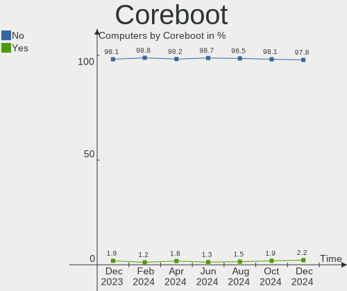
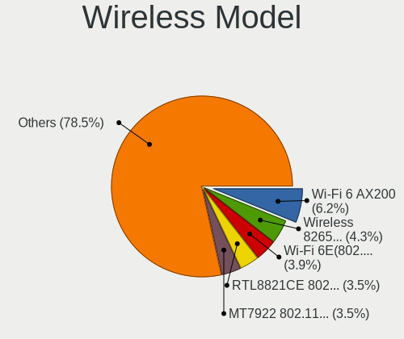
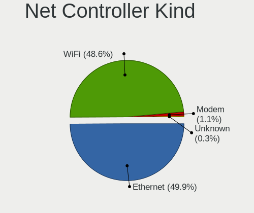
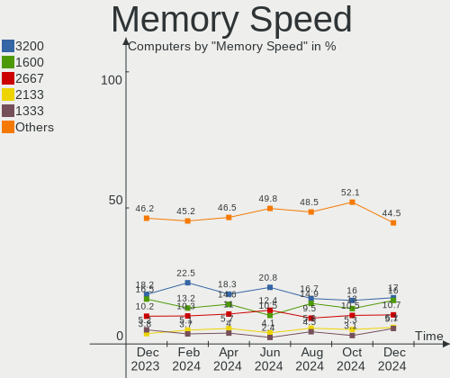
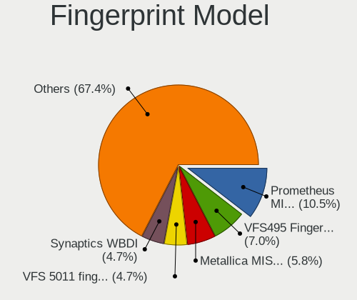

Linux in USA - Hardware Trends
------------------------------

A project to identify most popular hardware characteristics and track their change
over time based on data collected by Linux users at https://Linux-Hardware.org.

Anyone can contribute to this report by the [hw-probe](https://github.com/linuxhw/hw-probe) tool:

    sudo -E hw-probe -all -upload

This is a report for all computer types. See also reports for [desktops](/Location/USA/Desktop/README.md) and [notebooks](/Location/USA/Notebook/README.md).

Contents
--------

* [ System ](#system)
  - [ OS                       ](#os)
  - [ OS Family                ](#os-family)
  - [ Kernel                   ](#kernel)
  - [ Kernel Family            ](#kernel-family)
  - [ Kernel Major Ver.        ](#kernel-major-ver)
  - [ Arch                     ](#arch)
  - [ DE                       ](#de)
  - [ Display Server           ](#display-server)
  - [ Display Manager          ](#display-manager)
  - [ OS Lang                  ](#os-lang)
  - [ Boot Mode                ](#boot-mode)
  - [ Filesystem               ](#filesystem)
  - [ Part. scheme             ](#part-scheme)
  - [ Dual Boot with Linux/BSD ](#dual-boot-with-linuxbsd)
  - [ Dual Boot (Win)          ](#dual-boot-win)

* [ Board ](#board)
  - [ Vendor                   ](#vendor)
  - [ Model                    ](#model)
  - [ Model Family             ](#model-family)
  - [ MFG Year                 ](#mfg-year)
  - [ Form Factor              ](#form-factor)
  - [ Secure Boot              ](#secure-boot)
  - [ Coreboot                 ](#coreboot)
  - [ RAM Size                 ](#ram-size)
  - [ RAM Used                 ](#ram-used)
  - [ Total Drives             ](#total-drives)
  - [ Has CD-ROM               ](#has-cd-rom)
  - [ Has Ethernet             ](#has-ethernet)
  - [ Has WiFi                 ](#has-wifi)
  - [ Has Bluetooth            ](#has-bluetooth)

* [ Location ](#location)
  - [ Country                  ](#country)
  - [ City                     ](#city)

* [ Drives ](#drives)
  - [ Drive Vendor             ](#drive-vendor)
  - [ Drive Model              ](#drive-model)
  - [ HDD Vendor               ](#hdd-vendor)
  - [ SSD Vendor               ](#ssd-vendor)
  - [ Drive Kind               ](#drive-kind)
  - [ Drive Connector          ](#drive-connector)
  - [ Drive Size               ](#drive-size)
  - [ Space Total              ](#space-total)
  - [ Space Used               ](#space-used)
  - [ Malfunc. Drives          ](#malfunc-drives)
  - [ Malfunc. Drive Vendor    ](#malfunc-drive-vendor)
  - [ Malfunc. HDD Vendor      ](#malfunc-hdd-vendor)
  - [ Malfunc. Drive Kind      ](#malfunc-drive-kind)
  - [ Failed Drives            ](#failed-drives)
  - [ Failed Drive Vendor      ](#failed-drive-vendor)
  - [ Drive Status             ](#drive-status)

* [ Storage controller ](#storage-controller)
  - [ Storage Vendor           ](#storage-vendor)
  - [ Storage Model            ](#storage-model)
  - [ Storage Kind             ](#storage-kind)

* [ Processor ](#processor)
  - [ CPU Vendor               ](#cpu-vendor)
  - [ CPU Model                ](#cpu-model)
  - [ CPU Model Family         ](#cpu-model-family)
  - [ CPU Cores                ](#cpu-cores)
  - [ CPU Sockets              ](#cpu-sockets)
  - [ CPU Threads              ](#cpu-threads)
  - [ CPU Op-Modes             ](#cpu-op-modes)
  - [ CPU Microcode            ](#cpu-microcode)
  - [ CPU Microarch            ](#cpu-microarch)

* [ Graphics ](#graphics)
  - [ GPU Vendor               ](#gpu-vendor)
  - [ GPU Model                ](#gpu-model)
  - [ GPU Combo                ](#gpu-combo)
  - [ GPU Driver               ](#gpu-driver)
  - [ GPU Memory               ](#gpu-memory)

* [ Monitor ](#monitor)
  - [ Monitor Vendor           ](#monitor-vendor)
  - [ Monitor Model            ](#monitor-model)
  - [ Monitor Resolution       ](#monitor-resolution)
  - [ Monitor Diagonal         ](#monitor-diagonal)
  - [ Monitor Width            ](#monitor-width)
  - [ Aspect Ratio             ](#aspect-ratio)
  - [ Monitor Area             ](#monitor-area)
  - [ Pixel Density            ](#pixel-density)
  - [ Multiple Monitors        ](#multiple-monitors)

* [ Network ](#network)
  - [ Net Controller Vendor    ](#net-controller-vendor)
  - [ Net Controller Model     ](#net-controller-model)
  - [ Wireless Vendor          ](#wireless-vendor)
  - [ Wireless Model           ](#wireless-model)
  - [ Ethernet Vendor          ](#ethernet-vendor)
  - [ Ethernet Model           ](#ethernet-model)
  - [ Net Controller Kind      ](#net-controller-kind)
  - [ Used Controller          ](#used-controller)
  - [ NICs                     ](#nics)
  - [ IPv6                     ](#ipv6)

* [ Bluetooth ](#bluetooth)
  - [ Bluetooth Vendor         ](#bluetooth-vendor)
  - [ Bluetooth Model          ](#bluetooth-model)

* [ Sound ](#sound)
  - [ Sound Vendor             ](#sound-vendor)
  - [ Sound Model              ](#sound-model)

* [ Memory ](#memory)
  - [ Memory Vendor            ](#memory-vendor)
  - [ Memory Model             ](#memory-model)
  - [ Memory Kind              ](#memory-kind)
  - [ Memory Form Factor       ](#memory-form-factor)
  - [ Memory Size              ](#memory-size)
  - [ Memory Speed             ](#memory-speed)

* [ Printers & scanners ](#printers--scanners)
  - [ Printer Vendor           ](#printer-vendor)
  - [ Printer Model            ](#printer-model)
  - [ Scanner Vendor           ](#scanner-vendor)
  - [ Scanner Model            ](#scanner-model)

* [ Camera ](#camera)
  - [ Camera Vendor            ](#camera-vendor)
  - [ Camera Model             ](#camera-model)

* [ Security ](#security)
  - [ Fingerprint Vendor       ](#fingerprint-vendor)
  - [ Fingerprint Model        ](#fingerprint-model)
  - [ Chipcard Vendor          ](#chipcard-vendor)
  - [ Chipcard Model           ](#chipcard-model)

* [ Unsupported ](#unsupported)
  - [ Unsupported Devices      ](#unsupported-devices)
  - [ Unsupported Device Types ](#unsupported-device-types)

System
------

OS
--

Installed operating systems

| Name                         | Computers | Percent |
|------------------------------|-----------|---------|
| Ubuntu 22.04                 | 111       | 12.94%  |
| Pop!_OS 22.04                | 91        | 10.61%  |
| Ubuntu 20.04                 | 75        | 8.74%   |
| Linux Mint 20.3              | 60        | 6.99%   |
| Fedora 36                    | 48        | 5.59%   |
| Debian 11                    | 45        | 5.24%   |
| Zorin 16                     | 37        | 4.31%   |
| Fedora 35                    | 29        | 3.38%   |
| OpenMandriva 4.3             | 28        | 3.26%   |
| Arch                         | 26        | 3.03%   |
| KDE neon 20.04               | 24        | 2.8%    |
| Manjaro                      | 20        | 2.33%   |
| Ubuntu 21.10                 | 16        | 1.86%   |
| ArcoLinux Rolling            | 15        | 1.75%   |
| Arch Rolling                 | 15        | 1.75%   |
| Manjaro 21.2.6               | 14        | 1.63%   |
| openSUSE Tumbleweed-XXXXXXXX | 13        | 1.52%   |
| Pop!_OS 21.10                | 11        | 1.28%   |
| Kubuntu 22.04                | 10        | 1.17%   |
| Gentoo 2.8                   | 9         | 1.05%   |
| LMDE 5                       | 7         | 0.82%   |
| Kubuntu 20.04                | 7         | 0.82%   |
| Elementary 6.1               | 7         | 0.82%   |
| Kali 2022.2                  | 6         | 0.7%    |
| Xubuntu 22.04                | 5         | 0.58%   |
| Parrot 5.0                   | 5         | 0.58%   |
| Gentoo 2.6                   | 5         | 0.58%   |
| Endless 4.0.6                | 5         | 0.58%   |
| Ubuntu Budgie 22.04          | 4         | 0.47%   |
| MX 21                        | 4         | 0.47%   |
| Lubuntu 22.04                | 4         | 0.47%   |
| EndeavourOS Rolling          | 4         | 0.47%   |
| EndeavourOS                  | 4         | 0.47%   |
| Drauger OS 7.5.1             | 4         | 0.47%   |
| Xubuntu 20.04                | 3         | 0.35%   |
| Ubuntu 18.04                 | 3         | 0.35%   |
| Ubuntu 16.04                 | 3         | 0.35%   |
| LinuxFX 11                   | 3         | 0.35%   |
| Linux Mint 20.2              | 3         | 0.35%   |
| Linux Mint 20.1              | 3         | 0.35%   |
| Garuda Linux Soaring         | 3         | 0.35%   |
| Xero Rolling                 | 2         | 0.23%   |
| Ubuntu MATE 22.04            | 2         | 0.23%   |
| Ubuntu MATE 20.04            | 2         | 0.23%   |
| SteamOS Snapshot             | 2         | 0.23%   |
| SteamOS 3.2                  | 2         | 0.23%   |
| SteamOS 3.1                  | 2         | 0.23%   |
| ROSA 12.2                    | 2         | 0.23%   |
| RHEL 8                       | 2         | 0.23%   |
| Raspbian 11                  | 2         | 0.23%   |
| Lubuntu 21.10                | 2         | 0.23%   |
| Kubuntu 21.10                | 2         | 0.23%   |
| Fedora 34                    | 2         | 0.23%   |
| Debian Unstable              | 2         | 0.23%   |
| Clear Linux 36380            | 2         | 0.23%   |
| Zorin 12                     | 1         | 0.12%   |
| Xero                         | 1         | 0.12%   |
| Ubuntu Budgie 20.04          | 1         | 0.12%   |
| Ubuntu 20.10                 | 1         | 0.12%   |
| Trisquel 10.0.1              | 1         | 0.12%   |

OS Family
---------

OS without a version

| Name          | Computers | Percent |
|---------------|-----------|---------|
| Ubuntu        | 209       | 24.36%  |
| Pop!_OS       | 105       | 12.24%  |
| Fedora        | 80        | 9.32%   |
| Linux Mint    | 67        | 7.81%   |
| Debian        | 51        | 5.94%   |
| Arch          | 41        | 4.78%   |
| Zorin         | 38        | 4.43%   |
| Manjaro       | 35        | 4.08%   |
| OpenMandriva  | 28        | 3.26%   |
| KDE neon      | 24        | 2.8%    |
| Kubuntu       | 20        | 2.33%   |
| Gentoo        | 15        | 1.75%   |
| ArcoLinux     | 15        | 1.75%   |
| openSUSE      | 13        | 1.52%   |
| Lubuntu       | 9         | 1.05%   |
| Xubuntu       | 8         | 0.93%   |
| EndeavourOS   | 8         | 0.93%   |
| SteamOS       | 7         | 0.82%   |
| LMDE          | 7         | 0.82%   |
| Kali          | 7         | 0.82%   |
| Elementary    | 7         | 0.82%   |
| Parrot        | 6         | 0.7%    |
| Ubuntu Budgie | 5         | 0.58%   |
| Endless       | 5         | 0.58%   |
| Drauger OS    | 5         | 0.58%   |
| Ubuntu MATE   | 4         | 0.47%   |
| MX            | 4         | 0.47%   |
| Clear Linux   | 4         | 0.47%   |
| Xero          | 3         | 0.35%   |
| RHEL          | 3         | 0.35%   |
| Raspbian      | 3         | 0.35%   |
| LinuxFX       | 3         | 0.35%   |
| Garuda Linux  | 3         | 0.35%   |
| ROSA          | 2         | 0.23%   |
| Linux Lite    | 2         | 0.23%   |
| Trisquel      | 1         | 0.12%   |
| Solus         | 1         | 0.12%   |
| Peppermint    | 1         | 0.12%   |
| PCLinuxOS     | 1         | 0.12%   |
| NixOS         | 1         | 0.12%   |
| Lilidog       | 1         | 0.12%   |
| Liberty OS    | 1         | 0.12%   |
| Generic       | 1         | 0.12%   |
| Calculate     | 1         | 0.12%   |
| Artix         | 1         | 0.12%   |
| Archcraft     | 1         | 0.12%   |
| AlmaLinux     | 1         | 0.12%   |

Kernel
------

Version of the Linux kernel

| Version                                            | Computers | Percent |
|----------------------------------------------------|-----------|---------|
| 5.17.5-76051705-generic                            | 79        | 9.21%   |
| 5.13.0-41-generic                                  | 52        | 6.06%   |
| 5.13.0-40-generic                                  | 52        | 6.06%   |
| 5.15.0-27-generic                                  | 42        | 4.9%    |
| 5.15.0-33-generic                                  | 32        | 3.73%   |
| 5.15.0-30-generic                                  | 32        | 3.73%   |
| 5.13.0-44-generic                                  | 32        | 3.73%   |
| 5.4.0-110-generic                                  | 27        | 3.15%   |
| 5.4.0-109-generic                                  | 26        | 3.03%   |
| 5.16.7-desktop-1omv4003                            | 23        | 2.68%   |
| 5.10.0-14-amd64                                    | 23        | 2.68%   |
| 5.16.19-76051619-generic                           | 20        | 2.33%   |
| 5.17.9-arch1-1                                     | 19        | 2.21%   |
| 5.17.6-300.fc36.x86_64                             | 19        | 2.21%   |
| 5.10.0-13-amd64                                    | 17        | 1.98%   |
| 5.4.0-113-generic                                  | 14        | 1.63%   |
| 5.17.5-200.fc35.x86_64                             | 13        | 1.52%   |
| 5.15.0-25-generic                                  | 10        | 1.17%   |
| 5.17.5-arch1-1                                     | 9         | 1.05%   |
| 5.17.5-300.fc36.x86_64                             | 8         | 0.93%   |
| 5.17.8-300.fc36.x86_64                             | 7         | 0.82%   |
| 5.15.32-1-MANJARO                                  | 7         | 0.82%   |
| 5.4.0-91-generic                                   | 6         | 0.7%    |
| 5.17.4-200.fc35.x86_64                             | 6         | 0.7%    |
| 5.17.4-1-default                                   | 6         | 0.7%    |
| 5.17.0-1-amd64                                     | 6         | 0.7%    |
| 5.16.0-12parrot1-amd64                             | 6         | 0.7%    |
| 5.17.9-1-default                                   | 5         | 0.58%   |
| 5.17.8-arch1-1                                     | 5         | 0.58%   |
| 5.17.6-1-MANJARO                                   | 5         | 0.58%   |
| 5.16.0-kali7-amd64                                 | 5         | 0.58%   |
| 5.15.38-1-MANJARO                                  | 5         | 0.58%   |
| 5.15.0-1006-raspi                                  | 5         | 0.58%   |
| 5.11.0-35-generic                                  | 5         | 0.58%   |
| 5.18.0-arch1-1                                     | 4         | 0.47%   |
| 5.17.7-300.fc36.x86_64                             | 4         | 0.47%   |
| 5.17.4-arch1-1                                     | 4         | 0.47%   |
| 5.16.11-arch1-1                                    | 4         | 0.47%   |
| 5.13.0-27-generic                                  | 4         | 0.47%   |
| 5.17.9-300.fc36.x86_64                             | 3         | 0.35%   |
| 5.17.7-zen1-1-zen                                  | 3         | 0.35%   |
| 5.17.7-arch1-1                                     | 3         | 0.35%   |
| 5.17.11-300.fc36.x86_64                            | 3         | 0.35%   |
| 5.17.1-3-MANJARO                                   | 3         | 0.35%   |
| 5.16.13-desktop-1omv4003                           | 3         | 0.35%   |
| 5.15.41-1-MANJARO                                  | 3         | 0.35%   |
| 5.15.35-1-pve                                      | 3         | 0.35%   |
| 5.15.19-xanmod1                                    | 3         | 0.35%   |
| 5.14.10-300.fc35.x86_64                            | 3         | 0.35%   |
| 5.14.0-1036-oem                                    | 3         | 0.35%   |
| 5.13.0-valve10.1-2-neptune-dri-02144-g7fffaf925dfb | 3         | 0.35%   |
| 5.17.9-gentoo-x86_64                               | 2         | 0.23%   |
| 5.17.9-1145.native                                 | 2         | 0.23%   |
| 5.17.9-1-MANJARO                                   | 2         | 0.23%   |
| 5.17.8-1143.native                                 | 2         | 0.23%   |
| 5.17.6-100.fc34.x86_64                             | 2         | 0.23%   |
| 5.17.6-051706-generic                              | 2         | 0.23%   |
| 5.17.5-1-default                                   | 2         | 0.23%   |
| 5.17.1-desktop-2omv4050                            | 2         | 0.23%   |
| 5.16.0-0.bpo.4-amd64                               | 2         | 0.23%   |

Kernel Family
-------------

Linux kernel without a distro release

| Version  | Computers | Percent |
|----------|-----------|---------|
| 5.13.0   | 161       | 18.76%  |
| 5.15.0   | 133       | 15.5%   |
| 5.17.5   | 121       | 14.1%   |
| 5.4.0    | 86        | 10.02%  |
| 5.10.0   | 42        | 4.9%    |
| 5.17.9   | 36        | 4.2%    |
| 5.17.6   | 32        | 3.73%   |
| 5.16.7   | 23        | 2.68%   |
| 5.16.19  | 21        | 2.45%   |
| 5.17.4   | 17        | 1.98%   |
| 5.17.8   | 15        | 1.75%   |
| 5.17.7   | 15        | 1.75%   |
| 5.16.0   | 15        | 1.75%   |
| 5.17.0   | 13        | 1.52%   |
| 5.15.32  | 13        | 1.52%   |
| 5.11.0   | 10        | 1.17%   |
| 5.18.0   | 7         | 0.82%   |
| 5.17.1   | 7         | 0.82%   |
| 5.14.0   | 7         | 0.82%   |
| 5.17.11  | 6         | 0.7%    |
| 5.15.38  | 6         | 0.7%    |
| 5.15.41  | 5         | 0.58%   |
| 5.15.35  | 5         | 0.58%   |
| 4.15.0   | 5         | 0.58%   |
| 5.8.0    | 4         | 0.47%   |
| 5.16.11  | 4         | 0.47%   |
| 5.16.13  | 3         | 0.35%   |
| 5.15.19  | 3         | 0.35%   |
| 5.14.10  | 3         | 0.35%   |
| 4.18.0   | 3         | 0.35%   |
| 5.17.3   | 2         | 0.23%   |
| 5.16.20  | 2         | 0.23%   |
| 5.16.18  | 2         | 0.23%   |
| 5.15.43  | 2         | 0.23%   |
| 5.15.39  | 2         | 0.23%   |
| 5.15.37  | 2         | 0.23%   |
| 5.15.11  | 2         | 0.23%   |
| 5.10.74  | 2         | 0.23%   |
| 5.10.63  | 2         | 0.23%   |
| 5.10.109 | 2         | 0.23%   |
| 5.2.14   | 1         | 0.12%   |
| 5.17.2   | 1         | 0.12%   |
| 5.16.8   | 1         | 0.12%   |
| 5.16.5   | 1         | 0.12%   |
| 5.16.2   | 1         | 0.12%   |
| 5.16.15  | 1         | 0.12%   |
| 5.15.29  | 1         | 0.12%   |
| 5.15.14  | 1         | 0.12%   |
| 5.15.10  | 1         | 0.12%   |
| 5.14.18  | 1         | 0.12%   |
| 5.13.19  | 1         | 0.12%   |
| 5.10.111 | 1         | 0.12%   |
| 5.10.105 | 1         | 0.12%   |
| 5.0.0    | 1         | 0.12%   |
| 4.9.0    | 1         | 0.12%   |
| 4.19.219 | 1         | 0.12%   |
| 4.19.0   | 1         | 0.12%   |

Kernel Major Ver.
-----------------

Linux kernel major version

| Version | Computers | Percent |
|---------|-----------|---------|
| 5.17    | 265       | 30.89%  |
| 5.15    | 176       | 20.51%  |
| 5.13    | 162       | 18.88%  |
| 5.4     | 86        | 10.02%  |
| 5.16    | 74        | 8.62%   |
| 5.10    | 50        | 5.83%   |
| 5.14    | 11        | 1.28%   |
| 5.11    | 10        | 1.17%   |
| 5.18    | 7         | 0.82%   |
| 4.15    | 5         | 0.58%   |
| 5.8     | 4         | 0.47%   |
| 4.18    | 3         | 0.35%   |
| 4.19    | 2         | 0.23%   |
| 5.2     | 1         | 0.12%   |
| 5.0     | 1         | 0.12%   |
| 4.9     | 1         | 0.12%   |

Arch
----

OS architecture (x86_64, i586, etc.)

| Name    | Computers | Percent |
|---------|-----------|---------|
| x86_64  | 841       | 98.02%  |
| aarch64 | 11        | 1.28%   |
| i686    | 3         | 0.35%   |
| armv7l  | 3         | 0.35%   |

DE
--

Desktop Environment

| Name             | Computers | Percent |
|------------------|-----------|---------|
| GNOME            | 440       | 51.28%  |
| KDE5             | 172       | 20.05%  |
| XFCE             | 68        | 7.93%   |
| X-Cinnamon       | 66        | 7.69%   |
| Unknown          | 31        | 3.61%   |
| MATE             | 23        | 2.68%   |
| LXQt             | 11        | 1.28%   |
| Pantheon         | 7         | 0.82%   |
| Cinnamon         | 7         | 0.82%   |
| Budgie           | 6         | 0.7%    |
| Unity            | 4         | 0.47%   |
| i3               | 4         | 0.47%   |
| LXDE             | 3         | 0.35%   |
| GNOME Flashback  | 3         | 0.35%   |
| sway             | 2         | 0.23%   |
| Openbox          | 2         | 0.23%   |
| bspwm            | 2         | 0.23%   |
| WindowMaker      | 1         | 0.12%   |
| qtile            | 1         | 0.12%   |
| matchbox         | 1         | 0.12%   |
| lightdm-xsession | 1         | 0.12%   |
| LeftWM           | 1         | 0.12%   |
| dwm              | 1         | 0.12%   |
| awesome          | 1         | 0.12%   |

Display Server
--------------

X11 or Wayland

| Name    | Computers | Percent |
|---------|-----------|---------|
| X11     | 637       | 74.24%  |
| Wayland | 191       | 22.26%  |
| Tty     | 17        | 1.98%   |
| Unknown | 13        | 1.52%   |

Display Manager
---------------

SDDM, LightDM, etc.

| Name    | Computers | Percent |
|---------|-----------|---------|
| Unknown | 357       | 41.61%  |
| GDM3    | 199       | 23.19%  |
| LightDM | 123       | 14.34%  |
| SDDM    | 115       | 13.4%   |
| GDM     | 56        | 6.53%   |
| LXDM    | 4         | 0.47%   |
| XDM     | 2         | 0.23%   |
| Ly      | 1         | 0.12%   |
| GREETD  | 1         | 0.12%   |

OS Lang
-------

Language

| Lang       | Computers | Percent |
|------------|-----------|---------|
| en_US      | 816       | 95.1%   |
| C          | 14        | 1.63%   |
| Unknown    | 6         | 0.7%    |
| en_CA      | 5         | 0.58%   |
| en_GB      | 4         | 0.47%   |
| en_AU      | 4         | 0.47%   |
| en_IN      | 2         | 0.23%   |
| C.UTF8     | 2         | 0.23%   |
| zh_CN      | 1         | 0.12%   |
| it_IT      | 1         | 0.12%   |
| en_US.UTF8 | 1         | 0.12%   |
| en_001     | 1         | 0.12%   |
| de_DE      | 1         | 0.12%   |

Boot Mode
---------

EFI or BIOS

| Mode | Computers | Percent |
|------|-----------|---------|
| BIOS | 438       | 51.05%  |
| EFI  | 420       | 48.95%  |

Filesystem
----------

Type of filesystem

| Type    | Computers | Percent |
|---------|-----------|---------|
| Ext4    | 665       | 77.51%  |
| Btrfs   | 131       | 15.27%  |
| Overlay | 35        | 4.08%   |
| Zfs     | 11        | 1.28%   |
| Xfs     | 10        | 1.17%   |
| F2fs    | 3         | 0.35%   |
| Ext2    | 2         | 0.23%   |
| Unknown | 1         | 0.12%   |

Part. scheme
------------

Scheme of partitioning

| Type    | Computers | Percent |
|---------|-----------|---------|
| Unknown | 515       | 60.02%  |
| GPT     | 284       | 33.1%   |
| MBR     | 59        | 6.88%   |

Dual Boot with Linux/BSD
------------------------

Hosting more than one Linux/BSD

| Dual boot | Computers | Percent |
|-----------|-----------|---------|
| No        | 759       | 88.46%  |
| Yes       | 99        | 11.54%  |

Dual Boot (Win)
---------------

Hosting Linux and Windows

| Dual boot | Computers | Percent |
|-----------|-----------|---------|
| No        | 693       | 80.77%  |
| Yes       | 165       | 19.23%  |

Board
-----

Vendor
------

Motherboard manufacturer

| Name                    | Computers | Percent |
|-------------------------|-----------|---------|
| ASUSTek Computer        | 145       | 16.9%   |
| Dell                    | 144       | 16.78%  |
| Hewlett-Packard         | 124       | 14.45%  |
| Lenovo                  | 104       | 12.12%  |
| MSI                     | 54        | 6.29%   |
| Gigabyte Technology     | 37        | 4.31%   |
| ASRock                  | 35        | 4.08%   |
| Apple                   | 29        | 3.38%   |
| Acer                    | 25        | 2.91%   |
| Google                  | 19        | 2.21%   |
| Raspberry Pi Foundation | 13        | 1.52%   |
| Supermicro              | 11        | 1.28%   |
| Toshiba                 | 10        | 1.17%   |
| Intel                   | 10        | 1.17%   |
| System76                | 9         | 1.05%   |
| Microsoft               | 9         | 1.05%   |
| Alienware               | 9         | 1.05%   |
| Pegatron                | 6         | 0.7%    |
| Samsung Electronics     | 5         | 0.58%   |
| Unknown                 | 5         | 0.58%   |
| Valve                   | 4         | 0.47%   |
| Framework               | 4         | 0.47%   |
| Notebook                | 3         | 0.35%   |
| LG Electronics          | 3         | 0.35%   |
| GPU Company             | 3         | 0.35%   |
| Timi                    | 2         | 0.23%   |
| Sony                    | 2         | 0.23%   |
| Shuttle                 | 2         | 0.23%   |
| Razer                   | 2         | 0.23%   |
| Panasonic               | 2         | 0.23%   |
| Gateway                 | 2         | 0.23%   |
| BESSTAR Tech            | 2         | 0.23%   |
| AZW                     | 2         | 0.23%   |
| Azulle                  | 2         | 0.23%   |
| AMI                     | 2         | 0.23%   |
| ROCK Pi                 | 1         | 0.12%   |
| Purism                  | 1         | 0.12%   |
| Protectli               | 1         | 0.12%   |
| Pepper Jobs             | 1         | 0.12%   |
| NZXT                    | 1         | 0.12%   |
| IP3 Tech                | 1         | 0.12%   |
| Inventec                | 1         | 0.12%   |
| iEi                     | 1         | 0.12%   |
| IBM                     | 1         | 0.12%   |
| Howard Computers        | 1         | 0.12%   |
| Hardkernel              | 1         | 0.12%   |
| EVGA                    | 1         | 0.12%   |
| eMachines               | 1         | 0.12%   |
| ECS                     | 1         | 0.12%   |
| DTRI                    | 1         | 0.12%   |
| CompuLab                | 1         | 0.12%   |
| Biostar                 | 1         | 0.12%   |
| AAEON                   | 1         | 0.12%   |

Model
-----

Motherboard model

| Name                                      | Computers | Percent |
|-------------------------------------------|-----------|---------|
| ASUS All Series                           | 13        | 1.52%   |
| RPi Raspberry Pi                          | 7         | 0.82%   |
| ASUS ROG STRIX B550-F GAMING              | 6         | 0.7%    |
| Unknown                                   | 6         | 0.7%    |
| ASUS TUF Gaming X570-PRO                  | 5         | 0.58%   |
| Valve Jupiter                             | 4         | 0.47%   |
| System76 Oryx Pro                         | 4         | 0.47%   |
| MSI MS-7B79                               | 4         | 0.47%   |
| Gigabyte B450M DS3H                       | 4         | 0.47%   |
| Framework Laptop                          | 4         | 0.47%   |
| Dell OptiPlex 790                         | 4         | 0.47%   |
| ASUS PRIME X570-P                         | 4         | 0.47%   |
| MSI MS-7C37                               | 3         | 0.35%   |
| Lenovo ThinkPad L13 Yoga Gen 2 20VK0019US | 3         | 0.35%   |
| Lenovo IdeaPad Slim 1-14AST-05 81VS       | 3         | 0.35%   |
| GPU Company GWTC116-2                     | 3         | 0.35%   |
| Dell XPS 17 9710                          | 3         | 0.35%   |
| Dell Precision 5560                       | 3         | 0.35%   |
| Dell Latitude E6540                       | 3         | 0.35%   |
| Dell Latitude E6410                       | 3         | 0.35%   |
| Dell Latitude 7480                        | 3         | 0.35%   |
| ASUS TUF Gaming X570-PLUS                 | 3         | 0.35%   |
| ASUS ROG STRIX X570-E GAMING              | 3         | 0.35%   |
| ASUS ROG CROSSHAIR VIII DARK HERO         | 3         | 0.35%   |
| ASUS PRIME B550M-A                        | 3         | 0.35%   |
| Apple iMac10,1                            | 3         | 0.35%   |
| Acer Nitro AN515-54                       | 3         | 0.35%   |
| Supermicro SYS-510P-MR                    | 2         | 0.23%   |
| Supermicro SYS-110C-FHN4T                 | 2         | 0.23%   |
| Supermicro Super Server                   | 2         | 0.23%   |
| RPi Raspberry Pi 4 Model B Rev 1.4        | 2         | 0.23%   |
| MSI MS-7D32                               | 2         | 0.23%   |
| MSI MS-7D19                               | 2         | 0.23%   |
| MSI MS-7D09                               | 2         | 0.23%   |
| MSI MS-7B86                               | 2         | 0.23%   |
| MSI MS-7A71                               | 2         | 0.23%   |
| MSI MS-7817                               | 2         | 0.23%   |
| MSI MS-7721                               | 2         | 0.23%   |
| MSI A320M-HDV R4.0                        | 2         | 0.23%   |
| Microsoft Surface 3                       | 2         | 0.23%   |
| Lenovo Yoga 910-13IKB 80VF                | 2         | 0.23%   |
| Lenovo ThinkCentre M82 2929AZ6            | 2         | 0.23%   |
| Lenovo Legion 5 15IMH05H 81Y6             | 2         | 0.23%   |
| Lenovo IdeaPad Slim 7 14ITL05 82A6        | 2         | 0.23%   |
| HP Z440 Workstation                       | 2         | 0.23%   |
| HP Z230 Tower Workstation                 | 2         | 0.23%   |
| HP Spectre x360 Convertible 15-eb0xxx     | 2         | 0.23%   |
| HP ProBook 650 G2                         | 2         | 0.23%   |
| HP Pavilion Notebook                      | 2         | 0.23%   |
| HP Pavilion Gaming Laptop 15-cx0xxx       | 2         | 0.23%   |
| HP Pavilion g7                            | 2         | 0.23%   |
| HP Notebook                               | 2         | 0.23%   |
| HP Laptop 17-by4xxx                       | 2         | 0.23%   |
| HP Laptop 15-dy2xxx                       | 2         | 0.23%   |
| HP Laptop 15-da0xxx                       | 2         | 0.23%   |
| HP Laptop 14-fq0xxx                       | 2         | 0.23%   |
| HP Laptop 14-dq0xxx                       | 2         | 0.23%   |
| HP Laptop 14-dk1xxx                       | 2         | 0.23%   |
| HP ENVY x360 Convertible 15m-eu0xxx       | 2         | 0.23%   |
| HP ENVY x360 Convertible 15m-ee0xxx       | 2         | 0.23%   |

Model Family
------------

Motherboard model prefix

| Name                      | Computers | Percent |
|---------------------------|-----------|---------|
| Lenovo ThinkPad           | 44        | 5.13%   |
| Dell Inspiron             | 36        | 4.2%    |
| ASUS ROG                  | 32        | 3.73%   |
| Dell Latitude             | 28        | 3.26%   |
| HP Pavilion               | 26        | 3.03%   |
| Lenovo IdeaPad            | 22        | 2.56%   |
| Dell Precision            | 22        | 2.56%   |
| Dell XPS                  | 21        | 2.45%   |
| Dell OptiPlex             | 21        | 2.45%   |
| HP Laptop                 | 19        | 2.21%   |
| ASUS PRIME                | 19        | 2.21%   |
| ASUS TUF                  | 17        | 1.98%   |
| RPi Raspberry             | 13        | 1.52%   |
| ASUS All                  | 13        | 1.52%   |
| HP ENVY                   | 12        | 1.4%    |
| Acer Aspire               | 11        | 1.28%   |
| Lenovo Yoga               | 10        | 1.17%   |
| Lenovo ThinkCentre        | 10        | 1.17%   |
| Microsoft Surface         | 9         | 1.05%   |
| Toshiba Satellite         | 8         | 0.93%   |
| Lenovo Legion             | 8         | 0.93%   |
| ASUS VivoBook             | 8         | 0.93%   |
| Acer Nitro                | 8         | 0.93%   |
| HP ProBook                | 6         | 0.7%    |
| HP EliteBook              | 6         | 0.7%    |
| HP Compaq                 | 6         | 0.7%    |
| Unknown                   | 6         | 0.7%    |
| HP EliteDesk              | 5         | 0.58%   |
| Valve Jupiter             | 4         | 0.47%   |
| System76 Oryx             | 4         | 0.47%   |
| MSI MS-7B79               | 4         | 0.47%   |
| HP OMEN                   | 4         | 0.47%   |
| Gigabyte X570             | 4         | 0.47%   |
| Gigabyte B450M            | 4         | 0.47%   |
| Framework Laptop          | 4         | 0.47%   |
| Dell Vostro               | 4         | 0.47%   |
| ASRock X470               | 4         | 0.47%   |
| Apple MacBookPro8         | 4         | 0.47%   |
| Acer Swift                | 4         | 0.47%   |
| MSI MS-7C37               | 3         | 0.35%   |
| HP Stream                 | 3         | 0.35%   |
| HP Spectre                | 3         | 0.35%   |
| HP 15                     | 3         | 0.35%   |
| GPU Company GWTC116-2     | 3         | 0.35%   |
| Dell System               | 3         | 0.35%   |
| Dell PowerEdge            | 3         | 0.35%   |
| ASUS CROSSHAIR            | 3         | 0.35%   |
| ASRock Z390               | 3         | 0.35%   |
| ASRock X570               | 3         | 0.35%   |
| Apple iMac10              | 3         | 0.35%   |
| Supermicro SYS-510P-MR    | 2         | 0.23%   |
| Supermicro SYS-110C-FHN4T | 2         | 0.23%   |
| Supermicro Super          | 2         | 0.23%   |
| Razer Blade               | 2         | 0.23%   |
| MSI MS-7D32               | 2         | 0.23%   |
| MSI MS-7D19               | 2         | 0.23%   |
| MSI MS-7D09               | 2         | 0.23%   |
| MSI MS-7B86               | 2         | 0.23%   |
| MSI MS-7A71               | 2         | 0.23%   |
| MSI MS-7817               | 2         | 0.23%   |

MFG Year
--------

Motherboard manufacture year

| Year    | Computers | Percent |
|---------|-----------|---------|
| 2021    | 127       | 14.8%   |
| 2020    | 110       | 12.82%  |
| 2019    | 97        | 11.31%  |
| 2018    | 79        | 9.21%   |
| 2013    | 49        | 5.71%   |
| 2016    | 48        | 5.59%   |
| 2014    | 47        | 5.48%   |
| 2015    | 44        | 5.13%   |
| 2011    | 44        | 5.13%   |
| 2017    | 41        | 4.78%   |
| 2012    | 39        | 4.55%   |
| 2010    | 35        | 4.08%   |
| 2022    | 34        | 3.96%   |
| 2009    | 27        | 3.15%   |
| 2008    | 17        | 1.98%   |
| Unknown | 11        | 1.28%   |
| 2007    | 6         | 0.7%    |
| 2006    | 3         | 0.35%   |

Form Factor
-----------

Physical design of the computer

| Name           | Computers | Percent |
|----------------|-----------|---------|
| Notebook       | 392       | 45.69%  |
| Desktop        | 362       | 42.19%  |
| Convertible    | 41        | 4.78%   |
| Mini pc        | 15        | 1.75%   |
| System on chip | 14        | 1.63%   |
| Server         | 12        | 1.4%    |
| Tablet         | 10        | 1.17%   |
| All in one     | 10        | 1.17%   |
| Stick pc       | 2         | 0.23%   |

Secure Boot
-----------

Enabled or disabled

| State    | Computers | Percent |
|----------|-----------|---------|
| Disabled | 793       | 92.42%  |
| Enabled  | 65        | 7.58%   |

Coreboot
--------

Have coreboot on board

| Used | Computers | Percent |
|------|-----------|---------|
| No   | 832       | 96.97%  |
| Yes  | 26        | 3.03%   |

RAM Size
--------

Total RAM memory

| Size in GB      | Computers | Percent |
|-----------------|-----------|---------|
| 16.01-24.0      | 197       | 22.96%  |
| 4.01-8.0        | 171       | 19.93%  |
| 32.01-64.0      | 158       | 18.41%  |
| 8.01-16.0       | 141       | 16.43%  |
| 3.01-4.0        | 113       | 13.17%  |
| 64.01-256.0     | 47        | 5.48%   |
| 24.01-32.0      | 13        | 1.52%   |
| 1.01-2.0        | 8         | 0.93%   |
| 2.01-3.0        | 5         | 0.58%   |
| 0.51-1.0        | 3         | 0.35%   |
| More than 256.0 | 2         | 0.23%   |

RAM Used
--------

Used RAM memory

| Used GB     | Computers | Percent |
|-------------|-----------|---------|
| 1.01-2.0    | 260       | 30.3%   |
| 2.01-3.0    | 224       | 26.11%  |
| 4.01-8.0    | 153       | 17.83%  |
| 3.01-4.0    | 127       | 14.8%   |
| 8.01-16.0   | 55        | 6.41%   |
| 0.51-1.0    | 24        | 2.8%    |
| 16.01-24.0  | 6         | 0.7%    |
| 0.01-0.5    | 5         | 0.58%   |
| 32.01-64.0  | 2         | 0.23%   |
| 24.01-32.0  | 1         | 0.12%   |
| 64.01-256.0 | 1         | 0.12%   |

Total Drives
------------

Number of drives on board

| Drives | Computers | Percent |
|--------|-----------|---------|
| 1      | 459       | 53.5%   |
| 2      | 210       | 24.48%  |
| 3      | 85        | 9.91%   |
| 4      | 39        | 4.55%   |
| 5      | 25        | 2.91%   |
| 6      | 12        | 1.4%    |
| 0      | 12        | 1.4%    |
| 7      | 6         | 0.7%    |
| 10     | 3         | 0.35%   |
| 8      | 3         | 0.35%   |
| 26     | 1         | 0.12%   |
| 15     | 1         | 0.12%   |
| 13     | 1         | 0.12%   |
| 9      | 1         | 0.12%   |

Has CD-ROM
----------

Has CD-ROM on board

| Presented | Computers | Percent |
|-----------|-----------|---------|
| No        | 568       | 66.2%   |
| Yes       | 290       | 33.8%   |

Has Ethernet
------------

Has Ethernet on board

| Presented | Computers | Percent |
|-----------|-----------|---------|
| Yes       | 688       | 80.19%  |
| No        | 170       | 19.81%  |

Has WiFi
--------

Has WiFi module

| Presented | Computers | Percent |
|-----------|-----------|---------|
| Yes       | 687       | 80.07%  |
| No        | 171       | 19.93%  |

Has Bluetooth
-------------

Has Bluetooth module

| Presented | Computers | Percent |
|-----------|-----------|---------|
| Yes       | 566       | 65.97%  |
| No        | 292       | 34.03%  |

Location
--------

Country
-------

Geographic location (country)

| Country | Computers | Percent |
|---------|-----------|---------|
| USA     | 858       | 100%    |

City
----

Geographic location (city)

| City            | Computers | Percent |
|-----------------|-----------|---------|
| Dallas          | 20        | 2.33%   |
| Chicago         | 14        | 1.63%   |
| New York        | 11        | 1.28%   |
| Seattle         | 9         | 1.05%   |
| Orlando         | 9         | 1.05%   |
| Los Angeles     | 9         | 1.05%   |
| Houston         | 9         | 1.05%   |
| Atlanta         | 9         | 1.05%   |
| San Jose        | 8         | 0.93%   |
| Washington      | 7         | 0.82%   |
| Durham          | 7         | 0.82%   |
| Denver          | 7         | 0.82%   |
| Springfield     | 6         | 0.7%    |
| San Francisco   | 6         | 0.7%    |
| Richmond        | 6         | 0.7%    |
| Tampa           | 5         | 0.58%   |
| Sterling        | 5         | 0.58%   |
| San Antonio     | 5         | 0.58%   |
| Omaha           | 5         | 0.58%   |
| Minneapolis     | 5         | 0.58%   |
| Las Vegas       | 5         | 0.58%   |
| Dayton          | 5         | 0.58%   |
| Columbus        | 5         | 0.58%   |
| Charlotte       | 5         | 0.58%   |
| Austin          | 5         | 0.58%   |
| San Diego       | 4         | 0.47%   |
| Sacramento      | 4         | 0.47%   |
| Queens          | 4         | 0.47%   |
| Portland        | 4         | 0.47%   |
| Perth Amboy     | 4         | 0.47%   |
| Jacksonville    | 4         | 0.47%   |
| Buffalo         | 4         | 0.47%   |
| Boise           | 4         | 0.47%   |
| Bangor          | 4         | 0.47%   |
| Albuquerque     | 4         | 0.47%   |
| Valencia        | 3         | 0.35%   |
| Tucson          | 3         | 0.35%   |
| Toledo          | 3         | 0.35%   |
| Thermopolis     | 3         | 0.35%   |
| The Bronx       | 3         | 0.35%   |
| Salt Lake City  | 3         | 0.35%   |
| Plano           | 3         | 0.35%   |
| Phoenix         | 3         | 0.35%   |
| Philadelphia    | 3         | 0.35%   |
| Ocala           | 3         | 0.35%   |
| Milwaukee       | 3         | 0.35%   |
| Midlothian      | 3         | 0.35%   |
| Miami           | 3         | 0.35%   |
| Lancaster       | 3         | 0.35%   |
| Kansas City     | 3         | 0.35%   |
| Gainesville     | 3         | 0.35%   |
| Fort Lauderdale | 3         | 0.35%   |
| Danville        | 3         | 0.35%   |
| Concord         | 3         | 0.35%   |
| Columbia        | 3         | 0.35%   |
| Cleveland       | 3         | 0.35%   |
| Cincinnati      | 3         | 0.35%   |
| Charlestown     | 3         | 0.35%   |
| Brooklyn        | 3         | 0.35%   |
| Bellevue        | 3         | 0.35%   |

Drives
------

Drive Vendor
------------

Hard drive vendors

| Vendor                      | Computers | Drives | Percent |
|-----------------------------|-----------|--------|---------|
| Samsung Electronics         | 241       | 332    | 18.34%  |
| Seagate                     | 184       | 251    | 14%     |
| WDC                         | 180       | 266    | 13.7%   |
| Unknown                     | 80        | 96     | 6.09%   |
| Sandisk                     | 79        | 82     | 6.01%   |
| Toshiba                     | 71        | 80     | 5.4%    |
| Crucial                     | 51        | 56     | 3.88%   |
| SK Hynix                    | 39        | 40     | 2.97%   |
| Intel                       | 36        | 43     | 2.74%   |
| Hitachi                     | 35        | 46     | 2.66%   |
| Phison                      | 32        | 36     | 2.44%   |
| Kingston                    | 32        | 33     | 2.44%   |
| HGST                        | 24        | 28     | 1.83%   |
| Micron Technology           | 21        | 21     | 1.6%    |
| A-DATA Technology           | 18        | 19     | 1.37%   |
| PNY                         | 17        | 17     | 1.29%   |
| KIOXIA                      | 17        | 18     | 1.29%   |
| China                       | 14        | 20     | 1.07%   |
| Unknown                     | 11        | 11     | 0.84%   |
| Apple                       | 10        | 14     | 0.76%   |
| Micron/Crucial Technology   | 8         | 8      | 0.61%   |
| SPCC                        | 7         | 7      | 0.53%   |
| Team                        | 5         | 7      | 0.38%   |
| SABRENT                     | 5         | 5      | 0.38%   |
| Silicon Motion              | 4         | 5      | 0.3%    |
| OCZ                         | 4         | 4      | 0.3%    |
| LITEONIT                    | 4         | 4      | 0.3%    |
| Lexar                       | 4         | 4      | 0.3%    |
| XPG                         | 3         | 4      | 0.23%   |
| Transcend                   | 3         | 4      | 0.23%   |
| Patriot                     | 3         | 3      | 0.23%   |
| LITEON                      | 3         | 3      | 0.23%   |
| Hewlett-Packard             | 3         | 3      | 0.23%   |
| DOGFISH                     | 3         | 3      | 0.23%   |
| ASMT                        | 3         | 4      | 0.23%   |
| USB3.0                      | 2         | 2      | 0.15%   |
| TO Exter                    | 2         | 2      | 0.15%   |
| Realtek Semiconductor       | 2         | 2      | 0.15%   |
| PNY USB                     | 2         | 2      | 0.15%   |
| Phison Electronics          | 2         | 8      | 0.15%   |
| MyDigitalSSD                | 2         | 2      | 0.15%   |
| MAXIO Technology (Hangzhou) | 2         | 2      | 0.15%   |
| Fujitsu                     | 2         | 2      | 0.15%   |
| BHT                         | 2         | 2      | 0.15%   |
| Zheino                      | 1         | 1      | 0.08%   |
| Verbatim                    | 1         | 1      | 0.08%   |
| USB 3.0                     | 1         | 1      | 0.08%   |
| Union Memory (Shenzhen)     | 1         | 1      | 0.08%   |
| Union Memory                | 1         | 1      | 0.08%   |
| UMIS                        | 1         | 1      | 0.08%   |
| TurXun                      | 1         | 1      | 0.08%   |
| Timetec                     | 1         | 1      | 0.08%   |
| T-FORCE                     | 1         | 1      | 0.08%   |
| SuperMicro                  | 1         | 1      | 0.08%   |
| SSD2SC96                    | 1         | 1      | 0.08%   |
| PHD 3.0                     | 1         | 1      | 0.08%   |
| Novation                    | 1         | 1      | 0.08%   |
| Netac                       | 1         | 1      | 0.08%   |
| N600                        | 1         | 1      | 0.08%   |
| MAXTOR                      | 1         | 1      | 0.08%   |

Drive Model
-----------

Hard drive models

| Model                               | Computers | Percent |
|-------------------------------------|-----------|---------|
| Samsung NVMe SSD Drive 1TB          | 28        | 1.85%   |
| Samsung NVMe SSD Drive 500GB        | 20        | 1.32%   |
| Sandisk NVMe SSD Drive 1TB          | 16        | 1.06%   |
| Seagate ST2000DM008-2FR102 2TB      | 15        | 0.99%   |
| Samsung SSD 970 EVO Plus 1TB        | 14        | 0.92%   |
| Unknown SD/MMC/MS PRO 999GB         | 13        | 0.86%   |
| Samsung SSD 850 EVO 250GB           | 13        | 0.86%   |
| Samsung SSD 860 EVO 1TB             | 12        | 0.79%   |
| Samsung NVMe SSD Drive 512GB        | 12        | 0.79%   |
| WDC WD10EZEX-08WN4A0 1TB            | 11        | 0.73%   |
| Unknown                             | 11        | 0.73%   |
| Unknown MMC Card  64GB              | 10        | 0.66%   |
| Samsung SSD 850 EVO 1TB             | 10        | 0.66%   |
| Samsung NVMe SSD Drive 256GB        | 10        | 0.66%   |
| Crucial CT500MX500SSD1 500GB        | 10        | 0.66%   |
| Seagate ST1000LM035-1RK172 1TB      | 9         | 0.59%   |
| Seagate ST1000DM010-2EP102 1TB      | 9         | 0.59%   |
| Samsung NVMe SSD Drive 1024GB       | 9         | 0.59%   |
| Phison NVMe SSD Drive 1024GB        | 9         | 0.59%   |
| Crucial CT1000MX500SSD1 1TB         | 9         | 0.59%   |
| Samsung SSD 860 EVO 500GB           | 8         | 0.53%   |
| Samsung NVMe SSD Drive 250GB        | 8         | 0.53%   |
| HGST HTS721010A9E630 1TB            | 8         | 0.53%   |
| Unknown MMC Card  32GB              | 7         | 0.46%   |
| Toshiba MQ01ABD100 1TB              | 7         | 0.46%   |
| Toshiba DT01ACA100 1TB              | 7         | 0.46%   |
| Seagate ST1000LM024 HN-M101MBB 1TB  | 7         | 0.46%   |
| Sandisk NVMe SSD Drive 512GB        | 7         | 0.46%   |
| Samsung SSD 980 PRO 2TB             | 7         | 0.46%   |
| Samsung SSD 980 PRO 1TB             | 7         | 0.46%   |
| Samsung SSD 980 1TB                 | 7         | 0.46%   |
| Samsung SSD 870 EVO 1TB             | 7         | 0.46%   |
| Intel NVMe SSD Drive 512GB          | 7         | 0.46%   |
| Unknown MMC Card  128GB             | 6         | 0.4%    |
| Sandisk NVMe SSD Drive 500GB        | 6         | 0.4%    |
| Samsung SSD 850 EVO 500GB           | 6         | 0.4%    |
| Samsung NVMe SSD Drive 2TB          | 6         | 0.4%    |
| Phison NVMe SSD Drive 2TB           | 6         | 0.4%    |
| Phison NVMe SSD Drive 256GB         | 6         | 0.4%    |
| Micron/Crucial NVMe SSD Drive 1TB   | 6         | 0.4%    |
| Kingston SV300S37A120G 120GB SSD    | 6         | 0.4%    |
| Crucial CT250MX500SSD1 250GB        | 6         | 0.4%    |
| WDC WDS500G2B0B-00YS70 500GB SSD    | 5         | 0.33%   |
| Unknown DA4064  64GB                | 5         | 0.33%   |
| Toshiba NVMe SSD Drive 512GB        | 5         | 0.33%   |
| Toshiba KBG30ZMS128G 128GB NVMe SSD | 5         | 0.33%   |
| Seagate ST500DM002-1BD142 500GB     | 5         | 0.33%   |
| Seagate ST4000DM004-2CV104 4TB      | 5         | 0.33%   |
| Seagate ST3500413AS 500GB           | 5         | 0.33%   |
| Seagate ST1000DM003-1CH162 1TB      | 5         | 0.33%   |
| Seagate Portable 1TB                | 5         | 0.33%   |
| SanDisk SDSSDA240G 240GB            | 5         | 0.33%   |
| Sandisk NVMe SSD Drive 256GB        | 5         | 0.33%   |
| Samsung SSD 970 EVO Plus 500GB      | 5         | 0.33%   |
| Samsung SSD 970 EVO Plus 2TB        | 5         | 0.33%   |
| SABRENT Disk 240GB                  | 5         | 0.33%   |
| PNY CS900 240GB SSD                 | 5         | 0.33%   |
| Kingston SA400S37240G 240GB SSD     | 5         | 0.33%   |
| WDC WDS500G2B0A-00SM50 500GB SSD    | 4         | 0.26%   |
| WDC WDS100T2B0A-00SM50 1TB SSD      | 4         | 0.26%   |

HDD Vendor
----------

Hard disk drive vendors

| Vendor              | Computers | Drives | Percent |
|---------------------|-----------|--------|---------|
| Seagate             | 174       | 235    | 38.93%  |
| WDC                 | 129       | 200    | 28.86%  |
| Toshiba             | 50        | 59     | 11.19%  |
| Hitachi             | 35        | 46     | 7.83%   |
| HGST                | 24        | 28     | 5.37%   |
| Unknown             | 14        | 17     | 3.13%   |
| SABRENT             | 5         | 5      | 1.12%   |
| Samsung Electronics | 4         | 4      | 0.89%   |
| ASMT                | 3         | 4      | 0.67%   |
| Apple               | 3         | 3      | 0.67%   |
| Fujitsu             | 2         | 2      | 0.45%   |
| PHD 3.0             | 1         | 1      | 0.22%   |
| LaCie               | 1         | 1      | 0.22%   |
| HGST HTS            | 1         | 1      | 0.22%   |
| Fantom              | 1         | 1      | 0.22%   |

SSD Vendor
----------

Solid state drive vendors

| Vendor              | Computers | Drives | Percent |
|---------------------|-----------|--------|---------|
| Samsung Electronics | 108       | 136    | 26.54%  |
| Crucial             | 45        | 50     | 11.06%  |
| WDC                 | 38        | 39     | 9.34%   |
| SanDisk             | 37        | 37     | 9.09%   |
| Kingston            | 23        | 24     | 5.65%   |
| PNY                 | 17        | 17     | 4.18%   |
| A-DATA Technology   | 17        | 18     | 4.18%   |
| China               | 14        | 20     | 3.44%   |
| Micron Technology   | 13        | 13     | 3.19%   |
| Intel               | 10        | 10     | 2.46%   |
| SK Hynix            | 9         | 9      | 2.21%   |
| Toshiba             | 7         | 7      | 1.72%   |
| Apple               | 5         | 5      | 1.23%   |
| SPCC                | 4         | 4      | 0.98%   |
| OCZ                 | 4         | 4      | 0.98%   |
| LITEONIT            | 4         | 4      | 0.98%   |
| Lexar               | 4         | 4      | 0.98%   |
| Transcend           | 3         | 4      | 0.74%   |
| Hewlett-Packard     | 3         | 3      | 0.74%   |
| DOGFISH             | 3         | 3      | 0.74%   |
| Unknown             | 3         | 3      | 0.74%   |
| USB3.0              | 2         | 2      | 0.49%   |
| TO Exter            | 2         | 2      | 0.49%   |
| Team                | 2         | 3      | 0.49%   |
| Seagate             | 2         | 2      | 0.49%   |
| PNY USB             | 2         | 2      | 0.49%   |
| Patriot             | 2         | 2      | 0.49%   |
| MyDigitalSSD        | 2         | 2      | 0.49%   |
| LITEON              | 2         | 2      | 0.49%   |
| BHT                 | 2         | 2      | 0.49%   |
| Zheino              | 1         | 1      | 0.25%   |
| Verbatim            | 1         | 1      | 0.25%   |
| Union Memory        | 1         | 1      | 0.25%   |
| T-FORCE             | 1         | 1      | 0.25%   |
| SuperMicro          | 1         | 1      | 0.25%   |
| Netac               | 1         | 1      | 0.25%   |
| N600                | 1         | 1      | 0.25%   |
| MAXTOR              | 1         | 1      | 0.25%   |
| Lexar 25            | 1         | 1      | 0.25%   |
| KingSpec            | 1         | 1      | 0.25%   |
| KingFast            | 1         | 1      | 0.25%   |
| Hoodisk             | 1         | 1      | 0.25%   |
| FORESEE             | 1         | 1      | 0.25%   |
| E535N               | 1         | 1      | 0.25%   |
| Drevo               | 1         | 1      | 0.25%   |
| Dell                | 1         | 1      | 0.25%   |
| AXIOM               | 1         | 1      | 0.25%   |
| Apacer              | 1         | 1      | 0.25%   |

Drive Kind
----------

HDD or SSD

| Kind    | Computers | Drives | Percent |
|---------|-----------|--------|---------|
| HDD     | 372       | 607    | 31.58%  |
| NVMe    | 361       | 470    | 30.65%  |
| SSD     | 341       | 451    | 28.95%  |
| MMC     | 72        | 77     | 6.11%   |
| Unknown | 32        | 40     | 2.72%   |

Drive Connector
---------------

SATA, SAS, NVMe, etc.

| Type | Computers | Drives | Percent |
|------|-----------|--------|---------|
| SATA | 571       | 992    | 52.53%  |
| NVMe | 361       | 470    | 33.21%  |
| SAS  | 83        | 106    | 7.64%   |
| MMC  | 72        | 77     | 6.62%   |

Drive Size
----------

Size of hard drive

| Size in TB | Computers | Drives | Percent |
|------------|-----------|--------|---------|
| 0.01-0.5   | 362       | 454    | 45.76%  |
| 0.51-1.0   | 254       | 328    | 32.11%  |
| 1.01-2.0   | 98        | 142    | 12.39%  |
| 3.01-4.0   | 29        | 40     | 3.67%   |
| 4.01-10.0  | 27        | 57     | 3.41%   |
| 2.01-3.0   | 12        | 22     | 1.52%   |
| 10.01-20.0 | 9         | 15     | 1.14%   |

Space Total
-----------

Amount of disk space available on the file system

| Size in GB     | Computers | Percent |
|----------------|-----------|---------|
| 101-250        | 205       | 23.89%  |
| 251-500        | 158       | 18.41%  |
| 501-1000       | 155       | 18.07%  |
| More than 3000 | 91        | 10.61%  |
| 1001-2000      | 82        | 9.56%   |
| 51-100         | 44        | 5.13%   |
| 1-20           | 43        | 5.01%   |
| 2001-3000      | 32        | 3.73%   |
| 21-50          | 26        | 3.03%   |
| Unknown        | 22        | 2.56%   |

Space Used
----------

Amount of used disk space

| Used GB        | Computers | Percent |
|----------------|-----------|---------|
| 1-20           | 277       | 32.28%  |
| 21-50          | 177       | 20.63%  |
| 101-250        | 103       | 12%     |
| 51-100         | 96        | 11.19%  |
| 251-500        | 64        | 7.46%   |
| 501-1000       | 42        | 4.9%    |
| 1001-2000      | 34        | 3.96%   |
| More than 3000 | 31        | 3.61%   |
| Unknown        | 22        | 2.56%   |
| 2001-3000      | 12        | 1.4%    |

Malfunc. Drives
---------------

Drive models with a malfunction

| Model                                            | Computers | Drives | Percent |
|--------------------------------------------------|-----------|--------|---------|
| Samsung Electronics SSD 980 1TB                  | 3         | 3      | 5.26%   |
| Seagate ST31000528AS 1TB                         | 2         | 5      | 3.51%   |
| Seagate ST1000LM024 HN-M101MBB 1TB               | 2         | 2      | 3.51%   |
| HGST HTS721010A9E630 1TB                         | 2         | 2      | 3.51%   |
| WDC WDS240G2G0B-00EPW0 240GB SSD                 | 1         | 1      | 1.75%   |
| WDC WD7500AAVS-00D7B1 752GB                      | 1         | 1      | 1.75%   |
| WDC WD5000LPVT-22G33T0 500GB                     | 1         | 1      | 1.75%   |
| WDC WD5000BPKX-22HPJT0 500GB                     | 1         | 1      | 1.75%   |
| WDC WD5000AAKS-22A7B0 500GB                      | 1         | 1      | 1.75%   |
| WDC WD2002FYPS-01U1B0 2TB                        | 1         | 1      | 1.75%   |
| WDC WD10JPVX-75JC3T0 1TB                         | 1         | 1      | 1.75%   |
| WDC WD10EZEX-60ZF5A0 1TB                         | 1         | 1      | 1.75%   |
| WDC WD10EZEX-00WN4A0 1TB                         | 1         | 1      | 1.75%   |
| WDC WD10EALX-009BA0 1TB                          | 1         | 1      | 1.75%   |
| WDC WD10EADS-65P6B0 1TB                          | 1         | 1      | 1.75%   |
| WDC WD10EADS-22M2B0 1TB                          | 1         | 1      | 1.75%   |
| Transcend TS512GSSD720 512GB                     | 1         | 1      | 1.75%   |
| Toshiba MQ01ABD100 1TB                           | 1         | 1      | 1.75%   |
| Toshiba MK3275GSX 320GB                          | 1         | 1      | 1.75%   |
| Team T2535T480G 480GB SSD                        | 1         | 2      | 1.75%   |
| SPCC Solid State Disk 512GB                      | 1         | 1      | 1.75%   |
| SK Hynix HFS128G39TND-N210A 128GB SSD            | 1         | 1      | 1.75%   |
| Seagate ST95005620AS 500GB                       | 1         | 1      | 1.75%   |
| Seagate ST9320421AS 320GB                        | 1         | 1      | 1.75%   |
| Seagate ST9250410AS 250GB                        | 1         | 1      | 1.75%   |
| Seagate ST500LM021-1KJ152 500GB                  | 1         | 1      | 1.75%   |
| Seagate ST4000VN008-2DR166 4TB                   | 1         | 1      | 1.75%   |
| Seagate ST250LT007-9ZV14C 250GB                  | 1         | 1      | 1.75%   |
| Seagate ST2000LM003 HN-M201RAD 2TB               | 1         | 1      | 1.75%   |
| Seagate ST2000DX001-1CM164 2TB                   | 1         | 1      | 1.75%   |
| Seagate ST2000DM001-1CH164 2TB                   | 1         | 1      | 1.75%   |
| Seagate ST2000DL003-9VT166 2TB                   | 1         | 1      | 1.75%   |
| SanDisk SSD PLUS 1000GB                          | 1         | 1      | 1.75%   |
| SanDisk SD6SF1M128G1022I 128GB SSD               | 1         | 1      | 1.75%   |
| Samsung Electronics SSD 850 EVO 250GB            | 1         | 1      | 1.75%   |
| Samsung Electronics SSD 850 EVO 1TB              | 1         | 1      | 1.75%   |
| Samsung Electronics MZNLH128HBHQ-000H1 128GB SSD | 1         | 1      | 1.75%   |
| Samsung Electronics HE253GJ 250GB                | 1         | 1      | 1.75%   |
| OCZ VERTEX3 120GB SSD                            | 1         | 1      | 1.75%   |
| Micron Technology M510_2.5 7MM 256GB SSD         | 1         | 1      | 1.75%   |
| Kingston SNS4151S332GD 32GB SSD                  | 1         | 1      | 1.75%   |
| Kingston RBU-SNS8350DES3128GP 128GB SSD          | 1         | 1      | 1.75%   |
| Intel SSDSA2M160G2LE 160GB                       | 1         | 1      | 1.75%   |
| Intel SSDMAEMC080G2L 80GB                        | 1         | 1      | 1.75%   |
| Hitachi HDS5C3020ALA632 2TB                      | 1         | 1      | 1.75%   |
| HGST HTS725050A7E630 500GB                       | 1         | 1      | 1.75%   |
| HGST HTS545050A7E680 500GB                       | 1         | 1      | 1.75%   |
| HGST HTS545032A7E380 320GB                       | 1         | 1      | 1.75%   |
| Fujitsu MHY2160BH 160GB                          | 1         | 1      | 1.75%   |
| Crucial CT275MX300SSD1 275GB                     | 1         | 1      | 1.75%   |
| Crucial CT256M550SSD1 256GB                      | 1         | 1      | 1.75%   |
| Unknown                                          | 1         | 1      | 1.75%   |

Malfunc. Drive Vendor
---------------------

Vendors of faulty drives

| Vendor              | Computers | Drives | Percent |
|---------------------|-----------|--------|---------|
| Seagate             | 14        | 17     | 24.56%  |
| WDC                 | 12        | 12     | 21.05%  |
| Samsung Electronics | 7         | 7      | 12.28%  |
| HGST                | 5         | 5      | 8.77%   |
| Toshiba             | 2         | 2      | 3.51%   |
| SanDisk             | 2         | 2      | 3.51%   |
| Kingston            | 2         | 2      | 3.51%   |
| Intel               | 2         | 2      | 3.51%   |
| Crucial             | 2         | 2      | 3.51%   |
| Transcend           | 1         | 1      | 1.75%   |
| Team                | 1         | 2      | 1.75%   |
| SPCC                | 1         | 1      | 1.75%   |
| SK Hynix            | 1         | 1      | 1.75%   |
| OCZ                 | 1         | 1      | 1.75%   |
| Micron Technology   | 1         | 1      | 1.75%   |
| Hitachi             | 1         | 1      | 1.75%   |
| Fujitsu             | 1         | 1      | 1.75%   |
| Unknown             | 1         | 1      | 1.75%   |

Malfunc. HDD Vendor
-------------------

Vendors of faulty HDD drives

| Vendor              | Computers | Drives | Percent |
|---------------------|-----------|--------|---------|
| Seagate             | 14        | 17     | 40%     |
| WDC                 | 11        | 11     | 31.43%  |
| HGST                | 5         | 5      | 14.29%  |
| Toshiba             | 2         | 2      | 5.71%   |
| Samsung Electronics | 1         | 1      | 2.86%   |
| Hitachi             | 1         | 1      | 2.86%   |
| Fujitsu             | 1         | 1      | 2.86%   |

Malfunc. Drive Kind
-------------------

Kinds of faulty drives

| Kind | Computers | Drives | Percent |
|------|-----------|--------|---------|
| HDD  | 34        | 38     | 60.71%  |
| SSD  | 19        | 20     | 33.93%  |
| NVMe | 3         | 3      | 5.36%   |

Failed Drives
-------------

Failed drive models

| Model                       | Computers | Drives | Percent |
|-----------------------------|-----------|--------|---------|
| WDC WD5000AADS-00S9B0 500GB | 1         | 1      | 100%    |

Failed Drive Vendor
-------------------

Failed drive vendors

| Vendor | Computers | Drives | Percent |
|--------|-----------|--------|---------|
| WDC    | 1         | 1      | 100%    |

Drive Status
------------

Number of failed and malfunc. drives

| Status   | Computers | Drives | Percent |
|----------|-----------|--------|---------|
| Detected | 564       | 1035   | 62.25%  |
| Works    | 290       | 548    | 32.01%  |
| Malfunc  | 51        | 61     | 5.63%   |
| Failed   | 1         | 1      | 0.11%   |

Storage controller
------------------

Storage Vendor
--------------

Storage controller vendors

| Vendor                        | Computers | Percent |
|-------------------------------|-----------|---------|
| Intel                         | 509       | 44.22%  |
| AMD                           | 204       | 17.72%  |
| Samsung Electronics           | 160       | 13.9%   |
| Sandisk                       | 59        | 5.13%   |
| Phison Electronics            | 35        | 3.04%   |
| SK Hynix                      | 30        | 2.61%   |
| ASMedia Technology            | 26        | 2.26%   |
| KIOXIA                        | 16        | 1.39%   |
| Toshiba America Info Systems  | 15        | 1.3%    |
| Nvidia                        | 14        | 1.22%   |
| Micron/Crucial Technology     | 12        | 1.04%   |
| Kingston Technology Company   | 10        | 0.87%   |
| Micron Technology             | 9         | 0.78%   |
| Marvell Technology Group      | 8         | 0.7%    |
| Silicon Motion                | 6         | 0.52%   |
| JMicron Technology            | 6         | 0.52%   |
| Seagate Technology            | 4         | 0.35%   |
| LSI Logic / Symbios Logic     | 4         | 0.35%   |
| Broadcom / LSI                | 4         | 0.35%   |
| ADATA Technology              | 4         | 0.35%   |
| Realtek Semiconductor         | 3         | 0.26%   |
| Unknown                       | 2         | 0.17%   |
| Union Memory (Shenzhen)       | 2         | 0.17%   |
| MAXIO Technology (Hangzhou)   | 2         | 0.17%   |
| Apple                         | 2         | 0.17%   |
| Silicon Image                 | 1         | 0.09%   |
| Lite-On Technology            | 1         | 0.09%   |
| Lenovo                        | 1         | 0.09%   |
| Integrated Technology Express | 1         | 0.09%   |
| Hewlett-Packard               | 1         | 0.09%   |

Storage Model
-------------

Storage controller models

| Model                                                                          | Computers | Percent |
|--------------------------------------------------------------------------------|-----------|---------|
| AMD FCH SATA Controller [AHCI mode]                                            | 148       | 11.32%  |
| Samsung NVMe SSD Controller SM981/PM981/PM983                                  | 82        | 6.27%   |
| Intel 82801 Mobile SATA Controller [RAID mode]                                 | 38        | 2.91%   |
| Samsung NVMe SSD Controller PM9A1/PM9A3/980PRO                                 | 36        | 2.75%   |
| AMD 400 Series Chipset SATA Controller                                         | 36        | 2.75%   |
| Intel Volume Management Device NVMe RAID Controller                            | 34        | 2.6%    |
| Intel 8 Series/C220 Series Chipset Family 6-port SATA Controller 1 [AHCI mode] | 33        | 2.52%   |
| Intel Sunrise Point-LP SATA Controller [AHCI mode]                             | 31        | 2.37%   |
| Samsung NVMe SSD Controller 980                                                | 26        | 1.99%   |
| ASMedia ASM1062 Serial ATA Controller                                          | 25        | 1.91%   |
| AMD 500 Series Chipset SATA Controller                                         | 25        | 1.91%   |
| Intel Q170/Q150/B150/H170/H110/Z170/CM236 Chipset SATA Controller [AHCI Mode]  | 23        | 1.76%   |
| Intel 6 Series/C200 Series Chipset Family 6 port Desktop SATA AHCI Controller  | 23        | 1.76%   |
| Intel SATA Controller [RAID mode]                                              | 22        | 1.68%   |
| Sandisk WD Blue SN550 NVMe SSD                                                 | 17        | 1.3%    |
| Phison E12 NVMe Controller                                                     | 17        | 1.3%    |
| Intel 6 Series/C200 Series Chipset Family 6 port Mobile SATA AHCI Controller   | 17        | 1.3%    |
| Samsung NVMe SSD Controller SM961/PM961/SM963                                  | 16        | 1.22%   |
| KIOXIA Non-Volatile memory controller                                          | 16        | 1.22%   |
| Intel 7 Series Chipset Family 6-port SATA Controller [AHCI mode]               | 16        | 1.22%   |
| SK Hynix Gold P31 SSD                                                          | 15        | 1.15%   |
| Intel Wildcat Point-LP SATA Controller [AHCI Mode]                             | 15        | 1.15%   |
| Intel Cannon Lake Mobile PCH SATA AHCI Controller                              | 15        | 1.15%   |
| Sandisk WD Black SN750 / PC SN730 NVMe SSD                                     | 14        | 1.07%   |
| Intel Celeron/Pentium Silver Processor SATA Controller                         | 14        | 1.07%   |
| Intel 500 Series Chipset Family SATA AHCI Controller                           | 14        | 1.07%   |
| Intel Cannon Lake PCH SATA AHCI Controller                                     | 13        | 0.99%   |
| Intel 8 Series SATA Controller 1 [AHCI mode]                                   | 13        | 0.99%   |
| AMD SB7x0/SB8x0/SB9x0 SATA Controller [AHCI mode]                              | 13        | 0.99%   |
| Intel Comet Lake SATA AHCI Controller                                          | 12        | 0.92%   |
| Intel 200 Series PCH SATA controller [AHCI mode]                               | 12        | 0.92%   |
| AMD SB7x0/SB8x0/SB9x0 IDE Controller                                           | 12        | 0.92%   |
| Intel C610/X99 series chipset 6-Port SATA Controller [AHCI mode]               | 11        | 0.84%   |
| Intel Alder Lake-S PCH SATA Controller [AHCI Mode]                             | 11        | 0.84%   |
| Intel 82801IBM/IEM (ICH9M/ICH9M-E) 4 port SATA Controller [AHCI mode]          | 11        | 0.84%   |
| Sandisk Non-Volatile memory controller                                         | 10        | 0.77%   |
| Intel Non-Volatile memory controller                                           | 10        | 0.77%   |
| Intel 9 Series Chipset Family SATA Controller [AHCI Mode]                      | 10        | 0.77%   |
| Phison PS5013 E13 NVMe Controller                                              | 9         | 0.69%   |
| Micron Non-Volatile memory controller                                          | 9         | 0.69%   |
| Intel SSD 660P Series                                                          | 9         | 0.69%   |
| Intel 82801JI (ICH10 Family) SATA AHCI Controller                              | 9         | 0.69%   |
| Intel 7 Series/C210 Series Chipset Family 6-port SATA Controller [AHCI mode]   | 9         | 0.69%   |
| Samsung NVMe SSD Controller SM951/PM951                                        | 8         | 0.61%   |
| Intel Tiger Lake-LP SATA Controller [AHCI mode]                                | 8         | 0.61%   |
| Intel Cannon Point-LP SATA Controller [AHCI Mode]                              | 8         | 0.61%   |
| Intel 5 Series/3400 Series Chipset 6 port SATA AHCI Controller                 | 8         | 0.61%   |
| Toshiba America Info Systems XG6 NVMe SSD Controller                           | 7         | 0.54%   |
| Nvidia MCP79 AHCI Controller                                                   | 7         | 0.54%   |
| Intel 5 Series/3400 Series Chipset 4 port SATA AHCI Controller                 | 7         | 0.54%   |
| AMD X370 Series Chipset SATA Controller                                        | 7         | 0.54%   |
| Sandisk WD PC SN810 / Black SN850 NVMe SSD                                     | 6         | 0.46%   |
| Sandisk WD Black 2018/SN750 / PC SN720 NVMe SSD                                | 6         | 0.46%   |
| Phison E16 PCIe4 NVMe Controller                                               | 6         | 0.46%   |
| Intel HM170/QM170 Chipset SATA Controller [AHCI Mode]                          | 6         | 0.46%   |
| Intel C610/X99 series chipset sSATA Controller [AHCI mode]                     | 6         | 0.46%   |
| Intel C600/X79 series chipset 6-Port SATA AHCI Controller                      | 6         | 0.46%   |
| Intel 82801G (ICH7 Family) IDE Controller                                      | 6         | 0.46%   |
| Intel 400 Series Chipset Family SATA AHCI Controller                           | 6         | 0.46%   |
| AMD SB7x0/SB8x0/SB9x0 SATA Controller [IDE mode]                               | 6         | 0.46%   |

Storage Kind
------------

Kind of storage controller (IDE, SATA, NVMe, SAS, ...)

| Kind | Computers | Percent |
|------|-----------|---------|
| SATA | 607       | 52.87%  |
| NVMe | 363       | 31.62%  |
| RAID | 107       | 9.32%   |
| IDE  | 63        | 5.49%   |
| SAS  | 5         | 0.44%   |
| SCSI | 3         | 0.26%   |

Processor
---------

CPU Vendor
----------

Processor vendors

| Vendor | Computers | Percent |
|--------|-----------|---------|
| Intel  | 602       | 70.16%  |
| AMD    | 242       | 28.21%  |
| ARM    | 14        | 1.63%   |

CPU Model
---------

Processor models

| Model                                         | Computers | Percent |
|-----------------------------------------------|-----------|---------|
| Intel 11th Gen Core i5-1135G7 @ 2.40GHz       | 13        | 1.52%   |
| Intel 11th Gen Core i7-1165G7 @ 2.80GHz       | 12        | 1.4%    |
| Intel Core i7-8550U CPU @ 1.80GHz             | 11        | 1.28%   |
| Intel Celeron N4020 CPU @ 1.10GHz             | 11        | 1.28%   |
| ARM Processor                                 | 11        | 1.28%   |
| AMD Ryzen 9 3900X 12-Core Processor           | 11        | 1.28%   |
| AMD Ryzen 7 3700X 8-Core Processor            | 11        | 1.28%   |
| AMD Ryzen 5 3600 6-Core Processor             | 10        | 1.17%   |
| AMD Ryzen 9 5950X 16-Core Processor           | 9         | 1.05%   |
| AMD Ryzen 7 5700G with Radeon Graphics        | 9         | 1.05%   |
| Intel Core i5-2400 CPU @ 3.10GHz              | 8         | 0.93%   |
| Intel 11th Gen Core i7-11800H @ 2.30GHz       | 8         | 0.93%   |
| AMD Ryzen 9 5900X 12-Core Processor           | 8         | 0.93%   |
| Intel Core i7-8750H CPU @ 2.20GHz             | 7         | 0.82%   |
| Intel Core i5-7200U CPU @ 2.50GHz             | 7         | 0.82%   |
| Intel Core i5-6200U CPU @ 2.30GHz             | 7         | 0.82%   |
| Intel 11th Gen Core i7-1185G7 @ 3.00GHz       | 7         | 0.82%   |
| Intel Core i7-6700HQ CPU @ 2.60GHz            | 6         | 0.7%    |
| Intel Core i7-4790 CPU @ 3.60GHz              | 6         | 0.7%    |
| Intel Celeron CPU N3060 @ 1.60GHz             | 6         | 0.7%    |
| AMD Ryzen 7 5800H with Radeon Graphics        | 6         | 0.7%    |
| AMD Ryzen 7 4800H with Radeon Graphics        | 6         | 0.7%    |
| Intel Core i7-7700K CPU @ 4.20GHz             | 5         | 0.58%   |
| Intel Core i7-4790K CPU @ 4.00GHz             | 5         | 0.58%   |
| Intel Core i7-1065G7 CPU @ 1.30GHz            | 5         | 0.58%   |
| Intel Core i7-10510U CPU @ 1.80GHz            | 5         | 0.58%   |
| Intel Core i5-8250U CPU @ 1.60GHz             | 5         | 0.58%   |
| Intel Core i5-6500 CPU @ 3.20GHz              | 5         | 0.58%   |
| Intel Core i5-6300U CPU @ 2.40GHz             | 5         | 0.58%   |
| Intel Core i5-1035G1 CPU @ 1.00GHz            | 5         | 0.58%   |
| Intel Core i5 CPU M 520 @ 2.40GHz             | 5         | 0.58%   |
| Intel 11th Gen Core i7-11700K @ 3.60GHz       | 5         | 0.58%   |
| AMD Ryzen 7 5800X 8-Core Processor            | 5         | 0.58%   |
| AMD Ryzen 5 5600G with Radeon Graphics        | 5         | 0.58%   |
| AMD Ryzen 5 4500U with Radeon Graphics        | 5         | 0.58%   |
| AMD Ryzen 5 2600 Six-Core Processor           | 5         | 0.58%   |
| AMD Ryzen 5 1600 Six-Core Processor           | 5         | 0.58%   |
| Intel Core i7-8700K CPU @ 3.70GHz             | 4         | 0.47%   |
| Intel Core i7-7500U CPU @ 2.70GHz             | 4         | 0.47%   |
| Intel Core i7-4700MQ CPU @ 2.40GHz            | 4         | 0.47%   |
| Intel Core i7-2600 CPU @ 3.40GHz              | 4         | 0.47%   |
| Intel Core i7-10750H CPU @ 2.60GHz            | 4         | 0.47%   |
| Intel Core i5-9300H CPU @ 2.40GHz             | 4         | 0.47%   |
| Intel Core i5-5300U CPU @ 2.30GHz             | 4         | 0.47%   |
| Intel Core i5-4570 CPU @ 3.20GHz              | 4         | 0.47%   |
| Intel Core i5-3230M CPU @ 2.60GHz             | 4         | 0.47%   |
| Intel Core i5-2520M CPU @ 2.50GHz             | 4         | 0.47%   |
| Intel Core i5-10210U CPU @ 1.60GHz            | 4         | 0.47%   |
| Intel Celeron J4125 CPU @ 2.00GHz             | 4         | 0.47%   |
| Intel 12th Gen Core i5-12600K                 | 4         | 0.47%   |
| AMD Custom APU 0405                           | 4         | 0.47%   |
| AMD A8-7410 APU with AMD Radeon R5 Graphics   | 4         | 0.47%   |
| AMD A6-9220e RADEON R4, 5 COMPUTE CORES 2C+3G | 4         | 0.47%   |
| Intel Core i7-8650U CPU @ 1.90GHz             | 3         | 0.35%   |
| Intel Core i7-7700HQ CPU @ 2.80GHz            | 3         | 0.35%   |
| Intel Core i7-6700K CPU @ 4.00GHz             | 3         | 0.35%   |
| Intel Core i7-6500U CPU @ 2.50GHz             | 3         | 0.35%   |
| Intel Core i7-5500U CPU @ 2.40GHz             | 3         | 0.35%   |
| Intel Core i7-4700HQ CPU @ 2.40GHz            | 3         | 0.35%   |
| Intel Core i5-8350U CPU @ 1.70GHz             | 3         | 0.35%   |

CPU Model Family
----------------

Processor model prefix

| Model                          | Computers | Percent |
|--------------------------------|-----------|---------|
| Intel Core i5                  | 165       | 19.23%  |
| Intel Core i7                  | 161       | 18.76%  |
| Other                          | 102       | 11.89%  |
| AMD Ryzen 7                    | 58        | 6.76%   |
| AMD Ryzen 5                    | 55        | 6.41%   |
| Intel Core i3                  | 41        | 4.78%   |
| Intel Celeron                  | 39        | 4.55%   |
| AMD Ryzen 9                    | 37        | 4.31%   |
| Intel Xeon                     | 35        | 4.08%   |
| Intel Core 2 Duo               | 30        | 3.5%    |
| AMD A8                         | 12        | 1.4%    |
| AMD A6                         | 11        | 1.28%   |
| Intel Pentium                  | 10        | 1.17%   |
| Intel Core i9                  | 9         | 1.05%   |
| Intel Atom                     | 9         | 1.05%   |
| AMD Ryzen 3                    | 8         | 0.93%   |
| AMD FX                         | 6         | 0.7%    |
| AMD Ryzen 7 PRO                | 5         | 0.58%   |
| AMD E2                         | 5         | 0.58%   |
| AMD A4                         | 5         | 0.58%   |
| Intel Core 2 Quad              | 4         | 0.47%   |
| AMD Ryzen Threadripper         | 4         | 0.47%   |
| Intel Pentium Dual-Core        | 3         | 0.35%   |
| ARM BCM                        | 3         | 0.35%   |
| AMD Phenom II X4               | 3         | 0.35%   |
| AMD E                          | 3         | 0.35%   |
| AMD Athlon 64 X2               | 3         | 0.35%   |
| AMD A10                        | 3         | 0.35%   |
| Intel Xeon Silver              | 2         | 0.23%   |
| Intel Core 2                   | 2         | 0.23%   |
| AMD Phenom II X2               | 2         | 0.23%   |
| AMD Phenom                     | 2         | 0.23%   |
| AMD GX                         | 2         | 0.23%   |
| AMD Athlon                     | 2         | 0.23%   |
| Intel Xeon Gold                | 1         | 0.12%   |
| Intel Pentium Silver           | 1         | 0.12%   |
| Intel Pentium Gold             | 1         | 0.12%   |
| Intel Pentium Dual             | 1         | 0.12%   |
| Intel Core m3                  | 1         | 0.12%   |
| Intel Core M                   | 1         | 0.12%   |
| Intel Celeron Dual-Core        | 1         | 0.12%   |
| AMD Turion X2 Dual-Core Mobile | 1         | 0.12%   |
| AMD Phenom II X6               | 1         | 0.12%   |
| AMD Phenom II X3               | 1         | 0.12%   |
| AMD Opteron                    | 1         | 0.12%   |
| AMD EPYC                       | 1         | 0.12%   |
| AMD E1                         | 1         | 0.12%   |
| AMD Athlon Neo X2              | 1         | 0.12%   |
| AMD Athlon II X4               | 1         | 0.12%   |
| AMD Athlon II X2               | 1         | 0.12%   |
| AMD Athlon II                  | 1         | 0.12%   |

CPU Cores
---------

Number of processor cores

| Number  | Computers | Percent |
|---------|-----------|---------|
| 4       | 317       | 36.95%  |
| 2       | 265       | 30.89%  |
| 8       | 111       | 12.94%  |
| 6       | 90        | 10.49%  |
| 12      | 28        | 3.26%   |
| 16      | 12        | 1.4%    |
| 10      | 10        | 1.17%   |
| 1       | 7         | 0.82%   |
| 14      | 4         | 0.47%   |
| 24      | 3         | 0.35%   |
| Unknown | 3         | 0.35%   |
| 32      | 2         | 0.23%   |
| 3       | 2         | 0.23%   |
| 48      | 1         | 0.12%   |
| 28      | 1         | 0.12%   |
| 20      | 1         | 0.12%   |
| 18      | 1         | 0.12%   |

CPU Sockets
-----------

Number of sockets

| Number  | Computers | Percent |
|---------|-----------|---------|
| 1       | 843       | 98.25%  |
| 2       | 12        | 1.4%    |
| Unknown | 3         | 0.35%   |

CPU Threads
-----------

Threads per core (Hyper-Threading)

| Number  | Computers | Percent |
|---------|-----------|---------|
| 2       | 602       | 70.16%  |
| 1       | 251       | 29.25%  |
| Unknown | 3         | 0.35%   |
| 8       | 2         | 0.23%   |

CPU Op-Modes
------------

CPU Operation Modes (32-bit, 64-bit)

| Op mode        | Computers | Percent |
|----------------|-----------|---------|
| 32-bit, 64-bit | 844       | 98.37%  |
| Unknown        | 10        | 1.17%   |
| 64-bit         | 2         | 0.23%   |
| 32-bit         | 2         | 0.23%   |

CPU Microcode
-------------

Microcode number

| Number     | Computers | Percent |
|------------|-----------|---------|
| Unknown    | 315       | 36.71%  |
| 0x306c3    | 33        | 3.85%   |
| 0x806c1    | 28        | 3.26%   |
| 0x206a7    | 28        | 3.26%   |
| 0x306a9    | 23        | 2.68%   |
| 0x1067a    | 20        | 2.33%   |
| 0x08701021 | 20        | 2.33%   |
| 0x506e3    | 19        | 2.21%   |
| 0x806ea    | 17        | 1.98%   |
| 0x906ea    | 16        | 1.86%   |
| 0x406e3    | 16        | 1.86%   |
| 0x0a50000c | 16        | 1.86%   |
| 0x706a8    | 13        | 1.52%   |
| 0x806e9    | 12        | 1.4%    |
| 0x0800820d | 12        | 1.4%    |
| 0x906e9    | 9         | 1.05%   |
| 0x806ec    | 9         | 1.05%   |
| 0x08600106 | 9         | 1.05%   |
| 0xa0671    | 8         | 0.93%   |
| 0x806d1    | 8         | 0.93%   |
| 0x706e5    | 8         | 0.93%   |
| 0x40651    | 8         | 0.93%   |
| 0x306d4    | 8         | 0.93%   |
| 0x06001119 | 8         | 0.93%   |
| 0xa0653    | 7         | 0.82%   |
| 0xa0652    | 7         | 0.82%   |
| 0x30678    | 7         | 0.82%   |
| 0x0a201016 | 7         | 0.82%   |
| 0x90672    | 6         | 0.7%    |
| 0x20655    | 6         | 0.7%    |
| 0x906ed    | 5         | 0.58%   |
| 0x206c2    | 5         | 0.58%   |
| 0x20652    | 5         | 0.58%   |
| 0x106a5    | 5         | 0.58%   |
| 0x08701013 | 5         | 0.58%   |
| 0x906a3    | 4         | 0.47%   |
| 0x706a1    | 4         | 0.47%   |
| 0x406c4    | 4         | 0.47%   |
| 0x306e4    | 4         | 0.47%   |
| 0x08608103 | 4         | 0.47%   |
| 0x08108109 | 4         | 0.47%   |
| 0x08001138 | 4         | 0.47%   |
| 0x07030105 | 4         | 0.47%   |
| 0x010000c8 | 4         | 0.47%   |
| 0xa0655    | 3         | 0.35%   |
| 0x806eb    | 3         | 0.35%   |
| 0x6fd      | 3         | 0.35%   |
| 0x50657    | 3         | 0.35%   |
| 0x406f1    | 3         | 0.35%   |
| 0x306f2    | 3         | 0.35%   |
| 0x0a404101 | 3         | 0.35%   |
| 0x0a201204 | 3         | 0.35%   |
| 0x0a201009 | 3         | 0.35%   |
| 0x08108102 | 3         | 0.35%   |
| 0x0700010f | 3         | 0.35%   |
| 0x06006705 | 3         | 0.35%   |
| 0x6fb      | 2         | 0.23%   |
| 0x6f6      | 2         | 0.23%   |
| 0x606a6    | 2         | 0.23%   |
| 0x506c9    | 2         | 0.23%   |

CPU Microarch
-------------

Microarchitecture

| Name             | Computers | Percent |
|------------------|-----------|---------|
| KabyLake         | 117       | 13.64%  |
| Haswell          | 79        | 9.21%   |
| Zen 2            | 59        | 6.88%   |
| Zen 3            | 56        | 6.53%   |
| Skylake          | 55        | 6.41%   |
| SandyBridge      | 49        | 5.71%   |
| Unknown          | 45        | 5.24%   |
| TigerLake        | 42        | 4.9%    |
| Penryn           | 35        | 4.08%   |
| IvyBridge        | 34        | 3.96%   |
| Zen+             | 30        | 3.5%    |
| Icelake          | 30        | 3.5%    |
| Westmere         | 23        | 2.68%   |
| Broadwell        | 23        | 2.68%   |
| Silvermont       | 22        | 2.56%   |
| CometLake        | 21        | 2.45%   |
| Goldmont plus    | 20        | 2.33%   |
| Zen              | 17        | 1.98%   |
| Piledriver       | 13        | 1.52%   |
| K10              | 13        | 1.52%   |
| Puma             | 11        | 1.28%   |
| Nehalem          | 11        | 1.28%   |
| Alderlake Hybrid | 11        | 1.28%   |
| Excavator        | 8         | 0.93%   |
| Core             | 7         | 0.82%   |
| Bobcat           | 6         | 0.7%    |
| K8 Hammer        | 4         | 0.47%   |
| K10 Llano        | 4         | 0.47%   |
| Jaguar           | 4         | 0.47%   |
| Goldmont         | 3         | 0.35%   |
| Steamroller      | 2         | 0.23%   |
| Bonnell          | 2         | 0.23%   |
| K8 & K10 hybrid  | 1         | 0.12%   |
| Bulldozer        | 1         | 0.12%   |

Graphics
--------

GPU Vendor
----------

Vendors of graphics cards

| Vendor                     | Computers | Percent |
|----------------------------|-----------|---------|
| Intel                      | 434       | 44.2%   |
| Nvidia                     | 296       | 30.14%  |
| AMD                        | 240       | 24.44%  |
| Matrox Electronics Systems | 6         | 0.61%   |
| ASPEED Technology          | 6         | 0.61%   |

GPU Model
---------

Graphics card models

| Model                                                                                    | Computers | Percent |
|------------------------------------------------------------------------------------------|-----------|---------|
| Intel TigerLake-LP GT2 [Iris Xe Graphics]                                                | 37        | 3.7%    |
| Intel 2nd Generation Core Processor Family Integrated Graphics Controller                | 32        | 3.2%    |
| Intel UHD Graphics 620                                                                   | 24        | 2.4%    |
| AMD Ellesmere [Radeon RX 470/480/570/570X/580/580X/590]                                  | 20        | 2%      |
| AMD Cezanne                                                                              | 20        | 2%      |
| Intel GeminiLake [UHD Graphics 600]                                                      | 19        | 1.9%    |
| Intel Skylake GT2 [HD Graphics 520]                                                      | 18        | 1.8%    |
| AMD Picasso/Raven 2 [Radeon Vega Series / Radeon Vega Mobile Series]                     | 18        | 1.8%    |
| Intel HD Graphics 530                                                                    | 17        | 1.7%    |
| Intel Haswell-ULT Integrated Graphics Controller                                         | 17        | 1.7%    |
| Intel CoffeeLake-H GT2 [UHD Graphics 630]                                                | 17        | 1.7%    |
| Intel Xeon E3-1200 v3/4th Gen Core Processor Integrated Graphics Controller              | 16        | 1.6%    |
| Intel HD Graphics 620                                                                    | 16        | 1.6%    |
| Intel 3rd Gen Core processor Graphics Controller                                         | 15        | 1.5%    |
| Intel TigerLake-H GT1 [UHD Graphics]                                                     | 14        | 1.4%    |
| AMD Renoir                                                                               | 14        | 1.4%    |
| AMD Navi 10 [Radeon RX 5600 OEM/5600 XT / 5700/5700 XT]                                  | 14        | 1.4%    |
| Nvidia GA106M [GeForce RTX 3060 Mobile / Max-Q]                                          | 13        | 1.3%    |
| Intel Core Processor Integrated Graphics Controller                                      | 13        | 1.3%    |
| Intel 4th Gen Core Processor Integrated Graphics Controller                              | 13        | 1.3%    |
| Intel HD Graphics 5500                                                                   | 12        | 1.2%    |
| Intel Atom/Celeron/Pentium Processor x5-E8000/J3xxx/N3xxx Integrated Graphics Controller | 11        | 1.1%    |
| Intel Atom Processor Z36xxx/Z37xxx Series Graphics & Display                             | 11        | 1.1%    |
| Intel WhiskeyLake-U GT2 [UHD Graphics 620]                                               | 10        | 1%      |
| Intel CometLake-U GT2 [UHD Graphics]                                                     | 10        | 1%      |
| Intel CometLake-H GT2 [UHD Graphics]                                                     | 10        | 1%      |
| Nvidia GP107 [GeForce GTX 1050 Ti]                                                       | 9         | 0.9%    |
| AMD Navi 23 [Radeon RX 6600/6600 XT/6600M]                                               | 9         | 0.9%    |
| AMD Mullins [Radeon R4/R5 Graphics]                                                      | 9         | 0.9%    |
| Nvidia GP104 [GeForce GTX 1080]                                                          | 8         | 0.8%    |
| Intel Xeon E3-1200 v2/3rd Gen Core processor Graphics Controller                         | 8         | 0.8%    |
| Intel Mobile 4 Series Chipset Integrated Graphics Controller                             | 8         | 0.8%    |
| AMD Navi 22 [Radeon RX 6700/6700 XT/6750 XT / 6800M]                                     | 8         | 0.8%    |
| Nvidia GP106 [GeForce GTX 1060 6GB]                                                      | 7         | 0.7%    |
| Nvidia GP104 [GeForce GTX 1070]                                                          | 7         | 0.7%    |
| Intel Iris Plus Graphics G1 (Ice Lake)                                                   | 7         | 0.7%    |
| Intel 4 Series Chipset Integrated Graphics Controller                                    | 7         | 0.7%    |
| AMD Stoney [Radeon R2/R3/R4/R5 Graphics]                                                 | 7         | 0.7%    |
| AMD Navi 21 [Radeon RX 6800/6800 XT / 6900 XT]                                           | 7         | 0.7%    |
| Nvidia TU116 [GeForce GTX 1660 SUPER]                                                    | 6         | 0.6%    |
| Nvidia GM204 [GeForce GTX 970]                                                           | 6         | 0.6%    |
| Nvidia GM108M [GeForce 940MX]                                                            | 6         | 0.6%    |
| Matrox Electronics Systems MGA G200eW WPCM450                                            | 6         | 0.6%    |
| Intel HD Graphics 630                                                                    | 6         | 0.6%    |
| ASPEED Technology ASPEED Graphics Family                                                 | 6         | 0.6%    |
| AMD Lucienne                                                                             | 6         | 0.6%    |
| Nvidia TU116M [GeForce GTX 1660 Ti Mobile]                                               | 5         | 0.5%    |
| Nvidia GP108 [GeForce GT 1030]                                                           | 5         | 0.5%    |
| Nvidia GP107M [GeForce GTX 1050 Ti Mobile]                                               | 5         | 0.5%    |
| Nvidia GM206 [GeForce GTX 960]                                                           | 5         | 0.5%    |
| Intel Iris Plus Graphics G7                                                              | 5         | 0.5%    |
| Intel CoffeeLake-S GT2 [UHD Graphics 630]                                                | 5         | 0.5%    |
| Intel AlderLake-S GT1                                                                    | 5         | 0.5%    |
| AMD Cedar [Radeon HD 5000/6000/7350/8350 Series]                                         | 5         | 0.5%    |
| Nvidia TU117GLM [Quadro T2000 Mobile / Max-Q]                                            | 4         | 0.4%    |
| Nvidia TU106 [GeForce RTX 2060 Rev. A]                                                   | 4         | 0.4%    |
| Nvidia TU102 [GeForce RTX 2080 Ti Rev. A]                                                | 4         | 0.4%    |
| Nvidia GP107M [GeForce GTX 1050 3 GB Max-Q]                                              | 4         | 0.4%    |
| Nvidia GP106M [GeForce GTX 1060 Mobile]                                                  | 4         | 0.4%    |
| Nvidia GP106 [GeForce GTX 1060 3GB]                                                      | 4         | 0.4%    |

GPU Combo
---------

Combinations of graphics cards

| Name               | Computers | Percent |
|--------------------|-----------|---------|
| 1 x Intel          | 310       | 36.13%  |
| 1 x AMD            | 199       | 23.19%  |
| 1 x Nvidia         | 182       | 21.21%  |
| Intel + Nvidia     | 92        | 10.72%  |
| Other              | 17        | 1.98%   |
| Intel + AMD        | 16        | 1.86%   |
| AMD + Nvidia       | 15        | 1.75%   |
| 2 x AMD            | 7         | 0.82%   |
| 1 x ASPEED         | 6         | 0.7%    |
| 2 x Nvidia         | 4         | 0.47%   |
| 1 x Matrox         | 4         | 0.47%   |
| 2 x Intel          | 3         | 0.35%   |
| Nvidia + Matrox    | 1         | 0.12%   |
| Intel + 2 x Nvidia | 1         | 0.12%   |
| AMD + Matrox       | 1         | 0.12%   |

GPU Driver
----------

Free vs proprietary

| Driver      | Computers | Percent |
|-------------|-----------|---------|
| Free        | 636       | 74.13%  |
| Proprietary | 182       | 21.21%  |
| Unknown     | 40        | 4.66%   |

GPU Memory
----------

Total video memory

| Size in GB | Computers | Percent |
|------------|-----------|---------|
| Unknown    | 528       | 61.54%  |
| 7.01-8.0   | 62        | 7.23%   |
| 0.01-0.5   | 62        | 7.23%   |
| 1.01-2.0   | 54        | 6.29%   |
| 3.01-4.0   | 51        | 5.94%   |
| 0.51-1.0   | 37        | 4.31%   |
| 8.01-16.0  | 28        | 3.26%   |
| 5.01-6.0   | 22        | 2.56%   |
| 2.01-3.0   | 9         | 1.05%   |
| 32.01-64.0 | 2         | 0.23%   |
| 16.01-24.0 | 2         | 0.23%   |
| 4.01-5.0   | 1         | 0.12%   |

Monitor
-------

Monitor Vendor
--------------

Monitor vendors

| Vendor                  | Computers | Percent |
|-------------------------|-----------|---------|
| Dell                    | 101       | 10.49%  |
| Samsung Electronics     | 89        | 9.24%   |
| BOE                     | 81        | 8.41%   |
| LG Display              | 77        | 8%      |
| AU Optronics            | 72        | 7.48%   |
| Chimei Innolux          | 61        | 6.33%   |
| Goldstar                | 52        | 5.4%    |
| Hewlett-Packard         | 47        | 4.88%   |
| Ancor Communications    | 35        | 3.63%   |
| Acer                    | 31        | 3.22%   |
| Sharp                   | 28        | 2.91%   |
| ASUSTek Computer        | 25        | 2.6%    |
| Apple                   | 24        | 2.49%   |
| ViewSonic               | 19        | 1.97%   |
| Sceptre Tech            | 14        | 1.45%   |
| Lenovo                  | 14        | 1.45%   |
| Vizio                   | 13        | 1.35%   |
| AOC                     | 11        | 1.14%   |
| Sony                    | 10        | 1.04%   |
| BenQ                    | 9         | 0.93%   |
| PANDA                   | 8         | 0.83%   |
| MSI                     | 8         | 0.83%   |
| NEC Computers           | 7         | 0.73%   |
| Gigabyte Technology     | 7         | 0.73%   |
| Unknown                 | 6         | 0.62%   |
| InfoVision              | 6         | 0.62%   |
| HannStar                | 6         | 0.62%   |
| Insignia                | 5         | 0.52%   |
| Chi Mei Optoelectronics | 5         | 0.52%   |
| Unknown                 | 5         | 0.52%   |
| Toshiba                 | 4         | 0.42%   |
| Pixio                   | 4         | 0.42%   |
| ONN                     | 4         | 0.42%   |
| Unknown (XXX)           | 3         | 0.31%   |
| Planar                  | 3         | 0.31%   |
| AUS                     | 3         | 0.31%   |
| ANX                     | 3         | 0.31%   |
| Viotek                  | 2         | 0.21%   |
| UGD                     | 2         | 0.21%   |
| RTK                     | 2         | 0.21%   |
| Panasonic               | 2         | 0.21%   |
| Huion                   | 2         | 0.21%   |
| Gateway                 | 2         | 0.21%   |
| Element                 | 2         | 0.21%   |
| DENON                   | 2         | 0.21%   |
| CSO                     | 2         | 0.21%   |
| CPT                     | 2         | 0.21%   |
| AHE                     | 2         | 0.21%   |
| ___                     | 1         | 0.1%    |
| Westinghouse            | 1         | 0.1%    |
| UpStar                  | 1         | 0.1%    |
| Unknown (AAA)           | 1         | 0.1%    |
| TMX                     | 1         | 0.1%    |
| Tech Concepts           | 1         | 0.1%    |
| TCT                     | 1         | 0.1%    |
| STD                     | 1         | 0.1%    |
| Skyworth                | 1         | 0.1%    |
| SAC                     | 1         | 0.1%    |
| RXT                     | 1         | 0.1%    |
| Ruijiang                | 1         | 0.1%    |

Monitor Model
-------------

Monitor models

| Model                                                                 | Computers | Percent |
|-----------------------------------------------------------------------|-----------|---------|
| Dell S2716DG DELA0D1 2560x1440 598x336mm 27.0-inch                    | 5         | 0.5%    |
| Ancor Communications VS248 ACI2498 1920x1080 531x299mm 24.0-inch      | 5         | 0.5%    |
| Unknown                                                               | 5         | 0.5%    |
| Sceptre Tech Sceptre P30 SPT0BCC 2560x1080 690x291mm 29.5-inch        | 4         | 0.4%    |
| Samsung Electronics LCD Monitor SEC544B 1600x900 310x174mm 14.0-inch  | 4         | 0.4%    |
| PANDA LCD Monitor NCP004D 1920x1080 344x194mm 15.5-inch               | 4         | 0.4%    |
| Chimei Innolux LCD Monitor CMN15CC 1366x768 344x193mm 15.5-inch       | 4         | 0.4%    |
| BOE LCD Monitor BOE095F 2256x1504 285x190mm 13.5-inch                 | 4         | 0.4%    |
| Sharp LCD Monitor SHP1517 3840x2400 366x229mm 17.0-inch               | 3         | 0.3%    |
| Sharp LCD Monitor SHP1453 1920x1080 346x194mm 15.6-inch               | 3         | 0.3%    |
| Samsung Electronics LCD Monitor SEC5441 1366x768 309x174mm 14.0-inch  | 3         | 0.3%    |
| Samsung Electronics C24F390 SAM0D2C 1920x1080 521x293mm 23.5-inch     | 3         | 0.3%    |
| MSI Optix MAG27CQ MSI1462 2560x1440 597x336mm 27.0-inch               | 3         | 0.3%    |
| LG Display LCD Monitor LGD0555 1536x1024 263x175mm 12.4-inch          | 3         | 0.3%    |
| Goldstar ULTRAWIDE GSM59F1 2560x1080 673x284mm 28.8-inch              | 3         | 0.3%    |
| Goldstar LG HDR 4K GSM7707 3840x2160 600x340mm 27.2-inch              | 3         | 0.3%    |
| Dell U2720Q DEL41B3 3840x2160 597x336mm 27.0-inch                     | 3         | 0.3%    |
| Chimei Innolux LCD Monitor CMN14D6 1366x768 309x173mm 13.9-inch       | 3         | 0.3%    |
| Chimei Innolux LCD Monitor CMN14D4 1920x1080 309x173mm 13.9-inch      | 3         | 0.3%    |
| Chimei Innolux LCD Monitor CMN1132 1366x768 256x144mm 11.6-inch       | 3         | 0.3%    |
| BOE LCD Monitor BOE08A8 1920x1080 344x194mm 15.5-inch                 | 3         | 0.3%    |
| BOE LCD Monitor BOE0852 1920x1080 344x194mm 15.5-inch                 | 3         | 0.3%    |
| BOE LCD Monitor BOE075A 1366x768 309x173mm 13.9-inch                  | 3         | 0.3%    |
| AU Optronics LCD Monitor AUO592D 1920x1080 293x165mm 13.2-inch        | 3         | 0.3%    |
| AU Optronics LCD Monitor AUO333D 1920x1080 309x174mm 14.0-inch        | 3         | 0.3%    |
| ASUSTek Computer VG249 AUS2421 1920x1080 527x296mm 23.8-inch          | 3         | 0.3%    |
| ANX ANX7530 U ANX7539 800x1280                                        | 3         | 0.3%    |
| Ancor Communications ASUS VS239 ACI23D2 1920x1080 509x286mm 23.0-inch | 3         | 0.3%    |
| Vizio V435-H1 VIZ1039 3840x2160 941x529mm 42.5-inch                   | 2         | 0.2%    |
| Vizio D320-B1 VIZ0095 1360x768 697x392mm 31.5-inch                    | 2         | 0.2%    |
| ViewSonic VA2359 Series VSC6332 1920x1080 509x286mm 23.0-inch         | 2         | 0.2%    |
| ViewSonic VA1917 SERIES VSCAD30 1366x768 410x230mm 18.5-inch          | 2         | 0.2%    |
| Unknown (XXX) SMART TV XXX2851 3840x2160                              | 2         | 0.2%    |
| Sharp LCD Monitor SHP1516 3840x2400 336x210mm 15.6-inch               | 2         | 0.2%    |
| Sharp LCD Monitor SHP1515 1920x1200 340x210mm 15.7-inch               | 2         | 0.2%    |
| Sharp LCD Monitor SHP14AF 1920x1200 288x180mm 13.4-inch               | 2         | 0.2%    |
| Sceptre Tech Sceptre F24 SPT09AB 1920x1080 530x290mm 23.8-inch        | 2         | 0.2%    |
| Samsung Electronics U28D590 SAM0B81 3840x2160 608x345mm 27.5-inch     | 2         | 0.2%    |
| Samsung Electronics LCD Monitor SEC3152 1366x768 344x194mm 15.5-inch  | 2         | 0.2%    |
| Samsung Electronics LCD Monitor SEC304C 1366x768 350x200mm 15.9-inch  | 2         | 0.2%    |
| Samsung Electronics LCD Monitor SDC834D 1920x1080 293x165mm 13.2-inch | 2         | 0.2%    |
| Samsung Electronics LCD Monitor SDC4C48 1920x1080 344x194mm 15.5-inch | 2         | 0.2%    |
| Samsung Electronics LC49G95T SAM7053 3840x1080 1193x336mm 48.8-inch   | 2         | 0.2%    |
| Samsung Electronics C49RG9x SAM0F9C 3840x1080 1193x336mm 48.8-inch    | 2         | 0.2%    |
| Planar PLL2410W PLN2410 1920x1080 521x293mm 23.5-inch                 | 2         | 0.2%    |
| Panasonic VVX16T029D00 MEI96A2 2880x1620 344x193mm 15.5-inch          | 2         | 0.2%    |
| ONN ONA18HO015 ONN0101 1920x1080 698x393mm 31.5-inch                  | 2         | 0.2%    |
| NEC Computers EA243WM NEC6864 1920x1200 519x324mm 24.1-inch           | 2         | 0.2%    |
| MSI G241 MSI3BA4 1920x1080 527x296mm 23.8-inch                        | 2         | 0.2%    |
| LG Display LCD Monitor LGD0563 1920x1080 344x194mm 15.5-inch          | 2         | 0.2%    |
| LG Display LCD Monitor LGD04E8 1920x1080 382x215mm 17.3-inch          | 2         | 0.2%    |
| LG Display LCD Monitor LGD02DC 1366x768 344x194mm 15.5-inch           | 2         | 0.2%    |
| LG Display LCD Monitor LGD027A 1600x900 382x215mm 17.3-inch           | 2         | 0.2%    |
| InfoVision LCD Monitor IVO8C42 1920x1080 309x174mm 14.0-inch          | 2         | 0.2%    |
| Hewlett-Packard 24mh HPN366B 1920x1080 527x296mm 23.8-inch            | 2         | 0.2%    |
| Hewlett-Packard 24f HPN3545 1920x1080 527x296mm 23.8-inch             | 2         | 0.2%    |
| Hewlett-Packard 2009 HWP2827 1600x900 443x250mm 20.0-inch             | 2         | 0.2%    |
| Goldstar LG ULTRAGEAR GSM5B7F 2560x1440 600x340mm 27.2-inch           | 2         | 0.2%    |
| Goldstar LG QHD GSM772A 2560x1440 700x390mm 31.5-inch                 | 2         | 0.2%    |
| Goldstar LG 32 FHD GSM7701 1920x1080 600x340mm 27.2-inch              | 2         | 0.2%    |

Monitor Resolution
------------------

Monitor screen resolution

| Resolution         | Computers | Percent |
|--------------------|-----------|---------|
| 1920x1080 (FHD)    | 404       | 43.72%  |
| 1366x768 (WXGA)    | 124       | 13.42%  |
| 3840x2160 (4K)     | 78        | 8.44%   |
| 2560x1440 (QHD)    | 63        | 6.82%   |
| 1600x900 (HD+)     | 36        | 3.9%    |
| 1920x1200 (WUXGA)  | 32        | 3.46%   |
| 1440x900 (WXGA+)   | 21        | 2.27%   |
| 3440x1440          | 19        | 2.06%   |
| 1280x1024 (SXGA)   | 19        | 2.06%   |
| 2560x1080          | 15        | 1.62%   |
| 1680x1050 (WSXGA+) | 15        | 1.62%   |
| Unknown            | 13        | 1.41%   |
| 1280x800 (WXGA)    | 12        | 1.3%    |
| 3840x1080          | 9         | 0.97%   |
| 2560x1600          | 9         | 0.97%   |
| 3840x2400          | 6         | 0.65%   |
| 1360x768           | 5         | 0.54%   |
| 2880x1800          | 4         | 0.43%   |
| 2256x1504          | 4         | 0.43%   |
| 1920x540           | 4         | 0.43%   |
| 800x1280           | 3         | 0.32%   |
| 3840x1200          | 3         | 0.32%   |
| 2736x1824          | 3         | 0.32%   |
| 5760x1080          | 2         | 0.22%   |
| 3840x1600          | 2         | 0.22%   |
| 3456x2160          | 2         | 0.22%   |
| 1280x720 (HD)      | 2         | 0.22%   |
| 1024x768 (XGA)     | 2         | 0.22%   |
| 7680x3996          | 1         | 0.11%   |
| 7680x2160          | 1         | 0.11%   |
| 6400x1440          | 1         | 0.11%   |
| 5760x2160          | 1         | 0.11%   |
| 4480x1440          | 1         | 0.11%   |
| 3653x1080          | 1         | 0.11%   |
| 3240x2160          | 1         | 0.11%   |
| 3200x1800 (QHD+)   | 1         | 0.11%   |
| 2400x1600          | 1         | 0.11%   |
| 2160x1440          | 1         | 0.11%   |
| 1600x1200          | 1         | 0.11%   |
| 1024x600           | 1         | 0.11%   |
| 1024x576           | 1         | 0.11%   |

Monitor Diagonal
----------------

Diagonal size in inches

| Inches  | Computers | Percent |
|---------|-----------|---------|
| 15      | 190       | 20.06%  |
| 27      | 92        | 9.71%   |
| 13      | 84        | 8.87%   |
| 24      | 81        | 8.55%   |
| 23      | 65        | 6.86%   |
| 14      | 61        | 6.44%   |
| 17      | 55        | 5.81%   |
| Unknown | 52        | 5.49%   |
| 31      | 39        | 4.12%   |
| 21      | 38        | 4.01%   |
| 34      | 23        | 2.43%   |
| 11      | 17        | 1.8%    |
| 19      | 15        | 1.58%   |
| 18      | 15        | 1.58%   |
| 22      | 14        | 1.48%   |
| 20      | 13        | 1.37%   |
| 54      | 10        | 1.06%   |
| 72      | 8         | 0.84%   |
| 32      | 8         | 0.84%   |
| 12      | 7         | 0.74%   |
| 29      | 6         | 0.63%   |
| 26      | 6         | 0.63%   |
| 48      | 5         | 0.53%   |
| 84      | 4         | 0.42%   |
| 42      | 4         | 0.42%   |
| 25      | 4         | 0.42%   |
| 16      | 4         | 0.42%   |
| 36      | 3         | 0.32%   |
| 35      | 3         | 0.32%   |
| 10      | 3         | 0.32%   |
| 75      | 2         | 0.21%   |
| 40      | 2         | 0.21%   |
| 37      | 2         | 0.21%   |
| 86      | 1         | 0.11%   |
| 74      | 1         | 0.11%   |
| 69      | 1         | 0.11%   |
| 57      | 1         | 0.11%   |
| 49      | 1         | 0.11%   |
| 46      | 1         | 0.11%   |
| 43      | 1         | 0.11%   |
| 41      | 1         | 0.11%   |
| 39      | 1         | 0.11%   |
| 38      | 1         | 0.11%   |
| 28      | 1         | 0.11%   |
| 8       | 1         | 0.11%   |

Monitor Width
-------------

Physical width

| Width in mm | Computers | Percent |
|-------------|-----------|---------|
| 301-350     | 293       | 31.37%  |
| 501-600     | 232       | 24.84%  |
| 401-500     | 85        | 9.1%    |
| 201-300     | 75        | 8.03%   |
| 351-400     | 58        | 6.21%   |
| 601-700     | 54        | 5.78%   |
| Unknown     | 52        | 5.57%   |
| 701-800     | 34        | 3.64%   |
| 1001-1500   | 18        | 1.93%   |
| 1501-2000   | 17        | 1.82%   |
| 801-900     | 9         | 0.96%   |
| 901-1000    | 6         | 0.64%   |
| 101-200     | 1         | 0.11%   |

Aspect Ratio
------------

Proportional relationship between the width and the height

| Ratio   | Computers | Percent |
|---------|-----------|---------|
| 16/9    | 641       | 74.8%   |
| 16/10   | 102       | 11.9%   |
| Unknown | 40        | 4.67%   |
| 21/9    | 31        | 3.62%   |
| 5/4     | 16        | 1.87%   |
| 3/2     | 10        | 1.17%   |
| 4/3     | 6         | 0.7%    |
| 32/9    | 5         | 0.58%   |
| 0.62    | 4         | 0.47%   |
| 2.65    | 1         | 0.12%   |
| 1.96    | 1         | 0.12%   |

Monitor Area
------------

Area in inch

| Area in inch | Computers | Percent |
|----------------|-----------|---------|
| 101-110        | 187       | 20.04%  |
| 201-250        | 148       | 15.86%  |
| 81-90          | 106       | 11.36%  |
| 301-350        | 99        | 10.61%  |
| 351-500        | 72        | 7.72%   |
| Unknown        | 52        | 5.57%   |
| 71-80          | 42        | 4.5%    |
| 151-200        | 41        | 4.39%   |
| 121-130        | 39        | 4.18%   |
| 251-300        | 37        | 3.97%   |
| More than 1000 | 27        | 2.89%   |
| 501-1000       | 23        | 2.47%   |
| 141-150        | 21        | 2.25%   |
| 51-60          | 17        | 1.82%   |
| 131-140        | 7         | 0.75%   |
| 111-120        | 6         | 0.64%   |
| 61-70          | 4         | 0.43%   |
| 41-50          | 3         | 0.32%   |
| 1-40           | 1         | 0.11%   |
| 91-100         | 1         | 0.11%   |

Pixel Density
-------------

Pixels per inch

| Density       | Computers | Percent |
|---------------|-----------|---------|
| 51-100        | 300       | 33.19%  |
| 101-120       | 217       | 24%     |
| 121-160       | 207       | 22.9%   |
| 161-240       | 69        | 7.63%   |
| Unknown       | 52        | 5.75%   |
| More than 240 | 33        | 3.65%   |
| 1-50          | 26        | 2.88%   |

Multiple Monitors
-----------------

Total monitors connected

| Total | Computers | Percent |
|-------|-----------|---------|
| 1     | 663       | 77.27%  |
| 2     | 146       | 17.02%  |
| 0     | 29        | 3.38%   |
| 3     | 15        | 1.75%   |
| 4     | 5         | 0.58%   |

Network
-------

Net Controller Vendor
---------------------

Controller vendors

| Vendor                          | Computers | Percent |
|---------------------------------|-----------|---------|
| Intel                           | 503       | 39.24%  |
| Realtek Semiconductor           | 423       | 33%     |
| Qualcomm Atheros                | 108       | 8.42%   |
| Broadcom                        | 59        | 4.6%    |
| MEDIATEK                        | 20        | 1.56%   |
| Marvell Technology Group        | 17        | 1.33%   |
| Broadcom Limited                | 15        | 1.17%   |
| Ralink Technology               | 13        | 1.01%   |
| Nvidia                          | 13        | 1.01%   |
| NetGear                         | 12        | 0.94%   |
| Ralink                          | 9         | 0.7%    |
| TP-Link                         | 8         | 0.62%   |
| Aquantia                        | 8         | 0.62%   |
| Microsoft                       | 5         | 0.39%   |
| Linksys                         | 5         | 0.39%   |
| DisplayLink                     | 5         | 0.39%   |
| ASUSTek Computer                | 5         | 0.39%   |
| Insyde Software                 | 4         | 0.31%   |
| Google                          | 4         | 0.31%   |
| Sierra Wireless                 | 3         | 0.23%   |
| Samsung Electronics             | 3         | 0.23%   |
| Edimax Technology               | 3         | 0.23%   |
| Belkin Components               | 3         | 0.23%   |
| ASIX Electronics                | 3         | 0.23%   |
| Qualcomm Atheros Communications | 2         | 0.16%   |
| OnePlus Technology (Shenzhen)   | 2         | 0.16%   |
| Motorola PCS                    | 2         | 0.16%   |
| Dell                            | 2         | 0.16%   |
| D-Link                          | 2         | 0.16%   |
| Xiaomi                          | 1         | 0.08%   |
| VIA Technologies                | 1         | 0.08%   |
| VeriFone                        | 1         | 0.08%   |
| U.S. Robotics                   | 1         | 0.08%   |
| U-Blox                          | 1         | 0.08%   |
| T & A Mobile Phones             | 1         | 0.08%   |
| Standard Microsystems           | 1         | 0.08%   |
| Solarflare Communications       | 1         | 0.08%   |
| Sigma Designs                   | 1         | 0.08%   |
| Qualcomm                        | 1         | 0.08%   |
| Prolific Technology             | 1         | 0.08%   |
| Microchip Technology            | 1         | 0.08%   |
| Micro Star International        | 1         | 0.08%   |
| Lenovo                          | 1         | 0.08%   |
| IBM                             | 1         | 0.08%   |
| Gemtek                          | 1         | 0.08%   |
| Fitbit                          | 1         | 0.08%   |
| Cypress Semiconductor           | 1         | 0.08%   |
| Beceem Communications           | 1         | 0.08%   |
| Apple                           | 1         | 0.08%   |
| Adafruit                        | 1         | 0.08%   |

Net Controller Model
--------------------

Controller models

| Model                                                             | Computers | Percent |
|-------------------------------------------------------------------|-----------|---------|
| Realtek RTL8111/8168/8411 PCI Express Gigabit Ethernet Controller | 235       | 15.3%   |
| Intel Wi-Fi 6 AX200                                               | 68        | 4.43%   |
| Intel I211 Gigabit Network Connection                             | 46        | 2.99%   |
| Realtek RTL810xE PCI Express Fast Ethernet controller             | 38        | 2.47%   |
| Realtek RTL8125 2.5GbE Controller                                 | 37        | 2.41%   |
| Intel 82579LM Gigabit Network Connection (Lewisville)             | 31        | 2.02%   |
| Intel Ethernet Controller I225-V                                  | 30        | 1.95%   |
| Intel Wireless 7265                                               | 29        | 1.89%   |
| Intel Wi-Fi 6 AX201                                               | 29        | 1.89%   |
| Realtek RTL8153 Gigabit Ethernet Adapter                          | 28        | 1.82%   |
| Intel Wi-Fi 6 AX210/AX211/AX411 160MHz                            | 25        | 1.63%   |
| Realtek RTL8821CE 802.11ac PCIe Wireless Network Adapter          | 23        | 1.5%    |
| Intel Wireless 8265 / 8275                                        | 21        | 1.37%   |
| Realtek RTL8822CE 802.11ac PCIe Wireless Network Adapter          | 20        | 1.3%    |
| Intel Wireless 7260                                               | 20        | 1.3%    |
| Intel Ethernet Connection (2) I219-V                              | 17        | 1.11%   |
| Intel Ethernet Connection I217-LM                                 | 16        | 1.04%   |
| Qualcomm Atheros QCA9565 / AR9565 Wireless Network Adapter        | 15        | 0.98%   |
| Qualcomm Atheros QCA9377 802.11ac Wireless Network Adapter        | 15        | 0.98%   |
| Intel Tiger Lake PCH CNVi WiFi                                    | 15        | 0.98%   |
| Intel Dual Band Wireless-AC 3168NGW [Stone Peak]                  | 15        | 0.98%   |
| Qualcomm Atheros QCA6174 802.11ac Wireless Network Adapter        | 14        | 0.91%   |
| Intel Wireless-AC 9260                                            | 14        | 0.91%   |
| Intel Wireless 8260                                               | 14        | 0.91%   |
| Intel Cannon Lake PCH CNVi WiFi                                   | 14        | 0.91%   |
| Intel Wireless 3165                                               | 12        | 0.78%   |
| Intel Ethernet Connection (2) I218-V                              | 12        | 0.78%   |
| Realtek RTL8822BE 802.11a/b/g/n/ac WiFi adapter                   | 11        | 0.72%   |
| Realtek RTL8188CE 802.11b/g/n WiFi Adapter                        | 11        | 0.72%   |
| Intel Comet Lake PCH CNVi WiFi                                    | 11        | 0.72%   |
| Intel 82574L Gigabit Network Connection                           | 11        | 0.72%   |
| Qualcomm Atheros AR9485 Wireless Network Adapter                  | 10        | 0.65%   |
| Realtek RTL88x2bu [AC1200 Techkey]                                | 9         | 0.59%   |
| Intel Ice Lake-LP PCH CNVi WiFi                                   | 9         | 0.59%   |
| Intel I210 Gigabit Network Connection                             | 9         | 0.59%   |
| Intel 82577LM Gigabit Network Connection                          | 9         | 0.59%   |
| Realtek 802.11ac NIC                                              | 8         | 0.52%   |
| Qualcomm Atheros AR928X Wireless Network Adapter (PCI-Express)    | 8         | 0.52%   |
| MEDIATEK MT7921 802.11ax PCI Express Wireless Network Adapter     | 8         | 0.52%   |
| Intel Ethernet Connection (7) I219-V                              | 8         | 0.52%   |
| Intel Comet Lake PCH-LP CNVi WiFi                                 | 8         | 0.52%   |
| Intel Centrino Advanced-N 6200                                    | 8         | 0.52%   |
| Intel Cannon Point-LP CNVi [Wireless-AC]                          | 8         | 0.52%   |
| Broadcom BCM4360 802.11ac Wireless Network Adapter                | 8         | 0.52%   |
| Nvidia MCP79 Ethernet                                             | 7         | 0.46%   |
| Intel Wireless 3160                                               | 7         | 0.46%   |
| Intel Ethernet Connection (4) I219-LM                             | 7         | 0.46%   |
| Intel Ethernet Connection (2) I219-LM                             | 7         | 0.46%   |
| Broadcom Limited BCM4360 802.11ac Wireless Network Adapter        | 7         | 0.46%   |
| Realtek RTL8852AE 802.11ax PCIe Wireless Network Adapter          | 6         | 0.39%   |
| Realtek RTL8188EE Wireless Network Adapter                        | 6         | 0.39%   |
| Realtek Killer E3000 2.5GbE Controller                            | 6         | 0.39%   |
| Marvell Group 88W8897 [AVASTAR] 802.11ac Wireless                 | 6         | 0.39%   |
| Aquantia AQC107 NBase-T/IEEE 802.3bz Ethernet Controller [AQtion] | 6         | 0.39%   |
| Realtek RTL8812AU 802.11a/b/g/n/ac 2T2R DB WLAN Adapter           | 5         | 0.33%   |
| Realtek RTL8188EUS 802.11n Wireless Network Adapter               | 5         | 0.33%   |
| Realtek Killer E2600 Gigabit Ethernet Controller                  | 5         | 0.33%   |
| Ralink MT7601U Wireless Adapter                                   | 5         | 0.33%   |
| Qualcomm Atheros Killer E220x Gigabit Ethernet Controller         | 5         | 0.33%   |
| Qualcomm Atheros AR9462 Wireless Network Adapter                  | 5         | 0.33%   |

Wireless Vendor
---------------

Wireless vendors

| Vendor                          | Computers | Percent |
|---------------------------------|-----------|---------|
| Intel                           | 375       | 51.23%  |
| Realtek Semiconductor           | 132       | 18.03%  |
| Qualcomm Atheros                | 79        | 10.79%  |
| Broadcom                        | 39        | 5.33%   |
| MEDIATEK                        | 19        | 2.6%    |
| Ralink Technology               | 13        | 1.78%   |
| Broadcom Limited                | 12        | 1.64%   |
| NetGear                         | 11        | 1.5%    |
| Ralink                          | 9         | 1.23%   |
| TP-Link                         | 6         | 0.82%   |
| Marvell Technology Group        | 6         | 0.82%   |
| Linksys                         | 5         | 0.68%   |
| Microsoft                       | 4         | 0.55%   |
| ASUSTek Computer                | 4         | 0.55%   |
| Sierra Wireless                 | 3         | 0.41%   |
| Edimax Technology               | 3         | 0.41%   |
| Belkin Components               | 3         | 0.41%   |
| Qualcomm Atheros Communications | 2         | 0.27%   |
| Dell                            | 2         | 0.27%   |
| D-Link                          | 2         | 0.27%   |
| U.S. Robotics                   | 1         | 0.14%   |
| Micro Star International        | 1         | 0.14%   |
| Gemtek                          | 1         | 0.14%   |

Wireless Model
--------------

Wireless models

| Model                                                          | Computers | Percent |
|----------------------------------------------------------------|-----------|---------|
| Intel Wi-Fi 6 AX200                                            | 68        | 9.16%   |
| Intel Wireless 7265                                            | 29        | 3.91%   |
| Intel Wi-Fi 6 AX201                                            | 29        | 3.91%   |
| Intel Wi-Fi 6 AX210/AX211/AX411 160MHz                         | 25        | 3.37%   |
| Realtek RTL8821CE 802.11ac PCIe Wireless Network Adapter       | 23        | 3.1%    |
| Intel Wireless 8265 / 8275                                     | 21        | 2.83%   |
| Realtek RTL8822CE 802.11ac PCIe Wireless Network Adapter       | 20        | 2.7%    |
| Intel Wireless 7260                                            | 20        | 2.7%    |
| Qualcomm Atheros QCA9565 / AR9565 Wireless Network Adapter     | 15        | 2.02%   |
| Qualcomm Atheros QCA9377 802.11ac Wireless Network Adapter     | 15        | 2.02%   |
| Intel Tiger Lake PCH CNVi WiFi                                 | 15        | 2.02%   |
| Intel Dual Band Wireless-AC 3168NGW [Stone Peak]               | 15        | 2.02%   |
| Qualcomm Atheros QCA6174 802.11ac Wireless Network Adapter     | 14        | 1.89%   |
| Intel Wireless-AC 9260                                         | 14        | 1.89%   |
| Intel Wireless 8260                                            | 14        | 1.89%   |
| Intel Cannon Lake PCH CNVi WiFi                                | 14        | 1.89%   |
| Intel Wireless 3165                                            | 12        | 1.62%   |
| Realtek RTL8822BE 802.11a/b/g/n/ac WiFi adapter                | 11        | 1.48%   |
| Realtek RTL8188CE 802.11b/g/n WiFi Adapter                     | 11        | 1.48%   |
| Intel Comet Lake PCH CNVi WiFi                                 | 11        | 1.48%   |
| Qualcomm Atheros AR9485 Wireless Network Adapter               | 10        | 1.35%   |
| Realtek RTL88x2bu [AC1200 Techkey]                             | 9         | 1.21%   |
| Intel Ice Lake-LP PCH CNVi WiFi                                | 9         | 1.21%   |
| Realtek 802.11ac NIC                                           | 8         | 1.08%   |
| Qualcomm Atheros AR928X Wireless Network Adapter (PCI-Express) | 8         | 1.08%   |
| MEDIATEK MT7921 802.11ax PCI Express Wireless Network Adapter  | 8         | 1.08%   |
| Intel Comet Lake PCH-LP CNVi WiFi                              | 8         | 1.08%   |
| Intel Centrino Advanced-N 6200                                 | 8         | 1.08%   |
| Intel Cannon Point-LP CNVi [Wireless-AC]                       | 8         | 1.08%   |
| Broadcom BCM4360 802.11ac Wireless Network Adapter             | 8         | 1.08%   |
| Intel Wireless 3160                                            | 7         | 0.94%   |
| Broadcom Limited BCM4360 802.11ac Wireless Network Adapter     | 7         | 0.94%   |
| Realtek RTL8852AE 802.11ax PCIe Wireless Network Adapter       | 6         | 0.81%   |
| Realtek RTL8188EE Wireless Network Adapter                     | 6         | 0.81%   |
| Marvell Group 88W8897 [AVASTAR] 802.11ac Wireless              | 6         | 0.81%   |
| Realtek RTL8812AU 802.11a/b/g/n/ac 2T2R DB WLAN Adapter        | 5         | 0.67%   |
| Realtek RTL8188EUS 802.11n Wireless Network Adapter            | 5         | 0.67%   |
| Ralink MT7601U Wireless Adapter                                | 5         | 0.67%   |
| Qualcomm Atheros AR9462 Wireless Network Adapter               | 5         | 0.67%   |
| Qualcomm Atheros AR9285 Wireless Network Adapter (PCI-Express) | 5         | 0.67%   |
| Intel Dual Band Wireless-AC 3165 Plus Bluetooth                | 5         | 0.67%   |
| Intel Centrino Ultimate-N 6300                                 | 5         | 0.67%   |
| Intel Centrino Advanced-N 6205 [Taylor Peak]                   | 5         | 0.67%   |
| Broadcom BCM43224 802.11a/b/g/n                                | 5         | 0.67%   |
| Broadcom BCM4322 802.11a/b/g/n Wireless LAN Controller         | 5         | 0.67%   |
| Realtek RTL8821AE 802.11ac PCIe Wireless Network Adapter       | 4         | 0.54%   |
| Realtek RTL8723DE Wireless Network Adapter                     | 4         | 0.54%   |
| Realtek RTL8192EU 802.11b/g/n WLAN Adapter                     | 4         | 0.54%   |
| Realtek 802.11n WLAN Adapter                                   | 4         | 0.54%   |
| Qualcomm Atheros AR93xx Wireless Network Adapter               | 4         | 0.54%   |
| NetGear A6210                                                  | 4         | 0.54%   |
| MEDIATEK MT7921K (RZ608) Wi-Fi 6E 80MHz                        | 4         | 0.54%   |
| Intel Gemini Lake PCH CNVi WiFi                                | 4         | 0.54%   |
| Intel Alder Lake-S PCH CNVi WiFi                               | 4         | 0.54%   |
| Intel Alder Lake-P PCH CNVi WiFi                               | 4         | 0.54%   |
| Broadcom BCM43602 802.11ac Wireless LAN SoC                    | 4         | 0.54%   |
| Broadcom BCM4352 802.11ac Wireless Network Adapter             | 4         | 0.54%   |
| Broadcom BCM4331 802.11a/b/g/n                                 | 4         | 0.54%   |
| TP-Link 802.11ac WLAN Adapter                                  | 3         | 0.4%    |
| Realtek RTL8812AE 802.11ac PCIe Wireless Network Adapter       | 3         | 0.4%    |

Ethernet Vendor
---------------

Ethernet vendors

| Vendor                        | Computers | Percent |
|-------------------------------|-----------|---------|
| Realtek Semiconductor         | 347       | 46.51%  |
| Intel                         | 262       | 35.12%  |
| Qualcomm Atheros              | 34        | 4.56%   |
| Broadcom                      | 30        | 4.02%   |
| Nvidia                        | 13        | 1.74%   |
| Marvell Technology Group      | 11        | 1.47%   |
| Aquantia                      | 8         | 1.07%   |
| DisplayLink                   | 5         | 0.67%   |
| Insyde Software               | 4         | 0.54%   |
| Broadcom Limited              | 4         | 0.54%   |
| Samsung Electronics           | 3         | 0.4%    |
| ASIX Electronics              | 3         | 0.4%    |
| TP-Link                       | 2         | 0.27%   |
| OnePlus Technology (Shenzhen) | 2         | 0.27%   |
| Google                        | 2         | 0.27%   |
| Xiaomi                        | 1         | 0.13%   |
| VIA Technologies              | 1         | 0.13%   |
| T & A Mobile Phones           | 1         | 0.13%   |
| Standard Microsystems         | 1         | 0.13%   |
| Solarflare Communications     | 1         | 0.13%   |
| Qualcomm                      | 1         | 0.13%   |
| NetGear                       | 1         | 0.13%   |
| Motorola PCS                  | 1         | 0.13%   |
| Microsoft                     | 1         | 0.13%   |
| Microchip Technology          | 1         | 0.13%   |
| MediaTek                      | 1         | 0.13%   |
| Lenovo                        | 1         | 0.13%   |
| IBM                           | 1         | 0.13%   |
| Cypress Semiconductor         | 1         | 0.13%   |
| ASUSTek Computer              | 1         | 0.13%   |
| Apple                         | 1         | 0.13%   |

Ethernet Model
--------------

Ethernet models

| Model                                                             | Computers | Percent |
|-------------------------------------------------------------------|-----------|---------|
| Realtek RTL8111/8168/8411 PCI Express Gigabit Ethernet Controller | 235       | 30.01%  |
| Intel I211 Gigabit Network Connection                             | 46        | 5.87%   |
| Realtek RTL810xE PCI Express Fast Ethernet controller             | 38        | 4.85%   |
| Realtek RTL8125 2.5GbE Controller                                 | 37        | 4.73%   |
| Intel 82579LM Gigabit Network Connection (Lewisville)             | 31        | 3.96%   |
| Intel Ethernet Controller I225-V                                  | 30        | 3.83%   |
| Realtek RTL8153 Gigabit Ethernet Adapter                          | 28        | 3.58%   |
| Intel Ethernet Connection (2) I219-V                              | 17        | 2.17%   |
| Intel Ethernet Connection I217-LM                                 | 16        | 2.04%   |
| Intel Ethernet Connection (2) I218-V                              | 12        | 1.53%   |
| Intel 82574L Gigabit Network Connection                           | 11        | 1.4%    |
| Intel I210 Gigabit Network Connection                             | 9         | 1.15%   |
| Intel 82577LM Gigabit Network Connection                          | 9         | 1.15%   |
| Intel Ethernet Connection (7) I219-V                              | 8         | 1.02%   |
| Nvidia MCP79 Ethernet                                             | 7         | 0.89%   |
| Intel Ethernet Connection (4) I219-LM                             | 7         | 0.89%   |
| Intel Ethernet Connection (2) I219-LM                             | 7         | 0.89%   |
| Realtek Killer E3000 2.5GbE Controller                            | 6         | 0.77%   |
| Aquantia AQC107 NBase-T/IEEE 802.3bz Ethernet Controller [AQtion] | 6         | 0.77%   |
| Realtek Killer E2600 Gigabit Ethernet Controller                  | 5         | 0.64%   |
| Qualcomm Atheros Killer E220x Gigabit Ethernet Controller         | 5         | 0.64%   |
| Intel I350 Gigabit Network Connection                             | 5         | 0.64%   |
| Intel Ethernet Connection I217-V                                  | 5         | 0.64%   |
| Intel 82579V Gigabit Network Connection                           | 5         | 0.64%   |
| Qualcomm Atheros QCA8171 Gigabit Ethernet                         | 4         | 0.51%   |
| Qualcomm Atheros Killer E2500 Gigabit Ethernet Controller         | 4         | 0.51%   |
| Qualcomm Atheros Killer E2400 Gigabit Ethernet Controller         | 4         | 0.51%   |
| Qualcomm Atheros AR8161 Gigabit Ethernet                          | 4         | 0.51%   |
| Qualcomm Atheros AR8152 v2.0 Fast Ethernet                        | 4         | 0.51%   |
| Marvell Group 88E8040 PCI-E Fast Ethernet Controller              | 4         | 0.51%   |
| Intel Ethernet Connection (4) I219-V                              | 4         | 0.51%   |
| Intel Ethernet Connection (3) I218-LM                             | 4         | 0.51%   |
| Insyde Software RNDIS/Ethernet Gadget                             | 4         | 0.51%   |
| Broadcom NetXtreme BCM57765 Gigabit Ethernet PCIe                 | 4         | 0.51%   |
| Broadcom NetXtreme BCM5764M Gigabit Ethernet PCIe                 | 4         | 0.51%   |
| Broadcom NetLink BCM57788 Gigabit Ethernet PCIe                   | 4         | 0.51%   |
| Realtek RTL8152 Fast Ethernet Adapter                             | 3         | 0.38%   |
| Qualcomm Atheros AR8121/AR8113/AR8114 Gigabit or Fast Ethernet    | 3         | 0.38%   |
| Nvidia MCP61 Ethernet                                             | 3         | 0.38%   |
| Intel Ethernet Controller X550                                    | 3         | 0.38%   |
| Intel Ethernet Connection I219-V                                  | 3         | 0.38%   |
| Intel Ethernet Connection I219-LM                                 | 3         | 0.38%   |
| Intel Ethernet Connection I218-LM                                 | 3         | 0.38%   |
| Intel Ethernet Connection (6) I219-V                              | 3         | 0.38%   |
| Intel Ethernet Connection (13) I219-V                             | 3         | 0.38%   |
| Intel Ethernet Connection (11) I219-LM                            | 3         | 0.38%   |
| Intel 82583V Gigabit Network Connection                           | 3         | 0.38%   |
| Intel 82567LM-3 Gigabit Network Connection                        | 3         | 0.38%   |
| Intel 82567LM Gigabit Network Connection                          | 3         | 0.38%   |
| DisplayLink Dell Universal Dock D6000                             | 3         | 0.38%   |
| Broadcom NetXtreme II BCM5709 Gigabit Ethernet                    | 3         | 0.38%   |
| Broadcom NetXtreme BCM5761 Gigabit Ethernet PCIe                  | 3         | 0.38%   |
| TP-Link USB 10/100/1000 LAN                                       | 2         | 0.26%   |
| Samsung Galaxy series, misc. (tethering mode)                     | 2         | 0.26%   |
| Qualcomm Atheros AR8132 Fast Ethernet                             | 2         | 0.26%   |
| Qualcomm Atheros AR8131 Gigabit Ethernet                          | 2         | 0.26%   |
| OnePlus (Shenzhen) OnePlus                                        | 2         | 0.26%   |
| Marvell Group 88E8058 PCI-E Gigabit Ethernet Controller           | 2         | 0.26%   |
| Intel Ethernet Connection I218-V                                  | 2         | 0.26%   |
| Intel Ethernet Connection (7) I219-LM                             | 2         | 0.26%   |

Net Controller Kind
-------------------

Ethernet, WiFi or modem

| Kind     | Computers | Percent |
|----------|-----------|---------|
| Ethernet | 688       | 49.68%  |
| WiFi     | 686       | 49.53%  |
| Modem    | 8         | 0.58%   |
| Unknown  | 3         | 0.22%   |

Used Controller
---------------

Currently used network controller

| Kind     | Computers | Percent |
|----------|-----------|---------|
| WiFi     | 518       | 58.66%  |
| Ethernet | 365       | 41.34%  |

NICs
----

Total network controllers on board

| Total | Computers | Percent |
|-------|-----------|---------|
| 2     | 442       | 51.52%  |
| 1     | 341       | 39.74%  |
| 3     | 33        | 3.85%   |
| 0     | 26        | 3.03%   |
| 4     | 11        | 1.28%   |
| 5     | 4         | 0.47%   |
| 14    | 1         | 0.12%   |

IPv6
----

IPv6 vs IPv4

| Used | Computers | Percent |
|------|-----------|---------|
| No   | 593       | 69.11%  |
| Yes  | 265       | 30.89%  |

Bluetooth
---------

Bluetooth Vendor
----------------

Controller vendors

| Vendor                          | Computers | Percent |
|---------------------------------|-----------|---------|
| Intel                           | 326       | 56.6%   |
| Realtek Semiconductor           | 57        | 9.9%    |
| Qualcomm Atheros Communications | 34        | 5.9%    |
| IMC Networks                    | 28        | 4.86%   |
| Apple                           | 27        | 4.69%   |
| Broadcom                        | 23        | 3.99%   |
| Cambridge Silicon Radio         | 19        | 3.3%    |
| ASUSTek Computer                | 16        | 2.78%   |
| Lite-On Technology              | 9         | 1.56%   |
| Dell                            | 7         | 1.22%   |
| Foxconn / Hon Hai               | 6         | 1.04%   |
| MediaTek                        | 5         | 0.87%   |
| Marvell Semiconductor           | 5         | 0.87%   |
| Ralink                          | 3         | 0.52%   |
| Edimax Technology               | 3         | 0.52%   |
| Toshiba                         | 1         | 0.17%   |
| Realtek                         | 1         | 0.17%   |
| Ralink Technology               | 1         | 0.17%   |
| Micro Star International        | 1         | 0.17%   |
| Hewlett-Packard                 | 1         | 0.17%   |
| Dynex                           | 1         | 0.17%   |
| Corsair                         | 1         | 0.17%   |
| Alps Electric                   | 1         | 0.17%   |

Bluetooth Model
---------------

Controller models

| Model                                                                               | Computers | Percent |
|-------------------------------------------------------------------------------------|-----------|---------|
| Intel Bluetooth wireless interface                                                  | 98        | 16.96%  |
| Intel AX201 Bluetooth                                                               | 71        | 12.28%  |
| Intel AX200 Bluetooth                                                               | 65        | 11.25%  |
| Intel Bluetooth 9460/9560 Jefferson Peak (JfP)                                      | 31        | 5.36%   |
| Intel AX210 Bluetooth                                                               | 27        | 4.67%   |
| Qualcomm Atheros  Bluetooth Device                                                  | 26        | 4.5%    |
| Realtek Bluetooth Radio                                                             | 23        | 3.98%   |
| Realtek  Bluetooth 4.2 Adapter                                                      | 21        | 3.63%   |
| Cambridge Silicon Radio Bluetooth Dongle (HCI mode)                                 | 19        | 3.29%   |
| Intel Wireless-AC 3168 Bluetooth                                                    | 14        | 2.42%   |
| Intel Wireless-AC 9260 Bluetooth Adapter                                            | 13        | 2.25%   |
| Broadcom BCM20702A0 Bluetooth 4.0                                                   | 13        | 2.25%   |
| Apple Bluetooth Host Controller                                                     | 11        | 1.9%    |
| Realtek 802.11ac WLAN Adapter                                                       | 10        | 1.73%   |
| IMC Networks Bluetooth Radio                                                        | 10        | 1.73%   |
| Apple Built-in Bluetooth 2.0+EDR HCI                                                | 8         | 1.38%   |
| IMC Networks Bluetooth Device                                                       | 7         | 1.21%   |
| Apple Bluetooth USB Host Controller                                                 | 7         | 1.21%   |
| MediaTek Wireless_Device                                                            | 5         | 0.87%   |
| Marvell Bluetooth and Wireless LAN Composite                                        | 5         | 0.87%   |
| IMC Networks Wireless_Device                                                        | 5         | 0.87%   |
| Qualcomm Atheros QCA61x4 Bluetooth 4.0                                              | 4         | 0.69%   |
| Lite-On Bluetooth Device                                                            | 4         | 0.69%   |
| Dell DW375 Bluetooth Module                                                         | 4         | 0.69%   |
| ASUS Bluetooth Radio                                                                | 4         | 0.69%   |
| ASUS ASUS USB-BT500                                                                 | 4         | 0.69%   |
| Realtek RTL8822BE Bluetooth 4.2 Adapter                                             | 3         | 0.52%   |
| Ralink RT3290 Bluetooth                                                             | 3         | 0.52%   |
| Lite-On Wireless_Device                                                             | 3         | 0.52%   |
| Intel Centrino Bluetooth Wireless Transceiver                                       | 3         | 0.52%   |
| Intel Centrino Advanced-N 6230 Bluetooth adapter                                    | 3         | 0.52%   |
| IMC Networks BCM20702A0                                                             | 3         | 0.52%   |
| Foxconn / Hon Hai Bluetooth Device                                                  | 3         | 0.52%   |
| Qualcomm Atheros AR3011 Bluetooth                                                   | 2         | 0.35%   |
| Lite-On Qualcomm Atheros QCA9377 Bluetooth                                          | 2         | 0.35%   |
| Intel Bluetooth Device                                                              | 2         | 0.35%   |
| Edimax Bluetooth Device                                                             | 2         | 0.35%   |
| Broadcom HP Portable SoftSailing                                                    | 2         | 0.35%   |
| Broadcom Bluetooth Device                                                           | 2         | 0.35%   |
| Broadcom BCM2045B (BDC-2.1)                                                         | 2         | 0.35%   |
| ASUS Qualcomm Bluetooth 4.1                                                         | 2         | 0.35%   |
| ASUS Broadcom BCM20702A0 Bluetooth                                                  | 2         | 0.35%   |
| ASUS Broadcom BCM20702 Single-Chip Bluetooth 4.0 + LE                               | 2         | 0.35%   |
| Toshiba Atheros AR3012 Bluetooth                                                    | 1         | 0.17%   |
| Realtek RTL8723B Bluetooth                                                          | 1         | 0.17%   |
| Realtek Bluetooth Radio                                                             | 1         | 0.17%   |
| Ralink CSR BS8510                                                                   | 1         | 0.17%   |
| Qualcomm Atheros Bluetooth USB Host Controller                                      | 1         | 0.17%   |
| Qualcomm Atheros AR3012 Bluetooth                                                   | 1         | 0.17%   |
| Micro Star International Bluetooth Device                                           | 1         | 0.17%   |
| IMC Networks Bluetooth USB Host Controller                                          | 1         | 0.17%   |
| IMC Networks Bluetooth                                                              | 1         | 0.17%   |
| IMC Networks Atheros AR3012 Bluetooth 4.0 Adapter                                   | 1         | 0.17%   |
| HP Broadcom 2070 Bluetooth Combo                                                    | 1         | 0.17%   |
| Foxconn / Hon Hai Wireless_Device                                                   | 1         | 0.17%   |
| Foxconn / Hon Hai Foxconn T77H114 BCM2070 [Single-Chip Bluetooth 2.1 + EDR Adapter] | 1         | 0.17%   |
| Foxconn / Hon Hai BT                                                                | 1         | 0.17%   |
| Edimax Wi-Fi N150 Bluetooth4.0 USB Adapter                                          | 1         | 0.17%   |
| Dynex Bluetooth 4.0 Adapter [Broadcom, 1.12, BCM20702A0]                            | 1         | 0.17%   |
| Dell Wireless 370 Bluetooth Mini-card                                               | 1         | 0.17%   |

Sound
-----

Sound Vendor
------------

Sound card vendors

| Vendor                      | Computers | Percent |
|-----------------------------|-----------|---------|
| Intel                       | 571       | 44.75%  |
| AMD                         | 281       | 22.02%  |
| Nvidia                      | 249       | 19.51%  |
| C-Media Electronics         | 24        | 1.88%   |
| Logitech                    | 15        | 1.18%   |
| Texas Instruments           | 10        | 0.78%   |
| SteelSeries ApS             | 8         | 0.63%   |
| Razer USA                   | 8         | 0.63%   |
| Corsair                     | 8         | 0.63%   |
| Kingston Technology         | 7         | 0.55%   |
| Realtek Semiconductor       | 6         | 0.47%   |
| Micro Star International    | 6         | 0.47%   |
| JMTek                       | 6         | 0.47%   |
| Creative Labs               | 6         | 0.47%   |
| ASUSTek Computer            | 6         | 0.47%   |
| Focusrite-Novation          | 5         | 0.39%   |
| Blue Microphones            | 5         | 0.39%   |
| Lenovo                      | 3         | 0.24%   |
| GN Netcom                   | 3         | 0.24%   |
| Sony                        | 2         | 0.16%   |
| PreSonus Audio Electronics  | 2         | 0.16%   |
| Plantronics                 | 2         | 0.16%   |
| Hewlett-Packard             | 2         | 0.16%   |
| Generalplus Technology      | 2         | 0.16%   |
| FiiO Electronics Technology | 2         | 0.16%   |
| Yamaha                      | 1         | 0.08%   |
| VIA Technologies            | 1         | 0.08%   |
| USB PnP Sound Device        | 1         | 0.08%   |
| Unknown                     | 1         | 0.08%   |
| Turtle Beach                | 1         | 0.08%   |
| Sennheiser Communications   | 1         | 0.08%   |
| Schiit Audio                | 1         | 0.08%   |
| SAVITECH                    | 1         | 0.08%   |
| Samsung Electronics         | 1         | 0.08%   |
| Samson Technologies         | 1         | 0.08%   |
| Roland                      | 1         | 0.08%   |
| Plugable                    | 1         | 0.08%   |
| Nordic Semiconductor ASA    | 1         | 0.08%   |
| No brand                    | 1         | 0.08%   |
| Nektar                      | 1         | 0.08%   |
| Microsoft                   | 1         | 0.08%   |
| Microchip Technology        | 1         | 0.08%   |
| Medeli Electronics          | 1         | 0.08%   |
| JOUNIVO JV601               | 1         | 0.08%   |
| JOUNIVO                     | 1         | 0.08%   |
| Jieli Technology            | 1         | 0.08%   |
| GYROCOM C&C                 | 1         | 0.08%   |
| Giga-Byte Technology        | 1         | 0.08%   |
| FIFINE Microphones          | 1         | 0.08%   |
| Evolution Electronics       | 1         | 0.08%   |
| Ensoniq                     | 1         | 0.08%   |
| eMeet                       | 1         | 0.08%   |
| Elgato Systems              | 1         | 0.08%   |
| Drop                        | 1         | 0.08%   |
| DEXP BK-20                  | 1         | 0.08%   |
| Creative Technology         | 1         | 0.08%   |
| Conexant Systems            | 1         | 0.08%   |
| Bose                        | 1         | 0.08%   |
| BEHRINGER International     | 1         | 0.08%   |
| AudioQuest                  | 1         | 0.08%   |

Sound Model
-----------

Sound card models

| Model                                                                                             | Computers | Percent |
|---------------------------------------------------------------------------------------------------|-----------|---------|
| AMD Family 17h/19h HD Audio Controller                                                            | 72        | 4.76%   |
| AMD Starship/Matisse HD Audio Controller                                                          | 67        | 4.43%   |
| Intel Sunrise Point-LP HD Audio                                                                   | 63        | 4.16%   |
| Intel 8 Series/C220 Series Chipset High Definition Audio Controller                               | 45        | 2.97%   |
| Intel Tiger Lake-LP Smart Sound Technology Audio Controller                                       | 42        | 2.77%   |
| Intel 6 Series/C200 Series Chipset Family High Definition Audio Controller                        | 42        | 2.77%   |
| AMD Renoir Radeon High Definition Audio Controller                                                | 41        | 2.71%   |
| Intel Xeon E3-1200 v3/4th Gen Core Processor HD Audio Controller                                  | 32        | 2.11%   |
| Intel Cannon Lake PCH cAVS                                                                        | 32        | 2.11%   |
| AMD FCH Azalia Controller                                                                         | 32        | 2.11%   |
| Intel 7 Series/C216 Chipset Family High Definition Audio Controller                               | 30        | 1.98%   |
| Intel 100 Series/C230 Series Chipset Family HD Audio Controller                                   | 29        | 1.92%   |
| AMD Navi 21/23 HDMI/DP Audio Controller                                                           | 27        | 1.78%   |
| Intel Tiger Lake-H HD Audio Controller                                                            | 23        | 1.52%   |
| AMD Family 17h (Models 00h-0fh) HD Audio Controller                                               | 23        | 1.52%   |
| AMD Raven/Raven2/Fenghuang HDMI/DP Audio Controller                                               | 22        | 1.45%   |
| Nvidia GA104 High Definition Audio Controller                                                     | 21        | 1.39%   |
| AMD Ellesmere HDMI Audio [Radeon RX 470/480 / 570/580/590]                                        | 21        | 1.39%   |
| Nvidia GP107GL High Definition Audio Controller                                                   | 20        | 1.32%   |
| Intel Celeron/Pentium Silver Processor High Definition Audio                                      | 20        | 1.32%   |
| Intel 5 Series/3400 Series Chipset High Definition Audio                                          | 20        | 1.32%   |
| AMD SBx00 Azalia (Intel HDA)                                                                      | 18        | 1.19%   |
| Nvidia GP104 High Definition Audio Controller                                                     | 17        | 1.12%   |
| Intel Haswell-ULT HD Audio Controller                                                             | 17        | 1.12%   |
| Intel Comet Lake PCH cAVS                                                                         | 17        | 1.12%   |
| Intel 82801I (ICH9 Family) HD Audio Controller                                                    | 17        | 1.12%   |
| Intel 200 Series PCH HD Audio                                                                     | 17        | 1.12%   |
| Nvidia TU116 High Definition Audio Controller                                                     | 16        | 1.06%   |
| Nvidia Audio device                                                                               | 16        | 1.06%   |
| Intel Wildcat Point-LP High Definition Audio Controller                                           | 16        | 1.06%   |
| Intel Broadwell-U Audio Controller                                                                | 16        | 1.06%   |
| Intel 8 Series HD Audio Controller                                                                | 16        | 1.06%   |
| AMD Navi 10 HDMI Audio                                                                            | 16        | 1.06%   |
| Nvidia GP106 High Definition Audio Controller                                                     | 15        | 0.99%   |
| AMD Kabini HDMI/DP Audio                                                                          | 15        | 0.99%   |
| Nvidia TU106 High Definition Audio Controller                                                     | 13        | 0.86%   |
| Intel Cannon Point-LP High Definition Audio Controller                                            | 13        | 0.86%   |
| Nvidia GA102 High Definition Audio Controller                                                     | 12        | 0.79%   |
| Intel Ice Lake-LP Smart Sound Technology Audio Controller                                         | 12        | 0.79%   |
| Intel C610/X99 series chipset HD Audio Controller                                                 | 12        | 0.79%   |
| Nvidia GM204 High Definition Audio Controller                                                     | 11        | 0.73%   |
| Intel 9 Series Chipset Family HD Audio Controller                                                 | 11        | 0.73%   |
| Nvidia TU107 GeForce GTX 1650 High Definition Audio Controller                                    | 10        | 0.66%   |
| Intel Comet Lake PCH-LP cAVS                                                                      | 10        | 0.66%   |
| Intel Alder Lake-S HD Audio Controller                                                            | 10        | 0.66%   |
| AMD Baffin HDMI/DP Audio [Radeon RX 550 640SP / RX 560/560X]                                      | 10        | 0.66%   |
| Nvidia TU104 HD Audio Controller                                                                  | 9         | 0.59%   |
| Intel NM10/ICH7 Family High Definition Audio Controller                                           | 9         | 0.59%   |
| C-Media Electronics Audio Adapter (Unitek Y-247A)                                                 | 9         | 0.59%   |
| AMD Oland/Hainan/Cape Verde/Pitcairn HDMI Audio [Radeon HD 7000 Series]                           | 9         | 0.59%   |
| Intel Atom/Celeron/Pentium Processor x5-E8000/J3xxx/N3xxx Series High Definition Audio Controller | 8         | 0.53%   |
| Intel Atom Processor Z36xxx/Z37xxx Series High Definition Audio Controller                        | 8         | 0.53%   |
| Nvidia MCP79 High Definition Audio                                                                | 7         | 0.46%   |
| Nvidia GM206 High Definition Audio Controller                                                     | 7         | 0.46%   |
| Nvidia GK107 HDMI Audio Controller                                                                | 7         | 0.46%   |
| Nvidia GF119 HDMI Audio Controller                                                                | 7         | 0.46%   |
| Intel CM238 HD Audio Controller                                                                   | 7         | 0.46%   |
| Intel C600/X79 series chipset High Definition Audio Controller                                    | 7         | 0.46%   |
| Intel 82801JI (ICH10 Family) HD Audio Controller                                                  | 7         | 0.46%   |
| AMD Rembrandt Radeon High Definition Audio Controller                                             | 7         | 0.46%   |

Memory
------

Memory Vendor
-------------

Memory module vendors

| Vendor              | Computers | Percent |
|---------------------|-----------|---------|
| Samsung Electronics | 107       | 24.88%  |
| SK Hynix            | 79        | 18.37%  |
| Crucial             | 35        | 8.14%   |
| Micron Technology   | 34        | 7.91%   |
| Kingston            | 30        | 6.98%   |
| G.Skill             | 29        | 6.74%   |
| Unknown             | 25        | 5.81%   |
| Corsair             | 24        | 5.58%   |
| Team                | 12        | 2.79%   |
| A-DATA Technology   | 9         | 2.09%   |
| Ramaxel Technology  | 6         | 1.4%    |
| Elpida              | 6         | 1.4%    |
| Unknown (ABCD)      | 5         | 1.16%   |
| Nanya Technology    | 5         | 1.16%   |
| Unknown             | 5         | 1.16%   |
| Neo Forza           | 3         | 0.7%    |
| PNY                 | 2         | 0.47%   |
| Patriot             | 2         | 0.47%   |
| Goldkey             | 2         | 0.47%   |
| Super Talent        | 1         | 0.23%   |
| Silicon Power       | 1         | 0.23%   |
| SHARETRONIC         | 1         | 0.23%   |
| Qimonda             | 1         | 0.23%   |
| Patriot Memory      | 1         | 0.23%   |
| OCZ                 | 1         | 0.23%   |
| Kimtigo             | 1         | 0.23%   |
| Innodisk            | 1         | 0.23%   |
| fef5                | 1         | 0.23%   |
| A-TECH              | 1         | 0.23%   |

Memory Model
------------

Memory module models

| Model                                                          | Computers | Percent |
|----------------------------------------------------------------|-----------|---------|
| Samsung RAM M471A5244CB0-CWE 4GB SODIMM DDR4 3200MT/s          | 7         | 1.54%   |
| Samsung RAM UBE3D4AA-MGCR 2GB Row Of Chips LPDDR4 4267MT/s     | 6         | 1.32%   |
| Unknown (ABCD) RAM 123456789012345678 2GB SODIMM DDR4 2400MT/s | 5         | 1.1%    |
| SK Hynix RAM HMT451S6BFR8A-PB 4GB SODIMM DDR3 1600MT/s         | 5         | 1.1%    |
| SK Hynix RAM HMA81GS6CJR8N-VK 8192MB SODIMM DDR4 2667MT/s      | 5         | 1.1%    |
| Samsung RAM M471B5173QH0-YK0 4GB SODIMM DDR3 1600MT/s          | 5         | 1.1%    |
| Unknown                                                        | 5         | 1.1%    |
| Unknown RAM Module 8192MB DIMM DDR3 1333MT/s                   | 4         | 0.88%   |
| SK Hynix RAM HMA81GS6AFR8N-UH 8GB SODIMM DDR4 2667MT/s         | 4         | 0.88%   |
| SK Hynix RAM HMA41GS6AFR8N-TF 8GB SODIMM DDR4 2667MT/s         | 4         | 0.88%   |
| Samsung RAM M471B1G73DB0-YK0 8192MB SODIMM DDR3 1600MT/s       | 4         | 0.88%   |
| Samsung RAM M471A5244CB0-CTD 4GB SODIMM DDR4 3266MT/s          | 4         | 0.88%   |
| Team RAM TEAMGROUP-UD4-3200 16GB DIMM DDR4 3733MT/s            | 3         | 0.66%   |
| SK Hynix RAM Module 8GB SODIMM DDR4 2133MT/s                   | 3         | 0.66%   |
| SK Hynix RAM HMP351S6AFR8C-S6 4GB SODIMM DDR2 800MT/s          | 3         | 0.66%   |
| SK Hynix RAM HMA851S6AFR6N-UH 4GB SODIMM DDR4 2667MT/s         | 3         | 0.66%   |
| SK Hynix RAM HMA451S6AFR8N-TF 4GB SODIMM DDR4 2133MT/s         | 3         | 0.66%   |
| Samsung RAM M471B5273CH0-CH9 4GB SODIMM DDR3 1334MT/s          | 3         | 0.66%   |
| Samsung RAM M471A5244CB0-CWE 4GB Row Of Chips DDR4 3200MT/s    | 3         | 0.66%   |
| Samsung RAM M471A2G43BB2-CWE 16384MB SODIMM DDR4 3200MT/s      | 3         | 0.66%   |
| Samsung RAM M471A1K43CB1-CTD 8GB SODIMM DDR4 2667MT/s          | 3         | 0.66%   |
| Samsung RAM M471A1G44AB0-CWE 8GB SODIMM DDR4 3200MT/s          | 3         | 0.66%   |
| Samsung RAM M425R1GB4BB0-CQKOL 8GB SODIMM 4800MT/s             | 3         | 0.66%   |
| Samsung RAM M425R1GB4BB0-CQKOD 8192MB SODIMM 4800MT/s          | 3         | 0.66%   |
| Micron RAM 4ATF51264HZ-372J1 4GB Row Of Chips DDR4 1866MT/s    | 3         | 0.66%   |
| G.Skill RAM F4-3200C16-8GVKB 8GB DIMM DDR4 3200MT/s            | 3         | 0.66%   |
| Crucial RAM BLS8G3D1609DS1S00. 8192MB DIMM DDR3 1600MT/s       | 3         | 0.66%   |
| Corsair RAM CMK16GX4M2B3200C16 8GB DIMM DDR4 3600MT/s          | 3         | 0.66%   |
| Unknown RAM Module 8192MB DIMM DDR3 1600MT/s                   | 2         | 0.44%   |
| Team RAM TEAMGROUP-UD4-3200 8GB DIMM DDR4 3200MT/s             | 2         | 0.44%   |
| Team RAM TEAMGROUP-UD4-2400 16GB DIMM DDR4 2400MT/s            | 2         | 0.44%   |
| SK Hynix RAM HMT451U6BFR8A-PB 4GB DIMM DDR3 1600MT/s           | 2         | 0.44%   |
| SK Hynix RAM HMT451S6AFR8A-PB 4GB SODIMM DDR3 1600MT/s         | 2         | 0.44%   |
| SK Hynix RAM HMT351S6EFR8A-PB 4GB SODIMM DDR3 1600MT/s         | 2         | 0.44%   |
| SK Hynix RAM HMT325S6CFR8C-PB 2GB SODIMM DDR3 1600MT/s         | 2         | 0.44%   |
| SK Hynix RAM HMAA4GU7CJR8N-XN 32GB DIMM DDR4 3200MT/s          | 2         | 0.44%   |
| SK Hynix RAM HMAA4GS6AJR8N-XN 32GB SODIMM DDR4 3200MT/s        | 2         | 0.44%   |
| SK Hynix RAM HMA82GS6DJR8N-VK 16384MB SODIMM DDR4 2667MT/s     | 2         | 0.44%   |
| SK Hynix RAM HMA82GR7DJR8N-XN 16GB DIMM DDR4 3200MT/s          | 2         | 0.44%   |
| Samsung RAM M471B5773DH0-CH9 2GB SODIMM DDR3 1600MT/s          | 2         | 0.44%   |
| Samsung RAM M471A2G43AB2-CWE 16GB SODIMM DDR4 3200MT/s         | 2         | 0.44%   |
| Samsung RAM M471A1K43EB1-CWE 8GB SODIMM DDR4 3200MT/s          | 2         | 0.44%   |
| Samsung RAM M425R4GA3BB0-CQKOD 32GB SODIMM 4800MT/s            | 2         | 0.44%   |
| Samsung RAM M4 70T5663QZ3-CF7 2GB SODIMM DDR2 2048MT/s         | 2         | 0.44%   |
| Samsung RAM M393B5773CH0-CH9 2GB DIMM DDR3 1333MT/s            | 2         | 0.44%   |
| Samsung RAM M378B5773DH0-CH9 2GB DIMM DDR3 1333MT/s            | 2         | 0.44%   |
| Nanya RAM NT8GA64D88CX3S-JR 8GB SODIMM DDR4 3200MT/s           | 2         | 0.44%   |
| Micron RAM MT53B256M32D1NP 1GB LPDDR4 2400MT/s                 | 2         | 0.44%   |
| Micron RAM 8ATF1G64HZ-2G3B1 8192MB SODIMM DDR4 2400MT/s        | 2         | 0.44%   |
| Micron RAM 4ATS2G64HZ-3G2B1 16GB SODIMM DDR4 3200MT/s          | 2         | 0.44%   |
| Micron RAM 4ATF1G64HZ-3G2B2 8GB SODIMM DDR4 3200MT/s           | 2         | 0.44%   |
| Micron RAM 16KTF51264AZ-1G6M1 4096MB DIMM DDR3 1600MT/s        | 2         | 0.44%   |
| Micron RAM 16KTF1G64HZ-1G6E1 8192MB SODIMM DDR3 1600MT/s       | 2         | 0.44%   |
| Kingston RAM Module 4GB SODIMM DDR3 1067MT/s                   | 2         | 0.44%   |
| Kingston RAM KHX1866C10D3/4G 4096MB DIMM DDR3 1867MT/s         | 2         | 0.44%   |
| Goldkey RAM GKE800SO102408-2666A 8GB SODIMM DDR4 2667MT/s      | 2         | 0.44%   |
| Crucial RAM CT102464BF160B.M16 8GB SODIMM DDR3 1600MT/s        | 2         | 0.44%   |
| Crucial RAM BL8G32C16U4B.8FE 8GB DIMM DDR4 3466MT/s            | 2         | 0.44%   |
| Corsair RAM CMSX16GX4M2A2400C16 8GB SODIMM DDR4 2400MT/s       | 2         | 0.44%   |
| Corsair RAM CMK32GX4M2E3200C16 16384MB DIMM DDR4 3200MT/s      | 2         | 0.44%   |

Memory Kind
-----------

Memory module kinds

| Kind    | Computers | Percent |
|---------|-----------|---------|
| DDR4    | 218       | 55.05%  |
| DDR3    | 111       | 28.03%  |
| LPDDR4  | 29        | 7.32%   |
| SDRAM   | 12        | 3.03%   |
| Unknown | 9         | 2.27%   |
| LPDDR3  | 8         | 2.02%   |
| DDR2    | 7         | 1.77%   |
| DDR     | 2         | 0.51%   |

Memory Form Factor
------------------

Physical design of the memory module

| Name         | Computers | Percent |
|--------------|-----------|---------|
| SODIMM       | 199       | 51.42%  |
| DIMM         | 155       | 40.05%  |
| Row Of Chips | 27        | 6.98%   |
| Unknown      | 6         | 1.55%   |

Memory Size
-----------

Memory module size

| Size  | Computers | Percent |
|-------|-----------|---------|
| 8192  | 163       | 38.63%  |
| 4096  | 110       | 26.07%  |
| 16384 | 73        | 17.3%   |
| 2048  | 40        | 9.48%   |
| 32768 | 26        | 6.16%   |
| 1024  | 9         | 2.13%   |
| 65536 | 1         | 0.24%   |

Memory Speed
------------

Memory module speed

| Speed   | Computers | Percent |
|---------|-----------|---------|
| 3200    | 84        | 20.24%  |
| 1600    | 71        | 17.11%  |
| 2667    | 49        | 11.81%  |
| 2400    | 36        | 8.67%   |
| 2133    | 28        | 6.75%   |
| 1333    | 23        | 5.54%   |
| 3600    | 15        | 3.61%   |
| 4267    | 13        | 3.13%   |
| 4800    | 8         | 1.93%   |
| 800     | 8         | 1.93%   |
| 3466    | 7         | 1.69%   |
| 3000    | 6         | 1.45%   |
| 1334    | 6         | 1.45%   |
| 1067    | 6         | 1.45%   |
| 3733    | 5         | 1.2%    |
| 1867    | 5         | 1.2%    |
| 1866    | 5         | 1.2%    |
| 1066    | 5         | 1.2%    |
| 3266    | 4         | 0.96%   |
| 2933    | 4         | 0.96%   |
| Unknown | 4         | 0.96%   |
| 4266    | 3         | 0.72%   |
| 2666    | 3         | 0.72%   |
| 2048    | 3         | 0.72%   |
| 1800    | 2         | 0.48%   |
| 4400    | 1         | 0.24%   |
| 4199    | 1         | 0.24%   |
| 4000    | 1         | 0.24%   |
| 3866    | 1         | 0.24%   |
| 3333    | 1         | 0.24%   |
| 3100    | 1         | 0.24%   |
| 2800    | 1         | 0.24%   |
| 2448    | 1         | 0.24%   |
| 2200    | 1         | 0.24%   |
| 2197    | 1         | 0.24%   |
| 2134    | 1         | 0.24%   |
| 667     | 1         | 0.24%   |

Printers & scanners
-------------------

Printer Vendor
--------------

Printer device vendors

| Vendor                | Computers | Percent |
|-----------------------|-----------|---------|
| Hewlett-Packard       | 12        | 46.15%  |
| Brother Industries    | 5         | 19.23%  |
| Canon                 | 3         | 11.54%  |
| Samsung Electronics   | 2         | 7.69%   |
| QinHeng Electronics   | 1         | 3.85%   |
| Pantum                | 1         | 3.85%   |
| Lexmark International | 1         | 3.85%   |
| Dymo-CoStar           | 1         | 3.85%   |

Printer Model
-------------

Printer device models

| Model                             | Computers | Percent |
|-----------------------------------|-----------|---------|
| HP OfficeJet Pro 8020 series      | 2         | 7.69%   |
| Brother MFC-L8600CDW              | 2         | 7.69%   |
| Samsung SCX-3400 Series           | 1         | 3.85%   |
| Samsung M2070 Series              | 1         | 3.85%   |
| QinHeng CH340S                    | 1         | 3.85%   |
| Pantum P2500W series              | 1         | 3.85%   |
| Lexmark International B2442dw     | 1         | 3.85%   |
| HP OfficeJet 6950                 | 1         | 3.85%   |
| HP OfficeJet 5500 series          | 1         | 3.85%   |
| HP LaserJet M14-M17               | 1         | 3.85%   |
| HP Laserjet CP1525nw              | 1         | 3.85%   |
| HP LaserJet 1200                  | 1         | 3.85%   |
| HP LaserJet 1020                  | 1         | 3.85%   |
| HP ENVY 6000 series               | 1         | 3.85%   |
| HP ENVY 4520 series               | 1         | 3.85%   |
| HP Deskjet D1500 series           | 1         | 3.85%   |
| HP Color LaserJet CP2025dn        | 1         | 3.85%   |
| Dymo-CoStar LabelWriter 400 Turbo | 1         | 3.85%   |
| Canon TS200 series                | 1         | 3.85%   |
| Canon MF4700 Series               | 1         | 3.85%   |
| Canon iP1700                      | 1         | 3.85%   |
| Brother MFC-L2690DW               | 1         | 3.85%   |
| Brother MFC-7360N                 | 1         | 3.85%   |
| Brother HL-3170CDW series         | 1         | 3.85%   |

Scanner Vendor
--------------

Scanner device vendors

| Vendor | Computers | Percent |
|--------|-----------|---------|
| Canon  | 2         | 100%    |

Scanner Model
-------------

Scanner device models

| Model                   | Computers | Percent |
|-------------------------|-----------|---------|
| Canon CanoScan LiDE 210 | 2         | 100%    |

Camera
------

Camera Vendor
-------------

Camera device vendors

| Vendor                                 | Computers | Percent |
|----------------------------------------|-----------|---------|
| Chicony Electronics                    | 94        | 18.76%  |
| Logitech                               | 68        | 13.57%  |
| Microdia                               | 43        | 8.58%   |
| Realtek Semiconductor                  | 37        | 7.39%   |
| IMC Networks                           | 33        | 6.59%   |
| Sunplus Innovation Technology          | 29        | 5.79%   |
| Acer                                   | 28        | 5.59%   |
| Cheng Uei Precision Industry (Foxlink) | 22        | 4.39%   |
| Apple                                  | 20        | 3.99%   |
| Quanta                                 | 17        | 3.39%   |
| Suyin                                  | 11        | 2.2%    |
| Luxvisions Innotech Limited            | 11        | 2.2%    |
| Ricoh                                  | 9         | 1.8%    |
| Samsung Electronics                    | 8         | 1.6%    |
| Lite-On Technology                     | 8         | 1.6%    |
| Syntek                                 | 7         | 1.4%    |
| Microsoft                              | 6         | 1.2%    |
| Unknown                                | 4         | 0.8%    |
| MacroSilicon                           | 4         | 0.8%    |
| Sonix Technology                       | 3         | 0.6%    |
| Silicon Motion                         | 3         | 0.6%    |
| KYE Systems (Mouse Systems)            | 3         | 0.6%    |
| ARC International                      | 3         | 0.6%    |
| USB Camera                             | 2         | 0.4%    |
| SunplusIT                              | 2         | 0.4%    |
| Razer USA                              | 2         | 0.4%    |
| Importek                               | 2         | 0.4%    |
| HD USB Camera                          | 2         | 0.4%    |
| WCM_USB                                | 1         | 0.2%    |
| Tobii Technology AB                    | 1         | 0.2%    |
| Sunplus IT                             | 1         | 0.2%    |
| Ruision                                | 1         | 0.2%    |
| Primax Electronics                     | 1         | 0.2%    |
| OmniVision Technologies                | 1         | 0.2%    |
| Novatek Microelectronics               | 1         | 0.2%    |
| Lenovo                                 | 1         | 0.2%    |
| Jieli Technology                       | 1         | 0.2%    |
| Intel                                  | 1         | 0.2%    |
| Goodong                                | 1         | 0.2%    |
| GenesysLogic Technology                | 1         | 0.2%    |
| Genesys Logic                          | 1         | 0.2%    |
| EMEET                                  | 1         | 0.2%    |
| DLUPCA1RSFZKI5                         | 1         | 0.2%    |
| Creative Technology                    | 1         | 0.2%    |
| Arkmicro Technologies                  | 1         | 0.2%    |
| Anker                                  | 1         | 0.2%    |
| Alcor Micro                            | 1         | 0.2%    |
| Unknown                                | 1         | 0.2%    |

Camera Model
------------

Camera device models

| Model                                                           | Computers | Percent |
|-----------------------------------------------------------------|-----------|---------|
| Logitech HD Pro Webcam C920                                     | 20        | 3.95%   |
| Microdia Integrated_Webcam_HD                                   | 19        | 3.75%   |
| Realtek Integrated_Webcam_HD                                    | 17        | 3.36%   |
| Chicony Integrated Camera                                       | 17        | 3.36%   |
| Logitech Webcam C270                                            | 14        | 2.77%   |
| IMC Networks Integrated Camera                                  | 14        | 2.77%   |
| Chicony HD WebCam                                               | 11        | 2.17%   |
| Sunplus Integrated_Webcam_HD                                    | 10        | 1.98%   |
| Acer Integrated Camera                                          | 10        | 1.98%   |
| Apple Built-in iSight                                           | 9         | 1.78%   |
| Samsung Galaxy A5 (MTP)                                         | 8         | 1.58%   |
| Quanta HD User Facing                                           | 7         | 1.38%   |
| Microdia Integrated Webcam                                      | 7         | 1.38%   |
| Syntek Integrated Camera                                        | 6         | 1.19%   |
| Logitech C922 Pro Stream Webcam                                 | 6         | 1.19%   |
| Chicony EasyCamera                                              | 6         | 1.19%   |
| Cheng Uei Precision Industry (Foxlink) HP TrueVision HD Camera  | 6         | 1.19%   |
| Suyin HP Truevision HD                                          | 5         | 0.99%   |
| Sunplus HK 1080P K20Pro                                         | 5         | 0.99%   |
| Microdia Webcam Vitade AF                                       | 5         | 0.99%   |
| Chicony Lenovo EasyCamera                                       | 5         | 0.99%   |
| Chicony HP Wide Vision HD Camera                                | 5         | 0.99%   |
| Cheng Uei Precision Industry (Foxlink) HP Webcam                | 5         | 0.99%   |
| Unknown 720p HD Camera                                          | 4         | 0.79%   |
| Ricoh HD Webcam                                                 | 4         | 0.79%   |
| Quanta HP Wide Vision HD Camera                                 | 4         | 0.79%   |
| Luxvisions Innotech Limited HP Wide Vision HD Camera            | 4         | 0.79%   |
| Luxvisions Innotech Limited HP TrueVision HD Camera             | 4         | 0.79%   |
| Logitech C920 PRO HD Webcam                                     | 4         | 0.79%   |
| IMC Networks USB2.0 VGA UVC WebCam                              | 4         | 0.79%   |
| Chicony HP TrueVision HD Camera                                 | 4         | 0.79%   |
| Cheng Uei Precision Industry (Foxlink) HP Wide Vision HD Camera | 4         | 0.79%   |
| Apple FaceTime HD Camera                                        | 4         | 0.79%   |
| Acer BisonCam,NB Pro                                            | 4         | 0.79%   |
| Sunplus Laptop Integrated Webcam FHD                            | 3         | 0.59%   |
| Realtek Laptop Camera                                           | 3         | 0.59%   |
| Realtek Integrated Webcam_HD                                    | 3         | 0.59%   |
| Realtek HD WebCam                                               | 3         | 0.59%   |
| MacroSilicon USB Video                                          | 3         | 0.59%   |
| Logitech HD Webcam C910                                         | 3         | 0.59%   |
| Logitech HD Webcam C615                                         | 3         | 0.59%   |
| Logitech HD Webcam C525                                         | 3         | 0.59%   |
| Logitech BRIO Ultra HD Webcam                                   | 3         | 0.59%   |
| Lite-On Integrated Camera                                       | 3         | 0.59%   |
| IMC Networks USB2.0 UVC HD Webcam                               | 3         | 0.59%   |
| IMC Networks USB2.0 HD UVC WebCam                               | 3         | 0.59%   |
| Chicony USB2.0 VGA UVC WebCam                                   | 3         | 0.59%   |
| Chicony USB2.0 HD UVC WebCam                                    | 3         | 0.59%   |
| Chicony USB2.0 Camera                                           | 3         | 0.59%   |
| Chicony TOSHIBA Web Camera - HD                                 | 3         | 0.59%   |
| Chicony HP HD Camera                                            | 3         | 0.59%   |
| Chicony HD User Facing                                          | 3         | 0.59%   |
| Cheng Uei Precision Industry (Foxlink) Webcam                   | 3         | 0.59%   |
| ARC International Camera                                        | 3         | 0.59%   |
| Apple iPhone 5/5C/5S/6/SE                                       | 3         | 0.59%   |
| Apple FaceTime HD Camera (Built-in)                             | 3         | 0.59%   |
| USB Camera USB Camera                                           | 2         | 0.4%    |
| Suyin Integrated_Webcam_HD                                      | 2         | 0.4%    |
| Suyin Acer/HP Integrated Webcam [CN0314]                        | 2         | 0.4%    |
| SunplusIT USB Camera                                            | 2         | 0.4%    |

Security
--------

Fingerprint Vendor
------------------

Fingerprint sensor vendors

| Vendor                     | Computers | Percent |
|----------------------------|-----------|---------|
| Synaptics                  | 33        | 40.74%  |
| Validity Sensors           | 17        | 20.99%  |
| Shenzhen Goodix Technology | 11        | 13.58%  |
| Elan Microelectronics      | 6         | 7.41%   |
| Upek                       | 4         | 4.94%   |
| LighTuning Technology      | 4         | 4.94%   |
| STMicroelectronics         | 2         | 2.47%   |
| Samsung Electronics        | 2         | 2.47%   |
| Gingytech                  | 1         | 1.23%   |
| DigitalPersona             | 1         | 1.23%   |

Fingerprint Model
-----------------

Fingerprint sensor models

| Model                                                     | Computers | Percent |
|-----------------------------------------------------------|-----------|---------|
| Unknown                                                   | 13        | 16.05%  |
| Synaptics Prometheus MIS Touch Fingerprint Reader         | 10        | 12.35%  |
| Shenzhen Goodix  FingerPrint Device                       | 6         | 7.41%   |
| Validity Sensors Synaptics WBDI                           | 5         | 6.17%   |
| Elan ELAN:ARM-M4                                          | 5         | 6.17%   |
| Validity Sensors VFS495 Fingerprint Reader                | 4         | 4.94%   |
| Upek Biometric Touchchip/Touchstrip Fingerprint Sensor    | 4         | 4.94%   |
| Synaptics  WBDI                                           | 4         | 4.94%   |
| Validity Sensors VFS 5011 fingerprint sensor              | 3         | 3.7%    |
| Shenzhen Goodix FingerPrint                               | 3         | 3.7%    |
| Synaptics Metallica MOH Touch Fingerprint Reader          | 2         | 2.47%   |
| Synaptics Metallica MIS Touch Fingerprint Reader          | 2         | 2.47%   |
| STMicroelectronics Fingerprint Reader                     | 2         | 2.47%   |
| Shenzhen Goodix Fingerprint Reader                        | 2         | 2.47%   |
| Samsung Fingerprint Sensor Device - 730B                  | 2         | 2.47%   |
| LighTuning EgisTec Touch Fingerprint Sensor               | 2         | 2.47%   |
| Validity Sensors VFS7500 Touch Fingerprint Sensor         | 1         | 1.23%   |
| Validity Sensors VFS5011 Fingerprint Reader               | 1         | 1.23%   |
| Validity Sensors VFS491                                   | 1         | 1.23%   |
| Validity Sensors VFS451 Fingerprint Reader                | 1         | 1.23%   |
| Validity Sensors Swipe Fingerprint Sensor                 | 1         | 1.23%   |
| Synaptics WBDI Device                                     | 1         | 1.23%   |
| Synaptics  FS7604 Touch Fingerprint Sensor with PurePrint | 1         | 1.23%   |
| LighTuning Fingerprint Sensor                             | 1         | 1.23%   |
| LighTuning ES603 Swipe Fingerprint Sensor                 | 1         | 1.23%   |
| Gingytech Fingerprint sensor                              | 1         | 1.23%   |
| Elan fingerprint sensor [FeinTech FPS00200]               | 1         | 1.23%   |
| DigitalPersona Fingerprint Reader                         | 1         | 1.23%   |

Chipcard Vendor
---------------

Chipcard module vendors

| Vendor             | Computers | Percent |
|--------------------|-----------|---------|
| Broadcom           | 22        | 61.11%  |
| SCM Microsystems   | 4         | 11.11%  |
| Alcor Micro        | 4         | 11.11%  |
| Upek               | 1         | 2.78%   |
| OmniKey            | 1         | 2.78%   |
| O2 Micro           | 1         | 2.78%   |
| NXP Semiconductors | 1         | 2.78%   |
| MagTek             | 1         | 2.78%   |
| Hewlett-Packard    | 1         | 2.78%   |

Chipcard Model
--------------

Chipcard module models

| Model                                                                        | Computers | Percent |
|------------------------------------------------------------------------------|-----------|---------|
| Broadcom BCM5880 Secure Applications Processor                               | 13        | 36.11%  |
| Broadcom 5880                                                                | 5         | 13.89%  |
| SCM Microsystems SCR331-LC1 / SCR3310 SmartCard Reader                       | 4         | 11.11%  |
| Alcor Micro AU9540 Smartcard Reader                                          | 4         | 11.11%  |
| Broadcom BCM5880 Secure Applications Processor with fingerprint swipe sensor | 2         | 5.56%   |
| Broadcom 58200                                                               | 2         | 5.56%   |
| Upek TouchChip Fingerprint Coprocessor (WBF advanced mode)                   | 1         | 2.78%   |
| OmniKey 3x21 Smart Card Reader                                               | 1         | 2.78%   |
| O2 Micro OZ776 CCID Smartcard Reader                                         | 1         | 2.78%   |
| NXP Semiconductors PR533                                                     | 1         | 2.78%   |
| MagTek ZCS160-PCSC                                                           | 1         | 2.78%   |
| Hewlett-Packard SC Keyboard - Apollo (Liteon)                                | 1         | 2.78%   |

Unsupported
-----------

Unsupported Devices
-------------------

Total unsupported devices on board

| Total | Computers | Percent |
|-------|-----------|---------|
| 0     | 620       | 72.26%  |
| 1     | 189       | 22.03%  |
| 2     | 39        | 4.55%   |
| 4     | 5         | 0.58%   |
| 3     | 5         | 0.58%   |

Unsupported Device Types
------------------------

Types of unsupported devices

| Type                     | Computers | Percent |
|--------------------------|-----------|---------|
| Fingerprint reader       | 80        | 27.78%  |
| Graphics card            | 49        | 17.01%  |
| Net/wireless             | 40        | 13.89%  |
| Chipcard                 | 26        | 9.03%   |
| Multimedia controller    | 22        | 7.64%   |
| Unassigned class         | 17        | 5.9%    |
| Bluetooth                | 12        | 4.17%   |
| Communication controller | 10        | 3.47%   |
| Camera                   | 10        | 3.47%   |
| Storage                  | 6         | 2.08%   |
| Sound                    | 4         | 1.39%   |
| Network                  | 4         | 1.39%   |
| Card reader              | 4         | 1.39%   |
| Net/ethernet             | 2         | 0.69%   |
| Storage/raid             | 1         | 0.35%   |
| Storage/nvme             | 1         | 0.35%   |

